// Admonition icons:
// TG Requirement
:important-caption: 📕
// TG Recommendation
:tip-caption: 📒
// Conformance class
:note-caption: 📘

// TOC placement using macro (manual)
:toc: macro

// Empty TOC title (the title is in the document)
:toc-title:

// TOC level depth
:toclevels: 5

// Section numbering level depth
:sectnumlevels: 8

// Line Break Doc Title
:hardbreaks-option:

:appendix-caption: Annex

image::./media/image2.jpeg[logo_ce-en-rvb-lr,width=131,height=90]

image:./media/image3.png[ESEC,width=93,height=93] **INSPIRE** *Infrastructure for Spatial Information in Europe*

[discrete]
= D2.8.III.13-14 Data Specification on Atmospheric Conditions and Meteorological Geographical Features –Technical Guidelines

[width="100%",cols="17%,83%",]
|===
|*Title* |D2.8.III.13-14 INSPIRE Data Specification on _Atmospheric Conditions and Meteorological Geographical Features_ – Technical Guidelines
|*Creator* |INSPIRE Thematic Working Group _Atmospheric Conditions and Meteorological Geographical Features_
|*Date* |2013-12-10
|*Subject* |INSPIRE Data Specification for the spatial data theme _Atmospheric Conditions and Meteorological Geographical Features_
|*Publisher* |European Commission Joint Research Centre
|*Type* |Text
|*Description* |This document describes the INSPIRE Data Specification for the spatial data theme _Atmospheric Conditions and Meteorological Geographical Features_
|*Contributor* |Members of the INSPIRE Thematic Working Group _Atmospheric Conditions and Meteorological Geographical Features_
|*Format* |Portable Document Format (pdf)
|*Source* |
|*Rights* |Public
|*Identifier* |D2.8.III.13-14_v3.0
|*Language* |En
|*Relation* |Directive 2007/2/EC of the European Parliament and of the Council of 14 March 2007 establishing an Infrastructure for Spatial Information in the European Community (INSPIRE)
|*Coverage* |Project duration
|===

<<<
[discrete]
== Foreword
[discrete]
== How to read the document?

This document describes the _"INSPIRE data specification on Atmospheric Conditions and Meteorological Geographical Features – Technical Guidelines"_ version 3.0 as developed by the Thematic Working Group (TWG) _AC-MF_ using both natural and a conceptual schema language.

The data specification is based on a common templatefootnote:[The common document template is available in the "Framework documents" section of the data specifications web page at http://inspire.jrc.ec.europa.eu/index.cfm/pageid/2] used for all data specifications, which has been harmonised using the experience from the development of the Annex I, II and III data specifications.

This document provides guidelines for the implementation of the provisions laid down in the Implementing Rule for spatial data sets and services of the INSPIRE Directive. It also includes additional requirements and recommendations that, although not included in the Implementing Rule, are relevant to guarantee or to increase data interoperability.

Two executive summaries provide a quick overview of the INSPIRE data specification process in general, and the content of the data specification on _Atmospheric Conditions and Meteorological Geographical Features_ in particular. We highly recommend that managers, decision makers, and all those new to the INSPIRE process and/or information modelling should read these executive summaries first.

The UML diagrams (in Chapter 5) offer a rapid way to see the main elements of the specifications and their relationships. The definition of the spatial object types, attributes, and relationships are included in the Feature Catalogue (also in Chapter 5). People having thematic expertise but not familiar with UML can fully understand the content of the data model focusing on the Feature Catalogue. Users might also find the Feature Catalogue especially useful to check if it contains the data necessary for the applications that they run. The technical details are expected to be of prime interest to those organisations that are responsible for implementing INSPIRE within the field of _Atmospheric Conditions and Meteorological Geographical Features_, but also to other stakeholders and users of the spatial data infrastructure.

The technical provisions and the underlying concepts are often illustrated by examples. Smaller examples are within the text of the specification, while longer explanatory examples and descriptions of selected use cases are attached in the annexes.

In order to distinguish the INSPIRE spatial data themes from the spatial object types, the INSPIRE spatial data themes are written in _italics._

[width="100%",cols="100%",options="header",]
|===
|The document will be publicly available as a 'non-paper'. It does not represent an official position of the European Commission, and as such cannot be invoked in the context of legal procedures.
|===

*Legal Notice*

Neither the European Commission nor any person acting on behalf of the Commission is responsible for the use which might be made of this publication.

<<<
[discrete]
== Interoperability of Spatial Data Sets and Services – 
General Executive Summary

The challenges regarding the lack of availability, quality, organisation, accessibility, and sharing of spatial information are common to a large number of policies and activities and are experienced across the various levels of public authority in Europe. In order to solve these problems it is necessary to take measures of coordination between the users and providers of spatial information. The Directive 2007/2/EC of the European Parliament and of the Council adopted on 14 March 2007 aims at establishing an Infrastructure for Spatial Information in the European Community (INSPIRE) for environmental policies, or policies and activities that have an impact on the environment.

INSPIRE is based on the infrastructures for spatial information that are created and maintained by the Member States. To support the establishment of a European infrastructure, Implementing Rules addressing the following components of the infrastructure have been specified: metadata, interoperability of spatial data sets (as described in Annexes I, II, III of the Directive) and spatial data services, network services, data and service sharing, and monitoring and reporting procedures.

INSPIRE does not require collection of new data. However, after the period specified in the Directivefootnote:[For all 34 Annex I,II and III data themes: within two years of the adoption of the corresponding Implementing Rules for newly collected and extensively restructured data and within 5 years for other data in electronic format still in use] Member States have to make their data available according to the Implementing Rules.

Interoperability in INSPIRE means the possibility to combine spatial data and services from different sources across the European Community in a consistent way without involving specific efforts of humans or machines. It is important to note that "interoperability" is understood as providing access to spatial data sets through network services, typically via Internet. Interoperability may be achieved by either changing (harmonising) and storing existing data sets or transforming them via services for publication in the INSPIRE infrastructure. It is expected that users will spend less time and efforts on understanding and integrating data when they build their applications based on data delivered in accordance with INSPIRE.

In order to benefit from the endeavours of international standardisation bodies and organisations established under international law their standards and technical means have been utilised and referenced, whenever possible.

To facilitate the implementation of INSPIRE, it is important that all stakeholders have the opportunity to participate in specification and development. For this reason, the Commission has put in place a consensus building process involving data users, and providers together with representatives of industry, research and government. These stakeholders, organised through Spatial Data Interest Communities (SDIC) and Legally Mandated Organisations (LMO)footnote:[The current status of registered SDICs/LMOs is available via INSPIRE website: http://inspire.jrc.ec.europa.eu/index.cfm/pageid/42], have provided reference materials, participated in the user requirement and technicalfootnote:[Surveys on unique identifiers and usage of the elements of the spatial and temporal schema,] surveys, proposed experts for the Data Specification Drafting Teamfootnote:[The Data Specification Drafting Team has been composed of experts from Austria, Belgium, Czech Republic, France, Germany, Greece, Italy, Netherlands, Norway, Poland, Switzerland, UK, and the European Environment Agency], the Thematic Working Groupsfootnote:[The Thematic Working Groups have been composed of experts from Austria, Australia, Belgium, Bulgaria, Czech Republic, Denmark, Finland, France, Germany, Hungary, Ireland, Italy, Latvia, Netherlands, Norway, Poland, Romania, Slovakia, Spain, Slovenia, Sweden, Switzerland, Turkey, UK, the European Environment Agency and the European Commission.] and other ad-hoc cross-thematic technical groups and participated in the public stakeholder consultations on draft versions of the data specifications. These consultations covered expert reviews as well as feasibility and fitness-for-purpose testing of the data specificationsfootnote:[For Annex IIIII, the consultation and testing phase lasted from 20 June to 21 October 2011.].

This open and participatory approach was successfully used during the development of the data specifications on Annex I, II and III data themes as well as during the preparation of the Implementing Rule on Interoperability of Spatial Data Sets and Servicesfootnote:[Commission Regulation (EU) No 1089/2010 http://eur-lex.europa.eu/JOHtml.do?uri=OJ:L:2010:323:SOM:EN:HTML[implementing Directive 2007/2/EC of the European Parliament and of the Council as regards interoperability of spatial data sets and services&#44;] published in the Official Journal of the European Union on 8^th^ of December 2010.] for Annex I spatial data themes and of its amendment regarding the themes of Annex II and III.

The development framework elaborated by the Data Specification Drafting Team aims at keeping the data specifications of the different themes coherent. It summarises the methodology to be used for the development of the data specifications, providing a coherent set of requirements and recommendations to achieve interoperability. The pillars of the framework are the following technical documentsfootnote:[The framework documents are available in the "Framework documents" section of the data specifications web page at http://inspire.jrc.ec.europa.eu/index.cfm/pageid/2]:

* The _Definition of Annex Themes and Scope_ describes in greater detail the spatial data themes defined in the Directive, and thus provides a sound starting point for the thematic aspects of the data specification development.
* The _Generic Conceptual Model_ defines the elements necessary for interoperability and data harmonisation including cross-theme issues. It specifies requirements and recommendations with regard to data specification elements of common use, like the spatial and temporal schema, unique identifier management, object referencing, some common code lists, etc. Those requirements of the Generic Conceptual Model that are directly implementable are included in the Implementing Rule on Interoperability of Spatial Data Sets and Services.
* The _Methodology for the Development of Data Specifications_ defines a repeatable methodology. It describes how to arrive from user requirements to a data specification through a number of steps including use-case development, initial specification development and analysis of analogies and gaps for further specification refinement.
* The _Guidelines for the Encoding of Spatial Data_ defines how geographic information can be encoded to enable transfer processes between the systems of the data providers in the Member States. Even though it does not specify a mandatory encoding rule it sets GML (ISO 19136) as the default encoding for INSPIRE.
* The _Guidelines for the use of Observations & Measurements and Sensor Web Enablement-related standards in INSPIRE Annex II and III data specification development_ provides guidelines on how the "Observations and Measurements" standard (ISO 19156) is to be used within INSPIRE.
* The _Common data models_ are a set of documents that specify data models that are referenced by a number of different data specifications. These documents include generic data models for networks, coverages and activity complexes.

The structure of the data specifications is based on the "ISO 19131 Geographic information - Data product specifications" standard. They include the technical documentation of the application schema, the spatial object types with their properties, and other specifics of the spatial data themes using natural language as well as a formal conceptual schema languagefootnote:[UML – Unified Modelling Language].

A consolidated model repository, feature concept dictionary, and glossary are being maintained to support the consistent specification development and potential further reuse of specification elements. The consolidated model consists of the harmonised models of the relevant standards from the ISO 19100 series, the INSPIRE Generic Conceptual Model, and the application schemasfootnote:[Conceptual models related to specific areas (e.g. INSPIRE themes)] developed for each spatial data theme. The multilingual INSPIRE Feature Concept Dictionary contains the definition and description of the INSPIRE themes together with the definition of the spatial object types present in the specification. The INSPIRE Glossary defines all the terms (beyond the spatial object types) necessary for understanding the INSPIRE documentation including the terminology of other components (metadata, network services, data sharing, and monitoring).

By listing a number of requirements and making the necessary recommendations, the data specifications enable full system interoperability across the Member States, within the scope of the application areas targeted by the Directive. The data specifications (in their version 3.0) are published as technical guidelines and provide the basis for the content of the Implementing Rule on Interoperability of Spatial Data Sets and Servicesfootnote:[In the case of the Annex IIIII data specifications, the extracted requirements are used to formulate an amendment to the existing Implementing Rule.]. The content of the Implementing Rule is extracted from the data specifications, considering short- and medium-term feasibility as well as cost-benefit considerations. The requirements included in the Implementing Rule are legally binding for the Member States according to the timeline specified in the INSPIRE Directive.

In addition to providing a basis for the interoperability of spatial data in INSPIRE, the data specification development framework and the thematic data specifications can be reused in other environments at local, regional, national and global level contributing to improvements in the coherence and interoperability of data in spatial data infrastructures.

<<<
[discrete]
== Atmospheric Conditions and Meteorological Geographical Features – Executive Summary

The Thematic Working Group responsible for the specification development of Atmospheric Conditions and Meteorological Geographical Features was composed of ten experts coming from Austria, Finland, France, Germany, Italy, the Netherlands, Norway, Sweden, the United Kingdom and the European Commission.

The two themes are defined by the INSPIRE Directive as:

* Atmospheric conditions: physical conditions in the atmosphere. Includes spatial data based on measurements, on models or on a combination thereof and includes measurements locations;
* Meteorological geographical features: weather conditions and their measurements: precipitation, temperature, evapotranspiration, wind speed and direction.

The distinction between these two themes gave rise to many unanswered questions, and no criteria could be found to make it operational. Therefore, the TWG decided that the most efficient way of covering the two themes was to address "Atmospheric Conditions" and "Meteorological Features" together, and to check later on that no problem emerged in doing so with respect to the identified Use Cases and other questions raised during the commenting period on version 2.

This did appear to be the case, so the merging of the two themes into one theme labelled "Atmospheric Conditions and Meteorological Features" is recommended.

[.underline]#Use cases#

In order to identify priority areas for the specification of meteorological data, the TWG selected the following three high level use cases:

[arabic, start=1]
. Use of meteorology in support of environmental emergency response

[arabic, start=2]
. Flood forecasting

[arabic, start=3]
. Climate assessment (with past or predicted data).

These cases were selected after reviewing a list of use cases considered for conceptual modelling by the OGC Met Ocean Domain Working Group. It was felt that they were all highly relevant to environmental protection, and that they would all require significant and possibly challenging cross boundary as well as cross theme cooperation.

A close examination of the stated User Requirements had been carried out as well.

Five detailed use cases have been developed, involving the use of both real time and non real time data.

[.underline]#The scope#

According to the INSPIRE Directive the data relevant to the themes "Atmospheric Conditions" and "Meteorological Geographical Features" should provide sufficient information for the users to assess, at least, precipitation, temperature, evapotranspiration and wind at their location of interest. General information on physical conditions should also be made available, however, neither the Directive nor any of the subsequent documents give any operative guidance regarding the range that this information should cover: questions such as the inclusion of forecast data, the list of parameters, the spatial resolution of the data, are not addressed.

After reviewing in detail the available documents on these issues, the TWG considered that there was no a priori reason to exclude any type of meteorological information from the overall scope of the themes on Atmospheric Conditions and Meteorological Geographical Features. It could possibly be argued that real time and short-range forecast data is not needed strictly speaking for protecting the environment but only for ensuring security. However, as the example of GMES is showing, there is no clear limit between these two fields of activity, and it is highly likely that they will eventually be combined into a common framework.

It should however be noted that the volume of data created, exchanged and archived by national meteorological centres in Europe is huge (multi-terabytes production per day, multi-gigabyte exchange per day and multi-petabyte archives). These resources are not primarily shared using the Internet, but through high capacity dedicated links, and it is only once the data have been moderated and summarised into much smaller information products which users can handle using common internet tools that they should be made available through INSPIRE service.

Therefore a phased approach is recommended to make it possible to progressively integrate an increasing variety of data into the INSPIRE framework.

* For the first implementation a basic data set following as closely as possible the text of the Directive is required as a mandatory minimum,
* In addition to this basic set a recommended data set is defined. This data set could become mandatory later on at a further stage of the INSPIRE development, but SDIC and LMOs are encouraged to implement it, resources permitting, without waiting for this stage.
* Most importantly the present data specifications have been developed so as not to exclude any type of atmospheric data including air quality data. Therefore they can be used from the start by any operator willing to integrate its data into the interoperable environment defined for INSPIRE and to make users benefit from it."

<<<
[discrete]
== Acknowledgements

Many individuals and organisations have contributed to the development of these Guidelines.

The Thematic Working Group Atmospheric conditions and Meteorological geographical features (TWG-AC-MF) included:

Bernard Strauss (TWG Facilitator), Spiros Ventouras (TWG Editor), Sheila Cryan, Esa Falkenroth, Frédéric Guillaud, Stefano Nativi, Erwin Petz, Ilkka Rinne, Martin Schultz, Raymond Sluiter, Aasmund Vik, Bruce Wright, Alessandro Sarretta (European Commission contact point till May 2012), Tomáš Řezník (European Commission contact point from May till August 2012), Michael Lutz (European Commission contact point from August 2012), Vlado Cetl (European Commission contact point from August 2012).

Other contributors to the INSPIRE data specifications are the Drafting Team Data Specifications, the JRC Data Specifications Team and the INSPIRE stakeholders - Spatial Data Interested Communities (SDICs) and Legally Mandated Organisations (LMOs).

*Contact information*

Maria Vanda Nunes de Lima
European Commission Joint Research Centre
Institute for Environment and Sustainability
Unit H06: Digital Earth and Reference Data
TP262, Via Fermi 2749
I-21027 Ispra (VA)
ITALY
E-mail: vanda.lima@jrc.ec.europa.eu
Tel.: 39-0332-7865052
Fax: 39-0332-7866325
http://ies.jrc.ec.europa.eu/
http://ec.europa.eu/dgs/jrc/
http://inspire.jrc.ec.europa.eu/

<<<
[discrete]
= Table of contents
toc::[]

:sectnums:
<<<
== Scope

This document specifies a harmonised data specification for the spatial data theme _Atmospheric Conditions and Meteorological Geographical Features_ as defined in Annex III of the INSPIRE Directive.

This data specification provides the basis for the drafting of Implementing Rules according to Article 7 (1) of the INSPIRE Directive [Directive 2007/2/EC]. The entire data specification is published as implementation guidelines accompanying these Implementing Rules.

<<<
== Overview

=== Name

INSPIRE data specification for the theme _Atmospheric Conditions and Meteorological Geographical Features_.

=== Informal description

*[.underline]#Definition:#*

Theme III-13, Atmospheric Conditions:

Physical conditions in the atmosphere. Includes spatial data based on measurements, on models or on a combination thereof and includes measurements locations. [Directive 2007/2/EC]

Theme III-14, Meteorological Geographical Features:

Weather conditions and their measurements: precipitation, temperature, evapotranspiration, wind speed and direction. [Directive 2007/2/EC]

*[.underline]#Description:#*

A very wide range of activities related to environmental protection require input information on meteorological conditions. Meteorological and related data (land /ocean surface conditions, etc.) held operationally within the European Meteorological Infrastructure (EMI, comprising the national meteorological services collaborating through EUMETNET and the two European organisations ECMWF and EUMETSAT which also report to the national meteorological services) include data on:

* Wind and turbulence
** Wind vector
** Wind gust and turbulence
** Wind shear
* Temperature
** air
** ground
* Hydrological elements
** Humidity
** Soil moisture
** Snowdepth
** Evaporation
** Rainfall / water equivalent of snow (accumulated and rate of)
* Radiation
** Long- and short- wave radiation
** Sunshine duration
** Surface albedo
* Observed phenomena
** Visibility
** Weather
** Cloud cover
** Ice deposit

available as climatogical estimates, actual measured values, and for most of them forecast values at various time ranges.

Similarly a large variety of air quality related data is available at a number of services throughout Europe.

The overall volume of data is huge. There are several centres in Europe that archive multi-terabytes of meteorological/oceanographic/climatological model data every day, and a substantial part of this is shared between centres and users who can handle data on this massive scale. Globally observed data received at nearly all meteorological centres is Europe is similarly multi-gigabyte in volume. Such resources are not primarily shared using the Internet, but through high capacity dedicated links. For public data access, the data is moderated and summarised into much smaller information products which users can handle using common internet tools.

The derogation in Article 14.2 of the Directive:

"Member States may allow a public authority supplying a service referred to in point (b) of Article 11(1)"

which refers to "View Services":

"...to apply charges where such charges secure the maintenance of spatial data sets and corresponding data services, especially in cases involving very large volumes of frequently updated data."

is intended to apply to View Services from Meteorological Centres. Every layer (or "field") of a numerical model of different parameters, levels in the vertical and at different times in the future is capable of being treated through a view service as a "map of the atmosphere". While geographic centres may hold a few maps where a view service applies, for meteorological centres, taking into account the number of layers in a numerical model, models of the atmosphere, stratosphere, ocean surface and ocean depths, the number of times a model is run, intermediate runs, ensembles and runs from derived or embedded models which each meteorological centre uses to focus on its regions of interest – but NOT including climate model runs – it is conservatively estimated that there are 100,000 new "maps of the atmosphere" produced daily across Europe.

Considering the Use Cases presented in Annex B it can be said that the whole of this data is potentially useful with respect to achieving the objectives of the INSPIRE Directive. Therefore, a phased approach has been defined where data can be progressively integrated into the INSPIRE framework.

* For the first implementation a basic data set following as closely as possible the text of the Directive is required as a mandatory minimum,
* In addition to this basic set a recommended data set is defined to better match the needs of the identified Use Cases; this data set, or part of it, could become mandatory later on at a further stage of the INSPIRE development, but SDIC and LMOs are encouraged to implement it, resources permitting, without waiting for this stage.
* Most importantly the present data specifications have been developed so as not to exclude any type of atmospheric data including air quality data. Therefore they can be used from the start by any operator willing to integrate its data into the interoperable environment defined for INSPIRE and to make users benefit from it.

For all types of data only the final processed form of the data may fall within scope; interim results of any processing chain are explicitly excluded from scope.

Many aviation meteorological data products are defined in aviation regulations which are maintained jointly by ICAO and WMO (both recognised by ISO as standards bodies); these are currently excluded from the scope of AC-MF. However, if meteorological elements required by INSPIRE extend up into the atmosphere, they will naturally impinge on aviation regulations. Data modelling for INSPIRE, as it expands should avoid conflicting with these aviation regulations.

With respect to the distinction between the two themes "Atmospheric Conditions" and "Meteorological Geographical Features", no criteria could be found to make it operational, so the version 2 of the data specification document was prepared to cover both themes in one document. It appeared that this did not cause any difficulty with the user needs expressed through the identified Use Cases nor with any of the issues raised during the commenting period on version 2. Therefore, the merging of the two themes into one theme labelled "Atmospheric Conditions and Meteorological Geographical Features" has been proposed and the present version of the data specification document is provided under this label only.

==== Definition of the mandatory and recommended data sets

[NOTE]
====
*Recomendation 1*

The data made available should include, but not be limited to, the following parameters, spatial coverage and resolution, temporal coverage and resolution.

====

*List of mandatory parameters*

* wind speed and direction
* temperature
* relative humidity
* evaporation amount
* precipitation amount

*Spatial coverage and resolution*

* Data observed at the Regional Basic Synoptic Network (RBSN), which is a WMO-managed observing network aiming at assisting in defining the state of the atmosphere at least on a scale of the order of 200 km in the horizontal and six to 12 hours in time (ref. WMO Resolution 40, Cg XII).

*Temporal coverage and resolution*

* Past and present data as available
* Wind, temperature and humidity: 6-hourly data
* Evaporation and precipitation: daily data, 24-hour accumulated

*List of recommended parameters*

===== _Meteorological data_

* wind speed and direction
* wind gust speed
* temperature
* relative humidity
* evaporation amount
* precipitation amount
* precipitation rate
* precipitation type
* total snow depth
* pressure reduced to mean sea level
* total cloud cover
* visibility
* global solar radiation
* long-wave radiation
* short-wave radiation

Products derived from meteorological satellite data at level 3 or higher (variables mapped on uniform space-time grid scales)footnote:[For full definition of satellite processing levels, see for example: http://en.wikipedia.org/wiki/Remote_sensing#Data_processing_levels], which are measures of atmospheric properties (e.g. cloud cover) are considered to be in scope. Satellite positioning and pre-processing information, and level 2 and lower data are excluded from scope. Further background information can be found in informative Annex G.

* Temporal coverage and resolution
** Coverage: past, present and forecast data. Past data include climatological information, e.g. monthly means, extremes etc. Forecast data include climate information from numerical simulations
+
Only the latest real-time weather forecast is considered in scope, as it provides on average the best prediction of the weather. However, hindcasts (non-real-time simulations of atmospheric conditions) may fall within scope
For climate projections, only long-term time-means are considered to be in scope; data at a high temporal resolution is excluded

** Resolution: in line with the current practice in operational meteorology

* Spatial coverage and resolution
** In line with the current practice in operational meteorology. For past and present information the use of numerical modelling output is strongly encouraged to overcome the limitation of the observing networks.

_Air quality data_

Air quality date whose monitoring is required under Directives 2004/107/EC and 2008/50/EC is recommended for inclusion. The list of parameters is shown in the informative Annex H.

*Products out of scope*

The following products are excluded from scope for both mandatory and recommended parameters:

* Offline archives stored on tape.
* Partially-processed information
* Observational calibration information
* Intermediate forecast runs
* Model diagnostic data
* 3rd Party data
* Non-operational data
* Research data

[cols=""]
|===
a|*[.underline]#Definition:#*

Theme III-13, _Atmospheric Conditions_:

Physical conditions in the atmosphere. Includes spatial data based on measurements, on models or on a combination thereof and includes measurements locations. [Directive 2007/2/EC]

Theme III-14, _Meteorological Geographical Features_:

Weather conditions and their measurements: precipitation, temperature, evapotranspiration, wind speed and direction. [Directive 2007/2/EC]

*[.underline]#Description:#*

The INSPIRE themes "Atmospheric Conditions" and "Meteorological Geographical Features" are covered together in one Data specification. These themes provide basic concepts and data models for environmental protection related activities requiring information on atmospheric conditions like weather, climate and air quality.

Entry in the INSPIRE registry: _http://inspire.ec.europa.eu/theme/ac/_
|===

=== Normative References

[Directive 2007/2/EC] Directive 2007/2/EC of the European Parliament and of the Council of 14 March 2007 establishing an Infrastructure for Spatial Information in the European Community (INSPIRE)

[ISO 19107] EN ISO 19107:2005, Geographic Information – Spatial Schema

[ISO 19108] EN ISO 19108:2005, Geographic Information – Temporal Schema

[ISO 19108-c] ISO 19108:2002/Cor 1:2006, Geographic Information – Temporal Schema, Technical Corrigendum 1

[ISO 19111] EN ISO 19111:2007 Geographic information - Spatial referencing by coordinates (ISO 19111:2007)

[ISO 19113] EN ISO 19113:2005, Geographic Information – Quality principles

[ISO 19115] EN ISO 19115:2005, Geographic information – Metadata (ISO 19115:2003)

[ISO 19118] EN ISO 19118:2006, Geographic information – Encoding (ISO 19118:2005)

[ISO 19123] EN ISO 19123:2007, Geographic Information – Schema for coverage geometry and functions

[ISO 19125-1] EN ISO 19125-1:2004, Geographic Information – Simple feature access – Part 1: Common architecture

[ISO 19135] EN ISO 19135:2007 Geographic information – Procedures for item registration (ISO 19135:2005)

[ISO 19138] ISO/TS 19138:2006, Geographic Information – Data quality measures

[ISO 19139] ISO/TS 19139:2007, Geographic information – Metadata – XML schema implementation

[ISO 19157] ISO/DIS 19157, Geographic information – Data quality

[OGC 06-103r4] Implementation Specification for Geographic Information - Simple feature access – Part 1: Common Architecture v1.2.1

NOTE This is an updated version of "EN ISO 19125-1:2004, Geographic information – Simple feature access – Part 1: Common architecture".

[Regulation 1205/2008/EC] Regulation 1205/2008/EC implementing Directive 2007/2/EC of the European Parliament and of the Council as regards metadata

[ISO 19109] ISO 19109:2006, Geographic Information — Rules for application schemas

[ISO 19156] ISO 19156: 2011, Geographic information - Observations and measurements

[WMO 306] Manual on Codes WMO - No 306, Volumes I.1 and I.2, World Meteorological Organisation, ISBN 978-92-63-10306-2.

WMO Manual on the Global Observing System (WMO-No 544)

WMO Manual on the Global Data-processing and Forecasting System (WMO-No. 485)

WMO Manual on the WIS (subject to WMO Congress-XVI 2011 approval)

=== Terms and definitions

General terms and definitions helpful for understanding the INSPIRE data specification documents are defined in the INSPIRE Glossaryfootnote:[The INSPIRE Glossary is available from http://inspire-registry.jrc.ec.europa.eu/registers/GLOSSARY].

=== Symbols and abbreviations

[align=center,width="100%",cols="22%,78%"]
|===
|ATS |Abstract Test Suite
|CSML |Climate Science Modelling Language
|EC |European Commission
|ECMWF |European Centre for Medium-Range Weather Forecasts
|EEA |European Environmental Agency
|EMI |European Meteorological Infrastructure
|ETRS89 |European Terrestrial Reference System 1989
|ETRS89-LAEA |Lambert Azimuthal Equal Area
|EUMETSAT |European Organisation for the Exploitation of Meteorological Satellites
|EVRS |European Vertical Reference System
|GCM |General Conceptual Model
|GML |Geography Markup Language
|IR |Implementing Rule
|ISDSS |Interoperability of Spatial Data Sets and Services
|ISO |International Organization for Standardization
|ITRS |International Terrestrial Reference System
|LAT |Lowest Astronomical Tide
|LMO |Legally Mandated Organisation
|SDIC |Spatial Data Interest Community
|TG |Technical Guidance
|UML |Unified Modeling Language
|UTC |Coordinated Universal Time
|WMO |World Meteorological Organization
|XML |EXtensible Markup Language
|===

=== How the Technical Guidelines map to the Implementing Rules

The schematic diagram in Figure 1 gives an overview of the relationships between the INSPIRE legal acts (the INSPIRE Directive and Implementing Rules) and the INSPIRE Technical Guidelines. The INSPIRE Directive and Implementing Rules include legally binding requirements that describe, usually on an abstract level, _what_ Member States must implement.

In contrast, the Technical Guidelines define _how_ Member States might implement the requirements included in the INSPIRE Implementing Rules. As such, they may include non-binding technical requirements that must be satisfied if a Member State data provider chooses to conform to the Technical Guidelines. Implementing these Technical Guidelines will maximise the interoperability of INSPIRE spatial data sets.

image::./media/image4.png[./media/image4,width=603,height=375]

[.text-center]
*Figure 1 - Relationship between INSPIRE Implementing Rules and Technical Guidelines*

==== Requirements

The purpose of these Technical Guidelines (Data specifications on _Atmospheric Conditions and Meteorological Geographical Features_) is to provide practical guidance for implementation that is guided by, and satisfies, the (legally binding) requirements included for the spatial data theme Atmospheric Conditions and Meteorological Geographical Features in the Regulation (Implementing Rules) on interoperability of spatial data sets and services. These requirements are highlighted in this document as follows:

[IMPORTANT]
====
[.text-center]
*IR Requirement*
_Article / Annex / Section no._
*Title / Heading*

This style is used for requirements contained in the Implementing Rules on interoperability of spatial data sets and services (Commission Regulation (EU) No 1089/2010).

====

For each of these IR requirements, these Technical Guidelines contain additional explanations and examples.

NOTE The Abstract Test Suite (ATS) in Annex A contains conformance tests that directly check conformance with these IR requirements.

Furthermore, these Technical Guidelines may propose a specific technical implementation for satisfying an IR requirement. In such cases, these Technical Guidelines may contain additional technical requirements that need to be met in order to be conformant with the corresponding IR requirement _when using this proposed implementation_. These technical requirements are highlighted as follows:

[TIP]
====
*TG Requirement X* 

This style is used for requirements for a specific technical solution proposed in these Technical Guidelines for an IR requirement.

====

NOTE 1 Conformance of a data set with the TG requirement(s) included in the ATS implies conformance with the corresponding IR requirement(s).

NOTE 2 In addition to the requirements included in the Implementing Rules on interoperability of spatial data sets and services, the INSPIRE Directive includes further legally binding obligations that put additional requirements on data providers. For example, Art. 10(2) requires that Member States shall, where appropriate, decide by mutual consent on the depiction and position of geographical features whose location spans the frontier between two or more Member States. General guidance for how to meet these obligations is provided in the INSPIRE framework documents.

==== Recommendations

In addition to IR and TG requirements, these Technical Guidelines may also include a number of recommendations for facilitating implementation or for further and coherent development of an interoperable infrastructure.

[NOTE]
====
*Recommendation X* 

Recommendations are shown using this style.

====

NOTE The implementation of recommendations is not mandatory. Compliance with these Technical Guidelines or the legal obligation does not depend on the fulfilment of the recommendations.

==== Conformance

Annex A includes the abstract test suite for checking conformance with the requirements included in these Technical Guidelines and the corresponding parts of the Implementing Rules (Commission Regulation (EU) No 1089/2010).

<<<
== Specification scopes

This data specification does not distinguish different specification scopes, but just considers one general scope.

NOTE For more information on specification scopes, see [ISO 19131:2007], clause 8 and Annex D.

<<<
== Identification information

These Technical Guidelines are identified by the following URI:

http://inspire.ec.europa.eu/tg/ac-mf/3.0

NOTE ISO 19131 suggests further identification information to be included in this section, e.g. the title, abstract or spatial representation type. The proposed items are already described in the document metadata, executive summary, overview description (section 2) and descriptions of the application schemas (section 5). In order to avoid redundancy, they are not repeated here.

<<<
== Data content and structure

This data specification defines the following application schema:

* The Atmospheric Conditions and Meteorological Geographical Features application schema.

=== Application schemas – Overview 

==== Application schemas included in the IRs

Articles 3, 4 and 5 of the Implementing Rules lay down the requirements for the content and structure of the data sets related to the INSPIRE Annex themes.

[IMPORTANT]
====
[.text-center]
*IR Requirement*
_Article 4_
*Types for the Exchange and Classification of Spatial Objects*

. For the exchange and classification of spatial objects from data sets meeting the conditions laid down in Article 4 of Directive 2007/2/EC, Member States shall use the spatial object types and associated data types, enumerations and code lists that are defined in Annexes II, III and IV for the themes the data sets relate to.

. Spatial object types and data types shall comply with the definitions and constraints and include the attributes and association roles set out in the Annexes.

. The enumerations and code lists used in attributes or association roles of spatial object types or data types shall comply with the definitions and include the values set out in Annex II. The enumeration and code list values are uniquely identified by language-neutral mnemonic codes for computers. The values may also include a language-specific name to be used for human interaction.

====

The types to be used for the exchange and classification of spatial objects from data sets related to the spatial data theme Atmospheric Conditions and Meteorological Geographical Features are defined in the following application schemas (see sections 5.3):

* The Atmospheric Conditions and Meteorological Geographical Features application schema (section 5.3).

The application schemas specify requirements on the properties of each spatial object including its multiplicity, domain of valid values, constraints, etc.

NOTE The application schemas presented in this section contain some additional information that is not included in the Implementing Rules, in particular multiplicities of attributes and association roles.

[TIP]
====
*TG Requirement 1*

Spatial object types and data types shall comply with the multiplicities defined for the attributes and association roles in this section.

====

An application schema may include references (e.g. in attributes or inheritance relationships) to common types or types defined in other spatial data themes. These types can be found in a sub-section called "Imported Types" at the end of each application schema section. The common types referred to from application schemas included in the IRs are addressed in Article 3.

[IMPORTANT]
====
[.text-center]
*IR Requirement*
_Article 3_
*Common Types*

Types that are common to several of the themes listed in Annexes I, II and III to Directive 2007/2/EC shall conform to the definitions and constraints and include the attributes and association roles set out in Annex I.

====

NOTE Since the IRs contain the types for all INSPIRE spatial data themes in one document, Article 3 does not explicitly refer to types defined in other spatial data themes, but only to types defined in external data models.

Common types are described in detail in the Generic Conceptual Model [DS-D2.7], in the relevant international standards (e.g. of the ISO 19100 series) or in the documents on the common INSPIRE models [DS-D2.10.x]. For detailed descriptions of types defined in other spatial data themes, see the corresponding Data Specification TG document [DS-D2.8.x].

==== Additional recommended application schemas 

There is no additional application schemas defined for the theme _Atmospheric Conditions and Meteorological Geographical Features_.

=== Basic notions

This section explains some of the basic notions used in the INSPIRE application schemas. These explanations are based on the GCM [DS-D2.5].

==== Notation

===== Unified Modeling Language (UML)

The application schemas included in this section are specified in UML, version 2.1. The spatial object types, their properties and associated types are shown in UML class diagrams.

NOTE For an overview of the UML notation, see Annex D in [ISO 19103].

The use of a common conceptual schema language (i.e. UML) allows for an automated processing of application schemas and the encoding, querying and updating of data based on the application schema – across different themes and different levels of detail.

The following important rules related to class inheritance and abstract classes are included in the IRs.

[IMPORTANT]
====
[.text-center]
*IR Requirement*
_Article 5_
*Types*

(...)

[arabic, start=2]
. Types that are a sub-type of another type shall also include all this type's attributes and association roles.

. Abstract types shall not be instantiated.

====

The use of UML conforms to ISO 19109 8.3 and ISO/TS 19103 with the exception that UML 2.1 instead of ISO/IEC 19501 is being used. The use of UML also conforms to ISO 19136 E.2.1.1.1-E.2.1.1.4.

NOTE ISO/TS 19103 and ISO 19109 specify a profile of UML to be used in conjunction with the ISO 19100 series. This includes in particular a list of stereotypes and basic types to be used in application schemas. ISO 19136 specifies a more restricted UML profile that allows for a direct encoding in XML Schema for data transfer purposes.

To model constraints on the spatial object types and their properties, in particular to express data/data set consistency rules, OCL (Object Constraint Language) is used as described in ISO/TS 19103, whenever possible. In addition, all constraints are described in the feature catalogue in English, too.

NOTE Since "void" is not a concept supported by OCL, OCL constraints cannot include expressions to test whether a value is a _void_ value. Such constraints may only be expressed in natural language.

===== Stereotypes

In the application schemas in this section several stereotypes are used that have been defined as part of a UML profile for use in INSPIRE [DS-D2.5]. These are explained in Table 1 below.

[.text-center]
*Table 1 – Stereotypes (adapted from [DS-D2.5])*

[align=center,width="100%",cols="22%,14%,64%",options="header",]
|===
|*Stereotype* |*Model element* |*Description*
|applicationSchema |Package |An INSPIRE application schema according to ISO 19109 and the Generic Conceptual Model.
|leaf |Package |A package that is not an application schema and contains no packages.
|featureType |Class |A spatial object type.
|type |Class |A type that is not directly instantiable, but is used as an abstract collection of operation, attribute and relation signatures. This stereotype should usually not be used in INSPIRE application schemas as these are on a different conceptual level than classifiers with this stereotype.
|dataType |Class |A structured data type without identity.
|union |Class |A structured data type without identity where exactly one of the properties of the type is present in any instance.
|enumeration |Class |An enumeration.
|codeList |Class |A code list.
|import |Dependency |The model elements of the supplier package are imported.
|voidable |Attribute, association role |A voidable attribute or association role (see section 5.2.2).
|lifeCycleInfo |Attribute, association role |If in an application schema a property is considered to be part of the life-cycle information of a spatial object type, the property shall receive this stereotype.
|version |Association role |If in an application schema an association role ends at a spatial object type, this stereotype denotes that the value of the property is meant to be a specific version of the spatial object, not the spatial object in general.
|===

==== Voidable characteristics

The «voidable» stereotype is used to characterise those properties of a spatial object that may not be present in some spatial data sets, even though they may be present or applicable in the real world. This does _not_ mean that it is optional to provide a value for those properties.

For all properties defined for a spatial object, a value has to be provided – either the corresponding value (if available in the data set maintained by the data provider) or the value of _void._ A _void_ value shall imply that no corresponding value is contained in the source spatial data set maintained by the data provider or no corresponding value can be derived from existing values at reasonable costs.

[NOTE]
====
*Recomendation 2*

The reason for a _void_ value should be provided where possible using a listed value from the VoidReasonValue code list to indicate the reason for the missing value.

====

The VoidReasonValue type is a code list, which includes the following pre-defined values:

* _Unpopulated_: The property is not part of the dataset maintained by the data provider. However, the characteristic may exist in the real world. For example when the "elevation of the water body above the sea level" has not been included in a dataset containing lake spatial objects, then the reason for a void value of this property would be 'Unpopulated'. The property receives this value for all spatial objects in the spatial data set.
* _Unknown_: The correct value for the specific spatial object is not known to, and not computable by the data provider. However, a correct value may exist. For example when the "elevation of the water body above the sea level" _of a certain lake_ has not been measured, then the reason for a void value of this property would be 'Unknown'. This value is applied only to those spatial objects where the property in question is not known.
* _Withheld_: The characteristic may exist, but is confidential and not divulged by the data provider.

NOTE It is possible that additional reasons will be identified in the future, in particular to support reasons / special values in coverage ranges.

The «voidable» stereotype does not give any information on whether or not a characteristic exists in the real world. This is expressed using the multiplicity:

* If a characteristic may or may not exist in the real world, its minimum cardinality shall be defined as 0. For example, if an Address may or may not have a house number, the multiplicity of the corresponding property shall be 0..1.
* If at least one value for a certain characteristic exists in the real world, the minimum cardinality shall be defined as 1. For example, if an Administrative Unit always has at least one name, the multiplicity of the corresponding property shall be 1..*.

In both cases, the «voidable» stereotype can be applied. In cases where the minimum multiplicity is 0, the absence of a value indicates that it is known that no value exists, whereas a value of void indicates that it is not known whether a value exists or not.

EXAMPLE If an address does not have a house number, the corresponding Address object should not have any value for the «voidable» attribute house number. If the house number is simply not known or not populated in the data set, the Address object should receive a value of _void_ (with the corresponding void reason) for the house number attribute.

==== Enumerations

Enumerations are modelled as classes in the application schemas. Their values are modelled as attributes of the enumeration class using the following modelling style:

* No initial value, but only the attribute name part, is used.
* The attribute name conforms to the rules for attributes names, i.e. is a lowerCamelCase name. Exceptions are words that consist of all uppercase letters (acronyms).

[IMPORTANT]
====
[.text-center]
*IR Requirement*
_Article 6_
*Code Lists and Enumerations*

(...)

[arabic, start=5]
. Attributes or association roles of spatial object types or data types that have an enumeration type may only take values from the lists specified for the enumeration type."

====

==== Code lists

Code lists are modelled as classes in the application schemas. Their values, however, are managed outside of the application schema.

===== Code list types

The IRs distinguish the following types of code lists.

[IMPORTANT]
====
[.text-center]
*IR Requirement*
_Article 6_
*Code Lists and Enumerations*

. Code lists shall be of one of the following types, as specified in the Annexes:
[loweralpha]
.. code lists whose allowed values comprise only the values specified in this Regulation;
.. code lists whose allowed values comprise the values specified in this Regulation and narrower values defined by data providers;
.. code lists whose allowed values comprise the values specified in this Regulation and additional values at any level defined by data providers;
.. code lists, whose allowed values comprise any values defined by data providers.

For the purposes of points (b), (c) and (d), in addition to the allowed values, data providers may use the values specified in the relevant INSPIRE Technical Guidance document available on the INSPIRE web site of the Joint Research Centre.

====

The type of code list is represented in the UML model through the tagged value _extensibility_, which can take the following values:

* _none_, representing code lists whose allowed values comprise only the values specified in the IRs (type a);
* _narrower_, representing code lists whose allowed values comprise the values specified in the IRs and narrower values defined by data providers (type b);
* _open_, representing code lists whose allowed values comprise the values specified in the IRs and additional values at any level defined by data providers (type c); and
* _any_, representing code lists, for which the IRs do not specify any allowed values, i.e. whose allowed values comprise any values defined by data providers (type d).

[NOTE]
====
*Recomendation 3*

Additional values defined by data providers should not replace or redefine any value already specified in the IRs.

====

NOTE This data specification may specify recommended values for some of the code lists of type (b), (c) and (d) (see section 5.2.4.3). These recommended values are specified in a dedicated Annex.

In addition, code lists can be hierarchical, as explained in Article 6(2) of the IRs.

[IMPORTANT]
====
[.text-center]
*IR Requirement*
_Article 6_
*Code Lists and Enumerations*

(...)

[arabic, start=2]
. Code lists may be hierarchical. Values of hierarchical code lists may have a more generic parent value. Where the valid values of a hierarchical code list are specified in a table in this Regulation, the parent values are listed in the last column.

====

The type of code list and whether it is hierarchical or not is also indicated in the feature catalogues.

===== Obligations on data providers

[IMPORTANT]
====
[.text-center]
*IR Requirement*
_Article 6_
*Code Lists and Enumerations*

(....)

[arabic, start=3]
. Where, for an attribute whose type is a code list as referred to in points (b), (c) or (d) of paragraph 1, a data provider provides a value that is not specified in this Regulation, that value and its definition shall be made available in a register.

. Attributes or association roles of spatial object types or data types whose type is a code list may only take values that are allowed according to the specification of the code list.

====

Article 6(4) obliges data providers to use only values that are allowed according to the specification of the code list. The "allowed values according to the specification of the code list" are the values explicitly defined in the IRs plus (in the case of code lists of type (b), (c) and (d)) additional values defined by data providers.

For attributes whose type is a code list of type (b), (c) or (d) data providers may use additional values that are not defined in the IRs. Article 6(3) requires that such additional values and their definition be made available in a register. This enables users of the data to look up the meaning of the additional values used in a data set, and also facilitates the re-use of additional values by other data providers (potentially across Member States).

NOTE Guidelines for setting up registers for additional values and how to register additional values in these registers is still an open discussion point between Member States and the Commission.

===== Recommended code list values

For code lists of type (b), (c) and (d), this data specification may propose additional values as a recommendation (in a dedicated Annex). These values will be included in the INSPIRE code list register. This will facilitate and encourage the usage of the recommended values by data providers since the obligation to make additional values defined by data providers available in a register (see section 5.2.4.2) is already met.

[NOTE]
====
*Recomendation 4*

Where these Technical Guidelines recommend values for a code list in addition to those specified in the IRs, these values should be used.

====

NOTE For some code lists of type (d), no values may be specified in these Technical Guidelines. In these cases, any additional value defined by data providers may be used.

===== Governance

The following two types of code lists are distinguished in INSPIRE:

* _Code lists that are governed by INSPIRE (INSPIRE-governed code lists)._ These code lists will be managed centrally in the INSPIRE code list register. Change requests to these code lists (e.g. to add, deprecate or supersede values) are processed and decided upon using the INSPIRE code list register's maintenance workflows.
+
INSPIRE-governed code lists will be made available in the INSPIRE code list register at __http://inspire.ec.europa.eu/codelist/<CodeListName__>. They will be available in SKOS/RDF, XML and HTML. The maintenance will follow the procedures defined in ISO 19135. This means that the only allowed changes to a code list are the addition, deprecation or supersession of values, i.e. no value will ever be deleted, but only receive different statuses (valid, deprecated, superseded). Identifiers for values of INSPIRE-governed code lists are constructed using the pattern __http://inspire.ec.europa.eu/codelist/<CodeListName__>/<value>.

* _Code lists that are governed by an organisation outside of INSPIRE (externally governed code lists)._ These code lists are managed by an organisation outside of INSPIRE, e.g. the World Meteorological Organization (WMO) or the World Health Organization (WHO). Change requests to these code lists follow the maintenance workflows defined by the maintaining organisations. Note that in some cases, no such workflows may be formally defined.
+
Since the updates of externally governed code lists is outside the control of INSPIRE, the IRs and these Technical Guidelines reference a specific version for such code lists.
+
The tables describing externally governed code lists in this section contain the following columns:
+
* The _Governance_ column describes the external organisation that is responsible for maintaining the code list.
* The _Source_ column specifies a citation for the authoritative source for the values of the code list. For code lists, whose values are mandated in the IRs, this citation should include the version of the code list used in INSPIRE. The version can be specified using a version number or the publication date. For code list values recommended in these Technical Guidelines, the citation may refer to the "latest available version".
* In some cases, for INSPIRE only a subset of an externally governed code list is relevant. The subset is specified using the _Subset_ column.
* The _Availability_ column specifies from where (e.g. URL) the values of the externally governed code list are available, and in which formats. Formats can include machine-readable (e.g. SKOS/RDF, XML) or human-readable (e.g. HTML, PDF) ones.

+
Code list values are encoded using http URIs and labels. Rules for generating these URIs and labels are specified in a separate table.

[NOTE]
====
*Recomendation 5*

The http URIs and labels used for encoding code list values should be taken from the INSPIRE code list registry for INSPIRE-governed code lists and generated according to the relevant rules specified for externally governed code lists.

====

NOTE Where practicable, the INSPIRE code list register could also provide http URIs and labels for externally governed code lists.

===== Vocabulary

For each code list, a tagged value called "vocabulary" is specified to define a URI identifying the values of the code list. For INSPIRE-governed code lists and externally governed code lists that do not have a persistent identifier, the URI is constructed following the pattern _http://inspire.ec.europa.eu/codelist/<UpperCamelCaseName>_.

If the value is missing or empty, this indicates an empty code list. If no sub-classes are defined for this empty code list, this means that any code list may be used that meets the given definition.

An empty code list may also be used as a super-class for a number of specific code lists whose values may be used to specify the attribute value. If the sub-classes specified in the model represent all valid extensions to the empty code list, the subtyping relationship is qualified with the standard UML constraint "\{complete,disjoint}".

==== Identifier management

[IMPORTANT]
====
[.text-center]
*IR Requirement*
_Article 9_
*Identifier Management*

. The data type Identifier defined in Section 2.1 of Annex I shall be used as a type for the external object identifier of a spatial object.

. The external object identifier for the unique identification of spatial objects shall not be changed during the life-cycle of a spatial object.

====

NOTE 1 An external object identifier is a unique object identifier which is published by the responsible body, which may be used by external applications to reference the spatial object. [DS-D2.5]

NOTE 2 Article 9(1) is implemented in each application schema by including the attribute _inspireId_ of type Identifier.

NOTE 3 Article 9(2) is ensured if the _namespace_ and _localId_ attributes of the Identifier remains the same for different versions of a spatial object; the _version_ attribute can of course change.

==== Geometry representation

[IMPORTANT]
====
[.text-center]
*IR Requirement*
_Article 12_
*Other Requirements & Rules*

. The value domain of spatial properties defined in this Regulation shall be restricted to the Simple Feature spatial schema as defined in Herring, John R. (ed.), OpenGIS® Implementation Standard for Geographic information – Simple feature access – Part 1: Common architecture, version 1.2.1, Open Geospatial Consortium, 2011, unless specified otherwise for a specific spatial data theme or type.

====

NOTE 1 The specification restricts the spatial schema to 0-, 1-, 2-, and 2.5-dimensional geometries where all curve interpolations are linear and surface interpolations are performed by triangles.

NOTE 2 The topological relations of two spatial objects based on their specific geometry and topology properties can in principle be investigated by invoking the operations of the types defined in ISO 19107 (or the methods specified in EN ISO 19125-1).

====  Temporality representation

The application schema(s) use(s) the derived attributes "beginLifespanVersion" and "endLifespanVersion" to record the lifespan of a spatial object.

The attributes "beginLifespanVersion" specifies the date and time at which this version of the spatial object was inserted or changed in the spatial data set. The attribute "endLifespanVersion" specifies the date and time at which this version of the spatial object was superseded or retired in the spatial data set.

NOTE 1 The attributes specify the beginning of the lifespan of the version in the spatial data set itself, which is different from the temporal characteristics of the real-world phenomenon described by the spatial object. This lifespan information, if available, supports mainly two requirements: First, knowledge about the spatial data set content at a specific time; second, knowledge about changes to a data set in a specific time frame. The lifespan information should be as detailed as in the data set (i.e., if the lifespan information in the data set includes seconds, the seconds should be represented in data published in INSPIRE) and include time zone information.

NOTE 2 Changes to the attribute "endLifespanVersion" does not trigger a change in the attribute "beginLifespanVersion".

[IMPORTANT]
====
[.text-center]
*IR Requirement*
_Article 10_
*Life-cycle of Spatial Objects*

(...)

[arabic, start=3]
. Where the attributes beginLifespanVersion and endLifespanVersion are used, the value of endLifespanVersion shall not be before the value of beginLifespanVersion.

====

NOTE The requirement expressed in the IR Requirement above will be included as constraints in the UML data models of all themes.

[NOTE]
====
*Recomendation 6*

If life-cycle information is not maintained as part of the spatial data set, all spatial objects belonging to this data set should provide a void value with a reason of "unpopulated".

====

===== Validity of the real-world phenomena

The application schema(s) use(s) the attributes "validFrom" and "validTo" to record the validity of the real-world phenomenon represented by a spatial object.

The attributes "validFrom" specifies the date and time at which the real-world phenomenon became valid in the real world. The attribute "validTo" specifies the date and time at which the real-world phenomenon is no longer valid in the real world.

Specific application schemas may give examples what "being valid" means for a specific real-world phenomenon represented by a spatial object.

[IMPORTANT]
====
[.text-center]
*IR Requirement*
_Article 12_
*Other Requirements & Rules*

(...)

[arabic, start=3]
. Where the attributes validFrom and validTo are used, the value of validTo shall not be before the value of validFrom.

====

NOTE The requirement expressed in the IR Requirement above will be included as constraints in the UML data models of all themes.

==== Coverages

Coverage functions are used to describe characteristics of real-world phenomena that vary over space and/or time. Typical examples are temperature, elevation, precipitation, imagery. A coverage contains a set of such values, each associated with one of the elements in a spatial, temporal or spatio-temporal domain. Typical spatial domains are point sets (e.g. sensor locations), curve sets (e.g. isolines), grids (e.g. orthoimages, elevation models), etc.

In INSPIRE application schemas, coverage functions are defined as properties of spatial object types where the type of the property value is a realisation of one of the types specified in ISO 19123.

To improve alignment with coverage standards on the implementation level (e.g. ISO 19136 and the OGC Web Coverage Service) and to improve the cross-theme harmonisation on the use of coverages in INSPIRE, an application schema for coverage types is included in the Generic Conceptual Model in 9.9.4. This application schema contains the following coverage types:

* _RectifiedGridCoverage_: coverage whose domain consists of a rectified grid – a grid for which there is an affine transformation between the grid coordinates and the coordinates of a coordinate reference system (see Figure 2, left).
* _ReferenceableGridCoverage_: coverage whose domain consists of a referenceable grid – a grid associated with a transformation that can be used to convert grid coordinate values to values of coordinates referenced to a coordinate reference system (see Figure 2, right).

In addition, some themes make reference to the types TimeValuePair and Timeseries defined in Taylor, Peter (ed.), _OGC^®^ WaterML 2.0: Part 1 – Timeseries, v2.0.0,_ Open Geospatial Consortium, 2012. These provide a representation of the time instant/value pairs, i.e. time series (see Figure 3).

Where possible, only these coverage types (or a subtype thereof) are used in INSPIRE application schemas.

[cols=","]
|===
a|
image::./media/image5.png[./media/image5,width=221,height=207] a|
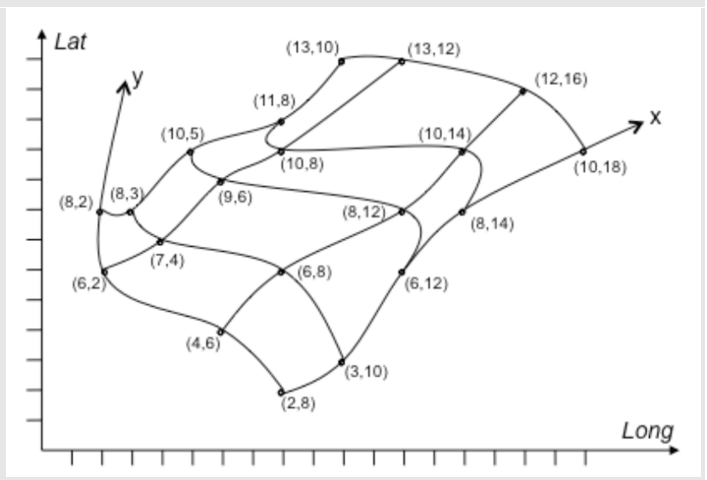

^|(Source: ISO 19136:2007) ^|(Source: GML 3.3.0)

|===
[.text-center]
*Figure 2 – Examples of a rectified grid (left) and a referenceable grid (right)*

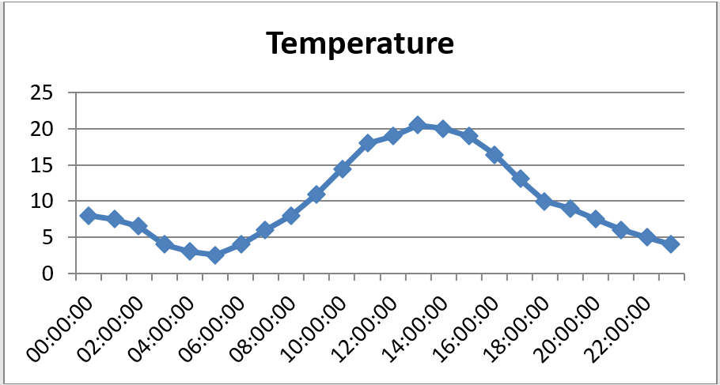

[.text-center]
*Figure 3 – Example of a time series*

=== Application schema Atmospheric Conditions and Meteorological Geographical Features

==== Description

_Identification of meteorological features_

In meteorology there are few objects in the usual (vernacular) meaning of this term, and they are seldom of any significance to the users, which makes the identification of spatial objects not at all straightforward. Therefore the model is based entirely on what could be called an Eulerian approachfootnote:[Cf. http://en.wikipedia.org/wiki/Lagrangian_and_Eulerian_specification_of_the_flow_field], aimed at providing information at specific locations in space and time (past and future). In applications where a Lagrangian approach is appropriate, such as pollution emergencies with plume identification, the underlying information, e.g. concentration of pollutants, will still be exchanged as grids or other point values collection.

===== Narrative description

The Atmospheric Conditions and Meteorological Geographical Features data specification is based on the Observation and Measurements (O&M) conceptual model, defined in ISO 19156:2011, using concepts – together with their associations - defined within INSPIRE Generic Conceptual Model.

ISO 19156:2011 defines the concept of observation, an act that results in the estimation of the value of a feature property using a designated procedure, such as a sensor, instrument, algorithm or process chain. An observation is associated with a discrete time instant or period through which a number, term or other symbol is assigned to a phenomenon. The result of an observation is an estimate of the value of a property of some feature, so the details of the observation are metadata concerning the value of the feature property.

Concepts defined within ISO 19156 and are directly associated with the concept of observation are (see Figure 5):

*Feature of interest*: a real-world object whose properties are under observation, or is a feature in-tended to sample the real-world object.

*Observed Property*: a phenomenon associated with the feature-of-interest for which the observation result provides an estimate of its value.

*Process*: a process (procedure) used to generate the result. A process might be responsible for more than one observation. A description of the observation procedure provides or implies an indication of the reliability or quality of the observation result.

Observation results may have many data-types, including primitive types like category or measure, but also more complex types such as time, location and geometry.

The result-type may be used as a basis for defining specialized observation types. A specialised observation type, defined in O&M model, is the discrete coverage observation whose result is 'coverage', i.e. result values are explicitly associated with specific locations in space and time (see Figure 6).

For applications where an exhaustive observation of environmental parameters is not possible – for example, there is no observation that can provide air temperature values of the whole atmosphere above London – so that spatial sampling strategies need to be involved, considerable flexibility regarding the target of an observation (the 'feature of interest') can be provided by the sampling coverage observation (a specialisation of discrete coverage observation). The feature of interest for a sampling coverage observation is a spatial sampling feature (a concept defined also in O&M model) which de-scribes the applied sampling regime (see Figure 6).

Spatial sampling feature is a specialisation of the generic concept sampling feature, an artefact of the observational strategy which has no significance function outside of its role in the observation process - it is established in order to make observations concerning some domain feature.

Spatial sampling features are useful when observations are made to estimate properties of a geospatial feature such as the atmosphere, in particular where the value of a property varies within the scope of the feature. Spatial sampling features can be specialised according to their shapes: point, curve, surface and solid spatial sampling features (see Figure 5).

The following Figure illustrates the use of concepts: sampling coverage observation, sampling feature and sam-pled feature in an example of time series measurements of air temperature (observed property) at a specific location (a point spatial sampling feature) of the atmosphere above Chilbolton Observatory, UK (sampled feature).

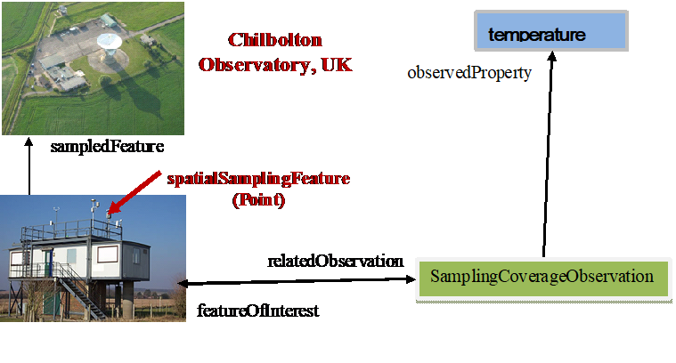

[.text-center]
*Figure 4: Example of time series measurements of air temperature showing the use of the concepts: sampling coverage observation, sampling feature and sampled feature*

Use of this common model allows observation data (either from measurements, model runs or both) using different procedures to be combined unambiguously. Observation details are also important for data discovery and for data quality estimation.

INSPIRE Generic Conceptual Model

Specialised observations defined within INSPIRE Generic Conceptual Model describe elegantly a wide range of data regarding atmospheric conditions or meteorological phenomena. In particular, the specialised observations used in this data specification are (see Figure 9):

*Point observation*: an observation that represents a measurement or estimation of a property at a single point in time and space, e.g. a single temperature measurement at a fixed weather station.

*Point Time Series Observation*: an observation that represents a time-series of point measurements or estimations of a property at a fixed location in space, e.g. measurements made repeatedly by a fixed monitoring instrument.

*Multi Point Observation*: an Observation that represents a set of measurements or estimations all made at exactly the same time but at different locations, e.g. a distributed sensor network reporting the temperature at 10am. The result of this observation is a MultiPointCoverage.

*Grid Observation*: an observation representing a gridded field at a single time instant, e.g. output from a model, or rectified georeferenced satellite data. The result of a Grid Observation is a discrete coverage within a compound spatiotemporal CRS where the domain consists of a two- or three-dimensional grid of points, all having the same time instant temporal component.

*Grid Series Observation*: an observation representing an evolving gridded field at a succession of time instants. A Grid Series Observation is a time series of gridded fields representing the same phenomenon (or phenomena) over a series of time instances. The result of a Grid Series Observation is a discrete coverage within a compound spatiotemporal CRS where the domain consists of a series of two- or three-dimensional grids of points, each at a successive time instant.

*Profile Observation*: an observation representing the estimates of a property along a vertical profile in space at a single time instant.

*Trajectory Observation*: an observation representing the estimates of a property along a meandering curve in time and space, e.g. a Pollutant concentration from a mobile air quality sensor.

[IMPORTANT]
====
[.text-center]
*IR Requirement*
_Annex IV, Section 13.3_
*Theme-specific Requirements*

The observed property of an OM_Observation shall be identified by an identifier from the EU Air Quality Reference Component, the WMO GRIB Code & Flags Table 4.2, the Climate and Forecast Standard Names vocabularies or another appropriate vocabulary.

====

The *observed property* of an observation instance shall be extracted from the codelists CF Standard Names Value, WMO GRIB Table 4.2 Value and EU Air Quality Reference Component Value, de-pending on the need of the application for which the data is produced (see section 5.3.1.2). Following the application schema "Observable properties" of the INSPIRE Generic Conceptual Model the observed property of an observation can be composite, i.e., consisting of two or more observed properties extracted from the above mentioned code lists. Further detail required for the observed property, which are not given by the used code list e.g. daily maximum temperature, shall be provided by the classes Constraint and Statistical Measure (see Figure 7 and Figure 10).

The Directive states that atmospheric data can originate from measurements, models, or post-processed information combining measurement and model output. The "Process" of the INSPIRE Generic Conceptual Model, which specialises the abstract class OM_Process, shall pro-vide information regarding the procedure used to generate the result of an observation (see Figure 8). This set of information consists of the following information pieces: identification, type and further documentation of the applied procedure (online/offline); individual(s) and/or organisation(s) related to the procedure; names of parameters controlling the procedure's output. Typical examples of using the process-Parameter attribute are: description of instrumentation settings for a specific measurement or measurement series; description of initial conditions in numerical computations e.g. simulations. The values of the parameters denoted by the processParameter attribute are stored in the OM_Observation.parameter attribute.

*Spatial/Temporal extent, Quality and additional metadata of data*

The spatial and temporal extents of an observation are provided by the observation's related spatial sampling feature and the OM_Observation attribute phenomenonTime respectively [ISO 19156:2011].

If description of the quality of the observation result is required, it shall be provided by the attribute resultQuality:DQ_Element of the generic class OM_Observation.

Additional information for the observed values could be provided by the ISO 19115 class MD_Metadata.

===== Basic properties

*Observable property external code lists*

Chapter 5.3.3 Code lists provides detailed guidance on the requirements for the provision and maintenance of external code lists by a competent international organisation (the preferred solution), and these organisations have their own governance and version management processes, allowing the code lists to be extended in response to community needs.

The choice of external code list is within the scope of this data specification. It is acknowledged that no single existing external code list sufficiently meets all requirements for AC-MF, but that a number code lists collectively do cover the requirement. Whilst no absolute requirements are placed on the use of particular external code lists, strong recommendations are made.

Meteorological parameters are represented within the AC-MF model through the Observable Property model, which provides the ability to describe statistical properties and constraints. This model includes main three properties for which codelists are required:

* basePhenomenon (also used for constrainedProperty) (e.g. "air_temperature")
* statisticalFunction (e.g. "maximum")
* uom – units of measure (e.g. "K")

Units of measure are managed in a standard way for all INSPIRE themes (using UCUM: _http://unitsofmeasure.org/_), and so are not considered further here.

Statistical function is provide as an INSPIRE-managed codelist as part of the O&M Complex Property model (StatisticalFunctionTypeValue), and so is not considered further here.

For basePhenomenon (and constrainedProperty), it is recommended that meteorological parameters are referenced either as:

* CF Standard Names from the NERC Vocabulary Server
* WMO GRIB parameters from Code Table 4.2 of the GRIB code tables

And that air quality parameters are referenced either as:

* EEA reference air quality components in the codelists on the Eionet Air Quality Portal
* CF Standard Names from the NERC Vocabulary Server

However, it should be noted that the terms for air quality are still under development.

[NOTE]
====
*Recomendation 7*

basePhenomenon should refer to external code lists CF Standard Names, Code Table 4.2 of the WMO GRIB code tables or codelists on the Eionet Air Quality Portal.

====

===== UML Overview

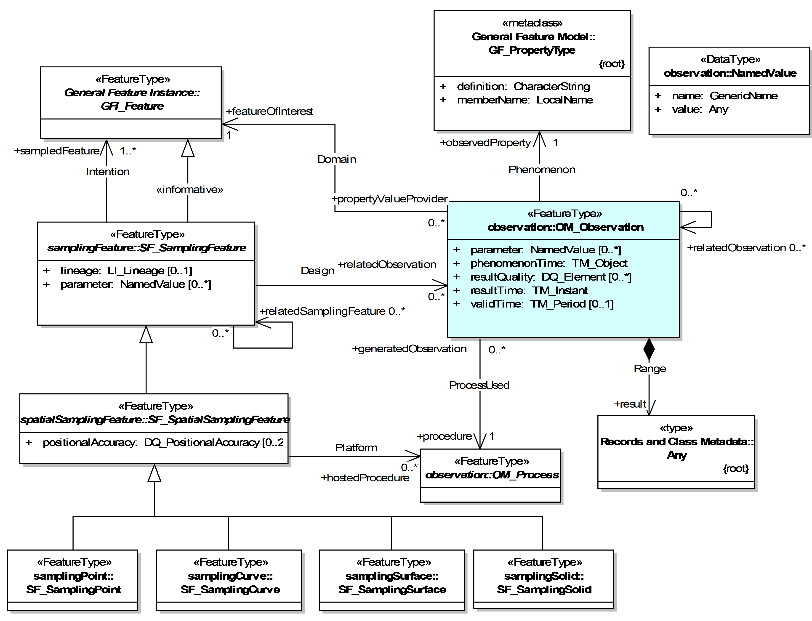

[.text-center]
*Figure 5: Overview of generic Observation concept together with the directly associated concepts FeatureOfInterest, observedProperty, procedure and sampling feature*

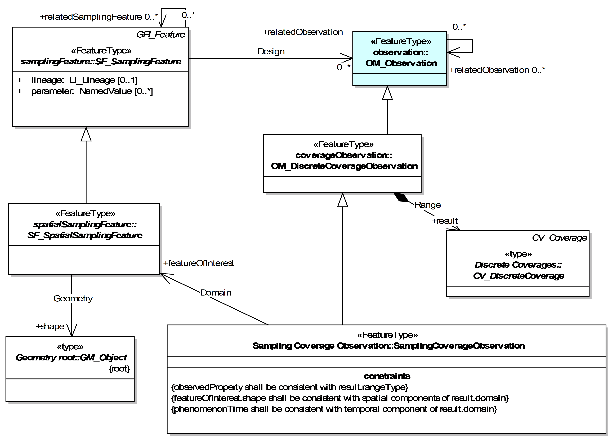

[.text-center]
*Figure 6: The specialised observations OM_DiscreteCoverageObservation and SamplingCoverageObservation of O&M model*

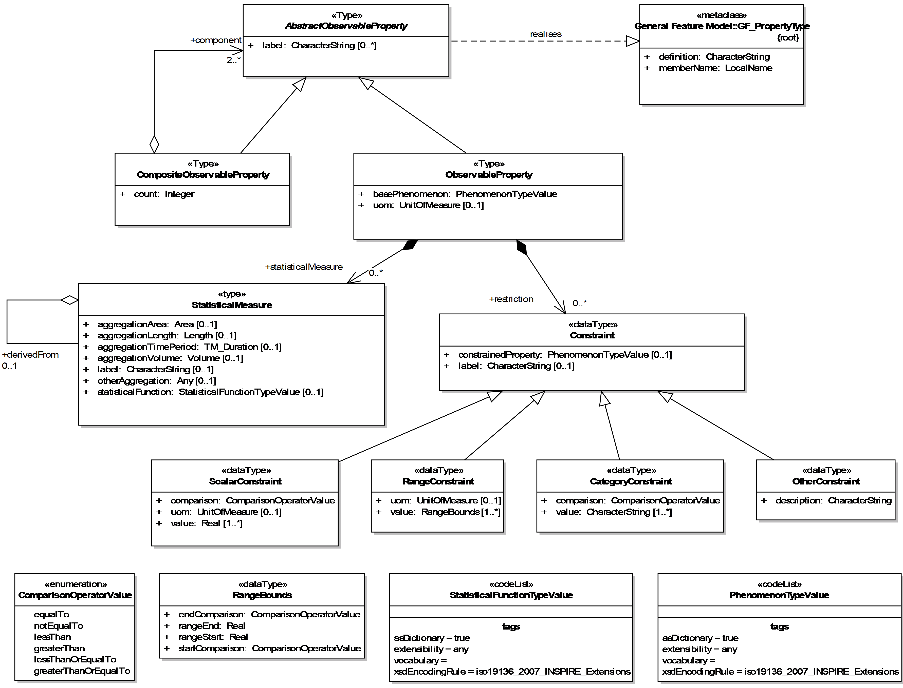

[.text-center]
*Figure 7: The Observable Property Model Process as defined within INSPIRE Generic Conceptual Model*

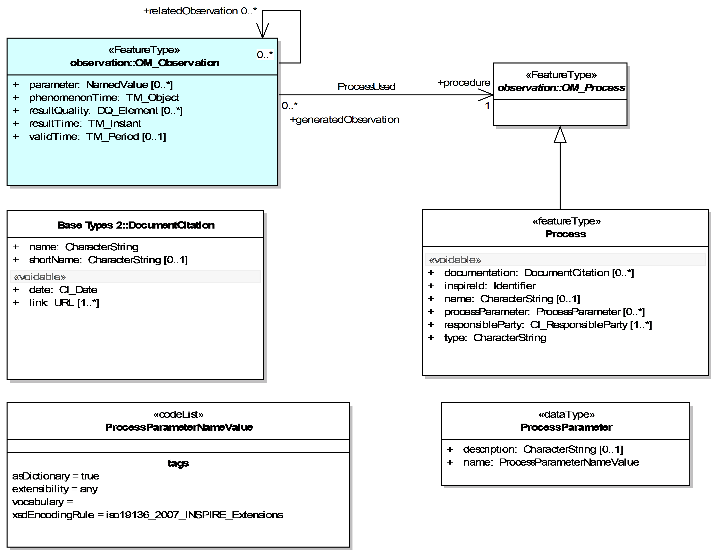
[.text-center]
*Figure 8: The INSPIRE Process as defined within INSPIRE Generic Conceptual Model*

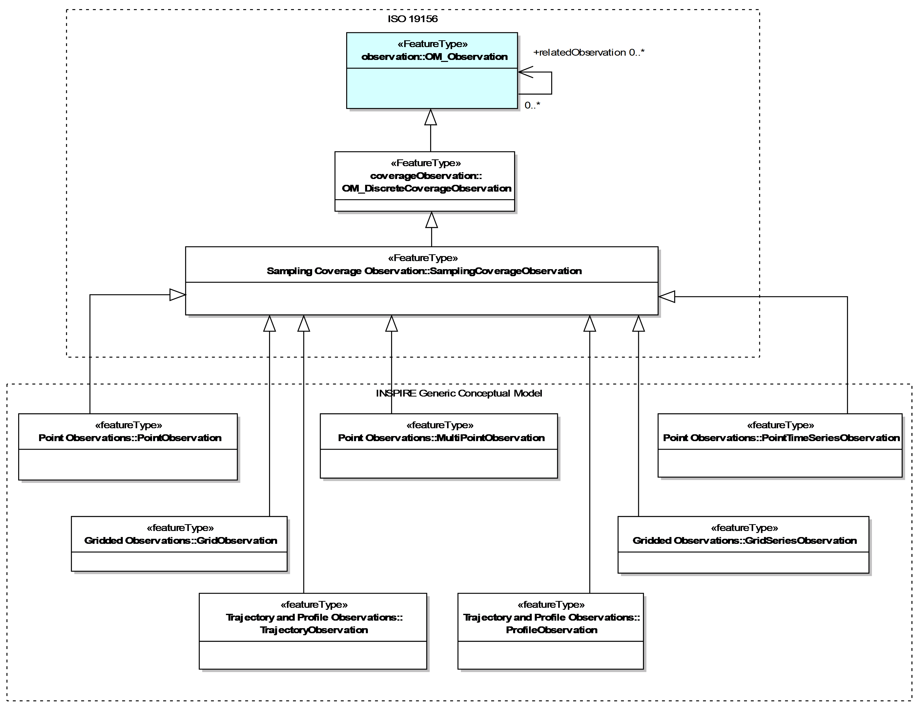
[.text-center]
*Figure 9: The Observation classes used to describe data within AC-MF data specification*

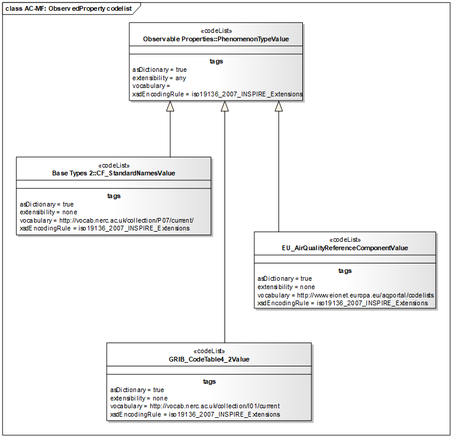
[.text-center]
*Figure 10: Code lists used for AC-MF data specification*

===== Consistency between spatial data sets

Not relevant for AC-MF.

===== Identifier management

Three places were identified in the AC-MF data model where INSPIRE identifiers might be used, but in all three cases it is argued that there is no strong use case for such use, and therefore no requirements are made for such usage; the text below explores the three cases to explain this reasoning.

[upperalpha]
. *INSPIRE identifier for SpecialisedObservations*

INSPIRE identifiers are intended to provide stable, unique references to the data, but SpecialisedObservations are not usually assigned such an identifier, but rather referred to by a combination of their geographic and temporal characteristics. Further, they are often transient (e.g. for real-time data) and may be groups and aggregated in many different ways. They are only usually references in a persistent way through the broader dataset to which they belong, which is described by the dataset-level metadata.

[upperalpha, start=2]
. *Geographic identifiers*

Where relevant, geographic identifiers are related to features of interest and/or sampling features, such as observing stations, administrative units, and transport network. Geographic identifiers could be a WMO station identifier (i.e. "07481"), an ICAO identifier (i.e. "LFLL"), geographic names (i.e. "LYON ST EXUPERY"), or any other local identifiers (i.e. French INSEE number: "69299001") provided there is a recognized authority (like the WMO, INSPIRE, etc) in charge of the identifier management. However, in all these cases, these identifiers are covered by other INSPIRE themes.

If a precise reference to a geographic identifier is required, this should be realised by a link to the relevant thematic data model. In most cases this would be specified in feature of interest and/or sampling features. However, a special example is the link to Environmental Monitoring Facilities to provide information on an observing site, which could be realised in one of two ways:

* If the SpecialisedObservation is of prime importance, the observing station can be referenced as a link to EF via Process;
* If the observing station is of prime importance, then this should be specified under the EF data model, with the SpecialisedObservations linked hasObservation association (see air quality use case example).

Where a precise reference to a geographic identifier is not essential, but adds useful reference information about the observation, it can be include as part of the free-text "name" property of the Process (see below).

[upperalpha, start=3]
. *Process identifier*

Although Process has an INSPIRE identifier (which is voidable), there is no special requirement to provide this for AC-MF. Instead it is suggested that property "name" property is used to hold information on the process (and the observing site) that may be informative. For example for the long time series of observations at Aberporth, might be assigned the name "Climatological observation record for WMO station 03502 (Aberporth)".

===== Geometry representation

Art. 12(1) of Regulation 1089/2010 restricts the value domain of spatial properties to the Simple Feature spatial schema as defined in the _OpenGIS® Implementation Standard for Geographic information – Simple feature access – Part 1: Common architecture, version 1.2.1_, unless specified otherwise for a specific spatial data theme or type.

==== Feature catalogue

*Feature catalogue metadata*

[width="100%",cols="34%,66%"]
|===
|Application Schema |INSPIRE Application Schema Atmospheric Conditions and Meteorological Geographical Features
|Version number |3.0
|===

*Types defined in the feature catalogue*

[width="100%",cols="42%,43%,15%",options="header",]
|===
|*Type* |*Package* |*Stereotypes*
|_EU_AirQualityReferenceComponentValue_ |Atmospheric Conditions and Meteorological Geographical Features |«codeList»
|_GRIB_CodeTable4_2Value_ |Atmospheric Conditions and Meteorological Geographical Features |«codeList»
|===

===== Code lists

====== EU_AirQualityReferenceComponentValue

[width="100%",cols="100%",options="header",]
|===
|*EU_AirQualityReferenceComponentValue*
a|
[width="100%",cols=","]
!===
!Name: !EU Air Quality Reference Component Value
!Definition: !Definitions of phenomena regarding air quality in the context of reporting under Union legislation.
!Extensibility: !any
!Identifier: !http://www.eionet.europa.eu/aqportal/codelists
!Values: !The allowed values for this code list comprise any values defined by data providers.
!===

|===

====== GRIB_CodeTable4_2Value

[width="100%",cols="100%",options="header",]
|===
|*GRIB_CodeTable4_2Value*
a|
[width="100%",cols=","]
!===
!Name: !WMO GRIB Code Table Table 4_2 Value
!Definition: !Definitions of phenomena observed in meteorology.
!Extensibility: !any
!Identifier: !http://vocab.nerc.ac.uk/collection/I01/current
!Values: !The allowed values for this code list comprise any values defined by data providers.
!===

|===

INSPIRE governed code lists are given in the INSPIRE Registry.

==== Externally governed code lists

The externally governed code lists included in this application schema are specified in the tables in this section.

===== Governance and authoritative source

[width="100%",cols="20%,17%,63%",options="header",]
|===
|*Code list* |*Governance* |*Authoritative Source 
(incl. version*footnote:[If no version or publication date are specified, the "latest available version" shall be used.] *and relevant subset, where applicable)*
|CF_StandardNamesValue |CF Govern-ance Com-mittee and CF Standard Names Committe (representa-tives from multiple data centres) |British Oceanographic Data Centre
|EU_AirQualityReferenceComponentValue |European Environment Agency |European Environment Agency
|GRIB_CodeTable4_2Value |WMO InterProgramme Expert Team on data Codes & Representations (IPET-DRC) |World Meteorological Organisation
|GRIB_CodeTable4_201Value |WMO InterProgramme Expert Team on data Codes & Representations (IPET-DRC) |World Meteorological Organisation
|===

===== Availability

[width="100%",cols="20%,65%,15%",options="header",]
|===
|*Code list* |*Availability* |*Format*
|CF_StandardNamesValue |_http://vocab.nerc.ac.uk/collection/P07/current/_ 
_http://cf-pcmdi.llnl.gov/documents/cf-standard-names_ |SKOS/RDF, XML, HTML
|EU_AirQualityReferenceComponentValue |_http://www.eionet.europa.eu/aqportal/codelists_ |SKOS/RDF, XML, HTML
|GRIB_CodeTable4_2Value |_http://vocab.nerc.ac.uk/collection/I01/current_ 
_http://www.wmo.int/pages/prog/www/WMOCodes/WMO306_vI2/LatestVERSION/LatestVERSION.html_ |SKOS/RDF, PDF, Zip of XML
|GRIB_CodeTable4_201Value |_http://vocab.nerc.ac.uk/collection/I02/current_ 
_http://www.wmo.int/pages/prog/www/WMOCodes/WMO306_vI2/LatestVERSION/LatestVERSION.html_ |SKOS/RDF, PDF, Zip of XML
|===

===== Rules for code list values

[width="100%",cols="20%,26%,54%",options="header",]
|===
|*Code list* |*Identifiers* |*Examples*
|CF_StandardNamesValue |n/a |_http://vocab.nerc.ac.uk/collection/P07/current/CFSN0413_
|EU_AirQualityReferenceComponentValue | |
|GRIB_CodeTable4_2Value |n/a |_http://vocab.nerc.ac.uk/collection/I01/current/0.1.1_
|GRIB_CodeTable4_201Value |n/a |_http://vocab.nerc.ac.uk/collection/I02/current/5_
|===

[width="100%",cols="19%,36%,45%",options="header",]
|===
|*Code list* |*Labels* |*Examples*
|CF_StandardNamesValue |The string contained in SKOS preflabel e.g <skos:prefLabel>relative_humidity</skos:prefLabel> |relative_humidity used for relative humidity
|EU_AirQualityReferenceComponentValue | |
|GRIB_CodeTable4_2Value |The string contained in SKOS preflabel e.g <skos:prefLabel xml:lang="en">Snow depth</skos:prefLabel> |Snow depth used for snow depth
|GRIB_CodeTable4_201Value |The string contained in SKOS preflabel e.g <skos:prefLabel>Snow</skos:prefLabel> |Snow
|===

<<<
== Reference systems, units of measure and grids

=== Default reference systems, units of measure and grid

The reference systems, units of measure and geographic grid systems included in this sub-section are the defaults to be used for all INSPIRE data sets, unless theme-specific exceptions and/or additional requirements are defined in section 6.2.

==== Coordinate reference systems

===== Datum

[IMPORTANT]
====
[.text-center]
*IR Requirement*
_Annex II, Section 1.2_
*Datum for three-dimensional and two-dimensional coordinate reference systems*

For the three-dimensional and two-dimensional coordinate reference systems and the horizontal component of compound coordinate reference systems used for making spatial data sets available, the datum shall be the datum of the European Terrestrial Reference System 1989 (ETRS89) in areas within its geographical scope, or the datum of the International Terrestrial Reference System (ITRS) or other geodetic coordinate reference systems compliant with ITRS in areas that are outside the geographical scope of ETRS89. Compliant with the ITRS means that the system definition is based on the definition of the ITRS and there is a well documented relationship between both systems, according to EN ISO 19111.

====

===== Coordinate reference systems

[IMPORTANT]
====
[.text-center]
*IR Requirement*
_Annex II, Section 1.3_
*Coordinate Reference Systems*

Spatial data sets shall be made available using at least one of the coordinate reference systems specified in sections 1.3.1, 1.3.2 and 1.3.3, unless one of the conditions specified in section 1.3.4 holds.

*1.3.1. Three-dimensional Coordinate Reference Systems*

* Three-dimensional Cartesian coordinates based on a datum specified in 1.2 and using the parameters of the Geodetic Reference System 1980 (GRS80) ellipsoid.
* Three-dimensional geodetic coordinates (latitude, longitude and ellipsoidal height) based on a datum specified in 1.2 and using the parameters of the GRS80 ellipsoid.

*1.3.2. Two-dimensional Coordinate Reference Systems*

* Two-dimensional geodetic coordinates (latitude and longitude) based on a datum specified in 1.2 and using the parameters of the GRS80 ellipsoid.
* Plane coordinates using the ETRS89 Lambert Azimuthal Equal Area coordinate reference system.
* Plane coordinates using the ETRS89 Lambert Conformal Conic coordinate reference system.
* Plane coordinates using the ETRS89 Transverse Mercator coordinate reference system.

*1.3.3. Compound Coordinate Reference Systems*

--
. For the horizontal component of the compound coordinate reference system, one of the coordinate reference systems specified in section 1.3.2 shall be used.

. For the vertical component, one of the following coordinate reference systems shall be used:
--

* For the vertical component on land, the European Vertical Reference System (EVRS) shall be used to express gravity-related heights within its geographical scope. Other vertical reference systems related to the Earth gravity field shall be used to express gravity-related heights in areas that are outside the geographical scope of EVRS.
* For the vertical component in the free atmosphere, barometric pressure, converted to height using ISO 2533:1975 International Standard Atmosphere, or other linear or parametric reference systems shall be used. Where other parametric reference systems are used, these shall be described in an accessible reference using EN ISO 19111-2:2012.
* For the vertical component in marine areas where there is an appreciable tidal range (tidal waters), the Lowest Astronomical Tide (LAT) shall be used as the reference surface.
* For the vertical component in marine areas without an appreciable tidal range, in open oceans and effectively in waters that are deeper than 200 meters, the Mean Sea Level (MSL) or a well-defined reference level close to the MSL shall be used as the reference surface.

*1.3.4. Other Coordinate Reference Systems*

Exceptions, where other coordinate reference systems than those listed in 1.3.1, 1.3.2 or 1.3.3 may be used, are:

. Other coordinate reference systems may be specified for specific spatial data themes in this Annex.

. For regions outside of continental Europe, Member States may define suitable coordinate reference systems.

The geodetic codes and parameters needed to describe these coordinate reference systems and to allow conversion and transformation operations shall be documented and an identifier shall be created, according to EN ISO 19111 and ISO 19127.

====

===== Display

[IMPORTANT]
====
[.text-center]
*IR Requirement*
_Annex II, Section 1.4_
*Coordinate Reference Systems used in the View Network Service*

For the display of spatial data sets with the view network service as specified in Regulation No 976/2009, at least the coordinate reference systems for two-dimensional geodetic coordinates (latitude, longitude) shall be available.

====

===== Identifiers for coordinate reference systems

[IMPORTANT]
====
[.text-center]
*IR Requirement*
_Annex II, Section 1.4_
*Coordinate Reference Systems used in the View Network Service*

. Coordinate reference system parameters and identifiers shall be managed in one or several common registers for coordinate reference systems.

. Only identifiers contained in a common register shall be used for referring to the coordinate reference systems listed in this Section.

====

These Technical Guidelines propose to use the http URIs provided by the Open Geospatial Consortium as coordinate reference system identifiers (see identifiers for the default CRSs below). These are based on and redirect to the definition in the EPSG Geodetic Parameter Registry (_http://www.epsg-registry.org/_).

[TIP]
====
*TG Requirement 2*

The identifiers listed in Table 2 shall be used for referring to the coordinate reference systems used in a data set.

====

NOTE CRS identifiers may be used e.g. in:

* data encoding,
* data set and service metadata, and
* requests to INSPIRE network services.

[.text-center]
*Table 2. http URIs for the default coordinate reference systems*

[align=center,width="100%",cols="37%,20%,43%",options="header",]
|===
|*Coordinate reference system* |*Short name* |*http URI identifier*
|3D Cartesian in ETRS89 |ETRS89-XYZ |_http://www.opengis.net/def/crs/EPSG/0/4936_
|3D geodetic in ETRS89 on GRS80 |ETRS89-GRS80h |_http://www.opengis.net/def/crs/EPSG/0/4937_
|2D geodetic in ETRS89 on GRS80 |ETRS89-GRS80 |_http://www.opengis.net/def/crs/EPSG/0/4258_
|2D LAEA projection in ETRS89 on GRS80 |ETRS89-LAEA |_http://www.opengis.net/def/crs/EPSG/0/3035_
|2D LCC projection in ETRS89 on GRS80 |ETRS89-LCC |_http://www.opengis.net/def/crs/EPSG/0/3034_
|2D TM projection in ETRS89 on GRS80, zone 26N (30°W to 24°W) |ETRS89-TM26N |_http://www.opengis.net/def/crs/EPSG/0/3038_
|2D TM projection in ETRS89 on GRS80, zone 27N (24°W to 18°W) |ETRS89-TM27N |_http://www.opengis.net/def/crs/EPSG/0/3039_
|2D TM projection in ETRS89 on GRS80, zone 28N (18°W to 12°W) |ETRS89-TM28N |_http://www.opengis.net/def/crs/EPSG/0/3040_
|2D TM projection in ETRS89 on GRS80, zone 29N (12°W to 6°W) |ETRS89-TM29N |_http://www.opengis.net/def/crs/EPSG/0/3041_
|2D TM projection in ETRS89 on GRS80, zone 30N (6°W to 0°) |ETRS89-TM30N |_http://www.opengis.net/def/crs/EPSG/0/3042_
|2D TM projection in ETRS89 on GRS80, zone 31N (0° to 6°E) |ETRS89-TM31N |_http://www.opengis.net/def/crs/EPSG/0/3043_
|2D TM projection in ETRS89 on GRS80, zone 32N (6°E to 12°E) |ETRS89-TM32N |_http://www.opengis.net/def/crs/EPSG/0/3044_
|2D TM projection in ETRS89 on GRS80, zone 33N (12°E to 18°E) |ETRS89-TM33N |_http://www.opengis.net/def/crs/EPSG/0/3045_
|2D TM projection in ETRS89 on GRS80, zone 34N (18°E to 24°E) |ETRS89-TM34N |_http://www.opengis.net/def/crs/EPSG/0/3046_
|2D TM projection in ETRS89 on GRS80, zone 35N (24°E to 30°E) |ETRS89-TM35N |_http://www.opengis.net/def/crs/EPSG/0/3047_
|2D TM projection in ETRS89 on GRS80, zone 36N (30°E to 36°E) |ETRS89-TM36N |_http://www.opengis.net/def/crs/EPSG/0/3048_
|2D TM projection in ETRS89 on GRS80, zone 37N (36°E to 42°E) |ETRS89-TM37N |_http://www.opengis.net/def/crs/EPSG/0/3049_
|2D TM projection in ETRS89 on GRS80, zone 38N (42°E to 48°E) |ETRS89-TM38N |_http://www.opengis.net/def/crs/EPSG/0/3050_
|2D TM projection in ETRS89 on GRS80, zone 39N (48°E to 54°E) |ETRS89-TM39N |_http://www.opengis.net/def/crs/EPSG/0/3051_
|Height in EVRS |EVRS |_http://www.opengis.net/def/crs/EPSG/0/5730_
|3D compound: 2D geodetic in ETRS89 on GRS80, and EVRS height |ETRS89-GRS80-EVRS |_http://www.opengis.net/def/crs/EPSG/0/7409_
|===

==== Temporal reference system

[IMPORTANT]
====
[.text-center]
*IR Requirement*
_Article 11_
*Temporal Reference Systems*

. The default temporal reference system referred to in point 5 of part B of the Annex to Commission Regulation (EC) No 1205/2008 (footnote:[OJ L 326, 4.12.2008, p. 12.]) shall be used, unless other temporal reference systems are specified for a specific spatial data theme in Annex II.

====

NOTE 1 Point 5 of part B of the Annex to Commission Regulation (EC) No 1205/2008 (the INSPIRE Metadata IRs) states that the default reference system shall be the Gregorian calendar, with dates expressed in accordance with ISO 8601.

NOTE 2 ISO 8601 _Data elements and interchange formats – Information interchange – Representation of dates and times_ is an international standard covering the exchange of date and time-related data. The purpose of this standard is to provide an unambiguous and well-defined method of representing dates and times, so as to avoid misinterpretation of numeric representations of dates and times, particularly when data is transferred between countries with different conventions for writing numeric dates and times. The standard organizes the data so the largest temporal term (the year) appears first in the data string and progresses to the smallest term (the second). It also provides for a standardized method of communicating time-based information across time zones by attaching an offset to Coordinated Universal Time (UTC).

EXAMPLE 1997 (the year 1997), 1997-07-16 (16^th^ July 1997), 1997-07-16T19:20:3001:00 (16^th^ July 1997, 19h 20' 30'', time zone: UTC1)

==== Units of measure

[IMPORTANT]
====
[.text-center]
*IR Requirement*
_Article 12_
*Other Requirements & Rules*

(...)

[arabic, start=2]
. All measurement values shall be expressed using SI units or non-SI units accepted for use with the International System of Units, unless specified otherwise for a specific spatial data theme or type.

====

==== Grids

[IMPORTANT]
====
[.text-center]
*IR Requirement*
_Annex II, Section 2.2_
*Grids*

Either of the grids with fixed and unambiguously defined locations defined in Sections 2.2.1 and 2.2.2 shall be used as a geo-referencing framework to make gridded data available in INSPIRE, unless one of the following conditions holds:

. Other grids may be specified for specific spatial data themes in Annexes II-IV. In this case, data exchanged using such a theme-specific grid shall use standards in which the grid definition is either included with the data, or linked by reference.

. For grid referencing in regions outside of continental Europe Member States may define their own grid based on a geodetic coordinate reference system compliant with ITRS and a Lambert Azimuthal Equal Area projection, following the same principles as laid down for the grid specified in Section 2.2.1. In this case, an identifier for the coordinate reference system shall be created.

*2.2 Equal Area Grid*

The grid is based on the ETRS89 Lambert Azimuthal Equal Area (ETRS89-LAEA) coordinate reference system with the centre of the projection at the point 52^o^ N, 10^o^ E and false easting: x~0~ = 4321000 m, false northing: y~0~ = 3210000 m.

The origin of the grid coincides with the false origin of the ETRS89-LAEA coordinate reference system (x=0, y=0).

Grid points of grids based on ETRS89-LAEA shall coincide with grid points of the grid.

The grid is hierarchical, with resolutions of 1m, 10m, 100m, 1000m, 10000m and 100000m.

The grid orientation is south-north, west-east.

The grid is designated as Grid_ETRS89-LAEA. For identification of an individual resolution level the cell size in metres is appended.

For the unambiguous referencing and identification of a grid cell, the cell code composed of the size of the cell and the coordinates of the lower left cell corner in ETRS89-LAEA shall be used. The cell size shall be denoted in metres ("m") for cell sizes up to 100m or kilometres ("km") for cell sizes of 1000m and above. Values for northing and easting shall be divided by 10^n^, where _n_ is the number of trailing zeros in the cell size value.

====

=== Theme-specific requirements and recommendations

==== Coordinate reference systems

Other horizontal and vertical coordinate reference systems than those listed above may only be used for data sets containing data with position outside the continental Europe. The geodetic codes and parameters for these coordinate reference systems should be documented, and an identifier should be created, according to EN ISO 19111, ISO 19111-2, which is relevant to parametric coordinates and ISO 19127. Note: WMO Commission on Basic Systems (CBS-Ext.(06) Seoul 2006) recommended that the World Geodetic System 1984 (WGS 84) be used as the primary reference for horizontal positioning and the Earth Geodetic Model - EGM-96 be used as the fixed reference model for mean sea level determination.

[NOTE]
====
*Recomendation 8*

Thematic horizontal and vertical coordinate reference systems should be documented, and an identifier should be created according to EN ISO 19111, ISO 19111-2 and ISO 19127.

====

The justifications for extending vertical coordinate reference systems are:

* Meteorological observed properties vary greatly close to the ground. Converted to heights using ISO 2533:1975 International Standard Atmosphere lack the precision for e.g. altitude of wind speed data near ground level. WMO code tables support altitude above ground.
* The original list of vertical coordinates reference systems refer to free atmosphere where the effect of the surface is negligible. However, many meteorological data sets contain data for altitudes where the effects of surface fluxes cannot be ignored. WMO code tables apply also to data that are below the free atmosphere.
* Some applications require data sets with vertical component expressed with hybrid-levels or pressure-levels rather than altitude/height. Without those, data ingestion becomes more complex for e.g. atmospheric transport models and other environmental models that operate directly on hybrid level data. Here, WMO code tables support hybrid level data.
* Plotting of meteorological charts often requires pressure-levels rather than converted altitudes. WMO code tables support all commonly used vertical discretization schemes.

Some data sets describe atmospheric phenomena, e.g. cloud cover, with no precise altitude information. WMO code tables should be used in these cases.

[NOTE]
====
*Recomendation 9*

Where reference systems are not explicitly defined, WMO definitions should be used.

====

Note: Although WMO definitions are not currently standardised to ISO (for example to ISO feature catalogue form), they describe ~1500 different 'features'.

==== Grids

[IMPORTANT]
====
[.text-center]
*IR Requirement*
_Annex IV, Section 13.3_
*Theme-specific Requirements*

. By way of derogation from the requirements of Section 2.2 of Annex II, gridded data related to the themes Atmospheric Conditions and Meteorological Geographical Features may be made available using any appropriate grid.

====

<<<
== Data quality

This chapter includes a description of the data quality elements and sub-elements as well as the corresponding data quality measures that should be used to evaluate and document data quality for data sets related to the spatial data theme _Atmospheric Conditions and Meteorological Geographical Features_ (section 7.4).

It may also define requirements or recommendations about the targeted data quality results applicable for data sets related to the spatial data theme _Atmospheric Conditions and Meteorological Geographical Features_ (sections 7.5 and 7.6).

In particular, the data quality elements, sub-elements and measures specified in section 7.4 should be used for

* evaluating and documenting data quality properties and constraints of spatial objects, where such properties or constraints are defined as part of the application schema(s) (see section 5);
* evaluating and documenting data quality metadata elements of spatial data sets (see section 8); and/or
* specifying requirements or recommendations about the targeted data quality results applicable for data sets related to the spatial data theme _Atmospheric Conditions and Meteorological Geographical Features_ (see sections 7.5 and 7.6).

The descriptions of the elements and measures are based on Annex D of ISO/DIS 19157 Geographic information – Data quality.

=== WMO operational quality procedures

Almost all WMO data quality issues are process based and ultimately refer to documents specifying WMO regulations and other descriptive documents summarized in section 7.2. WMO regulations apply globally, and not just to WMO Member States who are also EC Member States.

Meteorological measurements compliant with WMO regulations go through operational procedures:

[loweralpha]
. To ensure the best possible quality of the data which are used in the real-time operations;
. In non-real time, to protect and improve the quality and integrity of data destined for storage and retrieval;
. To provide the basis for feedback of information on errors and questionable data to the source of the data.

Minimum standards for quality control of data apply to all WMO operational centres (cf. _Manual on the Global Data-processing and Forecasting System, WMO-No. 485_). They include quality control at various stages of processing. They apply to both real-time and non-real-time processing and lead to various records of quality-control actions. WMO also establishes standard operating and quality control procedures for atmospheric composition measurements (cf. WMO Global Atmosphere Watch (GAW) report series).

Checking includes:

* Detection of missing data at centres
* Adherence to prescribed coding formats
* Internal consistency
* Time consistency
* Space consistency
* Physical and Climatological limits

Records to be maintained include:

* Information to identify source of data such as station, aircraft, ship
* Type of deficiency (non-receipt, incomplete or incorrect reports, etc.)
* Identification of deficient element (whole report, specific parameter, etc.)
* Frequency of occurrence of data deficiencies (according to station type and element)

In non real time, checking includes in addition:

* Review of recorded data in comparison with observations
* Inter-comparison of parameters and calculations
* Check of supplementary data
* Check of extreme values

These quality reports are often held locally and not distributed with the data, which may be distributed worldwide. There is no requirement to collect and distribute this information – which would be new collections of data quality. Very few datasets relevant to this theme will hold or link to this quality data.

Similarly, numerical model output goes through thorough and systematic evaluation and quality assessment. Standard procedures have been developed for the production and exchange of verification results.

The question of the quality of meteorological data is closely related to its representivity. Depending on the way in which it is generated, the representivity of meteorological data can vary to a very large extent:

* in space:
** local representativeness, ranging from a few m^2^ to a few km^2^ at most, over very homogeneous terrain
** wider area representativeness, up to ~100 km^2^ or more
* in time:
** so-called instantaneous data (i.e. a few seconds)
** average (or other statistical combinations) over periods of hours, days, months, etc.

Local data come from in-situ measurements and are available only for the locations of observing sites; area representative data come mainly from

* numerical models, available for all locations
* and remote-sensing (satellite based or not).

The WMO quality assurance process is very comparable to the ISO 19158 standard on quality control accreditation for data supply. For each Member as a supplier of observational and forecast data, WMO acts as the client encompassing all other Members. WMO defines the observing standards and the quality control processes at each stage of the data collection and dissemination process by which the data is distributed around the world.

As meteorological observations are transitory there is seldom any opportunity to perform repeat observations. Many of the Data Quality Classes of ISO 19157 are either not relevant, or rather the quality measures required are process based using non-quantitative standards and have only descriptive results referenced to WMO regulations and guides. Quantitative quality measures in WMO are usually post-facto tasks of monitoring and verification. The monitoring process studies the availability, timeliness and quality of data with respect to easily detectable errors. Verification involves matching observations with forecast values from numerical models in a cross validation exercise. Both are separate data gathering and product generation processes in slow time, which generate large amounts of new data.

=== WMO regulations on data quality

WMO regulations on data quality are included as sub-topics in a number of different WMO standards documents (there is no single WMO data quality reference document):

* The Guide on the Global Data-processing System (WMO-No. 305) Chapter 6 is the authoritative reference on all matters related to quality control procedures.
* Observational data are collected to quality standards declared in the WMO Guide to Meteorological Instruments and Methods of Observation (WMO-No. 8 (Seventh edition 2008)).
* In the Manual on the GOS (WMO-No 544 Volume 1 Global Aspects Part V Quality Control), WMO recommends that rigorous quality control should be exercised at all stages, including periodic calibration, validation and maintenance of the equipment in order to maintain the quality of the observations.
* The Manual on the Global Data-processing and Forecasting System (Volume I Global Aspects WMO-No. 485) in Part II Section 2 defines the responsibilities and minimum standards of Quality Control at GDPFS Centres in real- and non-real-time.
* Guidelines on quality management procedures and practices for Public Weather Services (WMO/TD No. 1256), 2005 extends the quality aspects to the delivery of data and weather information outside the meteorological community.
* The series of Global Atmosphere Watch (GAW) Research and monitoring reports (e.g. Quality Assurance Project Plan (QAPjP) for Continuous Ground Based Ozone Measurements (WMO TD No. 634) define the quality control procedures for atmospheric composition measurements.

There is also European legislation covering air quality;

* Directive 2008/50/EC of the European Parliament and of the Council of 21 May 2008 on ambient air quality and cleaner air for Europe defines data quality objectives in Annex 1 (http://eur-lex.europa.eu/LexUriServ/LexUriServ.do?uri=CELEX:32008L0050:EN:NOT)

=== Quality recommendation 

For WMO and non-WMO derived data, the general principles are likely to hold:

* datasets will not be able to repeat measurements
* quality measures are descriptive, and qualitative, not quantitative.
* in case quality reports are available they are not collected and distributed on a regular basis.

Therefore, we recommend the following:

[NOTE]
====
*Recomendation 10*

For WMO based data the quality metadata should refer to the qualitative process based WMO regulations for data quality

====

[NOTE]
====
*Recomendation 11*

For non-WMO based data the quality metadata should refer to a statement of quality processes used by the producer.

====

=== Data quality elements

Table 3 lists all data quality elements and sub-elements that are being used in this specification. Data quality information can be evaluated at level of spatial object, spatial object type, dataset or dataset series. The level at which the evaluation is performed is given in the "Evaluation Scope" column.

The measures to be used for each of the listed data quality sub-elements are defined in the following sub-sections.

[.text-center]
*Table 3 – Data quality elements used in the spatial data theme _Atmospheric Conditions and Meteorological Geographical Features_*

[align=center,width="100%",cols="12%,18%,15%,38%,17%",options="header",]
|===
|*Section* |*Data quality element* |*Data quality sub-element* |*Definition* |*Evaluation Scope*
|7.4.1 |Logical consistency |Conceptual consistency |adherence to rules of the conceptual schema |dataset series; dataset; spatial object type; spatial object
|7.4.2 |Logical consistency |Domain consistency |adherence of values to the value domains |dataset series; dataset; spatial object type; spatial object
|===

[NOTE]
====
*Recomendation 12*

Where it is impossible to express the evaluation of a data quality element in a quantitative way, the evaluation of the element should be expressed with a textual statement as a data quality descriptive result.

====

==== Logical consistency – Conceptual consistency

The Application Schema conformance class of the Abstract Test Suite in Annex I defines a number of tests to evaluate the conceptual consistency (tests A.1.1-A.1.9) of a data set.

[NOTE]
====
*Recomendation 13*

For the tests on conceptual consistency, it is recommended to use the _Logical consistency – Conceptual consistency_ data quality sub-element and the measure _Number of items not compliant with the rules of the conceptual schema_ as specified in the table below.

====

[width="100%",cols="34%,66%",]
|===
|*Name* |
|Alternative name |-
|Data quality element |logical consistency
|Data quality sub-element |conceptual consistency
|Data quality basic measure |error count
|Definition |count of all items in the dataset that are not compliant with the rules of the conceptual schema
|Description |If the conceptual schema explicitly or implicitly describes rules, these rules shall be followed. Violations against such rules can be, for example, invalid placement of features within a defined tolerance, duplication of features and invalid overlap of features.
|Evaluation scope |spatial object / spatial object type
|Reporting scope |data set
|Parameter |-
|Data quality value type |integer
|Data quality value structure |-
|Source reference |ISO/DIS 19157 Geographic information – Data quality
|Example |
|Measure identifier |10
|===

==== Logical consistency – Domain consistency

The Application Schema conformance class of the Abstract Test Suite in Annex I defines a number of tests to evaluate the domain consistency (tests A1.10-A.1.12) of a data set.

[NOTE]
====
*Recomendation 14*

For the tests on domain consistency, it is recommended to use the _Logical consistency – Domain consistency_ data quality sub-element and the measure _Number of items not in conformance with their value domain_ as specified in the table below.

====

[width="100%",cols="34%,66%",]
|===
|*Name* |*Number of items not in conformance with their value domain*
|Alternative name |-
|Data quality element |logical consistency
|Data quality sub-element |domain consistency
|Data quality basic measure |error count
|Definition |count of all items in the dataset that are not in conformance with their value domain
|Description |
|Evaluation scope |spatial object / spatial object type
|Reporting scope |data set
|Parameter |-
|Data quality value type |integer
|===

=== Minimum data quality requirements

No minimum data quality requirements are defined for the spatial data theme Atmospheric Conditions and Meteorological Geographical Features.

=== Recommendation on data quality

No minimum data quality recommendations are defined.

<<<
== Dataset-level metadata

This section specifies dataset-level metadata elements, which should be used for documenting metadata for a complete dataset or dataset series.

NOTE Metadata can also be reported for each individual spatial object (spatial object-level metadata). Spatial object-level metadata is fully described in the application schema(s) (section 5).

For some dataset-level metadata elements, in particular those for reporting data quality and maintenance, a more specific scope can be specified. This allows the definition of metadata at sub-dataset level, e.g. separately for each spatial object type (see instructions for the relevant metadata element).

=== Metadata elements defined in INSPIRE Metadata Regulation

Table 4 gives an overview of the metadata elements specified in Regulation 1205/2008/EC (implementing Directive 2007/2/EC of the European Parliament and of the Council as regards metadata).

The table contains the following information:

* The first column provides a reference to the relevant section in the Metadata Regulation, which contains a more detailed description.
* The second column specifies the name of the metadata element.
* The third column specifies the multiplicity.
* The fourth column specifies the condition, under which the given element becomes mandatory.

[.text-center]
*Table 4 – Metadata for spatial datasets and spatial dataset series specified in Regulation 1205/2008/EC*

[align=center,width="100%",cols="17%,28%,15%,40%",options="header",]
|===
|*Metadata Regulation Section* |*Metadata element* |*Multiplicity* |*Condition*
|1.1 |Resource title |1 |
|1.2 |Resource abstract |1 |
|1.3 |Resource type |1 |
|1.4 |Resource locator |0..* |Mandatory if a URL is available to obtain more information on the resource, and/or access related services.
|1.5 |Unique resource identifier |1..* |
|1.7 |Resource language |0..* |Mandatory if the resource includes textual information.
|2.1 |Topic category |1..* |
|3 |Keyword |1..* |
|4.1 |Geographic bounding box |1..* |
|5 |Temporal reference |1..* |
|6.1 |Lineage |1 |
|6.2 |Spatial resolution |0..* |Mandatory for data sets and data set series if an equivalent scale or a resolution distance can be specified.
|7 |Conformity |1..* |
|8.1 |Conditions for access and use |1..* |
|8.2 |Limitations on public access |1..* |
|9 |Responsible organisation |1..* |
|10.1 |Metadata point of contact |1..* |
|10.2 |Metadata date |1 |
|10.3 |Metadata language |1 |
|===

Generic guidelines for implementing these elements using ISO 19115 and 19119 are available at _http://inspire.jrc.ec.europa.eu/index.cfm/pageid/101_. The following sections describe additional theme-specific recommendations and requirements for implementing these elements.

==== Conformity

The _Conformity_ metadata element defined in Regulation 1205/2008/EC requires to report the conformance with the Implementing Rule for interoperability of spatial data sets and services. In addition, it may be used also to document the conformance to another specification.

[NOTE]
====
*Recomendation 15*

Dataset metadata should include a statement on the overall conformance of the dataset with this data specification (i.e. conformance with all requirements).

====

[NOTE]
====
*Recomendation 16*

The _Conformity_ metadata element should be used to document conformance with this data specification (as a whole), with a specific conformance class defined in the Abstract Test Suite in Annex A and/or with another specification.

====

The _Conformity_ element includes two sub-elements, the _Specification_ (a citation of the Implementing Rule for interoperability of spatial data sets and services or other specification), and the _Degree_ of conformity. The _Degree_ can be _Conformant_ (if the dataset is fully conformant with the cited specification), _Not Conformant_ (if the dataset does not conform to the cited specification) or _Not Evaluated_ (if the conformance has not been evaluated).

[NOTE]
====
*Recomendation 17*

If a dataset is not yet conformant with all requirements of this data specification, it is recommended to include information on the conformance with the individual conformance classes specified in the Abstract Test Suite in Annex A.

====

[NOTE]
====
*Recomendation 18*

If a dataset is produced or transformed according to an external specification that includes specific quality assurance procedures, the conformity with this specification should be documented using the _Conformity_ metadata element.

====

[NOTE]
====
*Recomendation 19*

If minimum data quality recommendations are defined then the statement on the conformity with these requirements should be included using the _Conformity_ metadata element and referring to the relevant data quality conformance class in the Abstract Test Suite.

====

NOTE Currently no minimum data quality requirements are included in the IRs. The recommendation above should be included as a requirement in the IRs if minimum data quality requirements are defined at some point in the future.

[NOTE]
====
*Recomendation 20*

When documenting conformance with this data specification or one of the conformance classes defined in the Abstract Test Suite, the _Specification_ sub-element should be given using the http URI identifier of the conformance class or using a citation including the following elements:

* title: "INSPIRE Data Specification on Atmospheric Conditions and Meteorological Geographical Features – Technical Guidelines – <name of the conformance class>"
* date:
** dateType: publication
** date: 2013-02-04

====

EXAMPLE 1: The XML snippets below show how to fill the _Specification_ sub-element for documenting conformance with the whole data specification on Addresses v3.0.1.

[source, xml]
<gmd:DQ_ConformanceResult>
	<gmd:specification href="http://inspire.ec.europa.eu/conformanceClass/ad/3.0.1/tg" />
	<gmd:explanation> (...) </gmd:explanation>
	<gmd:pass> (...) </gmd:pass>
</gmd:DQ_ConformanceResult>

or (using a citation):

[source, xml]
<gmd:DQ_ConformanceResult>
	<gmd:specification>
		<gmd:CI_Citation>
			<gmd:title>
				<gco:CharacterString>INSPIRE Data Specification on Atmospheric Conditions and Meteorological Geographical Features – Technical Guidelines</gco:CharacterString>
			</gmd:title>
			<gmd:date>
				<gmd:date>
					<gco:Date>2013-02-04</gco:Date>
				</gmd:date>
				<gmd:dateType>
					<gmd:CI_DateTypeCode codeList="http://standards.iso.org/ittf/PubliclyAvailableStandards/ISO_19139_Schemas/resou
rces/Codelist/ML_gmxCodelists.xml#CI_DateTypeCode" codeListValue="publication">publication</gmd:CI_DateTypeCode>
				</gmd:dateType>
			</gmd:date>
		</gmd:CI_Citation>
	</gmd:specification>
	<gmd:explanation> (...) </gmd:explanation>
	<gmd:pass> (...) </gmd:pass>
</gmd:DQ_ConformanceResult>

EXAMPLE 2: The XML snippets below show how to fill the _Specification_ sub-element for documenting conformance with the CRS conformance class of the data specification on Addresses v3.0.1.

[source, xml]
<gmd:DQ_ConformanceResult>
	<gmd:specification href="http://inspire.ec.europa.eu/conformanceClass/ad/3.0.1/crs" />
	<gmd:explanation> (...) </gmd:explanation>
	<gmd:pass> (...) </gmd:pass>
</gmd:DQ_ConformanceResult>

or (using a citation):

[source, xml]
<gmd:DQ_ConformanceResult>
	<gmd:specification>
		<gmd:CI_Citation>
			<gmd:title>
				<gco:CharacterString>INSPIRE Data Specification on Atmospheric Conditions and Meteorological Geographical Features – Technical Guidelines – CRS</gco:CharacterString>
			</gmd:title>
			<gmd:date>
				<gmd:date>
					<gco:Date>2013-02-04</gco:Date>
				</gmd:date>
				<gmd:dateType>
					<gmd:CI_DateTypeCode codeList="http://standards.iso.org/ittf/PubliclyAvailableStandards/ISO_19139_Schemas/resou
rces/Codelist/ML_gmxCodelists.xml#CI_DateTypeCode" codeListValue="publication">publication</gmd:CI_DateTypeCode>
				</gmd:dateType>
			</gmd:date>
		</gmd:CI_Citation>
	</gmd:specification>
	<gmd:explanation> (...) </gmd:explanation>
	<gmd:pass> (...) </gmd:pass>
</gmd:DQ_ConformanceResult>

==== Lineage

[NOTE]
====
*Recomendation 21*

Following the ISO/DIS 19157 Quality principles, if a data provider has a procedure for the quality management of their spatial data sets then the appropriate data quality elements and measures defined in ISO/DIS 19157 should be used to evaluate and report (in the metadata) the results. If not, the _Lineage_ metadata element (defined in Regulation 1205/2008/EC) should be used to describe the overall quality of a spatial data set.

====

According to Regulation 1205/2008/EC, lineage "is a statement on process history and/or overall quality of the spatial data set. Where appropriate it may include a statement whether the data set has been validated or quality assured, whether it is the official version (if multiple versions exist), and whether it has legal validity. The value domain of this metadata element is free text".

The Metadata Technical Guidelines based on EN ISO 19115 and EN ISO 19119 specifies that the statement sub-element of LI_Lineage (EN ISO 19115) should be used to implement the lineage metadata element.

[NOTE]
====
*Recomendation 22*

To describe the transformation steps and related source data, it is recommended to use the following sub-elements of LI_Lineage:

* For the description of the transformation process of the local to the common INSPIRE data structures, the LI_ProcessStep sub-element should be used.

* For the description of the source data the LI_Source sub-element should be used.

====

NOTE 1 In order to improve the interoperability, domain templates and instructions for using these free text elements (descriptive statements) may be specified here and/or in an Annex of this data specification.

==== Temporal reference

According to Regulation 1205/2008/EC, at least one of the following temporal reference metadata sub-elements shall be provided: temporal extent, date of publication, date of last revision, date of creation.

[NOTE]
====
*Recomendation 23*

It is recommended that at least the date of the last revision of a spatial data set should be reported using the _Date of last revision_ metadata sub-element.

====

=== Metadata elements for interoperability

[IMPORTANT]
====
[.text-center]
*IR Requirement*
_Article 13_
*Metadata required for Interoperability*

The metadata describing a spatial data set shall include the following metadata elements required for interoperability:

. Coordinate Reference System: Description of the coordinate reference system(s) used in the data set.

. Temporal Reference System: Description of the temporal reference system(s) used in the data set.
+
This element is mandatory only if the spatial data set contains temporal information that does not refer to the default temporal reference system.

. Encoding: Description of the computer language construct(s) specifying the representation of data objects in a record, file, message, storage device or transmission channel.

. Topological Consistency: Correctness of the explicitly encoded topological characteristics of the data set as described by the scope.
+
This element is mandatory only if the data set includes types from the Generic Network Model and does not assure centreline topology (connectivity of centrelines) for the network.

. Character Encoding: The character encoding used in the data set.
+
This element is mandatory only if an encoding is used that is not based on UTF-8.

. Spatial Representation Type: The method used to spatially represent geographic information.

====

These Technical Guidelines propose to implement the required metadata elements based on ISO 19115 and ISO/TS 19139.

The following TG requirements need to be met in order to be conformant with the proposed encoding.

[TIP]
====
*TG Requirement 3*

Metadata instance (XML) documents shall validate without error against the used ISO 19139 XML schema.

====

NOTE Section 2.1.2 of the Metadata Technical Guidelines discusses the different ISO 19139 XML schemas that are currently available.

[TIP]
====
*TG Requirement 4*

Metadata instance (XML) documents shall contain the elements and meet the INSPIRE multiplicity specified in the sections below.

====

[TIP]
====
*TG Requirement 5*

The elements specified below shall be available in the specified ISO/TS 19139 path.

====

[NOTE]
====
*Recomendation 24*

The metadata elements for interoperability should be made available together with the metadata elements defined in the Metadata Regulation through an INSPIRE discovery service.

====

NOTE While this not explicitly required by any of the INSPIRE Implementing Rules, making all metadata of a data set available together and through one service simplifies implementation and usability.

==== Coordinate Reference System

[width="100%",cols="33%,67%",options="header",]
|===
|Metadata element name |*Coordinate Reference System*
|Definition |Description of the coordinate reference system used in the dataset.
|ISO 19115 number and name a|
[arabic, start=13]
. referenceSystemInfo
|ISO/TS 19139 path |referenceSystemInfo
|INSPIRE obligation / condition |mandatory
|INSPIRE multiplicity |1..*
|Data type(and ISO 19115 no.) a|
[arabic, start=186]
. MD_ReferenceSystem
|Domain a|
To identify the reference system, the referenceSystemIdentifier (RS_Identifier) shall be provided.

NOTE More specific instructions, in particular on pre-defined values for filling the referenceSystemIdentifier attribute should be agreed among Member States during the implementation phase to support interoperability.

|Implementing instructions |
|Example a|
referenceSystemIdentifier:
code: ETRS_89
codeSpace: INSPIRE RS registry

|Example XML encoding a|
[source, xm]
<gmd:referenceSystemInfo>
		<gmd:MD_ReferenceSystem>
			<gmd:referenceSystemIdentifier>
				<gmd:RS_Identifier>
					<gmd:code>
						<gco:CharacterString>ETRS89 </gco:CharacterString>
					</gmd:code>
					<gmd:codeSpace>
						<gco:CharacterString>INSPIRE RS registry</gco:CharacterString>
					</gmd:codeSpace>
				</gmd:RS_Identifier>
			</gmd:referenceSystemIdentifier>
		</gmd:MD_ReferenceSystem>
</gmd:referenceSystemInfo>

|Comments |
|===

==== Temporal Reference System

[width="100%",cols="33%,67%",options="header",]
|===
|Metadata element name |*Temporal Reference System*
|Definition |Description of the temporal reference systems used in the dataset.
|ISO 19115 number and name a|
[arabic, start=13]
. referenceSystemInfo
|ISO/TS 19139 path |referenceSystemInfo
|INSPIRE obligation / condition |Mandatory, if the spatial data set or one of its feature types contains temporal information that does not refer to the Gregorian Calendar or the Coordinated Universal Time.
|INSPIRE multiplicity |0..*
|Data type(and ISO 19115 no.) a|
[arabic, start=186]
. MD_ReferenceSystem
|Domain a|
No specific type is defined in ISO 19115 for temporal reference systems. Thus, the generic MD_ReferenceSystem element and its reference SystemIdentifier (RS_Identifier) property shall be provided.

NOTE More specific instructions, in particular on pre-defined values for filling the referenceSystemIdentifier attribute should be agreed among Member States during the implementation phase to support interoperability.

|Implementing instructions |
|Example a|
referenceSystemIdentifier:
code: GregorianCalendar
codeSpace: INSPIRE RS registry

|Example XML encoding a|
[source, xml]
<gmd:referenceSystemInfo>
	<gmd:MD_ReferenceSystem>
		<gmd:referenceSystemIdentifier>
			<gmd:RS_Identifier>
				<gmd:code>
			<gco:CharacterString>GregorianCalendar </gco:CharacterString>
				</gmd:code>
				<gmd:codeSpace>
					<gco:CharacterString>INSPIRE RS registry</gco:CharacterString>
				</gmd:codeSpace>
			</gmd:RS_Identifier>
		</gmd:referenceSystemIdentifier>
	</gmd:MD_ReferenceSystem>
</gmd:referenceSystemInfo>

|Comments |
|===

==== Encoding

[width="100%",cols="33%,67%",options="header",]
|===
|Metadata element name |*Encoding*
|Definition |Description of the computer language construct that specifies the representation of data objects in a record, file, message, storage device or transmission channel
|ISO 19115 number and name a|
[arabic, start=271]
. distributionFormat
|ISO/TS 19139 path |distributionInfo/MD_Distribution/distributionFormat
|INSPIRE obligation / condition |mandatory
|INSPIRE multiplicity |1..*
|Data type (and ISO 19115 no.) a|
[arabic, start=284]
. MD_Format
|Domain |See B.2.10.4. The property values (name, version, specification) specified in section 5 shall be used to document the default and alternative encodings.
|Implementing instructions |
|Example a|
name: <Application schema name> GML application schema
version: version 3.0
specification: D2.8.III.13-14 Data Specification on Atmospheric Conditions and Meteorological Geographical Features – Technical Guidelines

|Example XML encoding a|
[source, xml]
<gmd:MD_Format>
	<gmd:name>
		<gco:CharacterString>SomeApplicationSchema GML application schema</gco:CharacterString>
	</gmd:name>
	<gmd:version>
		<gco:CharacterString>3.0</gco:CharacterString>
	</gmd:version>
	<gmd:specification>
		<gco:CharacterString>D2.8.III.13-14 Data Specification on Atmospheric Conditions and Meteorological Geographical Features – Technical Guidelines</gco:CharacterString>
	</gmd:specification>
</gmd:MD_Format>

|Comments |
|===

==== Character Encoding

[width="100%",cols="33%,67%",options="header",]
|===
|Metadata element name |*Character Encoding*
|Definition |The character encoding used in the data set.
|ISO 19115 number and name |
|ISO/TS 19139 path |
|INSPIRE obligation / condition |Mandatory, if an encoding is used that is not based on UTF-8.
|INSPIRE multiplicity |0..*
|Data type (and ISO 19115 no.) |
|Domain |
|Implementing instructions |
|Example |-
|Example XML encoding a|
[source, xml]
<gmd:characterSet>
	<gmd:MD_CharacterSetCode codeListValue="8859part2" codeList="http://standards.iso.org/ittf/PubliclyAvailableStandards/ISO_19139_Schemas/resources/Codelist/ML_gmxCodelists.xml#CharacterSetCode">8859-2</gmd:MD_CharacterSetCode>
</gmd:characterSet>

|Comments |
|===

==== Spatial representation type

[width="100%",cols="33%,67%",options="header",]
|===
|Metadata element name |*Spatial representation type*
|Definition |The method used to spatially represent geographic information.
|ISO 19115 number and name a|
[arabic, start=37]
. spatialRepresentationType
|ISO/TS 19139 path |
|INSPIRE obligation / condition |Mandatory
|INSPIRE multiplicity |1..*
|Data type (and ISO 19115 no.) |B.5.26 MD_SpatialRepresentationTypeCode
|Domain |
|Implementing instructions a|
Of the values included in the code list in ISO 19115 (vector, grid, textTable, tin, stereoModel, video), only vector, grid and tin should be used.

NOTE Additional code list values may be defined based on feedback from implementation.

|Example |-
|Example XML encoding |
|Comments |
|===

==== Data Quality – Logical Consistency – Topological Consistency

See section 8.3.2 for instructions on how to implement metadata elements for reporting data quality.

=== Recommended theme-specific metadata elements

[NOTE]
====
*Recomendation 25*

The metadata describing a spatial data set or a spatial data set series related to the theme _Atmospheric Conditions and Meteorological Geographical Features_ should comprise the theme-specific metadata elements specified in Table 5.

====

The table contains the following information:

* The first column provides a reference to a more detailed description.
* The second column specifies the name of the metadata element.
* The third column specifies the multiplicity.

[.text-center]
*Table 5 – Optional theme-specific metadata elements for the theme _Atmospheric Conditions and Meteorological Geographical Features_*

[align=center,width="100%",cols="12%,73%,15%",options="header",]
|===
|*Section* |*Metadata element* |*Multiplicity*
|8.3.1 |Maintenance Information |0..1
|8.3.2 |Logical Consistency – Conceptual Consistency |0..*
|8.3.2 |Logical Consistency – Domain Consistency |0..*
|===

[NOTE]
====
*Recomendation 26*

For implementing the metadata elements included in this section using ISO 19115, ISO/DIS 19157 and ISO/TS 19139, the instructions included in the relevant sub-sections should be followed.

====

==== Maintenance Information

[width="100%",cols="33%,67%",options="header",]
|===
|Metadata element name |*Maintenance information*
|Definition |Information about the scope and frequency of updating
|ISO 19115 number and name a|
[arabic, start=30]
. resourceMaintenance
|ISO/TS 19139 path |identificationInfo/MD_Identification/resourceMaintenance
|INSPIRE obligation / condition |optional
|INSPIRE multiplicity |0..1
|Data type(and ISO 19115 no.) a|
[arabic, start=142]
. MD_MaintenanceInformation
|Domain a|
This is a complex type (lines 143-148 from ISO 19115).

At least the following elements should be used (the multiplicity according to ISO 19115 is shown in parentheses):

* maintenanceAndUpdateFrequency [1]: frequency with which changes and additions are made to the resource after the initial resource is completed / domain value: MD_MaintenanceFrequencyCode:
* updateScope [0..*]: scope of data to which maintenance is applied / domain value: MD_ScopeCode
* maintenanceNote [0..*]: information regarding specific requirements for maintaining the resource / domain value: free text

|Implementing instructions |
|Example |
|Example XML encoding |
|Comments |
|===

==== Metadata elements for reporting data quality

[NOTE]
====
*Recomendation 27*

For reporting the results of the data quality evaluation, the data quality elements, sub-elements and (for quantitative evaluation) measures defined in chapter 7 should be used.

====

[NOTE]
====
*Recomendation 28*

The metadata elements specified in the following sections should be used to report the results of the data quality evaluation. At least the information included in the row "Implementation instructions" should be provided.

====

The first section applies to reporting quantitative results (using the element DQ_QuantitativeResult), while the second section applies to reporting non-quantitative results (using the element DQ_DescriptiveResult).

[NOTE]
====
*Recomendation 29*

If a dataset does not pass the tests of the Application schema conformance class (defined in Annex A), the results of each test should be reported using one of the options described in sections 8.3.2.1 and 8.3.2.2.

====

NOTE 1 If using non-quantitative description, the results of several tests do not have to be reported separately, but may be combined into one descriptive statement.

NOTE 2 The sections 8.3.2.1 and 8.3.2.2 may need to be updated once the XML schemas for ISO 19157 have been finalised.

The scope for reporting may be different from the scope for evaluating data quality (see section 7). If data quality is reported at the data set or spatial object type level, the results are usually derived or aggregated.

[NOTE]
====
*Recomendation 30*

The scope element (of type DQ_Scope) of the DQ_DataQuality subtype should be used to encode the reporting scope.

Only the following values should be used for the level element of DQ_Scope: Series, Dataset, featureType.

If the level is featureType the levelDescription/MDScopeDescription/features element (of type Set< GF_FeatureType>) shall be used to list the feature type names.

====

NOTE In the level element of DQ_Scope, the value featureType is used to denote spatial object type.

===== Guidelines for reporting quantitative results of the data quality evaluation

[width="100%",cols="36%,64%",options="header",]
|===
|Metadata element name |*See chapter 7*
|Definition |See chapter 7
|ISO/DIS 19157 number and name a|
[arabic, start=3]
. report
|ISO/TS 19139 path |dataQualityInfo/*/report
|INSPIRE obligation / condition |optional
|INSPIRE multiplicity |0..*
|Data type (and ISO/DIS 19157 no.) |Corresponding DQ_xxx subelement from ISO/DIS 19157, e.g. 12. DQ_CompletenessCommission
|Domain a|
Lines 7-9 from ISO/DIS 19157

[arabic, start=7]
. DQ_MeasureReference (C.2.1.3)
. DQ_EvaluationMethod (C.2.1.4.)
. DQ_Result (C2.1.5.)

|Implementing instructions a|
[arabic, start=39]
. nameOfMeasure

NOTE This should be the name as defined in Chapter 7.
[arabic, start=42]
. evaluationMethodType
. evaluationMethodDescription

NOTE If the reported data quality results are derived or aggregated (i.e. the scope levels for evaluation and reporting are different), the derivation or aggregation should also be specified using this property.
[arabic, start=46]
. dateTime

NOTE This should be data or range of dates on which the data quality measure was applied.

[arabic, start=63]
. DQ_QuantitativeResult / 64. value

NOTE The DQ_Result type should be DQ_QuantitativeResult and the value(s) represent(s) the application of the data quality measure (39.) using the specified evaluation method (42-43.)

|Example |See Table E.12 — Reporting commission as metadata (ISO/DIS 19157)
|Example XML encoding |
|===

===== Guidelines for reporting descriptive results of the Data Quality evaluation

[width="100%",cols="36%,64%",options="header",]
|===
|Metadata element name |*See chapter 7*
|Definition |See chapter 7
|ISO/DIS 19157 number and name a|
[arabic, start=3]
. report
|ISO/TS 19139 path |dataQualityInfo/*/report
|INSPIRE obligation / condition |optional
|INSPIRE multiplicity |0..*
|Data type (and ISO/DIS 19157 no.) |Corresponding DQ_xxx subelement from ISO/DIS 19157, e.g. 12. DQ_CompletenessCommission
|Domain a|
Line 9 from ISO/DIS 19157
[arabic, start=9]
. DQ_Result (C2.1.5.)

|Implementing instructions a|
[arabic, start=67]
. DQ_DescripitveResult / 68. statement

NOTE The DQ_Result type should be DQ_DescriptiveResult and in the statement (68.) the evaluation of the selected DQ sub-element should be expressed in a narrative way.

|Example |See Table E.15 — Reporting descriptive result as metadata (ISO/DIS 19157)
|Example XML encoding |
|===

<<<
== Delivery

=== Updates

[IMPORTANT]
====
[.text-center]
*IR Requirement*
_Article 8_
*Updates*

. Member States shall make available updates of data on a regular basis.

. All updates shall be made available at the latest 6 months after the change was applied in the source data set, unless a different period is specified for a specific spatial data theme in Annex II.

====

NOTE In this data specification, no exception is specified, so all updates shall be made available at the latest 6 months after the change was applied in the source data set.

=== Delivery medium

According to Article 11(1) of the INSPIRE Directive, Member States shall establish and operate a network of services for INSPIRE spatial data sets and services. The relevant network service types for making spatial data available are:

* _view services_ making it possible, as a minimum, to display, navigate, zoom in/out, pan, or overlay viewable spatial data sets and to display legend information and any relevant content of metadata;
* _download services_, enabling copies of spatial data sets, or parts of such sets, to be downloaded and, where practicable, accessed directly;
* _transformation services_, enabling spatial data sets to be transformed with a view to achieving interoperability.

NOTE For the relevant requirements and recommendations for network services, see the relevant Implementing Rules and Technical Guidelinesfootnote:[The Implementing Rules and Technical Guidelines on INSPIRE Network Services are available at http://inspire.jrc.ec.europa.eu/index.cfm/pageid/5].

EXAMPLE 1 Through the Get Spatial Objects function, a download service can either download a pre-defined data set or pre-defined part of a data set (non-direct access download service), or give direct access to the spatial objects contained in the data set, and download selections of spatial objects based upon a query (direct access download service). To execute such a request, some of the following information might be required:

* the list of spatial object types and/or predefined data sets that are offered by the download service (to be provided through the Get Download Service Metadata operation),
* and the query capabilities section advertising the types of predicates that may be used to form a query expression (to be provided through the Get Download Service Metadata operation, where applicable),
* a description of spatial object types offered by a download service instance (to be provided through the Describe Spatial Object Types operation).

EXAMPLE 2 Through the Transform function, a transformation service carries out data content transformations from native data forms to the INSPIRE-compliant form and vice versa. If this operation is directly called by an application to transform source data (e.g. obtained through a download service) that is not yet conformant with this data specification, the following parameters are required:

Input data (mandatory). The data set to be transformed.

* Source model (mandatory, if cannot be determined from the input data). The model in which the input data is provided.
* Target model (mandatory). The model in which the results are expected.
* Model mapping (mandatory, unless a default exists). Detailed description of how the transformation is to be carried out.

It should be noted here that the actual INSPIRE Download Service implementation details and guidance is out-of-scope of this document. This section only aims to provide guidance and requirements on the content of the delivered INSPIRE AC-MF data sets.

The O&M model, as well as the large and frequently changing gridded data sets typical for AC-MF themes, require specific technical guidance by the INSPIRE Network Services Drafting Team. Without such clear guidance it will be difficult to achieve the INSPIRE interoperability goals in issues like

* recommended Download Service protocols,
* the use of effective binary encodings for large gridded data sets, and
* the data instance level discovery of frequently updated data, such as weather forecasts.

As of writing this document, this kind of guidance has not been provided in the existing versions of Download Service Technical Guidance documents, so unfortunately a reference to it cannot be provided here.

=== Encodings

The IRs contain the following two requirements for the encoding to be used to make data available.

[IMPORTANT]
====
[.text-center]
*IR Requirement*
_Article 7_
*Encoding*

. Every encoding rule used to encode spatial data shall conform to EN ISO 19118. In particular, it shall specify schema conversion rules for all spatial object types and all attributes and association roles and the output data structure used.

. Every encoding rule used to encode spatial data shall be made available.

====

NOTE ISO 19118:2011 specifies the requirements for defining encoding rules used for interchange of geographic data within the set of International Standards known as the "ISO 19100 series". An encoding rule allows geographic information defined by application schemas and standardized schemas to be coded into a system-independent data structure suitable for transport and storage. The encoding rule specifies the types of data being coded and the syntax, structure and coding schemes used in the resulting data structure. Specifically, ISO 19118:2011 includes

* requirements for creating encoding rules based on UML schemas,
* requirements for creating encoding services, and
* requirements for XML-based encoding rules for neutral interchange of data.

While the IRs do not oblige the usage of a specific encoding, this Technical Guidelines proposes to make data related to the spatial data theme Atmospheric Conditions and Meteorological Geographical Features available at least in the default encoding(s) specified in section 0. In this section, a number of TG requirements are listed that need to be met in order to be conformant with the default encoding(s).

The proposed default encoding(s) meet the requirements in Article 7 of the IRs, i.e. they are conformant with ISO 19118 and (since they are included in this specification) publicly available.

As defined in the Implementing Rules of INSPIRE Download Services, there are two possibilities for implementing an INSPIRE Download Service: offering pre-defined data sets for download or providing a "direct access" download service with query capabilities. In either case the data sets in the INSPIRE Atmospheric Conditions and Meteorological Geographical Feature themes are collections of Specialised Observation features as defined in the INSPIRE Specialised Observations GML Application Schema.

[IMPORTANT]
====
[.text-center]
*IR Requirement*
_Annex IV, Section 13.3_
*Theme-specific Requirements*

Data related to the themes Atmospheric Conditions or Meteorological Geographical Features shall be made available using the types defined in Specialised Observations package in Annex I, the OM_Observation spatial object type or sub-types thereof.

====

These collections served using an INSPIRE Download Service can be either pre-defined using semantic grouping (like all measurement events with all measured properties from a single meteorological observation station within one day), or be created ad-hoc as a result of the given selection criteria for the Get Spatial Objects function of a direct-access Download Service.

The following table gives examples of which type of Specialised Observations is most appropriate to be used with typical of meteorological and atmospheric data sets:

[width="100%",cols="42%,58%",options="header",]
|===
|*Specialized Observation Type* |*AC-MF data examples*
|GridObservation |Gridded measurement & forecast data with regular (rectified) or non-regular (referenceable) grid coverage result for a single (nominal) instance of time. A gridded forecast produced by a numerical weather model for a single instance of time. A gridded precipitation measurement for a single (nominal) time instant based on weather radar data.
|PointObservation |Measurement or forecast data for single spatial location and for a single (nominal) instance of time. A SYNOP station observation for a set of basic observable properties (temperature, pressure, etc.)
|ProfileObservation |An (nominally) instantaneous measurement or forecast made a various points along a vertical profile in atmosphere. Radiosonde sounding or a simulated, numerical weather model based sounding (if considered instantaneous and directly up). Atmospheric profile data produced by various remote sensing instruments.
|TrajectoryObservation |A measurement or simulation result providing data at various points along a curve geometry in atmosphere, each made at or simulating a different instant of time. The time instances along the geometry form a monotonous series. Radiosonde or other airborne measurement with a spatial and temporal values for each point along the curve.
|PointTimeSeriesObservation |Measurement or forecast data for single spatial location and multiple (nominal) instances of time (a time series). Time series of an automatic weather station (AWS) observation for a set of basic observable properties (temperature, pressure, etc.)
|GridSeriesObservation |Gridded measurement & forecast data with regular (rectified) or non-regular (referenceable) grid coverage result for multiple (nominal) instances of time. A gridded forecast produced by a numerical weather model with more than one time step. A gridded precipitation measurement for more than one (nominal) time instances based on weather radar data and with corrections based on ground observation data.
|MultiPointObservation |Measurement or forecast data for multiple spatial locations and for a single (nominal) instance of time. A collection of SYNOP station observations for a single country or other region for a set of basic observable properties (temperature, pressure, etc.)
|PointObservationCollection |A collection of separately made PointObservations grouped semantically (same instrument, same measurement campaign etc.). Note that in most cases this is not needed, because the Get Spatial Objects operation must always return a collection of OM_Observation instances. If used, that collection contains sub-collections of PointObservation instances.
|===

==== Default Encoding(s)

===== Specific requirements for GML encoding

This data specification proposes the use of GML as the default encoding, as recommended in sections 7.2 and 7.3 of [DS-D2.7]. GML is an XML encoding in compliance with ISO 19118, as required in Article 7(1). For details, see [ISO 19136], and in particular Annex E (UML-to-GML application schema encoding rules).

The following TG requirements need to be met in order to be conformant with GML encodings.

[TIP]
====
*TG Requirement 6*

Data instance (XML) documents shall validate without error against the provided XML schema.

====

NOTE 1 Not all constraints defined in the application schemas can be mapped to XML. Therefore, the following requirement is necessary.

NOTE 2 The obligation to use only the allowed code list values specified for attributes and most of the constraints defined in the application schemas [.underline]#cannot# be mapped to the XML sch. They can therefore [.underline]#not# be enforced through schema validation. It may be possible to express some of these constraints using other schema or rule languages (e.g. Schematron), in order to enable automatic validation.

===== Default encoding(s) for application schema Atmospheric Conditions and Meteorological Geographical Features

*Name: Atmospheric Conditions and Meteorological Geographical Features GML Application Schema*
Version: 3.0,
Specification: D2.8.III.13-14 Data Specification on Atmospheric Conditions and Meteorological Geographical Features – Technical Guidelines
Character set: UTF-8
All the AC-MF data offered using INSPIRE Download Services must follow this GML Application Schema for encoding the Observation instances within the feature collection results of the Get Spatial Objects operations.

The xml schema document is available on the INSPIRE website _http://inspire.ec.europa.eu_

*Name: Atmospheric Conditions and Meteorological Geographical Features GML Application Schema (for the coverage domain)*
Version: version 3.0, OGC Coverages version 1.0.0
Specification: D2.8.III.13-14 Data Specification on Atmospheric Conditions and Meteorological Geographical Features – Technical Guidelines; OGC GML Application Schema – Coverages [OGC 09-146r2]
Character set: UTF-8
All the AC-MF data offered using INSPIRE Download Services providing data using the Specialised Observation types with coverage valued results, must follow this GML Application Schema for encoding at least the domain parts of those coverages.

The xml schema document is available from _http://schemas.opengis.net/gmlcov/1.0/_.

====== Encoding rules used

Introducing encoding formats other than GML for representing coverage elements requires the definition of encoding rules to map the *_Atmospheric Conditions and Meteorological Geographical Features_* application schema to the resulting specific data structure unambiguously.

[NOTE]
====
*Recomendation 31*

The encoding of coverage components in the file formats specified above should conform to the rules specified in <reference to Annex or (later) D2.7>.

====

NOTE The GeoTiff format, as a specific extension of the Baseline TIFF Format, is also covered by these encoding rules.

==== Recommended Encoding(s)

No recommendations for alternative encodings are offered in the data specification, due to resource limitations available. However, the benefit of having a pure binary encoding for AC-MF data is acknowledged, and it is hoped that in the future the community will develop best practice for a small number of such encoding; specifically, netCDF and GRIB. NetCDF already offers the possibility of directly adding the INSPIRE metadata to the file, as an additional metadata convention. Work is currently underway to develop a GRIB3 standard, which it is hoped can be made O&M (and INSPIRE) compliant.

=== Options for delivering coverage data

For coverages, different encodings may be used for the domain and the range of the coverage. There are several options for packaging the domain and range encoding when delivering coverage data through a download service, as discussed belowfootnote:[Further details and examples will be included in a future version of the Guidelines for the encoding of spatial data [DS-D2.7].].

*Multipart representation*

For performance reasons, binary file formats are usually preferred to text-based formats such as XML for storing large amounts of coverage data. However, they cannot directly constitute an alternative to pure GML, since their own data structure might often not support all the ISO 19123 elements used to describe coverages in the conceptual model.

The OGC standard GML Application Schema for coverages [OGC 09-146r2] offers a format encoding which combines these two approaches. The first part consists of a GML document representing all coverage components except the range set, which is contained in the second part in some other encoding format such as 'well known' binary formats'. Some information in the second part may be redundant with the GML content of the first part. In this case, consistency must be necessarily ensured, for example by defining a GML mapping of the additional encoding format.

The advantage of this multipart representation is that coverage constituents are not handled individually but as a whole. This is not really the case with GML which also allows the encoding of the value side of the coverage in external binary files, but via references to remote locations.

[TIP]
====
*TG Requirement 7*

Coverage data encoded as multipart messages shall comply with the multipart representation conformance class defined in GML Application Schema for Coverages [OGC 09-146r2].

====

NOTE The GML Application Schema for Coverages establishes a one-to-one relationship between coverages and multipart document instances.

*Reference to an external file*

The range set can be encoded within the XML structure as an external binary file using the gml:File element. This has the benefit of efficiently storing the range set data within an external file that is of a well-known format type, for example TIFF or GeoTIFF. This method of encoding is of most use for the storage of large files.

*Encoding the range inline*

This option encodes the range set data within the XML inline. This is encoded as a DataBlock element. This encoding provides much greater visibility for the range set values, however, this comes at the cost of reduced efficiency. This method of encoding would therefore only be suitable for small datasets.

*Encoding the domain inside a JPEG 2000 file*

This option consists in packaging all the components of one or several coverages, including the domain expressed in GML, in a single JPEG 2000 file. It is based on the OGC standard GML in JPEG 2000 for Geographic Imagery [OGC 05-047r2], also known as GMLJP2, which specifies how to use GML within the XML boxes of JPEG 2000 files.

[TIP]
====
*TG Requirement 8*

Coverage data encoded in standalone JPEG 2000 files shall comply with the OGC standard GML in JPEG 2000 for Geographic Imagery [OGC 05-047r2].

====

TG Requirement 8 implies that all the encoding rules presented in GMLJP2 shall be strictly followed for including GML within JPEG 2000 data files correctly. For the sake of harmonization, the encoding rules adopted for the multipart message encoding should also apply to the GMLJP2 encoding.

The encoding of coverage components in GMLJP2 within a JPEG 2000 file should conform to the rules specified in the Guidelines for the encoding of spatial data [DS-D2.7].

<<<
== Data Capture

There is no specific guidance required with respect to data capture.

<<<
== Portrayal

This clause defines the rules for layers and styles to be used for portrayal of the spatial object types defined for this theme. Portrayal is regulated in Article 14 of the IRs.

[IMPORTANT]
====
[.text-center]
*IR Requirement*
_Article 14_
*Portrayal*

. For the portrayal of spatial data sets using a view network service as specified in Commission Regulation No 976/2009 (footnote:[OJ L 274, 20.10.2009, p. 9.]), the following shall be available:
[loweralpha]
.. the layers specified in Annex II for the theme or themes the data set is related to;
.. for each layer at least a default portrayal style, with as a minimum an associated title and a unique identifier.

[arabic, start=2]
. For each layer, Annex II defines the following:
[loweralpha]
.. a human readable title of the layer to be used for display in user interface;
.. the spatial object type(s), or sub-set thereof, that constitute(s) the content of the layer.

====

In section 11.1, the _types_ of layers are defined that are to be used for the portrayal of the spatial object types defined in this specification. A view service may offer several layers of the same type, one for each dataset that it offers data on a specific topic.

NOTE The layer specification in the IRs only contains the name, a human readable title and the (subset(s) of) spatial object type(s), that constitute(s) the content of the layer. In addition, this TG documents suggests keywords for describing the layer.

[NOTE]
====
*Recomendation 32*

It is recommended to use the keywords specified in section 11.1 in the _Layers Metadata parameters_ of the INSPIRE View service (see Annex III, Part A, section 2.2.4 in Commission Regulation (EC) No 976/2009).

====

Section 11.2 specifies one style for each of these layers. It is proposed that INSPIRE view services support this style as the default style required by Article 14(1b).

[TIP]
====
*TG Requirement 9*

For each layer specified in this section, the styles defined in section 11.2 shall be available.

====

NOTE The default style should be used for portrayal by the view network service if no user-defined style is specified in a portrayal request for a specific layer.

In section 11.2, further styles can be specified that represent examples of styles typically used in a thematic domain. It is recommended that also these styles should be supported by INSPIRE view services, where applicable.

[NOTE]
====
*Recomendation 33*

In addition, it is recommended that, where applicable, INSPIRE view services also support the styles defined in section 11.2.

====

Where XML fragments are used in the following sections, the following namespace prefixes apply:

* sld="http://www.opengis.net/sld" (WMS/SLD 1.1)
* se="http://www.opengis.net/se" (SE 1.1)
* ogc="http://www.opengis.net/ogc" (FE 1.1)

=== Layers to be provided by INSPIRE view services

No layers are specified for the themes Atmospheric Conditions and Meteorological Geographical Features.

The generic data model used for defining spatial objects for the AC-MF theme is based on the Observations & Measurements standard (O&M, ISO 19156:2011). Each O&M Observation instance models an observation event for estimating the values one or more atmospherically meaningful properties at a particular place and time (past or future at the time of making the observation). These Observation events are the only spatial objects of the AC-MF data model.

The layers provided by an INSPIRE View Service offering AC-MF data sets typically do not try to visualise the geometries or temporal properties of O&M Observation events, or their features-of-interest, but the results of these Observation events. These result objects are typically modelled as discrete coverages.

The Technical Guidance for the implementation of INSPIRE View Services, version 3.0footnote:[Technical Guidance for the implementation of INSPIRE View Services, http://inspire.jrc.ec.europa.eu/documents/Network_Services/TechnicalGuidance_ViewServices_v3.0.pdf] contains the following requirement considering the Name property of the INSPIRE View Service:

"*Implementation Requirement 39* Name shall be mapped with the <wms:Name> element. The harmonised name of a layer shall comply with the Layer requirements of the [INS DS, Article 14]"

However, the annex II of referred EU Commission regulation only defines the layer names for INSPIRE Annex I themes. The intended relationship between INSPIRE datasets and the View Service layers are further defined in the Draft Implementing Rule View Service, version 3.0footnote:[D3.7.2 Draft Implementing Rules for View Services, http://inspire.jrc.ec.europa.eu/reports/ImplementingRules/network/D3.7.2_Draft_IR_View_Services_v3.0.pdf, page 9]:

"An INSPIRE theme may include several layers, such as the "transport theme", and for each INSPIRE theme the related layer(s) shall be defined. They have the same title but in various languages (read by humans) across all the MS.

They shall have the same name (read by machines, eventually keywords from a controlled list corresponding to data themes) across Europe so that it will be possible for a client application to ask to several View Services one specific layer (using the "harmonised" name). This harmonised name is given by Data Specification Implementing Rules for each INSPIRE theme."

All spatial objects of the AC-MF theme consist of O&M Observation objects, regardless of the types of the contained estimated properties, like precipitation or wind speed. Thus it's not useful from the end-user perspective to follow the harmonised layer naming convention of the Annex I and II consisting of a theme-specific prefix followed by the name of the spatial object type (like GN.GeographicalNames). If the harmonised naming convention mentioned above would be followed, all the layers would be either of type "ACMF.OM Observation", with no indication of the actual data content visualised by the layer.

The requirement for using harmonised layer names for the AC-MF View Services is not just non-informational, but would also cause serious implementation difficulties for the data providers. In many cases the same service instances used for providing the INSPIRE View Services are also used for providing the same data for fulfilling other national or EU level regulations and data exchange agreements. In these cases the layer names may also be specified by those agreements, or the use of names descriptive in all the involved contexts is required.

[NOTE]
====
*Recomendation 34*

Providers of INSPIRE View Services for Atmospheric Conditions compliant spatial data are free to use any text as values of the Name properties for the provided layers. The use of theme-specific INSPIRE harmonised layer names is not required for AC-MF data sets.

====

It's still very important to be able to ensure the interoperability of the AC-MF View Services, even when harmonised layer names cannot be used for that purpose: The users of the View Services of different providers should be able to find out which layers (if any) provided by both providers offer visualisations of the same measured or predicted atmospheric properties. This need of using harmonised property names between different data providers has been widely recognised in the scientific community, and several well-know code lists and standardised parameter name lists are currently in use, such as the WMO GRIB codes , Climate Forecast Conventions (CF) Standard names and the NASA Semantic Web for Earth and Environmental Terminology (SWEET) Ontology classes.

[NOTE]
====
*Recomendation 35*

For INSPIRE View Services for Atmospheric Conditions theme implemented using OGC WMS 1.3, it is recommended to use the layer specific "Keyword" elements to provide detailed information about the atmospheric properties visualised by the layer. More than one Keyword element with a different "vocabulary" attribute per layer may be used for referring to alternative sources of property definitions.

====

[NOTE]
====
*Recomendation 36*

Each layer should include at least one Keyword element with its "vocabulary" attribute referring to a well-know catalog, dictionary or another machine-readable online source providing a non-ambiguous definition of the underlying atmospheric property visualised as that layer.

====

The Keyword approach allows the users of AC-MF View Services to recognise the basic geophysical properties, like air temperature, behind each View Service layer, even if the exact definition of the the property would be a complicated one (monthly mean of the daily maximum of the air temperature measurements at 10m height from the ground).

[.text-center]
*Example: A WMS 1.3 Capabilities document fragment with atmospheric properties for each layer identified by Keyword elements*

[source, xml]
<wms:WMS_Capabilities version="1.3.0" xmlns:wms=”http://www.opengis.net/wms>
    ...
  <wms:Capability>
    ...
    <wms:Layer>      
      <wms:Title>Latest ECMWF Deterministic Model Run</wms:Title>        
      <wms:Layer>
        <wms:Name>[any name appropriate in the usage context]</wms:Name>
        <wms:Title>[any human-readable, localized title]</wms:Title>
        <KeywordList>
          <Keyword vocabulary=" urn:x-inspire:specification:DS-AC-MF:observable-property-name:WMO:GRIB-code:2010">001</Keyword>
          <Keyword vocabulary=" urn:x-inspire:specification:DS-AC-MF:observable-property-name:cf-standard-name:1.6">air_pressure</Keyword>
        </KeywordList>
        <MetadataURL type="ISO-19115:2003">
          <Format>application/gml+xml; version=3.2</Format>
          <OnlineResource xlink:type="simple" xlink:href="http://discovery-service.some.org/?SERVICE=CSW&amp;VERSION=2.0.2&amp;REQUEST=GetRecordById&amp;ID=95558944&amp;outputSchema=http://www.isotc211.org/2005/gmd&amp;elementSetName=full"/>
        </MetadataURL>
      </wms:Layer>
      <wms:Layer>
        <wms:Name>[any name appropriate in the usage context]</wms:Name>
        <wms:Title>[any human-readable, localized title]</wms:Title>
        <KeywordList>
          <Keyword vocabulary="urn:x-inspire:specification:DS-AC-MF:observable-property-names:WMO:GRIB-code:GRIB:2010">011</Keyword>
          <Keyword vocabulary="urn:x-inspire:specification:DS-AC-MF:observable-property-name:cf-standard-name:1.6">air_temperature</Keyword>
        </KeywordList>
        <MetadataURL type="ISO-19115:2003">
          <Format>application/gml+xml; version=3.2</Format>
          <OnlineResource xlink:type="simple" xlink:href="http://discovery-service.some.org/?SERVICE=CSW&amp;VERSION=2.0.2&amp;REQUEST=GetRecordById&amp;ID=95558944&amp;outputSchema=http://www.isotc211.org/2005/gmd&amp;elementSetName=full"/>
        </MetadataURL>      
      </wms:Layer>
    </wms:Layer>
  </wms:Capability>
</wms:WMS_Capabilities>

The names used as values of the "vocabulary" attribute for theses keywords should be commonly standardised among the AC-MF INSPIRE user community and a machine-readable metadata description for each of them should be accessible at well-known community catalogs or registries. The allowed values for the values of the vocabulary attribute is not restricted by this document, because this would make the specification too inflexible. However, to encourage harmonisation, two standard vocabularies are recommended here pointing to well-known atmospheric property name definitions: the WMO GRIB codes and the CF convention standard-names:

[NOTE]
====
*Recomendation 37*

If a layer of an INSPIRE View Service for AC-MF datasets visualises a geophysical property that has name in GRIB Code and Flag table 4.2 defined in the WMO Manual of Codes4, it should contain a "Keyword" element with a vocabulary attribute value identifiable with the WMO GRIB codes . If this vocabulary is used, the value of the Keyword element must be the numerical GRIB code for the corresponding property as a string with possible leading zeros.

====

[NOTE]
====
*Recomendation 38*

If an INSPIRE View Service layer visualises a geophysical property that has name in CF Conventions Standard Names, it should contain a "Keyword" element with the vocabulary attribute value identifiable with CF Standard names. If this vocabulary is used, the value of the Keyword element must be the same as the CF "Standard name" for the corresponding property.

====

It's worth pointing out that the client software should make no assumptions on the data format of the visualised data set based on the used property identifying vocabulary: The GRIB code table name for air temperature "001" may be used for identifying an air temperature layer even if the visualised data had never been encoded in a GRIB file.

A detailed example of a INSPIRE AC-MF compliant WMS 1.3 Capabilities document with the INSPIRE service level metadata references is provided as Annex F.

[IMPORTANT]
====
[.text-center]
*IR Requirement*
_Article 14_
*Portrayal*

(...)

[arabic, start=3]
. For spatial object types whose objects can be further classified using a code list-valued attribute, several layers may be defined. Each of these layers shall include the spatial objects corresponding to one specific code list value. In the definition of such sets of layers in Annexes II-IV,
[loweralpha]
.. the placeholder <CodeListValue> shall represent the values of the relevant code list, with the first letter in upper case,
.. the placeholder <human-readable name> shall represent the human-readable name of the code list values;
.. the spatial object type shall include the relevant attribute and code list, in parentheses;
.. one example of a layer shall be given.

====

==== Layers organisation

None.

=== Styles required to be supported by INSPIRE view services

An even more difficult task that defining layer names, is to define a standard visualisation styles for atmospheric coverage data. Well-know and widely used, even legally mandating meteorological data visualisation styles have been defined the WMO and ICAO, but these are designed for specific usage contexts (weather forecasters and aviation), and may not be suitable for non-expert or cross-theme usage contexts.

Most meteorological properties are portrayed differently according to the intended usage: For example a ground temperature coverage could be visualised as a colour map, an isoline contour plot, or as numerical values at certain points on a map. Which visualisation is the most suitable not only depends on a use case, but also from the selected visualisation styles other layers at display.

For the reasons stated above, this document does not specify any requirements or recommendations for styling of the meteorological coverage data as INSPIRE View Service layers. It is however recommended that existing de facto or de jure standards for coverage and feature meteorological data visualisation be used when the anticipated user community is expecting them: If the service is mainly intended for meteorological expert users, then the visualisations should follow the WMO meteorological data visualisation standards as closely as possible. The compliancy with existing visualisation standards should be indicated in the layer or service metadata.

:sectnums!:
<<<
== Bibliography

[DS-D2.3] INSPIRE DS-D2.3, Definition of Annex Themes and Scope, v3.0, _http://inspire.jrc.ec.europa.eu/reports/ImplementingRules/DataSpecifications/D2.3_Definition_of_Annex_Themes_and_scope_v3.0.pdf_

[DS-D2.5] INSPIRE DS-D2.5, Generic Conceptual Model, v3.3, _http://inspire.jrc.ec.europa.eu/documents/Data_Specifications/D2.5_v3_3.pdf_

[DS-D2.6] INSPIRE DS-D2.6, Methodology for the development of data specifications, v3.0, _http://inspire.jrc.ec.europa.eu/reports/ImplementingRules/DataSpecifications/D2.6_v3.0.pdf_

[DS-D2.7] INSPIRE DS-D2.7, Guidelines for the encoding of spatial data, v3.2, _http://inspire.jrc.ec.europa.eu/documents/Data_Specifications/D2.7_v3.2.pdf_

[D2.8.I.1 ] D2.8.I.1 INSPIRE Specification on Coordinate Reference Systems – Guidelines version 3.1

[ISO 19101] EN ISO 19101:2005 Geographic information – Reference model (ISO 19101:2002)

[ISO 19103] ISO/TS 19103:2005, Geographic information – Conceptual schema language

[ISO 19107] EN ISO 19107:2005, Geographic information – Spatial schema (ISO 19107:2003)

[ISO 19108] EN ISO 19108:2005 Geographic information - Temporal schema (ISO 19108:2002)

[ISO 19111] EN ISO 19111:2007 Geographic information - Spatial referencing by coordinates (ISO 19111:2007)

[ISO 19115] EN ISO 19115:2005, Geographic information – Metadata (ISO 19115:2003)

[ISO 19118] EN ISO 19118:2006, Geographic information – Encoding (ISO 19118:2005)

[ISO 19135] EN ISO 19135:2007 Geographic information – Procedures for item registration (ISO 19135:2005)

[ISO 19139] ISO/TS 19139:2007, Geographic information – Metadata – XML schema implementation

[ISO 19157] ISO/DIS 19157, Geographic information – Data quality

[ISO 19158] ISO/DTS 19158 Geographic information – Quality assurance of data supply

[OGC 06-103r3] Implementation Specification for Geographic Information - Simple feature access – Part 1: Common Architecture v1.2.0

[WMO ET-SAT-6] EXPERT TEAM ON SATELLITE SYSTEMS SIXTH SESSION, ET-SAT-6/Doc. 16 (1)(25.III. 2011), World Meteorological Organisation.

WMO Core Metadata Profile 1.2 Guidelines on the use of Metadata for WIS 0.1, Nov2010 v0.1

:sectnums:
<<<
[appendix]
== Abstract Test Suite - (normative) 
 
[cols=""]
|===
*Disclaimer*

While this Annex refers to the Commission Regulation (EU) No 1089/2010 of 23 November 2010 implementing Directive 2007/2/EC of the European Parliament and of the Council as regards interoperability of spatial data sets and services, it does not replace the legal act or any part of it.
|===

The objective of the Abstract Test Suite (ATS) included in this Annex is to help the conformance testing process. It includes a set of tests to be applied on a data set to evaluate whether it fulfils the requirements included in this data specification and the corresponding parts of Commission Regulation No 1089/2010 (implementing rule as regards interoperability of spatial datasets and services, further referred to as ISDSS Regulation). This is to help data providers in declaring the conformity of a data set to the "degree of conformity, with implementing rules adopted under Article 7(1) of Directive 2007/2/EC", which is required to be provided in the data set metadata according to Commission Regulation (EC) No 2008/1205 (the Metadata Regulation).

*Part 1* of this ATS includes tests that provide *input for assessing conformity with the ISDSS regulation.* In order to make visible which requirements are addressed by a specific test, references to the corresponding articles of the legal act are given. The way how the cited requirements apply to ac-mf specification is described under the testing method.

In addition to the requirements included in ISDSS Regulation this Technical guideline contains TG requirements too. TG requirements are technical provisions that need to be fulfilled in order to be conformant with the corresponding IR requirement when the specific technical implementation proposed in this document is used. Such requirements relate for example to the default encoding described in section 9. *Part 2* of the ATS presents tests necessary for assessing the *conformity with TG requirements*.

NOTE Conformance of a data set with the TG requirement(s) included in this ATS implies conformance with the corresponding IR requirement(s).

The *ATS is applicable to the data sets that* *have been transformed* to be made available through INSPIRE download services (i.e. the data returned as a response to the mandatory "Get Spatial Dataset" operation) rather than the original "source" data sets.

The requirements to be tested are grouped in several _conformance classes_. Each of these classes covers a specific aspect: one conformance class contains tests reflecting the requirements on the application schema, another on the reference systems, etc. *Each conformance class is identified by a URI* (uniform resource identifier) according to the following pattern:

http://inspire.ec.europa.eu/conformance-class/ir/ac-mf/<conformance class identifier>

EXAMPLE 1 The URI _http://inspire.ec.europa.eu/conformance-class/ir/ef/rs_ identifies the Reference Systems ISDSS conformance class of the Environmental Monitoring Facilities (EF) data theme.

The results of the tests should be published referring to the relevant conformance class (using its URI).

When an INSPIRE data specification contains *more than one application schema,* the requirements tested in a conformance class may differ depending on the application schema used as a target for the transformation of the data set. This will always be the case for the application schema conformance class. However, also other conformance classes could have different requirements for different application schemas. In such cases, a separate conformance class is defined for each application schema, and they are distinguished by specific URIs according to the following pattern:

http://inspire.ec.europa.eu/conformance-class/ir/ac-mf/<conformance class identifier>/ 
<application schema namespace prefix>

EXAMPLE 2 The URI _http://inspire.ec.europa.eu/conformance-class/ir/el/as/el-vec_ identifies the conformity with the application schema (_as_) conformance class for the Elevation Vector Elements (_el-vec_) application schema.

An overview of the conformance classes and the associated tests is given in the table below.

[.text-center]
*Table 6. Overview of the tests within this Abstract Test Suite.*

[cols=""]
|===
Annex A (normative) Abstract Test Suite 67
|===

[cols=""]
|===
|A.1 Application Schema Conformance Class
a|[cols=""]
!===
!A.1.1 Schema element denomination test
!A.1.2 Value type test
!A.1.3 Value test
!A.1.4 Attributes/associations completeness test
!A.1.5 Abstract spatial object test
!A.1.6 Constraints test
!A.1.7 Geometry representation test
!===
|A.2 Reference Systems Conformance Class
a|[cols=""]
!===
!A.2.1 Datum test
!A.2.2 Coordinate reference system test
!A.2.3 Grid test
!A.2.4 View service coordinate reference system test
!A.2.5 Temporal reference system test
!A.2.6 Units of measurements test
!===
|A.3 Data Consistency Conformance Class
a|[cols=""]
!===
!A.3.1 Unique identifier persistency test
!A.3.2 Version consistency test
!A.3.3 Life cycle time sequence test
!A.3.4 Validity time sequence test
!A.3.5 Update frequency test
!A.3.6 Observed property identifier test
!===
|A.4 Metadata IR Conformance Class
a|[cols=""]
!===
!A.4.1 Metadata for interoperability test
!===
|A.5 Information Accessibility Conformance Class
a|[cols=""]
!===
!A.5.1 Code list publication test
!A.5.2 CRS publication test
!A.5.3 CRS identification test
!A.5.4 Grid identification test
!===
!A.6 Data Delivery Conformance Class
a|[cols=""]
!===
!A.6.1 Encoding compliance test
!A.6.2 Specialised Observations types test
!===
|A.7 Technical Guideline Conformance Class
a|[cols=""]
!===
!A.7.1 Multiplicity test
!A.7.2 CRS http URI test
!A.7.3 Metadata encoding schema validation test
!A.7.4 Metadata occurrence test
!A.7.5 Metadata consistency test
!A.7.6 Encoding schema validation test
!A.7.7 Coverage multipart representation test
!A.7.8 Coverage domain consistency test
!A.7.9 JPEG 2000 conformity test
!A.7.10 Style test
!===
|===

In order to be conformant to a conformance class, a data set has to pass *all* tests defined for that conformance class.

In order to be conformant with the ISDSS regulation the inspected data set needs to be conformant to *all* conformance classes in Part 1. The conformance class for overall conformity with the ISDSS regulation is identified by the URI _http://inspire.ec.europa.eu/conformance-class/ir/ac-mf/._

In order to be conformant with the Technical Guidelines, the dataset under inspection needs to be conformant to all conformance classes included both in Part 1 and 2. Chapter 8 describes in detail how to publish the result of testing regarding overall conformity and conformity with the conformance classes as metadata. The conformance class for overall conformity with the Technical Guidelines is identified by the URI _http://inspire.ec.europa.eu/conformance-class/tg/ac-mf/3.0._

It should be noted that data providers are not obliged to integrate / decompose the original structure of the source data sets when they deliver them for INSPIRE. It means that a conformant dataset can contain less or more spatial object / data types than specified in the ISDSS Regulation.

*A dataset that contains less spatial object and/or data types* can be regarded conformant when the corresponding types of the source datasets after the necessary transformations fulfil the requirements set out in the ISDSS Regulation.

A *dataset that contain more spatial object and/or data types* may be regarded as conformant when

* all the spatial object / data types that have corresponding types in the source dataset after the necessary transformations fulfil the requirements set out in the ISDSS Regulation and
* all additional elements of the source model (spatial object types, data types, attributes, constraints, code lists and enumerations together with their values) do not conflict with any rule defined in the interoperability target specifications defined for any theme within INSPIRE.

[.red.background]
====
*Open issue 1:* Even though the last condition can be derived from Art. 8(4) of the Directive, the ISDSS Regulation does not contain requirements concerning the above issue. Therefore, no specific tests have been included in this abstract suite for testing conformity of extended application schemas. Annex F of the Generic Conceptual Model (D2.5) provides an example how to extend INSPIRE application schemas in a compliant way.
====

The ATS contains a detailed list of abstract tests. It should be noted that some tests in the Application schema conformance class can be automated by utilising xml *schema validation tools.* It should be noted that failing such validation test does not necessary reflect non-compliance to the application schema; it may be the results of erroneous encoding.

Each test in this suite follows the same structure:

* Requirement: citation from the legal texts (ISDSS requirements) or the Technical Guidelines (TG requirements);
* Purpose: definition of the scope of the test;
* Reference: link to any material that may be useful during the test;
* Test method: description of the testing procedure.

According to ISO 19105:2000 all tests in this ATS are basic tests. Therefore, this statement is not repeated each time.

<<<
[discrete]
== Part 1 - (normative)

*Conformity with Commission Regulation No 1089/2010*

=== Application Schema Conformance Class

*Conformance class:*

http://inspire.ec.europa.eu/conformance-class/ir/ac-mf/as/ac-mf

==== Schema element denomination test

[loweralpha]
. [.underline]#Purpose#: Verification whether each element of the dataset under inspection carries a name specified in the target application schema(s).

. [.underline]#Reference#: Art. 3 and Art.4 of Commission Regulation No 1089/2010

. [.underline]#Test Method#: Examine whether the corresponding elements of the source schema (spatial object types, data types, attributes, association roles, code lists, and enumerations) are mapped to the target schema with the correct designation of mnemonic names.

NOTE Further technical information is in the Feature catalogue and UML diagram of the application schema(s) in section 5.2.

==== Value type test

[loweralpha]
. [.underline]#Purpose#: Verification whether all attributes or association roles use the corresponding value types specified in the application schema(s).

. [.underline]#Reference#: Art. 3, Art.4, Art.6(1), Art.6(4), Art.6(5) and Art.9(1)of Commission Regulation No 1089/2010.

. [.underline]#Test Method#: Examine whether the value type of each provided attribute or association role adheres to the corresponding value type specified in the target specification.

NOTE 1 This test comprises testing the value types of INSPIRE identifiers, the value types of attributes and association roles that should be taken from enumeration and code lists, and the coverage domains.

NOTE 2 Further technical information is in the Feature catalogue and UML diagram of the application schema(s) in section 5.2.

==== Value test

[loweralpha]
. [.underline]#Purpose#: Verify whether all attributes or association roles whose value type is a code list or enumeration take the values set out therein.

. [.underline]#Reference#: Art.4 (3) of Commission Regulation No 1089/2010.

. [.underline]#Test Method#: When an attribute / association role has an enumeration or code list as its type, compare the values of each instance with those provided in the application schema. To pass this tests any instance of an attribute / association role
+
* shall not take any other value than defined in the enumeration table when its type is an enumeration.
* shall take only values explicitly specified in the code list when the code list's extensibility is "none".
* shall take only a value explicitly specified in the code list or shall take a value that is narrower (i.e. more specific) than those explicitly specified in the application schema when the code list's extensibility is "narrower".

NOTE 1 This test is not applicable to code lists with extensibility "open" or "any".

NOTE 2 When a data provider only uses code lists with narrower (more specific values) this test can be fully performed based on internal information.

==== Attributes/associations completeness test

[loweralpha]
. [.underline]#Purpose#: Verification whether each instance of spatial object type and data types include all attributes and association roles as defined in the target application schema.

. [.underline]#Reference#: Art. 3, Art.4(1), Art.4(2), and Art.5(2) of Commission Regulation No 1089/2010.

. [.underline]#Test Method#: Examine whether all attributes and association roles defined for a spatial object type or data type are present for each instance in the dataset.

NOTE 1 Further technical information is in the Feature catalogue and UML diagram of the application schema(s) in section 5.2.

NOTE 2 For all properties defined for a spatial object, a value has to be provided if it exists in or applies to the real world entity – either the corresponding value (if available in the data set maintained by the data provider) or the value of _void._ If the characteristic described by the attribute or association role does not exist in or apply to the real world entity, the attribute or association role does not need to be present in the data set.

==== Abstract spatial object test

[loweralpha]
. [.underline]#Purpose#: Verification whether the dataset does NOT contain abstract spatial object / data types defined in the target application schema(s).

. [.underline]#Reference#: Art.5(3) of Commission Regulation No 1089/2010

. [.underline]#Test Method#: Examine that there are NO instances of abstract spatial object / data types in the dataset provided.

NOTE Further technical information is in the Feature catalogue and UML diagram of the application schema(s) in section 5.2.

==== Constraints test

[loweralpha]
. [.underline]#Purpose#: Verification whether the instances of spatial object and/or data types provided in the dataset adhere to the constraints specified in the target application schema(s).

. [.underline]#Reference#: Art. 3, Art.4(1), and Art.4(2) of Commission Regulation No 1089/2010.

. [.underline]#Test Method#: Examine all instances of data for the constraints specified for the corresponding spatial object / data type. Each instance shall adhere to all constraints specified in the target application schema(s).

NOTE Further technical information is in the Feature catalogue and UML diagram of the application schema(s) in section 5.2.

==== Geometry representation test

[loweralpha]
. [.underline]#Purpose#: Verification whether the value domain of spatial properties is restricted as specified in the Commission Regulation No 1089/2010.

. [.underline]#Reference#: Art.12(1) of Commission Regulation No 1089/2010

. [.underline]#Test Method#: Check whether all spatial properties only use 0, 1 and 2-dimensional geometric objects that exist in the right 2-, 3- or 4-dimensional coordinate space, and where all curve interpolations respect the rules specified in the reference documents.

NOTE Further technical information is in OGC Simple Feature spatial schema v1.2.1 [06-103r4].

=== Reference Systems Conformance Class

*Conformance class:*

http://inspire.ec.europa.eu/conformance-class/ir/ac-mf/rs

==== Datum test

[loweralpha]
. [.underline]#Purpose#: Verify whether each instance of a spatial object type is given with reference to one of the (geodetic) datums specified in the target specification.

. [.underline]#Reference#: Annex II Section 1.2 of Commission Regulation No 1089/2010

. [.underline]#Test Method#: Check whether each instance of a spatial object type specified in the application schema(s) in section 5 has been expressed using:
+
* the European Terrestrial Reference System 1989 (ETRS89) within its geographical scope; or
* the International Terrestrial Reference System (ITRS) for areas beyond the ETRS89 geographical scope; or
* other geodetic coordinate reference systems compliant with the ITRS. Compliant with the ITRS means that the system definition is based on the definition of ITRS and there is a well-established and described relationship between both systems, according to the EN ISO 19111.

NOTE Further technical information is given in Section 6 of this document.

==== Coordinate reference system test

[loweralpha]
. [.underline]#Purpose#: Verify whether the two- and three-dimensional coordinate reference systems are used as defined in section 6.

. [.underline]#Reference#: Section 6 of Commission Regulation 1089/2010.

. [.underline]#Test Method#: Inspect whether the horizontal and vertical components of coordinates one of the corresponding coordinate reference system has been:
+
* Three-dimensional Cartesian coordinates based on a datum specified in 1.2 and using the parameters of the Geodetic Reference System 1980 (GRS80) ellipsoid.
* Three-dimensional geodetic coordinates (latitude, longitude and ellipsoidal height) based on a datum specified in 1.2 and using the parameters of the GRS80 ellipsoid.
* Two-dimensional geodetic coordinates (latitude and longitude) based on a datum specified in 1.2 and using the parameters of the GRS80 ellipsoid.
* Plane coordinates using the ETRS89 Lambert Azimuthal Equal Area coordinate reference system.
* Plane coordinates using the ETRS89 Lambert Conformal Conic coordinate reference system.
* Plane coordinates using the ETRS89 Transverse Mercator coordinate reference system.
* For the vertical component on land, the European Vertical Reference System (EVRS) shall be used to express gravity-related heights within its geographical scope. Other vertical reference systems related to the Earth gravity field shall be used to express gravity-related heights in areas that are outside the geographical scope of EVRS.
* For the vertical component in marine areas where there is an appreciable tidal range (tidal waters), the Lowest Astronomical Tide (LAT) shall be used as the reference surface.
* For the vertical component in marine areas without an appreciable tidal range, in open oceans and effectively in waters that are deeper than 200 meters, the Mean Sea Level (MSL) or a well-defined reference level close to the MSL shall be used as the reference surface."
* For the vertical component in the free atmosphere, barometric pressure, converted to height using ISO 2533:1975 International Standard Atmosphere, or other linear or parametric reference systems shall be used. Where other parametric reference systems are used, these shall be described in an accessible reference using EN ISO 19111-2:2012.
* WGS 84 Geodetic CRS (geographic 2D)
* EGM96 Vertical CRS

NOTE Further technical information is given in Section 6 of this document.

==== Grid test

[loweralpha]
. [.underline]#Purpose#: Verify that gridded data related are available using the grid compatible with one of the coordinate reference systems defined in Commission Regulation No 1089/2010

. [.underline]#Reference#: Annex II Section 2.1 and 2.2 of Commission Regulation 1089/2010.

. [.underline]#Test Method#: Check whether the dataset defined as a grid is compatible with one of the coordinate reference.
+
* Grid_ETRS89_GRS80 based on two-dimensional geodetic coordinates using the parameters of the GRS80 ellipsoid
* Grid_ETRS89_GRS80zn based on two-dimensional geodetic coordinates with zoning,
* Plane coordinates using the Lambert Azimuthal Equal Area projection and the parameters of the GRS80 ellipsoid (ETRS89-LAEA)
* Plane coordinates using the Lambert Conformal Conic projection and the parameters of the GRS80 ellipsoid (ETRS89-LCC)
* Plane coordinates using the Transverse Mercator projection and the parameters of the GRS80 ellipsoid (ETRS89-TMzn)

NOTE 1 By way of derogation from the requirements of Section 2.2 of Annex II, gridded data related to the themes Atmospheric Conditions and Meteorological Geographical Features may be made available using any appropriate grid.

NOTE 2 Further technical information is given in Section 6 of this document.

==== View service coordinate reference system test

[loweralpha]
. [.underline]#Purpose#: Verify whether the spatial data set is available in the two dimensional geodetic coordinate system for their display with the INSPIRE View Service.

. [.underline]#Reference#: Annex II Section 1.4 of Commission Regulation 1089/2010

. [.underline]#Test Method#: Check that each instance of a spatial object types specified in the application schema(s) in section 5 is available in the two-dimensional geodetic coordinate system

NOTE Further technical information is given in Section 6 of this document.

==== Temporal reference system test

[loweralpha]
. [.underline]#Purpose#: Verify whether date and time values are given as specified in Commission Regulation No 1089/2010.

. [.underline]#Reference#: Art.11(1) of Commission Regulation 1089/2010

. [.underline]#Test Method#: Check whether:
+
* the Gregorian calendar is used as a reference system for date values;
* the Universal Time Coordinated (UTC) or the local time including the time zone as an offset from UTC are used as a reference system for time values.

NOTE Further technical information is given in Section 6 of this document.

==== Units of measurements test

[loweralpha]
. [.underline]#Purpose#: Verify whether all measurements are expressed as specified in Commission Regulation No 1089/2010.

. [.underline]#Reference#: Art.12(2) of Commission Regulation 1089/2010

. [.underline]#Test Method#: Check whether all measurements are expressed in SI units or non-SI units accepted for use with the International System of Units.

NOTE 1 Further technical information is given in ISO 80000-1:2009.

NOTE 2 Degrees, minutes and seconds are non-SI units accepted for use with the International System of Units for expressing measurements of angles.

=== Data Consistency Conformance Class

*Conformance class:*

http://inspire.ec.europa.eu/conformance-class/ir/ac-mf/dc

==== Unique identifier persistency test

[loweralpha]
. [.underline]#Purpose#: Verify whether the namespace and localId attributes of the external object identifier remain the same for different versions of a spatial object.

. [.underline]#Reference#: Art. 9 of Commission Regulation 1089/2010.

. [.underline]#Test Method#: Compare the namespace and localId attributes of the external object identifiers in the previous version(s) of the dataset with the namespace and localId attributes of the external object identifiers of current version for the same instances of spatial object / data types; To pass the test, neither the namespace, nor the localId shall be changed during the life-cycle of a spatial object.

NOTE 1 This test can be performed exclusively on the basis of the information available in the database of the data providers.

NOTE 2 When using URI this test includes the verification whether no part of the construct has been changed during the life cycle of the instances of spatial object / data types.

NOTE 3 Further technical information is given in section 14.2 of the INSPIRE Generic Conceptual Model.

==== Version consistency test

[loweralpha]
. [.underline]#Purpose#: Verify whether different versions of the same spatial object / data type instance belong to the same type.

. [.underline]#Reference#: Art. 9 of Commission Regulation 1089/2010.

. [.underline]#Test Method#: Compare the types of different versions for each instance of spatial object / data type

NOTE 1 This test can be performed exclusively on the basis of the information available in the database of the data providers.

==== Life cycle time sequence test

[loweralpha]
. [.underline]#Purpose#: Verification whether the value of the attribute beginLifespanVersion refers to an earlier moment of time than the value of the attribute endLifespanVersion for every spatial object / object type where this property is specified.

. [.underline]#Reference#: Art.10(3) of Commission Regulation 1089/2010.

. [.underline]#Test Method#: Compare the value of the attribute beginLifespanVersion with attribute endLifespanVersion. The test is passed when the beginLifespanVersion value is before endLifespanVersion value for each instance of all spatial object/data types for which this attribute has been defined.

NOTE 1 This test can be performed exclusively on the basis of the information available in the database of the data providers.

==== Validity time sequence test

[loweralpha]
. [.underline]#Purpose#: Verification whether the value of the attribute validFrom refers to an earlier moment of time than the value of the attribute validTo for every spatial object / object type where this property is specified.

. [.underline]#Reference#: Art.12(3) of Commission Regulation 1089/2010.

. [.underline]#Test Method#: Compare the value of the attribute validFrom with attribute validTo. The test is passed when the validFrom value is before validTo value for each instance of all spatial object/data types for which this attribute has been defined.

NOTE 1 This test can be performed exclusively on the basis of the information available in the database of the data providers.

==== Update frequency test

[loweralpha]
. [.underline]#Purpose#: Verify whether all the updates in the source dataset(s) have been transmitted to the dataset(s) which can be retrieved for the AC-MF data theme using INSPIRE download services.

. [.underline]#Reference#: Art.8 (2) of Commission Regulation 1089/2010.

. [.underline]#Test Method#: Compare the values of beginning of life cycle information in the source and the target datasets for each instance of corresponding spatial object / object types. The test is passed when the difference between the corresponding values is less than 6 months.

NOTE 1 This test can be performed exclusively on the basis of the information available in the database of the data providers.

==== Observed property identifier test

[loweralpha]
. [.underline]#Purpose#: Verification whether the observed property of an OM_Observation is identified by an designated identifier.

. [.underline]#Reference#: Annex IV, Section 13.3

. [.underline]#Test Method#: Check whether the observed property of an OM_Observation is identified by an identifier from the EU Air Quality Reference Component, the WMO GRIB Code & Flags Table 4.2, the Climate and Forecast Standard Names vocabularies or another appropriate vocabulary..

NOTE Further technical information is given in Section 5.3 of this document.

=== Metadata IR Conformance Class

*Conformance class:*

http://inspire.ec.europa.eu/conformance-class/ir/ac-mf/md

==== Metadata for interoperability test

[loweralpha]
. [.underline]#Purpose#: Verify whether the metadata for interoperability of spatial data sets and services described in 1089/2010 Commission Regulation have been created and published for each dataset related to the AC-MF data theme.

. [.underline]#Reference#: Art.13 of Commission Regulation 1089/2010

. [.underline]#Test Method#: Inspect whether metadata describing the coordinate reference systems, encoding, and spatial representation type have been created and published. If the spatial data set contains temporal information that does not refer to the default temporal reference system, inspect whether metadata describing the temporal reference system have been created and published. If an encoding is used that is not based on UTF-8, inspect whether metadata describing the character encoding have been created.

NOTE Further technical information is given in section 8 of this document.

=== Information Accessibility Conformance Class

*Conformance class:*

http://inspire.ec.europa.eu/conformance-class/ir/ac-mf/ia

==== Code list publication test

[loweralpha]
. [.underline]#Purpose#: Verify whether all additional values used in the data sets for attributes, for which narrower values or any other value than specified in Commission Regulation 1089/2010 are allowed, are published in a register.

. [.underline]#Reference#: Art.6(3) and Annex IV Section 13.2.1

. [.underline]#Test method#: For each additional value used in the data sets for code list-valued attributes, check whether it is published in a register.

NOTE Further technical information is given in section 5 of this document.

==== CRS publication test

[loweralpha]
. [.underline]#Purpose#: Verify whether the identifiers and the parameters of coordinate reference system are published in common registers.

. [.underline]#Reference#: Annex II Section 1.5

. [.underline]#Test Method#: Check whether the identifier and the parameter of the CRS used for the dataset are included in a register. .

NOTE Further technical information is given in section 6 of this document.

==== CRS identification test

[loweralpha]
. [.underline]#Purpose#: Verify whether identifiers for other coordinate reference systems than specified in Commission Regulation 1089/2010 have been created and their parameters have been described according to EN ISO 19111 and ISO 19127.

. [.underline]#Reference#: Annex II Section 1.3.4

. [.underline]#Test Method#: Check whether the register with the identifiers of the coordinate reference systems is accessible.

NOTE Further technical information is given in section 6 of this document.

==== Grid identification test

[loweralpha]
. [.underline]#Purpose#: Verify whether identifiers for other geographic grid systems than specified in Commission Regulation 1089/2010 have been created and their definitions have been either described with the data or referenced.

. [.underline]#Reference#: Annex II Section 2.1 and 2.2

. [.underline]#Test Method#: Check whether the identifiers for grids have been created. Inspect the dataset and/or the metadata for inclusion of grid definition.

NOTE Further technical information is given in section 6 of this document.

=== Data Delivery Conformance Class

*Conformance class:*

http://inspire.ec.europa.eu/conformance-class/ir/ac-mf/de

==== Encoding compliance test

[loweralpha]
. [.underline]#Purpose#: Verify whether the encoding used to deliver the dataset comply with EN ISO 19118.

. [.underline]#Reference#: Art.7 (1) of Commission Regulation 1089/2010.

. [.underline]#Test Method#: Follow the steps of the Abstract Test Suit provided in EN ISO 19118.

NOTE 1 Datasets using the default encoding specified in Section 9 fulfil this requirement.

NOTE 2 Further technical information is given in Section 9 of this document.

==== Specialised Observations types test

[loweralpha]
. [.underline]#Purpose#: Verify whether the data related to the themes Atmospheric Conditions or Meteorological Geographical Features are made available using the appropriate types.

. [.underline]#Reference#: Annex IV, Section 13.3

. [.underline]#Test Method#: Verify whether the data related to the themes Atmospheric Conditions or Meteorological Geographical Features are made available using the types defined in Specialised Observations package in Annex I, the OM_Observation spatial object type or sub-types thereof.

<<<
[discrete]
== Part 2 - (informative)

*Conformity with the technical guideline (TG) Requirements*

=== Technical Guideline Conformance Class

*Conformance class:*

_http://inspire.ec.europa.eu/conformance-class/tg/ac-mf/3.0_

==== Multiplicity test

[loweralpha]
. [.underline]#Purpose#: Verify whether each instance of an attribute or association role specified in the application schema(s) does not include fewer or more occurrences than specified in section 5.

. [.underline]#Reference#: Feature catalogue and UML diagram of the application schema(s) in section 5 of this guideline.

. [.underline]#Test Method#: Examine that the number of occurrences of each attribute and/or association role for each instance of a spatial object type or data type provided in the dataset corresponds to the number of occurrences of the attribute / association role that is specified in the application schema(s) in section 5.

==== CRS http URI test

[loweralpha]
. [.underline]#Purpose#: Verify whether the coordinate reference system used to deliver data for INSPIRE network services has been identified by URIs according to the EPSG register.

. [.underline]#Reference#: Table 2 in Section 6 of this technical guideline

. [.underline]#Test Method#: Compare the URI of the dataset with the URIs in the table.

NOTE 1 Passing this test implies the fulfilment of test A6.2

NOTE 2 Further reference please see _http://www.epsg.org/geodetic.html_

==== Metadata encoding schema validation test

[loweralpha]
. [.underline]#Purpose#: Verify whether the metadata follows an XML schema specified in ISO/TS 19139.

. [.underline]#Reference#: Section 8 of this technical guideline, ISO/TS 19139

. [.underline]#Test Method#: Inspect whether provided XML schema is conformant to the encoding specified in ISO 19139 for each metadata instance.

NOTE 1 Section 2.1.2 of the Metadata Technical Guidelines discusses the different ISO 19139 XML schemas that are currently available.

==== Metadata occurrence test

[loweralpha]
. [.underline]#Purpose#: Verify whether the occurrence of each metadata element corresponds to those specified in section 8.

. [.underline]#Reference#: Section 8 of this technical guideline

. [.underline]#Test Method#: Examine the number of occurrences for each metadata element. The number of occurrences shall be compared with its occurrence specified in Section 8:

NOTE 1 Section 2.1.2 of the Metadata Technical Guidelines discusses the different ISO 19139 XML schema

==== Metadata consistency test

[loweralpha]
. [.underline]#Purpose#: Verify whether the metadata elements follow the path specified in ISO/TS 19139.

. [.underline]#Reference#: Section 8 of this technical guideline, ISO/TS 19139

. [.underline]#Test Method#: Compare the XML schema of each metadata element with the path provide in ISO/TS 19137.

NOTE 1 This test does not apply to the metadata elements that are not included in ISO/TS 19139.

==== Encoding schema validation test

[loweralpha]
. [.underline]#Purpose#: Verify whether the provided dataset follows the rules of default encoding specified in section 9 of this document

. [.underline]#Reference#: section 9 of this technical guideline

. [.underline]#Test Method#: Inspect whether provided encoding(s) is conformant to the encoding(s) for the relevant application schema(s) as defined in section 9:

NOTE 1 Applying this test to the default encoding schema described in section 9 facilitates testing conformity with the application schema specified in section 5. In such cases running this test with positive result may replace tests from A1.1 to A1.4 provided in this abstract test suite.

NOTE 2 Using Schematron or other schema validation tool may significantly improve the validation process, because some some complex constraints of the schema cannot be validated using the simple XSD validation process. On the contrary to XSDs Schematron rules are not delivered together with the INSPIRE data specifications. Automating the process of validation (e.g. creation of Schematron rules) is therefore a task and an opportunity for data providers.

==== Coverage multipart representation test

[loweralpha]
. [.underline]#Purpose#: Verify whether coverage data encoded as multipart messages comply with the multipart representation conformance class defined in GML Application Schema for Coverages [OGC 09-146r2].

. [.underline]#Reference#: OGC standard GML Application Schema for Coverages [OGC 09-146r2].

. [.underline]#Test Method#: Inspect whether coverage data encoded as multipart messages comply with the multipart representation conformance class defined in GML Application Schema for Coverages [OGC 09-146r2].

NOTE further information is provided in section 9.4 of this technical guideline.

==== Coverage domain consistency test

[loweralpha]
. [.underline]#Purpose#: Verify whether the encoded coverage domain is consistent with the information provided in the GML application schema.

. [.underline]#Reference#: Section 9.4 of this technical guideline.

. [.underline]#Test Method#: For multipart coverage messages compare the encoded coverage domain with the description of the coverage component in the GML application schema

NOTE 1 This test applies only to those multipart messages, where the coverage range is encoded together with the coverage domain (some binary formats).

NOTE 2 .This test does not apply to multipart messages where the coverage range is embedded without describing the data structure (e.g. text based formats).

==== JPEG 2000 conformity test

[loweralpha]
. [.underline]#Purpose#: Verify whether coverage data encoded in standalone JPEG 2000 files comply with the the profile 1 of ISO 15444-1 in general case or OGC 05-047r3 standard when imagery is delivered as GMLJP2 files and that it received the image/jp2 MIME tupe registered in RFC 3745.

. [.underline]#Reference#: TG Requirement 8

. [.underline]#Test Method#: Inspect whether coverage range encoded in standalone JPEG 2000 files comply the standards stated in a).

NOTE Test A.7.9 does not replace test A.7.8. The Coverage multipart representation test applies to JPEG 2000 encoding too.

==== Style test

[loweralpha]
. [.underline]#Purpose#: Verify whether the styles defined in section 11.2 have been made available for each specified layer.

. [.underline]#Reference#: section 11.2.

. [.underline]#Test Method#: Check whether the styles defined in section 11.2 have been made available for each specified layer.

<<<
[appendix]
== Use cases - (informative) 

This annex describes the use cases that were used as a basis for the development of this data specification.

In order to identify priority areas for the specification of meteorological data, the TWG selected the following three high level use cases:

. Use of meteorology in support of environmental emergency response
. Flood forecasting
. Climate assessment (with past or predicted data).

These cases have been selected after reviewing a list of Use cases considered for conceptual

modelling by the OGC Met Ocean Domain Working Group. It was felt that they were all highly relevant to environmental protection, and that they would all require significant and possibly challenging cross boundary as well as cross-theme cooperation. Detailed use cases have been developed under these three categories:

* Under 1:
** Plume prediction in support of emergency response

The weather can have a major influence on the release of a pollutant into the atmosphere, from incidents such as large fires, chemical releases, biological incidents, nuclear releases and volcanic eruptions. The latest observations and sophisticated computer predictions can be used to provide plume predictions, ranging immediately after release (to allow safe approach to an incident) through to longer-range predictions of areas at risk, as well as information on local weather conditions. These services support the activities of emergency services and other government departments, as well as to the international community.

* Under 2:
** Flash flood management

Intense and localized rain events are commonly observed in the Mediterranean area. Because of the short response time of the basins, these events lead to flash flood, likely to cause serious damages, especially over urban areas. That is why the need for systems able to help authorities in related crisis management is increasing. The meteorological data inputs for such systems are mainly rainfall observations and nowcasting, from radars, ground based sensors; input data from very high resolution non hydrostatic models is also becoming available.

[circle]
** Short and medium range flood forecasting

Severe (transnational) fluvial floods frequently occur and have large impact on societies. To reduce the impacts of floods early warning systems have been setup simulating hydrological processes in river basins and providing flood information for stakeholders. Different meteorological datasets are input for the models: weather observations, deterministic forecasts and ensemble forecasts.

* Under 3:
** Finding the most interesting locations for new wind farms

Wind power companies planning on building wind turbines need several estimated wind parameters like wind speed distribution, vertical wind profile, turbulence intensity, gustiness and maximum wind speed. for drafting early plans for the best places as well as the most suitable properties of the wind farms The parameters should be visualised in a way appropriate for quickly finding the most promising areas for production in the time frame 2015-2020.

[circle]
** Climate impacts

Organisations are becoming more aware of their sensitivity to weather, and to climate change, particularly those concerned with water, agriculture, food production, ecosystems, biodiversity, utilities, transport, energy, health, economics, natural disasters and security. Past climate data (climatological observation records, gridded climatologies, and re-analyses) can be used to calculate the existing risks due to current weather and climate, before climate projections for various horizons are used to assess the likely change in the future. The main parameters of interest are temperature and precipitation, with ensembles helping to provide estimates of uncertainty.

=== Use Case 1 - Plume Prediction in Support of Emergency Response

*Description*

The weather can be the cause of an emergency and/or have a major influence on its impact. Thus, meteorological organisations (such as national meteorological services) can play a key role in providing expert advice on the interpretation and impact of the weather during an emergency, as well as assisting in the development and maintenance of risk registers, providing input into exercise and planning processes and attending incident command and control centres. Specialist forecasters can provide specialist meteorological information to deal with a variety of environmental incidents to the emergency services and other government departments, as well as to the international community and citizens.

Meteorological organisations can provide plume predictions during emergencies, with specialist forecasters interpreting data from the latest observations as well as from sophisticated computer models to deduce the local weather conditions and the areas at risk from the pollutant. Local variations in wind speed and direction are the main influencers on dispersion. Rain at the scene or downwind can also wash the pollutant out of the atmosphere leading to higher concentrations on the ground. The vertical temperature profile of the atmosphere also affects the stability of the air and this determines how high the plume is likely to rise, which subsequently affects the distance it might travel and its behaviour close to hills. This service covers a range of incident types which can result in the release of a potentially hazardous plume:

* Fire (e.g. fire at a chemical plant or oil refinery);
* Chemical Release (e.g. chemical spillage or a road traffic accident in which a hazardous substance has either escaped or ignited);
* Biological Incidents (e.g. foot & mouth, blue tongue)
* Nuclear Release (e.g. accident at nuclear power plant);
* Volcanic Eruption (i.e. prediction of ash plume).

Numerical atmospheric dispersion modelling environments can utilise a Lagrangian approach to determine the location of a plume: pollutants are represented by a large number of model 'particles' which are released into the modelled atmosphere at the source location. These particles are affected by the local wind speed, atmospheric turbulence, precipitation, and other processes. Each model 'particle' can have its own characteristics, represent different compounds, chemicals and real particulate sizes, and can be affected by temporal and spatial variations in the meteorology including turbulence and loss processes such as precipitation. Such models are able to simulate highly complex dispersion events, predicting the movement of a wide range of pollutants in the atmosphere.

Although these 'model particles' can be shown output directly, either as plots showing each particle at a given time (possibly with colouring used to show height) or as particle trajectories, they are usually accumulated into three-dimensional cells on a regular grid, to give concentration (potentially at different vertical levels and times). They may alternatively be shown in terms of standard deviation from the mid-plume value at a given radius from the release site, a so-called "Area at Risk Map" (usually with at least two threshold values); this is important for early predictions, where the details of release concentrations can be limited, and a prediction of an actual concentration could be misleading.

On notification of an incident, the specialist forecasters will run an atmospheric dispersion model, having input all information provided about the release, to predict the movement, deposition and dispersal of large plumes of material for periods of time ranging from hours to several days. The model produces a geographical display of the movement of the plume showing the area at risk. The response time for providing such information can vary from tens of minutes for small scale events to hours for a predictions running out to a week or more. The models can be re-run as more detail becomes available following an accident, providing more precise concentration and deposition values. However, in most incidents it is at least hours into an event before the composition of chemicals or substances involved is fully known.

Typically, the models are highly configurable, and for more involved situations or non-standard cases, the atmospheric dispersion research scientist will become involved in the process of running the model. Unlike NWP models, the output is not usually a 'complete set', but only those parameters, heights, times, etc that are of interest (and for efficiency, zero values are not output).

Typically, services provided range from an immediate prediction of the direction of the plume, to allow safe approach to an incident (e.g. a large fire), through to short-range predictions of areas of risk (e.g. from chemical release) and longer-range prediction of areas at risk (e.g. from volcanic ash) and the identification of the likely origin of particular pollutant (e.g. for a nuclear incident).

*High Level Use Case*

The Use Case diagram below shows all the use cases and actors considered. Use cases are colour-coded to indicate their focus, with blue writing used to show the 'super use case' for plume prediction and red writing used to show the four main more specific use cases, which are described in the following section; all other use cases are not explicitly detailed, but may appear as a step within the main use cases. Large actors are involved in the detailed use cases; small actors are included to provide a wider context, but are not involved directly in the detailed use cases.

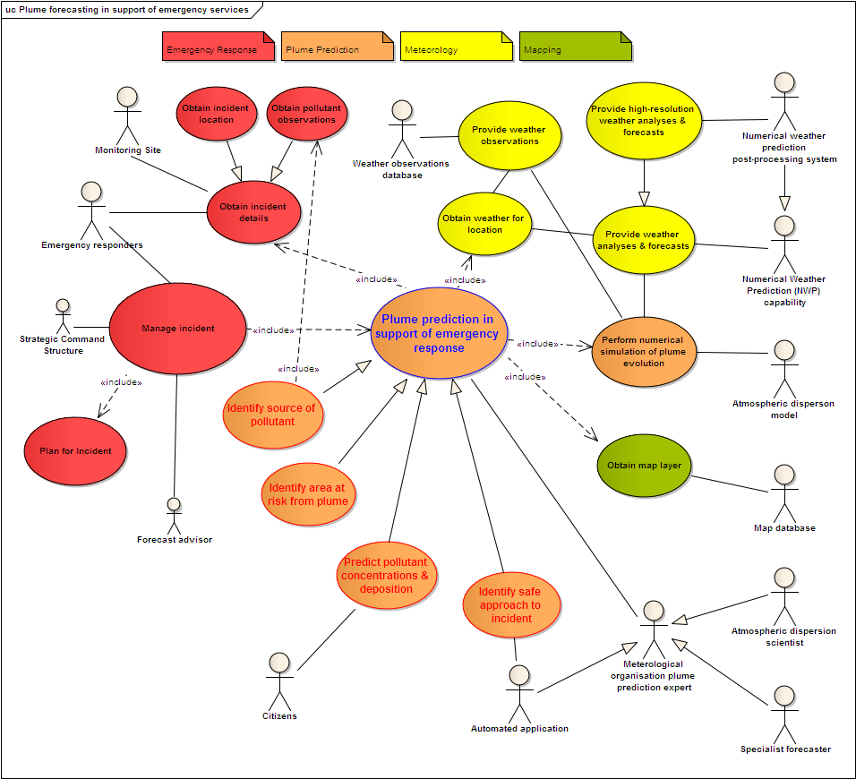

*Actors*

* *Emergency Responder* – organisations heavily involved in managing incident; for example, emergency services, local authorities, health service bodies, health and safety agencies, transport and utility companies (although exactly which organisations will depend on the nature of the incident)

* *Monitoring Site* – site measuring a particular pollutant
* *Strategic Command* – a general class of actor used to describe the range of groups which may come together to carry out a strategic role in the management of an incident. This includes a range of levels (depending of the severity of the event):
** Operation command at incident site (police or fire officer)
** Tactical command within site of incident (usually senior police office)
** Strategic command and control centre remote from incident (chief police constable)
** Central government crisis response committee
** Scientific and technical advisory groups established to coordinate multi-agency specialist advice to central government

* *Citizens*
* *Forecast advisors*
* *Meteorological Organisation Plume Prediction Expert* – a general class of actor used to describe the experts involved in providing plume prediction services:
** *Automated Application* – used to quickly provide automated guidance
** *Specialist Forecaster* – provide routine operational guidance
** *Atmospheric Dispersion Scientist* – provide operational input in more specialist situations

* *Weather Observations Database* – source of real-time weather observations
* *Numerical Weather Prediction (NWP) Capability* – range of NWP models and post-processing, which provides automated weather forecasts at a range of scales, including:
** *NWP Post-Processing Systems* – applications employing down-scaling and rapid updates (nowcasts) to provide a high-resolution (kilometre-scale) weather forecasts

* *Atmospheric Dispersion Model* – Lagrangian model used to determine the location of a plume
* *Map Database* – Database of map overlays at wide range of scales.

*Detailed Structured Description of Plume Prediction Use Cases*

The plume prediction use cases are presented in more detail using a standard template in the following sections, with primary example (and other examples) indicated in brackets in the title.

Use Case 1.1: Identify Safe Approach to Incident

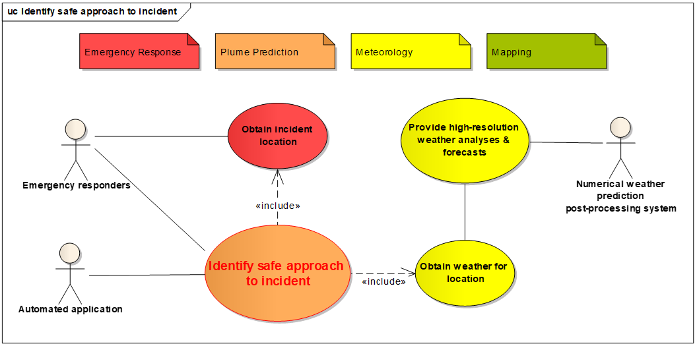

[align=center,width="100%",cols="22%,78%",options="header",]
|===
|Use Case 1.1 |Identify safe approach to incident
|Priority |High
|Description |Provide Fire and Rescue Service (FRS) responders with the latest weather information to help them identify a safe approach when dealing with a major incident. Provides immediate access to forecast conditions, before a more detailed area at risk product is available. This is realised through the use of an automated application, with a web interface, available to all FRS incident command units, mobilising centres and the national coordination centre.
|Pre-condition |An incident releasing a plume has occurred.
2+h|*Flow of Events - Basic Path*
|Step 1 |_**Emergency Responder**s_ provide the Incident Location via webpage
|Step 2 |*_Automated Application_* automatically obtains *Current Weather* data by interpolating from the *High-Resolution Post-Processed Model Analysis/Forecast* provided by *_NWP Post-ProcessingCapability_*
|Step 3 |*_Automated Application_* automatically generates *Hazard Sector* visualisation, with supporting text, and a presentational form of *Current Weather* (table & graph) on the webpage
|Step 4 |*_Emergency Responders_* review the *Hazard Sector* and *Current Weather* products on a Webpage
|Post-condition |*_Emergency Responders_* understand the safe approach directions to the incident.
2+h|*Data Source: Incident Location*
|Description a|
Location of incident as:

* Place name or Postcode (e.g. EX1 3PB)
* Country map grid reference (e.g. GB Ordnance Survey: SX500534) or grid coordinates (e.g. UK eastings, northings: 377400, 399500)
* Latitude & Longitude

|Data Provider |Fire and Rescue Service (FRS) responders
|Geographic Scope |Point (or Polygon as proxy for point)
|Thematic Scope |Addresses (AD), Coordinate Reference Systems (RS)
|Scale, resolution |_Point_ or _Polygon_
|Delivery |Webpage entry
|Documentation |None
2+h|*Data Source: Current Weather*
|Description a|
Point interpolation from high-resolution post-processed model analysis / forecast provided as:

* Table (text) of Temperature, Humidity, Precipitation Type, Precipitation rate, Hazard Sector, wind speed Wind direction;
* Graphs of Precipitation rate, Temperature and Humidity against time.

Example shown in figure (b)

|Data Provider |Meteorological organisation (e.g. national meteorological service)
|Geographic Scope |Point
|Thematic Scope |Atmospheric Conditions (AC), Meteorological Geographic Features (MF)
|Scale, resolution |_PointSeries_ (hourly data for 6-hour window centred on current hour)
|Delivery |Webpage
|Documentation a|
For example, see:

_http://www.metoffice.gov.uk/corporate/pws/emergency_response.pdf_ (section 3.8 FireMet)

2+h|*Supporting Data Source: High-Resolution Post-Processed Model Analysis/Forecast*
|Description |High-resolution NWP model analyses and forecasts post-processed to produce gridded data accounting for local topographic effects.
|Data Provider |Meteorological organisation (e.g. national meteorological service)
|Geographic Scope |Area around specific point
|Thematic Scope |Atmospheric Conditions (AC), Meteorological Geographic Features (MF)
|Scale, resolution |_GridSeries_ (km resolution; hourly, past times as analyses, forecasts out to 12 hours or more)
|Delivery |Standard output in a standard meteorological (e.g. netCDF or GRIB) or bespoke format
|Documentation a|
For example, see:

_http://www.metoffice.gov.uk/research/areas/numerical-modelling/post-processing_

_http://www.metoffice.gov.uk/science/creating/daysahead/nwp/um_config.html_

2+h|*Data Source: Hazard Sector*
|Description a|
Point interpolation from high-resolution post-processed model analysis provided as:

* Visualisation of 'Hazard Sector', with wind speed and direction
* Table with text information on Hazard Sector and wind (in range of formats)

Example shown in figure (b)

|Data Provider |Meteorological organisation (e.g. national meteorological service)
|Geographic Scope |Point
|Thematic Scope |Atmospheric Conditions (AC), Meteorological Geographic Features (MF)
|Scale, resolution |_Point; TimeInstant_ (current hour)
|Delivery |Webpage
|Documentation a|
For example, see:

_http://www.metoffice.gov.uk/corporate/pws/emergency_response.pdf_ (section 3.8 FireMet)

|===

Use Case 1.2: Identify area at risk from plume

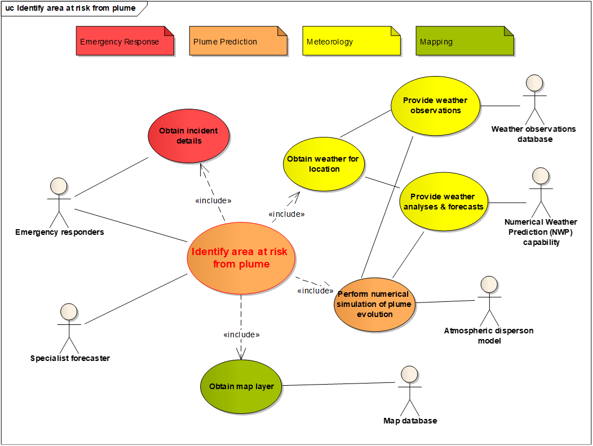

[width="100%",cols="22%,78%",options="header",]
|===
|Use Case 1.2 |Identify areas at risk from plume
|Priority |High
|Description |Identify the areas at risk from the plume and the local weather conditions for the next few hours in the form of a snapshot.
|Pre-condition |An incident releasing a plume has occurred.
2+h|*Flow of Events - Basic Path*
|Step 1 |*_Emergency Responders_* provides *Incident Details* by phone, which are recorded.
|Step 2 |A *_Specialist Forecasters_* use the *_Incident Details_* to initialise the *_Atmospheric Dispersion Model._*
|Step 3 a|
*_Atmospheric Dispersion Model_* runs to generate a *Forecast,* using either:

* *Model Analyses/Forecasts* generated by the *_Numerical Weather Prediction (NWP) Capability_*; or:
* *Weather Observations* provided by *_Weather Observations Database_*.

|Step 4 |*_Atmospheric Dispersion Model_* generates an *Area At Risk Map* using a *Map Overlay* obtained from the *Map Database*.
|Step 5 |*EMARC* generates *Forecast of Relevant Meteorological Parameters*, using either the *Model Analyses/Forecasts* or *Weather Observations*.
|Step 6 |The *_Specialist Forecaster_* delivers *Area At Risk Map* and *Forecast of Relevant Meteorological Parameters* to the *_Emergency Responders_* by website, email or fax.
|Post-condition |*_Emergency responders_* have received and understood briefing material.
2+h|*Data Source: Plume Incident Details*
|Description a|
Details including:

* Location of incident as:
** Place name or Postcode (e.g. EX1 3PB);
** Country map grid reference (e.g. GB Ordnance Survey: SX500534) or grid coordinates (e.g. UK eastings, northings: 377400, 399500); or:
** Latitude & Longitude
* Time of the event
* Any additional information on the chemicals involved
* Site characteristics (Urban, Rural, Coastal)
* Nature of Release (Continuous , Instantaneous, Fire at site)
* If available, details of the current weather at the site

|Data Provider |Emergency Services
|Geographic Scope |Point
|Thematic Scope |Addresses (AD), Coordinate Reference Systems (RS), Atmospheric Conditions (AC), Meteorological Geographic Features (MF)
|Scale, resolution |_Point; TimeInstant_
|Delivery |Phone
|Documentation a|
See for example:

_http://www.metoffice.gov.uk/publicsector/CHEMET/_

2+h|*Data Source: Atmospheric Dispersion Model Forecast*
|Description |4-dimensional (3d space & time) predictions of pollutant concentration. The concentrations of the tracked parcels of air are mapped onto regular grid-boxes. Note that only the required data are output, resulting, resulting in limited sets of variables & levels, and 'sparse' grids (values only held where non-zero)
|Data Provider |Meteorological organisation (e.g. national meteorological service)
|Geographic Scope |Area around specific point
|Thematic Scope |Atmospheric Conditions (AC), Meteorological Geographic Features (MF)
|Scale, resolution |_GridSeries_ (spatial and temporal resolution depends on area of interest)
|Delivery |Standard output as netCDF, GRIB or text, suitable for visualisation in a GIS environment.
|Documentation a|
For example, see:

_http://www.metoffice.gov.uk/environment/name.html_

2+h|*Data Source: Model Analysis/Forecast*
|Description |A range of NWP models provide automated weather forecasts as 4-dimensional (3d space & time) fields.
|Data Provider |Meteorological organisation (e.g. national meteorological service)
|Geographic Scope |Area around specific point
|Thematic Scope |Atmospheric Conditions (AC), Meteorological Geographic Features (MF)
|Scale, resolution |_GridSeries_ (km resolution; hourly, past times as analyses, forecasts out to 12 hours or more)
|Delivery |Standard output in a standard meteorological (e.g. netCDF or GRIB) or bespoke format
|Documentation a|
For example, see:

_http://www.metoffice.gov.uk/science/creating/daysahead/nwp/um_config.html_

2+h|*Data Source: Weather Observations*
|Description |Observations of the weather from a nearby observing site, in WMO BUFR format.
|Data Provider |Meteorological organisation (e.g. national meteorological service)
|Geographic Scope |Point, but representative of local area of interest
|Thematic Scope |Atmospheric Conditions (AC), Meteorological Geographic Features (MF)
|Scale, resolution |_Point_ or _PointSeries_
|Delivery |n/a
|Documentation |None
|*Data Source: Map Overlay* |
|Description |High-resolution geographical map
|Data Provider |Map provider
|Geographic Scope |Area of interest
|Thematic Scope |Cadastral Parcels (CP)
|Scale, resolution |_Polygons_ provided as raster image (at, e.g. 1:50,000)
|Delivery |Website, email or fax (as part of *_Area at Risk Map_* product)
|Documentation |None
2+h|*Data Source: Area At Risk Map*
|Description a|
Product generated by *_Atmospheric Dispersion Model_* showing the prediction of the plume extent, for two threshold values of standard deviation from the concentration at the centre of the plume for a given radial distance from the release site. This is visualised in combination with a *Map Overlay.*

Example shown in figure (c)

|Data Provider |Meteorological organisation (e.g. national meteorological service)
|Geographic Scope |Area of interest
|Thematic Scope |Atmospheric Conditions (AC), Meteorological Geographic Features (MF)
|Scale, resolution |_Grid; TimePeriod_ (representing area of interest; typically <6 hour validity period (but left to the forecaster's discretion), with updates as necessary before existing forecast expires)
|Delivery |Website, email or fax
|Documentation a|
For example, see:

_http://www.metoffice.gov.uk/publicsector/CHEMET/_

2+h|*Data Source: Forecast of Relevant Meteorological Parameters*
|Description a|
Product generated *_Model Analyses/Forecasts_* covers:

* Surface wind direction (8-point compass degrees true)
* Wind speed at 10 metres above ground level (kilometres per hour.)
* Indication of the behaviour of the plume due to weather conditions while the chemical is assumed to have neutral buoyancy
* Total cloud cover (oktas), with height (in feet above ground level) of the lowest significant cloud layer (5 oktas or more)
* Temperature
* Relative humidity.
* Intensity & type of precipitation
* Depth of the mixing layer
* Mean wind in the mixing layer
* Estimate of the vertical stability of the atmosphere using the Pasquill Stability Index

Any changes during the period are given remarks sections.

|Data Provider |Meteorological organisation (e.g. national meteorological service)
|Geographic Scope |Point, but representative of local area of interest
|Thematic Scope |Atmospheric Conditions (AC), Meteorological Geographic Features (MF)
|Scale, resolution |_Point_ or _Polygon; TimePeriod_ (representing area of interest; typically <6 hour validity period (but left to the forecaster's discretion), with updates as necessary before existing forecast expires)
|Delivery |Website, email or fax
|Documentation a|
For example, see:

_http://www.metoffice.gov.uk/publicsector/CHEMET/_

|===

Use Case 1.3: Predict pollutant concentrations & deposition

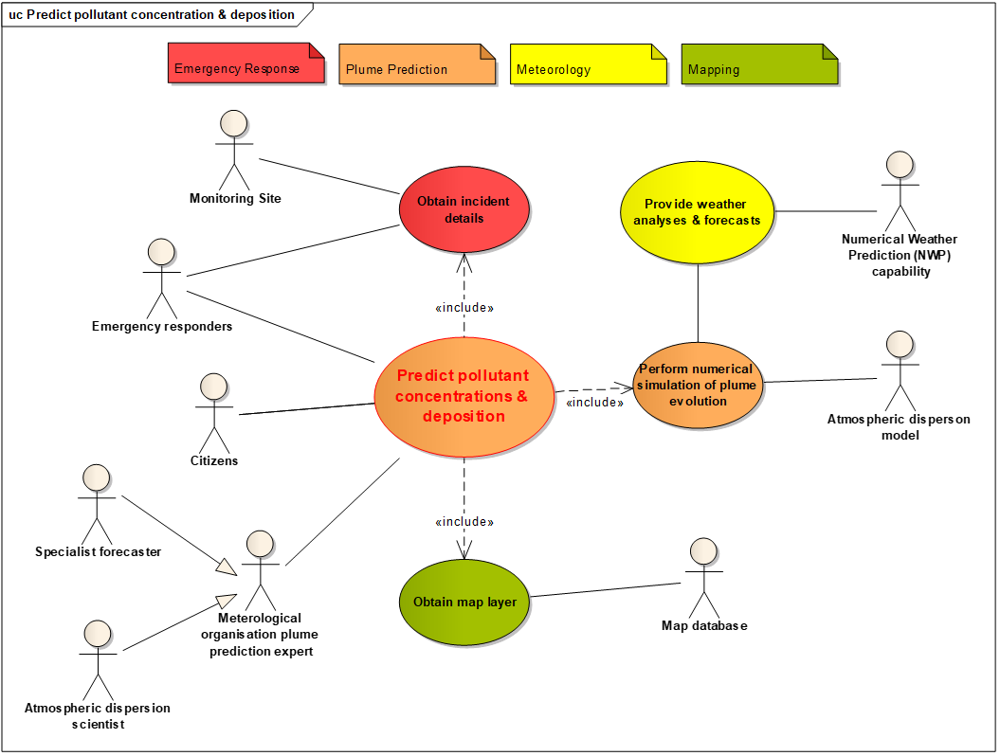

[width="100%",cols="23%,77%",options="header",]
|===
|Use Case 1.3|Predict pollutant concentrations & deposition
|Priority |High
|Description |Provide predictions of the pollutant concentrations and deposition of the pollutant from the plume incident out from a few hours to a week ahead in the form of an animation (or series of snapshots). N.B. Only pollutant concentration product is described below, but similar products can be generated for deposition.
|Pre-condition |Either incident is already being monitored, or large-scale incident is detected or notified (e.g. volcanic eruption).
2+h|*Flow of Events - Basic Path*
|Step 1 |_*Monitoring Site* (e.g. Volcanic Ash Advisory Centre)_ (or possibly *_Emergency Responders_*) provide *Incident Details*.
|Step 2|A *_Specialist Forecaster_* uses the *_Incident Details_* to initialise the *_Atmospheric Dispersion Model_* (including specification of incident area, plume height, chemical species or particle size distribution, etc).
|Step 3 |*_NAME_* runs to generate a *_NAME Forecast_* using from the *Model Analyses/Forecasts* provided from the *_Numerical Weather Prediction (NWP) Capability_*.
|Step 4 |The *_Atmospheric Dispersion Model_* generates *Pollutant Concentrations Forecast* using a *Map Overlay* obtained from the *Map Database*
|Step 5 |The *_Specialist Forecaster_* delivers *Pollutant Concentrations Forecast* to the *_Emergency Responders_* **_(_**and possibly the *_Citizens_*) by either WMO GTS, website, email or fax.
|Post-condition |*_Emergency responders_* (and *_General Public_*) have received and understood briefing material.
2+h|*Flow of Events - Alternative Path 1*
|Replace Step 2|An *_Atmospheric Dispersion Scientist_* carries out more complex configuration and initialisation of *_Atmospheric Dispersion Model_* using the *Incident Details.*
2+h|*Flow of Events - Alternative Path 2*
|Additional Step 4a |The *_Specialist Forecaster_* draws simpler polygons around the *Pollutant Concentration Forecast* to generate a variant of this product.
2+h|*Data Source: Plume Incident Details*
|Description a|
Details including:

* Location
* Time of the event
* As much information on the plume characteristics as possible

|Data Provider |Monitoring Site, Volcanic Ash Advisory Centres (with initial identification by eye witnesses or volcanic eruption detection system)
|Geographic Scope |Point, potentially anywhere on the globe
|Thematic Scope |Coordinate Reference Systems (RS)
|Scale, resolution |_Point_
|Delivery |Phone
|Documentation |_http://www.metoffice.gov.uk/aviation/vaac/eruption_detection.html_
2+h|*Data Source: Atmospheric Dispersion Model Forecast*
|Description |4-dimensional (3d space & time) predictions of pollutant concentration. The concentrations of the tracked parcels of air are mapped onto regular grid-boxes. Note that only the required data are output, resulting, resulting in limited sets of variables & levels, and 'sparse' grids (values only held where non-zero)
|Data Provider |Meteorological organisation (e.g. national meteorological service)
|Geographic Scope |Area of interest, potentially anywhere on the globe
|Thematic Scope |Atmospheric Conditions (AC), Meteorological Geographic Features (MF)
|Scale, resolution |_GridSeries_ (spatial and temporal resolution depends on area of interest)
|Delivery |Standard output as netCDF, GRIB or text, suitable for visualisation in a GIS environment.
|Documentation a|
For example, see:

_http://www.metoffice.gov.uk/environment/name.html_

2+h|*Data Source: Model Analysis/Forecast*
|Description |A range of NWP models provide automated weather forecasts as 4-dimensional (3d space & time) fields.
|Data Provider |Meteorological organisation (e.g. national meteorological service)
|Geographic Scope |Area of interest, potentially anywhere on the globe
|Thematic Scope |Atmospheric Conditions (AC), Meteorological Geographic Features (MF)
|Scale, resolution |_GridSeries_ (representing area of interest which may extend outside the UK, and time scales of interest out to 5 days or more)
|Delivery |Standard output in a standard meteorological (e.g. netCDF or GRIB) or bespoke format
|Documentation a|
For example, see:

_http://www.metoffice.gov.uk/science/creating/daysahead/nwp/um_config.html_

2+h|*Data Source: Map*
|Description |Geographical map at appropriate scale
|Data Provider |Map provider
|Geographic Scope |Area of interest, potentially anywhere on the globe
|Thematic Scope |Cadastral Parcels (CP)?
|Scale, resolution |_Polygons_ provided as raster image
|Delivery |Website, email or fax (as part of *_Pollutant Concentrations Forecast_* product)
|Documentation |None
2+h|*Data Source: Pollutant Concentrations Forecast*
|Description a|
Generated product from *_NAME Forecast_* shows sequence of charts showing the predicted evolution of the plume extent at different heights and different times for multiple thresholds. These are shown as raster, filled contour or polygons (which also may be colour-filled); the polygons are also produced as a text product. This is visualised in combination with an appropriate *Map Overlay.*

Examples of the three forms shown in figure (a), (d) and (e) respectively.

|Data Provider |Meteorological organisation (e.g. national meteorological service)
|Geographic Scope |Area of interest, potentially anywhere on the globe
|Thematic Scope |Atmospheric Conditions (AC), Meteorological Geographic Features (MF)
|Scale, resolution |_GridSeries_ or _PolygonSeries_ (representing area of interest which may extend outside the UK, and time scales of interest out to 5 days or more)
|Delivery |(WMO) Global Telecommunications System (GTS), website, email or fax
|Documentation a|
For example, see:

_http://www.metoffice.gov.uk/aviation/vaac/forecasting.html_

|===

Use Case 1.4: Identify source of pollutant

image::./media/image18.png[./media/image18,width=604,height=408]

[width="100%",cols="23%,77%",options="header",]
|===
|Use Case 1.4 |Identify Source of Pollutant
|Priority |High
|Description |Identify the likely area of origin in of a particular measured pollutant as area-based probability
|Pre-condition |A particular pollutant has been detected at one or more monitoring sites.
2+h|*Flow of Events - Basic Path*
|Step 1 |*_Monitoring Site_* provides *Pollutant Observations* data.
|Step 2 |A *_Specialist Forecaster_* or the *_Atmospheric Dispersion Scientist_* uses the *Pollutant Observations* to initialise the _*Atmospheric Dispersion Model*._
|Step 3 |The *_Atmospheric Dispersion Model_* runs 'backwards' to generate a *_Forecast_* using from the *Model Analyses/Forecasts* provided from the *_Numerical Weather Prediction (NWP) Capability_*.
|Step 4 |The *_Atmospheric Dispersion Model_* generates *Plume Origin Prediction* from *forecast* using a *Map Overlay* obtained from the *Map Database*.
|Step 5 |The *_Specialist Forecaster_* delivers *_Plume Origin Prediction_* to the *_Emergency Responders_* by either website, email or fax
|Post-condition |*_Emergency responders_* have received and understood briefing material.
2+h|*Data Source: Pollutant Observations*
|Description|Measurement of a particular pollutant by a sensor at a particular site. Detection of the pollutant at multiple sites would usually be required.
|Data Provider |Various monitoring organisations (depending on pollutant type)
|Geographic Scope |Point
|Thematic Scope |Environmental Monitoring Facilities (EF)
|Scale, resolution |_PointSeries_ (a number of points, with time period depending on what is available)
|Delivery |Various
|Documentation |None
2+h|*Data Source: Atmospheric Dispersion Model Forecast*
|Description |4-dimensional (3d space & time) predictions of pollutant concentration. The concentrations of the tracked parcels of air are mapped onto regular grid-boxes. Note that only the required data are output, resulting, resulting in limited sets of variables & levels, and 'sparse' grids (values only held where non-zero).
|Data Provider |Meteorological organisation (e.g. national meteorological service)
|Geographic Scope |Area of interest
|Thematic Scope |Atmospheric Conditions (AC), Meteorological Geographic Features (MF)
|Scale, resolution |_GridSeries_ (spatial and temporal resolution depends on area of interest)
|Delivery |Standard output as netCDF, GRIB or text, suitable for visualisation in a GIS environment.
|Documentation a|
For example, see:

_http://www.metoffice.gov.uk/environment/name.html_

2+h|*Data Source: Model Analysis/Forecast*
|Description |A range of NWP models provide automated weather forecasts as 4-dimensional (3d space & time) fields.
|Data Provider |Meteorological organisation (e.g. national meteorological service)
|Geographic Scope |Area around specific point
|Thematic Scope |Atmospheric Conditions (AC), Meteorological Geographic Features (MF)
|Scale, resolution |_GridSeries_ (km resolution; hourly, past times as analyses, forecasts out to 12 hours or more)
|Delivery |Standard output in a standard meteorological (e.g. netCDF or GRIB) or bespoke format
|Documentation a|
For example, see:

_http://www.metoffice.gov.uk/science/creating/daysahead/nwp/um_config.html_

2+h|*Data Source: Map*
|Description |High-resolution geographical map
|Data Provider |Map provider
|Geographic Scope |Area of interest
|Thematic Scope |Cadastral Parcels (CP)
|Scale, resolution |_Polygons_ provided as raster image (at, e.g. 1:50,000)
|Delivery |Website, email or fax (as part of *_Area at Risk Map_* product)
|Documentation |None
2+h|*Data Source: Plume Origin Prediction*
|Description a|
Generated product from the *_Atmospheric Dispersion Model Forecast_*, shows the likelihood of a plume originating from within the area of the cell of a raster map, as a probability (most cells will have a zero probability). This is visualised in combination with an appropriate *Map Overlay.*

Example shown in figure (f)

|Data Provider |Meteorological organisation (e.g. national meteorological service)
|Geographic Scope |Area of interest, potentially anywhere on the globe
|Thematic Scope |Atmospheric Conditions (AC), Meteorological Geographic Features (MF)
|Scale, resolution |Variable, depending on area of interest
|Delivery|Webpage, email or fax
|Documentation a|
For example, see:

_http://www.metoffice.gov.uk/corporate/pws/emergency_response.pdf_ (section 3.6 Source Identification)

|===

=== Use Case 2.1 - Flash flood management 

*High level Use Case*

Intense and localized rain events are commonly observed, especially in the Mediterranean area. When occurring over short response time basins, these events lead to flash flood, likely to cause serious damages, especially over urban areas. That is why the need for systems able to assist authorities in related crisis management is critical.

The system can be broadly described in five steps:

[arabic, start=1]
. *Acquisition of input data for the numerical model*
+
Rainfall data from rain gauges and radars (for instance polarized X-Band radars), short term rainfall forecasts ("nowcasting"), discharge data.

[arabic, start=2]
. *Calculate the flood extent and its short term evolution*
+
Running a "rainfall-runoff" model over the area of interest

[arabic, start=3]
. *Identify a flood risk scenario*
+
On the basis of expected discharges, past flooding events and vulnerability.

[arabic, start=4]
. *Human assessment of the results*
+
Real-time data, model output, risk map visualisation for human assessment of the risk of flooding and risk scenarios.

[arabic, start=5]
. *Activation of the warning plan depending on the risk*

*Actors*

* *Emergency Responder*
+
Organisations involved in managing the flood event (local authorities, civil protection authorities)

* *Citizens:*
+
The target of flood warnings and safety plans when a flood risk has been identified and assessed by the emergency responder.

* *NMHS (National Meteorological & Hydrological Service)*
+
NMHS provides :
+
** Radar production environment from radar network infrastructure and reflectivity measurements, post processing etc. to consolidated rainfall estimations.
** Surface observation environment from sensor networks, in-situ acquisition systems, hubs etc. to consolidated rainfall measures, including databases and archives (past data).
** Numerical simulation environment: data assimilation, high resolution non hydrostatic model run on supercomputers, post-processing.
** Databases, data access services and / or dissemination systems

*High level UML Diagram*

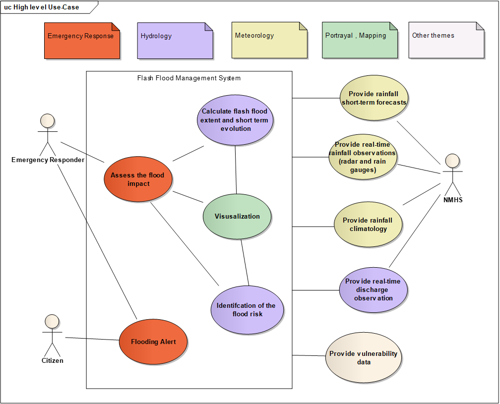

Hydrology is actually the core activity of this use-case, the meteorological sub-cases are intended to provide weather data (mainly rainfall data and very short-range forecasts). So, the overall use-case has been split in order to isolate sub-cases related to the INSPIRE themes "Atmospheric Conditions" and "Meteorological Geographical Features".

*Detailed Structured Description of Flash flood management Use Cases*

Use Case 2.1.1 - Calculate flash flood extent and its short term evolution

[width="100%",cols="22%,78%",options="header",]
|===
2+h|Use Case Description
|Name |Calculate flash flood extent and its short term evolution
|Primary actor |Rainfall – Runoff model
|Goal |Predict the flash-flood extent
|System under 
consideration |Flash flood information system
|Importance |High
|Description a|
Hydrological models used to calculate flash-floods extents are usually rainfall-runoff models. The meteorological data input for such models is mainly radar

rainfall data, calibrated with surface rain gauges measurements when available. Recently, high resolution non hydrostatic models are able to provide accurate short-term rainfall forecasts. Finally, real-time rainfall data is compared against rainfall and flow information climatology to identify a flood scenario.

|Pre-condition a|
* Operational network of surface rain gauges
* Operational network of radars (and post processing system to convert measured reflectivities into spatial rainfall data)
* Operational nowcasting system to predict rainfall (fine mesh model or other method )
* Rainfall and flow climatology in order to calibrate the Rainfall-Runoff model
* Operational Rainfall-Runoff model

|Post-condition |Flood extent and water velocity dataset
2+h|*Flow of Events – Basic Path*
|Step 1. |Collect rainfall data from surface gauges within the spatio-temporal domain of interest
|Step 2 |Collect rainfall radar data within the spatio-temporal domain of interest
|Step 3 |Calibrate spatial radar data with surface gauges measurements
|Step 4 |Collect short-term rainfall forecasts on the spatio–temporal domain of interest
|Step 5 |Collect rainfall and flow climatology on the domain of interest
|Step 6 |Run the Rainfall-Runoff model
|Step 7 |Make available the probable flood extent and its short term evolution
2+h|*Data set: Surface rain gauge data*
|Description |Rainfall time series from surface gauges within the spatio-temporal domain of interest. The dataset consist of rainfall measures on an irregularly distributed set of points (the location of the rain gauges)
|Type |Input
|Data provider |Meteorological organisation (e.g. national meteorological service)
a|
Geographic scope
|Limited area: ~100 km2
a|
Thematic scope
|Atmospheric Conditions (observed)
a|
Scale, resolution
|Typically 30 rain gauges over the area of interest
a|
Delivery
|Online (FTP, WFS, SOS) or routine dissemination
a|
Documentation
|Metadata
2+h|*Data set: Radar data*
|Description |Spatial rainfall radar data. Rainfall is computed from reflectivities measured by a network of radars covering the area of interest (for instance polarized X-Band radars). The dataset consist of rainfall measures on a regularly distributed set of grid points. When the dataset is an image, each pixel corresponds to a grid-point.
|Type |Input
|Data provider |Meteorological organisation (e.g. national meteorological service)
a|
Geographic scope
|Limited area: ~100 km2
a|
Thematic scope
|Atmospheric Conditions (AC - observed)
a|
Scale, resolution
|1 km
a|
Delivery
|Online (FTP, WCS) or routine dissemination
a|
Documentation
|Metadata
2+h|*Data set: Short term forecasts*
|Description |Short-term rainfall forecast data calculated by a fine mesh non hydrostatic model. The dataset consist of rainfall forecasts values on a regularly distributed set of grid points.
|Type |input
|Data provider |Meteorological organisation (e.g. national meteorological service)
a|
Geographic scope
|Limited area: ~100 km2
a|
Thematic scope
|Atmospheric Conditions (AC - nowcasting)
a|
Scale, resolution
|1 - 2 km
a|
Delivery
|Online (FTP, WCS), routine dissemination
a|
Documentation
|Metadata
2+h|*Data set: Rainfall and flood climatology*
|Description |Rainfall and flood reference climatology and derived products (for instance return period of observed / predicted rainfall data) For instance, the dataset will consists of return period values on a regularly distributed set of grid points.
|Type |input
|Data provider |Meteorological organisation (e.g. national meteorological service)
a|
Geographic scope
|Limited area: ~100 km2
a|
Thematic scope
|Atmospheric Conditions (AC - climatology)
a|
Scale, resolution
|1km
a|
Delivery
|Online (FTP, WCS, WFS) or routine dissemination
a|
Documentation
|Metadada
2+h|*Data set: Probable flood scenario*
|Description |Product showing the total extent of the flood and its short term evolution
|Type |Output
|Data provider |Meteorological organisation (e.g. national meteorological service)
a|
Geographic scope
|Limited area: ~100 km2
a|
Thematic scope
|Natural Risk Zone
a|
Scale, resolution
|1km
a|
Delivery
|Online (FTP, WCS), routine dissemination
a|
Documentation
|Metadada
|===

*Mapping UC datasets to AC-MF model (Informative)*

*Dataset: Surface rain gauge data*

[width="100%",cols="40%,60%",]
|===
h|AC-MF |Value
|Case *MultiPointObservation*: |
|phenomenonTime |"2011-04-11T12:00:00Z"
|resultTime |"2011-04-11T12:02:30Z"
|observedProperty |ObservableProperty
|result a|
ReferenceableGridCoverage or
DiscreteCoverageGeometryValuePairs
|procedure |Process
|featureOfInterest |SF_SamplingSurface (not detailed. Could be defined as the polygon surrounding the network of rain gauges)
|Case *PointTimeSeriesObservation*: |
|phenomenonTime |"2011-04-11T12:00:00Z/2011-04-11T13:00:00Z"
|resultTime |"2011-04-11T13:02:30Z"
|observedProperty |ObservableProperty
|result |MultiTimeInstantCoverage
|procedure |Process
|featureOfInterest |SF_SamplingPoint (not detailed)
| |
|*Process* |
|inspireId |Identifier (not detailed)
|name |"SurfaceRainGaugeNetwork"
|responsibleParty a|
CI_ResponsibleParty

(ISO 19115 element not detailed)

|type |"InSituMeasurement"
| |
|*ObservableProperty* |
|label |"5mn Precipitation Amount"
|basePhenomenon |CF_StandardNamesValue
|uom |UnitOfMesure
|statisticalMeasure |StatisticalMeasure
|StatisticalMeasure |
|statisticalFunction |StatisticalFunctionTypeValue
|aggregationTimePeriod |"PT5M"
|StatisticalFunctionTypeValue |"sum" (CF cell_methods)
|CF_StandardNamesValue |"http://vocab.nerc.ac.uk/collection/P07/current#precipitation_amount"
|UnitOfMeasure |"kg/m2"
| |
|===

*Dataset: Radar data*

[width="100%",cols="37%,63%",]
|===
h|AC-MF |Value
|*GridObservation* |
|phenomenonTime |"2011-04-11T12:00:00Z"
|resultTime |"2011-04-11T12:03:47Z"
|observedProperty |ObservableProperty
|result a|
RectifiedGridCoverage or

ReferenceableGridCoverage

(ex grid domain definition : 2d geodetic or projected )

|procedure |Process
|featureOfInterest |SF_SamplingSolid (not detailed. Could be defined as a volume surrounding the grid)
| |
|*Process* |
|inspireId |Identifier (not detailed)
|name |"post-processing system of radar reflectivity"
|responsibleParty a|
CI_ResponsibleParty

(ISO 19115 element not detailed)

|type |"RemoteSensingMeasurement"
| |
|*ObservableProperty* |
|label |"5mn Precipitation Amount"
|basePhenomenon |CF_StandardNamesValue
|uom |UnitOfMesure
|statisticalMeasure |StatisticalMeasure
|StatisticalMeasure |
|statisticalFunction |StatisticalFunctionTypeValue
|aggregationTimePeriod |"PT5M"
|StatisticalFunctionTypeValue |"sum" (CF cell method)
|CF_StandardNamesValue |"http://vocab.nerc.ac.uk/collection/P07/current#precipitation_amount"
|UnitOfMeasure |"kg/m2"
| |
|===

*Dataset: Short Term Forecast*

[width="100%",cols="37%,63%",]
|===
h|AC-MF |Value
|*GridSeriesObservation* |
|phenomenonTime |"2011-04-11T12:00:00Z/2011-04-11T14:00:00Z"
|resultTime |"2011-04-11T12:05:47Z"
|observedProperty |ObservableProperty
|result a|
RectifiedGridCoverage or

ReferenceableGridCoverage

(ex grid domain definition : 2d geodetic or projected  1d temporal)

|procedure |Process
|featureOfInterest |SF_SamplingSolid (not detailed. Could be defined as a volume surrounding the grid)
|parameter |NamedValue
|NamedValue |
|name |"http://inspire.jrc.ec.europa.eu/inspire/processParameterValue.html#AnalysisTime"
|value |"2011-04-11T12:00:00:00Z"footnote:[Or model « run »]
| |
|*ObservableProperty* |
|label |"15mn Precipitation Amount"
|basePhenomenon |CF_StandardNamesValue
|uom |UnitOfMesure
|statisticalMeasure |StatisticalMeasure
|StatisticalMeasure |
|statisticalFunction |StatisticalFunctionTypeValue
|aggregationTimePeriod |"PT15M"
|StatisticalFunctionTypeValue |"sum" (CF cell method)
|CF_StandardNamesValue |"http://vocab.nerc.ac.uk/collection/P07/current#precipitation_amount"
|UnitOfMeasure |"kg/m2"
| |
|*Process* |
|inspireId |Identifier (not detailed)
|name |"Numerical model x"
|responsibleParty a|
CI_ResponsibleParty

(ISO 19115 element not detailed)

|type |"Numerical Simulation"
|processParameter |ProcessParameter
|ProcessParameter |
|description |"the time instant for the initial conditions of a numerical weather simulation. The analysis Time is chosen from a time-instant toward the middle of the assimilation window where the model state is considered to be more realistic"
|name |ProcessParameterValue
|ProcessParameterValue |"http://inspire.jrc.ec.europa.eu/inspire/processParameterValue.html#AnalysisTime"
|===

*Dataset: Radar data climatology (case return period of observed rainfall)*

[width="100%",cols="37%,63%",]
|===
h|AC-MF |Value
|*GridObservation* |
|phenomenonTime |"2011-04-11T13:00:00Z"
|resultTime |"2011-04-11T13:17:50Z"footnote:[The time at which statistics are published]
|parameter |NamedValue
|observedProperty |ObservableProperty
|result a|
RectifiedGridCoverage or

ReferenceableGridCoverage

(ex grid domain definition : 2d geodetic or projected )

|procedure |Process
|featureOfInterest |SF_SamplingSolid (not detailed. Could be defined as a volume surrounding the grid)
|NamedValue |
|Name |"http://inspire.jrc.ec.europa.eu/inspire/processParameterValue.html#ReferenceTimePeriod"
|value |"1980-01-01T00:00:00:00Z/2010-01-01T00:00:00Z" footnote:[Period used for statistics (here 30 years)]
| |
|*ObservableProperty* |
|label |"Return period of 1 hour Precipitation Amount"
|basePhenomenon |CF_StandardNamesValue
|uom |UnitOfMesure
|statisticalMeasure |StatisticalMeasure
|StatisticalMeasure |
|statisticalFunction |StatisticalFunctionTypeValue
|aggregationTimePeriod |"PT1H"
|StatisticalFunctionTypeValue |"sum" (CF cell method)
|CF_StandardNamesValue |"http://vocab.nerc.ac.uk/collection/P07/current#precipitation_amount"
|UnitOfMeasure |Duration (ie : ISO8601 "P50Y" – 50 years)
| |
|*Process* |
|type |"Statistical"
|documentation |CI_Citation (ISO 19115 metadata object)
|responsibleParty |CI_ResponsibleParty (ISO19115 metadata object)
|processParameter |ProcessParameter
|ProcessParameter |
|description |"Time Period used for statistics"
|name |ProcessParameterValue
|ProcessParameterValue |"http://inspire.jrc.ec.europa.eu/inspire/processParameterValue.html#ReferenceTimePeriod"
|===

=== Use Case 2.2 – Flood forecasting short and medium range

*Background description*

Severe (transnational) fluvial floods frequently occur and have large impact on societies. The European Environment Agency (EEA) estimated that the large flooding events that occurred in Europe between 1998 and 2002 caused 700 deaths, displacement of half a million people and 25 billion € insured economic losses.

To reduce the impacts of floods several early warning systems have been setup by hydrological and meteorological institutes, recently reinforced by the EU Floods Directive (EU 2007). These systems simulate hydrological processes in river basins from local to global scales and provide flood information for stakeholders. A variety of meteorological datasets (observations, model forecasts) and hydrological datasets are input for the models. The system described in this use case has two main objectives:

* To complement European Member States activities on flood preparedness and to achieve longer warning times.
* To provide the European Commission with an overview of ongoing and expected floods in Europe for improved international aid and crisis management in the case of large transnational flood events that might need intervention on an international level.

The system is set up for the whole of Europe on a 5-km grid. Twice daily it provides the national hydrological centres with medium-range ensemble flood forecasting information. In addition, when a high probability for flooding is forecast, the end users are alerted by e-mail and advised to monitor the development of the situation using the information system. Forecasts with lead times of 3 to 10 days are achieved through the incorporation of ensemble and deterministic forecasts.

*High Level Use Case*

The process can be broadly described as follows:

. *Ingestion of meteorological data*
+
--
* Observations.
* Deterministic forecasts
* Ensemble forecasts
* Notification of event (non-meteorological)
--

[arabic, start=2]
. *Preprocessing of meteorological data for use in the flooding model:*
+
* Internal procedures (spatial interpolation of point data)
* Pre-processing application for potential evapotranspiration

[arabic, start=3]
. *Running the flooding model*
. *(Automatic) evaluation of results*
. *Visualisation of results*
+
* Hydrographs
* Threshold exceedance maps
* Time series diagrams
* Threshold exceendance tables
* Risk/warning maps

[arabic, start=6]
. *In case of flooding event: notification of end users.*

*Actors*

* Operators
* End users: experts from national hydrological and meteorological services

*Data Requirements*

The flooding model makes use of static data layers that should be available within INSPIRE at European scale, such as land use, soil type and texture, river network. The flooding model simulates canopy and surface processes, soil and groundwater system processes and flow in the river channel.

*Detailed Structured Description of Flood forecasting short and medium range Use Case*

Use case 2.2.1 - Monitoring ongoing and expected floods in Europe.

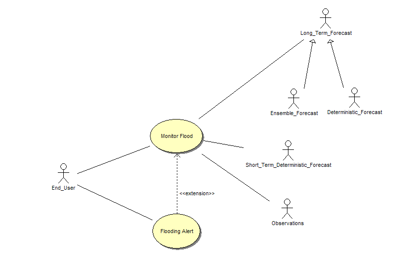

[width="100%",cols="22%,78%",options="header",]
|===
2+h|*Use Case Description*
a|
Name
|Monitoring ongoing and expected floods in Europe.
a|
Priority
|High
a|
Description
|Monitoring ongoing and expected floods in Europe, provide 
monitoring information and alerts end users.
a|
Pre-condition
|System running operationally.
2+h|Flow of Events - Basic Path
|Step 1
a|
Run flooding forecasts (twice daily).

[arabic, start=1]
. 1 Ingest meteorological data.
. 2 Pre-process meteorological data.
. 3 Run flooding model.
. 4 (Automatic) evaluation of results.
. 5 Visualisation of results.
|Step 2
a|
Provide results to end users.
[arabic, start=2]
. 1 Alert for flooding.
|Post-condition
|Results successfully delivered to end users.
2+h|*Data Source: Short term Deterministic forecast*
|Description
a|
Temporal resolution: staggered, 1h (1-3 days), 3h (4-7 days).
Spatial resolution: staggered, 7km (1-3 days), 40 km (1-3 days).
Times provided: 12:00, 00:00.
Input fields: 1 (P,T,E).
Bias removal: none.
Down-scaling: dynamic.
|Data Provider
|Meteorological organisation (e.g. national meteorological service)
|Geographic Scope
|Europe
|Thematic Scope
|Atmospheric Conditions (AC), Meteorological Features (MF)
|Scale, resolution
a|
Temporal resolution: staggered, 1h (1-3 days), 3h (4-7 days).

Spatial resolution: staggered, 7km (1-3 days), 40 km (1-3 days).

Times provided: 12:00, 00:00.

|Delivery
|FTP
|Documentation
|
2+h|*Data Source: Long term Deterministic forecast*
|Description
a|
Temporal resolution: staggered, 3h (1-3 days), 6h (4-10 days).

Spatial resolution: - 40 km

Times provided: 12:00, 00:00.

Input fields: 1 (P,T,E).

Bias removal: none

Down-scaling: none

|Data Provider|Meteorological organisation (e.g. national meteorological service)
|Geographic Scope
|Europe
|Thematic Scope
|Atmospheric Conditions (AC), Meteorological Features (MF)
|Scale, resolution
a|
Temporal resolution: staggered, 3h (1-3 days), 6h (4-10 days).

Spatial resolution: - 40 km (TL511L60).

Times provided: 12:00, 00:00.

|Delivery
|FTP
|Documentation
|
2+h|*Data Source: Ensemble forecast*
|Description
a|
Temporal resolution: 6h (1-10 days).

Spatial resolution: - 80 km (TL255L40)

Times provided: 12:00, 00:00.

Input fields: 501 (P,T,E).

Bias removal: none.

Down-scaling: none.

|Data Provider
|Meteorological organisation
|Geographic Scope
|Europe
|Thematic Scope
|Atmospheric Conditions (AC), Meteorological Features (MF)
|Scale, resolution
a|
Temporal resolution: 6h (1-10 days).

Spatial resolution: - 80 km (TL255L40).

Times provided: 12:00, 00:00.
|Delivery
|FTP
|Documentation
|
2+h|*Data Source: Meteorological observations*
|Description
a|
Temporal resolution daily

Spatial resolution: 50 km (gridded)

Times provided: irregular: typically 23:00

Input fields: P,T,E~0~, ES~0~, ET~0~.

Bias removal: none

Down-scaling: none

|Data Provider
|Meteorological organisation (e.g. national meteorological service)
|Geographic Scope
|Europe
|Thematic Scope
|Atmospheric Conditions (AC), Meteorological Features (MF)
|Scale, resolution
a|Temporal resolution daily

Spatial resolution: 50 km (gridded)

Times provided: irregular: typically 23:00

|Delivery
|FTP
|Documentation
|
|===

*References*

EU. (2007). "Directive 2007/60/EC of the European Parliament and of the Council of 23 October 2007 on the assessment and management of flood risks (Text with EEA relevance)." Retrieved 13/07/2010, from _http://eur-lex.europa.eu/LexUriServ/LexUriServ.do?uri=CELEX:32007L0060:EN:NOT_.

=== Use Case 3.1 - Finding the most interesting locations for new wind farms

*High-level Use Case*

This use case is mainly based on information provided by a pilot project. The steps described in the use case description are adapted to a near future scenario, where the necessary data sets are available from the EU member states using the INSPIRE SDI and the delivery methods specified by it. As of writing, the necessary input data sets are gathered from various, mostly off-line sources by the users.

The process for finding new wind farm locations is basically an iterative data mining and decision making task, an thus it's difficult to formulate it as a step-wise process. Int the scenario selected for this use case the wind farm planning engineer does the following rough work steps:

[arabic, start=1]
. Planner finds the most promising geographic areas from the target area using map visualizations of wind-related geophysical parameters. The existing wind farm locations act as verification data.

[arabic, start=2]
. The initial set of candidate areas are reduced based on information about existing transfer networks, high-power electricity networks, land use and natural protection zones in the vicinity of the candidate areas. The existing infrastructure also helps in pin-pointing the best wind farms locations within the candidate areas.

[arabic, start=3]
. The potential new wind farm locations and the optimal turbine heights are submitted to a detailed analysis within the company's planning process.

*Actors*

* The electricity companies and specialized wind power planning companies in Europe.
* Public sector organizations at national level providing statistical meteorological information about wind, temperature and humidity conditions from the ground level up to 200m above the ground.
* Public sector organizations at national and sub-national level providing information about the existing wind power facilities, transport networks, electricity networks, land use, and natural protection zones.

*Detailed Structured Description of finding the most interesting locations for new wind farms use case.*

Use case 3.1.1 - Find new promising locations for building wind power farms in Europe.

[width="100%",cols="22%,78%",]
|===
2+h|Use Case Description
|Name |Find new promising locations for building wind power farms in Europe.
|Primary actor |Companies planning on building new wind power
|Goal |Planners working for the company have found an initial set of the most promising new wind farm locations to be included in the detailed analysis.
|System under 
consideration |Desktop GIS systems used for wind farm planning able to retrieve geospatial information from INSPIRE SDI data servers via Internet.
|Importance |Medium
|Description |Wind power engineers use sophisticated models for planning the new wind farms. To be able to decide the best potential locations for new wind farms, they need many kinds of information besides the actual measured and predicted wind conditions, like possibility of ice formation on the blades, proximity of electricity and transport networks, cost of land, building rights and whether there is an existing or planned natural protection area overlapping the planned location.
|Pre-condition a|
The cost/benefit ratio for the planned wind turbines at certain wind conditions, the approximate cost of building new electricity transfer network, the approximate cost of building new roads to access the planned location for certain land type, existing wind farms locations with owner information.

The planner has a GIS workstation able to display layers of a map information over Europe.

|Post-condition |An identified set of locations worth a more detailed benefit/cost analysis based on more detailed information.
2+h|*Flow of Events – Basic Path*
|Step 1. |The planner asks the workstation to display the basic map layer over the Europe.
|Step 2. |The planner asks the workstation to display the existing locations for all the wind farms as well as known planned farms to be taken into use within the next 10 years.
|Step 3. a|
The planner asks the workstation to display set statistical wind parameters visualized as coloured map layers. The planner evaluates the values of these parameters at different possible vertical turbine heights (50m, 100m, 200m) and compares them with the optimal values from the specifications of the planned turbines by the company, and identifies the most suitable locations not already in wind farm use as well as the existing wind farms with most potential to build new turbines possibly at different heights than the existing ones. The work includes zooming the map back and forth to verify the findings on a higher resolution map (up to 1:20000). Note that it's not necessary to have the wind-related statistical data to be available in highest resolutions. It's pixels will be scaled up if the background data resolution is higher than the wind data.

The interesting locations are marked on the map with annotations.

|Step 4.
|The planner asks the workstation to display the most accurate cartographic information about existing transport networks, primary electricity transfer networks, existing and planned natural protection areas, land type, land use planning, and approximate cost of land at the selected locations. The most expensive locations as well as those overlapping natural protection zones are excluded.
|Step 5. |The planner sends the data set containing the potential wind farms locations to be used as input in the detailed investment analysis.
2+h|*Flow of Events – Alternative Paths*
| |NONE
2+h|*Data set: Basic map data for Europe*
|Description |Basic background maps covering Europe
|Type |_Input_
|Data provider |National mapping agencies across the Europe
|Geographic scope
|Europe
|Thematic scope
|Coast lines, rivers, lakes, mountain areas, geographical names
|Scale, resolution
|1:500000 – 1:20000
|Delivery
|Online (WMS)
|Documentation
|
2+h|*Data set: Existing wind farms and public plans for new farms*
|Description |Information about the locations and the ownership of the existing wind power farms and public plans for building new ones.
|Type |_Input_
|Data provider |National and sub-national level agencies responsible for energy planning.
|Geographic scope
|Europe
|Thematic scope
|Wind farms
|Scale, resolution
|1:20000
|Delivery
|Online (WFS)
|Documentation
|
2+h|*Data set: Monthly statistical wind speed distribution* 
|Description |Colour maps visualisations for monthly average wind speeds for a typical month ranging from below 4 m/s to more than 13.5 m/s at 50, 100 and 200 meters above the ground. This gridded data is based on high resolution weather model re-analysis of the past weather observations for selected, statistically representative months.
|Type |_Input_
|Data provider |National Weather Agencies across the Europe
|Geographic scope
|Europe
|Thematic scope
|Atmospheric Conditions, statistical wind speed coverage
|Scale, resolution
|250m horizontal resolution (grid cell size), 3 vertical levels
|Delivery
|Online (WMS or WCS)
|Documentation
|
2+h|*Data set: Monthly maximum wind speed (over 50 years)*
|Description |Colour maps visualisations for monthly maximum wind speeds ranging from below 4 m/s to more than 13.5 m/s at 50, 100 and 200 meters above the ground. This gridded data is based on high resolution weather model re-analysis of the past weather observations for selected, statistically representative months.
|Type |_Input_
|Data provider |National Weather Agencies across the Europe
|Geographic scope
|Europe
|Thematic scope
|Atmospheric Conditions, statistical wind speed coverage
|Scale, resolution
|250m horizontal resolution (grid cell size),3 vertical levels
|Delivery
|Online (WMS or WCS)
|Documentation
|
2+h|*Data set: Monthly statistical strength of wind turbulence*
|Description |Colour maps visualisations for monthly average wind turbulence at 50, 100 and 200 meters above the ground. This gridded data is based on high resolution weather model re-analysis of the past weather observations for selected, statistically representative months.
|Type |_Input_
|Data provider |National Weather Agencies across the Europe
|Geographic scope
|Europe
|Thematic scope
|Atmospheric Conditions, statistical wind turbulence coverage
|Scale, resolution
|250m horizontal resolution (grid cell size), 3 vertical levels
|Delivery
|Online (WMS or WCS)
|Documentation
|
2+h|*Data set: Monthly statistical wind gustiness*
|Description |Colour maps visualisations for monthly average wind gustiness at 50, 100 and 200 meters above the ground. This gridded data is based on high resolution weather model re-analysis of the past weather observations for selected, statistically representative months.
|Type |_Input_
|Data provider |National Weather Agencies across the Europe
|Geographic scope
|Europe
|Thematic scope
|Atmospheric Conditions, statistical wind gust coverage
|Scale, resolution
|250m horizontal resolution (grid cell size), 3 vertical levels
|Delivery
|Online (WMS or WCS)
|Documentation
|
2+h|*Data set: Monthly statistical vertical wind profile*
|Description |A set of statistical monthly wind speed and direction values at different heights ranging from the ground level to 200m above ground at each grid point.
|Type |_Input_
|Data provider |National Weather Agencies across Europe
|Geographic scope
|Europe
|Thematic scope
|Atmospheric Conditions, statistical wind speed and direction coverage
|Scale, resolution
|250m horizontal resolution (grid cell size), 20m vertical resolution
|Delivery
|Online (WFS or WCS)
|Documentation
|
2+h|*Data set: Number of months per year for significant blade ice formation probability*
|Description |Statistical probability for significant ice formation on surfaces similar to wind turbine blades at different vertical heights (50, 100, 200m). Reported as the average number of months per year with these kind of conditions expected.
|Type |_Input_
|Data provider |National Weather Agencies across Europe
|Geographic scope
|Europe
|Thematic scope
|Atmospheric Conditions, statistical wind speed, air temperature and humidity coverages
|Scale, resolution
|250m horizontal resolution (grid cell size), 3 vertical levels
|Delivery
|Online (WMS or WCS)
|Documentation
|
2+h|*Data set: Existing High-voltage electricity transfer networks*
|Description |High-voltage electricity transfer networks for connecting new power stations.
|Type |_Input_
|Data provider |National and sub-national level agencies responsible for energy planning.
|Geographic scope
|Europe
|Thematic scope
|Energy transfer networks
|Scale, resolution
|1:500000 – 1:20000
|Delivery
|Online (WFS)
|Documentation
|
2+h|*Data set: Existing transport networks*
|Description |Road, rail and water networks able to support the construction and servicing of a wind farm.
|Type |_Input_
|Data provider |National mapping agencies across the Europe
|Geographic scope
|Europe
|Thematic scope
|Transport networks
|Scale, resolution
|1:500000 – 1:20000
|Delivery
|Online (WFS)
|Documentation
|
2+h|*Data set: Land use, planning and building rights*
|Description |Land use, plans for land use and building right information
|Type |_Input_
|Data provider |National and sub-national level agencies responsible for land use planning
|Geographic scope
|Europe
|Thematic scope
|Land use, Area management/restriction/regulation zones & reporting units
|Scale, resolution
|1:500000 – 1:20000
|Delivery
|Online (WFS)
|Documentation
|
2+h|*Data set: Natural protection zones*
|Description |Existing and planned natural protection zones where building of new wind turbines is not allowed.
|Type |_Input_
|Data provider |National environment agencies
|Geographic scope
|Europe
|Thematic scope
|Natural protection zones
|Scale, resolution
|1:500000 – 1:20000
|Delivery
|Online (WFS)
|Documentation
|
|===

=== Use Case 3.2 - Climate Impacts

*Description*

The meteorological organisations (such as national meteorological services) have a history of providing advice on weather impacts to customers across many sectors, and the provision of climate impacts advice is a natural extension of these existing activities. Existing and potential customers and stakeholders, both in government and private sector, are now focusing significantly on climate impacts. Many sectors are becoming more aware of their weather sensitivity, and climate change means that we cannot assume that the statistics of weather derived from the historical record are applicable now and certainly not so in the future.

Some of the organisations or systems for which climate impact assessments are of particular relevance are:

* Water, Agriculture, Food production;
* Ecosystems, Biodiversity;
* Utilities, Transport, Energy;
* Health, Economics;
* Natural disasters, Security.

The requirements of the users of climate research have changed; rather than simply requiring evidence for the human contribution to climate change and scenarios of its potential future magnitude, an increasing number of stakeholders are beginning to require assessment of the likely impacts of climate change. In general, this is either to inform decisions on the level and nature of action to mitigate climate change, or to help plan for adaptation. In the latter case, this can be related to both long-term and short-term changes or variability in climate arising from either natural or anthropogenic causes.

Here, the term "Climate Impacts" refers to anything which is a consequence of climate change. Some customer requirements relate to improving resilience against change and variability on seasonal to decadal timescales – these can often be addressed with similar techniques to those used to assess the impacts of longer-term climate change. It is for this reason that we use the term "climate impacts" as opposed to "climate change impacts". Indeed, impacts assessments are required over a very large range of time and space scales, from local impacts over timescales of seasons to the next few years, to global impacts several decades or more into the future. While there are some exceptions, in general the short-term, local assessments are required for adaptation while long-term, large-scale assessments are for informing mitigation.

Most direct impacts are on "natural" process (either physical processes such as river flows, or biological processes such as ecosystem changes) and these can then exert further impacts on humans and their economy and society. In some cases, climatic or meteorological processes can have impacts directly on humans, e.g.: rising temperatures leading to heat stress, or changes in storminess causing damage to infrastructure with further financial or economic consequences.

In the near term, products will be delivered through the application of existing climate models to existing impacts models or analysis methods. This bespoke climate and impacts model analysis for customers ensures that the data and techniques are being applied appropriate for the question from end to end. This could include new simulations with existing climate models as well as new analysis of the large number of existing climate model simulations. As well as involving the application of climate model output to offline impacts models or impacts-focussed climate metrics (e.g.: heat stress, growing season onset), we will also analyse climate model outputs which relate more directly to impacts, such as runoff and vegetation productivity.

In the longer term, global scale impacts assessments will be provided using both general circulation models (GCMs) and Integrated Assessment Models (IAMs), which will allow the simulation of crops, ecosystems, water resources, flooding, irrigation, glaciers, and chemistry impacts all interactively, thus facilitating internally-consistent impacts assessment including non-climatic drivers such as land use change and atmospheric chemistry.

In the approach described for this use case (which is used by the Met Office Hadley Centre Climate Impacts Analysis team), past climate data are used to 'baseline' the 'climate risk', before the predictions of the future climate are analysed to identify the future risk. The *Climate Impacts and Risk assessment Framework*, or CIRF (pronounced as "serf") [1], represents the standard process of doing a risk assessment for an organisation or system.

[cols=","]
|===
a|Step 1: Identify the needs, objectives and extent of the project, including the required outcomes and expectations

Step 2: Explore how available datasets can meet the key requirements

Step 3: Assess existing risks due to the current weather and climate

Step 4: Assess in detail how the key risks identified in step 3 are likely to change in the future

Step 5: Work with the customer to explore suitable adaptation options associated with the key risks

Step 6: Communicate clearly the project results and outcomes

Step 7: Review that the assessment has met the customer's requirements, and identify future steps to be taken.

Steps 2, 3 & 4 (in blue above) require the input of weather and climate information, both past data and future projections.

The main parameters of interest are:

* Temperature
* Precipitation

a|image::./media/image21.jpeg[risk_framework_v7_web,width=387,height=371]
|===

Although, there are a number of other parameters (e.g. wind, humidity, pressure), which may be useful for particular impact assessments, and the Global Climate Observing System (GCOS) has defined a much wider set of Essential Climate Variables (ECVs) [2].

Gridded datasets in the form of time series or long term averages (e.g. 10 year and 30 year) with extremes and probabilities of exceeding threshold (of interest to the particular organisation/system) are most useful, as they provide the coverage required, and allow matching of past and future data. However, past observations may be useful for particular locations and the assessment of specific incidents.

Baselining the current climate risk requires past climate data, in the form of:

* *Climatological observation records* (e.g. Met Office Hadley Centre observations datasets [3])
* *Gridded climatologies*, e.g. for the UK UKCP09 5km x 5km grids:

** Daily datasets (1960 to 2006)
** Metrics of precipitation
** Monthly datasets (currently updated to the end of 2005)
** Annual datasets (1961 to 2000)
** Baseline average datasets (1961 to 1990)
* e.g. for Europe the ENSEMBLES daily gridded observational dataset (E-OBS RT5; 0.22 to 0.50 degrees resolution) from the European Climate Assessment & Dataset (ECA&D) [8]:
** Cloud cover
** Wind direction
** Wind speed
** Wind gusts
** Relative humidity
** Sea level pressure
** Precipitation amount
** Snow depth
** Sunshine
** Mean temperature
** Minimum temperature
** Maximum temperature

* *Re-analyses*, e.g.:
** ERA-Interim, ERA40 (ECMWF) [5]
** ACRE [6]

The future climate risk analysis requires *Climate projections* for various horizons out to 2100, including single and multi-model ensembles (with probabilities) and down-scaling using regional models. e.g.:

* *UKCP09* [4], which are based on the Met Office Hadley Centre climate model HadCM3, using perturbed physics ensembles, with:
** Annual, seasonal and monthly climate averages.
** Individual 25 km grid squares, and for pre-defined aggregated areas.
** Seven 30 year time periods.
** Three emissions scenarios.
** Projections are based on change relative to a 1961–1990 baseline.
* *WCRP*footnote:[World Climate Research Programme] *CMIP3*footnote:[Phase 3 of the Coupled Model Intercomparison Project] *multi-model dataset* [7], which provides climate projectionsfootnote:[Projections against various emissions scenarios] from a large number of groups in support of IPCC AR4footnote:[Fourth Assessment Report of the Intergovernmental Panel on Climate Change].

(Seasonal and decadal forecasts are also useful tools to provide a full range of future predictions.)

The process identifies Risk Indicators (a measure of some quantity of interest to the customer, e.g. fire incidents per day), which are a function of the Hazard (e.g. fire) and the Vulnerability (e.g. population density). Note that Vulnerability here includes Exposure, which is sometimes treated separately.

The Hazard can be related to the climate variables (e.g. for fire incidents, it may be related to the number of days with the temperatures above a certain threshold and the precipitation below a certain threshold). This relationship may be given by an existing model, or past data provided by the customer can be used to define the relationship.

Vulnerability data may also be provided by the customer or by another competent authority (e.g. social scientists).

The baseline and future risks are usually shown as a raster plot against and appropriate map overlay, with time series at a location being used to shown variability over time. Plots with 'error bars' and probability distribution functions may also be used to show the variability against a mean (either past or projected).

*High Level Use Case*

The Use Case diagram below shows all the use cases and actors considered. Use cases are colour-coded to indicate their focus.

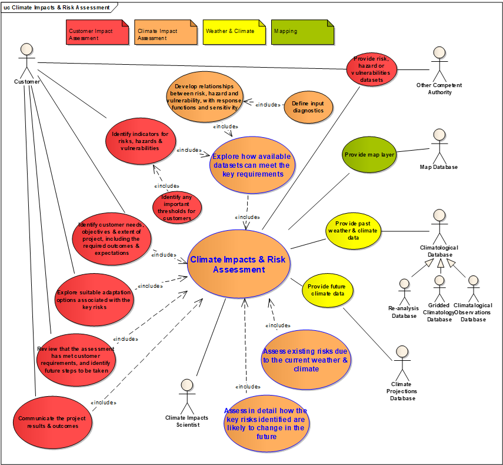

*Actors*

* *Climate Impacts Scientist* – scientists involved in providing assessing climate impact and risk
* *Customer* – general class of actor used to describe a wide range of customers
* *Other Competent Authority* – some agency other than the customer qualified to provide information required for the impact and risk assessment
* *Climatological Database* – set of past weather and climate data available
** *Climatological Observations Database* – time series of point weather and climate observations
** *Gridded Climatology Database* – gridded datasets derived from observations
** *Re-analysis Database* – gridded datasets derived using an NWP model data assimilation scheme to analyse the observations

* *Climate Projections Database* – set of future climate projections using difference scenarios (this includes single and multi-model ensembles)
* *Map Database* – Database of map overlays at wide range of scales.

*Detailed Structured Description of Climate Prediction Impact Use Cases*

The climate impact use cases are presented in more detail using the standard template in the following sections.

_Use Case 3.2.1: Explore how available datasets can meet the key requirements_

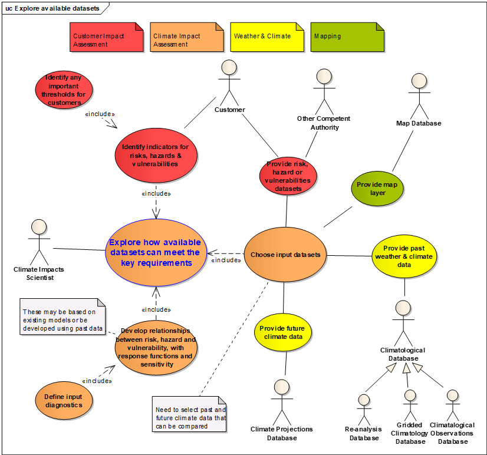

[width="100%",cols="23%,77%",options="header",]
|===
|Use Case 3.2.1 |Explore how available datasets can meet the key requirements
|Priority |High
|Description |Climate Impact Scientist works with the customer to decide on the set of past weather & climate, future climate and other data should be used to assess the climate impact and risk for a particular customer. They also develop the relationships between the risk, hazard and vulnerabilities, with assessment of the response function and the sensitivity, using existing models or past data.
|Pre-condition |Customer needs, objectives & extent of project, including the required outcomes & expectations, for the climate impact and risk assessment have been identified. 
2+h|*Flow of Events - Basic Path*
|Step 1 |*_Climate Impacts Scientist_* works with the *_Customer_* to identify the *Risks, Hazards and Vulnerabilities Indicators* of important to their area of concern.
|Step 2 |*_Customer_* identifies and important threshold values.
|Step 3 |*_Climate Impacts Scientist_* develops the relationship between the risk, hazard and vulnerabilities, including the response function and an assessment of the sensitivity.
|Step 4 |*_Climate Impacts Scientist_* defines the input diagnostics required for the risk function (including the inputs to the hazard model)
|Step 5 |*_Climate Impacts Scientist_* chooses the datasets to provide the input diagnostics for the risk function, and for the calibration of the hazard model, if required. This includes *Past Weather & Climate Data (Climatological Observations, Gridded Climatologies, Re-analyses)*, *Future Climate Projections* and *Risk, Hazard & Vulnerability Data*
|Post-condition |Identified set of input climate and vulnerabilities datasets and a calibrated hazard model.
2+h|*Flow of Events - Alternative Path*
|Additional Step 6 |If necessary, the *_Climate Impacts Scientist_* develops the hazard model relationship with the input diagnostics.
2+h|*Data Source: Risk, Hazards & Vulnerabilities Indicators*
|Description |Risk, hazard and vulnerabilities indicators of importance for the customer's area of concern, including any important threshold values.
|Data Provider |Customer
|Geographic Scope |n/a
|Thematic Scope |n/a
|Scale, resolution |n/a
|Delivery |Consultation
|Documentation |None – dependent on customer
2+h|*Data Source: Risk, Hazards & Vulnerabilities Datasets*
|Description |Various datasets characterising the risk, hazard and vulnerabilities of importance for the customers area of concern
|Data Provider |Customer, Other Competent Authority
|Geographic Scope |Area of interest (may be national, regional or global)
|Thematic Scope |Various (depending on customer area of concern)
|Scale, resolution |Various, but likely to include _PointSeries_ and _GridSeries_ (spatial and temporal resolution depends on area of interest)
|Delivery |Various
|Documentation |None
2+h|*Data Source: Climatological Observations*
|Description |Point weather and climate observations
|Data Provider |Competent authorities in the weather and climate domain
|Geographic Scope |Area of interest (potentially global)
|Thematic Scope |Atmospheric Conditions (AC), Meteorological Geographic Features (MF)
|Scale, resolution |_PointSeries_ (typically daily max, min, mean or accumulation, but could be over various periods)
|Delivery |Typically space-delimited text files as download
|Documentation |For example, see: _http://www.hadobs.org/_
2+h|*Data Source: Gridded Climatologies for the Country of Interest*
|Description |Grids of climate parameters interpolated from observations
|Data Provider |Competent authorities in the weather and climate domain
|Geographic Scope |Country of interest
|Thematic Scope |Atmospheric Conditions (AC), Meteorological Geographic Features (MF)
|Scale, resolution |_GridSeries_ (various, but for example for the UK: 5km, daily, monthly, annual and 30 year means)
|Delivery |Typically space-delimited text or netCDF files as download
|Documentation a|
For example, see:

_http://www.metoffice.gov.uk/climatechange/science/monitoring/ukcp09/index.html_

2+h|*Data Source: Gridded Climatologies for Europe*
|Description |ENSEMBLES daily gridded observational dataset (E-OBS)
|Data Provider |European Climate Assessment & Dataset (ECA&D)
|Geographic Scope |Europe
|Thematic Scope |Atmospheric Conditions (AC), Meteorological Geographic Features (MF)
|Scale, resolution |_GridSeries_ (0.22 – 0.50 degrees, daily 1950 – present)
|Delivery |netCDF
|Documentation |For example, see: _http://eca.knmi.nl/download/ensembles/ensembles.php_
2+h|*Data Source: Re-analyses*
|Description |Grids derived using an NWP model data assimilation scheme to analyse the observations
|Data Provider |Competent authorities in the weather and climate domain
|Geographic Scope |Global
|Thematic Scope |Atmospheric Conditions (AC), Meteorological Geographic Features (MF)
|Scale, resolution |_GridSeries_ (various spatial & temporal resolutions)
|Delivery |Typically netCDF file download
|Documentation a|
For example, see:

_http://www.ecmwf.int/research/era/do/get/Reanalysis_ECMWF_

2+h|*Data Source: Future Climate Projections*
|Description |Set of gridded data of future climate projections using difference scenarios (this includes single and multi-model ensembles)
|Data Provider |Competent authorities in the weather and climate domain
|Geographic Scope |Global
|Thematic Scope |Atmospheric Conditions (AC), Meteorological Geographic Features (MF)
|Scale, resolution |_GridSeries_ (various spatial & temporal resolutions)
|Delivery |Typically netCDF file download
|Documentation |For example, see: _http://www-pcmdi.llnl.gov/ipcc/about_ipcc.php_
2+h|*Data Source: Map*
|Description |Geographical map at appropriate scale
|Data Provider |Various
|Geographic Scope |Area of interest, potentially anywhere on the globe
|Thematic Scope |Cadastral Parcels (CP)
|Scale, resolution |_Polygons_ provided as raster image
|Delivery |As part of visualisation of other data
|Documentation |None
|===

_Use Case 3.2.2: Assess existing risks due to the current weather & climate_

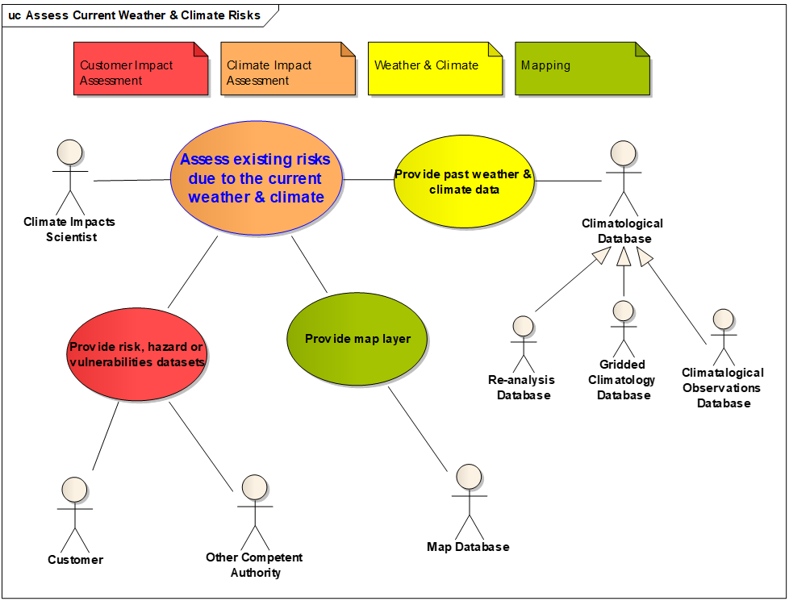

[width="100%",cols=",",options="header",]
|===
|Use Case 3.2.2 |Assess existing risks due to the current weather & climate
|Priority |High
|Description |Climate Impacts Scientist assesses the current customer expose to climate impacts and risks using past climate and weather data. They also calibrate/baseline the risk function relationship.
|Pre-condition |Identified set of input climate and vulnerabilities datasets and a calibrated hazard model.
2+h|*Flow of Events - Basic Path*
|Step 1 |*_Climate Impacts Scientist_* uses the *Past Weather & Climate Data (Climatological Observations, Gridded Climatologies, Re-analyses)* and *Risk, Hazard & Vulnerability Data* within the risk function and hazard model relationships to assess the current exposure (and calibrate/baseline the relationships) to climate and weather.
|Step 2 |*_Climate Impacts Scientist_* reviews the results using various *Visualisations of Risk Indicators*
|Post-condition |Current (baseline) risk understood. Risk function calibrated.
2+h|*Flow of Events - Alternative Path*
|Additional Step 1a|If relevant the *_Climate Impacts Scientist_* may use Climatological *Observations* with the *Risk, Hazard & Vulnerability Data* to investigate specific events to gain further insight to the hazard model relationship with the input diagnostics.
2+h|*Data Source: Climatological Observations* (as per Use Case 3.2.1)
2+h|*Data Source: Gridded Climatologies* (as per Use Case 3.2.1)
2+h|*Data Source: Re-analyses* (as per Use Case 3.2.1)
2+h|*Data Source: Risk, Hazards & Vulnerabilities Data* (as per Use Case 3.2.1)
2+h|*Data Source: Visualisations of Risk Indicators*
|Description |Visualisation of risk indicators, as maps (usually filled gridboxes), time series (possibly with error/range bars) or probability distribution functions (PDFs).
|Data Provider |Competent authorities in the weather and climate domain
|Geographic Scope |Area of interest (may be national, regional or global)
|Thematic Scope |Atmospheric Conditions (AC), Meteorological Geographic Features (MF) and various others (depending on customer area of concern)
|Scale, resolution |_Grid, Point , PointSeries_ (spatial and temporal resolution depends on area of interest)
|Delivery |GIS tool, webpage or as part of a report
|Documentation |None
2+h|*Data Source: Map* (as per Use Case 3.2.1)
|===

_Use Case 3.2.3: Assess in detail how the key risks identified are likely to change in the future_

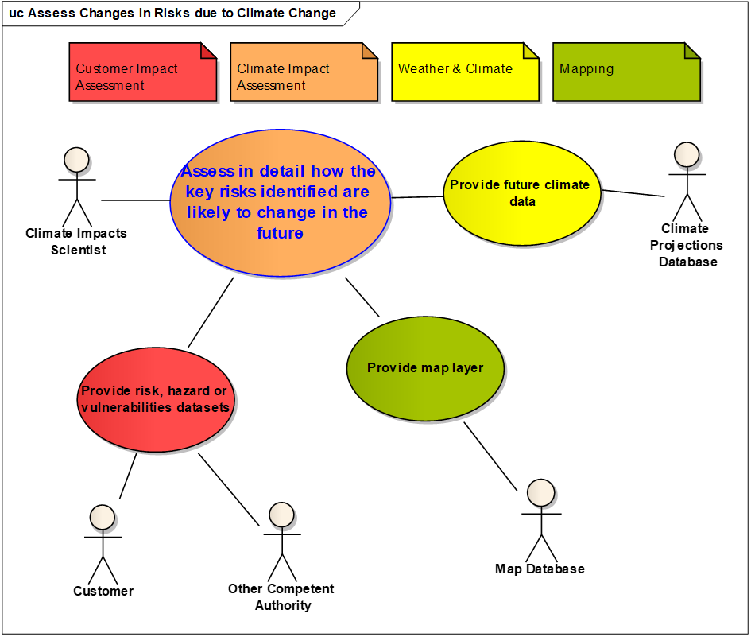

[width="100%",cols="22%,78%",options="header",]
|===
|Use Case 3.2.3 |Assess in detail how the key risks identified are likely to change in the future
|Priority |High
|Description |Climate Impact Scientists assesses the future customer expose to climate impacts and risks using climate projections.
|Pre-condition |Current (baseline) risk understood. Risk function calibrated.
2+h|*Flow of Events - Basic Path*
|Step 1 |*_Climate Impacts Scientist_* uses the *Future Climate Projections* and *Risk, Hazard & Vulnerability Data* within the risk function and hazard model relationships to assess the exposure to future changes in climate and weather.
|Step 2 |*_Climate Impacts Scientist_* reviews the results using various *Visualisations of Risk Indicators*
|Post-condition |Future risk understood.
2+h|*Data Source: Future Climate Projection* (as per Use Case 3.2.1)
2+h|*Data Source: Risk, Hazards & Vulnerabilities Data* (as per Use Case 3.2.1)
2+h|*Data Source: Visualisations of Risk Indicators* (as per Use Case 3.2.2)
2+h|*Data Source: Map* (as per Use Case 3.2.1)
|===

[discrete]
=== Applicability to other themes

The "Climate Impacts" use case can potentially be applied to many of the other INSPIRE themes, depending on their scope. The following themes currently refer to use of climate data for impacts evaluation:

* [.underline]#Buildings# mentions climate data in several use cases, but does not explicitly reference it as a data source.
* [.underline]#Environmental Monitoring Facilities# mentions climate data in the use case related to the oceans in relation to climate change monitoring and the Marine Strategy Framework Directive, but does not explicitly reference AC-MF.
* [.underline]#Natural Risk Zones# defines a "Climate" risk category and explicitly refers to the need for AC-MF climate data in forest fires danger mapping use case.
* [.underline]#Soil# explicitly references climate data in two of the use cases, and may have applicability to further use cases.

There are also a number of themes that do not refer to climate data, but appear to need it for impacts evaluation:

* [.underline]#Energy Resources# appears to have a dependency on climate data for the use cases related to wind and solar power.
* [.underline]#Human Health and Safety# appears to have a dependency on climate data a whole range of use cases (specific examples include the air quality, and the development and transmission of diseases), but there is no reference to it.
* [.underline]#Ocean Geographic Features# coastal flood hazard map use case could potentially need climate data, but it is not referenced as a data source.
* [.underline]#Habitats and Biotopes# needs climate information in relation to the distribution, the extent and the "quality" of habitats, but there is no reference to it.
* [.underline]#Bio-geographical Regions# needs climate data for analysis and classification of bio-geographical regions.

[discrete]
=== References

[arabic, start=1]
. *Prepare: Understand your weather and climate related risks* (Climate Impacts and Risk assessment Framework (CIRF) Data Sheet): _http://www.metoffice.gov.uk/publicsector/cirf-datasheet.pdf_

[arabic, start=2]
. *Essential Climate Variables (ECV) Data Access Matrix* (GCOS): _http://gosic.org/ios/MATRICES/ECV/ecv-matrix.htm_

[arabic, start=3]
. *Met Office Hadley Centre observations datasets*: _http://www.hadobs.org/_

[arabic, start=4]
. *UK Climate Projections* (UKCP09): _http://ukclimateprojections.defra.gov.uk/content/view/868/531/_

[arabic, start=5]
. *Reanalysis at ECMWF* (ERA): _http://www.ecmwf.int/research/era/do/get/Reanalysis_ECMWF_

[arabic, start=6]
. *Atmospheric Circulation Reconstructions over the Earth* (ACRE): _http://www.met-acre.org/_

[arabic, start=7]
. *WCRP CMIP3 multi-model dataset* (IPCC AR4): _http://www-pcmdi.llnl.gov/ipcc/about_ipcc.php_

[arabic, start=8]
. *European Climate Assessment and Dataset* (ECA&D): _http://eca.knmi.nl/_

=== Reporting and exchanging of Air Quality data under 2011/850/EU

[discrete]
==== Introduction

A number of EU legal instruments require EU Member States to monitor and report air quality data; this information is collated and disseminated by the European Environment Agency (EEA). At present much of the data is reported electronically by countries, but not necessarily in the best integrated fashion.

The recent introduction of 2011/850/EU (Commission Implementing Decision of 12 December 2011 laying down rules for Directives 2004/107/EC and 2008/50/EC as regards the reciprocal exchange of information and reporting on ambient air quality) provides an opportunity to examine the reporting process overall to determine how it can be modernised to improve data quality, facilitate data sharing, and reduce the administrative burden of reporting.

The Air Quality Directives' (AQD) implementing provisionsfootnote:[http://eur-lex.europa.eu/LexUriServ/LexUriServ.do?uri=OJ:L:2011:335:0086:0106:EN:PDF] (AQD IPR) will apply from the end of a 2-year transitional period commencing at the date of their adoption. Consequently, the decision applies from 1 January 2014. In order to successfully manage and facilitate the transition process, the countries' reporting agencies, their data providers, and the EEA operational services will need to work closely together to establish, test and commission a new reporting process. Directive 2008/50/EC (AQD) requires that the procedures are compatible with Directive 2007/2/EC (INSPIRE).

Reporting and exchange of air quality information under the AQD IPR are of relevance to at least four of the INSPIRE Annex II/III data specification areas:

* D2.8.II/III.5 Human Health and Safety (HH),
* D2.8.III.7 Environmental Monitoring Facilities (EF),
* D2.8.III.11 Area management/restriction/regulation zones and reporting units (AM) and
* D2.8.III.13-14 Atmospheric Conditions and Meteorological Geographical Features (AC-MF).

Future electronic reporting of Air Quality data in Europe will therefore need to use the data specifications from all these thematic areas and it is essential that all four consider the use case of Air Quality data, which now includes both measurement and modelled data, into account.

[discrete]
==== Reporting of Air Quality data under implementing decision 2011/850/EU

*Emerging logic and optimisation techniques*

The anticipated organisation of AQD data flows under the IPR is set out in this section. In populating the logic for this new system the individual instruments (Articles within the AQD IPR) have been evaluated and mapped against current reporting data flows. No discrimination has been made between the administrative scales or hierarchies of the responsible parties involved; under the IPR, the schemata to be supplied for transmitting and organising reporting data flows are assumed to be equally applicable to all scales of responsible parties (local, regional, national or federal). Indeed it is this concept that underpins the realisation of much of the data flow streamlining to be achieved by the emergent system.

An evaluation of the IPR Articles has been performed and is summarised in the AQD IPR data model presented in Figure 1. Further details on the individual data flows are also provided – it should be noted that the diagrams are preliminary and still subject to testing and further developments. As part of this analysis, the Articles were mapped to current reporting requirements as specified by the FWD, AQDDs and EoI Decision(s). From this work it is evident and perhaps important to stress, that the overall content of data flows (existing and emergent) have remained broadly consistent, albeit with some modifications to the mandatory and voluntary contents, timing and frequency of data flows and mechanisms or formats for reporting. What is clear is that the organisation of the data flows and their contents has changed in the effort to remove or reduce duplication in data reporting and to promote efficient and discrete management of similar data types. More information is provided in the EEA Technical report 'Reporting and exchanging air quality information using e-Reporting'footnote:[http://www.eea.europa.eu/publications/reporting-and-exchanging-air-quality]. As shown in Figure 2, the data model needs to take all these data flows into account. Figures 3 – 14 describe the different data flows in more detail. Table 1 shows how the different data flows relate to the various INSPIRE data specification themes.

The IPR decision (2011/850/EU) contains a number of articles that describes how the Air Quality data that is requested by the directives (2008/50/EC) and (2004/107/EC) shall be delivered and how data flow shall be implemented. Articles 1 to 5 are introductory while articles 6 to 14 provide information on data flows that shall be put in place. As shown in Figure 11, the data model needs to take all these data flows into account.

*Overview of data flows*

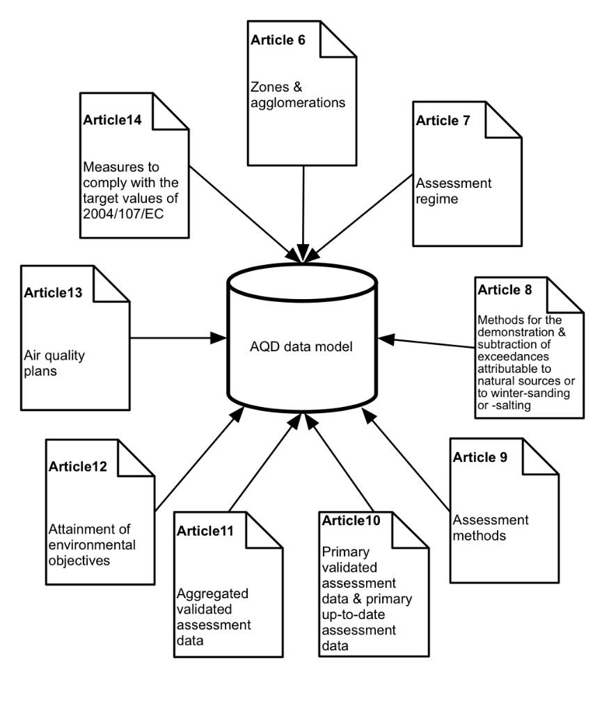

[.text-center]
*Figure 11: Overview of emergent AQD IPR data model and data flows*

[.text-center]
*Table 7: Overview of the different air quality data flows and how they are related to the different INSPIRE Annex III themes.*

[align=center,width="100%",cols="24%,19%,19%,19%,19%",options="header",]
|===
|*Article no./data flow* |*AC-MF* |*EF* |*HH* |*AM*
|*Information on zones and agglomerations (Article 6)* | | | |*X*
|*Information on the assessment regime (Article 7)* |*X* |*X* | |*X*
|*"Methods for subtraction of exceedances" (Article 8)* |*X* |*X* | |*X*
|*Information on the assessment methods (Articles 8 and 9)* |*X* |*X* | |
a|
*Information on primary validated assessment data*

*(Article 10)*

|*X* | | |
|*Information on generated aggregated data - primary validated measurements (Article 11)* |*X* | | |
|*Information on the attainment of environmental objectives (Article 12)* | | |*X* |*X*
|*Information on air quality plans (Article 13)* |*X* | | |*X*
|*Information on measures (Articles 13 and 14)* |*X* | | |*X*
|===

*Article 6 Zones and agglomerations*

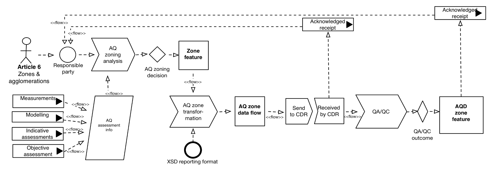

[.text-center]
*Figure 12: Data flow for reporting of zones and agglomerations within the Air Quality Directive*

[.text-center]
*Table 2: Reporting of zones and agglomerations.*

[align=center,width="100%",cols="16%,84%",options="header",]
|===
|Name |Information on zones and agglomerations (Article 6)
|Primary actor |National AQ data reporter
|Goal |The need to reduce pollution to levels which minimise harmful effects on human health, paying particular attention to sensitive populations, and the environment as a whole, to improve the monitoring and assessment of air quality including the deposition of pollutants and to provide information to the public.
|System under consideration |Reporting of air quality under AQD IPR 2011/850/EU
|Importance |High
|Description |Provision of information on delimitation and types of zones and agglomerations
|Pre-conditions |Quality checked information on the boundaries and typologies of zones and agglomerations for air quality management are available in national system
|Post-condition |The information on the assessment regime to be applied in the following calendar year for each pollutant within individual zones and agglomerations
|Flow of events – Basic path |
|Step 1 |Transform information on the assessment regime into agreed reporting format
|Step 2 |Carry out post transformation quality checks on data in agreed reporting format
|Step 3 |Make data in agreed reporting format available (upload to CDR).
|Step 4 |Receive results of post delivery quality checks (carried out in CDR)
|Step 5 |If results are negative, make required changes in national system.
|*Background Documentation* |
|AQD IPR 2011/850/EU |_http://eur-lex.europa.eu/LexUriServ/LexUriServ.do?uri=OJ:L:2011:335:0086:0106:EN:PDF_
|*E-reporting* |_http://www.eionet.europa.eu/aqportal_
|===

*Article 7 Assessment regimes*

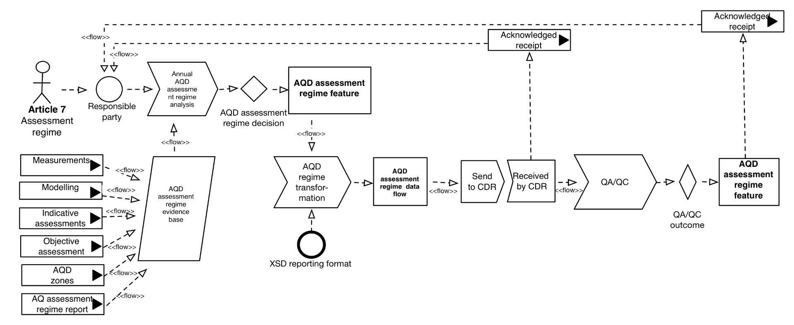

[.text-center]
*Figure 13: Data flow for reporting of Assessment regimes within the Air Quality Directive*

The different steps of the reporting for Article 7 are also presented in the table below.

[.text-center]
*Table 3: Reporting of assessment regime.*

[align=center,width="100%",cols="16%,84%",options="header",]
|===
|Name |Reporting information on the assessment regime (Article 7)
|Primary actor |National AQ data reporter
|Goal |The need to reduce pollution to levels which minimise harmful effects on human health, paying particular attention to sensitive populations, and the environment as a whole, to improve the monitoring and assessment of air quality including the deposition of pollutants and to provide information to the public.
|System under consideration |Reporting of air quality under AQD IPR 2011/850/EU
|Importance |High
|Description |Member States shall make available the information on the assessment regime to be applied in the following calendar year for each pollutant within individual zones and agglomerations
|Pre-conditions a|
* Assessment thresholds for each individual zone and agglomeration in accordance with Article 4 of Directive 2004/107/EC and Articles 5 and 9 of Directive 2008/50/EC.are available in national system
* Meta information for operational measurement networks including quality procedures in national air quality system and meta information for models including quality procedures in national air quality system (Articles 8 and 9) reported.
* Information on zones and agglomerations (Article 6) reported

|Post-condition |The information on the assessment regime to be applied in the following calendar year for each pollutant within individual zones and agglomerations
|Flow of events – Basic path |
|Step 1 |Transform information on the assessment regime into agreed reporting format
|Step 2 |Carry out post transformation quality checks on data in agreed reporting format
|Step 3 |Make data in agreed reporting format available (upload to CDR).
|Step 4 |Receive results of post delivery quality checks (carried out in CDR)
|Step 5 |If results are negative, make required changes in national system.
2+h|*Background Documentation*
|AQD IPR 2011/850/EU |_http://eur-lex.europa.eu/LexUriServ/LexUriServ.do?uri=OJ:L:2011:335:0086:0106:EN:PDF_
|*AQ Directive 2008/50/EC* |_http://eur-lex.europa.eu/LexUriServ/LexUriServ.do?uri=CELEX:32008L0050:EN:NOT_
|*4^th^ Daughter Directive 2004/107/EC* |_http://eur-lex.europa.eu/LexUriServ/LexUriServ.do?uri=CELEX:32004L0107:en:NOT_
|*E-reporting* |_http://www.eionet.europa.eu/aqportal_
|===

*Article 8 Methods for the demonstration and subtraction of exceedances attributable to natural sources or to winter- sanding or –salting and Article 9 Assessment methods*

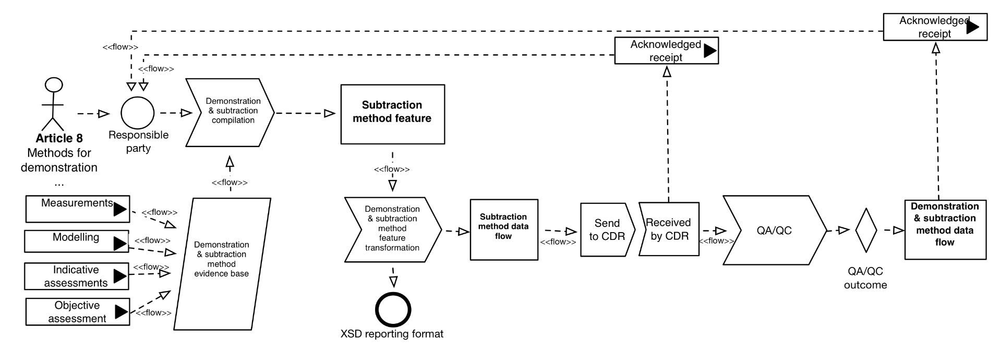

[.text-center]
*Figure 14: Data flow for reporting of methods used for subtraction of measurements exceeding legal Air Quality thresholds. Measurements exceeding thresholds that can be proved to be attributable to natural or external sources will not be taken into account when number of days with exceedences are summarised for a year*

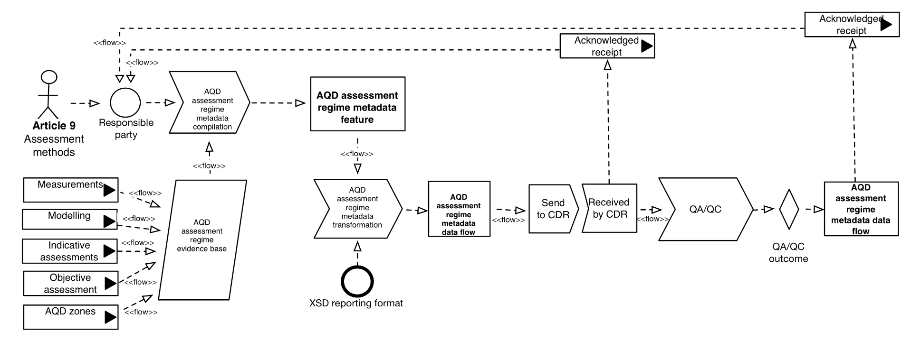

[.text-center]
*Figure 15: Data flow for reporting of Air Quality assessment methods*

The different steps required for reporting of assessment methods are also described in the table below. This combines both articles 8 and 9.

[.text-center]
*Table 4: Reporting of assessment methods*

[align=center,width="100%",cols="15%,85%",options="header",]
|===
|Name |Reporting *of information on the assessment methods (Articles 8 and 9)*
|Primary actor |National AQ data reporter
|Goal |The need to reduce pollution to levels which minimise harmful effects on human health, paying particular attention to sensitive populations, and the environment as a whole, to improve the monitoring and assessment of air quality including the deposition of pollutants and to provide information to the public.
|System under consideration |Reporting of air quality under AQD IPR 2011/850/EU
|Importance |High
|Description |Provision of metadata for the assessment, describing the methods and the supporting information.
|Pre-conditions a|
* *Meta information for operational measurement networks including quality procedures in national air quality system*
* *Meta information for models including quality procedures in national air quality system*

|Post-condition |The assessment methods (metadata for networks, stations, instruments, analytical methods for measurements and metadata for models) for the primary data are available in order to provide traceability for subsequently reported primary data
|Flow of events – Basic path |
|Step 1 |Transform meta information inventories relating to primary data from national air quality system into agreed reporting format
|Step 2 |Carry out post transformation quality checks on data in agreed reporting format
|Step 3 |Make data in agreed reporting format available (upload to CDR).
|Step 4 |Receive results of post delivery quality checks (carried out in CDR)
|Step 5 |If results are negative, make required changes in national system.
2+|*Background Documentation*
|AQD IPR 2011/850/EU |http://eur-lex.europa.eu/LexUriServ/LexUriServ.do?uri=OJ:L:2011:335:0086:0106:EN:PDF
|*E reporting* |_http://www.eionet.europa.eu/aqportal_
|===

*Article 10 Primary validated assessment data and primary up-to-date assessment data*

Three type of primary assessment data are covered in this section: validated measurements from fixed stations, validated measurements obtained from air models and preliminary measurements from fixed stations. Preliminary measurements have not yet undergone the full set of quality controls but are made available in order to provide up-to-date data.

*Primary validated measurement data*

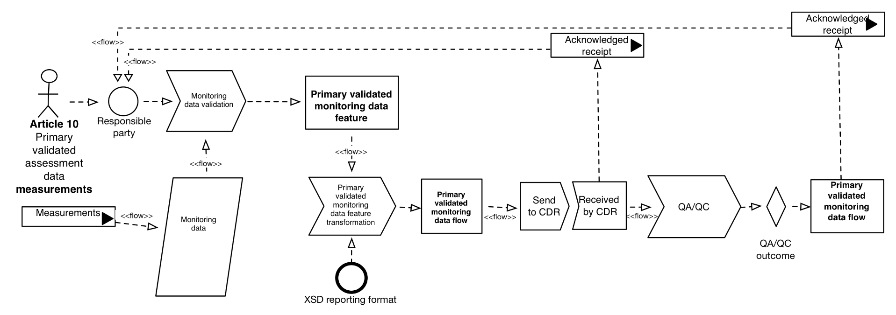

[.text-center]
*Figure 16: Validated measurement data*

The different steps required for reporting of primary validated measurement data are also described in the table below.

[.text-center]
*Table 5: Reporting of primary validated measurement data*

[align=center,width="100%",cols="15%,85%",options="header",]
|===
|Name |*Reporting of information on primary validated assessment data -measurement (Article 10)*
|Primary actor |National AQ data reporter
|Goal |The need to reduce pollution to levels which minimise harmful effects on human health, paying particular attention to sensitive populations, and the environment as a whole, to improve the monitoring and assessment of air quality including the deposition of pollutants and to provide information to the public.
|System under consideration |Reporting of air quality under AQD IPR 2011/850/EU
|Importance |High
|Description |Provision for reporting of validated un-aggregated concentration levels from fixed stations in order to maintain the existing EoI exchange mechanism on fixed monitoring stations and related data that feeds into AirBase
|Pre-conditions a|
* *Operational measurement networks including quality procedures in place*
* *Validated measurements results for relevant components (pollutants) available in national air quality system*

(pollutant/component measured, measurement value, time stamp, validity flag plus key to retrieve metadata (networks,stations,instruments,methods) reported under Articles 8 and 9)

* *Information on zones and agglomerations (Article 6)* reported
* *Information on the assessment regime (Article 7)* reported
* *Information on the assessment methods (Articles 8 and 9) reported*

|Post-condition |*Information on primary validated assessment data -measurements* are available in air quality data repository (CDR) and are consistent with information under Articles 6,7, 8 and 9 as documentation of the calculation of exceedances in air quality management zones
|Flow of events – Basic path |
|Step 1 |Transform validated primary measurement data from national air quality system into agreed reporting format
|Step 2 |Carry out post transformation quality checks on data
|Step 3 |Make data in agreed reporting format available (deliver to CDR).
|Step 4 |Receive results of post delivery quality checks (carried out in CDR)
|Step 5 |If results are negative, make required changes to data in national system.
|Documentation |
|AQD IPR 2011/850/EU |*http://eur-lex.europa.eu/LexUriServ/LexUriServ.do?uri=OJ:L:2011:335:0086:0106:EN:PDF*
|*E reporting* |_http://www.eionet.europa.eu/aqportal_
|===

*Primary validated model data*

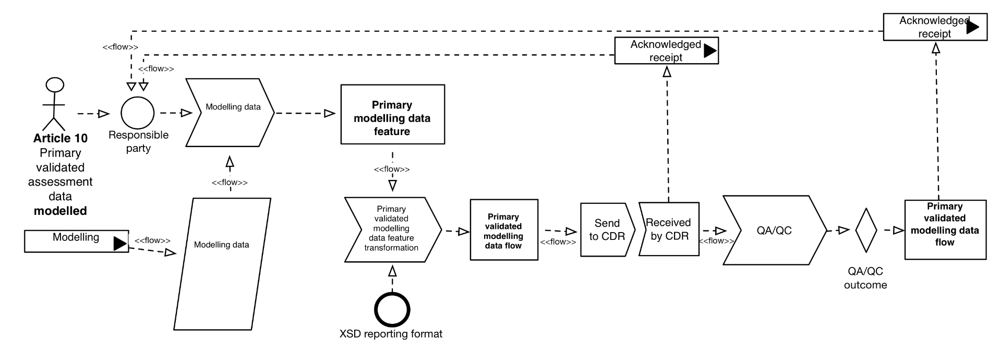

[.text-center]
*Figure 17: Validated modelled data. Note that the diagram is still not adapted to the special features of model data.*

The different steps required for reporting of primary validated modelled data are also described in the table below.

[.text-center]
*Table 6: Reporting of validated modelled data*

[align=center,width="100%",cols="15%,85%",options="header",]
|===
|Name |*Reporting of information on primary validated assessment data -modelled (Article 10)*
|Primary actor |National AQ data reporter
|Goal |The need to reduce pollution to levels which minimise harmful effects on human health, paying particular attention to sensitive populations, and the environment as a whole, to improve the monitoring and assessment of air quality including the deposition of pollutants and to provide information to the public.
|System under consideration |Reporting of air quality under AQD IPR 2011/850/EU
|Importance |High
|Description |Provision for reporting of un-aggregated concentration levels from AQ modelling
|Pre-conditions a|
* *Appropriate modelling capacity including quality procedures are in place*
* *Validated results of modelling exercise*

(pollutant/component (s) modelled, modelled values, time stamp, validity flag plus key to retrieve metadata for model reported under Articles 8 and 9)

*available in national air quality system*

* *Information on zones and agglomerations (Article 6)* reported
* *Information on the assessment regime (Article 7)* reported
* *Information on the assessment methods (Articles 8 and 9) reported*

|Post-condition |*Information on primary validated assessment data -modelled* are available in air quality data repository (CDR) and are consistent with information reported under Articles 6,7, 8 and 9 for documentation of the calculation of exceedances in air quality management zones
|Flow of events – Basic path |
|Step 1 |Transform modelled primary data from national air quality system into agreed reporting format
|Step 2 |Carry out post transformation quality checks on data in agreed reporting format
|Step 3 |Make data in agreed reporting format available (upload to CDR).
|Step 4 |Receive results of post delivery quality checks (carried out in CDR)
|Step 5 |If results are negative, make required changes in national system.
2+|*Background Documentation*
|AQD IPR 2011/850/EU |http://eur-lex.europa.eu/LexUriServ/LexUriServ.do?uri=OJ:L:2011:335:0086:0106:EN:PDF
|*E reporting* |_http://www.eionet.europa.eu/aqportal_
|===

*Primary up-to-date data*

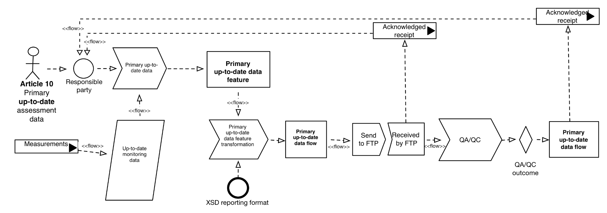

[.text-center]
*Figure 18: Primary up-to-date measurement data. The term Near Real Time (NRT) data has previously been used for such data.*

The different steps required for reporting of primary up-to-date measurement data are also described in the table below.

[.text-center]
*Table 7: Reporting of up-to-date measurement data*

[align=center,width="100%",cols="15%,85%",options="header",]
|===
|Name |*Reporting of information on primary up-to-date assessment data -measurement (Article 10)*
|Primary actor |National AQ data reporter
|Goal |The need to reduce pollution to levels which minimise harmful effects on human health, paying particular attention to sensitive populations, and the environment as a whole, to improve the monitoring and assessment of air quality including the deposition of pollutants and to provide information to the public.
|System under consideration |Reporting of air quality under AQD IPR 2011/850/EU
|Importance |High
|Description |Provision for reporting as soon as possible of un-aggregated concentration levels from fixed stations. The measurement results have not yet passed the full range of quality checks and therefore are subject to change.
|Pre-conditions a|
* Operational measurement networks including quality procedures in place
* Up-to-date measurements results for relevant components (pollutants) available in national air quality system

(pollutant/component measured, measurement value, time stamp, validity flag plus key to retrieve metadata (networks,stations,instruments,methods) reported under Articles 8 and 9)

* Information on zones and agglomerations (Article 6) reported
* Information on the assessment methods (Articles 8 and 9) reported

|Post-condition |Primary up-to-date assessment data -measurements are available at an agreed internet location and are consistent with information under Articles 6, 8 and 9
2+|Flow of events – Basic path
|Step 1 |Transform up-to-date primary measurement data from national air quality system into agreed reporting format
|Step 2 |Carry out post transformation quality checks on data
|Step 3 |Make data in agreed reporting format available at agreed internet location.
|Step 4 |Receive results of post delivery quality checks
|Step 5 |If results are negative, make required changes to data in national system.
|Documentation |
|AQD IPR 2011/850/EU |*http://eur-lex.europa.eu/LexUriServ/LexUriServ.do?uri=OJ:L:2011:335:0086:0106:EN:PDF*
|E-reporting |_http://www.eionet.europa.eu/aqportal_
|===

*Article 11 Aggregated validated assessment data*

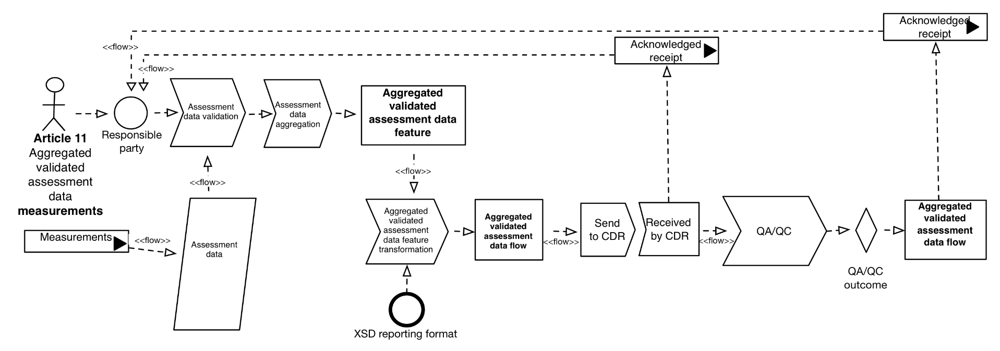

[.text-center]
*Figure 19: Validated aggregated measurement data.*

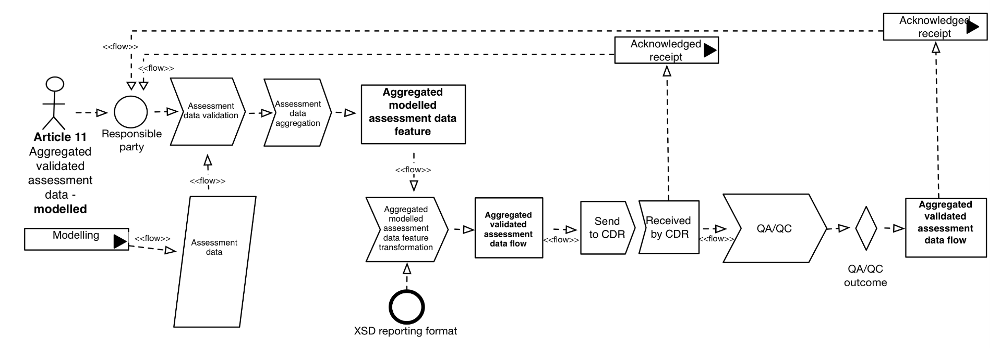

[.text-center]
*Figure 20: Validated aggregated modelled data. Note that the diagram is still not adapted to the special features of model data.*

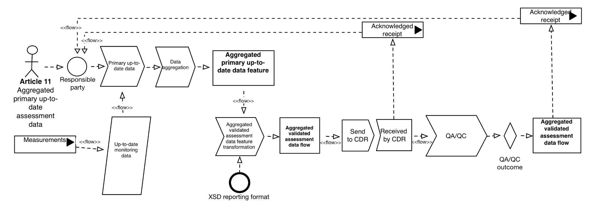

[.text-center]
*Figure 21: Aggregated up-to-date measurement data. The term Near Real Time (NRT) data has previously been used for such data.*

*Article 12 Attainment of environmental objectives*

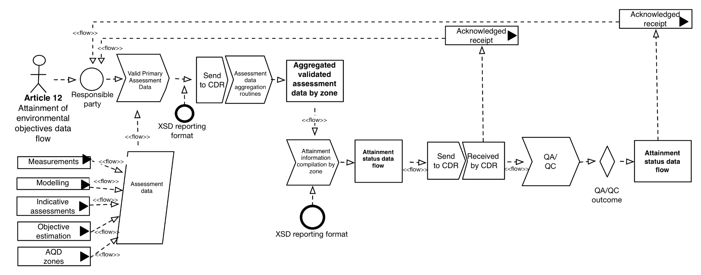

[.text-center]
*Figure 12 Attainment of environmental objectives. Examples of the required environmental objectives for selected pollutants are provided in Section 3.1*

[.text-center]
*Table 8: Reporting of information on the attainment of environmental objectives*

[align=center,width="100%",cols="16%,84%",options="header",]
|===
|Name |Reporting of information on the attainment of environmental objectives (Article 12 )
|Primary actor |National AQ data reporter
|Goal |The need to reduce pollution to levels which minimise harmful effects on human health, paying particular attention to sensitive populations, and the environment as a whole, to improve the monitoring and assessment of air quality including the deposition of pollutants and to provide information to the public.
|System under consideration |Reporting of air quality under AQD IPR 2011/850/EU
|Importance |High
|Description |Declaration for individual zones and agglomerations as to whether the relevant environmental objectives have been met.
|Pre-conditions a|
* Information on the attainment of environmental objectives for individual zones and agglomerations is available in the national system
* Information on zones and agglomerations (Article 6) reported
* Information on the assessment regime (Article 7) reported
* Information on the assessment methods (Articles 8 and 9) reported
* Information on the primary validated data (Article 10) reported
* Information on the aggregated primary validated data (Article 11) reported

|Post-condition a|
* The information on the attainment of environmental objectives is available for each zone and agglomeration and the data underpinning the declaration is traceable, consistent and available.
* In cases where the environmental objective is a limit value which is in force, the information shows whether the Member State is in compliance with the Air Quality Directive 2008/50/EC.

2+|Flow of events – Basic path
|Step 1 |Transform information on the attainment of environmental objectives for individual zones and agglomerations from national air quality system into agreed reporting format
|Step 2 |Carry out post transformation quality checks on data in agreed reporting format
|Step 3 |Make data in agreed reporting format available (upload to CDR).
|Step 4 |Receive results of post delivery quality checks (carried out in CDR)
|Step 5 |If results are negative, make required changes in national system.
2+|*Background Documentation*
|*AQ Directive 2008/50/EC* |_http://eur-lex.europa.eu/LexUriServ/LexUriServ.do?uri=CELEX:32008L0050:EN:NOT_
|*4^th^ Daughter Directive 2004/107/EC* |_http://eur-lex.europa.eu/LexUriServ/LexUriServ.do?uri=CELEX:32004L0107:en:NOT_
|AQD IPR 2011/850/EU |_http://eur-lex.europa.eu/LexUriServ/LexUriServ.do?uri=OJ:L:2011:335:0086:0106:EN:PDF_
|*E reporting* |_http://www.eionet.europa.eu/aqportal_
|===

*Article 13 Air quality plans*

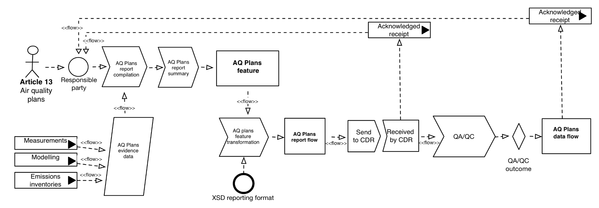

[.text-center]
*Figure 22: Data flow for reporting of Air Quality plans.*

*Article 14 Measures to comply with the target values of Directive 2004/107/EC*

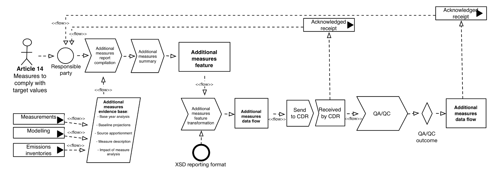

[.text-center]
*Figure 23: Data flow for reporting of measures to comply with the target values of Directive 2004/107/EC (reporting of arsenic, cadmium, mercury, nickel and polycyclic aromatic hydrocarbons in ambient air).*

*Air Quality pollutants with monitoring requirements referred to in Directives 2004/107/EC and 2008/50/EC*

The air quality directives describe a number of pollutants that shall be monitored by the Member States. These are given in the table below. Pollutant names are listed together with chemical formula and unit. Information on the observable property value for reporting under INSPIRE will be made available at the portal _http://www.eionet.europa.eu/aqportal_.

Note: A list of further pollutants on which Member States shall have reciprocal data exchange, as available, is kept by the European Environment Agency and is made available at the portal _http://www.eionet.europa.eu/aqportal_.

[.text-center]
*Table 9: Overview of pollutants with monitoring requirements in the Directives 2004/107/EC and 2008/50/EC.*

[align=center,width="100%",cols="37%,30%,33%",options="header",]
|===
|*Pollutant name* |*Pollutant formula* |*Units*
|Sulphur dioxide |SO~2~ |µg/m³
|Nitrogen dioxide |NO~2~ |µg/m³
|Nitrogen oxides |NOx^1^ |µg/m³
|Ozone |O~3~ |µg/m³
|Carbon Monoxide |CO |mg/m³
|Particulate matter less than 10 microns |PM~10~ |µg/m³
|Particulate matter less than 2.5 microns |PM~2.5~ |µg/m³
|Sulphate in PM~2.5~ |SO~4~^2^ in PM~2.5~ |µg/m³
|Nitrate in PM~2.5~ |NO~3~^-^ in PM~2.5~ |µg/m³
|Ammonium in PM~2.5~ |NH~4~^^ inPM~2.5~ |µg/m³
|Elemental Carbon in PM~2.5~ |elem. C in PM~2.5~ |µg/m³
|Organic Carbon in PM~2.5~ |org. C in PM~2.5~ |µg/m³
|Calcium in PM~2.5~ |Ca^2^ in PM~2.5~ |µg/m³
|Magnesium in PM~2.5~ |Mg^2^ in PM~2.5~ |µg/m³
|Potassium in PM~2.5~ |K^^ in PM~2.5~ |µg/m³
|Sodium in PM~2.5~ |Na^^ in PM~2.5~ |µg/m³
|Chloride in PM~2.5~ |Cl^-^in PM~2.5~ |µg/m³
|Lead in PM~10~ |Pb in PM~10~ |µg/m³
|Cadmium in PM~10~ |Cd in PM~10~ |ng/m³
|Arsenic in PM~10~ |As in PM~10~ |ng/m³
|Nickel in PM~10~ |Ni in PM~10~ |ng/m³
|wet/total Pb deposition |Pb deposition |µg /m².day
|wet/total Cd deposition |Cd deposition |µg /m².day
|wet/total As deposition |As deposition |µg /m².day
|wet/total Ni deposition |Ni deposition |µg /m².day
|wet/total Hg deposition |Hg deposition |µg /m².day
|elemental gaseous Mercury |Hg^0^ |ng/m³
|Total gaseous Hg |Hg^0^  Hg-reactive |ng/m³
|reactive gaseous Mercury |Hg-reactive |ng/m³
|particulate Mercury |Hg in PM~10~ |ng/m³
|Benzo(a)pyrene in PM~10~ |B(a)P in PM~10~ |ng/m³
|Benzo(a)anthracene in PM~10~ |Benzo(a)anthracene in PM~10~ |ng/m³
|Benzo(b)fluoranthene in PM~10~ |Benzo(b)fluoranthene in PM~10~ |ng/m³
|Benzo(j)fluoranthene in PM~10~ |Benzo(j)fluoranthene in PM~10~ |ng/m³
|Benzo(k)fluoranthene in PM~10~ |Benzo(k)fluoranthene in PM~10~ |ng/m³
|Indeno(1,2,3,-cd)pyrene in PM~10~ |Indeno(1,2,3,-cd)pyrene in PM~10~ |ng/m³
|Dibenzo(a,h)anthracene in PM~10~ |Dibenzo(a,h)anthracene in PM~10~ |ng/m³
|Benzo(a)pyrene deposition |B(a)P |µg /m².day
|Benzo(a)anthracene deposition |Benzo(a)anthracene |µg /m².day
|Benzo(b)fluoranthene deposition |Benzo(b)fluoranthene |µg /m².day
|Benzo(j)fluoranthene deposition |Benzo(j)fluoranthene |µg /m².day
|Benzo(k)fluoranthene deposition |Benzo(k)fluoranthene |µg /m².day
|Indeno(1,2,3,-cd)pyrene deposition |Indeno(1,2,3,-cd)pyrene |µg /m².day
|Dibenzo(a,h)anthracene deposition |Dibenzo(a,h)anthracene |µg /m².day
|Benzene |C~6~H~6~ |µg/m³
|Ethane |C~2~H~6~ |µg/m³
|Ethene (ethylene) |C~2~H~4~ |µg/m³
|Ethyne (acetylene) |HC≡CH |µg/m³
|Propane |H~3~C-CH~2~-CH~3~ |µg/m³
|Propene |CH~2~=CH-CH~3~ |µg/m³
|n-butane |H~3~C-CH~2~-CH~2~-CH~3~ |µg/m³
|2-methylproprane (i-butane) |H~3~C-CH(CH~3~)~2~ |µg/m³
|1-butene |H~2~C=CH-CH~2~-CH~3~ |µg/m³
|trans-2-butene |H~3~C-CH=CH-CH~3~ |µg/m³
|cis-2-butene |H~3~C-CH=CH-CH~3~ |µg/m³
|1,3-butadiene |CH~2~=CH-CH=CH~2~ |µg/m³
|n-pentane |H~3~C-(CH~2~)~3~-CH~3~ |µg/m³
|2-methylbutane (i-pentane) |H~3~C-CH~2~-CH(CH~3~)~2~ |µg/m³
|1-pentene |H~2~C=CH-CH~2~-CH~2~-CH~3~ |µg/m³
|2-pentene |H~3~C-HC=CH-CH~2~-CH~3~ |µg/m³
|2-methyl-1,3-butadiene (isoprene) |CH~2~=CH-C(CH~3~)=CH~2~ |µg/m³
|n-hexane |C~6~H~14~ |µg/m³
|2-methylpentane (i-hexane) |(CH~3~)~2~-CH-CH~2~-CH~2~-CH~3~ |µg/m³
|n-heptane |C~7~H~16~ |µg/m³
|n-octane |C~8~H~18~ |µg/m³
|2,2,4-trimethylpentane (i-octane) |(CH~3~)~3~-C-CH~2~-CH-(CH~3~)~2~ |µg/m³
|Toluene |C~6~H~5~-C~2~H~5~ |µg/m³
|Ethyl benzene |m,p-C~6~H~4~(CH~3~)~2~ |µg/m³
|m,p-xylene |o-C~6~H~4~-(CH~3~)~2~ |µg/m³
|o-xylene |C~6~H~3~-(CH~3~)~3~ |µg/m³
|1,2,4-trimethylbenzene |C~6~H~3~(CH~3~)~3~ |µg/m³
|1,2,3-trimethylbenzene |C~6~H~3~(CH~3~)~3~ |µg/m³
|1,3,5-trimethylbenzene |C~6~H~3~(CH~3~)~3~ |µg/m³
|total non methane Hydrocarbons |THC(NM) |µg/m³
|Methanal (formaldehyde) |CH~2~O |µg/m³
|===

*Environmental Objectives*

The table shows the environmental objectives for selected pollutants. See 2011/850/EC Annex 1(B) for full list of environmental objectives.

[.text-center]
*Table 10: Environmental objectives for selected pollutants.*

[align=center,width="100%",cols="15%,13%,18%,16%,20%,18%",options="header",]
|===
|Formula |Protection target |Environmental Objective type |Averaging period of assessments |Reporting metric of environmental objective |Numerical values of the environmental objective (allowed number of exceedances)
6+|*Pollutants for which up-to-date and validated data have to be reported*
|NO~2~ |Health |Limit value (LV) |1 hour |Hours in exceedance in a calendar year |200 μg/m 3 (18)
|NO~2~ |Health |Limit value plus margin of tolerance (LVMT) |1 hour |Hours in exceedance in a calendar year |200 μg/m 3 (18)
|NO~2~ |Health |Limit value (LV) |1 calendar year |Annual average |40 μg/m 3
|NO~2~ |Health |Limit value plus margin of tolerance (LVMT) |1 calendar year |Annual average |40 μg/m 3
|NO~2~ |Health |Alert threshold (ALT) |1 hour |Three consecutive hours in exceedance (at locations representative of air quality over at least 100 km 2 or an entire zone or agglomeration, which ever is smaller) |400 μg/m 3
|NO~x~ |Vegetation |Critical level (CL) |1 calendar year |Annual average |40 μg/m 3
|PM~10~ |Health |Limit value (LV) |1 day |Days in exceedance in a calendar year |50 μg/m 3 (35) Percentile of 90,4
|PM~10~ |Health |limit value (LV) |1 calendar year |Annual average |40 μg/m 3
|PM~10~ |Health |Assessment of winter-sanding and -salting (WSS)* |1 day |Deducted days in exceedance in a calendar year |n/a
|PM~10~ |Health |Assessment of winter-sanding and -salting (WSS)* |1 calendar year |Deduction of annual average |n/a
|PM~10~ |Health |Assessment of natural contribution( NAT)* |1 day |Deducted days in exceedance in a calendar year |n/a
|PM~10~ |Health |Assessment of natural contribution (NAT)* |1 calendar year |Deduction of annual average |n/a
| | | | | |
6+|*Pollutants for which only validated data have to be reported*
|Benzene |Health |Limit value ( LV) |1 calendar year |Annual average |5 μg/m 3
|Lead |Health |Limit value (LV) |1 calendar year |Annual average |0.5 μg/m 3
|Cadmium |Health |Target value (TV) |1 calendar year |Annual average |5 ng/m 3
|Arsenic |Health |Target value (TV) |1 calendar year |Annual average |6 ng/m 3
|Nickel |Health |Target value (TV) |1 calendar year |Annual average |10 ng/m 3
|B(a)P |Health |Target value (TV) |1 calendar year |Annual average |1 ng/m 3
|===

{empty}* No up-to-date data is to be made available

<<<
[appendix]
== Code list values - (normative) 

*INSPIRE Application Schema 'Atmospheric Conditions and Meteorological Geographical Features'*

[cols=","]
|===
2+|*EU_AirQualityReferenceComponentValue*
|Name: |EU Air Quality Reference Component Value
|Definition: |Definitions of phenomena regarding air quality in the context of reporting under Union legislation.
|Extensibility: |any
|Identifier: |http://www.eionet.europa.eu/aqportal/codelists
|Parent: |PhenomenonTypeValue
|Values:|
|===

[cols=","]
|===
2+|*GRIB_CodeTable4_2Value*
|Name: |WMO GRIB Code Table Table 4_2 Value
|Definition: |Definitions of phenomena observed in meteorology.
|Extensibility: |any
|Identifier: |http://vocab.nerc.ac.uk/collection/I01/current
|Values:|
|===

<<<
[appendix]
== Temporal Aspects - (informative)

Guidelines for the use of Observations & Measurements [reference D2.9] gives a general description on how to use of phenomenonTime, resultTime and validTime for Inspire Annex II and III data specifications. However, meteorological data involve several additional types of time information. This informative annex gives some illustrative examples on how to specify nominal analysis time, issue time of forecasts, and aggregation time periods thus giving a mapping from traditional terminology in operational meteorology to O&M and the AC-MF model.

*Numerical Weather Prediction (NWP) Model Forecast Runs*

For numerical weather predictions, another important time point in a forecast run (in addition to the phe-nomenon time) is the nominal analysis time. This time point is used to distinguish consecutive forecast runs from each other. The nominal analysis time is nominal in the sense that the actual start of the obser-vation assimilation and forecasting may not occur exactly at the nominal analysis time point. Instead, the nominal analysis time indicate approximately when the forecast was scheduled to run from. In addition to the nominal analysis time, the process of producing a forecast involves several additional time points:

* actual start of observation assimilation which may be slightly later or earlier than the nominal analysis time
* actual start of analysis (typically after the nominal analysis time).
* cut-off time for observations used in the assimilation
* start of forecast computation
* end of forecast computation
* time when results are available

Note: in this specification we avoid using the term reference time since it can refer to the analysis time, the start of forecast or the even the verifying time of forecast (phenomenon time at which forecast is compared with reality).

In most use-cases, time information on these individual steps is not necessary and can be omitted. How-ever, if a data provider wants to represent the timing of individual steps, then Process.processParameter could be used.

See below an example of process parameters for analysis time and assimilation window for a global forecast model (See D2.9 version 1.0 section 5.4.1.2)

Process

* name: ukmo_global_model
* documentation: http://www.metoffice.gov.uk/research/modelling-systems/unifiedmodel/weatherforecasting
* processParameter: http://inspire.europe.eu/processParameterValue.html#AnalysisTime
* processParameter: http://inspire.europe.eu/processParameterValue.html#AssimilationWindowBegin
* processParameter: http:// inspire.europe.eu/processParameterValue.html#AssimilationWindowEnd

OM_Observation

* phenomenonTime: 2011-05-15T00:00:0000:00 ; 2011-05-21T00:00:0000:00
* resultTime: 2011-05-15T00:00:0000:00
* parameter:
** Name: http://inspire.europe.eu/processParameterValue.html#AnalysisTime,
** Value: 2011-05-15T00:00:0000:00
* parameter:
** Name: http://inspire.europe.eu/processParameterValue.html#AssimilationWindowBegin,
** Value: 2011-05-14T20:00:0000:00
* parameter:
** Name: http:// inspire.europe.eu/processParameterValue.html#AssimilationWindowEnd,
** Value: 2011-05-15T02:00:0000:00

*Meteorological observations*

A meteorological observation such as a SYNOP telegram is the result of an OM_Observation rather than an OM_Observation in itself (N.B. observation being a homonym). The actual OM_Observation corre-sponds to the act of measuring a property (i.e. the automated process of measuring temperatures in synoptic stations). It is not uncommon that the phenomenonTime of slightly early or late synoptic observations are rounded to the nearest "synoptic" hour. E.g. an observation event occuring at 06.03Z would be reported with phenomenon time of 06Z.

The resultTime could be either the time of observation (coinciding with the phenomenon time instant) or the time instant when the data was made available after quality control.

validTime may be omitted for meteorological observations (implying that observations are useful for an indefinite time period, in contrast to forecasts).

*Time-series of observations*

Each observation has a result that contains values of some property (e.g. temperature) for a specific phenomenon time point or time interval. For SamplingCoverages such as PointObservation and GridObservation, the entire observation refers to a single TM_Instant in the real world (past or future). However, for other SamplingCoverages (e.g. ProfileObservation, PointTimeSeriesObservation and TrajectoryObservation), the result may represent different time points or intervals in the real world. Here the phenomenon time for the OM_Observation is the temporal extent for the entire observation but individual value will have an additional timestamp in the result.

A common example would be a time series of meteorological measurement from a single observing station packaged into a single coverage (e.g. a PointTimeSeriesObservation). Here the phenomenon time interval would cover the entire time series from start to end, whereas the individual timepoints for the measurements are stored in the resulting coverage.

Below an example of a temperature time series encoded with swe:DataRecordType.

<swe:values>
2012-01-27T00:00:0000:00 , 264.84
2012-01-27T01:00:0000:00 , 262.74
2012-01-27T03:00:0000:00 , 262.74
</swe:values>

*Analysis runs*

In terms of O&M, an analysis run in an O&M observation whose result is an analysis product with values of some property (e.g. temperature) for a specific point in time. Here, the resultTime describes the time when the result became available, i.e. when the analysis was completed and the result was available (commonly known as the issue time of the analysis). The phenomenon time (TM_Object, Mandatory) of O&M defines the time period the analysis product covers (may be a time instant rather than a time period). The O&M validTime (TM_Object, Optional) describes the time period during which the result is intended to be used (typically until the next analysis run is scheduled to be available). For analysis products the validTime may be omitted.

*Aggregations*

Aggregated observed properties involves additional temporal aspects that can be handled with statisti-calMeasure.

*Example 1: Daily average temperature*

OM_ObservableProperty

* basePhenomenon: "air_temperature" (from the CF Standard Names registry of ObservableProper-tyValue).
* uom: "Kelvin"

Combined with a

StatisticalMeasure

* statisticalFunction: "average" (from registry of StatisticalFunctionTypeValue).
* aggregationTimePeriod: "24:00:00"

*Example 2: Three hour maximum wind speed (mean wind)*

There are several complex types of properties which involve multiple temporal aspects. E.g. the maxi-mum wind speed (mean wind) as found in BUFR B011041 is defined as the 3 hour maximum of samples consisting of 15 minute averages. None of the O&M time information attributes captures this information. Instead, maximum of average wind would be defined as a ObservableProperty based on the base-Phenomenon "wind speed" with an additional StatisticalMeasure with statisticalFunction "maximum" and the aggregationTimePeriod "03:00:00". This constraint would be derivedFrom a second StatisticalMeasure with statisticalFunction "average" and the aggregationTimePeriod "00:15:00".

*Example 3: 12-hour accumulated precipitation amount*

Accumulation in another example of addition time aspect. Again, the ObservableProperty can be com-bined with a StatisticalMeasure to define the length of the accumulation period.

ObservableProperty

* basePhenomenon: "precipitation amount"
* uom:"kilogram per square metre"

StatisticalMeasure

* statisticalFunction: "sum"
* aggregationTimePeriod: "12:00:00"

*Example 4: Wind speed gust*

The averaging time period for gusts varies: 3 seconds is typically acknowledge as gust however there are many other time intervals in use. The period is as a StatisticalMeasure.

ObservableProperty

* basePhenomenon: "wind_speed_of_gust"
* uom: "metre per second"

StatisticalMeasure

* statisticalFunction: "average"
* aggregationTimePeriod: "00:00:03"

*Complex temporal aspects*

An example of such a properties is the accumulated dose of ozone Over a Threshold of 40 ppb for crops (AOT40). The definition is the sum of the differences between hourly concentrations greater than 80 μg/m3 (= 40 parts per billion) and 80 μg/m3:

AOT40measured = _ max(0, (C(i) - 80))

where C(i) is the hourly mean ozone concentration in μg/m3 and the summation is over all hourly values measured between 8.00 – 20.00 Central European Time(**) each day and for days in the 3 month growing season crops from 1 May to 31 July.

Since AOT40 is a Sum, the observable property would be associated with a statistical measure but the sum is not over a continuous TM_Duration.

When observed properties cannot be expressed with StatisticalMeasure, ScalarConstraint, RangeCon-straint or CategoryConstraint the model includes otherConstraint that allows free text descriptions.

*Climatology*

Climatological Mean Values are calculated from multiple years averages of quantities which are them-selves means over some period of time less than a year. These are described in a similar manner with StatisticalMeasure chained through derivedFrom with another StatisticalMeasure .

*Reanalysis products*

For reanalysis, the resultTime defines when the reanalysis was completed. In other respects, see NWP data above.

<<<
[appendix]
== Mandated and recommended parameter mappings to GRIB Descriptions & CF Standard Names - (informative) 

[width="100%",cols="20%,14%,41%,25%",options="header",]
|===
|*Parameter* a|*GRIB2* *Code (discipline, category, number)*|*CF Standard Name*|*Description*
|Wind speed |0, 2, 1 |Wind speed |wind_speed
|Wind direction |0, 2, 0 |Wind direction (from which blowing) |wind_from_direction
|temperature |0, 0, 0 |Temperature |air_temperature
|Relative humidity |0, 1, 1 |Relative humidity |relative_humidity
|evaporationAmount |0, 1, 6 |Evaporation |water_evaporation_amount
|precipitationAmount a|
0, 1, 52

( 4,.10, 1)

(or 0, 1, 8)

|Total precipitation rate  type of statistical processing = accumulation (or Total precipitation (depreciated) ) |precipitation_amount
|windSpeedGust |0, 2, 22 |Wind speed (gust) |wind_speed_of_gust
|precipitation rate a|
0, 1, 52

(or 0, 1, 7)

|Total precipitation rate (or Precipitation rate (depreciated)) |precipitation_flux
|precipitation type |0, 1, 19 a|
Precipitation type, refering to GRIB Code Table 4.201

. Rain
. Thunderstorm
. Freezing Rain
. Mixed/Ice
. Snow

|None
|total now depth |0, 1, 11 |Snow depth |surface_snow_thickness
|Pressure reduced to mean sea level |0, 3, 1 |Pressure reduced to MSL |air_pressure_at_sea_level
|total cloud cover |0, 6, 1 |Total cloud cover |cloud_area_fraction
|visibility |0, 19, 0 |Visibility |visibility_in_air
|global solar radiation |0, 4, 3 |Global radiation flux |surface_downwelling_shortwave_flux_in_air
|long-wave radiation |0, 5, 5 |Net long wave radiation flux |surface_net_upward_longwave_flux
|short-wave radiation |0, 4, 9 |Net short wave radiation flux |surface_net_upward_shortwave_flux
|===

<<<
[appendix]
== Binary encoding formats typically used for the result grid coverage data of meteorological and atmospheric data sets - (informative) 

As stated in the guidelines for the encoding of spatial data [INSPIRE D2.7 3.0], there is no best practice solution for integration of meteorological data within a spatial data infrastructure. The data volume of meteorological and atmospheric datasets makes it impracticable to use XML-based encodings only. Two efficient code forms have been developed and juridically approved for international exchange of meteorological data and are widely used within the meteorological community at large, namely, GRIB (mainly for gridded data) and BUFR. . The third format presented here is CF-NetCDF, which has wide adoption in the scientific community, and thus may be more accessible to non-meteorologists than GRIB and BUFR, but does not have a _de jure_ status.

=== WMO GRidded Binary (GRIB)

GRIB is a binary data format for exchange of processed meteorological data in the form of values typically located at an array of grid points. This format is used primarily to exchange numerical forecasts, hindcasts and analysis-data among national weather services and other users. The definition of grids, products and data representations in GRIB is handled through template numbers; if a new product, grid or type of data representation is needed, the new template(s) go through a formal process for WMO approval, as described in the WMO Manual on Codes [WMO 306].

In section 1, (identification section) the originating centre and sub-centre must be provided. Since this information is not present in the AC-MF model, the Common Code Table C-1 should be consulted. Several entities in the model for Atmospheric Conditions lack corresponding entry in the public GRIB-templates.

For a complete documentation on GRIB, refer to the WMO Manual on Codes [WMO 306].

=== Binary Universal Form for the Representation of meteorological data (BUFR)

BUFR is a binary encoding developed by WMO mainly for the exchange of non-gridded data, essentially measurements from observing stations. BUFR is a table-driven code form where the meaning of data elements is determined by referring to a set of tables that are kept and maintained separately from the message itself.

To be compatible with existing software, BUFR-messages should conform to the BUFR-templates defined by WMO. For instance, atmospheric conditions represented by SF_SamplingPoint could be coded with the template TM307080 developed for point-wise synoptic reports.Many data elements in the WMO BUFR-templates have no corresponding attributes in the AC-MF model. For those missing data elements, the recommendation is to include the data-elements in the BUFR-telegram, but mark the value of those data elements to missing (BUFR reserves the highest value of a data element domain as a missing value indicator where all bits in the bitstream are set to 1's).

The BUFR templates require identification of originating/generating centre, sub-centre and station (or site) name. If applicable, the information published in the WMO publication No. 9, Volume A, Observing Stations [WMO 9] should be used.

=== Network Common Data Form (NetCDF)

NetCDF (network Common Data Form) is a data model for array-oriented scientific data, a freely distributed collection of access libraries implementing support for that data model, and a machine- independent format. Together, the interfaces, libraries and format, support the creation, access and sharing of multidimensional scientific data. NetCDF format is being developed by Unidata and different NetCDF variants have been adopted by organizations like Open Geospatial Consortium (OGC) and NASA. NetCDF has recently become an OGC standard [OGC 10-090], [OGC 10-092].

NetCDF-CF encoding format is netCDF conforming to the Climate and Forecast (CF) conventions which provide the necessary semantics to implement geospatial information interoperability. In fact, netCDF-CF entities can implement most of the ISO 19123 coverage geometries and related metadata (i.e. ISO 19115). NetCDF-CF data model and encodings are widely used and well supported by the international Earth Sciences Community (e.g. meteorology, climatology, and ocean Communities). Both netCDF version 3 and 4 can be used for the dataset encoding; while, CF version 1.5 or 1.6 are recommended.

<<<
[appendix]
== Example of a WMS 1.3 GetCapabilities response with INSPIRE extended capabilities & AC-MF layer identification - (informative) 

[source, xml]
<?xml version="1.0" encoding="UTF-8"?>
<WMS_Capabilities xmlns="http://www.opengis.net/wms" 
  xmlns:gml="http://www.opengis.net/gml/3.2" 
  xmlns:xlink="http://www.w3.org/1999/xlink"  
  xmlns:xsi="http://www.w3.org/2001/XMLSchema-instance"
  xmlns:inspire_common="http://inspire.ec.europa.eu/schemas/common/1.0" 
  xmlns:inspire_vs="http://inspire.ec.europa.eu/schemas/inspire_vs/1.0"
  xsi:schemaLocation="http://inspire.ec.europa.eu/schemas/inspire_vs/1.0 http://inspire.ec.europa.eu/schemas/inspire_vs/1.0/inspire_vs.xsd http://www.opengis.net/wms http://schemas.opengis.net/wms/1.3.0/capabilities_1_3_0.xsd">
  <Service>
    <Name>WMS</Name>
    <Title>An example of an INSPIRE AC-MF compliant View Service implemented using the OGC WMS 1.3</Title>
    <OnlineResource xlink:type="simple" xlink:href="http://example-view-service.some.org/?SERVICE=WMS&amp;VERSION=1.3.0"/>
  </Service>
  <Capability>
    <Request>
      <GetCapabilities>
        <Format>application/xml</Format>
        <DCPType>
          <HTTP>
            <Get>
              <OnlineResource xlink:type="simple" xlink:href="http://view-service.some.org/?SERVICE=WMS&amp;VERSION=1.3.0&amp;REQUEST=GetCapabilities"/>
            </Get>
          </HTTP>
        </DCPType>
      </GetCapabilities>
      <GetMap>
        <Format>image/png</Format>
        <Format>image/jpeg</Format>
        <DCPType>
          <HTTP>
            <Get>
              <OnlineResource xlink:type="simple" xlink:href="http://view-service.some.org/?SERVICE=WMS&amp;VERSION=1.3.0&amp;REQUEST=GetMap"/>
            </Get>
          </HTTP>
        </DCPType>
      </GetMap>
    </Request>
    <Exception>
      <Format>XML</Format>
    </Exception>
    
    <!-- INSPIRE Extended Capabilities as defined in the 
      "Technical Guidance for the implementation of INSPIRE View Services"
    -->     
    <inspire_vs:ExtendedCapabilities>
     <inspire_common:ResourceLocator>
       <inspire_common:URL></inspire_common:URL>
     </inspire_common:ResourceLocator>
      <inspire_common:ResourceType>service</inspire_common:ResourceType>
      <inspire_common:TemporalReference></inspire_common:TemporalReference>
      <inspire_common:Conformity>
        <inspire_common:Specification>
          <inspire_common:Title>D2.8.III.13-14 Data Specification on Atmospheric Conditions – Guidelines</inspire_common:Title>
          <inspire_common:DateOfPublication>2012-04-20</inspire_common:DateOfPublication>
        </inspire_common:Specification>
        <inspire_common:Degree>conformant</inspire_common:Degree>
      </inspire_common:Conformity>
      <inspire_common:MetadataPointOfContact>
        <inspire_common:OrganisationName>ACME</inspire_common:OrganisationName>
        <inspire_common:EmailAddress>info@acme.com</inspire_common:EmailAddress>
      </inspire_common:MetadataPointOfContact>
      <inspire_common:MetadataDate>2015-01-01</inspire_common:MetadataDate>
      <inspire_common:SpatialDataServiceType>view</inspire_common:SpatialDataServiceType>
      <inspire_common:MandatoryKeyword>
        <inspire_common:KeywordValue>infoMapAccessService</inspire_common:KeywordValue>
      </inspire_common:MandatoryKeyword>
      <inspire_common:Keyword>
        <inspire_common:OriginatingControlledVocabulary>
          <inspire_common:Title>AC-MF Data Type</inspire_common:Title>
          <inspire_common:DateOfCreation>2012-04-20</inspire_common:DateOfCreation>
          <inspire_common:URI>urn:x-inspire:specification:DS-AC-MF:dataType</inspire_common:URI>
          <inspire_common:ResourceLocator>
            <inspire_common:URL></inspire_common:URL>
          </inspire_common:ResourceLocator>
        </inspire_common:OriginatingControlledVocabulary>
        <inspire_common:KeywordValue>prediction</inspire_common:KeywordValue>
      </inspire_common:Keyword>
      <inspire_common:SupportedLanguages>
        <inspire_common:DefaultLanguage>
          <inspire_common:Language>eng</inspire_common:Language>
        </inspire_common:DefaultLanguage>
        <inspire_common:SupportedLanguage>
          <inspire_common:Language>fin</inspire_common:Language>
        </inspire_common:SupportedLanguage>
        <inspire_common:SupportedLanguage>
          <inspire_common:Language>swe</inspire_common:Language>
        </inspire_common:SupportedLanguage>
      </inspire_common:SupportedLanguages>
      <inspire_common:ResponseLanguage>
        <inspire_common:Language>eng</inspire_common:Language>
      </inspire_common:ResponseLanguage>
    </inspire_vs:ExtendedCapabilities>
  
    <Layer>
      <!-- This is a grouping layer containing common inherited properties for 
           all sub-layers. No "Name" element defined -->
      <Title>Latest ECMWF Deterministic Model Run</Title>
     
      <!-- Whether the data is predicted (forecast) or measured, provided here
           for convenience (no need to resolve the MetaDataURL or FeatureListURL
           to find this out). -->
      <KeywordList>
        <Keyword vocabulary="urn:x-inspire:specification:DS-AC-MF:dataType">prediction</Keyword>        
        <!-- <Keyword vocabulary="urn:x-inspire:specification:DS-AC-MF:dataType">measurement</Keyword> -->
      </KeywordList>
      
      <!-- Supported Coordinate Reference Systems for this layer and child 
           layers -->
      
      <!-- ETRS89: -->      
      <CRS>EPSG:4258</CRS>
      
      <!-- WGS 84, latitude, longitude: -->
      <CRS>EPSG:4326</CRS>
      
      <!-- WGS 84, longitude, latitude: -->
      <CRS>CRS:84</CRS>
      
      <EX_GeographicBoundingBox>
        <westBoundLongitude>-31.2</westBoundLongitude>
        <eastBoundLongitude>69.1</eastBoundLongitude>
        <southBoundLatitude>27.2</southBoundLatitude>
        <northBoundLatitude>90</northBoundLatitude>
      </EX_GeographicBoundingBox>
      
      <BoundingBox CRS="EPSG:4326" minx="27.2" miny="-31.2" maxx="90" maxy="69.1"/>
      
      <!-- Two analysis times (one for each forecast model run available) -->
      <Dimension name="ANALYSIS_TIME" units="ISO8601" default="2012-04-19T00:00.00Z">
        2012-04-19T00:00.00Z,
        2012-04-19T03:00.00Z
      </Dimension>
      
      <!-- (Forecast) times: 
        1h resolution for the first day, 
        3 hour resolution for the next day,
        the rest with 6h resolution
      -->
      <!-- Problem?: this time resolution has to be same for all "ANALYSIS_TIME"  
           sampling dimensions -->
      <Dimension name="TIME" units="ISO8601" default="2012-04-20T12:00.00Z"> 
        2012-04-19T00:00.00Z/2010-04-19T23:00.00Z/PT1H,
        2012-04-20T00:00.00Z/2012-04-20T21:00.00Z/PT3H,
        2012-04-21T00:00.00Z/2012-04-27T12:00.00Z/PT6H
      </Dimension>
      
      <!-- Available elevations, in meters above the WGS84 ellipsoid.
           Problem: how to use a barometric vertical CRS? -->
      <Dimension name="ELEVATION" units="EPSG:5030" unitSymbol="m" default="0"> 0,10,25,50,100,150,200,500,1000,2000,3000,4000,5000,6000,7000,10000,12000,15000
      </Dimension>           
      
      <!-- An isoline style available for all sub-layers -->
      
      
      <!-- Filled contour style available for all sub-layers -->
      
      
      <!-- An air pressure layer -->
      <Layer>
        <!-- Layer name, not restricted to the INSPIRE Harmonized naming
             convention -->
        <Name>AirPressureOrAnythingYouWantToCallIt</Name>
        <Title>Air Pressure</Title>
        
        <!-- The visualized property (air pressure) is identified by using 
             external standard names.
             How to declare these vocabularies? The clients just need to 
             recognize these names? -->
        <KeywordList>
          <Keyword vocabulary="urn:x-inspire:specification:DS-AC-MF:observable-property-name:WMO:GRIB-code:2010">001</Keyword>
          <Keyword vocabulary="urn:x-inspire:specification:DS-AC-MF:observable-property-name:cf-standard-name:1.6">air_temperature</Keyword>
        </KeywordList>
        
        <!-- Pointer to the INSPIRE Discovery Service, providing metadata for 
             the underlying data of this layer, refers to a dataset level ISO 
             metadata record. This element is required by the INSPIRE View 
             Services Technical Guidance -->
        <MetadataURL type="ISO19115:2003">
          <Format>application/gml+xml; version=3.2</Format>
          <OnlineResource xlink:type="simple" xlink:href="http://discovery-service.some.org/?SERVICE=CSW&amp;VERSION=2.0.2&amp;REQUEST=GetRecordById&amp;ID=23234538&amp;outputSchema=http://www.isotc211.org/2005/gmd&amp;elementSetName=full"/>
        </MetadataURL>
        
        <!-- Pointer to the INSPIRE Download Service providing the underlying 
             coverage data (OM_Observation result) for this layer -->
        <DataURL>
          <Format>application/x-CF-NetCDF</Format>
          <OnlineResource xlink:type="simple" xlink:href="http://coverage-service.some.org/?SERVICE=WCS&amp;VERSION=2.0&amp;REQUEST=GetCoverage&amp;COVERAGEID=4883995&amp;format=application/x-CF-NetCDF"/>
        </DataURL>
        
        <!-- Pointer to the INSPIRE Download Service providing the 
             CSMLObservation instance, the result (coverage) of which this layer 
             represents. -->
        <FeatureListURL>
          <Format>application/gml+xml; version=3.2</Format>
          <OnlineResource xlink:type="simple" xlink:href="http://download-service.some.org/?SERVICE=WFS&amp;VERSION=2.0.0&amp;REQUEST=GetFeature&amp;STOREDQUERY_ID=urn:ogc:def:query:OGC-WFS::GetFeatureById&amp;ID=2329873972&amp;outputFormat=application/gml+xml;version=3.2"/>
        </FeatureListURL>
      </Layer>
      
      <!-- An air temperature layer -->
      <Layer>
        <Name>AirTemperatureOrAnythingYouWantToCallIt</Name>
        <Title>Air Temperature</Title>
        <KeywordList>
          <Keyword vocabulary="urn:x-inspire:specification:DS-AC-MF:property-names:wmo-codes:GRIB:2010">011</Keyword>
          <Keyword vocabulary="urn:x-inspire:specification:DS-AC-MF:property-names:cf-standard-names:1.6">air_temperature</Keyword>
        </KeywordList>
        <MetadataURL type="ISO-19115:2003">
          <Format>application/gml+xml; version=3.2</Format>
          <OnlineResource xlink:type="simple" xlink:href="http://discovery-service.some.org/?SERVICE=CSW&amp;VERSION=2.0.2&amp;REQUEST=GetRecordById&amp;ID=95558944&amp;outputSchema=http://www.isotc211.org/2005/gmd&amp;elementSetName=full"/>
        </MetadataURL>        
        <DataURL>
          <Format>application/x-CF-NetCDF</Format>
          <OnlineResource xlink:type="simple" xlink:href="http://download-service.some.org/?SERVICE=WCS&amp;VERSION=2.0&amp;REQUEST=GetCoverage&amp;COVERAGEID=4883995&amp;format=application/x-CF-NetCDF"/>
        </DataURL>
        <FeatureListURL>
          <Format>application/gml+xml; version=3.2</Format>
          <OnlineResource xlink:type="simple" xlink:href="http://download-service.some.org/?SERVICE=WFS&amp;VERSION=2.0.0&amp;REQUEST=GetFeature&amp;STOREDQUERY_ID=urn:ogc:def:query:OGC-WFS::GetFeatureById&amp;ID=48873784&amp;outputFormat=application/gml+xml;version=3.2"/>
        </FeatureListURL>                
      </Layer>
    </Layer>
  </Capability>
</WMS_Capabilities>

<<<
[appendix]
== Reasoning for Inclusion and Exclusion of Meteorological Satellite Data and Imagery Within Specific INSPIRE Themes - (informative) 

This annex on access to meteorological satellite data is intended to explain its:

[arabic, start=1]
. Exclusion from the scope of Orthoimagery (OI);
. Inclusion within the scope of Atmospheric Conditions/Meteorological Geographical Features (AC-MF) and Oceanographic Geographical Feature (OF) (ideally within a joint AC-MF & OF model).

There are around 30 meteorological satellites in orbit wholly or partly gathering and disseminating environmental data. The operators include EUMETSAT, ESA, US (NASA, NOAA and DoD), Russia, China, Japan, India. These satellites gather data from which information on the physical characteristics of the atmosphere and the oceans can be derived. These characteristics include: surface and upper air temperatures; upper air humidities and water vapour; cloud amounts, cloud type and cloud top temperatures; inferred rainfall rates; winds aloft; water waves and winds on the sea surface.

None of these parameters can be taken directly from the satellite images without extensive processing involving many other sources of data.

[arabic, start=1]
. Temperatures, and the heights at which the temperatures apply, have to be computed from radiances used iteratively within a numerical weather prediction model.
. Precipitation rates are inferred from overlaps with radar rainfall information and extension outside the radar coverage area.
. Winds aloft are estimated by tracking the movement of clouds, using estimates of the cloud height from NWP models.
. Sea surface temperatures are estimated from cloud-free radiances at the surface, processed through a numerical model analysis scheme which uses a recent past analysis for continuity, and current observed temperatures from ships and buoys.
. Sea wave heights and sea surface winds are estimated from radar Bragg scattering from capillary waves, with numerical models used to remove gross ambiguities in wind direction.
. Sea ice cover estimates are generated by an analysis process, which combines satellite imagery data from several sources and numerical model data.

It is clear that these products derived from meteorological satellite data are measures of atmospheric or oceanographic properties, which should be treated on a par with other such property estimates, and falling firmly within the scope of AC-MF and OF. As such they are out of scope of OI.

Satellite-derived sea surface temperature (SST) coverages are a good example; obviously important as oceanographic data, SSTs have an even more critical value as boundary information for atmospheric numerical weather prediction (NWP) models. Real-time SST analyses are produced and distributed by organisations in this community who often combine Atmospheric and Oceanographic functions. The Environmental Monitoring Facilities (EF) data specification identifies satellite-derived SSTs as required data for Marine Strategy Framework Directive, but wrongly attributed it to the OI scope.

This leaves the orthorectified images to be considered whether they are in or out-of scope for OI requirements for the atmospheric and oceanographic components of GMES, for example.

Considering the unprocessed satellite imagery, the visible, infrared (IR) and microwave data are being used to provide information about the atmosphere (e.g. presence of cloud) or the near-surface characteristics (e.g. fog or snow cover), and not specifically of the earth's surface. The scope of OI involves image information about the earth's surface, and so these unprocessed images can also be considered out of scope.

Even if the meteorological visible images are considered from the perspective of providing information about the surface, they are still a poor fit for the scope of OI. Generally at typical meteorological satellite resolutions, the surface detail (less than 1km) which interests the 'OI community' is just not available

The visible images which come from EUMETSAT geostationary satellites (with one visible and 11 other images every 15 minutes) typically have 1km to 5km resolution. They may be combined (e.g. false colour images combine visible and two IR bands) or cut into tiles for distribution (the field-of-view is of the globe in fixed perspective). Polar Orbiter (sun synchronous) images are collected at a receiving station from line-of-sight satellite passes approximately once per hour. These have a typical 1km resolution, and although they are mosaiced in real time, the information about banding and seamlines is not retained or distributed with the mosaics. OI concerns of seamlines, quality commission, and high positional accuracy (typically to one pixel ~ 1km) are not of great interest to the meteorological satellite user community. With the very high frequency and regularity of production of these satellite images, all lineage information, radiance and processing information would be referenced to the web-site of the producers, rather than loaded on the metadata. Thus the visible images from Meteorological Satellites are correctly deemed out of scope of TWG OI.

<<<
[appendix]
== Code list interoperability - (informative) 

Code list interoperability is non-trivial.  A large number of international and national code lists exist for meteorological and atmospheric data. Notable examples include the BUFR B-table issued by WMO, CF standard names, and AQS parameters. 

Whilst all of these code lists allow the user to identify the physical base phenomenon (1*), their entries may also specify additional aspects. However, there is no common agreement of what these additional aspects should be.   For instance, some code lists specify a generic surface density whereas other code lists include precipitation per square metre. Here, one code list defines both the substance and unit of measure, whereas the other simply defines the physical base phenomenon). Beyond substance, unit, and sometimes altitude many other less obvious aspects are also used (e.g. reporting precision for temperature codes in BUFR).

The follow examples of aspects illustrate the broad variation of detail and content in existing code lists (derived from several international and national code lists including WMO BUFR B-table).

* Substance:  soil temperature, air temperature, water temperature.
* Elevation:  2 metre temperature, temperature at ground level, upper air temperature)
* Unit: Celsius temperature, Kelvin temperature
* Precision of reporting : temperature with one decimal place, temperature with two decimal places
* Method-aspect: direct measurement of temperature, forecast temperature
* Quality control aspect: temperature without QC (QC0), temperature after human QC
* Source: temperature from GTS, temperature from forecast model
* Usage: Climatological temperatures, temperatures suitable for realtime production.
* Statistics: Average temperature, maximum temperature
* Accumulation time periods: 12-12 precipitation, 6-6 precipitation.
* Integration time period: 3 hour maximum of 15 minute averages.
* Instrument for measurement: Heliograph sunshine time, "Sunfollower" sunshine time.
* Method for calculating and interpolating: Kalman filtered temperature
* Corrections: Original measured temperature, corrected temperature

Since each international code lists cover different aspects, the interoperability is a challenge. The current AC-MF specification recognizes the diversity of external code lists and cannot produce a universal compatible code list. To facilitate the use of AC-MF data by non-experts (outside the meteorological institutes), we have proposed a model that separates physical base phenomena from the details of data acquisition, statistics, etc, which are instead placed in the appropriate sections of the Observable Property model or the ISO19156 O&M model; for example:

* StatisticMeasure covers: statistics, time periods (accumulations), areas, etc
* Constraint covers: constraining parameters (e.g. where temperature < 0 C) and can indicate spatial values (e.g. screen, 1.5 m, 500 mb), although this may be part of the resulting coverage range, as well as any other constraints
* Process covers:  method, instrument, source
* Metadata & Quality covers: source, provenance and quality measures

 

By defining a simple model where the base phenomenon is clearly identified, we enable users to decide where it is appropriate to compare different datasets. For certain usage, it may be appropriate to compare data from "hourly average of digitally measured air temperature" with "forecast temperature at 2 metre". Yet again, for other purposes these data may not be compatible. The decision lies with the user of the data.

*Note (1)*: Within the meteorological domain the most common physical phenomena include: thermodynamic temperature, pressure, substance amount, intensity of luminosity, speed, pressure, mass, time, current, surface density, specific energy, energy surface density, mass concentration. All of those can be found in any basic text book of physics.

*See also*: Root definitions of quantities in _http://dx.doi.org/10.3247/SL1Phys06.004_.
