// Admonition icons:
// IR Requirement
:important-caption: 📕
// TG Requirement
:tip-caption: 📒
// Recommendation
:note-caption: 📘

// TOC placement using macro (manual)
:toc: macro

// Empty TOC title (the title is in the document)
:toc-title:

// TOC level depth
:toclevels: 5

// Section numbering level depth
:sectnumlevels: 8

// Line Break Doc Title
:hardbreaks-option:

:appendix-caption: Annex

image::./media/image2.jpeg[logo_ce-en-rvb-lr,width=131,height=90]

image:./media/image3.png[ESEC,width=93,height=93] **INSPIRE** *Infrastructure for Spatial Information in Europe*

[discrete]
= D2.8.I.5 Data Specification on Addresses – Technical Guidelines

[width="100%",cols="17%,83%",]
|===
|*Title* |D2.8.I.5 Data Specification on _Addresses_ – Technical Guidelines
|*Creator* |INSPIRE Thematic Working Group _Addresses_
|*Date* |2014-03-07
|*Subject* |INSPIRE Data Specification for the spatial data theme _Addresses_
|*Publisher* |European Commission Joint Research Centre
|*Type* |Text
|*Description* |This document describes the INSPIRE Data Specification for the spatial data theme _Addresses_
|*Contributor* |Members of the INSPIRE Thematic Working Group _Addresses_
|*Format* |Portable Document Format (pdf)
|*Source* |
|*Rights* |Public
|*Identifier* |D2.8.I.5_v3.1
|*Language* |En
|*Relation* |Directive 2007/2/EC of the European Parliament and of the Council of 14 March 2007 establishing an Infrastructure for Spatial Information in the European Community (INSPIRE)
|*Coverage* |Project duration
|===

<<<
[discrete]
== Foreword
[discrete]
== How to read the document?

This document describes the _"INSPIRE data specification on Addresses – Technical Guidelines"_ version 3.1rc1 as developed by the Thematic Working Group (TWG) _Addresses_ using both natural and a conceptual schema language.

The data specification is based on a common templatefootnote:[The common document template is available in the "Framework documents" section of the data specifications web page at http://inspire.jrc.ec.europa.eu/index.cfm/pageid/2] used for all data specifications, which has been harmonised using the experience from the development of the Annex I, II and III data specifications.

This document provides guidelines for the implementation of the provisions laid down in the Implementing Rule for spatial data sets and services of the INSPIRE Directive. It also includes additional requirements and recommendations that, although not included in the Implementing Rule, are relevant to guarantee or to increase data interoperability.

Two executive summaries provide a quick overview of the INSPIRE data specification process in general, and the content of the data specification on _Addresses_ in particular. We highly recommend that managers, decision makers, and all those new to the INSPIRE process and/or information modelling should read these executive summaries first.

The UML diagrams (in Chapter 5) offer a rapid way to see the main elements of the specifications and their relationships. The definition of the spatial object types, attributes, and relationships are included in the Feature Catalogue (also in Chapter 5). People having thematic expertise but not familiar with UML can fully understand the content of the data model focusing on the Feature Catalogue. Users might also find the Feature Catalogue especially useful to check if it contains the data necessary for the applications that they run. The technical details are expected to be of prime interest to those organisations that are responsible for implementing INSPIRE within the field of _Addresses_, but also to other stakeholders and users of the spatial data infrastructure.

The technical provisions and the underlying concepts are often illustrated by examples. Smaller examples are within the text of the specification, while longer explanatory examples and descriptions of selected use cases are attached in the annexes.

In order to distinguish the INSPIRE spatial data themes from the spatial object types, the INSPIRE spatial data themes are written in _italics._

[width="100%",cols="100%",options="header",]
|===
|The document will be publicly available as a 'non-paper'. It does not represent an official position of the European Commission, and as such cannot be invoked in the context of legal procedures.
|===

*Legal Notice*

Neither the European Commission nor any person acting on behalf of the Commission is responsible for the use which might be made of this publication.

<<<
[discrete]
== Interoperability of Spatial Data Sets and Services – General Executive Summary

The challenges regarding the lack of availability, quality, organisation, accessibility, and sharing of spatial information are common to a large number of policies and activities and are experienced across the various levels of public authority in Europe. In order to solve these problems it is necessary to take measures of coordination between the users and providers of spatial information. The Directive 2007/2/EC of the European Parliament and of the Council adopted on 14 March 2007 aims at establishing an Infrastructure for Spatial Information in the European Community (INSPIRE) for environmental policies, or policies and activities that have an impact on the environment.

INSPIRE is based on the infrastructures for spatial information that are created and maintained by the Member States. To support the establishment of a European infrastructure, Implementing Rules addressing the following components of the infrastructure have been specified: metadata, interoperability of spatial data sets (as described in Annexes I, II, III of the Directive) and spatial data services, network services, data and service sharing, and monitoring and reporting procedures.

INSPIRE does not require collection of new data. However, after the period specified in the Directivefootnote:[For all 34 Annex I,II and III data themes: within two years of the adoption of the corresponding Implementing Rules for newly collected and extensively restructured data and within 5 years for other data in electronic format still in use] Member States have to make their data available according to the Implementing Rules.

Interoperability in INSPIRE means the possibility to combine spatial data and services from different sources across the European Community in a consistent way without involving specific efforts of humans or machines. It is important to note that "interoperability" is understood as providing access to spatial data sets through network services, typically via Internet. Interoperability may be achieved by either changing (harmonising) and storing existing data sets or transforming them via services for publication in the INSPIRE infrastructure. It is expected that users will spend less time and efforts on understanding and integrating data when they build their applications based on data delivered in accordance with INSPIRE.

In order to benefit from the endeavours of international standardisation bodies and organisations established under international law their standards and technical means have been utilised and referenced, whenever possible.

To facilitate the implementation of INSPIRE, it is important that all stakeholders have the opportunity to participate in specification and development. For this reason, the Commission has put in place a consensus building process involving data users, and providers together with representatives of industry, research and government. These stakeholders, organised through Spatial Data Interest Communities (SDIC) and Legally Mandated Organisations (LMO)footnote:[The current status of registered SDICs/LMOs is available via INSPIRE website: http://inspire.jrc.ec.europa.eu/index.cfm/pageid/42], have provided reference materials, participated in the user requirement and technicalfootnote:[Surveys on unique identifiers and usage of the elements of the spatial and temporal schema,] surveys, proposed experts for the Data Specification Drafting Teamfootnote:[The Data Specification Drafting Team has been composed of experts from Austria, Belgium, Czech Republic, France, Germany, Greece, Italy, Netherlands, Norway, Poland, Switzerland, UK, and the European Environment Agency], the Thematic Working Groupsfootnote:[The Thematic Working Groups have been composed of experts from Austria, Australia, Belgium, Bulgaria, Czech Republic, Denmark, Finland, France, Germany, Hungary, Ireland, Italy, Latvia, Netherlands, Norway, Poland, Romania, Slovakia, Spain, Slovenia, Sweden, Switzerland, Turkey, UK, the European Environment Agency and the European Commission.] and other ad-hoc cross-thematic technical groups and participated in the public stakeholder consultations on draft versions of the data specifications. These consultations covered expert reviews as well as feasibility and fitness-for-purpose testing of the data specificationsfootnote:[For Annex IIIII, the consultation and testing phase lasted from 20 June to 21 October 2011.].

This open and participatory approach was successfully used during the development of the data specifications on Annex I, II and III data themes as well as during the preparation of the Implementing Rule on Interoperability of Spatial Data Sets and Servicesfootnote:[Commission Regulation (EU) No 1089/2010 http://eur-lex.europa.eu/JOHtml.do?uri=OJ:L:2010:323:SOM:EN:HTML[implementing Directive 2007/2/EC of the European Parliament and of the Council as regards interoperability of spatial data sets and services&#44;] published in the Official Journal of the European Union on 8^th^ of December 2010.] for Annex I spatial data themes and of its amendment regarding the themes of Annex II and III.

The development framework elaborated by the Data Specification Drafting Team aims at keeping the data specifications of the different themes coherent. It summarises the methodology to be used for the development of the data specifications, providing a coherent set of requirements and recommendations to achieve interoperability. The pillars of the framework are the following technical documentsfootnote:[The framework documents are available in the "Framework documents" section of the data specifications web page at http://inspire.jrc.ec.europa.eu/index.cfm/pageid/2]:

* The _Definition of Annex Themes and Scope_ describes in greater detail the spatial data themes defined in the Directive, and thus provides a sound starting point for the thematic aspects of the data specification development.
* The _Generic Conceptual Model_ defines the elements necessary for interoperability and data harmonisation including cross-theme issues. It specifies requirements and recommendations with regard to data specification elements of common use, like the spatial and temporal schema, unique identifier management, object referencing, some common code lists, etc. Those requirements of the Generic Conceptual Model that are directly implementable are included in the Implementing Rule on Interoperability of Spatial Data Sets and Services.
* The _Methodology for the Development of Data Specifications_ defines a repeatable methodology. It describes how to arrive from user requirements to a data specification through a number of steps including use-case development, initial specification development and analysis of analogies and gaps for further specification refinement.
* The _Guidelines for the Encoding of Spatial Data_ defines how geographic information can be encoded to enable transfer processes between the systems of the data providers in the Member States. Even though it does not specify a mandatory encoding rule it sets GML (ISO 19136) as the default encoding for INSPIRE.
* The _Guidelines for the use of Observations & Measurements and Sensor Web Enablement-related standards in INSPIRE Annex II and III data specification development_ provides guidelines on how the "Observations and Measurements" standard (ISO 19156) is to be used within INSPIRE.
* The _Common data models_ are a set of documents that specify data models that are referenced by a number of different data specifications. These documents include generic data models for networks, coverages and activity complexes.

The structure of the data specifications is based on the "ISO 19131 Geographic information - Data product specifications" standard. They include the technical documentation of the application schema, the spatial object types with their properties, and other specifics of the spatial data themes using natural language as well as a formal conceptual schema languagefootnote:[UML – Unified Modelling Language].

A consolidated model repository, feature concept dictionary, and glossary are being maintained to support the consistent specification development and potential further reuse of specification elements. The consolidated model consists of the harmonised models of the relevant standards from the ISO 19100 series, the INSPIRE Generic Conceptual Model, and the application schemasfootnote:[Conceptual models related to specific areas (e.g. INSPIRE themes)] developed for each spatial data theme. The multilingual INSPIRE Feature Concept Dictionary contains the definition and description of the INSPIRE themes together with the definition of the spatial object types present in the specification. The INSPIRE Glossary defines all the terms (beyond the spatial object types) necessary for understanding the INSPIRE documentation including the terminology of other components (metadata, network services, data sharing, and monitoring).

By listing a number of requirements and making the necessary recommendations, the data specifications enable full system interoperability across the Member States, within the scope of the application areas targeted by the Directive. The data specifications (in their version 3.0) are published as technical guidelines and provide the basis for the content of the Implementing Rule on Interoperability of Spatial Data Sets and Servicesfootnote:[In the case of the Annex IIIII data specifications, the extracted requirements are used to formulate an amendment to the existing Implementing Rule.]. The content of the Implementing Rule is extracted from the data specifications, considering short- and medium-term feasibility as well as cost-benefit considerations. The requirements included in the Implementing Rule are legally binding for the Member States according to the timeline specified in the INSPIRE Directive.

In addition to providing a basis for the interoperability of spatial data in INSPIRE, the data specification development framework and the thematic data specifications can be reused in other environments at local, regional, national and global level contributing to improvements in the coherence and interoperability of data in spatial data infrastructures.

<<<
[discrete]
== Addresses – Executive Summary

*Purpose*

The INSPIRE Directive (2007/2/EC, 14.03.2007) defines the spatial data theme _Addresses_ as the: "Location of properties based on address identifiers, usually by road name, house number, postal code."

This data specification on _Addresses_ provides the basis for the development of the part of the Implementing Rules related to the spatial data theme _Addresses_. The entire data specification will be published as implementation guidelines accompanying the Implementing Rule on the Interoperability of Spatial Data Sets and Services according to Article 7(1) of the INSPIRE Directive.

The data specification has been prepared by the Thematic Working Group on Addresses (TWG-AD), a multinational team of experts in the field drawn from different parts of the European Union.footnote:[The Thematic Working Group on Addresses (TWG-AD) is composed of the experts from Belgium, Czech Republic, Denmark, Germany, Netherlands, Spain, Sweden and United Kingdom.] Their brief has been to create a data specification which requires no additional data capture by the European Union member states (Member States) and in this way it is designed to minimise the effort required to supply conformant spatial data.

Addresses serve several generic purposes, including: location, identification, jurisdiction, sorting and ordering, and emergency response.

The data specification on _Addresses_ is required to facilitate the interoperability of address information between the Member States. Although all national or local address systems share similar concepts and general properties, differences exist in formal and informal standards, rules, schemas and data models within Europe.

*Scope and description*

The data specification defines an address as: "An identification of the fixed location of a property, e.g. plot of land, building, part of building, way of access or other construction, by means of a structured composition of geographic names and identifiers."

A number of different object types can be related to property. The most commonly recognised types that have addresses are land parcels and buildings (including flats or apartments). In some countries additional objects have an address, such as street furniture, water pumping stations, mooring places, car parks and agricultural barns. Collectively, objects which can have addresses are referred to as addressable objects.

The spatial data theme _Addresses_ is not isolated from other spatial data themes and it has a useful property where it can be used to link and join information from other data sets. The data specification is concerned with the structure of an address and does not attempt to define the structure of the addressable object to which it relates. The data specification does though include associations from the address to the two INSPIRE themes _Cadastral Parcels_ and _Buildings._

*Input into data specification development*

The development of the data specification is based on a variety of sources. One of them is reference material, provided by the organisations from the Member States and other countries. This includes the national standards related to addresses and geographic information; the practice from existing address registers or address reference systems and international organisationsfootnote:[Universal Postal Union (UPU)]; the International Standardisation Organisation's ISO 19100 series of standards for geographic information; the reference material from international associations and consortiafootnote:[Like: Global Spatial Data Infrastructure Association (GSDI) and Organization for the Advancement of Structured Information Standards (OASIS)] and the Generic Conceptual Modelfootnote:[Generic Conceptual Model is part of the data specification development framework.].

Since its recent inception, there has also been close collaboration, through common members and joint workshops, with the EURADIN (EURopean ADdress INfrastructure) project.

The evaluation of the existing address systems was extended with a survey and analysis of some of the Member Statesfootnote:[The survey included those Member States that are covered by the experts of the TWG-AD.], describing the address referencing of real world address assignments. These are provided as examples of current best practice and so facilitate implementation by other Member States.

The present lack of well-defined user requirements, especially related to those policies and activities that may have a direct or indirect impact on the environment, acted as a constraint on the TWG-AD. This was to some extent bridged with use cases, built on the domain knowledge of the group. The use cases are related to the several generic purposes of addresses, including the business and system usage of addresses and how they are specified for areas such as environmental policies (tree preservation), cross-border cooperation (cross-border emergency service), disaster management, fire protection management, support of disaster management and flood prevention, hazardous materials management, fireside permission, postal collection or delivery, search for addresses and address changes.

It is acknowledged by the TWG that the data specification therefore may need to be developed, according to further user requirements identified in the future.

*The core of the spatial data theme Addresses and the relationships*

The overall concept of this data specification is that an address has a "locator", e.g. an address number that enables a user to distinguish it from the neighbour addresses; and a geographic position, which enables an application to locate the address spatially.

To identify the address unambiguously in a wider context an address must be associated with a number of "address components" that define its location within a certain geographic area. Each of the address components represents a spatial identifier as for example the name of a road, district, postcode, municipality, region or country.

Four subclasses of address components are defined: administrative unit name, address area namefootnote:[It can be the name of a non administrative area within a municipality, like the name of a village or community or the name of a natural features (like a lake, island, cape, bay, etc.) to make a complete address more meaningful.], thoroughfare namefootnote:[For example: a street name, the name of waterway or the name of a network of smaller roads or paths] and postal descriptorfootnote:[A post code or post name is created and maintained for postal purposes to identify a subdivision of addresses and postal delivery points.].

This generic approach of addresses and address components supports the variety of the existing addresses systems (simple or complex) in the Member States.

In an address, the "locator" could be a systematic designator (like a number), it could be a name (like a building name) or it could be both. It is possible also for an address to have several locators, for instance as a hierarchy of building name, entrance number and flat number.

The geographic position of an address is represented by a spatial point including information on its origins. The point-based spatial representation was adopted for the simplicity of the implementation of the data specification and to reflect the situation in the Member States.

In addition to this, an address has a number of other attributes inclu­ding a unique identifier (to easily distinguish between instances), possibly an alternative identifier, a status attribute and a number of life cycle attributes.

Two types of temporal life-cycle information are included: 1) the content specific life–cycle information describing the real world address (when this version of the real world address is valid); and 2) the temporal information on the changes in the database or spatial data set (when the item was inserted, superseded or retired).

The address components have a number of general properties (attributes) which are exchanged for all components and some attributes that are specific for each sub-type, like e.g. the post code attribute which is specific for postal descriptors.

The common properties to all components include an identifier, an alternative identifier, the status of the component and the temporal life-cycle information (using the same concept as for the address).

The data specification on _Addresses_ encounters relationships with four spatial data themes defined in Annex I of the INSPIRE Directive, namely: _Cadastral parcels, Buildings_ which may be associated to the address itself, as well as _Administrative units_, _Geographical names and Transport networks_ which could be associated to the address components.

The data specification for _Addresses_ is designed with the intention of encompassing the requirements of all Member States.

As addresses are administered and managed differently in the Member States, often by different organisations and under different laws, there is likely to be an impact on the complexity of the resulting data specification and application schema. It has, however, remained the focus of the TWG-AD to make it as easily understood and as flexible as possible.

<<<
[discrete]
== Acknowledgements

Many individuals and organisations have contributed to the development of these Guidelines.

The Thematic Working Group Addresses (TWG-AD) included:

Andrew Coote (TWG Facilitator), Anders Friis-Christensen (TWG Editor), Yvette Ellenkamp, Alicia González Jiménez, Sara Greenwood, Nick Griffiths, Morten Lind, Udo Maack, Per Sundberg, Ziggy Vanlishout, Jan Zindulka, Darja Lihteneger (European Commission contact point).

Other contributors to the INSPIRE data specifications are the Drafting Team Data Specifications, the JRC Data Specifications Team and the INSPIRE stakeholders - Spatial Data Interested Communities (SDICs) and Legally Mandated Organisations (LMOs).

*Contact information*

Maria Vanda Nunes de Lima & Michael Lutz
European Commission Joint Research Centre (JRC)
Institute for Environment and Sustainability
Unit H06: Digital Earth and Reference Data
_http://inspire.ec.europa.eu/index.cfm/pageid/2_

<<< 
[discrete]
= Table of contents
toc::[]

:sectnums:

<<<
== Scope

This document specifies a harmonised data specification for the spatial data theme _Addresses_ as defined in Annex I of the INSPIRE Directive.

This data specification provides the basis for the drafting of Implementing Rules according to Article 7 (1) of the INSPIRE Directive [Directive 2007/2/EC]. The entire data specification is published as implementation guidelines accompanying these Implementing Rules.

<<<
== Overview

=== Name

INSPIRE data specification for the theme Addresses.

=== Informal description

*[.underline]#Definition:#*

Location of properties based on address identifiers, usually by road name, house number, postal code [Directive 2007/2/EC].

*[.underline]#Description:#*

An address is an identification of the fixed location of a property. The full address is a hierarchy consisting of components such as geographic names, with an increasing level of detail, e.g. town, then street name, then house number or name. It may also include a post code or other postal descriptors. The address may include a path of access but this depends on the function of the address.

Addresses serve several generic purposes, these include:

[lowerroman]
. location (e.g. for visits or the delivery of mail);
. identification (e.g. in context of a building registration);
. jurisdiction (e.g. authority responsible for the property identified by the address);
. sorting and ordering;
. emergency response.

A number of different object types can be related to property. The most commonly recognised types that have addresses are land parcels and buildings (including flats or apartments). In some countries additional objects have an address, such as street furniture, water pumping stations, mooring places, parking lots and agricultural barns. Although they do not receive post they may need to have an address for other functions. This is true in both rural and urban areas.

Collectively, objects which can have addresses are referred to as addressable objects.

The location of an address is most often defined in a way that it identifies the location of the related addressable object.

Although all national or local address systems share similar concepts and general properties, differences exist in formal and informal standards, rules, schemas and data models within Europe.

To illustrate the differences let us take an example, the left apartment on the first floor of entrance 6 of building 360 on the Mainstreet:

Even within member states there are several possibilities how the address of the apartment would look like, as an example in the following table some examples are given:

[align=center,width="100%",cols="34%,33%,33%",]
|===
|Sweden |Denmark |United Kingdom
a|
Mainstreet 6 1101

12345 Farsta

a|
Mainstreet 6 1 TV

2400  København NV  

a|
Flat 1A

6, Mainstreet

Fairfield Wandsworth

London SW18 1ED

|The Netherlands |Belgium (Flanders) |Germany
a|
Mainstreet 24

2500 AA Den Haag

a|
Mainstreet 6 bus 3

2140 Antwerpen

a|
Mainstreet 6

67 433 Kelkheim

|Spain |Czech Republic |
a|
Mainstreet 6 left 1 1

Cortijo del Marqués

41037, Écija (Sevilla)

a|
Mainstreet 360/6

Chodov

149 00 Prague 41

|
|===

More detailed discussion of this topic can be found in Annex G and Annex H.

NOTE The address system in many member states have less well developed regulations for rural areas.

An INSPIRE data specification needs to provide a general structure, so it becomes possible to exchange these addresses. The overall concept of addresses, a hierarchical description of a path from the country name, through the municipality and the streets to the buildings and dwellings is represented in the different address components.

In designing the application schema for exchanging addresses within Europe the general structure which can be found in each member state is used. This consists of the following elements:

* Administrative Unit Name (for example the name of the municipality)
* Address Area Name (for example the name of the town)
* Thoroughfare Name (for example the street name)
* Address locator (for example the house number)

Originally for postal delivery purposes, but now often for wider application, an additional component is recognised:

* Postal Descriptor (for example the postcode)

The combination of (some of) these components make an address.

=== Normative References

[Directive 2007/2/EC] Directive 2007/2/EC of the European Parliament and of the Council of 14 March 2007 establishing an Infrastructure for Spatial Information in the European Community (INSPIRE)

[ISO 19107] EN ISO 19107:2005, Geographic Information – Spatial Schema

[ISO 19108] EN ISO 19108:2005, Geographic Information – Temporal Schema

[ISO 19108-c] ISO 19108:2002/Cor 1:2006, Geographic Information – Temporal Schema, Technical Corrigendum 1

[ISO 19111] EN ISO 19111:2007 Geographic information - Spatial referencing by coordinates (ISO 19111:2007)

[ISO 19113] EN ISO 19113:2005, Geographic Information – Quality principles

[ISO 19115] EN ISO 19115:2005, Geographic information – Metadata (ISO 19115:2003)

[ISO 19118] EN ISO 19118:2006, Geographic information – Encoding (ISO 19118:2005)

[ISO 19123] EN ISO 19123:2007, Geographic Information – Schema for coverage geometry and functions

[ISO 19125-1] EN ISO 19125-1:2004, Geographic Information – Simple feature access – Part 1: Common architecture

[ISO 19135] EN ISO 19135:2007 Geographic information – Procedures for item registration (ISO 19135:2005)

[ISO 19138] ISO/TS 19138:2006, Geographic Information – Data quality measures

[ISO 19139] ISO/TS 19139:2007, Geographic information – Metadata – XML schema implementation

[ISO 19157] ISO/DIS 19157, Geographic information – Data quality

[OGC 06-103r4] Implementation Specification for Geographic Information - Simple feature access – Part 1: Common Architecture v1.2.1

NOTE This is an updated version of "EN ISO 19125-1:2004, Geographic information – Simple feature access – Part 1: Common architecture".

[Regulation 1205/2008/EC] Regulation 1205/2008/EC implementing Directive 2007/2/EC of the European Parliament and of the Council as regards metadata

=== Terms and definitions

General terms and definitions helpful for understanding the INSPIRE data specification documents are defined in the INSPIRE Glossaryfootnote:[The INSPIRE Glossary is available from http://inspire-registry.jrc.ec.europa.eu/registers/GLOSSARY].

Specifically, for the theme Addresses, the following terms are defined:

*(1) Addressable object*

Spatial object type which can have instances to which it is meaningful to asso­ci­ate addresses in the context of the INSPIRE scope.

Note: Most common addressable objects are real properties, cadastral parcels, buildings, entrances to buildings, dwellings, flats, condominiums/common holds etc., inside a building. Addressable objects can also be other types of sites or constructions like mooring places, points of interest, sports fields, parks, traffic terminals, technical constructions, points of service delivery e.g. utilities, post etc.

*(2) Property*

Plot of land and/or fixed objects attached to it.

NOTE 1 May include, but is not restricted to, real property.

NOTE 2 May not be restricted to only a one to one relationship with cadastral parcel."

*(3) Postal address*

Set of information which, for a postal item, allows the unambiguous determination of an actual or potential delivery point, usually combined with the specification of an addressee and/or mailee. (Universal Postal Union 2006)

NOTE The description of postal delivery points most often uses the common address components like e.g. thoroughfare name and locator (address number etc.), in addition they can also include specific postal designations like post codes and P.O. box identifiers.

Although these postal designators originally were intended solely for the use of the postal service, especially the post code has frequently been adopted and used for other purposes – as a generic place identifier

=== Symbols and abbreviations

[cols=","]
|===
|NUTS |Nomenclature of Territorial Units for Statistics – the Statistical Regions of the EU
|PO |Post Office
|UPU |Universal Postal Union
|URL |Unique Resource Locator
|UML |Unified Modelling Language
|===

=== How the Technical Guidelines map to the Implementing Rules

The schematic diagram in Figure 1 gives an overview of the relationships between the INSPIRE legal acts (the INSPIRE Directive and Implementing Rules) and the INSPIRE Technical Guidelines. The INSPIRE Directive and Implementing Rules include legally binding requirements that describe, usually on an abstract level, _what_ Member States must implement.

In contrast, the Technical Guidelines define _how_ Member States might implement the requirements included in the INSPIRE Implementing Rules. As such, they may include non-binding technical requirements that must be satisfied if a Member State data provider chooses to conform to the Technical Guidelines. Implementing these Technical Guidelines will maximise the interoperability of INSPIRE spatial data sets.

image::./media/image5.png[./media/image5,width=603,height=375]

[.text-center]
*Figure 1 - Relationship between INSPIRE Implementing Rules and Technical Guidelines*

==== Requirements

The purpose of these Technical Guidelines (Data specifications on _Addresses_) is to provide practical guidance for implementation that is guided by, and satisfies, the (legally binding) requirements included for the spatial data theme Addresses in the Regulation (Implementing Rules) on interoperability of spatial data sets and services. These requirements are highlighted in this document as follows:

[IMPORTANT]
====
[.text-center]
*IR Requirement*
_Article / Annex / Section no._
*Title / Heading*

This style is used for requirements contained in the Implementing Rules on interoperability of spatial data sets and services (Commission Regulation (EU) No 1089/2010).

====

For each of these IR requirements, these Technical Guidelines contain additional explanations and examples.

NOTE The Abstract Test Suite (ATS) in Annex A contains conformance tests that directly check conformance with these IR requirements.

Furthermore, these Technical Guidelines may propose a specific technical implementation for satisfying an IR requirement. In such cases, these Technical Guidelines may contain additional technical requirements that need to be met in order to be conformant with the corresponding IR requirement _when using this proposed implementation_. These technical requirements are highlighted as follows:

[TIP]
====
*TG Requirement X* 

This style is used for requirements for a specific technical solution proposed in these Technical Guidelines for an IR requirement.

====

NOTE 1 Conformance of a data set with the TG requirement(s) included in the ATS implies conformance with the corresponding IR requirement(s).

NOTE 2 In addition to the requirements included in the Implementing Rules on interoperability of spatial data sets and services, the INSPIRE Directive includes further legally binding obligations that put additional requirements on data providers. For example, Art. 10(2) requires that Member States shall, where appropriate, decide by mutual consent on the depiction and position of geographical features whose location spans the frontier between two or more Member States. General guidance for how to meet these obligations is provided in the INSPIRE framework documents.

==== Recommendations

In addition to IR and TG requirements, these Technical Guidelines may also include a number of recommendations for facilitating implementation or for further and coherent development of an interoperable infrastructure.

[NOTE]
====
*Recommendation X* 

Recommendations are shown using this style.

====

NOTE The implementation of recommendations is not mandatory. Compliance with these Technical Guidelines or the legal obligation does not depend on the fulfilment of the recommendations.

==== Conformance

Annex A includes the abstract test suite for checking conformance with the requirements included in these Technical Guidelines and the corresponding parts of the Implementing Rules (Commission Regulation (EU) No 1089/2010).

<<<
== Specification scopes

This data specification does not distinguish different specification scopes, but just considers one general scope.

NOTE For more information on specification scopes, see [ISO 19131:2007], clause 8 and Annex D.

<<<
== Identification information

These Technical Guidelines are identified by the following URI:

http://inspire.ec.europa.eu/tg/ad/3.1rc1

NOTE ISO 19131 suggests further identification information to be included in this section, e.g. the title, abstract or spatial representation type. The proposed items are already described in the document metadata, executive summary, overview description (section 2) and descriptions of the application schemas (section 5). In order to avoid redundancy, they are not repeated here.

<<<
== Data content and structure

=== Application schemas – Overview 

==== Application schemas included in the IRs

Articles 3, 4 and 5 of the Implementing Rules lay down the requirements for the content and structure of the data sets related to the INSPIRE Annex themes.

[IMPORTANT]
====
[.text-center]
*IR Requirement*
_Article 4_
*Types for the Exchange and Classification of Spatial Objects*

. For the exchange and classification of spatial objects from data sets meeting the conditions laid down in Article 4 of Directive 2007/2/EC, Member States shall use the spatial object types, associated data types and code lists that are defined in Annexes II, III and IV to this Regulation for the themes the data sets relate to.

. When exchanging spatial objects, Member States shall comply with the definitions and constraints set out in the Annexes and provide values for all attributes and association roles set out for the relevant spatial object types and data types in the Annexes. For voidable attributes and association roles for which no value exists, Member States may omit the value.

====

The types to be used for the exchange and classification of spatial objects from data sets related to the spatial data theme Addresses are defined in the following application schemas (see section 5.3 ):

* Addresses application schema

The application schemas specify requirements on the properties of each spatial object including its multiplicity, domain of valid values, constraints, etc.

NOTE The application schemas presented in this section contain some additional information that is not included in the Implementing Rules, in particular multiplicities of attributes and association roles.

[TIP]
====
*TG Requirement 1*

Spatial object types and data types shall comply with the multiplicities defined for the attributes and association roles in this section.

====

An application schema may include references (e.g. in attributes or inheritance relationships) to common types or types defined in other spatial data themes. These types can be found in a sub-section called "Imported Types" at the end of each application schema section. The common types referred to from application schemas included in the IRs are addressed in Article 3.

[IMPORTANT]
====
[.text-center]
*IR Requirement*
_Article 3_
*Common Types*

Types that are common to several of the themes listed in Annexes I, II and III to Directive 2007/2/EC shall conform to the definitions and constraints and include the attributes and association roles set out in Annex I.

====

NOTE Since the IRs contain the types for all INSPIRE spatial data themes in one document, Article 3 does not explicitly refer to types defined in other spatial data themes, but only to types defined in external data models.

Common types are described in detail in the Generic Conceptual Model [DS-D2.7], in the relevant international standards (e.g. of the ISO 19100 series) or in the documents on the common INSPIRE models [DS-D2.10.x]. For detailed descriptions of types defined in other spatial data themes, see the corresponding Data Specification TG document [DS-D2.8.x].

=== Basic notions

This section explains some of the basic notions used in the INSPIRE application schemas. These explanations are based on the GCM [DS-D2.5].

==== Notation

===== Unified Modeling Language (UML)

The application schemas included in this section are specified in UML, version 2.1. The spatial object types, their properties and associated types are shown in UML class diagrams.

NOTE For an overview of the UML notation, see Annex D in [ISO 19103].

The use of a common conceptual schema language (i.e. UML) allows for an automated processing of application schemas and the encoding, querying and updating of data based on the application schema – across different themes and different levels of detail.

The following important rules related to class inheritance and abstract classes are included in the IRs.

[IMPORTANT]
====
[.text-center]
*IR Requirement*
_Article 5_
*Types*

(...)

[arabic, start=2]
. Types that are a sub-type of another type shall also include all this type's attributes and association roles.

. Abstract types shall not be instantiated.

====

The use of UML conforms to ISO 19109 8.3 and ISO/TS 19103 with the exception that UML 2.1 instead of ISO/IEC 19501 is being used. The use of UML also conforms to ISO 19136 E.2.1.1.1-E.2.1.1.4.

NOTE ISO/TS 19103 and ISO 19109 specify a profile of UML to be used in conjunction with the ISO 19100 series. This includes in particular a list of stereotypes and basic types to be used in application schemas. ISO 19136 specifies a more restricted UML profile that allows for a direct encoding in XML Schema for data transfer purposes.

To model constraints on the spatial object types and their properties, in particular to express data/data set consistency rules, OCL (Object Constraint Language) is used as described in ISO/TS 19103, whenever possible. In addition, all constraints are described in the feature catalogue in English, too.

NOTE Since "void" is not a concept supported by OCL, OCL constraints cannot include expressions to test whether a value is a _void_ value. Such constraints may only be expressed in natural language.

===== Stereotypes

In the application schemas in this section several stereotypes are used that have been defined as part of a UML profile for use in INSPIRE [DS-D2.5]. These are explained in Table 1 below.

[.text-center]
*Table 1 – Stereotypes (adapted from [DS-D2.5])*

[align=center,width="100%",cols="22%,14%,64%",options="header",]
|===
|*Stereotype* |*Model element* |*Description*
|applicationSchema |Package |An INSPIRE application schema according to ISO 19109 and the Generic Conceptual Model.
|leaf |Package |A package that is not an application schema and contains no packages.
|featureType |Class |A spatial object type.
|type |Class |A type that is not directly instantiable, but is used as an abstract collection of operation, attribute and relation signatures. This stereotype should usually not be used in INSPIRE application schemas as these are on a different conceptual level than classifiers with this stereotype.
|dataType |Class |A structured data type without identity.
|union |Class |A structured data type without identity where exactly one of the properties of the type is present in any instance.
|codeList |Class |A code list.
|import |Dependency |The model elements of the supplier package are imported.
|voidable |Attribute, association role |A voidable attribute or association role (see section 5.2.2).
|lifeCycleInfo |Attribute, association role |If in an application schema a property is considered to be part of the life-cycle information of a spatial object type, the property shall receive this stereotype.
|version |Association role |If in an application schema an association role ends at a spatial object type, this stereotype denotes that the value of the property is meant to be a specific version of the spatial object, not the spatial object in general.
|===

==== Voidable characteristics

The «voidable» stereotype is used to characterise those properties of a spatial object that may not be present in some spatial data sets, even though they may be present or applicable in the real world. This does _not_ mean that it is optional to provide a value for those properties.

For all properties defined for a spatial object, a value has to be provided – either the corresponding value (if available in the data set maintained by the data provider) or the value of _void._ A _void_ value shall imply that no corresponding value is contained in the source spatial data set maintained by the data provider or no corresponding value can be derived from existing values at reasonable costs.

[NOTE]
====
*Recomendation 1*

The reason for a _void_ value should be provided where possible using a listed value from the VoidReasonValue code list to indicate the reason for the missing value.

====

The VoidReasonValue type is a code list, which includes the following pre-defined values:

* _Unpopulated_: The property is not part of the dataset maintained by the data provider. However, the characteristic may exist in the real world. For example when the "elevation of the water body above the sea level" has not been included in a dataset containing lake spatial objects, then the reason for a void value of this property would be 'Unpopulated'. The property receives this value for all spatial objects in the spatial data set.
* _Unknown_: The correct value for the specific spatial object is not known to, and not computable by the data provider. However, a correct value may exist. For example when the "elevation of the water body above the sea level" _of a certain lake_ has not been measured, then the reason for a void value of this property would be 'Unknown'. This value is applied only to those spatial objects where the property in question is not known.
* _Withheld_: The characteristic may exist, but is confidential and not divulged by the data provider.

NOTE It is possible that additional reasons will be identified in the future, in particular to support reasons / special values in coverage ranges.

The «voidable» stereotype does not give any information on whether or not a characteristic exists in the real world. This is expressed using the multiplicity:

* If a characteristic may or may not exist in the real world, its minimum cardinality shall be defined as 0. For example, if an Address may or may not have a house number, the multiplicity of the corresponding property shall be 0..1.
* If at least one value for a certain characteristic exists in the real world, the minimum cardinality shall be defined as 1. For example, if an Administrative Unit always has at least one name, the multiplicity of the corresponding property shall be 1..*.

In both cases, the «voidable» stereotype can be applied. In cases where the minimum multiplicity is 0, the absence of a value indicates that it is known that no value exists, whereas a value of void indicates that it is not known whether a value exists or not.

EXAMPLE If an address does not have a house number, the corresponding Address object should not have any value for the «voidable» attribute house number. If the house number is simply not known or not populated in the data set, the Address object should receive a value of _void_ (with the corresponding void reason) for the house number attribute.

==== Code lists

Code lists are modelled as classes in the application schemas. Their values, however, are managed outside of the application schema.

===== Code list types

The IRs distinguish the following types of code lists.

[IMPORTANT]
====
[.text-center]
*IR Requirement*
_Article 6_
*Code Lists for Spatial Data Sets*

. The code lists included in this Regulation set out the multilingual thesauri to be used for the key attributes, in accordance with Article 8(2), point (c), of Directive 2007/2/EC.

. The Commission shall establish and operate an INSPIRE code list register at Union level for managing and making publicly available the values that are included in the code lists referred to in paragraph 1.

. The Commission shall be assisted by the INSPIRE Commission expert group in the maintenance and update of the code list values.

. Code lists shall be one of the following types:

.. code lists whose values comprise only the values specified in the INSPIRE code list register;
.. code lists whose values comprise the values specified in the INSPIRE code list register and narrower values defined by data providers;
.. code lists whose values comprise the values specified in the INSPIRE code list register and additional values at any level defined by data providers;
.. code lists, whose values comprise any values defined by data providers.

. Code lists may be hierarchical. Values of hierarchical code lists may have a more general parent value.
. Where, for an attribute whose type is a code list as referred to in paragraph 4, points (b), (c) or (d), a data provider provides a value that is not specified in the INSPIRE code list register, that value and its definition and label shall be made available in another register.

====

The type of code list is represented in the UML model through the tagged value _extensibility_, which can take the following values:

* _none_, representing code lists whose allowed values comprise only the values specified in the IRs (type a);
* _narrower_, representing code lists whose allowed values comprise the values specified in the IRs and narrower values defined by data providers (type b);
* _open_, representing code lists whose allowed values comprise the values specified in the IRs and additional values at any level defined by data providers (type c); and
* _any_, representing code lists, for which the IRs do not specify any allowed values, i.e. whose allowed values comprise any values defined by data providers (type d).

[NOTE]
====
*Recomendation 2*

Additional values defined by data providers should not replace or redefine any value already specified in the IRs.

====

NOTE This data specification may specify recommended values for some of the code lists of type (b), (c) and (d) (see section 5.2.4.3). These recommended values are specified in a dedicated Annex.

In addition, code lists can be hierarchical, as explained in Article 6(2) of the IRs.

[IMPORTANT]
====
[.text-center]
*IR Requirement*
_Article 6_
*Code Lists*

(...)

[arabic, start=2]
. Code lists may be hierarchical. Values of hierarchical code lists may have a more generic parent value. Where the valid values of a hierarchical code list are specified in a table in this Regulation, the parent values are listed in the last column.

====

The type of code list and whether it is hierarchical or not is also indicated in the feature catalogues.

===== Obligations on data providers

[IMPORTANT]
====
[.text-center]
*IR Requirement*
_Article 6_
*Code Lists*

(....)

[arabic, start=3]
. Where, for an attribute whose type is a code list as referred to in points (b), (c) or (d) of paragraph 1, a data provider provides a value that is not specified in this Regulation, that value and its definition shall be made available in a register.

. Attributes or association roles of spatial object types or data types whose type is a code list may only take values that are allowed according to the specification of the code list.

====

Article 6(4) obliges data providers to use only values that are allowed according to the specification of the code list. The "allowed values according to the specification of the code list" are the values explicitly defined in the IRs plus (in the case of code lists of type (b), (c) and (d)) additional values defined by data providers.

For attributes whose type is a code list of type (b), (c) or (d) data providers may use additional values that are not defined in the IRs. Article 6(3) requires that such additional values and their definition be made available in a register. This enables users of the data to look up the meaning of the additional values used in a data set, and also facilitates the re-use of additional values by other data providers (potentially across Member States).

NOTE Guidelines for setting up registers for additional values and how to register additional values in these registers is still an open discussion point between Member States and the Commission.

===== Recommended code list values

For code lists of type (b), (c) and (d), this data specification may propose additional values as a recommendation (in a dedicated Annex). These values will be included in the INSPIRE code list register. This will facilitate and encourage the usage of the recommended values by data providers since the obligation to make additional values defined by data providers available in a register (see section 5.2.4.2) is already met.

[NOTE]
====
*Recomendation 3*

Where these Technical Guidelines recommend values for a code list in addition to those specified in the IRs, these values should be used.

====

NOTE For some code lists of type (d), no values may be specified in these Technical Guidelines. In these cases, any additional value defined by data providers may be used.

===== Governance

The following two types of code lists are distinguished in INSPIRE:

* _Code lists that are governed by INSPIRE (INSPIRE-governed code lists)._ These code lists will be managed centrally in the INSPIRE code list register. Change requests to these code lists (e.g. to add, deprecate or supersede values) are processed and decided upon using the INSPIRE code list register's maintenance workflows.
+
INSPIRE-governed code lists will be made available in the INSPIRE code list register at __http://inspire.ec.europa.eu/codelist/<CodeListName__>. They will be available in SKOS/RDF, XML and HTML. The maintenance will follow the procedures defined in ISO 19135. This means that the only allowed changes to a code list are the addition, deprecation or supersession of values, i.e. no value will ever be deleted, but only receive different statuses (valid, deprecated, superseded). Identifiers for values of INSPIRE-governed code lists are constructed using the pattern __http://inspire.ec.europa.eu/codelist/<CodeListName__>/<value>.

* _Code lists that are governed by an organisation outside of INSPIRE (externally governed code lists)._ These code lists are managed by an organisation outside of INSPIRE, e.g. the World Meteorological Organization (WMO) or the World Health Organization (WHO). Change requests to these code lists follow the maintenance workflows defined by the maintaining organisations. Note that in some cases, no such workflows may be formally defined.
+
Since the updates of externally governed code lists is outside the control of INSPIRE, the IRs and these Technical Guidelines reference a specific version for such code lists.
+
The tables describing externally governed code lists in this section contain the following columns:
+
** The _Governance_ column describes the external organisation that is responsible for maintaining the code list.
** The _Source_ column specifies a citation for the authoritative source for the values of the code list. For code lists, whose values are mandated in the IRs, this citation should include the version of the code list used in INSPIRE. The version can be specified using a version number or the publication date. For code list values recommended in these Technical Guidelines, the citation may refer to the "latest available version".
** In some cases, for INSPIRE only a subset of an externally governed code list is relevant. The subset is specified using the _Subset_ column.
** The _Availability_ column specifies from where (e.g. URL) the values of the externally governed code list are available, and in which formats. Formats can include machine-readable (e.g. SKOS/RDF, XML) or human-readable (e.g. HTML, PDF) ones.

+
Code list values are encoded using http URIs and labels. Rules for generating these URIs and labels are specified in a separate table.

[NOTE]
====
*Recomendation 4*

The http URIs and labels used for encoding code list values should be taken from the INSPIRE code list registry for INSPIRE-governed code lists and generated according to the relevant rules specified for externally governed code lists.

====

NOTE Where practicable, the INSPIRE code list register could also provide http URIs and labels for externally governed code lists.

===== Vocabulary

For each code list, a tagged value called "vocabulary" is specified to define a URI identifying the values of the code list. For INSPIRE-governed code lists and externally governed code lists that do not have a persistent identifier, the URI is constructed following the pattern _http://inspire.ec.europa.eu/codelist/<UpperCamelCaseName>_.

If the value is missing or empty, this indicates an empty code list. If no sub-classes are defined for this empty code list, this means that any code list may be used that meets the given definition.

An empty code list may also be used as a super-class for a number of specific code lists whose values may be used to specify the attribute value. If the sub-classes specified in the model represent all valid extensions to the empty code list, the subtyping relationship is qualified with the standard UML constraint "\{complete,disjoint}".

==== Identifier management

[IMPORTANT]
====
[.text-center]
*IR Requirement*
_Article 9_
*Identifier Management*

. The data type Identifier defined in Section 2.1 of Annex I shall be used as a type for the external object identifier of a spatial object.

. The external object identifier for the unique identification of spatial objects shall not be changed during the life-cycle of a spatial object.

====

NOTE 1 An external object identifier is a unique object identifier which is published by the responsible body, which may be used by external applications to reference the spatial object. [DS-D2.5]

NOTE 2 Article 9(1) is implemented in each application schema by including the attribute _inspireId_ of type Identifier.

NOTE 3 Article 9(2) is ensured if the _namespace_ and _localId_ attributes of the Identifier remains the same for different versions of a spatial object; the _version_ attribute can of course change.

==== Geometry representation

[IMPORTANT]
====
[.text-center]
*IR Requirement*
_Article 12_
*Other Requirements & Rules*

. The value domain of spatial properties defined in this Regulation shall be restricted to the Simple Feature spatial schema as defined in Herring, John R. (ed.), OpenGIS® Implementation Standard for Geographic information – Simple feature access – Part 1: Common architecture, version 1.2.1, Open Geospatial Consortium, 2011, unless specified otherwise for a specific spatial data theme or type.

====

NOTE 1 The specification restricts the spatial schema to 0-, 1-, 2-, and 2.5-dimensional geometries where all curve interpolations are linear and surface interpolations are performed by triangles.

NOTE 2 The topological relations of two spatial objects based on their specific geometry and topology properties can in principle be investigated by invoking the operations of the types defined in ISO 19107 (or the methods specified in EN ISO 19125-1).

NOTE 3 Please note that the _Addresses_ application schema only uses 0-dimensional geometries

====  Temporality representation

The application schema(s) use(s) the derived attributes "beginLifespanVersion" and "endLifespanVersion" to record the lifespan of a spatial object.

The attributes "beginLifespanVersion" specifies the date and time at which this version of the spatial object was inserted or changed in the spatial data set. The attribute "endLifespanVersion" specifies the date and time at which this version of the spatial object was superseded or retired in the spatial data set.

NOTE 1 The attributes specify the beginning of the lifespan of the version in the spatial data set itself, which is different from the temporal characteristics of the real-world phenomenon described by the spatial object. This lifespan information, if available, supports mainly two requirements: First, knowledge about the spatial data set content at a specific time; second, knowledge about changes to a data set in a specific time frame. The lifespan information should be as detailed as in the data set (i.e., if the lifespan information in the data set includes seconds, the seconds should be represented in data published in INSPIRE) and include time zone information.

NOTE 2 Changes to the attribute "endLifespanVersion" does not trigger a change in the attribute "beginLifespanVersion".

[IMPORTANT]
====
[.text-center]
*IR Requirement*
_Article 10_
*Life-cycle of Spatial Objects*

(...)

[arabic, start=3]
. Where the attributes beginLifespanVersion and endLifespanVersion are used, the value of endLifespanVersion shall not be before the value of beginLifespanVersion.

====

NOTE The requirement expressed in the IR Requirement above will be included as constraints in the UML data models of all themes.

[NOTE]
====
*Recomendation 5*

If life-cycle information is not maintained as part of the spatial data set, all spatial objects belonging to this data set should provide a void value with a reason of "unpopulated".

====

===== Validity of the real-world phenomena

The application schema(s) use(s) the attributes "validFrom" and "validTo" to record the validity of the real-world phenomenon represented by a spatial object.

The attributes "validFrom" specifies the date and time at which the real-world phenomenon became valid in the real world. The attribute "validTo" specifies the date and time at which the real-world phenomenon is no longer valid in the real world.

Specific application schemas may give examples what "being valid" means for a specific real-world phenomenon represented by a spatial object.

[IMPORTANT]
====
[.text-center]
*IR Requirement*
_Article 12_
*Other Requirements & Rules*

(...)

[arabic, start=3]
. Where the attributes validFrom and validTo are used, the value of validTo shall not be before the value of validFrom.

====

NOTE The requirement expressed in the IR Requirement above will be included as constraints in the UML data models of all themes.

=== Application schema Addresses

==== Description

===== Narrative description 

====== General concept

An address is a spatial object that in a human readable way identifies a fixed location of a property. For this purpose an address has an identifier, e.g. an address number or a building name, which enables a user to distinguish it from the neighbour addresses, as well as a geographic position, which enables an application to locate the address spatially. The human readable identifier is in the application schema defined as the address "locator". The geographic position is represented as a geographic point.

To identify the address unambiguously in a wider context, within the city, region and country, an address must be associated with a number of "address components" that defines its location within a certain geographic area. Each of the address components represents a spatial identifier as for example the name of a road, district, postcode, municipality, region or country. The application schema defines four subclasses of address components, namely: 'thoroughfare name', 'address area name', 'postal descriptor' and 'administrative unit name'.

====== The address

The address is in the application schema managed as a spatial object with an INSPIRE identifier, a possible alternative identifier (see section 5.3.1.4) as well as temporal properties and life-cycle information (see section 5.2.7).

====== The address position

One of the attributes of an address is "position" which by use of the data type "geographic position" expresses the "geometry" of the address represented as a GML point in 2D or 3D.

In the application schema it is mandatory that every address has a geographic position.

In addition to the GML point, the datatype "geographic position" has two attributes "specification" and "method" which expresses the quality and source information related to the geographic position.

The "method" attribute describes, by use of a code list, how and by whom the position was created.

The position could either be decided and created manually by the address authority itself or by another party (e.g. by field surveying or digitizing of paper maps), or it could be derived automatically from the addressable object or from another spatial object type.

The "specification" attribute expresses, by use of a code list, which type of spatial object that is used as a basis of or target for the position of the address.

EXAMPLE 1 The position could be decided according to a specification that aims to identify the actual location of the entrance door or gate to which the address is assigned.

EXAMPLE 2 The position could be decided or automatically derived as a centre point of the building or cadastral parcel to which the address is associated.

EXAMPLE 3 The position could be automatically caIculated as a point within a polygon of the address area or administrative unit in which the address is located. Although this position is not very accurate, it will be usefull in applications that do not require a high degree of accuracy.

[IMPORTANT]
====
[.text-center]
*IR Requirement*
_Annex II, Section 5.5.1_
*Theme-specific Requirements – The Address Position*

. In the data set, the position of the address shall be represented by the coordinates of the actual location with the best available accuracy. This will be the most precise directly captured coordinates or, if none exist, then coordinates derived from one of the address components, with priority given to the component that allows the position to be most accurately determined.

====

[NOTE]
====
*Recomendation 6*

If the position is derived automatically from another spatial object related to the address, it is recommended to use an object type and a method which results in the most accurate position (For example using the centroid of the cadastral parcel will in general result in a better accuracy than using a centroid of the municipality).

====

[NOTE]
====
*Recomendation 7*

The method and specification used as the basis for the creation of the position should be expressed in the "method" and "specification" attributes of the geographic position.

====

In the application schema, it is possible to represent more than one geographic position for an address, if each of these positions is created according to different specifications.

EXAMPLE A position of an address would most commonly identify the location of addressable object (e.g. the buiding). As an addition to this another position could be created to identify e.g. the postal delivery point (mailbox), the point of utility sevice or the point on the street centre line, from where access to the address is most feasible.

[IMPORTANT]
====
[.text-center]
*IR Requirement*
_Annex II, Section 5.5.1_
*Theme-specific Requirements – The Address Position*

[arabic, start=2]
. If an address has more than one position, the specification attribute shall be populated with a different value for each of these.

====

Finally, the "geographic position" has a "default" attribute. This value of the attribute is boolean (true or false) and expresses which of the alternative positions that by default should be used in an application e.g. in a default portrayal (see section 11).

For an address, excatly one geographic position must have the attribute "default" with value "true".

====== The address locator

The purpose of the address "locator" attribute is to enable a user to distinguish the address from its neighbours. In the application schema the locator is represented by the datatype "address locator" which has the attributes "designator", "name" and "level".

An address must have at least one locator, but also addresses with more than one locator are possible, for example "Mainstreet 14, App. 34", where one locator ("14") identifies the building and another locator ("App. 34") identifies a dwelling or business unit inside the same building.

====== Locator level

The locator "level" attribute classifies the level of detail expressed by this locator. The locator level will allow a better understanding and a comparison between addresses and address locators from different countries and regions. For example: in The Netherlands an address number identifies a dwelling or business unit inside a building, while in many other countries an address number is assigned to a building.

The locator level could also express that the locator identifies a dedicated postal delivery point like e.g. a P.O. Box.

====== Locator designator

The most common example of a locator is a "designator" like an address number or building number, optionally with an extension and even a second extension. Other common address designators are floor identifiers (like 0, 1, 2, 3 etc.) and unit identifiers (e.g. appartment A10, A11, A12 etc.).

It is characteristic that these designators, according to tradition or to a specific set of rules, are assigned systematically. For example address numbers are most often assigned in ascending order with odd and even numbers on each side of the thoroughfare. Another example is the floor identifier that in a standardized way expresses on which level the address is located. When this is the case, address locators have the additional property that they actually help the user to locate the address.

For each designator the "type" attribute must express the type of designator in question (and thus the sematics) according to a code list of designator types.

The need for this is especially obvious for addresses with more than one locator designator.

EXAMPLE The address "Calle Grand Vía 6, Izquierda 1 3", has four designators. Here the "type" attribute could express that the "6" is the address number, the "Izquierda" is the stair identifier, the "1" is the floor and the "3" it the unit (flat) identifier. In another example the "type" will express that in the address "Storelien 17B H0203" the "17B" is an address identifier and the "H0203" is a unit identifier.

As shown in *Annex G*, the traditions and rules for the composition of address designators vary widely across the different countries and regions of Europe. On the basis of the INSPIRE reference material a total of 14 different locator types has been identified and represented in the locator type code list.

====== Locator name

As an alternative or addition to a locator designator, also a locator name can be used.

EXAMPLE 1 The name of the site (e.g. the estate, property or complex) or the name of the building to which the address is assigned (e.g. "Rose Cottage").

EXAMPLE 2 If the address identifies a specific part of a building, the name of a room (e.g. "Grand suite" or "Auditorium 13") can be used.

EXAMPLE 3 A narrative, textual description can be used as an address locator name, e.g. "The little house by the lake".

The locator name uses the "geographical name" data type (from the INSPIRE Annex I theme Geographical Names) that allows names in different languages and scripts as well as inclusion of alternative name, alternative spellings, historical name and exonyms.

As for the locator designator, the "type" of locator name must also be reported, using the code list for locator name types.

====== Locator within scope of

One of the most characteristic properties of address locators is that they are unambiguous within a defined scope. For address numbers, the most common rule is that they should be unique within the scope of the thoroughfare name. For other addresses (often in rural areas) the rule is that the address number is unique inside the address area name (e.g. the name of the village) or postal designator (e.g. the postcode).

In a typical address dataset, some of the addresses may follow one rule while others follow another. As both categories of addresses may have an association to a thoroughfare name as well as to an address area name, postcode etc., the user will need extra information to distinguish between these categories.

The association "within scope of" enables the dataset to express the specific relation between a locator and the specific address component (e.g. thoroughfare or address area name) that defines the 'scope of unambiguousness'.

This is also useful in situations where addresses have more than one locator, each of them following a separate set of rules for unambiguousness.

EXAMPLE 1 From Praha in the Czech Republic, in the address "Na Pankráci 1690/125, Nusle" the designator "1690" is a building number unique within the address area (cz: cast obce) "Nusle", while the "125" is an address number that has the thoroughfare name as its scope.

EXAMPLE 2 The so called "corner addresses" in Estonia and Lithuania. A corner address has two address numbers (designators). Each of them referring to a thoroughfare name (primary and secondary street name). E.g. in Vilnius the address designated "A. Stulginskio gatvė 4 / A. Smetonos gatvė 7" is situated on the corner of the two streets.

If a locator is not assigned according to rules that seek unambiguousness within an address component, the "within scope of" association should not be populated.

EXAMPLE The address "Prince Street 225, Flat 7", has two locators. While the first "225" is unambiguous within the scope of the thoroughfare name "Prince Street", the second "Flat 7" is not (presumably it is unique within the building). The "within scope of" should therefore not be populated for the locator "Flat 7".

[IMPORTANT]
====
[.text-center]
*IR Requirement*
_Annex II, Section 5.5.2_
*Theme-specific Requirements – Association roles*

. The withinScopeOf association role shall be populated for all locators which are assigned according to rules that seek to ensure unambiguousness within a specific address component (that is thoroughfare name, address area name, postal descriptor or administrative unit name).

====

====== Parent address

In many countries a concept of "parent" and "sub-addresses" exist, e.g. where the main (parent) address identifies the building or the main entrance door, while the more detailed sub-addresses identify the individual appartments in the building.

Most commonly the sub-addresses share the locator and the address components of the parent address.

EXAMPLE The address designated "Prince Street 225", could be the parent address of the (sub) addresses "Prince Street 225, Flat 1", "Prince Street 225, Flat 2", "Prince Street 225, Flat 3" and so on.

In the application schema this tight relationship between a subaddress and a parent (or main) address is represented by the self-association "parent address".

In some countries (like, e.g.,The Netherlands) only one type of addresses exists; therefore this association will not be populated. In other countries two or more "levels" of parent-child addresses exists.

[IMPORTANT]
====
[.text-center]
*IR Requirement*
_Annex II, Section 5.5.2_
*Theme-specific Requirements – Association roles*

[arabic, start=2]
. The association role "parentAddress" shall be populated for all addresses which are connected to a parent (or main) address.

====

====== Association to cadastral parcel and building

The application schema includes a voidable 0...* association from the address object type to the cadastral parcel object type from the INSPIRE Annex I theme "Cadastral parcels". This association represents that the address is assigned to or related with one or more cadastral parcels.

The application schema also includes a voidable 0...* association form the address object type to the INSPIRE Annex III theme "Buildings". The association represents that the address is assigned to or related with one or more buildings. As the application schema for buildings is not yet developed, a temporary placeholder for the building object type has been created.

[NOTE]
====
*Recomendation 8*

If a data provider has access to information on relationship between the addresses and the cadastral parcels or buildings, the relevant associations in the addresses application schema should be populated.

====

====== Address components

In order to identify the address within a wider context, an address must be associated to a set of "address components".

EXAMPLE The address "Calle Mayor 13, Cortijo del Marqués, 41037, Écija, Sevilla, España" has six address components, each of them representing a spatial identifier or name:

* Calle Mayor,
* Cortijo del Marqués,
* 41037,
* Écija,
* Sevilla,
* España.

Together with the address locator "13" they define the specific identity of the address and its location in a specific city, district and street in Spain.

The traditions, regulations and use of these address components differ from region to region and country to country. In order to improve interoperability and comparison, the application schema therefore defines four commonly used, generic subclasses of address components, namely: 'thoroughfare name', 'address area name', 'postal descriptor'and 'administrative unit name'.

[IMPORTANT]
====
[.text-center]
*IR Requirement*
_Annex II, Section 5.5.2_
*Theme-specific Requirements – Association roles*

[arabic, start=3]
. An address shall have an association to the name of the country in which it is located. Furthermore, an address must have associations to the additional address components necessary to the unambiguous identification and location of the address instance.

====

In the following the components and the attributes will be explained. See also an overview in Figure 2. (For datatypes we refer to Figure 5 and for codelists we refer to Figure 6.

====== Component situated within 

It is characteristic that the address components always form a certain hierarchy, with the name of the country in the top and most often the thoroughfare name or the address area name in the bottom. It is also characteristic, though, that the structure of this hierarchy is different from country to country and even from region to region.

In order to express this hierarchy, an instance of an address component could be associated to an instance of another address component, within which it is situated. This association "situated within" facilitates queries e.g. for a specific thoroughfare name within a given municipality or postcode as well as updates of, for example, a gazetteer based on the hierarchical structure of the address components.

Using the previous example, the "situated within" association could express that the address area name "Cortijo del Marqués" is situated within the municipality (admin area name) "Écija" and so forth.

It is also possible to express that a specific thoroughfare like e.g. "Roskildevej" in the western suburbs of Copenhagen, crosses several municipal boarders and thus it is situated within these municipalities.

[NOTE]
====
*Recommendation 9*

The association "situated within" should at least be populated so that it expresses: 

* The hierarchy of administrative unit names (e.g. Municipality -> Region -> Country), 
* How thoroughfare names and address area names are situated within the lowest level of administrative unit name or postal designators (e.g. Thoroughfare name -> Municipality name(s) and Thoroughfare name -> Postcode(s))

====

====== General attributes for all components

It is characteristic that the address components represent real world features like, for example a street name, the name of a village or municipality etc., that exist independently of the addresses to which they are associated.

The application schema enables that any address component type could be implemented as a proper real world object, including a global and persistent identifier, an alternative identifier, valid from/valid to time stamps and life cycle info.

This approach would enable change-based queries for address components themselves, like for example new or updated thoroughfare names during a certain timeframe; it also allows representation of component instances with no connection to an address.

If in a dataset one or several of the address components are managed as simple attributes of the address, the identifier and life cycle elements of the address components are not populated.

EXAMPLE In some address databases, the post code is stored as a simple attribute value of the address.

====== Administrative Unit Name 

The address component subtype "admin unit name" refers to administrative units as defined in the INSPIRE Annex I: "Units of administration, dividing areas where Member States have and/or exercise jurisdictional rights, for local, regional and national governance, separated by administrative boundaries".

EXAMPLE Administrative unit names used in addresses are the name of the country, region or municipality.

Administrative unit names have two specific attributes: the "name" using the "geographical name" data type that allows names in different languages and scripts as well as inclusion of alternative name, alternative spellings, historical name and exonyms. It also has an attribute of "level" which expresses the 'position' of the administrative unit in the administrative hierarchy, e.g. so that level 1 is the country level and level 5 could be the municipality level.

The application schema includes an association between the administrative unit name and the "administrative unit" object class of the INSPIRE theme Administrative Units.

This allows a user or application to link to and access additional information such as the spatial extent and boundaries of the administrative units. It also allows consistency between the name used in the addresses application schema and the name used in the schema of administrative units.

====== Address Area Name

The address component subtype "address area name" represents the name of an area or locality that groups a number of addressable objects for addressing purposes, without being an administrative unit. Typical examples of address area names are the name of a village or of a district in a town used for the purpose of addressing. Also names of natural features like a lake, island, or bay are used.

The purpose of adding an address area name is sometimes to obtain unambiguousness of thoroughfare names; in other situations the purpose is just to make the complete address more informative and descriptive by adding a well known place name. This is particularly useful if the municipality or postcode covers a large area.

Sometimes an address area name is a true subdivision of for example a municipality. In other situations the concept of address area name is less formalised and based on local tradition or specific needs. As an example in Sweden a "kommunedel" is a named subdivision of a municipality which ensures that street names are unique. In some countries such as Spain, more than one level of address area names is sometimes used.

Similar to administrative unit names, the address area name's attribute "name" uses the "geographical name" data type that allows names in different languages and scripts as well as inclusion of alternative name, alternative spellings, historical name and exonyms.

The application schema includes an association between the address area name and the "named place" object class of the INSPIRE theme Geographical Names. If this link is present, a user or application can access additional information such as the spatial extent or boundaries of address area.

Note however that if the link is populated, it is important that the area covered by the associated Named Place is exactly the same as the area covered by the address area name in question; if this is not the case the association would result in an inconsistency.

====== Thoroughfare Name 

The address component subtype "thoroughfare name" represents the name of a passage or way through from one location to another like a road or a waterway. The most common examples of thoroughfare names are road names, but also a name of a waterway, a square, a cul de sac, or a network of smaller roads or paths for example in a small village or settlement are possible thoroughfare names.

For thoroughfare names the "name" attribute has a special datatype "thoroughfare name value" which for the complete name uses the "geographical name" data type that allows names in different languages and scripts as well as inclusion of alternative name, alternative spellings, historical name and exonyms.

In addition to this a "parts of name" data type allows optionally a representation of the name subdivided into separate, semantic parts. This could improve parsing of abbreviated or misspelled names, and the creation of alphabetically sorted street gazetteers.

EXAMPLE "Avenue"  "de la"  "Poste" or "Little"  "Strand"  "Street".

The concept of subdivision of thoroughfare names in the applications schema is complying with the Universal Postal Union (UPU) standard S.42. In the data type "parts of name" it enables a dataset to express that the part of the name is:

* The "type" of thoroughfare, like e.g. "Rua", in " Rua da Abelheira"
* The "name" like e.g. "Madeleine" in "Place de la Madeleine"
* The "prefix" like e.g. "del" in "Calle del Christo Canneregio"
* The "qualifier" like e.g. "Little" in "Little Strand Street"

The "parts of name" data type allows only one language and one script. For thoroughfare names in different languages or scripts this means that an instance of the "thoroughfare name value" has to be created for each language or script.

The application schema includes an association between the thoroughfare name and the "transport link" object class of the INSPIRE theme Transport Network.

If this association is present a user or application can access the Transport links and segments of road (or waterways) related to the thoroughfare name and the properties of these.

====== Postal Descriptor 

The address component subtype "postal descriptor" represents the identification of a subdivision of addresses and postal delivery points created for postal purposes. The most common example of a postal descriptor is a post code associated with the name of the post office, town or area.

Even though the original purpose of post codes was sorting and delivery of mail, the usage of post codes has been extended into many other sectors and applications.

The concept, structure and formats of national postal descriptor systems are different. For example in some countries post codes are seen as a proper geographic subdivision of the country, in other countries the post code is regarded only as an attribute that characterises a small number of adjacent postal delivery points and addresses.

Some­times the post code itself is the only information required for a com­ple­te address; in other situations both the post code and the associated name of post office or town is required. Sometimes there is a simple 1:1 relationship between the code and the name; in other situations a set of postcodes are associated with a single post office or town. In some countries such as The Republic of Ireland, no post code system currently exists; therefore the postal descriptor is only represented by the name of the post town.

====== Address representation

As an addition to the application schemas comprehensive representation of address datasets, a simple "address representation" data type has been defined.

This data type is intended for use in external applications that need to represent the basic, address information in a readable way, including an optional reference to the full address object. For example the address representation type could be used in a register of buildings which includes the basic information on the addresses assigned to each building instance.

The address representation must not be used as an alternative to the application schema; for the exchange and sharing of an address data set, the full application schema for addresses must be used.

===== UML Overview

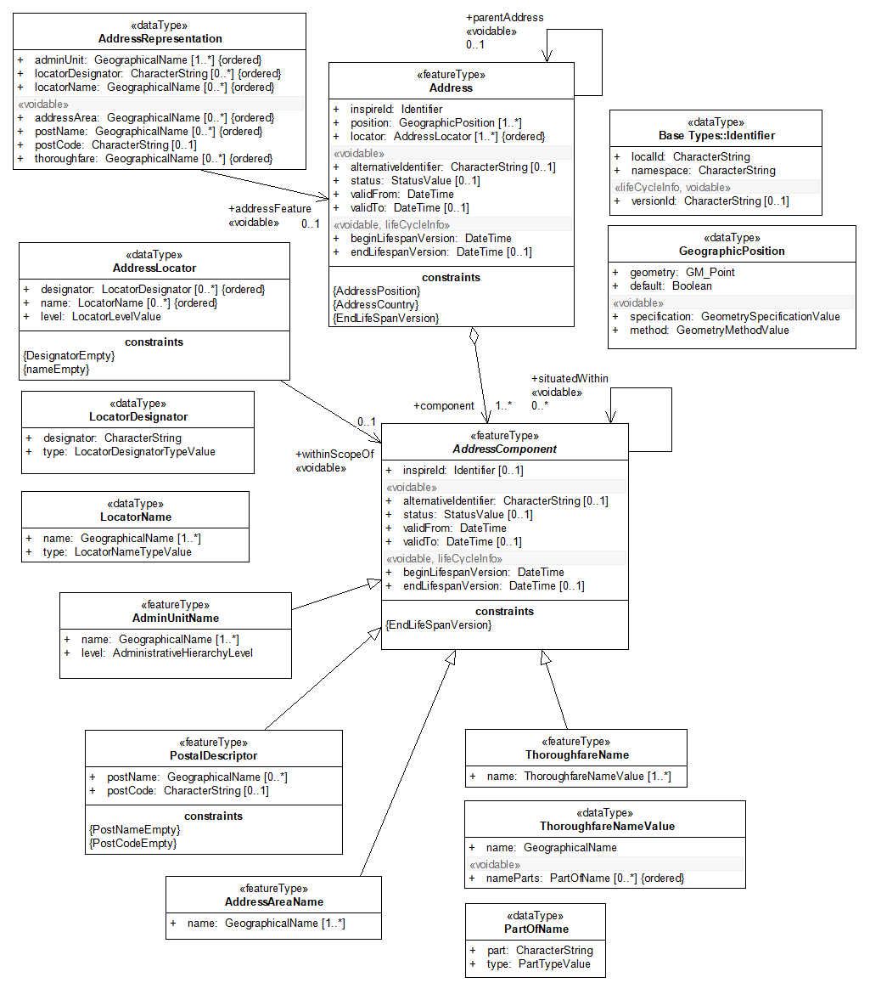

[.text-center]
*Figure 2 – UML class diagram: Overview of the Addresses application schema*

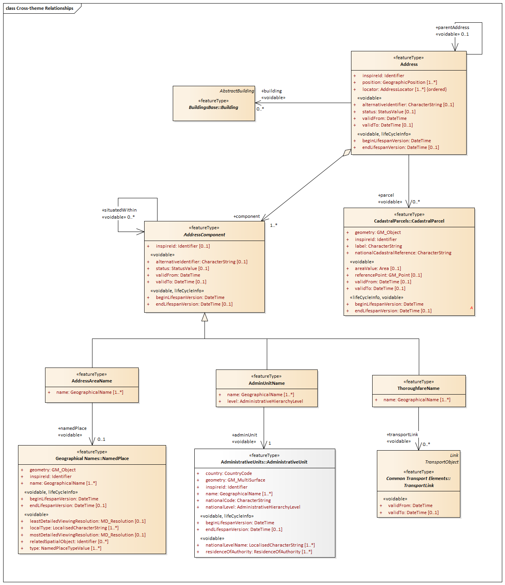

[.text-center]
*Figure 3 – UML class diagram: Overview of cross-theme relationships*

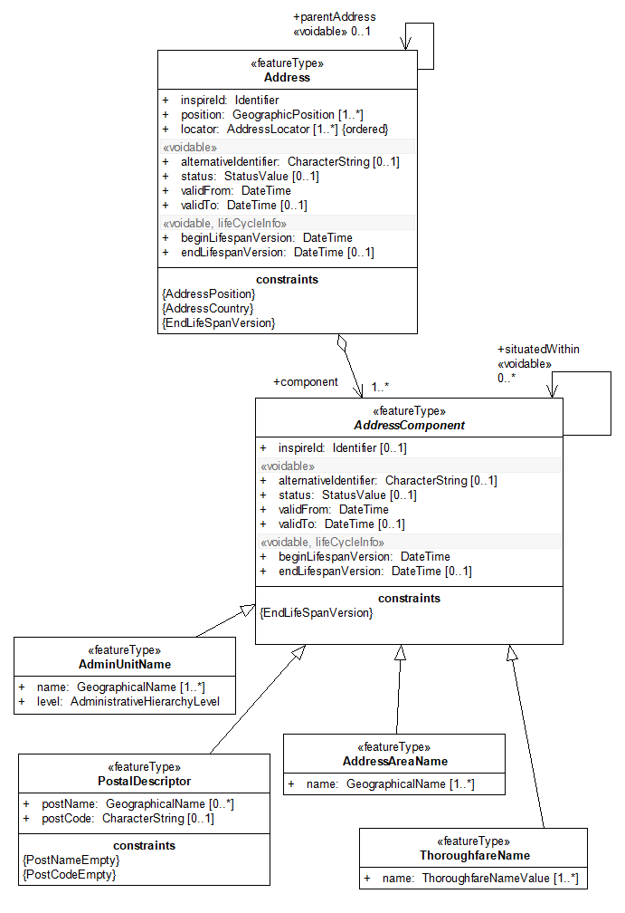

[.text-center]
*Figure 4 – UML class diagram: Spatial object types*

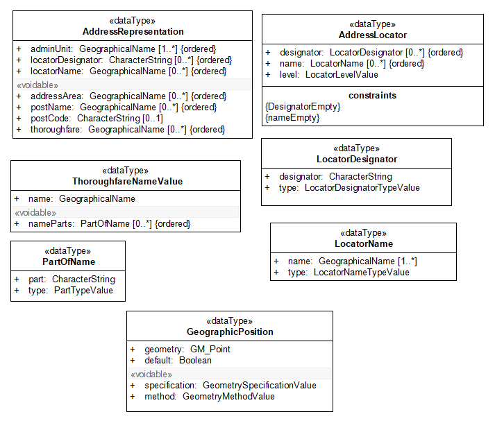

[.text-center]
*Figure 5 – UML class diagram: Datatypes*

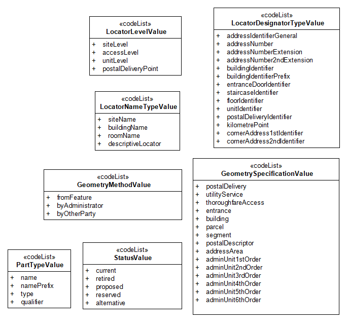

[.text-center]
*Figure 6– UML class diagram: Codelists*

===== Consistency between spatial data sets

There are no other consistency rules than those defined within the application schema.

===== Identifier management

For all address objects an external object identifier must be included, according to the INSPIRE Generic Conceptual Model (D2.5).

[NOTE]
====
*Recomendation 10*

Changes in the attributes of the address, or changes in address components related to the address, should not change the identity of the address, only a new version should be created. The life-cycle rules for addresses in the data set should be documented in the lineage metadata element of the data set.

====

NOTE For further information on the metadata element on lineage see also section 8.1.2.

Optionally also an alternative identifier could be included, in order, for example, to obtain inter­opera­bility with existing legacy systems or applications. Alternative identifiers are not necessarily persistent in the lifetime of the address instance.

For address components an external object identifier as well as an alternative identifier could optionally be included.

Annex F gives examples of how the life-cycle works. See also section 5.3.1.6.

===== Modelling of object references

Object references are described in section 5.3.1.1. If data providers choose to implement external object references to spatial object types in other themes, they should ensure that update mechanisms are in place in order to ensure consistency among the referenced objects.

===== Temporality representation

The application schema includes two concepts of how to represent the temporal aspects of addresses and address components:

* The life-cycle information with the attributes "beginLifespanVersion" and "endLifespanVersion", represent the versions and updates of the objects in the spatial dataset
* The attributes "status", "valid from" and "valid to" applies to the validity and life-cycle of the real world object

It is important to distinguish because addresses often are managed in an administrative process by the responsible authority, in which the address is approved, changed or retired at a specific date, which is not necessarily the same as the date at which the information is recorded in the dataset.

See paragraph 5.2.7 for more detailed information.

====== Validity status of real world object

In the application schema both the address and the address component have a set of attributes that reflects the validity and life-cycle of the real world phenomena, for example, an address, a post code or a thoroughfare name. These attributes are the "status" attribute and the two temporal attributes: "valid from" and "valid to".

This concept is important, because the date on which an address or an address component is proposed, approved as current, changed or retired sometimes has a legal impact.

In a situation where an address or address component is approved by the authority at one date, but not recorded in the dataset until some days or weeks later, a significant event could occur between these dates.

EXAMPLE: A new address is assigned and approved for a property, and is valid from this date, but the address is first recorded in the public address register the following week. The valid from attribute will inform a user on the correct date of validity.

Also the opposite situation can occur, where a new or updated address or address component is approved, but with a decision that the change will take effect at a future date. Such a decision would be particularly necessary in situations where the parties directly affected and users of address data need a period of time to prepare for the change.

EXAMPLE: A municipality approves a new street name and decides that the name will first take effect from the 1^st^ of next month. The "valid from" attribute allows that this information could be recorded in the dataset immediately, so that the users can receive advanced warning information of when the new street name will become valid.

[NOTE]
====
*Recommendation 11*

There should be no time overlaps or gaps between the "valid to" of a previous version and the "valid from" of a new version of a spatial object.

====

If the dataset does not include valid from and valid to information a user must, based on their own judgement, expected temporal quality of the dataset, assess whether the life-cycle information attributes reflects the actual real world status of the spatial objects with sufficient accuracy for their purpose.

The "status" attribute represents the validity in the real world of the address or address component in question. If life-cycle information or versioning is implemented in the dataset, the attribute represents the status of the object "as is" for the appropriate timespan or version.

The status code list has the values reserved, proposed, current, retired and even alternative, If the status information is not maintained for an address or address component, it could be assumed that the validity of the object is "current", unless otherwise stated.

Annex F gives examples of how the life-cycleinfo and the validity status can be implemented in a dataset.

[NOTE]
====
*Recommendation 12*

If life-cycle information and or validity status is maintained, the data provider should preserve it within the dataset, as it may be of use in the future.

====

==== Feature catalogue

*Feature catalogue metadata*

[width="100%",cols="34%,66%"]
|===
|Application Schema |INSPIRE Application Schema Addresses
|Version number |3.0
|===

*Types defined in the feature catalogue*

[width="100%",cols="40%,40%,20%",options="header",]
|===
|*Type* |*Package* |*Stereotypes*
|_Address_ |Addresses |«featureType»
|_AddressAreaName_ |Addresses |«featureType»
|_AddressComponent_ |Addresses |«featureType»
|_AddressLocator_ |Addresses |«dataType»
|_AddressRepresentation_ |Addresses |«dataType»
|_AdminUnitName_ |Addresses |«featureType»
|_GeographicPosition_ |Addresses |«dataType»
|_GeometryMethodValue_ |Addresses |«codeList»
|_GeometrySpecificationValue_ |Addresses |«codeList»
|_LocatorDesignator_ |Addresses |«dataType»
|_LocatorDesignatorTypeValue_ |Addresses |«codeList»
|_LocatorLevelValue_ |Addresses |«codeList»
|_LocatorName_ |Addresses |«dataType»
|_LocatorNameTypeValue_ |Addresses |«codeList»
|_PartOfName_ |Addresses |«dataType»
|_PartTypeValue_ |Addresses |«codeList»
|_PostalDescriptor_ |Addresses |«featureType»
|_StatusValue_ |Addresses |«codeList»
|_ThoroughfareName_ |Addresses |«featureType»
|_ThoroughfareNameValue_ |Addresses |«dataType»
|===

===== Spatial object types

====== Address

[cols="",options="header",]
|===
|*Address*
a|
[cols=","]
!===
!Definition: !An identification of the fixed location of property by means of a structured composition of geographic names and identifiers.
!Description: !NOTE 1 The spatial object, referenced by the address, is defined as the "addressable object". The addressable object is not within the application schema, but it is possible to represent the address' reference to a cadastral parcel or a building through associations. It should, however, be noted that in different countries and regions, different traditions and/or regulations determine which object types should be regarded as addressable objects. 
 
NOTE 2 In most situations the addressable objects are current, real world objects. However, addresses may also reference objects which are planned, under construction or even historical. 
 
NOTE 3 Apart from the identification of the addressable objects (like e.g. buildings), addresses are very often used by a large number of other applications to identify object types e.g. statistics of the citizens living in the building, for taxation of the business entities that occupy the building, and the utility installations. 
 
NOTE 4 For different purposes, the identification of an address can be represented in different ways (see example 3). 
 
EXAMPLE 1 A property can e.g., be a plot of land, building, part of building, way of access or other construction, 
 
EXAMPLE 2 In the Netherlands the primary addressable objects are buildings and dwellings which may include parts of buildings, mooring places or places for the permanent placement of trailers (mobile homes), in the UK it is the lowest level of unit for the delivery of services, in the Czech Republic it is buildings and entrance doors. 
 
EXAMPLE 3 Addresses can be represented differently. In a human readable form an address in Spain and an address in Denmark could be represented like this: "Calle Mayor, 13, Cortijo del Marqués, 41037 Écija, Sevilla, España" or "Wildersgade 60A, st. th, 1408 Copenhagen K., Denmark".
!Stereotypes: !«featureType»
!===

a|
*Attribute: inspireId*

[cols=","]
!===
!Value type: !Identifier
!Definition: !External object identifier of the address.
!Description: !NOTE 1 An external object identifier is a unique object identifier published by the responsible body, which may be used by external applications to reference the spatial object. The identifier is an identifier of the spatial object, not an identifier of the addressable object. 
 
NOTE 2 The primary purpose of this identifier is to enable links between various sources and the address components. 
 
EXAMPLE An address spatial object from Denmark could carry this identifier: 
Namespace: DK_ADR 
Local identifier: 0A3F507B2AB032B8E0440003BA298018 
Version identifier: 12-02-2008T10:05:0101:00
!Multiplicity: !1
!===

a|
*Attribute: alternativeIdentifier*

[cols=","]
!===
!Value type: !CharacterString
!Definition: !External, thematic identifier of the address spatial object, which enables interoperability with existing legacy systems or applications.
!Description: !NOTE 1 Compared with the proper identifier of the address, the alternative identifier is not necessarily persistent in the lifetime of the address spatial object. Likewise it is usually not globally unique and in general does not include information on the version of the address spatial object. 
 
NOTE 2 Often alternative address identifiers are composed by a set of codes that, e.g., identify the region and the municipality, the thoroughfare name and the address number. These alternative identifiers will not remain persistent e.g. in the case of the merging of two municipalities. 
 
EXAMPLE In Denmark many legacy systems (e.g. in the Statistics Denmark or the Central Business Register) uses as address identification the three digit municipality code plus the four character street name code plus the address number.
!Multiplicity: !0..1
!Stereotypes: !«voidable»
!===

a|
*Attribute: position*

[cols=","]
!===
!Value type: !GeographicPosition
!Definition: !Position of a characteristic point which represents the location of the address according to a certain specification, including information on the origin of the position.
!Multiplicity: !1..*
!===

a|
*Attribute: status*

[cols=","]
!===
!Value type: !StatusValue
!Definition: !Validity of the address within the life-cycle (version) of the address spatial object.
!Description: !NOTE This status relates to the address and is not a property of the object to which the address is assigned (the addressable object).
!Multiplicity: !0..1
!Stereotypes: !«voidable»
!===

a|
*Attribute: locator*

[cols=","]
!===
!Value type: !AddressLocator
!Definition: !Human readable designator or name.
!Multiplicity: !1..*
!===

a|
*Attribute: validFrom*

[cols=","]
!===
!Value type: !DateTime
!Definition: !Date and time of which this version of the address was or will be valid in the real world.
!Description: !NOTE This date and time can be set in the future for situations where an address or a version of an address has been decided by the appropriate authority to take effect for a future date.
!Multiplicity: !1
!Stereotypes: !«voidable»
!===

a|
*Attribute: validTo*

[cols=","]
!===
!Value type: !DateTime
!Definition: !Date and time at which this version of the address ceased or will cease to exist in the real world.
!Multiplicity: !0..1
!Stereotypes: !«voidable»
!===

a|
*Attribute: beginLifespanVersion*

[cols=","]
!===
!Value type: !DateTime
!Definition: !Date and time at which this version of the spatial object was inserted or changed in the spatial data set.
!Description: !NOTE This date is recorded to enable the generation of change only update files.
!Multiplicity: !1
!Stereotypes: !«voidable,lifeCycleInfo»
!===

a|
*Attribute: endLifespanVersion*

[cols=","]
!===
!Value type: !DateTime
!Definition: !Date and time at which this version of the spatial object was superseded or retired in the spatial data set.
!Description: !NOTE This date is recorded primarily for those systems which "close" an entry in the spatial data set in the event of an attribute change.
!Multiplicity: !0..1
!Stereotypes: !«voidable,lifeCycleInfo»
!===

a|
*Association role: component*

[cols=","]
!===
!Value type: !AddressComponent
!Definition: !Represents that the address component is engaged as a part of the address.
!Description: !EXAMPLE For the address designated "Calle Mayor 13, Cortijo del Marqués, 41037, Écija, Sevilla, España" the six address components "Calle Mayor", "Cortijo del Marqués", "41037", "Écija", "Sevilla" and "España" are engaged as address components.
!Multiplicity: !1..*
!===

a|
*Association role: parcel*

[cols=","]
!===
!Value type: !CadastralParcel
!Definition: !Cadastral parcel that this address is assigned to or associated with.
!Description: !NOTE An address could potentially have an association to zero, one or several cadastral parcels. Also it is possible (but this is not expressed in this application schema) that several addresses are associated to a single cadastral parcel. 
 
EXAMPLE In the street "Wildersgade" in Copenhagen, Denmark, the address designated as "Wildersgade 66, 1408 København K" is associated to the cadastral parcel identifier "81" in the district of "Christianshavn".
!Multiplicity: !0..*
!Stereotypes: !«voidable»
!===

a|
*Association role: parentAddress*

[cols=","]
!===
!Value type: !Address
!Definition: !The main (parent) address with which this (sub) address is tightly connected.
!Description: !NOTE 1 The relationship between a set of subaddresses and the main address most often means that the sub addresses use the same locator and address components (for example , thoroughfare name, address area, post code) as the parent address. For each sub address additional address locators are then included for identification, like e.g. flat number, floor identifier, door number. 
 
NOTE 2 In some countries several levels of parent-, sub- and sub-sub-addresses exist. In other countries the concept of parent addresses does not exist; all addresses are thus of the same level. 
 
EXAMPLE 1 In a Spanish city the address "Calle Gran Vía 8" is a parent address where the locator "8" represents the building. In the building, the sub address "Calle Gran Via 8, door 3" represents a sub-address, while the more detailed sub-sub address "Calle Gran Via 8, door 3, staircase A, floor 5, dwelling 1" represents the address of a specific dwelling. 
 
EXAMPLE 2 In Denmark the legislation on addresses define two types of addresses: the parent "access level" and the sub "unit level". In the city of Copenhagen "Wildersgade 60A" is a parent access address that represents a specific entrance to a building. Inside the entrance, subaddresses using floor and door designators identifies the individual dwellings like e.g. "Wildersgade 60A, 1st floor, left door". 
 
EXAMPLE 3 In The Netherlands only one level of addresses exists.
!Multiplicity: !0..1
!Stereotypes: !«voidable»
!===

a|
*Association role: building*

[cols=","]
!===
!Name: !building
!Value type: !AbstractConstruction
!Definition: !Building that the address is assigned to or associated with.
!Description: !NOTE An address could potentially have an association to zero, one or several buildings. Also it is possible (but this is not expressed in this application schema) that several addresses are associated to a single building. 
 
EXAMPLE In Praha, The Czech Republic, the address designated "NaPankráci 1690/125" is associated to a specific building in the street, in this case the building with number 1690 in the district (cz: cast obce) "Nusle".
!Multiplicity: !0..*
!Stereotypes: !«voidable»
!===

a|
*Constraint: AddressCountry*

[cols=","]
!===
!Natural language: !An address shall have an admin unit address component spatial object whose level is 1 (Country)
!OCL: !inv: self.component -> forAll (a1 \| exists(a1.parent.oclIsTypeOf(AdminUnitName) and a1.parent.level=1))
!===

a|
*Constraint: AddressPosition*

[cols=","]
!===
!Natural language: !An address shall have exactly one default geographic position (default attribute of GeographicPosition must be true)
!OCL: !inv: self.position -> one(a1 \| a1.default = true)
!===

a|
*Constraint: EndLifeSpanVersion*

[cols=","]
!===
!Natural language: !If date set endLifespanVersion must be later than beginLifespanVersion (if set)
!OCL: !inv: self.endLifespanVersion.isAfter(self.beginLifespanVersion)
!===

|===

====== AddressAreaName

[cols="",options="header",]
|===
|*AddressAreaName*
a|
[cols=","]
!===
!Subtype of: !AddressComponent
!Definition: !An address component which represents the name of a geographic area or locality that groups a number of addressable objects for addressing purposes, without being an administrative unit.
!Description: !NOTE 1 In some countries and regions an address area is a true subdivision of an administrative unit (most often a municipality), so that every address area is fully inside the municipality and so that every part of the municipality is within an address area. In other countries, the concept of address area names is less strict and based on local tradition or specific needs. 
 
NOTE 2 In some situations an address area name is not required to obtain unambiguousness; instead the purpose is to make the complete address more informative and descriptive, adding a well known place name (e.g. of a village or community) to the address. This is particularly useful if the municipality or post code covers a large area. 
 
EXAMPLE 1 In Sweden a "Kommundel" (en: Municipal sub division) is a type of address area names that ensures that street names are unique within the sub division. 
 
EXAMPLE 2 In Spain an "Entidad de población" (en: population entity) has the same function. It is the general address area which depending on its characteristics can be classified as "Entidad Singular" (en: singular entity) or "Entidad Colectiva" (en: collective entity). Moreover, according to the population distribution, these areas can contain one or several "Núcleo de población" (en: population core) and/or "Población diseminada" (en: scattered population). 
 
EXAMPLE 3 In Denmark "Supplerende bynavn" (en: Supplementary town name) is sometimes compulsory to ensure uniqueness of street names within the post code, sometimes it is just useful extra information, that makes the address more informative.
!Stereotypes: !«featureType»
!===

a|
*Attribute: name*

[cols=","]
!===
!Value type: !GeographicalName
!Definition: !Proper noun applied to the address area.
!Description: !NOTE The data type allows names in different languages and scripts as well as inclusion of alternative name, alternative spellings, historical name and exonyms.
!Multiplicity: !1..*
!===

a|
*Association role: namedPlace*

[cols=","]
!===
!Value type: !NamedPlace
!Definition: !The named place that this address area name represents.
!Description: !NOTE In order to populate this association, it is important that the area covered by the identified Named Place is exactly the same as the area covered by the address area name in question; if this is not the case the association would result in an inconsistency. 
 
EXAMPLE The geographical name "Huskvarna", which represents a part of the municipality of Jönköping in Sweden, is the source of the address area name, "Huskvarna".
!Multiplicity: !0..1
!Stereotypes: !«voidable»
!===

|===

====== AddressComponent

[cols="",options="header",]
|===
|*AddressComponent (abstract)*
a|
[cols=","]
!===
!Definition: !Identifier or geographic name of a specific geographic area, location, or other spatial object which defines the scope of an address.
!Description: !NOTE 1 Four different subclasses of address components are defined: 
o Administrative unit name, which may include name of country, name of municipality, name of district 
o Address area name like e.g. name of village or settlement 
o Thoroughfare name, most often road name 
o Postal descriptor 
In order to construct an address, these subclasses are often structured hierarchically. 
 
NOTE 2 It is the combination of the address locator and the address components, which makes a specific address spatial object readable and unambiguous for the human user. 
 
EXAMPLE The combination of the locator "13" and the address components "Calle Mayor" (thoroughfare name), "Cortijo del Marqués" (address area name), "41037" (postal descriptor), "Écija", "Sevilla" and "España" (administrative unit names) makes this specific address spatial object readable and unambiguous.
!Stereotypes: !«featureType»
!===

a|
*Attribute: inspireId*

[cols=","]
!===
!Value type: !Identifier
!Definition: !External object identifier of the address component.
!Description: !NOTE 1 An external object identifier is a unique object identifier published by the responsible body, which may be used by external applications to reference the spatial object. The identifier is an identifier of the spatial object, not an identifier of the real-world phenomenon. 
 
NOTE 2 The primary purpose of this identifier is to enable links between various sources and the address components. 
 
EXAMPLE An address component spatial object from Denmark could carry this identifier: 
Namespace: DK_ADR 
Local identifier: 0A3F507B2AB032B8E0440003BA298018 
Version identifier: 12-02-2008T10:05:0101:00
!Multiplicity: !0..1
!===

a|
*Attribute: alternativeIdentifier*

[cols=","]
!===
!Value type: !CharacterString
!Definition: !External, thematic identifier of the address component spatial object, which enables interoperability with existing legacy systems or applications.
!Description: !NOTE Compared with a proper identifier of the address component, the alternative identifier is not necessarily persistent in the lifetime of the component spatial object. Likewise it is usually not globally unique and in general does include information on the version of the spatial object. 
 
EXAMPLE 1 National or regional sector-specific identifiers (like e.g. a number- or letter code) for administrative units, address areas (localities, villages, sub-divisions) or thoroughfare names, which are used by a number of existing legacy systems. 
 
EXAMPLE 2 In Denmark the four character municipal "road name code" (0001-9899) is only unique within the present municipality, thus if two municipalities merge, it is necessary to assign new road name codes.
!Multiplicity: !0..1
!Stereotypes: !«voidable»
!===

a|
*Attribute: beginLifespanVersion*

[cols=","]
!===
!Value type: !DateTime
!Definition: !Date and time at which this version of the spatial object was inserted or changed in the spatial data set.
!Description: !NOTE This date is recorded to enable the generation of change only update files.
!Multiplicity: !1
!Stereotypes: !«voidable,lifeCycleInfo»
!===

a|
*Attribute: endLifespanVersion*

[cols=","]
!===
!Value type: !DateTime
!Definition: !Date and time at which this version of the spatial object was superseded or retired in the spatial data set.
!Description: !NOTE This date is recorded primarily for those systems which "close" an entry in the spatial data set in the event of an attribute change.
!Multiplicity: !0..1
!Stereotypes: !«voidable,lifeCycleInfo»
!===

a|
*Attribute: status*

[cols=","]
!===
!Value type: !StatusValue
!Definition: !Validity of the address component within the life-cycle (version) of the address component spatial object.
!Description: !NOTE This status relates to the address component and is not a property of the object to which the address is assigned (the addressable object).
!Multiplicity: !0..1
!Stereotypes: !«voidable»
!===

a|
*Attribute: validFrom*

[cols=","]
!===
!Value type: !DateTime
!Definition: !Date and time of which this version of the address component was or will be valid in the real world.
!Description: !NOTE This date and time can be set in the future for situations where an address component or a version of an address component has been decided by the appropriate authority to take effect for a future date.
!Multiplicity: !1
!Stereotypes: !«voidable»
!===

a|
*Attribute: validTo*

[cols=","]
!===
!Value type: !DateTime
!Definition: !Date and time at which the address component ceased or will cease to exist in the real world.
!Multiplicity: !0..1
!Stereotypes: !«voidable»
!===

a|
*Association role: situatedWithin*

[cols=","]
!===
!Value type: !AddressComponent
!Definition: !Another address component within which the geographic feature represented by this address component is situated.
!Description: !NOTE 1 The association enables the application schema to express that the subtypes of address components in the dataset form a hierarchy e.g. like: thoroughfare name within municipality within region within country 
 
NOTE 2 The representation of the hierarchy facilitates queries e.g. for a specific thoroughfare name within a given municipality or postcode. It is also necessary where the application schema is used to create or update, for example , a gazetteer which is based on the hierarchical structure of the address components. 
 
NOTE 3 The multiplicity of the association allows it to express that a thoroughfare name is situated in a certain municipality and in a certain postcode. It is also possible to express, for example, that some thoroughfare names cross borders between municipalities and thus is situated within more than one municipality. 
 
EXAMPLE 1 In Spain many spatial objects of the thoroughfare name "Calle Santiago" exist. The association can express that one of the spatial objects is situated within in the municipality of Albacete. From the same example the municipality name "Albacete" is situated within the administrative name (region) of "Castilla La Mancha". 
 
EXAMPLE 2 In Denmark, several address area names entitled "Strandby" exists. In order to identify a specific spatial object it is necessary to know that the relevant spatial object is situated e.g. in the municipality of "Frederikshavn".
!Multiplicity: !0..*
!Stereotypes: !«voidable»
!===

a|
*Constraint: EndLifeSpanVersion*

[cols=","]
!===
!Natural language: !If date set endLifespanVersion must be later than beginLifespanVersion (if set)
!OCL: !inv: self.endLifespanVersion .isAfter(self.beginLifespanVersion)
!===

|===

====== AdminUnitName

[cols="",options="header",]
|===
|*AdminUnitName*
a|
[cols=","]
!===
!Subtype of: !AddressComponent
!Definition: !An address component which represents the name of a unit of administration where a Member State has and/or exercises jurisdictional rights, for local, regional and national governance.
!Stereotypes: !«featureType»
!===

a|
*Attribute: name*

[cols=","]
!===
!Value type: !GeographicalName
!Definition: !Official, geographical name of the administrative unit, given in different languages where required.
!Description: !NOTE The data type allows names in different languages and scripts as well as inclusion of alternative name, alternative spellings, historical name and exonyms.
!Multiplicity: !1..*
!===

a|
*Attribute: level*

[cols=","]
!===
!Value type: !AdministrativeHierarchyLevel
!Definition: !The level of administration in the national administrative hierarchy.
!Multiplicity: !1
!===

a|
*Association role: adminUnit*

[cols=","]
!===
!Value type: !AdministrativeUnit
!Definition: !The administrative unit that is the source of the content of the administrative unit name.
!Description: !EXAMPLE The administrative unit (municipality) "Gävle" in Sweden is the source of the address component administrative unit name, "Gävle".
!Multiplicity: !1
!Stereotypes: !«voidable»
!===

|===

====== PostalDescriptor

[cols="",options="header",]
|===
|*PostalDescriptor*
a|
[cols=","]
!===
!Subtype of: !AddressComponent
!Definition: !An address component which represents the identification of a subdivision of addresses and postal delivery points in a country, region or city for postal purposes.
!Description: !NOTE 1 The postal descriptor is specified by means of a post code and/or names of the associated post office, town or area. 
 
NOTE 2 In some countries post codes are seen as a proper geographic subdivision of the country, in other countries the post code is regarded only as an attribute that characterizes a (usually small) number of adjacent postal delivery points and addresses. 
 
NOTE 3 The postal descriptors are created and developed on the basis of postal requirements (e.g. efficient sorting, logistics, transport and distribution). Consequently, there is not often a tight relationship between the postal areas and administrative units in the same area. 
 
NOTE 4 The structure schema and formats of national postal descriptor systems are different. Sometimes (for example in the UK) the post code itself is the only information required for a valid address; in other situations both the post code and the associated name of post office or town is required. Sometimes there is a simple relationship between the code and the name; in other situations a set of postcodes are associated with a single post office or town. 
 
NOTE 5 In some countries like e.g. The Republic of Ireland, no post code system currently exists, therefore the postal descriptor is only represented by the name of the post town. 
 
EXAMPLE 1 In the UK the post code "EC4M 7DR" is sufficient, as a postal descriptor, while the related town name "London" is informative, but not necessary in the postal address. 
 
EXAMPLE 2 In Sweden all postcodes starting with "80" is related to the postal name "Gävle". Therefore in the postal descriptor "802 74 Gävle", the postcode "802 74" bears all postal necessary information, while the town name "Gävle" is extra information. 
 
EXAMPLE 3 In Denmark, outside the centre of Copenhagen, each postcode has a 1:1 relationship to one post name only: Postcode "6372" relates to the village "Bylderup-Bov". 
 
EXAMPLE 4 In Germany the lowest level of the Postal descriptor (the 5 digit Postleitzahl) often does not fall within an administrative unit (e.g. municipality). The Postleitzahl is handled completely independent from the hierarchal systematic of the addresses. In addition, some "Postleitzahlen" represent not a delivery area, but institutions with a big amount of post.
!Stereotypes: !«featureType»
!===

a|
*Attribute: postName*

[cols=","]
!===
!Value type: !GeographicalName
!Definition: !One or more names created and maintained for postal purposes to identify a subdivision of addresses and postal delivery points.
!Description: !NOTE 1 Often the post name (or names) is a supplementary identification of the post office to which the associated post code belongs. For example it may be the name of the town in which the office is situated. In other situations the post name could be an independent descriptor without any post code or it could be a postal subdivision connected to a parent postal descriptor (post code and post name). 
 
NOTE 2 In some countries like e.g. Spain and The Netherlands, no post names exit therefore the postal descriptor is only represented by the post code. 
 
NOTE 3 Even though the post name is the same as the name of an administrative unit or an address area, the area covered are not necessarilythe same.
!Multiplicity: !0..*
!===

a|
*Attribute: postCode*

[cols=","]
!===
!Value type: !CharacterString
!Definition: !A code created and maintained for postal purposes to identify a subdivision of addresses and postal delivery points.
!Description: !NOTE 1 The structure, schema and formats of post codes are different in different countries. Often the components of the post code are hierarchical, e.g. when the first character(s) identifies the region covered by the post code and the next characters define the subdivision. 
 
NOTE 2 In some countries, e.g., The Republic of Ireland, no post codes exists therefore the postal descriptor is only represented by the post name (e.g. town name). 
 
EXAMPLE In the UK postcodes starting with W covers the Western (W1) and Paddington (W2-14) districts of the London postal district. In Sweden all postcodes starting with "80" is related to the postal name "Gävle".
!Multiplicity: !0..1
!===

a|
*Constraint: PostCodeEmpty*

[cols=","]
!===
!Natural language: !If no post code exists, a post name is required.
!OCL: !inv: self.postCode->isEmpty() implies self.postName->notEmpty()
!===

a|
*Constraint: PostNameEmpty*

[cols=","]
!===
!Natural language: !If no post name exists, a post code is required.
!OCL: !inv: self.postName->isEmpty() implies self.postCode->notEmpty()
!===

|===

====== ThoroughfareName

[cols="",options="header",]
|===
|*ThoroughfareName*
a|
[cols=","]
!===
!Subtype of: !AddressComponent
!Definition: !An address component which represents the name of a passage or way through from one location to another.
!Description: !NOTE 1 A thoroughfare can, e.g., be a road or a waterway 
 
NOTE 2 Thoroughfare names includes names of squares and of cul de sacs, and they can also represent the network of smaller roads or paths e.g. in a small village or settlement.
!Stereotypes: !«featureType»
!===

a|
*Attribute: name*

[cols=","]
!===
!Value type: !GeographicalName
!Definition: !Name of the thoroughfare.
!Description: !NOTE 1 The name can optionally include an often used alternative name, alternative spelling of the name, a historic name or spelling, which is still in use. It may also optionally include a subdivision of the name into parts. 
 
NOTE 2 Most often thoroughfares are roads, in this situation the thoroughfare name is the road name. 
 
NOTE 3 The data type also allows a representation of the thoroughfare name in separate parts e.g. "rue"  "de la"  "Paix"
!Multiplicity: !1..*
!===

a|
*Association role: transportLink*

[cols=","]
!===
!Value type: !TransportLink
!Definition: !One or several transport network links to which the spatial object of the thoroughfare name has been designated.
!Description: !EXAMPLE The thoroughfare name "Na Pankráci" in Praha, The Czech Republic, has been designated as a road name for a number of road links (street segments) in the city.
!Multiplicity: !0..*
!Stereotypes: !«voidable»
!===

|===

===== Data types

====== AddressLocator

[cols="",options="header",]
|===
|*AddressLocator*
a|
[cols=","]
!===
!Definition: !Human readable designator or name that allows a user or application to reference and distinguish the address from neighbour addresses, within the scope of a thoroughfare name, address area name, administrative unit name or postal designator, in which the address is situated.
!Description: !NOTE 1 The most common locators are designators like an address number, building number or flat identifier as well as the name of the property, complex or building. 
 
NOTE 2 The locator identifier(s) are most often only unambiguous and meaningful within the scope of the adjacent thoroughfare name, address area name or post code. 
 
NOTE 3 The locator could be composed of one or more designators e.g., address number, address number suffix, building number or name, floor number, flat or room identifier. In addition to these common locator types, also narrative or descriptive locators are possible. 
 
NOTE 4 The locators of an address could be composed as a hierarchy, where one level of locators identifies the real property or building while another level of locators identifies the flats or dwellings inside the property. 
 
EXAMPLE 1 In a Spanish city a "site-level" locator could identify a building on the thoroughfare name "Calle Gran Vía using the address number "8". If the building has four entrance doors, the door number "3" could be the "access-level" locator. The 3rd door could, via two staircases "A" and "B", give access to a number of floors, identified by a number "1" to "5" on which a number of dwellings are situated, also identified by numbers "1" to "3"; The "unit level" locator will thus composed of staircase-, floor- and dwelling identification e.g. "staircase A, floor 5, dwelling 1". In total, the three parent-child levels of locators uniquely identify the dwelling. 
 
EXAMPLE 2 In Copenhagen an "access level" locator could identify a specific entrance door in a building on the thoroughfare name "Wildersgade" using the address number "60A" (In Denmark the optional suffix is a part of the address number). The entrance door gives access to a number of floors, e.g, "st", "1", "2", "3", on which two dwellings are situated "tv" and "th". The "unit level" locator will thus be composed by a floor- and a door identifier: "2. th." (2nd floor, door to the right). In total, the two parent-child levels of locators uniquely identify the dwelling. 
 
EXAMPLE 3 In The Netherlands only one level of locators exists. The individual apartment within a large complex, a dwelling, a part of other kinds of buildings (for example an office), a mooring place or a place for the permanent placing of trailers are addressable objects which must have an address. This address is the only level of the locator. This locator could be composed by three attributes the house number, plus optionally an additional house letter, plus optionally an additional housenumber suffix. 
 
EXAMPLE 4 Sometimes the building name is an alternative identifier to the address number e.g. the house located in "Calle Santiago, 15, Elizondo-Baztán, Navarra, Spain" is also identified by the building name "Urtekoetxea"
!Stereotypes: !«dataType»
!===

a|
*Attribute: designator*

[cols=","]
!===
!Value type: !LocatorDesignator
!Definition: !A number or a sequence of characters that uniquely identifies the locator within the relevant scope(s).
!Multiplicity: !0..*
!===

a|
*Attribute: name*

[cols=","]
!===
!Value type: !LocatorName
!Definition: !A geographic name or descriptive text associated to a property identified by the locator.
!Description: !NOTE 1 The locator name could be the name of the property or complex (e.g. an estate, hospital or a shopping mall), of the building or part of the building (e.g. a wing), or it could be the name of a room inside the building. 
 
NOTE 2 As locator name it is also possible to use a description that allows a user to identify the property in question. 
 
NOTE 3 The locator name could be an alternative addition to the locator designator (e.g. the address number) or it could be an independent identifier. 
 
EXAMPLE In the address "Calle Santiago, 15, Elizondo-Baztán, Navarra, Spain" the building name "Urtekoetxea" is an alternative to the building identifier "3".
!Multiplicity: !0..*
!===

a|
*Attribute: level*

[cols=","]
!===
!Value type: !LocatorLevelValue
!Definition: !The level to which the locator refers.
!Multiplicity: !1
!===

a|
*Association role: withinScopeOf*

[cols=","]
!===
!Value type: !AddressComponent
!Definition: !The address component that defines the scope within which the address locator is assigned according to rules ensuring unambiguousness.
!Description: !NOTE 1 For the assignment of unambiguous locators (e.g. address numbers) different rules exists in different countries and regions. According to the most common rule, an address number should be unique within the scope of the thoroughfare name. In other areas the address number is unique inside an address area name (e.g. the name of the village) or postal designator (e.g. the post code). In some areas even a combination of rules are applied: e.g. addresses with two locators, each of them referencing to a separate address component. 
 
NOTE 2 Locators that has the level of unit (like e.g. floor identifier and door or unit identifiers) are most often assigned so that they are unambiguous within the more narrow scope of the property or building; for these locators the association should therefore not be populated. 
 
EXAMPLE 1 In a typical European address dataset, parts of the addresses have locators which are unambiguous within the scope of the road name (thoroughfare name) while others are unambiguous within the name ogf the village or district (address area name). 
 
EXAMPLE 2 In Lithuania and Estonia a concept of "corner addresses" exists. Corner addresses have two address numbers (designators) each of them referring to a thoroughfare name (primary and secondary street name). E.g. in Vilnius the address designated "A. Stulginskio gatve 4 / A. Smetonos gatve 7" is situated on the corner of the two streets. 
 
EXAMPLE 3 In the Czech Republic in some cities an address has two locator designators: A building number which referres to the address area (district, cz: "cast obce") and a address number that referres to the thoroughfare name. As an example in Praha for address designated "Na Pankráci 1690/125, Nusle" the designator "1690" is a building number unique within the address area (cz cast obce) "Nusle", while the "125" is an address number that has the thoroughfare name as its scope.
!Multiplicity: !0..1
!Stereotypes: !«voidable»
!===

a|
*Constraint: DesignatorEmpty*

[cols=","]
!===
!Natural language: !If no designator exists, a name is required.
!OCL: !inv: self.designator->isEmpty() implies self.name->notEmpty()
!===

a|
*Constraint: NameEmpty*

[cols=","]
!===
!Natural language: !If no name exists, a designator is required.
!OCL: !inv: self.name->isEmpty() implies self.designator->notEmpty()
!===

|===

====== AddressRepresentation

[cols="",options="header",]
|===
|*AddressRepresentation*
a|
[cols=","]
!===
!Definition: !Representation of an address spatial object for use in external application schemas that need to include the basic, address information in a readable way.
!Description: !NOTE 1 The data type includes the all necessary readable address components as well as the address locator(s), which allows the identification of the address spatial objects, e.g., country, region, municipality, address area, post code, street name and address number. It also includes an optional reference to the full address spatial object. 
 
NOTE 2 The datatype could be used in application schemas that wish to include address information e.g. in a dataset that registers buildings or properties.
!Stereotypes: !«dataType»
!===

a|
*Attribute: adminUnit*

[cols=","]
!===
!Value type: !GeographicalName
!Definition: !The name or names of a unit of administration where a Member State has and/or exercises jurisdictional rights, for local, regional and national governance.
!Multiplicity: !1..*
!===

a|
*Attribute: locatorDesignator*

[cols=","]
!===
!Value type: !CharacterString
!Definition: !A number or a sequence of characters which allows a user or an application to interpret, parse and format the locator within the relevant scope. A locator may include more locator designators.
!Multiplicity: !0..*
!===

a|
*Attribute: locatorName*

[cols=","]
!===
!Value type: !GeographicalName
!Definition: !Proper noun(s) applied to the real world entity identified by the locator.
!Multiplicity: !0..*
!===

a|
*Attribute: addressArea*

[cols=","]
!===
!Value type: !GeographicalName
!Definition: !The name or names of a geographic area or locality that groups a number of addressable objects for addressing purposes, without being an administrative unit.
!Multiplicity: !0..*
!Stereotypes: !«voidable»
!===

a|
*Attribute: postName*

[cols=","]
!===
!Value type: !GeographicalName
!Definition: !One or more names created and maintained for postal purposes to identify a subdivision of addresses and postal delivery points.
!Multiplicity: !0..*
!Stereotypes: !«voidable»
!===

a|
*Attribute: postCode*

[cols=","]
!===
!Value type: !CharacterString
!Definition: !A code created and maintained for postal purposes to identify a subdivision of addresses and postal delivery points.
!Multiplicity: !0..1
!Stereotypes: !«voidable»
!===

a|
*Attribute: thoroughfare*

[cols=","]
!===
!Value type: !GeographicalName
!Definition: !The name or names of a passage or way through from one location to another like a road or a waterway.
!Multiplicity: !0..*
!Stereotypes: !«voidable»
!===

a|
*Association role: addressFeature*

[cols=","]
!===
!Value type: !Address
!Definition: !Reference to the address spatial object.
!Multiplicity: !0..1
!Stereotypes: !«voidable»
!===

|===

====== GeographicPosition

[cols="",options="header",]
|===
|*GeographicPosition*
a|
[cols=","]
!===
!Definition: !The position of a characteristic point which represents the location of the address according to a certain specification, including information on the origin of the position.
!Stereotypes: !«dataType»
!===

a|
*Attribute: geometry*

[cols=","]
!===
!Value type: !GM_Point
!Definition: !The position of the point expressed in coordinates in the chosen spatial reference system.
!Multiplicity: !1
!===

a|
*Attribute: specification*

[cols=","]
!===
!Value type: !GeometrySpecificationValue
!Definition: !Information defining the specification used to create or derive this geographic position of the address.
!Multiplicity: !1
!Stereotypes: !«voidable»
!===

a|
*Attribute: method*

[cols=","]
!===
!Value type: !GeometryMethodValue
!Definition: !Description of how and by whom the geographic position of the address was created or derived.
!Description: !NOTE The geographic position could be created manually by the address authority itself, by an independent party (e.g. by field surveying or digitizing of paper maps) or it could be derived automatically from the addressable object or from other Inspire features.
!Multiplicity: !1
!Stereotypes: !«voidable»
!===

a|
*Attribute: default*

[cols=","]
!===
!Value type: !Boolean
!Definition: !Specifies whether or not this position should be considered as the default.
!Description: !NOTE As a member state may provide several positions of an address, there is a need to identify the commonly used (main) position. Preferrably, the default position should be the one with best accuracy.
!Multiplicity: !1
!===

|===

====== LocatorDesignator

[cols="",options="header",]
|===
|*LocatorDesignator*
a|
[cols=","]
!===
!Definition: !A number or a sequence of characters that uniquely identifies the locator within the relevant scope(s). The full identification of the locator could include one or more locator designators.
!Description: !NOTE 1 Locator designators are often assigned according to a set of commonly known rules which enables a user or application to "parse" the information: Address numbers are most often assigned in ascending order with odd and even numbers on each side of the thoroughfare. In a building, the floor identifier represents the level according to the traditions within the area, e.g., 1, 2, 3. 
 
NOTE 2 Several types of locator designators exist, such as: Address number, address number suffix, building identifier, building name. A locator could be composed by an ordered set of these. 
 
EXAMPLE In Paris, France a locator could be composed by two locator designators: address number "18" and address number suffix: "BIS".
!Stereotypes: !«dataType»
!===

a|
*Attribute: designator*

[cols=","]
!===
!Value type: !CharacterString
!Definition: !The identifying part of the locator designator composed by one or more digits or other characters.
!Description: !NOTE The value is often a descriptive code assigned according to certain well known rules e.g. like ascending odd and even address numbers along the thoroughfare, or like floor identifiers: 0, 1, 2, 3. 
 
EXAMPLE Address number "2065", Address number suffix "B", Floor identifier "7" door identifier "B707" are all locator attribute values.
!Multiplicity: !1
!===

a|
*Attribute: type*

[cols=","]
!===
!Value type: !LocatorDesignatorTypeValue
!Definition: !The type of locator value, which enables an application to interpret, parse or format it according to certain rules.
!Description: !NOTE The type enables a user or an application to understand if the value "A" is e.g. an identifier of a specific building, door, staircase or dwelling.
!Multiplicity: !1
!===

|===

====== LocatorName

[cols="",options="header",]
|===
|*LocatorName*
a|
[cols=","]
!===
!Definition: !Proper noun applied to the real world entity identified by the locator.
!Description: !NOTE The locator name could be the name of the property or complex, of the building or part of the building, or it could be the name of a room inside a building.
!Stereotypes: !«dataType»
!===

a|
*Attribute: name*

[cols=","]
!===
!Value type: !GeographicalName
!Definition: !The identifying part of the locator name.
!Description: !NOTE 1 The data type allows names in different languages and scripts as well as inclusion of alternative name, alternative spellings, historical name and exonyms. 
 
NOTE 2 The locator name could be the name of the property or complex, of the building or part of the building (e.g. a wing), or it could be the name of a room or similar inside the building. 
 
NOTE 3 The locator name sometimes refer to the name of the family or business entity which at present or in the past has owned or occupied the property or building; although this is the case the locator name must not be confused with the name of the addressee(s). 
 
NOTE 4 As locator name it is also possible to use a descriptive text that allows a user to identify the property in question. 
 
EXAMPLE 1 The "Radford Mill Farm" in Timsbury, Bath, UK; The allotment house area "Brumleby" in Copenhagen, Denmark, the university campus "Cité Universitaire", in Paris, France. 
 
EXAMPLE 2 "Millers House" in Stromness, Orkney Isles, UK; "Ulla's Pension" in Niederfell, Rheinland-Pfalz, Germany. 
 
EXAMPLE 3 "Multi-storey car park at Southampton Magistrates Courts" in Southampton, UK.
!Multiplicity: !1..*
!===

a|
*Attribute: type*

[cols=","]
!===
!Value type: !LocatorNameTypeValue
!Definition: !The type of locator value, which enables an application to interpret, parse or format it according to certain rules.
!Description: !NOTE The type enables a user or an application to understand if the name "Radford Mill Farm" is for example a name of a specific site or of a building.
!Multiplicity: !1
!===

|===

====== PartOfName

[cols="",options="header",]
|===
|*PartOfName*
a|
[cols=","]
!===
!Definition: !A part of the full name resulting from the subdivision of the thoroughfare name into separate, semantic parts, using the same language and script as the full thoroughfare name.
!Description: !NOTE Each part of the name must be qualified by using the type attribute.
!Stereotypes: !«dataType»
!===

a|
*Attribute: part*

[cols=","]
!===
!Value type: !CharacterString
!Definition: !The character string that expresses the separate part of the name using the same language and script as the full thoroughfare name.
!Multiplicity: !1
!===

a|
*Attribute: type*

[cols=","]
!===
!Value type: !PartTypeValue
!Definition: !A classification of the part of name according to its semantics (meaning) in the complete thoroughfare name.
!Multiplicity: !1
!===

|===

====== ThoroughfareNameValue

[cols="",options="header",]
|===
|*ThoroughfareNameValue*
a|
[cols=","]
!===
!Definition: !Proper noun applied to thoroughfare optionally including a subdivision of the name into parts.
!Description: !NOTE 1 The data type allows names in different languages and scripts as well as inclusion of alternative name, alternative spellings, historical name and exonyms. 
 
NOTE 2 The data type allows optionally a representation of the thoroughfare name subdivided into separate, semantic parts e.g. "Avenue"  "de la"  "Poste".
!Stereotypes: !«dataType»
!===

a|
*Attribute: name*

[cols=","]
!===
!Value type: !GeographicalName
!Definition: !Proper noun applied to the thoroughfare.
!Description: !NOTE 1 The complete name of the thoroughfare must be applied in this attribute, including type, prefix or qualifier, like for example "Avenue de la Poste", "Calle del Christo Canneregio" or "Untere Quai". The name part attribute enables a representation of the name subdivided into separate semantic parts. 
 
NOTE 2 The data type allows names in different languages as well as inclusion of exonyms.
!Multiplicity: !1
!===

a|
*Attribute: nameParts*

[cols=","]
!===
!Value type: !PartOfName
!Definition: !One or several parts into which the thoroughfare name can be subdivided.
!Description: !NOTE 1 This is a definition which is consistent with that adopted by the UPU 
 
NOTE 2 A subdivision of a thoroughfare name into semantic parts could improve parsing (e.g. of abbreviated or misspelled names) and for sorting of address data for example for postal delivery purposes. It could also improve the creation of alphabetically sorted street gazetteers. 
 
NOTE 3 The data type requires that each part of the subdivided thoroughfare name is qualified with information on the semantics e.g. if it is a thoroughfare type (e.g., Rua, Place, Calle, Street), a prefix (e.g., da, de la, del), a qualifier (e.g., Unterer, Little) or if it is the core of the name, which would normally be used for sorting or indexing. 
 
NOTE 4 In some countries or regions and for some thoroughfare names it is not feasible or it does not add value to subdivide the thoroughfare name into parts. 
 
EXAMPLE In France the thoroughfare name "Avenue de la Poste" could be subdivided into these parts: "Avenue"  "de la"  "Poste".
!Multiplicity: !0..*
!Stereotypes: !«voidable»
!===

|===

===== Code lists

====== GeometryMethodValue

[cols="",options="header",]
|===
|*GeometryMethodValue*
a|
[cols=","]
!===
!Definition: !Description of how and by whom this geographic position of the address was created or derived.
!Description: !NOTE Information on what type of spatial feature the geographic position of the address was created or derived from, is represented by the GeometrySpecificationValue.
!Extensibility: !none
!Identifier: !http://inspire.ec.europa.eu/codelist/GeometryMethodValue
!Values: !The allowed values for this code list comprise only the values specified in the INSPIRE Registry.
!===

|===

====== GeometrySpecificationValue

[cols="",options="header",]
|===
|*GeometrySpecificationValue*
a|
[cols=","]
!===
!Definition: !Information defining the specification used to create or derive this geographic position of the address.
!Description: !NOTE 1 Multiple address points can be derived from one polygon spatial object. 
 
NOTE 2 If the position of an address is derived from a polygon spatial object a number of different approaches is used. 
 
EXAMPLE 1 The same point (e.g., centre point of the polygon) is used for each address, thus, multiple address points will be overlapping. 
 
EXAMPLE 2 Each point position is unique within the polygon to be able to visually distinguish the representation of each address.
!Extensibility: !none
!Identifier: !http://inspire.ec.europa.eu/codelist/GeometrySpecificationValue
!Values: !The allowed values for this code list comprise only the values specified in the INSPIRE Registry.
!===

|===

====== LocatorDesignatorTypeValue

[cols="",options="header",]
|===
|*LocatorDesignatorTypeValue*
a|
[cols=","]
!===
!Definition: !Description of the semantics of the locator designator.
!Extensibility: !none
!Identifier: !http://inspire.ec.europa.eu/codelist/LocatorDesignatorTypeValue
!Values: !The allowed values for this code list comprise only the values specified in the INSPIRE Registry.
!===

|===

====== LocatorLevelValue

[cols="",options="header",]
|===
|*LocatorLevelValue*
a|
[cols=","]
!===
!Definition: !The level to which the locator refers.
!Description: !NOTE The locator level attribute enables the comparison of locators from different countries. 
 
EXAMPLE In The Netherlands a single locator, the address number, identifies a dwelling or business entity unit (unit level locator). In Spain up to four locators could be needed to obtain the same level of detail: Address number, entrance number, stair identifier plus a floor and door identifier.
!Extensibility: !none
!Identifier: !http://inspire.ec.europa.eu/codelist/LocatorLevelValue
!Values: !The allowed values for this code list comprise only the values specified in the INSPIRE Registry.
!===

|===

====== LocatorNameTypeValue

[cols="",options="header",]
|===
|*LocatorNameTypeValue*
a|
[cols=","]
!===
!Definition: !Description of the semantics of the locator name.
!Extensibility: !none
!Identifier: !http://inspire.ec.europa.eu/codelist/LocatorNameTypeValue
!Values: !The allowed values for this code list comprise only the values specified in the INSPIRE Registry.
!===

|===

====== PartTypeValue

[cols="",options="header",]
|===
|*PartTypeValue*
a|
[cols=","]
!===
!Definition: !A classification of the part of name according to its semantics in the complete thoroughfare name.
!Extensibility: !none
!Identifier: !http://inspire.ec.europa.eu/codelist/PartTypeValue
!Values: !The allowed values for this code list comprise only the values specified in the INSPIRE Registry.
!===

|===

====== StatusValue

[cols="",options="header",]
|===
|*StatusValue*
a|
[cols=","]
!===
!Definition: !Current validity of the real world address or address component.
!Description: !NOTE 1 This element enables the application schema to represent a full life-cycle of an address and address component, from proposed to reserved, current and retired, or even alternative. 
 
NOTE 2 The status value relates to the real world address or address component and not to the property to which the address or address component is assigned (the addressable object).
!Extensibility: !none
!Identifier: !http://inspire.ec.europa.eu/codelist/StatusValue
!Values: !The allowed values for this code list comprise only the values specified in the INSPIRE Registry.
!===

|===

===== Imported types (informative)

This section lists definitions for feature types, data types and code lists that are defined in other application schemas. The section is purely informative and should help the reader understand the feature catalogue presented in the previous sections. For the normative documentation of these types, see the given references.

====== AbstractConstruction

[cols="",options="header",]
|===
|*AbstractConstruction (abstract)*
a|
[cols=","]
!===
!Package: !BuildingsBase
!Reference: !INSPIRE Data specification on Buildings [DS-D2.8.III.2]
!Definition: !Abstract spatial object type grouping the semantic properties of buildings, building parts and of some optional spatial object types that may be added in order to provide more information about the theme Buildings.
!Description: !The optional spatial object types that may be added to core profiles are described in the extended profiles. The ones inheriting from the attributes of AbstractConstruction are Installation and OtherConstruction.
!===

|===

====== AdministrativeHierarchyLevel

[cols="",options="header",]
|===
|*AdministrativeHierarchyLevel*
a|
[cols=","]
!===
!Package: !AdministrativeUnits
!Reference: !INSPIRE Data specification on Administrative Units [DS-D2.8.I.4]
!Definition: !Levels of administration in the national administrative hierarchy. This code list reflects the level in the hierarchical pyramid of the administrative structures, which is based on geometric aggregation of territories and does not necessarily describe the subordination between the related administrative authorities.
!===

|===

====== AdministrativeUnit

[cols="",options="header",]
|===
|*AdministrativeUnit*
a|
[cols=","]
!===
!Package: !AdministrativeUnits
!Reference: !INSPIRE Data specification on Administrative Units [DS-D2.8.I.4]
!Definition: !Unit of administration where a Member State has and/or exercises jurisdictional rights, for local, regional and national governance.
!===

|===

====== Boolean

[cols="",options="header",]
|===
|*Boolean*
a|
[cols=","]
!===
!Package: !Truth
!Reference: !Geographic information -- Conceptual schema language [ISO/TS 19103:2005]
!===

|===

====== CadastralParcel

[cols="",options="header",]
|===
|*CadastralParcel*
a|
[cols=","]
!===
!Package: !CadastralParcels
!Reference: !INSPIRE Data specification on Cadastral Parcels [DS-D2.8.I.6]
!Definition: !Areas defined by cadastral registers or equivalent.
!Description: !SOURCE [INSPIRE Directive:2007]. 
 
NOTE As much as possible, in the INSPIRE context, cadastral parcels should be forming a partition of national territory. Cadastral parcel should be considered as a single area of Earth surface (land and/or water), under homogeneous real property rights and unique ownership, real property rights and ownership being defined by national law (adapted from UN ECE 2004 and WG-CPI, 2006). By unique ownership is meant that the ownership is held by one or several joint owners for the whole parcel.
!===

|===

====== CharacterString

[cols="",options="header",]
|===
|*CharacterString*
a|
[cols=","]
!===
!Package: !Text
!Reference: !Geographic information -- Conceptual schema language [ISO/TS 19103:2005]
!===

|===

====== DateTime

[cols="",options="header",]
|===
|*DateTime*
a|
[cols=","]
!===
!Package: !Date and Time
!Reference: !Geographic information -- Conceptual schema language [ISO/TS 19103:2005]
!===

|===

====== GM_Point

[cols="",options="header",]
|===
|*GM_Point*
a|
[cols=","]
!===
!Package: !Geometric primitive
!Reference: !Geographic information -- Spatial schema [ISO 19107:2003]
!===

|===

====== GeographicalName

[cols="",options="header",]
|===
|*GeographicalName*
a|
[cols=","]
!===
!Package: !Geographical Names
!Reference: !INSPIRE Data specification on Geographical Names [DS-D2.8.I.3]
!Definition: !Proper noun applied to a real world entity.
!===

|===

====== Identifier

[cols="",options="header",]
|===
|*Identifier*
a|
[cols=","]
!===
!Package: !Base Types
!Reference: !INSPIRE Generic Conceptual Model, version 3.4 [DS-D2.5]
!Definition: !External unique object identifier published by the responsible body, which may be used by external applications to reference the spatial object.
!Description: !NOTE1 External object identifiers are distinct from thematic object identifiers. 
 
NOTE 2 The voidable version identifier attribute is not part of the unique identifier of a spatial object and may be used to distinguish two versions of the same spatial object. 
 
NOTE 3 The unique identifier will not change during the life-time of a spatial object.
!===

|===

====== NamedPlace

[cols="",options="header",]
|===
|*NamedPlace*
a|
[cols=","]
!===
!Package: !Geographical Names
!Reference: !INSPIRE Data specification on Geographical Names [DS-D2.8.I.3]
!Definition: !Any real world entity referred to by one or several proper nouns.
!===

|===

====== TransportLink

[cols="",options="header",]
|===
|*TransportLink (abstract)*
a|
[cols=","]
!===
!Package: !Common Transport Elements
!Reference: !INSPIRE Data specification on Transport Networks [DS-D2.8.I.7]
!Definition: !A linear spatial object that describes the geometry and connectivity of a transport network between two points in the network.
!===

|===

<<<
== Reference systems, units of measure and grids

=== Default reference systems, units of measure and grid

The reference systems, units of measure and geographic grid systems included in this sub-section are the defaults to be used for all INSPIRE data sets, unless theme-specific exceptions and/or additional requirements are defined in section 6.2.

==== Coordinate reference systems

===== Datum

[IMPORTANT]
====
[.text-center]
*IR Requirement*
_Annex II, Section 1.2_
*Datum for three-dimensional and two-dimensional coordinate reference systems*

For the three-dimensional and two-dimensional coordinate reference systems and the horizontal component of compound coordinate reference systems used for making spatial data sets available, the datum shall be the datum of the European Terrestrial Reference System 1989 (ETRS89) in areas within its geographical scope, or the datum of the International Terrestrial Reference System (ITRS) or other geodetic coordinate reference systems compliant with ITRS in areas that are outside the geographical scope of ETRS89. Compliant with the ITRS means that the system definition is based on the definition of the ITRS and there is a well documented relationship between both systems, according to EN ISO 19111.

====

===== Coordinate reference systems

[IMPORTANT]
====
[.text-center]
*IR Requirement*
_Annex II, Section 1.3_
*Coordinate Reference Systems*

Spatial data sets shall be made available using at least one of the coordinate reference systems specified in sections 1.3.1, 1.3.2 and 1.3.3, unless one of the conditions specified in section 1.3.4 holds.

*1.3.1. Three-dimensional Coordinate Reference Systems*

* Three-dimensional Cartesian coordinates based on a datum specified in 1.2 and using the parameters of the Geodetic Reference System 1980 (GRS80) ellipsoid.
* Three-dimensional geodetic coordinates (latitude, longitude and ellipsoidal height) based on a datum specified in 1.2 and using the parameters of the GRS80 ellipsoid.

*1.3.2. Two-dimensional Coordinate Reference Systems*

* Two-dimensional geodetic coordinates (latitude and longitude) based on a datum specified in 1.2 and using the parameters of the GRS80 ellipsoid.
* Plane coordinates using the ETRS89 Lambert Azimuthal Equal Area coordinate reference system.
* Plane coordinates using the ETRS89 Lambert Conformal Conic coordinate reference system.
* Plane coordinates using the ETRS89 Transverse Mercator coordinate reference system.

*1.3.3. Compound Coordinate Reference Systems*

--
. For the horizontal component of the compound coordinate reference system, one of the coordinate reference systems specified in section 1.3.2 shall be used.

. For the vertical component, one of the following coordinate reference systems shall be used:
--

* For the vertical component on land, the European Vertical Reference System (EVRS) shall be used to express gravity-related heights within its geographical scope. Other vertical reference systems related to the Earth gravity field shall be used to express gravity-related heights in areas that are outside the geographical scope of EVRS.
* For the vertical component in the free atmosphere, barometric pressure, converted to height using ISO 2533:1975 International Standard Atmosphere, or other linear or parametric reference systems shall be used. Where other parametric reference systems are used, these shall be described in an accessible reference using EN ISO 19111-2:2012.
* For the vertical component in marine areas where there is an appreciable tidal range (tidal waters), the Lowest Astronomical Tide (LAT) shall be used as the reference surface.
* For the vertical component in marine areas without an appreciable tidal range, in open oceans and effectively in waters that are deeper than 200 meters, the Mean Sea Level (MSL) or a well-defined reference level close to the MSL shall be used as the reference surface.

*1.3.4. Other Coordinate Reference Systems*

Exceptions, where other coordinate reference systems than those listed in 1.3.1, 1.3.2 or 1.3.3 may be used, are:

.	Other coordinate reference systems may be specified for specific spatial data themes.

.	 For regions outside of continental Europe, Member States may define suitable coordinate reference systems.

The geodetic codes and parameters needed to describe these other coordinate reference systems and to allow conversion and transformation operations shall be documented and an identifier shall be created in a coordinate systems register established and operated by the Commission, according to EN ISO 19111 and ISO 19127.
The Commission shall be assisted by the INSPIRE Commission expert group in the maintenance and update of the coordinate systems register.

====

===== Display

[IMPORTANT]
====
[.text-center]
*IR Requirement*
_Annex II, Section 1.4_
*Coordinate Reference Systems used in the View Network Service*

For the display of spatial data sets with the view network service as specified in Regulation No 976/2009, at least the coordinate reference systems for two-dimensional geodetic coordinates (latitude, longitude) shall be available.

====

===== Identifiers for coordinate reference systems

[IMPORTANT]
====
[.text-center]
*IR Requirement*
_Annex II, Section 1.5_
*Coordinate Reference System Identifiers*

. Coordinate reference system parameters and identifiers shall be managed in one or several common registers for coordinate reference systems.

. Only identifiers contained in a common register shall be used for referring to the coordinate reference systems listed in this Section.

====

These Technical Guidelines propose to use the http URIs provided by the Open Geospatial Consortium as coordinate reference system identifiers (see identifiers for the default CRSs in the INSPIRE coordinate reference systems register). These are based on and redirect to the definition in the EPSG Geodetic Parameter Registry (_http://www.epsg-registry.org/_).

[TIP]
====
*TG Requirement 2*

The identifiers listed the INSPIRE coordinate reference systems register (https://inspire.ec.europa.eu/crs) shall be used for referring to the coordinate reference systems used in a data set.

====

NOTE CRS identifiers may be used e.g. in:

* data encoding,
* data set and service metadata, and
* requests to INSPIRE network services.

==== Temporal reference system

[IMPORTANT]
====
[.text-center]
*IR Requirement*
_Article 11_
*Temporal Reference Systems*

. The default temporal reference system referred to in point 5 of part B of the Annex to Commission Regulation (EC) No 1205/2008 (footnote:[OJ L 326, 4.12.2008, p. 12.]) shall be used, unless other temporal reference systems are specified for a specific spatial data theme in Annex II.

====

NOTE 1 Point 5 of part B of the Annex to Commission Regulation (EC) No 1205/2008 (the INSPIRE Metadata IRs) states that the default reference system shall be the Gregorian calendar, with dates expressed in accordance with ISO 8601.

NOTE 2 ISO 8601 _Data elements and interchange formats – Information interchange – Representation of dates and times_ is an international standard covering the exchange of date and time-related data. The purpose of this standard is to provide an unambiguous and well-defined method of representing dates and times, so as to avoid misinterpretation of numeric representations of dates and times, particularly when data is transferred between countries with different conventions for writing numeric dates and times. The standard organizes the data so the largest temporal term (the year) appears first in the data string and progresses to the smallest term (the second). It also provides for a standardized method of communicating time-based information across time zones by attaching an offset to Coordinated Universal Time (UTC).

EXAMPLE 1997 (the year 1997), 1997-07-16 (16^th^ July 1997), 1997-07-16T19:20:3001:00 (16^th^ July 1997, 19h 20' 30'', time zone: UTC1)

==== Units of measure

[IMPORTANT]
====
[.text-center]
*IR Requirement*
_Article 12_
*Other Requirements & Rules*

(...)

[arabic, start=2]
. All measurement values shall be expressed using SI units or non-SI units accepted for use with the International System of Units, unless specified otherwise for a specific spatial data theme or type.

====

=== Theme-specific requirements and recommendations

There are no theme-specific requirements or recommendations on reference systems and grids.

<<<
== Data quality

This chapter includes a description of the data quality elements and sub-elements as well as the corresponding data quality measures that should be used to evaluate and document data quality for data sets related to the spatial data theme _Addresses_ (section 7.1).

It may also define requirements or recommendations about the targeted data quality results applicable for data sets related to the spatial data theme _Addresses_ (sections *7.2* and *7.3*).

In particular, the data quality elements, sub-elements and measures specified in section 7.1 should be used for

* evaluating and documenting data quality properties and constraints of spatial objects, where such properties or constraints are defined as part of the application schema(s) (see section 5);
* evaluating and documenting data quality metadata elements of spatial data sets (see section 8); and/or
* specifying requirements or recommendations about the targeted data quality results applicable for data sets related to the spatial data theme _Addresses_ (see sections *7.2* and *7.3*).

The descriptions of the elements and measures are based on Annex D of ISO/DIS 19157 Geographic information – Data quality.

=== Data quality elements

Table 3 lists all data quality elements and sub-elements that are being used in this specification. Data quality information can be evaluated at level of spatial object, spatial object type, dataset or dataset series. The level at which the evaluation is performed is given in the "Evaluation Scope" column.

The measures to be used for each of the listed data quality sub-elements are defined in the following sub-sections.

[.text-center]
*Table 3 – Data quality elements used in the spatial data theme _Addresses_*

[align=center,width="100%",cols="15%,18%,14%,36%,17%",options="header",]
|===
|*Section* |*Data quality element* |*Data quality sub-element* |*Definition* |*Evaluation Scope*
|7.1.1 |Completeness |Commission |excess data present in the dataset, as described by the scope |dataset
|7.1.2 |Completeness |Omission |data absent from the dataset, as described by the scope |dataset
|7.1.3 |Logical consistency |Conceptual consistency |adherence to rules of the conceptual schema |spatial object type / spatial object
|7.1.4 |Logical consistency |Domain consistency |adherence of values to the value domains |spatial object type / spatial object
|7.1.5 |Positional accuracy |Absolute or external accuracy |closeness of reported coordinate values to values accepted as or being true |dataset
|7.1.6 |Thematic accuracy |Non-quantitative attribute correctness |correctness of non-quantitative attributes |spatial object type
|===

[NOTE]
====
*Recomendation 13*

Where it is impossible to express the evaluation of a data quality element in a quantitative way, the evaluation of the element should be expressed with a textual statement as a data quality descriptive result.

====

==== Completeness – Commission

[NOTE]
====
*Recomendation 14*

Commission should be evaluated and documented using _Rate of excess items_ as specified in the tables below.

====

[width="100%",cols="34%,66%",]
|===
|*Name* |*Rate of excess items*
|Alternative name |
|Data quality element |Completeness
|Data quality sub-element |Commission
|Data quality basic measure |Error rate
|Definition |Number of excess items in the dataset in relation to the number of items that should have been present.
|Description a|
For each address data set there shall be a rate of how many addresses there are in the data set compared to the expected number of addresses. There are different rules in different Member States which real life objects can have addresses and which shall have addresses and how those addressable objects can be counted.

Some of the addressable objects may not belong to any INSPIRE theme, thus the quality data measure can provide deviant results when applied only on INSPIRE features. The data quality measure shows the excess items in the dataset and it is calculated as the number of addressable objects with addresses compared to the total number of addressable objects that should or could have addresses. There can for an address data set be multiple correct items.

This quality element can provide different results regarding to which source reference is chosen.

|Evaluation scope |data set
|Reporting scope |data set
|Parameter |
|Data quality value type |Real, percentage, ratio (example: 0,0189 ; 98,11% ; 11:582)
|Data quality value structure |
|Source reference |Data bases containing addressable objects
|Example |In the official addresses database of Spain 3.42% of the total number of addresses are duplicated in the dataset.
|Measure identifier |3
|===

==== Completeness – Omission

[NOTE]
====
*Recomendation 15*

Omission should be evaluated and documented using <Name of the measure(s), from ISO/DIS 19157> as specified in the tables below.

====

[width="100%",cols="34%,66%",]
|===
|*Name* |*Rate of missing items*
|Alternative name |
|Data quality element |Completeness
|Data quality sub-element |Omission
|Data quality basic measure |Error rate
|Definition |Number of missing items in the dataset in relation to the number of items that should have been present.
|Description a|
For each address data set there shall be a rate of how many addresses there are in the data set compared to the expected number of addresses. There are different rules in different Member States which real life objects can have addresses and which shall have addresses and how those addressable objects can be counted. Some of the addressable objects may not belong to any INSPIRE theme.

The data quality measure shows the absence of items in the dataset and it is calculated as the number of addressable objects with addresses compared to the total number of addressable objects that should or could have addresses. There can for an address data set be multiple correct items rates depending on which types of addressable objects are considered.

|Evaluation scope |data set
|Reporting scope |data set
|Parameter |
|Data quality value type |Real, percentage, ratio (example: 0,0189 ; 98,11% ; 11:582)
|Data quality value structure |
|Source reference |Data bases containing addressable objects
|Example a|
In Sweden 0.4% of registered buildings for which addresses are compulsory are not connected to any address.

- In Sweden 2/5 of all buildings >20 sqm that are registered in the national geographic data base can not be connected to an address

|Measure identifier |7
|===

==== Logical consistency – Conceptual consistency

The Application Schema conformance class of the Abstract Test Suite in Annex I defines a number of tests to evaluate the conceptual consistency (tests A.1.1-A.1.9) of a data set.

[NOTE]
====
*Recomendation 16*

For the tests on conceptual consistency, it is recommended to use the _Logical consistency – Conceptual consistency_ data quality sub-element and the measure _Number of items not compliant with the rules of the conceptual schema_ as specified in the table below.

====

[width="100%",cols="34%,66%",]
|===
|*Name* |*Number of items not compliant with the rules of the conceptual schema*
|Alternative name |-
|Data quality element |logical consistency
|Data quality sub-element |conceptual consistency
|Data quality basic measure |error count
|Definition |count of all items in the dataset that are not compliant with the rules of the conceptual schema
|Description |If the conceptual schema explicitly or implicitly describes rules, these rules shall be followed. Violations against such rules can be, for example, invalid placement of features within a defined tolerance, duplication of features and invalid overlap of features.
|Evaluation scope |spatial object / spatial object type
|Reporting scope |data set
|Parameter |-
|Data quality value type |integer
|Data quality value structure |-
|Source reference |ISO/DIS 19157 Geographic information – Data quality
|Example |
|Measure identifier |10
|===

NOTE in the previous version of the document (v3.0.1), the "compliance rate with the rules of the conceptual schema" was proposed as the measure for "Logical consistency – Conceptual consistency".

==== Logical consistency – Domain consistency

The Application Schema conformance class of the Abstract Test Suite in Annex I defines a number of tests to evaluate the domain consistency (tests A1.10-A.1.12) of a data set.

[NOTE]
====
*Recomendation 17*

For the tests on domain consistency, it is recommended to use the _Logical consistency – Domain consistency_ data quality sub-element and the measure _Number of items not in conformance with their value domain_ as specified in the table below.

====

[width="100%",cols="34%,66%",]
|===
|*Name* |*Number of items not in conformance with their value domain*
|Alternative name |-
|Data quality element |logical consistency
|Data quality sub-element |domain consistency
|Data quality basic measure |error count
|Definition |count of all items in the dataset that are not in conformance with their value domain
|Description |
|Evaluation scope |spatial object / spatial object type
|Reporting scope |data set
|Parameter |-
|Data quality value type |integer
|===

NOTE in the previous version of the document (v3.0.1), the "value domain conformance rate" was proposed as the measure for "Logical consistency – Domain consistency".

==== Positional accuracy – Absolute or external accuracy

[NOTE]
====
*Recomendation 18*

Absolute or external accuracy should be evaluated and documented using the _Positional accuracy – Absolute or external accuracy_ sub-element and the measure _Mean value of positional uncertainties_ as specified in the table below.

====

[width="100%",cols="34%,66%",]
|===
|*Name* |*Mean value of positional uncertainties (1D, 2D)*
|Alternative name |-
|Data quality element |positional accuracy
|Data quality sub-element |absolute or external accuracy
|Data quality basic measure |not applicable
|Definition |mean value of the positional uncertainties for a set of positions where the positional uncertainties are defined as the distance between a measured position and what is considered as the corresponding true position.
|Description a|
For a number of points (image::./media/image11.png[./media/image11,width=18,height=18]), the measured positions are given as image::./media/image12.png[./media/image12,width=24,height=24] and image::./media/image13.png[./media/image13,width=24,height=24] coordinates depending on the dimension in which the position of the point is measured. A corresponding set of coordinates, image::./media/image14.png[./media/image14,width=18,height=24] and image::./media/image15.png[./media/image15,width=20,height=24]
, are considered to represent the true positions. The errors are calculated as

1D: image::./media/image16.png[./media/image16,width=89,height=26]

2D: image::./media/image17.png[./media/image17,width=194,height=30]

The mean positional uncertainties of the horizontal absolute or external positions is then calculated as

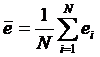

A criterion for the establishing of correspondence should also be stated (e.g. allowing for correspondence to the closest position, correspondence on vertices or along lines, etc.). The criterion/criteria for finding the corresponding points shall be reported with the data quality evaluation result.

|Evaluation scope |data set
|Reporting scope |data set
|Parameter |-
|Data quality value type |Measure
|Data quality value structure |-
|Source reference |ISO/DIS 19157 Geographic information – Data quality
|Example |The value of the addresses vertical uncertainties is 5 meters
|Measure identifier |28
|===

==== Thematic accuracy – Non-quantitative attribute correctness

[NOTE]
====
*Recomendation 19*

Non-quantitative attribute correctness should be evaluated and documented using the _Thematic accuracy – Non-quantitative attribute correctness_ sub-element and the measure _Rate of incorrect attribute values_ as specified in the table below.

====

[width="100%",cols="35%,65%",]
|===
|*Name* |*Rate of incorrect attribute values*
|Alternative name |–
|Data quality element |thematic accuracy
|Data quality subelement |non-quantitative attribute correctness
|Data quality basic measure |error rate
|Definition |number of attribute values where incorrect values are assigned in relation to the total number of attribute values
|Description |number of items that contain wrong values of thoroughfare names to compare them with the true values, in relation to the total.
|Evaluation scope |spatial object / spatial object type
|Reporting scope |data set
|Parameter |–
|Data quality value type |Real, percentage, ratio (example: 0,0189 ; 98,11% ; 11:582)
|Data quality value structure |–
|Source reference |ISO/DIS 19157 Geographic information – Data quality
|Example |The 10% of the thoroughfare names of addresses are in error
|Measure identifier |67
|===

=== Minimum data quality requirements

No minimum data quality requirements are defined for the spatial data theme Addresses.

=== Recommendation on data quality

No minimum data quality recommendations are defined.

<<<
== Dataset-level metadata

This section specifies dataset-level metadata elements, which should be used for documenting metadata for a complete dataset or dataset series.

NOTE Metadata can also be reported for each individual spatial object (spatial object-level metadata). Spatial object-level etadata is fully described in the application schema(s) (section 5).

For some dataset-level metadata elements, in particular those for reporting data quality and maintenance, a more specific scope can be specified. This allows the definition of metadata at sub-dataset level, e.g. separately for each spatial object type (see instructions for the relevant metadata element).

=== Metadata elements defined in INSPIRE Metadata Regulation

Table 4 gives an overview of the metadata elements specified in Regulation 1205/2008/EC (implementing Directive 2007/2/EC of the European Parliament and of the Council as regards metadata).

The table contains the following information:

* The first column provides a reference to the relevant section in the Metadata Regulation, which contains a more detailed description.
* The second column specifies the name of the metadata element.
* The third column specifies the multiplicity.
* The fourth column specifies the condition, under which the given element becomes mandatory.

[.text-center]
*Table 4 – Metadata for spatial datasets and spatial dataset series specified in Regulation 1205/2008/EC*

[align=center,width="100%",cols="17%,28%,15%,40%",options="header",]
|===
|*Metadata Regulation Section* |*Metadata element* |*Multiplicity* |*Condition*
|1.1 |Resource title |1 |
|1.2 |Resource abstract |1 |
|1.3 |Resource type |1 |
|1.4 |Resource locator |0..* |Mandatory if a URL is available to obtain more 
[.text-center]i*nformation on the resource, and/or access related services.
|1.5 |Unique re*source identifier |1..* |
|1.7 |Resource language |0..* |Mandatory if the resource includes textual information.
|2.1 |Topic category |1..* |
|3 |Keyword |1..* |
|4.1 |Geographic bounding box |1..* |
|5 |Temporal reference |1..* |
|6.1 |Lineage |1 |
|6.2 |Spatial resolution |0..* |Mandatory for data sets and data set series if an equivalent scale or a resolution distance can be specified.
|7 |Conformity |1..* |
|8.1 |Conditions for access and use |1..* |
|8.2 |Limitations on public access |1..* |
|9 |Responsible organisation |1..* |
|10.1 |Metadata point of contact |1..* |
|10.2 |Metadata date |1 |
|10.3 |Metadata language |1 |
|===

Generic guidelines for implementing these elements using ISO 19115 and 19119 are available at _http://inspire.jrc.ec.europa.eu/index.cfm/pageid/101_. The following sections describe additional theme-specific recommendations and requirements for implementing these elements.

==== Conformity

The _Conformity_ metadata element defined in Regulation 1205/2008/EC requires to report the conformance with the Implementing Rule for interoperability of spatial data sets and services. In addition, it may be used also to document the conformance to another specification.

[NOTE]
====
*Recomendation 20*

Dataset metadata should include a statement on the overall conformance of the dataset with this data specification (i.e. conformance with all requirements).

====

[NOTE]
====
*Recomendation 21*

The _Conformity_ metadata element should be used to document conformance with this data specification (as a whole), with a specific conformance class defined in the Abstract Test Suite in Annex A and/or with another specification.

====

The _Conformity_ element includes two sub-elements, the _Specification_ (a citation of the Implementing Rule for interoperability of spatial data sets and services or other specification), and the _Degree_ of conformity. The _Degree_ can be _Conformant_ (if the dataset is fully conformant with the cited specification), _Not Conformant_ (if the dataset does not conform to the cited specification) or _Not Evaluated_ (if the conformance has not been evaluated).

[NOTE]
====
*Recomendation 22*

If a dataset is not yet conformant with all requirements of this data specification, it is recommended to include information on the conformance with the individual conformance classes specified in the Abstract Test Suite in Annex A.

====

[NOTE]
====
*Recomendation 23*

If a dataset is produced or transformed according to an external specification that includes specific quality assurance procedures, the conformity with this specification should be documented using the _Conformity_ metadata element.

====

[NOTE]
====
*Recomendation 24*

If minimum data quality recommendations are defined then the statement on the conformity with these requirements should be included using the _Conformity_ metadata element and referring to the relevant data quality conformance class in the Abstract Test Suite.

====

NOTE Currently no minimum data quality requirements are included in the IRs. The recommendation above should be included as a requirement in the IRs if minimum data quality requirements are defined at some point in the future.

[NOTE]
====
*Recomendation 25*

When documenting conformance with this data specification or one of the conformance classes defined in the Abstract Test Suite, the _Specification_ sub-element should be given using the http URI identifier of the conformance class or using a citation including the following elements:

* title: "INSPIRE Data Specification on Addresses – Draft Guidelines – <name of the conformance class>"
* date:
** dateType: publication
** date: yyyy-mm-dd

====

EXAMPLE 1: The XML snippets below show how to fill the _Specification_ sub-element for documenting conformance with the whole data specification on *ddresses v3.0.1.

[source, xml]
<gmd:DQ_ConformanceResult>
	<gmd:specification href="http://inspire.ec.europa.eu/conformanceClass/ad/3.0.1/tg" />
	<gmd:explanation> (...) </gmd:explanation>
	<gmd:pass> (...) </gmd:pass>
</gmd:DQ_ConformanceResult>

or (using a citation):

[source, xml]
<gmd:DQ_ConformanceResult>
	<gmd:specification>
		<gmd:CI_Citation>
			<gmd:title>
				<gco:CharacterString>INSPIRE Data Specification on Addresses – Draft Guidelines</gco:CharacterString>
			</gmd:title>
			<gmd:date>
				<gmd:date>
					<gco:Date>yyyy-mm-dd</gco:Date>
				</gmd:date>
				<gmd:dateType>
					<gmd:CI_DateTypeCode codeList="http://standards.iso.org/ittf/PubliclyAvailableStandards/ISO_19139_Schemas/resou
rces/Codelist/ML_gmxCodelists.xml#CI_DateTypeCode" codeListValue="publication">publication</gmd:CI_DateTypeCode>
				</gmd:dateType>
			</gmd:date>
		</gmd:CI_Citation>
	</gmd:specification>
	<gmd:explanation> (...) </gmd:explanation>
	<gmd:pass> (...) </gmd:pass>
</gmd:DQ_ConformanceResult>

EXAMPLE 2: The XML snippets below show how to fill the _Specification_ sub-element for documenting conformance with the CRS conformance class of the data specification on Addresses v3.0.1.

[source, xml]
<gmd:DQ_ConformanceResult>
	<gmd:specification href="http://inspire.ec.europa.eu/conformanceClass/ad/3.0.1/crs" />
	<gmd:explanation> (...) </gmd:explanation>
	<gmd:pass> (...) </gmd:pass>
</gmd:DQ_ConformanceResult>

or (using a citation):

[source, xml]
<gmd:DQ_ConformanceResult>
	<gmd:specification>
		<gmd:CI_Citation>
			<gmd:title>
				<gco:CharacterString>INSPIRE Data Specification on Addresses – Draft Guidelines – CRS</gco:CharacterString>
			</gmd:title>
			<gmd:date>
				<gmd:date>
					<gco:Date>yyyy-mm-dd</gco:Date>
				</gmd:date>
				<gmd:dateType>
					<gmd:CI_DateTypeCode codeList="http://standards.iso.org/ittf/PubliclyAvailableStandards/ISO_19139_Schemas/resou
rces/Codelist/ML_gmxCodelists.xml#CI_DateTypeCode" codeListValue="publication">publication</gmd:CI_DateTypeCode>
				</gmd:dateType>
			</gmd:date>
		</gmd:CI_Citation>
	</gmd:specification>
	<gmd:explanation> (...) </gmd:explanation>
	<gmd:pass> (...) </gmd:pass>
</gmd:DQ_ConformanceResult>

==== Lineage

[NOTE]
====
*Recomendation 26*

Following the ISO/DIS 19157 Quality principles, if a data provider has a procedure for the quality management of their spatial data sets then the appropriate data quality elements and measures defined in ISO/DIS 19157 should be used to evaluate and report (in the metadata) the results. If not, the _Lineage_ metadata element (defined in Regulation 1205/2008/EC) should be used to describe the overall quality of a spatial data set.

====

According to Regulation 1205/2008/EC, lineage "is a statement on process history and/or overall quality of the spatial data set. Where appropriate it may include a statement whether the data set has been validated or quality assured, whether it is the official version (if multiple versions exist), and whether it has legal validity. The value domain of this metadata element is free text".

The Metadata Technical Guidelines based on EN ISO 19115 and EN ISO 19119 specifies that the statement sub-element of LI_Lineage (EN ISO 19115) should be used to implement the lineage metadata element.

[NOTE]
====
*Recomendation 27*

To describe the transformation steps and related source data, it is recommended to use the following sub-elements of LI_Lineage:

* For the description of the transformation process of the local to the common INSPIRE data structures, the LI_ProcessStep sub-element should be used.

* For the description of the source data the LI_Source sub-element should be used.

====

NOTE 1 In order to improve the interoperability, domain templates and instructions for using these free text elements (descriptive statements) may be specified here and/or in an Annex of this data specification.

==== Temporal reference

According to Regulation 1205/2008/EC, at least one of the following temporal reference metadata sub-elements shall be provided: temporal extent, date of publication, date of last revision, date of creation.

[NOTE]
====
*Recomendation 28*

It is recommended that at least the date of the last revision of a spatial data set should be reported using the _Date of last revision_ metadata sub-element.

====

=== Metadata elements for interoperability

[IMPORTANT]
====
[.text-center]
*IR Requirement*
_Article 13_
*Metadata required for Interoperability*

The metadata describing a spatial data set shall include the following metadata elements required for interoperability:

. Coordinate Reference System: Description of the coordinate reference system(s) used in the data set.

. Temporal Reference System: Description of the temporal reference system(s) used in the data set.
+
This element is mandatory only if the spatial data set contains temporal information that does not refer to the default temporal reference system.

. Encoding: Description of the computer language construct(s) specifying the representation of data objects in a record, file, message, storage device or transmission channel.

. Topological Consistency: Correctness of the explicitly encoded topological characteristics of the data set as described by the scope.
+
This element is mandatory only if the data set includes types from the Generic Network Model and does not assure centreline topology (connectivity of centrelines) for the network.

. Character Encoding: The character encoding used in the data set.
+
This element is mandatory only if an encoding is used that is not based on UTF-8.

. Spatial Representation Type: The method used to spatially represent geographic information.

====

These Technical Guidelines propose to implement the required metadata elements based on ISO 19115 and ISO/TS 19139.

The following TG requirements need to be met in order to be conformant with the proposed encoding.

[TIP]
====
*TG Requirement 3*

Metadata instance (XML) documents shall validate without error against the used ISO 19139 XML schema.

====

NOTE Section 2.1.2 of the Metadata Technical Guidelines discusses the different ISO 19139 XML schemas that are currently available.

[TIP]
====
*TG Requirement 4*

Metadata instance (XML) documents shall contain the elements and meet the INSPIRE multiplicity specified in the sections below.

====

[TIP]
====
*TG Requirement 5*

The elements specified below shall be available in the specified ISO/TS 19139 path.

====

[NOTE]
====
*Recomendation 29*

The metadata elements for interoperability should be made available together with the metadata elements defined in the Metadata Regulation through an INSPIRE discovery service.

====

NOTE While this not explicitly required by any of the INSPIRE Implementing Rules, making all metadata of a data set available together and through one service simplifies implementation and usability.

==== Coordinate Reference System

[width="100%",cols="33%,67%",options="header",]
|===
|Metadata element name |*Coordinate Reference System*
|Definition |Description of the coordinate reference system used in the dataset.
|ISO 19115 number and name |13. referenceSystemInfo
|ISO/TS 19139 path |referenceSystemInfo
|INSPIRE obligation / condition |mandatory
|INSPIRE multiplicity |1..*
|Data type(and ISO 19115 no.) |186. MD_ReferenceSystem
|Domain a|
To identify the reference system, the referenceSystemIdentifier (RS_Identifier) shall be provided.

NOTE More specific instructions, in particular on pre-defined values for filling the referenceSystemIdentifier attribute should be agreed among Member States during the implementation phase to support interoperability.

|Implementing instructions |
|Example a|
referenceSystemIdentifier:
code: ETRS_89
codeSpace: INSPIRE RS registry

|Example XML encoding a|
[source, xml]
<gmd:referenceSystemInfo>
		<gmd:MD_ReferenceSystem>
			<gmd:referenceSystemIdentifier>
				<gmd:RS_Identifier>
					<gmd:code>
						<gco:CharacterString>ETRS89 </gco:CharacterString>
					</gmd:code>
					<gmd:codeSpace>
						<gco:CharacterString>INSPIRE RS registry</gco:CharacterString>
					</gmd:codeSpace>
				</gmd:RS_Identifier>
			</gmd:referenceSystemIdentifier>
		</gmd:MD_ReferenceSystem>
</gmd:referenceSystemInfo>

|Comments |
|===

==== Temporal Reference System

[width="100%",cols="33%,67%",options="header",]
|===
|Metadata element name |*Temporal Reference System*
|Definition |Description of the temporal reference systems used in the dataset.
|ISO 19115 number and name |13. referenceSystemInfo
|ISO/TS 19139 path |referenceSystemInfo
|INSPIRE obligation / condition |Mandatory, if the spatial data set or one of its feature types contains temporal information that does not refer to the Gregorian Calendar or the Coordinated Universal Time.
|INSPIRE multiplicity |0..*
|Data type(and ISO 19115 no.) |186. MD_ReferenceSystem
|Domain a|
No specific type is defined in ISO 19115 for temporal reference systems. Thus, the generic MD_ReferenceSystem element and its reference SystemIdentifier (RS_Identifier) property shall be provided.

NOTE More specific instructions, in particular on pre-defined values for filling the referenceSystemIdentifier attribute should be agreed among Member States during the implementation phase to support interoperability.

|Implementing instructions |
|Example a|
referenceSystemIdentifier:
code: GregorianCalendar
codeSpace: INSPIRE RS registry

|Example XML encoding a|
[source, xml]
<gmd:referenceSystemInfo>
	<gmd:MD_ReferenceSystem>
		<gmd:referenceSystemIdentifier>
			<gmd:RS_Identifier>
				<gmd:code>
			<gco:CharacterString>GregorianCalendar </gco:CharacterString>
				</gmd:code>
				<gmd:codeSpace>
					<gco:CharacterString>INSPIRE RS registry</gco:CharacterString>
				</gmd:codeSpace>
			</gmd:RS_Identifier>
		</gmd:referenceSystemIdentifier>
	</gmd:MD_ReferenceSystem>
</gmd:referenceSystemInfo>

|Comments |
|===

==== Encoding

[width="100%",cols="33%,67%",options="header",]
|===
|Metadata element name |*Encoding*
|Definition |Description of the computer language construct that specifies the representation of data objects in a record, file, message, storage device or transmission channel
|ISO 19115 number and name |271. distributionFormat
|ISO/TS 19139 path |distributionInfo/MD_Distribution/distributionFormat
|INSPIRE obligation / condition |mandatory
|INSPIRE multiplicity |1..*
|Data type (and ISO 19115 no.) |284. MD_Format
|Domain |See B.2.10.4. The property values (name, version, specification) specified in section 5 shall be used to document the default and alternative encodings.
|Implementing instructions |
|Example a|
name: <Application schema name> GML application schema
version: version 3.1rc1
specification: D2.8.I.5 Data Specification on Addresses – Technical Guidelines

|Example XML encoding a|
[source, xml]
<gmd:MD_Format>
	<gmd:name>
		<gco:CharacterString>SomeApplicationSchema GML application schema</gco:CharacterString>
	</gmd:name>
	<gmd:version>
		<gco:CharacterString>3.1rc1</gco:CharacterString>
	</gmd:version>
	<gmd:specification>
		<gco:CharacterString>D2.8.I.5 Data Specification on Addresses – Technical Guidelines</gco:CharacterString>
	</gmd:specification>
</gmd:MD_Format>
|Comments |
|===

==== Character Encoding

[width="100%",cols="33%,67%",options="header",]
|===
|Metadata element name |*Character Encoding*
|Definition |The character encoding used in the data set.
|ISO 19115 number and name |
|ISO/TS 19139 path |
|INSPIRE obligation / condition |Mandatory, if an encoding is used that is not based on UTF-8.
|INSPIRE multiplicity |0..*
|Data type (and ISO 19115 no.) |
|Domain |
|Implementing instructions |
|Example |-
|Example XML encoding a|
[source, xml]
<gmd:characterSet>
	<gmd:MD_CharacterSetCode codeListValue="8859part2" codeList="http://standards.iso.org/ittf/PubliclyAvailableStandards/ISO_19139_Schemas/resources/Codelist/ML_gmxCodelists.xml#CharacterSetCode">8859-2</gmd:MD_CharacterSetCode>
</gmd:characterSet>
|Comments |
|===

==== Spatial representation type

[width="100%",cols="33%,67%",options="header",]
|===
|Metadata element name |*Spatial representation type*
|Definition |The method used to spatially represent geographic information.
|ISO 19115 number and name |37. spatialRepresentationType
|ISO/TS 19139 path |
|INSPIRE obligation / condition |Mandatory
|INSPIRE multiplicity |1..*
|Data type (and ISO 19115 no.) |B.5.26 MD_SpatialRepresentationTypeCode
|Domain |
|Implementing instructions a|
Of the values included in the code list in ISO 19115 (vector, grid, textTable, tin, stereoModel, video), only vector, grid and tin should be used.

NOTE Additional code list values may be defined based on feedback from implementation.

|Example |-
|Example XML encoding |
|Comments |
|===

==== Data Quality – Logical Consistency – Topological Consistency

See section 8.3.2 for instructions on how to implement metadata elements for reporting data quality.

=== Recommended theme-specific metadata elements

[NOTE]
====
*Recomendation 30*

The metadata describing a spatial data set or a spatial data set series related to the theme _Addresses_ should comprise the theme-specific metadata elements specified in Table 5.

====

The table contains the following information:

* The first column provides a reference to a more detailed description.
* The second column specifies the name of the metadata element.
* The third column specifies the multiplicity.

[.text-center]
*Table 5 – Optional theme-specific metadata elements for the theme _Addresses_*

[align=center,width="100%",cols="12%,73%,,15%",options="header",]
|===
|*Section* |*Metadata element* | |*Multiplicity*
|8.3.1 |Maintenance Information | |0..1
|8.3.2 |Logical Consistency – Conceptual Consistency | |0..*
|8.3.2 |Logical Consistency – Domain Consistency | |0..*
|8.3.2 |Completeness – Commission |0..* |
|8.3.2 |Completeness – Omission |0..* |
|8.3.2 |Positional Accuracy – Absolute or external accuracy |0..* |
|8.3.2 |Thematic accuracy – Non-quantitative attribute correctness |0..* |
|8.3.3 |Data Identification – Spatial Representation type |0..* |
|===

[NOTE]
====
*Recomendation 31*

For implementing the metadata elements included in this section using ISO 19115, ISO/DIS 19157 and ISO/TS 19139, the instructions included in the relevant sub-sections should be followed.

====

==== Maintenance Information

[width="100%",cols="33%,67%",options="header",]
|===
|Metadata element name |*Maintenance information*
|Definition |Information about the scope and frequency of updating
|ISO 19115 number and name |30. resourceMaintenance
|ISO/TS 19139 path |identificationInfo/MD_Identification/resourceMaintenance
|INSPIRE obligation / condition |optional
|INSPIRE multiplicity |0..1
|Data type(and ISO 19115 no.) |142. MD_MaintenanceInformation
|Domain a|
This is a complex type (lines 143-148 from ISO 19115).

At least the following elements should be used (the multiplicity according to ISO 19115 is shown in parentheses):

* maintenanceAndUpdateFrequency [1]: frequency with which changes and additions are made to the resource after the initial resource is completed / domain value: MD_MaintenanceFrequencyCode:
* updateScope [0..*]: scope of data to which maintenance is applied / domain value: MD_ScopeCode
* maintenanceNote [0..*]: information regarding specific requirements for maintaining the resource / domain value: free text

|Implementing instructions |
|Example |
|Example XML encoding |
|Comments |
|===

==== Metadata elements for reporting data quality

[NOTE]
====
*Recomendation 32*

For reporting the results of the data quality evaluation, the data quality elements, sub-elements and (for quantitative evaluation) measures defined in chapter 7 should be used.

====

[NOTE]
====
*Recomendation 33*

The metadata elements specified in the following sections should be used to report the results of the data quality evaluation. At least the information included in the row "Implementation instructions" should be provided.

====

The first section applies to reporting quantitative results (using the element DQ_QuantitativeResult), while the second section applies to reporting non-quantitative results (using the element DQ_DescriptiveResult).

[NOTE]
====
*Recomendation 34*

If a dataset does not pass the tests of the Application schema conformance class (defined in Annex A), the results of each test should be reported using one of the options described in sections 8.3.2.1 and 8.3.2.2.

====

NOTE 1 If using non-quantitative description, the results of several tests do not have to be reported separately, but may be combined into one descriptive statement.

NOTE 2 The sections 8.3.2.1 and 8.3.2.2 may need to be updated once the XML schemas for ISO 19157 have been finalised.

The scope for reporting may be different from the scope for evaluating data quality (see section 7). If data quality is reported at the data set or spatial object type level, the results are usually derived or aggregated.

[NOTE]
====
*Recomendation 35*

The scope element (of type DQ_Scope) of the DQ_DataQuality subtype should be used to encode the reporting scope.

Only the following values should be used for the level element of DQ_Scope: Series, Dataset, featureType.

If the level is featureType the levelDescription/MDScopeDescription/features element (of type Set< GF_FeatureType>) shall be used to list the feature type names.

====

NOTE In the level element of DQ_Scope, the value featureType is used to denote spatial object type.

===== Guidelines for reporting quantitative results of the data quality evaluation

[width="100%",cols="36%,64%",options="header",]
|===
|Metadata element name |*See chapter 7*
|Definition |See chapter 7
|ISO/DIS 19157 number and name |3. report
|ISO/TS 19139 path |dataQualityInfo/*/report
|INSPIRE obligation / condition |optional
|INSPIRE multiplicity |0..*
|Data type (and ISO/DIS 19157 no.) |Corresponding DQ_xxx subelement from ISO/DIS 19157, e.g. 12. DQ_CompletenessCommission
|Domain a|
Lines 7-9 from ISO/DIS 19157

[arabic, start=7]
. DQ_MeasureReference (C.2.1.3)
. DQ_EvaluationMethod (C.2.1.4.)
. DQ_Result (C2.1.5.)

|Implementing instructions a|
[arabic, start=39]
. nameOfMeasure

NOTE This should be the name as defined in Chapter 7.

[arabic, start=42]
. evaluationMethodType
. evaluationMethodDescription

NOTE If the reported data quality results are derived or aggregated (i.e. the scope levels for evaluation and reporting are different), the derivation or aggregation should also be specified using this property.

[arabic, start=46]
. dateTime

NOTE This should be data or range of dates on which the data quality measure was applied.

[arabic, start=63]
. DQ_QuantitativeResult / 64. value

NOTE The DQ_Result type should be DQ_QuantitativeResult and the value(s) represent(s) the application of the data quality measure (39.) using the specified evaluation method (42-43.)

|Example |See Table E.12 — Reporting commission as metadata (ISO/DIS 19157)
|Example XML encoding |
|===

===== Guidelines for reporting descriptive results of the Data Quality evaluation

[width="100%",cols="36%,64%",options="header",]
|===
|Metadata element name |*See chapter 7*
|Definition |See chapter 7
|ISO/DIS 19157 number and name |3. report
|ISO/TS 19139 path |dataQualityInfo/*/report
|INSPIRE obligation / condition |optional
|INSPIRE multiplicity |0..*
|Data type (and ISO/DIS 19157 no.) |Corresponding DQ_xxx subelement from ISO/DIS 19157, e.g. 12. DQ_CompletenessCommission
|Domain a|
Line 9 from ISO/DIS 19157

[arabic, start=9]
. DQ_Result (C2.1.5.)

|Implementing instructions a|
[arabic, start=67]
. DQ_DescripitveResult / 68. statement

NOTE The DQ_Result type should be DQ_DescriptiveResult and in the statement (68.) the evaluation of the selected DQ sub-element should be expressed in a narrative way.

|Example |See Table E.15 — Reporting descriptive result as metadata (ISO/DIS 19157)
|Example XML encoding |
|===

==== Data Identification – Spatial Representation Type

[width="100%",cols="35%,65%",options="header",]
|===
|Metadata element name |*Data Identification – Spatial Representation type*
|Definition |Method used to spatially represent geographic information
|ISO 19115 number and name |12. spatialRepresentationInfo
|ISO/TS 19139 path |spatialRepresentationInfo/MD_SpatialRepresentation
|INSPIRE obligation / condition |Optional
|INSPIRE multiplicity |0..*
|Data type (and ISO 19115 no.) |37. spatialRepresentationType
|Domain |MD_SpatialRepresentationTypeCode, Codelist (See B.5.26 of ISO 19115)
|Implementing instructions |
|Example |Vector
|Example XML encoding |
|Comments |
|===

<<<
== Delivery

=== Updates

[IMPORTANT]
====
[.text-center]
*IR Requirement*
_Article 8_
*Updates*

. Member States shall make available updates of data on a regular basis.

. All updates shall be made available at the latest 6 months after the change was applied in the source data set, unless a different period is specified for a specific spatial data theme in Annex II.

====

NOTE In this data specification, no exception is specified, so all updates shall be made available at the latest 6 months after the change was applied in the source data set.

=== Delivery medium

According to Article 11(1) of the INSPIRE Directive, Member States shall establish and operate a network of services for INSPIRE spatial data sets and services. The relevant network service types for making spatial data available are:

* _view services_ making it possible, as a minimum, to display, navigate, zoom in/out, pan, or overlay viewable spatial data sets and to display legend information and any relevant content of metadata;
* _download services_, enabling copies of spatial data sets, or parts of such sets, to be downloaded and, where practicable, accessed directly;
* _transformation services_, enabling spatial data sets to be transformed with a view to achieving interoperability.

NOTE For the relevant requirements and recommendations for network services, see the relevant Implementing Rules and Technical Guidelinesfootnote:[The Implementing Rules and Technical Guidelines on INSPIRE Network Services are available at http://inspire.jrc.ec.europa.eu/index.cfm/pageid/5].

EXAMPLE 1 Through the Get Spatial Objects function, a download service can either download a pre-defined data set or pre-defined part of a data set (non-direct access download service), or give direct access to the spatial objects contained in the data set, and download selections of spatial objects based upon a query (direct access download service). To execute such a request, some of the following information might be required:

the list of spatial object types and/or predefined data sets that are offered by the download service (to be provided through the Get Download Service Metadata operation),

and the query capabilities section advertising the types of predicates that may be used to form a query expression (to be provided through the Get Download Service Metadata operation, where applicable), a description of spatial object types offered by a download service instance (to be provided through the Describe Spatial Object Types operation).

EXAMPLE 2 Through the Transform function, a transformation service carries out data content transformations from native data forms to the INSPIRE-compliant form and vice versa. If this operation is directly called by an application to transform source data (e.g. obtained through a download service) that is not yet conformant with this data specification, the following parameters are required:

* Input data (mandatory). The data set to be transformed.

*Source model (mandatory, if cannot be determined from the input data). The model in which the input data is provided.

* Target model (mandatory). The model in which the results are expected.

* Model mapping (mandatory, unless a default exists). Detailed description of how the transformation is to be carried out.

=== Encodings

The IRs contain the following two requirements for the encoding to be used to make data available.

[IMPORTANT]
====
[.text-center]
*IR Requirement*
_Article 7_
*Encoding*

{empty}1. Every encoding rule used to encode spatial data shall conform to EN ISO 19118. In particular, it shall specify schema conversion rules for all spatial object types and all attributes and association roles and the output data structure used.
{empty}2. Every encoding rule used to encode spatial data shall be made available.
{empty}2a. Every encoding rule used to encode spatial data shall also specify whether and how to represent attributes and association roles for which a corresponding value exists but is not contained in the spatial data sets maintained by a Member State, or cannot be derived from existing values at reasonable costs.

====

NOTE ISO 19118:2011 specifies the requirements for defining encoding rules used for interchange of geographic data within the set of International Standards known as the "ISO 19100 series". An encoding rule allows geographic information defined by application schemas and standardized schemas to be coded into a system-independent data structure suitable for transport and storage. The encoding rule specifies the types of data being coded and the syntax, structure and coding schemes used in the resulting data structure. Specifically, ISO 19118:2011 includes

* requirements for creating encoding rules based on UML schemas,
* requirements for creating encoding services, and
* requirements for XML-based encoding rules for neutral interchange of data.

While the IRs do not oblige the usage of a specific encoding, these Technical Guidelines propose to make data related to the spatial data theme Addresses available at least in the default encoding(s) specified in section 9.3.1. In this section, a number of TG requirements are listed that need to be met in order to be conformant with the default encoding(s).

The proposed default encoding(s) meet the requirements in Article 7 of the IRs, i.e. they are conformant with ISO 19118 and (since they are included in this specification) publicly available.

==== Default Encoding(s)

===== Specific requirements for GML encoding

This data specification proposes the use of GML as the default encoding, as recommended in sections 7.2 and 7.3 of [DS-D2.7]. GML is an XML encoding in compliance with ISO 19118, as required in Article 7(1). For details, see [ISO 19136], and in particular Annex E (UML-to-GML application schema encoding rules).

The following TG requirements need to be met in order to be conformant with GML encodings.

[TIP]
====
*TG Requirement 6*

Data instance (XML) documents shall validate without error against the provided XML schema.

====

NOTE 1 Not all constraints defined in the application schemas can be mapped to XML. Therefore, the following requirement is necessary.

NOTE 2 The obligation to use only the allowed code list values specified for attributes and most of the constraints defined in the application schemas [.underline]#cannot# be mapped to the XML sch. They can therefore [.underline]#not# be enforced through schema validation. It may be possible to express some of these constraints using other schema or rule languages (e.g. Schematron), in order to enable automatic validation.

===== Default encoding(s) for application schema Addresses

*Name: Addresses GML Application Schema*
Version: version 3.0, GML version 3.2.1
Specification: D2.8.I.5 Data Specification on Addresses – Technical Guidelines
Character set: UTF-8

The xml schema document is available from _http://inspire.ec.europa.eu/schemas/ad/3.0/Addresses.xsd._

====== Encoding rules used

The encoding rule used for this encoding is specified in Annex B of [DS-D2.7].

NOTE Annex B of [DS-D2.7], version 3.3rc2, requires that the "encoding rule specified in ISO 19136 Annex E with the extensions in GML 3.3 shall be applied with the additional rules stated in this Annex. For types within the scope of the ISO/TS 19139 encoding rule, the encoding rule of ISO/TS 19139 shall be applied."

<<<
== Data Capture

There is no specific guidance required with respect to data capture.

<<<
== Portrayal

This clause defines the rules for layers and styles to be used for portrayal of the spatial object types defined for this theme. Portrayal is regulated in Article 14 of the IRs.

[IMPORTANT]
====
[.text-center]
*IR Requirement*
_Article 14_
*Portrayal*

. For the portrayal of spatial data sets using a view network service as specified in Commission Regulation No 976/2009 (footnote:[OJ L 274, 20.10.2009, p. 9.]), the following shall be available:
[loweralpha]
.. the layers specified in Annex II for the theme or themes the data set is related to;
.. for each layer at least a default portrayal style, with as a minimum an associated title and a unique identifier.

[arabic, start=2]
. For each layer, Annex II defines the following:
[loweralpha]
.. a human readable title of the layer to be used for display in user interface;
.. the spatial object type(s), or sub-set thereof, that constitute(s) the content of the layer.

====

In section 11.1, the _types_ of layers are defined that are to be used for the portrayal of the spatial object types defined in this specification. A view service may offer several layers of the same type, one for each dataset that it offers data on a specific topic.

NOTE The layer specification in the IRs only contains the name, a human readable title and the (subset(s) of) spatial object type(s), that constitute(s) the content of the layer. In addition, these Technical Guidelines suggest keywords for describing the layer.

[NOTE]
====
*Recomendation 36*

It is recommended to use the keywords specified in section 11.1 in the _Layers Metadata parameters_ of the INSPIRE View service (see Annex III, Part A, section 2.2.4 in Commission Regulation (EC) No 976/2009).

====

Section 11.2 specifies one style for each of these layers. It is proposed that INSPIRE view services support this style as the default style required by Article 14(1b).

[TIP]
====
*TG Requirement 7*

For each layer specified in this section, the styles defined in section 11.2 shall be available.

====

NOTE The default style should be used for portrayal by the view network service if no user-defined style is specified in a portrayal request for a specific layer.

In section 11.2, further styles can be specified that represent examples of styles typically used in a thematic domain. It is recommended that also these styles should be supported by INSPIRE view services, where applicable.

[NOTE]
====
*Recomendation 37*

In addition, it is recommended that, where applicable, INSPIRE view services also support the styles defined in section 11.2.

====

Where XML fragments are used in the following sections, the following namespace prefixes apply:

* sld="http://www.opengis.net/sld" (WMS/SLD 1.1)
* se="http://www.opengis.net/se" (SE 1.1)
* ogc="http://www.opengis.net/ogc" (FE 1.1)

=== Layers to be provided by INSPIRE view services

[width="100%",cols="25%,25%,25%,25%",options="header",]
|===
|*Layer Name* |*Layer Title* |*Spatial object type(s)* |*Keywords*
|AD.Address |Addresses |Address |Address
|===

==== Layers organisation

None.

=== Styles required to be supported by INSPIRE view services

[NOTE]
====
*Recomendation 38*

If an address has multiple geographic positions, only the position where the "default" attribute is true should be portrayed.

====

[NOTE]
====
*Recomendation 39*

If an INSPIRE view services support the portrayal of data related to the theme _Addresses_, it shall imply an accurate scale of the geographic position of the address.

====

The geographic position of the address can be an exact (point) position or it can be derived from others spatial object types – see CodeList GeometrySpecificationValue. To avoid misunderstanding it is necessary to express an accuracy level in Address portrayal. We recommend using four levels of accuracy depending on the GeometrySpecification value:

[width="100%",cols="36%,28%,36%",options="header",]
|===
|*GeometrySpecification value* |*Accuracy* |*Portrayal recommendation*
|postalDelivery, utilityService, thoroughfareAccess, entrance a|
Exact Level

(most accurate portrayal)

a|
6 pixel square with black border

and white (#ffffff) fill

|building, parcel, |Locator Level a|
6 pixel square with black border

and 75% grey (#c0c0c0) fill

|segment |Thoroughfare level a|
6 pixel square with black border

and 50% grey (#808080) fill

|others (postalDescriptor, addressArea, Administrative units (level 1-6) or void) a|
Other or unknown level

(least accurate portrayal)

a|
6 pixel square with black border

and 25% grey (#404040) fill

|===

==== Styles for the layer AD.Address

[width="100%",cols="18%,82%",options="header",]
|===
|*Style Name* |*AD.Address.Default*
|*Default Style* |yes
|*Style Title* |Address Default Style
|*Style Abstract* a|
6 pixel square with black (#000000) border and 

* white (#FFFFFF) fill, if the position of the address represents the postal delivery point, a point of utility service, the access point from the thoroughfare, or the entrance door or gate,
* 75% grey (#C0C0C0) fill, if the position of the address represents the building or parcel,
* 50% grey (#808080), if the position of the address represents the related segment of a thoroughfare, and
* 25% grey (#404040), otherwise.

|*Symbology* a|
[source, xml]
--
<sld:NamedLayer>
	<se:Name> AD.Address</se:Name>
	<sld:UserStyle>
		<se:Name>AD.Address.Default</se:Name>
		<sld:IsDefault>1</sld:IsDefault>
		<se:FeatureTypeStyle version="1.1.0">
			<se:Description>
				<se:Title> Address Default Style</se:Title>
				<se:Abstract> The point is rendered as 6 pixel square with black (#000000) border and white (#FFFFFF) fill, if the position of the address represents the postal delivery point, a point of utility service, the access point from the thoroughfare, or the entrance door or gate; 75% grey (#C0C0C0) fill, if the position of the address represents the building or parcel; 50% grey (#808080), if the position of the address represents the related segment of a thoroughfare; and 25% grey (#404040), otherwise. 
</se:Abstract>
			</se:Description>
			<se:FeatureTypeName>AD:Address</se:FeatureTypeName>

			<se:Rule>
				<!--The highest accuracy - Exact Level - white-->
				<se:Filter>
					<OR>
						<se:PropertyIsEqualTo>
							<ogc:PropertyName>AD:Address.position.specification</ogc:PropertyName>
							<ogc:Literal>postalDelivery</ogc:Literal>
						</se:PropertyIsEqualTo>
						<se:PropertyIsEqualTo>
							<ogc:PropertyName>AD:Address.position.specification</ogc:PropertyName>
							<ogc:Literal>utilityService</ogc:Literal>
						</se:PropertyIsEqualTo>
						<se:PropertyIsEqualTo>
							<ogc:PropertyName>AD:Address.position.specification</ogc:PropertyName>
							<ogc:Literal>thoroughfareAccess</ogc:Literal>
						</se:PropertyIsEqualTo>
						<se:PropertyIsEqualTo>
							<ogc:PropertyName>AD:Address.position.specification</ogc:PropertyName>
							<ogc:Literal>entrance</ogc:Literal>
						</se:PropertyIsEqualTo>
					</OR>
				</se:Filter>
				<se:PointSymbolizer>
					<se:Geometry>
						<ogc:PropertyName>geometry</ogc:PropertyName>
					</se:Geometry>
					<se:Graphic>
						<se:Mark>
							<se:WellKnownName>square</se:WellKnownName>
							<se:Fill>
								<se:SvgParameter name="fill">#ffffff</se:SvgParameter>
							</se:Fill>
							<se:Stroke>
								<se:SvgParameter name="stroke">#000000</se:SvgParameter>
								<se:SvgParameter name="stroke-width">1</se:SvgParameter>
							</se:Stroke>
						</se:Mark>
						<se:Size>
							<se:SvgParameter> name="size">6</se:SvgParameter>
						</se:Size>
					</se:Graphic>
				</se:PointSymbolizer>
			</se:Rule>

			<se:Rule>
				<!--The highest accuracy - Locator Level - 75% gray-->
				<se:Filter>
					<OR>
						<se:PropertyIsEqualTo>
							<ogc:PropertyName>AD:Address.position.specification</ogc:PropertyName>
							<ogc:Literal>building</ogc:Literal>
						</se:PropertyIsEqualTo>
						<se:PropertyIsEqualTo>
							<ogc:PropertyName>AD:Address.position.specification</ogc:PropertyName>
							<ogc:Literal>parcel</ogc:Literal>
						</se:PropertyIsEqualTo>
					</OR>
				</se:Filter>
				<se:PointSymbolizer>
					<se:Geometry>
						<ogc:PropertyName>geometry</ogc:PropertyName>
					</se:Geometry>
					<se:Graphic>
						<se:Mark>
							<se:WellKnownName>square</se:WellKnownName>
							<se:Fill>
								<se:SvgParameter name="fill">#c0c0c0</se:SvgParameter>
							</se:Fill>
							<se:Stroke>
								<se:SvgParameter name="stroke">#000000</se:SvgParameter>
								<se:SvgParameter name="stroke-width">1</se:SvgParameter>
							</se:Stroke>
						</se:Mark>
						<se:Size>
							<se:SvgParameter> name="size">6</se:SvgParameter>
						</se:Size>
					</se:Graphic>
				</se:PointSymbolizer>
			</se:Rule>

			<se:Rule>
				<!--The middle accuracy - Thoroughfare level - 50% gray-->
				<se:Filter>
	<ogc:PropertyName>AD:Address.position.specification</ogc:PropertyName>
						<ogc:Literal> segment</ogc:Literal>
					</se:PropertyIsEqualTo>
				</se:Filter>
				<se:PointSymbolizer>
					<se:Geometry>
						<ogc:PropertyName>geometry</ogc:PropertyName>
					</se:Geometry>
					<se:Graphic>
						<se:Mark>
							<se:WellKnownName>square</se:WellKnownName>
							<se:Fill>
								<se:SvgParameter name="fill">#808080</se:SvgParameter>
							</se:Fill>
							<se:Stroke>
								<se:SvgParameter name="stroke">#000000</se:SvgParameter>
								<se:SvgParameter name="stroke-width">1</se:SvgParameter>
							</se:Stroke>
						</se:Mark>
						<se:Size>
							<se:SvgParameter name="size">6</se:SvgParameter>
						</se:Size>
					</se:Graphic>
				</se:PointSymbolizer>
			</se:Rule>

			<se:Rule>
				<!--The lowest accuracy - others or unknown level - 25% gray-->
      <se:ElseFilter/>
				<se:PointSymbolizer>
					<se:Geometry>
						<ogc:PropertyName>geometry</ogc:PropertyName>
					</se:Geometry>
					<se:Graphic>
						<se:Mark>
							<se:WellKnownName>square</se:WellKnownName>
							<se:Fill>
								<se:SvgParameter name="fill">#404040</se:SvgParameter>
							</se:Fill>
							<se:Stroke>
								<se:SvgParameter name="stroke">#000000</se:SvgParameter>
								<se:SvgParameter name="stroke-width">1</se:SvgParameter>
							</se:Stroke>
						</se:Mark>
						<se:Size>
							<se:SvgParameter name="size">6</se:SvgParameter>
						</se:Size>
					</se:Graphic>
				</se:PointSymbolizer>
			</se:Rule>

		</se:FeatureTypeStyle>
	</sld:UserStyle>
</sld:NamedLayer>

--
|*Minimum & maximum scales* |No scale limits.
|===

This is the simplest version of the layer definition - the address is portrayed as a point without any text representation.

The hierarchical structure of the address components as well as the rules for the address text representation (composition of the text from the names and designators of the address components) are different in different member states. Thus, they are not possible to express generally in this data specification.

The best overview of how addresses are represented when used for post distribution can be found in UPU documents, specifically

_http://www.upu.int/post_code/en/postal_addressing_systems_member_countries.shtml_

:sectnums!:

<<<
== Bibliography

[63 70 03:200X] SVENSK STANDARD, SS 63 70 03:200X Geographic information – Locational Addresses – Application Schema, , Sweden

BeSt, Standard for exchanging address information, Belgium, Work group STRATEGIS-DICO (AGDP-AAPD, IGN-NGI, AGIV, CIRB, MET), Version 1.2, 09-07-2007

British profile GEMINI

[BS7666-2:2006] Spatial datasets for geographical referencing, part 2: specification for a land and property gazetteer, United Kingdom, Technical committee IST/36 geographical information, Third edition, 28-07-2006

CartoCiudad Project Description, Spain, Ministry of Public Works and Transports of Spain, National Geographic Institute, version 0.3, 20-8-2008

Composante adresse du RGE, Spécifications de contenu, (version projet), France, Institut Géographique National, Service des Bases de Données Vecteurs, Version 1.0, 02-09-2003

Description of Key Register of Addresses in The Netherlands, The Netherlands, VROM, Central Services, project BAG, First draft, 10-03-2008

DIRECTIVE 2007/2/EC OF THE EUROPEAN PARLIAMENT AND OF THE COUNCIL of 14 March 2007 establishing an Infrastructure for Spatial Information in the European Community (INSPIRE) 
http://www.ec-gis.org/inspire/directive/l_10820070425en00010014.pdf

Draft Description of the Danish Address Reference System, Denmark, Morten Lind, National Survey and Cadastre – DK, version 1.2, 03-03-2008

Draft Guidelines – INSPIRE Metadata Implementing Rules, 
_http://www.ec-gis.org/inspire/reports/ImplementingRules/INSPIRE_Metadata_ ImplementingRule_v3_20071026.pdf

[DS-D2.3] INSPIRE DS-D2.3, Definition of Annex Themes and Scope, v3.0, http://inspire.jrc.ec.europa.eu/reports/ImplementingRules/DataSpecifications/D2.3_Definition_of_Annex_Themes_and_scope_v3.0.pdf

[DS-D2.5] INSPIRE DS-D2.5, Generic Conceptual Model, v3.4rc2, _http://inspire.jrc.ec.europa.eu/documents/Data_Specifications/D2.5_v3.4rc2.pdf_

[DS-D2.6] INSPIRE DS-D2.6, Methodology for the development of data specifications, v3.0, http://inspire.jrc.ec.europa.eu/reports/ImplementingRules/DataSpecifications/D2.6_v3.0.pdf

[DS-D2.7] INSPIRE DS-D2.7, Guidelines for the encoding of spatial data, v3.3rc2, _http://inspire.jrc.ec.europa.eu/documents/Data_Specifications/D2.7_v3.3rc2.pdf_

[DS-D2.8.I.3] INSPIRE DS-D2.8.I.3, INSPIRE data specification on Geographical names – Guidelines, v3.0

[DS-D2.8.I.4] INSPIRE DS-D2.8.I.4, INSPIRE data specification on Administrative units – Guidelines, v3.0

[DS-D2.8.I.6] INSPIRE DS-D2.8.I.3, INSPIRE data specification on Cadastral Parcels – Guidelines, v3.0

[DS-D2.8.I.7] INSPIRE DS-D2.8.I.7, INSPIRE data specification on Transport Networks – Guidelines, v3.0

[Flemish GIS-metadata profile] Flemish GIS-metadata profile V2.1.1

[ISO 19101] EN ISO 19101:2005 Geographic information – Reference model (ISO 19101:2002)

[ISO 19103] ISO/TS 19103:2005, Geographic information – Conceptual schema language

[ISO 19107] EN ISO 19107:2005, Geographic information – Spatial schema (ISO 19107:2003)

[ISO 19108] EN ISO 19108:2005 Geographic information - Temporal schema (ISO 19108:2002)

[ISO 19111] EN ISO 19111:2007 Geographic information - Spatial referencing by coordinates (ISO 19111:2007)

[ISO 19115] EN ISO 19115:2005, Geographic information – Metadata (ISO 19115:2003)

[ISO 19118] EN ISO 19118:2006, Geographic information – Encoding (ISO 19118:2005)

[ISO 19135] EN ISO 19135:2007 Geographic information – Procedures for item registration (ISO 19135:2005)

[ISO 19139] ISO/TS 19139:2007, Geographic information – Metadata – XML schema implementation

[ISO 19157] ISO/DIS 19157, Geographic information – Data quality

[Metadata Spanish Core] (NEM: Núcleo Español de Metadatos), _http://www.idee.es/resources/recomendacionesCSG/NEM.pdf_

[OGC 06-103r3] Implementation Specification for Geographic Information - Simple feature access – Part 1: Common Architecture v1.2.0

:sectnums:

<<<
[appendix]
== Abstract Test Suite - (normative)

[cols=""]
|===
*Disclaimer*

While this Annex refers to the Commission Regulation (EU) No 1089/2010 of 23 November 2010 implementing Directive 2007/2/EC of the European Parliament and of the Council as regards interoperability of spatial data sets and services, it does not replace the legal act or any part of it.
|===

The objective of the Abstract Test Suite (ATS) included in this Annex is to help the conformance testing process. It includes a set of tests to be applied on a data set to evaluate whether it fulfils the requirements included in this data specification and the corresponding parts of Commission Regulation No 1089/2010 (implementing rule as regards interoperability of spatial datasets and services, further referred to as ISDSS Regulation). This is to help data providers in declaring the conformity of a data set to the "degree of conformity, with implementing rules adopted under Article 7(1) of Directive 2007/2/EC", which is required to be provided in the data set metadata according to Commission Regulation (EC) No 2008/1205 (the Metadata Regulation).

*Part 1* of this ATS includes tests that provide *input for assessing conformity with the ISDSS regulation.* In order to make visible which requirements are addressed by a specific test, references to the corresponding articles of the legal act are given. The way how the cited requirements apply to ad specification is described under the testing method.

In addition to the requirements included in ISDSS Regulation this Technical guideline contains TG requirements too. TG requirements are technical provisions that need to be fulfilled in order to be conformant with the corresponding IR requirement when the specific technical implementation proposed in this document is used. Such requirements relate for example to the default encoding described in section 9. *Part 2* of the ATS presents tests necessary for assessing the *conformity with TG requirements*.

NOTE Conformance of a data set with the TG requirement(s) included in this ATS implies conformance with the corresponding IR requirement(s).

The *ATS is applicable to the data sets that* *have been transformed* to be made available through INSPIRE download services (i.e. the data returned as a response to the mandatory "Get Spatial Dataset" operation) rather than the original "source" data sets.

The requirements to be tested are grouped in several _conformance classes_. Each of these classes covers a specific aspect: one conformance class contains tests reflecting the requirements on the application schema, another on the reference systems, etc. *Each conformance class is identified by a URI* (uniform resource identifier) according to the following pattern:

http://inspire.ec.europa.eu/conformance-class/ir/ad/<conformance class identifier>

EXAMPLE 1 The URI _http://inspire.ec.europa.eu/conformance-class/ir/ef/rs_ identifies the Reference Systems ISDSS conformance class of the Environmental Monitoring Facilities (EF) data theme.

The results of the tests should be published referring to the relevant conformance class (using its URI).

When an INSPIRE data specification contains *more than one application schema,* the requirements tested in a conformance class may differ depending on the application schema used as a target for the transformation of the data set. This will always be the case for the application schema conformance class. However, also other conformance classes could have different requirements for different application schemas. In such cases, a separate conformance class is defined for each application schema, and they are distinguished by specific URIs according to the following pattern:

http://inspire.ec.europa.eu/conformance-class/ir/ad/<conformance class identifier>/ 
<application schema namespace prefix>

EXAMPLE 2 The URI _http://inspire.ec.europa.eu/conformance-class/ir/el/as/el-vec_ identifies the conformity with the application schema (_as_) conformance class for the Elevation Vector Elements (_el-vec_) application schema.

An overview of the conformance classes and the associated tests is given in the table below.

[.text-center]
*Table 6. Overview of the tests within this Abstract Test Suite.*

[cols=""]
|===
Annex A (normative) Abstract Test Suite
|===

[cols=""]
|===
|A.1 Application Schema Conformance Class
a|[cols=""]
!===
!A.1.1 Schema element denomination test
!A.1.2 Value type test
!A.1.3 Value test
!A.1.4 Attributes/associations completeness test
!A.1.5 Abstract spatial object test
!A.1.6 Constraints test
!A.1.7 Geometry representation test
!A.1.8 Address Position test
!A.1.9 Address Multiple Position test
!A.1.10 Scope of unambiguousness test
!A.1.11 Parent Address test
!A.1.12 Country and Address Components test
!===
|A.2 Reference Systems Conformance Class
a|[cols=""]
!===
!A.2.1 Datum test
!A.2.2 Coordinate reference system test
!A.2.3 View service coordinate reference system test
!A.2.4 Temporal reference system test
!A.2.5 Units of measurements test
!===
|A.3 Data Consistency Conformance Class
a|[cols=""]
!===
!A.3.1 Unique identifier persistency test
!A.3.2 Version consistency test
!A.3.3 Life cycle time sequence test
!A.3.4 Validity time sequence test
!A.3.5 Update frequency test
!===
|A.4 Metadata IR Conformance Class
a|[cols=""]
!===
!A.4.1 Metadata for interoperability test
!===
|A.5 Information Accessibility Conformance Class
a|[cols=""]
!===
!A.5.1 CRS publication test
!===
|A.6 Data Delivery Conformance Class
a|[cols=""]
!===
!A.6.1 Encoding compliance test
!===
|A.7 Portrayal Conformance Class
a|[cols=""]
!===
!A.7.1 Layer designation test
!===
|A.8 Technical Guideline Conformance Class
a|[cols=""]
!===
!A.8.1 Multiplicity test
!A.8.2 CRS http URI test
!A.8.3 Metadata encoding schema validation test
!A.8.4 Metadata occurrence test
!A.8.5 Metadata consistency test
!A.8.6 Encoding schema validation test
!A.8.7 Style test
!===
|===

In order to be conformant to a conformance class, a data set has to pass *all* tests defined for that conformance class.

In order to be conformant with the ISDSS regulation the inspected data set needs to be conformant to *all* conformance classes in Part 1. The conformance class for overall conformity with the ISDSS regulation is identified by the URI _http://inspire.ec.europa.eu/conformance-class/ir/ad/._

In order to be conformant with the Technical Guidelines, the dataset under inspection needs to be conformant to all conformance classes included both in Part 1 and 2. Chapter 8 describes in detail how to publish the result of testing regarding overall conformity and conformity with the conformance classes as metadata. The conformance class for overall conformity with the Technical Guidelines is identified by the URI _http://inspire.ec.europa.eu/conformance-class/tg/ad/3.1._

It should be noted that data providers are not obliged to integrate / decompose the original structure of the source data sets when they deliver them for INSPIRE. It means that a conformant dataset can contain less or more spatial object / data types than specified in the ISDSS Regulation.

*A dataset that contains less spatial object and/or data types* can be regarded conformant when the corresponding types of the source datasets after the necessary transformations fulfil the requirements set out in the ISDSS Regulation.

A *dataset that contain more spatial object and/or data types* may be regarded as conformant when

* all the spatial object / data types that have corresponding types in the source dataset after the necessary transformations fulfil the requirements set out in the ISDSS Regulation and
* all additional elements of the source model (spatial object types, data types, attributes, constraints and code lists together with their values) do not conflict with any rule defined in the interoperability target specifications defined for any theme within INSPIRE.

====
*Open issue 1:* Even though the last condition can be derived from Art. 8(4) of the Directive, the ISDSS Regulation does not contain requirements concerning the above issue. Therefore, no specific tests have been included in this abstract suite for testing conformity of extended application schemas. Annex F of the Generic Conceptual Model (D2.5) provides an example how to extend INSPIRE application schemas in a compliant way.

====

The ATS contains a detailed list of abstract tests. It should be noted that some tests in the Application schema conformance class can be automated by utilising xml *schema validation tools.* It should be noted that failing such validation test does not necessary reflect non-compliance to the application schema; it may be the results of erroneous encoding.

Each test in this suite follows the same structure:

* Requirement: citation from the legal texts (ISDSS requirements) or the Technical Guidelines (TG requirements);
* Purpose: definition of the scope of the test;
* Reference: link to any material that may be useful during the test;
* Test method: description of the testing procedure.

According to ISO 19105:2000 all tests in this ATS are basic tests. Therefore, this statement is not repeated each time.

<<<
[discrete]
== Part 1 - (normative)

*Conformity with Commission Regulation No 1089/2010*

=== Application Schema Conformance Class

*Conformance class:*

http://inspire.ec.europa.eu/conformance-class/ir/ad/as/ad

==== Schema element denomination test

[loweralpha]
. [.underline]#Purpose#: Verification whether each element of the dataset under inspection carries a name specified in the target application schema(s).

. [.underline]#Reference#: Art. 3 and Art.4 of Commission Regulation No 1089/2010

. [.underline]#Test Method#: Examine whether the corresponding elements of the source schema (spatial object types, data types, attributes, association roles and code lists) are mapped to the target schema with the correct designation of mnemonic names.

NOTE Further technical information is in the Feature catalogue and UML diagram of the application schema(s) in section 5.2.

==== Value type test

[loweralpha]
. [.underline]#Purpose#: Verification whether all attributes or association roles use the corresponding value types specified in the application schema(s).

. [.underline]#Reference#: Art. 3, Art.4, Art.6(1), Art.6(4), Art.6(5) and Art.9(1)of Commission Regulation No 1089/2010.

. [.underline]#Test Method#: Examine whether the value type of each provided attribute or association role adheres to the corresponding value type specified in the target specification.

NOTE 1 This test comprises testing the value types of INSPIRE identifiers, the value types of attributes and association roles that should be taken from code lists, and the coverage domains.

NOTE 2 Further technical information is in the Feature catalogue and UML diagram of the application schema(s) in section 5.2.

==== Value test

[loweralpha]
. [.underline]#Purpose#: Verify whether all attributes or association roles whose value type is a code list take the values set out therein.

. [.underline]#Reference#: Art.4 (3) of Commission Regulation No 1089/2010.

. [.underline]#Test Method#: When an attribute / association role has a code list as its type, compare the values of each instance with those provided in the application schema. To pass this tests any instance of an attribute / association role
+
* shall take only values explicitly specified in the code list when the code list's extensibility is "none".

NOTE 1 This test is not applicable to code lists with extensibility "open" or "any".

NOTE 2 When a data provider only uses code lists with narrower (more specific values) this test can be fully performed based on internal information.

==== Attributes/associations completeness test

[loweralpha]
. [.underline]#Purpose#: Verification whether each instance of spatial object type and data types include all attributes and association roles as defined in the target application schema.

. [.underline]#Reference#: Art. 3, Art.4(1), Art.4(2), and Art.5(2) of Commission Regulation No 1089/2010.

. [.underline]#Test Method#: Examine whether all attributes and association roles defined for a spatial object type or data type are present for each instance in the dataset.

NOTE 1 Further technical information is in the Feature catalogue and UML diagram of the application schema(s) in section 5.2.

NOTE 2 For all properties defined for a spatial object, a value has to be provided if it exists in or applies to the real world entity – either the corresponding value (if available in the data set maintained by the data provider) or the value of _void._ If the characteristic described by the attribute or association role does not exist in or apply to the real world entity, the attribute or association role does not need to be present in the data set.

==== Abstract spatial object test

[loweralpha]
. [.underline]#Purpose#: Verification whether the dataset does NOT contain abstract spatial object / data types defined in the target application schema(s).

. [.underline]#Reference#: Art.5(3) of Commission Regulation No 1089/2010

. [.underline]#Test Method#: Examine that there are NO instances of abstract spatial object / data types in the dataset provided.

NOTE Further technical information is in the Feature catalogue and UML diagram of the application schema(s) in section 5.2.

==== Constraints test

[loweralpha]
. [.underline]#Purpose#: Verification whether the instances of spatial object and/or data types provided in the dataset adhere to the constraints specified in the target application schema(s).

. [.underline]#Reference#: Art. 3, Art.4(1), and Art.4(2) of Commission Regulation No 1089/2010.

. [.underline]#Test Method#: Examine all instances of data for the constraints specified for the corresponding spatial object / data type. Each instance shall adhere to all constraints specified in the target application schema(s).

NOTE Further technical information is in the Feature catalogue and UML diagram of the application schema(s) in section 5.2.

==== Geometry representation test

[loweralpha]
. [.underline]#Purpose#: Verification whether the value domain of spatial properties is restricted as specified in the Commission Regulation No 1089/2010.

. [.underline]#Reference#: Art.12(1), Annex II Section 5 of Commission Regulation No 1089/2010

[.underline]#c) Test Method#: Check whether all spatial properties only use 0, 1 and 2-dimensional geometric objects that exist in the right 2-, 3- or 4-dimensional coordinate space, and where all curve interpolations respect the rules specified in the reference documents.

NOTE Further technical information is in OGC Simple Feature spatial schema v1.2.1 [06-103r4].

==== Address Position test

[loweralpha]
. [.underline]#Purpose#: Verify whether, in the data set, the position of the address is represented by the coordinates of the actual location with the best available accuracy. This is the most precise directly captured coordinates or, if none exist, then coordinates derived from one of the address components, with priority given to the component that allows the position to be most accurately determined.

. [.underline]#Reference#: Annex II, Section 5.5.1, point (1) of Commission Regulation No 1089/2010

. [.underline]#Test Method#: Check whether the coordinates representing the position of the address were directly captured with the best precision. If not, identify which address component the coordinates are derived from. Check whether the identified component is the one allowing the position to be most accurately determined.

==== Address Multiple Position test

[loweralpha]
. [.underline]#Purpose#: Verify whether, if an address has more than one position, the specification attribute is populated with a different value for each of these.

. [.underline]#Reference#: Annex II, Section 5.5.1, point (2) of Commission Regulation No 1089/2010

. [.underline]#Test Method#: Check whether an address has more than one position; in this case, evaluate the specification attribute. The test is passed if it have different values for each position.

==== Scope of unambiguousness test

[loweralpha]
. [.underline]#Purpose#: Verify whether the withinScopeOf association role is populated for all locators which are assigned according to rules that seek to ensure unambiguousness within a specific address component (that is thoroughfare name, address area name, postal descriptor or administrative unit name).

. [.underline]#Reference#: Annex II, Section 5.5.2, Point (1) of Commission regulation No 1089/2010

. [.underline]#Test Method#: Check thet withinScopeOf association role is populated for all locators which are assigned according to rules that seek to ensure unambiguousness within a specific address component.

==== Parent Address test

[loweralpha]
. [.underline]#Purpose#: Verify that the association role "parentAddress" is populated for all addresses which are connected to a parent (or main) address.

. [.underline]#Reference#: Annex II, Section 5.5.2, Point (2) of Commission regulation No 1089/2010

. [.underline]#Test Method#: Check that the association role parentAddress is populated for all addresses which are connected to a parent (or main) address.

==== Country and Address Components test

[loweralpha]
. [.underline]#Purpose#: Verify that an address has an association to the name of the country in which it is located and that it has associations to the additional address components necessary to the unambiguous identification and location of the address instance.

. [.underline]#Reference#: Annex II, Section 5.5.2, Point (3) of Commission regulation No 1089/2010

. [.underline]#Test Method#: Check that an address is associated to the name of the country in which it is located. Also check associations to the additional address components necessary to the unambiguous identification and location of the address instance

=== Reference Systems Conformance Class

*Conformance class:*

http://inspire.ec.europa.eu/conformance-class/ir/ad/rs

==== Datum test

[loweralpha]
. [.underline]#Purpose#: Verify whether each instance of a spatial object type is given with reference to one of the (geodetic) datums specified in the target specification.

. [.underline]#Reference#: Annex II Section 1.2 of Commission Regulation No 1089/2010

. [.underline]#Test Method#: Check whether each instance of a spatial object type specified in the application schema(s) in section 5 has been expressed using:
+
* the European Terrestrial Reference System 1989 (ETRS89) within its geographical scope; or
* the International Terrestrial Reference System (ITRS) for areas beyond the ETRS89 geographical scope; or
* other geodetic coordinate reference systems compliant with the ITRS. Compliant with the ITRS means that the system definition is based on the definition of ITRS and there is a well-established and described relationship between both systems, according to the EN ISO 19111.

NOTE Further technical information is given in Section 6 of this document.

==== Coordinate reference system test

[loweralpha]
. [.underline]#Purpose#: Verify whether the two- and three-dimensional coordinate reference systems are used as defined in section 6.

. [.underline]#Reference#: Section 6 of Commission Regulation 1089/2010.

. [.underline]#Test Method#: Inspect whether the horizontal and vertical components of coordinates one of the corresponding coordinate reference system has been:
+
* Three-dimensional Cartesian coordinates based on a datum specified in 1.2 and using the parameters of the Geodetic Reference System 1980 (GRS80) ellipsoid.
* Three-dimensional geodetic coordinates (latitude, longitude and ellipsoidal height) based on a datum specified in 1.2 and using the parameters of the GRS80 ellipsoid.
* Two-dimensional geodetic coordinates (latitude and longitude) based on a datum specified in 1.2 and using the parameters of the GRS80 ellipsoid.
* Plane coordinates using the ETRS89 Lambert Azimuthal Equal Area coordinate reference system.
* Plane coordinates using the ETRS89 Lambert Conformal Conic coordinate reference system.
* Plane coordinates using the ETRS89 Transverse Mercator coordinate reference system.
* For the vertical component on land, the European Vertical Reference System (EVRS) shall be used to express gravity-related heights within its geographical scope. Other vertical reference systems related to the Earth gravity field shall be used to express gravity-related heights in areas that are outside the geographical scope of EVRS.
* For the vertical component in marine areas where there is an appreciable tidal range (tidal waters), the Lowest Astronomical Tide (LAT) shall be used as the reference surface.
* For the vertical component in marine areas without an appreciable tidal range, in open oceans and effectively in waters that are deeper than 200 meters, the Mean Sea Level (MSL) or a well-defined reference level close to the MSL shall be used as the reference surface."
* For the vertical component in the free atmosphere, barometric pressure, converted to height using ISO 2533:1975 International Standard Atmosphere, or other linear or parametric reference systems shall be used. Where other parametric reference systems are used, these shall be described in an accessible reference using EN ISO 19111-2:2012.

NOTE Further technical information is given in Section 6 of this document.

==== View service coordinate reference system test

[loweralpha]
. [.underline]#Purpose#: Verify whether the spatial data set is available in the two dimensional geodetic coordinate system for their display with the INSPIRE View Service.

. [.underline]#Reference#: Annex II Section 1.4 of Commission Regulation 1089/2010

. [.underline]#Test Method#: Check that each instance of a spatial object types specified in the application schema(s) in section 5 is available in the two-dimensional geodetic coordinate system

NOTE Further technical information is given in Section 6 of this document.

==== Temporal reference system test

[loweralpha]
. [.underline]#Purpose#: Verify whether date and time values are given as specified in Commission Regulation No 1089/2010.

. [.underline]#Reference#: Art.11(1) of Commission Regulation 1089/2010

. [.underline]#Test Method#: Check whether:
+
* the Gregorian calendar is used as a reference system for date values;
* the Universal Time Coordinated (UTC) or the local time including the time zone as an offset from UTC are used as a reference system for time values.

NOTE Further technical information is given in Section 6 of this document.

==== Units of measurements test

[loweralpha]
. [.underline]#Purpose#: Verify whether all measurements are expressed as specified in Commission Regulation No 1089/2010.

. [.underline]#Reference#: Art.12(2) of Commission Regulation 1089/2010

. [.underline]#Test Method#: Check whether all measurements are expressed in SI units or non-SI units accepted for use with the International System of Units.

NOTE 1 Further technical information is given in ISO 80000-1:2009.

NOTE 2 Degrees, minutes and seconds are non-SI units accepted for use with the International System of Units for expressing measurements of angles.

=== Data Consistency Conformance Class

*Conformance class:*

http://inspire.ec.europa.eu/conformance-class/ir/ad/dc

==== Unique identifier persistency test

[loweralpha]
. [.underline]#Purpose#: Verify whether the namespace and localId attributes of the external object identifier remain the same for different versions of a spatial object.

. [.underline]#Reference#: Art. 9 of Commission Regulation 1089/2010.

. [.underline]#Test Method#: Compare the namespace and localId attributes of the external object identifiers in the previous version(s) of the dataset with the namespace and localId attributes of the external object identifiers of current version for the same instances of spatial object / data types; To pass the test, neither the namespace, nor the localId shall be changed during the life-cycle of a spatial object.

NOTE 1 This test can be performed exclusively on the basis of the information available in the database of the data providers.

NOTE 2 When using URI this test includes the verification whether no part of the construct has been changed during the life cycle of the instances of spatial object / data types.

NOTE 3 Further technical information is given in section 14.2 of the INSPIRE Generic Conceptual Model.

==== Version consistency test

[loweralpha]
. [.underline]#Purpose#: Verify whether different versions of the same spatial object / data type instance belong to the same type.

. [.underline]#Reference#: Art. 9 of Commission Regulation 1089/2010.

. [.underline]#Test Method#: Compare the types of different versions for each instance of spatial object / data type

NOTE 1 This test can be performed exclusively on the basis of the information available in the database of the data providers.

==== Life cycle time sequence test

[loweralpha]
. [.underline]#Purpose#: Verification whether the value of the attribute beginLifespanVersion refers to an earlier moment of time than the value of the attribute endLifespanVersion for every spatial object / object type where this property is specified.

. [.underline]#Reference#: Art.10(3) of Commission Regulation 1089/2010.

. [.underline]#Test Method#: Compare the value of the attribute beginLifespanVersion with attribute endLifespanVersion. The test is passed when the beginLifespanVersion value is before endLifespanVersion value for each instance of all spatial object/data types for which this attribute has been defined.

NOTE 1 This test can be performed exclusively on the basis of the information available in the database of the data providers.

==== Validity time sequence test

[loweralpha]
. [.underline]#Purpose#: Verification whether the value of the attribute validFrom refers to an earlier moment of time than the value of the attribute validTo for every spatial object / object type where this property is specified.

. [.underline]#Reference#: Art.12(3) of Commission Regulation 1089/2010.

. [.underline]#Test Method#: Compare the value of the attribute validFrom with attribute validTo. The test is passed when the validFrom value is before validTo value for each instance of all spatial object/data types for which this attribute has been defined.

NOTE 1 This test can be performed exclusively on the basis of the information available in the database of the data providers.

==== Update frequency test

[loweralpha]
. [.underline]#Purpose#: Verify whether all the updates in the source dataset(s) have been transmitted to the dataset(s) which can be retrieved for the AD data theme using INSPIRE download services.

. [.underline]#Reference#: Art.8 (2) of Commission Regulation 1089/2010.

. [.underline]#Test Method#: Compare the values of beginning of life cycle information in the source and the target datasets for each instance of corresponding spatial object / object types. The test is passed when the difference between the corresponding values is less than 6 months.

NOTE 1 This test can be performed exclusively on the basis of the information available in the database of the data providers.

=== Metadata IR Conformance Class

*Conformance class:*

http://inspire.ec.europa.eu/conformance-class/ir/ad/md

==== Metadata for interoperability test

[loweralpha]
. [.underline]#Purpose#: Verify whether the metadata for interoperability of spatial data sets and services described in 1089/2010 Commission Regulation have been created and published for each dataset related to the AD data theme.

. [.underline]#Reference#: Art.13 of Commission Regulation 1089/2010

. [.underline]#Test Method#: Inspect whether metadata describing the coordinate reference systems, encoding and spatial representation type have been created and published. If the spatial data set contains temporal information that does not refer to the default temporal reference system, inspect whether metadata describing the temporal reference system have been created and published. If an encoding is used that is not based on UTF-8, inspect whether metadata describing the character encoding have been created.

NOTE Further technical information is given in section 8 of this document.

=== Information Accessibility Conformance Class

*Conformance class:*

http://inspire.ec.europa.eu/conformance-class/ir/ad/ia

==== CRS publication test

[loweralpha]
. [.underline]#Purpose#: Verify whether the identifiers and the parameters of coordinate reference system are published in common registers.

. [.underline]#Reference#: Annex II Section 1.5

. [.underline]#Test method#: Check whether the identifier and the parameter of the CRS used for the dataset are included in a register. .

NOTE Further technical information is given in section 6 of this document.

=== Data Delivery Conformance Class

*Conformance class:*

http://inspire.ec.europa.eu/conformance-class/ir/ad/de

==== Encoding compliance test

[loweralpha]
. [.underline]#Purpose#: Verify whether the encoding used to deliver the dataset comply with EN ISO 19118.

. [.underline]#Reference#: Art.7 (1) of Commission Regulation 1089/2010.

. [.underline]#Test Method#: Follow the steps of the Abstract Test Suit provided in EN ISO 19118.

NOTE 1 Datasets using the default encoding specified in Section 9 fulfil this requirement.

NOTE 2 Further technical information is given in Section 9 of this document.

=== Portrayal Conformance Class

*Conformance class:*

http://inspire.ec.europa.eu/conformance-class/ir/ad/po

==== Layer designation test

[loweralpha]
. [.underline]#Purpose#: verify whether each spatial object type has been assigned to the layer designated according to Commission Regulation 1089/2010.

. [.underline]#Reference#: Art. 14(1), Art14(2) and Annex II Section 5.6 .

. [.underline]#Test Method#: Check whether data is made available for the view network service using the specified layers respectively: AD.Address

NOTE Further technical information is given in section 11 of this document.

<<<
[discrete]
== Part 2 - (informative)

*Conformity with the technical guideline (TG) Requirements*

=== Technical Guideline Conformance Class

*Conformance class:*

_http://inspire.ec.europa.eu/conformance-class/tg/ad/3.1_

==== Multiplicity test

[loweralpha]
. [.underline]#Purpose#: Verify whether each instance of an attribute or association role specified in the application schema(s) does not include fewer or more occurrences than specified in section 5.

. [.underline]#Reference#: Feature catalogue and UML diagram of the application schema(s) in section 5 of this guideline.

. [.underline]#Test Method#: Examine that the number of occurrences of each attribute and/or association role for each instance of a spatial object type or data type provided in the dataset corresponds to the number of occurrences of the attribute / association role that is specified in the application schema(s) in section 5.

==== CRS http URI test

[loweralpha]
. [.underline]#Purpose#: Verify whether the coordinate reference system used to deliver data for INSPIRE network services has been identified by URIs according to the EPSG register.

. [.underline]#Reference#: Section 6 of this technical guideline

. [.underline]#Test Method#: Compare the URI of the dataset with the URIs in the table.

NOTE 1 Passing this test implies the fulfilment of test A6.2

NOTE 2 Further reference please see _http://www.epsg.org/geodetic.html_

==== Metadata encoding schema validation test

[loweralpha]
. [.underline]#Purpose#: Verify whether the metadata follows an XML schema specified in ISO/TS 19139.

. [.underline]#Reference#: Section 8 of this technical guideline, ISO/TS 19139

. [.underline]#Test Method#: Inspect whether provided XML schema is conformant to the encoding specified in ISO 19139 for each metadata instance.

NOTE 1 Section 2.1.2 of the Metadata Technical Guidelines discusses the different ISO 19139 XML schemas that are currently available.

==== Metadata occurrence test

[loweralpha]
. [.underline]#Purpose#: Verify whether the occurrence of each metadata element corresponds to those specified in section 8.

. [.underline]#Reference#: Section 8 of this technical guideline

. [.underline]#Test Method#: Examine the number of occurrences for each metadata element. The number of occurrences shall be compared with its occurrence specified in Section 8:

NOTE 1 Section 2.1.2 of the Metadata Technical Guidelines discusses the different ISO 19139 XML schema

==== Metadata consistency test

[loweralpha]
. [.underline]#Purpose#: Verify whether the metadata elements follow the path specified in ISO/TS 19139.

. [.underline]#Reference#: Section 8 of this technical guideline, ISO/TS 19139

. [.underline]#Test Method#: Compare the XML schema of each metadata element with the path provide in ISO/TS 19137.

NOTE 1 This test does not apply to the metadata elements that are not included in ISO/TS 19139.

==== Encoding schema validation test

[loweralpha]
. [.underline]#Purpose#: Verify whether the provided dataset follows the rules of default encoding specified in section 9 of this document

. [.underline]#Reference#: section 9 of this technical guideline

. [.underline]#Test Method#: Inspect whether provided encoding(s) is conformant to the encoding(s) for the relevant application schema(s) as defined in section 9:

NOTE 1 Applying this test to the default encoding schema described in section 9 facilitates testing conformity with the application schema specified in section 5. In such cases running this test with positive result may replace tests from A1.1 to A1.4 provided in this abstract test suite.

NOTE 2 Using Schematron or other schema validation tool may significantly improve the validation process, because some some complex constraints of the schema cannot be validated using the simple XSD validation process. On the contrary to XSDs Schematron rules are not delivered together with the INSPIRE data specifications. Automating the process of validation (e.g. creation of Schematron rules) is therefore a task and an opportunity for data providers.

==== Style test

[loweralpha]
. [.underline]#Purpose#: Verify whether the styles defined in section 11.2 have been made available for each specified layer.

. [.underline]#Reference#: section 11.2.

. [.underline]#Test Method#: Check whether the styles defined in section 11.2 have been made available for each specified layer.

<<<
[appendix]
== Use cases - (informative)

=== Introduction 

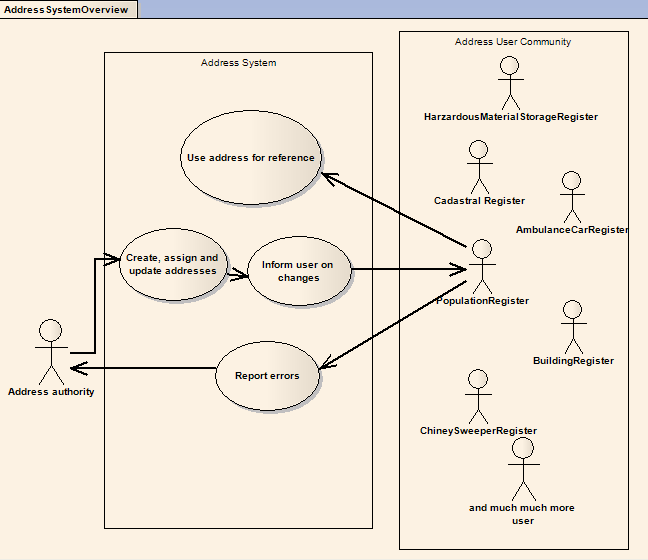

[.text-center]
*Figure 3.1-1: A general view about the actors and the use of an Address System _(based on_ footnote:[Morten Lind: „Reliable Address Data: Developing a Common Address Reference System" in GINIE Section 6 Reference Data , (Page 21)]_)_*

The Address user resp. the *Address user community* uses the *Address System* for different references in a large number of applications. This user, or precisely the application used, determines the original requirements which the system has to fulfill.

To do this, the Address System has to be maintained by the *Address Authority*. These are mainly the organizations which create addresses (house numbers). In certain cases other institutions can also establish additional addresses which are of common interest (e.g. the task force for disaster prevention).

The establishing authorities or other can add attributes of the addresses. In case the "Address user" is an application system, address or attribute changes have to be reported, either active by sending a corresponding message or passive by respond to a request of the application.

Each request to the Address System includes a validation of the data. In case of inconsistency or contradictions the user is forced to report this to the Address Authority.

The manifold uses can be grouped into three categories:

* Use of addresses for reference
* Creation and update of addresses and attributes
* Dissemination of change information

==== Use of addresses for reference

The address information is used for referencing one or more application objects, to link the objects spatially (e.g. by town, street and house number). Using associated coordinates the display of the spatial distribution of the objects and the navigation on maps is supported.

But address data itself are seldom in the focus of a use; more they are serving role. Technically they are more or less integrated. Most of the existing applications have address information embedded (see figure 3a), More modern system separate the address information, to serve multiple applications (see figure 3b)

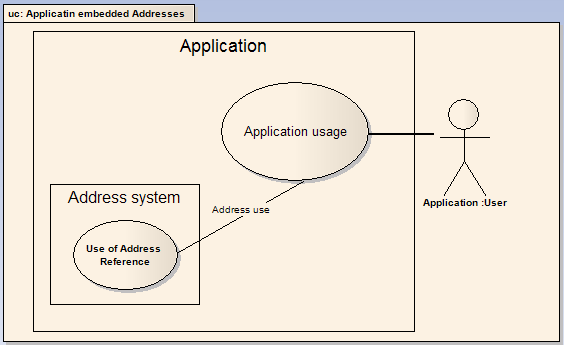

[.text-center]
*Figure 3.1-2: Application with embedded Address Information*

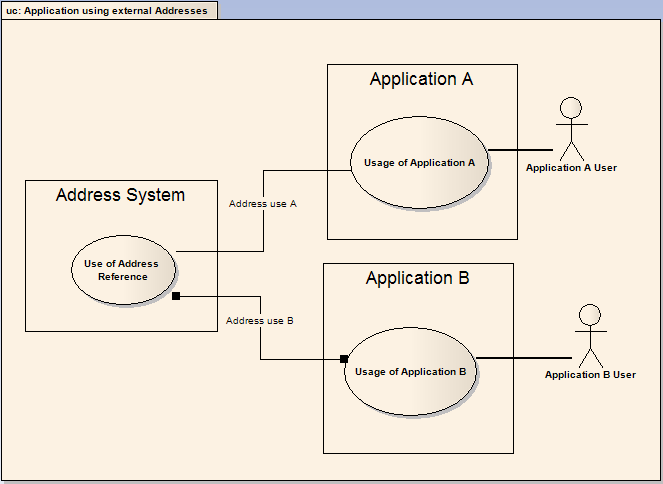

[.text-center]
*Figure 3.1.3: Application with external Address Information*

The use cases in this document are following the idea of the external address system, to avoid confusion between address system and the address information used in the application.

==== Creation and update of addresses and attributes

Three actors are related to the creation and update of address information.

First the address must be created by the address authority. Because most of the addresses are created along with the building of houses this is done on the lowest administrative level (Municipality). The creation includes the assignment of key identifier, location and attributes.

Some of the attributes can be derived or checked by geometrical operations like overlaying the borderlines of a district and finding out in which district the address is located.

Other attributes have to be added by specialist (Address Attribute Authority) manually or automatically using spatial oriented application (e.g. assigning wards).

Also the Address user plays an important role. The Address users (mostly application systems) are checking the completeness or correctness by matching information. In case of absence or inconsistency the Address user should report this issue to the Address Authority for clarification. As more as an Address system is used in that way, the quality of the content is increased.

It is comprehensive that there are different situations in maintaining the address in different countries of Europe, from a single centralized address system to no common system all over the country.

If the addresses are stored centrally, the information is originated decentralized, which needs a decentralized access for updating the system. It is also obvious that the duties to maintain the addresses are shared between several organizations, which require some precautions against demolitions.

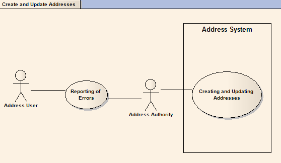

[.text-center]
*Figure 3.1-4: Maintaining Address Information*

==== Dissemination of change information

Address user in this situation generally is another address system or an application system, which have to be informed automatically and directly, without a break of the media.

To solve the dissemination of the change information in principle are two approached possible: The address system forward the change information to the known Address user (application). This implies a nearly permanent running system on the receiver side. In most cases this is impossible, so the Address user has to inquire the Address system if changes happened since the last update.

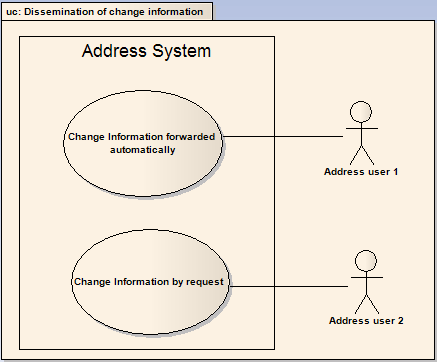

[.text-center]
*Figure 3.1-5: Dissemination of address change information*

==== An additional remark (Business and System use cases)

The description of each use cases is focused on functional and data requirements. The non-functional aspects like Accuracy, Security, Performance, and Availability etc. which are not necessary for the Data Specification are out of the scope of this document and of the work of the TWG.

It should be noted that, in many situations, the use cases represented below will be satisfied using regional or national systems without recourse to a harmonized European system. However, in cross-border or in EU policy decisions the same use cases will require INSPIRE interoperability and are therefore still relevant.

The number of use cases is numerous and diverse. However, by looking at the role of the address in these applications, a set of generic cases can be identified, reducing the number to a manageable amount. The same behavior often is found in a variety of un-related applications.

Therefore the use cases are described in clause 3 on two levels, the Business View level (3.2) and a System level (3.3). The business level serves for the reader without a deeper technical background to understand how addresses are used in applications; the basic level describes the derived use of addresses more technically and will aid the succeeding analysis of the user requirements. The connection between the two levels is described in the correspondence matrix in 4.1.

=== Business View - Use Cases

==== The use of addresses for reference

===== *Tree Preservation*

[.underline]#Objectives:#

Showing the use of addresses in the daily work of help desks and giving permissions.

(Finding an address using town, street, house number)

[.underline]#Process:#

One citizen wants to cut a tree located inside his private property because it is diseased. To carry out that action he has to ask permission to the forest register department (within Environmental Ministry).

The officer in the forest register department validates the requester and the tree concerned. He enters the name of the town, the street and house number given on the letter. The system checks the existence of the address and returns a) the associated parcel and b) the owner of the parcel. Beside this, a map of the parcel (as part of the cadastre) and the affected trees or the group of trees (out of the forest register) is shown. Each tree / area is symbolized regarding the type.

With this information the officer checks the ownership of the requester (the ownership is needed to apply) and the degree of protection of the tree.

Moreover, if the reason given to cut the tree is to change the coverage and exploitation of the land, then the Ministry of Agriculture must be warmed and this permission will not be issued until having its environmental assessment. In this case, an additional enquiry is made to the "Exploitation Information System" of the Ministry of Agriculture.

If there is no reason to reject the application the permission is printed out using the information of all registers mentioned above and sent to the applicant.

Note: The postal address of the owner need not be the same as the address of the tree.

[.underline]#Data required:#

The Forest Register stores data of every tree being possible to identify where they are located individually (only when it is possible, e.g. trees with special environmental protection whom have been assigned a pair of coordinates individually) or the area inside there is a group of common trees.

Exploitation Information System of the Ministry of Agriculture is an older list of the parcels affected by a restricted exploitation. Each parcel is categorized by the type of exploitation allowed.
    
[align=center,width="100%",cols="51%,49%",options="header",]
|===
|*Address Register* |*Cadastral Register*
.7+|
_Address key_

_Name of the region_

_Name of the province_

_Name of the town_

_Name of the street_

_House number_

_Addition to the House number_

_Geographic attribute:_

_Location (X,Y Coordinate)_

a|
_Parcel key_

_Address Key (to establish a link to the Address_

_Register)_

_Owner Key (Owner –ID;_

_to establish a link to the Owner /_

_Person Register)_

_Attributes:_

_coverage_

_Type (Urban / Rural)_

_Geographic attribute:_

_Location (X,Y Coordinate_

_of the Center point)_

_Borderline (Polygon)_

h|*Forest Register*
a|
_Tree Key_

_Parcel Key (to establish a link to the cadastral_

_register)_

_Geographic attribute:_

_Location (X,Y Coordinate) or_

_Borderline (of the area inside the group of_

_common trees)_

_Attributes:_

_Type of tree_

_History (to know if the permission has_

_requested previously)_

h|*Exploitation Information System Of the Ministry of Agriculture*
a|
_Parcel Key (to establish a link to the Cadastral_

_Register)_

_Attributes:_

_Type of exploitation allowed_

h|*Person Register (Owner)*
a|
_Person Key_

_Address Key (to establish a link to the Address_

_Register )_

_Attributes:_

_Salutation (Mr. ; Ms. ; Miss ...)_

_Name_

|===

===== *Cross boarder emergency service*

[.underline]#Objectives:#

To search for an Address by a locational name (Town, Street, Post Code), in general needs a more or less correct spelling. This is unrealistic user requirement for several reasons, especially in cross border situations. There fore a particular search function is required using the full power and intelligence of the Address System.

Finding an address using an unstructured query like: ‎"10 Clevedon , Tickenham, UK"

[.underline]#Process:#

An emergency happed near the border of Poland to the Czech Republic in "Kopaczòw".

The emergency call received the next emergency center in Bogatynia (Poland), but in this center is located to far from the place of accident. So the polish officer decided to ask the German colleagues in Zittau to send a MICU (Mobile intensive care unit).

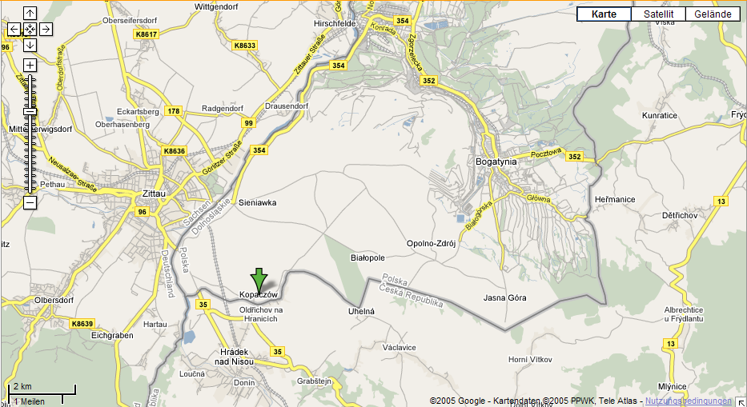

[.text-center]
*Figure 3.2-1 Cross border situation*

The German dispatcher has found an available MICU in the "Ambulance Car Register". He likes to provide a map for advice of the driver showing the route to choose. He types in the address of the place of accident as "Kopazow, Biedronki, Polen". The System has to find the correct address, the coordinates and the link to the street network. Together with the know position of the car, the route has to be calculated.

The result is to present on a map showing the route. The clipping has been orientated on the envelope of the route.

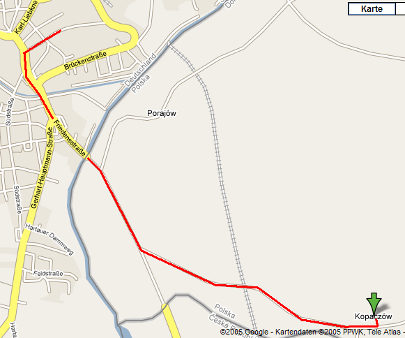

[.text-center]
*Figure 3.2.-2: Advise for the Ambulance Car*

[.underline]#Data required:#

[width="100%",cols="51%,49%",options="header",]
|===
|*Address Register* |*Ambulance Car Register*
a|
_Address key_

_Name of country_

_Name of the region_

_Name of the province_

_Name of the town_

_Name of the street_

_House number_

_Addition to the House number_

_Geographic attribute:_

_Location (X,Y Coordinate)_

a|
_Ambulance Car key_

_Home Address Key_

_(to establish a link to the Address_

_Register)_

_Driver Key ( to establish a link to a Person_

_Register)_

_Attributes:_

_Type of vessel (Ambulance / Doctor /_

_Officer in charge)_

_Geographic attribute:_

_Location (X,Y Coordinate_

_of the actual car position,_

_dynamically updated)_

|===

===== *Disaster Management*

[.underline]#Objectives:#

Geographical information becomes more and more important. People are used to look up telephone numbers in a telephone book. But nowadays with applications using geographical information (think of applications like for example Google Maps) it becomes more and easier to find information through maps. Using the support of a map shows this example.

Finding an address by pointing to a symbol on the map

[.underline]#Process:#

To prepare an exercise of disaster management, an employee of the Ministry of Environment wants to know the telephone number of owner of the parcel / the security administrator of a chemical industrial factory. On the map the location of this factory is shown and inside the geometry of the building the coordinate to which the address is attached is shown.

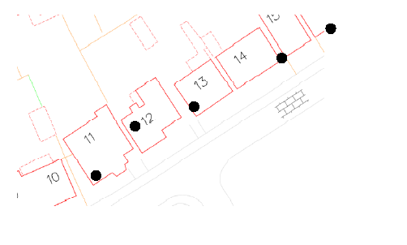

[.text-center]
*Figure 3.2-3: Basic map with address points shown*

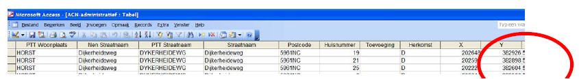
By clicking on one of the points, the administrative information is shown:

So from the appointed coordinate the belonging address can be found (and verified):

X= 202649, Y=382927 → Address = Dijkerheideweg 13, 5961NC Horst; Address-id = 74830202836

Each address has its own unique meaningless identifier. With meaningless unique identifiers different databases can be connected to each other.

In the cadastral registration the parcels which are registered in relation to this uniquely identified address can be selected. The owner of these selected parcels can be selected. With the unique identifier of this owner (or with the name and address) one can look up the phone number in the registration of telephone numbers. For example:

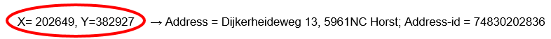

[.text-center]
*Figure 3.2-4: Search path for example 3*

[.underline]#Data required:#

[width="100%",cols="51%,49%",options="header",]
|===
|*Address Register* |*Cadastral Register*
.5+|
_Address key_

_Key of the region_

_Key of the province_

_Key of the town_

_Key of the street_

_House number_

_Addition to the House number_

_Geographic attribute:_

_Location (X,Y Coordinate)_

_Attributes:_

_Town_

_Street name_

_House number_

_Postal code_

a|
_Parcel key (Cadastral-id)_

_Address Key (Location-address-id;_

_to establish a link to the Address_

_Register)_

_Owner Key (Owner –ID)_

_Attributes:_

_area_

_Geographic attribute:_

_Location (X,Y Coordinate_

_of the Center point)_

_Borderline (Polygon)_

h|*Person Register (Owner)*
a|
_Person Key_

_Address Key (to establish a link to the Address_

_Register)_

_Attributes:_

_Salutation (Mr. ; Ms. ; Miss ...)_

_Name_

h|*Telephone Number Register*
a|
_Person Key (to establish a link to the Person_

_Register)_

_Address Key (Location-address-id;_

_to establish a link to the Address_

_Register)_

_Attributes:_

_Phone Number_

_(Name)_

_(Street name)_

_(Hose number)_

_(Postal Code)_

|===

===== Hazardous Materials Management

[.underline]#Objectives:#

Finding the corresponding actual address of an historical id provided.

[.underline]#Process:#

The National Committee of Energy, in charge of the control of the storage and treatment of residual hazardous materials has got a database to manage all information regarding the building where those elements are stored, called Hazardous Materials Storage Register (HMSR).

Every storage building of hazardous material is identified by a unique code which is linked to the attributes describing both the activity and the place where it is carried out. Additionally, an influence area of every store is defined. The influence area is the surrounding area which can be potentially polluted in case of accident. It is necessary to know the people who must be evacuated in an alert situation. This area is calculated depending on the type of material stored overlaid by the cadastral map.

The officer administering the hazardous materials register has to key the ID of the store requested. To get the full address the system sends a request to the address register.

The address system has noticed that the matching address is historic (Validation time is out of order). A reformation of the villages and towns has been carried out and the address key (resp. identifier) has been changed. So the system searches along the history information (link to successor address) to the actual address. This actual address is returned and used for displaying the alphanumeric attributes the calculation and mapping of the route.

As this database is linked with the cadastral cartographic system, once the officer keys the parameter to calculate the influence area, the application returns back that maximum zone in danger. From that, it is possible to know the people living inside that area to evacuate in case of environmental disaster through asking the property register.

[.underline]#Data required:#

[width="100%",cols="51%,49%",options="header",]
|===
|*Address Register* |*Cadastral Register*
.9+|
_Address key_

_Key of the town_

_Key of the street_

_House number_

_Addition to the House number_

_Geographic attribute:_

_Location (X,Y Coordinate)_

_Special attributes:_

_Valid from_

_Valid to_

_Type of hist link_

_Link to predecessor address_

_Link to successor address_

a|
_Parcel key (Cadastral-id)_

_Address Key (Location-address-id;_

_to establish a link to the Address_

_Register)_

_Owner Key (Owner –ID)_

h|*Hazardous Materials Storage Register*
a|
_Store Identification key_

_Address Key (to establish a link to the Address_

_Register)_

_Influence Area Key (to establish a link to the_

_Hazardous Materials Storage_

_Influence Area)_

_Geographic attribute:_

_Location (X,Y Coordinate)_

_Attributes:_

_Type of hazardous material_

_Date of the original beginning (when it_

_initially and it is not exactly the_

_current location)_

_Date of beginning working (in the place_

_where it is located currently)_

_Date of Modification (Type of material,_

_the store area, location)_

_Date of closing_

_Change of location (when the new location_

_is so near that it can not be_

_considered as a new registration,_

_just a modification)_

_Change of the type of stored material_

h|*Parcels within the Hazardous Materials Storage Influence Area*
a|
_Influence Area Key_

_Parcel key (parcels affected)_

h|*Person Register (Owner)*
a|
_Person Key_

_Address Key (to establish a link to the Address_

_Register)_

_Attributes:_

_Salutation (Mr. ; Ms. ; Miss ...)_

_Name_

h|*Statistical Information System*
a|
_Address Key (to establish a link to the Address /location)_

_Attributes:_

_Number of inhabitants_

|===

===== *Fire Protection Management*

[.underline]#Objectives:#

Finding all addresses of a district geographically (by polygon)

[.underline]#Process:#

The chimney sweeper district is representative for any district an address can be related / covered. E.g. in Germany chimney sweepers have a defined district they are responsible for the fire protection in all houses of that district.

Within a certain city the number of districts was reduced to three chimney sweeper districts. The owner must be informed about this reorganization of chimney sweepers in charge.

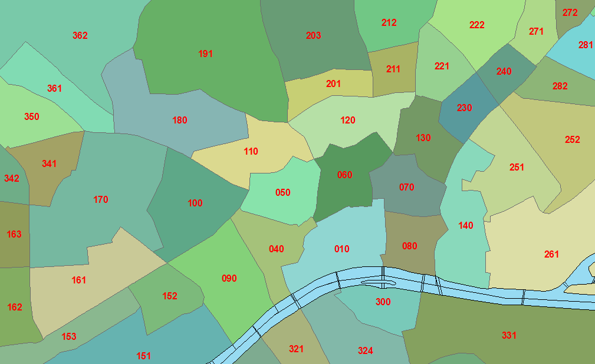

[.text-center]
*Figure 3.2-5: chimney sweeper districts in a town*

By mapping the area with the address database, the addresses of the house owners in his district can be found.

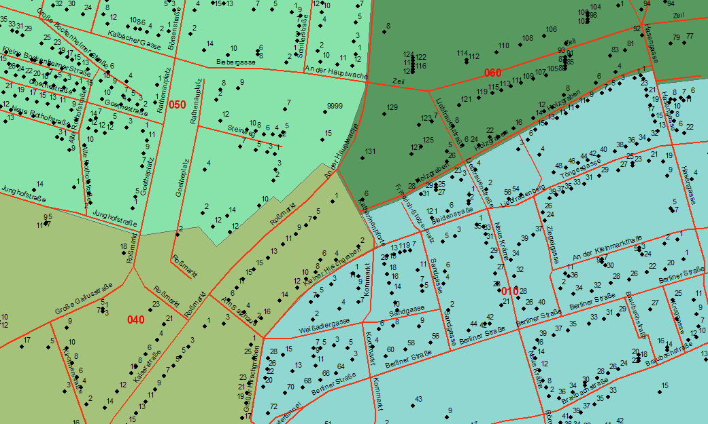

[.text-center]
*Figure 3.2-6: addresses within the chimney sweeper districts*

The overlaid boundaries of the districts are used to connect each address to a sweeper district. Based on this selection a serial letter can be produced to inform the owner of the properties about the reorganization of the districts resp. the new responsibilities.

[.underline]#Data required:#

[width="100%",cols="51%,49%",options="header",]
|===
|*Address Register* |*Chimney Sweeper Register*
.5+|
_Address key_

_Key of the town_

_Key of the street_

_House number_

_Addition to the House number_

_Geographic attribute:_

_Location (X,Y Coordinate)_

a|
_Chimney Sweeper District key_

_Address Key (to establish a link to the Address_

_Register)_

_Geographic attribute:_

_District border (Polygon)_

_Attributes:_

_Name of sweeper_

_Status of sweeper_

h|*Cadastral Register*
a|
_Parcel key (Cadastral-id)_

_Address Key (Location-address-id;_

_to establish a link to the Address_

_Register)_

_Owner Key (Owner –ID)_

h|*Person Register (Owner)*
a|
_Person Key_

_Address Key (to establish a link to the Address_

_Register)_

_Attributes:_

_Salutation (Mr. ; Ms. ; Miss ...)_

_Name_

|===

===== *Fireside permission*

[.underline]#Objectives:#

Finding an address by town, street, house number, which is not "official", returning the official addresses?

[.underline]#Process:#

Mr. Miller, technician of the property management, has decided to renew the heating in one of the buildings in a larger complex. He sends a request to the chimney sweeper to apply for permission to renew the heating in 93 Main Street.

The chimney sweeper search in the Chimney Sweeper Register for 93 Main Street. The system finds this address of type "not official". Because the written permission must show the official address, the system looks for this and returns "89-97 Main Street (Entrance C)".

[.underline]#Data required:#

[width="100%",cols="51%,49%",options="header",]
|===
|*Address Register* |*Chimney Sweeper Register*
a|
_Address key_

_Key of the town_

_Key of the street_

_House number_

_Addition to the House number_

_Geographic attribute:_

_Location (X,Y Coordinate)_

_Special attributes_

_Type of address_

_Type of link_

_Link to main address_

a|
_Chimney Sweeper District key_

_Address Key (to establish a link to the Address_

_Register)_

_Geographic attribute:_

_District border (Polygon)_

_Attributes:_

_Name of sweeper_

_Status of sweeper_

|===

===== *Support of Disaster Management*

[.underline]#Objectives:#

How Addresses displayed on a screen are supporting the quick access to special information during disaster management.

[.underline]#Process:#

A (natural) disaster occurs in a given area (Flood of the river Elbe). The fire brigade officer draws a polygon on screen, describing the extension of the affected area in consideration of the landscape and expected rising limb of flood.

The system shows all addresses in that area (partly in the Czech Republic and Germany) as dots on the screen. Those addresses which a marked as places of hazardous materials are displayed in different symbols, regarding the level and type of risk.

The officer maps his screen to the screen of the common task force. The officer in charge decided which vessel and which action force will be send to which place.

The officer points / clicks the retirement home located in the danger zone, to get the number of inhabitants to be evacuated. He orders the corresponding number of vessels, ambulances and helpers from the headquarters of the fire brigade districts.

[.underline]#Data required:#

It is assumed that information about the Type of Building and Grade of endanger are stored in a Building register and the number of inhabitants in the statistical Information system. The register and the information system are linked by address key to the central address register.

[width="100%",cols="51%,49%",options="header",]
|===
|*Address Register* |*Building Register*
.3+|
_Address key_

_Key of the town_

_Key of the street_

_House number_

_Addition to the House number_

_Geographic attribute:_

_Location (X,Y Coordinate)_

_Attributes to related zones:_

_Fire brigade district 1_

_Fire brigade district 2_

_Fire brigade district 3_

_Special attributes_

_Type of address_

a|
_Building key_

_Address Key (to establish a link to the Address_

_Register)_

_Attributes:_

_Grade of endanger_

_Type of building_

Should be harmonized with the theme "Building" of Annex III

h|*Statistical Information System*
a|
_Address Key (to establish a link to the Address_

_Register)_

_Attributes:_

_Number of inhabitants_

|===

===== *Postal collection / delivery*

[.underline]#Objectives:#

What can happen if the postal address is wrong?

(Finding an address using district, town, street, house number, post code; Updating addresses which are integrated in an application)

[.underline]#Case:#

Learning fron the 2002 big flood of the river Elbe, the emergency centre in Dresden/Elbe (DE) will execute a cross border evacuation exercises between Detchin/Elbe and Pirna/Elbe. The centre management likes to infort all participants from Germany and from the Czech Republic about latest changes about the limitations according a possible touristic mass event. The final plans have to send by mail for the missing electronically access of the local red cross station in the country side where the individual preparation will happen.

Regarding the new regulations about house numbering the address of the station has changed from an inofficial naming of the building to an official one including a house number and the naming of the road. Because this change was not registered in the Address-Register of the emergency centre, the address printed on the letter was the old one. The letter reached the station after the exercises.

This annoying situation can be avoided if the emergency center in Dresden will be informed about these changes. This may happen as described in 3.1.3

[.underline]#Process:#

If the postal address is wrong, the delivery of the parcel is not possible, is delayed, needs a lot of additional work or can be much more expensive.

Post offices usually use automatic sorting machines to separate post parcels according to the post codes. If the post code is wrong, the parcel is sent to a bad post office, doesn't reach the appropriate address and must be processed manually to find right post code and address.

If any part of the address is written wrong then manual processing must be used to find the appropriate locality, address point or post code. The process depends on the type of a mistake and in many cases must be done in successive steps according to hierarchy of address items.

The procedure depends on the available services. It can use unstructured queries, queries by locational id's or names, searching in address history etc.

The same problems occur in the case of delivering goods or services, in finding place of an accident etc. The delay is higher and delivery is much more expensive in the

[.underline]#Data required:#

[width="100%",cols="50%,50%",options="header",]
|===
|*Address Register* |*Red-Cross Station Register*
a|
_Address key_

_Name or of the region_

_Name or of the province_

_Name or of the town_

_Name or of the locality_

_Name or of the street_

_House number_

_Addition to the House number_

_Post code_

a|
_Station_

_ID_

_Name_

_Address key_

_Telephone Number_

|===

===== *Flood prevention*

[.underline]#Objectives:#

How addresses are used to determine the effects to the citizens and buildings in a flooding model according the optimal use of artificial barriers (dams).

[.underline]#Case:#

In consequence of 2002 big flood of the river Elbe, the emergency management centre in Dresden/Elbe (DE) set up a precautionary study of artificial and mobile barriers. The usefulness of different scenarios is ranked by minimizing the number of citizen and houses / floors are affected.

[.underline]#Process:#

image:.media/image53.png[image]

[.text-center]
*Figure 3.2.-7: Overview of the calculation and the presentation of flood situations*

The process is divided into two steps:

. Calculating the flooded area under certain conditions by an special flooding model using the INSPIRE themes Hydrography and Elevation (DEM), From that data and in consideration of possible barriers several scenarios are calculated. The result is described in polygons defining flooded areas.

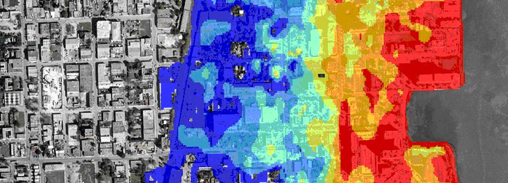

[.text-center]
*Figure 3.2-8: Calculated flooding areas of different depth overlaid on an areal photo from the INSPIRE theme Orthoimagery. [multiblock footnote omitted]*

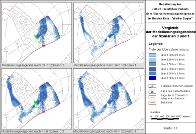

[.text-center]
*Figure 3.2-9: Comparison of the result of different scenario after 24 h and 48 h overlaid with a street network (IVU)footnote:[Figures are provided by IVU.Umwelt GmbH, Freiburg, Germany. Calculated with the system „FloodFILL" and post processed with ArcView. (an ESRI Product) (see: http://www.ivu-umwelt.de/ )])*

[arabic, start=2]
. In a general GIS, the flooded areas - described in polygons - are overlayed with addresses and buildings. A point in polygon method is used to associate the addresses with flooded areas.

The addresses can be linked with the statistical information system which provides the number of inhabitants.

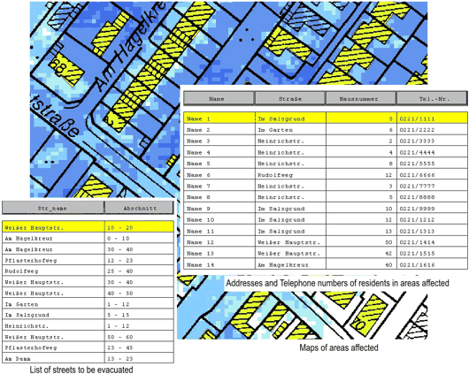

[.text-center]
*Figure 3.2-10: Calculated flooded areas and table of street segments (aggregation of addresses) and citizens are affected (IVU)^4^)*

If addresses are related to apartments and z-coordinates are provided, the number of apartments affected can be quantified.

The high of the apartments in combination with the base level of the building derived from the DEM the number and intensity of the floors can be detected.

The use case can be expanded taking the number and the ceiling height of the floors in the buildings in account

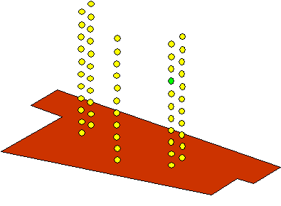

[.text-center]
*Figure 3.2-11: Example of 3D points of apartments in a flat (VROM)*

It can also be possible to have 2½ D (a surface with a height) of apartments in a flat (e.g. from the Cadaster):

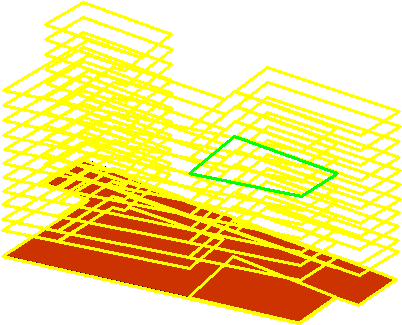

[.text-center]
*Figure 3.2-12: Example surface and height of apartments*

And in the end it can also be possible to have 3D objects from w 3D town model:

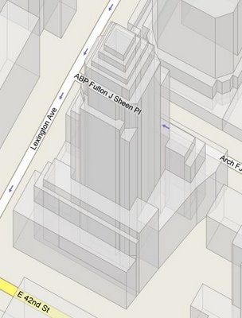

[.text-center]
*Figure 3.2-12: Example 3-D town model*

[.underline]#Data required:#

[width="100%",cols="51%,49%",options="header",]
|===
|*Address Register* |*Statistical Information System*
.3+|
_Address key_

_Key of the town_

_Key of the street_

_House number_

_Addition to the House number_

_Geographic attribute:_

_Location (X,Y Coordinate)_

_Special attributes:_

_Valid from_

_Valid to_

_Type of hist link_

_Link to predecessor address_

_Link to successor address_

a|
_Address Key (to establish a link to the Address /_

_location)_

_Attributes:_

_Number of inhabitants_

h|*Building Register*
a|
_Building key_

_Address Key (to establish a link to the Address_

_Register)_

_Attributes:_

_Number of floors_

_Height of floor_

Should be harmonized with the theme "Building" of Annex III

|===

==== Creating addresses and update of attributes

It is not intended by the INSPIRE Directive to harmonize the maintenance of address information in central registers. This has to be solved by the MS individually.

Even if this is not part of the directive, a central or cross border provision of address information must include the delivery of of change information and include the necessary functionality (see 3.1.1 and 3.1.3).

The change information exists of a reference between the item and the predecessor or successor and the appropriate date of change. Suitable functions imply the possibility to query a retrograde period.

==== Dissemination of change information

===== *Updating external address information*

[.underline]#Objectives:#

Address Databases which serve as the authorized "central" hub have to provide an update service for systems of second order.

[.underline]#Process:#

As seen in example 3.2.1.4. and 3.2.1.8 Address Information in special applications (Hazardous Materials Storage Register and Red Cross Station Register) need to updated on a regular base. A request for update information is send to the central address register each midnight, asking what changes happened since the last update.

The responded update information is included into the address information of the special application. In this example the Address Key is updated.

[.underline]#Data required:#

[width="100%",cols="51%,49%",options="header",]
|===
|*Central Address Register* |*Hazardous Materials Storage Register*
a|
_Address key_

_Key of the town_

_Key of the street_

_House number_

_Addition to the House number_

_Geographic attribute:_

_Location (X,Y Coordinate)_

_Special attributes_

_Type of address_

_Valid from_

_Valid to_

_Type of link_

_Link to predecessor address_

_Link to successor address_

a|
_Store Identification key_

_Address Key (to establish a link to the Address_

_Register)_

_Influence Area Key (to establish a link to the_

_Hazardous Materials Storage_

_Influence Area)_

_Geographic attribute:_

_Location (X,Y Coordinate)_

_Attributes:_

_Type of hazardous material_

_... l_

|===

=== System Use Cases 

_The system use cases should serve to find out which information is required and required to be harmonized. Thus, at least each use case should end up describing which kind of information is needed_

==== Search for Addresses

*UC-ADR-1-01*

Finding an address can be characterized by the way to query and the answer expected.

*Query:*

The easiest query to process is to know and to query with the identifier or all identifying attributes [A1].

The costliest and time consuming query can be found in interactive systems, where the attributes are collected stepwise, starting with the town/city/village name, followed by the street name, house number and additions [A2-1; A2-2].

There may alternative queries in between, but these are the extreme one.

An additional case is the unstructured query. The input parameter is one string with an address and it is not obvious, what is the name of a street, of a town, of a part of town... The service must try several possibilities to find appropriate address(es) [A3].

Last not least a geometrical approach can be performed, searching an address by the coordinates [A4-1]. This may be used to find one single address or a set of addresses within a polygon [A4-2].

The result of a query can be nil / nothing (no address found), a unique address or a set of addresses.

Depending on the answer expected the result is accepted (a), the query has to be refined (b) or the result has to be processed further (c).

In case of:

[loweralpha]
. Step 3 processed is next [B1].
. The control is given back to the "caller", the query process is finished [B2].
. There are two reasons to process further which depend on the answer requested.
[upperroman]
.. the temporal aspect: If one of the identifying attributes has changed the predecessor or the successor address has to be returned [B3].
+
Example 1:
+
To confirm officially the existence of an address written in a historical authenticated document.
+
Example 2:
+
To update an address in a customer (or other) register.
+
[upperroman, start=2]
.. the address type aspect: If the queried address is not the official address, these has to be returned [B4].
+
Example 1:
+
An address is given by a caller of an emergency system to report a fire, but this is not the official address. The official address is around the corner and to this the information about explosive goods are linked. Fore this purpose the addresses have to be linked together.
+
Example 2:
+
Older numbering systems allow defining a house number like "11-15" for very large buildings. For purpose to fit into the new numbering rules, this house number is resolved into the three addresses (11, 13, and 15) or five addresses (11, 12, 13, 14, and 15) depending on the systematic. The number 11 is flagged as "Basic address" and all other address records have link to this.

Specialized information is linked to the "basic address" 11 only.

*Answer:*

The important parts of the answer are the attributes of the address returned. Most important are the X,Y- Coordinates, the object forming attributes (town name, street name etc.) and relations (ward, school district, census tract etc.) and other attributes ( address type, related address etc.).

[width="99%",cols=",,,,,,,",options="header",]
|===
8+|*UC ADR 1-01*
.9+|*Query*
.5+|Step 1 6+|
|Query by ID 2+|Query by locational description |Query unstructured 2+|Query geometrically
|A1 |A2-1 |A2-2 |A3 |A4-1 |A4-2
|By identifier |By locational id's |By locational names |Unstructured |By point coordinates |By polygon
6+|Result: None / one / more than one hits
7+|
.3+|Step 2
(optional)
6+|
2+|Alternative B1
2+|Alternative B2
|Alternative B3
|Alternative B4
2+|Process passed to Step 3
2+|Query to be refined, return to Step 1
|Search for historically addresses |Search for official address
8+|
.2+|*Answer* 
7+|
|Step 3 
6+|Return of attributes
(Geometry, related themes (Zones) and other attributes)
8+|
|===

[.text-center]
*Figure 3.3-1: Alternative search strategies*

==== Search for Address Changes

*UC-ADR-1-02*

A special query is needed to fulfill the requirements of user 2 in Figure 3.1-5

In principle the query alternatives A1 and A2 have to be extended by a describtion of the period in which the changes should be happen e.g. all changes between date1 and date2.

=== History, version concept 

As shown in the use cases it is important to provide information about address changes. This information is based on the implementation of a version concept.

The description of the following approach is based on the German AAA-Model (AFIS-ALKIS-ATKIS)

The version concept has been defined in consideration of the following modeling principles:

* No distinction is made in the application schema between current and historical data, i.e. no separate historical feature types are formed for the full history.

* The historical as well as the current information (version) is stored for each object.

* The partially redundant storage of object attributes in several versions is accepted in return for faster data access to the corresponding version.

The version concept assumes that each address (object) carries an identifier, attribute and relation, as well as a lifetime interval (creation and expiry date). Entering an object into the primary database data generates the first version of the object and registers it in a feature version container for feature versions. If a non-object forming property changes due to an update, a new version of the object is generated. The historized version does however remain within the container for feature versions, i.e. the identifier does not change. The creation date of the new version is the same as the expiry date of the previous version. The individual versions of an object can be clearly distinguished using the lifetime interval. By evaluating the various versions of an object, all changes can be determined in relation to any time period.

If object-forming properties change during a updating, this results from a technical point of view to the expiry of an object. The object is historized by assigning an expiry date to the last version. The object remains within the database. At any point in time, a version has all attributes and relations valid at that time. By "bracketing" the versions within a container for feature versions, the thematic object view remains in place.

The example is taken from ALKIS, but will be transferred into the address theme when the development of the application schema has reached a further step, that is the distinction between attributes and relations has finalized.

*Changes to attributes*

Mrs Hilde Huber is registered in ALKIS at time t1, i.e. a new object of the Person feature type is created:

[width="100%",cols=",,,,,,",options="header",]
|===
| |Identifier 2+|Time interval |Surname a|
Christian name
|has_Address
h| h| h|Start h|End h| h| h|
|Version 1 |DEBU5t44dFzb70Lg |t1 |t∞ |Huber |Hilde |DEBUf88FFgVc761s
|===

Time 't∞' means that the technical expiry of the object and/or version will be in the future. At time t2, Mrs Huber changes her name to Meier, i.e. object "DEBU5t44dFzb70Lg" of feature type Person creates a new version due to the change of the Name attribute:

[width="100%",cols=",,,,,,",options="header",]
|===
| |Identifier 2+|Time interval |Surname a|
Christian name
|has_Address
h| h| h|Start h|End h| h| h|
|Version 1 |DEBU5t44dFzb70Lg |t1 |t2 |Huber |Hilde |DEBUf88FFgVc761s
|Version 2 |DEBU5t44dFzb70Lg |t2 |t∞ |Meier |Hilde |DEBUf88FFgVc761s
|===

The time at which Version 1 expires is identical to the date on which Version 2 of the object is created. At time t~3~, Mrs Meier sells her only plot of land. Because she has no other role within ALKIS, the object expires from a technical viewpoint.

[width="100%",cols=",,,,,,",options="header",]
|===
| |Identifier 2+|Time interval |Surname a|
Christian name
|has_Address
h| h| h|Start h|End h| h| h|
|Version 1 |DEBU5t44dFzb70Lg |t1 |t2 |Huber |Hilde |DEBUf88FFgVc761s
|Version 2 |DEBU5t44dFzb70Lg |t2 |t3 |Meier |Hilde |DEBUf88FFgVc761s
|===

Version 2 and therefore the entire object is historized, not deleted.

Each new version of an object is assigned its own relations, on which it is based. Relations always start from a particular version of the object, i.e. a relation from one version to another object is valid only for this version. All cardinalities specified in the feature catalogue are retained in this way.

In the Figure, the arrows represent a relation. The direction of the arrow also indicates the direction of the relation. The new version of the Person object is in turn assigned a relation to the associated Address object. However, no new version of the Address object is created, because the relation to the Person object remains unchanged. A new version of the Address object would not cause a change to the Person object, e.g. when correcting in input error.

This example also shows that a relation always points from the version via the identifier to a container for feature versions and not to a version. The container for feature versions therefore forms a type of bracket around its various versions.

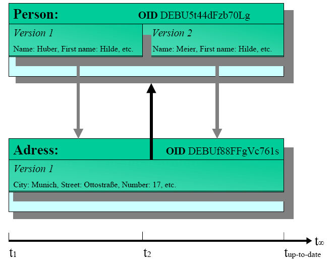

[.text-center]
*_Figure 3.3-2: Example of versioning following attribute changes_*

This technique can be used only to show relations that relate to the current version of the participating objects. If this is insufficient in a specific case, a version can exceptionally be directly referenced whereby the identifier in the reference should be supplemented by the time stamp for that version.

*Changes to relations*

Changes to relations result in versioning of objects as do attribute changes. Relations always change when the object to which the relation points is re-created, exchanged or removed. This is explained in a modified example. At time t3, Mrs Hilde Huber moves from 17 Ottostraße, Munich to Platanenallee 34a, Berlin. The Address object is exchanged with OID "DEBUf88FFgVc761s", to which the has_address relation points from the Person object (new OID "DEBUk41233THjbkO"). Thus, the relation associated with the Person object changes and the Person object must be versioned.

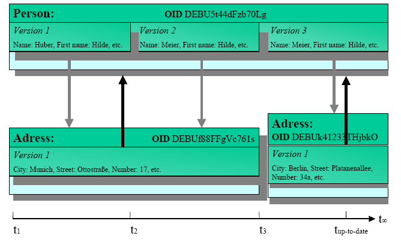

[.text-center]
*_Figure 3.3-2: Example of new version following relation change_*

The following table shows the pattern:

[width="100%",cols=",,,,,,",options="header",]
|===
| |Identifier 2+|Time interval |Surname a|
Christian name
|has_Address
h| h| h|Start h|End h| h| h|
|Version 1 |DEBU5t44dFzb70Lg |t1 |t2 |Huber |Hilde |DEBUf88FFgVc761s
|Version 2 |DEBU5t44dFzb70Lg |t2 |t3 |Meier |Hilde |DEBUf88FFgVc761s
|Version 3 |DEBU5t44dFzb70Lg |t3 |t∞ |Meier |Hilde |DEBUk41233THjbkO
|===

<<<
[appendix]
== Consolidated Requirements

=== 4.1 Correspondence Matrix

(UM: will be revised until Maribo)

This Table shows how basis use cases are derived from the examples.

[width="100%",cols=",,,,,,,,,,,,,"]
|===
3.2+| 11+^|*Example in 3.2.*
^|.1 ^|.2 ^|.3 ^|.4 ^|.5 ^|.6 ^|.7 ^|.8 ^|.9 | |
3+|*Basic Use Case* | | | | | | | | | | |
| 2+|Alternative | | | | | | | | | | |
3+|*UC-ADR- 1-01 Search for Address(es)* | | | | | | | | | | |
.13+| 2+|*Query by ID* | | | | | | | | | | |
| |A1 Query by identifier | | | ^|X | | | ^|X | | |
2+|*Query by location description* | | | | | | | | | | |
| |A2-1 by locational id's | | | | | | | | | | |
| |A2-2 by locational names ^|X | | | | ^|X | | | | |
2+|*Query unstructured* | | | | | | | | | | |
| |A3 Unstructured query | ^|X | | | | | | | | |
2+|*Query geometrically* | | | | | | | | | | |
| |A4-1 by point coordinates | | ^|X | | | ^|X | | | |
| |A4-2 by polygon | | | | ^|X | ^|X | ^|X | |
2+|*Improve the result* by | | | | | | | | | | |
| |B3 by searching for historically Addresses | | | ^|X | | | | | | |
| a|B4 by searching for official Address | | | | | ^|X | | | | |
3+|*UC-ADR- 1-02 Search for Changes of Address(es)* | | | | | | | | | | |
| 2+|A1 by a given period / attribute | | | | | | | ^|X | | |
|===

[.text-center]
*Figure 4.1: Correspondence Matrix showing the connection between Examples and Basic Use Cases*

=== 4.2 Requirements on Address Data

In each of the examples one can find a lot of data needed. It is clearly shown how the addresses are used as a hub to link data of different domains. These domains are not utilized for the next step of the analysis. Only the detail information about Addresses has to be consolidated to get a comprehensive list of requirements.

_Note: the Attributes written in blue are not mentioned in the examples until now._

* _Identifying attributes:_
** _Key of the region_
** _Key of the province_
** _Key of the town_
** _Key of the street_
** _House number_
** _Addition to the House number_
** _Name of country_
** _Name of town_
** _Name of street_

* _Geographic attribute:_
** _Location (X,Y Coordinate)_
*** _Quality of coodinates_

* _Attributes to related zones (e.g.):_
** _Fire brigade District1_
** _Fire brigade District2_
** _Fire brigade District3_
*** _City district_
** _Ward_
** _Forest district_
** _..._

* _Special attributes_
** _Type of address_
** _Valid from_
** _Valid to_
** _Type of hist link_
** _Link to predecessor address_
** _Link to successor address_
*** _Type of link_
** _Link to main address_
** _Address format (see UN0000012 of the UPU Postal Standards)_

<<<
[appendix]
== Formal Description of Use Cases 

=== 5.1 Search for Addresses

*UC-ADR-1-01*

_Part 1: UML use case diagram_

image::./media/image38.png[./media/image38,width=379,height=274]

[.text-center]
*Figure 5-1: Use case "Search of Addresses"*

_Part 2: Narrative explanation of the use case(s)_

_See 3.1_

_Part 3:_

The Use Cases are described in 3.2

[width="100%",cols="21%,79%",options="header",]
|===
2+|*Use Case Description*
|Name |UC-ADR 1-01 Searching address(es)
|Priority |High
|Description |Querying a single Address by unique identifier (Alternative 1)
|Pre-condition |Database with an Address table
2+h|*Flow of Events* 
2+^h|*Alternative A1: search by Address identifier*
|Step 1 |User is asked to input the unique identifier and optionally a date
|Step 2 |User enters the identifier and date
|Step 3 |System build a selection clause using the identifier and date
|Step 4 |System selects the matching address
| |Continue Step 99
| |
2+h|*Flow of Events – Alternative A2-1 : search by locational identifier*
|Step 11 |System combines the individual identifiers to a query
|Step 12 |System selects the matching address(es)
| |Continue Step 99
| |
2+h|*Flow of Events – Alternative A2-2 : search by locational names*
|Step 21 |User is asked for the region
|Step 22 |User keys in the name / id of the region
|Step 23 |User is asked for the town
|Step 24 |User keys in the name / id of the town
|Step 25 |User is asked for the street
|Step 26 |User keys in the name / id of the street
|Step 27 |User is asked for the house number
|Step 28 |User keys in the name / id of the house number
|Step 29 |User is asked for the addition
|Step 30 |User keys in the name / id of the addition
|Step 31 |System combines all answers to a selection clause
|Step 32 |System selects the matching address(es)
| |Continue Step 99
| |
2+h|*Flow of Events – Alternative A3: search by an unstructured selection clause*
|Step 41 |User is asked for the query
|Step 42 |User keys in unstructured the street name / house number / region etc.
|Step 43 |System parses the string and combines the relevant parts to a selection clause
|Step 44 |System selects the matching address(es)
| |Continue Step 99
| |
2+h|*Flow of Events – Alternative A4-1: search by Coordinates*
|Step 51 |User is asked for a point
|Step 52 |User selects the point
|Step 53 |System selects the matching address(es) geographically
| |Continue Step 99
| |
2+h|*Flow of Events – Alternative A4-2: search by Polygon*
|Step 61 |User is asked for a polygon
|Step 62 |User selects the area.
|Step 63 |System selects the matching address(es) geographically
| |Continue Step 99
| |
2+h|*Flow of Events – Alternative: Action after selection*
|Step 99 |The number and the list of addresses are returned
| |
2+h|*Flow of Events – Alternative B3: search for history*
|Step 131 |Check if the address selected is historic
|Step 132 |If yes provide Address id of the actual address
|Step 133 |Check if the address selected has successor
|Step 134 |If yes provide Address id of the successor address
| |Continue Step 201
| |
2+h|*Flow of Events – Alternative B4: search for official address* 
|Step 141 |Checked if the address selected is not of type "official"
|Step 142 |If yes provide Address id of the "official" address
| |Continue Step 201
| |
2+h|*Flow of Events –return attributes*
|Step 201 a|
provide attributes of the address(es) selected

(including coordinates, and relations)

| |
|Post-condition |returning a (possible empty) set of addresses and attributes
|Data source: Address Database |
|Description |Table of addresses
|Data provider |
|Geographic scope |
|Thematic scope |Addresses
|Scale, resolution |
|Delivery |
|Documentation |
|===

<<<
[appendix]
== References

Karen Levoleger,Chris Corbin: EUROGI „Survey of European National Addressing as of May 2005 „EUROGI Ref: AWP 2005

Morten Lind: „Reliable Address Data: Developing a Common Address Reference System" in GINIE Section 6 Reference Data , (Page 21)

Ambiental Technical Solutions Ltd., Brighton, East Sussex, UK

(source: _http://www.ambiental.co.uk/surface-water.html_)

Figures are provided by IVU.Umwelt GmbH, Freiburg, Germany. Calculated with the system „FloodFILL" and post processed with ArcView. (an ESRI Product) (see: _http://www.ivu-umwelt.de/_ )

<<<
[appendix]
== Code list values - (normative)

=== INSPIRE Application Schema 'Addresses'

[width="100%",cols="100%",options="header",]
|===
|*Code List*
|GeometryMethodValue
|GeometrySpecificationValue
|LocatorDesignatorTypeValue
|LocatorLevelValue
|LocatorNameTypeValue
|PartTypeValue
|StatusValue
|===

*GeometryMethodValue*

[width="100%",cols="100%"]
|===
a|
[width="100%",cols="17%,83%"]
!===
!Definition: !Description of how and by whom this geographic position of the address was created or derived.
!Description: !NOTE Information on what type of spatial feature the geographic position of the address was created or derived from, is represented by the GeometrySpecificationValue.
!Extensibility: !none
!Identifier: !http://inspire.ec.europa.eu/codelist/GeometryMethodValue
!Values: !The allowed values for this code list comprise only the values specified in the INSPIRE Registry.
!===

|===

*GeometrySpecificationValue*

[width="100%",cols="100%"]
|===
a|
[width="100%",cols="17%,83%"]
!===
!Definition: !Information defining the specification used to create or derive this geographic position of the address.
!Description: !NOTE 1 Multiple address points can be derived from one polygon spatial object. 
 
NOTE 2 If the position of an address is derived from a polygon spatial object a number of different approaches is used. 
 
EXAMPLE 1 The same point (e.g., centre point of the polygon) is used for each address, thus, multiple address points will be overlapping. 
 
EXAMPLE 2 Each point position is unique within the polygon to be able to visually distinguish the representation of each address.
!Extensibility: !none
!Identifier: !http://inspire.ec.europa.eu/codelist/GeometrySpecificationValue
!Values: !The allowed values for this code list comprise only the values specified in the INSPIRE Registry.
!===

|===

*LocatorDesignatorTypeValue*

[width="100%",cols="100%"]
|===
a|
[width="100%",cols="17%,83%"]
!===
!Definition: !Description of the semantics of the locator designator.
!Extensibility: !none
!Identifier: !http://inspire.ec.europa.eu/codelist/LocatorDesignatorTypeValue
!Values: !The allowed values for this code list comprise only the values specified in the INSPIRE Registry.
!===

|===

*LocatorLevelValue*

[width="100%",cols="100%"]
|===
a|
[width="100%",cols="20%,80%"]
!===
!Definition: !The level to which the locator refers.
!Description: !NOTE The locator level attribute enables the comparison of locators from different countries. 
 
EXAMPLE In The Netherlands a single locator, the address number, identifies a dwelling or business entity unit (unit level locator). In Spain up to four locators could be needed to obtain the same level of detail: Address number, entrance number, stair identifier plus a floor and door identifier.
!Extensibility: !none
!Identifier: !http://inspire.ec.europa.eu/codelist/LocatorLevelValue
!Values: !The allowed values for this code list comprise only the values specified in the INSPIRE Registry.
!===

|===

*LocatorNameTypeValue*

[width="100%",cols="100%"]
|===
a|
[width="100%",cols="17%,83%"]
!===
!Definition: !Description of the semantics of the locator name.
!Extensibility: !none
!Identifier: !http://inspire.ec.europa.eu/codelist/LocatorNameTypeValue
!Values: !The allowed values for this code list comprise only the values specified in the INSPIRE Registry.
!===

|===

*PartTypeValue*

[width="100%",cols="100%"]
|===
a|
[width="100%",cols="21%,79%"]
!===
!Definition: !A classification of the part of name according to its semantics in the complete thoroughfare name.
!Extensibility: !none
!Identifier: !http://inspire.ec.europa.eu/codelist/PartTypeValue
!Values: !The allowed values for this code list comprise only the values specified in the INSPIRE Registry.
!===

|===

*StatusValue*

[width="100%",cols="100%"]
|===
a|
[width="100%",cols="22%,78%"]
!===
!Definition: !Current validity of the real world address or address component.
!Description: !NOTE 1 This element enables the application schema to represent a full life-cycle of an address and address component, from proposed to reserved, current and retired, or even alternative. 
 
NOTE 2 The status value relates to the real world address or address component and not to the property to which the address or address component is assigned (the addressable object).
!Extensibility: !none
!Identifier: !http://inspire.ec.europa.eu/codelist/StatusValue
!Values: !The allowed values for this code list comprise only the values specified in the INSPIRE Registry.
!===

|===

<<<
[appendix]
== Examples of metadata elements specified in INSPIRE Metadata Regulation [Commission Regulation (EC 1205/2008)] - (informative) 

The following examples are examples of INSPIRE Implementing Rule on Metadata customised to the address data specification.

=== Identification

Resource title

[width="100%",cols="35%,65%",options="header",]
|===
|Metadata element name |*Resource title*
|Definition |Name by which the cited resource is known.
|Example |CartoCiudad: national street-map of Spain
|===

==== Resource abstract

[width="100%",cols="35%,65%",options="header",]
|===
|Metadata element name |*Resource abstract*
|Definition |Brief narrative summary of the content of the resource(s).
|Example |Spanish official data base consists of the thoroughfare network and the urban background of cities and villages all over Spain, supplemented by postal and statistical information.
|===

==== Resource Type

[width="100%",cols="35%,65%",options="header",]
|===
|Metadata element name |*Resource Type*
|Definition |Scope to which metadata applies
|Example |Dataset
|===

==== Resource Locator

[width="100%",cols="35%,65%",options="header",]
|===
|Metadata element name |*Resource locator*
|Definition |Location (address) for on-line access using a Uniform Resource Locator address or similar addressing scheme.
|Example |http://www.cartociudad.es
|===

==== Unique resource identifier

[width="100%",cols="35%,65%",options="header",]
|===
|Metadata element name |*Unique resource identifier*
|Definition |Value uniquely identifying an object within a namespace.
|Example a|
Example 1
code: http://www.ign.fr/9876543210#dataId

Example 2:
code: 9876543210
codeSpace: http://www.ign.fr

Example 3:
Code: 527c4cac-070c-4bca-9aaf-92bece7be902

|===

==== Resource Language

[width="100%",cols="35%,65%",options="header",]
|===
|Metadata element name |*Resource language*
|Definition |Language(s) used within the datasets
|Example |spa
|===

=== Classification of spatial data

==== Topic category

[width="100%",cols="35%,65%",options="header",]
|===
|Metadata element name |*Topic category*
|Definition |Main theme(s) of the dataset
|Example |location
|===

=== Keyword

==== Keyword value

[width="100%",cols="35%,65%",options="header",]
|===
|Metadata element name |*Keyword value*
|Definition |Commonly used word(s) or formalised word(s) or phrase(s) used to describe the subject
|Example |GEOGRAPHY.regions of the Community countries.regions of Spain, Madrid
|===

==== Originating controlled vocaburaly

[width="100%",cols="35%,65%",options="header",]
|===
|Metadata element name |*Originating controlled vocabulary*
|Definition |Name of the formally registered thesaurus or a similar authoritative source of keywords
|Example a|
title: "AGROVOC"

* date:
** dateType: publication
** date: 2008-04-14

|===

=== Geographic Location

==== Geographic bounding box west bound longitude

[width="100%",cols="35%,65%",options="header",]
|===
|Metadata element name |*Geographic bounding box west bound longitude*
|Definition |Western-most coordinate of the limit of the dataset extent, expressed in longitude in decimal degrees (positive east).
|Example |2.50
|===

==== Geographic bounding box east bound longitude

[width="100%",cols="35%,65%",options="header",]
|===
|Metadata element name |*Geographic bounding box east bound longitude*
|Definition |Eastern-most coordinate of the limit of the dataset extent, expressed in longitude in decimal degrees (positive east).
|Example |-2.50
|===

==== Geographic bounding box south bound latitude

[width="100%",cols="35%,65%",options="header",]
|===
|Metadata element name |*Geographic bounding box south bound latitude*
|Definition |Southern-most coordinate of the limit of the dataset extent, expressed in latitude in decimal degrees (positive north).
|Example |40.25
|===

==== Geographic bounding box north bound latitude

[width="100%",cols="35%,65%",options="header",]
|===
|Metadata element name |*Geographic bounding box north bound latitude*
|Definition |Northern-most coordinate of the limit of the dataset extent, expressed in latitude in decimal degrees (positive north).
|Example |45.50
|===

=== Temporal reference

==== Temporal extent

[width="100%",cols="35%,65%",options="header",]
|===
|Metadata element name |*Temporal extent*
|Definition |Time period covered by the content of the dataset.
|Example |From 1977-03-10T11:45:30 to 2005-01-15T09:10:00
|===

==== Data of publication

[width="100%",cols="35%,65%",options="header",]
|===
|Metadata element name |*Date of publication*
|Definition |Reference date for the cited resource – publication
|Example |2007-09-15 or 2007-11-15T11:15:00
|===

==== Date of last revision

[width="100%",cols="35%,65%",options="header",]
|===
|Metadata element name |*Date of last revision*
|Definition |Reference date for the cited resource – revision
|Example |2007-09-15 or 2007-11-15T11:15:00
|===

==== Date of creation

[width="100%",cols="35%,65%",options="header",]
|===
|Metadata element name |*Date of creation*
|Definition |Reference date for the cited resource – creation
|Example |2007-09-15 or 2007-11-15T11:15:00
|===

=== Quality and validity

==== Lineage

[width="100%",cols="35%,65%",options="header",]
|===
|Metadata element name |*Lineage*
|Definition |General explanation of the data producer's knowledge about the lineage of a dataset.
|Example |Dataset produced from the integration of data supplied by Cadastre, Post Office and Statistical Office and IGN
|===

==== Spatial resolution: equivalent scale

[width="100%",cols="35%,65%",options="header",]
|===
|Metadata element name |*Spatial resolution equivalent scale*
|Definition |Level of detail expressed as the scale denominator of a comparable hardcopy map or chart
|Example |1000 (e.g. 1:1000 scale map)
|===

=== Conformity

==== Degree

[width="100%",cols="35%,65%",options="header",]
|===
|Metadata element name |*Conformity degree*
|Definition |Indication of the conformance result
|Example |True (it is conformant)
|===

==== Specification

[width="100%",cols="35%,65%",options="header",]
|===
|Metadata element name |*Conformity specification*
|Definition |Citation of the product specification or user requirement against which data is being evaluated.
|Example a|
Title: "INSPIRE Implementing rules laying down technical arrangements for the interoperability and harmonisation of addresses".

* date:
** dateType: publication
** date: 2009-05-15

|===

=== Constraints related to access and use

==== Conditions applying to access and use

[width="100%",cols="35%,65%",options="header",]
|===
|Metadata element name |*Conditions applying to access and use*
|Definition |Restrictions on the access and use of a resource or metadata
|Example |not to be used for navigation
|===

==== Limitation on public access: access constraints

[width="100%",cols="35%,65%",options="header",]
|===
|Metadata element name |*Access constraints*
|Definition |Access constraints applied to assure the protection of privacy or intellectual property, and any special restrictions or limitations on obtaining the resource.
|Example |Intellectual Property Rights (rights to financial benefit from and control of distribution of non-tangible property that is a result of creativity).
|===

==== Limitation on public access: other constraints

[width="100%",cols="35%,65%",options="header",]
|===
|Metadata element name |*Other constraints*
|Definition |Other restrictions and legal prerequisites for accessing and using the resource or metadata.
|Example |Private data
|===

==== Limitation on public access: classification

[width="100%",cols="35%,65%",options="header",]
|===
|Metadata element name |Classification
|Definition |Name of the handling restrictions on the resource.
|Example |restricted (not for general disclosure)
|===

=== Responsible organization

==== Responsible party

[width="100%",cols="35%,65%",options="header",]
|===
|Metadata element name |*Responsible party*
|Definition |Identification of, and means of communication with, person(s) and organization(s) associated with the resource(s)
|Example a|
organisationName: National Geographic Institute of Spain
contactInfo:
address:
electronicMailAddress: cartociudad@ign.es

|===

==== Responsible party role

[width="100%",cols="35%,65%",options="header",]
|===
|Metadata element name |*Responsible party role*
|Definition |Function performed by the responsible party
|Example |resourceProvider
|===

=== Metadata on Metadata

==== Metadata point of contact

[width="100%",cols="35%,65%",options="header",]
|===
|Metadata element name |*Metadata point of contact*
|Definition |Party responsible for the metadata information
|Example a|
organisationName: National Geographic Institute of Spain
contactInfo:
address:
electronicMailAddress: cartociudad@ign.es
role: pointOfContact

|===

==== Metadata date

[width="100%",cols="35%,65%",options="header",]
|===
|Metadata element name |*Metadata date*
|Definition |Date that the metadata was created.
|Example |2006-12-30
|===

==== Metadata language

[width="100%",cols="35%,65%",options="header",]
|===
|Metadata element name |*Metadata language*
|Definition |Language used for documenting metadata.
|Example |spa
|===

<<<
[appendix]
== Address Component Life Cycle - (informative)

Although the life-cycle of an address sometimes will broadly mirror the life-cycle of the addressable object to which it relates, there are also many instances where an address or one of the components that make up an address may change in response to events unrelated to physical changes in the property.

Examples of such cases include:

* the municipal authority may create an address for a property that has not yet been built;
* a new occupier may wish an existing property to be known by a new name;
* the postal service may make a change to a postcode to reflect new delivery patterns;
* an error in the recording of an address component or attribute may need to be corrected.

The application schema distinguishes between, two sets of attributes: i) the temporal attributes that relate to a spatial object and its version in the dataset (represented by the beginLifespanVersion and endLifespanVersion) and ii) the attributes that reflects the status and validity of the real world phenomena (represented by "status", "validFrom" and "validTo"), for example of the address, the post code or the thoroughfare name.

As an illustration of how to implement and maintain the integrity between these attributes consider the following two examples.

NOTE 1 In following tables the use of *_bold and italic_* highlights the change of an existing version and inserts/update of a new version into the dataset.

NOTE 2 For validFrom and beginLife dates it is assumed that the timestamp is 12:00:00. For validTo and endLife dates it is assumed that the timestamp is 11:59:59.

=== Life-cycle of a thoroughfare name (created, changed and discontinued)

Event A:

01-02-2009: City Council approves the creation of a new street name "West Street"

03-02-2009: The new street name is recorded in the dataset

[width="100%",cols="13%,6%,16%,13%,13%,13%,13%,13%"]
|===
|*Id* |*Vers.* |*Thorough.Name* |*Status* |*validFrom* |*validTo* |*beginLife* |*endLife*
|*_9999_* |*_1_* |*_West Street_* |*_current_* |*_01-02-2009_* | |*_03-02-2009_* |
|===

Event B:

13-02-2009: City Council decides to change the street name to "Centre Street". The new name shall take effect from 01-03-2009

15-02-2009: The decision is recorded by updating the dataset

[width="100%",cols="13%,6%,16%,13%,13%,13%,13%,13%"]
|===
|*Id* |*Vers.* |*Thorough.Name* |*Status* |*validFrom* |*validTo* |*beginLife* |*endLife*
|9999 |1 |West Street |current |01-02-2009 |*_01-03-2009_* |03-02-2009 |*_15-02-2009_*
|*_9999_* |*_2_* |*_Centre Street_* |*_current_* |*_01-03-2009_* | |*_15-02-2009_* |
|===

Event C:

20-04-2010: The city council approves a construction project which will result in the existing "Centre Street" being abandoned from 01-05-2010. From this date the street name will be historic.

25-04-2010: The decision is recorded by updating the dataset.

[width="100%",cols="13%,6%,16%,13%,13%,13%,13%,13%"]
|===
|*Id* |*Vers.* |*Thorough.Name* |*Status* |*validFrom* |*validTo* |*beginLife* |*endLife*
|9999 |1 |West Street |current |01-02-2009 |01-03-2009 |03-02-2009 |15-02-2009
|9999 |2 |Centre Street |current |01-03-2009 |*_01-05-2010_* |15-02-2009 |*_25-04-2010_*
|*_9999_* |*_3_* |*_Centre Street_* |*_retired_* |*_01-05-2010_* | |*_25-04-2010_* |
|===

=== Life-cycle of an address (proposed, current and discontinued)

Event A:

01-02-2009: The municipal administration proposes a new address with the locator (address number) "114A" for a planned property on "Mill Road". The proposal is published for consultation.

03-02-2009: The proposal is recorded in the dataset

[width="100%",cols="13%,6%,12%,13%,14%,14%,14%,14%"]
|===
|*Id* |*Vers.* |*Locator* |*Status* |*validFrom* |*validTo* |*beginLife* |*endLife*
|*_8888_* |*_1_* |*_114A_* |*_proposed_* |*_01-02-2009_* | |*_03-02-2009_* |
|===

Event B:

13-02-2009: The administration approves the new address, but instead of having "114A" as a locator, it is changed to "114". The address will be official from 01-03-2009

15-02-2009: The decision is recorded by updating the dataset

[width="100%",cols="13%,6%,12%,13%,14%,14%,14%,14%"]
|===
|*Id* |*Vers.* |*Locator* |*Status* |*validFrom* |*validTo* |*beginLife* |*endLife*
|8888 |1 |114A |proposed |01-02-2009 |*_01-03-2009_* |03-02-2009 |*_15-02-2009_*
|*_8888_* |*_2_* |*_114_* |*_current_* |*_01-03-2009_* | |*_15-02-2009_* |
|===

Event C:

20-04-2010: The property is merged together with the neighbour property and it is decided that the address will no longer be valid from this date.

25-04-2010: The decision is recorded by updating the dataset.

[width="100%",cols="13%,6%,12%,13%,14%,14%,14%,14%"]
|===
|*Id* |*Vers.* |*Locator* |*Status* |*validFrom* |*validTo* |*beginLife* |*endLife*
|8888 |1 |114A |proposed |01-02-2009 |01-03-2009 |03-02-2009 |15-02-2009
|8888 |2 |114 |current |01-03-2009 |*_20-04-2010_* |15-02-2009 |*_25-04-2010_*
|*_8888_* |*_3_* |*_114_* |*_retired_* |*_20-04-2010_* | |*_25-04-2010_* |
|===

<<<
[appendix]
== Address assignment in Europe - (informative)

As mentioned in the introduction of this document, all Member States use addresses, but almost all have adopted a different structure for their addresses.

The TWG undertook a survey of those Member Statesfootnote:[Although not a member State Turkey (TR) was also included as representative of a different approach ro addressing in many instances.] which were represented in the TWG experts group to compare the structure of typical addresses in a number of real world situations, described as follows:

. A street with houses
. Multiple apartments in a building,
. Shops in a shopping centre,
. Buildings in an industrial area and
. Houses in a rural area.

The results of this survey are summarised in the tables A and B below.

The tables below show the use of the attributes. Each attribute used is filled out with the appropriate description in native language.

Table G shows the components AdminUnitName, AddressAreaName and ThoroughfareName.

Table H represents the locator and postal descriptor.

The list shows clearly the different numbers of admin units levels used in each country. This ranges from only one level in Denmark (DK) to five levels in Turkey (TR) below the national level.

The address areas, representing the subdivisions of the municipality – e.g. to make street names unique - are necessary in 6 countries. The Address Areas in United Kingdom (UK) and Sweden (SE) are used to record the elements of the addresses in these countries.

Thoroughfare Names are used in all countries, except in very rural areas.

The complete results of the survey are documented in the Annex H of this document.

[.text-center]
*Table G – Synopsis of Administrative Units, Address Areas and Thoroughfares used in addressing*

[width="99%",cols="17%,9%,7%,8%,7%,8%,8%,10%,9%,9%,8%",]
|===
|*Component* |*Meaning* |*Flanders* |*CZ* |*DE* |*DK* |*ES* |*NL* |*UK* |*SE* |*TR*
h|*AdminUnitName* [1...6] h|  h|  h|  h|  h|  h|  h|  h|  h|  h| 
|AdminUnitName-Level1 |First level |Land |Stat |Bundes-republik |Land |Reino |Land |United Kingdom |Kungarike |Ülke
|AdminUnitName-Level2 |Second level |Gewest |Kraj |Bundes-Land |Region |Comunidad 
Autónoma |Provincie |GreatBritain |Lan |Il
|AdminUnitName-Level3 |Third level |Provincie |Okres |Regierungs- 
bezirk |Kommuner |Provincia |Gemeente |Country |Kommun |Ilçe
|AdminUnitName-Level4 |Fourth level |Arrondisse-ment |Obec |Land- / Stadt-Kreis |---- |Término Municipal, Ciudad Autónoma ( Condominio |---- |Metropolitan District, County, Unitary Authority |---- |Bucak
|AdminUnitName-Level5 |Fifth level |Gemeente |---- |Verwaltungs-gemeinschaft |---- |---- |---- a|
District,

Council

|---- |Belediye 
/ Köy
|AdminUnitName-Level6 |Sixth level |--- |---- |Stadt / 
Gemeinde |---- |---- |---- |---- |---- |Mahalle
h|*AddressAreaName* h|  h|  h|  h|  h|  h|  h|  h|  h|  h| 
|AddressAreaName 1 |Part of municipality |--- |Cast obce |Ortsteil |Supplerende bynavn |Entidad de Población |Woonplaats- 
naam |Town |Kommundel |----
|AddressAreaName 2 |  |--- |---- |---- |---- |---- |---- |Locality |By- 
adressområde |----
|AddressAreaName 3 |  |--- |---- |---- |---- |---- |---- |---- |Gårds- 
adressområde |----
h|*ThoroughfareName* h|  h|  h|  h|  h|  h|  h|  h|  h|  h| 
|ThoroughfareName a|
Street or 
Waterway

Name

a|
Straat-

Naam

|Ulice |Strasse |Vejnavn |Vía |Straat (naam openbare ruimte) |Street |Gatu- 
adressområde |CSBM
|===

Table H shows the Locator and PostalDescriptor component.

The Locator can take many forms. Generally we can distinguish between the part describing the entrance of the house in the street and identifying the entrance door of the dwelling unit, however, in some Member States the dwelling unit can't be identified, only the entrance of the house is defined.

An address can be decomposed into up to 6 parts as shown for Spain (ES), from the number of the building (Número de portal) to the door number of the dwelling unit (Puerta).

In some cases the entrances of the houses are not numbered along the streets, but with a number in the village or a kilometre point along the road.

The systematic of the addresses is the result of a very long historical process and cannot be changed. Therefore the TWG has developed a specification using a multi representation of the attributes, identifying the parts using attribute types.

The Postal Descriptor is used to record the postcode information. In some cases the post name has to be distinguished from the postcode.

[.text-center]
*Table H – Synopsis of Locator Designator types and Postal descriptor used in addressing*

[align=center,width="100%",cols="19%,9%,7%,7%,8%,8%,8%,8%,8%,10%,8%",]
|===
|*Component* |*Meaning* |*Flanders* |*CZ* |*DE* |*DK* |*ES* |*NL* |*UK* |*SE* |*TR*
h|*Locator* [1...*] h|  h|  h|  h|  h|  h|  h|  h|  h|  h| 
a|
Locator Designator-

Type 1:

|Address identifier (general) a|
Huis-

nummer

|--- a|
Haus-

nummer

a|
Hus-

nummer

|Portal o Número de Policía |---- |PAON |Gatu- 
adressplats |---
a|
Locator Designator-

Type 2:

|Address number only |--- |Cislo orientacni a|
Haus-

nummer

|---- |Número 
de portal |huisnummer |---- |---- |Binalara 
numara
a|
Locator Designator-

Type 3:

|Address 
Extension |--- |Pismeno cisla orientacniho |Zusatz |---- |Extesión 
de portal |huisletter |---- |---- |? 
Numara
a|
Locator Designator-

Type 4:

|2nd Extension |--- |--- |--- |---- |---- a|
huisnummer-

toevoeging

|---- |uppgång |----
a|
Locator Designator-

Type 5:

|Buildings number |--- |Cislo domovni |--- |---- |---- |---- |---- |---- |Number
a|
Locator Designator -

Type 12:

|Building number prefix |--- |Typ cisla domovniho |--- |---- |---- |---- |---- |---- |----
a|
Locator Designator-

Type 6:

|Entrance door identifier |--- |--- |--- |---- |Entrada |---- |---- |---- |---
a|
Locator Designator-

Type 7:

a|
Staircase

Identifier

|--- |--- |--- |---- |Escalera |---- |---- |---- |---
a|
Locator Designator-

Type 8:

|Floor identfier |--- |--- |--- |Etage |Planta |---- |---- |---- |---
a|
Locator Designator-

Type 9:

|Unit /Dwelling /Apartment / door identifier |Subadres (bus- of appartementsnummer) |--- |--- |Dør |Puerta |---- |SAON |Lägenhet |Daire 
numara
a|
Locator Designator-

Type 20:

|Kilometre Point |--- |--- |--- |---- |PK (Punto Kilométrico) |---- |---- |---- |---
a|
Locator Designator -

Type 10:

|Postal delivery ident. |--- |Postovni prihradka |--- |---- |---- |---- |---- |---- |----
a|
Locator Name -

Type 1:

|Site name |--- |--- |--- |---- |---- |---- |---- |---- |---
a|
Locator Name -

Type 2:

|Building name |--- |--- |Gebäude |Gårdnavn (bygningsnavn) |Nombre 
del edificio |---- |---- |---- |---
a|
Locator Name -

Type 3:

|Room name |--- |--- |Raum |---- |---- |---- |---- |---- |---
|===

<<<
[appendix]
== Address Assignment Examples - (informative)

=== Scope

In compiling this data specification, the working group were concerned that it should be as simple as possible for member states to be able to "map" their data into the INSPIRE specification. In this Annex we provide examples of real world addressing scenarios and how they might be represented in the specification. It is hoped that these examples will act as a guide to member states as to the best approach to representing their data.

This document was compiled as the result of a survey of selected address assignments in Member Statesfootnote:[With the addition of Turkey] to demonstrate the different but representative approaches in these countries.

=== Introduction

All member states use addresses, but almost all addresses have a different structure. Knowing this, the TWG Addresses engaged representatives from all areas of Europe with a total of 10 countries represented.

To get concrete information about the structure of the addresses which are common in the different member states a survey was performed. A set of examples was created which cover different situations in address assignment. The survey has contributions from all TWG members.

The following situations were considered:

. A street with houses
. Multiple apartments in a building,
. Shops in a shopping centre,
. Buildings in an industrial area and
. Houses in a rural area.

The overall concept of addresses, a hierarchal description of a path from the nation, the subdivision of the nation, the municipality and the streets to the houses and respective dwellings is represented in the different address components.

To describe all administrative units of a member state, up to six levels are necessary. With some exceptions, the street, called thoroughfare to acknowledge the existence of waterways and footpaths as access routes in addition to streets is the centre of addresses.

The description along the street varies in composition and complexity. Two main parts are identifiable: the end of the path at the door of the house and the end of the path at the door of the dwelling. Within each group the presentation of the description differs between the countries. E.g. some MS distinguish between house number [17] and house number extension [A], some not [17A]. Some use the information concerning the stairs used to access an apartment but not all. Some distinguish between floor and apartment door, other do not.

As described in note 3 of the address locator definition (see section 5.3.2.2.1), the locator could be composed of one or more designators. To avoid a difficult and in some cases ambiguous scanning of one string, the designator should be provided at the finest level of detail possible. To differentiate the designator and to describe the meaning, a designator type is associated to each designator.

In these examples a maximum of four designators are used to describe the national situation. A correct interpretation requires the use of the column "Type", which contains the code of the designator type. The code list of the designator type is called "LocatorDesignatorTypeValue" and defined as follows:

[.text-center]
*Table I – Designator type*

[align=center,width="100%",cols="100%"]
|===
|Code
|addressIdentifierGeneral (full text)
|addressNumber (only)
|addresNumberExtension
|addressNumber2^nd^Extension
|buildingIdentifier
|buildingIdentifierPrefix
|entranceDoorIdentifier
|staircaseIdentifier
|floorIdentifier
|unitIdentifier
|postalDeliveryIdentifier
|kilometerPoint
|cornerAddress1stIdentifier
|cornerAddress2ndIdentifier
|===

=== Examples

==== A Street with Houses 

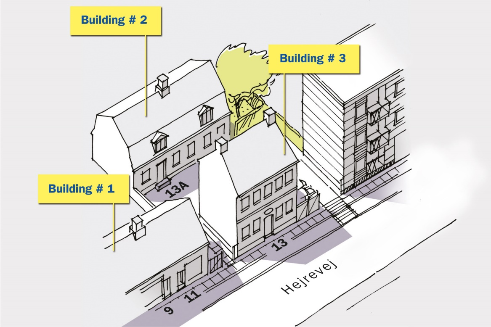

[.text-center]
*Figure G – Standard Situation in a street*

This might be described as the "normal" situation in urbanised areas where the houses are numbered along a road side.

Note: In the begian examples addresses from Flanders have been selected. In other parts of Belgium three language representations are necessary.

Whilst, the specification will support the representation of three languages, it is cannot be readily accommodated in this Annex.

==== Assignment in Belgium (Flanders)

[width="99%",cols=",,,,,,,"]
|===
2+|Component |Name in your country |Type |Building 1
|Building 1
|Building 2
|Building 3
8+h|AdminUnitsName (hierarchal)
|1 |AdminUnit1stOrder |Land (Country) | 4+|01000 (Belgie
|2 |AdminUnit2ndOrder |Gewest (region) | 4+|02000 (Vlaanderen)
|3 |AdminUnit3rdOrder |Provincie (province) | 4+|10000 (Antwerpen)
|4 |AdminUnit4thOrder |Arrondissement (district) | 4+|11000 (Antwerpen)
|5 |AdminUnit5thOrder |Gemeente (municipality) | 4+|11002 (Antwerpen)
|6 |AdminUnit6thOrder | | 4+| 
8+h|AddressAreaName
| |Area 1 |------- | | | | |
8+h|ThoroughfareName
| a|
ThoroughfareNameValue

{empty}[Streetname]

|Straatnaam | 4+|123456 (streetnamecode)

Alt (heyrevey, NIScode, 01/01/1830)
8+h|PostalDescriptor
| |PostName | | | | | |
| |Postcode |Postcode | |2140 |2140 |2140 |2140
h|Locator (hierarchal, ordered) h| h| h| h| h| h| h|
|1 |Designator 1 |huisnummer |1 |9 |11 |13A |13
| | | | | | | |
|===

Remarks:

<Straatnaam> is unique within a municipality and is identified by a streetnamecode (straatnaamid). It is the straatnaamid that makes the straatnaam unique within the municipality and within Flanders. Apart from the streetnamecode, <straatnaam> can be identified by an alternative identifier which consists of [.underline]#straatnaam(=name of the street)NIScode(municipalitycode)startdate#.

NIScode is the code given to a municipality by the Directorate-general Statistics Belgium. NIScode consists of five figures, the first figure identifies the province, the second figure identifies the arrondissement and the last three figures identify the municipality within the arrondissement.

If the same street name appears several times in a municipality, every occurrence receives its own streetnamecode and a sequential number is added onto the name following an underscore (_).

The example above represents a general case. Not all entrances in Belgium receive a seperate housenumber. It is possible that more entrances have the same Locator. The municipal adminstration decides if an entrance gets its own housenumber.

==== Assignment in the Czech Republic

In the Czech Republic are three possibilities depending on the existing of the streets and / or street numbers.

{empty}(I) Municipality or area with streets and street numbers

[width="100%",cols="9%,25%,20%,8%,9%,9%,9%,11%"]
|===
2+|Component |Name in your country |Type |Building 1
|Building 1
|Building 2
|Building 3
8+h|AdminUnitsName (hierarchal)
|1 |AdminUnit1stOrder |Stat | 4+^|Ceska republika
|2 |AdminUnit2ndOrder | | 4+| 
|3 |AdminUnit3rdOrder |Okres | 4+^|Praha
|4 |AdminUnit4thOrder | | 4+|
|5 |AdminUnit5thOrder | | 4+| 
|6 |AdminUnit6thOrder |Obec | 4+^|Praha
8+h|AddressAreaName
| |Area 1 |Cast obce | 4+^|Chodov
8+h|ThoroughfareName
| a|
ThoroughfareNameValue

{empty}[Streetname]

|Ulice | 4+|Hejrevej
8+h|PostalDescriptor
| |PostName |Posta | 4+^|Praha 41
| |Postcode |PSC | 4+^|149 00
8+h|Locator (hierarchal, ordered)
|1 |Designator 1 |Cislo domovni ^|5 2+^|2511 ^|3156 ^|256
|2 |Designator 2 |Cislo orientacni ^|2 ^|9 ^|11 ^|13 ^|13
|3 |Designator 3 |Pismeno cisla orientacniho ^|3 | | ^|a |
|4 |Designator 4 |Cislo vchodu | ^|1 ^|2 ^|1 ^|1
|===

{empty}(II) Municipality or area with streets but without street numbers

[width="100%",cols=",,,,,,,"]
|===
2+|Component |Name in your country |Type |Building 1|Building 1
|Building 2
|Building 3
8+h|AdminUnitsName (hierarchal)
|1 |AdminUnit1stOrder |Stat | 4+^|Ceska republika
|2 |AdminUnit2ndOrder | | | | | |
|3 |AdminUnit3rdOrder |Okres | 4+^|Liberec
|4 |AdminUnit4thOrder | | | | | |
|5 |AdminUnit5thOrder | | | | | |
|6 |AdminUnit6thOrder |Obec | 4+^|Cesky Dub
8+h|AddressAreaName
| |Area 1 |Cast obce | 4+^|Cesky Dub III
8+h|ThoroughfareName
| a|
ThoroughfareNameValue

{empty}[Streetname]

|Ulice | 4+^|Hejrevej
8+h|PostalDescriptor
| |PostName |Posta | 4+^|Cesky Dub
| |Postcode |PSC | 4+^|463 43
8+h|Locator (hierarchal, ordered)
|1 |Designator 1 |Cislo domovni |5 2+^|2511 ^|3156 ^|256
|2 |Designator 2 |Cislo vchodu | ^|1 ^|2 ^|1 ^|1
|===

{empty}(III) Municipality or area without streets and without street numbers

[width="100%",cols=",,,,,,,"]
|===
2+|Component |Name in your country |Type |Building 1
|Building 1
|Building 2
|Building 3
8+h|AdminUnitsName (hierarchal)
|1 |AdminUnit1stOrder |Stat | 4+^|Ceska republika
|2 |AdminUnit2ndOrder | | | | | |
|3 |AdminUnit3rdOrder |Okres | 4+^|Svitavy
|4 |AdminUnit4thOrder | | | | | |
|5 |AdminUnit5thOrder | | | | | |
|6 |AdminUnit6thOrder |Obec | 4+^|Morasice
8+h|AddressAreaName
| |Area 1 |Cast obce | 4+^|Rikovice
8+h|ThoroughfareName
| a|
ThoroughfareNameValue

{empty}[Streetname]

|Ulice | |--- | | |
8+h|PostalDescriptor
| |PostName |Posta | 4+^|Litomysl
| |Postcode |PSC | 4+^|570 01
8+h|Locator (hierarchal, ordered)
|1 |Designator 1 |Cislo domovni |5 2+^|2511 ^|3156 ^|256
|2 |Designator 2 |Cislo vchodu | ^|1 ^|2 ^|1 ^|1
|===

==== Assignment in Denmark

In Denmark a road name (here "Hejrevej") must be unique within the post code area. Due to the latest merging of municipalities in 2007, a road name can occur several times within the borders of a municipality. As a consequence it has been stated by law that the system of postcodes is a part of the Danish infrastructure, and that the four digit post code is an integrated component of the official address system.

The post code system is managed by the Post Denmark according to law, but with a certain public control – e.g. it is not possible for the Post Denmark to move borders of a post code or to merge together post code areas, if the result is that road names and addresses within the new area are not any longer unambiguous.

All road names are assigned by the municipality according to the "statutory order on road names and addresses". The name of a road can be composed by up to 40 characters. For each road name a four digit road code (0001-9899) is assigned, which is unambiguous within the municipality. Each municipality has a four digit municipality code.

Address numbers are according to tradition and to the statutory order composed by the numbers 1-999, optionally with an addition of a capital letter A-Z. Letters are only assigned when it is necessary to avoid re-numbering the following address numbers (e.g. in a situation of subdivision of land or of a building. Address numbers with and without letters are on equal level so "14" is equal to "14A". The sort order is "14", "14A", "14B" etc.

According to the Danish statutory order on road names and addresses, a so called "access address" identifies the entrance to a building or to a way of access to a plot of land or other construction. An access address is composed by a post code, a street name and an address number.

Access addresses are decided by the municipality who also decides which named road (and road code) the address is connected to, and records which post code the address is situated in.

So for access addresses in Denmark the "addressable object" is in general not the property, not the building, but the entrance door or similar way of access. As it is shown in this example a building with several external main entrance doors has one access address (= one address number) assigned to entrance each door.

[width="100%",cols=",,,,,,,"]
|===
2+|Component |Name in your country |Type |Building 1 |Building 1
|Building 2
|Building 3
8+h|AdminUnitsName (hierarchal)
|1 |AdminUnit1stOrder |Land | 4+^|Denmark
|2 |AdminUnit2ndOrder |---- | | | | |
|3 |AdminUnit3rdOrder |Kommune | 4+^|Sommerby
|4 |AdminUnit4thOrder |---- | | | | |
|5 |AdminUnit5thOrder |---- | | | | |
|6 |AdminUnit6thOrder |---- | | | | |
8+h|AddressAreaName
| |Area 1 |Supplerende bynavn | | | | |
8+h|ThoroughfareName
| a|
ThoroughfareNameValue

{empty}[Streetname]

|Vejnavn | |Herjevej | | |
8+h|PostalDescriptor
| |PostName |Postdistrikt | 4+| 
| |Postcode |Postnummer | 4+^|5720 
8+h|Locator (hierarchal, ordered)
|1 |Designator 1 |Husnummer |1 |9 |11 |13A |13
| | | | | | | |
|===

==== Assignment in Germany

[width="100%",cols=",,,,,,,"]
|===
2+|Component |Name in your country |Type |Building 1
|Building 1
|Building 2
|Building 3
8+h|AdminUnitsName (hierarchal)
|1 |AdminUnit1stOrder |Staat | 4+|Deutschland
|2 |AdminUnit2ndOrder |Land | 4+|Hessen
|3 |AdminUnit3rdOrder |Regierungsbezirk | 4+|Darmstadt
|4 |AdminUnit4thOrder |Kreis | 4+|Main-Taunus
|5 |AdminUnit5thOrder |Stadt /Gemeinde | 4+|Kelkheim
|6 |AdminUnit6thOrder |----- | | | | |
8+h|AddressAreaName
| |Area 1 |Ortsteil | 4+^|Münster
8+h|ThoroughfareName
| a|
ThoroughfareNameValue

{empty}[Streetname]

|Strasse | 4+^|Wiesenstrasse
8+h|PostalDescriptor
| |PostName |----- | | | | |
| |Postcode |Postleitzahl | 4+^|63477
8+h|Locator (hierarchal, ordered) Level 3: unit level: nummeraanduiding van verblijfsobject, standplaats, ligplaats
|1 |Designator 1 |Hausnummer |2 |9 |11 |13 |13
|2 |Designator 2 |Hausnummernzusatz |3 | | | |A
| | | | | | | |
|===

==== Assignment in the Netherlands

[width="100%",cols=",,,,,,,"]
|===
2+|Component |Name in your country |Type |Building 1
|Building 1
|Building 2
|Building 3
8+h|AdminUnitsName (hierarchal)
|1 |AdminUnit1stOrder |Land | 4+|The Netherland
|2 |AdminUnit2ndOrder |Provincie | 4+|
|3 |AdminUnit3rdOrder |---- | 4+|
|4 |AdminUnit4thOrder |---- | 4+|
|5 |AdminUnit5thOrder |Gemeente | 4+|
|6 |AdminUnit6thOrder |---- | 4+|
8+h|AddressAreaName
| |Area 1 |Woonplaatsnaam | 4+^|Amsterdam
| |Area 2 | | | | | |
| |Area 3 | | | | | |
8+h|ThoroughfareName
| a|
ThoroughfareNameValue

{empty}[Streetname]

|Naam Openbare ruimte | 4+^|Hejrevej
8+h|PostalDescriptor
| |PostName | | | | | |
| |Postcode | | | | | |
8+h|Locator (hierarchal, ordered) Level 3: unit level: nummeraanduiding van verblijfsobject, standplaats, ligplaats
|1 |Designator 1 |Huisnummer |2 |9 |11 |13 |13
|2 |Designator 2 |Huisletter |3 | | |A |
| | | | | | | |
|===

Remarks:

Level 3: unit level: nummeraanduiding van verblijfsobject, standplaats, ligplaats

Each dwelling gets its own number. The rules for what number it should be (e.g. 1-2-3 or 2-4-6 or 2a-2b-2c or 2 I – 2 II – 2 III) can differ. The municipality decides. It is not dependent of the building in which the dwelling is situated or the entrance of a building via which the dwellings can be reached. It is the individual dwelling that gets a number.

==== Assignment in Spain

[width="100%",cols=",,,,,,,"]
|===
2+|Component |Name in your country |Type |Building 1
|Building 1
|Building 2
|Building 3
8+h|AdminUnitsName (hierarchal)
|1 |AdminUnit1stOrder |Reino | 4+|España
|2 |AdminUnit2ndOrder |Comunidad Autónoma | 4+|01 Andalucía
|3 |AdminUnit3rdOrder |Provincia | 4+|41 Sevilla
|4 |AdminUnit4thOrder |Término Municipal, Ciudad Autónoma (Condominio) | 4+|039 Écija
|5 |AdminUnit5thOrder |---- | 4+|
|6 |AdminUnit6thOrder |---- | 4+|
8+h|AddressAreaName
| |Area 1 a|
Entidad de población

(Population Entity)

| 4+|41039000299 Diseminado Cortijo del Marqués
8+h|ThoroughfareName
| a|
ThoroughfareNameValue

{empty}[Streetname]

|Nombre de Via | 4+|
Calle Hejrevej
410390000001(streetnamecode)
8+h|PostalDescriptor
| |PostName | | | | | |
| |Postcode |Código postal | |41037 |41037 |41037 |41037
8+h|Locator (hierarchal, ordered)
|1 |Designator 1 |Portal or Número de Policía |1 |9 |9 |11 |13
| | | | | | | |
|===

Remarks:

. AdminUnit1stOrder: Reino (Country) is only mandatory for international applications (post delivery) but not inside national register.

. AdminUnit4thOrder: Término Municipal (Municipality); although its code consists of three numbers in most applications it is identified by the compound code of province code and municipality code (e.g. 41039).

. AddressAreaName 1: Entidad de población (Population Entity); Inhabited area located inside a municipality with a specific denomination which allows identifying it unambiguously. Depending on its characteristics it can be a "Singular Population Entity" or a "Collective Population Entity". In any case, both inhabited area types can consist of: population core, scattered population or a combination of both.

_Singular Population Entity_

Inhabited area located inside the municipality clearly distinguishable from the rest of the territory, with specific denomination. Urbanizations and residential areas are also included in this class.

If there is not more than one habitable area clearly differentiated within the municipality, the whole municipality is considered as a unique singular population entity.

Theses entities can consist of:

* _Population Core_ (area where most people live): set of at least ten buildings (or with a population of 50 people) distributed among streets, squares and other urban roads.
* __Scattered populatio__n: buildings or dwellings of a singular population entity distributed in the territory that may not be included in the population core concept

_Collective Population Entity_

Group of singular population entities which has got its own personality and historic origin

A Population Entity is identified by a name and a code consists of 11 figures: the five first figures identify province and municipality, the two following numbers identify if it is a "Collective Entity", and the last four figures specify that it is a "Singular Entity".

[arabic, start=4]
. Nombre de vía (street name) must be unique within a municipality but sometimes it is possible that there is more than one street with the same name inside of the same municipality. To distinguish all streets, every one has got a unique numeric code consist of 12 figures (province code_municipality code *10.000.000+number).

. Código postal (post code): This code is created by Postal Office so that every postal address is assigned to only one post code. Its two first figures are the province code. In small municipalities it is usual there is only one post code for all municipality, but the big municipalities are consist of more than one.

. Portal or número de policía: The numbering of buildings is ascending along the street, assigning even numbers to right side of the street and odd numbers to the left side. In order to identify every "portal" (house number), everyone has got a code consist of 12 figures equivalent to the numeric code of the street names. In the north of Spain is quite common that buildings are also identified by a name.

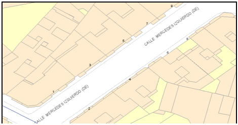

[.text-center]
*Figure H – Standard Situation in a street (ES)*

If a building is demolished and on that place more than one building is built, the new house numbers assigned are usually a combination between the old house number and letters, but sometimes it can be new numbers without relationship with the previous one.

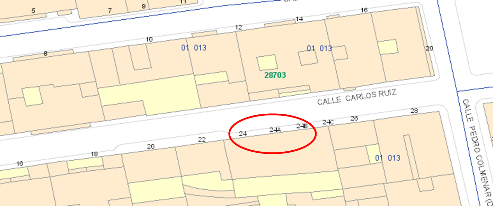

[.text-center]
*Figure I – Inserting a number (ES)*

If there are buildings inside of an urban area limited by public streets whose entrances are not exactly on those streets (similar to first example), they receive consecutive numbers following the "chain" of the numbers assigned to the buildings located on the public street (Figure J) or a combination of numbers and letters (Figure K).

image::./media/image42.png[./media/image42,width=367,height=273]

[.text-center]
*Figure J – Buildings inside of an urban area*

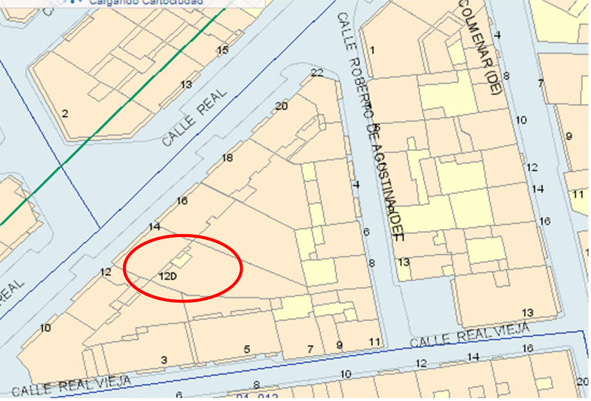

[.text-center]
*Figure K – Buildings inside of an urban area*

==== Assignment in Sweden

[width="100%",cols=",,,,,,,"]
|===
2+|Component |Name in your country |Type |Building 1
|Building 1
|Building 2
|Building 3
8+h|AdminUnitsName (hierarchal)
|1 |AdminUnit1stOrder |Land | 4+|
|2 |AdminUnit2ndOrder | | 4+|
|3 |AdminUnit3rdOrder |Kommun (mandatory) | 4+|Stockholm
|4 |AdminUnit4thOrder | | 4+|
|5 |AdminUnit5thOrder | | 4+|
|6 |AdminUnit6thOrder | | 4+|
8+h|AddressAreaName
| |Area 1 a|
Kommundel ^1^)

(optional)

| 4+|Farsta
8+h|ThoroughfareName
| a|
ThoroughfareNameValue

{empty}[Streetname]

a|
*Urban areas:*

Gatuadressområdesnamn ^2^)

*Rural areas:* ^3^)

| 4+|Brunskogsbacken
8+h|PostalDescriptor
| |PostName | | | | | |
| |Postcode |Postnummer ^4^) | |12345 | | |
8+h|Locator (hierarchal, ordered)
|1 |Designator 1 a|
*Urban areas:*

Gatuadressplatsnamn ^5^)

|1 |9 
11 |13A (as in the example) or 13B * |13 
(as in the example) 
or 
13A * |
|2 |Designator 2 |Lägenhetsnummer ^6^) |9 |1001 |1001, 1101 | |
|3 |Designator 3 |^7^) |8 | | | |
| | | | | | | |
|===

Remarks:

* It is preferable to have 13A and 13B instead of one "clean" number and one number with an added character. If the driveway to building 2 (the backyard building) had been situated between buildings 1 and 3, then the best solution would have been to give building 2 nr 13A and building 3 nr 13B.

In Sweden, about 0.4% of registered buildings for which addresses are compulsory are not connected to any address.

. Kommundel = Part of municipality (optional)
. Gatuadressområdesnamn = Street addressarea name (direct translation)
. In a small number of municipalities the urban areas model is used also in the countryside.
. Postnummer not in the standard, but added to every valid address when entered into the national address register. To every "postnummer" there is also a town name. One town name can be connected to one or many "postnummer" and can be the name of the town where the address actually can be found or the name of the town from which delivery is organized.
. Gatuadressplatsnamn = Street addressplace name (direct translation).
+
Some municipalities use distance based numbering outside more densely built areas.
. Lägenhetsnummer not in the address standard, but official dwelling numbers will be on this level. The first two digits describe which floor in the building, 10 means entrance level, 11 means first floor up
. not neither in the address standard, nor in an official register of addresses but can be added to postal addresses to aid correct delivery, e.g. floor number.

==== Assignment in Turkey

[width="100%",cols=",,,,,,,"]
|===
2+|Component |Name in your country |Type |Building 1 |Building 1
|Building 2
|Building 3
8+h|AdminUnitsName (hierarchal)
|1 |AdminLev1 |Ülke | 4+|
|2 |AdminLev2 |Il | 4+|
|3 |AdminLev3 |Ilçe | 4+|
|4 |AdminLev4 |Bucak | 4+|
|5 |AdminLev5 |Belediye / Köy | 4+|
|6 |AdminLev6 |Mahalle | 4+|
8+h|AddressAreaName
| |Area 1 |-------- | | | | |
8+h|ThoroughfareName
| a|
ThoroughfareNameValue

{empty}[Streetname]

|CSBM | 4+|Atatürk Bulv.
8+h|PostalDescriptor
| |PostName |--------- | | | | |
| |Postcode |Postakodu | 4+^|06100
8+h|Locator (optional hierarchal)
|1 |Designator 1 |Binalara numara ^|2 ^|9 ^|11 ^|13 ^|13
|2 |Designator 2 |? Numara ^|3 | | | ^|A
| | | | | | | |
|===

==== Assignment in the United Kingdom

[width="100%",cols=",,,,,,,"]
|===
2+|Component |Name in your country |Type |Building 1
|Building 1
|Building 2
|Building 3
8+h|AdminUnitsName (hierarchal)
|1 |AdminUnit1stOrder | | 4+|
|2 |AdminUnit2ndOrder | | 4+|
|3 |AdminUnit3rdOrder | | 4+|
|4 |AdminUnit4thOrder | | 4+|
|5 |AdminUnit5thOrder | | 4+|
|6 |AdminUnit6thOrder | | 4+|
8+h|AddressAreaName
| |Area 1 |Admin Area | 4+|London Borough of Wandsworth
| |Area 2 |Town | 4+|London
| |Area 3 |Locality | 4+|Fairfield
8+h|ThoroughfareName
| a|
ThoroughfareNameValue

{empty}[Streetname]

|Street | 4+|High Street
8+h|PostalDescriptor
| |PostName | | 4+|
| |PostCode | | 4+|SW18 1ED
8+h|Locator (hierarchal, ordered)
|1 |Designator 1 |PAON |1 |9 |11 |13A |13
| | | | | | | |
|===

Remarks:

PAON = Primary Addressable Object Name = can be a combination of Building Name and / or Building (street) Number, there is a separate attribute of the Addressable Object for organisation name but this may be used as the PAON in the absence of a building name or number.

SAON = Secondary Addressable Object Name = Unit (for a business) or Sub-Building Name (e.g. Flat 1)

Locality = neighbourhood, suburb, district within town, village, estate, settlement or parish, only used if there are more than one instance of a particular street within a "town" or where it is in common use locally

Town = A city, town, village, settlement

Neither town or locality boundaries are defined in the UK nor is there a definitive list of their names

Administrative Area = county, London Borough, District council, unitary authority, island or island Group and is not always held or used as part of an address

Postcode is held as an additional attribute of the Addressable Object and is allocated by Royal Mail for their own operational needs

Street names and building (street) numbers are allocated by the lowest level of local authority which has responsibility for the area where the property is located. In theory every property should display its given number but in many cases this is absent and the occupier may display their own chosen building name, which may be changed at anytime.

==== Assigning Addresses to Apartments 

[.text-center]
*Figure L – Apartment house situation*

This apartment house is situated on the corner, all 6 entrances are reached via Vestergade, and the entrances to the apartments looking to the Solsortvej side are on the backside. Each entrance serves for three apartments, one for each floor.

Please describe Entrances 4, 6 and 14 only

==== Assignment in Belgium (Flanders)

Recommended since 2006 (only for new addresses):

[width="99%",cols=",,,,,,,,,,,,"]
|===
2.2+|Component .2+|Name .2+|Type 3+|Entrance# 4 3+|Entrance# 6 3+|Entrance# 14
|Floor 1 |Floor 2 |Floor 3 |Floor 1 |Floor 2 |Floor 3 |Floor 1 |Floor 2 |Floor 3
13+h|AdminUnitsName (hierarchal)
|1 |AdminUnit1stOrder | | 9.6+|As in the previous example
|2 |AdminUnit2ndOrder | |
|3 |AdminUnit3rdOrder | |
|4 |AdminUnit4thOrder | |
|5 |AdminUnit5thOrder | |
|6 |AdminUnit6thOrder | |
13+h|AddressAreaName
| |Area 1 | | 9+|As in the previous example
13+h|ThoroughfareName
| a|
ThoroughfareNameValue

{empty}[Streetname]

| | 6+|123457 (Vestergade) 3+|123457 (Vestergade)
13+h|PostalDescriptor
| |PostName | | | | | | | | | | |
| |Postcode | | |2140 |2140 |2140 |2140 |2140 |2140 |2140 |2140 |2140
13+h|Locator (hierarchal, ordered)
|1 |Designator 1 |Huisnummer |1 |4 |4 |4 |6 |6 |6 |14 |14 |14
|2 |Designator 2 |Subadres (appartementnummer) |9 |0.1 |1.1 |2.1 |0.1 |1.1 |2.1 |0.1 |1.1 |2.1
|===

Remarks:

* apartment number (appartementnummer) consists of two components: floor and unitnumber 
e.g. apartmentnumber 0.1: ground floor, unit 1

Recommended before 2006:

[width="100%",cols=",,,,,,,,,,,,"]
|===
2.2+|Component .2+|Name .2+|Type 3+|Entrance# 4 3+|Entrance# 6 3+|Entrance# 14
|Floor 1 |Floor 2 |Floor 3 |Floor 1 |Floor 2 |Floor 3 |Floor 1 |Floor 2 |Floor 3
13+h|AdminUnitsName (hierarchal)
|1 |AdminUnit1stOrder | | 9.6+|As in the previous example
|2 |AdminUnit2ndOrder | |
|3 |AdminUnit3rdOrder | |
|4 |AdminUnit4thOrder | |
|5 |AdminUnit5thOrder | |
|6 |AdminUnit6thOrder | |
13+h|AddressAreaName
| |Area 1 | | 9+|As in the previous example
13+h|ThoroughfareName
| a|
ThoroughfareNameValue

{empty}[Streetname]

| | 6+|123457 (Vestergade) 3+|123457 (Vestergade)
13+h|PostalDescriptor
| |PostName | | | | | | | | | | |
| |Postcode | | |2140 |2140 |2140 |2140 |2140 |2140 |2140 |2140 |2140
13+h|Locator (hierarchal, ordered)
|1 |Designator 1 |Huisnummer |1 |4 |4 |4 |6 |6 |6 |14 |14 |14
|2 |Designator 2 |Subadres (busnummer) |9 |1 |2 |3 |1 |2 |3 |1 |2 |3
|===

Remarks:

letterboxnumbers (busnummers) identify dwellings

==== Assignment in the Czech Republic

General:

* There is no flat identification in the Czech Republic address register.
* We assume that the building has one house number - 2847

{empty}(I) Municipality or areas with streets and street numbers

[width="100%",cols=",,,,,,,,,,,,"]
|===
2.2+|Component |Name |Type 3+|Entrance# 4 3+|Entrance# 6 3+|Entrance# 14
| | |Floor 1 |Floor 2 |Floor 3 |Floor 1 |Floor 2 |Floor 3 |Floor 1 |Floor 2 |Floor 3
13+h|AdminUnitsName (hierarchal)
|1 |AdminUnit1stOrder |Stat | 9+^|Ceska republika
|2 |AdminUnit2ndOrder | | 9+|
|3 |AdminUnit3rdOrder |Okres | 9+^|Praha
|4 |AdminUnit4thOrder | | 9+|
|5 |AdminUnit5thOrder | | 9+|
|6 |AdminUnit6thOrder |Obec | 9+^|Praha
13+h|AddressAreaName
| |Area 1 |Cast obce | 9+^|Chodov
| |Area 2 | | 9+|
| |Area 3 | | 9+|
13+h|ThoroughfareName
| a|
ThoroughfareNameValue

{empty}[Streetname]

|Ulice | 6+^|Vestergade 3+^|Solsortevej
13+h|PostalDescriptor
| |PostName |Posta | 9+^|Praha 41
| |Postcode |PSC | 9+^|149 00
13+h|Locator (hierarchal, ordered)
|1 |Designator 1 |Cislo domovni |5 9+^|2847
|2 |Designator 2 |Cislo orientacni |2 3+^|4 3+^|6 3+^|14
|3 |Designator 3 |Cislo vchodu | 3+^|1 3+^|2 3+^|3
|===

{empty}(II) Municipality or areas with streets but without street numbers

[width="100%",cols=",,,,,,,,,,,,"]
|===
2.2+|Component |Name |Type 3+|Entrance# 4 3+|Entrance# 6 3+|Entrance# 14
|||Floor 1 |Floor 2 |Floor 3 |Floor 1 |Floor 2 |Floor 3 |Floor 1 |Floor 2 |Floor 3
13+h|AdminUnitsName (hierarchal)
| |AdminUnit1stOrder |Stat | 9+^|Ceska republika
| |AdminUnit2ndOrder | | 9+|
| |AdminUnit3rdOrder |Okres | 9+^|Liberec
| |AdminUnit4thOrder | | 9+|
| |AdminUnit5thOrder | | 9+|
| |AdminUnit6thOrder |Obec | 9+^|Cesky Dub
13+h|AddressAreaName
| |Area 1 |Cast obce | 9+^|Cesky Dub III
| |Area 2 | | 9+|
| |Area 3 | | 9+|
13+h|ThoroughfareName
| a|
ThoroughfareNameValue

{empty}[Streetname]

|Ulice | 6+^|Vestergade 3+^|Solsortevej
13+h|PostalDescriptor
| |PostName |Posta | 9+^|Cesky Dub
| |Postcode |PSC | 9+^|463 43
13+h|Locator (hierarchal, ordered)
|1 |Designator 1 |Cislo domovni |5 9+^|2847
|2 |Designator 2 | | 6+^|
entrances 4,6,8,10 undistinguishable
(in postal addresses)
3+^|
entrances 12, 14 undistinguishable
(in postal addresses)

|3 |Designator 3 |Cislo vchodu | 3+^|1 3+^|2 3+^|3
|===

{empty}(III) Municipality or areas without streets (and without street numbers)

[width="100%",cols=",,,,,,,,,,,,"]
|===
2.2+|Component |Name |Type 3+|Entrance# 4 3+|Entrance# 6 3+|Entrance# 14
| | |Floor 1 |Floor 2 |Floor 3 |Floor 1 |Floor 2 |Floor 3 |Floor 1 |Floor 2 |Floor 3
13+h|AdminUnitsName (hierarchal)
|1 |AdminUnit1stOrder |Stat | 9+^|Ceska republika
|2 |AdminUnit2ndOrder | | 9+|
|3 |AdminUnit3rdOrder |Okres | 9+^|Svitavy
|4 |AdminUnit4thOrder | | 9+|
|5 |AdminUnit5thOrder | | 9+|
|6 |AdminUnit6thOrder |Obec | 9+^|Morasice
13+h|AddressAreaName
| |Area 1 |Cast obce | 9+^|Rikovice
| |Area 2 | | 9+|
| |Area 3 | | 9+|
13+h|ThoroughfareName
| a|
ThoroughfareNameValue

{empty}[Streetname]

|Ulice | 6+^|--- 3+^|---
13+h|PostalDescriptor
| |PostName |Posta | 9+^|Litomysl
| |Postcode |PSC | 9+^|570 01
13+h|Locator (hierarchal, ordered)
|1 |Designator 1 |Cislo domovni |5 9+^|2847
|2 |Designator 2 | | 9+^|entrances 4,6,8,10,12,14 undistinguishable (in postal addresses)
|3 |Designator 3 |Cislo vchodu | 3+^|1 3+^|2 3+^|3
|===

==== Assignment in Denmark

[width="100%",cols=",,,,,,,,,,,,"]
|===
2.2+|Component |Name |Type 3+|Entrance# 4 3+|Entrance# 6 3+|Entrance# 14
| | |Floor 1 |Floor 2 |Floor 3 |Floor 1 |Floor 2 |Floor 3 |Floor 1 |Floor 2 |Floor 3
13+h|AdminUnitsName (hierarchal)
|1 |AdminUnit1stOrder |Land | 9+^|Denmark
|2 |AdminUnit2ndOrder |---- | 9+|
|3 |AdminUnit3rdOrder |Kommune | 9+^|Sommerby
|4 |AdminUnit4thOrder |---- | 9+|
|5 |AdminUnit5thOrder |---- | 9+|
|6 |AdminUnit6thOrder |---- | 9+|
13+h|AddressAreaName
| |Area 1 |Supplerende bynavn | 9+|
13+h|ThoroughfareName
| a|
ThoroughfareNameValue

{empty}[Streetname]

|Vejnavn | 9+^|Vestergade
13+h|PostalDescriptor
| |PostName |Postdistrikt | 9+^|Sommerby
| |Postcode |Postnummer | 9+^|5720
13+h|Locator (hierarchal, ordered)
|1 |Designator 1 |Husnummer |1 3+^|10 3+^|10 3+^|10
|2 |Designator 2 |Etage ^|8 ^|1 ^|2 ^|3 ^|1 ^|2 ^|3 ^|1 ^|2 ^|3
|2 |Designator 3 |Dør ^|9 ^|5 ^|5 ^|5 ^|4 ^|4 ^|4 ^|2 ^|2 ^|2
| | | | | | | | | | | | | |
|===

According to the Danish statutory order on road names and addresses, a so called "unit address" identifies the individual units (dwellings or apartments etc.) in a building. A unit address is composed by an "access address" (see pervious example) plus a floor designator and a door designator.

Unit addresses are assigned by the municipality who decides which floor- and door-designator should identify the address, and to which "access address" it connected.

For floor designators the standard values are that the ground floor has the designation "st" (danish: "Stuen"), 1^st^ floor is "1", 2^nd^ is "2" etc. Basement is "kl" (Danish: "Kælder").

Door designators could be composed in several ways. In this example it is assumed that there are more than three doors on each floor in the staircase, numbered "1", "2", "3" etc. If there are up to three doors, the standard designation is "tv" (Danish: "til venstre" (left)), "th" (Danish: "til højre" (right)) and "mf" (Danish: "midt for" (middle)). Also other systematic sets of four character designators could be used, like e.g. B01, B02, B03 etc.

==== Assignment in Germany

[width="100%",cols=",,,,,,,,,,,,"]
|===
2.2+|Component |Name |Type 3+|Entrance# 4 3+|Entrance# 6 3+|Entrance# 14
| | |Floor 1 |Floor 2 |Floor 3 |Floor 1 |Floor 2 |Floor 3 |Floor 1 |Floor 2 |Floor 3
13+h|AdminUnitsName (hierarchal)
|1 |AdminUnit1stOrder |Staat | 9+|Deutschland
|2 |AdminUnit2ndOrder |Land | 9+|Hessen
|3 |AdminUnit3rdOrder |Regierungsbezirk | 9+|Darmstadt
|4 |AdminUnit4thOrder |Kreis | 9+|Main-Taunus
|5 |AdminUnit5thOrder |Stadt /Gemeinde | 9+|Kelkheim 
|6 |AdminUnit6thOrder |----- | 9+|
13+h|AddressAreaName
| |Area 1 |Ortsteil | 9+^|Hornau
13+h|ThoroughfareName
| a|
ThoroughfareNameValue

{empty}[Streetname]

|Strasse | 6+^|Vestergade 3+^|Solsortevej
13+h|PostalDescriptor
| |PostName | | 9+|
| |Postcode |Postleitzahl | 9+^|67 433
13+h|Locator (hierarchal, ordered)
|1 |Designator 1 |Hausnummer |2 3+^|4 3+^|6 3+^|14
|2 |Designator 2 |Hausnummernzusatz |3 | | | | | | | | | |
| | | | | | | | | | | | | |
|===

==== Assignment in the Netherlands

[width="100%",cols=",,,,,,,,,,,,"]
|===
2.2+|Component |Name |Type 3+|Entrance# 4 3+|Entrance# 6 3+|Entrance# 14
| | |Floor 1 |Floor 2 |Floor 3 |Floor 1 |Floor 2 |Floor 3 |Floor 1 |Floor 2 |Floor 3
13+h|AdminUnitsName (hierarchal)
|1 |AdminUnit1stOrder | | 9+|
|2 |AdminUnit2ndOrder | | 9+|
|3 |AdminUnit3rdOrder | | 9+|
|4 |AdminUnit4thOrder | | 9+|
|5 |AdminUnit5thOrder | | 9+|
|6 |AdminUnit6thOrder | | 9+|
13+h|AddressAreaName
| |Area 1 |Woonplaatsnaam | 9+|Amsterdam
13+h|ThoroughfareName
| a|
ThouroughFareName

{empty}[Streetname]

|Naam openbare ruimte | 6+^|Vestergade 3+|
13+h|PostalDescriptor
| |PostName | | 9+|
| |Postcode | | 9+|
13+h|Locator (hierarchal, ordered) Level 3: unit level: nummeraanduiding van verblijfsobject, standplaats, ligplaats
|1 |Designator 1 |Huisnummer |2 |2 |4 | |6 |8 |8 |8 |10 |10 |10
|2 |Designator 2 |Huisletter |3 | | | | |A |b |c | | |
|3 |Designator 3 |huisnummertoevoeging |4 | | | | | | | |I |II |III
| | | | | | | | | | | | | |
|===

Remarks:

Each dwelling gets its own number. The rules for what number it should be (e.g. 1-2-3 or 2-4-6 or 2a-2b-2c or 2 I – 2 II – 2 III) can differ. The municipality decides. It is not dependent of the building in which the dwelling is situated or the entrance of a building via which the dwellings can be reached. It is the individual dwelling that gets a number.

==== Assignment in Spain

[width="100%",cols=",,,,,,,,,,,,"]
|===
2.2+|Component |Name |Type 3+|Entrance# 4 3+|Entrance# 6 3+|Entrance# 14
| | |Floor 1 |Floor 2 |Floor 3 |Floor 1 |Floor 2 |Floor 3 |Floor 1 |Floor 2 |Floor 3
13+h|AdminUnitsName (hierarchal)
| |AdminUnit1stOrder | | 9.3+|As in the previous example 
| |To | |
| |AdminUnit6thOrder | |
13+h|AddressAreaName
| |Area 1 | | 9+|As in the previous example
13+h|ThoroughfareName
| a|
ThoroughfareNameValue

{empty}[Streetname]

|Nombre de Vía | 6+|
Calle Vestergade
410390000001(streetnamecode)
3+|
Calle Vestergade
410390000001(streetnamecode)
4+h|PostalDescriptor h| h|Other h| h| h| h| h| h| h|
| |PostName | | | | | | | | | | |
| |Postcode |Código postal | |41037 |41037 |41037 |41037 |41037 |41037 |41037 |41037 |41037
13+h|Locator (hierarchal, ordered)
| |Designator 1 |Portal or Número de Policía |1 |4 |4 |4 |6 |6 |6 |14 |14 |14
| |Designator 2 |Escalera |7 a|
Right
/Left
a|
Right
/Left
a|
Right
/Left
a|
Right
/Left
a|
Right
/Left
a|
Right
/Left
a|
Right
/Left
a|
Right
/Left
a|
Right
/Left
| |Designator 3 |Planta |8 |1 |2 |3 |1 |2 |3 |1 |2 |3
| |Designator 4 |Puerta |9 |1... |1... |1... |1... |1... |1... |1... |1... |1...
| | | | | | | | | | | | |
|===

Remarks:

. Streetname in Entrance 14: If there are buildings whose entrances are not just on the street (as e.g. entrance 14) but their house numbers are consecutive with the numbering assigned to the other buildings (those whose entrances are on the street) then it means that entrance 14 is also link to the same street. If the entrances 12 and 14 were just on the Solsortevej street then their numbers would belong to the numbering assigned to the other street.
. Escalera (stairs): This Spanish addresses component is not part of the general case (consist of entrance/floor/flat) but it is important to take it into account because it appears in a big percentage of addresses.

. Puerta (flat): This number depends on how many flats are in the same floor.

==== Assignment in Sweden

The example is a bit confusing as it shows a situation when number 4 seems to be a non-residential unit, e.g. a bicycle garage, while numbers 6 and 12 illustrate a situation where dwellings with direct access from the street have their own address numbers, while those dwellings on the upper floors have access through a common stairwell.

Assuming that you use entrances 4, 6 and 12 to access dwellings on the upper floors, the addresses (including dwelling-numbers) would be

Vestergade 4 1001, Vestergade 4 1101, Vestergade 4, 1201

Vestergade 6 1001 and so forth

Vestergade 12 1001 asf

(The illustrated example would also give Vestergade 10 1001, Vestergade 10 1101, 1102, 1103, 1104, 1105, Vestergade 10 1201, 1202 asf.)

[width="100%",cols=",,,,,,,,,,,,"]
|===
2.2+|Component |Name |Type 3+|Entrance# 4 3+|Entrance# 6 3+|Entrance# 14
| | |Floor 1 |Floor 2 |Floor 3 |Floor 1 |Floor 2 |Floor 3 |Floor 1 |Floor 2 |Floor 3
13+h|AdminUnitsName (hierarchal)
|1 |AdminUnit1stOrder | | 9.6+|As in the previous example
|2 |AdminUnit2ndOrder | |
|3 |AdminUnit3rdOrder | |
|4 |AdminUnit4thOrder | |
|5 |AdminUnit5thOrder | |
|6 |AdminUnit6thOrder | |
13+h|AddressAreaName
| |Area 1 | | 9+|As in the previous example
13+h|ThoroughfareName
| a|
ThoroughfareNameValue

{empty}[Streetname]

|GatuadressområdesNamn | 6+|Vestergade 3+|Vestergade
13+h|PostalDescriptor
| |PostName | | | | | | | | | | | |
| |Postcode |Postnummer | |* | | | | | | | | |
13+h|Locator (hierarchal, ordered)
|1 |Designator 1 |AdressplatsNamn |1 |4 |4 | |4 |6 |6 |6 |14 |14 |14
|2 |Designator 2 |Lägenhetsnummer ^1^) |9 |1001 |1101 | |1201 |1001 |1101 |1201 |1001 |1101 |1201
| | | | | | | | | | | | | |
|===

Remarks:

* The postcode can be different for different address numbers (FGE1) but not on dwelling level.

. Lägenhetsnummer (dwelling number where the first two digits indicate floor where ground floor = 10 and the two following digits indicate door number on the floor clockwise.)

==== Assignment in Turkey

[width="100%",cols=",,,,,,,,,,,,"]
|===
2.2+|Component |Name |Type 3+|Entrance# 4 3+|Entrance# 6 3+|Entrance# 14
| | |Floor 1 |Floor 2 |Floor 3 |Floor 1 |Floor 2 |Floor 3 |Floor 1 |Floor 2 |Floor 3
13+|AdminUnitsName (hierarchal)
|1 |AdminUnit1stOrder |Ülke | 9.6+|As in the previous example
|2 |AdminUnit2ndOrder |Il | 
|3 |AdminUnit3rdOrder |Ilçe | 
|4 |AdminUnit4thOrder |Bucak |
|5 |AdminUnit5thOrder |Belediye / Köy | 
|6 |AdminUnit6thOrder |Mahalle | 
13+h|AddressAreaName
| |Area 1 | | 9+|As in the previous example
13+h|ThoroughfareName
| a|
ThoroughfareNameValue

{empty}[Streetname]

|CSBM | 9+^|Atatürk Bulv.
13+h|PostalDescriptor
| |PostName | | 9+|
| |Postcode |Postakodu | 9+^|06100
13+h|Locator (optional hierarchal)
| |Designator 1 |Binalara numara |2 |4 | | | | | | | |
| |Designator 2 |Daire numara |9 |1 |2 |3 |4 |5 |6 |7 |8 |...
| | | | | | | | | | | | | |
|===

==== Assignment in the United Kingdom

[width="100%",cols=",,,,,,,,,,,,"]
|===
2.2+|Component |Name |Type 3+|Entrance# 4 3+|Entrance# 6 3+|Entrance# 14
| | |Floor 1 |Floor 2 |Floor 3 |Floor 1 |Floor 2 |Floor 3 |Floor 1 |Floor 2 |Floor 3
13+h|AdminUnitsName (hierarchal)
|1 |AdminUnit1stOrder | | 9.6+|As in the previous example 
|2 |AdminUnit2ndOrder | |
|3 |AdminUnit3rdOrder | |
|4 |AdminUnit4thOrder | |
|5 |AdminUnit5thOrder | |
|6 |AdminUnit6thOrder | |
13+h|AddressAreaName
| |Area 1 |Administrative Area | 9.3+|As in the previous example
| |Area 2 |Town |
| |Area 3 |Locality |
13+h|ThoroughfareName
| a|
ThoroughfareNameValue

{empty}[Streetname]

|Street | 9+|High Street
13+h|PostalDescriptor
| |PostName | | 9+|
| |Postcode |Postcode | 9+^|SW18 1ED
13+h|Locator (hierarchal, ordered)
|1 |Designator 1 |PAON |1 |4-14 | | | | | | | | |
|2 |Designator 2 |SAON |9 |Flat 1 |Flat 2 | |Flat 3 |Flat 4 |Flat 5 |Flat 6 |Flat 7 |Flat 8 |Flat 9
|===

or

[width="100%",cols="11%,19%,15%,6%,6%,5%,5%,5%,6%,6%,5%,6%,5%",]
|===
h| h| h| h| h| h| h| h| h| h| h| h| h|
|1 |Designator 1 |PAON |1 |4 | | |6 | | |14 | |
|2 |Designator 2 |SAON |9 |Ground floor |First floor |Second floor |Ground floor |First floor |Second floor |Ground floor |First floor |Second floor
|===

or

[width="100%",cols="11%,19%,15%,6%,6%,5%,5%,5%,6%,6%,5%,6%,5%",]
|===
h| h| h| h| h| h| h| h| h| h| h| h| h|
|1 |Designator 1 |PAON |1 |4A |4B |4C |6A |6B |6C |14A |14B |14C
|2 |Designator 2 |SAON |9 | | | | | | | | |
|===

Remarks:

All three options are valid and used interchangeably within authority areas.

In all cases there will be a "parent" record within the NLPG (but not PAF, ADDRESS-POINT, OS MasterMap Address Layer or Address Layer 2) to hold details of the building as a separate entity for planning, cadastral or taxation purposes. Each of the "child" records will be explicitly related to the parent record

==== Assigning Addresses to Shops in Shopping Centers

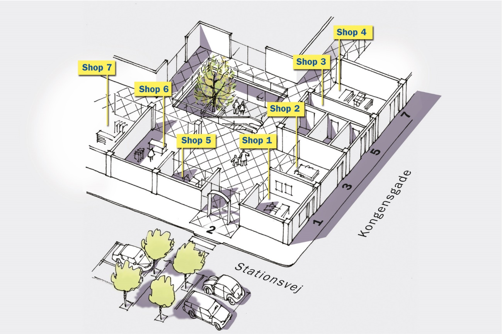

[.text-center]
*Figure M – Shopping centre situation*

==== Assignment in Belgium (Flanders)

Address assignement in Belgium (Flanders), is illusterated by 2 separate tables:

* a house number as a whole
* each shop has a separate number.

Shopping centre has one house number as a whole:

[width="100%",cols=",,,,,,,,,,,,"]
|===
2+|Component |Name |Type |Main Entrance
|Shop 1 |Shop 2|Shop 3 |Shop 4 |Shop 5 |Shop 6|Shop 7
|
13+h|AdminUnitsName (hierarchal)
|1 |AdminUnit1stOrder | | 9.6+|As in the previous example
|2 |AdminUnit2ndOrder | |
|3 |AdminUnit3rdOrder | |
|4 |AdminUnit4thOrder | |
|5 |AdminUnit5thOrder | |
|6 |AdminUnit6thOrder | |
13+h|AddressAreaName
| |Area 1 | | 9+|As in the previous example
13+h|ThoroughfareName
| a|
ThoroughfareNameValue

{empty}[Streetname]

| | 6+|123459 (stationstreet)  3+|123459 (stationstreet)
13+h|PostalDescriptor 
| |Postname | | | | | | | | | | |
| |Postcode | | | |2140 |2140 |2140 |2140 |2140 |2140 |2140 |
13+h|Locator (hierarchal, ordered)
|1 |Designator 1 |huisnummer |1 | |2 |2 |2 |2 |2 |2 |2 |
|2 |Designator 2 |busnummer |9 | |1 |2 |3 |4 |5 |6 |7 |
|===

Each shop in the shopping centre has its own house number:

[width="100%",cols=",,,,,,,,,,,,"]
|===
2+|Component |Name |Type |Main Entrance
|Shop 1 |Shop 2|Shop 3 |Shop 4 |Shop 5 |Shop 6|Shop 7
|
13+h|AdminUnitsName (hierarchal)
|1 |AdminUnit1stOrder | | 9.6+|As in the previous example
|2 |AdminUnit2ndOrder | |
|3 |AdminUnit3rdOrder | |
|4 |AdminUnit4thOrder | |
|5 |AdminUnit5thOrder | |
|6 |AdminUnit6thOrder | |
13+h|AddressAreaName
| |Area 1 | | 9+|As in the previous example
13+h|ThoroughfareName
| a|
ThoroughfareNameValue

{empty}[Streetname]

| | 6+|123459 (stationstreet) 3+|123459 (stationstreet)
13+h|PostalDescriptor
| |Postname | | | | | | | | | | |
| |Postcode | | | |2140 |2140 |2140 |2140 |2140 |2140 |2140 |
13+h|Locator (hierarchal, ordered)
|1 |Designator 1 |huisnummer |1 | |2A |2B |2C |2D |4 |6 |8 |
|===

==== Assignment in the Czech Republic

General: Promises inside the buildings / shopping centers are not distinguished. The shopping centres normally have one house number (e.g. 2847):

{empty}(I) Municipality or areas with streets and street numbers

[width="99%",cols=",,,,,,,,,,,,"]
|===
2+|Component |Name |Type |Main Entrance
|Shop 1 |Shop 2|Shop 3 |Shop 4 |Shop 5 |Shop 6|Shop 7
|
13+h|AdminUnitsName (hierarchal)
|1 |AdminUnit1stOrder |Stat | 9+^|Ceska republika
|2 |AdminUnit2ndOrder | | 9+|
|3 |AdminUnit3rdOrder |Okres | 9+^|Praha
|4 |AdminUnit4thOrder | | 9+|
|5 |AdminUnit5thOrder | | 9+|
|6 |AdminUnit6thOrder |Obec | 9+^|Praha
13+h|AddressAreaName
| |Area 1 |Cast obce | 9+^|Chodov
13+h|ThoroughfareName
| a|
ThoroughfareNameValue

{empty}[Streetname]

|Ulice | 9+|Stationstreet
13+h|PostalDescriptor
| |PostName |Posta | 9+^|Praha 41
| |Postcode |PSC | 9+^|149 00
13+h|Locator (hierarchal, ordered)
|1 |Designator 1 |Cislo domovni |5 9+^|2847
|2 |Designator 2 |Cislo orientacni |2 |2 |2 |2 |2 |2 |2 |2 |2 |2
|3 |Designator 3 |Pismeno cisla orientacniho |3 | |A |B |C |D | | | |
|===

==== Assignment in Denmark

[width="99%",cols=",,,,,,,,,,,,"]
|===
2+|Component |Name |Type |Main Entrance
|Shop 1 |Shop 2|Shop 3 |Shop 4 |Shop 5 |Shop 6|Shop 7
|
13+h|AdminUnitsName (hierarchal)
|1 |AdminUnit1stOrder |Land | 9+^|Denmark
|2 |AdminUnit2ndOrder |---- | 9+|
|3 |AdminUnit3rdOrder |Kommune | 9+^|Sommerby
|4 |AdminUnit4thOrder |---- | 9+|
|5 |AdminUnit5thOrder |---- | 9+|
|6 |AdminUnit6thOrder |---- | 9+|
13+h|AddressAreaName
| |Area 1 |Supplerende bynavn | 9+|
13+h|ThoroughfareName
| a|
ThoroughfareNameValue

{empty}[Streetname]

|Vejnavn | 9+^|Stationstorvet
13+h|PostalDescriptor
| |PostName |Postdistrikt | 9+|
| |Postcode |Post-nummer | 9+^|5720
13+h|Locator (hierarchal, ordered)
|1 |Designator 1 |Husnummer |1 |2 |2 |2 |2 |2 |2 |2 |2 |
|2 |Designator 2 |Etage |8 | |st |St |st |st |st |st |st |
| | |Dør |9 | |B07 |B06 |B05 |B04 |B01 |B02 |B03 |
|===

Even though it is in this example assumed that there is only one floor in the shopping mall, the floor designator "st" (= ground floor) is necessary for a correct address.

The "unit addresses" for the shops [.underline]#inside# the mall are all using the main entrance "2" as a reference ("access address"), and shop numbers (in this example "B01" etc.) which are assigned from the left to the right.

The secondary entrance doors (for staff or delivery of goods) could as shown have individual address numbers (access addresses) as shown: "2A", "2B" etc.

==== Assignment in Germany

General: Promises inside the buildings / shopping centers are not distinguished. The shopping centres normally have one house number (e.g. 2):

They may be identified by house number extensions (e.g. A,B,C,...)

[width="99%",cols=",,,,,,,,,,,,"]
|===
2+|Component |Name |Type |Main Entrance
|Shop 1 |Shop 2|Shop 3 |Shop 4 |Shop 5 |Shop 6|Shop 7
|
13+h|AdminUnitsName (hierarchal)
|1 |AdminUnit1stOrder |Staat | 9+^|Deutschland
|2 |AdminUnit2ndOrder |Land | 9+^|Hessen
|3 |AdminUnit3rdOrder |Regierungsbezirk | 9+^|Darmstadt
|4 |AdminUnit4thOrder |Kreis | 9+^|Main-Taunus
|5 |AdminUnit5thOrder |Stadt /Gemeinde | 9+^|Kelkheim
|6 |AdminUnit6thOrder |----- | 9+^|
13+h|AddressAreaName
| |Area 1 |Ortsteil | 9+|Sulzbach
13+h|ThoroughfareName
| a|
ThoroughfareNameValue

{empty}[Streetname]

|Strasse | 9+|Stationstr.
13+h|PostalDescriptor
| |PostName | | 9+|
| |Postcode |Postleitzahl | 9+|65 284
13+h|Locator (hierarchal, ordered)
|1 |Designator 1 |Hausnummer |2 |2 |2 |2 |2 |2 |2 |2 |2 |
|2 |Designator 2 |Hausnummernzusatz |3 | |A |B |C |D |E |F |G |
|===

==== Assignment in the Netherlands

[width="99%",cols=",,,,,,,,,,,,"]
|===
2+|Component |Name |Type |Main Entrance
|Shop 1 |Shop 2|Shop 3 |Shop 4 |Shop 5 |Shop 6|Shop 7
|
13+h|AdminUnitsName (hierarchal)
| |AdminUnit1stOrder | | 9+|
| |AdminUnit2ndOrder | | 9+|
| |AdminUnit3rdOrder | | 9+|
| |AdminUnit4thOrder | | 9+|
| |AdminUnit5thOrder | | 9+|
| |AdminUnit6thOrder | | 9+|
13+h|AddressAreaName
| |Unit1 |Woonplaatsnaam | 9+^|Amsterdam
| |Unit2 | | 9+|
| |Unit3 | | 9+|
13+h|ThoroughfareName
| a|
ThouroughFareName

{empty}[Streetname]

|Naam openbare ruimte | 9+^|Stationstreet
13+h|PostalDescriptor
| |PostName | | | | | | | | | | | |
| |Postcode | | | | | | | | | | | |
13+h|Locator (hierarchal, ordered) Level 3: unit level: nummeraanduiding van verblijfsobject, standplaats, ligplaats
| |Designator 1 |Huisnummer |2 | |1 |2 |3 |4 |5 |6 |7 |
| |Designator 2 |Huisletter |3 | | | | | | | | | |
| |Designator 3 |huisnummertoevoeging |4 | | | | | | | | | |
|===

Remarks:

Each shop (if it meets the Dutch definitions of an addressable object) gets its own number. The rules for what number it should be (e.g. 1-2-3 or 2-4-6 or 2a-2b-2c or 2 I – 2 II – 2 III) can differ. The municipality decides. It is not dependent of the building in which the shop is situated or the entrance of a building via which the shops can be reached. It is the individual shop that gets a number

==== Assignment in Spain

[width="99%",cols=",,,,,,,,,,,,"]
|===
2+|Component |Name |Type |Main Entrance
|Shop 1 |Shop 2|Shop 3 |Shop 4 |Shop 5 |Shop 6|Shop 7
|
13+h|AdminUnitsName (hierarchal)
| |AdminUnit1stOrder | | 9.6+|As in the previous example
| |AdminUnit2ndOrder | |
| |AdminUnit3rdOrder | |
| |AdminUnit4thOrder | |
| |AdminUnit5thOrder | |
| |AdminUnit6thOrder | |
13+h|AddressAreaName
| |Area 1 | | 9+|As in the previous example
13+h|ThoroughfareName
| a|
ThoroughfareNameValue

{empty}[Streetname]

|Nombre de vía | a|
Calle Stationstreet
4103900000001
(streetnamecode)

4+|
Calle Royalstreet
4103900000002
(streetnamecode)

4+|
Calle Stationstreet
4103900000001
(streetnamecode)
13+h|PostalDescriptor
| |PostName | | | | | | | | | | |
| |Postcode |Código postal | |41037 |41037 |41037 |41037 |41037 |41037 |41037 |41037 |
13+h|Locator (hierarchal, ordered)
| |Designator 1 |Portal or Número de Policía |1 |2 |1 |3 |5 |7 |2 |2 |2 |
| |Designator 2 |Planta |8 | |0 |0 |0 |0 |0 |0 |0 |
| |Designator 3 |Número de identificación de local (unit identifier) |9 | | | | | |5 |6 |7 |
|===

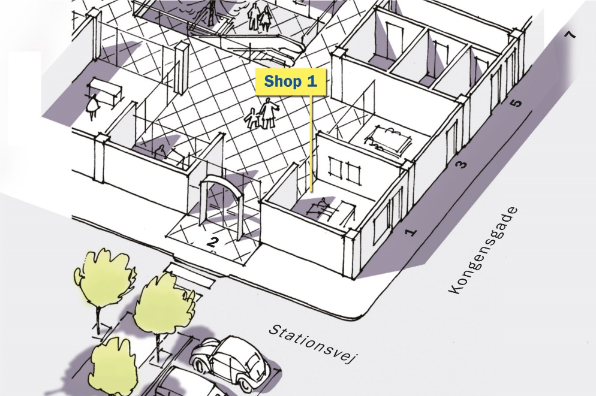

[.text-center]
*Figure N – Shopping centre situation (Detail)*

Remarks:

. In general, if it is a shop center with a common entrance which is the unique access to the shops from outside, all the shops addresses consist of: "número de policía" (address number e.g. 2), "escalera" (stairs, when there is more than one), "planta" (floor) and "número de identificación de local" (unit identifier). However, if there are shops with direct entrances from the outside (e. g. shops 1, 2, 3 and 4) their addresses will not be referred to the common address number (2) but to their own entrances which will have numbers as the numbering of the street where they are (e.g. 1, 3, 5, 7, on e.g. Royal street).

. The shop identification number allows identifying every shop located inside of the shop center. Nevertheless shops are also real state so they have also (as it happens with dwellings) a unique identification code employed in the tax control.

==== Assignment in Sweden

There are no official registers containing information on which shop is where inside a shopping center. The partitions are seldom stable and shops open and close down often. The owner of the premises is responsible.

[width="100%",cols=",,,,,,,,,,,,"]
|===
2+|Component |Name |Type |Main Entrance |Shop 1 |Shop 2
|Shop 3 |Shop 4 |Shop 5 |Shop 6 |Shop 7
|
13+h|AdminUnitsName (hierarchal)
|1 |AdminUnit1stOrder | | 9.6+|As in the previous example
|2 |AdminUnit2ndOrder | |
|3 |AdminUnit3rdOrder | |
|4 |AdminUnit4thOrder | |
|5 |AdminUnit5thOrder | |
|6 |AdminUnit6thOrder | |
13+h|AddressAreaName
| |Area 1 | | 9+|As in the previous example
13+h|ThoroughfareName
| |ThoroughfareNameValue |Gatuadressområdes-namn | 6+|Stationstreet 3+|Stationstreet
13+h|PostalDescriptor
| |PostName | | | | | | | | | | |
| |Postcode | | |* | | | | | | | |
13+h|Locator (hierarchal, ordered)
|1 |Designator 1 | |1 |2 |2 or 
2A ^1^) a|
2 or
2B ^2^)
|2 
2C ^2^) |2 
2D ^2^) a|
2
2E ^2^)
a|
2
2F ^2^)
a|
2
2G ^2^)
|
|2 |Designator 2 |^3^) |9 | | | | | | | | |
|===

Remarks:

* The postcode will probably be the same for all addresses.

. 2 It would be normal to use the sample addresses to show the shop belongs to the shopping center – but the shops will prefer the commercial name of the center.
+
2A if the shop is open when the rest of the center is closed.

. 2 or 2B for deliverers and as the personnel´s entrance

. Here could internal numbers be used. They will not be officially registered.

==== Assignment in Turkey

There are no official registers containing information on which shop is where inside a shopping center. But if there is a numbering system inside a shopping centre it will follow these rules:

[width="99%",cols=",,,,,,,,,,,,"]
|===
2+|Component |Name |Type |Main Entrance |Shop 1 |Shop 2 |Shop 3 |Shop 4 |Shop 5
|Shop 6 |Shop 7
|
13+h|AdminUnitsName (hierarchal)
|1 |AdminUnit1stOrder |Ülke | 9.6+|As in the previous example
|2 |AdminUnit2ndOrder |Il | 
|3 |AdminUnit3rdOrder |Ilçe | 
|4 |AdminUnit4thOrder |Bucak | 
|5 |AdminUnit5thOrder |Belediye / Köy | 
|6 |AdminUnit6thOrder |Mahalle | 
13+h|AddressAreaName
| |Area 1 | | 9+|As in the previous example
13+h|ThoroughfareName
| a|
ThoroughfareNameValue

{empty}[Streetname]

|CSBM | 9+^|Atatürk Bulv.
13+h|PostalDescriptor
| |PostName | | | | | | | | | | |
| |Postcode |Postakodu | 9+^|06100
13+h|Locator (optional hierarchal)
|1 |Designator 1 |Binalara numara |2 |2 | | | | | | | |
|2 |Designator 2 |Daire numara |9 |Z01 |Z02 | |Z03 |Z04 | | | | |
|===

Remarks: The second floor will be numbered 200, 201, 202,...

Shops on the ground floor are marked by a preceding "Z".

==== Assignment in the United Kingdom

[width="100%",cols=",,,,,,,,,,,,"]
|===
2+|Component |Name |Part of the Key? |Main Entrance |Shop 1
|Shop 2 |Shop 3 |Shop 4 |Shop 5 |Shop 6 |Shop 7 |
13+h|AdminUnitsName (hierarchal)
|1 |AdminUnit1stOrder | | 9.6+|As in the previous example
|2 |AdminUnit2ndOrder | |
|3 |AdminUnit3rdOrder | |
|4 |AdminUnit4thOrder | |
|5 |AdminUnit5thOrder | |
|6 |AdminUnit6thOrder | |
13+h|AddressAreaName
| |Area 1 |Administrative Area | 9.3+|As in the previous example
| |Area 2 |Town | 
| |Area 3 |Locality |
13+h|ThoroughfareName
| a|
ThoroughfareNameValue

{empty}[Streetname]

|Street | 9+|Station Street
13+h|PostalDescriptor
| |PostName | | 9+|
| |Postcode |Postcode | 9+|SW18 1ED
13+h|Locator (hierarchal, ordered)
|1 |Name |PAON |1 9+|West Quay Shopping Centre 2
|2 |Designator 1 |SAON |9 | |Unit 1 |Unit 2 |Unit 3 |Unit 4 |Unit 5 |Unit 6 |Unit 7 |
|===

Remarks:

All occupier names will be held as attributes on the individual Addressable Objects

The Building name and building (street) number will be held together in the PAON

==== Assigning Addresses to Industrial Areas

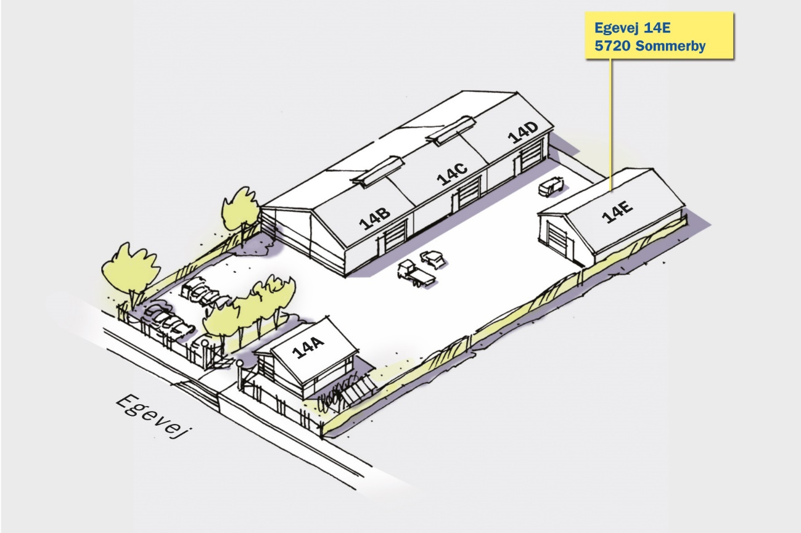

[.text-center]
*Figure O – Industrial area situation*

The industrial area may have either:

* a house number as a whole
* each enterprise / part of a plant has a number.

==== Assignment in Flanders

[width="99%",cols=",,,,,,,,,,,,"]
|===
2+|Component |Name |Part of the Key? |Main Entrance
|14A |14B |14C |14D |14E | | |
13+h|AdminUnitsName (hierarchal)
|1 |AdminUnit1stOrder | | 9.6+|As in the previous example
|2 |AdminUnit2ndOrder | |
|3 |AdminUnit3rdOrder | |
|4 |AdminUnit4thOrder | |
|5 |AdminUnit5thOrder | |
|6 |AdminUnit6thOrder | |
13+h|AddressAreaName
| |Area 1 | | 9.3+|As in the previous example
| |Area 2 | | 
| |Area 3 | |
13+h|ThoroughfareName
| a|
ThoroughfareNameValue

{empty}[Streetname]

| | 9+|2365894 (Egevey)
13+h|PostalDescriptor
| |PostName | | 9+|
| |Postcode | | 9+|2140
13+h|Locator (hierarchal, ordered)
|1 |Designator 1 | |1 | |14A |14B |14C |14D |14E | | |
|===

==== Assignment in the Czech Republic

There are a lot of possibilities:

* The whole area has unique house number or each building has own house number
* The municipality has or hasn't named streets
* The municipality uses or doesn't use street numbers

All of these cases are described in the previous examples.

(e.g. I) Municipality with streets and street numbers, each building has own building number

[width="99%",cols=",,,,,,,,,,,,"]
|===
2+|Component |Name |Part of the Key? |Main Entrance
|14A |14B |14C |14D |14E | | |
13+h|AdminUnitsName (hierarchal)
| |AdminUnit1stOrder |Stat | 9+^|Ceska republika
| |AdminUnit2ndOrder | | 9+|
| |AdminUnit3rdOrder |Okres | 9+^|Praha
| |AdminUnit4thOrder | | 9+|
| |AdminUnit5thOrder | | 9+|
| |AdminUnit6thOrder |Obec | 9+^|Praha
13+h|AddressAreaName
| |Area 1 |Cast obce | 9+^|Chodov
| |Area 2 | | 9+|
| |Area 3 | | 9+|
13+h|ThoroughfareName
| a|
ThoroughfareNameValue

{empty}[Streetname]

|Ulice | 9+|Egevej
13+h|PostalDescriptor
| |PostName |Posta | 9+^|Praha 41
| |Postcode |PSC | 9+^|149 00
13+h|Locator (optional hierarchal)
|1 |Designator 1 |Cislo domovni |5 |--- |582 3+|2015 |1901 | | |
|2 |Designator 2 |Cislo orientacni |2 |--- |14 |14 |14 |14 |14 | | |
|3 |Designator 3 |Pismeno cisla orientacniho |3 | |A |B |C |D |E | | |
|===

==== Assignment in Denmark

[width="100%",cols=",,,,,,,,,,,,"]
|===
2+|Component |Name |Type |Main Entrance
|14A |14B |14C |14D |14E | | |
13+h|AdminUnitsName (hierarchal)
| |AdminUnit1stOrder |Land | 9+^|Denmark
| |AdminUnit2ndOrder |---- | 9+^|
| |AdminUnit3rdOrder |Kommune | 9+^|Sommerby
| |AdminUnit4thOrder |---- | 9+^|
| |AdminUnit5thOrder |---- | 9+^|
| |AdminUnit6thOrder |---- | 9+^|
13+h|AddressAreaName
| |Area 1 |Supplerende bynavn | 9+^|
13+h|ThoroughfareName
| a|
ThoroughfareNameValue

{empty}[Streetname]

|Vejnavn | 9+^|Skolevej
13+h|PostalDescriptor
| |PostName |Postdistrikt | 9+^|
| |Postcode |Post-nummer | 9+^|5720
13+h|Locator (optional hierarchal)
|1 |Designator 1 |Husnummer |1 |--- |14A |14B |14C |14D |14E | | |
| | | | | | | | | | | | |
|===

==== Assignment in Germany

[width="100%",cols=",,,,,,,,,,,,"]
|===
2+|Component |Name |Type |Main Entrance
|14A |14B |14C |14D |14E | | |
13+h|AdminUnitsName (hierarchal)
| |AdminUnit1stOrder |Land | 9+^|Denmark
| |AdminUnit2ndOrder |---- | 9+^|
| |AdminUnit3rdOrder |Kommune | 9+^|Sommerby
| |AdminUnit4thOrder |---- | 9+^|
| |AdminUnit5thOrder |---- | 9+^|
| |AdminUnit6thOrder |---- | 9+^|
13+h|AddressAreaName
| |Area 1 |Supplerende bynavn | 9+^|
13+h|ThoroughfareName
| a|
ThoroughfareNameValue

{empty}[Streetname]

|Vejnavn | 9+^|Skolevej
13+h|PostalDescriptor
| |PostName |Postdistrikt | 9+^|
| |Postcode |Post-nummer | 9+^|5720
13+h|Locator (optional hierarchal)
|1 |Designator 1 |Husnummer |1 |--- |14A |14B |14C |14D |14E | | |
| | | | | | | | | | | | |
|===

In Denmark the addressable object is the entrance doors to the buildings, so even though this area is only one property and even though it perhaps only have one delivery point for post, the best practice for the municipality is to assign one "access address" (= one address number) for each entrance door. This way it is ensured that each business entity will have its own address and that rescue services, utility services etc. easily can locate the individual unit.

In this example it has, for some reason, been decided to use additional letters A, B, C etc. in the address number. In Denmark address numbers with and without an additional letters (litra) are equal; if it exists, the letter is an integrated part of the designator.

==== Assignment in the Netherlands

[width="100%",cols=",,,,,,,,,,,,"]
|===
2+|Component |Name |Type |Main Entrance
|14A |14B |14C |14D |14E | | |
13+h|AdminUnitsName (hierarchal)
| |AdminUnit1stOrder | | 9.6+|As in the previous example
| |AdminUnit2ndOrder | |
| |AdminUnit3rdOrder | |
| |AdminUnit4thOrder | |
| |AdminUnit5thOrder | |
| |AdminUnit6thOrder | |
13+h|AddressAreaName
| |Area 1 | | 9+|As in the previous example
13+h|ThoroughfareName
| a|
ThouroughFareName

{empty}[Streetname]

|Naam openbare ruimte | 9+|Egevej
13+h|PostalDescriptor
| |PostName | | 9+|
| |Postcode | | 9+|
13+h|Locator (hierarchal, ordered) Level 3: unit level: nummeraanduiding van verblijfsobject, standplaats, ligplaats
| |Designator 1 |Huisnummer |2 | |14 | | | | | | |
| |Designator 2 |Huisletter |3 | |A | | | | | |  |
| |Designator 3 |huisnummertoevoeging |4 | | | | | | | | |
| | | | | | | | | | | | | |
|===

Remarks:

The question whether an object gets an address depends on the question if the (part of the) building meets the Dutch definition of an addressable object. If it is obvious that all buildings of this industrial complex belong to the same Main Building 14A (where for example the reception and the office are from where the rest of the industrial area is managed) then it is not necessary to give addresses to all buildings and then only the Main Building will be an addressable object and gets an address.

==== Assignment in Spain

[width="100%",cols=",,,,,,,,,,,,"]
|===
2+|Component |Name |Type |Main Entrance
|14A |14B |14C |14D |14E | | |
13+h|AdminUnitsName (hierarchal)
|1 |AdminUnit1stOrder | | 9.6+|As in the previous example
|2 |AdminUnit2ndOrder | |
|3 |AdminUnit3rdOrder | |
|4 |AdminUnit4thOrder | |
|5 |AdminUnit5thOrder | |
|6 |AdminUnit6thOrder | |
13+h|AddressAreaName
| |Area 1 | | 9+|As in the previous example
13+h|ThoroughfareName
| a|
ThoroughfareNameValue

{empty}[Streetname]

|Nombre de Vía | 9+|
Calle Egevej
410390000001(streetnamecode)
13+h|PostalDescriptor
| |PostName | | 9+|
| |Postcode |Código Postal | 9+|41037
13+h|Locator (optional hierarchal)
| |Designator 1 |Portal o Número de Policía |1 |14 | | | | | | | |
| |Designator 2 |Entrada |6 | |A |B |C |D |E | | |
| | | | | | | | | | | | | |
|===

Remarks:

Comment 1: The address number which allows identifying the whole industrial area can or not exist. Therefore it is possible that a building located inside the industrial area (e.g. building 14 A) is identified from two LocatorElements: Address Number: 14, and, Entrance Number:14 A.

In other cases there is not a general building number for the whole industrial area and so, an address number is directly assigned to each building. Thus, there would be one LocatorElement:

[width="100%",cols="9%,19%,14%,5%,6%,6%,8%,6%,6%,6%,6%,5%,4%",options="header",]
|===
|Locator (optional hierarchal) | | | | | | | | | | | |
|1 |Designator 1 |Portal o Número de Policía |1 | |14 A |14 B |14 C |14 D |14 E | | |
|===

==== Assignment in Sweden

Industrial areas can be handled in a lot of ways. There are no formal rules or requirements, only recommendations.

The prime recommendation is that every entrance gets its own number as in the Danish example above. It will normally be very difficult for the municipality to keep address assigning up with changes in entrances for persons or deliveries. 
The next recommendation is that every building or obviously separate part of a building (as in the example numbers 14B, 14C and 14D) gets its own number. Some buildings may be considered not needing any addresses of their own. But that information is an attribute to the building, not an address matter.

If the industrial site contains only one enterprise and is fenced and the gate is guarded, then just one address to the gate can be enough. In that case all responsibility to inform and guide deliverers, visitors, rescue service, and so forth should be on the enterprise – at least in theory.

In cases where an industrial site, a former military camp or a hospital area has been split up and developed for a number of industrial or commercial enterprises the recommended solution is that internal "streets" are given street names and entrances are numbered the normal way. Street names can also be assigned to private roads and streets after hearing the owners. Sometimes the owners already use their own address system. If those addresses are constructed in accordance with national and municipal standard and recommendations they can be approved by the municipality.

[width="99%",cols=",,,,,,,,,,,,"]
|===
2+|Component |Name |Type |Main Entrance
|14A |14B |14C |14D |14E | | |
13+h|AdminUnitsName (hierarchal)
|1 |AdminUnit1stOrder | | 9.6+|As in the previous example
|2 |AdminUnit2ndOrder | |
|3 |AdminUnit3rdOrder | |
|4 |AdminUnit4thOrder | |
|5 |AdminUnit5thOrder | |
|6 |AdminUnit6thOrder | |
13+h|AddressAreaName
| |Area 1 | | 9+|As in the previous example
13+h|ThoroughfareName
| |ThoroughfareNameValue |Gatuadressområdesnamn | 9+|Industrigatan
13+h|PostalDescriptor
| |PostName | | 9+|
| |Postcode | | 9+|
13+h|Locator (optional hierarchal)
|1 |Designator 1 |Gatuadressplatsnamn |1 |(14) |14A |14B |14C |14D |14E | | |
|2 |Designator 2 | |7 | |^1^) | | | | | | |
|===

. in case two or more different units with different stairwells inside the building use the same door, a stairwell descriptor can be used, e.g. U1 and U2

==== Assignment in Turkey

[width="99%",cols=",,,,,,,,,,,,"]
|===
2+|Component |Name |Type |Main Entrance
|14A |14B |14C |14D |14E | | |
13+h|AdminUnitsName (hierarchal)
|1 |AdminUnit1stOrder | | 9.6+|As in the previous example
|2 |AdminUnit2ndOrder | |
|3 |AdminUnit3rdOrder | |
|4 |AdminUnit4thOrder | |
|5 |AdminUnit5thOrder | |
|6 |AdminUnit6thOrder | |
13+h|AddressAreaName
| |Area 1 | | 9+|As in the previous example
13+h|ThoroughfareName
| a|
ThoroughfareNameValue

{empty}[Streetname]

|CSBM | 9+^|Atatürk Bulv.
13+h|PostalDescriptor
| |PostName | | 9+|
| |Postcode |Postakodu | 9+^|06100
13+h|Locator (optional hierarchal)
|1 |Designator 1 |Binalara numara |2 |14 |14 |14 |14 |14 | | | |
|2 |Designator 2 |? Numara |3 | |A |B |C |D |E | | |
| | | | | | | | | | | ||
|===

==== Assignment in the United Kingdom

[width="100%",cols=",,,,,,,,,"]
|===
2+|Component |Name |Type |Industrial Estate |14a |14b |14c |14d |14e
10+h|AdminUnitsName (hierarchal)
|1 |AdminUnit1stOrder |Administrative Area | 6+|As previous examples
|2 |AdminUnit2ndOrder | | 6+|
|3 |AdminUnit3rdOrder | | 6+|
|4 |AdminUnit4thOrder | | 6+|
|5 |AdminUnit5thOrder | | 6+|
|6 |AdminUnit6thOrder | | 6+|
10+h|AddressAreaName
| |Area 1 |Town | 6+|As previous examples
| |Area 2 |Locality | 6+|As previous examples
| |Area 3 | | 6+|
10+h|ThoroughfareName
| a|
ThoroughfareNameValue

{empty}[Streetname]

|Street | 6+|As previous examples
10+h|PostalDescriptor
| |PostName | | 6+|
| |Postcode |Postcode | 6+|As previous examples
10+h|Locator (hierarchal, ordered)
|1 |Attribute 1 |PAON |1 6+|New Works Industrial Estate
|2 |Attribute 2 |SAON |9 | |Unit 14a |Unit 14b |Unit 14c |Unit 14d |Unit 14e
|===

Remarks:

In all cases where a number of children exist for a parent record, in this case units on an industrial estate, a parent record has to be created and all of the child records will record the appropriate parent reference number. It is not necessary, although it is likely, that all of the children hold the parent locator as part of their address.

==== Assigning Addresses to Houses in rural Areas

The village may have either:

* a unique name for the village
* no streetnames

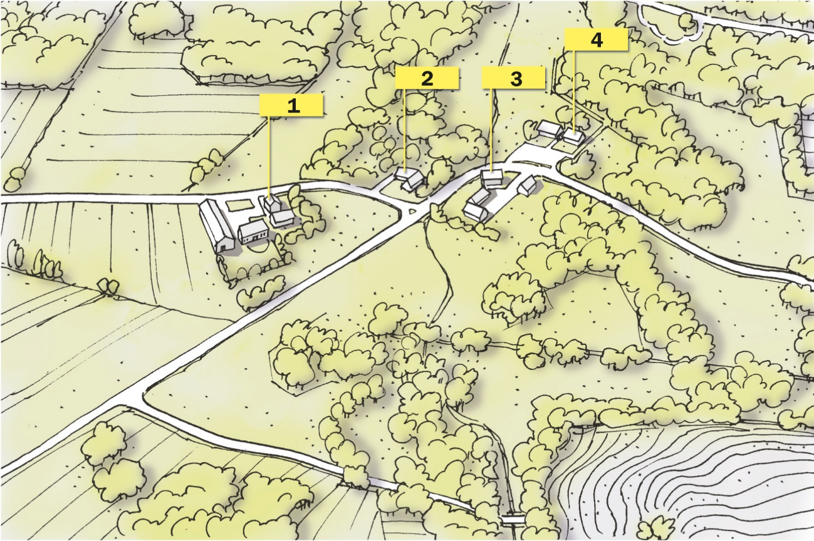

[.text-center]
*Figure P – Rural area situation*

==== Assignment in Flanders

[width="99%",cols=",,,,,,,,,,,,"]
|===
2+|Component |Name |Type |House 1 |House 2 |House 3
|House 4 | | | | |
13+h|AdminUnitsName (hierarchal)
|1 |AdminUnit1stOrder | | 9.6+|As in the previous example
|2 |AdminUnit2ndOrder | |
|3 |AdminUnit3rdOrder | |
|4 |AdminUnit4thOrder | |
|5 |AdminUnit5thOrder | |
|6 |AdminUnit6thOrder | |
13+h|AddressAreaName
| |Area 1 | | 9+|As in the previous example
13+h|ThoroughfareName
| a|
ThouroughFareName

{empty}[Streetname]

| | 9+|5879251 (streetnamecode of the assigned streetname)
13+h|PostalDescriptor
| |PostName | | 9+|
| |Postcode | | 9+|2140
13+h|Locator (hierarchal, ordered)
|1 |Designator 1 | |1 |1 |2 | |3 |4 | | | | |
|===

==== Assignment in the Czech Republic

[width="99%",cols=",,,,,,,,,,,,"]
|===
2+|Component |Name |Type |House 1 |House 2 |House 3
|House 4 | | | | |
13+h|AdminUnitsName (hierarchal)
| |AdminUnit1stOrder |Stat | 9+^|Ceska republika
| |AdminUnit2ndOrder | | 9+|
| |AdminUnit3rdOrder |Okres | 9+^|Svitavy
| |AdminUnit4thOrder | | 9+|
| |AdminUnit5thOrder | | 9+|
| |AdminUnit6thOrder |Obec | 9+^|Morasice
13+h|AddressAreaName
| |Area 1 |Cast obce | 9+^|Rikovice
13+h|ThoroughfareName
| a|
ThoroughfareNameValue

{empty}[Streetname]

|Ulice | 13+^|---
13+h|PostalDescriptor
| |PostName |Posta | 9+^|Litomysl
| |Postcode |PSC | 9+^|570 01
13+h|Locator (optional hierarchal)
|1 |Designator 1 |Cislo domovni |5 |1 |2 |3 |4 | | | | |
|===

==== Assignment in Denmark

[width="100%",cols=",,,,,,,,,,,,"]
|===
2+|Component |Name |Type |House 1 |House 2 |House 3 |House 4 | | | | |
13+h|AdminUnitsName (hierarchal)
| |AdminUnit1stOrder |Land | 9+^|Denmark 
| |AdminUnit2ndOrder |---- | 9+|
| |AdminUnit3rdOrder |Kommune | 9+^|Sommerby
| |AdminUnit4thOrder |---- | 9+|
| |AdminUnit5thOrder |---- | 9+|
| |AdminUnit6thOrder |---- | 9+|
13+h|AddressAreaName
| |Area 1 |Supplerende bynavn | 9+^|Østermark
13+h|ThoroughfareName
| a|
ThoroughfareNameValue

{empty}[Streetname]

| | 9+^|Østermarksvej
13+h|PostalDescriptor
| |PostName | | 9+|
| |Postcode | | 9+|
13+h|Locator (optional hierarchal)
|1 |Designator 1 | |1 |1 |3 |5 |7 |... | | | |
|===

In Denmark all public and all common private roads must have a road name (and a road code), likewise for any private road or footpath which is used as a connection for addresses; as a result there are no rural settlements without road names. So in this example addresses are assigned in the normal way with odd and even address numbers on each side of the named thoroughfare (road, dirt road, foot path etc.).

For some small islands without a proper road network, the road name could be assigned to the area in general. In this case the name of the island or settlement replaces the thoroughfare name.

==== Assignment in Germany

[width="100%",cols=",,,,,,,,,,,,"]
|===
2+|Component |Name |Type |House 1 |House 2 |House 3 |House 4
| | | | |
13+h|AdminUnitsName (hierarchal)
| |AdminUnit1stOrder |Staat | 9+|Deutschland
| |AdminUnit2ndOrder |Land | 9+|Sachsen
| |AdminUnit3rdOrder |Regierungsbezirk | 9+|Dresden
| |AdminUnit4thOrder |Kreis | 9+|Pirna
| |AdminUnit5thOrder |Stadt /Gemeinde | 9+|Rosental / Sachsen
| |AdminUnit6thOrder |----- | 9+|
13+h|AddressAreaName
| |Area 1 |Ortsteil | 9+|----
13+h|ThoroughfareName
| a|
ThoroughfareNameValue

{empty}[Streetname]

|Strasse | 9+|----
13+h|PostalDescriptor
| |PostName | | 9+|
| |Postcode |Postleitzahl | 9+|09732
13+h|Locator (optional hierarchal)
|1 |Designator 1 |Hausnummer |2 |1 |2 |3 |117 | | |117 | |
|2 |Designator 2 |Hausnummernzusatz |3 | | | |B | | |B | |
|===

==== Assignment in the Netherlands

This situation does not occur in the Netherlands. There will always have to be a ThoroughFare (streetname, "naam openbare ruimte") in addresses.

==== Assignment in Spain

[width="100%",cols=",,,,,,,,,,,,"]
|===
2+|Component |Name |Type |House 1 |House 2 |House 3 |House 4 | | | | |
13+h|AdminUnitsName (hierarchal)
|1 |AdminUnit1stOrder | | 9.6+|As in the previous example
|2 |AdminUnit2ndOrder | |
|3 |AdminUnit3rdOrder | |
|4 |AdminUnit4thOrder | |
|5 |AdminUnit5thOrder | |
|6 |AdminUnit6thOrder | |
13+h|AddressAreaName
| |Area 1 | | 9+|As in the previous example
13+h|ThoroughfareName
| a|
ThoroughfareNameValue

{empty}[Streetname]

|Nombre de Vía | 9+|Kasaba Yolu road
13+h|PostalDescriptor
| |PostName | | 9+|
| |Postcode |Código Postal | 9+|41037
13+h|Locator (optional hierarchal)
|1 |Designator 1 |Punto Kilométrico |11 |KP 5 |KP 5 |KP 5 |KP 5 | | | | |
|2 |Designator 2 |Portal o Número de Policía |1 |1 |2 |3 |4 | | | | |
|===

Remarks:

Comment 1: Once located inside a municipality two cases can happen:

. There are neither Street Names nor Buildings Numbers. In this case the Address Components used are: Address Area, Postcode, ThoroughFareName and Locators. ThoroughFareName is filled out with the nearest road name which access to the village and the locator used for each house is the kilometer point in which every house is located (KP 5 in the example). If there is any kind of additional descriptive information it is also stored.

. There are not Street Names but there are Buildings Numbers.
+
In this case the address components consist of address area, postcode, and locator (1, 2, and 3 in the example) and, if it exists, also any kind of additional descriptive information it is also stored.

GENERAL COMMENT:

In any case any building is always identified by a cadastral identification code in the Cadastral Register but that information is only used for cadastral applications not for addresses uses (like e.g. postal use) so it is not included as a LocatorElement

==== Assignment in Sweden

Unique names for small villages, settlements and single farms or houses but no recorded road or street names are the normal situation in rural areas. Farms and houses are often scattered and dense (originally) rural villages exist only in some parts of Sweden.

The "village address areas" (byadressområden) are constructed and the unique names are chosen from different points of view:

. Is there a well defined area known by an in a larger neighbourhood unique name? 
. Is there a historic or cadastral name that can be used to describe the area?
. Which settlements, farms and houses are closely related by the transport network?
. Which names are indicated on official maps in scales 1:50 000 or 1:100 000?

If there are smaller groups of buildings, farms or houses known by a, within the address area, unique and well known name an extra level can be used, "farm address area" (gårdsadressområde).

"Byadressområden" and "gårdsadressområden" are equivalent to "gatuadressområden". The differences are that numbering need not be done relative to one road and that the names describe real places; they are contrary to road and street names not constructed

Numbering can be done either with unique numbers for the whole village address area or with a unique number series in every farm address area and another numbering series for those addresses that don´t belong to any farm address area. (The first model is recommended.) The second example below shows a mix of models that is quite common. If needed to avoid renumbering when extra addresses are needed (as in the Turkish example with 3/1) the number can be extended by a letter, e.g. 3A.

[width="100%",cols=",,,,,,,,,,,,"]
|===
2+|Component |Name |Type |House 1 |House 2 |House 3 |House 4 | | | | |
13+h|AdminUnitsName (hierarchal)
|1 |AdminUnit1stOrder | | 9.6+|As in the previous example
|2 |AdminUnit2ndOrder | | 
|3 |AdminUnit3rdOrder | | 
|4 |AdminUnit4thOrder | | 
|5 |AdminUnit5thOrder | |
|6 |AdminUnit6thOrder | |
13+h|AddressAreaName
| |Area 1 |Kommundel (optional) | 9.3+|
Farsta = = =

Eriksberg = = =

Södergården = --- Skogstorp
| |Area 2 |Byadressområde (mandatory) |
| |Area 3 |Gårdsadressområde (optional) |
13+h|ThoroughfareName
| a|
ThoroughfareNameValue

{empty}[Streetname]

|--- | 9+|
13+h|PostalDescriptor
| |PostName | | 9+|
| |Postcode |Postnummer ^1^) | 9+|
13+h|Locator (optional hierarchal)
|1 |Designator 1 |Byadressplats or gårdsadressplats ^2^) |1 |1 |2 |3 (or 1) |22 (or 1) | | | | |
|===

. Postnummer (The town name is normally the name of a neighbouring city or town)

. Byadressplats or gårdsadressplats depending on whether there is a gårdsadressområde.

Example Sweden 1

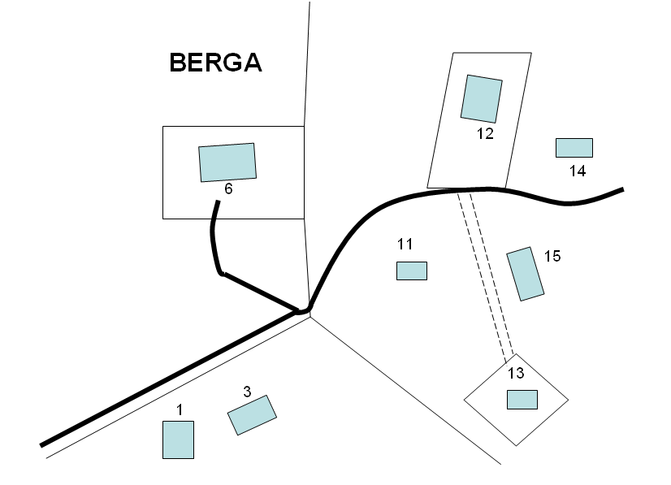

[.text-center]
*Figure Q – Rural area situation*

Figure Q shows a quite simple example. The village name is Berga and the numbering is similar to street numbering.

Example Sweden 2

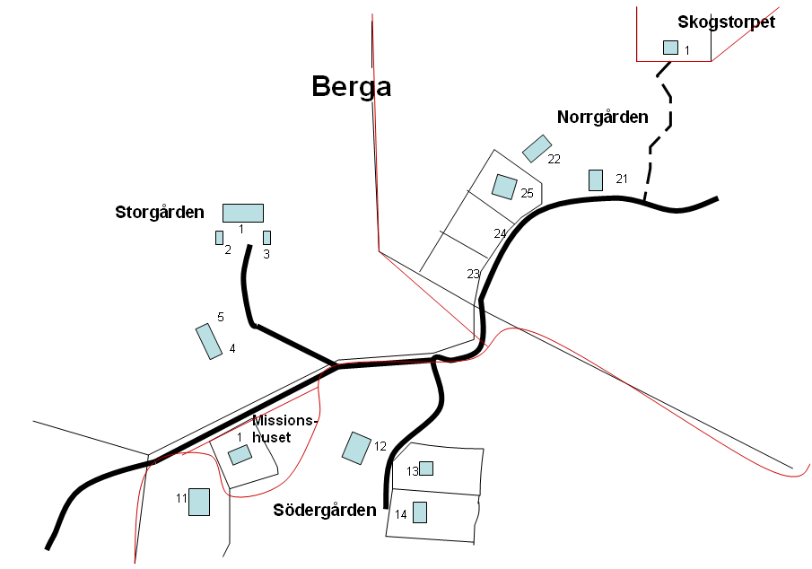

[.text-center]
*Figure R – Rural area situation*

Figure R shows a situation where the village area name is Berga and all addresses contain also a farm address area name. (Boundaries between farm address areas are thin red lines.) There are different numbering systems used in different farm address areas. Of the five different farm address area names two (Missionshuset and Skogstorpet) are derived from house names while the other names represent a larger area, in these cases originally a farm. Unbuilt plots are assigned addresses, see Berga Norrgården 23 and 24. Also in rural areas shall every entrance leading to a dwelling have its own address, see Berga Storgården 4 and 5. In the case of Berga Storgården (the name Storgården implicates it was originally the biggest farm in the village) numbering is done with the main entrance to the manor as number 1 to indicate its importance.

Example Sweden 3

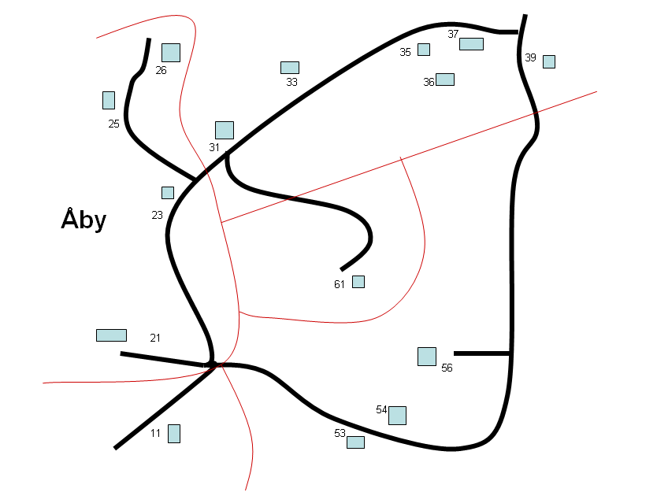

[.text-center]
*Figure S – Rural area situation*

Figure S, shows an example where there are no farm address area names. The village address area name Åby covers a large area with a complex transport network. The numbering is as much as possible done on basis of the transport network with different number groups for addresses along different roads. Some numbers are not used as a help to the visitor to understand relative positions.

==== Assignment in Turkey

[width="99%",cols=",,,,,,,,,,,,"]
|===
2+|Component |Name |Type |House 1 |House 2 |House 3 |House 4
| | | | |
13+h|AdminUnitsName (hierarchal)
|1 |AdminUnit1stOrder |Ülke | 9.6+|As in the previous example   
|2 |AdminUnit2ndOrder |Il |
|3 |AdminUnit3rdOrder |Ilçe |
|4 |AdminUnit4thOrder |Bucak |
|5 |AdminUnit5thOrder |Belediye/Köy |
|6 |AdminUnit6thOrder |Mahalle |
13+h|AddressAreaName
| |Area 1 | | 9+|As in the previous example
13+h|ThoroughfareName
| a|
ThoroughfareNameValue

{empty}[Streetname]

|CSBM | 9+|
13+h|PostalDescriptor
| |PostName | | 9+|
| |Postcode |Postakodu | 9+^|06100
13+h|Locator (optional hierarchal)
|1 |Designator 1 |Binalara numara |2 |1 |2 |3 |7 | | | | |
|===

Remarks: Big villages use Mahalle to differentiate street names

Small Villages have only one Muchta but may be responsible for several Mahalles and street names unofficial.

==== Assignment in the United Kingdom

[width="100%",cols=",,,,,,,,,"]
|===
2+|Component |Name |Type |House 1 |House 2 |House 3 |House 4 | |
10+h|AdminUnitsName (hierarchal)
|1 |AdminUnit1stOrder |Administrative Area | 6+|As previous examples
|2 |AdminUnit2ndOrder | | 6+|
|3 |AdminUnit3rdOrder | | 6+|
|4 |AdminUnit4thOrder | | 6+|
|5 |AdminUnit5thOrder | | 6+| 
|6 |AdminUnit6thOrder | | 6+|
10+h|AddressAreaName
| |Area 1 |Town | 6+|Small Settlement
| |Area 2 |Locality | 6+| 
| |Area 3 | | | 6+|
10+h|ThoroughfareName
| a|
ThoroughfareNameValue

{empty}[Streetname]

|Street | 6+|Road from A429 to Small Settlement
10+h|PostalDescriptor
| |PostName | | 6+|
| |Postcode |Postcode | 6+|As previous examples
10+h|Locator (hierarchal, ordered)
|1 |Attribute 1 |PAON |1 |1 |2 |3 |4 | |
|===

Remarks:

All properties have to be related to a thoroughfare. Where there is no road running through a settlement, as in the example shown, the thoroughfare will be defined as the last thoroughfare traversed in order to gain access to the property or properties. These thoroughfares may have approved names, as allocated by the relevant local authority or descriptive names as in the example shown above.

<<<
[appendix]
== Address Assignment Examples for Descriptive Locators - (informative)

=== Scope

The Annexes D and E contain the results of the TWG survey of address assignment that was used as input to the specification process. In the course of the specification development it became clear that there were addresses in certain Member States, particularly in rural areas that lacked even basic structure but were essential entries in the dataset. Annex F represents a small collection of examples how to implement addresses in these situations using the specification.

The TWG Addresses was not able to collect and describe as complete a set of representative cases as had been possible as a result of the survey. It is therefore accepted that the examples are very limited and may not be representative. However, we believe they will still be of use in deciding how to use the specification in these special but important cases.

The TWG hopes that in the course of the time, this collection may be extended by the INSPIRE Community.

=== Introduction

The examples are drawn from Spain and the United Kingdom and are illustrated with map extracts.

This part of the document is not intended to provide definitive guidance. The Member State may not be able to use the conventions adopted in these cases for reasons of retaining consistency with other aspects of their implementation of the specification.

=== Examples

==== Spain: Address located by kilometer point 

[.text-center]
_Carretera Nacional III Madrid-Valencia Punto kilométrico 9_
_28031 Madrid (Madrid)_
_Spain_

This is an example of address which is defined with Kilometer Point as locator type. It consists of the following address components:

AdminUnits:

* AdminUnitLevel3 (Province): Madrid
* AdminUnitLevel4 (Municipality): Madrid

ThoroughFareName: Carretera Nacional III Madrid-Valencia

PostalDescriptor

* PostCode: 28031

Locator:

* Punto kilométrico 9

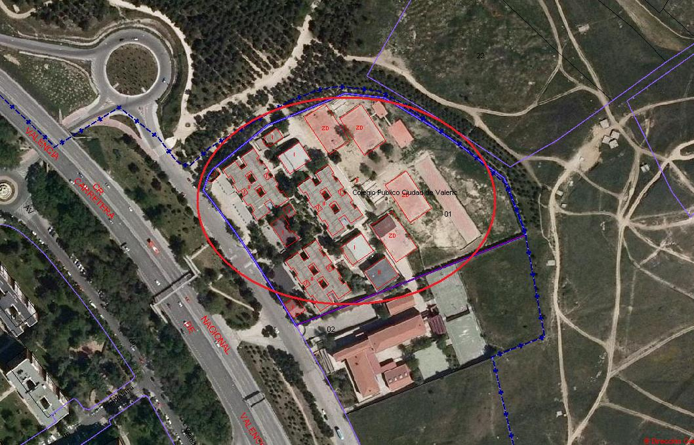

[.text-center]
*Figure T – Address with kilometre point (ES)*

[width="100%",cols="8%,32%,25%,4%,31%",options="header",]
|===
|Component | |Name in Spain | |Value
h|Admin Units (hierarchal) h| h| h| h|
|1 |AdminUnit1stOrder |Reino | |España
|2 |AdminUnit2ndOrder |Comunidad Autónoma | |
|3 |AdminUnit3rdOrder |Provincia | |Madrid
|4 |AdminUnit4thOrder |Término Municipal, Ciudad Autónoma (Condominio) | |Madrid
|5 |AdminUnit5thOrder |---- | |
|6 |AdminUnit6thOrder |---- | |
h|AddressAreaName h| h| h| h|
| |Name1 |Entidad de población | |
h|ThoroughFareName h| h| h| h|
| a|
ThoroughFareNameValue

{empty}[Streetname]

|Nombre de Via | |Carretera Nacional III Madrid-Valencia
h|PostalDescriptor h| h| h| h|
| |PostName | | |
| |Postcode |Código postal | |28031
h|Locator (hierarchal, ordered) h| h| h| h|
| |LocatorDesignatorName | | |Punto kilométrico 9
| |LocatorDesignatorTypeValue |PK (Punto Kilométrico) | |kilometerPoint
|===

==== Example of addresses with name from United Kingdom

[.text-center]
_Adressees name_
_Jackson_
_Gosforth, Copeland_
_CA19 1YB_
_United Kingdom_

In this example, a personal name is used in the Locator as a placeholder while a dispute is settled over the Building Name/Number. In the records this is identified by the name within brackets. The name is used within the dataset with permission of the owners and meets the U.K. Data Protection Act.

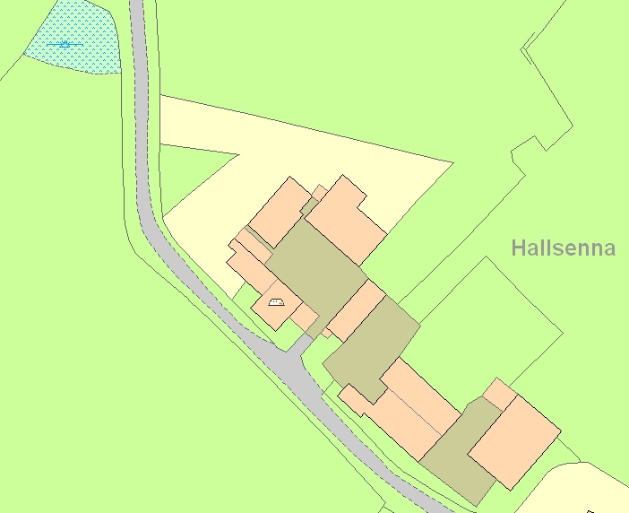

[.text-center]
*Figure U – Address with name (UK)*

[width="100%",cols="8%,32%,25%,4%,31%",options="header",]
|===
|Component | |Name in UK | |Value
h|Admin Units (hierarchal) h| h| h| h|
|1 |AdminUnit1stOrder |Country | |United Kingdom
|2 |AdminUnit2ndOrder |County or Unitary Authority | |
|3 |AdminUnit3rdOrder |---- | |
|4 |AdminUnit4thOrder |---- | |
|5 |AdminUnit5thOrder |District | |Copeland
|6 |AdminUnit6thOrder |---- | |
h|AddressAreaName h| h| h| h|
| |Name 1 |Town | |
| |Name 2 |Locality | |Gosforth
| |Name 3 |---- | |
h|ThoroughFareName h| h| h| h|
| a|
ThoroughFareNameValue

{empty}[Streetname]

|Street | |
h|PostalDescriptor h| h| h| h|
| |PostName |---- | |
| |Postcode |Postcode | |CA19 1YB
h|Locator (hierarchal, ordered) h| h| h| h|
| |LocatorDesignatorName | | |(Jackson)
| |LocatorDesignatorTypeValue | | |buildingIdentifier
|===

==== Example of with name from United Kingdom

[.text-center]
_Multi-storey car park at Southampton Magistrates Courts_
_Carlton Crescent_
_Southampton, Bevois_
_SO17 1EY_
_United Konfdom_

A descriptive name is given in the Locator for instances where an addressable object cannot be uniquely identified by its name – this is a combination of the _type_ of object and its relation to another addressable object. Another example would be 'Pavilion 30m from 160 Abbots Way'.

Note that the DS does not describe _which_ types of objects you must include – but this method does

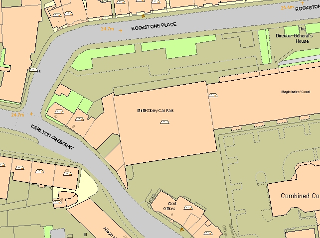

[.text-center]
*Figure V – Address with name (UK)*

[width="100%",cols="8%,32%,25%,4%,31%",options="header",]
|===
|Component | |Name in UK | |Value
h|Admin Units (hierarchal) h| h| h| h|
|1 |AdminUnit1stOrder |Country | |United Kingdom
|2 |AdminUnit2ndOrder |County or Unitary Authority | |
|3 |AdminUnit3rdOrder |---- | |
|4 |AdminUnit4thOrder |---- | |
|5 |AdminUnit5thOrder |District | |City of Southampton
|6 |AdminUnit6thOrder |---- | |
h|AddressAreaName h| h| h| h|
| |Name 1 |Town | |Southampton
| |Name 2 |Locality | |Bevois
| |Name 3 |---- | |
h|ThoroughFareName h| h| h| h|
| a|
ThoroughFareNameValue

{empty}[Streetname]

|Street | |Carlton Crescent
h|PostalDescriptor h| h| h| h|
| |PostName |---- | |
| |Postcode |Postcode | |SO17 1EY
h|Locator (hierarchal, ordered) h| h| h| h|
| |LocatorName | | |Multi-storey car park at Southampton Magistrates Courts
| |LocatorLevel | | |siteLevel
|===
