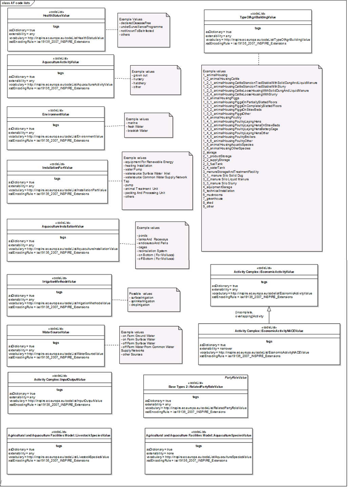
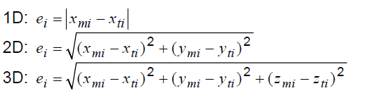
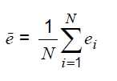
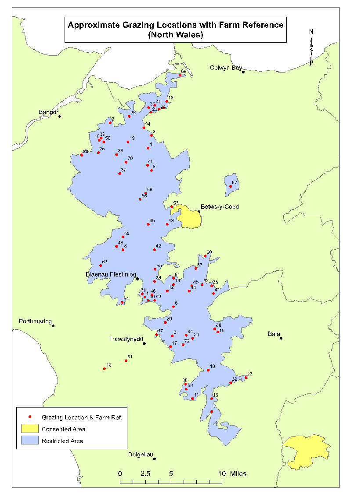
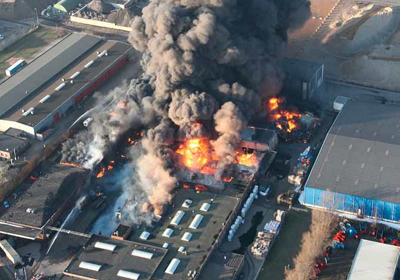
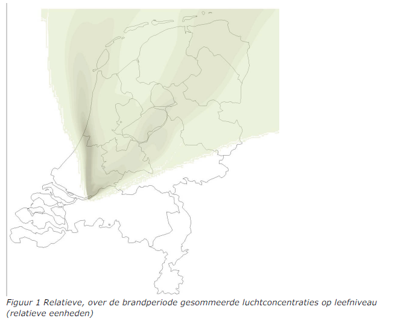
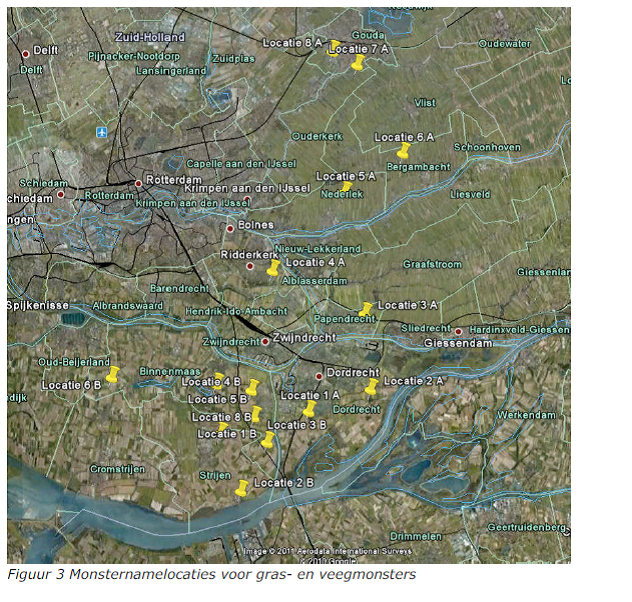
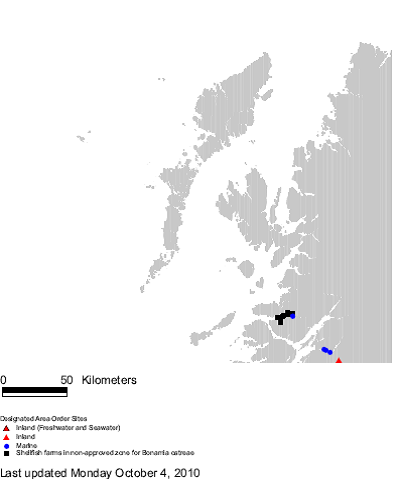
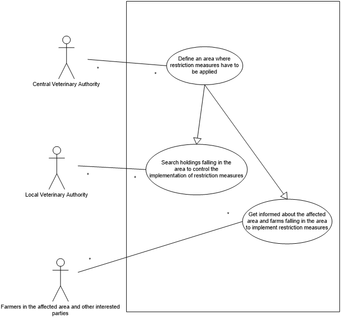
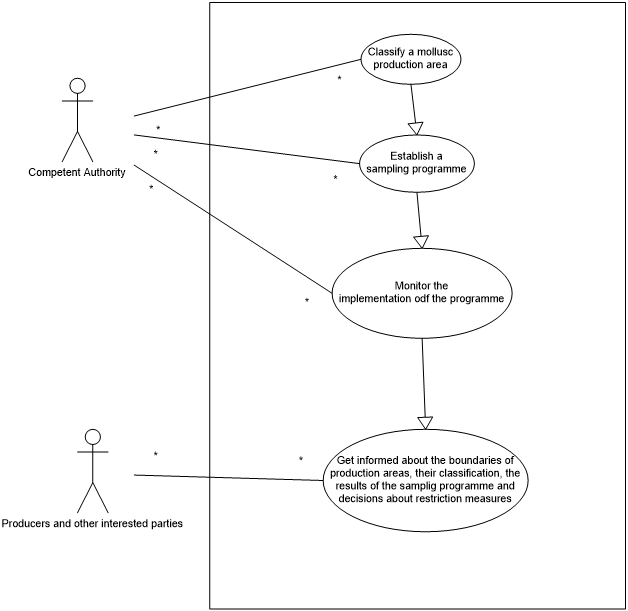

// Admonition icons:
// IR Requirement
:important-caption: 📕
// TG Requirement
:tip-caption: 📒
// Recommendation
:note-caption: 📘

// TOC placement using macro (manual)
:toc: macro

// Empty TOC title (the title is in the document)
:toc-title:

// TOC level depth
:toclevels: 5

// Section numbering level depth
:sectnumlevels: 8

// Line Break Doc Title
:hardbreaks-option:

:appendix-caption: Annex

image::./media/image2.jpeg[image,width=131,height=90, align=center]

image:./media/image3.png[image,width=93,height=93, align=center] **INSPIRE** *Infrastructure for Spatial Information in Europe*

[discrete]
= D2.8.III.9 Data Specification on _Agricultural and Aquaculture Facilities_ – Technical Guidelines

[cols=",",]
|===
|*Title* |D2.8.III.9 INSPIRE Data Specification on _Agricultural and Aquaculture Facilities_ – Technical Guidelines
|*Creator* |INSPIRE Thematic Working Group _Agricultural and Aquaculture Facilities_
|*Date* |2013-12-10
|*Subject* |INSPIRE Data Specification for the spatial data theme _Agricultural and Aquaculture Facilities_
|*Publisher* |European Commission Joint Research Centre
|*Type* |Text
|*Description* |This document describes the INSPIRE Data Specification for the spatial data theme _Agricultural and Aquaculture Facilities_
|*Contributor* |Members of the INSPIRE Thematic Working Group _Agricultural and Aquaculture Facilities_
|*Format* |Portable Document Format (pdf)
|*Source* |
|*Rights* |Public
|*Identifier* |D2.8.III.9_v3.0
|*Language* |En
|*Relation* |Directive 2007/2/EC of the European Parliament and of the Council of 14 March 2007 establishing an Infrastructure for Spatial Information in the European Community (INSPIRE)
|*Coverage* |Project duration
|===

<<<
[discrete]
== Foreword
[discrete]
== How to read the document?

This document describes the _"INSPIRE data specification on Agricultural and Aquaculture Facilities – Technical Guidelines"_ version 3.0 as developed by the Thematic Working Group (TWG) _TWG AF_ using both natural and a conceptual schema language.

The data specification is based on a common templatefootnote:[The common document template is available in the "Framework documents" section of the data specifications web page at http://inspire.jrc.ec.europa.eu/index.cfm/pageid/2] used for all data specifications, which has been harmonised using the experience from the development of the Annex I, II and III data specifications.

This document provides guidelines for the implementation of the provisions laid down in the Implementing Rule for spatial data sets and services of the INSPIRE Directive. It also includes additional requirements and recommendations that, although not included in the Implementing Rule, are relevant to guarantee or to increase data interoperability.

Two executive summaries provide a quick overview of the INSPIRE data specification process in general, and the content of the data specification on _Agricultural and Aquaculture Facilities_ in particular. We highly recommend that managers, decision makers, and all those new to the INSPIRE process and/or information modelling should read these executive summaries first.

The UML diagrams (in Chapter 5) offer a rapid way to see the main elements of the specifications and their relationships. The definition of the spatial object types, attributes, and relationships are included in the Feature Catalogue (also in Chapter 5). People having thematic expertise but not familiar with UML can fully understand the content of the data model focusing on the Feature Catalogue. Users might also find the Feature Catalogue especially useful to check if it contains the data necessary for the applications that they run. The technical details are expected to be of prime interest to those organisations that are responsible for implementing INSPIRE within the field of _Agricultural and Aquaculture Facilities_, but also to other stakeholders and users of the spatial data infrastructure.

The technical provisions and the underlying concepts are often illustrated by examples. Smaller examples are within the text of the specification, while longer explanatory examples and descriptions of selected use cases are attached in the annexes.

In order to distinguish the INSPIRE spatial data themes from the spatial object types, the INSPIRE spatial data themes are written in _italics._

[cols="",]
|===
|The document will be publicly available as a 'non-paper'. It does not represent an official position of the European Commission, and as such cannot be invoked in the context of legal procedures.
|===

*Legal Notice*

Neither the European Commission nor any person acting on behalf of the Commission is responsible for the use which might be made of this publication.

<<<
[discrete]
== Interoperability of Spatial Data Sets and Services – General Executive Summary

The challenges regarding the lack of availability, quality, organisation, accessibility, and sharing of spatial information are common to a large number of policies and activities and are experienced across the various levels of public authority in Europe. In order to solve these problems it is necessary to take measures of coordination between the users and providers of spatial information. The Directive 2007/2/EC of the European Parliament and of the Council adopted on 14 March 2007 aims at establishing an Infrastructure for Spatial Information in the European Community (INSPIRE) for environmental policies, or policies and activities that have an impact on the environment.

INSPIRE is based on the infrastructures for spatial information that are created and maintained by the Member States. To support the establishment of a European infrastructure, Implementing Rules addressing the following components of the infrastructure have been specified: metadata, interoperability of spatial data sets (as described in Annexes I, II, III of the Directive) and spatial data services, network services, data and service sharing, and monitoring and reporting procedures.

INSPIRE does not require collection of new data. However, after the period specified in the Directivefootnote:[For all 34 Annex I,II and III data themes: within two years of the adoption of the corresponding Implementing Rules for newly collected and extensively restructured data and within 5 years for other data in electronic format still in use] Member States have to make their data available according to the Implementing Rules.

Interoperability in INSPIRE means the possibility to combine spatial data and services from different sources across the European Community in a consistent way without involving specific efforts of humans or machines. It is important to note that "interoperability" is understood as providing access to spatial data sets through network services, typically via Internet. Interoperability may be achieved by either changing (harmonising) and storing existing data sets or transforming them via services for publication in the INSPIRE infrastructure. It is expected that users will spend less time and efforts on understanding and integrating data when they build their applications based on data delivered in accordance with INSPIRE.

In order to benefit from the endeavours of international standardisation bodies and organisations established under international law their standards and technical means have been utilised and referenced, whenever possible.

To facilitate the implementation of INSPIRE, it is important that all stakeholders have the opportunity to participate in specification and development. For this reason, the Commission has put in place a consensus building process involving data users, and providers together with representatives of industry, research and government. These stakeholders, organised through Spatial Data Interest Communities (SDIC) and Legally Mandated Organisations (LMO)footnote:[The current status of registered SDICs/LMOs is available via INSPIRE website: http://inspire.jrc.ec.europa.eu/index.cfm/pageid/42], have provided reference materials, participated in the user requirement and technicalfootnote:[Surveys on unique identifiers and usage of the elements of the spatial and temporal schema,] surveys, proposed experts for the Data Specification Drafting Teamfootnote:[The Data Specification Drafting Team has been composed of experts from Austria, Belgium, Czech Republic, France, Germany, Greece, Italy, Netherlands, Norway, Poland, Switzerland, UK, and the European Environment Agency], the Thematic Working Groupsfootnote:[The Thematic Working Groups have been composed of experts from Austria, Australia, Belgium, Bulgaria, Czech Republic, Denmark, Finland, France, Germany, Hungary, Ireland, Italy, Latvia, Netherlands, Norway, Poland, Romania, Slovakia, Spain, Slovenia, Sweden, Switzerland, Turkey, UK, the European Environment Agency and the European Commission.] and other ad-hoc cross-thematic technical groups and participated in the public stakeholder consultations on draft versions of the data specifications. These consultations covered expert reviews as well as feasibility and fitness-for-purpose testing of the data specificationsfootnote:[For Annex IIIII, the consultation and testing phase lasted from 20 June to 21 October 2011.].

This open and participatory approach was successfully used during the development of the data specifications on Annex I, II and III data themes as well as during the preparation of the Implementing Rule on Interoperability of Spatial Data Sets and Servicesfootnote:[Commission Regulation (EU) No 1089/2010 http://eur-lex.europa.eu/JOHtml.do?uri=OJ:L:2010:323:SOM:EN:HTML[implementing Directive 2007/2/EC of the European Parliament and of the Council as regards interoperability of spatial data sets and services,] published in the Official Journal of the European Union on 8^th^ of December 2010.] for Annex I spatial data themes and of its amendment regarding the themes of Annex II and III.

The development framework elaborated by the Data Specification Drafting Team aims at keeping the data specifications of the different themes coherent. It summarises the methodology to be used for the development of the data specifications, providing a coherent set of requirements and recommendations to achieve interoperability. The pillars of the framework are the following technical documentsfootnote:[The framework documents are available in the "Framework documents" section of the data specifications web page at http://inspire.jrc.ec.europa.eu/index.cfm/pageid/2]:

* The _Definition of Annex Themes and Scope_ describes in greater detail the spatial data themes defined in the Directive, and thus provides a sound starting point for the thematic aspects of the data specification development.
* The _Generic Conceptual Model_ defines the elements necessary for interoperability and data harmonisation including cross-theme issues. It specifies requirements and recommendations with regard to data specification elements of common use, like the spatial and temporal schema, unique identifier management, object referencing, some common code lists, etc. Those requirements of the Generic Conceptual Model that are directly implementable are included in the Implementing Rule on Interoperability of Spatial Data Sets and Services.
* The _Methodology for the Development of Data Specifications_ defines a repeatable methodology. It describes how to arrive from user requirements to a data specification through a number of steps including use-case development, initial specification development and analysis of analogies and gaps for further specification refinement.
* The _Guidelines for the Encoding of Spatial Data_ defines how geographic information can be encoded to enable transfer processes between the systems of the data providers in the Member States. Even though it does not specify a mandatory encoding rule it sets GML (ISO 19136) as the default encoding for INSPIRE.
* The _Guidelines for the use of Observations & Measurements and Sensor Web Enablement-related standards in INSPIRE Annex II and III data specification development_ provides guidelines on how the "Observations and Measurements" standard (ISO 19156) is to be used within INSPIRE.
* The _Common data models_ are a set of documents that specify data models that are referenced by a number of different data specifications. These documents include generic data models for networks, coverages and activity complexes.

The structure of the data specifications is based on the "ISO 19131 Geographic information - Data product specifications" standard. They include the technical documentation of the application schema, the spatial object types with their properties, and other specifics of the spatial data themes using natural language as well as a formal conceptual schema languagefootnote:[UML – Unified Modelling Language].

A consolidated model repository, feature concept dictionary, and glossary are being maintained to support the consistent specification development and potential further reuse of specification elements. The consolidated model consists of the harmonised models of the relevant standards from the ISO 19100 series, the INSPIRE Generic Conceptual Model, and the application schemasfootnote:[Conceptual models related to specific areas (e.g. INSPIRE themes)] developed for each spatial data theme. The multilingual INSPIRE Feature Concept Dictionary contains the definition and description of the INSPIRE themes together with the definition of the spatial object types present in the specification. The INSPIRE Glossary defines all the terms (beyond the spatial object types) necessary for understanding the INSPIRE documentation including the terminology of other components (metadata, network services, data sharing, and monitoring).

By listing a number of requirements and making the necessary recommendations, the data specifications enable full system interoperability across the Member States, within the scope of the application areas targeted by the Directive. The data specifications (in their version 3.0) are published as technical guidelines and provide the basis for the content of the Implementing Rule on Interoperability of Spatial Data Sets and Servicesfootnote:[In the case of the Annex IIIII data specifications, the extracted requirements are used to formulate an amendment to the existing Implementing Rule.]. The content of the Implementing Rule is extracted from the data specifications, considering short- and medium-term feasibility as well as cost-benefit considerations. The requirements included in the Implementing Rule are legally binding for the Member States according to the timeline specified in the INSPIRE Directive.

In addition to providing a basis for the interoperability of spatial data in INSPIRE, the data specification development framework and the thematic data specifications can be reused in other environments at local, regional, national and global level contributing to improvements in the coherence and interoperability of data in spatial data infrastructures.

<<<
[discrete]
== Agricultural and Aquaculture Facilities – Executive Summary

The data specification for _Agricultural and Aquaculture Facilities_ is required to facilitate the interoperability of geographical information related to these topics among member states. In the context of this data specification _Agricultural and Aquaculture Facilities_ concern the description of all the physical instruments and constructions with permanent or semi permanent emplacement (inland or outland) that are related to Agricultural and Aquaculture Activities. The general scope has been extended beyond the scope of the term "facility" in order to allow the inclusion of information about delimited portions of land or water related to Agricultural and Aquaculture activities that are subjected by law to special permission, monitoring or management ("plots"). The intention is to cover the potential lacks in the scope of other Thematic working groups also covering Agricultural or Aquaculture concepts but with a different level of detail. Mainly it could be possible to define that _Agricultural and Aquaculture Facilities_ scope covers all the terms related to the Agricultural and Aquaculture activities in which is possible to identify a legal responsible for their management or operation.

Although the title of the thematic group involves two different concepts, Agricultural and Aquaculture, both scopes have been included on the same conceptual model. This is because the model has been defined based on the abstractions of geographical entities required by the legislation. In that sense, in the model Agricultural Holding is defined at the same level than Aquaculture Holding being able to identify separately through the Activity performed (attribute). The same rule applies to other levels of detail like installations.

This data specification does not include information related to areas of management that involve sets of holdings grouped by different criteria (areas affected by diseases) or classification of the land (urban and rural planning) which should be covered by other INSPIRE thematic areas.

The thematic scope of this data specification is aimed to provide a solid framework for mapping, reporting and modelling purposes. This is necessary to support policy formulation through better reporting and management of pan European initiatives, such as waste management, water, animal movements, epidemiological control, food traceability, etc where _Agricultural and Aquaculture Facilities_ data fulfils a function in relating information to real world objects.

The _Agricultural and Aquaculture Facilities_ theme concerns the physical elements related with these kinds of activities. It does not define attributes that should be reported and, as a consequence, it should not be considered in isolation from other INSPIRE themes or reporting obligations as described by other legislations. It is also acknowledged that the model might be extended with further user requirements identified in the future.

Considering the relevance of the Agricultural and Aquaculture activities over the territory and in consequence over the environment, the thematic working group (TWG) has decided to include the geographic description of different entities from simple installations to plots; it is expected that relevant developments such as the European WISE and SEIS projects will use this specification as a base for further extension with reporting obligations within the EU.

The data specification has been prepared by the thematic working group on _Agricultural and Aquaculture Facilities_, a multinational team of experts in the field drawn from all parts of the European Union. Their brief has been to create a specification, which requires no additional data capture by member states, and is in addition, easily understood and as flexible as possible. In this way it is designed to minimize the effort required to supply conformant data.

The data specification has been based on existing standards, as far as possible. 

<<<
[discrete]
== Acknowledgements

Many individuals and organisations have contributed to the development of these Guidelines.

The Thematic Working Group Agriculture and Aquaculture Facilities (AF) included:

János Busznyák (TWG Facilitator from Sep.2011 to Sep.2012), Frans van Diepen (TWG Editor), Norma Rauthe, Carolina Escobedo, Vincenzo Angileri, Fabrizio Natale, Angel López (European Commission contact point).

Other contributors to the INSPIRE data specifications are the Drafting Team Data Specifications, the JRC Data Specifications Team and the INSPIRE stakeholders - Spatial Data Interested Communities (SDICs) and Legally Mandated Organisations (LMOs).

*Contact information*

Maria Vanda Nunes de Lima & Michael Lutz
European Commission Joint Research Centre (JRC)
Institute for Environment and Sustainability
Unit H06: Digital Earth and Reference Data
_http://inspire.ec.europa.eu/index.cfm/pageid/2_

<<<
[discrete]
== Table of contents
toc::[]

:sectnums:

<<<
== Scope

This document specifies a harmonised data specification for the spatial data theme _Agricultural and Aquaculture Facilities_ as defined in Annex III of the INSPIRE Directive.

This data specification provides the basis for the drafting of Implementing Rules according to Article 7 (1) of the INSPIRE Directive [Directive 2007/2/EC]. The entire data specification is published as implementation guidelines accompanying these Implementing Rules.

<<<
== Overview

=== Name

INSPIRE data specification for the theme _Agricultural and Aquaculture Facilities_.

=== Informal description

[.underline]#*Definition:*#

(INSPIRE, 2007) Farming equipment and production facilities (including irrigation systems, greenhouses and stables). [Directive 2007/2/EC]

[.underline]#*Description:*#

The scope of "_Agricultural and Aquaculture Facilities_" thematic working group refers to all the physical instruments and constructions with permanent or semi-permanent emplacement (inland or outland) that are related to Agricultural and Aquaculture Activities (under the NACE Classification – level A - "Agriculture, forestry and fishing"). Including:

* A - Agriculture, forestry and fishing
** A1 - Crop and animal production, hunting and related service activities
*** A1.1 - Growing of non-perennial crops
*** A1.2 - Growing of perennial crops
*** A1.3 - Plant propagation
*** A1.4 - Animal production
*** A1.5 - Mixed farming
*** A1.6 - Support activities to agriculture and post-harvest crop activities
* ...
* A3 - Fishing and aquaculture
** ...
** A3.2 - Aquaculture
*** A3.2.1 - Marine aquaculture
*** A3.2.2 - Freshwater aquaculture

Activities listed below such as catching, hunting, fishing or collection of natural resources (vegetables or animal) on their natural environment could be included under the scope when supported by relevant physical instruments and constructions but always constraining the information to them as required on Data Specifications. Entities referring extended areas should be considered under most appropriate themes as (AM, SU or CP). These could be:

** A3.1 - Fishing
*** A3.1.1 - Marine fishing
*** A3.1.2 - Freshwater fishing
** ...
** A1.7 - Hunting, trapping and related service activities
*** A1.7.0 - Hunting, trapping and related service activities
* A2 - Forestry and logging
** A2.1 - Silviculture and other forestry activities
*** A2.1.0 - Silviculture and other forestry activities
** A2.2 - Logging
*** A2.2.0 - Logging
** A2.3 - Gathering of wild growing non-wood products
*** A2.3.0 - Gathering of wild growing non-wood products
** A2.4 - Support services to forestry
*** A2.4.0 - Support services to forestry

Under the Agricultural and Aquaculture scope, "Facility" is considered as a generic term that refers to physical structures or sets of them designed, built or installed to serve a specific function (agricultural or aquaculture) and areas of land or water where such structures are or may be located. Based on this generic definition, the scope covers a wide range of entities from Holdings to Abstract Installations (Specific Technical Units).

"Facilities" dedicated to the optimal conservation of materials directly derived from Agricultural or Aquaculture Activities and placed into the "Site" limits of the "Holding" in which these materials have been produced are covered by the scope (e.g. Milk raw tanks). "Facilities" related to Activities of marketing and transformation of raw materials into elaborated products in an industrial way would be under the scope of other themes (PF, US, BU), similar case occurs for those activities carried out on the Holding - Site but not directly related to Agricultural or Aquaculture activities as they have been described and without a relevant impact on the environment (e.g. hosting of persons or recreational activities), .

All the "facilities" where animals are bred or kept for uses not directly related to Agriculture or Aquaculture activities would be under the scope if existing datasets related to agricultural or aquaculture include them because of their purposes (e.g. for the purpose of "epidemiological control of animal diseases" equestrian centers may be included).

All physical instruments and constructions that are part of the rural landscape but not legally related to specific agricultural or aquaculture holdings (related party - operator) could be included under the scope but always constraining the information to them as required on Data Specifications..

All the geographical entities delimiting areas in which holdings are grouped by different criteria shall be under the scope of other themes (AM, HH, SU) (e.g relaying areas, infected zones or compartment, irrigation areas,...).

The extended part of the model includes delimited portions of land or water ("plots") in which agricultural (including animal farming) and/or aquaculture labours are carried out. The scope was extended to this class beyond the scope of the term "facility" in order to cover "Data Set" dealing with information about actions over delimited extensions of territory (inland or on water) related to Agricultural and Aquaculture activities and under the direct supervision or responsibility of a "Holding" that are subjected by law to special permission, monitoring or management. The intention is to cover the potential lack of other scopes like Land Use or Land Cover in which the figure of the "Related Party - Operator" is not considered.

[.underline]#*Scope, use examples:*#

Agricultural and Aquaculture Holdings (_Activity Complex_ Extension as described in Doc 2.10 "INSPIRE Base Models") as human activities taking place over the territory, are directly related to the environment in which they are located (land, water and air); in that context, they are subject to diverse legislation (from Local to European).

As Economical Activities, they are subjected to a wide range of common legislation derived from their operations (waste, e-prtr, seveso, water,...). Use case and examples based on this could be for instance the definition of Waste Management Plans or the delimitation of areas of special care or susceptibility related to different risk sources (e.g Nuclear radioactivity or chemical emissions).

As source of food for consumption, all these holdings are also subjected to a wide range of sanitary legislation and animal care and management (traceability, animal health, cattle registry,...). (e.g. control of animal diseases, cattle registration of movements, ...)

As activities taking place directly over the environment, extracting and consuming resources from it (land, water) they are also subjected to legislation that control the use of resources and the use of certain kind of substances (Nitrates, Irrigation, Manure, ...).

[.underline]#*Important feature types and attributes:*#

Agricultural and Aquaculture facilities, Holdings, independently of their use, may have an exact and fixed location (point, line, area).

Holding location may exist as coordinates or indirectly through the address, property (cadastral information) or buildings. Use of GIS or web services may join their databases and databases offering possibilities for indirect referencing.

Objects (things or constructions) can be spatially expressed as points or polygons depending on the scale. Lineal facilities can be expressed as networks (arc-node).

Plots must be described as polygons (surfaces).

[cols=""]
|===
[.underline]#*Definition:*#

(INSPIRE, 2007) Farming equipment and production facilities (including irrigation systems, greenhouses and stables). [Directive 2007/2/EC]

[.underline]#*Description:*#

The theme "_Agricultural and Aquaculture Facilities_" concerns the description of all the physical instruments and constructions with permanent or semi-permanent emplacement (inland or outland) that are related to agricultural and aquaculture activities.

Agriculture refers to the set of process and activities consisting in cultivating soils, producing crops and rearing animals; it includes harvesting, milking, breeding animals, keeping animals for farming purposes, and, according to Council Regulation 73/2009, maintaining the land in good agricultural and environmental condition. Agricultural facilities include facilities ranging from entire holdings to installations such as irrigation systems, drainage systems, greenhouses, stables, barns, silos and tanks.

Aquaculture covers activities and techniques related to the production, breeding and treatment of fish, molluscs, seaweed and other kinds of aquatic resources (vegetables or animal). Aquaculture facilities only include permanent or semi-permanent systems or constructions for breeding, treatment and raising of organisms. Aquaculture facilities may exist both in marine waters, inland water environments and as terrestrial production systems.

Catching, hunting or collection of natural resources (vegetables or animal) on their natural environment is not considered as an agricultural activity, unless it is supported by relevant physical instruments and constructions. Similarly, forestry is not considered as an agricultural activity, with the exception of tree nurseries.

Entry in the INSPIRE registry: _http://inspire.ec.europa.eu/theme/af/_

|===

=== Normative References

[Directive 2007/2/EC] Directive 2007/2/EC of the European Parliament and of the Council of 14 March 2007 establishing an Infrastructure for Spatial Information in the European Community (INSPIRE)

[ISO 19107] EN ISO 19107:2005, Geographic Information – Spatial Schema

[ISO 19108] EN ISO 19108:2005, Geographic Information – Temporal Schema

[ISO 19108-c] ISO 19108:2002/Cor 1:2006, Geographic Information – Temporal Schema, Technical Corrigendum 1

[ISO 19111] EN ISO 19111:2007 Geographic information - Spatial referencing by coordinates (ISO 19111:2007)

[ISO 19113] EN ISO 19113:2005, Geographic Information – Quality principles

[ISO 19115] EN ISO 19115:2005, Geographic information – Metadata (ISO 19115:2003)

[ISO 19118] EN ISO 19118:2006, Geographic information – Encoding (ISO 19118:2005)

[ISO 19123] EN ISO 19123:2007, Geographic Information – Schema for coverage geometry and functions

[ISO 19125-1] EN ISO 19125-1:2004, Geographic Information – Simple feature access – Part 1: Common architecture

[ISO 19135] EN ISO 19135:2007 Geographic information – Procedures for item registration (ISO 19135:2005)

[ISO 19138] ISO/TS 19138:2006, Geographic Information – Data quality measures

[ISO 19139] ISO/TS 19139:2007, Geographic information – Metadata – XML schema implementation

[ISO 19157] ISO/DIS 19157, Geographic information – Data quality

[OGC 06-103r4] Implementation Specification for Geographic Information - Simple feature access – Part 1: Common Architecture v1.2.1

NOTE This is an updated version of "EN ISO 19125-1:2004, Geographic information – Simple feature access – Part 1: Common architecture".

[Regulation 1205/2008/EC] Regulation 1205/2008/EC implementing Directive 2007/2/EC of the European Parliament and of the Council as regards metadata

[Regulation 976/2009/EC] Commission Regulation (EC) No 976/2009 of 19 October 2009 implementing Directive 2007/2/EC of the European Parliament and of the Council as regards the Network Services

[Regulation 1089/2010/EC] Commission Regulation (EU) No 1089/2010 of 23 November 2010 implementing Directive 2007/2/EC of the European Parliament and of the Council as regards interoperability of spatial data sets and services

[Regulation 1893/2006] Regulation (EC) no 1893/2006 of the European Parliament and of the Council of 20 December 2006 establishing the statistical classification of economic activities NACE Revision 2 and amending Council Regulation (EEC) No 3037/90 as well as certain EC Regulations on specific statistical domains.

=== Terms and definitions

General terms and definitions helpful for understanding the INSPIRE data specification documents are defined in the INSPIRE Glossaryfootnote:[The INSPIRE Glossary is available from http://inspire-registry.jrc.ec.europa.eu/registers/GLOSSARY].

Specifically, for the theme _Agricultural and Aquaculture Facilities_, the following terms are defined:

*(1) Activity Complex*

It refers to a single unit, both technically and economically, which has a single management and which undertakes classified economic activities

In Agriculture and Aquaculture the Holding class is an extension of Activity Complex.

*(2) Agriculture*

It refers to the set of process and activities consisting in cultivating soils, producing crops and rearing animals; it includes harvesting, milking, breeding animals and keeping animals for farming purposes. According to Council Regulation 73/2009 maintaining the land in good agricultural and environmental condition shall be considered as an agricultural activity.

*(3) Livestock*

Refers to animals being bred and/or raised for use or profit (covered by the activities defined under NACE codes A.1.4. and A.1.5).

*(4) Aquaculture:*

Set of activities and techniques related to the production, breeding and treatment of fish, molluscs, seaweed and other kinds of aquatic resources (vegetables or animal).

Farming systems are diverse:

* Freshwater, brackish water or saltwater environment.
* For on-growing, hatcheries and nurseries.
* In cages, tanks, ponds, enclosures and pens, re-circulation systems, mollusks on bottom, molluscs off bottom.

*(5) Utility*

Object (thing or construction), simple or complex (integrated by parts or pieces), that is useful for a specific use.

*(6) Production*

From the economic point of view production is to create utility, being utility the capacity to generate satisfaction through a product, an economic service or an economic good.

*(7) Installation:*

Set of physical elements, operating in a coordinated manner, that are requested to perform a particular activity.

Installations include:

* Storage and distribution facilities (gas, liquid, solid).
* Power facilities (Generating, distribution and transformation)
* Industrial Machines and Equipment (Industrial and Automated Processes)
* Irrigation Facilities (Storage, Uptake, Distribution, Dispersion).
* Animal confinement (Stables, Cages, Enclosures)
* Sanitary Facilities (Veterinary, Washing, ...)
* Facilities for people and administrative services (Offices, Costumes).
* Crop Acclimatization (Greenhouses, Plastic Structures).
* Transport Facilities (Rural Ways)

Each Installation has a geographical location.

*(8) Plot*

Independent portion of land or water surface (clearly delimited e.g by fences, walls or boundery markers) including (or matching) on the limits of a Site, that is the support for a specific use directly related to the Agricultural or Aquaculture activities performed by the Holding.

*(9) Area*

Portion of territory (Land Use - Urban Planning) in which it is possible to perform a legal implantation of Agricultural or Aquaculture Facilities. It's also a _quantity_ expressing the two-_dimensional_ size of a defined part of a _surface_, typically a region bounded by a closed _curve_.

*(10)* *Facility*

A physical structure designed, built or installed to serve a specific function and areas of land or water where such structures are or may be located.

=== Symbols and abbreviations

[cols=","]
|===
|ATS |Abstract Test Suite
|CLP |Classification, labelling and packaging of substances and mixtures
|EC |European Commission
|EEA |European Environmental Agency
|E-PRTR |European - Pollutant Release and Transfer Register
|ETRS89 |European Terrestrial Reference System 1989
|ETRS89-LAEA |Lambert Azimuthal Equal Area
|EVRS |European Vertical Reference System
|EWC |European Waste Catalogue
|FAO |Food and Agricultural Organization of the United Nations.
|GCM |General Conceptual Model
|GML |Geography Markup Language
|IPPC |Integrated pollution prevention and control
|IR |Implementing Rule
|ISDSS |Interoperability of Spatial Data Sets and Services
|ISO |International Organization for Standardization
|ITRS |International Terrestrial Reference System
|LAT |Lowest Astronomical Tide
|LMO |Legally Mandated Organisation
|NACE |Statistical Classification of Economical Activities in Europe.
|SDIC |Spatial Data Interest Community
|TG |Technical Guidance
|UML |Unified Modeling Language
|UTC |Coordinated Universal Time
|XML |EXtensible Markup Language
|===

=== How the Technical Guidelines map to the Implementing Rules

The schematic diagram in Figure 1 gives an overview of the relationships between the INSPIRE legal acts (the INSPIRE Directive and Implementing Rules) and the INSPIRE Technical Guidelines. The INSPIRE Directive and Implementing Rules include legally binding requirements that describe, usually on an abstract level, _what_ Member States must implement.

In contrast, the Technical Guidelines define _how_ Member States might implement the requirements included in the INSPIRE Implementing Rules. As such, they may include non-binding technical requirements that must be satisfied if a Member State data provider chooses to conform to the Technical Guidelines. Implementing these Technical Guidelines will maximise the interoperability of INSPIRE spatial data sets.

image::./media/image4.png[image,width=603,height=375, align=center]

[.text-center]
*Figure 1 - Relationship between INSPIRE Implementing Rules and Technical Guidelines*

==== Requirements

The purpose of these Technical Guidelines (Data specifications on _Agricultural and Aquaculture Facilities_) is to provide practical guidance for implementation that is guided by, and satisfies, the (legally binding) requirements included for the spatial data theme _Agricultural and Aquaculture Facilities_ in the Regulation (Implementing Rules) on interoperability of spatial data sets and services. These requirements are highlighted in this document as follows:

[IMPORTANT]
====
[.text-center]
*IR Requirement*
_Article / Annex / Section no._
*Title / Heading*

This style is used for requirements contained in the Implementing Rules on interoperability of spatial data sets and services (Commission Regulation (EU) No 1089/2010).
====

For each of these IR requirements, these Technical Guidelines contain additional explanations and examples.

NOTE The Abstract Test Suite (ATS) in Annex A contains conformance tests that directly check conformance with these IR requirements.

Furthermore, these Technical Guidelines may propose a specific technical implementation for satisfying an IR requirement. In such cases, these Technical Guidelines may contain additional technical requirements that need to be met in order to be conformant with the corresponding IR requirement _when using this proposed implementation_. These technical requirements are highlighted as follows:

[TIP]
====
*TG Requirement X* This style is used for requirements for a specific technical solution proposed in these Technical Guidelines for an IR requirement.
====

NOTE 1 Conformance of a data set with the TG requirement(s) included in the ATS implies conformance with the corresponding IR requirement(s).

NOTE 2 In addition to the requirements included in the Implementing Rules on interoperability of spatial data sets and services, the INSPIRE Directive includes further legally binding obligations that put additional requirements on data providers. For example, Art. 10(2) requires that Member States shall, where appropriate, decide by mutual consent on the depiction and position of geographical features whose location spans the frontier between two or more Member States. General guidance for how to meet these obligations is provided in the INSPIRE framework documents.

==== Recommendations

In addition to IR and TG requirements, these Technical Guidelines may also include a number of recommendations for facilitating implementation or for further and coherent development of an interoperable infrastructure.

[NOTE]
====
*Recommendation X* 

Recommendations are shown using this style.
====

NOTE The implementation of recommendations is not mandatory. Compliance with these Technical Guidelines or the legal obligation does not depend on the fulfilment of the recommendations.

==== Conformance

Annex A includes the abstract test suite for checking conformance with the requirements included in these Technical Guidelines and the corresponding parts of the Implementing Rules (Commission Regulation (EU) No 1089/2010).

<<<
== Specification scopes

This data specification does not distinguish different specification scopes, but just considers one general scope.

NOTE For more information on specification scopes, see [ISO 19131:2007], clause 8 and Annex D.

<<<
== Identification information

These Technical Guidelines are identified by the following URI:

http://inspire.ec.europa.eu/tg/af/3.0

NOTE ISO 19131 suggests further identification information to be included in this section, e.g. the title, abstract or spatial representation type. The proposed items are already described in the document metadata, executive summary, overview description (section 2) and descriptions of the application schemas (section 5). In order to avoid redundancy, they are not repeated here.

<<<
== Data content and structure

=== Application schemas – Overview 

==== Application schema included in the IRs

Articles 3, 4 and 5 of the Implementing Rules lay down the requirements for the content and structure of the data sets related to the INSPIRE Annex themes.

[IMPORTANT]
====
[.text-center]
*IR Requirement*
_Article 4_
*Types for the Exchange and Classification of Spatial Objects*

. For the exchange and classification of spatial objects from data sets meeting the conditions laid down in Article 4 of Directive 2007/2/EC, Member States shall use the spatial object types and associated data types, enumerations and code lists that are defined in Annexes II, III and IV for the themes the data sets relate to.

. Spatial object types and data types shall comply with the definitions and constraints and include the attributes and association roles set out in the Annexes.

. The enumerations and code lists used in attributes or association roles of spatial object types or data types shall comply with the definitions and include the values set out in Annex II. The enumeration and code list values are uniquely identified by language-neutral mnemonic codes for computers. The values may also include a language-specific name to be used for human interaction.

====

The types to be used for the exchange and classification of spatial objects from data sets related to the spatial data theme _Agricultural and Aquaculture Facilities_ are defined in the following application schemas (see section 5.3):

* _Agricultural and Aquaculture Facilities Model_ application schema.

The application schemas specify requirements on the properties of each spatial object including its multiplicity, domain of valid values, constraints, etc.

An application schema may include references (e.g. in attributes or inheritance relationships) to common types or types defined in other spatial data themes. These types can be found in a sub-section called "Imported Types" at the end of each application schema section. The common types referred to from application schemas included in the IRs are addressed in Article 3.

[IMPORTANT]
====
[.text-center]
*IR Requirement*
_Article 3_
*Common Types*

Types that are common to several of the themes listed in Annexes I, II and III to Directive 2007/2/EC shall conform to the definitions and constraints and include the attributes and association roles set out in Annex I.

====

NOTE Since the IRs contain the types for all INSPIRE spatial data themes in one document, Article 3 does not explicitly refer to types defined in other spatial data themes, but only to types defined in external data models.

Common types are described in detail in the Generic Conceptual Model [DS-D2.7], in the relevant international standards (e.g. of the ISO 19100 series) or in the documents on the common INSPIRE models [DS-D2.10.x]. For detailed descriptions of types defined in other spatial data themes, see the corresponding Data Specification TG document [DS-D2.8.x].

==== Additional recommended application schema 

In addition to the application schemas listed above, the following additional application schemas have been defined for the theme _Agricultural and Aquaculture Facilities_ (see section 5.4):

* _Agricultural and Aquaculture Facilities Extended Model_ application schema.

These additional application schemas are not included in the IRs. They typically address requirements from specific (groups of) use cases and/or may be used to provide additional information. They are included in this specification in order to improve interoperability also for these additional aspects and to illustrate the extensibility of the application schemas included in the IRs.

[NOTE]
====
*Recomendation 1*

Additional and/or use case-specific information related to the theme _Agricultural and Aquaculture Facilities_ should be made available using the spatial object types and data types specified in the following application schema(s): _Agricultural and Aquaculture Facilities_ Extended Model.

These spatial object types and data types should comply with the definitions and constraints and include the attributes and association roles defined in this section.

The enumerations and code lists used in attributes or association roles of spatial object types or data types should comply with the definitions and include the values defined in this section.

====

=== Basic notions

This section explains some of the basic notions used in the INSPIRE application schemas. These explanations are based on the GCM [DS-D2.5].

==== Notation

===== Unified Modeling Language (UML)

The application schemas included in this section are specified in UML, version 2.1. The spatial object types, their properties and associated types are shown in UML class diagrams.

NOTE For an overview of the UML notation, see Annex D in [ISO 19103].

The use of a common conceptual schema language (i.e. UML) allows for an automated processing of application schemas and the encoding, querying and updating of data based on the application schema – across different themes and different levels of detail.

The following important rules related to class inheritance and abstract classes are included in the IRs.

[IMPORTANT]
====
[.text-center]
*IR Requirement*
_Article 5_
*Types*

(...)

[arabic, start=2]
. Types that are a sub-type of another type shall also include all this type's attributes and association roles.
. Abstract types shall not be instantiated.

====

The use of UML conforms to ISO 19109 8.3 and ISO/TS 19103 with the exception that UML 2.1 instead of ISO/IEC 19501 is being used. The use of UML also conforms to ISO 19136 E.2.1.1.1-E.2.1.1.4.

NOTE ISO/TS 19103 and ISO 19109 specify a profile of UML to be used in conjunction with the ISO 19100 series. This includes in particular a list of stereotypes and basic types to be used in application schemas. ISO 19136 specifies a more restricted UML profile that allows for a direct encoding in XML Schema for data transfer purposes.

To model constraints on the spatial object types and their properties, in particular to express data/data set consistency rules, OCL (Object Constraint Language) is used as described in ISO/TS 19103, whenever possible. In addition, all constraints are described in the feature catalogue in English, too.

NOTE Since "void" is not a concept supported by OCL, OCL constraints cannot include expressions to test whether a value is a _void_ value. Such constraints may only be expressed in natural language.

===== Stereotypes

In the application schemas in this section several stereotypes are used that have been defined as part of a UML profile for use in INSPIRE [DS-D2.5]. These are explained in Table 1 below.

[.text-center]
*Table 1 – Stereotypes (adapted from [DS-D2.5])*

[cols=",,", options="header"]
|===
|*Stereotype* |*Model element* |*Description*
|applicationSchema |Package |An INSPIRE application schema according to ISO 19109 and the Generic Conceptual Model.
|leaf |Package |A package that is not an application schema and contains no packages.
|featureType |Class |A spatial object type.
|type |Class |A type that is not directly instantiable, but is used as an abstract collection of operation, attribute and relation signatures. This stereotype should usually not be used in INSPIRE application schemas as these are on a different conceptual level than classifiers with this stereotype.
|dataType |Class |A structured data type without identity.
|union |Class |A structured data type without identity where exactly one of the properties of the type is present in any instance.
|enumeration |Class |An enumeration.
|codeList |Class |A code list.
|import |Dependency |The model elements of the supplier package are imported.
|voidable |Attribute, association role |A voidable attribute or association role (see section 5.2.2).
|lifeCycleInfo |Attribute, association role |If in an application schema a property is considered to be part of the life-cycle information of a spatial object type, the property shall receive this stereotype.
|version |Association role |If in an application schema an association role ends at a spatial object type, this stereotype denotes that the value of the property is meant to be a specific version of the spatial object, not the spatial object in general.
|===

==== Voidable characteristics

The «voidable» stereotype is used to characterise those properties of a spatial object that may not be present in some spatial data sets, even though they may be present or applicable in the real world. This does _not_ mean that it is optional to provide a value for those properties.

For all properties defined for a spatial object, a value has to be provided – either the corresponding value (if available in the data set maintained by the data provider) or the value of _void._ A _void_ value shall imply that no corresponding value is contained in the source spatial data set maintained by the data provider or no corresponding value can be derived from existing values at reasonable costs.

[NOTE]
====
*Recomendation 2*

The reason for a _void_ value should be provided where possible using a listed value from the VoidReasonValue code list to indicate the reason for the missing value.

====

The VoidReasonValue type is a code list, which includes the following pre-defined values:

* _Unpopulated_: The property is not part of the dataset maintained by the data provider. However, the characteristic may exist in the real world. For example when the "elevation of the water body above the sea level" has not been included in a dataset containing lake spatial objects, then the reason for a void value of this property would be 'Unpopulated'. The property receives this value for all spatial objects in the spatial data set.
* _Unknown_: The correct value for the specific spatial object is not known to, and not computable by the data provider. However, a correct value may exist. For example when the "elevation of the water body above the sea level" _of a certain lake_ has not been measured, then the reason for a void value of this property would be 'Unknown'. This value is applied only to those spatial objects where the property in question is not known.
* _Withheld_: The characteristic may exist, but is confidential and not divulged by the data provider.

NOTE It is possible that additional reasons will be identified in the future, in particular to support reasons / special values in coverage ranges.

The «voidable» stereotype does not give any information on whether or not a characteristic exists in the real world. This is expressed using the multiplicity:

* If a characteristic may or may not exist in the real world, its minimum cardinality shall be defined as 0. For example, if an Address may or may not have a house number, the multiplicity of the corresponding property shall be 0..1.
* If at least one value for a certain characteristic exists in the real world, the minimum cardinality shall be defined as 1. For example, if an Administrative Unit always has at least one name, the multiplicity of the corresponding property shall be 1..*.

In both cases, the «voidable» stereotype can be applied. In cases where the minimum multiplicity is 0, the absence of a value indicates that it is known that no value exists, whereas a value of void indicates that it is not known whether a value exists or not.

EXAMPLE If an address does not have a house number, the corresponding Address object should not have any value for the «voidable» attribute house number. If the house number is simply not known or not populated in the data set, the Address object should receive a value of _void_ (with the corresponding void reason) for the house number attribute.

==== Enumerations

Enumerations are modelled as classes in the application schemas. Their values are modelled as attributes of the enumeration class using the following modelling style:

* No initial value, but only the attribute name part, is used.
* The attribute name conforms to the rules for attributes names, i.e. is a lowerCamelCase name. Exceptions are words that consist of all uppercase letters (acronyms).

[IMPORTANT]
====
[.text-center]
*IR Requirement*
_Article 6_
*Code Lists and Enumerations*

(...)

[arabic, start=5]
. Attributes or association roles of spatial object types or data types that have an enumeration type may only take values from the lists specified for the enumeration type."

====

==== Code lists

Code lists are modelled as classes in the application schemas. Their values, however, are managed outside of the application schema.

===== Code list types

The IRs distinguish the following types of code lists.

[IMPORTANT]
====
[.text-center]
*IR Requirement*
_Article 6_
*Code Lists and Enumerations*

. Code lists shall be of one of the following types, as specified in the Annexes:
[loweralpha]
.. code lists whose allowed values comprise only the values specified in this Regulation;
.. code lists whose allowed values comprise the values specified in this Regulation and narrower values defined by data providers;
.. code lists whose allowed values comprise the values specified in this Regulation and additional values at any level defined by data providers;
.. code lists, whose allowed values comprise any values defined by data providers.

For the purposes of points (b), (c) and (d), in addition to the allowed values, data providers may use the values specified in the relevant INSPIRE Technical Guidance document available on the INSPIRE web site of the Joint Research Centre.

====

The type of code list is represented in the UML model through the tagged value _extensibility_, which can take the following values:

* _none_, representing code lists whose allowed values comprise only the values specified in the IRs (type a);
* _narrower_, representing code lists whose allowed values comprise the values specified in the IRs and narrower values defined by data providers (type b);
* _open_, representing code lists whose allowed values comprise the values specified in the IRs and additional values at any level defined by data providers (type c); and
* _any_, representing code lists, for which the IRs do not specify any allowed values, i.e. whose allowed values comprise any values defined by data providers (type d).

[NOTE]
====
*Recomendation 3*

Additional values defined by data providers should not replace or redefine any value already specified in the IRs.

====

NOTE This data specification may specify recommended values for some of the code lists of type (b), (c) and (d) (see section 5.2.4.3). These recommended values are specified in a dedicated Annex.

In addition, code lists can be hierarchical, as explained in Article 6(2) of the IRs.

[IMPORTANT]
====
[.text-center]
*IR Requirement*
_Article 6_
*Code Lists and Enumerations*

(...)

[arabic, start=2]
. Code lists may be hierarchical. Values of hierarchical code lists may have a more generic parent value. Where the valid values of a hierarchical code list are specified in a table in this Regulation, the parent values are listed in the last column.

====

The type of code list and whether it is hierarchical or not is also indicated in the feature catalogues.

===== Obligations on data providers

[IMPORTANT]
====
[.text-center]
*IR Requirement*
_Article 6_
*Code Lists and Enumerations*

(....)

[arabic, start=3]
. Where, for an attribute whose type is a code list as referred to in points (b), (c) or (d) of paragraph 1, a data provider provides a value that is not specified in this Regulation, that value and its definition shall be made available in a register.
. Attributes or association roles of spatial object types or data types whose type is a code list may only take values that are allowed according to the specification of the code list.

====

Article 6(4) obliges data providers to use only values that are allowed according to the specification of the code list. The "allowed values according to the specification of the code list" are the values explicitly defined in the IRs plus (in the case of code lists of type (b), (c) and (d)) additional values defined by data providers.

For attributes whose type is a code list of type (b), (c) or (d) data providers may use additional values that are not defined in the IRs. Article 6(3) requires that such additional values and their definition be made available in a register. This enables users of the data to look up the meaning of the additional values used in a data set, and also facilitates the re-use of additional values by other data providers (potentially across Member States).

NOTE Guidelines for setting up registers for additional values and how to register additional values in these registers is still an open discussion point between Member States and the Commission.

===== Recommended code list values

For code lists of type (b), (c) and (d), this data specification may propose additional values as a recommendation (in a dedicated Annex). These values will be included in the INSPIRE code list register. This will facilitate and encourage the usage of the recommended values by data providers since the obligation to make additional values defined by data providers available in a register (see section 5.2.4.2) is already met.

[NOTE]
====
*Recomendation 4*

Where these Technical Guidelines recommend values for a code list in addition to those specified in the IRs, these values should be used.

====

NOTE For some code lists of type (d), no values may be specified in these Technical Guidelines. In these cases, any additional value defined by data providers may be used.

===== Governance

The following two types of code lists are distinguished in INSPIRE:

* _Code lists that are governed by INSPIRE (INSPIRE-governed code lists)._ These code lists will be managed centrally in the INSPIRE code list register. Change requests to these code lists (e.g. to add, deprecate or supersede values) are processed and decided upon using the INSPIRE code list register's maintenance workflows.
+
INSPIRE-governed code lists will be made available in the INSPIRE code list register at __http://inspire.ec.europa.eu/codelist/<CodeListName__>. They will be available in SKOS/RDF, XML and HTML. The maintenance will follow the procedures defined in ISO 19135. This means that the only allowed changes to a code list are the addition, deprecation or supersession of values, i.e. no value will ever be deleted, but only receive different statuses (valid, deprecated, superseded). Identifiers for values of INSPIRE-governed code lists are constructed using the pattern __http://inspire.ec.europa.eu/codelist/<CodeListName__>/<value>.

* _Code lists that are governed by an organisation outside of INSPIRE (externally governed code lists)._ These code lists are managed by an organisation outside of INSPIRE, e.g. the World Meteorological Organization (WMO) or the World Health Organization (WHO). Change requests to these code lists follow the maintenance workflows defined by the maintaining organisations. Note that in some cases, no such workflows may be formally defined.
+
Since the updates of externally governed code lists is outside the control of INSPIRE, the IRs and these Technical Guidelines reference a specific version for such code lists.
+
The tables describing externally governed code lists in this section contain the following columns:
+
** The _Governance_ column describes the external organisation that is responsible for maintaining the code list.
** The _Source_ column specifies a citation for the authoritative source for the values of the code list. For code lists, whose values are mandated in the IRs, this citation should include the version of the code list used in INSPIRE. The version can be specified using a version number or the publication date. For code list values recommended in these Technical Guidelines, the citation may refer to the "latest available version".
** In some cases, for INSPIRE only a subset of an externally governed code list is relevant. The subset is specified using the _Subset_ column.
** The _Availability_ column specifies from where (e.g. URL) the values of the externally governed code list are available, and in which formats. Formats can include machine-readable (e.g. SKOS/RDF, XML) or human-readable (e.g. HTML, PDF) ones.

+
Code list values are encoded using http URIs and labels. Rules for generating these URIs and labels are specified in a separate table.

[NOTE]
====
*Recomendation 5*

The http URIs and labels used for encoding code list values should be taken from the INSPIRE code list registry for INSPIRE-governed code lists and generated according to the relevant rules specified for externally governed code lists.

====

NOTE Where practicable, the INSPIRE code list register could also provide http URIs and labels for externally governed code lists.

===== Vocabulary

For each code list, a tagged value called "vocabulary" is specified to define a URI identifying the values of the code list. For INSPIRE-governed code lists and externally governed code lists that do not have a persistent identifier, the URI is constructed following the pattern _http://inspire.ec.europa.eu/codelist/<UpperCamelCaseName>_.

If the value is missing or empty, this indicates an empty code list. If no sub-classes are defined for this empty code list, this means that any code list may be used that meets the given definition.

An empty code list may also be used as a super-class for a number of specific code lists whose values may be used to specify the attribute value. If the sub-classes specified in the model represent all valid extensions to the empty code list, the subtyping relationship is qualified with the standard UML constraint "\{complete,disjoint}".

==== Identifier management

[IMPORTANT]
====
[.text-center]
*IR Requirement*
_Article 9_
*Identifier Management*

. The data type Identifier defined in Section 2.1 of Annex I shall be used as a type for the external object identifier of a spatial object.
. The external object identifier for the unique identification of spatial objects shall not be changed during the life-cycle of a spatial object.

====

NOTE 1 An external object identifier is a unique object identifier which is published by the responsible body, which may be used by external applications to reference the spatial object. [DS-D2.5]

NOTE 2 Article 9(1) is implemented in each application schema by including the attribute _inspireId_ of type Identifier.

NOTE 3 Article 9(2) is ensured if the _namespace_ and _localId_ attributes of the Identifier remains the same for different versions of a spatial object; the _version_ attribute can of course change.

==== Geometry representation

[IMPORTANT]
====
[.text-center]
*IR Requirement*
_Article 12_
*Other Requirements & Rules*

. The value domain of spatial properties defined in this Regulation shall be restricted to the Simple Feature spatial schema as defined in Herring, John R. (ed.), OpenGIS® Implementation Standard for Geographic information – Simple feature access – Part 1: Common architecture, version 1.2.1, Open Geospatial Consortium, 2011, unless specified otherwise for a specific spatial data theme or type.

====

NOTE 1 The specification restricts the spatial schema to 0-, 1-, 2-, and 2.5-dimensional geometries where all curve interpolations are linear and surface interpolations are performed by triangles.

NOTE 2 The topological relations of two spatial objects based on their specific geometry and topology properties can in principle be investigated by invoking the operations of the types defined in ISO 19107 (or the methods specified in EN ISO 19125-1).

====  Temporality representation

The application schema(s) use(s) the derived attributes "beginLifespanVersion" and "endLifespanVersion" to record the lifespan of a spatial object.

The attributes "beginLifespanVersion" specifies the date and time at which this version of the spatial object was inserted or changed in the spatial data set. The attribute "endLifespanVersion" specifies the date and time at which this version of the spatial object was superseded or retired in the spatial data set.

NOTE 1 The attributes specify the beginning of the lifespan of the version in the spatial data set itself, which is different from the temporal characteristics of the real-world phenomenon described by the spatial object. This lifespan information, if available, supports mainly two requirements: First, knowledge about the spatial data set content at a specific time; second, knowledge about changes to a data set in a specific time frame. The lifespan information should be as detailed as in the data set (i.e., if the lifespan information in the data set includes seconds, the seconds should be represented in data published in INSPIRE) and include time zone information.

NOTE 2 Changes to the attribute "endLifespanVersion" does not trigger a change in the attribute "beginLifespanVersion".

[IMPORTANT]
====
[.text-center]
*IR Requirement*
_Article 10_
*Life-cycle of Spatial Objects*

(...)

[arabic, start=3]
. Where the attributes beginLifespanVersion and endLifespanVersion are used, the value of endLifespanVersion shall not be before the value of beginLifespanVersion.

====

NOTE The requirement expressed in the IR Requirement above will be included as constraints in the UML data models of all themes.

[NOTE]
====
*Recomendation 6*

If life-cycle information is not maintained as part of the spatial data set, all spatial objects belonging to this data set should provide a void value with a reason of "unpopulated".

====

===== Validity of the real-world phenomena

The application schema(s) use(s) the attributes "validFrom" and "validTo" to record the validity of the real-world phenomenon represented by a spatial object.

The attributes "validFrom" specifies the date and time at which the real-world phenomenon became valid in the real world. The attribute "validTo" specifies the date and time at which the real-world phenomenon is no longer valid in the real world.

Specific application schemas may give examples what "being valid" means for a specific real-world phenomenon represented by a spatial object.

[IMPORTANT]
====
[.text-center]
*IR Requirement*
_Article 12_
*Other Requirements & Rules*

(...)

[arabic, start=3]
. Where the attributes validFrom and validTo are used, the value of validTo shall not be before the value of validFrom.

====

NOTE The requirement expressed in the IR Requirement above will be included as constraints in the UML data models of all themes.

=== Application schema Agricultural and Aquaculture Facilities Model

==== Description

===== Narrative description

The _Agricultural and Aquaculture Facilities_ model is composed by core information in relation to the geographical description of entities under the Agriculture and Aquaculture scope. It is based on the _Activity Complex_ model (Doc 2.10.3). This Activity Complex model is extended to the basic Agricultural and Aquaculture features Holding and Site. These features contains only basic information about the location of the Holding and the Site, the type of activities performed on that locations, and just in case that animals are kept, what type of animals is kept on the Site.

A Holding is regarded as a specialisation of an Activity Complex. Each Activity Complex - Holding contains at least one or more Sites. On a Site animals can be kept. On a Site, none, one or more animal species can be recorded.

The location of Holding and Site can be expressed as a point or a surface (polygon).

The activity of Holding and Site is expressed by using the standard NACE classification list.

The data type _FarmAnimalSpecies_ is expressed by using a standard code list for livestock animal species and a standard FAO code list for aquaculture species.

* [.underline]#Activity Complex#: The whole area and all infrastructures on it, under the control of an operator. In the AF theme the Activity Complex has the specialised representation named Holding.
* [.underline]#Holding#: The whole area and all infrastructures included on it, under the control of an operator to perform agricultural or aquaculture activities. It may be composed of one or more "Sites".
+
This concept is related to all the common information that applies over all the different entities related to the Agricultural and Aquaculture activity or activities under the responsibility of one legal operator. It could be considered as the synthetic geographical representation of a unique operational, economical or legal body.

* [.underline]#Site#: Belonging to a holding, it is the geographical representation of land that constitutes a management unit. It includes all infrastructure, equipment and materials.
+
The concept of "Site" is related to polygonal areas. Its definition and scope derived from the legal definition of "Site" where the term is described as:
+
_All land at a distinct geographic location under the management control of an operator [Directive 2006/21/EC];_
+
_All land at a distinct geographic location under the management control of an organisation covering activities, products and services. This includes all infrastructure, equipment and materials [REGULATION (EC) 761/2001];_
+
All "Holding" must be related at least to one "Site" but a Holding can manage one or more "Sites".
+
The geographical extension of the "Site" has been described as _GM_Object_ to allow its representation as a point (inherited from holding) or more complex representations as a Set of Isolated Polygons (Multisurface). Topologically all the rest of geographical elements should be included under the limits of one "Site". If necessary a "Site" should be created to include each of these representative sub-elements.

* [.underline]#Farm Animal Species#: It is a Data Type related with "Site" which allows to describe the presence of animals on it.

===== UML Overview

image::./media/image5.png[image,width=605,height=599, align=center]

[.text-center]
*Figure 2 – UML class diagram: Overview of the feature types and data types of the Agricultural and Aquaculture Facilities Model application schema*

image::./media/image6.png[image,width=605,height=480, align=center]

[.text-center]
*Figure 3 – UML class diagram: Overview of the code lists of the Agricultural and Aquaculture Facilities Model application schema*

===== Consistency between spatial data sets

The geographical representation of _Agricultural and Aquaculture Facilities_ (Holdings specially) must be considered as independent. That means entities described should have their own geographical definition. Although in the majority of cases a direct relation could be established with other geographical elements, this relation could become a source of errors in the accuracy of the geo-position of the elements included on the Datasets. Addresses or Cadastral Parcels information must be managed carefully to avoid overlaps and inconsistencies with information stored in existing Datasets.

Internally, information related to the same "facilities" or elements included on them can exist isolated in different datasets from different institutions or data providers. All this information should be unified in order to avoid duplications or redundancy of information. Other important question is the maintenance of the Topological relationship between entities mainly on those provided by different sources (data providers).

===== Identifier management

The _Agricultural and Aquaculture Facilities_ data specification uses the Identifier data type from the INSPIRE General Conceptual Model [DS-D2.5]. These identifiers include version number, so they can be used to track changes to an object.

_Agricultural and Aquaculture Facilities_ are subject to a multitude of identifiers depending on the applicability of the datasets in which are originally included (legal registration, registry based on legislation, ...). Based on this multiplicity it is quite difficult to harmonize a criterion in order to avoid duplicity. For this reason, and based on the applicability of layers to specific use cases the model has included identifiers only at the level of the Activity Complex - Holding.

At the Sites level unique identifiers are not implemented.

===== Modelling of object references

If data providers choose to implement external object references to spatial object types in other themes, they should ensure that update mechanisms are in place in order to ensure consistency among the referenced objects.

===== Geometry representation

In general, the geographical information (datasets) should be provided by different organizations (Private and Public Administration related with _Agricultural and Aquaculture Facilities_ referring at least the geographical position of the main "Holdings" as a "points" independently of the level of detail.

Onto the most generic legislation (Waste, IPPC, E-PRTR) the geographical information is required on Geographical coordinates (X,Y). In certain cases the geographical position could be estimated by automatic process through the "Address" provided on the registration forms. This kind of activity can derive on wrong geospatial location as result of the source information provided (e.g. legal address instead of facility address). A clean-up process over datasets should guarantee the accuracy geo-location of entities.

In case of "Holdings" composed by different "Sites" not continuous geographically, it would be valid to provide the geographical information related to the main one. It would not be valid, if lacks between different "Sites" are representative, defining the position as a "_centroid_" of all of them as geo-representation.

If the _GM_Object_ element is applied as _GM_Multisurface_, it involves that all different "Sites" share all the attributes. This has to be considered when Farm Animal Species are described.

In some cases related with agricultural or aquaculture activities which cover a representative extension of land (maritime or terrestrial), "Sites", this could be provided as most detailed geographical representation of the "Holding", described as polygons (2D) in Local – Regional Datasets. Based on this option, the model include and extension for this particular case. In some cases "Sites" or Polygons in which other kind of elements included on the model are placed could be linked with cadastral parcels but this relation seems to be quite complex from the ontological point of view and it has not been considered.

Other kind of potential geo-referenced information is required under the legislation embedded on documents and descriptions requested without references to specific formats. This option only could be resolved with external elements (like URL's) or the inclusion of raster layers (out of the scope).

The model is open to other kind of detailed elements included on the "Holding" (e.g. Installations, Plots, Technical Units). These elements should be represented by geographical entities topologically related with the "Site". In same cases the geographical representation could be coincident and inherited from the higher hierarchical level to which they belong.

==== Feature catalogue

*Feature catalogue metadata*

[cols=","]
|===
|Application Schema |INSPIRE Application Schema _Agricultural and Aquaculture Facilities_ Model
|Version number |3.0
|===

*Types defined in the feature catalogue*

[cols=",,",options="header",]
|===
|*Type* |*Package* |*Stereotypes*
|_AquacultureSpeciesValue_ |_Agricultural and Aquaculture Facilities_ Model |«codeList»
|_FarmAnimalSpecies_ |_Agricultural and Aquaculture Facilities_ Model |«dataType»
|_Holding_ |_Agricultural and Aquaculture Facilities_ Model |«featureType»
|_LivestockSpeciesValue_ |_Agricultural and Aquaculture Facilities_ Model |«codeList»
|_Site_ |_Agricultural and Aquaculture Facilities_ Model |«featureType»
|===

===== Spatial object types

====== _Holding_

[cols="",options="header",]
|===
|*Holding*
a|
[cols=","]
!===
!Name: !Holding
!Subtype of: !ActivityComplex
!Definition: !The whole area and all infrastructures included on it, covering the same or different "sites", under the control of an operator to perform agricultural or aquaculture activities. The holding includes one specialisation of ActivityComplex, ie. Activity. the values of ActivityType are expressed conform the classification of the economic activity of the holding, according to the NACE rev. 2.0 coding. Holding is a thematic extension of the generic Class "Activity Complex" shared with other thematic areas describing entities related with Economical Activities (Legal Entity Class – Business).
!Description: !Accessible at Eurostat repository from URL 
http://ec.europa.eu/eurostat/ramon/nomenclatures/index.cfm? 
TargetUrl=LST_CLS_DLD&StrNom=NACE_REV2 
&StrLanguageCode=EN&StrLayoutCode=HIERARCHIC. 
 
The valid nace codes are 
first level 
01 and 03 
second level 
01.1 - 01.6 and 03.2 
third level 
01.11 - 01.64 and 03.21 - 03.22 
 
 
01.7 hunting trapping an related services is exclude. 
02. forestry and logging are excluded 
03.1 fishing is excluded.
!Stereotypes: !«featureType»
!===

a|
*Association role: contains*

[cols=","]
!===
!Value type: !Site
!Multiplicity: !1..*
!===

a|
*Constraint: ActivityValueNACE*

[cols=","]
!===
!Natural language: !
!OCL: !At least one of the function attributes of the Holding spatial object shall be provided using the EconomicActivityNACEValue code list (for the activity attribute of the Function data type).
!===

|===

====== _Site_

[cols="",options="header",]
|===
|*Site*
a|
[cols=","]
!===
!Name: !Site
!Definition: !All land at a same or distinct geographic location under the management control of a holding covering activities, products and services. This includes all infrastructure, equipment and materials. The geometry of the site must be a point or a surface. Mulitpoint or multisurface is not allowed.
!Description: !The site can be represented by a point or by a surface. 
the site can have only one geometry.
!Stereotypes: !«featureType»
!===

a|
*Attribute: geometry*

[cols=","]
!===
!Name: !geometry
!Value type: !GM_Object
!Definition: !The geometry defining the extent or position of the site.
!Description: !The geometry must be a GM_surface, when it includes installations, plots or buildings with a polygon type geometry. 
In case the site only includes single object with a point type geometry, the site can have a GM_point geometry.
!Multiplicity: !1
!===

a|
*Attribute: activity*

[cols=","]
!===
!Name: !activity
!Value type: !EconomicActivityNACEValue
!Definition: !The classification of the economic activity of the site, according to the NACE rev. 2.0 coding.
!Description: !Accessible at Eurostat repository from URL 
http://ec.europa.eu/eurostat/ramon/nomenclatures/index.cfm? 
TargetUrl=LST_CLS_DLD&StrNom=NACE_REV2 
&StrLanguageCode=EN&StrLayoutCode=HIERARCHIC. 
 
 
The valid nace codes are 
first level 
01 and 03 
second level 
01.1 - 01.6 and 03.2 
third level 
01.11 - 01.64 and 03.21 - 03.22
!Multiplicity: !1..*
!===

a|
*Attribute: includesAnimal*

[cols=","]
!===
!Value type: !FarmAnimalSpecies
!Multiplicity: !0..*
!Stereotypes: !«voidable»
!===

|===

===== Data types

====== _FarmAnimalSpecies_

[cols="",options="header",]
|===
|*FarmAnimalSpecies*
a|
[cols=","]
!===
!Name: !farm animal
!Definition: !Identifies an animal or group of animals of the same species kept on the specific site.
!Stereotypes: !«dataType»
!===

a|
*Attribute: livestock*

[cols=","]
!===
!Name: !livestock
!Value type: !LivestockSpeciesValue
!Definition: !Define the presence of livestock species in the site.
!Description: !The terrestic species are coded specified according to regulation (EC) No 1165/2008.
!Multiplicity: !0..*
!Stereotypes: !«voidable»
!===

a|
*Attribute: aquaculture*

[cols=","]
!===
!Name: !aquaculture
!Value type: !AquacultureSpeciesValue
!Definition: !Define the presence of aquaculture species in the site.
!Description: !Aquaculture species are listed in aquacultureSpecies attribute. 
The allowed values for this code list comprise only the values specified in the February 2012 version of the ASFIS (Aquatic Sciences and Fisheries Information System) List of Species for Fishery Statistics Purposes maintained by FAO.
!Multiplicity: !0..*
!Stereotypes: !«voidable»
!===

|===

===== Code lists

====== _LivestockSpeciesValue_

[cols="",options="header",]
|===
|*LivestockSpeciesValue*
a|
[cols=","]
!===
!Name: !LivestockSpeciesValue
!Definition: !Express the species name by using a codevalue.
!Extensibility: !open
!Identifier: !http://inspire.ec.europa.eu/codelist/LivestockSpeciesValue
!Values: !The allowed values for this code list comprise the values specified in "Annex II to Regulation (EC) No 1165/2008" and additional values at any level defined by data providers.
!===

|===

====== _AquacultureSpeciesValue_

[cols="",options="header",]
|===
|*AquacultureSpeciesValue*
a|
[cols=","]
!===
!Name: !AquacultureSpeciesValue
!Definition: !The name of the species , coded according to the FAO ISCAAP 3 alfa code list. ftp://ftp.fao.org/FI/STAT/DATA/ASFIS_structure.pdf
!Extensibility: !none
!Identifier: !http://inspire.ec.europa.eu/codelist/AquacultureSpeciesValue
!Values: !The allowed values for this code list comprise only the values specified in "ASFIS (Aquatic Sciences and Fisheries Information System) List of Species for Fishery Statistics Purposes published by the Food and Agriculture Organization of the United Nations" .
!===

|===

===== Imported types (informative)

This section lists definitions for feature types, data types and enumerations and code lists that are defined in other application schemas. The section is purely informative and should help the reader understand the feature catalogue presented in the previous sections. For the normative documentation of these types, see the given references.

====== _ActivityComplex_

[cols="",options="header",]
|===
|*ActivityComplex*
a|
[cols=","]
!===
!Package: !Activity Complex
!Reference: !INSPIRE Data Specifications – Base Models – Activity Complex, version 1.0 [DS-D2.10.3]
!Definition: !A "single unit", both technically and economically, under the management control of the same legal entity (operator), covering activities as those listed in the Eurostat NACE classification, products and services. Activity Complex includes all infrastructure, equipment and materials. It must represent the whole area, at the same or different geographical location, managed by a "single unit".
!Description: !NOTE 1 This class describes the minimal set of elements necessary to describe and identify geographically a legal entity and the activities taken place on it under the context of a Environmental purposes. 
 
NOTE 2 "Activity Complex" could be assimilated to terms described on the legislation as Facility, Establishment, Plant, Holding, Organization ,Farm, Extractive Industries or Aquaculture Production Business among others 
 
EXAMPLE i.e. an Agro-business that is legally registered under the Emissions Directive.
!===

|===

====== _EconomicActivityNACEValue_

[cols="",options="header",]
|===
|*EconomicActivityNACEValue*
a|
[cols=","]
!===
!Package: !Activity Complex
!Reference: !INSPIRE Data Specifications – Base Models – Activity Complex, version 1.0 [DS-D2.10.3]
!Definition: !Classification of economic activities according to Eurostat NACE.
!===

|===

====== _GM_Object_

[cols="",options="header",]
|===
|*GM_Object (abstract)*
a|
[cols=","]
!===
!Package: !Geometry root
!Reference: !Geographic information -- Spatial schema [ISO 19107:2003]
!===

|===

==== Externally governed code lists

The externally governed code lists included in this application schema are specified in the tables in this section.

===== Governance and authoritative source

[cols=",,",options="header",]
|===
|*Code list* |*Governance* |*Authoritative Source (incl. version footnote:[If no version or publication date are specified, the "latest available version" shall be used.] and relevant subset, where applicable)*
|AquacultureSpeciesValue |FAO ISCAAP a|
FAO – Latest version available - _http://www.fao.org/fishery/collection/asfis/en_

Subset: ftp://ftp.fao.org/FI/STAT/DATA/ASFIS_structure.pdf

|LivestockSpeciesValue |European Commission, EEA |http://eur-lex.europa.eu/LexUriServ/LexUriServ.do?uri=OJ:L:2008:321:0001:0013:en:PDF
|EconomicActivityNACEValue |Commission of the European Communities (Statistical Office/Eurostat) |Eurostat – Latest version available - http://ec.europa.eu/competition/mergers/cases/index/nace_all.html
|===

===== Availability

[cols=",,",options="header",]
|===
|*Code list* |*Availability* |*Format*
|AquacultureSpeciesValue |_ftp://ftp.fao.org/FI/STAT/DATA/ASFIS_structure.pdf_ |PDF
|LivestockSpeciesValue |http://eur-lex.europa.eu/LexUriServ/LexUriServ.do?uri=OJ:L:2008:321:0001:0013:en:PDF |PDF
|EconomicActivityNACEvalue |http://ec.europa.eu/competition/mergers/cases/index/nace_all. |html
|===

The values of selected external code lists are included in Annex C for information.

===== Rules for code list values

[cols=",,",options="header",]
|===
|*Code list* |*Identifiers* |*Examples*
|AquacultureSpeciesValue |As described on ftp://ftp.fao.org/FI/STAT/DATA/ASFIS_structure.pdf |ftp://ftp.fao.org/FI/STAT/DATA/ASFIS_structure.pdf
|LivestockSpeciesValue |lex.europa.eu/LexUriServ/LexUriServ.do?uri=OJ:L:2008:321:0001:0013:en:PDF |lex.europa.eu/LexUriServ/LexUriServ.do?uri=OJ:L:2008:321:0001:0013:en:PDF
|EconomicActivityNACEvalue |Upper-case letters code and numeration split by dots. (e.g A1.1.9) |http://ec.europa.eu/competition/mergers/cases/index/nace_all.html
|===

=== Application schema Agricultural and Aquaculture Facilities Extended Model 

==== Description

===== Narrative description

The Extended Model represents complementary information about _Agricultural and Aquaculture Facilities_. It is based on extensions about plots, agri-buildings, installations, irrigation and drainage, farm animals and animal health.

In the extended model complementary information describes entities and process directly related to the core part entities. Elements of this part of the model can exist independently and geographically (and in the real world) but always included on the Site. There are two different extensions:

* [.underline]#Detailed components#: Related to physical elements that have to be independently described because of their particular function or position (quantitative information).

* [.underline]#Operations#: Alphanumerical information related to variables derived from operational process performed on the Site as part of one activity.

A Holding is regarded as a specialisation of an Activity Complex. Each Activity Complex - Holding contains at least 1 or more Sites. On a Site animals can be kept. On a Site, none, one or more animal species can be recorded.

A Site can contain one or more Plots. Plots are geographical features with detailed information about the activities performed on them, irrigation and drainage.

A Site can contain one or more AgriBuildings. These AgriBuildings can be related to Buildings (a feature defined in the Annex III theme Buildings).

A site can also contain one or more Installations, constructions not being buildings. These Installations can be related to Other Constructions (a feature defined in the Annex III theme Buildings).

In case the Installation is a _waterinstallation_, a water inlet or outlet device, the installation can be connected to the Appurtenance (annex III, US.core water network) or to a HydroObject (Annex I hydrography).

The FarmAnimalSpecies data type contains detailed information about the kind of animals kept on the site, the amount and the health status of that type of animals. The type of FarmAnimalSpecies is expressed by using a standard code list for livestock animal species. For aquaculture a standard FAO code list is used.

The location of Holding and Site can be expressed as a point or a surface (polygon).

The activity of Holding and Site is expressed by using the standard NACE codes.

Dedicated specialized association at the level of Site with Cadastral Parcels is implemented.

* [.underline]#Holding#: The whole area and all infrastructures included on it, under the control of an operator to perform Agricultural or Aquaculture activities. It may be composed of one or more "Sites".
+
This concept is related to all the common information that applies over all the different entities related to the Agricultural and Aquaculture activity or activities under the responsibility of one legal operator. It could be consider as the synthetic geographical representation of a unique operational, economical or legal body.
+
Activity Complex, considered as legal activities that take place over a permanent or semi-permanent portion of the territory, can be linked in several ways with other type of geographical information related on the Annex.I "reference themes".
+
Holding in the extended model include detailed information of the Holding based on the common data types described on Activity Complex general model. This allows to define a set of elements related to the activity as Inputs (understood as consumed material) and Outputs (understood as materials resulting of the activity, including pollutants, waste, final goods, waste water, ...) and legal issues as permissions, and responsible parties and the role these parties have.

* [.underline]#Site#: Belonging to a holding, it is the geographical representation of land that constitutes a management unit. It includes all infrastructure, equipment and materials.
+
The concept of "Site" is related to polygonal areas. Its definition and scope derived from the legal definition of "Site" where the term is described as:
+
_All land at a distinct geographic location under the management control of an operator [Directive 2006/21/EC];_
+
_All land at a distinct geographic location under the management control of an organisation covering activities, products and services. This includes all infrastructure, equipment and materials [REGULATION (EC) 761/2001];_
+
All "Holding" must be related at least to one "Site" (multiplicity [1..*]) but a Holding can manage one or more "Sites". Relations must be done as constrained among both extended classes Site-Holding.
+
The geographical extension of the "Site" has been described as _GM_Object_ to allow its representation as a point (inherited from holding) or more complex representations as a Set of Isolated Polygons (Multisurface). Topologically all the rest of geographical elements should be included under the limits of one "Site". If necessary a "Site" should be created to include each of these representative sub-elements.
+
Extended Site includes Identifier and information about the permissions based on the common data types described on Activity Complex general model.

* [.underline]#Installation#: It refers to all technical instruments and constructions included on the "Site" that should be described independently. It allows referring to specific sub-elements included on the "Site" and legally related to the "Holding".

* [.underline]#Plot#: This entity allows describing in a abstract sense delimited portions of land or water (independently of their size or delimitation method) included on a "Site" dedicated to a specific function as part of a major activity and geographically identifiable. "Plot" concept shouldn't be confused with Cadastral entities despite in some cases it could be coincident on the real world with them.

* [.underline]#AgriBuilding#: The relation between "Buildings" and specific uses is quite fuzzy, for this reason, only buildings dedicated to specific functions related to the Activity should be linked with the Agricultural and Aquaculture model, otherwise the consistency of datasets could be quite complicated.

* [.underline]#AgriBuilding#: The relation between "Buildings" and specific uses is quite fuzzy, for this reason, only buildings dedicated to specific functions related to the Activity should be linked with the Agricultural and Aquaculture model, otherwise the consistency of datasets could be quite complicated.

* [.underline]#HydroObject#: The relation between "HydroObject" and "Installation" illustrates the link between the hydrographic system (irrigation and drainage systems) of the Site and the natural hydro objects, like ponds, lakes, rivers and canals, which are identified by annex1 theme Hydrography.

===== UML Overview

image::./media/image7.png[image,width=567,height=849, align=center]

[.text-center]
*Figure 4 – UML class diagram: Overview of the Agricultural and Aquaculture Facilities Extended Model, feature classes.*

image::./media/image8.png[image,width=605,height=505, align=center]

[.text-center]
*Figure 5 – UML class diagram: Overview of the Agricultural and Aquaculture Facilities Extended Model, data types*

[.text-center]
*Figure 6 – UML class diagram: Overview of the Agricultural and Aquaculture Facilities Extended Model, code lists part 1*

image::./media/image10.png[image,width=591,height=860, align=center]

[.text-center]
*Figure 7 – UML class diagram: Overview of the Agricultural and Aquaculture Facilities Extended Model, code lists part 2*

===== Consistency between spatial data sets

No further ones to those described on 5.3.1.3

===== Identifier management

No further ones to those described on 5.3.1.4

===== Modelling of object references

No further ones to those described on 5.3.1.5

===== Geometry representation

No further ones to those described on 5.3.1.6

===== Temporality representation

No further ones to those described on 5.3.1.7

==== Feature catalogue

*Feature catalogue metadata*

[cols=","]
|===
|Application Schema |INSPIRE Application Schema _Agricultural and Aquaculture Facilities_ Extended Model
|Version number |3.0
|===

*Types defined in the feature catalogue*

[cols=",,",options="header",]
|===
|*Type* |*Package* |*Stereotypes*
|_AbstractInstallation_ |_Agricultural and Aquaculture Facilities_ Extended Model |«featureType»
|_AgriBuilding_ |_Agricultural and Aquaculture Facilities_ Extended Model |«featureType»
|_AquacultureActivityValue_ |_Agricultural and Aquaculture Facilities_ Extended Model |«codeList»
|_AquacultureInstallation_ |_Agricultural and Aquaculture Facilities_ Extended Model |«featureType»
|_AquacultureInstallationValue_ |_Agricultural and Aquaculture Facilities_ Extended Model |«codeList»
|_EnvironmentValue_ |_Agricultural and Aquaculture Facilities_ Extended Model |«codeList»
|_FarmAnimalSpecies_ |_Agricultural and Aquaculture Facilities_ Extended Model |«dataType»
|_HealthStatusValue_ |_Agricultural and Aquaculture Facilities_ Extended Model |«codeList»
|_Holding_ |_Agricultural and Aquaculture Facilities_ Extended Model |«featureType»
|_Installation_ |_Agricultural and Aquaculture Facilities_ Extended Model |«featureType»
|_InstallationPart_ |_Agricultural and Aquaculture Facilities_ Extended Model |«featureType»
|_InstallationPartValue_ |_Agricultural and Aquaculture Facilities_ Extended Model |«codeList»
|_IrrigationMethodeValue_ |_Agricultural and Aquaculture Facilities_ Extended Model |«codeList»
|_Plot_ |_Agricultural and Aquaculture Facilities_ Extended Model |«featureType»
|_PlotActivityValue_ |_Agricultural and Aquaculture Facilities_ Extended Model |«codeList»
|_RecognisedHealthStatus_ |_Agricultural and Aquaculture Facilities_ Extended Model |«dataType»
|_Site_ |_Agricultural and Aquaculture Facilities_ Extended Model |«featureType»
|_TypeOfAgriBuildingValue_ |_Agricultural and Aquaculture Facilities_ Extended Model |«codeList»
|_WaterManagementInstallation_ |_Agricultural and Aquaculture Facilities_ Extended Model |«featureType»
|_WaterSourceValue_ |_Agricultural and Aquaculture Facilities_ Extended Model |«codeList»
|===

===== Spatial object types

====== _AgriBuilding_

[cols="",options="header",]
|===
|*AgriBuilding*
a|
[cols=","]
!===
!Name: !AgriBuilding
!Definition: !A building used for agricultural or aquaculture activities.
!Description: !A construction to store agricultural and aquaculture commodities, harvested crops , keeping of animals or storing equipment.
!Stereotypes: !«featureType»
!===

a|
*Attribute: identifier*

[cols=","]
!===
!Name: !identifier
!Value type: !Identifier
!Definition: !The identifier of the agribuilding.
!Multiplicity: !1
!===

a|
*Attribute: geometry*

[cols=","]
!===
!Name: !geometry
!Value type: !GM_Object
!Definition: !Representation of the geographical dimension/position of the "building". Can be GM_Polygon or GM_Point.
!Multiplicity: !1
!Stereotypes: !«voidable»
!===

a|
*Attribute: typeOfBuilding*

[cols=","]
!===
!Name: !typeOfBuilding
!Value type: !TypeOfAgriBuildingValue
!Definition: !The type of the building, expressed as a code.
!Description: !A building can consists out of one or more building parts. each building part can be of an other type.
!Multiplicity: !0..*
!===

a|
*Association role:*

[cols=","]
!===
!Value type: !AbstractBuilding
!Multiplicity: !1
!Stereotypes: !«voidable»
!===

|===

====== _AquacultureInstallation_

[cols="",options="header",]
|===
|*AquacultureInstallation*
a|
[cols=","]
!===
!Name: !AquacultureInstallation
!Subtype of: !AbstractInstallation
!Definition: !A technical unit or a delimited area operated by the same owner of the (aquaculture) holding, where one or more activities listed in Annex I of Regulation (EC) No 1893/2006 are carried out.
!Description: !Source ( Plan4all - modified)
!Stereotypes: !«featureType»
!===

a|
*Attribute: aquacultureActivity*

[cols=","]
!===
!Name: !aquacultureActivity
!Value type: !AquacultureActivityValue
!Definition: !Type of aquaculture activity expressed as a code.
!Description: !In the enumeration next values are possible: 
grown out, nursery, hatchery, other.
!Multiplicity: !1
!Stereotypes: !«voidable»
!===

a|
*Attribute: installationType*

[cols=","]
!===
!Name: !installationType
!Value type: !AquacultureInstallationValue
!Definition: !Type of aquaculture installation.
!Description: !In the enumeration fixed values for the types of installation are listed, like: 
ponds, tanks and raceways, enclosures and pens, etc.
!Multiplicity: !1
!Stereotypes: !«voidable»
!===

a|
*Attribute: environment*

[cols=","]
!===
!Name: !environment
!Value type: !EnvironmentValue
!Definition: !The type of the environment in which the aquaculture organisms are kept. (a water classification).
!Description: !The type of water can be: 
marine, freshwater or brackish water. (enumeration).
!Multiplicity: !1
!Stereotypes: !«voidable»
!===

a|
*Association role:*

[cols=","]
!===
!Value type: !RecognisedHealthStatus
!Multiplicity: !0..*
!===

|===

====== _Holding_

[cols="",options="header",]
|===
|*Holding*
a|
[cols=","]
!===
!Name: !Holding
!Subtype of: !ActivityComplexHolding
!Definition: !The whole area and all infrastructures included on it, covering the same or different "sites", under the control of an operator to perform agricultural or aquaculture activities. The holding includes one specialisation of ActivityComplex, ie. Activity. the values of ActivityType are expressed in conformity with the classification of the economic activity of the holding, according to the NACE rev. 2.0 coding. Holding is a thematic extension of the generic Class "Activity Complex" shared with other thematic areas describing entities related with Economical Activities (Legal Entity Class – Business). Holding is a thematic extension of the generic Class "Activity Complex" shared with other thematic areas describing entities related with Economical Activities (Legal Entity Class – Business).
!Description: !Accessible at Eurostat repository from URL 
http://ec.europa.eu/eurostat/ramon/nomenclatures/index.cfm? 
TargetUrl=LST_CLS_DLD&StrNom=NACE_REV2 
&StrLanguageCode=EN&StrLayoutCode=HIERARCHIC. 
 
The valid nace codes are: 
the first level codes: 
01 and 03 
the second level codes: 
01.1 - 01.6 and 03.2 
and the third level codes: 
01.11 - 01.64 and 03.21 - 03.22 
 
The next codes from the range 01 to 03.22 are excluded: 
01.7 hunting trapping an related services; 
02. forestry and logging; 
03.1 fishing.
!Stereotypes: !«featureType»
!===

a|
*Attribute: holdingDescription*

[cols=","]
!===
!Name: !holdingDescription
!Value type: !ActivityComplexDescription
!Definition: !Additional information on an Holding, including its address, a contact, related parties and a free text description.
!Multiplicity: !0..1
!Stereotypes: !«voidable»
!===

a|
*Attribute: physicalCapacity*

[cols=","]
!===
!Name: !physicalCapacity
!Value type: !Capacity
!Definition: !A quantification of an actual or potential ability to perform an activity, that typically does not change, does not change often, or does not change to a significant degree.
!Description: !NOTE Capacity could refer to different concepts included on the legislation as "emission limits", "capacity incineration", "nominal capacity", "objective estimation"
!Multiplicity: !0..*
!Stereotypes: !«voidable»
!===

a|
*Attribute: permission*

[cols=","]
!===
!Name: !permission
!Value type: !Permission
!Definition: !Official Decision (formal consent) granting authorization to operate all or part of a Holding , subject to certain conditions which guarantee that the installation or parts of installations on the same site operated by the same operator complies with the requirements fixed by the law or standards. A permit may cover one or more functions and fix parameters of capacity; The term may be extended to other kind of certificates or documents of special relevance depending of the scope (e.g. ISO, EMAS, National Quality Standards, etc).
!Description: !NOTE This terms is referred in several legislative acts as "permit" , "authorization", "development consent" or "exploration permit" among others. 
 
EXAMPLE 1 "...a [written] decision by which the competent authority grants permission to operate all or part of an installation" ; 
EXAMPLE 2 ".. the decision of the competent authority or
!Multiplicity: !0..*
!Stereotypes: !«voidable»
!===

a|
*Attribute: holdingStatus*

[cols=","]
!===
!Name: !holdingStatus
!Value type: !ConditionOfFacilityValue
!Definition: !The status of the Holding, such as operational or decommissioned.
!Multiplicity: !1
!Stereotypes: !«voidable»
!===

|===

====== _AbstractInstallation_

[cols="",options="header",]
|===
|*AbstractInstallation*
a|
[cols=","]
!===
!Name: !AbstractInstallation
!Definition: !Stationary technical unit part of a facility where one or more Agricultural and Aquacultural activities are carried out, and any other directly associated activities which have a technical connection with the activities carried out on that site.
!Description: !Agricultural and Aquacultural Activities refers to the production of primary materials (animal and vegetal) for human use, or as base material for industrial processing (animal feed, human food or other industries). 
Depending on the scale, the installations would be represented by areas or points and always linked with a Facility (at less in a 1:1 relation).
!Stereotypes: !«featureType»
!===

a|
*Attribute: inspireId*

[cols=","]
!===
!Name: !inspireId
!Value type: !Identifier
!Definition: !The identifier of the installation.
!Description: !NOTE An external object identifier is a unique object identifier published by the responsible body, which may be used by external applications to reference the spatial object. The identifier is an identifier of the spatial object, not an identifier of the real-world phenomenon.
!Multiplicity: !1
!===

a|
*Attribute: thematicId*

[cols=","]
!===
!Name: !thematicId
!Value type: !PT_FreeText
!Definition: !The identifier for the installation using a specified identification schema, such as a national register.
!Multiplicity: !1
!===

a|
*Attribute: geometry*

[cols=","]
!===
!Name: !geometry
!Value type: !GM_Object
!Definition: !The geometry defining the extent or position of the installation part.
!Multiplicity: !1
!Stereotypes: !«voidable»
!===

a|
*Attribute: name*

[cols=","]
!===
!Name: !name
!Value type: !GeographicalName
!Definition: !The name of the facility.
!Multiplicity: !1
!Stereotypes: !«voidable»
!===

a|
*Attribute: description*

[cols=","]
!===
!Name: !description
!Value type: !PT_FreeText
!Definition: !The description of the facility.
!Multiplicity: !1
!Stereotypes: !«voidable»
!===

a|
*Attribute: validFrom*

[cols=","]
!===
!Name: !validFrom
!Value type: !Date
!Definition: !The time when the facility started to exists in the real world.
!Multiplicity: !1
!Stereotypes: !«voidable»
!===

a|
*Attribute: validTo*

[cols=","]
!===
!Name: !validTo
!Value type: !Date
!Definition: !The time when the facility no longer exists in the real world.
!Multiplicity: !0..1
!Stereotypes: !«voidable»
!===

a|
*Association role: agriRelatedHydroObject*

[cols=","]
!===
!Value type: !HydroObject
!Multiplicity: !0..1
!===

|===

====== _Installation_

[cols="",options="header",]
|===
|*Installation*
a|
[cols=","]
!===
!Name: !Installation
!Subtype of: !AbstractInstallation
!Definition: !Stationary technical unit part of a facility where one or more Agricultural and Aquacultural activities are carried out, and any other directly associated activities which have a technical connection with the activities carried out on that site.
!Description: !Agricultural and Aquacultural Activities refers to the production of primary materials (animal and vegetal) for human use, or as base material for industrial processing (animal feed, human food or other industries). 
Depending on the scale, the installations would be represented by areas or points and always linked with a Facility (at less in a 1:1 relation).
!Stereotypes: !«featureType»
!===

|===

====== _InstallationPart_

[cols="",options="header",]
|===
|*InstallationPart*
a|
[cols=","]
!===
!Name: !InstallationPart
!Subtype of: !AbstractInstallation
!Definition: !Specific technical part of the Installation which is developing a representative functionality that should be registered under the legislation.
!Description: !This level of description should applied for specific parts of the installations which must be register following the legislation. Manure Storage, Tanks (Special or Raw Products) ,... would be included under this definition. Independently the dimension this entity would be represented as points.
!Stereotypes: !«featureType»
!===

a|
*Attribute: typeCode*

[cols=","]
!===
!Name: !typeCode
!Value type: !InstallationPartValue
!Definition: !Describes the type of the installation part, according to a code list.
!Multiplicity: !1
!Stereotypes: !«voidable»
!===

a|
*Association role:*

[cols=","]
!===
!Value type: !Installation
!Multiplicity: !
!===

|===

====== _Site_

[cols="",options="header",]
|===
|*Site*
a|
[cols=","]
!===
!Name: !Site
!Subtype of: !Site
!Definition: !All land at a same or distinct geographic location under the management control of an organization covering activities, products and services. This includes all infrastructure, equipment and materials. The geometry of the site must be a point or a surface.
!Description: !The site can be represented by a point or by a surface.
!Stereotypes: !«featureType»
!===

a|
*Attribute: identifier*

[cols=","]
!===
!Name: !identifier
!Value type: !Identifier
!Definition: !The identifier of the site.
!Multiplicity: !1
!===

a|
*Attribute: permission*

[cols=","]
!===
!Name: !permission -- Definition – Permissions, licensed or Certifications holds by the Site to carry out "Functions" or activities under certain conditions of "Capacity" and "Time".
!Value type: !Permission
!Multiplicity: !0..*
!Stereotypes: !«voidable»
!===

a|
*Association role:*

[cols=","]
!===
!Value type: !CadastralParcel
!Multiplicity: !0..*
!Stereotypes: !«voidable»
!===

a|
*Association role: includesBuilding*

[cols=","]
!===
!Value type: !AgriBuilding
!Multiplicity: !0..*
!===

a|
*Association role: includesPlot*

[cols=","]
!===
!Value type: !Plot
!Multiplicity: !0..*
!===

a|
*Association role: parent*

[cols=","]
!===
!Value type: !Site
!Multiplicity: !0..*
!===

a|
*Association role: hosts*

[cols=","]
!===
!Value type: !AbstractInstallation
!Multiplicity: !0..*
!===

a|
*Constraint: SiteExtended*

[cols=","]
!===
!Natural language: !The Site of the Holding shall be represented using the Site type of the AF Extended package.
!OCL: !inv: self.parts->oclIsKindOf(AF Extended Model feature classes::Site)
!===

|===

====== _Plot_

[cols="",options="header",]
|===
|*Plot*
a|
[cols=","]
!===
!Name: !Plot
!Definition: !Independent portion of the land or water surface, clearly delimited, including or matching the limits of a Site, that is Holding.
!Stereotypes: !«featureType»
!===

a|
*Attribute: geometry*

[cols=","]
!===
!Name: !geometry
!Value type: !GM_Object
!Definition: !Representation of the geographical dimension/position of the plot. (polygons).
!Multiplicity: !1
!Stereotypes: !«voidable»
!===

a|
*Attribute: area*

[cols=","]
!===
!Name: !area
!Value type: !Area
!Definition: !Express the size of the plot, expressed in M2.
!Multiplicity: !1
!Stereotypes: !«voidable»
!===

a|
*Attribute: activity*

[cols=","]
!===
!Name: !activity
!Value type: !EconomicActivityNACEValue
!Definition: !The economic activity executed on the plot, as coded accoring to EU regulation (EC) 1200/2009, annexII, chapter 2. (codes 2.01 - 2.04.07 an 2.06.03 - 2.06.04).
!Multiplicity: !1
!Stereotypes: !«voidable»
!===

a|
*Attribute: irrigationMethode*

[cols=","]
!===
!Name: !irrigationMethode
!Value type: !IrrigationMethodeValue
!Definition: !Method of irrigation.
!Description: !Source FAO Corporate document repositiory 
Source Plan4all.
!Multiplicity: !0..*
!Stereotypes: !«voidable»
!===

a|
*Attribute: irrigationArea*

[cols=","]
!===
!Name: !irrigationArea
!Value type: !Area
!Definition: !The area of the plot which can be irrigated, expressed in m2.
!Multiplicity: !0..1
!Stereotypes: !«voidable»
!===

a|
*Attribute: drainageArea*

[cols=","]
!===
!Name: !drainageArea
!Value type: !Area
!Definition: !The area of the plot which is equipped with artificial subsurface drainage system(s), expressed in m2.
!Multiplicity: !0..1
!Stereotypes: !«voidable»
!===

a|
*Attribute: validFrom*

[cols=","]
!===
!Name: !validFrom
!Value type: !Date
!Definition: !First time at which this plot exist on this site in reality.
!Multiplicity: !1
!Stereotypes: !«voidable»
!===

a|
*Attribute: validTo*

[cols=","]
!===
!Name: !validTo
!Value type: !Date
!Definition: !The time from which this plot no longer exist on this site in the real world.
!Multiplicity: !0..1
!Stereotypes: !«voidable»
!===

a|
*Association role: parent*

[cols=","]
!===
!Value type: !Plot
!Multiplicity: !0..*
!Stereotypes: !«voidable»
!===

|===

====== _WaterManagementInstallation_

[cols="",options="header",]
|===
|*WaterManagementInstallation*
a|
[cols=","]
!===
!Name: !WaterManagementInstallation
!Subtype of: !AbstractInstallation
!Definition: !The source of water useful for all kinds of activities of the facility site.
!Stereotypes: !«featureType»
!===

a|
*Attribute: waterQuantity*

[cols=","]
!===
!Name: !waterQuantity
!Value type: !Measure
!Definition: !The quantity of water given by the water source, in cubic metres per second.
!Multiplicity: !0..1
!Stereotypes: !«voidable»
!===

a|
*Attribute: waterSource*

[cols=","]
!===
!Name: !waterSource
!Value type: !WaterSourceValue
!Definition: !Type of water source, according to Regulation (EC) No 1200/2009.
!Multiplicity: !1
!Stereotypes: !«voidable»
!===

|===

===== Data types

====== _FarmAnimalSpecies_

[cols="",options="header",]
|===
|*FarmAnimalSpecies*
a|
[cols=","]
!===
!Name: !farm animal
!Subtype of: !FarmAnimalSpecies
!Definition: !Identifies an animal or group of animals of the same specie kept on the specific site and the amount of them.
!Stereotypes: !«dataType»
!===

a|
*Attribute: quantity*

[cols=","]
!===
!Name: !quantity
!Value type: !Number
!Definition: !Numerical representation of the quantity of Animals of a certain specie (counted, estimated, weight, ..).
!Multiplicity: !0..1
!Stereotypes: !«voidable»
!===

a|
*Attribute: measureUnit*

[cols=","]
!===
!Name: !measureUnit
!Value type: !Measure
!Definition: !Unit in which the quantity of animals of a certain specie is expressed.
!Multiplicity: !0..1
!Stereotypes: !«voidable»
!===

a|
*Attribute: validFrom*

[cols=","]
!===
!Name: !validFrom
!Value type: !Date
!Definition: !First time at which this quantity of animals of the specified species exist on this site in the real world.
!Multiplicity: !1
!Stereotypes: !«voidable»
!===

a|
*Attribute: validTo*

[cols=","]
!===
!Name: !validTo
!Value type: !Date
!Definition: !The time from at which this quantity of animals of the specified species no longer exist on this site in real world.
!Multiplicity: !0..1
!Stereotypes: !«voidable»
!===

a|
*Association role:*

[cols=","]
!===
!Value type: !RecognisedHealthStatus
!Multiplicity: !0..*
!===

|===

====== _RecognisedHealthStatus_

[cols="",options="header",]
|===
|*RecognisedHealthStatus*
a|
[cols=","]
!===
!Name: !RecognisedHealthStatus
!Definition: !The granted health status of the animal or animalgroup kept on the site, expressed as a staus indicator per species.
!Stereotypes: !«dataType»
!===

a|
*Attribute: disease*

[cols=","]
!===
!Name: !disease
!Value type: !PT_FreeText
!Definition: !The name of the observed disease, pest or infection of which the animal or goup of animals is suffering.
!Multiplicity: !1
!Stereotypes: !«voidable»
!===

a|
*Attribute: recognisedHealthStatus*

[cols=","]
!===
!Name: !recognisedHealthStatus
!Value type: !HealthStatusValue
!Definition: !Indicator for the healthstatus, expressed per disease.
!Multiplicity: !1
!Stereotypes: !«voidable»
!===

a|
*Attribute: validFrom*

[cols=","]
!===
!Name: !validFrom
!Value type: !Date
!Definition: !The date from when the healthstatus was granted.
!Multiplicity: !1
!Stereotypes: !«voidable»
!===

a|
*Attribute: validTo*

[cols=","]
!===
!Name: !validTo
!Value type: !Date
!Definition: !The date from when the granted healthstatus is no longer valid.
!Multiplicity: !0..1
!Stereotypes: !«voidable»
!===

a|
*Constraint: SiteHasFarmAnimalSpecies*

[cols=","]
!===
!Natural language: !
!OCL: !-- Definition -- RecognisedHealthStatus only applies when about at least one FarmAnimalSpecie is provided
!===

|===

===== Code lists

====== _PlotActivityValue_

[cols="",options="header",]
|===
|*PlotActivityValue*
a|
[cols=","]
!===
!Name: !PlotActivityValue
!Definition: !The economic activity executed on the plot, as coded accoring to EU regulation (EC) 1200/2009, annex II, chapter 2. (codes 2.01 - 2.04.07 and 2.06.03 - 2.06.04).
!Extensibility: !open
!Identifier: !http://inspire.ec.europa.eu/codelist/PlotActivityValue
!Values: !The allowed values for this code list comprise the values specified in _Annex C_ and additional values at any level defined by data providers. _Annex C_ includes recommended values that may be used by data providers.
!===

|===

====== _HealthStatusValue_

[cols="",options="header",]
|===
|*HealthStatusValue*
a|
[cols=","]
!===
!Name: !HealthStatusValue
!Definition: !A code list with the possible status values indicating the granted health status.
!Extensibility: !open
!Identifier: !http://inspire.ec.europa.eu/codelist/HealthStatusValue
!Values: !The allowed values for this code list comprise the values specified in _Annex C_ and additional values at any level defined by data providers. _Annex C_ includes recommended values that may be used by data providers.
!===

|===

====== _AquacultureActivityValue_

[cols="",options="header",]
|===
|*AquacultureActivityValue*
a|
[cols=","]
!===
!Name: !AquacultureActivityValue
!Definition: !Type of aquaculture activity.
!Extensibility: !open
!Identifier: !http://inspire.ec.europa.eu/codelist/AquacultureActivityValue
!Values: !The allowed values for this code list comprise the values specified in _Annex C_ and additional values at any level defined by data providers. _Annex C_ includes recommended values that may be used by data providers.
!===

|===

====== _EnvironmentValue_

[cols="",options="header",]
|===
|*EnvironmentValue*
a|
[cols=","]
!===
!Name: !EnvironmentValue
!Definition: !The type of the environment in which the aquaculture organisms are kept. (a water type classification).
!Extensibility: !open
!Identifier: !http://inspire.ec.europa.eu/codelist/EnvironmentValue
!Values: !The allowed values for this code list comprise the values specified in _Annex C_ and additional values at any level defined by data providers. _Annex C_ includes recommended values that may be used by data providers.
!===

|===

====== _InstallationPartValue_

[cols="",options="header",]
|===
|*InstallationPartValue*
a|
[cols=","]
!===
!Name: !InstallationPartValue
!Definition: !Describes the type of the installation part, according to a code list.
!Extensibility: !open
!Identifier: !http://inspire.ec.europa.eu/codelist/InstallationPartValue
!Values: !The allowed values for this code list comprise the values specified in _Annex C_ and additional values at any level defined by data providers. _Annex C_ includes recommended values that may be used by data providers.
!===

|===

====== _AquacultureInstallationValue_

[cols="",options="header",]
|===
|*AquacultureInstallationValue*
a|
[cols=","]
!===
!Name: !AquacultureInstallationValue
!Definition: !Type of aquaculture installation.
!Extensibility: !open
!Identifier: !http://inspire.ec.europa.eu/codelist/AquacultureInstallationValue
!Values: !The allowed values for this code list comprise the values specified in _Annex C_ and additional values at any level defined by data providers. _Annex C_ includes recommended values that may be used by data providers.
!===

|===

====== _IrrigationMethodeValue_

[cols="",options="header",]
|===
|*IrrigationMethodeValue*
a|
[cols=","]
!===
!Name: !IrrigationMethodeValue
!Definition: !List the different methods of irrigation, according to EU regulation EC 1200/2009, annex III, chapter VIII.
!Extensibility: !open
!Identifier: !http://inspire.ec.europa.eu/codelist/IrrigationMethodeValue
!Values: !The allowed values for this code list comprise the values specified in _Annex C_ and additional values at any level defined by data providers. _Annex C_ includes recommended values that may be used by data providers.
!===

|===

====== _TypeOfAgriBuildingValue_

[cols="",options="header",]
|===
|*TypeOfAgriBuildingValue*
a|
[cols=","]
!===
!Name: !TypeOfAgriBuildingValue
!Definition: !The type of building, expressed as a code.
!Description: !animal housing according to EU regulation (EC) 1200/2009 annex III chapter V, codes 5.01 - 5.03.99.
!Extensibility: !open
!Identifier: !http://inspire.ec.europa.eu/codelist/TypeOfAgriBuildingValue
!Values: !The allowed values for this code list comprise the values specified in _Annex C_ and additional values at any level defined by data providers. _Annex C_ includes recommended values that may be used by data providers.
!===

|===

====== _WaterSourceValue_

[cols="",options="header",]
|===
|*WaterSourceValue*
a|
[cols=","]
!===
!Name: !WaterSourceValue
!Definition: !The type of water source, according to Regulation (EC) No 1200/2009.
!Extensibility: !open
!Identifier: !http://inspire.ec.europa.eu/codelist/WaterSourceValue
!Values: !The allowed values for this code list comprise the values specified in _Annex C_ and additional values at any level defined by data providers. _Annex C_ includes recommended values that may be used by data providers.
!===

|===

===== Imported types (informative)

This section lists definitions for feature types, data types and enumerations and code lists that are defined in other application schemas. The section is purely informative and should help the reader understand the feature catalogue presented in the previous sections. For the normative documentation of these types, see the given references.

====== _AbstractBuilding_

[cols="",options="header",]
|===
|*AbstractBuilding (abstract)*
a|
[cols=","]
!===
!Package: !BuildingsBase
!Reference: !INSPIRE Data specification on Buildings [DS-D2.8.III.2]
!Definition: !Abstract spatial object type grouping the common semantic properties of the spatial object types Building and BuildingPart.
!===

|===

====== _ActivityComplex_

[cols="",options="header",]
|===
|*ActivityComplex*
a|
[cols=","]
!===
!Package: !Activity Complex
!Reference: !INSPIRE Data Specifications – Base Models – Activity Complex, version 1.0 [DS-D2.10.3]
!Definition: !A "single unit", both technically and economically, under the management control of the same legal entity (operator), covering activities as those listed in the Eurostat NACE classification, products and services. Activity Complex includes all infrastructure, equipment and materials. It must represent the whole area, at the same or different geographical location, managed by a "single unit".
!Description: !NOTE 1 This class describes the minimal set of elements necessary to describe and identify geographically a legal entity and the activities taken place on it under the context of a Environmental purposes. 
 
NOTE 2 "Activity Complex" could be assimilated to terms described on the legislation as Facility, Establishment, Plant, Holding, Organization ,Farm, Extractive Industries or Aquaculture Production Business among others 
 
EXAMPLE i.e. an Agro-business that is legally registered under the Emissions Directive.
!===

|===

====== _ActivityComplexDescription_

[cols="",options="header",]
|===
|*ActivityComplexDescription*
a|
[cols=","]
!===
!Package: !Activity Complex
!Reference: !INSPIRE Data Specifications – Base Models – Activity Complex, version 1.0 [DS-D2.10.3]
!Definition: !Additional information about an activity complex, including its description, address, contact and related parties.
!===

|===

====== _Area_

[cols="",options="header",]
|===
|*Area*
a|
[cols=","]
!===
!Package: !Units of Measure
!Reference: !Geographic information -- Conceptual schema language [ISO/TS 19103:2005]
!===

|===

====== _CadastralParcel_

[cols="",options="header",]
|===
|*CadastralParcel*
a|
[cols=","]
!===
!Package: !CadastralParcels
!Reference: !INSPIRE Data specification on Cadastral Parcels [DS-D2.8.I.6]
!Definition: !Areas defined by cadastral registers or equivalent.
!Description: !SOURCE [INSPIRE Directive:2007]. 
 
NOTE As much as possible, in the INSPIRE context, cadastral parcels should be forming a partition of national territory. Cadastral parcel should be considered as a single area of Earth surface (land and/or water), under homogeneous real property rights and unique ownership, real property rights and ownership being defined by national law (adapted from UN ECE 2004 and WG-CPI, 2006). By unique ownership is meant that the ownership is held by one or several joint owners for the whole parcel.
!===

|===

====== _Capacity_

[cols="",options="header",]
|===
|*Capacity*
a|
[cols=","]
!===
!Package: !Activity Complex
!Reference: !INSPIRE Data Specifications – Base Models – Activity Complex, version 1.0 [DS-D2.10.3]
!Definition: !A quantification of an actual or potential ability to perform an activity, that typically does not change, does not change often, or does not change to a significant degree.
!Description: !NOTE Capacity could refer depending of the thematic scope to different concepts included on the legislation as "emission limits", "capacity incineration", "livestock units", "nominal capacity", "objective estimation data", "rate of desulphurization" or "recycling rate".
!===

|===

====== _ConditionOfFacilityValue_

[cols="",options="header",]
|===
|*ConditionOfFacilityValue*
a|
[cols=","]
!===
!Package: !Base Types
!Reference: !INSPIRE Generic Conceptual Model, version 3.4 [DS-D2.5]
!Definition: !The status of a facility with regards to its completion and use.
!===

|===

====== _Date_

[cols="",options="header",]
|===
|*Date*
a|
[cols=","]
!===
!Package: !Date and Time
!Reference: !Geographic information -- Conceptual schema language [ISO/TS 19103:2005]
!===

|===

====== _EconomicActivityNACEValue_

[cols="",options="header",]
|===
|*EconomicActivityNACEValue*
a|
[cols=","]
!===
!Package: !Activity Complex
!Reference: !INSPIRE Data Specifications – Base Models – Activity Complex, version 1.0 [DS-D2.10.3]
!Definition: !Classification of economic activities according to Eurostat NACE.
!===

|===

====== _GM_Object_

[cols="",options="header",]
|===
|*GM_Object (abstract)*
a|
[cols=","]
!===
!Package: !Geometry root
!Reference: !Geographic information -- Spatial schema [ISO 19107:2003]
!===

|===

====== _GeographicalName_

[cols="",options="header",]
|===
|*GeographicalName*
a|
[cols=","]
!===
!Package: !Geographical Names
!Reference: !INSPIRE Data specification on Geographical Names [DS-D2.8.I.3]
!Definition: !Proper noun applied to a real world entity.
!===

|===

====== _HydroObject_

[cols="",options="header",]
|===
|*HydroObject (abstract)*
a|
[cols=","]
!===
!Package: !Hydro - base
!Reference: !INSPIRE Data specification on Hydrography [DS-D2.8.I.8]
!Definition: !An identity base for hydrographic (including man-made) objects in the real world.
!Description: !NOTE Derived 'views' of real-world hydrographic objects are represented through specialisations in other application schemas; all representations of the same real-world object share a common geographic name or hydrographic identifier.
!===

|===

====== _Identifier_

[cols="",options="header",]
|===
|*Identifier*
a|
[cols=","]
!===
!Package: !Base Types
!Reference: !INSPIRE Generic Conceptual Model, version 3.4 [DS-D2.5]
!Definition: !External unique object identifier published by the responsible body, which may be used by external applications to reference the spatial object.
!Description: !NOTE1 External object identifiers are distinct from thematic object identifiers. 
 
NOTE 2 The voidable version identifier attribute is not part of the unique identifier of a spatial object and may be used to distinguish two versions of the same spatial object. 
 
NOTE 3 The unique identifier will not change during the life-time of a spatial object.
!===

|===

====== _Measure_

[cols="",options="header",]
|===
|*Measure*
a|
[cols=","]
!===
!Package: !ProductionAndIndustrialFacilitiesExtension
!Reference: !INSPIRE Data specification on Production and Industrial Facilities [DS-D2.8.III.8]
!Definition: !Declared or measured quantity of any kind of physical entity.
!===

|===

====== _Number_

[cols="",options="header",]
|===
|*Number (abstract)*
a|
[cols=","]
!===
!Package: !Numerics
!Reference: !Geographic information -- Conceptual schema language [ISO/TS 19103:2005]
!===

|===

====== _PT_FreeText_

[cols="",options="header",]
|===
|*PT_FreeText*
a|
[cols=","]
!===
!Package: !Cultural and linguistic adapdability
!Reference: !Geographic information -- Metadata -- XML schema implementation [ISO/TS 19139:2007]
!===

|===

====== _Permission_

[cols="",options="header",]
|===
|*Permission*
a|
[cols=","]
!===
!Package: !Activity Complex
!Reference: !INSPIRE Data Specifications – Base Models – Activity Complex, version 1.0 [DS-D2.10.3]
!Definition: !Official Decision (formal consent) granting authorization to operate all or part of an Activity Complex, subject to certain conditions which guarantee that the installations or parts of installations on the same site operated by the same operator comply with the requirements fixed by a competent authority. A permit may cover one or more functions and fix parameters of capacity. The term could be extended to other kind of certificates or documents of special relevance depending of the scope (e.g. ISO, EMAS, National Quality Standards, etc). The term may be extended to other kind of certificates or documents of special relevance depending of the scope (e.g. ISO, EMAS, National Quality Standards, etc).
!Description: !NOTE This terms is referred in several legislative acts as "permit" , "authorization", "development consent" or "exploration permit" among others. 
 
EXAMPLE 1 "...a [written] decision by which the competent authority grants permission to operate all or part of an installation" ; 
EXAMPLE 2 ".. the decision of the competent authority or authorities which entitles the developer to proceed with the project..".
!===

|===

==== Externally governed code lists

The externally governed code lists included in this application schema are specified in the tables in this section.

===== Governance and authoritative source

[cols=",,",options="header",]
|===
|*Code list* |*Governance* |**Authoritative Source 
(incl. version**footnote:[If no version or publication date are specified, the "latest available version" shall be used.] *and relevant subset, where applicable)*
|aquacultureSpeciesName |FAO ISCAAP a|
FAO – Latest version available - _http://www.fao.org/fishery/collection/asfis/en_

Subset: _ftp://ftp.fao.org/FI/STAT/DATA/ASFIS_structure.pdf_

|EconomicActivityNACEvalue |Commission of the European Communities (Statistical Office/Eurostat) a|
Eurostat – Latest version available - _http://ec.europa.eu/environment/emas/pdf/general/nacecodes_en.pdf_

Subset : _http://ec.europa.eu/eurostat/ramon/nomenclatures/index.cfm?TargetUrl=DSP_GEN_DESC_VIEW_NOHDR&StrNom=NACE_REV2&StrLanguageCode=EN_

|===

===== Availability

[cols=",,",options="header",]
|===
|*Code list* |*Availability* |*Format*
|aquacultureSpeciesName |_ftp://ftp.fao.org/FI/STAT/DATA/ASFIS_structure.pdf_ |PDF
|EconomicActivityNACEvalue |_http://ec.europa.eu/environment/emas/pdf/general/nacecodes_en.pdf_ |PDF
|===

The values of selected external code lists are included in Annex C for information.

===== Rules for code list values

[cols=",,",options="header",]
|===
|*Code list* |*Identifiers* |*Examples*
|aquacultureSpeciesName |As described on ftp://ftp.fao.org/FI/STAT/DATA/ASFIS_structure.pdf |ftp://ftp.fao.org/FI/STAT/DATA/ASFIS_structure.pdf
|EconomicActivityNACEvalue |Upper-case letters code and numeration split by dots. (e.g A1.1.9) |http://ec.europa.eu/competition/mergers/cases/index/nace_all.html
|===

<<<
== Reference systems, units of measure and grids

=== Default reference systems, units of measure and grid

The reference systems, units of measure and geographic grid systems included in this sub-section are the defaults to be used for all INSPIRE data sets, unless theme-specific exceptions and/or additional requirements are defined in section 6.2.

==== Coordinate reference systems

===== Datum

[IMPORTANT]
====
[.text-center]
*IR Requirement*
_Annex II, Section 1.2_
*Datum for three-dimensional and two-dimensional coordinate reference systems*

For the three-dimensional and two-dimensional coordinate reference systems and the horizontal component of compound coordinate reference systems used for making spatial data sets available, the datum shall be the datum of the European Terrestrial Reference System 1989 (ETRS89) in areas within its geographical scope, or the datum of the International Terrestrial Reference System (ITRS) or other geodetic coordinate reference systems compliant with ITRS in areas that are outside the geographical scope of ETRS89. Compliant with the ITRS means that the system definition is based on the definition of the ITRS and there is a well documented relationship between both systems, according to EN ISO 19111.

====

===== Coordinate reference systems

[IMPORTANT]
====
[.text-center]
*IR Requirement*
_Annex II, Section 1.3_
*Coordinate Reference Systems*

Spatial data sets shall be made available using at least one of the coordinate reference systems specified in sections 1.3.1, 1.3.2 and 1.3.3, unless one of the conditions specified in section 1.3.4 holds.

*1.3.1. Three-dimensional Coordinate Reference Systems*

* Three-dimensional Cartesian coordinates based on a datum specified in 1.2 and using the parameters of the Geodetic Reference System 1980 (GRS80) ellipsoid.

* Three-dimensional geodetic coordinates (latitude, longitude and ellipsoidal height) based on a datum specified in 1.2 and using the parameters of the GRS80 ellipsoid.

*1.3.2. Two-dimensional Coordinate Reference Systems*

* Two-dimensional geodetic coordinates (latitude and longitude) based on a datum specified in 1.2 and using the parameters of the GRS80 ellipsoid.

* Plane coordinates using the ETRS89 Lambert Azimuthal Equal Area coordinate reference system.

* Plane coordinates using the ETRS89 Lambert Conformal Conic coordinate reference system.

* Plane coordinates using the ETRS89 Transverse Mercator coordinate reference system.

*1.3.3. Compound Coordinate Reference Systems*
--
. For the horizontal component of the compound coordinate reference system, one of the coordinate reference systems specified in section 1.3.2 shall be used.

. For the vertical component, one of the following coordinate reference systems shall be used:
--

* For the vertical component on land, the European Vertical Reference System (EVRS) shall be used to express gravity-related heights within its geographical scope. Other vertical reference systems related to the Earth gravity field shall be used to express gravity-related heights in areas that are outside the geographical scope of EVRS.

* For the vertical component in the free atmosphere, barometric pressure, converted to height using ISO 2533:1975 International Standard Atmosphere, or other linear or parametric reference systems shall be used. Where other parametric reference systems are used, these shall be described in an accessible reference using EN ISO 19111-2:2012.

* For the vertical component in marine areas where there is an appreciable tidal range (tidal waters), the Lowest Astronomical Tide (LAT) shall be used as the reference surface.

* For the vertical component in marine areas without an appreciable tidal range, in open oceans and effectively in waters that are deeper than 200 meters, the Mean Sea Level (MSL) or a well-defined reference level close to the MSL shall be used as the reference surface.

*1.3.4. Other Coordinate Reference Systems*

Exceptions, where other coordinate reference systems than those listed in 1.3.1, 1.3.2 or 1.3.3 may be used, are:

. Other coordinate reference systems may be specified for specific spatial data themes in this Annex.

. For regions outside of continental Europe, Member States may define suitable coordinate reference systems.

The geodetic codes and parameters needed to describe these coordinate reference systems and to allow conversion and transformation operations shall be documented and an identifier shall be created, according to EN ISO 19111 and ISO 19127.

====

===== Display

[IMPORTANT]
====
[.text-center]
*IR Requirement*
_Annex II, Section 1.4_
*Coordinate Reference Systems used in the View Network Service*

For the display of spatial data sets with the view network service as specified in Regulation No 976/2009, at least the coordinate reference systems for two-dimensional geodetic coordinates (latitude, longitude) shall be available.

====

===== Identifiers for coordinate reference systems

[IMPORTANT]
====
[.text-center]
*IR Requirement*
_Annex II, Section 1.5_
*Coordinate Reference System Identifiers*

. Coordinate reference system parameters and identifiers shall be managed in one or several common registers for coordinate reference systems.

. Only identifiers contained in a common register shall be used for referring to the coordinate reference systems listed in this Section.

====

These Technical Guidelines propose to use the http URIs provided by the Open Geospatial Consortium as coordinate reference system identifiers (see identifiers for the default CRSs below). These are based on and redirect to the definition in the EPSG Geodetic Parameter Registry (_http://www.epsg-registry.org/_).

[TIP]
====
*TG Requirement 1*

The identifiers listed in Table 2 shall be used for referring to the coordinate reference systems used in a data set.

====

NOTE CRS identifiers may be used e.g. in:

* data encoding,
* data set and service metadata, and
* requests to INSPIRE network services.

[.text-center]
*Table 2. http URIs for the default coordinate reference systems*

[cols=",,",options="header",]
|===
|*Coordinate reference system* |*Short name* |*http URI identifier*
|3D Cartesian in ETRS89 |ETRS89-XYZ |_http://www.opengis.net/def/crs/EPSG/0/4936_
|3D geodetic in ETRS89 on GRS80 |ETRS89-GRS80h |_http://www.opengis.net/def/crs/EPSG/0/4937_
|2D geodetic in ETRS89 on GRS80 |ETRS89-GRS80 |_http://www.opengis.net/def/crs/EPSG/0/4258_
|2D LAEA projection in ETRS89 on GRS80 |ETRS89-LAEA |_http://www.opengis.net/def/crs/EPSG/0/3035_
|2D LCC projection in ETRS89 on GRS80 |ETRS89-LCC |_http://www.opengis.net/def/crs/EPSG/0/3034_
|2D TM projection in ETRS89 on GRS80, zone 26N (30°W to 24°W) |ETRS89-TM26N |_http://www.opengis.net/def/crs/EPSG/0/3038_
|2D TM projection in ETRS89 on GRS80, zone 27N (24°W to 18°W) |ETRS89-TM27N |_http://www.opengis.net/def/crs/EPSG/0/3039_
|2D TM projection in ETRS89 on GRS80, zone 28N (18°W to 12°W) |ETRS89-TM28N |_http://www.opengis.net/def/crs/EPSG/0/3040_
|2D TM projection in ETRS89 on GRS80, zone 29N (12°W to 6°W) |ETRS89-TM29N |_http://www.opengis.net/def/crs/EPSG/0/3041_
|2D TM projection in ETRS89 on GRS80, zone 30N (6°W to 0°) |ETRS89-TM30N |_http://www.opengis.net/def/crs/EPSG/0/3042_
|2D TM projection in ETRS89 on GRS80, zone 31N (0° to 6°E) |ETRS89-TM31N |_http://www.opengis.net/def/crs/EPSG/0/3043_
|2D TM projection in ETRS89 on GRS80, zone 32N (6°E to 12°E) |ETRS89-TM32N |_http://www.opengis.net/def/crs/EPSG/0/3044_
|2D TM projection in ETRS89 on GRS80, zone 33N (12°E to 18°E) |ETRS89-TM33N |_http://www.opengis.net/def/crs/EPSG/0/3045_
|2D TM projection in ETRS89 on GRS80, zone 34N (18°E to 24°E) |ETRS89-TM34N |_http://www.opengis.net/def/crs/EPSG/0/3046_
|2D TM projection in ETRS89 on GRS80, zone 35N (24°E to 30°E) |ETRS89-TM35N |_http://www.opengis.net/def/crs/EPSG/0/3047_
|2D TM projection in ETRS89 on GRS80, zone 36N (30°E to 36°E) |ETRS89-TM36N |_http://www.opengis.net/def/crs/EPSG/0/3048_
|2D TM projection in ETRS89 on GRS80, zone 37N (36°E to 42°E) |ETRS89-TM37N |_http://www.opengis.net/def/crs/EPSG/0/3049_
|2D TM projection in ETRS89 on GRS80, zone 38N (42°E to 48°E) |ETRS89-TM38N |_http://www.opengis.net/def/crs/EPSG/0/3050_
|2D TM projection in ETRS89 on GRS80, zone 39N (48°E to 54°E) |ETRS89-TM39N |_http://www.opengis.net/def/crs/EPSG/0/3051_
|Height in EVRS |EVRS |_http://www.opengis.net/def/crs/EPSG/0/5730_
|3D compound: 2D geodetic in ETRS89 on GRS80, and EVRS height |ETRS89-GRS80-EVRS |_http://www.opengis.net/def/crs/EPSG/0/7409_
|===

==== Temporal reference system

[IMPORTANT]
====
[.text-center]
*IR Requirement*
_Article 11_
*Temporal Reference Systems*

. The default temporal reference system referred to in point 5 of part B of the Annex to Commission Regulation (EC) No 1205/2008 (footnote:[OJ L 326, 4.12.2008, p. 12.]) shall be used, unless other temporal reference systems are specified for a specific spatial data theme in Annex II.

====

NOTE 1 Point 5 of part B of the Annex to Commission Regulation (EC) No 1205/2008 (the INSPIRE Metadata IRs) states that the default reference system shall be the Gregorian calendar, with dates expressed in accordance with ISO 8601.

NOTE 2 ISO 8601 _Data elements and interchange formats – Information interchange – Representation of dates and times_ is an international standard covering the exchange of date and time-related data. The purpose of this standard is to provide an unambiguous and well-defined method of representing dates and times, so as to avoid misinterpretation of numeric representations of dates and times, particularly when data is transferred between countries with different conventions for writing numeric dates and times. The standard organizes the data so the largest temporal term (the year) appears first in the data string and progresses to the smallest term (the second). It also provides for a standardized method of communicating time-based information across time zones by attaching an offset to Coordinated Universal Time (UTC).

EXAMPLE 1997 (the year 1997), 1997-07-16 (16^th^ July 1997), 1997-07-16T19:20:3001:00 (16^th^ July 1997, 19h 20' 30'', time zone: UTC1)

==== Units of measure

[IMPORTANT]
====
[.text-center]
*IR Requirement*
_Article 12_
*Other Requirements & Rules*

(...)

[arabic, start=2]
. All measurement values shall be expressed using SI units or non-SI units accepted for use with the International System of Units, unless specified otherwise for a specific spatial data theme or type.

====

=== Theme-specific requirements and recommendations

There are no theme-specific requirements or recommendations on reference systems and grids.

<<<
== Data quality

This chapter includes a description of the data quality elements and sub-elements as well as the corresponding data quality measures that should be used to evaluate and document data quality for data sets related to the spatial data theme _Agricultural and Aquaculture Facilities_ (section 7.1).

It may also define requirements or recommendations about the targeted data quality results applicable for data sets related to the spatial data theme _Agricultural and Aquaculture Facilities_ (sections 7.2 and 7.3).

In particular, the data quality elements, sub-elements and measures specified in section 7.1 should be used for

* evaluating and documenting data quality properties and constraints of spatial objects, where such properties or constraints are defined as part of the application schema(s) (see section 5);

* evaluating and documenting data quality metadata elements of spatial data sets (see section 8); and/or

* specifying requirements or recommendations about the targeted data quality results applicable for data sets related to the spatial data theme _Agricultural and Aquaculture Facilities_ (see sections 7.2 and 7.3).

The descriptions of the elements and measures are based on Annex D of ISO/DIS 19157 Geographic information – Data quality.

=== Data quality elements

Table 3 lists all data quality elements and sub-elements that are being used in this specification. Data quality information can be evaluated at level of spatial object, spatial object type, dataset or dataset series. The level at which the evaluation is performed is given in the "Evaluation Scope" column.

The measures to be used for each of the listed data quality sub-elements are defined in the following sub-sections.

[.text-center]
*Table 3 – Data quality elements used in the spatial data theme _Agricultural and Aquaculture Facilities_*

[cols=",,,,",]
|===
|*Section* |*Data quality element* |*Data quality sub-element* |*Definition* |*Evaluation Scope*
|7.1.1 |Completeness |Omission |data absent from the dataset, as described by the scope |dataset
|7.1.2 |Logical consistency |Conceptual consistency |adherence to rules of the conceptual schema |dataset
|7.1.3 |Logical consistency |Domain consistency |adherence of values to the value domains |dataset
|7.1.4 |Positional accuracy |Absolute or external accuracy |closeness of reported coordinate values to values accepted as or being true |spatial object type
|7.1.5 |Thematic accuracy |Classification correctness |comparison of the classes assigned to features or their attributes to a universe of discourse |dataset series; dataset; spatial object type; spatial object
|7.1.6 |Temporal quality |Temporal validity |validity of data specified by the scope with respect to time |dataset series; dataset; spatial object type; spatial object
|===

[NOTE]
====
*Recomendation 7*

Where it is impossible to express the evaluation of a data quality element in a quantitative way, the evaluation of the element should be expressed with a textual statement as a data quality descriptive result.

====

==== Completeness – Omission

[NOTE]
====
*Recomendation 8*

Omission should be evaluated and documented using *Rate of missing items* as specified in the tables below.

====

[cols=","]
|===
|*Name* |*Rate of missing items*
|Alternative name |-
|Data quality element |Completeness
|Data quality sub-element |Omission
|Data quality basic measure |Error rate
|Definition |number of missing items in the dataset in relation to the number of items that should have been present
|Description |Information contained on provided datasets could only show a constrained set of elements because of different causes as Geo-reference issues, Thematic Scope Constraints or Data Quality and Accuracy.
|Evaluation scope |data set
|Reporting scope |data set
|Parameter |Calculation Method: Real, Estimated.
|Data quality value type |_Value type for reporting a data quality result. A data quality value type shall be provided for a data quality result. Examples include_ Boolean, Real, Integer, Ratio (numerator of type integer : denominator of type integer), Percentage, Measure(s) (value(s)  unit(s)), Ratio
|Data quality value structure |Single value
|Source reference |ISO/DIS 19157 Geographic information – Data quality
|Example a|
Legislation requirements establish limits (e.g Combustion Capacity, Number of Animals,..) to the Entities to be registered on Thematic Data Sets.

Limits and conditions on the Accuracy requested by the legislation (e.g. REGULATION (EC) No 1166/2008 )

|Measure identifier |7
|===

==== Logical consistency – Conceptual consistency

The Application Schema conformance class of the Abstract Test Suite in Annex I defines a number of tests to evaluate the conceptual consistency (tests A.1.1, A.1.2 and A.1.4-A.1.7) of a data set.

[NOTE]
====
*Recomendation 9*

For the tests on conceptual consistency, it is recommended to use the _Logical consistency – Conceptual consistency_ data quality sub-element and the measure _Number of items not compliant with the rules of the conceptual schema_ as specified in the table below.

====

[cols=",",]
|===
|*Name* |
|Alternative name |-
|Data quality element |logical consistency
|Data quality sub-element |conceptual consistency
|Data quality basic measure |error count
|Definition |count of all items in the dataset that are not compliant with the rules of the conceptual schema
|Description |If the conceptual schema explicitly or implicitly describes rules, these rules shall be followed. Violations against such rules can be, for example, invalid placement of features within a defined tolerance, duplication of features and invalid overlap of features.
|Evaluation scope |spatial object / spatial object type
|Reporting scope |data set
|Parameter |-
|Data quality value type |integer
|Data quality value structure |-
|Source reference |ISO/DIS 19157 Geographic information – Data quality
|Example |
|Measure identifier |10
|===

==== Logical consistency – Domain consistency

The Application Schema conformance class of the Abstract Test Suite in Annex I defines a number of tests to evaluate the domain consistency (test A.1.3) of a data set.

[NOTE]
====
*Recomendation 10*

For the tests on domain consistency, it is recommended to use the _Logical consistency – Domain consistency_ data quality sub-element and the measure _Number of items not in conformance with their value domain_ as specified in the table below.

====

[cols=","]
|===
|*Name* |*Number of items not in conformance with their value domain*
|Alternative name |-
|Data quality element |logical consistency
|Data quality sub-element |domain consistency
|Data quality basic measure |error count
|Definition |count of all items in the dataset that are not in conformance with their value domain
|Description |
|Evaluation scope |spatial object / spatial object type
|Reporting scope |data set
|Parameter |-
|Data quality value type |integer
|===

==== Positional accuracy – Absolute or external accuracy

[NOTE]
====
*Recomendation 11*

Absolute or external accuracy should be evaluated and documented using *Mean value of positional uncertainties* as specified in the tables below.

====

[cols=","]
|===
|*Name* |*Mean value of positional uncertainties*
|Alternative name |_-_
|Data quality element |Positional Accuracy
|Data quality sub-element |Absolute or external accuracy
|Data quality basic measure |Not applicable
|Definition a|
mean value of the positional uncertainties for a set of positions where the
positional uncertainties are defined as the distance between a measured
position and what is considered as the corresponding true position

|Description a|
For a number of points (_N_), the measured positions are given as _x~mi~_, _y~mi~_ and _z~mi~_ coordinates depending on the dimension in which the position of the point is measured. A corresponding set of coordinates, _x~ti~_, _y~ti~_ and _z~ti~_, are considered
to represent the true positions. The errors are calculated as

The mean positional uncertainties of the horizontal absolute or external
positions are then calculated as

A criterion for the establishing of correspondence should also be stated (e.g.
allowing for correspondence to the closest position, correspondence on
vertices or along lines). The criterion/criteria for finding the corresponding
points shall be reported with the data quality evaluation result.
This data quality measure is different from the standard deviation.

|Evaluation scope |Spatial object : Activity Complex/Holding
|Reporting scope |data set
|Parameter |-
|Data quality value type |Measure
|Data quality value structure |
|Source reference |ISO/DIS 19157 Geographic information – Data quality
|Example a|
*REGULATION (EC) No 1166/2008 ) on farm structure surveys and the survey on agricultural production methods*

_"... ANNEX III_

List of farm structure survey characteristics

CHARACTERISTICS UNITS/CATEGORIES

[UPPERALPHA]
. General characteristics
** Location of the holding
*** Latitude (within an arc of 5 minutes or less) Degrees: Minutes
*** Longitude (within an arc of 5 minutes or less) Degrees: Minutes ...."

*E-PRTR User Manual:*

_http://www.eionet.europa.eu/schemas/eprtr/EPRTRUserManual.pdf_

" ... 3.1.4 Facility Report elements

GeographicalCoordinate:
The coordinates of the location of the facility should be
expressed in longitude and latitude coordinates giving a
precision of the order of at least 500 meters and
referring to the geographical centre of the site of the
facility.
Required. ..."

|Measure identifier |28
|===

==== Thematic accuracy – Classification correctness

[NOTE]
====
*Recomendation 12*

Classification correctness should be evaluated and documented using *Misclassification rate* as specified in the tables below.

====

[cols=","]
|===
|*Name* |*Misclassification rate*
|Alternative name |-
|Data quality element |Thematic accuracy
|Data quality sub-element |Classification correctness
|Data quality basic measure |Error rate
|Definition |number of incorrectly classified features in relation to the number of features that are supposed to be there
|Description |-
|Evaluation scope |data set
|Reporting scope |data set
|Parameter |-
|Data quality value type |Real, Percentage, Ratio
|Data quality value structure |Single value
|Source reference |ISO/DIS 19157 Geographic information – Data quality
|Example |Similarity in terms and scopes can derive in incorrect categorizations (E.g A Combustion plant could be consider as "Installation" or Facility- Activity Complex depending on the capacity and size and its emplacement , isolated or as part of a wider Facility).
|Measure identifier |61
|===

==== Temporal quality – Temporal validity

[NOTE]
====
*Recomendation 13*

Temporal validity should be evaluated and documented using *Value Domain Conformance Rate* as specified in the tables below.

====

[cols=","]
|===
|*Name* |*Value Domain Conformance Rate*
|Alternative name |-
|Data quality element |Temporal quality
|Data quality sub-element |Temporal validity
|Data quality basic measure |Error rate
|Definition a|
number of items in the dataset that are in conformance with their value
domain in relation to the total number of items in the dataset
|Description |-
|Evaluation scope |spatial object type: Activity Complex
|Reporting scope |data set
|Parameter |-
|Data quality value type |-
|Data quality value structure |Single value
|Source reference |-
|Example |Changes in the legal and real world entities through the time line derive in different classifications and registries in different thematic Datasets. This can derive in duplications and updates of entities in datasets. Temporal validity and refresh of data is an important issue.
|Measure identifier |17
|===

=== Minimum data quality requirements

No minimum data quality recommendations are defined.

=== Recommendation on data quality

No minimum data quality recommendations are defined.

<<<
== Dataset-level metadata

This section specifies dataset-level metadata elements, which should be used for documenting metadata for a complete dataset or dataset series.

NOTE Metadata can also be reported for each individual spatial object (spatial object-level metadata). Spatial object-level metadata is fully described in the application schema(s) (section 5).

For some dataset-level metadata elements, in particular those for reporting data quality and maintenance, a more specific scope can be specified. This allows the definition of metadata at sub-dataset level, e.g. separately for each spatial object type (see instructions for the relevant metadata element).

=== Metadata elements defined in INSPIRE Metadata Regulation

Table 4 gives an overview of the metadata elements specified in Regulation 1205/2008/EC (implementing Directive 2007/2/EC of the European Parliament and of the Council as regards metadata).

The table contains the following information:

* The first column provides a reference to the relevant section in the Metadata Regulation, which contains a more detailed description.
* The second column specifies the name of the metadata element.
* The third column specifies the multiplicity.
* The fourth column specifies the condition, under which the given element becomes mandatory.

[.text-center]
*Table 4 – Metadata for spatial datasets and spatial dataset series specified in Regulation 1205/2008/EC*

[cols=",,,",options="header"]
|===
|*Metadata Regulation Section* |*Metadata element* |*Multiplicity* |*Condition*
|1.1 |Resource title |1 |
|1.2 |Resource abstract |1 |
|1.3 |Resource type |1 |
|1.4 |Resource locator |0..* |Mandatory if a URL is available to obtain more information on the resource, and/or access related services.
|1.5 |Unique resource identifier |1..* |
|1.7 |Resource language |0..* |Mandatory if the resource includes textual information.
|2.1 |Topic category |1..* |
|3 |Keyword |1..* |
|4.1 |Geographic bounding box |1..* |
|5 |Temporal reference |1..* |
|6.1 |Lineage |1 |
|6.2 |Spatial resolution |0..* |Mandatory for data sets and data set series if an equivalent scale or a resolution distance can be specified.
|7 |Conformity |1..* |
|8.1 |Conditions for access and use |1..* |
|8.2 |Limitations on public access |1..* |
|9 |Responsible organisation |1..* |
|10.1 |Metadata point of contact |1..* |
|10.2 |Metadata date |1 |
|10.3 |Metadata language |1 |
|===

Generic guidelines for implementing these elements using ISO 19115 and 19119 are available at _http://inspire.jrc.ec.europa.eu/index.cfm/pageid/101_. The following sections describe additional theme-specific recommendations and requirements for implementing these elements.

==== Conformity

The _Conformity_ metadata element defined in Regulation 1205/2008/EC requires to report the conformance with the Implementing Rule for interoperability of spatial data sets and services. In addition, it may be used also to document the conformance to another specification.

[NOTE]
====
*Recomendation 14*

Dataset metadata should include a statement on the overall conformance of the dataset with this data specification (i.e. conformance with all requirements).

====

[NOTE]
====
*Recomendation 15*

The _Conformity_ metadata element should be used to document conformance with this data specification (as a whole), with a specific conformance class defined in the Abstract Test Suite in Annex A and/or with another specification.

====

The _Conformity_ element includes two sub-elements, the _Specification_ (a citation of the Implementing Rule for interoperability of spatial data sets and services or other specification), and the _Degree_ of conformity. The _Degree_ can be _Conformant_ (if the dataset is fully conformant with the cited specification), _Not Conformant_ (if the dataset does not conform to the cited specification) or _Not Evaluated_ (if the conformance has not been evaluated).

[NOTE]
====
*Recomendation 16*

If a dataset is not yet conformant with all requirements of this data specification, it is recommended to include information on the conformance with the individual conformance classes specified in the Abstract Test Suite in Annex A.

====

[NOTE]
====
*Recomendation 17*

If a dataset is produced or transformed according to an external specification that includes specific quality assurance procedures, the conformity with this specification should be documented using the _Conformity_ metadata element.

====

[NOTE]
====
*Recomendation 18*

If minimum data quality recommendations are defined then the statement on the conformity with these requirements should be included using the _Conformity_ metadata element and referring to the relevant data quality conformance class in the Abstract Test Suite.

====

NOTE Currently no minimum data quality requirements are included in the IRs. The recommendation above should be included as a requirement in the IRs if minimum data quality requirements are defined at some point in the future.

[NOTE]
====
*Recomendation 19*

When documenting conformance with this data specification or one of the conformance classes defined in the Abstract Test Suite, the _Specification_ sub-element should be given using the http URI identifier of the conformance class or using a citation including the following elements:

* title: "INSPIRE Data Specification on _Agricultural and Aquaculture Facilities_ – Draft Guidelines – <name of the conformance class>"
* date:
** dateType: publication
** date: 2013-12-10

====

EXAMPLE 1: The XML snippets below show how to fill the _Specification_ sub-element for documenting conformance with the whole data specification on Addresses v3.0.1.

[source, xml]
<gmd:DQ_ConformanceResult>
	<gmd:specification href="http://inspire.ec.europa.eu/conformanceClass/ad/3.0.1/tg" />
	<gmd:explanation> (...) </gmd:explanation>
	<gmd:pass> (...) </gmd:pass>
</gmd:DQ_ConformanceResult>

or (using a citation):

[source, xml]
<gmd:DQ_ConformanceResult>
	<gmd:specification>
		<gmd:CI_Citation>
			<gmd:title>
				<gco:CharacterString>INSPIRE Data Specification on Agricultural and Aquaculture Facilities – Draft Guidelines</gco:CharacterString>
			</gmd:title>
			<gmd:date>
				<gmd:date>
					<gco:Date>2013-12-10</gco:Date>
				</gmd:date>
				<gmd:dateType>
					<gmd:CI_DateTypeCode codeList="http://standards.iso.org/ittf/PubliclyAvailableStandards/ISO_19139_Schemas/resou
rces/Codelist/ML_gmxCodelists.xml#CI_DateTypeCode" codeListValue="publication">publication</gmd:CI_DateTypeCode>
				</gmd:dateType>
			</gmd:date>
		</gmd:CI_Citation>
	</gmd:specification>
	<gmd:explanation> (...) </gmd:explanation>
	<gmd:pass> (...) </gmd:pass>
</gmd:DQ_ConformanceResult>

EXAMPLE 2: The XML snippets below show how to fill the _Specification_ sub-element for documenting conformance with the CRS conformance class of the data specification on Addresses v3.0.1.

[source, xml]
<gmd:DQ_ConformanceResult>
	<gmd:specification href="http://inspire.ec.europa.eu/conformanceClass/ad/3.0.1/crs" />
	<gmd:explanation> (...) </gmd:explanation>
	<gmd:pass> (...) </gmd:pass>
</gmd:DQ_ConformanceResult>

or (using a citation):

[source, xml]
<gmd:DQ_ConformanceResult>
	<gmd:specification>
		<gmd:CI_Citation>
			<gmd:title>
				<gco:CharacterString>INSPIRE Data Specification on Agricultural and Aquaculture Facilities – Draft Guidelines – CRS</gco:CharacterString>
			</gmd:title>
			<gmd:date>
				<gmd:date>
					<gco:Date>2013-12-10</gco:Date>
				</gmd:date>
				<gmd:dateType>
					<gmd:CI_DateTypeCode codeList="http://standards.iso.org/ittf/PubliclyAvailableStandards/ISO_19139_Schemas/resou
rces/Codelist/ML_gmxCodelists.xml#CI_DateTypeCode" codeListValue="publication">publication</gmd:CI_DateTypeCode>
				</gmd:dateType>
			</gmd:date>
		</gmd:CI_Citation>
	</gmd:specification>
	<gmd:explanation> (...) </gmd:explanation>
	<gmd:pass> (...) </gmd:pass>
</gmd:DQ_ConformanceResult>

==== Lineage

[NOTE]
====
*Recomendation 20*

Following the ISO/DIS 19157 Quality principles, if a data provider has a procedure for the quality management of their spatial data sets then the appropriate data quality elements and measures defined in ISO/DIS 19157 should be used to evaluate and report (in the metadata) the results. If not, the _Lineage_ metadata element (defined in Regulation 1205/2008/EC) should be used to describe the overall quality of a spatial data set.

====

According to Regulation 1205/2008/EC, lineage "is a statement on process history and/or overall quality of the spatial data set. Where appropriate it may include a statement whether the data set has been validated or quality assured, whether it is the official version (if multiple versions exist), and whether it has legal validity. The value domain of this metadata element is free text".

The Metadata Technical Guidelines based on EN ISO 19115 and EN ISO 19119 specifies that the statement sub-element of LI_Lineage (EN ISO 19115) should be used to implement the lineage metadata element.

[NOTE]
====
*Recomendation 21*

To describe the transformation steps and related source data, it is recommended to use the following sub-elements of LI_Lineage:

* For the description of the transformation process of the local to the common INSPIRE data structures, the LI_ProcessStep sub-element should be used.

* For the description of the source data the LI_Source sub-element should be used.

====

NOTE 1 In order to improve the interoperability, domain templates and instructions for using these free text elements (descriptive statements) may be specified here and/or in an Annex of this data specification.

==== Temporal reference

According to Regulation 1205/2008/EC, at least one of the following temporal reference metadata sub-elements shall be provided: temporal extent, date of publication, date of last revision, date of creation.

[NOTE]
====
*Recomendation 22*

It is recommended that at least the date of the last revision of a spatial data set should be reported using the _Date of last revision_ metadata sub-element.

====

=== Metadata elements for interoperability

[IMPORTANT]
====
[.text-center]
*IR Requirement*
_Article 13_
*Metadata required for Interoperability*

The metadata describing a spatial data set shall include the following metadata elements required for interoperability:

. Coordinate Reference System: Description of the coordinate reference system(s) used in the data set.

. Temporal Reference System: Description of the temporal reference system(s) used in the data set.
+
This element is mandatory only if the spatial data set contains temporal information that does not refer to the default temporal reference system.

. Encoding: Description of the computer language construct(s) specifying the representation of data objects in a record, file, message, storage device or transmission channel.

. Topological Consistency: Correctness of the explicitly encoded topological characteristics of the data set as described by the scope.
+
This element is mandatory only if the data set includes types from the Generic Network Model and does not assure centreline topology (connectivity of centrelines) for the network.

. Character Encoding: The character encoding used in the data set.
+
This element is mandatory only if an encoding is used that is not based on UTF-8.

. Spatial Representation Type: The method used to spatially represent geographic information.

====

These Technical Guidelines propose to implement the required metadata elements based on ISO 19115 and ISO/TS 19139.

The following TG requirements need to be met in order to be conformant with the proposed encoding.

[TIP]
====
*TG Requirement 2*

Metadata instance (XML) documents shall validate without error against the used ISO 19139 XML schema.

====

NOTE Section 2.1.2 of the Metadata Technical Guidelines discusses the different ISO 19139 XML schemas that are currently available.

[TIP]
====
*TG Requirement 3*

Metadata instance (XML) documents shall contain the elements and meet the INSPIRE multiplicity specified in the sections below.

====

[TIP]
====
*TG Requirement 4*

The elements specified below shall be available in the specified ISO/TS 19139 path.

====

[NOTE]
====
*Recomendation 23*

The metadata elements for interoperability should be made available together with the metadata elements defined in the Metadata Regulation through an INSPIRE discovery service.

====

NOTE While this not explicitly required by any of the INSPIRE Implementing Rules, making all metadata of a data set available together and through one service simplifies implementation and usability.

==== Coordinate Reference System

[cols=","]
|===
|*Metadata element name* |*Coordinate Reference System*
|Definition |Description of the coordinate reference system used in the dataset.
|ISO 19115 number and name |13. referenceSystemInfo
|ISO/TS 19139 path |referenceSystemInfo
|INSPIRE obligation / condition |mandatory
|INSPIRE multiplicity |1..*
|Data type(and ISO 19115 no.) |186. MD_ReferenceSystem
|Domain a|
To identify the reference system, the referenceSystemIdentifier (RS_Identifier) shall be provided.

NOTE More specific instructions, in particular on pre-defined values for filling the referenceSystemIdentifier attribute should be agreed among Member States during the implementation phase to support interoperability.

|Implementing instructions |
|Example a|
referenceSystemIdentifier:
code: ETRS_89
codeSpace: INSPIRE RS registry

|Example XML encoding a|
[source, xml]
<gmd:referenceSystemInfo>
		<gmd:MD_ReferenceSystem>
			<gmd:referenceSystemIdentifier>
				<gmd:RS_Identifier>
					<gmd:code>
						<gco:CharacterString>ETRS89 </gco:CharacterString>
					</gmd:code>
					<gmd:codeSpace>
						<gco:CharacterString>INSPIRE RS registry</gco:CharacterString>
					</gmd:codeSpace>
				</gmd:RS_Identifier>
			</gmd:referenceSystemIdentifier>
		</gmd:MD_ReferenceSystem>
</gmd:referenceSystemInfo>

|Comments |
|===

==== Temporal Reference System

[cols=","]
|===
|*Metadata element name* |*Temporal Reference System*
|Definition |Description of the temporal reference systems used in the dataset.
|ISO 19115 number and name |13. referenceSystemInfo
|ISO/TS 19139 path |referenceSystemInfo
|INSPIRE obligation / condition |Mandatory, if the spatial data set or one of its feature types contains temporal information that does not refer to the Gregorian Calendar or the Coordinated Universal Time.
|INSPIRE multiplicity |0..*
|Data type(and ISO 19115 no.) |186. MD_ReferenceSystem
|Domain a|
No specific type is defined in ISO 19115 for temporal reference systems. Thus, the generic MD_ReferenceSystem element and its reference SystemIdentifier (RS_Identifier) property shall be provided.

NOTE More specific instructions, in particular on pre-defined values for filling the referenceSystemIdentifier attribute should be agreed among Member States during the implementation phase to support interoperability.

|Implementing instructions |
|Example a|
referenceSystemIdentifier:
code: GregorianCalendar
codeSpace: INSPIRE RS registry

|Example XML encoding a|
[source, xml]
<gmd:referenceSystemInfo>
	<gmd:MD_ReferenceSystem>
		<gmd:referenceSystemIdentifier>
			<gmd:RS_Identifier>
				<gmd:code>
			<gco:CharacterString>GregorianCalendar </gco:CharacterString>
				</gmd:code>
				<gmd:codeSpace>
					<gco:CharacterString>INSPIRE RS registry</gco:CharacterString>
				</gmd:codeSpace>
			</gmd:RS_Identifier>
		</gmd:referenceSystemIdentifier>
	</gmd:MD_ReferenceSystem>
</gmd:referenceSystemInfo>

|Comments |
|===

==== Encoding

[cols=","]
|===
|*Metadata element name* |*Encoding*
|Definition |Description of the computer language construct that specifies the representation of data objects in a record, file, message, storage device or transmission channel
|ISO 19115 number and name |271. distributionFormat
|ISO/TS 19139 path |distributionInfo/MD_Distribution/distributionFormat
|INSPIRE obligation / condition |mandatory
|INSPIRE multiplicity |1..*
|Data type (and ISO 19115 no.) |284. MD_Format
|Domain |See B.2.10.4. The property values (name, version, specification) specified in section 5 shall be used to document the default and alternative encodings.
|Implementing instructions |
|Example a|
name: <Application schema name> GML application schema
version: version 3.0
specification: D2.8.III.9 Data Specification on _Agricultural and Aquaculture Facilities_ – Technical Guidelines

|Example XML encoding a|
[source, xml]
<gmd:MD_Format>
	<gmd:name>
		<gco:CharacterString>SomeApplicationSchema GML application schema</gco:CharacterString>
	</gmd:name>
	<gmd:version>
		<gco:CharacterString>3.0</gco:CharacterString>
	</gmd:version>
	<gmd:specification>
		<gco:CharacterString>D2.8.III.9 Data Specification on Agricultural and Aquaculture Facilities – Technical Guidelines</gco:CharacterString>
	</gmd:specification>
</gmd:MD_Format>

|Comments |
|===

==== Character Encoding

[cols=","]
|===
|*Metadata element name* |*Character Encoding*
|Definition |The character encoding used in the data set.
|ISO 19115 number and name |
|ISO/TS 19139 path |
|INSPIRE obligation / condition |Mandatory, if an encoding is used that is not based on UTF-8.
|INSPIRE multiplicity |0..*
|Data type (and ISO 19115 no.) |
|Domain |
|Implementing instructions |
|Example |-
|Example XML encoding a|
[source, xml]
<gmd:characterSet>
	<gmd:MD_CharacterSetCode codeListValue="8859part2" codeList="http://standards.iso.org/ittf/PubliclyAvailableStandards/ISO_19139_Schemas/resources/Codelist/ML_gmxCodelists.xml#CharacterSetCode">8859-2</gmd:MD_CharacterSetCode>
</gmd:characterSet>

|Comments |
|===

==== Spatial representation type

[cols=","]
|===
|*Metadata element name* |*Spatial representation type*
|Definition |The method used to spatially represent geographic information.
|ISO 19115 number and name |37. spatialRepresentationType
|ISO/TS 19139 path |
|INSPIRE obligation / condition |Mandatory
|INSPIRE multiplicity |1..*
|Data type (and ISO 19115 no.) |B.5.26 MD_SpatialRepresentationTypeCode
|Domain |
|Implementing instructions a|
Of the values included in the code list in ISO 19115 (vector, grid, textTable, tin, stereoModel, video), only vector, grid and tin should be used.

NOTE Additional code list values may be defined based on feedback from implementation.

|Example |-
|Example XML encoding |
|Comments |
|===

==== Data Quality – Logical Consistency – Topological Consistency

See section 8.3.2 for instructions on how to implement metadata elements for reporting data quality.

=== Recommended theme-specific metadata elements

[NOTE]
====
*Recomendation 24*

The metadata describing a spatial data set or a spatial data set series related to the theme _Agricultural and Aquaculture Facilities_ should comprise the theme-specific metadata elements specified in Table 5.

====

The table contains the following information:

* The first column provides a reference to a more detailed description.
* The second column specifies the name of the metadata element.
* The third column specifies the multiplicity.

[.text-center]
*Table 5 – Optional theme-specific metadata elements for the theme _Agricultural and Aquaculture Facilities_*

[cols=",,",options="header"]
|===
|*Section* |*Metadata element* |*Multiplicity*
|8.3.1 |Maintenance Information |0..1
|8.3.2 |Logical Consistency – Conceptual Consistency |0..*
|8.3.2 |Logical Consistency – Domain Consistency |0..*
|===

[NOTE]
====
*Recomendation 25*

For implementing the metadata elements included in this section using ISO 19115, ISO/DIS 19157 and ISO/TS 19139, the instructions included in the relevant sub-sections should be followed.

====

==== Maintenance Information

[cols=","]
|===
|*Metadata element name* |*Maintenance information*
|Definition |Information about the scope and frequency of updating
|ISO 19115 number and name |30. resourceMaintenance
|ISO/TS 19139 path |identificationInfo/MD_Identification/resourceMaintenance
|INSPIRE obligation / condition |optional
|INSPIRE multiplicity |0..1
|Data type(and ISO 19115 no.) |142. MD_MaintenanceInformation
|Domain a|
This is a complex type (lines 143-148 from ISO 19115).

At least the following elements should be used (the multiplicity according to ISO 19115 is shown in parentheses):

* maintenanceAndUpdateFrequency [1]: frequency with which changes and additions are made to the resource after the initial resource is completed / domain value: MD_MaintenanceFrequencyCode:

* updateScope [0..*]: scope of data to which maintenance is applied / domain value: MD_ScopeCode

* maintenanceNote [0..*]: information regarding specific requirements for maintaining the resource / domain value: free text

|Implementing instructions |
|Example |
|Example XML encoding |
|Comments |
|===

==== Metadata elements for reporting data quality

[NOTE]
====
*Recomendation 26*

For reporting the results of the data quality evaluation, the data quality elements, sub-elements and (for quantitative evaluation) measures defined in chapter 7 should be used.

====

[NOTE]
====
*Recomendation 27*

The metadata elements specified in the following sections should be used to report the results of the data quality evaluation. At least the information included in the row "Implementation instructions" should be provided.

====

The first section applies to reporting quantitative results (using the element DQ_QuantitativeResult), while the second section applies to reporting non-quantitative results (using the element DQ_DescriptiveResult).

[NOTE]
====
*Recomendation 28*

If a dataset does not pass the tests of the Application schema conformance class (defined in Annex A), the results of each test should be reported using one of the options described in sections 8.3.2.1 and 8.3.2.2.

====

NOTE 1 If using non-quantitative description, the results of several tests do not have to be reported separately, but may be combined into one descriptive statement.

NOTE 2 The sections 8.3.2.1 and 8.3.2.2 may need to be updated once the XML schemas for ISO 19157 have been finalised.

The scope for reporting may be different from the scope for evaluating data quality (see section 7). If data quality is reported at the data set or spatial object type level, the results are usually derived or aggregated.

[NOTE]
====
*Recomendation 29*

The scope element (of type DQ_Scope) of the DQ_DataQuality subtype should be used to encode the reporting scope.

Only the following values should be used for the level element of DQ_Scope: Series, Dataset, featureType.

If the level is featureType the levelDescription/MDScopeDescription/features element (of type Set< GF_FeatureType>) shall be used to list the feature type names.

====

NOTE In the level element of DQ_Scope, the value featureType is used to denote spatial object type.

===== Guidelines for reporting quantitative results of the data quality evaluation

[cols=","]
|===
|*Metadata element name* |*See chapter 7*
|Definition |See chapter 7
|ISO/DIS 19157 number and name |3. report
|ISO/TS 19139 path |dataQualityInfo/*/report
|INSPIRE obligation / condition |optional
|INSPIRE multiplicity |0..*
|Data type (and ISO/DIS 19157 no.) |Corresponding DQ_xxx subelement from ISO/DIS 19157, e.g. 12. DQ_CompletenessCommission
|Domain a|
Lines 7-9 from ISO/DIS 19157

[arabic, start=7]
. DQ_MeasureReference (C.2.1.3)
. DQ_EvaluationMethod (C.2.1.4.)
. DQ_Result (C2.1.5.)

|Implementing instructions a|
[arabic, start=39]
. nameOfMeasure

NOTE This should be the name as defined in Chapter 7.
[arabic, start=42]
. evaluationMethodType
. evaluationMethodDescription

NOTE If the reported data quality results are derived or aggregated (i.e. the scope levels for evaluation and reporting are different), the derivation or aggregation should also be specified using this property.

[arabic, start=46]
. dateTime

NOTE This should be data or range of dates on which the data quality measure was applied.

[arabic, start=63]
. DQ_QuantitativeResult / 64. value

NOTE The DQ_Result type should be DQ_QuantitativeResult and the value(s) represent(s) the application of the data quality measure (39.) using the specified evaluation method (42-43.)

|Example |See Table E.12 — Reporting commission as metadata (ISO/DIS 19157)
|Example XML encoding |
|===

===== Guidelines for reporting descriptive results of the Data Quality evaluation

[cols=","]
|===
|*Metadata element name* |*See chapter 7*
|Definition |See chapter 7
|ISO/DIS 19157 number and name |3. report
|ISO/TS 19139 path |dataQualityInfo/*/report
|INSPIRE obligation / condition |optional
|INSPIRE multiplicity |0..*
|Data type (and ISO/DIS 19157 no.) |Corresponding DQ_xxx subelement from ISO/DIS 19157, e.g. 12. DQ_CompletenessCommission
|Domain a|
Line 9 from ISO/DIS 19157
[arabic, start=9]
. DQ_Result (C2.1.5.)

|Implementing instructions a|
[arabic, start=67]
. DQ_DescripitveResult / 68. statement

NOTE The DQ_Result type should be DQ_DescriptiveResult and in the statement (68.) the evaluation of the selected DQ sub-element should be expressed in a narrative way.

|Example |See Table E.15 — Reporting descriptive result as metadata (ISO/DIS 19157)
|Example XML encoding |
|===

<<<
== Delivery

=== Updates

[IMPORTANT]
====
[.text-center]
*IR Requirement*
_Article 8_
*Updates*

. Member States shall make available updates of data on a regular basis.

. All updates shall be made available at the latest 6 months after the change was applied in the source data set, unless a different period is specified for a specific spatial data theme in Annex II.

====

NOTE In this data specification, no exception is specified, so all updates shall be made available at the latest 6 months after the change was applied in the source data set.

=== Delivery medium

According to Article 11(1) of the INSPIRE Directive, Member States shall establish and operate a network of services for INSPIRE spatial data sets and services. The relevant network service types for making spatial data available are:

* _view services_ making it possible, as a minimum, to display, navigate, zoom in/out, pan, or overlay viewable spatial data sets and to display legend information and any relevant content of metadata;
* _download services_, enabling copies of spatial data sets, or parts of such sets, to be downloaded and, where practicable, accessed directly;
* _transformation services_, enabling spatial data sets to be transformed with a view to achieving interoperability.

NOTE For the relevant requirements and recommendations for network services, see the relevant Implementing Rules and Technical Guidelinesfootnote:[The Implementing Rules and Technical Guidelines on INSPIRE Network Services are available at http://inspire.jrc.ec].

EXAMPLE 1 Through the Get Spatial Objects function, a download service can either download a pre-defined data set or pre-defined part of a data set (non-direct access download service), or give direct access to the spatial objects contained in the data set, and download selections of spatial objects based upon a query (direct access download service). To execute such a request, some of the following information might be required:

* the list of spatial object types and/or predefined data sets that are offered by the download service (to be provided through the Get Download Service Metadata operation),
* and the query capabilities section advertising the types of predicates that may be used to form a query expression (to be provided through the Get Download Service Metadata operation, where applicable),
* a description of spatial object types offered by a download service instance (to be provided through the Describe Spatial Object Types operation).

EXAMPLE 2 Through the Transform function, a transformation service carries out data content transformations from native data forms to the INSPIRE-compliant form and vice versa. If this operation is directly called by an application to transform source data (e.g. obtained through a download service) that is not yet conformant with this data specification, the following parameters are required:

Input data (mandatory). The data set to be transformed.

* Source model (mandatory, if cannot be determined from the input data). The model in which the input data is provided.
* Target model (mandatory). The model in which the results are expected.
* Model mapping (mandatory, unless a default exists). Detailed description of how the transformation is to be carried out.

=== Encodings

The IRs contain the following two requirements for the encoding to be used to make data available.

[IMPORTANT]
====
[.text-center]
*IR Requirement*
_Article 7_
*Encoding*

{empty}1. Every encoding rule used to encode spatial data shall conform to EN ISO 19118. In particular, it shall specify schema conversion rules for all spatial object types and all attributes and association roles and the output data structure used.

{empty}2. Every encoding rule used to encode spatial data shall be made available.

{empty}2a. Every encoding rule used to encode spatial data shall also specify whether and how to represent attributes and association roles for which a corresponding value exists but is not contained in the spatial data sets maintained by a Member State, or cannot be derived from existing values at reasonable costs.

====

NOTE ISO 19118:2011 specifies the requirements for defining encoding rules used for interchange of geographic data within the set of International Standards known as the "ISO 19100 series". An encoding rule allows geographic information defined by application schemas and standardized schemas to be coded into a system-independent data structure suitable for transport and storage. The encoding rule specifies the types of data being coded and the syntax, structure and coding schemes used in the resulting data structure. Specifically, ISO 19118:2011 includes

* requirements for creating encoding rules based on UML schemas,
* requirements for creating encoding services, and
* requirements for XML-based encoding rules for neutral interchange of data.

While the IRs do not oblige the usage of a specific encoding, these Technical Guidelines propose to make data related to the spatial data theme _Agricultural and Aquaculture Facilities_ available at least in the default encoding(s) specified in section 9.3.1. In this section, a number of TG requirements are listed that need to be met in order to be conformant with the default encoding(s).

The proposed default encoding(s) meet the requirements in Article 7 of the IRs, i.e. they are conformant with ISO 19118 and (since they are included in this specification) publicly available.

==== Default Encoding(s)

===== Specific requirements for GML encoding

This data specification proposes the use of GML as the default encoding, as recommended in sections 7.2 and 7.3 of [DS-D2.7]. GML is an XML encoding in compliance with ISO 19118, as required in Article 7(1). For details, see [ISO 19136], and in particular Annex E (UML-to-GML application schema encoding rules).

The following TG requirements need to be met in order to be conformant with GML encodings.

[TIP]
====
*TG Requirement 5*

Data instance (XML) documents shall validate without error against the provided XML schema.

====

NOTE 1 Not all constraints defined in the application schemas can be mapped to XML. Therefore, the following requirement is necessary.

NOTE 2 The obligation to use only the allowed code list values specified for attributes and most of the constraints defined in the application schemas cannot be mapped to the XML sch. They can therefore not be enforced through schema validation. It may be possible to express some of these constraints using other schema or rule languages (e.g. Schematron), in order to enable automatic validation.

===== Default encoding(s) for application schema Agricultural and Aquaculture Facilities Model

*Name: Agricultural and Aquaculture Facilities Core Model GML Application Schema*
Version: version 3.0
Specification: D2.8.III.9 Data Specification on _Agricultural and Aquaculture Facilities_ – Guidelines
Character set: UTF-8

The xml schema document is available from _http://inspire.jrc.ec.europa.eu/schemas/af/3.0_

===== Default encoding(s) for application schema Agricultural and Aquaculture Facilities Extended Model

*Name: Agricultural and Aquaculture Facilities Extended Model GML Application Schema*
Version: version 3.0
Specification: D2.8.III.9 Data Specification on _Agricultural and Aquaculture Facilities_ – Guidelines
Character set: UTF-8

The xml schema document is available from _http://inspire.jrc.ec.europa.eu/draft-schemas/af-ext/3.0_

<<<
== Data Capture

Facilities may be considered under INSPIRE scope if they meet with the following criteria:

* Information related with the Activities performed on them shall be provided for the use or the benefit of the public excluding strategic or private information not required by law. It can be used by other administrations or private companies as well.
* Based on the INSPIRE principles, the service can be used for environmental issues.
* Also, in order to full fill the requirements of the INSPIRE Directive, the information must be available as Digital Data.

Facilities related data, due to their nature and the wide scope covered, may be captured and served by different data providers at different levels of (mainly) the Public Administration. Due to this fact, it is expected that data will be stored at very different formats, scales and resolutions, covering different sub-sets of data, service types and different modeling approaches, depending on the concrete needs of their correspondent producers and target users.

The Geographical entities covered by the scope of Facilities cover a wide range of profiles and scales. In higher levels of the scale, geographical position is derived from tabular data, gazzeters or manual processing mostly based on Geographical Coordinates. Different Data Sets can follow parallel geo-reference processes to geo-locate same real world entities. In some cases there is no authomatic interconnection through identifiers to establish the connection among datasets which can difficult the merging process or generate duplications or overlaps.

VAT (or fiscal codes) should not be assigned directly to a facility, as the VAT code identifies a legal entity, rather than a spatial entity and it is subject to temporal variations.

image::./media/image13.png[Scope_Facilities,width=565,height=466]

[.text-center]
*Figure 8 – Range of Scopes covered under "Facilities"*

It cannot be expected that a single set of requirements may be established in order to harmonize these theme's data sets. In consequence, just the following recommendations are proposed:

[NOTE]
====
*Recomendation 30*

Given that it is not expected that all of the available datasets are captured, produced and publicized by a single level of Public Administration Bodies and that it may happen that these bodies may be responsible for just one or several sub-sets of data, not necessarily categorizing the Activities following the NACE Code List, data should be transformed in such a way that at least the main class of the model (linked with Activity Complex) should be categorized by at least one of the Activities listed within the NACE Code List.

====

[NOTE]
====
*Recomendation 31*

If the current thematic Legislative Act fix certain parameters for accuracy in the Geographical location of the entities (Geographical Coordinates), these should be considered as the minimum level of accuracy under INSPIRE (e.g. _Location of the Holding_ under REGULATION (EC) No 1166/2008)

====

[NOTE]
====
*Recomendation 32*

In order to fill the previous recommendation, datasets should be built by setting different layers for each of the main Activities covered (higher level of categorization following the NACE List).

====

[NOTE]
====
*Recomendation 33*

In order to minimize the risk of geometrical and positional incoherence between different datasets Economical Activities, when data about an instance is located by means of GM_Object, it is recommended to choose GM_Point as default.

====

[NOTE]
====
*Recomendation 34*

When data about an instance of Economical Activities is located by means of a point or an address geo-location, this should correspond to the main access point to the space where the service is provided from. Only contrasted geo-located locations against the reality should be provided in order to avoid errors and misunderstandings.

====

[NOTE]
====
*Recomendation 35*

Sets the requirement that point representation areas always must be inside the contour of the real world entity that is describing.

====

<<<
== Portrayal

This clause defines the rules for layers and styles to be used for portrayal of the spatial object types defined for this theme. Portrayal is regulated in Article 14 of the IRs.

[IMPORTANT]
====
[.text-center]
*IR Requirement*
_Article 14_
*Portrayal*

. For the portrayal of spatial data sets using a view network service as specified in Commission Regulation No 976/2009 (footnote:[.europa.eu/index.cfm/pageid/5]), the following shall be available:
[loweralpha]
.. the layers specified in Annex II for the theme or themes the data set is related to;
.. for each layer at least a default portrayal style, with as a minimum an associated title and a unique identifier.

[arabic, start=2]
. For each layer, Annex II defines the following:
[loweralpha]
.. a human readable title of the layer to be used for display in user interface;
.. the spatial object type(s), or sub-set thereof, that constitute(s) the content of the layer.

====

In section , the _types_ of layers are defined that are to be used for the portrayal of the spatial object types defined in this specification. A view service may offer several layers of the same type, one for each dataset that it offers data on a specific topic.

NOTE The layer specification in the IRs only contains the name, a human readable title and the (subset(s) of) spatial object type(s), that constitute(s) the content of the layer. In addition, these Technical Guidelines suggest keywords for describing the layer.

[NOTE]
====
*Recomendation 36*

It is recommended to use the keywords specified in section  in the _Layers Metadata parameters_ of the INSPIRE View service (see Annex III, Part A, section 2.2.4 in Commission Regulation (EC) No 976/2009).

====

Section 0 specifies one style for each of these layers. It is proposed that INSPIRE view services support this style as the default style required by Article 14(1b).

[TIP]
====
*TG Requirement 6*

For each layer specified in this section, the styles defined in section 0 shall be available.

====

NOTE The default style should be used for portrayal by the view network service if no user-defined style is specified in a portrayal request for a specific layer.

In section 11.3, further styles can be specified that represent examples of styles typically used in a thematic domain. It is recommended that also these styles should be supported by INSPIRE view services, where applicable.

[NOTE]
====
*Recomendation 37*

In addition, it is recommended that, where applicable, INSPIRE view services also support the styles defined in section 11.3.

====

Where XML fragments are used in the following sections, the following namespace prefixes apply:

* sld="http://www.opengis.net/sld" (WMS/SLD 1.1)
* se="http://www.opengis.net/se" (SE 1.1)
* ogc="http://www.opengis.net/ogc" (FE 1.1)

=== Layers to be provided by INSPIRE view services

This clause defines the rules for layers and styles to be used for portrayal of the spatial object types defined for the _Agricultural and Aquaculture Facilities_ theme.

The _Agricultural and Aquaculture Facilities_ theme is represented with four different type map layers:

* Holding: The geographical representation of entities inside which Agricultural and Aquaculture activities are carried out.
* Sites: All land at a distinct geographic location under the management control of Holding covering activities, products and services. This includes all infrastructure, equipment and materials;
* Abstract Installations: Natural or engineered units or apparatus performing activities which have a technical connection with the activities carried out on that site and which could have an effect on emissions and pollution;

* Plots: Independent portion of the land or water surface, clearly delimited, including or matching the limits of the Sites described for a Holding.

[cols=",,,"]
|===
|*Layer Name* |*Layer Title* |*Spatial object type(s)* |*Keywords*
|AF.AgriculturalHolding |Agricultural Holding |Holding |Holding, Agriculture, Animal Farming, Establishment, Activity Complex, Facility
|AF.AquacultureHolding |Aquaculture Holding |Holding |Holding, Aquaculture Fish Farming, Establishment, Activity Complex, Facility
|AF.Sites |Agricultural and Aquaculture Site |Site |Site, Parcel, Polygon, Land, Pasture, Fence.
|AF.AbstractInstallation |Agricultural and Aquaculture Integrated Installations |AbstractInstallation |Installation, Plant, Technical unit, technical apparatus.
|AF.Plots |Agricultural and Aquaculture Integrated Plots |Plot |Plots, Fenced Area, Rearing Area. Relaying Area.
|AF.Agribuilding |Agricultural and Aquaculture Building |AgriBuilding |Agribuilding, Barn, Storage, Storm, Animal Housing, Greenhouse, Garage, Technical installation
|===

[IMPORTANT]
====
[.text-center]
*IR Requirement*
_Article 14_
*Portrayal*

(...)

[arabic, start=3]
. For spatial object types whose objects can be further classified using a code list-valued attribute, several layers may be defined. Each of these layers shall include the spatial objects corresponding to one specific code list value. In the definition of such sets of layers in Annexes II-IV,
[loweralpha]
.. the placeholder <CodeListValue> shall represent the values of the relevant code list, with the first letter in upper case,
.. the placeholder <human-readable name> shall represent the human-readable name of the code list values;
.. the spatial object type shall include the relevant attribute and code list, in parentheses;
.. one example of a layer shall be given.

====

==== Layers organisation

The next hierarchy is recommended to be implemented:

*Concerning Holdings:* Two types of map layers namely _Agricultural Holdings_ and Aquaculture Holding, one for each based on the NACE activity sub-group (Section A - Second Level).

* A - Agriculture, forestry and fishing
** *A1 -* [.underline]#Crop and animal production, hunting and related service activities#
*** A1.1 - Growing of non-perennial crops
*** A1.2 - Growing of perennial crops
*** A1.3 - Plant propagation
*** A1.4 - Animal production
*** A1.5 - Mixed farming
*** A1.6 - Support activities to agriculture and post-harvest crop activities
*** A1.7 - Hunting, trapping and related service activities
** *A2 -* [.underline]#Forestry and logging (*_A2 -_* _Forestry and logging_ not requiered)#
** *A3 -* [.underline]#Fishing and aquaculture#
*** A3.1 - Fishing
*** A3.2 - Aquaculture

This classification allows distinguish among Agricultural (A-A1) and Aquaculture (A-A3). In a more advanced steps there could be also another level of detail (third level of detail on the NACE hierarchy).

Portrayal is not defined because currently there is not an agreement in the communities about it.

*Concerning Sites:* Only one type layer. Effectively it could be other map layers based on subset as result of the "Activity classification" applied or derived from the Holding to which are linked.

*Concerning Installations:* Only one type layer. Effectively it could be other map layers based on subset as result of the extension of Installation (Irrigation, Water Management, Aquaculture).

*Concerning Plots:* Only one type layer.

*Concerning Agri-Building:* Only one type layer.

=== Styles to be supported by INSPIRE view services

==== Styles for the layer AF.AgriculturalHolding

[cols=",",options="header",]
|===
|*Style Name* |*AF.AgriculturalHolding*
|*Default Style* |Yes
|*Style Title* |Agricultural Holding Default Style
|*Style Abstract* |The geometry is rendered as a circle with a size of 3 pixels, with a green (#008000) fill and a black outline (#000000).
|*Symbology* a|
[source, xml]
 <sld:NamedLayer>
    <se:Name> AF.AgriculturalHolding</se:Name>
    <sld:UserStyle>
      <se:Name> AF.AgriculturalHolding.Default</se:Name>
      <sld:IsDefault>1</sld:IsDefault>
      <se:FeatureTypeStyle version="1.1.0">
        <se:Description>
          <se:Title> Agricultural Holding Default Style </se:Title>
          <se:Abstract>The geometry is rendered as a circle with a size of 3 pixels, with a green  (#008000) fill and a black outline (#000000).</se:Abstract>
        </se:Description>
        <se:FeatureTypeName> AF.AgriculturalHolding</se:FeatureTypeName>
        <se:Rule>
          <se:PointSymbolizer>
            <se:Geometry>
              <ogc:PropertyName>Holding:geometry</ogc:PropertyName>
            </se:Geometry>
            <se:Graphic/>
          </se:PointSymbolizer>
        </se:Rule>
      </se:FeatureTypeStyle>
    </sld:UserStyle>
  </sld:NamedLayer>

|*Minimum & maximum scales* |Open - 1:25 000
|===

==== Styles for the layer AF.AquacultureHolding

[cols=",",options="header",]
|===
|*Style Name* |*AF.AquacultureHolding*
|*Default Style* |Yes
|*Style Title* |Aquaculture Holding Default Style
|*Style Abstract* |The geometry is rendered as a circle with a size of 3 pixels, with a blue fill (#0000FF) and a black outline (#000000).
|*Symbology* a|
[source, xml]
  <sld:NamedLayer>
    <se:Name>AF.AquacultureHolding</se:Name>
    <sld:UserStyle>
      <se:Name> AF.AquacultureHolding.Default</se:Name>
      <sld:IsDefault>1</sld:IsDefault>
      <se:FeatureTypeStyle version="1.1.0">
        <se:Description>
          <se:Title> Aquaculture Holding Default Style </se:Title>
          <se:Abstract>The geometry is rendered as a circle with a size of 3 pixels, with a blue (#0000FF) fill and a black outline (#000000).</se:Abstract>
        </se:Description>
        <se:FeatureTypeName>AF.AquacultureHolding</se:FeatureTypeName>
        <se:Rule>
          <se:PointSymbolizer>
            <se:Geometry>
              <ogc:PropertyName>Holding:geometry
              </ogc:PropertyName>
            </se:Geometry>
            <se:Graphic/>
          </se:PointSymbolizer>
        </se:Rule>
      </se:FeatureTypeStyle>
    </sld:UserStyle>
  </sld:NamedLayer>

|*Minimum & maximum scales* |Open - 1:25 000
|===

==== Styles for the layer AF.Site

[cols=",",options="header",]
|===
|*Style Name* |*AF.Site*
|*Default Style* |Yes
|*Style Title* |Agricultural and Aquaculture Site Default Style
|*Style Abstract* |This layer type is for representation of Agricultural and Aquaculture Sites as Points or Polygons
|*Symbology* a|
*For Polygon geometry:*
[source, xml]
  <sld:NamedLayer>
    <se:Name> AF.Sites.Default</se:Name>
    <sld:UserStyle>
      <se:Name>INSPIRE_Default</se:Name>
      <sld:IsDefault>1</sld:IsDefault>
      <se:FeatureTypeStyle version="1.1.0">
        <se:Description>
          <se:Title>Agricultural and Aquaculture Site Default Style</se:Title>
          <se:Abstract>The geometry is rendered using a 50% grey (#808080) fill and a solid blue (#0000FF) outline with a stroke width of 1 pixel.</se:Abstract>
        </se:Description>
        <se:FeatureTypeName>AF.Site</se:FeatureTypeName>
        <se:Rule>
          <se:PolygonSymbolizer>
            <se:Geometry>
              <ogc:PropertyName>AFSite.geometry</ogc:PropertyName>
            </se:Geometry>
            <se:Fill/>
            <se:Stroke/>
          </se:PolygonSymbolizer>
        </se:Rule>
      </se:FeatureTypeStyle>
    </sld:UserStyle>
</sld:NamedLayer>

*For Point geometry:*
[source, xml]
<sld:NamedLayer>
    <se:Name>AF.Site</se:Name>
    <sld:UserStyle>
      <se:Name> AF.Site.Default</se:Name>
      <sld:IsDefault>1</sld:IsDefault>
      <se:FeatureTypeStyle version="1.1.0">
        <se:Description>
          <se:Title> Agriculture and Aquaculture Sites Default Style </se:Title>
          <se:Abstract>The geometry is rendered as a circle with a size of 3 pixels, a 50% grey (#808080) fill and and a solid blue (#0000FF) </se:Abstract>
        </se:Description>
        <se:FeatureTypeName>AF.Site</se:FeatureTypeName>
        <se:Rule>
          <se:PointSymbolizer>
            <se:Geometry>
              <ogc:PropertyName>Site:geometry
              </ogc:PropertyName>
            </se:Geometry>
            <se:Graphic/>
          </se:PointSymbolizer>
        </se:Rule>
      </se:FeatureTypeStyle>
    </sld:UserStyle>
  </sld:NamedLayer>

|*Minimum & maximum scales* |1:25.000 – 1:5.000
|===

==== Styles for the layer AF.AbstractInstallation

[cols=",",options="header",]
|===
|*Style Name* |*AF.AbstractInstallation*
|*Default Style* |Yes
|*Style Title* |Agricultural and Aquaculture Abstract Installation Default Style
|*Style Abstract* |The geometry is rendered as a circle with a size of 3 pixels, with a Pink (#FF00FF) fill and a black outline (#000000).
|*Symbology* a|
[source, xml]
  <sld:NamedLayer>
    <se:Name> AF.AbstractInstallation.Default</se:Name>
    <sld:UserStyle>
      <se:Name>INSPIRE_Default</se:Name>
      <sld:IsDefault>1</sld:IsDefault>
      <se:FeatureTypeStyle version="1.1.0">
        <se:Description>
          <se:Title>Agricultural and Aquaculture AbstractInstallation Default Style</se:Title>
          <se:Abstract> The geometry is rendered as a circle with a size of 3 pixel, with a Pink (#FF00FF) fill and a black outline (#000000)</se:Abstract>
        </se:Description>
        <se:FeatureTypeName>AF.AbstractInstallation</se:FeatureTypeName>
        <se:Rule>
          <se:PolygonSymbolizer>
            <se:Geometry>
             <ogc:PropertyName>AbstractInstallation.geometry</ogc:PropertyName>
            </se:Geometry>
            <se:Fill/>
            <se:Stroke/>
          </se:PolygonSymbolizer>
        </se:Rule>
      </se:FeatureTypeStyle>
    </sld:UserStyle>
  </sld:NamedLayer>

|*Minimum & maximum scales* |1:25.000 – 1:1.000
|===

==== Styles for the layer AF.Plot

[cols=",",options="header",]
|===
|*Style Name* |*AF.Plot*
|*Default Style* |AF.Plot.Default
|*Style Title* |Agricultural and Aquaculture Plot Default Style
|*Style Abstract* |The geometry is rendered using a grey (#808080) fill and a solid Yellow (rgb=#FFFF00) outline with a stroke width of 1 pixel.
|*Symbology* a|
[source, xml]
  <sld:NamedLayer>
    <se:Name> AF.Plot.Default</se:Name>
    <sld:UserStyle>
      <se:Name>INSPIRE_Default</se:Name>
      <sld:IsDefault>1</sld:IsDefault>
      <se:FeatureTypeStyle version="1.1.0">
        <se:Description>
          <se:Title>Agricultural and Aquaculture Plot Default Style</se:Title>
          <se:Abstract>The geometry is rendered using a 50% grey (#808080) fill and a solid Yellow (rgb=#FFFF00) outline with a stroke width of 1 pixel </se:Abstract>
        </se:Description>
        <se:FeatureTypeName>AF.Plot</se:FeatureTypeName>
        <se:Rule>
          <se:PolygonSymbolizer>
            <se:Geometry>
              <ogc:PropertyName>Plot.geometry</ogc:PropertyName>
            </se:Geometry>
            <se:Fill/>
            <se:Stroke/>
          </se:PolygonSymbolizer>
        </se:Rule>
      </se:FeatureTypeStyle>
    </sld:UserStyle>
 
|*Minimum & maximum scales* |1:25.000 – 1:5.000
|===

==== Styles for the layer AF.AgriBuilding

[cols=",",options="header",]
|===
|*Style Name* |*AF.AgriBuilding*
|*Default Style* |AF.AgriBuilding.Default
|*Style Title* |Agricultural and Aquaculture Agribuilding Default Style
|*Style Abstract* |The geometry is rendered as a circle with a size of 3 pixels, with a Green (#808000) fill and a black outline (#000000).
|*Symbology* a|
[source, xml]
<sld:NamedLayer>
    <se:Name> AF.AgriBuilding.Default</se:Name>
    <sld:UserStyle>
      <se:Name>INSPIRE_Default</se:Name>
      <sld:IsDefault>1</sld:IsDefault>
      <se:FeatureTypeStyle version="1.1.0">
        <se:Description>
          <se:Title>Agricultural and Aquaculture AgriBuilding Default Style</se:Title>
          <se:Abstract> The geometry is rendered as a circle with a size of 3 pixels, with a Green (#808000) fill and a black outline (#000000)</se:Abstract>
        </se:Description>
        <se:FeatureTypeName>AF.AgriBuilding</se:FeatureTypeName>
        <se:Rule>
          <se:PolygonSymbolizer>
            <se:Geometry>
              <ogc:PropertyName>AgriByuilding.geometry</ogc:PropertyName>
            </se:Geometry>
            <se:Fill/>
            <se:Stroke/>
          </se:PolygonSymbolizer>
        </se:Rule>
      </se:FeatureTypeStyle>
    </sld:UserStyle>
  </sld:NamedLayer>
 
|*Minimum & maximum scales* |1:25.000 – 1:1.000
|===

=== Other recommended styles 

No other Recommended Styles

:sectnums!:
<<<
== Bibliography

[DS-D2.3] INSPIRE DS-D2.3, Definition of Annex Themes and Scope, v3.0, http://inspire.jrc.ec.europa.eu/reports/ImplementingRules/DataSpecifications/D2.3_Definition_of_Annex_Themes_and_scope_v3.0.pdf

[DS-D2.5] INSPIRE DS-D2.5, Generic Conceptual Model, v3.4rc2, _http://inspire.jrc.ec.europa.eu/documents/Data_Specifications/D2.5_v3.4rc2.pdf_

[DS-D2.6] INSPIRE DS-D2.6, Methodology for the development of data specifications, v3.0, http://inspire.jrc.ec.europa.eu/reports/ImplementingRules/DataSpecifications/D2.6_v3.0.pdf

[DS-D2.7] INSPIRE DS-D2.7, Guidelines for the encoding of spatial data, v3.3rc2, _http://inspire.jrc.ec.europa.eu/documents/Data_Specifications/D2.7_v3.3rc2.pdf_

[ISO 19101] EN ISO 19101:2005 Geographic information – Reference model (ISO 19101:2002)

[ISO 19103] ISO/TS 19103:2005, Geographic information – Conceptual schema language

[ISO 19107] EN ISO 19107:2005, Geographic information – Spatial schema (ISO 19107:2003)

[ISO 19108] EN ISO 19108:2005 Geographic information - Temporal schema (ISO 19108:2002)

[ISO 19111] EN ISO 19111:2007 Geographic information - Spatial referencing by coordinates (ISO 19111:2007)

[ISO 19115] EN ISO 19115:2005, Geographic information – Metadata (ISO 19115:2003)

[ISO 19118] EN ISO 19118:2006, Geographic information – Encoding (ISO 19118:2005)

[ISO 19135] EN ISO 19135:2007 Geographic information – Procedures for item registration (ISO 19135:2005)

[ISO 19139] ISO/TS 19139:2007, Geographic information – Metadata – XML schema implementation

[ISO 19157] ISO/DIS 19157, Geographic information – Data quality

[OGC 06-103r3] Implementation Specification for Geographic Information - Simple feature access – Part 1: Common Architecture v1.2.0

<<<
:sectnums:
[appendix]
== Abstract Test Suite - (normative)

[cols=""]
|===
*Disclaimer*

While this Annex refers to the Commission Regulation (EU) No 1089/2010 of 23 November 2010 implementing Directive 2007/2/EC of the European Parliament and of the Council as regards interoperability of spatial data sets and services, it does not replace the legal act or any part of it.
|===

The objective of the Abstract Test Suite (ATS) included in this Annex is to help the conformance testing process. It includes a set of tests to be applied on a data set to evaluate whether it fulfils the requirements included in this data specification and the corresponding parts of Commission Regulation No 1089/2010 (implementing rule as regards interoperability of spatial datasets and services, further referred to as ISDSS Regulation). This is to help data providers in declaring the conformity of a data set to the "degree of conformity, with implementing rules adopted under Article 7(1) of Directive 2007/2/EC", which is required to be provided in the data set metadata according to Commission Regulation (EC) No 2008/1205 (the Metadata Regulation).

*Part 1* of this ATS includes tests that provide *input for assessing conformity with the ISDSS regulation.* In order to make visible which requirements are addressed by a specific test, references to the corresponding articles of the legal act are given. The way how the cited requirements apply to AF specification is described under the testing method.

In addition to the requirements included in ISDSS Regulation this Technical guideline contains TG requirements too. TG requirements are technical provisions that need to be fulfilled in order to be conformant with the corresponding IR requirement when the specific technical implementation proposed in this document is used. Such requirements relate for example to the default encoding described in section 9. *Part 2* of the ATS presents tests necessary for assessing the *conformity with TG requirements*.

NOTE Conformance of a data set with the TG requirement(s) included in this ATS implies conformance with the corresponding IR requirement(s).

The *ATS is applicable to the data sets that* *have been transformed* to be made available through INSPIRE download services (i.e. the data returned as a response to the mandatory "Get Spatial Dataset" operation) rather than the original "source" data sets.

The requirements to be tested are grouped in several _conformance classes_. Each of these classes covers a specific aspect: one conformance class contains tests reflecting the requirements on the application schema, another on the reference systems, etc. *Each conformance class is identified by a URI* (uniform resource identifier) according to the following pattern:

http://inspire.ec.europa.eu/conformance-class/ir/AF/<conformance class identifier>

EXAMPLE 1 The URI _http://inspire.ec.europa.eu/conformance-class/ir/ef/rs_ identifies the Reference Systems ISDSS conformance class of the Environmental Monitoring Facilities (EF) data theme.

The results of the tests should be published referring to the relevant conformance class (using its URI).

When an INSPIRE data specification contains *more than one application schema,* the requirements tested in a conformance class may differ depending on the application schema used as a target for the transformation of the data set. This will always be the case for the application schema conformance class. However, also other conformance classes could have different requirements for different application schemas. In such cases, a separate conformance class is defined for each application schema, and they are distinguished by specific URIs according to the following pattern:

http://inspire.ec.europa.eu/conformance-class/ir/AF/<conformance class identifier>/ 
<application schema namespace prefix>

EXAMPLE 2 The URI _http://inspire.ec.europa.eu/conformance-class/ir/el/as/el-vec_ identifies the conformity with the application schema (_as_) conformance class for the Elevation Vector Elements (_el-vec_) application schema.

An overview of the conformance classes and the associated tests is given in the table below.

[cols=""]
|===
|A.1 Application Schema Conformance Class
a|
[cols=""]
!===
!A.1.1 Schema element denomination test
!A.1.2 Value type test
!A.1.3 Value test
!A.1.4 Attributes/associations completeness test
!A.1.5 Abstract spatial object test
!A.1.6 Constraints test
!A.1.7 Geometry representation test
!===
|A.2 Reference Systems Conformance Class
a|
[cols=""]
!===
!A.2.1 Datum test
!A.2.2 Coordinate reference system test
!A.2.3 View service coordinate reference system test
!A.2.4 Temporal reference system test
!A.2.5 Units of measurements test
!===
|A.3 Data Consistency Conformance Class
a|
[cols=""]
!===
!A.3.1 Unique identifier persistency test
!A.3.2 Version consistency test
!A.3.3 Life cycle time sequence test
!A.3.4 Validity time sequence test
!A.3.5 Update frequency test
!===
|A.4 Data Quality Conformance Class
|A.5 Metadata IR Conformance Class
a|
[cols=""]
!===
!A.5.1 Metadata for interoperability test
!===
|A.6 Information Accessibility Conformance Class
a|
[cols=""]
!===
!A.6.1 Code list publication test
!A.6.2 CRS publication test
!A.6.3 CRS identification test
!===
|A.7 Data Delivery Conformance Class
a|
[cols=""]
!===
!A.7.1 Encoding compliance test
!===
|A.8 Portrayal Conformance Class
a|
[cols=""]
!===
!A.8.1 Layer designation test
!===
|A.9 Technical Guideline Conformance Class
a|
[cols=""]
!===
!A.9.1 Multiplicity test
!A.9.2 CRS http URI test
!A.9.3 Metadata encoding schema validation test
!A.9.4 Metadata occurrence test
!A.9.5 Metadata consistency test
!A.9.6 Encoding schema validation test
!A.9.7 Style test
!===
|===

In order to be conformant to a conformance class, a data set has to pass *all* tests defined for that conformance class.

In order to be conformant with the ISDSS regulation the inspected data set needs to be conformant to *all* conformance classes in Part 1. The conformance class for overall conformity with the ISDSS regulation is identified by the URI _http://inspire.ec.europa.eu/conformance-class/ir/AF/._

In order to be conformant with the Technical Guidelines, the dataset under inspection needs to be conformant to all conformance classes included both in Part 1 and 2. Chapter 8 describes in detail how to publish the result of testing regarding overall conformity and conformity with the conformance classes as metadata. The conformance class for overall conformity with the Technical Guidelines is identified by the URI _http://inspire.ec.europa.eu/conformance-class/tg/AF/x.y.(z)._

It should be noted that data providers are not obliged to integrate / decompose the original structure of the source data sets when they deliver them for INSPIRE. It means that a conformant dataset can contain less or more spatial object / data types than specified in the ISDSS Regulation.

*A dataset that contains less spatial object and/or data types* can be regarded conformant when the corresponding types of the source datasets after the necessary transformations fulfil the requirements set out in the ISDSS Regulation.

A *dataset that contain more spatial object and/or data types* may be regarded as conformant when

* all the spatial object / data types that have corresponding types in the source dataset after the necessary transformations fulfil the requirements set out in the ISDSS Regulation and
* all additional elements of the source model (spatial object types, data types, attributes, constraints, code lists and enumerations together with their values) do not conflict with any rule defined in the interoperability target specifications defined for any theme within INSPIRE.

The ATS contains a detailed list of abstract tests. It should be noted that some tests in the Application schema conformance class can be automated by utilising xml *schema validation tools.* It should be noted that failing such validation test does not necessary reflect non-compliance to the application schema; it may be the results of erroneous encoding.

Each test in this suit follows the same structure:

* Requirement: citation from the legal texts (ISDSS requirements) or the Technical Guidelines (TG requirements);
* Purpose: definition of the scope of the test;
* Reference: link to any material that may be useful during the test;
* Test method: description of the testing procedure.

According to ISO 19105:2000 all tests in this ATS are basic tests. Therefore, this statement is not repeated each time.

<<<
[discrete]
== Part 1 - (normative)

*Conformity with Commission Regulation No 1089/2010*

=== Application Schema Conformance Class

*Conformance class:*

http://inspire.ec.europa.eu/conformance-class/ir/af/as/af

==== Schema element denomination test

[loweralpha]
. [.underline]#Purpose#: Verification whether each element of the dataset under inspection carries a name specified in the target application schema(s).

. [.underline]#Reference#: Art. 3 and Art.4 of Commission Regulation No 1089/2010

. [.underline]#Test Method#: Examine whether the corresponding elements of the source schema (spatial object types, data types, attributes, association roles, code lists, and enumerations) are mapped to the target schema with the correct designation of mnemonic names.

NOTE Further technical information is in the Feature catalogue and UML diagram of the application schema(s) in section 5.2.

==== Value type test

[loweralpha]
. [.underline]#Purpose#: Verification whether all attributes or association roles use the corresponding value types specified in the application schema(s).

. [.underline]#Reference#: Art. 3, Art.4, Art.6(1), Art.6(4), Art.6(5) and Art.9(1)of Commission Regulation No 1089/2010.

. [.underline]#Test Method#: Examine whether the value type of each provided attribute or association role adheres to the corresponding value type specified in the target specification.

NOTE 1 This test comprises testing the value types of INSPIRE identifiers, the value types of attributes and association roles that should be taken from enumeration and code lists, and the coverage domains.

NOTE 2 Further technical information is in the Feature catalogue and UML diagram of the application schema(s) in section 5.2.

==== Value test

[loweralpha]
. [.underline]#Purpose#: Verify whether all attributes or association roles whose value type is a code list or enumeration take the values set out therein.

. [.underline]#Reference#: Art.4 (3) of Commission Regulation No 1089/2010.

. [.underline]#Test Method#: When an attribute / association role has an enumeration or code list as its type, compare the values of each instance with those provided in the application schema. To pass this tests any instance of an attribute / association role
+
* shall take only values explicitly specified in the code list when the code list's extensibility is "none".
* shall take only a value explicitly specified in the code list or shall take a value that is narrower (i.e. more specific) than those explicitly specified in the application schema when the code list's extensibility is "narrower".

NOTE 1 This test is not applicable to code lists with extensibility "open" or "any".

NOTE 2 When a data provider only uses code lists with narrower (more specific values) this test can be fully performed based on internal information.

==== Attributes/associations completeness test

[loweralpha]
. [.underline]#Purpose#: Verification whether each instance of spatial object type and data types include all attributes and association roles as defined in the target application schema.

. [.underline]#Reference#: Art. 3, Art.4(1), Art.4(2), and Art.5(2) of Commission Regulation No 1089/2010.

. [.underline]#Test Method#: Examine whether all attributes and association roles defined for a spatial object type or data type are present for each instance in the dataset.

NOTE 1 Further technical information is in the Feature catalogue and UML diagram of the application schema(s) in section 5.2.

NOTE 2 For all properties defined for a spatial object, a value has to be provided if it exists in or applies to the real world entity – either the corresponding value (if available in the data set maintained by the data provider) or the value of _void._ If the characteristic described by the attribute or association role does not exist in or apply to the real world entity, the attribute or association role does not need to be present in the data set.

==== Abstract spatial object test

[loweralpha]
. [.underline]#Purpose#: Verification whether the dataset does NOT contain abstract spatial object / data types defined in the target application schema(s).

. [.underline]#Reference#: Art.5(3) of Commission Regulation No 1089/2010

. [.underline]#Test Method#: Examine that there are NO instances of abstract spatial object / data types in the dataset provided.

NOTE Further technical information is in the Feature catalogue and UML diagram of the application schema(s) in section 5.2.

==== Constraints test

[loweralpha]
. [.underline]#Purpose#: Verification whether the instances of spatial object and/or data types provided in the dataset adhere to the constraints specified in the target application schema(s).

. [.underline]#Reference#: Art. 3, Art.4(1), and Art.4(2) of Commission Regulation No 1089/2010.

. [.underline]#Test Method#: Examine all instances of data for the constraints specified for the corresponding spatial object / data type. Each instance shall adhere to all constraints specified in the target application schema(s).

NOTE Further technical information is in the Feature catalogue and UML diagram of the application schema(s) in section 5.2.

==== Geometry representation test

[loweralpha]
. [.underline]#Purpose#: Verification whether the value domain of spatial properties is restricted as specified in the Commission Regulation No 1089/2010.

. [.underline]#Reference#: Art.12(1), Annex III Section 9 of Commission Regulation No 1089/2010

. [.underline]#Test Method# Check whether all spatial properties only use 0, 1 and 2-dimensional geometric objects that exist in the right 2-, 3- or 4-dimensional coordinate space, and where all curve interpolations respect the rules specified in the reference documents.

NOTE Further technical information is in OGC Simple Feature spatial schema v1.2.1 [06-103r4].

=== Reference Systems Conformance Class

*Conformance class:*

http://inspire.ec.europa.eu/conformanceClass/ir/af/rs

==== Datum test

[loweralpha]
. [.underline]#Purpose#: Verify whether each instance of a spatial object type is given with reference to one of the (geodetic) datums specified in the target specification.

. [.underline]#Reference#: Annex II Section 1.2 of Commission Regulation No 1089/2010

. [.underline]#Test Method#: Check whether each instance of a spatial object type specified in the application schema(s) in section 5 has been expressed using:
+
* the European Terrestrial Reference System 1989 (ETRS89) within its geographical scope; or
* the International Terrestrial Reference System (ITRS) for areas beyond the ETRS89 geographical scope; or
* other geodetic coordinate reference systems compliant with the ITRS. Compliant with the ITRS means that the system definition is based on the definition of ITRS and there is a well-established and described relationship between both systems, according to the EN ISO 19111.

NOTE Further technical information is given in Section 6 of this document.

==== Coordinate reference system test

[loweralpha]
. [.underline]#Purpose#: Verify whether the two- and three-dimensional coordinate reference systems are used as defined in section 6.

. [.underline]#Reference#: Section 6 of Commission Regulation 1089/2010.

. [.underline]#Test Method#: Inspect whether the horizontal and vertical components of coordinates one of the corresponding coordinate reference system has been:
+
* Three-dimensional Cartesian coordinates based on a datum specified in 1.2 and using the parameters of the Geodetic Reference System 1980 (GRS80) ellipsoid.
* Three-dimensional geodetic coordinates (latitude, longitude and ellipsoidal height) based on a datum specified in 1.2 and using the parameters of the GRS80 ellipsoid.
* Two-dimensional geodetic coordinates (latitude and longitude) based on a datum specified in 1.2 and using the parameters of the GRS80 ellipsoid.
* Plane coordinates using the ETRS89 Lambert Azimuthal Equal Area coordinate reference system.
* Plane coordinates using the ETRS89 Lambert Conformal Conic coordinate reference system.
* Plane coordinates using the ETRS89 Transverse Mercator coordinate reference system.
* For the vertical component on land, the European Vertical Reference System (EVRS) shall be used to express gravity-related heights within its geographical scope. Other vertical reference systems related to the Earth gravity field shall be used to express gravity-related heights in areas that are outside the geographical scope of EVRS.
* For the vertical component in marine areas where there is an appreciable tidal range (tidal waters), the Lowest Astronomical Tide (LAT) shall be used as the reference surface.
* For the vertical component in marine areas without an appreciable tidal range, in open oceans and effectively in waters that are deeper than 200 meters, the Mean Sea Level (MSL) or a well-defined reference level close to the MSL shall be used as the reference surface."
* For the vertical component in the free atmosphere, barometric pressure, converted to height using ISO 2533:1975 International Standard Atmosphere, or other linear or parametric reference systems shall be used. Where other parametric reference systems are used, these shall be described in an accessible reference using EN ISO 19111-2:2012.

NOTE Further technical information is given in Section 6 of this document.

==== View service coordinate reference system test

[loweralpha]
. [.underline]#Purpose#: Verify whether the spatial data set is available in the two dimensional geodetic coordinate system for their display with the INSPIRE View Service.

. [.underline]#Reference#: Annex II Section 1.4 of Commission Regulation 1089/2010

. [.underline]#Test Method#: Check that each instance of a spatial object types specified in the application schema(s) in section 5 is available in the two-dimensional geodetic coordinate system

NOTE Further technical information is given in Section 6 of this document.

==== Temporal reference system test

[loweralpha]
. [.underline]#Purpose#: Verify whether date and time values are given as specified in Commission Regulation No 1089/2010.

. [.underline]#Reference#: Art.11(1) of Commission Regulation 1089/2010

. [.underline]#Test Method#: Check whether:
+
* the Gregorian calendar is used as a reference system for date values;
* the Universal Time Coordinated (UTC) or the local time including the time zone as an offset from UTC are used as a reference system for time values.

NOTE Further technical information is given in Section 6 of this document.

==== Units of measurements test

[loweralpha]
. [.underline]#Purpose#: Verify whether all measurements are expressed as specified in Commission Regulation No 1089/2010.

. [.underline]#Reference#: Art.12(2) of Commission Regulation 1089/2010

. [.underline]#Test Method#: Check whether all measurements are expressed in SI units or non-SI units accepted for use with the International System of Units.

NOTE 1 Further technical information is given in ISO 80000-1:2009.

NOTE 2 Degrees, minutes and seconds are non-SI units accepted for use with the International System of Units for expressing measurements of angles.

=== Data Consistency Conformance Class

http://inspire.ec.europa.eu/conformance-class/ir/af/dc/af

==== Unique identifier persistency test

[loweralpha]
. [.underline]#Purpose#: Verify whether the namespace and localId attributes of the external object identifier remain the same for different versions of a spatial object.

. [.underline]#Reference#: Art. 9 of Commission Regulation 1089/2010.

. [.underline]#Test Method#: Compare the namespace and localId attributes of the external object identifiers in the previous version(s) of the dataset with the namespace and localId attributes of the external object identifiers of current version for the same instances of spatial object / data types; To pass the test, neither the namespace, nor the localId shall be changed during the life-cycle of a spatial object.

NOTE 1 This test can be performed exclusively on the basis of the information available in the database of the data providers.

NOTE 2 When using URI this test includes the verification whether no part of the construct has been changed during the life cycle of the instances of spatial object / data types.

NOTE 3 Further technical information is given in section 14.2 of the INSPIRE Generic Conceptual Model.

==== Version consistency test

[loweralpha]
. [.underline]#Purpose#: Verify whether different versions of the same spatial object / data type instance belong to the same type.

. [.underline]#Reference#: Art. 9 of Commission Regulation 1089/2010.

. [.underline]#Test Method#: Compare the types of different versions for each instance of spatial object / data type

NOTE 1 This test can be performed exclusively on the basis of the information available in the database of the data providers.

==== Life cycle time sequence test

[loweralpha]
. [.underline]#Purpose#: Verification whether the value of the attribute beginLifespanVersion refers to an earlier moment of time than the value of the attribute endLifespanVersion for every spatial object / object type where this property is specified.

. [.underline]#Reference#: Art.10(3) of Commission Regulation 1089/2010.

. [.underline]#Test Method#: Compare the value of the attribute beginLifespanVersion with attribute endLifespanVersion. The test is passed when the beginLifespanVersion value is before endLifespanVersion value for each instance of all spatial object/data types for which this attribute has been defined.

NOTE 1 This test can be performed exclusively on the basis of the information available in the database of the data providers.

==== Validity time sequence test

[loweralpha]
. [.underline]#Purpose#: Verification whether the value of the attribute validFrom refers to an earlier moment of time than the value of the attribute validTo for every spatial object / object type where this property is specified.

. [.underline]#Reference#: Art.12(3) of Commission Regulation 1089/2010.

. [.underline]#Test Method#: Compare the value of the attribute validFrom with attribute validTo. The test is passed when the validFrom value is before validTo value for each instance of all spatial object/data types for which this attribute has been defined.

NOTE 1 This test can be performed exclusively on the basis of the information available in the database of the data providers.

==== Update frequency test

[loweralpha]
. [.underline]#Purpose#: Verify whether all the updates in the source dataset(s) have been transmitted to the dataset(s) which can be retrieved for the AF data theme using INSPIRE download services.

. [.underline]#Reference#: Art.8 (2) of Commission Regulation 1089/2010.

. [.underline]#Test Method#: Compare the values of beginning of life cycle information in the source and the target datasets for each instance of corresponding spatial object / object types. The test is passed when the difference between the corresponding values is less than 6 months.

NOTE 1 This test can be performed exclusively on the basis of the information available in the database of the data providers.

=== Data Quality Conformance Class 

*Conformance class:*

http://inspire.ec.europa.eu/conformance-class/ir/af/dq

=== Metadata IR Conformance Class

*Conformance class:*

http://inspire.ec.europa.eu/conformance-class/ir/af/md

==== Metadata for interoperability test

[loweralpha]
. [.underline]#Purpose#: Verify whether the metadata for interoperability of spatial data sets and services described in 1089/2010 Commission Regulation have been created and published for each dataset related to the AF data theme.

. [.underline]#Reference#: Art.13 of Commission Regulation 1089/2010

. [.underline]#Test Method#: Inspect whether metadata describing the coordinate reference systems, encoding, topological consistency and spatial representation type have been created and published. If the spatial data set contains temporal information that does not refer to the default temporal reference system, inspect whether metadata describing the temporal reference system have been created and published. If an encoding is used that is not based on UTF-8, inspect whether metadata describing the character encoding have been created.

NOTE Further technical information is given in section 8 of this document.

=== Information Accessibility Conformance Class

*Conformance class:*

http://inspire.ec.europa.eu/conformance-class/ir/af/ia

==== Code list publication test

[loweralpha]
. [.underline]#Purpose#: Purpose: Verify whether all additional values used in the data sets for attributes, for which narrower values or any other value than specified in Commission Regulation 1089/2010 are allowed, are published in a register.

. [.underline]#Reference#: Art.6(3) and Annex III Section 9

. [.underline]#Test Method#: For each additional value used in the data sets for code list-valued attributes, check whether it is published in a register.

NOTE Further technical information is given in section 5 of this document.

==== CRS publication test

[loweralpha]
. [.underline]#Purpose#: Verify whether the identifiers and the parameters of coordinate reference system are published in common registers.

. [.underline]#Reference#: Annex II Section 1.5

. [.underline]#Test Method#: Check whether the identifier and the parameter of the CRS used for the dataset are included in a register. .

NOTE Further technical information is given in section 6 of this document.

==== CRS identification test

[loweralpha]
. [.underline]#Purpose#: Verify whether identifiers for other coordinate reference systems than specified in Commission Regulation 1089/2010 have been created and their parameters have been described according to EN ISO 19111 and ISO 19127.

. [.underline]#Reference#: Annex II Section 1.3.4

. [.underline]#Test Method#: Check whether the register with the identifiers of the coordinate reference systems is accessible.

NOTE Further technical information is given in section 6 of this document.

=== Data Delivery Conformance Class

*Conformance class:*

http://inspire.ec.europa.eu/conformance-class/ir/afde

==== Encoding compliance test

[loweralpha]
. [.underline]#Purpose#: Verify whether the encoding used to deliver the dataset comply with EN ISO 19118.

. [.underline]#Reference#: Art.7 (1) of Commission Regulation 1089/2010.

. [.underline]#Test Method#: Follow the steps of the Abstract Test Suit provided in EN ISO 19118.

NOTE 1 Datasets using the default encoding specified in Section 9 fulfil this requirement.

NOTE 2 Further technical information is given in Section 9 of this document.

=== Portrayal Conformance Class

*Conformance class:*

http://inspire.ec.europa.eu/conformance-class/ir/af/po

==== Layer designation test

[loweralpha]
. [.underline]#Purpose#: verify whether each spatial object type has been assigned to the layer designated according to Commission Regulation 1089/2010.

. [.underline]#Reference#: Art. 14(1), Art14(2) and Annex II Section 9.

. [.underline]#Test Method#: Check whether data is made available for the view network service using the specified layers respectively:

[cols=",,",options="header",]
|===
|*Layer Name* |*Layer Title* |*Spatial object type*
|AF. AgriculturalHolding |Agricultural Holding |Holding (spatial objects whose activity attribute has the value = "A1 - Crop and animal production, hunting and related service activities" (from the EconomicActivityNACEValue code list) or a narrower value)
|AF. AquacultureHolding |Aquaculture Holding |Holding (spatial objects whose activity attribute has the value "A3 - Fishing and aquaculture activities" (from the EconomicActivityNACEValue code list) or a narrower value)
|AF.Site |Agricultural and Aquaculture Sites |Site
|===

NOTE Further technical information is given in section 11 of this document.

<<<
[discrete]
== Part 2 - (informative)

*Conformity with the technical guideline (TG) Requirements*

=== Technical Guideline Conformance Class

*Conformance class:*

_http://inspire.ec.europa.eu/conformance-class/tg/af/af_

_http://inspire.ec.europa.eu/conformance-class/tg/af/af-ext_

==== Multiplicity test

[loweralpha]
. [.underline]#Purpose#: Verify whether each instance of an attribute or association role specified in the application schema(s) does not include fewer or more occurrences than specified in section 5.

. [.underline]#Reference#: Feature catalogue and UML diagram of the application schema(s) in section 5 of this guideline.

. [.underline]#Test Method#: Examine that the number of occurrences of each attribute and/or association role for each instance of a spatial object type or data type provided in the dataset corresponds to the number of occurrences of the attribute / association role that is specified in the application schema(s) in section 5.

==== CRS http URI test

[loweralpha]
. [.underline]#Purpose#: Verify whether the coordinate reference system used to deliver data for INSPIRE network services has been identified by URIs according to the EPSG register.

. [.underline]#Reference#: Table 2 in Section 6 of this technical guideline

. [.underline]#Test Method#: Compare the URI of the dataset with the URIs in the table.

NOTE 1 Passing this test implies the fulfilment of test A6.2

NOTE 2 Further reference please see _http://www.epsg.org/geodetic.html_

==== Metadata encoding schema validation test

[loweralpha]
. [.underline]#Purpose#: Verify whether the metadata follows an XML schema specified in ISO/TS 19139.

. [.underline]#Reference#: Section 8 of this technical guideline, ISO/TS 19139

. [.underline]#Test Method#: Inspect whether provided XML schema is conformant to the encoding specified in ISO 19139 for each metadata instance.

NOTE 1 Section 2.1.2 of the Metadata Technical Guidelines discusses the different ISO 19139 XML schemas that are currently available.

==== Metadata occurrence test

[loweralpha]
. [.underline]#Purpose#: Verify whether the occurrence of each metadata element corresponds to those specified in section 8.

. [.underline]#Reference#: Section 8 of this technical guideline

. [.underline]#Test Method#: Examine the number of occurrences for each metadata element. The number of occurrences shall be compared with its occurrence specified in Section 8:

NOTE 1 Section 2.1.2 of the Metadata Technical Guidelines discusses the different ISO 19139 XML schema

==== Metadata consistency test

[loweralpha]
. [.underline]#Purpose#: Verify whether the metadata elements follow the path specified in ISO/TS 19139.

. [.underline]#Reference#: Section 8 of this technical guideline, ISO/TS 19139

. [.underline]#Test Method#: Compare the XML schema of each metadata element with the path provide in ISO/TS 19137.

NOTE 1 This test does not apply to the metadata elements that are not included in ISO/TS 19139.

==== Encoding schema validation test

[loweralpha]
. [.underline]#Purpose#: Verify whether the provided dataset follows the rules of default encoding specified in section 9 of this document

. [.underline]#Reference#: section 9 of this technical guideline

. [.underline]#Test Method#: Inspect whether provided encoding(s) is conformant to the encoding(s) for the relevant application schema(s) as defined in section 9:

NOTE 1 Applying this test to the default encoding schema described in section 9 facilitates testing conformity with the application schema specified in section 5. In such cases running this test with positive result may replace tests from A1.1 to A1.4 provided in this abstract test suite.

NOTE 2 Using Schematron or other schema validation tool may significantly improve the validation process, because some some complex constraints of the schema cannot be validated using the simple XSD validation process. On the contrary to XSDs Schematron rules are not delivered together with the INSPIRE data specifications. Automating the process of validation (e.g. creation of Schematron rules) is therefore a task and an opportunity for data providers.

==== Style test

[loweralpha]
. [.underline]#Purpose#: Verify whether the styles defined in section 11.2 have been made available for each specified layer.

. [.underline]#Reference#: section 11.2.

. [.underline]#Test Method#: Check whether the styles defined in section 11.2 have been ma
de available for each specified layer.

<<<
[appendix]
== Use cases - (informative) 
 
As mentioned in Annex E of the ""Data Specifications" Methodology for the development of data specifications", the TWG-AF identified several use cases that are hereunder referenced.

=== Use case: "Safe Plant and Animal Production"

==== Introduction

A safe agricultural production, of both plant production and animal production is a basic requirement for a safe human food supply in the EU and the Members States., Also the export of agricultural products relies on a safe production and the absence of pest, diseases and contamination of these commodities.

The control and the measurements in case of an outbreak of an infectious animal disease, or pests in plant production is regulated by several EU regulations and national implementations.

In case of an accident which caused air, water or soil pollution, in the contaminated area or the potential contaminated area measurements will be taken to prevent contaminated products to be used for human food, animal feed or other products which can have risks for human health.

E.g Fukushima nuclear incident.

Fuhushima nuclear plant and information related (based on Inspire requirements) would be under the PF TWG. AF should provide information to evaluate the impact on agricultural production (food).

* Farms affected by different levels of radiation.
* Traceability of agricultural products. Trucking.
+
A delegation from Japan will visit JRC and one of the experts will try to recover information from them about the analysis and cartographical information they are dealing with. Even about the lacks of information they fount.
+
"Agricultural monitoring and possible interventions surrounding the site" was one of the conclusions proposed after the accident.
+
Information about Agricultural Facilities could be classified by different levels of detail and urgency:
+
** Identify which Agricultural/Aquaculture facilities are inside the different level of radiation (e.g buffers or dispersion model plume).
** Classify with kind of activities are taking place in order to classify actions and responses to be taken.
** Each item produce depending on its nature has different levels of restriction.
** Radiation can vary from air to soil and the persistence of each different medium is different. E.g Water sources can influence on the restrictions.
** Other kind of information (not confirmed if databases about exists already) could be relevant to define areas of indirect influence. (e.g straw or manure commercialized for other purposes by farms that are under the restriction area). Probably waste legislation or the water framework directive could be requesting information related with this purposes.
** About the difference between Site and Holding, is relevant to have access to the distribution of plots (sites) under the control of certain Holdings or companies in order to avoid mixture of material from contaminated areas with other free of radiation effects.

During a crisis process there are different actions on time. Since minute "0" to "years later" period. Each different period require different information. Each step could define new sources and formats from which information is required.

* Alarm system.
* Restrictions.
* Historical Control.

In all these cases it is important to have geographical information available about the agricultural and aquaculture production facilities and production, to support the decisions about the measurements to be taken by the authorities.

In the present situation the geographical information about facilities and production is available but it is divided over many separate databases. In the databases the geographical content is heterogeneous.

To perform a spatial analysis of the treath or the impact of an incident, information of different sources has to be combined. A harmonized geo component and basic information about elements like holdings, sites and installations, buildings and plots is required.

For monitoring various pest and diseases the EU uses model. The quality of the model results can be improved when harmonized detailed information about facilities is made available to these models.nnModels are also used to predict the distribution of infectious deseases and the severity of the outbreak.

Some examples:

Animal diseases:
The outbreak of aviar influenza, classical swine fever, foot and mouth disease and Bluetongue

Plant pests:
Bacterial wilt (potatoes), plant seeds infection with harmfull insects and / or virusses

Incidents:
Contamination with PCBs, metals, dioxine due to a fire incident (zone with air deposition or hydrostructures infected by firefighting water )
Nuclear Contamination
Contamination of water infrastructure due to industrial failure or failure of networks
(watstewaterinstallation and -network failure, industrial proces failure, emergency emission)

Structural:
Continuous contamination due to emissions into air, surface or groundwater from (previous) production facilities (mining, industry)

_(*) It depends on the type of incident._

[.text-center]
*Figure 9 – An Assessment of Radiocaesium Activity Concentrations in Sheep in Restricted Areas of England and Wales and Potential Consumer Doses (Food Standard Agency) (_http://www.food.gov.uk/multimedia/pdfs/chernobylassessment.pdf_)*

image::./media/image15.png[image,width=442,height=393, align=center]

[.text-center]
*Figure 10 – Predicting Radioactivity Diffusion and its Impact on Food (_http://japanecho.net/311-data/1022/_)*

image::./media/image16.png[image,width=256,height=318, align=center]

[.text-center]
*Figure 11 – The Fire on a chemical storage and packing plant Moerdijk.*

[.text-center]
*Figure 12 – The Fire on a chemical storage and packing plant Moerdijk.*

[.text-center]
*Figure 13 – The investigation report Moerdijk*

image::./media/image19.png[image,width=317,height=240, align=center]

[.text-center]
*Figure 14 – Overview of the10km zone affected by the plume of the fire and the location of the sample points of the RIVM.*

[.text-center]
*Figure 15 – Relative air concentration, accumuleted over the fire period, and measured over the living level.*

[.text-center]
*Figure 16 –Locations of grass and brush samples.*

image::./media/image22.png[image,width=513,height=742, align=center]

[.text-center]
*Figure 17 – The temporary restriction zone of the fire Moerdijk. where the crop plants can be contaminated and not suitable for consumption.*

==== Use case description: Safe Plant and Animal Production

*Part 1: UML use case diagram*

image::./media/image23.png[image,width=576,height=307, align=center]

*Part 2: Legislative Background*    

The background legislations are numerous, in the different aspects of food production and food safety, animal health, plant protection and the environment.
The EU regulation for registration of bovine animals
The EU regulation for registration of sheep and goat animals
The EU regulation for the transport of farm animals
The EU regulations on animal feed production
The general food law
The Seveso directive (only for large agriculture piggery and poultry facilities)
The EU Water Framework Directive
The EU regulation 1200/2009 (annual agriculture survey)
The key issue is the integration of all the data sources based on this broad set of specialized legislations. This key issue is not covered by a single or dedicated (set) of regulation(s)

*Part 3: Detailed, structured description of the use case*

[cols=",",options="header"]
|===
2+|Use Case Description
|Name |Safe Plant and Animal Production.
|Priority |Medium
|Description a|
In case of an major accident which caused air, water or soil pollution (temporal or continuous), in the exposed area or the potential contaminated area, measurements will be taken to prevent contaminated products to be used for human food, animal feed or other products which can have risks for human health. Anyway information and uses along a contamination crisis, pass across different stages in which information require can vary.

In all these cases it is important to have geographical information available about the agricultural and aquaculture production facilities and production, to support the decisions about the measurements to be taken by the authorities in each of the different stages of the crisis.
|Pre-condition |The data about AF is available and updated and can be analyzed based on the geographical context.
2+h|*Flow of Events – Basic Path*
|Step 1. a|

*Outbreak:*

In case of some disaster the user (Governmental Authorities, Civil Protection,...), collects and process all the relevant data available on the web. The use case deals with disasters like:

Pollution of the natural environment, distributed in natural way by water, air and soil, or artificial by transport vessels, cars, trains, airplanes.

In addition it could be extended to:
Outbreak of dangerous plant disease
Outbreak of dangerous animal disease
|Step 2 a|

*Take Measures:*

The data about the emission sources (amounts and categorization) as the geographical location of physical sources could be collected from others or the same dataset.

Also information to evaluate, make calculations or define areas of restriction or under control could be obtained from different thematic areas (INSPIRE themes) or other sources.

AF facilities provide information to define those _Agricultural and Aquaculture Facilities_ that are affected or included under the delimited areas, helping to categorize them against the impact received and the actions to be taken as result of the events.

Information can be also applied to define temporal control and monitoring of those facilities affected.

|Step 3 a|

*Monitor and evaluate:*

The relevant AF datasets will be made available to the responsible authorities who need to support their decisions over information (basically geographical).

The problems and measurements to be taken after the event are no part of the use case but a tool to do it.

They are covered by the veterinarian expert, plant health experts, or any other responsible authority, by example the National Food Authority.

Based on inputs from experts and the analysis and monitoring operations as result of previous steps, information could evolve in different ways to more restrictions and actions or to next steps as the closure of the event.
|Post-condition a|

The relevant data about AF is available for the authorities and can be used for analyses of the threat, and the provide arguments for measurements be taken to fight the threat.

|*End-users* a|
* Authorities EU-level --. JRC; 
national Min of Agriculture, Water, Environment; regional water authorities, National Food Authority, Nat. Animal Health organisation, Nat. Plant protection organsation
* Farmers
* Processors of agri and aqua products
* Agri service providers and advisors
* Citizens and other stakeholders.

2+h|*Data source: Thematic information for example relating to environmental aspects*

|Description a|

Registrations of livestock (cattle registration, sheep and goat, pigs, poultry) including movements and holdings.
Registrations managed by animal health organizations.
The building register (subset agri or aquaculture functions)
The Licensing authority (environmental license to run an AF facility)
|Data provider a|

Public, Water Authorities, Animal registration authority, Municipalities

Private and public data collection agencies and companies, , consultancy companies, farm animal organizations (breeding society) farm products processors (dairy industry, agri cooperations...)

|===

*Part 4: Cross-Thematic Data Requirements*

[cols=",,",options="header",]
|===
|TWG |Affected? |Datasets affected
|Administrative Units (AU) |Yes |
|Addresses (AD) |Yes |
|_Agricultural and Aquaculture Facilities_ (AF) |Yes |
|Area management/restriction/regulation zones and reporting units (AM) |Yes (*) |
|Atmospheric conditionsMeteorological geographical features (AC-MF) |No |
|Bio-geographical regions  Habitats and biotopes  Species distribution (BR-HB-SD) |No |
|Buildings |No (*) |
|Cadastral Parcels (CP) |No |
|Coordinate reference systems |No |
|Energy Resources |No |
|Environmental Monitoring Facilities (EMF) |Yes |
|Geographical grid systems |No |
|Geographical names (GN) |Yes (*) |
|Geology  Mineral resources (GE-MR) |No |
|Human Health and Safety (HH) |Yes (*) |
|Hydrography (HY) |Yes (*) |
|LandCover (LC) |*Yes*(*) |
|LandUse (LU) |Yes (*) |
|Natural Risk Zones |Yes (*) |
|Production and industrial facilities (PF) |Yes |
|Protected Sites (PS) |Yes (*) |
|Soil (SO) |Yes (*) |
|Statistical Units  Population distribution, demography (SU-PD) |Yes (*) |
|TransportNetwork (TN) |Yes (*) |
|Utility and governmental services (US) |No (*) |
|===

=== Use case: "Animal Diseases in Aquaculture"

==== Introduction

In order to contain and control the spread of animal diseases veterinary authorities rely to a system of registration of holdings and traceability of animal movements established for the major farmed species.

In case of an outbreak of a listed disease, veterinary authorities take a series of measures prescribed by the EU legislation to control spread of the disease. These measures are normally applied to a defined geographical area around the outbreak site and to all farms falling within this area. The availability of spatial information for the delineation of the area subjected to restriction measures and for the identification of affected farms is of great importance for the planning, management and reporting of the control measures prescribed by EU legislation.

The use case considered as example in this document is related to Infectious Salmon Anemia (ISA) which is an important infectious viral disease affecting Atlantic Salmon.

The disease was first reported in Norway in 1984, and has since been reported in Canada, Faroe Islands, the USA, Ireland and Scotland. The annual cost of infectious salmon anemia outbreaks among farmed fish was estimated to be $11million (U.S. dollars) in Norway in 1999, $14 million in Canada, and $32 million in Scotland in 1998 – 1999. Recent outbreaks were reported in Shetland (Scotland) in 2008-2009.

==== Description

In order to deal with outbreaks of Infectious Salmon Anaemia (ISA) the Central Veterinary Administration establishes containment areas subjected to movement restriction measures at a certain radius from an affected farm.

An ordinance is issued establishing that in these areas movement restrictions measures on persons, aquatic animals, equipment and means of transport are applied.

Local veterinary authorities control the implementation of these restriction measures.

Relevant stakeholders of the aquaculture industry and the public are informed about the application of these measures.

The following map shows an example of areas with active movement restriction measures in the Western Isles following various outbreaks of disease in fish and shellfish farms.

*Part 1: UML use case diagram*

*Part 2: Legislative Background*

In the case of aquaculture Council Directive 2006/88/EC prescribes the following measure to be taken in case of suspicion of outbreak of a listed disease:

* farms or molluscs production areas are placed under official surveillance,
* movement to and from the affected farm or area are not allowed and,
* epizootic investigation are initiated.

After the epidemiological investigation if the outbreak of the disease is confirmed:

* the farm or mollusc farming area is declared infected,
* a containment area including protection zone and surveillance zone is established and,
* according to the type of disease a series of control measures including movements' restrictions, compulsory slaughter and disinfection of infected farms are implemented to reduce and prevent the spread of the disease.

In order to allow the identification of aquaculture facilities the Directive 2006/88/EC prescribes that the competent authorities should keep registers of authorized aquaculture production businesses. For each aquaculture production business the register should contain in addition to address and contact details, information on the production type, health status and the geographical position of the farm. In addition, Commission Decision 2008/392/EC, in order to facilitate the interoperability of information between Member States, prescribes that national registers of aquaculture production businesses should be made available through an internet-based information page.

In relation to ISA, Commission Decision 2003/466/EC prescribes that control zones should be drawn in a circle with a radius at least 5 km or of at least one tidal excursion, centered on the infected farm and surveillance zones or an equivalent area determined according to appropriate hydrodynamic or epidemiological data.

Definitions used in the legislation:

'production area' (*) means any freshwater, sea, estuarine, continental or lagoon area containing natural beds of molluscs or sites used for the cultivation of molluscs, and from which molluscs are taken;

'farm' means any premises, enclosed area, or installation operated by an aquaculture production business (AF holding) in which aquaculture animals are reared with a view to their being placed on the market, with the exception of those where wild aquatic animals harvested or caught for the purpose of human consumption are temporarily kept awaiting slaughter without being fed; It would be related with the Site as is described on the AF Data Model.

'epidemiological unit' (*) means a group of aquatic animals that share approximately the same risk of exposure to a disease agent within a defined location. This risk may be because they share a common aquatic environment, or because management practices make it likely that a disease agent in one group of animals would quickly spread to another group of animals;

'containment area' means an area around an infected farm or mollusc farming area where disease control measures are applied with the purpose of preventing the spread of the disease;

'zone' means a precise geographical area (*) with a homogeneous hydrological system comprising part of a water catchment area from the source(s) to a natural or artificial barrier that prevents the upward migration of aquatic animals from lower stretches of the water catchment area, an entire water catchment area from its source(s) to its estuary, or more than one water catchment area, including their estuaries, due to the epidemiological link between the catchment areas through the estuary.

*(*) AF Model doesn't refer to "areas" but includes all the information related at a Holding - Site level.*

*Part 3: Detailed, structured description of the use case*

[cols=",",options="header"]
|===
2+|Use Case Description
|Name |Animal disease in aquaculture
|Priority |Medium
|Description |Control of the spread of a disease in an aquaculture holdings through the application of restriction measures in a defined area
|Pre-condition |An outbreak of a disease listed is confirmed. Following the confirmation of an outbreak the Central Veterinary Authority issues an administrative notice indicating the boundaries of the area where restriction measures will be applied.
2+h|*Flow of Events – Basic Path*
|Step 1 |The Central Veterinary Authority Spatial publishes spatial information on the affected area using a web map portal.
|Step 2 |The local veterinary authorities extract from the web map portal a list of aquaculture sites falling within the affected area to enforce control measures. They extract information on holding addresses, type of production, species kept to plan inspections for each site within the affected area.
|Post-condition |--
2+h|*Flow of Events – Alternative Paths*
|Step 2 |An aquaculture business verifies if movement of live fish with a given are permitted by looking in the web map portal. They enter information about name and address of the trading partner (holding) and the web portal will show all the sites owned by the given holding and if present the areas with active restriction movement restriction measures.
2+h|*Data set: Aquaculture sites*
|Description
|Public register of aquaculture sites established under Directive 2006/88/EC
|Data provider
|National Veterinary Authorities
|Geographic scope
|National
|Thematic scope
|_Agricultural and Aquaculture Facilities_ (AF),
|Scale, resolution
|Scale relevant to the application
|Delivery
|Local Veterinary Authorities, Public, Aquaculture enterprises
2+h|*Data set: Restricted areas*
|Description
|Areas subjected to disease control measures established in an administrative notice.
|Data provider
|National Veterinary Authorities
|Geographic scope
|National
|Thematic scope
|Area management/restriction/regulation zones and reporting units (AM)
|Scale, resolution
|Scale relevant to the application
|Delivery
|Local Veterinary Authorities, Public, Aquaculture enterprises
|===

*Part 4: Cross-Thematic Data Requirements*

[cols=",,",options="header",]
|===
|TWG |Affected? |Datasets affected
|Addresses (AD) |No |
|Agricultural and aquacultural facilities (AF) |Yes |
|Area management/restriction/regulation zones and reporting units (AM) |Yes |
|Atmospheric conditionsMeteorological geographical features (AC-MF) |No |
|Bio-geographical regions  Habitats and biotopes  Species distribution (BR-HB-SD) |No |
|Buildings |No |
|Cadastral Parcels (CP) |No |
|Coordinate reference systems |Yes |
|Energy Resources |No |
|Environmental Monitoring Facilities (EMF) |Yes (*) |
|Geographical grid systems |Yes |
|Geographical names (GN) |Yes |
|Geology  Mineral resources (GE-MR) |No |
|Human Health and Safety (HH) |No |
|Hydrography (HY) |Yes |
|LandCover (LC) |No |
|LandUse (LU) |No |
|Natural Risk Zones |No |
|Production and industrial facilities (PF) |Yes |
|Protected Sites (PS) |No |
|Soil (SO) |No |
|Statistical Units  Population distribution, demography (SU-PD) |No |
|TransportNetwork (TN) |No |
|Utility and governmental services (US) |No |
|===

=== Use case: "Official controls in mollusk production areas"

==== Introduction

The production of molluscs is subject official controls to ensure food safety and prevent contamination from water pollution and from the accumulation of toxins linked to Harmful Algal Blooms (HAB).

The use of spatial information is needed for the classification of production areas, for the planning of controls, for the monitoring and implementation of the controls and for the communication to producers and other interested parties of the results of the controls and of possible restriction measures.

==== Description

The CA has to fix the location, boundaries and classification of the mollusc production areas.

In order to classify an area the CA:

* makes an inventory of the sources of pollution of human or animal origin likely to be a source of contamination for the production area;
* examines the quantities of organic pollutants which are released during the different periods of the year, according to the seasonal variations of both human and animal populations in the catchment area, rainfall readings, waste water treatment, etc.;
* determines the characteristics of the circulation of pollutants by virtue of current patterns, bathymetry and the tidal cycle in the production area.

Similar sets of spatial information are used on yearly basis to evaluate the risk of contamination for existing mollusc farms and to determine the sampling frequencies and sampling sites.

The CA monitors the implementation of the programme to take appropriate decisions on the production area if the results of the analysis are negative.

To inform producers about the results of the monitoring programme the CA regularly publishes maps and information showing for each production area the list of authorised sites, the sampling site with the results of the latest analysis and the administrative decisions about the classification and closures of the area.

In the example below the Irish Marine Institute through the Irish Spatial Data Exchange provides datasets and maps for locations along the Irish coastline where commercial shellfish harvesting takes place. The figure shows an example of authorized shellfish production area, with sample points for bio-toxin and phytoplankton samples.

image::./media/image26.png[image,width=394,height=472, align=center]

*Part 1: UML Case Diagram*

*Part 2: Legislative Background*

Regulation 854/2004 on official controls on products of animal origin requires that bivalve mollusc are taken from classified production areas.

The areas are classified in one of the following categories according to the level of faecal contamination:

* Class A areas from which live bivalve molluscs may be collected for direct human consumption.
* Class B areas from which live bivalve molluscs may be collected, but placed on the market for human consumption only after treatment in a purification centre or after relaying so as to meet the health standards
* Class C areas from which live bivalve molluscs may be collected but placed on the market only after relaying over a long period so as to meet the health standards

Classified areas should be periodically monitored according to sampling programme to check for:

* the microbiological quality of live bivalve mollusc in relation to the production and relaying areas;
* the presence of toxin-producing plankton in production and relaying waters and biotoxins in live bivalve mollusc; and
* the presence of chemical contaminants in live bivalve molluscs.

The geographical distribution of the sampling points and the sampling frequency must ensure that the results of the analysis are as representative as possible for the area considered.

The sampling plan should take into account possible variations in the presence of plankton containing marine biotoxins and likely variation in faecal contamination.

If the results of the sampling programme show that health standards are exceeded or if there is a risk for human health, the production area is closed or re-classified.

The competent authorities must establish and keep up to date and communicate to interested parties a list of approved production and relaying areas, with details of their location, boundaries, classification and possible closures.

Definitions in the legislation (see Council Directive 2006/88/EC):

'mollusc farming area' means a production area or relaying area in which all aquaculture production businesses operate under a common biosecurity system;

'production area' means any freshwater, sea, estuarine, continental or lagoon area containing natural beds of molluscs or sites used for the cultivation of molluscs, and from which molluscs are taken;

*Part.3: Detailed Structured description of the Use Case*

[cols=",",options="header"]
|===
2+|Use Case Description
|Name |Official controls in mollusc production areas
|Priority |Medium
|Description |The CA monitors the implementation of the sampling program on the quality of mollusc and water and informs the public and stakeholders of the results.
|Pre-condition |The CA has established mollusc production area and a sampling program.
2+h|*Flow of Events – Basic Path*
|Step 1. |Select from the geo portal an authorised mollusc production area.
|Step 2 |Show sampling points and aquaculture sites in the mollusc production area.
|Step 3 |Extract for the sampling points the list of samples taken for shellfish and water and the results of analyses for given temporal interval.
2+h|*Flow of Events – Alternative Paths*
|Step 3 |Show active management restriction measures for the given production area
|Post-condition |
2+h|*Data set: Aquaculture sites*
|Description
|Public register of aquaculture sites established under Directive 2006/88/EC
|Data provider
|National Veterinary Authorities
|Geographic scope
|National
|Thematic scope
|Agricultural and aquacultural facilities (AF)
|Scale, resolution
|Scale relevant to the application
|Delivery
|Local Veterinary Authorities, Public, Aquaculture enterprises
2+h|*Data set: Restricted areas*
|Description
|Authorised areas for mollusc production and their classification (Regulation 854/2004)
|Data provider
|National Veterinary Authorities
|Geographic scope
|National
|Thematic scope
|Area management/restriction/regulation zones and reporting units (AM)
|Scale, resolution
|Scale relevant to the application
|Delivery
|Local Veterinary Authorities, Public, Aquaculture enterprises
2+h|*Data set: Water quality and food safety sampling*
|Description
|The sites were samples under official water the quality monitoring and shellfish programme are taken
|Data provider
|Environmental laboratories (water quality) and food safety laboratories (shellfish)
|Geographic scope
|National
|Thematic scope
|Food safety, Environmental Monitoring Facilities (Water quality)
|Scale, resolution
|Scale relevant to the application
|Delivery
|Local Veterinary Authorities, Public, Aquaculture enterprises
|===

*Part.4: Cross-Thematic Data Requirements*

[cols=",,",options="header",]
|===
|TWG |Affected? |Datasets affected
|Addresses (AD) |Yes |
|Agricultural and aquacultural facilities (AF) |Yes |
|Area management/restriction/regulation zones and reporting units (AM) |Yes |
|Atmospheric conditionsMeteorological geographical features (AC-MF) |Yes |
|Bio-geographical regions  Habitats and biotopes  Species distribution (BR-HB-SD) |No |
|Buildings |No |
|Cadastral Parcels (CP) |No |
|Coordinate reference systems |Yes |
|Energy Resources |No |
|Environmental Monitoring Facilities (EMF) |Yes |
|Geographical grid systems |Yes |
|Geographical names (GN) |Yes |
|Geology  Mineral resources (GE-MR) |No |
|Human Health and Safety (HH) |No |
|Hydrography (HY) |Yes |
|LandCover (LC) |No |
|LandUse (LU) |No |
|Natural Risk Zones |No |
|Production and industrial facilities (PF) |Yes |
|Protected Sites (PS) |No |
|Soil (SO) |No |
|Statistical Units  Population distribution, demography (SU-PD) |No |
|TransportNetwork (TN) |No |
|Utility and governmental services (US) |No |
|===

<<<
[appendix]
== Code lists Values - (informative) 

=== INSPIRE Application Schema 'Agricultural and Aquaculture Facilities Model'

Only external code lists are included in this application schema. See section 5.3.3.

=== INSPIRE Application Schema 'Agricultural and Aquaculture Facilities Extended Model'

[cols="",]
|===
|*Code List*
|_AquacultureActivityValue_
|_AquacultureInstallationValue_
|_EnvironmentValue_
|_HealthStatusValue_
|_InstallationPartValue_
|_IrrigationMethodeValue_
|_PlotActivityValue_
|_TypeOfAgriBuildingValue_
|_WaterSourceValue_
|===

*AquacultureActivityValue*

[cols="",]
|===
a|
[cols=",",]
!===
!Name: !AquacultureActivityValue
!Definition: !Type of aquaculture activity.
!Extensibility: !open
!Identifier: !http://inspire.ec.europa.eu/codeList/AquacultureActivityValue
!Values: !
!===

|===

[.blue]
[.small]#The table below includes recommended values that may be used by data providers. Before creating new terms, please check if one of them can be used.#

[cols="",]
|===
a|
*grownOut*

[cols=","]
!===
!Name: !grown Out
!Definition: !The installation of a type used for keeping the organisms to increase the size of that organism by a natural proces
!===

a|
*nursery*

[cols=","]
!===
!Name: !nursery
!Definition: ! The installation of a type where young organisms are raised
!===

a|
*hatchery*

[cols=","]
!===
!Name: !hatchery
!Definition: ! The installation of a type to cultivate or breed large number of fish in an enclosed environment.
!===

a|
*other*

[cols=","]
!===
!Name: !other
!Definition: ! Any other value not equal to one of the above listed values
!===

|===

*AquacultureInstallationValue*

[cols="",]
|===
a|
[cols=",",]
!===
!Name: !AquacultureInstallationValue
!Definition: !Type of aquaculture installation.
!Extensibility: !open
!Identifier: !http://inspire.ec.europa.eu/codeList/AquacultureInstallationValue
!Values: !
!===

|===

[.blue]
[.small]#The table below includes recommended values that may be used by data providers. Before creating new terms, please check if one of them can be used.#

[cols="",]
|===
a|
*ponds*

[cols=","]
!===
!Name: !ponds
!Definition: ! A small lake , a natural bassin
!===

a|
*tanksAndRaceways*

[cols=","]
!===
!Name: !tanks And Raceways
!Definition: ! Artificial bassin with standing water or artificial channels with flow-through water system
!===

a|
*enclosuresAndPens*

[cols=","]
!===
!Name: !enclosures And Pens
!Definition: ! An enclosed area of water in which fish and organisms are kept.
!===

a|
*cages*

[cols=","]
!===
!Name: !cages
!Definition: ! A structure made of mesh, bars or wires to contain and or protect fish
!===

a|
*recirculationSystem*

[cols=","]
!===
!Name: !recirculation System
!Definition: ! A basin equiped with a installation to reuse the water by filtering and cleaning the water.
!===

a|
*onBottom(ForMolluscs)*

[cols=","]
!===
!Name: !on Bottom( For Molluscs)
!Definition: ! The growing of molluscs on the waterbottum.
!===

a|
*offBottom(ForMolluscs)*

[cols=","]
!===
!Name: !off Bottom( For Molluscs)
!Definition: ! The growing of molluscs off bottum , by use of devices hanging in the water.
!===

a|
*otherMethodes*

[cols=","]
!===
!Name: !other Methodes
!Definition: ! Any other value not equal to one of the above listed values
!===

|===

*EnvironmentValue*

[cols="",]
|===
a|
[cols=",",]
!===
!Name: !EnvironmentValue
!Definition: !The type of the environment in which the aquaculture organisms are kept. (a water type classification).
!Extensibility: !open
!Identifier: !http://inspire.ec.europa.eu/codeList/EnvironmentValue
!Values: !
!===

|===

[.blue]
[.small]#The table below includes recommended values that may be used by data providers. Before creating new terms, please check if one of them can be used.#

[cols="",]
|===
a|
*marine*

[cols=","]
!===
!Name: !marine
!Definition: ! An environment with marine water
!Description: ! Sea or coastal salty waters.
!===

a|
*freshWater*

[cols=","]
!===
!Name: !fresh Water
!Definition: ! An environment with fresh water
!Description: ! Rivers and inland lakes, with fresh water, not salty.
!===

a|
*brackishWater*

[cols=","]
!===
!Name: !brackish Water
!Definition: ! An environment with a brackish water type
!Description: ! A water environment with characteristics in between marine water and fresh water.
!===

|===

*HealthStatusValue*

[cols="",]
|===
a|
[cols=",",]
!===
!Name: !HealthStatusValue
!Definition: !A code list with the possible status values indicating the granted health status.
!Extensibility: !open
!Identifier: !http://inspire.ec.europa.eu/codeList/HealthStatusValue
!Values: !
!===

|===

[.blue]
[.small]#The table below includes recommended values that may be used by data providers. Before creating new terms, please check if one of them can be used.#

[cols="",]
|===
a|
*declaredDeseaseFree*

[cols=","]
!===
!Name: !declared Desease Free
!Definition: ! The feature is declared free of deseases
!===

a|
*underSurveillanceProgramme*

[cols=","]
!===
!Name: !under Surveillance Programme
!Definition: ! The feature is under a surveillance program
!===

a|
*notKnownToBeInfected*

[cols=","]
!===
!Name: !not Known To Be Infected
!Definition: ! It is unknown wether the feature is infected with a desease or not.
!===

a|
*others*

[cols=","]
!===
!Name: !others
!Definition: !Any other value not equal to one of the above listed values
!===

|===

*InstallationPartValue*

[cols="",]
|===
a|
[cols=",",]
!===
!Name: !InstallationPartValue
!Definition: !Describes the type of the installation part, according to a code list.
!Extensibility: !open
!Identifier: !http://inspire.ec.europa.eu/codeList/InstallationPartValue
!Values: !
!===

|===

[.blue]
[.small]#The table below includes recommended values that may be used by data providers. Before creating new terms, please check if one of them can be used.#

[cols="",]
|===
a|
*equipmentForRenewableEnergy*

[cols=","]
!===
!Name: !equipment For Renewable Energy
!Definition: ! Equipment to produce renewable energy
!Description: ! biogas, windmill, hydropower installation
!===

a|
*heatingInstallation*

[cols=","]
!===
!Name: !heating Installation
!Definition: ! Installation for heating up an building or Construction
!Description: ! Installation for warming a greenhoude
!===

a|
*waterPump*

[cols=","]
!===
!Name: !water Pump
!Definition: ! A technical device to move water
!===

a|
*watersource*

[cols=","]
!===
!Name: !watersource
!Definition: ! A natural feature or a technical device that delivers water
!===

a|
*watersourceGroundwaterWell*

[cols=","]
!===
!Name: !watersource Groundwater Well
!Definition: ! A natural or artifical well that delivers water out of the groundwater aquifer.
!===

a|
*watersourceSurfaceWaterInlet*

[cols=","]
!===
!Name: !watersource Surface Water Inlet
!Definition: ! A technicval device that delivers water out of a surface water system into a local watersystem
!===

a|
*watersourceCommonWaterSupplyNetworkTap*

[cols=","]
!===
!Name: !watersource Common Water Supply Network Tap
!Definition: !  A technicval device that delivers water out of a water pipe system into a local watersystem
!===

a|
*pump*

[cols=","]
!===
!Name: !pump
!Definition: ! A technical device to to move liquids, gases or slurries
!===

a|
*animalTreatmentUnit*

[cols=","]
!===
!Name: !animal Treatment Unit
!Definition: ! A technical device or system of devices in which animals can be collected and be treated
!Description: ! A cattle dip, a clow or hoof treatmentbox
!===

a|
*packingAndProcessingUnit*

[cols=","]
!===
!Name: !packing And Processing Unit
!Definition: ! An installation for packing and processing products
!===

a|
*others*

[cols=","]
!===
!Name: !others
!Definition: !  Any other value not equal to one of the above listed values
!===

|===

*IrrigationMethodeValue*

[cols="",]
|===
a|
[cols=",",]
!===
!Name: !IrrigationMethodeValue
!Definition: !List the different methods of irrigation, according to EU regulation EC 1200/2009, annex III, chapter VIII.
!Extensibility: !open
!Identifier: !http://inspire.ec.europa.eu/codeList/IrrigationMethodeValue
!Values: !
!===

|===

[.blue]
[.small]#The table below includes recommended values that may be used by data providers. Before creating new terms, please check if one of them can be used.#

[cols="",]
|===
a|
*surfaceIrrigation*

[cols=","]
!===
!Name: !surface Irrigation
!Definition: !Leading the water along the ground, either by flooding the whole area or leading the water along small furrows between the crops, using gravity as a force.
!===

a|
*sprinklerIrrigation*

[cols=","]
!===
!Name: !sprinkler Irrigation
!Definition: !Irrigation the plants by propelling the water under high pressure as rain over the parcels.
!===

a|
*dropIrrigation*

[cols=","]
!===
!Name: !drop Irrigation
!Definition: !Irrigation the plants by placing the water low by the plants drop by drop or with micro sprinklers or by forming fog-like conditions.
!===

|===

*PlotActivityValue*

[cols="",]
|===
a|
[cols=",",]
!===
!Name: !PlotActivityValue
!Definition: !The economic activity executed on the plot, as coded accoring to EU regulation (EC) 1200/2009, annex II, chapter 2. (codes 2.01 - 2.04.07 and 2.06.03 - 2.06.04).
!Extensibility: !open
!Identifier: !http://inspire.ec.europa.eu/codeList/PlotActivityValue
!Values: !
!===

|===

[.blue]
[.small]#The table below includes recommended values that may be used by data providers. Before creating new terms, please check if one of them can be used.#

[cols="",]
|===
a|
*2_01_01*

[cols=","]
!===
!Name: !2_01_01_Cereals for the production of grain (including seed)
!Definition: !All areas of cereals harvested dry for grain, regardless of use, shall be recorded here (including cereals used for renewable energy production).
!===

a|
*2_01_01_01*

[cols=","]
!===
!Name: !2_01_01_01_Common wheat and spelt
!Definition: !Triticum aestivum L. emend. Fiori et Paol., Triticum spelta L. and Triticum monococcum L.
!===

a|
*2_01_01_02*

[cols=","]
!===
!Name: !2_01_01_02_Durum wheat
!Definition: !Triticum durum Desf.
!===

a|
*2_01_01_03*

[cols=","]
!===
!Name: !2_01_01_03_Rye
!Definition: !Secale cereale L., including mixtures of rye and other cereals sown in the autumn (maslin).
!===

a|
*2_01_01_04*

[cols=","]
!===
!Name: !2_01_01_04_Barley
!Definition: !Hordeum vulgare L.
!===

a|
*2_01_01_05*

[cols=","]
!===
!Name: !2_01_01_05_Oats
!Definition: !Avena sativa L., including mixtures of oats and other cereals sown in the spring.
!===

a|
*2_01_01_06*

[cols=","]
!===
!Name: !2_01_01_06_Grain maize
!Definition: !Maize (Zea mays L.) harvested for grain.
!===

a|
*2_01_01_07*

[cols=","]
!===
!Name: !2_01_01_07_Rice
!Definition: !Oryza sativa L.
!===

a|
*2_01_01_99*

[cols=","]
!===
!Name: !2_01_01_99_Other cereals for the production of grain
!Definition: !Cereals sown in pure crops, harvested dry for grain, and that are not recorded elsewhere under the previous items.
!===

a|
*2_01_02*

[cols=","]
!===
!Name: !2_01_02_Dried pulses and protein crops for the production of grain (including seed and mixtures of cereals and pulses)
!Definition: !Crops sown and harvested mainly for their protein content.
!Description: !All areas of dried pulses and protein crops harvested dry for grain, regardless of use, shall be recorded here (including crops used for renewable energy production).
!===

a|
*2_01_02_01*

[cols=","]
!===
!Name: !2_01_02_01_Dried pulses and protein crops of which peas, field beans and sweet lupins
!Definition: !Pisum sativum L., Vicia faba L., Lupinus spp., sown in pure crops, harvested dry for grain.
!===

a|
*2_01_03*

[cols=","]
!===
!Name: !2_01_03_Potatoes (including early potatoes and seed potatoes)
!Definition: !Solanum tuberosum L.
!===

a|
*2_01_04*

[cols=","]
!===
!Name: !2_01_04_Sugar beet (excluding seed)
!Definition: !Beta vulgaris L. intended for the sugar industry and alcohol production (including energy production).
!===

a|
*2_01_05*

[cols=","]
!===
!Name: !2_01_05_Fodder roots and brassicas (excluding seed)
!Definition: !Fodder beet (Beta vulgaris L.) and plants of the Brassicae family harvested mainly for animal feed, regardless whether it is the root or the stem, and other plants cultivated mainly for their roots for fodder, not mentioned elsewhere.
!===

a|
*2_01_06*

[cols=","]
!===
!Name: !2_01_06_Industrial crops
!Definition: !Crops that are normally not sold directly for consumption because they need to be industrially processed prior to final use.
!Description: !All harvested areas of industrial crops, regardless of use, shall be recorded here (including crops used for renewable energy production).
!===

a|
*2_01_06_01*

[cols=","]
!===
!Name: !2_01_06_01_Tobacco
!Definition: !Nicotiana tabacum L.
!===

a|
*2_01_06_02*

[cols=","]
!===
!Name: !2_01_06_02_Hops
!Definition: !Humulus lupulus L.
!===

a|
*2_01_06_03*

[cols=","]
!===
!Name: !2_01_06_03_Cotton
!Definition: !Gossypium spp., harvested for fibre as well as for oil-seeds.
!===

a|
*2_01_06_04*

[cols=","]
!===
!Name: !2_01_06_04_Rape and turnip rape
!Definition: !Brassica napus L. (partim) and Brassica rapa L. var. sylvestris (Lam.) Briggs, grown for the production of oil, harvested as dry grains.
!===

a|
*2_01_06_05*

[cols=","]
!===
!Name: !2_01_06_05_Sunflower
!Definition: !Helianthus annuus L., harvested as dry grains.
!===

a|
*2_01_06_06*

[cols=","]
!===
!Name: !2_01_06_06_Soya
!Definition: !Glycine max L. Merril, harvested as dry grains.
!===

a|
*2_01_06_07*

[cols=","]
!===
!Name: !2_01_06_07_Linseed (oil flax)
!Definition: !Linum usitatissimum L., varieties grown mainly for producing oil, harvested as dry grains.
!===

a|
*2_01_06_08*

[cols=","]
!===
!Name: !2_01_06_08_Other oil seed crops
!Definition: !Other crops grown mainly for their oil content, harvested as dry grains, which are not mentioned elsewhere.
!===

a|
*2_01_06_09*

[cols=","]
!===
!Name: !2_01_06_09_Flax
!Definition: !Linum usitatissimum L., varieties grown mainly for producing fibre.
!===

a|
*2_01_06_10*

[cols=","]
!===
!Name: !2_01_06_10_Hemp
!Definition: !Cannabis sativa L.
!===

a|
*2_01_06_11*

[cols=","]
!===
!Name: !2_01_06_11_Other fibre crops
!Definition: !Other plants grown mainly for their fibre content, not mentioned elsewhere.
!===

a|
*2_01_06_12*

[cols=","]
!===
!Name: !2_01_06_12_Aromatic plants, medicinal and culinary plants
!Definition: !Plants or parts of plants for pharmaceutical purposes, perfume manufacture or human consumption.
!Description: !Culinary plants are distinguished from vegetables in that they are used in small amounts and provide flavour rather than substance to food.
!===

a|
*2_01_06_99*

[cols=","]
!===
!Name: !2_01_06_99_Other industrial crops not mentioned elsewhere
!Definition: !Other industrial crops that have not been mentioned elsewhere.
!Description: !Areas of crops used exclusively for renewable energy production are included.
!===

a|
*2_01_07*

[cols=","]
!===
!Name: !2_01_07_Fresh vegetables, melons and strawberries of which:
!===

a|
*2_01_07_01*

[cols=","]
!===
!Name: !2_01_07_01_Outdoor or under low (not accessible) protective cover
!Definition: !Fresh vegetables, melons and strawberries, outdoor or under low (non-accessible) cover.
!===

a|
*2_01_07_01_01*

[cols=","]
!===
!Name: !2_01_07_01_01_Open field
!Definition: !Fresh vegetables, melons and strawberries grown on arable land in rotation with other agricultural crops.
!===

a|
*2_01_07_01_02*

[cols=","]
!===
!Name: !2_01_07_01_02_Market gardening
!Definition: !Fresh vegetables, melons and strawberries grown on arable land in rotation with other horticultural crops.
!===

a|
*2_01_07_02*

[cols=","]
!===
!Name: !2_01_07_02_Under glass or other (accessible) protective cover
!Definition: !Crops, which for the whole of their period of growth or for the predominant part of it are covered by greenhouses or fixed or mobile high cover (glass or rigid or flexible plastic).
!===

a|
*2_01_08*

[cols=","]
!===
!Name: !2_01_08_Flowers and ornamental plants (excluding nurseries)
!===

a|
*2_01_08_01*

[cols=","]
!===
!Name: !2_01_08_01_Outdoor or under low (not accessible) protective cover
!Definition: !Flowers and ornamental plants (excluding nurseries), outdoor or under low (not accessible) protective cover.
!===

a|
*2_01_08_02*

[cols=","]
!===
!Name: !2_01_08_02_Under glass or other (accessible) protective cover
!Definition: !Flowers and ornamental plants (excluding nurseries), which for the whole of their period of growth or for the predominant part of it are covered by greenhouses or fixed or mobile high cover (glass or rigid or flexible plastic).
!===

a|
*2_01_09*

[cols=","]
!===
!Name: !2_01_09_Plants harvested green
!Definition: !All 'green' arable crops intended mainly for animal feed, grown in rotation with other crops and occupying the same parcel for less than five years (annual or multiannual fodder crops).
!Description: !Green crops used for renewable energy production are included. Crops not used on the holding but sold, either for direct use on other agricultural holdings or to industry, are included.
!===

a|
*2_01_09_01*

[cols=","]
!===
!Name: !2_01_09_01_Temporary grass
!Definition: !Grass plants for grazing, hay or silage included as a part of a normal crop rotation, lasting at least one crop year and less than five years, sown with grass or grass mixtures. The areas are broken up by ploughing or other tilling or the plants are destroyed by other means such as by herbicides before they are sown again.
!Description: !Mixtures of predominantly grass plants and other forage crops (usually leguminous), grazed, harvested green or as dried hay are included here.
!===

a|
*2_01_09_02*

[cols=","]
!===
!Name: !2_01_09_02_Other plants harvested green
!Definition: !Other annual or multiannual (less than five years) fodder crops.
!===

a|
*2_01_09_02_01*

[cols=","]
!===
!Name: !2_01_09_02_01_Green maize
!Definition: !All forms of maize (Zea mays L.) grown mainly for silage, which is not harvested for grain (whole cob, parts of or whole plant).
!Description: !This includes green maize directly consumed by animals (without silage) and whole cobs (grain, rachis, husk) harvested for feedstuff or silage as well as for renewable energy production.
!===

a|
*2_01_09_02_02*

[cols=","]
!===
!Name: !2_01_09_02_02_Leguminous plants
!Definition: !Leguminous plants grown and harvested green as the whole plant mainly for forage.
!Description: !Mixtures of predominantly leguminous (normally > 80 %) forage crops and grass plants, harvested green or as dried hay are included here.
!===

a|
*2_01_09_02_99*

[cols=","]
!===
!Name: !2_01_09_02_99_Other plants harvested green not mentioned elsewhere
!Definition: !Other arable crops intended mainly for animal fodder, harvested green, not mentioned elsewhere.
!===

a|
*2_01_10*

[cols=","]
!===
!Name: !2_01_10_Arable land seed and seedlings
!Definition: !Areas producing seeds and seedlings for sale, excluding cereals, rice, pulses, potatoes and oil seeds.
!===

a|
*2_01_11*

[cols=","]
!===
!Name: !2_01_11_Other arable land crops
!Definition: !Arable crops not included elsewhere.
!===

a|
*2_01_12*

[cols=","]
!===
!Name: !2_01_12_Fallow land
!Definition: !All arable land included in the crop rotation system, whether worked or not, but with no intention to produce a harvest for the duration of a crop year.
!Description: !The essential characteristic of fallow land is that it is left to recover, normally for the whole of a crop year.
!===

a|
*2_02*

[cols=","]
!===
!Name: !2_02_Kitchen gardens
!Definition: !Areas devoted to the cultivation of agricultural products intended for self-consumption by the holder and his household, normally separated off from the rest of the agricultural land, and recognisable as kitchen gardens.
!Description: !Fallow land may be:
!===

a|
*2_03*

[cols=","]
!===
!Name: !2_03_Permanent grassland
!Definition: !Land used permanently (for five years or more) to grow herbaceous forage crops, through cultivation (sown) or naturally (self-seeded), and that is not included in the crop rotation on the holding.
!Description: !1. bare land bearing no crops at all;
!===

a|
*2_03_01*

[cols=","]
!===
!Name: !2_03_01_Permanent grassland Pasture and meadow, excluding rough grazings
!Definition: !Permanent pasture on good or medium quality soils. These areas can normally be used for intensive grazing.
!Description: !2. land with spontaneous natural growth, which may be used as feed or ploughed in;
!===

a|
*2_03_02*

[cols=","]
!===
!Name: !2_03_02_Permanent grassland Rough grazings
!Definition: !Low yielding permanent grassland, usually on low quality soil, for example on hilly land and at high altitudes, usually unimproved by fertiliser, cultivation, reseeding or drainage.
!Description: !3. land sown exclusively for the production of green manure (green fallow).
!===

a|
*2_03_03*

[cols=","]
!===
!Name: !2_03_03_Permanent grassland no longer used for production purposes and eligible for the payment of subsidies
!Definition: !Areas of permanent grassland and meadows no longer used for production purposes which, in line with Regulation (EC) No 1782/2003 or, where applicable, the most recent legislation, are maintained in good agricultural and environmental condition and are eligible for financial support.
!Description: !Only occasional surplus products coming from this area are sold off from the holding. All areas from which products are consistently sold on the market belong under other items, even if part of the production is consumed by the holder and his household.
!===

a|
*2_04*

[cols=","]
!===
!Name: !2_04_Permanent crops
!Definition: !Crops not grown in rotation, other than permanent grassland, which occupy the soil for a long period and yield crops over several years.
!Description: !The land can be used for grazing or mown for silage, hay or used for renewable energy production.
!===

a|
*2_04_01*

[cols=","]
!===
!Name: !2_04_01_Fruit and berry plantations
!Definition: !Areas containing trees, bushes and perennial berry plants other than strawberries for the production of fruit. Orchards may be of the continuous type with minimum spacing between trees or of the non-continuous type with wide spacing.
!===

a|
*2_04_01_01*

[cols=","]
!===
!Name: !2_04_01_01_Fruit species, of which:
!Definition: !Fruit tree plantations which are traditionally cropped for producing fruits.
!Description: !These areas can normally be used only for extensive grazing and are not normally mown or are mown in an extensive manner; they cannot support a large density of animals.
!===

a|
*2_04_01_01_01*

[cols=","]
!===
!Name: !2_04_01_01_01_Fruit of temperate climate zones
!Definition: !Fruit tree plantations which are traditionally cropped in temperate climates for producing fruits.
!===

a|
*2_04_01_01_02*

[cols=","]
!===
!Name: !2_04_01_01_02_Fruit of subtropical climate zones
!Definition: !Fruit tree plantations which are traditionally cropped in subtropical climates for producing fruits.
!===

a|
*2_04_01_02*

[cols=","]
!===
!Name: !2_04_01_02_Berry species
!Definition: !Berry plantations which are traditionally cropped both in temperate and subtropical climates for producing berries.
!===

a|
*2_04_01_03*

[cols=","]
!===
!Name: !2_04_01_03_Nuts
!Definition: !Nut tree plantations which are traditionally cropped in temperate and subtropical climates.
!===

a|
*2_04_02*

[cols=","]
!===
!Name: !2_04_02_Citrus plantations
!Definition: !Plantations of Citrus spp.
!===

a|
*2_04_03*

[cols=","]
!===
!Name: !2_04_03_Olive plantations
!Definition: !Plantations of Olea europea L.
!===

a|
*2_04_03_01*

[cols=","]
!===
!Name: !2_04_03_01_Normally producing table olives
!Definition: !Plantations of varieties normally grown for producing table olives.
!===

a|
*2_04_03_02*

[cols=","]
!===
!Name: !2_04_03_02_/Normally producing olives for oil production
!Definition: !Plantations of varieties normally grown for producing olive oil.
!===

a|
*2_04_04*

[cols=","]
!===
!Name: !2_04_04_Vineyards, of which normally producing:
!Definition: !Plantations of Vitis vinifera L_
!===

a|
*2_04_04_01*

[cols=","]
!===
!Name: !2_04_04_01_Quality wine
!Definition: !Grape varieties normally grown for the production of wines with a protected designation of origin (PDO) which comply with the requirements (i) of Council Regulation (EC) No 479/2008(1) or, where applicable, the most recent legislation; and (ii) the corresponding national rules.
!===

a|
*2_04_04_02*

[cols=","]
!===
!Name: !2_04_04_02_Other wines
!Definition: !Grape varieties normally grown for the production of wines other than PDO and PGI wines.
!===

a|
*2_04_04_03*

[cols=","]
!===
!Name: !2_04_04_03_Table grapes
!Definition: !Grape varieties normally grown for the production of fresh grapes.
!===

a|
*2_04_04_04*

[cols=","]
!===
!Name: !2_04_04_04_Raisins
!Definition: !Grape varieties normally grown for the production of raisins.
!===

a|
*2_04_05*

[cols=","]
!===
!Name: !2_04_05_Nurseries
!Definition: !Areas of young ligneous (woody) plants grown in the open air for subsequent transplantation:
!Description: !Grape varieties normally grown for the production of wines with a protected geographical indication (PGI) which comply with the requirements (i) of Regulation (EC) No 479/2008 or, where applicable, the most recent legislation; and (ii) the corresponding national rules.
!===

a|
*2_04_06*

[cols=","]
!===
!Name: !2_04_06_Other permanent crops
!Definition: !Open-air permanent crops other than those under the previous heading and in particular those used for plaiting or weaving, harvested generally every year.
!===

a|
*2_04_06_01*

[cols=","]
!===
!Name: !2_04_06_01_Other permanent crops of which Christmas trees(1)
!Definition: !Trees planted for commercial purposes as Christmas trees on the utilised agricultural area.
!===

a|
*2_04_07*

[cols=","]
!===
!Name: !2_04_07_Permanent crops under glass
!Definition: !Permanent crops under glass
!===

a|
*2_06*

[cols=","]
!===
!Name: !2_06_Mushrooms, energy crops and genetically modified crops
!Description: !(a) vine and root-stock nurseries;
!===

a|
*2_06_01*

[cols=","]
!===
!Name: !2_06_01_Mushrooms
!Definition: !Cultivated mushrooms grown in buildings which have been specially erected or adapted for growing mushrooms, as well as in underground premises, caves and cellars.
!Description: !(b) fruit tree and berries nurseries;
!===

a|
*2_06_03*

[cols=","]
!===
!Name: !2_06_03_Energy crops (for the production of biofuels or other renewable energy)
!Definition: !The production area of energy crops benefiting from the following support schemes under Regulation (EC) No 1782/2003:
!Description: !(c) ornamental nurseries;
!===

a|
*2_06_03_01*

[cols=","]
!===
!Name: !2_06_03_01_Energy crops of which on set-aside area
!Definition: !The production area of energy crops benefiting of the payment linked to set-aside entitlement when production takes place on set-aside area (Council Regulation (EC) No 1782/2003, Article 55 or 56)
!Description: !(d) commercial nurseries of forest trees (excluding those for the holding's own requirements grown within woodland);
!===

a|
*2_06_04*

[cols=","]
!===
!Name: !2_06_04_Genetically modified crops
!Definition: !'Genetically modified crops (GMC)' mean any organism as defined in Article 2 of Council Directive 2001/18/EC(1) OJ L 106, 17.4.2001, p. 1. (1) or, where applicable, the most recent legislation.
!Description: !(e) trees and bushes for planting in gardens, parks, at the roadside and on embankments (e.g. hedgerow plants, rose trees and other ornamental bushes, ornamental conifers), including in all cases their stocks and young seedlings.
!===

|===

*TypeOfAgriBuildingValue*

[cols="",]
|===
a|
[cols=",",]
!===
!Name: !TypeOfAgriBuildingValue
!Definition: !The type of building, expressed as a code.
!Description: !animal housing according to EU regulation (EC) 1200/2009 annex III chapter V, codes 5.01 - 5.03.99.
!Extensibility: !open
!Identifier: !http://inspire.ec.europa.eu/codeList/TypeOfAgriBuildingValue
!Values: !
!===

|===

[.blue]
[.small]#The table below includes recommended values that may be used by data providers. Before creating new terms, please check if one of them can be used.#

[cols="",]
|===
a|
*1*

[cols=","]
!===
!Name: !1_animal Housing
!Definition: !A building to keep or to give shelter to animals
!===

a|
*2*

[cols=","]
!===
!Name: !2_storage
!Definition: !A building to store products
!===

a|
*2_1*

[cols=","]
!===
!Name: !2_1_product Storage
!Definition: !A building to store agriculural products, harvested products, animal feed.
!Parent: !2
!===

a|
*2_2*

[cols=","]
!===
!Name: !2_2_supplyStorage
!Definition: !A building to store other products used in agri and aquaculture like chemicals, or fertilizers
!Parent: !2
!===

a|
*2_3*

[cols=","]
!===
!Name: !2_3_fuel Tank
!Definition: ! A tank to store fuel
!Parent: !2
!===

a|
*2_4*

[cols=","]
!===
!Name: !2_4_water Tank
!Definition: ! A tank to store water
!Parent: !2
!===

a|
*3*

[cols=","]
!===
!Name: !3_manure Storage And Treatment Facility
!Definition: !A building to store and or treat manure
!===

a|
*3_1*

[cols=","]
!===
!Name: !3_1_manure Silo Solid Dug
!Definition: ! A silo to store solid dug
!Parent: !3
!===

a|
*3_2*

[cols=","]
!===
!Name: !3_2_manure Silo Liquid Manure
!Definition: ! a silo to store liquid manure
!Parent: !3
!===

a|
*3_3*

[cols=","]
!===
!Name: !3_3_manure Silo Slurry
!Definition: ! A silo to store slurry
!Parent: !3
!===

a|
*4*

[cols=","]
!===
!Name: !4_equipment Garage
!Definition: !A building to park agriculure equipmetn and machinery
!===

a|
*5*

[cols=","]
!===
!Name: !5_technical Installation
!Definition: !A building for technical installations
!===

a|
*6*

[cols=","]
!===
!Name: !6_mushrooms
!Definition: !A building where mushrooms are grown
!===

a|
*7*

[cols=","]
!===
!Name: !7_greenhouse
!Definition: !A building in which plants are grown (except mushrooms)
!===

a|
*8*

[cols=","]
!===
!Name: !8_shed
!Definition: !A simple single story building , to provide shelter to animals, or to tore equipmetn or products.
!===

a|
*9*

[cols=","]
!===
!Name: !9_other
!Definition: ! Any other value not equal to one of the above listed values
!===

a|
*1_2*

[cols=","]
!===
!Name: !1_2_animal Housing Cattle
!Definition: !animal housing cattle
!Parent: ! 1
!===

a|
*1_2_1*

[cols=","]
!===
!Name: !1_2_1_animal Housing Cattle Stancion Tied Stable- With Solid Dung And Liquid Manure
!Definition: !animal housing cattle stancion tied stable- with solid dung and liquid manure
!Parent: ! 1_2
!===

a|
*1_2_2*

[cols=","]
!===
!Name: !1_2_2_animal Housing Cattle Stancion Tied Stable- With Slurry
!Definition: !animal housing cattle stancion tied stable- with slurry
!Parent: ! 1_2
!===

a|
*1_2_3*

[cols=","]
!===
!Name: !1_2_3_animal Housing Cattle Loose Housing- With Solid Dung And Liquid Manure
!Definition: !animal housing cattle loose housing- with solid dung and liquid manure
!Parent: ! 1_2
!===

a|
*1_2_4*

[cols=","]
!===
!Name: !1_2_4_animal Housing Cattle Loose Housing- With Slurry
!Definition: !animal housing cattle loose housing- with slurry
!Parent: ! 1_2
!===

a|
*1_3*

[cols=","]
!===
!Name: !1_3_animal Housing Piggs
!Definition: !animal housing piggs
!Parent: ! 1
!===

a|
*1_3_1*

[cols=","]
!===
!Name: !1_3_1_animal Housing Piggs On Partially Slatted Floors
!Definition: !animal housing piggs on partially slatted floors
!Parent: ! 1_3
!===

a|
*1_3_1*

[cols=","]
!===
!Name: !1_3_1_animal Housing Piggs On Completely Slatted Floors
!Definition: !animal housing piggs on completely slatted floors
!Parent: ! 1_3
!===

a|
*1_3_2*

[cols=","]
!===
!Name: !1_3_2_animal Housing Piggs On Straw- Beds
!Definition: !animal housing piggs on straw- beds
!Parent: ! 1_3
!===

a|
*1_3_3*

[cols=","]
!===
!Name: !1_3_3_animal Housing Piggs Other
!Definition: !animal housing piggs other
!Parent: ! 1_3
!===

a|
*1_4*

[cols=","]
!===
!Name: !1_4_animal Housing Poultry
!Definition: !animal housing poultry
!Parent: ! 1
!===

a|
*1_4_1*

[cols=","]
!===
!Name: !1_4_1_animal Housing Poultry Laying Hens
!Definition: !animal housing poultry laying hens
!Parent: ! 1_4
!===

a|
*1_4_2*

[cols=","]
!===
!Name: !1_4_2_animal Housing Poultry Laying Hens On Straw Beds
!Definition: !animal housing poultry laying hens on straw beds
!Parent: ! 1_4
!===

a|
*1_4_3*

[cols=","]
!===
!Name: !1_4_3_animal Housing Poultry Laying Hens Battery Cage
!Definition: !animal housing poultry laying hens battery cage
!Parent: ! 1_4
!===

a|
*1_4_4*

[cols=","]
!===
!Name: !1_4_4_animal Housing Poultry Laying Hens Other
!Definition: !animal housing poultry laying hens other
!Parent: ! 1_4
!===

a|
*1_4_5*

[cols=","]
!===
!Name: !1_4_5_animal Housing Poultry Broilers
!Definition: !animal housing poultry broilers
!Parent: ! 1_4
!===

a|
*1_4_6*

[cols=","]
!===
!Name: !1_4_6_animal Housing Poultry Other
!Definition: !animal housing poultry other
!Parent: ! 1_4
!===

a|
*1_5*

[cols=","]
!===
!Name: !1_5_animal Housing Aquatic Species
!Definition: !animal housing aquatic species
!Parent: ! 1
!===

a|
*1_6*

[cols=","]
!===
!Name: !1_6_animal Housing Other Species
!Definition: !animal housing for other species
!Parent: ! 1
!===

|===

*WaterSourceValue*

[cols="",]
|===
a|
[cols=",",]
!===
!Name: !WaterSourceValue
!Definition: !The type of water source, according to Regulation (EC) No 1200/2009.
!Extensibility: !open
!Identifier: !http://inspire.ec.europa.eu/codeList/WaterSourceValue
!Values: !
!===

|===

[.blue]
[.small]#The table below includes recommended values that may be used by data providers. Before creating new terms, please check if one of them can be used.#

[cols="",]
|===
a|
*onFarmGroundWater*

[cols=","]
!===
!Name: !on Farm Ground Water
!Definition: !on Farm Ground Water
!===

a|
*onFarmSurfaceWater*

[cols=","]
!===
!Name: !on Farm Surface Water
!Definition: !on Farm Surface Water
!Description: !(Ponds or dams)
!===

a|
*offFarmSurfaceWater*

[cols=","]
!===
!Name: !off Farm Surface Water
!Definition: !off Farm Surface Water
!Description: !from lakes, rivers or watercources.
!===

a|
*offFarmWaterFromCommonWaterSupplyNetworks*

[cols=","]
!===
!Name: !off Farm Water From Common Water Supply Networks
!Definition: !off Farm Water From Common Water Supply Networks
!===

a|
*otherSources*

[cols=","]
!===
!Name: !other Sources
!Definition: ! Any other value not equal to one of the above listed values
!===

|===
