// Admonition icons:
// IR Requirement
:important-caption: 📕
// TG Requirement
:tip-caption: 📒
// Recommendation
:note-caption: 📘

// TOC placement using macro (manual)
:toc: macro

// Empty TOC title (the title is in the document)
:toc-title:

// TOC level depth
:toclevels: 5

// Section numbering level depth
:sectnumlevels: 8

// Line Break Doc Title
:hardbreaks-option:

:appendix-caption: Annex

image::./media/image2.jpeg[image,width=131,height=90, align=center]

image:./media/image3.png[image,width=93,height=93, align=center] **INSPIRE** *Infrastructure for Spatial Information in Europe*

[discrete]
== D2.8.III.11 Data Specification on _Area Management/Restriction/Regulation Zones and Reporting Units_ – Technical Guidelines

[cols=",",]
|===
|*Title* |D2.8.III.11 INSPIRE Data Specification on _Area Management/Restriction/Regulation Zones and Reporting Units_ – Technical Guidelines
|*Creator* |INSPIRE Thematic Working Group _Area Management/Restriction/Regulation Zones and Reporting Units_
|*Date* |2013-12-10
|*Subject* |INSPIRE Data Specification for the spatial data theme _Area Management/Restriction/Regulation Zones and Reporting Units_
|*Publisher* |European Commission Joint Research Centre
|*Type* |Text
|*Description* |This document describes the INSPIRE Data Specification for the spatial data theme _Area Management/Restriction/Regulation Zones and Reporting Units_
|*Contributor* |Members of the INSPIRE Thematic Working Group _Area Management/Restriction/Regulation Zones and Reporting Units_
|*Format* |Portable Document Format (pdf)
|*Source* |
|*Rights* |Public
|*Identifier* |D2.8.III.11_v3.0
|*Language* |En
|*Relation* |Directive 2007/2/EC of the European Parliament and of the Council of 14 March 2007 establishing an Infrastructure for Spatial Information in the European Community (INSPIRE)
|*Coverage* |Project duration
|===

<<<
[discrete]
== Foreword
[discrete]
== How to read the document?

This document describes the _"INSPIRE data specification on Area Management/Restriction/Regulation Zones and Reporting Units – Technical Guidelines"_ version 3.0 as developed by the Thematic Working Group (TWG) _TWG AM_ using both natural and a conceptual schema language.

The data specification is based on a common templatefootnote:[The common document template is available in the "Framework documents" section of the data specifications web page at http://inspire.jrc.ec.europa.eu/index.cfm/pageid/2] used for all data specifications, which has been harmonised using the experience from the development of the Annex I, II and III data specifications.

This document provides guidelines for the implementation of the provisions laid down in the Implementing Rule for spatial data sets and services of the INSPIRE Directive. It also includes additional requirements and recommendations that, although not included in the Implementing Rule, are relevant to guarantee or to increase data interoperability.

Two executive summaries provide a quick overview of the INSPIRE data specification process in general, and the content of the data specification on _Area Management/Restriction/Regulation Zones and Reporting Units_ in particular. We highly recommend that managers, decision makers, and all those new to the INSPIRE process and/or information modelling should read these executive summaries first.

The UML diagrams (in Chapter 5) offer a rapid way to see the main elements of the specifications and their relationships. The definition of the spatial object types, attributes, and relationships are included in the Feature Catalogue (also in Chapter 5). People having thematic expertise but not familiar with UML can fully understand the content of the data model focusing on the Feature Catalogue. Users might also find the Feature Catalogue especially useful to check if it contains the data necessary for the applications that they run. The technical details are expected to be of prime interest to those organisations that are responsible for implementing INSPIRE within the field of _Area Management/Restriction/Regulation Zones and Reporting Units_, but also to other stakeholders and users of the spatial data infrastructure.

The technical provisions and the underlying concepts are often illustrated by examples. Smaller examples are within the text of the specification, while longer explanatory examples and descriptions of selected use cases are attached in the annexes.

In order to distinguish the INSPIRE spatial data themes from the spatial object types, the INSPIRE spatial data themes are written in _italics._

[cols="",]
|===
|The document will be publicly available as a 'non-paper'. It does not represent an official position of the European Commission, and as such cannot be invoked in the context of legal procedures.
|===

*Legal Notice*

Neither the European Commission nor any person acting on behalf of the Commission is responsible for the use which might be made of this publication.

<<<
[discrete]
== Interoperability of Spatial Data Sets and Services – General Executive Summary

The challenges regarding the lack of availability, quality, organisation, accessibility, and sharing of spatial information are common to a large number of policies and activities and are experienced across the various levels of public authority in Europe. In order to solve these problems it is necessary to take measures of coordination between the users and providers of spatial information. The Directive 2007/2/EC of the European Parliament and of the Council adopted on 14 March 2007 aims at establishing an Infrastructure for Spatial Information in the European Community (INSPIRE) for environmental policies, or policies and activities that have an impact on the environment.

INSPIRE is based on the infrastructures for spatial information that are created and maintained by the Member States. To support the establishment of a European infrastructure, Implementing Rules addressing the following components of the infrastructure have been specified: metadata, interoperability of spatial data sets (as described in Annexes I, II, III of the Directive) and spatial data services, network services, data and service sharing, and monitoring and reporting procedures.

INSPIRE does not require collection of new data. However, after the period specified in the Directivefootnote:[For all 34 Annex I,II and III data themes: within two years of the adoption of the corresponding Implementing Rules for newly collected and extensively restructured data and within 5 years for other data in electronic format still in use] Member States have to make their data available according to the Implementing Rules.

Interoperability in INSPIRE means the possibility to combine spatial data and services from different sources across the European Community in a consistent way without involving specific efforts of humans or machines. It is important to note that "interoperability" is understood as providing access to spatial data sets through network services, typically via Internet. Interoperability may be achieved by either changing (harmonising) and storing existing data sets or transforming them via services for publication in the INSPIRE infrastructure. It is expected that users will spend less time and efforts on understanding and integrating data when they build their applications based on data delivered in accordance with INSPIRE.

In order to benefit from the endeavours of international standardisation bodies and organisations established under international law their standards and technical means have been utilised and referenced, whenever possible.

To facilitate the implementation of INSPIRE, it is important that all stakeholders have the opportunity to participate in specification and development. For this reason, the Commission has put in place a consensus building process involving data users, and providers together with representatives of industry, research and government. These stakeholders, organised through Spatial Data Interest Communities (SDIC) and Legally Mandated Organisations (LMO)footnote:[The current status of registered SDICs/LMOs is available via INSPIRE website: http://inspire.jrc.ec.europa.eu/index.cfm/pageid/42], have provided reference materials, participated in the user requirement and technicalfootnote:[Surveys on unique identifiers and usage of the elements of the spatial and temporal schema,] surveys, proposed experts for the Data Specification Drafting Teamfootnote:[The Data Specification Drafting Team has been composed of experts from Austria, Belgium, Czech Republic, France, Germany, Greece, Italy, Netherlands, Norway, Poland, Switzerland, UK, and the European Environment Agency], the Thematic Working Groupsfootnote:[The Thematic Working Groups have been composed of experts from Austria, Australia, Belgium, Bulgaria, Czech Republic, Denmark, Finland, France, Germany, Hungary, Ireland, Italy, Latvia, Netherlands, Norway, Poland, Romania, Slovakia, Spain, Slovenia, Sweden, Switzerland, Turkey, UK, the European Environment Agency and the European Commission.] and other ad-hoc cross-thematic technical groups and participated in the public stakeholder consultations on draft versions of the data specifications. These consultations covered expert reviews as well as feasibility and fitness-for-purpose testing of the data specificationsfootnote:[For Annex IIIII, the consultation and testing phase lasted from 20 June to 21 October 2011.].

This open and participatory approach was successfully used during the development of the data specifications on Annex I, II and III data themes as well as during the preparation of the Implementing Rule on Interoperability of Spatial Data Sets and Servicesfootnote:[Commission Regulation (EU) No 1089/2010 http://eur-lex.europa.eu/JOHtml.do?uri=OJ:L:2010:323:SOM:EN:HTML[implementing Directive 2007/2/EC of the European Parliament and of the Council as regards interoperability of spatial data sets and services,] published in the Official Journal of the European Union on 8^th^ of December 2010.] for Annex I spatial data themes and of its amendment regarding the themes of Annex II and III.

The development framework elaborated by the Data Specification Drafting Team aims at keeping the data specifications of the different themes coherent. It summarises the methodology to be used for the development of the data specifications, providing a coherent set of requirements and recommendations to achieve interoperability. The pillars of the framework are the following technical documentsfootnote:[The framework documents are available in the "Framework documents" section of the data specifications web page at http://inspire.jrc.ec.europa.eu/index.cfm/pageid/2]:

* The _Definition of Annex Themes and Scope_ describes in greater detail the spatial data themes defined in the Directive, and thus provides a sound starting point for the thematic aspects of the data specification development.
* The _Generic Conceptual Model_ defines the elements necessary for interoperability and data harmonisation including cross-theme issues. It specifies requirements and recommendations with regard to data specification elements of common use, like the spatial and temporal schema, unique identifier management, object referencing, some common code lists, etc. Those requirements of the Generic Conceptual Model that are directly implementable are included in the Implementing Rule on Interoperability of Spatial Data Sets and Services.
* The _Methodology for the Development of Data Specifications_ defines a repeatable methodology. It describes how to arrive from user requirements to a data specification through a number of steps including use-case development, initial specification development and analysis of analogies and gaps for further specification refinement.
* The _Guidelines for the Encoding of Spatial Data_ defines how geographic information can be encoded to enable transfer processes between the systems of the data providers in the Member States. Even though it does not specify a mandatory encoding rule it sets GML (ISO 19136) as the default encoding for INSPIRE.
* The _Guidelines for the use of Observations & Measurements and Sensor Web Enablement-related standards in INSPIRE Annex II and III data specification development_ provides guidelines on how the "Observations and Measurements" standard (ISO 19156) is to be used within INSPIRE.
* The _Common data models_ are a set of documents that specify data models that are referenced by a number of different data specifications. These documents include generic data models for networks, coverages and activity complexes.

The structure of the data specifications is based on the "ISO 19131 Geographic information - Data product specifications" standard. They include the technical documentation of the application schema, the spatial object types with their properties, and other specifics of the spatial data themes using natural language as well as a formal conceptual schema languagefootnote:[UML – Unified Modelling Language].

A consolidated model repository, feature concept dictionary, and glossary are being maintained to support the consistent specification development and potential further reuse of specification elements. The consolidated model consists of the harmonised models of the relevant standards from the ISO 19100 series, the INSPIRE Generic Conceptual Model, and the application schemasfootnote:[Conceptual models related to specific areas (e.g. INSPIRE themes)] developed for each spatial data theme. The multilingual INSPIRE Feature Concept Dictionary contains the definition and description of the INSPIRE themes together with the definition of the spatial object types present in the specification. The INSPIRE Glossary defines all the terms (beyond the spatial object types) necessary for understanding the INSPIRE documentation including the terminology of other components (metadata, network services, data sharing, and monitoring).

By listing a number of requirements and making the necessary recommendations, the data specifications enable full system interoperability across the Member States, within the scope of the application areas targeted by the Directive. The data specifications (in their version 3.0) are published as technical guidelines and provide the basis for the content of the Implementing Rule on Interoperability of Spatial Data Sets and Servicesfootnote:[In the case of the Annex IIIII data specifications, the extracted requirements are used to formulate an amendment to the existing Implementing Rule.]. The content of the Implementing Rule is extracted from the data specifications, considering short- and medium-term feasibility as well as cost-benefit considerations. The requirements included in the Implementing Rule are legally binding for the Member States according to the timeline specified in the INSPIRE Directive.

In addition to providing a basis for the interoperability of spatial data in INSPIRE, the data specification development framework and the thematic data specifications can be reused in other environments at local, regional, national and global level contributing to improvements in the coherence and interoperability of data in spatial data infrastructures.

<<<
[discrete]
== Area Management/Restriction/Regulation Zones and Reporting Units – Executive Summary

The definition of the INSPIRE spatial data theme _Area Management/Restriction/Regulation Zones and Reporting Units_ (AM theme) reflects the heterogeneous nature of the domains and topics that could be covered by this INSPIRE spatial data theme. The theme is defined generically in the INSPIRE Directive as "areas managed, regulated or used for reporting at international, European, national, regional and local levels". The AM data specification Technical Guidelines specify a wide range of zone types that are established or used for four different and sometimes overlapping concepts: manage, restrict, regulate and report.

The AM Guidelines reflect two basic concepts:

[arabic, start=1]
. the need for spatial information on areas where specific management, restriction or regulative regimes are established, and

[arabic, start=2]
. the definition of the "reporting units" within the scope of INSPIRE and the AM theme.

There are few limits to the scope of the theme. _Area Management, Restriction and Regulation Zones_ are zones established in accordance with _specific legislative requirements_ to deliver specific environmental objectives related to any environmental domain, for example, air, water, soil, biota (plants and animals), natural resources, land and land use. This includes, but is not limited to, objectives established to:

* Protect and improve environmental quality (includes reducing pollution levels)

* Protect and conserve environmental and natural resources

* Protect and control risk from natural and man-made hazards

* Protect plant, animal and human health

* Control development and spatial planning

To achieve these objectives, a competent authority is commonly defined that is responsible for delivering, regulating and monitoring specific environmental objectives that may be defined within management or action plans.

Due to the broad scope of the theme, the modelling approach undertaken to develop the AM theme has been to define a generic core model that encompasses the management, restriction and regulation concepts using a predefined set of zone types which can be further extended by additional specialised zone types. This generic model can be used to exchange spatial data between different domains and public authorities. It is expected that this generic core model shall be extended (i.e. specialised) to define spatial objects that contain additional domain-specific properties. However, this detailed and domain-specific information is out of the scope of the AM theme.

Reporting units are based on legally defined environmental reporting obligations. Diverse spatial objects, defined within different INSPIRE spatial data themes, are used for providing a spatial reference for the data being reported under these reporting obligations, and these spatial objects can therefore be considered as reporting units. Therefore, no specific _Reporting Units_ application schema is included in this data specification. Instead, the obligation on how to make _reporting units_ spatial data available under INSPIRE is expressed in specific requirements. Annex G provides more information on reporting units within INSPIRE spatial data themes, including the AM theme.

The AM theme provides information on how to distinguish between the AM theme and other INSPIRE spatial data themes where close interrelationships exist between them. The resolutions to those interrelationships are provided on the basis of:

* similarities of the scopes (e.g. INSPIRE themes Protected sites and Land use);

* conceptual interrelationships (e.g. with Environmental Monitoring Facilities, Hydrography, Geology, Natural Risk Zones, Soil); or

* sharing of the same geometry as another INSPIRE spatial object (e.g. Sea Regions, Geology, Administrative Units, Natural Risk Zones).

This AM Guidelines includes use cases which were used as the basis in the specification development process and examples of how to provide data based on the Area Management, Restriction and Regulation Zones Application Schema and how to extend the generic application schema of the AM theme into more detailed application schemas for specific thematic domains.

<<<
[discrete]
== Acknowledgements

Many individuals and organisations have contributed to the development of these Guidelines.

The Thematic Working Group Area Management/Restriction/Regulation Zones and Reporting Units (TWG-AM) included:

Darja Lihteneger (TWG Facilitator), Debbie Wilson (TWG Editor), Stein Runar Bergheim, Maciej Borsa, Alex Coley, Ali Gül, Rob Haarman, Roger Longhorn, Tom Guilbert, Tor Gunnar Øverli, Luca Viarengo, Ebubekir Yüksel and Michael Lutz (European Commission contact point).

Other contributors to the INSPIRE data specifications are the Drafting Team Data Specifications, the JRC Data Specifications Team and the INSPIRE stakeholders - Spatial Data Interested Communities (SDICs) and Legally Mandated Organisations (LMOs).

*Contact information*

Maria Vanda Nunes de Lima & Michael Lutz
European Commission Joint Research Centre (JRC)
Institute for Environment and Sustainability
Unit H06: Digital Earth and Reference Data
_http://inspire.ec.europa.eu/index.cfm/pageid/2_

<<<
[discrete]
= Table of Contents
toc::[]

:sectnums:

<<<
== Scope

This document specifies a harmonised data specification for the spatial data theme _Area Management/Restriction/Regulation Zones and Reporting Units_ as defined in Annex III of the INSPIRE Directive.

This data specification provides the basis for the drafting of Implementing Rules according to Article 7 (1) of the INSPIRE Directive [Directive 2007/2/EC]. The entire data specification is published as implementation guidelines accompanying these Implementing Rules.

<<<
== Overview

=== Name

INSPIRE data specification for the theme _Area Management/Restriction/Regulation Zones and Reporting Units_.

=== Informal description

[.underline]#*Definition:*#

Areas managed, regulated or used for reporting at international, European, national, regional and local levels. Includes dumping sites, restricted areas around drinking water sources, nitrate-vulnerable zones, regulated fairways at sea or large inland waters, areas for the dumping of waste, noise restriction zones, prospecting and mining permit areas, river basin districts, relevant reporting units and coastal zone management areas. [Directive 2007/2/EC]

[.underline]#*Description:*#

The AM theme is thematically broad and encompasses a wide range of zone types that are established or used for four different and sometimes overlapping concepts:

[arabic, start=1]
. *Manage*: zones are established to plan, perform, monitor and control activities to achieve specific legally defined environmental objectives. Examples include: air quality management zones, river basin districts, coastal management zones.
+
NOTE Goals can be continuous, e.g. the maintenance of a certain environmental state.

[arabic, start=2]
. *Restrict*: zones are established to prohibit or limit certain activities, to only be performed within specific bounds and/or time periods, in order to achieve a certain purpose/goal according to legally defined responsibilities or obligations. Examples include: noise restriction zones, animal health restriction zones.

[arabic, start=3]
. *Regulate*: zones are established to monitor and control certain activities (to permit, promote, prohibit, or restrict) to achieve legally defined environmental objectives. A regulated activity may require that if the environmental status is degraded then particular actions must be enacted to restore good environmental status.
+
NOTE 1: In specific cases, a regulative regime may define a set of acceptable limit/threshold values to protect human health or the environment.
+
NOTE 2: The distinction between regulation and restriction is not always clear, since restriction of activities implies that they are regulated.

[arabic, start=4]
. *Report*: to evaluate the effectiveness of environmental policies and publish data and information (i.e. spatial data, observations, statistics, indicators) that can be used to assess progress towards maintaining or improving good environmental status and achievement of policy objectives.
+
NOTE 1: Member States shall regularly provide data and information to a responsible authority such as the Commission (i.e. reporting) that can be analysed to assess the state of the environment.
+
NOTE 2: Reporting data and information can be published in near-real time (e.g. observations) or published on a regular schedule (e.g. annually, 3-year intervals), as defined in the relevant legislation. Reporting data and information is often made publicly available after delivery to the relevant authority.

==== Scope and concepts 

The heterogeneity of the thematic domains and concepts mentioned in the AM theme definition raised several questions about how broad should be the scope of the theme to support the aim of the INSPIRE Directive:

_"the infrastructure should assist policy-making in relation to policies and activities that may have a direct or indirect impact on the environment"._

Three main issues were examined to help define the scope of the AM theme:

* How broad should be the thematic areas? Thematic areas cover a wide range of socio-economic activities, policies related to sustainable development and policies related to environmental issues and protection.

* Requirements for areas managed, regulated or used for reporting are very diverse at different levels of administration and legislation, i.e. international, European, national and sub-national (regional and local), which impacts on how the areas are defined or established. How to balance between the requirements to include all relevant INSPIRE thematic areas and the need for a deeper level of detail within individual thematic areas?

It was important that limits to the scope of the theme were identified, where possible, and that an approach for handling generic versus domain-specific requirements was achieved.

The definition of the INSPIRE spatial data theme _"Area Management/Restriction/Regulation Zones and Reporting Units"_ (AM) reflects two basic concepts:

[arabic, start=1]
. the need for spatial information on areas where specific management, regulative or restriction regimes are established, and

[arabic, start=2]
. the role of spatial objects as reporting units.

==== Scope related to the Area Management, Restriction and Regulation Zones 

There are few limits to the scope of the theme. Area Management, Restriction and Regulation Zones are zones that are established in accordance with _specific legislative requirements_ to deliver specific environmental objectives related to any environmental media, for example, air, water, soil and biota (plants and animals). This includes, but is not limited to, objectives established to:

* Protect and improve environmental quality (includes reducing pollution levels),

* Protect and conserve environmental and natural resources,

* Protect and control risk from natural and man-made hazards,

* Protect plant, animal and human health,

* Control development and spatial planning.

To achieve these objectives, a competent authority is commonly defined that is responsible for delivering, regulating and monitoring specific environmental objectives that may be defined within management or action plans. Within such plans or programmes, measures may be defined that require specific activities to be controlled (permit, promote, prohibit, or restrict). Such activities may be controlled over continuous time periods or only within specific schedules. For example, noise levels from an entertainment venue may not exceed acceptable threshold values between 23:00 and 08:00 Sunday to Thursday and between 12 midnight and 08:00 Friday and Saturday.

ManagementRestrictionOrRegulationZones are any zones that are established in accordance with a legislative requirement related to an environmental policy or a policy or activity that may have an impact on the environment at any level of administration (international, European, national and sub-national) shall be a.

If a zone has been established for management, restriction or regulation but is not underpinned by a legislative requirement, it can be encoded as a ManagementRestrictionOrRegulationZone but this is not required under the INSPIRE Implementing Rules.

The scope of the AM theme has been modelled to ensure it is extensible and can support types of area management, restriction and regulation zones that were not identified during the theme development phase. The identified zone types are defined in the code list ZoneTypeCode.

==== Modelling approach 

Due to the broad scope of the theme, the modelling approach undertaken to develop the AM theme was to define a generic core model that encompasses the core properties required to define an area management, restriction and regulation zone and treat the concept of reporting units separately.

Management, restrictions and regulations are related to the areas where those obligations are performed and executed. A specific area can be at the same time a subject to various restrictions / regulations or management regimes which may define diverse activities within those areas. For example: the same physical areas can have restrictions, specific management actions, plus reporting requirements, such as "sand replenishment to repair beach erosion" – all mandated by different legislation or regulations at different levels - European, national and sub-national (regional and local) – and at different scales.

The boundaries of the areas do not necessarily apply to the natural borders of geographic or natural phenomena and they could be based on a decision by the responsible authorities. For example:

* a set of local administrative units or their parts might comprise an agglomeration area,

* restriction zones around the coast, lakes or rivers usually cover surrounding areas of those phenomena and are defined within the areas of responsible authorities (administrative units or other territorial organisational units), or

* river basin districts correspond to country (national) boundaries despite the natural flow of rivers through many countries.

This generic model can be used to exchange spatial data between different domains and public authorities. It is expected that this generic core model shall be extended (i.e. specialised) to define spatial objects that contain additional domain-specific properties. This detailed and domain-specific information is out of the scope of the AM theme. More detailed information and examples demonstrating how it is possible to extend the generic model into more specific and detailed thematic models are presented in Annex D and Annex E.

==== Reporting Units

The AM theme title states that the theme shall include "Reporting Units" and the definition states that the scope of the theme is:

_"Areas managed, regulated or used for reporting at international, European, national, regional and local levels."_

Both the title name and definition were initially ambiguous and difficult to interpret how best to handle and model Reporting Units within the scope of the AM theme. After discussions, both within the theme and with other INSPIRE Thematic Working Group members, a definition of "Reporting Units" is here defined as:

_"A 'Reporting Unit' is a spatial object that provides the spatial reference for any non-spatial data exchanged under environmental reporting obligations."_

The reported non-spatial data must include a property that contains a reference to the spatial object. This is typically an identifier, code or name and is a join key between the spatial and non-spatial objects enabling the data to be combined. This allows the non-spatial data to be visualised as a map or enable spatial analysis.

*Examples of INSPIRE Reporting Units: AM and HY*

Table 1 is an example of some annually reported air quality exceedence data for Slovakia from 2006. This reported data contains a join key (Zone code) to the Air Quality Management Zone which is a type of AM ManagementRestrictionOrRegulationZone. When joined to the "Reporting Unit" - AM Zone, a new map is generated for visualising exceedence (Figure 1).

[.text-center]
*Table 1 – Exceedence of SO2 limit values in Slovakia reported to EEA in 2006*

[cols=",,",options="header",]
|===
3+^|*- Form 8a List of zones in relation to limit value exceedences for SO~2~*
.2+^|*Zone code*
2+^|*LV for health (24hr mean)*
^|*>LV* ^|*<LV*
|SKBA01.1||y
|SKBA02||y
|SKBB01||y
|SKKO01.1||y
|SKKO02||y
|SKNI01||y
|SKPR01||y
|SKTN01||y
|SKTR01||y
|SKZI01||y
|===

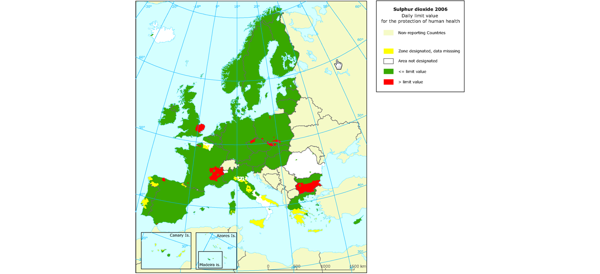

[.text-center]
*Figure 1 – Map visualising exceedence of daily limit values of SO2 within Air Quality Management Zones in Europe*

However, AM Zones are not the only type of _"Reporting Unit_". Other INSPIRE spatial objects perform the role of "_Reporting Unit"_. For example, surface waters: rivers, lakes and canals from Annex I Hydrography – Physical Waters are _"Reporting Units"_ for indicators of chemical and ecological status (Figure 2).

Annex F contains a summary of identified examples where INSPIRE spatial objects act as Reporting Units for data reported under key European environmental legislation.

Thus, _reporting units_ cannot be modelled as a distinct spatial object type. Therefore, no specific _reporting units_ application schema is included in this data specification. Instead, the obligation on how to make _reporting units_ spatial data available under INSPIRE is expressed in the following requirements.

[IMPORTANT]
====
[.text-center]
*IR Requirement*
_Annex IV, Section 11.4.2_
*Theme-specific Requirements – Reporting Units*

. Spatial objects acting as reporting units shall be defined and made available according to the requirements of their respective INSPIRE spatial data theme(s).

. Where environmental reporting data, to establish a spatial reference, refers to real-world entities that are made available as spatial objects in accordance with this Regulation, the reporting data shall include an explicit reference to those spatial objects.
====

[NOTE]
====
*Recomendation 1*

Where an INSPIRE spatial object performs the role of "Reporting Unit", it is strongly recommended that it has an inspireId so that reporting data can be referenced to the spatial object.

====

image::./media/image5.png[image,width=525,height=801, align=center]

[.text-center]
*Figure 2 – Map visualising ecological status or potential for rivers, canals and surface waters (2009)*

==== Extending the AM Data Specification

Due to the broad scope of the theme, a generic modelling approach undertaken. A generic Area Management, Restriction and Regulation Zone spatial object was defined which can be classified using the zone type and specialised zone type properties.

NOTE The zone type and specialised zone type code list classification values are extensible allowing thematic communities and Member States to propose additional zone types that were not identified during the development phase of the AM data specification.

This generic spatial object defines a core set of properties that apply to any zone. This generic model can be used to exchange spatial data between different domains and public authorities. It is expected that this generic core model shall be extended (i.e. specialised) to define spatial objects that contain additional domain-specific properties (Figure 3).

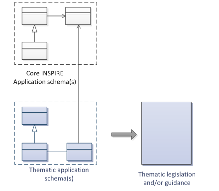

[.text-center]
*Figure 3 – Extending INSPIRE AM Application Schema to generate Thematic application schemas*

Detailed information and examples demonstrating how to extend the generic AM application schema into thematic data specification models are presented in:

* Annex D: Water Framework Directive (WFD): Water Bodies
* Annex E: Air Quality Directive (AQD) draft e-Reporting specification

*Annex E: Water Framework Directive - Water Bodies*

The Water Framework Directive: The Water Bodies application schema is included in the Technical Guideliens (TG), as it was defined as a candidate application schema during the development of the Annex I Hydrography theme. This candidate application schema was initially included in the Implementing Rule. However, it is proposed that this should only be a TG Requirement to allow Public Authorities to provide WFD Water Bodies within INSPIRE. It is envisaged that this example application schema shall either be formally adopted by WFD or amended when the WFD reporting data specification is updated in the future.

NOTE Minor changes were made to the candidate application schema to better integrate the proposed spatial object types with the ManagementRestrictionOrRegulationZone spatial object types and their relationships with spatial object types within the Hydrography theme and Geology theme, responsible for defining GroundwaterBodies.

*Annex F: Air Quality Directive (AQD) draft e-Reporting specification*

The AQD draft e-Reporting data specification has been included as an example to demonstrate how develop new reporting data specification by extending the INSPIRE applications. This draft data specification was developed by the EEA to meet the requirements of the Commission Implementing Decision 2011/850/EU defining the rules for the reciprocal exchange of information and reporting on ambient air quality for Directives 2004/107/EC and 2008/50/EC (see http://aqportal.eionet.europa.eu/).

==== Interrelationships with INSPIRE spatial data themes 

===== Overlapping scope between Area Management, Restriction and Regulation Zones and other INSPIRE Themes

There is an overlap in scope between Area Management, Restriction and Regulation Zones (AM) and the following themes:

* Annex I: Protected Sites (PS)
* Annex III: Land Use (LU) – Planned Land Use application schema

*Overlapping scope between AM and PS*

The key difference between the two themes is that Protected Sites are established to manage, regulate and restrict activities to conserve nature, biodiversity and cultural heritage, only. Some Area Management, Restriction and Regulation Zones are established to deliver multiple environmental objectives that include nature and biodiversity conservation (e.g. River Basin Districts). Where this occurs, the spatial objects should only be published once, as Area Management, Restriction and Regulation Zones.

[IMPORTANT]
====
[.text-center]
*IR Requirement*
_Annex IV, Section 11.4.3_
*Cross-theme requirements*

. If an area has been established exclusively to manage, regulate and restrict activities to conserve nature, biodiversity and cultural heritage, it shall be made available as a ProtectedSite spatial object. If a zone has been established to deliver multiple objectives, including the conservation of nature, biodiversity and cultural heritage, it shall be made available as a ManagementRestrictionOrRegulationZone spatial object.

====

*Overlapping scope between AM and LU*

To control development on land and marine environments, regulation zones are established. These define specific controls to regulate particular activities such as construction of buildings above a specified height or specific type within an area. Where such zones are defined within a legally binding spatial plan they fall within scope of the Land Use theme and should be defined using the Supplementary Regulation spatial object type within the Planned Land Use application schema.

If zones are established, but are not defined within a legally binding spatial plan, they should be defined as a Management Area, Restriction and Regulation Zone.

[IMPORTANT]
====
[.text-center]
*IR Requirement*
_Annex IV, Section 11.4.3_
*Cross-theme requirements*

[arabic, start=2]
. Where a zone has been established to regulate planned land use and defined within a legally binding spatial plan, it falls within the scope of the Land Use theme and shall be made available as a SupplementaryRegulation. However, if the zone has been established by legislative requirement but not defined within a legally binding spatial plan, then it shall be made available as a ManagementRestrictionOrRegulationZone.

====

===== Interrelationships between Area Management, Restriction and Regulation Zones and other INSPIRE Themes

Because of the heterogeneity of domains covered by the AM theme, several interrelationships with other INSPIRE spatial data themes exist. The types of interrelationships include:

[arabic, start=1]
. *Associations or relationships between spatial objects*

For example, associations have been defined between spatial object types within the following themes to represent explicit relationships between the themes.

* _Environmental Monitoring Facilities:_ MonitoringFacilities are established to monitor and assess the state of the environment within ManagementRestrictionOrRegulationZones

* _Hydrography:_ WFDSurfaceWaterBody are related to one or more HydroObject

* _Geology:_ WFD GroundWaterBody are related to one or more GroundWaterBody and/or HydrogeologicalUnit

* _Natural Risk Zone: a_ RiskZoneVector is contained within zero or more ManagementRestrictionOrRegulationZone

* _Soils:_ a ContaminatedSoilSite is contained within a ManagementRestrictionOrRegulationZone

[arabic, start=2]
. *Management, Restriction or Regulation Zone shares the same geometry as another INSPIRE spatial object*

Zones are often defined based on the extent of another related spatial object.

* _Sea Regions_: Marine Regions may derive their spatial extent fromas Sea Regions.

[NOTE]
====
*Recomendation 2*

When the marine region has been established for the purpose of management or as restriction or regulation zone such spatial objects shall be defined as ManagementRestrictionOrRegulationZone of the INSPIRE AM theme. When the geometry of the marine regions that fall within the scope of the INSPIRE AM theme is derived or based on the geometry of the spatial objects defined in INSPIRE SR theme, both geometries shall be aligned at least at the land-sea boundaries following the related specifications in the INSPIRE SR theme.

====

* _Geology_: Groundwater WFD Water Bodies may derive their extent from GE Groundwater Bodies.

* _Administrative Units_: Air quality management zones may derive their spatial extend from Administrative Units or NUTS Regions.

* _Natural Risk Zones_: Nitrate Vulnerable Zones or Flood Management Units may derive their spatial extent from RiskZone.

[cols=""]
|===
a|*Definition:*

Areas managed, regulated or used for reporting at international, European, national, regional and local levels. Includes dumping sites, restricted areas around drinking water sources, nitrate-vulnerable zones, regulated fairways at sea or large inland waters, areas for the dumping of waste, noise restriction zones, prospecting and mining permit areas, river basin districts, relevant reporting units and coastal zone management areas. [Directive 2007/2/EC]

*Description:*

The theme "_Area Management/Restriction/Regulation Zones and Reporting Units_" is thematically broad and encompasses any zones that are established in accordance with a legislative requirement related to an environmental policy or a policy or activity that may have an impact on the environment at any level of administration (international, European, national and sub-national).

The zones are typically established to deliver specific objectives related to any environmental media, for example, air, water, soil and biota (plants and animals). This includes, but is not limited to, objectives established to protect and improve environmental quality (includes reducing pollution levels), protect and conserve environmental and natural resources, protect and control risk from natural and man-made hazards, protect plant, animal and human health or control development.

The theme also addresses reporting units, which are defined as "spatial objects that provide the spatial reference for any non-spatial data exchanged under environmental reporting obligations." The reported non-spatial data must include a property that contains a reference to the spatial object. This is typically an identifier, code or name and is a join key between the spatial and non-spatial objects enabling the data to be combined. This allows the non-spatial data to be visualised as a map or enable spatial analysis.

Different INSPIRE spatial object types can perform the role of "Reporting Unit". For example, surface waters (rivers, lakes and canals from the Annex I theme Hydrography) are "Reporting Units" for indicators of chemical and ecological status. Thus, Reporting units cannot be modelled as a distinct spatial object type and no specific reporting units data model is defined. Instead, the theme defines obligations on how to make reporting units spatial data available under INSPIRE.

Entry in the INSPIRE registry: _http://inspire.ec.europa.eu/theme/am/_
|===

=== Normative References

[Directive 91/271/EEC] Council Directive 91/271/EEC of 21 May 1991 concerning urban waste-water treatment

[Directive1991/676/EEC] Council Directive 91/676/EEC of 12 December 1991 concerning the protection of waters against pollution caused by nitrates from agricultural sources

[Directive 2000/60/EC] Directive 2000/60/EC of the European Parliament and of the Council of 23 October 2000 establishing a framework for Community action in the field of water policy

[Directive 2002/49/EC] Directive 2002/49/EC of the European Parliament and of the Council of 25 June 2002 relating to the assessment and management of environmental noise - Declaration by the Commission in the Conciliation Committee on the Directive relating to the assessment and management of environmental noise

[Directive 2006/44/EC] Directive 2006/44/EC of the European Parliament and of the Council of 6 September 2006 on the quality of fresh waters needing protection or improvement in order to support fish life

[Directive 2006/113/EC] Directive 2006/113/EC of the European Parliament and of the Council of 12 December 2006 on the quality required of shellfish waters [Directive 2008/50/EC] Directive 2008/50/EC of the European Parliament and of the Council of 21 May 2008 on ambient air quality and cleaner air for Europe

[Directive 2007/2/EC] Directive 2007/2/EC of the European Parliament and of the Council of 14 March 2007 establishing an Infrastructure for Spatial Information in the European Community (INSPIRE)

[Directive 2007/60/EC] Directive 2007/60/EC of the European Parliament and of the Council of 23 October 2007 on the assessment and management of flood risks

[Directive 2008/56/EC] Directive 2008/56/EC of the European Parliament and of the Council of 17 June 2008 establishing a framework for community action in the field of marine environmental policy

[Directive 2008/98/EC] Directive 2008/98/EC of the European Parliament and of the Council of 19 November 2008 on waste and repealing certain Directives

[ISO 19105] EN ISO 19105:2000, Geographic information -- Conformance and testing

[ISO 19107] EN ISO 19107:2005, Geographic Information – Spatial Schema

[ISO 19108] EN ISO 19108:2005, Geographic Information – Temporal Schema

[ISO 19108-c] ISO 19108:2002/Cor 1:2006, Geographic Information – Temporal Schema, Technical Corrigendum 1

[ISO 19111] EN ISO 19111:2007 Geographic information - Spatial referencing by coordinates (ISO 19111:2007)

[ISO 19115] EN ISO 19115:2005, Geographic information – Metadata (ISO 19115:2003)

[ISO 19118] EN ISO 19118:2006, Geographic information – Encoding (ISO 19118:2005)

[ISO 19135] EN ISO 19135:2007 Geographic information – Procedures for item registration (ISO 19135:2005)

[ISO 19139] ISO/TS 19139:2007, Geographic information – Metadata – XML schema implementation

[ISO 19157] ISO/DIS 19157, Geographic information – Data quality

[OGC 06-103r4] Implementation Specification for Geographic Information - Simple feature access – Part 1: Common Architecture v1.2.1

NOTE This is an updated version of "EN ISO 19125-1:2004, Geographic information – Simple feature access – Part 1: Common architecture".

[Regulation 1205/2008/EC] Regulation 1205/2008/EC implementing Directive 2007/2/EC of the European Parliament and of the Council as regards metadata

[Regulation 976/2009/EC] Commission Regulation (EC) No 976/2009 of 19 October 2009 implementing Directive 2007/2/EC of the European Parliament and of the Council as regards the Network Services

[Regulation 1089/2010/EC] Commission Regulation (EU) No 1089/2010 of 23 November 2010 implementing Directive 2007/2/EC of the European Parliament and of the Council as regards interoperability of spatial data sets and services

=== Terms and definitions

General terms and definitions helpful for understanding the INSPIRE data specification documents are defined in the INSPIRE Glossaryfootnote:[The INSPIRE Glossary is available from http://inspire-registry.jrc.ec.europa.eu/registers/GLOSSARY].

Specifically, for the theme _Area Management/Restriction/Regulation Zones and Reporting Units_, the following terms are defined:

*(1) manage*

Plan, perform, monitor and control activities to achieve specific legally defined environmental objectives.

*(2) restrict*

Prohibit or limit certain activities, to only be performed within specific bounds and/or time periods, in order to achieve a certain purpose according to legally defined responsibilities or obligations.

*(3) regulate*

Monitor and control certain activities (to permit, promote, prohibit, or restrict) to achieve legally defined environmental objectives. A regulated activity may require that if the environmental status is degraded then particular actions must be enacted to restore good environmental status.

NOTE 1: In specific cases, a regulative regime may define a set of acceptable limit/threshold values to protect human health or the environment.

NOTE 2: The distinction between regulation and restriction is not always clear, since restriction of activities implies that they are regulated.

*(4) report*

Evaluate the effectiveness of environmental policies and publish data and information (i.e. spatial data, observations, statistics, indicators) that can be used to assess progress towards maintaining or improving good environmental status and achievement of policy objectives.

NOTE 1: Member States shall regularly provide data and information to a responsible authority such as the Commission (i.e. reporting) that can be analysed to assess the state of the environment.

NOTE 2: Reporting data and information can be published in near-real time (e.g. observations) or published on a regular schedule (e.g. annually, 3 year intervals), as defined in the relevant legislative instrument. Reporting data and information is often made publicly available after delivery to the relevant authority.

*(5) reporting unit*

Spatial object that provides the spatial reference for any non-spatial data exchanged under environmental reporting obligations.

*(6) legal instrument*

A document that specifies legal obligations, including, but not limited to, international conventions, laws and legal acts or implementing regulations at any administrative level.

*(7) integrated coastal zone management*

Integrated coastal zone management is a dynamic process for the sustainable management and use of coastal zones, taking into account at the same time the fragility of coastal ecosystems and landscapes, the diversity of activities and uses, their interactions, the maritime orientation of certain activities and uses and their impact on both the marine and land parts.

SOURCE: Protocol on Integrated Coastal Zone Management in the Mediterranean - signed in Madrid on 20-21 January 2008.

*(8) climate*

The statistical description in terms of the mean and variability of relevant quantities over a period of time ranging from months to thousands or millions of years. These quantities are most often surface variables such as temperature, precipitation, and wind.

SOURCE Intergovernmental Panel for Climate Change – IPCC, IPCC Fourth Assessment Report, Glossary: _http://www.ipcc.ch/pdf/glossary/ar4-wg1.pdf_

NOTE 1 The classical period is 30 years, as defined by the World Meteorological Organization (WMO).

=== Symbols and abbreviations

[cols=","]
|===
|AM |Area Management/Restriction/Regulation Zones and Reporting Units
|AQD |Air Quality Directive (2008/50/EC)
|ATS |Abstract Test Suite
|CZM |Coastal Zone Management
|EC |European Commission
|EEA |European Environmental Agency
|ETRS89 |European Terrestrial Reference System 1989
|ETRS89-LAEA |Lambert Azimuthal Equal Area
|EVRS |European Vertical Reference System
|FD |Floods Directive (2007/60/EC)
|GCM |General Conceptual Model
|GML |Geography Markup Language
|IR |Implementing Rule
|ISDSS |Interoperability of Spatial Data Sets and Services
|ISO |International Organization for Standardization
|ITRS |International Terrestrial Reference System
|LAT |Lowest Astronomical Tide
|LMO |Legally Mandated Organisation
|LU |Land Use
|MSFD |Marine Strategy Framework Directive (2008/56/EC)
|PS |Protected Sites
|RBD |River Basin District
|SAC |Special Area of Conservation
|SPA |Special Protection Area
|SDIC |Spatial Data Interest Community
|TG |Technical Guidance
|UML |Unified Modeling Language
|UTC |Coordinated Universal Time
|TG |Technical Guidelines
|TWG |Thematic Working Group
|WFD |Water Framework Directive (2000/60/EC)
|XML |EXtensible Markup Language
|===

=== XML EXtensible Markup Language How the Technical Guidelines map to the Implementing Rules

The schematic diagram in Figure 4 gives an overview of the relationships between the INSPIRE legal acts (the INSPIRE Directive and Implementing Rules) and the INSPIRE Technical Guidelines. The INSPIRE Directive and Implementing Rules include legally binding requirements that describe, usually on an abstract level, _what_ Member States must implement.

In contrast, the Technical Guidelines define _how_ Member States might implement the requirements included in the INSPIRE Implementing Rules. As such, they may include non-binding technical requirements that must be satisfied if a Member State data provider chooses to conform to the Technical Guidelines. Implementing these Technical Guidelines will maximise the interoperability of INSPIRE spatial data sets.

image::./media/image7.png[image,width=603,height=375, align=center]

[.text-center]
*Figure 4 - Relationship between INSPIRE Implementing Rules and Technical Guidelines*

==== Requirements

The purpose of these Technical Guidelines (Data specifications on _Area Management/Restriction/Regulation Zones and Reporting Units_) is to provide practical guidance for implementation that is guided by, and satisfies, the (legally binding) requirements included for the spatial data theme _Area Management/Restriction/Regulation Zones and Reporting Units_ in the Regulation (Implementing Rules) on interoperability of spatial data sets and services. These requirements are highlighted in this document as follows:

[IMPORTANT]
====
[.text-center]
*IR Requirement*
_Article / Annex / Section no._
*Title / Heading*

This style is used for requirements contained in the Implementing Rules on interoperability of spatial data sets and services (Commission Regulation (EU) No 1089/2010).

====

For each of these IR requirements, these Technical Guidelines contain additional explanations and examples.

NOTE The Abstract Test Suite (ATS) in Annex A contains conformance tests that directly check conformance with these IR requirements.

Furthermore, these Technical Guidelines may propose a specific technical implementation for satisfying an IR requirement. In such cases, these Technical Guidelines may contain additional technical requirements that need to be met in order to be conformant with the corresponding IR requirement _when using this proposed implementation_. These technical requirements are highlighted as follows:

[TIP]
====
*TG Requirement X*

This style is used for requirements for a specific technical solution proposed in these Technical Guidelines for an IR requirement.
====

NOTE 1 Conformance of a data set with the TG requirement(s) included in the ATS implies conformance with the corresponding IR requirement(s).

NOTE 2 In addition to the requirements included in the Implementing Rules on interoperability of spatial data sets and services, the INSPIRE Directive includes further legally binding obligations that put additional requirements on data providers. For example, Art. 10(2) requires that Member States shall, where appropriate, decide by mutual consent on the depiction and position of geographical features whose location spans the frontier between two or more Member States. General guidance for how to meet these obligations is provided in the INSPIRE framework documents.

==== Recommendations

In addition to IR and TG requirements, these Technical Guidelines may also include a number of recommendations for facilitating implementation or for further and coherent development of an interoperable infrastructure.

[NOTE]
====
*Recommendation X* 

Recommendations are shown using this style.
====

NOTE The implementation of recommendations is not mandatory. Compliance with these Technical Guidelines or the legal obligation does not depend on the fulfilment of the recommendations.

==== Conformance

Annex A includes the abstract test suite for checking conformance with the requirements included in these Technical Guidelines and the corresponding parts of the Implementing Rules (Commission Regulation (EU) No 1089/2010).

<<<
== Specification scopes

This data specification does not distinguish different specification scopes, but just considers one general scope.

NOTE For more information on specification scopes, see [ISO 19131:2007], clause 8 and Annex D.

<<<
== Identification information

These Technical Guidelines are identified by the following URI:

http://inspire.ec.europa.eu/tg/am/3.0

NOTE ISO 19131 suggests further identification information to be included in this section, e.g. the title, abstract or spatial representation type. The proposed items are already described in the document metadata, executive summary, overview description (section 2) and descriptions of the application schemas (section 5). In order to avoid redundancy, they are not repeated here.

<<<
== Data content and structure

=== Application schemas – Overview 

==== Application schemas included in the IRs

Articles 3, 4 and 5 of the Implementing Rules lay down the requirements for the content and structure of the data sets related to the INSPIRE Annex themes.

[IMPORTANT]
====
[.text-center]
*IR Requirement*
_Article 4_
*Types for the Exchange and Classification of Spatial Objects*

. For the exchange and classification of spatial objects from data sets meeting the conditions laid down in Article 4 of Directive 2007/2/EC, Member States shall use the spatial object types and associated data types, enumerations and code lists that are defined in Annexes II, III and IV for the themes the data sets relate to.

. Spatial object types and data types shall comply with the definitions and constraints and include the attributes and association roles set out in the Annexes.

. The enumerations and code lists used in attributes or association roles of spatial object types or data types shall comply with the definitions and include the values set out in Annex II. The enumeration and code list values are uniquely identified by language-neutral mnemonic codes for computers. The values may also include a language-specific name to be used for human interaction.

====

The types to be used for the exchange and classification of spatial objects from data sets related to the spatial data theme _Area Management/Restriction/Regulation Zones and Reporting Units_ are defined in the following application schemas (see section 5.3):

* AreaManagementRestrictionAndRegulationZones

The application schemas specify requirements on the properties of each spatial object including its multiplicity, domain of valid values, constraints, etc.

NOTE The application schemas presented in this section contain some additional information that is not included in the Implementing Rules, in particular multiplicities of attributes and association roles.

[TIP]
====
*TG Requirement 1*

Spatial object types and data types shall comply with the multiplicities defined for the attributes and association roles in this section.

====

An application schema may include references (e.g. in attributes or inheritance relationships) to common types or types defined in other spatial data themes. These types can be found in a sub-section called "Imported Types" at the end of each application schema section. The common types referred to from application schemas included in the IRs are addressed in Article 3.

[IMPORTANT]
====
[.text-center]
*IR Requirement*
_Article 3_
*Common Types*

Types that are common to several of the themes listed in Annexes I, II and III to Directive 2007/2/EC shall conform to the definitions and constraints and include the attributes and association roles set out in Annex I.

====

NOTE Since the IRs contain the types for all INSPIRE spatial data themes in one document, Article 3 does not explicitly refer to types defined in other spatial data themes, but only to types defined in external data models.

Common types are described in detail in the Generic Conceptual Model [DS-D2.7], in the relevant international standards (e.g. of the ISO 19100 series) or in the documents on the common INSPIRE models [DS-D2.10.x]. For detailed descriptions of types defined in other spatial data themes, see the corresponding Data Specification TG document [DS-D2.8.x].

==== Additional recommended application schemas 

In addition to the application schemas listed above, the following additional application schemas have been defined for the theme _Area Management/Restriction/Regulation Zones and Reporting Units_:

* ControlledActivities (see section 5.4)
* WaterFrameworkDirective (see Annex E)

These additional application schemas are not included in the IRs. They typically address requirements from specific (groups of) use cases and/or may be used to provide additional information. They are included in this specification in order to improve interoperability also for these additional aspects and to illustrate the extensibility of the application schemas included in the IRs.

[NOTE]
====
*Recomendation 1*

Additional and/or use case-specific information related to the theme _Area Management/Restriction/Regulation Zones and Reporting Units_ should be made available using the spatial object types and data types specified in the following application schema(s): ControlledActivities, WaterFrameworkDirective.

These spatial object types and data types should comply with the definitions and constraints and include the attributes and association roles defined in this section.

The enumerations and code lists used in attributes or association roles of spatial object types or data types should comply with the definitions and include the values defined in this section.

====

=== Basic notions

This section explains some of the basic notions used in the INSPIRE application schemas. These explanations are based on the GCM [DS-D2.5].

==== Notation

===== Unified Modeling Language (UML)

The application schemas included in this section are specified in UML, version 2.1. The spatial object types, their properties and associated types are shown in UML class diagrams.

NOTE For an overview of the UML notation, see Annex D in [ISO 19103].

The use of a common conceptual schema language (i.e. UML) allows for an automated processing of application schemas and the encoding, querying and updating of data based on the application schema – across different themes and different levels of detail.

The following important rules related to class inheritance and abstract classes are included in the IRs.

[IMPORTANT]
====
[.text-center]
*IR Requirement*
_Article 5_
*Types*

(...)

[arabic, start=2]
. Types that are a sub-type of another type shall also include all this type's attributes and association roles.

. Abstract types shall not be instantiated.

====

The use of UML conforms to ISO 19109 8.3 and ISO/TS 19103 with the exception that UML 2.1 instead of ISO/IEC 19501 is being used. The use of UML also conforms to ISO 19136 E.2.1.1.1-E.2.1.1.4.

NOTE ISO/TS 19103 and ISO 19109 specify a profile of UML to be used in conjunction with the ISO 19100 series. This includes in particular a list of stereotypes and basic types to be used in application schemas. ISO 19136 specifies a more restricted UML profile that allows for a direct encoding in XML Schema for data transfer purposes.

To model constraints on the spatial object types and their properties, in particular to express data/data set consistency rules, OCL (Object Constraint Language) is used as described in ISO/TS 19103, whenever possible. In addition, all constraints are described in the feature catalogue in English, too.

NOTE Since "void" is not a concept supported by OCL, OCL constraints cannot include expressions to test whether a value is a _void_ value. Such constraints may only be expressed in natural language.

===== Stereotypes

In the application schemas in this section several stereotypes are used that have been defined as part of a UML profile for use in INSPIRE [DS-D2.5]. These are explained in Table 2 below.

[.text-center]
*Table 2 – Stereotypes (adapted from [DS-D2.5])*

[cols=",,",]
|===
|*Stereotype* |*Model element* |*Description*
|applicationSchema |Package |An INSPIRE application schema according to ISO 19109 and the Generic Conceptual Model.
|leaf |Package |A package that is not an application schema and contains no packages.
|featureType |Class |A spatial object type.
|type |Class |A type that is not directly instantiable, but is used as an abstract collection of operation, attribute and relation signatures. This stereotype should usually not be used in INSPIRE application schemas as these are on a different conceptual level than classifiers with this stereotype.
|dataType |Class |A structured data type without identity.
|union |Class |A structured data type without identity where exactly one of the properties of the type is present in any instance.
|enumeration |Class |An enumeration.
|codeList |Class |A code list.
|import |Dependency |The model elements of the supplier package are imported.
|voidable |Attribute, association role |A voidable attribute or association role (see section 5.2.2).
|lifeCycleInfo |Attribute, association role |If in an application schema a property is considered to be part of the life-cycle information of a spatial object type, the property shall receive this stereotype.
|version |Association role |If in an application schema an association role ends at a spatial object type, this stereotype denotes that the value of the property is meant to be a specific version of the spatial object, not the spatial object in general.
|===

==== Voidable characteristics

The «voidable» stereotype is used to characterise those properties of a spatial object that may not be present in some spatial data sets, even though they may be present or applicable in the real world. This does _not_ mean that it is optional to provide a value for those properties.

For all properties defined for a spatial object, a value has to be provided – either the corresponding value (if available in the data set maintained by the data provider) or the value of _void._ A _void_ value shall imply that no corresponding value is contained in the source spatial data set maintained by the data provider or no corresponding value can be derived from existing values at reasonable costs.

[NOTE]
====
*Recommendation 2*

The reason for a _void_ value should be provided where possible using a listed value from the VoidReasonValue code list to indicate the reason for the missing value.
====

The VoidReasonValue type is a code list, which includes the following pre-defined values:

* _Unpopulated_: The property is not part of the dataset maintained by the data provider. However, the characteristic may exist in the real world. For example when the "elevation of the water body above the sea level" has not been included in a dataset containing lake spatial objects, then the reason for a void value of this property would be 'Unpopulated'. The property receives this value for all spatial objects in the spatial data set.
* _Unknown_: The correct value for the specific spatial object is not known to, and not computable by the data provider. However, a correct value may exist. For example when the "elevation of the water body above the sea level" _of a certain lake_ has not been measured, then the reason for a void value of this property would be 'Unknown'. This value is applied only to those spatial objects where the property in question is not known.
* _Withheld_: The characteristic may exist, but is confidential and not divulged by the data provider.

NOTE It is possible that additional reasons will be identified in the future, in particular to support reasons / special values in coverage ranges.

The «voidable» stereotype does not give any information on whether or not a characteristic exists in the real world. This is expressed using the multiplicity:

* If a characteristic may or may not exist in the real world, its minimum cardinality shall be defined as 0. For example, if an Address may or may not have a house number, the multiplicity of the corresponding property shall be 0..1.
* If at least one value for a certain characteristic exists in the real world, the minimum cardinality shall be defined as 1. For example, if an Administrative Unit always has at least one name, the multiplicity of the corresponding property shall be 1..*.

In both cases, the «voidable» stereotype can be applied. In cases where the minimum multiplicity is 0, the absence of a value indicates that it is known that no value exists, whereas a value of void indicates that it is not known whether a value exists or not.

EXAMPLE If an address does not have a house number, the corresponding Address object should not have any value for the «voidable» attribute house number. If the house number is simply not known or not populated in the data set, the Address object should receive a value of _void_ (with the corresponding void reason) for the house number attribute.

==== Enumerations

Enumerations are modelled as classes in the application schemas. Their values are modelled as attributes of the enumeration class using the following modelling style:

* No initial value, but only the attribute name part, is used.
* The attribute name conforms to the rules for attributes names, i.e. is a lowerCamelCase name. Exceptions are words that consist of all uppercase letters (acronyms).

[IMPORTANT]
====
[.text-center]
*IR Requirement*
_Article 6_
*Code Lists and Enumerations*

(...)

[arabic, start=5]
. Attributes or association roles of spatial object types or data types that have an enumeration type may only take values from the lists specified for the enumeration type."

====

==== Code lists

Code lists are modelled as classes in the application schemas. Their values, however, are managed outside of the application schema.

===== Code list types

The IRs distinguish the following types of code lists.

[IMPORTANT]
====
[.text-center]
*IR Requirement*
_Article 6_
*Code Lists and Enumerations*

. Code lists shall be of one of the following types, as specified in the Annexes:
[loweralpha]
.. code lists whose allowed values comprise only the values specified in this Regulation;

.. code lists whose allowed values comprise the values specified in this Regulation and narrower values defined by data providers;

.. code lists whose allowed values comprise the values specified in this Regulation and additional values at any level defined by data providers;

.. code lists, whose allowed values comprise any values defined by data providers.

For the purposes of points (b), (c) and (d), in addition to the allowed values, data providers may use the values specified in the relevant INSPIRE Technical Guidance document available on the INSPIRE web site of the Joint Research Centre.

====

The type of code list is represented in the UML model through the tagged value _extensibility_, which can take the following values:

* _none_, representing code lists whose allowed values comprise only the values specified in the IRs (type a);
* _narrower_, representing code lists whose allowed values comprise the values specified in the IRs and narrower values defined by data providers (type b);
* _open_, representing code lists whose allowed values comprise the values specified in the IRs and additional values at any level defined by data providers (type c); and
* _any_, representing code lists, for which the IRs do not specify any allowed values, i.e. whose allowed values comprise any values defined by data providers (type d).

[NOTE]
====
*Recomendation 3*

Additional values defined by data providers should not replace or redefine any value already specified in the IRs.

====

NOTE This data specification may specify recommended values for some of the code lists of type (b), (c) and (d) (see section 5.2.4.3). These recommended values are specified in a dedicated Annex.

In addition, code lists can be hierarchical, as explained in Article 6(2) of the IRs.

[IMPORTANT]
====
[.text-center]
*IR Requirement*
_Article 6_
*Code Lists and Enumerations*

(...)

[arabic,start=2]
. Code lists may be hierarchical. Values of hierarchical code lists may have a more generic parent value. Where the valid values of a hierarchical code list are specified in a table in this Regulation, the parent values are listed in the last column.

====

The type of code list and whether it is hierarchical or not is also indicated in the feature catalogues.

===== Obligations on data providers

[IMPORTANT]
====
[.text-center]
*IR Requirement*
_Article 6_
*Code Lists and Enumerations*

(....)

[arabic, start=3]
. Where, for an attribute whose type is a code list as referred to in points (b), (c) or (d) of paragraph 1, a data provider provides a value that is not specified in this Regulation, that value and its definition shall be made available in a register.

. Attributes or association roles of spatial object types or data types whose type is a code list may only take values that are allowed according to the specification of the code list.

====

Article 6(4) obliges data providers to use only values that are allowed according to the specification of the code list. The "allowed values according to the specification of the code list" are the values explicitly defined in the IRs plus (in the case of code lists of type (b), (c) and (d)) additional values defined by data providers.

For attributes whose type is a code list of type (b), (c) or (d) data providers may use additional values that are not defined in the IRs. Article 6(3) requires that such additional values and their definition be made available in a register. This enables users of the data to look up the meaning of the additional values used in a data set, and also facilitates the re-use of additional values by other data providers (potentially across Member States).

NOTE Guidelines for setting up registers for additional values and how to register additional values in these registers is still an open discussion point between Member States and the Commission.

===== Recommended code list values

For code lists of type (b), (c) and (d), this data specification may propose additional values as a recommendation (in a dedicated Annex). These values will be included in the INSPIRE code list register. This will facilitate and encourage the usage of the recommended values by data providers since the obligation to make additional values defined by data providers available in a register (see section 5.2.4.2) is already met.

[NOTE]
====
*Recomendation 4*

Where these Technical Guidelines recommend values for a code list in addition to those specified in the IRs, these values should be used.

====

NOTE For some code lists of type (d), no values may be specified in these Technical Guidelines. In these cases, any additional value defined by data providers may be used.

===== Governance

The following two types of code lists are distinguished in INSPIRE:

* _Code lists that are governed by INSPIRE (INSPIRE-governed code lists)._ These code lists will be managed centrally in the INSPIRE code list register. Change requests to these code lists (e.g. to add, deprecate or supersede values) are processed and decided upon using the INSPIRE code list register's maintenance workflows.
+
INSPIRE-governed code lists will be made available in the INSPIRE code list register at __http://inspire.ec.europa.eu/codelist/<CodeListName__>. They will be available in SKOS/RDF, XML and HTML. The maintenance will follow the procedures defined in ISO 19135. This means that the only allowed changes to a code list are the addition, deprecation or supersession of values, i.e. no value will ever be deleted, but only receive different statuses (valid, deprecated, superseded). Identifiers for values of INSPIRE-governed code lists are constructed using the pattern __http://inspire.ec.europa.eu/codelist/<CodeListName__>/<value>.

* _Code lists that are governed by an organisation outside of INSPIRE (externally governed code lists)._ These code lists are managed by an organisation outside of INSPIRE, e.g. the World Meteorological Organization (WMO) or the World Health Organization (WHO). Change requests to these code lists follow the maintenance workflows defined by the maintaining organisations. Note that in some cases, no such workflows may be formally defined.
+
Since the updates of externally governed code lists is outside the control of INSPIRE, the IRs and these Technical Guidelines reference a specific version for such code lists.
+
The tables describing externally governed code lists in this section contain the following columns:

** The _Governance_ column describes the external organisation that is responsible for maintaining the code list.

** The _Source_ column specifies a citation for the authoritative source for the values of the code list. For code lists, whose values are mandated in the IRs, this citation should include the version of the code list used in INSPIRE. The version can be specified using a version number or the publication date. For code list values recommended in these Technical Guidelines, the citation may refer to the "latest available version".

** In some cases, for INSPIRE only a subset of an externally governed code list is relevant. The subset is specified using the _Subset_ column.

** The _Availability_ column specifies from where (e.g. URL) the values of the externally governed code list are available, and in which formats. Formats can include machine-readable (e.g. SKOS/RDF, XML) or human-readable (e.g. HTML, PDF) ones.

+
Code list values are encoded using http URIs and labels. Rules for generating these URIs and labels are specified in a separate table.

[NOTE]
====
*Recomendation 5*

The http URIs and labels used for encoding code list values should be taken from the INSPIRE code list registry for INSPIRE-governed code lists and generated according to the relevant rules specified for externally governed code lists.

====

NOTE Where practicable, the INSPIRE code list register could also provide http URIs and labels for externally governed code lists.

===== Vocabulary

For each code list, a tagged value called "vocabulary" is specified to define a URI identifying the values of the code list. For INSPIRE-governed code lists and externally governed code lists that do not have a persistent identifier, the URI is constructed following the pattern _http://inspire.ec.europa.eu/codelist/<UpperCamelCaseName>_.

If the value is missing or empty, this indicates an empty code list. If no sub-classes are defined for this empty code list, this means that any code list may be used that meets the given definition.

An empty code list may also be used as a super-class for a number of specific code lists whose values may be used to specify the attribute value. If the sub-classes specified in the model represent all valid extensions to the empty code list, the subtyping relationship is qualified with the standard UML constraint "\{complete,disjoint}".

==== Identifier management

[IMPORTANT]
====
[.text-center]
*IR Requirement*
_Article 9_
*Identifier Management*

. The data type Identifier defined in Section 2.1 of Annex I shall be used as a type for the external object identifier of a spatial object.

. The external object identifier for the unique identification of spatial objects shall not be changed during the life-cycle of a spatial object.

====

NOTE 1 An external object identifier is a unique object identifier which is published by the responsible body, which may be used by external applications to reference the spatial object. [DS-D2.5]

NOTE 2 Article 9(1) is implemented in each application schema by including the attribute _inspireId_ of type Identifier.

NOTE 3 Article 9(2) is ensured if the _namespace_ and _localId_ attributes of the Identifier remains the same for different versions of a spatial object; the _version_ attribute can of course change.

==== Geometry representation

[IMPORTANT]
====
[.text-center]
*IR Requirement*
_Article 12_
*Other Requirements & Rules*

. The value domain of spatial properties defined in this Regulation shall be restricted to the Simple Feature spatial schema as defined in Herring, John R. (ed.), OpenGIS® Implementation Standard for Geographic information – Simple feature access – Part 1: Common architecture, version 1.2.1, Open Geospatial Consortium, 2011, unless specified otherwise for a specific spatial data theme or type.

====

NOTE 1 The specification restricts the spatial schema to 0-, 1-, 2-, and 2.5-dimensional geometries where all curve interpolations are linear and surface interpolations are performed by triangles.

NOTE 2 The topological relations of two spatial objects based on their specific geometry and topology properties can in principle be investigated by invoking the operations of the types defined in ISO 19107 (or the methods specified in EN ISO 19125-1).

====  Temporality representation

The application schema(s) use(s) the derived attributes "beginLifespanVersion" and "endLifespanVersion" to record the lifespan of a spatial object.

The attributes "beginLifespanVersion" specifies the date and time at which this version of the spatial object was inserted or changed in the spatial data set. The attribute "endLifespanVersion" specifies the date and time at which this version of the spatial object was superseded or retired in the spatial data set.

NOTE 1 The attributes specify the beginning of the lifespan of the version in the spatial data set itself, which is different from the temporal characteristics of the real-world phenomenon described by the spatial object. This lifespan information, if available, supports mainly two requirements: First, knowledge about the spatial data set content at a specific time; second, knowledge about changes to a data set in a specific time frame. The lifespan information should be as detailed as in the data set (i.e., if the lifespan information in the data set includes seconds, the seconds should be represented in data published in INSPIRE) and include time zone information.

NOTE 2 Changes to the attribute "endLifespanVersion" does not trigger a change in the attribute "beginLifespanVersion".

[IMPORTANT]
====
[.text-center]
*IR Requirement*
_Article 10_
*Life-cycle of Spatial Objects*

(...)

[arabic, start=3]
. Where the attributes beginLifespanVersion and endLifespanVersion are used, the value of endLifespanVersion shall not be before the value of beginLifespanVersion.

====

NOTE The requirement expressed in the IR Requirement above will be included as constraints in the UML data models of all themes.

[NOTE]
====
*Recomendation 6*

If life-cycle information is not maintained as part of the spatial data set, all spatial objects belonging to this data set should provide a void value with a reason of "unpopulated".

====

===== Validity of the real-world phenomena

The application schema(s) use(s) the attributes "validFrom" and "validTo" to record the validity of the real-world phenomenon represented by a spatial object.

The attributes "validFrom" specifies the date and time at which the real-world phenomenon became valid in the real world. The attribute "validTo" specifies the date and time at which the real-world phenomenon is no longer valid in the real world.

Specific application schemas may give examples what "being valid" means for a specific real-world phenomenon represented by a spatial object.

[IMPORTANT]
====
[.text-center]
*IR Requirement*
_Article 12_
*Other Requirements & Rules*

(...)

[arabic, start=3]
. Where the attributes validFrom and validTo are used, the value of validTo shall not be before the value of validFrom.

====

NOTE The requirement expressed in the IR Requirement above will be included as constraints in the UML data models of all themes.

=== Application schema Area Management Restriction and Regulation Zones

==== Description

===== Narrative description

The Area Management, Restriction and Regulation Zones Application Schema contains the core model for defining zones established in accordance with specific legislative requirements to manage, restrict or regulate activities to protect the environment. A single spatial object type "ManagementRestrictionOrRegulationZone" has been defined to represent the zone as the concepts of management, restriction and regulation overlap and many zones are established to perform at least two of the three concepts.

The ManagementRestrictionOrRegulationZone spatial object type contains a core set of properties that are common to all types of zone. These can be categorised into 3 sets of properties:

. *Zone specific properties:* these are properties that provide a basic set of information describing the zone:
** _geometry:_ The geometry representing the spatial extent of the spatial object. Typically the geometry of a zone shall be represented as either a surface or multi-surface. However, there may be zone that are represented as either point or a line.
** _designationPeriod:_ Time period defining when the management, restriction or regulation zone was legally designated or became effective in the real world.
** _competentAuthority:_ description of the organisation(s) responsible managing, restricting or regulating measures or activities within the zone.
** _legalBasis:_ reference to, or citation of the legislative instrument or document that required the establishment of a zone.
+
NOTE 1 LegislationCitation is defined in section 9.8.3 of D2.5 Generic Conceptual Model v3.4.
+
NOTE 2 For each ManagementRestrictionOrRegulationZone, at least the most specific legal instrument that required the establishment of zone shall be provided.
+
[NOTE]
====
*Recommendation 7*

If applicable, the relevant legal basis at European level should also be provided.
====
+
** _plan:_ reference to, or citation of a plan (management or action plan) that describes the environmental objectives and measures that shall be undertaken in the zone to protect the environment.
** _relatedZone:_ reference to one or more related ManagementRestrictionOrRegulationZones. The related zone may either be a sub zone or a zone of different type.

. *Classification and selection properties:* due to the generic nature of the model additional properties were required to enable different types of zone to be distinguished. These are defined using two classification properties:

** _zoneType_: which provide a high level classification of the zone. This is often a generalised classification for all types of zone for a specific thematic area (e.g. animalHealthRestrictionZone). This shall be an extensible INSPIRE code list (see section 5.3.1.2).

** _specialisedZoneType_: this allows more specific classification of the zone. This shall be a relevant zone type defined from an externally governed domain or community code list, where available. If no code list exists then this shall be the commonly used name assigned to the zone within the domain or community (preferably in English).

** _environmentalDomain_: this has been included to enable users to retrieve multiple types of zone that exist within a domain as it was recognised that some users may not know what zone types exist.

. *Identification and maintenance properties:*

** _inspireId:_ object references have been defined from other INSPIRE Annex themes to the ManagementRestrictionOrRegulationZone. An inspireId is an external object identifier published by the responsible data provider with the intention that they may be used by third parties for referencing. Also as zones are typically "Reporting Units", they also require external object identifiers to enable them to be referenced by non-spatial reported data. See section 14.1 of D2.5 for more details about how to encode external object identifiers.
** _thematicID:_ thematic object identifier are additional identifiers that have been assigned to the zone. Multiple thematic object identifiers may be assigned to a zone where different data exchange requirements (e.g. national vs European reporting) have defined different lexical rules for thematic object identifiers. Where multiple thematic object identifiers exist all should be provided. This shall allows external datasets that use these thematic object identifiers for referencing to link to the INSPIRE spatial object.
** _name:_ name used to identify the management, regulation or restriction zone in the real world.
** _beginLifespanVersion:_ date and time at which this version of the spatial object was inserted or changed in the spatial data set.
** _endLifespanVersion_: date and time at which this version of the spatial object was superseded or retired in the spatial data set.

The INSPIRE-defined code lists included in this application schema include the values specified in the tables in this section.

===== Code lists

Two INSPIRE-governed code lists have been defined within the Area Management Restriction and Regulation Zones application schema:

. ZoneTypeCode
. Environmental Domain

*ZoneTypeCode*

The ZoneTypeCode code list shall be an extensible INSPIRE-governed code list. This code list defines a high level classification for types of ManagementRestrictionOrRegulationZones. At the time of the development of the data specification an initial list of ZoneTypeCodes has been defined that set the initial scope of the theme. However, it is recognised that this code list does not cover all high-level types of zone type in all domains. Consequently this code list shall be extensible using any code list value defined by Member States and thematic communities.

To extend this code list, Member States and thematic communities should only define a set of code lists that define new high-level zone types. If the proposed zone type falls within the scope of an exisiting ZoneTypeCode then the proposed zone type code should be used as a SpecialisedZoneTypeCode.

For example, if a thematic community wants to define the zone type code: Bluetongue Restriction Zone then this should not be an allowable ZoneTypeCode extension value as this is a specialised zone type code (i.e. narrower) for the INSPIRE zone type code: Animal Health Restriction Zone.

An allowable example of a thematic community or Member State zone type code extension would be: Land Use Restriction Zone.

The intention to allow the INSPIRE-governed ZoneTypeCode code list to be extensible is to enable Public Authorities the ability to publish any dataset they identify that falls within the scope of the AM theme. If a set of extended ZoneTypeCode values are commonly used then thematic communities and Member States should propose these values to be included in the INSPIRE ZoneTypeCode code list through the Data Specification Maintenance Process.

*Environmental Domain*

The Environmental Domain code list shall be non-extensible INSPIRE-governed. The Environmental Domain code list defines a set of environmental policy domains. It is expected that some ManagementRestrictionOrRegulationZones are cross cut several environmental policy domains. Where this occurs, each environmental domain should be defined.

Changes to the Environmental Domain code list shall be managed according the to Data Specification Maintenance Process.

===== UML Overview

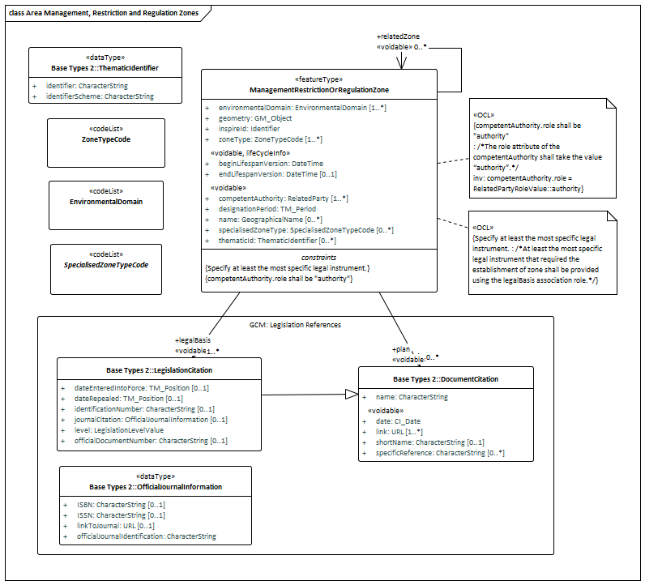

[.text-center]
*Figure 5 – UML class diagram: Overview of the Area Management Restriction and Regulation Zones application schema*

image::./media/image9.png[image,width=618,height=398, align=center]

[.text-center]
*Figure 6 – UML package diagram: Overview of the Area Management Restriction and Regulation Zones application schema*

image::./media/image10.png[image,width=614,height=315, align=center]

[.text-center]
*Figure 7 – UML class diagram: Overview of the code lists contained within the Area Management Restriction and Regulation Zones application schema*

===== Consistency between spatial data sets

====== Consistency between spatial data sets that share geometries

Some ManagementRestrictionOrRegulationZone spatial objects derive their geometry from another spatial object. Where this occurs the geometries of both spatial objects shall be consistent.

[IMPORTANT]
====
[.text-center]
*IR Requirement*
_Annex IV, Section 11.4.1_
*Theme-specific Requirements – Management Restriction Or Regulation Zones*

. Where the geometry of the spatial object is derived from another spatial object, the geometries of the two objects shall be consistent.
====

NOTE Any inconsistencies can be detected using data matching algorithms.

===== Identifier management

ManagementRestrictionOrRegulationZone spatial objects shall be assigned an inspireId in accordance with the rules for Identifier Management defined in section 14 of D2.5 Generic Conceptual Model. The requirement for an inspireId follows Recommendation 27 from section 14 of D2.5:

[cols=""]
|===
|*From Section 14 of D2.5 Generic Conceptual Model*
a|image::./media/image11.png[image,width=604,height=68, align=center]
|===

The inspireId is required for ManagementRestrictionOrRegulationZone spatial objects to enable references from non-spatial resources to be established. The inspireId shall be a persistent, external object identifier. This means that the inspireId shall provide a consistent identifier enabling multiple non-spatial resources to be linked to the same ManagementRestrictionOrRegulationZone.

The identifier assigned as the inspireId shall follow the four requirements for external object identifiers:

. *Uniqueness*: the identifier shall not be assigned to any other INSPIRE spatial object.
+
NOTE 1: Different versions of the spatial object shall have the same identifier
+
NOTE 2: Identifiers must not be re-used
. *Persistence:* once assigned the identifier shall remain unchanged during the life-time of a spatial object
. *Traceability:* a spatial object (or specific version) can be accessed based on its identifier
. *Feasibility:* the system for defining identifiers has been designed to allow existing identifiers to be used

The inspireId contains three properties: localID, namespace and a «voidable» version. Where an INSPIRE Download Service provides access to multiple versions of spatial objects, the version parameter should be included to enable third parties to include the version of the spatial object when the referencing.

[NOTE]
====
*Recomendation 8*

It is strongly recommended that a version is included in the inspireId to allow different versions of a spatial object to be distinguished.

====

*Relationship between inspireId and thematicId*

Many ManagementRestrictionOrRegulationZone spatial objects have been assigned multiple identifiers based on different identifier schemes that have been defined for data exchange for specific requirements (e.g. national versus European reporting. Thematic identifiers have been and shall continue to be the key used to link non-spatial data to the ManagementRestrictionOrRegulationZone spatial object. To ensure that none of these identifiers and links are lost, a thematicId has been added to the ManagementRestrictionOrRegulationZone.

The key difference between the inspireId and thematicId is that the inspireId shall be a persistent, unique identifier that can be used in external datasets to reference to the spatial object by any third party. Whereas the thematicID is a descriptive unique object identifier assigned to the spatial object defined in an information community.

NOTE A thematic identifier may form part of the inspireId.

Some ManagementRestrictionOrRegulationZone spatial objects may be assigned more than one thematic identifier. These thematic identifiers may have been assigned to meet internal data maintenance requirements or are identification codes assigned at national, European or International level.

*Example: River Basin Districts*

The WISE River Basin Districts v1.4 data specification defines the following identifier properties that are assigned to a River Basin District:

[cols=",",options="header",]
|===
|*Attribute Name* |*Description*
|Database Internal Key (Object ID) |Internal unique identifier (Primary Key).
|EU RBD Code |Unique RBD code submitted by MS via WFD Art. 3 reporting, national RBD code. National code prefixed by country code.
|MS RBD Code |Unique RBD code submitted by MS via WFD Art. 13 reporting, national RBD code.
|International Code |RBD codes for non EU countries.
|European RBD Code |A code assigned at EU level according to the international RBD the national RBD is part of.
|===

NOTE The internal unique identifier should not published as it serves as an internal primary key and is therefore not suitable for use as either an inspireId or thematicID.

The four RBD code properties should be encoded as thematicIDs. A thematicID is encoded using the ThematicIdentifier class defined in the GCM (Base Types 2 package) (Figure 8).

image::./media/image12.png[image,width=240,height=149, align=center]

[.text-center]
*Figure 8 - UML Class Diagram of ThematicIdentifier «dataType»*

The ThematicIdentifier is comprised of two properties:

* *identifier*: this is a descriptive unique object identifier assigned to the spatial object ((.g. AT2000, 2000 or AT5001 are different River Basin District codes assigned to Rhine)

* *identifierScheme*: this is preferably a HTTP URI used to identify which scheme is was used to define the identifier. See D2.7 Guidelines for the encoding of spatial data for more information about defining URIs for identifierSchemes.

===== Modelling of object references 

Object referencing does not apply to the geometries of ManagementRestrictionOrRegulationZone spatial objects.

Although the geometry of many ManagementRestrictionOrRegulationZone spatial objects are derived from other INSPIRE spatial objects, it was agreed during the development of the data specification that the benefits of sharing geometries are greatest for data maintenance rather than data exchange. Few services and applications currently do not adequately support object referencing. Therefore, the geometries of ManagementRestrictionOrRegulationZone spatial objects shall be explicitly defines using coordinates.

===== Geometry representation 

Typically the representation of the geometry of a ManagementRestrictionOrRegulationZone shall be either a GM_Surface or GM_MultiSurface. However, it has been recognised that at some levels of detail the geometry may be represented as either a GM_Point or GM_Curve. Consequently, any constraints on the geometry representation have been removed.

The requirements to support different geometry representations has required that the geometry data type uses the Abstract GM_Object class, allowing any geometry to be used.

[NOTE]
====
*Recomendation 9*

If a ManagementRestrictionOrRegulationZone should represent an area in the real world, then the geometry should be represented as either a GM_Surface or GM_MultiSurface.

====

[NOTE]
====
*Recomendation 10*

Where a ManagementRestrictionOrRegulationZone is comprised of multiple parts (i.e. surfaces) only one instance of a ManagementRestrictionOrRegulationZone spatial object should be provided. The geometry should be represented as a GM_MultiSurface.

====

===== Temporality representation 

The temporality of a ManagementRestrictionOrRegulationZone spatial object is represented by two types of properties:

* Transactional lifecycle properties: beginLifespanVersion and endLifespanVersion
* Real-world validity property: designationPeriod

The designationPeriod defines the time period (beginPosition and endPosition) when the ManagementRestrictionOrRegulationZone was legally designated or became effective in the real world.

The designationPeriod uses the TM_Period property from ISO 19108:2006. This provides greater encoding flexibility and improved semantics that defining separate "validTo" and "validFrom" that use xsd:DateTime.

TM_Period is implemented using the gml:TimePeriodType. It requires that both the beginPosition and endPosition are provided. If the ManagementRestrictionOrRegulationZone does not have a defined endPosition (i.e. it is unknown) then the endPosition/indeterminatePosition attribute should be used to state that the ManagementRestrictionOrRegulationZone is effective until an unknown endPosition.

The values that can be defined are flexible. The beginPosition and endPosition use the TM_Position type which is a union of ISO 8601 Date, Time or DateTime.

Example:
[source, xml]
<am:designationPeriod>
	<gml:TimePeriod gml:id="UK0039_TP">
		<gml:beginPosition>2011-10-01</gml:beginPosition>
		<gml:endPosition indeterminatePosition="unknown"/>
	</gml:TimePeriod>
</am:designationPeriod>

==== Feature catalogue

*Feature catalogue metadata*

[cols=","]
|===
|Application Schema |INSPIRE Application Schema Area Management Restriction and Regulation Zones
|Version number |3.0
|===

*Types defined in the feature catalogue*

[cols=",,",options="header",]
|===
|*Type* |*Package* |*Stereotypes*
|_ManagementRestrictionOrRegulationZone_ |Area Management Restriction and Regulation Zones |«featureType»
|===

===== Spatial object types

====== ManagementRestrictionOrRegulationZone

[cols="",options="header",]
|===
|*ManagementRestrictionOrRegulationZone*
a|
[cols=","]
!===
!Name: !management restriction or regulation zone
!Definition: !Area managed, restricted or regulated in accordance with a legal requirement related to an environmental policy or a policy or activity that may have an impact on the environment at any level of administration (or used for reporting at international, European, national, regional and local) levels.
!Stereotypes: !«featureType»
!===

a|
*Attribute: inspireId*

[cols=","]
!===
!Name: !inspireID
!Value type: !Identifier
!Definition: !External object identifier of the spatial object.
!Description: !An external object identifier is a unique object identifier published by the responsible body, which may be used by external application to reference the spatial object. The identifier is an identifier of the spatial object, not an identifier of the real-world phenomenon. 
 
NOTE ManagementRestrictionOrRegulationZone spatial objects commonly perform the role/function of _"Reporting Unit"_ for non-spatial reported data. The reported data shall contain object references to ManagementRestrictionOrRegulationZones. Therefore, all spatial objects shall be assigned an inspireID.
!Multiplicity: !1
!===

a|
*Attribute: thematicId*

[cols=","]
!===
!Name: !thematic identifier
!Value type: !ThematicIdentifier
!Definition: !Descriptive unique object identifier applied to spatial objects in a defined information theme.
!Description: !Some management, restriction or regulation zones may be assigned multiple thematic identifiers. These may have been established to meet the reporting requirements of different legislative instruments at International, European or at Member State levels. 
 
Where multiple thematicIDs exist all should be provided. This shall allow any external dataset that uses thematicIDs to referencing to the zone to continue to be linked to the spatial object.
!Multiplicity: !0..*
!Stereotypes: !«voidable»
!===

a|
*Attribute: name*

[cols=","]
!===
!Name: !name
!Value type: !GeographicalName
!Definition: !A geographical name that is used to identify the management, restriction or regulation zone in the real world. It provides a 'key' for implicitly associating different representations of the object.
!Multiplicity: !0..*
!Stereotypes: !«voidable»
!===

a|
*Attribute: geometry*

[cols=","]
!===
!Name: !Name geometry
!Value type: !GM_Object
!Definition: !The geometry representing the spatial extent of the spatial object.
!Description: !The geometry of a Management Area, Restriction or Regulation Zone can be defined using any geometry representation. Typically this shall be either a GM_Surface or GM_MultiSurface. 
 
NOTE Where a zone forms as a polygon, this should be encoded as a GM_Surface or GM_MultiSurface not a GM_Curve.
!Multiplicity: !1
!===

a|
*Attribute: zoneType*

[cols=","]
!===
!Name: !zone type
!Value type: !ZoneTypeCode
!Definition: !High level classification defining the type of management, restriction or regulation zone.
!Multiplicity: !1..*
!Values: !The allowed values for this code list comprise the values specified in _Annex C_ and additional values at any level defined by data providers.
!===

a|
*Attribute: specialisedZoneType*

[cols=","]
!===
!Name: !specialised zone type
!Value type: !SpecialisedZoneTypeCode
!Definition: !Additional classification value which further specialises the type of management, regulation or restriction zone relevant to the domain.
!Description: !
!Multiplicity: !0..1
!Stereotypes: !«voidable»
!Values: !The allowed values for this code list comprise any values defined by data providers.
!===

a|
*Attribute: designationPeriod*

[cols=","]
!===
!Name: !designation period
!Value type: !TM_Period
!Definition: !Time period defining when the management, restriction or regulation zone was legally designated or became effective in the real world.
!Description: !NOTE designationPeriod uses the ISO 19108 TM_Period which is comprised of two properties - gml:beginPosition and gml:endPosition. 
If the zone shall remain in force for an indeterminate period of time then the endPosition/indeterminatePosition="unknown" can be used to state that the zone is still effective.
!Multiplicity: !1
!Stereotypes: !«voidable»
!===

a|
*Attribute: environmentalDomain*

[cols=","]
!===
!Name: !environmental domain
!Value type: !EnvironmentalDomain
!Definition: !Classification of the environment domain(s) for which, through the establishment of the zone, certain environmental objectives shall be reached.
!Description: !A zone may be established within one environmental domain (e.g. water) or may to cover a wide range of environmental objectives that cross-cut several domains. For example, Marine Regions may relate to water, land use, sustainable development.
!Multiplicity: !1..*
!Values: !The allowed values for this code list comprise only the values specified in _Annex C_.
!===

a|
*Attribute: competentAuthority*

[cols=","]
!===
!Name: !competent authority
!Value type: !RelatedParty
!Definition: !Description of the organisation(s) responsible for managing, restricting or regulating measures or activities within the zone.
!Multiplicity: !1..*
!Stereotypes: !«voidable»
!===

a|
*Attribute: beginLifespanVersion*

[cols=","]
!===
!Name: !begin lifespan version
!Value type: !DateTime
!Definition: !Date and time at which this version of the spatial object was inserted or changed in the spatial data set.
!Multiplicity: !1
!Stereotypes: !«voidable,lifeCycleInfo»
!===

a|
*Attribute: endLifespanVersion*

[cols=","]
!===
!Name: !end lifespan version
!Value type: !DateTime
!Definition: !Date and time at which this version of the spatial object was superseded or retired in the spatial data set.
!Multiplicity: !0..1
!Stereotypes: !«voidable,lifeCycleInfo»
!===

a|
*Association role: legalBasis*

[cols=","]
!===
!Value type: !LegislationCitation
!Definition: !Reference to, or citation of the legal instrument or document that required the establishment of the zone.
!Multiplicity: !1..*
!Stereotypes: !«voidable»
!===

a|
*Association role: relatedZone*

[cols=","]
!===
!Value type: !ManagementRestrictionOrRegulationZone
!Definition: !Reference to a related management, regulation or restriction zone.
!Description: !EXAMPLE 1: River basin districts (RBD) exist at three levels: 
1) International River Basin District 
2) National River Basin District 
3) River Basin District Sub units. 
 
An international RBD may contain one or more national RBD and/or River Basin Sub Units. 
 
A national RBD may be related to an International RBD and one or more RBD sub-units. 
 
EXAMPLE 2: A WFDWaterBody may be related to a River Basin District.
!Multiplicity: !0..*
!Stereotypes: !«voidable»
!===

a|
*Association role: plan*

[cols=","]
!===
!Value type: !DocumentCitation
!Definition: !Reference to, or citation of a plan (management or action plan) that describes the environmental objectives and measures that shall be undertaken in the zone to protect the environment.
!Multiplicity: !0..*
!Stereotypes: !«voidable»
!===

a|
*Constraint: competentAuthority.role shall be "authority"*

[cols=","]
!===
!Natural language: !The role attribute of the competentAuthority shall take the value "authority".
!OCL: !inv: competentAuthority.role = RelatedPartyRoleValue::authority
!===

a|
*Constraint: Specify at least the most specific legal instrument.*

[cols=","]
!===
!Natural language: !At least the most specific legal instrument that required the establishment of zone shall be provided using the legalBasis association role.
!OCL: !
!===

|===

===== Code lists

====== EnvironmentalDomain

[cols="",options="header",]
|===
|*EnvironmentalDomain*
a|
[cols=","]
!===
!Name: !environmental domain
!Definition: !Environmental domain, for which environmental objectives can be defined.
!Extensibility: !none
!Identifier: !http://inspire.ec.europa.eu/codelist/EnvironmentalDomain
!Values: !The allowed values for this code list comprise only the values specified in _Annex C_.
!===

|===

====== SpecialisedZoneTypeCode

[cols="",options="header",]
|===
|*SpecialisedZoneTypeCode*
a|
[cols=","]
!===
!Name: !specialised zone type code
!Definition: !Additional classification value that defines the specialised type of zone.
!Description: !
!Extensibility: !any
!Identifier: !
!Values: !The allowed values for this code list comprise any values defined by data providers.
!===

|===

====== ZoneTypeCode

[cols="",options="header",]
|===
|*ZoneTypeCode*
a|
[cols=","]
!===
!Name: !zone type code
!Definition: !High-level classification defining the type of Management, Restriction or Regulation Zone.
!Extensibility: !open
!Identifier: !http://inspire.ec.europa.eu/codelist/ZoneTypeCode
!Values: !The allowed values for this code list comprise the values specified in _Annex C_ and additional values at any level defined by data providers.
!===

|===

===== Imported types (informative)

This section lists definitions for feature types, data types and enumerations and code lists that are defined in other application schemas. The section is purely informative and should help the reader understand the feature catalogue presented in the previous sections. For the normative documentation of these types, see the given references.

====== DateTime

[cols="",options="header",]
|===
|*DateTime*
a|
[cols=","]
!===
!Package: !Date and Time
!Reference: !Geographic information -- Conceptual schema language [ISO/TS 19103:2005]
!===

|===

====== GM_Object

[cols="",options="header",]
|===
|*GM_Object (abstract)*
a|
[cols=","]
!===
!Package: !Geometry root
!Reference: !Geographic information -- Spatial schema [ISO 19107:2003]
!===

|===

====== GeographicalName

[cols="",options="header",]
|===
|*GeographicalName*
a|
[cols=","]
!===
!Package: !Geographical Names
!Reference: !INSPIRE Data specification on Geographical Names [DS-D2.8.I.3]
!Definition: !Proper noun applied to a real world entity.
!===

|===

====== Identifier

[cols="",options="header",]
|===
|*Identifier*
a|
[cols=","]
!===
!Package: !Base Types
!Reference: !INSPIRE Generic Conceptual Model, version 3.4 [DS-D2.5]
!Definition: !External unique object identifier published by the responsible body, which may be used by external applications to reference the spatial object.
!Description: !NOTE1 External object identifiers are distinct from thematic object identifiers. 
 
NOTE 2 The voidable version identifier attribute is not part of the unique identifier of a spatial object and may be used to distinguish two versions of the same spatial object. 
 
NOTE 3 The unique identifier will not change during the life-time of a spatial object.
!===

|===

====== RelatedParty

[cols="",options="header",]
|===
|*RelatedParty*
a|
[cols=","]
!===
!Package: !Base Types 2
!Reference: !INSPIRE Generic Conceptual Model, version 3.4 [DS-D2.5]
!Definition: !An organisation or a person with a role related to a resource.
!Description: !NOTE 1 A party, typically an individual person, acting as a general point of contact for a resource can be specified without providing any particular role.
!===

|===

====== TM_Period

[cols="",options="header",]
|===
|*TM_Period*
a|
[cols=","]
!===
!Package: !Temporal Objects
!Reference: !Geographic information -- Temporal schema [ISO 19108:2002/Cor 1:2006]
!===

|===

====== ThematicIdentifier

[cols="",options="header",]
|===
|*ThematicIdentifier*
a|
[cols=","]
!===
!Package: !Base Types 2
!Reference: !INSPIRE Generic Conceptual Model, version 3.4 [DS-D2.5]
!Definition: !Thematic identifier to uniquely identify the spatial object.
!Description: !Some spatial objects may be assigned multiple unique identifiers. 
These may have been established to meet data exchange requirements of different reporting obligations at International, European or national levels and/or internal data maintenance requirements.
!===

|===

==== Externally governed code lists

Within the Area Management Restriction and Regulation Zone application schema, it is expected that the values that should be included in the SpecialisedZoneTypeCode are derived from externally governed code lists maintained by thematic communities or Member States.

To date, no such externally governed code lists have been identified. Several example SpecialisedZoneTypeCode code lists have been defined for the following ZoneTypeCodes:

* Air Quality Management Zone
* Noise Restriction Zone
* Sensitive Area
* Animal Health Restriction Zone
* WFD Water Body
* River Basin District
* Designated Waters
* Marine Region

Examples code list values are listed in Annex E.2.

=== Application schema Controlled Activities

==== Description

===== Narrative description

The controlled activities application schema is a TG Recommendation that should be used if a ManagementRestrictionOrRegulationZone contains specific activities that are controlled (permitted, prohibited, promoted or restricted) within the zone. These activities may be controlled for a specified time period.

Examples of controlled activities include:

* Restricting specific development types within a spatial planning restriction zone (e.g. cannot construct building greater than a specified height)
* Prohibiting animal and human movements during an disease outbreak (e.g. Foot and Mouth, Avian Influenza).
* Permitting abstraction of natural resources (minerals/water)
* Permitting the emission of pollutants
* Restrict noise levels during specific times of day
* Restrict hunting during specified times of the year

As the AM theme covers a broad range of domains it was not possible to define a definitive set of controlled activities that could be modelled within INSPIRE. Instead the aim has been to identify a high-level set of activity types to facilitate interoperability using the _activity_ property in the _ControlledActivity_ data type. The exact type of activity that is controlled within the zone can be specified using the _specialisedActivityType_ and _description_ properties.

Invariably, activities are controlled via prohibition, restriction or permission these controls apply for a specified time period. Therefore, a _restrictionPeriod_ property has been defined using the _Schedule_ data type.

The aim of the _Schedule_ data type is to provide a generic, flexibility data type enabling the encoding of a range of different use cases for restricted periods. These include:

* *Define an individual day or set of days:* Monday or Weekends or Public Holidays

* *Define a range of days*: Monday to Thursday

* *Define a set of days:* Monday, Tuesday, Thursday

* *Define a date or range of dates:* 2010-10-01 or 2010-04-01 to 2010-04-30

* *Define a day/range or set of days and time period:* Monday between 12:30-13:30, Monday to Thursday 9am to 5pm 2010-10-01 between 12:30 and 17:00

NOTE If only a day, set or a range of days/dates is defined then it is assumed that the restricted period applies for 24 hours.

As this extension only defines an additional property: controlledActivity, the requirements for: consistency between spatial objects, identifier management, modelling of object references and geometry and temporality representation defined for the ManagementRestrictionOrRegulationZone also apply here.

===== UML Overview

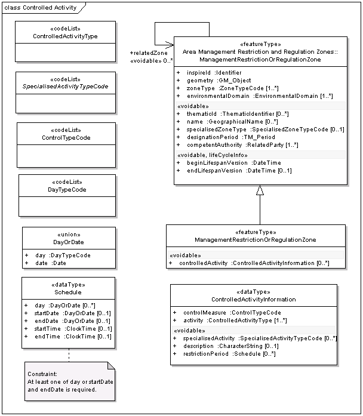

[.text-center]
*Figure 9 – UML class diagram: Overview of the Controlled Activities application schema*

image::./media/image14.png[image,width=296,height=284, align=center]

[.text-center]
*Figure 10 – UML package diagram: Overview of the Controlled Activities application schema*

image::./media/image15.png[image,width=363,height=509, align=center]

[.text-center]
*Figure 11 – UML class diagram: Overview of the code lists contained within the Controlled Activities application schema*

==== Feature catalogue

*Feature catalogue metadata*

[cols=","]
|===
|Application Schema |INSPIRE Application Schema Controlled Activities
|Version number |3.0
|===

*Types defined in the feature catalogue*

[cols=",,"]
|===
|*Type* |*Package* |*Stereotypes*
|_ControlledActivityInformation_ |Controlled Activities |«dataType»
|_DayOrDate_ |Controlled Activities |«union»
|_ManagementRestrictionOrRegulationZone_ |Controlled Activities |«featureType»
|_Schedule_ |Controlled Activities |«dataType»
|===

===== Spatial object types

====== ManagementRestrictionOrRegulationZone

[cols="",options="header",]
|===
|*ManagementRestrictionOrRegulationZone*
a|
[cols=","]
!===
!Subtype of: !ManagementRestrictionOrRegulationZone
!Definition: !Area managed, regulated or used for reporting at international, European, national, regional and local levels.
!Description: !Extended to include information describing activities that are controlled to achieve specific environment objectives within the zone.
!Stereotypes: !«featureType»
!===

a|
*Attribute: controlledActivity*

[cols=","]
!===
!Value type: !ControlledActivityInformation
!Definition: !A controlled activity is an activity that is either permitted, prohibited, promoted or restricted within the zone.
!Description: !
!Multiplicity: !0..*
!Stereotypes: !«voidable»
!===

|===

===== Data types

====== ControlledActivityInformation

[cols="",options="header",]
|===
|*ControlledActivityInformation*
a|
[cols=","]
!===
!Definition: !Information describing the type of activity that is controlled within the zone.
!Stereotypes: !«dataType»
!===

a|
*Attribute: controlMeasure*

[cols=","]
!===
!Value type: !ControlTypeCode
!Definition: !Type of control method used to manage activities or measures within the zone.
!Description: !
!Multiplicity: !1
!Values: !The allowed values for this code list comprise any values defined by data providers.
!===

a|
*Attribute: activity*

[cols=","]
!===
!Value type: !ControlledActivityType
!Definition: !Type of activity that is controlled within the zone.
!Description: !This is an extensible INSPIRE codelist containing high-level classification of activity areas. The specific type of activity that this controlled should be defined using the specialisedActivity.
!Multiplicity: !1..*
!Values: !The allowed values for this code list comprise any values defined by data providers.
!===

a|
*Attribute: specialisedActivity*

[cols=","]
!===
!Value type: !SpecialisedActivityTypeCode
!Definition: !Specific activity type defining the activity that is controlled in the zone.
!Description: !The specialisedActivity is a codelist value that should be derived from thematic or Member State codelist. The specialisedActivity should be an relevant activity that has a narrower definition than the ControlledActivityType. 
 
Example: 
 
If the ControlledActivityType is "plantAndAnimalHealth" the specialisedActivity could be "movement" or more specifically "animalMovement" and "humanMovement" (if human movements into an out of a restricted zone apply as was the case with Foot and Mouth disease outbreak in the UK).
!Multiplicity: !0..*
!Stereotypes: !«voidable»
!Values: !The allowed values for this code list comprise any values defined by data providers. _Annex C_ includes recommended values that may be used by data providers.
!===

a|
*Attribute: description*

[cols=","]
!===
!Value type: !CharacterString
!Definition: !Narrative summary providing any additional information that explains what controls apply to the activity.
!Multiplicity: !0..1
!Stereotypes: !«voidable»
!===

a|
*Attribute: restrictionPeriod*

[cols=","]
!===
!Value type: !Schedule
!Definition: !Time period defining when restrictions apply.
!Description: !NOTE Specific controls may apply to the activities or measures within specified time periods. 
 
There are several key use cases for defining a schedule for an activity such as a restriction: 
 
Define a day or set of days: Monday or Weekends or Public Holidays 
Define a range of days: Monday to Thursday 
Define a set of days: Monday, Tuesday, Thursday 
Define a date or range of dates: 2010-10-01 or 2010-04-01 to 2010-04-30 
Define a day/range or set of days and time period: Monday between 12:30-13:30, Monday to Thursday 9am to 5pm 2010-10-01 between 12:30 and 17:00
!Multiplicity: !0..*
!Stereotypes: !«voidable»
!===

|===

====== DayOrDate

[cols="",options="header",]
|===
|*DayOrDate*
a|
[cols=","]
!===
!Definition: !Choice to specify either the day or start day on which a restriction applies if it is a reoccurring scheduled restriction or a specific date or start date on which a restriction applies.
!Stereotypes: !«union»
!===

a|
*Attribute: day*

[cols=","]
!===
!Value type: !DayTypeCode
!Definition: !A specified day
!Multiplicity: !1
!Values: !The allowed values for this code list comprise any values defined by data providers.
!===

a|
*Attribute: date*

[cols=","]
!===
!Value type: !Date
!Definition: !A specified date
!Multiplicity: !1
!===

|===

====== Schedule

[cols="",options="header",]
|===
|*Schedule*
a|
[cols=","]
!===
!Definition: !Reoccurring time period defining when an activity is controlled.
!Stereotypes: !«dataType»
!===

a|
*Attribute: day*

[cols=","]
!===
!Value type: !DayOrDate
!Definition: !Day on which the restriction starts or days on which the restriction occurs.
!Description: !The day could either be defined as either a Date or as a Day.
!Multiplicity: !0..*
!===

a|
*Attribute: startDate*

[cols=","]
!===
!Value type: !DayOrDate
!Definition: !Day on which the restriction ends.
!Multiplicity: !0..1
!===

a|
*Attribute: endDate*

[cols=","]
!===
!Value type: !DayOrDate
!Definition: !Day on which the restriction ends.
!Multiplicity: !0..1
!===

a|
*Attribute: startTime*

[cols=","]
!===
!Value type: !ClockTime
!Definition: !Time defining when the controlled activity starts.
!Description: !
!Multiplicity: !0..1
!===

a|
*Attribute: endTime*

[cols=","]
!===
!Value type: !ClockTime
!Definition: !Time defining when the controlled activity starts. --Description NOTE if the endTime is empty then it shall be inferred that the restriction applies for 24 hours.
!Multiplicity: !0..1
!===

a|
*Constraint: At least one of day or startDate and endDate is required*

[cols=","]
!===
!Natural language: !
!OCL: !
!===

|===

===== Code lists

====== ControlledActivityType

[cols="",options="header",]
|===
|*ControlledActivityType*
a|
[cols=","]
!===
!Definition: !Classification of the types of activities controlled within the zone.
!Description: !A zone may be contain a number of activities that are controlled via regulation/restriction
!Extensibility: !any
!Identifier: !http://inspire.ec.europa.eu/codelist/ControlledActivityType
!Values: !The allowed values for this code list comprise any values defined by data providers.
!===

|===

====== ControlTypeCode

[cols="",options="header",]
|===
|*ControlTypeCode*
a|
[cols=","]
!===
!Definition: !Types of control used to manage activities within the zone.
!Extensibility: !any
!Identifier: !http://inspire.ec.europa.eu/codelist/ControlTypeCode
!Values: !The allowed values for this code list comprise any values defined by data providers.
!===

|===

====== DayTypeCode

[cols="",options="header",]
|===
|*DayTypeCode*
a|
[cols=","]
!===
!Definition: !Specified day of the week or period of days
!Extensibility: !any
!Identifier: !http://inspire.ec.europa.eu/codelist/DayTypeCode
!Values: !The allowed values for this code list comprise any values defined by data providers.
!===

|===

====== SpecialisedActivityTypeCode

[cols="",options="header",]
|===
|*SpecialisedActivityTypeCode*
a|
[cols=","]
!===
!Definition: !Controlled vocabulary or code list defined by domains or Member States of specific controlled activity types related to their domain.
!Extensibility: !any
!Identifier: !http://inspire.ec.europa.eu/codelist/SpecialisedActivityTypeCode
!Values: !The allowed values for this code list comprise any values defined by data providers. _Annex C_ includes recommended values that may be used by data providers.
!===

|===

===== Imported types (informative)

This section lists definitions for feature types, data types and enumerations and code lists that are defined in other application schemas. The section is purely informative and should help the reader understand the feature catalogue presented in the previous sections. For the normative documentation of these types, see the given references.

====== CharacterString

[cols="",options="header",]
|===
|*CharacterString*
a|
[cols=","]
!===
!Package: !Text
!Reference: !Geographic information -- Conceptual schema language [ISO/TS 19103:2005]
!===

|===

====== ClockTime

[cols="",options="header",]
|===
|*ClockTime*
a|
[cols=","]
!===
!Package: !Date and Time
!Reference: !Geographic information -- Conceptual schema language [ISO/TS 19103:2005]
!===

|===

====== Date

[cols="",options="header",]
|===
|*Date*
a|
[cols=","]
!===
!Package: !Date and Time
!Reference: !Geographic information -- Conceptual schema language [ISO/TS 19103:2005]
!===

|===

==== Externally governed code lists

Within the Controlled Activities application schema, it is expected that the values that should be included in the SpecialisedActivityTypeCode are derived from externally governed code lists maintained by thematic communities or Member States. To date, no such externally governed code lists have been identified.

<<<
== Reference systems, units of measure and grids

=== Default reference systems, units of measure and grid

The reference systems, units of measure and geographic grid systems included in this sub-section are the defaults to be used for all INSPIRE data sets, unless theme-specific exceptions and/or additional requirements are defined in section 6.2.

==== Coordinate reference systems

===== Datum

[IMPORTANT]
====
[.text-center]
*IR Requirement*
_Annex II, Section 1.2_
*Datum for three-dimensional and two-dimensional coordinate reference systems*

For the three-dimensional and two-dimensional coordinate reference systems and the horizontal component of compound coordinate reference systems used for making spatial data sets available, the datum shall be the datum of the European Terrestrial Reference System 1989 (ETRS89) in areas within its geographical scope, or the datum of the International Terrestrial Reference System (ITRS) or other geodetic coordinate reference systems compliant with ITRS in areas that are outside the geographical scope of ETRS89. Compliant with the ITRS means that the system definition is based on the definition of the ITRS and there is a well documented relationship between both systems, according to EN ISO 19111.

====

===== Coordinate reference systems

[IMPORTANT]
====
[.text-center]
*IR Requirement*
_Annex II, Section 1.3_
*Coordinate Reference Systems*

Spatial data sets shall be made available using at least one of the coordinate reference systems specified in sections 1.3.1, 1.3.2 and 1.3.3, unless one of the conditions specified in section 1.3.4 holds.

*1.3.1. Three-dimensional Coordinate Reference Systems*

* Three-dimensional Cartesian coordinates based on a datum specified in 1.2 and using the parameters of the Geodetic Reference System 1980 (GRS80) ellipsoid.

* Three-dimensional geodetic coordinates (latitude, longitude and ellipsoidal height) based on a datum specified in 1.2 and using the parameters of the GRS80 ellipsoid.

*1.3.2. Two-dimensional Coordinate Reference Systems*

* Two-dimensional geodetic coordinates (latitude and longitude) based on a datum specified in 1.2 and using the parameters of the GRS80 ellipsoid.

* Plane coordinates using the ETRS89 Lambert Azimuthal Equal Area coordinate reference system.

* Plane coordinates using the ETRS89 Lambert Conformal Conic coordinate reference system.

* Plane coordinates using the ETRS89 Transverse Mercator coordinate reference system.

*1.3.3. Compound Coordinate Reference Systems*

--
. For the horizontal component of the compound coordinate reference system, one of the coordinate reference systems specified in section 1.3.2 shall be used.

. For the vertical component, one of the following coordinate reference systems shall be used:
--

* For the vertical component on land, the European Vertical Reference System (EVRS) shall be used to express gravity-related heights within its geographical scope. Other vertical reference systems related to the Earth gravity field shall be used to express gravity-related heights in areas that are outside the geographical scope of EVRS.

* For the vertical component in the free atmosphere, barometric pressure, converted to height using ISO 2533:1975 International Standard Atmosphere, or other linear or parametric reference systems shall be used. Where other parametric reference systems are used, these shall be described in an accessible reference using EN ISO 19111-2:2012.

* For the vertical component in marine areas where there is an appreciable tidal range (tidal waters), the Lowest Astronomical Tide (LAT) shall be used as the reference surface.

* For the vertical component in marine areas without an appreciable tidal range, in open oceans and effectively in waters that are deeper than 200 meters, the Mean Sea Level (MSL) or a well-defined reference level close to the MSL shall be used as the reference surface.

*1.3.4. Other Coordinate Reference Systems*

Exceptions, where other coordinate reference systems than those listed in 1.3.1, 1.3.2 or 1.3.3 may be used, are:

. Other coordinate reference systems may be specified for specific spatial data themes in this Annex.

. For regions outside of continental Europe, Member States may define suitable coordinate reference systems.

The geodetic codes and parameters needed to describe these coordinate reference systems and to allow conversion and transformation operations shall be documented and an identifier shall be created, according to EN ISO 19111 and ISO 19127.
====

===== Display

[IMPORTANT]
====
[.text-center]
*IR Requirement*
_Annex II, Section 1.4_
*Coordinate Reference Systems used in the View Network Service*

For the display of spatial data sets with the view network service as specified in Regulation No 976/2009, at least the coordinate reference systems for two-dimensional geodetic coordinates (latitude, longitude) shall be available.

====

===== Identifiers for coordinate reference systems

[IMPORTANT]
====
[.text-center]
*IR Requirement*
_Annex II, Section 1.5_
*Coordinate Reference System Identifiers*

. Coordinate reference system parameters and identifiers shall be managed in one or several common registers for coordinate reference systems.

. Only identifiers contained in a common register shall be used for referring to the coordinate reference systems listed in this Section.

====

These Technical Guidelines propose to use the http URIs provided by the Open Geospatial Consortium as coordinate reference system identifiers (see identifiers for the default CRSs below). These are based on and redirect to the definition in the EPSG Geodetic Parameter Registry (_http://www.epsg-registry.org/_).

[TIP]
====
*TG Requirement 2*

The identifiers listed in Table 3 shall be used for referring to the coordinate reference systems used in a data set.

====

NOTE CRS identifiers may be used e.g. in:

* data encoding,
* data set and service metadata, and
* requests to INSPIRE network services.

[.text-center]
*Table 3. http URIs for the default coordinate reference systems*

[cols=",,",options="header",]
|===
|*Coordinate reference system* |*Short name* |*http URI identifier*
|3D Cartesian in ETRS89 |ETRS89-XYZ |_http://www.opengis.net/def/crs/EPSG/0/4936_
|3D geodetic in ETRS89 on GRS80 |ETRS89-GRS80h |_http://www.opengis.net/def/crs/EPSG/0/4937_
|2D geodetic in ETRS89 on GRS80 |ETRS89-GRS80 |_http://www.opengis.net/def/crs/EPSG/0/4258_
|2D LAEA projection in ETRS89 on GRS80 |ETRS89-LAEA |_http://www.opengis.net/def/crs/EPSG/0/3035_
|2D LCC projection in ETRS89 on GRS80 |ETRS89-LCC |_http://www.opengis.net/def/crs/EPSG/0/3034_
|2D TM projection in ETRS89 on GRS80, zone 26N (30°W to 24°W) |ETRS89-TM26N |_http://www.opengis.net/def/crs/EPSG/0/3038_
|2D TM projection in ETRS89 on GRS80, zone 27N (24°W to 18°W) |ETRS89-TM27N |_http://www.opengis.net/def/crs/EPSG/0/3039_
|2D TM projection in ETRS89 on GRS80, zone 28N (18°W to 12°W) |ETRS89-TM28N |_http://www.opengis.net/def/crs/EPSG/0/3040_
|2D TM projection in ETRS89 on GRS80, zone 29N (12°W to 6°W) |ETRS89-TM29N |_http://www.opengis.net/def/crs/EPSG/0/3041_
|2D TM projection in ETRS89 on GRS80, zone 30N (6°W to 0°) |ETRS89-TM30N |_http://www.opengis.net/def/crs/EPSG/0/3042_
|2D TM projection in ETRS89 on GRS80, zone 31N (0° to 6°E) |ETRS89-TM31N |_http://www.opengis.net/def/crs/EPSG/0/3043_
|2D TM projection in ETRS89 on GRS80, zone 32N (6°E to 12°E) |ETRS89-TM32N |_http://www.opengis.net/def/crs/EPSG/0/3044_
|2D TM projection in ETRS89 on GRS80, zone 33N (12°E to 18°E) |ETRS89-TM33N |_http://www.opengis.net/def/crs/EPSG/0/3045_
|2D TM projection in ETRS89 on GRS80, zone 34N (18°E to 24°E) |ETRS89-TM34N |_http://www.opengis.net/def/crs/EPSG/0/3046_
|2D TM projection in ETRS89 on GRS80, zone 35N (24°E to 30°E) |ETRS89-TM35N |_http://www.opengis.net/def/crs/EPSG/0/3047_
|2D TM projection in ETRS89 on GRS80, zone 36N (30°E to 36°E) |ETRS89-TM36N |_http://www.opengis.net/def/crs/EPSG/0/3048_
|2D TM projection in ETRS89 on GRS80, zone 37N (36°E to 42°E) |ETRS89-TM37N |_http://www.opengis.net/def/crs/EPSG/0/3049_
|2D TM projection in ETRS89 on GRS80, zone 38N (42°E to 48°E) |ETRS89-TM38N |_http://www.opengis.net/def/crs/EPSG/0/3050_
|2D TM projection in ETRS89 on GRS80, zone 39N (48°E to 54°E) |ETRS89-TM39N |_http://www.opengis.net/def/crs/EPSG/0/3051_
|Height in EVRS |EVRS |_http://www.opengis.net/def/crs/EPSG/0/5730_
|3D compound: 2D geodetic in ETRS89 on GRS80, and EVRS height |ETRS89-GRS80-EVRS |_http://www.opengis.net/def/crs/EPSG/0/7409_
|===

==== Temporal reference system

[IMPORTANT]
====
[.text-center]
*IR Requirement*
_Article 11_
*Temporal Reference Systems*

. The default temporal reference system referred to in point 5 of part B of the Annex to Commission Regulation (EC) No 1205/2008 (footnote:[OJ L 326, 4.12.2008, p. 12.]) shall be used, unless other temporal reference systems are specified for a specific spatial data theme in Annex II.

====

NOTE 1 Point 5 of part B of the Annex to Commission Regulation (EC) No 1205/2008 (the INSPIRE Metadata IRs) states that the default reference system shall be the Gregorian calendar, with dates expressed in accordance with ISO 8601.

NOTE 2 ISO 8601 _Data elements and interchange formats – Information interchange – Representation of dates and times_ is an international standard covering the exchange of date and time-related data. The purpose of this standard is to provide an unambiguous and well-defined method of representing dates and times, so as to avoid misinterpretation of numeric representations of dates and times, particularly when data is transferred between countries with different conventions for writing numeric dates and times. The standard organizes the data so the largest temporal term (the year) appears first in the data string and progresses to the smallest term (the second). It also provides for a standardized method of communicating time-based information across time zones by attaching an offset to Coordinated Universal Time (UTC).

EXAMPLE 1997 (the year 1997), 1997-07-16 (16^th^ July 1997), 1997-07-16T19:20:3001:00 (16^th^ July 1997, 19h 20' 30'', time zone: UTC1)

==== Units of measure

[IMPORTANT]
====
[.text-center]
*IR Requirement*
_Article 12_
*Other Requirements & Rules*

(...)

[arabic, start=2]
. All measurement values shall be expressed using SI units or non-SI units accepted for use with the International System of Units, unless specified otherwise for a specific spatial data theme or type.

====

=== Theme-specific requirements and recommendations

There are no theme-specific requirements or recommendations on reference systems and grids.

<<<
== Data quality

This chapter includes a description of the data quality elements and sub-elements as well as the corresponding data quality measures that should be used to evaluate and document data quality for data sets related to the spatial data theme _Area Management/Restriction/Regulation Zones and Reporting Units_ (section 7.1).

It may also define requirements or recommendations about the targeted data quality results applicable for data sets related to the spatial data theme _Area Management/Restriction/Regulation Zones and Reporting Units_ (sections 7.2 and 7.3).

In particular, the data quality elements, sub-elements and measures specified in section 7.1 should be used for

* evaluating and documenting data quality properties and constraints of spatial objects, where such properties or constraints are defined as part of the application schema(s) (see section 5);

* evaluating and documenting data quality metadata elements of spatial data sets (see section 8); and/or

* specifying requirements or recommendations about the targeted data quality results applicable for data sets related to the spatial data theme _Area Management/Restriction/Regulation Zones and Reporting Units_ (see sections 7.2 and 7.3).

The descriptions of the elements and measures are based on Annex D of ISO/DIS 19157 Geographic information – Data quality.

=== Data quality elements

Table 4 lists all data quality elements and sub-elements that are being used in this specification. Data quality information can be evaluated at level of spatial object, spatial object type, dataset or dataset series. The level at which the evaluation is performed is given in the "Evaluation Scope" column.

The measures to be used for each of the listed data quality sub-elements are defined in the following sub-sections.

[.text-center]
*Table 4 – Data quality elements used in the spatial data theme _Area Management/Restriction/Regulation Zones and Reporting Units_*

[cols=",,,,",]
|===
|*Section* |*Data quality element* |*Data quality sub-element* |*Definition* |*Evaluation Scope*
|7.1.1 |Logical consistency |Conceptual consistency |adherence to rules of the conceptual schema |spatial object type; spatial object
|7.1.2 |Logical consistency |Domain consistency |adherence of values to the value domains |spatial object type; spatial object
|===

==== Logical consistency – Conceptual consistency

The Application Schema conformance class of the Abstract Test Suite in Annex I defines a number of tests to evaluate the conceptual consistency (tests A.1.1, A.1.2 and A.1.4-A.1.7) of a data set.

[NOTE]
====
*Recomendation 11*

For the tests on conceptual consistency, it is recommended to use the _Logical consistency – Conceptual consistency_ data quality sub-element and the measure _Number of items not compliant with the rules of the conceptual schema_ as specified in the table below.

====

[cols=",",]
|===
|*Name* |
|Alternative name |-
|Data quality element |logical consistency
|Data quality sub-element |conceptual consistency
|Data quality basic measure |error count
|Definition |count of all items in the dataset that are not compliant with the rules of the conceptual schema
|Description |If the conceptual schema explicitly or implicitly describes rules, these rules shall be followed. Violations against such rules can be, for example, invalid placement of features within a defined tolerance, duplication of features and invalid overlap of features.
|Evaluation scope |spatial object / spatial object type
|Reporting scope |data set
|Parameter |-
|Data quality value type |integer
|Data quality value structure |-
|Source reference |ISO/DIS 19157 Geographic information – Data quality
|Example |
|Measure identifier |10
|===

==== Logical consistency – Domain consistency

The Application Schema conformance class of the Abstract Test Suite in Annex I defines a number of tests to evaluate the domain consistency (test A.1.3) of a data set.

[NOTE]
====
*Recomendation 12*

For the tests on domain consistency, it is recommended to use the _Logical consistency – Domain consistency_ data quality sub-element and the measure _Number of items not in conformance with their value domain_ as specified in the table below.

====

[cols=",",]
|===
|*Name* |*Number of items not in conformance with their value domain*
|Alternative name |-
|Data quality element |logical consistency
|Data quality sub-element |domain consistency
|Data quality basic measure |error count
|Definition |count of all items in the dataset that are not in conformance with their value domain
|Description |
|Evaluation scope |spatial object / spatial object type
|Reporting scope |data set
|Parameter |-
|Data quality value type |integer
|===

=== Minimum data quality requirements

No minimum data quality requirements are defined for the spatial data theme _Area Management/Restriction/Regulation Zones and Reporting Units_.

=== Recommendation on data quality

No minimum data quality recommendations are defined.

<<<
== Dataset-level metadata

This section specifies dataset-level metadata elements, which should be used for documenting metadata for a complete dataset or dataset series.

NOTE Metadata can also be reported for each individual spatial object (spatial object-level metadata). Spatial object-level metadata is fully described in the application schema(s) (section 5).

For some dataset-level metadata elements, in particular those for reporting data quality and maintenance, a more specific scope can be specified. This allows the definition of metadata at sub-dataset level, e.g. separately for each spatial object type (see instructions for the relevant metadata element).

=== Metadata elements defined in INSPIRE Metadata Regulation

Table 5 gives an overview of the metadata elements specified in Regulation 1205/2008/EC (implementing Directive 2007/2/EC of the European Parliament and of the Council as regards metadata).

The table contains the following information:

* The first column provides a reference to the relevant section in the Metadata Regulation, which contains a more detailed description.
* The second column specifies the name of the metadata element.
* The third column specifies the multiplicity.
* The fourth column specifies the condition, under which the given element becomes mandatory.

[.text-center]
*Table 5 – Metadata for spatial datasets and spatial dataset series specified in Regulation 1205/2008/EC*

[cols=",,,",]
|===
|*Metadata Regulation Section* |*Metadata element* |*Multiplicity* |*Condition*
|1.1 |Resource title |1 |
|1.2 |Resource abstract |1 |
|1.3 |Resource type |1 |
|1.4 |Resource locator |0..* |Mandatory if a URL is available to obtain more information on the resource, and/or access related services.
|1.5 |Unique resource identifier |1..* |
|1.7 |Resource language |0..* |Mandatory if the resource includes textual information.
|2.1 |Topic category |1..* |
|3 |Keyword |1..* |
|4.1 |Geographic bounding box |1..* |
|5 |Temporal reference |1..* |
|6.1 |Lineage |1 |
|6.2 |Spatial resolution |0..* |Mandatory for data sets and data set series if an equivalent scale or a resolution distance can be specified.
|7 |Conformity |1..* |
|8.1 |Conditions for access and use |1..* |
|8.2 |Limitations on public access |1..* |
|9 |Responsible organisation |1..* |
|10.1 |Metadata point of contact |1..* |
|10.2 |Metadata date |1 |
|10.3 |Metadata language |1 |
|===

Generic guidelines for implementing these elements using ISO 19115 and 19119 are available at _http://inspire.jrc.ec.europa.eu/index.cfm/pageid/101_. The following sections describe additional theme-specific recommendations and requirements for implementing these elements.

==== Conformity

The _Conformity_ metadata element defined in Regulation 1205/2008/EC requires to report the conformance with the Implementing Rule for interoperability of spatial data sets and services.

NOTE See Part 1 of the Abstract Test Suite in Annex A for further details on testing the conformance with the Implementing Rule.

In addition, the _Conformity_ metadata element may be used also to document the conformance to another specification.

[NOTE]
====
*Recomendation 13*

Dataset metadata should include a statement on the overall conformance of the dataset with this data specification.

====

NOTE See Part 3 of the Abstract Test Suite in Annex A for further details on testing the conformance with the data specification.

[NOTE]
====
*Recomendation 14*

The _Conformity_ metadata element should be used to document conformance with this data specification (as a whole), with a specific conformance class defined in the Abstract Test Suite in Annex A and/or with another specification.

====

The _Conformity_ element includes two sub-elements, the _Specification_ (a citation of the Implementing Rule for interoperability of spatial data sets and services or other specification), and the _Degree_ of conformity. The _Degree_ can be _Conformant_ (if the dataset is fully conformant with the cited specification), _Not Conformant_ (if the dataset does not conform to the cited specification) or _Not Evaluated_ (if the conformance has not been evaluated).

[NOTE]
====
*Recomendation 15*

If a dataset is not yet conformant with all requirements of this data specification, it is recommended to include information on the conformance with the individual conformance classes specified in the Abstract Test Suite in Annex A.

====

[NOTE]
====
*Recomendation 16*

If a dataset is produced or transformed according to an external specification that includes specific quality assurance procedures, the conformity with this specification should be documented using the _Conformity_ metadata element.

====

[NOTE]
====
*Recomendation 17*

If minimum data quality recommendations are defined then the statement on the conformity with these requirements should be included using the _Conformity_ metadata element and referring to the relevant data quality conformance class in the Abstract Test Suite.

====

NOTE Currently no minimum data quality requirements are included in the IRs. The recommendation above should be included as a requirement in the IRs if minimum data quality requirements are defined at some point in the future.

==== Lineage

[NOTE]
====
*Recomendation 18*

Following the ISO/DIS 19157 Quality principles, if a data provider has a procedure for the quality management of their spatial data sets then the appropriate data quality elements and measures defined in ISO/DIS 19157 should be used to evaluate and report (in the metadata) the results. If not, the _Lineage_ metadata element (defined in Regulation 1205/2008/EC) should be used to describe the overall quality of a spatial data set.

====

According to Regulation 1205/2008/EC, lineage "is a statement on process history and/or overall quality of the spatial data set. Where appropriate it may include a statement whether the data set has been validated or quality assured, whether it is the official version (if multiple versions exist), and whether it has legal validity. The value domain of this metadata element is free text".

The Metadata Technical Guidelines based on EN ISO 19115 and EN ISO 19119 specifies that the statement sub-element of LI_Lineage (EN ISO 19115) should be used to implement the lineage metadata element.

[NOTE]
====
*Recomendation 19*

To describe the transformation steps and related source data, it is recommended to use the following sub-elements of LI_Lineage:

* For the description of the transformation process of the local to the common INSPIRE data structures, the LI_ProcessStep sub-element should be used.

* For the description of the source data the LI_Source sub-element should be used.

====

NOTE 1 In order to improve the interoperability, domain templates and instructions for using these free text elements (descriptive statements) may be specified here and/or in an Annex of this data specification.

==== Temporal reference

According to Regulation 1205/2008/EC, at least one of the following temporal reference metadata sub-elements shall be provided: temporal extent, date of publication, date of last revision, date of creation.

[NOTE]
====
*Recomendation 20*

It is recommended that at least the date of the last revision of a spatial data set should be reported using the _Date of last revision_ metadata sub-element.

====

==== Lineage: Derived geometries for ManagementRestrictionOrRegulationZone 

[IMPORTANT]
====
[.text-center]
*IR Requirement*
_Annex IV, Section 11.4.1_
*Theme-specific Requirements – Management Restriction Or Regulation Zones*

[arabic, start=2]
. If the geometries of the spatial objects in a ManagementRestrictionOrRegulationZone data set are derived from the geometries of spatial objects in another data set, then this source data set (including its version) shall be described as part of the lineage metadata element.
====

==== Resource Abstract

The Resource Abstract metadata element defined in Regulation 1205/2008/EC allows to provide a brief summary of the content of the resource.

[NOTE]
====
*Recomendation 21*

To enable effective discovery of specific types of _ManagementRestrictionOrRegulationZone_ data sets, providers should include the following information in the resource abstract:

* Type of zone or name of the spatial object that forms the reporting unit

* Official full name of legislation that requires the establishment of the zone or reporting requirements

====

EXAMPLE 1 Air Quality Management Zones for Slovakia defined as required under Article 4 of the _Directive 2008/50/EC of the European Parliament and of the Council of 21 May 2008 on ambient air quality and cleaner air for Europe_ should be encoded like this:

[source, xml]
<gmd:abstract>
   <gco:CharacterString>Air Quality Management Zones for Slovakia defined as required under Article 4 of the Directive 2008/50/EC of the European Parliament and of the Council of 21 May 2008 on ambient air quality and cleaner air for Europe</gco:CharacterString>
</gmd:abstract>

EXAMPLE 2 Air Quality Management Zone Reporting Units for the 2011 reporting period for the _Directive 2008/50/EC of the European Parliament and of the Council of 21 May 2008 on ambient air quality and cleaner air for Europe_ should be encoded like this:

[source, xml]
<gmd:abstract>
   <gco:CharacterString>Air Quality Management Zone Reporting Units for the 2011 reporting period for the Directive 2008/50/EC of the European Parliament and of the Council of 21 May 2008 on ambient air quality and cleaner air for Europe</gco:CharacterString>
</gmd:abstract>

==== Keywords

Keywords are used to classify the resource to facilitate effective discovery and thematic discovery. The keyword value is a commonly used word, formalised word or phrase used to describe the subject and thus help narrowing a full text search and they allow for structured keyword search.

Since the ManagementRestrictionOrRegulationZone spatial object type is generic, data sets related to the theme _Area Management/Restriction/Regulation Zones and Reporting Units_ may contain spatial objects of different zone types, designated under different legal acts and related to different environmental domains. To make it easier for users to discover those _Area Management/Restriction/Regulation Zones and Reporting Units_ data sets that are relevant for a specific task, this data specification requires and recommends and number of additional keywords.

[IMPORTANT]
====
[.text-center]
*IR Requirement*
_Annex IV, Section 11.4.1_

*Theme-specific Requirements – Management Restriction Or Regulation Zones*

[arabic, start=3]
. Data providers shall include the following keywords in addition to the mandatory keywords defined in Regulation (EC) 1205/2008:
[loweralpha]
.. One or several keywords describing the high-level classification of the *zone type(s)* included in the data set, as defined in ZoneTypeCode code list.
.. One or several keywords describing the *official document number(s) of the legal instrument(s)* under which the zone(s) included in the data set is (are) established. For Union legislation, the CELEX number shall be used.

====

[NOTE]
====
*Recomendation 22*

For the keyword describing the high-level classification of the zone type(s) included in the data set, the natural language name of value in the ZoneTypeCode code list should be used as the keyword. The originating controlled vocabulary should be specified as follows:

* Title: INSPIRE ZoneTypeCode code list
* Date type: publication
* Date: 2013-02-04

====

[NOTE]
====
*Recomendation 23*

Data providers should also include the following keywords:

* Where applicable, one or several keywords describing the classification of the *specialised zone type(s)* included in the data set, as defined in the relevant code list (section 5.2.3). The natural language name of the specialised zone type should be used as the keyword. The originating controlled vocabulary should clearly identify the code list used for describing the specialized zone type.

* One or several keywords describing the official or commonly used *short name(s) and/or* the commonly used *acronym(s) of the legal acts* under which the zone(s) included in the data set is (are) established.

* One or several keywords describing the *environmental domain(s)* of the zones included in the data sets, as defined in EnvironmentalDomain code list (section 5.2.3). The natural language name should be used as the keyword. The originating controlled vocabulary should be specified as follows:
** Title: INSPIRE EnvironmentalDomain code list
** Date type: publication
** Date: 2013-02-04

====

EXAMPLE 1 For River Basin Districts, the following keywords shall/should be provided:

* River Basin District (zone type, required)
* 32000L0060 (official document number (CELEX), required)
* Water Framework Directive (legislation short name, recommended)
* WFD (legislation acronym, recommended)
* water (environmental domain, recommended)

EXAMPLE 2 For Air Quality Management Zones, the following keywords shall/should be provided:

* Air Quality Management Zone (zone type, required)
* 32008L0050 (official document number (CELEX), required)
* AQD Directive (legislation short name, recommended)
* air (environmental domain, recommended)
* health protection (environmental domain, recommended)

NOTE The recommendations for encoding the metadata in Recommendation 22 and Recommendation 23 touch on the larger issue of how to treat metadata keywords that come from a controlled vocabulary (like in this case or GEMET). Ideally, both a code and a human-readable label (in any language) should be included in the metadata, in the same way as is now proposed for providing code list values in the data encoding (see D2.7 Encoding Guidelines). This issue should be addressed in the next update of the Metadata Technical Guidelines.

=== Metadata elements for interoperability

[IMPORTANT]
====
[.text-center]
*IR Requirement*
_Article 13_
*Metadata required for Interoperability*

The metadata describing a spatial data set shall include the following metadata elements required for interoperability:

. Coordinate Reference System: Description of the coordinate reference system(s) used in the data set.

. Temporal Reference System: Description of the temporal reference system(s) used in the data set.
+
This element is mandatory only if the spatial data set contains temporal information that does not refer to the default temporal reference system.

. Encoding: Description of the computer language construct(s) specifying the representation of data objects in a record, file, message, storage device or transmission channel.

. Topological Consistency: Correctness of the explicitly encoded topological characteristics of the data set as described by the scope.
+
This element is mandatory only if the data set includes types from the Generic Network Model and does not assure centreline topology (connectivity of centrelines) for the network.

. Character Encoding: The character encoding used in the data set.
+
This element is mandatory only if an encoding is used that is not based on UTF-8.

. Spatial Representation Type: The method used to spatially represent geographic information.

====

These Technical Guidelines propose to implement the required metadata elements based on ISO 19115 and ISO/TS 19139.

The following TG requirements need to be met in order to be conformant with the proposed encoding.

[TIP]
====
*TG Requirement 3*

Metadata instance (XML) documents shall validate without error against the used ISO 19139 XML schema.

====

NOTE Section 2.1.2 of the Metadata Technical Guidelines discusses the different ISO 19139 XML schemas that are currently available.

[TIP]
====
*TG Requirement 4*

Metadata instance (XML) documents shall contain the elements and meet the INSPIRE multiplicity specified in the sections below.

====

[TIP]
====
*TG Requirement 5*

The elements specified below shall be available in the specified ISO/TS 19139 path.

====

[NOTE]
====
*Recomendation 24*

The metadata elements for interoperability should be made available together with the metadata elements defined in the Metadata Regulation through an INSPIRE discovery service.

====

NOTE While this not explicitly required by any of the INSPIRE Implementing Rules, making all metadata of a data set available together and through one service simplifies implementation and usability.

==== Coordinate Reference System

[cols=","]
|===
|*Metadata element name* |*Coordinate Reference System*
|Definition |Description of the coordinate reference system used in the dataset.
|ISO 19115 number and name |13. referenceSystemInfo
|ISO/TS 19139 path |referenceSystemInfo
|INSPIRE obligation / condition |mandatory
|INSPIRE multiplicity |1..*
|Data type(and ISO 19115 no.) |186. MD_ReferenceSystem
|Domain a|
To identify the reference system, the referenceSystemIdentifier (RS_Identifier) shall be provided.

NOTE More specific instructions, in particular on pre-defined values for filling the referenceSystemIdentifier attribute should be agreed among Member States during the implementation phase to support interoperability.

|Implementing instructions |
|Example a|
referenceSystemIdentifier:
code: ETRS_89
codeSpace: INSPIRE RS registry

|Example XML encoding a|
[source, xml]
<gmd:referenceSystemInfo>
		<gmd:MD_ReferenceSystem>
			<gmd:referenceSystemIdentifier>
				<gmd:RS_Identifier>
					<gmd:code>
						<gco:CharacterString>ETRS89 </gco:CharacterString>
					</gmd:code>
					<gmd:codeSpace>
						<gco:CharacterString>INSPIRE RS registry</gco:CharacterString>
					</gmd:codeSpace>
				</gmd:RS_Identifier>
			</gmd:referenceSystemIdentifier>
		</gmd:MD_ReferenceSystem>
</gmd:referenceSystemInfo>

|Comments |
|===

==== Temporal Reference System

[cols=","]
|===
|*Metadata element name* |*Temporal Reference System*
|Definition |Description of the temporal reference systems used in the dataset.
|ISO 19115 number and name |13. referenceSystemInfo
|ISO/TS 19139 path |referenceSystemInfo
|INSPIRE obligation / condition |Mandatory, if the spatial data set or one of its feature types contains temporal information that does not refer to the Gregorian Calendar or the Coordinated Universal Time.
|INSPIRE multiplicity |0..*
|Data type(and ISO 19115 no.) |186. MD_ReferenceSystem
|Domain a|
No specific type is defined in ISO 19115 for temporal reference systems. Thus, the generic MD_ReferenceSystem element and its reference SystemIdentifier (RS_Identifier) property shall be provided.

NOTE More specific instructions, in particular on pre-defined values for filling the referenceSystemIdentifier attribute should be agreed among Member States during the implementation phase to support interoperability.

|Implementing instructions |
|Example a|
referenceSystemIdentifier:
code: GregorianCalendar
codeSpace: INSPIRE RS registry
|Example XML encoding a|
[source, xml]
<gmd:referenceSystemInfo>
	<gmd:MD_ReferenceSystem>
		<gmd:referenceSystemIdentifier>
			<gmd:RS_Identifier>
				<gmd:code>
			<gco:CharacterString>GregorianCalendar </gco:CharacterString>
				</gmd:code>
				<gmd:codeSpace>
					<gco:CharacterString>INSPIRE RS registry</gco:CharacterString>
				</gmd:codeSpace>
			</gmd:RS_Identifier>
		</gmd:referenceSystemIdentifier>
	</gmd:MD_ReferenceSystem>
</gmd:referenceSystemInfo>

|Comments |
|===

==== Encoding

[cols=","]
|===
|*Metadata element name* |*Encoding*
|Definition |Description of the computer language construct that specifies the representation of data objects in a record, file, message, storage device or transmission channel
|ISO 19115 number and name |271. distributionFormat
|ISO/TS 19139 path |distributionInfo/MD_Distribution/distributionFormat
|INSPIRE obligation / condition |mandatory
|INSPIRE multiplicity |1..*
|Data type (and ISO 19115 no.) |284. MD_Format
|Domain |See B.2.10.4. The property values (name, version, specification) specified in section 5 shall be used to document the default and alternative encodings.
|Implementing instructions |
|Example a|
name: <Application schema name> GML application schema
version: version 3.0
specification: D2.8.III.11 Data Specification on Area Management/Restriction/Regulation Zones and Reporting Units – Technical Guidelines
|Example XML encoding a|
[source, xml]
<gmd:MD_Format>
	<gmd:name>
		<gco:CharacterString>SomeApplicationSchema GML application schema</gco:CharacterString>
	</gmd:name>
	<gmd:version>
		<gco:CharacterString>3.0</gco:CharacterString>
	</gmd:version>
	<gmd:specification>
		<gco:CharacterString>D2.8.III.11 Data Specification on Area Management/Restriction/Regulation Zones and Reporting Units – Technical Guidelines</gco:CharacterString>
	</gmd:specification>
</gmd:MD_Format>

|Comments |
|===

==== Character Encoding

[cols=","]
|===
|*Metadata element name* |*Character Encoding*
|Definition |The character encoding used in the data set.
|ISO 19115 number and name |
|ISO/TS 19139 path |
|INSPIRE obligation / condition |Mandatory, if an encoding is used that is not based on UTF-8.
|INSPIRE multiplicity |0..*
|Data type (and ISO 19115 no.) |
|Domain |
|Implementing instructions |
|Example |-
|Example XML encoding a|
[source, xml]
<gmd:characterSet>
	<gmd:MD_CharacterSetCode codeListValue="8859part2" codeList="http://standards.iso.org/ittf/PubliclyAvailableStandards/ISO_19139_Schemas/resources/Codelist/ML_gmxCodelists.xml#CharacterSetCode">8859-2</gmd:MD_CharacterSetCode>
</gmd:characterSet>

|Comments |
|===

==== Spatial representation type

[cols=","]
|===
|*Metadata element name* |*Spatial representation type*
|Definition |The method used to spatially represent geographic information.
|ISO 19115 number and name |37. spatialRepresentationType
|ISO/TS 19139 path |
|INSPIRE obligation / condition |Mandatory
|INSPIRE multiplicity |1..*
|Data type (and ISO 19115 no.) |B.5.26 MD_SpatialRepresentationTypeCode
|Domain |
|Implementing instructions a|
Of the values included in the code list in ISO 19115 (vector, grid, textTable, tin, stereoModel, video), only vector, grid and tin should be used.

NOTE Additional code list values may be defined based on feedback from implementation.

|Example |-
|Example XML encoding |
|Comments |
|===

==== Data Quality – Logical Consistency – Topological Consistency

See section 8.3.2 for instructions on how to implement metadata elements for reporting data quality.

=== Recommended theme-specific metadata elements

[NOTE]
====
*Recomendation 25*

The metadata describing a spatial data set or a spatial data set series related to the theme _Area Management/Restriction/Regulation Zones and Reporting Units_ should comprise the theme-specific metadata elements specified in Table 6.

====

The table contains the following information:

* The first column provides a reference to a more detailed description.
* The second column specifies the name of the metadata element.
* The third column specifies the multiplicity.

[.text-center]
*Table 6 – Optional theme-specific metadata elements for the theme _Area Management/Restriction/Regulation Zones and Reporting Units_*

[cols=",,",]
|===
|*Section* |*Metadata element* |*Multiplicity*
|8.3.1 |Maintenance Information |0..1
|8.3.2 |Logical Consistency – Conceptual Consistency |0..*
|8.3.2 |Logical Consistency – Domain Consistency |0..*
|===

[NOTE]
====
*Recomendation 26*

For implementing the metadata elements included in this section using ISO 19115, ISO/DIS 19157 and ISO/TS 19139, the instructions included in the relevant sub-sections should be followed.

====

==== Maintenance Information

[cols=","]
|===
|*Metadata element name* |*Maintenance information*
|Definition |Information about the scope and frequency of updating
|ISO 19115 number and name |30. resourceMaintenance
|ISO/TS 19139 path |identificationInfo/MD_Identification/resourceMaintenance
|INSPIRE obligation / condition |optional
|INSPIRE multiplicity |0..1
|Data type(and ISO 19115 no.) |142. MD_MaintenanceInformation
|Domain a|
This is a complex type (lines 143-148 from ISO 19115).
At least the following elements should be used (the multiplicity according to ISO 19115 is shown in parentheses):

* maintenanceAndUpdateFrequency [1]: frequency with which changes and additions are made to the resource after the initial resource is completed / domain value: MD_MaintenanceFrequencyCode:

* updateScope [0..*]: scope of data to which maintenance is applied / domain value: MD_ScopeCode

* maintenanceNote [0..*]: information regarding specific requirements for maintaining the resource / domain value: free text

|Implementing instructions |
|Example |
|Example XML encoding |
|Comments |
|===

==== Metadata elements for reporting data quality

[NOTE]
====
*Recomendation 27*

For reporting the results of the data quality evaluation, the data quality elements, sub-elements and (for quantitative evaluation) measures defined in chapter 7 should be used.

====

[NOTE]
====
*Recomendation 28*

The metadata elements specified in the following sections should be used to report the results of the data quality evaluation. At least the information included in the row "Implementation instructions" should be provided.

====

The first section applies to reporting quantitative results (using the element DQ_QuantitativeResult), while the second section applies to reporting non-quantitative results (using the element DQ_DescriptiveResult).

[NOTE]
====
*Recomendation 29*

If a dataset does not pass the tests of the Application schema conformance class (defined in Annex A), the results of each test should be reported using one of the options described in sections 8.3.2.1 and 8.3.2.2.

====

NOTE 1 If using non-quantitative description, the results of several tests do not have to be reported separately, but may be combined into one descriptive statement.

NOTE 2 The sections 8.3.2.1 and 8.3.2.2 may need to be updated once the XML schemas for ISO 19157 have been finalised.

The scope for reporting may be different from the scope for evaluating data quality (see section 7). If data quality is reported at the data set or spatial object type level, the results are usually derived or aggregated.

[NOTE]
====
*Recomendation 30*

The scope element (of type DQ_Scope) of the DQ_DataQuality subtype should be used to encode the reporting scope.

Only the following values should be used for the level element of DQ_Scope: Series, Dataset, featureType.

If the level is featureType the levelDescription/MDScopeDescription/features element (of type Set< GF_FeatureType>) shall be used to list the feature type names.

====

NOTE In the level element of DQ_Scope, the value featureType is used to denote spatial object type.

===== Guidelines for reporting quantitative results of the data quality evaluation

[cols=","]
|===
|*Metadata element name* |*See chapter 7*
|Definition |See chapter 7
|ISO/DIS 19157 number and name |3. report
|ISO/TS 19139 path |dataQualityInfo/*/report
|INSPIRE obligation / condition |optional
|INSPIRE multiplicity |0..*
|Data type (and ISO/DIS 19157 no.) |Corresponding DQ_xxx subelement from ISO/DIS 19157, e.g. 12. DQ_CompletenessCommission
|Domain a|
Lines 7-9 from ISO/DIS 19157
[arabic, start=7]
. DQ_MeasureReference (C.2.1.3)
. DQ_EvaluationMethod (C.2.1.4.)
. DQ_Result (C2.1.5.)

|Implementing instructions a|
[arabic, start=39]
. nameOfMeasure

NOTE This should be the name as defined in Chapter 7.
[arabic, start=42]
. evaluationMethodType
. evaluationMethodDescription

NOTE If the reported data quality results are derived or aggregated (i.e. the scope levels for evaluation and reporting are different), the derivation or aggregation should also be specified using this property.

[arabic, start=46]
. dateTime

NOTE This should be data or range of dates on which the data quality measure was applied.

[arabic, start=63]
. DQ_QuantitativeResult / 64. value

NOTE The DQ_Result type should be DQ_QuantitativeResult and the value(s) represent(s) the application of the data quality measure (39.) using the specified evaluation method (42-43.)

|Example |See Table E.12 — Reporting commission as metadata (ISO/DIS 19157)
|Example XML encoding |
|===

===== Guidelines for reporting descriptive results of the Data Quality evaluation

[cols=","]
|===
|*Metadata element name* |*See chapter 7*
|Definition |See chapter 7
|ISO/DIS 19157 number and name |3. report
|ISO/TS 19139 path |dataQualityInfo/*/report
|INSPIRE obligation / condition |optional
|INSPIRE multiplicity |0..*
|Data type (and ISO/DIS 19157 no.) |Corresponding DQ_xxx subelement from ISO/DIS 19157, e.g. 12. DQ_CompletenessCommission
|Domain a|
Line 9 from ISO/DIS 19157

[arabic, start=9]
. DQ_Result (C2.1.5.)

|Implementing instructions a|
[arabic, start=67]
. DQ_DescripitveResult / 68. statement

NOTE The DQ_Result type should be DQ_DescriptiveResult and in the statement (68.) the evaluation of the selected DQ sub-element should be expressed in a narrative way.

|Example |See Table E.15 — Reporting descriptive result as metadata (ISO/DIS 19157)
|Example XML encoding |
|===

<<<
== Delivery

=== Updates

[IMPORTANT]
====
[.text-center]
*IR Requirement*
_Article 8_
*Updates*

. Member States shall make available updates of data on a regular basis.
. All updates shall be made available at the latest 6 months after the change was applied in the source data set, unless a different period is specified for a specific spatial data theme in Annex II.

====

NOTE In this data specification, no exception is specified, so all updates shall be made available at the latest 6 months after the change was applied in the source data set.

=== Delivery medium

According to Article 11(1) of the INSPIRE Directive, Member States shall establish and operate a network of services for INSPIRE spatial data sets and services. The relevant network service types for making spatial data available are:

* _view services_ making it possible, as a minimum, to display, navigate, zoom in/out, pan, or overlay viewable spatial data sets and to display legend information and any relevant content of metadata;
* _download services_, enabling copies of spatial data sets, or parts of such sets, to be downloaded and, where practicable, accessed directly;
* _transformation services_, enabling spatial data sets to be transformed with a view to achieving interoperability.

NOTE For the relevant requirements and recommendations for network services, see the relevant Implementing Rules and Technical Guidelinesfootnote:[The Implementing Rules and Technical Guidelines on INSPIRE Network Services are available at http://inspire.jrc.ec.europa.eu/index.cfm/pageid/5].

EXAMPLE 1 Through the Get Spatial Objects function, a download service can either download a pre-defined data set or pre-defined part of a data set (non-direct access download service), or give direct access to the spatial objects contained in the data set, and download selections of spatial objects based upon a query (direct access download service). To execute such a request, some of the following information might be required:

* the list of spatial object types and/or predefined data sets that are offered by the download service (to be provided through the Get Download Service Metadata operation),
* and the query capabilities section advertising the types of predicates that may be used to form a query expression (to be provided through the Get Download Service Metadata operation, where applicable),
* a description of spatial object types offered by a download service instance (to be provided through the Describe Spatial Object Types operation).

EXAMPLE 2 Through the Transform function, a transformation service carries out data content transformations from native data forms to the INSPIRE-compliant form and vice versa. If this operation is directly called by an application to transform source data (e.g. obtained through a download service) that is not yet conformant with this data specification, the following parameters are required:

Input data (mandatory). The data set to be transformed.

* Source model (mandatory, if cannot be determined from the input data). The model in which the input data is provided.
* Target model (mandatory). The model in which the results are expected.
* Model mapping (mandatory, unless a default exists). Detailed description of how the transformation is to be carried out.

=== Encodings

The IRs contain the following two requirements for the encoding to be used to make data available.

[IMPORTANT]
====
[.text-center]
*IR Requirement*
_Article 7_
*Encoding*

{empty}1. Every encoding rule used to encode spatial data shall conform to EN ISO 19118. In particular, it shall specify schema conversion rules for all spatial object types and all attributes and association roles and the output data structure used.

{empty}2. Every encoding rule used to encode spatial data shall be made available.

{empty}2a. Every encoding rule used to encode spatial data shall also specify whether and how to represent attributes and association roles for which a corresponding value exists but is not contained in the spatial data sets maintained by a Member State, or cannot be derived from existing values at reasonable costs.

====

NOTE ISO 19118:2011 specifies the requirements for defining encoding rules used for interchange of geographic data within the set of International Standards known as the "ISO 19100 series". An encoding rule allows geographic information defined by application schemas and standardized schemas to be coded into a system-independent data structure suitable for transport and storage. The encoding rule specifies the types of data being coded and the syntax, structure and coding schemes used in the resulting data structure. Specifically, ISO 19118:2011 includes

* requirements for creating encoding rules based on UML schemas,
* requirements for creating encoding services, and
* requirements for XML-based encoding rules for neutral interchange of data.

While the IRs do not oblige the usage of a specific encoding, these Technical Guidelines propose to make data related to the spatial data theme _Area Management/Restriction/Regulation Zones and Reporting Units_ available at least in the default encoding(s) specified in section 0. In this section, a number of TG requirements are listed that need to be met in order to be conformant with the default encoding(s).

The proposed default encoding(s) meet the requirements in Article 7 of the IRs, i.e. they are conformant with ISO 19118 and (since they are included in this specification) publicly available.

==== Default Encoding(s)

===== Specific requirements for GML encoding

This data specification proposes the use of GML as the default encoding, as recommended in sections 7.2 and 7.3 of [DS-D2.7]. GML is an XML encoding in compliance with ISO 19118, as required in Article 7(1). For details, see [ISO 19136], and in particular Annex E (UML-to-GML application schema encoding rules).

The following TG requirements need to be met in order to be conformant with GML encodings.

[TIP]
====
*TG Requirement 6*

Data instance (XML) documents shall validate without error against the provided XML schema.

====

NOTE 1 Not all constraints defined in the application schemas can be mapped to XML. Therefore, the following requirement is necessary.

NOTE 2 The obligation to use only the allowed code list values specified for attributes and most of the constraints defined in the application schemas cannot be mapped to the XML sch. They can therefore not be enforced through schema validation. It may be possible to express some of these constraints using other schema or rule languages (e.g. Schematron), in order to enable automatic validation.

===== Default encoding(s) for application schema Area Management, Restriction and Regulation Zones

*Name: Area Management, Restriction and Regulation Zones GML Application Schema*
Version: version 3.0
Specification: D2.8.III.11 Data Specification on _Area Management/Restriction/Regulation Zones and Reporting Units_ – Technical Guidelines
Character set: UTF-8

The xml schema document is available from _http://inspire.ec.europa.eu/schemas/am/3.0/AreaManagementRestrictionRegulationZone.xsd_.

====== _Encoding rules used_

The encoding rule used for this encoding is specified in Annex B of [DS-D2.7].

NOTE Annex B of [DS-D2.7], version 3.3rc2, requires that the "encoding rule specified in ISO 19136 Annex E with the extensions in GML 3.3 shall be applied with the additional rules stated in this Annex. For types within the scope of the ISO/TS 19139 encoding rule, the encoding rule of ISO/TS 19139 shall be applied."

===== Default encoding(s) for application schema Controlled Activities

*Name: Controlled Activities GML Application Schema*
Version: version 3.0
Specification: D2.8.III.11 Data Specification on _Area Management/Restriction/Regulation Zones and Reporting Units_ – Technical Guidelines
Character set: UTF-8

The xml schema document is available from
_http://inspire.ec.europa.eu/draft-schemas/am-ca/3.0/AreaManagementRestrictionRegulationZone_ControlledActivities.xsd_.

====== Encoding rules used

The encoding rule used for this encoding is specified in Annex B of [DS-D2.7].

NOTE Annex B of [DS-D2.7], version 3.3rc2, requires that the "encoding rule specified in ISO 19136 Annex E with the extensions in GML 3.3 shall be applied with the additional rules stated in this Annex. For types within the scope of the ISO/TS 19139 encoding rule, the encoding rule of ISO/TS 19139 shall be applied."

==== Recommended Encoding(s)

[NOTE]
====
*Recomendation 31*

It is recommended that also the encodings specified in this section be provided for the relevant application schemas.

====

No alternative encodings are specified for this theme.

<<<
== Data Capture

There is no specific guidance required with respect to data capture.

<<<
== Portrayal

This clause defines the rules for layers and styles to be used for portrayal of the spatial object types defined for this theme. Portrayal is regulated in Article 14 of the IRs.

[IMPORTANT]
====
[.text-center]
*IR Requirement*
_Article 14_
*Portrayal*

. For the portrayal of spatial data sets using a view network service as specified in Commission Regulation No 976/2009 (footnote:[OJ L 274, 20.10.2009, p. 9.]), the following shall be available:
[loweralpha]
.. the layers specified in Annex II for the theme or themes the data set is related to;
.. for each layer at least a default portrayal style, with as a minimum an associated title and a unique identifier.

[arabic, start=2]
. For each layer, Annex II defines the following:
[loweralpha]
.. a human readable title of the layer to be used for display in user interface;
.. the spatial object type(s), or sub-set thereof, that constitute(s) the content of the layer.

====

In section 11.1, the _types_ of layers are defined that are to be used for the portrayal of the spatial object types defined in this specification. A view service may offer several layers of the same type, one for each dataset that it offers data on a specific topic.

NOTE The layer specification in the IRs only contains the name, a human readable title and the (subset(s) of) spatial object type(s), that constitute(s) the content of the layer. In addition, these Technical Guidelines suggest keywords for describing the layer.

[NOTE]
====
*Recomendation 32*

It is recommended to use the keywords specified in section 11.1 in the _Layers Metadata parameters_ of the INSPIRE View service (see Annex III, Part A, section 2.2.4 in Commission Regulation (EC) No 976/2009).

====

Section 11.2 specifies one style for each of these layers. It is proposed that INSPIRE view services support this style as the default style required by Article 14(1b).

[TIP]
====
*TG Requirement 7*

For each layer specified in this section, the styles defined in section 11.2 shall be available.

====

NOTE The default style should be used for portrayal by the view network service if no user-defined style is specified in a portrayal request for a specific layer.

In section 11.3, further styles can be specified that represent examples of styles typically used in a thematic domain. It is recommended that also these styles should be supported by INSPIRE view services, where applicable.

[NOTE]
====
*Recomendation 33*

In addition, it is recommended that, where applicable, INSPIRE view services also support the styles defined in section 11.3.

====

Where XML fragments are used in the following sections, the following namespace prefixes apply:

* sld="http://www.opengis.net/sld" (WMS/SLD 1.1)
* se="http://www.opengis.net/se" (SE 1.1)
* ogc="http://www.opengis.net/ogc" (FE 1.1)

[NOTE]
====
*Recomendation 1*

If an INSPIRE view services supports the portrayal of data related to the theme _Area Management/Restriction/Regulation Zones and Reporting Units_, which is not covered by the layers specified in section 11.1 (i.e. data that includes spatial objects of additional zone types), it should provide one layer per additional zone type according to the following template:

* Layer name: AM.<UpperCamelCaseName of the zone type>

* Layer title: <Natural language name of the zone type>

* Keywords: "management / restriction / regulation zones", <Natural language name of the zone type>

For these layers, a default style should be defined according to the template included in section 11.2.20.

This style should be supported by the INSPIRE view service, and used if no user-defined style is specified in a portrayal request for the layer.

====

=== Layers to be provided by INSPIRE view services

[cols=",,,"]
|===
|*Layer Name* |*Layer Title* |*Spatial object type(s)* |*Keywords*
a|
AM.<CodeListValue>footnote:[One layer shall be made available for each code list value, in accordance with Art. 14(3) of the IRs.]

Example: AM.AirQualityManagementZone

a|
<human readable name>

Example: Air Quality Management Zone

|ManagementRestrictionOrRegulationZone (zoneType : ZoneTypeCode) a|
management / restriction / regulation zones, <human readable name>

Example: 
management / restriction / regulation zones, air quality management zones

|===

NOTE The table above contains several layers for the spatial object type(s) <spatial object type names>, which can be further classified using a code list-valued attribute. Such sets of layers are specified as described in Article 14(3) of the IRs.

[IMPORTANT]
====
[.text-center]
*IR Requirement*
_Article 14_
*Portrayal*

(...)

[arabic, start=3]
. For spatial object types whose objects can be further classified using a code list-valued attribute, several layers may be defined. Each of these layers shall include the spatial objects corresponding to one specific code list value. In the definition of such sets of layers in Annexes II-IV,
[loweralpha]
.. the placeholder <CodeListValue> shall represent the values of the relevant code list, with the first letter in upper case,
.. the placeholder <human-readable name> shall represent the human-readable name of the code list values;
.. the spatial object type shall include the relevant attribute and code list, in parentheses;
.. one example of a layer shall be given.

====

For convenience, the layers for all code list values are listed in the table below.

[cols=",,,"]
|===
|*Layer Name* |*Layer Title* |*Spatial object type(s)* |*Keywords*
|AM.AirQualityManagementZone |Air Quality Management Zone |ManagementRestrictionOrRegulationZone (zoneType = airQualityManagementZone) |management / restriction / regulation zones, air quality management zones
|AM.AnimalHealthRestrictionZone |Animal Health Restriction Zone |ManagementRestrictionOrRegulationZone (zoneType = animalHealthRestrictionZone) |management / restriction / regulation zones, animal health restriction zones
|AM.AreaForDisposalOfWaste |Area For Disposal Of Waste |ManagementRestrictionOrRegulationZone (zoneType = areaForDisposalOfWaste) |management / restriction / regulation zones, areas for disposal of waste
|AM.BathingWaters |Bathing Waters |ManagementRestrictionOrRegulationZone (zoneType = bathingWaters) |management / restriction / regulation zones, bathing waters
|AM.CoastalZoneManagementArea |Coastal Zone Management Area |ManagementRestrictionOrRegulationZone (zoneType = coastalZoneManagementArea) |management / restriction / regulation zones, coastal zone management areas
|AM.DesignatedWaters |Designated Waters |ManagementRestrictionOrRegulationZone (zoneType = designatedWaters) |management / restriction / regulation zones, designated waters
|AM.DrinkingWaterProtectionArea |Drinking Water Protection Area |ManagementRestrictionOrRegulationZone (zoneType = drinkingWaterProtectionArea) |management / restriction / regulation zones, drinking water protection zones
|AM.FloodUnitOfManagement |Flood Unit Of Management |ManagementRestrictionOrRegulationZone (zoneType = floodUnitOfManagement) |management / restriction / regulation zones, flood units of management
|AM.ForestManagementArea |Forest Management Area |ManagementRestrictionOrRegulationZone (zoneType = forestManagementArea) |management / restriction / regulation zones, forest management areas
|AM.MarineRegion |Marine Region |ManagementRestrictionOrRegulationZone (zoneType = marineRegion) |management / restriction / regulation zones, marine regions
|AM.NitrateVulnerableZone |Nitrate Vulnerable Zone |ManagementRestrictionOrRegulationZone (zoneType = nitrateVulnerableZone) |management / restriction / regulation zones, nitrate vulnerable zones
|AM.NoiseRestrictionZone |Noise Restriction Zone |ManagementRestrictionOrRegulationZone (zoneType = noiseRestrictionZone) |management / restriction / regulation zones, noise restriction zones
|AM.PlantHealthProtectionZone |Plant Health Protection Zone |ManagementRestrictionOrRegulationZone (zoneType = plantHealthProtectionZone) |management / restriction / regulation zones, plant health restriction zones
|AM.ProspectingAndMiningPermitArea |Prospecting And Mining Permit Area |ManagementRestrictionOrRegulationZone (zoneType = prospectingAndMiningPermitArea) |management / restriction / regulation zones, prospecting, prospecting and mining permit areas
|AM.RegulatedFairwayAtSeaOrLargeInlandWater |Regulated Fairway At Sea Or Large Inland Water |ManagementRestrictionOrRegulationZone (zoneType = regulatedFairwayAtSeaOrLargeInlandWater) |management / restriction / regulation zones, regulated fairways at sea or large inland water
|AM.RestrictedZonesAroundContaminatedSites |Restricted Zones Around Contaminated Site |ManagementRestrictionOrRegulationZone (zoneType = restrictedZonesAroundContaminatedSites) |management / restriction / regulation zones, restricted zones around contaminated sites
|AM.RiverBasinDistrict |River Basin District |ManagementRestrictionOrRegulationZone (zoneType = riverBasinDistrict) |management / restriction / regulation zones, river basin districts
|AM.SensitiveArea |Sensitive Area |ManagementRestrictionOrRegulationZone (zoneType = sensitiveArea) |management / restriction / regulation zones, sensitive areas
|AM.WaterBodyForWFD |Water Body under the Water Framework Directive (2000/60/EC) |ManagementRestrictionOrRegulationZone (zoneType = waterBodyForWFD |management / restriction / regulation zones, water body under the Water Framework Directive (2000/60/EC)
|===

==== Layers organisation

None.

=== Styles required to be supported by INSPIRE view services

NOTE The symbology is defined in two SLD/SE fragments describing the layer and style, respectively. An example is given in section 11.2.1 for the layer AM.AirQualityManagementZone. All other layers and styles have equivalent SLD/SE definitions and can be derived by replacing the text in *bold* with the relevant names, titles, code list values and colour codes.

==== Styles for the layer AM.AirQualityManagementZone

[cols=",",options="header",]
|===
|*Style Name* |*AM.AirQualityManagementZone.Default*
|*Default Style* |yes
|*Style Title* |Air Quality Management Zone Default Style
|*Style Abstract* |The geometry is rendered for points as a square with a size of 6 pixels, with a mango (#FFD37F) fill and a black outline; for curves as a solid mango (#FFD37F) line with a stroke width of 2 pixels; and for surfaces using a mango (#FFD37F) fill with a transparency of 50% and a solid mango (#FFD37F) outline with a stroke width of 2 pixels.
|*Symbology* a|
*Definition of the named layer:*

[source, xml]
<?xml version="1.0" encoding="UTF-8"?>
<sld:NamedLayer xmlns:se="http://www.opengis.net/se" xmlns:sld="http://www.opengis.net/sld" xmlns:xsi="http://www.w3.org/2001/XMLSchema-instance" xsi:schemaLocation="http://www.opengis.net/sld http://schemas.opengis.net/sld/1.1/StyledLayerDescriptor.xsd" xmlns:ogc="http://www.opengis.net/ogc" xmlns:xlink="http://www.w3.org/1999/xlink">
	<se:Name>AM.AirQualityManagementZone</se:Name>
	<se:Description>
			<se:Title>Air Quality Management Zone</se:Title>
	</se:Description>
	<sld:LayerFeatureConstraints>
		<sld:FeatureTypeConstraint>
			<se:FeatureTypeName>ManagementRestrictionOrRegulationZone</se:FeatureTypeName>
			<ogc:Filter>
				<ogc:PropertyIsEqualTo>
					<ogc:PropertyName>zoneType</ogc:PropertyName>
					<ogc:Literal>airQualityManagementZone</ogc:Literal>
				</ogc:PropertyIsEqualTo>
			</ogc:Filter>
		</sld:FeatureTypeConstraint>
	</sld:LayerFeatureConstraints>
	<sld:UserStyle>
		<se:FeatureTypeStyle>
			<se:OnlineResource xlink:type="simple" xlink:href="UserStyle_AM_AirQualityManagementZone_Default.xml"/>
		</se:FeatureTypeStyle>
	</sld:UserStyle>
</sld:NamedLayer>

*Definition of the user style (UserStyle_AM_AirQualityManagementZone_Default.xml):*

[source, xml]
<?xml version="1.0" encoding="UTF-8"?>
<sld:UserStyle xmlns:se="http://www.opengis.net/se" xmlns:sld="http://www.opengis.net/sld" xmlns:xsi="http://www.w3.org/2001/XMLSchema-instance" xsi:schemaLocation="http://www.opengis.net/sld http://schemas.opengis.net/sld/1.1/StyledLayerDescriptor.xsd" xmlns:ogc="http://www.opengis.net/ogc">
	<se:Name>AM.AirQualityManagementZone.Default</se:Name>
	<sld:IsDefault>1</sld:IsDefault>
	<se:FeatureTypeStyle version="1.1.0">
		<se:Description>
			<se:Title>Air Quality Management Zone Default Style</se:Title>
			<se:Abstract>The geometry is rendered for points as a square with a size of 6 pixels, with a mango (#FFD37F) fill and a black outline; for curves as a solid mango (#FFD37F) line with a stroke width of 2 pixels; and for surfaces using a mango (#FFD37F) fill with a transparency of 50% and a solid mango (#FFD37F) outline with a stroke width of 2 pixels.</se:Abstract>
		</se:Description>
		<se:FeatureTypeName>ManagementRestrictionOrRegulationZone</se:FeatureTypeName>
		<se:Rule>
			<se:PolygonSymbolizer>
				<se:Geometry>
					<ogc:PropertyName>geometry</ogc:PropertyName>
				</se:Geometry>
				<se:Fill>
					<se:SvgParameter name="fill">#FFD37F</se:SvgParameter>
					<se:SvgParameter name="fill-opacity">0.5</se:SvgParameter>
				</se:Fill>
				<se:Stroke>
					<se:SvgParameter name="stroke-width">2</se:SvgParameter>
					<se:SvgParameter name="stroke">#FFD37F</se:SvgParameter>
				</se:Stroke>
			</se:PolygonSymbolizer>
			<se:LineSymbolizer>
				<se:Geometry>
					<ogc:PropertyName>geometry</ogc:PropertyName>
				</se:Geometry>
				<se:Stroke>
					<se:SvgParameter name="stroke-width">2</se:SvgParameter>
					<se:SvgParameter name="stroke">#FFD37F</se:SvgParameter>
				</se:Stroke>
			</se:LineSymbolizer>
			<se:PointSymbolizer>
				<se:Graphic>
					<se:Mark>
						<se:WellKnownName>square</se:WellKnownName>
						<se:Fill>
							<se:SvgParameter name="fill">#FFD37F</se:SvgParameter>
						</se:Fill>
						<se:Stroke>
							<se:SvgParameter name="stroke-width">1</se:SvgParameter>
							<se:SvgParameter name="stroke">#000000</se:SvgParameter>
						</se:Stroke>
					</se:Mark>
					<se:Size>6</se:Size>
				</se:Graphic>
			</se:PointSymbolizer>
		</se:Rule>
	</se:FeatureTypeStyle>
</sld:UserStyle>

|*Minimum & maximum scales* |None
|*Example* a|image::./media/image96.png[image]
|===

==== Styles for the layer AM.AnimalHealthRestrictionZone

[cols=",",options="header",]
|===
|*Style Name* |*AM.AnimalHealthRestrictionZone.Default*
|*Default Style* |yes
|*Style Title* |Animal Health Restriction Zone Default Style
|*Style Abstract* |The geometry is rendered for points as a square with a size of 6 pixels, with a red (#FF0000) fill and a black outline; for curves as a solid red (#FF0000) line with a stroke width of 2 pixels; and for surfaces using a red (#FF0000) fill with a transparency of 50% and a solid red (#FF0000) outline with a stroke width of 2 pixels.
|*Symbology* |See example in section 11.2.1.
|*Minimum & maximum scales* |None
|*Example* a|image::./media/image97.png[image]
|===

==== Styles for the layer AM.AreaForDisposalOfWaste

[cols=",",options="header",]
|===
|*Style Name* |*AM.AreaForDisposalOfWaste.Default*
|*Default Style* |yes
|*Style Title* |Area For Disposal Of Waste Default Style
|*Style Abstract* |The geometry is rendered for points as a square with a size of 6 pixels, with a light brown (#CDAA66) fill and a black outline; for curves as a solid light brown line (#CDAA66) with a stroke width of 2 pixels; and for surfaces using a light brown (#CDAA66) fill with a transparency of 50% and a solid light brown (#CDAA66) outline with a stroke width of 2 pixels.
|*Symbology* |See example in section 11.2.1.
|*Minimum & maximum scales* |None
|*Example* a|image::./media/image98.png[image]
|===

==== Styles for the layer AM.BathingWaters

[cols=",",options="header",]
|===
|*Style Name* |*AM.BathingWaters.Default*
|*Default Style* |yes
|*Style Title* |Bathing Waters Default Style
|*Style Abstract* |The geometry is rendered for points as a square with a size of 6 pixels, with a light blue (#BED2FF) fill and a black outline; for curves as a solid light blue line (#BED2FF) with a stroke width of 2 pixels; and for surfaces using a light blue (#BED2FF) fill with a transparency of 50% and a solid light blue (#BED2FF) outline with a stroke width of 2 pixels.
|*Symbology* |See example in section 11.2.1.
|*Minimum & maximum scales* |None
|*Example* a|image::./media/image99.png[image]
|===

==== Styles for the layer AM.CoastalZoneManagementArea

[cols=",",options="header",]
|===
|*Style Name* |*AM.CoastalZoneManagementArea.Default*
|*Default Style* |yes
|*Style Title* |Coastal Zone Management Area Default Style
|*Style Abstract* |The geometry is rendered for points as a square with a size of 6 pixels, with a blue (#85ABFF) fill and a black outline; for curves as a solid blue line (#85ABFF) with a stroke width of 2 pixels; and for surfaces using a blue (#85ABFF) fill with a transparency of 50% and a solid blue (#85ABFF) outline with a stroke width of 2 pixels.
|*Symbology* |See example in section 11.2.1.
|*Minimum & maximum scales* |None
|*Example* a|image::./media/image100.png[image]
|===

==== Styles for the layer AM.DesignatedWaters

[cols=",",options="header",]
|===
|*Style Name* |*AM.DesignatedWaters.Default*
|*Default Style* |yes
|*Style Title* |Designated Waters Default Style
|*Style Abstract* |The geometry is rendered for points as a square with a size of 6 pixels, with a light blue (#BED2FF) fill and a black outline; for curves as a solid light blue line (#BED2FF) with a stroke width of 2 pixels; and for surfaces using a light blue (#BED2FF) fill with a transparency of 50% and a solid light blue (#BED2FF) outline with a stroke width of 2 pixels.
|*Symbology* |See example in section 11.2.1.
|*Minimum & maximum scales* |None
|*Example* a|image::./media/image101.png[image]
|===

==== Styles for the layer AM.DrinkingWaterProtectionArea

[cols=",",options="header",]
|===
|*Style Name* |*AM.DrinkingWaterProtectionArea.Default*
|*Default Style* |yes
|*Style Title* |Drinking Water Protection Area Default Style
|*Style Abstract* |The geometry is rendered for points as a square with a size of 6 pixels, with a light blue (#BED2FF) fill and a black outline; for curves as a solid light blue line (#BED2FF) with a stroke width of 2 pixels; and for surfaces using a light blue (#BED2FF) fill with a transparency of 50% and a solid light blue (#BED2FF) outline with a stroke width of 2 pixels.
|*Symbology* |See example in section 11.2.1.
|*Minimum & maximum scales* |None
|*Example* a|image::./media/image102.png[image]
|===

==== Styles for the layer AM.FloodUnitOfManagement

[cols=",",options="header",]
|===
|*Style Name* |*AM.FloodUnitOfManagement.Default*
|*Default Style* |yes
|*Style Title* |Flood Unit Of Management Default Style
|*Style Abstract* |The geometry is rendered for points as a square with a size of 6 pixels, with a lilac (#9966FF) fill and a black outline; for curves as a solid lilac line (#9966FF) with a stroke width of 2 pixels; and for surfaces using a lilac (#9966FF) fill with a transparency of 50% and a solid lilac (#9966FF) outline with a stroke width of 2 pixels.
|*Symbology* |See example in section 11.2.1.
|*Minimum & maximum scales* |None
|*Example* a|image::./media/image103.png[image]
|===

==== Styles for the layer AM.ForestManagementArea

[cols=",",options="header",]
|===
|*Style Name* |*AM.ForestManagementArea.Default*
|*Default Style* |yes
|*Style Title* |Forest Management Area Default Style
|*Style Abstract* |The geometry is rendered for points as a square with a size of 6 pixels, with a light green (#33CC33) fill and a black outline; for curves as a solid light green line (#33CC33) with a stroke width of 2 pixels; and for surfaces using a light green line (#33CC33) fill with a transparency of 50% and a solid light green line (#33CC33) outline with a stroke width of 2 pixels.
|*Symbology* |See example in section 11.2.1.
|*Minimum & maximum scales* |None
|*Example* a|image::./media/image104.png[image]
|===

==== Styles for the layer AM.MarineRegion

[cols=",",options="header",]
|===
|*Style Name* |*AM.MarineRegion.Default*
|*Default Style* |yes
|*Style Title* |Marine Region Default Style
|*Style Abstract* |The geometry is rendered for points as a square with a size of 6 pixels, with a blue (#85ABFF) fill and a black outline; for curves as a solid blue line (#85ABFF) with a stroke width of 2 pixels; and for surfaces using a blue (#85ABFF) fill with a transparency of 50% and a solid blue (#85ABFF) outline with a stroke width of 2 pixels.
|*Symbology* |See example in section 11.2.1.
|*Minimum & maximum scales* |None
|*Example* a|image::./media/image105.png[image]
|===

==== Styles for the layer AM.NitrateVulnerableZone

[cols=",",options="header",]
|===
|*Style Name* |*AM.NitrateVulnerableZone.Default*
|*Default Style* |yes
|*Style Title* |Nitrate Vulnerable Zone Default Style
|*Style Abstract* |The geometry is rendered for points as a square with a size of 6 pixels, with a yellow (#FFFF66) fill and a black outline; for curves as a solid yellow line (#FFFF66) with a stroke width of 2 pixels; and for surfaces using a yellow (#FFFF66) fill with a transparency of 50% and a solid pale yellow (#FFFF66) outline with a stroke width of 2 pixels.
|*Symbology* |See example in section 11.2.1.
|*Minimum & maximum scales* |None
|*Example* a|image::./media/image106.png[image]
|===

==== Styles for the layer AM.NoiseRestrictionZone

[cols=",",options="header",]
|===
|*Style Name* |*AM.NoiseRestrictionZone.Default*
|*Default Style* |yes
|*Style Title* |Noise Restriction Zone Default Style
|*Style Abstract* |The geometry is rendered for points as a square with a size of 6 pixels, with a mango (#FFD37F) fill and a black outline; for curves as a solid mango (#FFD37F) line with a stroke width of 2 pixels; and for surfaces using a mango (#FFD37F) fill with a transparency of 50% and a solid mango (#FFD37F) outline with a stroke width of 2 pixels.
|*Symbology* |See example in section 11.2.1.
|*Minimum & maximum scales* |None
|*Example* a|image::./media/image107.png[image]
|===

==== Styles for the layer AM.PlantHealthProtectionZone

[cols=",",options="header",]
|===
|*Style Name* |*AM.PlantHealthProtectionZone.Default*
|*Default Style* |yes
|*Style Title* |Plant Health Protection Zone Default Style
|*Style Abstract* |The geometry is rendered for points as a square with a size of 6 pixels, with a red (#FF0000) fill and a black outline; for curves as a solid red (#FF0000) line with a stroke width of 2 pixels; and for surfaces using a red (#FF0000) fill with a transparency of 50% and a solid red (#FF0000) outline with a stroke width of 2 pixels.
|*Symbology* |See example in section 11.2.1.
|*Minimum & maximum scales* |None
|*Example* a|image::./media/image108.png[image]
|===

==== Styles for the layer AM.ProspectingAndMiningPermitArea

[cols=",",options="header",]
|===
|*Style Name* |*AM.ProspectingAndMiningPermitArea.Default*
|*Default Style* |yes
|*Style Title* |Prospecting And Mining Permit Area Default Style
|*Style Abstract* |The geometry is rendered for points as a square with a size of 6 pixels, with a light brown (#CDAA66) fill and a black outline; for curves as a solid light brown line (#CDAA66) with a stroke width of 2 pixels; and for surfaces using a light brown (#CDAA66) fill with a transparency of 50% and a solid light brown (#CDAA66) outline with a stroke width of 2 pixels.
|*Symbology* |See example in section 11.2.1.
|*Minimum & maximum scales* |None
|*Example* a|image::./media/image109.png[image]
|===

==== Styles for the layer AM.RegulatedFairwayAtSeaOrLargeInlandWater

[cols=",",options="header",]
|===
|*Style Name* |*AM.RegulatedFairwayAtSeaOrLargeInlandWater.Default*
|*Default Style* |yes
|*Style Title* |Regulated Fairway At Sea Or Large Inland Water Default Style
|*Style Abstract* |The geometry is rendered for points as a square with a size of 6 pixels, with a blue (#85ABFF) fill and a black outline; for curves as a solid blue line (#85ABFF) with a stroke width of 2 pixels; and for surfaces using a blue (#85ABFF) fill with a transparency of 50% and a solid blue (#85ABFF) outline with a stroke width of 2 pixels.
|*Symbology* |See example in section 11.2.1.
|*Minimum & maximum scales* |None
|*Example* a|image::./media/image110.png[image]
|===

==== Styles for the layer AM.RestrictedZonesAroundContaminatedSites

[cols=",",options="header",]
|===
|*Style Name* |*AM.RestrictedZonesAroundContaminatedSites.Default*
|*Default Style* |yes
|*Style Title* |Restricted Zones Around Contaminated Sites Default Style
|*Style Abstract* |The geometry is rendered for points as a square with a size of 6 pixels, with a red (#FF0000) fill and a black outline; for curves as a solid red (#FF0000) line with a stroke width of 2 pixels; and for surfaces using a red (#FF0000) fill with a transparency of 50% and a solid red (#FF0000) outline with a stroke width of 2 pixels.
|*Symbology* |See example in section 11.2.1.
|*Minimum & maximum scales* |None
|*Example* a|image::./media/image111.png[image]
|===

==== Styles for the layer AM.RiverBasinDistrict

[cols=",",options="header",]
|===
|*Style Name* |*AM.RiverBasinDistrict.Default*
|*Default Style* |yes
|*Style Title* |River Basin District Default Style
|*Style Abstract* |The geometry is rendered for points as a square with a size of 6 pixels, with a lilac (#9966FF) fill and a black outline; for curves as a solid lilac line (#9966FF) with a stroke width of 2 pixels; and for surfaces using a lilac (#9966FF) fill with a transparency of 50% and a solid lilac (#9966FF) outline with a stroke width of 2 pixels.
|*Symbology* |See example in section 11.2.1.
|*Minimum & maximum scales* |None
|*Example* a|image::./media/image112.png[image]
|===

==== Styles for the layer AM.SensitiveArea

[cols=",",options="header",]
|===
|*Style Name* |*AM.SensitiveArea.Default*
|*Default Style* |yes
|*Style Title* |Sensitive Area Default Style
|*Style Abstract* |The geometry is rendered for points as a square with a size of 6 pixels, with a yellow (#FFFF66) fill and a black outline; for curves as a solid yellow line (#FFFF66) with a stroke width of 2 pixels; and for surfaces using a yellow (#FFFF66) fill with a transparency of 50% and a solid pale yellow (#FFFF66) outline with a stroke width of 2 pixels.
|*Symbology* |See example in section 11.2.1.
|*Minimum & maximum scales* |None
|*Example* a|image::./media/image113.png[image]
|===

==== Styles for the layer AM.WaterBodyForWFD

[cols=",",options="header",]
|===
|*Style Name* |*AM.WaterBodyForWFD.Default*
|*Default Style* |yes
|*Style Title* |WFD Water Body Default Style
|*Style Abstract* |The geometry is rendered for points as a square with a size of 6 pixels, with a light blue (#BED2FF) fill and a black outline; for curves as a solid light blue line (#BED2FF) with a stroke width of 2 pixels; and for surfaces using a light blue (#BED2FF) fill with a transparency of 50% and a solid light blue (#BED2FF) outline with a stroke width of 2 pixels.
|*Symbology* |See example in section 11.2.1.
|*Minimum & maximum scales* |None
|*Example* a|image::./media/image114.png[image]
|===

==== Style template for layers of additional zone types

The table below includes a template to be used for defining the default style for layers not explicitly defined in this data specification. The text in angle brackets (<...>) should be replaced with appropriate text for the layer. The rest of the "boilerplate" text should be left unchanged.

[cols=",",options="header",]
|===
|*Style Name* |*<UpperCamelCase layer name>.Default*
|*Default Style* |yes
|*Style Title* |<Layer title> Default Style
|*Style Abstract* |The geometry is rendered for points as a square with a size of 6 pixels, with a <name of the colour> ({empty}#<hexadecimal colour code>) fill and a black outline; for curves as a solid <name of the colour> ({empty}#<hexadecimal colour code>) line with a stroke width of 2 pixels; and for surfaces using a <name of the colour> ({empty}#<hexadecimal colour code>) fill with a transparency of 50% and a solid <name of the colour> ({empty}#<hexadecimal colour code>) outline with a stroke width of 2 pixels.
|*Symbology* |See example in section 11.2.1.
|*Minimum & maximum scales* |None
|===

=== Styles recommended to be supported by INSPIRE view services 

No other styles are recommended.

:sectnums!:

<<<
== Bibliography

[DS-D2.3] INSPIRE DS-D2.3, Definition of Annex Themes and Scope, v3.0, http://inspire.jrc.ec.europa.eu/reports/ImplementingRules/DataSpecifications/D2.3_Definition_of_Annex_Themes_and_scope_v3.0.pdf

[DS-D2.5] INSPIRE DS-D2.5, Generic Conceptual Model, v3.4rc2, http://inspire.jrc.ec.europa.eu/documents/Data_Specifications/D2.5_v3.4rc2.pdf

[DS-D2.6] INSPIRE DS-D2.6, Methodology for the development of data specifications, v3.0, http://inspire.jrc.ec.europa.eu/reports/ImplementingRules/DataSpecifications/D2.6_v3.0.pdf

[DS-D2.7] INSPIRE DS-D2.7, Guidelines for the encoding of spatial data, v3.3rc2, http://inspire.jrc.ec.europa.eu/documents/Data_Specifications/D2.7_v3.3rc2.pdf

[ISO 19101] EN ISO 19101:2005 Geographic information – Reference model (ISO 19101:2002)

[ISO 19103] ISO/TS 19103:2005, Geographic information – Conceptual schema language

[ISO 19107] EN ISO 19107:2005, Geographic information – Spatial schema (ISO 19107:2003)

[ISO 19108] EN ISO 19108:2005 Geographic information - Temporal schema (ISO 19108:2002)

[ISO 19111] EN ISO 19111:2007 Geographic information - Spatial referencing by coordinates (ISO 19111:2007)

[ISO 19115] EN ISO 19115:2005, Geographic information – Metadata (ISO 19115:2003)

[ISO 19118] EN ISO 19118:2006, Geographic information – Encoding (ISO 19118:2005)

[ISO 19135] EN ISO 19135:2007 Geographic information – Procedures for item registration (ISO 19135:2005)

[ISO 19139] ISO/TS 19139:2007, Geographic information – Metadata – XML schema implementation

[ISO 19157] ISO/DIS 19157, Geographic information – Data quality

[OGC 06-103r3] Implementation Specification for Geographic Information - Simple feature access – Part 1: Common Architecture v1.2.0

<<<
:sectnums:
[appendix]
== Abstract Test Suite - (normative) 
 
[cols=""]
|===
*Disclaimer*

While this Annex refers to the Commission Regulation (EU) No 1089/2010 of 23 November 2010 implementing Directive 2007/2/EC of the European Parliament and of the Council as regards interoperability of spatial data sets and services, it does not replace the legal act or any part of it.
|===

The objective of the Abstract Test Suite (ATS) included in this Annex is to help the conformance testing process. It includes a set of tests to be applied on a data set to evaluate whether it fulfils the requirements included in this data specification and the corresponding parts of Commission Regulation No 1089/2010 (implementing rule as regards interoperability of spatial datasets and services, further referred to as ISDSS Regulation). This is to help data providers in declaring the conformity of a data set to the "degree of conformity, with implementing rules adopted under Article 7(1) of Directive 2007/2/EC", which is required to be provided in the data set metadata according to Commission Regulation (EC) No 2008/1205 (the Metadata Regulation).

*Part 1* of this ATS includes tests that provide *input for assessing conformity with the ISDSS regulation.* In order to make visible which requirements are addressed by a specific test, references to the corresponding articles of the legal act are given. The way how the cited requirements apply to am specification is described under the testing method.

In addition to the requirements included in ISDSS Regulation this Technical guideline contains TG requirements too. TG requirements are technical provisions that need to be fulfilled in order to be conformant with the corresponding IR requirement when the specific technical implementation proposed in this document is used. Such requirements relate for example to the default encoding described in section 9. *Part 2* of the ATS presents tests necessary for assessing the *conformity with TG requirements*.

NOTE Conformance of a data set with the TG requirement(s) included in this ATS implies conformance with the corresponding IR requirement(s).

The *ATS is applicable to the data sets that* *have been transformed* to be made available through INSPIRE download services (i.e. the data returned as a response to the mandatory "Get Spatial Dataset" operation) rather than the original "source" data sets.

The requirements to be tested are grouped in several _conformance classes_. Each of these classes covers a specific aspect: one conformance class contains tests reflecting the requirements on the application schema, another on the reference systems, etc. *Each conformance class is identified by a URI* (uniform resource identifier) according to the following pattern:

http://inspire.ec.europa.eu/conformance-class/ir/am/<conformance class identifier>

EXAMPLE 1 The URI _http://inspire.ec.europa.eu/conformance-class/ir/ef/rs_ identifies the Reference Systems ISDSS conformance class of the Environmental Monitoring Facilities (EF) data theme.

The results of the tests should be published referring to the relevant conformance class (using its URI).

When an INSPIRE data specification contains *more than one application schema,* the requirements tested in a conformance class may differ depending on the application schema used as a target for the transformation of the data set. This will always be the case for the application schema conformance class. However, also other conformance classes could have different requirements for different application schemas. In such cases, a separate conformance class is defined for each application schema, and they are distinguished by specific URIs according to the following pattern:

http://inspire.ec.europa.eu/conformance-class/ir/am/<conformance class identifier>/ 
<application schema namespace prefix>

EXAMPLE 2 The URI _http://inspire.ec.europa.eu/conformance-class/ir/el/as/el-vec_ identifies the conformity with the application schema (_as_) conformance class for the Elevation Vector Elements (_el-vec_) application schema.

An overview of the conformance classes and the associated tests is given in the table below.

[.text-center]
*Table 7. Overview of the tests within this Abstract Test Suite.*

[cols=""]
|===
|A.1 Application Schema Conformance Class
a|
[cols=""]
!===
!A.1.1 Schema element denomination test
!A.1.2 Value type test
!A.1.3 Value test
!A.1.4 Attributes/associations completeness test
!A.1.5 Abstract spatial object test
!A.1.6 Constraints test
!A.1.7 Geometry representation test
!===
|A.2 Reference Systems Conformance Class
a|
[cols=""]
!===
!A.2.1 Datum test
!A.2.2 Coordinate reference system test
!A.2.3 View service coordinate reference system test
!A.2.4 Temporal reference system test
!A.2.5 Units of measurements test
!===
|A.3 Data Consistency Conformance Class
a|
[cols=""]
!===
!A.3.1 Unique identifier persistency test
!A.3.2 Version consistency test
!A.3.3 Life cycle time sequence test
!A.3.4 Validity time sequence test
!A.3.5 Update frequency test
!A.3.6 Geometry consistency test
!===
|A.4 Metadata IR Conformance Class
a|
[cols=""]
!===
!A.4.1 Metadata for interoperability test
!A.4.2 Lineage metadata test
!A.4.3 Keywords metadata test
!===
|A.5 Information Accessibility Conformance Class
a|
[cols=""]
!===
!A.5.1 Code list publication test
!A.5.2 CRS publication test
!A.5.3 CRS identification test
!===
|A.6 Data Delivery Conformance Class
a|
[cols=""]
!===
!A.6.1 Encoding compliance test
!===
|A.7 Portrayal Conformance Class
a|
[cols=""]
!===
!A.7.1 Layer designation test
!===
|A.8 Reporting units Conformance Class
a|
[cols=""]
!===
!A.8.1 Environmental reporting data test
!===
|A.9 Technical Guideline Conformance Class
a|
[cols=""]
!===
!A.9.1 Multiplicity test
!A.9.2 CRS http URI test
!A.9.3 Metadata encoding schema validation test
!A.9.4 Metadata occurrence test
!A.9.5 Metadata consistency test
!A.9.6 Encoding schema validation test
!A.9.7 Style test
!===
|===

In order to be conformant to a conformance class, a data set has to pass *all* tests defined for that conformance class.

In order to be conformant with the ISDSS regulation the inspected data set needs to be conformant to *all* conformance classes in Part 1. The conformance class for overall conformity with the ISDSS regulation is identified by the URI _http://inspire.ec.europa.eu/conformance-class/ir/am/._

In order to be conformant with the Technical Guidelines, the dataset under inspection needs to be conformant to all conformance classes included both in Part 1 and 2. Chapter 8 describes in detail how to publish the result of testing regarding overall conformity and conformity with the conformance classes as metadata. The conformance class for overall conformity with the Technical Guidelines is identified by the URI _http://inspire.ec.europa.eu/conformance-class/tg/am/3.0._

It should be noted that data providers are not obliged to integrate / decompose the original structure of the source data sets when they deliver them for INSPIRE. It means that a conformant dataset can contain less or more spatial object / data types than specified in the ISDSS Regulation.

*A dataset that contains less spatial object and/or data types* can be regarded conformant when the corresponding types of the source datasets after the necessary transformations fulfil the requirements set out in the ISDSS Regulation.

A *dataset that contain more spatial object and/or data types* may be regarded as conformant when

* all the spatial object / data types that have corresponding types in the source dataset after the necessary transformations fulfil the requirements set out in the ISDSS Regulation and
* all additional elements of the source model (spatial object types, data types, attributes, constraints, code lists and enumerations together with their values) do not conflict with any rule defined in the interoperability target specifications defined for any theme within INSPIRE.

[.red.background]
====
*Open issue 1:* Even though the last condition can be derived from Art. 8(4) of the Directive, the ISDSS Regulation does not contain requirements concerning the above issue. Therefore, no specific tests have been included in this abstract suite for testing conformity of extended application schemas. Annex F of the Generic Conceptual Model (D2.5) provides an example how to extend INSPIRE application schemas in a compliant way.
====

The ATS contains a detailed list of abstract tests. It should be noted that some tests in the Application schema conformance class can be automated by utilising xml *schema validation tools.* It should be noted that failing such validation test does not necessary reflect non-compliance to the application schema; it may be the results of erroneous encoding.

Each test in this suite follows the same structure:

* Requirement: citation from the legal texts (ISDSS requirements) or the Technical Guidelines (TG requirements);
* Purpose: definition of the scope of the test;
* Reference: link to any material that may be useful during the test;
* Test method: description of the testing procedure.

According to ISO 19105:2000 all tests in this ATS are basic tests. Therefore, this statement is not repeated each time.

<<<
[discrete]
== Part 1 - (normative)

*Conformity of Management Restriction and Regulation Zones data with Commission Regulation No 1089/2010*

This part contains conformance classes and tests for checking the requirements related to Area Management Restriction and Regulation Zones, as defined in Annex IV of the Implementing Rules, with the exception of Section 11.4.2.

NOTE 1 The requirement in point 1 of Section 11.4.2 makes reference to the "requirements of their respective INSPIRE spatial data theme(s)". Therefore, no tests related to this requirement are included. Data providers should simply check conformance against the ATS for the relevant spatial data theme(s).

NOTE 2 The subject of requirement in Section 11.4.2, point 2 of Annex IV of the Implementing Rules is "environmental reporting data". Therefore, a separate conformance class is defined for the purpose of checking compliance of environmental reporting data with this requirement. It is not necessary for Area Management Restriction and Regulation Zones data to pass this conformance class in order to claim compliance with the Implementing Rules.

=== Application Schema Conformance Class

*Conformance class:*

http://inspire.ec.europa.eu/conformance-class/ir/am/as/am

==== Schema element denomination test
[loweralpha]
 . [.underline]#Purpose#: Verification whether each element of the dataset under inspection carries a name specified in the target application schema(s).

. [.underline]#Reference#: Art. 3 and Art.4 of Commission Regulation No 1089/2010

. [.underline]#Test Method#: Examine whether the corresponding elements of the source schema (spatial object types, data types, attributes, association roles, code lists, and enumerations) are mapped to the target schema with the correct designation of mnemonic names.

NOTE Further technical information is in the Feature catalogue and UML diagram of the application schema(s) in section 5.2.

==== Value type test

[loweralpha]
 . [.underline]#Purpose#: Verification whether all attributes or association roles use the corresponding value types specified in the application schema(s).

. [.underline]#Reference#: Art. 3, Art.4, Art.6(1), Art.6(4), Art.6(5) and Art.9(1)of Commission Regulation No 1089/2010.

. [.underline]#Test Method#: Examine whether the value type of each provided attribute or association role adheres to the corresponding value type specified in the target specification.

NOTE 1 This test comprises testing the value types of INSPIRE identifiers, the value types of attributes and association roles that should be taken from enumeration and code lists, and the coverage domains.

NOTE 2 Further technical information is in the Feature catalogue and UML diagram of the application schema(s) in section 5.2.

==== Value test

[loweralpha]
 . [.underline]#Purpose#: Verify whether all attributes or association roles whose value type is a code list or enumeration take the values set out therein.

. [.underline]#Reference#: Art.4 (3) of Commission Regulation No 1089/2010.

. [.underline]#Test Method#: When an attribute / association role has an enumeration or code list as its type, compare the values of each instance with those provided in the application schema. To pass this tests any instance of an attribute / association role

* shall take only values explicitly specified in the code list when the code list's extensibility is "none" (EnvironmentalDomain).

NOTE 1 This test is not applicable to code lists with extensibility "open" or "any".

NOTE 2 When a data provider only uses code lists with narrower (more specific values) this test can be fully performed based on internal information.

==== Attributes/associations completeness test

[loweralpha]
 . [.underline]#Purpose#: Verification whether each instance of spatial object type and data types include all attributes and association roles as defined in the target application schema.

. [.underline]#Reference#: Art. 3, Art.4(1), Art.4(2), and Art.5(2) of Commission Regulation No 1089/2010.

. [.underline]#Test Method#: Examine whether all attributes and association roles defined for a spatial object type or data type are present for each instance in the dataset.

NOTE 1 Further technical information is in the Feature catalogue and UML diagram of the application schema(s) in section 5.2.

NOTE 2 If an attribute has the stereotype «voidable», then according to the INSPIRE Generic Conceptual Model (section 9.4.5), it shall be possible to qualify a value of void in the data with one of the three "void reason" values "unknown", "unpopulated" or "withheld".

NOTE 3 If the characteristic described by the attribute or association role does not exist in or apply to the real world entity, the attribute or association role does not need to be present in the data set.

==== Abstract spatial object test

[loweralpha]
 . [.underline]#Purpose#: Verification whether the dataset does NOT contain abstract spatial object / data types defined in the target application schema(s).

. [.underline]#Reference#: Art.5(3) of Commission Regulation No 1089/2010

. [.underline]#Test Method#: Examine that there are NO instances of abstract spatial object / data types in the dataset provided.

NOTE Further technical information is in the Feature catalogue and UML diagram of the application schema(s) in section 5.2.

==== Constraints test

[loweralpha]
 . [.underline]#Purpose#: Verification whether the instances of spatial object and/or data types provided in the dataset adhere to the constraints specified in the target application schema(s).

. [.underline]#Reference#: Art. 3, Art.4(1), and Art.4(2) of Commission Regulation No 1089/2010.

. [.underline]#Test Method#: Examine all instances of data for the constraints specified for the corresponding spatial object / data type. Each instance shall adhere to all constraints specified in the target application schema(s).

NOTE Further technical information is in the Feature catalogue and UML diagram of the application schema(s) in section 5.2.

==== Geometry representation test

[loweralpha]
 . [.underline]#Purpose#: Verification whether the value domain of spatial properties is restricted as specified in the Commission Regulation No 1089/2010.

. [.underline]#Reference#: Art.12(1) of Commission Regulation No 1089/2010

. [.underline]#Test Method#: Check whether all spatial properties only use 0, 1 and 2-dimensional geometric objects that exist in the right 2-, 3- or 4-dimensional coordinate space, and where all curve interpolations respect the rules specified in the reference documents.

NOTE Further technical information is in OGC Simple Feature spatial schema v1.2.1 [06-103r4].

=== Reference Systems Conformance Class

*Conformance class:*

http://inspire.ec.europa.eu/conformance-class/ir/am/rs

==== Datum test

[loweralpha]
 . [.underline]#Purpose#: Verify whether each instance of a spatial object type is given with reference to one of the (geodetic) datums specified in the target specification.

. [.underline]#Reference#: Annex II Section 1.2 of Commission Regulation No 1089/2010

. [.underline]#Test Method#: Check whether each instance of a spatial object type specified in the application schema(s) in section 5 has been expressed using:

* the European Terrestrial Reference System 1989 (ETRS89) within its geographical scope; or
* the International Terrestrial Reference System (ITRS) for areas beyond the ETRS89 geographical scope; or
* other geodetic coordinate reference systems compliant with the ITRS. Compliant with the ITRS means that the system definition is based on the definition of ITRS and there is a well-established and described relationship between both systems, according to the EN ISO 19111.

NOTE Further technical information is given in Section 6 of this document.

==== Coordinate reference system test

[loweralpha]
 . [.underline]#Purpose#: Verify whether the two- and three-dimensional coordinate reference systems are used as defined in section 6.

. [.underline]#Reference#: Section 6 of Commission Regulation 1089/2010.

. [.underline]#Test Method#: Inspect whether the horizontal and vertical components of coordinates one of the corresponding coordinate reference system has been:

* Three-dimensional Cartesian coordinates based on a datum specified in 1.2 and using the parameters of the Geodetic Reference System 1980 (GRS80) ellipsoid.

* Three-dimensional geodetic coordinates (latitude, longitude and ellipsoidal height) based on a datum specified in 1.2 and using the parameters of the GRS80 ellipsoid.

* Two-dimensional geodetic coordinates (latitude and longitude) based on a datum specified in 1.2 and using the parameters of the GRS80 ellipsoid.

* Plane coordinates using the ETRS89 Lambert Azimuthal Equal Area coordinate reference system.

* Plane coordinates using the ETRS89 Lambert Conformal Conic coordinate reference system.

* Plane coordinates using the ETRS89 Transverse Mercator coordinate reference system.

* For the vertical component on land, the European Vertical Reference System (EVRS) shall be used to express gravity-related heights within its geographical scope. Other vertical reference systems related to the Earth gravity field shall be used to express gravity-related heights in areas that are outside the geographical scope of EVRS.

* For the vertical component in marine areas where there is an appreciable tidal range (tidal waters), the Lowest Astronomical Tide (LAT) shall be used as the reference surface.

* For the vertical component in marine areas without an appreciable tidal range, in open oceans and effectively in waters that are deeper than 200 meters, the Mean Sea Level (MSL) or a well-defined reference level close to the MSL shall be used as the reference surface."

* For the vertical component in the free atmosphere, barometric pressure, converted to height using ISO 2533:1975 International Standard Atmosphere, or other linear or parametric reference systems shall be used. Where other parametric reference systems are used, these shall be described in an accessible reference using EN ISO 19111-2:2012.

NOTE Further technical information is given in Section 6 of this document.

==== View service coordinate reference system test

[loweralpha]
 . [.underline]#Purpose#: Verify whether the spatial data set is available in the two dimensional geodetic coordinate system for their display with the INSPIRE View Service.

. [.underline]#Reference#: Annex II Section 1.4 of Commission Regulation 1089/2010

. [.underline]#Test Method#: Check that each instance of a spatial object types specified in the application schema(s) in section 5 is available in the two-dimensional geodetic coordinate system

NOTE Further technical information is given in Section 6 of this document.

==== Temporal reference system test

[loweralpha]
 . [.underline]#Purpose#: Verify whether date and time values are given as specified in Commission Regulation No 1089/2010.

. [.underline]#Reference#: Art.11(1) of Commission Regulation 1089/2010

. [.underline]#Test Method#: Check whether:

* the Gregorian calendar is used as a reference system for date values;
* the Universal Time Coordinated (UTC) or the local time including the time zone as an offset from UTC are used as a reference system for time values.

NOTE Further technical information is given in Section 6 of this document.

==== Units of measurements test

[loweralpha]
 . [.underline]#Purpose#: Verify whether all measurements are expressed as specified in Commission Regulation No 1089/2010.

. [.underline]#Reference#: Art.12(2) of Commission Regulation 1089/2010

. [.underline]#Test Method#: Check whether all measurements are expressed in SI units or non-SI units accepted for use with the International System of Units.

NOTE 1 Further technical information is given in ISO 80000-1:2009.

NOTE 2 Degrees, minutes and seconds are non-SI units accepted for use with the International System of Units for expressing measurements of angles.

=== Data Consistency Conformance Class

*Conformance class:*

http://inspire.ec.europa.eu/conformance-class/ir/am/dc

==== Unique identifier persistency test

[loweralpha]
 . [.underline]#Purpose#: Verify whether the namespace and localId attributes of the external object identifier remain the same for different versions of a spatial object.

. [.underline]#Reference#: Art. 9 of Commission Regulation 1089/2010.

. [.underline]#Test Method#: Compare the namespace and localId attributes of the external object identifiers in the previous version(s) of the dataset with the namespace and localId attributes of the external object identifiers of current version for the same instances of spatial object / data types; To pass the test, neither the namespace, nor the localId shall be changed during the life-cycle of a spatial object.

NOTE 1 This test can be performed exclusively on the basis of the information available in the database of the data providers.

NOTE 2 When using URI this test includes the verification whether no part of the construct has been changed during the life cycle of the instances of spatial object / data types.

NOTE 3 Further technical information is given in section 14.2 of the INSPIRE Generic Conceptual Model.

==== Version consistency test

[loweralpha]
 . [.underline]#Purpose#: Verify whether different versions of the same spatial object / data type instance belong to the same type.

. [.underline]#Reference#: Art. 9 of Commission Regulation 1089/2010.

. [.underline]#Test Method#: Compare the types of different versions for each instance of spatial object / data type

NOTE 1 This test can be performed exclusively on the basis of the information available in the database of the data providers.

==== Life cycle time sequence test

[loweralpha]
 . [.underline]#Purpose#: Verification whether the value of the attribute beginLifespanVersion refers to an earlier moment of time than the value of the attribute endLifespanVersion for every spatial object / object type where this property is specified.

. [.underline]#Reference#: Art.10(3) of Commission Regulation 1089/2010.

. [.underline]#Test Method#: Compare the value of the attribute beginLifespanVersion with attribute endLifespanVersion. The test is passed when the beginLifespanVersion value is before endLifespanVersion value for each instance of all spatial object/data types for which this attribute has been defined.

NOTE 1 This test can be performed exclusively on the basis of the information available in the database of the data providers.

==== Validity time sequence test

[loweralpha]
 . [.underline]#Purpose#: Verification whether the value of the attribute validFrom refers to an earlier moment of time than the value of the attribute validTo for every spatial object / object type where this property is specified.

. [.underline]#Reference#: Art.12(3) of Commission Regulation 1089/2010.

. [.underline]#Test Method#: Compare the value of the attribute validFrom with attribute validTo. The test is passed when the validFrom value is before validTo value for each instance of all spatial object/data types for which this attribute has been defined.

NOTE 1 This test can be performed exclusively on the basis of the information available in the database of the data providers.

==== Update frequency test

[loweralpha]
 . [.underline]#Purpose#: Verify whether all the updates in the source dataset(s) have been transmitted to the dataset(s) which can be retrieved for the AM data theme using INSPIRE download services.

. [.underline]#Reference#: Art.8 (2) of Commission Regulation 1089/2010.

. [.underline]#Test Method#: Compare the values of beginning of life cycle information in the source and the target datasets for each instance of corresponding spatial object / object types. The test is passed when the difference between the corresponding values is less than 6 months.

NOTE 1 This test can be performed exclusively on the basis of the information available in the database of the data providers.

==== Geometry consistency test

[loweralpha]
 . [.underline]#Purpose#: Verify whether in all cases, where the geometry of a spatial object is derived from another spatial object, the geometries of the two objects are consistent.

. [.underline]#Reference#: Annex IV, section 11.4.1, point (1) of Commission Regulation 1089/2010.

. [.underline]#Test Method#: For all objects in an AM data set, whose geometry has been derived from another spatial object, compare the geometries of the two objects. The test is passed when the geometries are consistent.

NOTE 1 This test can be performed only on the basis of the information available in the databases of the data providers of the AM objects and the source objects from which the geometries have been derived.

=== Metadata IR Conformance Class

*Conformance class:*

http://inspire.ec.europa.eu/conformance-class/ir/am/md

==== Metadata for interoperability test

[loweralpha]
 . [.underline]#Purpose#: Verify whether the metadata for interoperability of spatial data sets and services described in 1089/2010 Commission Regulation have been created and published for each dataset related to the AM data theme.

. [.underline]#Reference#: Art.13 of Commission Regulation 1089/2010

. [.underline]#Test Method#: Inspect whether metadata describing the coordinate reference systems, encoding, and spatial representation type have been created and published. If the spatial data set contains temporal information that does not refer to the default temporal reference system, inspect whether metadata describing the temporal reference system have been created and published. If an encoding is used that is not based on UTF-8, inspect whether metadata describing the character encoding have been created.

NOTE Further technical information is given in section 8 of this document.

==== Lineage metadata test

[loweralpha]
 . [.underline]#Purpose#: Verify whether in all cases, where geometries of the spatial objects in a ManagementRestrictionOrRegulationZone data set are derived from the geometries of spatial objects in another data set, the source data set (including its version) is described as part of the lineage metadata element

. [.underline]#Reference#: Annex IV, section 11.4.1, point (2) of Commission Regulation 1089/2010.

. [.underline]#Test Method#: For all ManagementRestrictionOrRegulationZone data sets, in which geometries of the spatial objects have been derived from the geometries of spatial objects in another data set, inspect whether the lineage metadata element contains a description of the source data set (including its version).

NOTE 1 Whether this test needs to be performed depends on information available only to the data providers of the ManagementRestrictionOrRegulationZone data set (i.e. whether the geometries of the spatial objects in the data set are derived from the geometries of spatial objects in another data set).

==== Keywords metadata test

[loweralpha]
 . [.underline]#Purpose#: Verify whether keywords metadata element contains (a) one or several keywords describing the high-level classification of the zone type(s) included in the data set, as defined in ZoneTypeCode code list, and (b) one or several keywords describing the official document number(s) of the legal instrument(s) under which the zone(s) included in the data set is (are) established. Verify whether for Union legislation, the CELEX number is used.

. [.underline]#Reference#: Annex IV, section 11.4.1, point (3) of Commission Regulation 1089/2010.

. [.underline]#Test Method#: Inspect whether the keywords metadata element contains one or several keywords describing the high-level classification of the zone type(s) included in the data set. Check whether the values describing the zone type(s) are taken from the ZoneTypeCode code list. Inspect whether the keywords metadata element contains one or several keywords describing the official document number(s) of the legal instrument(s) under which the zone(s) included in the data set is (are) established. Check whether for Union legislation, the CELEX number is used.

=== Information Accessibility Conformance Class

*Conformance class:*

http://inspire.ec.europa.eu/conformance-class/ir/am/ia

==== Code list publication test

[loweralpha]
 . [.underline]#Purpose#: Verify whether all additional values used in the data sets for attributes, for which narrower values or any other value than specified in Commission Regulation 1089/2010 are allowed, are published in a register.

. [.underline]#Reference#: Art.6(3) and Annex IV Section 11.3

. [.underline]#Test Method#: For each additional value used in the data sets for code list-valued attributes, check whether it is published in a register.

NOTE Further technical information is given in section 5 of this document.

==== CRS publication test

[loweralpha]
 . [.underline]#Purpose#: Verify whether the identifiers and the parameters of coordinate reference system are published in common registers.

. [.underline]#Reference#: Annex II Section 1.5

. [.underline]#Test Method#: Check whether the identifier and the parameter of the CRS used for the dataset are included in a register.

NOTE Further technical information is given in section 6 of this document.

==== CRS identification test

[loweralpha]
 . [.underline]#Purpose#: Verify whether identifiers for other coordinate reference systems than specified in Commission Regulation 1089/2010 have been created and their parameters have been described according to EN ISO 19111 and ISO 19127.

. [.underline]#Reference#: Annex II Section 1.3.4

. [.underline]#Test Method#: Check whether the register with the identifiers of the coordinate reference systems is accessible.

NOTE Further technical information is given in section 6 of this document.

=== Data Delivery Conformance Class

*Conformance class:*

http://inspire.ec.europa.eu/conformance-class/ir/am/de

==== Encoding compliance test

[loweralpha]
 . [.underline]#Purpose#: Verify whether the encoding used to deliver the dataset comply with EN ISO 19118.

. [.underline]#Reference#: Art.7 (1) of Commission Regulation 1089/2010.

. [.underline]#Test Method#: Follow the steps of the Abstract Test Suit provided in EN ISO 19118.

NOTE 1 Datasets using the default encoding specified in Section 9 fulfil this requirement.

NOTE 2 Further technical information is given in Section 9 of this document.

=== Portrayal Conformance Class

*Conformance class:*

http://inspire.ec.europa.eu/conformance-class/ir/am/po

==== Layer designation test

[loweralpha]
 . [.underline]#Purpose#: Verify whether each spatial object type has been assigned to the layer designated according to Commission Regulation 1089/2010.

. [.underline]#Reference#: Art. 14(1), Art. 14(2) and Annex IV Section 11.5 .

. [.underline]#Test Method#: Check whether data is made available for the view network service using the specified layers respectively. Check whether one layer following the template AM.<CodeListValue> (e.g. AM.AirQualityManagementZone for the zone type airQualityManagementZone) is provided for each zone type used in the data set.

NOTE Further technical information is given in section 11 of this document.

<<<
[discrete]
== Part 2 - (normative)

*Conformity of environmental reporting data with Commission Regulation No 1089/2010*

This part contains a conformance class and test for checking the requirements related to reporting units (see Section 11.4.2 of Annex IV of the Implementing Rules).

NOTE 1 The requirement in point 1 of Section 11.4.2 makes reference to the "requirements of their respective INSPIRE spatial data theme(s)". Therefore, no tests related to this requirement are included. Data providers should simply check conformance against the ATS for the relevant spatial data theme(s).

NOTE 2 The subject of requirement in Section 11.4.2, point 2 of Annex IV of the Implementing Rules is "environmental reporting data". Therefore, a separate conformance class is defined for the purpose of checking compliance of environmental reporting data with this requirement. It is not necessary for Area Management Restriction and Regulation Zones data to pass this conformance class in order to claim compliance with the Implementing Rules.

=== Reporting units Conformance Class

*Conformance class:*

http://inspire.ec.europa.eu/conformance-class/ir/am/ru

==== Environmental reporting data test

[loweralpha]
 . [.underline]#Purpose#: Verify whether environmental reporting data includes an explicit reference to INSPIRE spatial objects, where, to establish a spatial reference, this reporting data refers to real-world entities that are made available as spatial objects in accordance with Commission Regulation No 1089/2010.

. [.underline]#Reference#: Annex IV, Section 11.4.2, point 2.

. [.underline]#Test Method#: Check whether the environmental reporting data contains some kind of reference to INSPIRE spatial objects (e.g. using the inspireId), where it refers to the corresponding real-world entities to establish a spatial reference.

<<<
[discrete]
== Part 2 - (informative)

*Conformity with the technical guideline (TG) Requirements*

=== Technical Guideline Conformance Class

*Conformance class:*

_http://inspire.ec.europa.eu/conformance-class/tg/am/3.0_

==== Multiplicity test

[loweralpha]
 . [.underline]#Purpose#: Verify whether each instance of an attribute or association role specified in the application schema(s) does not include fewer or more occurrences than specified in section 5.

. [.underline]#Reference#: Feature catalogue and UML diagram of the application schema(s) in section 5 of this guideline.

. [.underline]#Test Method#: Examine that the number of occurrences of each attribute and/or association role for each instance of a spatial object type or data type provided in the dataset corresponds to the number of occurrences of the attribute / association role that is specified in the application schema(s) in section 5.

==== CRS http URI test

[loweralpha]
 . [.underline]#Purpose#: Verify whether the coordinate reference system used to deliver data for INSPIRE network services has been identified by URIs according to the EPSG register.

. [.underline]#Reference#: Table 2 in Section 6 of this technical guideline

. [.underline]#Test Method#: Compare the URI of the dataset with the URIs in the table.

NOTE 1 Passing this test implies the fulfilment of test A6.2

NOTE 2 Further reference please see _http://www.epsg.org/geodetic.html_

==== Metadata encoding schema validation test

[loweralpha]
 . [.underline]#Purpose#: Verify whether the metadata follows an XML schema specified in ISO/TS 19139.

. [.underline]#Reference#: Section 8 of this technical guideline, ISO/TS 19139

. [.underline]#Test Method#: Inspect whether provided XML schema is conformant to the encoding specified in ISO 19139 for each metadata instance.

NOTE 1 Section 2.1.2 of the Metadata Technical Guidelines discusses the different ISO 19139 XML schemas that are currently available.

==== Metadata occurrence test

[loweralpha]
 . [.underline]#Purpose#: Verify whether the occurrence of each metadata element corresponds to those specified in section 8.

. [.underline]#Reference#: Section 8 of this technical guideline

. [.underline]#Test Method#: Examine the number of occurrences for each metadata element. The number of occurrences shall be compared with its occurrence specified in Section 8:

NOTE 1 Section 2.1.2 of the Metadata Technical Guidelines discusses the different ISO 19139 XML schema

==== Metadata consistency test

[loweralpha]
 . [.underline]#Purpose#: Verify whether the metadata elements follow the path specified in ISO/TS 19139.

. [.underline]#Reference#: Section 8 of this technical guideline, ISO/TS 19139

. [.underline]#Test Method#: Compare the XML schema of each metadata element with the path provide in ISO/TS 19137.

NOTE 1 This test does not apply to the metadata elements that are not included in ISO/TS 19139.

==== Encoding schema validation test

[loweralpha]
 . [.underline]#Purpose#: Verify whether the provided dataset follows the rules of default encoding specified in section 9 of this document

. [.underline]#Reference#: section 9 of this technical guideline

. [.underline]#Test Method#: Inspect whether provided encoding(s) is conformant to the encoding(s) for the relevant application schema(s) as defined in section 9:

NOTE 1 Applying this test to the default encoding schema described in section 9 facilitates testing conformity with the application schema specified in section 5. In such cases running this test with positive result may replace tests from A1.1 to A1.4 provided in this abstract test suite.

NOTE 2 Using Schematron or other schema validation tool may significantly improve the validation process, because some some complex constraints of the schema cannot be validated using the simple XSD validation process. On the contrary to XSDs Schematron rules are not delivered together with the INSPIRE data specifications. Automating the process of validation (e.g. creation of Schematron rules) is therefore a task and an opportunity for data providers.

==== Style test

[loweralpha]
 . [.underline]#Purpose#: Verify whether the styles defined in section 11.2 have been made available for each specified layer.

. [.underline]#Reference#: section 11.2.

. [.underline]#Test Method#: Check whether the styles defined in section 11.2 have been made available for each specified layer.

<<<
[appendix]
== Use cases - (informative) 
 
This annex describes some use cases that were used as a basis for the development of this data specification. The use-cases which are described here are supported through the information included in the high-level data specification. For each use-case there is a high-level description outlining the requirements as well as specific examples and illustrations to better explain data relationships in the AM specification and thus facilitate the comprehension and implementation of the data model.

=== Finding regulation, management and reporting area by location

[cols=",",]
|===
2+h|*Use Case Description*
|Name |Planning new management rules for water quality control
|Primary actor |Spatial Planner
|Goal |To introduce new restrictions and rules for river systems to protect / improve water quality by determining that they will be in line with rules which are already active in the area of interest or that they will not conflict with any valid regulation.
|System under 
consideration |Water Quality Control System (operated by a municipal authority of hydraulic works)
|Importance |High
|Description |The spatial planner performs a spatial overlay analysis using the planning area of interest to select all features from AM datasets which are completely within, intersects, or are within a buffer of a certain distance.
|Pre-condition |The spatial data for the planning area has been obtained / generated as a polygon coverage, as boundary lines for defining the extent, or defined as a buffer distance from the spatial object of interest (e.g. river branch). Data on protected areas (e.g. Natura2000) (according to the Protected Sites data specification) and on land use (according to the Land Use data specification) has been obtained from the relevant INSPIRE download services or adapted from local data sources.
|Post-condition |Spatial data set obtained through an overlay analysis of the reservoir protection zone, mine buffer zone, Natura2000 protection sites and the planning area of interest, in company with attribute data (e.g. date protection started) about valid rules, regulations, or other legislative references acting in the area.
2+h|*Flow of Events – Basic Path*
|Step 1 |The spatial planner defines the spatial boundaries of the planning area.
|Step 2 |The spatial planner uses a desktop GIS application to connect to the INSPIRE Geo-portal catalogue service and adds all AM datasets and other datasets (PS, LU datasets, for example) onto the map of the planning region through a download service using the Web Feature Server protocol.
|Step 3 |Having included all data sources in the map, the spatial planner now performs a spatial overlay analysis using the planning area of interest to select all features from AM datasets which are completely within, intersects, or are within a buffer of a certain distance.
|Step 4 |In order to observe the regulation, management and reporting areas in the local spatial plan, the planner interprets the spatial metadata associated with the features to determine the accuracy of the delineation and whether they are absolute or if they need to be further detailed and formalized through the local spatial plan.
|Step 5 |The spatial planner computes the relative shares of regulated / managed / restricted areas inside the planning area (as well as similar spatial information for existing land use types) to figure out relative importance of different management and reporting regimes associated with the legally-managed areas and continuous impacts of different practices particularly applied by dominant land uses.
|Step 6 |The query provides the planner with the names of all regulations (laws, protocols and legally binding agreements) which are valid for each area in the result set. Furthermore, it allows learning which authority on which administrative level is responsible for managing the regulation and any associated reporting regimes which may be established for them. It is also possible to capture necessary contact information for the relevant authorities in order to obtain more detailed information.
|Step 7 |As it may be important in some cases to compare previous rules which are no longer active in the region with currently valid ones, the planner may also need to know which areas are historical and which are currently active. This information is visible from the attributes stating the start and end dates for the regulation itself and any associated management or reporting regime.
2+h|Flow of Events – Alternative Paths
| |NONE
2+h|*Data set: Planning area extent*
|Description |Planning area coverage showing the spatial boundaries of the planning area.
|Type |input
|Data provider |National/sub-national authority of hydraulic works (hwa)
|Geographic scope |Country C1
|Thematic scope |Planning area extent. Available as a polygon coverage or as boundary lines for defining the extent, or spatially generated as a buffer polygon around the spatial object of interest based on the defined buffer distance.
|Scale, resolution |1:25.000
|Delivery |Soft Copies Online
|Documentation |http://data.wqcs.hwa.gov.country_c1 (available from the water quality control system (wqcs) data service)
2+h|*Data set: River Basin Districts*
|Description |Spatial extent of river basin districts in Europe
|Type |input
|Data provider |European Environment Agency (EEA) (Data available directly from WISE – Water Information System for Europe or through the INSPIRE Geo-portal).
|Geographic scope |European
|Thematic scope |River basin districts
|Scale, resolution |1:1.000.000
|Delivery |Online
|Documentation |http://www.eea.europa.eu/data-and-maps/data/wise-river-basin-districts-rbds
2+h|*Data set: Mining Permit and Control Areas*
|Description |Mining Permit Area Y and buffer zone to address safety, aesthetic-disturbance, environmental, and cultural issues/impacts due to mining operations in Mining Site Y.
|Type |input
|Data provider |Ministry of Energy and Natural Resources of Country C1 (Data available through the INSPIRE Geo-portal).
|Geographic scope |Mining Site Y
|Thematic scope |Buffer zones around the Mining Site Y
|Scale, resolution |1:25.000
|Delivery |Online
|Documentation |http://www.moenr.gov.country_c1/miningsites/siteY
2+h|*Data set: Restricted areas around drinking water source*
|Description |Proximate, mediate and remote protection zones around drinking water supply reservoir.
|Type |input
|Data provider |National/sub-national hydraulic works authority (Data available from national authorities through the INSPIRE Geo-portal).
|Geographic scope |Country C1
|Thematic scope |Reservoir protection zones to prevent water pollution in reservoir systems.
|Scale, resolution |1:25.000
|Delivery |Online
|Documentation |http://www.hwa.gov.country_c1/dams
2+h|*Data set: Land cover*
|Description a|
Corine Land Cover (CLC) types for Europe (as proxy to land use information).

Corine Land Cover 2006 seamless vector data - version 13 (02/2010)

Corine Land Cover 2006 raster data - version 13 (02/2010)

Corine Land Cover 2000 seamless vector data - version 13 (02/2010)

Corine Land Cover 2000 raster data - version 13 (02/2010)

|Type |input
|Data provider |European Environment Agency (EEA)
|Geographic scope a|
CLC2000: EU27, Albania, Bosnia and Herzegovina, Croatia, Liechtenstein, Macedonia, the former Yugoslavian Republic of, Montenegro, Norway, Serbia, Turkey

CLC2006: EU27, Albania, Bosnia and Herzegovina, Croatia, Iceland, Liechtenstein, Macedonia, the former Yugoslavian Republic of, Montenegro, Norway, Serbia, Turkey

|Thematic scope |Corine Land Cover classes
|Scale, resolution |100m, 250m
|Delivery |Online
|Documentation |http://www.eea.europa.eu/data-and-maps/data
2+h|*Data set: Natura2000 sites*
|Description |Natura 2000 data - the European network of protected sites
|Data provider |EEA, National Authority of Protected Sites (Available from the EEA data centre or national data sources through the INSPIRE Geo-portal).
|Type |input
|Geographic scope |Country C1
|Thematic scope |Vector polygon data for sites
|Scale, resolution |1:100.000
|Delivery |Online
|Documentation |http://www.eea.europa.eu/data-and-maps/data/natura-1
2+h|*Data set: Intersection of planning area, nature conservation zones, reservoir protection zones and mining site buffer zone*
|Description |Intersection of the planning area with the combination of nature conservation zones, reservoir protection zones and mining site buffer zone.
|Data provider |Municipal authority of hydraulic works
|Type |output
|Geographic scope |Relative shares of regulated / managed / restricted areas inside the planning area.
|Thematic scope |Associated set of rules valid for the area
|Scale, resolution |1:25.000
|Delivery |Through password-restricted data access area of Water Quality Control System.
|Documentation |https://intranet.wqcs.hwa.gov.country_c1/data_files
|===

[cols=","]
|===
2+^a|image::./media/image115.png[image]
^|_(a)_
^|_(b)_
|===

[.text-center]
*Figure B1.1 – (a) Example UML use case diagram; (b) Sample use case data flow diagram*

[cols=",,"]
|===
a|image::./media/image17.jpeg[resim1a,width=201,height=284]
a|image::./media/image18.jpeg[resim1b,width=200,height=284]
a|image::./media/image19.jpeg[resim1c,width=201,height=284]
^|_(a)_
^|_(b)_
^|_(c)_
|===

[.text-center]
*Figure B1.2 – (a) Natura2000 sites, (b) Reservoir protection zones, (c) mining site and mine-specific buffer zone overlapping the sample planning area*

=== Finding location of regulation, management or reporting area by identifier or name

[cols=",",options="header"]
|===
2+|*Use Case Description*
|Name |Performing searches for regulation, management and reporting areas by name or identifier.
|Primary actor |Analyst
|Goal |Identifying the location of individual areas across the territory of Europe and better interpreting and contextualizing the qualitative information contained within a report.
|System under 
consideration* |Wildlife Observation System (operated by an environmental sciences research institute)
|Importance |Medium
|Description |An analyst working for an environmental sciences research institute has received a report containing qualitative information about a number of reporting areas across the territory of Europe. Along with the report came a DVD with tabular data associated with different reporting areas. In the report, the reporting areas are identified as a mix between formal unique identifiers and popular names – in the accompanying tabular datasets, all records are associated with formal unique identifiers.
|Pre-condition |The report received/produced by the research institute contains tabular information including or images showing the name of the area of interest and/or the unique official identifier assigned to the area.
|Post-condition |
2+h|*Flow of Events – Basic Path*
|Step 1 |The analyst retrieves PS data (nature conservation zones) from the INSPIRE Geo-portal's download services.
|Step 2 |The analyst performs tabular searches for regulation, management and reporting areas (nature conservation zones) by name or identifier.
|Step 3 |The analyst retrieves AM data (river basin districts) from the INSPIRE Geo-portal's download services.
|Step 4 |The analyst performs spatial queries for regulation, management and reporting areas (selected nature conservation zones and corresponding river basin districts).
|Step 5 |The analyst retrieves HY data (hydrographical features) from the INSPIRE Geo-portal's download services or contacts the management authority of the relevant river basin district to collect information about hydrographical features in the proximity of her/his site(s) of interest.
|Step 6 |In order to perform some further studies, the analyst would like to execute a correlation query between the data contained in a report and a number of case study sites. In order to achieve this, she/he adds the data from the report DVD to his desktop GIS application and "joins" the tabular data to the AM datasets using the areas unique identifier as a key.
|Step 7 |The analyst is now able to create geo-statistical visualizations, e.g. showing report values as graded colours on a map. She/he is also able to perform correlation analysis between her/his case study sites and the geocoded reporting data.
2+h|*Flow of Events – Alternative Paths*
| |NONE
2+h|*Data set: Natura2000 sites*
|Description |Natura 2000 data - the European network of protected sites.
|Data provider |EEA, National Authority of Protected Sites (in accordance with the "Protected Sites" data specification, available from the relevant INSPIRE download service, EEA data centre or national data sources).
|Type |input
|Geographic scope |Country C2
|Thematic scope |Vector polygon data for sites
|Scale, resolution |1:100.000
|Delivery |Online
|Documentation |http://www.eea.europa.eu/data-and-maps/data/natura-1
2+h|*Data set: River Basin Districts*
|Description |Spatial extent of river basin districts in Europe.
|Type |input
|Data provider |European Environment Agency (EEA) (Data available directly from WISE – Water Information System for Europe or via the INSPIRE Geo-portal's download services).
|Geographic scope |European
|Thematic scope |River basin districts
|Scale, resolution |1:1.000.000
|Delivery |Online
|Documentation |http://www.eea.europa.eu/data-and-maps/data/wise-river-basin-districts-rbds
2+h|*Data set: Inland water bodies*
|Description |Natural or artificial stretches of water and/or water courses serving as water drainage channels.
|Data provider |National Hydrography Institute (Available from national data sources through the the INSPIRE Geo-portal according to the "HY" data specification).
|Type |input
|Geographic scope |Country C2
|Thematic scope |Vector polygon data for hydrographical features
|Scale, resolution |1:100.000
|Delivery |Online
|Documentation |http://www.nhi.gov.country_c2/rivers_and_lakes
2+h|*Data set: Proximate water resources*
|Description |Water resources in the proximity of the conservation area of interest.
|Data provider |Environmental sciences research institute of Country C2.
|Type |output
|Geographic scope |The conservation area of interest and its proximity.
|Thematic scope |Quantity and quality of water available for environmental purposes.
|Scale, resolution |1:100.000
|Delivery |Accessible from soft-/hard-copies of assessment report.
|Documentation |http://www.esri.org.country_c2/publications/report_no_1.pdf
|===

[cols=","]
|===
a|image::./media/image116.png[image align=center]
a|image::./media/image20.png[image,width=300,height=268, align=center]
^|_(a)_
^|_(b)_
|===

[.text-center]
*Figure B2.1 – (a) Example UML use case diagram; (b) Sample use case data flow diagram*

[cols=",,"]
|===
a|image::./media/image21.png[image,width=216,height=243] a|image::./media/image22.jpeg[resim2b,width=177,height=244] a|image::./media/image23.jpeg[resim2c,width=176,height=244]
^|_(a)_
^|_(b)_
^|_(c)_
|===
  
[.text-center]
*Figure B2.2 – (a) Reporting information with site code, (b) site location within the Natura2000 network, and (c) river basin district containing the site of interest*

=== Finding regulation, management or reporting areas by regulation

[cols=",",options="header"]
|===
2+|*Use Case Description*
|Name |Locating regulation, management or reporting areas mentioned in a legal/official document.
|Primary actor |Analyst, Contractor
|Goal |Identifying areas which are covered by certain laws or regulations and assessing corresponding implications.
|System under 
consideration* |Construction Auditing System (operated by the Ministry of Public Works of Country C3).
|Importance |High
|Description |An analyst from a central authority has the task of planning construction and performing an EIA for a port area project. From the relevant obligations, she/he basically knows about the rules and measures for protecting bathing water quality, but is not sure about the name of the coastal water authoritieswho will co-approve the construction permits, and their responsibility areas. The contractor, on the other hand, needs to organize a list of the quality stations from which he would need to report information to the administration during the entire construction period as explicitly stated in the tender specification. For this specific purpose, they will need to perform a spatial query to learn about the coastal authorities responsible for activities in the coastal water area and then an overlay operation to get the list of stations from which they will collect/report the periodical data.
|Pre-condition |The analyst has necessary geo-referenced drawings or spatial layers of the project area, which will also be provided to the contractor winning the tender.
|Post-condition |Bathing water quality stations as part of the port area project are addressed as well as the competent authorities.
2+h|*Flow of Events – Basic Path*
|Step 1 |By using the geographic extent of the project area (obtained from local data repositories) and the layer of WISE coastal waters (accessed through INSPIRE Geo-portal), the analyst performs a spatial overlay operation to identify coastal water regions under potential impact of the project and relevant bathing water authorities.
|Step 2 |The analyst determines the reporting obligations specifically asked by coastal water authorities and places them in the tender specifications as special conditions.
|Step 3 |The contractor collects the project area extent from the authority and the spatial layer of bathing water stations through the INSPIRE Geo-portals data access and download services.
|Step 4 |The contractor performs an overlay operation to select a list of quality stations (based on their locations) from which she/he will need to compile data and fulfil reporting requirements asked in the tender specifications document.
2+h|*Flow of Events – Alternative Paths*
| |NONE
2+h|*Data set: Project area coverage*
|Description |Spatial boundaries of the construction site for the port construction project.
|Data provider |Ministry of Public Works of Country C3 (Analyst's organization)
|Type |input
|Geographic scope |Port project area (CAD drawings, GIS layer, etc.).
|Thematic scope |As part of planning for port construction project.
|Scale, resolution |1:1.000
|Delivery |For official use only
|Documentation |Provided in annexes of the tender specification document.
2+h|*Data set: WISE coastal waters*
|Description |Coastal waters are defined as one nautical mile from the coastline and extending, where appropriate, up to the outer limit of transitional waters. Coastal waters are included in RBDs, but this is not consistently reported by Member States.
|Type |input
|Data provider |National authorities in Member States, European Environment Agency (EEA) (Data available directly from WISE – Water Information System for Europe or via the INSPIRE Geo-portal's download services).
|Geographic scope |EU27, Norway, Switzerland
|Thematic scope |River basin districts are defined as the area of land and sea, made up of one or more neighbouring river basins together with their associated groundwaters and coastal waters, which is identified under Article 3(1) as the main unit for management of river basins.
|Scale, resolution |1:1.000.000
|Delivery |Online
|Documentation |http://www.eea.europa.eu/data-and-maps/data/wise-river-basin-districts-rbds
2+h|*Data set: Bathing water stations*
|Description |Bathing water stations dataset presents the latest information as reported by the Member States (EU27) for the 2009 bathing season, as well as some historical data since 1990.
|Data provider |National responsible authorities of Member States, European Environment Agency (EEA).
|Type |input
|Geographic scope |EU27, Croatia, Switzerland
|Thematic scope |The EU Bathing Waters Directive _76/160/EEC_ requires Member States to identify popular bathing places in fresh and coastal waters and monitor them for indicators of microbiological pollution (and other substances) throughout the bathing season which runs from May to September.
|Scale, resolution |Unknown
|Delivery |Online
|Documentation |http://www.eea.europa.eu/data-and-maps/data/bathing-water-directive-status-of-bathing-water-2
2+h|*Data set: Special reporting obligations dataset*
|Description |List and locations of spatially selected monitoring stations for periodically reporting water quality measurements to the contracting authority.
|Data provider |Contractor and analyst's organization.
|Type |output
|Geographic scope |Port project area
|Thematic scope |Tender specifications document.
|Scale, resolution |1:1.000
|Delivery |For official use only
|Documentation |Periodical reports to the contracting authority.
|===

[cols=","]
|===
a|image::./media/image117.png[image, align=center]
a|image::./media/image24.png[image,width=299,height=269, align=center]
^|_(a)_
^|_(b)_
|===

[.text-center]
*Figure B3.1 – (a) Example UML use case diagram; (b) Sample use case data flow diagram*

[cols=",,"]
|===
3+a|image::./media/image118.png[image, align=center]
^|_(a)_
^|_(b)_
^|_(c)_
|===

[.text-center]
*Figure B3.2 – (a) WISE coastal waters, (b) bathing water quality monitoring stations, and (c) site codes of monitoring stations*

=== Considering temporal variability in management / regulation / reporting rules and/or datasets

[cols=",",options="header"]
|===
2+|*Use Case Description*
|Name |Performing an assessment on spatial objects dynamically changing due to their nature and/or questioning previous versions of spatial information.
|Primary actor |Researcher
|Goal |Generating temporal statistics. Temporal variability of spatial information may also need to be considered in the AM data model as the historical information on the managed, regulated, restricted and/or reported areas becomes more important in some cases for performing time-span (or periodical) assessments or settling disputes that may arise due to changes in an area. Such changes may result from timely-varying orientations in administrative definitions or legislation or from the dynamic nature of the phenomenon itself that characterizes the area (e.g. land cover). Any change in time could change the borders of the area or just the nature of restriction (through different restriction rules and preventive measures).
|System under 
consideration |Not available
|Importance |High
|Description |A researcher performing a graduate study on integrated coastal zone management needs to integrate data on urban morphological zones (UMZs) into her/his analyses. However, she/he is only interested in the spatial statistics and observed changes within an inside buffer of 10 km from the coastline. For performing such an assessment, she/he does not have enough experience to perform spatial operations by using the original land cover data in GIS software, thus would like to import some CAD data about the changes in UMZs from the relevant databases in the AM data model, overlay it onto her/his own study area (i.e. the buffer area of 10km) again in CAD environment, and produce desired maps or generate statistics.
|Pre-condition |The study is focussed on a certain coastal region bordered within a buffer zone of 10 km from the coastline.
|Post-condition |Spatial display of UMZ changes in coastal region and associated statistics (i.e. the share of increases in the region).
2+h|*Flow of Events – Basic Path*
|Step 1 |Researcher collects spatial data on coastal buffers from 0 to 10 km by NUTS3 through INSPIRE Geo-portal.
|Step 2 |She/he then downloads UMZ data for changes between the available years 1990, 2000 and 2006, again by using INSPIRE Geo-portal, and displays them onto the coastal region.
|Step 3 |Finally she/he computes a set of spatial statistics (e.g. total amount of increases and/or decreases inside the region, the rates of changes to the total area, etc.).
2+|Flow of Events – Alternative Paths
|Step 1a |Researcher collects spatial data on coastlines through INSPIRE Geo-portal.
|Step 1b |She/he isolates the coastal area of her/his interest and generates a 10km inside buffer zone to define the coastal region.
|Step 2a |She/he downloads UMZ data for the years 1990, 2000 and 2006 from the web pages of data-provider by using INSPIRE Geo-dataportal's download services.
|Step 2b |Researcher spatially computes UMZ changes in the periods 1990-2000, 2000-2006 and 1990-2006 on her/his own desktop GIS application.
2+h|*Data set: Europe's coastal buffer of 10km by NUTS3*
|Description |Coastal zones
|Data provider |European Environment Agency (EEA)
|Type |input
|Geographic scope |Europe
|Thematic scope |Coastal zone assessments
|Scale, resolution |1:1.000.000
|Delivery |Online
|Documentation |http://www.eea.europa.eu/data-and-maps
2+h|*Data set: Urban morphological zones / changes (UMZ)*
|Description |Urban morphological zones (UMZ) are defined by Corine Land Cover classes considered to contribute to the urban tissue and function.
|Data provider |European Environment Agency (EEA)
|Type |input
|Geographic scope a|
UMZ1990: Austria, Belgium, Bulgaria, Croatia, Czech Republic, Denmark, Estonia, France, Germany, Greece, Hungary, Ireland, Italy, Latvia, Lithuania, Luxembourg, Malta, Netherlands, Poland, Portugal, Romania, Slovakia, Slovenia, Spain

UMZ2000: EU27, Albania, Bosnia and Herzegovina, Croatia, Iceland, Macedonia, the former Yugoslavian Republic of, Montenegro, Norway, Serbia, Turkey

UMZ2006: EU27, Albania, Bosnia and Herzegovina, Croatia, Iceland, Macedonia, the former Yugoslavian Republic of, Montenegro, Norway, Serbia, Turkey

|Thematic scope |Urbanization
|Scale, resolution |1:100.000
|Delivery |Online
|Documentation a|
http://www.eea.europa.eu/data-and-maps/data/urban-morphological-zones-changes-2000

http://www.eea.europa.eu/data-and-maps/data/urban-morphological-zones-changes-1990-2000-umz1990-2000-f1v0-1

http://www.eea.europa.eu/data-and-maps/data/urban-morphological-zones-2006-umz2006-f3v0

http://www.eea.europa.eu/data-and-maps/data/urban-morphological-zones-2000-umz2000-f1v0-1

http://www.eea.europa.eu/data-and-maps/data/urban-morphological-zones-1990-umz1990-f2v0-1

2+h|*Data set: UMZ dynamics within the coastal zone of interest*
|Description |UMZ coverage and shares to generate spatial statistics for the coastal zone of interest.
|Data provider |Researcher's institute/university.
|Type |output
|Geographic scope |Study area
|Thematic scope |Integrated coastal zone management.
|Scale, resolution |1:100.000
|Delivery |For private use
|Documentation |Research report
|===

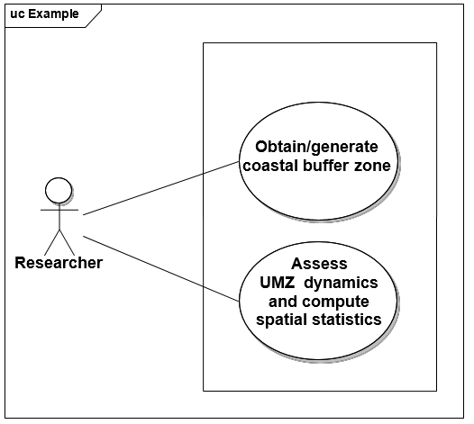
[.text-center]
*Figure B4.1 – Example UML use case diagram*

[cols=",,"]
|===
3+a|image::./media/image120.png[image, align=center]
^|_(a)_
^|_(b)_
^|_(c)_
|===

[.text-center]
*Figure B4.2 – (a) Europe's territories and coastline, (b) coastal buffer zone of 10km, and (c) UMZ changes inside the coastal zone of interest*

=== State of the environment assessment: Air Quality

[cols=",",options="header"]
|===
2+|*Use Case Description*
|Name |Air quality: Ambient air quality assessment.
|Primary actor |Policy Analyst from the Commission Services / European Environment Agency
|Goal |Assessment of the state of EU-wide air quality to support re-defining measures to improve air quality for areas with concentrations above EU air quality thresholds.
|System under 
consideration |AirBase: public air quality database.
|Importance |High
|Description |The Clean Air for Europe Directive (2008/50/EC) requires Member States (MS) to divide their territory into air quality management zones. Within these zones, Member States should annually assess ambient air quality levels against air quality objectives for the protection of human health and the environment. Air Quality Management Zones may be delimited to define measures for different pollutants to optimize management of air quality due to differences in source and abatement strategies. Where levels are elevated, Member States should prepare an air quality management plan or action programme to ensure compliance with the regulatory objectives (e.g. exceedance of limit or threshold values) before the date when they enter into force. Once established, regular assessment shall be undertaken to identify whether MS are attaining the environmental objectives set within individual zones and whether the air quality management plan or action programme needs to be revised.
|Pre-condition a|
* A competent authority that is responsible for the management of air quality must be in place (2008/EC/50 Art. 3).

* Inventory of relevant monitoring stations and relevant metadata must be in place.

* Inventory of models if used must be in place.

* Information on population must be in place in order to establish whether the zone should be identified as an agglomeration.

|Post-condition |Air quality data viewer, air quality maps, air quality statistics at reporting stations, spatial display of the zones in relation to EU air quality thresholds.
2+h|*Flow of Events – Basic Path*
|Step 1 a|
Defining management zones:

(For health, the entire territory must be covered (no gaps allowed; lakes included, seas excluded); while for environment/ecosystems, no continuity required)

MS have to deliver the boundaries of the management zones. MS are allowed to provide either GIS files, or a set of administrative units that form the zones. Current reporting LAU2 is the requested level (in order to avoid problems with overlaps, donut-structures, etc.). MS are allowed to have different zones for different objectives.

|Step 2 a|
Considering resident population:

MS need to provide population figures and relevant reference year for each zone as well as marking if the zone is an agglomeration (>250k inh. or <250k inh., but with a given (high) population density, to be decided upon by the MS) or non-agglomeration.

|Step 3 a|
Defining the assessment regime within the zones (5-yearly cycle):

MS have to establish the assessment regime: investigate off-line air quality in order to know if additional measurement stations are needed, or if modelling is a valid approach, or expert judgement (indicative monitoring). The Directive sets out the rules for establishing the number and density of sampling points which must be in operation in order to provide the data for the assessment. Art 6, 7 and 8. If there is a lack of stations, MS need to set up additional stations.

|Step 4 a|
Making available preliminary information to EC (2011/850/EU):

All information of steps 1 – 3 is to be transmitted to the EC, including the list of stations. This has to be done before the actual monitoring starts (different as compared to the current situation in which info can be provided afterwards).

|Step 5 a|
Starting the monitoring:

The up to date data for the appropriate pollutants is made available as quickly as possible. The data is preliminary as it has not yet undergone the full national QA. Exceedances (as defined by the Directive) are made available as a warning to the public (min. point data, potentially extrapolated to zone data).

|Step 6 a|
Validation of the monitored data (yearly basis):

MS have to validate their data according to the data quality objectives as set out by the Directive. Statistics are to be calculated and compared with the environmental objectives set out in the Directive. Effects from natural events and winter sanding are allowed to be deducted from the statistics before comparison with the environmental objectives for specified pollutants: without these, the objectives might not have been met. Accounting of the values per pollutant, per limit value and per zone is to be made.

|Step 7 a|
Making available final information to EC:

The accounting is reported to the EC, together with all the relevant primary data (by way of evidence underpinning the accounting). Explicit linkage of the data-series with zone, station, pollutant, instrument, etc. has to be included. This information is required not more than nine months after the end of the calendar year in which the monitoring took place (2011/850/EC).

|Step 8 a|
Analysis and Planning:

Analysis and planning is undertaken to identify new measures or revisions to existing measures that will cause pollutant values to fall below regulatory maximum limits. These must be reported within 24 months of the failure to meet an environmental objective. The report must link back to the original data.

Remark: the Directive foresees time extensions for certain pollutants in certain zones under specific conditions. The EC grants these extensions, which then feed back into the system (steps 1 to 6). However, the time extensions are linked to the definition of the zones; so re-arranging zones entails that historic zoning needs to be traceable, since linked with the time extensions on the pollutant values.

2+h|*Flow of Events – Alternative Paths*
| |NONE
2+h|*Data set: Management Zones*
|Description |Management zones/units (administrative boundaries (GISCO  MS-data)) defined by Member States.
|Data provider |MS and GISCO
|Type |input
|Geographic scope |Europe
|Thematic scope |Administrative boundaries
|Scale, resolution |1:1.000.000
|Delivery |Online
|Documentation |http://www.eea.europa.eu/data-and-maps
2+h|*Data set: Population densities*
|Description |Population densities computed within the management zones.
|Data provider |MS and/or Eurostat
|Type |input
|Geographic scope |Europe
|Thematic scope |Population densities
|Scale, resolution |1:1.000.000
|Delivery |For official use
|Documentation |Census statistics in MS/Eurostat.
2+h|*Data set: Air quality monitoring network*
|Description |Localisation of the monitoring stations (fixed).
|Data provider |MS
|Type |Input
|Geographic scope |MS
|Thematic scope |Monitoring of air pollutants.
|Scale, resolution |1:1.000.000
|Delivery |Online
|Documentation |http://www.eea.europa.eu/themes/air/airbase/map-stations
2+h|*Data set: Zones in relation to EU air quality thresholds*
|Description |Annual assessment of air quality in comparison to EU air quality thresholds.
|Data provider |MS
|Type |Output
|Geographic scope |Europe
|Thematic scope |Assessment of air quality management zones w.r.t. air pollutants and EU air quality thresholds.
|Scale, resolution |1:1.000.000
|Delivery |Online
|Documentation |http://www.eea.europa.eu/data-and-maps/data/ds_resolveuid/ECC31C64-9A21-46D0-AC9B-CE8D049491FE
|===

image::./media/image121.png[image, align=center]
[.text-center]
*Figure B5.1 – Example UML use case diagram*

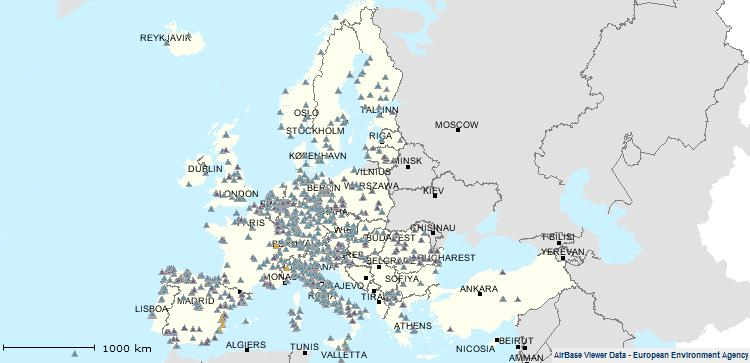

[.text-center]
*Figure B5.2 – Air quality reporting stations in EU and EEA Member & Collaborating Countries*

image::./media/image122.png[image, align=center]

image::./media/image123.png[image, align=center]

[.text-center]
*Figure B5.3 – EU-wide mapping of management/reporting zones with respect to air pollution levels (PM10, lead, etc.) as of the year 2007 against EU air quality thresholds.*

<<<
[appendix]
== Code list values - (normative) 

=== INSPIRE Application Schema 'Area Management Restriction and Regulation Zones'

*EnvironmentalDomain*

[cols="",]
|===
a|
[cols=","]
!===
!Name: !environmental domain
!Definition: !Environmental domain, for which environmental objectives can be defined.
!Extensibility: !none
!Identifier: !http://inspire.ec.europa.eu/codelist/EnvironmentalDomain
!Values: !The allowed values for this code list comprise only the values specified in the table below.
!===

|===

[cols=""]
|===
a|
*soil*

[cols=","]
!===
!Name: !soil
!Definition: !The top layer of the land surface of the earth that is composed of disintegrated rock particles, humus, water and air.
!Description: !SOURCE: GEMET / CED
!===

a|
*noise*

[cols=","]
!===
!Name: !noise
!Definition: !Sound which is unwanted, either because of its effects on humans, its effect on fatigue or malfunction of physical equipment, or its interference with the perception or detection of other sounds.
!Description: !SOURCE: GEMET / MGH
!===

a|
*naturalResources*

[cols=","]
!===
!Name: !natural resources
!Definition: !A feature or component of the natural environment that is of value in serving human needs, e.g. soil, water, plant life, wildlife, etc. Some natural resources have an economic value (e.g. timber) while others have a non-economic value (e.g. scenic beauty).
!Description: !SOURCE: GEMET / UNUN
!===

a|
*climateAndClimateChange*

[cols=","]
!===
!Name: !climate and climate change
!Definition: !State of the climate and/or change in this state that can be identified (e.g., by using statistical tests) by changes in the mean and/or the variability of its properties, and that persists for an extended period, typically decades or longer.
!Description: !TBD
!===

a|
*healthProtection*

[cols=","]
!===
!Name: !health protection
!Definition: !Measures or devices designed to reduce the risk of harm to human health posed by pollutants or other threatening conditions in the ecosystem.
!Description: !SOURCE: GEMET / TOE (for environmental health protection)
!===

a|
*air*

[cols=","]
!===
!Name: !air
!Definition: !A predominantly mechanical mixture of a variety of individual gases forming the earth's enveloping atmosphere.
!Description: !SOURCE: GEMET / MGH
!===

a|
*water*

[cols=","]
!===
!Name: !water
!Definition: !Common liquid (H2O) which forms rain, rivers, the sea, etc., and which makes up a large part of the bodies of organisms.
!Description: !SOURCE: GEMET / PHC
!===

a|
*waste*

[cols=","]
!===
!Name: !waste
!Definition: !Material, often unusable, left over from any manufacturing, industrial, agricultural or other human process; material damaged or altered during a manufacturing process and subsequently left useless.
!Description: !SOURCE: GEMET / HMD / OED
!===

a|
*natureAndBiodiversity*

[cols=","]
!===
!Name: !nature and biodiversity
!Definition: !Active management of the earth's natural resources and environment to ensure their quality is maintained and that they are wisely used.
!Description: !SOURCE: GEMET / PHC (for nature conservation)
!===

a|
*sustainableDevelopment*

[cols=","]
!===
!Name: !sustainable development
!Definition: !Development that provides economic, social and environmental benefits in the long term having regard to the needs of living and future generations.
!Description: !SOURCE: GEMET 
NOTE Defined by the World Commission on Environment and Development in 1987 as: development that meets the needs of the present without compromising the ability of future generations to meet their own needs. (Source: GILP96)
!===

a|
*landUse*

[cols=","]
!===
!Name: !land use
!Definition: !The term land use deals with the spatial aspects of all human activities on the land and with the way in which the land surface is adapted, or could be adapted, to serve human needs.
!Description: !SOURCE: GEMET / GOOD
!===

|===

*ZoneTypeCode*

[cols="",]
|===
a|
[cols=","]
!===
!Name: !zone type code
!Definition: !High-level classification defining the type of Management, Restriction or Regulation Zone.
!Extensibility: !open
!Identifier: !http://inspire.ec.europa.eu/codelist/ZoneTypeCode
!Values: !The allowed values for this code list comprise the values specified in the table below and additional values at any level defined by data providers.
!===

|===

[cols="",]
|===
a|
*airQualityManagementZone*

[cols=","]
!===
!Name: !air quality management zone
!Definition: !Part of the territory of a Member State, as delimited by that Member State for the purposes of air quality assessment and management.
!Description: !SOURCE: Air Quality Directive (2008/50/EC).
!===

a|
*noiseRestrictionZone*

[cols=","]
!===
!Name: !noise restriction zone
!Definition: !An area delimited by a competent authority to manage and mitigate noise pollution. This includes agglomerations and quiet areas (in agglomerations and open country) as defined in the Directive 2002/49/EC of the European Parliament and of the Council.
!Description: !NOTE Noise restriction zones may also be defined to manage noise exposure relating to transport (airports, roads, rail), entertainment venues, recreational activities, construction, etc.
!===

a|
*animalHealthRestrictionZone*

[cols=","]
!===
!Name: !animal health restriction zone
!Definition: !Restriction zones established for the control and eradication of notifiable animal diseases
!Description: !EXAMPLE: Bluetongue Restriction Zones (Council Directive 2000/75/EC). 
EXAMPLE: Avian Influenza Restriction Zones (Council Directive 2005/94/EC). 
EXAMPLE: African Horse Sickness (Council Directive 92/35/EEC).
!===

a|
*prospectingAndMiningPermitArea*

[cols=","]
!===
!Name: !prospecting and mining permit area
!Definition: !The area on which the prospection or extraction of any mineral has been authorised and for which that right or permit is granted.
!Description: !EXAMPLE: Directive 94/22/EC on conditions for granting and using authorisations for the prospection, exploration and production of hydrocarbons, stipulates that the limits of the geographical areas covered by an authorisation and the duration of that authorisation must be determined in proportion to what is justified in terms of the best possible exercise of the activities from an economic and technical point of view.
!===

a|
*regulatedFairwayAtSeaOrLargeInlandWater*

[cols=","]
!===
!Name: !regulated fairway at Sea or large inland water
!Definition: !Regulated navigation areas port-to-port established to organise traffic, prevent accident and pollution and to support management and planning.
!Description: !EXAMPLE: Regulated fairways established in accordance with Decision 884/2004/EC of the European Parliament and Council of 29 April 2004 amending Decision No 1692/96/EC on Community guidelines for the development of the trans - European transport network to organise sailing traffic, prevent accident and pollution.
!===

a|
*restrictedZonesAroundContaminatedSites*

[cols=","]
!===
!Name: !restricted zones around contaminated sites
!Definition: !Zones established to protect human, plant and animal health and control movement and development within a contaminated site.
!Description: !EXAMPLE: Chernobyl Nuclear Power Plant Exclusion Zone which was established to evacuate the local population and to prevent people from entering the heavily contaminated territory. 
EXAMPLE: Zone established around an area suffering from soil contamination to restrict development and protect human health.
!===

a|
*areaForDisposalOfWaste*

[cols=","]
!===
!Name: !area for disposal of waste
!Definition: !Area affected by disposal of waste as defined in Article 3(19) of Directive 2008/98/EC[1].
!===

a|
*coastalZoneManagementArea*

[cols=","]
!===
!Name: !coastal zone management area
!Definition: !Area in which integrated coastal zone management takes place.
!Description: !DEFINITION: Integrated coastal zone management is a dynamic process for the sustainable management and use of coastal zones, taking into account at the same time the fragility of coastal ecosystems and landscapes, the diversity of activities and uses, their interactions, the maritime orientation of certain activities and uses and their impact on both the marine and land parts. 
SOURCE: Protocol on Integrated Coastal Zone Management in the Mediterranean - signed in Madrid on 20-21 January 2008.
!===

a|
*drinkingWaterProtectionArea*

[cols=","]
!===
!Name: !drinking water protection area
!Definition: !Area in which waste water leakage, use of fertilizer or pesticides, or establishment of waste disposal sites are prohibited.
!Description: !EXAMPLE: From Directive 80/778, relating to the quality of water intended for human consumption. 
According to the article 8 providing that Member States shall take all the necessary measures to ensure that any substances used in the preparation of water for human consumption do not remain in concentrations higher than the maximum admissible.
!===

a|
*nitrateVulnerableZone*

[cols=","]
!===
!Name: !nitrate vulnerable zone
!Definition: !Areas of land which drain into polluted or threatened waters and which contribute to nitrate pollution.
!Description: !SOURCE: Art 3 of Council Directive 91/676/EEC of 12 December 1991 concerning the protection of waters against pollution caused by nitrates from agricultural sources.
!===

a|
*marineRegion*

[cols=","]
!===
!Name: !marine region
!Definition: !Marine regions and their subregions are sea regions designated under international, Union, national or sub-national legislation for the purpose of assessment, management and regulation.
!Description: !EXAMPLE 1: For each Marine Region a marine strategy shall be developed and implemented to maintain and improve good environmental status. 
SOURCE: Marine Strategy Framework Directive (2008/56/EC). 
EXAMPLE 2: Convention on the Protection of the Marine Environment of the Baltic Sea Area (Helsinki Convention) shall apply to the protection of the marine environment of the Baltic Sea Area which comprises the water-body and the seabed including their living resources and other forms of marine life. 
EXAMPLE 3: The Convention for the Protection of the marine Environment of the North-East Atlantic (OSPAR Convention) is dealing with specific areas like: prevention and elimination of pollution from land-based sources; prevention and elimination of pollution by dumping or incineration; prevention and elimination of pollution from offshore sources and assessment of the quality of the marine environment. 
EXAMPLE 4: Convention for the Protection of the Marine Environment and the Coastal Region of the Mediterranean (Barcelona Convention) aims to to prevent, abate and combat pollution of the Mediterranean Sea area and to protect and enhance the marine environment in that area. 
EXAMPLE 5: The Convention on the Protection of the Black Sea Against Pollution (Bucharest Convention) aims to prevent, reduce and control the pollution and protect the biodiversity and the marine living resources. 
EXAMPLE 6: UNEP Regional Seas Programme aims to address the accelerating degradation of the world's oceans and coastal areas through the sustainable management and use of the marine and coastal environment.
!===

a|
*riverBasinDistrict*

[cols=","]
!===
!Name: !river basin district
!Definition: !Area of land and sea, made up of one or more neighbouring river basins together with their associated groundwaters and coastal waters, identified under Article 3(1) of Directive 2000/60/EC[2] as the main unit for management of river basins.
!Description: !SOURCE: Art 2 (15) of DIRECTIVE 2000/60/EC OF THE EUROPEAN PARLIAMENT AND OF THE COUNCIL of 23 October 2000 establishing a framework for Community action in the field of water policy. 
NOTE A river basin district can either be an international or national river basin district or a sub unit of management. 
NOTE 2: The relatedZone role should be used to link river basin districts. For example, a national river basin district should include a relatedZone attribute linking it to the international river basin district.
!===

a|
*bathingWaters*

[cols=","]
!===
!Name: !bathing waters
!Definition: !Coastal waters or inland waters (rivers, lakes) explicitly authorised, or not prohibited for recreational bathing by large numbers of people.
!Description: !NOTE Bathing waters are set limits for physical, chemical and microbiological parameters to ensuring clean bathing waters to protect public health and the environment.
!===

a|
*floodUnitOfManagement*

[cols=","]
!===
!Name: !flood unit of management
!Definition: !Area of land and sea, identified under Directive 2007/60/EC of the European Parliament and Council[3] as the main unit for management when an alternative to the River Basin Districts or Sub-Districts are chosen.
!Description: !Source: Floods Directive: 2007/60/EU.
!===

a|
*waterBodyForWFD*

[cols=","]
!===
!Name: !water body under the Water Framework Directive (2000/60/EC)
!Definition: !The "water body" is a coherent sub-unit in the river basin (district) to which the environmental objectives of the Directive 2000/60/EC must apply. The identification of water bodies is based on geographical and hydrological determinants. This includes surface (river, lake, transitional and coastal) and ground water bodies.
!Description: !SOURCE: Art 2 (15) of DIRECTIVE 2000/60/EC OF THE EUROPEAN PARLIAMENT AND OF THE COUNCIL of 23 October 2000 establishing a framework for Community action in the field of water policy.
!===

a|
*sensitiveArea*

[cols=","]
!===
!Name: !sensitive area
!Definition: !Water bodies identified as sensitive areas, as defined in Annex II to Directive 91/271/EEC[4].
!Description: !SOURCE: Urban Waste Water Treatment Directive (91/271/EEC).
!===

a|
*designatedWaters*

[cols=","]
!===
!Name: !designated waters
!Definition: !Marine, coastal or surface waters designated by Member States as needing protection or improvement in order to support fish life.
!Description: !Member States are required to define designated waters to protect freshwater fish and shellfish by the Fisheries Directive (2006/44/EC) and Shellfish Waters Directive (2006/113/EC).
!===

a|
*plantHealthProtectionZone*

[cols=","]
!===
!Name: !plant health protection zone
!Definition: !Protection zone within which protective measures are established against the introduction of organisms harmful to plants or plant products and against their spread.
!Description: !SOURCE: COMMISSION REGULATION (EC) No 690/2008.
!===

a|
*forestManagementArea*

[cols=","]
!===
!Name: !forest management area
!Definition: !Area designated for the sustainable management of forest resources and functions.
!Description: a!NOTE FOREST EUROPE (the Ministerial Conference on the Protection of Forests in Europe) has developed and adopted six criteria and a set of associated indicators for sustainable forest management. They provide guidance for developing policies and help assess progress on sustainable forest management. Similar criteria have been developed in other regional and international pro- cesses, all in line with the seven thematic elements of sustain- able forest management agreed by the United Nations. 
The pan-European criteria describe the different elements and goals as follows: 
[arabic, start=1]
. Maintenance and appropriate enhancement of forest resources and their contribution to global carbon cycles; 
. Maintenance of forest ecosystems' health and vitality; 
. Maintenance and encouragement of productive functions of forests (wood and non-wood); 
. Maintenance, conservation and appropriate enhancement of biological diversity in forest ecosystems; 
. Maintenance, conservation and appropriate en- hancement of protective functions in forest management (notably soil and water); 
. Maintenance of other socio-economic functions and conditions. 
SOURCE: http://www.foresteurope.org/filestore/foresteurope/Publications/pdf/Factsheet_Sustainable_Forest_Management_print.pdf]
!===

|===

=== INSPIRE Application Schema 'Controlled Activities'

*ControlTypeCode*

[cols="",]
|===
a|
[cols=","]
!===
!Definition: !Types of control used to manage activities within the zone.
!Extensibility: !any
!Identifier: !http://inspire.ec.europa.eu/codelist/ControlTypeCode
!Values: !
!===

|===

The table below includes recommended values that may be used by data providers.

[cols=""]
|===
a|
*permitted*

[cols=","]
!===
!Name: !permitted
!Definition: !The activity is allowed to be performed within the zone.
!Description: !NOTE 1: To achieve or maintain good environmental status only a specific activity or activities may be allowed to be performed in the zone. 
NOTE 2: If an activity is only allowed between a particular time period then this should be documented in the validTime attribute.
!===

a|
*prohibited*

[cols=","]
!===
!Name: !prohibited
!Definition: !An activity is not allowed to be performed within the zone.
!Description: !NOTE 1: To achieve or maintain good environmental status specific activity or activities may not be allowed to be performed in the zone. 
NOTE 2: If an activity is prohibited within a particular time period then this should be documented in the schedule.
!===

a|
*promoted*

[cols=","]
!===
!Name: !promoted
!Definition: !An activity that is positively promoted or introduced within the zone to achieve good environmental status.
!===

a|
*restricted*

[cols=","]
!===
!Name: !restricted
!Definition: !An activity is limited to only be performed within specific bounds.
!Description: !NOTE 1: To achieve or maintain good environmental status an activity may be restricted to mitigate the risk of environmental degradation. 
NOTE 2: If an activity is restricted between a particular time period then this should be documented in the validTime attribute 
EXAMPLE: Water abstraction: is restricted and controlled by licence where the operator may be limited to abstracting a specific amount of water per day.
!===

|===

*ControlledActivityType*

[cols="",]
|===
a|
[cols=","]
!===
!Definition: !Classification of the types of activities controlled within the zone.
!Description: !A zone may be contain a number of activities that are controlled via regulation/restriction
!Extensibility: !any
!Identifier: !http://inspire.ec.europa.eu/codelist/ControlledActivityType
!Values: !
!===

|===

The table below includes recommended values that may be used by data providers.

[cols="",]
|===
a|
*agricultureAndAquaculture*

[cols=","]
!===
!Name: !agriculture And Aquaculture
!Definition: !Activities related to agriculture and aquaculture.
!===

a|
*conservation*

[cols=","]
!===
!Name: !conservation
!Definition: !Activities related to conservation of nature and cultural heritage.
!===

a|
*environmentalPollution*

[cols=","]
!===
!Name: !environmental Pollution
!Definition: !Activities causing environmental pollution.
!===

a|
*fishingHuntingOrCollecting*

[cols=","]
!===
!Name: !fishing Hunting Or Collecting
!Definition: !Activities related to fishing, hunting and/or collecting of flora or fauna.
!===

a|
*landUseAndPlanning*

[cols=","]
!===
!Name: !land Use And Planning
!Definition: !Activities related to land use and planning.
!===

a|
*plantAndAnimalHealth*

[cols=","]
!===
!Name: !plant And Animal Health
!Definition: !Activities related to protection and eradication of harmful organisms and disease related to plant and animal health.
!===

a|
*resourceManagement*

[cols=","]
!===
!Name: !resource Management
!Definition: !Activities related to mining and extraction of materials.
!===

a|
*riskManagement*

[cols=","]
!===
!Name: !risk Management
!Definition: !Activities related to risk management.
!===

a|
*transportation*

[cols=","]
!===
!Name: !transportation
!Definition: !Activities related to transportation.
!===

|===

*DayTypeCode*

[cols="",]
|===
a|
[cols=","]
!===
!Definition: !Specified day of the week or period of days
!Extensibility: !any
!Identifier: !http://inspire.ec.europa.eu/codelist/DayTypeCode
!Values: !
!===

|===

The table below includes recommended values that may be used by data providers.

[cols="",]
|===
a|
*friday*

[cols=","]
!===
!Name: !friday
!Definition: !Friday is the day of the week between Thursday and Saturday.
!===

a|
*monday*

[cols=","]
!===
!Name: !monday
!Definition: !Monday is the day of the week between Sunday and Tuesday
!===

a|
*publicHoliday*

[cols=","]
!===
!Name: !publicHoliday
!Definition: !Any day that is a public holiday.
!===

a|
*saturday*

[cols=","]
!===
!Name: !saturday
!Definition: !Saturday is the day of the week between Friday and Sunday.
!===

a|
*sunday*

[cols=","]
!===
!Name: !sunday
!Definition: !Sunday is the day of the week between Saturday and Monday.
!===

a|
*thursday*

[cols=","]
!===
!Name: !thursday
!Definition: !Thursday is the day of the week between Wednesday and Friday.
!===

a|
*tuesday*

[cols=","]
!===
!Name: !tuesday
!Definition: !Tuesday is the day of the week between Monday and Wednesday.
!===

a|
*wednesday*

[cols=","]
!===
!Name: !wednesday
!Definition: !Wednesday is the day of the week between Tuesday and Thursday.
!===

a|
*weekdays*

[cols=","]
!===
!Name: !weekdays
!Definition: !Weekdays refers to all days contained within a working week: Monday, Tuesday, Wednesday, Thursday and Friday.
!===

a|
*weekends*

[cols=","]
!===
!Name: !weekends
!Definition: !Weekdays refers to all days contained within a weekend: Saturday and Sunday.
!===

|===

*SpecialisedActivityTypeCode*

[cols="",]
|===
a|
[cols=","]
!===
!Definition: !Controlled vocabulary or code list defined by domains or Member States of specific controlled activity types related to their domain.
!Extensibility: !any
!Identifier: !http://inspire.ec.europa.eu/codelist/SpecialisedActivityTypeCode
!Values: !
!===

|===

<<<
[appendix]
== Examples - (informative)
 
=== Regulated fairways at sea or large inland waters

Example based on Norway and information available from the Norwegian Coastal Administration (_www.kystverket.no_)

==== Description of type of area

Fairways (or the equal term waterways) at sea are a term that has different types of meaning, depending on perspective and approach. The most common are:

[loweralpha]
. Fairways as a generic term for most appropriate way of navigation. The general rule for transportation on the sea is that any ship may sail at any place, unless given restrictions are defined (e.g. related to type of goods, need for pilot, military areas, national boundaries, custom, etc.) – and as long as the physical restrictions related to width and depth are met.
+
Fairway in this context is related to routes which have been modified or supported for sea navigation, e.g. by lighthouses and buoys or by physical modification of the terrain (dredging or blasting rocks).

[loweralpha, start=2]
. Fairways – as approved routes for navigating with or without pilot. A captain may be certified to navigate a certain fairway without a pilot. A dedicated fairway certificate is then issued.
. Fairways, restricting navigation in a given area, e.g. traffic going in one direction in one area – and the other in the opposite area. Typically at large ports.
. Fairways – given as areas reserved for sea navigation, implying a different type management and usage regime.

For the INSPIRE Area Management theme, it is only (d) that is relevant (the others relate to navigation and transport).

[cols=""]
|===
Fairways under area management are hence defined as areas at sea or inland lakes that have defined certain restrictions or management regimes that are related to maintain navigation and transport on water.
|===

==== Legal basis

The legal basis for fairways defined as (d) above is based on Norwegian legislation and regulations;

* Law: [.underline]#LOV-2009-04-17-19-§9# and [.underline]#LOV-2009-04-17-19-§16#
* Regulation ("forskrift"): [.underline]#FOR 2009-11-30 nr 1477: Forskrift om farleder#

The Norwegian text may be found at http://www.lovdata.no/for/sf/fi/xi-20091130-1477.html

*What is regulated, managed, restricted?*

The regulation defines:

[loweralpha]
. Fairways (main and secondary) line with fairway number,
. The area delimitation defined by the fairway, or by harbours defined through the regulation.

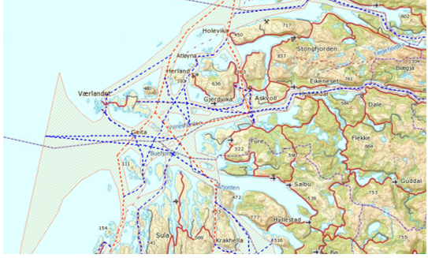

A spatial dataset is given and is presented through a web-map portal and formally integrated in the regulation (the web-map portal is a part of the regulation – which is unique for a regulation in Norway) - http://kart.kystverket.no/farledsforskrift

The fairway ends at the entrance of a defined harbour area.

Within a fairway area, the Ministry of Fisheries and Coastal Affairs, or any department acting on their behalf, has regulation and management authority. For areas outside, areas are managed and regulated as per common Norwegian law by private owners, municipalities, counties and the state.

The purpose of the regulated fairway area is to ensure that no physical or administrative interventions are imposed on these areas limiting their usage for maritime navigation. Typically interventions that are limited are fish farming and construction work.

==== Spatial structure

image::./media/image70.png[image,width=319,height=193]

The spatial representation of the regulated fairway consists of the following spatial data:

* Line dataset – indicating the fairway itself,
* Polygon dataset – delimiting the defined regulated fairway area,
* Line dataset – indicates the entrance to a defined harbour area.

The spatial data has been generated by creating buffers along the defined fairway lines and overlaying these with land or other constructions.

The data is available for download, or as a WMS service from the Norwegian Coastal Administration through Norway Digital (the Norwegian national SDI implementation).

==== Description of tasks – questions that data can answer 

The regulated fairway can be used for two main purposes:

* Defines clearly who has authority to plan, approve and make interventions within the defined area,
* Indicates that the area is reserved for maritime navigation, and shall hence be restrictive for interventions.

==== Any specific data quality requirements

The fairway delineation data is defined by regulations (i.e. not measured in the field or otherwise collected) and is thus correct as per the legal definition, assuring 100% data quality.

==== Illustrations – screen shots

image::./media/image71.png[image,width=624,height=335, align=center]

[.text-center]
*_Figure D1.6.1– The fairway regulation._*

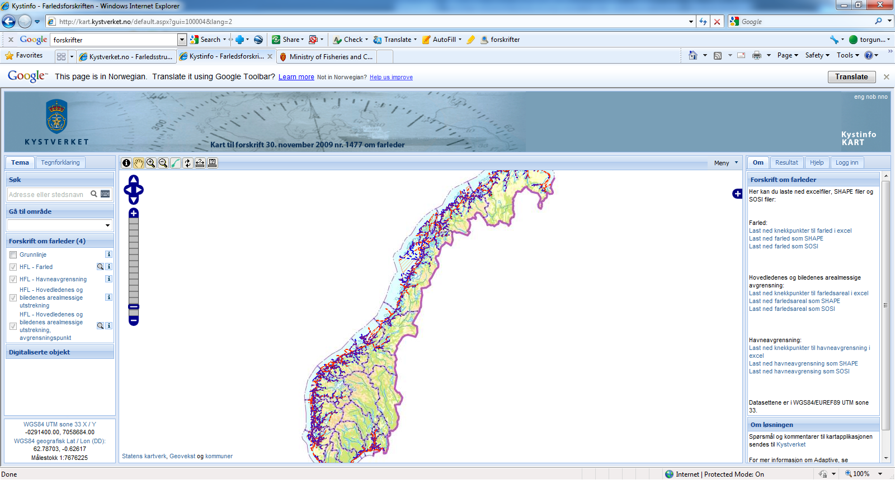

[.text-center]
*_Figure D1.6.212_ – _Web map portal – integrated as part of the regulation. Through the interface, the data can be downloaded as an excel file, shape file or SOSI (the Norwegian spatial data exchange format) – in WGS 84 / EUREF89, UTM 33._*

image::./media/image73.png[image,width=623,height=335, align=center]

[.text-center]
*_Figure D1.6.3_ – _Illustration of the data for the Oslo fjord._*

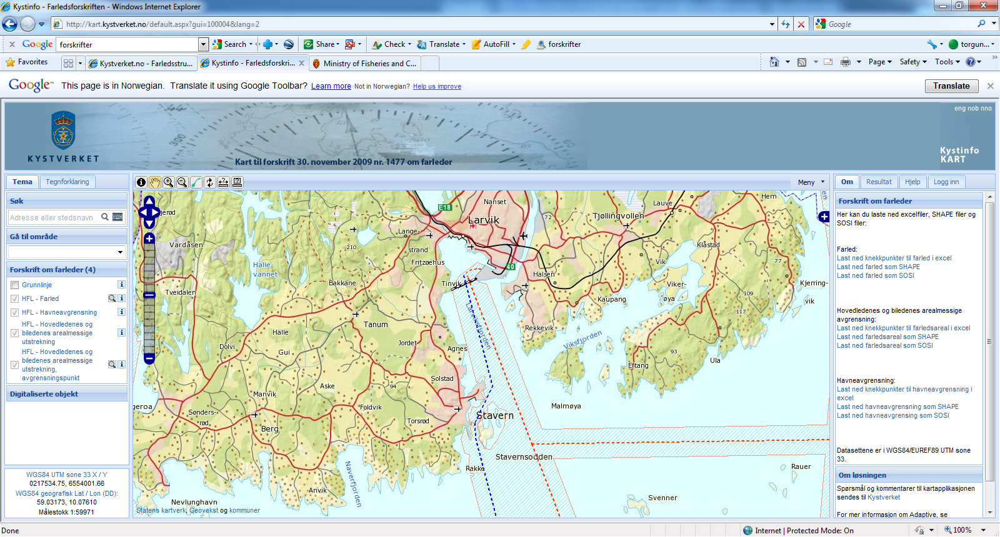

[.text-center]
*_Figure D1.6.4_ – _Detailed illustration of Larvik harbor, including its delimitation of the harbor itself (black and white dashed line)_*

=== Data model support for restricted areas around drinking water source

==== Needs for allocating protection zones around drinking water bodies

The Water Framework Directive (WFD), which established a new, integrated approach to the protection, improvement and sustainable use of surface waters, imposes some requirements on Member States to take account of pressures on water quality from point and diffuse sources, and to ensure that necessary measures to meet quality objectives are selected. One way of preventing the water bodies from being polluted by many different kinds of pollutants is to design certain protection zones adjacent to those indicated water bodies. In the broader sense, such conservation areas not only improve water quality by removing sediment, fertilizers, pesticides, pathogens, and other potential contaminants from runoff, but also control soil erosion by both wind and water, improve soil quality, enhance fish and wildlife habitat, reduce flooding, conserve energy, protect buildings, roads, and livestock, and conserve biodiversity.

==== Designing reservoir protection zones at various distances from the reservoir

While establishing zones around surface water bodies for protecting the quality of drinking water from potential pollution arising from their catchments, a variety of methods may be used. In the "Time of Travel (TOT)" method, the protection zone is defined by a threshold travel time that is computed along drainage networks down to the reservoir and that is typically based on the response times for controlling point pollution or on times desired within the protection zone for rehabilitating the quality of polluted water originating from non-point sources. In the fixed-distance method, setbacks from reservoir boundaries, tributaries, or the intakes are established by assigning certain fixed distances.

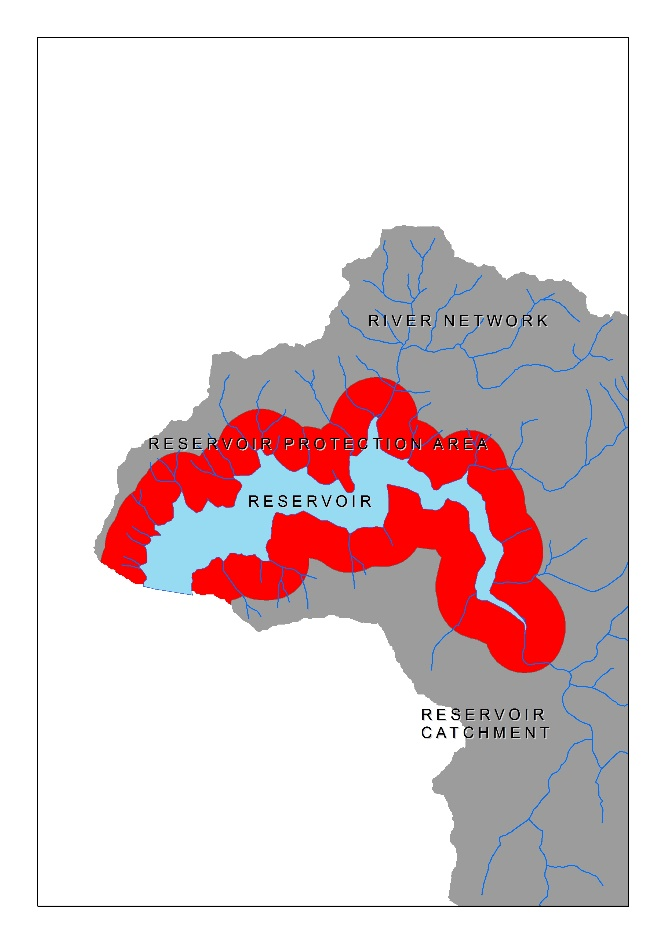

[.text-center]
*Figure D2.1 – Application of a fixed-distance protection zone around a reservoir*

Reservoir protection zones can be designed as a set of subsequent zones, e.g. absolute zone closest to the reservoir boundaries, proximate and mediate zones with bigger distances from the reservoir and remote zone covering the entire catchment, to secure overall water pollution prevention in catchments of drinking water sources. In such a case, the application of rules and restrictions assigned to the zones changes gradually between the zones, generally by increasing the protective measures as the zone gets closer to the water body, e.g. adapting proper vegetation types and densities for different ranges; sorting out of the restricted/prohibited activities, etc..

==== Example modelling of reservoir protection zones as spatial objects (based on the "_Area Management/Restriction/Regulation Zones and Reporting Units_ (AM)" specification)

The figure below indicates how a reservoir protection zone is modelled as a spatial entity in the data model prepared for the INSPIRE spatial data theme "_Area Management/Restriction/Regulation Zones and Reporting Units_ (AM)".

image::./media/image76a.png[image, align=center]

[.text-center]
*Figure D2.2 – Modelling restricted areas around drinking water sources in TWG-AM data model*

=== Data model support for WFD river basin districts

==== River basin districts as defined by the Water Framework Directive

A river basin district is the area of land and sea, made up of one or more neighbouring river basins together with their associated groundwaters and coastal waters, which is identified under Article 3(1) (of the Water Framework Directive) as the main unit for management of river basins. [definition source: Directive 2000/60/EC of 23 October 2000 establishing a framework for Community action in the field of water policy (Water Framework Directive).]

==== Modelling of river basin districts as spatial objects in AM data model structure

The figure below indicates how river basin districts are modelled as spatial entities in the data model prepared for the INSPIRE spatial data theme "_Area Management/Restriction/Regulation Zones and Reporting Units_ (AM)" (partially by using legislation references and the specific zone type assigned).

image::./media/image88.png[image,width=661,height=580, align=center]

[.text-center]
*Figure D3.1 – Partial modelling example of river basin districts within the TWG-AM data model*

image::./media/image89.png[image,width=665,height=344, align=center]

image::./media/image95.png[image,width=629,height=75, align=center]

[.text-center]
*Figure D3.2 – Sample links between the RBD spatial object, related data types and code lists defined in the data model*

=== Data model support for Nitrate Vulnerable Zones designated in accordance with the Nitrates Directive 

==== Reporting obligations for Nitrates Directive and designations of nitrate vulnerable zones

Council Directive 91/676/EEC (the Nitrates Directive) concerning the protection of waters against pollution caused by nitrates from agricultural sources was adopted on 12 December 1991. Article 10 of the Nitrates Directive requires Member States to submit a report to the Commission every four years following its notification. This report should contain information pertaining to codes of good agricultural practice, designated vulnerable zones, the results of water monitoring and a summary of the relevant aspects of action programmes drawn up in relation to nitrate vulnerable zones (source: SEC(2011)909).

Nitrate vulnerable zones, designated by Member States for the protection of Europe's waters against nitrate pollutions, are included in the AM model structure through the model components designed to cover the specific zone type 'nitrateVulnerableZone' as a management zone and the relevant legislative reference.

==== Modelling of nitrate vulnerable zones in AM data model structure

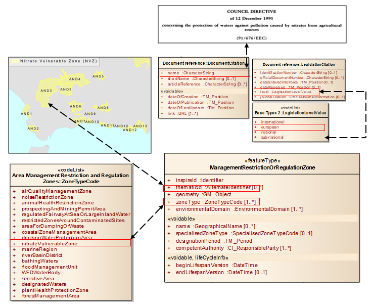

[.text-center]
*Figure D4.1 – Partial modelling example of nitrate vulnerable zones*

<<<
[appendix]
== Application schema Water Framework Directive - (informative) 

This Annex describes an application schema containing management / restriction / regulation zones relevant for the Water Framework Directive (WFD, 2000/60/EC). This application schema contains the WFD candidate types that were defined by the Annex I TWG on Hydrography.

The application schema presented in this Annex has been discussed and agreed between the themes on _Area Management/Restriction/Regulation Zones and Reporting Units_, Environmental monitoring facilities and Geology & Mineral resources. It will be further developed by the relevant WFD / WISE working groups and should thus be considered as an _example_ thematic extension at this stage.

The spatial object types in this application schema are considered as specific sub-types of the ManagementRestrictionOrRegulationZone spatial object type defined in the Area Management Restriction and Regulation Zones application schema. The application schema for WFD is therefore considered as a thematic extension. As a consequence, the spatial object types included in this application schema would not from part of the Implementing Rule for interoperability of spatial data sets and services.

As an example for the WFD domain-specific extension of the generic Area Management Restriction and Regulation Zones application schema it would be used by the relevant WFD/WISE guidelines as they align with INSPIRE.

=== Narrative description

The definition of water bodies in the Water Framework Directive (2000/60/EC) state that: "Water bodies form the principle management units for the protection of water resources". Therefore they fall within the scope of the theme "_Area Management/Restriction/Regulation Zones and Reporting Units_, alongside River Basin Districts.

The Area Management Restriction and Regulation Zones application schema is very generic and does not include specialised classes, attributes or associations for address domain-specific requirements. To determine what type of Management Area is being represented two code list-valued attributes are used:

* zoneTypeCode
* specialisedZoneTypeCode

Management units as defined in the WFD can be described using the generic ManagementRestrictionOrRegulationZone spatial object type with the value waterBodyForWFD as the zoneTypeCode. Specific types of water body could then be defined using the specialisedZoneTypeCode.

However, a set of candidate types representing WFD water bodies were defined by HY during the Annex I development:

* WFDWaterBody as an abstract base type for the following concrete spatial object types
* WFDGroundWaterBody for WFD groundwater bodies
* WFDSurfaceWaterBody for WFD surface water bodies
* WFDCoastalWater for WFD coastal water bodies
* WFDTransitionalWater for WFD transitional waters
* WFDRiver for WFD rivers
* WFDLake for WFD lakes

This application schema retains the proposed candidate types, but proposes the following minor amendments:

[arabic, start=1]
. All WFD spatial object types now specialise from ManagementRegulationAndRestrictionZone rather than HydroObject (HY).
. WFDWaterBody is removed, since the new new super-class ManagementRegulationAndRestrictionZone provides all attributes previously included in WFDWaterBody and no additional constraints or associations are defined for this type.
. Two association roles (relatedSurfaceWaterBody and relatedGroundWaterBody) are added to replace the associationRole relatedHydroObject that is lost by changing the super-class to ManagementRegulationAndRestrictionZone.
. The following properties are removed, since they are now inherited from the new super-class ManagementRegulationAndRestrictionZone:
[loweralpha]
.. inspireId
.. geometry
.. beginLifespanVersion
.. endLifespanVersion

. The following properties are replace by equivalent properties now inherited from the new super-class ManagementRegulationAndRestrictionZone:
[loweralpha]
.. geographicalName is replaced by name
.. hydroId is replaced by thematicId

=== UML overview

Figure gives an overview of the complete application schema.

image::./media/image100a.png[image, align=center]

[.text-center]
*Figure E2.1 – UML class diagram: Overview of the Water Framework Directive application schema*

Figure E2.1 gives an overview of the relationships to spatial objects in the themes Hydrography (through the association role relatedSurfaceWaterBody) and Geology (through the association roles relatedGroundWaterBody and relatedHydrogeologicalUnit).

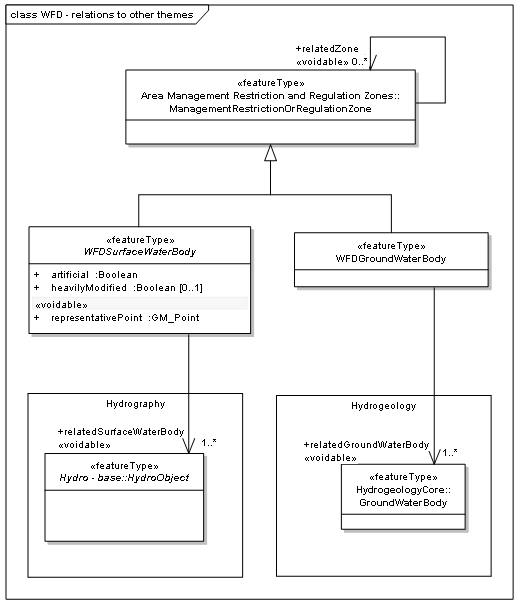

[.text-center]
*Figure E2.2 – UML class diagram: Relationships between the Water Framework Directive application schema and the spatial data themes Hydrography and Geology*

==== Consistency between spatial data sets

Besides the requirements and / or recommendations stated for the base application scheme the following applies to this application schema.

The Reporting schema provides a framework for water related reporting (more specifically the Water Framework Directive). European water reporting is expected to extend specific reporting obligation formats from this application scheme. Therefore there must be compatibility with information reported under these directives (specifically the Water Framework Directive [2000/60/EC]). The specific reporting obligations are likely to be updated to reflect the example and align with the specifics of INSPIRE.

[NOTE]
====
*Recomendation 2*

All attribution of objects in this schema shall be the same as the equivalent property of that object used for reporting obligations under Directive [2000/60/EC].

====

==== Identifier management

Besides the requirements and / or recommendations stated for the base application scheme the following applies to this application schema.

[NOTE]
====
*Recomendation 3*

The localId attribute of the external object identifier of a spatial object shall be the same as the ID used for reporting obligations under the Water Framework Directive [2000/60/EC].

====

==== Modelling of object references

No additional requirements and / or recommendations are required beyond those stated for the base application scheme.

==== Geometry representation

Besides the requirements and / or recommendations stated for the base application scheme the following applies to this application schema.

[NOTE]
====
*Recomendation 4*

The geometry shall be the same as the geometry used for reporting obligations under the Water Framework Directive [2000/60/EC]

====

==== Temporality representation 

No additional requirements and / or recommendations are required over and on top of those stated for the base application scheme.

=== Feature catalogue

*Feature catalogue metadata*

[cols=",",]
|===
|Application Schema |INSPIRE Application Schema Water Framework Directive
|Version number |3.0
|===

*Types defined in the feature catalogue*

[cols=",,",options="header",]
|===
|*Type* |*Package* |*Stereotypes*
|_WFDCoastalWater_ |Water Framework Directive |«featureType»
|_WFDGroundWaterBody_ |Water Framework Directive |«featureType»
|_WFDLake_ |Water Framework Directive |«featureType»
|_WFDRiver_ |Water Framework Directive |«featureType»
|_WFDRiverOrLake_ |Water Framework Directive |«featureType»
|_WFDSurfaceWaterBody_ |Water Framework Directive |«featureType»
|_WFDTransitionalWater_ |Water Framework Directive |«featureType»
|===

==== Spatial object types

===== WFDCoastalWater

[cols="",options="header",]
|===
|*WFDCoastalWater*
a|
[cols=","]
!===
!Subtype of: !WFDSurfaceWaterBody
!Definition: !Surface water on the landward side of a line, every point of which is at a distance of one nautical mile on the seaward side from the nearest point of the baseline from which the breadth of territorial waters is measured, extending where appropriate up to the outer limit of transitional waters.
!Description: !SOURCE [2000/60/EC Art. 2(7)]. 
 
NOTE All WFD spatial object types are regarded as example extensions of the ManagementAreaRestrictionOrRegulationZone spatial object type whose content needs to be further discussed with the relevant WISE and WFD reporting working groups.
!Stereotypes: !«featureType»
!===

a|
*Constraint: geometryIsSurface*

[cols=","]
!===
!Natural language: !Coastal water geometry must be a surface
!OCL: !inv: self->count(geometry)=1 and self.geometry.oclIsTypeOf(GM_Surface)
!===

|===

===== WFDGroundWaterBody

[cols="",options="header",]
|===
|*WFDGroundWaterBody*
a|
[cols=","]
!===
!Subtype of: !ManagementRestrictionOrRegulationZone
!Definition: !A distinct volume of groundwater within an aquifer or aquifers.
!Description: !SOURCE [2000/60/EC Art. 2(12)]. 
 
NOTE All WFD spatial object types are regarded as example extensions of the ManagementAreaRestrictionOrRegulationZone spatial object type whose content needs to be further discussed with the relevant WISE and WFD reporting working groups.
!Stereotypes: !«featureType»
!===

a|
*Association role: relatedGroundWaterBody*

[cols=","]
!===
!Name: !related groundwater body
!Value type: !GroundWaterBody
!Definition: !The natural groundwater body that the WFDGroundWaterBody is related to.
!Description: !Based on the different assumptions established in Member States the delineation of a WFDGroundWaterBody boundary can differ from the natural GroundWaterBody extent.
!Multiplicity: !1..*
!Stereotypes: !«voidable»
!===

|===

===== WFDLake

[cols="",options="header",]
|===
|*WFDLake*
a|
[cols=","]
!===
!Subtype of: !WFDRiverOrLake
!Definition: !A body of standing inland surface water.
!Description: !SOURCE [2000/60/EC Art. 2(5)]. 
 
NOTE All WFD spatial object types are regarded as example extensions of the ManagementAreaRestrictionOrRegulationZone spatial object type whose content needs to be further discussed with the relevant WISE and WFD reporting working groups.
!Stereotypes: !«featureType»
!===

a|
*Constraint: geometryIsSurface*

[cols=","]
!===
!Natural language: !Lake geometry must be a surface
!OCL: !inv: self->count(geometry)=1 and self.geometry.oclIsTypeOf(GM_Surface)
!===

|===

===== WFDRiver

[cols="",options="header",]
|===
|*WFDRiver*
a|
[cols=","]
!===
!Subtype of: !WFDRiverOrLake
!Definition: !A body of inland water flowing for the most part on the surface of the land but which may flow underground for part of its course.
!Description: !SOURCE [2000/60/EC Art. 2(4)]. 
 
NOTE All WFD spatial object types are regarded as example extensions of the ManagementAreaRestrictionOrRegulationZone spatial object type whose content needs to be further discussed with the relevant WISE and WFD reporting working groups.
!Stereotypes: !«featureType»
!===

a|
*Constraint: geometryIsCurve*

[cols=","]
!===
!Natural language: !River geometry must be a curve
!OCL: !inv: self->count(geometry)=1 and self.geometry.oclIsTypeOf(GM_Curve)
!===

a|
*Constraint: mainAndLargeNotForCanals*

[cols=","]
!===
!Natural language: !Main and large attributes may not be specified for canals
!OCL: !inv: if ((self.artificial = True) or (self.heavilyModified = True)) then ((self->count(main)=0) and (self->count(large)=0))
!===

|===

===== WFDRiverOrLake

[cols="",options="header",]
|===
|*WFDRiverOrLake (abstract)*
a|
[cols=","]
!===
!Subtype of: !WFDSurfaceWaterBody
!Definition: !Abstract class containing common attributes for a WFD river or lake.
!Description: !NOTE All WFD spatial object types are regarded as example extensions of the ManagementAreaRestrictionOrRegulationZone spatial object type whose content needs to be further discussed with the relevant WISE and WFD reporting working groups.
!Stereotypes: !«featureType»
!===

a|
*Attribute: large*

[cols=","]
!===
!Value type: !Boolean
!Definition: !Rivers with a catchment area > 50,000 km^2^; or rivers and main tributaries that have a catchment area between 5,000 km^2^ and 50,000 km^2^. Lakes that have a surface area > 500 km^2^.
!Description: !SOURCE [WISE GIS Guidance].
!Multiplicity: !1
!Stereotypes: !«voidable»
!===

a|
*Attribute: main*

[cols=","]
!===
!Value type: !Boolean
!Definition: !Rivers that have a catchment area > 500 km^2^. Lakes that have a surface area > 10 km^2^.
!Description: !SOURCE [WISE GIS Guidance].
!Multiplicity: !1
!Stereotypes: !«voidable»
!===

|===

===== WFDSurfaceWaterBody

[cols="",options="header",]
|===
|*WFDSurfaceWaterBody (abstract)*
a|
[cols=","]
!===
!Subtype of: !ManagementRestrictionOrRegulationZone
!Definition: !A discrete and significant element of surface water.
!Description: !SOURCE [Based on 2000/60/EC Art. 2(10)]. 
 
EXAMPLE A lake, a reservoir, a stream, river or canal, part of a stream, river or canal, a transitional water or a stretch of coastal water. 
 
NOTE 1 The surface water bodies shall be identified as falling within either one of the following surface water categories - rivers, lakes, transitional waters or coastal waters - or as artificial surface water bodies or heavily modified surface water bodies. [2000/60/EC Ann. II 1.1(ii)] 
 
NOTE 2 All WFD spatial object types are regarded as example extensions of the ManagementAreaRestrictionOrRegulationZone spatial object type whose content needs to be further discussed with the relevant WISE and WFD reporting working groups.
!Stereotypes: !«featureType»
!===

a|
*Attribute: artificial*

[cols=","]
!===
!Value type: !Boolean
!Definition: !'Artificial water body' means a body of surface water created by human activity.
!Description: !SOURCE [2000/60/EC Art. 2(8)].
!Multiplicity: !1
!===

a|
*Attribute: heavilyModified*

[cols=","]
!===
!Value type: !Boolean
!Definition: !'Heavily modified water body' means a body of surface water which as a result of physical alterations by human activity is substantially changed in character, as designated by the Member State in accordance with the provisions of WFD Annex II.
!Description: !SOURCE [2000/60/EC Art. 2(9)].
!Multiplicity: !0..1
!===

a|
*Attribute: representativePoint*

[cols=","]
!===
!Value type: !GM_Point
!Definition: !Representative point of the WFD water body.
!Multiplicity: !1
!Stereotypes: !«voidable»
!===

a|
*Association role: relatedSurfaceWaterBody*

[cols=","]
!===
!Value type: !HydroObject
!Multiplicity: !1..*
!Stereotypes: !«voidable»
!===

a|
*Constraint: invalidArtificalAndHeavilyModified*

[cols=","]
!===
!Natural language: !heavilyModified attribute allowed only if not artificial
!OCL: !inv: if (self.artificial = True) then (self->count(heavilyModified)=0)
!===

|===

===== WFDTransitionalWater

[cols="",options="header",]
|===
|*WFDTransitionalWater*
a|
[cols=","]
!===
!Subtype of: !WFDSurfaceWaterBody
!Definition: !Bodies of surface water in the vicinity of river mouths which are partly saline in character as a result of their proximity to coastal waters but which are substantially influenced by freshwater flows.
!Description: !SOURCE [2000/60/EC Art. 2(6)]. 
 
NOTE All WFD spatial object types are regarded as example extensions of the ManagementAreaRestrictionOrRegulationZone spatial object type whose content needs to be further discussed with the relevant WISE and WFD reporting working groups.
!Stereotypes: !«featureType»
!===

a|
*Constraint: geometryIsSurface*

[cols=","]
!===
!Natural language: !Transitional water geometry must be a surface
!OCL: !inv: self->count(geometry)=1 and self.geometry.oclIsTypeOf(GM_Surface)
!===

|===

==== Imported types (informative)

This section lists definitions for feature types, data types and enumerations and code lists that are defined in other application schemas. The section is purely informative and should help the reader understand the feature catalogue presented in the previous sections. For the normative documentation of these types, see the given references.

===== Boolean

[cols="",options="header",]
|===
|*Boolean*
a|
[cols=","]
!===
!Package: !Truth
!Reference: !Geographic information -- Conceptual schema language [ISO/TS 19103:2005]
!===

|===

===== GM_Point

[cols="",options="header",]
|===
|*GM_Point*
a|
[cols=","]
!===
!Package: !Geometric primitive
!Reference: !Geographic information -- Spatial schema [ISO 19107:2003]
!===

|===

===== GroundWaterBody

[cols="",options="header",]
|===
|*GroundWaterBody*
a|
[cols=","]
!===
!Package: !Hydrogeology
!Reference: !INSPIRE Data specification on Geology [DS-D2.8.II.4]
!Definition: !A distinct volume of groundwater within an aquifer or system of aquifers, which is hydraulically isolated from nearby groundwater bodies.
!Description: !Groundwater bodies form the principal management units under the European Water Framework Directive (2000/60/CE, 2000). They should be hydraulically continuous entities, and must be defined on the basis of flow or abstraction, and are inextricably linked to surface water bodies.
!===

|===

===== HydroObject

[cols="",options="header",]
|===
|*HydroObject (abstract)*
a|
[cols=","]
!===
!Package: !Hydro - base
!Reference: !INSPIRE Data specification on Hydrography [DS-D2.8.I.8]
!Definition: !An identity base for hydrographic (including man-made) objects in the real world.
!Description: !NOTE Derived 'views' of real-world hydrographic objects are represented through specialisations in other application schemas; all representations of the same real-world object share a common geographic name or hydrographic identifier.
!===

|===

[[managementrestrictionorregulationzone]]
===== ManagementRestrictionOrRegulationZone

[cols="",options="header",]
|===
|*ManagementRestrictionOrRegulationZone*
a|
[cols=","]
!===
!Package: !Controlled Activities
!Reference: !INSPIRE Data specification on Area Management Restriction Regulation Zones and Reporting units [DS-D2.8.III.11]
!Definition: !Area managed, restricted or regulated in accordance with a legal requirement related to an environmental policy or a policy or activity that may have an impact on the environment at any level of administration (or used for reporting at international, European, national, regional and local) levels.
!===

|===

<<<
[appendix]
== Extending the Area Management, Restriction and Regulation Zones Application Schema - (informative) 

=== Requirements for Extending INSPIRE AM Application Schema

There are two key requirements for extending the Area Management Restriction and Regulation Zones Application Schema:

[arabic, start=1]
. Defining Thematic Community or Member State code lists.
. Developing thematic data specifications that extend the Area Management Restriction and Regulation Zones Application Schema.

=== Defining Thematic Community or Member State code lists 

Within the Area Management, Restriction and Regulation Zones Application Schema there are several properties defined whose value is intended to be taken from a code list. Some of the code lists are defined within the INSPIRE Area Management, Restriction and Regulation Zones Application Schema, whereas others are intended to be derived from code lists defined by thematic communities or Member States.

In the Area Management, Restriction and Regulation Zones Application Schema contained in the Implementing Rule, the value defined for the specialisedZoneType should be derived from an external code list as the SpecialisedZoneTypeCode <<CodeList>> is an abstract, empty placeholder code list.

This section provides some example specialised zone type code lists that could be defined for specific zone types defined in the ZoneTypeCode code list (see Figure ).

The mechanism for defining specialised zone type code lists for SpecialisedZoneTypeCode is to develop a code list that extends the SpecialisedZoneTypeCode defining the codelist values for a specific zone type.

*Recommendations for defining SpecialisedZoneType codelists*

When defining a code list for SpecialisedZoneType values related to a specific INSPIRE zoneType, it is recommended that:

[arabic, start=1]
. The name of the code list should include the name of zone type code.

[arabic, start=2]
. The specialisedZoneType codes values should be narrower than the parent zoneType.

For some zoneTypes, such as animalHealthRestrictionZone and plantHealthProtectionZones, there may be a large number of possible specialisedZoneTypes relating to specific diseases. Where this occurs, multiple SpecialisedZoneTypeCode code lists could be defined to enable different organisations to manage and maintain the code lists relevant to their domain.

image::./media/image102a.png[image, align=center]

[.text-center]
*Figure F2.1. Example code lists extending SpecialisedZoneTypeCode*

This approach can also be followed for the abstract, empty placeholder SpecialisedActivityTypeCode code list in the Controlled Activities Extension Application Schema.Developing thematic data specifications that extend INSPIRE AM Application Schemas.

It is expected that the INSPIRE application schema defined for the INSPIRE Annex themes should form the foundation schemas, along with the ISO/OGC specifications upon which thematic community, Member States and European Commission data specifications are developed. Reporting use cases form many of the key user scenarios that have informed the development of most INSPIRE Annex themes, including AM. It is envisaged that many of the existing EC reporting data specifications will be updated to extend from INSPIRE Application Schema (Figure F2.2).

[.text-center]
*Figure F2.2 - Extending INSPIRE Application for the development of thematic data specifications for reporting*

This section demonstrates how Thematic Communities and Member States can extend the INSPIRE Application schemas, particularly the application schemas defined in the AM Theme. The example uses a real-world example that was developed for the Air Quality Directive (AQD) e-Reporting Implementing Provision (2011/850/EU).

==== Reporting and exchanging of Air Quality data under 2011/850/EU

A number of EU legal instruments require EU Member States to monitor and report air quality data. This information is collated and disseminated by the European Environment Agency (EEA). At present much of the data is reported electronically by countries, but not necessarily in the best integrated fashion. The recent introduction of 2011/850/EU (Commission Implementing Decision of 12 December 2011 laying down rules for Directives 2004/107/EC and 2008/50/EC as regards the reciprocal exchange of information and reporting on ambient air quality) provides an opportunity to examine the reporting process overall to determine how it can be modernised to improve data quality, facilitate data sharing and reduce the administrative burden of reporting.

The Air Quality Directive (AQD) implementing provisions (AQD IPR) will apply from the end of a 2-year transitional period commencing at the date of their adoption. Consequently, the decision applies from 31 December 2013. To successfully manage and facilitate the transition process, the countries' reporting agencies, their data providers, and the EEA operational services will need to work closely together to establish, test and commission a new reporting process. The AQD Directive 2008/50/EC requires that the e-Reporting procedures are compatible with the requirements of the INSPIRE Directive (2007/2/EC).

Reporting and exchange of air quality information under the AQD IPR are of relevance to at least four of the INSPIRE Annex II/III data specification areas:

* D2.8.II/III.5 Human Health and Safety (HH)
* D2.8.III.7 Environmental Monitoring Facilities (EF)
* D2.8.III.11 _Area Management/Restriction/Regulation Zones and Reporting Units_ (AM) and
* D2.8.III.13-14 Atmospheric Conditions and Meteorological Geographical Features (AC-MF)

Future electronic reporting of Air Quality data in Europe will therefore need to use the data specifications from all these thematic areas and it is essential that all four consider the use case of Air Quality data, which now includes both measurement and modelled data.

==== Draft AQD e-Reporting Data Specification

A draft AQD e-Reporting Data Specification was developed in December 2011 based on version 2.0 of the INSPIRE Annex III data specifications. This data specification is being tested by a group of pilot countries that are supporting the Commission transition to the new e-reporting system with the following mandate (see _http://aqportal.eionet.europa.eu/_).

NOTE The version of the draft AQD data specification illustrated reflects the changes to the INSPIRE data specifications, and so differs from the version that was tested. The example below demonstrates how to extend the application schema defined in INSPIRE data specifications for the development of new data specifications to support data exchange for reporting for environmental legislation.

==== Extending INSPIRE Data Specifications for developing thematic data specifications

The INSPIRE Data Specifications was established to provide a core data specification that is applicable across multiple thematic domains. For some INSPIRE Annex themes, extension application schemas have also been developed to meet additional use cases that were identified during development. These can also be used to develop thematic data specifications.

Extending INSPIRE data specifications requires the thematic data specification to create a new thematic application schema package. This shall then contain either:

* One or more spatial objects that extend (i.e. specialise) from the relevant INSPIRE spatial object. This specialised spatial object shall then carry only the additional thematic properties.

* One or more sub-packages that contain specific groupings of spatial objects. For example, in the AQD e-Reporting Data Specification, five sub-packages could be generated for each of the key reporting use cases as defined in the Use Case: Reporting and exchanging of Air Quality data under 2011/850/EU document (Figure ):

** Aggregated Assessment Data
** Primary Assessment Data
** Assessment Methods
** Assessment and Attainment of Environment Objectives
** Zones and Agglomerations

*Extending the Area Management, Restriction and Regulation Zones Application Schema*

In the Zones and Agglomerations package, the AQD Zone spatial object extends from the ManagementRestrictionOrRegulationZone spatial object. It therefore inherits all of the properties of the ManagementRestrictionOrRegulationZone.

To meet the reporting data requirements for the AQD, only seven additional properties were added. The AQD data specification also extends the SpecialisedZoneTypeCode code list to define the relevant specialised ZoneType values that are applicable to the airQualityManagementZone zoneType. Finally, a constraint is added to the Zone to state that the zoneType shall be airQualityManagementZone (Figure ).

[.red.background]
*DISCLAIMER: The version of the AQD e-Reporting Data Specification provided in this Annex was developed as an example only. Although it is based on of the original draft data specification it is not officially endorsed. Please do not use.*

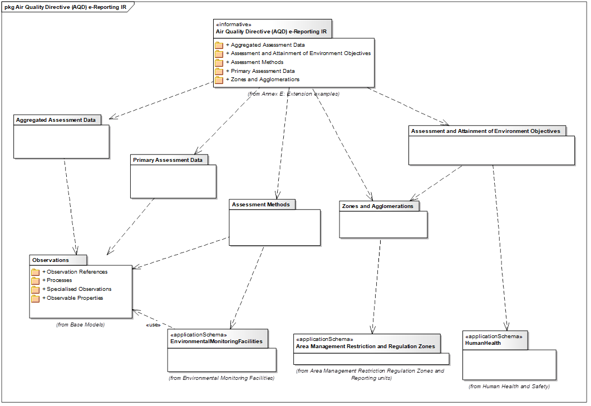

[.text-center]
*Figure F2.3.1 - UML Package Diagram for example Draft AQD e-Reporting Data Specification*

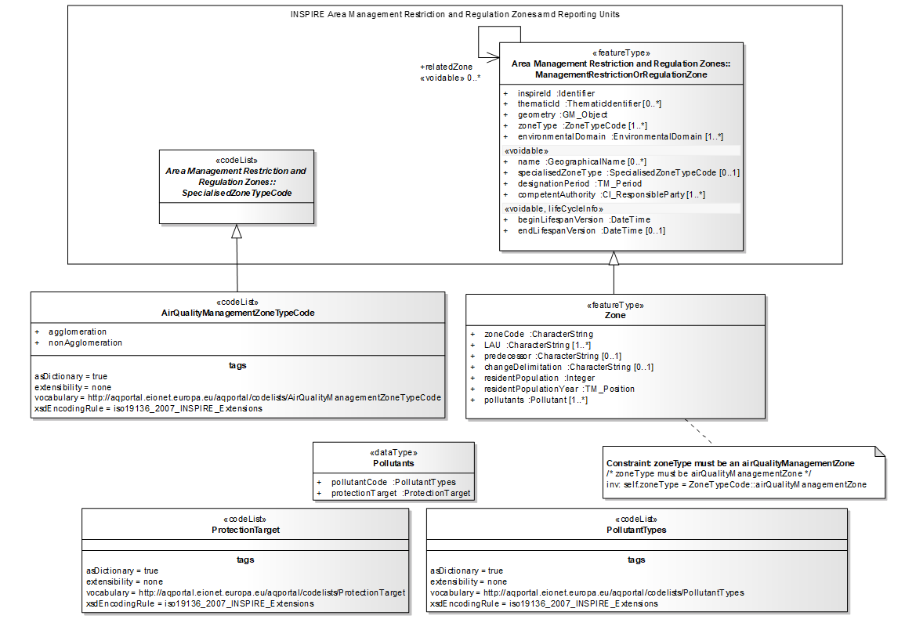

[.text-center]
*Figure F2.3.2 - UML Class Diagram illustrating the Draft ADQ data specification extending the ManagementRestrictionOrRegulationZone*

<<<
[appendix]
== Identification of Reporting Units in INSPIRE Spatial Data Themes - (informative) 
 

=== Overview of reporting units within INSPIRE spatial data themes

The "reporting unit" within the scope of INSPIRE and the AM theme is a spatial object that provides a spatial reference for the data being reported under an environmental reporting obligation.

It is not the intention of the AM theme to model the feature types (spatial object types) which are used for providing a spatial reference for the data reported under environmental reporting obligations, but they shall be defined and made available according to the requirements of their respective INSPIRE spatial data theme.

The following overview provides some of the examples, identified by the INSPIRE Thematic Working Groups for data specifications development, where it is known that certain spatial object types within the scope of the INSPIRE spatial data themes provide a spatial reference for the data being reported under environmental reporting obligations.

*This annex is a "living document" and will evolve in the future on the basis of new understanding and practical experience from implementation of how INSPIRE spatial objects are used as reporting units in environmental reporting obligations.*

The table includes the following information:

* [.underline]#Environmental Legislation or Obligation#: means the environmental legislation established at different levels – international, European, national or sub-national (regional, local) or other agreed environmental reporting
* [.underline]#Reporting Obligation#: means the title or description of the specific reporting obligation which is defined within the environmental legislation or agreed environmental reporting;
* [.underline]#Annex theme for features#: means INSPIRE spatial data theme which includes/defines the spatial object types used in the reporting obligations; acronyms of the INSPIRE spatial data themes are used;
* [.underline]#Reporting Unit (Feature type)#: means the name of the spatial object type (feature type) in the INSPIRE spatial data theme as it is defined in the related INSPIRE Guidelines (data specification);
* [.underline]#Related reporting data/information#: means more detailed information about the related data that are reported.

The table is by no means exhaustive and it can be further updated to include more examples of reporting units and to identify close relationships between the INSPIRE spatial data themes, spatial object types and the reporting obligations in the thematic domains.

[cols=",,,,",options="header",]
|===
|*Environmental Legislation or Other Environmental Reporting* |*Reporting Obligation* |*Annex Theme for Features* |*Reporting Unit (Feature type)* |*Related Reporting Data/Information*
|Air Quality Directive (2008/50/EC) - AQD |AQD Article 7 - AQD pilot: zones |AM a|
ManagementRestrictionOrRegulationZone

(zoneType = airQualityManagementZone)

|Zone Descriptions
|Air Quality Directive (2008/50/EC) - AQD |(F1a) Information on generated aggregated data - primary validated measurements (Article 11) |AM a|
ManagementRestrictionOrRegulationZone

(zoneType = airQualityManagementZone)

|Aggregated data on zones, includes exceedances, statistics, ...
|Air Quality Directive (2008/50/EC) - AQD |(F1b) Information on generated aggregated data - primary validated modelled (Article 11) |AM a|
ManagementRestrictionOrRegulationZone

(zoneType = airQualityManagementZone)

|Near-real-time Information and alert threshold information (exceedences) on zones, based on modelled data
|Air Quality Directive (2008/50/EC) - AQD |(F2) Information on generated aggregated data - primary up-to-date measurements (Article 11) |AM a|
ManagementRestrictionOrRegulationZone

(zoneType = airQualityManagementZone)

|Near-real-time Information and alert threshold information (exceedences) on zones, based on measured data
|Air Quality Directive (2008/50/EC) - AQD |(D) Information on the assessment methods (Articles 8 and 9) |EF |EnvironmentalMonitoringFacility |Information on EFs including location and measurement equipment
|Air Quality Directive (2008/50/EC) - AQD |(E1a) Information on primary validated assessment data -measurements (Article 10) |EF |EnvironmentalMonitoringFacility a|
Primary Data:

* validated observations

|Air Quality Directive (2008/50/EC) - AQD |(E1b) Information on primary validated assessment data -modelled (Article 10) |EF |EnvironmentalMonitoringFacility a|
Primary Data:

* Modelled data

|Air Quality Directive (2008/50/EC) - AQD |(E2a) Information on primary up-to-date assessment data -measurements (Article 10) |EF |EnvironmentalMonitoringFacility a|
Primary Data:

* Real-time observations

|Air Quality Directive (2008/50/EC) - AQD |(F1a) Information on generated aggregated data - primary validated measurements (Article 11) |EF |EnvironmentalMonitoringFacility |Aggregated Data on stations (EF) based on validated measurements
|Air Quality Directive (2008/50/EC) - AQD |(F1b) Information on generated aggregated data - primary validated modelled (Article 11) |EF |EnvironmentalMonitoringFacility |Aggregated Data on stations (EF) based on modeled data
|Air Quality Directive (2008/50/EC) - AQD |(F2) Information on generated aggregated data - primary up-to-date measurements (Article 11) |EF |EnvironmentalMonitoringFacility |Aggregated Data on stations (EF) based on Real-time observations
|Bathing Water Directive (2006/7/EC) - BWD |Management respectively Protection of the Quality of Bathing Waters |AM a|
ManagementRestrictionOrRegulationZone

(zoneType = bathingWaters)

Bathing water can also be defined as

"element of surface water where the competent authority expects a large number of people to bathe and has not imposed a permanent bathing prohibition, or issued permanent advice against bathing".

a|
Coordination is related to WFD-RBD's and WFD-SubUnits because a lot of Bathing Waters are situated in WFD-SurfaceWaterbodies (than WB-Code is requested), if they are situated in other Waterbodies NationalUnitCode is requested.

Poor Bathing Water quality or a bad bathing water profile could lead to bathing prohibition or advice against bathing because this is a risk to bathers' health

|Drinking Water Directive (98/83/EC) - DWD |Meeting of quality standards for drinking water |AM a|
ManagementRestrictionOrRegulationZone

(zoneType = drinkingWaterProtectionArea)

a|
Appropriate water-protection measures should be applied to ensure that surface and groundwater is kept clean, e.g. by establishing safeguard zones with land-use restrictions.

Targeted: all individual supplies of water exceeding 1 000 m³ a day as an average or serving more than 5 000 persons (relation to Art. 7 WFD- waterbodies).

|Floods Directive (2007/60/EC) - FD |Administrative arrangements and coordination in terms of flood risk management |AM a|
ManagementRestrictionOrRegulationZone

(zoneType = riverBasinDistrict)

ManagementRestrictionOrRegulationZone

(zoneType = floodUnitOfManagement)

Units Of Management

Units of management may be individual river basins and/or certain coastal areas, and may be entirely within national borders or may be part of an international unit of management or international river basin district.

|same information as for WFD-RBD and SubUnits is requested
|Floods Directive (2007/60/EC) - FD |Areas within flood risk has to be assessed and mitigated |AM, NZ a|
AM:

ManagementRestrictionOrRegulationZone

(zoneType = riverBasinDistrict)

ManagementRestrictionOrRegulationZone

(zoneType = floodUnitOfManagement)

NZ: RiskZone

Areas with potential significant flood risk (APSFR) on the basis of river basin, sub-basin and/or coastal area or other areas associated with each area of potential significant flood risk.

|Declaration of type(s) of flood(s) which could potentially affect APSFR and what type(s) of adverse consequences will potentially occur
|Groundwater Directive (2006/118/EC) - GWD |Management of Groundwaterprotection |AM a|
ManagementRestrictionOrRegulationZone

(zoneType = riverBasinDistrict)

|Same as for WFD-RBD
|Groundwater Directive (2006/118/EC) - GWD | |AM a|
ManagementRestrictionOrRegulationZone

(zoneType = waterBodyForWFD)

Refers to: groundwaterbodies / groups of groundwaterbodies

|Complementing WFD in terms of pollution: background level, baseline level, pollution trends, compliance with good chemical status criteria etc.
|Habitats Directive (92/43/EEC) |Reporting every 6 years on the "conservation status" of the habitat types and species protected by the Directive |BR |Bio-geographicalRegion a|
The bio-geographical regions are used for reporting every 6 years on the "conservation status" of the habitat types and species protected by the Directive.

Article 1.iii of the Habitats Directive identifies 9 bio-geographical regions in the EU.

Article 17 of the Habitats Directive requires that every 6 years Member States prepare reports to be sent to the European Commission on the implementation of the Directive.

Article 11 of the Habitats Directive requires Member States to monitor the habitats and species listed in the annexes and Article 17 requires a report to be sent to the European Commission every 6 years following an agreed format – hence the term 'Article 17 Reporting'. The report includes assessments on the conservation status of the habitat types and species of Community interest at the bio-geographical level.

|Marine Strategy Framework Directive (2008/56/EC) - MSFD |Cooperation in terms of the protection and preserving to maintain or achieve good environmental status in the marine environment |AM a|
ManagementRestrictionOrRegulationZone

(zoneType = marineRegion) includes related attribute competentAuthority

a|
Declaration of Marine waters, coastal waters (=WFD-Coastalwaterbodies), marine regions or sub-regions and responsible authorities within. Information about "regional cooperation" (means cooperation and coordination of activities between Member States and, whenever possible, third countries sharing the same marine region or subregion, for the purpose of developing and implementing marine strategies); Member States sharing a marine region or subregion shall cooperate to ensure that, within each marine region or subregion, the measures required to achieve the objectives of this Directive, in particular the different elements of the marine strategies referred to in points (a) and (b), are coherent and coordinated across the marine region or subregion concerned.

Competent authorities.

|Marine Strategy Framework Directive (2008/56/EC) - MSFD |Marine regions and sub-regions |AM or SR a|
If the marine regions under MSFD are defined based on the AM theme, then the following feature type can be used:

ManagementRestrictionOrRegulationZone

(zoneType = marineRegions)

If the marine regions under MSFD are defined within the scope of the SR theme, then the following feature type is used:

Sea (sub-type of SeaArea) (MSFD named sea area)

|Marine regions and sub-regions defined under MSFD.
|Marine Strategy Framework Directive (2008/56/EC) – MSFD |MSFD initial assessment |AM a|
ManagementRestrictionOrRegulationZone

(zoneType = marineRegion)

a|
Marine regions and sub-regions are the geographical basis to provide marine strategies.

Initial assessment of marine waters: (a) an analysis of the essential features and characteristics, and current environmental status of marine waters; (b) an analysis of the predominant pressures and impacts, including human activity; (c) an economic and social analysis of the use of marine waters and of the cost of degradation of the marine environment.

MS provide up-to-date marine strategies for each marine region or sub-region ((a) the initial assessment and the determination of good environmental status; (b) the environmental targets; (c) the monitoring programmes; (d) the programmes of measures).

|Nitrates Directive (91/676/EEC) - NID |Establishment and implementation of action programmes; different programmes may be established for different vulnerable zones or parts of zones. |AM a|
ManagementRestrictionOrRegulationZone

(zoneType = nitrateVulnerableZone)

Vulnerable zones, parts of vulnerable zones

Waters affected by pollution and waters which could be affected by pollution if action pursuant to Article 5 NID is not taken shall be identified by the Member States in accordance with the criteria set out in Annex I NID

a|
Status, trends in vulnerable zones, parts of vulnerable zones.

MS are requested to improve status respectively to implement measures to protect water resources or to achieve trend reversal when pollution is increasing, etc.

|Nitrates Directive (91/676/EEC) – NID a|
4-year period report

(Annex V reporting)

|AM a|
ManagementRestrictionOrRegulationZone

(zoneType = nitrateVulnerableZone)

|To be reported: the location of the designed vulnerable zones, distinguishing between existing zones and zones designated since the previous report (map);
|Nitrates Directive (91/676/EEC) - NID |MonitoringStations (ground/surface) (Article 10) |EF |EnvironmentalMonitoringFacility |Aggregated datasets (yearly mean, n° of sample, trend)
|Noise Directive (2002/49/EC) - END | |AM a|
ManagementRestrictionOrRegulationZone

(zoneType = noiseRestrictionZone)

a|
Delimitation of areas: quiet area in an agglomeration, quiet area in open country. END applies also to areas near schools, hospitals and other noise sensitive buildings and areas. Supplementary noise indicators for quiet areas in open country.

Action plans should include actions which the competent authorities intend to take, including any measures to preserve quiet areas.

|Noise Directive (2002/49/EC) - END |Noise Map |US |GovernmentalService |e.g "A strategic noise map is the presentation of data on one of the following aspects: <...> the estimated number of dwellings, schools and hospitals in a certain area that are exposed to specific values of a noise indicator, »
|Urban Waste Water Treatment Directive (91/271/EEC) - UWWT |Situation in MS |AM a|
ManagementRestrictionOrRegulationZone

(zoneType = sensitiveArea)

Agglomerations (= municipalities),

Sensitive areas (= catchments),

Less sensitive areas

Other areas

a|
Treatment level, treatment performance,

MS are requested to improve connection to waste water treatment plants if necessary

a|
Water Framework Directive

(2000/60/EC) - WFD

|River Basin District (Article 3) |AM a|
ManagementRestrictionOrRegulationZone

(zoneType = riverBasinDistrict);

specialised zone type = river basin district sub-units

|Annual average pollutant concentrations (e.g. nitrates, phosphates)
a|
Water Framework Directive

(2000/60/EC) - WFD

a|
Administrative arrangements and coordination in terms of managing protection of inland surface waters, transitional waters,

coastal waters and groundwater

|AM a|
ManagementRestrictionOrRegulationZone

(zoneType = riverBasinDistrict);

specialised zone type = river basin district sub-units

RBD means the area of land and sea, made up of one or more neighbouring river basins together with their associated groundwaters and coastal waters, which is identified under Article 3(1) as the main unit for management of river basins.)

a|
Declaration of RBD-name (English, national), area and responsible authorities within RBD ("competent authorities"), postal address of authorities, in summary texts information about coordination and institutional relationships, especially if RBD is an international RBD

Declaration of SubUnits (see below) when RBD is divided into sub management units.

SubUnit-name (English, national), area

_Note: Term sub-units cannot be found in text of WFD. SubUnits were introduced to have management units that are more comparable. SubUnits are sub-divisions of large RBD, small RBD's have no SubUnits respectively SubUnit and RBD are equal._

a|
Water Framework Directive

(2000/60/EC) - WFD

|Status and objectives of inland surface waters, transitional waters, coastal waters and groundwater within each ManagementRestrictionOrRegulationZone |AM a|
ManagementRestrictionOrRegulationZone

(zoneType = waterBodyForWFD)

Annex D of AM data specification provides technical guidelines for further modelling of the water bodies for WFD (waterBodyForWFD) including the following sub-types:

[loweralpha]
. WFD Surface waterbodies (Body of surface water means a discrete and significant element of surface water such as a lake, a reservoir, a stream, river or canal, part of a stream, river or canal, a transitional water or a stretch of coastal water.):
* WFD River waterbodies

* WFD Lake waterbodies

* WFD Transitional waterbodies

* WFD Coastal waterbodies

[loweralpha, start=2]
. WFD Groundwaterbodies (Body of groundwater. means a distinct volume of groundwater within an aquifer or aquifers.)

_Note: Waterbodies are also a management unit._

a|
e.g. if a waterbody is whether articifial, heavily modified or natural and if waterbody will reach the environmental objectives in terms of good environmental status respectively potential (ecological, chemical and/or quantitative status/potential).

Status/potential is monitored respectively carried out by assessment of so called quality elements:

* biological (composition, abundance and biomass of invertebrates etc.)

* physio-chemical (ph-Value etc.)

* hydromorphological (hydrological regime, continuity etc.)

* chemical and physico-chemical (heavy metals, pesticides etc.)

* etc.

a|
Water Framework Directive

(2000/60/EC) - WFD

a|
SurfaceWaterMonitoringStation

GroundWaterMonitoringStation

Network

(Article 8)

|EF a|
EnvironmentalMonitoringFacility

EnvironmentalMonitoringNetwork

a|
ObservingCapability

Data is for the SoE reporting

a|
Water Framework Directive

(2000/60/EC) - WFD

|Programme (Article 8) |EF |EnvironmentalMonitoringProgram |Quality Elements
a|
Water Framework Directive

(2000/60/EC) - WFD

|WaterBodies (Article 5) |AM a|
ManagementRestrictionOrRegulationZone

(zoneType = waterBodyForWFD)

|e.g. Indicators of good environmental status
a|
Water Framework Directive

(2000/60/EC) – WFD

|WFD reporting |SR |MarineCircultationArea (coastal and transitional waters) |to support to define and use coastal and transitional waters (also used in WFD reporting: as WFD coastal waters, WFD transitional waters)
a|
Water Framework Directive

(2000/60/EC) - WFD

|Economic analysis (annex II) |US |UtilityNetwork a|
e.g. water network & sewer network

Attention: UtilityNetwork has NO geometry itself: it's just a collection of located networks elements (nodes and links).

|WISE – Water Information System |Quality of the water |AM a|
ManagementRestrictionOrRegulationZone

(zoneType = waterBodyForWFD)

Sub-set can be defined as:

Main Rivers

Main Lakes

Transitional Waters

Coastal Waters

Remark:

Derived from geometries reported under WFD (but not for all MS).

These are more a kind of aggregation units or management units.

For example: in DE main rivers and main lakes are a selection of WFD-watercourses respectively WFD-waterbodies (catchment ≥500 km² respectively surface area ≥ 10 km²)

a|
WISE-Reference datasets – in the case when they are compliant with (sub-set of) the waterBodyForWFD.:

EEA maps reported information to WISE Main Rivers, WISE Main Lakes, WISE Transitional waters, WISE Coastal Waters

|===

=== Overview of legislation for the identified reporting units

[cols=""]
|===
a|
Air Quality Directive (2008/50/EC) - AQD

_http://eur-lex.europa.eu/LexUriServ/LexUriServ.do?uri=CELEX:32008L0050:EN:NOT_

a|
Bathing Water Directive (2006/7/EC) – BWD

_http://eur-lex.europa.eu/LexUriServ/LexUriServ.do?uri=OJ:L:2006:064:0037:0051:EN:PDF_

a|
Drinking Water Directive (98/83/EC) – DWD

_http://eur-lex.europa.eu/LexUriServ/LexUriServ.do?uri=OJ:L:1998:330:0032:0054:EN:PDF_

a|
Floods Directive (2007/60/EC) – FD

_http://eur-lex.europa.eu/LexUriServ/LexUriServ.do?uri=OJ:L:2007:288:0027:0034:EN:PDF_

a|
Groundwater Directive (2006/118/EC) – GWD

_http://eur-lex.europa.eu/LexUriServ/LexUriServ.do?uri=OJ:L:2006:372:0019:0031:EN:PDF_

a|
Habitats Directive (92/43/EEC)

_http://eur-lex.europa.eu/LexUriServ/LexUriServ.do?uri=CELEX:31992L0043:EN:HTML_

a|
Marine Strategy Framework Directive (2008/56/EC) – MSFD

_http://eur-lex.europa.eu/LexUriServ/LexUriServ.do?uri=OJ:L:2008:164:0019:0040:EN:PDF_

a|
Nitrates Directive (91/676/EEC) – NID

_http://ec.europa.eu/environment/water/water-nitrates/index_en.html_

a|
Noise Directive (2002/49/EC) – END

_http://eur-lex.europa.eu/LexUriServ/LexUriServ.do?uri=OJ:L:2002:189:0012:0025:EN:PDF_

a|
Urban Waste Water Treatment Directive (91/271/EEC) – UWWT

_http://eur-lex.europa.eu/LexUriServ/LexUriServ.do?uri=OJ:L:1991:135:0040:0052:EN:PDF_

a|
Water Framework Directive (2000/60/EC) – WFD

_http://eur-lex.europa.eu/LexUriServ/LexUriServ.do?uri=OJ:L:2000:327:0001:0072:EN:PDF_

|===
