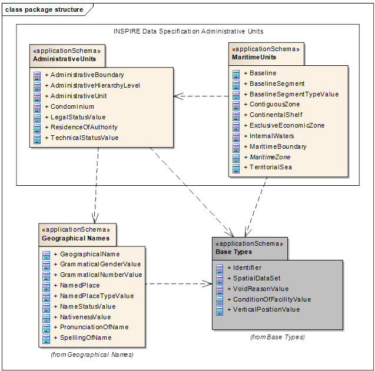
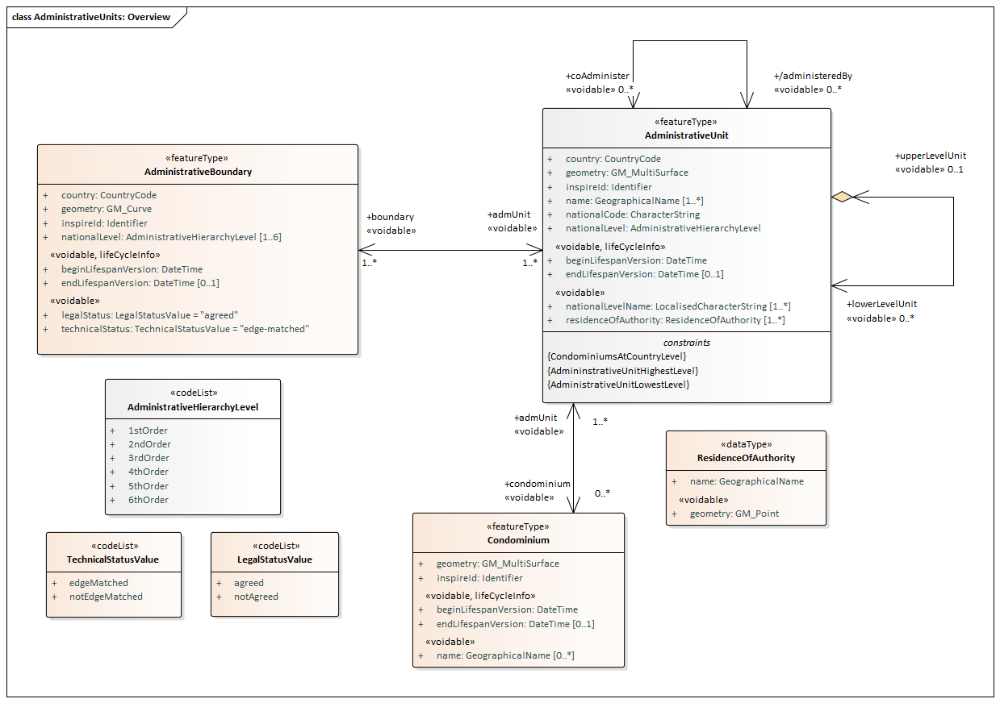
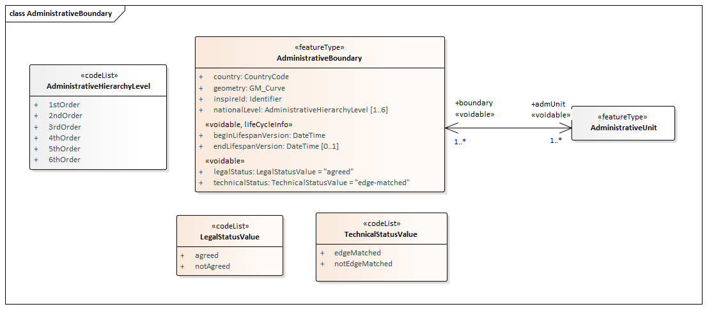
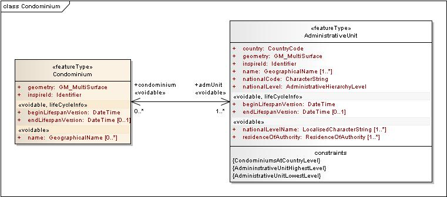
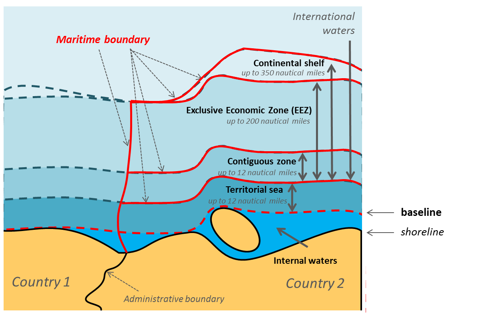
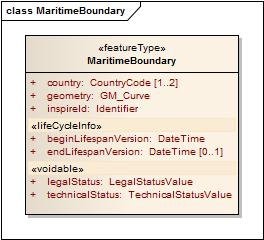
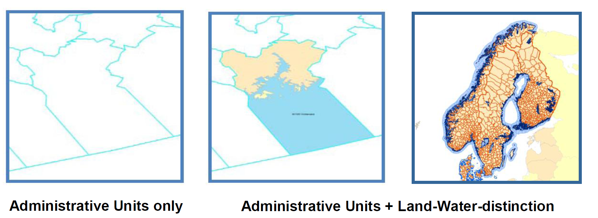

// Admonition icons:
// IR Requirement
:important-caption: 📕
// TG Requirement
:tip-caption: 📒
// Recommendation
:note-caption: 📘

// TOC placement using macro (manual)
:toc: macro

// Empty TOC title (the title is in the document)
:toc-title:

// TOC level depth
:toclevels: 3

// Section numbering level depth
:sectnumlevels: 8

// Line Break Doc Title
:hardbreaks-option:

:appendix-caption: Annex

// Document properties
:title: D2.8.I.4 Data Specification on Administrative Units – Technical Guidelines
:revdate: 2023-07-31
:keywords: INSPIRE Data Specification for the spatial data theme Administrative Units
:producer: INSPIRE Maintenance and Implementation Group (MIG)
:description: This document describes the INSPIRE Data Specification for the spatial data theme Administrative Units
:author: Temporary MIWP 2021-2024 sub-group 2.3.1
:copyright: Public
:revremark: https://github.com/INSPIRE-MIF/technical-guidelines/releases/tag/v2023.2
:lang: en

image:./media/image2.jpeg[image,width=131,height=90, align=center]

image:./media/image3.png[image,width=93,height=93, align=center] **INSPIRE***Infrastructure for Spatial Information in Europe*

[discrete]
= D2.8.I.4 Data Specification on _Administrative Units_ – Technical Guidelines

[width="100%",cols="17%,83%",]
|===
|*Title* |{doctitle}
|*Creator* |{author}
|*Date of publication* |{revdate}
|*Subject* |{keywords}
|*Publisher* |{producer}
|*Type* |Text
|*Description* |{description}
|*Format* |AsciiDoc
|*Licence* |https://creativecommons.org/licenses/by/4.0[Creative Commons Attribution (cc-by) 4.0]
|*Rights* |{copyright}
|*Identifier* |https://inspire.ec.europa.eu/id/document/tg/au[D2.8.I.4_v3.1.0]
|*Changelog* |{revremark}
|*Language* |{lang}
|*Relation* |Directive 2007/2/EC of the European Parliament and of the Council of 14 March 2007 establishing an Infrastructure for Spatial Information in the European Community (INSPIRE)
|===

<<<
[discrete]
== Foreword

[discrete]
== How to read the document?

This document describes the _"INSPIRE data specification on Administrative Units – Technical Guidelines"_ version 3.1(.0) as developed by the Thematic Working Group (TWG) _Administrative Units_ using both natural and a conceptual schema language.

The data specification is based on a common templatefootnote:[The common document template is available in the "Framework documents" section of the data specifications web page at http://inspire.jrc.ec.europa.eu/index.cfm/pageid/2] used for all data specifications, which has been harmonised using the experience from the development of the Annex I, II and III data specifications.

This document provides guidelines for the implementation of the provisions laid down in the draft Implementing Rule for spatial data sets and services of the INSPIRE Directive. It also includes additional requirements and recommendations that, although not included in the Implementing Rule, are relevant to guarantee or to increase data interoperability.

Two executive summaries provide a quick overview of the INSPIRE data specification process in general, and the content of the data specification on _Administrative Units_ in particular. We highly recommend that managers, decision makers, and all those new to the INSPIRE process and/or information modelling should read these executive summaries first.

The UML diagrams (in Chapter 5) offer a rapid way to see the main elements of the specifications and their relationships. The definition of the spatial object types, attributes, and relationships are included in the Feature Catalogue (also in Chapter 5). People having thematic expertise but not familiar with UML can fully understand the content of the data model focusing on the Feature Catalogue. Users might also find the Feature Catalogue especially useful to check if it contains the data necessary for the applications that they run. The technical details are expected to be of prime interest to those organisations that are responsible for implementing INSPIRE within the field of _Administrative Units_, but also to other stakeholders and users of the spatial data infrastructure.

The technical provisions and the underlying concepts are often illustrated by examples. Smaller examples are within the text of the specification, while longer explanatory examples and descriptions of selected use cases are attached in the annexes.

In order to distinguish the INSPIRE spatial data themes from the spatial object types, the INSPIRE spatial data themes are written in _italics._

[cols="",]
|===
|The document will be publicly available as a 'non-paper'. It does not represent an official position of the European Commission, and as such cannot be invoked in the context of legal procedures.
|===

*Legal Notice*

Neither the European Commission nor any person acting on behalf of the Commission is responsible for the use which might be made of this publication.

<<<
[discrete]
== Interoperability of Spatial Data Sets and Services – General Executive Summary

The challenges regarding the lack of availability, quality, organisation, accessibility, and sharing of spatial information are common to a large number of policies and activities and are experienced across the various levels of public authority in Europe. In order to solve these problems it is necessary to take measures of coordination between the users and providers of spatial information. The Directive 2007/2/EC of the European Parliament and of the Council adopted on 14 March 2007 aims at establishing an Infrastructure for Spatial Information in the European Community (INSPIRE) for environmental policies, or policies and activities that have an impact on the environment.

INSPIRE is based on the infrastructures for spatial information that are created and maintained by the Member States. To support the establishment of a European infrastructure, Implementing Rules addressing the following components of the infrastructure have been specified: metadata, interoperability of spatial data sets (as described in Annexes I, II, III of the Directive) and spatial data services, network services, data and service sharing, and monitoring and reporting procedures.

INSPIRE does not require collection of new data. However, after the period specified in the Directivefootnote:[For all 34 Annex I,II and III data themes: within two years of the adoption of the corresponding Implementing Rules for newly collected and extensively restructured data and within 5 years for other data in electronic format still in use] Member States have to make their data available according to the Implementing Rules.

Interoperability in INSPIRE means the possibility to combine spatial data and services from different sources across the European Community in a consistent way without involving specific efforts of humans or machines. It is important to note that "interoperability" is understood as providing access to spatial data sets through network services, typically via Internet. Interoperability may be achieved by either changing (harmonising) and storing existing data sets or transforming them via services for publication in the INSPIRE infrastructure. It is expected that users will spend less time and efforts on understanding and integrating data when they build their applications based on data delivered in accordance with INSPIRE.

In order to benefit from the endeavours of international standardisation bodies and organisations established under international law their standards and technical means have been utilised and referenced, whenever possible.

To facilitate the implementation of INSPIRE, it is important that all stakeholders have the opportunity to participate in specification and development. For this reason, the Commission has put in place a consensus building process involving data users, and providers together with representatives of industry, research and government. These stakeholders, organised through Spatial Data Interest Communities (SDIC) and Legally Mandated Organisations (LMO)footnote:[The current status of registered SDICs/LMOs is available via INSPIRE website: http://inspire.jrc.ec.europa.eu/index.cfm/pageid/42], have provided reference materials, participated in the user requirement and technicalfootnote:[Surveys on unique identifiers and usage of the elements of the spatial and temporal schema,] surveys, proposed experts for the Data Specification Drafting Teamfootnote:[The Data Specification Drafting Team has been composed of experts from Austria, Belgium, Czech Republic, France, Germany, Greece, Italy, Netherlands, Norway, Poland, Switzerland, UK, and the European Environment Agency], the Thematic Working Groupsfootnote:[The Thematic Working Groups of Annex II and III themes have been composed of experts from Austria, Belgium, Bulgaria, Czech Republic, Denmark, Finland, France, Germany, Hungary, Ireland, Italy, Latvia, Netherlands, Norway, Poland, Romania, Slovakia, Spain, Sweden, Switzerland, Turkey, UK, the European Commission, and the European Environment Agency] and other ad-hoc cross-thematic technical groups and participated in the public stakeholder consultations on draft versions of the data specifications. These consultations covered expert reviews as well as feasibility and fitness-for-purpose testing of the data specificationsfootnote:[For Annex IIIII, the consultation and testing phase lasted from 20 June to 21 October 2011.].

This open and participatory approach was successfully used during the development of the data specifications on Annex I, II and III data themes as well as during the preparation of the Implementing Rule on Interoperability of Spatial Data Sets and Servicesfootnote:[Commission Regulation (EU) No 1089/2010 http://eur-lex.europa.eu/JOHtml.do?uri=OJ:L:2010:323:SOM:EN:HTML[implementing Directive 2007/2/EC of the European Parliament and of the Council as regards interoperability of spatial data sets and services,] published in the Official Journal of the European Union on 8^th^ of December 2010.] for Annex I spatial data themes and of its amendment regarding the themes of Annex II and III.

The development framework elaborated by the Data Specification Drafting Team aims at keeping the data specifications of the different themes coherent. It summarises the methodology to be used for the development of the data specifications, providing a coherent set of requirements and recommendations to achieve interoperability. The pillars of the framework are the following technical documentsfootnote:[The framework documents are available in the "Framework documents" section of the data specifications web page at http://inspire.jrc.ec.europa.eu/index.cfm/pageid/2]:

* The _Definition of Annex Themes and Scope_ describes in greater detail the spatial data themes defined in the Directive, and thus provides a sound starting point for the thematic aspects of the data specification development.
* The _Generic Conceptual Model_ defines the elements necessary for interoperability and data harmonisation including cross-theme issues. It specifies requirements and recommendations with regard to data specification elements of common use, like the spatial and temporal schema, unique identifier management, object referencing, some common code lists, etc. Those requirements of the Generic Conceptual Model that are directly implementable are included in the Implementing Rule on Interoperability of Spatial Data Sets and Services.
* The _Methodology for the Development of Data Specifications_ defines a repeatable methodology. It describes how to arrive from user requirements to a data specification through a number of steps including use-case development, initial specification development and analysis of analogies and gaps for further specification refinement.
* The _Guidelines for the Encoding of Spatial Data_ defines how geographic information can be encoded to enable transfer processes between the systems of the data providers in the Member States. Even though it does not specify a mandatory encoding rule it sets GML (ISO 19136) as the default encoding for INSPIRE.
* The _Guidelines for the use of Observations & Measurements and Sensor Web Enablement-related standards in INSPIRE Annex II and III data specification development_ provides guidelines on how the "Observations and Measurements" standard (ISO 19156) is to be used within INSPIRE.
* The _Common data models_ are a set of documents that specify data models that are referenced by a number of different data specifications. These documents include generic data models for networks, coverages and activity complexes.

The structure of the data specifications is based on the "ISO 19131 Geographic information - Data product specifications" standard. They include the technical documentation of the application schema, the spatial object types with their properties, and other specifics of the spatial data themes using natural language as well as a formal conceptual schema languagefootnote:[UML – Unified Modelling Language].

A consolidated model repository, feature concept dictionary, and glossary are being maintained to support the consistent specification development and potential further reuse of specification elements. The consolidated model consists of the harmonised models of the relevant standards from the ISO 19100 series, the INSPIRE Generic Conceptual Model, and the application schemasfootnote:[Conceptual models related to specific areas (e.g. INSPIRE themes)] developed for each spatial data theme. The multilingual INSPIRE Feature Concept Dictionary contains the definition and description of the INSPIRE themes together with the definition of the spatial object types present in the specification. The INSPIRE Glossary defines all the terms (beyond the spatial object types) necessary for understanding the INSPIRE documentation including the terminology of other components (metadata, network services, data sharing, and monitoring).

By listing a number of requirements and making the necessary recommendations, the data specifications enable full system interoperability across the Member States, within the scope of the application areas targeted by the Directive. The data specifications (in their version 3.0) are published as technical guidelines and provide the basis for the content of the Implementing Rule on Interoperability of Spatial Data Sets and Servicesfootnote:[In the case of the Annex IIIII data specifications, the extracted requirements are used to formulate an amendment to the existing Implementing Rule.]. The content of the Implementing Rule is extracted from the data specifications, considering short- and medium-term feasibility as well as cost-benefit considerations. The requirements included in the Implementing Rule are legally binding for the Member States according to the timeline specified in the INSPIRE Directive.

In addition to providing a basis for the interoperability of spatial data in INSPIRE, the data specification development framework and the thematic data specifications can be reused in other environments at local, regional, national and global level contributing to improvements in the coherence and interoperability of data in spatial data infrastructures.

<<<
[discrete]
== Administrative Units – Executive Summary

_Administrative units_ are included in Annex I, which means that they are considered as reference data, i.e. data that constitute the spatial frame for linking to and/or pointing at other information that belong to specific thematic fields such as the environment and socio-economic statistics, alongside many others.

INSPIRE data specification on administrative units has been prepared following the participative principle of a consensus building process. The stakeholders, based on their registration as a Spatial Data Interest Community (SDIC) or a Legally Mandated Organisation (LMO) had the opportunity to bring forward user requirements and reference materials, propose experts for the specification's development, and to participate in reviewing and testing the data specifications. The Thematic Working Group responsible for the specification development was composed of experts from Belgium, Germany, Norway, Poland and Sweden.

The specification process took place according to the methodology elaborated for INSPIRE respecting the requirements and the recommendation of the INSPIRE Generic Conceptual Model, which is one of the elements that ensures a coherent approach and cross-theme consistency with other themes in the Directive.

During the specification development, the Thematic Working Group has considered widely the achievements of the EuroBoundaryMap product, which already achieved considerable results in harmonising administrative unit data held by the National Mapping and Cadastral Agencies of Europe.

According to the definition of the Directive, administrative units are "units of administration dividing areas where Member States have and/or exercise jurisdictional rights for local, regional and national governance, separated by administrative boundaries". Based on the reference materials and the user requirements, the Thematic Working Group has added some other fundamental aspects like the hierarchical structure of administrative units and the relations with statistical units that have already been defined and in use within the EU-administrationfootnote:[Statistical units, such as NUTS (Nomenclature of Territorial Statistical Units) regions, are defined in the _Statistical units_ data theme, which is part of INSPIRE Annex III. .].

Administrative units in INSPIRE play the role of generic information locators. Their main uses include

* Searching / filtering other spatial data based on a name or code.
* Linking / publishing thematic information in a rapid and comparable way.
* Finding competent authorities e.g. in case of disasters, for environmental protection , etc.

In addition administrative units may provide the frame for a boundary-based analysis of consistency of spatial objects (similar classification, geometrical matching) as required in Art. 8(4) and 10(2) of the Directive.

The administrative units data theme model is divided in two application schemas:

* The core element of the *AdministrativeUnits application schema* is the administrative unit represented by a surface geometry. In accordance with the Directive, each administrative unit carries a unique identifier. Administrative units are further described by their geographical name, the country of location, the national administrative code, and the hierarchical level within the administrative structure of the country. This information is completed, if available, with the life cycle information (when the administrative unit has been inserted or changed in the dataset, and when it has been (if ever) superseded or retired in the spatial data set), the name of the corresponding national level and the residence of the administrative authority.
+
The administrative division of the Members States follows a hierarchical structure where the lowest level units (often communes) are united in higher level units (like provinces, counties, etc) that compose other units at a higher level. It must be ensured that an administrative unit of an upper level is composed of one or more administrative units of a lower level. Lowest level administrative units are further characterised by their geometry and, where available, by the corresponding local administrative unit code. A special spatial object type called condominium has been introduced for describing independent administrative areas that are administered by two or more countries.
+
Administrative units are separated by administrative boundaries that are specified as lines. As mandatory properties they carry a unique identifier, information on the country, the administrative hierarchic level and their own geometry. These are complemented, when available, with the legal and technical status of the boundary and the life cycle information.

* The *MaritimeUnits application schema* models the existing maritime zones. These are stripes or belts of sea defined according international treaties and conventions, where the coastal States execute their jurisdictional rights. Depending on the zone type property, they may concern an area of seabed, ocean floor, subsoil, resources, or even the air space over the sea, for cadastral, administrative, economic, security or safety purposes. These rights are established by the United Nations Convention on the Law of the Sea (UNCLOS). The baseline, the line from which the outer limits of the territorial sea is measured, serves as reference to calculate the breath of territorial sea, while determines the outer limits of other maritime zones by establishing respectively different distances measured from it.
+
In contrast to the AdministrativeUnits model, no hierarchical structure is established between different maritime zones. However, they share common properties with administrative units, like the unique identifier and the country the maritime zone belongs to. All this information is again complemented, if available, with the life cycle information and the geographical name.
+
Following a common modelling approach with administrative units, maritime zones are separated by maritime boundaries that are specified as lines. As mandatory properties they carry a unique identifier, information on the country, and their own geometry. These are complemented, when available, with the legal and technical status of the boundary and the life cycle information.

In the INSPIRE administrative unit data specification, there are no mandatory quality requirements. However it is recommended that Member States provide the data at the source accuracy where possible targeting a minimal positional accuracy of 50 meters. The actual values of data quality sub-elements (completeness - commission and omission; logical consistency - conceptual, domain and topological consistency; positional accuracy – absolute ore external accuracy) should be published as metadata, when they are available. Metadata information have to be complemented with the necessary elements to comply with the Metadata Regulation 1205/2008/EC, the ones identified as needed for the interoperability of the Administrative Units theme and, if possible, those recommended in this specification.

Interoperability is further supported by a common reference system and provisions for visualisation. For the latter, simple rules for default portrayal are given in specifying the fill colour of the administrative units and maritime zones, and the line-width of their borders corresponding to administrative and maritime boundaries, as well as the font and size of the labels. Moreover, the default portrayal elements reflect the hierarchy of the represented spatial objects.

The main value of the INSPIRE Administrative Units theme data models is that they have a simple, yet flexible structure that allows data providers to publish their existing data in the most convenient way. Additionally, this specification has given a firm starting point for the related spatial data themes in Annex III of INSPIRE.

As INSPIRE _Administrative units_ data specification is the result of a detailed analysis of user requirements and strong consideration of existing initiatives that went beyond the strictly environmental scope, it is expected that it will also be a solid element of a multi-purpose European spatial data infrastructure.

<<<
[discrete]
== Acknowledgements

Many individuals and organisations have contributed to the development of these Guidelines.

The Thematic Working Group Administrative Units (TWG-AU) included:

Jesper Paasch (TWG Facilitator), Geir Myrind (TWG Editor), Ulrich Düren, Alina Kmiecik, Frederic Mortier, Ingrid Naumann, Katalin Tóth (European Commission contact point).

The initial MaritimeUnits application schema has been developed by the Annex III TWG Oceanographic geographical features & Sea Regions (TWG-OF-SR), which included:

Keiran Millard (TWG Facilitator), Dominic Lowe (TWG Editor), Hans Mose Jensen, Marc Roesbeke, Carlo Brandini, Nuria Hermida, Maria Olvido Tello, Alessandro Sarretta (European Commission contact point till May 2012), Tomáš Řezník (European Commission contact point from May till August 2012), Michael Lutz & Vlado Cetl (European Commission contact points from August 2012).

The combined data specification including both application schemas has been created by Alina Kmiecik.

Other contributors to the INSPIRE data specifications are the Drafting Team Data Specifications, the JRC Data Specifications Team and the INSPIRE stakeholders - Spatial Data Interested Communities (SDICs) and Legally Mandated Organisations (LMOs).

*Contact information*

Maria Vanda Nunes de Lima
European Commission Joint Research Centre
Institute for Environment and Sustainability
Unit H06: Digital Earth and Reference Data
TP262, Via Fermi 2749
I-21027 Ispra (VA)
ITALY
E-mail: vanda.lima@jrc.ec.europa.eu
Tel.: 39-0332-7865052
Fax: 39-0332-7866325
http://ies.jrc.ec.europa.eu/
http://ec.europa.eu/dgs/jrc/
http://inspire.jrc.ec.europa.eu/

<<<
[discrete]
= Table of Contents
toc::[]

:sectnums:

<<<
== Scope

This document specifies a harmonised data specification for the spatial data theme _Administrative Units_ as defined in Annex I of the INSPIRE Directive.

This data specification provides the basis for the drafting of Implementing Rules according to Article 7 (1) of the INSPIRE Directive [Directive 2007/2/EC]. The entire data specification is published as implementation guidelines accompanying these Implementing Rules.

<<<
== Overview

=== Name

INSPIRE data specification for the theme Administrative Units.

=== Informal description

*Definition:*

Units of administration, dividing areas where Member States have and/or exercise jurisdictional rights, for local, regional and national governance, separated by administrative boundaries [Directive 2007/2/EC].

*Description:*

Each national territory is divided into administrative units at different administrative levels as defined by the national administrative hierarchy. Administrative units are separated by administrative boundaries. Under United Nations Convention on the Law of the Sea the coastal States can define maritime zones, wherein they exercise jurisdictional rights on sea area. The zones are separated by maritime boundaries.

The administrative / maritime division forms an indirect spatial reference system. The reference to an administrative unit or maritime zone provides a spatial dimension to data without using coordinates (INSPIRE IMS, 2003).

Administrative units may correspond to the items identified in frame of other territory division systems. The examples of such relationships include, among others, the cadastral parcels, census districts, postal regions, sea regions, statistical units, or sector-specific regions. These items are not considered to constitute a part of the definition of administrative units; they are within the scope of other INSPIRE themes.

Administrative and maritime boundaries are the key to horizontal interoperability between the products of national data custodians. Neighbours should agree on international boundaries with shared geometry at the best possible resolution (INSPIRE RDM, 2002).

The reference date of the administrative units has to be considered for purpose of linkage to statistical information as for instance population figures. Therefore, the aspect of temporal reference and update has to be considered carefully for administrative units.

Provision of national datasets on administrative units, harmonised according to this data specification and to defined reference dates, is required to facilitate interoperable data exchange of all official administrative units according to the administrative levels as defined within each Member State.

The EU-wide harmonized data of all these administrative units can be seen as a key dataset for any kind of (cross-border) spatial handling, important in operations and management.

This data specification has been derived from the specification of EuroGeographics EBM product which is already used for the Administrative Unit Theme of European Commission's GISCO reference database. The European Environment Agency (EEA) is using this dataset to relate their environmental information and indicators to the official defined administrative units in Europe.

_Use cases_

This INSPIRE data specification on Administrative units theme is to support the following high level use cases:

* Filtering data. A user selects regions (e.g. by clicking or entering a name or code). The geometry of the selected administrative units and maritime zones is used in a query filter when retrieving geographic information (using a download service) or metadata (using a discovery service). This could e.g. be used in verification to identify features located at the border between two administrative units or maritime zones.

* Linking thematic information. To provide users with easy and rapid access to comparable thematic information, data providers link their information to the administrative units and maritime zones.

* Disaster management. The administrative units and maritime zones that are affected by an environmental phenomenon or disaster are selected.

* Boundary based analysis. Verification of data of thematic features located at the boundaries of administrative units or maritime zones. This covers the aspect of edge-matching.

* Discovery of unit related data. Search catalogues to discover available data sets with respect to administrative unit / maritime zone geometry or name (or code).

=== Normative References

[Directive 2007/2/EC] Directive 2007/2/EC of the European Parliament and of the Council of 14 March 2007 establishing an Infrastructure for Spatial Information in the European Community (INSPIRE)

[ISO 19107] EN ISO 19107:2005, Geographic Information – Spatial Schema

[ISO 19108] EN ISO 19108:2005, Geographic Information – Temporal Schema

[ISO 19108-c] ISO 19108:2002/Cor 1:2006, Geographic Information – Temporal Schema, Technical Corrigendum 1

[ISO 19111] EN ISO 19111:2007 Geographic information - Spatial referencing by coordinates (ISO 19111:2007)

[ISO 19113] EN ISO 19113:2005, Geographic Information – Quality principles

[ISO 19115] EN ISO 19115:2005, Geographic information – Metadata (ISO 19115:2003)

[ISO 19118] EN ISO 19118:2006, Geographic information – Encoding (ISO 19118:2005)

[ISO 19123] EN ISO 19123:2007, Geographic Information – Schema for coverage geometry and functions

[ISO 19125-1] EN ISO 19125-1:2004, Geographic Information – Simple feature access – Part 1: Common architecture

[ISO 19135] EN ISO 19135:2007 Geographic information – Procedures for item registration (ISO 19135:2005)

[ISO 19138] ISO/TS 19138:2006, Geographic Information – Data quality measures

[ISO 19139] ISO/TS 19139:2007, Geographic information – Metadata – XML schema implementation

[ISO 19157] ISO/DIS 19157, Geographic information – Data quality

[ISO 3166-1] EN ISO 3166-1:2006, Codes for the representation of names of countries and their subdivisions – Part 1: Country codes

[OGC 06-103r4] Implementation Specification for Geographic Information - Simple feature access – Part 1: Common Architecture v1.2.1

NOTE This is an updated version of "EN ISO 19125-1:2004, Geographic information – Simple feature access – Part 1: Common architecture".

[Regulation 1205/2008/EC] Regulation 1205/2008/EC implementing Directive 2007/2/EC of the European Parliament and of the Council as regards metadata

[UNCLOS] United Nations Convention on the Law of the Sea

=== Terms and definitions

General terms and definitions helpful for understanding the INSPIRE data specification documents are defined in the INSPIRE Glossaryfootnote:[The INSPIRE Glossary is available from http://inspire-registry.jrc.ec.europa.eu/registers/GLOSSARY].

=== Symbols and abbreviations

[width="100%",cols="14%,86%"]
|===
|BKG|Federal Agency for Cartography and Geodesy (Germany)
|EuroGeographics|Association representing nearly all European National Mapping and Cadastral Agencies (NMCAs)
|Eurostat|Statistical Office of the European Communities
|GISCO|Geographic Information System of the European Commission
|EBM|EuroBoundaryMap (product of EuroGeographics)
|EEA|European Environment Agency
|FADN|Farm Accountancy Data Network (See Council Regulation 79/65/EEC)
|LAU|Local administrative units
|NUTS|Nomenclature of Territorial Units for Statistics
|OCL|Object Constraint Language
|UML|Unified Modelling Language
|UNCLOS|United Nation Convention on the Law of the Sea
|===

=== How the Technical Guidelines map to the Implementing Rules

The schematic diagram in Figure 1 gives an overview of the relationships between the INSPIRE legal acts (the INSPIRE Directive and Implementing Rules) and the INSPIRE Technical Guidelines. The INSPIRE Directive and Implementing Rules include legally binding requirements that describe, usually on an abstract level, _what_ Member States must implement.

In contrast, the Technical Guidelines define _how_ Member States might implement the requirements included in the INSPIRE Implementing Rules. As such, they may include non-binding technical requirements that must be satisfied if a Member State data provider chooses to conform to the Technical Guidelines. Implementing these Technical Guidelines will maximise the interoperability of INSPIRE spatial data sets.

image::./media/image4.png[image,width=603,height=375, align=center]

[.text-center]
*Figure 1 - Relationship between INSPIRE Implementing Rules and Technical Guidelines*

==== Requirements

The purpose of these Technical Guidelines (Data specifications on _Administrative Units_) is to provide practical guidance for implementation that is guided by, and satisfies, the (legally binding) requirements included for the spatial data theme Administrative Units in the Regulation (Implementing Rules) on interoperability of spatial data sets and services. These requirements are highlighted in this document as follows:

[IMPORTANT]
====
[.text-center]
*IR Requirement*
_Article / Annex / Section no._
*Title / Heading*

This style is used for requirements contained in the Implementing Rules on interoperability of spatial data sets and services (Commission Regulation (EU) No 1089/2010).
====

For each of these IR requirements, these Technical Guidelines contain additional explanations and examples.

NOTE The Abstract Test Suite (ATS) in Annex A contains conformance tests that directly check conformance with these IR requirements.

Furthermore, these Technical Guidelines may propose a specific technical implementation for satisfying an IR requirement. In such cases, these Technical Guidelines may contain additional technical requirements that need to be met in order to be conformant with the corresponding IR requirement _when using this proposed implementation_. These technical requirements are highlighted as follows:

[TIP]
====
*TG Requirement X*

This style is used for requirements for a specific technical solution proposed in these Technical Guidelines for an IR requirement.
====

NOTE 1 Conformance of a data set with the TG requirement(s) included in the ATS implies conformance with the corresponding IR requirement(s).

NOTE 2 In addition to the requirements included in the Implementing Rules on interoperability of spatial data sets and services, the INSPIRE Directive includes further legally binding obligations that put additional requirements on data providers. For example, Art. 10(2) requires that Member States shall, where appropriate, decide by mutual consent on the depiction and position of geographical features whose location spans the frontier between two or more Member States. General guidance for how to meet these obligations is provided in the INSPIRE framework documents.

==== Recommendations

In addition to IR and TG requirements, these Technical Guidelines may also include a number of recommendations for facilitating implementation or for further and coherent development of an interoperable infrastructure.

[NOTE]
====
*Recommendation X* 

Recommendations are shown using this style.
====

NOTE The implementation of recommendations is not mandatory. Compliance with these Technical Guidelines or the legal obligation does not depend on the fulfilment of the recommendations.

==== Conformance

Annex A includes the abstract test suite for checking conformance with the requirements included in these Technical Guidelines and the corresponding parts of the Implementing Rules (Commission Regulation (EU) No 1089/2010).

<<<
== Specification scopes

This data specification does not distinguish different specification scopes, but just considers one general scope.

NOTE For more information on specification scopes, see [ISO 19131:2007], clause 8 and Annex D.

<<<
== Identification information

These Technical Guidelines are identified by the following URI:

http://inspire.ec.europa.eu/tg/au/3.1rc1

NOTE ISO 19131 suggests further identification information to be included in this section, e.g. the title, abstract or spatial representation type. The proposed items are already described in the document metadata, executive summary, overview description (section 2) and descriptions of the application schemas (section 5). In order to avoid redundancy, they are not repeated here.

<<<
== Data content and structure

=== Application schemas – Overview 

==== Application schemas included in the IRs

Articles 3, 4 and 5 of the Implementing Rules lay down the requirements for the content and structure of the data sets related to the INSPIRE Annex themes.

[IMPORTANT]
====
[.text-center]
*IR Requirement*
_Article 4_
*Types for the Exchange and Classification of Spatial Objects*

. For the exchange and classification of spatial objects from data sets meeting the conditions laid down in Article 4 of Directive 2007/2/EC, Member States shall use the spatial object types and associated data types, enumerations and code lists that are defined in Annexes II, III and IV for the themes the data sets relate to.

. Spatial object types and data types shall comply with the definitions and constraints and include the attributes and association roles set out in the Annexes.

. The enumerations and code lists used in attributes or association roles of spatial object types or data types shall comply with the definitions and include the values set out in Annex II. The enumeration and code list values are uniquely identified by language-neutral mnemonic codes for computers. The values may also include a language-specific name to be used for human interaction.

====

The types to be used for the exchange and classification of spatial objects from data sets related to the spatial data theme Administrative Units are defined in the following application schemas :

* AdministrativeUnits application schema (see section 5.4).
* MaritimeUnits application schema (see section 0).

The application schemas specify requirements on the properties of each spatial object including its multiplicity, domain of valid values, constraints, etc.

NOTE The application schemas presented in this section contain some additional information that is not included in the Implementing Rules, in particular multiplicities of attributes and association roles.

[TIP]
====
*TG Requirement 1*

Spatial object types and data types shall comply with the multiplicities defined for the attributes and association roles in this section.

====

An application schema may include references (e.g. in attributes or inheritance relationships) to common types or types defined in other spatial data themes. These types can be found in a sub-section called "Imported Types" at the end of each application schema section. The common types referred to from application schemas included in the IRs are addressed in Article 3.

[IMPORTANT]
====
[.text-center]
*IR Requirement*
_Article 3_
*Common Types*

Types that are common to several of the themes listed in Annexes I, II and III to Directive 2007/2/EC shall conform to the definitions and constraints and include the attributes and association roles set out in Annex I.

====

NOTE Since the IRs contain the types for all INSPIRE spatial data themes in one document, Article 3 does not explicitly refer to types defined in other spatial data themes, but only to types defined in external data models.

Common types are described in detail in the Generic Conceptual Model [DS-D2.7], in the relevant international standards (e.g. of the ISO 19100 series) or in the documents on the common INSPIRE models [DS-D2.10.x]. For detailed descriptions of types defined in other spatial data themes, see the corresponding Data Specification TG document [DS-D2.8.x].

=== Basic notions

This section explains some of the basic notions used in the INSPIRE application schemas. These explanations are based on the GCM [DS-D2.5].

==== Notation

===== Unified Modeling Language (UML)

The application schemas included in this section are specified in UML, version 2.1. The spatial object types, their properties and associated types are shown in UML class diagrams.

NOTE For an overview of the UML notation, see Annex D in [ISO 19103].

The use of a common conceptual schema language (i.e. UML) allows for an automated processing of application schemas and the encoding, querying and updating of data based on the application schema – across different themes and different levels of detail.

The following important rules related to class inheritance and abstract classes are included in the IRs.

[IMPORTANT]
====
[.text-center]
*IR Requirement*
_Article 5_
*Types*

(...)

[arabic, start=2]
. Types that are a sub-type of another type shall also include all this type's attributes and association roles.

. Abstract types shall not be instantiated.

====

The use of UML conforms to ISO 19109 8.3 and ISO/TS 19103 with the exception that UML 2.1 instead of ISO/IEC 19501 is being used. The use of UML also conforms to ISO 19136 E.2.1.1.1-E.2.1.1.4.

NOTE ISO/TS 19103 and ISO 19109 specify a profile of UML to be used in conjunction with the ISO 19100 series. This includes in particular a list of stereotypes and basic types to be used in application schemas. ISO 19136 specifies a more restricted UML profile that allows for a direct encoding in XML Schema for data transfer purposes.

To model constraints on the spatial object types and their properties, in particular to express data/data set consistency rules, OCL (Object Constraint Language) is used as described in ISO/TS 19103, whenever possible. In addition, all constraints are described in the feature catalogue in English, too.

NOTE Since "void" is not a concept supported by OCL, OCL constraints cannot include expressions to test whether a value is a _void_ value. Such constraints may only be expressed in natural language.

===== Stereotypes

In the application schemas in this section several stereotypes are used that have been defined as part of a UML profile for use in INSPIRE [DS-D2.5]. These are explained in Table 1 below.

[.text-center]
*Table 1 – Stereotypes (adapted from [DS-D2.5])*

[cols=",,",]
|===
|*Stereotype* |*Model element* |*Description*
|applicationSchema |Package |An INSPIRE application schema according to ISO 19109 and the Generic Conceptual Model.
|leaf |Package |A package that is not an application schema and contains no packages.
|featureType |Class |A spatial object type.
|type |Class |A type that is not directly instantiable, but is used as an abstract collection of operation, attribute and relation signatures. This stereotype should usually not be used in INSPIRE application schemas as these are on a different conceptual level than classifiers with this stereotype.
|dataType |Class |A structured data type without identity.
|union |Class |A structured data type without identity where exactly one of the properties of the type is present in any instance.
|enumeration |Class |An enumeration.
|codelist |Class |A code list.
|import |Dependency |The model elements of the supplier package are imported.
|voidable |Attribute, association role |A voidable attribute or association role (see section 5.2.2).
|lifeCycleInfo |Attribute, association role |If in an application schema a property is considered to be part of the life-cycle information of a spatial object type, the property shall receive this stereotype.
|version |Association role |If in an application schema an association role ends at a spatial object type, this stereotype denotes that the value of the property is meant to be a specific version of the spatial object, not the spatial object in general.
|===

==== Voidable characteristics

The «voidable» stereotype is used to characterise those properties of a spatial object that may not be present in some spatial data sets, even though they may be present or applicable in the real world. This does _not_ mean that it is optional to provide a value for those properties.

For all properties defined for a spatial object, a value has to be provided – either the corresponding value (if available in the data set maintained by the data provider) or the value of _void._ A _void_ value shall imply that no corresponding value is contained in the source spatial data set maintained by the data provider or no corresponding value can be derived from existing values at reasonable costs.

[NOTE]
====
*Recommendation 1*

The reason for a _void_ value should be provided where possible using a listed value from the VoidReasonValue code list to indicate the reason for the missing value.

====

The VoidReasonValue type is a code list, which includes the following pre-defined values:

* _Unpopulated_: The property is not part of the dataset maintained by the data provider. However, the characteristic may exist in the real world. For example when the "elevation of the water body above the sea level" has not been included in a dataset containing lake spatial objects, then the reason for a void value of this property would be 'Unpopulated'. The property receives this value for all spatial objects in the spatial data set.
* _Unknown_: The correct value for the specific spatial object is not known to, and not computable by the data provider. However, a correct value may exist. For example when the "elevation of the water body above the sea level" _of a certain lake_ has not been measured, then the reason for a void value of this property would be 'Unknown'. This value is applied only to those spatial objects where the property in question is not known.
* _Withheld_: The characteristic may exist, but is confidential and not divulged by the data provider.

NOTE It is possible that additional reasons will be identified in the future, in particular to support reasons / special values in coverage ranges.

The «voidable» stereotype does not give any information on whether or not a characteristic exists in the real world. This is expressed using the multiplicity:

* If a characteristic may or may not exist in the real world, its minimum cardinality shall be defined as 0. For example, if an Address may or may not have a house number, the multiplicity of the corresponding property shall be 0..1.
* If at least one value for a certain characteristic exists in the real world, the minimum cardinality shall be defined as 1. For example, if an Administrative Unit always has at least one name, the multiplicity of the corresponding property shall be 1..*.

In both cases, the «voidable» stereotype can be applied. In cases where the minimum multiplicity is 0, the absence of a value indicates that it is known that no value exists, whereas a value of void indicates that it is not known whether a value exists or not.

EXAMPLE If an address does not have a house number, the corresponding Address object should not have any value for the «voidable» attribute house number. If the house number is simply not known or not populated in the data set, the Address object should receive a value of _void_ (with the corresponding void reason) for the house number attribute.

==== Enumerations

Enumerations are modelled as classes in the application schemas. Their values are modelled as attributes of the enumeration class using the following modelling style:

* No initial value, but only the attribute name part, is used.
* The attribute name conforms to the rules for attributes names, i.e. is a lowerCamelCase name. Exceptions are words that consist of all uppercase letters (acronyms).

[IMPORTANT]
====
[.text-center]
*IR Requirement*
_Article 6_
*Code Lists and Enumerations*

(...)

[arabic, start=5]
. Attributes or association roles of spatial object types or data types that have an enumeration type may only take values from the lists specified for the enumeration type."

====

==== Code lists

Code lists are modelled as classes in the application schemas. Their values, however, are managed outside of the application schema.

===== Code list types

The IRs distinguish the following types of code lists.

[IMPORTANT]
====
[.text-center]
*IR Requirement*
_Article 6_
*Code Lists and Enumerations*

. Code lists shall be of one of the following types, as specified in the Annexes:

* a) code list whose allowed values comprise only the values specified in this Regulation;
* b) code lists whose allowed values comprise the values specified in this Regulation and narrower values defined by data providers;
* c) code lists whose allowed values comprise the values specified in this Regulation and additional values at any level defined by data providers;
* d) code lists, whose allowed values comprise any values defined by data providers.
+
For the purposes of points (b), (c) and (d), in addition to the allowed values, data providers may use the values specified in the relevant INSPIRE Technical Guidance document available on the INSPIRE web site of the Joint Research Centre.

====

The type of code list is represented in the UML model through the tagged value _extensibility_, which can take the following values:

* _none_, representing code lists whose allowed values comprise only the values specified in the IRs (type a);
* _narrower_, representing code lists whose allowed values comprise the values specified in the IRs and narrower values defined by data providers (type b);
* _open_, representing code lists whose allowed values comprise the values specified in the IRs and additional values at any level defined by data providers (type c); and
* _any_, representing code lists, for which the IRs do not specify any allowed values, i.e. whose allowed values comprise any values defined by data providers (type d).

[NOTE]
====
*Recommendation 2*

Additional values defined by data providers should not replace or redefine any value already specified in the IRs.

====

NOTE This data specification may specify recommended values for some of the code lists of type (b), (c) and (d) (see section 5.2.4.3). These recommended values are specified in a dedicated Annex.

In addition, code lists can be hierarchical, as explained in Article 6(2) of the IRs.

[IMPORTANT]
====
[.text-center]
*IR Requirement*
_Article 6_
*Code Lists and Enumerations*

(...)

[arabic, start=2]
. Code lists may be hierarchical. Values of hierarchical code lists may have a more generic parent value. Where the valid values of a hierarchical code list are specified in a table in this Regulation, the parent values are listed in the last column.

====

The type of code list and whether it is hierarchical or not is also indicated in the feature catalogues.

===== Obligations on data providers

[IMPORTANT]
====
[.text-center]
*IR Requirement*
_Article 6_
*Code Lists and Enumerations*

(....)

[arabic, start=3]
. Where, for an attribute whose type is a code list as referred to in points (b), (c) or (d) of paragraph 1, a data provider provides a value that is not specified in this Regulation, that value and its definition shall be made available in a register.

. Attributes or association roles of spatial object types or data types whose type is a code list may only take values that are allowed according to the specification of the code list.

====

Article 6(4) obliges data providers to use only values that are allowed according to the specification of the code list. The "allowed values according to the specification of the code list" are the values explicitly defined in the IRs plus (in the case of code lists of type (b), (c) and (d)) additional values defined by data providers.

For attributes whose type is a code list of type (b), (c) or (d) data providers may use additional values that are not defined in the IRs. Article 6(3) requires that such additional values and their definition be made available in a register. This enables users of the data to look up the meaning of the additional values used in a data set, and also facilitates the re-use of additional values by other data providers (potentially across Member States).

NOTE Guidelines for setting up registers for additional values and how to register additional values in these registers is still an open discussion point between Member States and the Commission.

===== Recommended code list values

For code lists of type (b), (c) and (d), this data specification may propose additional values as a recommendation (in a dedicated Annex). These values will be included in the INSPIRE code list register. This will facilitate and encourage the usage of the recommended values by data providers since the obligation to make additional values defined by data providers available in a register (see section 5.2.4.2) is already met.

[NOTE]
====
*Recommendation 3*

Where these Technical Guidelines recommend values for a code list in addition to those specified in the IRs, these values should be used.

====

NOTE For some code lists of type (d), no values may be specified in these Technical Guidelines. In these cases, any additional value defined by data providers may be used.

===== Governance

The following two types of code lists are distinguished in INSPIRE:

* _Code lists that are governed by INSPIRE (INSPIRE-governed code lists)._ These code lists will be managed centrally in the INSPIRE code list register. Change requests to these code lists (e.g. to add, deprecate or supersede values) are processed and decided upon using the INSPIRE code list register's maintenance workflows.

INSPIRE-governed code lists will be made available in the INSPIRE code list register at __http://inspire.ec.europa.eu/codelist/<CodelistName__>. They will be available in SKOS/RDF, XML and HTML. The maintenance will follow the procedures defined in ISO 19135. This means that the only allowed changes to a code list are the addition, deprecation or supersession of values, i.e. no value will ever be deleted, but only receive different statuses (valid, deprecated, superseded). Identifiers for values of INSPIRE-governed code lists are constructed using the pattern __http://inspire.ec.europa.eu/codelist/<CodelistName__>/<value>.

* _Code lists that are governed by an organisation outside of INSPIRE (externally governed code lists)._ These code lists are managed by an organisation outside of INSPIRE, e.g. the World Meteorological Organization (WMO) or the World Health Organization (WHO). Change requests to these code lists follow the maintenance workflows defined by the maintaining organisations. Note that in some cases, no such workflows may be formally defined.

Since the updates of externally governed code lists is outside the control of INSPIRE, the IRs and these Technical Guidelines reference a specific version for such code lists.

The tables describing externally governed code lists in this section contain the following columns:

* The _Governance_ column describes the external organisation that is responsible for maintaining the code list.

* The _Source_ column specifies a citation for the authoritative source for the values of the code list. For code lists, whose values are mandated in the IRs, this citation should include the version of the code list used in INSPIRE. The version can be specified using a version number or the publication date. For code list values recommended in these Technical Guidelines, the citation may refer to the "latest available version".

* In some cases, for INSPIRE only a subset of an externally governed code list is relevant. The subset is specified using the _Subset_ column.

* The _Availability_ column specifies from where (e.g. URL) the values of the externally governed code list are available, and in which formats. Formats can include machine-readable (e.g. SKOS/RDF, XML) or human-readable (e.g. HTML, PDF) ones.

Code list values are encoded using http URIs and labels. Rules for generating these URIs and labels are specified in a separate table.

[NOTE]
====
*Recommendation 4*

The http URIs and labels used for encoding code list values should be taken from the INSPIRE code list registry for INSPIRE-governed code lists and generated according to the relevant rules specified for externally governed code lists.

====

NOTE Where practicable, the INSPIRE code list register could also provide http URIs and labels for externally governed code lists.

===== Vocabulary

For each code list, a tagged value called "vocabulary" is specified to define a URI identifying the values of the code list. For INSPIRE-governed code lists and externally governed code lists that do not have a persistent identifier, the URI is constructed following the pattern _http://inspire.ec.europa.eu/codelist/<UpperCamelCaseName>_.

If the value is missing or empty, this indicates an empty code list. If no sub-classes are defined for this empty code list, this means that any code list may be used that meets the given definition.

An empty code list may also be used as a super-class for a number of specific code lists whose values may be used to specify the attribute value. If the sub-classes specified in the model represent all valid extensions to the empty code list, the subtyping relationship is qualified with the standard UML constraint "\{complete,disjoint}".

==== Consistency between spatial data sets

Administrative units and maritime zones will very likely be used in conjunction with data coming from other INSPIRE themes (e.g. cadastral parcels, orthoimagery, statistical units, sea regions). Administrative units and maritime zones should be considered as reference data, and geometric consistency with other themes may be achieved if these other themes use administrative units or maritime zones as background data during the production or the validation of their own data.

Currently, there are no consistency rules other than those defined within the application schemas. No consistency rules between administrative units / maritime zones and other spatial data sets have been identified.

==== Identifier management

[IMPORTANT]
====
[.text-center]
*IR Requirement*
_Article 9_
*Identifier Management*

. The data type Identifier defined in Section 2.1 of Annex I shall be used as a type for the external object identifier of a spatial object.

. The external object identifier for the unique identification of spatial objects shall not be changed during the life-cycle of a spatial object.

====

NOTE 1 An external object identifier is a unique object identifier which is published by the responsible body, which may be used by external applications to reference the spatial object. [DS-D2.5]

NOTE 2 Article 9(1) is implemented in each application schema by including the attribute _inspireId_ of type Identifier.

NOTE 3 Article 9(2) is ensured if the _namespace_ and _localId_ attributes of the Identifier remains the same for different versions of a spatial object; the _version_ attribute can of course change.

Each spatial object type in the application schemas of the Administrative Units theme has the mandatory _inspireId_ attribute. Therefore each spatial object needs to provide a unique identifier. This identifier shall be maintained by the national or regional authority. The identifier consists of two parts: the namespace and a local id. The namespace uniquely identifies a national registry wherein the identifier is registered, whereas the local id uniquely identifies an object within this namespace.

Since INSPIRE objectives refer data exchange only, the maintenance and management of unique INSPIRE identifiers is out of INSPIRE scope, and is under the responsibility of the Member States.

==== Geometry representation

[IMPORTANT]
====
[.text-center]
*IR Requirement*
_Article 12_
*Other Requirements & Rules*

. The value domain of spatial properties defined in this Regulation shall be restricted to the Simple Feature spatial schema as defined in Herring, John R. (ed.), OpenGIS® Implementation Standard for Geographic information – Simple feature access – Part 1: Common architecture, version 1.2.1, Open Geospatial Consortium, 2011, unless specified otherwise for a specific spatial data theme or type.

====

NOTE 1 The specification restricts the spatial schema to 0-, 1-, 2-, and 2.5-dimensional geometries where all curve interpolations are linear and surface interpolations are performed by triangles.

NOTE 2 The topological relations of two spatial objects based on their specific geometry and topology properties can in principle be investigated by invoking the operations of the types defined in ISO 19107 (or the methods specified in EN ISO 19125-1).

====  Temporality representation

The application schema(s) use(s) the derived attributes "beginLifespanVersion" and "endLifespanVersion" to record the lifespan of a spatial object.

The attributes "beginLifespanVersion" specifies the date and time at which this version of the spatial object was inserted or changed in the spatial data set. The attribute "endLifespanVersion" specifies the date and time at which this version of the spatial object was superseded or retired in the spatial data set.

NOTE 1 The attributes specify the beginning of the lifespan of the version in the spatial data set itself, which is different from the temporal characteristics of the real-world phenomenon described by the spatial object. This lifespan information, if available, supports mainly two requirements: First, knowledge about the spatial data set content at a specific time; second, knowledge about changes to a data set in a specific time frame. The lifespan information should be as detailed as in the data set (i.e., if the lifespan information in the data set includes seconds, the seconds should be represented in data published in INSPIRE) and include time zone information.

NOTE 2 Changes to the attribute "endLifespanVersion" does not trigger a change in the attribute "beginLifespanVersion".

[IMPORTANT]
====
[.text-center]
*IR Requirement*
_Article 10_
*Life-cycle of Spatial Objects*

(...)

[arabic, start=3]
. Where the attributes beginLifespanVersion and endLifespanVersion are used, the value of endLifespanVersion shall not be before the value of beginLifespanVersion.

====

NOTE The requirement expressed in the IR Requirement above will be included as constraints in the UML data models of all themes.

[NOTE]
====
*Recommendation 5*

If life-cycle information is not maintained as part of the spatial data set, all spatial objects belonging to this data set should provide a void value with a reason of "unpopulated".

====

=== Administrative Units – Application schemas 

==== Description

===== Narrative description

The Administrative Units data specification establishes two application schemas: AdministrativeUnits and MaritimeUnits. The dependencies between both application schemas and other schemas of the Generic Conceptual Model are illustrated in Figure 2.

The spatial object types in the AdministrativeUnits and MaritimeUnits schemas use the GeographicalName type from the Geographical Names package. The MaritimeZone spatial object type re-uses the LegalStatusValue and TechnicalStatusValue codelists from the AdministrativeUnits package and their corresponding properties.

Both packages refer to the Base Types package to use the Identifer type from the GCM.

[.text-center]
*Figure 2: Overview of the _Administrative Units_ packages and their dependencies*

=== Application schema AdministrativeUnits

==== Description

===== Narrative description

The application schema AdministrativeUnits provides the means for common pan-European representation of administrative division of territory in the Member States. The schema identifies three spatial object types: AdministrativeUnit, AdministrativeBoundary and Condominium.

AdministrativeUnit is the key spatial object type for representing the units of division at all levels of the administrative hierarchy. Each single unit (i.e. instance of AdministrativeUnit spatial object type) belongs to exactly one level of the respective national hierarchy.

Usually, administrative units from a higher level aggregate the units at lower level of administrative hierarchy. As this division of territory is not always strictly hierarchical and can be derived from the geometry, semantic relationships between the units of subsequent upper and lower levels were introduced.

The spatial object type AdministrativeBoundary is defined in this application schema to represent the boundaries between the neighbouring units and their boundary-specific attributes (like technical and legal status).

Usually, a single administrative unit is administered by only one administrative authority. However, in some cases a unit is co-administered by other units (authorities) and is not (directly) linked to an administrative unit at a higher level. The representation of co-administering is supported in this application schema.

In very rare cases a single administrative area is administered by two or more countries. Such an area is named condominium and supported in this application schema by the Condominium spatial object type. The correspondence between the condominium and the countries administering it are represented by a relationship between the AdministrativeUnit and Condominium spatial object types.

NOTE Previous versions of the data specification on _Administrative Units_ contained a candidate type called NUTSRegion to accommodate requirements raised by INSPIRE stakeholders to include an explicit connection to statistical units defined by the EU-administration in the application schema AdministrativeUnits in order to link statistical information to administrative units. This candidate type was considered during the development of the data specification on Statistical Units, where it is included as an informative example of a Statistical Units data set.

In some existing implementations for administrative units data (e.g. EuroBoundaryMap), the spatial extent of administrative units is further decomposed into sub-areas, like land areas, islands, inland water or coastal water areas. The reason for this decomposition of administrative units into areas comes from the natural need for combining administrative information with other thematic information. This application schema does not differentiate between the sub-areas of administrative units because it is out of its scope. Considering the INSPIRE harmonization objectives, the correlation of administrative units with elements of other division systems can be derived from cross-theme analysis of thematic spatial objects. In the case described above, the information on decomposition of administrative units into sub-areas can be derived performing spatial analyses with data from other INSPIRE themes (e.g. Land Use theme from Annex II). See also Annex E for further information.

===== UML Overview

[.text-center]
*Figure 3 – UML class diagram: Overview of the AdministrativeUnits application schema*

The AdministrativeUnit spatial object type uses the GeographicalName type from the Geographical Names package. The AdministrativeUnits package also refers the package Base Types for using the Identifer type defined in the GCM.

AdministrativeUnit is the main spatial object type included in the application schema and represents administrative units at all the levels of administrative hierarchy. Each single unit (i.e. instance of AdministrativeUnit spatial object type) belongs to exactly one hierarchy level. Information about the level in the respective national hierarchy that a certain unit belongs to is documented by the mandatory nationalLevel attribute.

The number of administrative levels differs from country to country (in the EU Member States up to 6 levels are in use, see the examples in Annex D), therefore no absolute levels can be fixed. Instead, the (spatial) correspondence between the levels is a common characteristic of national administrative hierarchies. The representation of these relationships between the units is supported in this application schema by a self-reference of the AdministrativeUnit type, and corresponding to the lowerLevelUnit and upperLevelUnit association roles. The top-down inclusion of units is expressed in the application schema by the lowerLevelUnit association role of the AdministrativeUnit spatial object type. Each unit except for those on the lowest level shall provide the relation to their lower level units. The spatial object type AdministrativeUnit is shown in detail in Figure 4.

image::./media/image7.png[image,width=605,height=415, align=center]

[.text-center]
*Figure 4 Administrative unit*

Similarly, the down-top relationship between the units of lower and higher levels can be determined. In fact, usually lower level units refer exactly one higher level unit. A support for describing this is provided by the upperLevelUnit association role of the AdministrativeUnit spatial object type. The only exception to this situation are the units at the highest (country) level; they have no upper level units.

In some countries the hierarchy of Administrative Units differs from the ideal strictly hierarchical organization. For instance, some units (at lowest level) are not linked to any unit at a higher level but to two or more units at same level. In order to support reporting of such situations a self-reference of AdministrativeUnit with the coAdminister and administeredBy association roles is established in this application schema.

[IMPORTANT]
====
[.text-center]
*IR Requirement*
_Annex II, Section 4.4_
*Theme-specific Requirements*

. Each instance of spatial object type AdministrativeUnit, except for the country level unit representing a MemberState and co-administered units, shall refer exactly to one unit at a higher level of administrative hierarchy. This correspondence shall be expressed by the upperLevelUnit association role of AdministrativeUnit spatial object type.

====

[IMPORTANT]
====
[.text-center]
*IR Requirement*
_Annex II, Section 4.4_
*Theme-specific Requirements*

[arabic, start=2]
. Each instance of spatial object type AdministrativeUnit, except for those at the lowest level, shall refer to their respective lower level units. This correspondence shall be expressed by the lowerLevelUnit association role of AdministrativeUnit spatial object type.

====

[IMPORTANT]
====
[.text-center]
*IR Requirement*
_Annex II, Section 4.4_
*Theme-specific Requirements*

[arabic, start=3]
. If an administrative unit is co-administered by two or more other administrative units the association role administeredBy shall be used. The units co-administering this unit shall apply inverse role coAdminister.

====

The association roles involved in the three requirements above have received the voidable stereotype, which means that they only need to be provided to INSPIRE when this information is available in the source data sets.

For purposes of multilingual support in the identification of administrative units, their names are of data type GeographicalName.

For the same purpose, the names of the levels (attribute nationalLevelName) are of data type localisedCharacterString.

[NOTE]
====
*Recommendation 1*

The value of 'language' attribute for AdministrativeUnit.name (GeographicalName DataType) should be provided, except for the situation that the data producer does not have such information.

====

For each AdministrativeUnit a location of the authority / administration (residenceOfAuthority) can be reported. It is of data type ResidenceOfAuthority which specifies a geographical name and the position of the authority (e.g. a point geometry).

Since administrative units may consist of mainlands and exclaves, their geometric representation is expressed by the GM_MultiSurface type.

[IMPORTANT]
====
[.text-center]
*IR Requirement*
_Annex II, Section 4.4_
*Theme-specific Requirements*

[arabic, start=4]
. Administrative units at the same level of administrative hierarchy shall not conceptually share common areas.

====

The second spatial object type in the application schema, AdministrativeBoundary, is the type representing the boundaries between neighbouring administrative units and including their boundary-specific attributes. Figure 5 shows this spatial object type in detail.

[.text-center]
*Figure 5 Administrative boundary*

AdministrativeBoundary provides important information concerning the administrative division. In particular, it is labelled with a legal and a technical status of the boundary. The legal status refers to the political agreement between the units, whereas the technical status faces the edge-matching issues; the "edge-matched" value meaning that the boundary of neighbouring administrative units have the same set of coordinates. If available both indicators shall be provided.

The legal status is not only meant for international boundaries but also for boundaries within member states as there are also cases where the boundaries are not agreed.

This application schema defines a voidable association between AdministrativeUnit and AdministrativeBoundary spatial object types to support the expression of topological and semantic relationships that can be used in queries to avoid geometric intersections.

[IMPORTANT]
====
[.text-center]
*IR Requirement*
_Annex II, Section 4.4_
*Theme-specific Requirements*

[arabci, start=5]
. Instances of the spatial object type AdministrativeBoundary shall correspond to the edges in the topological structure of the complete (including all levels) boundary graph.

====

[NOTE]
====
*Recommendation 2*

The following geometric and topological constraints are recommendations for this data specification:

[loweralpha]
. Adjacent administrative units should not overlap, i.e. their boundaries should not intersect with each other.
. There should be no gaps between adjacent administrative units.
. Unintended gaps between administrative units due to geometrical inconsistencies are in principle not allowed. Boundaries of neighboring administrative units shall have the same set of coordinates, within the specified resolution.
. The border line that limits the administrative units shall correspond to the geometries representing the boundaries of this administrative unit.
. The boundaries must not have dangles, boundaries always divide different administrative units.
====

Consistent with existing definitions, a condominium in the context of this specification is considered as a political territory over which two or more sovereign States jointly exercise their jurisdictional rights, without further territorial decomposition. Consequently, a condominium cannot be part of a national administrative hierarchy. On the other hand, condominiums might be included into national datasets and the information about them shall be shared on the European level. Condominium is shown in Figure 6.

[.text-center]
*Figure 6 Condominiums and relationship to AdministrativeUnit*

To support the representation of condominiums a special spatial object type is defined in the application schema AdministrativeUnits. It includes a mandatory surface geometry and an optional name. The association to the AdministrativeUnit type allows representing the connection between the condominium and the administering States.

[IMPORTANT]
====
[.text-center]
*IR Requirement*
_Annex II, Section 4.4_
*Theme-specific Requirements*

[arabic, start=6]
. The spatial extent of a condominium may not be part of the geometry representing the spatial extent of an administrative unit.

====

[IMPORTANT]
====
[.text-center]
*IR Requirement*
_Annex II, Section 4.4_
*Theme-specific Requirements*

[arabic, start=7]
. Condominiums can only be administered by administrative units at country level.

====

===== Identifier management

Besides the INSPIRE-identifier (inspireId attribute) each AdministrativeUnit spatial object carries an attribute with the national unit code (nationalCode attribute). This code act as a thematic identifier and it may be also unique when preceded by the CountryCode-prefix.

===== Modelling of object references

====== Internal references

Each upper level administrative unit is composed of lower level units, and each lower level unit is linked to an upper level unit, with the exceptions highlighted in section 5.4.1.2. Administrative units are limited by boundaries.

====== External references

In most of European countries the local administrative units (communes) refer to borders of cadastral parcels. These references are not modelled in this application schema.

===== Geometry representation

In this technical specification two alternative geometric structures of boundary features are provided:

* The first structure aims to support download of mass information collected in a form of data files.

* The second structure is better suited for presenting administrative units and maritime zones using view services, as well as selective download of small portion of feature instances using direct access download services, e.g. a Web feature service.

Both structures fully comply with the AdministrativeUnits and MaritimeUnits application schemas. Users may decide to implement the structure that fits the best their individual purposes.

NOTE The following two sections explain the mentioned structures applied to the AdministrativeUnits application schema, but they are equally valid for the MaritimeUnits application schema, except for the hierarchical relationships, which are not defined for this schema.

====== Flat model of boundary feature geometry

In this geometric model, AdministrativeBoundary feature is represented as follows:

[arabic, start=1]
. Each AdministrativeBoundary feature corresponds to the curve established between the two significant nodes of topological graph established with respect to the lowest level of national administrative hierarchy.

. Each single AdministrativeBoundary feature might refer one or more hierarchical levels e.g. AdministrativeBoundary features representing a part of national boundary, part of '2^nd^ level' boundary, and part of '3rd level' boundary.

. Each AdministrativeUnit feature associates to all touching AdministrativeBoundary features.

. Each AdministrativeBoundary feature associates to all touching administrative units from all the levels of administrative hierarchy.

The geometric model is explained by the following example.

EXAMPLE

Assume the following situation for the area features (instances of AdministrativeUnit):

[cols=",",]
|===
a|
image::./media/image19.png[image]
a|
The polygons represent Administrative units at three levels:

[loweralpha]
. national level 1: AU1 polygon represents a country;
. national level 2: AU2 and AU3 polygons represent regions;
+
AU2  AU3 topologically equal to AU1

[loweralpha, start=3]
. national level 3: AU4 and AU5 represent lowest level units;
+
AU4  AU5 topologically equal to AU2
+
For AU3 there is no further subdivision.

|===

Level 2 is topologically equivalent to level1 of administrative hierarchy. Level 3 is not topologically equivalent to levels 1 and 2.

The boundary features (BF = instances of spatial object type AdministrativeBoundary) are built based on the topological structure of the entire (including all administrative levels) boundary geometry. Each BF consist of only one curve which is built between two connected nodes in the topological network. The nationalLevel attribute of the BF contains all relevant levels of the administrative hierarchy

In this example the following vertices are identified:

[cols=",",]
|===
a| 
image::./media/image20.png[image]

|The Points P3, P5, P7, and P8 are nodes in the topological structure, all other points are intermediate points (vertices).
|===

Then, the curves and Boundary features are built as follows:

[cols=",",]
|===
a| 
image::./media/image21.png[image]
a|
C1 = (P7, P1, P2, P3) = BF1

with nationalLevel=1, 2

C2 = (P3, P4, P5) = BF2

with nationalLevel=1, 2, 3

C3 = (P5, P6, P7) = BF3

with nationalLevel=1, 2, 3

C4 = (P7, P8) = BF4

with nationalLevel=2, 3

C5 = (P8, P3) = BF5

with nationalLevel=2, 3

C6 = (P8, P5) = BF6

with nationalLevel=3

|===

Finally, the following associations between boundaries and administrative units have to be built:

[cols=",",options="header",]
|===
|*BOUNDARY* *=>* *UNIT* |*UNIT* *=>* *BOUNDARY*
a|
BF1 => AU1, AU3

BF2 => AU1, AU2, AU5

BF3 => AU1, AU2, AU4

BF4 => AU2, AU3, AU4

BF5 => AU2, AU3, AU5

BF6 => AU4, AU5

a|
AU1 => BF1, BF2, BF3

AU2 => BF2, BF3, BF4, BF5

AU3 => BF1, BF4, BF5

AU4 => BF3, BF4, BF6

AU5 => BF2, BF5, BF6

|===

======  Multi-layer model of boundary features geometry

In this geometric model, AdministrativeBoundary feature is represented as follows:

[arabic, start=1]
. Each single AdministrativeBoundary feature represents exactly one administrative boundary established at certain level of national administrative hierarchy e.g. the boundary between Poland and Germany, the boundary between Liguria and Piemonte regions.

. The AdministrativeBoundary features (that is, boundaries between administrative units) are identified at each hierarchical level e.g.: AdministrativeBoundary features representing the national boundaries, the AdministrativeBoundary features representing '2^nd^ level' boundaries, the AdministrativeBoundary features representing '3rd level' boundaries etc;

. The geometry of AdministrativeBoundary feature corresponds to the entire line of demarcation determined for the administrative unit at the same level as the boundary level.

. Each AdministrativeUnit feature associates only to boundaries established at the level corresponding to the level of this administrative unit.

. Each AdministrativeBoundary feature associates only to admisnitrative units that are separated by this boundary and have the same administrative level as the level of this boundary.

The geometric model is explained by the following example.

EXAMPLE

This example considers exactly the same situation, as discussed in the case of flat geometric model.

[cols=",",]
|===
a| 
image::./media/image22.png[image]
a|
The polygons represent Administrative Units at three levels:

[loweralpha]
. national level 1: AU1 polygon represents a country;
. national level 2: AU2 and AU3 polygons represent regions;
+
AU2  AU3 topologically equal to AU1

[loweralpha, start=3]
. national level 3: AU4 and AU5 represent lowest level units;
+
AU4  AU5 topologically equal to AU2

|===

Level 2 is topologically equivalent to level1 of administrative hierarchy. Level 3 is not topologically equivalent to levels 1 and 2.

Additionally , the polygons representing the countries adjacent to AU1 have been introduced to evidence the fact that begin and end nodes of country level boundaries do not necessarily meet the begin/end node of some regional boundary. These are labeled AU-X, AU-Y, and AU-Z.

The AdministrativeBoundary features are determined independentyly at each level, and are based on the topological structure established separatelly for each level national administrative hierarchy. Each AdministrativeBoundary is geometrically represented by single Curve (C), that is defined for a selected subset of nodes representing the line of demercation between the two units.

The nationalLevel of the AdministrativeBoundary feature (BF) corresponds to the level at which this boundary was established.

In this example the following vertices are identified:

[cols=","]
|===
a|
image::./media/image23.png[image]
a|
* P10, P3 and P9 are begin/end nodes of national boundaries between AU1 and AU-X, AU1 and AU-Y, AU1 and AU-Z;

* P7 and P3 nodes are begin/end nodes of regional boundary between AU2 and AU3

* P5 and P8 nodes are begin/end nodes of lowest level boundary between AU4 and AU5
|===

Begin and end nodes of international boundaries do not necessarily meet begin/end node of some regional boundary. |

Based on the identified nodes the following boundaries at three levels of administrative structure can be determined:

[cols=","]
|===
a| image::./media/image24.png[image]
a|
The AdministrativeBoundary features are built as follows:

*national boundaries (hierarchyLevel=1):*

BF1.1 = C1(P9,P5,P6,P7,P1,P10)

BF1.2 = C2(P10,P2,P3)

BF1.3 = C3(P3,P4,P9)

a| 
image::./media/image25.png[image]
a|
The AdministrativeBoundary features are built as follows:

*regional boundaries (hierarchyLevel=2):*

BF2.1 = C2.1(P7,P1,P10,P2,P3)

BF2.2 = C2.2(P3,P4,P9,P5,P6,P7)

BF2.3 = C2.3(P7,P8,P3)

a| 
image::./media/image26.png[image]
a|
The AdministrativeBoundary features are built as follows:

*local boundaries (hierarchyLevel=3):*

BF3.1 = C3.1=(P5,P6,P7,P8)

BF3.2 = C3.2(P8,P5)

BF3.3 = C3.3(P8,P3,P4,P9,P5)

|===

Finally, the following associations between boundaries and administrative units have to be built:

[cols=",",options="header",]
|===
|*BOUNDARY* *=>* *UNIT* |*UNIT* *=>* *BOUNDARY*
a|
national boundaries:

BF1.1 => AU1 (boundary with AU-X)

BF1.2 => AU1 (boundary with AU-Y)

BF1.3 => AU1 (boundary with AU-Z)

regional boundaries:

BF2.3 => AU2, AU3

BF2.2 => AU2

BF2.1 => AU3

local boundaries:

BF3.1 => AU4

BF3.2 => AU4, AU5

BF3.3 => AU5

a|
national units:

AU1 => BF1.1, BF1.2, BF1.3

regional units:

AU2 => BF2.1, BF2.2

AU3 => BF2.1, BF2.3

local units:

AU4 => BF3.1, BF3.2

AU5 => BF3.2, BF3.3

|===

==== Feature catalogue

*Feature catalogue metadata*

[cols=","]
|===
|Application Schema |INSPIRE Application Schema AdministrativeUnits
|Version number |3.0
|===

*Types defined in the feature catalogue*

[cols=",,",options="header",]
|===
|*Type* |*Package* |*Stereotypes*
|_AdministrativeBoundary_ |AdministrativeUnits |«featureType»
|_AdministrativeHierarchyLevel_ |AdministrativeUnits |«codelist»
|_AdministrativeUnit_ |AdministrativeUnits |«featureType»
|_Condominium_ |AdministrativeUnits |«featureType»
|_ResidenceOfAuthority_ |AdministrativeUnits |«dataType»
|===

===== Spatial object types

====== _AdministrativeBoundary_

[cols="",options="header",]
|===
|*AdministrativeBoundary*
a|
[cols=","]
!===
!Name: !administrative boundary
!Definition: !A line of demarcation between administrative units.
!Stereotypes: !«featureType»
!===

a|
*Attribute: beginLifespanVersion*

[cols=","]
!===
!Name: !begin lifespan version
!Value type: !DateTime
!Definition: !Date and time at which this version of the spatial object was inserted or changed in the spatial data set.
!Multiplicity: !1
!Stereotypes: !«voidable,lifeCycleInfo»
!===

a|
*Attribute: country*

[cols=","]
!===
!Name: !country
!Value type: !CountryCode
!Definition: !Two-character country code according to the Interinstitutional style guide published by the Publications Office of the European Union.
!Multiplicity: !1
!===

a|
*Attribute: endLifespanVersion*

[cols=","]
!===
!Name: !end lifespan version
!Value type: !DateTime
!Definition: !Date and time at which this version of the spatial object was superseded or retired in the spatial data set.
!Multiplicity: !0..1
!Stereotypes: !«voidable,lifeCycleInfo»
!===

a|
*Attribute: geometry*

[cols=","]
!===
!Name: !geometry
!Value type: !GM_Curve
!Definition: !Geometric representation of border line.
!Multiplicity: !1
!===

a|
*Attribute: inspireId*

[cols=","]
!===
!Name: !inspire id
!Value type: !Identifier
!Definition: !External object identifier of the spatial object.
!Description: !NOTE An external object identifier is a unique object identifier published by the responsible body, which may be used by external applications to reference the spatial object. The identifier is an identifier of the spatial object, not an identifier of the real-world phenomenon.
!Multiplicity: !1
!===

a|
*Attribute: legalStatus*

[cols=","]
!===
!Name: !legal status
!Value type: !LegalStatusValue
!Definition: !Legal status of this administrative boundary.
!Description: !NOTE The legal status is considered in terms of political agreement or disagreement of the administrative units separated by this boundary.
!Multiplicity: !1
!Stereotypes: !«voidable»
!===

a|
*Attribute: nationalLevel*

[cols=","]
!===
!Name: !national level
!Value type: !AdministrativeHierarchyLevel
!Definition: !The hierarchy levels of all adjacent administrative units this boundary is part of.
!Multiplicity: !1..6
!===

a|
*Attribute: technicalStatus*

[cols=","]
!===
!Name: !technical status
!Value type: !TechnicalStatusValue
!Definition: !The technical status of the administrative boundary.
!Description: !NOTE The technical status of the boundary is considered in terms of its topological matching or not-matching with the borders of all separated administrative units. Edge-matched means that the same set of coordinates is used.
!Multiplicity: !1
!Stereotypes: !«voidable»
!===

a|
*Association role: admUnit*

[cols=","]
!===
!Name: !adm unit
!Value type: !AdministrativeUnit
!Definition: !The administrative units separated by this administrative boundary.
!Description: !NOTE In case of a national boundary (i.e. nationalLevel='1st order') only one national administrative unit (i.e. country) is provided.
!Multiplicity: !1..*
!Stereotypes: !«voidable»
!===

|===

====== _AdministrativeUnit_

[cols="",options="header",]
|===
|*AdministrativeUnit*
a|
[cols=","]
!===
!Name: !administrative unit
!Definition: !Unit of administration where a Member State has and/or exercises jurisdictional rights, for local, regional and national governance.
!Stereotypes: !«featureType»
!===

a|
*Attribute: beginLifespanVersion*

[cols=","]
!===
!Name: !begin lifespan version
!Value type: !DateTime
!Definition: !Date and time at which this version of the spatial object was inserted or changed in the spatial data set.
!Multiplicity: !1
!Stereotypes: !«voidable,lifeCycleInfo»
!===

a|
*Attribute: country*

[cols=","]
!===
!Name: !country
!Value type: !CountryCode
!Definition: !Two-character country code according to the Interinstitutional style guide published by the Publications Office of the European Union.
!Multiplicity: !1
!===

a|
*Attribute: endLifespanVersion*

[cols=","]
!===
!Name: !end lifespan version
!Value type: !DateTime
!Definition: !Date and time at which this version of the spatial object was superseded or retired in the spatial data set.
!Multiplicity: !0..1
!Stereotypes: !«voidable,lifeCycleInfo»
!===

a|
*Attribute: geometry*

[cols=","]
!===
!Name: !geometry
!Value type: !GM_MultiSurface
!Definition: !Geometric representation of spatial area covered by this administrative unit.
!Multiplicity: !1
!===

a|
*Attribute: inspireId*

[cols=","]
!===
!Name: !inspire id
!Value type: !Identifier
!Definition: !External object identifier of the spatial object.
!Description: !NOTE An external object identifier is a unique object identifier published by the responsible body, which may be used by external applications to reference the spatial object. The identifier is an identifier of the spatial object, not an identifier of the real-world phenomenon.
!Multiplicity: !1
!===

a|
*Attribute: name*

[cols=","]
!===
!Name: !name
!Value type: !GeographicalName
!Definition: !Official national geographical name of the administrative unit, given in several languages where required.
!Multiplicity: !1..*
!===

a|
*Attribute: nationalCode*

[cols=","]
!===
!Name: !national code
!Value type: !CharacterString
!Definition: !Thematic identifier corresponding to the national administrative codes defined in each country.
!Multiplicity: !1
!===

a|
*Attribute: nationalLevel*

[cols=","]
!===
!Name: !national level
!Value type: !AdministrativeHierarchyLevel
!Definition: !Level in the national administrative hierarchy, at which the administrative unit is established.
!Multiplicity: !1
!===

a|
*Attribute: nationalLevelName*

[cols=","]
!===
!Name: !national level name
!Value type: !LocalisedCharacterString
!Definition: !Name of the level in the national administrative hierarchy, at which the administrative unit is established.
!Multiplicity: !1..*
!Stereotypes: !«voidable»
!===

a|
*Attribute: residenceOfAuthority*

[cols=","]
!===
!Name: !residence of authority
!Value type: !ResidenceOfAuthority
!Definition: !Center for national or local administration.
!Multiplicity: !1..*
!Stereotypes: !«voidable»
!===

a|
*Association role: condominium*

[cols=","]
!===
!Name: !condominium
!Value type: !Condominium
!Definition: !Condominium administered by this administrative unit.
!Description: !NOTE Condominiums may only exist at state level and can be administered only by administrative units at the highest level of the national administrative hierarchy (i.e. countries).
!Multiplicity: !0..*
!Stereotypes: !«voidable»
!===

a|
*Association role: lowerLevelUnit*

[cols=","]
!===
!Name: !lower level unit
!Value type: !AdministrativeUnit
!Definition: !Units established at a lower level of the national administrative hierarchy which are administered by the administrative unit.
!Description: !NOTE For administrative units at the lowest level of the national hierarchy no lower level unit exists. 
 
CONSTRAINT Each administrative unit except for the lowest level units shall refer to its lower level units
!Multiplicity: !0..*
!Stereotypes: !«voidable»
!===

a|
*Association role: administeredBy*

[cols=","]
!===
!Name: !administered by
!Value type: !AdministrativeUnit
!Definition: !Administrative unit established at same level of national administrative hierarchy that administers this administrative unit.
!Multiplicity: !0..*
!Stereotypes: !«voidable»
!===

a|
*Association role: upperLevelUnit*

[cols=","]
!===
!Name: !upper level unit
!Value type: !AdministrativeUnit
!Definition: !A unit established at a higher level of national administrative hierarchy that this administrative unit administers.
!Description: !NOTE Administrative units at the highest level of national hierarchy (i.e. the country) do not have upper level units. 
 
CONSTRAINT Each administrative unit at the level other than '1st order' (i.e. nationalLevel <> '1st order') shall refer their upper level unit.
!Multiplicity: !0..1
!Stereotypes: !«voidable»
!===

a|
*Association role: coAdminister*

[cols=","]
!===
!Name: !co administer
!Value type: !AdministrativeUnit
!Definition: !Administrative unit established at same level of national administrative hierarchy which is co-administered by this administrative unit.
!Multiplicity: !0..*
!Stereotypes: !«voidable»
!===

a|
*Association role: boundary*

[cols=","]
!===
!Name: !boundary
!Value type: !AdministrativeBoundary
!Definition: !The administrative boundaries between this administrative unit and all the units adjacent to it.
!Description: !NOTE Administrative boundary corresponds to the curve established between the nodes at lowest level of territory division in Member State. Thus, it does not necessarily represents boundary in political terms, but just part of it.
!Multiplicity: !1..*
!Stereotypes: !«voidable»
!===

a|
*Constraint: AdmininstrativeUnitHighestLevel*

[cols=","]
!===
!Natural language: !No unit at highest level can associate units at a higher level.
!OCL: !inv: self.nationalLevel = '1stOrder' implies self.upperLevelUnit->isEmpty() and self.loweLevelUnit->notEmpty()
!===

a|
*Constraint: AdministrativeUnitLowestLevel*

[cols=","]
!===
!Natural language: !No unit at lowest level can associate units at lower level.
!OCL: !inv: self.nationalLevel = '6thOrder' implies self.lowerLevelUnit->isEmpty and self.upperLevelUnit->notEmpty
!===

a|
*Constraint: CondominiumsAtCountryLevel*

[cols=","]
!===
!Natural language: !Association role condominium applies only for administrative units which nationalLevel='1st order' (country level).
!OCL: !inv: self.condominium->notEmpty implies self.nationalLevel = '1stOrder'
!===

|===

====== _Condominium_

[cols="",options="header",]
|===
|*Condominium*
a|
[cols=","]
!===
!Name: !condominium
!Definition: !An administrative area established independently to any national administrative division of territory and administered by two or more countries.
!Description: !NOTE Condominium is not a part of any national administrative hierarchy of territory division in Member State.
!Stereotypes: !«featureType»
!===

a|
*Attribute: beginLifespanVersion*

[cols=","]
!===
!Name: !begin lifespan version
!Value type: !DateTime
!Definition: !Date and time at which this version of the spatial object was inserted or changed in the spatial data set.
!Multiplicity: !1
!Stereotypes: !«voidable,lifeCycleInfo»
!===

a|
*Attribute: endLifespanVersion*

[cols=","]
!===
!Name: !end lifespan version
!Value type: !DateTime
!Definition: !Date and time at which this version of the spatial object was superseded or retired in the spatial data set.
!Multiplicity: !0..1
!Stereotypes: !«voidable,lifeCycleInfo»
!===

a|
*Attribute: geometry*

[cols=","]
!===
!Name: !geometry
!Value type: !GM_MultiSurface
!Definition: !Geometric representation of spatial area covered by this condominium.
!Multiplicity: !1
!===

a|
*Attribute: inspireId*

[cols=","]
!===
!Name: !inspire id
!Value type: !Identifier
!Definition: !External object identifier of the spatial object.
!Description: !NOTE An external object identifier is a unique object identifier published by the responsible body, which may be used by external applications to reference the spatial object. The identifier is an identifier of the spatial object, not an identifier of the real-world phenomenon.
!Multiplicity: !1
!===

a|
*Attribute: name*

[cols=","]
!===
!Name: !name
!Value type: !GeographicalName
!Definition: !Official geographical name of this condominium, given in several languages where required.
!Multiplicity: !0..*
!Stereotypes: !«voidable»
!===

a|
*Association role: admUnit*

[cols=","]
!===
!Name: !adm unit
!Value type: !AdministrativeUnit
!Definition: !The administrative unit administering the condominium.
!Multiplicity: !1..*
!Stereotypes: !«voidable»
!===

|===

===== Data types

====== _ResidenceOfAuthority_

[cols="",options="header",]
|===
|*ResidenceOfAuthority*
a|
[cols=","]
!===
!Definition: !Data type representing the name and position of a residence of authority.
!Stereotypes: !«dataType»
!===

a|
*Attribute: name*

[cols=","]
!===
!Value type: !GeographicalName
!Definition: !Name of the residence of authority.
!Multiplicity: !1
!===

a|
*Attribute: geometry*

[cols=","]
!===
!Value type: !GM_Point
!Definition: !Position of the residence of authority.
!Multiplicity: !1
!Stereotypes: !«voidable»
!===

|===

===== Enumerations

====== _LegalStatusValue_

[cols="",options="header",]
|===
|*LegalStatusValue*
a|
[cols=","]
!===
!Name: !legal status value
!Definition: !Description of the legal status of administrative boundaries.
!URI: !
!===

a|
[cols=","]
!===
!Value: !*agreed*
!Definition: !The edge-matched boundary has been agreed between neighbouring administrative units and is stable now.
!===

a|
[cols=","]
!===
!Value: !*notAgreed*
!Definition: !The edge-matched boundary has not yet been agreed between neighbouring administrative units and could be changed.
!===

|===

====== _TechnicalStatusValue_

[cols="",options="header",]
|===
|*TechnicalStatusValue*
a|
[cols=","]
!===
!Name: !technical status value
!Definition: !Description of the technical status of administrative boundaries.
!URI: !
!===

a|
[cols=","]
!===
!Value: !*edgeMatched*
!Definition: !The boundaries of neighbouring administrative units have the same set of coordinates.
!===

a|
[cols=","]
!===
!Value: !*notEdgeMatched*
!Definition: !The boundaries of neighbouring administrative units do not have the same set of coordinates.
!===

|===

===== Code lists

====== _AdministrativeHierarchyLevel_

[cols="",options="header",]
|===
|*AdministrativeHierarchyLevel*
a|
[cols=","]
!===
!Name: !administrative hierarchy level
!Definition: !Levels of administration in the national administrative hierarchy. This code list reflects the level in the hierarchical pyramid of the administrative structures, which is based on geometric aggregation of territories and does not necessarily describe the subordination between the related administrative authorities.
!Extensibility: !none
!Identifier: !http://inspire.ec.europa.eu/codelist/AdministrativeHierarchyLevel
!Values: !The allowed values for this code list comprise only the values specified in _Annex C_ .
!===

|===

===== Imported types (informative)

This section lists definitions for feature types, data types and enumerations and code lists that are defined in other application schemas. The section is purely informative and should help the reader understand the feature catalogue presented in the previous sections. For the normative documentation of these types, see the given references.

====== _CharacterString_

[cols="",options="header",]
|===
|*CharacterString*
a|
[cols=","]
!===
!Package: !Text
!Reference: !Geographic information -- Conceptual schema language [ISO/TS 19103:2005]
!===

|===

====== _CountryCode_

[cols="",options="header",]
|===
|*CountryCode*
a|
[cols=","]
!===
!Package: !Base Types 2
!Reference: !INSPIRE Generic Conceptual Model, version 3.4 [DS-D2.5]
!===

|===

====== _DateTime_

[cols="",options="header",]
|===
|*DateTime*
a|
[cols=","]
!===
!Package: !Date and Time
!Reference: !Geographic information -- Conceptual schema language [ISO/TS 19103:2005]
!===

|===

====== _GM_Curve_

[cols="",options="header",]
|===
|*GM_Curve*
a|
[cols=","]
!===
!Package: !Geometric primitive
!Reference: !Geographic information -- Spatial schema [ISO 19107:2003]
!===

|===

====== _GM_MultiSurface_

[cols="",options="header",]
|===
|*GM_MultiSurface*
a|
[cols=","]
!===
!Package: !Geometric aggregates
!Reference: !Geographic information -- Spatial schema [ISO 19107:2003]
!===

|===

====== _GM_Point_

[cols="",options="header",]
|===
|*GM_Point*
a|
[cols=","]
!===
!Package: !Geometric primitive
!Reference: !Geographic information -- Spatial schema [ISO 19107:2003]
!===

|===

====== _GeographicalName_

[cols="",options="header",]
|===
|*GeographicalName*
a|
[cols=","]
!===
!Package: !Geographical Names
!Reference: !INSPIRE Data specification on Geographical Names [DS-D2.8.I.3]
!Definition: !Proper noun applied to a real world entity.
!===

|===

====== _Identifier_

[cols="",options="header",]
|===
|*Identifier*
a|
[cols=","]
!===
!Package: !Base Types
!Reference: !INSPIRE Generic Conceptual Model, version 3.4 [DS-D2.5]
!Definition: !External unique object identifier published by the responsible body, which may be used by external applications to reference the spatial object.
!Description: !NOTE1 External object identifiers are distinct from thematic object identifiers. 
 
NOTE 2 The voidable version identifier attribute is not part of the unique identifier of a spatial object and may be used to distinguish two versions of the same spatial object. 
 
NOTE 3 The unique identifier will not change during the life-time of a spatial object.
!===

|===

====== _LocalisedCharacterString_

[cols="",options="header",]
|===
|*LocalisedCharacterString*
a|
[cols=","]
!===
!Package: !Cultural and linguistic adapdability
!Reference: !Geographic information -- Metadata -- XML schema implementation [ISO/TS 19139:2007]
!===

|===

=== Application schema MaritimeUnits

==== Description

===== Narrative description

The application schema MaritimeUnits provides the means for common pan-European representation of delimitation of maritime jurisdiction between coastal States. The schema identifies spatial object types for describing key sea division concepts: MaritimeBoundary, MaritimeZone (zones of different types distinguished by an attribute) and Baseline.

The MaritimeZone spatial object type represents any zone on the sea defined by international treaties and conventions, where a coastal State executes jurisdictional rights. MaritimeZone is further classified as a certain type of maritime zone by means of the zoneType attribute. The following zone types are distinguished: internal waters, territorial sea, contiguous zone, exclusive economic zone and continental shelf.

Depending on the type of zone, the jurisdictional rights of a coastal State may concern an area of seabed, ocean floor, subsoil, resources, or even the air space over the sea. Once defined, the maritime zones are used, among others, for cadastral, administrative, economic (e.g. fishery, exploring and exploiting), security or safety purposes.

Each maritime zone can belong exactly to one coastal State. At the same time a coastal State might have several maritime zones. The number of types of maritime zones established for a coastal State vary, depending on geographical and political characteristics, but each coastal State always has at least an internal waters and a territorial sea zone.

The maritime zones are directly or indirectly defined in relation to a Baseline. According to the United Nations Convention on the Law of the Sea (UNCLOS), the "baseline" is a line established by a coastal State from which the outer limits of its territorial sea and certain other outer limits are measured. In particular, the territorial sea of a coastal State is a belt of sea of a defined breadth not exceeding 12 nautical miles measured from the baselines, whereas internal waters are the waters on the landward side of the baselines of the territorial sea of the coastal State. In turn, the contiguous zone, the exclusive economic zone and the continental shelf are defined as zones beyond and adjacent to the territorial sea of a coastal State.

There can be more than one baseline determined by a State. For instance, France has two baselines: one in the north between Belgium to Spain, and the second in the south - between Spain and Italy.

[.text-center]
*Figure 7: The concepts underlying definition of MaritimeUnits application schema*

Each zone must be delimited by MaritimeBoundary spatial objects. A MaritimeBoundary is a line that separates any type of maritime jurisdiction (i.e. fishery, petroleum and other resources of the sea as well as other uses of the sea). MaritimeBoundary may be twofold:

* it may define a seaward outer limit of certain maritime zone of a coastal State,
* it may represent a limit of the maritime zone of States with opposite or adjacent coasts.

A Maritime boundary is always subject to international treaties between the States and in a legal context it may be either agreed or in dispute. In case the maritime boundary is established between the adjacent coastal States, it shall be a natural prolongation of the administrative boundary on land.

===== UML Overview

The complete MaritimeUnits application schema is shown in Figure 8 and described in detail below.

image::./media/image11.jpeg[MaritimeUnits,width=604,height=384]

[.text-center]
*Figure 8 – UML class diagram: Overview of the MaritimeUnits application schema*

MaritimeZone is an spatial object type providing the common characteristics of all maritime zones that can be established by a coastal State on the sea. Each maritime zone is represented geometrically by the GM_MultiSurface data type and it can belong to exactly one coastal State. Information about the State executing jurisdictional rights over a certain zone is documented by the mandatory countryCode attribute.

In some specific cases a maritime zone may be known under a specific unique geographical name. In order to support the depiction of zones using geographical names a voidable attribute name, of GeographicalName data type, is also provided.

The specific type of maritime zone is classified and distinguished by means of the zoneType attribute of the MaritimeZone spatial object type. The values in the related code list (MaritimeZoneTypeValue) express the diversity of maritime zones available: internal waters (designated by the code list value _internalWaters_), territorial sea (_territorialSea_), contiguous zone (_contiguousZone_), exclusive economic zone (_exclusiveEconomicZone_) or continental shelf (_continentalShelf_).

image::./media/image12.jpeg[MaritimeZone,width=429,height=231]

[.text-center]
*Figure 9: MaritimeZone spatial object type.*

[NOTE]
====
*Recommendation 6*

According to the UNCLOS, each coastal State is allowed to determine its territorial sea and internal waters. For this reason the representation of the territorial sea and the internal waters should always be present in a dataset providing data according to this application schema.

====

NOTE The territorialSea and internalWaters values of the MaritimeZoneTypeValue code list specifically represent these concepts.

Other kinds of maritime zones may be additionally provided depending on the geographical and political situation in a sea region. For this reason no absolute number of types of zones per State may be fixed.

By definition there are well known topological relationships between the various types of zones. In particular (see also Figure 7 and Recommendation 7):

* the internal waters of a coastal State shall be adjacent to the AdministrativeUnit spatial object representing the State (i.e. where the attribute nationalLevel is equal to '1stOrder').

* the territorial sea of a coastal State and its internal waters shall be adjacent on the Baseline.

* the contiguous zone, exclusive economic zone and continental shelf shall be adjacent to the territorial sea.

* the continental shelf shall include the exclusive economic zone.

* the exclusive economic zone shall include the contiguous zone.

[NOTE]
====
*Recommendation 7*

The following geometric and topological constraints are recommendations for this data specification:

* the internal waters of a coastal State should be adjacent to the AdministrativeUnit spatial object representing the State (i.e. where the attribute nationalLevel is equal to '1stOrder').

* the territorial sea of a coastal State and its internal waters should be adjacent on the Baseline.

* the contiguous zone, exclusive economic zone and continental shelf should be adjacent to the territorial sea.

* the continental shelf should include the exclusive economic zone.

* the exclusive economic zone should include the contiguous zone.
====

NOTE The relationships mentioned above are not explicitly expressed in the UML model for simplicity, nevertheless they should be reflected in the data.

The Baseline spatial object type is a key notion to determine maritime zones. It serves as reference to calculate the breadth of territorial sea, as well as the outer limits of contiguous zones, exclusive economic zones and continental shelves. The baseline is composed of baseline segments (see the segment association role), and each baseline segment can be established based on different baseline calculation methods (see the segmentType attribute of the BaselineSegment data type). The rules for establishing baselines are provided in Article 5 of UNCLOS.

image::./media/image13.jpeg[Baseline,width=491,height=210]

[.text-center]
*Figure 10: Baseline spatial object type.*

The instances of the MaritimeBoundary spatial object type represents the borders on sea between the coastal States. They may represent:

* a seaward outer limit of certain maritime zone of a coastal State.
* a limit of the maritime zone of States with opposite or adjacent coasts.

If a MaritimeBoundary spatial object represents a boundary between adjacent coastal States, its start point shall be the same as the end point of the administrative boundary on land.

Each instance of the MaritimeZone spatial object type provides the countryCode of a coastal State that executes jurisdictional right on it.

For purposes of multilingual support in the identification of maritime zones, their names are of data type GeographicalName.

The MaritimeBoundary spatial object type supports the representation of the boundaries established on seas between the neighbouring coastal States. Figure 11 shows this spatial object type in detail.

[.text-center]
*Figure 11: MaritimeBoundary spatial object type*

MaritimeBoundary provides important information concerning sea division. In particular, it is labelled with a legal and a technical status of the boundary. The legal status refers to the political agreement between the units, whereas the technical status faces the edge-matching issues; the "edge-matched" value meaning that the boundary of neighbouring maritime zones have the same set of coordinates. In contrast, there are also cases where the maritime boundaries are not agreed. If available both indicators shall be provided

The MaritimeUnits application schema defines a voidable association between the MaritimeZone and the MaritimeBoundary spatial object types to support the expression of topological and semantic relationships that may be used in queries to avoid geometric intersections.

===== Modelling of object references

No specific requirements or recommendations are defined for object references in the MaritimeUnits application schema.

==== Feature catalogue

*Feature catalogue metadata*

[cols=","]
|===
|Application Schema |INSPIRE Application Schema MaritimeUnits
|Version number |3.0
|===

*Types defined in the feature catalogue*

[cols=",,",options="header",]
|===
|*Type* |*Package* |*Stereotypes*
|_Baseline_ |MaritimeUnits |«featureType»
|_BaselineSegment_ |MaritimeUnits |«dataType»
|_BaselineSegmentTypeValue_ |MaritimeUnits |«codelist»
|_MaritimeBoundary_ |MaritimeUnits |«featureType»
|_MaritimeZone_ |MaritimeUnits |«featureType»
|_MaritimeZoneTypeValue_ |MaritimeUnits |«codelist»
|===

===== Spatial object types

====== _Baseline_

[cols="",options="header",]
|===
|*Baseline*
a|
[cols=","]
!===
!Name: !baseline
!Definition: !The line from which the outer limits of the territorial sea and certain other outer limits are measured.
!Description: !SOURCE IHO Dictionary, S-32, Fifth Edition. 
 
NOTE The baseline comprises of one or more baseline segments. 
According to United Nations Convention on the Law of the Sea (UNCLOS), the baseline segment can be normal, straight or archipelagic depending on the method used to determine the baseline segment. 
 
COMMENT: For this moment there is no clearly identified use-case that would require Baseline spatial object types, therefore it is not strictly necessary to include these objects in the dataset.
!Stereotypes: !«featureType»
!===

a|
*Attribute: beginLifespanVersion*

[cols=","]
!===
!Name: !begin lifespan version
!Value type: !DateTime
!Definition: !Date and time at which this version of the spatial object was inserted or changed in the spatial data set.
!Multiplicity: !1
!Stereotypes: !«lifeCycleInfo»
!===

a|
*Attribute: endLifespanVersion*

[cols=","]
!===
!Name: !end lifespan version
!Value type: !DateTime
!Definition: !Date and time at which this version of the spatial object was superseded or retired in the spatial data set.
!Multiplicity: !0..1
!Stereotypes: !«lifeCycleInfo»
!===

a|
*Attribute: inspireId*

[cols=","]
!===
!Name: !inspire id
!Value type: !Identifier
!Definition: !External object identifier of the spatial object.
!Description: !NOTE An external object identifier is a unique object identifier published by the responsible body, which may be used by external applications to reference the spatial object. The identifier is an identifier of the spatial object, not an identifier of the real-world phenomenon.
!Multiplicity: !1
!===

a|
*Association role: segment*

[cols=","]
!===
!Name: !segment
!Value type: !BaselineSegment
!Definition: !Segment of a baseline.
!Multiplicity: !1..*
!===

|===

====== _MaritimeBoundary_

[cols="",options="header",]
|===
|*MaritimeBoundary*
a|
[cols=","]
!===
!Name: !maritime boundary
!Definition: !A line depicting the separation of any type of maritime jurisdiction.
!Description: !SOURCE IHO Dictionary, S-32, Fifth Edition. 
 
NOTE 1 Maritime boundary represents either: 
1) the seaward outer limits of the maritime zones of a coastal State, such as territorial sea, contiguous zone, exclusive economic zone and continental shelf; 
2) the limits of the maritime zones of States with opposite or adjacent coasts. 
 
Maritime boundaries are a politically sensitive subject, because it affects coastal State's jurisdiction concerning fishery, petroleum and other resources of the sea as well as other uses of the sea. [Source: "Maritime Boundary", S.P. Jagota]
!Stereotypes: !«featureType»
!===

a|
*Attribute: beginLifespanVersion*

[cols=","]
!===
!Name: !begin lifespan version
!Value type: !DateTime
!Definition: !Date and time at which this version of the spatial object was inserted or changed in the spatial data set.
!Multiplicity: !1
!Stereotypes: !«lifeCycleInfo»
!===

a|
*Attribute: country*

[cols=","]
!===
!Name: !country
!Value type: !CountryCode
!Definition: !The country that the maritime zone of this boundary belongs to.
!Description: !NOTE If the boundary divides two maritime zones belonging to the same country, only this country should be specified. If the boundary divides maritime zones belonging to neigbouring countries, both countries should be specified.
!Multiplicity: !1..2
!===

a|
*Attribute: endLifespanVersion*

[cols=","]
!===
!Name: !end lifespan version
!Value type: !DateTime
!Definition: !Date and time at which this version of the spatial object was superseded or retired in the spatial data set.
!Multiplicity: !0..1
!Stereotypes: !«lifeCycleInfo»
!===

a|
*Attribute: geometry*

[cols=","]
!===
!Name: !geometry
!Value type: !GM_Curve
!Definition: !Geometric representation of the maritime boundary.
!Multiplicity: !1
!===

a|
*Attribute: inspireId*

[cols=","]
!===
!Name: !inspire id
!Value type: !Identifier
!Definition: !External object identifier of the spatial object.
!Description: !NOTE An external object identifier is a unique object identifier published by the responsible body, which may be used by external applications to reference the spatial object. The identifier is an identifier of the spatial object, not an identifier of the real-world phenomenon.
!Multiplicity: !1
!===

a|
*Attribute: legalStatus*

[cols=","]
!===
!Name: !legal status
!Value type: !LegalStatusValue
!Definition: !Legal status of this maritime boundary.
!Description: !NOTE The legal status is considered in terms of political agreement or disagreement of the maritime boundary.
!Multiplicity: !1
!Stereotypes: !«voidable»
!===

a|
*Attribute: technicalStatus*

[cols=","]
!===
!Name: !technical status
!Value type: !TechnicalStatusValue
!Definition: !The technical status of the maritime boundary.
!Description: !NOTE The technical status of the maritime boundary is considered in terms of its topological matching or not-matching with the borders of maritime zones separated by this boundary. Edge-matched means that the same set of coordinates is used.
!Multiplicity: !1
!Stereotypes: !«voidable»
!===

|===

====== _MaritimeZone_

[cols="",options="header",]
|===
|*MaritimeZone*
a|
[cols=","]
!===
!Name: !maritime zone
!Definition: !A belt of sea defined by international treaties and conventions, where coastal State executes jurisdictional rights.
!Description: !NOTE 1 The zone is established for e.g. cadastral, administrative, economic, security or safety purposes. It is not established for environmental management or regulation, which is covered by the theme Area management/restriction/regulation zones and reporting areas, or for environmental protection, which is covered by the theme Protected sites. 
 
NOTE 2 The maritime zone can be either internal waters, territorial sea, contiguous zone, exclusive economic zone or continental shelf.
!Stereotypes: !«featureType»
!===

a|
*Attribute: beginLifeSpanVersion*

[cols=","]
!===
!Name: !begin lifespan version
!Value type: !DateTime
!Definition: !Date and time at which this version of the spatial object was inserted or changed in the spatial data set.
!Multiplicity: !1
!Stereotypes: !«lifeCycleInfo,voidable»
!===

a|
*Attribute: country*

[cols=","]
!===
!Name: !country
!Value type: !CountryCode
!Definition: !The country that this maritime zone belongs to.
!Multiplicity: !1
!===

a|
*Attribute: endLifepanVersion*

[cols=","]
!===
!Name: !end lifespan version
!Value type: !DateTime
!Definition: !Date and time at which this version of the spatial object was superseded or retired in the spatial data set.
!Multiplicity: !0..1
!Stereotypes: !«lifeCycleInfo,voidable»
!===

a|
*Attribute: geometry*

[cols=","]
!===
!Name: !geometry
!Value type: !GM_MultiSurface
!Definition: !Geometric representation of spatial area covered by this maritime zone.
!Multiplicity: !1
!===

a|
*Attribute: inspireId*

[cols=","]
!===
!Name: !inspire id
!Value type: !Identifier
!Definition: !External object identifier of the spatial object.
!Description: !NOTE An external object identifier is a unique object identifier published by the responsible body, which may be used by external applications to reference the spatial object. The identifier is an identifier of the spatial object, not an identifier of the real-world phenomenon.
!Multiplicity: !1
!===

a|
*Attribute: name*

[cols=","]
!===
!Name: !name
!Value type: !GeographicalName
!Definition: !Name(s) of the maritime zone.
!Multiplicity: !0..*
!Stereotypes: !«voidable»
!===

a|
*Attribute: zoneType*

[cols=","]
!===
!Name: !zone type
!Value type: !MaritimeZoneTypeValue
!Definition: !Type of maritime zone.
!Multiplicity: !1
!===

a|
*Association role: boundary*

[cols=","]
!===
!Name: !boundary
!Value type: !MaritimeBoundary
!Definition: !The boundary or boundaries of this maritime zone.
!Multiplicity: !1..*
!Stereotypes: !«voidable»
!===

a|
*Association role: seaArea*

[cols=","]
!===
!Value type: !SeaArea
!Multiplicity: !
!===

a|
*Association role: baseline*

[cols=","]
!===
!Value type: !Shoreline
!Multiplicity: !
!===

a|
*Association role: baseline*

[cols=","]
!===
!Name: !baseline
!Value type: !Baseline
!Definition: !Baseline or baselines used for the delineation of this maritime zone.
!Multiplicity: !1..*
!Stereotypes: !«voidable»
!===

|===

===== Data types

====== _BaselineSegment_

[cols="",options="header",]
|===
|*BaselineSegment*
a|
[cols=","]
!===
!Name: !baseline segment
!Definition: !Segment of the baseline from which the outer limits of the territorial sea and certain other outer limits are measured.
!Stereotypes: !«dataType»
!===

a|
*Attribute: geometry*

[cols=","]
!===
!Name: !geometry
!Value type: !GM_Curve
!Definition: !Geometric representation of the baseline segment.
!Multiplicity: !1
!===

a|
*Attribute: segmentType*

[cols=","]
!===
!Name: !segment type
!Value type: !BaselineSegmentTypeValue
!Definition: !The baseline type used for this segment.
!Description: !The type can be 'normal', 'straight' or 'archipelagic'.
!Multiplicity: !1
!===

|===

===== Code lists

====== _BaselineSegmentTypeValue_

[cols="",options="header",]
|===
|*BaselineSegmentTypeValue*
a|
[cols=","]
!===
!Name: !baseline segment type value
!Definition: !The types of baselines used to measure the breadth of the territorial sea.
!Extensibility: !none
!Identifier: !http://inspire.ec.europa.eu/codelist/BaselineSegmentTypeValue
!Values: !The allowed values for this code list comprise only the values specified in _Annex C_ .
!===

|===

====== _MaritimeZoneTypeValue_

[cols="",options="header",]
|===
|*MaritimeZoneTypeValue*
a|
[cols=","]
!===
!Name: !maritime zone type value
!Definition: !Type of maritime zone.
!Extensibility: !none
!Identifier: !http://inspire.ec.europa.eu/codelist/MaritimeZoneTypeValue
!Values: !The allowed values for this code list comprise only the values specified in _Annex C_ .
!===

|===

===== Imported types (informative)

This section lists definitions for feature types, data types and enumerations and code lists that are defined in other application schemas. The section is purely informative and should help the reader understand the feature catalogue presented in the previous sections. For the normative documentation of these types, see the given references.

====== _CountryCode_

[cols="",options="header",]
|===
|*CountryCode*
a|
[cols=","]
!===
!Package: !Base Types 2
!Reference: !INSPIRE Generic Conceptual Model, version 3.4 [DS-D2.5]
!===

|===

====== _DateTime_

[cols="",options="header",]
|===
|*DateTime*
a|
[cols=","]
!===
!Package: !Date and Time
!Reference: !Geographic information -- Conceptual schema language [ISO/TS 19103:2005]
!===

|===

====== _GM_Curve_

[cols="",options="header",]
|===
|*GM_Curve*
a|
[cols=","]
!===
!Package: !Geometric primitive
!Reference: !Geographic information -- Spatial schema [ISO 19107:2003]
!===

|===

====== _GM_MultiSurface_

[cols="",options="header",]
|===
|*GM_MultiSurface*
a|
[cols=","]
!===
!Package: !Geometric aggregates
!Reference: !Geographic information -- Spatial schema [ISO 19107:2003]
!===

|===

====== _GeographicalName_

[cols="",options="header",]
|===
|*GeographicalName*
a|
[cols=","]
!===
!Package: !Geographical Names
!Reference: !INSPIRE Data specification on Geographical Names [DS-D2.8.I.3]
!Definition: !Proper noun applied to a real world entity.
!===

|===

====== _Identifier_

[cols="",options="header",]
|===
|*Identifier*
a|
[cols=","]
!===
!Package: !Base Types
!Reference: !INSPIRE Generic Conceptual Model, version 3.4 [DS-D2.5]
!Definition: !External unique object identifier published by the responsible body, which may be used by external applications to reference the spatial object.
!Description: !NOTE1 External object identifiers are distinct from thematic object identifiers. 
 
NOTE 2 The voidable version identifier attribute is not part of the unique identifier of a spatial object and may be used to distinguish two versions of the same spatial object. 
 
NOTE 3 The unique identifier will not change during the life-time of a spatial object.
!===

|===

====== _LegalStatusValue_

[cols="",options="header",]
|===
|*LegalStatusValue*
a|
[cols=","]
!===
!Package: !AdministrativeUnits
!Reference: !INSPIRE Data specification on Administrative Units [DS-D2.8.I.4]
!Definition: !Description of the legal status of administrative boundaries.
!===

|===

====== _SeaArea_

[cols="",options="header",]
|===
|*SeaArea*
a|
[cols=","]
!===
!Package: !Sea Regions
!Reference: !INSPIRE Data specification on Sea Regions [DS-D2.8.III.16]
!Definition: !An area of sea defined according to its physical and chemical characteristics. It may have multiple geometries (extent) to represent different tidal states.
!Description: !A SeaArea is a type of HydroObject as described in the Annex1 theme Hydrography. It has geometry described by one or more GM_MultiSurfaces. Multiple geometries are allowed to enable a SeaArea to be described according to different tidal states. 
Typically however, specialisations of SeaArea will restrict the geometry to a particular tidal state or set of tidal states. SeaAreas include named seas such as 'Baltic Sea' and also un-named areas of sea that have particular chemical and physical characteristics. SeaAreas are 2D objects and carry no explicit information about the depth of the sea, this is specified in the INSPIRE Elevation Theme.
!===

|===

====== _Shoreline_

[cols="",options="header",]
|===
|*Shoreline*
a|
[cols=","]
!===
!Package: !Sea Regions
!Reference: !INSPIRE Data specification on Sea Regions [DS-D2.8.III.16]
!Definition: !Any Boundary between a Sea Area and land.
!===

|===

====== _TechnicalStatusValue_

[cols="",options="header",]
|===
|*TechnicalStatusValue*
a|
[cols=","]
!===
!Package: !AdministrativeUnits
!Reference: !INSPIRE Data specification on Administrative Units [DS-D2.8.I.4]
!Definition: !Description of the technical status of administrative boundaries.
!===

|===

<<<
== Reference systems, units of measure and grids

=== Default reference systems, units of measure and grid

The reference systems, units of measure and geographic grid systems included in this sub-section are the defaults to be used for all INSPIRE data sets, unless theme-specific exceptions and/or additional requirements are defined in section 6.2.

==== Coordinate reference systems

===== Datum

[IMPORTANT]
====
[.text-center]
*IR Requirement*
_Annex II, Section 1.2_
*Datum for three-dimensional and two-dimensional coordinate reference systems*

For the three-dimensional and two-dimensional coordinate reference systems and the horizontal component of compound coordinate reference systems used for making spatial data sets available, the datum shall be the datum of the European Terrestrial Reference System 1989 (ETRS89) in areas within its geographical scope, or the datum of the International Terrestrial Reference System (ITRS) or other geodetic coordinate reference systems compliant with ITRS in areas that are outside the geographical scope of ETRS89. Compliant with the ITRS means that the system definition is based on the definition of the ITRS and there is a well documented relationship between both systems, according to EN ISO 19111.

====

===== Coordinate reference systems

[IMPORTANT]
====
[.text-center]
*IR Requirement*
_Annex II, Section 1.3_
*Coordinate Reference Systems*

Spatial data sets shall be made available using at least one of the coordinate reference systems specified in sections 1.3.1, 1.3.2 and 1.3.3, unless one of the conditions specified in section 1.3.4 holds.

*1.3.1. Three-dimensional Coordinate Reference Systems*

* Three-dimensional Cartesian coordinates based on a datum specified in 1.2 and using the parameters of the Geodetic Reference System 1980 (GRS80) ellipsoid.

* Three-dimensional geodetic coordinates (latitude, longitude and ellipsoidal height) based on a datum specified in 1.2 and using the parameters of the GRS80 ellipsoid.

*1.3.2. Two-dimensional Coordinate Reference Systems*

* Two-dimensional geodetic coordinates (latitude and longitude) based on a datum specified in 1.2 and using the parameters of the GRS80 ellipsoid.

* Plane coordinates using the ETRS89 Lambert Azimuthal Equal Area coordinate reference system.

* Plane coordinates using the ETRS89 Lambert Conformal Conic coordinate reference system.

* Plane coordinates using the ETRS89 Transverse Mercator coordinate reference system.

*1.3.3. Compound Coordinate Reference Systems*

--
. For the horizontal component of the compound coordinate reference system, one of the coordinate reference systems specified in section 1.3.2 shall be used.

. For the vertical component, one of the following coordinate reference systems shall be used:
--

* For the vertical component on land, the European Vertical Reference System (EVRS) shall be used to express gravity-related heights within its geographical scope. Other vertical reference systems related to the Earth gravity field shall be used to express gravity-related heights in areas that are outside the geographical scope of EVRS.

* For the vertical component in the free atmosphere, barometric pressure, converted to height using ISO 2533:1975 International Standard Atmosphere, or other linear or parametric reference systems shall be used. Where other parametric reference systems are used, these shall be described in an accessible reference using EN ISO 19111-2:2012.

* For the vertical component in marine areas where there is an appreciable tidal range (tidal waters), the Lowest Astronomical Tide (LAT) shall be used as the reference surface.

* For the vertical component in marine areas without an appreciable tidal range, in open oceans and effectively in waters that are deeper than 200 meters, the Mean Sea Level (MSL) or a well-defined reference level close to the MSL shall be used as the reference surface.

*1.3.4. Other Coordinate Reference Systems*

Exceptions, where other coordinate reference systems than those listed in 1.3.1, 1.3.2 or 1.3.3 may be used, are:

. Other coordinate reference systems may be specified for specific spatial data themes in this Annex.

. For regions outside of continental Europe, Member States may define suitable coordinate reference systems.

The geodetic codes and parameters needed to describe these coordinate reference systems and to allow conversion and transformation operations shall be documented and an identifier shall be created, according to EN ISO 19111 and ISO 19127.
====

===== Display

[IMPORTANT]
====
[.text-center]
*IR Requirement*
_Annex II, Section 1.4_
*Coordinate Reference Systems used in the View Network Service*

For the display of spatial data sets with the view network service as specified in Regulation No 976/2009, at least the coordinate reference systems for two-dimensional geodetic coordinates (latitude, longitude) shall be available.

====

===== Identifiers for coordinate reference systems

[IMPORTANT]
====
[.text-center]
*IR Requirement*
_Annex II, Section 1.4_
*Coordinate Reference Systems used in the View Network Service*

. Coordinate reference system parameters and identifiers shall be managed in one or several common registers for coordinate reference systems.

. Only identifiers contained in a common register shall be used for referring to the coordinate reference systems listed in this Section.

====

These Technical Guidelines propose to use the http URIs provided by the Open Geospatial Consortium as coordinate reference system identifiers (see identifiers for the default CRSs below). These are based on and redirect to the definition in the EPSG Geodetic Parameter Registry (_http://www.epsg-registry.org/_).

[TIP]
====
*TG Requirement 2*

The identifiers listed in Table 2 shall be used for referring to the coordinate reference systems used in a data set.

====

NOTE CRS identifiers may be used e.g. in:

* data encoding,
* data set and service metadata, and
* requests to INSPIRE network services.

[.text-center]
*Table 2. http URIs for the default coordinate reference systems*

[cols=",,",options="header",]
|===
|*Coordinate reference system* |*Short name* |*http URI identifier*
|3D Cartesian in ETRS89 |ETRS89-XYZ |_http://www.opengis.net/def/crs/EPSG/0/4936_
|3D geodetic in ETRS89 on GRS80 |ETRS89-GRS80h |_http://www.opengis.net/def/crs/EPSG/0/4937_
|2D geodetic in ETRS89 on GRS80 |ETRS89-GRS80 |_http://www.opengis.net/def/crs/EPSG/0/4258_
|2D LAEA projection in ETRS89 on GRS80 |ETRS89-LAEA |_http://www.opengis.net/def/crs/EPSG/0/3035_
|2D LCC projection in ETRS89 on GRS80 |ETRS89-LCC |_http://www.opengis.net/def/crs/EPSG/0/3034_
|2D TM projection in ETRS89 on GRS80, zone 26N (30°W to 24°W) |ETRS89-TM26N |_http://www.opengis.net/def/crs/EPSG/0/3038_
|2D TM projection in ETRS89 on GRS80, zone 27N (24°W to 18°W) |ETRS89-TM27N |_http://www.opengis.net/def/crs/EPSG/0/3039_
|2D TM projection in ETRS89 on GRS80, zone 28N (18°W to 12°W) |ETRS89-TM28N |_http://www.opengis.net/def/crs/EPSG/0/3040_
|2D TM projection in ETRS89 on GRS80, zone 29N (12°W to 6°W) |ETRS89-TM29N |_http://www.opengis.net/def/crs/EPSG/0/3041_
|2D TM projection in ETRS89 on GRS80, zone 30N (6°W to 0°) |ETRS89-TM30N |_http://www.opengis.net/def/crs/EPSG/0/3042_
|2D TM projection in ETRS89 on GRS80, zone 31N (0° to 6°E) |ETRS89-TM31N |_http://www.opengis.net/def/crs/EPSG/0/3043_
|2D TM projection in ETRS89 on GRS80, zone 32N (6°E to 12°E) |ETRS89-TM32N |_http://www.opengis.net/def/crs/EPSG/0/3044_
|2D TM projection in ETRS89 on GRS80, zone 33N (12°E to 18°E) |ETRS89-TM33N |_http://www.opengis.net/def/crs/EPSG/0/3045_
|2D TM projection in ETRS89 on GRS80, zone 34N (18°E to 24°E) |ETRS89-TM34N |_http://www.opengis.net/def/crs/EPSG/0/3046_
|2D TM projection in ETRS89 on GRS80, zone 35N (24°E to 30°E) |ETRS89-TM35N |_http://www.opengis.net/def/crs/EPSG/0/3047_
|2D TM projection in ETRS89 on GRS80, zone 36N (30°E to 36°E) |ETRS89-TM36N |_http://www.opengis.net/def/crs/EPSG/0/3048_
|2D TM projection in ETRS89 on GRS80, zone 37N (36°E to 42°E) |ETRS89-TM37N |_http://www.opengis.net/def/crs/EPSG/0/3049_
|2D TM projection in ETRS89 on GRS80, zone 38N (42°E to 48°E) |ETRS89-TM38N |_http://www.opengis.net/def/crs/EPSG/0/3050_
|2D TM projection in ETRS89 on GRS80, zone 39N (48°E to 54°E) |ETRS89-TM39N |_http://www.opengis.net/def/crs/EPSG/0/3051_
|Height in EVRS |EVRS |_http://www.opengis.net/def/crs/EPSG/0/5730_
|3D compound: 2D geodetic in ETRS89 on GRS80, and EVRS height |ETRS89-GRS80-EVRS |_http://www.opengis.net/def/crs/EPSG/0/7409_
|===

==== Temporal reference system

[IMPORTANT]
====
[.text-center]
*IR Requirement*
_Article 11_
*Temporal Reference Systems*

. The default temporal reference system referred to in point 5 of part B of the Annex to Commission Regulation (EC) No 1205/2008 (footnote:[OJ L 326, 4.12.2008, p. 12.]) shall be used, unless other temporal reference systems are specified for a specific spatial data theme in Annex II.

====

NOTE 1 Point 5 of part B of the Annex to Commission Regulation (EC) No 1205/2008 (the INSPIRE Metadata IRs) states that the default reference system shall be the Gregorian calendar, with dates expressed in accordance with ISO 8601.

NOTE 2 ISO 8601 _Data elements and interchange formats – Information interchange – Representation of dates and times_ is an international standard covering the exchange of date and time-related data. The purpose of this standard is to provide an unambiguous and well-defined method of representing dates and times, so as to avoid misinterpretation of numeric representations of dates and times, particularly when data is transferred between countries with different conventions for writing numeric dates and times. The standard organizes the data so the largest temporal term (the year) appears first in the data string and progresses to the smallest term (the second). It also provides for a standardized method of communicating time-based information across time zones by attaching an offset to Coordinated Universal Time (UTC).

EXAMPLE 1997 (the year 1997), 1997-07-16 (16^th^ July 1997), 1997-07-16T19:20:3001:00 (16^th^ July 1997, 19h 20' 30'', time zone: UTC1)

==== Units of measure

[IMPORTANT]
====
[.text-center]
*IR Requirement*
_Article 12_
*Other Requirements & Rules*

(...)

[arabic, start=2]
. All measurement values shall be expressed using SI units or non-SI units accepted for use with the International System of Units, unless specified otherwise for a specific spatial data theme or type.

====

<<<
== Data quality

This chapter includes a description of the data quality elements and sub-elements as well as the corresponding data quality measures that should be used to evaluate and document data quality for data sets related to the spatial data theme _Administrative Units_ (section 7.1).

It may also define requirements or recommendations about the targeted data quality results applicable for data sets related to the spatial data theme _Administrative Units_ (sections 7.2 and 7.3).

In particular, the data quality elements, sub-elements and measures specified in section 7.1 should be used for

* evaluating and documenting data quality properties and constraints of spatial objects, where such properties or constraints are defined as part of the application schema(s) (see section 5);

* evaluating and documenting data quality metadata elements of spatial data sets (see section 8); and/or

* specifying requirements or recommendations about the targeted data quality results applicable for data sets related to the spatial data theme _Administrative Units_ (see sections 7.2 and 7.3).

The descriptions of the elements and measures are based on Annex D of ISO/DIS 19157 Geographic information – Data quality.

=== Data quality elements

Table 3 lists all data quality elements and sub-elements that are being used in this specification. Data quality information can be evaluated at level of spatial object, spatial object type, dataset or dataset series. The level at which the evaluation is performed is given in the "Evaluation Scope" column.

The measures to be used for each of the listed data quality sub-elements are defined in the following sub-sections.

[.text-center]
*Table 3 – Data quality elements used in the spatial data theme _Administrative Units_*

[cols=",,,,",]
|===
|*Section* |*Data quality element* |*Data quality sub-element* |*Definition* |*Evaluation Scope*
|7.1.1 |Completeness |Commission |Excess data present in the dataset, as described by the scope |dataset
|7.1.2 |Completeness |Omission |Data absent from the dataset, as described by the scope |dataset
|7.1.3 |Logical consistency |Conceptual consistency |Adherence to rules of the conceptual schema |dataset
|7.1.4 |Logical consistency |Domain consistency |Adherence of values to the value domains |dataset
|7.1.5 |Logical consistency |Topological consistency |Correctness of the explicitly encoded topological characteristics of the dataset, as described by the scope |dataset
|7.1.6 |Positional accuracy |Absolute or external accuracy |Closeness of reported coordinate values to values accepted as or being true |dataset
|===

[NOTE]
====
*Recommendation 8*

Where it is impossible to express the evaluation of a data quality element in a quantitative way, the evaluation of the element should be expressed with a textual statement as a data quality descriptive result.

====

==== Completeness – Commission

[NOTE]
====
*Recommendation 9*

Commission should be evaluated and documented using Rate of excess items, as specified in the table below.

====

[cols=",",]
|===
|*Name* |*Rate of excess items*
|Alternative name |-
|Data quality element |Completeness
|Data quality sub-element |Commission
|Data quality basic measure |Error rate
|Definition |Number of excess items in the dataset in relation to the number of items that should have been present.
|Description |-
|Evaluation scope |data set
|Reporting scope |data set
|Parameter |-
|Data quality value type |Real, Percentage, Ratio
|Data quality value structure |Single value
|Source reference |ISO/DIS 19157 Geographic information – Data quality
|Example |-
|Measure identifier |3
|===

==== Completeness – Omission

[NOTE]
====
*Recommendation 10*

Omission should be evaluated and documented using Rate of missing items, as specified in the table below.

====

[cols=",",]
|===
|*Name* |*Rate of missing items*
|Alternative name |-
|Data quality element |Completeness
|Data quality sub-element |Omission
|Data quality basic measure |Error rate
|Definition |Number of missing items in the dataset in relation to the number of items that should have been present.
|Description |-
|Evaluation scope |data set
|Reporting scope |data set
|Parameter |-
|Data quality value type |Real, Percentage, Ratio
|Data quality value structure |Single value
|Source reference |ISO/DIS 19157 Geographic information – Data quality
|Example |-
|Measure identifier |7
|===

==== Logical consistency – Conceptual consistency

The Application Schema conformance class of the Abstract Test Suite in Annex I defines a number of tests to evaluate the conceptual consistency (tests A.1.1-A.1.9) of a data set.

[NOTE]
====
*Recommendation 11*

For the tests on conceptual consistency, it is recommended to use the _Logical consistency – Conceptual consistency_ data quality sub-element and the measure _Number of items not compliant with the rules of the conceptual schema_ as specified in the table below.

====

[cols=",",]
|===
|*Name* |*Number of items not compliant with the rules of the conceptual schema*
|Alternative name |-
|Data quality element |Logical consistency
|Data quality sub-element |Conceptual consistency
|Data quality basic measure |Error count
|Definition |Count of all items in the dataset that are not compliant with the rules of the conceptual schema
|Description |If the conceptual schema explicitly or implicitly describes rules, these rules shall be followed. Violations against such rules can be, for example, invalid placement of features within a defined tolerance, duplication of features and invalid overlap of features.
|Evaluation scope |spatial object / spatial object type
|Reporting scope |data set
|Parameter |-
|Data quality value type |Integer
|Data quality value structure |-
|Source reference |ISO/DIS 19157 Geographic information – Data quality
|Example |
|Measure identifier |10
|===

==== Logical consistency – Domain consistency

The Application Schema conformance class of the Abstract Test Suite in Annex I defines a number of tests to evaluate the domain consistency (tests A1.10-A.1.12) of a data set.

[NOTE]
====
*Recommendation 12*

For the tests on domain consistency, it is recommended to use the _Logical consistency – Domain consistency_ data quality sub-element and the measure _Number of items not in conformance with their value domain_ as specified in the table below.

====

[cols=",",]
|===
|*Name* |*Number of items not in conformance with their value domain*
|Alternative name |-
|Data quality element |Logical consistency
|Data quality sub-element |Domain consistency
|Data quality basic measure |Error count
|Definition |Count of all items in the dataset that are not in conformance with their value domain
|Description |
|Evaluation scope |spatial object / spatial object type
|Reporting scope |data set
|Parameter |-
|Data quality value type |Integer
|Data quality value structure |-
|Source reference |ISO/DIS 19157 Geographic information – Data quality
|Example |
|Measure identifier |16
|===

==== Logical Consistency – Topological consistency

[NOTE]
====
*Recommendation 13*

Topological consistency should be evaluated and documented using Number of faulty point-curve connections and Number of missing connections due to undershoots, as specified in the tables below.

====

[cols=",",]
|===
|*Name* |*Number of faulty point-curve connections*
|Alternative name |Extraneous nodes
|Data quality element |Logical consistency
|Data quality sub-element |Topological consistency
|Data quality basic measure |Error count
|Definition |Number of faulty point-curve connections in the dataset.
|Description |A point-curve connection exists where different curves touch. These curves have an intrinsic topological relationship that has to reflect the true constellation. If the point-curve connection contradicts the universe of discourse, the point-curve connection is faulty with respect to this data quality measure. The data quality measure counts the number of errors of this kind.
|Evaluation scope |data set
|Reporting scope |data set
|Parameter |-
|Data quality value type |Integer
|Data quality value structure |Single value
|Source reference |ISO/DIS 19157 Geographic information – Data quality
|Example |-
|Measure identifier |21
|===

[cols=",",]
|===
|*Name* |*Number of missing connections due to undershoots*
|Alternative name |Undershoots
|Data quality element |Logical consistency
|Data quality sub-element |Topological consistency
|Data quality basic measure |Error count
|Definition |Count of items in the dataset, within the parameter tolerance, that are mismatched due to undershoots.
|Description |-
|Evaluation scope |data set
|Reporting scope |data set
|Parameter |Search distance from the end of a dangling line
|Data quality value type |Integer
|Data quality value structure |Single value
|Source reference |ISO/DIS 19157 Geographic information – Data quality
|Example |-
|Measure identifier |23
|===

==== Positional accuracy – Absolute or external accuracy

[NOTE]
====
*Recommendation 14*

Absolute or external accuracy should be evaluated and documented using Mean value of positional uncertainties, as specified in the tables below.

====

[cols=",",]
|===
|*Name* |*Mean value of positional uncertainties (1D, 2D)*
|Alternative name |-
|Data quality element |Positional accuracy
|Data quality sub-element |Absolute or external accuracy
|Data quality basic measure |Not applicable
|Definition |Mean value of the positional uncertainties for a set of positions where the positional uncertainties are defined as the distance between a measured position and what is considered as the corresponding true position.
|Description a|
For a number of points (_N_), the measured positions are given as _x~mi~_, and _y~mi~_ coordinates depending on the dimension in which the position of the point is measured. A corresponding set of coordinates, _x~ti~_ and _y~ti~_ are considered to represent the true positions. The errors are calculated as

image::./media/image15.png[image,width=202,height=62, align=center]

The mean positional uncertainties of the horizontal absolute or external positions are then calculated as

image::./media/image16.png[image,width=118,height=52, align=center]

A criterion for the establishing of correspondence should also be stated (e.g. allowing for correspondence to the closest position, correspondence on vertices or along lines). The criterion/criteria for finding the corresponding points shall be reported with the data quality evaluation result.

This data quality measure is different from the standard deviation.

|Evaluation scope |data set
|Reporting scope |data set
|Parameter |-
|Data quality value type |Measure
|Data quality value structure |Single value
|Source reference |ISO/DIS 19157 Geographic information – Data quality
|Example |-
|Measure identifier |28
|===

=== Minimum data quality requirements

No minimum data quality requirements are defined for the spatial data theme Administrative Units.

=== Recommendation on data quality

[NOTE]
====
*Recommendation 15*

All spatial objects of the _Administrative Units_ theme should be provided at the source accuracy where possible.

====

[NOTE]
====
*Recommendation 16*

All spatial objects of the _Administrative Units_ theme should have a positional accuracy of 50 meters or better.

====

No other minimum data quality recommendations are defined.

<<<
== Dataset-level metadata

This section specifies dataset-level metadata elements, which should be used for documenting metadata for a complete dataset or dataset series.

NOTE Metadata can also be reported for each individual spatial object (spatial object-level metadata). Spatial object-level metadata is fully described in the application schema(s) (section 5).

For some dataset-level metadata elements, in particular those for reporting data quality and maintenance, a more specific scope can be specified. This allows the definition of metadata at sub-dataset level, e.g. separately for each spatial object type (see instructions for the relevant metadata element).

=== Metadata elements defined in INSPIRE Metadata Regulation

Table 4 gives an overview of the metadata elements specified in Regulation 1205/2008/EC (implementing Directive 2007/2/EC of the European Parliament and of the Council as regards metadata).

The table contains the following information:

* The first column provides a reference to the relevant section in the Metadata Regulation, which contains a more detailed description.
* The second column specifies the name of the metadata element.
* The third column specifies the multiplicity.
* The fourth column specifies the condition, under which the given element becomes mandatory.

[.text-center]
*Table 4 – Metadata for spatial datasets and spatial dataset series specified in Regulation 1205/2008/EC*

[cols=",,,",]
|===
|*Metadata Regulation Section* |*Metadata element* |*Multiplicity* |*Condition*
|1.1 |Resource title |1 |
|1.2 |Resource abstract |1 |
|1.3 |Resource type |1 |
|1.4 |Resource locator |0..* |Mandatory if a URL is available to obtain more information on the resource, and/or access related services.
|1.5 |Unique resource identifier |1..* |
|1.7 |Resource language |0..* |Mandatory if the resource includes textual information.
|2.1 |Topic category |1..* |
|3 |Keyword |1..* |
|4.1 |Geographic bounding box |1..* |
|5 |Temporal reference |1..* |
|6.1 |Lineage |1 |
|6.2 |Spatial resolution |0..* |Mandatory for data sets and data set series if an equivalent scale or a resolution distance can be specified.
|7 |Conformity |1..* |
|8.1 |Conditions for access and use |1..* |
|8.2 |Limitations on public access |1..* |
|9 |Responsible organisation |1..* |
|10.1 |Metadata point of contact |1..* |
|10.2 |Metadata date |1 |
|10.3 |Metadata language |1 |
|===

Generic guidelines for implementing these elements using ISO 19115 and 19119 are available at _http://inspire.jrc.ec.europa.eu/index.cfm/pageid/101_. The following sections describe additional theme-specific recommendations and requirements for implementing these elements.

==== Conformity

The _Conformity_ metadata element defined in Regulation 1205/2008/EC requires to report the conformance with the Implementing Rule for interoperability of spatial data sets and services. In addition, it may be used also to document the conformance to another specification.

[NOTE]
====
*Recommendation 17*

Dataset metadata should include a statement on the overall conformance of the dataset with this data specification (i.e. conformance with all requirements).

====

[NOTE]
====
*Recommendation 18*

The _Conformity_ metadata element should be used to document conformance with this data specification (as a whole), with a specific conformance class defined in the Abstract Test Suite in Annex A and/or with another specification.

====

The _Conformity_ element includes two sub-elements, the _Specification_ (a citation of the Implementing Rule for interoperability of spatial data sets and services or other specification), and the _Degree_ of conformity. The _Degree_ can be _Conformant_ (if the dataset is fully conformant with the cited specification), _Not Conformant_ (if the dataset does not conform to the cited specification) or _Not Evaluated_ (if the conformance has not been evaluated).

[NOTE]
====
*Recommendation 19*

If a dataset is not yet conformant with all requirements of this data specification, it is recommended to include information on the conformance with the individual conformance classes specified in the Abstract Test Suite in Annex A.

====

[NOTE]
====
*Recommendation 20*

If a dataset is produced or transformed according to an external specification that includes specific quality assurance procedures, the conformity with this specification should be documented using the _Conformity_ metadata element.

====

[NOTE]
====
*Recommendation 21*

If minimum data quality recommendations are defined then the statement on the conformity with these requirements should be included using the _Conformity_ metadata element and referring to the relevant data quality conformance class in the Abstract Test Suite.

====

NOTE Currently no minimum data quality requirements are included in the IRs. The recommendation above should be included as a requirement in the IRs if minimum data quality requirements are defined at some point in the future.

[NOTE]
====
*Recommendation 22*

When documenting conformance with this data specification or one of the conformance classes defined in the Abstract Test Suite, the _Specification_ sub-element should be given using the http URI identifier of the conformance class or using a citation including the following elements:

* title: "INSPIRE Data Specification on Administrative Units – Draft Guidelines – <name of the conformance class>"
* date:
** dateType: publication
** date: 2013-05-17

====

EXAMPLE 1: The XML snippets below show how to fill the _Specification_ sub-element for documenting conformance with the whole data specification on Addresses v3.0.1.

[source, xml]
<gmd:DQ_ConformanceResult>
	<gmd:specification href="http://inspire.ec.europa.eu/conformanceClass/ad/3.0.1/tg" />
	<gmd:explanation> (...) </gmd:explanation>
	<gmd:pass> (...) </gmd:pass>
</gmd:DQ_ConformanceResult>

or (using a citation):

[source, xml]
<gmd:DQ_ConformanceResult>
	<gmd:specification>
		<gmd:CI_Citation>
			<gmd:title>
				<gco:CharacterString>INSPIRE Data Specification on Administrative Units – Draft Guidelines</gco:CharacterString>
			</gmd:title>
			<gmd:date>
				<gmd:date>
					<gco:Date>2013-05-17</gco:Date>
				</gmd:date>
				<gmd:dateType>
					<gmd:CI_DateTypeCode codelist="http://standards.iso.org/ittf/PubliclyAvailableStandards/ISO_19139_Schemas/resou
rces/Codelist/ML_gmxCodelists.xml#CI_DateTypeCode" codelistValue="publication">publication</gmd:CI_DateTypeCode>
				</gmd:dateType>
			</gmd:date>
		</gmd:CI_Citation>
	</gmd:specification>
	<gmd:explanation> (...) </gmd:explanation>
	<gmd:pass> (...) </gmd:pass>
</gmd:DQ_ConformanceResult>

EXAMPLE 2: The XML snippets below show how to fill the _Specification_ sub-element for documenting conformance with the CRS conformance class of the data specification on Addresses v3.0.1.

[source, xml]
<gmd:DQ_ConformanceResult>
	<gmd:specification href="http://inspire.ec.europa.eu/conformanceClass/ad/3.0.1/crs" />
	<gmd:explanation> (...) </gmd:explanation>
	<gmd:pass> (...) </gmd:pass>
</gmd:DQ_ConformanceResult>

or (using a citation):

[source, xml]
<gmd:DQ_ConformanceResult>
	<gmd:specification>
		<gmd:CI_Citation>
			<gmd:title>
				<gco:CharacterString>INSPIRE Data Specification on Administrative Units – Draft Guidelines – CRS</gco:CharacterString>
			</gmd:title>
			<gmd:date>
				<gmd:date>
					<gco:Date>2013-05-17</gco:Date>
				</gmd:date>
				<gmd:dateType>
					<gmd:CI_DateTypeCode codelist="http://standards.iso.org/ittf/PubliclyAvailableStandards/ISO_19139_Schemas/resou
rces/Codelist/ML_gmxCodelists.xml#CI_DateTypeCode" codelistValue="publication">publication</gmd:CI_DateTypeCode>
				</gmd:dateType>
			</gmd:date>
		</gmd:CI_Citation>
	</gmd:specification>
	<gmd:explanation> (...) </gmd:explanation>
	<gmd:pass> (...) </gmd:pass>
</gmd:DQ_ConformanceResult>

==== Lineage

[NOTE]
====
*Recommendation 23*

Following the ISO/DIS 19157 Quality principles, if a data provider has a procedure for the quality management of their spatial data sets then the appropriate data quality elements and measures defined in ISO/DIS 19157 should be used to evaluate and report (in the metadata) the results. If not, the _Lineage_ metadata element (defined in Regulation 1205/2008/EC) should be used to describe the overall quality of a spatial data set.

====

According to Regulation 1205/2008/EC, lineage "is a statement on process history and/or overall quality of the spatial data set. Where appropriate it may include a statement whether the data set has been validated or quality assured, whether it is the official version (if multiple versions exist), and whether it has legal validity. The value domain of this metadata element is free text".

The Metadata Technical Guidelines based on EN ISO 19115 and EN ISO 19119 specifies that the statement sub-element of LI_Lineage (EN ISO 19115) should be used to implement the lineage metadata element.

[NOTE]
====
*Recommendation 24*

To describe the transformation steps and related source data, it is recommended to use the following sub-elements of LI_Lineage:

====

- For the description of the transformation process of the local to the common INSPIRE data structures, the LI_ProcessStep sub-element should be used.

- For the description of the source data the LI_Source sub-element should be used.

NOTE 1 In order to improve the interoperability, domain templates and instructions for using these free text elements (descriptive statements) may be specified here and/or in an Annex of this data specification.

==== Temporal reference

According to Regulation 1205/2008/EC, at least one of the following temporal reference metadata sub-elements shall be provided: temporal extent, date of publication, date of last revision, date of creation.

[NOTE]
====
*Recommendation 25*

It is recommended that at least the date of the last revision of a spatial data set should be reported using the _Date of last revision_ metadata sub-element.

====

=== Metadata elements for interoperability

[IMPORTANT]
====
[.text-center]
*IR Requirement*
_Article 13_
*Metadata required for Interoperability*

The metadata describing a spatial data set shall include the following metadata elements required for interoperability:

. Coordinate Reference System: Description of the coordinate reference system(s) used in the data set.

. Temporal Reference System: Description of the temporal reference system(s) used in the data set.
+
This element is mandatory only if the spatial data set contains temporal information that does not refer to the default temporal reference system.

. Encoding: Description of the computer language construct(s) specifying the representation of data objects in a record, file, message, storage device or transmission channel.

. Topological Consistency: Correctness of the explicitly encoded topological characteristics of the data set as described by the scope.
+
This element is mandatory only if the data set includes types from the Generic Network Model and does not assure centreline topology (connectivity of centrelines) for the network.

. Character Encoding: The character encoding used in the data set.
+
This element is mandatory only if an encoding is used that is not based on UTF-8.

. Spatial Representation Type: The method used to spatially represent geographic information.

====

These Technical Guidelines propose to implement the required metadata elements based on ISO 19115 and ISO/TS 19139.

The following TG requirements need to be met in order to be conformant with the proposed encoding.

[TIP]
====
*TG Requirement 3*

Metadata instance (XML) documents shall validate without error against the used ISO 19139 XML schema.

====

NOTE Section 2.1.2 of the Metadata Technical Guidelines discusses the different ISO 19139 XML schemas that are currently available.

[TIP]
====
*TG Requirement 4*

Metadata instance (XML) documents shall contain the elements and meet the INSPIRE multiplicity specified in the sections below.

====

[TIP]
====
*TG Requirement 5*

The elements specified below shall be available in the specified ISO/TS 19139 path.

====

[NOTE]
====
*Recommendation 26*

The metadata elements for interoperability should be made available together with the metadata elements defined in the Metadata Regulation through an INSPIRE discovery service.

====

NOTE While this not explicitly required by any of the INSPIRE Implementing Rules, making all metadata of a data set available together and through one service simplifies implementation and usability.

==== Coordinate Reference System

[cols=",",options="header",]
|===
|*Metadata element name* |*Coordinate Reference System*
|Definition |Description of the coordinate reference system used in the dataset.
|ISO 19115 number and name |13. referenceSystemInfo
|ISO/TS 19139 path |referenceSystemInfo
|INSPIRE obligation / condition |mandatory
|INSPIRE multiplicity |1..*
|Data type(and ISO 19115 no.) |186. MD_ReferenceSystem
|Domain a|
To identify the reference system, the referenceSystemIdentifier (RS_Identifier) shall be provided.

NOTE More specific instructions, in particular on pre-defined values for filling the referenceSystemIdentifier attribute should be agreed among Member States during the implementation phase to support interoperability.

|Implementing instructions |
|Example a|
referenceSystemIdentifier:

code: ETRS_89

codeSpace: INSPIRE RS registry

|Example XML encoding a|
[source, xml]
<gmd:referenceSystemInfo>
		<gmd:MD_ReferenceSystem>
			<gmd:referenceSystemIdentifier>
				<gmd:RS_Identifier>
					<gmd:code>
						<gco:CharacterString>ETRS89 </gco:CharacterString>
					</gmd:code>
					<gmd:codeSpace>
						<gco:CharacterString>INSPIRE RS registry</gco:CharacterString>
					</gmd:codeSpace>
				</gmd:RS_Identifier>
			</gmd:referenceSystemIdentifier>
		</gmd:MD_ReferenceSystem>
</gmd:referenceSystemInfo>

|Comments |
|===

==== Temporal Reference System

[cols=",",options="header",]
|===
|*Metadata element name* |*Temporal Reference System*
|Definition |Description of the temporal reference systems used in the dataset.
|ISO 19115 number and name |13. referenceSystemInfo
|ISO/TS 19139 path |referenceSystemInfo
|INSPIRE obligation / condition |Mandatory, if the spatial data set or one of its feature types contains temporal information that does not refer to the Gregorian Calendar or the Coordinated Universal Time.
|INSPIRE multiplicity |0..*
|Data type(and ISO 19115 no.) |186. MD_ReferenceSystem
|Domain a|
No specific type is defined in ISO 19115 for temporal reference systems. Thus, the generic MD_ReferenceSystem element and its reference SystemIdentifier (RS_Identifier) property shall be provided.

NOTE More specific instructions, in particular on pre-defined values for filling the referenceSystemIdentifier attribute should be agreed among Member States during the implementation phase to support interoperability.

|Implementing instructions |
|Example a|
referenceSystemIdentifier:

code: GregorianCalendar

codeSpace: INSPIRE RS registry

|Example XML encoding a|
[source, xml]
referenceSystemIdentifier:
	code: GregorianCalendar
	codeSpace: INSPIRE RS registry
<gmd:referenceSystemInfo>
	<gmd:MD_ReferenceSystem>
		<gmd:referenceSystemIdentifier>
			<gmd:RS_Identifier>
				<gmd:code>
			<gco:CharacterString>GregorianCalendar </gco:CharacterString>
				</gmd:code>
				<gmd:codeSpace>
					<gco:CharacterString>INSPIRE RS registry</gco:CharacterString>
				</gmd:codeSpace>
			</gmd:RS_Identifier>
		</gmd:referenceSystemIdentifier>
	</gmd:MD_ReferenceSystem>
</gmd:referenceSystemInfo>

|Comments |
|===

==== Encoding

[cols=",",options="header",]
|===
|*Metadata element name* |*Encoding*
|Definition |Description of the computer language construct that specifies the representation of data objects in a record, file, message, storage device or transmission channel
|ISO 19115 number and name |271. distributionFormat
|ISO/TS 19139 path |distributionInfo/MD_Distribution/distributionFormat
|INSPIRE obligation / condition |mandatory
|INSPIRE multiplicity |1..*
|Data type (and ISO 19115 no.) |284. MD_Format
|Domain |See B.2.10.4. The property values (name, version, specification) specified in section 5 shall be used to document the default and alternative encodings.
|Implementing instructions |
|Example a|
name: <Application schema name> GML application schema

version: version 3.1rc1

specification: D2.8.I.4 Data Specification on Administrative Units – Technical Guidelines

|Example XML encoding a|
[source, xml]
<gmd:MD_Format>
	<gmd:name>
		<gco:CharacterString>SomeApplicationSchema GML application schema</gco:CharacterString>
	</gmd:name>
	<gmd:version>
		<gco:CharacterString>3.1rc1</gco:CharacterString>
	</gmd:version>
	<gmd:specification>
		<gco:CharacterString>D2.8.I.4 Data Specification on Administrative Units – Technical Guidelines</gco:CharacterString>
	</gmd:specification>
</gmd:MD_Format>

|Comments |
|===

==== Character Encoding

[cols=",",options="header",]
|===
|*Metadata element name* |*Character Encoding*
|Definition |The character encoding used in the data set.
|ISO 19115 number and name |
|ISO/TS 19139 path |
|INSPIRE obligation / condition |Mandatory, if an encoding is used that is not based on UTF-8.
|INSPIRE multiplicity |0..*
|Data type (and ISO 19115 no.) |
|Domain |
|Implementing instructions |
|Example |-
|Example XML encoding a|
[source, xml]
<gmd:characterSet>
	<gmd:MD_CharacterSetCode codelistValue="8859part2" codelist="http://standards.iso.org/ittf/PubliclyAvailableStandards/ISO_19139_Schemas/resources/Codelist/ML_gmxCodelists.xml#CharacterSetCode">8859-2</gmd:MD_CharacterSetCode>
</gmd:characterSet>

|Comments |
|===

==== Spatial representation type

[cols=",",options="header",]
|===
|*Metadata element name* |*Spatial representation type*
|Definition |The method used to spatially represent geographic information.
|ISO 19115 number and name |37. spatialRepresentationType
|ISO/TS 19139 path |
|INSPIRE obligation / condition |Mandatory
|INSPIRE multiplicity |1..*
|Data type (and ISO 19115 no.) |B.5.26 MD_SpatialRepresentationTypeCode
|Domain |
|Implementing instructions a|
Of the values included in the code list in ISO 19115 (vector, grid, textTable, tin, stereoModel, video), only vector, grid and tin should be used.

NOTE Additional code list values may be defined based on feedback from implementation.

|Example |-
|Example XML encoding |
|Comments |
|===

==== Data Quality – Logical Consistency – Topological Consistency

See section 8.3.2 for instructions on how to implement metadata elements for reporting data quality.

=== Recommended theme-specific metadata elements

[NOTE]
====
*Recommendation 27*

The metadata describing a spatial data set or a spatial data set series related to the theme _Administrative Units_ should comprise the theme-specific metadata elements specified in Table 5.

====

The table contains the following information:

* The first column provides a reference to a more detailed description.
* The second column specifies the name of the metadata element.
* The third column specifies the multiplicity.

Table 5 – Optional theme-specific metadata elements for the theme _Administrative Units_

[cols=",,",]
|===
|*Section* |*Metadata element* |*Multiplicity*
|8.3.1 |Maintenance Information |0..1
|8.3.2 |Logical Consistency – Conceptual Consistency |0..*
|8.3.2 |Logical Consistency – Domain Consistency |0..*
|8.3.2 |Logical consistency – Topological Consistency |0..*
|8.3.2 |Completeness – Commission |0..*
|8.3.2 |Completeness – Omission |0..*
|8.3.2 |Positional accuracy – Absolute or external accuracy |0..*
|===

[NOTE]
====
*Recommendation 28*

For implementing the metadata elements included in this section using ISO 19115, ISO/DIS 19157 and ISO/TS 19139, the instructions included in the relevant sub-sections should be followed.

====

==== Maintenance Information

[cols=",",options="header",]
|===
|*Metadata element name* |*Maintenance information*
|Definition |Information about the scope and frequency of updating
|ISO 19115 number and name |30. resourceMaintenance
|ISO/TS 19139 path |identificationInfo/MD_Identification/resourceMaintenance
|INSPIRE obligation / condition |optional
|INSPIRE multiplicity |0..1
|Data type(and ISO 19115 no.) |142. MD_MaintenanceInformation
|Domain a|
This is a complex type (lines 143-148 from ISO 19115).

At least the following elements should be used (the multiplicity according to ISO 19115 is shown in parentheses):

* maintenanceAndUpdateFrequency [1]: frequency with which changes and additions are made to the resource after the initial resource is completed / domain value: MD_MaintenanceFrequencyCode:

* updateScope [0..*]: scope of data to which maintenance is applied / domain value: MD_ScopeCode

* maintenanceNote [0..*]: information regarding specific requirements for maintaining the resource / domain value: free text

|Implementing instructions |
|Example |
|Example XML encoding |
|Comments |
|===

==== Metadata elements for reporting data quality

[NOTE]
====
*Recommendation 29*

For reporting the results of the data quality evaluation, the data quality elements, sub-elements and (for quantitative evaluation) measures defined in chapter 7 should be used.

====

[NOTE]
====
*Recommendation 30*

The metadata elements specified in the following sections should be used to report the results of the data quality evaluation. At least the information included in the row "Implementation instructions" should be provided.

====

The first section applies to reporting quantitative results (using the element DQ_QuantitativeResult), while the second section applies to reporting non-quantitative results (using the element DQ_DescriptiveResult).

[NOTE]
====
*Recommendation 31*

If a dataset does not pass the tests of the Application schema conformance class (defined in Annex A), the results of each test should be reported using one of the options described in sections 8.3.2.1 and 8.3.2.2.

====

NOTE 1 If using non-quantitative description, the results of several tests do not have to be reported separately, but may be combined into one descriptive statement.

NOTE 2 The sections 8.3.2.1 and 8.3.2.2 may need to be updated once the XML schemas for ISO 19157 have been finalised.

The scope for reporting may be different from the scope for evaluating data quality (see section 7). If data quality is reported at the data set or spatial object type level, the results are usually derived or aggregated.

[NOTE]
====
*Recommendation 32*

The scope element (of type DQ_Scope) of the DQ_DataQuality subtype should be used to encode the reporting scope.

Only the following values should be used for the level element of DQ_Scope: Series, Dataset, featureType.

If the level is featureType the levelDescription/MDScopeDescription/features element (of type Set< GF_FeatureType>) shall be used to list the feature type names.

====

NOTE In the level element of DQ_Scope, the value featureType is used to denote spatial object type.

===== Guidelines for reporting quantitative results of the data quality evaluation

[cols=",",options="header",]
|===
|*Metadata element name* |*See chapter 7*
|Definition |See chapter 7
|ISO/DIS 19157 number and name |3. report
|ISO/TS 19139 path |dataQualityInfo/*/report
|INSPIRE obligation / condition |optional
|INSPIRE multiplicity |0..*
|Data type (and ISO/DIS 19157 no.) |Corresponding DQ_xxx subelement from ISO/DIS 19157, e.g. 12. DQ_CompletenessCommission
|Domain a|
Lines 7-9 from ISO/DIS 19157

[arabic, start=7]
. DQ_MeasureReference (C.2.1.3)
. DQ_EvaluationMethod (C.2.1.4.)
. DQ_Result (C2.1.5.)

|Implementing instructions a|
[arabic, start=39]
. nameOfMeasure

NOTE This should be the name as defined in Chapter 7.

[arabic, start=42]
. evaluationMethodType
. evaluationMethodDescription

NOTE If the reported data quality results are derived or aggregated (i.e. the scope levels for evaluation and reporting are different), the derivation or aggregation should also be specified using this property.

[arabic, start=46]
. dateTime

NOTE This should be data or range of dates on which the data quality measure was applied.

[arabic, start=63]
.DQ_QuantitativeResult / 64. value

NOTE The DQ_Result type should be DQ_QuantitativeResult and the value(s) represent(s) the application of the data quality measure (39.) using the specified evaluation method (42-43.)

|Example |See Table E.12 — Reporting commission as metadata (ISO/DIS 19157)
|Example XML encoding |
|===

===== Guidelines for reporting descriptive results of the Data Quality evaluation

[cols=",",options="header",]
|===
|*Metadata element name* |*See chapter 7*
|Definition |See chapter 7
|ISO/DIS 19157 number and name |3. report
|ISO/TS 19139 path |dataQualityInfo/*/report
|INSPIRE obligation / condition |optional
|INSPIRE multiplicity |0..*
|Data type (and ISO/DIS 19157 no.) |Corresponding DQ_xxx subelement from ISO/DIS 19157, e.g. 12. DQ_CompletenessCommission
|Domain a|
Line 9 from ISO/DIS 19157

[arabic, start=9]
. DQ_Result (C2.1.5.)

|Implementing instructions a|
[arabic, start=67]
. DQ_DescripitveResult / 68. statement

NOTE The DQ_Result type should be DQ_DescriptiveResult and in the statement (68.) the evaluation of the selected DQ sub-element should be expressed in a narrative way.

|Example |See Table E.15 — Reporting descriptive result as metadata (ISO/DIS 19157)
|Example XML encoding |
|===

<<<
== Delivery

=== Updates

[IMPORTANT]
====
[.text-center]
*IR Requirement*
_Article 8_
*Updates*

. Member States shall make available updates of data on a regular basis.

. All updates shall be made available at the latest 6 months after the change was applied in the source data set, unless a different period is specified for a specific spatial data theme in Annex II.

====

NOTE In this data specification, no exception is specified, so all updates shall be made available at the latest 6 months after the change was applied in the source data set.

=== Delivery medium

According to Article 11(1) of the INSPIRE Directive, Member States shall establish and operate a network of services for INSPIRE spatial data sets and services. The relevant network service types for making spatial data available are:

* _view services_ making it possible, as a minimum, to display, navigate, zoom in/out, pan, or overlay viewable spatial data sets and to display legend information and any relevant content of metadata;
* _download services_, enabling copies of spatial data sets, or parts of such sets, to be downloaded and, where practicable, accessed directly;
* _transformation services_, enabling spatial data sets to be transformed with a view to achieving interoperability.

NOTE For the relevant requirements and recommendations for network services, see the relevant Implementing Rules and Technical Guidelinesfootnote:[The Implementing Rules and Technical Guidelines on INSPIRE Network Services are available at http://inspire.jrc.ec.europa.eu/index.cfm/pageid/5].

EXAMPLE 1 Through the Get Spatial Objects function, a download service can either download a pre-defined data set or pre-defined part of a data set (non-direct access download service), or give direct access to the spatial objects contained in the data set, and download selections of spatial objects based upon a query (direct access download service). To execute such a request, some of the following information might be required:

the list of spatial object types and/or predefined data sets that are offered by the download service (to be provided through the Get Download Service Metadata operation),

and the query capabilities section advertising the types of predicates that may be used to form a query expression (to be provided through the Get Download Service Metadata operation, where applicable),

a description of spatial object types offered by a download service instance (to be provided through the Describe Spatial Object Types operation).

EXAMPLE 2 Through the Transform function, a transformation service carries out data content transformations from native data forms to the INSPIRE-compliant form and vice versa. If this operation is directly called by an application to transform source data (e.g. obtained through a download service) that is not yet conformant with this data specification, the following parameters are required:

Input data (mandatory). The data set to be transformed.

Source model (mandatory, if cannot be determined from the input data). The model in which the input data is provided.

Target model (mandatory). The model in which the results are expected.

Model mapping (mandatory, unless a default exists). Detailed description of how the transformation is to be carried out.

=== Encodings

The IRs contain the following two requirements for the encoding to be used to make data available.

[IMPORTANT]
====
[.text-center]
*IR Requirement*
_Article 7_
*Encoding*

{empty}1. Every encoding rule used to encode spatial data shall conform to EN ISO 19118. In particular, it shall specify schema conversion rules for all spatial object types and all attributes and association roles and the output data structure used.

{empty}2. Every encoding rule used to encode spatial data shall be made available.

{empty}2a. Every encoding rule used to encode spatial data shall also specify whether and how to represent attributes and association roles for which a corresponding value exists but is not contained in the spatial data sets maintained by a Member State, or cannot be derived from existing values at reasonable costs.

====

NOTE ISO 19118:2011 specifies the requirements for defining encoding rules used for interchange of geographic data within the set of International Standards known as the "ISO 19100 series". An encoding rule allows geographic information defined by application schemas and standardized schemas to be coded into a system-independent data structure suitable for transport and storage. The encoding rule specifies the types of data being coded and the syntax, structure and coding schemes used in the resulting data structure. Specifically, ISO 19118:2011 includes

* requirements for creating encoding rules based on UML schemas,
* requirements for creating encoding services, and
* requirements for XML-based encoding rules for neutral interchange of data.

While the IRs do not oblige the usage of a specific encoding, these Technical Guidelines propose to make data related to the spatial data theme Administrative Units available at least in the default encoding(s) specified in section 0. In this section, a number of TG requirements are listed that need to be met in order to be conformant with the default encoding(s).

The proposed default encoding(s) meet the requirements in Article 7 of the IRs, i.e. they are conformant with ISO 19118 and (since they are included in this specification) publicly available.

==== Default Encoding(s)

===== Specific requirements for GML encoding

This data specification proposes the use of GML as the default encoding, as recommended in sections 7.2 and 7.3 of [DS-D2.7]. GML is an XML encoding in compliance with ISO 19118, as required in Article 7(1). For details, see [ISO 19136], and in particular Annex E (UML-to-GML application schema encoding rules).

The following TG requirements need to be met in order to be conformant with GML encodings.

[TIP]
====
*TG Requirement 6*

Data instance (XML) documents shall validate without error against the provided XML schema.

====

NOTE 1 Not all constraints defined in the application schemas can be mapped to XML. Therefore, the following requirement is necessary.

NOTE 2 The obligation to use only the allowed code list values specified for attributes and most of the constraints defined in the application schemas cannot be mapped to the XML sch. They can therefore not be enforced through schema validation. It may be possible to express some of these constraints using other schema or rule languages (e.g. Schematron), in order to enable automatic validation.

[TIP]
====
*TG Requirement 7*

Data related to the theme Administrative Units shall be made available in at least the encodings specified in this section for the relevant application schemas.
====

===== Default encoding for application schema AdministrativeUnits

*Name: AdministrativeUnits GML Application Schema*

Version: version 3.1

Specification: D2.8.I.4 Data Specification on Administrative Units – Technical Guidelines

Character set: UTF-8

The xml schema document is available from:

_http://inspire.ec.europa.eu/schemas/au/3.1/AdministrativeUnits.xsd_

====
*Open issue 1:* In the amendment of the Implementing Rules, a number of changes have been introduced to the Annex I data models.
====

In the Administrative Units data model, the multiplicity of NUTS elements changed and made optional.

As a consequence, the AdministrativeUnits xml schema needs to be updated to reflect this change. These changes and the overall process for xml schema maintenance in INSPIRE are currently being discussed in the INSPIRE maintenance and implementation group (MIG). For further information on the status of these discussions, see https://ies-svn.jrc.ec.europa.eu/projects/mig-inspire

====== Encoding rules used

The encoding rule used for this encoding is specified in Annex B of [DS-D2.7].

NOTE Annex B of [DS-D2.7], version 3.3rc3, requires that the "encoding rule specified in ISO 19136 Annex E with the extensions in GML 3.3 shall be applied with the additional rules stated in this Annex. For types within the scope of the ISO/TS 19139 encoding rule, the encoding rule of ISO/TS 19139 shall be applied."

===== Default encoding for application schema MaritimeUnits

*Name: MaritimeUnits GML Application Schema*

Version: version 3.1

Specification: D2.8.I.4 Data Specification on Administrative Units – Technical Guidelines

Character set: UTF-8

The xml schema document is available from:

http://inspire.ec.europa.eu/schemas/au-mu/3.1/MaritimeUnits.xsd

====== Encoding rules used

The encoding rule used for this encoding is specified in Annex B of [DS-D2.7].

NOTE Annex B of [DS-D2.7], version 3.3rc3, requires that the "encoding rule specified in ISO 19136 Annex E with the extensions in GML 3.3 shall be applied with the additional rules stated in this Annex. For types within the scope of the ISO/TS 19139 encoding rule, the encoding rule of ISO/TS 19139 shall be applied."

<<<
== Data Capture

No data capture rules specified, except that national administrative data of best available quality should be provided according to this specification after it has been edge matched at international boundaries between responsible organizations of neighbouring countries.

It could be useful to consider the experiences (results) from EuroGeographics concerning the edge matching of international boundaries, which has been done by BKG together with the EBM project partners of 39 European National Mapping and Cadastral Agencies for creation of the seamless EuroBoundaryMap reference geo database.

<<<
== Portrayal

This clause defines the rules for layers and styles to be used for portrayal of the spatial object types defined for this theme. Portrayal is regulated in Article 14 of the IRs.

[IMPORTANT]
====
[.text-center]
*IR Requirement*
_Article 14_
*Portrayal*

. For the portrayal of spatial data sets using a view network service as specified in Commission Regulation No 976/2009 (footnote:[OJ L 274, 20.10.2009, p. 9.]), the following shall be available:
[loweralpha]
.. the layers specified in Annex II for the theme or themes the data set is related to;
.. for each layer at least a default portrayal style, with as a minimum an associated title and a unique identifier.

[arabic, start=2]
. For each layer, Annex II defines the following:
[loweralpha]
.. a human readable title of the layer to be used for display in user interface;
.. the spatial object type(s), or sub-set thereof, that constitute(s) the content of the layer.

====

In section 11.1, the _types_ of layers are defined that are to be used for the portrayal of the spatial object types defined in this specification. A view service may offer several layers of the same type, one for each dataset that it offers data on a specific topic.

NOTE The layer specification in the IRs only contains the name, a human readable title and the (subset(s) of) spatial object type(s), that constitute(s) the content of the layer. In addition, this TG documents suggests keywords for describing the layer.

[NOTE]
====
*Recommendation 33*

It is recommended to use the keywords specified in section 11.1 in the _Layers Metadata parameters_ of the INSPIRE View service (see Annex III, Part A, section 2.2.4 in Commission Regulation (EC) No 976/2009).

====

Section 11.2 specifies one style for each of these layers. It is proposed that INSPIRE view services support this style as the default style required by Article 14(1b).

[TIP]
====
*TG Requirement 8*

For each layer specified in this section, the styles defined in section 11.2 shall be available.

====

NOTE The default style should be used for portrayal by the view network service if no user-defined style is specified in a portrayal request for a specific layer.

In section 11.3, further styles can be specified that represent examples of styles typically used in a thematic domain. It is recommended that also these styles should be supported by INSPIRE view services, where applicable.

[NOTE]
====
*Recommendation 34*

In addition, it is recommended that, where applicable, INSPIRE view services also support the styles defined in section 11.3.

====

Where XML fragments are used in the following sections, the following namespace prefixes apply:

* sld="http://www.opengis.net/sld" (WMS/SLD 1.1)
* se="http://www.opengis.net/se" (SE 1.1)
* ogc="http://www.opengis.net/ogc" (FE 1.1)

=== Layers to be provided by INSPIRE view services

[cols=",,,",options="header",]
|===
|*Layer Name* |*Layer Title* |*Spatial object type(s)* |*Keywords*
|AU.AdministrativeUnit |Administrative unit |AdministrativeUnit |Administrative unit
|AU.AdministrativeBoundary |Administrative boundary |AdministrativeBoundary |Administrative boundary, boundary
|AU.Condominium |Condominium |Condominium |Condominium
|AU.Baseline |Baseline |Baseline |Baseline
|AU.MaritimeBoundary |Maritime boundary |MaritimeBoundary |Maritime boundary, boundary
a|
AU.<CodelistValue>footnote:[One layer shall be made available for each code list value, in accordance with Art. 14(3) of the IRs.]

Example: AU.ContiguousZone

a|
<human readable name>

Example: Contiguous Zone

|MaritimeZone (zoneType : MaritimeZoneTypeValue) |<human readable name>
|===

NOTE The table above contains several layers for the spatial object type MaritimeZone, which can be further classified using a code list-valued attribute. Such sets of layers are specified as described in Article 14(3) of the IRs.

[IMPORTANT]
====
[.text-center]
*IR Requirement*
_Article 14_
*Portrayal*

(...)

[arabic, start=3]
. For spatial object types whose objects can be further classified using a code list-valued attribute, several layers may be defined. Each of these layers shall include the spatial objects corresponding to one specific code list value. In the definition of such sets of layers in Annexes II-IV,
[loweralpha]
.. the placeholder <CodelistValue> shall represent the values of the relevant code list, with the first letter in upper case,
.. the placeholder <human-readable name> shall represent the human-readable name of the code list values;
.. the spatial object type shall include the relevant attribute and code list, in parentheses;
.. one example of a layer shall be given.

====

For convenience, the layers for all code list values are listed in the table below.

[cols=",,,",options="header",]
|===
|*Layer Name* |*Layer Title* |*Spatial object type(s)* |*Keywords*
|AU.ContiguousZone |Contiguous zone |MaritimeZone (zoneType = contiguousZone) |Maritime zone, Contiguous zone
|AU.ContinentalShelf |Continental shelf |MaritimeZone (zoneType = continentalShelf) |Maritime zone, Continental shelf
|AU.ExclusiveEconomicZone |Exclusive economic zone |MaritimeZone (zoneType = exclusiveEconomicZone) |Maritime zone, Exclusive economic zone
|AU.InternalWaters |Internal waters |MaritimeZone (zoneType = internalWaters) |Maritime zone, Internal waters
|AU.TerritorialSea |Territorial sea |MaritimeZone (zoneType = territorialSea) |Maritime zone, Territorial sea
|===

==== Layers organisation

None.

=== Styles required to be supported by INSPIRE view services

==== Styles for the layer AU.AdministrativeUnit

[cols=",",options="header",]
|===
|*Style Name* |*AU.AdministrativeUnit.Default*
|*Default Style* |yes
|*Style Title* |Administrative Unit Default Style
|*Style Abstract* |The administrative unit is rendered using a yellow (#FFFF66) fill.
|*Symbology* a|
[source, xml]
  <sld:NamedLayer>
    <se:Name>AU.AdministrativeUnit</se:Name>
    <sld:UserStyle>
      <se:Name> AU.AdministrativeUnit.Default</se:Name>
      <sld:IsDefault>1</sld:IsDefault>
      <se:FeatureTypeStyle version="1.1.0">
        <se:Description>
          <se:Title>Administrative Unit Default Style </se:Title>
          <se:Abstract>The administrative unit is rendered using a yellow (#FFFF66) fill.
.</se:Abstract>
        </se:Description>
        <se:FeatureTypeName>AdministrativeUnit</se:FeatureTypeName>
        <se:Rule>
          <se:PolygonSymbolizer>
            <se:Geometry>
             <ogc:PropertyName>geometry</ogc:PropertyName>
            </se:Geometry>
            <se:Fill>
						<se:SvgParameter name="fill">#FFFF66</se:SvgParameter>
			      </se:Fill>
            <se:Stroke/>
          </se:PolygonSymbolizer>
        </se:Rule>
      </se:FeatureTypeStyle>
    </sld:UserStyle>
  </sld:NamedLayer>

|*Minimum & maximum scales* |None
|*Example* a|

|===

==== Styles for the layer AU.AdministrativeBoundary

[cols=",",options="header",]
|===
|*Style Name* |*AU.AdministrativeBoundary.Default*
|*Default Style* |yes
|*Style Title* |Administrative Boundary Default Style
|*Style Abstract* |Administrative boundaries are rendered using a red (#FF0033) line.
|*Symbology* a|
[source, xml]
  <sld:NamedLayer>
    <se:Name>AU.AdministrativeBoundary</se:Name>
    <sld:UserStyle>
      <se:Name> AU.AdministrativeBoundary.Default </se:Name>
      <sld:IsDefault>1</sld:IsDefault>
      <se:FeatureTypeStyle version="1.1.0">
        <se:Description>
          <se:Title> Administrative Boundary Default Style 
</se:Title>
          <se:Abstract> The administrative boundary is rendered using a red (#FF0033) line.
.</se:Abstract>
        </se:Description>
        <se:FeatureTypeName>AdministrativeBoundary</se:FeatureTypeName>
        <se:Rule>
          <se:LineSymbolizer>
            <se:Geometry>
             <ogc:PropertyName>geometry</ogc:PropertyName>
            </se:Geometry>
            <se:Stroke>
				   <se:SvgParameter name="stroke">#FF0033</se:SvgParameter>
				   <se:SvgParameter name="stroke-width">4</se:SvgParameter>
				</se:Stroke>
          </se:LineSymbolizer>
        </se:Rule>
      </se:FeatureTypeStyle>
    </sld:UserStyle>
  </sld:NamedLayer>

|*Minimum & maximum scales* |None
|*Example* a|
image::./media/image28.png[image]
|===

==== Styles for the layer AU.Condominium

[cols=",",options="header",]
|===
|*Style Name* |*AU.Condominium.Default*
|*Default Style* |yes
|*Style Title* |Condominium Default Style
|*Style Abstract* |Condominiums are rendered using a violet (#FF99FF) fill.
|*Symbology* a|
[source, xml]
<sld:NamedLayer>
    <se:Name>AU.Condominium</se:Name>
    <sld:UserStyle>
      <se:Name> AU.Condominium.Default</se:Name>
      <sld:IsDefault>1</sld:IsDefault>
      <se:FeatureTypeStyle version="1.1.0">
        <se:Description>
          <se:Title> Condominium Default Style</se:Title>
          <se:Abstract>Condominiums are rendered using a violet (#FF99FF) fill.
</se:Abstract>
        </se:Description>
        <se:FeatureTypeName>Condominium</se:FeatureTypeName>
        <se:Rule>
          <se:PolygonSymbolizer>
            <se:Geometry>
             <ogc:PropertyName>geometry</ogc:PropertyName>
            </se:Geometry>
            <se:Fill>
						<se:SvgParameter name="fill">#FF99FF</se:SvgParameter>
			      </se:Fill>
            <se:Stroke/>
          </se:PolygonSymbolizer>
        </se:Rule>
      </se:FeatureTypeStyle>
    </sld:UserStyle>
  </sld:NamedLayer>

|*Minimum & maximum scales* |None
|*Example* a|

|===

==== Styles for the layer AU.Baseline

[cols=",",options="header",]
|===
|*Style Name* |*AU.Baseline.Default*
|*Default Style* |yes
|*Style Title* |Baseline Default Style
|*Style Abstract* |Baselines are rendered using a dashed red (#DC143C) line.
|*Symbology* a|
[source, xml]
<sld:NamedLayer>
    <se:Name>AU.Baseline</se:Name>
    <sld:UserStyle>
      <se:Name>AU.Baseline.Default </se:Name>
      <sld:IsDefault>1</sld:IsDefault>
      <se:FeatureTypeStyle version="1.1.0">
        <se:Description>
          <se:Title>Baseline  Default Style 
</se:Title>
          <se:Abstract> The Baseline is rendered using a dashed red (#DC143C) line.
.</se:Abstract>
        </se:Description>
        <se:FeatureTypeName>Baseline</se:FeatureTypeName>
        <se:Rule>
          <se:LineSymbolizer>
            <se:Geometry>
             <ogc:PropertyName>segment:geometry</ogc:PropertyName>
            </se:Geometry>
            <se:Stroke>
				   <se:SvgParameter name="stroke">#DC143C</se:SvgParameter>
				   <se:SvgParameter name="stroke-width">4</se:SvgParameter>
<sld:CssParameter name="stroke-dasharray">10.0 10.0</sld:CssParameter>
				</se:Stroke>
          </se:LineSymbolizer>
        </se:Rule>
      </se:FeatureTypeStyle>
    </sld:UserStyle>
  </sld:NamedLayer>

|*Minimum & maximum scales* |None
|*Example* a|

|===

==== Styles for the layer AU.MaritimeBoundary

[cols=",",options="header",]
|===
|*Style Name* |*AU.MaritimeBoundary.Default*
|*Default Style* |yes
|*Style Title* |Maritime Boundary Default Style
|*Style Abstract* |Maritime boundaries are rendered using a red (#DC143C) line.
|*Symbology* a|
<sld:NamedLayer>
    <se:Name>AU.MaritimeBoundary</se:Name>
    <sld:UserStyle>
      <se:Name>AU.MaritimeBoundary.Default </se:Name>
      <sld:IsDefault>1</sld:IsDefault>
      <se:FeatureTypeStyle version="1.1.0">
        <se:Description>
          <se:Title>Maritime Boundary Default Style 
</se:Title>
          <se:Abstract> The Maritime boundary is rendered using a red (#DC143C) line.
.</se:Abstract>
        </se:Description>
        <se:FeatureTypeName>MaritimeBoundary</se:FeatureTypeName>
        <se:Rule>
          <se:LineSymbolizer>
            <se:Geometry>
             <ogc:PropertyName>geometry</ogc:PropertyName>
            </se:Geometry>
            <se:Stroke>
				   <se:SvgParameter name="stroke">#DC143C</se:SvgParameter>
				   <se:SvgParameter name="stroke-width">4</se:SvgParameter>
				</se:Stroke>
          </se:LineSymbolizer>
        </se:Rule>
      </se:FeatureTypeStyle>
    </sld:UserStyle>
  </sld:NamedLayer>

|*Minimum & maximum scales* |None
|*Example* a|

|===

==== Styles for the layer AU.ContiguousZone

[cols=",",options="header",]
|===
|*Style Name* |*AU.ContiguousZone.Default*
|*Default Style* |yes
|*Style Title* |Contiguous Zone Default Style
|*Style Abstract* |The contiguous zone is rendered using a light red (#F0C6BA) fill.
|*Symbology* a|
<sld:NamedLayer>
    <se:Name>AU.ContiguousZone</se:Name>
    <sld:UserStyle>
      <se:Name>AU.ContiguousZone.Default</se:Name>
      <sld:IsDefault>1</sld:IsDefault>
      <se:FeatureTypeStyle version="1.1.0">
        <se:Description>
          <se:Title>Contiguous Zone Default Style </se:Title>
          <se:Abstract>The contiguous zone is rendered using a light red (#F0C6BA) fill</se:Abstract>
        </se:Description>
        <se:FeatureTypeName>MaritimeZone</se:FeatureTypeName>
        <se:Rule>
           <ogc:Filter>
              <se:PropertyIsEqualTo>
                 <ogc:PropertyName>zoneType</ogc:PropertyName>
                 <ogc:Literal>contiguousZone</ogc:Literal>
              </se:PropertyIsEqualTo>
           </ogc:Filter>
           <se:PolygonSymbolizer>
              <se:Geometry>
                 <ogc:PropertyName>geometry</ogc:PropertyName>
              </se:Geometry>
              <se:Fill>
				 	 <se:SvgParameter name="fill">#F0C6BA</se:SvgParameter>
			     </se:Fill>
              <se:Stroke>
              </se:Stroke>
           </se:PolygonSymbolizer>
        </se:Rule>
      </se:FeatureTypeStyle>
    </sld:UserStyle>
  </sld:NamedLayer>

|*Minimum & maximum scales* |None
|*Example* a|image::./media/image32.png[image]
|===

==== Styles for the layer AU.ContinentalShelf

[cols=",",options="header",]
|===
|*Style Name* |*AU.ContinentalShelf.Default*
|*Default Style* |yes
|*Style Title* |Continental Shelf Default Style
|*Style Abstract* |The continental shelf is rendered using a green (#C9EAC4) fill.
|*Symbology* a|
[source, xml]
<sld:NamedLayer>
    <se:Name>AU.MaritimeBoundary</se:Name>
    <sld:UserStyle>
      <se:Name>AU.MaritimeBoundary.Default </se:Name>
      <sld:IsDefault>1</sld:IsDefault>
      <se:FeatureTypeStyle version="1.1.0">
        <se:Description>
          <se:Title>Maritime Boundary Default Style 
</se:Title>
          <se:Abstract> The Maritime boundary is rendered using a red (#DC143C) line.
.</se:Abstract>
        </se:Description>
        <se:FeatureTypeName>MaritimeBoundary</se:FeatureTypeName>
        <se:Rule>
          <se:LineSymbolizer>
            <se:Geometry>
             <ogc:PropertyName>geometry</ogc:PropertyName>
            </se:Geometry>
            <se:Stroke>
				   <se:SvgParameter name="stroke">#DC143C</se:SvgParameter>
				   <se:SvgParameter name="stroke-width">4</se:SvgParameter>
				</se:Stroke>
          </se:LineSymbolizer>
        </se:Rule>
      </se:FeatureTypeStyle>
    </sld:UserStyle>
  </sld:NamedLayer>

|*Minimum & maximum scales* |None
|*Example* a|

|===

==== Styles for the layer AU.ExclusiveEconomicZone

[cols=",",options="header",]
|===
|*Style Name* |*AU.ExclusiveEconomicZone.Default*
|*Default Style* |yes
|*Style Title* |Exclusive Economic Zone Default Style
|*Style Abstract* |The exclusive economic zone is rendered using a pink (#E4B2DD) fill.
|*Symbology* a|
[source, xml]
  <sld:NamedLayer>
    <se:Name>AU.ExclusiveEconomicZone</se:Name>
    <sld:UserStyle>
      <se:Name> 
         AU.ExclusiveEconomicZone.Default
      </se:Name>
      <sld:IsDefault>1</sld:IsDefault>
      <se:FeatureTypeStyle version="1.1.0">
        <se:Description>
          <se:Title>Exclusive Economic Zone Default Style </se:Title>
          <se:Abstract>The exclusive economic zone is rendered using a pink (#E4B2DD) fill</se:Abstract>
        </se:Description>
        <se:FeatureTypeName>MaritimeZone</se:FeatureTypeName>
        <se:Rule>
           <ogc:Filter>
              <se:PropertyIsEqualTo>
                 <ogc:PropertyName>zoneType</ogc:PropertyName>
                 <ogc:Literal>exclusiveEconomicZone</ogc:Literal>
              </se:PropertyIsEqualTo>
           </ogc:Filter>
          <se:PolygonSymbolizer>
            <se:Geometry>
             <ogc:PropertyName>geometry</ogc:PropertyName>
            </se:Geometry>
            <se:Fill>
						<se:SvgParameter name="fill">#E4B2DD</se:SvgParameter>
			   </se:Fill>
            <se:Stroke>
            </se:Stroke>
          </se:PolygonSymbolizer>
        </se:Rule>
      </se:FeatureTypeStyle>
    </sld:UserStyle>
  </sld:NamedLayer>
|*Minimum & maximum scales* |None
|*Example* a|

|===

==== Styles for the layer AU.InternalWaters

[cols=",",options="header",]
|===
|*Style Name* |*AU.InternalWaters.Default*
|*Default Style* |yes
|*Style Title* |Internal Waters Default Style
|*Style Abstract* |The internal waters is rendered using a green (#66CDAA) fill.
|*Symbology* a|
[source, xml]
<sld:NamedLayer>
    <se:Name>AU.InternalWaters</se:Name>
    <sld:UserStyle>
      <se:Name> 
         AU.InternalWaters.Default
      </se:Name>
      <sld:IsDefault>1</sld:IsDefault>
      <se:FeatureTypeStyle version="1.1.0">
        <se:Description>
          <se:Title>Internal Waters  Default Style </se:Title>
          <se:Abstract>The internal waters is rendered using a green (#66CDAA) fill</se:Abstract>
        </se:Description>
        <se:FeatureTypeName>MaritimeZone</se:FeatureTypeName>
        <se:Rule>
           <ogc:Filter>
              <se:PropertyIsEqualTo>
                 <ogc:PropertyName>zoneType</ogc:PropertyName>
                 <ogc:Literal>internalWaters</ogc:Literal>
              </se:PropertyIsEqualTo>
           </ogc:Filter>
          <se:PolygonSymbolizer>
            <se:Geometry>
             <ogc:PropertyName>geometry</ogc:PropertyName>
            </se:Geometry>
            <se:Fill>
						<se:SvgParameter name="fill">#66CDAA</se:SvgParameter>
			   </se:Fill>
            <se:Stroke>
            </se:Stroke>
          </se:PolygonSymbolizer>
        </se:Rule>
      </se:FeatureTypeStyle>
    </sld:UserStyle>
  </sld:NamedLayer>

|*Minimum & maximum scales* |None
|*Example* a|
image::./media/image35.png[image]
|===

==== Styles for the layer AU.TerritorialSea

[cols=",",options="header",]
|===
|*Style Name* |*AU.TerritorialSea.Default*
|*Default Style* |yes
|*Style Title* |Territorial Sea Default Style
|*Style Abstract* |The territorial sea is rendered using a blue f(#B5B5FD) fill.
|*Symbology* a|
[source, xml]
 <sld:NamedLayer>
    <se:Name>AU.TerritorialSea</se:Name>
    <sld:UserStyle>
      <se:Name> 
         AU.TerritorialSea.Default
      </se:Name>
      <sld:IsDefault>1</sld:IsDefault>
      <se:FeatureTypeStyle version="1.1.0">
        <se:Description>
          <se:Title>Territorial Sea Default Style </se:Title>
          <se:Abstract>The territorial sea is rendered using a blue (#B5B5FD) fill</se:Abstract>
        </se:Description>
        <se:FeatureTypeName>MaritimeZone</se:FeatureTypeName>
        <se:Rule>
           <ogc:Filter>
              <se:PropertyIsEqualTo>
                 <ogc:PropertyName>zoneType</ogc:PropertyName>
                 <ogc:Literal>territorialSea</ogc:Literal>
              </se:PropertyIsEqualTo>
           </ogc:Filter>
          <se:PolygonSymbolizer>
            <se:Geometry>
             <ogc:PropertyName>geometry</ogc:PropertyName>
            </se:Geometry>
            <se:Fill>
						<se:SvgParameter name="fill">#B5B5FD</se:SvgParameter>
			   </se:Fill>
            <se:Stroke>
            </se:Stroke>
          </se:PolygonSymbolizer>
        </se:Rule>
      </se:FeatureTypeStyle>
    </sld:UserStyle>
  </sld:NamedLayer>

|*Minimum & maximum scales* |None
|*Example* a|

|===

=== Styles recommended to be supported by INSPIRE view services 

No other styles are recommended for the spatial data theme Administrative Units.

<<<
:sectnums!:
== Bibliography

[EUROSTAT 2005] EUROSTAT, European Commission 2005, GIS reference data: update of reference layers Provision of European geographic databases and related services for administrative and statistical regions and for topography. Call for tenders for the supply of GIS related services 2005/S 143-142116

[EEA 2006] European Environment Agency, Guide to geographical data and maps, January 2006 version 2.0.

URL : http://www.eionet.europa.eu/gis/docs/EEA_GISguide_v2.doc

[DS-D2.3] INSPIRE DS-D2.3, Definition of Annex Themes and Scope, v3.0, http://inspire.jrc.ec.europa.eu/reports/ImplementingRules/DataSpecifications/D2.3_Definition_of_Annex_Themes_and_scope_v3.0.pdf

[DS-D2.5] INSPIRE DS-D2.5, Generic Conceptual Model, v3.4rc2, _http://inspire.jrc.ec.europa.eu/documents/Data_Specifications/D2.5_v3.4rc2.pdf_

[DS-D2.6] INSPIRE DS-D2.6, Methodology for the development of data specifications, v3.0, http://inspire.jrc.ec.europa.eu/reports/ImplementingRules/DataSpecifications/D2.6_v3.0.pdf

[DS-D2.7] INSPIRE DS-D2.7, Guidelines for the encoding of spatial data, v3.3rc2, _http://inspire.jrc.ec.europa.eu/documents/Data_Specifications/D2.7_v3.3rc2.pdf_

[DS-D2.8.I.3] INSPIRE DS-D2.8.I.3, INSPIRE data specification on Geographical names – Guidelines, v3.0

[INSPIRE IMS] INSPIRE IMS, 2003, Implementation Strategy Issues - Data Requirements by: INSPIRE Implementation Strategy Group, subgroup data requirements, Editor: Arvid Lillethun, 28 April 2003.

[INSPIRE RDM] INSPIRE RDM, 2002, INSPIRE position paper: Reference Data. October 2002, 
URL: _http://www.ec-gis.org/inspire/reports/position_papers/inspire_rdm_pp_v4_3_en.pdf_

[ISO 19101] EN ISO 19101:2005 Geographic information – Reference model (ISO 19101:2002)

[ISO 19103] ISO/TS 19103:2005, Geographic information – Conceptual schema language

[ISO 19107] EN ISO 19107:2005, Geographic information – Spatial schema (ISO 19107:2003)

[ISO 19108] EN ISO 19108:2005 Geographic information - Temporal schema (ISO 19108:2002)

[ISO 19111] EN ISO 19111:2007 Geographic information - Spatial referencing by coordinates (ISO 19111:2007)

[ISO 19115] EN ISO 19115:2005, Geographic information – Metadata (ISO 19115:2003)

[ISO 19118] EN ISO 19118:2006, Geographic information – Encoding (ISO 19118:2005)

[ISO 19135] EN ISO 19135:2007 Geographic information – Procedures for item registration (ISO 19135:2005)

[ISO 19139] ISO/TS 19139:2007, Geographic information – Metadata – XML schema implementation

[ISO 19157] ISO/DIS 19157, Geographic information – Data quality

[OGC 06-103r3] Implementation Specification for Geographic Information - Simple feature access – Part 1: Common Architecture v1.2.0

[UNCLOS] United Nations Convention on the Law of the Sea

_http://www.un.org/Depts/los/convention_agreements/texts/unclos/unclos_e.pdf_

<<<
:sectnums:
[appendix]
== Abstract Test Suite - (normative) 

*Disclaimer*

While this Annex refers to the Commission Regulation (EU) No 1089/2010 of 23 November 2010 implementing Directive 2007/2/EC of the European Parliament and of the Council as regards interoperability of spatial data sets and services, it does not replace the legal act or any part of it.

The objective of the Abstract Test Suite (ATS) included in this Annex is to help the conformance testing process. It includes a set of tests to be applied on a data set to evaluate whether it fulfils the requirements included in this data specification and the corresponding parts of Commission Regulation No 1089/2010 (implementing rule as regards interoperability of spatial datasets and services, further referred to as ISDSS Regulation). This is to help data providers in declaring the conformity of a data set to the "degree of conformity, with implementing rules adopted under Article 7(1) of Directive 2007/2/EC", which is required to be provided in the data set metadata according to Commission Regulation (EC) No 2008/1205 (the Metadata Regulation).

*Part 1* of this ATS includes tests that provide *input for assessing conformity with the ISDSS regulation.* In order to make visible which requirements are addressed by a specific test, references to the corresponding articles of the legal act are given. The way how the cited requirements apply to au specification is described under the testing method.

In addition to the requirements included in ISDSS Regulation this Technical guideline contains TG requirements too. TG requirements are technical provisions that need to be fulfilled in order to be conformant with the corresponding IR requirement when the specific technical implementation proposed in this document is used. Such requirements relate for example to the default encoding described in section 9. *Part 2* of the ATS presents tests necessary for assessing the *conformity with TG requirements*.

NOTE Conformance of a data set with the TG requirement(s) included in this ATS implies conformance with the corresponding IR requirement(s).

The *ATS is applicable to the data sets that* *have been transformed* to be made available through INSPIRE download services (i.e. the data returned as a response to the mandatory "Get Spatial Dataset" operation) rather than the original "source" data sets.

The requirements to be tested are grouped in several _conformance classes_. Each of these classes covers a specific aspect: one conformance class contains tests reflecting the requirements on the application schema, another on the reference systems, etc. *Each conformance class is identified by a URI* (uniform resource identifier) according to the following pattern:

http://inspire.ec.europa.eu/conformance-class/ir/au/<conformance class identifier>

EXAMPLE 1 The URI _http://inspire.ec.europa.eu/conformance-class/ir/ef/rs_ identifies the Reference Systems ISDSS conformance class of the Environmental Monitoring Facilities (EF) data theme.

The results of the tests should be published referring to the relevant conformance class (using its URI).

When an INSPIRE data specification contains *more than one application schema,* the requirements tested in a conformance class may differ depending on the application schema used as a target for the transformation of the data set. This will always be the case for the application schema conformance class. However, also other conformance classes could have different requirements for different application schemas. In such cases, a separate conformance class is defined for each application schema, and they are distinguished by specific URIs according to the following pattern:

http://inspire.ec.europa.eu/conformance-class/ir/au/<conformance class identifier>/ 
<application schema namespace prefix>

EXAMPLE 2 The URI _http://inspire.ec.europa.eu/conformance-class/ir/el/as/el-vec_ identifies the conformity with the application schema (_as_) conformance class for the Elevation Vector Elements (_el-vec_) application schema.

An overview of the conformance classes and the associated tests is given in the table below.

[.text-center]
*Table 6. Overview of the tests within this Abstract Test Suite.*

[cols="", options="header"]
|===
|Annex A (normative) - Abstract Test Suite
|A.1 Application Schema Conformance Class
a|[cols=""]
!===
!A.1.1 Schema element denomination test
!A.1.2 Value type test
!A.1.3 Value test
!A.1.4 Attributes/associations completeness test
!A.1.5 Constraints test
!A.1.6 Geometry representation test
!===
|A.2 Reference Systems Conformance Class
a|[cols=""]
!===
!A.2.1 Datum test
!A.2.2 Coordinate reference system test
!A.2.3 View service coordinate reference system test
!A.2.4 Temporal reference system test
!A.2.5 Units of measurements test
!===
|A.3 Data Consistency Conformance Class
a|[cols=""]
!===
!A.3.1 Unique identifier persistency test
!A.3.2 Version consistency test
!A.3.3 Life cycle time sequence test
!A.3.4 Update frequency test
!A.3.5 Administrative unit higher hierarchy test
!A.3.6 Administrative unit lower hierarchy test
!A.3.7 Co-administered Administrative unit test
!A.3.8 Administrative unit area test
!A.3.9 Administrative boundary test
!A.3.10 Condominium spatial extent test
!A.3.11 Condominium administration test
!===
|A.4 Metadata IR Conformance Class
a|[cols=""]
!===
!A.4.1 Metadata for interoperability test
!===
|A.5 Information Accessibility Conformance Class
a|[cols=""]
!===
!A.5.1 CRS publication test
!A.5.2 CRS identification test
!===
|A.6 Data Delivery Conformance Class
a|[cols=""]
!===
!A.6.1 Encoding compliance test
!===
|A.7 Portrayal Conformance Class
a|[cols=""]
!===
!A.7.1 Layer designation test
!===
|A.8 Technical Guideline Conformance Class
a|[cols=""]
!===
!A.8.1 Multiplicity test
!A.8.2 CRS http URI test
!A.8.3 Metadata encoding schema validation test
!A.8.4 Metadata occurrence test
!A.8.5 Metadata consistency test
!A.8.6 Encoding schema validation test
!A.8.7 Style test
!===
|===

In order to be conformant to a conformance class, a data set has to pass *all* tests defined for that conformance class.

In order to be conformant with the ISDSS regulation the inspected data set needs to be conformant to *all* conformance classes in Part 1. The conformance class for overall conformity with the ISDSS regulation is identified by the URI _http://inspire.ec.europa.eu/conformance-class/ir/au/._

In order to be conformant with the Technical Guidelines, the dataset under inspection needs to be conformant to all conformance classes included both in Part 1 and 2. Chapter 8 describes in detail how to publish the result of testing regarding overall conformity and conformity with the conformance classes as metadata. The conformance class for overall conformity with the Technical Guidelines is identified by the URI _http://inspire.ec.europa.eu/conformance-class/tg/au/3.1._

It should be noted that data providers are not obliged to integrate / decompose the original structure of the source data sets when they deliver them for INSPIRE. It means that a conformant dataset can contain less or more spatial object / data types than specified in the ISDSS Regulation.

*A dataset that contains less spatial object and/or data types* can be regarded conformant when the corresponding types of the source datasets after the necessary transformations fulfil the requirements set out in the ISDSS Regulation.

A *dataset that contain more spatial object and/or data types* may be regarded as conformant when

* all the spatial object / data types that have corresponding types in the source dataset after the necessary transformations fulfil the requirements set out in the ISDSS Regulation and
* all additional elements of the source model (spatial object types, data types, attributes, constraints, code lists and enumerations together with their values) do not conflict with any rule defined in the interoperability target specifications defined for any theme within INSPIRE.

====
*Open issue 2:* Even though the last condition can be derived from Art. 8(4) of the Directive, the ISDSS Regulation does not contain requirements concerning the above issue. Therefore, no specific tests have been included in this abstract suite for testing conformity of extended application schemas. Annex F of the Generic Conceptual Model (D2.5) provides an example how to extend INSPIRE application schemas in a compliant way.
====

The ATS contains a detailed list of abstract tests. It should be noted that some tests in the Application schema conformance class can be automated by utilising xml *schema validation tools.* It should be noted that failing such validation test does not necessary reflect non-compliance to the application schema; it may be the results of erroneous encoding.

Each test in this suite follows the same structure:

* Requirement: citation from the legal texts (ISDSS requirements) or the Technical Guidelines (TG requirements);
* Purpose: definition of the scope of the test;
* Reference: link to any material that may be useful during the test;
* Test method: description of the testing procedure.

According to ISO 19105:2000 all tests in this ATS are basic tests. Therefore, this statement is not repeated each time.

[discrete]
== Part 1 - (normative)

*Conformity with Commission Regulation No 1089/2010*

=== Application Schema Conformance Class

*Conformance classes:*

http://inspire.ec.europa.eu/conformance-class/ir/au/as/au

http://inspire.ec.europa.eu/conformance-class/ir/au/as/mu

==== Schema element denomination test

a) [.underline]#Purpose#: Verification whether each element of the dataset under inspection carries a name specified in the target application schema(s).

b) [.underline]#Reference#: Art. 3 and Art.4 of Commission Regulation No 1089/2010

c) [.underline]#Test method#: Examine whether the corresponding elements of the source schema (spatial object types, data types, attributes, association roles, code lists, and enumerations) are mapped to the target schema with the correct designation of mnemonic names.

NOTE Further technical information is in the Feature catalogue and UML diagram of the application schema(s) in section 5.2.

==== Value type test

a) [.underline]#Purpose#: Verification whether all attributes or association roles use the corresponding value types specified in the application schema(s).

b) [.underline]#Reference#: Art. 3, Art.4, Art.6(1), Art.6(4), Art.6(5) and Art.9(1)of Commission Regulation No 1089/2010.

c) [.underline]#Test method#: Examine whether the value type of each provided attribute or association role adheres to the corresponding value type specified in the target specification.

NOTE 1 This test comprises testing the value types of INSPIRE identifiers, the value types of attributes and association roles that should be taken from enumeration and code lists, and the coverage domains.

NOTE 2 Further technical information is in the Feature catalogue and UML diagram of the application schema(s) in section 5.2.

==== Value test

a) [.underline]#Purpose#: Verify whether all attributes or association roles whose value type is a code list or enumeration take the values set out therein.

b) [.underline]#Reference#: Art.4 (3) of Commission Regulation No 1089/2010.

c) [.underline]#Test method#: When an attribute / association role has an enumeration or code list as its type, compare the values of each instance with those provided in the application schema. To pass this tests any instance of an attribute / association role

* shall not take any other value than defined in the enumeration table when its type is an enumeration.

* shall take only values explicitly specified in the code list when the code list's extensibility is "none".

NOTE 1 This test is not applicable to code lists with extensibility "open" or "any".

NOTE 2 When a data provider only uses code lists with narrower (more specific values) this test can be fully performed based on internal information.

NOTE 3 This test is applicable to all application schemas to verify whether each instance of the legalStatus attribute takes only the values specified in the LegalStatusValue enumeration.

NOTE 4 This test is applicable to all application schemas to verify whether each instance of the technicalStatus attribute takes only the values specified in the TechnicalStatusValue enumeration.

NOTE 5 This test is applicable to the code list specified in the AdministrativeUnits application schema to verify whether:

* each instance of the AdministrativeUnit spatial object takes a value for the nationalLevel attribute as specified in the AdministrativeHierarchyLevel code list.

* each instance of the AdministrativeBoundary spatial object takes values for the nationalLevel attribute as specified in the AdministrativeHierarchyLevel code list.

NOTE 6 This test is applicable to the code lists specified in the MaritimeUnits application schema to verify whether:

* each instance of the BaselineSegment spatial object takes a value for the segmentType attribute as specified in the BaselineSegmentTypeValue code list.

* each instance of the MaritimeZone spatial object takes a value for the zoneType attribute as specified in the MaritimeZoneTypeValue code list.

==== Attributes/associations completeness test

a) [.underline]#Purpose#: Verification whether each instance of spatial object type and data types include all attributes and association roles as defined in the target application schema.

b) [.underline]#Reference#: Art. 3, Art.4(1), Art.4(2), and Art.5(2) of Commission Regulation No 1089/2010.

c) [.underline]#Test method#: Examine whether all attributes and association roles defined for a spatial object type or data type are present for each instance in the dataset.

NOTE 1 Further technical information is in the Feature catalogue and UML diagram of the application schema(s) in section 5.2.

NOTE 2 For all properties defined for a spatial object, a value has to be provided if it exists in or applies to the real world entity – either the corresponding value (if available in the data set maintained by the data provider) or the value of _void._ If the characteristic described by the attribute or association role does not exist in or apply to the real world entity, the attribute or association role does not need to be present in the data set.

==== Constraints test

a) [.underline]#Purpose#: Verification whether the instances of spatial object and/or data types provided in the dataset adhere to the constraints specified in the target application schema(s).

b) [.underline]#Reference#: Art. 3, Art.4(1), and Art.4(2) of Commission Regulation No 1089/2010.

c) [.underline]#Test method#: Examine all instances of data for the constraints specified for the corresponding spatial object / data type. Each instance shall adhere to all constraints specified in the target application schema(s).

NOTE 1 Further technical information is in the Feature catalogue and UML diagram of the application schema(s) in section 5.2.

NOTE 2 This test is not applicable for the MaritimeUnits application schema, as it does not contain constraints.

==== Geometry representation test

a) [.underline]#Purpose#: Verification whether the value domain of spatial properties is restricted as specified in the Commission Regulation No 1089/2010.

b) [.underline]#Reference#: Art.12(1)

c) Test Method: Check whether all spatial properties only use 0, 1 and 2-dimensional geometric objects that exist in the right 2-, 3- or 4-dimensional coordinate space, and where all curve interpolations respect the rules specified in the reference documents.

NOTE Further technical information is in OGC Simple Feature spatial schema v1.2.1 [06-103r4].

=== Reference Systems Conformance Class

*Conformance class:*

http://inspire.ec.europa.eu/conformance-class/ir/au/rs

==== Datum test

a) [.underline]#Purpose#: Verify whether each instance of a spatial object type is given with reference to one of the (geodetic) datums specified in the target specification.

b) [.underline]#Reference#: Annex II Section 1.2 of Commission Regulation No 1089/2010

{empty}b) Test Method: Check whether each instance of a spatial object type specified in the application schema(s) in section 5 has been expressed using:

* the European Terrestrial Reference System 1989 (ETRS89) within its geographical scope; or
* the International Terrestrial Reference System (ITRS) for areas beyond the ETRS89 geographical scope; or
* other geodetic coordinate reference systems compliant with the ITRS. Compliant with the ITRS means that the system definition is based on the definition of ITRS and there is a well-established and described relationship between both systems, according to the EN ISO 19111.

NOTE Further technical information is given in Section 6 of this document.

==== Coordinate reference system test

a) [.underline]#Purpose#: Verify whether the two- and three-dimensional coordinate reference systems are used as defined in section 6.

b) [.underline]#Reference#: Section 6 of Commission Regulation 1089/2010.

c) [.underline]#Test method#: Inspect whether the horizontal and vertical components of coordinates one of the corresponding coordinate reference system has been:

* Two-dimensional geodetic coordinates (latitude and longitude) based on a datum specified in 1.2 and using the parameters of the GRS80 ellipsoid.

* Plane coordinates using the ETRS89 Lambert Azimuthal Equal Area coordinate reference system.

* Plane coordinates using the ETRS89 Lambert Conformal Conic coordinate reference system.

* Plane coordinates using the ETRS89 Transverse Mercator coordinate reference system.

NOTE 1 In most cases Administrative Units theme data will be provided in a two-dimensional space. Therefore, three-dimensional coordinate reference systems and one-dimensional coordinate reference systems for the vertical component will not be applicable.

NOTE 2 Further technical information is given in Section 6 of this document.

==== View service coordinate reference system test

a) [.underline]#Purpose#: Verify whether the spatial data set is available in the two dimensional geodetic coordinate system for their display with the INSPIRE View Service.

b) [.underline]#Reference#: Annex II Section 1.4 of Commission Regulation 1089/2010

c) [.underline]#Test method#: Check that each instance of a spatial object types specified in the application schema(s) in section 5 is available in the two-dimensional geodetic coordinate system

NOTE Further technical information is given in Section 6 of this document.

==== Temporal reference system test

a) [.underline]#Purpose#: Verify whether date and time values are given as specified in Commission Regulation No 1089/2010.

b) [.underline]#Reference#: Art.11(1) of Commission Regulation 1089/2010

c) [.underline]#Test method#: Check whether:

* the Gregorian calendar is used as a reference system for date values;
* the Universal Time Coordinated (UTC) or the local time including the time zone as an offset from UTC are used as a reference system for time values.

NOTE Further technical information is given in Section 6 of this document.

==== Units of measurements test

a) [.underline]#Purpose#: Verify whether all measurements are expressed as specified in Commission Regulation No 1089/2010.

b) [.underline]#Reference#: Art.12(2) of Commission Regulation 1089/2010

c) [.underline]#Test method#: Check whether all measurements are expressed in SI units or non-SI units accepted for use with the International System of Units.

NOTE 1 Further technical information is given in ISO 80000-1:2009.

NOTE 2 Degrees, minutes and seconds are non-SI units accepted for use with the International System of Units for expressing measurements of angles.

=== Data Consistency Conformance Class

*Conformance classes:*

http://inspire.ec.europa.eu/conformance-class/ir/au/dc/au

http://inspire.ec.europa.eu/conformance-class/ir/au/dc/mu

==== Unique identifier persistency test

a) [.underline]#Purpose#: Verify whether the namespace and localId attributes of the external object identifier remain the same for different versions of a spatial object.

b) [.underline]#Reference#: Art. 9 of Commission Regulation 1089/2010.

c) [.underline]#Test method#: Compare the namespace and localId attributes of the external object identifiers in the previous version(s) of the dataset with the namespace and localId attributes of the external object identifiers of current version for the same instances of spatial object / data types; To pass the test, neither the namespace, nor the localId shall be changed during the life-cycle of a spatial object.

NOTE 1 This test can be performed exclusively on the basis of the information available in the database of the data providers.

NOTE 2 When using URI this test includes the verification whether no part of the construct has been changed during the life cycle of the instances of spatial object / data types.

NOTE 3 Further technical information is given in section 14.2 of the INSPIRE Generic Conceptual Model.

NOTE 4 This test is not applicable for the BaselineSegment spatial object of the MaritimeUnits application schema, since it does not have the inspireId attribute.

==== Version consistency test

a) [.underline]#Purpose#: Verify whether different versions of the same spatial object / data type instance belong to the same type.

b) [.underline]#Reference#: Art. 9 of Commission Regulation 1089/2010.

c) [.underline]#Test method#: Compare the types of different versions for each instance of spatial object / data type

NOTE 1 This test can be performed exclusively on the basis of the information available in the database of the data providers.

==== Life cycle time sequence test

a) [.underline]#Purpose#: Verification whether the value of the attribute beginLifespanVersion refers to an earlier moment of time than the value of the attribute endLifespanVersion for every spatial object / object type where this property is specified.

b) [.underline]#Reference#: Art.10(3) of Commission Regulation 1089/2010.

c) [.underline]#Test method#: Compare the value of the attribute beginLifespanVersion with attribute endLifespanVersion. The test is passed when the beginLifespanVersion value is before endLifespanVersion value for each instance of all spatial object/data types for which this attribute has been defined.

NOTE 1 This test can be performed exclusively on the basis of the information available in the database of the data providers.

==== Update frequency test

a) [.underline]#Purpose#: Verify whether all the updates in the source dataset(s) have been transmitted to the dataset(s) which can be retrieved for the Administrative Units data theme using INSPIRE download services.

b) [.underline]#Reference#: Art.8 (2) of Commission Regulation 1089/2010.

c) [.underline]#Test method#: Compare the values of beginning of life cycle information in the source and the target datasets for each instance of corresponding spatial object / object types. The test is passed when the difference between the corresponding values is less than 6 months.

NOTE 1 This test can be performed exclusively on the basis of the information available in the database of the data providers.

==== Administrative unit higher hierarchy test

a) [.underline]#Purpose#: Verify whether each instance of administrative unit, except those corresponding to the country level unit representing a Member State and co-administered units, refers exactly to one unit at a higher level of administrative hierarchy by using the upperLevelUnit association role.

b) [.underline]#Reference#: Annex II Section 4.4(1) and (2) of Commission Regulation 1089/2010.

c) [.underline]#Test method#: For each administrative unit neither corresponding to the country level unit representing a Member State nor being a co-administered unit, inspect that:

* it refers exactly to one administrative unit at a higher level of administrative hierarchy.

* this reference is expressed by using the upperLevelUnit association role of the administrative unit spatial object type.

==== Administrative unit lower hierarchy test

a) [.underline]#Purpose#: Verify whether each instance of administrative unit, except those corresponding to the lowest level, refers to its respective lower level units in the administrative hierarchy by using the lowerLevelUnit association role.

b) [.underline]#Reference#: Annex II Section 4.4(1) and (2) of Commission Regulation 1089/2010.

c) [.underline]#Test method#: For each administrative unit not corresponding to the lowest level of the administrative hierarchy, inspect that:

* it refers to all its respective lower level administrative units in the administrative hierarchy.

* this reference is expressed by using the lowerLevelUnit association role of the administrative unit spatial object type.

==== Co-administered Administrative unit test

a) [.underline]#Purpose#: Verify whether the association role administeredBy is used for each administrative unit which is co-administered by two or more administrative units; verify whether the inverse association role coAdminister is used for these administrative units which co-administer that unit.

b) [.underline]#Reference#: Annex II Section 4.4(3) of Commission Regulation 1089/2010.

c) [.underline]#Test method#: For each administrative unit co-administered by two or more other administrative units, inspect that:

* it refers to these co-administering administrative units by using the administeredBy association role.

* each of these co-administering administrative units refers to the mentioned co-administered unit by using the coAdminister association role.

==== Administrative unit area test

a) [.underline]#Purpose#: Verify whether administrative units having the same level of administrative hierarchy do not conceptually share common areas.

b) [.underline]#Reference#: Annex II Section 4.4(4) of Commission Regulation 1089/2010.

c) [.underline]#Test method#: Inspect that the geometry of each administrative unit does not overlap with the geometries of other administrative units having the same level of administrative hierarchy as the examined one.

==== Administrative boundary test

a) [.underline]#Purpose#: Verify whether all instances of the spatial object type administrative boundary correspond to the edges in the topological structure of the complete (including all levels) boundary graph.

b) [.underline]#Reference#: Annex II Section 4.4(5) of Commission Regulation 1089/2010.

c) [.underline]#Test method#: Inspect that the geometry of each instance administrative boundary correspond to an edge in the topological structure formed by the complete boundary graph, including the boundaries of all levels.

==== Condominium spatial extent test

a) [.underline]#Purpose#: Verify whether the spatial extent of a condominium is not part of the geometry representing the spatial extent of an administrative unit.

b) [.underline]#Reference#: Annex II Section 4.4(6) of Commission Regulation 1089/2010.

c) [.underline]#Test method#: Inspect each condominium and verify that its geometry does not overlap with the geometry of any of the administrative units in the same data set.

==== Condominium administration test

a) [.underline]#Purpose#: Verify whether each condominium is only administered by administrative units at country level.

b) [.underline]#Reference#: Annex II Section 4.4(7) of Commission Regulation 1089/2010.

c) [.underline]#Test method#: Inspect that each condominium only refers to administrative units at country level (each of them representing a Member State) through using the admUnit association role of the condominium spatial object type.

=== Metadata IR Conformance Class

*Conformance class:*

http://inspire.ec.europa.eu/conformance-class/ir/au/md

==== Metadata for interoperability test

a) [.underline]#Purpose#: Verify whether the metadata for interoperability of spatial data sets and services described in 1089/2010 Commission Regulation have been created and published for each dataset related to the Administrative Units data theme.

b) [.underline]#Reference#: Art.13 of Commission Regulation 1089/2010

c) [.underline]#Test method#: Inspect whether metadata describing the coordinate reference systems, encoding, topological consistency and spatial representation type have been created and published. If the spatial data set contains temporal information that does not refer to the default temporal reference system, inspect whether metadata describing the temporal reference system have been created and published. If an encoding is used that is not based on UTF-8, inspect whether metadata describing the character encoding have been created.

NOTE Further technical information is given in section 8 of this document.

=== Information Accessibility Conformance Class

*Conformance class:*

http://inspire.ec.europa.eu/conformance-class/ir/au/ia

==== CRS publication test

a) [.underline]#Purpose#: Verify whether the identifiers and the parameters of coordinate reference system are published in common registers.

b) [.underline]#Reference#: Annex II Section 1.5

c) [.underline]#Test method#: Check whether the identifier and the parameter of the CRS used for the dataset are included in a register.

NOTE Further technical information is given in section 6 of this document.

==== CRS identification test

a) [.underline]#Purpose#: Verify whether identifiers for other coordinate reference systems than specified in Commission Regulation 1089/2010 have been created and their parameters have been described according to EN ISO 19111 and ISO 19127.

b) [.underline]#Reference#: Annex II Section 1.3.4

c) [.underline]#Test method#: Check whether the register with the identifiers of the coordinate reference systems is accessible.

NOTE Further technical information is given in section 6 of this document.

=== Data Delivery Conformance Class

*Conformance class:*

http://inspire.ec.europa.eu/conformance-class/ir/au/de

==== Encoding compliance test

a) [.underline]#Purpose#: Verify whether the encoding used to deliver the dataset comply with EN ISO 19118.

b) [.underline]#Reference#: Art.7 (1) of Commission Regulation 1089/2010.

c) [.underline]#Test method#: Follow the steps of the Abstract Test Suit provided in EN ISO 19118.

NOTE 1 Datasets using the default encoding specified in Section 9 fulfil this requirement.

NOTE 2 Further technical information is given in Section 9 of this document.

=== Portrayal Conformance Class

*Conformance class:*

http://inspire.ec.europa.eu/conformance-class/ir/au/po

==== Layer designation test

a) [.underline]#Purpose#: verify whether each spatial object type has been assigned to the layer designated according to Commission Regulation 1089/2010.

b) [.underline]#Reference#: Art. 14(1), Art14(2) and Annex II Section 4.5 .

c) [.underline]#Test method#: Check whether data is made available for the view network service using the specified layers respectively:

AU.AdministrativeUnit

AU.AdministrativeBoundary

AU.Condominium

AU.Baseline

AU.MaritimeBoundary

Additionally, check whether one layer following the template AU.<CodelistValue> (e.g. AU.ContiguousZone for the zone type ContiguousZone) is provided for each Maritime Unit zone type used in the data set.

NOTE Further technical information is given in section 11 of this document.

<<<
[discrete]
== Part 2 - (informative)

*Conformity with the technical guideline (TG) Requirements*

=== Technical Guideline Conformance Class

*Conformance class:*

_http://inspire.ec.europa.eu/conformance-class/tg/au/3.1_

==== Multiplicity test

a) [.underline]#Purpose#: Verify whether each instance of an attribute or association role specified in the application schema(s) does not include fewer or more occurrences than specified in section 5.

b) [.underline]#Reference#: Feature catalogue and UML diagram of the application schema(s) in section 5 of this guideline.

c) [.underline]#Test method#: Examine that the number of occurrences of each attribute and/or association role for each instance of a spatial object type or data type provided in the dataset corresponds to the number of occurrences of the attribute / association role that is specified in the application schema(s) in section 5.

==== CRS http URI test

a) [.underline]#Purpose#: Verify whether the coordinate reference system used to deliver data for INSPIRE network services has been identified by URIs according to the EPSG register.

b) [.underline]#Reference#: Table 2 in Section 6 of this technical guideline

c) [.underline]#Test method#: Compare the URI of the dataset with the URIs in the table.

NOTE 1 Passing this test implies the fulfilment of test A6.2

NOTE 2 Further reference please see _http://www.epsg.org/geodetic.html_

==== Metadata encoding schema validation test

a) [.underline]#Purpose#: Verify whether the metadata follows an XML schema specified in ISO/TS 19139.

b) [.underline]#Reference#: Section 8 of this technical guideline, ISO/TS 19139

c) [.underline]#Test method#: Inspect whether provided XML schema is conformant to the encoding specified in ISO 19139 for each metadata instance.

NOTE 1 Section 2.1.2 of the Metadata Technical Guidelines discusses the different ISO 19139 XML schemas that are currently available.

==== Metadata occurrence test

a) [.underline]#Purpose#: Verify whether the occurrence of each metadata element corresponds to those specified in section 8.

b) [.underline]#Reference#: Section 8 of this technical guideline

c) [.underline]#Test method#: Examine the number of occurrences for each metadata element. The number of occurrences shall be compared with its occurrence specified in Section 8:

NOTE 1 Section 2.1.2 of the Metadata Technical Guidelines discusses the different ISO 19139 XML schema

==== Metadata consistency test

a) [.underline]#Purpose#: Verify whether the metadata elements follow the path specified in ISO/TS 19139.

b) [.underline]#Reference#: Section 8 of this technical guideline, ISO/TS 19139

c) [.underline]#Test method#: Compare the XML schema of each metadata element with the path provide in ISO/TS 19137.

NOTE 1 This test does not apply to the metadata elements that are not included in ISO/TS 19139.

==== Encoding schema validation test

a) [.underline]#Purpose#: Verify whether the provided dataset follows the rules of default encoding specified in section 9 of this document

b) [.underline]#Reference#: section 9 of this technical guideline

c) [.underline]#Test method#: Inspect whether provided encoding(s) is (are) conformant to the encoding(s) for the relevant application schema(s) as defined in section 9:

NOTE 1 Applying this test to the default encoding schema described in section 9 facilitates testing conformity with the application schema specified in section 5. In such cases running this test with positive result may replace tests from A1.1 to A1.4 provided in this abstract test suite.

NOTE 2 Using Schematron or other schema validation tool may significantly improve the validation process, because some some complex constraints of the schema cannot be validated using the simple XSD validation process. On the contrary to XSDs Schematron rules are not delivered together with the INSPIRE data specifications. Automating the process of validation (e.g. creation of Schematron rules) is therefore a task and an opportunity for data providers.

==== Style test

a) [.underline]#Purpose#: Verify whether the styles defined in section 11.2 have been made available for each specified layer.

b) [.underline]#Reference#: section 11.2.

c) [.underline]#Test method#: Check whether the styles defined in section 11.2 have been made available for each specified layer.

<<<
[appendix]
== Use cases - (informative) 

This annex describes the use cases that were used as a basis for the development of this data specification.

One of the main uses of administrative units, as described below in B.1 and B.2 is to discover the authorities responsible and competent for the particular area or object in a particular situation. Such authorities may deal with public administration, emergency rescue, health care, nature protection, statistical, building, utility, financial, insurance, and other services. In any e-Government application and any 'real-life' situation administrative units are the key to get relevant solution for public authorities, citizens, entrepreneurs, and the services themselves. Therefore, fast discovery of relevant authorities and service providers together with their contact information is indispensable for effective functioning of economy and administration.

=== Filtering data

[cols=",", options="header"]
|===
2+|*Use Case Description*
|Name |Filtering or selecting data using an administrative unit.
|Goal |Retrieving data from other themes corresponding to the geographical scope of one or several administrative units and display this data.
|Importance |High
|Description |This use case includes filtering (selecting) geographic information with respect to administrative unit. User selects regions by clicking or enters a name (or code) to highlight unit and display data for this unit. The geometry of administrative units is used to create filter expressions for retrieving data from other themes. Such filtering should be possible not only for one, but for multiple administrative units.
|Pre-condition a|
* Established system for public administration of administrative units within the MS;
* Map database (interface for selection);
* Gazetteer or web map services that provides administrative data.
|Infrastructural aspects |In this use-case administrative units support (web) map clients in selecting administrative units, download service (for retrieving data), and view service (for viewing data).
|Examples of use a|
* Geoportals of the MS;
* INSPIRE Geoportal.
|Data requirements a|
(Explicitly expressed in the use case)
* Geometry of administrative units;
* Codes of administrative units;
* Names of administrative units.
|===

=== Discovery of unit related data

[cols=",", options="header"]
|===
2+|*Use Case Description*
|Name |Discovery of data sets corresponding to an specific administrative unit.
|Goal |Discover available data sets by making catalogue queries using the geographical scope of one or several administrative units, obtaining a list of resources.
|Importance |High
|Description |This use-case includes searching catalogues to discover available data sets with respect to administrative unit geometry or name (or code). The geometry of administrative unit is used to create filter expressions for *catalogue* *query.* The output of this use-case is a list of resources.
|Pre-condition a|
The use-case can be implemented only in case of:
* Established system for public administration of administrative units within the MS;
* Existing map database (interface for selection);
* Existing gazetteer or web map services that provides administrative data;
* Existing catalogue services.
|Infrastructural aspects |In this use-case administrative units support catalogue clients (for selection of administrative units), and also make part of the catalogue service for retrieving metadata.
|Examples of use a|
* Catalogue clients;
* Catalogue service.
|Data requirements a|
(Explicitly expressed in the use case)
* Geometry of administrative units;
* Codes of administrative units;
* Names of administrative units.
|===

=== Linking thematic information

[cols=",", options="header"]
|===
2+|*Use Case Description*
|Name |Linking thematic information to its corresponding administrative unit.
|Goal |Present thematic results by administrative unit area.
|Importance |High
|Description |In frame of this use-case a specific user provides/publishes comparable thematic information to other users with an easy and rapid way by linking the thematic information to the administrative units. For this some attributes of administrative units, usually codes are used to link the thematic data.
|Infrastructural aspects |Using administrative unites as spatial objects for referencing contribute to the consistency of information within the infrastructure. An attribute of administrative unit is used to link other thematic data from the source database that may be managed by an organisation of a different sector.
|Examples of use a|
* Statistical/sociological data is often presented according administrative units.
|Data requirements a|
(Explicitly expressed in the use case)
* Geometry of administrative units;
* Name;
* Code (for linking).
|===

=== Disaster and environmental management

[cols=",", options="header"]
|===
2+|*Use Case Description*
|Name |Disaster and environmental management by administrative unit area .
|Goal |Select administrative units affected by environmental phenomena or disaster.
|Importance |High
|Description |The purpose of this use-case is to select administrative units affected by environmental phenomena or disaster.
|Infrastructural aspects |This use-case requires functioning download service (for retrieving administrative unit data), and GIS-application to compute the intersections and display the affected administrative units. As such, demonstrate the collaboration of different components of SDI.
|Examples of use a|
* Handling a complaint submitted to the European Commission in context of Natura 2000 – identification of the administrative unit concerned to be able to determine the competent authority in the next steps.
|Data requirements a|
(Explicitly expressed in the use case)
* Geometry of administrative units (for spatial computing the intersection.
|===

=== Boundary based analysis

[cols=",", options="header"]
|===
2+|*Use Case Description*
|Name |Analysis of cross-border features based on administrative boundaries.
|Goal |Check and correct edge-matching of features in cross-border areas / Analyse properties relevant to the environment at both sides of a boundary.
|Importance |High / Medium
|Description a|
There are two main aspects of this use-case. Firstly the boundaries of administrative units can be used for verification of data of thematic features located at the boundaries of administrative units, which covers checking the semantic classification of the objects as well as their edge-matching.

On the other hand administrative boundaries may become the limit for rights, duties, and/or restrictions of any kind, which is especially relevant to environment.

|Infrastructural aspects |Improving cross-border consistency as required in Art 8(2) of the Directive.
|Examples of use a|
* Matching cross border linear objects (elements of hydrographic and transport networks).
|Data requirements a|
(Explicitly expressed in the use case)
* Geometry (boundaries) of administrative units;
* Spatial data of analogous themes coming from different sources;
* Semantic information (attributes including geographical names) that help selecting identical data;
* Possibility to link rights to the spatial objects of administrative units.

|===

<<<
[appendix]
== Code list values - (normative) 

=== INSPIRE Application Schema 'AdministrativeUnits'

[cols="",options="header",]
|===
|*Code List*
|_AdministrativeHierarchyLevel_
|===

*AdministrativeHierarchyLevel*

[cols="",]
|===
a|
[cols=","]
!===
!Name: !administrative hierarchy level
!Definition: !Levels of administration in the national administrative hierarchy. This code list reflects the level in the hierarchical pyramid of the administrative structures, which is based on geometric aggregation of territories and does not necessarily describe the subordination between the related administrative authorities.
!Extensibility: !none
!Identifier: !http://inspire.ec.europa.eu/codelist/AdministrativeHierarchyLevel
!Values: !The allowed values for this code list comprise only the values specified in the table below.
!===

|===

[cols="",]
|===
a|
*1stOrder*

[cols=","]
!===
!Name: !1st order
!Definition: !Highest level in the national administrative hierarchy (country level).
!===

a|
*2ndOrder*

[cols=","]
!===
!Name: !2nd order
!Definition: !2nd level in the national administrative hierarchy.
!===

a|
*3rdOrder*

[cols=","]
!===
!Name: !3rd order
!Definition: !3rd level in the national administrative hierarchy.
!===

a|
*4thOrder*

[cols=","]
!===
!Name: !4th order
!Definition: !4th level in the national administrative hierarchy.
!===

a|
*5thOrder*

[cols=","]
!===
!Name: !5th order
!Definition: !5th level in the national administrative hierarchy.
!===

a|
*6thOrder*

[cols=","]
!===
!Name: !6th order
!Definition: !6th level in the national administrative hierarchy.
!===

|===

=== INSPIRE Application Schema 'MaritimeUnits'

[cols="",options="header",]
|===
|*Code List*
|_BaselineSegmentTypeValue_
|_MaritimeZoneTypeValue_
|===

*BaselineSegmentTypeValue*

[cols="",]
|===
a|
[cols=","]
!===
!Name: !baseline segment type value
!Definition: !The types of baselines used to measure the breadth of the territorial sea.
!Extensibility: !none
!Identifier: !http://inspire.ec.europa.eu/codelist/BaselineSegmentTypeValue
!Values: !The allowed values for this code list comprise only the values specified in the table below.
!===

|===

[cols=""]
|===
a|
*normal*

[cols=","]
!===
!Name: !normal
!Definition: !The normal baseline for measuring the breadth of the territorial sea is the low-water line along the coast as marked on large-scale charts officially recognized by the coastal State.
!===

a|
*straight*

[cols=","]
!===
!Name: !straight
!Definition: !The baseline for measuring the breadth of the territorial sea is the straight baseline established by joining the appropriate points.
!===

a|
*archipelagic*

[cols=","]
!===
!Name: !archipelagic
!Definition: !The baseline for measuring the breadth of the territorial sea is the straight baseline joining the outermost points of the outermost islands and drying reefs of the archipelago.
!===

|===

*MaritimeZoneTypeValue*

[cols="",]
|===
a|
[cols=",",options="header",]
!===
!Name: !maritime zone type value
!Definition: !Type of maritime zone.
!Extensibility: !none
!Identifier: !http://inspire.ec.europa.eu/codelist/MaritimeZoneTypeValue
!Values: !The allowed values for this code list comprise only the values specified in the table below.
!===

|===

[cols=""]
|===
a|
*internalWaters*

[cols=","]
!===
!Name: !Internal Waters
!Definition: !The waters on the landward side of the baselines of the territorial sea of the coastal State.
!===

a|
*territorialSea*

[cols=","]
!===
!Name: !Territorial Sea
!Definition: !A belt of sea of a defined breadth not exceeding 12 nautical miles measured from the baselines determined in accordance to the United Nations Convention of Law on the Sea.
!===

a|
*contiguousZone*

[cols=","]
!===
!Name: !Contiguous Zone
!Definition: !A zone contiguous to a territorial sea of a coastal State, which may not extend beyond 24 nautical miles from the baselines from which the breadth of the territorial sea is measured.
!===

a|
*exclusiveEconomicZone*

[cols=","]
!===
!Name: !Exclusive Economic Zone
!Definition: !An area beyond and adjacent to the territorial sea of a coastal State, subject to the specific legal regime under which the rights and jurisdiction of the coastal State and the rights and freedoms of other States are governed by the relevant provisions of the United Nations Convention on Law of the Sea.
!===

a|
*continentalShelf*

[cols=","]
!===
!Name: !Continental Shelf
!Definition: !A maritime zone beyond and adjacent to the a territorial sea of a coastal State whose outer boundary is determined in accordance with Article 76 of the United Nations Convention on the Law of the Sea.
!===

|===

<<<
[appendix]
== National Administrative Hierarchies (examples) - (informative) 

=== Example from Germany

[cols=",,,,,,",]
|===
7+|*Germany (DE)*
|*Level of administration* |*Unique structure identifier* |*Designation of the hierarchy level given in national characters* |*Designation of the hierarchy level transliterated in ASCII characters* a|
*English translation or equivalent of the*

*designation*

|*Significant digits of the SHN code* |*Number of objects*
|*USE* |*ISN* |*DESN* |*DESA* | | |
|*1^st^ order (country)* |1301 |Bundesrepublik |Bundesrepublik |Country |2 |1
|*2^nd^ order* |1302 |Bundesland |Bundesland |County |4 |14
| |1307 |Bundesland |Bundesland |County |4 |2
|*3^rd^ order* |1308 |Regierungsbezirk |Regierungsbezirk |Government region |5 |22
|*4^th^ order* |1311 |Landkreis |Landkreis |District |8 |323
| |1312 |Stadtkreis |Stadtkreis |District |8 |114
|*5^th^ order* |1313 |Verwaltungs-gemeinschaft |Verwaltungs-gemeinschaft |Municipal association |10 |1471
.5+|*6^th^ order* |1314 |Gemeinde |Gemeinde |Municipality |13 |1785
|1315 |Stadt |Stadt |City |13 |1248
|1316 |Verbandsange-hörige Gemeinde |Verbandsange-hoerige Gemeinde |Municipality belonging to an association |13 |8470
|1317 |Verbandsange-hörige Stadt |Verbandsange-hoerige Stadt |City belonging to an association |13 |708
|1321 |Gemeindefreies Gebiet |Gemeindefreies Gebiet |Non-municipal area |13 |248
|===

[cols=",,,,,,,,,,,,,",]
|===
| 2+|USE1 2+|USE2 |USE3 3+|USE4 2+|USE5 3+|USE6 
|SHN |D |E | | | | | | | | | | |
|===

image::./media/image17.png[image,width=608,height=379, align=center]

(Taken from German lineage file for EBM v2.0)

=== Example from Norway

[cols=",,,,,,",]
|===
7+|*Norway (NO)*
|*Level of administration* |*Unique structure identifier* |*Designation of the hierarchy level given in national characters* |*Designation of the hierarchy level transliterated in ASCII characters* a|
*English translation or equivalent of the*

*designation*

|*Significant digits of the SHN code* |*Number of objects*
|*USE* |*ISN* |*DESN* |*DESA* | | |
|*1^st^ order (country)* |3301 |Kongerike |Kongerike |Country |2 |1
|*2^nd^ order* |3302 |Fylke |Fylke |County |4 |19
|*3^rd^ order* |3303 |Kommune |Kommune |Municipality |6 |430
|===

[cols=",,,,,,",]
|===
| 2+|USE1 2+|USE2 2+|USE3
|SHN |N |O | | | |
|===

image::./media/image17a.png[image]

(Taken from Norwegian lineage file for EBM v2.0)

<<<
[appendix]
== Limitations in the use of Administrative Units data - (informative) 

In some countries administrative units have been defined stretching into the sea or including large inland water areas. However, this specification does not distinguish between the land and the water part of an administrative unit. Knowing the area of the land part of administrative units can be important for calculating and/or portraying consistent statistics based on per-area values.

To extract the land part of an administrative unit in such cases a spatial difference operation needs to be performed between the administrative unit and a relevant maritime zone.

An alternative option to calculate the land area of these administrative units is to use data from different INSPIRE themes (e.g. by performing spatial intersection operations).
