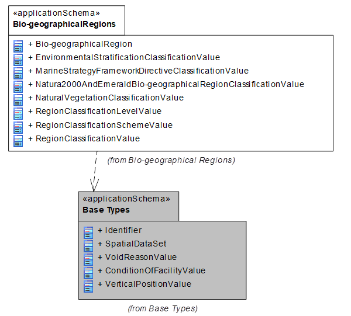
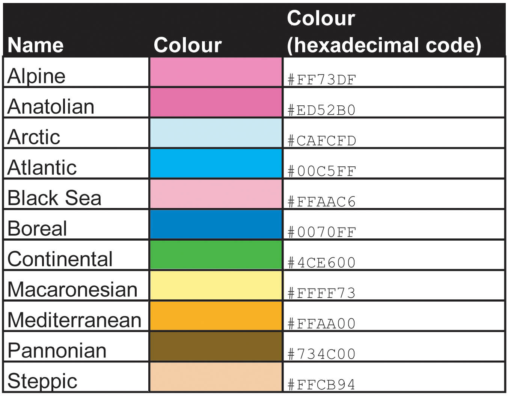
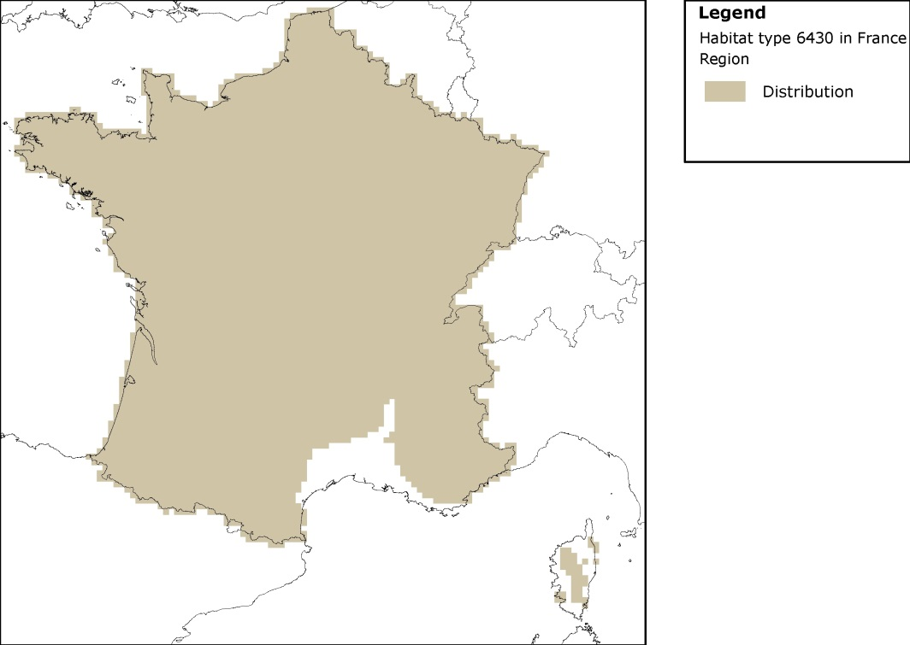
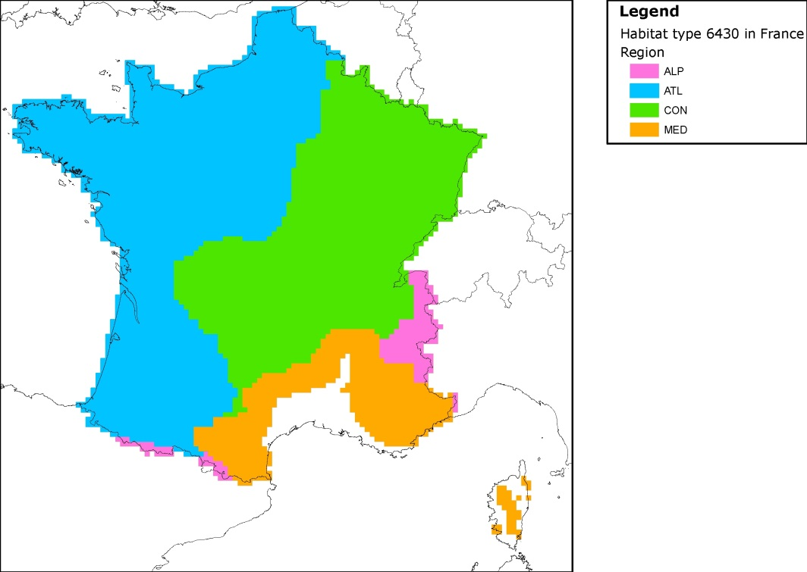

// Admonition icons:
// TG Requirement
:important-caption: 📕
// TG Recommendation
:tip-caption: 📒
// Conformance class
:note-caption: 📘

// TOC placement using macro (manual)
:toc: macro

// Empty TOC title (the title is in the document)
:toc-title:

// TOC level depth
:toclevels: 5

// Section numbering level depth
:sectnumlevels: 8

// Line Break Doc Title
:hardbreaks-option:

:appendix-caption: Annex

image::./media/image2.jpeg[logo_ce-en-rvb-lr,width=131,height=90]

image:./media/image3.png[ESEC,width=93,height=93] **INSPIRE** *Infrastructure for Spatial Information in Europe*

[discrete]
= D2.8.III.17 Data Specification on _Bio-geographical Regions_ – Technical Guidelines

[width="100%",cols="17%,83%",]
|===
|*Title* |D2.8.III.17 INSPIRE Data Specification on _Bio-geographical Regions_ – Technical Guidelines
|*Creator* |INSPIRE Thematic Working Group _Bio-geographical Regions_
|*Date* |2013-12-10
|*Subject* |INSPIRE Data Specification for the spatial data theme _Bio-geographical Regions_
|*Publisher* |European Commission Joint Research Centre
|*Type* |Text
|*Description* |This document describes the INSPIRE Data Specification for the spatial data theme _Bio-geographical_ Regions
|*Contributor* |Members of the INSPIRE Thematic Working Group _Bio-geographical Regions_
|*Format* |Portable Document Format (pdf)
|*Rights* |Public
|*Identifier* |D2.8.III.17_v3.0
|*Language* |En
|*Relation* |Directive 2007/2/EC of the European Parliament and of the Council of 14 March 2007 establishing an Infrastructure for Spatial Information in the European Union (INSPIRE)
|*Coverage* |Project duration
|===

<<<
[discrete]
== Foreword
[discrete]
== How to read the document?

This document describes the _"INSPIRE data specification on Bio-geographical Regions – Technical Guidelines"_ version 3.0 as developed by the Thematic Working Group (TWG) _Thematic Working Group Bio-geographical Regions_ using both natural and a conceptual schema language.

The data specification is based on a common templatefootnote:[The common document template is available in the "Framework documents" section of the data specifications web page at http://inspire.jrc.ec.europa.eu/index.cfm/pageid/2] used for all data specifications, which has been harmonised using the experience from the development of the Annex I, II and III data specifications.

This document provides guidelines for the implementation of the provisions laid down in the Implementing Rule for spatial data sets and services of the INSPIRE Directive. It also includes additional requirements and recommendations that, although not included in the Implementing Rule, are relevant to guarantee or to increase data interoperability.

Two executive summaries provide a quick overview of the INSPIRE data specification process in general, and the content of the data specification on _Bio-geographical Regions_ in particular. We highly recommend that managers, decision makers, and all those new to the INSPIRE process and/or information modelling should read these executive summaries first.

The UML diagrams (in Chapter 5) offer a rapid way to see the main elements of the specifications and their relationships. The definition of the spatial object types, attributes, and relationships are included in the Feature Catalogue (also in Chapter 5). People having thematic expertise but not familiar with UML can fully understand the content of the data model focusing on the Feature Catalogue. Users might also find the Feature Catalogue especially useful to check if it contains the data necessary for the applications that they run. The technical details are expected to be of prime interest to those organisations that are responsible for implementing INSPIRE within the field of _Bio-geographical Regions_, but also to other stakeholders and users of the spatial data infrastructure.

The technical provisions and the underlying concepts are often illustrated by examples. Smaller examples are within the text of the specification, while longer explanatory examples and descriptions of selected use cases are attached in the annexes.

In order to distinguish the INSPIRE spatial data themes from the spatial object types, the INSPIRE spatial data themes are written in _italics._

[width="100%",cols="100%",options="header",]
|===
|The document will be publicly available as a 'non-paper'. It does not represent an official position of the European Commission, and as such cannot be invoked in the context of legal procedures.
|===

*Legal Notice*

Neither the European Commission nor any person acting on behalf of the Commission is responsible for the use which might be made of this publication.

*Interoperability of Spatial Data Sets and Services – 
General Executive Summary*

The challenges regarding the lack of availability, quality, organisation, accessibility, and sharing of spatial information are common to a large number of policies and activities and are experienced across the various levels of public authority in Europe. In order to solve these problems it is necessary to take measures of coordination between the users and providers of spatial information. The Directive 2007/2/EC of the European Parliament and of the Council adopted on 14 March 2007 aims at establishing an Infrastructure for Spatial Information in the European Community (INSPIRE) for environmental policies, or policies and activities that have an impact on the environment.

INSPIRE is based on the infrastructures for spatial information that are created and maintained by the Member States. To support the establishment of a European infrastructure, Implementing Rules addressing the following components of the infrastructure have been specified: metadata, interoperability of spatial data sets (as described in Annexes I, II, III of the Directive) and spatial data services, network services, data and service sharing, and monitoring and reporting procedures.

INSPIRE does not require collection of new data. However, after the period specified in the Directivefootnote:[For all 34 Annex I,II and III data themes: within two years of the adoption of the corresponding Implementing Rules for newly collected and extensively restructured data and within 5 years for other data in electronic format still in use] Member States have to make their data available according to the Implementing Rules.

Interoperability in INSPIRE means the possibility to combine spatial data and services from different sources across the European Community in a consistent way without involving specific efforts of humans or machines. It is important to note that "interoperability" is understood as providing access to spatial data sets through network services, typically via Internet. Interoperability may be achieved by either changing (harmonising) and storing existing data sets or transforming them via services for publication in the INSPIRE infrastructure. It is expected that users will spend less time and efforts on understanding and integrating data when they build their applications based on data delivered in accordance with INSPIRE.

In order to benefit from the endeavours of international standardisation bodies and organisations established under international law their standards and technical means have been utilised and referenced, whenever possible.

To facilitate the implementation of INSPIRE, it is important that all stakeholders have the opportunity to participate in specification and development. For this reason, the Commission has put in place a consensus building process involving data users, and providers together with representatives of industry, research and government. These stakeholders, organised through Spatial Data Interest Communities (SDIC) and Legally Mandated Organisations (LMO)footnote:[The current status of registered SDICs/LMOs is available via INSPIRE website: http://inspire.jrc.ec.europa.eu/index.cfm/pageid/42], have provided reference materials, participated in the user requirement and technicalfootnote:[Surveys on unique identifiers and usage of the elements of the spatial and temporal schema,] surveys, proposed experts for the Data Specification Drafting Teamfootnote:[The Data Specification Drafting Team has been composed of experts from Austria, Belgium, Czech Republic, France, Germany, Greece, Italy, Netherlands, Norway, Poland, Switzerland, UK, and the European Environment Agency], the Thematic Working Groupsfootnote:[The Thematic Working Groups have been composed of experts from Austria, Australia, Belgium, Bulgaria, Czech Republic, Denmark, Finland, France, Germany, Hungary, Ireland, Italy, Latvia, Netherlands, Norway, Poland, Romania, Slovakia, Spain, Slovenia, Sweden, Switzerland, Turkey, UK, the European Environment Agency and the European Commission.] and other ad-hoc cross-thematic technical groups and participated in the public stakeholder consultations on draft versions of the data specifications. These consultations covered expert reviews as well as feasibility and fitness-for-purpose testing of the data specificationsfootnote:[For Annex IIIII, the consultation and testing phase lasted from 20 June to 21 October 2011.].

This open and participatory approach was successfully used during the development of the data specifications on Annex I, II and III data themes as well as during the preparation of the Implementing Rule on Interoperability of Spatial Data Sets and Servicesfootnote:[Commission Regulation (EU) No 1089/2010 http://eur-lex.europa.eu/JOHtml.do?uri=OJ:L:2010:323:SOM:EN:HTML[implementing Directive 2007/2/EC of the European Parliament and of the Council as regards interoperability of spatial data sets and services&#44;] published in the Official Journal of the European Union on 8^th^ of December 2010.] for Annex I spatial data themes and of its amendment regarding the themes of Annex II and III.

The development framework elaborated by the Data Specification Drafting Team aims at keeping the data specifications of the different themes coherent. It summarises the methodology to be used for the development of the data specifications, providing a coherent set of requirements and recommendations to achieve interoperability. The pillars of the framework are the following technical documentsfootnote:[The framework documents are available in the "Framework documents" section of the data specifications web page at http://inspire.jrc.ec.europa.eu/index.cfm/pageid/2]:

* The _Definition of Annex Themes and Scope_ describes in greater detail the spatial data themes defined in the Directive, and thus provides a sound starting point for the thematic aspects of the data specification development.
* The _Generic Conceptual Model_ defines the elements necessary for interoperability and data harmonisation including cross-theme issues. It specifies requirements and recommendations with regard to data specification elements of common use, like the spatial and temporal schema, unique identifier management, object referencing, some common code lists, etc. Those requirements of the Generic Conceptual Model that are directly implementable are included in the Implementing Rule on Interoperability of Spatial Data Sets and Services.
* The _Methodology for the Development of Data Specifications_ defines a repeatable methodology. It describes how to arrive from user requirements to a data specification through a number of steps including use-case development, initial specification development and analysis of analogies and gaps for further specification refinement.
* The _Guidelines for the Encoding of Spatial Data_ defines how geographic information can be encoded to enable transfer processes between the systems of the data providers in the Member States. Even though it does not specify a mandatory encoding rule it sets GML (ISO 19136) as the default encoding for INSPIRE.
* The _Guidelines for the use of Observations & Measurements and Sensor Web Enablement-related standards in INSPIRE Annex II and III data specification development_ provides guidelines on how the "Observations and Measurements" standard (ISO 19156) is to be used within INSPIRE.
* The _Common data models_ are a set of documents that specify data models that are referenced by a number of different data specifications. These documents include generic data models for networks, coverages and activity complexes.

The structure of the data specifications is based on the "ISO 19131 Geographic information - Data product specifications" standard. They include the technical documentation of the application schema, the spatial object types with their properties, and other specifics of the spatial data themes using natural language as well as a formal conceptual schema languagefootnote:[UML – Unified Modelling Language].

A consolidated model repository, feature concept dictionary, and glossary are being maintained to support the consistent specification development and potential further reuse of specification elements. The consolidated model consists of the harmonised models of the relevant standards from the ISO 19100 series, the INSPIRE Generic Conceptual Model, and the application schemasfootnote:[Conceptual models related to specific areas (e.g. INSPIRE themes)] developed for each spatial data theme. The multilingual INSPIRE Feature Concept Dictionary contains the definition and description of the INSPIRE themes together with the definition of the spatial object types present in the specification. The INSPIRE Glossary defines all the terms (beyond the spatial object types) necessary for understanding the INSPIRE documentation including the terminology of other components (metadata, network services, data sharing, and monitoring).

By listing a number of requirements and making the necessary recommendations, the data specifications enable full system interoperability across the Member States, within the scope of the application areas targeted by the Directive. The data specifications (in their version 3.0) are published as technical guidelines and provide the basis for the content of the Implementing Rule on Interoperability of Spatial Data Sets and Servicesfootnote:[In the case of the Annex IIIII data specifications, the extracted requirements are used to formulate an amendment to the existing Implementing Rule.]. The content of the Implementing Rule is extracted from the data specifications, considering short- and medium-term feasibility as well as cost-benefit considerations. The requirements included in the Implementing Rule are legally binding for the Member States according to the timeline specified in the INSPIRE Directive.

In addition to providing a basis for the interoperability of spatial data in INSPIRE, the data specification development framework and the thematic data specifications can be reused in other environments at local, regional, national and global level contributing to improvements in the coherence and interoperability of data in spatial data infrastructures.

<<<
[discrete]
== Bio-geographical Regions – Executive Summary

The theme of _Bio-geographical Regions_ is included under Annex III of the Directive. There is a strong linkage between this theme and the Annex I theme of _Protected Sites_ and indeed between a number of other themes in Annex III particularly _Habitats and Biotopes and Species Distribution_.

The INSPIRE data specification on _Bio-geographical Regions_ has been prepared following the participative principle of a consensus building process. The stakeholders, based on their registration as a Spatial Data Interest Community (SDIC) or a Legally Mandated Organisation (LMO) had the opportunity to bring forward user requirements and reference materials, propose experts for the specification development, and to participate in the review of the data specifications. The Thematic Working Group responsible for the specification development was composed of experts coming from across Europe and from a range of organisations, ranging from regional level, to national level, European level as well as from academia and private industry. The specification process took place according to the methodology elaborated for INSPIRE respecting the requirements and the recommendation of the INSPIRE Generic Conceptual Model, which is one of the elements that ensures a coherent approach and cross theme consistency with other themes in the Directive.

The INSPIRE Directive defined _Bio-geographical Regions_ as "Areas of relatively homogeneous ecological conditions with common characteristics."

The most important guiding document in regard to _Bio-geographical Regions_ in Europe for this data specification is the Habitats Directive (EEC/92/43), which contains a list of 'bio-geographical regions' (Article 1.iii). These bio-geographical regions are the basis of a series of seminars evaluating the Natura 2000 network and for reporting on the conservation status of the habitats and species protected by the Directive as required every 6 years. These processes are linked to the implementation of the Habitats Directive. The Habitats Directive was the first EU legislation to introduce the concept of bio-geographical regions. There are currently 9 regions, covering the 27 Members States of the EU, and an additional 2 bio-geographical regions are added through the Bern Convention. Although the regions have been modified to make them easier to use administratively, they still form ecologically coherent units of similar environmental conditions as can be seen by comparing this map with other environmental classifications of Europe. Despite of their importance for this data specification, these bio-geographical regions will be represented by only one distinct data set, which will be provided by EEA. No Member State will have to provide data for this specific data set.

While these legally mandated bio-geographical regions fulfil administrative needs, there is further need amongst users for other types of ecological regions for various analyses at a European scale or for use at a regional, national or sub national level; see for example the 'Environmental Stratification of Europe' (Metzger et al. 2005). The needs of these users for a more detailed or conceptually different set of ecological regions are covered under the use of their code lists such as the 'Environmental Stratification' Classification values. Another example is the "European Map of Natural Vegetation" which uses a specific vegetation type classification. These more detailed ecological regions may also include local sub-categories of the bio-geographical regions outlined in the Habitats Directive (see use case 4).

The data model "Bio-geographicalRegions" thus provides a generic means for a common pan-European representation of bio-geographical regions. The spatial object "Bio-geographicalRegion" is the key spatial object of the application schema for representing regions or areas of relatively homogenous ecological conditions with common characteristics. It is this spatial object type that will allow for a proper description of the bio-geographical classification that has been applied to identify and classify the bio-geographical region each feature represents.

With this in mind it should be emphasized that the application schema not only supports the classification of bio-geographical regions as mandated by the European Habitats Directive, but also meets the requirements raised by INSPIRE stakeholders with regard to alternative or more precise ecological regions.

<<<
[discrete]
== Acknowledgements

Many individuals and organisations have contributed to the development of these Guidelines.

The Thematic Working Group Bio-geographical Regions  Habitats and Biotopes  Species Distribution (BR-HB-SD) included:

Dirk Hinterlang (TWG Facilitator), Anders Friis-Christensen (TWG Editor), Peteris Bruns, Margaret Carlisle, Simon Claus, Robert Jongman, Tomas Kliment, Brian Mac Sharry (BR contact point), Iurie Maxim, Rudolf May, Johannes Peterseil, Sabine Roscher, Anne Schmidt (HB contact point), Axel Ssymank, Diederik Tirry, Nils Valland (SD contact point), Mareike Vischer-Leopold, Steve Wilkinson, Martin Tuchyna (European Commission contact point).

Andrej Abramić also contributed to the final version of the document.

Other contributors to the INSPIRE data specifications are the Drafting Team Data Specifications, the JRC Data Specifications Team and the INSPIRE stakeholders - Spatial Data Interested Communities (SDICs) and Legally Mandated Organisations (LMOs).

*Contact information*

Maria Vanda Nunes de Lima & Michael Lutz
European Commission Joint Research Centre (JRC)
Institute for Environment and Sustainability
Unit H06: Digital Earth and Reference Data
_http://inspire.ec.europa.eu/index.cfm/pageid/2_

<<<
[discrete]
= Table of Contents
toc::[]

:sectnums:

<<<
== Scope

This document specifies a harmonised data specification for the spatial data theme _Bio-geographical Regions_ as defined in Annex III of the INSPIRE Directive.

This data specification provides the basis for the drafting of Implementing Rules according to Article 7 (1) of the INSPIRE Directive [Directive 2007/2/EC]. The entire data specification is published as implementation guidelines accompanying these Implementing Rules.

<<<
== Overview

=== Name

INSPIRE data specification for the theme Bio-geographical Regions.

=== Informal description

*[.underline]#Definition:#*

Areas of relatively homogeneous ecological conditions with common characteristics.

{empty}[Directive 2007/2/EC]

*[.underline]#Description:#*

Data content:

The scope of the theme '_Bio-geographical regions_' falls under the more general scope of 'biodiversity' which covers three of the themes listed under Annex III of the INSPIRE Directive: _Bio-geographical regions, Habitat and biotopes_, and _Species distribution_, all of which have a link to the Annex I theme on _Protected sites_. More specifically this theme deals with areas of "_relatively homogeneous ecological conditions with common characteristics"_.

The concept of "bio-geographical regions" has been discussed in scientific literature going back over 150 years growing out of the work by Humboldt and others on the science of biogeography. Depending on the underlining concepts involved, these regions have been defined based on a variety of related factors such as geology, soils, climate, geomorphology, and vegetation. The aim of these "bio-geographical regions" has been to identify regions of similar environmental and ecological characteristics.

In regards to this theme the most important guiding document is the Habitats Directive (EEC/92/43), which contains a list of 'bio-geographical regions' (Article 1.iii). These bio-geographical regions are the basis of a series of seminars (series of bilateral or multi lateral meetings with Member States) which evaluate the Natura 2000 network and which are used for reporting every 6 years on the "conservation status" of the habitat types and species protected by the Directive (see Figure 1). In this regard these bio-geographical regions are also covered under the concept of "reporting units", which are further described in another Annex III theme "_Area management/restriction/regulation zones and reporting units_".

image::./media/image4.jpeg[figure1a1b,width=623,height=239]

[.text-center]
*Figure 1 – The map on the left shows the distribution of a habitat type in France colour coded by the bio-geographical region it occurs in; the map on the right shows the "conservation status" of the same habitat by bio-geographical region.*

The Habitats Directive was the first piece of EU legislation to introduce the concept of bio-geographical regions. There are currently 9 regions, covering the 27 Members States of the EU. The bio-geographical regions are based on maps of potential natural vegetation (Bohn et al, 2000), but adjusted to fit political and administrative boundaries (Roekaerts, 2002, ETC/BD 2006). For the Bern Convention, via the Emerald Network, the map of these bio-geographical regions has been extended to cover the Pan-European geographical area and includes an additional 2 regions, making 11 bio-geographical regions in all (Figure 2). More recently 5 marine regions have also been used for reporting, based on the European marine conventions, though these have no legal basis. Although the regions have been modified to make them easier to use administratively, they still form ecologically coherent units of similar environmental conditions as can be seen by comparing these pan European bio-geographical regions with other environmental classifications of Europe.

image::./media/image5.png[./media/image5,width=434,height=374]

[.text-center]
*Figure 2 – The pan European bio-geographical regions map.*

While these legally mandated bio-geographical regions fulfil administrative needs, there is further need amongst users for other kinds of ecological regions for various analyses at a European scale or for use at a regional, national or sub national level. The needs of these users for a more detailed or conceptually different set of ecological regions are covered under the use of code lists such as the 'Environmental Stratification' Classification values. Another, often used example is the "European Map of Natural Vegetation" which uses a specific vegetation type classification. For the use at national and sub national level Member States often have their own more detailed versions of the bio-geographical regions outlined in the Habitats Directive (see use case 4).

It should be stressed that while these Data Specifications focus on the European dimension the same concepts and guidelines are equally valid for bio-geographical regions at the level of the Member State. Member States are able to upload their own code lists for their own bio-geographical regions via a 'code-list register'. Furthermore these Data Specifications do not imply that the European bio-geographical regions are a replacement for any more detailed bio-geographical regions that Member States may have.

Use cases:

Four of the basic use cases that help define the scope of this theme and the attributes of the schema are detailed in Annex B.

[arabic, start=1]
. The first use case describes the assessment of the Conservation Status of the habitat types and species listed on the Annex's of the Habitat Directives. This is one of the key tools in assessing the efficiency of the Habitats Directive (and by default the efficiency of the EU and Member States) in its stated aim of protecting biodiversity in the European Union. These assessments are done at the bio-geographical level.

[arabic, start=2]
. The second use case describes the evaluation of the Natura 2000 network by bio-geographical region. This is a critical step in the protection of biodiversity in Europe as it is during this process that the quality of protection is assessed.

[arabic, start=3]
. The third case covers the situation relating to local (national level) ecological regions highlighting the case of the use of these regions in Germany.

[arabic, start=4]
. Finally the fourth use case describes the use of the detailed set of ecological regions which were described in the previous paragraph; the use case highlights the use of Environmental stratification classification values in reporting under the European Biodiversity Observation Network (EBONE).

[cols=""]
|===
*[.underline]#Definition:#*

Areas of relatively homogeneous ecological conditions with common characteristics.

{empty}[Directive 2007/2/EC]

*[.underline]#Description:#*

_Bio-geographical Regions_ describe areas of relatively homogeneous ecological conditions with common characteristics. The INSPIRE theme Bio-geographical Regions has a strong linkage to other "biodiversity themes".
The Habitats Directive (EEC/92/43) is the most important guiding document regarding to _Bio-geographical Regions_, which contains a list of 'bio-geographical regions' (Article 1.iii). These bio-geographical regions are the basis of a series of seminars evaluating the Natura 2000 network and for reporting on the conservation status of the habitats and species protected by the Directive.
However, the theme was specified in a more generic way to allow for other concepts of BR (e.g. European map of natural vegetation, environmental stratification) to be shared via INSPIRE.

Entry in the INSPIRE registry: _http://inspire.ec.europa.eu/theme/br/_

|===

*References*

Bohn, U., Gollub, G., and Hettwer, C. (2000) Karte der natürlichen Vegetation

Europas. Maßstab 1:2.500.000 Karten und Legende. Bundesamt für Naturschutz, Bonn.

Burrichter, E. (1973) Die potentielle natürliche Vegegation in der Westfälischen Bucht. – Siedlung und Landschaft in Westfalen, 8. Georgr.Komm.f.Westf., Münster.

Council directive 92/43/EEC of 21 may 1992 on the conservation of natural habitats and of wild fauna and flora. _Official Journal of the European Communities, 206_ (22), 7.

ETC/BD (2006) "_The indicative Map of European Biogeographical Regions: methodology and development"_.http://www.eea.europa.eu/data-and-maps/data/biogeographical-regions-europe-2005/methodology-description-pdf-format/methodology-description-pdf-format/at_download/file

Metzger M.J., Bunce, R.G.H., Jongman R.H.G,. Mücher, C.A, and Watkins J.W. (2005) A climatic stratification of the environment of Europe Global Ecology and Biogeography 14 (6), 549–563

Noirfalise, A. (1987) Map of the Natural Vegetation of the member countries of the European Community and of the Council of Europe. Office for Official Publications of the European Communities, Luxembourg

Roekaerts, M. (2002) The Biogeographical Regions Map of Europe - Basic principles of its creation and overview of its development. _http://www.eea.europa.eu/data-and-maps/data/biogeographical-regions-europe-2001/methodology-basic-principles-of-the-biogeographical-regions-map-creation-and-overview-of-its-development/methodology-basic-principles-of-the-biogeographical-regions-map-creation-and-overview-of-its-development/at_download/file_

=== Normative References

[Directive 2007/2/EC] Directive 2007/2/EC of the European Parliament and of the Council of 14 March 2007 establishing an Infrastructure for Spatial Information in the European Union (INSPIRE)

[Directive 2008/56/EC] Directive 2008/56/EC of the European Parliament and of the Council of 17 June 2008 establishing a framework for community action in the field of marine environmental policy

[ISO 19105] EN ISO 19105:2000, Geographic information -- Conformance and testing

[ISO 19107] EN ISO 19107:2005, Geographic Information – Spatial Schema

[ISO 19111] EN ISO 19111:2007 Geographic information - Spatial referencing by coordinates (ISO 19111:2007)

[ISO 19115] EN ISO 19115:2005, Geographic information – Metadata (ISO 19115:2003)

[ISO 19118] EN ISO 19118:2006, Geographic information – Encoding (ISO 19118:2005)

[ISO 19125-1] EN ISO 19125-1:2004, Geographic Information – Simple feature access – Part 1: Common architecture

[ISO 19135] EN ISO 19135:2007 Geographic information – Procedures for item registration (ISO 19135:2005)

[ISO 19139] ISO/TS 19139:2007, Geographic information – Metadata – XML schema implementation

[ISO 19157] ISO/DIS 19157, Geographic information – Data quality

[OGC 06-103r4] Implementation Specification for Geographic Information - Simple feature access – Part 1: Common Architecture v1.2.1

NOTE This is an updated version of "EN ISO 19125-1:2004, Geographic information – Simple feature access – Part 1: Common architecture".

[Regulation 1205/2008/EC] Regulation 1205/2008/EC implementing Directive 2007/2/EC of the European Parliament and of the Council as regards metadata

[Regulation 976/2009/EC] Commission Regulation (EC) No 976/2009 of 19 October 2009 implementing Directive 2007/2/EC of the European Parliament and of the Council as regards the Network Services

[Regulation 1089/2010/EC] Commission Regulation (EU) No 1089/2010 of 23 November 2010 implementing Directive 2007/2/EC of the European Parliament and of the Council as regards interoperability of spatial data sets and services

=== Terms and definitions

General terms and definitions helpful for understanding the INSPIRE data specification documents are defined in the INSPIRE Glossaryfootnote:[The INSPIRE Glossary is available from http://inspire-registry.jrc.ec.europa.eu/registers/GLOSSARY].

Specifically, for the theme Bio-geographical Regions, the following terms are defined:

*(1) Article 17*

Article 17 of the Habitats Directive requires that every 6 years Member States prepare reports to be sent to the European Commission on the implementation of the Directive. Article 11 of the Habitats Directive requires Member States to monitor the habitats and species listed in the annexes and Article 17 requires a report to be sent to the European Commission every 6 years following an agreed format – hence the term 'Article 17 Reporting'. The report includes assessments on the conservation status of the habitat types and species of Community interest at the bio-geographical level.

*(2) Bio-geographical regions*

An area in which there are relatively homogeneous ecological conditions with common characteristics.

These areas with "homogeneous ecological conditions" could be based on physio-geomorphological traits, on vegetation cover, on climate regions, etc...

NOTE Article 1.iii of the Habitats Directive identifies 9 bio-geographical regions in the EU. These bio-geographical regions are, according to Article 4.2 of the Habitats Directive, the geographical framework for the establishment of a draft list of sites of Community Importance drawn from the Member States' lists with a view of setting up the Natura 2000 ecological network (Special Areas of Conservation – SACs). In parallel, Bern Convention Resolution No. 16 (1989) foresees that Contracting Parties take steps to designate Areas of Special Conservation Interest (ASCIs). As a consequence there was a need to extend the Map of Bio-geographical regions to the Pan-European geographical area.

*(3) Environmental stratification*

The "Environmental stratification" (Metzger et al. 2005) was designed to produce a statistical stratification of the European environment, suitable for stratified random sampling of ecological resources, the selection of sites for representative studies across the continent, and to provide strata for modelling exercises and reporting. In this the strata are more refined regions than the broader bio-geographical regions used in the Habitat Directive.

*4) Marine regions*

Marine regions and their subregions are sea regions designated under international, Union, national or sub-national legislation for the purpose of assessment, management and regulation.

NOTE The marine regions are used in the context of Natura2000 due to practical/technical reasons only; they do not have any legal status as opposed to the "terrestrial" bio-geographical regions of the Habitats Directive which do.

*(5) MSFD Marine regions*

Marine regions as defined under Article 4 of the Marine Strategy Framework Directive.

*(6) Natura 2000*

Natura 2000 is a European Union-wide network of nature protection areas established under the 1992 Habitats Directive. The aim of the network is to assure the long-term survival of Europe's most valuable and threatened species and habitats. It is comprised of Special Areas of Conservation (SAC) designated by Member States under the Habitats Directive, and also incorporates Special Protection Areas (SPAs) designated under the 1979 Birds Directive. The establishment of this network of protected areas also fulfils a Community obligation under the UN Convention on Biological Diversity.

*(7) Natural Vegetation*

The map of Natural Vegetation of Europe was compiled and produced by an international team of geo-botanists. It was first published in 1979 with a second version being published in 1987 by the Council of Europe.

=== Symbols and abbreviations

[align=center,width="100%",cols="16%,94%"]
|===
|Article 17 |Article 17 of the 1992 Habitats Directive
|ATS |Abstract Test Suite
|EBONE |European Biodiversity Observation Network
|EC |European Commission
|EEA |European Environment Agency
|ETC/BD |European Topic Centre on Biological Diversity
|ETRS89 |European Terrestrial Reference System 1989
|ETRS89-LAEA |Lambert Azimuthal Equal Area
|EU |European Union
|EU27 |27 Member States of the European Union
|EVRS |European Vertical Reference System
|GCM |General Conceptual Model
|GML |Geography Markup Language
|INSPIRE |Infrastructure for Spatial Information in Europe
|IR |Implementing Rules
|ISDSS |Interoperability of Spatial Data Sets and Services
|ISO |International Organization for Standardization
|ITRS |International Terrestrial Reference System
|LAT |Lowest Astronomical Tide
|LMO |Legally Mandated Organisation
|Natura 2000 |European Union-wide network of nature protection areas established under the1992 Habitats Directive and the 1979 Birds Directive.
|SAC |Special Areas of Conservation
|SDF |Standard Data Form used to collect data on Natura 2000 sites
|SDIC |Spatial Data Interest Community
|TG |Technical Guidelines
|UML |Unified Modeling Language
|UTC |Coordinated Universal Time
|XML |EXtensible Markup Language
|===

=== XML Extensible Markup Language How the Technical Guidelines map to the Implementing Rules

The schematic diagram in Figure 3 gives an overview of the relationships between the INSPIRE legal acts (the INSPIRE Directive and Implementing Rules) and the INSPIRE Technical Guidelines. The INSPIRE Directive and Implementing Rules include legally binding requirements that describe, usually on an abstract level, _what_ Member States must implement.

In contrast, the Technical Guidelines define _how_ Member States might implement the requirements included in the INSPIRE Implementing Rules. As such, they may include non-binding technical requirements that must be satisfied if a Member State data provider chooses to conform to the Technical Guidelines. Implementing these Technical Guidelines will maximise the interoperability of INSPIRE spatial data sets.

image::./media/image6.png[./media/image6,width=603,height=376]

[.text-center]
*Figure 3 - Relationship between INSPIRE Implementing Rules and Technical Guidelines*

==== Requirements

The purpose of these Technical Guidelines (Data specifications on _Bio-geographical Regions_) is to provide practical guidance for implementation that is guided by, and satisfies, the (legally binding) requirements included for the spatial data theme Bio-geographical Regions in the Regulation (Implementing Rules) on interoperability of spatial data sets and services. These requirements are highlighted in this document as follows:

[IMPORTANT]
====
[.text-center]
*IR Requirement*
_Article / Annex / Section no._
*Title / Heading*

This style is used for requirements contained in the Implementing Rules on interoperability of spatial data sets and services (Commission Regulation (EU) No 1089/2010).

====

For each of these IR requirements, these Technical Guidelines contain additional explanations and examples.

NOTE The Abstract Test Suite (ATS) in Annex A contains conformance tests that directly check conformance with these IR requirements.

Furthermore, these Technical Guidelines may propose a specific technical implementation for satisfying an IR requirement. In such cases, these Technical Guidelines may contain additional technical requirements that need to be met in order to be conformant with the corresponding IR requirement _when using this proposed implementation_. These technical requirements are highlighted as follows:

[TIP]
====
*TG Requirement X* 

This style is used for requirements for a specific technical solution proposed in these Technical Guidelines for an IR requirement.

====

NOTE 1 Conformance of a data set with the TG requirement(s) included in the ATS implies conformance with the corresponding IR requirement(s).

NOTE 2 In addition to the requirements included in the Implementing Rules on interoperability of spatial data sets and services, the INSPIRE Directive includes further legally binding obligations that put additional requirements on data providers. For example, Art. 10(2) requires that Member States shall, where appropriate, decide by mutual consent on the depiction and position of geographical features whose location spans the frontier between two or more Member States. General guidance for how to meet these obligations is provided in the INSPIRE framework documents.

==== Recommendations

In addition to IR and TG requirements, these Technical Guidelines may also include a number of recommendations for facilitating implementation or for further and coherent development of an interoperable infrastructure.

[NOTE]
====
*Recommendation X* 

Recommendations are shown using this style.

====

NOTE The implementation of recommendations is not mandatory. Compliance with these Technical Guidelines or the legal obligation does not depend on the fulfilment of the recommendations.

==== Conformance

Annex A includes the abstract test suite for checking conformance with the requirements included in these Technical Guidelines and the corresponding parts of the Implementing Rules (Commission Regulation (EU) No 1089/2010).

<<<
== Specification scopes

This data specification does not distinguish different specification scopes, but just considers one general scope.

NOTE For more information on specification scopes, see [ISO 19131:2007], clause 8 and Annex D.

<<<
== Identification information

These Technical Guidelines are identified by the following URI:

http://inspire.ec.europa.eu/tg/br/3.0

NOTE ISO 19131 suggests further identification information to be included in this section, e.g. the title, abstract or spatial representation type. The proposed items are already described in the document metadata, executive summary, overview description (section 2) and descriptions of the application schemas (section 5). In order to avoid redundancy, they are not repeated here.

<<<
== Data content and structure

=== Application schemas – Overview 
==== Application schemas included in the IRs

Articles 3, 4 and 5 of the Implementing Rules lay down the requirements for the content and structure of the data sets related to the INSPIRE Annex themes.

[IMPORTANT]
====
[.text-center]
*IR Requirement*
_Article 4_
*Types for the Exchange and Classification of Spatial Objects*

. For the exchange and classification of spatial objects from data sets meeting the conditions laid down in Article 4 of Directive 2007/2/EC, Member States shall use the spatial object types and associated data types, enumerations and code lists that are defined in Annexes II, III and IV for the themes the data sets relate to.

. Spatial object types and data types shall comply with the definitions and constraints and include the attributes and association roles set out in the Annexes.

. The enumerations and code lists used in attributes or association roles of spatial object types or data types shall comply with the definitions and include the values set out in Annex II. The enumeration and code list values are uniquely identified by language-neutral mnemonic codes for computers. The values may also include a language-specific name to be used for human interaction.

====

The types to be used for the exchange and classification of spatial objects from data sets related to the spatial data theme Bio-geographical Regions are defined in the following application schema

* _Bio-geographicalRegions_

The application schemas specify requirements on the properties of each spatial object including its multiplicity, domain of valid values, constraints, etc.

NOTE The application schemas presented in this section contain some additional information that is not included in the Implementing Rules, in particular multiplicities of attributes and association roles.

[TIP]
====
*TG Requirement 1*

Spatial object types and data types shall comply with the multiplicities defined for the attributes and association roles in this section.

====

An application schema may include references (e.g. in attributes or inheritance relationships) to common types or types defined in other spatial data themes. These types can be found in a sub-section called "Imported Types" at the end of each application schema section. The common types referred to from application schemas included in the IRs are addressed in Article 3.

[IMPORTANT]
====
[.text-center]
*IR Requirement*
_Article 3_
*Common Types*

Types that are common to several of the themes listed in Annexes I, II and III to Directive 2007/2/EC shall conform to the definitions and constraints and include the attributes and association roles set out in Annex I.

====

NOTE Since the IRs contain the types for all INSPIRE spatial data themes in one document, Article 3 does not explicitly refer to types defined in other spatial data themes, but only to types defined in external data models.

Common types are described in detail in the Generic Conceptual Model [DS-D2.7], in the relevant international standards (e.g. of the ISO 19100 series) or in the documents on the common INSPIRE models [DS-D2.10.x]. For detailed descriptions of types defined in other spatial data themes, see the corresponding Data Specification TG document [DS-D2.8.x].

[NOTE]
====
*Recomendation 1*

Additional and/or use case-specific information related to the theme _Bio-geographical Regions_ should be made available using the spatial object types and data types specified in the following application schema: Bio-geographicalRegions

These spatial object types and data types should comply with the definitions and constraints and include the attributes and association roles defined in this section.

The enumerations and code lists used in attributes or association roles of spatial object types or data types should comply with the definitions and include the values defined in this section.

====

=== Basic notions

This section explains some of the basic notions used in the INSPIRE application schemas. These explanations are based on the GCM [DS-D2.5].

==== Notation

===== Unified Modeling Language (UML)

The application schemas included in this section are specified in UML, version 2.1. The spatial object types, their properties and associated types are shown in UML class diagrams.

NOTE For an overview of the UML notation, see Annex D in [ISO 19103].

The use of a common conceptual schema language (i.e. UML) allows for an automated processing of application schemas and the encoding, querying and updating of data based on the application schema – across different themes and different levels of detail.

The following important rules related to class inheritance and abstract classes are included in the IRs.

[IMPORTANT]
====
[.text-center]
*IR Requirement*
_Article 5_
*Types*

(...)

[arabic, start=2]
. Types that are a sub-type of another type shall also include all this type's attributes and association roles.
. Abstract types shall not be instantiated.

====

The use of UML conforms to ISO 19109 8.3 and ISO/TS 19103 with the exception that UML 2.1 instead of ISO/IEC 19501 is being used. The use of UML also conforms to ISO 19136 E.2.1.1.1-E.2.1.1.4.

NOTE ISO/TS 19103 and ISO 19109 specify a profile of UML to be used in conjunction with the ISO 19100 series. This includes in particular a list of stereotypes and basic types to be used in application schemas. ISO 19136 specifies a more restricted UML profile that allows for a direct encoding in XML Schema for data transfer purposes.

To model constraints on the spatial object types and their properties, in particular to express data/data set consistency rules, OCL (Object Constraint Language) is used as described in ISO/TS 19103, whenever possible. In addition, all constraints are described in the feature catalogue in English, too.

NOTE Since "void" is not a concept supported by OCL, OCL constraints cannot include expressions to test whether a value is a _void_ value. Such constraints may only be expressed in natural language.

===== Stereotypes

In the application schemas in this section several stereotypes are used that have been defined as part of a UML profile for use in INSPIRE [DS-D2.5]. These are explained in Table 1 below.

[.text-center]
*Table 1 – Stereotypes (adapted from [DS-D2.5])*

[align=center,width="100%",cols="22%,14%,64%",options="header",]
|===
|*Stereotype* |*Model element* |*Description*
|applicationSchema |Package |An INSPIRE application schema according to ISO 19109 and the Generic Conceptual Model.
|leaf |Package |A package that is not an application schema and contains no packages.
|featureType |Class |A spatial object type.
|type |Class |A type that is not directly instantiable, but is used as an abstract collection of operation, attribute and relation signatures. This stereotype should usually not be used in INSPIRE application schemas as these are on a different conceptual level than classifiers with this stereotype.
|dataType |Class |A structured data type without identity.
|union |Class |A structured data type without identity where exactly one of the properties of the type is present in any instance.
|enumeration |Class |An enumeration.
|codeList |Class |A code list.
|import |Dependency |The model elements of the supplier package are imported.
|voidable |Attribute, association role |A voidable attribute or association role (see section 5.2.2).
|lifeCycleInfo |Attribute, association role |If in an application schema a property is considered to be part of the life-cycle information of a spatial object type, the property shall receive this stereotype.
|version |Association role |If in an application schema an association role ends at a spatial object type, this stereotype denotes that the value of the property is meant to be a specific version of the spatial object, not the spatial object in general.
|===

==== Voidable characteristics

The «voidable» stereotype is used to characterise those properties of a spatial object that may not be present in some spatial data sets, even though they may be present or applicable in the real world. This does _not_ mean that it is optional to provide a value for those properties.

For all properties defined for a spatial object, a value has to be provided – either the corresponding value (if available in the data set maintained by the data provider) or the value of _void._ A _void_ value shall imply that no corresponding value is contained in the source spatial data set maintained by the data provider or no corresponding value can be derived from existing values at reasonable costs.

[NOTE]
====
*Recomendation 2*

The reason for a _void_ value should be provided where possible using a listed value from the VoidReasonValue code list to indicate the reason for the missing value.

====

The VoidReasonValue type is a code list, which includes the following pre-defined values:

* _Unpopulated_: The property is not part of the dataset maintained by the data provider. However, the characteristic may exist in the real world. For example when the "elevation of the water body above the sea level" has not been included in a dataset containing lake spatial objects, then the reason for a void value of this property would be 'Unpopulated'. The property receives this value for all spatial objects in the spatial data set.
* _Unknown_: The correct value for the specific spatial object is not known to, and not computable by the data provider. However, a correct value may exist. For example when the "elevation of the water body above the sea level" _of a certain lake_ has not been measured, then the reason for a void value of this property would be 'Unknown'. This value is applied only to those spatial objects where the property in question is not known.
* _Withheld_: The characteristic may exist, but is confidential and not divulged by the data provider.

NOTE It is possible that additional reasons will be identified in the future, in particular to support reasons / special values in coverage ranges.

The «voidable» stereotype does not give any information on whether or not a characteristic exists in the real world. This is expressed using the multiplicity:

* If a characteristic may or may not exist in the real world, its minimum cardinality shall be defined as 0. For example, if an Address may or may not have a house number, the multiplicity of the corresponding property shall be 0..1.
* If at least one value for a certain characteristic exists in the real world, the minimum cardinality shall be defined as 1. For example, if an Administrative Unit always has at least one name, the multiplicity of the corresponding property shall be 1..*.

In both cases, the «voidable» stereotype can be applied. In cases where the minimum multiplicity is 0, the absence of a value indicates that it is known that no value exists, whereas a value of void indicates that it is not known whether a value exists or not.

EXAMPLE If an address does not have a house number, the corresponding Address object should not have any value for the «voidable» attribute house number. If the house number is simply not known or not populated in the data set, the Address object should receive a value of _void_ (with the corresponding void reason) for the house number attribute.

==== Enumerations

Enumerations are modelled as classes in the application schemas. Their values are modelled as attributes of the enumeration class using the following modelling style:

* No initial value, but only the attribute name part, is used.
* The attribute name conforms to the rules for attributes names, i.e. is a lowerCamelCase name. Exceptions are words that consist of all uppercase letters (acronyms).

[IMPORTANT]
====
[.text-center]
*IR Requirement*
_Article 6_
*Code Lists and Enumerations*

(...)

[arabic, start=5]
. Attributes or association roles of spatial object types or data types that have an enumeration type may only take values from the lists specified for the enumeration type."

====

==== Code lists

Code lists are modelled as classes in the application schemas. Their values, however, are managed outside of the application schema.

===== Code list types

The IRs distinguish the following types of code lists.

[IMPORTANT]
====
[.text-center]
*IR Requirement*
_Article 6_
*Code Lists and Enumerations*

. Code lists shall be of one of the following types, as specified in the Annexes:
[loweralpha]
.. code lists whose allowed values comprise only the values specified in this Regulation;
.. code lists whose allowed values comprise the values specified in this Regulation and narrower values defined by data providers;
.. code lists whose allowed values comprise the values specified in this Regulation and additional values at any level defined by data providers;
.. code lists, whose allowed values comprise any values defined by data providers.

For the purposes of points (b), (c) and (d), in addition to the allowed values, data providers may use the values specified in the relevant INSPIRE Technical Guidance document available on the INSPIRE web site of the Joint Research Centre.

====

The type of code list is represented in the UML model through the tagged value _extensibility_, which can take the following values:

* _none_, representing code lists whose allowed values comprise only the values specified in the IRs (type a);
* _narrower_, representing code lists whose allowed values comprise the values specified in the IRs and narrower values defined by data providers (type b);
* _open_, representing code lists whose allowed values comprise the values specified in the IRs and additional values at any level defined by data providers (type c); and
* _any_, representing code lists, for which the IRs do not specify any allowed values, i.e. whose allowed values comprise any values defined by data providers (type d).

[NOTE]
====
*Recomendation 3*

Additional values defined by data providers should not replace or redefine any value already specified in the IRs.

====

NOTE This data specification may specify recommended values for some of the code lists of type (b), (c) and (d) (see section 5.2.4.3). These recommended values are specified in a dedicated Annex.

In addition, code lists can be hierarchical, as explained in Article 6(2) of the IRs.

[IMPORTANT]
====
[.text-center]
*IR Requirement*
_Article 6_
*Code Lists and Enumerations*

(...)

[arabic, start=2]
. Code lists may be hierarchical. Values of hierarchical code lists may have a more generic parent value. Where the valid values of a hierarchical code list are specified in a table in this Regulation, the parent values are listed in the last column.

====

The type of code list and whether it is hierarchical or not is also indicated in the feature catalogues.

===== Obligations on data providers

[IMPORTANT]
====
[.text-center]
*IR Requirement*
_Article 6_
*Code Lists and Enumerations*

(....)

[arabic, start=3]
. Where, for an attribute whose type is a code list as referred to in points (b), (c) or (d) of paragraph 1, a data provider provides a value that is not specified in this Regulation, that value and its definition shall be made available in a register.

. Attributes or association roles of spatial object types or data types whose type is a code list may only take values that are allowed according to the specification of the code list.

====

Article 6(4) obliges data providers to use only values that are allowed according to the specification of the code list. The "allowed values according to the specification of the code list" are the values explicitly defined in the IRs plus (in the case of code lists of type (b), (c) and (d)) additional values defined by data providers.

For attributes whose type is a code list of type (b), (c) or (d) data providers may use additional values that are not defined in the IRs. Article 6(3) requires that such additional values and their definition be made available in a register. This enables users of the data to look up the meaning of the additional values used in a data set, and also facilitates the re-use of additional values by other data providers (potentially across Member States).

NOTE Guidelines for setting up registers for additional values and how to register additional values in these registers is still an open discussion point between Member States and the Commission.

===== Recommended code list values

For code lists of type (b), (c) and (d), this data specification may propose additional values as a recommendation (in a dedicated Annex). These values will be included in the INSPIRE code list register. This will facilitate and encourage the usage of the recommended values by data providers since the obligation to make additional values defined by data providers available in a register (see section 5.2.4.2) is already met.

[NOTE]
====
*Recomendation 4*

Where these Technical Guidelines recommend values for a code list in addition to those specified in the IRs, these values should be used.

====

NOTE For some code lists of type (d), no values may be specified in these Technical Guidelines. In these cases, any additional value defined by data providers may be used.

===== Governance

The following two types of code lists are distinguished in INSPIRE:

* _Code lists that are governed by INSPIRE (INSPIRE-governed code lists)._ These code lists will be managed centrally in the INSPIRE code list register. Change requests to these code lists (e.g. to add, deprecate or supersede values) are processed and decided upon using the INSPIRE code list register's maintenance workflows.
+
INSPIRE-governed code lists will be made available in the INSPIRE code list register at __http://inspire.ec.europa.eu/codelist/<CodeListName__>. They will be available in SKOS/RDF, XML and HTML. The maintenance will follow the procedures defined in ISO 19135. This means that the only allowed changes to a code list are the addition, deprecation or supersession of values, i.e. no value will ever be deleted, but only receive different statuses (valid, deprecated, superseded). Identifiers for values of INSPIRE-governed code lists are constructed using the pattern __http://inspire.ec.europa.eu/codelist/<CodeListName__>/<value>.

* _Code lists that are governed by an organisation outside of INSPIRE (externally governed code lists)._ These code lists are managed by an organisation outside of INSPIRE, e.g. the World Meteorological Organization (WMO) or the World Health Organization (WHO). Change requests to these code lists follow the maintenance workflows defined by the maintaining organisations. Note that in some cases, no such workflows may be formally defined.
+
Since the updates of externally governed code lists is outside the control of INSPIRE, the IRs and these Technical Guidelines reference a specific version for such code lists.
+
The tables describing externally governed code lists in this section contain the following columns:
+
** The _Governance_ column describes the external organisation that is responsible for maintaining the code list.
** The _Source_ column specifies a citation for the authoritative source for the values of the code list. For code lists, whose values are mandated in the IRs, this citation should include the version of the code list used in INSPIRE. The version can be specified using a version number or the publication date. For code list values recommended in these Technical Guidelines, the citation may refer to the "latest available version".
** In some cases, for INSPIRE only a subset of an externally governed code list is relevant. The subset is specified using the _Subset_ column.
** The _Availability_ column specifies from where (e.g. URL) the values of the externally governed code list are available, and in which formats. Formats can include machine-readable (e.g. SKOS/RDF, XML) or human-readable (e.g. HTML, PDF) ones.

+
Code list values are encoded using http URIs and labels. Rules for generating these URIs and labels are specified in a separate table.

[NOTE]
====
*Recomendation 5*

The http URIs and labels used for encoding code list values should be taken from the INSPIRE code list registry for INSPIRE-governed code lists and generated according to the relevant rules specified for externally governed code lists.

====

NOTE Where practicable, the INSPIRE code list register could also provide http URIs and labels for externally governed code lists.

===== Vocabulary

For each code list, a tagged value called "vocabulary" is specified to define a URI identifying the values of the code list. For INSPIRE-governed code lists and externally governed code lists that do not have a persistent identifier, the URI is constructed following the pattern _http://inspire.ec.europa.eu/codelist/<UpperCamelCaseName>_.

If the value is missing or empty, this indicates an empty code list. If no sub-classes are defined for this empty code list, this means that any code list may be used that meets the given definition.

An empty code list may also be used as a super-class for a number of specific code lists whose values may be used to specify the attribute value. If the sub-classes specified in the model represent all valid extensions to the empty code list, the subtyping relationship is qualified with the standard UML constraint "\{complete,disjoint}".

==== Identifier management

[IMPORTANT]
====
[.text-center]
*IR Requirement*
_Article 9_
*Identifier Management*

. The data type Identifier defined in Section 2.1 of Annex I shall be used as a type for the external object identifier of a spatial object.

. The external object identifier for the unique identification of spatial objects shall not be changed during the life-cycle of a spatial object.

====

NOTE 1 An external object identifier is a unique object identifier which is published by the responsible body, which may be used by external applications to reference the spatial object. [DS-D2.5]

NOTE 2 Article 9(1) is implemented in each application schema by including the attribute _inspireId_ of type Identifier.

NOTE 3 Article 9(2) is ensured if the _namespace_ and _localId_ attributes of the Identifier remains the same for different versions of a spatial object; the _version_ attribute can of course change.

==== Geometry representation

[IMPORTANT]
====
[.text-center]
*IR Requirement*
_Article 12_
*Other Requirements & Rules*

. The value domain of spatial properties defined in this Regulation shall be restricted to the Simple Feature spatial schema as defined in Herring, John R. (ed.), OpenGIS® Implementation Standard for Geographic information – Simple feature access – Part 1: Common architecture, version 1.2.1, Open Geospatial Consortium, 2011, unless specified otherwise for a specific spatial data theme or type.

====

NOTE 1 The specification restricts the spatial schema to 0-, 1-, 2-, and 2.5-dimensional geometries where all curve interpolations are linear and surface interpolations are performed by triangles.

NOTE 2 The topological relations of two spatial objects based on their specific geometry and topology properties can in principle be investigated by invoking the operations of the types defined in ISO 19107 (or the methods specified in EN ISO 19125-1).

====  Temporality representation

The application schema(s) use(s) the derived attributes "beginLifespanVersion" and "endLifespanVersion" to record the lifespan of a spatial object.

The attributes "beginLifespanVersion" specifies the date and time at which this version of the spatial object was inserted or changed in the spatial data set. The attribute "endLifespanVersion" specifies the date and time at which this version of the spatial object was superseded or retired in the spatial data set.

NOTE 1 The attributes specify the beginning of the lifespan of the version in the spatial data set itself, which is different from the temporal characteristics of the real-world phenomenon described by the spatial object. This lifespan information, if available, supports mainly two requirements: First, knowledge about the spatial data set content at a specific time; second, knowledge about changes to a data set in a specific time frame. The lifespan information should be as detailed as in the data set (i.e., if the lifespan information in the data set includes seconds, the seconds should be represented in data published in INSPIRE) and include time zone information.

NOTE 2 Changes to the attribute "endLifespanVersion" does not trigger a change in the attribute "beginLifespanVersion".

[IMPORTANT]
====
[.text-center]
*IR Requirement*
_Article 10_
*Life-cycle of Spatial Objects*

(...)

[arabic, start=3]
. Where the attributes beginLifespanVersion and endLifespanVersion are used, the value of endLifespanVersion shall not be before the value of beginLifespanVersion.

====

NOTE The requirement expressed in the IR Requirement above will be included as constraints in the UML data models of all themes.

[NOTE]
====
*Recomendation 6*

If life-cycle information is not maintained as part of the spatial data set, all spatial objects belonging to this data set should provide a void value with a reason of "unpopulated".

====

=== Application schema Bio-geographicalRegions

==== Description

===== Narrative description

The application schema "Bio-geographicalRegions" provides the means for a common pan-European representation of bio-geographical regions and other types of environmental stratifications and ecological regions. The feature type "Bio-geographicalRegion" is the key spatial object of this application schema for representing regions or areas of relatively homogenous ecological conditions with common characteristics. This spatial object type will allow for a proper description of the bio-geographical classification that has been applied to identify and classify the bio-geographical region each feature represents. Within this respect it needs to be emphasized that the application schema not only supports the classification of bio-geographical regions as mandated by the European Habitats Directive, but also meets the requirements raised by INSPIRE stakeholders with regard to alternative and more precise sets of different types of ecological regions.

Currently the _Bio-geographicalRegions_ application schema includes four distinct European classification schemes, however through the mechanism of codelists the model can be extended to define and include other classifications as well.

Because of the limited number of bio-geographical region datasets on the one hand and the objective of INSPIRE to strive for maximum harmonisation of datasets on the other hand, the structure of this application schema has been kept simple on purpose: one spatial object comprising information on geometry, an identifier and classification properties. It should also be realized that a strong link exists between the Bio-geographicalRegions application schema and the Annex III theme "_Area management/restriction/regulation zones and reporting units_".

===== UML Overview

[.text-center]
*Figure 4 – UML class diagram: Overview of the Bio-geographicalRegions application schema*

An overview of the Bio-geographicalRegions package and referenced packages is depicted in figure above. Basically, the Bio-geographicalRegion spatial object type refers to the package Base Types of the General Conceptual Model to include an Identifier.

The complete application schema for Bio-geographical Regions is shown in Figure 5 and described in detail below.

image::./media/image8.png[image8,width=621,height=756]

[.text-center]
*Figure 5 – UML class diagram: Overview of the Bio-geographicalRegions application schema*

"Bio-geographicalRegion" is the only single spatial object type included in the application schema and represents any type of bio-geographical region. Since bio-geographical regions can consist of polygons or multi-part polygons, their geometric representation is expressed by GM_Multisurface type. Each single bio-geographical region (i.e. instance of the "Bio-geographicalRegion" spatial object type) is described by a bio-geographical classification. The classification system is specified by three attributes: information on the classification scheme and the classification value that is applicable to the instance is provided by two mandatory attributes respectively called "regionClassificationScheme" and "regionClassification__"__. Values for these attributes can be selected from a codelist. A third voidable attribute "regionClassificationLevel" has been defined to document the level of the classification system. Potential values for this level are: international, national, regional or local. Many different classification systems exist at different levels; the current application schema only includes information on the classification scheme and corresponding values of 4 European Classification systems, but the schema may be extended to include other classification systems via the codelist mechanism:

* Natura2000 and Emerald Biogeographical regions
+
The Natura 2000 and Emerald Biogeographical regions as outlined in respectively the Habitats Directive and the Bern Convention are reporting units that support the process of nature conservation, and more specifically the conservation of species and habitat types under similar natural conditions across a suite of countries, irrespective of political and administrative boundaries. These bio-geographical regions are terrestrial in order to create a similar unit that can be used for assessment an additional 5 marine regions, based on the European marine conventions, have been added. Unlike the terrestrial bio-geographical regions, these marine regions do not have a legal basis. There will be only one corresponding data set for Natura 2000 and Emerald Biogeographical regions, which will be provided by EEA.

* Environmental Stratification of Europe
+
The Environmental Zones of Europe are derived from the Environmental Stratification of Europe (see Metzger et al 2005 and Jongman et al 2005). The stratification is based on climate data, data on the ocean influence and geographical position.

* Natural Vegetation of Europe
+
The codes for Natural Vegetation in Europe are derived from the map of Natural Vegetation of Europe (Bohn et al 2000).

* Marine Strategy Framework Directive regions
+
The codes for the Marine Strategy Framework Directive regions are derived from the Directive itself.

A detailed feature catalogue is included later in this section.

===== Consistency between spatial data sets

It is worth noting that bio-geographical regions are derived features, being based on more detailed work and being modified to make them easier to use at different scales. For instance the Natura2000 and Emerald Biogeographical regions as outlined in the Habitats Directive and the Bern Convention are derived from an interpretation of the digital version of the 'Map of Natural Vegetation of the member countries of the European Community and of the Council of Europe' (Noirfalise A., 1987) and the regions have been modified to make them easier to use administratively.

Currently, there are no other consistency rules than those defined within the application schema and no consistency rules between bio-geographical regions and other spatial datasets have been identified.

==== Feature catalogue

*Feature catalogue metadata*

[width="100%",cols="27%,73%"]
|===
|Application Schema |INSPIRE Application Schema Bio-geographicalRegions
|Version number |3.0
|===

*Types defined in the feature catalogue*

[width="100%",cols="62%,24%,14%",options="header",]
|===
|*Type* |*Package* |*Stereotypes*
|_Bio-geographicalRegion_ |Bio-geographicalRegions |«featureType»
|_EnvironmentalStratificationClassificationValue_ |Bio-geographicalRegions |«codeList»
|_MarineStrategyFrameworkDirectiveClassificationValue_ |Bio-geographicalRegions |«codeList»
|_Natura2000AndEmeraldBio-geographicalRegionClassificationValue_ |Bio-geographicalRegions |«codeList»
|_NaturalVegetationClassificationValue_ |Bio-geographicalRegions |«codeList»
|_RegionClassificationLevelValue_ |Bio-geographicalRegions |«codeList»
|_RegionClassificationSchemeValue_ |Bio-geographicalRegions |«codeList»
|_RegionClassificationValue_ |Bio-geographicalRegions |«codeList»
|===

===== Spatial object types

====== Bio-geographicalRegion

[width="100%",cols="100%",options="header",]
|===
|*Bio-geographicalRegion*
a|
[width="100%",cols="13%,83%"]
!===
!Name: !bio-geographical region
!Definition: !An area in which there are relatively homogeneous ecological conditions with common characteristics.
!Description: !EXAMPLE Europe is divided into eleven broad bio-geographical terrestrial zones and 5 zones for marine bio-geographical regions. 
 
NOTE The marine regions are used in the context of Natura2000 due to practical / technical reasons only; they do not have any legal status in contrast to the "terrestrial" Bio-geographical Regions.
!Stereotypes: !«featureType»
!===

a|
*Attribute: inspireId*

[width="100%",cols="13%,83%"]
!===
!Name: !inspire id
!Value type: !Identifier
!Definition: !External object identifier of the spatial object.
!Description: !An external object identifier is a unique object identifier published by the responsible body, which may be used by external applications to reference the spatial object. The identifier is an identifier of the spatial object, not an identifier of the real-world phenomenon.
!Multiplicity: !0..1
!===

a|
*Attribute: geometry*

[width="100%",cols="13%,83%"]
!===
!Name: !geometry
!Value type: !GM_MultiSurface
!Definition: !The geometry defining the ecological region.
!Multiplicity: !1
!===

a|
*Attribute: regionClassification*

[width="100%",cols="13%,83%"]
!===
!Name: !region classification
!Value type: !RegionClassificationValue
!Definition: !Regionclass code, according to a classification scheme.
!Multiplicity: !1
!===

a|
*Attribute: regionClassificationScheme*

[width="100%",cols="13%,83%"]
!===
!Name: !region classification scheme
!Value type: !RegionClassificationSchemeValue
!Definition: !Classification scheme used for classifying regions.
!Multiplicity: !1
!===

a|
*Attribute: regionClassificationLevel*

[width="100%",cols="13%,83%"]
!===
!Name: !region classification level
!Value type: !RegionClassificationLevelValue
!Definition: !The classification level of the region class.
!Multiplicity: !1
!Stereotypes: !«voidable»
!===

a|
*Attribute: beginLifespanVersion*

[width="100%",cols="13%,83%"]
!===
!Name: !begin lifespan version
!Value type: !DateTime
!Definition: !Date and time at which this version of the spatial object was inserted or changed in the spatial data set.
!Multiplicity: !1
!Stereotypes: !«voidable,lifeCycleInfo»
!===

a|
*Attribute: endLifespanVersion*

[width="100%",cols="13%,83%"]
!===
!Name: !end lifespan version
!Value type: !DateTime
!Definition: !Date and time at which this version of the spatial object was superseded or retired in the spatial data set.
!Multiplicity: !0..1
!Stereotypes: !«voidable,lifeCycleInfo»
!===

|===

===== Code lists

====== EnvironmentalStratificationClassificationValue

[width="100%",cols="100%",options="header",]
|===
|*EnvironmentalStratificationClassificationValue*
a|
[width="100%",cols="13%,83%"]
!===
!Name: !environmental stratification classification value
!Definition: !Codes for climatic stratification of the Environment of Europe.
!Description: !Based on environmental variables (climate, geomorphology, oceanicity and northing) using a Principal component analysis and ISODATA clustering routine. The Environmental Stratification of Europe (EnS) consists of 84 Strata, which have been aggregated to 13 Environmental Zones with a spatial resolution of 1 km². 
 
NOTE This stratification is after Metzger et al. 2005.
!Extensibility: !open
!Identifier: !http://inspire.ec.europa.eu/codelist/environmentalStratification
!Values: !The allowed values for this code list comprise the values specified in "Descriptions of the European Environmental Zones and Strata, Wageningen, 2012." and additional values at any level defined by data providers.
!===

|===

====== MarineStrategyFrameworkDirectiveClassificationValue

[width="100%",cols="100%",options="header",]
|===
|*MarineStrategyFrameworkDirectiveClassificationValue*
a|
[width="100%",cols="13%,83%"]
!===
!Name: !marine strategy framework directive classification value
!Definition: !Codes for the Marine Stategy Framework Diretive classification.
!Extensibility: !open
!Identifier: !http://inspire.ec.europa.eu/codelist/marineStrategyFrameworkDirective
!Values: !The allowed values for this code list comprise the values specified in "DIRECTIVE 2008/56/EC OF THE EUROPEAN PARLIAMENT AND OF THE COUNCIL of 17 June 2008" and additional values at any level defined by data providers.
!===

|===

====== Natura2000AndEmeraldBio-geographicalRegionClassificationValue

[width="100%",cols="100%",options="header",]
|===
|*Natura2000AndEmeraldBio-geographicalRegionClassificationValue*
a|
[width="100%",cols="13%,83%"]
!===
!Name: !natura 2000 and emerald bio-geographical region classification value
!Definition: !Codes for the bio-geographic region classification.
!Description: !http://www.eea.europa.eu/data-and-maps/data/biogeographical-regions-europe/codelist-for-bio-geographical-regions
!Extensibility: !open
!Identifier: !http://inspire.ec.europa.eu/codelist/Natura2000AndEmeraldBio-geographicalRegionClassificationValue
!Values: !The allowed values for this code list comprise the values specified in "COMMISSION IMPLEMENTING DECISION of 11 July 2011 concerning a site information format for Natura 2000 sites (notified under document C(2011) 4892) (2011/484/EU)" and additional values at any level defined by data providers.
!===

|===

====== NaturalVegetationClassificationValue

[width="100%",cols="100%",options="header",]
|===
|*NaturalVegetationClassificationValue*
a|
[width="100%",cols="13%,83%"]
!===
!Name: !natural vegetation classification value
!Definition: !Codes for the natural vegetation classification.
!Extensibility: !open
!Identifier: !http://inspire.ec.europa.eu/codelist/naturalVegetation
!Values: !The allowed values for this code list comprise the values specified in "Map of the natural vegetation of Europe: scale 1:2,500,000, Part 2: Legend, Bundesamt für Naturschutz (German Federal Agency for Nature conservation), Bonn, 2000." and additional values at any level defined by data providers.
!===

|===

====== RegionClassificationLevelValue

[width="100%",cols="100%",options="header",]
|===
|*RegionClassificationLevelValue*
a|
[width="100%",cols="13%,83%"]
!===
!Name: !region classification level value
!Definition: !Codes defining the classification level of the region class.
!Extensibility: !none
!Identifier: !http://inspire.ec.europa.eu/codelist/RegionClassificationLevelValue
!Values: !The allowed values for this code list comprise only the values specified in _Annex C_ .
!===

|===

====== RegionClassificationSchemeValue

[width="100%",cols="100%",options="header",]
|===
|*RegionClassificationSchemeValue*
a|
[width="100%",cols="13%,83%"]
!===
!Name: !region classification scheme value
!Definition: !Codes defining the various bio-geographical regions.
!Extensibility: !any
!Identifier: !http://inspire.ec.europa.eu/codelist/RegionClassificationSchemeValue
!Values: !The allowed values for this code list comprise any values defined by data providers. _Annex C_ includes recommended values that may be used by data providers.
!===

|===

====== RegionClassificationValue

[width="100%",cols="100%",options="header",]
|===
|*RegionClassificationValue*
a|
[width="100%",cols="13%,83%"]
!===
!Name: !region classification value
!Definition: !Codes defining the various bio-geographical regions.
!Extensibility: !open
!Identifier: !http://inspire.ec.europa.eu/codelist/RegionClassificationValue
!Values: !The allowed values for this code list comprise the values specified in _Annex C_ and additional values at any level defined by data providers.
!===

|===

===== Imported types (informative)

This section lists definitions for feature types, data types and enumerations and code lists that are defined in other application schemas. The section is purely informative and should help the reader understand the feature catalogue presented in the previous sections. For the normative documentation of these types, see the given references.

====== DateTime

[width="100%",cols="100%",options="header",]
|===
|*DateTime*
a|
[width="100%",cols="13%,83%"]
!===
!Package: !Date and Time
!Reference: !Geographic information -- Conceptual schema language [ISO/TS 19103:2005]
!===

|===

====== GM_MultiSurface

[width="100%",cols="100%",options="header",]
|===
|*GM_MultiSurface*
a|
[width="100%",cols="13%,83%"]
!===
!Package: !Geometric aggregates
!Reference: !Geographic information -- Spatial schema [ISO 19107:2003]
!===

|===

====== Identifier

[width="100%",cols="100%",options="header",]
|===
|*Identifier*
a|
[width="100%",cols="13%,83%"]
!===
!Package: !Base Types
!Reference: !INSPIRE Generic Conceptual Model, version 3.4 [DS-D2.5]
!Definition: !External unique object identifier published by the responsible body, which may be used by external applications to reference the spatial object.
!Description: !NOTE1 External object identifiers are distinct from thematic object identifiers. 
 
NOTE 2 The voidable version identifier attribute is not part of the unique identifier of a spatial object and may be used to distinguish two versions of the same spatial object. 
 
NOTE 3 The unique identifier will not change during the life-time of a spatial object.
!===

|===

==== Externally governed code lists

The externally governed code lists included in this application schema are specified in the tables in this section.

===== Governance and authoritative source

[width="100%",cols="20%,17%,63%",options="header",]
|===
|*Code list* |*Governance* |Authoritative Source 
(incl. version footnote:[If no version or publication date are specified, the "latest available version" shall be used.] and relevant subset, where applicable)
|Natura2000AndEmeraldBio-geographicalRegionClassificationValue |European Environment Agency (EEA) a|
Natura 2000 STANDARD DATA FORM, annex of document 2011/484/EU, Section 2.6.

_Natura2000AndEmeraldBio-geographicalRegionClassificationValue_

|MarineStrategyFrameworkDirectiveClassificationValue |DG Mare/EEA a|
DIRECTIVE 2008/56/EC, Article 4.1 and Article 4.2

_MarineStrategyFrameworkDirectiveClassificationValue_

|NaturalVegetationClassificationValue |Flora Web/Bfn a|
FloraWeb XLS files.

_NaturalVegetationClassificationValue_

|EnvironmentalStratificationClassificationValue |Alterra Wageningen UR a|
Descriptions of the European

Environmental Zones and Strata, Alterra Report 2281

_EnvironmentalStratificationClassificationValue_

|===

===== Availability

[width="100%",cols="19%,67%,14%",options="header",]
|===
|*Code list* |*Availability* |*Format*
|Natura2000AndEmeraldBio-geographicalRegionClassificationValue |http://eur-lex.europa.eu/LexUriServ/LexUriServ.do?uri=OJ:L:2011:198:0039:0070:EN:PDF |PDF
|MarineStrategyFrameworkDirectiveClassificationValue |http://eur-lex.europa.eu/LexUriServ/LexUriServ.do?uri=OJ:L:2008:164:0019:0040:EN:PDF |PDF
|NaturalVegetationClassificationValue |http://www.floraweb.de/download/eurovegmap/natural_vegetation_toplevelunits.xls |XLS
|EnvironmentalStratificationClassificationValue |http://content.alterra.wur.nl/Webdocs/PDFFiles/Alterrarapporten/AlterraRapport2281.pdf |PDF
|===

===== Rules for code list values

[width="100%",cols="20%,26%,54%",options="header",]
|===
|*Code list* |*Identifiers* |*Examples*
|Natura2000AndEmeraldBio-geographicalRegionClassificationValue |Append the names from Section 2.6 of http://eur-lex.europa.eu/LexUriServ/LexUriServ.do?uri=OJ:L:2011:198:0039:0070:EN:PDF |As an example 'Alpine'
|MarineStrategyFrameworkDirectiveClassificationValue |Append the names from Article 4.1 and for sub regions the names from Article 4.2 at 
http://eur-lex.europa.eu/LexUriServ/LexUriServ.do?uri=OJ:L:2008:164:0019:0040:EN:PDF |As an example 'the North-east Atlantic Ocean'
|NaturalVegetationClassificationValue |Append the names from the Field 'UNITABBR2'. |As an example 'PolarDesertNival'
|EnvironmentalStratificationClassificationValue |Append the name in the pdf from the Table of Contents, 
from Chapters 4 to 15. The sub headings of the chapters give the 2nd level codes. |As an example 'Environmental Zone Nemoral (NEM) '
|===

[width="100%",cols="19%,36%,45%",options="header",]
|===
|*Code list* |*Labels* |*Examples*
|Natura2000AndEmeraldBio-geographicalRegionClassificationValue |Use the name in "Standard Data Form" Section 2.6 in any official EU language as the label. |As an example 'Alpine'
|MarineStrategyFrameworkDirectiveClassificationValue |Use the names in "Marine Strategy Framework Directive" Article 4.1 and for sub regions the names from Article 4.2 in any official EU language as the label. |As an example 'the North-east Atlantic Ocean'
|NaturalVegetationClassificationValue |Use the names from the Field 'UNITABBR2'. |As an example 'PolarDesertNival'
|EnvironmentalStratificationClassificationValue a|
Use the names in the "Descriptions of the European

Environmental Zones and Strata from" the Table of Contents, 
from Chapters 4 to 15. The sub headings of the chapters give the 2nd level codes.

|As an example 'Environmental Zone Nemoral (NEM) '
|===

<<<
== Reference systems, units of measure and grids

=== Default reference systems, units of measure and grid

The reference systems, units of measure and geographic grid systems included in this sub-section are the defaults to be used for all INSPIRE data sets, unless theme-specific exceptions and/or additional requirements are defined in section 6.2.

==== Coordinate reference systems

===== Datum

[IMPORTANT]
====
[.text-center]
*IR Requirement*
_Annex II, Section 1.2_
*Datum for three-dimensional and two-dimensional coordinate reference systems*

For the three-dimensional and two-dimensional coordinate reference systems and the horizontal component of compound coordinate reference systems used for making spatial data sets available, the datum shall be the datum of the European Terrestrial Reference System 1989 (ETRS89) in areas within its geographical scope, or the datum of the International Terrestrial Reference System (ITRS) or other geodetic coordinate reference systems compliant with ITRS in areas that are outside the geographical scope of ETRS89. Compliant with the ITRS means that the system definition is based on the definition of the ITRS and there is a well documented relationship between both systems, according to EN ISO 19111.

====

===== Coordinate reference systems

[IMPORTANT]
====
[.text-center]
*IR Requirement*
_Annex II, Section 1.3_
*Coordinate Reference Systems*

Spatial data sets shall be made available using at least one of the coordinate reference systems specified in sections 1.3.1, 1.3.2 and 1.3.3, unless one of the conditions specified in section 1.3.4 holds.

*1.3.1. Three-dimensional Coordinate Reference Systems*

* Three-dimensional Cartesian coordinates based on a datum specified in 1.2 and using the parameters of the Geodetic Reference System 1980 (GRS80) ellipsoid.
* Three-dimensional geodetic coordinates (latitude, longitude and ellipsoidal height) based on a datum specified in 1.2 and using the parameters of the GRS80 ellipsoid.

*1.3.2. Two-dimensional Coordinate Reference Systems*

* Two-dimensional geodetic coordinates (latitude and longitude) based on a datum specified in 1.2 and using the parameters of the GRS80 ellipsoid.
* Plane coordinates using the ETRS89 Lambert Azimuthal Equal Area coordinate reference system.
* Plane coordinates using the ETRS89 Lambert Conformal Conic coordinate reference system.
* Plane coordinates using the ETRS89 Transverse Mercator coordinate reference system.

*1.3.3. Compound Coordinate Reference Systems*

--
. For the horizontal component of the compound coordinate reference system, one of the coordinate reference systems specified in section 1.3.2 shall be used.

. For the vertical component, one of the following coordinate reference systems shall be used:
--

* For the vertical component on land, the European Vertical Reference System (EVRS) shall be used to express gravity-related heights within its geographical scope. Other vertical reference systems related to the Earth gravity field shall be used to express gravity-related heights in areas that are outside the geographical scope of EVRS.

* For the vertical component in the free atmosphere, barometric pressure, converted to height using ISO 2533:1975 International Standard Atmosphere, or other linear or parametric reference systems shall be used. Where other parametric reference systems are used, these shall be described in an accessible reference using EN ISO 19111-2:2012.
* For the vertical component in marine areas where there is an appreciable tidal range (tidal waters), the Lowest Astronomical Tide (LAT) shall be used as the reference surface.
* For the vertical component in marine areas without an appreciable tidal range, in open oceans and effectively in waters that are deeper than 200 meters, the Mean Sea Level (MSL) or a well-defined reference level close to the MSL shall be used as the reference surface.

*1.3.4. Other Coordinate Reference Systems*

Exceptions, where other coordinate reference systems than those listed in 1.3.1, 1.3.2 or 1.3.3 may be used, are:

. Other coordinate reference systems may be specified for specific spatial data themes in this Annex.

. For regions outside of continental Europe, Member States may define suitable coordinate reference systems.

The geodetic codes and parameters needed to describe these coordinate reference systems and to allow conversion and transformation operations shall be documented and an identifier shall be created, according to EN ISO 19111 and ISO 19127.

====

===== Display

[IMPORTANT]
====
[.text-center]
*IR Requirement*
_Annex II, Section 1.4_
*Coordinate Reference Systems used in the View Network Service*

For the display of spatial data sets with the view network service as specified in Regulation No 976/2009, at least the coordinate reference systems for two-dimensional geodetic coordinates (latitude, longitude) shall be available.

====

===== Identifiers for coordinate reference systems

[IMPORTANT]
====
[.text-center]
*IR Requirement*
_Annex II, Section 1.5_
*Coordinate Reference System Identifiers*

. Coordinate reference system parameters and identifiers shall be managed in one or several common registers for coordinate reference systems.

. Only identifiers contained in a common register shall be used for referring to the coordinate reference systems listed in this Section.

====

These Technical Guidelines propose to use the http URIs provided by the Open Geospatial Consortium as coordinate reference system identifiers (see identifiers for the default CRSs below). These are based on and redirect to the definition in the EPSG Geodetic Parameter Registry (_http://www.epsg-registry.org/_).

[TIP]
====
*TG Requirement 2*

The identifiers listed in Table 2 shall be used for referring to the coordinate reference systems used in a data set.

====

NOTE CRS identifiers may be used e.g. in:

* data encoding,
* data set and service metadata, and
* requests to INSPIRE network services.

[.text-center]
*Table 2. http URIs for the default coordinate reference systems*

[align=center,width="100%",cols="37%,20%,43%",options="header",]
|===
|*Coordinate reference system* |*Short name* |*http URI identifier*
|3D Cartesian in ETRS89 |ETRS89-XYZ |_http://www.opengis.net/def/crs/EPSG/0/4936_
|3D geodetic in ETRS89 on GRS80 |ETRS89-GRS80h |_http://www.opengis.net/def/crs/EPSG/0/4937_
|2D geodetic in ETRS89 on GRS80 |ETRS89-GRS80 |_http://www.opengis.net/def/crs/EPSG/0/4258_
|2D LAEA projection in ETRS89 on GRS80 |ETRS89-LAEA |_http://www.opengis.net/def/crs/EPSG/0/3035_
|2D LCC projection in ETRS89 on GRS80 |ETRS89-LCC |_http://www.opengis.net/def/crs/EPSG/0/3034_
|2D TM projection in ETRS89 on GRS80, zone 26N (30°W to 24°W) |ETRS89-TM26N |_http://www.opengis.net/def/crs/EPSG/0/3038_
|2D TM projection in ETRS89 on GRS80, zone 27N (24°W to 18°W) |ETRS89-TM27N |_http://www.opengis.net/def/crs/EPSG/0/3039_
|2D TM projection in ETRS89 on GRS80, zone 28N (18°W to 12°W) |ETRS89-TM28N |_http://www.opengis.net/def/crs/EPSG/0/3040_
|2D TM projection in ETRS89 on GRS80, zone 29N (12°W to 6°W) |ETRS89-TM29N |_http://www.opengis.net/def/crs/EPSG/0/3041_
|2D TM projection in ETRS89 on GRS80, zone 30N (6°W to 0°) |ETRS89-TM30N |_http://www.opengis.net/def/crs/EPSG/0/3042_
|2D TM projection in ETRS89 on GRS80, zone 31N (0° to 6°E) |ETRS89-TM31N |_http://www.opengis.net/def/crs/EPSG/0/3043_
|2D TM projection in ETRS89 on GRS80, zone 32N (6°E to 12°E) |ETRS89-TM32N |_http://www.opengis.net/def/crs/EPSG/0/3044_
|2D TM projection in ETRS89 on GRS80, zone 33N (12°E to 18°E) |ETRS89-TM33N |_http://www.opengis.net/def/crs/EPSG/0/3045_
|2D TM projection in ETRS89 on GRS80, zone 34N (18°E to 24°E) |ETRS89-TM34N |_http://www.opengis.net/def/crs/EPSG/0/3046_
|2D TM projection in ETRS89 on GRS80, zone 35N (24°E to 30°E) |ETRS89-TM35N |_http://www.opengis.net/def/crs/EPSG/0/3047_
|2D TM projection in ETRS89 on GRS80, zone 36N (30°E to 36°E) |ETRS89-TM36N |_http://www.opengis.net/def/crs/EPSG/0/3048_
|2D TM projection in ETRS89 on GRS80, zone 37N (36°E to 42°E) |ETRS89-TM37N |_http://www.opengis.net/def/crs/EPSG/0/3049_
|2D TM projection in ETRS89 on GRS80, zone 38N (42°E to 48°E) |ETRS89-TM38N |_http://www.opengis.net/def/crs/EPSG/0/3050_
|2D TM projection in ETRS89 on GRS80, zone 39N (48°E to 54°E) |ETRS89-TM39N |_http://www.opengis.net/def/crs/EPSG/0/3051_
|Height in EVRS |EVRS |_http://www.opengis.net/def/crs/EPSG/0/5730_
|3D compound: 2D geodetic in ETRS89 on GRS80, and EVRS height |ETRS89-GRS80-EVRS |_http://www.opengis.net/def/crs/EPSG/0/7409_
|===

==== Temporal reference system

[IMPORTANT]
====
[.text-center]
*IR Requirement*
_Article 11_
*Temporal Reference Systems*

. The default temporal reference system referred to in point 5 of part B of the Annex to Commission Regulation (EC) No 1205/2008 (footnote:[OJ L 326, 4.12.2008, p. 12.]) shall be used, unless other temporal reference systems are specified for a specific spatial data theme in Annex II.

====

NOTE 1 Point 5 of part B of the Annex to Commission Regulation (EC) No 1205/2008 (the INSPIRE Metadata IRs) states that the default reference system shall be the Gregorian calendar, with dates expressed in accordance with ISO 8601.

NOTE 2 ISO 8601 _Data elements and interchange formats – Information interchange – Representation of dates and times_ is an international standard covering the exchange of date and time-related data. The purpose of this standard is to provide an unambiguous and well-defined method of representing dates and times, so as to avoid misinterpretation of numeric representations of dates and times, particularly when data is transferred between countries with different conventions for writing numeric dates and times. The standard organizes the data so the largest temporal term (the year) appears first in the data string and progresses to the smallest term (the second). It also provides for a standardized method of communicating time-based information across time zones by attaching an offset to Coordinated Universal Time (UTC).

EXAMPLE 1997 (the year 1997), 1997-07-16 (16^th^ July 1997), 1997-07-16T19:20:3001:00 (16^th^ July 1997, 19h 20' 30'', time zone: UTC1)

==== Units of measure

[IMPORTANT]
====
[.text-center]
*IR Requirement*
_Article 12_
*Other Requirements & Rules*

(...)

[arabic, start=2]
. All measurement values shall be expressed using SI units or non-SI units accepted for use with the International System of Units, unless specified otherwise for a specific spatial data theme or type.

====

==== Grids

[IMPORTANT]
====
[.text-center]
*IR Requirement*
_Annex II, Section 2.2_
*Grids*

Either of the grids with fixed and unambiguously defined locations defined in Sections 2.2.1 and 2.2.2 shall be used as a geo-referencing framework to make gridded data available in INSPIRE, unless one of the following conditions holds:

. Other grids may be specified for specific spatial data themes in Annexes II-IV. In this case, data exchanged using such a theme-specific grid shall use standards in which the grid definition is either included with the data, or linked by reference.

. For grid referencing in regions outside of continental Europe Member States may define their own grid based on a geodetic coordinate reference system compliant with ITRS and a Lambert Azimuthal Equal Area projection, following the same principles as laid down for the grid specified in Section 2.2.1. In this case, an identifier for the coordinate reference system shall be created.

*2.2 Equal Area Grid*

The grid is based on the ETRS89 Lambert Azimuthal Equal Area (ETRS89-LAEA) coordinate reference system with the centre of the projection at the point 52^o^ N, 10^o^ E and false easting: x~0~ = 4321000 m, false northing: y~0~ = 3210000 m.

The origin of the grid coincides with the false origin of the ETRS89-LAEA coordinate reference system (x=0, y=0).

Grid points of grids based on ETRS89-LAEA shall coincide with grid points of the grid.

The grid is hierarchical, with resolutions of 1m, 10m, 100m, 1000m, 10000m and 100000m.

The grid orientation is south-north, west-east.

The grid is designated as Grid_ETRS89-LAEA. For identification of an individual resolution level the cell size in metres is appended.

For the unambiguous referencing and identification of a grid cell, the cell code composed of the size of the cell and the coordinates of the lower left cell corner in ETRS89-LAEA shall be used. The cell size shall be denoted in metres ("m") for cell sizes up to 100m or kilometres ("km") for cell sizes of 1000m and above. Values for northing and easting shall be divided by 10^n^, where _n_ is the number of trailing zeros in the cell size value.

====

=== Theme-specific requirements and recommendations

There are no theme-specific requirements or recommendations on reference systems and grids.

<<<
== Data quality

This chapter includes a description of the data quality elements and sub-elements as well as the corresponding data quality measures that should be used to evaluate and document data quality for data sets related to the spatial data theme _Bio-geographical Regions_ (section 7.1).

It may also define requirements or recommendations about the targeted data quality results applicable for data sets related to the spatial data theme _Bio-geographical Regions_ (sections 7.2 and 7.3).

In particular, the data quality elements, sub-elements and measures specified in section 7.1 should be used for

* evaluating and documenting data quality properties and constraints of spatial objects, where such properties or constraints are defined as part of the application schema(s) (see section 5);
* evaluating and documenting data quality metadata elements of spatial data sets (see section 8); and/or
* specifying requirements or recommendations about the targeted data quality results applicable for data sets related to the spatial data theme _Bio-geographical Regions_ (see sections 7.2 and 7.3).

The descriptions of the elements and measures are based on Annex D of ISO/DIS 19157 Geographic information – Data quality.

=== Data quality elements

Table 3 lists all data quality elements and sub-elements that are being used in this specification. Data quality information can be evaluated at level of spatial object, spatial object type, dataset or dataset series. The level at which the evaluation is performed is given in the "Evaluation Scope" column.

The measures to be used for each of the listed data quality sub-elements are defined in the following sub-sections.

[.text-center]
*Table 3 – Data quality elements used in the spatial data theme _Bio-geographical Regions_*

[align=center,width="100%",cols="12%,18%,15%,38%,17%",options="header",]
|===
|*Section* |*Data quality element* |*Data quality sub-element* |*Definition* |*Evaluation Scope*
|7.1.1 |Logical consistency |Conceptual consistency |adherence to rules of the conceptual schema |dataset series; dataset; spatial object type; spatial object
|7.1.2 |Logical consistency |Domain consistency |adherence of values to the value domains |dataset series; dataset; spatial object type; spatial object
|===

[NOTE]
====
*Recomendation 7*

Where it is impossible to express the evaluation of a data quality element in a quantitative way, the evaluation of the element should be expressed with a textual statement as a data quality descriptive result.

====

==== Logical consistency – Conceptual consistency

The Application Schema conformance class of the Abstract Test Suite in Annex I defines a number of tests to evaluate the conceptual consistency (tests A.1.1, A.1.2 and A.1.4-A.1.7) of a data set.

[NOTE]
====
*Recomendation 8*

For the tests on conceptual consistency, it is recommended to use the _Logical consistency – Conceptual consistency_ data quality sub-element and the measure _Number of items not compliant with the rules of the conceptual schema_ as specified in the table below.

====

[width="100%",cols="34%,66%",]
|===
|*Name* |
|Alternative name |-
|Data quality element |logical consistency
|Data quality sub-element |conceptual consistency
|Data quality basic measure |error count
|Definition |count of all items in the dataset that are not compliant with the rules of the conceptual schema
|Description |If the conceptual schema explicitly or implicitly describes rules, these rules shall be followed. Violations against such rules can be, for example, invalid placement of features within a defined tolerance, duplication of features and invalid overlap of features.
|Evaluation scope |spatial object / spatial object type
|Reporting scope |data set
|Parameter |-
|Data quality value type |integer
|Data quality value structure |-
|Source reference |ISO/DIS 19157 Geographic information – Data quality
|Example |
|Measure identifier |10
|===

==== Logical consistency – Domain consistency

The Application Schema conformance class of the Abstract Test Suite in Annex I defines a number of tests to evaluate the domain consistency (test A.1.3) of a data set.

[NOTE]
====
*Recomendation 9*

For the tests on domain consistency, it is recommended to use the _Logical consistency – Domain consistency_ data quality sub-element and the measure _Number of items not in conformance with their value domain_ as specified in the table below.

====

[width="100%",cols="34%,66%",]
|===
|*Name* |*Number of items not in conformance with their value domain*
|Alternative name |-
|Data quality element |logical consistency
|Data quality sub-element |domain consistency
|Data quality basic measure |error count
|Definition |count of all items in the dataset that are not in conformance with their value domain
|Description |
|Evaluation scope |spatial object / spatial object type
|Reporting scope |data set
|Parameter |-
|Data quality value type |integer
|===

=== Minimum data quality requirements

No minimum data quality requirements are defined for the spatial data theme Bio-geographical Regions.

=== Recommendation on data quality

No minimum data quality recommendations are defined.

<<<
== Dataset-level metadata

This section specifies dataset-level metadata elements, which should be used for documenting metadata for a complete dataset or dataset series.

NOTE Metadata can also be reported for each individual spatial object (spatial object-level metadata). Spatial object-level metadata is fully described in the application schema(s) (section 5).

For some dataset-level metadata elements, in particular those for reporting data quality and maintenance, a more specific scope can be specified. This allows the definition of metadata at sub-dataset level, e.g. separately for each spatial object type (see instructions for the relevant metadata element).

=== Metadata elements defined in INSPIRE Metadata Regulation

Table 4 gives an overview of the metadata elements specified in Regulation 1205/2008/EC (implementing Directive 2007/2/EC of the European Parliament and of the Council as regards metadata).

The table contains the following information:

* The first column provides a reference to the relevant section in the Metadata Regulation, which contains a more detailed description.
* The second column specifies the name of the metadata element.
* The third column specifies the multiplicity.
* The fourth column specifies the condition, under which the given element becomes mandatory.

[.text-center]
*Table 4 – Metadata for spatial datasets and spatial dataset series specified in Regulation 1205/2008/EC*

[align=center,width="100%",cols="17%,28%,15%,40%",options="header",]
|===
|*Metadata Regulation Section* |*Metadata element* |*Multiplicity* |*Condition*
|1.1 |Resource title |1 |
|1.2 |Resource abstract |1 |
|1.3 |Resource type |1 |
|1.4 |Resource locator |0..* |Mandatory if a URL is available to obtain more information on the resource, and/or access related services.
|1.5 |Unique resource identifier |1..* |
|1.7 |Resource language |0..* |Mandatory if the resource includes textual information.
|2.1 |Topic category |1..* |
|3 |Keyword |1..* |
|4.1 |Geographic bounding box |1..* |
|5 |Temporal reference |1..* |
|6.1 |Lineage |1 |
|6.2 |Spatial resolution |0..* |Mandatory for data sets and data set series if an equivalent scale or a resolution distance can be specified.
|7 |Conformity |1..* |
|8.1 |Conditions for access and use |1..* |
|8.2 |Limitations on public access |1..* |
|9 |Responsible organisation |1..* |
|10.1 |Metadata point of contact |1..* |
|10.2 |Metadata date |1 |
|10.3 |Metadata language |1 |
|===

Generic guidelines for implementing these elements using ISO 19115 and 19119 are available at _http://inspire.jrc.ec.europa.eu/index.cfm/pageid/101_. The following sections describe additional theme-specific recommendations and requirements for implementing these elements.

==== Conformity

The _Conformity_ metadata element defined in Regulation 1205/2008/EC requires to report the conformance with the Implementing Rule for interoperability of spatial data sets and services. In addition, it may be used also to document the conformance to another specification.

[NOTE]
====
*Recomendation 10*

Dataset metadata should include a statement on the overall conformance of the dataset with this data specification (i.e. conformance with all requirements).

====

[NOTE]
====
*Recomendation 11*

The _Conformity_ metadata element should be used to document conformance with this data specification (as a whole), with a specific conformance class defined in the Abstract Test Suite in Annex A and/or with another specification.

====

The _Conformity_ element includes two sub-elements, the _Specification_ (a citation of the Implementing Rule for interoperability of spatial data sets and services or other specification), and the _Degree_ of conformity. The _Degree_ can be _Conformant_ (if the dataset is fully conformant with the cited specification), _Not Conformant_ (if the dataset does not conform to the cited specification) or _Not Evaluated_ (if the conformance has not been evaluated).

[NOTE]
====
*Recomendation 12*

If a dataset is not yet conformant with all requirements of this data specification, it is recommended to include information on the conformance with the individual conformance classes specified in the Abstract Test Suite in Annex A.

====

[NOTE]
====
*Recomendation 13*

If a dataset is produced or transformed according to an external specification that includes specific quality assurance procedures, the conformity with this specification should be documented using the _Conformity_ metadata element.

====

[NOTE]
====
*Recomendation 14*

If minimum data quality recommendations are defined then the statement on the conformity with these requirements should be included using the _Conformity_ metadata element and referring to the relevant data quality conformance class in the Abstract Test Suite.

====

NOTE Currently no minimum data quality requirements are included in the IRs. The recommendation above should be included as a requirement in the IRs if minimum data quality requirements are defined at some point in the future.

[NOTE]
====
*Recomendation 15*

When documenting conformance with this data specification or one of the conformance classes defined in the Abstract Test Suite, the _Specification_ sub-element should be given using the http URI identifier of the conformance class or using a citation including the following elements:

* title: "INSPIRE Data Specification on Bio-geographical Regions – Technical Guidelines – <name of the conformance class>"
* date:
** dateType: publication
** date: 2013-02-04

====

EXAMPLE 1: The XML snippets below show how to fill the _Specification_ sub-element for documenting conformance with the whole data specification on Addresses v3.0.1.

[source, xml]
<gmd:DQ_ConformanceResult>
	<gmd:specification href="http://inspire.ec.europa.eu/conformanceClass/ad/3.0.1/tg" />
	<gmd:explanation> (...) </gmd:explanation>
	<gmd:pass> (...) </gmd:pass>
</gmd:DQ_ConformanceResult>

or (using a citation):

[source, xml]
<gmd:DQ_ConformanceResult>
	<gmd:specification>
		<gmd:CI_Citation>
			<gmd:title>
				<gco:CharacterString>INSPIRE Data Specification on Bio-geographical Regions – Technical Guidelines</gco:CharacterString>
			</gmd:title>
			<gmd:date>
				<gmd:date>
					<gco:Date>2013-02-04</gco:Date>
				</gmd:date>
				<gmd:dateType>
					<gmd:CI_DateTypeCode codeList="http://standards.iso.org/ittf/PubliclyAvailableStandards/ISO_19139_Schemas/resou
rces/Codelist/ML_gmxCodelists.xml#CI_DateTypeCode" codeListValue="publication">publication</gmd:CI_DateTypeCode>
				</gmd:dateType>
			</gmd:date>
		</gmd:CI_Citation>
	</gmd:specification>
	<gmd:explanation> (...) </gmd:explanation>
	<gmd:pass> (...) </gmd:pass>
</gmd:DQ_ConformanceResult>

EXAMPLE 2: The XML snippets below show how to fill the _Specification_ sub-element for documenting conformance with the CRS conformance class of the data specification on Addresses v3.0.1.

[source, xm]
<gmd:DQ_ConformanceResult>
	<gmd:specification href="http://inspire.ec.europa.eu/conformanceClass/ad/3.0.1/crs" />
	<gmd:explanation> (...) </gmd:explanation>
	<gmd:pass> (...) </gmd:pass>
</gmd:DQ_ConformanceResult>

or (using a citation):

[source, xml]
<gmd:DQ_ConformanceResult>
	<gmd:specification>
		<gmd:CI_Citation>
			<gmd:title>
				<gco:CharacterString>INSPIRE Data Specification on Bio-geographical Regions – Technical Guidelines – CRS</gco:CharacterString>
			</gmd:title>
			<gmd:date>
				<gmd:date>
					<gco:Date>2013-02-04</gco:Date>
				</gmd:date>
				<gmd:dateType>
					<gmd:CI_DateTypeCode codeList="http://standards.iso.org/ittf/PubliclyAvailableStandards/ISO_19139_Schemas/resou
rces/Codelist/ML_gmxCodelists.xml#CI_DateTypeCode" codeListValue="publication">publication</gmd:CI_DateTypeCode>
				</gmd:dateType>
			</gmd:date>
		</gmd:CI_Citation>
	</gmd:specification>
	<gmd:explanation> (...) </gmd:explanation>
	<gmd:pass> (...) </gmd:pass>
</gmd:DQ_ConformanceResult>

==== Lineage

[NOTE]
====
*Recomendation 16*

Following the ISO/DIS 19157 Quality principles, if a data provider has a procedure for the quality management of their spatial data sets then the appropriate data quality elements and measures defined in ISO/DIS 19157 should be used to evaluate and report (in the metadata) the results. If not, the _Lineage_ metadata element (defined in Regulation 1205/2008/EC) should be used to describe the overall quality of a spatial data set.

====

According to Regulation 1205/2008/EC, lineage "is a statement on process history and/or overall quality of the spatial data set. Where appropriate it may include a statement whether the data set has been validated or quality assured, whether it is the official version (if multiple versions exist), and whether it has legal validity. The value domain of this metadata element is free text".

The Metadata Technical Guidelines based on EN ISO 19115 and EN ISO 19119 specifies that the statement sub-element of LI_Lineage (EN ISO 19115) should be used to implement the lineage metadata element.

[NOTE]
====
*Recomendation 17*

To describe the transformation steps and related source data, it is recommended to use the following sub-elements of LI_Lineage:

* For the description of the transformation process of the local to the common INSPIRE data structures, the LI_ProcessStep sub-element should be used.

* For the description of the source data the LI_Source sub-element should be used.

====

NOTE 1 In order to improve the interoperability, domain templates and instructions for using these free text elements (descriptive statements) may be specified here and/or in an Annex of this data specification.

==== Temporal reference

According to Regulation 1205/2008/EC, at least one of the following temporal reference metadata sub-elements shall be provided: temporal extent, date of publication, date of last revision, date of creation.

[NOTE]
====
*Recomendation 18*

It is recommended that at least the date of the last revision of a spatial data set should be reported using the _Date of last revision_ metadata sub-element.

====

=== Metadata elements for interoperability

[IMPORTANT]
====
[.text-center]
*IR Requirement*
_Article 13_
*Metadata required for Interoperability*

The metadata describing a spatial data set shall include the following metadata elements required for interoperability:

. Coordinate Reference System: Description of the coordinate reference system(s) used in the data set.

. Temporal Reference System: Description of the temporal reference system(s) used in the data set.
+
This element is mandatory only if the spatial data set contains temporal information that does not refer to the default temporal reference system.

. Encoding: Description of the computer language construct(s) specifying the representation of data objects in a record, file, message, storage device or transmission channel.

. Topological Consistency: Correctness of the explicitly encoded topological characteristics of the data set as described by the scope.
+
This element is mandatory only if the data set includes types from the Generic Network Model and does not assure centreline topology (connectivity of centrelines) for the network.

. Character Encoding: The character encoding used in the data set.
+
This element is mandatory only if an encoding is used that is not based on UTF-8.

. Spatial Representation Type: The method used to spatially represent geographic information.

====

These Technical Guidelines propose to implement the required metadata elements based on ISO 19115 and ISO/TS 19139.

The following TG requirements need to be met in order to be conformant with the proposed encoding.

[TIP]
====
*TG Requirement 3*

Metadata instance (XML) documents shall validate without error against the used ISO 19139 XML schema.

====

NOTE Section 2.1.2 of the Metadata Technical Guidelines discusses the different ISO 19139 XML schemas that are currently available.

[TIP]
====
*TG Requirement 4*

Metadata instance (XML) documents shall contain the elements and meet the INSPIRE multiplicity specified in the sections below.

====

[TIP]
====
*TG Requirement 5*

The elements specified below shall be available in the specified ISO/TS 19139 path.

====

[NOTE]
====
*Recomendation 19*

The metadata elements for interoperability should be made available together with the metadata elements defined in the Metadata Regulation through an INSPIRE discovery service.

====

NOTE While this not explicitly required by any of the INSPIRE Implementing Rules, making all metadata of a data set available together and through one service simplifies implementation and usability.

==== Coordinate Reference System

[width="100%",cols="33%,67%",options="header",]
|===
|Metadata element name |*Coordinate Reference System*
|Definition |Description of the coordinate reference system used in the dataset.
|ISO 19115 number and name a|
[arabic, start=13]
. referenceSystemInfo
|ISO/TS 19139 path |referenceSystemInfo
|INSPIRE obligation / condition |mandatory
|INSPIRE multiplicity |1..*
|Data type(and ISO 19115 no.) a|
[arabic, start=186]
. MD_ReferenceSystem
|Domain a|
To identify the reference system, the referenceSystemIdentifier (RS_Identifier) shall be provided.

NOTE More specific instructions, in particular on pre-defined values for filling the referenceSystemIdentifier attribute should be agreed among Member States during the implementation phase to support interoperability.

|Implementing instructions |
|Example a|
referenceSystemIdentifier::
code: ETRS_89
codeSpace: INSPIRE RS registry

|Example XML encoding a|
[source, xml]
<gmd:referenceSystemInfo>
		<gmd:MD_ReferenceSystem>
			<gmd:referenceSystemIdentifier>
				<gmd:RS_Identifier>
					<gmd:code>
						<gco:CharacterString>ETRS89 </gco:CharacterString>
					</gmd:code>
					<gmd:codeSpace>
						<gco:CharacterString>INSPIRE RS registry</gco:CharacterString>
					</gmd:codeSpace>
				</gmd:RS_Identifier>
			</gmd:referenceSystemIdentifier>
		</gmd:MD_ReferenceSystem>
</gmd:referenceSystemInfo>

|Comments |
|===

==== Temporal Reference System

[width="100%",cols="33%,67%",options="header",]
|===
|Metadata element name |Temporal *Reference System*
|Definition |Description of the temporal reference systems used in the dataset.
|ISO 19115 number and name a|
[arabic, start=13]
. referenceSystemInfo
|ISO/TS 19139 path |referenceSystemInfo
|INSPIRE obligation / condition |Mandatory, if the spatial data set or one of its feature types contains temporal information that does not refer to the Gregorian Calendar or the Coordinated Universal Time.
|INSPIRE multiplicity |0..*
|Data type(and ISO 19115 no.) a|
[arabic, start=186]
. MD_ReferenceSystem
|Domain a|
No specific type is defined in ISO 19115 for temporal reference systems. Thus, the generic MD_ReferenceSystem element and its reference SystemIdentifier (RS_Identifier) property shall be provided.

NOTE More specific instructions, in particular on pre-defined values for filling the referenceSystemIdentifier attribute should be agreed among Member States during the implementation phase to support interoperability.

|Implementing instructions |
|Example a|
referenceSystemIdentifier::
code: GregorianCalendar
codeSpace: INSPIRE RS registry

|Example XML encoding a|
[source, xml]
<gmd:referenceSystemInfo>
	<gmd:MD_ReferenceSystem>
		<gmd:referenceSystemIdentifier>
			<gmd:RS_Identifier>
				<gmd:code>
			<gco:CharacterString>GregorianCalendar </gco:CharacterString>
				</gmd:code>
				<gmd:codeSpace>
					<gco:CharacterString>INSPIRE RS registry</gco:CharacterString>
				</gmd:codeSpace>
			</gmd:RS_Identifier>
		</gmd:referenceSystemIdentifier>
	</gmd:MD_ReferenceSystem>
</gmd:referenceSystemInfo>
|Comments |
|===

==== Encoding

[width="100%",cols="33%,67%",options="header",]
|===
|Metadata element name |Encoding
|Definition |Description of the computer language construct that specifies the representation of data objects in a record, file, message, storage device or transmission channel
|ISO 19115 number and name a|
[arabic, start=271]
. distributionFormat
|ISO/TS 19139 path |distributionInfo/MD_Distribution/distributionFormat
|INSPIRE obligation / condition |mandatory
|INSPIRE multiplicity |1..*
|Data type (and ISO 19115 no.) a|
[arabic, start=284]
. MD_Format
|Domain |See B.2.10.4. The property values (name, version, specification) specified in section 5 shall be used to document the default and alternative encodings.
|Implementing instructions |
|Example a|
name: <Application schema name> GML application schema
version: version 3.0
specification: D2.8.III.17 Data Specification on Bio-geographical Regions – Technical Guidelines

|Example XML encoding a|
[source, xml]
<gmd:MD_Format>
	<gmd:name>
		<gco:CharacterString>SomeApplicationSchema GML application schema</gco:CharacterString>
	</gmd:name><gmd:version>
		<gco:CharacterString>3.0</gco:CharacterString>
	</gmd:version>
	<gmd:specification>
		<gco:CharacterString>D2.8.III.17 Data Specification on Bio-geographical Regions – Technical Guidelines</gco:CharacterString>
	</gmd:specification>
</gmd:MD_Format>

|Comments |
|===

==== Character Encoding

[width="100%",cols="33%,67%",options="header",]
|===
|Metadata element name |Character *Encoding*
|Definition |The character encoding used in the data set.
|ISO 19115 number and name |
|ISO/TS 19139 path |
|INSPIRE obligation / condition |Mandatory, if an encoding is used that is not based on UTF-8.
|INSPIRE multiplicity |0..*
|Data type (and ISO 19115 no.) |
|Domain |
|Implementing instructions |
|Example |-
|Example XML encoding a|
[source, xml]
<gmd:characterSet>
	<gmd:MD_CharacterSetCode codeListValue="8859part2" codeList="http://standards.iso.org/ittf/PubliclyAvailableStandards/ISO_19139_Schemas/resources/Codelist/ML_gmxCodelists.xml#CharacterSetCode">8859-2</gmd:MD_CharacterSetCode>
</gmd:characterSet>

|Comments |
|===

==== Spatial representation type

[width="100%",cols="33%,67%",options="header",]
|===
|Metadata element name |Spatial *representation type*
|Definition |The method used to spatially represent geographic information.
|ISO 19115 number and name a|
[arabic, start=37]
. spatialRepresentationType
|ISO/TS 19139 path |
|INSPIRE obligation / condition |Mandatory
|INSPIRE multiplicity |1..*
|Data type (and ISO 19115 no.) |B.5.26 MD_SpatialRepresentationTypeCode
|Domain |
|Implementing instructions a|
Of the values included in the code list in ISO 19115 (vector, grid, textTable, tin, stereoModel, video), only vector, grid and tin should be used.

NOTE Additional code list values may be defined based on feedback from implementation.

|Example |-
|Example XML encoding |
|Comments |
|===

==== Data Quality – Logical Consistency – Topological Consistency

See section 8.3.2 for instructions on how to implement metadata elements for reporting data quality.

=== Recommended theme-specific metadata elements

[NOTE]
====
*Recomendation 20*

The metadata describing a spatial data set or a spatial data set series related to the theme _Bio-geographical Regions_ should comprise the theme-specific metadata elements specified in Table 5.

====

The table contains the following information:

* The first column provides a reference to a more detailed description.
* The second column specifies the name of the metadata element.
* The third column specifies the multiplicity.

[.text-center]
*Table 5 – Optional theme-specific metadata elements for the theme _Bio-geographical Regions_*

[align=center,width="100%",cols="12%,73%,15%",options="header",]
|===
|*Section* |*Metadata element* |*Multiplicity*
|8.3.1 |Maintenance Information |0..1
|8.3.2 |Logical Consistency – Conceptual Consistency |0..*
|8.3.2 |Logical Consistency – Domain Consistency |0..*
|===

[NOTE]
====
*Recomendation 21*

For implementing the metadata elements included in this section using ISO -19115, ISO/DIS 19157 and ISO/TS 19139, the instructions included in the relevant sub-sections should be followed.

====

==== Maintenance Information

[width="100%",cols="33%,67%",options="header",]
|===
|Metadata element name |*Maintenance information*
|Definition |Information about the scope and frequency of updating
|ISO 19115 number and name a|
[arabic, start=30]
. resourceMaintenance
|ISO/TS 19139 path |identificationInfo/MD_Identification/resourceMaintenance
|INSPIRE obligation / condition |optional
|INSPIRE multiplicity |0..1
|Data type(and ISO 19115 no.) a|
[arabic, start=142]
. MD_MaintenanceInformation
|Domain a|
This is a complex type (lines 143-148 from ISO 19115).

At least the following elements should be used (the multiplicity according to ISO 19115 is shown in parentheses):

* maintenanceAndUpdateFrequency [1]: frequency with which changes and additions are made to the resource after the initial resource is completed / domain value: MD_MaintenanceFrequencyCode:
* updateScope [0..*]: scope of data to which maintenance is applied / domain value: MD_ScopeCode
* maintenanceNote [0..*]: information regarding specific requirements for maintaining the resource / domain value: free text

|Implementing instructions |
|Example |
|Example XML encoding |
|Comments |
|===

==== Metadata elements for reporting data quality

[NOTE]
====
*Recomendation 22*

For reporting the results of the data quality evaluation, the data quality elements, sub-elements and (for quantitative evaluation) measures defined in chapter 7 should be used.

====

[NOTE]
====
*Recomendation 23*

The metadata elements specified in the following sections should be used to report the results of the data quality evaluation. At least the information included in the row "Implementation instructions" should be provided.

====

The first section applies to reporting quantitative results (using the element DQ_QuantitativeResult), while the second section applies to reporting non-quantitative results (using the element DQ_DescriptiveResult).

[NOTE]
====
*Recomendation 24*

If a dataset does not pass the tests of the Application schema conformance class (defined in Annex A), the results of each test should be reported using one of the options described in sections 8.3.2.1 and 8.3.2.2.

====

NOTE 1 If using non-quantitative description, the results of several tests do not have to be reported separately, but may be combined into one descriptive statement.

NOTE 2 The sections 8.3.2.1 and 8.3.2.2 may need to be updated once the XML schemas for ISO 19157 have been finalised.

The scope for reporting may be different from the scope for evaluating data quality (see section 7). If data quality is reported at the data set or spatial object type level, the results are usually derived or aggregated.

[NOTE]
====
*Recomendation 25*

The scope element (of type DQ_Scope) of the DQ_DataQuality subtype should be used to encode the reporting scope.

Only the following values should be used for the level element of DQ_Scope: Series, Dataset, featureType.

If the level is featureType the levelDescription/MDScopeDescription/features element (of type Set< GF_FeatureType>) shall be used to list the feature type names.

====

NOTE In the level element of DQ_Scope, the value featureType is used to denote spatial object type.

===== Guidelines for reporting quantitative results of the data quality evaluation

[width="100%",cols="36%,64%",options="header",]
|===
|Metadata element name |*See chapter 7*
|Definition |See chapter 7
|ISO/DIS 19157 number and name a|
[arabic, start=3]
. report
|ISO/TS 19139 path |dataQualityInfo/*/report
|INSPIRE obligation / condition |optional
|INSPIRE multiplicity |0..*
|Data type (and ISO/DIS 19157 no.) |Corresponding DQ_xxx subelement from ISO/DIS 19157, e.g. 12. DQ_CompletenessCommission
|Domain a|
Lines 7-9 from ISO/DIS 19157

[arabic, start=7]
. DQ_MeasureReference (C.2.1.3)
. DQ_EvaluationMethod (C.2.1.4.)
. DQ_Result (C2.1.5.)

|Implementing instructions a|
[arabic, start=39]
. nameOfMeasure

NOTE This should be the name as defined in Chapter 7.

[arabic, start=42]
. evaluationMethodType
. evaluationMethodDescription

NOTE If the reported data quality results are derived or aggregated (i.e. the scope levels for evaluation and reporting are different), the derivation or aggregation should also be specified using this property.

[arabic, start=46]
. dateTime

NOTE This should be data or range of dates on which the data quality measure was applied.

[arabic, start=63]
. DQ_QuantitativeResult / 64. value

NOTE The DQ_Result type should be DQ_QuantitativeResult and the value(s) represent(s) the application of the data quality measure (39.) using the specified evaluation method (42-43.)

|Example |See Table E.12 — Reporting commission as metadata (ISO/DIS 19157)
|Example XML encoding |
|===

===== Guidelines for reporting descriptive results of the Data Quality evaluation

[width="100%",cols="36%,64%",options="header",]
|===
|Metadata element name |*See chapter 7*
|Definition |See chapter 7
|ISO/DIS 19157 number and name a|
[arabic, start=3]
. report
|ISO/TS 19139 path |dataQualityInfo/*/report
|INSPIRE obligation / condition |optional
|INSPIRE multiplicity |0..*
|Data type (and ISO/DIS 19157 no.) |Corresponding DQ_xxx subelement from ISO/DIS 19157, e.g. 12. DQ_CompletenessCommission
|Domain a|
Line 9 from ISO/DIS 19157

[arabic, start=9]
. DQ_Result (C2.1.5.)

|Implementing instructions a|
[arabic, start=67]
. DQ_DescripitveResult / 68. statement

NOTE The DQ_Result type should be DQ_DescriptiveResult and in the statement (68.) the evaluation of the selected DQ sub-element should be expressed in a narrative way.

|Example |See Table E.15 — Reporting descriptive result as metadata (ISO/DIS 19157)
|Example XML encoding |
|===

<<<
== Delivery

=== Updates

[IMPORTANT]
====
[.text-center]
*IR Requirement*
_Article 8_
*Updates*

. Member States shall make available updates of data on a regular basis.

. All updates shall be made available at the latest 6 months after the change was applied in the source data set, unless a different period is specified for a specific spatial data theme in Annex II.

====

NOTE In this data specification, no exception is specified, so all updates shall be made available at the latest 6 months after the change was applied in the source data set.

=== Delivery medium

According to Article 11(1) of the INSPIRE Directive, Member States shall establish and operate a network of services for INSPIRE spatial data sets and services. The relevant network service types for making spatial data available are:

* _view services_ making it possible, as a minimum, to display, navigate, zoom in/out, pan, or overlay viewable spatial data sets and to display legend information and any relevant content of metadata;
* _download services_, enabling copies of spatial data sets, or parts of such sets, to be downloaded and, where practicable, accessed directly;
* _transformation services_, enabling spatial data sets to be transformed with a view to achieving interoperability.

NOTE For the relevant requirements and recommendations for network services, see the relevant Implementing Rules and Technical Guidelinesfootnote:[The Implementing Rules and Technical Guidelines on INSPIRE Network Services are available at http://inspire.jrc.ec.europa.eu/index.cfm/pageid/5].

EXAMPLE 1 Through the Get Spatial Objects function, a download service can either download a pre-defined data set or pre-defined part of a data set (non-direct access download service), or give direct access to the spatial objects contained in the data set, and download selections of spatial objects based upon a query (direct access download service). To execute such a request, some of the following information might be required:

* the list of spatial object types and/or predefined data sets that are offered by the download service (to be provided through the Get Download Service Metadata operation),
* and the query capabilities section advertising the types of predicates that may be used to form a query expression (to be provided through the Get Download Service Metadata operation, where applicable),
* a description of spatial object types offered by a download service instance (to be provided through the Describe Spatial Object Types operation).

EXAMPLE 2 Through the Transform function, a transformation service carries out data content transformations from native data forms to the INSPIRE-compliant form and vice versa. If this operation is directly called by an application to transform source data (e.g. obtained through a download service) that is not yet conformant with this data specification, the following parameters are required:

Input data (mandatory). The data set to be transformed.

* Source model (mandatory, if cannot be determined from the input data). The model in which the input data is provided.
* Target model (mandatory). The model in which the results are expected.
* Model mapping (mandatory, unless a default exists). Detailed description of how the transformation is to be carried out.

=== Encodings

The IRs contain the following two requirements for the encoding to be used to make data available.

[IMPORTANT]
====
[.text-center]
*IR Requirement*
_Article 7_
*Encoding*

. Every encoding rule used to encode spatial data shall conform to EN ISO 19118. In particular, it shall specify schema conversion rules for all spatial object types and all attributes and association roles and the output data structure used.

. Every encoding rule used to encode spatial data shall be made available.

====

NOTE ISO 19118:2011 specifies the requirements for defining encoding rules used for interchange of geographic data within the set of International Standards known as the "ISO 19100 series". An encoding rule allows geographic information defined by application schemas and standardized schemas to be coded into a system-independent data structure suitable for transport and storage. The encoding rule specifies the types of data being coded and the syntax, structure and coding schemes used in the resulting data structure. Specifically, ISO 19118:2011 includes

* requirements for creating encoding rules based on UML schemas,
* requirements for creating encoding services, and
* requirements for XML-based encoding rules for neutral interchange of data.

While the IRs do not oblige the usage of a specific encoding, these Technical Guidelines propose to make data related to the spatial data theme Bio-geographical Regions available at least in the default encoding(s) specified in section 0. In this section, a number of TG requirements are listed that need to be met in order to be conformant with the default encoding(s).

The proposed default encoding(s) meet the requirements in Article 7 of the IRs, i.e. they are conformant with ISO 19118 and (since they are included in this specification) publicly available.

==== Default Encoding(s)

===== Specific requirements for GML encoding

This data specification proposes the use of GML as the default encoding, as recommended in sections 7.2 and 7.3 of [DS-D2.7]. GML is an XML encoding in compliance with ISO 19118, as required in Article 7(1). For details, see [ISO 19136], and in particular Annex E (UML-to-GML application schema encoding rules).

The following TG requirements need to be met in order to be conformant with GML encodings.

[TIP]
====
*TG Requirement 6*

Data instance (XML) documents shall validate without error against the provided XML schema.

====

NOTE 1 Not all constraints defined in the application schemas can be mapped to XML. Therefore, the following requirement is necessary.

NOTE 2 The obligation to use only the allowed code list values specified for attributes and most of the constraints defined in the application schemas [.underline]#cannot# be mapped to the XML sch. They can therefore [.underline]#not# be enforced through schema validation. It may be possible to express some of these constraints using other schema or rule languages (e.g. Schematron), in order to enable automatic validation.

===== Default encoding(s) for application schema Bio-geographicalRegions

Name: Bio-geographicalRegions GML Application Schema
Version: version 3.0
Specification: D2.8.III.17 Data Specification on Bio-geographical Regions – Technical Guidelines
Character set: UTF-8

The xml schema document is available from http://inspire.ec.europa.eu/schemas/br/3.0/Bio-geographicalRegions.xsd

<<<
== Data Capture

There is no specific guidance required with respect to data capture.

<<<
== Portrayal

This clause defines the rules for layers and styles to be used for portrayal of the spatial object types defined for this theme. Portrayal is regulated in Article 14 of the IRs.

[IMPORTANT]
====
[.text-center]
*IR Requirement*
_Article 14_
*Portrayal*

. For the portrayal of spatial data sets using a view network service as specified in Commission Regulation No 976/2009 (footnote:[OJ L 274, 20.10.2009, p. 9.]), the following shall be available:
[loweralpha]
.. the layers specified in Annex II for the theme or themes the data set is related to;
.. for each layer at least a default portrayal style, with as a minimum an associated title and a unique identifier.

[arabic, start=2]
. For each layer, Annex II defines the following:
[loweralpha]
.. a human readable title of the layer to be used for display in user interface;
.. the spatial object type(s), or sub-set thereof, that constitute(s) the content of the layer.

====

In section 11.1, the _types_ of layers are defined that are to be used for the portrayal of the spatial object types defined in this specification. A view service may offer several layers of the same type, one for each dataset that it offers data on a specific topic.

NOTE The layer specification in the IRs only contains the name, a human readable title and the (subset(s) of) spatial object type(s), that constitute(s) the content of the layer. In addition, these Technical Guidelines suggest keywords for describing the layer.

[NOTE]
====
*Recomendation 26*

It is recommended to use the keywords specified in section 11.1 in the _Layers Metadata parameters_ of the INSPIRE View service (see Annex III, Part A, section 2.2.4 in Commission Regulation (EC) No 976/2009).

====

Section 11.2 specifies one style for each of these layers. It is proposed that INSPIRE view services support this style as the default style required by Article 14(1b).

[TIP]
====
*TG Requirement 7*

For each layer specified in this section, the styles defined in section 11.2 shall be available.

====

NOTE The default style should be used for portrayal by the view network service if no user-defined style is specified in a portrayal request for a specific layer.

In section 11.3, further styles can be specified that represent examples of styles typically used in a thematic domain. It is recommended that also these styles should be supported by INSPIRE view services, where applicable.

[NOTE]
====
*Recomendation 27*

In addition, it is recommended that, where applicable, INSPIRE view services also support the styles defined in section 11.3.

====

Where XML fragments are used in the following sections, the following namespace prefixes apply:

* sld="http://www.opengis.net/sld" (WMS/SLD 1.1)
* se="http://www.opengis.net/se" (SE 1.1)
* ogc="http://www.opengis.net/ogc" (FE 1.1)

=== Layers to be provided by INSPIRE view services

[width="100%",cols="25%,25%,25%,25%",options="header",]
|===
|*Layer Name* |*Layer Title* |*Spatial object type(s)* |*Keywords*
|BR.Bio-geographicalRegion |Bio-geographical Regions |Bio-geographicalRegion |Bio-geographical regions, ecological regions
|===

==== Layers organisation

None.

=== Styles required to be supported by INSPIRE view services

==== Styles for the layer BR.Bio-geographicalRegion

[width="100%",cols="18%,82%",options="header",]
|===
|*Style Name* |*BR.Bio-geographicalRegions.Default*
|*Default Style* |yes
|*Style Title* |Bio-geographical Regions Default Style
|*Style Abstract* |This style is the generic style for visualising the boundaries of the biogeographical regions. Polygon geometries are rendered using a 50% grey (#808080) fill and a solid black outline with a stroke width of 1 pixel. Where a RegionClass has a colour scheme defined it should be used as the default colour scheme. This default scheme is generic and is superceded when an established colour scheme exists.
|*Symbology* a|
The SLD specifying the symbology is distributed in a file separately from the data specification document.
[source, xml]
--
<sld:NamedLayer>
    <se:Name>BR.BiogeographicalRegions.Default</se:Name>
    <sld:UserStyle>
      <se:Name>INSPIRE_Default</se:Name>
      <sld:IsDefault>1</sld:IsDefault>
      <se:FeatureTypeStyle version="1.1.0">
        <se:Description>
          <se:Title>Biogeographical regions Default style</se:Title>
          <se:Abstract>The geometry is rendered using a 50% grey (#808080) fill and a solid black outline with a stroke width of 1 pixel.</se:Abstract>
        </se:Description>
        <se:FeatureTypeName>BiogeographicalRegion</se:FeatureTypeName>
        <se:Rule>
          <se:PolygonSymbolizer>
            <se:Geometry>
              <ogc:PropertyName>BR. Bio-geographicalRegion.geometry</ogc:PropertyName>
            </se:Geometry>
            <se:Fill/>
            <se:Stroke/>
          </se:PolygonSymbolizer>
        </se:Rule>
      </se:FeatureTypeStyle>
    </sld:UserStyle>
  </sld:NamedLayer>
--

|Example: 

a|image::./media/image9.png[./media/image9,width=495,height=197]

|*Minimum & maximum scales* |<min scale> - <max scale>
|===

=== Styles recommended to be supported by INSPIRE view services 
Those biogeographical regions that correspond to the values in the 'Natura2000 and Emerald Biogeographical regions' codelist have a predefined colour scheme. This colour scheme is described in Figure 6, where the colour and the hexadecimal value for the colour are listed next to the name of the biogeographical region.

[.text-center]
*Figure 6 – Colour scheme for Natura 2000 and Emerald Biogeographical regions*

==== Styles for the layer BR.Bio-geographicalRegion

[width="100%",cols="18%,82%",options="header",]
|===
|*Style Name* |*BR.Bio-geographicalRegion.Natura2000AndEmerald*
|*Style Title* |Natura 2000 and Emerald Bio-geographical regions style
|*Style Abstract* |This style is to be used when visualising the Regions covered under the Natura2000 and Emerald biogeographical regions code lists. This style in inherited from the paper maps used by the Council of Europe and Habitats Committee for visualisg and adopting the Biogeographical regions outlined in the Habitats Directive and expanded by the Bern Convention under the Emerald network.
|*Symbology* a|
[source, xml]
--
<sld:NamedLayer>
    <se:Name>BR.Natura2000andEmeraldBio-geographicalRegions</se:Name>
    <sld:UserStyle>
      <se:Name>INSPIRE_Default</se:Name>
      <sld:IsDefault>1</sld:IsDefault>
      <se:FeatureTypeStyle version="1.1.0">
        <se:Description>
          <se:Title> Natura 2000 and Emerald Biogeographical regions style</se:Title>
          <se:Abstract>Where 'alpine' is selected in the code list the geometry is rendered using a pink (#FF73DF) fill and a pink (#FF73DF) outline with a stroke width of 1 pixel
Where 'atlantic' is selected in the code list the geometry is rendered using a blue (#00C5FF) fill and a blue (#00C5FF) outline with a stroke width of 1 pixel
Where 'boreal' is selected in the code list the geometry is rendered using a dark blue (#0070FF) fill and a dark blue (#0070FF) outline with a stroke width of 1 pixel
Where 'continental' is selected in the code list the geometry is rendered using a green (#4CE600) fill and a green (#4CE600) outline with a stroke width of 1 pixel
Where 'macaronesian' is selected in the code list the geometry is rendered using a yellow (#FFFF73) fill and a yellow (#FFFF73) outline with a stroke width of 1 pixel
Where 'mediterranean' is selected in the code list the geometry is rendered using a orange (#FFAA00) fill and a orange (#FFAA00) outline with a stroke width of 1 pixel
Where 'arctic' is selected in the code list the geometry is rendered using a pale blue (#CAFCFD) fill and a pale blue (#CAFCFD) outline with a stroke width of 1 pixel
Where 'pannonian' is selected in the code list the geometry is rendered using a brown (#734C00) fill and a brown (#734C00) outline with a stroke width of 1 pixel
Where 'steppic' is selected in the code list the geometry is rendered using a beige (#FFCB94) fill and a beige (#FFCB94) outline with a stroke width of 1 pixel
Where 'blackSea' is selected in the code list the geometry is rendered using a pink (#FFAAC6) fill and a pink (#FFAAC6) outline with a stroke width of 1 pixel
Where 'anatolian' is selected in the code list the geometry is rendered using a purple (#ED52B0) fill and a pipurple (#ED52B0) outline with a stroke width of 1 pixel</se:Abstract>
--
a|
[source xml]
--
</se:Description>
        <se:FeatureTypeName>BR.BiogeographicalRegions</se:Featu    reTypeName>
        <se:Rule>
          <se:PolygonSymbolizer>
            <se:Geometry>
              <ogc:PropertyName>BR. Bio-geographicalRegion.geometry</ogc:PropertyName>
            </se:Geometry>
            <se:Fill/>
            <se:Stroke/>
          </se:PolygonSymbolizer>
        </se:Rule>
      </se:FeatureTypeStyle>
    </sld:UserStyle>
  </sld:NamedLayer>
--    

|Example:

a|image::./media/image11.png[./media/image11,width=493,height=197]

|*Minimum & maximum scales* |<min scale> - <max scale>
|===

:sectnums!:
== Bibliography

Bohn, U., Gollub, G., and Hettwer, C. (2000) Karte der natürlichen Vegetation

Europas. Maßstab 1:2.500.000 Karten und Legende. Bundesamt für Naturschutz, Bonn.

Burrichter, E. (1973) Die potentielle natürliche Vegegation in der Westfälischen Bucht. – Siedlung und Landschaft in Westfalen, 8. Georgr.Komm.f.Westf., Münster.

Council directive 92/43/EEC of 21 may 1992 on the conservation of natural habitats and of wild fauna and flora. _Official Journal of the European Communities, 206_ (22), 7.

[DS-D2.3] INSPIRE DS-D2.3, Definition of Annex Themes and Scope, v3.0, _http://inspire.jrc.ec.europa.eu/reports/ImplementingRules/DataSpecifications/D2.3_Definition_of_Annex_Themes_and_scope_v3.0.pdf_

[DS-D2.5] INSPIRE DS-D2.5, Generic Conceptual Model, v3.1, _http://inspire.jrc.ec.europa.eu/reports/ImplementingRules/DataSpecifications/D2.5_v3.1.pdf_

[DS-D2.6] INSPIRE DS-D2.6, Methodology for the development of data specifications, v3.0, _http://inspire.jrc.ec.europa.eu/reports/ImplementingRules/DataSpecifications/D2.6_v3.0.pdf_

[DS-D2.7] INSPIRE DS-D2.7, Guidelines for the encoding of spatial data, v3.0, _http://inspire.jrc.ec.europa.eu/reports/ImplementingRules/DataSpecifications/D2.7_v3.0.pdf_

ETC/BD (2006) "_The indicative Map of European Biogeographical Regions: methodology and development"_.http://www.eea.europa.eu/data-and-maps/data/biogeographical-regions-europe-2005/methodology-description-pdf-format/methodology-description-pdf-format/at_download/file

[ISO 19101] EN ISO 19101:2005 Geographic information – Reference model (ISO 19101:2002)

[ISO 19103] ISO/TS 19103:2005, Geographic information – Conceptual schema language

[ISO 19107] EN ISO 19107:2005, Geographic information – Spatial schema (ISO 19107:2003)

[ISO 19111] EN ISO 19111:2007 Geographic information - Spatial referencing by coordinates (ISO 19111:2007)

[ISO 19115] EN ISO 19115:2005, Geographic information – Metadata (ISO 19115:2003)

[ISO 19118] EN ISO 19118:2006, Geographic information – Encoding (ISO 19118:2005)

[ISO 19135] EN ISO 19135:2007 Geographic information – Procedures for item registration (ISO 19135:2005)

[ISO 19139] ISO/TS 19139:2007, Geographic information – Metadata – XML schema implementation

[ISO 19157]    ISO/DIS 19157, Geographic information – Data quality

Metzger M.J., Bunce, R.G.H., Jongman R.H.G,. Mücher, C.A, and Watkins J.W. (2005) A climatic stratification of the environment of Europe Global Ecology and Biogeography 14 (6), 549–563

Noirfalise, A. (1987) Map of the Natural Vegetation of the member countries of the European Community and of the Council of Europe. Office for Official Publications of the European Communities, Luxembourg

[OGC 06-103r3] Implementation Specification for Geographic Information - Simple feature access – Part 1: Common Architecture v1.2.0

Roekaerts, M. (2002) The Biogeographical Regions Map of Europe - Basic principles of its creation and overview of its development. http://www.eea.europa.eu/data-and-maps/data/biogeographical-regions-europe-2001/methodology-basic-principles-of-the-biogeographical-regions-map-creation-and-overview-of-its-development/methodology-basic-principles-of-the-biogeographical-regions-map-creation-and-overview-of-its-development/at_download/file

:sectnums:
<<<
[appendix]
== Abstract Test Suite - (normative)

[cols=""]
|===
a|*Disclaimer*

While this Annex refers to the Commission Regulation (EU) No 1089/2010 of 23 November 2010 implementing Directive 2007/2/EC of the European Parliament and of the Council as regards interoperability of spatial data sets and services, it does not replace the legal act or any part of it.
|===

The objective of the _Abstract Test Suite (ATS) included in this Annex is_ to help the conformance testing process. It includes a set of tests to be applied on a data set to evaluate whether it fulfils the requirements included in this data specification and the corresponding parts of Commission Regulation No 1089/2010 (implementing rule as regards interoperability of spatial datasets and services, further referred to as ISDSS Regulation). This is to help data providers in declaring the conformity of a data set to the "degree of conformity, with implementing rules adopted under Article 7(1) of Directive 2007/2/EC", which is required to be provided in the data set metadata according to Commission Regulation (EC) No 2008/1205 (the Metadata Regulation).

Part 1 of this _ATS includes tests that provide input for assessing conformity with the_ ISDSS regulation. In order to make visible which requirements are addressed by a specific test, references to the corresponding articles of the legal act are given. The way how the cited requirements apply to br specification is described under the testing method.

In addition to the requirements included in ISDSS Regulation this Technical guideline contains TG requirements too. TG requirements are technical provisions that need to be fulfilled in order to be conformant with the corresponding IR requirement when the specific technical implementation proposed in this document is used. Such requirements relate for example to the default encoding described in section 9. *Part 2* of the ATS presents tests necessary for assessing the *conformity with TG requirements*.

NOTE Conformance of a data set with the TG requirement(s) _included_ in this ATS implies conformance with the corresponding IR requirement(s).

The ATS is applicable to the data sets that have been transformed to be made available through INSPIRE download services (i.e. the data returned as a response to the mandatory "Get Spatial Dataset" operation) rather than the original "source" data sets.

The requirements to be tested are grouped in several conformance classes. Each of these classes covers a specific aspect: one conformance class contains tests reflecting the requirements on the application schema, another on the reference systems, etc. *Each conformance class is identified by a URI* (uniform resource identifier) according to the following pattern:

http://inspire.ec.europa.eu/conformance-class/ir/br/<conformance class identifier>

EXAMPLE 1 The URI _http://inspire.ec.europa.eu/conformance-class/ir/ef/rs_ identifies the Reference Systems ISDSS conformance class of the Environmental Monitoring Facilities (EF) data theme.

The results of the _tests should be published referring to the relevant conformance class (using_ its URI).

When an INSPIRE _data_ specification contains more than one application schema, the requirements tested in a conformance class may differ depending on the application schema used as a target for the transformation of the data set. This will always be the case for the application schema conformance class. However, also other conformance classes could have different requirements for different application schemas. In such cases, a separate conformance class is defined for each application schema, and they are distinguished by specific URIs according to the following pattern:

http://inspire.ec.europa.eu/conformance-class/ir/br/<conformance class identifier>/ 
<application schema namespace prefix>

EXAMPLE 2 The URI _http://inspire.ec.europa.eu/conformance-class/ir/el/as/el-vec_ identifies the conformity with the application schema (_as_) conformance class for the Elevation Vector Elements (_el-vec_) application schema.

An overview of the conformance classes and the associated tests is given in the table below.

[.text-center]
*Table 6. Overview of the tests within this Abstract Test Suite.*

[cols=""]
|===
|_A.1_ _Application Schema Conformance Class_
a|[cols=""]
!===
!_A.1.1_ _Schema element denomination test_
!_A.1.2_ _Value type test_
!_A.1.3_ _Value test_
!_A.1.4_ _Attributes/associations completeness test_
!_A.1.5_ _Abstract spatial object test_
!_A.1.6_ _Constraints test_
!_A.1.7_ _Geometry representation test_
!===
|_A.2_ _Reference Systems Conformance Class_
a|[cols=""]
!===
!_A.2.1_ _Datum test_
!_A.2.2_ _Coordinate reference system test_
!_A.2.3_ _View service coordinate reference system test_
!_A.2.4_ _Temporal reference system test_
!_A.2.5_ _Units of measurements test_
!===
|_A.3_ _Data Consistency Conformance Class_
a|[cols=""]
!===
!_A.3.1_ _Unique identifier persistency test_
!_A.3.2_ _Version consistency test_
!_A.3.3_ _Life cycle time sequence test_
!_A.3.4_ _Validity time sequence test_
!_A.3.5_ _Update frequency test_
!===
|_A.4_ _Metadata IR Conformance Class_
|_A.5_ _Information Accessibility Conformance Class_
a|[cols=""]
!===
!_A.5.1_ _Code list publication test_
!_A.5.2_ _CRS publication test_
!_A.5.3_ _CRS identification test_
!_A.5.4_ _Grid identification test_
!===
|_A.6_ _Data Delivery Conformance Class_
a|[cols=""]
!===
!_A.6.1_ _Encoding compliance test_
!===
|_A.7_ _Portrayal Conformance Class_
a|[cols=""]
!===
!_A.7.1_ _Layer designation test_
!===
|_A.8_ _Technical Guideline Conformance Class_
a|[cols=""]
!===
!_A.8.1_ _Multiplicity test_
!_A.8.2_ _CRS http URI test_
!_A.8.3_ _Metadata encoding schema validation test_
!_A.8.4_ _Metadata occurrence test_
!_A.8.5_ _Metadata consistency test_
!_A.8.6_ _Encoding schema validation test_
!_A.8.7_ _Style test_
!===
|===

In order to be conformant to a conformance class, a data set has to pass *all* tests defined for that conformance class.

In order to be conformant with the ISDSS regulation the inspected data set needs to be conformant to *all* conformance classes in Part 1. The conformance class for overall conformity with the ISDSS regulation is identified by the URI _http://inspire.ec.europa.eu/conformance-class/ir/br/._

In order to be conformant with the Technical Guidelines, the dataset under inspection needs to be conformant to all conformance classes included both in Part 1 and 2. Chapter 8 describes in detail how to publish the result of testing regarding overall conformity and conformity with the conformance classes as metadata. The conformance class for overall conformity with the Technical Guidelines is identified by the URI _http://inspire.ec.europa.eu/conformance-class/tg/br/3.0._

It should be noted that data providers are not obliged to integrate / decompose the original structure of the source data sets when they deliver them for INSPIRE. It means that a conformant dataset can contain less or more spatial object / data types than specified in the ISDSS Regulation.

*A dataset that contains less spatial object and/or data types* can be regarded conformant when the corresponding types of the source datasets after the necessary transformations fulfil the requirements set out in the ISDSS Regulation.

A *dataset that contain more spatial object and/or data types* may be regarded as conformant when

* all the spatial object / data types that have corresponding types in the source dataset after the necessary transformations fulfil the requirements set out in the ISDSS Regulation and
* all additional elements of the source model (spatial object types, data types, attributes, constraints, code lists and enumerations together with their values) do not conflict with any rule defined in the interoperability target specifications defined for any theme within INSPIRE.

[.red.background]
====
*Open issue 1:* Even though the last condition can be derived from Art. 8(4) of the Directive, the ISDSS Regulation does not contain requirements concerning the above issue. Therefore, no specific tests have been included in this abstract suite for testing conformity of extended application schemas. Annex F of the Generic Conceptual Model (D2.5) provides an example how to extend INSPIRE application schemas in a compliant way.
====

The ATS contains a detailed list of abstract tests. It should be noted that some tests in the Application schema conformance class can be automated by utilising xml *schema validation tools.* It should be noted that failing such validation test does not necessary reflect non-compliance to the application schema; it may be the results of erroneous encoding.

Each test in this suite follows the same structure:

* Requirement: citation from the legal texts (ISDSS requirements) or the Technical Guidelines (TG requirements);
* Purpose: definition of the scope of the test;
* Reference: link to any material that may be useful during the test;
* Test method: description of the testing procedure.

According to ISO 19105:2000 all tests in this ATS are basic tests. Therefore, this statement is not repeated each time.

<<<
[discrete]
== Part 1 - (normative)

*Conformity with Commission Regulation No 1089/2010*

=== Application Schema Conformance Class

*Conformance class:*

http://inspire.ec.europa.eu/conformance-class/ir/br/as/br

==== Schema element denomination test

[loweralpha]
. [.underline]#Purpose#: Verification whether each element of the dataset under inspection carries a name specified in the target application schema(s).

. [.underline]#Reference#: Art. 3 and Art.4 of Commission Regulation No 1089/2010

. [.underline]#Test Method#: Examine whether the corresponding elements of the source schema (spatial object types, data types, attributes, association roles, code lists, and enumerations) are mapped to the target schema with the correct designation of mnemonic names.

NOTE Further technical information is in the Feature catalogue and UML diagram of the application schema(s) in section 5.2.

==== Value type test

[loweralpha]
. [.underline]#Purpose#: Verification whether all attributes or association roles use the corresponding value types specified in the application schema(s).

. [.underline]#Reference#: Art. 3, Art.4, Art.6(1), Art.6(4), Art.6(5) and Art.9(1)of Commission Regulation No 1089/2010.

. [.underline]#Test Method#: Examine whether the value type of each provided attribute or association role adheres to the corresponding value type specified in the target specification.

NOTE 1 This test comprises testing the value types of INSPIRE identifiers, the value types of attributes and association roles that should be taken from enumeration and code lists, and the coverage domains.

NOTE 2 Further technical information is in the Feature catalogue and UML diagram of the application schema(s) in section 5.2.

==== Value test

[loweralpha]
. [.underline]#Purpose#: Verify whether all attributes or association roles whose value type is a code list or enumeration take the values set out therein.

. [.underline]#Reference#: Art.4 (3) of Commission Regulation No 1089/2010.

. [.underline]#Test Method#: When an attributes / association roles has "enumeration" or "codeList" type compare the values of each instance with those provided in the application schema. To pass this tests any instance of an attribute / association role
+
* Shall take only values explicitly specified in the code list when its type is codeList with extensibility value is "none".

NOTE 1 This test is not applicable to code lists with extensibility "any".

NOTE 2 When a data provider only uses code lists with narrower (more specific values) this test can be fully performed based on internal information.

==== Attributes/associations completeness test

[loweralpha]
. [.underline]#Purpose#: Verification whether each instance of spatial object type and data types include all attributes and association roles as defined in the target application schema.

. [.underline]#Reference#: Art. 3, Art.4(1), Art.4(2), and Art.5(2) of Commission Regulation No 1089/2010.

. [.underline]#Test Method#: Examine whether all attributes and association roles defined for a spatial object type or data type are present for each instance in the dataset.

NOTE 1 Further technical information is in the Feature catalogue and UML diagram of the application schema(s) in section 5.2.

NOTE 2 If an attribute has the stereotype «voidable», then according to the INSPIRE Generic Conceptual Model (section 9.8.4.3) one of the three "void reason" values "unknown", "unpopulated" or "withheld" shall be provided instead of the real values.

NOTE 3 If the characteristic described by the attribute or association role does not apply to the real world entity, the attribute or association role does not need to be present in the data set.

==== Abstract spatial object test

[loweralpha]
. [.underline]#Purpose#: Verification whether the dataset does NOT contain abstract spatial object / data types defined in the target application schema(s).

. [.underline]#Reference#: Art.5(3) of Commission Regulation No 1089/2010

. [.underline]#Test Method#: examine that there are NO instances of abstract spatial object / data types in the dataset provided.

NOTE Further technical information is in the Feature catalogue and UML diagram of the application schema(s) in section 5.2.

==== Constraints test

[loweralpha]
. [.underline]#Purpose#: Verification whether the instances of spatial object and/or data types provided in the dataset adhere to the constraints specified in the target application schema(s).

. [.underline]#Reference#: Art. 3, Art.4(1), and Art.4(2) of Commission Regulation No 1089/2010.

. [.underline]#Test Method#: Examine all instances of data for the constraints specified for the corresponding spatial object / data type. Each instance shall adhere to all constraints specified in the target application schema(s).

NOTE Further technical information is in the Feature catalogue and UML diagram of the application schema(s) in section 5.2.

==== Geometry representation test

[loweralpha]
. [.underline]#Purpose#: Verification whether the value domain of spatial properties is restricted as specified in the Commission Regulation No 1089/2010.

. [.underline]#Reference#: Art.12(1), Annex IV Section 16 of Commission Regulation No 1089/2010

. [.underline]#Test Method#: Check whether all spatial properties only use 0, 1 and 2-dimensional geometric objects that exist in the right 2-, 3- or 4-dimensional coordinate space, and where all curve interpolations respect the rules specified in the reference documents.

NOTE Further technical information is in OGC Simple Feature spatial schema v1.2.1 [06-103r4].

=== Reference Systems Conformance Class

*Conformance class:*

http://inspire.ec.europa.eu/conformance-class/ir/br/rs

==== Datum test

[loweralpha]
. [.underline]#Purpose#: Verify whether each instance of a spatial object type is given with reference to one of the (geodetic) datums specified in the target specification.

. [.underline]#Reference#: Annex II Section 1.2 of Commission Regulation No 1089/2010

. [.underline]#Test Method#: Check whether each instance of a spatial object type specified in the application schema(s) in section 5 has been expressed using:
+
* the European Terrestrial Reference System 1989 (ETRS89) within its geographical scope; or
* the International Terrestrial Reference System (ITRS) for areas beyond the ETRS89 geographical scope; or
* other geodetic coordinate reference systems compliant with the ITRS. Compliant with the ITRS means that the system definition is based on the definition of ITRS and there is a well-established and described relationship between both systems, according to the EN ISO 19111.

NOTE Further technical information is given in Section 6 of this document.

==== Coordinate reference system test

[loweralpha]
. [.underline]#Purpose#: Verify whether the two- and three-dimensional coordinate reference systems are used as defined in section 6.

. [.underline]#Reference#: Section 6 of Commission Regulation 1089/2010.

. [.underline]#Test Method#: Inspect whether the horizontal and vertical components of coordinates one of the corresponding coordinate reference system has been:
+
* Three-dimensional Cartesian coordinates based on a datum specified in 1.2 and using the parameters of the Geodetic Reference System 1980 (GRS80) ellipsoid.
* Three-dimensional geodetic coordinates (latitude, longitude and ellipsoidal height) based on a datum specified in 1.2 and using the parameters of the GRS80 ellipsoid.
* Two-dimensional geodetic coordinates (latitude and longitude) based on a datum specified in 1.2 and using the parameters of the GRS80 ellipsoid.
* Plane coordinates using the ETRS89 Lambert Azimuthal Equal Area coordinate reference system.
* Plane coordinates using the ETRS89 Lambert Conformal Conic coordinate reference system.
* Plane coordinates using the ETRS89 Transverse Mercator coordinate reference system.
* For the vertical component on land, the European Vertical Reference System (EVRS) shall be used to express gravity-related heights within its geographical scope. Other vertical reference systems related to the Earth gravity field shall be used to express gravity-related heights in areas that are outside the geographical scope of EVRS.
* For the vertical component in marine areas where there is an appreciable tidal range (tidal waters), the Lowest Astronomical Tide (LAT) shall be used as the reference surface.
* For the vertical component in marine areas without an appreciable tidal range, in open oceans and effectively in waters that are deeper than 200 meters, the Mean Sea Level (MSL) or a well-defined reference level close to the MSL shall be used as the reference surface."
* For the vertical component in the free atmosphere, barometric pressure, converted to height using ISO 2533:1975 International Standard Atmosphere, or other linear or parametric reference systems shall be used. Where other parametric reference systems are used, these shall be described in an accessible reference using EN ISO 19111-2:2012.

NOTE Further technical information is given in Section 6 of this document.

==== View service coordinate reference system test

[loweralpha]
. [.underline]#Purpose#: Verify whether the spatial data set is available in the two dimensional geodetic coordinate system for their display with the INSPIRE View Service.

. [.underline]#Reference#: Annex II Section 1.4 of Commission Regulation 1089/2010

. [.underline]#Test Method#: Check that each instance of a spatial object types specified in the application schema(s) in section 5 is available in the two-dimensional geodetic coordinate system

NOTE Further technical information is given in Section 6 of this document.

==== Temporal reference system test

[loweralpha]
. [.underline]#Purpose#: Verify whether date and time values are given as specified in Commission Regulation No 1089/2010.

. [.underline]#Reference#: Art.11(1) of Commission Regulation 1089/2010

. [.underline]#Test Method#: Check whether:
+
* the Gregorian calendar is used as a reference system for date values;
* the Universal Time Coordinated (UTC) or the local time including the time zone as an offset from UTC are used as a reference system for time values.

NOTE Further technical information is given in Section 6 of this document.

==== Units of measurements test

[loweralpha]
. [.underline]#Purpose#: Verify whether all measurements are expressed as specified in Commission Regulation No 1089/2010.

. [.underline]#Reference#: Art.12(2) of Commission Regulation 1089/2010

. [.underline]#Test Method#: Check whether all measurements are expressed in SI units or non-SI units accepted for use with the International System of Units.

NOTE 1 Further technical information is given in ISO 80000-1:2009.

NOTE 2 Degrees, minutes and seconds are non-SI units accepted for use with the International System of Units for expressing measurements of angles.

=== Data Consistency Conformance Class

*Conformance class:*

http://inspire.ec.europa.eu/conformance-class/ir/br/dc

==== Unique identifier persistency test

[loweralpha]
. [.underline]#Purpose#: Verify whether the namespace and localId attributes of the external object identifier remain the same for different versions of a spatial object.

. [.underline]#Reference#: Art. 9 of Commission Regulation 1089/2010.

. [.underline]#Test Method#: Compare the namespace and localId attributes of the external object identifiers in the previous version(s) of the dataset with the namespace and localId attributes of the external object identifiers of current version for the same instances of spatial object / data types; To pass the test, neither the namespace, nor the localId shall be changed during the life-cycle of a spatial object.

NOTE 1 The localId test can be performed entirely on the basis of the information available in the database of the data providers.

NOTE 2 When using URI this test includes the verification whether no part of the construct has been changed during the life cycle of the instances of spatial object / data types.

NOTE 3 Further technical information is given in section 14.2 of the INSPIRE Generic Conceptual Model.

==== Version consistency test

[loweralpha]
. [.underline]#Purpose#: Verify whether different versions of the same spatial object / data type instance belong to the same type.

. [.underline]#Reference#: Art. 9 of Commission Regulation 1089/2010.

. [.underline]#Test Method#: Compare the types of different versions for each instance of spatial object / data type

NOTE 1 This can be performed entirely on the basis of the information available in the database of the data providers.

==== Life cycle time sequence test

[loweralpha]
. [.underline]#Purpose#: Verification whether the value of the attribute beginLifespanVersion refers to an earlier moment of time than the value of the attribute endLifespanVersion for every spatial object / object type where this property is specified.

. [.underline]#Reference#: Art.10(3) of Commission Regulation 1089/2010.

. [.underline]#Test Method#: Compare the value of the attribute beginLifespanVersion with attribute endLifespanVersion. The test is passed when the beginLifespanVersion value is before endLifespanVersion value for each instance of all spatial object/data types for which this attribute has been defined.

NOTE 1 this test can be performed entirely on the basis of the information available in the database of the data providers.

==== Validity time sequence test

[loweralpha]
. [.underline]#Purpose#: Verification whether the value of the attribute validFrom refers to an earlier moment of time than the value of the attribute validTo for every spatial object / object type where this property is specified.

. [.underline]#Reference#: Art.12(3) of Commission Regulation 1089/2010.

. [.underline]#Test Method#: Compare the value of the attribute validFrom with attribute validTo. The test is passed when the validFrom value is before validTo value for each instance of all spatial object/data types for which this attribute has been defined.

NOTE 1 this test can be performed entirely on the basis of the information available in the database of the data providers.

==== Update frequency test

[loweralpha]
. [.underline]#Purpose#: Verify whether all the updates in the source dataset(s) have been transmitted to the dataset(s) which can be retrieved for the br using INSPIRE download services.

. [.underline]#Reference#: Art.8 (2) of Commission Regulation 1089/2010.

. [.underline]#Test Method#: Compare the values of beginning of life cycle information in the source and the target datasets for each instance of corresponding spatial object / object types. The test is passed when the difference between the corresponding values is less than 6 months.

NOTE 1 this test can be performed entirely on the basis of the information available in the database of the data providers.

=== Metadata IR Conformance Class

*Conformance class:*

http://inspire.ec.europa.eu/conformance-class/ir/br/md

==== Metadata for interoperability test

[loweralpha]
. [.underline]#Purpose#: Verify whether the metadata for interoperability of spatial data sets and services described in 1089/2010 Commission Regulation have been created and published for each dataset related to the BR data theme.

. [.underline]#Reference#: Art.13 of Commission Regulation 1089/2010

. [.underline]#Test Method#: Inspect whether metadata describing the coordinate reference systems, encoding, and spatial representation type have been created and published. If the spatial data set contains temporal information that does not refer to the default temporal reference system, inspect whether metadata describing the temporal reference system have been created and published. If an encoding is used that is not based on UTF-8, inspect whether metadata describing the character encoding have been created.

NOTE Further technical information is given in section 8 of this document

=== Information A The Grid_ETRS89-LAEA accessibility Conformance Class

*Conformance class:*

http://inspire.ec.europa.eu/conformance-class/ir/br/ia

==== Code list publication test

[loweralpha]
. [.underline]#Purpose#: Verify whether the values of each code list that allow narrower values or any other value than specified in Commission Regulation 1089/2010 are published in a register.

. [.underline]#Reference#: Art.6(3)

[loweralpha, start=2]
. [.underline]#Reference#: Art.6(3) and Annex IV Section 16.2

NOTE Further technical information is given in section 5 of this document.

==== CRS publication test

[loweralpha]
. [.underline]#Purpose#: Verify whether the identifiers and the parameters of coordinate reference system are published in common registers.

. [.underline]#Reference#: Annex II Section 1.5

. [.underline]#Test method#: Check whether the identifier and the parameter of the CRS used for the dataset are included in a register. .

NOTE Further technical information is given in section 6 of this document.

==== CRS identification test

[loweralpha]
. [.underline]#Purpose#: Verify whether identifiers for other coordinate reference systems than specified in Commission Regulation 1089/2010 have been created and their parameters have been described according to EN ISO 19111 and ISO 19127.

. [.underline]#Reference#: Annex II Section 1.3.4

. [.underline]#Test method#: Check whether the register with the identifiers of the coordinate reference systems is accessible.

NOTE Further technical information is given in section 6 of this document.

==== Grid identification test

[loweralpha]
. Purpose: Verify whether identifiers for other geographic grid systems than specified in Commission Regulation 1089/2010 have been created and their definitions have been either described with the data or referenced.

. [.underline]#Reference#: Annex II Section 2.1 and 2.2

. [.underline]#Test Method#: Check whether the identifiers for grids have been created. Inspect the dataset and/or the metadata for inclusion of grid definition.

NOTE Further technical information is given in section 6 of this document.

=== Data Delivery Conformance Class

*Conformance class:*

http://inspire.ec.europa.eu/conformance-class/ir/br/de

==== Encoding compliance test

[loweralpha]
. [.underline]#Purpose#: Verify whether the encoding used to deliver the dataset comply with EN ISO 19118.

. [.underline]#Reference#: Art.7 (1) of Commission Regulation 1089/2010.

. [.underline]#Test Method#: Follow the steps of the Abstract Test Suit provided in EN ISO 19118.

NOTE 1 Datasets using the default encoding specified in Section 9 fulfil this requirement.

NOTE 2 Further technical information is given in Section 9 of this document.

=== Portrayal Conformance Class

*Conformance class:*

http://inspire.ec.europa.eu/conformance-class/ir/br/po

==== Layer designation test

[loweralpha]
. [.underline]#Purpose#: verify whether each spatial object type has been assigned to the layer designated according to Commission Regulation 1089/2010.

. [.underline]#Reference#: Art. 14(1), Art14(2) and Annex IV Section 16.3 .

. [.underline]#Test Method#: Check whether data is made available for the view network service using the specified layers respectively: BR.Bio-geographicalRegion

NOTE Further technical information is given in section 11 of this document.

<<<
[discrete]
== Part 2 - (informative)

*Conformity with the technical guideline (TG) Requirements*

=== Technical Guideline Conformance Class

*Conformance class:*

_http://inspire.ec.europa.eu/conformance-class/tg/br_

==== Multiplicity test

[loweralpha]
. [.underline]#Purpose#: Verify whether each instance of an attribute or association role specified in the application schema(s) does not include fewer or more occurrences than specified in section 5.

. [.underline]#Reference#: Feature catalogue and UML diagram of the application schema(s) in section 5 of this guideline.

. [.underline]#Test Method#: Examine that the number of occurrences of each attribute and/or association role for each instance of a spatial object type or data type provided in the dataset corresponds to the number of occurrences of the attribute / association role that is specified in the application schema(s) in section 5.

==== CRS http URI test

[loweralpha]
. [.underline]#Purpose#: Verify whether the coordinate reference system used to deliver data for INSPIRE network services has been identified by URIs according to the EPSG register.

. [.underline]#Reference#: Table 2 in Section 6 of this technical guideline

. [.underline]#Test Method#: Compare the URI of the dataset with the URIs in the table.

NOTE 1 Passing this test implies the fulfilment of test A6.2

NOTE 2 Further reference please see _http://www.epsg.org/geodetic.html_

==== Metadata encoding schema validation test

[loweralpha]
. [.underline]#Purpose#: Verify whether the metadata follows an XML schema specified in ISO/TS 19139.

. [.underline]#Reference#: Section 8 of this technical guideline, ISO/TS 19139

. [.underline]#Test Method#: Inspect whether provided XML schema is conformant to the encoding specified in ISO 19139 for each metadata instance.

NOTE 1 Section 2.1.2 of the Metadata Technical Guidelines discusses the different ISO 19139 XML schemas that are currently available.

==== Metadata occurrence test

[loweralpha]
. [.underline]#Purpose#: Verify whether the occurrence of each metadata element corresponds to those specified in section 8.

. [.underline]#Reference#: Section 8 of this technical guideline

. [.underline]#Test Method#: Examine the number of occurrences for each metadata element. The number of occurrences shall be compared with its occurrence specified in Section 8:

NOTE 1 Section 2.1.2 of the Metadata Technical Guidelines discusses the different ISO 19139 XML schema

==== Metadata consistency test

[loweralpha]
. [.underline]#Purpose#: Verify whether the metadata elements follow the path specified in ISO/TS 19139.

. [.underline]#Reference#: Section 8 of this technical guideline, ISO/TS 19139

. [.underline]#Test Method#: Compare the XML schema of each metadata element with the path provide in ISO/TS 19137.

NOTE 1 This test does not apply to the metadata elements that are not included in ISO/TS 19139.

==== Encoding schema validation test

[loweralpha]
. [.underline]#Purpose#: Verify whether the provided dataset follows the rules of default encoding specified in section 9 of this document

. [.underline]#Reference#: section 9 of this technical guideline

. [.underline]#Test Method#: Inspect whether provided encoding(s) is conformant to the encoding(s) for the relevant application schema(s) as defined in section 9:

NOTE 1 Applying this test to the default encoding schema described in section 9 facilitates testing conformity with the application schema specified in section 5. In such cases running this test with positive result may replace tests from A1.1 to A1.4 provided in this abstract test suite.

NOTE 2 Using Schematron or other schema validation tool may significantly improve the validation process, because some some complex constraints of the schema cannot be validated using the simple XSD validation process. On the contrary to XSDs Schematron rules are not delivered together with the INSPIRE data specifications. Automating the process of validation (e.g. creation of Schematron rules) is therefore a task and an opportunity for data providers.

==== Style test

[loweralpha]
. [.underline]#Purpose#: Verify whether the styles defined in section 11.2 have been made available for each specified layer.

. [.underline]#Reference#: section 11.2.

. [.underline]#Test Method#: Check whether the styles defined in section 11.2 have been made available for each specified layer.

<<<
[appendix]
== Use cases - (informative) 

This annex describes the use cases that were used as a basis for the development of this data specification.

None of the user requirements detailed practical uses (or needs) of the data, therefore a series of user requirements have been created which fill the gap in this regard. User requirements are a critical part of this process as they should be used to drive the schema. These user requirements cover:

The assessment of conservation status of habitats and species at the bio-geographical level
(use case 1)

Evaluation of the Natura 2000 network by bio-geographical region
(use case 2)

Provide german physiographic units (Naturräumliche Haupteinheiten) to INSPIRE
(use case 3)

Use of the Environmental Stratification of Europe (Metzger et al. 2005) in EBONE reporting
(use case 4)

The first use case describes the assessment of the Conservation Status of the habitat types and species listed on the Annex's of the Habitat Directives. This is one of the key tools in assessing the efficiency of the Habitats Directive (and by default the efficiency of the EU and Member States) in its stated aim of protecting biodiversity in the European Union. These assessments are done at the bio-geographical level.

The second use case is similar to the first in that it is an important tool in assessing the effectiveness of the Commission and the Member States in protecting biodiversity in Europe, in this case through analyses of the sufficiency of the Natura 2000 network.

The third use case describes how the german physiographic units have to be respected for impact regulation to insure coherence (Federal Nature Conservation Act, _Bundesnaturschutzgesetz_).

The fourth use case describes how to use the Environmental Stratification of Europe (Metzger et al. 2005) in EBONE reporting

=== The assessment of conservation status of habitats and species at the bio-geographical level 

[align=center,width="100%",cols="23%,77%",options="header",]
|===
2+|Use Case Description – use case 1
|Name |Assessing the Conservation Status of Habitats and Species reported under Article 17 of Habitats Directive
|Primary actor |Member state
|Goal |To assess Conservation Status of a habitat type or species at the Bio-geographical level
|System under 
consideration |Reportnet's CDR
|Importance |High
|Description |Article 17 of the Habitats Directive obliges Member States to report every six years on the progress of the implementation of the Directive. It is applicable for habitat types and species listed in the Annexes of the Directive. The key outcome of this process is the assessment of the Conservation Status of a habitat type or species at the Bio-geographical level.
|Pre-condition |Agreed upon Bio-geographical regions, (agreed upon codings for these regions) National datasets on habitat type and species distribution. Specifications for the data input.
|Post-condition |See below in Data Sources.
2+h|*Flow of Events – Basic Path*
|Step 1 |Member States produces 2 obligatory spatial datasets (distribution of habitat types and species) and one descriptive (tabular) dataset. Member States follow the encodings given in the Article 17 Guidelines. (Link: to Habitats and Biotopes and Species Themes).
|Step 2 |Member States uploads the datasets as XML and GML into Reportnet's CDR.
|Step 3 |The ETC/BD downloads the national datasets from the CDR.
|Step 4 |The ETC/BD performs a series of quality assessment on the data.
|Step 5 |In case the report or data requires improvement, the ETC/BD notifies Member States via Reportnet and provides a report on data suggesting improvements. Steps 2,3,4 are repeated then.
|Step 6 a|
The assessments for the conservation status of a habitat type are done at the biogeographical level. The 27 Member States data is merged together and split into 14 files (9 bio-geographical regions and 5 marine regions).

This splitting is done in 2 steps, first off the regions a feature occurs in are selected from the tabular data, secondly the grid cells of the feature that occur in a region are extracted from the Member States submission by overlaying the distribution with the bio-geographical regions (spatial boundary) and spatial select all those grids that occur within the region (see Figure 8 and Figure 9). All the datasets per region are merged into one dataset upon which the assessments are carried out. The end product will be merged boundaries for 9 bio-geographical regions and 5 marine regions.

|Step 7 |The assessment of the conservation status of the features is calculated per biogeographical region, ideally, based on attributes from the tabular data. Where the tabular data is poor, or inconsistent or absent the spatial data is used as one of the parameters to calculate the Conservation Status.
|Step 8 |Conservation Status calculate (Figure 9).
|Step 9 |The ETC/BD merges the 9 bio-geographical regions and 5 marine regions into a European dataset, which is disseminated to the public, used in the Natura 2000 viewer etc.
|Step 10 |ETC/BD produces National reports and a Technical report for DG ENVIRONMENT.
|Step 11 |DG ENVIRONMENT produces a Composite Report.
2+h|*Flow of Events – Alternative Paths*
|Step m. |None
2+h|*Data set: Bio-geographical regions*
|Description |Bio-geographical regions according to Habitat Directive.
|Type |Intermediate
|Data provider |EEA
a|
Geographic scope
|EU27
a|
Thematic scope
|Bio-geographical regions of Europe.
a|
Scale, resolution
|1:1.000.000
a|
Delivery
|
a|
Documentation
|_http://dataservice.eea.europa.eu/dataservice/metadetails.asp?id=1054_
2+h|*Data set: Habitat types distribution*
|Description |Distribution of Habitat types listed in Annex I of the Habitats Directive.
|Type |Output
|Data provider |National
a|
Geographic scope
|National
a|
Thematic scope
|Habitats
a|
Scale, resolution
|10kmx10km (ETRS 89 LAEA 5210 'European grid').
a|
Delivery
|
a|
Documentation
|http://ec.europa.eu/environment/nature/knowledge/rep_habitats/index_en.htm
2+h|*Data set: Habitat types distribution*
|Description |Distribution of Habitat types listed in Annexes: II, IV and V of the Habitats Directive.
|Type |Output
|Data provider |National
a|
Geographic scope
|National
a|
Thematic scope
|Species distribution.
a|
Scale, resolution
|10kmx10km (ETRS 89 LAEA 5210 'European grid').
a|
Delivery
|
a|
Documentation
|http://ec.europa.eu/environment/nature/knowledge/rep_habitats/index_en.htm
|===

This use case highlights the need for a standard, approved, code list of bio-geographical regions (and Marine regions) as well as standard boundaries of these regions.

[.text-center]
*Figure 7 – Distribution e.g. of the wide spread habitat type 6430 in France.*

[.text-center]
*Figure 8 – Distribution split by Bio-geographical region.*

image::./media/image14.jpeg[Inspire_habitat_example_2,width=496,height=328]

[.text-center]
*Figure 9 – Conservation Status calculated by Bio-geographical region.*

=== Evaluation of the Natura 2000 network by bio-geographical region 

[width="100%",cols="23%,77%",options="header",]
|===
2+|Use Case Description – use case 2
|Name |Evaluation of the Natura 2000 network by bio-geographical region.
|Primary actor |Member state.
|Goal |Quality assessment of the Natura 2000 network in terms of protecting the habitat types and species.
|System under 
consideration |Reportnet's CDR.
|Importance |High
|Description |In order to assess the quality of the Natura 2000 network in terms of protecting the habitat types and species a site is designated for the sites are assessed at the biogeographical level in the for a of bio-geographical seminars. A degree of sufficiency for the network in terms of each designated feature (habitat type or species) is assessed and based on this assessment (Sufficient, Insufficient minor, Insufficient moderate, Insufficient Major or Scientific reserve in case more data is needed) further work may be needed. It is during this process that the quality of protection offered by the sites is assessed and as such is a critical step in the protection of biodiversity in Europe.
|Pre-condition |National datasets on Protected sites (Natura 2000), bio-geographical regions.
|Post-condition |Published national and EU27 reports.
2+h|*Flow of Events – Basic Path*
|Step 1 |Member States upload their Natura 2000 boundaries to CDR.
|Step 2 |QA/QC process on the Member State deliveries (Link : to another possible use case 'QA/ Natura data; one check is to check the bio-geographical regions).
|Step 3 |QA/QC reports prepared.
|Step 4 |Merged European tabular and spatial datasets are prepared.
|Step 5 |Bio-geographical or bi-lateral meetings are arrange/are undertaken.
|Step 6 |The tabular data is split by the attribute 'Bio-geographical regions' with all sites in region X being selected. This is cross referenced with the bio-geographical regions map, additionally all sites with the regions are selected and this is cross checked with the tabular data (this is a 2 stage cross referencing process).
|Step 7 |A list of all sites by the habitat types and species they are designated for is created. The spatial data is split accordingly.
|Step 8 |Assessment as the quality and coverage of the sites is undertaken with sufficiency's per Habitat type and species being proposed.
|Step 9 |Report prepared in advance of meetings with Member State. Note reports prepared and discussed on the Bio-geographical region only.
|Step 10 |Report and sufficiency's discussed at the meeting.
|Step 11 |Revised sufficiency's incorporated into final report and actions required by MS are noted to improve their assessment – the aim is for all habitat types and species to be deemed 'Sufficient'.
|Step 12 |These revised assessments feed into the 'Scientific lists ' created for the Commission e.g. the Reference list, Final Conclusions list etc.
2+h|*Flow of Events – Alternative Paths*
|Step m. |None
2+h|*Data set: Protected sites*
|Description |Natura 2000 boundaries.
|Type |Input
|Data provider |National
a|
Geographic scope
|National
a|
Thematic scope
|Habitats
a|
Scale, resolution
|
a|
Delivery
|
a|
Documentation
|   
2+h|*Data set: Biogeographical regions*
|Description |Bio-geographical regions according to Habitat Directive.
|Type |Output
|Data provider |EEA
a|
Geographic scope
|EU27
a|
Thematic scope
|Bio-geographical regions of Europe.
a|
Scale, resolution
|1:1.000.000
a|
Delivery
|
a|
Documentation
|_http://dataservice.eea.europa.eu/dataservice/metadetails.asp?id=1054_
|===

=== Provide German physiographic units (Naturräumliche Haupteinheiten) to INSPIRE

Germany´s landscape can be characterised ecologically and is classified into physiographic units. These are regional divisions defined by the overall character of their natural environment. The classification is based on natural landscape factors such as geology, geomorphology, soil, water and climate (the later including overall climate character, altitudinal belts and continentality).

This is useful for surveys, assessments and planning activities in nature conservation and landscape management, particularly at regional and national level.

[width="100%",cols="23%,77%",options="header",]
|===
2+|Use Case Description – use case 3
|Name |Provide german physiographic units (_Naturräumliche Haupteinheiten_) to INSPIRE.
|Primary actor |Analyst
|Goal |Provide INSPIRE compliant German physiographic units.
|System under 
consideration |
|Importance |High
|Description |The German physiographic units have to be respected e.g. for impact regulation to insure/ re-establish coherence (§15 Federal Nature Conservation Act, _Bundesnaturschutzgesetz_).
|Pre-condition |§ 15(2) ... An impact shall be considered to have been substituted as soon as the impaired functions of the natural balance, in the relevant natural area, have been restored to an equivalent value and landscape appearance has been re-designed in a manner consistent with the landscape....
|Post-condition |Conservation Status of impacted species & Habitats re-established, eventually monitored for necessary correction of taken measures.
2+h|*Flow of Events –* Basic path User project planning/ implementation and appropriate Assessment (Natura 2000)
|Step 1 |Check project /plan for possible impacts on species and habitats of Annexes of Birds and Habitats Directive (Screening).
|Step 2 |If negative impact is possible or will occur -> Art. 6(3) procedure, check alternatives, check mitigation measures etc.
|Step 3 |If plan/project is realized despite negative impacts according to exemption rules of Art. 6(4) Habitats Directive -> plan and execute spatially suitable measures within same physiographic unit to ensure/ re-establish coherence.
|Step 4 |Inclusion of new site, where the coherence measures have been taken into Natura 2000 – network.
|Step 5 |Change of Natura 2000-GIS Cover and Community list.
2+h|*Flow of Events – Alternative Paths*
|Step m. |None
2+h|*Data set:* Member State Data Set
|Description |Data set created by BfN for Habitats Directive Assessments in Standard Data Form (97/266/EG) for site proposals (pSCI/SCI) based on Meynen/Schmithüsen et al. (1953-1962). Additional use in legal context of impact assessment and appropriate assessment according to Art. 6(3), (4) Habitats Directive. Dataset is used by Nature Conservation Authorities and Planning Authorities.
|Type |Input
|Data provider |Federal Agency for Nature Conservation (BfN).
a|
Geographic scope
|Germany
a|
Thematic scope
|Physiographic unit.
a|
Scale, resolution
|1:1 Mio
a|
Delivery
|.shp-file direct to INSPIRE.
a|
Documentation
|Flow not documented.
|===

=== Use of the Environmental Stratification of Europe (Metzger et al. 2005) in EBONE reporting 

[width="100%",cols="23%,77%",options="header",]
|===
2+|Use Case Description – use case 4
|Name |A statistical stratification of the European Environment providing integration of biodiversity information into strata as a hierarchical framework for understanding biodiversity trends in Europe.
|Primary actor |Data provider.
|Goal |Assessment of the existence and distribution of the selected habitat types at the level of the Environmental Strata.
|System under 
consideration |European Biodiversity Observation Network (EBONE).
|Importance |Middle
|Description |The European Biodiversity Observation Network defines a procedure to monitor the habitat and species diversity of the wider country side. The mapping and analysis procedure defines an update of the data every 5 to 10 years on a country by country basis. The key outcome of this process is the assessment of the existence and distribution of the selected habitat types at the level of the Environmental Strata (Metzger et al. 2005, Jongman et al 2006).
|Pre-condition |Agreement on the Environmental stratification level (Environmental Strata 84 and Environmental Zones 13). Data sets on the diversity of General Habitat Categories based for mapping surveys (EBONE procedure). Specifications for the survey and data input.
|Post-condition |
2+h|*Flow of Events –* Basic path
|Step 1 |Survey organisation (nationally organised) provides data: one spatial data file and one descriptive data file (tabular format) on the distribution of general habitat categories based on the EBONE observation network of squares. Survey organisation follows the guidelines based on the EBONE field manual.
|Step 2 |Survey organisation uploads the datasets as MDB to the central EBONE data management.
|Step 3 |EBONE data management performs a series of quality assessments on the datasets.
|Step 4 |In case the data requires improvements due to data inconsistencies the survey organisation is contacted and step 1, 2 and 3 are repeated.
|Step 5 |Analysis of the share and diversity of general habitat categories at the level of the Environmental Zones or Environmental Strata are done.
|Step 6 |EBONE provides a European data set on the share and diversity of the general habitat categories using the EBONE web viewer.
|Step 7 |EBONE produces a report on the status and trends of habitats based on the general habitat categories.
2+h|*Flow of Events – Alternative Paths*
|Step m. |None
2+h|*Data set:* Environmental Stratification of Europe
|Description |Environmental Stratification of Europe (Metzger et al. 2005).
|Type |Input
|Data provider |EBONE
a|
Geographic scope
|A 'Greater European Window' with the following boundaries: 11° W, 32° E, 34° N, 72° N covering also EU 27.
a|
Thematic scope
|Climatic Stratification of the Environment.
a|
Scale, resolution
|1 km²
a|
Delivery
|EBONE
a|
Documentation
|http://onlinelibrary.wiley.com/doi/10.1111/j.1466-822X.2005.00190.x/pdf
2+h|*Data set:* Habitat distribution
|Description |Distribution of general habitat categories according to the EBONE field handbook.
|Type |Output
|Data provider |EBONE
a|
Geographic scope
|National
a|
Thematic scope
|Habitats
a|
Scale, resolution
|1x1 km sample squares.
a|
Delivery
|National survey organisations.
a|
Documentation
|http://www.ebone.wur.nl/UK/Publications/and _http://www.alterra.wur.nl/UK/publications/AlterraReports/_ and (Report 2154: http://content.alterra.wur.nl/Webdocs/PDFFiles/Alterrarapporten/AlterraRapport2154.pdf)
|===

<<<
[appendix]
== Code list value - (normative) 

*INSPIRE Application Schema 'Bio-geographicalRegions'*

*EnvironmentalStratificationClassificationValue*

[width="100%",cols="50%, 50%",options="header",]
|===
|Name: |environmental stratification classification value
|Definition: |Codes for climatic stratification of the Environment of Europe.
|Description: |Based on environmental variables (climate, geomorphology, oceanicity and northing) using a Principal component analysis and ISODATA clustering routine. The Environmental Stratification of Europe (EnS) consists of 84 Strata, which have been aggregated to 13 Environmental Zones with a spatial resolution of 1 km². 
 
NOTE This stratification is after Metzger et al. 2005.
|Extensibility: |Any
|Identifier: |http://inspire.ec.europa.eu/codelist/environmentalStratification
|Values: |

|===

*MarineStrategyFrameworkDirectiveClassificationValue*

[width="100%",cols="50%, 50%",options="header",]
|===
|Name: |marine strategy framework directive classification value
|Definition: |Codes for the Marine Stategy Framework Diretive classification.
|Extensibility: |any
|Identifier: |http://inspire.ec.europa.eu/codelist/marineStrategyFrameworkDirective
|Values: |The values of this code list are defined in: 
_Classification of habitat types according to table 1 of Annex III to Directive 2008/56/EC_
|===

*Natura2000AndEmeraldBio-geographicalRegionClassificationValue*

[width="100%",cols="50%, 50%",options="header",]
|===
|Name: |natura 2000 and emerald bio-geographical region classification value
|Definition: |Codes for the bio-geographic region classification.
|Description: |http://www.eea.europa.eu/data-and-maps/data/biogeographical-regions-europe/codelist-for-bio-geographical-regions
|Extensibility: |any
|Identifier: |http://inspire.ec.europa.eu/codelist/Natura2000AndEmeraldBio-geographicalRegionClassificationValue
|Values: |The values of this code list are defined in: 
_Codes for the classification of bio-geographical regions, as specified in the Code List for Bio-geographical Regions, Europe 2011, published on the web site of the European Environment Agency._
|===

*NaturalVegetationClassificationValue*

[width="100%",cols="50%, 50%",options="header",]
|===
|Name: |natural vegetation classification value
|Definition: |Codes for the natural vegetation classification.
|Extensibility: |any
|Identifier: |http://inspire.ec.europa.eu/codelist/naturalVegetation
|Values: |The values of this code list are defined in: 
_Map of the natural vegetation of Europe: scale 1:2,500,000, Part 2: Legend, Bundesamt für Naturschutz (German Federal Agency for Nature conservation), Bonn, 2000._
|===

*RegionClassificationLevelValue*

[width="100%",cols="50%, 50%",options="header",]
|===
|Name: |region classification level value
|Definition: |Codes defining the classification level of the region class.
|Extensibility: |none
|Identifier: |http://inspire.ec.europa.eu/codelist/RegionClassificationLevelValue
|Values: |The allowed values for this code list comprise only the values specified in the table below.

|===

[width="100%",cols="100%"]
|===
a|
*international*

[width="100%",cols="15%,85%",options="header",]
!===
!Name: !International
!Definition: !This is a region classification on the international level.
!===

a|
*local*

[width="100%",cols="15%,85%",options="header",]
!===
!Name: !Local
!Definition: !This is a region classification on the local level.
!===

a|
*national*

[width="100%",cols="15%,85%",options="header",]
!===
!Name: !National
!Definition: !This is a region classification on the national level.
!===

a|
*regional*

[width="100%",cols="15%,85%",options="header",]
!===
!Name: !Regional
!Definition: !This is a region classification on the regional level.
!===

|===

*RegionClassificationSchemeValue*

[width="100%",cols="100%"]
|===
a|
[width="100%",cols="14%,86%",options="header",]
!===
!Name: !region classification scheme value
!Definition: !Codes defining the various bio-geographical regions.
!Extensibility: !any
!Identifier: !http://inspire.ec.europa.eu/codelist/RegionClassificationSchemeValue
!Values: !The table below includes recommended values that may be used by data providers.
!===

a|
*environmentalStratification*

[width="100%",cols="15%,85%",options="header",]
!===
!Name: !environmental stratification
!Definition: !A set of code lists to be used to define the Environmental Stratification.
!Description: !See Metzger et al. 2005
!===

a|
*natura2000AndEmeraldBio-geographicalRegion*

[width="100%",cols="15%,85%",options="header",]
!===
!Name: !natura 2000 and emerald bio-geographical region
!Definition: !A set of code lists to be used to define the Natura 2000 and Emerald network Biogeographical regions.
!Description: !See Habitats Directive (1992)
!===

a|
*naturalVegetation*

[width="100%",cols="15%,85%",options="header",]
!===
!Name: !natural vegetation
!Definition: !A set of code lists to be used to define the natural vegetation.
!Description: !See Bohn et al. (2000)
!===

a|
*marineStrategyFrameworkDirective*

[width="100%",cols="15%,85%",options="header",]
!===
!Name: !marine strategy framework directive
!Definition: !A set of codes to be used for the Marine Stategy Framework Diretive region classification.
!Description: !See Marine Strategy Framework Directive (2008)
!===

|===

*RegionClassificationValue*

[width="100%",cols="100%"]
|===
a|
[width="100%",cols="14%,86%",options="header",]
!===
!Name: !region classification value
!Definition: !Codes defining the various bio-geographical regions.
!Extensibility: !any
!Identifier: !http://inspire.ec.europa.eu/codelist/RegionClassificationValue
!===

|===

_The code list can be extended with additional values at any level, i.e. its allowed values comprise the values specified in this register and additional values at any level defined by data providers._

<<<
[appendix]
== Examples - (informative) 

This Annex provides examples of use metadata elements defined in Regulation 1205/2008/EC.

=== Examples on using metadata elements defined in Regulation 1205/2008/EC

==== Conformity 

This metadata element will also allow data producers to report that a specific dataset fulfils INSPIRE requirements as well as obligations from particular legal regulation.

*Conformity example:*
[source, xml]
			<gmd:report>
				<gmd:DQ_DomainConsistency>
					<gmd:result>
						<gmd:DQ_ConformanceResult>
							<gmd:specification>
								<gmd:CI_Citation>
									<gmd:title>
										<gco:CharacterString>COMMISSION REGULATION (EU) No 1089/2010 of 23 November 2010 implementing Directive 2007/2/EC of the European Parliament and of the Council as regards interoperability of spatial data sets and services</gco:CharacterString>
									</gmd:title>
									<gmd:date>
										<gmd:CI_Date>
											<gmd:date>
												<gco:Date>2010-12-08</gco:Date>
											</gmd:date>
											<gmd:dateType>
												<gmd:CI_DateTypeCode codeList="http://standards.iso.org/ittf/PubliclyAvailableStandards/ISO_19139_Schemas/resources/Codelist/ML_gmxCodelists.xml#CI_DateTypeCode" codeListValue="publication">publication</gmd:CI_DateTypeCode>
											</gmd:dateType>
										</gmd:CI_Date>
									</gmd:date>
								</gmd:CI_Citation>
							</gmd:specification>
							<gmd:explanation>
								<gco:CharacterString>See the referenced specification</gco:CharacterString>
							</gmd:explanation>
							<gmd:pass>
								<gco:Boolean>false</gco:Boolean>
							</gmd:pass>
						</gmd:DQ_ConformanceResult>
					</gmd:result>
				</gmd:DQ_DomainConsistency>
			</gmd:report>
			<gmd:report>
				<gmd:DQ_DomainConsistency>
					<gmd:result>
						<gmd:DQ_ConformanceResult>
							<gmd:specification>
								<gmd:CI_Citation>
									<gmd:title>
										<gco:CharacterString>Council Directive 92/43/EEC of 21 May 1992 on the conservation of natural habitats and of wild fauna and flora</gco:CharacterString>
									</gmd:title>
									<gmd:date>
										<gmd:CI_Date>
											<gmd:date>
												<gco:Date>1992-05-02</gco:Date>
											</gmd:date>
											<gmd:dateType>
												<gmd:CI_DateTypeCode codeListValue="creation" codeList="http://standards.iso.org/ittf/PubliclyAvailableStandards/ISO_19139_Schemas/resources/Codelist/ML_gmxCodelists.xml#CI_DateTypeCode">publication</gmd:CI_DateTypeCode>
											</gmd:dateType>
										</gmd:CI_Date>
									</gmd:date>
								</gmd:CI_Citation>
							</gmd:specification>
							<gmd:explanation>
								<gco:CharacterString>See the referenced specification</gco:CharacterString>
							</gmd:explanation>
							<gmd:pass>
								<gco:Boolean>false</gco:Boolean>
							</gmd:pass>
						</gmd:DQ_ConformanceResult>
					</gmd:result>
				</gmd:DQ_DomainConsistency>
			</gmd:report>

==== Lineage 

This metadata element will also allow data producers to report as well as data users to see what kind of transformation methodologies were used to transform local data to common INSPIRE structures, including description of the source data.

Example for Lineage element is available in Annex C

[source, xml]
            <gmd:lineage>
                <gmd:LI_Lineage>
                    <gmd:statement>
                        <gco:CharacterString>Source observation data has been aggregated to distribution data using spatial operators buffer and intersect.</gco:CharacterString>
                    </gmd:statement>
                    <gmd:processStep>
                        <gmd:LI_ProcessStep>
                            <gmd:description>
                                <gco:CharacterString>For the data transformation from local to the INSPIRE model, the following methodology has been used: 1. Harmonization between the source and target (INSPIRE) data model. 2. Semantic mapping of individual featuers and their attributes. 3. Additional rules for data conversion, as data type conversions, data grouping, data concatenate, constants definition. 4. Implementation of the transformation means completely automated crosswalk by means of the application of some type of tool (Geoserver - Application schema extension and XML MapForce)</gco:CharacterString>
                            </gmd:description>
                        </gmd:LI_ProcessStep>
                    </gmd:processStep>
                    <gmd:source>
                        <gmd:LI_Source>
                            <gmd:description>
                                <gco:CharacterString>Each sample within the source dataset was collected at the point of maximum depth of the lake, incorporating identical aliquot of water taken between 0-2 m, 3 m, 4 m and between 5-6 m deep. The sampling frequency was every month. Tear Bottle, year of production 1999, Model number:SJ900AXCD has been used for sampling.</gco:CharacterString>
                            </gmd:description>
                        </gmd:LI_Source>
                    </gmd:source>
                </gmd:LI_Lineage>
            </gmd:lineage>

