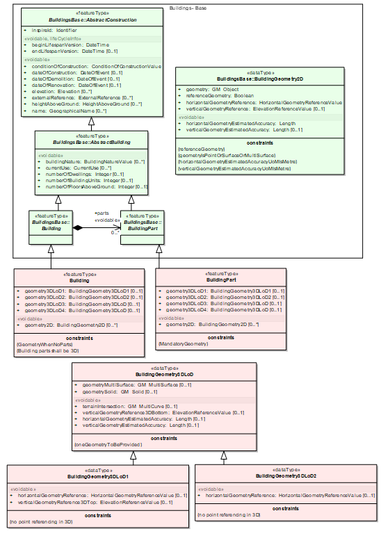
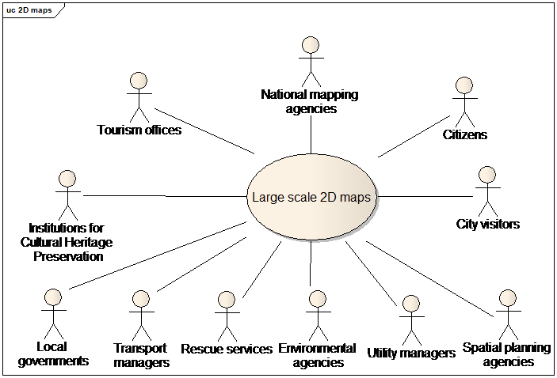

// Admonition icons:
// TG Requirement
:important-caption: 📕
// TG Recommendation
:tip-caption: 📒
// Conformance class
:note-caption: 📘

// TOC placement using macro (manual)
:toc: macro

// Empty TOC title (the title is in the document)
:toc-title:

// TOC level depth
:toclevels: 5

// Section numbering level depth
:sectnumlevels: 8

// Line Break Doc Title
:hardbreaks-option:

// Appendix Caption
:appendix-caption: Annex

image::./media/image2.jpeg[image,width=131,height=90, align=center]

image:./media/image3.png[image,width=93,height=93, align=center] **INSPIRE** *Infrastructure for Spatial Information in Europe*

[discrete]
= D2.8.III.2 Data Specification on _Buildings_ – Technical Guidelines

[cols=",",]
|===
|*Title* |D2.8.III.2 INSPIRE Data Specification on _Buildings_ – Technical Guidelines
|*Creator* |INSPIRE Thematic Working Group _Buildings_
|*Date* |2013-12-10
|*Subject* |INSPIRE Data Specification for the spatial data theme _Buildings_
|*Publisher* |European Commission Joint Research Centre
|*Type* |Text
|*Description* |This document describes the INSPIRE Data Specification for the spatial data theme _Buildings_
|*Contributor* |Members of the INSPIRE Thematic Working Group _Buildings_
|*Format* |Portable Document Format (pdf)
|*Source* |
|*Rights* |Public
|*Identifier* |D2.8.III.2_v3.0
|*Language* |En
|*Relation* |Directive 2007/2/EC of the European Parliament and of the Council of 14 March 2007 establishing an Infrastructure for Spatial Information in the European Community (INSPIRE)
|*Coverage* |Project duration
|===

<<<
[discrete]
== Foreword
[discrete]
== How to read the document?

This document describes the _"INSPIRE data specification on Buildings – Technical Guidelines"_ version 3.0 as developed by the Thematic Working Group (TWG) _BU_ using both natural and a conceptual schema language.

The data specification is based on a common templatefootnote:[The common document template is available in the "Framework documents" section of the data specifications web page at http://inspire.jrc.ec.europa.eu/index.cfm/pageid/2] used for all data specifications, which has been harmonised using the experience from the development of the Annex I, II and III data specifications.

This document provides guidelines for the implementation of the provisions laid down in the draft Implementing Rule for spatial data sets and services of the INSPIRE Directive. It also includes additional requirements and recommendations that, although not included in the Implementing Rule, are relevant to guarantee or to increase data interoperability.

Two executive summaries provide a quick overview of the INSPIRE data specification process in general, and the content of the data specification on _Buildings_ in particular. We highly recommend that managers, decision makers, and all those new to the INSPIRE process and/or information modelling should read these executive summaries first.

The UML diagrams (in Chapter 5) offer a rapid way to see the main elements of the specifications and their relationships. The definition of the spatial object types, attributes, and relationships are included in the Feature Catalogue (also in Chapter 5). People having thematic expertise but not familiar with UML can fully understand the content of the data model focusing on the Feature Catalogue. Users might also find the Feature Catalogue especially useful to check if it contains the data necessary for the applications that they run. The technical details are expected to be of prime interest to those organisations that are responsible for implementing INSPIRE within the field of _Buildings_, but also to other stakeholders and users of the spatial data infrastructure.

The technical provisions and the underlying concepts are often illustrated by examples. Smaller examples are within the text of the specification, while longer explanatory examples and descriptions of selected use cases are attached in the annexes.

In order to distinguish the INSPIRE spatial data themes from the spatial object types, the INSPIRE spatial data themes are written in _italics._

[cols="",]
|===
|The document will be publicly available as a 'non-paper'. It does not represent an official position of the European Commission, and as such cannot be invoked in the context of legal procedures.
|===

*Legal Notice*

Neither the European Commission nor any person acting on behalf of the Commission is responsible for the use which might be made of this publication.

<<<
[discrete]
== Interoperability of Spatial Data Sets and Services – General Executive Summary

The challenges regarding the lack of availability, quality, organisation, accessibility, and sharing of spatial information are common to a large number of policies and activities and are experienced across the various levels of public authority in Europe. In order to solve these problems it is necessary to take measures of coordination between the users and providers of spatial information. The Directive 2007/2/EC of the European Parliament and of the Council adopted on 14 March 2007 aims at establishing an Infrastructure for Spatial Information in the European Community (INSPIRE) for environmental policies, or policies and activities that have an impact on the environment.

INSPIRE is based on the infrastructures for spatial information that are created and maintained by the Member States. To support the establishment of a European infrastructure, Implementing Rules addressing the following components of the infrastructure have been specified: metadata, interoperability of spatial data sets (as described in Annexes I, II, III of the Directive) and spatial data services, network services, data and service sharing, and monitoring and reporting procedures.

INSPIRE does not require collection of new data. However, after the period specified in the Directivefootnote:[For all 34 Annex I,II and III data themes: within two years of the adoption of the corresponding Implementing Rules for newly collected and extensively restructured data and within 5 years for other data in electronic format still in use] Member States have to make their data available according to the Implementing Rules.

Interoperability in INSPIRE means the possibility to combine spatial data and services from different sources across the European Community in a consistent way without involving specific efforts of humans or machines. It is important to note that "interoperability" is understood as providing access to spatial data sets through network services, typically via Internet. Interoperability may be achieved by either changing (harmonising) and storing existing data sets or transforming them via services for publication in the INSPIRE infrastructure. It is expected that users will spend less time and efforts on understanding and integrating data when they build their applications based on data delivered in accordance with INSPIRE.

In order to benefit from the endeavours of international standardisation bodies and organisations established under international law their standards and technical means have been utilised and referenced, whenever possible.

To facilitate the implementation of INSPIRE, it is important that all stakeholders have the opportunity to participate in specification and development. For this reason, the Commission has put in place a consensus building process involving data users, and providers together with representatives of industry, research and government. These stakeholders, organised through Spatial Data Interest Communities (SDIC) and Legally Mandated Organisations (LMO)footnote:[The current status of registered SDICs/LMOs is available via INSPIRE website: http://inspire.jrc.ec.europa.eu/index.cfm/pageid/42], have provided reference materials, participated in the user requirement and technicalfootnote:[Surveys on unique identifiers and usage of the elements of the spatial and temporal schema,] surveys, proposed experts for the Data Specification Drafting Teamfootnote:[The Data Specification Drafting Team has been composed of experts from Austria, Belgium, Czech Republic, France, Germany, Greece, Italy, Netherlands, Norway, Poland, Switzerland, UK, and the European Environment Agency], the Thematic Working Groupsfootnote:[The Thematic Working Groups of Annex II and III themes have been composed of experts from Austria, Belgium, Bulgaria, Czech Republic, Denmark, Finland, France, Germany, Hungary, Ireland, Italy, Latvia, Netherlands, Norway, Poland, Romania, Slovakia, Spain, Sweden, Switzerland, Turkey, UK, the European Commission, and the European Environment Agency] and other ad-hoc cross-thematic technical groups and participated in the public stakeholder consultations on draft versions of the data specifications. These consultations covered expert reviews as well as feasibility and fitness-for-purpose testing of the data specificationsfootnote:[For Annex IIIII, the consultation and testing phase lasted from 20 June to 21 October 2011.].

This open and participatory approach was successfully used during the development of the data specifications on Annex I, II and III data themes as well as during the preparation of the Implementing Rule on Interoperability of Spatial Data Sets and Servicesfootnote:[Commission Regulation (EU) No 1089/2010 http://eur-lex.europa.eu/JOHtml.do?uri=OJ:L:2010:323:SOM:EN:HTML[implementing Directive 2007/2/EC of the European Parliament and of the Council as regards interoperability of spatial data sets and services,] published in the Official Journal of the European Union on 8^th^ of December 2010.] for Annex I spatial data themes and of its amendment regarding the themes of Annex II and III.

The development framework elaborated by the Data Specification Drafting Team aims at keeping the data specifications of the different themes coherent. It summarises the methodology to be used for the development of the data specifications, providing a coherent set of requirements and recommendations to achieve interoperability. The pillars of the framework are the following technical documentsfootnote:[The framework documents are available in the "Framework documents" section of the data specifications web page at http://inspire.jrc.ec.europa.eu/index.cfm/pageid/2]:

* The _Definition of Annex Themes and Scope_ describes in greater detail the spatial data themes defined in the Directive, and thus provides a sound starting point for the thematic aspects of the data specification development.
* The _Generic Conceptual Model_ defines the elements necessary for interoperability and data harmonisation including cross-theme issues. It specifies requirements and recommendations with regard to data specification elements of common use, like the spatial and temporal schema, unique identifier management, object referencing, some common code lists, etc. Those requirements of the Generic Conceptual Model that are directly implementable are included in the Implementing Rule on Interoperability of Spatial Data Sets and Services.
* The _Methodology for the Development of Data Specifications_ defines a repeatable methodology. It describes how to arrive from user requirements to a data specification through a number of steps including use-case development, initial specification development and analysis of analogies and gaps for further specification refinement.
* The _Guidelines for the Encoding of Spatial Data_ defines how geographic information can be encoded to enable transfer processes between the systems of the data providers in the Member States. Even though it does not specify a mandatory encoding rule it sets GML (ISO 19136) as the default encoding for INSPIRE.
* The _Guidelines for the use of Observations & Measurements and Sensor Web Enablement-related standards in INSPIRE Annex II and III data specification development_ provides guidelines on how the "Observations and Measurements" standard (ISO 19156) is to be used within INSPIRE.
* The _Common data models_ are a set of documents that specify data models that are referenced by a number of different data specifications. These documents include generic data models for networks, coverages and activity complexes.

The structure of the data specifications is based on the "ISO 19131 Geographic information - Data product specifications" standard. They include the technical documentation of the application schema, the spatial object types with their properties, and other specifics of the spatial data themes using natural language as well as a formal conceptual schema languagefootnote:[UML – Unified Modelling Language].

A consolidated model repository, feature concept dictionary, and glossary are being maintained to support the consistent specification development and potential further reuse of specification elements. The consolidated model consists of the harmonised models of the relevant standards from the ISO 19100 series, the INSPIRE Generic Conceptual Model, and the application schemasfootnote:[Conceptual models related to specific areas (e.g. INSPIRE themes)] developed for each spatial data theme. The multilingual INSPIRE Feature Concept Dictionary contains the definition and description of the INSPIRE themes together with the definition of the spatial object types present in the specification. The INSPIRE Glossary defines all the terms (beyond the spatial object types) necessary for understanding the INSPIRE documentation including the terminology of other components (metadata, network services, data sharing, and monitoring).

By listing a number of requirements and making the necessary recommendations, the data specifications enable full system interoperability across the Member States, within the scope of the application areas targeted by the Directive. The data specifications (in their version 3.0) are published as technical guidelines and provide the basis for the content of the Implementing Rule on Interoperability of Spatial Data Sets and Servicesfootnote:[In the case of the Annex IIIII data specifications, the extracted requirements are used to formulate an amendment to the existing Implementing Rule.]. The content of the Implementing Rule is extracted from the data specifications, considering short- and medium-term feasibility as well as cost-benefit considerations. The requirements included in the Implementing Rule are legally binding for the Member States according to the timeline specified in the INSPIRE Directive.

In addition to providing a basis for the interoperability of spatial data in INSPIRE, the data specification development framework and the thematic data specifications can be reused in other environments at local, regional, national and global level contributing to improvements in the coherence and interoperability of data in spatial data infrastructures.

<<<
[discrete]
== _Buildings_ – Executive Summary

This document presents spatial data specification for European data related to the theme "_Buildings_".

*Use cases*

Building data is a key theme for environmental studies. On one hand, buildings are the places where people live, work and spend more of their time and where they should be ensured good quality of habitat and protection from risks (flood, fire, earthquake, ...) and from pollutions (noise, air pollution, ...). Buildings by themselves may deserve protection because of their historical or architectural interest. On the other hand, buildings and their inhabitants are consuming natural resources (heating, land, transport, construction material) and there is clear need to promote more sustainable buildings and to control urban spreading. This data specification addresses requirements related to European reporting, such as the Noise Directive, the Air Quality Directive, the Energy Performance of Building Directive and the Population and Housing Census Directive. The Flood Directive and the project of Soil Directive have also been taken into account.

Moreover, theme _Buildings_ is part of the reference data that is required in a Spatial Data Infrastructure to describe the landscape and for lots of mapping and communication applications. Especially, some specific buildings and constructions are valuable landmarks for travellers.

*Scope - Relations with other themes*

The spatial features under the scope of this document are local scale spatial features such as buildings (of course) and also some other constructions of major interest for environmental applications, such as elevated constructions or environmental barriers. Spatial features representing building components are also under the scope of this document – they allow very detailed representations of different kinds of building components and ancillary constructions.

Other building related features at a coarser level of detail such as building groups and complexes, built-up areas, urban block, city districts, etc. are not under the scope of this document. Built-up areas and settlements may be found in themes land use, land cover and/or geographical names.

This document mainly focuses on the physical description of real world entities seen as constructions. An important characteristic of buildings is their capability to provide services. Because this information is covered by other INSPIRE themes related to facilities (utility and governmental services, production and industrial facilities, agricultural and aquacultural facilities), this data specification only provides a simplified classification of building services. Furthermore, building theme classes share relations with addresses, cadastral parcels and geographical names themes.

*Existing data and standards*

There are nowadays many datasets describing building related features. These datasets are mainly produced by well identified member state organisations, usually mandated national cadastral and mapping agencies.

Building data exist with various levels of detail both in geometry and in semantics. For example, there are representations of buildings and constructions as points, surfaces or solids. The 2D surface representation is the most frequent, the building having been captured e.g. by its foot print or roof edge or envelope. The 3D representations of buildings are generally described using the well defined levels of detail of the CityGML OGC standard.

All these various representations have their interest and their limits. For instance, 3D data offer a wonderful tool to design and to communicate about urbanism projects but are far from being accepted by any kind of software. Another example is about the level of detail of the geometric representation: whereas detailed geometry of buildings may be necessary for local use, a more generalised geometry that implies smaller volume of data and so shorter time for computation is generally more suitable for larger areas of interest.

*Data model*

The data model offers a flexible approach by allowing multiple representations of buildings and constructions, through a set of four profiles with different levels of detail both in geometry and semantics.

The core profiles contain the requirements to be included in the implementing rule. They contain feature types building and building part and a limited set of attributes mainly related to temporal aspects (construction, renovation and demolition dates), physical information (height, number of floors, elevation) and the classification of buildings according to their physical aspect and current use.

* The *Buildings2D* profile includes various geometrical representations of buildings as 2D or 2,5D data.
*  The *Buildings3D* profile has same semantic content as the Buildings2D profile and allows in addition, the geometric representation of buildings in any of the four levels of detail of City GML.

The extended profiles contain the recommendations to provide more detailed information about theme buildings. In addition to building and building part, the main features represented are _other constructions, building units and installations_.

*  The *BuildingsExtended2D* profile is a semantic extension of Buildings2D profile with additional thematic attributes (material of construction, official area or value, connection to utility networks...), classes (building units, installations, other constructions) and references to other data (like cadastral data and addresses).
* The *BuildingsExtended3D* profile is an extension of the Buildings3D profile for rich 3D representations at different levels of details. It includes the possibility to represent many building components, such as the building boundaries (wall, roof ...), the openings (doors – windows) and building interior (rooms, internal installations) and the textures associated with the main feature types. It also contains all the semantic information of extended 2D profile.

*Quality and metadata*

By allowing all kinds of building representations and various levels of detail, the data model ensures a flexible way to data producers to make their data compliant with INSPIRE. However, this flexibility implies loose harmonisation on some points and has to be counterbalanced by a relevant documentation to be provided to the users. This data specification proposes several tools to document the building data set, such as additional metadata elements for evaluation (content, usability for some use cases, template for additional information).

This data specification does not put any quality requirement in order to avoid to exclude data from INSPIRE but proposes consistency rules between the semantic level of detail and the geometric accuracy.

<<<
[discrete]
== Acknowledgements

Many individuals and organisations have contributed to the development of these Guidelines.

The Thematic Working Group on Building (TWG-BU) included:

Dominique Laurent (TWG Facilitator), Karl-Gustav Johansson (editor), Simon Barlow, Eddie Bergström, Zsuzsanna Ferencz, Gerhard Gröger, Frank Kooij, Frédéric Mortier, Karen Skjelbo, Fabio Taucer, Amalia Velasco, Ewa Wysocka, Julien Gaffuri (European Commission contact point), Michael Lutz.

Also contributed:

For the final version of the document: Chris Schubert, JRC.

Various persons, among the geographic information community, have been actively involved by supplying information about existing data or about use cases and user requirements. The list of these persons is provided in annex G.

Other contributors to the INSPIRE data specifications are the Drafting Team Data Specifications, the JRC Data Specifications Team and the INSPIRE stakeholders - Spatial Data Interested Communities (SDICs) and Legally Mandated Organisations (LMOs).

*Contact information*

Maria Vanda Nunes de Lima
European Commission Joint Research Centre
Institute for Environment and Sustainability
Unit H06: Digital Earth and Reference Data
TP262, Via Fermi 2749
I-21027 Ispra (VA)
ITALY
E-mail: vanda.lima@jrc.ec.europa.eu
Tel.: 39-0332-7865052
Fax: 39-0332-7866325
http://ies.jrc.ec.europa.eu/
http://ec.europa.eu/dgs/jrc/
http://inspire.jrc.ec.europa.eu/

<<<
[discrete]
= Table of Contents
toc::[]

:sectnums:

<<<
== Scope

This document specifies a harmonised data specification for the spatial data theme _Buildings_ as defined in Annex III of the INSPIRE Directive.

This data specification provides the basis for the drafting of Implementing Rules according to Article 7 (1) of the INSPIRE Directive [Directive 2007/2/EC]. The entire data specification is published as implementation guidelines accompanying these Implementing Rules.

<<<
== Overview

=== Name

INSPIRE data specification for the theme _Buildings_.

=== Informal description

[.underline]#*Definition:*#

Geographical location of buildings [Directive 2007/2/EC].

[.underline]#*Description:*#

Considered as under scope of the theme _Buildings_ are *constructions* above and/or underground which are intended or used for the shelter of humans, animals, things, the production of economic goods or the delivery of services and that refer to any structure permanently constructed or erected on its site.

==== Context 

This data specification was developed according to the INSPIRE methodology, the context knowledge being got by an investigation of use cases and user requirements and by a survey of existing data and standards.

===== Use cases

This data specification about _Buildings_ addresses the following high level use cases shown on the figure below.

In particular, this data specification addresses the Noise Directive, the Air Quality Directive, the Energy Performance of Building Directive and the Population and Housing Census Directive. The Flood Directive and the project of Soil Directive have also been taken into account.

More detailed information about use cases may be found in annex B of this document.

image::./media/image288.png[image]
[.text-center]
*Figure 1: High level use cases for theme Buildings*

===== Existing data 

At national level there may be several databases related to the theme _Buildings_. For instance frequently coexist a topographic view (2D or 2,5D) at scales around 1/ 10 000 and a cadastral view (mostly 2D) at scales generally larger or equal to 1: 2000. In some countries there is also a statistical view on _Buildings_.

A reliable overview about the databases available at the local level cannot be provided, due to the lack of Reference Material. However, some local governments have volumetric views (3D data) on _Buildings_.

Moreover there may be other databases dedicated to a specific use case such as marine navigation, air traffic, inventory of buildings with historical or architectural interest. These databases include only a limited set of buildings.

===== Existing standards 

This data specification is based on several standards that may be classified as glossaries, classifications and data models:

* Glossaries

The standard ISO 6707 (Building and Civil Engineering) includes a Vocabulary with part 1 being about General terms.

The standard DFDD (DGIWG Feature Data Dictionary) is the standard established by the military community (DWIWG: Defence Geospatial Information Working Group); it provides terminology and definitions for topographic features, including buildings.

The CLGE (Council of European Geodetic Surveyors) measurement code for the floor area of buildings has provided possible references for the official area of a building.

* Classifications

Eurostat has a hierarchical classification of types of constructions according to the activity hosted by the building. The part of this classification addressing environmental use cases has been adopted by this data specification; it concerns mainly the residential use.

* Data models

LADM (Land Administration Domain Model) is the draft standard ISO 19152. It is an extendable basis for efficient cadastral system development based on a Model Driven Architecture. It offers a cadastral view point on _Buildings_.

*CityGML* is an OGC standard for the representation of 3D City Models, including _Buildings_. CityGML offers different levels of detail (LoD) for the mode    ling of _Buildings_:

* LoD 0 that offers a 2D model for buildings has been included in the latest version of City GML (v2.0).
* LoD 1 with block models (flat roofs)
* LoD 2 with the shape of roofs
* LoD 3 with accurate description of exterior (including openings: doors and windows)
* LoD 4: interior model

As this standard is based on ISO TC 211 and OGC concepts, it *was a natural candidate for the modeling of 3D Buildings in INSPIRE.* Annex D of this document provides more explanations about CityGML and how it has been applied for INSPIRE.

Moreover there are two other standards dealing with very specific use of buildings such as:

* annex 15 of ICAO (International Civil Aviation Organisation) offers a data model for vertical structures (including buildings) called AIXM (Aeronautical Information eXchange Model).

* the IHO (International Hydrographic Organisation) has its standard S-57 which comprises the specifications of ENC (Electronic Navigation Charts) and a glossary. Both include information related to theme _Buildings_.

==== Decisions 

===== The profile approach 

====== Semantic aspects

Various and numerous user requirements were collected. As it seemed impossible to require data harmonisation at European level for all these requirements, this data specification has defined some priority, as shown on the following figure.

[.text-center]
*Figure 2: The hierarchy of semantics user requirements (Feature types are represented in bright colours, whereas their properties are represented in clearer colours)*

Harmonisation was considered as relevant at European level when funded on international or European use cases and when no significant feasibility issue regarding harmonisation was expected. Harmonisation was considered as relevant at national/local level if funded only on national/local level and/or if feasibility issues were expected (e.g. official data depending on national regulation, privacy issue, lack of consensus about the scope of theme _Buildings_).

Based on this classification, two kinds of semantic profiles are proposed in this data specification:

* *normative core profile* based on the data widely used, widely available and whose harmonisation is required at European level, e.g. for homogeneous reporting on Environmental Directives
* *informative extended profile* based on data that is widely required but whose harmonisation is not easily achievable at short term (e.g. data rarely available or data whose harmonisation may/should be done at national level).

The common semantics used by all profiles has been described in a *base application schema*.

Core profile includes both basic topographic data (such as height, number of floors, nature of buildings, date of construction ...) and coarse official data (such as current use, number of dwellings or of building units); the core profile aims to fulfil most user requirements, at least in a rough way. Core profile is based on the concepts shown in green on the previous figure.

Extended profile includes more detailed information about buildings and building related objects. Extended profile is based on the concepts shown in pink on the previous figure.

Extended profile may be applied as a whole but also aims to be a "reservoir" of proposals for extensions of core INSPIRE profile, i.e. only a selection of proposed feature types and attributes may be added. More explanations about this topic are given in annex F.

Moreover, some mechanisms (external reference, address and document) have been included to enable data producers to provide a link between the data considered as directly under the scope of theme _Buildings_ and business data considered as out of scope of the theme (such as owner/tenant, building permit, detailed activity of the building).

====== Geometric aspects

Building data may be available and required either as 2D (or 2,5D) data or as 3D data. This data specification is proposing two kinds of geometric profiles:

* 2D profile (with 2D or 2,5D geometry)
* 3D profile (with 3D geometry)

NOTE term "2D profile" is used for simplicity reason (in order to have a short title) but accommodates both 2D and 2,5D data.

These 2D and 3D profiles are proposed to make life easier both to data producers and data users:

* most data producers have only 2D or 2,5D data ; it will be easier for them to make their data compliant with core 2D profile that deals only with 2D and 2,5D data
* a core 3D profile has been developed, mainly to enable producers of 3D data to conform to INSPIRE model without having to "flatten" their data.
* most GIS deals only with 2D or 2,5D data; users will be enabled to choose data compliant with INSPIRE 2D or 3D profiles

This core normative 3D profile is based on the simple semantic of core profile and allows all the levels of detail of CityGML.

====== Application schemas and profiles 

The data specification includes six application schemas. Two of them are just abstract application schemas gathering the concepts that are used in common by the other application schemas, i.e. the instanciable ones.

The delivery of data may be done, using four options (called profiles) that consist of a combination of application schemas, as explained in the following table and figure.

[.text-center]
*Table 1: The profile approach for theme Buildings*

[cols=",,",options="header",]
|===
| |Basic semantic |Rich semantic
|2D geometry a|
*Core 2D profile*

_uses application schemas:_

* _base_
* _Buildings2D_

a|
*Extended 2D profile*

_uses application schemas:_

_- base_

_- Buildings2D_

_- base extended_

_- extended 2D_

|3D geometry a|
*Core 3D profile*

_uses application schemas:_

* _base_
* _Buildings3D_

a|
*Extended 3D profile*

_uses application schemas:_

_- base_

_- Buildings3D_

_- base extended_

_- extended 3D_

|===

The profiles (Core 2D, Core 3D, Extended 2D, Extended 3D) are defined by the respective instanciable application schemas and may use the concepts defined in other application schemas, as explained in the previous table.

[.text-center]
*Figure 3: Content and structure of application schemas for theme Buildings*

Feature types are represented in blue. Abstract application schemas are represented in green. Instanciable application schemas are represented in red.

NOTE *Data producers may also extend INSPIRE profiles by other information not included in this specification, under the condition they respect the rules provided in the Generic Conceptual Model.*

[.text-center]
*Figure 4: Modular approach for modelling Buildings theme*

===== Modular scope:

There may be different kinds and sizes of buildings and constructions. In a similar way to the modular levels of information offered by the profile approach, this data specification defines three levels of priority for INSPIRE, regarding the scope of the theme:

image::./media/image8.png[image,width=437,height=246, align=center] 
[.text-center]
*Figure 5: Modular approach for scope of theme Buildings*

The first priority, the data the most expected by INSPIRE includes:

* The conventional buildings are considered as building by every one (fitting with all the various definitions of buildings), generally hosting human activities (residential, industrial, commerce and services) and being of large or medium size (around 15-20 m^2^ and more); these conventional buildings are required by most use cases, such as for assessment of population in an area of interest, census, spatial planning, modelling of physical phenomena. Typical examples are houses, block of flats, factories, supermarkets, ...

* The specific (significant) buildings are the buildings of significant size or height with specific physical aspect that make them usable as landmarks and required by use cases such as mapping or travel safety. Typical examples are towers, stadium, churches, ...

The second priority, the data that should be in INSPIRE includes:

* The non-conventional buildings fit only partly with the definition(s) of building; for instance, they are only partly constructed, such as caves or underground shelters, stations, car parks or they are permanent only by fact but not by nature such as mobile homes, huts, ...If hosting human activities, these non-conventional buildings are required by use cases such as census, studies about precarious habitat, vulnerability to risk
* The ancillary buildings are buildings of small size (around 10 m^2^) that are used only in connection with another larger building, such as the garages or garden shelters near houses. These ancillary buildings may influence the land use / land cover phenomena.
* Other constructions are the constructions required by the use cases considered by this data specification. Typical examples are city walls, bridges, chimneys, acoustic fences. The whole list may be found in the model (clause 5).

The last priority, the data that may be in INSPIRE includes all the other buildings and constructions, mainly the very small size ones (one or several m^2^), such as phone booth, bus shelters, statues, ... These buildings and constructions may be required at local level for asset management, protection of patrimony, ...

===== Links and overlaps with other themes 

====== Overview

Theme _Buildings_ has overlaps with themes dealing with facilities, as buildings may be part of governmental services, industrial, agricultural, transport or hydrographical facilities and with theme Geographical Names as buildings may have a toponym.

Some buildings and constructions are included in other INSPIRE themes, mainly in the facilities themes (for instance, a building may host a school, a prison, a city hall or be part of a farm or a factory). The general principle is that, for same entities, the theme Building focuses on a physical/topographic view whereas the facility themes focus on a functional view.

Aggregated building data may be found as built-up areas in themes Land Cover or Land Use and as settlements in theme Geographical Names.

Moreover, theme _Buildings_ is often used in conjunction with other INSPIRE themes by the use cases addressed by this data specification. For more details, see annex B.

[.text-center]
*Figure 6: Links and overlaps between Buildings and other INSPIRE themes*

====== Classification of buildings

This data specification proposes a simple classification of buildings, based on their current use. Users will find more detailed information in the themes dealing with facilities.

[.text-center]
*Table 2: The classification of buildings*

[cols=",",options="header",]
|===
|*Current use – high level* |*Current use – detailed level*
|residential |Provided by DS BU
|agricultural |Provided by DS AF
|industrial |Provided by DS PF
|commerceAndServices - office |
|commerceAndServices - trade |
|commerceAndServices – public service |Provided by DS US
|===

====
[.red.background]
*Open issue 1*: The articulation between _Buildings_ and facilities was poorly tested or not tested at all during the consultation phase. So, there is a real risk that data between these themes will not connect as expected. This will be a point to be carefully monitored by the maintenance process of INSPIRE specifications.
====

[cols=""]
|===
a|[.underline]#*Definition:*#

Geographical location of buildings [Directive 2007/2/EC].

[.underline]#*Description:*#

A building is a covered facility, usable for the protection of humans, animals, things or the production of economic goods. A building refers to any structure permanently constructed or erected on its site. Information on location of buildings may be supplied as points or with the actual basic form of the building. Usually buildings are part of cadastre. On the local level buildings are available within the large scale cadastral maps or cadastral data sets and are geometrically represented as surfaces.

Most buildings can be identified (geocoded) by address (separate theme in INSPIRE).

Entry in the INSPIRE registry: _http://inspire.ec.europa.eu/theme/bu/_
|===

=== Normative References

[Directive 2007/2/EC] Directive 2007/2/EC of the European Parliament and of the Council of 14 March 2007 establishing an Infrastructure for Spatial Information in the European Community (INSPIRE)

[ISO 19107] EN ISO 19107:2005, Geographic Information – Spatial Schema

[ISO 19108] EN ISO 19108:2005, Geographic Information – Temporal Schema

[ISO 19108-c] ISO 19108:2002/Cor 1:2006, Geographic Information – Temporal Schema, Technical Corrigendum 1

[ISO 19111] EN ISO 19111:2007 Geographic information - Spatial referencing by coordinates (ISO 19111:2007)

[ISO 19113] EN ISO 19113:2005, Geographic Information – Quality principles

[ISO 19115] EN ISO 19115:2005, Geographic information – Metadata (ISO 19115:2003)

[ISO 19118] EN ISO 19118:2006, Geographic information – Encoding (ISO 19118:2005)

[ISO 19125-1] EN ISO 19125-1:2004, Geographic Information – Simple feature access – Part 1: Common architecture

[ISO 19135] EN ISO 19135:2007 Geographic information – Procedures for item registration (ISO 19135:2005)

[ISO 19138] ISO/TS 19138:2006, Geographic Information – Data quality measures

[ISO 19139] ISO/TS 19139:2007, Geographic information – Metadata – XML schema implementation

[ISO 19157] ISO/DIS 19157, Geographic information – Data quality

[OGC 06-103r4] Implementation Specification for Geographic Information - Simple feature access – Part 1: Common Architecture v1.2.1

NOTE This is an updated version of "EN ISO 19125-1:2004, Geographic information – Simple feature access – Part 1: Common architecture".

[Regulation 1205/2008/EC] Regulation 1205/2008/EC implementing Directive 2007/2/EC of the European Parliament and of the Council as regards metadata

[Regulation 976/2009/EC] Commission Regulation (EC) No 976/2009 of 19 October 2009 implementing Directive 2007/2/EC of the European Parliament and of the Council as regards the Network Services

[Regulation 1089/2010/EC] Commission Regulation (EU) No 1089/2010 of 23 November 2010 implementing Directive 2007/2/EC of the European Parliament and of the Council as regards interoperability of spatial data sets and services

=== Terms and definitions

General terms and definitions helpful for understanding the INSPIRE data specification documents are defined in the INSPIRE Glossaryfootnote:[The INSPIRE Glossary is available from http://inspire-registry.jrc.ec.europa.eu/registers/GLOSSARY].

Specifically, for the theme _Buildings_, the following terms are defined:

[discrete]
==== 1. 2D data

Geometry of features is represented in a two-dimensional space

NOTE *In other words, the geometry of 2D data is given using (X,Y) coordinates.*

EXAMPLE:

image::./media/image10.png[image,width=354,height=171, align=center]

[.text-center]
*Figure 7: A building represented by 2D data*

[discrete]
==== 2. 2.5D data

Geometry of features is represented in a three-dimensional space with the constraint that, for each (X,Y) position, there is only one Z.

EXAMPLE:

[.text-center]
*Figure 8: A building represented by 2,5D data*

[discrete]
==== 3. 3D data

Geometry of features is represented in a three-dimensional space.

NOTE *In other words, the geometry of 2D data is given using (X,Y,Z) coordinates without any constraints*.

EXAMPLE:

[.text-center]
*Figure 9: A building represented by 3D data*

[discrete]
==== 4. Building component

Any sub-division or elements of a building.

EXAMPLES: wall, roof, room

=== Symbols and abbreviations

[cols=","]
|===
|AC |Atmospheric Conditions
|AD |Address
|AF |Agricultural and Aquacultural Facilities
|ATS |Abstract Test Suite
|AU |Administrative Units
|BU |_Buildings_
|CP |Cadastral Parcels
|CRS |Coordinate Reference System
|DS DT |Data Specification Drafting Team
|DTM |Digital Terrain Model
|EC |European Commission
|EEA |European Environmental Agency
|EL |Elevation
|ENC |Electronic Navigation Charts
|EPBD |Energy Performance of Buildings Directive
|ETRS89 |European Terrestrial Reference System 1989
|ETRS89-LAEA |Lambert Azimuthal Equal Area
|EVRS |European Vertical Reference System
|FE |Filter Encoding
|GCM |General Conceptual Model
|GML |Geographic Markup Language
|GN |Geographical Names
|GRS80 |Geodetic Reference System 1980
|HY |Hydrography
|ICAO |International Civil Aviation Organization
|IR |Implementing Rule
|ISDSS |Interoperability of Spatial Data Sets and Services
|ISO |International Organization for Standardization
|ITRS |International Terrestrial Reference System
|JRC |Joint Research Centre
|LADM |Land Administration Domain Model
|LAT |Lowest Astronomical Tide
|LC |Land Cover
|LMO |Legally Mandated Organization
|LoD |Level Of Detail
|LU |Land Use
|MF |Meteorological geographical Features
|MS |Member State
|NMCA |National Mapping and Cadastral Agency
|NZ |Natural Risk Zones
|OGC |Open Geospatial Consortium
|OI |Orthoimagery
|PD |Population Distribution
|PF |Production and Industrial Facilities
|RGB |Red Green Blue
|SDIC |Spatial Data Interest Community
|SE |Style Encoding
|SU |Statistical Units
|TG |Technical Guidance
|TN |Transport Networks
|TWG |Thematic Working Group
|UML |Unified Modeling Language
|URI |Uniform Resource Identifier
|US |Utility and Governmental Services
|UTC |Coordinated Universal Time
|UTF |Unicode Transformation Format
|WFS |Web Feature Service
|WMS |Web Map Service
|XML |EXtensible Markup Language
|===

=== How the Technical Guidelines map to the Implementing Rules

The schematic diagram in Figure 10 gives an overview of the relationships between the INSPIRE legal acts (the INSPIRE Directive and Implementing Rules) and the INSPIRE Technical Guidelines. The INSPIRE Directive and Implementing Rules include legally binding requirements that describe, usually on an abstract level, _what_ Member States must implement.

In contrast, the Technical Guidelines define _how_ Member States might implement the requirements included in the INSPIRE Implementing Rules. As such, they may include non-binding technical requirements that must be satisfied if a Member State data provider chooses to conform to the Technical Guidelines. Implementing these Technical Guidelines will maximise the interoperability of INSPIRE spatial data sets.

image::./media/image13.png[image,width=603,height=375, align=center]

[.text-center]
*Figure 10 - Relationship between INSPIRE Implementing Rules and Technical Guidelines*

==== Requirements

The purpose of these Technical Guidelines (Data specifications on _Buildings_) is to provide practical guidance for implementation that is guided by, and satisfies, the (legally binding) requirements included for the spatial data theme _Buildings_ in the Regulation (Implementing Rules) on interoperability of spatial data sets and services. These requirements are highlighted in this document as follows:

[IMPORTANT]
====
[.text-center]
*IR Requirement*
_Article / Annex / Section no._
*Title / Heading*

This style is used for requirements contained in the Implementing Rules on interoperability of spatial data sets and services (Commission Regulation (EU) No 1089/2010).

====

For each of these IR requirements, these Technical Guidelines contain additional explanations and examples.

NOTE The Abstract Test Suite (ATS) in Annex A contains conformance tests that directly check conformance with these IR requirements.

Furthermore, these Technical Guidelines may propose a specific technical implementation for satisfying an IR requirement. In such cases, these Technical Guidelines may contain additional technical requirements that need to be met in order to be conformant with the corresponding IR requirement _when using this proposed implementation_. These technical requirements are highlighted as follows:

[TIP]
====
*TG Requirement X* 

This style is used for requirements for a specific technical solution proposed in these Technical Guidelines for an IR requirement.
====

NOTE 1 Conformance of a data set with the TG requirement(s) included in the ATS implies conformance with the corresponding IR requirement(s).

NOTE 2 In addition to the requirements included in the Implementing Rules on interoperability of spatial data sets and services, the INSPIRE Directive includes further legally binding obligations that put additional requirements on data providers. For example, Art. 10(2) requires that Member States shall, where appropriate, decide by mutual consent on the depiction and position of geographical features whose location spans the frontier between two or more Member States. General guidance for how to meet these obligations is provided in the INSPIRE framework documents.

==== Recommendations

In addition to IR and TG requirements, these Technical Guidelines may also include a number of recommendations for facilitating implementation or for further and coherent development of an interoperable infrastructure.

[NOTE]
====
*Recommendation X* 

Recommendations are shown using this style.
====

NOTE The implementation of recommendations is not mandatory. Compliance with these Technical Guidelines or the legal obligation does not depend on the fulfilment of the recommendations.

==== Conformance

Annex A includes the abstract test suite for checking conformance with the requirements included in these Technical Guidelines and the corresponding parts of the Implementing Rules (Commission Regulation (EU) No 1089/2010).

<<<
== Specification scopes

This data specification does not distinguish different specification scopes, but just considers one general scope.

NOTE For more information on specification scopes, see [ISO 19131:2007], clause 8 and Annex D.

<<<
== Identification information

These Technical Guidelines are identified by the following URI:

http://inspire.ec.europa.eu/tg/BU/3.0

NOTE ISO 19131 suggests further identification information to be included in this section, e.g. the title, abstract or spatial representation type. The proposed items are already described in the document metadata, executive summary, overview description (section 2) and descriptions of the application schemas (section 5). In order to avoid redundancy, they are not repeated here.

<<<
== Data content and structure

=== Application schemas – Overview 

==== Application schemas included in the IRs

Articles 3, 4 and 5 of the Implementing Rules lay down the requirements for the content and structure of the data sets related to the INSPIRE Annex themes.

[IMPORTANT]
====
[.text-center]
*IR Requirement*
_Article 4_
*Types for the Exchange and Classification of Spatial Objects*

. For the exchange and classification of spatial objects from data sets meeting the conditions laid down in Article 4 of Directive 2007/2/EC, Member States shall use the spatial object types and associated data types, enumerations and code lists that are defined in Annexes II, III and IV for the themes the data sets relate to.

. Spatial object types and data types shall comply with the definitions and constraints and include the attributes and association roles set out in the Annexes.

. The enumerations and code lists used in attributes or association roles of spatial object types or data types shall comply with the definitions and include the values set out in Annex II. The enumeration and code list values are uniquely identified by language-neutral mnemonic codes for computers. The values may also include a language-specific name to be used for human interaction.

====

The types to be used for the exchange and classification of spatial objects from data sets related to the spatial data theme _Buildings_ are defined in the following application schemas (see following sections):

* BuildingsBase application schema describes the concepts that are common to all other _Buildings_ application schemas; it contains mainly the *core* *normative semantics* of theme _Buildings_
* Buildings2D application schema describes the *2D geometric representation* of the spatial object types defined in Buildings Base application schema, namely buildings and building parts; it inherits from the common semantics of Buildings base
* Buildings3D application schema describes the *3D geometric representation* of the spatial object types defined in Buildings Base application schema, namely buildings and building parts; it inherits from the common semantics of Buildings base

The application schemas specify requirements on the properties of each spatial object including its multiplicity, domain of valid values, constraints, etc.

NOTE The application schemas presented in this section contain some additional information that is not included in the Implementing Rules, in particular multiplicities of attributes and association roles.

[TIP]
====
*TG Requirement 1*

Spatial object types and data types shall comply with the multiplicities defined for the attributes and association roles in this section.

====

An application schema may include references (e.g. in attributes or inheritance relationships) to common types or types defined in other spatial data themes. These types can be found in a sub-section called "Imported Types" at the end of each application schema section. The common types referred to from application schemas included in the IRs are addressed in Article 3.

[IMPORTANT]
====
[.text-center]
*IR Requirement*
_Article 3_
*Common Types*

Types that are common to several of the themes listed in Annexes I, II and III to Directive 2007/2/EC shall conform to the definitions and constraints and include the attributes and association roles set out in Annex I.

====

NOTE Since the IRs contain the types for all INSPIRE spatial data themes in one document, Article 3 does not explicitly refer to types defined in other spatial data themes, but only to types defined in external data models.

Common types are described in detail in the Generic Conceptual Model [DS-D2.7], in the relevant international standards (e.g. of the ISO 19100 series) or in the documents on the common INSPIRE models [DS-D2.10.x]. For detailed descriptions of types defined in other spatial data themes, see the corresponding Data Specification TG document [DS-D2.8.x].

==== Additional recommended application schemas 

In addition to the application schemas listed above, the following additional application schemas have been defined for the theme _Buildings_ (see following sections):

* BuildingsExtendedBase application schema describes the *additional semantics* that should be used to extend normative profiles, whatever the chosen geometric representation (2D or 3D) is.

* BuildingsExtended2D application schema describes the *2D geometric representation* of the additional spatial object types (namely installations, other constructions, building units); it inherits both from the common semantics of <Buildings ExtendedBase> and of the 2D geometric representation of buildings and building parts.

* BuildingsExtended3D application schema describes both the *3D geometric representation* of the additional spatial object types (namely installations, other constructions, building units) and the additional concepts that should be used to provide more detailed information about buildings and associated objects, when represented by 3D data (walls, roofs, openings, room, textures, ...) ; it inherits both from the common semantics of <Buildings ExtendedBase> and of the 3D geometric representation of buildings and building parts.

These additional application schemas are not included in the IRs. They typically address requirements from specific (groups of) use cases and/or may be used to provide additional information. They are included in this specification in order to improve interoperability also for these additional aspects and to illustrate the extensibility of the application schemas included in the IRs.

[.text-center]
*Figure 11: Dependencies between application schemas of theme Buildings*

[NOTE]
====
*Recomendation 1*

Additional and/or use case-specific information related to the theme _Buildings_ should be made available using the spatial object types and data types specified in the following application schema(s): BuildingsExtendedBase, BuildingsExtended2D, BuildingsExtended3D.

These spatial object types and data types should comply with the definitions and constraints and include the attributes and association roles defined in this section.

The enumerations and code lists used in attributes or association roles of spatial object types or data types should comply with the definitions and include the values defined in this section.

====

=== Basic notions

This section explains some of the basic notions used in the INSPIRE application schemas. These explanations are based on the GCM [DS-D2.5].

==== Notation

===== Unified Modeling Language (UML)

The application schemas included in this section are specified in UML, version 2.1. The spatial object types, their properties and associated types are shown in UML class diagrams.

NOTE For an overview of the UML notation, see Annex D in [ISO 19103].

The use of a common conceptual schema language (i.e. UML) allows for an automated processing of application schemas and the encoding, querying and updating of data based on the application schema – across different themes and different levels of detail.

The following important rules related to class inheritance and abstract classes are included in the IRs.

[IMPORTANT]
====
[.text-center]
*IR Requirement*
_Article 5_
*Types*

(...)

[arabic, start=2]
. Types that are a sub-type of another type shall also include all this type's attributes and association roles.
. Abstract types shall not be instantiated.

====

The use of UML conforms to ISO 19109 8.3 and ISO/TS 19103 with the exception that UML 2.1 instead of ISO/IEC 19501 is being used. The use of UML also conforms to ISO 19136 E.2.1.1.1-E.2.1.1.4.

NOTE ISO/TS 19103 and ISO 19109 specify a profile of UML to be used in conjunction with the ISO 19100 series. This includes in particular a list of stereotypes and basic types to be used in application schemas. ISO 19136 specifies a more restricted UML profile that allows for a direct encoding in XML Schema for data transfer purposes.

To model constraints on the spatial object types and their properties, in particular to express data/data set consistency rules, OCL (Object Constraint Language) is used as described in ISO/TS 19103, whenever possible. In addition, all constraints are described in the feature catalogue in English, too.

NOTE Since "void" is not a concept supported by OCL, OCL constraints cannot include expressions to test whether a value is a _void_ value. Such constraints may only be expressed in natural language.

===== Stereotypes

In the application schemas in this section several stereotypes are used that have been defined as part of a UML profile for use in INSPIRE [DS-D2.5]. These are explained in Table 3 below.

[.text-center]
*Table 3 – Stereotypes (adapted from [DS-D2.5])*

[cols=",,",]
|===
|*Stereotype* |*Model element* |*Description*
|applicationSchema |Package |An INSPIRE application schema according to ISO 19109 and the Generic Conceptual Model.
|leaf |Package |A package that is not an application schema and contains no packages.
|featureType |Class |A spatial object type.
|type |Class |A type that is not directly instantiable, but is used as an abstract collection of operation, attribute and relation signatures. This stereotype should usually not be used in INSPIRE application schemas as these are on a different conceptual level than classifiers with this stereotype.
|dataType |Class |A structured data type without identity.
|union |Class |A structured data type without identity where exactly one of the properties of the type is present in any instance.
|enumeration |Class |An enumeration.
|codeList |Class |A code list.
|import |Dependency |The model elements of the supplier package are imported.
|voidable |Attribute, association role |A voidable attribute or association role (see section 5.2.2).
|lifeCycleInfo |Attribute, association role |If in an application schema a property is considered to be part of the life-cycle information of a spatial object type, the property shall receive this stereotype.
|version |Association role |If in an application schema an association role ends at a spatial object type, this stereotype denotes that the value of the property is meant to be a specific version of the spatial object, not the spatial object in general.
|===

==== Voidable characteristics

The «voidable» stereotype is used to characterise those properties of a spatial object that may not be present in some spatial data sets, even though they may be present or applicable in the real world. This does _not_ mean that it is optional to provide a value for those properties.

For all properties defined for a spatial object, a value has to be provided – either the corresponding value (if available in the data set maintained by the data provider) or the value of _void._ A _void_ value shall imply that no corresponding value is contained in the source spatial data set maintained by the data provider or no corresponding value can be derived from existing values at reasonable costs.

[NOTE]
====
*Recomendation 2*

The reason for a _void_ value should be provided where possible using a listed value from the VoidReasonValue code list to indicate the reason for the missing value.

====

The VoidReasonValue type is a code list, which includes the following pre-defined values:

* _Unpopulated_: The property is not part of the dataset maintained by the data provider. However, the characteristic may exist in the real world. For example when the "elevation of the water body above the sea level" has not been included in a dataset containing lake spatial objects, then the reason for a void value of this property would be 'Unpopulated'. The property receives this value for all spatial objects in the spatial data set.
* _Unknown_: The correct value for the specific spatial object is not known to, and not computable by the data provider. However, a correct value may exist. For example when the "elevation of the water body above the sea level" _of a certain lake_ has not been measured, then the reason for a void value of this property would be 'Unknown'. This value is applied only to those spatial objects where the property in question is not known.
* _Withheld_: The characteristic may exist, but is confidential and not divulged by the data provider.

NOTE It is possible that additional reasons will be identified in the future, in particular to support reasons / special values in coverage ranges.

The «voidable» stereotype does not give any information on whether or not a characteristic exists in the real world. This is expressed using the multiplicity:

* If a characteristic may or may not exist in the real world, its minimum cardinality shall be defined as 0. For example, if an Address may or may not have a house number, the multiplicity of the corresponding property shall be 0..1.
* If at least one value for a certain characteristic exists in the real world, the minimum cardinality shall be defined as 1. For example, if an Administrative Unit always has at least one name, the multiplicity of the corresponding property shall be 1..*.

In both cases, the «voidable» stereotype can be applied. In cases where the minimum multiplicity is 0, the absence of a value indicates that it is known that no value exists, whereas a value of void indicates that it is not known whether a value exists or not.

EXAMPLE If an address does not have a house number, the corresponding Address object should not have any value for the «voidable» attribute house number. If the house number is simply not known or not populated in the data set, the Address object should receive a value of _void_ (with the corresponding void reason) for the house number attribute.

==== Enumerations

Enumerations are modelled as classes in the application schemas. Their values are modelled as attributes of the enumeration class using the following modelling style:

* No initial value, but only the attribute name part, is used.
* The attribute name conforms to the rules for attributes names, i.e. is a lowerCamelCase name. Exceptions are words that consist of all uppercase letters (acronyms).

[IMPORTANT]
====
[.text-center]
*IR Requirement*
_Article 6_
*Code Lists and Enumerations*

(...)

[arabic, start=5]
. Attributes or association roles of spatial object types or data types that have an enumeration type may only take values from the lists specified for the enumeration type."

====

==== Code lists

Code lists are modelled as classes in the application schemas. Their values, however, are managed outside of the application schema.

===== Code list types

The IRs distinguish the following types of code lists.

[IMPORTANT]
====
[.text-center]
*IR Requirement*
_Article 6_
*Code Lists and Enumerations*

. Code lists shall be of one of the following types, as specified in the Annexes:
[loweralpha]
.. code lists whose allowed values comprise only the values specified in this Regulation;
.. code lists whose allowed values comprise the values specified in this Regulation and narrower values defined by data providers;
.. code lists whose allowed values comprise the values specified in this Regulation and additional values at any level defined by data providers;
.. code lists, whose allowed values comprise any values defined by data providers.

For the purposes of points (b), (c) and (d), in addition to the allowed values, data providers may use the values specified in the relevant INSPIRE Technical Guidance document available on the INSPIRE web site of the Joint Research Centre.

====

The type of code list is represented in the UML model through the tagged value _extensibility_, which can take the following values:

* _none_, representing code lists whose allowed values comprise only the values specified in the IRs (type a);
* _narrower_, representing code lists whose allowed values comprise the values specified in the IRs and narrower values defined by data providers (type b);
* _open_, representing code lists whose allowed values comprise the values specified in the IRs and additional values at any level defined by data providers (type c); and
* _any_, representing code lists, for which the IRs do not specify any allowed values, i.e. whose allowed values comprise any values defined by data providers (type d).

[NOTE]
====
*Recomendation 3*

Additional values defined by data providers should not replace or redefine any value already specified in the IRs.

====

NOTE This data specification may specify recommended values for some of the code lists of type (b), (c) and (d) (see section 5.2.4.3). These recommended values are specified in a dedicated Annex.

In addition, code lists can be hierarchical, as explained in Article 6(2) of the IRs.

[IMPORTANT]
====
[.text-center]
*IR Requirement*
_Article 6_
*Code Lists and Enumerations*

(...)

[arabic, start=2]
. Code lists may be hierarchical. Values of hierarchical code lists may have a more generic parent value. Where the valid values of a hierarchical code list are specified in a table in this Regulation, the parent values are listed in the last column.

====

The type of code list and whether it is hierarchical or not is also indicated in the feature catalogues.

===== Obligations on data providers

[IMPORTANT]
====
[.text-center]
*IR Requirement*
_Article 6_
*Code Lists and Enumerations*

(....)

[arabic, start=3]
. Where, for an attribute whose type is a code list as referred to in points (b), (c) or (d) of paragraph 1, a data provider provides a value that is not specified in this Regulation, that value and its definition shall be made available in a register.
. Attributes or association roles of spatial object types or data types whose type is a code list may only take values that are allowed according to the specification of the code list.

====

Article 6(4) obliges data providers to use only values that are allowed according to the specification of the code list. The "allowed values according to the specification of the code list" are the values explicitly defined in the IRs plus (in the case of code lists of type (b), (c) and (d)) additional values defined by data providers.

For attributes whose type is a code list of type (b), (c) or (d) data providers may use additional values that are not defined in the IRs. Article 6(3) requires that such additional values and their definition be made available in a register. This enables users of the data to look up the meaning of the additional values used in a data set, and also facilitates the re-use of additional values by other data providers (potentially across Member States).

NOTE Guidelines for setting up registers for additional values and how to register additional values in these registers is still an open discussion point between Member States and the Commission.

===== Recommended code list values

For code lists of type (b), (c) and (d), this data specification may propose additional values as a recommendation (in a dedicated Annex). These values will be included in the INSPIRE code list register. This will facilitate and encourage the usage of the recommended values by data providers since the obligation to make additional values defined by data providers available in a register (see section 5.2.4.2) is already met.

[NOTE]
====
*Recomendation 4*

Where these Technical Guidelines recommend values for a code list in addition to those specified in the IRs, these values should be used.

====

NOTE For some code lists of type (d), no values may be specified in these Technical Guidelines. In these cases, any additional value defined by data providers may be used.

===== Governance

The following two types of code lists are distinguished in INSPIRE:

* _Code lists that are governed by INSPIRE (INSPIRE-governed code lists)._ These code lists will be managed centrally in the INSPIRE code list register. Change requests to these code lists (e.g. to add, deprecate or supersede values) are processed and decided upon using the INSPIRE code list register's maintenance workflows.
+
INSPIRE-governed code lists will be made available in the INSPIRE code list register at __http://inspire.ec.europa.eu/codelist/<CodeListName__>. They will be available in SKOS/RDF, XML and HTML. The maintenance will follow the procedures defined in ISO 19135. This means that the only allowed changes to a code list are the addition, deprecation or supersession of values, i.e. no value will ever be deleted, but only receive different statuses (valid, deprecated, superseded). Identifiers for values of INSPIRE-governed code lists are constructed using the pattern __http://inspire.ec.europa.eu/codelist/<CodeListName__>/<value>.

* _Code lists that are governed by an organisation outside of INSPIRE (externally governed code lists)._ These code lists are managed by an organisation outside of INSPIRE, e.g. the World Meteorological Organization (WMO) or the World Health Organization (WHO). Change requests to these code lists follow the maintenance workflows defined by the maintaining organisations. Note that in some cases, no such workflows may be formally defined.
+
Since the updates of externally governed code lists is outside the control of INSPIRE, the IRs and these Technical Guidelines reference a specific version for such code lists.
+
The tables describing externally governed code lists in this section contain the following columns:
+
** The _Governance_ column describes the external organisation that is responsible for maintaining the code list.
** The _Source_ column specifies a citation for the authoritative source for the values of the code list. For code lists, whose values are mandated in the IRs, this citation should include the version of the code list used in INSPIRE. The version can be specified using a version number or the publication date. For code list values recommended in these Technical Guidelines, the citation may refer to the "latest available version".
** In some cases, for INSPIRE only a subset of an externally governed code list is relevant. The subset is specified using the _Subset_ column.
** The _Availability_ column specifies from where (e.g. URL) the values of the externally governed code list are available, and in which formats. Formats can include machine-readable (e.g. SKOS/RDF, XML) or human-readable (e.g. HTML, PDF) ones.

+
Code list values are encoded using http URIs and labels. Rules for generating these URIs and labels are specified in a separate table.

[NOTE]
====
*Recomendation 5*

The http URIs and labels used for encoding code list values should be taken from the INSPIRE code list registry for INSPIRE-governed code lists and generated according to the relevant rules specified for externally governed code lists.

====

NOTE Where practicable, the INSPIRE code list register could also provide http URIs and labels for externally governed code lists.

===== Vocabulary

For each code list, a tagged value called "vocabulary" is specified to define a URI identifying the values of the code list. For INSPIRE-governed code lists and externally governed code lists that do not have a persistent identifier, the URI is constructed following the pattern _http://inspire.ec.europa.eu/codelist/<UpperCamelCaseName>_.

If the value is missing or empty, this indicates an empty code list. If no sub-classes are defined for this empty code list, this means that any code list may be used that meets the given definition.

An empty code list may also be used as a super-class for a number of specific code lists whose values may be used to specify the attribute value. If the sub-classes specified in the model represent all valid extensions to the empty code list, the subtyping relationship is qualified with the standard UML constraint "\{complete,disjoint}".

==== Identifier management

[IMPORTANT]
====
[.text-center]
*IR Requirement*
_Article 9_
*Identifier Management*

. The data type Identifier defined in Section 2.1 of Annex I shall be used as a type for the external object identifier of a spatial object.
. The external object identifier for the unique identification of spatial objects shall not be changed during the life-cycle of a spatial object.

====

NOTE 1 An external object identifier is a unique object identifier which is published by the responsible body, which may be used by external applications to reference the spatial object. [DS-D2.5]

NOTE 2 Article 9(1) is implemented in each application schema by including the attribute _inspireId_ of type Identifier.

NOTE 3 Article 9(2) is ensured if the _namespace_ and _localId_ attributes of the Identifier remains the same for different versions of a spatial object; the _version_ attribute can of course change.

==== Geometry representation

[IMPORTANT]
====
[.text-center]
*IR Requirement*
_Article 12_
*Other Requirements & Rules*

. The value domain of spatial properties defined in this Regulation shall be restricted to the Simple Feature spatial schema as defined in Herring, John R. (ed.), OpenGIS® Implementation Standard for Geographic information – Simple feature access – Part 1: Common architecture, version 1.2.1, Open Geospatial Consortium, 2011, unless specified otherwise for a specific spatial data theme or type.

====

NOTE 1 The specification restricts the spatial schema to 0-, 1-, 2-, and 2.5-dimensional geometries where all curve interpolations are linear and surface interpolations are performed by triangles.

NOTE 2 The topological relations of two spatial objects based on their specific geometry and topology properties can in principle be investigated by invoking the operations of the types defined in ISO 19107 (or the methods specified in EN ISO 19125-1).

====  Temporality representation

The application schema(s) use(s) the derived attributes "beginLifespanVersion" and "endLifespanVersion" to record the lifespan of a spatial object.

The attributes "beginLifespanVersion" specifies the date and time at which this version of the spatial object was inserted or changed in the spatial data set. The attribute "endLifespanVersion" specifies the date and time at which this version of the spatial object was superseded or retired in the spatial data set.

NOTE 1 The attributes specify the beginning of the lifespan of the version in the spatial data set itself, which is different from the temporal characteristics of the real-world phenomenon described by the spatial object. This lifespan information, if available, supports mainly two requirements: First, knowledge about the spatial data set content at a specific time; second, knowledge about changes to a data set in a specific time frame. The lifespan information should be as detailed as in the data set (i.e., if the lifespan information in the data set includes seconds, the seconds should be represented in data published in INSPIRE) and include time zone information.

NOTE 2 Changes to the attribute "endLifespanVersion" does not trigger a change in the attribute "beginLifespanVersion".

[IMPORTANT]
====
[.text-center]
*IR Requirement*
_Article 10_
*Life-cycle of Spatial Objects*

(...)

[arabic, start=3]
. Where the attributes beginLifespanVersion and endLifespanVersion are used, the value of endLifespanVersion shall not be before the value of beginLifespanVersion.

====

NOTE The requirement expressed in the IR Requirement above will be included as constraints in the UML data models of all themes.

[NOTE]
====
*Recomendation 6*

If life-cycle information is not maintained as part of the spatial data set, all spatial objects belonging to this data set should provide a void value with a reason of "unpopulated".

====

=== Application schema BuildingsBase

==== Description

===== Narrative description

Buildings Base application schema is an abstract application schema that describes the feature types, data types and code lists that are common to all the four instanciable application schemas, namely 2D, 3D, extended2D and extended3D.

It addresses mainly the basic normative semantics and includes in addition a data type about the 2D geometric representation of buildings that is used by all the four instanciable application schemas.

====== _Feature types_

image::./media/image15.png[image,width=358,height=95, align=center]

[.text-center]
*Figure 12: Instanciable feature types*

Buildings are enclosed constructions above and/or underground which are intended or used for the shelter of humans, animals, things or the production of economic goods and that refer to any structure permanently constructed or erected on its site.

According to a CityGML concept, a complex building may be considered as an aggregation of BuildingParts, as shown on the following illustration:

A BuildingPart is a sub-division of a Building that might have been considered as a building and that is homogeneous related to its physical, functional or temporal aspects. It is up to each data producer to define what is considered as a Building and what is considered as a BuildingPart (if this concept is used). This information has to be provided as metadata.

More explanations and examples about how the concept of BuildingPart may and should be used are provided in clause 10 about Data capture.

image::./media/image17.png[image,width=313,height=579, align=center]

[.text-center]
*Figure 13: Feature types of Buildings Base application schema*

Base application schema includes 2 abstract feature types: AbstractConstruction and AbstractBuilding:

* AbstractBuilding is an abstract feature type grouping the common properties of instanciable feature types Building and BuildingPart
* AbstractConstruction is an abstract feature type grouping the semantic properties of buildings, building parts and of some optional feature types that may be added to core profiles, in order to provide more information about theme _Buildings_. The optional feature types are described in extended application schemas.

Instanciable feature types Building and BuildingPart inherit both of the properties of abstract feature types AbstractConstruction and AbstractBuilding.

====== _Elevation_ 

image::./media/image18.png[image,width=358,height=112, align=center]

[.text-center]
*Figure 14: The Elevation data type*

A building or a construction may have several values of attribute elevation:

* the elevation may be measured at different levels of the building; this must be documented with attribute elevationReference, using the possible values given in the code list ElevationReferenceValue (see Figure 15: Examples of elevation references for different kinds of building)

* the elevation may be given in various vertical reference systems; this has to be documented through the DirectPosition that contains both the elevation value itself and the Coordinate Reference System to which this value refers.

EXAMPLE (DirectPosition):
<pos srsName="urn:x-ogc:def:crs:EPSG:7.9.5. 5621" srsDimension="1">**114**</pos>
The Spatial Reference System Name (srsName) is given by:

* EPSG :7.9.5 : namespace (or register) and its version
* 5621 : identifier of the CRS in the given register (here it is EVRF 2007)

The srsDimension is 1 because related only to one dimension (elevation).

The value of elevation is 114.

[NOTE]
====
*Recomendation 7*

For territories that are in the scope of EVRS, the use EVRS as elevation datum is recommended.

====

However, some communities as marine or air navigation may have other requirements, coming from international standards.

image::./media/image20.png[image]

[.text-center]
*Figure 15: Examples of elevation references for different kinds of building*

====== _Attribute HeightAboveGround_

A construction of a building may have several values for the attribute HeightAboveGround, according to the levels that were chosen to compute it. The heightAboveGround of a construction or building is generally computed as the difference between an elevation measured at a high reference and the elevation measured at a low reference.

[.text-center]
*Figure 16: The HeightAboveGround data type*

It is recommended to use:

* For the low reference
** generalGround
** lowestGroundPoint
** lowestFloorAboveGround
** entrancePoint
** highestGroundPoint
* For the high reference
** generalRoofEdge
** lowestRoofEdge
** highestRoofEdge
** generalEave
** lowestEave
** highestEave
** generalRoof
** top OfConstruction
** highestPoint

====== _Classification of buildings_ 

The classification of buildings has to be done using two attributes:

* the attribute currentUse that focuses on the activity hosted by the building; this attribute aims to fulfil management requirements, such as computation of population or spatial planning ; this classification aims to be exhaustive for the functional buildings hosting human activities
* the attribute buildingNature that focuses on the physical aspect of the building; however, this physical aspect is often expressed as a function (e.g. stadium, silo, windmill); this attribute aims to fulfil mainly mapping purposes and addresses only specific, noticeable buildings. This is a rather short and simple list of possible values, with focus on two international use cases: air flights where buildings may be obstacles and marine navigation where buildings may be landmarks.

The code list for attribute buildingNature may be extended by Member States, in order to fulfil more mapping requirements.

The attribute currentUse may take its possible values in a hierarchical code list. This hierarchical code list should enable easy matching from existing classifications to the INSPIRE classification:

* a data producer with simple classification may match at the upper level of INSPIRE classification (e.g. residential / agriculture / industrial / commerceAndService)

* a data producer with a more detailed classification may match at the lower levels of INSPIRE classification (e.g. moreThanTwoDwellings, publicServices, ...).

The code list for attribute currentUse may also be extended by Member States, but only by providing more detailed values, under the hierarchical structure of the INSPIRE code list.

Some examples are provided in the annex F.

image::./media/image24.png[image,width=617,height=286, align=center]

[.text-center]
*Figure 17: Code lists for classification of buildings*

[cols=",,,,"]
|===
a|image::./media/image25.jpeg[image,width=114,height=86] a|image::./media/image26.png[image,width=109,height=90] a|image::./media/image27.jpeg[image,width=94,height=71] a|image::./media/image28.jpeg[image,width=92,height=71] a|image::./media/image29.png[image,width=122,height=72, align=center]
^|arch 
^|arch 
^|bunker 
^|canopy
^|canopy
a|image::./media/image30.png[image,width=110,height=62] a|image::./media/image31.jpeg[image,width=83,height=111] a|image::./media/image32.png[image,width=94,height=99] a|image::./media/image33.jpeg[image,width=113,height=85] a|image::./media/image34.png[image,width=86,height=100, align=center]
^|castle 
^|castle 
^|caveBuilding 
^|caveBuilding 
^|chapel
a|image::./media/image35.jpeg[image,width=96,height=87] a|image::./media/image36.png[image,width=90,height=80] a|image::./media/image37.png[image,width=68,height=111] a|image::./media/image38.png[image,width=103,height=66] a|image::./media/image39.png[image,width=97,height=88, align=center]
^|Chapel 
^|church 
^|church 
^|dam 
^|dam
a|image::./media/image40.png[image,width=114,height=82] a|image::./media/image41.png[image,width=99,height=73] a|image::./media/image42.png[image,width=33,height=100] a|image::./media/image43.jpeg[image,width=69,height=94] a|image::./media/image44.png[image,width=120,height=66, align=center]
^|greenhouse 
^|greenhouse 
^|lighthouse 
^|mosque 
^|shed
a|image::./media/image45.png[image,width=114,height=53] a|image::./media/image46.jpeg[image,width=93,height=79] a|image::./media/image47.jpeg[image,width=102,height=79] a|image::./media/image48.jpeg[image,width=97,height=72] a|image::./media/image49.png[image,width=117,height=83, align=center]
^|shed 
^|silo
^|stadium
^|stadium
^|storageTank
a|image::./media/image50.png[image,width=98,height=69] a|image::./media/image51.png[image,width=97,height=110] a|image::./media/image52.png[image,width=113,height=87] a|image::./media/image53.jpeg[image,width=83,height=111] a|image::./media/image54.png[image,width=113,height=97, align=center]
^|synagogue 
^|temple 
^|temple 
^|tower 
^|tower
a|image::./media/image55.jpeg[image,width=37,height=129]
a|image::./media/image57.png[image] a|image::./media/image58.jpeg[image,width=92,height=122] a|image::./media/image59.png[image,width=89,height=117] a|image::./media/image60.png[image,width=80,height=117, align=center]
^|tower 
^|tower
^|transformer
^|windmill
^|windTurbine
|===

[.text-center]
*Figure 18: Building nature*

====== _Attribute externalReference_

[.text-center]
*Figure 19: The attribute externalReference is defined as a data type*

This attribute aims to ensure the link to other information systems, for instance:

* another spatial data set including building data; in this case, the external reference contributes to ensure consistency between different views or different levels of detail on same real-world objects, that is an explicit requirement of the INSPIRE Directive,

* the cadastral register where information about owner, tenant, criteria of valuation (heating, toilet, ...) may be found.

====== _Geometry of buildings_

All instanciable application schema include an attribute geometry2D, with multiplicity [1..*]. This attribute is mandatory in 2D profiles and voidable in 3D profiles. The _Buildings_ base application schema does not contain the attribute geometry2D itself but it describes the data type used to represent it: BuildingGeometry2D.

The INSPIRE model is quite flexible as it allows the geometry of a building to be represented in different ways. Multiple geometries are allowed for buildings; for instance, a data producer may provide representation of a building as a surface and as a point or as several surfaces, e.g. the building captured by its foot print and by its roof edges.

Whereas the representation by surfaces is expected by most use cases, the representation by point is useful to make some computations quicker (e.g. computation of distances).

However, a view service may only use one geometry; the geometry to be chosen by the view service is documented through the Boolean attribute *referenceGeometry:* there shall be only one geometric representation whose attribute referenceGeometry gets the value "true". In case of representation by point and by surface, the surface should generally be the reference geometry.

image::./media/image62.png[image,width=365,height=230, align=center]

[.text-center]
*Figure 20: The geometry of Building and BuildingPart has to be documented*

A building is a 3D object represented in this profile by 2D or 2,5 D data:

* the place where (X,Y) coordinates were captured has to be documented using the attribute horizontalGeometryReference;
* the place where Z coordinate was captured must be documented using the attribute verticalGeometryReference.

image::./media/image64.png[image,width=486,height=218, align=center]

image::./media/image65.png[image,width=324,height=173, align=center]

[.text-center]
*Figure 21: Examples of HorizontalGeometryReference*

NOTE *The possible values of attribute horizontalGeometryReference depend on the geometric representation of the building or building part, as shown in the Table 4 below.*

[.text-center]
*Table 4: Correspondence between geometry and horizontalGeometryReference*

[cols=",,",options="header",]
|===
|geometry |GM_Point a|
GM_Surface

GM_MultiSurface

|horizontalGeometryReference a|
entrancePoint

pointInsideBuilding

pointInsideCadastralParcel

a|
Footprint

Roofedge

aboveGroundEnvelope

envelope

lowestFloorAboveGround

combined

|===

NOTE *it is not forbidden to represent different levels of detail of the same building. The model allows for instance to represent the geometries of the building, captured at different scales, using the same horizontal geometry reference., e.g. a building captured by its roof edge with different generalisation rules or from aerial images taken at different original scales. In this case, it is strongly recommended to provide the attribute horizontalGeometryEstimatedAccuracy and/or to give referenceGeometry to the most detailed one.*

===== UML Overview

[.text-center]
*Figure 22: UML class diagram: Overview of the Building Base - Main types*

[.text-center]
*Figure 23: UML class diagram: Overview of the Building Base - Data types*

image::./media/image68.png[image,width=573,height=626, align=center]

[.text-center]
*Figure 24: UML class diagram: Overview of the Building Base - Code lists*

===== Consistency between spatial data sets

There should be some consistency between the value of attribute currentUse in theme _Buildings_ and the location of agricultural facilities, industrial or production facilities and governmental services. Typically:

* _Buildings_ within an agricultural or aquacultural facility should generally have value "agricultural" for attribute current use
* _Buildings_ within an industrial or production facility should generally have value "industrial" for attribute current use
* _Buildings_ within a governmental service should generally have value "public services" for attribute current use

However, there may be exceptions (e.g. a residential building for guardian in a production site or for teacher in a school or for farmer in an agricultural facility); moreover, the geometry of facilities or governmental services may be represented in some cases just by a point and so, may not always enable to identified the related buildings. Consequently, no absolute consistency rule can be provided.

[NOTE]
====
*Recomendation 8*

Member States and/or National Spatial Data Infrastructures should encourage cooperation between data providers of themes _Buildings_ and of themes Agricultural and Aquacultural Facilities, Production and Industrial facilities and Utility and Governmental Services in order to provide consistent data.

====

===== Identifier management

The buildings and building parts have to be identified by the mandatory attribute inspireID; this unique identification enables the buildings and building parts to be target of associations from other INSPIRE themes, e.g. from theme Address.

===== Modelling of object references

The base application schema offers one option to link a spatial object (building or building part) defined in INSPIRE to information in other systems: the attribute externalReference provides the identifier/reference of the object in that foreign system together with the name and the URI of that information system. This external reference for instance may be used to obtain information about the owner of the building from a cadastral system.

The external information systems that may/should be linked to theme _Buildings_ depend of course of national context and regulations.

[NOTE]
====
*Recomendation 9*

Member States and/or National Spatial Data Infrastructures should agree on the external information systems to be linked to theme _Buildings_.

====

==== Feature catalogue

*Feature catalogue metadata*

[cols=","]
|===
|Application Schema |INSPIRE Application Schema BuildingsBase
|Version number |3.0
|===

*Types defined in the feature catalogue*

[cols=",,",options="header",]
|===
|*Type* |*Package* |*Stereotypes*
|_AbstractBuilding_ |BuildingsBase |«featureType»
|_AbstractConstruction_ |BuildingsBase |«featureType»
|_Building_ |BuildingsBase |«featureType»
|_BuildingGeometry2D_ |BuildingsBase |«dataType»
|_BuildingNatureValue_ |BuildingsBase |«codeList»
|_BuildingPart_ |BuildingsBase |«featureType»
|_ConditionOfConstructionValue_ |BuildingsBase |«codeList»
|_CurrentUse_ |BuildingsBase |«dataType»
|_CurrentUseValue_ |BuildingsBase |«codeList»
|_DateOfEvent_ |BuildingsBase |«dataType»
|_Elevation_ |BuildingsBase |«dataType»
|_ElevationReferenceValue_ |BuildingsBase |«codeList»
|_ExternalReference_ |BuildingsBase |«dataType»
|_HeightAboveGround_ |BuildingsBase |«dataType»
|_HeightStatusValue_ |BuildingsBase |«codeList»
|_HorizontalGeometryReferenceValue_ |BuildingsBase |«codeList»
|===

===== Spatial object types

====== _AbstractConstruction_

[cols="",options="header",]
|===
|*AbstractConstruction (abstract)*
a|
[cols=","]
!===
!Name: !Abstract construction
!Definition: !Abstract spatial object type grouping the semantic properties of buildings, building parts and of some optional spatial object types that may be added in order to provide more information about the theme _Buildings_.
!Description: !The optional spatial object types that may be added to core profiles are described in the extended profiles. The ones inheriting from the attributes of AbstractConstruction are Installation and OtherConstruction.
!Stereotypes: !«featureType»
!===

a|
*Attribute: beginLifespanVersion*

[cols=","]
!===
!Name: !Begin lifespan version
!Value type: !DateTime
!Definition: !Date and time at which this version of the spatial object was inserted or changed in the spatial data set.
!Multiplicity: !1
!Stereotypes: !«voidable,lifeCycleInfo»
!===

a|
*Attribute: conditionOfConstruction*

[cols=","]
!===
!Name: !Condition of construction
!Value type: !ConditionOfConstructionValue
!Definition: !Status of the construction.
!Description: !EXAMPLES: functional, projected, ruin
!Multiplicity: !1
!Stereotypes: !«voidable»
!===

a|
*Attribute: dateOfConstruction*

[cols=","]
!===
!Name: !Date of construction
!Value type: !DateOfEvent
!Definition: !Date of construction.
!Multiplicity: !0..1
!Stereotypes: !«voidable»
!===

a|
*Attribute: dateOfDemolition*

[cols=","]
!===
!Name: !Date of demolition
!Value type: !DateOfEvent
!Definition: !Date of demolition.
!Multiplicity: !0..1
!Stereotypes: !«voidable»
!===

a|
*Attribute: dateOfRenovation*

[cols=","]
!===
!Name: !Date of last major renovation
!Value type: !DateOfEvent
!Definition: !Date of last major renovation.
!Multiplicity: !0..1
!Stereotypes: !«voidable»
!===

a|
*Attribute: elevation*

[cols=","]
!===
!Name: !Elevation
!Value type: !Elevation
!Definition: !Vertically-constrained dimensional property consisting of an absolute measure referenced to a well-defined surface which is commonly taken as origin (geoïd, water level, etc.).
!Description: !Source: adapted from the definition given in the data specification of the theme Elevation.
!Multiplicity: !0..*
!Stereotypes: !«voidable»
!===

a|
*Attribute: endLifespanVersion*

[cols=","]
!===
!Name: !End lifespan version
!Value type: !DateTime
!Definition: !Date and time at which this version of the spatial object was superseded or retired in the spatial data set.
!Multiplicity: !0..1
!Stereotypes: !«voidable,lifeCycleInfo»
!===

a|
*Attribute: externalReference*

[cols=","]
!===
!Name: !External reference
!Value type: !ExternalReference
!Definition: !Reference to an external information system containing any piece of information related to the spatial object.
!Description: !EXAMPLE 1: Reference to another spatial data set containing another view on buildings; the externalReference may be used for instance to ensure consistency between 2D and 3D representations of the same buildings 
 
EXAMPLE 2: Reference to cadastral or dwelling register. The reference to this register may enable to find legal information related to the building, such as the owner(s) or valuation criteria (e.g. type of heating, toilet, kitchen) 
 
EXAMPLE 3: Reference to the system recording the building permits. The reference to the building permits may be used to find detailed information about the building physical and temporal aspects.
!Multiplicity: !0..*
!Stereotypes: !«voidable»
!===

a|
*Attribute: heightAboveGround*

[cols=","]
!===
!Name: !Height above ground
!Value type: !HeightAboveGround
!Definition: !Height above ground.
!Description: !NOTE height above ground may be defined as the difference between elevation at a low reference (ground level) and elevation as a high reference (e.g. roof level, top of construction)
!Multiplicity: !0..*
!Stereotypes: !«voidable»
!===

a|
*Attribute: inspireId*

[cols=","]
!===
!Name: !inspire id
!Value type: !Identifier
!Definition: !External object identifier of the spatial object.
!Description: !An external object identifier is a unique object identifier published by the responsible body, which may be used by external applications to reference the spatial object. The identifier is an identifier of the spatial object, not an identifier of the real-world phenomenon.
!Multiplicity: !1
!===

a|
*Attribute: name*

[cols=","]
!===
!Value type: !GeographicalName
!Definition: !Name of the construction.
!Description: !EXAMPLES: Big Ben, Eiffel Tower, Sacrada Familia
!Multiplicity: !0..*
!Stereotypes: !«voidable»
!===

|===

====== _AbstractBuilding_

[cols="",options="header",]
|===
|*AbstractBuilding (abstract)*
a|
[cols=","]
!===
!Name: !Abstract building
!Subtype of: !AbstractConstruction
!Definition: !Abstract spatial object type grouping the common semantic properties of the spatial object types Building and BuildingPart.
!Stereotypes: !«featureType»
!===

a|
*Attribute: buildingNature*

[cols=","]
!===
!Name: !Building nature
!Value type: !BuildingNatureValue
!Definition: !Characteristic of the building that makes it generally of interest for mappings applications. The characteristic may be related to the physical aspect and/or to the function of the building.
!Description: !This attribute focuses on the physical aspect of the building; however, this physical aspect is often expressed as a function (e.g. stadium, silo, windmill); this attribute aims to fulfil mainly mapping purposes and addresses only specific, noticeable buildings.
!Multiplicity: !0..*
!Stereotypes: !«voidable»
!===

a|
*Attribute: currentUse*

[cols=","]
!===
!Name: !Current use
!Value type: !CurrentUse
!Definition: !Activity hosted within the building. This attribute addresses mainly the buildings hosting human activities.
!Description: !NOTE . This attribute aims to fulfill management requirements, such as computation of population or spatial planning ; this classification aims to be exhaustive for the functional buildings hosting human activities.
!Multiplicity: !0..*
!Stereotypes: !«voidable»
!===

a|
*Attribute: numberOfDwellings*

[cols=","]
!===
!Name: !Number of dwellings
!Value type: !Integer
!Definition: !Number of dwellings.
!Description: !A dwelling is a residential unit which may consist of one or several rooms designed for the occupation of households. 
NOTE In the data sets including building units, a dwelling is a residential building unit or, only when that building has no building units, a residential building__.__ 
EXAMPLES: a single building dwelling could be a detached or semi-detached house. A block of flats will contain multiple dwellings determined by the number of individual flats.
!Multiplicity: !0..1
!Stereotypes: !«voidable»
!===

a|
*Attribute: numberOfBuildingUnits*

[cols=","]
!===
!Name: !Number of building units
!Value type: !Integer
!Definition: !Number of building units in the building. A BuildingUnit is a subdivision of Building with its own lockable access from the outside or from a common area (i.e. not from another BuildingUnit), which is atomic, functionally independent, and may be separately sold, rented out, inherited, etc.
!Description: !Building units are spatial objects aimed at subdividing buildings and/or building parts into smaller parts that are treated as seperate entities in daily life. A building unit is homogeneous, regarding management aspects. 
EXAMPLES: It may be e.g. an apartment in a condominium, a terraced house, or a shop inside a shopping arcade. 
NOTE 1: According to national regulations, a building unit may be a flat, a cellar, a garage or set of a flat, a cellar and a garage. 
NOTE 2: According to national regulation, a building that is one entity for daily life (typically, a single family house) may be considered as a Building composed of one BuildingUnit or as a Building composed of zero BuildingUnit.
!Multiplicity: !0..1
!Stereotypes: !«voidable»
!===

a|
*Attribute: numberOfFloorsAboveGround*

[cols=","]
!===
!Name: !Number of floors above ground
!Value type: !Integer
!Definition: !Number of floors above ground.
!Multiplicity: !0..1
!Stereotypes: !«voidable»
!===

|===

====== _Building_

[cols="",options="header",]
|===
|*Building (abstract)*
a|
[cols=","]
!===
!Name: !Building
!Subtype of: !AbstractBuilding
!Definition: !A Building is an enclosed *construction* above and/or underground, used or intended for the shelter of humans, animals or things or for the production of economic goods. A building refers to any structure permanently constructed or erected on its site.
!Stereotypes: !«featureType»
!===

a|
*Association role: parts*

[cols=","]
!===
!Value type: !BuildingPart
!Definition: !The building parts composing the Building.
!Description: !A building may be a simple building (with no BuildingPart) or a composed building (with several BuildingParts).
!Multiplicity: !0..*
!Stereotypes: !«voidable»
!===

|===

====== _BuildingPart_

[cols="",options="header",]
|===
|*BuildingPart (abstract)*
a|
[cols=","]
!===
!Name: !Building part
!Subtype of: !AbstractBuilding
!Definition: !A BuildingPart is a sub-division of a Building that might be considered itself as a building.
!Description: !NOTE 1: A BuildingPart is homogeneous related to its physical, functional or temporal aspects. 
 
NOTE 2: Building and BuildingPart share the same set of properties. 
EXAMPLE: A building may be composed of two building parts having different heights above ground.
!Stereotypes: !«featureType»
!===

|===

===== Data types

====== _DateOfEvent_

[cols="",options="header",]
|===
|*DateOfEvent*
a|
[cols=","]
!===
!Name: !Date of event
!Definition: !This data type includes the different possible ways to define the date of an event.
!Stereotypes: !«dataType»
!===

a|
*Attribute: anyPoint*

[cols=","]
!===
!Name: !Any point
!Value type: !DateTime
!Definition: !A date and time of any point of the event, between its beginning and its end.
!Multiplicity: !0..1
!Stereotypes: !«voidable»
!===

a|
*Attribute: beginning*

[cols=","]
!===
!Name: !Beginning
!Value type: !DateTime
!Definition: !Date and time when the event begun.
!Multiplicity: !0..1
!Stereotypes: !«voidable»
!===

a|
*Attribute: end*

[cols=","]
!===
!Name: !End
!Value type: !DateTime
!Definition: !Date and time when the event ended.
!Multiplicity: !0..1
!Stereotypes: !«voidable»
!===

a|
*Constraint: atLeastOneEvent*

[cols=","]
!===
!Natural language: !At least, one of the attributes beginning, end or anyPoint shall be supplied.
!OCL: !inv: dateOfEvent->notEmpty()
!===

a|
*Constraint: beginning is before anyPoint is before end*

[cols=","]
!===
!Natural language: !
!OCL: !inv: beginning <= anyPoint and anyPoint <= end and beginning <= end
!===

|===

====== _HeightAboveGround_

[cols="",options="header",]
|===
|*HeightAboveGround*
a|
[cols=","]
!===
!Name: !Height above ground
!Definition: !Vertical distance (measured or estimated) between a low reference and a high reference.
!Stereotypes: !«dataType»
!===

a|
*Attribute: heightReference*

[cols=","]
!===
!Name: !Height reference
!Value type: !ElevationReferenceValue
!Definition: !Element used as the high reference.
!Description: !EXAMPLE: The height of the building has been captured up to the top of building.
!Multiplicity: !1
!Stereotypes: !«voidable»
!===

a|
*Attribute: lowReference*

[cols=","]
!===
!Name: !Low reference
!Value type: !ElevationReferenceValue
!Definition: !Element as the low reference.
!Description: !EXAMPLE: the height of the building has been captured from its the lowest ground point.
!Multiplicity: !1
!Stereotypes: !«voidable»
!===

a|
*Attribute: status*

[cols=","]
!===
!Name: !Status
!Value type: !HeightStatusValue
!Definition: !The way the height has been captured.
!Multiplicity: !1
!Stereotypes: !«voidable»
!===

a|
*Attribute: value*

[cols=","]
!===
!Name: !Value
!Value type: !Length
!Definition: !Value of the height above ground.
!Multiplicity: !1
!===

a|
*Constraint: valueUoMIsMetre*

[cols=","]
!===
!Natural language: !Value shall be in meters.
!OCL: !inv: self.value.uom.uomSymbol='m'
!===

|===

====== _Elevation_

[cols="",options="header",]
|===
|*Elevation*
a|
[cols=","]
!===
!Name: !Elevation
!Definition: !This data types includes the elevation value itself and information on how this elevation was measured.
!Stereotypes: !«dataType»
!===

a|
*Attribute: elevationReference*

[cols=","]
!===
!Name: !Elevation reference
!Value type: !ElevationReferenceValue
!Definition: !Element where the elevation was measured.
!Multiplicity: !1
!===

a|
*Attribute: elevationValue*

[cols=","]
!===
!Name: !elevation value
!Value type: !DirectPosition
!Definition: !Value of the elevation.
!Multiplicity: !1
!===

|===

====== _BuildingGeometry2D_

[cols="",options="header",]
|===
|*BuildingGeometry2D*
a|
[cols=","]
!===
!Name: !Building geometry 2D
!Definition: !This data types includes the geometry of the building and metadata information about which element of the building was captured and how.
!Stereotypes: !«dataType»
!===

a|
*Attribute: geometry*

[cols=","]
!===
!Name: !Geometry
!Value type: !GM_Object
!Definition: !2D or 2.5D geometric representation
!Multiplicity: !1
!===

a|
*Attribute: referenceGeometry*

[cols=","]
!===
!Name: !Reference geometry
!Value type: !Boolean
!Definition: !The geometry to be taken into account by view services, for portrayal.
!Description: !NOTE 1: In case of multiple representation by point and by surface, it is generally recommended to provide the surface as reference geometry. 
NOTE 2: The geometric representation whose referenceGeometry is true may also be used preferably for spatial queries by download services (WFS) or by Geographical Information System (GIS).
!Multiplicity: !1
!===

a|
*Attribute: horizontalGeometryReference*

[cols=","]
!===
!Name: !Horizontal geometry reference
!Value type: !HorizontalGeometryReferenceValue
!Definition: !Element of the building that was captured by (X,Y) coordinates.
!Multiplicity: !1
!===

a|
*Attribute: verticalGeometryReference*

[cols=","]
!===
!Name: !Vertical geometry reference
!Value type: !ElevationReferenceValue
!Definition: !Element of the building that was captured by vertical coordinates.
!Multiplicity: !0..1
!===

a|
*Attribute: horizontalGeometryEstimatedAccuracy*

[cols=","]
!===
!Name: !Horizontal geometry estimated accuracy
!Value type: !Length
!Definition: !The estimated absolute positional accuracy of the (X,Y) coordinates of the building geometry, in the INSPIRE official Coordinate Reference System. Absolute positional accuracy is defined as the mean value of the positional uncertainties for a set of positions where the positional uncertainties are defined as the distance between a measured position and what is considered as the corresponding true position.
!Description: !NOTE This mean value may come from quality measures on a homogeneous population of buildings or from an estimation based on the knowledge of the production processes and of their accuracy.
!Multiplicity: !1
!Stereotypes: !«voidable»
!===

a|
*Attribute: verticalGeometryEstimatedAccuracy*

[cols=","]
!===
!Name: !Vertical geometry estimated accuracy
!Value type: !Length
!Definition: !The estimated absolute positional accuracy of the Z coordinates of the building geometry, in the INSPIRE official Coordinate Reference System. Absolute positional accuracy is defined as the mean value of the positional uncertainties for a set of positions where the positional uncertainties are defined as the distance between a measured position and what is considered as the corresponding true position.
!Description: !NOTE This mean value may come from quality measures on a homogeneous population of buildings or from an estimation based on the knowledge of the production processes and of their accuracy.
!Multiplicity: !0..1
!Stereotypes: !«voidable»
!===

a|
*Constraint: geometryIsPointOrSurfaceOrMultiSurface*

[cols=","]
!===
!Natural language: !Geometry shall be of type GM_Point or GM_Surface or GM_MultiSurface.
!OCL: !
!===

a|
*Constraint: horizontalGeometryEstimatedAccuracyUoMIsMetre*

[cols=","]
!===
!Natural language: !The value of horizontalGeometryEstimatedAccuracy shall be given in meters.
!OCL: !inv: self.horizontalGeometryEstimatedAccuracy.uom.uomSymbol='m'
!===

a|
*Constraint: referenceGeometry*

[cols=","]
!===
!Natural language: !For exactly one item of BuildingGeometry, the value of the attribute referenceGeometry shall be 'true'.
!OCL: !
!===

a|
*Constraint: verticalGeometryEstimatedAccuracyUoMIsMetre*

[cols=","]
!===
!Natural language: !The Value of verticalGeometryEstimatedAccuracy has to be given in meters.
!OCL: !inv: self.verticalGeometryEstimatedAccuracy.uom.uomSymbol='m'
!===

|===

====== _CurrentUse_

[cols="",options="header",]
|===
|*CurrentUse*
a|
[cols=","]
!===
!Name: !Current use
!Definition: !This data type enables to detail the current use(s).
!Stereotypes: !«dataType»
!===

a|
*Attribute: currentUse*

[cols=","]
!===
!Name: !Current use
!Value type: !CurrentUseValue
!Definition: !The current use.
!Description: !EXAMPLE: trade
!Multiplicity: !1
!===

a|
*Attribute: percentage*

[cols=","]
!===
!Name: !Percentage
!Value type: !Integer
!Definition: !The proportion of the real world object, given as a percentage, devoted to this current use.
!Description: !NOTE The percentage of use is generally the percentage of floor area dedicated to this given use. If it is not the case, it is recommended to explain what the percentage refers to in metadata (template for additional information) 
EXAMPLE: 30 (if 30% of the building is occupied by trade activity).
!Multiplicity: !1
!Stereotypes: !«voidable»
!===

a|
*Constraint: percentageSum*

[cols=","]
!===
!Natural language: !The total of all percentages shall be less or equal to 100.
!OCL: !inv: self.percentage.sum()<=100
!===

|===

====== _ExternalReference_

[cols="",options="header",]
|===
|*ExternalReference*
a|
[cols=","]
!===
!Name: !External reference
!Definition: !Reference to an external information system containing any piece of information related to the spatial object.
!Stereotypes: !«dataType»
!===

a|
*Attribute: informationSystem*

[cols=","]
!===
!Name: !Information system
!Value type: !URI
!Definition: !Uniform Resource Identifier of the external information system.
!Multiplicity: !1
!===

a|
*Attribute: informationSystemName*

[cols=","]
!===
!Name: !Information system name
!Value type: !PT_FreeText
!Definition: !The name of the external information system.
!Description: !EXAMPLES: Danish Register of Dwellings, Spanish Cadastre.
!Multiplicity: !1
!===

a|
*Attribute: reference*

[cols=","]
!===
!Name: !Reference
!Value type: !CharacterString
!Definition: !Thematic identifier of the spatial object or of any piece of information related to the spatial object.
!Description: !NOTE This reference will act as a foreign key to implement the association between the spatial object in the INSPIRE data set and in the external information system. 
EXAMPLE: The cadastral reference of a given building in the national cadastral register.
!Multiplicity: !1
!===

|===

===== Code lists

====== _ConditionOfConstructionValue_

[cols="",options="header",]
|===
|*ConditionOfConstructionValue*
a|
[cols=","]
!===
!Name: !Condition of construction value
!Definition: !Values indicating the condition of a construction.
!Extensibility: !none
!Identifier: !http://inspire.ec.europa.eu/codelist/ConditionOfConstructionValue
!Values: !The allowed values for this code list comprise only the values specified in _Annex C_ .
!===

|===

====== _HeightStatusValue_

[cols="",options="header",]
|===
|*HeightStatusValue*
a|
[cols=","]
!===
!Name: !Height status value
!Definition: !Values indicating the method used to capture a height.
!Extensibility: !none
!Identifier: !http://inspire.ec.europa.eu/codelist/HeightStatusValue
!Values: !The allowed values for this code list comprise only the values specified in _Annex C_ .
!===

|===

====== _ElevationReferenceValue_

[cols="",options="header",]
|===
|*ElevationReferenceValue*
a|
[cols=","]
!===
!Name: !Elevation reference value
!Definition: !List of possible elements considered to capture a vertical geometry.
!Description: !NOTE The values of this code list are used to describe the reference of elevation both where elevation has been captured as attribute or as Z coordinate.
!Extensibility: !none
!Identifier: !http://inspire.ec.europa.eu/codelist/ElevationReferenceValue
!Values: !The allowed values for this code list comprise only the values specified in _Annex C_ .
!===

|===

====== _CurrentUseValue_

[cols="",options="header",]
|===
|*CurrentUseValue*
a|
[cols=","]
!===
!Name: !Current use value
!Definition: !List of possible values indicating the current use.
!Description: !SOURCE: This code list is partly based on and adapted from the Eurostat classification of types of constructions (for the classification of residential buildings). 
NOTE the values of this code list apply to buildings or building components where building components may be a building part (in core profiles) or a building unit (in extended profiles)
!Extensibility: !narrower
!Identifier: !http://inspire.ec.europa.eu/codelist/CurrentUseValue
!Values: !The allowed values for this code list comprise the values specified in _Annex C_ and narrower values defined by data providers.
!===

|===

====== _BuildingNatureValue_

[cols="",options="header",]
|===
|*BuildingNatureValue*
a|
[cols=","]
!===
!Name: !Building nature value
!Definition: !Values indicating the nature of a building.
!Description: !NOTE 1 : This code list does not aim to be exhaustive as the attribute buildingNature addresses only noticeable buildings. 
NOTE 2: The values included in this code list address mainly (but not only) two international use cases: air flights where buildings may be obstacles and marine navigation where buildings may be landmarks. 
NOTE 3: This code list should only be applied for buildings, even if it may be applicable to other constructions (for example, not all dams are buildings).
!Extensibility: !open
!Identifier: !http://inspire.ec.europa.eu/codelist/BuildingNatureValue
!Values: !The allowed values for this code list comprise the values specified in _Annex C_ and additional values at any level defined by data providers.
!===

|===

====== _HorizontalGeometryReferenceValue_

[cols="",options="header",]
|===
|*HorizontalGeometryReferenceValue*
a|
[cols=","]
!===
!Name: !Horizontal geometry reference value
!Definition: !Values indicating the element considered to capture a horizontal geometry.
!Extensibility: !none
!Identifier: !http://inspire.ec.europa.eu/codelist/HorizontalGeometryRefrenceValue
!Values: !The allowed values for this code list comprise only the values specified in _Annex C_ .
!===

|===

===== Imported types (informative)

This section lists definitions for feature types, data types and enumerations and code lists that are defined in other application schemas. The section is purely informative and should help the reader understand the feature catalogue presented in the previous sections. For the normative documentation of these types, see the given references.

====== _Boolean_

[cols="",options="header",]
|===
|*Boolean*
a|
[cols=","]
!===
!Package: !Truth
!Reference: !Geographic information -- Conceptual schema language [ISO/TS 19103:2005]
!===

|===

====== _CharacterString_

[cols="",options="header",]
|===
|*CharacterString*
a|
[cols=","]
!===
!Package: !Text
!Reference: !Geographic information -- Conceptual schema language [ISO/TS 19103:2005]
!===

|===

====== _DateTime_

[cols="",options="header",]
|===
|*DateTime*
a|
[cols=","]
!===
!Package: !Date and Time
!Reference: !Geographic information -- Conceptual schema language [ISO/TS 19103:2005]
!===

|===

====== _DirectPosition_

[cols="",options="header",]
|===
|*DirectPosition*
a|
[cols=","]
!===
!Package: !Coordinate geometry
!Reference: !Geographic information -- Spatial schema [ISO 19107:2003]
!===

|===

====== _GM_Object_

[cols="",options="header",]
|===
|*GM_Object (abstract)*
a|
[cols=","]
!===
!Package: !Geometry root
!Reference: !Geographic information -- Spatial schema [ISO 19107:2003]
!===

|===

====== _GeographicalName_

[cols="",options="header",]
|===
|*GeographicalName*
a|
[cols=","]
!===
!Package: !Geographical Names
!Reference: !INSPIRE Data specification on Geographical Names [DS-D2.8.I.3]
!Definition: !Proper noun applied to a real world entity.
!===

|===

====== _Identifier_

[cols="",options="header",]
|===
|*Identifier*
a|
[cols=","]
!===
!Package: !Base Types
!Reference: !INSPIRE Generic Conceptual Model, version 3.4 [DS-D2.5]
!Definition: !External unique object identifier published by the responsible body, which may be used by external applications to reference the spatial object.
!Description: !NOTE1 External object identifiers are distinct from thematic object identifiers. 
 
NOTE 2 The voidable version identifier attribute is not part of the unique identifier of a spatial object and may be used to distinguish two versions of the same spatial object. 
 
NOTE 3 The unique identifier will not change during the life-time of a spatial object.
!===

|===

====== _Integer_

[cols="",options="header",]
|===
|*Integer*
a|
[cols=","]
!===
!Package: !Numerics
!Reference: !Geographic information -- Conceptual schema language [ISO/TS 19103:2005]
!===

|===

====== _Length_

[cols="",options="header",]
|===
|*Length*
a|
[cols=","]
!===
!Package: !Units of Measure
!Reference: !Geographic information -- Conceptual schema language [ISO/TS 19103:2005]
!===

|===

====== _PT_FreeText_

[cols="",options="header",]
|===
|*PT_FreeText*
a|
[cols=","]
!===
!Package: !Cultural and linguistic adapdability
!Reference: !Geographic information -- Metadata -- XML schema implementation [ISO/TS 19139:2007]
!===

|===

====== _URI_

[cols="",options="header",]
|===
|*URI*
a|
[cols=","]
!===
!Package: !basicTypes
!Reference: !Geographic information -- Geography Markup Language (GML) [ISO 19136:2007]
!===

|===

=== Application schema Buildings2D

==== Description

===== Narrative description

The Buildings 2D application schema inherits of the semantics of Buildings base application schema and defines the geometric representation of buildings and building parts, using the data type BuildingGeometry2D, also defined in the Buildings Base application schema.

image::./media/image69.png[image,width=603,height=591, align=center]

[.text-center]
*Figure 25: The Buildings 2D application schema*

Multiple geometries are allowed for buildings; for instance, a data producer may provide representation of a building as a surface and as a point or as several surfaces, e.g. the building captured by its foot print and by its roof edges.

NOTE : the 2D application schema requires that both the geometry of the Building and of BuildingPart have to be provided (multiplicity [1..*]). In some cases, the value "combined" may be used to provide the horizontal geometry reference of Building, as shown in following illustration.

[cols=",",]
|===
a|image::./media/image70.png[image,width=159,height=188] a|BuildingPart A was captured by its footprint.

BuildingPart B was captured by its lowest floor above ground.

The Building geometry was obtained by merging the geometries of A and B.

The horizontal geometry reference of the building will be *combined*.

|===

[.text-center]
*Figure 26: Example for value "combined"*

===== UML Overview

See previous Figure 25: The Buildings 2D application schema.

===== Consistency between spatial data sets

The 2D building geometry may be used as reference geometry by governmental services in INSPIRE theme US; if this option is chosen by the data provider of US theme, this will ensure consistency between themes BU and US and will enable users to find a more detailed classification of the buildings hosting public services.

===== Geometry representation

The geometric representation of buildings and building parts has to be provided using the data type BuildingGeometry2D that is defined in <Buildings Base> application schema. It is reminded that this spatial properties allowed in this data types are restricted to Simple Feature v1.2.1 as defined by OGC document 06-103r4, i.e. to 0D, 1D, 2D and 2,5D data.

[NOTE]
====
*Recommendation 10*
There should not be topological overlaps between buildings having same temporal validity.
====

NOTE 1**: Topological overlaps are the overlaps which occur in the dataset without occurring in the real world, i.e. the overlaps due to bad quality of data.**

NOTE 2**: Overlaps may occur in the data set between buildings and/or building parts, due to the 2D (or 2,5D) representation of 3D real world objects.**

image::./media/image71.png[image]

[.text-center]
*Figure 27: The 2D representations of these buildings are overlapping (this case of overlap is allowed)*

[NOTE]
====
*Recommendation 1*
The spatial objects Building should represent continuous or at least connected real world buildings, even if the representation may be done by a multi-surface.
====

[.text-center]
*Figure 28: Examples where multi-surface may be used*

==== Feature catalogue

*Feature catalogue metadata*

[cols=","]
|===
|Application Schema |INSPIRE Application Schema Buildings2D
|Version number |3.0
|===

*Types defined in the feature catalogue*

[cols=",,",options="header",]
|===
|*Type* |*Package* |*Stereotypes*
|_Building_ |Buildings2D |«featureType»
|_BuildingPart_ |Buildings2D |«featureType»
|===

===== Spatial object types

====== _Building_

[cols="",options="header",]
|===
|*Building*
a|
[cols=","]
!===
!Name: !Building
!Subtype of: !Building
!Definition: !A Building is an enclosed construction above and/or underground, used or intended for the shelter of humans, animals or things or for the production of economic goods. A building refers to any structure permanently constructed or erected on its site.
!Stereotypes: !«featureType»
!===

a|
*Attribute: geometry2D*

[cols=","]
!===
!Name: !Geometry 2D
!Value type: !BuildingGeometry2D
!Definition: !2D or 2.5D geometric representation of the building.
!Description: !NOTE Multiple representations of the geometry are possible (e.g. by surface and by point).
!Multiplicity: !1
!===

a|
*Constraint: Building parts shall be 2D*

[cols=","]
!===
!Natural language: !The parts of the building shall be represented using the BuildingPart type of the Buildings2D package.
!OCL: !inv: self.parts->oclIsKindOf(Buildings2D::BuildingPart)
!===

a|
*Constraint: singleReferenceGeometry*

[cols=","]
!===
!Natural language: !Exactly one geometry2D attribute must be a reference geometry, i.e. the referenceGeometry attribute must be 'true'.
!OCL: !inv: self.geometry2D->select(referenceGeometry=true)->size() = 1
!===

|===

====== _BuildingPart_

[cols="",options="header",]
|===
|*BuildingPart*
a|
[cols=","]
!===
!Name: !Building part
!Subtype of: !BuildingPart
!Definition: !A BuildingPart is a sub-division of a Building that might be considered itself as a building.
!Description: !NOTE 1: A BuildingPart is homogeneous related to its physical, functional or temporal aspects. 
 
NOTE 2: Building and BuildingPart share the same set of properties. 
EXAMPLE: A building may be composed of two building parts having different heights above ground.
!Stereotypes: !«featureType»
!===

a|
*Attribute: geometry2D*

[cols=","]
!===
!Name: !Geometry 2D
!Value type: !BuildingGeometry2D
!Definition: !2D or 2.5D geometric representation of the building part.
!Description: !NOTE Multiple representations of the geometry are possible (e.g. by surface and by point).
!Multiplicity: !1..*
!===

a|
*Constraint: singleReferenceGeometry*

[cols=","]
!===
!Natural language: !Exactly one geometry2D attribute must be a reference geometry, i.e. the referenceGeometry attribute must be 'true'.
!OCL: !inv: self.geometry2D->select(referenceGeometry=true)->size() = 1
!===

|===

===== Imported types (informative)

This section lists definitions for feature types, data types and enumerations and code lists that are defined in other application schemas. The section is purely informative and should help the reader understand the feature catalogue presented in the previous sections. For the normative documentation of these types, see the given references.

====== _BuildingGeometry2D_

[cols="",options="header",]
|===
|*BuildingGeometry2D*
a|
[cols=","]
!===
!Package: !BuildingsBase
!Reference: !INSPIRE Data specification on _Buildings_ [DS-D2.8.III.2]
!Definition: !This data types includes the geometry of the building and metadata information about which element of the building was captured and how.
!===

|===

=== Application schema Buildings3D

==== Description

===== Narrative description

The Buildings 3D application schema is a normative profile offered to data producers of 3D building data, in order to enable them to be INSPIRE conformant without having to "flatten" their data geometrically.

====== _Feature types_ 

The Buildings 3D application schema inherits of the semantics of <Buildings base> application schema and defines the geometric representation of buildings and building parts:

* The 3D representation has to be provided, using any of the LoD of City GML
* A 2D (or 2,5D) representation is allowed by the voidable attribute geometry2D

image::./media/image74.png[image,width=603,height=609, align=center]

[.text-center]
*Figure 29: The Buildings 3D application schema*

Buildings and building parts may be represented using any of the four levels of detail of City GML:

[loweralpha]
. in LoD1, a Building (or BuildingPart) is represented in a generalized way as right prism with vertical walls and horizontal 'roofs'. Such a model can be generated by vertically extruding a horizontal base polygon. It is often called "block model"
. in LoD2, a Building or BuildingPart is represented by a generalised way with vertical lateral surfaces and a prototypical roof or cover shape
. inLod3 and LoD4, a Building or BuildingPart is represented by its real detailed shape for lateral faces (including protrusions, facade elements, and window recesses) as well as of the roof (including dormers, chimneys)

NOTE 1: The outer geometry of buildings in LoD3 and LoD4 is the same.

NOTE 2: the _Buildings3D_ model allows to provide the four levels of City GML. However, it is very likely that data producers having LoD3 or LoD4 data will have more information about buildings than the content of this profile (e.g. description of the boundary surfaces, textures). In this case, the extended 3D profile will be more relevant.

The representation of _Buildings_ in INSPIRE is based on the 4 levels of detail of City GML.

[.text-center]
*Figure 30: The 4 levels of detail of City GML*

This means that it is possible, for instance:

* to choose one LoD and to use it for all buildings in the data set

* to use, in same data set, LoD1 for some buildings, LoD2 for some others and LoD3 or LoD4 for the last ones.
* to have, in same data set, several representations for the same building (e.g. one in LoD2 and one in LoD3)

Typically, in many existing data, ordinary buildings are represented using LoD1 or LoD2 whereas noticeable buildings or buildings in a project area will be represented with more details (LoD2, LoD3 or even LoD4).

The _Buildings3D_ application schema only imposes that, at least, one of the mandatory geometries (i.e. LoD1, 2, 3 or 4 as solid or as multi-surface) is provided. This is indicated by a constraint.

[.text-center]
*Figure 31: Geometry may be only on BuildingParts*

In opposite to core 2D profile, duplication of geometry is not required in case of a building having building parts: the 3D geometry has to be provided on the building parts (constraint \{MandatoryGeometry}) but is optional on the building. Of course, a simple building without any building part has a mandatory geometry (constraint \{GeometryWhenNoParts}).

NOTE the constraints "building parts shall be 3D" means that the building parts composing the buildings shall come to same application schema <Buildings 3D> and not from the <Buildings Base> application schema, i.e. the building parts shall have a 3D geometric representation.

====== _Data types for 3D building geometry_

[.text-center]
*Figure 32: The data type BuildingGeometry3DLoD*

For each level of detail of CityGML, the building or building part shall be represented either as a GM_Solid or as a GM_MultiSurface. If the representation as GM_Solid is chosen, the Building (or BuildingPart) is completely sealed by (non-overlapping) polygons in a topologically clean manner. This representation in general has the advantage that the volume can be computed. This is necessary, for example, in disaster management applications to compute the volume of remaining breathing air or in environmental applications for the computation of energy related features. However, often such topologically clean models are not available in practice. This typically is the case if the data is captured by photogrammetric methods and particularly, the ground surface of the buildings (which is not observable by such methods) is missing. To accommodate for those models, the GM_MultiSurface representation is allowed.

[.text-center]
*Figure 33: LoD 1 representation of a building as GM_Solid (a) and as GM_MultiSurface (b).*

In both cases, the upper polygon (depicted hatched green) and the base geometry (blue) are horizontal. The side surfaces (grey) are rectangular and vertical. In the case of a GM_MultiSurface representation, the base polygon (depicted hatched blue) is missing.

In addition to the representation of a building by its outer shell in the four LoDs of City GML, the intersection of the building with the terrain may be provided, as a line.

image::./media/image79.png[image,width=163,height=164, align=center]

[.text-center]
*Figure 34: The terrain intersection is shown in black*

Moreover, the 3D geometry of the building or building part has to be documented.

For all LoDs, the level of building that was chosen to represent its bottom, has to be documented, through the attribute *verticalGeometryReference3DBottom* and using preferably the following values from the code list ElevationReferenceValue:

* generalGround

* lowestGroundPoint

* bottomOfConstruction

* lowestFloorAboveGround

* highestGroundPoint

Moreover, in case of Lod1 and LoD2, the representation of the building is only a generalised representation. So, as in core 2D profile, the *horizontal geometry reference* (that is the base for extrusion of the 3D geometry) has to be documented

The code list used to document the horizontal geometry reference is the same as in core 2D profile but the point references are not allowed (as a point horizontal geometry would not enable to represent the building as a volume). This is indicated by the constraint *{ NoPointReferencingIn3D }*. In other words, only the values footprint, lowestFloorAboveGround, roofEdge, envelopeAboveGround and envelope may be used.

NOTE1: The horizontal geometry reference is not necessary for LoD3 and LoD4 where the 3D geometry shall represent the exact and detailed shape of the building. It is why this attribute is specific to LoD1 and LoD2.

NOTE 2: the value "combined" is not really suitable for 3D geometry, as the geometry of the building is optional when the building is the combination of several building parts.

Moreover, in case of LoD1 representation, the level of building that was chosen to represent its top, has to be documented, through the attribute *verticalGeometryReference3DTop* and using preferably the following values from the code list ElevationReferenceValue:

* generalRoofEdge

* lowestRoofEdge

* highestRoofEdge

* lowestEave

* generalEave

* highestEave

* generalRoof

* top OfConstruction

This information is not necessary for the other LoDs of City GML where the building or building part is represented with its roof. It is why this attribute is specific to LoD1.

[.text-center]
*Figure 35: The 3D geometry of Building and BuildingPart has to be documented (example of LoD1)*

===== UML Overview

[.text-center]
*Figure 36: UML overview of Buildings Core 3D*

===== Consistency between spatial data sets

It will be meaningful to use Buidings 3D data (when available) with INSPIRE themes taking also into account the vertical dimension, such as theme Elevation.

===== Modelling of object references

The external reference may be used as in core 2D profile. Moreover, in case the 2D (or 2,5D) representation of the building used to construct the 3D representation is not in the same data set as the 3D representation, the external reference may be used to link the spatial object in 3D data base to the 2D object representing the same building.

EXAMPLE: a local government has produced 3D data of buildings, using the 2D geometry provided by the national Cadastre. The external reference to the national cadastral system would enable users to know that these two related spatial objects represent the same real world building and would facilitate consistency between these various views on buildings.

===== Geometry representation

Art. 12(1) of Regulation 1089/2010 restricts the value domain of spatial properties to the Simple Feature spatial schema as defined in the _OpenGIS® Implementation Standard for Geographic information – Simple feature access – Part 1: Common architecture, version 1.2.1_, unless specified otherwise for a specific spatial data theme or type.

[IMPORTANT]
====
[.text-center]
*IR Requirement*
_Section 2.4_
*Theme-specific Requirement*

By way of derogation from article 12(1), the value domain of spatial properties used in the _Buildings_ 3D package shall not be restricted.
====

NOTE2: The topological relations of two spatial objects based on their specific geometry and topology properties can in principle be investigated by invoking the operations of the types defined in ISO 19107 (or the methods specified in EN ISO 19125-1).

[NOTE]
====
*Recommendation 11* 

There should not be penetration between buildings and/or building parts having same temporal validity.
====

NOTE buildings and/or building parts may be touching (e.g. through common wall) but should not share common volume.

==== Feature catalogue

*Feature catalogue metadata*

[cols=","]
|===
|Application Schema |INSPIRE Application Schema Buildings3D
|Version number |3.0
|===

*Types defined in the feature catalogue*

[cols=",,",options="header",]
|===
|*Type* |*Package* |*Stereotypes*
|_Building_ |Buildings3D |«featureType»
|_BuildingGeometry3DLoD_ |Buildings3D |«dataType»
|_BuildingGeometry3DLoD1_ |Buildings3D |«dataType»
|_BuildingGeometry3DLoD2_ |Buildings3D |«dataType»
|_BuildingPart_ |Buildings3D |«featureType»
|===

===== Spatial object types

====== _Building_

[cols="",options="header",]
|===
|*Building*
a|
[cols=","]
!===
!Name: !Building
!Subtype of: !Building
!Definition: !A Building is an enclosed construction above and/or underground, used or intended for the shelter of humans, animals or things or for the production of economic goods. A building refers to any structure permanently constructed or erected on its site.
!Stereotypes: !«featureType»
!===

a|
*Attribute: geometry2D*

[cols=","]
!===
!Name: !geometry 2D
!Value type: !BuildingGeometry2D
!Definition: !2D or 2.5D geometric representation.  
!Description: !NOTE Multiple representations of the geometry are possible (e.g. by surface and by point).
!Multiplicity: !0..*
!Stereotypes: !«voidable»
!===

a|
*Attribute: geometry3DLoD1*

[cols=","]
!===
!Name: !geometry 3D LoD 1
!Value type: !BuildingGeometry3DLoD1
!Definition: !3D geometric representation at level of detail (LoD) 1, consisting of the generalized representation of the outer boundary by vertical lateral surfaces and horizontal base polygons.
!Multiplicity: !0..1
!===

a|
*Attribute: geometry3DLoD2*

[cols=","]
!===
!Name: !geometry 3D LoD 2
!Value type: !BuildingGeometry3DLoD2
!Definition: !3D geometric representation at level of detail (LoD) 2, consisting of the generalized representation of the outer boundary by vertical lateral surfaces and a prototypical roof shape or cover (from a defined list of roof shapes)
!Description: !NOTE The prototypical roof shapes come from a defined list of roof shapes, in City GML; this list is equivalent to the code list RoofTypeValue, provided in the extended2D profile (without the hyperbolic parabaloidal roof).
!Multiplicity: !0..1
!===

a|
*Attribute: geometry3DLoD3*

[cols=","]
!===
!Name: !geometry 3D LoD 3
!Value type: !BuildingGeometry3DLoD
!Definition: !3D geometric representation at level of detail (LoD) 3, consisting of the detailed representation of the outer boundary (including protrusions, facade elements and window recesses) as well as of the roof shape (including dormers, chimneys).
!Multiplicity: !0..1
!===

a|
*Attribute: geometry3DLoD4*

[cols=","]
!===
!Name: !geometry 3D LoD 4
!Value type: !BuildingGeometry3DLoD
!Definition: !3D geometric representation at level of detail (LoD) 4, consisting of the detailed representation of the outer boundary (including protrusions, facade elements, and window recesses) as well as of the roof shape (including dormers, chimneys).
!Description: !NOTE The LoD4 representation is equivalent to the LoD3 representation in core 3D application schema. The LoD 4 representation is more meaningful in extended 3D application schema, with the optional description of building interior.
!Multiplicity: !0..1
!===

a|
*Constraint: Building parts shall be 3D*

[cols=","]
!===
!Natural language: !The parts of the building shall be represented using the BuildingPart type of the Buildings3D package.
!OCL: !inv: self.parts->oclIsKindOf(Buildings3D::BuildingPart)
!===

a|
*Constraint: GeometryWhenNoParts*

[cols=","]
!===
!Natural language: !If a Building does not have any BuildingParts, at least the geometry3DLoD1 or geometry3DLoD2 or geometry3DLoD3 or geometry3DLoD4 attributes shall be provided.
!OCL: !
!===

|===

====== _BuildingPart_

[cols="",options="header",]
|===
|*BuildingPart*
a|
[cols=","]
!===
!Name: !Building part
!Subtype of: !BuildingPart
!Definition: !A BuildingPart is a sub-division of a Building that might be considered itself as a building.
!Description: !NOTE 1: A building part is homogeneous related to its physical, functional and temporal aspects. 
 
EXAMPLE: A building may be composed of two building parts having different heights above ground.
!Stereotypes: !«featureType»
!===

a|
*Attribute: geometry2D*

[cols=","]
!===
!Name: !geometry 2D
!Value type: !BuildingGeometry2D
!Definition: !2D or 2.5D geometric representation.  
!Description: !NOTE Multiple representations of the geometry are possible (e.g. by surface and by point).
!Multiplicity: !0..*
!Stereotypes: !«voidable»
!===

a|
*Attribute: geometry3DLoD1*

[cols=","]
!===
!Name: !geometry 3D LoD 1
!Value type: !BuildingGeometry3DLoD1
!Definition: !3D geometric representation at level of detail (LoD) 1, consisting of the generalized representation of the outer boundary by vertical lateral surfaces and horizontal base polygons.
!Multiplicity: !0..1
!===

a|
*Attribute: geometry3DLoD2*

[cols=","]
!===
!Name: !geometry 3D LoD 2
!Value type: !BuildingGeometry3DLoD2
!Definition: !3D geometric representation at level of detail (LoD) 2, consisting of the generalized representation of the outer boundary by vertical lateral surfaces and a prototypical roof shape or cover (from a defined list of roof shapes). NOTE The prototypical roof shapes come from a defined list of roof shapes, in City GML; this list is equivalent to the code list RoofTypeValue, provided in the extended2D profile (without the hyperbolic parabaloidal roof).
!Multiplicity: !0..1
!===

a|
*Attribute: geometry3DLoD3*

[cols=","]
!===
!Name: !geometry 3D LoD 3
!Value type: !BuildingGeometry3DLoD
!Definition: !3D geometric representation at level of detail (LoD) 3, consisting of the detailed representation of the outer boundary (including protrusions, facade elements and window recesses) as well as of the roof shape (including dormers, chimneys).
!Multiplicity: !0..1
!===

a|
*Attribute: geometry3DLoD4*

[cols=","]
!===
!Name: !geometry 3D LoD 4
!Value type: !BuildingGeometry3DLoD
!Definition: !3D geometric representation at level of detail (LoD) 4, consisting of the detailed representation of the outer boundary (including protrusions, facade elements, and window recesses) as well as of the roof shape (including dormers, chimneys).
!Description: !NOTE The LoD4 representation is equivalent to the LoD3 representation in core 3D application schema. The LoD 4 representation is more meaningful in extended 3D application schema, with the optional description of building interior.
!Multiplicity: !0..1
!===

a|
*Constraint: MandatoryGeometry*

[cols=","]
!===
!Natural language: !At least one of the geometry3DLoD1 or geometry3DLoD2 or geometry3DLoD3 or geometry3DLoD4 attributes shall be provided.
!OCL: !
!===

|===

===== Data types

====== _BuildingGeometry3DLoD_

[cols="",options="header",]
|===
|*BuildingGeometry3DLoD*
a|
[cols=","]
!===
!Name: !Building geometry 3D LoD
!Definition: !Data type grouping the 3D geometry of a building or building part and the metadata information attached to this geometry.
!Stereotypes: !«dataType»
!===

a|
*Attribute: geometryMultiSurface*

[cols=","]
!===
!Name: !Geometry multi-surface
!Value type: !GM_MultiSurface
!Definition: !Representation of the outer boundary by a Multi Surface, which may - in contrast to a solid representation - not be topologically clean. In particular, the ground surface may be missing.
!Multiplicity: !0..1
!===

a|
*Attribute: geometrySolid*

[cols=","]
!===
!Name: !Geometry solid
!Value type: !GM_Solid
!Definition: !Representation of the outer boundary by a solid.
!Multiplicity: !0..1
!===

a|
*Attribute: terrainIntersection*

[cols=","]
!===
!Name: !Terrain intersection
!Value type: !GM_MultiCurve
!Definition: !Line or multi-line where the spatial object (Building, BuildingPart, ...) touches the terrain representation.
!Multiplicity: !0..1
!Stereotypes: !«voidable»
!===

a|
*Attribute: verticalGeometryReference3DBottom*

[cols=","]
!===
!Name: !Vertical geometry reference 3D bottom
!Value type: !ElevationReferenceValue
!Definition: !Height level to which the lower height of the model (Z-value of the lower horizontal polygon) refers to.
!Description: !EXAMPLE: generalGround, bottomOfConstruction.
!Multiplicity: !0..1
!Stereotypes: !«voidable»
!===

a|
*Attribute: horizontalGeometryEstimatedAccuracy*

[cols=","]
!===
!Name: !Horizontal geometry estimated accuracy
!Value type: !Length
!Definition: !The estimated absolute positional accuracy of the (X,Y) coordinates of the geometry, in the INSPIRE official Coordinate Reference System. Absolute positional accuracy is defined as the mean value of the positional uncertainties for a set of positions where the positional uncertainties are defined as the distance between a measured position and what is considered as the corresponding true position.
!Description: !NOTE this mean value may come from quality measures on a homogeneous population of buildings or from an estimation based on the knowledge of the production processes and of their accuracy.
!Multiplicity: !0..1
!Stereotypes: !«voidable»
!===

a|
*Attribute: verticalGeometryEstimatedAccuracy*

[cols=","]
!===
!Name: !Vertical geometry estimated accuracy
!Value type: !Length
!Definition: !The estimated absolute positional accuracy of the Z- coordinate of the geometry, in the INSPIRE official Coordinate Reference System. Absolute positional accuracy is defined as the mean value of the positional uncertainties for a set of positions where the positional uncertainties are defined as the distance between a measured position and what is considered as the corresponding true position.
!Description: !NOTE this mean value may come from quality measures on a homogeneous population of buildings or from an estimation based on the knowledge of the production processes and of their accuracy.
!Multiplicity: !0..1
!Stereotypes: !«voidable»
!===

a|
*Constraint: oneGeometryToBeProvided*

[cols=","]
!===
!Natural language: !Either the geometryMultiSurface or the geometrySolid attribute shall be provided.
!OCL: !inv: self.geometryMultiSurface->notEmpty() or self.geometrySolid->notEmpty()
!===

|===

====== _BuildingGeometry3DLoD1_

[cols="",options="header",]
|===
|*BuildingGeometry3DLoD1*
a|
[cols=","]
!===
!Name: !Building geometry 3D LoD 1
!Subtype of: !BuildingGeometry3DLoD
!Definition: !Data type grouping the specific metadata attached to the 3D geometry, when provided by a LoD 1 representation.
!Stereotypes: !«dataType»
!===

a|
*Attribute: horizontalGeometryReference*

[cols=","]
!===
!Name: !Horizontal geometry reference
!Value type: !HorizontalGeometryReferenceValue
!Definition: !Element of the real world object that was captured by the (X,Y) coordinates of the LoD1 Multisurface or Solid geometry.
!Description: !EXAMPLE: footprint, roof edge
!Multiplicity: !0..1
!Stereotypes: !«voidable»
!===

a|
*Attribute: verticalGeometryReference3DTop*

[cols=","]
!===
!Name: !Vertical geometry reference 3D top
!Value type: !ElevationReferenceValue
!Definition: !Height level to which the upper height of the model (Z-value of the upper horizontal polygon) refers to.
!Description: !EXAMPLE: generalRoof, lowestRoof Edge.
!Multiplicity: !0..1
!Stereotypes: !«voidable»
!===

a|
*Constraint: no point referencing in 3D*

[cols=","]
!===
!Natural language: !The horizontalGeometryReference attribute shall not take the value entrancePoint, pointInsideBuilding or pointInsideCadastralParcel.
!OCL: !inv: self.horizontalGeometryReference->excludesAll(Set\{HorizontalGeometryReferenceValue::entrancePoint, HorizontalGeometryReferenceValue::pointInsideBuilding , HorizontalGeometryReferenceValue::pointInsideCadastralParcel})
!===

|===

====== _BuildingGeometry3DLoD2_

[cols="",options="header",]
|===
|*BuildingGeometry3DLoD2*
a|
[cols=","]
!===
!Name: !Building geometry 3D LoD 2
!Subtype of: !BuildingGeometry3DLoD
!Definition: !Data type grouping the specific metadata attached to the 3D geometry, when provided by a LoD2 representation.
!Stereotypes: !«dataType»
!===

a|
*Attribute: horizontalGeometryReference*

[cols=","]
!===
!Name: !Horizontal geometry reference
!Value type: !HorizontalGeometryReferenceValue
!Definition: !Element that was captured by the (X,Y) coordinates of the LoD2 MultiSurface or Solid geometry.
!Description: !EXAMPLE: footprint, roof edge
!Multiplicity: !0..1
!Stereotypes: !«voidable»
!===

a|
*Constraint: no point referencing in 3D*

[cols=","]
!===
!Natural language: !The horizontalGeometryReference attribute shall not take the value entrancePoint, pointInsideBuilding or pointInsideCadastralParcel.
!OCL: !inv: self.horizontalGeometryReference->excludesAll(Set\{HorizontalGeometryReferenceValue::entrancePoint, HorizontalGeometryReferenceValue::pointInsideBuilding , HorizontalGeometryReferenceValue::pointInsideCadastralParcel})
!===

|===

===== Imported types (informative)

This section lists definitions for feature types, data types and enumerations and code lists that are defined in other application schemas. The section is purely informative and should help the reader understand the feature catalogue presented in the previous sections. For the normative documentation of these types, see the given references.

====== _BuildingGeometry2D_

[cols="",options="header",]
|===
|*BuildingGeometry2D*
a|
[cols=","]
!===
!Package: !BuildingsBase
!Reference: !INSPIRE Data specification on _Buildings_ [DS-D2.8.III.2]
!Definition: !This data types includes the geometry of the building and metadata information about which element of the building was captured and how.
!===

|===

====== _ElevationReferenceValue_

[cols="",options="header",]
|===
|*ElevationReferenceValue*
a|
[cols=","]
!===
!Package: !BuildingsBase
!Reference: !INSPIRE Data specification on _Buildings_ [DS-D2.8.III.2]
!Definition: !List of possible elements considered to capture a vertical geometry.
!Description: !NOTE The values of this code list are used to describe the reference of elevation both where elevation has been captured as attribute or as Z coordinate.
!===

|===

====== _GM_MultiCurve_

[cols="",options="header",]
|===
|*GM_MultiCurve*
a|
[cols=","]
!===
!Package: !Geometric aggregates
!Reference: !Geographic information -- Spatial schema [ISO 19107:2003]
!===

|===

====== _GM_MultiSurface_

[cols="",options="header",]
|===
|*GM_MultiSurface*
a|
[cols=","]
!===
!Package: !Geometric aggregates
!Reference: !Geographic information -- Spatial schema [ISO 19107:2003]
!===

|===

====== _GM_Solid_

[cols="",options="header",]
|===
|*GM_Solid*
a|
[cols=","]
!===
!Package: !Geometric primitive
!Reference: !Geographic information -- Spatial schema [ISO 19107:2003]
!===

|===

====== _HorizontalGeometryReferenceValue_

[cols="",options="header",]
|===
|*HorizontalGeometryReferenceValue*
a|
[cols=","]
!===
!Package: !BuildingsBase
!Reference: !INSPIRE Data specification on _Buildings_ [DS-D2.8.III.2]
!Definition: !Values indicating the element considered to capture a horizontal geometry.
!===

|===

====== _Length_

[cols="",options="header",]
|===
|*Length*
a|
[cols=","]
!===
!Package: !Units of Measure
!Reference: !Geographic information -- Conceptual schema language [ISO/TS 19103:2005]
!===

|===

=== Application schema BuildingsExtendedBase

==== Description

===== Narrative description

Buildings Base Extended is an abstract application schema describing the additional semantics that is common to instanciable application schemas Buildings Extended2D and Buildings Extended3D.

====== Additional feature types

image::./media/image82.png[image,width=482,height=500, align=center]

[.text-center]
*Figure 37: Main feature types of Buildings Base Extended*

The Buildings BaseExtended contains mainly 3 new feature types:

* OtherConstructions are self-standing constructions that are generally not considered as buildings. This extended profile includes the most significant constructions that are necessary to describe landscape and to fulfil use cases such as safety or spatial planning.
* Installations are constructions, generally of small size that are attached to a Building (or a BuildingPart).
* BuildingUnits are subdivisions of Building with their own lockable access from the outside or from a common area (i.e. not from another BuildingUnit), which are atomic, functionally independent, and may be separately sold, rented out, inherited, etc.

A building unit is homogeneous for management aspects. Its key mandatory attribute is the *external reference* to some official register where the BuildingUnit is identified and described. It is generally the cadastral register but may be another information system, e.g. a register of public properties.

====== Other Constructions

Other constructions inherit of the attributes of AbstractConstruction (from <BuildingsBase> ) and are mainly described by their nature, that may take following values:

[cols=",,,,"]
|===
^a|image::./media/image83.png[image,width=126,height=90] ^a|image::./media/image84.png[image,width=101,height=98] ^a|image::./media/image85.png[image,width=38,height=109] ^a|image::./media/image86.jpeg[image,width=128,height=53] ^a|image::./media/image87.jpeg[image,width=114,height=61, align=center]
^|acousticFence 
^|antenna
^|chimney
^|bridge
^|bridge
^a|image::./media/image88.png[image,width=107,height=62] ^a|image::./media/image89.png[image,width=92,height=86] ^a|image::./media/image90.jpeg[image,width=59,height=125] ^a|image::./media/image91.png[image,width=73,height=108] ^a|image::./media/image92.png[image,width=77,height=123, align=center]
^|cityWall
^|crane
^|monument
^|monument
^|monument
^a|image::./media/image93.jpeg[image,width=98,height=74] ^a|image::./media/image94.png[image,width=94,height=80] ^a|image::./media/image95.jpeg[image,width=90,height=70] ^a|image::./media/image96.png[image,width=115,height=65] ^a|image::./media/image97.png[image,width=117,height=44, align=center]
^|monument
^|monument
^|openAirPool
^|protectiveStructure
^|protectiveStructure
^a|image::./media/image98.jpeg[image,width=69,height=98] ^a|image::./media/image99.png[image,width=70,height=108] ^a|image::./media/image100.png[image,width=127,height=83] ^a|image::./media/image101.png[image,width=111,height=80] ^a|image::./media/image102.jpeg[image,width=110,height=82, align=center]
^|pylon
^|retainingWall
^|solarPanel
^|substation
^|tunnel
|===

[.text-center]
*Figure 38: Illustrations of other constructions*

====== Installations 

Installations inherit of the attributes of AbstractConstruction (from <BuildingsBase> ) and are mainly described by their nature, that may take the following values.

[cols=",,,,"]
|===
^a|image::./media/image103.png[image,width=115,height=76] ^a|image::./media/image104.png[image,width=79,height=134] ^a|image::./media/image105.png[image,width=93,height=83] ^a|image::./media/image106.jpeg[image,width=83,height=110] ^a|image::./media/image107.png[image,width=130,height=72, align=center]
^|airConditioningUnit
^|airDuct
^|antenna
^|antenna
^|arcade
^a|image::./media/image108.jpeg[image,width=96,height=107] 
^a|image::./media/image109.png[image,width=104,height=81] 
^a|image::./media/image110.png[image,width=77,height=93] 
^a|image::./media/image111.png[image,width=112,height=94] 
^a|image::./media/image112.jpeg[image,width=117,height=81, align=center]
^|balcony
^|chimney
^|chimney
^|cradle
^|dormer
^a|image::./media/image113.png[image,width=75,height=110] 
^a|image::./media/image114.jpeg[image,width=108,height=76] 
^a|image::./media/image115.jpeg[image,width=102,height=76] 
^a|image::./media/image116.jpeg[image,width=97,height=73] 
^a|image::./media/image117.png[image,width=102,height=101, align=center]
^|externalLift
^|railing
^|ramp
^|solarPanel
^|stairway
^a|image::./media/image118.png[image,width=87,height=172] 
^a|image::./media/image119.png[image,width=94,height=136] 
^a|image::./media/image120.png[image,width=90,height=128] 
^a|image::./media/image121.png[image,width=84,height=115] 
^a|image::./media/image122.png[image,width=104,height=125, align=center]
^|stairway
^|stairway
^|tower
^|windTurbine
^|windTurbine
|===

[.text-center]
*Figure 39: Illustrations for of installation nature*

NOTE 1: *The list of installation nature does not aim to be exhaustive but focus on the installations related to safety and on environmental issues (mainly energy).*

NOTE 2: *The code list for installation nature is the same for extended 2D and extended 3D data. However, likely, some values will be used only for 3D data (e.g. dormer, arcade, balcony).*

====== New properties 

image::./media/image123.png[image,width=604,height=495, align=center]

[.text-center]
*Figure 40: The new properties of buildings / building parts*

Buildings BaseExtended defines additional properties that will apply to buildings and building parts in application schema Extended2D and Extended3D.

These additional properties are gathered in two abstract feature types BuildingAndBuildingUnitInfo and BuildingInfo.

NOTE these two new classes are just container for the additional attributes and associations rather than real feature types.

* The additional properties that are common to buildings, building parts and building units are grouped in feature type BuildingAndBuildingUnitInfo. These common attributes are mainly related to official information. In addition to the common attributes shown in the figure below, BuildingAndBuildingUnitInfo has associations to feature types Address and Cadastral Parcels that are in annex I themes.

[.text-center]
*Figure 41: Common additional attributes of buildings, building parts and building units*

* The additional properties that are specific to buildings and building parts are grouped in feature type BuildingInfo. These attributes address the physical description with more details than in the <Buildings Base> application schema.

image::./media/image125.png[image,width=397,height=253, align=center]

[.text-center]
*Figure 42: Common additional attributes to buildings and building parts*

====== _Attribute roofType_

This attribute may take the following values:

[cols=",,,,"]
|===
^a|image::./media/image289.png[image align=center]
^a|image::./media/image290.png[image, align=center]
^a|image::./media/image291.png[image,align=center]
^a|image::./media/image292.png[image,align=center]
^a|image::./media/image293.png[image,align=center]
^|flatRoof ^|monopitchRoof ^|gabledRoof ^|hippedRoof ^|MansardRoof
^a|image::./media/image294.png[image,width=104,height=125, align=center]
^a|image::./media/image126.png[image,width=104,height=125, align=center]
^a|image::./media/image295.png[image,width=104,height=125, align=center]
^a|image::./media/image296.png[image,width=104,height=125, align=center]
^a|image::./media/image297.png[image,width=104,height=125, align=center]

2+^|
halfHippedRoof ^|coneRoof ^|pyramidalBroachRoof ^|copulaRoof

^a|image::./media/image298.png[image] 
^a|image::./media/image299.png[image]
^a|image::./media/image127.png[image,width=136,height=81]
^a|image::./media/image128.png[image,width=136,height=81]
^a|image::./media/image300.png[image]
^|archRoof 
2+^|dualPentRoof 
2+^|sawToothRoof 
^a|image::./media/image301.png[image]
^a|image::./media/image129.png[image,width=107,height=71] 2+^a|image::./media/image130.png[image,width=132,height=68] |
2+^|pavilionRoof 2+^|hyperbolicParabaloidalRoof |
|===

[.text-center]
*Figure 43: Roof types (most illustrations from 3D GIS)*

====== _Attribute MaterialOfStructure_

This attribute may take the following values:

[cols=",,,"]
|===
^a|image::./media/image131.jpeg[adobe2.jpg,width=118,height=90]
^a|image::./media/image132.jpeg[concrete-block-2.jpg,width=128,height=96]
^a|image::./media/image133.jpeg[rammedearth2.jpg,width=145,height=99]
^a|image::./media/image134.jpeg[URBM-2.jpg,width=156,height=100]
^|adobeBlockWalls
^|concreteBlockMasonry
^|earth
^|firedBrickMasonry
^a|image::./media/image135.jpeg[slum1.jpg,width=126,height=96]
^a|image::./media/image136.jpeg[massive_cut_stone-1.jpg,width=86,height=108]
^a|image::./media/image137.jpeg[mobilehome1.jpg,width=132,height=88]
^a|image::./media/image138.jpeg[mudwall1.jpg,width=129,height=98]
^|informalConstructions 
^|massiveStoneMasonry
^|mobileHomes
^|mudWalls
^a|image::./media/image139.jpeg[precast-1.jpg,width=138,height=93]
^a|image::./media/image140.jpeg[rcbldg1.jpg,width=107,height=98]
^a|image::./media/image141.jpeg[ReinforcedMasonry2.jpg,width=138,height=104]
^a|image::./media/image142.jpeg[rubble_stone_1.jpg,width=130,height=115]
^a|precastConcrete
Tilt-upWalls
^|reinforcedConcrete
^|reinforcedMasonry
^|rubleStoneMasonry
^a|image::./media/image143.jpeg[image,width=138,height=92]
^a|image::./media/image144.jpeg[cutstone1.jpg,width=135,height=99]
^a|image::./media/image145.jpeg[wooden1.jpg,width=148,height=99]
^a|image::./media/image146.jpeg[Description : Fichier:Fachwerkhäuser - Ochsenfurt.jpg,width=131,height=87]
^|steel
^|stoneMasonryBlock
^|wood
^|wood
|===

[.text-center]
*Figure 44: Illustrations for material of structure*

====== _MaterialOfFacade_

This attribute may take the following values:

[cols=",,,"]
|===
^a|image::./media/image147.png[adobe_facade_2.png,width=137,height=92]
^a|image::./media/image148.jpeg[asbestos_facade_2.jpg,width=128,height=97]
^a|image::./media/image149.jpeg[ceramic_tile_facade_2.jpg,width=128,height=106]
^a|image::./media/image150.jpeg[composite_facade_2.jpg,width=116,height=116]
^|adobe
^|asbestos
^|ceramicTiles
^|composite
^a|image::./media/image151.jpeg[concrete_facade_2.jpg,width=126,height=95]
^a|image::./media/image152.jpeg[glass_facade_1.jpg,width=127,height=92]
^a|image::./media/image153.jpeg[limestone_facade_2.jpg,width=105,height=98]
^a|image::./media/image154.jpeg[masonry_facade_1.jpg,width=106,height=106]
^|concrete
^|glass
^|limestone
^|masonry
^a|image::./media/image155.jpeg[metal_facade_2.jpg,width=143,height=94]
^a|image::./media/image156.jpeg[natural_stone_facade_2.jpg,width=124,height=102]
^a|image::./media/image157.jpeg[green_facade_2.jpg,width=131,height=100]
^a|image::./media/image158.jpeg[wooden_facade.jpg,width=112,height=112]
^|metal
^|naturalStone
^|vegetated
^|wood
|===

[.text-center]
*Figure 45: Illustrations for material of facade*

====== _MaterialOfRoof_

This attribute may take the following values:

[cols=",,,"]
|===
^a|image::./media/image159.jpeg[Asbestos_tile_2.jpg,width=155,height=67]
^a|image::./media/image160.jpeg[ceramic_tile_2.jpg,width=122,height=103]
^a|image::./media/image161.jpeg[clay_tile_1.jpg,width=85,height=101]
^a|image::./media/image162.jpeg[asphalt_shingle_2.jpg,width=119,height=90]
^|asbestos
^|ceramicTiles
^|clayTile
^|composition
^a|image::./media/image163.jpeg[concrete_tile_1.jpg,width=150,height=87]
^a|image::./media/image164.jpeg[corrugated_1.jpg,width=111,height=100]
^a|image::./media/image165.jpeg[glass_roof_2.jpg,width=144,height=97]
^a|image::./media/image166.jpeg[hot_asphalt_1.jpg,width=136,height=103]
^|concreteTile
^|corrugatedSheet
^|glass
^|hotMoppedAsphalt
^a|image::./media/image167.jpeg[metal_roof_3.jpg,width=151,height=100]
^a|image::./media/image168.jpeg[rc_roof_1.jpg,width=145,height=106]
^a|image::./media/image169.jpeg[slate_roof_2.jpg,width=143,height=108]
^a|image::./media/image170.jpeg[slate_roof_1.jpg,width=141,height=106]
^|metal ^|reinforcedConcrete ^|slate ^|slate
^a|image::./media/image171.jpeg[straw_roof_2.jpg,width=154,height=107]
^a|image::./media/image172.jpeg[straw_roof_1.jpg,width=140,height=105]
^a|image::./media/image173.jpeg[vegetated_roof_2.jpg,width=149,height=112]
^a|image::./media/image174.jpeg[wood_shingles_1.jpg,width=136,height=89]
^|thatch
^|thatch
^|vegetatedRoof
^a|woodShingles
OrShakes

|===

[.text-center]
*Figure 46: Illustrations for material of roof*

====== _Attribute Document_

The INSPIRE model allows the possibility to link documents to a building or a building part or a floor or a building unit; various documents may be concerned, such as images, sketches, building permits, emergency plans ..... . The attribute Document is defined as a data type with the link to the place the document may be found and with a simple set of metadata elements.

image::./media/image175.png[image,width=525,height=137, align=center]

[.text-center]
*Figure 47: The data type Document*

[NOTE]
====
*Recommendation 1*

Documents should be provided in well-known and easy to handle formats.
====

EXAMPLE: documents may be provided in .PDF, .TIF (or geotif), .JPEG, .BMP, .PNG._

NOTE 1: *Formats whose content is unknown to user, such as .EXE or .ZIP should be avoided.*

NOTE 2: *The documents related to the regulations that apply on all buildings in an area of interest (e.g. land use zone, regulated area, protected site) may and should rather be provided in the respective other INSPIRE themes*.

====== _Attribute officialValue_ 

The attribute official value may be submitted to access restrictions due for instance to privacy issues. Consequently, the INSPIRE model allows this information to be provided, either directly by its value and currency or indirectly by the external reference to another information system. In first case, the access to the information of official area is widely open, following INSPIRE rules. In the second case, the access to the other external information system may be restricted to authorized users.

In addition to the official value itself, some metadata elements should be provided in order to indicate what the official value represents.

[.text-center]
*Figure 48: The data type OfficialValue*

[.text-center]
*Figure 49: The mechanism to get official value through external reference to another information*

NOTE *The mechanism to provide value of an attribute either directly or through the reference to another information system may be used by data providers for other attributes, in case they are submitted to access restrictions.*

===== UML Overview

image::./media/image179.png[image,width=623,height=796, align=center]

[.text-center]
*Figure 50: Overview of BuildingExtendedBase*

image::./media/image180.png[image,width=571,height=874, align=center]

[.text-center]
*Figure 51: Overview of BuildingExtendedBase - Data Types*

[.text-center]
*Figure 52: Overview of BuildingExtendedBase - Code lists*

==== Feature catalogue

*Feature catalogue metadata*

[cols=","]
|===
|Application Schema |INSPIRE Application Schema BuildingsExtendedBase
|Version number |3.0
|===

*Types defined in the feature catalogue*

[cols=",,",options="header",]
|===
|*Type* |*Package* |*Stereotypes*
|_AbstractBuildingUnit_ |BuildingsExtendedBase |«featureType»
|_AbstractInstallation_ |BuildingsExtendedBase |«featureType»
|_AbstractOtherConstruction_ |BuildingsExtendedBase |«featureType»
|_BuildingAndBuildingUnitInfo_ |BuildingsExtendedBase |«featureType»
|_BuildingInfo_ |BuildingsExtendedBase |«featureType»
|_CLGE_OfficialAreaReferenceValue_ |BuildingsExtendedBase |«codeList»
|_CurrencyValue_ |BuildingsExtendedBase |«codeList»
|_Document_ |BuildingsExtendedBase |«dataType»
|_EnergyPerformance_ |BuildingsExtendedBase |«dataType»
|_EnergyPerformanceValue_ |BuildingsExtendedBase |«codeList»
|_FloorDescription_ |BuildingsExtendedBase |«dataType»
|_FloorRange_ |BuildingsExtendedBase |«dataType»
|_HeatingSourceValue_ |BuildingsExtendedBase |«codeList»
|_HeatingSystemValue_ |BuildingsExtendedBase |«codeList»
|_InstallationNatureValue_ |BuildingsExtendedBase |«codeList»
|_MaterialOfFacadeValue_ |BuildingsExtendedBase |«codeList»
|_MaterialOfRoofValue_ |BuildingsExtendedBase |«codeList»
|_MaterialOfStructureValue_ |BuildingsExtendedBase |«codeList»
|_OfficialArea_ |BuildingsExtendedBase |«dataType»
|_OfficialAreaReferenceValue_ |BuildingsExtendedBase |«codeList»
|_OfficialValue_ |BuildingsExtendedBase |«dataType»
|_OfficialValueReferenceValue_ |BuildingsExtendedBase |«codeList»
|_OtherConstructionNatureValue_ |BuildingsExtendedBase |«codeList»
|_OtherStandardOfficialAreaReferenceValue_ |BuildingsExtendedBase |«codeList»
|_RoofTypeValue_ |BuildingsExtendedBase |«codeList»
|_SourceStatusValue_ |BuildingsExtendedBase |«codeList»
|===

===== Spatial object types

====== _AbstractBuildingUnit_

[cols="",options="header",]
|===
|*AbstractBuildingUnit (abstract)*
a|
[cols=","]
!===
!Name: !Abstract building unit
!Subtype of: !BuildingAndBuildingUnitInfo
!Definition: !Abstract spatial object type grouping the semantic properties of building units. A BuildingUnit is a subdivision of Building with its own lockable access from the outside or from a common area (i.e. not from another BuildingUnit), which is atomic, functionally independent, and may be separately sold, rented out, inherited, etc.
!Description: !Building units are spatial objects aimed at subdividing buildings and/or building parts into smaller parts that are treated as seperate entities in daily life. A building unit is homogeneous, regarding management aspects. 
EXAMPLES: It may be e.g. an apartment in a condominium, a terraced house, or a shop inside a shopping arcade. 
NOTE 1: According to national regulations, a building unit may be a flat, a cellar, a garage or set of a flat, a cellar and a garage. 
NOTE 2: According to national regulation, a building that is one entity for daily life (typically, a single family house) may be considered as a Building composed of one BuildingUnit or as a Building composed of zero BuildingUnit.
!Stereotypes: !«featureType»
!===

a|
*Attribute: inspireId*

[cols=","]
!===
!Name: !inspire id
!Value type: !Identifier
!Definition: !External object identifier of the spatial object.
!Description: !An external object identifier is a unique object identifier published by the responsible body, which may be used by external applications to reference the spatial object. The identifier is an identifier of the spatial object, not an identifier of the real-world phenomenon.
!Multiplicity: !1
!===

a|
*Attribute: currentUse*

[cols=","]
!===
!Name: !Current use
!Value type: !CurrentUseValue
!Definition: !Activity hosted by the building unit.
!Multiplicity: !0..*
!Stereotypes: !«voidable»
!===

a|
*Attribute: externalReference*

[cols=","]
!===
!Name: !External reference
!Value type: !ExternalReference
!Definition: !Reference to an external information system containing any piece of information related to the spatial object.
!Description: !Typically, the external reference will be established to the information system where BuildingUnits are defined. 
 
EXAMPLES: the information system will be the cadastral register or an official dwelling register. It may be also a register of public properties.
!Multiplicity: !1
!===

a|
*Attribute: beginLifespanVersion*

[cols=","]
!===
!Name: !Begin lifespan version
!Value type: !DateTime
!Definition: !Date and time at which this version of the spatial object was inserted or changed in the spatial data set.
!Multiplicity: !1
!Stereotypes: !«voidable,lifeCycleInfo»
!===

a|
*Attribute: endLifespanVersion*

[cols=","]
!===
!Name: !End lifespan version
!Value type: !DateTime
!Definition: !Date and time at which this version of the spatial object was superseded or retired in the spatial data set.
!Multiplicity: !0..1
!Stereotypes: !«voidable,lifeCycleInfo»
!===

|===

====== _AbstractInstallation_

[cols="",options="header",]
|===
|*AbstractInstallation (abstract)*
a|
[cols=","]
!===
!Name: !Abstract installation
!Subtype of: !AbstractConstruction
!Definition: !Abstract spatial object type grouping the semantic properties of installations. An external construction (of small size) or an external device serving the building or building part.
!Description: !EXAMPLES: stairway, solar panel, external lift
!Stereotypes: !«featureType»
!===

a|
*Attribute: installationNature*

[cols=","]
!===
!Name: !Installation nature
!Value type: !InstallationNatureValue
!Definition: !A description of the installation that represents its intended nature or current function.
!Multiplicity: !1
!===

|===

====== _AbstractOtherConstruction_

[cols="",options="header",]
|===
|*AbstractOtherConstruction (abstract)*
a|
[cols=","]
!===
!Name: !Abstract other construction
!Subtype of: !AbstractConstruction
!Definition: !Abstract spatial object type grouping the semantic properties of other constructions. An other construction is a self-standing construction that belongs to theme _Buildings_ and that is not a Building.
!Description: !NOTE 1: the main difference between a building and an other construction is the fact that an other construction does not need to be enclosed. 
NOTE 2: the other constructions to be considered under scope of theme _Buildings_ are the constructions that are not present in another INSPIRE theme and that are necessary for environmental use cases, such as the ones considered in this data specification. 
EXAMPLES: bridge, acoustic fence, city wall.
!Stereotypes: !«featureType»
!===

a|
*Attribute: otherConstructionNature*

[cols=","]
!===
!Name: !Other construction nature
!Value type: !OtherConstructionNatureValue
!Definition: !A description of the construction that represents its intended nature or current function and which differentiates it from that of a Building.
!Multiplicity: !1
!===

|===

====== _BuildingAndBuildingUnitInfo_

[cols="",options="header",]
|===
|*BuildingAndBuildingUnitInfo (abstract)*
a|
[cols=","]
!===
!Name: !Building and building unit info
!Definition: !Abstract spatial object type grouping the additional properties that are common to Building , Building Part and BuildingUnit.
!Description: !NOTE 1: The additional properties are those that are not already included in the base application schema. 
NOTE 2: These additional properties concern mainly the official information that may be attached to buildings / building parts or to building units.
!Stereotypes: !«featureType»
!===

a|
*Attribute: connectionToElectricity*

[cols=","]
!===
!Name: !Connection to electricity
!Value type: !Boolean
!Definition: !An indication if the building or building part or building unit is connected or not to the public electricity network.
!Multiplicity: !0..1
!Stereotypes: !«voidable»
!===

a|
*Attribute: connectionToGas*

[cols=","]
!===
!Name: !Connection to gas
!Value type: !Boolean
!Definition: !An indication if the building or building part or building unit is connected or not to the public gas network.
!Multiplicity: !0..1
!Stereotypes: !«voidable»
!===

a|
*Attribute: connectionToSewage*

[cols=","]
!===
!Name: !Connection to sewage
!Value type: !Boolean
!Definition: !An indication if the building or building part or building unit is connected or not to the public sewage network.
!Multiplicity: !0..1
!Stereotypes: !«voidable»
!===

a|
*Attribute: connectionToWater*

[cols=","]
!===
!Name: !Connection to water
!Value type: !Boolean
!Definition: !An indication if the building or building part or building unit is connected or not to the public water network.
!Multiplicity: !0..1
!Stereotypes: !«voidable»
!===

a|
*Attribute: document*

[cols=","]
!===
!Name: !Document
!Value type: !Document
!Definition: !Any document providing information about the building or building part or building unit.
!Description: !EXAMPLES: the building permit, a photo of facade or inner yard, a sketch of interior, the building code, the energy performance assessment, an emergency plan
!Multiplicity: !0..*
!Stereotypes: !«voidable»
!===

a|
*Attribute: energyPerformance*

[cols=","]
!===
!Name: !Energy performance
!Value type: !EnergyPerformance
!Definition: !The energy performance of the building or building part or building unit .
!Description: !NOTE The energy performance is required by the Energy Performance of Building Directive for the new buildings being rent or sold.
!Multiplicity: !0..1
!Stereotypes: !«voidable»
!===

a|
*Attribute: heatingSource*

[cols=","]
!===
!Name: !Heating source
!Value type: !HeatingSourceValue
!Definition: !The source of energy used for the heating
!Description: !EXAMPLES: electricity, natural gas
!Multiplicity: !0..*
!Stereotypes: !«voidable»
!===

a|
*Attribute: heatingSystem*

[cols=","]
!===
!Name: !Heating system
!Value type: !HeatingSystemValue
!Definition: !The system of heating
!Description: !EXAMPLES : stove, central heating, heat pump
!Multiplicity: !0..*
!Stereotypes: !«voidable»
!===

a|
*Attribute: address*

[cols=","]
!===
!Name: !Address
!Value type: !AddressRepresentation
!Definition: !The address(es) of the building or building part or building unit.
!Description: !This attribute provides the current address(es) of the building or building component in the structured data type defined in theme Address.
!Multiplicity: !0..*
!Stereotypes: !«voidable»
!===

a|
*Attribute: officialArea*

[cols=","]
!===
!Name: !Official area
!Value type: !OfficialArea
!Definition: !The area of the building or building part or building unit as registered in an official information system
!Multiplicity: !0..*
!Stereotypes: !«voidable»
!===

a|
*Attribute: officialValue*

[cols=","]
!===
!Name: !Official value
!Value type: !OfficialValue
!Definition: !The value of the building or building part or building unit as registered in official information system
!Multiplicity: !0..*
!Stereotypes: !«voidable»
!===

a|
*Association role: cadastralParcel*

[cols=","]
!===
!Name: !Cadastral parcel
!Value type: !CadastralParcel
!Definition: !The cadastral parcel(s) to which the building or building part or building unit is officially related.
!Multiplicity: !0..*
!Stereotypes: !«voidable»
!===

a|
*Association role: address*

[cols=","]
!===
!Name: !Address
!Value type: !AddressRepresentation
!Definition: !The address(es) of the building or building part or building unit.
!Multiplicity: !0..*
!Stereotypes: !«voidable»
!===

|===

====== _BuildingInfo_

[cols="",options="header",]
|===
|*BuildingInfo (abstract)*
a|
[cols=","]
!===
!Name: !Building info
!Subtype of: !BuildingAndBuildingUnitInfo
!Definition: !Abstract spatial object type grouping the additional specific properties of Building and Building Part.
!Description: !NOTE 1: The additonal properties are those that are not already included in the base application schema. 
NOTE 2: The specific properties are the properties that appliy to Building and BuildingPart without applying to BuildingUnit.
!Stereotypes: !«featureType»
!===

a|
*Attribute: heightBelowGround*

[cols=","]
!===
!Name: !Height below ground
!Value type: !Length
!Definition: !Height below ground of the building or building part.
!Multiplicity: !0..1
!Stereotypes: !«voidable»
!===

a|
*Attribute: numberOfFloorsBelowGround*

[cols=","]
!===
!Name: !Number of floors below ground
!Value type: !Integer
!Definition: !The number of floors below ground of the building or building part.
!Description: !EXAMPLES: includes cellars, underground carparks ...
!Multiplicity: !0..1
!Stereotypes: !«voidable»
!===

a|
*Attribute: floorDistribution*

[cols=","]
!===
!Name: !Floor distribution
!Value type: !FloorRange
!Definition: !The range(s) of floors of the building or building part.
!Description: !EXAMPLE: [0,5] for a 6 floors building located on ground.
!Multiplicity: !1..*
!Stereotypes: !«voidable»
!===

a|
*Attribute: floorDescription*

[cols=","]
!===
!Name: !Floor description
!Value type: !FloorDescription
!Definition: !The description of a given range of building floors.
!Multiplicity: !0..*
!Stereotypes: !«voidable»
!===

a|
*Attribute: roofType*

[cols=","]
!===
!Name: !Roof type
!Value type: !RoofTypeValue
!Definition: !The shape of the roof.
!Multiplicity: !0..*
!Stereotypes: !«voidable»
!===

a|
*Attribute: materialOfFacade*

[cols=","]
!===
!Name: !Material of facade
!Value type: !MaterialOfFacadeValue
!Definition: !Material(s) of the building or building part facade.
!Multiplicity: !0..*
!Stereotypes: !«voidable»
!===

a|
*Attribute: materialOfRoof*

[cols=","]
!===
!Name: !Material of roof
!Value type: !MaterialOfRoofValue
!Definition: !Material(s) of the building or building part roof.
!Multiplicity: !0..*
!Stereotypes: !«voidable»
!===

a|
*Attribute: materialOfStructure*

[cols=","]
!===
!Name: !Material of structure
!Value type: !MaterialOfStructureValue
!Definition: !Material(s) of the building structure.
!Description: !NOTE generally, the building structure consists of the supporting walls or columns.
!Multiplicity: !0..*
!Stereotypes: !«voidable»
!===

a|
*Association role: buildingUnit*

[cols=","]
!===
!Name: !Building unit
!Value type: !AbstractBuildingUnit
!Definition: !The building unit(s) belonging to the building or building part.
!Multiplicity: !0..*
!Stereotypes: !«voidable»
!===

a|
*Association role: installation*

[cols=","]
!===
!Value type: !AbstractInstallation
!Definition: !The installation(s) serving the building or building part.
!Multiplicity: !0..*
!Stereotypes: !«voidable»
!===

|===

===== Data types

====== _Document_

[cols="",options="header",]
|===
|*Document*
a|
[cols=","]
!===
!Name: !Document
!Definition: !This data types provides the address where the document may be found and a minimum set of metadata elements considered as necessary to exploit the document.
!Stereotypes: !«dataType»
!===

a|
*Attribute: date*

[cols=","]
!===
!Name: !date
!Value type: !DateTime
!Definition: !Date of validity of the document.
!Description: !EXAMPLES: the date the photo was taken, the date the sketch was done or 
approved, the date the building permit was accepted.
!Multiplicity: !0..1
!Stereotypes: !«voidable»
!===

a|
*Attribute: documentDescription*

[cols=","]
!===
!Name: !documentDescription
!Value type: !PT_FreeText
!Definition: !A short text providing overview of the document content. May be just title of the document.
!Description: !EXAMPLES: "photo of inner yard", "sketch of third floor"
!Multiplicity: !0..1
!Stereotypes: !«voidable»
!===

a|
*Attribute: documentLink*

[cols=","]
!===
!Name: !documentLink
!Value type: !URI
!Definition: !The Universal Resource Identifier of the document.
!Description: !The Internet address where the document may be found.
!Multiplicity: !1
!===

a|
*Attribute: sourceStatus*

[cols=","]
!===
!Name: !sourceStatus
!Value type: !SourceStatusValue
!Definition: !The status of the document, i.e. this attribute indicates if the document comes from official source or not.
!Multiplicity: !1
!Stereotypes: !«voidable»
!===

|===

====== _EnergyPerformance_

[cols="",options="header",]
|===
|*EnergyPerformance*
a|
[cols=","]
!===
!Name: !Energy performance
!Definition: !This data type describes the energy performance of the building or building unit.
!Stereotypes: !«dataType»
!===

a|
*Attribute: energyPerformanceValue*

[cols=","]
!===
!Name: !energyPerformanceValue
!Value type: !EnergyPerformanceValue
!Definition: !The class of energy performance of the building or building unit.
!Multiplicity: !1
!===

a|
*Attribute: dateOfAssessment*

[cols=","]
!===
!Name: !dateOfAssessment
!Value type: !DateTime
!Definition: !The date when the energy performance of the building or building unit was assessed.
!Multiplicity: !1
!Stereotypes: !«voidable»
!===

a|
*Attribute: assessmentMethod*

[cols=","]
!===
!Name: !assessmentMethod
!Value type: !DocumentCitation
!Definition: !The reference to the document describing the assessment method of energy performance.
!Multiplicity: !1
!Stereotypes: !«voidable»
!===

|===

====== _FloorDescription_

[cols="",options="header",]
|===
|*FloorDescription*
a|
[cols=","]
!===
!Name: !Floor description
!Definition: !This data type gathers the main characteristics of a floor (or range of floors) of a building.
!Description: !The common characteristics are the ones coming from the use cases considered by this data specification.
!Stereotypes: !«dataType»
!===

a|
*Attribute: areaOfOpenings*

[cols=","]
!===
!Name: !areaOfOpenings
!Value type: !Area
!Definition: !The area of openings (doors, windows, open space) on the facade of the building, related to this given floor
!Description: !NOTE : the area of openings helps to assess the vulnerability of buildings to earthquakes.
!Multiplicity: !1
!Stereotypes: !«voidable»
!===

a|
*Attribute: currentUse*

[cols=","]
!===
!Name: !currentUse
!Value type: !CurrentUseValue
!Definition: !The current use(s) of the floor.
!Multiplicity: !1..*
!Stereotypes: !«voidable»
!===

a|
*Attribute: document*

[cols=","]
!===
!Name: !document
!Value type: !Document
!Definition: !Any document providing information about the floor.
!Description: !EXAMPLE : A sketch of the floor, emergency plan of the floor.
!Multiplicity: !0..*
!Stereotypes: !«voidable»
!===

a|
*Attribute: floorArea*

[cols=","]
!===
!Name: !floorArea
!Value type: !Area
!Definition: !The ground area of the floor.
!Multiplicity: !1
!Stereotypes: !«voidable»
!===

a|
*Attribute: floorRange*

[cols=","]
!===
!Name: !floorRange
!Value type: !FloorRange
!Definition: !Therange of floors having common characteristics.
!Description: !NOTEMany buildings may have ground floor with specific characteristics and upper floors looking like one another. 
 
EXAMPLE 1: Typically, the ground floor may be used for shops and the upper floors for offices or dwellings. The opening distribution is also often different on ground floor (with entrance doors, arcades, ...) and in upper floors (with only windows on the facade).
!Multiplicity: !1..*
!===

a|
*Attribute: height*

[cols=","]
!===
!Name: !height
!Value type: !Length
!Definition: !The height of the floor.
!Multiplicity: !1
!Stereotypes: !«voidable»
!===

a|
*Attribute: numberOfDwellings*

[cols=","]
!===
!Name: !numberOfDwellings
!Value type: !Integer
!Definition: !The number of dwellings of the floor.
!Multiplicity: !1
!Stereotypes: !«voidable»
!===

|===

====== _FloorRange_

[cols="",options="header",]
|===
|*FloorRange*
a|
[cols=","]
!===
!Name: !FloorRange
!Definition: !The identification of a floor range by its lowest and highest floor.
!Description: !NOTE 1: The ground floor should be considered as floor n°0. 
NOTE 2: If the floor range includes only one floor, the lowest and highest floor will be equal, e.g. [0,0] to identify the ground floor. 
NOTE 3: In case of a building with several building parts, the same floor should be used as reference floor, i.e. as floor n° 0.
!Stereotypes: !«dataType»
!===

a|
*Attribute: lowestFloor*

[cols=","]
!===
!Name: !lowestFloor
!Value type: !Real
!Definition: !The lowest floor in the floor range.
!Description: !NOTE lowestFloor is defined as float to deal with half floors that are used by some data producers (e.g. for mezzanines). Only numbers such as .. -2, -1, 0, 1, 2, ... or ..., -1,5, -0.5, 0.5, 1.5, 2.5, ... should be used to define lowest floor.
!Multiplicity: !1
!===

a|
*Attribute: highestFloor*

[cols=","]
!===
!Name: !highestFloor
!Value type: !Real
!Definition: !The highest floor in the floor range.
!Description: !NOTE : HighestFloor is defined as float to deal with half floors that are used by some data producers (e.g. for mezzanines). Only numbers such as .. -2, -1, 0, 1, 2, ... or ..., -1,5, -0.5, 0.5, 1.5, 2.5, ... should be used to define highest floor.
!Multiplicity: !1
!===

|===

====== _OfficialArea_

[cols="",options="header",]
|===
|*OfficialArea*
a|
[cols=","]
!===
!Name: !Official area
!Definition: !This data types includes the official area of the building, building part or building unit and information about the exact meaning of this area.
!Stereotypes: !«dataType»
!===

a|
*Attribute: officialAreaReference*

[cols=","]
!===
!Name: !officialAreaReference
!Value type: !OfficialAreaReferenceValue
!Definition: !The type of the official area.
!Description: !The type of official area may be described either by using the values provided by the CLGE measurement code for the floor area of buildings (which values are provided by the CLGE_OfficialAreaReferenceValue) or by using another standard (which values are provided by the empty code list OtherStandard OfficialAreaReferenceValue, this code list having to be defined at Member State level).
!Multiplicity: !1
!Stereotypes: !«voidable»
!===

a|
*Attribute: value*

[cols=","]
!===
!Name: !Value
!Value type: !Area
!Definition: !The value of the official area
!Multiplicity: !1
!===

a|
*Attribute: heightParameter*

[cols=","]
!===
!Name: !heightParameter
!Value type: !Length
!Definition: !The height parameter used to differentiate internal primary area of internal other area, if the official area is referenced using the CLGE measurement code for the floor area of buildings
!Description: !NOTE According to CLGE code, the height parameter has a default value fixed to 2.10 m but may be changed in order to fit with national regulation.
!Multiplicity: !0..1
!Stereotypes: !«voidable»
!===

a|
*Constraint: valueUoM*

[cols=","]
!===
!Natural language: !Unit of value must be square meter.
!OCL: !inv: self.value.uom.uomSymbol='m2'
!===

|===

====== _OfficialValue_

[cols="",options="header",]
|===
|*OfficialValue*
a|
[cols=","]
!===
!Name: !Official value
!Definition: !Data type grouping the information about the official value itself and the metadata attached to it.
!Description: !The official value may be provided either directly by a value and its currency , or e.g. in case of privacy issues, by an external reference to another information system. This official value generally aims to assess the market price (valueReference) of the building (or building unit) or a given percentage of this valueReference at a valuationDate.
!Stereotypes: !«dataType»
!===

a|
*Attribute: currency*

[cols=","]
!===
!Name: !currency
!Value type: !CurrencyValue
!Definition: !The currency in which the official value is provided.
!Multiplicity: !1
!Stereotypes: !«voidable»
!===

a|
*Attribute: value*

[cols=","]
!===
!Name: !value
!Value type: !Integer
!Definition: !The official value of the building or building unit.
!Multiplicity: !1
!Stereotypes: !«voidable»
!===

a|
*Attribute: valuationDate*

[cols=","]
!===
!Name: !valuationDate
!Value type: !DateTime
!Definition: !The date corresponding to the assessed market price.
!Description: !EXAMPLE: The official value aims to assess the market price as it was in January 2012.
!Multiplicity: !1
!Stereotypes: !«voidable»
!===

a|
*Attribute: officialValueReference*

[cols=","]
!===
!Name: !officialValueReference
!Value type: !OfficialValueReferenceValue
!Definition: !The reference market price that the official value aims to assess.
!Description: !EXAMPLE: rental income
!Multiplicity: !1
!Stereotypes: !«voidable»
!===

a|
*Attribute: referencePercentage*

[cols=","]
!===
!Name: !referencePercentage
!Value type: !Integer
!Definition: !The percentage of the market price that the official value aims to assess.
!Description: !The official value aims to assess 50% of market price.
!Multiplicity: !1
!Stereotypes: !«voidable»
!===

a|
*Attribute: informationSystemName*

[cols=","]
!===
!Name: !informationSystemName
!Value type: !PT_FreeText
!Definition: !The name of an external information system where the official value may be found.
!Description: !It will be possible to find the official value of the building, building part or building unit, using the external reference of the spatial object related to the given information system.
!Multiplicity: !1
!Stereotypes: !«voidable»
!===

a|
*Constraint: either value and currency or informationSystemName shall be provided*

[cols=","]
!===
!Natural language: !Either value and currency or informationSystemName shall be provided.
!OCL: !inv: (value->notEmpty() and currency->notEmpty()) or (informationSystemName->notEmpty())
!===

a|
*Constraint: informationSystemName shall be present in one external reference*

[cols=","]
!===
!Natural language: !The informationSystemName shall be present in one of the external references of the spatial object.
!OCL: !
!===

|===

===== Code lists

====== _CLGE_OfficialAreaReferenceValue_

[cols="",options="header",]
|===
|*CLGE_OfficialAreaReferenceValue*
a|
[cols=","]
!===
!Name: !CLGE_OfficialAreaReferenceValue
!Definition: !List of values for the reference of official area, as defined in the CLGE measurement code for the floor area of buildings. SOURCE: http://www.eureal.eu/
!Extensibility: !open
!Identifier: !http://inspire.ec.europa.eu/codelist/OfficialAreaReferenceValue
!Values: !The allowed values for this code list comprise the values specified in _Annex C_ and additional values at any level defined by data providers. _Annex C_ includes recommended values that may be used by data providers.
!===

|===

====== _CurrencyValue_

[cols="",options="header",]
|===
|*CurrencyValue*
a|
[cols=","]
!===
!Name: !CurrencyValue
!Definition: !Code list for possible values of attribute currency
!Description: !NOTE 1: include currencies from all European countries, including that are not Member States of European Union. 
SOURCE: values are extracted from ISO 4217 standard. 
NOTE 2: this code list may be of interest not only for INSPIRE but also for other European applications and regulations ; so, in future, this code list might/should be managed outside INSPIRE.
!Extensibility: !open
!Identifier: !http://inspire.ec.europa.eu/codelist/CurrencyValue
!Values: !The allowed values for this code list comprise the values specified in _Annex C_ and additional values at any level defined by data providers. _Annex C_ includes recommended values that may be used by data providers.
!===

|===

====== _EnergyPerformanceValue_

[cols="",options="header",]
|===
|*EnergyPerformanceValue*
a|
[cols=","]
!===
!Name: !EnergyPerformanceValue
!Definition: !Code list for possible values of energy performance of a building or building part or building unit.
!Extensibility: !open
!Identifier: !http://inspire.ec.europa.eu/codelist/EnergyPerformanceValue
!Values: !The allowed values for this code list comprise the values specified in _Annex C_ and additional values at any level defined by data providers. _Annex C_ includes recommended values that may be used by data providers.
!===

|===

====== _HeatingSourceValue_

[cols="",options="header",]
|===
|*HeatingSourceValue*
a|
[cols=","]
!===
!Name: !HeatingSourceValue
!Definition: !Code list for the possible values of the heating source of a building, building part or building unit.
!Extensibility: !open
!Identifier: !http://inspire.ec.europa.eu/codelist/HeatingSourceValue
!Values: !The allowed values for this code list comprise the values specified in _Annex C_ and additional values at any level defined by data providers. _Annex C_ includes recommended values that may be used by data providers.
!===

|===

====== _HeatingSystemValue_

[cols="",options="header",]
|===
|*HeatingSystemValue*
a|
[cols=","]
!===
!Name: !HeatingSystemValue
!Definition: !Code list giving the possible values for the heating system of a building, building part or building unit.
!Extensibility: !open
!Identifier: !http://inspire.ec.europa.eu/codelist/HeatingSystemValue
!Values: !The allowed values for this code list comprise the values specified in _Annex C_ and additional values at any level defined by data providers. _Annex C_ includes recommended values that may be used by data providers.
!===

|===

====== _InstallationNatureValue_

[cols="",options="header",]
|===
|*InstallationNatureValue*
a|
[cols=","]
!===
!Name: !InstallationNatureValue
!Definition: !Code list giving the possible values of an installation nature.
!Extensibility: !open
!Identifier: !http://inspire.ec.europa.eu/codelist/InstallationNatureValue
!Values: !The allowed values for this code list comprise the values specified in _Annex C_ and additional values at any level defined by data providers. _Annex C_ includes recommended values that may be used by data providers.
!===

|===

====== _MaterialOfFacadeValue_

[cols="",options="header",]
|===
|*MaterialOfFacadeValue*
a|
[cols=","]
!===
!Name: !MaterialOfFacadeValue
!Definition: !Code list for the possible values of MaterialOfFacade
!Extensibility: !open
!Identifier: !http://inspire.ec.europa.eu/codelist/MaterialOfFacadeValue
!Values: !The allowed values for this code list comprise the values specified in _Annex C_ and additional values at any level defined by data providers. _Annex C_ includes recommended values that may be used by data providers.
!===

|===

====== _MaterialOfRoofValue_

[cols="",options="header",]
|===
|*MaterialOfRoofValue*
a|
[cols=","]
!===
!Name: !MaterialOfRoofValue
!Definition: !Code list for possible values of attribute MaterialOfRoof
!Extensibility: !open
!Identifier: !http://inspire.ec.europa.eu/codelist/MaterialOfRoofValue
!Values: !The allowed values for this code list comprise the values specified in _Annex C_ and additional values at any level defined by data providers. _Annex C_ includes recommended values that may be used by data providers.
!===

|===

====== _MaterialOfStructureValue_

[cols="",options="header",]
|===
|*MaterialOfStructureValue*
a|
[cols=","]
!===
!Name: !MaterialOfStructureValue
!Definition: !Code list for possible values of attribute MaterialOfStructure.
!Extensibility: !open
!Identifier: !http://inspire.ec.europa.eu/codelist/MaterialOfStructureValue
!Values: !The allowed values for this code list comprise the values specified in _Annex C_ and additional values at any level defined by data providers. _Annex C_ includes recommended values that may be used by data providers.
!===

|===

====== _OfficialAreaReferenceValue_

[cols="",options="header",]
|===
|*OfficialAreaReferenceValue*
a|
[cols=","]
!===
!Name: !OfficialAreaReferenceValue
!Definition: !The list of possible values for the reference of the official area.
!Description: !The type of official area may be described either by using the values provided by the CLGE measurement code for the floor area of buildings (which values are provided by the CLGE_OfficialAreaReferenceValue) or by using another standard (which values are provided by the empty code list OtherStandard OfficialAreaReferenceValue, this code list having to be defined at Member State level).
!Extensibility: !open
!Identifier: !http://inspire.ec.europa.eu/codelist/OfficialAreaReferenceValue
!Values: !The allowed values for this code list comprise the values specified in _Annex C_ and additional values at any level defined by data providers. _Annex C_ includes recommended values that may be used by data providers.
!===

|===

====== _OfficialValueReferenceValue_

[cols="",options="header",]
|===
|*OfficialValueReferenceValue*
a|
[cols=","]
!===
!Name: !OfficialValueReferenceValue
!Definition: !The list of possible values for referencing the official value of a building, building part or building unit.
!Extensibility: !open
!Identifier: !http://inspire.ec.europa.eu/codelist/OfficialValueReferenceValue
!Values: !The allowed values for this code list comprise the values specified in _Annex C_ and additional values at any level defined by data providers. _Annex C_ includes recommended values that may be used by data providers.
!===

|===

====== _OtherStandardOfficialAreaReferenceValue_

[cols="",options="header",]
|===
|*OtherStandardOfficialAreaReferenceValue*
a|
[cols=","]
!===
!Name: !Other standard official area reference value
!Definition: !Reference to a standard for official area code list.
!Extensibility: !open
!Identifier: !
!Values: !The allowed values for this code list comprise the values specified in _Annex C_ and additional values at any level defined by data providers. _Annex C_ includes recommended values that may be used by data providers.
!===

|===

====== _RoofTypeValue_

[cols="",options="header",]
|===
|*RoofTypeValue*
a|
[cols=","]
!===
!Name: !RoofTypeValue
!Definition: !Code list for the possible values of attribute roofType.
!Extensibility: !open
!Identifier: !http://inspire.ec.europa.eu/codelist/RoofTypeValue
!Values: !The allowed values for this code list comprise the values specified in _Annex C_ and additional values at any level defined by data providers. _Annex C_ includes recommended values that may be used by data providers.
!===

|===

====== _SourceStatusValue_

[cols="",options="header",]
|===
|*SourceStatusValue*
a|
[cols=","]
!===
!Name: !SourceStatusValue
!Definition: !Code list for possible values of attribute sourceStatus (of Document).
!Extensibility: !open
!Identifier: !http://inspire.ec.europa.eu/codelist/SourceStatusValue
!Values: !The allowed values for this code list comprise the values specified in _Annex C_ and additional values at any level defined by data providers. _Annex C_ includes recommended values that may be used by data providers.
!===

|===

====== _OtherConstructionNatureValue_

[cols="",options="header",]
|===
|*OtherConstructionNatureValue*
a|
[cols=","]
!===
!Name: !OtherConstructionNatureValue
!Definition: !Code list for the attribute other construction nature.
!Extensibility: !open
!Identifier: !http://inspire.ec.europa.eu/codelist/OtherConstructionNatureValue
!Values: !The allowed values for this code list comprise the values specified in _Annex C_ and additional values at any level defined by data providers. _Annex C_ includes recommended values that may be used by data providers.
!===

|===

===== Imported types (informative)

This section lists definitions for feature types, data types and enumerations and code lists that are defined in other application schemas. The section is purely informative and should help the reader understand the feature catalogue presented in the previous sections. For the normative documentation of these types, see the given references.

====== _AbstractConstruction_

[cols="",options="header",]
|===
|*AbstractConstruction (abstract)*
a|
[cols=","]
!===
!Package: !BuildingsBase
!Reference: !INSPIRE Data specification on _Buildings_ [DS-D2.8.III.2]
!Definition: !Abstract spatial object type grouping the semantic properties of buildings, building parts and of some optional spatial object types that may be added in order to provide more information about the theme _Buildings_.
!Description: !The optional spatial object types that may be added to core profiles are described in the extended profiles. The ones inheriting from the attributes of AbstractConstruction are Installation and OtherConstruction.
!===

|===

====== _AddressRepresentation_

[cols="",options="header",]
|===
|*AddressRepresentation*
a|
[cols=","]
!===
!Package: !Addresses
!Reference: !INSPIRE Data specification on Addresses [DS-D2.8.I.5]
!Definition: !Representation of an address spatial object for use in external application schemas that need to include the basic, address information in a readable way.
!Description: !NOTE 1 The data type includes the all necessary readable address components as well as the address locator(s), which allows the identification of the address spatial objects, e.g., country, region, municipality, address area, post code, street name and address number. It also includes an optional reference to the full address spatial object. 
 
NOTE 2 The datatype could be used in application schemas that wish to include address information e.g. in a dataset that registers buildings or properties.
!===

|===

====== _Area_

[cols="",options="header",]
|===
|*Area*
a|
[cols=","]
!===
!Package: !Units of Measure
!Reference: !Geographic information -- Conceptual schema language [ISO/TS 19103:2005]
!===

|===

====== _Boolean_

[cols="",options="header",]
|===
|*Boolean*
a|
[cols=","]
!===
!Package: !Truth
!Reference: !Geographic information -- Conceptual schema language [ISO/TS 19103:2005]
!===

|===

====== _CadastralParcel_

[cols="",options="header",]
|===
|*CadastralParcel*
a|
[cols=","]
!===
!Package: !CadastralParcels
!Reference: !INSPIRE Data specification on Cadastral Parcels [DS-D2.8.I.6]
!Definition: !Areas defined by cadastral registers or equivalent.
!Description: !SOURCE [INSPIRE Directive:2007]. 
 
NOTE As much as possible, in the INSPIRE context, cadastral parcels should be forming a partition of national territory. Cadastral parcel should be considered as a single area of Earth surface (land and/or water), under homogeneous real property rights and unique ownership, real property rights and ownership being defined by national law (adapted from UN ECE 2004 and WG-CPI, 2006). By unique ownership is meant that the ownership is held by one or several joint owners for the whole parcel.
!===

|===

====== _CurrentUseValue_

[cols="",options="header",]
|===
|*CurrentUseValue*
a|
[cols=","]
!===
!Package: !BuildingsBase
!Reference: !INSPIRE Data specification on _Buildings_ [DS-D2.8.III.2]
!Definition: !List of possible values indicating the current use.
!Description: !SOURCE: This code list is partly based on and adapted from the Eurostat classification of types of constructions (for the classification of residential buildings). 
NOTE the values of this code list apply to buildings or building components where building components may be a building part (in core profiles) or a building unit (in extended profiles)
!===

|===

====== _DateTime_

[cols="",options="header",]
|===
|*DateTime*
a|
[cols=","]
!===
!Package: !Date and Time
!Reference: !Geographic information -- Conceptual schema language [ISO/TS 19103:2005]
!===

|===

====== _DocumentCitation_

[cols="",options="header",]
|===
|*DocumentCitation*
a|
[cols=","]
!===
!Package: !Base Types 2
!Reference: !INSPIRE Generic Conceptual Model, version 3.4 [DS-D2.5]
!Definition: !Citation for the purposes of unambiguously referencing a document.
!===

|===

====== _ExternalReference_

[cols="",options="header",]
|===
|*ExternalReference*
a|
[cols=","]
!===
!Package: !BuildingsBase
!Reference: !INSPIRE Data specification on _Buildings_ [DS-D2.8.III.2]
!Definition: !Reference to an external information system containing any piece of information related to the spatial object.
!===

|===

====== _Identifier_

[cols="",options="header",]
|===
|*Identifier*
a|
[cols=","]
!===
!Package: !Base Types
!Reference: !INSPIRE Generic Conceptual Model, version 3.4 [DS-D2.5]
!Definition: !External unique object identifier published by the responsible body, which may be used by external applications to reference the spatial object.
!Description: !NOTE1 External object identifiers are distinct from thematic object identifiers. 
 
NOTE 2 The voidable version identifier attribute is not part of the unique identifier of a spatial object and may be used to distinguish two versions of the same spatial object. 
 
NOTE 3 The unique identifier will not change during the life-time of a spatial object.
!===

|===

====== _Integer_

[cols="",options="header",]
|===
|*Integer*
a|
[cols=","]
!===
!Package: !Numerics
!Reference: !Geographic information -- Conceptual schema language [ISO/TS 19103:2005]
!===

|===

====== _Length_

[cols="",options="header",]
|===
|*Length*
a|
[cols=","]
!===
!Package: !Units of Measure
!Reference: !Geographic information -- Conceptual schema language [ISO/TS 19103:2005]
!===

|===

====== _PT_FreeText_

[cols="",options="header",]
|===
|*PT_FreeText*
a|
[cols=","]
!===
!Package: !Cultural and linguistic adapdability
!Reference: !Geographic information -- Metadata -- XML schema implementation [ISO/TS 19139:2007]
!===

|===

====== _Real_

[cols="",options="header",]
|===
|*Real*
a|
[cols=","]
!===
!Package: !Numerics
!Reference: !Geographic information -- Conceptual schema language [ISO/TS 19103:2005]
!===

|===

====== _URI_

[cols="",options="header",]
|===
|*URI*
a|
[cols=","]
!===
!Package: !basicTypes
!Reference: !Geographic information -- Geography Markup Language (GML) [ISO 19136:2007]
!===

|===

=== Application schema BuildingsExtended2D

==== Description

===== Narrative description

<Buildings Extended 2D> application schema is an illustrative profile. It aims to be a recommendation for data providers willing to give more information than the basic one included in core 2D profile.

This extended profile may be used as a whole or only partly, i.e. only a selection of proposed feature types and attributes may be added. More detailed information is provided in annex F.

Extended2D profile is both:

* an extension of <Buildings 2D> profile, i.e. it includes buildings and building parts with their 2D geometric representation (defined in <Base 2D>) and the basic core properties inherited from <Buildings Base>
* an extension of <Building BaseExtended>, i.e. it includes its additional feature types (other constructions, installations and building units) and its additional properties, such as official information and more detailed physical description.

image::./media/image182.png[image,width=743,height=628, align=center]

[.text-center]
*Figure 1: The <Buildings Extended2D> application schema* 

In the above figure, the feature types defined by <Buildings extended2D> are displayed in blue.

* Feature types Building and BuildingPart inherit both from
** <Buildings 2D> : buildings and building parts get the 2D geometric representation defined in this application schema and the core semantics inherited from <Buildings Base> application schema
** <Buildings Base extended>: building and building parts get the additional properties defined in this application schema, namely the official information coming from BuildingAndBuildingUnitInfo and the more detailed topographic description coming from BuildingInfo.

The application schema <Buildings extended2D> does not define any other attribute for buildings and building parts.

* Feature types OtherConstruction and Installation get the attribute about "nature" defined in the <Buildings Base extended> application schema and the core attributes inherited from AbstractConstruction in <Buildings Base> application schema.

In addition, <Buildings Extended2D> defines their 2D geometric representation as a generic GM_Object.

* Feature types BuildingUnit inherits only the attributes defined directly in <Buildings Base Extended>, namely the specific attributes of AbstractBuildingUnit (e.g. the mandatory external reference) and the attributes common with buildings and building parts defined in BuildingAndBuildingUnitInfo.

In addition, <Buildings Extended2D> defines their 2D geometric representation as a generic GM_Object. Note that, in opposition to the other feature types of theme Buildings, this geometry is voidable

===== UML Overview

See previous Figure 53.

==== Feature catalogue

*Feature catalogue metadata*

[cols=","]
|===
|Application Schema |INSPIRE Application Schema BuildingsExtended2D
|Version number |3.0
|===

*Types defined in the feature catalogue*

[cols=",,",options="header",]
|===
|*Type* |*Package* |*Stereotypes*
|_Building_ |BuildingsExtended2D |«featureType»
|_BuildingPart_ |BuildingsExtended2D |«featureType»
|_BuildingUnit_ |BuildingsExtended2D |«featureType»
|_Installation_ |BuildingsExtended2D |«featureType»
|_OtherConstruction_ |BuildingsExtended2D |«featureType»
|===

===== Spatial object types

====== BuildingUnit

[cols="",options="header",]
|===
|*BuildingUnit*
a|
[cols=","]
!===
!Name: !Building unit
!Subtype of: !AbstractBuildingUnit
!Definition: !A BuildingUnit is a subdivision of Building with its own lockable access from the outside or from a common area (i.e. not from another BuildingUnit), which is atomic, functionally independent, and may be separately sold, rented out, inherited, etc.
!Description: !Building units are spatial objects aimed at subdividing buildings and/or building parts into smaller parts that are treated as seperate entities in daily life. A building unit is homogeneous, regarding management aspects. 
EXAMPLES: It may be e.g. an apartment in a condominium, a terraced house, or a shop inside a shopping arcade. 
NOTE 1: According to national regulations, a building unit may be a flat, a cellar, a garage or set of a flat, a cellar and a garage. 
NOTE 2: According to national regulation, a building that is one entity for daily life (typically, a single family house) may be considered as a Building composed of one BuildingUnit or as a Building composed of zero BuildingUnit.
!Stereotypes: !«featureType»
!===

a|
*Attribute: geometry2D*

[cols=","]
!===
!Name: !Geometry 2D
!Value type: !GM_Primitive
!Definition: !The 2D or 2,5 D geometric representation of the building unit.
!Description: !EXAMPLE: the building unit may be represented by its floor surface or by a simple point.
!Multiplicity: !1
!Stereotypes: !«voidable»
!===

|===

====== _Installation_

[cols="",options="header",]
|===
|*Installation*
a|
[cols=","]
!===
!Name: !Installation
!Subtype of: !AbstractInstallation
!Definition: !An external construction (of small size) or an external device serving the building or building part.
!Description: !EXAMPLES: stairway, solar panel, external lift
!Stereotypes: !«featureType»
!===

a|
*Attribute: geometry2D*

[cols=","]
!===
!Name: !Geometry 2D
!Value type: !GM_Primitive
!Definition: !2D or 2,5 D geometric representation of the other construction.
!Multiplicity: !1
!===

|===

====== _OtherConstruction_

[cols="",options="header",]
|===
|*OtherConstruction*
a|
[cols=","]
!===
!Name: !Other construction
!Subtype of: !AbstractOtherConstruction
!Definition: !An OtherConstruction is a self-standing construction that belongs to theme Buildings and that is not a Building.
!Description: !NOTE 1: the main difference between a building and an other construction is the fact that an other construction does not need to be enclosed. 
NOTE 2: the other constructions to be considered under scope of theme buildings are the constructions that are not present in another INSPIRE theme and that are necessary for environmental use cases, such as the ones considered in this data specification. 
EXAMPLES: bridge, acoustic fence, city wall.
!Stereotypes: !«featureType»
!===

a|
*Attribute: geometry2D*

[cols=","]
!===
!Name: !Geometry 2D
!Value type: !GM_Primitive
!Definition: !Geometric representation of the building.
!Multiplicity: !1
!===

|===

====== _Building_

[cols="",options="header",]
|===
|*Building*
a|
[cols=","]
!===
!Name: !Building
!Subtype of: !BuildingInfoBuilding
!Definition: !A Building is an enclosed *construction* above and/or underground, used or intended for the shelter of humans, animals or things or for the production of economic goods. A building refers to any structure permanently constructed or erected on its site.
!Stereotypes: !«featureType»
!===

|===

====== _BuildingPart_

[cols="",options="header",]
|===
|*BuildingPart*
a|
[cols=","]
!===
!Name: !Building part
!Subtype of: !BuildingInfoBuildingPart
!Definition: !A BuildingPart is a sub-division of a Building that might be considered itself as a building.
!Description: !NOTE 1: A BuildingPart is homogeneous related to its physical, functional or temporal aspects. 
 
NOTE 2: Building and BuildingPart share the same set of properties. 
EXAMPLE: A Building may be composed of two BuildingParts having different heights above ground.
!Stereotypes: !«featureType»
!===

|===

===== Imported types (informative)

This section lists definitions for feature types, data types and enumerations and code lists that are defined in other application schemas. The section is purely informative and should help the reader understand the feature catalogue presented in the previous sections. For the normative documentation of these types, see the given references.

====== _AbstractBuildingUnit_

[cols="",options="header",]
|===
|*AbstractBuildingUnit (abstract)*
a|
[cols=","]
!===
!Package: !BuildingsExtendedBase
!Reference: !INSPIRE Data specification on _Buildings_ [DS-D2.8.III.2]
!Definition: !Abstract spatial object type grouping the semantic properties of building units. A BuildingUnit is a subdivision of Building with its own lockable access from the outside or from a common area (i.e. not from another BuildingUnit), which is atomic, functionally independent, and may be separately sold, rented out, inherited, etc.
!Description: !Building units are spatial objects aimed at subdividing buildings and/or building parts into smaller parts that are treated as seperate entities in daily life. A building unit is homogeneous, regarding management aspects. 
EXAMPLES: It may be e.g. an apartment in a condominium, a terraced house, or a shop inside a shopping arcade. 
NOTE 1: According to national regulations, a building unit may be a flat, a cellar, a garage or set of a flat, a cellar and a garage. 
NOTE 2: According to national regulation, a building that is one entity for daily life (typically, a single family house) may be considered as a Building composed of one BuildingUnit or as a Building composed of zero BuildingUnit.
!===

|===

====== _AbstractInstallation_

[cols="",options="header",]
|===
|*AbstractInstallation (abstract)*
a|
[cols=","]
!===
!Package: !BuildingsExtendedBase
!Reference: !INSPIRE Data specification on _Buildings_ [DS-D2.8.III.2]
!Definition: !Abstract spatial object type grouping the semantic properties of installations. An external construction (of small size) or an external device serving the building or building part.
!Description: !EXAMPLES: stairway, solar panel, external lift
!===

|===

====== _AbstractOtherConstruction_

[cols="",options="header",]
|===
|*AbstractOtherConstruction (abstract)*
a|
[cols=","]
!===
!Package: !BuildingsExtendedBase
!Reference: !INSPIRE Data specification on _Buildings_ [DS-D2.8.III.2]
!Definition: !Abstract spatial object type grouping the semantic properties of other constructions. An other construction is a self-standing construction that belongs to theme _Buildings_ and that is not a Building.
!Description: !NOTE 1: the main difference between a building and an other construction is the fact that an other construction does not need to be enclosed. 
NOTE 2: the other constructions to be considered under scope of theme _Buildings_ are the constructions that are not present in another INSPIRE theme and that are necessary for environmental use cases, such as the ones considered in this data specification. 
EXAMPLES: bridge, acoustic fence, city wall.
!===

|===

====== _BuildingInfo_

[cols="",options="header",]
|===
|*BuildingInfo (abstract)*
a|
[cols=","]
!===
!Package: !BuildingsExtendedBase
!Reference: !INSPIRE Data specification on _Buildings_ [DS-D2.8.III.2]
!Definition: !Abstract spatial object type grouping the additional specific properties of Building and Building Part.
!Description: !NOTE 1: The additonal properties are those that are not already included in the base application schema. 
NOTE 2: The specific properties are the properties that appliy to Building and BuildingPart without applying to BuildingUnit.
!===

|===

====== _GM_Primitive_

[cols="",options="header",]
|===
|*GM_Primitive (abstract)*
a|
[cols=","]
!===
!Package: !Geometric primitive
!Reference: !Geographic information -- Spatial schema [ISO 19107:2003]
!===

|===

=== Application schema BuildingsExtended3D

==== Description

===== Narrative description

<Buildings Extended 3D> application schema is an illustrative profile. It aims to be a recommendation for data providers willing to give more information than the basic one included in core 3D profile.

This extended profile may be used as a whole or only partly, i.e. only a selection of proposed feature types and attributes may be added. More detailed information is provided in annex F.

<Buildings Extended3D> profile is both:

* an extension of <Buildings 3D> application schema, i.e. it includes buildings and building parts with their 2D geometric representation (defined in <Base 3D>) and the basic core properties inherited from <Buildings Base>
* an extension of <Building BaseExtended>, i.e. it includes its additional feature types (other constructions, installations and building units) and its additional properties, such as official information and more detailed physical description.

In addition, <Buildings Extended3D> offers a more detailed description of buildings and building parts by defining their physical components, such as roof, walls, ground, openings, room and by describing mechanisms to attach a texture to these components.

====== Main feature types

[.text-center]
*Figure 54: The main feature types of <Buildings Extended3D>*

In the above figure, the feature types defined by <Buildings extended3D> are displayed in pink.

* Feature types Building and BuildingPart inherit both from
** <Buildings 3D> : buildings and building parts get the 3D geometric representation defined in this application schema and the core semantics inherited from <Buildings Base> application schema
** <Buildings Base extended>: building and building parts get the additional properties defined in this application schema, namely the official information coming from BuildingAndBuildingUnitInfo and the more detailed topographic description coming from BuildingInfo.

The application schema <Buildings extended3D> does not define any other attribute for buildings and building parts.

* Feature types OtherConstruction and Installation get the attribute about "nature" defined in the <Buildings Base extended> application schema and the core attributes inherited from AbstractConstruction in <Buildings Base> application schema.

In addition, <Buildings Extended2D> defines their 3D geometric representation as a generic GM_Object (that shall obviously be given with 3D coordinates).

* Feature types BuildingUnit inherits only the attributes defined directly in <Buildings Base Extended>, namely the specific attributes of AbstractBuildingUnit (e.g. the mandatory external reference) and the attributes common with buildings and building parts defined in BuildingAndBuildingUnitInfo.

In addition, <Buildings Extended3D> defines their 3D geometric representation as a GM_MultiSolid.

====== The 3D building model

As in <Buildings 2D>, the buildings and building parts may be represented by a solid or a multi-surface, according to the various LoDs of City GML.

Moreover, the components of the building may also be semantically described by specific feature types:

* in LoD2 : boundary surfaces(e.g. walls and roof ) and installations
* in LoD3 : openings (doors and windows) are added
* in Lod4: the interior of building (building units, rooms, internal installations) are added.

image::./media/image184.png[image,width=621,height=274, align=center]

[.text-center]
*Figure 55: Modeling of LoD2, LoD3 and LoD4*

In the Figure 55, the main feature types (Building, BuildingPart, BuildingUnit,Installation, OtherConstruction) are represented in pink, without their attributes. These attributes have been described in previous paragraph and figure. The new feature types are represented in orange.

image::./media/image185.png[image,width=574,height=279, align=center]

[.text-center]
*Figure 56: Examples of use of OuterFloorSurface and OuterCeilingSurface*

LoD 4 relates to description of building interior. In CityGML, it is limited to the representation of Rooms and InteriorInstallations; in INSPIRE model, the representation of BuildingUnits has been added.

Feature types BuildingUnit and Room may be represented separately or together; in last case, the BuildingUnit will be composed of Rooms.

====== Geometry of 3D feature types

The geometry of 3D feature types has to be provided using one of these 5 types:

* *BuildingGeometry3D*: it is the data type defined in core 3D profile. It is used to represent the 2 core feature types : buildings and building parts.
* *GM_Solid or GM_MultiSolid:* it is the simple geometry primitive to represent the volumetric features related to of the building interior, i.e. rooms and building units. Note that these feature types have to be represented only in LoD4. The GM_Solid has to be used for rooms and the GM_MultiSolid for the building units.
* *BoundaryGeometry3D* : this data type has to be used to represent the objects that are surfaces, i.e. wall surfaces, roof surfaces, closure surfaces, ground surfaces, outer ceiling surfaces, outer floor surface and openings (doors and windows). The boundary surface may be represented at different levels of detail, namely LoD2, LoD3 and LoD4. It is recommended to provide the accuracy of this geometric representation, both in its horizontal and vertical dimensions (see figure below).
* *GM_Object*: this generic geometric primitive has to be used to represent the objects whose shape may be a volume, a surface or a line. This data type is used for internal and external installations and for other constructions. For instance:

* An antenna may be represented by a vertical line
* Solar panel may be represented by a surface
* Dormer may be represented by a volume / solid.

NOTE In <Buildings Extended 3D> spatial objects may be solid, surfaces, lines or even points but their geometry has to be given with 3 coordinates.

[.text-center]
*Figure 57: The data type BoundaryGeometry3D*

====== The appearance model

The INSIRE appearance model is based on City GML one. See more details about how a texture may be attached to the main features of the building model in annex D.

[.text-center]
*Figure 58: The appearance part (simplification of CityGML appearance model)*

===== UML Overview

See previous figures.

===== Identifier management

NOTE For the detailed feature types of <Buildings Extended3D> application schema (such as roofs, walls, openings, rooms), the attribute inspireId is voidable whereas it is mandatory for the main feature types (buildings, buildings parts, installations, building units, other constructions).

===== Geometry representation

Art. 12(1) of Regulation 1089/2010 restricts the value domain of spatial properties to the Simple Feature spatial schema as defined in the _OpenGIS® Implementation Standard for Geographic information – Simple feature access – Part 1: Common architecture, version 1.2.1_, unless specified otherwise for a specific spatial data theme or type.

[TIP]
====
*TG Requirement*

By way of derogation from article 12(1), the value domain of spatial properties used in the Buildings 3D package shall not be restricted to simple feature.
====

==== Feature catalogue

*Feature catalogue metadata*

[cols=","]
|===
|Application Schema |INSPIRE Application Schema BuildingsExtended3D
|Version number |3.0
|===

*Types defined in the feature catalogue*

[cols=",,",options="header",]
|===
|*Type* |*Package* |*Stereotypes*
|_BoundaryGeometry3D_ |BuildingsExtended3D |«dataType»
|_BoundarySurface_ |BuildingsExtended3D |«featureType»
|_Building_ |BuildingsExtended3D |«featureType»
|_BuildingPart_ |BuildingsExtended3D |«featureType»
|_BuildingUnit_ |BuildingsExtended3D |«featureType»
|_ClosureSurface_ |BuildingsExtended3D |«featureType»
|_Door_ |BuildingsExtended3D |«featureType»
|_GroundSurface_ |BuildingsExtended3D |«featureType»
|_Installation_ |BuildingsExtended3D |«featureType»
|_InteriorInstallation_ |BuildingsExtended3D |«featureType»
|_InternalInstallationNatureValue_ |BuildingsExtended3D |«codeList»
|_MimeTypeValue_ |BuildingsExtended3D |«codeList»
|_Opening_ |BuildingsExtended3D |«featureType»
|_OtherConstruction_ |BuildingsExtended3D |«featureType»
|_OuterCeilingSurface_ |BuildingsExtended3D |«featureType»
|_OuterFloorSurface_ |BuildingsExtended3D |«featureType»
|_ParameterizedTexture_ |BuildingsExtended3D |«featureType»
|_RoofSurface_ |BuildingsExtended3D |«featureType»
|_Room_ |BuildingsExtended3D |«featureType»
|_RoomNatureValue_ |BuildingsExtended3D |«codeList»
|_TextCoordGen_ |BuildingsExtended3D |«dataType»
|_TextCoordList_ |BuildingsExtended3D |«dataType»
|_TextureParametrization_ |BuildingsExtended3D |«dataType»
|_TextureTypeValue_ |BuildingsExtended3D |«codeList»
|_TransformationMatrix3x4_ |BuildingsExtended3D |«dataType»
|_WallSurface_ |BuildingsExtended3D |«featureType»
|_Window_ |BuildingsExtended3D |«featureType»
|===

===== Spatial object types

====== _BoundarySurface_

[cols="",options="header",]
|===
|*BoundarySurface*
a|
[cols=","]
!===
!Name: !BoundarySurface
!Definition: !Spatial objects being part of the building exterior shell with a special function.
!Description: !EXAMPLES: wall (WallSurface), roof (RoofSurface), ground plate (GroundSurface) or ClosureSurface.
!Stereotypes: !«featureType»
!===

a|
*Attribute: inspireId*

[cols=","]
!===
!Name: !inspireId
!Value type: !Identifier
!Definition: !External unique object identifier published by the responsible body, which may be used by external applications to reference the spatial object.
!Description: !NOTE1 External object identifiers are distinct from thematic object identifiers. 
NOTE 2 The voidable version identifier attribute is not part of the unique identifier of a spatial object and may be used to distinguish two versions of the same spatial object. 
NOTE 3 The unique identifier will not change during the life-time of a spatial object.
!Multiplicity: !1
!===

a|
*Attribute: geometry3D*

[cols=","]
!===
!Name: !geometry3D
!Value type: !BoundaryGeometry3D
!Definition: !The 3D geometric represenation of the boundary (surface embedded in 3D).
!Multiplicity: !1
!===

a|
*Attribute: beginLifespanVersion*

[cols=","]
!===
!Name: !beginLifespanVersion
!Value type: !DateTime
!Definition: !Date and time at which this version of the spatial object was inserted or changed in the spatial data set.
!Multiplicity: !1
!Stereotypes: !«voidable,lifeCycleInfo»
!===

a|
*Attribute: endLifespanVersion*

[cols=","]
!===
!Name: !endLifespanVersion
!Value type: !DateTime
!Definition: !Date and time at which this version of the spatial object was superseded or retired in the spatial data set.
!Multiplicity: !0..1
!Stereotypes: !«voidable,lifeCycleInfo»
!===

a|
*Association role: opening*

[cols=","]
!===
!Value type: !Opening
!Definition: !The opening(s) being part of the boundary surface.
!Multiplicity: !0..*
!===

|===

====== _Building_

[cols="",options="header",]
|===
|*Building*
a|
[cols=","]
!===
!Name: !Building
!Subtype of: !BuildingInfoBuilding
!Definition: !A Building is an enclosed construction above and/or underground, used or intended for the shelter of humans, animals or things or for the production of economic goods. A building refers to any structure permanently constructed or erected on its site.
!Stereotypes: !«featureType»
!===

a|
*Association role: interiorInstallation*

[cols=","]
!===
!Value type: !InteriorInstallation
!Definition: !The interior installation(s) serving the building.
!Multiplicity: !0..*
!Stereotypes: !«voidable»
!===

a|
*Association role: boundedBy*

[cols=","]
!===
!Value type: !BoundarySurface
!Definition: !The surface(s) bounding the building.
!Multiplicity: !0..*
!Stereotypes: !«voidable»
!===

a|
*Association role: appearance*

[cols=","]
!===
!Value type: !ParameterizedTexture
!Definition: !The texture(s) attached to the building and giving it its appearance.
!Multiplicity: !0..*
!Stereotypes: !«voidable»
!===

a|
*Association role: room*

[cols=","]
!===
!Value type: !Room
!Definition: !The room(s) composing the building.
!Multiplicity: !0..*
!Stereotypes: !«voidable»
!===

a|
*Constraint: Building units shall be 3D*

[cols=","]
!===
!Natural language: !The building units associated with the building shall be represented using the BuildingUnit type of the Buildings extended 3D package.
!OCL: !inv: self.buildingUnit->oclIsKindOf(Buildings3D::BuildingUnit)
!===

a|
*Constraint: GeometryWhenNoParts*

[cols=","]
!===
!Natural language: !
!OCL: !A Building without BuildingParts must provide at least one geometry3D. If BuildingParts are attached to the Building, the geometry3D is optional.
!===

a|
*Constraint: Installations shall be 3D*

[cols=","]
!===
!Natural language: !The installations associated with the building shall be represented using the Installationtype of the Buildings3D extended package.
!OCL: !inv: self.installation->oclIsKindOf(Buildings3D::Installation)
!===

|===

====== _BuildingPart_

[cols="",options="header",]
|===
|*BuildingPart*
a|
[cols=","]
!===
!Name: !Building part
!Subtype of: !BuildingInfoBuildingPart
!Definition: !A BuildingPart is a sub-division of a Building that might be considered itself as a building.
!Description: !NOTE 1: A BuildingPart is homogeneous related to its physical, functional or temporal aspects 
NOTE2: Building and BuildingPart share the same set of properties. 
 
EXAMPLE: A building may be composed of two building parts having different heights above ground.
!Stereotypes: !«featureType»
!===

a|
*Association role: interiorInstallation*

[cols=","]
!===
!Value type: !InteriorInstallation
!Definition: !The interior installation(s) serving the building part.
!Multiplicity: !0..*
!Stereotypes: !«voidable»
!===

a|
*Association role: appearance*

[cols=","]
!===
!Value type: !ParameterizedTexture
!Definition: !The texture(s) attached to the building part and giving it its appearance.
!Multiplicity: !0..*
!Stereotypes: !«voidable»
!===

a|
*Association role: boundedBy*

[cols=","]
!===
!Value type: !BoundarySurface
!Definition: !The surface(s) bounding the building part.
!Multiplicity: !0..*
!Stereotypes: !«voidable»
!===

a|
*Association role: room*

[cols=","]
!===
!Value type: !Room
!Definition: !The room(s) composing the building part.
!Multiplicity: !0..*
!Stereotypes: !«voidable»
!===

a|
*Constraint: Building units shall be 3D*

[cols=","]
!===
!Natural language: !The building units associated with the building shall be represented using the BuildingUnit type of the Buildings3D extended package.
!OCL: !inv: self.buildingUnit->oclIsKindOf(Buildings3D::BuildingUnit)
!===

a|
*Constraint: Installations shall be 3D*

[cols=","]
!===
!Natural language: !The installations associated with the building shall be represented using the Installation type of the Buildings3D extended package.
!OCL: !inv: self.installation->oclIsKindOf(Buildings3D::Installation)
!===

a|
*Constraint: MandatoryGeometry*

[cols=","]
!===
!Natural language: !
!OCL: !A BuildingPart must provide at least one geometry3D.
!===

|===

====== _BuildingUnit_

[cols="",options="header",]
|===
|*BuildingUnit*
a|
[cols=","]
!===
!Name: !Building unit
!Subtype of: !AbstractBuildingUnit
!Definition: !A BuildingUnit is a subdivision of Building with its own lockable access from the outside or from a common area (i.e. not from another BuildingUnit), which is atomic, functionally independent, and may be separately sold, rented out, inherited, etc.
!Description: !Building units are spatial objects aimed at subdividing buildings and/or building parts into smaller parts that are treated as seperate entities in daily life. A building unit is homogeneous, regarding management aspects. 
EXAMPLES: It may be e.g. an apartment in a condominium, a terraced house, or a shop inside a shopping arcade. 
NOTE 1: According to national regulations, a building unit may be a flat, a cellar, a garage or set of a flat, a cellar and a garage. 
NOTE 2: According to national regulation, a building that is one entity for daily life (typically, a single family house) may be considered as a Building composed of one BuildingUnit or as a Building composed of zero BuildingUnit.
!Stereotypes: !«featureType»
!===

a|
*Attribute: geometry2D*

[cols=","]
!===
!Name: !Geometry 2D
!Value type: !GM_Primitive
!Definition: !2D or 2.5D geometric representation.
!Multiplicity: !0..*
!Stereotypes: !«voidable»
!===

a|
*Attribute: geometry3D*

[cols=","]
!===
!Name: !Geometry 3D
!Value type: !GM_MultiSolid
!Definition: !3D geometric representation.
!Multiplicity: !1
!===

a|
*Association role: room*

[cols=","]
!===
!Value type: !Room
!Definition: !The room(s) composing the building unit.
!Multiplicity: !0..*
!Stereotypes: !«voidable»
!===

|===

====== _ClosureSurface_

[cols="",options="header",]
|===
|*ClosureSurface*
a|
[cols=","]
!===
!Name: !ClosureSurface
!Subtype of: !BoundarySurface
!Definition: !ClosureSurfaces are used for buildings which are not enclosed completely, for example airplane hangars or barns. In order to represent those objects as geometrically closed volume object, the open sides are sealed (virtually closed) by ClosureSurfaces.
!Description: !NOTE Those special surfaces are taken into account, when needed to compute volumes and are neglected, when they are irrelevant or not appropriate, for example in visualisations.
!Stereotypes: !«featureType»
!===

|===

====== _Door_

[cols="",options="header",]
|===
|*Door*
a|
[cols=","]
!===
!Name: !Door
!Subtype of: !Opening
!Definition: !The doors in the exterior shell of a building or between adjacent rooms. Doors can be used by people to enter or leave a building or room.
!Description: !NOTE When using LoD2 or LoD3 of CityGML (as indicated in INSPIRE Extended3D profile), the feature type Door is limited to the doors in the exterior shell of the building. 
Source: adapted from City GML.
!Stereotypes: !«featureType»
!===

|===

====== _GroundSurface_

[cols="",options="header",]
|===
|*GroundSurface*
a|
[cols=","]
!===
!Name: !GroundSurface
!Subtype of: !BoundarySurface
!Definition: !A spatial object representing the ground plate of a building or building part. The polygon defining the ground plate is congruent with the building footprint.
!Description: !Source: adapted from City GML
!Stereotypes: !«featureType»
!===

|===

====== _Installation_

[cols="",options="header",]
|===
|*Installation*
a|
[cols=","]
!===
!Name: !Installation
!Subtype of: !AbstractInstallation
!Definition: !An external construction (of small size) or an external device serving the building or building part.
!Description: !EXAMPLES: stairway, solar panel, external lift
!Stereotypes: !«featureType»
!===

a|
*Attribute: geometry2D*

[cols=","]
!===
!Name: !Geometry 2D
!Value type: !GM_Primitive
!Definition: !2D or 2.5D geometric representation.
!Multiplicity: !0..*
!Stereotypes: !«voidable»
!===

a|
*Attribute: geometry3D*

[cols=","]
!===
!Name: !Geometry 3D
!Value type: !GM_Object
!Definition: !3D geometric representation.
!Multiplicity: !1
!===

a|
*Association role: appearance*

[cols=","]
!===
!Value type: !ParameterizedTexture
!Definition: !The texture(s) attached to the installation and giving it its appearance.
!Multiplicity: !0..*
!Stereotypes: !«voidable»
!===

a|
*Association role: boundedBy*

[cols=","]
!===
!Value type: !BoundarySurface
!Definition: !The surface(s) bounding the installation.
!Multiplicity: !0..*
!Stereotypes: !«voidable»
!===

|===

====== _InteriorInstallation_

[cols="",options="header",]
|===
|*InteriorInstallation*
a|
[cols=","]
!===
!Name: !InteriorInstallation
!Definition: !An internal construction (generally of small size) or an internal device, serving the building or building part
!Description: !EXAMPLE: stairs, lift
!Stereotypes: !«featureType»
!===

a|
*Attribute: inspireId*

[cols=","]
!===
!Name: !inspireId
!Value type: !Identifier
!Definition: !External unique object identifier published by the responsible body, which may be used by external applications to reference the spatial object.
!Description: !NOTE1 External object identifiers are distinct from thematic object identifiers. 
NOTE 2 The voidable version identifier attribute is not part of the unique identifier of a spatial object and may be used to distinguish two versions of the same spatial object. 
NOTE 3 The unique identifier will not change during the life-time of a spatial object.
!Multiplicity: !0..1
!Stereotypes: !«voidable»
!===

a|
*Attribute: geometry3D*

[cols=","]
!===
!Name: !geometry3D
!Value type: !GM_Object
!Definition: !3D geometric representation of the internal installation.
!Multiplicity: !1
!===

a|
*Attribute: installationNature*

[cols=","]
!===
!Name: !installationNature
!Value type: !InternalInstallationNatureValue
!Definition: !The nature of the internal installation.
!Multiplicity: !1
!===

a|
*Attribute: beginLifespanVersion*

[cols=","]
!===
!Name: !beginLifespanVersion
!Value type: !DateTime
!Definition: !Date and time at which this version of the spatial object was inserted or changed in the spatial data set.
!Multiplicity: !1
!Stereotypes: !«voidable,lifeCycleInfo»
!===

a|
*Attribute: endLifespanVersion*

[cols=","]
!===
!Name: !endLifespanVersion
!Value type: !DateTime
!Definition: !Date and time at which this version of the spatial object was superseded or retired in the spatial data set.
!Multiplicity: !0..1
!Stereotypes: !«voidable,lifeCycleInfo»
!===

|===

====== _Opening_

[cols="",options="header",]
|===
|*Opening*
a|
[cols=","]
!===
!Name: !Opening
!Definition: !The feature type _Opening_ is the (abstract) base class for semantically describing openings like doors or windows in outer or inner walls. Openings only exist in models of LoD3 or LoD4.
!Description: !NOTE when using LoD3 of CityGML (as indicated in this INSPIRE Extended3D application schema), the spatial object type Opening is limited to the openings in the outer walls of the building 
Source : adapted from CityGML
!Stereotypes: !«featureType»
!===

a|
*Attribute: inspireId*

[cols=","]
!===
!Name: !inspireId
!Value type: !Identifier
!Definition: !External unique object identifier published by the responsible body, which may be used by external applications to reference the spatial object.
!Description: !NOTE1 External object identifiers are distinct from thematic object identifiers. 
NOTE 2 The voidable version identifier attribute is not part of the unique identifier of a spatial object and may be used to distinguish two versions of the same spatial object. 
NOTE 3 The unique identifier will not change during the life-time of a spatial object.
!Multiplicity: !1
!===

a|
*Attribute: geometry3D*

[cols=","]
!===
!Name: !geometry3D
!Value type: !BoundaryGeometry3D
!Definition: !3D geometric representation of the opening (surface embedded in 3D).
!Multiplicity: !1
!===

a|
*Attribute: beginLifespanVersion*

[cols=","]
!===
!Name: !beginLifespanVersion
!Value type: !DateTime
!Definition: !Date and time at which this version of the spatial object was inserted or changed in the spatial data set.
!Multiplicity: !1
!Stereotypes: !«voidable,lifeCycleInfo»
!===

a|
*Attribute: endLifespanVersion*

[cols=","]
!===
!Name: !endLifespanVersion
!Value type: !DateTime
!Definition: !Date and time at which this version of the spatial object was superseded or retired in the spatial data set.
!Multiplicity: !0..1
!Stereotypes: !«voidable,lifeCycleInfo»
!===

|===

====== _OtherConstruction_

[cols="",options="header",]
|===
|*OtherConstruction*
a|
[cols=","]
!===
!Name: !Other construction
!Subtype of: !AbstractOtherConstruction
!Definition: !An OtherConstruction is a self-standing construction that belongs to theme Buildings and that is not a Building.
!Description: !NOTE 1: the main difference between a building and an other construction is the fact that an other construction does not need to be enclosed. 
NOTE 2: the other constructions to be considered under scope of theme buildings are the constructions that are not present in another INSPIRE theme and that are necessary for environmental use cases, such as the ones considered in this data specification. 
EXAMPLES: bridge, acoustic fence, city wall.
!Stereotypes: !«featureType»
!===

a|
*Attribute: geometry2D*

[cols=","]
!===
!Name: !Geometry 2D
!Value type: !GM_Primitive
!Definition: !2D or 2.5D geometric representation.
!Multiplicity: !0..*
!Stereotypes: !«voidable»
!===

a|
*Attribute: geometry3D*

[cols=","]
!===
!Name: !Geometry 3D
!Value type: !GM_Object
!Definition: !3D geometric representation.
!Multiplicity: !1
!===

a|
*Association role: appearance*

[cols=","]
!===
!Value type: !ParameterizedTexture
!Definition: !The texture(s) attached to the other construction and giving it its appearance.
!Multiplicity: !0..*
!Stereotypes: !«voidable»
!===

a|
*Association role: boundedBy*

[cols=","]
!===
!Value type: !BoundarySurface
!Definition: !The surface(s) bounding the other construction.
!Multiplicity: !0..*
!Stereotypes: !«voidable»
!===

|===

====== _OuterCeilingSurface_

[cols="",options="header",]
|===
|*OuterCeilingSurface*
a|
[cols=","]
!===
!Name: !OuterCeilingSurface
!Subtype of: !BoundarySurface
!Definition: !A surface (feature) belonging to the outer building shell and having the orientation pointing downwards.
!Description: !EXAMPLES: Visible part of the ceiling of a loggia or of the ceiling of a passage.
!Stereotypes: !«featureType»
!===

|===

====== _OuterFloorSurface_

[cols="",options="header",]
|===
|*OuterFloorSurface*
a|
[cols=","]
!===
!Name: !OuterFloorSurface
!Subtype of: !BoundarySurface
!Definition: !A surface (feature) belonging to the outer building shell and with the orientation pointing upwards.
!Description: !EXAMPLES: Visible part of the floor of a passage or of the floor of a loggia.
!Stereotypes: !«featureType»
!===

|===

====== _ParameterizedTexture_

[cols="",options="header",]
|===
|*ParameterizedTexture*
a|
[cols=","]
!===
!Name: !ParameterizedTexture
!Definition: !Texture representing the appearance aspect of a surface in the exterior shell of the building. The feature type _ParameterizedTexture_ describes texture that is mapped to a surface (target).
!Description: !SOURCE: adapted from CityGML.
!Stereotypes: !«featureType»
!===

a|
*Attribute: imageURI*

[cols=","]
!===
!Name: !imageURI
!Value type: !URI
!Definition: !Uniform Resource Identifier; gives indication where the image used for the texture may be found.
!Multiplicity: !1
!===

a|
*Attribute: mimeType*

[cols=","]
!===
!Name: !mimeType
!Value type: !MimeTypeValue
!Definition: !Format of the image used for texture.
!Multiplicity: !1
!===

a|
*Attribute: textureType*

[cols=","]
!===
!Name: !textureType
!Value type: !TextureTypeValue
!Definition: !Type of the texture; gives indication if the texture comes from real-worl**d** images or from standards images in libraries.
!Multiplicity: !1
!===

|===

====== _RoofSurface_

[cols="",options="header",]
|===
|*RoofSurface*
a|
[cols=","]
!===
!Name: !RoofSurface
!Subtype of: !BoundarySurface
!Definition: !The surfaces delimiting major roof parts of a building or building part are expressed by the feature type _RoofSurface_.
!Description: !Source: adapted from CityGML
!Stereotypes: !«featureType»
!===

a|
*Attribute: materialOfRoof*

[cols=","]
!===
!Name: !materialOfRoof
!Value type: !MaterialOfRoofValue
!Definition: !Material(s) of the building roof.
!Multiplicity: !0..*
!Stereotypes: !«voidable»
!===

|===

====== _Room_

[cols="",options="header",]
|===
|*Room*
a|
[cols=","]
!===
!Name: !Room
!Definition: !A room is any distinguishable space within a structure. Usually, a room is separated from other spaces by interior walls; moreover, it is separated from outdoor areas by an exterior wall, sometimes with a door.
!Stereotypes: !«featureType»
!===

a|
*Attribute: inspireId*

[cols=","]
!===
!Name: !inspireId
!Value type: !Identifier
!Definition: !External unique object identifier published by the responsible body, which may be used by external applications to reference the spatial object.
!Description: !NOTE1 External object identifiers are distinct from thematic object identifiers. 
NOTE 2 The voidable version identifier attribute is not part of the unique identifier of a spatial object and may be used to distinguish two versions of the same spatial object. 
NOTE 3 The unique identifier will not change during the life-time of a spatial object.
!Multiplicity: !0..1
!Stereotypes: !«voidable»
!===

a|
*Attribute: geometry3D*

[cols=","]
!===
!Name: !geometry3D
!Value type: !GM_Solid
!Definition: !3D geometric representation of the room.
!Multiplicity: !1
!===

a|
*Attribute: roomNature*

[cols=","]
!===
!Name: !roomNature
!Value type: !RoomNatureValue
!Definition: !The nature (intended use or function) of the room.
!Multiplicity: !0..1
!===

a|
*Attribute: beginLifespanVersion*

[cols=","]
!===
!Name: !beginLifespanVersion
!Value type: !DateTime
!Definition: !Date and time at which this version of the spatial object was inserted or changed in the spatial data set.
!Multiplicity: !1
!Stereotypes: !«voidable,lifeCycleInfo»
!===

a|
*Attribute: endLifespanVersion*

[cols=","]
!===
!Name: !endLifespanVersion
!Value type: !DateTime
!Definition: !Date and time at which this version of the spatial object was superseded or retired in the spatial data set.
!Multiplicity: !0..1
!Stereotypes: !«voidable,lifeCycleInfo»
!===

|===

====== _WallSurface_

[cols="",options="header",]
|===
|*WallSurface*
a|
[cols=","]
!===
!Name: !WallSurface
!Subtype of: !BoundarySurface
!Definition: !The surfaces that are parts of the building facade visible from the outside.
!Description: !Source: adapted from CityGML.
!Stereotypes: !«featureType»
!===

a|
*Attribute: materialOfWall*

[cols=","]
!===
!Name: !materialOfWall
!Value type: !MaterialOfFacadeValue
!Definition: !Material(s) of the building exterior walls.
!Multiplicity: !0..1
!Stereotypes: !«voidable»
!===

|===

====== _Window_

[cols="",options="header",]
|===
|*Window*
a|
[cols=","]
!===
!Name: !Window
!Subtype of: !Opening
!Definition: !Windows in the exterior shell of a building, or hatches between adjacent rooms.
!Description: !NOTE 1: The formal difference between the classes window and door is that in normal cases windows are not specifically intended for the transit of people or vehicles. 
NOTE 2: when using LoD3 of CityGML (as indicated in INSPIRE Extended3D aplication schema), the feature type Window is limited to the windows in the exterior shell of the building. 
Source : adapted from CityGML.
!Stereotypes: !«featureType»
!===

|===

===== Data types

====== _BoundaryGeometry3D_

[cols="",options="header",]
|===
|*BoundaryGeometry3D*
a|
[cols=","]
!===
!Name: !BoundaryGeometry3D
!Definition: !The information related to the boundary geometry as 3D data.
!Stereotypes: !«dataType»
!===

a|
*Attribute: horizontalGeometryEstimatedAccuracyLoD2*

[cols=","]
!===
!Name: !horizontalGeometryEstimatedAccuracyLoD2
!Value type: !Length
!Definition: !The estimated absolute positional accuracy of the (X,Y) coordinates of the LoD2 boundary representation, in the INSPIRE official Coordinate Reference System. Absolute positional accuracy is defined as the mean value of the positional uncertainties for a set of positions where the positional uncertainties are defined as the distance between a measured position and what is considered as the corresponding true position.
!Description: !NOTE this mean value may come from quality measures on a homogeneous population of buildings or from an estimation based on the knowledge of the production processes and of their accuracy.
!Multiplicity: !0..1
!Stereotypes: !«voidable»
!===

a|
*Attribute: horizontalGeometryEstimatedAccuracyLoD3*

[cols=","]
!===
!Name: !horizontalGeometryEstimatedAccuracyLoD3
!Value type: !Length
!Definition: !The estimated absolute positional accuracy of the (X,Y) coordinates of the LoD3 boundary representation, in the INSPIRE official Coordinate Reference System. Absolute positional accuracy is defined as the mean value of the positional uncertainties for a set of positions where the positional uncertainties are defined as the distance between a measured position and what is considered as the corresponding true position.
!Description: !NOTE this mean value may come from quality measures on a homogeneous population of buildings or from an estimation based on the knowledge of the production processes and of their accuracy.
!Multiplicity: !0..1
!Stereotypes: !«voidable»
!===

a|
*Attribute: horizontalGeometryEstimatedAccuracyLoD4*

[cols=","]
!===
!Name: !horizontalGeometryEstimatedAccuracyLoD4
!Value type: !Length
!Definition: !The estimated absolute positional accuracy of the (X,Y) coordinates of the LoD4 boundary representation, in the INSPIRE official Coordinate Reference System. Absolute positional accuracy is defined as the mean value of the positional uncertainties for a set of positions where the positional uncertainties are defined as the distance between a measured position and what is considered as the corresponding true position.
!Description: !NOTE this mean value may come from quality measures on a homogeneous population of buildings or from an estimation based on the knowledge of the production processes and of their accuracy.
!Multiplicity: !0..1
!Stereotypes: !«voidable»
!===

a|
*Attribute: LoD2MultiSurface*

[cols=","]
!===
!Name: !LoD2MultiSurface
!Value type: !GM_MultiSurface
!Definition: !The geometry of the boundary, corresponding to the LoD2 of CityGML.
!Description: !LoD2 of City GML implies generalised geometry with vertical walls and simple roof shapes.
!Multiplicity: !0..1
!===

a|
*Attribute: LoD3MultiSurface*

[cols=","]
!===
!Name: !LoD3MultiSurface
!Value type: !GM_MultiSurface
!Definition: !The geometry of the boundary, corresponding to the LoD3 of CityGML.
!Description: !LoD3 of City GML represents the exact geometry of the building, approximating its true shape.
!Multiplicity: !0..1
!===

a|
*Attribute: LoD4MultiSurface*

[cols=","]
!===
!Name: !LoD4MultiSurface
!Value type: !GM_MultiSurface
!Definition: !The geometry of the boundary, corresponding to the LoD4 of CityGML.
!Description: !LoD4 of City GML represents the accurate geometry of the building, approximating its true shape.
!Multiplicity: !0..1
!===

a|
*Attribute: verticalGeometryEstimatedAccuracyLoD2*

[cols=","]
!===
!Name: !verticalGeometryEstimatedAccuracyLoD2
!Value type: !Length
!Definition: !The estimated absolute positional accuracy of the Z coordinate of the LoD2 boundary representation, in the INSPIRE official Coordinate Reference System. Absolute positional accuracy is defined as the mean value of the positional uncertainties for a set of positions where the positional uncertainties are defined as the distance between a measured position and what is considered as the corresponding true position. -- NOTEThis mean value may come from quality measures on a homogeneous population of buildings or from an estimation based on the knowledge of the production processes and of their accuracy.
!Multiplicity: !0..1
!Stereotypes: !«voidable»
!===

a|
*Attribute: verticalGeometryEstimatedAccuracyLoD3*

[cols=","]
!===
!Name: !verticalGeometryEstimatedAccuracyLoD3
!Value type: !Length
!Definition: !The estimated absolute positional accuracy of the Z coordinate of the LoD3 boundary representation, in the INSPIRE official Coordinate Reference System. Absolute positional accuracy is defined as the mean value of the positional uncertainties for a set of positions where the positional uncertainties are defined as the distance between a measured position and what is considered as the corresponding true position.
!Description: !NOTEThis mean value may come from quality measures on a homogeneous population of buildings or from an estimation based on the knowledge of the production processes and of their accuracy.
!Multiplicity: !0..1
!Stereotypes: !«voidable»
!===

a|
*Attribute: verticalGeometryEstimatedAccuracyLoD4*

[cols=","]
!===
!Name: !verticalGeometryEstimatedAccuracyLoD4
!Value type: !Length
!Definition: !The estimated absolute positional accuracy of the Z coordinate of the LoD4 boundary representation, in the INSPIRE official Coordinate Reference System. Absolute positional accuracy is defined as the mean value of the positional uncertainties for a set of positions where the positional uncertainties are defined as the distance between a measured position and what is considered as the corresponding true position.
!Description: !NOTEThis mean value may come from quality measures on a homogeneous population of buildings or from an estimation based on the knowledge of the production processes and of their accuracy.
!Multiplicity: !0..1
!Stereotypes: !«voidable»
!===

a|
*Constraint: atLeastOneMandatoryGeometry*

[cols=","]
!===
!Natural language: !
!OCL: !At least one of the mandatory geometries must be provided:
!===

|===

====== _TextCoordGen_

[cols="",options="header",]
|===
|*TextCoordGen*
a|
[cols=","]
!===
!Name: !TextCoordGen
!Subtype of: !TextureParametrization
!Definition: !Way to map a texture file (2D image coordinates) to a surface of the exterior shell of a building (3D real-world coordinates), by applying a transformation between the two coordinate reference systems.
!Stereotypes: !«dataType»
!===

a|
*Attribute: worldToTexture*

[cols=","]
!===
!Name: !worldToTexture
!Value type: !TransformationMatrix3x4
!Definition: !Matrix of the transformation between the file coordinates in an image to the geographical coordinates.
!Multiplicity: !1
!===

|===

====== _TextCoordList_

[cols="",options="header",]
|===
|*TextCoordList*
a|
[cols=","]
!===
!Name: !TextCoordList
!Subtype of: !TextureParametrization
!Definition: !Way to map a texture file to a surface of the exterior shell of a building, by explicitly relating the coordinates of the image to the corresponding coordinates on the surface in the building shell.
!Stereotypes: !«dataType»
!===

a|
*Attribute: ring*

[cols=","]
!===
!Name: !ring
!Value type: !URI
!Definition: !Uniform Resource Identifier; gives indication where the ring (limit of image) may be found.
!Multiplicity: !1
!===

a|
*Attribute: textureCoordinates*

[cols=","]
!===
!Name: !textureCoordinates
!Value type: !Number
!Definition: !List of coordinates in the texture file.
!Multiplicity: !0..*
!===

|===

====== _TextureParametrization_

[cols="",options="header",]
|===
|*TextureParametrization (abstract)*
a|
[cols=","]
!===
!Name: !TextureParametrization
!Definition: !TextureParametrization is the abstract supertype of TextCoordGen and TextCoordList. Is is used to relate both to a ParametrizedTexture.
!Stereotypes: !«dataType»
!===

a|
*Association role: texture*

[cols=","]
!===
!Value type: !ParameterizedTexture
!Definition: !The texture to be applied to the spatial object.
!Multiplicity: !0..*
!===

|===

====== _TransformationMatrix3x4_

[cols="",options="header",]
|===
|*TransformationMatrix3x4*
a|
[cols=","]
!===
!Name: !TransformationMatrix3x4
!Definition: !A matrix providing the transformation function between coordinates of the texture image and the geographical coordinates.
!Stereotypes: !«dataType»
!===

a|
*Attribute: elements*

[cols=","]
!===
!Name: !elements
!Value type: !Number
!Definition: !The matrix elements.
!Multiplicity: !0..*
!===

|===

===== Code lists

====== _InternalInstallationNatureValue_

[cols="",options="header",]
|===
|*InternalInstallationNatureValue*
a|
[cols=","]
!===
!Name: !InternalInstallationNatureValue
!Definition: !Code list for the possible values of the nature of an internal installation.
!Extensibility: !open
!Identifier: !http://inspire.ec.europa.eu/codelist/InternalInstallationNatureValue
!Values: !The allowed values for this code list comprise the values specified in _Annex C_ and additional values at any level defined by data providers. _Annex C_ includes recommended values that may be used by data providers.
!===

|===

====== _MimeTypeValue_

[cols="",options="header",]
|===
|*MimeTypeValue*
a|
[cols=","]
!===
!Name: !MimeTypeValue
!Definition: !Mime types code list.
!Extensibility: !open
!Identifier: !http://inspire.ec.europa.eu/codelist/MimeTypeValue
!Values: !The allowed values for this code list comprise the values specified in _Annex C_ and additional values at any level defined by data providers. _Annex C_ includes recommended values that may be used by data providers.
!===

|===

====== _RoomNatureValue_

[cols="",options="header",]
|===
|*RoomNatureValue*
a|
[cols=","]
!===
!Name: !RoomNatureValue
!Definition: !Code list giving the possible values for the nature of a room (use or intended function).
!Extensibility: !open
!Identifier: !http://inspire.ec.europa.eu/codelist/RoomNatureValue
!Values: !The allowed values for this code list comprise the values specified in _Annex C_ and additional values at any level defined by data providers. _Annex C_ includes recommended values that may be used by data providers.
!===

|===

====== _TextureTypeValue_

[cols="",options="header",]
|===
|*TextureTypeValue*
a|
[cols=","]
!===
!Name: !TextureTypeValue
!Definition: !The texture type code list.
!Extensibility: !open
!Identifier: !http://inspire.ec.europa.eu/codelist/TextureTypeValue
!Values: !The allowed values for this code list comprise the values specified in _Annex C_ and additional values at any level defined by data providers. _Annex C_ includes recommended values that may be used by data providers.
!===

|===

===== Imported types (informative)

This section lists definitions for feature types, data types and enumerations and code lists that are defined in other application schemas. The section is purely informative and should help the reader understand the feature catalogue presented in the previous sections. For the normative documentation of these types, see the given references.

====== _AbstractBuildingUnit_

[cols="",options="header",]
|===
|*AbstractBuildingUnit (abstract)*
a|
[cols=","]
!===
!Package: !BuildingsExtendedBase
!Reference: !INSPIRE Data specification on _Buildings_ [DS-D2.8.III.2]
!Definition: !Abstract spatial object type grouping the semantic properties of building units. A BuildingUnit is a subdivision of Building with its own lockable access from the outside or from a common area (i.e. not from another BuildingUnit), which is atomic, functionally independent, and may be separately sold, rented out, inherited, etc.
!Description: !Building units are spatial objects aimed at subdividing buildings and/or building parts into smaller parts that are treated as seperate entities in daily life. A building unit is homogeneous, regarding management aspects. 
EXAMPLES: It may be e.g. an apartment in a condominium, a terraced house, or a shop inside a shopping arcade. 
NOTE 1: According to national regulations, a building unit may be a flat, a cellar, a garage or set of a flat, a cellar and a garage. 
NOTE 2: According to national regulation, a building that is one entity for daily life (typically, a single family house) may be considered as a Building composed of one BuildingUnit or as a Building composed of zero BuildingUnit.
!===

|===

====== _AbstractInstallation_

[cols="",options="header",]
|===
|*AbstractInstallation (abstract)*
a|
[cols=","]
!===
!Package: !BuildingsExtendedBase
!Reference: !INSPIRE Data specification on _Buildings_ [DS-D2.8.III.2]
!Definition: !Abstract spatial object type grouping the semantic properties of installations. An external construction (of small size) or an external device serving the building or building part.
!Description: !EXAMPLES: stairway, solar panel, external lift
!===

|===

====== _AbstractOtherConstruction_

[cols="",options="header",]
|===
|*AbstractOtherConstruction (abstract)*
a|
[cols=","]
!===
!Package: !BuildingsExtendedBase
!Reference: !INSPIRE Data specification on _Buildings_ [DS-D2.8.III.2]
!Definition: !Abstract spatial object type grouping the semantic properties of other constructions. An other construction is a self-standing construction that belongs to theme _Buildings_ and that is not a Building.
!Description: !NOTE 1: the main difference between a building and an other construction is the fact that an other construction does not need to be enclosed. 
NOTE 2: the other constructions to be considered under scope of theme _Buildings_ are the constructions that are not present in another INSPIRE theme and that are necessary for environmental use cases, such as the ones considered in this data specification. 
EXAMPLES: bridge, acoustic fence, city wall.
!===

|===

====== _BuildingInfo_

[cols="",options="header",]
|===
|*BuildingInfo (abstract)*
a|
[cols=","]
!===
!Package: !BuildingsExtendedBase
!Reference: !INSPIRE Data specification on _Buildings_ [DS-D2.8.III.2]
!Definition: !Abstract spatial object type grouping the additional specific properties of Building and Building Part.
!Description: !NOTE 1: The additonal properties are those that are not already included in the base application schema. 
NOTE 2: The specific properties are the properties that appliy to Building and BuildingPart without applying to BuildingUnit.
!===

|===

====== _DateTime_

[cols="",options="header",]
|===
|*DateTime*
a|
[cols=","]
!===
!Package: !Date and Time
!Reference: !Geographic information -- Conceptual schema language [ISO/TS 19103:2005]
!===

|===

====== _GM_MultiSolid_

[cols="",options="header",]
|===
|*GM_MultiSolid*
a|
[cols=","]
!===
!Package: !Geometric aggregates
!Reference: !Geographic information -- Spatial schema [ISO 19107:2003]
!===

|===

====== _GM_MultiSurface_

[cols="",options="header",]
|===
|*GM_MultiSurface*
a|
[cols=","]
!===
!Package: !Geometric aggregates
!Reference: !Geographic information -- Spatial schema [ISO 19107:2003]
!===

|===

====== _GM_Object_

[cols="",options="header",]
|===
|*GM_Object (abstract)*
a|
[cols=","]
!===
!Package: !Geometry root
!Reference: !Geographic information -- Spatial schema [ISO 19107:2003]
!===

|===

====== _GM_Primitive_

[cols="",options="header",]
|===
|*GM_Primitive (abstract)*
a|
[cols=","]
!===
!Package: !Geometric primitive
!Reference: !Geographic information -- Spatial schema [ISO 19107:2003]
!===

|===

====== _GM_Solid_

[cols="",options="header",]
|===
|*GM_Solid*
a|
[cols=","]
!===
!Package: !Geometric primitive
!Reference: !Geographic information -- Spatial schema [ISO 19107:2003]
!===

|===

====== _Identifier_

[cols="",options="header",]
|===
|*Identifier*
a|
[cols=","]
!===
!Package: !Base Types
!Reference: !INSPIRE Generic Conceptual Model, version 3.4 [DS-D2.5]
!Definition: !External unique object identifier published by the responsible body, which may be used by external applications to reference the spatial object.
!Description: !NOTE1 External object identifiers are distinct from thematic object identifiers. 
 
NOTE 2 The voidable version identifier attribute is not part of the unique identifier of a spatial object and may be used to distinguish two versions of the same spatial object. 
 
NOTE 3 The unique identifier will not change during the life-time of a spatial object.
!===

|===

====== _Length_

[cols="",options="header",]
|===
|*Length*
a|
[cols=","]
!===
!Package: !Units of Measure
!Reference: !Geographic information -- Conceptual schema language [ISO/TS 19103:2005]
!===

|===

====== _MaterialOfFacadeValue_

[cols="",options="header",]
|===
|*MaterialOfFacadeValue*
a|
[cols=","]
!===
!Package: !BuildingsExtendedBase
!Reference: !INSPIRE Data specification on _Buildings_ [DS-D2.8.III.2]
!Definition: !Code list for the possible values of MaterialOfFacade
!===

|===

====== _MaterialOfRoofValue_

[cols="",options="header",]
|===
|*MaterialOfRoofValue*
a|
[cols=","]
!===
!Package: !BuildingsExtendedBase
!Reference: !INSPIRE Data specification on _Buildings_ [DS-D2.8.III.2]
!Definition: !Code list for possible values of attribute MaterialOfRoof
!===

|===

====== _Number_

[cols="",options="header",]
|===
|*Number (abstract)*
a|
[cols=","]
!===
!Package: !Numerics
!Reference: !Geographic information -- Conceptual schema language [ISO/TS 19103:2005]
!===

|===

====== _URI_

[cols="",options="header",]
|===
|*URI*
a|
[cols=","]
!===
!Package: !basicTypes
!Reference: !Geographic information -- Geography Markup Language (GML) [ISO 19136:2007]
!===

|===

<<<
== Reference systems, units of measure and grids

=== Default reference systems, units of measure and grid

The reference systems, units of measure and geographic grid systems included in this sub-section are the defaults to be used for all INSPIRE data sets, unless theme-specific exceptions and/or additional requirements are defined in section 6.2.

==== Coordinate reference systems

===== Datum

[IMPORTANT]
====
[.text-center]
*IR Requirement*
_Annex II, Section 1.2_
*Datum for three-dimensional and two-dimensional coordinate reference systems*

For the three-dimensional and two-dimensional coordinate reference systems and the horizontal component of compound coordinate reference systems used for making spatial data sets available, the datum shall be the datum of the European Terrestrial Reference System 1989 (ETRS89) in areas within its geographical scope, or the datum of the International Terrestrial Reference System (ITRS) or other geodetic coordinate reference systems compliant with ITRS in areas that are outside the geographical scope of ETRS89. Compliant with the ITRS means that the system definition is based on the definition of the ITRS and there is a well documented relationship between both systems, according to EN ISO 19111.

====

===== Coordinate reference systems

[IMPORTANT]
====
[.text-center]
*IR Requirement*
_Annex II, Section 1.3_
*Coordinate Reference Systems*

Spatial data sets shall be made available using at least one of the coordinate reference systems specified in sections 1.3.1, 1.3.2 and 1.3.3, unless one of the conditions specified in section 1.3.4 holds.

*1.3.1. Three-dimensional Coordinate Reference Systems*

* Three-dimensional Cartesian coordinates based on a datum specified in 1.2 and using the parameters of the Geodetic Reference System 1980 (GRS80) ellipsoid.

* Three-dimensional geodetic coordinates (latitude, longitude and ellipsoidal height) based on a datum specified in 1.2 and using the parameters of the GRS80 ellipsoid.

*1.3.2. Two-dimensional Coordinate Reference Systems*

* Two-dimensional geodetic coordinates (latitude and longitude) based on a datum specified in 1.2 and using the parameters of the GRS80 ellipsoid.

* Plane coordinates using the ETRS89 Lambert Azimuthal Equal Area coordinate reference system.

* Plane coordinates using the ETRS89 Lambert Conformal Conic coordinate reference system.

* Plane coordinates using the ETRS89 Transverse Mercator coordinate reference system.

*1.3.3. Compound Coordinate Reference Systems*
--
. For the horizontal component of the compound coordinate reference system, one of the coordinate reference systems specified in section 1.3.2 shall be used.

. For the vertical component, one of the following coordinate reference systems shall be used:
--

* For the vertical component on land, the European Vertical Reference System (EVRS) shall be used to express gravity-related heights within its geographical scope. Other vertical reference systems related to the Earth gravity field shall be used to express gravity-related heights in areas that are outside the geographical scope of EVRS.

* For the vertical component in the free atmosphere, barometric pressure, converted to height using ISO 2533:1975 International Standard Atmosphere, or other linear or parametric reference systems shall be used. Where other parametric reference systems are used, these shall be described in an accessible reference using EN ISO 19111-2:2012.

* For the vertical component in marine areas where there is an appreciable tidal range (tidal waters), the Lowest Astronomical Tide (LAT) shall be used as the reference surface.

* For the vertical component in marine areas without an appreciable tidal range, in open oceans and effectively in waters that are deeper than 200 meters, the Mean Sea Level (MSL) or a well-defined reference level close to the MSL shall be used as the reference surface.

*1.3.4. Other Coordinate Reference Systems*

Exceptions, where other coordinate reference systems than those listed in 1.3.1, 1.3.2 or 1.3.3 may be used, are:

. Other coordinate reference systems may be specified for specific spatial data themes in this Annex.

. For regions outside of continental Europe, Member States may define suitable coordinate reference systems.

The geodetic codes and parameters needed to describe these coordinate reference systems and to allow conversion and transformation operations shall be documented and an identifier shall be created, according to EN ISO 19111 and ISO 19127.
====

===== Display

[IMPORTANT]
====
[.text-center]
*IR Requirement*
_Annex II, Section 1.4_
*Coordinate Reference Systems used in the View Network Service*

For the display of spatial data sets with the view network service as specified in Regulation No 976/2009, at least the coordinate reference systems for two-dimensional geodetic coordinates (latitude, longitude) shall be available.

====

===== Identifiers for coordinate reference systems

[IMPORTANT]
====
[.text-center]
*IR Requirement*
_Annex II, Section 1.4_
*Coordinate Reference Systems used in the View Network Service*

. Coordinate reference system parameters and identifiers shall be managed in one or several common registers for coordinate reference systems.

. Only identifiers contained in a common register shall be used for referring to the coordinate reference systems listed in this Section.

====

These Technical Guidelines propose to use the http URIs provided by the Open Geospatial Consortium as coordinate reference system identifiers (see identifiers for the default CRSs below). These are based on and redirect to the definition in the EPSG Geodetic Parameter Registry (_http://www.epsg-registry.org/_).

[TIP]
====
*TG Requirement 2*

The identifiers listed in Table 5 shall be used for referring to the coordinate reference systems used in a data set.

====

NOTE CRS identifiers may be used e.g. in:

* data encoding,
* data set and service metadata, and
* requests to INSPIRE network services.

[.text-center]
*Table 5. http URIs for the default coordinate reference systems*

[cols=",,",options="header",]
|===
|*Coordinate reference system* |*Short name* |*http URI identifier*
|3D Cartesian in ETRS89 |ETRS89-XYZ |_http://www.opengis.net/def/crs/EPSG/0/4936_
|3D geodetic in ETRS89 on GRS80 |ETRS89-GRS80h |_http://www.opengis.net/def/crs/EPSG/0/4937_
|2D geodetic in ETRS89 on GRS80 |ETRS89-GRS80 |_http://www.opengis.net/def/crs/EPSG/0/4258_
|2D LAEA projection in ETRS89 on GRS80 |ETRS89-LAEA |_http://www.opengis.net/def/crs/EPSG/0/3035_
|2D LCC projection in ETRS89 on GRS80 |ETRS89-LCC |_http://www.opengis.net/def/crs/EPSG/0/3034_
|2D TM projection in ETRS89 on GRS80, zone 26N (30°W to 24°W) |ETRS89-TM26N |_http://www.opengis.net/def/crs/EPSG/0/3038_
|2D TM projection in ETRS89 on GRS80, zone 27N (24°W to 18°W) |ETRS89-TM27N |_http://www.opengis.net/def/crs/EPSG/0/3039_
|2D TM projection in ETRS89 on GRS80, zone 28N (18°W to 12°W) |ETRS89-TM28N |_http://www.opengis.net/def/crs/EPSG/0/3040_
|2D TM projection in ETRS89 on GRS80, zone 29N (12°W to 6°W) |ETRS89-TM29N |_http://www.opengis.net/def/crs/EPSG/0/3041_
|2D TM projection in ETRS89 on GRS80, zone 30N (6°W to 0°) |ETRS89-TM30N |_http://www.opengis.net/def/crs/EPSG/0/3042_
|2D TM projection in ETRS89 on GRS80, zone 31N (0° to 6°E) |ETRS89-TM31N |_http://www.opengis.net/def/crs/EPSG/0/3043_
|2D TM projection in ETRS89 on GRS80, zone 32N (6°E to 12°E) |ETRS89-TM32N |_http://www.opengis.net/def/crs/EPSG/0/3044_
|2D TM projection in ETRS89 on GRS80, zone 33N (12°E to 18°E) |ETRS89-TM33N |_http://www.opengis.net/def/crs/EPSG/0/3045_
|2D TM projection in ETRS89 on GRS80, zone 34N (18°E to 24°E) |ETRS89-TM34N |_http://www.opengis.net/def/crs/EPSG/0/3046_
|2D TM projection in ETRS89 on GRS80, zone 35N (24°E to 30°E) |ETRS89-TM35N |_http://www.opengis.net/def/crs/EPSG/0/3047_
|2D TM projection in ETRS89 on GRS80, zone 36N (30°E to 36°E) |ETRS89-TM36N |_http://www.opengis.net/def/crs/EPSG/0/3048_
|2D TM projection in ETRS89 on GRS80, zone 37N (36°E to 42°E) |ETRS89-TM37N |_http://www.opengis.net/def/crs/EPSG/0/3049_
|2D TM projection in ETRS89 on GRS80, zone 38N (42°E to 48°E) |ETRS89-TM38N |_http://www.opengis.net/def/crs/EPSG/0/3050_
|2D TM projection in ETRS89 on GRS80, zone 39N (48°E to 54°E) |ETRS89-TM39N |_http://www.opengis.net/def/crs/EPSG/0/3051_
|Height in EVRS |EVRS |_http://www.opengis.net/def/crs/EPSG/0/5730_
|3D compound: 2D geodetic in ETRS89 on GRS80, and EVRS height |ETRS89-GRS80-EVRS |_http://www.opengis.net/def/crs/EPSG/0/7409_
|===

==== Temporal reference system

[IMPORTANT]
====
[.text-center]
*IR Requirement*
_Article 11_
*Temporal Reference Systems*

. The default temporal reference system referred to in point 5 of part B of the Annex to Commission Regulation (EC) No 1205/2008 (footnote:[OJ L 326, 4.12.2008, p. 12.]) shall be used, unless other temporal reference systems are specified for a specific spatial data theme in Annex II.

====

NOTE 1 Point 5 of part B of the Annex to Commission Regulation (EC) No 1205/2008 (the INSPIRE Metadata IRs) states that the default reference system shall be the Gregorian calendar, with dates expressed in accordance with ISO 8601.

NOTE 2 ISO 8601 _Data elements and interchange formats – Information interchange – Representation of dates and times_ is an international standard covering the exchange of date and time-related data. The purpose of this standard is to provide an unambiguous and well-defined method of representing dates and times, so as to avoid misinterpretation of numeric representations of dates and times, particularly when data is transferred between countries with different conventions for writing numeric dates and times. The standard organizes the data so the largest temporal term (the year) appears first in the data string and progresses to the smallest term (the second). It also provides for a standardized method of communicating time-based information across time zones by attaching an offset to Coordinated Universal Time (UTC).

EXAMPLE 1997 (the year 1997), 1997-07-16 (16^th^ July 1997), 1997-07-16T19:20:3001:00 (16^th^ July 1997, 19h 20' 30'', time zone: UTC1)

==== Units of measure

[IMPORTANT]
====
[.text-center]
*IR Requirement*
_Article 12_
*Other Requirements & Rules*

(...)

[arabic, start=2]
. All measurement values shall be expressed using SI units or non-SI units accepted for use with the International System of Units, unless specified otherwise for a specific spatial data theme or type.

====

=== Theme-specific requirements and recommendations

==== Coordinate reference systems

* it is not recommended to use ETRS89-XYZ for Cartesian coordinates in ETRS89, because the (X, Y, Z) coordinates used by this system are not the relevant ones to make meaningful distinction between 2D, 2,5D and 3D data

* theme Building being used at large scale, projections offering little linear alteration should be preferred :

** ETRS89-LAEA for ETRS89 coordinates projected into plane coordinates by the Lambert Azimuthal Equal Area projection

** ETRS89-TMzn for ETRS89 coordinates projected into plane coordinates by the Transverse Mercator projection

[NOTE]
====
*Recommendation 2*

For 2D data, the two-dimensional Coordinate Reference Systems defined by theme RS should be used.
====

[NOTE]
====
*Recommendation 3*

For 2,5D and 3D data, the Compound Coordinate Reference Systems should be used preferably to the three-dimensional Coordinate Reference Systems.

====

Some vertical coordinate reference systems are obviously not relevant for theme _Buildings_. It is the case of the vertical reference systems that are not gravity related:

* LAT for depth of the sea floor, where there is an appreciable tidal range
* MSL for depth of the sea floor, in marine areas without an appreciable tidal range, in open oceans and effectively in waters that are deeper than 200m
* ISA for pressure coordinate in the free atmosphere
* PFO for Pressure coordinate in the free ocean

[NOTE]
====
*Recommendation 4*

Only gravity-related vertical coordinate reference systems should be used for theme _Buildings_.

====

==== Units of measure

NOTE Units of measure from International System shall be used for theme _Buildings_. Regarding values of attributes, the related requirements are expressed as constraints in the applications schemas.

<<<
== Data quality

This chapter includes a description of the data quality elements and sub-elements as well as the corresponding data quality measures that should be used to evaluate and document data quality for data sets related to the spatial data theme _Buildings_ (section 7.1).

It may also define requirements or recommendations about the targeted data quality results applicable for data sets related to the spatial data theme _Buildings_ (sections 0 and 7.3).

In particular, the data quality elements, sub-elements and measures specified in section 7.1 should be used for

* evaluating and documenting data quality properties and constraints of spatial objects, where such properties or constraints are defined as part of the application schema(s) (see section 5);

* evaluating and documenting data quality metadata elements of spatial data sets (see section 8); and/or

* specifying requirements or recommendations about the targeted data quality results applicable for data sets related to the spatial data theme _Buildings_ (see sections 0 and 7.3).

The descriptions of the elements and measures are based on Annex D of ISO/DIS 19157 Geographic information – Data quality.

=== Data quality elements

Table 6 lists all data quality elements and sub-elements that are being used in this specification. Data quality information can be evaluated at level of spatial object, spatial object type, dataset or dataset series. The level at which the evaluation is performed is given in the "Evaluation Scope" column.

The measures to be used for each of the listed data quality sub-elements are defined in the following sub-sections.

[.text-center]
*Table 6 – Data quality elements used in the spatial data theme _Buildings_*

[cols=",,,,",]
|===
|*Section* |*Data quality element* |*Data quality sub-element* |*Definition* |*Evaluation Scope*
|7.1.1 |Completeness |Commission |excess data present in the dataset, as described by the scope |spatial object type
|7.1.2 |Completeness |Omission |data absent from the dataset, as described by the scope |spatial object type
|7.1.3 |Positional accuracy |Absolute or external accuracy |closeness of reported coordinate values to values accepted as or being true |spatial object type
|7.1.4 |Usability |-- |degree of adherence of a dataset to a specific set of requirements |dataset
|===

[NOTE]
====
*Recomendation 12*

Where it is impossible to express the evaluation of a data quality element in a quantitative way, the evaluation of the element should be expressed with a textual statement as a data quality descriptive result.

====

==== Completeness – Commission

[NOTE]
====
*Recommendation 13*

Commission should be evaluated and documented using <error rate, from ISO/DIS 19157> as specified in the tables below.

====

NOTE this recommendation applies to any data set related to theme _Buildings_, whatever profile is used. In case an extended profile is used, priority should be given to report omission related to feature types Building and BuildingPart.

[cols=",",]
|===
|*Name* |*Rate of excess items*
|Alternative name |–
|Data quality element |Completeness
|Data quality sub-element |Commission
|Data quality basic measure |Error rate
|Definition |Number of excess items in the dataset in relation to the number of items that should have been present.
|Description |Items that should have been present are defined in the data capture rules of the data producer that have to be documented, e.g. in the template for additional information (provided in annex D)
|Evaluation scope |Data set
|Reporting scope |Data set
|Parameter |
|Data quality value type |Real (e.g. percentage, ratio)
|Data quality value structure |Single value
|Source reference |ISO/DIS 19157 Geographic information – Data quality
|Example |2% (The dataset has 2% building parts more than the ones necessary to model the universe of discourse)
|Measure identifier |3 (ISO/DIS 19157:2012)
|===

==== Completeness – Omission

[NOTE]
====
*Recommendation 14*
Omission should be evaluated and documented using <error rate, from ISO/DIS 19157> as specified in the tables below.
====

NOTE this recommendation applies to any data set related to theme _Buildings_, whatever profile is used. In case an extended profile is used, priority should be given to report omission related to feature types Building and BuildingPart.

[cols=",",]
|===
|Name |Rate of missing items
|Alternative name |–
|Data quality element |Completeness
|Data quality sub-element |Omission
|Data quality basic measure |Error rate
|Definition |Number of missing items in the dataset in relation to the number of items that should have been present.
|Description |Items that should have been present are defined in the data capture rules of the data producer that have to be documented, e.g. in the template for additional information (provided in annex E)
|Evaluation scope |Data set
|Reporting scope |Data set
|Parameter |–
|Data quality value type |Real (e.g. percentage, ratio)
|Data quality value structure |Single value
|Source reference |ISO/DIS 19157 Geographic information – Data quality
|Example |5% (The dataset has 5% less buildings than the ones necessary to model the universe of discourse)
|Measure identifier |7 (ISO/DIS 19157:2012)
|===

==== Positional accuracy – Absolute or external accuracy

[NOTE]
====
*Recommendation 15*

Absolute or external accuracy should be evaluated and documented using <Name of the measure(s), from ISO/DIS 19157> as specified in the tables below.

====

NOTE this recommendation applies to any data set related to theme _Buildings_, whatever profile is used.

[cols=",",]
|===
|*Name* |*Root mean square error of planimetry*
|Alternative name |RMSEP
|Data quality element |Positional accuracy
|Data quality sub-element |Absolute or external accuracy
|Data quality basic measure |Not applicable
|Definition |Radius of a circle around the given point, in which the true value lies with probability P
|Description a|
The true values of the observed coordinates _X_ and _Y_ are known as _x~t~_ and _y~t~ ._

From this the estimator

yields to the linear root mean square error of planimetry RMSEP = _σ_

|Evaluation scope |data set;
|Reporting scope |data set
|Parameter |-
|Data quality value type |Measure
|Data quality value structure |Single value
|Source reference |ISO/DIS 19157 Geographic information – Data quality
|Example |-
|Measure identifier |47 (ISO/DIS 19157:2012)
|===

[NOTE]
====
*Recomendation 16*

Absolute or external accuracy of the vertical component of feature types, should be evaluated and documented using _Root mean square error_ as specified in the table below.

====

NOTE this recommendation applies to only to data sets related to theme _Buildings_ and having vertical component, i.e. to data sets with 3D or 2,5D data.

[cols=",",]
|===
|*Name* |*Root mean square error*
|Alternative name |RMSE
|Data quality element |Positional accuracy
|Data quality sub-element |Absolute or external accuracy
|Data quality basic measure |Not applicable
|Definition |Standard deviation, where the true value is not estimated from the observations but known _a priori_
|Description a|
The true value of an observable _Z_ is known as __z__~t~ _._ From this, the estimator:

image::./media/image189.png[image,width=143,height=51, align=center]

yields to the linear root mean square error RMSE = _σ~z~_.

|Evaluation scope |data set
|Reporting scope |data set
|Parameter |-
|Data quality value type |Measure
|Data quality value structure |Single value
|Source reference |ISO/DIS 19157 Geographic information – Data quality
|Example |-
|Measure identifier |39 (ISO/DIS 19157:2012)
|===

==== Usability

[NOTE]
====
*Recommendation 17*

Usability should be evaluated and documented using < *Computation of population use case pass,* **Assessment of vulnerability to earthquake use case conformanc**e> as specified in the tables below.

====

NOTE this recommendation applies to any data set related to theme _Buildings_, whatever profile is used.

[cols=",",]
|===
|*Name* |*<* *Computation of population use case pass,* *>*
|Alternative name |
|Data quality element |usability element
|Data quality sub-element |
|Data quality basic measure |correctness indicator
|Definition |indication that all the requirements for computation of population are fulfilled
|Description a|
R1: completeness for the buildings whose current use is residential, industrial or commerceAndServices must be better than 90%

R2: at least, 95 % of the buildings of interest must be represented by a GM_Surface

R3: the completeness and thematic accuracy on attribute numberOfFloorAboveGround must be better than 90% or the completeness and thematic accuracy on attribute heightAboveGround must be better than 90%

R4: the completeness and thematic accuracy on attribute currentUse must be better than 90%

R5: positional geometric accuracy on buildings must be better than 5 m.

|Evaluation scope |data set
|Reporting scope |data set
|Parameter |
|Data quality value type |Boolean (true if the requirements R1 to R5 are fulfilled)
|Data quality value structure |Single value
|Source reference |
|Example |
|Measure identifier |
|===

[cols=",",]
|===
|*Name* |*<* *Assessment of vulnerability to earthquake use case conformance* *>*
|Alternative name |
|Data quality element |usability element
|Data quality sub-element |
|Data quality basic measure |correctness indicator
|Definition |indication that all the requirements for assessing vulnerability to earthquake are fulfilled
|Description a|
R1: completeness for the buildings having currentUse in real world should be better than 90%

R2: at least, 95 % of the buildings must be represented by a GM_Surface

R3: the completeness and thematic accuracy on attribute numberOfFloorAboveGround must be better than 90% or the completeness and thematic accuracy on attribute heightAboveGround must be better than 90%

R4: the date of construction must be available with resolution equivalent or better than 5 years for the buildings constructed after 1970, 10 years for buildings constructed between 1950 and 1970 , 20 years between 1930 and 1950, for at least 90% of buildings

R5: the completeness and thematic accuracy on attribute material of structure must be better than 90%

|Evaluation scope |data set
|Reporting scope |data set
|Parameter |
|Data quality value type a|
A (if requirements R1 to R5 are fulfilled)

B (if requirements R1 to R4 are fulfilled)

|Data quality value structure |single
|Source reference |
|Example |
|Measure identifier |
|===

=== Minimum data quality requirements

No minimum data quality requirements are defined for the spatial data theme _Buildings_.

=== Recommendation on data quality

Data related to theme _Buildings_ may be provided according several levels of detail. The level of detail has to be adapted to the use case(s).

The level of detail of a building data set is characterised both by the choice of the represented features and by the geometric representation of these features (mainly the positional accuracy). For instance, a data set with only buildings will not be used at the same range of scales as a data set with buildings and some of its constitutive elements (building part, building unit, walls, roofs, rooms ...).

[.text-center]
*Figure 59: The scale range suitable for the feature types of theme Buildings*

The level of detail of a building data set has to be consistent, i.e. the positional accuracy of the geometric representation has to be adapted to the scale range of the feature types the data set contains.

The following Table 7 gives the recommended minimum scale and accuracy for the various possible levels of detail of building data.

[.text-center]
*Table 7: Recommended minimum scale and accuracy for building data sets.*

[cols=",,,,",options="header",]
|===
| a|
*LoD 0 (2D)*

*LoD1 (3D)*

a|
*LoD 0 (2D)*

*LoD1 (3D)*

|*LoD 2* |
| | | |LoD2 (2D) |LoD2 (3D)
|Feature types |Building a|
Building

BuildingPart

a|
Building

BuildingPart

Installation

a|
Building

BuildingPart

Installation

BoundarySurface

|Scale |1/25 000 |1/10 000 |1/5 000 |1/5 000
|Accuracy |5 m |2 m |1 m |1 m
|===

[cols=",,,",options="header",]
|===
| |*LoD 3* |*LoD4* |
| |LoD 3 (3D) |Lod4 (2D) |LoD4 (3D)
|Feature types a|
Building

BuildingPart

Installation

BoundarySurface Openings

a|
Building

BuildingPart

Installation

BuildingUnit

a|
Building

BuildingPart

Installation

BoundarySurface Opening

BuildingUnit – Room

InternalBuildingInstallation

|Scale |1/2 500 |1/1 000 |1/1 000
|Accuracy |0,5 m |0,2 m |0,2 m
|===

[NOTE]
====
*Recommendation 5*

A data set related to INSPIRE theme _Buildings_ should have the minimum positional accuracy indicated in table n°2 above.

====

NOTE the recommendation must be understood as follows:

* a data set containing only feature type Building should have an absolute positional accuracy equal or better than 5 m
* a data set containing only feature types Building and BuildingPart should have an absolute positional accuracy equal or better than 2 m
* a data set corresponding to LoD2 should have an accuracy better than 1 m. A data set is considered of LoD2 if it contains at least one feature type typical of LoD2 and no feature type of more detailed level (LoD3 or LoD4).

<<<
== Dataset-level metadata

This section specifies dataset-level metadata elements, which should be used for documenting metadata for a complete dataset or dataset series.

NOTE Metadata can also be reported for each individual spatial object (spatial object-level metadata). Spatial object-level metadata is fully described in the application schema(s) (section 5).

For some dataset-level metadata elements, in particular those for reporting data quality and maintenance, a more specific scope can be specified. This allows the definition of metadata at sub-dataset level, e.g. separately for each spatial object type (see instructions for the relevant metadata element).

=== Metadata elements defined in INSPIRE Metadata Regulation

Table 8 gives an overview of the metadata elements specified in Regulation 1205/2008/EC (implementing Directive 2007/2/EC of the European Parliament and of the Council as regards metadata).

The table contains the following information:

* The first column provides a reference to the relevant section in the Metadata Regulation, which contains a more detailed description.
* The second column specifies the name of the metadata element.
* The third column specifies the multiplicity.
* The fourth column specifies the condition, under which the given element becomes mandatory.

[.text-center]
*Table 8 – Metadata for spatial datasets and spatial dataset series specified in Regulation 1205/2008/EC*

[cols=",,,",]
|===
|*Metadata Regulation Section* |*Metadata element* |*Multiplicity* |*Condition*
|1.1 |Resource title |1 |
|1.2 |Resource abstract |1 |
|1.3 |Resource type |1 |
|1.4 |Resource locator |0..* |Mandatory if a URL is available to obtain more information on the resource, and/or access related services.
|1.5 |Unique resource identifier |1..* |
|1.7 |Resource language |0..* |Mandatory if the resource includes textual information.
|2.1 |Topic category |1..* |
|3 |Keyword |1..* |
|4.1 |Geographic bounding box |1..* |
|5 |Temporal reference |1..* |
|6.1 |Lineage |1 |
|6.2 |Spatial resolution |0..* |Mandatory for data sets and data set series if an equivalent scale or a resolution distance can be specified.
|7 |Conformity |1..* |
|8.1 |Conditions for access and use |1..* |
|8.2 |Limitations on public access |1..* |
|9 |Responsible organisation |1..* |
|10.1 |Metadata point of contact |1..* |
|10.2 |Metadata date |1 |
|10.3 |Metadata language |1 |
|===

Generic guidelines for implementing these elements using ISO 19115 and 19119 are available at _http://inspire.jrc.ec.europa.eu/index.cfm/pageid/101_. The following sections describe additional theme-specific recommendations and requirements for implementing these elements.

==== Conformity

The _Conformity_ metadata element defined in Regulation 1205/2008/EC requires to report the conformance with the Implementing Rule for interoperability of spatial data sets and services. In addition, it may be used also to document the conformance to another specification.

[NOTE]
====
*Recomendation 18*

Dataset metadata should include a statement on the overall conformance of the dataset with this data specification (i.e. conformance with all requirements).

====

[NOTE]
====
*Recomendation 19*

The _Conformity_ metadata element should be used to document conformance with this data specification (as a whole), with a specific conformance class defined in the Abstract Test Suite in Annex A and/or with another specification.

====

The _Conformity_ element includes two sub-elements, the _Specification_ (a citation of the Implementing Rule for interoperability of spatial data sets and services or other specification), and the _Degree_ of conformity. The _Degree_ can be _Conformant_ (if the dataset is fully conformant with the cited specification), _Not Conformant_ (if the dataset does not conform to the cited specification) or _Not Evaluated_ (if the conformance has not been evaluated).

[NOTE]
====
*Recomendation 20*

If a dataset is not yet conformant with all requirements of this data specification, it is recommended to include information on the conformance with the individual conformance classes specified in the Abstract Test Suite in Annex A.

====

[NOTE]
====
*Recomendation 21*

If a dataset is produced or transformed according to an external specification that includes specific quality assurance procedures, the conformity with this specification should be documented using the _Conformity_ metadata element.

====

[NOTE]
====
*Recomendation 22*

If minimum data quality recommendations are defined then the statement on the conformity with these requirements should be included using the _Conformity_ metadata element and referring to the relevant data quality conformance class in the Abstract Test Suite.

====

NOTE Currently no minimum data quality requirements are included in the IRs. The recommendation above should be included as a requirement in the IRs if minimum data quality requirements are defined at some point in the future.

[NOTE]
====
*Recomendation 23*

When documenting conformance with this data specification or one of the conformance classes defined in the Abstract Test Suite, the _Specification_ sub-element should be given using the http URI identifier of the conformance class or using a citation including the following elements:

* title: "INSPIRE Data Specification on _Buildings_ – Draft Guidelines – <name of the conformance class>"
* date:
** dateType: publication
** date: 2013-04-10

====

EXAMPLE 1: The XML snippets below show how to fill the _Specification_ sub-element for documenting conformance with the whole data specification on Addresses v3.0.1.

[source, xml]
<gmd:DQ_ConformanceResult>
	<gmd:specification href="http://inspire.ec.europa.eu/conformanceClass/ad/3.0.1/tg" />
	<gmd:explanation> (...) </gmd:explanation>
	<gmd:pass> (...) </gmd:pass>
</gmd:DQ_ConformanceResult>

or (using a citation):

[source, xml]
<gmd:DQ_ConformanceResult>
	<gmd:specification>
		<gmd:CI_Citation>
			<gmd:title>
				<gco:CharacterString>INSPIRE Data Specification on Buildings – Draft Guidelines</gco:CharacterString>
			</gmd:title>
			<gmd:date>
				<gmd:date>
					<gco:Date>2013-04-10</gco:Date>
				</gmd:date>
				<gmd:dateType>
					<gmd:CI_DateTypeCode codeList="http://standards.iso.org/ittf/PubliclyAvailableStandards/ISO_19139_Schemas/resou
rces/codelist/ML_gmxCodelists.xml#CI_DateTypeCode" codeListValue="publication">publication</gmd:CI_DateTypeCode>
				</gmd:dateType>
			</gmd:date>
		</gmd:CI_Citation>
	</gmd:specification>
	<gmd:explanation> (...) </gmd:explanation>
	<gmd:pass> (...) </gmd:pass>
</gmd:DQ_ConformanceResult>

EXAMPLE 2: The XML snippets below show how to fill the _Specification_ sub-element for documenting conformance with the CRS conformance class of the data specification on Addresses v3.0.1.

[source, xml]
<gmd:DQ_ConformanceResult>
	<gmd:specification href="http://inspire.ec.europa.eu/conformanceClass/ad/3.0.1/crs" />
	<gmd:explanation> (...) </gmd:explanation>
	<gmd:pass> (...) </gmd:pass>
</gmd:DQ_ConformanceResult>

or (using a citation):

[source, xml]
<gmd:DQ_ConformanceResult>
	<gmd:specification>
		<gmd:CI_Citation>
			<gmd:title>
				<gco:CharacterString>INSPIRE Data Specification on Buildings – Draft Guidelines – CRS</gco:CharacterString>
			</gmd:title>
			<gmd:date>
				<gmd:date>
					<gco:Date>2013-04-10</gco:Date>
				</gmd:date>
				<gmd:dateType>
					<gmd:CI_DateTypeCode codeList="http://standards.iso.org/ittf/PubliclyAvailableStandards/ISO_19139_Schemas/resou
rces/codelist/ML_gmxCodelists.xml#CI_DateTypeCode" codeListValue="publication">publication</gmd:CI_DateTypeCode>
				</gmd:dateType>
			</gmd:date>
		</gmd:CI_Citation>
	</gmd:specification>
	<gmd:explanation> (...) </gmd:explanation>
	<gmd:pass> (...) </gmd:pass>
</gmd:DQ_ConformanceResult>

==== Lineage

[NOTE]
====
*Recomendation 24*

Following the ISO/DIS 19157 Quality principles, if a data provider has a procedure for the quality management of their spatial data sets then the appropriate data quality elements and measures defined in ISO/DIS 19157 should be used to evaluate and report (in the metadata) the results. If not, the _Lineage_ metadata element (defined in Regulation 1205/2008/EC) should be used to describe the overall quality of a spatial data set.

====

According to Regulation 1205/2008/EC, lineage "is a statement on process history and/or overall quality of the spatial data set. Where appropriate it may include a statement whether the data set has been validated or quality assured, whether it is the official version (if multiple versions exist), and whether it has legal validity. The value domain of this metadata element is free text".

The Metadata Technical Guidelines based on EN ISO 19115 and EN ISO 19119 specifies that the statement sub-element of LI_Lineage (EN ISO 19115) should be used to implement the lineage metadata element.

[NOTE]
====
*Recomendation 25*

To describe the transformation steps and related source data, it is recommended to use the following sub-elements of LI_Lineage:

====

* For the description of the transformation process of the local to the common INSPIRE data structures, the LI_ProcessStep sub-element should be used.

* For the description of the source data the LI_Source sub-element should be used.

NOTE 1 In order to improve the interoperability, domain templates and instructions for using these free text elements (descriptive statements) may be specified here and/or in an Annex of this data specification.

==== Lineage from MD Regulation

Lineage is one of the metadata elements coming from the Implementing Rule about Metadata. According to ISO 19115, it may be sub-divided into:

* LI-source : information about the source data used in creating the data set received by the user (the INSPIRE data set)
* LI-process: information about events or transformations in the life of the dataset received by the user (the INSPIRE data set).

However, the INSPIRE data set will generally have been provided following a complex process, that may be summarised by the figure below.

image::./media/image191.png[image,width=604,height=264, align=center]

[NOTE]
====
*Recommendation 6*

To fill the metadata elements Source and Process, the source should be considered as the local/national data base used to derive the INSPIRE data set and the process as the transformations carried out to make this local/national data base compliant with INSPIRE.

====

===== Source

===== Information about the source

[cols=",",]
|===
|*Metadata element name* |*Information about the source*
|Definition a|
Information about the source data used in creating the data
specified by the scope
|ISO 19115 number and name |85. source
|ISO/TS 19139 path |dataQualityInfo/lineage/LI_Lineage/source
|INSPIRE obligation / condition |optional
|INSPIRE multiplicity |0..*
a|
Data type (and ISO 19115 no.)
|92.LI_Source
|Domain a|
See B.2.4.2.3. This is a complex type (lines 93-98 from ISO 19115).

Either the description (free text) or the sourceExtent

(EX_Extent) properties shall be provided.

|Implementing instructions |Information about the source data used in creating the data specified by the scope
|Example |
|Example XML encoding |
|Comments a|
This metadata element aims to supplement the _Lineage_

metadata element defined in Regulation 1205/2008/EC with a

precise description of data sources that have been used as

input to generate the INSPIRE building dataset.

It is recommended to describe:

* the main characteristics of the local or national data base used to derive the INSPIRE data set: name, geographic extent, scale or level of detail, purpose, history, ....
* for each significant INSPIRE attribute or group of attributes (geometric or semantics), a short description of the source and process

Example A:

[arabic, start=1]
. This INSPIRE data set has been derived from BD TOPO; BD TOPO covers whole French territory, is captured at scale 1/ 10 000, exists since 1990 and aims to provide reference data for mapping and spatial analysis.

[arabic, start=2]
. Geometry, height above ground and elevation have been captured by stereo-plotting from aerial images at scale 1/ 20 000. Building nature and building use have been captured also by stereo-plotting plotting from aerial images at scale 1/ 20 000 and then have been checked by field survey.

Example B:

This INSPIRE data set has been derived from cadastral data base of the Spanish Directorate General for Cadastre that is the Spanish Public Administration responsible for describing the real-estate properties of the country, being in charge of providing and keeping updated the Real-estate Cadastre as well as of taking care of the correct diffusion of Cadastral data for 95% of the Spanish surface with exception of Basque country and Navarra.

Now the cadastral data base has a continuous map with urban and rural cartography, and with all the municipalities aggregated in a unique data base but in origin:

Digital urban cartography 1:500 or 1:1000 was generated at the municipal level from the digitalisation of existing cadastral cartography following verification of its quality, or using new cartography generated by a process of analytical restitution of apparent parcellary entities obtained in stereographical flights upon which the cadastral parcellary data is placed, identified and updated.

. Photogrametrical numerical restitution
. " Fieldwork and later edition in office to obtain an apparent parcellary on which to incorporate the property parcellary "
. " semantic Treatment: codification, alteration and assignment of cadastral References and labels"

The geometry of buildings is composed by several subparcels of different volume constructed. For every volume the number of floors is represented and it permits to build the 3D data. Also for every building, there is a scaled graphic representation of the units forming an urban real estate.

*The data is daily updated by field work on this basis.*

building.

In every FXCC the different floors and interior spaces are represented. The FXCC contains a digital photo of the building too......

|===

===== ProcessStep

===== Information about events

[cols=",",options="header",]
|===
|*Metadata element name* |*Information about the source*
|Definition a|
Information about an event or transformation in the life of a

dataset including the process used to maintain the dataset

|ISO 19115 number and name |84. processStep
|ISO/TS 19139 path |dataQualityInfo/lineage/LI_Lineage/processStep
|INSPIRE obligation / condition |optional
|INSPIRE multiplicity |0..*
a|
Data type (and ISO 19115 no.)

|86. LI_ProcessStep
|Domain a|
See B.2.4.2.2. This is a complex type (lines 87-91 from ISO 19115).

The description (free text) property shall be provided.

|Implementing instructions |
|Example |
|Example XML encoding |
|Comments a|
This metadata element aims to supplement the _Lineage_

metadata element defined in Regulation 1205/2008/EC with a

precise description of a process or operation that has been

applied to make national/local data base compliant with INSPIRE building specifications.

It is recommended to describe:

[arabic, start=1]
. the schema transformation to make initial source compliant with INSPIRE ; possibly, provide the internet address of the transformation report, if any

[arabic, start=2]
. the coordinate transformation to make initial source compliant with INSPIRE

[arabic, start=3]
. any transformation/process that has been done to make INSPIRE data consistent with other themes, with other levels of detail or with similar data on neighbour areas (i.e. edge-matching)

Examples:

[arabic, start=1]
. BD TOPO data have been transformed into INSPIRE model, under PosGreSQL using home-made scripts and then provided in GML by GeoServer. Matching rules are documented in the transformation report available at: _http://ign.fr_

[arabic, start=2]
. BD TOPO data have been transformed from French coordinate reference system (RGF93 – projected coordinates in Lambert-93) into INSPIRE coordinate reference system (ETRS89 – geographic coordinates) by coordinate conversion. Elevation and Z coordinate of geometry have been transformed from IG69 to EVRS by adding a constant value (not exact transformation)

[arabic, start=3]
. Buildings being captured from same source and according to same process as other topographic themes, INSPIRE theme BU is geometrically consistent with other INSPIRE themes (TN, HY, AU, GN, AD) provided from the same national source (BD TOPO). Currently, no edge-matching done with neighbouring countries.

|===

==== Temporal reference

According to Regulation 1205/2008/EC, at least one of the following temporal reference metadata sub-elements shall be provided: temporal extent, date of publication, date of last revision, date of creation.

[NOTE]
====
*Recomendation 26*

It is recommended that at least the date of the last revision of a spatial data set should be reported using the _Date of last revision_ metadata sub-element.

====

=== Metadata elements for interoperability

[IMPORTANT]
====
[.text-center]
*IR Requirement*
Article 13
*Metadata required for Interoperability*

The metadata describing a spatial data set shall include the following metadata elements required for interoperability:

. Coordinate Reference System: Description of the coordinate reference system(s) used in the data set.

. Temporal Reference System: Description of the temporal reference system(s) used in the data set.
+
This element is mandatory only if the spatial data set contains temporal information that does not refer to the default temporal reference system.

. Encoding: Description of the computer language construct(s) specifying the representation of data objects in a record, file, message, storage device or transmission channel.

. Topological Consistency: Correctness of the explicitly encoded topological characteristics of the data set as described by the scope.
+
This element is mandatory only if the data set includes types from the Generic Network Model and does not assure centreline topology (connectivity of centrelines) for the network.

. Character Encoding: The character encoding used in the data set.
+
This element is mandatory only if an encoding is used that is not based on UTF-8.

. Spatial Representation Type: The method used to spatially represent geographic information.

====

These Technical Guidelines propose to implement the required metadata elements based on ISO 19115 and ISO/TS 19139.

The following TG requirements need to be met in order to be conformant with the proposed encoding.

[TIP]
====
*TG Requirement 3*

Metadata instance (XML) documents shall validate without error against the used ISO 19139 XML schema.

====

NOTE Section 2.1.2 of the Metadata Technical Guidelines discusses the different ISO 19139 XML schemas that are currently available.

[TIP]
====
*TG Requirement 4*

Metadata instance (XML) documents shall contain the elements and meet the INSPIRE multiplicity specified in the sections below.

====

[TIP]
====
*TG Requirement 5*

The elements specified below shall be available in the specified ISO/TS 19139 path.

====

[NOTE]
====
*Recomendation 27*

The metadata elements for interoperability should be made available together with the metadata elements defined in the Metadata Regulation through an INSPIRE discovery service.

====

NOTE While this not explicitly required by any of the INSPIRE Implementing Rules, making all metadata of a data set available together and through one service simplifies implementation and usability.

==== Coordinate Reference System

[cols=",",options="header",]
|===
|*Metadata element name* |*Coordinate Reference System*
|Definition |Description of the coordinate reference system used in the dataset.
|ISO 19115 number and name |13. referenceSystemInfo
|ISO/TS 19139 path |referenceSystemInfo
|INSPIRE obligation / condition |mandatory
|INSPIRE multiplicity |1..*
|Data type(and ISO 19115 no.) |186. MD_ReferenceSystem
|Domain a|
To identify the reference system, the referenceSystemIdentifier (RS_Identifier) shall be provided.

NOTE More specific instructions, in particular on pre-defined values for filling the referenceSystemIdentifier attribute should be agreed among Member States during the implementation phase to support interoperability.

|Implementing instructions |
|Example a|
referenceSystemIdentifier:
code: ETRS_89
codeSpace: INSPIRE RS registry
|Example XML encoding a|
[source, xml]
<gmd:referenceSystemInfo>
		<gmd:MD_ReferenceSystem>
			<gmd:referenceSystemIdentifier>
				<gmd:RS_Identifier>
					<gmd:code>
						<gco:CharacterString>ETRS89 </gco:CharacterString>
					</gmd:code>
					<gmd:codeSpace>
						<gco:CharacterString>INSPIRE RS registry</gco:CharacterString>
					</gmd:codeSpace>
				</gmd:RS_Identifier>
			</gmd:referenceSystemIdentifier>
		</gmd:MD_ReferenceSystem>
</gmd:referenceSystemInfo>

|Comments |
|===

==== Temporal Reference System

[cols=",",options="header",]
|===
|*Metadata element name* |*Temporal Reference System*
|Definition |Description of the temporal reference systems used in the dataset.
|ISO 19115 number and name |13. referenceSystemInfo
|ISO/TS 19139 path |referenceSystemInfo
|INSPIRE obligation / condition |Mandatory, if the spatial data set or one of its feature types contains temporal information that does not refer to the Gregorian Calendar or the Coordinated Universal Time.
|INSPIRE multiplicity |0..*
|Data type(and ISO 19115 no.) |186. MD_ReferenceSystem
|Domain a|
No specific type is defined in ISO 19115 for temporal reference systems. Thus, the generic MD_ReferenceSystem element and its reference SystemIdentifier (RS_Identifier) property shall be provided.

NOTE More specific instructions, in particular on pre-defined values for filling the referenceSystemIdentifier attribute should be agreed among Member States during the implementation phase to support interoperability.

|Implementing instructions |
|Example a|
referenceSystemIdentifier:
code: GregorianCalendar
codeSpace: INSPIRE RS registry
|Example XML encoding a|
[source, xml]
<gmd:referenceSystemInfo>
	<gmd:MD_ReferenceSystem>
		<gmd:referenceSystemIdentifier>
			<gmd:RS_Identifier>
				<gmd:code>
			<gco:CharacterString>GregorianCalendar </gco:CharacterString>
				</gmd:code>
				<gmd:codeSpace>
					<gco:CharacterString>INSPIRE RS registry</gco:CharacterString>
				</gmd:codeSpace>
			</gmd:RS_Identifier>
		</gmd:referenceSystemIdentifier>
	</gmd:MD_ReferenceSystem>
</gmd:referenceSystemInfo>
|Comments |
|===

==== Encoding

[cols=",",options="header",]
|===
|*Metadata element name* |*Encoding*
|Definition |Description of the computer language construct that specifies the representation of data objects in a record, file, message, storage device or transmission channel
|ISO 19115 number and name |271. distributionFormat
|ISO/TS 19139 path |distributionInfo/MD_Distribution/distributionFormat
|INSPIRE obligation / condition |mandatory
|INSPIRE multiplicity |1
|Data type (and ISO 19115 no.) |284. MD_Format
|Domain |See B.2.10.4. The property values (name, version, specification) specified in section 5 shall be used to document the default and alternative encodings.
|Implementing instructions |
|Example a|
name: <Application schema name> GML application schema
version: version 3.0
specification: D2.8.III.2 Data Specification on _Buildings_ – Technical Guidelines
|Example XML encoding a|
[source, xml]
<gmd:MD_Format>
	<gmd:name>
		<gco:CharacterString>SomeApplicationSchema GML application schema</gco:CharacterString>
	</gmd:name>
	<gmd:version>
		<gco:CharacterString>3.0</gco:CharacterString>
	</gmd:version>
	<gmd:specification>
		<gco:CharacterString>D2.8.III.2 Data Specification on Buildings – Technical Guidelines</gco:CharacterString>
	</gmd:specification>
</gmd:MD_Format>
|Comments |
|===

==== Character Encoding

[cols=",",options="header",]
|===
|*Metadata element name* |*Character Encoding*
|Definition |The character encoding used in the data set.
|ISO 19115 number and name |
|ISO/TS 19139 path |
|INSPIRE obligation / condition |Mandatory, if an encoding is used that is not based on UTF-8.
|INSPIRE multiplicity |0..*
|Data type (and ISO 19115 no.) |
|Domain |
|Implementing instructions |
|Example |-
|Example XML encoding a|
[source, xml]
<gmd:characterSet>
	<gmd:MD_CharacterSetCode codeListValue="8859part2" codeList="http://standards.iso.org/ittf/PubliclyAvailableStandards/ISO_19139_Schemas/resources/codelist/ML_gmxCodelists.xml#CharacterSetCode">8859-2</gmd:MD_CharacterSetCode>
</gmd:characterSet>
|Comments |
|===

==== Spatial representation type

[cols=",",options="header",]
|===
|*Metadata element name* |*Spatial representation type*
|Definition |The method used to spatially represent geographic information.
|ISO 19115 number and name |37. spatialRepresentationType
|ISO/TS 19139 path |
|INSPIRE obligation / condition |Mandatory
|INSPIRE multiplicity |1..*
|Data type (and ISO 19115 no.) |B.5.26 MD_SpatialRepresentationTypeCode
|Domain |
|Implementing instructions a|
Of the values included in the code list in ISO 19115 (vector, grid, textTable, tin, stereoModel, video), only vector, grid and tin should be used.

NOTE Additional code list values may be defined based on feedback from implementation.

|Example |-
|Example XML encoding |
|Comments |
|===

==== Data Quality – Logical Consistency – Topological Consistency

See section 8.3.2 for instructions on how to implement metadata elements for reporting data quality.

=== Recommended theme-specific metadata elements

[NOTE]
====
*Recomendation 28*

The metadata describing a spatial data set or a spatial data set series related to the theme _Buildings_ should comprise the theme-specific metadata elements specified in Table 9.

====

The table contains the following information:

* The first column provides a reference to a more detailed description.
* The second column specifies the name of the metadata element.
* The third column specifies the multiplicity.

[.text-center]
*Table 9 – Optional theme-specific metadata elements for the theme _Buildings_*

[cols=",,",]
|===
|*Section* |*Metadata element* |*Multiplicity*
|8.3.1 |Maintenance Information |0..1
|8.3.2 |Logical Consistency – Conceptual Consistency |0..*
|8.3.2 |Logical Consistency – Domain Consistency |0..*
|8.3.2 |Other DQ element from chapter 7 |0..*
|8.3.3 |Content Information |0..1
|===

[NOTE]
====
*Recomendation 29*

For implementing the metadata elements included in this section using ISO 19115, ISO/DIS 19157 and ISO/TS 19139, the instructions included in the relevant sub-sections should be followed.

====

==== Maintenance Information

[cols=",",options="header",]
|===
|*Metadata element name* |*Maintenance information*
|Definition |Information about the scope and frequency of updating
|ISO 19115 number and name |30. resourceMaintenance
|ISO/TS 19139 path |identificationInfo/MD_Identification/resourceMaintenance
|INSPIRE obligation / condition |optional
|INSPIRE multiplicity |0..1
|Data type(and ISO 19115 no.) |142. MD_MaintenanceInformation
|Domain a|
This is a complex type (lines 143-148 from ISO 19115).

At least the following elements should be used (the multiplicity according to ISO 19115 is shown in parentheses):

* maintenanceAndUpdateFrequency [1]: frequency with which changes and additions are made to the resource after the initial resource is completed / domain value: MD_MaintenanceFrequencyCode:

* updateScope [0..*]: scope of data to which maintenance is applied / domain value: MD_ScopeCode

* maintenanceNote [0..*]: information regarding specific requirements for maintaining the resource / domain value: free text

|Implementing instructions |
|Example |
|Example XML encoding |
|Comments |
|===

==== Metadata elements for reporting data quality

[NOTE]
====
*Recomendation 30*

For reporting the results of the data quality evaluation, the data quality elements, sub-elements and (for quantitative evaluation) measures defined in chapter 7 should be used.

====

[NOTE]
====
*Recomendation 31*

The metadata elements specified in the following sections should be used to report the results of the data quality evaluation. At least the information included in the row "Implementation instructions" should be provided.

====

The first section applies to reporting quantitative results (using the element DQ_QuantitativeResult), while the second section applies to reporting non-quantitative results (using the element DQ_DescriptiveResult).

[NOTE]
====
*Recomendation 32*

If a dataset does not pass the tests of the Application schema conformance class (defined in Annex A), the results of each test should be reported using one of the options described in sections 8.3.2.1 and 8.3.2.2.

====

NOTE 1 If using non-quantitative description, the results of several tests do not have to be reported separately, but may be combined into one descriptive statement.

NOTE 2 The sections 8.3.2.1 and 8.3.2.2 may need to be updated once the XML schemas for ISO 19157 have been finalised.

The scope for reporting may be different from the scope for evaluating data quality (see section 7). If data quality is reported at the data set or spatial object type level, the results are usually derived or aggregated.

[NOTE]
====
*Recomendation 33*

The scope element (of type DQ_Scope) of the DQ_DataQuality subtype should be used to encode the reporting scope.

Only the following values should be used for the level element of DQ_Scope: Series, Dataset, featureType.

If the level is featureType the levelDescription/MDScopeDescription/features element (of type Set< GF_FeatureType>) shall be used to list the feature type names.

====

NOTE In the level element of DQ_Scope, the value featureType is used to denote spatial object type.

===== Guidelines for reporting quantitative results of the data quality evaluation

[cols=",",options="header",]
|===
|*Metadata element name* |*See chapter 7*
|Definition |See chapter 7
|ISO/DIS 19157 number and name |3. report
|ISO/TS 19139 path |dataQualityInfo/*/report
|INSPIRE obligation / condition |optional
|INSPIRE multiplicity |0..*
|Data type (and ISO/DIS 19157 no.) |Corresponding DQ_xxx subelement from ISO/DIS 19157, e.g. 12. DQ_CompletenessCommission
|Domain a|
Lines 7-9 from ISO/DIS 19157

[arabic, start=7]
. DQ_MeasureReference (C.2.1.3)
. DQ_EvaluationMethod (C.2.1.4.)
. DQ_Result (C2.1.5.)

|Implementing instructions a|
[arabic, start=39]
. nameOfMeasure

NOTE This should be the name as defined in Chapter 7.

[arabic, start=42]
. evaluationMethodType
. evaluationMethodDescription

NOTE If the reported data quality results are derived or aggregated (i.e. the scope levels for evaluation and reporting are different), the derivation or aggregation should also be specified using this property.

[arabic, start=46]
. dateTime

NOTE This should be data or range of dates on which the data quality measure was applied.

[arabic, start=63]
. DQ_QuantitativeResult / 64. value

NOTE The DQ_Result type should be DQ_QuantitativeResult and the value(s) represent(s) the application of the data quality measure (39.) using the specified evaluation method (42-43.)

|Example |See Table E.12 — Reporting commission as metadata (ISO/DIS 19157)
|Example XML encoding |
|===

===== Guidelines for reporting descriptive results of the Data Quality evaluation

[cols=",",options="header",]
|===
|*Metadata element name* |*See chapter 7*
|Definition |See chapter 7
|ISO/DIS 19157 number and name |3. report
|ISO/TS 19139 path |dataQualityInfo/*/report
|INSPIRE obligation / condition |optional
|INSPIRE multiplicity |0..*
|Data type (and ISO/DIS 19157 no.) |Corresponding DQ_xxx subelement from ISO/DIS 19157, e.g. 12. DQ_CompletenessCommission
|Domain a|
Line 9 from ISO/DIS 19157
[arabic, start=9]
. DQ_Result (C2.1.5.)

|Implementing instructions a|
[arabic, start=67]
. DQ_DescripitveResult / 68. statement

NOTE The DQ_Result type should be DQ_DescriptiveResult and in the statement (68.) the evaluation of the selected DQ sub-element should be expressed in a narrative way.

|Example |See Table E.15 — Reporting descriptive result as metadata (ISO/DIS 19157)
|Example XML encoding |
|===

==== Content information 

[cols=",",options="header",]
|===
|*Metadata element name* |*<MD_ContentInformation >*
|Definition |description of the content of a dataset
|ISO 19115 number and name |_MD_ContentInformation_
|ISO/TS 19139 path |
|INSPIRE obligation / condition |optional
|INSPIRE multiplicity |_0..1_
|Data type (and ISO 19115 no.) |MD_FeatureCatalogue 
Description
|Domain |MD_FeatureCatalogue
|Implementing instructions a|
The purpose of this metadata element is to inform the user about the feature types and properties that are populated in the data set.

This has to be done by a reference to a feature catalogue including only the populated feature types and properties. It may be done by referencing the tables supplied *in annex E* for additional information once they have been filled by the data producer, just by ticking the populated features and properties.

|Example |
|Example XML encoding |
|Comments__)__ |
|===

==== Template for additional information

The data specification for theme _Buildings_ is quite flexible and adaptable by data producers. Therefore, there is a need that users are informed about how the INSPIRE specification has been interpreted and adapted. Typically, users would need to get explanations about the specificities remaining in a data set, even once it has been made INSPIRE conformant.

The main information elements to be provided by data producers in complement of the INSPIRE specifications have been identified by TWG BU in annex E: template for additional information.

There are two ways to use this template:

* data producer supplies to users both the INSPIRE specification and the template for additional information to complement it

* data producer makes its own specification based on INSPIRE one by integrating the information elements supplied in the template for additional data.

These documents (INSPIRE specification  template for additional information or customized INSPIRE specification) are dedicated to human being users; they are not supposed to provide searchable metadata elements. These documents must be made available to users in a way or another. For instance, they may at least be published on the data provider Web site. If possible, they should be made available through the download services.

<<<
== Delivery

=== Updates

[IMPORTANT]
====
[.text-center]
*IR Requirement*
_Article 8_
*Updates*

. Member States shall make available updates of data on a regular basis.
. All updates shall be made available at the latest 6 months after the change was applied in the source data set, unless a different period is specified for a specific spatial data theme in Annex II.

====

NOTE In this data specification, no exception is specified, so all updates shall be made available at the latest 6 months after the change was applied in the source data set.

=== Delivery medium

According to Article 11(1) of the INSPIRE Directive, Member States shall establish and operate a network of services for INSPIRE spatial data sets and services. The relevant network service types for making spatial data available are:

* _view services_ making it possible, as a minimum, to display, navigate, zoom in/out, pan, or overlay viewable spatial data sets and to display legend information and any relevant content of metadata;
* _download services_, enabling copies of spatial data sets, or parts of such sets, to be downloaded and, where practicable, accessed directly;
* _transformation services_, enabling spatial data sets to be transformed with a view to achieving interoperability.

NOTE For the relevant requirements and recommendations for network services, see the relevant Implementing Rules and Technical Guidelinesfootnote:[The Implementing Rules and Technical Guidelines on INSPIRE Network Services are available at http://inspire.jrc.ec.europa.eu/index.cfm/pageid/5].

EXAMPLE 1 Through the Get Spatial Objects function, a download service can either download a pre-defined data set or pre-defined part of a data set (non-direct access download service), or give direct access to the spatial objects contained in the data set, and download selections of spatial objects based upon a query (direct access download service). To execute such a request, some of the following information might be required:

* the list of spatial object types and/or predefined data sets that are offered by the download service (to be provided through the Get Download Service Metadata operation),
* and the query capabilities section advertising the types of predicates that may be used to form a query expression (to be provided through the Get Download Service Metadata operation, where applicable),
* a description of spatial object types offered by a download service instance (to be provided through the Describe Spatial Object Types operation).

EXAMPLE 2 Through the Transform function, a transformation service carries out data content transformations from native data forms to the INSPIRE-compliant form and vice versa. If this operation is directly called by an application to transform source data (e.g. obtained through a download service) that is not yet conformant with this data specification, the following parameters are required:

Input data (mandatory). The data set to be transformed.

* Source model (mandatory, if cannot be determined from the input data). The model in which the input data is provided.
* Target model (mandatory). The model in which the results are expected.
* Model mapping (mandatory, unless a default exists). Detailed description of how the transformation is to be carried out.

=== Encodings

The IRs contain the following two requirements for the encoding to be used to make data available.

[IMPORTANT]
====
[.text-center]
*IR Requirement*
_Article 7_
*Encoding*

. Every encoding rule used to encode spatial data shall conform to EN ISO 19118. In particular, it shall specify schema conversion rules for all spatial object types and all attributes and association roles and the output data structure used.
. Every encoding rule used to encode spatial data shall be made available.

====

NOTE ISO 19118:2011 specifies the requirements for defining encoding rules used for interchange of geographic data within the set of International Standards known as the "ISO 19100 series". An encoding rule allows geographic information defined by application schemas and standardized schemas to be coded into a system-independent data structure suitable for transport and storage. The encoding rule specifies the types of data being coded and the syntax, structure and coding schemes used in the resulting data structure. Specifically, ISO 19118:2011 includes

* requirements for creating encoding rules based on UML schemas,
* requirements for creating encoding services, and
* requirements for XML-based encoding rules for neutral interchange of data.

While the IRs do not oblige the usage of a specific encoding, these Technical Guidelines propose to make data related to the spatial data theme _Buildings_ available at least in the default encoding(s) specified in section 9.3.1. In this section, a number of TG requirements are listed that need to be met in order to be conformant with the default encoding(s).

The proposed default encoding(s) meet the requirements in Article 7 of the IRs, i.e. they are conformant with ISO 19118 and (since they are included in this specification) publicly available.

==== Default Encoding(s)

===== Specific requirements for GML encoding

This data specification proposes the use of GML as the default encoding, as recommended in sections 7.2 and 7.3 of [DS-D2.7]. GML is an XML encoding in compliance with ISO 19118, as required in Article 7(1). For details, see [ISO 19136], and in particular Annex E (UML-to-GML application schema encoding rules).

The following TG requirements need to be met in order to be conformant with GML encodings.

[TIP]
====
*TG Requirement 6*

Data instance (XML) documents shall validate without error against the provided XML schema.

====

NOTE 1 Not all constraints defined in the application schemas can be mapped to XML. Therefore, the following requirement is necessary.

NOTE 2 The obligation to use only the allowed code list values specified for attributes and most of the constraints defined in the application schemas cannot be mapped to the XML sch. They can therefore not be enforced through schema validation. It may be possible to express some of these constraints using other schema or rule languages (e.g. Schematron), in order to enable automatic validation.

===== Default encoding(s) for application schema BuildingsBase

*Name: BuildingsBase GML Application Schema*
Version: version 3.0
Specification: D2.8.III.2 Data Specification on _Buildings_ – Technical Guidelines
Character set: UTF-8

The xml schema document is available on the INSPIRE website _http://inspire.ec.europa.eu/schemas/bu-base/3.0/BuildingsBase.xsd_.

===== Default encoding(s) for application schema Buildings2D

*Name: Buildings2D GML Application Schema*
Version: version 3.0
Specification: D2.8.III.2 Data Specification on _Buildings_ – Technical Guidelines
Character set: UTF-8

The xml schema document is available on the INSPIRE website
_http://inspire.ec.europa.eu/schemas/bu-core2d/3.0/BuildingsCore2D.xsd_.

===== Default encoding(s) for application schema Buildings3D

*Name: Buildings3D GML Application Schema*
Version: version 3.0
Specification: D2.8.III.2 Data Specification on _Buildings_ – Technical Guidelines
Character set: UTF-8

The xml schema document is available on the INSPIRE website
_http://inspire.ec.europa.eu/schemas/bu-core3d/3.0/BuildingsCore3D.xsd_.

===== Default encoding(s) for application schema BuildingsExtendedBase

*Name: BuildingsExtendedBase GML Application Schema*
Version: version 3.0
Specification: D2.8.III.2 Data Specification on _Buildings_ – Technical Guidelines
Character set: UTF-8

The xml schema document is available on the INSPIRE website
_http://inspire.ec.europa.eu/draft-schemas/bu-ext/3.0/BuildingsExtendedBase.xsd_.

===== Default encoding(s) for application schema BuildingsExtended2D

*Name: BuildingsExtended2D GML Application Schema*
Version: version 3.0
Specification: D2.8.III.2 Data Specification on _Buildings_ – Technical Guidelines
Character set: UTF-8

The xml schema document is available on the INSPIRE website
_http://inspire.ec.europa.eu/schemas/draft-schemas/bu-ext2d/3.0/BuildingsExtended2D.xsd_.

===== Default encoding(s) for application schema BuildingsExtended3D

*Name: BuildingsExtended3D GML Application Schema*
Version: version 3.0
Specification: D2.8.III.2 Data Specification on _Buildings_ – Technical Guidelines
Character set: UTF-8

The xml schema document is available on the INSPIRE website
_http://inspire.ec.europa.eu/schemas/draft-schemas/bu-ext3d/3.0/BuildingsExtended3D.xsd_.

==== Recommended Encoding(s)

[NOTE]
====
*Recomendation 34*

It is recommended that also the encodings specified in this section be provided for the relevant application schemas.

====

===== Alternative encoding for application schema BuildingsExtended3D

====== _Context- rationale_

The two 3D profiles of the INSPIRE building model (Core 3D profile and Extended 3D profile) share many properties with CityGML, particularly the representation of the 3D geometry. Currently, there are many tools which support CityGML (see Gröger & Plümer 2012 or _www.citygmlwiki.org_ for details): data capturing tools providing output data in CityGML format, visualization tools which offer CityGML as input format, tools for checking consistency, Web Feature Services which read and provide CityGML, and data bases which store data based on CityGML and provide corresponding interfaces. Due to an increasing international usage and availability of CityGML in many cities and municipalities in Europe, the Middle East and Asia as well as in various organizations and universities all over Europe this list of tools is expected to grow significantly in the future.

However, these CityGML tools cannot be used directly for INSPIRE building data, since the standard encodings of the four INSPIRE profiles differ from the CityGML encoding, even if the conceptual INSPIRE application schemas widely use the CityGML concepts. In order to utilize these tools also for INSPIRE building data, an alternative encoding based on CityGML is provided here.

CityGML provides a mechanism for adding application specific extensions to the CityGML model. This mechanism is called Application Domain Extension (ADE). An ADE is a sub-schema of CityGML through which new attributes, geometries, and relations can be added to existing CityGML classes such as the number of dwellings to the class AbstractBuilding. Moreover, also new classes can be added to the CityGML model such as OtherConstruction. These new classes typically are sub-classes of appropriate CityGML classes (e.g., of Building or of the topmost class CityObject). An ADE is an application schema in its own namespace, which imports the XML schema definitions of relevant CityGML modules. Formally, an ADE is specified as an XML schema, enabling the validation of instance documents against this schema. Examples for existing CityGML ADEs are the NoiseADE for noise simulation and mapping, the facility management ADE, the UtilityNetworkADE, and the HydroADE for hydrographical applications. Furthermore, the new national geospatial standard in the Netherlands which integrates 2D and 3D data is implemented as CityGML ADE.

====== _Narrative description_

A CityGML ADE currently is provided for the Core 3D profile (application schema Buildings3D) of the INSPIRE building model. An ADE for the Extended 3D profile (application schema BuildingsExtended3D) is in preparation. In these ADEs, those properties which are shared by INSPIRE and CityGML are inherited from CityGML, while properties which are different or additional in INSPIRE are defined in the CityGML ADE for INSPIRE. Constraints are employed to describe these definitions and settings. For more details on the CityGML ADE for the INSPIRE Core 3D profile, see Gröger, Kutzner & Kolbe (2013).

The UML diagram of the CityGML ADE for the Core 3D profile is depicted in Figure 60 and Figure 61, and the conceptual mapping between the UML classes Building and BuildingPart of the INSPIRE Core 3D profile and their encoding (GML object elements and types) in Table 10. In the left part of Figure 60, the classes AbstractBuilding, Building and BuildingPart from the CityGML Building module are shown. The attributes and relations which are specific to INSPIRE are provided by the ADE class AbstractBuilding in the INSPIRE::ADE::Core3D package. These attributes and relations are added to the CityGML class AbstractBuilding (and hence, to its sub-classes Building and BuildingPart) in the CityGML::Building package by the so-called hooking mechanism. This mechanism is indicated by the generalization relation marked with the stereotype «ADE»: the triangle points to the class receiving the attributes and relations from the ADE class AbstractBuilding at the other side of the generalization relation which is labeled with the stereotype «ADEElement». Hence, all attributes and relations of the ADE class AbstractBuilding (in ADE namespace) are added to the CityGML class AbstractBuilding (CityGML namespace). The approach how to represent the hooking mechanism in UML is described in van den Brink, Stoter & Zlatanova (2012).

Those attributes and relations which are common to both the CityGML building module and the INSPIRE Building module (with regard to semantics and data types) are represented by CityGML. An example is the number of storeys above ground (storeysAboveGround). Those attributes and relations which are specific to INSPIRE and for which no CityGML counterpart is available, or which differ from CityGML with regard to semantics or data type, are represented by the CityGML ADE for Core 3D (class AbstractBuilding). The constraint 'Mapping of INSPIRE _Buildings_ to CityGML or to the INSPIRE Core 3D ADE' included in the UML diagram as well as Table 11 define this mapping. The INSPIRE properties and data types which represent geometry (properties geometry3DLoD1, geometry3DLoD2, ..., data types BuildingGeometry3DLoD1, ...) have been split: The pure 3D geometry is represented by CityGML properties (lod1Solid, lod2Solid, ...), whereas metadata such as accuracy is provided by the INSPIRE data types mgeometry3DMetadataLoD1, geometry3DMetadataLoD1, ...), c.f. Figure 61.

In CityGML, a BuildingPart may again have BuildingParts, whereas in INSPIRE parts of parts are not allowed. Furthermore, in CityGML there is no mandatory geometry in the class AbstractBuilding. This is in contrast to INSPIRE, where BuildingParts and _Buildings_ without BuildingParts must have at least one geometry. Therefore, two constrains have been added to enforce the INSPIRE behavior.

Note that in the UML diagram, the classes Building and BuildingPart are not necessary for deriving the ADE; they have been included only to make the diagram more understandable.

As an example for the CityGML ADE encoding for the Core 3D profile, an instance document representing a simple building is given in Figure 63.

The ADE provides a practicable alternative to the native INSPIRE encoding, enabling INSPIRE building data not only to be identified and processed by currently available CityGML software as CityGML Building objects, but also to be combined with other ADEs extending the CityGML Building feature type. Furthermore, the conceptual mapping between the INSPIRE Core 3D profile and the CityGML ADE for Core 3D as described in Table 10 and Table 11 can serve in deriving INSPIRE building data directly from CityGML data and vice versa, creating views in this way. This means, when CityGML data is imported into an INSPIRE data base, the conceptual mapping describes which data have to be read and processed by the importing tool and which data can be skipped. The same holds true when INSPIRE building data is exported to CityGML data.

The INSPIRE Core 3D ADE has been developed by the TWG on _Buildings_ in cooperation with the Chair of Geoinformatics at Technische Universität München and the Chair of Geoinformation, Institute for Geodesy and Geoinformation at University of Bonn, Germany.

The CityGML ADE for the INSPIRE Extended 3D profile is under preparation and will be supplied and tested by the wider stakeholder community as part of the INSPIRE Maintenance and Implementation Framework.

image::./media/image192.png[image,width=870,height=564, align=center]

[.text-center]
*Figure 60: UML diagram (main types) of the CityGML ADE for the Core 3D profile as an alternative encoding.*

[.text-center]
*Table 10: Mappings between conceptual UML classes and the associated GML object elements, ML Schema types and GML property types*

[cols=",,,",options="header",]
|===
|*UML class* |*GML element* |*GML type* |*GML property*
|INSPIRE:: 
Core3D::Building |CityGML/building: 
Building |CityGML/building: 
BuildingType |n. a.
|INSPIRE:: 
Core3D::BuildingPart |CityGML/building: 
BuildingPart |CityGML/building: 
BuildingPartType |n. a.
|===

image::./media/image193.png[image,width=605,height=477, align=center]

[.text-center]
*Figure 61: UML diagram (data types) of the CityGML ADE for INSPIRE Core 3D profile as an alternative encoding.*

[.text-center]
*Table 11: Conceptual mapping between the UML classes, attributes and relations of the INSPIRE Core3D profile and the associated UML classes, attributes and relations of the INSPIRE Core3D CityGML ADE*

[cols=",,,",options="header",]
|===
|*UML class in the INSPIRE Core 3D profile* a|
*UML attribute/ 
relation*

*(in INSPIRE application schema)*

|*UML class in CityGML / CityGML ADE for INSPIRE Core 3D profile* |*UML attribute/relation in CityGML / CityGML ADE for INSPIRE Core 3D profile*
|BuildingsBase:: 
AbstractConstruction |inspireId |INSPIRE::ADE::Core3D:: 
AbstractBuilding |inspireId
|BuildingsBase:: 
AbstractConstruction |beginLifespanVersion |INSPIRE::ADE::Core3D:: 
AbstractBuilding |beginLifespanVersion
|BuildingsBase:: 
AbstractConstruction |endLifespan 
Version |INSPIRE::ADE::Core3D:: 
AbstractBuilding |endLifespanVersion
|BuildingsBase:: 
AbstractConstruction |conditionOf 
Construction |INSPIRE::ADE::Core3D:: 
AbstractBuilding |conditionOfConstruction
|BuildingsBase:: 
AbstractConstruction |dateOf 
Construction |INSPIRE::ADE::Core3D:: 
AbstractBuilding |dateOfConstruction
|BuildingsBase:: 
AbstractConstruction |dateOf 
Demolition |INSPIRE::ADE::Core3D:: 
AbstractBuilding |dateOfDemolition
|BuildingsBase:: 
AbstractConstruction |dateOf 
Renovation |INSPIRE::ADE::Core3D:: 
AbstractBuilding |dateOfRenovation
|BuildingsBase:: 
AbstractConstruction |elevation |INSPIRE::ADE::Core3D:: 
AbstractBuilding |Elevation
|BuildingsBase:: 
AbstractConstruction |external 
Reference |CityGML::Core**_:: 
_**AbstractCityObject |externalReference
|BuildingsBase:: 
AbstractConstruction |heightAbove 
Ground |INSPIRE::ADE::Core3D:: 
AbstractBuilding |heightAboveGround
|BuildingsBase:: 
AbstractConstruction |Name |INSPIRE::ADE::Core3D:: 
AbstractBuilding |Name
|BuildingsBase:: 
AbstractBuildung |buildingNature |INSPIRE::ADE::Core3D:: 
AbstractBuilding |buildingNature
|BuildingsBase:: 
AbstractBuildung |currentUse |INSPIRE::ADE::Core3D:: 
AbstractBuilding |currentUse
|BuildingsBase:: 
AbstractBuildung |numberOf 
Dwellings |INSPIRE::ADE::Core3D:: 
AbstractBuilding |numberOfDwellings
|BuildingsBase:: 
AbstractBuildung |numberOf 
BuildingUnits |INSPIRE::ADE::Core3D:: 
AbstractBuilding |numberOfBuildingUnits
|BuildingsBase:: 
AbstractBuildung |numberOf 
FloorsAbove 
Ground |CityGML::Building:: 
AbstractBuilding |storeysAboveGround
a|
BuildingsBase::

Building

|Parts |CityGML::Building:: 
AbstractBuilding |consistsOfBuildingPart
|Buildingds3D:: 
Building |geometry3D 
LoD1 |CityGML::Building:: 
AbstractBuilding |lod1Solid
| | |INSPIRE::ADE::Core3D:: 
AbstractBuilding |geometry3DMetadata 
LoD1
|Buildingds3D:: 
Building |geometry3D 
LoD2 |CityGML::Building:: 
AbstractBuilding |lod2Solid
| | |INSPIRE::ADE::Core3D:: 
AbstractBuilding |geometry3DMetadata 
LoD2
|Buildingds3D:: 
Building |geometry3D 
LoD3 |CityGML::Bbuilding:: 
AbstractBuilding |lod3Solid
| | |INSPIRE::ADE::Core3D:: 
AbstractBuilding |geometry3DMetadata 
LoD3
|Buildingds3D:: 
Building |geometry3D 
LoD4 |CityGML::Building:: 
AbstractBuildingType |lod4Solid
| | |INSPIRE::ADE::Core3D:: 
AbstractBuilding |geometry3DMetadata 
LoD4
|Buildingds3D:: 
Building |geometry2D |INSPIRE::ADE::Core3D:: 
AbstractBuilding |geometry2D
|Buildingds3D:: 
BuildingPart |geometry3D 
LoD1 |CityGML::Building:: 
AbstractBuilding |lod1Solid
| | |INSPIRE::ADE::Core3D:: 
AbstractBuilding |geometry3DMetadata 
LoD1
|Buildingds3D:: 
BuildingPart |geometry3D 
LoD2 |CityGML__/__Building:: 
AbstractBuilding |lod2Solid
| | |INSPIRE::ADE::Core3D:: 
AbstractBuilding |geometry3DMetadata 
LoD2
|Buildingds3D:: 
BuildingPart |geometry3D 
LoD3 |CityGML::Building:: 
AbstractBuilding |lod3Solid
| | |INSPIRE::ADE::Core3D:: 
AbstractBuilding |geometry3DMetadata 
LoD3
|Buildingds3D:: 
BuildingPart |geometry3D 
LoD4 |CityGML::Building:: 
AbstractBuilding |lod4Solid
| | |INSPIRE::ADE::Core3D:: 
AbstractBuilding |geometry3DMetadata 
LoD4
|Buildingds3D:: 
BuildingPart |geometry2D |INSPIRE::ADE::Core3D:: AbstractBuilding |geometry2D
|Buildingds3D:: 
BuildingGeometry3D 
LoD |geometryMultiSurface |CityGML::building:: 
AbstractBuilding a|
lod1MultiSurface 
lod2MultiSurface

lod3MultiSurface

lod4MultiSurface

|Buildingds3D:: 
BuildingGeometry3D 
LoD |geometrySolid |CityGML**_::_**Building:: 
AbstractBuilding a|
lod1Solid

lod2Solid

lod3Solid

lod4Solid

|Buildingds3D:: 
BuildingGeometry3D 
LoD |terrain 
Intersection: |CityGML::Building:: 
AbstractBuilding a|
lod1TerrainIntersection

lod2TerrainIntersection

lod3TerrainIntersection

lod4TerrainIntersection

|Buildingds3D:: 
BuildingGeometry3D 
LoD |Vertical 
Geometry 
Reference3D 
Bottom |INSPIRE::ADE::Core3D:: 
BuildingGeometry3D 
MetadataLoD |verticalGeometry 
Reference3DBottom
|Buildingds3D:: 
BuildingGeometry3D 
LoD |horizontal 
Geometry 
Estimated 
Accuracy |INSPIRE::ADE::Core3D:: 
BuildingGeometry3D 
MetadataLoD |horizontalGeometry 
EstimatedAccuracy
|Buildingds3D:: 
BuildingGeometry3D 
LoD |vertical 
Geometry 
Estimated 
Accuracy |INSPIRE::ADE::Core3D:: 
BuildingGeometry3D 
MetadataLoD |verticalGeometry 
EstimatedAccuracy
|Buildingds3D:: 
BuildingGeometry3D 
LoD1 |Horizontal 
Geometry 
Reference |INSPIRE::ADE::Core3D:: 
BuildingGeometry3D 
MetadataLoD1 |horizontalGeometry 
Reference
|Buildingds3D:: 
BuildingGeometry3D 
LoD1 a|
Vertical

Geometry 
Reference3D 
Top

|INSPIRE::ADE::Core3D:: 
BuildingGeometry3D 
MetadataLoD1 |verticalGeometry 
Reference3DTop
|Buildingds3D:: 
BuildingGeometry3D 
LoD2 |horizontal 
Geometry 
Reference |INSPIRE::ADE::Core3D:: 
BuildingGeometry3D 
MetadataLoD2 |horizontalGeometry 
Reference
|===

[source, xml]
----
<?xml version="1.0" encoding="UTF-8"?>
<core:CityModel xsi:schemaLocation="http://www.citygml.org/ade/inspire/core3dcore3d.xsd http://www.opengis.net/citygml/2.0 http://schemas.opengis.net/citygml/2.0/cityGMLBase.xsd" 
xmlns:xlink="http://www.w3.org/1999/xlink" xmlns:bldg="http://www.opengis.net/citygml/building/2.0" 
xmlns:gml="http://www.opengis.net/gml" xmlns:core="http://www.opengis.net/citygml/2.0" 
xmlns:bu-3d="http://www.citygml.org/ade/inspire/core3d" 
xmlns:xsi="http://www.w3.org/2001/XMLSchema-instance">
<gml:boundedBy>
    <gml:Envelope srsName="http://www.opengis.net/def/crs/EPSG/0/7409">
      <gml:lowerCorner>370000.0 5805000.0</gml:lowerCorner>
      <gml:upperCorner>370249.0 5806000.0</gml:upperCorner>
    </gml:Envelope>
  </gml:boundedBy>
  <core:cityObjectMember>
	<bldg:Building>
		<bldg:lod1Solid>
			<gml:Solid>
				<gml:exterior>
         <gml:CompositeSurface>
							<gml:surfaceMember>
								<gml:Polygon gml:id="UUID_a988d2a9-d749-4380-abd6-bedae2061d05">
								    <gml:exterior>
										<gml:LinearRing gml:id="UUID_8fb76b13-51cf-44ad-a13c-3984495211ee">
										     <gml:posList srsDimension="3">
											370089.758 5805596.288 30.911 
											370091.018 5805600.028 30.911 
											370093.347 5805599.268 30.911 
										   </gml:posList>
									     </gml:LinearRing>
								 	</gml:exterior>
								</gml:Polygon>
			</gml:surfaceMember>
					</gml:CompositeSurface>
				</gml:exterior>
			</gml:Solid>
		</bldg:lod1Solid>
		<bu-3d:inspireId>
			<base:Identifier xmlns:base="urn:x-inspire:specification:gmlas:BaseTypes:3.2">
				<base:localId> To be filled  </base:localId>
				<base:namespace/>
			</base:Identifier>
		</bu-3d:inspireId>
		<bu-3d:conditionOfConstruction    xlink:href="http://inspire.ec.europa.eu/codelist/CondidtionOfConstructionValue/functional"/>
			<bu-3d:geometry3DMetadataLoD1>
				<bu-3d:BuildingGeometry3DMetadataLoD1>
					<bu-3d:verticalGeometryEstimatedAccuracy uom="m">0.05
					 			</bu-3d:verticalGeometryEstimatedAccuracy>
					<bu-3d:horizontalGeometryReference 
                    xlink:href="http://inspire.ec.europa.eu/codelist/HorizontalGeometryReferenceValue/aboveGroundEnvelope"/>
			</bu-3d:BuildingGeometry3DMetadataLoD1>
		</bu-3d:geometry3DMetadataLoD1>
	</bldg:Building>
      </core:cityObjectMember>
</core:CityModel>
----
[.text-center]
*Figure 62: Example instance document for the CityGML ADE for the INSPIRE Core 3D profile*

<<<
== Data Capture

This chapter does not aim to define data capture rules as INSPIRE is based on existing data. The data capture rules of source data are up to each data producer. Data producers should clearly describe any deviations from these guidelines in the metadata. This chapter aims to give some guidelines about how to match existing data to INSPIRE specifications. It is not exhaustive but focus on the aspects that are expected to raise some issues.

=== Scope of theme Buildings

==== Purpose

Existing data should be made compliant to INSPIRE, taking into account cost-benefit considerations. The scope of theme _Buildings_ and definition of its core feature type Building are rather generic and may open the door to various interpretations.

The costs of transformation will depend on how data related to theme _Buildings_ is organised within a Member State. For instance, some data producers have all constructions in a single feature type whereas other data producers have different feature types for buildings, for annex constructions, for urban furniture .... ; building related data may be scattered between various producers or may be under the responsibility of only one organisation. Making whole scope of theme _Buildings_ compliant to INSPIRE will likely be easier when all data regarding buildings and constructions is within the same feature type or at least in the same data set.

This paragraph aims to clarify the interpretation of scope, to provide recommendations about which kinds of buildings and constructions are expected by INSPIRE and so, to assess the benefits of making data compliant to INSPIRE.

The general rules or priority are given by the modular scope defined in clause 2.2.

image::./media/image8.png[image]

[.text-center]
*Figure 63: The modular approach for scope of theme Buildings*

==== Code lists

The possible values provided in the code lists on current use and on nature of buildings and constructions, provide the general guidelines about what is expected by / should be in INSPIRE.

More accurately:

* The buildings hosting human activities, i.e. buildings whose current use is residential, agriculture, industrial, commerceAndservices are *necessary for / strongly expected* by many INSPIRE use cases.
* The buildings whose current use is ancillary are useful for / expected by some INSPIRE use cases.
* The buildings that may be obstacles or valuable landmarks for air traffic, i.e. those whose building nature is arch, dam, tower, lighthouse, silo, windmill, wind turbine, transformer, stadium, storageTank are *necessary for / strongly expected by* some INSPIRE use cases, air traffic being an international use case.
* The buildings whose building nature takes other values (e.g. shed, greenhouse, bunker, canopy, chapel, caveBuilding...) are useful for / expected by some INSPIRE use cases (landscape description, mapping).

* The other constructions are *also necessary for / strongly expected by* some INSPIRE use cases:

* elevated constructions (crane, antenna, monument, pylons, ...) as obstacles for air traffic
* environmental barriers (protectiveStructure, acousticFence, retainingWall) or open air pools for mitigation of risk and of pollution
* bridges and tunnels for planning of rescue itineraries in case of disaster.

NOTE according to the modular scope, other constructions are under the second priority, due to the expected feasibility issues, but there are quite strong user requirements about these constructions.

[NOTE]
====
*Recommendation 7*

OtherConstructions should be made available for INSPIRE, as much as possible.
====

====  Definition of theme buildings

Considered as under scope of the theme _Buildings_ are *constructions* above and/or underground which are intended or used for the shelter of humans, animals, things, the production of economic goods or the delivery of services and that refer to any structure permanently constructed or erected on its site.

NOTE 1: According to the definition, the construction should be *permanently constructed or erected on its site.* However, the notion of "permanence" may be interpreted in a flexible way. For instance, some types of dwellings are theoretically designed to be mobile (e.g. mobile homes, caravans) or to be used for short time (huts, cabins, shacks, shanties) but are in practice used in permanent way and may require the set up of public services. Moreover, there are strong user requirements for data about precarious habitat (vulnerability to natural risks, improvement of habitat ....).

[NOTE]
====
*Recommendation 8*

A construction that is considered as permanent enough to be captured in existing data should be published for INSPIRE theme _Buildings_, especially if the construction hosts human activities.

====

NOTE 2: All buildings, whatever their size is, are in the scope of theme _Buildings_. As explained in clause 1.2.2, the scope is modular with first priority to the big or normal buildings. However, there are exceptions where small buildings are of great interest, such as a hut in mountainous area that may be a valuable landmark or shelter for hikers. Once again, this is generally already taken into account by the capture rules of data producers.

NOTE 3: The construction must be above or underground, i.e. it must have a significant height. This excludes "flat" constructions such as roads, railways that should be reported in INSPIRE theme Transport. On the opposite, constructions that are totally or partly underground (bunker, underground stations, underground car parks, swimming pools...) are under scope of theme Building and should be published for INSPIRE, if data is available.

NOTE 4: The constructions that are not buildings and that are already in another INSPIRE theme should generally not be included in the scope of theme _Buildings_, except if attributes typical to theme _Buildings_, such as height or date of construction are required by use cases.

=== Use of Building and BuildingPart

==== When to split a Building into BuildingParts?

BuildingPart is generally used for buildings that are not homogeneous, regarding attributes related to physical aspects (such as height above or below ground , height below ground, number of floors above or under ground, roof type), temporal aspects (such as year of construction) or functional aspects (building nature or current use). A BuildingPart may be used for a contiguous part of a building of which one or more attributes (except identifier and geometry) differ from all other parts it touches.

EXAMPLE 1:

[cols=",,"]
|===
a|image::./media/image195.png[image,width=204,height=79] 
a|image::./media/image302.png[image,width=204,height=79]
a|image::./media/image303.png[image,width=204,height=79]
^|Real world building 
^|The Building may be split into 2 BuildingParts A and B because of different height above ground (e.g. 8 m for A, 6m for B) 
^|The building may be represented just as single generalised Building (e.g. with height above ground = 8 m)
|===

[.text-center]
*Figure 64: Split into building parts (example 1)*

EXAMPLE 2:

[cols=",,"]
|===
a|image::./media/image196.png[image,width=134,height=130] 
a|image::./media/image304.png[image,width=204,height=79] 
a|image::./media/image305.png[image,width=204,height=79]
^|Real world building 
^|This Building may be split into 3 BuildingParts A, B and C because of different number of floor above ground (e.g. 20 floors for A and B, 5 floors for B) 
^|The building may be represented just as single generalised Building (e.g. with number of floors above ground = 20)
|===

[.text-center]
*Figure 65: Split into building parts (example 2)*

EXAMPLE 3:

[cols=",,"]
|===
a|image::./media/image197.png[image,width=180,height=116] 
a|image::./media/image306.png[image,width=180,height=116] 
a|image::./media/image307.png[image,width=180,height=116] 
^|Real world building 
^|This Building may be split into 2 BuildingParts A and B because of different current use (agriculture for A, residential for B) 
^|The building may be represented just as single generalised Building with current use = \{residential, agriculture}
|===

[.text-center]
*Figure 66: Split into building parts (example 3)*

EXAMPLE 4:

[cols=",,"]
|===
a|image::./media/image198.png[image,width=170,height=85] 
a|image::./media/image308.png[image,width=170,height=85]
a|image::./media/image309.png[image,width=170,height=85]
^|Real world building 
^|This Building may be split into 2 BuildingParts A and B because of different date of construction (e.g. 1920 for A, 1950 for B) and roof type (gable roof for A, pavillon roof for B)
^|The building may be represented just as single generalised Building with date of construction = 1920 (and date of renovation = 1950 if enlargement is considered as renovation)
|===

[.text-center]
*Figure 67: Split into building parts (example 4)*

==== How to split a Building into BuildingParts?

This data model is quite flexible. It is up to the data capture rules of each data producer to define the relevant building parts. These rules should be explained in the template for additional information.

[.text-center]
*Figure 68: Example from Germany*

On the previous figure, the building has been split into 3 building parts, with complete overlap between building parts A and B.

[cols=",,,",options="header",]
|===
| |A |B |C
|Number of floors above ground |3 |0 |0
|Number of floors below ground |0 |1 |1
|===

EXAMPLE 2:

image::./media/image200.png[image,width=258,height=233, align=center]

[.text-center]
*Figure 69: Example from Spain*

On the previous figure, the building (two blocks of flats sharing common basement) has been split into 3 non overlapping building parts

[cols=",,,",options="header",]
|===
| |*A* |*B* |*C*
|Number of floors above ground |8 |0 |8
|Number of floors below ground |3 |3 |3
|===

EXAMPLE 3

[cols=","]
|===
a|image::./media/image201a.png[image,width=258,height=167] a|image::./media/image201b.png[image,width=258,height=167, align=center]
^|This building has been split into 3 building parts 
^|This building has been split into 4 building parts
|===

[.text-center]
*Figure 70: Building parts with various floor distributions.*

[cols=",,,,",options="header",]
|===
| |A |B |C |
|Floor distribution |[0,21] |[0,12], [18, 21] |[0, 21] |
|===
[cols=",,,,",options="header",]
|===
| |A |B1 |B2 |C
|Floor distribution |[0,21] |[0,12] |[18, 21] |[0, 21]
|===

==== How to fill the attributes of Building and BuildingPart?

* The mandatory attributes *inspireId* and *geometry* have to be filled on both Building and BuildingPart.
* If available, the attributes *beginLifespanVersion* and *beginLifespanVersion* have also to be filled on both Building and BuildingPart.
* If available, the attributes *numberOfDwellings* *and numberOfBuildingUnits* may be filled on both Building and BuildingPart with the consistency rules:
** number of dwelling on Building = sum of number of dwellings of the BuildingParts composing the Building
** similar rule with numberOfBuildingUnit
* Among the other attributes:
** The specific attributes shall and can be filled only on Building Parts
** The common attributes should be filled only on _Buildings_.

=== Geometric representation

==== Multiple representation

The INSPIRE model is quite flexible as it allows multiple representations for buildings and building parts. However, not all allowed representations are meaningful and relevant for any kind of buildings.

EXAMPLE:

[cols=",,,"]
|===
.2+a|image::./media/image202.png[image,width=150,height=247] a|image::./media/image203.png[image,width=126,height=249] a|image::./media/image204.png[image,width=163,height=150] a|image::./media/image205.png[image,width=150,height=134, align=center]
^|Real-world building 
^|Building represented by above ground envelope 
^|Building represented by foot print and roof edge
^|Above ground envelope geometry is relevant 
3+^|The representation by above ground envelope geometry is less relevant than the representation by footprint and roof edge.
|===

[.text-center]
*Figure 71: Various geometric representations of buildings*

[NOTE]
====
*Recommendation 9*

Data producers should publish for INSPIRE the most relevant geometric representation(s) of buildings and building parts.

====

NOTE The representation of envelope geometries by 2,5D data may raise issues; typically, the Z value may be not very meaningful.

==== Missing Z and 2,5D data

Some existing data sets may include both 2,5 D and 2D data. This is typically the case for data sets where most buildings are captured by stereo-plotting with Z coordinate (i.e. as 2,5D data) whereas some others are captured by other ways (e.g. from existing maps or from orthoimages) without the Z coordinate (i.e. as 2D data).

This case may be avoided if the data producer can wrap the buildings on a DTM and so, can attribute to the building geometric representation a reasonable Z value at ground level; the vertical geometry accuracy enables to document the process approximation.

Nevertheless, for cases where there are still missing Z values on some buildings, the general rule is to attach the Coordinate Reference System at feature level (instead of declaring it for the whole data set):

* _Buildings_ captured as 2,5D data will be attached with a 3D Coordinate Reference System
* Buldings captured as 2D data will be attached with a 2D Coordinate Reference System

Normally, the 3D Coordinate Reference System will be a compound system whose 2D component is the same Coordinate Reference System as the one used for the buildings captured as 2D data.

An alternative solution would be to provide 2D and 2,5D buildings in different data sets.

=== Mapping examples for attribute currentUse

The principle is to match at the most detailed level as possible. Some approximate mappings are acceptable and even necessary. However, they should be reported in the template for additional information (Annex E)

[.text-center]
*Example 1: from Dutch Dwelling Register to INSPIRE*

[.text-center]
*Figure 72: Matching example from national classification to INSPIRE classification of current use*

[.text-center]
*Example 2 : from Eurostat classification to INSPIRE*

image::./media/image31.png[image, align=center]

[.text-center]
*Figure 73: Matching example from EUROSTAT classification to INSPIRE classification of current use*

NOTE 1: some data producers have already implemented the Eurostat classification.

=== Temporal aspects

image::./media/image207.png[image] 

[.text-center]
*Figure 74: Temporal aspects*

The INSPIRE UML schema includes 6 attributes that are related to the temporal aspects:

* conditionOfConstruction: current condition of the construction or building
* date of construction, date of renovation and date of demolition that are related to respective events in the real world
* beginLifespanVersion and endLifespanVersion that are related to the events in the dataset (e.g. when a construction was inserted in the data set or when it was depreciated).

==== Data type DateOfEvent

[.text-center]
*Figure 75: Data type DateOfEvent*

The data type DateOfEvent enables to supply temporal information about an event (construction, renovation, demolition) in the following cases:

* a data producer has the date of the event but without any other information about which phase of the event the date refers to
* a data producer does not have the date of the event but has the information as an interval (e.g. before 1950, between 1800 and 1900); this case applies mainly for old buildings
* a data producer has several dates corresponding to different points of the event, e.g. the beginning and the end of the event.

EXAMPLES (for date of construction)

* producer knows that construction date is 1978
** beginning: void
** end: void
** anyPoint: 1978
* producer knows that construction took place before 1950
** beginning: void
** end: 1950
** anyPoint: void
* producer knows that construction took place between 1800 and 1900
** beginning: 1800
** end: 1900
** anyPoint: void
* producer knows that construction took place between 12/04/2008 and 25/12/2010
** beginning: 12/04/2008
** end :25/12/2010
** anyPoint: void

==== Demolished Buildings

There are two ways to deal with demolished constructions or buildings.

EXAMPLE: a building that was functional was demolished on 20/03/2010 and this information is integrated by data producer on the 15/05/2010

* first method: the building is considered as depreciated (no valid any longer)
** its attribute endLifespanVersion gets value "15/05/2010"
** its attribute dateOfDemolition gets value "20/03/2010"
** the other attributes stay as they are, describing the building as it was just before being demolished (e.g. its attribute conditionOfConstruction remains "functional")

* second method: the building is versioned in the database :
** the attribute endLifespanVersion of the old version of the building will get value "15/05/2010"
** the attribute dateOfDemolition of the old version remains empty
** the other attributes stay as they are, describing the building as it was just before being demolished (e.g. its attribute conditionOfConstruction remains "functional")
** the attribute beginLifespanVersion of the new version of the building will get value "15/05/2010"
** the attribute endLifespanVersion of the new version of the building remains empty
** the attribute conditionOfConstruction of the new version will get value "demolished"
** the attribute dateOfDemolition of the new version will get value "20/03/2010"

The second method is well adapted for the data sets that aim to manage historical buildings whereas the first one is probably better for data sets that aim to manage current buildings.

===  Estimated accuracy

For INSPIRE, buildings shall be published in the Coordinate Reference System mandated by the Implementing Rule on Reference Systems, i.e. in ETRS89 for areas on the Eurasian tectonic plate and in ITRS elsewhere.

Of course, INSPIRE users will be interested by having information about the accuracy of building data, as they receive them, in the Coordinate Reference System mandated by INSPIRE. It is why the clauses about application schema and about quality and metadata require building data providers to give estimated accuracy related to the coordinates in ETRS89 (or ITRS).

However, in most Member States, the estimated accuracy is generally known in the source Coordinate Reference System, the national or local one.

The estimated accuracy for INSPIRE will be the combination of estimated accuracy in original Coordinate Reference System and of the accuracy of the coordinate transformation between original Reference System to INSPIRE Reference System.

Coordinate transformation between two horizontal geodetic datum is generally done, using one of the three following methods:

* transformation with 3 parameters
* transformation with 7 parameters
* transformation with a grid.

Experience in some countries has shown that transformation with 3 or even 7 parameters might bring deviations up to 10 metres. So, the impact of such transformations may not be neglected on building data whose original accuracy generally varies from some decimetres to some metres.

The ideal solution would be for each Member State to define good quality coordinate transformations (using grids and bringing no deviation bigger than some centimetres). However, if not possible before the deadlines of INSPIRE, the impact of coordinate transformation has to be taken into account when giving information about positional accuracy, both in the application schema and in metadata.

<<<
== Portrayal

This clause defines the rules for layers and styles to be used for portrayal of the spatial object types defined for this theme. Portrayal is regulated in Article 14 of the IRs.

[IMPORTANT]
====
[.text-center]
*IR Requirement*
_Article 14_
*Portrayal*

. For the portrayal of spatial data sets using a view network service as specified in Commission Regulation No 976/2009 (footnote:[OJ L 274, 20.10.2009, p. 9.]), the following shall be available:
[loweralpha]
.. the layers specified in Annex II for the theme or themes the data set is related to;
.. for each layer at least a default portrayal style, with as a minimum an associated title and a unique identifier.

[arabic, start=2]
. For each layer, Annex II defines the following:
[loweralpha]
.. a human readable title of the layer to be used for display in user interface;
.. the spatial object type(s), or sub-set thereof, that constitute(s) the content of the layer.

====

In section 11.1, the _types_ of layers are defined that are to be used for the portrayal of the spatial object types defined in this specification. A view service may offer several layers of the same type, one for each dataset that it offers data on a specific topic.

NOTE The layer specification in the IRs only contains the name, a human readable title and the (subset(s) of) spatial object type(s), that constitute(s) the content of the layer. In addition, these Technical Guidelines suggest keywords for describing the layer.

[NOTE]
====
*Recomendation 35*

It is recommended to use the keywords specified in section  in the _Layers Metadata parameters_ of the INSPIRE View service (see Annex III, Part A, section 2.2.4 in Commission Regulation (EC) No 976/2009).

====

Section 10.2 specifies one style for each of these layers. It is proposed that INSPIRE view services support this style as the default style required by Article 14(1b).

[TIP]
====
*TG Requirement 7*

For each layer specified in this section, the styles defined in section 10.2 shall be available.

====

NOTE The default style should be used for portrayal by the view network service if no user-defined style is specified in a portrayal request for a specific layer.

In section 10.3, further styles can be specified that represent examples of styles typically used in a thematic domain. It is recommended that also these styles should be supported by INSPIRE view services, where applicable.

[NOTE]
====
*Recomendation 36*

In addition, it is recommended that, where applicable, INSPIRE view services also support the styles defined in section 10.3.

====

Where XML fragments are used in the following sections, the following namespace prefixes apply:

* sld="http://www.opengis.net/sld" (WMS/SLD 1.1)
* se="http://www.opengis.net/se" (SE 1.1)
* ogc="http://www.opengis.net/ogc" (FE 1.1)

=== Layers to be provided by INSPIRE view services

[cols=",,,",options="header",]
|===
|*Layer Name* |*Layer Title* |*Spatial object type(s)* |*Keywords*
|BU.Building |Building |Building |
|BU.BuildingPart |BuildingPart |BuildingPart |
|===

NOTE Due to the lack of SLD for 3D data, the portrayal clause applies only for 2D core profile.

==== Layers organisation

None.

=== Styles required to be supported by INSPIRE view services

==== Styles for the layer BU.Building

[cols=",",options="header",]
|===
|*Style Name* |BU.Building.default
|*Default Style* |yes
|*Style Title* |Building Default Style
|*Style Abstract* a|
The building *reference* geometry is represented by following styles:

* Style for surface geometries: grey with black outline
** Fill colour: SOLID GREY RGB 128,128,128
** Outline colour: SOLID BLACK
** Outline width: 0,4pt
* Style for point geometries: dark grey circle
** Style: CIRCLE
** Fill colour: SOLID DARK GREY (RGB 82,82,82)
** Width: 10pt

|*Symbology* a|
[source, xml]
----
<sld:NamedLayer>
	<se:Name>BU.Building</se:Name>
	<sld:UserStyle>
		<se:Name>BU.Building.Default</se:Name>
		<sld:IsDefault>1</sld:IsDefault>
		<se:FeatureTypeStyle version="1.1.0">
			<se:Description>
				<se:Title>Building default style</se:Title>
				<se:Abstract/>
			</se:Description>
			<se:FeatureTypeName>BU/Buildings2D/Building</se:FeatureTypeName>
			<Rule>
				<se:MinScaleDenominator>50</se:MinScaleDenominator>
				<se:MaxScaleDenominator>25000</se:MaxScaleDenominator>
				<se:Filter>
					<se:And>
						<se:PropertyIsEqualTo>
							<se:Function name="in2">
								<se:Function name="geometryType">
									<se:PropertyName>geometry2D/geometry</se:PropertyName>
								</se:Function>
								<se:Literal>Polygon</se:Literal>
								<se:Literal>MultiPolygon</se:Literal>
							</se:Function>
							<se:Literal>true</se:Literal>
						</se:PropertyIsEqualTo>
						<se:PropertyIsEqualTo>
							<se:PropertyName>geometry2D/referenceGeometry</se:PropertyName>
							<se:Literal>true</se:Literal>
						</se:PropertyIsEqualTo>
					</se:And>
				</se:Filter>
				<se:PolygonSymbolizer>
					<se:Geometry>
						<se:PropertyName>geometry2D/geometry</se:PropertyName>
					</se:Geometry>
					<se:Fill>
						<se:SvgParameter name="fill">#808080</se:SvgParameter>
					</se:Fill>
					<se:Stroke>
						<se:SvgParameter name="stroke">#000000</se:SvgParameter>
						<se:SvgParameter name="strokewidth">
0.4</se:SvgParameter>
					</se:Stroke>
				</se:PolygonSymbolizer>
			</Rule>
			<Rule>
				<se:MinScaleDenominator>50</se:MinScaleDenominator>
				<se:MaxScaleDenominator>25000</se:MaxScaleDenominator>
				<se:Filter>
					<se:And>
	<se:PropertyIsEqualTo>
							<se:Function name="in2">
								<se:Function name="geometryType">
									<se:PropertyName>geometry2D/geometry</se:PropertyName>
								</se:Function>
								<se:Literal>Point</se:Literal>
								<se:Literal>MultiPoint</se:Literal>
							</se:Function>
							<se:Literal>true</se:Literal>
						</se:PropertyIsEqualTo>
						<se:PropertyIsEqualTo>
							<se:PropertyName>geometry2D/referenceGeometry</se:PropertyName>
							<se:Literal>true</se:Literal>
						</se:PropertyIsEqualTo>
					</se:And>
				</se:Filter>
				<se:PointSymbolizer>
					<se:Geometry>
						<se:PropertyName>geometry2D/geometry</se:PropertyName>
					</se:Geometry>
					<se:Graphic>
						<se:Mark>
							<se:WellKnownName>circle</se:WellKnownName>
							<se:Fill>
								<se:SvgParameter name="fill">#525252</se:SvgParameter>
							</se:Fill>
						</se:Mark>
						<se:Size>
							<se:SvgParameter> name="size">10</se:SvgParameter>
						</se:Size>
					</se:Graphic>
				</se:PointSymbolizer>
			</Rule>
		</se:FeatureTypeStyle>
	</sld:UserStyle>
</sld:NamedLayer>
----
|*Minimum & maximum scales* |<1/50> - <1/25 000>
|===

[cols=",,"]
|===
a|image::./media/image210.png[image,width=296,height=221] a|image::./media/image211.png[image,width=216,height=116] a|image::./media/image212.png[image,width=89,height=37, align=center]
^|Scale 1/1000 
^|Scale 1/ 10 000 
^|Point representation
|===

[.text-center]
*Figure 76: Exemples of Building portrayal*

NOTE 1: The scale range enables the user to discover buildings from scale 1/ 25 000 but good rendering of buildings is generally obtained only at larger scales (≥ 1/10 000), especially in urban areas.

==== Styles for the layer BU.BuildingPart

[cols=",",options="header",]
|===
|*Style Name* |BU.Building.default
|*Default Style* |yes
|*Style Title* |BuildingPart Default Style
|*Style Abstract* a|
The building *reference* geometry is represented by following styles:

* Style for surface geometries: hollow with black outline
** Fill colour: TRANSPARENT
** Outline colour: SOLID BLACK
** Outline width: 0,2pt

* Style for point geometries: grey circles
** Style: CIRCLE
** Fill colour: SOLID GREY (RGB 128,128,128)
** Width: 5pt

|*Symbology* a|
[source, xml]
----
<sld:NamedLayer>
	<se:Name>BU.BuildingPart</se:Name>
	<sld:UserStyle>
		<se:Name>BU.BuildingPart.Default</se:Name>
		<sld:IsDefault>1</sld:IsDefault>
		<se:FeatureTypeStyle version="1.1.0">
			<se:Description>
				<se:Title>Building part default style</se:Title>
				<se:Abstract/>
			</se:Description>
			<se:FeatureTypeName>BU/Buildings/BuildingPart</se:FeatureTypeName>
			<Rule>
				<se:MinScaleDenominator>50</se:MinScaleDenominator>
				<se:MaxScaleDenominator>10000</se:MaxScaleDenominator>
				<se:Filter>
					<se:And>
						<se:PropertyIsEqualTo>
							<se:Function name="in2">
								<se:Function name="geometryType">
									<se:PropertyName>geometry2D/geometry</se:PropertyName>
								</se:Function>
								<se:Literal>Polygon</se:Literal>
								<se:Literal>MultiPolygon</se:Literal>
							</se:Function>
							<se:Literal>true</se:Literal>
						</se:PropertyIsEqualTo>
						<se:PropertyIsEqualTo>
							<se:PropertyName>geometry2D/referenceGeometry</se:PropertyName>
							<se:Literal>true</se:Literal>
						</se:PropertyIsEqualTo>
					</se:And>
				</se:Filter>
				<se:PolygonSymbolizer>
					<se:Geometry>
						<ogc:PropertyName>geometry2D/geometry</ogc:PropertyName>
					</se:Geometry>
					<se:Stroke>
						<se:SvgParameter name="stroke">#000000</se:SvgParameter>
						<se:SvgParameter name="strokewidth">0.2</se:SvgParameter>
					</se:Stroke>
				</se:PolygonSymbolizer>
			</Rule>
			<Rule>
				<se:MinScaleDenominator>50</se:MinScaleDenominator>
				<se:MaxScaleDenominator>10000</se:MaxScaleDenominator>
				<se:Filter>
					<se:And>
						<se:PropertyIsEqualTo>
							<se:Function name="in2">
								<se:Function name="geometryType">
									<se:PropertyName>geometry2D/geometry</se:PropertyName>
								</se:Function>
								<se:Literal>Point</se:Literal>
								<se:Literal>MultiPoint</se:Literal>
							</se:Function>
							<se:Literal>true</se:Literal>
						</se:PropertyIsEqualTo>
						<se:PropertyIsEqualTo>
							<se:PropertyName>geometry2D/referenceGeometry</se:PropertyName>
							<se:Literal>true</se:Literal>
						</se:PropertyIsEqualTo>
					</se:And>
				</se:Filter>
				<se:PointSymbolizer>
					<se:Geometry>
						<ogc:PropertyName>geometry2D/geometry</ogc:PropertyName>
					</se:Geometry>
					<se:Graphic>
						<se:Mark>
							<se:WellKnownName>circle</se:WellKnownName>
							<se:Fill>
								<se:SvgParameter name="fill">#808080</se:SvgParameter>
							</se:Fill>
						</se:Mark>
						<se:Size>
							<se:SvgParameter> name="size">5</se:SvgParameter>
						</se:Size>
					</se:Graphic>
				</se:PointSymbolizer>
			</Rule>
		</se:FeatureTypeStyle>
	</sld:UserStyle>
</sld:NamedLayer>
----
|*Minimum & maximum scales* |<1/50> - <1/10 000>
|===

[cols=","]
|===
a|image::./media/image213.png[image,width=233,height=224] a|image::./media/image214.png[image,width=226,height=211, align=center]
^|Scale 1/500 
^a|
Scale 1/500 ; BuildingPart combined with Building
Building must be bottom layer
BuildingPart must be top layer

|===

[.text-center]
*Figure 77: Examples of BuildingPart portrayal*

NOTE 2: the legend proposed by INSPIRE aims to represent Building and BuildingPart as reference data, with neutral colours. This legend is especially suitable when buildings are represented together with other more coloured layers, such as Land Use, Land Cover, Natural Risk Zones ....

More attractive legends to represent theme _Buildings_ alone may/should be proposed by the data providers and are up to them.

=== Styles recommended to be supported by INSPIRE view services

None.

:sectnums!:
<<<
== Bibliography

CLASSIFICATION OF TYPES OF CONSTRUCTIONS -Eurostat- 15/10/1997

Creating a global building inventory for earthquake loss assessment and risk management, Open-file Report 2008-1160", US Department if the Interior and US Geological survey, USA.- Jaiswal K., Wals D. (2008)

Measurement code for the floor area of buildings – CLGE

DEVELOPING A PRAGMATIC APPROACH TO ASSESS URBAN METABOLISM IN EUROPE]- A Report to the European Environment Agency - Stockholm Environment Institute & Technische Universität Berlin- 2010

Regulation (EC) No 763/2008 of the European Parliament and of the Council on population and housing censuses as regards the technical specifications of the topics and of their breakdowns

DIRECTIVE 2002/49/EC OF THE EUROPEAN PARLIAMENT AND OF THE COUNCIL of 25 June 2002 relating to the assessment and management of environmental noise - Official Journal of the European Communities

DIRECTIVE 2002/91/EC OF THE EUROPEAN PARLIAMENT AND OF THE COUNCIL of 16 December 2002 on the energy performance of buildings - Official Journal of the European Communities

DIRECTIVE 2008/50/EC OF THE EUROPEAN PARLIAMENT AND OF THE COUNCIL of 21 May 2008 on ambient air quality and cleaner air for Europe - Official Journal of the European Communities

[DS-D2.3] INSPIRE DS-D2.3, Definition of Annex Themes and Scope, v3.0, _http://inspire.jrc.ec.europa.eu/reports/ImplementingRules/DataSpecifications/D2.3_Definition_of_Annex_Themes_and_scope_v3.0.pdf_

[DS-D2.5] INSPIRE DS-D2.5, Generic Conceptual Model, v3.3, _http://inspire.jrc.ec.europa.eu/documents/Data_Specifications/D2.5_v3_3.pdf_

[DS-D2.6] INSPIRE DS-D2.6, Methodology for the development of data specifications, v3.0, _http://inspire.jrc.ec.europa.eu/reports/ImplementingRules/DataSpecifications/D2.6_v3.0.pdf_

[DS-D2.7] INSPIRE DS-D2.7, Guidelines for the encoding of spatial data, v3.2, _http://inspire.jrc.ec.europa.eu/documents/Data_Specifications/D2.7_v3.2.pdf_

[ISO 19101] EN ISO 19101:2005 Geographic information – Reference model (ISO 19101:2002)

[ISO 19103] ISO/TS 19103:2005, Geographic information – Conceptual schema language

[ISO 19107] EN ISO 19107:2005, Geographic information – Spatial schema (ISO 19107:2003)

[ISO 19108] EN ISO 19108:2005 Geographic information - Temporal schema (ISO 19108:2002)

[ISO 19111] EN ISO 19111:2007 Geographic information - Spatial referencing by coordinates (ISO 19111:2007)

[ISO 19115] EN ISO 19115:2005, Geographic information – Metadata (ISO 19115:2003)

[ISO 19118] EN ISO 19118:2006, Geographic information – Encoding (ISO 19118:2005)

[ISO 19135] EN ISO 19135:2007 Geographic information – Procedures for item registration (ISO 19135:2005)

[ISO 19139] ISO/TS 19139:2007, Geographic information – Metadata – XML schema implementation

[ISO 19157] ISO/DIS 19157, Geographic information – Data quality

[OGC 06-103r3] Implementation Specification for Geographic Information - Simple feature access – Part 1: Common Architecture v1.2.0

OpenGIS® City Geography Markup Language (CityGML) Encoding Standard v2.0

<<<
:sectnums:
[appendix]
== Abstract Test Suite -(normative)

[cols=""]
|===
a|*Disclaimer*

While this Annex refers to the Commission Regulation (EU) No 1089/2010 of 23 November 2010 implementing Directive 2007/2/EC of the European Parliament and of the Council as regards interoperability of spatial data sets and services, it does not replace the legal act or any part of it.
|===

The objective of the Abstract Test Suite (ATS) included in this Annex is to help the conformance testing process. It includes a set of tests to be applied on a data set to evaluate whether it fulfils the requirements included in this data specification and the corresponding parts of Commission Regulation No 1089/2010 (implementing rule as regards interoperability of spatial datasets and services, further referred to as ISDSS Regulation). This is to help data providers in declaring the conformity of a data set to the "degree of conformity, with implementing rules adopted under Article 7(1) of Directive 2007/2/EC", which is required to be provided in the data set metadata according to Commission Regulation (EC) No 2008/1205 (the Metadata Regulation).

*Part 1* of this ATS includes tests that provide *input for assessing conformity with the ISDSS regulation.* In order to make visible which requirements are addressed by a specific test, references to the corresponding articles of the legal act are given. The way how the cited requirements apply to bu specification is described under the testing method.

In addition to the requirements included in ISDSS Regulation this Technical guideline contains TG requirements too. TG requirements are technical provisions that need to be fulfilled in order to be conformant with the corresponding IR requirement when the specific technical implementation proposed in this document is used. Such requirements relate for example to the default encoding described in section 9. *Part 2* of the ATS presents tests necessary for assessing the *conformity with TG requirements*.

NOTE Conformance of a data set with the TG requirement(s) included in this ATS implies conformance with the corresponding IR requirement(s).

The *ATS is applicable to the data sets that* *have been transformed* to be made available through INSPIRE download services (i.e. the data returned as a response to the mandatory "Get Spatial Dataset" operation) rather than the original "source" data sets.

The requirements to be tested are grouped in several _conformance classes_. Each of these classes covers a specific aspect: one conformance class contains tests reflecting the requirements on the application schema, another on the reference systems, etc. *Each conformance class is identified by a URI* (uniform resource identifier) according to the following pattern:

http://inspire.ec.europa.eu/conformance-class/ir/bu/<conformance class identifier>

EXAMPLE 1 The URI _http://inspire.ec.europa.eu/conformance-class/ir/ef/rs_ identifies the Reference Systems ISDSS conformance class of the Environmental Monitoring Facilities (EF) data theme.

The results of the tests should be published referring to the relevant conformance class (using its URI).

When an INSPIRE data specification contains *more than one application schema,* the requirements tested in a conformance class may differ depending on the application schema used as a target for the transformation of the data set. This will always be the case for the application schema conformance class. However, also other conformance classes could have different requirements for different application schemas. In such cases, a separate conformance class is defined for each application schema, and they are distinguished by specific URIs according to the following pattern:

http://inspire.ec.europa.eu/conformance-class/ir/bu/<conformance class identifier>/ 
<application schema namespace prefix>

EXAMPLE 2 The URI _http://inspire.ec.europa.eu/conformance-class/ir/el/as/el-vec_ identifies the conformity with the application schema (_as_) conformance class for the Elevation Vector Elements (_el-vec_) application schema.

An overview of the conformance classes and the associated tests is given in the table below.

[cols="",]
|===
|A.1 Application Schema Conformance Class
a|
[cols=""]
!===
!A.1.1 Schema element denomination test
!A.1.2 Value type test
!A.1.3 Value test
!A.1.4 Attributes/associations completeness test
!A.1.5 Abstract spatial object test
!A.1.6 Constraints test
!A.1.7 Geometry representation test
!===
|A.2 Reference Systems Conformance Class
a|
[cols=""]
!===
!A.2.1 Datum test
!A.2.2 Coordinate reference system test
!A.2.3 View service coordinate reference system test
!A.2.4 Temporal reference system test
!A.2.5 Units of measurements test
!===
|A.3 Data Consistency Conformance Class
a|
[cols=""]
!===
!A.3.1 Unique identifier persistency test
!A.3.2 Version consistency test
!A.3.3 Life cycle time sequence test
!A.3.4 Update frequency test
!===
|A.4 Metadata IR Conformance Class
a|
[cols=""]
!===
!A.4.1 Metadata for interoperability test
!===
|A.5 Information Accessibility Conformance Class
a|
[cols=""]
!===
!A.5.1 Code list publication test
!A.5.2 CRS publication test
!A.5.3 CRS identification test
!===
|A.6 Data Delivery Conformance Class
a|
[cols=""]
!===
!A.6.1 Encoding compliance test
!===
|A.7 Portrayal Conformance Class
a|
[cols=""]
!===
!A.7.1 Layer designation test
!===
|A.8 Technical Guideline Conformance Class
a|
[cols=""]
!===
!A.8.1 Multiplicity test
!A.8.2 CRS http URI test
!A.8.3 Metadata encoding schema validation test
!A.8.4 Metadata occurrence test
!A.8.5 Metadata consistency test
!A.8.6 Encoding schema validation test
!A.8.7 Style test
!===
|===

In order to be conformant to a conformance class, a data set has to pass *all* tests defined for that conformance class.

In order to be conformant with the ISDSS regulation the inspected data set needs to be conformant to *all* conformance classes in Part 1. The conformance class for overall conformity with the ISDSS regulation is identified by the URI _http://inspire.ec.europa.eu/conformance-class/ir/bu/._

In order to be conformant with the Technical Guidelines, the dataset under inspection needs to be conformant to all conformance classes included both in Part 1 and 2. Chapter 8 describes in detail how to publish the result of testing regarding overall conformity and conformity with the conformance classes as metadata. The conformance class for overall conformity with the Technical Guidelines is identified by the URI _http://inspire.ec.europa.eu/conformance-class/tg/bu/3.0._

It should be noted that data providers are not obliged to integrate / decompose the original structure of the source data sets when they deliver them for INSPIRE. It means that a conformant dataset can contain less or more spatial object / data types than specified in the ISDSS Regulation.

*A dataset that contains less spatial object and/or data types* can be regarded conformant when the corresponding types of the source datasets after the necessary transformations fulfil the requirements set out in the ISDSS Regulation.

A *dataset that contain more spatial object and/or data types* may be regarded as conformant when

* all the spatial object / data types that have corresponding types in the source dataset after the necessary transformations fulfil the requirements set out in the ISDSS Regulation and
* all additional elements of the source model (spatial object types, data types, attributes, constraints, code lists and enumerations together with their values) do not conflict with any rule defined in the interoperability target specifications defined for any theme within INSPIRE.

[.red.background]
====
*Open issue 2:* Even though the last condition can be derived from Art. 8(4) of the Directive, the ISDSS Regulation does not contain requirements concerning the above issue. Therefore, no specific tests have been included in this abstract suit for testing conformity of extended application schemas. Annex F of the Generic Conceptual Model (D2.5) provides an example how to extend INSPIRE application schemas in a compliant way.
====

The ATS contains a detailed list of abstract tests. It should be noted that some tests in the Application schema conformance class can be automated by utilising xml *schema validation tools.* It should be noted that failing such validation test does not necessary reflect non-compliance to the application schema; it may be the results of erroneous encoding.

Each test in this suit follows the same structure:

* Requirement: citation from the legal texts (ISDSS requirements) or the Technical Guidelines (TG requirements);
* Purpose: definition of the scope of the test;
* Reference: link to any material that may be useful during the test;
* Test method: description of the testing procedure.

According to ISO 19105:2000 all tests in this ATS are basic tests. Therefore, this statement is not repeated each time.

[discrete]
== Part 1 - (normative)

*Conformity with Commission Regulation No 1089/2010*

=== Application Schema Conformance Class

*Conformance classes:*

http://inspire.ec.europa.eu/conformance-class/ir/*bu*/as/BuildingsBase

http://inspire.ec.europa.eu/conformance-class/ir/*bu*/as/Buildings2D

http://inspire.ec.europa.eu/conformance-class/ir/*bu*/as/Buildings3D

==== Schema element denomination test

[loweralpha]
. [.underline]#Purpose#: Verification whether each element of the dataset under inspection carries a name specified in the target application schema(s).

. [.underline]#Reference#: Art. 3 and Art.4 of Commission Regulation No 1089/2010

. [.underline]#Test Method#: Examine whether the corresponding elements of the source schema (spatial object types, data types, attributes, association roles, code lists, and enumerations) are mapped to the target schema with the correct designation of mnemonic names.

NOTE Further technical information is in the Feature catalogue and UML diagram of the application schema(s) in sections 5.2, 5.3 and 5.4.

==== Value type test

[loweralpha]
. [.underline]#Purpose#: Verification whether all attributes or association roles use the corresponding value types specified in the application schema(s).

. [.underline]#Reference#: Art. 3, Art.4, Art.6(1), Art.6(4), Art.6(5) and Art.9(1)of Commission Regulation No 1089/2010.

. [.underline]#Test Method#: Examine whether the value type of each provided attribute or association role adheres to the corresponding value type specified in the target specification.

NOTE 1 This test comprises testing the value types of INSPIRE identifiers, the value types of attributes and association roles that should be taken from enumeration and code lists, and the coverage domains.

NOTE 2 Further technical information is in the Feature catalogue and UML diagram of the application schema(s) in sections 5.2, 5.3 and 5.4.

==== Value test

[loweralpha]
. [.underline]#Purpose#: Verify whether all attributes or association roles whose value type is a code list or enumeration take the values set out therein.

. [.underline]#Reference#: Art.4 (3) of Commission Regulation No 1089/2010.

. [.underline]#Test Method#: When an attributes / association roles has "enumeration" or "codeList" type compare the values of each instance with those provided in the application schema. To pass this tests any instance of an attribute / association role
+
* Shall not take any other value than defined in the enumeration table when its type is enumeration.
* Shall take only values explicitly specified in the code list when its type is codeList with extensibility value is "none".
* Shall take only a value explicitly specified in the code list or shall take a value that is narrower (i.e. more specific) than those explicitly specified in the application schema when the type is codeList with extensibility value is "narrower".

NOTE 1 This test is not applicable to code lists with extensibility "any".

NOTE 2 When a data provider only uses code lists with narrower (more specific values) this test can be fully performed based on internal information.

==== Attributes/associations completeness test

[loweralpha]
. [.underline]#Purpose#: Verification whether each instance of spatial object type and data types include all attributes and association roles as defined in the target application schema.

. [.underline]#Reference#: Art. 3, Art.4(1), Art.4(2), and Art.5(2) of Commission Regulation No 1089/2010.

. [.underline]#Test Method#: Examine whether all attributes and association roles defined for a spatial object type or data type are present for each instance in the dataset.

NOTE 1 Further technical information is in the Feature catalogue and UML diagram of the application schema(s) in sections 5.2, 5.3 and 5.4.

NOTE 2 If an attribute has the stereotype «voidable», then according to the INSPIRE Generic Conceptual Model (section 9.8.4.3) one of the three "void reason" values "unknown", "unpopulated" or "withheld" shall be provided instead of the real values.

NOTE 3 If the characteristic described by the attribute or association role does not apply to the real world entity, the attribute or association role does not need to be present in the data set.

==== Abstract spatial object test

[loweralpha]
. [.underline]#Purpose#: Verification whether the dataset does NOT contain abstract spatial object / data types defined in the target application schema(s).

. [.underline]#Reference#: Art.5(3) of Commission Regulation No 1089/2010

. [.underline]#Test Method#: examine that there are NO instances of abstract spatial object / data types in the dataset provided.

NOTE Further technical information is in the Feature catalogue and UML diagram of the application schema(s) in sections 5.2, 5.3 and 5.4.

==== Constraints test

[loweralpha]
. [.underline]#Purpose#: Verification whether the instances of spatial object and/or data types provided in the dataset adhere to the constraints specified in the target application schema(s).

. [.underline]#Reference#: Art. 3, Art.4(1), and Art.4(2) of Commission Regulation No 1089/2010.

. [.underline]#Test Method#: Examine all instances of data for the constraints specified for the corresponding spatial object / data type. Each instance shall adhere to all constraints specified in the target application schema(s).

NOTE Further technical information is in the Feature catalogue and UML diagram of the application schema(s) in sections 5.2, 5.3 and 5.4.

==== Geometry representation test

[loweralpha]
. [.underline]#Purpose#: Verification whether the value domain of spatial properties is restricted as specified in the Commission Regulation No 1089/2010.

. [.underline]#Reference#: Art.12(1), Annex IV Section 2 of Commission Regulation No 1089/2010

. [.underline]#Test Method#: Check whether all spatial properties only use 0, 1 and 2-dimensional geometric objects that exist in the right 2-, 3- or 4-dimensional coordinate space, and where all curve interpolations respect the rules specified in the reference documents.

NOTE 1 Further technical information is in OGC Simple Feature spatial schema v1.2.1 [06-103r4].

NOTE 2 This test does not apply for the 3D application schema since the OGC Simple Feature spatial schema is not relevant.

=== Reference Systems Conformance Class

*Conformance class:*

http://inspire.ec.europa.eu/conformance-class/ir/*bu*/rs

==== Datum test

[loweralpha]
. [.underline]#Purpose#: Verify whether each instance of a spatial object type is given with reference to one of the (geodetic) datums specified in the target specification.

. [.underline]#Reference#: Annex II Section 1.2 of Commission Regulation No 1089/2010

. [.underline]#Test Method#: Check whether each instance of a spatial object type specified in the application schema(s) in section 5 has been expressed using:
+
* the European Terrestrial Reference System 1989 (ETRS89) within its geographical scope; or
* the International Terrestrial Reference System (ITRS) for areas beyond the ETRS89 geographical scope; or
* other geodetic coordinate reference systems compliant with the ITRS. Compliant with the ITRS means that the system definition is based on the definition of ITRS and there is a well-established and described relationship between both systems, according to the EN ISO 19111.

NOTE Further technical information is given in Section 6 of this document.

==== Coordinate reference system test

[loweralpha]
. [.underline]#Purpose#: Verify whether the two- and three-dimensional coordinate reference systems are used as defined in section 6.

. [.underline]#Reference#: Section 6 of Commission Regulation 1089/2010.

. [.underline]#Test Method#: Inspect whether the horizontal and vertical components of coordinates one of the corresponding coordinate reference system has been:
+
* Three-dimensional Cartesian coordinates based on a datum specified in 1.2 and using the parameters of the Geodetic Reference System 1980 (GRS80) ellipsoid.
* Three-dimensional geodetic coordinates (latitude, longitude and ellipsoidal height) based on a datum specified in 1.2 and using the parameters of the GRS80 ellipsoid.
* Two-dimensional geodetic coordinates (latitude and longitude) based on a datum specified in 1.2 and using the parameters of the GRS80 ellipsoid.
* Plane coordinates using the ETRS89 Lambert Azimuthal Equal Area coordinate reference system.
* Plane coordinates using the ETRS89 Lambert Conformal Conic coordinate reference system.
* Plane coordinates using the ETRS89 Transverse Mercator coordinate reference system.
* For the vertical component on land, the European Vertical Reference System (EVRS) shall be used to express gravity-related heights within its geographical scope. Other vertical reference systems related to the Earth gravity field shall be used to express gravity-related heights in areas that are outside the geographical scope of EVRS.
* For the vertical component in marine areas where there is an appreciable tidal range (tidal waters), the Lowest Astronomical Tide (LAT) shall be used as the reference surface.
* For the vertical component in marine areas without an appreciable tidal range, in open oceans and effectively in waters that are deeper than 200 meters, the Mean Sea Level (MSL) or a well-defined reference level close to the MSL shall be used as the reference surface."
* For the vertical component in the free atmosphere, barometric pressure, converted to height using ISO 2533:1975 International Standard Atmosphere, or other linear or parametric reference systems shall be used. Where other parametric reference systems are used, these shall be described in an accessible reference using EN ISO 19111-2:2012.

NOTE Further technical information is given in Section 6 of this document.

==== View service coordinate reference system test

[loweralpha]
. [.underline]#Purpose#: Verify whether the spatial data set is available in the two dimensional geodetic coordinate system for their display with the INSPIRE View Service.

. [.underline]#Reference#: Annex II Section 1.4 of Commission Regulation 1089/2010

. [.underline]#Test Method#: Check that each instance of a spatial object types specified in the application schema(s) in section 5 is available in the two-dimensional geodetic coordinate system

NOTE Further technical information is given in Section 6 of this document.

==== Temporal reference system test

[loweralpha]
. [.underline]#Purpose#: Verify whether date and time values are given as specified in Commission Regulation No 1089/2010.

. [.underline]#Reference#: Art.11(1) of Commission Regulation 1089/2010

. [.underline]#Test Method#: Check whether:
+
* the Gregorian calendar is used as a reference system for date values;
* the Universal Time Coordinated (UTC) or the local time including the time zone as an offset from UTC are used as a reference system for time values.

NOTE Further technical information is given in Section 6 of this document.

==== Units of measurements test

[loweralpha]
. [.underline]#Purpose#: Verify whether all measurements are expressed as specified in Commission Regulation No 1089/2010.

. [.underline]#Reference#: Art.12(2) of Commission Regulation 1089/2010

. [.underline]#Test Method#: Check whether all measurements are expressed in SI units or non-SI units accepted for use with the International System of Units.

NOTE 1 Further technical information is given in ISO 80000-1:2009.

NOTE 2 Degrees, minutes and seconds are non-SI units accepted for use with the International System of Units for expressing measurements of angles.

=== Data Consistency Conformance Class

*Conformance class:*

http://inspire.ec.europa.eu/conformance-class/ir/*bu*/dc/BuildingsBase

http://inspire.ec.europa.eu/conformance-class/ir/*bu*/dc/Buildings2D

http://inspire.ec.europa.eu/conformance-class/ir/*bu*/dc/Buildings3D

==== Unique identifier persistency test

[loweralpha]
. [.underline]#Purpose#: Verify whether the namespace and localId attributes of the external object identifier remain the same for different versions of a spatial object.

. [.underline]#Reference#: Art. 9 of Commission Regulation 1089/2010.

. [.underline]#Test Method#: Compare the namespace and localId attributes of the external object identifiers in the previous version(s) of the dataset with the namespace and localId attributes of the external object identifiers of current version for the same instances of spatial object / data types; To pass the test, neither the namespace, nor the localId shall be changed during the life-cycle of a spatial object.

NOTE 1 The localId test can be performed entirely on the basis of the information available in the database of the data providers.

NOTE 2 When using URI this test includes the verification whether no part of the construct has been changed during the life cycle of the instances of spatial object / data types.

NOTE 3 Further technical information is given in section 14.2 of the INSPIRE Generic Conceptual Model.

==== Version consistency test

[loweralpha]
. [.underline]#Purpose#: Verify whether different versions of the same spatial object / data type instance belong to the same type.

. [.underline]#Reference#: Art. 9 of Commission Regulation 1089/2010.

. [.underline]#Test Method#: Compare the types of different versions for each instance of spatial object / data type

NOTE 1 This can be performed entirely on the basis of the information available in the database of the data providers.

==== Life cycle time sequence test

[loweralpha]
. [.underline]#Purpose#: Verification whether the value of the attribute beginLifespanVersion refers to an earlier moment of time than the value of the attribute endLifespanVersion for every spatial object / object type where this property is specified.

. [.underline]#Reference#: Art.10(3) of Commission Regulation 1089/2010.

. [.underline]#Test Method#: Compare the value of the attribute beginLifespanVersion with attribute endLifespanVersion. The test is passed when the beginLifespanVersion value is before endLifespanVersion value for each instance of all spatial object/data types for which this attribute has been defined.

NOTE 1 this test can be performed entirely on the basis of the information available in the database of the data providers.

==== Update frequency test

[loweralpha]
. [.underline]#Purpose#: Verify whether all the updates in the source dataset(s) have been transmitted to the dataset(s) which can be retrieved for the *bu* using INSPIRE download services.

. [.underline]#Reference#: Art.8 (2) of Commission Regulation 1089/2010.

. [.underline]#Test Method#: Compare the values of beginning of life cycle information in the source and the target datasets for each instance of corresponding spatial object / object types. The test is passed when the difference between the corresponding values is less than 6 months.

NOTE 1 this test can be performed entirely on the basis of the information available in the database of the data providers.

=== Metadata IR Conformance Class

*Conformance class:*

http://inspire.ec.europa.eu/conformance-class/ir/*bu*/md

==== Metadata for interoperability test

[loweralpha]
. [.underline]#Purpose#: Verify whether the metadata for interoperability of spatial data sets and services described in 1089/2010 Commission Regulation have been created and published for each dataset related to the *BU* data theme.

. [.underline]#Reference#: Art.13 of Commission Regulation 1089/2010

. [.underline]#Test Method#: Inspect whether metadata describing the coordinate reference systems, temporal reference system, encoding, character encoding and when applicable topological consistency have been created and published.

NOTE Further technical information is given in section 8 of this document.

=== Information Accessibility Conformance Class

*Conformance class:*

http://inspire.ec.europa.eu/conformance-class/ir/*bu*/ia

==== Code list publication test

[loweralpha]
. [.underline]#Purpose#: Verify whether the values of each code list that allow narrower values or any other value than specified in Commission Regulation 1089/2010 are published in a register.

. [.underline]#Reference#: Art.6(3)

. [.underline]#Reference#: Art.6(3) and Annex IV Section 2.

NOTE Further technical information is given in section 5 of this document.

==== CRS publication test

[loweralpha]
. [.underline]#Purpose#: Verify whether the identifiers and the parameters of coordinate reference system are published in common registers.

. [.underline]#Reference#: Annex II Section 1.5

. [.underline]#Test Method#: Check whether the identifier and the parameter of the CRS used for the dataset are included in a register. .

NOTE Further technical information is given in section 6 of this document.

==== CRS identification test

[loweralpha]
. [.underline]#Purpose#: Verify whether identifiers for other coordinate reference systems than specified in Commission Regulation 1089/2010 have been created and their parameters have been described according to EN ISO 19111 and ISO 19127.

. [.underline]#Reference#: Annex II Section 1.3.4

. [.underline]#Test Method#: Check whether the register with the identifiers of the coordinate reference systems is accessible.

NOTE Further technical information is given in section 6 of this document.

=== Data Delivery Conformance Class

*Conformance class:*

http://inspire.ec.europa.eu/conformance-class/ir/*bu*/de

==== Encoding compliance test

[loweralpha]
. [.underline]#Purpose#: Verify whether the encoding used to deliver the dataset comply with EN ISO 19118.

. [.underline]#Reference#: Art.7 (1) of Commission Regulation 1089/2010.

. [.underline]#Test Method#: Follow the steps of the Abstract Test Suit provided in EN ISO 19118.

NOTE 1 Datasets using the default encoding specified in Section 9 fulfil this requirement.

NOTE 2 Further technical information is given in Section 9 of this document.

=== Portrayal Conformance Class

*Conformance class:*

http://inspire.ec.europa.eu/conformance-class/ir/*bu*/po

==== Layer designation test

[loweralpha]
. [.underline]#Purpose#: verify whether each spatial object type has been assigned to the layer designated according to Commission Regulation 1089/2010.

. [.underline]#Reference#: Art. 14(1), Art14(2) and Annex IV Section 2.

. [.underline]#Test Method#: Check whether data is made available for the view network service using the specified layers respectively:

* BU.Building
* BU.BuildingPart

NOTE Further technical information is given in section 11 of this document.

[discrete]
== Part 2 - (informative)

*Conformity with the technical guideline (TG) Requirements*

=== Technical Guideline Conformance Class

*Conformance classes:*

_http://inspire.ec.europa.eu/conformance-class/tg/bu/3.0_

==== Multiplicity test

[loweralpha]
. [.underline]#Purpose#: Verify whether each instance of an attribute or association role specified in the application schema(s) does not include fewer or more occurrences than specified in section 5.

. [.underline]#Reference#: Feature catalogue and UML diagram of the application schema(s) in section 5 of this guideline.

. [.underline]#Test Method#: Examine that the number of occurrences of each attribute and/or association role for each instance of a spatial object type or data type provided in the dataset corresponds to the number of occurrences of the attribute / association role that is specified in the application schema(s) in section 5.

==== CRS http URI test

[loweralpha]
. [.underline]#Purpose#: Verify whether the coordinate reference system used to deliver data for INSPIRE network services has been identified by URIs according to the EPSG register.

. [.underline]#Reference#: Table 2 in Section 6 of this technical guideline

. [.underline]#Test Method#: Compare the URI of the dataset with the URIs in the table.

NOTE 1 Passing this test implies the fulfilment of test A6.2

NOTE 2 Further reference please see _http://www.epsg.org/geodetic.html_

==== Metadata encoding schema validation test

[loweralpha]
. [.underline]#Purpose#: Verify whether the metadata follows an XML schema specified in ISO/TS 19139.

. [.underline]#Reference#: Section 8 of this technical guideline, ISO/TS 19139

. [.underline]#Test Method#: Inspect whether provided XML schema is conformant to the encoding specified in ISO 19139 for each metadata instance.

NOTE 1 Section 2.1.2 of the Metadata Technical Guidelines discusses the different ISO 19139 XML schemas that are currently available.

==== Metadata occurrence test

[loweralpha]
. [.underline]#Purpose#: Verify whether the occurrence of each metadata element corresponds to those specified in section 8.

. [.underline]#Reference#: Section 8 of this technical guideline

. [.underline]#Test Method#: Examine the number of occurrences for each metadata element. The number of occurrences shall be compared with its occurrence specified in Section 8:

NOTE 1 Section 2.1.2 of the Metadata Technical Guidelines discusses the different ISO 19139 XML schema.

==== Metadata consistency test

[loweralpha]
. [.underline]#Purpose#: Verify whether the metadata elements follow the path specified in ISO/TS 19139.

. [.underline]#Reference#: Section 8 of this technical guideline, ISO/TS 19139

. [.underline]#Test Method#: Compare the XML schema of each metadata element with the path provide in ISO/TS 19137.

NOTE 1 This test does not apply to the metadata elements that are not included in ISO/TS 19139.

==== Encoding schema validation test

[loweralpha]
. [.underline]#Purpose#: Verify whether the provided dataset follows the rules of default encoding specified in section 9 of this document

. [.underline]#Reference#: section 9 of this technical guideline

. [.underline]#Test Method#: Inspect whether provided encoding(s) is conformant to the encoding(s) for the relevant application schema(s) as defined in section 9:

NOTE 1 Applying this test to the default encoding schema described in section 9 facilitates testing conformity with the application schema specified in section 5. In such cases running this test with positive result may replace tests from A1.1 to A1.4 provided in this abstract test suite.

NOTE 2 Using Schematron or other schema validation tool may significantly improve the validation process, because some some complex constraints of the schema cannot be validated using the simple XSD validation process. On the contrary to XSDs Schematron rules are not delivered together with the INSPIRE data specifications. Automating the process of validation (e.g. creation of Schematron rules) is therefore a task and an opportunity for data providers.

==== Style test

[loweralpha]
. [.underline]#Purpose#: Verify whether the styles defined in section 11.2 have been made available for each specified layer.

. [.underline]#Reference#: section 11.2.

. [.underline]#Test Method#: Check whether the styles defined in section 11.2 have been made available for each specified layer.

<<<
[appendix]
== Use cases - (informative) 

*Table of content*

[cols=""]
|===
|B.1 Common use of building data
a|
[cols=""]
!===
!B.1.1 Modelling of physical phenomena
!B.1.2 Computation of population in an area of interest
!B.1.3 Large scale 2D mapping
!B.1.4 Deriving medium scale data
!B.1.5 3D models
!===
|B.2 Safety
a|
[cols=""]
!===
!B.2.1 Travel security
!B.2.2 Risk assessment
!B.2.3 Risk management
!===
|B.3 Urban expansion
a|
[cols=""]
!===
!B.3.1 Integrated urban monitoring
!B.3.2 Urban planning
!B.3.3 Urban monitoring
!===
|B.4 Environment
a|
[cols=""]
!===
!B.4.1 Noise
!B.4.2 Air quality
!B.4.3 Soil
!B.4.4 Energy / Sustainable buildings
!B.4.5 Quality of habitat
!B.4.6 Buildings with historical or architectural interest
!===
|B.5 Infrastructures
a|
[cols=""]
!===
!B.5.1 Location of a new service/activity
!B.5.2 Management of service/activity
!B.5.3 Management / valorisation of public patrimony
!===
|B.6 Census
a|
[cols=""]
!===
!B.6.1 European Census
!B.6.2 Census Units
!===
|===

The use cases presented below are based on real applications, investigated by TWG BU but are projected in future, once INSPIRE conformant data is available.

Building data is used in a similar way by different application domains. This is addressed in chapter B1. Domain-specific applications are addressed in following chapters B2, B3 ....

The description of the use case is kept short and focuses on the role of building data; it does not aim to provide exhaustive explanations about the use case.

The information required by the use cases and provided from INSPIRE theme BU is highlighted in green. Information provided from other themes is highlighted in orange.

The purpose of this annex is to show the use cases that have been considered by TWG BU. It provides the rationale of the data specifications and guidelines about how INSPIRE conformant data might/should be used.

=== Common use of building data

==== Modelling of physical phenomena

*_Part 1: UML use case diagram_*

image::./media/image215.png[image,width=546,height=289]

[.text-center]
*Use case diagram for modelling of physical phenomena*

*_Part 2: Narrative explanation of the use case_*
_Buildings_ may influence the propagation of physical phenomena, such as air circulation (air pollution, winds), light, water (flood), noise ... Data about buildings will be necessary as input for propagation models.

image::./media/image216.png[image,width=577,height=170, align=center]

[.text-center]
*Principle of propagation model*

image::./media/image217.png[image,width=473,height=209, align=center]

[.text-center]
*_Extract of fire forecast on Europe (EFFIS)_*

*_Part 3: Detailed, structured description of the use case_*

[cols=",", options="header"]
|===
2+|Use Case Description
|Name |Modelling of physical phenomena
|Priority |high
|Description |The purpose is to estimate the extent of a physical phenomena, taking into account the influence of buildings on the propagation of the phenomena
|Pre-condition a|
Data related to physical phenomena is available (e.g. hydrography for flood, atmospheric conditions for air circulation). Other necessary topographic data is available (e.g. elevation).

A propagation model exists, either as an automatic tool or as a well-defined methodology.

2+h|*Flow of Events – Basic Path*
|Step 1. |Download INSPIRE topographic data (mainly themes BU, EL) and themes related to physical phenomena (e.g. MF, AC, TN, HY, ...)
|Step 2 a|
Make a 3D model of landscape using elevation data, preferably as *DTM* and *3D solid geometry* of buildings.

*Environmental barriers* (e.g. *dam* or *embankment* for flood, *tunnels* or *acoustic fence* for noise, *protectiveStructure* for rock falling) have to be integrated to this model

|Step 3 |Possibly, enrich the 3D model by information related to the architecture of the building, such *as material of roof / structure /façade, height or number of floors below ground ...* which may influence the propagation of physical phenomena
|Step 4. |The landscape 3D model is supplied as input in the propagation model. The propagation model runs and provides the extend of physical phenomena at a given time
2+h|*Flow of Events – Alternative Paths*
|Step 2 bis. a|
The 3D model may be computed using the *polygon geometry* of buildings and their *height above ground* or *number of floor above ground* or *floor distribution*

If available, the 3D model may use *shape of roof* to refine the 3D representation of buildings

|Step 3 bis a|
If not available, the information related to the architecture of building may be roughly assessed from temporal attributes, *date of construction and date of renovation.*

Domain expertise is required.

|===

==== Computation of population in an area of interest

*_Part 1: UML use case diagram_*

image::./media/image218.png[image,width=414,height=236, align=center]

[.text-center]
*Use case diagram for computation of population*

*Part 2: Narrative explanation of the use case*

Statistical data, such as number and characteristics of inhabitants, are available on statistic units. However, many applications require getting an assessment of the number of inhabitants, not on statistical units, but in the area of interest of the application.

Typical example is the necessity to assess and report population at day and/or at night located in an area of risk (flood, forest fire, earthquake ...) or of pollution (noise, air pollution).

It is also necessary to assess the number of inhabitants that will benefit from a new public equipment; for instance, when implementing a new line of public transport, it will be of great interest to estimate how many people are located near the new transport stops.

[cols=","]
|===
a|image::./media/image219.png[image,width=288,height=102] a|image::./media/image220.png[image,width=286,height=103, align=center]
^|Statistical data on statistical units ^|Statistical data on area of interest
2+^|Principle of computation of population in an area of interest
|===

*_Part 3: Detailed, structured description of the use case_*

*Assessment of population at night*

[cols=",", options="header"]
|===
2+|Use Case Description
|Name |Assessment of population at night
|Priority |high
|Description |The purpose is to estimate the number of inhabitants during night in an area of interest, for instance an area concerned by noise or air pollution.
|Pre-condition |The area of interest is known. Statistical data on population are available on statistical units.
2+h|*Flow of Events – Basic Path*
|Step 1. |Download INSPIRE themes BU and SU - PD
|Step 2 |Within the area of interest, using attribute *current use*, select *residential* buildings. These are the buildings where most people are located at night.
|Step 3 a|
Compute the total area of each building dedicated to residential purpose:

* from *polygon geometry*, compute ground area
* total area = ground area x *number of floors x percentage of residential use* (if known)

|Step 4. |For each statistical unit, compute the total area of all buildings
|Step 5 a|
Compute the number of inhabitants in each building

Number of inhabitant (building X) = (number of inhabitants (SU)/ total area of all buildings in SU) x total area of the building

|Step 6. |Add the number of inhabitants of all buildings located in the area of interest. This number assesses the population at night.
2+h|*Flow of Events – Alternative Paths*
|Step 3 bis. a|
The total area of each building may be assessed by different ways:

* the number of floors may be assessed from the *height above ground*
* if available, the *official area* may be used

|Step 3 ter |In case the *percentage of current use* is unknown, the use case will use total area instead of total area dedicated to residential purpose..
|Step 3 quatro. |Instead of the total area of building, the computation may be done using the volume of building. This volume may be supplied by ground area (from *polygon geometry*) x *height above ground*
|Result |The assessment of population at night is used to implement local management (e.g. schedule rescue services at night) or for reporting (e.g. noise or air pollution)
2+h|*Data source: <Name> _[repeat per data source]_*
|Description
|INSPIRE themes SU, PD, BU
|Geographic scope
|Area of interest, anywhere in Europe
|===

*Assessing population at day*

[cols=",", options="header"]
|===
2+|Use Case Description
|Name |Assessment of population at day
|Priority |high
|Description |The purpose is to estimate the number of inhabitants during day in an area of interest.
|Pre-condition |The area of interest is known. Statistical data on population are available on statistical units. Some domain expertise is required.
2+h|*Flow of Events – Basic Path*
|Step 1. |Download INSPIRE themes BU, US and SU - PD
|Step 2 a|
Assess population in residential buildings. The method is similar to the method described in B1.2.1 but the number of inhabitants has to be replaced by the number of inhabitants staying at home.

It is up to domain expertise to decide which method is better:

* apply a percentage
* restrict the number of inhabitants according to selection criteria (age, type of job, ...)

It may also vary according hours in the day.

|Step 3 a|
Assess population in industrial or buildings.

Using attribute *current Use*, select *industrial* buildings.

Compute total area of industrial buildings (same method as for residential buildings).

Apply an average rate of occupation to assess the number of people within industrial buildings.

|Step 4. a|
Assess population in office buildings.

Using attribute *current Use*, select *office* buildings.

Compute total area of office buildings (same method as for residential buildings).

Apply an average rate of occupation (e.g. 4 persons / 100 m^2^) to assess the number of people within office buildings.

|Step 5 a|
Assess population in commercial buildings.

Using attribute *current Use*, select *trade* buildings.

Compute total area of industrial buildings (same method as for residential buildings).

Apply an average rate of occupation to assess the number of people within office buildings.

|Step 6. a|
Assess population in public services.

This may be done using attribute *occupancy* of Governmental services in theme US.

Using attribute *service hours*, the information may be refined according day in the week and/or hour in the day.

2+h|*Flow of Events – Alternative Paths*
|Step 3 bis a|
Download data from theme PF.

Information about the activity hosted by the buildings within a PF may enable domain expert to make more detailed assessment of the number of occupants the industrial buildings.

|Step 3, 4, 5 bis. a|
A local or national information system on economic activities exist and may be linked to their location in buildings, using :

* common *address*
* or the attribute *external reference* of theme BU

The knowledge of activity enable domain expert to make more detailed assessment of the number of occupants in a commercial, industrial or office building.

|Result |The assessment of population at night is used to implement local management (e.g. schedule rescue services at day, assess need of public transport) or for reporting (e.g. noise or air pollution).
2+h|*Data source: <Name> _[repeat per data source]_*
|Description
|INSPIRE themes SU, US, PF, PD, BU, AD
|Geographic scope
|Area of interest, anywhere in Europe
|===

==== Large scale 2D mapping

*_Part 1: UML use case diagram_*

[.text-center]
*Use case diagram for large scale 2D mapping*

*Part 2: Narrative explanation of the use case*

Mapping of urban areas at large scale is one of the common requirements of most use cases. Large scale maps are necessary or at least very useful for a lot of applications, e.g.

* ordinary city maps to help any city visitor (tourism, business, conferences, ...) to discover the urban area and to find his/her way to the main places of interest or to a given address
* documents to prepare decision making, showing the issue to be solved in its environment
* communication documents to make people aware of a specific aspect of the urban area (risk area, polluted area, ...)
* working documents to help the operational staff that has to ensure in a way or another the management of the urban area

Of course, these different kinds of mapping have some specificities, according to the purpose of the map; only the part that is (likely) common to all of them is described below.

Note that, in this common use case, urban area should be understood with a wide meaning, as mapping is, of course, also of interest for villages.

*_Part 3: Detailed, structured description of the use case_*

[cols=",",options="header"]
|===
2+|Use Case Description
|Name |Large scale 2D mapping
|Priority |high
|Description |The purpose is to make 2D maps for target users.
|Pre-condition a|
Necessary data is available:

* at least TN, BU, US
* and possibly AU, CP, AD, HY, GN

2+h|*Flow of Events – Basic Path*
|Step 1. |Download the INSPIRE themes
|Step 2 a|
Select the following features and represent them using their geometry:

* *roads by lines*
* *buildings (and possibly building parts) by 2D polygon*
* *constructions by polygons, points or lines*
* *governmental service geometry (as point or surface)*
* *administrative boundaries and administrative units*
* *cadastral parcels by surfaces*
* *address (by points)*
* ....

|Step 3 a|
Choose relevant portrayal for selected features.

For instance, portrayal rules may give different styles according to the value of an attribute, e.g.:

* for roads, the *Form Of Way* or the *Functional Road Class*
* for buildings, the *building nature*
* for other constructions, the *construction nature*
* for administrative boundaries, the *boundary level*
* for governmental services, the *service Type*

Buildings with specific interest and constructions together with governmental services are necessary because they are both useful landmarks and potential places of interest.

|Step 4. a|
Place the writings associated with each feature, e.g.

* *road name*
* *label* for Cadastral parcels
* *locator designator* for addresses
* *name* for buildings and constructions
* *name* for governmental services

|Step 5 |Complete the map by giving legend, scale, ...
|Step 6. |Make the map available to its target (e.g. as paper map or on Web site)
|Result |A city map is available for the targeted users.
2+h|*Data source: <Name> _[repeat per data source]_*
|Description
|INSPIRE themes at least TN, BU, US and possibly AU, CP, AD, HY, GN
|Geographic scope
|Urban areas, everywhere in Europe
|===

==== Deriving medium scale data

*_Part 1: UML use case diagram_*

[.text-center]
*Use case diagram for deriving medium scale data*

*Part 2: Narrative explanation of the use case*

The general purpose is to analyse the structure of an urbanised area. For instance, to get an overview of the city, it is often necessary to make maps of it, at smaller scales than the scales used for reference data, such as buildings. Typically, whereas it is meaningful to represent buildings at scales most detailed than 1/ 20 000, city maps at less detailed scales, such as 1/ 50 000 and 1/ 100 000 are also needed.

For producing these maps and for enabling spatial analysis at the city scale, it is necessary to derive urban and urbanised areas from source topographic data. This is done by making relevant groupings of buildings (sometimes, also called blocks) and to provide urban areas of homogeneous type; the building blocks are generally defined by gathering buildings that are close to one another and that share some common characteristics. For instance, it will be meaningful to make groups of individual houses and groups of industrial buildings.

The medium scale mapping use case addresses applications such as generalisation of topographic maps and the derivation of land use or land cover maps from most detailed topographic data.

[cols=",,"]
|===
a|
_1:10k_

image::./media/image223.png[image,width=192,height=145, align=center]
a|
_1:50k_

a|
_1:100k_

image::./media/image225.png[image,width=186,height=164, align=center]
3+^|_Example: Swiss topo maps_
|===

*_Part 3: Detailed, structured description of the use case_*

[cols=",", options="header"]
|===
2+|Use Case Description
|Name |Medium scale mapping
|Priority |high
|Description |The purpose is to make medium scale maps in urban areas.
|Pre-condition a|
Topographic data is available.
Specifications of the medium scale map are defined.
2+h|*Flow of Events – Basic Path*
|Step 1. |Download INSPIRE topographic themes, mainly BU, US , TN and HY
|Step 2 |The specification of medium scale map gives the classification of the urban or urbanised areas to be defined (e.g. individual residential areas, industrial areas, ...) and the target scale.
|Step 3 a|
Automatic or semi-automatic generalisation rules to transform *buildings* into different kinds of urban areas are elaborated, based on:

* the target classification and scale
* the content of source data (see step 4)

These generalisation rules use mainly

* the proximity of buildings (e.g. maximum distance from one another, no big roads between them)
* common properties (e.g. individual houses, industrial buildings, ...)

*Other constructions* may also have to be grouped to define urbanised areas.

|Step 4 a|
The relevant attributes to be used by the generalisation rules are identified , for instance:

* *2D geometry* to make computation of distance from one building to another or to compute buffers around buildings
* if available, *current use* of buildings to make difference between *collective/individual residential* areas, *industrial* areas, ...

Attributes *service type, construction nature* and *building nature* may help to refine the classification

From the *2D geometry*, the size, orientation, elongation, compactness of the buildings may be computed.

The *height above ground* or *number of floors above ground* may help to distinguish between individual and collective residential purpose if this information is not available from current use.

The *geometry* and *importance* of *roads, railways, watercourse* is necessary to ensure continuous urban areas.

|Step 5. |The generalisation rules are run on source topographic data. Urban/urbanised areas are known by their geometry and classification.
2+h|*Flow of Events – Alternative Paths*
|Step 1 bis |Download also theme OI
|Step 3 bis a|
The derivation is not done by automatic rules but the urban or urbanised areas are delimited and classified by human beings.

Instead of defining generalisation rules, data capture rules are defined based both on the characteristics of buildings, constructions, transport, ... (as in step 4) and of the ortho-image

|Step 5 bis |The capture rules are applied on source topographic data and on ortho-image. Urban/urbanised areas are known by their geometry and classification.
|Result |A medium scale map with target scale and classification of urban areas is available. It may be part of a LU or LC data set.
2+h|*Data source: <Name> _[repeat per data source]_*
|Description
|INSPIRE themes BU, US, TN, HY (and possibly OI)
|Geographic scope
|Any urban area in Europe
|===

==== 3D models

*_Part 1: UML use case diagram_*

[.text-center]
*Use case diagram for 3D models*

*_Part 2: Narrative explanation of the use case_*

_3D models are becoming more or more usual for management of territory. They are used mainly for two purposes: construction projects and communication._
_3D models are currently used in case of a project for a new public infrastructure. In this case, the 3D model helps to realize how the new infrastructure will be inserted in its environment, it helps deciders to choose between different proposals, it enables good communication with citizens. 3D models are also quite useful to make the studies about heat or noise propagation. Accurate 3D models are required._
_There is also a growing trend to deliver building permits to private projects, based on requests including 3D models._
_3D models are also a fantastic tool for communication, e.g._

* _for making people more conscious of risk (showing a risk zone in a 3D model)_
* _advertising for a territory, to encourage tourists to visit it or companies to set up their business or just to enable citizens to have better knowledge of their environment._

image::./media/image227.png[image,width=319,height=233, align=center]

[.text-center]
*Project of a new motorway and new neighbourhoods*

*_Part 3: Detailed, structured description of the use case_*

[cols=",",options="header"]
|===
2+|Use Case Description
|Name |Use of 3D models
|Priority |medium
|Description |A local government uses a 3D model for a construction project for a new infrastructure and for related communication
|Pre-condition |
2+h|*Flow of Events – Basic Path*
|Step 1. |Download INSPIRE theme BU with *3D profile*
|Step 2 |If necessary, enrich the 3D profile. Typically, a more detailed description may be required for the noticeable buildings or for the buildings in the area of interest
|Step 3 |Potential construction companies are invited to present their proposals by showing the new infrastructure plan within the 3D model, showing the *3D geometry* of previous buildings.
|Step 4. |Technical studies (noise, energy, visibility, vulnerability) are carried out taking into account the position of *walls, roof, openings (doors and windows*) and the *material of roof, material of façade*, *material of structure...*
|Step 5 |The proposals from construction companies will be shown to deciders and to citizens. *Textures* close to real-world appearance will help people to get better understanding of the project and to provide relevant feed-back and decisions
|Step 6 |A proposal is chosen. In case the new infrastructure is itself a building, its own 3D model may be linked through *external reference* to the PLM (Project Lifecycle Management) documents.
|Step 7 |The enrichments of 3D model  new infrastructure 3D representation may be published for INSPIRE under the 3D profile.
2+h|*Flow of Events – Alternative Paths*
|Step 1 bis a|
Download theme BU with *2D profile*.
Make 3D representation of buildings by extruding the *2D geometry* using *height above ground* or *number of floor above ground* or better *floor distribution*.
Typical textures might be guessed from *material of roof* and *material of facade*.
|Result a|
The new infrastructure has been designed and chosen in a way ensuring a good integration in its environment.

The enrichments to the 3D model are available to other users.

|===

=== Safety

==== Travel security

*_Part 1: UML use case diagram_*

[.text-center]
*Use case diagram for travel security*

*_Part 2: Narrative explanation of the use case_*

Building data is necessary to ensure safe travel both for air navigation (where buildings and other constructions are obstacles and so, as dangers for flights) and for marine navigation (where buildings and other constructions may be used as landmarks and so as helps for navigators). More generally, buildings and constructions having a specific physical aspect constitute landmarks and are useful for any kind of travelling.

The requirement for data harmonisation coming from marine and air navigation is quite strong and these two communities have adopted international standards:

* annex 15 of ICAO (International Civil Aviation Organisation) offers a data model for vertical structures (including buildings) called AIXM (Aeronautical Information eXchange Model).

* the IHO (International Hydrographic Organisation) has its standard S-57 which comprises the specifications of ENC (Electronic Navigation Charts) and a glossary.

Both include information related to theme _Buildings_.

The case of marine navigation is provided more in detail below but the case of air navigation is quite similar.

Hydrographic Organisations have the mission to ensure safety of sea navigation by producing marine charts. These marine charts include navigation aids, bathymetry ... They are provided to navigators either through paper charts or through ENC (Electronic Navigation Chart). The specification of Navigation Electronic Chart has been developed by IHO (International Hydrographic Organisation).

[cols=","]
|===
^a|image::./media/image229.png[image] ^a|image::./media/image230.png[image]
^|Standardised symbols for marine charts ^|Extract of marine chart
2+^|Marine charts
|===

*_Part 3:_* *_Detailed, structured description of the use case_*

[cols=",",options="header"]
|===
2+|Use Case Description
|Name |Updating of Electronic Navigation Charts using INSPIRE building data
|Priority |high
|Description |The envisaged scenario is that a Hydrographic Organisation uses INSPIRE data as warnings to update Electronic Navigation Charts (ENC)
|Pre-condition |Specifications of Electronic Navigation Charts are available.
2+h|*Flow of Events – Basic Path*
|Step 1. a|
Download the evolutions of INSPIRE data (themes BU, US, TN), using queries based on temporal attributes in the data set

* *beginLifespanVersion* (to get new features)
* *endLifespanVersion* (to get old features)

|Step 2 a|
Select the new buildings and other constructions that may be of interest for marine navigation (those easy to be recognized).

These queries may be done using attributes *constructionNature*, *buildingNature*, *heightAboveGround*

The query will provide features such as *chimneys, antennas, stadium, towers, churches, mosques, tanks, silos, windmills, wind turbines*

|Step 3 |Select the new governmental services that may be of interest for marine navigation (e.g. *hospital, education)* by a query on attribute *serviceType.* Select the features of interest in theme Transport Network *(e.g. raiwayStation).*
|Step 4 |For the selected features, take in the INSPIRE data sets (if available) the information required by ENC specification: *2D geometry*, *elevation, heightAboveGround, name*
|Step 5 a|
For the selected features, provide their classification according to ENC specification:

* some values may be taken directly from theme BU (*buildingNature* and *constructionNature*)
* some values come from theme US (*serviceType*) and have to be reported on theme BU (e.g. by using *geometry* overlay)
* some values may have to redefined with more details (e.g. *monument* into column, obelisk ...).

|Step 6 |For selected features, add missing information according ordinary update procedures (e.g. computation of a symbol )
|Step 7 |Make comparison between Electronic Navigation Chart and INSPIRE old objects, using *2D geometry*. Delete the ENC features corresponding to old INSPIRE features
|Step 8 a|
The Hydrographic Organisation may then publish updated data under INSPIRE specifications (possibly using the possibility to extend code lists of *buildingNature* and *constructionNature*).

The enriched data is available for other users.

2+h|*Flow of Events – Alternative Paths*
|Step 4 bis. a|
The *elevation* is supplied by theme BU but not in the vertical Reference System used by the marine community.

The elevation may be provided in another *Vertical Reference System*, under condition that the *Elevation Reference System* is well documented.

|Result |The INSPIRE BU and US data have helped Hydrographic Organisation to update Electronic Navigation Charts.
2+h|*Data source: <Name> _[repeat per data source]_*
|Description
|INSPIRE themes BU, US
|Geographic scope
|Along sea coastlines
|===

====  Risk assessment

*_Part 1: UML use case diagram_*

image::./media/image231.png[image,width=469,height=397, align=center]

[.text-center]
*_Use case diagram for risk assessment_*

*_Part 2: Narrative explanation of the use case_*

There are many sources of potential risk and assessment of the risk impact is the first step necessary to take relevant protection and rescue measures.

* For instance, the EU Floods Directive (2007/60/EC) Directive requires Member States to assess if all water courses and coast lines are at risk from flooding, to map the flood extent and assets and humans at risk in these areas and to take adequate and coordinated measures to reduce this flood risk.

* Earthquake is potentially the most significant hazard as it may cause thousands of death. Some parts of Europe are subject to earthquakes.

[cols=","]
|===
a|image::./media/image232.png[image,width=252,height=175] a|image::./media/image233.png[image,width=407,height=240, align=center]
2+^|Assessment of earthquake risk
|===

* In opposite to other continents, Europe is not frequently victim of wind storms. However, this hazard also occurs, as shown by the 1999 wind storm. Moreover, some Member states have over-sea territories which may suffer from frequent wind storms.
* Landslides are various types of gravitational mass movements of the Earth's surface. ''Landslides'' are a complex-disaster phenomenon triggered by earthquakes, heavy rainfall (typhoons, hurricanes), sustained rainfall, volcanic eruptions and heavy snowmelt, unregulated anthropogenic development, mining, tunnelling and others. Landslides cause many deaths and injuries and great economic loss to society by destroying buildings, roads, life lines and other infrastructures; they also pose irrecoverable damage to our cultural and natural heritage. Large and small landslides occur almost every year in nearly all regions of the world. Large-scale coastal or marine landslides are known to cause tsunami waves that kill many people. Landslides also may occur just due to progress of natural weathering; therefore, they occur almost everywhere in the world. Landslides most commonly impact residents living on and around slopes.
* The European Forest Fire Information System (EFFIS) has been established by the Joint Research Centre (JRC) and the Directorate General for Environment (DG ENV) of the European Commission (EC) to support the services in charge of the protection of forests against fires in the EU and neighbour countries, and also to provide the EC services and the European Parliament with information on forest fires in Europe. EFFIS addresses forest fires in Europe in a comprehensive way, providing EU level assessments from pre-fire to post-fire phases, thus supporting fire prevention, preparedness, fire fighting and post-fire evaluations.

Although risk assessment it is not always a mandatory task with a legal framework, it is a main component in the disaster management cycle. Moreover, the Solvency Directive aims to ensure that insurance and reinsurance companies have enough funding to be able to reimburse the losses due to hazards.

*_Part 3: Detailed, structured description of the use case_*

[cols=",",options="header"]
|===
2+|Use Case Description
|Name |Assessment of risk
|Priority |high
|Description |The purpose is to estimate the impact of a potential risk
|Pre-condition |The hazard zone has been delimited. In case of natural hazards, theme NZ is available.
2+h|*Flow of Events – Basic Path*
|Step 1. a|
Download INSPIRE theme BU, US, PF, AF TN, ...
Download theme NZ or use delimitation of human risk (e.g. around a SEVESO site)
|Step 2 |Based on their *2D geometry*, select the features (BU, US, TN, ...) located in the hazard area.
|Step 3 a|
Assess the general vulnerability of the hazard area. Typically, identify if infrastructures that are essential for the community (such as *water / power / telecommunication supply,* *hospitals, rescue services*) are in the hazard area.

This may be done using attribute *service type* of *governmental services*.

|Step 4 a|
In the hazard area, assess the vulnerability of the buildings, e.g. using attributes:

* *material of structure* for fire or earthquake
* **number of floors, floor description (**with *area of openings)* for flood and earthquake
* *material of façade, material of structure* for industrial hazard

According to the results, some buildings may be excluded for a given *level of risk.*

In opposite, some buildings may be identified as more vulnerable than the average, generally based on the *height above ground* or *number of floors* (e.g. a low building for flood, a high building for most of other risks) or *material of structure* (e.g temporary habitat such as *mobile homes* may be more vulnerable to any risk)

|Step 5 |In the hazard area, make assessment of the population at night and of the population at day (see common use cases B1.2.1 and B1.2.2)
|Step 6 a|
In the hazard area, assess the value of properties.

For buildings, this may be done by applying average prices (e.g. by cost/ m^2^ in a neighbourhood) using the *geometry* of building and its total area (*official area* or area derived from geometry x *number of floors)*

The value of furniture can not, a priori, be assessed from INSPIRE data.

2+h|*Flow of Events – Alternative Paths*
|Step 4 bis. |If relevant attributes to assess vulnerability are not available, a rough guess may be done using *date of construction* and *date of renovation*. This requires domain expertise.
|Step 4 ter a|
If relevant attributes to assess vulnerability are not available, it may be possible to get them using mechanisms to have access to more detailed information:

* *external reference* to other information system
* *document* (e.g. building permits, building code, ...)

|Step 6 bis |If available, the *official value* may be used to refine the assessment of the value of the building property.
|Result |The risk is assessed and may be reported, if required by a European Directive (e.g. Flood Directive)
2+h|*Data source: <Name> _[repeat per data source]_*
|Description
|INSPIRE themes BU, US, PF, AF, TN ....
|Geographic scope
|Risk areas in Europe
|===

==== Risk management

*_Part 1: UML use case diagram_*

image::./media/image234.png[image,width=416,height=204, align=center]

[.text-center]
*_Use case diagram for risk management_*

*_Part 2: Narrative explanation of the use case_*

National and local governments have the responsibility to ensure safety of citizens. They are in charge of risk management, i.e. of the actions to reduce as much as possible the risk and to organise the rescue of people when the hazard occurs.

image::./media/image235.png[image,width=384,height=200, align=center]

[.text-center]
*Buildings in a flooded area*

*_Part 3: Detailed, structured description of the use case_*

[cols=",",options="header"]
|===
2+|Use Case Description
|Name |Management of risk
|Priority |high
|Description |The purpose is to manage the hazard, in order to decrease its consequences.
|Pre-condition |The hazard has been (more or less) identified, delimited and assessed
2+h|*Flow of Events – Basic Path*
|Step 1. |Download INSPIRE theme NZ, BU, US, PF, AF TN, HY, ...
|Step 2 a|
Check if the *environmental barriers* (e.g. *embankments, dam*, ...) are adapted to the hazard. If not, improve these environmental barriers or build new ones.

Attributes such as *height above ground* and *year of construction* will contribute to this checking.

|Step 3 |Make people aware of the hazard by publishing risk maps (see common use case B1.3). A 3D representation, using *3D geometry*, may be more efficient to make people conscious of the risk and so, to make them ready to follow the advices for reducing risk and/or how to act in case of emergency.
|Step 4 |When possible, based on the assessment of vulnerability, encourage people to decrease the vulnerability of their buildings to hazard (e.g. making buildings stronger to resist avalanches or explosions).
|Step 5 a a|
Schedule in advance the rescue operations, e.g.

* based on the results of assessment of population at day and at night, schedule the number of vehicles necessary in case of evacuation
* schedule the possible itineraries from rescue service to potential hazard areas. Identify key infrastructures, such as *bridges* and *tunnels,* check how they may be affected by the hazard, using attributes such as *height above ground* and *year of construction.*

|Step 5 b a|
Identify the buildings and governmental services that may be resource in case of hazard, e.g.:

* *schools, sport infrastructure* for emergency shelters (with attribute *service type*)
* open air spaces to gather people
* *open air pools* in case of fire risk
* buildings with *flat roof* for helicopter landing (attribute *roof type)*
* self-sustainable buildings with *installations* such as *wind turbine* or *solar panels*

|Step 5 c a|
Based on the assessment of vulnerability

* identify the buildings and governmental services to be rescued first: e.g. *informal settlements* and *mobile homes* (from attribute *material of structure*) are very vulnerable to flood
* schedule emergency interventions for the buildings with higher risks (e.g. buildings receiving public, very high buildings). Detailed data related to these very risky buildings may be linked to the INSPIRE data using the *external reference* or the *document* attribute.

|Step 5 d |Rescue services will need to find the *building* associated to an *address;* detailed *3D geometry* (ideally with description of *openings,* of *internal and external installations* such as *stairs, lifts* and with description of building interior for the largest buildings**: rooms** and/or *building units*) will be useful for emergency interventions.
|Result |The hazard is managed and its consequences are reduced, as much as possible.
2+h|*Data source: <Name> _[repeat per data source]_*
|Description
|INSPIRE themes NZ, BU, US, PF, AF, TN ....
|Geographic scope
|Everywhere in Europe
|===

NOTE risk management may apply to natural risks but also to any kind of risks.

=== Urban expansion

==== Integrated urban monitoring

*_Part 1: UML use case diagram_*

image::./media/image236.png[image,width=441,height=223, align=center]

[.text-center]
*Use case diagram for integrated urban monitoring, urban atlas and INSPIRE land use*

*_Part 2: Narrative explanation of the use case_*

Urban areas increasingly use resources from abroad, impacting on areas far away, and thus become more and more dependent on remote areas influencing also their resilience. These factors, as well as demography and lifestyles, change the metabolism regarding intensities, distribution, dependencies and resilience. The purpose is to develop a conceptual framework to capture urban metabolism in Europe, which can adequately describe the functionalities, assess the environmental impacts of urban areas/patterns as well as ongoing urbanisation processes across Europe, show the inter-linkages and mutual impacts among urban areas and between urban and rural areas, and identify the drivers and successful response measures.

The concept of Urban Metabolism goes back to Abel Wolman (1965), who was the first to draw the comparison between an organism and a city. Cities, like organisms, need energy and resources such as fuel, water or food as inputs to sustain life. These 'metabolic inputs' are processed and ultimately released back to the environment as wastes. Hence, the basic rationale behind the urban metabolism concept is that the relationship between the environment and an urban system can be described by systematically recording all flows to and from the environment in physical terms in analogy to economy-wide material flow accounting (Eurostat 2001). In the absence of further information about environmental sources and sinks, this is then usually regarded as an estimate of the pressure environmental pressures generated by urban systems.

*Urban Atlas*

*_Part 2: Narrative explanation of the use case_*

One of the key questions for urban metabolism research is how trends in urban metabolic flows are linked to trends in spatial structure, urban organizations and lifestyles. An approach has been presented whereby urban flow indicators represent the physical metabolism of a city. Four dimensions are being addressed: energy & climate change, water, waste, *land-use*. Land-use data can be taken from the *Urban Atlas project*, where data has already been compiled for larger urban zones with more than 100 000 inhabitants as defined for the urban audit.

image::./media/image237.png[image,width=245,height=185, align=center]

[.text-center]
*Urban Atlas Madrid*

*_Part 3: Detailed, structured description of the use case_*

[cols=",", options="header"]
|===
2+|Use Case Description
|Name |Extending or updating Urban Atlas
|Priority |medium
|Description |This use case applies in the case of an update of Urban Atlas or an extension of Urban Atlas to smaller cities is ordered.
|Pre-condition |Topographic data (including buildings) and ortho-image are available.
2+h|*Flow of Events – Basic Path*
|Step 1. |Download INSPIRE topographic themes, mainly OI, BU, US , PF , AF TN and HY
|Step 2 a|
This use case is based on the common use case B1.4 Deriving medium scale data in the alternative path of human capture.

In this case, buildings are used as auxiliary data for capturing the land use / land cover areas specified by Urban Atlas, main souce being ortho-image.

|Step 3 a|
Some buildings may be automatically classified into a land use / land cover area, by following the data capture rules specified by Urban atlas, e.g. :

* *site of industrial activity, energy plants, water treatment plants, sewage plants, farming industries, antennas, ...* => industrial, commercial, public, military and private units
* *schools, universities, hospitals, churches, mosques, temples, chapels, synagogues, penitentiaries, administration buildings, military areas*, *castles* (if not r**esidential**) => Public, military and private services not related to the transport system
* *dams, protectiveStructure, bunkers, city walls, retaining walls* (protecting walls) => Civil protection and supply infrastructure
* *acoustic fence* (noise barriers), *rest areas* => Road and Rail network and associated land
* *golf courses, amusement parks, sport fields*, ...=> Sports and leisure facilities

|Result |A new version or an extended version of Urban atlas is available and may be used to report
2+h|*Data source: <Name> _[repeat per data source]_*
|Description
|INSPIRE themes BU, US, TN, HY (and possibly OI)
|Geographic scope
|Any urban area in Europe
|===

*INSPIRE Land Use*

INSPIRE TWG LU has defined a harmonised classification of land use, applicable by all MS in Europe. At short term, many land use data producers will transform existing land use data sets into the INSPIRE model.

At long term, INSPIRE land use map might be carried out directly from other INSPIRE themes, by generalisation. For instance, in urban areas, INSPIRE building data might be used to define some of the possible values of the INSPIRE land use classification.

[.text-center]
*Principles of INSPIRE land use classification*

*_Part 3: Detailed, structured description of the use case_*

[cols=",",options="header"]
|===
2+|Use Case Description
|Name |Producing part of INSPIRE Land Use data
|Priority |medium
|Description |This use case applies in the case of a urban planner or local government deriving INSPIRE land use data from topographic data
|Pre-condition |Topographic data (including buildings) and ortho-image are available.
2+h|*Flow of Events – Basic Path*
|Step 1. |Download INSPIRE topographic themes, mainly OI, BU, US , PF , AF TN and HY
|Step 2 a|
This use case is based on the common use case B1.4 Deriving medium scale data in the alternative path of human capture.

The target model is the land use model specified by INSPIRE TWG LU,

|Step 3 a|
Buildings having attribute *current Use* with value *industrial* may be classified under class *B Secondary production: Industrial and manufacturing areas*

Refinement of LU classification may be done using the attributes from PF

|Step 4 a|
Buildings having attribute *current Use* with value *commercesAndServices* may be classified under class *C Tertiary production: Services*

Refinement of LU classification may be done using the attribute *serviceType* from US

|Step 5 a|
Buildings having attribute *current Use* with value *residential* may be classified under class *E Residential areas*

The sub-classification of residential buildings *(individual/collective/for communities)*, the *height* or *number of floors*, the *number of dwellings* may enable to refine the LU classification:

* *E1 Single house areas*

* *E2 Medium dense residential area*

* *E3 Dense residential area* (blocks of flats)

* *E4 Residential with compatible activity*

|Step 6 |*Buildings* and *Other Constructions* having attribute *conditionOfConstruction* with value declined or ruins or demolished may be classified under *F1 Abandoned areas*
|Step 7 |*Buildings* and *Other Constructions* having attribute *conditionOfConstruction* with value *underConstruction* may be classified under *F3 Transitional areas*
|Result |Part of INSPIRE Land use data is available.
2+h|*Data source: <Name> _[repeat per data source]_*
|Description
|INSPIRE themes BU, US, TN, HY (and possibly OI)
|Geographic scope
|Any urban area in Europe
|===

*Urban metabolism*

Some of the indicators used to monitor the urban metabolism are related to land use and to buildings

image::./media/image239.png[image,width=397,height=309, align=center]

[.text-center]
*_A pragmatic indicator framework for quantifying urban metabolism._*

*_Part 3: Detailed, structured description of the use case_*

[cols=",",options="header"]
|===
2+|Use Case Description
|Name |Report indicators related to urban metabolism
|Priority |high
|Description |The purpose is to use building data to report indicators related to urban metabolism
|Pre-condition |The indicators of urban metabolism are adopted.
2+h|*Flow of Events – Basic Path*
|Step 1. |Download INSPIRE BU, US , SU, PD themes on the area of interest (a priori, city with more than 100 000 inhabitants)
|Step 2 |Report about building stocks: count the *buildings* included in the city.
|Step 3 |Based on the attribute *number of dwellings*, summarise the number of dwellings included in the city. Report about it.
|Step 4 |Report about proportion of residents exposed to noise at day, see common use case B1.2.2 (population at day) and the noise use case.
|Step 5 |Report about proportion of residents exposed to noise at night, see common use case B1.2.1 (population at night) and the noise use case.
|Step 6 |The report about the proportion of dwellings connected to potable drinking systems may be done, using the *external reference* to cadastral/official register of buildings where this information may be available in some countries.
|Step 7 a|
The report about average area of living accommodation, using:

* the total area of buildings devoted to residential purpose (e.g. area derived from *2D geometry* x *number of floor* x *percentage* of *residential current use*)
* the population of the city

2+h|*Alternative steps*
|Step3 bis |In case the number of dwellings is not available, a rough estimation may be done using attributes *current use* (with value *residential*) and *numberOfBuildingUnits*
|Result |The indicators related to urban metabolism that involve building data have been computed and may be supplied to EEA
2+h|*Data source: <Name> _[repeat per data source]_*
|Description
|INSPIRE themes BU, US, SU, PD
|Geographic scope
|Currently, cities of more than 100 000 inhabitants (where Urban Atlas is available)
|===

NOTE urban patterns indicators (complexity, centrality, compactness, porosity) will likely be computed from Urban Atlas data (land use / land cover).

==== Urban planning

*_Part 1: UML use case diagram_*

[.text-center]
*Use case diagram for urban planning*

*_Part 2: Narrative explanation of the use case_*

In whole world, including Europe, a powerful force is at work: cities are spreading, minimising the time and distances between and in-and-out of the cities. This expansion is occurring in a scattered way throughout Europe's countryside: its name is urban sprawl. Furthermore, it is now rightly regarded as one of the major common challenges facing urban Europe today.

Urban sprawl threatens the very culture of Europe, as it creates environmental, social and economic impacts for both the cities and countryside of Europe. Moreover, it seriously undermines efforts to meet the global challenge of climate change.

For instance, coasts are being urbanised at an accelerating rate, and resident communities are being transformed in order to accommodate these new economies. As a result, our coasts are becoming increasingly intertwined with the hinterland and more dependent on tourism and secondary homes.

The aim of spatial planning is to control and decide the city expansion by making planned land use maps of the city. These land use maps define the rights and restrictions to construct in an area and draw the city of tomorrow.

[cols=",,"]
|===
a|image::./media/image241.png[image,width=176,height=76] a|image::./media/image242.png[image,width=173,height=74] a|image::./media/image243.png[image,width=174,height=76]
a|image::./media/image244.png[image,width=176,height=78] a|image::./media/image245.png[image,width=176,height=77] |
|===

[.text-center]
*Urban fabric evolution data (_http://geopensim.ign.fr/_)*

image::./media/image246.jpeg[image,width=264,height=227, align=center]

[.text-center]
*Planned Land Use Map*

*_Part 3: Detailed, structured description of the use case_*

[cols=",", options="header"]
|===
2+|Use Case Description
|Name |Spatial planning
|Priority |high
|Description |The purpose is to make maps of planned land use
|Pre-condition a|
Necessary data is available. A current land use map is useful.

A politic agreement on the spatial planning objectives has been achieved.

2+h|*Flow of Events – Basic Path*
|Step 1. |Download INSPIRE themes, mainly BU, US , TN , PF, AF and CP
|Step 2 a|
In order to understand how the city evolves, it may be useful to represent the city at different dates.

The city at a given date T in the past may be reconstituted using the attributes *date of construction* (by deleting the buildings constructed after T) and *date of demolition* (by re-integrating the buildings demolished since T)

|Step 3 a|
The buildings and facilities / governmental services that generate public easement are identified, e.g.

* *protected sites*, classified monuments, architectural and urban patrimony

* *lighthouses*

* oysters facility

* powder shops (Defence-Navy)

* *military airports*

* military constructions (forts, ...)

* *tanks* (gas, fuel)

* *cemeteries*

* *stadium* (sport installations)

* risk installations (e.g. Seveso factories)

* radio-electric *antennas*

Most of them may be found using attributes *construction nature, buildingNature, service type.*

Then, the extend of *public easements* is defined.

|Step 4 a|
Local government decide on a planned use map; the land use areas are generally represented on a background map representing *cadastral parcels*, existing buildings, *transport networks*.

This planned land use map defines the restrictions of construction for the next years, applying to each parcel.

|Step 5. a|
In order to have a better idea of the consequences of the planned land use map, a 3D model may be done:

* using *3D geometry* of existing buildings if available; if not, the volume of buildings may be derived from *2D polygon geometry* and *height above ground*
* for buildings *under project* or *under construction*, their 3D geometry may be derived in the same way; the height above ground may have to be searched in the building permit (using attribute *document* or the *external reference* mechanism)
* simulated data are used for the new buildings that are allowed by the new spatial planning map.

|Result |A planned land use map is available and may be published for INSPIRE under LU theme
2+h|*Data source: <Name> _[repeat per data source]_*
|Description
|INSPIRE themes BU, US, PF, AF, TN, CP
|Geographic scope
|Any urban area in Europe
|===

==== Urban monitoring

*_Part 1: UML use case diagram_*

[.text-center]
*Use case diagram for urban monitoring*

*_Part 2: Narrative explanation of the use case_*

The purpose of this use case is to ensure that the rules defined by the spatial planning map and by other regulations are respected.

image::./media/image248.png[image,width=630,height=325, align=center]

[.text-center]
*Detailed cadastral data for urban monitoring*

*_Part 3: Detailed, structured description of the use case_*

[cols=",",options="header"]
|===
2+|Use Case Description
|Name |Spatial monitoring
|Priority |high
|Description |The purpose is to check if spatial planning decisions (registered in a planned land use map) and other urbanism regulations are respected.
|Pre-condition a|
Planned land use map and associated regulations are available.

A politic agreement on the spatial planning objectives has been achieved.

2+h|*Flow of Events – Basic Path*
|Step 1. |Download INSPIRE themes, mainly BU, TN and CP
|Step 2 |When a owner asks permission for a new building through the building permit, check if the building permit is conform to *planned land use* map and other regulations
|Step 3 a|
When the building construction is achieved, there may be a checking done by field survey to control if the building in real world is conform to building in the building permit.

The reference INSPIRE data may be updated to take into account this new building, ideally with all the attributes of the extended profile that are available from the building permit.

2+h|*Flow of Events – Alternative Paths*
|Step 3 bis. a|
Once an area is constructed, the INSPIRE building data may be used to carry out more systematic checks, using the attributes:

* *2D geometry* (for deriving its size)
* *height above ground* of the building
* *material of roof, material of façade*
* *official area* (to check if the density indicators were respected)
* *detailed 2D geometry* to measure distance to the road or to the cadastral boundary.

|Step 3 ter |Systematic check may be done at city level, several years after the planned land use map was published (date T), by comparing the buildings effectively constructed (selection of building whose *construction date* is after T) with the areas where buildings were allowed.
|Result |The decisions taken for spatial planning are respected.
2+h|*Data source: <Name> _[repeat per data source]_*
|Description
|INSPIRE themes BU, TN, CP
|Geographic scope
|Any urban area in Europe
|===

=== Environment

==== Noise

*_Part 1: UML use case diagram_*

[.text-center]
*Use case diagram for noise assessment*

_NOTE this use case diagram applies to B4.1, B4.2 and B4.3._

*_Part 2: Narrative explanation of the use case_*

European legislation (Environmental Noise Directive; END) defines obligations to consider the environmental noise and noise sources and appropriate actions to address and manage noise issues within the Member States (MS). The scope of the END Directive (Art.2) defines, that this Directive shall apply to environmental noise to which humans are exposed in particular in built-up areas, in public parks or other quiet areas in an agglomeration, in quiet areas in open country, near schools, hospitals and other noise-sensitive buildings and areas.

MS establish competent authorities and bodies for making or approving and collecting noise maps and action plans for agglomerations, major roads, major railways and major airports. These authorities are usually designated at local level and hierarchical level of authorities is usually used to collect data (example: from local level) and report to the EC (example: from national level).

MS have to report to the European Commission certain data related to strategic noise maps, action plans, noise control programmes, computation or measurement methods used to provide noise values, estimation of people exposed to noise values, etc.

[.text-center]
*_Extract of a noise map around an airport_*

*_Part 3:Detailed, structured description of the use case_*

[cols=",",options="header"]
|===
2+|Use Case Description
|Name |Assessment and reporting for Noise Directive
|Priority |high
|Description |The purpose is to assess and report noise indicators, in conformance with Noise Directive.
|Pre-condition |Data related to noise source (e.g. air traffic, road traffic) is available
2+h|*Flow of Events – Basic Path*
|Step 1. |Download INSPIRE themes, mainly BU, US and TN
|Step 2 a|
The noise extend is delimited as explained in common use case B1.1 (Modelling of physical phenomena).

Main attributes to be considered are the *geometry*, the *height above ground* (that may influence the height at which the noise has to be estimated), the *roof type* (ideally as *3D geometry*), the *material or texture of façade* (that may enable domain experts to deduce noise insulation).

|Step 3 a|
The estimation of dwellings, schools, hospitals exposed to noise is done by selecting the buildings and governmental services located in the noise extend:

* spatial query based on their *2D geometry*
* semantic query based on *service type* (for schools, hospitals)
* semantic query based on *number of dwellings* for buildings

|Step 3 |The estimation of people exposed to noise is done as explained in common use cases B1.2.1 (population at night) and B1.2.2 (population at day)
|Step 4 |Number of people in dwellings with special insulation  ventilation / air conditioning may be assessed by searching detailed information about insulation, ventilation in official building register or in building permits (using *document* or *external reference* attributes) and/or by attribute *installation nature* (e.g. *airDuct, air conditioning unit*).
|Step 5 (optional) |The assessment is done with more details, the floors reached by excessive noise are identified (through the *height* in *floor description*). Owners of *building units* in these floors may receive subsidies to improve insulation.
|Result |Noise indicators are reported (partly) in conformance to Noise Directive.
2+h|*Data source: <Name> _[repeat per data source]_*
|Description
|INSPIRE themes BU, US, CP
|Geographic scope
|Areas around airports and main roads.
|===

Note: it is unsure that INSPIRE BU data will be enough to assess the number of people in dwellings with quiet façade

==== Air quality

*Part 2: Narrative explanation of the use case*

The European legislation (*new* *Directive 2008/50/EC* of the European Parliament and of the Council of 21 May 2008 on ambient air quality and cleaner air for Europe, Council Directive 96/62/EC - *Air Quality Framework Directive)* require to make yearly reporting (around July – August) about the areas where air quality is bad (proportion of pollutants higher than the authorized ones) and the populations concerned by this bad air quality

Assessment of air quality may also be useful for urban expansion (e.g. to avoid building a school in a polluted area) or to organise public transport (to reduce the pollution due to car traffic).

Data related to buildings are used for two purposes:

* as input parameters in the model to compute propagation of traffic pollution; repartition of buildings has an impact how the pollutants are disseminated (open streets) or not (canyon streets)
* as basis to estimate the number of people in each air quality area.

[.text-center]
*_Air quality mapping – Air quality propagation_*

*_Part 3:* *Detailed, structured description of the use case_*

The air quality use case step by step description is very similar to the noise use case one. See B4.1

==== Soil

*_Part 2: Narrative explanation of the use case_*

Soil is essentially a non-renewable resource and a very dynamic system which performs many functions and delivers services vital to human activities and ecosystems survival. Information available suggests that, over recent decades, there has been a significant increase of soil degradation processes, and there is evidence that they will further increase if no action is taken.

The European Commission has prepared a project of Soil Directive. Among other measures, the proposed Directive includes:

* the establishment of a common framework to protect soil on the basis of the principles of preservation of soil functions, prevention of soil degradation, mitigation of its effects, restoration of degraded soils and integration in other sectoral policies.
* Setting up an inventory of contaminated sites, a mechanism for funding the remediation of orphan sites, a soil status report, and establishing a national strategy for remediation of the contaminated sites identified.

[.text-center]
*Soil contamination*

*_Part 3: Detailed, structured description of the use case_*

[cols=",",options="header"]
|===
2+|Use Case Description
|Name |Assessment and reporting for future Soil Directive
|Priority |medium
|Description |The purpose is to detect, estimate the extent of the soil pollution and the effect on residents but also to prevent pollution of the groundwater through the polluted soil.
|Pre-condition |Data related to noise source (e.g. air traffic, road traffic) is available
2+h|*Flow of Events – Basic Path*
|Step 1. |Download INSPIRE themes, mainly BU, PF, AD, SO , CP
|Step 2 a|
Maps showing potential contaminated sites are carried out, e.g. in old telephone books, registers etc. to find information about activities and buildings which have had a use that potential produce soil pollution.

The polluting activities may be geocoded on a background map, using *address* of the activity

|Step 3 |For evaluating the extent of the soil pollution in the ground there is used soil samples, information's about the *current* and former *activities* on the site and several other data about the buildings. In addition there is sometimes made a physical inspection of the building to look for cracks etc in the house where vapours can get in.
|Step 4 a|
Analysis of the possible remediation is done, using following attributes: *current use, date of construction, number of floor, roof and wall material, value* (in some cases if low valued the building can be demolish to clean the soil more effectively). *Height above ground* is relevant according to degassing and wind condition. The area may be derived from the *2D geometry* of the building or official area may be used. The owner of the building may be found in official register of buildings using the *external reference* of the *Building or BuildingUnit* or the *association* or spatial overlay *with cadastral parcels.*

Information about stairs and chimneys is useful vapours from pollution can be spread through these channels. It may be searched using attribute *Document* (e.g. sketches of building or building permit)

Retired features are necessary to explore which buildings that have been on the site, and what kind of function they had.

|Result |Inventory of contaminated soils and report about remediation actions is ready to be reported for the future Soil directive
2+h|*Data source: <Name> _[repeat per data source]_*
|Description
|INSPIRE themes BU, PF, SO, CP, AD
|Geographic scope
|Everywhere in Europe
|===

==== Energy / Sustainable buildings

*_Part 1: UML use case diagram_*

image::./media/image253.png[image,width=510,height=292, align=center]

[.text-center]
*Use case diagram for energy / sustainable buildings*

JRC has launched a working Group whose aim is to prepare cross-sectoral policies, standards and regulations related to the construction sector in order to promote the sustainability of buildings during their whole life-cycle. The development of a multi-performance labelling of buildings in terms of safety, health, energy efficiency and sustainability is one of the long-term objectives of this Working Group.

image::./media/image254.jpeg[image,width=612,height=111, align=center]

[.text-center]
*Proposed multi-performance labelling of buildings in terms of safety, health, energy efficiency and sustainability ("Building Efficiency Index").*

However, currently, only the assessment of energy performance is required by an environmental Directive, the Energy Performance of Building Directive.

*Applying the Energy Performance of Building Directive*

*_Part 2: Narrative explanation of the use case_*

Energy consumption produces emissions of CO~2~ and so contributes to the greenhouse effect and to the increase of temperatures.

Over a decade ago, most countries joined an international treaty - the [.underline]#_United Nations Framework Convention on Climate Change_# (UNFCCC) - to begin to consider what can be done to reduce global warming and to cope with whatever temperature increases are inevitable. More recently, a number of nations approved an addition to the treaty: the _Kyoto Protocol_, which has more powerful (and legally binding) measures.

At European level, the Energy Performance of Buildings Directive, (EPBD) requires unique building identification for the buildings certificates.

*_Part 3: Detailed, structured description of the use case_*

[cols=",",options="header"]
|===
2+|Use Case Description
|Name |Implementing the Energy Performance of Building Directive
|Priority |high
|Description |The purpose is to implement the Energy Performance of Building Directive. The Energy Performance of buildings has to be calculated only for new buildings or when a building is rent or sold.
|Pre-condition |Building data is available
2+h|*Flow of Events – Basic Path*
|Step 1. |Download INSPIRE theme BU, US.
|Step 2 a|
Identify the buildings that are under the scope of the Energy Performance of Building Directive, using attributes:

* *2D geometry* or *official area* to get the size of the building (< 50 m^2^ : no requirement, > 1000 m^2^ : higher requirements)
* classification of the building (i.e. *current use* and *service type*) for possible exclusions (*religious buildings*, *agricultural buildings*, industrial sites, workshops)

|Step 3 a|
Prepare the evaluation methodology. The calculation method should take into account thermal insulation, heating and air-conditioning installations, application of renewable energy sources, design of the building and temporal aspects (distinction between existing and new buildings, age of building). *Number of floors* has also influence.

This kind of information may be more or less found in INSPIRE data, using for instance *date of construction*, *external reference* to official building register or to building permit. It has generally to be completed by field survey.

|Step 4 a|
The evaluation of energy performance of building is performed when a building is sold or rent.

The owner or the tenant of the building may be found in official register of buildings using the *external reference* of the *Building or Building Unit* or the *association* or spatial overlay *with cadastral parcels.*

|Step 5 |The result of this evaluation may be captured to updated INSPIRE data, under attribute *energyPerformance*
|Result |The Energy Performance of Building Directive has been applied; information about energy performance is available for environmental studies.
2+h|*Data source: <Name> _[repeat per data source]_*
|Description
|INSPIRE themes BU, PF, SO, CP, AD
|Geographic scope
|Everywhere in Europe
|===

*Promoting reduction of CO~2~ emissions*

*_Part 2: Narrative explanation of the use case_*

Moreover, some Member States or local governments are willing to have more pro-active policy and to encourage citizens to improve heating efficiency of their buildings (by better isolation). Better insulation not only reduces the emissions of greenhouse gazes but also contributes in long-term to money saving for inhabitants and to reduce the energy dependency of European countries.

[cols=","]
|===
a|image::./media/image255.png[image,width=253,height=216] a|image::./media/image256.png[image,width=370,height=201]
2+^|*Infra-red images showing loss of energy by roof or by façade.*
|===

*_Part 3: Detailed, structured description of the use case_*

[cols=",",options="header"]
|===
2+|Use Case Description
|Name |Promoting the reduction of CO2 emissions by buildings
|Priority |high
|Description |The purpose is to assess the energy demand of buildings and/or to detect the houses with heat losses and to encourage owners to make insulation works.
|Pre-condition |Data related to buildings is available. Domain expertise is required.
2+h|*Flow of Events – Basic Path*
|Step 1. |Download INSPIRE theme BU
|Step 2 a|
Assess the energy demand of buildings. Ideally, this should be done using *LoD4* representation of buildings with geometric description of *building units* and detailed information with attributes *material of roof*, **material of façade, heating source, heating system (**or by searching information about heating in cadastral register by the *external reference*) and with feature type *installations* (*air conditioning unit, solar panel, wind turbine*).

The assessment may be done in a rough way, by using *2D geometry*, *height above ground* or *number of floors* and by deriving the above information about quality of construction and heating from *year of construction* and *year of renovation*

|Step 2 a|
Identify the buildings with significant heat losses. This may be done using different methodologies:

Deriving it from the assessment of energy demand (step2

using infra-red images to show heat losses by roof (aerial images) or by façade (images taken from a vehicle in the street)

|Step 3 a|
Prepare representations of the results. This may generally be done using the common use case B1.3 (Large scale mapping). Note that to represent the results of infra-red roof images, the *2D geometry (polygon)* of buildings is required, preferably captured by *roof edge.*

To represent the results façade of infra-red images, the *3D geometry* of buildings is required.

|Step 5 |To make inhabitants aware of the results, the resulting map or 3D model may be published on a Web site or an extract may be sent to the owner. The owner of the building may be found in official register of buildings using the *external reference* of the *Building* or *BuildingUnit* or the *association* or spatial overlay *with cadastral parcels.*
|Step 5 |Local or national governments may envisage financial incitation (e.g. tax reduction) to promote insulation. The cost of this measure may be estimated, based on the previous results
|Step 6 a|
Local or national governments are also building owners. In order to show exemplarity, they may be willing to make insulation works in their own patrimony.

Analysis of more detailed data (such as *3D geometry with shape of roofs and openings*, images of buildings under *document* attribute) will help them to make first identification of the insulation works to be done.

|Result |Building owners are aware of the heat losses and so, may be encouraged to reduce them by insulation works.
2+h|*Data source: <Name> _[repeat per data source]_*
|Description
|INSPIRE themes BU
|Geographic scope
|Everywhere in Europe
|===

*Sun exposure*

*_Part 2: Narrative explanation of the use case_*

The aim is to detect buildings on which solar panels may be installed, in order to promote use of renewable energies and to ensure better sustainability of the building. The expected result is maps showing these buildings with good sun exposure. An indicator about sun exposure (number of sunny hours by day) has to be computed.

*_Part 3: Detailed, structured description of the use case_*

[cols=",",options="header"]
|===
2+|Use Case Description
|Name |Sun exposure
|Priority |high
|Description |The purpose is to identify the buildings that are relevant for installation of solar panels on their roof.
|Pre-condition |Building and elevation data available.
2+h|*Flow of Events – Basic Path*
|Step 1. |Download INSPIRE theme BU, EL, possibly OI
|Step 2 a|
Compute the propagation of sun. This may be done as explained under common use case B1.1 modelling of physical phenomena.

Ideally, should be done with *3D geometry with shape of roof*. However, rough assessment may be done using *2D geometry* and *height above ground.*

This computation gives the buildings with good sun exposure.

|Step 3 a|
Refine the analysis to identify the roofs that may receive solar panels:

* Using the attribute *material of roof and/or roof shape,* exclude the buildings that are not appropriate (e.g. covered by *thatch*)
* Owners are generally reluctant to set solar panels if the building has a roof terrace. An investigation may be done using images of roof (as *document*) or high-resolution *ortho-image*

|Step 4 a|
An electricity company may want to prospect building owners to propose them installation of solar panel.

This may be done by field prospecting. A working map has to be prepared to hep the prospector to find the relevant buildings, as described in common use case B1.3 Large scale mapping.

|Result |The buildings that may receive solar panels are known.
2+h|*Data source: <Name> _[repeat per data source]_*
|Description
|INSPIRE themes BU, EL, possibly OI
|Geographic scope
|Sunny areas in Europe
|===

==== Quality of habitat

*_Part 1: UML use case diagram_*

image::./media/image257.png[image,width=471,height=184, align=center]

[.text-center]
*Use case diagram for quality of habitat*

*_Part 2: Narrative explanation of the use case_*

The general purpose is to carry out studies about habitat (e.g. social habitat, unhealthy habitat, urbanism documents) and to make deciders (municipality level) aware of the evolution of their territory. The deciders may then decide of relevant actions, such as launching projects of social habitat or buying public land for potential new projects.

[.text-center]
*Simulation of project, buildings that are going to be demolished are shown in blue*

*_Part 3: Detailed, structured description of the use case_*

[cols=",", options="header"]
|===
2+|Use Case Description
|Name |Quality of habitat
|Priority |medium
|Description |The purpose is to assess the quality of habitat in order to take relevant decisions to improve it
|Pre-condition |Political will to improve quality habitat is required.
2+h|*Flow of Events – Basic Path*
|Step 1. |Download INSPIRE themes BU, US, CP, TN
|Step 1 |An atlas of built-up area is carried out (see common use case Deriving medium scale data). The atlas helps to identify the density of buildings (e.g. *number of dwellings* per cadastral parcel) and to see the possibilities of evolution. The official trend is to increase the density in order to reduce ecological costs of transport and land take.
|Step 3 |An atlas of public services is carried out, based mainly on the *geometry*, *service type* and *capacity* of *governmental services*. The aim is to increase the accessibility; people should find all they need near their home in order to reduce the economic and ecologic cost of transport.
|Step 4 a|
An atlas of commercial activities is carried out, for instance by geocoding an activity file on buildings, using a common *address.*

Accessibility to commerce is a criteria of life quality.

|Step 4 |An atlas of social habitat is prepared; *2D geometry* of buildings is used as background data to locate programmes of social habitat
|Step 5 a|
Monitoring of co-ownership properties is done. If a property has significant vacant flats, quick turn-over of owners and big rate of rent, it means that this habitat programme was not successful.

This information may be found in the official building register by the *external reference*.

The local government should not reiterate this type of building programme and may also take measures such as subsidies for work in buildings, buying unused dwellings and/or common parts ... in order to improve the situation of the unsuccessful co-ownership property.

|Step 6 a|
An atlas of precarious/bad condition habitat is carried out. Information about precarious buildings (mobile homes, caravan sites, shelters, ..) is useful.

These kind of habitat may also be assessed by using both data about income of population and data related to the building (*date of construction, date of renovation, number of dwellings, 2D geometry  number of floors  current use* to derive the habitable area). For instance, the number of occupants by dwelling is a good indicator.

Presence of comfort elements (toilet, heating, kitchen, water supply) may be found in official cadastral register, using the *external reference*.

|Step 7 a|
An analysis of healthy/unhealthy habitat is conducted, e.g. influence of heat waves, noise, air pollution, radon, risk of lead poisoning.

Attributes *date of construction, material of roof / façade /structure, heightBelowGround* or *numberOfFloorsBelowGround* (for radon), *3D geometry with openings* (for noise and heat propagation) are necessary to conduct this type of analysis.

|Step 8 a|
Some buildings are considered as totally inappropriate for habitat; local government decides to demolish them in order to construct more adapted dwellings and/or services.

The *3D geometry* of building is used for 3D models that enable deciders and citizens to realize the impact of the project.

|Result |Local governments have a clear idea about the quality of habitat and may take relevant decisions.
2+h|*Data source: <Name> _[repeat per data source]_*
|Description
|INSPIRE themes BU, US, TN, CP
|Geographic scope
|Everywhere in Europe
|===

==== Buildings with historical or architectural interest

*_Part 1: UML use case diagram_*

image::./media/image259.png[image,width=563,height=208, align=center]

[.text-center]
*Use case diagram for buildings with historical or architectural interest*

*_Part 2: Narrative explanation of the use case_*

Europe countries have had a long history and beneficiate of a rich architectural patrimony. The aim of this use case is to share and increase the knowledge about buildings with historical and architectural interest and to make valorisation of this patrimony through communication actions.

image::./media/image260.png[image,width=287,height=172, align=center]

[.text-center]
*Mont Saint-Michel (France)*

*_Part 3: Detailed, structured description of the use case_*

[cols=",",options="header"]
|===
2+|Use Case Description
|Name |Buildings with architectural or historical interest.
|Priority |medium
|Description |The purpose is to share and increase the knowledge about buildings with historical and architectural interest and to make valorisation of this patrimony.
|Pre-condition |Building data is available
2+h|*Flow of Events – Basic Path*
|Step 1. |Download INSPIRE theme BU, US, TN, CP, PF
|Step 2 - Scenario 1 a|
Decision to collect the work of various researchers in history and archaeology is taken. Moreover, the results of these researches will be located, using INSPIRE data as background.

2D geometry of buildings is used to locate the historical/architectural buildings

* In case of buildings that still exist, the INSPIRE *2D geometry* may be used as it is
* In case of buildings that no longer exist, their geometry may be located using relative distance to current BU, TN, .... It may be represented by a *polygon* or roughly by a *point*

|Step 2 - Scenario 2 a|
A more ambitious decision is taken: to make inventory of all buildings with historic or architectural interest.

INSPIRE data may be used to prepare the field survey by identifying the areas to be investigated (for instance, it is unlikely that a new suburb area with cheap houses looking like one another deserves to be visited).

This first selection may be done using attributes such as *year of construction, condition of construction (ruins), official value, construction nature (monument), building nature (church, chapel, castle),* *service type (hospital, governmental service, university, ...).*

INSPIRE data is used to make work maps for the field survey, as described in the common use case B1.3 large scale mapping.

|Step 3 a|
The work of researchers or the results of the inventory is structured according to the INSPIRE application schema, using mainly the temporal attributes (*condition of construction, date of construction, date of renovation, date of demolition*), the possibility to attach *documents* to a building.

The classification of buildings may be done by extending attributes *construction nature* and *building nature* or by adding other attributes.

The result of this work may be published on a Web site and contributes to enrich the knowledge of the city history.

|Step 4 a|
Once the patrimony has been identified, other actions may be conducted to make valorisation of the territory.

For instance:

* Maps of the city at different dates may be produced.
* The results may be shown on current cadastral plan (interest for the owners of the parcel)
* Walking tours may be organised
* Protection measures of the patrimony may be taken

It may also be a motivation for ordering the production of the detailed *3D geometry* of these buildings, in order to enrich the web site or brochures of the city.

|Result |The knowledge about buildings with architectural or historical interest has increased and may be shared by everyone
2+h|*Data source: <Name> _[repeat per data source]_*
|Description
|INSPIRE themes BU, US, PF, TN, CP
|Geographic scope
|Everywhere in Europe
|===

=== Infrastructures

*_Part 1: UML use case diagram_*

image::./media/image261.png[image,width=515,height=254, align=center]

[.text-center]
*Use case diagram for Infrastructure implementation and management*

==== Location of a new service/activity

*_Part 2: Narrative explanation of the use case_*

[.underline]#*Example 1: find better location for new antennas*#

The purpose is to find, for potential new antennas, the buildings reached by this antenna and then, to estimate the percentage of buildings covered /reached by this antenna.

Several potential locations for the antenna have been identified. For each of this position, a simulation is done, by making "visibility maps" from the antennas (see common use case B1.1 modelling of physical phenomena). The location that is "visible" by the higher percentage of buildings will be considered as the best one.

[.underline]#*Example 2: prove the necessity of a new antenna.*#

A telecommunication company is initiating a project related to implementation of new antennas for mobile phone. The influence area of an antenna depends of the landscape, for two reasons:

* buildings may disturb propagation of phone waves
* more antennas are needed in urban areas to be able to deal with more calls

For instance, in rural areas, the antenna impact varies from 2 km to 35 km. In urban areas, the antenna impact may be smaller than 500 m.

As there are doubts about influence of phone antennas on health, the telecommunication company has to give rationale for implementation of a new antenna and must prove that there are requirements to get permission from local governments.

So, the telecommunication company need to determine the characteristics of the area around the new antenna. For instance, the need for mobile phone is bigger in large business areas than in residential areas. The density of buildings is also a significant criteria. There is socio-economic data on statistical units but building data is required for more accurate spatial location of this information (see common use case B1.2.2 Computation of population at day).

[.underline]#*Example 3: Location of new bus stops*#

There is obvious need for organizing and scheduling of public transport. A main goal of the application is to create / change / delete bus stops and bus stations and to connect the different stops and stations so that they reach a maximum number of people (in city centres, near points of interest ...) in the shortest possible time. Another purpose is to provide up-to-date information about the routes and stops to all the employees and citizens.

Several scenarios are envisaged for the location of a new bus stop; the area served by the bus stop is delimited (e.g. less than 300 m or less than 5 or 10 minutes walking). Then, the application computes the population that may beneficiate of this new bus stop (see common use case B1.2 about computation of population at day and at night).

[.underline]#*Example 4 : Location of new highway (or high speed train)*#

Location of new highway is a complex process in which several steps are required. The purpose is double:

* serve transport needs as much as possible
* disturb local population as few as possible

The first step is to define the rough areas where the highway should be located.

[cols=","]
|===
^a|image::./media/image262.png[image,width=198,height=210, align=center]
^a|image::./media/image263.png[image,width=377,height=211, align=center]
^|_Rough area(s) where the highway should be located_
^|_Number of buildings and inhabitants 1 km around the highway_
|===

[.text-center]
*Studies to find better location of a new highway*

Then, there is then a need to assess the impact of the project (to identify which buildings are concerned by the project). Visibility / intervisibility maps may be created for this project, e.g. to ensure that a nice site is visible from the highway / the train or to identify the least visible areas along the transport network).

Noise maps may be simulated to show the impact of the new highway or railway.

[cols=",,"]
|===
^a|image::./media/image264.png[image,width=183,height=171] ^a|image::./media/image265.png[image,width=181,height=168] ^a|image::./media/image266.png[image,width=181,height=166, align=center]
^|_Current status_ 
^|_With anti-noise wall_ 
^|_With tunnel_
3+^|_Simulation of anti-noise infrastructure impact_
|===

3D representation to make 3D model simulating the new project are useful to communicate with the inhabitants impacted by the project.

[.underline]#*Example 5: Location of a new wind farm*#

An electricity company is looking for new sites to set up wind turbines. In first phase, geographic data is required to identify potential sites. Then, the study is completed by field survey.

Data related to buildings are required because wind turbines must be far enough from buildings

[cols=",", options="header"]
|===
2+|Use Case Description
|Name |Location of a new wind farm
|Priority |high
|Description |The purpose is to identify the potential location of new wind farms.
|Pre-condition |
2+h|*Flow of Events – Basic Path*
|Step 1. |Download INSPIRE theme AC, MF, BU, EL, TN, PS, CP
|Step 2 |Compute the areas that receive enough wind (see common use case B1.1 modelling of physical phenomena)
|Step 3 |A wind farm must be at least at 500 m from a residential building. Using attribute *current use*, select *residential* buildings. Create an exclusion zone by making a buffer of 500 m around the *2D geometry* of these buildings.
|Step 4 a|
Using attributes construction nature and specific interest, select the specific buildings or constructions that generate easements for wind turbines (*castles, churches*, radars, *television towers*, *antennas*, *pylons*, *transformers,* *airports,* SEVESO sites).

More generally, the buildings that have an interest for landscape generate more constraints than ordinary buildings. These buildings are those having historical or architectural interest, some are under official classification / protection but not all (for instance, traditional, well-preserved village

|Step 5 a|
Make visibility maps around the specific buildings that generate more constraints; for these specific buildings, a detailed *3D geometry* with location of *openings* enables more detailed results.

The areas where the wind farm is visible from these specific buildings must be excluded.

|Step 6 a|
The area where it is possible to locate a new wind farm is now known.

But it is necessary to get owner agreement. The *cadastral parcels* located in the favourable area are selected and the owner is found using the *national cadastral reference* and the negotiation may begin....

|Result |The location for a new wind farm is found.
2+h|*Data source: <Name> _[repeat per data source]_*
|Description
|INSPIRE themes AC, MF, BU, EL, TN, PS, CP
|Geographic scope
|Windy areas in Europe
|===

[.underline]#*Example 4 : High voltage power line*#

An electricity company need to set up a new high voltage power line crossing an inhabited area.

[cols=",",options="header"]
|===
2+|Use Case Description
|Name |Location of a new high voltage power line
|Priority |high
|Description |The purpose is to check that the new line will not be in conflict with existing buildings.
|Pre-condition |The potential location of the power line has been defined
2+h|*Flow of Events – Basic Path*
|Step 1. |Download INSPIRE theme BU
|Step 2 a|
The power line is above ground.

Using the attributes *2D geometry  height* (or *elevation* preferably captured at *highest point)* or the *3D geometry* of *buildings* and *other constructions*, check if the scheduled location of power line is fine, i.e. if it respects the minimum distances

|Step 3 a|
The power line is underground.

Using the attributes *2D geometry* (preferably captured as *envelope*) and *height below ground* or *number of floors below ground*, check if the scheduled location of power line is fine, i.e. if it respects the minimum distances

|Result |The location for the new high voltage power line has been checked.
2+h|*Data source: <Name> _[repeat per data source]_*
|Description
|INSPIRE themes BU
|Geographic scope
|Anywhere in Europe
|===

==== Management of service/activity

*_Part 2: Narrative explanation of the use case_*

[.underline]#*Example 1: computing population reached by television channels*#

The national government wants to assess the percentage of population that receive television channels.

[cols=",",options="header"]
|===
2+|Use Case Description
|Name |Computation of population reached by television channels
|Priority |medium
|Description |The purpose is to compute population reached by television channels, using a grid for population
|Pre-condition |There is a software taking the population grid as input to check which population was reached or not by television channels.
2+h|*Flow of Events – Basic Path*
|Step 1. |Download INSPIRE theme BU, SU, PD
|Step 2 |Attribute a number of inhabitants for each building (see first steps of common use case B1.2.1 Computation of population at night), using attributes *2D geometry, number of floors* and *current use (residential)*.
|Step 3 a|
Select for each building the nearest node of the grid (regular grid of 100m). The result of the query may be stored using the *inspireID.*

If available, use *2D geometry as point* to make computation quicker.

If not available, the point geometry may be derived from the polygon geometry.

|Step 4 |Give to each node of the grid the population of the buildings related to this grid node.
|Result |The population data is available in the way suitable for the software.
2+h|*Data source: <Name> _[repeat per data source]_*
|Description
|INSPIRE themes BU, SU, PD
|Geographic scope
|Anywhere in Europe
|===

NOTE 1: This example shows the interest of multiple representations of buildings as polygons and as points.

NOTE 2: In a current statistical project of Eurostat, the population has to be related to the cells of a km² grid. The methodology for doing so (transfer of statistical data from existing statistical units to a new kind of statistical units) might be quite similar.

[.underline]#*Example 2: managing refuse collection*#

A public body has to organise the refuse collection in a city. A building in this context will either be a dwelling or premise that requires local authority service delivery in the form of waste collection services.

[cols=",",options="header"]
|===
2+|Use Case Description
|Name |Management of refuse collection
|Priority |medium
|Description |The purpose is to manage in an efficient way the refuse collection in a city.
|Pre-condition |
2+h|*Flow of Events – Basic Path*
|Step 1. |Download INSPIRE theme BU, US, PF, TN, AD, ..
|Step 2 |Using attribute *condition of construction*, the *functional* buildings (those deserving refuse collection) are selected.
|Step 3 |The volume of expected refuse is assessed according to the *current use* of the building and to its size (*official area* or area derived from *2D geometry x number of floors*)
|Step 4 |Itineraries for refuse collection are prepared, based on the results of previous assessments. The 2D geometry of buildings may be used to prepare working maps (see common use case B1.3 Large scale mapping)
|Step 5 |When the owner / occupier of the building contact the local authority via the call centre, it is necessary to be able to find the concerned building. This may be done by using the *external reference* to link geographic data to the information system of owners/occupants
|Step 6 a|
Temporal studies are carried out in order to prepare evolutions of the refuse collection, e.g.

* study of the past by reconstituting the city with attributes *date of construction, date of demolition*
* study in next future by taking into account buildings whose *condition of construction* is *under project* or *under construction*

|Result |The refuse collection is managed in an efficient way..
2+h|*Data source: <Name> _[repeat per data source]_*
|Description
|INSPIRE themes BU, US, PF, TN, AD, ..
|Geographic scope
|Anywhere in Europe
|===

[.underline]#*Example 3 : Landing of stratospheric balloons*#

French Spatial Agency (CNES) is in charge of launching stratospheric balloons over France and other countries. These stratospheric balloons are not inhabited; they are guided either from CNES in Toulouse or from the launch site.

They carry scientific material for studying atmospheric conditions (e.g. winds) or composition. There are lots of demands for example in the context of climate change and of decrease of ozone layer. These studies enable better understanding of current status of atmosphere and some anticipation.

Landing of balloons may be dangerous for the people living in the landing area. There are thresholds which should not be exceeded. The risk depends on the characteristics (mainly weight) of balloon and of landing area. For instance, for the heaviest (and so the most dangerous balloons), the risk factor should not exceed 1 or 2 persons/km^2^. The landing area may be up to several km^2^.

Building data are used to compute this risk factor (see common use case Computation of population at night) and to so to check if the scheduled landing area conforms to the regulation.

==== Management / valorisation of public patrimony

*_Part 1: UML use case diagram_*

[.text-center]
*Use case diagram for management: valorisation of public patrimony*

*_Part 2: Narrative explanation of the use case_*

National and local governments as well as other public bodies are generally owners of a significant part of land and of buildings. They obviously need building data for their infrastructure projects but also for daily management.

*_Part 3: Detailed, structured description of the use case_*

[cols=",",options="header"]
|===
2+|Use Case Description
|Name |Managing Public Property
|Priority |medium
|Description |The purpose is to manage public property.
|Pre-condition |Building data is available
2+h|*Flow of Events – Basic Path*
|Step 1. |Download INSPIRE theme BU, US, CP
|Step 2 a|
Decision is taken to constitute a land reserve. The owners who let their buildings abandoned may be good willing to sell their property.

Based on attribute *condition of construction*, select the buildings and construction that are declined or ruins.

Based on the *national cadastral reference* of *parcels* and/or the *external reference* of *buildings or building units*, identify the owner in the cadastral register.

The *official value* may be used to estimate the price the local/national government will propose.

|Step 3 |A dispute occurs with neighbours of a public building, for instance about adjoining walls. Any *document* linked to the building may help to understand the issue and to solve it.
|Step 4 a|
The public body decides to assess if the buildings devoted to governmental services are well-employed.

This may be done for instance by comparing the area of the *building* (*official area* or area derived from *2D geometry* and *number of floors*) to the *occupancy* of the *governmental service*.

Public body needs to manage its public property (e.g. maintenance activities and costs, concessions of public property and tax payments).

This may be done using the INSPIRE application schema for core localised data and to plug the information systems dedicated to management using the *external reference* to *buildings* and *building units*.

This will enable the set of stakeholders to share common understanding of the spatial part of the whole information system,

|Result |Public property is managed in an efficient way ; results of this management may be communicated in a way understandable by the various stakeholders.
2+h|*Data source: <Name> _[repeat per data source]_*
|Description
|INSPIRE themes BU, PF, SO, CP, AD
|Geographic scope
|Everywhere in Europe
|===

=== Census

==== European Census

*_Part 1: UML use case diagram_*

[.text-center]
*Use case diagram for European census*

*_Part 2: Narrative explanation of the use case_*

Each 10 years, the EU Member States have to conduct a census of population and dwellings. There is a set of related documents:

* legislation (the Directive on Population and Housing Censuses)
* technical regulation
* programme (for instance, date for the 2011 census shall be transmitted by 2014 at the latest).

Eurostat is collecting data coming from the Member States (National Institutes of Statistics). In principle, the Member States can decide themselves on the data sources and methodology for their census. Whereas a full enumeration is the ideal for a census, some topics might be covered by means of a sample. For the dwellings, the Member States generally establish a complete frame, i.e. they base the data transmitted to Eurostat on a complete list of buildings/dwellings. Often the censuses in the Member States may use questionnaires to dwelling owner or occupant; it may also use reference data from building registry or other data bases.

The data related to buildings is also useful for National Institutes to find the dwellings and the inhabitants.

*_Part 3:Detailed, structured description of the use case _*

[cols=",",options="header"]
|===
2+|Use Case Description
|Name |Census of population and dwellings
|Priority |high
|Description |The purpose is to make the census of population and dwellings, according to the European Directives on Population and Housing Censuses
|Pre-condition |Location of statistical units is known (INSPIRE theme SU).
2+h|*Flow of Events – Basic Path*
|Step 1. |Download INSPIRE themes BU, SU and other data required for large scale mapping.
|Step 2 |Within the area of interest, using attribute *current use*, select *residential* buildings. These are the buildings to be investigated by census agents.
|Step 3 a|
Prepare working maps for census agents as described in B1.3.

Residential buildings may/should be highlighted.

|Step 4. a|
If available, census agents may use INSPIRE BU data for the census of dwellings:

* type of building from *current use*
* number of floors from *number of floors above ground*
* period of construction from *date of construction*
* material of building from *material of structure, material of walls, material of roofs*
* state of repair (partly) from *condition of construction*
* water supply, toilet facility, number of rooms, type of heating from the mechanism of *external reference* to a cadastral or dwelling register where this information may be found.

|Step 5 |Other necessary data is collected by the census agent, during field survey, through questionnaires filled by the owner or occupant of the buildings.
|Step 6. |The collected data is aggregated at SU level.
2+h|*Flow of Events – Alternative Paths*
|Step 4 bis. a|
The information for census may also be collected from field survey (through the questionnaires)

The INSPIRE BU data (if available) may be used for quality control.

Possibly, the results of the census are used to update the INSPIRE BU data.

|Result a|
The results of the census are available for theme PD.
Possible update of theme BU.
2+h|*Data source: <Name> _[repeat per data source]_*
|Description
|INSPIRE themes SU, BU
|Geographic scope
|Everywhere in Europe
|===

==== Census Units

*_Part 1: UML use case diagram_*

[.text-center]
*Use case diagram for Census Units delimitation*

*_Part 2: Narrative explanation of the use case_*

The purpose is to redefine urban units, according to United Nations recommendations. These rules give general principle: definition of continuous areas of residential buildings. However, the rules are rather flexible and practical implementation may vary according to the country.

For instance, in France, the criteria to be respected are the following:

* Urban area are composed of one or several municipalities with continuous built-up area. Each municipality must have more than half of its population in the urban area.
* The distance between 2 residential buildings must be less than 200 m
* Each urban unit must have more than 2 000 inhabitants
* Bridges, public land (cemeteries, stadium, airports ...) and commercial or industrial buildings are not considered as interruptions in urban areas.

Other countries may have different thresholds for population and/or for maximum distance between 2 buildings.

*_Part 3: Detailed, structured description of the use case_*

The step by step description is very similar to the common use case B1.4 deriving medium scale data.

[cols=",",options="header"]
|===
2+|Use Case Description
|Name |Urban units
|Priority |high
|Description |The purpose is to define continuous urban areas, according to United Nations recommendations.
|Pre-condition |
2+h|*Flow of Events – Basic Path*
|Step 1. |Download INSPIRE themes BU, US, TN, AU
|Step 2 a|
Define the generalisation rules to derive urban units from themes BU, US, TN, PD, ...

For instance, in France, the criteria to be respected are the following:

* Urban area are composed of one or several *municipalities* with continuous built-up area. Each municipality must have more than half of its *population* in the urban area.
* The distance between 2 *residential buildings* must be less than 200 m
* Each urban unit must have more than 2 000 inhabitants
* *Bridges*, public land (*cemeteries, stadium, airports*, ...) and *commercial or industrial buildings* are not considered as interruptions in urban areas.

|Step 3 |Run the generalisation rules on large scale data.
|Result |The geometry of the urban units is defined and is available for theme SU
2+h|*Data source: <Name> _[repeat per data source]_*
|Description
|INSPIRE themes BU, US, TN, ..
|Geographic scope
|Everywhere in Europe
|===

<<<
[appendix]
== Code list values - (normative) 

*INSPIRE Application Schema 'BuildingsBase'*

[cols="",options="header",]
|===
|*Code List*
|BuildingNatureValue
|ConditionOfConstructionValue
|CurrentUseValue
|ElevationReferenceValue
|HeightStatusValue
|HorizontalGeometryReferenceValue
|===

*BuildingNatureValue*

[cols="",]
|===
a|
[cols=","]
!===
!Name: !Building nature value
!Definition: !Values indicating the nature of a building.
!Description: !NOTE 1 : This code list does not aim to be exhaustive as the attribute buildingNature addresses only noticeable buildings. 
NOTE 2: The values included in this code list address mainly (but not only) two international use cases: air flights where buildings may be obstacles and marine navigation where buildings may be landmarks. 
NOTE 3: This code list should only be applied for buildings, even if it may be applicable to other constructions (for example, not all dams are buildings).
!Extensibility: !open
!Identifier: !http://inspire.ec.europa.eu/codelist/BuildingNatureValue
!Values: !The allowed values for this code list comprise the values specified in the table below and additional values at any level defined by data providers.
!===

|===

[cols=""]
|===
a|
*arch*

[cols=","]
!===
!Name: !arch
!Definition: !A man-made structure in the form of an arch.
!===

a|
*bunker*

[cols=","]
!===
!Name: !bunker
!Definition: !A facility, partly underground, intended for or used by the military either for location of command/control centers or for troop encampment.
!===

a|
*canopy*

[cols=","]
!===
!Name: !canopy
!Definition: !An overhead roof providing shelter to things below. Canopies may be free standing frameworks over which a covering is attached or may be linked or suspended to the outside of a building.
!===

a|
*caveBuilding*

[cols=","]
!===
!Name: !cave building
!Definition: !A space hosting human or economic activity which is usually enclosed within rock with the addition of man-made exterior walls and which may contain structures comparable to the interior structures of freestanding buildings.
!===

a|
*chapel*

[cols=","]
!===
!Name: !chapel
!Definition: !A Christian place of worship, usually smaller than a church.
!===

a|
*castle*

[cols=","]
!===
!Name: !castle
!Definition: !A large ornate or fortified building usually constructed for the purpose of a private residence or security.
!===

a|
*church*

[cols=","]
!===
!Name: !church
!Definition: !A building or structure whose primary purpose is to facilitate the catholic or orthodox cult.
!===

a|
*dam*

[cols=","]
!===
!Name: !dam
!Definition: !A permanent barrier across a watercourse used to impound water or to control its flow.
!===

a|
*greenhouse*

[cols=","]
!===
!Name: !greenhouse
!Definition: !A building that is often constructed primarily of transparent material (for example: glass), in which temperature and humidity can be controlled for the cultivation and/or protection of plants.
!===

a|
*lighthouse*

[cols=","]
!===
!Name: !lighthouse
!Definition: !A tower designed to emit light from a system of lamps and lenses.
!===

a|
*mosque*

[cols=","]
!===
!Name: !mosque
!Definition: !A building or structure whose primary purpose is to facilitate the muslim cult.
!===

a|
*shed*

[cols=","]
!===
!Name: !shed
!Definition: !A building of light construction, which usually has one or more open sides, that is typically used for storage.
!===

a|
*silo*

[cols=","]
!===
!Name: !silo
!Definition: !A large storage structure, generally cylindrical, used for storing loose materials.
!===

a|
*stadium*

[cols=","]
!===
!Name: !stadium
!Definition: !A place or venue for sports, concerts or other events and consists of a field or stage either partly or completely surrounded by a structure designed to allow spectators to stand or sit and view the event.
!===

a|
*storageTank*

[cols=","]
!===
!Name: !storage tank
!Definition: !A container usually for holding liquids and compressed gases.
!===

a|
*synagogue*

[cols=","]
!===
!Name: !synagogue
!Definition: !A building or structure whose primary purpose is to facilitate the israelit cult.
!===

a|
*temple*

[cols=","]
!===
!Name: !temple
!Definition: !A building or structure whose primary purpose is to facilitate the meeting of a religious sect.
!===

a|
*tower*

[cols=","]
!===
!Name: !tower
!Definition: !A relatively tall, narrow structure that may either stand alone or may form part of another structure.
!===

a|
*windmill*

[cols=","]
!===
!Name: !windmill
!Definition: !A building which converts the energy of the wind into rotational motion by means of adjustable sails or blades.
!===

a|
*windTurbine*

[cols=","]
!===
!Name: !wind turbine
!Definition: !A tower and associated equipment that generates electrical power from wind.
!===

|===

*ConditionOfConstructionValue*

[cols="",]
|===
a|
[cols=","]
!===
!Name: !Condition of construction value
!Definition: !Values indicating the condition of a construction.
!Extensibility: !none
!Identifier: !http://inspire.ec.europa.eu/codelist/ConditionOfConstructionValue
!Values: !The allowed values for this code list comprise only the values specified in the table below.
!===

|===

[cols=""]
|===
a|
*declined*

[cols=","]
!===
!Name: !declined
!Definition: !The construction cannot be used under normal conditions, though its main elements (walls, roof) are still present.
!Description: !EXAMPLE: A house whose windows have been for a long time broken or walled up (even if occupied by squatters).
!===

a|
*demolished*

[cols=","]
!===
!Name: !demolished
!Definition: !The construction has been demolished. There are no more visible remains.
!===

a|
*functional*

[cols=","]
!===
!Name: !functional
!Definition: !The construction is functional.
!Description: !NOTE The construction may be used under normal conditions for its current use value(s).
!===

a|
*projected*

[cols=","]
!===
!Name: !projected
!Definition: !The construction is being designed. Construction has not yet started.
!===

a|
*ruin*

[cols=","]
!===
!Name: !ruin
!Definition: !The construction has been partly demolished and some main elements (roof, walls) have been destroyed. There are some visible remains of the construction.
!===

a|
*underConstruction*

[cols=","]
!===
!Name: !under construction
!Definition: !The construction is under construction and not yet functional. This applies only to the initial construction of the construction and not to maintenance work.
!===

|===

*CurrentUseValue*

[cols="",]
|===
a|
[cols=","]
!===
!Name: !Current use value
!Definition: !List of possible values indicating the current use.
!Description: !SOURCE: This code list is partly based on and adapted from the Eurostat classification of types of constructions (for the classification of residential buildings). 
NOTE the values of this code list apply to buildings or building components where building components may be a building part (in core profiles) or a building unit (in extended profiles)
!Extensibility: !narrower
!Identifier: !http://inspire.ec.europa.eu/codelist/CurrentUseValue
!Values: !The allowed values for this code list comprise the values specified in the table below and narrower values defined by data providers.
!===

|===

[cols=""]
|===
a|
*residential*

[cols=","]
!===
!Name: !residential
!Definition: !The building (or building component) is used for residential purpose.
!===

a|
*individualResidence*

[cols=","]
!===
!Name: !individual residence
!Definition: !The building (or building component) hosts only one dwelling.
!Description: !"NOTE This value includes detached houses such as bungalows, villas, chalets, forest lodges, farmhouses, country houses, summer houses, weekend houses and semi-detached or terraced houses, with each dwelling having its own roof and its own entrance directly from ground surface."
!Parent: !residential
!===

a|
*collectiveResidence*

[cols=","]
!===
!Name: !collective residence
!Definition: !The building (or building component) hosts more than one dwelling.
!Parent: !residential
!===

a|
*twoDwellings*

[cols=","]
!===
!Name: !two dwellings
!Definition: !The building (or building component) hosts two dwellings.
!Description: !"NOTE This class includes detached houses, semi-detached or terraced houses, with two dwellings."
!Parent: !collectiveResidence
!===

a|
*moreThanTwoDwelling*

[cols=","]
!===
!Name: !more than two dwellings
!Definition: !The building (or building component) hosts at least 3 dwellings.
!Description: !"NOTE This class includes flat blocks, apartment houses, with three or more dwellings but excludes residence for communities."
!Parent: !collectiveResidence
!===

a|
*residenceForCommunities*

[cols=","]
!===
!Name: !residence for communities
!Definition: !The building (or building component) hosts a residence for communities.
!Description: !"This class includes residential buildings for communities, including residences and service residences for the elderly, students, children and other social groups."
!Parent: !residential
!===

a|
*agriculture*

[cols=","]
!===
!Name: !agriculture
!Definition: !The building (or building component) is used for agricultural activities.
!===

a|
*industrial*

[cols=","]
!===
!Name: !industrial
!Definition: !The building (or building component) is used for secondary sector activities (industrial).
!===

a|
*commerceAndServices*

[cols=","]
!===
!Name: !commerce and services
!Definition: !The building (or building component) is used for any service activities. This value addresses the buildings and building components dedicated to tertiary sector activities (commercial and services).
!Description: !"NOTE This value includes both ternary sector (commercial activities) and quaternary sector (non-commercial, charity sector)."
!===

a|
*office*

[cols=","]
!===
!Name: !office
!Definition: !The building (or building component) hosts offices.
!Parent: !commerceAndServices
!===

a|
*trade*

[cols=","]
!===
!Name: !trade
!Definition: !The building (or building component) hosts trade activities.
!Description: !"EXAMPLE: Shops, supermarkets, hotels, restaurants."
!Parent: !commerceAndServices
!===

a|
*publicServices*

[cols=","]
!===
!Name: !public services
!Definition: !The building (or building component) hosts public services. Public services are tertiary services provided for the benefit of the citizens.
!Description: !"Public services are often ruled by public governments or on behalf of them. 
EXAMPLES: Schools, hospitals, governmental buildings, prisons, rescue stations, transport station. 
NOTE in case of a building being both office and public service (e.g. a city hall), the building should be classified preferably as public service."
!Parent: !commerceAndServices
!===

a|
*ancillary*

[cols=","]
!===
!Name: !ancillary
!Definition: !A building (or building component) of small size that is used only in connection with another larger building (or building component) and generally does not inherit the same function and characteristics as the building (or building component) it is linked to.
!Description: !EXAMPLES : A summer house or garage (ancillary use) in the garden of a dwelling (residential use).
!===

|===

*ElevationReferenceValue*

[cols="",]
|===
a|
[cols=","]
!===
!Name: !Elevation reference value
!Definition: !List of possible elements considered to capture a vertical geometry.
!Description: !NOTE The values of this code list are used to describe the reference of elevation both where elevation has been captured as attribute or as Z coordinate.
!Extensibility: !none
!Identifier: !http://inspire.ec.europa.eu/codelist/ElevationReferenceValue
!Values: !The allowed values for this code list comprise only the values specified in the table below.
!===

|===

[cols=""]
|===
a|
*aboveGroundEnvelope*

[cols=","]
!===
!Name: !above ground envelope
!Definition: !The elevation has been captured at the level of the maximum extend of the above ground envelope of the construction.
!===

a|
*bottomOfConstruction*

[cols=","]
!===
!Name: !bottom of construction
!Definition: !The elevation has been captured at the bottom of the usable part of the construction.
!Description: !NOTE The bottom of usable part of a building is generally its lowest underground floor.
!===

a|
*entrancePoint*

[cols=","]
!===
!Name: !entrance point
!Definition: !The elevation has been captured at the entrance of the construction, generally the bottom of entrance door.
!===

a|
*generalEave*

[cols=","]
!===
!Name: !general eave
!Definition: !The elevation has been captured on one of the meeting lines between the roof and the walls.
!Description: !"NOTE in case of a roof having a symetry axis, values generalEave, lowestEave and highestEave are equivalent."
!===

a|
*generalGround*

[cols=","]
!===
!Name: !general ground
!Definition: !The elevation has been captured on one of the meeting lines between the construction and the ground.
!Description: !"NOTE In case of buildings located on flat areas, values generalGround, lowestGroundPoint and highestGroundPoint are equivalent."
!===

a|
*generalRoof*

[cols=","]
!===
!Name: !general roof
!Definition: !The elevation has been captured anywhere on the roof.
!===

a|
*generalRoofEdge*

[cols=","]
!===
!Name: !general roof Edge
!Definition: !The elevation has been captured on one of the roof edges.
!Description: !"NOTE in case of a roof having a symetry axis, values generalRoofEdge, lowestRoofEdge and highestRoofEdge are equivalent."
!===

a|
*highestEave*

[cols=","]
!===
!Name: !highest eave
!Definition: !The elevation has been captured on the highest meeting line between the roof and the walls.
!===

a|
*highestGroundPoint*

[cols=","]
!===
!Name: !highest ground Point
!Definition: !The elevation has been captured on the highest point of the meeting lines between the construction and the ground.
!===

a|
*highestPoint*

[cols=","]
!===
!Name: !highest point
!Definition: !The elevation has been captured at the highest point of the construction, including the installations, such as chimneys and antennas.
!===

a|
*highestRoofEdge*

[cols=","]
!===
!Name: !highest roof edge
!Definition: !The elevation has been captured at the highest roof edge level of the construction.
!===

a|
*lowestEave*

[cols=","]
!===
!Name: !lowest eave
!Definition: !The elevation has been captured on the lowest meeting line between the roof and the walls.
!===

a|
*lowestFloorAboveGround*

[cols=","]
!===
!Name: !lowest floor above ground
!Definition: !The elevation has been captured at the level of the lowest floor above ground of the construction.
!Description: !This value is of interest for over-hanging buildings or for buildings on pilotis.
!===

a|
*lowestGroundPoint*

[cols=","]
!===
!Name: !lowest ground point
!Definition: !The elevation has been captured on the lowest point of the meeting lines between the construction and the ground.
!===

a|
*lowestRoofEdge*

[cols=","]
!===
!Name: !lowest roof edge
!Definition: !The elevation has been captured at the lowest roof edge level of theconstruction.
!===

a|
*topOfConstruction*

[cols=","]
!===
!Name: !top of construction
!Definition: !The elevation has been captured at the top level of the construction.
!Description: !"NOTE for buildings, it is generally top of the roof."
!===

|===

*HeightStatusValue*

[cols="",]
|===
a|
[cols=","]
!===
!Name: !Height status value
!Definition: !Values indicating the method used to capture a height.
!Extensibility: !none
!Identifier: !http://inspire.ec.europa.eu/codelist/HeightStatusValue
!Values: !The allowed values for this code list comprise only the values specified in the table below.
!===

|===

[cols=""]
|===
a|
*estimated*

[cols=","]
!===
!Name: !estimated
!Definition: !The height has been estimated and not measured.
!Description: !"EXAMPLE 1: Typically, the height has been estimated from the number of floors. 
EXAMPLE 2: In some cases, the height has been estimated by interpolation of a set of heights of adjacent buildings."
!===

a|
*measured*

[cols=","]
!===
!Name: !measured
!Definition: !The height has been (directly or indirectly) measured.
!Description: !"EXAMPLE: typically, the elevation at ground level and at roof level has been measured by stereo-plotting or by field survey or by cross-referencing with DTM (Digital Terrain Model)."
!===

|===

*HorizontalGeometryReferenceValue*

[cols="",]
|===
a|
[cols=","]
!===
!Name: !Horizontal geometry reference value
!Definition: !Values indicating the element considered to capture a horizontal geometry.
!Extensibility: !none
!Identifier: !http://inspire.ec.europa.eu/codelist/HorizontalGeometryRefrenceValue
!Values: !The allowed values for this code list comprise only the values specified in the table below.
!===

|===

[cols=""]
|===
a|
*aboveGroundEnvelope*

[cols=","]
!===
!Name: !above ground envelope
!Definition: !The building horizontal geometry has been captured using the above ground envelope of the building, i.e. the maximum extent of the building above ground.
!===

a|
*combined*

[cols=","]
!===
!Name: !combined
!Definition: !The building horizontal geometry has been obtained from the combination of the geometries of its building parts with the geometries of the building parts using different horizontal geometry references.
!Description: !"EXAMPLE: A building with two building parts, one captured by its footprint and the other by its lowest floor above ground, and whose geometry is obtained by merging the geometries of the building parts."
!===

a|
*entrancePoint*

[cols=","]
!===
!Name: !entrance point
!Definition: !The building geometry is represented by a point located at the entrance of the building.
!===

a|
*envelope*

[cols=","]
!===
!Name: !envelope
!Definition: !The building horizontal geometry has been captured using the whole envelope of the building, i.e. the maximum extent of the building above and under ground.
!===

a|
*footPrint*

[cols=","]
!===
!Name: !foot print
!Definition: !The building horizontal geometry has been captured using the footprint of the building, i.e. its extent at ground level.
!===

a|
*lowestFloorAboveGround*

[cols=","]
!===
!Name: !lowest floor above ground
!Definition: !The building horizontal geometry has been captured using the lowest floor above ground of the building.
!Description: !This value is of interest for over-hanging buildings or for buildings on pilotis.
!===

a|
*pointInsideBuilding*

[cols=","]
!===
!Name: !point inside building
!Definition: !The building horizontal geometry is represented by a point located within the building.
!===

a|
*pointInsideCadastralParcel*

[cols=","]
!===
!Name: !point inside cadastral parcel
!Definition: !The building horizontal geometry is represented by a point located within the parcel the building belongs to.
!===

a|
*roofEdge*

[cols=","]
!===
!Name: !roof edge
!Definition: !The building horizontal geometry has been captured using the roof edges of the building.
!Description: !NOTE This value may be used more generally when the building horizontal geometry has been captured by the roof extent.
!===

|===

*INSPIRE Application Schema 'BuildingsExtendedBase'*

[cols="",options="header",]
|===
|*Code List*
|_CLGE_OfficialAreaReferenceValue_
|_CurrencyValue_
|_EnergyPerformanceValue_
|_HeatingSourceValue_
|_HeatingSystemValue_
|_InstallationNatureValue_
|_MaterialOfFacadeValue_
|_MaterialOfRoofValue_
|_MaterialOfStructureValue_
|_OfficialValueReferenceValue_
|_OtherConstructionNatureValue_
|_RoofTypeValue_
|_SourceStatusValue_
|===

*CLGE_OfficialAreaReferenceValue*

[cols="",]
|===
a|
[cols=","]
!===
!Name: !CLGE_OfficialAreaReferenceValue
!Definition: !List of values for the reference of official area, as defined in the CLGE measurement code for the floor area of buildings. SOURCE: http://www.eureal.eu/
!Extensibility: !open
!Identifier: !http://inspire.ec.europa.eu/codelist/OfficialAreaReferenceValue
!Values: !
!===

|===

The table below includes recommended values that may be used by data providers. Before creating new terms, please check if one of them can be used.

[cols=""]
|===
a|
*constructedArea*

[cols=","]
!===
!Name: !constructed area
!Definition: !Constructed area is the difference between the external area and the internal area of the building or building unit.
!Description: !NOTE Constructed area is mainly used as technical data.
!===

a|
*externalArea*

[cols=","]
!===
!Name: !external area
!Definition: !External area is the area within the outer perimeter boundary of a building or building unit, including any outer cladding, measured at floor level.
!Description: !NOTE External area is mainly used for spatial planning purpose.
!===

a|
*internalArea*

[cols=","]
!===
!Name: !internal area
!Definition: !Internal area is the area within the interior perimeter of a building or building unit, measured above skirting-board level.
!Description: !"Internal area is mainly used as reference unit of measure in valuation, property transaction, renting and building management."
!===

a|
*internalPrimaryArea*

[cols=","]
!===
!Name: !internal primary area
!Definition: !Internal primary area is the sum of all floor areas with a heightroom superior or equal to heightParameter and that are associated with the principal uses of the building.
!Description: !"Internal primary area includes: 
- in housing: living areas (dining rooms, bedrooms), toilet, areas (bathrooms, lavatories), interior space and passageways, storage areas... 
- in offices: work areas, meeting rooms, annexes, recreational areas, toilets, interior space and passageways..."
!===

a|
*internalOtherArea*

[cols=","]
!===
!Name: !internal other area
!Definition: !Internal other area is the sum of all floor areas with a heightroom < heightParameter and that are associated with the main uses of the building.
!Description: !"Internal other areas includes in particular garages, passageways and non-enclosed covered area (canopies, car-ports, ...)."
!===

a|
*internalResidualArea*

[cols=","]
!===
!Name: !internal residual area
!Definition: !Internal residual area is the sum of all floor areas regardless of height that are not consistent with the principal use of the building.
!Description: !"Internal residual area includes in particular underground storage and archive rooms, cellars, parking garage, balconies, upper floor terraces, loggias."
!===

a|
*internalServiceArea*

[cols=","]
!===
!Name: !internal service area
!Definition: !Internal service area is the sum of all floor areas used for building services, irrespective of their height or occupation.
!Description: !"Internal service area includes in particular lift shafts, stairwells, access ramps, maintenance and technical areas serving the building."
!===

|===

*CurrencyValue*

[cols="",]
|===
a|
[cols=","]
!===
!Name: !CurrencyValue
!Definition: !Code list for possible values of attribute currency
!Description: !NOTE 1: include currencies from all European countries, including that are not Member States of European Union. 
SOURCE: values are extracted from ISO 4217 standard. 
NOTE 2: this code list may be of interest not only for INSPIRE but also for other European applications and regulations ; so, in future, this code list might/should be managed outside INSPIRE.
!Extensibility: !open
!Identifier: !http://inspire.ec.europa.eu/codelist/CurrencyValue
!Values: !
!===

|===

The table below includes recommended values that may be used by data providers. Before creating new terms, please check if one of them can be used.

[cols=""]
|===
a|
*ALL*

[cols=","]
!===
!Name: !ALL
!Definition: !Lek (in Albania)
!===

a|
*BAM*

[cols=","]
!===
!Name: !BAM
!Definition: !Convertible Mark (in Bosnia & Herzegovina)
!===

a|
*BGN*

[cols=","]
!===
!Name: !BGN
!Definition: !Bulgarian Lev (in Bulgaria)
!===

a|
*BYR*

[cols=","]
!===
!Name: !BYR
!Definition: !Belarussian Ruble (in Belarus)
!===

a|
*CHE*

[cols=","]
!===
!Name: !CHE
!Definition: !WIR Euro (in Switzerland).
!Description: !"NOTE """"WIR"""" is both an abbreviation of """"Wirtschaftsring Genossenschaft"""" and 
the word for """"we"""" in German, reminding participants that the economic 
circle is also a community."
!===

a|
*CHF*

[cols=","]
!===
!Name: !CHF
!Definition: !Swiss Franc (in Switzerland and Liechtenstein)
!===

a|
*CZK*

[cols=","]
!===
!Name: !CZK
!Definition: !Czech Koruna (in Czech Republic)
!===

a|
*DKK*

[cols=","]
!===
!Name: !DKK
!Definition: !Danish Krone (in Denmark)
!===

a|
*EUR*

[cols=","]
!===
!Name: !EUR
!Definition: !euro
!===

a|
*GBP*

[cols=","]
!===
!Name: !GBP
!Definition: !Pound Sterling (in United Kingdom)
!===

a|
*HRK*

[cols=","]
!===
!Name: !HRK
!Definition: !Croatian Kuna (in Croatia)
!===

a|
*HUF*

[cols=","]
!===
!Name: !HUF
!Definition: !Forint (in Hungary)
!===

a|
*ISK*

[cols=","]
!===
!Name: !ISK
!Definition: !Iceland Krona (in Iceland)
!===

a|
*LTL*

[cols=","]
!===
!Name: !LTL
!Definition: !Lithuanian Litas (in Lithuania)
!===

a|
*LVL*

[cols=","]
!===
!Name: !LVL
!Definition: !Latvian Lats (in Latvia)
!===

a|
*MDL*

[cols=","]
!===
!Name: !MDL
!Definition: !Moldovan Leu (in Republic of Moldavia)
!===

a|
*MKD*

[cols=","]
!===
!Name: !MKD
!Definition: !Denar (in the former yugoslav republic of Macedonia)
!===

a|
*NOK*

[cols=","]
!===
!Name: !NOK
!Definition: !Norwegian Krone (in Norway)
!===

a|
*PLN*

[cols=","]
!===
!Name: !PLN
!Definition: !Zloty (in Poland)
!===

a|
*RON*

[cols=","]
!===
!Name: !RON
!Definition: !Leu (in Romania)
!===

a|
*RSD*

[cols=","]
!===
!Name: !RSD
!Definition: !Serbian Dinar (in Serbia)
!===

a|
*RUB*

[cols=","]
!===
!Name: !RUB
!Definition: !Russian Ruble (in Russian federation)
!===

a|
*SEK*

[cols=","]
!===
!Name: !SEK
!Definition: !Swedish Krona (in Sweden)
!===

a|
*TRY*

[cols=","]
!===
!Name: !TRY
!Definition: !Turkish Lira (in Turkey)
!===

a|
*UAH*

[cols=","]
!===
!Name: !UAH
!Definition: !Hryvnia (in Ukraine)
!===

|===

*EnergyPerformanceValue*

[cols="",]
|===
a|
[cols=","]
!===
!Name: !EnergyPerformanceValue
!Definition: !Code list for possible values of energy performance of a building or building part or building unit.
!Extensibility: !open
!Identifier: !http://inspire.ec.europa.eu/codelist/EnergyPerformanceValue
!Values: !
!===

|===

The table below includes recommended values that may be used by data providers. Before creating new terms, please check if one of them can be used.

[cols=""]
|===
a|
*A*

[cols=","]
!===
!Name: !A
!Definition: !First class according to the energy performance of the building (i.e. the most efficient buildings for energy performance).
!===

a|
*B*

[cols=","]
!===
!Name: !B
!Definition: !Second class according to the energy performance of the building.
!===

a|
*C*

[cols=","]
!===
!Name: !C
!Definition: !Third class according to the energy performance of the building.
!===

a|
*D*

[cols=","]
!===
!Name: !D
!Definition: !Fourth class according to the energy performance of the building.
!===

a|
*E*

[cols=","]
!===
!Name: !E
!Definition: !Fifth class according to the energy performance of the building.
!===

a|
*F*

[cols=","]
!===
!Name: !F
!Definition: !Sixth class according to the energy performance of the building.
!===

a|
*G*

[cols=","]
!===
!Name: !G
!Definition: !Seventh and last class according to the energy performance of the building (i.e. the least efficient buildings for energy performance).
!===

|===

*HeatingSourceValue*

[cols="",]
|===
a|
[cols=","]
!===
!Name: !HeatingSourceValue
!Definition: !Code list for the possible values of the heating source of a building, building part or building unit.
!Extensibility: !open
!Identifier: !http://inspire.ec.europa.eu/codelist/HeatingSourceValue
!Values: !
!===

|===

The table below includes recommended values that may be used by data providers. Before creating new terms, please check if one of them can be used.

[cols=""]
|===
a|
*biogas*

[cols=",,"]
!===
!Name: !biogas
!Definition: !The heating source is biogas.
!Description: !Biogas may come from a local biogas plant or more rarely be produced on a household scale.
!===

a|
*electricity*

[cols=","]
!===
!Name: !electricity
!Definition: !The heating source is electricity distributed from power plant.
!===

a|
*liquidFuels*

[cols=","]
!===
!Name: !liquid fuels
!Definition: !The heating source is liquid fuel.
!Description: !"Liquid fuels include all sorts of liquids, petroleum, fuel oil etc."
!===

a|
*naturalGas*

[cols=","]
!===
!Name: !natural gas
!Definition: !The heating source is fossil gas distributed by pipeline.
!===

a|
*solidFuels*

[cols=","]
!===
!Name: !solid fuels
!Definition: !The heating source is solid fuel.
!Description: !"Solid fuels include wood, charcoal, peat, coal, tablets and pellets made from wood."
!===

a|
*straw*

[cols=","]
!===
!Name: !straw
!Definition: !The heating source is solid biofuels from straw and agricultural waste.
!===

a|
*warmWaterOrStream*

[cols=","]
!===
!Name: !warm water or stream
!Definition: !The heating source used by the building or building unit is hot water or stream.
!Description: !Warm water or stream is generally distributed by central district heating.
!===

|===

*HeatingSystemValue*

[cols="",]
|===
a|
[cols=","]
!===
!Name: !HeatingSystemValue
!Definition: !Code list giving the possible values for the heating system of a building, building part or building unit.
!Extensibility: !open
!Identifier: !http://inspire.ec.europa.eu/codelist/HeatingSystemValue
!Values: !
!===

|===

The table below includes recommended values that may be used by data providers. Before creating new terms, please check if one of them can be used.

[cols=""]
|===
a|
*centralHeating*

[cols=","]
!===
!Name: !central heating
!Definition: !Central heating system performed at building or at building unit level.
!===

a|
*districtHeating*

[cols=","]
!===
!Name: !district heating
!Definition: !Central heating system, based on district heating.
!Description: !The public heat network is connected to the central heating of the building by a heat exchanger. The warm water or steam used in the district heating system is not mixed with the water of the central heating system in the building.
!===

a|
*electricRaditors*

[cols=","]
!===
!Name: !electric radiators
!Definition: !Heating is performed by electric radiators.
!Description: !Electric radiators could be single portable units or an integrated installation of the building.
!===

a|
*heatPump*

[cols=","]
!===
!Name: !heat pump
!Definition: !The heating is performed by a heat pump that transfers thermal energy from an air source or geothermal source.
!Description: !The device is sometimes connected to the central heating system in the building.
!===

a|
*portableGasHeating*

[cols=","]
!===
!Name: !portable gas heating
!Definition: !Heating is performed by a portable device using liquefied petroleum gas.
!===

a|
*solarHeating*

[cols=","]
!===
!Name: !solar heating
!Definition: !The heating is performed by a solar collector heating the air or liquid based heating system.
!Description: !This value is usually not used for solar cells producing electricity.
!===

a|
*stove*

[cols=","]
!===
!Name: !stove
!Definition: !Heating performed by a stove.
!Description: !"Stove includes all kinds of devices designed to burn solid fuel, traditionally wood etc. including masonry fireplaces, tile stoves and fire stoves made of cast iron."
!===

|===

*InstallationNatureValue*

[cols="",]
|===
a|
[cols=","]
!===
!Name: !InstallationNatureValue
!Definition: !Code list giving the possible values of an installation nature.
!Extensibility: !open
!Identifier: !http://inspire.ec.europa.eu/codelist/InstallationNatureValue
!Values: !
!===

|===

The table below includes recommended values that may be used by data providers. Before creating new terms, please check if one of them can be used.

[cols=""]
|===
a|
*airConditioningUnit*

[cols=","]
!===
!Name: !air conditioning unit
!Definition: !An air conditioning unit or air conditioner is a home appliance, system, or mechanism designed to dehumidify and extract heat from an area.
!Description: !Only the external air conditioning units located outside the building shall be considered as Installation.
!===

a|
*airDuct*

[cols=","]
!===
!Name: !air duct
!Definition: !Ducts for incoming (fresh) and outgoing (stale) air.
!===

a|
*antenna*

[cols=","]
!===
!Name: !antenna
!Definition: !A transducer designed to transmit or receive electromagnetic waves (includes radio and television masts, radar towers and satellite telecommunications).
!Description: !Only antennas attached to buildings shall be considered as Installation. 
Self-standing antennas shall be considered as OtherConstruction
!===

a|
*arcade*

[cols=","]
!===
!Name: !arcade
!Definition: !An arcade is a covered passage, usually with shops on one or both sides.
!===

a|
*balcony*

[cols=","]
!===
!Name: !balcony
!Definition: !A balcony is a upper accessible platform within a storey, not fully enclosed by wall(s).
!===

a|
*chimney*

[cols=","]
!===
!Name: !chimney
!Definition: !A vertical structure containing a passage or flue for discharging smoke and gases of combustion.
!Description: !Only chimneys attached to buildings shall be considered as Installation. 
Self-standing chimneys shall be considered as OtherConstruction.
!===

a|
*cradle*

[cols=","]
!===
!Name: !cradle
!Definition: !A small suspended platform that can be moved up and down the outside of a high building, used by people cleaning or maintaining windows or facades, etc.
!Description: !The cradles that are permanently installed in a building and may be used for emergency evacuation are of interest for INSPIRE.
!===

a|
*dormer*

[cols=","]
!===
!Name: !dormer
!Definition: !A dormer is a structural element of a building that protrudes from the plane of a sloping roof surface. Dormers are used, either in original construction or as later additions, to create usable space in the roof of a building by adding headroom and usually also by enabling addition of windows.
!===

a|
*externalLift*

[cols=","]
!===
!Name: !external lift
!Definition: !Lift moving along the outside of a building.
!===

a|
*railing*

[cols=","]
!===
!Name: !railing
!Definition: !A handrail is a rail that is designed to be grasped by the hand so as to provide stability or support.
!===

a|
*ramp*

[cols=","]
!===
!Name: !ramp
!Definition: !A ramp is an inclined plane installed in addition to or instead of stairs. A ramp may generally be used by wheelchairs.
!===

a|
*solarPanel*

[cols=","]
!===
!Name: !solar panel
!Definition: !A solar panel is a packaged, connected assembly of solar cells, also known as photovoltaic cells. The solar panel can be used as a component of a larger photovoltaic system to generate and supply electricity in commercial and residential applications.
!Description: !Only the solar panels attached to the building should be considered as installations. The self-standing solar panels should be classified under OtherConstruction.
!===

a|
*stairway*

[cols=","]
!===
!Name: !stairway
!Definition: !Stairway is a construction designed to bridge a large vertical distance by dividing it into smaller vertical distances, called steps. Stairways may be straight, round, or may consist of two or more straight pieces connected at angles.
!===

a|
*tower*

[cols=","]
!===
!Name: !tower
!Definition: !A relatively tall, narrow structure that may either stand alone or may form part of another structure.
!Description: !"May be considered as installations only the small towers that form part of a building, especially if they are not attached to the ground. 
More significant and/or more independent towers shall be considered as Building or BuildingPart."
!===

a|
*windTurbine*

[cols=","]
!===
!Name: !wind turbine
!Definition: !A device that converts kinetic energy from the wind into mechanical energy.
!Description: !Only the (generally small) wind turbines attached to or serving a building shall be classified under installations. The self-standing and generally big wind-turbines shall be classified under Building.
!===

|===

*MaterialOfFacadeValue*

[cols="",]
|===
a|
[cols=","]
!===
!Name: !MaterialOfFacadeValue
!Definition: !Code list for the possible values of MaterialOfFacade
!Extensibility: !open
!Identifier: !http://inspire.ec.europa.eu/codelist/MaterialOfFacadeValue
!Values: !
!===

|===

The table below includes recommended values that may be used by data providers. Before creating new terms, please check if one of them can be used.

[cols=""]
|===
a|
*adobe*

[cols=","]
!===
!Name: !adobe
!Definition: !Use of a particular type of masonry for the fa?ade, that involves the use of clay bricks (adobe) formed in moulds and (traditionally) dried in the sun.
!===

a|
*asbestos*

[cols=","]
!===
!Name: !asbestos
!Definition: !Fa?ade constructed out of asbestos.
!===

a|
*ceramicTiles*

[cols=","]
!===
!Name: !ceramic tiles
!Definition: !Ceramic tiles of different colours and design are used for covering the fa?ade of the building.
!Description: !EXAMPLES: ceramic tiles are commonly used in Portugal.
!===

a|
*composite*

[cols=","]
!===
!Name: !composite
!Definition: !Composite material, such as plastics, PVC and fibreglass are used to cover the fa?ade of the building.
!===

a|
*concrete*

[cols=","]
!===
!Name: !concrete
!Definition: !The surface of the fa?ade is constructed out of (reinforced, with bars or fibres-other than asbestos) concrete.
!===

a|
*glass*

[cols=","]
!===
!Name: !glass
!Definition: !Known as structural glass, is used for glazing the fa?ade of buildings through the use of curtain wall systems, frameless glazing systems, polycarbonate sheeting or architectural flat glass.
!===

a|
*limestone*

[cols=","]
!===
!Name: !limestone
!Definition: !The fa?ade of the building is composed of limestone, a sedimentary rock composed largely of calcite and/or aragonite.
!Description: !"Limestone was commonly used for the construction of many medieval churches and castles in Europe, it was widely used in the 19th and early 20th centuries, and in countries like Malta, for a long time, the only building material available."
!===

a|
*masonry*

[cols=","]
!===
!Name: !masonry
!Definition: !The fa?ade consists of individual units made of fired clay brick or concrete block laid in and bound together by mortar.
!===

a|
*metal*

[cols=","]
!===
!Name: !metal
!Definition: !The surface of the building is covered with metal in the form of galvanized steel with paint, aluminium with paint, stainless steel, zinc, lead or copper.
!===

a|
*naturalStone*

[cols=","]
!===
!Name: !natural stone
!Definition: !The fa?ade is covered with natural stone, such as granite or marble, and may come in different colours and finishing.
!Description: !"NOTE If the fa?ade is covered by limestone (that is also natural stone), the building should preferably be classified under """"limestone"""" material of fa?ade."
!===

a|
*vegetated*

[cols=","]
!===
!Name: !vegetated
!Definition: !The fa?ade is covered with vegetation and a growing medium, planted over a waterproofing membrane
!===

a|
*wood*

[cols=","]
!===
!Name: !wood
!Definition: !The fa?ade of the building is covered with wood, timber or lumber.
!===

|===

*MaterialOfRoofValue*

[cols="",]
|===
a|
[cols=","]
!===
!Name: !MaterialOfRoofValue
!Definition: !Code list for possible values of attribute MaterialOfRoof
!Extensibility: !open
!Identifier: !http://inspire.ec.europa.eu/codelist/MaterialOfRoofValue
!Values: !
!===

|===

The table below includes recommended values that may be used by data providers. Before creating new terms, please check if one of them can be used.

[cols=""]
|===
a|
*asbestos*

[cols=","]
!===
!Name: !asbestos
!Definition: !Fibre reinforced concrete that includes asbestos fibres.
!Description: !"NOTE It is commonly used for the agricultural sector, particularly in livestock buildings."
!===

a|
*ceramicTile*

[cols=","]
!===
!Name: !ceramic tile
!Definition: !Tiles made of ceramic material of different colours. They are traditionally of the barrel type, what is referred to today as cap and pan roof tiles.
!===

a|
*clayTile*

[cols=","]
!===
!Name: !clay tile
!Definition: !Is a specific type of ceramic tile, made of fired terracotta. It is generally semi-cylindrical, made by forming clay around a curved surface and laid in alternating columns of convex and concave tiles.
!===

a|
*composition*

[cols=","]
!===
!Name: !composition
!Definition: !Composition shingles are the most widely used roofing material. They are also called asphalt shingles that could either be organic fibre mat or fibreglass core. Both types are steeped in asphalt and then coated with mineral granules to add colour and texture. Most shingles have an adhesive back that when reinforced with tacks, staples or nails for attaching on roof frames would result in a tight fit.
!===

a|
*concreteTile*

[cols=","]
!===
!Name: !concrete tile
!Definition: !Roofing material consisting of shingles, simulated wood shakes, lighter-weight tiles and concrete panels manufactured from a variety of fibre-reinforced cement products.
!Description: !"NOTE 1: Some are coated with plastics, enamels, or thin metals, and some contain recycled material. 
NOTE 2: Many concrete tiles mimic the appearance of wood shakes, while improving on the durability and fire protection that real wood affords. It can approximate the look of clay tile or slate while mitigating the structural problems caused by the weight of the real material."
!===

a|
*corrugatedSheet*

[cols=","]
!===
!Name: !corrugated sheet
!Definition: !Roofs of corrugated sheet may be of fibreglass, PVC or metal; less frequent is the use of galvanized iron sheet.
!===

a|
*glass*

[cols=","]
!===
!Name: !glass
!Definition: !The surface of the roof is constructed out of glass, typically used in roofs covering internal atriums or in greenhouses.
!===

a|
*hotMoppedAsphalt*

[cols=","]
!===
!Name: !hot mopped asphalt
!Definition: !Hot mopped asphalt roofing is usually applied to flat or semi-flat residential roofs that have good access and proper drainage.
!Description: !NOTE In residential use it is often covered with a layer of decorative stone to improve the appearance.
!===

a|
*metal*

[cols=","]
!===
!Name: !metal
!Definition: !Metal roofing comes in the form of galvanized steel with paint, aluminium with paint, stainless steel, zinc, lead or copper. It is also manufactured in the form of imitation wood shingles.
!Description: !"EXAMPLE : Standing-seam steel roofing is the most popular residential metal roofing today (the term standing-seam describes the upturned edge of one metal panel that connects it to adjacent sections, creating distinctive vertical lines and a trendy historical look). 
NOTE 1: Metal roofing is sturdy, lightweight, and non-combustible 
NOTE 2: Roofs in corrugated metal should preferably be classified under corrugatedSheet."
!===

a|
*reinforcedConcrete*

[cols=","]
!===
!Name: !reinforced concrete
!Definition: !Roofs constructed out of reinforced concrete, normally along flat or semi-flat surfaces used in terraces or inclined roofs.
!===

a|
*slate*

[cols=","]
!===
!Name: !slate
!Definition: !Slate is a shingle-like sliver of rock or natural stone, offering a natural look laid out in a variety of patterns. It comes in different sizes and colours, although colours are limited to those found in nature.
!Description: !"NOTE Like tile, slate can be very heavy."
!===

a|
*thatch*

[cols=","]
!===
!Name: !thatch
!Definition: !Roofs are built by thatching, which is the craft of building a roof with dry vegetation such as straw, water reed, sedge, rushes and heather, layering the vegetation so as to shed water away from the inner roof.
!===

a|
*vegetatedGreenRoof*

[cols=","]
!===
!Name: !vegetated green roof
!Definition: !Also known as eco-roofs, a vegetated or green roof is a roof of a building that is partially or completely covered with vegetation and a growing medium, planted over a waterproofing membrane. It may also include additional layers such as a root barrier and drainage and irrigation systems.
!===

a|
*woodShinglesOrShakes*

[cols=","]
!===
!Name: !wood shingles or shakes
!Definition: !Wood shingles or shakes are differentiated by size and texture. Shingles are cut to a specific size and have smooth finish. Shakes are rough-textures and are irregular in shape.
!===

|===

*MaterialOfStructureValue*

[cols="",]
|===
a|
[cols=","]
!===
!Name: !MaterialOfStructureValue
!Definition: !Code list for possible values of attribute MaterialOfStructure.
!Extensibility: !open
!Identifier: !http://inspire.ec.europa.eu/codelist/MaterialOfStructureValue
!Values: !
!===

|===

The table below includes recommended values that may be used by data providers. Before creating new terms, please check if one of them can be used.

[cols=""]
|===
a|
*reinforcedConcrete*

[cols=","]
!===
!Name: !reinforced concrete
!Definition: !The load resisting system is made of reinforced concrete, a combination of steel reinforcement bars embedded in concrete that act together in resisting forces. Reinforced concrete buildings may be constructed as moment resisting frames (beams and columns framing at nodes), or in combination with shear walls.
!===

a|
*reinforcedMasonry*

[cols=","]
!===
!Name: !reinforced masonry
!Definition: !Buildings of this type have exterior walls consisting of grouted (with concrete) masonry (clay brick or concrete block masonry) with internal reinforcing steel rods.
!Description: !Reinforced masonry buildings are relatively thick walled box-like structures and often have small windows and at least two mostly solid walls.
!===

a|
*rubleStoneMasonry*

[cols=","]
!===
!Name: !ruble stone masonry
!Definition: !Ruble stone is field stone. Is a masonry technique that incorporates any material found or recovered, such as dressed blocks, broken fragments, brick or flint.
!Description: !"NOTE 1: The success of rubble depends on the thickness of the wall and the strength of the binding mortar. If either is too thin, the structure will fail. As it is almost impossible to construct a thin rubble wall, owing to the irregularity of the material and the size of the gaps to be filled by the mortar, in areas or building traditions lacking dressed stone and ashlar technology, rubble walls are likely to be very thick."
!===

a|
*steel*

[cols=","]
!===
!Name: !steel
!Definition: !The load resisting system of the building is made of structural steel, which may be made composite with reinforced concrete at floor slabs. Steel structures may be constructed as moments resisting frames, as concentrically or eccentrically braced frames, or as spatial trusses. The members of the structure may be bolted or welded.
!===

a|
*stoneMasonryBlock*

[cols=","]
!===
!Name: !stone masonry block
!Definition: !Consist of masonry buildings constructed with stone blocks cut from igneous, metamorphic or sedimentary rocks. This type of buildings are generally unreinforced and may be joined with lime/cement mortar.
!===

a|
*wood*

[cols=","]
!===
!Name: !wood
!Definition: !The load resisting system of the building is made of wood, timber or lumber.
!Description: !"Two systems of construction are possible, one based on a frame, the other on a skeleton. Framing is a building technique based around structural members, usually called studs, which provide a stable frame to which interior and exterior wall coverings are attached. In skeleton houses the posts and the horizontal crossbars form a frame (whose strength is sometimes increased by the use of additional diagonal bracings or stiffeners) that is filled in with wood (post or frame and plank constructions) or other materials such as clay, stone, or brick. This category is also known as timber framing or half-timbered."
!===

a|
*adobeBlockWalls*

[cols=","]
!===
!Name: !adobe Block Walls
!Definition: !Also known as moulded earth, is a building technique that involves the use of clay bricks (adobe) formed in moulds and (traditionally) dried in the sun.
!Description: !"NOTE These unbaked bricks consist of sand, sometimes gravel, clay, water and often straw or grass mixed together by hand, formed in wooden moulds and dried by the sun. When machinery is not available, earth is manually tamped in the mould; else, mechanical compression is used (manual, or motorized presses), in order to accommodate large production outputs of compressed earth blocks."
!===

a|
*concreteBlockMasonry*

[cols=","]
!===
!Name: !concrete block masonry
!Definition: !Unreinforced concrete block masonry, with lime/cement mortar.
!Description: !"Buildings of this type have perimeter walls, and possibly some interior walls, constructed of unreinforced concrete blocks joined with lime/cement mortar. These perimeter walls are sometimes used as load bearing walls and have no internal reinforcing steel rods. Anchor plates are sometimes used to tie the walls to the floors and roof and are conspicuous from the outside of the structure."
!===

a|
*earth*

[cols=","]
!===
!Name: !earth
!Definition: !Rammed earth or pneumatically impacted stabilized earth. Rammed earth construction (also referred to as tapial in Spanish, or else, pis? de terre, in France) is conducted by erecting wooden or metal forms for the walls and filling them with a moist cement stabilized earth mix which is compacted by pounding with hand tools (with conical or flat heads) or with a mechanical compactor. Metal rebar is often added to further increase ductility.
!Description: !"NOTE 1: Different kinds of earth or mineral compounds are sometimes added to each earth layer for the sake of decoration. The finished walls are massive and monolithic, offering high strength, high thermal mass and high insulation. 
NOTE 2: High load bearing strength allows for multi-storey structures, usually based on floor decks supported by massive wood beams. 
NOTE 3: No surface finishing is used except for aesthetic effect."
!===

a|
*firedBrickMasonry*

[cols=","]
!===
!Name: !fired brick masonry
!Definition: !Unreinforced fired brick masonry. Buildings of this type have perimeter walls, and possibly some interior walls, constructed of unreinforced fired brick blocks. These perimeter walls are sometimes used as load bearing walls and have no internal reinforcing steel rods. Anchor plates are sometimes used to tie the walls to the floors and roof and are conspicuous from the outside of the structure. Unusual brick patterns may also indicate unreinforced fired brick masonry.
!===

a|
*informalConstructions*

[cols=","]
!===
!Name: !informal constructions
!Definition: !Parts of slums/squatters. Informal constructions are non-engineered and are built by self-builders without any professional input (i.e. neither during the design phase, nor the construction one).
!Description: !"NOTE 1: The whole endeavour is usually based on observation from other nearby building sites, or (in the best of cases) on labour experience gained by the owners during their occupation as construction builders. 
NOTE 2: This type of buildings are in general of low quality and have many deficiencies that make them very vulnerable to hazards."
!===

a|
*massiveStoneMasonry*

[cols=","]
!===
!Name: !massive stone masonry
!Definition: !Massive stone masonry with lime/cement mortar. Is constructed with a coursed double leaf masonry, with the outer layers of stonework levelled as the construction progresses and follows a well established masonry bond. The stone units are cut in regular dimensions. To improve the connection between cross walls better quality units are used for the bond in these areas.
!===

a|
*mobileHomes*

[cols=","]
!===
!Name: !mobile homes
!Definition: !A structure designed or adapted for human habitation which is capable of being moved from one place to another (whether by being towed, or by being transported on a motor vehicle or trailer) and any motor vehicle so designed or adapted.
!Description: !"NOTE 1: Railway carriages and tents do not count as mobile homes. 
NOTE 2: Though mobile in nature, some mobile homes are in fact installed in perennial way and should be considered as under INSPIRE scope."
!===

a|
*mudWalls*

[cols=","]
!===
!Name: !mud walls
!Definition: !Mud walls may be made of stacked earth or poured earth. Stacked earth consists in forming balls of plastic soil, which are freshly stacked on each other. Poured earth walls on the other hand are erected between formwork using a sandy material with coarse to fine granular particles. The ultimate finish can be natural - from the formwork- or sand blasted.
!Description: !"NOTE 1: The contemporary name of stacked earth is cob ( a name derived from the British Isles). Cob does not use bricks, or blocks. Instead, wall surfaces can be sculpted into smooth, sinuous forms. A cob home may have sloping walls, arches and lots of wall niches. Modern cob construction may top the walls with a concrete bond beam, use a wooden bond beam, or a separate roof frame supported on a post and beam system."
!===

a|
*precastConcrete*

[cols=","]
!===
!Name: !precast concrete
!Definition: !Precast wall panel construction. Buildings of this type are low-rise structures with precast reinforced concrete wall panels that are often poured on the ground and tilted into place. Roofs are often composed of either plywood sheathing or metal decking, and glass curtain walls may exist at the building perimeter.
!===

|===

*OfficialValueReferenceValue*

[cols="",]
|===
a|
[cols=","]
!===
!Name: !OfficialValueReferenceValue
!Definition: !The list of possible values for referencing the official value of a building, building part or building unit.
!Extensibility: !open
!Identifier: !http://inspire.ec.europa.eu/codelist/OfficialValueReferenceValue
!Values: !
!===

|===

The table below includes recommended values that may be used by data providers. Before creating new terms, please check if one of them can be used.

[cols=""]
|===
a|
*transactionPriceSimple*

[cols=","]
!===
!Name: !transaction price simple
!Definition: !The reference for official value is the market price for transaction (selling, inheritance...) of the building or building unit alone.
!===

a|
*transactionPriceMedium*

[cols=","]
!===
!Name: !transaction price medium
!Definition: !The reference for official value is the market price for transaction (selling, inheritance, ...) of the building and of the land on which the building is erected. In case of a building unit, the transaction price medium includes the building unit and the ratio of land associated to the building unit.
!===

a|
*transactionPriceFull*

[cols=","]
!===
!Name: !transaction price full
!Definition: !The reference for official value is the market price for transaction (selling, inheritance...) of the building and of the cadastral parcel on which the building is erected. In case of a building unit, the transaction price medium includes the building unit and the ratio of cadastral parcel associated to the building unit.
!===

a|
*rentalIncome*

[cols=","]
!===
!Name: !rental income
!Definition: !The reference for official value is the rental income for the building or building unit, according to market prices.
!===

|===

*OtherConstructionNatureValue*

[cols="",]
|===
a|
[cols=","]
!===
!Name: !OtherConstructionNatureValue
!Definition: !Code list for the attribute other construction nature.
!Extensibility: !open
!Identifier: !http://inspire.ec.europa.eu/codelist/OtherConstructionNatureValue
!Values: !
!===

|===

The table below includes recommended values that may be used by data providers. Before creating new terms, please check if one of them can be used.

[cols=""]
|===
a|
*cityWall*

[cols=","]
!===
!Name: !city wall
!Definition: !A fortification (usually historic) used to defend a city or settlement or used to enclose settlements.
!===

a|
*crane*

[cols=","]
!===
!Name: !crane
!Definition: !A machine for lifting, shifting and lowering objects or material by means of a swinging boom or with the lifting apparatus supported on overhead track.
!Description: !Cranes that are permanently installed or used should be considered under scope of theme Buildings.
!===

a|
*monument*

[cols=","]
!===
!Name: !monument
!Definition: !A structure erected to commemorate persons or events.
!Description: !"The monuments that are significant by their height (such as columns, obelisks), by their size (such as monumental stairs) or by their fame are especially expected by INSPIRE."
!===

a|
*openAirPool*

[cols=","]
!===
!Name: !open air pool
!Definition: !A swimming-pool that is not covered.
!Description: !Open-air pools are of interest for fire risk.
!===

a|
*protectiveStructure*

[cols=","]
!===
!Name: !protective structure
!Definition: !A construction providing protection against environmental hazrds, such as avalanches, mudslides, rock falls and landslides etc.
!===

a|
*pylon*

[cols=","]
!===
!Name: !pylon
!Definition: !Any elongated tall support structure used to support an overhead power line.
!===

a|
*retainingWall*

[cols=","]
!===
!Name: !retaining wall
!Definition: !A structure designed and constructed to resist the lateral pressure of soil when there is a desired change in ground elevation that exceeds the angle of repose of the soil.
!===

a|
*solarPanel*

[cols=","]
!===
!Name: !solar panel
!Definition: !A solar panel is a packaged, connected assembly of solar cells, also known as photovoltaic cells. The solar panel can be used as a component of a larger photovoltaic system to generate and supply electricity in commercial and residential applications.
!Description: !"May be considered as other construction, the self-standing solar panels, especially if they cover a significant area. The solar panels attached to a building should be classified as installation."
!===

a|
*substation*

[cols=","]
!===
!Name: !substation
!Definition: !Part of an electrical generation, transmission and distribution system where voltage is transformed from high to low, or the reverse.
!===

a|
*tunnel*

[cols=","]
!===
!Name: !tunnel
!Definition: !An underground passage that is open at both ends and usually contains a land transportation route (for example: a road and/or a railway).
!===

a|
*acousticFence*

[cols=","]
!===
!Name: !acoustic fence
!Definition: !Environmental noise barrier system.
!===

a|
*antenna*

[cols=","]
!===
!Name: !antenna
!Definition: !A transducer designed to transmit or receive electromagnetic waves (includes radio and tv masts, radar towers and satellite telecommunications).
!Description: !Only self-standing antennas shall be considered as OtherConstruction. Antennas attached to buildings shall be considered as Installation.
!===

a|
*bridge*

[cols=","]
!===
!Name: !bridge
!Definition: !A structure built to span a valley, road, body of water, or other physical obstacle, for the purpose of providing passage over the obstacle.
!===

a|
*chimney*

[cols=","]
!===
!Name: !chimney
!Definition: !A vertical structure containing a passage or flue for discharging smoke and gases of combustion.
!Description: !Only self-standingchimneys shall be considered as OtherConstruction. Chimneys attached to buildings shall be considered as Installation.
!===

|===

*RoofTypeValue*

[cols="",]
|===
a|
[cols=","]
!===
!Name: !RoofTypeValue
!Definition: !Code list for the possible values of attribute roofType.
!Extensibility: !open
!Identifier: !http://inspire.ec.europa.eu/codelist/RoofTypeValue
!Values: !
!===

|===

The table below includes recommended values that may be used by data providers. Before creating new terms, please check if one of them can be used.

[cols=""]
|===
a|
*archRoof*

[cols=","]
!===
!Name: !arch roof
!Definition: !A roof taking the form of a semicircular span connected.
!===

a|
*conicalRoof*

[cols=","]
!===
!Name: !conical roof
!Definition: !An inverted cone roof construction usually atop of a cylindrical tower.
!===

a|
*domedRoof*

[cols=","]
!===
!Name: !domed roof
!Definition: !Roof formed of a thin curved structural slab.
!Description: !"NOTE a slab is a thick, flat or shaped component usually larger than 300 mm square, used to form a covering or projecting from a building."
!===

a|
*dualPentRoof*

[cols=","]
!===
!Name: !dual Pent roof
!Definition: !A roof that has two or more single plane roofs, usually separated or connected by vertical walls.
!===

a|
*flatRoof*

[cols=","]
!===
!Name: !flat roof
!Definition: !Roof either horizontal or with a slope of 10? or less.
!===

a|
*gabledRoof*

[cols=","]
!===
!Name: !gabled roof
!Definition: !Pitched roof that terminates at one or both ends as a gable.
!Description: !NOTE 1: a pitched roof is a roof whose slope is greater than 10? (approximately 15 %) 
NOTE 2: a gable is portion of a wall above the level of the eaves that encloses the end of the space under a pitched roof
!===

a|
*halfHippedRoof*

[cols=","]
!===
!Name: !half Hipped roof
!Definition: !A roof where all planes slope down to the supporting walls but with the upper point of the gable squared off.
!===

a|
*hippedRoof*

[cols=","]
!===
!Name: !hipped roof
!Definition: !Pitched roof with hip end or ends.
!Description: !NOTE 1: a pitched roof is a roof whose slope is greater than 10? (approximately 15 %) 
NOTE 2: a hip is the inclined meeting line of two inclined planes in a pitched roof which forms a salient angle
!===

a|
*hyperbolicParabaloidalRoof*

[cols=","]
!===
!Name: !hyperbolic parabaloidal roof
!Definition: !A roof constructed with two axes with one plane following a convex curve and another a concave curve.
!===

a|
*mansardRoof*

[cols=","]
!===
!Name: !mansard roof
!Definition: !Pitched roof with two inclined planes on each side of the ridge , the steeper of the two starting at the eaves
!Description: !NOTE 1: A ridge is the intersection at the top of two inclined planes in a pitched roof which forms the apex of the roof. 
NOTE 2: Eave is lower edge of a pitched roof or edge of a flat roof.
!===

a|
*monopitchRoof*

[cols=","]
!===
!Name: !monopitch roof
!Definition: !Pitched roof that has only a single plane.
!Description: !NOTE a pitched roof is a roof whose slope is greater than 10? (approximately 15 %).
!===

a|
*pavilionRoof*

[cols=","]
!===
!Name: !pavilion roof
!Definition: !A roof construction with equal hips on all planes, usually taking the form of a pyramidal shape.
!===

a|
*pyramidalBroachRoof*

[cols=","]
!===
!Name: !pyramidal broach roof
!Definition: !A suspended roof construction with all four planes meeting at a central point.
!===

a|
*sawToothRoof*

[cols=","]
!===
!Name: !saw tooth roof
!Definition: !Series of pitched roofs , each with one inclined plane steeper than the other and fully or partially glazed
!===

|===

*SourceStatusValue*

[cols="",]
|===
a|
[cols=","]
!===
!Name: !SourceStatusValue
!Definition: !Code list for possible values of attribute sourceStatus (of Document).
!Extensibility: !open
!Identifier: !http://inspire.ec.europa.eu/codelist/SourceStatusValue
!Values: !
!===

|===

The table below includes recommended values that may be used by data providers. Before creating new terms, please check if one of them can be used.

[cols=""]
|===
a|
*NotOfficial*

[cols=","]
!===
!Name: !not official
!Definition: !The document initially comes from a non-official source, without validation by a public body.
!Description: !"EXAMPLE: The document may provide from the voluntary contribution of citizens (Volonteer Geographic Information) that has been integrated in the data of a public body, without any control process."
!===

a|
*Official*

[cols=","]
!===
!Name: !official
!Definition: !The document is provided from an official source.
!===

|===

*INSPIRE Application Schema 'BuildingsExtended3D'*

[cols="",options="header",]
|===
|*Code List*
|_InternalInstallationNatureValue_
|_MimeTypeValue_
|_RoomNatureValue_
|_TextureTypeValue_
|===

*InternalInstallationNatureValue*

[cols="",]
|===
a|
[cols=","]
!===
!Name: !InternalInstallationNatureValue
!Definition: !Code list for the possible values of the nature of an internal installation.
!Extensibility: !open
!Identifier: !http://inspire.ec.europa.eu/codelist/InternalInstallationNatureValue
!Values: !
!===

|===

The table below includes recommended values that may be used by data providers. Before creating new terms, please check if one of them can be used.

[cols=""]
|===
a|
*airConditioningUnit*

[cols=","]
!===
!Name: !air conditioning unit
!Definition: !An air conditioning unit or air conditioner is a home appliance, system, or mechanism designed to dehumidify and extract heat from an area.
!Description: !Only the internal air conditioning units located inside the building shall be considered as InternalBuildingInstallation.
!===

a|
*column*

[cols=","]
!===
!Name: !column
!Definition: !A column or pillar in architecture is a vertical structural element that transmits, through compression, the weight of the structure above to other structural elements below.
!===

a|
*elevator*

[cols=","]
!===
!Name: !elevator
!Definition: !An elevator is a type of vertical transport equipment that efficiently moves people or goods between floors of a building.
!===

a|
*escalator*

[cols=","]
!===
!Name: !escalator
!Definition: !Moving stairs that carry people between different floors of a large building.
!===

a|
*fireside*

[cols=","]
!===
!Name: !fireside
!Definition: !A fireside or fireplace is an architectural structure designed to contain a fire for heating, as well as for cooking.
!===

a|
*oven*

[cols=","]
!===
!Name: !oven
!Definition: !An oven is a thermally insulated chamber used for the heating, baking or drying of a substance.
!===

a|
*pipe*

[cols=","]
!===
!Name: !pipe
!Definition: !A pipe is a tubular section or hollow cylinder, usually but not necessarily of circular cross-section, used mainly to convey substances which can flow — liquids and gases (fluids), slurries, powders, masses of small solids.
!===

a|
*radiator*

[cols=","]
!===
!Name: !radiator
!Definition: !Radiators and convectors are heat exchangers designed to transfer thermal energy from one medium to another for the purpose of space heating.
!===

a|
*rafter*

[cols=","]
!===
!Name: !rafter
!Definition: !A rafter is one of a series of sloped structural members (beams), that extend from the ridge or hip to the downslope perimeter or eave, designed to support the roof deck and its associated loads.
!===

a|
*railing*

[cols=","]
!===
!Name: !railing
!Definition: !A railing or handrail is a rail that is designed to be grasped by the hand so as to provide stability or support. Handrails are commonly used while ascending or descending stairways and escalators in order to prevent injurious falls.
!===

a|
*stairs*

[cols=","]
!===
!Name: !stairs
!Definition: !Stairs are a construction designed to bridge a large vertical distance by dividing it into smaller vertical distances, called steps. Stairways may be straight, round, or may consist of two or more straight pieces connected at angles.
!===

a|
*ventilator*

[cols=","]
!===
!Name: !ventilator
!Definition: !A ventilator is a device use for ventilating. Ventilating is the process of """"changing"""" or replacing air in any space to provide high indoor air quality.
!Description: !"Ventilation is used to remove unpleasant smells and excessive moisture, introduce outside air, to keep interior building air circulating, to control air temperature and to prevent stagnation of the interior air."
!===

|===

*MimeTypeValue*

[cols="",]
|===
a|
[cols=","]
!===
!Name: !MimeTypeValue
!Definition: !Mime types code list.
!Extensibility: !open
!Identifier: !http://inspire.ec.europa.eu/codelist/MimeTypeValue
!Values: !
!===

|===

The table below includes recommended values that may be used by data providers. Before creating new terms, please check if one of them can be used.

[cols=""]
|===
a|
*image/gif*

[cols=","]
!===
!Name: !image/gif
!Definition: !*.gif images
!===

a|
*image/jpeg*

[cols=","]
!===
!Name: !image/jpeg
!Definition: !*.jpeg, *.jpg images
!===

a|
*image/png*

[cols=","]
!===
!Name: !image/png
!Definition: !*.png images
!===

a|
*image/tiff*

[cols=","]
!===
!Name: !image/tiff
!Definition: !*.tiff, *.tif images
!===

a|
*image/bmp*

[cols=","]
!===
!Name: !image/bmp
!Definition: !*.bmp images
!===

|===

*RoomNatureValue*

[cols="",]
|===
a|
[cols=","]
!===
!Name: !RoomNatureValue
!Definition: !Code list giving the possible values for the nature of a room (use or intended function).
!Extensibility: !open
!Identifier: !http://inspire.ec.europa.eu/codelist/RoomNatureValue
!Values: !
!===

|===

The table below includes recommended values that may be used by data providers. Before creating new terms, please check if one of them can be used.

[cols=""]
|===
a|
*agriculture*

[cols=","]
!===
!Name: !agriculture
!Definition: !A room related to the cultivation of animals, plants, fungi and other life forms for food, fiber, wood wood and other products used to sustain life.
!===

a|
*buildingEquipment*

[cols=","]
!===
!Name: !building equipment
!Definition: !A room used to operate technical equipment.
!Description: !EXAMPLE: an electrical room
!===

a|
*catering*

[cols=","]
!===
!Name: !catering
!Definition: !A room used for catering purposes, i.e. to prepare or to serve meals outside the home. This includes restaurants, school and hospital cafeterias and catering operations.
!===

a|
*clerical*

[cols=","]
!===
!Name: !clerical
!Definition: !A room dedicated to clerical purposes.
!===

a|
*communication*

[cols=","]
!===
!Name: !communication
!Definition: !A room related to the transmission of information over significant distances to communicate.
!===

a|
*educationOrResearch*

[cols=","]
!===
!Name: !education or research
!Definition: !A room used to teach or educate people or related to research.
!Description: !EXAMPLES: a classroom or a lecture hall
!===

a|
*habitation*

[cols=","]
!===
!Name: !habitation
!Definition: !A room used for dwelling purposes.
!Description: !EXAMPLES: a living room or a bedroom.
!===

a|
*healthCare*

[cols=","]
!===
!Name: !health care
!Definition: !A room used for the purpose of the prevention, treatment and management of illness.
!===

a|
*industry*

[cols=","]
!===
!Name: !industry
!Definition: !A room related to the production of an economic good or service within an economy.
!===

a|
*office*

[cols=","]
!===
!Name: !office
!Definition: !A room dedicated to (public or private) administrative purposes.
!===

a|
*publicTechnicalInfrastructure*

[cols=","]
!===
!Name: !public technical infrastructure
!Definition: !A room dedicated to proposes of hard infrastructure (energy, water management, solid waste), for benefit of public, excluding communication and transportation.
!===

a|
*recreation*

[cols=","]
!===
!Name: !recreation
!Definition: !A room which is used for leisure, leisure being discretionary time.
!===

a|
*store*

[cols=","]
!===
!Name: !store
!Definition: !A room where goods are stored.
!===

a|
*trade*

[cols=","]
!===
!Name: !trade
!Definition: !A room related to the trade of goods or services.
!Description: !EXAMPLE: a shop
!===

a|
*transportation*

[cols=","]
!===
!Name: !transportation
!Definition: !A room used for transportation purposes. Transportation is the movement of people, animals and goods from one location to another.
!===

|===

*TextureTypeValue*

[cols="",]
|===
a|
[cols=","]
!===
!Name: !TextureTypeValue
!Definition: !The texture type code list.
!Extensibility: !open
!Identifier: !http://inspire.ec.europa.eu/codelist/TextureTypeValue
!Values: !
!===

|===

The table below includes recommended values that may be used by data providers. Before creating new terms, please check if one of them can be used.

[cols=""]
|===
a|
*specific*

[cols=","]
!===
!Name: !specific
!Definition: !Specific means that the texture has been captured individually for that particular building.
!===

a|
*typical*

[cols=","]
!===
!Name: !typical
!Definition: !Typical means that the texture is prototypic and typical for that type of building (e.g. a typical texture for a two storey residential home build in the 1950s).
!===

|===

<<<
[appendix]
== CityGML and its role in INSPIRE Buildings data specification - (informative) 

=== Introduction

==== Objectives and principles

CityGML is a common model for the representation and the exchange of 3D city models.

There are three main design goals of CityGML:

* *The representation of semantics and relations between objects.* In contrast to 3D city models provided in graphical or geometrical formats such as 3D Studio MAX/3ds Max, KML, X3D or OpenStreetMap-3D, the focus of CityGML is on the semantics of objects and its structures (aggregations, relations). Features like buildings and its components on different levels (building parts, rooms, wall or roof surfaces, doors, windows, balconies, dormers) are classified semantically and further described by attributes (function, year of construction, ...). Furthermore, the relations between those features are explicitly represented, e.g. a relation of a door to the wall surface it contains. The representation of semantics is inevitable for many relevant applications of 3D city models like non-photorealistic rendering according to attribute values (e.g., to building function), spatial analyses like computing the visibility of a location from windows, balconies of flat roofs, or computing the flood level when a door or a window is affected by water. Other applications that require semantics are disaster management, homeland security, real estate management, vehicle and pedestrian navigation and training simulators.
* *Interoperability.* The lossless and smooth exchange of 3D city models between different systems, formats and organizations is facilitated by defining a common semantical model and common levels of detail, as well as by the use of standards like GML, which are based on ISO standard like ISO 19107 (Herring, 2001) and ISO 19109 (International Organization for Standardization, ISO TC 211, 2005).
* *Base model.* CityGML defines the semantical objects, attributes and relations which are required by most applications. It is a base model in the tradition of European topographic or cadastral models, which can be used by multi-functionally by many applications. It is not designed as a model for specific applications. For such specific applications like indoor navigation, energy assessment or noise simulation and mapping, CityGML can be extended by adding feature types or by adding properties to existing feature types. For such extensions, CityGML provides an uniform mechanism called _ADE_ (_Application Domain Extension_).

Fig. 1 and Fig. 2 depict two examples for 3D city models in different levels of detail that are represented in CityGML.

image::./media/image270.png[image,width=322,height=211, align=center]

[.text-center]
*Fig. 1: Very detailed 3D city model (Level-of-Detail 3) in CityGML (image: www.de.maila-push.com)*

[.text-center]
*Fig. 2: Low detailed CityGML 3D city model (Level-of-Detail 1) applied for noise emission simulation (Czerwinski et al., 2007)*

CityGML defines the geometry, semantics and appearance of topographic objects in urban or rural regions. These objects are divided into thematic modules: the building module, the vegetation module, the transportation module, the water body module, the city furniture module and the digital terrain model module. Fig. 3 gives an overview of the thematic modules of CityGML. However, the focus of that chapter is on the building model, which is most relevant for the scope of TWG BU.

image::./media/image272.png[image,width=596,height=292, align=center]

[.text-center]
*Fig. 3: UML package diagram illustrating the separate modules of CityGML and their schema dependencies (Gröger et al. 2012).*

==== Context

*Development of City GML*

City GML is an international standard of the Open Geospatial Consortium (OGC, see www.opengeospatial.org) since 2008, based on the Geographic Markup Language GML 3.1.1. (Cox et al., 2003). Version 2.0 of CityGML has been published in 2012.

CityGML has been developed since 2003 (and is developed further) by the _Special Interest Group 3D (SIG 3D)_ of the initiative _Spatial Data Infrastructure Germany (GDI-DE),_ see www.sig3d.org. Until 2010, the SID 3D was affiliated to the more local GDI.NRW of North Rhine Westphalia.The development of CityGML was motivated by the observations that most existing 3D city models were represented purely geometrically or graphically, and that no standard for semantical 3D city models was available. Since 2008, CityGML is an OGC standard.

=== _Evolutions of CityGML_

Currently, version 1.0 of CityGML is widely in use (see Gröger et al, 2008). Version 2.0 (see Gröger et al, 2012) was adopted as OGC standard in March 2012. In this version, semantical models for bridges and tunnels have been added and the building model has been enriched, e.g. by adding a 2.5D representation.

*Use of City GML*

Many commercial tools support CityGML by providing export or import of CityGML data sets: Oracle Spatial 11g (3D data types and CityGML loader), Safe Software FME, Autodesk Land Explorer, Snowflake Go Publisher WFS, interactive instruments: XtraServer/WFS, Bitmanagement BS Contact Geo, GTA tridicon City Discoverer, Google Sketch up (GEORES), Bentley Map and MetGeoInfo CityGRID.

CityGML has been disseminated worldwide. Examples are the Bati3D project in France, 3D city models of Zürich, Geneva, Monaco and 13 cities in Denmark, 3D city models of Leeuwarden in The Netherlands, projects in Kuala Lumpur, Malaysia, in Istanbul, Turkey, in Wuhan, China and in Korea.

For more details on CityGML see Gröger et al. (2012), Gröger & Plümer (2012) or Kolbe et al. (2008). The next two sections focus on the two aspects which are most relevant for the TWG BU model: the building and the appearance model of CityGML.

=== Building Model

The building model is the most important component of CityGML. It enables the representation of buildings and its parts (buildings parts, walls, roofs, windows, doors, rooms, balconies, ...) with regard to geometry as well as to semantics (feature types and properties). In this chapter, the Building model of City GML version 2.0 is introduced.

The geometry model that is employed to represent buildings (as well as to represent other features in CityGML) is based on the well-known _Boundary Representation_ (_BRep_) (Mäntylä, 1988), which represents volume objects like buildings by three-dimensional _solids_. The extent of a solid is defined by its bounding surfaces, which delimit the solids without overlaps and without gaps (water tightness). In CityGML, all solids are bounded by planar polygons. Solids representing the geometries of a simple building with a gabled roof and a garage are depicted in Fig. 4. In CityGML, the geometry model (as well as the optional topology model) of GML 3.1, which is based on the standard ISO 19107 'Spatial Schema' (Herring, 2001), is used.

image::./media/image273.png[image,width=219,height=129, align=center]

[.text-center]
*Fig. 4: Example of a Boundary Representation model consisting of two solids. The left solid is bounded by seven rectangles and the right one by six.*

The restriction to planar surfaces is due to the restrictions of many tools or spatial data bases which can not deal with non-linear surfaces such as cylinder or spheric surfaces. In Fig. 5, a roof with a chimney and a dormer is depicted which is represented by a composite surface consisting of planar surfaces (total of 16 surfaces, 5 for the dormer and 5 for the chimney). In general, all shapes (including spherical or cylindes shapes) can be approximated by planar surfaces with an arbitrary small error. The smaller the error is, the smaller the surfaces are. Often triangulations are used for this purpose.

image::./media/image274.png[image,width=256,height=158, align=center]

[.text-center]
*Fig. 5: Representation of a roof and its structures by planar surfaces.*

Each feature that is defined in CityGML (buildings, building parts, rooms, wall surfaces, roof surfaces, doors, windows, etc.) has common attributes. These attributes are a creation and a destruction date as well as an _external reference_ pointing to the identifier of the object in another information system, typically in the system the object initially was obtained from (e.g., in the German cadastre system ALKIS, in the German topographic information system ATKIS, or in the OS MasterMap^®^). This reference facilitates updates of CityGML features and supports the retrieval of additional information, e.g. of the owner of a building from a cadastral system. Furthermore, all _CityObjects_ inherit a name, a description and metadata according to ISO 19115 (International Organization for Standardization, ISO TC 211, 2003) (lineage, accuracy, topological consistency, ...) from corresponding GML classes. Fig. 5 shows the UML diagram of the core module which defines the class __CityObject_.

[.text-center]
*Fig. 6: Properties of the base class __CityObject_ which are inherited by all features in CityGML (Gröger et al. 2012)*

Buildings as well as all features in CityGML are represented in different levels of detail. Five consecutive Levels of Detail (LoD) are defined, where features become more detailed with increasing LoD regarding both their geometry and semantic differentiation. CityGML features as well as data sets can - but do not have to - contain multiple representations (and geometries) for each object in different LoD simultaneously. This enables the analysis and visualisation of the same object with regard to different degrees of resolution. LoDs are required to reflect independent data collection processes with differing application requirements. Furthermore, the classification into LoDs facilitates interoperability, since preferably features with the same LoD can be integrated. In the following, the LoDs of CityGML – LoD0 to LoD4 – are introduced. Fig. 6 provides examples for those LoDs.

In all LoDs, buildings are represented by the class _Building_, the attributes of which are inherited from the base class __AbstractBuilding_. The attributes are a classification of the building (attribute _class_: public building, ...), the _function_ (dwelling, office building, ...) and the _usage_ in the case the actual usage differs from the intended function. The other attributes represent the year of construction/demolition, the roof type (given as an enumeration of the main types flat, monopitch, gabled, ...), the actual measured height of the building and the numbers and actual heights of the stories above and below ground. The address of the building is given by the reference to an address object (using the OASIS standard for addresses).

A building can consist of building parts, The distinction into _BuildingParts_ accommodates the fact that components of a building differ with regard to geometry (different heights, for example) or attributes (_YearOfConstruction, RoofType_, ...). _Buildings_ and _BuildingParts_ potentially have the same spatial and non spatial properties, since both are sub classes of __AbstractBuilding_. Both must be consistent: If parts are present, the building geometry is represented for the parts only. The attribute values of a part apply only to that part, whereas attribute values of a building refer to all parts. Fig. 7 shows an example for a building consisting of two parts.

image::./media/image276.png[image,width=611,height=336, align=center]

[.text-center]
*Building model in LoD1 to LoD4. In LoD0 (not shown on the figure), only the topmost (or bottommost) rectangle of the LoD1 box is represented (image: KIT Karlsruhe)*

[.text-center]
*Examples of a building that consists of two parts (left) and of a building that consists of one part (right)*

==== Level of Detail 0 (LoD0)

In LOD0, a building is represended by horizontal 3D surfaces (2.5D). These surfaces are either at foot print level (relation _lod0FootPrint_) or at eaves height level (lod0RoofEgde). The UML diagram for LoD0 is given in Fig. 9.

[.text-center]
*Fig. 7: UML diagram of CityGML's building model: LoD0* footnote:[Note that for clarity reasons, the geometry in the UML diagrams for LoD0 – LoD4 is represended by attributes. In the specification document, UML classes and relations are used instead. Both representations are equivalent in these cases.]

==== Level of Detail 1 (LoD1)

The coarsest volumetric Level of Detail 1 represents buildings as blocks model, i.e. prismatic buildings with flat roofs (c.f. Fig. 6a). The UML diagram for this LoD is given in Fig. 10.

The geometry of LoD1 is represented by a solid (association _lod1Solid_), which is specified by the language GML as Boundary Representation (c.f. Fig. 4). The solid geometry covers the case where the geometry is completely bounded by surfaces. Alternatively, a _MultiSurface_ geometry (association _lod1MultiSurface_) allows for building geometries that are not 'water tight', e.g. a geometry without ground surface. Such models occur frequently in practice and should not be excluded. The terrain intersection curve, which is available in each LoD, explicitly represents the line where the building touches the surface of the terrain. That concept facilitates the smooth integration of the building into the terrain.

image::./media/image279.png[image,width=520,height=538, align=center]

[.text-center]
*Fig. 8: UML diagram of CityGML's building model: LoD1*

==== Level of Detail 2 (LoD2)

Geometrically, a building in LoD2 provides the prototypic, i.e. generalized, roof shape, optionally including roof overhangs. The walls are represented geometrically by vertical surfaces, as in Lod1. Semantically, a LoD2 building has thematically differentiated surfaces particularly for the roof and the walls. The UML diagram for this LoD is depicted in Fig. 11. The semantic aspects of the classes _Building_, _BuildingPart_ and __AbstractBuilding_ are identical to LoD1. The geometry is represented again either as a _Solid_ or as a _MultiSurface_, which both are more detailed. The Lod2 geometry is distinguished from the LoD1 geometry by using different association names (_lod2Solid_, _lod2MultiSurface_, _lod2TerrainIntersection_). Note that LoD1 and LoD2 (as well as LoD3 and 4) are not used in a mutually exclusive way: a single building can simultaneously be represented in more than one LoD. Such a multiple representation is enabled by providing distinct names for geometry associations for each LoD.

[.text-center]
*Fig. 9: UML diagram of CityGML's building model: LoD2*

In LoD2 boundary surfaces can be represented not only on a geometrical level (as part of a solid geometry), but on a semantical level as __BoundarySurface_ features__.__ Such a feature can be a _RoofSurface, a WallSurface, a GroundSurface, a ClosureSurface, an OuterCeilingSurface_ and an__OuterFloorSurface__footnote:[In LoD4, _FloorSurface, InteriorWallSurface,_ and _CeilingSurface_ are provided in addition.]__.__ In order to avoid duplicated, redundant geometries, the geometry of a thematic Boundary Surface must be shared with the corresponding solid geometry of the building. Fig. 12 illustrates this concept.

In LoD2 _BuildingInstallations_ are added in addition, which represent small extensions like balconies, chimneys or outer stairs semantically.

image::./media/image281.png[image,width=495,height=233, align=center]

[.text-center]
*Fig. 10: Sharing of geometries: The right surface of the building (depicted hatched) is part of a solid geometry as well as part of the _WallSurface_ geometry*

==== Level of Detail 3 (LoD3)

LoD3 is the most detailed level for the outermost shape of objects (see Fig. 1). This level denotes architectural models with detailed facade and roof structures such as balconies, bays, projections, dormers and chimneys. These objects are represented gemetrically as well as semantically. High-resolution textures can be mapped onto these structures. An example for a LoD3 building is given in Fig. 6c and the corresponding UML diagram in Fig. 13.

image::./media/image282.png[image,width=604,height=706, align=center]

[.text-center]
*Fig. 11: UML diagram of CityGML's building model: LoD3*

The semantics and the structure of _Buildings_, _BuildingParts_, __AbstractBuildings_, __BoundarySurfaces_ and _BuildingInstallations_ are identical to the LoD2 case. The more detailed geometry of those features is again represented by a different association names. There is only one semantical concept added in LoD3: __BoundarySurface_ objects may have __Openings_ (doors and windows) which can be represented as thematic objects with a surface geometry. _BuildingInstallations_ in LoD3 represent dormers, balconies, chimneys or similar objects.

==== Level of Detail 4 (LoD4)

LoD4 adds detailed interior structures such as rooms, (immovable) interior installations and (movable) building furniture to LoD3 (see Fig. 6d). With respect to the outermost shape of a building, LoD3 and LoD4 are identical. Fig. 14 depicts the UML diagram for LoD4.

image::./media/image283.png[image,width=603,height=681, align=center]

[.text-center]
*Fig. 12: UML diagram of CityGML's building model: LoD4*

=== Appearance Model

In addition to spatial and semantical properties, CityGML features have _appearances_ – observable properties of the feature's surface. Appearances are not limited to visual data (textures showing the visual nature of a facade) but represent arbitrary categories called _themes_ such as infrared radiation, noise pollution, or earthquake-induced structural stress. The UML diagram of CityGML's appearance model is depicted in Fig. 12.

It is assumed that the image or the observation that is used to represent the material has been mapped properly to the (wall, roof or terrain) surface by using texture mapping methods from computer graphics or photogrammetry.

[.text-center]
*Fig. 13: UML diagram of CityGML's appearance model.*

An _Appearance_ object collects surface data either for individual features or the whole city model in any LoD. Surface data is represented by objects of class __SurfaceData_. The relation between surface data and surface geometry (e.g., the geometry of a wall of a building) is expressed by an URI (Uniform Resource Identifier) link from a __SurfaceData_ object to an object of type _gml:AbstractSurfaceType_ or type _gml:MultiSurface_. A surface property being constant over the whore surface is modeled as material (class _X3DMaterial_ in the UML diagram). A surface property, which depends on the location within the surface, is modeled as texture. A texture can either be a _GeoreferencedTexture_ or a _ParametrizedTexture_. The class _GeoreferencedTexture_ describes a texture that uses a planimetric projection. Alternatively, a concept similar to a reference by a world file (e.g. an ESRI world file) can be used. For Parametrized Textures, the mapping from 2D image space to 3D space is achieved either by providing texture coordinates or by applying a 3x4 transformation matrix specified by class _TexCoordGen_. This matrix defines a linear transformation from a spatial location in homogeneous coordinates to texture space.

Texture coordinates for a surface geometry object are specified using class _TexCoordList_ as a texture parameterization object in the texture's _target_ property. Each exterior and interior _Ring_ composing the boundary of the target surface geometry object requires its own set of texture coordinates. Fig. 16 illustrates this concept. A _TexCoordList_ contains as many _textureCoordinate_ elements as the target surface geometry object contains __gml:LinearRing__s. The content of a texture coordinate list is an ordered list of double values where each two values defines a image::./media/image285.png[image,width=33,height=23] texture coordinate pair with _s_ denoting the horizontal and _t_ the vertical texture axis. The list contains one pair per ring point with the pairs' order corresponding to the ring points' order.

image::./media/image286.png[image,width=574,height=194, align=center]

[.text-center]
*Fig. 14: Positioning of textures using texture coordinates: Example*

=== Integration of CityGML into the INSPIRE BU model

==== Commonalities between INSPIRE BU model and City GML

CityGML has strongly influenced the development of the INSPIRE BU model, both for 2D and for 3D profiles.

* The philosophy of base model defining semantical objects, attributes and relations which are required by most applications has been adopted by INSPIRE BU (as core profiles)
* The concept of External Reference to enable link to more domain-specific information systems or to ensure consistency between 2D and 3D representations of buildings has also been reused by TWG BU.
* The design pattern of _Building_ – _BuildingPart_ aggregation is also included in all the INSPIRE applications schemas
* Many attributes (e.g. _RoofType_, _YearOfConstruction_) have been included in INSPIRE BU profiles

Moreover, many use cases that were considered by the INSPIRE BU require a three-dimensional representation of buildings. Examples are noise emission simulation and mapping, solar radiation computation or the design of an infrastructure project. To allow for that, the building representation in LoD1 - LoD4 of CityGML has been added to the INSPIRE BU model as _core 3D_ profile, whereas the whole content of LoD1 - LoD4 (including the features attached to buildings, such as boundaries, openings, rooms, ...) are the base of the _extended3D_ profile.

INSPIRE BU model is based on City GML v2.0.

==== Differences between INSPIRE BU model and City GML

TWG BU has introduced the following changes to City GML:

* City GML has been adapted for INSPIRE:
** Example 1: the attributes regarding the classification of buildings that are loosely harmonised in City GML (declared as string or code list from German Cadastre given as examples) have been modified/restructured to fit better with the user requirements collected by INSPIRE TWG BU.
** Example 2: to ensure cross-theme consistency, the attributes that are common to all INSPIRE themes (identifier, temporal attributes in data set) have received the name and definition supplied by the INSPIRE Generic Conceptual Model rather than the ones supplied by CityGML

* CityGML has been simplified for INSPIRE
** Example 1: in CityGML, the aggregation between Building and BuildingPart is recursive (a part can have parts), whereas in INSPIRE, a part can not have parts (in the CityGML UML diagram, the aggregation starts at AbstractBuilding and is inherited by both Buildings and parts, whereas in INSPIRE, the aggregation starts at Buildings).
** Example 2: the model for appearance has been greatly simplified; only the modelling of Parameterized Texture has been kept (because being the only one relevant to model the natural appearance of a building whereas CityGML enables to model also the effect of physical phenomena, such as infrared radiation or noise pollution)
* INSPIRE TWG BU has enriched the content of CityGML

* Example 1: some feature types _(BuildingUnit)_ and many attributes _(e. g. numberOfDwellings, ConditionOfConstruction)_ have been added to INSPIRE BU model to fulfil the user requirements related to environmental policies, that is the scope of INSPIRE. Typicaly, City GML is about topographic data wheras INSPIRE BU model also includes some official data.

* Example 2: in INSPIRE BU model, the geometry is defined as a data type including the geometry itself and some metadata to document it (accuracy, geometry reference) whereas in City GML, the geometry is just provided by geometic primitives, such as GM_Object or GM_MultiSurface
* Example 3: in the extended2D/extended3D profiles, the scope of the CityGML model has been extended to include constructions that are not considered as buildings like monuments or antennas.

==== Mapping between CityGML and INSPIRE BU model

The following table shows the possible mapping from CityGML data to INSPIRE model for feature type Building.

The mapping would be quite similar for feature type BuildingPart.

*NOTE attributes coloured in green are those coming from Core profiles*

*References*

Cox, S., Lake, R., Portele, C., Whiteside, A., 2003. Geography Markup Language GML 3.1. OGC Doc. No. 03-105r1.

Czerwinski, A., Sandmann, S., Stöcker-Meier, E., Plümer, L., 2007. Sustainable SDI for EU noise mapping in NRW – best practice for INSPIRE. International Journal for Spatial Data Infrastructure Research 2 (1), 90–111.

Gröger, G., Kolbe, T.H., Nagel, C., Häfele, K.-H., 2012. OpenGIS City Geography Markup Language (CityGML) Encoding Standard. Version 2.0.0., Open Geospatial Consortium, OGC Doc. No. 12-019.

Gröger, G., Kolbe, T.H., Czerwinski, A., Nagel, C., 2008. OpenGIS City Geography Markup Language (CityGML) Encoding Standard. Version 1.0.0., Open Geospatial Consortium, OGC Doc. No. 08-007r1.

Gröger, G., Plümer, L., 2012. CityGML - Interoperable semantic 3D City Models. ISPRS Journal of Photogrammetry and Remote Sensing 71 (2012):12-33, 
DOI http://dx.doi.org/10.1016/j.isprsjprs.2012.04.004.

Herring, J., 2001. The OpenGIS Abstract Specification, Topic 1: Feature Geometry (ISO 19107 Spatial Schema). Open Geospatial Consortium, OGC Document Number 01-101, Version 5.

International Organization for Standardization, ISO TC 211, 2003. Geographic information - Metadata (ISO 19115:2003(E)).

International Organization for Standardization, ISO TC 211, 2005. 19109:2005 Geographic information – Rules for application schema (19109:2005(E)).

Kolbe, T.H., Gröger, G., Plümer, L., 2008. CityGML - 3D City Models for Emergency Response. In: Zlatanova, S., Li, J. (Eds.), Geospatial information technology for emergency response. Taylor & Francis, London, pp. 257–274.

Mäntylä, M., 1988. An Introduction to Solid Modeling. Principles of Computer Science. Computer Science Press.

Gröger, G., Kutzner, T., Kolbe, T.H.: A CityGML based encoding for the INSPIRE Data Specification on Buildings, INSPIRE Conference 2013, Florence, Italy, June 2013. URL: http://inspire.jrc.ec.europa.eu/events/conferences/inspire_2013/schedule/submissions/241.pdf

Presentation: _http://inspire.jrc.ec.europa.eu/events/conferences/inspire_2013/pdfs/26-06-2013_ROOM-3_09.00%20-%2010.30_92-Tatjana%20Kutzner_Tatjana-Kutzner.pdf_

van den Brink, L., Stoter, J., Zlatanova S. (Eds.): Modeling an application domain extension of

CityGML in UML, OGC Discussion Paper, No. 12-066, Open Geospatial Consortium, 2012. URL: https://portal.opengeospatial.org/files/?artifact_id=49000

<<<
[appendix]
== Template for additional information - (informative) 

*Chosen profile*

Explain shortly which profile the data set has implemented among the ones proposed by INSPIRE

* core 2D profile
* extended 2D profile (whole profile or part of it)
* core 3D profile
* extended 3D profile (whole profile or part of it)

*Population of spatial objects, attributes and associations*

In the column "Populated", tick (X) the populated elements. The feature type or property should be ticked if it is populated, at least for some objects.

Feature types and attributes related to core profiles are shown in grey in the following table.

[cols=",,,"]
|===
|INSPIRE element |Populated |INSPIRE element |Populated
|*Building* | |*BuildingPart* |
|geometry2D | |geometry2D |
|geometry3DLoD1 | |geometry3DLoD1 |
|geometry3DLoD2 | |geometry3DLoD2 |
|geometry3DLoD3 | |geometry3DLoD3 |
|geometry3DLoD4 | |geometry3DLoD4 |
|inspireId | |inspireId |
|elevation | |elevation |
|conditionOfConstruction | |conditionOfConstruction |
|dateOfConstruction | |dateOfConstruction |
|dateOfRenovation | |dateOfRenovation |
|dateOfDemolition | |dateOfDemolition |
|externalReference | |externalReference |
|heightAboveGround | |heightAboveGround |
|name | |name |
|beginLifespanVersion | |beginLifespanVersion |
|endLifespanVersion | |endLifespanVersion |
|currentUse | |currentUse |
|numberOfBuildingUnits | |numberOfBuildingUnits |
|numberOfFloorsAboveGround | |numberOfFloorsAboveGround |
|BuildingNature | |BuildingNature |
|numberOfDwellings | |numberOfDwellings |
|Aggregation with BuildingPart | |Aggregation with BuildingPart |
|officialArea | |officialArea |
|officialValue | |officialValue |
|heightBelowGround | |heightBelowGround |
|numberOfFloorsBelowGround | |numberOfFloorsBelowGround |
|floorDistribution | |floorDistribution |
|floorDescription | |floorDescription |
|materialOfStructure | |materialOfStructure |
|materialOfRoof | |materialOfRoof |
|materialOfFacade | |materialOfFacade |
|roofType | |roofType |
|energyPerformance | |energyPerformance |
|heatingSource | |heatingSource |
|heatingSystem | |heatingSystem |
|connectionToElectricity | |connectionToElectricity |
|connectionToGas | |connectionToGas |
|connectionToSewage | |connectionToSewage |
|connectionToWater | |connectionToWater |
|association with installations | |association with installations |
|association with building units | |association with building units |
|association with cadastral parcels | |association with cadastral parcels |
|association with address | |association with address |
|*OtherConstruction* | |*Installation* |
|geometry2D | |geometry2D |
|geometry3D | |geometry3D |
|inspireId | |inspireId |
|elevation | |elevation |
|conditionOfConstruction | |conditionOfConstruction |
|dateOfConstruction | |dateOfConstruction |
|dateOfRenovation | |dateOfRenovation |
|dateOfDemolition | |dateOfDemolition |
|heightAboveGround | |heightAboveGround |
|externalReference | |externalReference |
|name | |name |
|beginLifespanVersion | |beginLifespanVersion |
|endLifespanVersion | |endLifespanVersion |
|otherConstructionNature | |installationNature |
|*BuildingUnit* | | |
|externalReference | | |
|inspireID | | |
|geometry2D | | |
|geometry3D | | |
|beginLifespanVersion | | |
|endLifespanVersion | | |
|currentUse | | |
|officialArea | | |
|officialValue | | |
|energyPerformance | | |
|heatingSource | | |
|heatingSystem | | |
|connectionToElectricity | | |
|connectionToGas | | |
|connectionToSewage | | |
|connectionToWater | | |
|association with cadastral parcels | | |
|association with address | | |
|*ClosureSurface* | |*GroundSurface* |
|geometry3D | |geometry3D |
|inspireId | |inspireId |
|beginLifespanVersion | |beginLifespanVersion |
|endLifespanVersion | |endLifespanVersion |
|*OuterFloorSurface* | |*OuterCeilingSurface* |
|geometry3D | |geometry3D |
|inspireId | |inspireId |
|beginLifespanVersion | |beginLifespanVersion |
|endLifespanVersion | |endLifespanVersion |
|*RoofSurface* | |*WallSurface* |
|geometry3D | |geometry3D |
|inspireId | |inspireId |
|beginLifespanVersion | |beginLifespanVersion |
|endLifespanVersion | |endLifespanVersion |
|materialOfRoof | |materialOfWall |
|*Door* | |*Window* |
|geometry3D | |geometry3D |
|inspireId | |inspireId |
|beginLifespanVersion | |beginLifespanVersion |
|endLifespanVersion | |endLifespanVersion |
|*Room* | |*InteriorInstallation* |
|geometry3D | |geometry3D |
|inspireId | |inspireId |
|beginLifespanVersion | |beginLifespanVersion |
|endLifespanVersion | |endLifespanVersion |
|roomNature | |internalInstallationNature |
|*ParameterizedTexture* | | |
|imageURI | | |
|mimeType | | |
|textureType | | |
|===

*Selection criteria:*

[.underline]#Building (and BuildingPart, if any)#
Explain which buildings are captured for INSPIRE and which are not.
For instance, is there a minimum size for data capture? Are there some categories of buildings that are not captured?
If the definition is significantly different from the one used by INSPIRE, provide it.

[.underline]#OtherConstruction (if any)#
Explain which OtherConstructions are captured and which are not.

[.underline]#BuildingUnit (if any)#
Explain what is considered as a BuildinUnit

[.underline]#Installation (if any)#
Explain which Installations are captured and which are not.

*Data capture process – data capture rules*

For 2D profiles, explain if data is captured as 2D or as 2,5D data.

For 3D data, explain briefly which levels of details are used; if textures are provided, give explanations about them (for which buildings, which kind of textures, ...).

Provide the main rules to capture buildings and constructions, with focus on the aspects that are not already included in UML model

Examples:

* What is considered as a building? What is considered as part of building (if any)?
* in case of a generalised capture of building, which are the main generalisation rules?
* how are specific buildings (without roof) captured?
* are buildings cut by cadastral boundaries?
* may two buildings overlap? In which cases?

*Temporal aspects*

[.underline]#Old data#

Explain if the building data set published for INSPIRE contains only current version or also depreciated features. If it is the case, explain which (e.g. from when?)
If necessary, give more detailed explanations about temporal attributes (e.g. how demolished buildings are considered)

[.underline]#Life-cycle rules:#

Give the life-cycle rules of buildings and constructions (i.e. in which cases an object will get a new inspire identifier and in which case an object will just be considered as a new version of same object)

*Mapping with INSPIRE values*

[.underline]#Attribute currentUse#

The classification of buildings in source data is likely different from the one proposed by INSPIRE. Explain the mappings that are not obvious, that are only approximations (e.g. what occurs in case of mix use?)

[.underline]#Other attributes#

Any mapping that is not obvious correspondence should be documented.

*Generic mechanisms*

[.underline]#ExternalReference#

Explain which information systems may be connected to buildings (and building units) and what kind of information may be found.
For instance:

* cadastral register: information about owner(s), evaluation of building

* dwelling register: information about type of dwelling (number of rooms) and comfort elements (toilets, type of heating ...)

* database of buildings receiving public : type of building, capacity, ...

[.underline]#Document#

Explain which kinds of document are generally available.
For instance:

* sketch of each floor for all buildings

* construction permits for buildings after 1980

* photos of façade for noticeable buildings

*Extendable code lists*

Some code lists in theme BU are extendable. In case a producer adds some possible values to one or several of these code lists, these values must be documented (by definition and possibly description)

*Any other useful information*

Add in this paragraph any other information you consider helpful for users (and not already included in the INSPIRE specification or in previous paragraphs of this template or in other metadata elements).

<<<
[appendix]
== Extension of INSPIRE Buildings model - (informative) 

=== Introduction - Context

As a general rule, the INSPIRE application schemas may be extended by data providers, under conditions given in the Generic Conceptual Model, i.e. only if the extension does not break any of the INSPIRE requirements.

This data specification offers two extended profiles, one for 2D (or 2,5D) data and one for 3D data. These extended profiles may and even should be used by data providers, willing to provide more information than the information included in the normative core profiles. For instance, a data provider who wants to replace its current products by INSPIRE themes will have to supply all its data through an INSPIRE conformant model.

The INSPIRE extended profiles may be applied as a whole but also aim to be a "reservoir" of proposals for extensions of core INSPIRE profile, i.e. only a selection of proposed feature types and attributes may be added. The two methods are described in next chapter.

Extended 2D profile includes many concepts coming mainly from cadastral/official information systems. Typically, it is expected that most cadastral/official organisation will adopt (at least partly) the feature types and attributes proposed in the extended profile, taking into account the possible restrictions/adaptations due to national regulations (e.g. privacy issues). It concerns for instance building units, official area, official value, address, connections to networks.

For extended profiles both 2D and 3D include also some detailed topographic data (e.g. height and number of floors for the underground part of building, roof type, materials, installations) and even walls, roof, openings, rooms, textures in case of 3D profile; the main purpose is to encourage data producers to capture this information in future. Of course, it is also expected that the possibilities of extension will be used soon, but likely by very few data providers (as few data is available until now).

INSPIRE data specifications will evolve in future; of course, the concepts that are now in the extended profile might be candidates for inclusion in the normative profile, during the future updates of INSPIRE specifications.

The other extension mechanism relates to the code lists; some INSPIRE code lists are extendable, either "narrower" or "any". Examples of such extensions are provided in last chapter of this annex.

=== Extension of INSPIRE UML application schema

==== Using whole schema

Data providers may use the extended application schemas provided in this document, either extended 2D or extended 3D profiles.

These INSPIRE application schemas are formal extensions of the core profiles, i.e. they inherit from the application schemas of core profile. The inheritance mechanism ensures that all requirements from core profile have been imported into the extended profile, and so, that the extension has been done respecting the rules given in the Generic Conceptual Model.

Consequently, a data provider supplying its data according to an INSPIRE _Buildings_ extended profile will be automatically conformant to the Implementing Rule related to theme _Buildings_.

_Advantage:_ the schema is used as it is; so, no modelling effort is required from data provider.

_Drawback:_ data provider and data users have to handle whole extended schema; this may add complexity for data transformation (e.g. dealing with unpopulated features and attributes) and for daily use of data (manipulating a big model).

This option is quite suitable if data provider has a significant ratio of the additional concepts offered by the INSPIRE extended profiles.

==== Using extract of extended schema

Data providers may define their own extension, by importing (and so inheriting) one of the core profiles and by adding attributes or even features based on the concepts given in the INSPIRE extended profiles, in order to include in this home-made extension only the data they have.

EXAMPLE: A provider of cadastral data wants to supply only additional attributes address and official area as additional elements of core 2D profile. This may be done as shown in figure below.

image::./media/image287.png[image,width=465,height=858, align=center]

[.text-center]
*Data producer extension importing <Buildings 2D> and using INSPIRE <Buildings Extended2D> concepts.*

Data provider must do some modelling effort to design its home-made extended application schema.

[.underline]#_Drawback:_# Data provider must do some modelling effort to design its home-made extended application schema. Data users that expect standardised datasets will need to be able to deal with different schemas, depending on the data producer.
[.underline]#_Advantage:_# Data providers and data users will only need to deal with a reasonably compact application schema, as the additional parts only include the populated attributes. This option is suitable if data provider has only few extra-content in addition to the core profiles.

=== Extension of INSPIRE code lists

Some of the code lists included in Buildings application schemas are extendable by Member States ; it is for instance, in core profiles, the case of the code lists regarding classification of Building (CurrentUseValue and BuildingNature).

==== Hierarchical code list (CurrentUseValue) 

Code list CurrentUseValue has a hierarchical structure and may be extended only by giving more detailed level; this is expressed in Feature Catalogue by extensibility being "narrower".

EXAMPLE:

The hierarchic code list related to currentUse might be extended, giving for instance more details under value agriculture.

* residential
** Individual
** Collective
*** twoDwellings
*** moreThanTwoDwellings

* agriculture
** *culture*
** *breeding*
** *storage*

* industry

* commercesAndServices
** office
** retail
** publicService

* ancillary

In this case, a mechanism should be set up to ensure that a user requiring buildings whose currentUse is "agriculture" would also receive buildings whose currentUse is "culture", "breeding" and "storage".

==== Other code lists 

The other INSPIRE code lists that are not hierarchical and that are extendable may be extended both by giving more details under a current value or by giving other values independent from the ones that are in the INSPIRE code list. In case of giving more details, a mechanism to retrieve child values from parent ones must be implemented.

EXAMPLE: the code list for attribute buildingNature might be extended as follow

* ...
* storageTank
* synagogue
* temple
* tower
** *controlTower*
** *lookoutTower*
** *clockTower*
** *coolingTower*
** *communicationTower*
* windmill
* windTurbine
* windmill
* *kiosk*
* *phoneBooth*
* *busShelter*
* ...

==== Code lists in extended schemas

Note that code lists in extended schemas have obligation set to "Technical Guidelines". As the extended application schema itself, the code lists are not normative but only recommendations. Consequently; most of them have also extensibility set to "any"; however, some code lists may have extensibility set to "none" in case extending the code list would break the consistency in the list of possible values. This is typically the case of the code list related to official area and based on the CLGE standard: the code list is not extendable at all but the model offers the possibility to use another code list.

<<<
[appendix]
== Acknowledgements - (informative) 

=== As-is analysis

[cols=",,,",options="header",]
|===
|*Person* |*Organisation* |*Product* |*Country*
|WG on CadastreINSPIREd |EuroGeographics – Permanent Committee on Cadastre |Cadastre data |Europe
|Julius Ernst |Federal office of Surveying and Metrology (BEV). |Digital Cadastral Map (DKM) |Austria
|Frederic Mortier |General Administration of Patrimonial Documentation |CadMap - CaBu |Belgium
|Frederic Mortier |NGI (Nationaal Geografisch Insituut) IGN (Institut Géographique National) |ITGI VRef |Belgium
|Frederic Mortier |NGI (Nationaal Geografisch Insituut) IGN (Institut Géographique National) |ITGI VGen |Belgium
|Frederic Mortier |NGI (Nationaal Geografisch Insituut) IGN (Institut Géographique National) |TOP250v-GIS |Belgium
|Geoffroy Detry |Comité Technique de Cartographie de la Région wallonne (SPW) |PICC |Belgium
|Frederic Mortier |GIS-Flanders (AGIV) |GRB |Belgium
|Frederic Mortier |Brussels Region Informatics Center (BRIC) |UrbIS Adm, UrbIS Top and UrbIS Map |Belgium
|Karen Skeljo |FOT (municipalities) and KMS |FOT  BDR |Denmark
|Hanno Kuus |Estonian Land Board |Estonian National Topographic Database |Estonia
|Mare Braun |Ministry of Economic Affairs and Communications |Register of Construction Works |Estonia
|Laurent Breton |Institut Géographique National |BD UNI , BD TOPO |France
|Grégoire Maillet |Institut Géographique National |Bâti 3D |France
|Gerhard Gröger |Working Committee of the Surveying Authorities of the States of the Federal Republic of Germany (AdV) – |AAA project (ALKIS-AFIS-ATKIS), unified model for cadastre (ALKIS) and topography (ATKIS) |Germany
|Zsuzsanna Ferencz |Institute of Geodesy, Cartography and Remote Sensing  |Land Administration-cadastral map |Hungary
|Bronislovas Mikuta |State Enterprise Centre of Registers (SECR) a|
Real property cadastre DB

Real property cadastral map

|Lithuania
|Frank Kooij |Kadaster (Netherlands' Cadastre, Land Registry, and Mapping Agency) |National Registers of Addresses and Buildings (BAG) |Netherlands
a|
Lars Mardal

Morten Borrebaek

|Geovekst (Norwegian Mapping Authorithy in cooperation with other public authorithies) |FKB-Bygning (Base Data Building |Norway
|Ewa Wysocka |GUGiK (Head Office of Geodesy and Cartography) a|
EGiB (Land and Building Cadastre) – cadastral data

TOPO/TBD (Topographical database) – topographical data

|Poland
|Adriana Padureanu |Romania-National Agency for Cadastre and Land Registration(NACLR) a|
E-terra **(**cadastre and land book)

INTRAVILAN (census)

|Romania
|Adriana Padureanu |Minister of Regional Development and Tourism |SISDIEBU **(**estate domain and urban data base) |Romania
|Martina Behulakovia |Geodesy, Cartography and Cadastre Authority of the Slovak Republic |CSKN (Centrálny systém katastra nehnuteľností) and ZB GIS (Topographic database GIS) |Slovakia
|Tomas Petek |Surveying and Mapping Authority of the Republic of Slovenia |Building cadastre database |Slovenia
|Amalia Velasco |Spanish Directorate General for Cadastre, - Ministry of Economy and Finance |Spanish Cadastre |Spain
|Eddie Bergström |National Land Survey |Grunddata Byggnad (Base Data Building) |Sweden
|Marc Nicodet |Swiss cadastral surveying |Federal Directorate of Cadastral Surveying |Switzerland
|Simon Barlow |Ordnance Survey |MasterMap Topography Layer |Great Britain
|Simon Barlow |Local Government Information House |National Land and Property Gazetteer |England and Wales
|===

=== User requirements

[cols=",,",options="header",]
|===
|*Person* |*Organisation* |*Result*
| |EEA (European Environmental Agency) |Joint meeting with TWG BU
|Julián Álvarez Gallego |ADIF (Administrador de Infraestructuras Ferroviarias). Dirección de Patrimonio y Urbanismo. |Check-list about railway building management
|Giorgio Arduino |Regione Piemonte, DG ENV |Check-list about air quality monitoring and assessment
|Olivier Banaszak |Direction of Urban Studies and Prospective – Le Havre City |Check-list about urban studies –Le Havre
|Dolors Barrot |CENG (Specialised Commission for Geographic Standards) |Check-list about Urban Topographic database - Spain
|Jose I. Barredo |Floods Action, IES, JRC |Check-list about implementation of Flood Directive in Europe
|François Belanger |INVS (Institute of Health Monitoring) - France |Check-list about Health studies - France
|Laurent Breton |Vector database Service - Institut Géographique National - France |Check-list about accurate land cover - France
|Bert Boterbergh |Agency for Roads and Traffic, Flemish Government - Belgium |Check-list about ADA Road database - Belgium
|Eric Cajoly |Marketing Unit - Institut Géographique National - France |Check-list about Territoire 3D - France
|Aline Clozel |Community of Agglomeration Avignon - France |Check-list about Habitat – Avignon- France
|Marie-Christine Combes |Direction of Urbanism – Paris municipality - France |Check-list about urbanism in Paris - France
|Antony Cooper |Commission on Geospatial Data Standards – International Cartographic Association |Contribution to check-list crowd-sourcing for INSPIRE
|Jerôme Cortinovis  |Air Normand - France |Check-list about air quality – Normandy - France
|A. Czerwinski |IGG, University of Bonn, coordinator of Noise emission simulation and mapping implementation in North Rhine Westphalia |Check-list about Implementation of EU Environmental Noise Directive in North Rhine Westphalia
|Matthijs Danes |Alterra Wageningen UR |Check-list about effects of city on temperature and air quality
|Tom De Groeve |Joint Research Centre of the European Commission |Check-list about risk analysis and loss estimation for wind storms
|Laurent Delgado |Consulting Unit - Institut Géographique National - France a|
Check-lists :

* Urban Units (for Statistical Institute)
* Efficiency of antenna (for telecommunication company)
* Population grid for television coverage (for (National Council of Audiovisual).

|Jean-Luc Déniel |SHOM (Hydrographic and Oceanograpic Service of Navy) |Check-list about safety of marine navigation
|Alexandra Delgado Jiménez |Observatory on Sustainability in Spain (OSE)/Studies of location of new services |Check-list about architecture and urban planning - Spain
|Yannick Depret |Marketing Unit - Institut Géographique National - France |List of possible use cases - France
|Ekkehard Petri a|
Statistical Office of the European Communities - DG Eurostat -Unit D.2 - Geographical Information

LUXEMBOURG

|Check-list about GISCO data base
|M Foote |Willis Research Network |Check list about insurance
|Jean-Marie Fournillier |Grand Lyon - France |Check-list about Grand Lyon
|Julien Gaffuri a|
Joint Research Centre (JRC) - European Commission

Contact point for TWG BU

a|
Check-list about research projects

* urban analysis
* simulation of urban development

Check-list about Waste Water Treatment Directive

|Jean-François Girres |COGIT (Research Laboratory) – Institut Géographique National - France |Check-list about OpenStreetMap
|Bruno Gourgand |CERTU (Centre for Studies on Transport, Network, Urbanism and Public Constructions) - France |List of possible use cases  contact points - France
|Silvio Granzin |Federal environment agency Austria, department for Contaminated Sites, Vienna |Check-list about Register of potentially contaminated sites, Austria
|Cédric Grenet |Community of municipalities Seine Valley – Caux region - France |Check-list about 3D models
|G. Gröger |Project leader of project to implement tool for estimation of solar potential of roof surfaces, at IGG, University of Bonn |Check-list about Sun Exposure Calculation for Roof Surfaces
|Anders Grönlund |Lantmäteriet - Sweden |Check-list about flood forecasting
|Mark Halliwell |UK Hydrographic Office |Check-list about marine charts
|Javier Hervás |Land Management and Natural Hazards Unit 
Institute for Environment and Sustainability 
Joint Research Centre (JRC) - European Commission |Check-list about landslide risk
|Jan Hjelmager |Commission on Geospatial Data Standards – International Cartographic Association |Contribution to check-list crowd-sourcing for INSPIRE
|Hanne Moller Jensen |Region Zealand - Denmark |Check list about earth pollution.
|Hooft Elise |Flemish Heritage Institute (Vlaams Instituut voor het Onroerend Erfgoed) |Check-list about inventory of architectural Heritage in the Flemish Region
|Kenneth Ibsen |Agency for Spatial and Environmental Planning - Denmark |Check-list about modelling and monitoring wastewater discharge - Denmark
|INSPIRE TWG Production and Industrial Facilities |INSPIRE TWG Production and Industrial Facilities |Check-list about industrial risk
|Yolène Jahard |Consulting Unit – Institut Géographique National - France |Check-list about valorisation of patrimony for railway company.
|Frédérique Janvier |SOeS - Ministry of Sustainable Development - France |Check-list about environmental statistics
|Laurent Jardinier |CERTU (Centre for Studies on Transport, Network, Urbanism and Public Constructions) - France |Check-list about sustainable transport - France
|Steffen Kuntz |geoland2 project |Check-list about Urban Atlas
| Gregor Kyi |Eurostat – Census unit |Check-list about census of population and dwellings
|Jean-Christopher Lambert |Belgian Institute for Space Aeronomy (IASB-BIRA) |Check-list about atmospheric Research - Belgium
|Gerard Leenders |Land Registry and Mapping Agency, Netherlands |Check-list about EULIS
|Luc Lefebvre |CNES (French Spatial Agence) |Check-list about stratospheric balloons - France
|Marc Léobet |MIG (Mission of Geographic Information) - France |Check-list about Risk management - France
|Matthew Longman |Ashfield District Council - UK |Check-list about Local Authority Refuse Collection - UK
|Josefa Lopez Barragán | INE (National Statistics Institute) |Check-list about Population and Housing Census - Spain
|David Ludlow |Centre for Research in Sustainable Planning and Environments – UK (?) |Check-list about Urban sprawl – EEA initiative
|José Ramón Martinez Cordero |Subdirección General de Dominio Público Marítimo-Terrestre. Secretaría General del Mar. Ministerio de Medio Ambiente y Medio Rural y Marino. |Check-list about protection of coastal areas - Spain
|Johan Mortier |Elia |High voltage power line management - Belgium
|Susana Munoz |Gas Natural Fenosa - Spain |Check-list about database for gas and electricity management - Spain
|Anne Nærvig-Petersen |Statistics Denmark |Check-list about Housing inventory- Denmark
|Ana-Maria Olteanu |France Telecom |Check-list about implementation of new antennas for mobile phone.
|Nicolas Paparoditis |MATIS (Research Laboratory on Images) - Institut Géographique National - France |Check-list about façade thermography
|Simon Parkinson |Smart Industry Design Team - Iberdrola-ScottishPower |Check-list about energy retail – supply
|Véronique Pereira |Consulting Unit - Institut Géographique National - France a|
Check-lists :

* obstacles for air transport (for SIA -Service of Aeronautical Information)
* easements for air transport (for STBA Technical Service of Aerial Bases)
* Noise maps (for CSTB Centre Technical Security of Buildings)
* Sun exposure (for electricity companies)

|Manuela Pfeiffer |State agency for agriculture, environment and rural areas of the state Schleswig-Holstein - Germany |Check-list about implementation of Flood Directive in Germany
|Odile Rascol |INSEE (National Statistical Institute) - France |Check-list about buildings for census
|Marianne Ronsbro |Region Zealand - Denmark |Check list about earth pollution.
|Jean-Pierre Sabatier |CUB Bordeaux (Community of Agglomeration) – France |Check-list about roof thermography - France
|François Salgé a|
Ministry of Sustainable Development - France

Facilitator TWG LU

|Check-list about GéoPLU (France) and plan4all (Europe)
|Marc Salvador Segarra a|
General Directorate of Department of the Interior, institutional relations and participation,

Generalitat de Catalunya - Spain

a|
Check-lists:

* security and emergency – Spain

* prevention, extinction of fires and bailouts and rescues

|David Sánchez Blázquez |Programa de Impulso al Urbanismo en Red - Spain |Check-list about "urbanismo en red"
|Per Sandqvist |Lantmäteriet - Sweden |Check-list about blue lights services
|Jesus San Miguel |JRC FOREST Action (European Forest Fire Information System – EFFIS) : |Check-list about forest fire risk
|Tristan Saramon |IBERDROLA RENOVABLES FRANCE. |Check-list about new wind farms
|Claudia Secco a|
Regione Piemonte

Department of Environment

|Check-list about noise map calculation
|Markus Seifert |Facilitator of INSPIRE TWG PS |Check-list about protection of historic buildings
|J. Steinrücken |IGG, Univ. of Bonn, project leader of several bicycle and tourism route planning tools/portals - Germany |Check-list about tourism/leisure - Germany
|Yvan Strubbe |Flemish public transport company (VVM De Lijn) |Check-list about scheduling of public transport. (new bus stops) - Belgium
|Karl-Erik Svensson |National Board of Housing, Building and Planning |Check-list about Energy Performance of Building Directive (EPDB)
|Fabio Taucer |Joint Research Centre, ELSA Unit, IPSC, European Commission |Check-list about Seismic risk analysis and loss estimation.
|Guilllaume Touya |COGIT (Research Laboratory) – Institut Géographique National - France |Check-list about OpenStreetMap
|Gaspar Valls Solé |Office of Urbanism and economic activities. Diputació de Barcelona (Barcelona Provincial Council)- Spain a|
Check-lists:

* location of economic activities – Spain

* SITMUN project: Municipal Territorial Information System

Barcelona

|Miet Van Den Eeckhaut |Land Management and Natural Hazards Unit- Institute for Environment and Sustainability 
Joint Research Centre (JRC) - European Commission |Check-list about landslide risk
|Frans van der Storm |Program manager X-border-GDI (Netherlands – Germany) |Check-list about X-Border GDI applications (risk atlas, spatial planning)
|Ana Velasco |CartoCiudad project- (National Geographic Institute of Spain-National Center of Geographic Information CNIG). |Check-list about CartoCiudad project - Spain
|Maarten Vermeyen |Flemish Heritage Institute (Vlaams Instituut voor het Onroerend Erfgoed) |Check-list about inventory of architectural Heritage in the Flemish Region
|François Virevialle |Mapping Unit – Institut Géographique National - France |Check-list about historic and archaeological GIS in Bordeaux
|Magnus Walestad |Statistics Sweden |Check-list about building permits as indication for economic forecasts
|Scott Wilson |EUROCONTROL |Check-list about Air Traffic Management
|===
