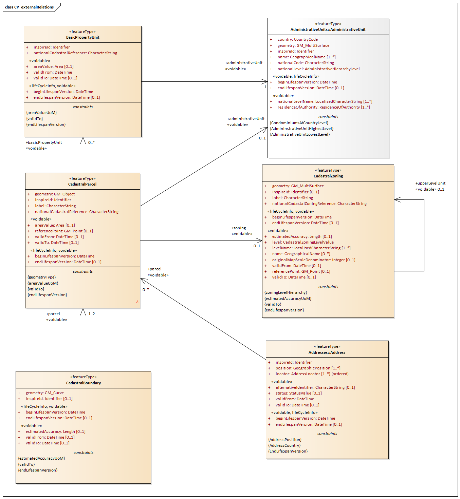
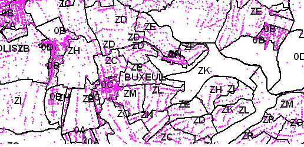
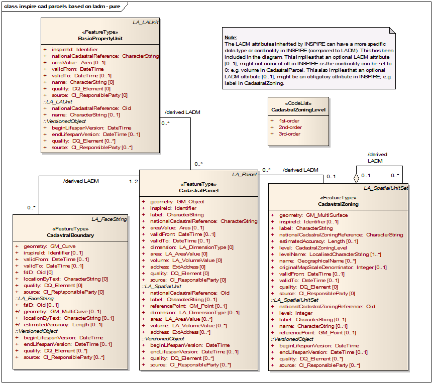
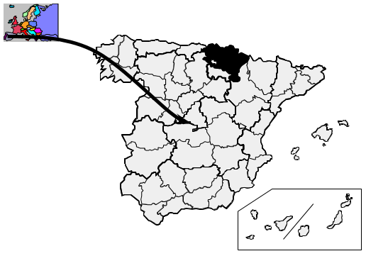
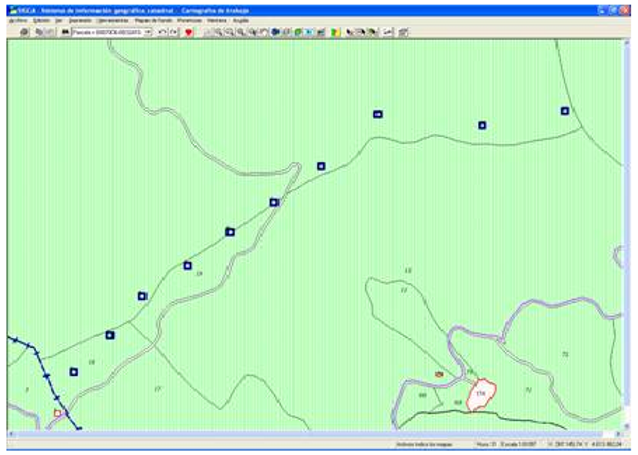

// Admonition icons:
// TG Requirement
:important-caption: 📕
// TG Recommendation
:tip-caption: 📒
// Conformance class
:note-caption: 📘

// TOC placement using macro (manual)
:toc: macro

// Empty TOC title (the title is in the document)
:toc-title:

// TOC level depthappend
:toclevels: 5

// Section numbering level depth
:sectnumlevels: 8

// Line Break Doc Title
:hardbreaks-option:

:appendix-caption: Annex

image::./media/image2.jpeg[logo_ce-en-rvb-lr,width=131,height=90]

image:./media/image3.png[ESEC,width=93,height=93] **INSPIRE***Infrastructure for Spatial Information in Europe*

[discrete]
== D2.8.I.6 Data Specification on Cadastral Parcels – Technical Guidelines

[width="100%",cols="17%,83%",]
|===
|*Title* |D2.8.I.6 Data Specification on _Cadastral_ Parcels – Technical Guidelines
|*Creator* |INSPIRE Thematic Working Group _Cadastral_ Parcels
|*Date* |2014-04-17
|*Subject* |INSPIRE Data Specification for the spatial data theme _Cadastral_ Parcels
|*Publisher* |European Commission Joint Research Centre
|*Type* |Text
|*Description* |This document describes the INSPIRE Data Specification for the spatial data theme _Cadastral_ Parcels
|*Contributor* |Members of the INSPIRE Thematic Working Group _Cadastral_ Parcels
|*Format* |Portable Document Format (pdf)
|*Source* |
|*Rights* |Public
|*Identifier* |D2.8.I.6_v3.1
|*Language* |En
|*Relation* |Directive 2007/2/EC of the European Parliament and of the Council of 14 March 2007 establishing an Infrastructure for Spatial Information in the European Community (INSPIRE)
|*Coverage* |Project duration
|===

<<<
[discrete]
== Foreword
[discrete]
== How to read the document?

This document describes the _"INSPIRE data specification on Cadastral Parcels – Technical Guidelines"_ version 3.1rc1 as developed by the Thematic Working Group (TWG) _Cadastral Parcels_ using both natural and a conceptual schema language.

The data specification is based on a common templatefootnote:[The common document template is available in the "Framework documents" section of the data specifications web page at http://inspire.jrc.ec.europa.eu/index.cfm/pageid/2] used for all data specifications, which has been harmonised using the experience from the development of the Annex I, II and III data specifications.

This document provides guidelines for the implementation of the provisions laid down in the Implementing Rule for spatial data sets and services of the INSPIRE Directive. It also includes additional requirements and recommendations that, although not included in the Implementing Rule, are relevant to guarantee or to increase data interoperability.

Two executive summaries provide a quick overview of the INSPIRE data specification process in general, and the content of the data specification on _Cadastral Parcels_ in particular. We highly recommend that managers, decision makers, and all those new to the INSPIRE process and/or information modelling should read these executive summaries first.

The UML diagrams (in Chapter 5) offer a rapid way to see the main elements of the specifications and their relationships. The definition of the spatial object types, attributes, and relationships are included in the Feature Catalogue (also in Chapter 5). People having thematic expertise but not familiar with UML can fully understand the content of the data model focusing on the Feature Catalogue. Users might also find the Feature Catalogue especially useful to check if it contains the data necessary for the applications that they run. The technical details are expected to be of prime interest to those organisations that are responsible for implementing INSPIRE within the field of _Cadastral Parcels_, but also to other stakeholders and users of the spatial data infrastructure.

The technical provisions and the underlying concepts are often illustrated by examples. Smaller examples are within the text of the specification, while longer explanatory examples and descriptions of selected use cases are attached in the annexes.

In order to distinguish the INSPIRE spatial data themes from the spatial object types, the INSPIRE spatial data themes are written in _italics._

[width="100%",cols="100%",options="header",]
|===
|The document will be publicly available as a 'non-paper'. It does not represent an official position of the European Commission, and as such cannot be invoked in the context of legal procedures.
|===

*Legal Notice*

Neither the European Commission nor any person acting on behalf of the Commission is responsible for the use which might be made of this publication.

<<<
[discrete]
== Interoperability of Spatial Data Sets and Services – General Executive Summary

The challenges regarding the lack of availability, quality, organisation, accessibility, and sharing of spatial information are common to a large number of policies and activities and are experienced across the various levels of public authority in Europe. In order to solve these problems it is necessary to take measures of coordination between the users and providers of spatial information. The Directive 2007/2/EC of the European Parliament and of the Council adopted on 14 March 2007 aims at establishing an Infrastructure for Spatial Information in the European Community (INSPIRE) for environmental policies, or policies and activities that have an impact on the environment.

INSPIRE is based on the infrastructures for spatial information that are created and maintained by the Member States. To support the establishment of a European infrastructure, Implementing Rules addressing the following components of the infrastructure have been specified: metadata, interoperability of spatial data sets (as described in Annexes I, II, III of the Directive) and spatial data services, network services, data and service sharing, and monitoring and reporting procedures.

INSPIRE does not require collection of new data. However, after the period specified in the Directivefootnote:[For all 34 Annex I,II and III data themes: within two years of the adoption of the corresponding Implementing Rules for newly collected and extensively restructured data and within 5 years for other data in electronic format still in use] Member States have to make their data available according to the Implementing Rules.

Interoperability in INSPIRE means the possibility to combine spatial data and services from different sources across the European Community in a consistent way without involving specific efforts of humans or machines. It is important to note that "interoperability" is understood as providing access to spatial data sets through network services, typically via Internet. Interoperability may be achieved by either changing (harmonising) and storing existing data sets or transforming them via services for publication in the INSPIRE infrastructure. It is expected that users will spend less time and efforts on understanding and integrating data when they build their applications based on data delivered in accordance with INSPIRE.

In order to benefit from the endeavours of international standardisation bodies and organisations established under international law their standards and technical means have been utilised and referenced, whenever possible.

To facilitate the implementation of INSPIRE, it is important that all stakeholders have the opportunity to participate in specification and development. For this reason, the Commission has put in place a consensus building process involving data users, and providers together with representatives of industry, research and government. These stakeholders, organised through Spatial Data Interest Communities (SDIC) and Legally Mandated Organisations (LMO)footnote:[The current status of registered SDICs/LMOs is available via INSPIRE website: http://inspire.jrc.ec.europa.eu/index.cfm/pageid/42], have provided reference materials, participated in the user requirement and technicalfootnote:[Surveys on unique identifiers and usage of the elements of the spatial and temporal schema,] surveys, proposed experts for the Data Specification Drafting Teamfootnote:[The Data Specification Drafting Team has been composed of experts from Austria, Belgium, Czech Republic, France, Germany, Greece, Italy, Netherlands, Norway, Poland, Switzerland, UK, and the European Environment Agency], the Thematic Working Groupsfootnote:[The Thematic Working Groups have been composed of experts from Austria, Australia, Belgium, Bulgaria, Czech Republic, Denmark, Finland, France, Germany, Hungary, Ireland, Italy, Latvia, Netherlands, Norway, Poland, Romania, Slovakia, Spain, Slovenia, Sweden, Switzerland, Turkey, UK, the European Environment Agency and the European Commission.] and other ad-hoc cross-thematic technical groups and participated in the public stakeholder consultations on draft versions of the data specifications. These consultations covered expert reviews as well as feasibility and fitness-for-purpose testing of the data specificationsfootnote:[For Annex IIIII, the consultation and testing phase lasted from 20 June to 21 October 2011.].

This open and participatory approach was successfully used during the development of the data specifications on Annex I, II and III data themes as well as during the preparation of the Implementing Rule on Interoperability of Spatial Data Sets and Servicesfootnote:[Commission Regulation (EU) No 1089/2010 http://eur-lex.europa.eu/JOHtml.do?uri=OJ:L:2010:323:SOM:EN:HTML[implementing Directive 2007/2/EC of the European Parliament and of the Council as regards interoperability of spatial data sets and services&#44;] published in the Official Journal of the European Union on 8^th^ of December 2010.] for Annex I spatial data themes and of its amendment regarding the themes of Annex II and III.

The development framework elaborated by the Data Specification Drafting Team aims at keeping the data specifications of the different themes coherent. It summarises the methodology to be used for the development of the data specifications, providing a coherent set of requirements and recommendations to achieve interoperability. The pillars of the framework are the following technical documentsfootnote:[The framework documents are available in the "Framework documents" section of the data specifications web page at http://inspire.jrc.ec.europa.eu/index.cfm/pageid/2]:

* The _Definition of Annex Themes and Scope_ describes in greater detail the spatial data themes defined in the Directive, and thus provides a sound starting point for the thematic aspects of the data specification development.
* The _Generic Conceptual Model_ defines the elements necessary for interoperability and data harmonisation including cross-theme issues. It specifies requirements and recommendations with regard to data specification elements of common use, like the spatial and temporal schema, unique identifier management, object referencing, some common code lists, etc. Those requirements of the Generic Conceptual Model that are directly implementable are included in the Implementing Rule on Interoperability of Spatial Data Sets and Services.
* The _Methodology for the Development of Data Specifications_ defines a repeatable methodology. It describes how to arrive from user requirements to a data specification through a number of steps including use-case development, initial specification development and analysis of analogies and gaps for further specification refinement.
* The _Guidelines for the Encoding of Spatial Data_ defines how geographic information can be encoded to enable transfer processes between the systems of the data providers in the Member States. Even though it does not specify a mandatory encoding rule it sets GML (ISO 19136) as the default encoding for INSPIRE.
* The _Guidelines for the use of Observations & Measurements and Sensor Web Enablement-related standards in INSPIRE Annex II and III data specification development_ provides guidelines on how the "Observations and Measurements" standard (ISO 19156) is to be used within INSPIRE.
* The _Common data models_ are a set of documents that specify data models that are referenced by a number of different data specifications. These documents include generic data models for networks, coverages and activity complexes.

The structure of the data specifications is based on the "ISO 19131 Geographic information - Data product specifications" standard. They include the technical documentation of the application schema, the spatial object types with their properties, and other specifics of the spatial data themes using natural language as well as a formal conceptual schema languagefootnote:[UML – Unified Modelling Language].

A consolidated model repository, feature concept dictionary, and glossary are being maintained to support the consistent specification development and potential further reuse of specification elements. The consolidated model consists of the harmonised models of the relevant standards from the ISO 19100 series, the INSPIRE Generic Conceptual Model, and the application schemasfootnote:[Conceptual models related to specific areas (e.g. INSPIRE themes)] developed for each spatial data theme. The multilingual INSPIRE Feature Concept Dictionary contains the definition and description of the INSPIRE themes together with the definition of the spatial object types present in the specification. The INSPIRE Glossary defines all the terms (beyond the spatial object types) necessary for understanding the INSPIRE documentation including the terminology of other components (metadata, network services, data sharing, and monitoring).

By listing a number of requirements and making the necessary recommendations, the data specifications enable full system interoperability across the Member States, within the scope of the application areas targeted by the Directive. The data specifications (in their version 3.0) are published as technical guidelines and provide the basis for the content of the Implementing Rule on Interoperability of Spatial Data Sets and Servicesfootnote:[In the case of the Annex IIIII data specifications, the extracted requirements are used to formulate an amendment to the existing Implementing Rule.]. The content of the Implementing Rule is extracted from the data specifications, considering short- and medium-term feasibility as well as cost-benefit considerations. The requirements included in the Implementing Rule are legally binding for the Member States according to the timeline specified in the INSPIRE Directive.

In addition to providing a basis for the interoperability of spatial data in INSPIRE, the data specification development framework and the thematic data specifications can be reused in other environments at local, regional, national and global level contributing to improvements in the coherence and interoperability of data in spatial data infrastructures.

<<<
[discrete]
== Cadastral Parcels – Executive Summary

*Purpose*

Cadastral parcels are included in Annex I, which means that they are considered as reference data, i.e. data that constitute the spatial frame for linking and/or pointing at other information that belong to specific thematic field such as environment, soil, land use, and many others.

*Process*

INSPIRE data specification on cadastral parcels has been prepared following the participative principle of consensus building process. The stakeholders, based on their registration as a Spatial Data Interest Community (SDIC) or a Legally Mandated Organisation (LMO) had the opportunity to bring forward user requirements and reference materials, propose experts for the specification development, and to participate in the review of the data specifications. The Thematic Working Group responsible for the specification development was composed of experts coming from Denmark, Finland, France, Hungary, Netherlands, Norway, Spain, Switzerland, United Kingdom and the European Commission. The specification process took place according to the methodology elaborated for INSPIRE respecting the requirements and the recommendation of the INSPIRE Generic Conceptual Model, which is one of the elements that ensures coherent approach and cross theme consistency with other themes in the Directive.

The Thematic Working Group has established cooperation with other initiatives within the field, such as the Permanent Committee on Cadastre, EuroGeographics, the Working Group III of FIG (International Federation of Surveyors) and ISO TC 211 responsible for standardisation of geographic information.

*Scope and description*

The cornerstone of the specification development was the definition of the Directive on the cadastral parcels: "areas defined by cadastral parcels or equivalent". In accordance with the particular legal system each Member State runs a related register under the responsibility of the government. Such registers are often called cadastre, sometimes land or other type of registry. Regardless of the name of the system, the basic unit of area is the parcel. Cadastral parcels usually form a continuous partition of the national territory by the exception where some land owned by the governmentsfootnote:[In some countries such territories are called public domain] is not subject of registration. The generic definition of cadastral parcels has been complemented by the Thematic Working Group to fit better with user requirements in the following way: the cadastral parcels should be, as much as possible, single areas of Earth surface (land and/or water) under homogenous real property rights and unique ownership, where real property rights and ownership are defined by national laws.

INSPIRE does not aim at harmonising the concepts of ownership and rights related to the parcels, but focuses on the geometrical aspects as presented in the national systems of the Member States.

Cadastral parcels in INSPIRE should serve the purpose of generic information locators. Having included the reference to the national registers as a property (attribute) of the INSPIRE parcels national data sources can be reached. Using this two-step approach other information, like rights and owners can be accessed fully respecting the national legislation on data protection. The data model for INSPIRE cadastral parcels has been prepared in a way that supports compatibility with the upcoming international standard on Land Administration Domain Modelfootnote:[ISO/DS 19152 – Geographical Information, Land Administration Domain Model.]. The Land Administration Domain Model (LADM) provides a wider context for the INSPIRE cadastral parcels because LADM includes additional information on rights (bound to national legislation) and owners, which are outside the direct scope of INSPIRE.

The wide range of use-casesfootnote:[The use-cases included EULIS, Land Parcel Identification System, Vineyard registers, Soil protection, Public environmental restrictions, Urban planning, Public land management, Flood risk management, and Infrastructure management.] analysed by the Thematic Working Group allows meeting the expectations of various user communities in fields of agriculture, disaster management, soil protection, environmental public right management, public land management, urban planning, utilities, land use, and many others.

*Data specification*

The core element of the INSPIRE cadastral parcel model is the cadastral parcel. It is described by some mandatory elements such as geometry, unique identifierfootnote:[Identifier required by the INSPIRE Directive; it is defined by the local data provider and completed by a prefix of the country and/or organisation of source.], cadastral referencefootnote:[National cadastral reference which enables to make link with information in the national registers] and the label of the parcels that supports their identification on printed maps. In case of availability Member States are also requested to supply information on the area of the parcel, when the parcel has been created/changed/retired, and the reference point, which is especially useful for visualisation.

The management of cadastral parcels in some countries reflects historical subdivision, i.e. intermediate units such as municipalities, sections, districts, parishes, urban and rural blocks, etc. Very often these units carry information related to all parcels belonging to the same unit, for example information about accuracy of measurements or the scale of original mapping. In order to refer these units with a common name the Thematic Working Group has introduced the notion of the cadastral zoning. Member States should decide about the usage of zonings in INSPIRE according to their organisational structures. Besides of carrying metadata information zonings also support portrayal and data management, especially data search. When the option of using the cadastral zonings is selected they have to be supplied with the same properties under the same conditions as stated for cadastral parcels. When several levels of zonings exist in a Member State it must be ensured that the higher level units are composed of those of lower level.

Cadastral boundaries as separate spatial objects have to be delivered only in case when information about data accuracy is associated with them.

Member States where national cadastral references are given on basic property units and not on the level of cadastral parcels have to supply them together with their cadastral reference, unique identifier, area, and the related temporal information.

Interoperability is further supported by the requirement that cadastral parcels have to be published in the ETRS89 or (when applicable) the ITRS reference systems, which is commonly used in INSPIRE. When Member States need a common projection system for a cross-border application, the selection must be agreed and documented by the interested parties.

Comparable data on top of harmonised specification elements create additional value for achieving interoperability in INSPIRE. For this finality, the data specification on cadastral parcels includes recommendations on minimal data quality: on the rate of missing elements, positional accuracy and update frequency. It is highly desirable that Member States consider them when they further develop their cadastral systems. Regardless whether these recommendations are met, the real values of these data quality elements have to be published as metadata usually at dataset level. For delivery of positional accuracy there is a triple choice: statement related to the whole dataset or, as mentioned before, an attribute attached to the cadastral zonings or the cadastral boundaries.

Metadata at dataset level also has to contain information about the lineage, i.e. condition of creation and transformation of data. The Thematic Working Group has provided a template for lineage to help cadastral producers to document the remaining national specificities that are inevitable even when data is published in an interoperable way for INSPIRE.

It is expected that cadastral parcel data fulfilling the related INSPIRE specification allows an easy delivery according to the INSPIRE Implementing Rule on Download services.

For visualisation purposes, simple rules for portrayal are given specifying the layout of the borders of cadastral parcels and the cadastral zonings and the cadastral boundaries together with the related labels. These portrayal rules have been defined for several ranges of scales.

*Conclusion*

The main value of the INSPIRE _Cadastral parcels_ model is its simple, yet flexible structure that allows data providers to publish their existing data in the most convenient way.

<<<
[discrete]
== Acknowledgements

Many individuals and organisations have contributed to the development of these Guidelines.

The Thematic Working Group Cadastral Parcels (TWG-CP) included:
Dominique Laurent (TWG Facilitator), André Bernath (TWG Editor), Soren Riff Alexandersen, Wim Devos, Gyula Ivan, Olav Jenssen, Tarja Myllymäki, Peter Van Oosterom, Amalia Velasco, Katalin Tóth (European Commission contact point).

The Drafting Team Data Specifications included:
Clemens Portele (Chair), Andreas Illert (Vice-chair), Kristine Asch, Marek Baranowski, Eric Bayers, Andre Bernath, Francis Bertrand, Markus Erhard, Stephan Gruber, Heinz Habrich, Stepan Kafka, Dominique Laurent, Arvid Lillethun, Ute Maurer-Rurack, Keith Murray, George Panopoulos, Claudia Pegoraro, Marcel Reuvers, Anne Ruas, Markus Seifert, Peter Van Oosterom, Andrew Woolf and the European Commission contact points: Steve Peedell, Katalin Tóth, Paul Smits, Vanda Nunes de Lima.

Contact informat

Other contributors to the INSPIRE data specifications are the Drafting Team Data Specifications, the JRC Data Specifications Team and the INSPIRE stakeholders - Spatial Data Interested Communities (SDICs) and Legally Mandated Organisations (LMOs).

*Contact information*

Maria Vanda Nunes de Lima & Michael Lutz
European Commission Joint Research Centre (JRC)
Institute for Environment and Sustainability
Unit H06: Digital Earth and Reference Data
_http://inspire.ec.europa.eu/index.cfm/pageid/2_

<<<
[discrete]
= Table of contents
toc::[]

:sectnums:

<<<
== Scope

This document specifies a harmonised data specification for the spatial data theme _Cadastral Parcels_ as defined in Annex I of the INSPIRE Directive.

This data specification provides the basis for the drafting of Implementing Rules according to Article 7 (1) of the INSPIRE Directive [Directive 2007/2/EC]. The entire data specification is published as implementation guidelines accompanying these Implementing Rules.

<<<
== Overview

=== Name

INSPIRE data specification for the theme Cadastral Parcels.

=== Informal description

*[.underline]#Definition:#*

Areas defined by cadastral registers or equivalent. [Directive 2007/2/EC]

*[.underline]#Description:#*

The INSPIRE Directive focuses on the geographical part of cadastral data.

In the INSPIRE context, cadastral parcels will be mainly used as locators for geo-information in general, including environmental data.

As much as possible, in the INSPIRE context, cadastral parcels should be forming a partition of national territory. Cadastral parcel should be considered as a single area of Earth surface (land and/or water), national law under homogeneous property rights and unique ownership, property rights and ownership being defined by national law (adapted from UN ECE 2004 and WG-CPI, 2006).

Remark: by unique ownership is meant that the ownership is held by one or several joint owners for the whole parcel.

In the definition given by the INSPIRE directive, "or equivalent" refers to all public agencies and institutions other than the main traditional/nominal cadastre or land registry, that register parts of the Earth's surface such as special domains, urban cadastres, public lands, which spatially complement the registrations by the main cadastre or land registry.

Cadastral parcels are considered in the INSPIRE scope if they are available as vector data.

Rights and owners are out of the INSPIRE scope.

Buildings, land use, addresses are considered in other INSPIRE themes.

The current version of ISO 19152 Land Administration Domain Model (LADM) and of the INSPIRE cadastral parcels model are compatible. The LADM provides a wider context for the INSPIRE cadastral parcels. It includes other spatial object types, such as rights and ownership, which are outside the direct scope of INSPIRE.

=== Normative References

[Directive 2007/2/EC] Directive 2007/2/EC of the European Parliament and of the Council of 14 March 2007 establishing an Infrastructure for Spatial Information in the European Community (INSPIRE)

[ISO 19107] EN ISO 19107:2005, Geographic Information – Spatial Schema

[ISO 19108] EN ISO 19108:2005, Geographic Information – Temporal Schema

[ISO 19108-c] ISO 19108:2002/Cor 1:2006, Geographic Information – Temporal Schema, Technical Corrigendum 1

[ISO 19111] EN ISO 19111:2007 Geographic information - Spatial referencing by coordinates (ISO 19111:2007)

[ISO 19113] EN ISO 19113:2005, Geographic Information – Quality principles

[ISO 19115] EN ISO 19115:2005, Geographic information – Metadata (ISO 19115:2003)

[ISO 19118] EN ISO 19118:2006, Geographic information – Encoding (ISO 19118:2005)

[ISO 19123] EN ISO 19123:2007, Geographic Information – Schema for coverage geometry and functions

[ISO 19125-1] EN ISO 19125-1:2004, Geographic Information – Simple feature access – Part 1: Common architecture

[ISO 19135] EN ISO 19135:2007 Geographic information – Procedures for item registration (ISO 19135:2005)

[ISO 19138] ISO/TS 19138:2006, Geographic Information – Data quality measures

[ISO 19139] ISO/TS 19139:2007, Geographic information – Metadata – XML schema implementation

[ISO/DS 19152] Geographic Information,Land Administration Domain Model

[ISO 19157] ISO/DIS 19157, Geographic information – Data quality

[OGC 06-103r4] Implementation Specification for Geographic Information - Simple feature access – Part 1: Common Architecture v1.2.1

NOTE This is an updated version of "EN ISO 19125-1:2004, Geographic information – Simple feature access – Part 1: Common architecture".

[Regulation 1205/2008/EC] Regulation 1205/2008/EC implementing Directive 2007/2/EC of the European Parliament and of the Council as regards metadata

=== Terms and definitions

General terms and definitions helpful for understanding the INSPIRE data specification documents are defined in the INSPIRE Glossaryfootnote:[The INSPIRE Glossary is available from http://inspire-registry.jrc.ec.europa.eu/registers/GLOSSARY].

Specifically, for the theme Cadastral Parcels, the following terms are defined:

*(1) Cadastral gap*

Area which is not supposed to be covered by cadastral parcels, due to national regulation.

NOTE should not be confused with areas not yet surveyed and registered

EXAMPLE

* in many countries, the sea
* in France, the public domain (roads, rivers)

*(2) Cadastral overlap*

Area which may be covered by several cadastral parcels, due to national regulation.

EXAMPLE in United Kingdom, overlapping parcels may occur where different rights are registered on the same space e.g. a freehold right and a leasehold one.

*(3) Topological gap*

Area which is covered by cadastral parcels in the real world but not in the spatial data set.

EXAMPLE topological gaps may occur when assembling cadastral parcels coming from several cadastral sheets or after format conversions.

*(4) Topological overlap*

Area which is covered by only one cadastral parcel in the real world but by several parcels in the spatial data set.

EXAMPLE topological overlaps may occur when assembling cadastral parcels coming from several cadastral sheets or after format conversions.

=== Symbols and abbreviations

[cols=","]
|===
|FIG |International Federation of Surveyors
|GCM |Generic Conceptual Model
|LADM |Land Administration Domain Model
|MS |Member State
|OCL |Object Constraint Language
|PCC |Permanent Committee on Cadastre
|SDI |Spatial Data Infrastructure
|SLD |Style Layer Descriptor
|TWG CP |Thematic Working Group Cadastral Parcel
|UML |Unified Modelling Language
|UN ECE |United Nations – Economic Commission for Europe
|UUID |Universal Unique Identifier
|WG - CPI |Working Group on Cadastral Parcels in INSPIRE – Group of experts from EuroGeographics and Permanent Committee on Cadastre which conducted a survey about cadastral parcels in INSPIRE in 2005 - 2006
|===

=== How the Technical Guidelines map to the Implementing Rules

The schematic diagram in Figure 1 gives an overview of the relationships between the INSPIRE legal acts (the INSPIRE Directive and Implementing Rules) and the INSPIRE Technical Guidelines. The INSPIRE Directive and Implementing Rules include legally binding requirements that describe, usually on an abstract level, _what_ Member States must implement.

In contrast, the Technical Guidelines define _how_ Member States might implement the requirements included in the INSPIRE Implementing Rules. As such, they may include non-binding technical requirements that must be satisfied if a Member State data provider chooses to conform to the Technical Guidelines. Implementing these Technical Guidelines will maximise the interoperability of INSPIRE spatial data sets.

image::./media/image4.png[image,width=603,height=375]

[.text-center]
*Figure 1 - Relationship between INSPIRE Implementing Rules and Technical Guidelines*

==== Requirements

The purpose of these Technical Guidelines (Data specifications on _Cadastral Parcels_) is to provide practical guidance for implementation that is guided by, and satisfies, the (legally binding) requirements included for the spatial data theme Cadastral Parcels in the Regulation (Implementing Rules) on interoperability of spatial data sets and services. These requirements are highlighted in this document as follows:

[IMPORTANT]
====
[.text-center]
*IR Requirement*
_Article / Annex / Section no._
*Title / Heading*

This style is used for requirements contained in the Implementing Rules on interoperability of spatial data sets and services (Commission Regulation (EU) No 1089/2010).

====

For each of these IR requirements, these Technical Guidelines contain additional explanations and examples.

NOTE The Abstract Test Suite (ATS) in Annex A contains conformance tests that directly check conformance with these IR requirements.

Furthermore, these Technical Guidelines may propose a specific technical implementation for satisfying an IR requirement. In such cases, these Technical Guidelines may contain additional technical requirements that need to be met in order to be conformant with the corresponding IR requirement _when using this proposed implementation_. These technical requirements are highlighted as follows:

[TIP]
====
*TG Requirement X* 

This style is used for requirements for a specific technical solution proposed in these Technical Guidelines for an IR requirement.

====

NOTE 1 Conformance of a data set with the TG requirement(s) included in the ATS implies conformance with the corresponding IR requirement(s).

NOTE 2 In addition to the requirements included in the Implementing Rules on interoperability of spatial data sets and services, the INSPIRE Directive includes further legally binding obligations that put additional requirements on data providers. For example, Art. 10(2) requires that Member States shall, where appropriate, decide by mutual consent on the depiction and position of geographical features whose location spans the frontier between two or more Member States. General guidance for how to meet these obligations is provided in the INSPIRE framework documents.

==== Recommendations

In addition to IR and TG requirements, these Technical Guidelines may also include a number of recommendations for facilitating implementation or for further and coherent development of an interoperable infrastructure.

[NOTE]
====
*Recommendation X* 

Recommendations are shown using this style.

====

NOTE The implementation of recommendations is not mandatory. Compliance with these Technical Guidelines or the legal obligation does not depend on the fulfilment of the recommendations.

==== Conformance

Annex A includes the abstract test suite for checking conformance with the requirements included in these Technical Guidelines and the corresponding parts of the Implementing Rules (Commission Regulation (EU) No 1089/2010).

<<<
== Specification scopes

This data specification does not distinguish different specification scopes, but just considers one general scope.

NOTE For more information on specification scopes, see [ISO 19131:2007], clause 8 and Annex D.

<<<
== Identification information

These Technical Guidelines are identified by the following URI:

http://inspire.ec.europa.eu/tg/cp/3.1rc1

NOTE ISO 19131 suggests further identification information to be included in this section, e.g. the title, abstract or spatial representation type. The proposed items are already described in the document metadata, executive summary, overview description (section 2) and descriptions of the application schemas (section 5). In order to avoid redundancy, they are not repeated here.

<<<
== Data content and structure

=== Application schemas – Overview 

==== Application schemas included in the IRs

Articles 3, 4 and 5 of the Implementing Rules lay down the requirements for the content and structure of the data sets related to the INSPIRE Annex themes.

[IMPORTANT]
====
[.text-center]
*IR Requirement*
_Article 4_
*Types for the Exchange and Classification of Spatial Objects*

. For the exchange and classification of spatial objects from data sets meeting the conditions laid down in Article 4 of Directive 2007/2/EC, Member States shall use the spatial object types, associated data types and code lists that are defined in Annexes II, III and IV to this Regulation for the themes the data sets relate to.

. When exchanging spatial objects, Member States shall comply with the definitions and constraints set out in the Annexes and provide values for all attributes and association roles set out for the relevant spatial object types and data types in the Annexes. For voidable attributes and association roles for which no value exists, Member States may omit the value.

====

The types to be used for the exchange and classification of spatial objects from data sets related to the spatial data theme Cadastral Parcels are defined in the following application schemas (see sections 5.3):

* Cadastral Parcels application schema

The application schemas specify requirements on the properties of each spatial object including its multiplicity, domain of valid values, constraints, etc.

NOTE The application schemas presented in this section contain some additional information that is not included in the Implementing Rules, in particular multiplicities of attributes and association roles.

[TIP]
====
*TG Requirement 1*

Spatial object types and data types shall comply with the multiplicities defined for the attributes and association roles in this section.

====

An application schema may include references (e.g. in attributes or inheritance relationships) to common types or types defined in other spatial data themes. These types can be found in a sub-section called "Imported Types" at the end of each application schema section. The common types referred to from application schemas included in the IRs are addressed in Article 3.

[IMPORTANT]
====
[.text-center]
*IR Requirement*
_Article 3_
*Common Types*

Types that are common to several of the themes listed in Annexes I, II and III to Directive 2007/2/EC shall conform to the definitions and constraints and include the attributes and association roles set out in Annex I.

====

NOTE Since the IRs contain the types for all INSPIRE spatial data themes in one document, Article 3 does not explicitly refer to types defined in other spatial data themes, but only to types defined in external data models.

Common types are described in detail in the Generic Conceptual Model [DS-D2.7], in the relevant international standards (e.g. of the ISO 19100 series) or in the documents on the common INSPIRE models [DS-D2.10.x]. For detailed descriptions of types defined in other spatial data themes, see the corresponding Data Specification TG document [DS-D2.8.x].

=== Basic notions

This section explains some of the basic notions used in the INSPIRE application schemas. These explanations are based on the GCM [DS-D2.5].

==== Notation

===== Unified Modeling Language (UML)

The application schemas included in this section are specified in UML, version 2.1. The spatial object types, their properties and associated types are shown in UML class diagrams.

NOTE For an overview of the UML notation, see Annex D in [ISO 19103].

The use of a common conceptual schema language (i.e. UML) allows for an automated processing of application schemas and the encoding, querying and updating of data based on the application schema – across different themes and different levels of detail.

The following important rules related to class inheritance and abstract classes are included in the IRs.

[IMPORTANT]
====
[.text-center]
*IR Requirement*
_Article 5_
*Types*

(...)

[arabic, start=2]
. Types that are a sub-type of another type shall also include all this type's attributes and association roles.
. Abstract types shall not be instantiated.

====

The use of UML conforms to ISO 19109 8.3 and ISO/TS 19103 with the exception that UML 2.1 instead of ISO/IEC 19501 is being used. The use of UML also conforms to ISO 19136 E.2.1.1.1-E.2.1.1.4.

NOTE ISO/TS 19103 and ISO 19109 specify a profile of UML to be used in conjunction with the ISO 19100 series. This includes in particular a list of stereotypes and basic types to be used in application schemas. ISO 19136 specifies a more restricted UML profile that allows for a direct encoding in XML Schema for data transfer purposes.

To model constraints on the spatial object types and their properties, in particular to express data/data set consistency rules, OCL (Object Constraint Language) is used as described in ISO/TS 19103, whenever possible. In addition, all constraints are described in the feature catalogue in English, too.

NOTE Since "void" is not a concept supported by OCL, OCL constraints cannot include expressions to test whether a value is a _void_ value. Such constraints may only be expressed in natural language.

===== Stereotypes

In the application schemas in this section several stereotypes are used that have been defined as part of a UML profile for use in INSPIRE [DS-D2.5]. These are explained in Table 1 below.

[.text-center]
*Table 1 – Stereotypes (adapted from [DS-D2.5])*

[align=center,width="100%",cols="22%,14%,64%",options="header",]
|===
|*Stereotype* |*Model element* |*Description*
|applicationSchema |Package |An INSPIRE application schema according to ISO 19109 and the Generic Conceptual Model.
|leaf |Package |A package that is not an application schema and contains no packages.
|featureType |Class |A spatial object type.
|type |Class |A type that is not directly instantiable, but is used as an abstract collection of operation, attribute and relation signatures. This stereotype should usually not be used in INSPIRE application schemas as these are on a different conceptual level than classifiers with this stereotype.
|dataType |Class |A structured data type without identity.
|union |Class |A structured data type without identity where exactly one of the properties of the type is present in any instance.
|codeList |Class |A code list.
|import |Dependency |The model elements of the supplier package are imported.
|voidable |Attribute, association role |A voidable attribute or association role (see section 5.2.2).
|lifeCycleInfo |Attribute, association role |If in an application schema a property is considered to be part of the life-cycle information of a spatial object type, the property shall receive this stereotype.
|version |Association role |If in an application schema an association role ends at a spatial object type, this stereotype denotes that the value of the property is meant to be a specific version of the spatial object, not the spatial object in general.
|===

==== Voidable characteristics

The «voidable» stereotype is used to characterise those properties of a spatial object that may not be present in some spatial data sets, even though they may be present or applicable in the real world. This does _not_ mean that it is optional to provide a value for those properties.

For all properties defined for a spatial object, a value has to be provided – either the corresponding value (if available in the data set maintained by the data provider) or the value of _void._ A _void_ value shall imply that no corresponding value is contained in the source spatial data set maintained by the data provider or no corresponding value can be derived from existing values at reasonable costs.

[NOTE]
====
*Recomendation 1*

The reason for a _void_ value should be provided where possible using a listed value from the VoidReasonValue code list to indicate the reason for the missing value.

====

The VoidReasonValue type is a code list, which includes the following pre-defined values:

* _Unpopulated_: The property is not part of the dataset maintained by the data provider. However, the characteristic may exist in the real world. For example when the "elevation of the water body above the sea level" has not been included in a dataset containing lake spatial objects, then the reason for a void value of this property would be 'Unpopulated'. The property receives this value for all spatial objects in the spatial data set.
* _Unknown_: The correct value for the specific spatial object is not known to, and not computable by the data provider. However, a correct value may exist. For example when the "elevation of the water body above the sea level" _of a certain lake_ has not been measured, then the reason for a void value of this property would be 'Unknown'. This value is applied only to those spatial objects where the property in question is not known.
* _Withheld_: The characteristic may exist, but is confidential and not divulged by the data provider.

NOTE It is possible that additional reasons will be identified in the future, in particular to support reasons / special values in coverage ranges.

The «voidable» stereotype does not give any information on whether or not a characteristic exists in the real world. This is expressed using the multiplicity:

* If a characteristic may or may not exist in the real world, its minimum cardinality shall be defined as 0. For example, if an Address may or may not have a house number, the multiplicity of the corresponding property shall be 0..1.
* If at least one value for a certain characteristic exists in the real world, the minimum cardinality shall be defined as 1. For example, if an Administrative Unit always has at least one name, the multiplicity of the corresponding property shall be 1..*.

In both cases, the «voidable» stereotype can be applied. In cases where the minimum multiplicity is 0, the absence of a value indicates that it is known that no value exists, whereas a value of void indicates that it is not known whether a value exists or not.

EXAMPLE If an address does not have a house number, the corresponding Address object should not have any value for the «voidable» attribute house number. If the house number is simply not known or not populated in the data set, the Address object should receive a value of _void_ (with the corresponding void reason) for the house number attribute.

==== Code lists

Code lists are modelled as classes in the application schemas. Their values, however, are managed outside of the application schema.

===== Code list types

The IRs distinguish the following types of code lists.

[IMPORTANT]
====
[.text-center]
*IR Requirement*
_Article 6_
*Code Lists for Spatial Data Sets*

. The code lists included in this Regulation set out the multilingual thesauri to be used for the key attributes, in accordance with Article 8(2), point (c), of Directive 2007/2/EC.

. The Commission shall establish and operate an INSPIRE code list register at Union level for managing and making publicly available the values that are included in the code lists referred to in paragraph 1.

. The Commission shall be assisted by the INSPIRE Commission expert group in the maintenance and update of the code list values.

. Code lists shall be one of the following types:

.. code lists whose values comprise only the values specified in the INSPIRE code list register;
.. code lists whose values comprise the values specified in the INSPIRE code list register and narrower values defined by data providers;
.. code lists whose values comprise the values specified in the INSPIRE code list register and additional values at any level defined by data providers;
.. code lists, whose values comprise any values defined by data providers.

. Code lists may be hierarchical. Values of hierarchical code lists may have a more general parent value.
. Where, for an attribute whose type is a code list as referred to in paragraph 4, points (b), (c) or (d), a data provider provides a value that is not specified in the INSPIRE code list register, that value and its definition and label shall be made available in another register.

====

The type of code list is represented in the UML model through the tagged value _extensibility_, which can take the following values:

* _none_, representing code lists whose allowed values comprise only the values specified in the IRs (type a);
* _narrower_, representing code lists whose allowed values comprise the values specified in the IRs and narrower values defined by data providers (type b);
* _open_, representing code lists whose allowed values comprise the values specified in the IRs and additional values at any level defined by data providers (type c); and
* _any_, representing code lists, for which the IRs do not specify any allowed values, i.e. whose allowed values comprise any values defined by data providers (type d).

[NOTE]
====
*Recomendation 2*

Additional values defined by data providers should not replace or redefine any value already specified in the IRs.

====

NOTE This data specification may specify recommended values for some of the code lists of type (b), (c) and (d) (see section 5.2.4.3). These recommended values are specified in a dedicated Annex.

In addition, code lists can be hierarchical, as explained in Article 6(2) of the IRs.

[IMPORTANT]
====
[.text-center]
*IR Requirement*
_Article 6_
*Code Lists*

(...)

[arabic, start=2]
. Code lists may be hierarchical. Values of hierarchical code lists may have a more generic parent value. Where the valid values of a hierarchical code list are specified in a table in this Regulation, the parent values are listed in the last column.

====

The type of code list and whether it is hierarchical or not is also indicated in the feature catalogues.

===== Obligations on data providers

[IMPORTANT]
====
[.text-center]
*IR Requirement*
_Article 6_
*Code Lists*

(....)

[arabic, start=3]
. Where, for an attribute whose type is a code list as referred to in points (b), (c) or (d) of paragraph 1, a data provider provides a value that is not specified in this Regulation, that value and its definition shall be made available in a register.
. Attributes or association roles of spatial object types or data types whose type is a code list may only take values that are allowed according to the specification of the code list.

====

Article 6(4) obliges data providers to use only values that are allowed according to the specification of the code list. The "allowed values according to the specification of the code list" are the values explicitly defined in the IRs plus (in the case of code lists of type (b), (c) and (d)) additional values defined by data providers.

For attributes whose type is a code list of type (b), (c) or (d) data providers may use additional values that are not defined in the IRs. Article 6(3) requires that such additional values and their definition be made available in a register. This enables users of the data to look up the meaning of the additional values used in a data set, and also facilitates the re-use of additional values by other data providers (potentially across Member States).

NOTE Guidelines for setting up registers for additional values and how to register additional values in these registers is still an open discussion point between Member States and the Commission.

===== Recommended code list values

For code lists of type (b), (c) and (d), this data specification may propose additional values as a recommendation (in a dedicated Annex). These values will be included in the INSPIRE code list register. This will facilitate and encourage the usage of the recommended values by data providers since the obligation to make additional values defined by data providers available in a register (see section 5.2.4.2) is already met.

[NOTE]
====
*Recomendation 3*

Where these Technical Guidelines recommend values for a code list in addition to those specified in the IRs, these values should be used.

====

NOTE For some code lists of type (d), no values may be specified in these Technical Guidelines. In these cases, any additional value defined by data providers may be used.

===== Governance

The following two types of code lists are distinguished in INSPIRE:

* _Code lists that are governed by INSPIRE (INSPIRE-governed code lists)._ These code lists will be managed centrally in the INSPIRE code list register. Change requests to these code lists (e.g. to add, deprecate or supersede values) are processed and decided upon using the INSPIRE code list register's maintenance workflows.
+
INSPIRE-governed code lists will be made available in the INSPIRE code list register at __http://inspire.ec.europa.eu/codelist/<CodeListName__>. They will be available in SKOS/RDF, XML and HTML. The maintenance will follow the procedures defined in ISO 19135. This means that the only allowed changes to a code list are the addition, deprecation or supersession of values, i.e. no value will ever be deleted, but only receive different statuses (valid, deprecated, superseded). Identifiers for values of INSPIRE-governed code lists are constructed using the pattern __http://inspire.ec.europa.eu/codelist/<CodeListName__>/<value>.

* _Code lists that are governed by an organisation outside of INSPIRE (externally governed code lists)._ These code lists are managed by an organisation outside of INSPIRE, e.g. the World Meteorological Organization (WMO) or the World Health Organization (WHO). Change requests to these code lists follow the maintenance workflows defined by the maintaining organisations. Note that in some cases, no such workflows may be formally defined.
+
Since the updates of externally governed code lists is outside the control of INSPIRE, the IRs and these Technical Guidelines reference a specific version for such code lists.
+
The tables describing externally governed code lists in this section contain the following columns:
+
** The _Governance_ column describes the external organisation that is responsible for maintaining the code list.
** The _Source_ column specifies a citation for the authoritative source for the values of the code list. For code lists, whose values are mandated in the IRs, this citation should include the version of the code list used in INSPIRE. The version can be specified using a version number or the publication date. For code list values recommended in these Technical Guidelines, the citation may refer to the "latest available version".
** In some cases, for INSPIRE only a subset of an externally governed code list is relevant. The subset is specified using the _Subset_ column.
** The _Availability_ column specifies from where (e.g. URL) the values of the externally governed code list are available, and in which formats. Formats can include machine-readable (e.g. SKOS/RDF, XML) or human-readable (e.g. HTML, PDF) ones.

+
Code list values are encoded using http URIs and labels. Rules for generating these URIs and labels are specified in a separate table.

[NOTE]
====
*Recomendation 4*

The http URIs and labels used for encoding code list values should be taken from the INSPIRE code list registry for INSPIRE-governed code lists and generated according to the relevant rules specified for externally governed code lists.

====

NOTE Where practicable, the INSPIRE code list register could also provide http URIs and labels for externally governed code lists.

===== Vocabulary

For each code list, a tagged value called "vocabulary" is specified to define a URI identifying the values of the code list. For INSPIRE-governed code lists and externally governed code lists that do not have a persistent identifier, the URI is constructed following the pattern _http://inspire.ec.europa.eu/codelist/<UpperCamelCaseName>_.

If the value is missing or empty, this indicates an empty code list. If no sub-classes are defined for this empty code list, this means that any code list may be used that meets the given definition.

An empty code list may also be used as a super-class for a number of specific code lists whose values may be used to specify the attribute value. If the sub-classes specified in the model represent all valid extensions to the empty code list, the subtyping relationship is qualified with the standard UML constraint "\{complete,disjoint}".

==== Identifier management

[IMPORTANT]
====
[.text-center]
*IR Requirement*
_Article 9_
*Identifier Management*

. The data type Identifier defined in Section 2.1 of Annex I shall be used as a type for the external object identifier of a spatial object.

. The external object identifier for the unique identification of spatial objects shall not be changed during the life-cycle of a spatial object.

====

NOTE 1 An external object identifier is a unique object identifier which is published by the responsible body, which may be used by external applications to reference the spatial object. [DS-D2.5]

NOTE 2 Article 9(1) is implemented in each application schema by including the attribute _inspireId_ of type Identifier.

NOTE 3 Article 9(2) is ensured if the _namespace_ and _localId_ attributes of the Identifier remains the same for different versions of a spatial object; the _version_ attribute can of course change.

====  Temporality representation

The application schema(s) use(s) the derived attributes "beginLifespanVersion" and "endLifespanVersion" to record the lifespan of a spatial object.

The attributes "beginLifespanVersion" specifies the date and time at which this version of the spatial object was inserted or changed in the spatial data set. The attribute "endLifespanVersion" specifies the date and time at which this version of the spatial object was superseded or retired in the spatial data set.

NOTE 1 The attributes specify the beginning of the lifespan of the version in the spatial data set itself, which is different from the temporal characteristics of the real-world phenomenon described by the spatial object. This lifespan information, if available, supports mainly two requirements: First, knowledge about the spatial data set content at a specific time; second, knowledge about changes to a data set in a specific time frame. The lifespan information should be as detailed as in the data set (i.e., if the lifespan information in the data set includes seconds, the seconds should be represented in data published in INSPIRE) and include time zone information.

NOTE 2 Changes to the attribute "endLifespanVersion" does not trigger a change in the attribute "beginLifespanVersion".

[IMPORTANT]
====
[.text-center]
*IR Requirement*
_Article 10_
*Life-cycle of Spatial Objects*

(...)

[arabic, start=3]
. Where the attributes beginLifespanVersion and endLifespanVersion are used, the value of endLifespanVersion shall not be before the value of beginLifespanVersion.

====

NOTE The requirement expressed in the IR Requirement above will be included as constraints in the UML data models of all themes.

[NOTE]
====
*Recomendation 5*

If life-cycle information is not maintained as part of the spatial data set, all spatial objects belonging to this data set should provide a void value with a reason of "unpopulated".

====

===== Validity of the real-world phenomena

The application schema(s) use(s) the attributes "validFrom" and "validTo" to record the validity of the real-world phenomenon represented by a spatial object.

The attributes "validFrom" specifies the date and time at which the real-world phenomenon became valid in the real world. The attribute "validTo" specifies the date and time at which the real-world phenomenon is no longer valid in the real world.

Specific application schemas may give examples what "being valid" means for a specific real-world phenomenon represented by a spatial object.

[IMPORTANT]
====
[.text-center]
*IR Requirement*
_Article 12_
*Other Requirements & Rules*

(...)

[arabic, start=3]
. Where the attributes validFrom and validTo are used, the value of validTo shall not be before the value of validFrom.

====

NOTE The requirement expressed in the IR Requirement above will be included as constraints in the UML data models of all themes.

=== Application schema Cadastral Parcels

==== Description

===== Narrative description

*_General attributes for all spatial object types_:*

Each spatial object type has an INSPIRE identifier and a set of temporal attributes:

* beginLifespanVersion and endLifeSpanVersion are related to the life of the spatial object in the spatial data set (geographic/dataset point of view)
* validFrom and validTo are related to the life of the entity in the real world (legal point of view).

*_Feature type CadastralParcel (core):_*

Cadastral parcels are defined by the INSPIRE Directive as "areas defined by cadastral registers or equivalent". As much as possible, in the INSPIRE context, cadastral parcels should be forming a partition of national territory. Cadastral parcel should be considered as a single area of Earth surface (land and/or water), under homogeneous real property rights and unique ownership, real property rights and ownership being defined by national law.

Cadastral parcels have the following additional attributes:

* a geometry
* a national cadastral reference
* an area value
* portrayal attributes: reference point and label

*_Feature type CadastralZoning (auxiliary):_*

Cadastral zonings are the intermediary areas (such as municipalities, sections, blocks, ...) used in order to divide national territory into cadastral parcels. In the INSPIRE context, cadastral zonings are to be used to carry metadata information and to facilitate portrayal and search of data.

Cadastral zonings have the following additional attributes:

* a geometry
* a national cadastral zoning reference
* a name, if any
* a level in the national cadastral hierarchy and the name of this level
* portrayal attributes : reference point and label
* metadata attributes : original map scale denominator and estimated accuracy

If cadastral zonings are provided, cadastral parcels shall belong to one cadastral zoning of lowest level. When several levels of zonings exist in a Member State, it must be ensured that the higher level units are composed of that of lower level.

*Feature type CadastralBoundary (auxiliary):*

In the INSPIRE context, cadastral boundaries are to be made available by Member States where absolute positional accuracy information is recorded for the cadastral boundary (attribute estimated accuracy).

Cadastral boundaries have the following additional attributes:

* a geometry
* metadata attribute: estimated accuracy

*Feature type BasicPropertyUnit (auxiliary)*

Basic property units are the basic units of ownership that are recorded in the land books, land registers or equivalent. They are defined by unique ownership and homogeneous real property rights, and may consist of one or more adjacent or geographically separate parcels. In the INSPIRE context, basic property units are to be used by countries where unique cadastral references are given only for basic property units and not for parcels. Basic Property units allow these countries to provide information about area or about temporal validity in the cadastral register.

Basic property units have the following additional attributes:

* a national cadastral reference
* an area value

[IMPORTANT]
====
[.text-center]
*IR Requirement*
_Annex II, Section 6.1_
*Spatial Object Types*

The following spatial object types shall be used for the exchange and classification of spatial objects from data sets that relate to the spatial data theme Cadastral Parcels:

* Basic Property Unit
* Cadastral Boundary
* Cadastral Parcel
* Cadastral Zoning

Cadastral Parcels shall always be made available.

Basic property units shall be made available by Member States where unique cadastral references are given only for basic property units and not for parcels.

Cadastral boundaries shall be made available by Member States where absolute positional accuracy information is recorded for the cadastral boundary.

====

The core data aims to fulfil the general use case for the theme Cadastral Parcels which is the use of cadastral parcels as locators for geographic information. It is the cadastral data to be supplied, if available, by all Member States. Core data is represented in figure 2.

Auxiliary data aims to be helpful for users and to enable some data producers to provide the required information in the most suitable way. Auxiliary feature types do not have to be provided by each Member State but under the conditions and guidelines given in this document.

Core and auxiliary data are represented in figure 1.

===== UML Overview

image::./media/image5.png[image,width=652,height=738]

[.text-center]
*Figure 2 – UML class diagram: Overview of the _Cadastral Parcels_ application schema*

[.text-center]
*Figure 3 – UML class diagram: Overview of the _Cadastral parcels_ application schema with only core data*

===== Consistency between spatial data sets

[.underline]#Consistency across borders#

[NOTE]
====
*Recomendation 6*

Edge-matching between cadastral parcels in adjacent data sets should be done. Ideally, there should be no topological gaps or topological overlaps between cadastral parcels in adjacent data sets. Status of edge-matching should be reported as metadata, under lineage element (see annex D).

====

NOTE This recommendation applies both for borders within a country and for borders between two countries.

Consistency with other themes:

Cadastral parcels will very likely be used in conjunction with data coming from other INSPIRE themes (e.g. transport, buildings, land use, addresses, orthoimage).

Cadastral parcels should be considered as reference data and geometric consistency with other themes may be achieved if these other themes use cadastral parcels as background data during the production or the validation of their own data.

Currently, no consistency rule between cadastral parcels and other spatial datasets has been identified.

===== Modelling of object references

[.underline]#Reference to other information in national registers#

[IMPORTANT]
====
[.text-center]
*IR Requirement*
_Annex II, Section 6.3.2_
*Theme-specific Requirements - Modelling of object references*

All instances of the spatial object type CadastralParcel shall carry as a thematic identifier the attribute nationalCadastralReference. This attribute must enable users to make the link with rights, owners and other cadastral information in national cadastral registers or equivalent.

====

NOTE 1 In some countries, there are basic property units including several parcels and the attribute nationalCadastralReference applies in fact to the basic property unit. In this case, the nationalCadastralReference does not need to be unique for cadastral parcels (but for the basic property unit it belongs to).

NOTE 2 For instance, in addition to rights and owners, the information to be found in national cadastral registers or equivalent may be the history or the valuation of the cadastral parcel.

[.underline]#Reference as geography providers#

Cadastral parcels are spatial objects that may be commonly used to serve as providers of geography for spatial objects in other INSPIRE data themes.

[NOTE]
====
*Recomendation 7*

If cadastral parcels are used as providers of geography for spatial objects in other INSPIRE data themes, these reference should be done using the unique external object identifier (the attribute inspireId).

====

===== Geometry representation

Art. 12(1) of Regulation 1089/2010 restricts the value domain of spatial properties to the Simple Feature spatial schema as defined in the _OpenGIS® Implementation Standard for Geographic information – Simple feature access – Part 1: Common architecture, version 1.2.1_, unless specified otherwise for a specific spatial data theme or type.

By way of derogation from this article, the value domain of spatial properties is not restricted to the Simple Feature spatial schema, i.e. all kinds of geometries are allowed as values of spatial properties.

[IMPORTANT]
====
[.text-center]
*IR Requirement*
_Annex II/III/IV, Section x_
*Theme-specific Requirements*

. By way of derogation from article 12(1), the value domain of spatial properties used in the xxx package shall not be restricted.

====

By way of derogation from this article, the value domain of spatial properties is restricted to the Simple Feature spatial schema as defined in EN ISO 19125-1, which restricts the spatial schema to 0-, 1- and 2-dimensional geometric objects that exist in 2-dimensional coordinate space. Hence, it does not support the third coordinate.

[IMPORTANT]
====
[.text-center]
*IR Requirement*
_Annex II, Section 6.3.1_
*Theme-specific Requirements - Geometry Representation*

. By way of derogation from article 12(1), the value domain of spatial properties used in the Cadastral Parcels package shall be restricted to the Simple Feature spatial schema as defined by EN ISO 19125-1:2006.

====

NOTE 1 The specification restricts the spatial schema to 0-, 1-, 2-dimensional geometries where all curve interpolations are linear.

NOTE 2 The topological relations of two spatial objects based on their specific geometry and topology properties can in principle be investigated by invoking the operations of the types defined in ISO 19107 (or the methods specified in EN ISO 19125-1).

NOTE 3 Some countries have cadastral boundaries defined as circular arcs or as circular interpolations. These kinds of curves may also be provided for INSPIRE if their transformation into linear interpolations is not considered as relevant by the Member State.

[NOTE]
====
*Recomendation 8*

Cadastral parcels should be provided, as much as possible, as GM_Surface.

====

NOTE Some countries (e.g. Germany, Spain, France) have a few percentage of multi-surface parcels. These parcels may be provided as GM_MultiSurface.

[NOTE]
====
*Recomendation 9*

There should be no topological overlaps between cadastral parcels.

====

[NOTE]
====
*Recomendation 10*

There should be no topological gaps between cadastral parcels.

====

[IMPORTANT]
====
[.text-center]
*IR Requirement*
_Annex II, Section 6.3.1_
*Theme-specific Requirements - Geometry Representation*

[arabic, start=2]
. If cadastral boundaries are provided, the cadastral boundaries corresponding to the outline of a cadastral parcel shall form closed ring(s).

====

EXAMPLE

image::./media/image29.png[image]

Cadastral parcel CP1 has four cadastral boundaries:

* line S2 S5 S6
* line S6 S4
* line S4 S3
* line S3S2

Cadastral parcel CP2 has 5 cadastral boundaries:

* line S1 S2
* line S2 S3
* line S3 S8
* line S8 S9
* line S9 S1

Cadastral parcel CP3 has five cadastral boundaries:

* outer ring composed of:
** line S3 S4
** line S4 S7
** line S7 S8
** line S8 S3
* inner ring composed of line S9 S10 S11 S12 S9

Cadastral parcel CP4 has one cadastral boundary: line S9 S10 S11 S12 S9

===== Temporality representation

EXAMPLE On 01/01/2008, there has been new delineation of a cadastral parcel (A) and a new value for attribute areaValue has been computed. Two cases may occur, depending on the life-cycle information management at national level:

* It is considered that it is a new cadastral parcel (B) with a new identifier
* It is considered that it is a new version of the same object (A) with unchanged identifier.

(For instance, in France, the first case occurs when there is a new survey of cadastral data on a whole area. The second case occurs when there is a new survey for an individual cadastral parcel).

In first case:

* the spatial object "parcel A" will get for attribute _endLifespanVersion the value_ 01/01/2008.
* a new spatial object "parcel B" will be created; it will get a new identifier and this new spatial object "parcel B" will also get for attribute _beginLifespanVersion the value_ 01/01/2008.

In second case,

* the spatial object "parcel A" will get for attribute _endLifespanVersion the value_ 01/01/2008.
* a new version of the spatial object "parcel A" will be created and will get for attribute _beginLifespanVersion the value_ 01/01/2008.

This new version of the spatial object "parcel A" will be identified by a new value for objectIdentifier.version.

[NOTE]
====
*Recomendation 11*

Life-cycle rules are up to each data provider. They should be documented as metadata, under lineage element

====

The application schema also includes a set of two attributes validFrom and validTo which are related to the lifespan in the real world.

EXAMPLE 2: In the Netherlands, the change (and update) process starts with the registration of a deed in the public registers. For example describing the transfer of a part of a parcel. From that date, e.g. 25/06/2009 24:00:00 (whole day granularity), the part-of-parcel is legally valid. The next phase is surveying the boundary splitting the old parcel into two or more new parts. This is documented in a field sheet, and from this date, onwards the boundary does exist. The last step of the process is the update of the cadastral map on, e.g. 03/07/2009 13:25:33 (hour:minute:second granularity), from this moment onwards the parcel and the boundary exist in the spatial data sets.

In summary, for splitting a parcel the new parcels will get:

* _validFrom: 25/06/2009 24:00:00 (legal validity)_
* _beginLifespanVersion: 03/07/2009 13:25:33 (cadastral map)_

The old (retired) parcel will get:

* _validTo: 25/06/2009 24:00:00 (legal validity)_
* _endLifespanVersion: 03/07/2009 13:25:33 (cadastral map)_

[NOTE]
====
*Recomendation 12*

Association roles should be provided only for current versions of spatial objects, but not for superseded or retired versions.

====

[NOTE]
====
*Recomendation 13*

From temporal point of view, cadastral parcels should be published for INSPIRE if and only if they are published in national register. Cadastral parcels under internal updating process should not be published for INSPIRE.

====

EXAMPLE In most countries, there are parcels under dispute for which a provisory solution has been adopted in national register. These parcels should be published for INSPIRE. There are also parcels under splitting process; this splitting process is generally internally managed, new provisory parcels are created but these new parcels are published in national register only once all operations (survey, checking, validation, registration) have been achieved. In this case, the provisory parcels should not be published for INSPIRE but only the new definitive, validated ones.

==== Feature catalogue

*Feature catalogue metadata*

[width="100%",cols="33%,67%"]
|===
|Application Schema |INSPIRE Application Schema CadastralParcels
|Version number |3.0
|===

*Types defined in the feature catalogue*

[width="100%",cols="40%,40%,20%",options="header",]
|===
|*Type* |*Package* |*Stereotypes*
|_BasicPropertyUnit_ |CadastralParcels |«featureType»
|_CadastralBoundary_ |CadastralParcels |«featureType»
|_CadastralParcel_ |CadastralParcels |«featureType»
|_CadastralZoning_ |CadastralParcels |«featureType»
|_CadastralZoningLevelValue_ |CadastralParcels |«codeList»
|===

===== Spatial object types

====== BasicPropertyUnit

[width="100%",cols="100%",options="header",]
|===
|*BasicPropertyUnit*
a|
[cols=","]
!===
!Definition: !The basic unit of ownership that is recorded in the land books, land registers or equivalent. It is defined by unique ownership and homogeneous real property rights, and may consist of one or more adjacent or geographically separate parcels.
!Description: !SOURCE Adapted from UN ECE 2004. 
 
NOTE 1 In the INSPIRE context, basic property units are to be made available by member states where unique cadastral references are given only for basic property units and not for parcels. 
 
NOTE 2 In many (but not all) countries, the area of the basic property unit corresponds to the cadastral parcel itself. 
 
NOTE 3 Some countries, such as Finland, may also register officially basic property units without any area. These basic property units are considered out of the INSPIRE scope. 
 
NOTE 4 Some countries, such as Norway, may have parcels which belong to several basic property units.
!Stereotypes: !«featureType»
!===

a|
*Attribute: inspireId*

[cols=","]
!===
!Value type: !Identifier
!Definition: !External object identifier of the spatial object.
!Description: !NOTE An external object identifier is a unique object identifier published by the responsible body, which may be used by external applications to reference the spatial object. The identifier is an identifier of the spatial object, not an identifier of the real-world phenomenon.
!Multiplicity: !1
!===

a|
*Attribute: nationalCadastralReference*

[cols=","]
!===
!Value type: !CharacterString
!Definition: !Thematic identifier at national level, generally the full national code of the basic property unit. Must ensure the link to the national cadastral register or equivalent.
!Description: !The national cadastral reference can be used also in further queries in national services.
!Multiplicity: !1
!===

a|
*Attribute: areaValue*

[cols=","]
!===
!Value type: !Area
!Definition: !Registered area value giving quantification of the area projected on the horizontal plane of the cadastral parcels composing the basic property unit.
!Multiplicity: !0..1
!Stereotypes: !«voidable»
!===

a|
*Attribute: validFrom*

[cols=","]
!===
!Value type: !DateTime
!Definition: !Official date and time the basic property unit was/will be legally established.
!Description: !NOTE This is the date and time the national cadastral reference can be used in legal acts.
!Multiplicity: !1
!Stereotypes: !«voidable»
!===

a|
*Attribute: validTo*

[cols=","]
!===
!Value type: !DateTime
!Definition: !Date and time at which the basic property unit legally ceased/will cease to be used.
!Description: !NOTE This is the date and time the national cadastral reference can no longer be used in legal acts.
!Multiplicity: !0..1
!Stereotypes: !«voidable»
!===

a|
*Attribute: beginLifespanVersion*

[cols=","]
!===
!Value type: !DateTime
!Definition: !Date and time at which this version of the spatial object was inserted or changed in the spatial data set.
!Multiplicity: !1
!Stereotypes: !«lifeCycleInfo,voidable»
!===

a|
*Attribute: endLifespanVersion*

[cols=","]
!===
!Value type: !DateTime
!Definition: !Date and time at which this version of the spatial object was superseded or retired in the spatial data set.
!Multiplicity: !0..1
!Stereotypes: !«lifeCycleInfo,voidable»
!===

a|
*Association role: administrativeUnit*

[cols=","]
!===
!Value type: !AdministrativeUnit
!Definition: !The administrative unit of lowest administrative level containing this basic property unit.
!Multiplicity: !1
!Stereotypes: !«voidable»
!===

a|
*Constraint: areaValueUoM*

[cols=","]
!===
!Natural language: !Value of areaValue shall be given in square meters
!OCL: !inv: self.areaValue.uom.uomSymbol='m2'
!===

a|
*Constraint: endLifespanVersion*

[cols=","]
!===
!Natural language: !If set, the date endLifespanVersion shall be later than beginLifespanVersion.
!OCL: !inv: self.endLifespanVersion .isAfter(self.beginLifespanVersion)
!===

a|
*Constraint: validTo*

[cols=","]
!===
!Natural language: !If set, the date validTo shall be equal or later than validFrom.
!OCL: !inv: self.validTo .isEqual(self.validFrom) or self.validTo .isAfter(self.validFrom)
!===

|===

====== CadastralBoundary

[width="100%",cols="100%",options="header",]
|===
|*CadastralBoundary*
a|
[cols=","]
!===
!Definition: !Part of the outline of a cadastral parcel. One cadastral boundary may be shared by two neighbouring cadastral parcels.
!Description: !NOTE In the INSPIRE context, cadastral boundaries are to be made available by member states where absolute positional accuracy information is recorded for the cadastral boundary (attribute estimated accuracy).
!Stereotypes: !«featureType»
!===

a|
*Attribute: beginLifespanVersion*

[cols=","]
!===
!Value type: !DateTime
!Definition: !Date and time at which this version of the spatial object was inserted or changed in the spatial data set.
!Multiplicity: !1
!Stereotypes: !«lifeCycleInfo,voidable»
!===

a|
*Attribute: endLifespanVersion*

[cols=","]
!===
!Value type: !DateTime
!Definition: !Date and time at which this version of the spatial object was superseded or retired in the spatial data set.
!Multiplicity: !0..1
!Stereotypes: !«lifeCycleInfo,voidable»
!===

a|
*Attribute: estimatedAccuracy*

[cols=","]
!===
!Value type: !Length
!Definition: !Estimated absolute positional accuracy of the cadastral boundary in the used INSPIRE coordinate reference system. Absolute positional accuracy is the mean value of the positional uncertainties for a set of positions, where the positional uncertainties are the distance between a measured position and what is considered as the corresponding true position.
!Description: !NOTE This mean value may come from quality measures on a homogeneous population of cadastral boundaries or from an estimation based on the knowledge of the production processes and of their accuracy.
!Multiplicity: !0..1
!Stereotypes: !«voidable»
!===

a|
*Attribute: geometry*

[cols=","]
!===
!Value type: !GM_Curve
!Definition: !Geometry of the cadastral boundary.
!Multiplicity: !1
!===

a|
*Attribute: inspireId*

[cols=","]
!===
!Value type: !Identifier
!Definition: !External object identifier of the spatial object.
!Description: !NOTE An external object identifier is a unique object identifier published by the responsible body, which may be used by external applications to reference the spatial object. The identifier is an identifier of the spatial object, not an identifier of the real-world phenomenon.
!Multiplicity: !0..1
!===

a|
*Attribute: validFrom*

[cols=","]
!===
!Value type: !DateTime
!Definition: !Official date and time the cadastral boundary was/will be legally established.
!Multiplicity: !0..1
!Stereotypes: !«voidable»
!===

a|
*Attribute: validTo*

[cols=","]
!===
!Value type: !DateTime
!Definition: !Date and time at which the cadastral boundary legally ceased/will cease to be used.
!Multiplicity: !0..1
!Stereotypes: !«voidable»
!===

a|
*Association role: parcel*

[cols=","]
!===
!Value type: !CadastralParcel
!Definition: !The cadastral parcel(s) outlined by this cadastral boundary. A cadastral boundary may outline one or two cadastral parcels.
!Multiplicity: !1..2
!Stereotypes: !«voidable»
!===

a|
*Constraint: endLifespanVersion*

[cols=","]
!===
!Natural language: !If set, the date endLifespanVersion shall be later than beginLifespanVersion.
!OCL: !inv: self.endLifespanVersion .isAfter(self.beginLifespanVersion)
!===

a|
*Constraint: estimatedAccuracyUoM*

[cols=","]
!===
!Natural language: !Value of estimatedAccuracy shall be given in meters.
!OCL: !inv: self.estimatedAccuracy.uom.uomSymbol='m'
!===

a|
*Constraint: validTo*

[cols=","]
!===
!Natural language: !If set, the date validTo shall be equal or later than validFrom.
!OCL: !inv: self.validTo .isEqual(self.validFrom) or self.validTo .isAfter(self.validFrom)
!===

|===

====== CadastralParcel

[width="100%",cols="100%",options="header",]
|===
|*CadastralParcel*
a|
[cols=","]
!===
!Definition: !Areas defined by cadastral registers or equivalent.
!Description: !SOURCE [INSPIRE Directive:2007]. 
 
NOTE As much as possible, in the INSPIRE context, cadastral parcels should be forming a partition of national territory. Cadastral parcel should be considered as a single area of Earth surface (land and/or water), under homogeneous real property rights and unique ownership, real property rights and ownership being defined by national law (adapted from UN ECE 2004 and WG-CPI, 2006). By unique ownership is meant that the ownership is held by one or several joint owners for the whole parcel.
!Stereotypes: !«featureType»
!===

a|
*Attribute: areaValue*

[cols=","]
!===
!Value type: !Area
!Definition: !Registered area value giving quantification of the area projected on the horizontal plane of the cadastral parcel.
!Multiplicity: !0..1
!Stereotypes: !«voidable»
!===

a|
*Attribute: beginLifespanVersion*

[cols=","]
!===
!Value type: !DateTime
!Definition: !Date and time at which this version of the spatial object was inserted or changed in the spatial data set.
!Multiplicity: !1
!Stereotypes: !«lifeCycleInfo,voidable»
!===

a|
*Attribute: endLifespanVersion*

[cols=","]
!===
!Value type: !DateTime
!Definition: !Date and time at which this version of the spatial object was superseded or retired in the spatial data set.
!Multiplicity: !0..1
!Stereotypes: !«lifeCycleInfo,voidable»
!===

a|
*Attribute: geometry*

[cols=","]
!===
!Value type: !GM_Object
!Definition: !Geometry of the cadastral parcel.
!Description: !As much as possible, the geometry should be a single area.
!Multiplicity: !1
!===

a|
*Attribute: inspireId*

[cols=","]
!===
!Value type: !Identifier
!Definition: !External object identifier of the spatial object.
!Description: !NOTE An external object identifier is a unique object identifier published by the responsible body, which may be used by external applications to reference the spatial object. The identifier is an identifier of the spatial object, not an identifier of the real-world phenomenon.
!Multiplicity: !1
!===

a|
*Attribute: label*

[cols=","]
!===
!Value type: !CharacterString
!Definition: !Text commonly used to display the cadastral parcel identification.
!Description: !NOTE 1 The label is usually the last part of the national cadastral reference. 
 
NOTE 2 The label can be used for label in portrayal.
!Multiplicity: !1
!===

a|
*Attribute: nationalCadastralReference*

[cols=","]
!===
!Value type: !CharacterString
!Definition: !Thematic identifier at national level, generally the full national code of the cadastral parcel. Must ensure the link to the national cadastral register or equivalent.
!Description: !The national cadastral reference can be used also in further queries in national services.
!Multiplicity: !1
!===

a|
*Attribute: referencePoint*

[cols=","]
!===
!Value type: !GM_Point
!Definition: !A point within the cadastral parcel.
!Description: !EXAMPLE The centroid of the cadastral parcel geometry.
!Multiplicity: !0..1
!Stereotypes: !«voidable»
!===

a|
*Attribute: validFrom*

[cols=","]
!===
!Value type: !DateTime
!Definition: !Official date and time the cadastral parcel was/will be legally established.
!Description: !NOTE This is the date and time the national cadastral reference can be used in legal acts.
!Multiplicity: !0..1
!Stereotypes: !«voidable»
!===

a|
*Attribute: validTo*

[cols=","]
!===
!Value type: !DateTime
!Definition: !Date and time at which the cadastral parcel legally ceased/will cease to be used.
!Description: !NOTE This is the date and time the national cadastral reference can no longer be used in legal acts.
!Multiplicity: !0..1
!Stereotypes: !«voidable»
!===

a|
*Association role: administrativeUnit*

[cols=","]
!===
!Value type: !AdministrativeUnit
!Definition: !The administrative unit of lowest administrative level containing this cadastral parcel.
!Multiplicity: !0..1
!Stereotypes: !«voidable»
!===

a|
*Association role: basicPropertyUnit*

[cols=","]
!===
!Value type: !BasicPropertyUnit
!Definition: !The basic property unit(s) containing this cadastral parcel.
!Multiplicity: !0..*
!Stereotypes: !«voidable»
!===

a|
*Association role: zoning*

[cols=","]
!===
!Value type: !CadastralZoning
!Definition: !The cadastral zoning of lowest level containing this cadastral parcel.
!Multiplicity: !0..1
!Stereotypes: !«voidable»
!===

a|
*Constraint: areaValueUoM*

[cols=","]
!===
!Natural language: !Value of areaValue shall be given in square meters.
!OCL: !inv: self.areaValue.uom.uomSymbol='m2'
!===

a|
*Constraint: endLifespanVersion*

[cols=","]
!===
!Natural language: !If set, the date endLifespanVersion shall be later than beginLifespanVersion.
!OCL: !inv: self.endLifespanVersion .isAfter(self.beginLifespanVersion)
!===

a|
*Constraint: geometryType*

[cols=","]
!===
!Natural language: !Type of geometry shall be GM_Surface or GM_MultiSurface
!OCL: !inv: geometry.oclIsKindOf(GM_Surface) or geometry.oclIsKindOf(GM_MultiSurface)
!===

a|
*Constraint: validTo*

[cols=","]
!===
!Natural language: !If set, the date validTo shall be equal or later than validFrom.
!OCL: !inv: self.validTo .isEqual(self.validFrom) or self.validTo .isAfter(self.validFrom)
!===

|===

====== CadastralZoning

[width="100%",cols="100%",options="header",]
|===
|*CadastralZoning*
a|
[cols=","]
!===
!Definition: !Intermediary areas used in order to divide national territory into cadastral parcels.
!Description: !NOTE 1 In the INSPIRE context, cadastral zonings are to be used to carry metadata information and to facilitate portrayal and search of data. 
 
NOTE 2 Cadastral zonings have generally been defined when cadastral maps were created for the first time. 
 
EXAMPLE Municipality, section, parish, district, block.
!Stereotypes: !«featureType»
!===

a|
*Attribute: beginLifespanVersion*

[cols=","]
!===
!Value type: !DateTime
!Definition: !Date and time at which this version of the spatial object was inserted or changed in the spatial data set.
!Multiplicity: !1
!Stereotypes: !«lifeCycleInfo,voidable»
!===

a|
*Attribute: endLifespanVersion*

[cols=","]
!===
!Value type: !DateTime
!Definition: !Date and time at which this version of the spatial object was superseded or retired in the spatial data set.
!Multiplicity: !0..1
!Stereotypes: !«lifeCycleInfo,voidable»
!===

a|
*Attribute: estimatedAccuracy*

[cols=","]
!===
!Value type: !Length
!Definition: !The estimated absolute positional accuracy of cadastral parcels within the cadastral zoning in the used INSPIRE coordinate reference system. Absolute positional accuracy is the mean value of the positional uncertainties for a set of positions, where the positional uncertainties are the distance between a measured position and what is considered as the corresponding true position.
!Description: !NOTE This mean value may come from quality measures on a homogeneous population of cadastral parcels or from an estimation based on the knowledge of the production processes and of their accuracy.
!Multiplicity: !0..1
!Stereotypes: !«voidable»
!===

a|
*Attribute: geometry*

[cols=","]
!===
!Value type: !GM_MultiSurface
!Definition: !Geometry of the cadastral zoning.
!Multiplicity: !1
!===

a|
*Attribute: inspireId*

[cols=","]
!===
!Value type: !Identifier
!Definition: !External object identifier of spatial object.
!Description: !NOTE 
An external object identifier is a unique object identifier published by the responsible body, which may be used by external applications to reference the spatial object. The identifier is an identifier of the spatial object, not an identifier of the real-world phenomenon.
!Multiplicity: !0..1
!===

a|
*Attribute: label*

[cols=","]
!===
!Value type: !CharacterString
!Definition: !Text commonly used to display the cadastral zoning identification.
!Description: !NOTE 1 The label is usually the last part of the national cadastral zoning reference or that reference itself or the name. 
 
NOTE 2 The label can be used for label in portrayal.
!Multiplicity: !1
!===

a|
*Attribute: level*

[cols=","]
!===
!Value type: !CadastralZoningLevelValue
!Definition: !Level of the cadastral zoning in the national cadastral hierarchy.
!Multiplicity: !1
!Stereotypes: !«voidable»
!===

a|
*Attribute: levelName*

[cols=","]
!===
!Value type: !LocalisedCharacterString
!Definition: !Name of the level of the cadastral zoning in the national cadastral hierarchy, in at least one official language of the European Union.
!Description: !EXAMPLE For Spain, level name might be supplied as "municipio" (in Spanish) and as "municipality" (in English).
!Multiplicity: !1..*
!Stereotypes: !«voidable»
!===

a|
*Attribute: name*

[cols=","]
!===
!Value type: !GeographicalName
!Definition: !Name of the cadastral zoning.
!Description: !NOTE 1 Cadastral zonings which are also administrative units have generally a name. 
 
EXAMPLE Bordeaux, Copenhagen. 
 
NOTE 2 The language of the name should be filled in most cases, except if the data producer does not know in which language the names are.
!Multiplicity: !0..*
!Stereotypes: !«voidable»
!===

a|
*Attribute: nationalCadastalZoningReference*

[cols=","]
!===
!Value type: !CharacterString
!Definition: !Thematic identifier at national level, generally the full national code of the cadastral zoning.
!Description: !EXAMPLE 03260000AB (France), 30133 (Austria), APD00F (Netherlands).
!Multiplicity: !1
!===

a|
*Attribute: originalMapScaleDenominator*

[cols=","]
!===
!Value type: !Integer
!Definition: !The denominator in the scale of the original paper map (if any) to whose extent the cadastral zoning corresponds.
!Description: !EXAMPLE 2000 means that original cadastral map was designed at scale 1: 2000.
!Multiplicity: !0..1
!Stereotypes: !«voidable»
!===

a|
*Attribute: validFrom*

[cols=","]
!===
!Value type: !DateTime
!Definition: !Official date and time the cadastral zoning was/will be legally established.
!Multiplicity: !0..1
!Stereotypes: !«voidable»
!===

a|
*Attribute: referencePoint*

[cols=","]
!===
!Value type: !GM_Point
!Definition: !A point within the cadastral zoning.
!Description: !EXAMPLE The centroid of the cadastral parcel geometry.
!Multiplicity: !0..1
!Stereotypes: !«voidable»
!===

a|
*Attribute: validTo*

[cols=","]
!===
!Value type: !DateTime
!Definition: !Date and time at which the cadastral zoning legally ceased/will cease to be used.
!Multiplicity: !0..1
!Stereotypes: !«voidable»
!===

a|
*Association role: upperLevelUnit*

[cols=","]
!===
!Value type: !CadastralZoning
!Definition: !The next upper level cadastral zoning containing this cadastral zoning.
!Multiplicity: !0..1
!Stereotypes: !«voidable»
!===

a|
*Constraint: endLifespanVersion*

[cols=","]
!===
!Natural language: !If set, the date endLifespanVersion shall be later than beginLifespanVersion.
!OCL: !inv: self.endLifespanVersion .isAfter(self.beginLifespanVersion)
!===

a|
*Constraint: estimatedAccuracyUoM*

[cols=","]
!===
!Natural language: !Value of estimatedAccuracy shall be given in meters.
!OCL: !inv: self.estimatedAccuracy.uom.uomSymbol='m'
!===

a|
*Constraint: validTo*

[cols=","]
!===
!Natural language: !If set, the date validTo shall be equal or later than validFrom.
!OCL: !inv: self.validTo .isEqual(self.validFrom) or self.validTo .isAfter(self.validFrom)
!===

a|
*Constraint: zoningLevelHierarchy*

[cols=","]
!===
!Natural language: !A lower level cadastral zoning shall be part of an upper level zoning.
!OCL: !inv: self.nationalLevel <> '1stOrder' implies self.level < self.upperLevelUnit.level
!===

|===

===== Code lists

====== CadastralZoningLevelValue

[width="100%",cols="100%",options="header",]
|===
|*CadastralZoningLevelValue*
a|
[cols=","]
!===
!Definition: !Levels of hierarchy of the cadastral zonings.
!Description: !NOTE The higher levels in the administrative units theme (province, state) are not repeated in this code list.
!Extensibility: !none
!Identifier: !http://inspire.ec.europa.eu/codelist/CadastralZoningLevelValue
!Values: !The allowed values for this code list comprise only the values specified in _Annex C_ .
!===

|===

===== Imported types (informative)

This section lists definitions for feature types, data types and code lists that are defined in other application schemas. The section is purely informative and should help the reader understand the feature catalogue presented in the previous sections. For the normative documentation of these types, see the given references.

====== AdministrativeUnit

[width="100%",cols="100%",options="header",]
|===
|*AdministrativeUnit*
a|
[cols=","]
!===
!Package: !AdministrativeUnits
!Reference: !INSPIRE Data specification on Administrative Units [DS-D2.8.I.4]
!Definition: !Unit of administration where a Member State has and/or exercises jurisdictional rights, for local, regional and national governance.
!===

|===

====== Area

[width="100%",cols="100%",options="header",]
|===
|*Area*
a|
[cols=","]
!===
!Package: !Units of Measure
!Reference: !Geographic information -- Conceptual schema language [ISO/TS 19103:2005]
!===

|===

====== CharacterString

[width="100%",cols="100%",options="header",]
|===
|*CharacterString*
a|
[cols=","]
!===
!Package: !Text
!Reference: !Geographic information -- Conceptual schema language [ISO/TS 19103:2005]
!===

|===

====== DateTime

[width="100%",cols="100%",options="header",]
|===
|*DateTime*
a|
[cols=","]
!===
!Package: !Date and Time
!Reference: !Geographic information -- Conceptual schema language [ISO/TS 19103:2005]
!===

|===

====== GM_Curve

[width="100%",cols="100%",options="header",]
|===
|*GM_Curve*
a|
[cols=","]
!===
!Package: !Geometric primitive
!Reference: !Geographic information -- Spatial schema [ISO 19107:2003]
!===

|===

====== GM_MultiSurface

[width="100%",cols="100%",options="header",]
|===
|*GM_MultiSurface*
a|
[cols=","]
!===
!Package: !Geometric aggregates
!Reference: !Geographic information -- Spatial schema [ISO 19107:2003]
!===

|===

====== GM_Object

[width="100%",cols="100%",options="header",]
|===
|*GM_Object (abstract)*
a|
[cols=","]
!===
!Package: !Geometry root
!Reference: !Geographic information -- Spatial schema [ISO 19107:2003]
!===

|===

====== GM_Point

[width="100%",cols="100%",options="header",]
|===
|*GM_Point*
a|
[cols=","]
!===
!Package: !Geometric primitive
!Reference: !Geographic information -- Spatial schema [ISO 19107:2003]
!===

|===

====== GeographicalName

[width="100%",cols="100%",options="header",]
|===
|*GeographicalName*
a|
[cols=","]
!===
!Package: !Geographical Names
!Reference: !INSPIRE Data specification on Geographical Names [DS-D2.8.I.3]
!Definition: !Proper noun applied to a real world entity.
!===

|===

====== Identifier

[width="100%",cols="100%",options="header",]
|===
|*Identifier*
a|
[cols=","]
!===
!Package: !Base Types
!Reference: !INSPIRE Generic Conceptual Model, version 3.4 [DS-D2.5]
!Definition: !External unique object identifier published by the responsible body, which may be used by external applications to reference the spatial object.
!Description: !NOTE1 External object identifiers are distinct from thematic object identifiers. 
 
NOTE 2 The voidable version identifier attribute is not part of the unique identifier of a spatial object and may be used to distinguish two versions of the same spatial object. 
 
NOTE 3 The unique identifier will not change during the life-time of a spatial object.
!===

|===

====== Integer

[width="100%",cols="100%",options="header",]
|===
|*Integer*
a|
[cols=","]
!===
!Package: !Numerics
!Reference: !Geographic information -- Conceptual schema language [ISO/TS 19103:2005]
!===

|===

====== Length

[width="100%",cols="100%",options="header",]
|===
|*Length*
a|
[cols=","]
!===
!Package: !Units of Measure
!Reference: !Geographic information -- Conceptual schema language [ISO/TS 19103:2005]
!===

|===

====== LocalisedCharacterString

[width="100%",cols="100%",options="header",]
|===
|*LocalisedCharacterString*
a|
[cols=","]
!===
!Package: !Cultural and linguistic adapdability
!Reference: !Geographic information -- Metadata -- XML schema implementation [ISO/TS 19139:2007]
!===

|===

==== Externally governed code lists

The externally governed code lists included in this application schema are specified in the tables in this section.

===== Governance and authoritative source

[width="100%",cols="20%,17%,63%",options="header",]
|===
|*Code list* |*Governance* |*Authoritative Source 
(incl. version*footnote:[If no version or publication date are specified, the "latest available version" shall be used.] *and relevant subset, where applicable)*
|EUCountryCode |Publications Office of the European Union |European Union Interinstitutional style guide, Luxembourg, Publications Office of the European Union
| | |
|===

===== Availability

[width="100%",cols="19%,67%,14%",options="header",]
|===
|*Code list* |*Availability* |*Format*
|EUCountryCode |http://publications.europa.eu/code/[lcfootnote:[lc stands for the two-letter country code, e.g. http://publications.europa.eu/code/en/en-5000600.htm for the English (en) version.]]/[lc]-5000600.htm |HTML
|EUCountryCode |_http://some-registry.org/EUCountryCodes.xml_ |XML
|===

===== Rules for code list values

[width="100%",cols="20%,26%,54%",options="header",]
|===
|*Code list* |*Identifiers* |*Examples*
|EUCountryCode |Append the upper-case two-letter code in the "Code" column of Annex A6 to the URI prefix http://inspire.ec.europa.eu/codeList/CountryCode/ |http://inspire.ec.europa.eu/codeList/CountryCode/DE 
http://inspire.ec.europa.eu/codeList/CountryCode/UK
| | |
|===

[width="100%",cols="19%,36%,45%",options="header",]
|===
|*Code list* |*Labels* |*Examples*
|EUCountryCode |Use the name in the "Country/territory" column of Annex A6 in any official EU language as the label. a|
"United Kingdom" (English label for UK)

"Deutschland" (German label for DE)

| | |
|===

<<<
== Reference systems, units of measure and grids

=== Default reference systems, units of measure and grid

The reference systems, units of measure and geographic grid systems included in this sub-section are the defaults to be used for all INSPIRE data sets, unless theme-specific exceptions and/or additional requirements are defined in section 6.2.

==== Coordinate reference systems

===== Datum

[IMPORTANT]
====
[.text-center]
*IR Requirement*
_Annex II, Section 1.2_
*Datum for three-dimensional and two-dimensional coordinate reference systems*

For the three-dimensional and two-dimensional coordinate reference systems and the horizontal component of compound coordinate reference systems used for making spatial data sets available, the datum shall be the datum of the European Terrestrial Reference System 1989 (ETRS89) in areas within its geographical scope, or the datum of the International Terrestrial Reference System (ITRS) or other geodetic coordinate reference systems compliant with ITRS in areas that are outside the geographical scope of ETRS89. Compliant with the ITRS means that the system definition is based on the definition of the ITRS and there is a well documented relationship between both systems, according to EN ISO 19111.

====

===== Coordinate reference systems

[IMPORTANT]
====
[.text-center]
*IR Requirement*
_Annex II, Section 1.3_
*Coordinate Reference Systems*

Spatial data sets shall be made available using at least one of the coordinate reference systems specified in sections 1.3.1, 1.3.2 and 1.3.3, unless one of the conditions specified in section 1.3.4 holds.

*1.3.1. Three-dimensional Coordinate Reference Systems*

* Three-dimensional Cartesian coordinates based on a datum specified in 1.2 and using the parameters of the Geodetic Reference System 1980 (GRS80) ellipsoid.
* Three-dimensional geodetic coordinates (latitude, longitude and ellipsoidal height) based on a datum specified in 1.2 and using the parameters of the GRS80 ellipsoid.

*1.3.2. Two-dimensional Coordinate Reference Systems*

* Two-dimensional geodetic coordinates (latitude and longitude) based on a datum specified in 1.2 and using the parameters of the GRS80 ellipsoid.
* Plane coordinates using the ETRS89 Lambert Azimuthal Equal Area coordinate reference system.
* Plane coordinates using the ETRS89 Lambert Conformal Conic coordinate reference system.
* Plane coordinates using the ETRS89 Transverse Mercator coordinate reference system.

*1.3.3. Compound Coordinate Reference Systems*

--
. For the horizontal component of the compound coordinate reference system, one of the coordinate reference systems specified in section 1.3.2 shall be used.

. For the vertical component, one of the following coordinate reference systems shall be used:
--

* For the vertical component on land, the European Vertical Reference System (EVRS) shall be used to express gravity-related heights within its geographical scope. Other vertical reference systems related to the Earth gravity field shall be used to express gravity-related heights in areas that are outside the geographical scope of EVRS.
* For the vertical component in the free atmosphere, barometric pressure, converted to height using ISO 2533:1975 International Standard Atmosphere, or other linear or parametric reference systems shall be used. Where other parametric reference systems are used, these shall be described in an accessible reference using EN ISO 19111-2:2012.
* For the vertical component in marine areas where there is an appreciable tidal range (tidal waters), the Lowest Astronomical Tide (LAT) shall be used as the reference surface.
* For the vertical component in marine areas without an appreciable tidal range, in open oceans and effectively in waters that are deeper than 200 meters, the Mean Sea Level (MSL) or a well-defined reference level close to the MSL shall be used as the reference surface.

*1.3.4. Other Coordinate Reference Systems*

Exceptions, where other coordinate reference systems than those listed in 1.3.1, 1.3.2 or 1.3.3 may be used, are:

.	Other coordinate reference systems may be specified for specific spatial data themes.

.	 For regions outside of continental Europe, Member States may define suitable coordinate reference systems.

The geodetic codes and parameters needed to describe these other coordinate reference systems and to allow conversion and transformation operations shall be documented and an identifier shall be created in a coordinate systems register established and operated by the Commission, according to EN ISO 19111 and ISO 19127.
The Commission shall be assisted by the INSPIRE Commission expert group in the maintenance and update of the coordinate systems register.

====

===== Display

[IMPORTANT]
====
[.text-center]
*IR Requirement*
_Annex II, Section 1.4_
*Coordinate Reference Systems used in the View Network Service*

For the display of spatial data sets with the view network service as specified in Regulation No 976/2009, at least the coordinate reference systems for two-dimensional geodetic coordinates (latitude, longitude) shall be available.

====

===== Identifiers for coordinate reference systems

[IMPORTANT]
====
[.text-center]
*IR Requirement*
_Annex II, Section 1.5_
*Coordinate Reference System Identifiers*

. Coordinate reference system parameters and identifiers shall be managed in one or several common registers for coordinate reference systems.

. Only identifiers contained in a common register shall be used for referring to the coordinate reference systems listed in this Section.

====

These Technical Guidelines propose to use the http URIs provided by the Open Geospatial Consortium as coordinate reference system identifiers (see identifiers for the default CRSs in the INSPIRE coordinate reference systems register). These are based on and redirect to the definition in the EPSG Geodetic Parameter Registry (_http://www.epsg-registry.org/_).

[TIP]
====
*TG Requirement 2*

The identifiers listed in the INSPIRE coordinate reference systems register (https://inspire.ec.europa.eu/crs) shall be used for referring to the coordinate reference systems used in a data set.

====

NOTE CRS identifiers may be used e.g. in:

* data encoding,
* data set and service metadata, and
* requests to INSPIRE network services.

==== Temporal reference system

[IMPORTANT]
====
[.text-center]
*IR Requirement*
_Article 11_
*Temporal Reference Systems*

. The default temporal reference system referred to in point 5 of part B of the Annex to Commission Regulation (EC) No 1205/2008 (footnote:[OJ L 326, 4.12.2008, p. 12.]) shall be used, unless other temporal reference systems are specified for a specific spatial data theme in Annex II.

====

NOTE 1 Point 5 of part B of the Annex to Commission Regulation (EC) No 1205/2008 (the INSPIRE Metadata IRs) states that the default reference system shall be the Gregorian calendar, with dates expressed in accordance with ISO 8601.

NOTE 2 ISO 8601 _Data elements and interchange formats – Information interchange – Representation of dates and times_ is an international standard covering the exchange of date and time-related data. The purpose of this standard is to provide an unambiguous and well-defined method of representing dates and times, so as to avoid misinterpretation of numeric representations of dates and times, particularly when data is transferred between countries with different conventions for writing numeric dates and times. The standard organizes the data so the largest temporal term (the year) appears first in the data string and progresses to the smallest term (the second). It also provides for a standardized method of communicating time-based information across time zones by attaching an offset to Coordinated Universal Time (UTC).

EXAMPLE 1997 (the year 1997), 1997-07-16 (16^th^ July 1997), 1997-07-16T19:20:3001:00 (16^th^ July 1997, 19h 20' 30'', time zone: UTC1)

==== Units of measure

[IMPORTANT]
====
[.text-center]
*IR Requirement*
_Article 12_
*Other Requirements & Rules*

(...)

[arabic, start=2]
. All measurement values shall be expressed using SI units or non-SI units accepted for use with the International System of Units, unless specified otherwise for a specific spatial data theme or type.

====

=== Theme-specific requirements and recommendations

==== Coordinate reference systems

[IMPORTANT]
====
[.text-center]
*IR Requirement*
_Annex II, Section 6.3.3_
*Theme-specific Requirements – Coordinate Reference Systems*

If data related to the spatial data theme Cadastral Parcels are made available in plane coordinates using the Lambert Conformal Conic projection, they shall also be made available in at least one other of the coordinate reference systems specified in sections 1.3.1, 1.3.2 and 1.3.3.

====

[NOTE]
====
*Recomendation 14*

Based on the INSPIRE horizontal coordinate reference system, each Member State should define a projection or a set of projections suitable for working with cadastral parcels on national territory and on cross-border areas. A projection is suitable if it offers small scale deviation and so enable users to measure distances and surfaces in meaningful way. This projection or set of projections has to be defined in agreement with neighbour countries. This projection or set of projections should be offered to users through the Coordinate Transformation services. This projection or set of projections must be well documented to allow the conversion from and to the common Coordinate Reference System. The documentation shall be provided according to ISO 19111, which states how a projected coordinate reference system must be described.

====

<<<
== Data quality

This chapter includes a description of the data quality elements and sub-elements as well as the corresponding data quality measures that should be used to evaluate and document data quality for data sets related to the spatial data theme _Cadastral Parcels_ (section 7.1).

It may also define requirements or recommendations about the targeted data quality results applicable for data sets related to the spatial data theme _Cadastral Parcels_ (sections 7.2 and 7.3).

In particular, the data quality elements, sub-elements and measures specified in section 7.1 should be used for

* evaluating and documenting data quality properties and constraints of spatial objects, where such properties or constraints are defined as part of the application schema(s) (see section 5);
* evaluating and documenting data quality metadata elements of spatial data sets (see section 8); and/or
* specifying requirements or recommendations about the targeted data quality results applicable for data sets related to the spatial data theme _Cadastral Parcels_ (see sections 7.2 and 7.3).

The descriptions of the elements and measures are based on Annex D of ISO/DIS 19157 Geographic information – Data quality.

=== Data quality elements

Table 3 lists all data quality elements and sub-elements that are being used in this specification. Data quality information can be evaluated at level of spatial object, spatial object type, dataset or dataset series. The level at which the evaluation is performed is given in the "Evaluation Scope" column.

The measures to be used for each of the listed data quality sub-elements are defined in the following sub-sections.

[.text-center]
*Table 3 – Data quality elements used in the spatial data theme _Cadastral Parcels_*

[align=center,width="100%",cols="12%,18%,15%,38%,17%",options="header",]
|===
|*Section* |*Data quality element* |*Data quality sub-element* |*Definition* |*Evaluation Scope*
|7.1.1 |Completeness |Omission |data absent from the dataset, as described by the scope |spatial object
|7.1.2 |Logical consistency |Conceptual consistency |adherence to rules of the conceptual schema |spatial object type; spatial object
|7.1.3 |Logical consistency |Domain consistency |adherence of values to the value domains |spatial object type; spatial object
|7.1.4 |Positional accuracy |Absolute or external accuracy |closeness of reported coordinate values to values accepted as or being true |spatial object
|===

[NOTE]
====
*Recomendation 15*

Where it is impossible to express the evaluation of a data quality element in a quantitative way, the evaluation of the element should be expressed with a textual statement as a data quality descriptive result.

====

==== Completeness – Omission

[NOTE]
====
*Recomendation 16*

Omission should be evaluated and documented using Rate of missing items as specified in the tables below.

====

[width="100%",cols="34%,66%",]
|===
|*Name* |*Rate of missing items*
|Alternative name |-
|Data quality element |Completeness
|Data quality sub-element |Omission
|Data quality basic measure |Error rate
|Definition |Number of missing items in the dataset in relation to the number of items that should have been present.
|Description |-
|Evaluation scope |spatial object
|Reporting scope a|
spatial object type: <Name(s) of spatial object type(s)>;
data set
|Parameter |-
|Data quality value type |Real, percentage, ratio (example: 0,0189 ; 98,11% ; 11:582)
|Data quality value structure |-
|Source reference |ISO/DIS 19157 Geographic information – Data quality
|Example |-
|Measure identifier |7
|===

NOTE Section 10.1 of this document gives guidelines about which items should be present in an INSPIRE data set on theme cadastral parcels. However, it is to each data producer to define more in detail its capture rules for the INSPIRE theme cadastral parcels. These capture rules should be documented in the template for lineage (see also Annex F). Then, completeness shall be provided against these capture rules.

==== Logical consistency – Conceptual consistency

The Application Schema conformance class of the Abstract Test Suite in Annex I defines a number of tests to evaluate the conceptual consistency (tests A.1.1-A.1.9) of a data set.

[NOTE]
====
*Recomendation 17*

For the tests on conceptual consistency, it is recommended to use the _Logical consistency – Conceptual consistency_ data quality sub-element and the measure _Number of items not compliant with the rules of the conceptual schema_ as specified in the table below.

====

[width="100%",cols="34%,66%",]
|===
|*Name* |
|Alternative name |-
|Data quality element |logical consistency
|Data quality sub-element |conceptual consistency
|Data quality basic measure |error count
|Definition |count of all items in the dataset that are not compliant with the rules of the conceptual schema
|Description |If the conceptual schema explicitly or implicitly describes rules, these rules shall be followed. Violations against such rules can be, for example, invalid placement of features within a defined tolerance, duplication of features and invalid overlap of features.
|Evaluation scope |spatial object / spatial object type
|Reporting scope |data set
|Parameter |-
|Data quality value type |integer
|Data quality value structure |-
|Source reference |ISO/DIS 19157 Geographic information – Data quality
|Example |
|Measure identifier |10
|===

==== Logical consistency – Domain consistency

The Application Schema conformance class of the Abstract Test Suite in Annex I defines a number of tests to evaluate the domain consistency (tests A1.10-A.1.12) of a data set.

[NOTE]
====
*Recomendation 18*

For the tests on domain consistency, it is recommended to use the _Logical consistency – Domain consistency_ data quality sub-element and the measure _Number of items not in conformance with their value domain_ as specified in the table below.

====

[width="100%",cols="34%,66%",]
|===
|*Name* |*Number of items not in conformance with their value domain*
|Alternative name |-
|Data quality element |logical consistency
|Data quality sub-element |domain consistency
|Data quality basic measure |error count
|Definition |count of all items in the dataset that are not in conformance with their value domain
|Description |
|Evaluation scope |spatial object / spatial object type
|Reporting scope |data set
|Parameter |-
|Data quality value type |integer
|===

==== Positional accuracy – Absolute or external accuracy

[NOTE]
====
*Recomendation 19*

Absolute or external accuracy should be evaluated and documented using Mean value of positional uncertainties (1D, 2D) as specified in the tables below.

====

[width="100%",cols="34%,66%",]
|===
|*Name* |*Mean value of positional uncertainties (1D, 2D)*
|Alternative name |-
|Data quality element |Positional accuracy
|Data quality sub-element |Absolute external accuracy
|Data quality basic measure |Not applicable
|Definition |-
|Description |-
|Evaluation scope |spatial object
|Reporting scope a|
spatial object type: <Name(s) of spatial object type(s)>
data set
|Parameter |-
|Data quality value type |-
|Data quality value structure |-
|Source reference |ISO/DIS 19157 Geographic information – Data quality
|Example |-
|Measure identifier |28
|===

NOTE A cadastral data provider may give information about absolute accuracy:

* at spatial object level, as attribute "estimatedAccuracy" on CadastralZoning or on CadastralBoundary
* at spatial object type, as metadata element "positional accuracy".

In case none of these solutions are feasible, the cadastral data provider should give information about positional accuracy under the "lineage" metadata element (see clause 8.3 and annex D).

This may occur, for instance, if the information about positional accuracy does not provide from quality measures but is just estimated from the knowledge of source data and of production processes.

=== Minimum data quality requirements

No minimum data quality requirements are defined for the spatial data theme Cadastral Parcels.

=== Recommendation on data quality

No minimum data quality recommendations are defined.

[NOTE]
====
*Recomendation 20*

For the data quality elements listed in Table 4, all data sets related to the spatial data theme _Cadastral Parcels_ should meet the specified target results.

====

[.text-center]
*Table 4 – Recommended minimum data quality results for spatial data theme Cadastral Parcels*

[align=center,width="100%",cols="13%,29%,17%,18%,23%",options="header",]
|===
|*Section* |*Data quality element and sub-element* |*Measure name(s)* |*Target result(s)* |*Condition*
|7.1.1 |Completeness – Omission |Rate of missing items |0% |For Cadastral parcels and cadastral zonings (if any)
|7.1.4 |Positional accuracy – Absolute external accuracy |Mean value of positional uncertainties (1D, 2D) |Min. 1 metre |In urban areas
|7.1.4 |Positional accuracy – Absolute external accuracy |Mean value of positional uncertainties (1D, 2D) |Min.2.5 metres |In rural/agricultural areas
|===

NOTE 1 More generally, absolute positional accuracy should be function of the density of human activities. The recommendations on Positional accuracy – Absolute external accuracy may be adapted to the specific context of each Member State.

NOTE 2 Absolute positional accuracy shall be given for cadastral data as they are published in INSPIRE and, so, in the Coordinate Reference System mandated by INSPIRE (ETRS89 or ITRS). For more detail, see clause 10.4.

<<<
== Dataset-level metadata

This section specifies dataset-level metadata elements, which should be used for documenting metadata for a complete dataset or dataset series.

NOTE Metadata can also be reported for each individual spatial object (spatial object-level metadata). Spatial object-level metadata is fully described in the application schema(s) (section 5).

For some dataset-level metadata elements, in particular those for reporting data quality and maintenance, a more specific scope can be specified. This allows the definition of metadata at sub-dataset level, e.g. separately for each spatial object type (see instructions for the relevant metadata element).

=== Metadata elements defined in INSPIRE Metadata Regulation

Table 5 gives an overview of the metadata elements specified in Regulation 1205/2008/EC (implementing Directive 2007/2/EC of the European Parliament and of the Council as regards metadata).

The table contains the following information:

* The first column provides a reference to the relevant section in the Metadata Regulation, which contains a more detailed description.
* The second column specifies the name of the metadata element.
* The third column specifies the multiplicity.
* The fourth column specifies the condition, under which the given element becomes mandatory.

[.text-center]
*Table 5 – Metadata for spatial datasets and spatial dataset series specified in Regulation 1205/2008/EC*

[align=center,width="100%",cols="17%,28%,15%,40%",options="header",]
|===
|*Metadata Regulation Section* |*Metadata element* |*Multiplicity* |*Condition*
|1.1 |Resource title |1 |
|1.2 |Resource abstract |1 |
|1.3 |Resource type |1 |
|1.4 |Resource locator |0..* |Mandatory if a URL is available to obtain more information on the resource, and/or access related services.
|1.5 |Unique resource identifier |1..* |
|1.7 |Resource language |0..* |Mandatory if the resource includes textual information.
|2.1 |Topic category |1..* |
|3 |Keyword |1..* |
|4.1 |Geographic bounding box |1..* |
|5 |Temporal reference |1..* |
|6.1 |Lineage |1 |
|6.2 |Spatial resolution |0..* |Mandatory for data sets and data set series if an equivalent scale or a resolution distance can be specified.
|7 |Conformity |1..* |
|8.1 |Conditions for access and use |1..* |
|8.2 |Limitations on public access |1..* |
|9 |Responsible organisation |1..* |
|10.1 |Metadata point of contact |1..* |
|10.2 |Metadata date |1 |
|10.3 |Metadata language |1 |
|===

Generic guidelines for implementing these elements using ISO 19115 and 19119 are available at _http://inspire.jrc.ec.europa.eu/index.cfm/pageid/101_. The following sections describe additional theme-specific recommendations and requirements for implementing these elements.

==== Conformity

The _Conformity_ metadata element defined in Regulation 1205/2008/EC requires to report the conformance with the Implementing Rule for interoperability of spatial data sets and services. In addition, it may be used also to document the conformance to another specification.

[NOTE]
====
*Recomendation 21*

Dataset metadata should include a statement on the overall conformance of the dataset with this data specification (i.e. conformance with all requirements).

====

[NOTE]
====
*Recomendation 22*

The _Conformity_ metadata element should be used to document conformance with this data specification (as a whole), with a specific conformance class defined in the Abstract Test Suite in Annex A and/or with another specification.

====

The _Conformity_ element includes two sub-elements, the _Specification_ (a citation of the Implementing Rule for interoperability of spatial data sets and services or other specification), and the _Degree_ of conformity. The _Degree_ can be _Conformant_ (if the dataset is fully conformant with the cited specification), _Not Conformant_ (if the dataset does not conform to the cited specification) or _Not Evaluated_ (if the conformance has not been evaluated).

[NOTE]
====
*Recomendation 23*

If a dataset is not yet conformant with all requirements of this data specification, it is recommended to include information on the conformance with the individual conformance classes specified in the Abstract Test Suite in Annex A.

====

[NOTE]
====
*Recomendation 24*

If a dataset is produced or transformed according to an external specification that includes specific quality assurance procedures, the conformity with this specification should be documented using the _Conformity_ metadata element.

====

[NOTE]
====
*Recomendation 25*

If minimum data quality recommendations are defined then the statement on the conformity with these requirements should be included using the _Conformity_ metadata element and referring to the relevant data quality conformance class in the Abstract Test Suite.

====

NOTE Currently no minimum data quality requirements are included in the IRs. The recommendation above should be included as a requirement in the IRs if minimum data quality requirements are defined at some point in the future.

[NOTE]
====
*Recomendation 26*

When documenting conformance with this data specification or one of the conformance classes defined in the Abstract Test Suite, the _Specification_ sub-element should be given using the http URI identifier of the conformance class or using a citation including the following elements:

* title: "INSPIRE Data Specification on Cadastral Parcels – Draft Guidelines – <name of the conformance class>"
* date:
** dateType: publication
** date: yyyy-mm-dd

====

EXAMPLE 1: The XML snippets below show how to fill the _Specification_ sub-element for documenting conformance with the whole data specification on Addresses v3.0.1.

[source, xml]
<gmd:DQ_ConformanceResult>
	<gmd:specification href="http://inspire.ec.europa.eu/conformanceClass/ad/3.0.1/tg" />
	<gmd:explanation> (...) </gmd:explanation>
	<gmd:pass> (...) </gmd:pass>
</gmd:DQ_ConformanceResult>

or (using a citation):

[source, xml]
<gmd:DQ_ConformanceResult>
	<gmd:specification>
		<gmd:CI_Citation>
			<gmd:title>
				<gco:CharacterString>INSPIRE Data Specification on Cadastral Parcels – Draft Guidelines</gco:CharacterString>
			</gmd:title>
			<gmd:date>
				<gmd:date>
					<gco:Date>yyyy-mm-dd</gco:Date>
				</gmd:date>
				<gmd:dateType>
					<gmd:CI_DateTypeCode codeList="http://standards.iso.org/ittf/PubliclyAvailableStandards/ISO_19139_Schemas/resou
rces/Codelist/ML_gmxCodelists.xml#CI_DateTypeCode" codeListValue="publication">publication</gmd:CI_DateTypeCode>
				</gmd:dateType>
			</gmd:date>
		</gmd:CI_Citation>
	</gmd:specification>
	<gmd:explanation> (...) </gmd:explanation>
	<gmd:pass> (...) </gmd:pass>
</gmd:DQ_ConformanceResult>

EXAMPLE 2: The XML snippets below show how to fill the _Specification_ sub-element for documenting conformance with the CRS conformance class of the data specification on Addresses v3.0.1.

[source, xml]
<gmd:DQ_ConformanceResult>
	<gmd:specification href="http://inspire.ec.europa.eu/conformanceClass/ad/3.0.1/crs" />
	<gmd:explanation> (...) </gmd:explanation>
	<gmd:pass> (...) </gmd:pass>
</gmd:DQ_ConformanceResult>

or (using a citation):

[source, xml]
<gmd:DQ_ConformanceResult>
	<gmd:specification>
		<gmd:CI_Citation>
			<gmd:title>
				<gco:CharacterString>INSPIRE Data Specification on Cadastral Parcels – Draft Guidelines – CRS</gco:CharacterString>
			</gmd:title>
			<gmd:date>
				<gmd:date>
					<gco:Date>yyyy-mm-dd</gco:Date>
				</gmd:date>
				<gmd:dateType>
					<gmd:CI_DateTypeCode codeList="http://standards.iso.org/ittf/PubliclyAvailableStandards/ISO_19139_Schemas/resou
rces/Codelist/ML_gmxCodelists.xml#CI_DateTypeCode" codeListValue="publication">publication</gmd:CI_DateTypeCode>
				</gmd:dateType>
			</gmd:date>
		</gmd:CI_Citation>
	</gmd:specification>
	<gmd:explanation> (...) </gmd:explanation>
	<gmd:pass> (...) </gmd:pass>
</gmd:DQ_ConformanceResult>

==== Lineage

[NOTE]
====
*Recomendation 27*

Following the ISO/DIS 19157 Quality principles, if a data provider has a procedure for the quality management of their spatial data sets then the appropriate data quality elements and measures defined in ISO/DIS 19157 should be used to evaluate and report (in the metadata) the results. If not, the _Lineage_ metadata element (defined in Regulation 1205/2008/EC) should be used to describe the overall quality of a spatial data set.

====

According to Regulation 1205/2008/EC, lineage "is a statement on process history and/or overall quality of the spatial data set. Where appropriate it may include a statement whether the data set has been validated or quality assured, whether it is the official version (if multiple versions exist), and whether it has legal validity. The value domain of this metadata element is free text".

The Metadata Technical Guidelines based on EN ISO 19115 and EN ISO 19119 specifies that the statement sub-element of LI_Lineage (EN ISO 19115) should be used to implement the lineage metadata element.

[NOTE]
====
*Recomendation 28*

To describe the transformation steps and related source data, it is recommended to use the following sub-elements of LI_Lineage:

* For the description of the transformation process of the local to the common INSPIRE data structures, the LI_ProcessStep sub-element should be used.

* For the description of the source data the LI_Source sub-element should be used.

====

NOTE 1 In order to improve the interoperability, domain templates and instructions for using these free text elements (descriptive statements) may be specified here and/or in an Annex of this data specification.

==== Temporal reference

According to Regulation 1205/2008/EC, at least one of the following temporal reference metadata sub-elements shall be provided: temporal extent, date of publication, date of last revision, date of creation.

[NOTE]
====
*Recomendation 29*

It is recommended that at least the date of the last revision of a spatial data set should be reported using the _Date of last revision_ metadata sub-element.

====

==== <MD Element from MD Regulation>

=== Metadata elements for interoperability

[IMPORTANT]
====
[.text-center]
*IR Requirement*
_Article 13_
*Metadata required for Interoperability*

The metadata describing a spatial data set shall include the following metadata elements required for interoperability:

. Coordinate Reference System: Description of the coordinate reference system(s) used in the data set.

. Temporal Reference System: Description of the temporal reference system(s) used in the data set.
+
This element is mandatory only if the spatial data set contains temporal information that does not refer to the default temporal reference system.

. Encoding: Description of the computer language construct(s) specifying the representation of data objects in a record, file, message, storage device or transmission channel.

. Topological Consistency: Correctness of the explicitly encoded topological characteristics of the data set as described by the scope.
+
This element is mandatory only if the data set includes types from the Generic Network Model and does not assure centreline topology (connectivity of centrelines) for the network.

. Character Encoding: The character encoding used in the data set.
+
This element is mandatory only if an encoding is used that is not based on UTF-8.

. Spatial Representation Type: The method used to spatially represent geographic information.

====

These Technical Guidelines propose to implement the required metadata elements based on ISO 19115 and ISO/TS 19139.

The following TG requirements need to be met in order to be conformant with the proposed encoding.

[TIP]
====
*TG Requirement 3*

Metadata instance (XML) documents shall validate without error against the used ISO 19139 XML schema.

====

NOTE Section 2.1.2 of the Metadata Technical Guidelines discusses the different ISO 19139 XML schemas that are currently available.

[TIP]
====
*TG Requirement 4*

Metadata instance (XML) documents shall contain the elements and meet the INSPIRE multiplicity specified in the sections below.

====

[TIP]
====
*TG Requirement 5*

The elements specified below shall be available in the specified ISO/TS 19139 path.

====

[NOTE]
====
*Recomendation 30*

The metadata elements for interoperability should be made available together with the metadata elements defined in the Metadata Regulation through an INSPIRE discovery service.

====

NOTE While this not explicitly required by any of the INSPIRE Implementing Rules, making all metadata of a data set available together and through one service simplifies implementation and usability.

==== Coordinate Reference System

[width="100%",cols="33%,67%",options="header",]
|===
|Metadata element name |*Coordinate Reference System*
|Definition |Description of the coordinate reference system used in the dataset.
|ISO 19115 number and name |13. referenceSystemInfo
|ISO/TS 19139 path |referenceSystemInfo
|INSPIRE obligation / condition |mandatory
|INSPIRE multiplicity |1..*
|Data type(and ISO 19115 no.) |186. MD_ReferenceSystem
|Domain a|
To identify the reference system, the referenceSystemIdentifier (RS_Identifier) shall be provided.

NOTE More specific instructions, in particular on pre-defined values for filling the referenceSystemIdentifier attribute should be agreed among Member States during the implementation phase to support interoperability.

|Implementing instructions |
|Example a|
referenceSystemIdentifier:
code: ETRS_89
codeSpace: INSPIRE RS registry

|Example XML encoding a|
[source, xml]
<gmd:referenceSystemInfo>
		<gmd:MD_ReferenceSystem>
			<gmd:referenceSystemIdentifier>
				<gmd:RS_Identifier>
					<gmd:code>
						<gco:CharacterString>ETRS89 </gco:CharacterString>
					</gmd:code>
					<gmd:codeSpace>
						<gco:CharacterString>INSPIRE RS registry</gco:CharacterString>
					</gmd:codeSpace>
				</gmd:RS_Identifier>
			</gmd:referenceSystemIdentifier>
		</gmd:MD_ReferenceSystem>
</gmd:referenceSystemInfo>

|Comments |
|===

==== Temporal Reference System

[width="100%",cols="33%,67%",options="header",]
|===
|Metadata element name |*Temporal Reference System*
|Definition |Description of the temporal reference systems used in the dataset.
|ISO 19115 number and name |13. referenceSystemInfo
|ISO/TS 19139 path |referenceSystemInfo
|INSPIRE obligation / condition |Mandatory, if the spatial data set or one of its feature types contains temporal information that does not refer to the Gregorian Calendar or the Coordinated Universal Time.
|INSPIRE multiplicity |0..*
|Data type(and ISO 19115 no.) |186. MD_ReferenceSystem
|Domain a|
No specific type is defined in ISO 19115 for temporal reference systems. Thus, the generic MD_ReferenceSystem element and its reference SystemIdentifier (RS_Identifier) property shall be provided.

NOTE More specific instructions, in particular on pre-defined values for filling the referenceSystemIdentifier attribute should be agreed among Member States during the implementation phase to support interoperability.

|Implementing instructions |
|Example a|
referenceSystemIdentifier:
code: GregorianCalendar
codeSpace: INSPIRE RS registry

|Example XML encoding a|
[source, xml]
<gmd:referenceSystemInfo>
	<gmd:MD_ReferenceSystem>
		<gmd:referenceSystemIdentifier>
			<gmd:RS_Identifier>
				<gmd:code>
			<gco:CharacterString>GregorianCalendar </gco:CharacterString>
				</gmd:code>
				<gmd:codeSpace>
					<gco:CharacterString>INSPIRE RS registry</gco:CharacterString>
				</gmd:codeSpace>
			</gmd:RS_Identifier>
		</gmd:referenceSystemIdentifier>
	</gmd:MD_ReferenceSystem>
</gmd:referenceSystemInfo>

|Comments |
|===

==== Encoding

[width="100%",cols="33%,67%",options="header",]
|===
|Metadata element name |*Encoding*
|Definition |Description of the computer language construct that specifies the representation of data objects in a record, file, message, storage device or transmission channel
|ISO 19115 number and name |271. distributionFormat
|ISO/TS 19139 path |distributionInfo/MD_Distribution/distributionFormat
|INSPIRE obligation / condition |mandatory
|INSPIRE multiplicity |1..*
|Data type (and ISO 19115 no.) |284. MD_Format
|Domain |See B.2.10.4. The property values (name, version, specification) specified in section 5 shall be used to document the default and alternative encodings.
|Implementing instructions |
|Example a|
name: <Application schema name> GML application schema
version: version 3.1rc1
specification: D2.8.I.6 Data Specification on Cadastral Parcels – Technical Guidelines
|Example XML encoding a|
[source, xml]
<gmd:MD_Format>
	<gmd:name>
		<gco:CharacterString>SomeApplicationSchema GML application schema</gco:CharacterString>
	</gmd:name>
	<gmd:version>
		<gco:CharacterString>3.1rc1</gco:CharacterString>
	</gmd:version>
	<gmd:specification>
		<gco:CharacterString>D2.8.I.6 Data Specification on Cadastral Parcels – Technical Guidelines</gco:CharacterString>
	</gmd:specification>
</gmd:MD_Format>

|Comments |
|===

==== Character Encoding

[width="100%",cols="33%,67%",options="header",]
|===
|Metadata element name |*Character Encoding*
|Definition |The character encoding used in the data set.
|ISO 19115 number and name |
|ISO/TS 19139 path |
|INSPIRE obligation / condition |Mandatory, if an encoding is used that is not based on UTF-8.
|INSPIRE multiplicity |0..*
|Data type (and ISO 19115 no.) |
|Domain |
|Implementing instructions |
|Example |-
|Example XML encoding a|
[source, xml]
<gmd:characterSet>
	<gmd:MD_CharacterSetCode codeListValue="8859part2" codeList="http://standards.iso.org/ittf/PubliclyAvailableStandards/ISO_19139_Schemas/resources/Codelist/ML_gmxCodelists.xml#CharacterSetCode">8859-2</gmd:MD_CharacterSetCode>
</gmd:characterSet>

|Comments |
|===

==== Spatial representation type

[width="100%",cols="33%,67%",options="header",]
|===
|Metadata element name |*Spatial representation type*
|Definition |The method used to spatially represent geographic information.
|ISO 19115 number and name |37. spatialRepresentationType
|ISO/TS 19139 path |
|INSPIRE obligation / condition |Mandatory
|INSPIRE multiplicity |1..*
|Data type (and ISO 19115 no.) |B.5.26 MD_SpatialRepresentationTypeCode
|Domain |
|Implementing instructions a|
Of the values included in the code list in ISO 19115 (vector, grid, textTable, tin, stereoModel, video), only vector, grid and tin should be used.

NOTE Additional code list values may be defined based on feedback from implementation.

|Example |-
|Example XML encoding |
|Comments |
|===

==== Data Quality – Logical Consistency – Topological Consistency

See section 8.3.2 for instructions on how to implement metadata elements for reporting data quality.

=== Recommended theme-specific metadata elements

[NOTE]
====
*Recomendation 31*

The metadata describing a spatial data set or a spatial data set series related to the theme _Cadastral Parcels_ should comprise the theme-specific metadata elements specified in Table 6.

====

The table contains the following information:

* The first column provides a reference to a more detailed description.
* The second column specifies the name of the metadata element.
* The third column specifies the multiplicity.

[.text-center]
*Table 6 – Optional theme-specific metadata elements for the theme _Cadastral Parcels_*

[align=center,width="100%",cols="12%,73%,15%",options="header",]
|===
|*Section* |*Metadata element* |*Multiplicity*
|8.3.1 |Maintenance Information |0..1
|8.3.2 |Logical Consistency – Conceptual Consistency |0..*
|8.3.2 |Logical Consistency – Domain Consistency |0..*
|8.3.2 |Completeness – Omission |0..*
|8.3.2 |Positional accuracy – Absolute or external accuracy |0..*
|===

[NOTE]
====
*Recomendation 32*

For implementing the metadata elements included in this section using ISO 19115, ISO/DIS 19157 and ISO/TS 19139, the instructions included in the relevant sub-sections should be followed.

====

==== Maintenance Information

[width="100%",cols="33%,67%",options="header",]
|===
|Metadata element name |*Maintenance information*
|Definition |Information about the scope and frequency of updating
|ISO 19115 number and name |30. resourceMaintenance
|ISO/TS 19139 path |identificationInfo/MD_Identification/resourceMaintenance
|INSPIRE obligation / condition |optional
|INSPIRE multiplicity |0..1
|Data type(and ISO 19115 no.) |142. MD_MaintenanceInformation
|Domain a|
This is a complex type (lines 143-148 from ISO 19115).

At least the following elements should be used (the multiplicity according to ISO 19115 is shown in parentheses):

* maintenanceAndUpdateFrequency [1]: frequency with which changes and additions are made to the resource after the initial resource is completed / domain value: MD_MaintenanceFrequencyCode:
* updateScope [0..*]: scope of data to which maintenance is applied / domain value: MD_ScopeCode
* maintenanceNote [0..*]: information regarding specific requirements for maintaining the resource / domain value: free text

|Implementing instructions |
|Example |
|Example XML encoding |
|Comments |
|===

==== Metadata elements for reporting data quality

[NOTE]
====
*Recomendation 33*

For reporting the results of the data quality evaluation, the data quality elements, sub-elements and (for quantitative evaluation) measures defined in chapter 7 should be used.

====

[NOTE]
====
*Recomendation 34*

The metadata elements specified in the following sections should be used to report the results of the data quality evaluation. At least the information included in the row "Implementation instructions" should be provided.

====

The first section applies to reporting quantitative results (using the element DQ_QuantitativeResult), while the second section applies to reporting non-quantitative results (using the element DQ_DescriptiveResult).

[NOTE]
====
*Recomendation 35*

If a dataset does not pass the tests of the Application schema conformance class (defined in Annex A), the results of each test should be reported using one of the options described in sections 8.3.2.1 and 8.3.2.2.

====

NOTE 1 If using non-quantitative description, the results of several tests do not have to be reported separately, but may be combined into one descriptive statement.

NOTE 2 The sections 8.3.2.1 and 8.3.2.2 may need to be updated once the XML schemas for ISO 19157 have been finalised.

The scope for reporting may be different from the scope for evaluating data quality (see section 7). If data quality is reported at the data set or spatial object type level, the results are usually derived or aggregated.

[NOTE]
====
*Recomendation 36*

The scope element (of type DQ_Scope) of the DQ_DataQuality subtype should be used to encode the reporting scope.

Only the following values should be used for the level element of DQ_Scope: Series, Dataset, featureType.

If the level is featureType the levelDescription/MDScopeDescription/features element (of type Set< GF_FeatureType>) shall be used to list the feature type names.

====

NOTE In the level element of DQ_Scope, the value featureType is used to denote spatial object type.

===== Guidelines for reporting quantitative results of the data quality evaluation

[width="100%",cols="36%,64%",options="header",]
|===
|Metadata element name |*See chapter 7*
|Definition |See chapter 7
|ISO/DIS 19157 number and name |3. report
|ISO/TS 19139 path |dataQualityInfo/*/report
|INSPIRE obligation / condition |optional
|INSPIRE multiplicity |0..*
|Data type (and ISO/DIS 19157 no.) |Corresponding DQ_xxx subelement from ISO/DIS 19157, e.g. 12. DQ_CompletenessCommission
|Domain a|
Lines 7-9 from ISO/DIS 19157

[arabic, start=7]
. DQ_MeasureReference (C.2.1.3)
. DQ_EvaluationMethod (C.2.1.4.)
. DQ_Result (C2.1.5.)

|Implementing instructions a|
[arabic, start=39]
. nameOfMeasure

NOTE This should be the name as defined in Chapter 7.

[arabic, start=42]
. evaluationMethodType
. evaluationMethodDescription

NOTE If the reported data quality results are derived or aggregated (i.e. the scope levels for evaluation and reporting are different), the derivation or aggregation should also be specified using this property.

[arabic, start=46]
. dateTime

NOTE This should be data or range of dates on which the data quality measure was applied.

[arabic, start=63]
. DQ_QuantitativeResult / 64. value

NOTE The DQ_Result type should be DQ_QuantitativeResult and the value(s) represent(s) the application of the data quality measure (39.) using the specified evaluation method (42-43.)

|Example |See Table E.12 — Reporting commission as metadata (ISO/DIS 19157)
|Example XML encoding |
|===

===== Guidelines for reporting descriptive results of the Data Quality evaluation

[width="100%",cols="36%,64%",options="header",]
|===
|Metadata element name |*See chapter 7*
|Definition |See chapter 7
|ISO/DIS 19157 number and name |3. report
|ISO/TS 19139 path |dataQualityInfo/*/report
|INSPIRE obligation / condition |optional
|INSPIRE multiplicity |0..*
|Data type (and ISO/DIS 19157 no.) |Corresponding DQ_xxx subelement from ISO/DIS 19157, e.g. 12. DQ_CompletenessCommission
|Domain a|
Line 9 from ISO/DIS 19157

[arabic, start=9]
. DQ_Result (C2.1.5.)

|Implementing instructions a|
[arabic, start=67]
. DQ_DescripitveResult / 68. statement

NOTE The DQ_Result type should be DQ_DescriptiveResult and in the statement (68.) the evaluation of the selected DQ sub-element should be expressed in a narrative way.

|Example |See Table E.15 — Reporting descriptive result as metadata (ISO/DIS 19157)
|Example XML encoding |
|===

<<<
== Delivery

=== Updates

[IMPORTANT]
====
[.text-center]
*IR Requirement*
_Article 8_
*Updates*

. Member States shall make available updates of data on a regular basis.

. All updates shall be made available at the latest 6 months after the change was applied in the source data set, unless a different period is specified for a specific spatial data theme in Annex II.

====

NOTE In this data specification, no exception is specified, so all updates shall be made available at the latest 6 months after the change was applied in the source data set.

=== Delivery medium

According to Article 11(1) of the INSPIRE Directive, Member States shall establish and operate a network of services for INSPIRE spatial data sets and services. The relevant network service types for making spatial data available are:

* _view services_ making it possible, as a minimum, to display, navigate, zoom in/out, pan, or overlay viewable spatial data sets and to display legend information and any relevant content of metadata;
* _download services_, enabling copies of spatial data sets, or parts of such sets, to be downloaded and, where practicable, accessed directly;
* _transformation services_, enabling spatial data sets to be transformed with a view to achieving interoperability.

NOTE For the relevant requirements and recommendations for network services, see the relevant Implementing Rules and Technical Guidelinesfootnote:[The Implementing Rules and Technical Guidelines on INSPIRE Network Services are available at http://inspire.jrc.ec.europa.eu/index.cfm/pageid/5].

EXAMPLE 1 Through the Get Spatial Objects function, a download service can either download a pre-defined data set or pre-defined part of a data set (non-direct access download service), or give direct access to the spatial objects contained in the data set, and download selections of spatial objects based upon a query (direct access download service). To execute such a request, some of the following information might be required:

the list of spatial object types and/or predefined data sets that are offered by the download service (to be provided through the Get Download Service Metadata operation), and the query capabilities section advertising the types of predicates that may be used to form a query expression (to be provided through the Get Download Service Metadata operation, where applicable), a description of spatial object types offered by a download service instance (to be provided through the Describe Spatial Object Types operation).

EXAMPLE 2 Through the Transform function, a transformation service carries out data content transformations from native data forms to the INSPIRE-compliant form and vice versa. If this operation is directly called by an application to transform source data (e.g. obtained through a download service) that is not yet conformant with this data specification, the following parameters are required:

Input data (mandatory). The data set to be transformed.

Source model (mandatory, if cannot be determined from the input data). The model in which the input data is provided.

Target model (mandatory). The model in which the results are expected.

Model mapping (mandatory, unless a default exists). Detailed description of how the transformation is to be carried out.

=== Encodings

The IRs contain the following two requirements for the encoding to be used to make data available.

[IMPORTANT]
====
[.text-center]
*IR Requirement*
_Article 7_
*Encoding*

{empty}1. Every encoding rule used to encode spatial data shall conform to EN ISO 19118. In particular, it shall specify schema conversion rules for all spatial object types and all attributes and association roles and the output data structure used.
{empty}2. Every encoding rule used to encode spatial data shall be made available.
{empty}2a. Every encoding rule used to encode spatial data shall also specify whether and how to represent attributes and association roles for which a corresponding value exists but is not contained in the spatial data sets maintained by a Member State, or cannot be derived from existing values at reasonable costs.

====

NOTE ISO 19118:2011 specifies the requirements for defining encoding rules used for interchange of geographic data within the set of International Standards known as the "ISO 19100 series". An encoding rule allows geographic information defined by application schemas and standardized schemas to be coded into a system-independent data structure suitable for transport and storage. The encoding rule specifies the types of data being coded and the syntax, structure and coding schemes used in the resulting data structure. Specifically, ISO 19118:2011 includes

* requirements for creating encoding rules based on UML schemas,
* requirements for creating encoding services, and
* requirements for XML-based encoding rules for neutral interchange of data.

While the IRs do not oblige the usage of a specific encoding, these Technical Guidelines propose to make data related to the spatial data theme Cadastral Parcels available at least in the default encoding(s) specified in section 9.3.1. In this section, a number of TG requirements are listed that need to be met in order to be conformant with the default encoding(s).

The proposed default encoding(s) meet the requirements in Article 7 of the IRs, i.e. they are conformant with ISO 19118 and (since they are included in this specification) publicly available.

==== Default Encoding(s)

===== Specific requirements for GML encoding

This data specification proposes the use of GML as the default encoding, as recommended in sections 7.2 and 7.3 of [DS-D2.7]. GML is an XML encoding in compliance with ISO 19118, as required in Article 7(1). For details, see [ISO 19136], and in particular Annex E (UML-to-GML application schema encoding rules).

The following TG requirements need to be met in order to be conformant with GML encodings.

[TIP]
====
*TG Requirement 6*

Data instance (XML) documents shall validate without error against the provided XML schema.

====

NOTE 1 Not all constraints defined in the application schemas can be mapped to XML. Therefore, the following requirement is necessary.

NOTE 2 The obligation to use only the allowed code list values specified for attributes and most of the constraints defined in the application schemas [.underline]#cannot# be mapped to the XML sch. They can therefore [.underline]#not# be enforced through schema validation. It may be possible to express some of these constraints using other schema or rule languages (e.g. Schematron), in order to enable automatic validation.

===== Default encoding(s) for application schema <application schema name>

*Name: Cadastral Parcels GML Application Schema*
Version: version 3.0
Specification: D2.8.I.6 Data Specification on Cadastral Parcels – Technical Guidelines
Character set: UTF-8

The xml schema document is available from _http://inspire.ec.europa.eu/schemas/cp/3.0/CadastralParcels.xsd._

====== Encoding rules used

The encoding rule used for this encoding is specified in Annex B of [DS-D2.7].

NOTE Annex B of [DS-D2.7], version 3.3rc2, requires that the "encoding rule specified in ISO 19136 Annex E with the extensions in GML 3.3 shall be applied with the additional rules stated in this Annex. For types within the scope of the ISO/TS 19139 encoding rule, the encoding rule of ISO/TS 19139 shall be applied."

<<<
== Data Capture

=== Spatial object types

==== CadastralParcel

Cadastral parcels are considered as under the INSPIRE scope, and therefore have to be made available according to the requirements in the IR, if:

* they fit with the definition given by the Directive "areas defined in cadastral registers or equivalent"
* they fit as much as possible with the description given in this document "single area on Earth surface under homogeneous real property rights and unique ownership, forming a partition of national territory"
* they are available as vector data.

EXAMPLE 1: France

In France, there are two kinds of "areas defined in cadastral registers or equivalent":

* parcels (single areas on Earth surface under unique or homogeneous property right)
* sub-parcels (division of parcels based on official land use for taxation purposes)

Only the first one "parcels" have to be published for INSPIRE.

EXAMPLE 2: Finland

In Finland, basic units "in cadastral registers or equivalent" are called basic property units. Areas of basic property units are called parcels (single areas on Earth surface under unique or homogenous property rights). Notice: in Finland, one basic property unit can be composed from 0 to many parcels.

The parcels will be published for INSPIRE as cadastral parcels. Basic property units composed of 1 to many parcels may also be published for INSPIRE.

EXAMPLE 3: United Kingdom

In United Kingdom, cadastral parcels represent the extent (in 2D) of titles, they may overlap in case two titles own the same space, e.g. due to different kinds of title (leasehold, freehold) or due to titles applying at different heights.

These parcels are compliant with the definition given by the Directive "areas defined in cadastral registers or equivalent" but not with the description given in this document "single areas on Earth surface under unique or homogeneous property right, forming as much of possible a partition of territory" because some parcels are not really at Earth surface and because some parcels overlap.

The Land Registry of United Kingdom should publish only cadastral parcels which are on ground/Earth surface, as in INSPIRE understanding, "parcels" at other heights are not really parcels but rather building units.

Concerning the overlapping parcels due to different titles applying to same piece of land (or water), United Kingdom should decide which titles define the INSPIRE cadastral parcels, taking into account the recommendation about partition of territory but also the current use of cadastral parcels for the use cases aimed by INSPIRE.

EXAMPLE 4: Hungary

In national regulation:

. Cadastral parcels are
[loweralpha]
.. single areas on Earth surface, which are not cut off by administrative or built-up area boundary, under unique or homogenous ownership or trusteeship rights.
.. shaped building lots independently of ownership or trusteeship rights.

[arabic, start=2]
. Cadastral parcels must be subdivided into sub-parcels based on land use categories
. Objects must be registered together with cadastral parcels, if the ownership rights are the same like the cadastral parcel

[loweralpha]
.. buildings and structures within the cadastral parcel
.. in case of condominium the common parts and chambers of the building, which are under joint ownership rights

In Hungary only the cadastral parcels under case (a) will be published for INSPIRE.

[NOTE]
====
*Recomendation 37*

The selection rules for INSPIRE cadastral parcels should be decided by each Member State, based on the guidelines given in this document and then documented as metadata, under lineage element.

====

NOTE Cadastral parcels should form, as much as possible, a partition of national territory. However, it won't be possible in every country, due to national regulations. These gaps and overlaps due to national regulations have been called respectively "cadastral gaps" and "cadastral overlaps" and information about them has also to be given in metadata (lineage information).

==== CadastralZoning

[NOTE]
====
*Recomendation 38*

All cadastral zonings which are under the INSPIRE scope should be published.

====

Cadastral zonings are considered under the INSPIRE scope:

[loweralpha]
. if they are available as vector data
. if they include cadastral parcels also published for INSPIRE
. if Member State considers them as helpful for users
. if the extent of cadastral zonings is equivalent or smaller than the extent of cadastral data generally required by users.

EXAMPLE 1 (about condition b): France

In some parts of its territory, France has cadastral parcels as raster data (so cadastral parcels outside the INSPIRE scope) but has cadastral zonings as vector data. In this case, it won't be relevant to supply cadastral zonings for INSPIRE.

NOTE 1 (about condition c)

Cadastral zonings should be considered as helpful for users at least in the following cases:

* when they carry metadata attributes (estimated accuracy and/or original map scale denominator)
* when the current practice for portrayal of cadastral parcels is to display only the last part of national cadastral reference (in this case, cadastral zonings will be required to display the first part of this attribute).
* when cadastral zonings are generally used to make easier data management in the users database (e.g. for queries).

NOTE 2 (about condition d)

Most users will very likely require cadastral parcels only to work at local level, e.g. on a municipality or a set of municipalities. So, generally, cadastral zonings should not have an extent significantly bigger than municipalities (the lowest level in administrative hierarchy).

[NOTE]
====
*Recomendation 39*

If in a Member State, municipalities are used as cadastral zonings, municipalities should be considered as the upper level of cadastral zonings.

====

NOTE 3 In case a Member State uses other administrative levels than municipalities as cadastral zonings, these upper levels of administrative units should not be duplicated in theme Cadastral Parcels.

EXAMPLE 2

In the Netherlands there is nationwide coverage of the cadastral parcels, which are organised in a hierarchical structure: the top levels of this hierarchical structure coincide with the administrative boundaries of municipality, province, nation. In the INSPIRE context, the cadastral zoning levels will be:

* Cadastral section (lowest level = 3)
* Cadastral municipality (level = 2)
* Civil municipality (upper level= 1 and also lowest level of administrative unit).

Cadastral municipalities are the old (original) municipalities, which are in many cases now grouped to larger units in the current actual (civil) municipalities. The old cadastral municipalities are still there - as their code is part of the parcel identifier. And they do form a part of a proper hierarchy.

NOTE 4 In case a Member State does not use municipalities as cadastral zoning, it is up to this Member State to decide which cadastral zonings shall be published in INSPIRE, taking into account that the extent of cadastral zonings shall be equivalent or smaller than the extent of cadastral data generally required by users.

EXAMPLE 4

In Denmark, there is only one level of cadastral zoning, called cadastral district (corresponding to old towns with local cadastral maps). This level should be published for INSPIRE.

NOTE 5 This spatial object type is considered as optional; it may happen that some countries (e.g. United Kingdom) do not have this spatial object type or do not consider it as helpful (e.g. Finland).

==== CadastralBoundary

[NOTE]
====
*Recomendation 40*

Cadastral boundaries have to be published for INSPIRE only if available as vector data and if carrying the information about estimated accuracy.

====

NOTE In case a Member State provides for INSPIRE the spatial object type CadastralBoundary, all instances of this spatial object type have to be published (even if some instances do not carry any information about estimated accuracy), i.e. all cadastral boundaries of all parcels have to be published.

EXAMPLE Cadastral boundaries will have to be provided by countries such as Norway or Netherlands which consider convenient to supply the information about accuracy at the boundary level.

==== BasicPropertyUnit

[NOTE]
====
*Recomendation 41*

Basic property units should be published for INSPIRE only when cadastral references are given to basic property units and not for parcels.

====

EXAMPLE In countries as Norway and Finland the basic unit in registration is basic property unit.

=== nationalCadastralReference

The structure of cadastral reference is different for every country and it is outside the scope/ambition of INSPIRE to make this uniform.

Every country has different cadastral references with different structure, which carries different meanings: sometimes a hierarchical cadastral division is stored in the cadastral reference, sometimes some lineage can be observed etc...

EXAMPLES

* Austria: 30133-123/45, behind the / is the result of dividing an (earlier) parcel
* Belgium: 92001A0999_02R999, cadastral division key (5d), section (1l), root (4d), bis ('_'2d), alphanumeric (1l or ' '), numeric (3d)
* Denmark: 590151,157h, cadastral district (max 7d), parcel id (max 4d3L)
* Finland: 09140300020017, municipality number (3d), cadastral division number (3d), group number (4d) and sequence number (4d)
* Norway: 1729 – 12/4/0/2. municipality number (4d), land number (max 4d), title number (max 4d), lease number (max 4d, only for leased area), unit number (max 4d, only for sectioned area, that is limited part of building) . "– " is used as separator between municipality and land number. A "/" is used as separator otherwise.
* Spain: two options:
* urban: 9872023 VH5797S 0001 WX, estate/parcel (7d), sheet (7c), flat/unit (4d), control (2l)
* rural: 13 077 A 018 00039 0000 FP, province (2d), municipality (3d), sector (1l), polygon (3d), parcel (5d), sub-parcel (4d), control (2l)
* The Netherlands: APD00 F 2345, municipality (3l2d), section (2l), parcel (5d)
* Hungary: 0214-023 settlement statistic code (4 digits)-parcel_id (max. 6 digits)
* 0214-023/25: in the case of subdivided parcel: original_parcel_id  „/"  subdivided_parcel_id (max. 3d). For parcels inside rural areas parcel_id started with „0" (zero)

[NOTE]
====
*Recomendation 42*

The structure of national cadastral reference should be documented as metadata, under lineage element.

====

[NOTE]
====
*Recomendation 43*

The national cadastral reference being a key attribute, data producers should put in place the necessary checking processes to ensure that there are no errors about this attribute, e.g. that for each cadastral parcel, the national cadastral reference published for INSPIRE is the same as the one in national cadastral register or equivalent.

====

NOTE An error on attribute national cadastral reference may have big impact, especially in case of preparing expropriation for infrastructure projects or any other public land acquisition. It is why a specific care should be brought to this attribute.

===  INSPIRE Identifier (inspireId)

As explained in clause 5.2.1.4, all spatial objects published for INSPIRE shall carry a unique identifier: the "inspireId". This attribute must have the characteristics defined in the Generic Conceptual Model:

* be unique in the INSPIRE context
* be persistent (life-cycle rules being up to each Member State)
* give a way to find the download service where the spatial object is available
* be compliant with the lexical rules:
** *composed of a namespace and a local identifier*
** the namespace must begin by the 2 letter country code
** the namespace and the local identifier can include only the limited set of characters allowed by the Generic Conceptual Model.

The following part of this clause gives some advices and examples to data providers about how they may supply such unique identifiers.

==== Namespace

The first point is to define a convenient *namespace*. To ensure both uniqueness within the INSPIRE context and possible link with download services, it may be useful to add to the mandatory country code, the data provider name or acronym.

For instance, namespace might be: NL.KADASTER (if download service at national level) or ES.Catastro.Barcelona (if download services available at province level in Spain).

More examples and details may be found in the Generic Conceptual Model.

==== Local identifier

The second point is to decide on the *local identifier* to be used. Of course, to ensure the required characteristics, this local identifier must be itself unique (in the local/national set of cadastral data), persistent and must include only the limited set of characters allowed by the Generic Conceptual Model.

[.underline]#Case 1#: data provider has both external identifiers and thematic identifiers (the national cadastral reference). For instance, Denmark has thematic structured identifiers and meaningless external identifiers (UUID). If both identifiers comply with the characteristics of the local identifier required by INSPIRE, it will be up to Danish cadastre to decide which should be used as the local identifier for INSPIRE.

[.underline]#Case 2:# data provider has only thematic identifiers (the national cadastral reference) and this thematic identifier complies with the characteristics of the local identifier required by INSPIRE. It seems to be the case in many countries. In this case, the thematic identifier may be used as local identifier.

[.underline]#Case 3:# data provider has no external identifier, it has only thematic identifier (the national cadastral reference) but which does not comply with the characteristics of the local identifier required by INSPIRE.

* The thematic identifier may be not unique

It is the case, for instance, in Finland, where the thematic identifier is carried by the basic property units (which may be composed from 0 to many cadastral parcels). In this case, the national Cadastre must attribute unique identifiers to parcels, e.g. by adding a suffix to each parcel composing the same basic property unit, by using internal identifier, if any, by attributing automatic identifiers (UUID, coordinates of centroïd points, ...). The method to form the local identifier is up to each data provider.

* The thematic identifier uses other characters than the ones allowed by the Generic Conceptual Model.

It is the case, for instance, in Austria where the thematic identifier may include the "/" separator to indicate parcel splitting whereas this separator is not allowed by the Generic Conceptual Model.

In this case, to form the local identifier, the national Cadastre must provide a method to make this thematic identifier compliant with the rules in the Generic Conceptual Model (e.g. by replacing the "/" by another allowed separator, such as "_").

===  Estimated accuracy

For INSPIRE, cadastral data shall be published in the Coordinate Reference System mandated by the Implementing Rule on Reference Systems, i.e. in ETRS89 for areas on the Eurasian tectonic plate and in ITRS elsewhere.

Of course, INSPIRE users will be interested by having information about the accuracy of cadastral data, as they receive them, in the Coordinate Reference System mandated by INSPIRE. It is why the clauses about application schema and about quality and metadata require cadastral data providers to give estimated accuracy related to the coordinates in ETRS89 (or ITRS).

However, in most Member States, the estimated accuracy is generally known in the source Coordinate Reference System, the national or local one.

The estimated accuracy for INSPIRE will be the combination of estimated accuracy in original Coordinate Reference System and of the accuracy of the coordinate transformation between original Reference System to INSPIRE Reference System.

Coordinate transformation between two horizontal geodetic datum is generally done, using one of the three following methods:

* transformation with 3 parameters
* transformation with 7 parameters
* transformation with a grid.

Experience in some countries has shown that transformation with 3 or even 7 parameters might bring deviations up to 10 metres. So, the impact of such transformations may not be neglected on cadastral data whose original accuracy generally varies from some decimetres to some metres.

The ideal solution would be for each Member State to define good quality coordinate transformations (using grids and bringing no deviation bigger than some centimetres). However, if not possible before the deadlines of INSPIRE, the impact of coordinate transformation has to be taken into account when giving information about positional accuracy, both in the application schema and in metadata.

===  _Level and levelName_

These two attributes are related to cadastral zonings. They generally do not exist as such in national cadastral databases but should be created for INSPIRE.

EXAMPLE

In France, there are two feature types corresponding to INSPIRE cadastral zonings:

* municipalities ("commune")
* cadastral sheets ("division cadastrale")

Municipalities represent the uppest level, so should be attributed level 1 (1stOrder).

Cadastral sheets represent a lower level and will be attributed level 2 (2ndOrder)

During the transformation of national data to INSPIRE specification,

* all instances of feature type "Commune" will be transformed into INSPIRE feature type "CadastralZoning" with attributes:
** level = 1stOrder
** levelName = "Commune" (and/or "municipalities")
* all instances of feature type "Division cadastrale" will be transformed into INSPIRE feature type "CadastralZoning" with attributes:
** level = 2ndOrder
** levelName = "Division cadastrale" (and/or "cadastral sheet")

===  _Value of area_

Both cadastral parcels and basic property units have the areaValue attribute.

[NOTE]
====
*Recomendation 44*

The areaValue should be area of the whole cadastral parcel (or whole basic property unit).

====

NOTE When parcel is single area, the areaValue means that area. When parcel is multisurface, the areaValue mean total value of the several areas composing this cadastral parcel.

NOTE When areaValue is given for basic property unit, it means the total area of all parcels composing this basic property unit. When basic property unit has just one parcel, areaValue means area of that parcel.

<<<
== Portrayal

This clause defines the rules for layers and styles to be used for portrayal of the spatial object types defined for this theme. Portrayal is regulated in Article 14 of the IRs.

[IMPORTANT]
====
[.text-center]
*IR Requirement*
_Article 14_
*Portrayal*

. For the portrayal of spatial data sets using a view network service as specified in Commission Regulation No 976/2009 (footnote:[OJ L 274, 20.10.2009, p. 9.]), the following shall be available:
[loweralpha]
.. the layers specified in Annex II for the theme or themes the data set is related to;
.. for each layer at least a default portrayal style, with as a minimum an associated title and a unique identifier.

[arabic, start=2]
. For each layer, Annex II defines the following:
[loweralpha]
.. a human readable title of the layer to be used for display in user interface;
.. the spatial object type(s), or sub-set thereof, that constitute(s) the content of the layer.

====

In section 11.1, the _types_ of layers are defined that are to be used for the portrayal of the spatial object types defined in this specification. A view service may offer several layers of the same type, one for each dataset that it offers data on a specific topic.

NOTE The layer specification in the IRs only contains the name, a human readable title and the (subset(s) of) spatial object type(s), that constitute(s) the content of the layer. In addition, these Technical Guidelines suggest keywords for describing the layer.

[NOTE]
====
*Recomendation 45*

It is recommended to use the keywords specified in section 11.1 in the _Layers Metadata parameters_ of the INSPIRE View service (see Annex III, Part A, section 2.2.4 in Commission Regulation (EC) No 976/2009).

====

Section 11.2 specifies one style for each of these layers. It is proposed that INSPIRE view services support this style as the default style required by Article 14(1b).

[TIP]
====
*TG Requirement 7*

For each layer specified in this section, the styles defined in section 11.2 shall be available.

====

NOTE The default style should be used for portrayal by the view network service if no user-defined style is specified in a portrayal request for a specific layer.

In section 11.3, further styles can be specified that represent examples of styles typically used in a thematic domain. It is recommended that also these styles should be supported by INSPIRE view services, where applicable.

[NOTE]
====
*Recomendation 46*

In addition, it is recommended that, where applicable, INSPIRE view services also support the styles defined in section 11.3.

====

Where XML fragments are used in the following sections, the following namespace prefixes apply:

* sld="http://www.opengis.net/sld" (WMS/SLD 1.1)
* se="http://www.opengis.net/se" (SE 1.1)
* ogc="http://www.opengis.net/ogc" (FE 1.1)

=== Layers to be provided by INSPIRE view services

[width="100%",cols="25%,25%,25%,25%",options="header",]
|===
|*Layer Name* |*Layer Title* |*Spatial object type(s)* |*Keywords*
|CP.CadastralParcel |Cadastral Parcel |CadastralParcel |
|CP.CadastralZoning |Cadastral Zoning |CadastralZoning |
|CP.CadastralBoundary |Cadastral Boundary |CadastralBoundary |
|===

==== Layers organisation

None.

=== Styles required to be supported by INSPIRE view services

==== Styles for the layer CP.CadastralParcel

[width="100%",cols="18%,82%",options="header",]
|===
|*Style Name* |*CP.CadastralParcel.Default*
|*Default Style* |yes
|*Style Title* |Cadastral parcel Default Style
|*Style Abstract* a|
Parcel outline as a black line carried by the attribute geometry  text with attribute label carried by the attribute geometry

Parcel outlines: black (#000000) line 1 pixel

Labels: in Arial 10 black (#000000)

|*Symbology* a|
[source, xml]
--
 <sld:NamedLayer>
    <se:Name>CP.CadastralParcel</se:Name>
    <sld:UserStyle>
      <se:Name>CP.CadastralParcel.Default</se:Name>
      <sld:IsDefault>1</sld:IsDefault>
      <se:FeatureTypeStyle version="1.1.0">
        <se:Description>
          <se:Title>Cadastral Parcel Default Style</se:Title>
          <se:Abstract> Parcel outline as a black line carried by the attribute geometry + text with attribute label carried by the attribute geometry. Parcel outlines: black (#000000) line 1 pixel. Labels: in Arial 10 black (#000000).
        </se:Abstract>
        </se:Description>

        <se:FeatureTypeName>CadastralParcel</se:FeatureTypeName>

        <se:Rule>
          <se:MinScaleDenominator>1</se:MinScaleDenominator>
          <se:MaxScaleDenominator>20000</se:MaxScaleDenominator>
          <se:PolygonSymbolizer>
            <se:Geometry>
              <ogc:PropertyName>geometry</ogc:PropertyName>
            </se:Geometry>
            <se:Stroke>
	 <se:SvgParameter name="stroke">#000000</se:SvgParameter>
	 <se:SvgParameter name="stroke-width">1</se:SvgParameter>
            </se:Stroke>
          </se:PolygonSymbolizer>
        </se:Rule>

        <se:Rule>
          <se:MinScaleDenominator>1</se:MinScaleDenominator>
          <se:MaxScaleDenominator>20000</se:MaxScaleDenominator>
          <se:TextSymbolizer>
            <se:Label>
              <ogc:PropertyName>label</ogc:PropertyName>
            </se:Label>
            <se:Font>
              <se:SvgParameter name="font-family">Arial</se:SvgParameter>
              <se:SvgParameter name="font-size">10</se:SvgParameter>
            </se:Font>
            <se:Fill>
              <se:SvgParameter name="fill">#000000</se:SvgParameter>
            </se:Fill>
          </se:TextSymbolizer>
        </se:Rule>

      </se:FeatureTypeStyle>
    </sld:UserStyle>
  </sld:NamedLayer>
--
|*Minimum & maximum scales* |from 1:1 to 1:20000
|===

==== Styles for the layer CP.CadastralZoning

[width="100%",cols="18%,82%",options="header",]
|===
|*Style Name* |*CP.CadastralZoning.Default*
|*Default Style* |yes
|*Style Title* |Cadastral Zoning Default Style
|*Style Abstract* a|
Cadastral zoning outline carried by the attribute geometry text with attribute label carried by the attribute geometry

Cadastral zoning outline : black (#000000) line 2 pixels

Labels: in Arial 20 black (#000000)

|*Symbology* a|
[source, xml]
--
  <sld:NamedLayer>
    <se:Name>CP.CadastralZoning</se:Name>
    <sld:UserStyle>
      <se:Name>CP.CadastralZoning.Default</se:Name>
      <sld:IsDefault>1</sld:IsDefault>
      <se:FeatureTypeStyle version="1.1.0">
        <se:Description>
          <se:Title>Cadastral Zoning Default Style</se:Title>
          <se:Abstract> Cadastral zoning outline carried by the attribute geometry+ text with attribute label carried by the attribute geometry. Cadastral zoning outline : black (#000000) line 2 pixels. Labels: in Arial 20 black (#000000).
          </se:Abstract>
        </se:Description>

        <se:FeatureTypeName>CadastralZoning</se:FeatureTypeName>

        <se:Rule>
          <se:MinScaleDenominator>1</se:MinScaleDenominator>
          <se:MaxScaleDenominator>20000</se:MaxScaleDenominator>
          <se:PolygonSymbolizer>
            <se:Geometry>
              <ogc:PropertyName>geometry</ogc:PropertyName>
            </se:Geometry>
            <se:Stroke>
	 <se:SvgParameter name="stroke">#000000</se:SvgParameter>
	 <se:SvgParameter name="stroke-width">2</se:SvgParameter>
            </se:Stroke>
          </se:PolygonSymbolizer>
        </se:Rule>

        <se:Rule>
          <se:MinScaleDenominator>1</se:MinScaleDenominator>
          <se:MaxScaleDenominator>20000</se:MaxScaleDenominator>
          <se:TextSymbolizer>
            <se:Label>
              <ogc:PropertyName>label</ogc:PropertyName>
            </se:Label>
           <se:Font>
              <se:SvgParameter name="font-family">Arial</se:SvgParameter>
              <se:SvgParameter name="font-size">20</se:SvgParameter>
            </se:Font>
            <se:Fill>
              <se:SvgParameter name="fill">#000000</se:SvgParameter>
            </se:Fill>
          </se:TextSymbolizer>
        </se:Rule>

      </se:FeatureTypeStyle>
    </sld:UserStyle>
  </sld:NamedLayer>

--
|*Minimum & maximum scales* |from 1:1 to 1:20000
|===

==== Styles for the layer CP.CadastralBoundary

[width="100%",cols="18%,82%",options="header",]
|===
|*Style Name* |*CP.CadastralBoundary.Default*
|*Default Style* |yes
|*Style Title* |Cadastral Boundary Default Style
|*Style Abstract* |Cadastral boundary: black (#000000) line 1 pixel
|*Symbology* a|
[source, xml]
--
  <sld:NamedLayer>
    <se:Name>CP.CadastralBoundary</se:Name>
    <sld:UserStyle>
      <se:Name>CP.CadastralBoundary.Default</se:Name>
      <sld:IsDefault>1</sld:IsDefault>
      <se:FeatureTypeStyle version="1.1.0">
        <se:Description>
          <se:Title>Cadastral Boundary Default Style</se:Title>
          <se:Abstract> Cadastral boundary: black (#000000) line 1 pixel. 
                   </se:Abstract>
        </se:Description>

        <se:FeatureTypeName>CadastralBoundary</se:FeatureTypeName>

        <se:Rule>
          <se:MinScaleDenominator>1</se:MinScaleDenominator>
          <se:MaxScaleDenominator>20000</se:MaxScaleDenominator>
          <se:LineSymbolizer>
            <se:Geometry>
              <ogc:PropertyName>geometry</ogc:PropertyName>
            </se:Geometry>
            <se:Stroke>
	 <se:SvgParameter name="stroke">#000000</se:SvgParameter>
	 <se:SvgParameter name="stroke-width">1</se:SvgParameter>
            </se:Stroke>
          </se:LineSymbolizer>
        </se:Rule>

      </se:FeatureTypeStyle>
    </sld:UserStyle>
  </sld:NamedLayer>

--
|*Minimum & maximum scales* |from 1:1 to 1:20000
|===

NOTE 1 The default styles described in 11.2 are considered as convenient for displaying current cadastral parcels and related information as background data.

NOTE 2 These default styles can always be overridden by a user-defined symbology, e.g. in order to use an existing national or thematic style or to avoid conflicts when visualising several themes together.

EXAMPLE 1:

[width="100%",cols="100%",options="header",]
|===
|image::./media/image7.png[extrait-label-5000,width=490,height=340]
a|
Default style at scale 1: 5 000

For Cadastral Zoning level 1(municipality), the label is the name of the municipality ("Buxeuil")

For Cadastral Zoning level 2 (cadastral sheet), the label is the last part of the national cadastral reference ("ZL")

For Cadastral Zoning outline, a thick black line.

For Cadastral Parcel, the label is the last part of the national cadastral reference ("26", "27", ...)

For Cadastral Parcel outline, a thin black line.

|===

=== Styles recommended to be supported by INSPIRE view services 

==== Styles for the layer CP.CadastralParcel

[width="100%",cols="18%,82%",options="header",]
|===
|*Style Name* |*CP.CadastralParcel.LabelOnReferencePoint*
|*Style Title* |Cadastral Parcel – with label on reference point
|*Style Abstract* a|
Parcel outline carried by the attribute geometry  text with attribute label carried by the attribute referencePoint

Parcel outlines: black (#000000) line 1 pixel

Labels: in Arial 10 black (#000000)

|*Symbology* a|
[source, xml]
--
 <sld:NamedLayer>
    <se:Name>CP.CadastralParcel</se:Name>
    <sld:UserStyle>
      <se:Name>CP.CadastralParcel.LabelOnReferencePoint</se:Name>
      <sld:IsDefault>0</sld:IsDefault>
      <se:FeatureTypeStyle version="1.1.0">
        <se:Description>
          <se:Title>Cadastral Parcel - with label on reference point</se:Title>
          <se:Abstract> Parcel outline carried by the attribute geometry + text with attribute label carried by the attribute referencePoint. Parcel outlines: black (#000000) line 1 pixel. Labels: in Arial 10 black (#000000). 
          </se:Abstract>
        </se:Description>

        <se:FeatureTypeName>CadastralParcel</se:FeatureTypeName>

        <se:Rule>
          <se:MinScaleDenominator>1</se:MinScaleDenominator>
          <se:MaxScaleDenominator>20000</se:MaxScaleDenominator>
          <se:PolygonSymbolizer>
            <se:Geometry>
              <ogc:PropertyName>geometry</ogc:PropertyName>
            </se:Geometry>
            <se:Stroke>
	 <se:SvgParameter name="stroke">#000000</se:SvgParameter>
	 <se:SvgParameter name="stroke-width">1</se:SvgParameter>
            </se:Stroke>
          </se:PolygonSymbolizer>
        </se:Rule>

        <se:Rule>
          <se:MinScaleDenominator>1</se:MinScaleDenominator>
          <se:MaxScaleDenominator>20000</se:MaxScaleDenominator>
          <se:TextSymbolizer>
            <se:Geometry>
              <ogc:PropertyName>referencePoint</ogc:PropertyName>
            </se:Geometry>
            <se:Label>
              <ogc:PropertyName>label</ogc:PropertyName>
            </se:Label>
           <se:Font>
              <se:SvgParameter name="font-family">Arial</se:SvgParameter>
              <se:SvgParameter name="font-size">10</se:SvgParameter>
            </se:Font>
            <se:Fill>
              <se:SvgParameter name="fill">#000000</se:SvgParameter>
            </se:Fill>
          </se:TextSymbolizer>
        </se:Rule>

      </se:FeatureTypeStyle>
    </sld:UserStyle>
  </sld:NamedLayer>

--
|*Minimum & maximum scales* |from 1:1 to 1:20 000
|===

_EXAMPLE 2:_

[width="100%",cols=","]
|===
^|image::./media/image8.png[image] ^|image::./media/image9.png[image]
^|_Default-style (label on geometry) at scale 1: 500_
_Overlapping labels for parcels with complicate shapes: impossible to read them_
^|_Well-defined style (label on reference point) at scale 1: 500_
_Labels can be read even for parcels with complicate shapes (parcels 1101 and 1527)_

|===

==== Styles for the layer CP.CadastralParcel

[width="100%",cols="18%,82%",options="header",]
|===
|*Style Name* |*CP.CadastralParcel.BoundariesOnly*
|*Style Title* |Cadastral Parcel – Boundaries Only
|*Style Abstract* a|
Parcel outline carried by the attribute geometry

Parcel outlines: black (#000000) line 1 pixel

|*Symbology* a|
[source, xml]
--
<sld:NamedLayer>
    <se:Name>CP.CadastralParcel</se:Name>
    <sld:UserStyle>
      <se:Name>CP.CadastralParcel.OutlinesOnly</se:Name>
      <sld:IsDefault>0</sld:IsDefault>
      <se:FeatureTypeStyle version="1.1.0">
        <se:Description>
          <se:Title>Cadastral Parcel - outlines only</se:Title>
          <se:Abstract> Parcel outline carried by the attribute geometry. Parcel outlines: black (#000000) line 1 pixel. 
                   </se:Abstract>
        </se:Description>

        <se:FeatureTypeName>CadastralParcel</se:FeatureTypeName>

        <se:Rule>
          <se:MinScaleDenominator>1</se:MinScaleDenominator>
          <se:MaxScaleDenominator>40000</se:MaxScaleDenominator>
          <se:PolygonSymbolizer>
            <se:Geometry>
              <ogc:PropertyName>geometry</ogc:PropertyName>
            </se:Geometry>
            <se:Stroke>
	 <se:SvgParameter name="stroke">#000000</se:SvgParameter>
	 <se:SvgParameter name="stroke-width">1</se:SvgParameter>
            </se:Stroke>
          </se:PolygonSymbolizer>
        </se:Rule>

      </se:FeatureTypeStyle>
    </sld:UserStyle>
  </sld:NamedLayer>

--
|*Minimum & maximum scales* |from 1:1 to 1:40 000
|===

_EXAMPLE 3:_

[width="100%",cols="100%",options="header",]
|===
|image::./media/image10.png[extrait-boundaries-20000,width=452,height=290]
a|
_Well-defined style (boundaries only) for Cadastral Parcels_

_Default style (label on geometry) for Cadastral Zonings_

_Scale: 1: 20 000_

|===

==== Styles for the layer CP.CadastralParcel

[width="100%",cols="18%,82%",options="header",]
|===
|*Style Name* |*CP.CadastralParcel.ReferencePointOnly*
|*Style Title* |Cadastral Parcel – Reference Point Only
|*Style Abstract* a|
Parcel representation carried by the attribute referencePoint

Parcel point : diamond magenta (#FF00FF) 2 pixels

|*Symbology* a|
[source, xml]
--
<sld:NamedLayer>
    <se:Name>CP.CadastralParcel</se:Name>
    <sld:UserStyle>
      <se:Name>CP.CadastralParcel.ReferencePointOnly</se:Name>
      <sld:IsDefault>0</sld:IsDefault>
      <se:FeatureTypeStyle version="1.1.0">
        <se:Description>
          <se:Title>Cadastral Parcel - reference point only</se:Title>
          <se:Abstract> Parcel representation carried by the attribute referencePoint. Parcel point : circle size 10 magenta (#FF00FF) 2 pixels. 
          </se:Abstract>
        </se:Description>

        <se:FeatureTypeName>CadastralParcel</se:FeatureTypeName>

        <se:Rule>
          <se:MinScaleDenominator>1</se:MinScaleDenominator>
          <se:MaxScaleDenominator>60000</se:MaxScaleDenominator>
          <se:PointSymbolizer>
            <se:Geometry>
              <ogc:PropertyName>referencePoint</ogc:PropertyName>
            </se:Geometry>
            <se:Graphic>
              <se:Mark>
                <se:WellKnownName>circle</se:WellKnownName>
               <se:Stroke>
                <se:SvgParameter name="stroke">#FF00FF</se:SvgParameter>
                <se:SvgParameter name="stroke-width">2</se:SvgParameter>
               </se:Stroke>
              </se:Mark>
              <se:Size>
	    <se:SvgParameter name="size">10</se:SvgParameter>
              </se:Size>
            </se:Graphic>
          </se:PointSymbolizer>
        </se:Rule>

      </se:FeatureTypeStyle>
    </sld:UserStyle>
  </sld:NamedLayer>
--
|*Minimum & maximum scales* |from 1:1 to 1:60 000
|===

_EXAMPLE 4:_

[.text-center]
*_Well-defined style (reference point only) for Cadastral Parcels_
_Default style (label on geometry) for Cadastral Zonings_
_Scale: 1: 40 000_*

NOTE 3 Other well-defined styles will probably be required in future for more elaborate but very likely use of cadastral data, e.g.:

* style for cadastral parcels displayed on a coloured screen or with an orthophoto as background (need in this case of lighter/brighter colours such as white for parcel outline).
* style for making distinction between current and historical parcels (if both available and required by users)

:sectnums!:
<<<
== Bibliography

[DS-D2.3] INSPIRE DS-D2.3, Definition of Annex Themes and Scope, v3.0, http://inspire.jrc.ec.europa.eu/reports/ImplementingRules/DataSpecifications/D2.3_Definition_of_Annex_Themes_and_scope_v3.0.pdf

[DS-D2.5] INSPIRE DS-D2.5, Generic Conceptual Model, v3.4rc2, _http://inspire.jrc.ec.europa.eu/documents/Data_Specifications/D2.5_v3.4rc2.pdf_

[DS-D2.6] INSPIRE DS-D2.6, Methodology for the development of data specifications, v3.0, http://inspire.jrc.ec.europa.eu/reports/ImplementingRules/DataSpecifications/D2.6_v3.0.pdf

[DS-D2.7] INSPIRE DS-D2.7, Guidelines for the encoding of spatial data, v3.3rc2, _http://inspire.jrc.ec.europa.eu/documents/Data_Specifications/D2.7_v3.3rc2.pdf_

[DS-D2.8.I.3] INSPIRE DS-D2.8.I.3, INSPIRE data specification on Geographical names – Guidelines, v3.0

[DS-D2.8.I.4] INSPIRE DS-D2.8.I.4, INSPIRE data specification on Administrative units – Guidelines, v3.0

[ISO 19101] EN ISO 19101:2005 Geographic information – Reference model (ISO 19101:2002)

[ISO 19103] ISO/TS 19103:2005, Geographic information – Conceptual schema language

[ISO 19107] EN ISO 19107:2005, Geographic information – Spatial schema (ISO 19107:2003)

[ISO 19108] EN ISO 19108:2005 Geographic information - Temporal schema (ISO 19108:2002)

[ISO 19111] EN ISO 19111:2007 Geographic information - Spatial referencing by coordinates (ISO 19111:2007)

[ISO 19115] EN ISO 19115:2005, Geographic information – Metadata (ISO 19115:2003)

[ISO 19118] EN ISO 19118:2006, Geographic information – Encoding (ISO 19118:2005)

[ISO 19135] EN ISO 19135:2007 Geographic information – Procedures for item registration (ISO 19135:2005)

[ISO 19139] ISO/TS 19139:2007, Geographic information – Metadata – XML schema implementation

[ISO 19157] ISO/DIS 19157, Geographic information – Data quality

[OGC 06-103r3] Implementation Specification for Geographic Information - Simple feature access – Part 1: Common Architecture v1.2.0

UNECE, 2004, Guidelines on Real Property Units and Identifiers, United Nations, New York and Geneva, 2004

WG-CPI, 2006, Role of the cadastral parcel in INSPIRE and national SDIs with impacts on cadastre and land registry operations. Joint Working Group of EuroGeographics and the PCC (WG-CPI), Inventory document.

:sectnums:

<<<
[appendix]
== Abstract Test Suite - (normative)

[cols="", options="header"]
|===
*Disclaimer*

While this Annex refers to the Commission Regulation (EU) No 1089/2010 of 23 November 2010 implementing Directive 2007/2/EC of the European Parliament and of the Council as regards interoperability of spatial data sets and services, it does not replace the legal act or any part of it.
|===

The objective of the Abstract Test Suite (ATS) included in this Annex is to help the conformance testing process. It includes a set of tests to be applied on a data set to evaluate whether it fulfils the requirements included in this data specification and the corresponding parts of Commission Regulation No 1089/2010 (implementing rule as regards interoperability of spatial datasets and services, further referred to as ISDSS Regulation). This is to help data providers in declaring the conformity of a data set to the "degree of conformity, with implementing rules adopted under Article 7(1) of Directive 2007/2/EC", which is required to be provided in the data set metadata according to Commission Regulation (EC) No 2008/1205 (the Metadata Regulation).

*Part 1* of this ATS includes tests that provide *input for assessing conformity with the ISDSS regulation.* In order to make visible which requirements are addressed by a specific test, references to the corresponding articles of the legal act are given. The way how the cited requirements apply to cp specification is described under the testing method.

In addition to the requirements included in ISDSS Regulation this Technical guideline contains TG requirements too. TG requirements are technical provisions that need to be fulfilled in order to be conformant with the corresponding IR requirement when the specific technical implementation proposed in this document is used. Such requirements relate for example to the default encoding described in section 9. *Part 2* of the ATS presents tests necessary for assessing the *conformity with TG requirements*.

NOTE Conformance of a data set with the TG requirement(s) included in this ATS implies conformance with the corresponding IR requirement(s).

The *ATS is applicable to the data sets that* *have been transformed* to be made available through INSPIRE download services (i.e. the data returned as a response to the mandatory "Get Spatial Dataset" operation) rather than the original "source" data sets.

The requirements to be tested are grouped in several _conformance classes_. Each of these classes covers a specific aspect: one conformance class contains tests reflecting the requirements on the application schema, another on the reference systems, etc. *Each conformance class is identified by a URI* (uniform resource identifier) according to the following pattern:

http://inspire.ec.europa.eu/conformance-class/ir/cp/<conformance class identifier>

EXAMPLE 1 The URI _http://inspire.ec.europa.eu/conformance-class/ir/ef/rs_ identifies the Reference Systems ISDSS conformance class of the Environmental Monitoring Facilities (EF) data theme.

The results of the tests should be published referring to the relevant conformance class (using its URI).

When an INSPIRE data specification contains *more than one application schema,* the requirements tested in a conformance class may differ depending on the application schema used as a target for the transformation of the data set. This will always be the case for the application schema conformance class. However, also other conformance classes could have different requirements for different application schemas. In such cases, a separate conformance class is defined for each application schema, and they are distinguished by specific URIs according to the following pattern:

http://inspire.ec.europa.eu/conformance-class/ir/cp/<conformance class identifier>/ 
<application schema namespace prefix>

EXAMPLE 2 The URI _http://inspire.ec.europa.eu/conformance-class/ir/el/as/el-vec_ identifies the conformity with the application schema (_as_) conformance class for the Elevation Vector Elements (_el-vec_) application schema.

An overview of the conformance classes and the associated tests is given in the table below.

[.text-center]
*Table 7. Overview of the tests within this Abstract Test Suite.*

[cols=""]
|===
Annex A (normative) Abstract Test Suite 72
|===

[cols=""]
|===
|A.1 Application Schema Conformance Class
a|[cols=""]
!===
!A.1.1 Schema element denomination test
!A.1.2 Value type test
!A.1.3 Value test
!A.1.4 Attributes/associations completeness test
!A.1.5 Abstract spatial object test
!A.1.6 Constraints test
!A.1.7 Geometry representation test
!A.1.8 Cadastral boundaries test
!A.1.9 Modelling of object references test
!===
|A.2 Reference Systems Conformance Class
a|[cols=""]
!===
!A.2.1 Datum test
!A.2.2 Coordinate reference system test
!A.2.3 Lambert Conformal Conic projection test
!A.2.4 View service coordinate reference system test
!A.2.5 Temporal reference system test
!A.2.6 Units of measurements test
!===
|A.3 Data Consistency Conformance Class
a|[cols=""]
!===
!A.3.1 Unique identifier persistency test
!A.3.2 Version consistency test
!A.3.3 Life cycle time sequence test
!A.3.4 Validity time sequence test
!A.3.5 Update frequency test
!===
|A.4 Metadata IR Conformance Class
a|[cols=""]
!===
!A.4.1 Metadata for interoperability test
!===
|A.5 Information Accessibility Conformance Class
a|[cols=""]
!===
!A.5.1 CRS publication test
!A.5.2 CRS identification test
!===
|A.6 Data Delivery Conformance Class
a|[cols=""]
!===
!A.6.1 Encoding compliance test
!===
|A.7 Portrayal Conformance Class
a|[cols=""]
!===
!A.7.1 Layer designation test
!===
|A.8 Technical Guideline Conformance Class
a|[cols=""]
!===
!A.8.1 Multiplicity test
!A.8.2 CRS http URI test
!A.8.3 Metadata encoding schema validation test
!A.8.4 Metadata occurrence test
!A.8.5 Metadata consistency test
!A.8.6 Encoding schema validation test
!A.8.7 Style test
!===
|===

In order to be conformant to a conformance class, a data set has to pass *all* tests defined for that conformance class.

In order to be conformant with the ISDSS regulation the inspected data set needs to be conformant to *all* conformance classes in Part 1. The conformance class for overall conformity with the ISDSS regulation is identified by the URI _http://inspire.ec.europa.eu/conformance-class/ir/cp/._

In order to be conformant with the Technical Guidelines, the dataset under inspection needs to be conformant to all conformance classes included both in Part 1 and 2. Chapter 8 describes in detail how to publish the result of testing regarding overall conformity and conformity with the conformance classes as metadata. The conformance class for overall conformity with the Technical Guidelines is identified by the URI _http://inspire.ec.europa.eu/conformance-class/tg/cp/3.1._

It should be noted that data providers are not obliged to integrate / decompose the original structure of the source data sets when they deliver them for INSPIRE. It means that a conformant dataset can contain less or more spatial object / data types than specified in the ISDSS Regulation.

*A dataset that contains less spatial object and/or data types* can be regarded conformant when the corresponding types of the source datasets after the necessary transformations fulfil the requirements set out in the ISDSS Regulation.

A *dataset that contain more spatial object and/or data types* may be regarded as conformant when

* all the spatial object / data types that have corresponding types in the source dataset after the necessary transformations fulfil the requirements set out in the ISDSS Regulation and
* all additional elements of the source model (spatial object types, data types, attributes, constraints and code lists together with their values) do not conflict with any rule defined in the interoperability target specifications defined for any theme within INSPIRE.

====
*Open issue 1:* Even though the last condition can be derived from Art. 8(4) of the Directive, the ISDSS Regulation does not contain requirements concerning the above issue. Therefore, no specific tests have been included in this abstract suite for testing conformity of extended application schemas. Annex F of the Generic Conceptual Model (D2.5) provides an example how to extend INSPIRE application schemas in a compliant way.
====

The ATS contains a detailed list of abstract tests. It should be noted that some tests in the Application schema conformance class can be automated by utilising xml *schema validation tools.* It should be noted that failing such validation test does not necessary reflect non-compliance to the application schema; it may be the results of erroneous encoding.

Each test in this suite follows the same structure:

* Requirement: citation from the legal texts (ISDSS requirements) or the Technical Guidelines (TG requirements);
* Purpose: definition of the scope of the test;
* Reference: link to any material that may be useful during the test;
* Test method: description of the testing procedure.

According to ISO 19105:2000 all tests in this ATS are basic tests. Therefore, this statement is not repeated each time.

<<<
[discrete]
== Part 1 - (normative)

*Conformity with Commission Regulation No 1089/2010*

=== Application Schema Conformance Class

*Conformance class:*

http://inspire.ec.europa.eu/conformance-class/ir/cp/as/cp

==== Schema element denomination test

[loweralpha]
. [.underline]#Purpose#: Verification whether each element of the dataset under inspection carries a name specified in the target application schema(s).

. [.underline]#Reference#: Art. 3 and Art.4 of Commission Regulation No 1089/2010

. [.underline]#Test Method#: Examine whether the corresponding elements of the source schema (spatial object types, data types, attributes, association roles and code lists) are mapped to the target schema with the correct designation of mnemonic names.

NOTE Further technical information is in the Feature catalogue and UML diagram of the application schema(s) in section 5.2.

==== Value type test

[loweralpha]
. [.underline]#Purpose#: Verification whether all attributes or association roles use the corresponding value types specified in the application schema(s).

. [.underline]#Reference#: Art. 3, Art.4, Art.6(1), Art.6(4), Art.6(5) and Art.9(1)of Commission Regulation No 1089/2010.

. [.underline]#Test Method#: Examine whether the value type of each provided attribute or association role adheres to the corresponding value type specified in the target specification.

NOTE 1 This test comprises testing the value types of INSPIRE identifiers, the value types of attributes and association roles that should be taken from code lists, and the coverage domains.

NOTE 2 Further technical information is in the Feature catalogue and UML diagram of the application schema(s) in section 5.2.

==== Value test

[loweralpha]
. [.underline]#Purpose#: Verify whether all attributes or association roles whose value type is a code list take the values set out therein.

. [.underline]#Reference#: Art.4 (3) of Commission Regulation No 1089/2010.

. [.underline]#Test Method#: When an attribute / association role has a code list as its type, compare the values of each instance with those provided in the application schema. To pass this tests any instance of an attribute / association role
+
* shall take only values explicitly specified in the code list when the code list's extensibility is "none".

NOTE 1 This test is not applicable to code lists with extensibility "open" or "any".

NOTE 2 When a data provider only uses code lists with narrower (more specific values) this test can be fully performed based on internal information.

==== Attributes/associations completeness test

[loweralpha]
. [.underline]#Purpose#: Verification whether each instance of spatial object type and data types include all attributes and association roles as defined in the target application schema.

. [.underline]#Reference#: Art. 3, Art.4(1), Art.4(2), and Art.5(2) of Commission Regulation No 1089/2010.

. [.underline]#Test Method#: Examine whether all attributes and association roles defined for a spatial object type or data type are present for each instance in the dataset.

NOTE 1 Further technical information is in the Feature catalogue and UML diagram of the application schema(s) in section 5.2.

NOTE 2 For all properties defined for a spatial object, a value has to be provided if it exists in or applies to the real world entity – either the corresponding value (if available in the data set maintained by the data provider) or the value of _void._ If the characteristic described by the attribute or association role does not exist in or apply to the real world entity, the attribute or association role does not need to be present in the data set.

==== Abstract spatial object test

[loweralpha]
. [.underline]#Purpose#: Verification whether the dataset does NOT contain abstract spatial object / data types defined in the target application schema(s).

. [.underline]#Reference#: Art.5(3) of Commission Regulation No 1089/2010

. [.underline]#Test Method#: Examine that there are NO instances of abstract spatial object / data types in the dataset provided.

NOTE Further technical information is in the Feature catalogue and UML diagram of the application schema(s) in section 5.2.

==== Constraints test

[loweralpha]
. [.underline]#Purpose#: Verification whether the instances of spatial object and/or data types provided in the dataset adhere to the constraints specified in the target application schema(s).

. [.underline]#Reference#: Art. 3, Art.4(1), and Art.4(2) of Commission Regulation No 1089/2010.

. [.underline]#Test Method#: Examine all instances of data for the constraints specified for the corresponding spatial object / data type. Each instance shall adhere to all constraints specified in the target application schema(s).

NOTE Further technical information is in the Feature catalogue and UML diagram of the application schema(s) in section 5.2.

==== Geometry representation test

[loweralpha]
. [.underline]#Purpose#: Verification whether the value domain of spatial properties is not restricted to the Simple Feature spatial schema as defined by EN ISO 19125-1.

. [.underline]#Reference#: Art.12(1), Annex II Section 6.3.1, Point (1) of Commission Regulation No 1089/2010

[.underline]#c) Test Method#: Check whether all spatial properties only use 0, 1 and 2-dimensional geometric objects that exist in the right 2-, 3- or 4-dimensional coordinate space, and where all curve interpolations respect the rules specified in the reference documents.

NOTE Further technical information is in ISO 19125-1:2004.

==== Cadastral boundaries test

[loweralpha]
. [.underline]#Purpose#: Verify whether, if cadastral boundaries are provided, the cadastral boundaries corresponding to the outline of a cadastral parcel form closed ring(s).

. [.underline]#Reference#: Annex II Section 6.3.1, Point (1) of Commission Regulation No 1089/2010

. [.underline]#Test method#: Check that cadastral boundaries corresponding to the outline of a cadastral parcel form closed ring (s).

==== Modelling of object references test

[loweralpha]
. [.underline]#Purpose#: Verify whether all instances of the spatial object type CadastralParcel carry as a thematic identifier the attribute nationalCadastralReference. This attribute must enable users to make the link with rights, owners and other cadastral information in national cadastral registers or equivalent.

. [.underline]#Reference#: Annex II, Section 6.3.2 of Commission Regulation No 1089/2010

. [.underline]#Test Method#: Check that all instances of the spatial object type CadastralParcel have as a thematic identifier the attribute nationalCadastralReference.

=== Reference Systems Conformance Class

*Conformance class:*

http://inspire.ec.europa.eu/conformance-class/ir/cp/rs

==== Datum test

[loweralpha]
. [.underline]#Purpose#: Verify whether each instance of a spatial object type is given with reference to one of the (geodetic) datums specified in the target specification.

. [.underline]#Reference#: Annex II Section 1.2 of Commission Regulation No 1089/2010

. [.underline]#Test Method#: Check whether each instance of a spatial object type specified in the application schema(s) in section 5 has been expressed using:

* the European Terrestrial Reference System 1989 (ETRS89) within its geographical scope; or
* the International Terrestrial Reference System (ITRS) for areas beyond the ETRS89 geographical scope; or
* other geodetic coordinate reference systems compliant with the ITRS. Compliant with the ITRS means that the system definition is based on the definition of ITRS and there is a well-established and described relationship between both systems, according to the EN ISO 19111.

NOTE Further technical information is given in Section 6 of this document.

==== Coordinate reference system test

[loweralpha]
. [.underline]#Purpose#: Verify whether the two- and three-dimensional coordinate reference systems are used as defined in section 6.

. [.underline]#Reference#: Section 6 of Commission Regulation 1089/2010.

. [.underline]#Test Method#: Inspect whether the horizontal and vertical components of coordinates one of the corresponding coordinate reference system has been:
+
* Three-dimensional Cartesian coordinates based on a datum specified in 1.2 and using the parameters of the Geodetic Reference System 1980 (GRS80) ellipsoid.
* Three-dimensional geodetic coordinates (latitude, longitude and ellipsoidal height) based on a datum specified in 1.2 and using the parameters of the GRS80 ellipsoid.
* Two-dimensional geodetic coordinates (latitude and longitude) based on a datum specified in 1.2 and using the parameters of the GRS80 ellipsoid.
* Plane coordinates using the ETRS89 Lambert Azimuthal Equal Area coordinate reference system.
* Plane coordinates using the ETRS89 Lambert Conformal Conic coordinate reference system.
* Plane coordinates using the ETRS89 Transverse Mercator coordinate reference system.
* For the vertical component on land, the European Vertical Reference System (EVRS) shall be used to express gravity-related heights within its geographical scope. Other vertical reference systems related to the Earth gravity field shall be used to express gravity-related heights in areas that are outside the geographical scope of EVRS.
* For the vertical component in marine areas where there is an appreciable tidal range (tidal waters), the Lowest Astronomical Tide (LAT) shall be used as the reference surface.
* For the vertical component in marine areas without an appreciable tidal range, in open oceans and effectively in waters that are deeper than 200 meters, the Mean Sea Level (MSL) or a well-defined reference level close to the MSL shall be used as the reference surface."
* For the vertical component in the free atmosphere, barometric pressure, converted to height using ISO 2533:1975 International Standard Atmosphere, or other linear or parametric reference systems shall be used. Where other parametric reference systems are used, these shall be described in an accessible reference using EN ISO 19111-2:2012.

NOTE 1 Further technical information is given in Section 6 of this document.

==== Lambert Conformal Conic projection test

[loweralpha]
. [.underline]#Purpose#: Verify whether, if data related to the spatial data theme Cadastral Parcels are made available in plane coordinates using the Lambert Conformal Conic projection, they are also made available in at least one other of the coordinate reference systems specified in sections 1.3.1, 1.3.2 and 1.3.3.

. [.underline]#Reference#: Annex II Section 6.3.3 of Commission Regulation No 1089/2010

. [.underline]#Test Method#: Check if data related to the spatial data theme Cadastral Parcels are made available in plane coordinates using the Lambert Conformal Conic projection are also available in at least one other of the coordinate reference systems specified in sections 1.3.1, 1.3.2 and 1.3.3

==== View service coordinate reference system test

[loweralpha]
. [.underline]#Purpose#: Verify whether the spatial data set is available in the two dimensional geodetic coordinate system for their display with the INSPIRE View Service.

. [.underline]#Reference#: Annex II Section 1.4 of Commission Regulation 1089/2010

. [.underline]#Test Method#: Check that each instance of a spatial object types specified in the application schema(s) in section 5 is available in the two-dimensional geodetic coordinate system

NOTE Further technical information is given in Section 6 of this document.

==== Temporal reference system test

[loweralpha]
. [.underline]#Purpose#: Verify whether date and time values are given as specified in Commission Regulation No 1089/2010.

. [.underline]#Reference#: Art.11(1) of Commission Regulation 1089/2010

. [.underline]#Test Method#: Check whether:
+
* the Gregorian calendar is used as a reference system for date values;
* the Universal Time Coordinated (UTC) or the local time including the time zone as an offset from UTC are used as a reference system for time values.

NOTE Further technical information is given in Section 6 of this document.

==== Units of measurements test

[loweralpha]
. [.underline]#Purpose#: Verify whether all measurements are expressed as specified in Commission Regulation No 1089/2010.

. [.underline]#Reference#: Art.12(2) of Commission Regulation 1089/2010

. [.underline]#Test Method#: Check whether all measurements are expressed in SI units or non-SI units accepted for use with the International System of Units.

NOTE 1 Further technical information is given in ISO 80000-1:2009.

NOTE 2 Degrees, minutes and seconds are non-SI units accepted for use with the International System of Units for expressing measurements of angles.

=== Data Consistency Conformance Class

*Conformance class:*

http://inspire.ec.europa.eu/conformance-class/ir/cp/dc

==== Unique identifier persistency test

[loweralpha]
. [.underline]#Purpose#: Verify whether the namespace and localId attributes of the external object identifier remain the same for different versions of a spatial object.

. [.underline]#Reference#: Art. 9 of Commission Regulation 1089/2010.

. [.underline]#Test Method#: Compare the namespace and localId attributes of the external object identifiers in the previous version(s) of the dataset with the namespace and localId attributes of the external object identifiers of current version for the same instances of spatial object / data types; To pass the test, neither the namespace, nor the localId shall be changed during the life-cycle of a spatial object.

NOTE 1 This test can be performed exclusively on the basis of the information available in the database of the data providers.

NOTE 2 When using URI this test includes the verification whether no part of the construct has been changed during the life cycle of the instances of spatial object / data types.

NOTE 3 Further technical information is given in section 14.2 of the INSPIRE Generic Conceptual Model.

==== Version consistency test

[loweralpha]
. [.underline]#Purpose#: Verify whether different versions of the same spatial object / data type instance belong to the same type.

. [.underline]#Reference#: Art. 9 of Commission Regulation 1089/2010.

. [.underline]#Test Method#: Compare the types of different versions for each instance of spatial object / data type

NOTE 1 This test can be performed exclusively on the basis of the information available in the database of the data providers.

==== Life cycle time sequence test

[loweralpha]
. [.underline]#Purpose#: Verification whether the value of the attribute beginLifespanVersion refers to an earlier moment of time than the value of the attribute endLifespanVersion for every spatial object / object type where this property is specified.

. [.underline]#Reference#: Art.10(3) of Commission Regulation 1089/2010.

. [.underline]#Test Method#: Compare the value of the attribute beginLifespanVersion with attribute endLifespanVersion. The test is passed when the beginLifespanVersion value is before endLifespanVersion value for each instance of all spatial object/data types for which this attribute has been defined.

NOTE 1 This test can be performed exclusively on the basis of the information available in the database of the data providers.

==== Validity time sequence test

[loweralpha]
. [.underline]#Purpose#: Verification whether the value of the attribute validFrom refers to an earlier moment of time than the value of the attribute validTo for every spatial object / object type where this property is specified.

. [.underline]#Reference#: Art.12(3) of Commission Regulation 1089/2010.

. [.underline]#Test Method#: Compare the value of the attribute validFrom with attribute validTo. The test is passed when the validFrom value is before validTo value for each instance of all spatial object/data types for which this attribute has been defined.

NOTE 1 This test can be performed exclusively on the basis of the information available in the database of the data providers.

==== Update frequency test

[loweralpha]
. [.underline]#Purpose#: Verify whether all the updates in the source dataset(s) have been transmitted to the dataset(s) which can be retrieved for the CP data theme using INSPIRE download services.

. [.underline]#Reference#: Art.8 (2) of Commission Regulation 1089/2010.

. [.underline]#Test Method#: Compare the values of beginning of life cycle information in the source and the target datasets for each instance of corresponding spatial object / object types. The test is passed when the difference between the corresponding values is less than 6 months.

NOTE 1 This test can be performed exclusively on the basis of the information available in the database of the data providers.

=== Metadata IR Conformance Class

*Conformance class:*

http://inspire.ec.europa.eu/conformance-class/ir/cp/md

==== Metadata for interoperability test

[loweralpha]
. [.underline]#Purpose#: Verify whether the metadata for interoperability of spatial data sets and services described in 1089/2010 Commission Regulation have been created and published for each dataset related to the CP data theme.

. [.underline]#Reference#: Art.13 of Commission Regulation 1089/2010

. [.underline]#Test Method#: Inspect whether metadata describing the coordinate reference systems, encoding, topological consistency and spatial representation type have been created and published. If the spatial data set contains temporal information that does not refer to the default temporal reference system, inspect whether metadata describing the temporal reference system have been created and published. If an encoding is used that is not based on UTF-8, inspect whether metadata describing the character encoding have been created.

NOTE Further technical information is given in section 8 of this document.

=== Information Accessibility Conformance Class

*Conformance class:*

http://inspire.ec.europa.eu/conformance-class/ir/cp/ia

==== CRS publication test

[loweralpha]
. [.underline]#Purpose#: Verify whether the identifiers and the parameters of coordinate reference system are published in common registers.

. [.underline]#Reference#: Annex II Section 1.5

. [.underline]#Test method#: Check whether the identifier and the parameter of the CRS used for the dataset are included in a register. .

NOTE Further technical information is given in section 6 of this document.

==== CRS identification test

[loweralpha]
. [.underline]#Purpose#: Verify whether identifiers for other coordinate reference systems than specified in Commission Regulation 1089/2010 have been created and their parameters have been described according to EN ISO 19111 and ISO 19127.

. [.underline]#Reference#: Annex II Section 1.3.4

. [.underline]#Test method#: Check whether the register with the identifiers of the coordinate reference systems is accessible.

NOTE Further technical information is given in section 6 of this document.

=== Data Delivery Conformance Class

*Conformance class:*

http://inspire.ec.europa.eu/conformance-class/ir/cp/de

==== Encoding compliance test

[loweralpha]
. [.underline]#Purpose#: Verify whether the encoding used to deliver the dataset comply with EN ISO 19118.

. [.underline]#Reference#: Art.7 (1) of Commission Regulation 1089/2010.

. [.underline]#Test Method#: Follow the steps of the Abstract Test Suit provided in EN ISO 19118.

NOTE 1 Datasets using the default encoding specified in Section 9 fulfil this requirement.

NOTE 2 Further technical information is given in Section 9 of this document.

=== Portrayal Conformance Class

*Conformance class:*

http://inspire.ec.europa.eu/conformance-class/ir/cp/po

==== Layer designation test

[loweralpha]
. [.underline]#Purpose#: verify whether each spatial object type has been assigned to the layer designated according to Commission Regulation 1089/2010.

. [.underline]#Reference#: Art. 14(1), Art14(2) and Annex II Section 6.4.1.

. [.underline]#Test Method#: Check whether data is made available for the view network service using the specified layers respectively:
+
* CP.CadastralParcel
* CP.CadastralZoning
* CP.CadastralBoundary

NOTE Further technical information is given in section 11 of this document.

<<<
[discrete]
== Part 2 - (informative)

*Conformity with the technical guideline (TG) Requirements*

=== Technical Guideline Conformance Class

*Conformance class:*

_http://inspire.ec.europa.eu/conformance-class/tg/cp/3.1_

==== Multiplicity test

[loweralpha]
. [.underline]#Purpose#: Verify whether each instance of an attribute or association role specified in the application schema(s) does not include fewer or more occurrences than specified in section 5.

. [.underline]#Reference#: Feature catalogue and UML diagram of the application schema(s) in section 5 of this guideline.

. [.underline]#Test Method#: Examine that the number of occurrences of each attribute and/or association role for each instance of a spatial object type or data type provided in the dataset corresponds to the number of occurrences of the attribute / association role that is specified in the application schema(s) in section 5.

==== CRS http URI test

[loweralpha]
. [.underline]#Purpose#: Verify whether the coordinate reference system used to deliver data for INSPIRE network services has been identified by URIs according to the EPSG register.

. [.underline]#Reference#: Section 6 of this technical guideline

. [.underline]#Test Method#: Compare the URI of the dataset with the URIs in the table.

NOTE 1 Passing this test implies the fulfilment of test A6.2

NOTE 2 Further reference please see _http://www.epsg.org/geodetic.html_

==== Metadata encoding schema validation test

[loweralpha]
. [.underline]#Purpose#: Verify whether the metadata follows an XML schema specified in ISO/TS 19139.

. [.underline]#Reference#: Section 8 of this technical guideline, ISO/TS 19139

. [.underline]#Test Method#: Inspect whether provided XML schema is conformant to the encoding specified in ISO 19139 for each metadata instance.

NOTE 1 Section 2.1.2 of the Metadata Technical Guidelines discusses the different ISO 19139 XML schemas that are currently available.

==== Metadata occurrence test

[loweralpha]
. [.underline]#Purpose#: Verify whether the occurrence of each metadata element corresponds to those specified in section 8.

. [.underline]#Reference#: Section 8 of this technical guideline

. [.underline]#Test Method#: Examine the number of occurrences for each metadata element. The number of occurrences shall be compared with its occurrence specified in Section 8:

NOTE 1 Section 2.1.2 of the Metadata Technical Guidelines discusses the different ISO 19139 XML schema

==== Metadata consistency test

[loweralpha]
. [.underline]#Purpose#: Verify whether the metadata elements follow the path specified in ISO/TS 19139.

. [.underline]#Reference#: Section 8 of this technical guideline, ISO/TS 19139

. [.underline]#Test Method#: Compare the XML schema of each metadata element with the path provide in ISO/TS 19137.

NOTE 1 This test does not apply to the metadata elements that are not included in ISO/TS 19139.

==== Encoding schema validation test

[loweralpha]
. [.underline]#Purpose#: Verify whether the provided dataset follows the rules of default encoding specified in section 9 of this document

. [.underline]#Reference#: section 9 of this technical guideline

. [.underline]#Test Method#: Inspect whether provided encoding(s) is conformant to the encoding(s) for the relevant application schema(s) as defined in section 9:

NOTE 1 Applying this test to the default encoding schema described in section 9 facilitates testing conformity with the application schema specified in section 5. In such cases running this test with positive result may replace tests from A1.1 to A1.4 provided in this abstract test suite.

NOTE 2 Using Schematron or other schema validation tool may significantly improve the validation process, because some some complex constraints of the schema cannot be validated using the simple XSD validation process. On the contrary to XSDs Schematron rules are not delivered together with the INSPIRE data specifications. Automating the process of validation (e.g. creation of Schematron rules) is therefore a task and an opportunity for data providers.

==== Style test

[loweralpha]
. [.underline]#Purpose#: Verify whether the styles defined in section 11.2 have been made available for each specified layer.

. [.underline]#Reference#: section 11.2.

. [.underline]#Test Method#: Check whether the styles defined in section 11.2 have been made available for each specified layer.

<<<
[appendix]
== Use cases - (informative)

This annex describes the use cases that were used as a basis for the development of this data specification.

=== REAL ESTATE MARKET

[align=center,width="100%",cols="23%,77%",options="header",]
|===
2+|Use Case Description |
|Name |_REAL ESTATE MARKET_
|Primary actor |_tbd_
|Goal |_tbd_
|System under 
consideration |
|Importance |
|Description |_Cadastral parcels are primarily defined to ensure ownership and to make land market easier and safer._
|Pre-condition |
|Post-condition |
2+h|*Flow of Events – Basic Path*
|Step 1. |
|... |
|Step m. |
|... |
|Step n. |
2+h|*Flow of Events – Alternative Paths*
|Step m. |
|Step m1. |
|... |
2+h|*Data set:*
|Description |
|Type |
|Data provider |
|Geographic scope
|
|Thematic scope
|
|Scale, resolution
|
|Delivery
|
|Documentation
a|
TWG CP considers that this use case is not an INSPIRE one as it is not related to environment. Moreover, as the INSPIRE theme is called "cadastral parcels", the (more or less) common understanding in TWG CP is that rights and owners are outside of the INSPIRE scope.

However, as INSPIRE aims to build a ESDI, it may be interesting to ensure a possible link between INSPIRE which deals with the geographical part of cadastral parcels and with the EULIS project which deals with the legal part of cadastre.

|===

=== AGRICULTURE

[width="100%",cols="23%,77%",options="header",]
|===
2+|Use Case Description
|Name |_IACS LPIS (Integrated Administration and Control System – Land Parcel Identification System)_
|Primary actor |_tbd_
|Goal |_tbd_
|System under 
consideration |
|Importance |
|Description a|
[.underline]#Description:#

MS have to establish an Integrated Administration and Control system with

[loweralpha]
. a computerised data base,
. an identification system for agricultural parcels,
. a system for the identification and registration of payment entitlements,
. aid applications,
. an integrated control system,
. a single system to record the identity of each farmer who submits an aid application.

The Regulations detail how this IACS operates in an annual cycle of aid application by the farmer, the (antifraud) control by the administrations and the reimbursement of aid by the payment agency. They also lay down many articles for the particular elements in this cycle.

|Pre-condition |
|Post-condition |
2+h|*Flow of Events – Basic Path*
|Step 1. |
|... |
|Step m. |
|... |
|Step n. |
2+h|*Flow of Events – Alternative Paths*
|Step m. |
|Step m1. |
|... |
2+h|*Data set: Vineyard cadastre*
|Description a|
This use case aims to define guidelines to help local authorities, vineyard communities (communities whose members are vine producers of one or more settlements of a winegrowing region) or governmental agencies (other cases) to provide documents on vine growing areas as digital data.

* Maps of winegrowing surfaces
* Maps of vine production potential

The finality is to identify the rights and duties that apply to each vineyard cadastral parcel, asking for support.

One of the objectives is to have a common data model for the vineyards.

|Type |
|Data provider |
|Geographic scope
|
|Thematic scope
|
|Scale, resolution
|
|Delivery
|
2+h|*Data set: Ragweed monitoring*
|Description |The purpose is to make a ragweed risk map several times based on satellite images, the map help to search and measure the ragweed infection. Based on this information the Agricultural Office starts procedures against the owner or the user of the area and executed the ragweed exemption.
|Documentation
a|
3 Regulations control the flow of area base direct aid to farmers

* Council Regulation (EC) No 1782/2003 of 29 September 2003 establishes common rules for direct support schemes under the common agricultural policy and establishing certain support schemes for farmers
* Commission Regulation (EC) No 796/2004 of 21 April 2004 laying down detailed rules for the implementation of cross-compliance, modulation and the integrated administration and control system
* Commission Regulation (EC) No 795/2004 of 21 April 2004 laying down detailed rules for the implementation of the single payment scheme

Big interest as pan-European use case based on European regulation. Already implemented in some countries.

|===

=== ENVIRONMENT

[width="100%",cols="23%,77%",options="header",]
|===
2+|Use Case Description
|Name |_ENVIRONMENT_
|Primary actor |_tbd_
|Goal |_tbd_
|System under 
consideration |
|Importance |
|Description |
|Pre-condition |
|Post-condition |
2+h|*Flow of Events – Basic Path*
|Step 1. |
|... |
|Step m. |
|... |
|Step n. |
2+h|*Flow of Events – Alternative Paths*
|Step m. |
|Step m1. |
|... |
2+h|*Data set: Soil protection*
|Description a|
The future Soil directive aims at:

. Support sustainable use of soils
. Control the transboundary soil degradation process
. Inventory of risk areas for soil degradation and contamination
. Identification procedure (for implementing the "poluter pays" principle)
. Prepare soil status reports
. Raise awareness of sustainable use of soil, disseminated information about polluted areas

|Type |
|Data provider |
|Geographic scope
|
|Thematic scope
|
|Scale, resolution
|
|Delivery
|
2+h|*Data set: Protected sites*
|Description |Cadastral parcels may be used to define the boundaries of protected sites. May be of interest also to define the environmental rights and duties applying to a parcel.
|Documentation
|
|===

=== SPATIAL PLANNING

[width="100%",cols="23%,77%",options="header",]
|===
2+h|Use Case Description
|Name |_SPATIAL PLANNING_
|Primary actor |_tbd_
|Goal |_tbd_
|System under 
consideration |
|Importance |
|Description |
|Pre-condition |
|Post-condition |
2+h|*Flow of Events – Basic Path*
|Step 1. |
|... |
|Step m. |
|... |
|Step n. |
2+h|*Flow of Events – Alternative Paths*
|Step m. |
|Step m1. |
|... |
2+h|*Data set: Urban planning*
|Description a|
This use case aims to define guidelines to help local authorities or governmental agencies (other cases) to provide urbanism documents as digital data, for the management of construction permits.

The finality is to identify the rights and duties that apply to each cadastral parcel.

|Type |
|Data provider |
|Geographic scope
|
|Thematic scope
|
|Scale, resolution
|
|Delivery
|
2+h|*Data set: Indicators on land use*
|Description a|
An instrument to monitor the evolution of the actual land use using spatial indicators relevant for policy

* political level: supporting spatial policy decisions
* administrative level: elaborating spatial analysis to prepare policy decisions

|Documentation
|
2+h|*Data set: GMES*
|Description |Possible production for GMES of land use/land cover data by aggregation of data carried by cadastral parcels.
a|Documentation
|
|===

=== INFRASTRUCTURE MANAGEMENT

[width="100%",cols="23%,77%",options="header",]
|===
2+|Use Case Description
|Name |_INFRASTRUCTURE MANAGEMENT_
|Primary actor |_tbd_
|Goal |_tbd_
|System under 
consideration |
|Importance |
|Description |Cadastral parcels may be required for the design/construction/management of many infrastructures.
|Pre-condition |
|Post-condition |
2+h|*Flow of Events – Basic Path*
|Step 1. |
|... |
|Step m. |
|... |
|Step n. |
2+h|*Flow of Events – Alternative Paths*
|Step m. |
|Step m1. |
|... |
|===

=== PUBLIC ADMINISTRATION

[width="100%",cols="23%,77%",options="header",]
|===
2+|Use Case Description
|Name |PUBLIC ADMINISTRATION
|Primary actor |_tbd_
|Goal |_tbd_
|System under 
consideration |
|Importance |
|Description |
|Pre-condition |
|Post-condition |
2+h|*Flow of Events – Basic Path*
|Step 1. |
|... |
|Step m. |
|... |
|Step n. |
2+h|*Flow of Events – Alternative Paths*
|Step m. |
|Step m1. |
|... |
2+h|*Data set: Public Land Management*
|Description a|
State Land Management is a possible use case for INSPIRE Cadastral Parcels. This use case is working from the principle, that environmentally important lands in Europe (protected areas, national parks, rivers etc.) generally owned by the state (or other local authority). Protection of these state lands is very important and necessary for sustainable development. State lands are also registered in land registry and cadastral maps, which means that cadastral parcels are one of the main identifier (legally and geographically) of them.

Sustainable development means that we have to provide a liveable environment for the next generation. This means there is a lot of opportunity to build protected sites, natural parks across the national borders of European countries. These actions are not carried out without state land management and partnerships among the affected countries. Because of the state land data derived from cadastre, cadastral parcels (and their attributes) are very important in these cases. INSPIRE is a good opportunity to harmonize cadastral parcel data among EU countries, which could be a strong base for such important cooperation.

More generally, the land publicly owned (by state or local authorities) may be of great importance for policy making.

.

|Type |
|Data provider |
|Geographic scope
|
|Thematic scope
|
|Scale, resolution
|
|Delivery
|
2+h|*Data set: RWOGIS*
|Description a|
Localisation of information (dossiers) of environmental relevance (spatial planning, living and environmental heritage) based on cadastral data.

The RWOGIS viewer is used to evaluate the location of a "building application" against several other datasets. (For instance: Is there a protected building in the area? is the application in the neighbourhood of an flooded area?)

To locate this building application in the map we use the cadastral id or the address indicated in the building application.

|Documentation
|
|===

=== PUBLIC SAFETY

[width="100%",cols="23%,77%",options="header",]
|===
2+|Use Case Description
|Name |PUBLIC SAFETY
|Primary actor |_tbd_
|Goal |_tbd_
|System under 
consideration |
|Importance |
|Description |After a flood, measures have to be taken and the authorities need to know as much as possible about what has been damaged.
|Pre-condition |
|Post-condition |
2+h|*Flow of Events – Basic Path*
|Step 1. |
|... |
|Step m. |
|... |
|Step n. |
2+h|*Flow of Events – Alternative Paths*
|Step m. |
|Step m1. |
|... |
|===

=== SOCIO-ECONOMIC ANALYSIS

[width="100%",cols="23%,77%",options="header",]
|===
2+|Use Case Description
|Name |SOCIO-ECONOMIC ANALYSIS
|Primary actor |_tbd_
|Goal |_tbd_
|System under 
consideration |
|Importance |
|Description |e.g. monitoring statistical data, demographics analysis
|Pre-condition |
|Post-condition |
2+h|*Flow of Events – Basic Path*
|Step 1. |
|... |
|Step m. |
|... |
|Step n. |
2+h|*Flow of Events – Alternative Paths*
|Step m. |
|Step m1. |
|... |
|===

<<<
[appendix]
== Code list values - (normative)

=== INSPIRE Application Schema 'CadastralParcels'

[width="100%",cols="100%",options="header",]
|===
|*Code List*
|CadastralZoningLevelValue
|===

*CadastralZoningLevelValue*

[width="100%",cols="100%"]
|===
a|
[width="100%",cols="17%,83%"]
!===
!Definition: !Levels of hierarchy of the cadastral zonings.
!Description: !NOTE The higher levels in the administrative units theme (province, state) are not repeated in this code list.
!Extensibility: !none
!Identifier: !http://inspire.ec.europa.eu/codelist/CadastralZoningLevelValue
!Values: !The allowed values for this code list comprise only the values specified in the table below.
!===

|===

[width="100%",cols="100%"]
|===
a|
1stOrder

[width="100%",cols=","]
!===
!Name: !1st order
!Definition: !Uppermost level (largest areas) in the hierarchy of cadastral zonings, equal or equivalent to municipalities.
!===

a|
2ndOrder

[width="100%",cols=","]
!===
!Name: !2nd order
!Definition: !Second level in the hierarchy of cadastral zonings.
!===

a|
3rdOrder

[width="100%",cols=","]
!===
!Name: !3rd order
!Definition: !Third level in the hierarchy of cadastral zonings.
!===

|===

<<<
[appendix]
== Correspondence between INSPIRE and national levels for CadastralZonings - (informative) 

[.underline]#Denmark#

[width="100%",cols=",,"]
|===
.2+^|INSPIRE level 2+^|National level (levelName)
|English term |National term
^|Level 1 |Cadastral district |Ejerlav
|===

[.underline]#Finland#

No CadastralZoning in Finland

[.underline]#France:#

[width="100%",cols=",,"]
|===
.2+^|INSPIRE level 2+^|National level (levelName)
|English term |National term
^|Level 1 |municipality |commune
^|Level 2 |cadastral sheet |division cadastrale
|===

[.underline]#The netherlands#

No explicit CadastralZoning in the netherlands,

[.underline]#Norway#

No CadastralZoning in Norway.

[.underline]#Spain#

[width="100%",cols=",,"]
|===
.2+^|INSPIRE level 2+^|National level (levelName)
|English term |National term
^|Level 1 |municipality |municipio
^|Level 2 (urban areas) |block |manzana
^|Level 2 (rural areas) |polygon |poligono
|===

[.underline]#United Kingdom#

No CadastralZoning in United Kingdom

[.underline]#Switzerland#

[width="100%",cols=",,"]
|===
.2+^|INSPIRE level 2+^|National level (levelName)
|English term |National term
^|Level 1 |Numbering range |Nummerierungsbereich
|===

<<<
[appendix]
== Land Administration Domain Model (ISO19152) - (informative)

In this annex, the current version of Land Administration Domain Model (LADM) is explained. In Section 1, the scope and purpose are described. Then Section 2 describes the current status of the LADM and finally Section 3 describes the relationship with INSPIRE.

=== What LADM is about?

The Land Administration Domain Model (LADM) aims to support 'an extensible basis for efficient and effective cadastral system development based on a Model Driven Architecture (MDA)' and to 'enable involved parties, both within one country and between different countries, to communicate based on the shared ontology implied by the model'. The LADM aims are equally valid for both developed and developing countries. The latter however explains the strong interest and support of UN Habitat and the development of a specialized model called the Social Tenure Domain Model, STDM (Lemmen at al., 2007). The scope of LADM includes the following:

* it defines a reference model, covering all basic information-related components of Land Administration,
* it provides a abstract, conceptual schema with five basic packages, related to (1) people and organizations (parties in LADM terminology), (2) parcels (spatial units in LADM terminology), (3) property rights (rights, responsibilities, and restrictions in LADM terminology), (4) surveying, and (5) geometry and topology,
* a terminology for Land Administration, based on various national and international systems, as simple as possible in order to be useful in practice. The terminology allows a shared description of different practices and procedures in various jurisdictions,
* a basis for national and regional profiles, and:
* it enables the combining of land administration information from different sources in a coherent manner.

LADM should be able to accommodate any legal framework. However, legal implications that interfere with (national) land administration laws are outside the scope of the LADM. It supports the reform of existing Land Administration systems at National or other jurisdictional level (e.g. Provincial, like in Canada) through provision of normative and informative annexes which include a number of spatial and legal profiles. These profiles represent specific information arrangements fitting within LADM, offering a variety of modes to organize the geometry and topology of Land Administration spatial units (e.g. text or point based, 2D unstructured, 2D partition, 3D full partition) or the Legal component (formal real rights, restrictions and responsibilities, including both the private and public originated laws and regulations). The profiles intermediate between the highly generic and widely applicable nature of LADM and the specification of an individual National Land Administration Model, having its own set of classes, obtained from the LADM generic and abstract classes through a mix of profiling and specialization. The ultimate goal of these annexes is thus the support for the implementation of specialized models in existing spatial databases, mainly built around the Object-Relational or the Object-Oriented paradigms. The provision of such a supporting framework is also fundamental in securing a level of interoperability and semantic translation, once different national specialized models are linked through the common ontology provided by LADM.

=== What is the status of LADM?

The work on the LADM started within FIG at the congress in Washington, 2002. The first mature version 1.0 was presented at the next FIG congress, in Munich 2006 and the last published changes were in version 1.1 as presented at the FIG Working Week 2009, in Eilat (Lemmen et al., 2009). In February 2008, FIG submitted the LADM to the International Organization for Standardization (ISO). The development of the Land Administration Domain Model (ISO 19152) is as follows:

* New Working Item Proposal (NWIP): was in February 2008
* Working Draft (WD): discussions were in Copenhagen, Delft and Tsukuba
* Committee Draft (CD): discussion in Molde and text available since June 2009
* Draft International Standard (DIS): December 2009
* Final Draft International Standard (FDIS): December 2010
* International Standard (IS): June 2011

There is a close cooperation between ISO/TC211 and (European) CEN/TC287 Geographic Information. Via resolutions adopted by both organizations, it is now first explained how this cooperation is implemented. On 26 February 2009, in the Madrid meeting of CEN/TC287 after voting on the 'ISO19152 Draft Resolution 153 New Work Item Proposal Geographic Information - Land Administration Domain Model (LADM) - second vote' (CEN document number N 1304) it was decided to accept also the LADM within CEN TC287. Based on the above resolutions this means that from this moment onwards there will be parallel and simultaneous votings in the ISO and in the CEN on the different stages of the LADM towards an international standard. The implication of a CEN standard (statement of the CEN/TC 287 secretary Annet van der Horn-de Vries) is that this European standard is automatically also a national standard in all 30 CEN countries. The exact status and impact of this is depending on the legislation of the individual countries. By default a standard is voluntary, with private law regulating this. In some countries it is a matter of public law and then often government bodies are obliged to use the CEN standard on a case by case basis. In many countries the CEN standards are translated into the national language.

=== Link with INSPIRE

The INSPIRE Directive requires to take existing standards into account (article 7 of the directive). Once adopted, the ISO/CEN 19152 standard should be taken into account if there are requirements and consensus to extend Data Specification for Cadastral Parcels. In case of ISO/CEN LADM, there was an excellent opportunity as both INSPIRE CP and ISO/CEN LADM where under development at the same time. Through joint work between the INSPIRE TWG CP and the LADM Project Team this has been achieved. This ensured consistency between INSPIRE and LADM and resulted in a matching of concepts and compatible definitions of common concepts. Of course it must be remembered that there are differences in scope and targeted application areas; e.g. INSPIRE has strong focus on environmental users, while LADM has a multi-purpose character (also supporting legal security, taxation, valuation, planning, etc.) and LADM is supporting both data producers and data users in these various application areas. Also, LADM has harmonization solutions for rights and owners of 3D cadastral objects (such as building or network reserves), which are currently also outside the scope of INSPIRE CP. However, trough the intensive cooperation, it is now made possible that a European country may be compliant both with INSPIRE and with LADM. Further, it is made possible through the use of LADM to extend INSPIRE specifications in future, if there are requirements and consensus to do so.

In order to 'proof' the compatibility, the ISO19152 document (in Annex G) includes a LADM-based version of INSPIRE cadastral parcels, showing that the INSPIRE development fits within the LADM and that there are not inconsistencies. Figure C.1 shows how the INSPIRE cadastral parcels model can be derived from the LADM. In INSPIRE context four classes are relevant:

* LA_Parcel as basis for CadastralParcel,
* LA_LAUnit as basis for BasicPropertyUnit,
* LA_FaceString as basis for CadastralBoundary,
* LA_SpatialUnitSet as basis for CadastralZoning.

The LADM attributes inherited by INSPIRE can have a more specific data type or cardinality in INSPIRE (compared to LADM). This has been included in the diagram. This implies that an optional LADM attribute [0..1], might not occur at all in INSPIRE as the cardinality can be set to 0; e.g. nationalVolume. This also implies that an optional LADM attribute [0..1], might be an obligatory attribute in INSPIRE; e.g. label. Further, INSPIRE specific attributes are added to the different classes. The Figure C.1 looks a bit more complicated as the normal INSPIRE CP UML class diagram, because it is showing the different LADM parent classes and the refinement of the different attribute types (but the resulting model is the same).

**References (**The content of this section is largely based on)

* ISO TC ISO/CD 19152 (2009). Geographic information — Land Administration Domain Model (LADM), 10 July 2009.
* Lemmen, C., Augustinus, C., van Oosterom, P. & van der Molen, P. (2007). The Social Tenure Domain Model - Design of a First Draft Model. In: Proceedings FIG Working Week 2007, May, Hong Kong, 23 p.
* Lemmen, C., van Oosterom, P., Uitermark, H., Thompson, R. & Hespanha, J. (2009). Transforming the Land Administration Domain Model (LADM) into an ISO standard (ISO19152). In: Proceedings FIG Working Week 2009, Eilat, Israel, 3-8 May 2009.

[.text-center]
*Figure C-5 The INSPIRE cadastral parcel model derived from ISO LADM via inheritance.*

<<<
[appendix]
== Lineage template and examples - (informative)

Annex D is composed of two parts:

* a template for lineage to be used by cadastral data providers
* examples supplied by some countries.

The lineage information should complement the INSPIRE data specification of Cadastral Parcels in the documentation of an INSPIRE compliant cadastral data set. The lineage information should, more especially, explains all the specificities of national cadastral data, even once data have been harmonised for INSPIRE.

This template for lineage is a tool provided to help data producers to supply the lineage information; it may be adapted, if necessary.

The lineage information supplied by some countries as examples is just an exercise done by these countries to illustrate how the template for lineage may/should be filled.

These examples are not binding. It is very likely that the information contained in these examples will evolve when the corresponding data producers will make their data INSPIRE compliant and supply them, through the INSPIRE services.

Note also that these examples may be not quite exhaustive as some information is impossible or at least very difficult to provide before the transformation into INSPIRE specifications has been carried out.

[discrete]
=== Lineage template for cadastral parcels

Country: Country name
Data provider: Data provider name or acronym
Date: date of filling

*Population of spatial objects, attributes and associations*

In the column "Obligation"indicate if the provision of the spatial object is mandatory (M) or it can be left void (V)

In the column "Populated", tick (X) the populated elements.

In the column "Comment", put any information you consider as useful or as specific to your data and related to the corresponding spatial object, attribute or association.

[width="100%",cols="48%,15%,15%,22%",options="header",]
|===
|INSPIRE element |Obligation |Populated |Comment
|*CadastralParcel* | | |
|geometry |M | |
|inspireId |M | |
|nationalCadastralReference |M | |
|label |M | |
|referencePoint |V | |
|areaValue |V | |
|validFrom |V | |
|validTo |V | |
|beginLifespanVersion |V | |
|endLifespanVersion |V | |
|association to cadastral zoning |V | |
|association to basic property unit |V | |
|association to administrative unit |V | |
|*CadastralZoning* | | |
|geometry |M | |
|inspireId |M | |
|nationalCadastralZoningReference |M | |
|label |M | |
|referencePoint |V | |
|level |V | |
|levelName |V | |
|beginLifespanVersion |V | |
|endLifespanVersion |V | |
|name |V | |
|estimatedAccuracy |V | |
|originalMapScaleDenominator |V | |
|validFrom |V | |
|validTo |V | |
|association to cadastral zoning upper level |V | |
|*CadastralBoundary* | | |
|geometry |M | |
|inspireId |M | |
|estimatedAccuracy |V | |
|validFrom |V | |
|validTo |V | |
|beginLifespanVersion |V | |
|endLifespanVersion |V | |
|association to cadastral parcel |V | |
|*BasicPropertyUnit* | | |
|inspireId |M | |
|nationalCadastralReference |M | |
|beginLifespanVersion |V | |
|endLifespanVersion |V | |
|areaValue |V | |
|validFrom |V | |
|validTo |V | |
|association to administrative unit |V | |
|===

M: mandatory

V: voidable

*Selection criteria:*

[.underline]#Cadastral parcels#
Explain which parcels are published for INSPIRE (e.g. which rights are considered) and which are not.

[.underline]#Cadastral zoning (if any)#
Explain which cadastral zonings are published for INSPIRE and which are not.

[.underline]#Cadastral boundaries (if any)#
Explain which cadastral boundaries are published for INSPIRE and which are not.

[.underline]#Basic property units (if any)#
Explain which basic property units are published for INSPIRE and which are not.

*Geographic coverage*

[.underline]#Cadastral gaps#
Explain if there are cadastral gaps and, if yes, in which cases.

[.underline]#Cadastral overlaps#
Explain if there are cadastral overlaps and, if yes, in which cases

[.underline]#Avaibility of data#
Ideally a map (or a link to a map on Internet) showing where cadastral data, compliant with INSPIRE is available  explanations about the empty areas (not yet surveyed or not yet compliant with INSPIRE)

*Structure of cadastral information*

Explain the structure of cadastral information, e.g. the structure of the national cadastral reference and the different levels of cadastral zonings, if any.

*Temporal aspects*

[.underline]#Historic data#
Explain if cadastral database published for INSPIRE contains only current version or also historic features. If it is the case, explain which (e.g. from when?)

If necessary, give more detailed explanations about temporal attributes.

[.underline]#Life-cycle rules (for parcels):#
Give the life-cycle rules of cadastral parcels (i.e. in which cases the national cadastral reference changes, in which cases a new version of cadastral parcel is created and in which cases the national cadastral reference and the life-cycle remain the same).

This information may be provided, using the following table (table A for countries using only parcels and table B for countries using also basic property units).

This template provides the general structure for describing lineage information, please adapt where necessary for an appropriate representation of your situation

Please mark ('X') the consequence on the parcel identification after each specified maintenance activity

[.text-center]
*Table A*

[width="100%",cols="29%,9%,8%,7%,7%,7%,33%"]
|===
| |New spatial object (new national cadastral reference) |New recorded version |No change in lifecycle attributes |Archive old parcel |Remove parcel record from registry |Comment
|INDIVIDUAL PARCEL | | | | | |
|all parcel boundaries resurveyed | | | | | |
|part of the perimeter resurveyed (full length of a boundary) | | | | | |
|part of the perimeter resurveyed (only part of a boundary) | | | | | |
|non geometry attributes updated | | | | | |
|correction of registration errors | | | | | |
| | | | | | |
|SEVERAL PARCELS | | | | | |
|shared boundary resurveyed | | | | | |
|parcel subdivision | | | | | |
|parcel merging | | | | | |
|land consolidation/land distribution | | | | | |
| | | | | | |
|CADASTRAL ZONING | | | | | |
|upgrade, new survey in the cadastral zoning | | | | | |
|upgrade, data processing in the cadastral zoning (e.g. coordinate transformations) | | | | | |
|cadastral zoning modification (change in cadastral reference) | | | | | |
| | | | | | |
|===

If necessary, you may add other cases and/or give more detailed explanations or illustrations (see Spanish example)

[.text-center]
*Table B.*

[width="99%",cols="30%,9%,8%,8%,7%,7%,7%,7%,17%"]
|===
| |New identifier | |New recorded version |No change in lifecycle attributes | |Archive old geometry |Remove record from registry |Comment
| |national cadastral reference |inspireId for parcel | |of basic property unit |of parcel | | |
|BASIC PROPERTY UNIT | | | | | | | |
|all boundaries of parcel(s) resurveyed | | | | | | | |
|part of the perimeter of parcel(s) resurveyed | | | | | | | |
|non geometry attributes updated | | | | | | | |
|correction of registration errors | | | | | | | |
|parcelling out | | | | | | | |
|division | | | | | | | |
|merging | | | | | | | |
|land consolidation/land distribution | | | | | | | |
| | | | | | | | |
|CADASTRAL ZONING | | | | | | | |
|upgrade, new survey in the cadastral zoning | | | | | | | |
|upgrade, data processing in the cadastral zoning (e.g. coordinate transformations) | | | | | | | |
|cadastral zoning modification (change in cadastral reference) | | | | | | | |
|===

If necessary, you may add other cases and/or give more detailed explanations or illustrations (see Spanish example)

*Quality*

[.underline]#Topological gaps#
Explain if there are topological gaps and in which cases.

[.underline]#Topological overlaps#
Explain if there are topological overlaps and in which cases.

[.underline]#Edge-matching#
Explain if and how edge-matching with neighbour cadastral data sets has been done.

[.underline]#Positional accuracy#
In case accuracy has not been provided neither as attribute (on cadastral zoning or on cadastral boundaries) nor as metadata element, you may provide information about the value of absolute positional accuracy for your cadastral data (e.g. in country X, positional accuracy varies from 1 m to 10 m).

If accuracy is provided as attribute or as metadata element, you may explain more in detail:

* at which level (data set, cadastral zoning, cadastral boundary)
* how it has been estimated or measured.

Any other useful information related to quality

*Delivery*

Explain shortly the technical conditions for delivery of data (e.g. which formats are available, what are the pre-defined data sets, if any, through which medium data can be made available).

*Overview of production method*

Explain (shortly) what is the data source (e.g. from which register or from which producer the data comes from), how cadastral data has been initially produced and how it has been transformed for INSPIRE.

Focus on the last step (transformation for INSPIRE), explain which transformations and which tests have been performed.

*Any other useful information*

Add in this paragraph any other information you consider helpful for users (and not already included in the INSPIRE specification or in previous paragraphs of this template).

Possible example: list of available projections for cadastral data, through transformation services.

=== England-Wales

*Lineage for cadastral parcels*

Country: England-Wales
Data provider: Land registry
Date: June 2009

*Population of spatial objects, attributes and associations*

[width="100%",cols="48%,15%,15%,22%"]
|===
|INSPIRE element |Obligation |Populated |Comment
|*CadastralParcel* |*M* |*X* |
|geometry |M |X |
|inspireId |M |X |
|nationalCadastralReference |M |X |
|label |M |X |
|referencePoint |V | |
|areaValue |V | |Unable to provide an area value that has any meaning
|validFrom |V | |
|validTo |V | |
|beginLifespanVersion |V |X |
|endLifespanVersion |V | |We hold no history at the cadastral parcel level and so have no end date for an object.
|association with CadastralZoning |V | |
|association with BasicPropertyUnit |V | |
|association with AdministrativeUnit |V | |
|*CadastralZoning* |*V* | |Not applicable to England and Wales
|geometry |M | |
|inspireId |V | |
|nationalCadastralZoningReference |M | |
|label |M | |
|referencePoint |V | |
|level |V | |
|levelName |V | |
|beginLifespanVersion |V | |
|endLifespanVersion |V | |
|name |V | |
|estimatedAccuracy |V | |
|originalMapScaleDenominator |V | |
|validFrom |V | |
|validTo |V | |
|association with CadastralZoning upper level |V | |
|*CadastralBoundary* |V | |Not applicable to England and Wales
|geometry |M | |
|inspireId |V | |
|estimaredAccuracy |V | |
|validFrom |V | |
|validTo |V | |
|beginLifespanVersion |V | |
|endLifespanVersion |V | |
|Association with cadastral parcels |V | |
|*BasicPropertyUnit* |*V* | |Not applicable to England and Wales
|inspireId |M | |
|nationalCadastralReference |M | |
|beginLifespanVersion |V | |
|endLifespanVersion |V | |
|areaValue |V | |
|validFrom |V | |
|validTo |V | |
|association with administrative units |V | |
|===

*Selection criteria:*

[.underline]#Cadastral parcels#
England and Wales will supply Index Polygons (as cadastral parcels) relating to all Title Registrations under INSPIRE. That is, all registrations of interest in Land and Property whether they be freehold, leasehold or commonhold.

Registrations are classified as:

Legal Estates:

* Legal estates in land
* Rentcharge
* Franchise
* Profit a Prendre

Or Legal Interest:

* Caution (against first registrations)

The Cadastral Parcel dataset relates to all Legal Estates

[.underline]#Cadastral zoning (if any)#
There are no cadastral zonings applicable for cadastral parcels in England and Wales

[.underline]#Cadastral boundaries (if any)#
Cadastral boundaries do not exist for registrations in England and Wales

[.underline]#Basic Property units (if any)#
Basic property units do not exist for England and Wales.

*Geographic coverage*

[.underline]#Cadastral gaps#
In England and Wales certain types of land/property ownership need not be registered (e.g. rivers, however we are able to register all land and property above the mean low water (i.e. not in the sea e.g. sea based wind farms) with sufficient evidence of title.

[.underline]#Cadastral overlaps#
Cadastral overlaps are a valid part of the data model for England and Wales, e.g. if different titles apply on same part of land.

[.underline]#Availability of data#
To be done later.

*Structure of cadastral information*

To be done later.

*Temporal aspects*

[.underline]#Historic data#
The cadastral data is the current view of registered titles with no historical registrations.

[.underline]#Life-cycle rules (for parcels):#

[.text-center]
*Table A*

[width="100%",cols="31%,10%,9%,8%,8%,8%,26%"]
|===
| |New spatial object (new national cadastral reference) |New recorded version |No change in lifecycle attributes |Archive old parcel |Remove parcel record from registry |Comment
|INDIVIDUAL PARCEL | | | | | |England and Wales have a slightly different approach as the parcel does not represent a part of the surface of the earth, it represents the indicative extent of a title registration.
|Parcel created |x | | | | |New spatial object created at time of registration
|Parcel updated (parcel boundary change but still represents same registration) | | |x | | |A change to the parcel boundary which does not represent a significant change to the registered extent.
|Parcel retired | | | | |x |Where registered polygons are closed.
|SEVERAL PARCELS | | | | | |
|Parcel merged | | |x | | |Where registered polygons within a title are combined to form one larger polygon.
|Parcel split | | |x | | |Where registered polygons within a title are separated to form smaller polygons.
|===

*Quality*

[.underline]#Topological gaps#
No topological gaps.

[.underline]#Topological overlaps#
No topological overlaps (e.g. there should be no duplicated polygons within the dataset).

[.underline]#Edge-matching#
Not applicable.

[.underline]#Positional accuracy#
Cadastral Parcel extents are defined by the Title registration document and captured relative to Ordnance Survey large scale mapping (LandLine / MasterMap). The OS large scale mapping is scaled at 1:1,250 in urban areas, 1:2,500 in semi-rural and 1:10,000 in rural locations.

The polygon extent is captured to 'general boundaries', which means that the exact line of the legal boundary (legal extent of ownership) in relation to the physical boundary (mapped depiction of registered extent) has not been determined.

*Delivery*

To be defined later.

*Overview of production method*

To be defined later.

=== Finland

*Lineage for cadastral parcels*

Country: Finland
Data provider: NLS
Date: 30.06.2009, draft 2

*Population of spatial objects, attributes and associations.*

[width="100%",cols="37%,11%,11%,41%"]
|===
|INSPIRE element |Obligation |Populated |Comment
|*CadastralParcel* |*M* |*x* |
|geometry |M |x |Single area
|inspireId |M |x |Not populated now. To be decided later.
|nationalCadastralReference |M |x |e.g. "42940300120022"
|label |M |x |e.g. "429-403-12-22"
|referencePoint |V |x |
|areaValue |V |- |Area is registered only for BPU
|validFrom |V |- |Valid dates are registered only for BPU
|validTo |V |- |
|beginLifespanVersion |V |x |Date of insert or update to the database
|endLifespanVersion |V |- |Retired parcels will be not delivered to INSPIRE as they have no area.
|association to cadastral zoning |V |- |
|association to basic property unit |V |x |
|association to administrative unit |V |- |Association is registered only for BPU
|*CadastralZoning* |*V* |*-* |
|geometry |M | |
|inspireId |V | |
|nationalCadastralZoningReference |M | |
|label |M | |
|referencePoint |V | |
|level |V | |
|levelName |V | |
|beginLifespanVersion |V | |
|endLifespanVersion |V | |
|name |V | |
|estimatedAccuracy |V | |
|originalMapScaleDenominator |V | |
|validFrom |V | |
|validTo |V | |
|association to CadastralZoning upper level |V | |
|*CadastralBoundary* |V |- |
|geometry |V | |
|inspireId |V | |
|estimaredAccuracy |V | |
|validFrom |V | |
|validTo |V | |
|beginLifespanVersion |V | |
|endLifespanVersion |V | |
|association with cadastral parcels |V | |
|*BasicPropertyUnit* |*V* |*x* |
|inspireId |M |x |
|nationalCadastralReference |M |x |e.g. "42940300120022"
|beginLifespanVersion |V |- |Not in database, always unknown
|endLifespanVersion |V |- |Not in database, always unknown
|areaValue |V |x |Total area (land and water) of basic property unit
|validFrom |V |x |Date of registration, may be missing exceptionally (old data)
|validTo |V |x |Date of ceasing, may be missing exceptionally (old data), these BPUs will be not delivered to INSPIRE
|association to administrative units |V |x |Municipality
|===

*Selection criteria:*

[.underline]#Cadastral parcels#
All parcels except those which should be renovated in the cadastral database will be published for INSPIRE.

[.underline]#Cadastral zoning (if any)#
There are no such kind of cadastral zonings in Finland which are inside the scope of INSPIRE.

[.underline]#Cadastral boundaries (if any)#
Cadastral boundaries do not have the information of estimated accuracy in Finland. Therefore cadastral boundaries are not published for INPIRE.

[.underline]#Basic Property units (if any)#
All valid and officially registered basic property units which are in the scope of INSPIRE will be published for INSPIRE.

*Geographic coverage*

[.underline]#Cadastral gaps#
No. All land and water areas should be covered by parcels in register.

[.underline]#Cadastral overlaps#
No.

[.underline]#Availability of data#
All country except the topological gaps.

*Structure of cadastral information*

Cadastral data is structured by municipalities.

The national cadastral reference is structured as such:

municipality number (3d)

* cadastral division number (3d)
* group number (4d)
* sequence number (Ad)

*Temporal aspects*

[.underline]#Historic data#
The data published for INSPIRE contains only valid data.

Ceased basic property units are officially in cadastral register and can be published (if queried) without associations for INSPIRE.

History of life-cycle of basic property units (both valid and ceased) is registered and available in the national cadastral register. History of spatial data does not exist but the view of register in certain date is available (boundaries, labels) from the national cadastral register.

[.underline]#Life-cycle rules (for parcels):#
In Finland life-cycle rules are for basic property units.

[.text-center]
*Table B*.

How the national maintenance activities effects to information published for INSPIRE.

[width="100%",cols="28%,8%,8%,6%,6%,7%,7%,8%,22%"]
|===
| |New identifier | |New recorded version |No change in lifecycle attributes | |Archive old geometry |Remove record from registry |Comment
| |national cadastral reference |inspireId for parcel | |of basic property unit |of parcel | | |
|BASIC PROPERTY UNIT | | | | | | | |
|all boundaries of parcel(s) resurveyed |No |Maybe |- |- |Maybe |No |No |
|part of the perimeter of parcel(s) resurveyed |No |Maybe |- |- |Maybe |No |No |
|non geometry attributes updated |No |Maybe not |- |- |Yes |No |No |
|correction of registration errors |Maybe |Maybe |- |- |Maybe |No |Maybe |
|parcelling out |New yes and old maybe |New parcel usually yes, old parcels maybe |- |- |Yes and no |No |No |New basic property units are given new id, changed basic property unit usually preserves old id.
|division |Yes |Maybe |- |- |Maybe |No |No |
|merging |Usually yes |Maybe |- |- |Maybe |No |No |
|land consolidation/land distribution |Usually no |Maybe |- |- |Maybe |No |No |
|consolidation of municipalities |Yes |Maybe |- |- |Maybe |No |No |National cadastral references include nowadays municipality code. If code is changed (new for all municipalities or one old for all) those national cadastral references are also changed.
|===

*Quality*

[.underline]#Topological gaps#
Yes. There are some areas that should be renovated (valid parcels with valid associations to valid basic property units are missing now).

[.underline]#Topological overlaps#
No. All cadastral data is maintained in one database and the maintenance application takes care of that there should be no topological overlaps exist.

[.underline]#Edge-matching#
All cadastral data is maintained in one database and parcels are made of boundaries which are common to both neighbouring parcels.

Edge-matching with neighbour countries not yet considered.

[.underline]#Positional accuracy#
To be done later.

*Delivery*

On-line connection with INSPIRE CP xml/gml -format. To be decided later.

*Overview of production method*

To be done later.

*Any other useful information*

All date information is recorded in date level and does not include timestamp.

Associations for ceased objects are not delivered.

=== France

*Lineage for cadastral parcels*

Country: France
Data provider: National Geographic Institute (IGN)
Date: June 2009

*Population of spatial objects, attributes and associations*

[width="100%",cols="48%,15%,15%,22%"]
|===
|INSPIRE element |Obligation |Populated |Comment
|*CadastralParcel* |*M* |*X* |
|geometry |M |X |2D data
|inspireId |M |X |
|nationalCadastralReference |M |X |
|label |M |X |
|referencePoint |V |X |
|areaValue |V | |
|validFrom |V | |
|validTo |V | |
|beginlifespanVersion |V | |
|endlifespanVersion |V | |
|association to CadastralZoning |V |X |
|association to BasicPropertyUnit |V | |
|association to AdministrativeUnit |V |X |
|*CadastralZoning* |*V* |*X* |
|geometry |M |X |2D data
|inspireId |V |X |
|nationalCadastralZoningReference |M |X |
|label |M |X |
|referencePoint |V | |
|level |V |X |
|levelName |V |X |
|beginlifespanVersion |V |X |
|endlifespanVersion |V | |
|name |V |X |
|estimatedAccuracy |V |X |
|originalMapScaleDenominator |V |X |
|validFrom |V | |
|validTo |V | |
|association to CadastralZoning upper level |V |X |
|*CadastralBoundary* |V | |
|geometry |M | |
|inspireId |V | |
|estimaredAccuracy |V | |
|validFrom |V | |
|validTo |V | |
|beginlifespanVersion |V | |
|endlifespanVersion |V | |
|Association to cadastral parcels |V | |
|*BasicPropertyUnit* |*V* | |
|inspireId |M | |
|nationalCadastralReference |M | |
|beginLifespanVersion |V | |
|endLifespanVersion |V | |
|areaValue |V | |
|validFrom |V | |
|validTo |V | |
|association with administrative units |V | |
|===

*Selection criteria:*

[.underline]#Cadastral parcels#
Cadastral parcels show the apparent ownership (ownership, usufruct, leasehold, etc). No conclusiveness of boundaries and extent.

Are published for INSPIRE all cadastral parcels available in vector format, except cadastral parcels with several national cadastral references. These cadastral parcels with several references are mistakes in the initial French cadastral database, they represent less than 1% of all parcels.

[.underline]#Cadastral zoning (if any)#
Are published for INSPIRE all cadastral zonings containing vector cadastral parcels. Cadastral zonings containing only raster parcels or no parcels at all (public domain) are not published for INSPIRE.

*Geographic coverage*

[.underline]#Cadastral gaps#
Public domain (roads, rivers, sea) is generally not considered as cadastral parcels.

[.underline]#Cadastral overlaps#
No cadastral overlaps

[.underline]#Availability of data#
Only half of the territory is covered by vector cadastral data. The remaining part of the territory is to be covered in several years. Municipalities covered with vector cadastral parcels in December 2009 are coloured in blue on the following map.

image::./media/image13.jpeg[image_vecteur_fin2009,width=407,height=391]

*Structure of cadastral information*

INSPIRE cadastral parcels come from cadastral maps, organised in the same way on the whole territory:

* cadastral zoning level one is the municipality
* cadastral zoning level two is the cadastral sheet (carrying the information about estimated accuracy and original map scale)

The nationalCadastralReference is structured as such:

* code of the municipality : 5 characters
* code of the "arrondissement municipal" :3 characters
* or code of the "absorbed municipality" (3 characters) : code of previous municipality (for the case of merging municipalities) ; default value = 000
* code of "cadastral sheet" : 2 characters
* parcel number : 4 characters

*Temporal aspects*

[.underline]#Historic data#
No historic data. Only current version.

Life-cycle rules (for parcels):

[.text-center]
*Table A*

[width="100%",cols="29%,9%,8%,7%,7%,7%,33%"]
|===
| |New spatial object (new national cadastral reference) |New recorded version |No change in lifecycle attributes |Archive old parcel |Remove parcel record from registry |Comment
|INDIVIDUAL PARCEL | | | | | |
|all parcel boundaries resurveyed | | |X | | |
|part of the perimeter resurveyed (full length of a boundary) | | |X | | |
|part of the perimeter resurveyed (only part of a boundary) | | |X | | |
|non geometry attributes updated | | | | | |We do not know what would happen in this case
|correction of registration errors |X | | | | |
| | | | | | |
|SEVERAL PARCELS | | | | | |
|shared boundary resurveyed | | |X | | |
|parcel subdivision |X | | | |X |new reference to all new parcels
|parcel merging |X | | | |X |new reference to the new parcel
|land consolidation/land distribution |X | | | |X |new reference to all new parcels
|Expropriation | | | | |X |the parcel may disappear (if it becomes public domain)
| | | | | | |
|CADASTRAL ZONING | | | | | |
|upgrade, new survey in the cadastral zoning |X | | | |X |
|upgrade, data processing in the cadastral zoning (e.g. coordinate transformations, update of edge matching) | | |X | | |
|cadastral zoning modification (change in cadastral reference) |X | | | |X |
|===

*Quality*

[.underline]#Topological gaps#
Topological gaps may occur between cadastral parcels at the boundaries of cadastral zonings or within a cadastral zoning, between the main area and an insert.

image::./media/image14.png[1004101296000ZD010200005,width=603,height=431]

E g. On this cadastral sheet, there are 3 inserts : when digitalised, topological gaps may occur at their border with the main area.

[.underline]#Topological overlaps#
Topological overlaps may occur between cadastral parcels at the boundaries of cadastral zonings or within a cadastral zoning, between the main area and an insert.

[.underline]#Edge-matching#
Cadastral data sets are processed at the departemental level. So topological gaps and overlaps between these data sets may remain. Currently no edge-matching is done with neighbour countries.

[.underline]#Positional accuracy#
The attribute estimatedAccuracy on cadastral zonings has been filled in the following way:

[width="100%",cols="34%,33%,33%"]
|===
|Category of cadastral map |"plan mis à jour" |other
|Estimated accuracy |5 m |1 m
|===

*Delivery*

To be decided later.

*Overview of production method*

DGFiP (General Direction of Public Finances) is responsible for cadastral information. Cadastral parcels are captured both from stereo-plotting and from field survey.

Cadastral information has generally been captured in paper format, except the most recent plans (since 1998) which have been directly registered in digital formats. Some of these cadastral maps (around one half) are quite old, they have been captured during XIX century and are generally of poor quality.

These cadastral maps have been then digitalised, either directly in vector format (generally by local governments) or in raster format (by DGFiP).

The data provider, IGN (National Geographic Institute) has then made a mosaic of these cadastral maps, using homologous points in topographic database (BD TOPO) to provide georeferencing. On some parts of the territory,, IGN is also transforming raster data into vector data by semi-automatic vectorisation.

The result of this process is called BD Parcellaire, whose specifications are available on _http://professionnels.ign.fr/DISPLAY/000/506/446/5064462/BDPARCELLAIRE_specification.pdf_

Finally, BD Parcellaire data will be transformed to be made compliant with INSPIRE:

* coordinate transformation from RGF93 – Lambert-93 to ETRS89 – geographic coordinates
* schema translation from BD Parcellaire application schema to INSPIRE one.

RGF93 being national realisation of ETRS89, there has been no lost of accuracy due to coordinate transformation.

=== Hungary

*Lineage for cadastral parcels*

Country: Hungary
Data provider: FÖMI
Date: June 2009

*Population of spatial objects, attributes and associations*

[width="100%",cols="48%,15%,15%,22%"]
|===
|INSPIRE element |Obligation |Populated |Comment
|*CadastralParcel* |*M* |*X* |
|geometry |M |X |
|inspireId |M |X |
|nationalCadastralReference |M |X |
|label |M |X |
|referencePoint |V |X |
|areaValue |V |X |
|validFrom |V |? |
|validTo |V |? |
|beginLifespanVersion |V |X |
|endLifespanVersion |V |X |
|association with CadastralZoning |V |X |
|association with BasicPropertyUnit |V | |
|association with AdministrativeUnit |V | |
|*CadastralZoning* |*V* |*X* |
|geometry |M |X |
|inspireId |V |X |
|nationalCadastralZoningReference |M |X |
|label |M |X |
|referencePoint |V | |
|level |V |X |
|levelName |V |X |
|beginLifespanVersion |V |X |
|endLifespanVersion |V |X |
|name |V |X |
|estimatedAccuracy |V |X |
|originalMapScaleDenominator |V |X |
|validFrom |V |? |
|validTo |V |? |
|association with CadastralZoning upper level |V |X |
|*CadastralBoundary* |V | |All information at Cadastral Parcel level
|geometry |V | |
|inspireId |V | |
|estimaredAccuracy |V | |
|validFrom |V | |
|validTo |V | |
|beginLifespanVersion |V | |
|endLifespanVersion |V | |
|Association with cadastral parcels |V | |
|*BasicPropertyUnit* |*V* | |
|inspireId |M | |
|nationalCadastralReference |M | |
|beginLifespanVersion |V | |
|endLifespanVersion |V | |
|areaValue |V | |
|validFrom |V | |
|validTo |V | |
|association with administrative units |V | |
|===

*Selection criteria:*

[.underline]#Cadastral parcels#
The cadastral parcels which are single areas on Earth surface, not cut off by administrative or built-up area boundary, under unique or homogenous ownership or trusteeship rights are published for INSPIRE.

The parts of roads, squares, railroads and canals with branches and crossings, which are not cut off by administrative or built-up boundaries — except national roads, railroads and navigable canals — under unique ownership or trusteeship rights - are also published for INSPIRE, as cadastral parcels.

[.underline]#Cadastral zoning (if any)#
All cadastral zonings are published for INSPIRE.

[.underline]#Cadastral boundaries (if any)#
None

[.underline]#Basic Property units (if any)#
None

*Geographic coverage*

[.underline]#Cadastral gaps#
In Hungary there are no cadastral gaps (100% coverage)

[.underline]#Cadastral overlaps#
In Hungary there are no cadastral overlaps

[.underline]#Availability of data#
In Hungary, all the cadastral parcel data are available and public for everyone (approx. 7,3 million CP are existing in Hungary)

*Structure of cadastral information*

INSPIRE cadastral parcels come from digital cadastral databases (integrated with the legal part), organised in the same way on the whole territory:

cadastral index set level one is the settlement (each database unit is the settlement)

cadastral index set level two is the type of a single area within the settlement (built-up, garden or rural areas, corresponding to the information about estimated accuracy and original surveying)

The nationalCadastralReference is structured as such:

statistic code of the settlement : 4 digits (0 at first digit is allowed) (e.g. 0214)

parcel identifier : max. 6 digits (in the case of rural areas parcel the first digit is 0) (e.g. 256 or within rural areas : 056)

subdivided parcels : parcel_id "/" max 3 digits (e.g. 0214256/23 or 0214056/2)

*Temporal aspects*

[.underline]#Historic data#
For INSPIRE, all historic data are available in digital form since 2007.

[.underline]#Life-cycle rules (for parcels):#

. new individual delimitation : same cadastral reference as before (if the parcel existed before)
. new (general) survey : if possible the older cadastral reference is not changed, but the for new ones, new cadastral reference
. merging or un-merging of municipalities : new cadastral references for new parcels, but if it is possible the older ones are not changed
. Parcel subdivision : new cadastral references to all new parcels, the subdivided reference flagged as deleted
. Parcel merging : no new cadastral reference to the new parcel, the smallest older reference would be the new one
. Expropriation : same rules as at parcel subdivision and parcel merging

Examples: 2 parcels with reference "256" and "512"

Subdivision of "256" to 2 new parcels. New references: 256/1 and 256/2

Subdivision of "512" to 3 new parcels: 512/1, 512/2 and 512/3

Merging the two parcels into one. The new parcel reference is "256", since 256 is less than 512.

*Quality*

[.underline]#Topological gaps#
In Hungary no topological gaps are allowed in CP database (including cadastral index sets)

[.underline]#Topological overlaps#
In Hungary no topological overlaps are allowed in CP database (including cadastral index sets)

[.underline]#Edge-matching#
Edge-matching with neighbour countries to be considered later.

[.underline]#Positional accuracy#
The attribute estimatedAccuracy on cadastral index sets has been filled in the following way:

[width="100%",cols="25%,25%,25%,25%"]
|===
|Cadastral Index Set |built-up areas |garden areas |rural areas
|Estimated accuracy |30 cm |60 cm |1 m
|===

*Delivery*

Delivery for INSPIRE to be defined later.

*Overview of production method*

In Hungary the Land Office Network (20 County and 120 District Land Offices and Institute of Geodesy, Cartography and Remote Sensing (FÖMI)) are responsible for the daily updating of Unified Land Registry (including cadastral maps).

Cadastral information are stored in standardized databases integrated with legal data. Original cadastral information derived from field surveying and in some parts of the country, for rural areas, from stereophotogrammetric measurements. All the original paper form maps have been digitised during the last 6 years (for the 90% of the country) and databases developed from new field surveying for the 10% of the country.

All the digital maps have been uploaded into a standardized, integrated cadastral, land registry information system (DATR-TAKAROS) developed by FÖMI. The project will be finished by the end of 2009. Hungarian INSPIRE service will be available with the usage of DATR-TAKAROS for the whole territory of the country.

=== Netherlands

*Lineage for cadastral parcels*

Country: Netherlands
Data provider: Kadaster
Date: July 2009

*Population of spatial objects, attributes and associations*

[width="100%",cols="45%,14%,14%,27%"]
|===
|INSPIRE element |Obligation |Populated |Comment
|*CadastralParcel* |*M* |*X* |
|geometry |M |X |
|inspireId |M |X |
|nationalCadastralReference |M |X |
|label |M |X |
|referencePoint |V |X |
|areaValue |V |X |
|validFrom |V |X |
|validTo |V |X |
|beginLifespanVersion |V |X |
|endLifespanVersion |V |X |
|association to CadastralZoning |V | |
|association to BasicPropertyUnit |V | |
|association to AdministrativeUnit |V | |
|*CadastralZoning* |*V* | |Implicit based on hierarchical topological structure. Thus not in the cadastral theme of INSPIRE.
|geometry |M | |
|inspireId |V | |
|nationalCadastralZoningReference |M | |
|label |M | |
|referencePoint |V | |
|level |V | |
|levelName |V | |
|beginLifespanVersion |V | |
|endLifespanVersion |V | |
|name |V | |
|estimatedAccuracy |V | |
|originalMapScaleDenominator |V | |
|validFrom |V | |
|validTo |V | |
|Association to CadastralZoning upper level |V | |
|*CadastralBoundary* |V |X |
|geometry |M |X |
|inspireId |V |X |
|estimatedAccuracy |V |X |
|validFrom |V |X |Creation date in database
|validTo |V |X |Creation date in database
|beginLifespanVersion |V |X |
|endLifespanVersion |V |X |
|Association to cadastral parcels |V |X |
|*BasicPropertyUnit* |*V* | |
|inspireId |M | |
|nationalCadastralReference |M | |
|beginLifespanVersion |V | |
|endLifespanVersion |V | |
|areaValue |V | |
|validFrom |V | |
|validTo |V | |
|association with administrative units |V | |
|===

*Selection criteria:*

[.underline]#Cadastral parcels#
All cadastral parcels are published.

[.underline]#Cadastral zoning (if any)#
No explicit cadastral zonings in NL.

[.underline]#Cadastral boundaries (if any)#
All cadastral boundaries are published with reference to nationalCadastralReference of the cadastral parcels on either side.

[.underline]#Basic Property units (if any)#
None.

*Geographic coverage*

[.underline]#Cadastral gaps#
No gaps.

[.underline]#Cadastral overlaps#
No overlaps.

[.underline]#Avaibility of data#
Cadastral map has a full 100% coverage of the Netherlands.

*Structure of cadastral information*

A cadastral parcel is identified by a unique cadastral reference:

* code for cadastral municipality (3l  2d)
* section code (2l)
* parcel number (5d)

Example: APD00 F 2345

*Temporal aspects*

[.underline]#Historic data#
Database stores history since 1999.

History can be retrieved by backtracing deeds and field sheets in public registers (also prior to 1999). This is outside the INSPIRE data.

Creation of a new parcel is trigger for a new identifier.

[.underline]#Life-cycle rules# (for parcels):
Daily updates based on measurements initiated by deeds where whole parcels are divided or merged by requests from parcel owners and merging of parcels. Alternatively land consolidation (also trigged by a 'large' deed) will result in a reparcelation of larger area's, i.e. many new parcels and boundaries (and also many old/historic parcels and boundaries).

As a general rule when the geometry of a parcel changes not due to quality improvement of map), the new id's will be assigned (in map and registry, which are in synchronisation).

[.text-center]
*Table A*

[width="100%",cols="27%,9%,8%,8%,8%,8%,32%"]
|===
| |New spatial object (new national cadastral reference) |New recorded version |No change in lifecycle attributes |Archive old parcel |Remove parcel record from registry |Comment
|INDIVIDUAL PARCEL | | | | | |
|all parcel boundaries resurveyed |Not applicable see comment |Not applicable see comment |Not applicable see comment |Not applicable see comment |Not applicable see comment |All parcel boundaries relate to two cadastral parcels. Changing one parcel boundaries changes the perimeter of those two parcels.
|part of the perimeter resurveyed (full length of a boundary) |Not applicable see comment |Not applicable see comment |Not applicable see comment |Not applicable see comment |Not applicable see comment |All parcel boundaries relate to two cadastral parcels. Changing one parcel boundaries changes the perimeter of those two parcels.
|part of the perimeter resurveyed (only part of a boundary) |Not applicable see comment |Not applicable see comment |Not applicable see comment |Not applicable see comment |Not applicable see comment |All parcel boundaries relate to two cadastral parcels. Changing one parcel boundaries changes the perimeter of those two parcels.
|non geometry attributes updated | |X | |X | |
|correction of registration errors | |X | |X | |
| | | | | | |
|SEVERAL PARCELS | | | | | |
|shared boundary resurveyed | |X | |X | |
|parcel subdivision |X |X | |X | |
|parcel merging |X |X | |X | |
|land consolidation/land distribution |X |X | |X | |Not all spatial objects are renewed.
|===

*Quality*

[.underline]#Topological gaps#
No gaps.

[.underline]#Topological overlaps#
No overlaps.

[.underline]#Edge-matching#
Because of historic reasons (local coordinate system and local map production), different parts (cadastral municipalities) did not fit well. These issues where first resolved within the cadastral offices level while digitising all separate paper cadastral maps (map boundaries) (more or less Dutch provinces) and later the edge matching between provinces was corrected in a specific campaign in the early 2000's (project 'kaartverbetering' using different sources, including large scale topographic maps of recent date as reference for 'the reality').

Edge-matching with neighbour countries: map-differences are the result of coordinate transformations. The national border boundary coordinates are in ETRS89. In turn the countries take care of the necessary measurements for reconstructing the existing boundaries in the field and send the results to their neighbour countries. National boundaries with Germany and Belgium are described in ETRS and transformed to co-ordinates in the national reference systems (causing small shifts, e.g. 1 cm or 2 cm). The national boundaries are also provincial, municipal and parcel boundaries. The parcel boundaries which are equal to national boundaries are represented in the cadastral map database with the transformed co-ordinates as agreed in ETRS between the involved boundary commissions. It is unknown if the same is valid for the cadastral map database in Belgium and Germany. If this would be valid a seamless map would be constructable without too many complications; e.g. in ETRS.

Note 1: the Belgium Cadastre is a taxation cadastre which does not cover state lands.

Note 2: the Belgium territory has a set of exclaves in the Netherlands. Within those exclaves there can be Dutch exclaves again.

[.underline]#Positional accuracy#

* 20 – 40 cm (urban - rural areas) relative accuracy in the cadastral map in metadata (history can be retrieved by backtracing deeds and field sheets in public registers)
* Scale 1:1.000 (20 cm accuracy – urban area) to scale 1:2.000 (40cm accuracy – rural area)

*Delivery*

Direct access to cadastral data via Web services 

More detailed delivery conditions to be defined later.

*Overview of production method*

Unambiguous and homogeneous geodetic reference frames are essential to the proper determination of locations and heights. The reference frames used in the Netherlands are the Rijksdriehoekmeting (RD) for locations and the Normaal Amsterdamse Peil (NAP) for heights. The RD has traditionally been managed by the Kadaster; the NAP by Rijkswaterstaat

The national geodetic reference frames (RD) has 1 :1 conversion to ETRS89

RDNAPTRANS™ is the official and accurate transformation between the Dutch reference systems for location (RD : Rijksdriehoeksmeting) and height (NAP : Normaal Amsterdams Peil) and the European Terrestrial Reference System 1989 (ETRS89). De parameters for this transformation are freely available for software producers and other interested parties.

For transformations better than 25 centimetres, the transformation RDNAPTRANS™ is a must.

*Any other useful information*

In the Netherlands the cadastral map is mainly used as an index map, giving information on the relations between parcels. The legal information on individual boundaries is documented in field sheets.

The cadastral map is a graphical depiction and has been brought in accordance with national base map (GBKN)

=== Norway

*Lineage for cadastral parcels*

Country: Norway
Data provider: Norwegian Mapping and Cadastre Authority (NorMCA)
Date: 2009-06-26

*Population of spatial objects, attributes and associations*

[width="100%",cols="48%,15%,15%,22%"]
|===
|INSPIRE element |Obligation |Populated |Comment
|*CadastralParcel* |*M* |*X* |
|Geometry |M |X |2D data
|inspireId |M |X |Not populated now. To be decided how it is determined.
|nationalCadastralReference |M |X |Not unique
|Label |M |X |
|referencePoint |V |X |
|areaValue |V |X |
|validFrom |V | |
|validTo |V | |
|beginLifespanVersion |V | |
|endLifespanVersion |V | |
|association to CadastralZoning |V | |
|association to BasicPropertyUnit |V |X |
|association to AdministrativeUnit |V |X |
|*CadastralZoning* |*V* | |Not used in Norway.
|Geometry |M | |
|inspireId |V | |
|nationalCadastralZoningReference |M | |
|Label |M | |
|referencePoint |V | |
|Level |V | |
|levelName |V | |
|beginLifespanVersion |V | |
|endLifespanVersion |V | |
|name |V | |
|estimatedAccuracy |V | |
|originalMapScaleDenominator |V | |
|validFrom |V | |
|validTo |V | |
|association to CadastralZoning upper level |V | |
|*CadastralBoundary* |V |X |
|geometry |M |X |
|inspireId |V |X |Not populated now. To be decided how it is determined.
|estimaredAccuracy |V |X |Not in database, but may be derived.
|validFrom |V | |
|validTo |V | |
|beginLifespanVersion |V | |
|endLifespanVersion |V | |
|Association to cadastral parcels |V |X |
|*BasicPropertyUnit* |*V* |*X* |
|inspireId |M |X |
|nationalCadastralReference |M |X |
|beginLifespanVersion |V | |
|endLifespanVersion |V | |
|areaValue |V | |
|validFrom |V | |
|validTo |V | |
|Association to administrative units |V |X |
|===

*Selection criteria:*

[.underline]#Basic Property units#
All basic property unit types except "anleggseiendom" (construction unit) are published for INSPIRE. Construction units are for instance Buildings on poles above earth surface, and tunnels or parking areas below earth surface.

[.underline]#Cadastral parcels#
All parcels will be published for INSPIRE except for parcels belonging to basic property unit type "anleggseiendom" (construction unit). This is volume parcels below or above earth surface. Some parcels may miss important information from national cadastre. For instance may parcels associated to more than one basic property unit be of two kinds. One is parcels under joint ownership (legal), the other due to missing registration of boundaries (to be improved/corrected).

[.underline]#Cadastral boundaries (if any)#
All ordinary boundaries associated with parcels mentioned above are published for INSPIRE.

*Geographic coverage*

[.underline]#Cadastral gaps#
Some roads, rivers, lakes, and sea are generally not considered as cadastral parcels. Some of them are registered in national cadastre, but are given fictitious basic property unit identification. Some areas (most in mountainous area) are not registered in cadastre yet.

[.underline]#Cadastral overlaps#
There are no cadastral overlaps as construction units are omitted.

[.underline]#Availability of data#
Whole Norway is covered with cadastral parcels. Some mountainous areas are not covered. All parcels are available through the national cadastral system called "Matrikkelen".

*Structure of cadastral information*

INSPIRE cadastral parcels come from the national cadastral system administrated by the Norwegian Mapping and Cadastre Authority. The input may come from different sources. In rural areas most information is digitized from old maps, in urban areas most information come from original measurements. From 1980 all information even in rural areas is based on original measurements. Accuracy information is mainly stored on boundary points, but may be estimated on boundaries. Cadastral index sets are not used in Norway. The cadastre also includes information on addresses and buildings.

The nationalCadastralReference is structured as such:

* code of the municipality : 5 digits
* code of land number: 5 digits
* code of title number: four digits
* code of lease number: four digits (used for leased area only)
* code of unit number: four digits (used for what in Norway is called "section". This is a right of use to a part of a building. The BPU (or parcels) are owned in joint ownership, but each unit may have right to use a part of the BPU. One or more units may therefore have one or more parcels, even if the ownership is shared. Units without parcels (most properties of this kind) will be omitted and all the sectioned area (BPU) will be shown as one (or sometimes several) parcel(s).

*Temporal aspects*

[.underline]#Historic data#
No historic data on geometry yet, only current version. Future versions will include historic data.

[.underline]#Life-cycle rules (for parcels):#
All official ID's refer to basic property unit (BPU). Internal ID's on parcel level exists, but are not persistent. There is no lifecycle info on geometry in current version of the cadastral system. A kind of lifecycle information is stored on all feature types, but not the geometry itself.

. New individual delimitation : same cadastral reference (to BPU)
. New (general) survey : same cadastral reference (to BPU)
. Merging or un-merging of municipalities: new cadastral references for all parcels (reference to BPU). Internal ID's on parcels may be preserved.
. Parcel splitting (new BPU): new cadastral references to all new parcels(reference to BPU).
. Parcel merging (One BPU remains): reference to BPU (remaining) is preserved. Internal ID's on parcel level
. Expropriation: the parcel may be merged with another BPU, or a new BPU is established with its cadastral reference.
. Partitioning: In INSPIRE context the reference to BPU remains the same. Partitioning according to Norwegian legislation is not covered by INSPIRE.

[.text-center]
*Table A*

[width="100%",cols="27%,9%,9%,9%,9%,9%,28%"]
|===
| |New spatial object (new national cadastral reference) |New recorded version |No change in lifecycle attributes |Archive old parcel |Remove parcel record from registry |Comment
|INDIVIDUAL PARCEL | | | | | |
|all parcel boundaries resurveyed | | |X | | |
|part of the perimeter resurveyed (full length of a boundary) | | |X | | |
|part of the perimeter resurveyed (only part of a boundary) | | |X | | |
|non geometry attributes updated | | |X | | |
|correction of registration errors | | |X | | |
| | | | | | |
|SEVERAL PARCELS | | | | | |
|shared boundary resurveyed | | |X | | |
|parcel subdivision | | |X | | |The original parcel will keep its CR.
|parcel merging | | |X | | |CR from one of the parcels is preserved.
|land consolidation/land distribution | | |X | | |
| | | | | | |
|CADASTRAL ZONING | | | | | |
|upgrade, new survey in the cadastral zoning | | | | | |
|upgrade, data processing in the cadastral zoning (e.g. coordinate transformations) | | | | | |
|cadastral zoning modification (change in cadastral reference) | | | | | |
|===

[.text-center]
*Table B.*

[width="99%",cols="23%,8%,8%,8%,8%,8%,8%,8%,21%"]
|===
| |New identifier | |New recorded version |No change in lifecycle attributes | |Archive old geometry |Remove record from registry |Comment
| |national cadastral reference |inspireId for parcel | |of basic property unit |of parcel | | |
|BASIC PROPERTY UNIT | | | | | | | |
|all boundaries of parcel(s) resurveyed | | | |X |X | | |
|part of the perimeter of parcel(s) resurveyed | | | |X |X | | |
|non geometry attributes updated | | | |X |X | | |
|correction of registration errors | | | |X |X | | |
|parcelling out | | | |X |X | | |The original BPU will keep its CR.
|division | | | |X |X | | |The original BPU will keep its CR.
|merging | | | |X |X | | |CR from one of the BPU's is preserved.
|land consolidation/land distribution |X | | | | | | |
| | | | | | | | |
|CADASTRAL ZONING | | | | | | | |
|upgrade, new survey in the cadastral zoning | | | | | | | |
|upgrade, data processing in the cadastral zoning (e.g. coordinate transformations) | | | | | | | |
|cadastral zoning modification (change in cadastral reference) | | | | | | | |
|===

*Quality*

[.underline]#Topological gaps#
Topological gaps may occur in rural areas, and where data capture is not finished.

[.underline]#Topological overlaps#
Topological overlap is not allowed.

[.underline]#Edge-matching#
The national cadastre is seamless nationwide. Edge-matching will then not be necessary. Edge-matching with neighbour countries not yet considered.

[.underline]#Positional accuracy#
The attribute estimatedAccuracy on cadastral boundaries has been filled in the following way:

[width="100%",cols="22%,21%,21%,17%,19%"]
|===
|Category of cadastral map |Topological map |Economical map |Technical map |Other (measurements)
|Estimated accuracy |50 m |2 m |0.36 m |SDEV
|===

[.underline]#Delivery#
To be decided later, but data will probably be provided as Web Feature Services (WFS).

[.underline]#Overview of production method#
The municipalities are responsible for cadastral information. This includes the legal part of property management, data capture and database registration. The Norwegian Mapping and Cadastre Authority (NorMCA) is responsible for developing and managing the cadastral system. Since April 2009 all municipalities use the same cadastral system. Maintenance is done by use of clients developed by different software companies. NorMCA has developed a client available for users without any costs.

Cadastral information has generally been captured in paper format, except BPU's established since 1980 which are based on original measurements..

These cadastral maps (economical or technical maps) have then been digitalised in vector format by the municipalities or NorMCA.

Since late 2007 cadastral maps (covering one municipality) and the register are transformed into the new cadastral system. Data is available as WEB-services, WFS and WMS. Coordinates are stored in ETRS89 UTM zone 32, 33 and 35.

=== Spain

*Lineage for cadastral parcels*

Country: Spain
Data provider: Spanish General Directorate for Cadastre
Date: June 2009

*Population of spatial objects, attributes and associations*

[width="99%",cols="50%,15%,15%,20%"]
|===
|INSPIRE element |Obligation |Populated |Comment
|*CadastralParcel* |*M* | |
|Geometry |M |x |
|inspireId |M | |
|nationalCadastralReference |M |x |
|Label |M |x |
|referencePoint |V |x |
|areaValue |V |x |
|validFrom |V |x |Derecho.Desde Date of the business or act
|validTo |V | |
|beginlifespanVersion |V |x |
|endlifespanVersion |V |x |
|Association to CadastralZoning |V |x |
|Association to BasicPropertyUnit |V | |
|Association to AdministrativeUnit |V |x |
|*CadastralZoning* |*V* | |
|Geometry |M |x |This entity are blocks in urban and polygons in rural areas
|inspireId |V | |
|nationalCadastralZoningReference |M |x |
|Label |M |x |
|referencePoint |V |x |
|Level |V |X |
|levelName |V |x |
|beginlifespanVersion |V |x |
|endlifespanVersion |V |x |
|Name |V | |
|estimatedAccuracy |V |X |
|originalMapScaleDenominator |V |x |
|validFrom |V |X |
|validTo |V |x |
|Association to CadastralZoning upper level |V |x |
|*CadastralBoundary* |V | |
|Geometry |M | |
|inspireId |V | |
|estimaredAccuracy |V | |
|ValidFrom |V | |
|validTo |V | |
|beginlifespanVersion |V | |
|endlifespanVersion |V | |
|Association to cadastral boundaries |V | |
|*BasicPropertyUnit* |*V* | |
|inspireId |M | |
|nationalCadastralReference |M | |
|beginLifespanVersion |V | |
|endLifespanVersion |V | |
|areaValue |V | |
|validFrom |V | |
|validTo |V | |
|Association to administrative units |V | |
|===

*Selection criteria:*

[.underline]#Cadastral parcels#
The Cadastral Parcel is defined as the portion of land delimited by a closed line, owned by a single individual or by several.

The Spanish Cadastre distinguishes between two basic types of properties, based on the type of land on which they are located and the applicable assessment model: these are urban real estate and rural real estate. A third residual category exists for special real estates, whose characteristics require different treatment, especially with regard to assessment (motorways, airports, nuclear plants, etc.).

The Spanish cadastre has information for 12 million urban parcels and 42 million rural parcels

[.underline]#Cadastral zoning (if any)#
The Spanish Directorate General for Cadastre will provide for every municipality two data sets: one for urban area and other for rural area.

Each of these two

* have different metadata, different scale and different lineage....
* the Spanish cadastre can provide several CadastralZoning.
* have nationalCadastralZoningReference, label and geometry

For Urban data set the CadastralZoning will be THE BLOCK (la manzana) (in purple color in the map)

For Rural data set, the CadastralZoning will be THE POLYGON (purple line)

image::./media/image15.png[./media/image15,width=516,height=266]

image::./media/image16.png[./media/image16,width=454,height=307]

*Geographic coverage*

[.underline]#Cadastral gaps#

All territory is covered with cadastral parcels, but in urban cadastre, there are not information about the streets and roads (public domain).

[.underline]#Cadastral overlaps#

No overlaps.

[.underline]#Availability of data#

The Spanish General Directorate General for Cadastre is responsible for the cadastral administration of 95% of the Spanish territory, and the remaining 5% (on black colour in the next map) is administered by the regional governments of Navarre and the Basque Country.

[.underline]#Structure of cadastral information#

In the case of urban land, the parcels are grouped in blocks. The parcels contain buildings and urban units (flats, individualised parking, other units inside the real estate...). Each unit inside the parcel has his own cadastral reference, but all the urban units of a parcel have the same first part of the cadastral reference and all the parcels of a block have in common the first 7 digits of the reference.

image::./media/image19.png[./media/image19,width=410,height=161]

n the case of rural real estate, the municipality is divided in polygons (zones) depending on the homogeneity of the cultures, existence of geographical accidents, etc, inside each polygon there are several parcels. The unit of property is the parcel. Each parcel has its cadastral reference.

The rural parcel contains one or more sub-parcels depending on use or crops and intensity and quality of these crops. A rustic parcel can contain constructions too.

image::./media/image20.png[./media/image20,width=410,height=146]

In the third residual category, "the special real estates", (motorways, airports, nuclear plants, etc.), there are only one cadastral reference for each "special real estate" and it can be composed by several parcels even in different municipalities.

For example a wind generators plant,

motorway case, the same cadastral reference, can be in many municipalities

image::./media/image30.png[./media/image30,width=376,height=474]

*Temporal aspects*

[.underline]#Temporal Information#
The SDGC has stored all the map modifications in digital form from 2002, so it is possible to query the evolution of a map. In the literal form the SDGC has the information computerized since 1990 and in papers from the origin.

The Spanish cadastral GIS not only keep the last change but all of them.

[.underline]#Update frequency#
The cadastral information is daily updated.

Parallel to the daily update (on line and off line), there are massive processes of update that are done generally joined with processes of revaluation. The new information obtained is in general of major quality, more current and complete

[.underline]#Life-cycle rules#
A real estate never changes its reference.

This is the way SDGC precede when there are changes in the real estate configuration:

image::./media/image22.png[./media/image22,width=276,height=171]

[.text-center]
*Table A*

[width="100%",cols="28%,11%,11%,11%,11%,11%,17%"]
|===
| |New spatial object (new national cadastral reference) |New recorded version |No change in lifecycle attributes |Archive old parcel |Remove parcel record from registry |Comment
|INDIVIDUAL PARCEL | | | | | |
|all parcel boundaries resurveyed | |X | |X | |
|part of the perimeter resurveyed (full length of a boundary) | |X | |X | |
|part of the perimeter resurveyed (only part of a boundary) | |X | |X | |
|non geometry attributes updated | | | | | |In this case we modify only the attribute
|correction of registration errors | | | | | |
| | | | | | |
|SEVERAL PARCELS | | | | | |
|shared boundary resurveyed | |X | |X | |
|parcel subdivision | |X | |X | |
|parcel merging | |X | |X | |
|land consolidation/land distribution | |x | |x | |
| | | | | | |
|CADASTRAL ZONING | | | | | |
|upgrade, new survey in the cadastral zoning | |X | |X | |
| | | | | | |
|upgrade, data processing in the cadastral zoning (e.g. coordinate transformations) | | | | | |
|cadastral zoning modification (change in cadastral reference) | |x | |x | |The same as individual parcel
|===

*Quality*

[.underline]#Topological Gaps and Overlaps#
Now the Spanish Cadastre has a continuous map for all towns, between neighbouring municipalities, and between rural and urban land; but because all this information was separately took, there are still some problems with gaps and overlaps, but we are working to eliminate them. We are studying and proceeding to eliminate one by one.

[.underline]#Edge-matching#
There are still some problems of edge-matching between neighbouring municipalities, and between rural and urban land. We are studying and proceeding to eliminate one by one.Edge-matching with neighbour countries not yet considered.

*Positional accuracy*

_Urban areas_

[.underline]#Absolute accuracy#
The maximum deviations are lower than a certain absolute linear magnitude: P1.

A percentage of 85 % of the points and elements present deviation lower than another linear parameter: P2.

[width="100%",cols="25%,25%,25%,25%",]
|===
|Categoría |Escala plano |P1(cm.) |P2(cm.)
|I |1/500 |25 |20
|II |1/1000 |40 |30
|III |1/2000 |75 |60
|===

[.underline]#Relative accuracy#
Contractual Technical specification define: Linear magnitudes of a cartographic object and the distances between points of different entities in a proximity radio of 100m, will be obtained with a maximum tolerance of:

 for scales 1/500

 for scales 1/1000.

 for scales 1/2000.

Being L the considered linear magnitude, express in meters

_In rural areas_

Digital cartography of rural land was generated municipality by municipality in the process of cadastral renovation, from orthophotography (1/5.000- expanded1/ 2.500),

Followed by fieldwork, to identify the property, and digitalization.

So, the accuracy is related to the accuracy of the ortophotography

Now we work with ortophotos of the "Plan nacional de ortofotografía aérea" PNOA with flights on 1:30000 scale and digital ortophotos in colour with size of the pixel of 0,50 meter and planimetric precisions of 1 meter

*Delivery*

Spanish General Directorate for Cadastre makes available all its information on Internet to citizens and public administrations in the form of the Cadastral Virtual Office (CVO) (_http://ovc.catastro.meh.es_)

The CVO provides updated Cadastral Information and services in Internet, 24 h. 7 days and Cost-free

The cartography is provided via web services like WMS, WFS or SOAP protocol for other services.

The system permits the TIME parameter to have historic information. And offers too the Getfeatureinfo service

And in digital format in: DXF (Autodesk), Shapefiles (Esri), SVG (Standard Vectorial Graphics) and the FICC [(Own format: Cadastral Cartography Interchange Format), an ASCII format over which reflects the geometry and features of the entities of cadastral cartography in vectorial format)]

*Overview of production method*

The cadastral cartography is generated at the municipal level.

Now the SGDC has a continuous map with urban and rustic cartography, and with all the municipalities aggregated in a unique database but in origin:

Digital [.underline]#urban cartography# 1:500 or 1:1000 was generated at the municipal level from the digitalisation of existing cadastral cartography following verification of its quality, or using new cartography generated by a process of analytical restitution of apparent parcellary entities obtained in stereographical flights upon which the cadastral parcellary data is placed, identified and updated.

Process:

. Photogrametrical numerical restitution to obtain an apparent parcellary
. "Fieldwork and later edition in office to incorporate the property parcellary"
. "Semantic Treatment: codification, alteration and assignment of cadastral References and labels"

Digital cartography of [.underline]#rural land# was generated municipally by municipally in the process of cadastral renovation, from orthophotography (1/5.000- expanded1/ 2.500), upon which rural parcel and sub-parcel boundaries was projected.

Orthophotographs were at the beginning on paper and since last ninety's also available in digital format.

Process:

. Generation of orthophotos,
. Fieldwork, to identify the property, re-dyed on the orthophoto and later on digitalization and edition in office to incorporate the cadastral parcelary,
. Semantic Treatment: codification, alteration and assignment of cadastral References and labels

In that way the Spanish Cadastre had got the first digital cartography for every municipality in the years 90's but since then, SDGC maintains this information every time with better methodology, more precise technologies and more accuracy

In cases where the cartography were not good enough the Spanish Cadastre have produced new cartography with review of fieldwork.

<<<
[appendix]
== Rationale for Cadastral Parcel Data Specification - (informative)

=== Abbreviations

[cols=","]
|===
|CRS |Coordinate Reference System
|DPS |Data Product Specification
|DT |DS Drafting Team Data Specification
|DTM |Digital terrain Model
|EULIS |European Land Information System
|GCM |Generic Conceptual Model
|GIS |Geographic Information System
|GML |Geographic Markup Language
|JRC |Joint Research Centre
|LADM |Land Administration Domain Model
|LMO |Legally Mandated Organisation
|SDIC |Spatial Data Interest Community
|TWG |Thematic Working Group
|TWG CP |Thematic Working Group
|WG CPI |Working Group on Cadastral Parcel in INSPIRE
|===

=== Methodology 

TWG CP has followed the methodology defined in the document D2.6 elaborated by the Drafting Team Data Specification.

[.underline]#User requirements#
The first step has been to find relevant use cases for cadastral parcels in INSPIRE. Use cases have been considered as relevant for INSPIRE if they are linked with environment and if they are (at least potentially) European or cross-border use cases.

Two main sources have been used to identify relevant use cases:

* the user requirement survey launched by JRC in February 2008
* use cases proposed by TWG CP members.

The check-list provided in the document "Methodology for the development of data specifications" from DT DS has been adapted for the cadastral parcels context (e.g. the lines concerning multiple representation have been deleted because not relevant for cadastral parcels).

Then, TWG CP has tried to have this check-list filled for each use case, contacting the user(s) and/or using existing documentation, if any.

Use cases have been based on the ones used during the survey conducted by WG-CPI (of Eurogeographic and PCC) in 2005:

* real estate market
* agriculture (subsidies on land use)
* environmental monitoring
* spatial planning (urban/rural/regional planning  restrictions on land use)
* infrastructure management
* public administration
* public safety
* socio-economic analysis

Land market is not considered as a use case for INSPIRE but two examples have nevertheless been considered, one about EULIS as it is an harmonisation initiative about cadastre and one coming from Nature GIS project because including also protected sites and other INSPIRE themes.

Main conclusions of the TWG CP investigation of use cases were the following:

* There are few Use cases based on European Directives or policies
* However nowadays there are not yet pan-European level or cross-border level use cases, except these European Directives.
* As cadastral data is generally used as background information for other themes, harmonisation of cadastral data may be considered as a pre-condition to harmonise other INSPIRE themes
* Most of the use cases are just national or regional ones but TWG CP understanding is when harmonised cadastral data exists be cross-border applications will appear and the cadastral parcel will be widely used.

All the valid use cases submitted during the user requirements survey launched by JRC in February 2008 have been considered.

NOTE The examples (collected during this survey) involving only publishing of existing data have not been considered as valid use cases

TWG CP has collected more than 20 check-lists during this user requirement phase, covering a wide range of applications.

The main weaknesses in this user requirements phase are the following:

* the information collected in the check-list has given various and sometimes disappointing results (e.g. answers not detailed enough or not focusing on cadastral parcels)
* the geographic extent of national use cases is mainly limited to 7 countries (Belgium, France, Hungary, Netherlands, Spain, Sweden, Germany)
* the use cases (except Land Parcel Identification System) giving good reasons to harmonise data in Europe because at European level have provided only very generic requirements
* the detailed (and really useful) requirements mainly come from national examples (even if potentially cross-border in future)

[.underline]#As-is analysis#

TWG CP has investigated the Reference Material provided by SDIC/LMO:

* the survey conducted by WG-CPI in 2005 about the cadastral parcel in INSPIRE
* some national cadastral specifications (some countries already having experts involved in the TWG CP  Italy).

TWG CP has begun to investigate more in detail the existing data in countries represented in TWG CP, with focus on the five key elements identified by the survey conducted by WG-CPI: identifier, boundaries, surface, georeferencement, origin-history.

TWG CP has tried to enlarge the geographic extent of the as-is analysis by inviting other countries to provide more detailed information about their existing cadastral data.

To summarise, TWG CP has generic information about cadastral parcels in most of European countries, due to the survey conducted by WG-CPI and more detailed information for the following countries: Austria, Belgium, Czech Republic, Denmark, Finland, France, Germany, Hungary, Italy, Netherlands, Latvia, Norway, Spain, Switzerland and United Kingdom.

Moreover, as TWG CP has considered, since the beginning of its work, that the existence of cadastral parcels only as raster data was a key issue, a questionnaire about existence and characteristics of cadastral raster data has been sent to countries:

* which answered to the questionnaire sent by WG-CPI saying they had only raster data on parts of their territory
* which did not answer the questionnaire sent by WG-CPI.

[.underline]#Gap analysis#

The gap analysis has been done during the whole process through oral discussions during telecoms and meetings and through written discussion papers about main components of cadastral parcels.

The results are summarised in the following chapter (recapitulative check-list).

[.underline]#Harmonisation approach:#

TWG CP has been helped by some Reference Material, mainly:

* the work done by WG-CPI in 2005 about the cadastral parcel in INSPIRE
* the Land Administration Domain Model, a proposal for a new ISO standard

Documents issued by UNECE and the EULIS glossary have also been used in order to clarify some cadastral concepts.

TWG CP has had to cope with the many national specificities which exist in cadastral data in European countries.

The results are summarised in the following chapter (recapitulative check-list).

Moreover, these steps have been complemented by:

* the internal review (by the European Commission, by the European Environmental Agency and by the INSPIRE Thematic Working Groups and Drafting Teams)
* the review by SDIC/LMO
* the testing by SDIC/LMO

The comments received during these steps have been considered and taken into account, when considered as relevant.

=== Recapitulative check-list 

[width="100%",cols="19%,21%,21%,21%,18%",options="header",]
|===
|*Data harmonisation component* |*Requirements* |*As-is analysis*
|*Harmonisation approach* |*Gap analysis*
a|*(B) Terminology*
*in general*
a|
Current use of cadastral concepts as defined by national data providers.

The INSPIRE context requires harmonised terminology.
a|
Definition of cadastral parcels given by the Directive but very vague "areas defined in cadastral registers or equivalent"

Some Reference Material providing already some cadastral terms with more or less agreed definition (WPLA, UN/ECE).

| |
a|
*(B) Terminology*

*definition/description of cadastral parcels*
a|

TWG CP understanding is that users require parcels as "single areas on the Earth surface under unique ownership and homogeneous property rights".

Parcels as single areas are better:

* for queries (e.g. parcels included in an area of interest)
* to attach user-defined attributes
* for portrayal

a|
Definition given by the Directive is too vague because some MS have several levels of "areas defined in cadastral registers or equivalent":

* sub-parcels
* parcels
* multi-parcels

a|
TWG CP decided:

to keep the definition coming from the INSPIRE directive

to add as description "single areas on the Earth surface under unique ownership and homogeneous property rights, ownership and real property rights being defined by national law, forming partition of territory" as description of cadastral parcels

a|

Definition from the Directive will have precedence.

Description given, by TWG CP to be used as guidelines by MS to decide which parcels are in the INSPIRE scope.

May be not obvious in some countries (e.g. UK, Ireland)

a|
*(D)* *Application schemas*

*Cadastral parcels*

a|

Of course, the spatial object type required by all use case

a|

Cadastral parcels widely available in most countries in Europe.

|Cadastral parcels as mandatory spatial object type. |
|*areaValue* a|

Official area required by some use cases.

Area required by JRC as mandatory attribute.

Need for horizontal area

a|
Areas are generally available in cadastral registers or equivalent. They may be official (legal, fiscal) or not.

Some countries do not register area.

|areaValue as voidable attribute, with definition including "projected on the horizontal plan" |
a|

*referencePoint*

a|
Centroïd point required by some use cases with its coordinates.

Moreover, TWG CP consider that reference point may be useful for portrayal (e.g. case of concave parcels) or to speed some spatial queries.

|Reference point available in many countries but not all. a|
TWG CP has included reference point as voidable attribute with definition "point within cadastral parcel".

TWG CP has not included as semantic attributes the coordinates of this reference point, coordinated may be derived from geometry by users.

|Some countries (Germany) have some reference points located outside the parcel, so not corresponding to the INSPIRE definition.
|*CadastralZoning* a|
Cadastral zonings are required by some use cases

They are generally required as defined in the national model, i.e. not as cadastral zonings but as municipalities, sections, ...

In the quoted use cases, they are required with the following attributes: name and code

TWG CP understanding is that cadastral zonings are required:

* for querying/searching data

* for carrying metadata information

* for displaying data

a|
Cadastral zonings are often available in existing data, they are ordered generally in a pyramidal classification but in a very heterogeneous way:

* there may be different number of levels
* they have different names and meanings (e.g. municipalities, parishes, settlements, sections, blocks).
* pyramidal classification may be different in rural and urban areas

a|
The LADM offers a model allowing the harmonisation of cadastral zonings.

Examples of correspondence between national and INSPIRE levels are provided in annex B of this DPS.

Attribute level name has also been added to explain this correspondence.

Cadastral zonings have same attributes as cadastral parcels plus:

level (as in LADM)

name (in case cadastral zoning is also an administrative unit)

|No cadastral zonings in some countries (e.g. United Kingdom).
a|

*ParcelBoundary*

|Generally not required by use cases. |For some countries (e.g.Netherlands, Norway), the most convenient way to provide information about positional accuracy (required by users) is at the parcel boundary level. |TWG CP has added optional spatial object type Parcel Boundary ; to be provided by MS only if carrying accuracy information |
a|

*BasicPropertyUnit*

|Not required by the investigated use cases. |Widely used in Nordic countries. |TWG CP has added optional basic property units (though out of the INSPIRE scope) to provide a practical and meaningful way for Nordic countries to give information about area and about temporal validity. |
a|

*Association*

a|
Not required by the investigated use cases.

Useful at conceptual level to understand links between features.

|Some countries very willing to provide these associations; some countries very reluctant to provide them. a|
TWG CP has included associations as voidable elements. Associations are only uni-directional to simplify the implementation.

Recommendation to provide them only for last versions of spatial objects (to avoid temporal inconsistencies).

|To be provided by countries already having the semantic associations. No need to derive them from geometry.
a|

*(E) Spatial and temporal aspects 
*(Vector geometry)

a|
Users require cadastral parcels as closed surfaces and generally as 2D data.

Some use cases interested at least in future by 2,5D cadastral parcels.

Possible requirements in future for 3D parcels.

Possible requirements for Simple Feature profile (recommendation of GCM)

a|

Most countries have parcels as closed polygons and as 2D data.

Some countries also use circular arcs. However, from experts experience, circular arcs are generally sources of problems.

Currently, few countries have 3D parcels (Norway, ...) but it may be growing in future.

Norway has some 2,5D parcels used as a way to represent 3D parcels.

Some countries (e.g. Germany, Norway) use circular arcs or circular interpolations, sometimes for very long arcs.

a|
TWG CP has required geometry as GM_Surface with only linear interpolation.

TWG CP has restricted cadastral parcels as 2D (or 2,5D) parcels:

the INSPIRE directive defines parcels as "areas"

no current environmental use case requiring them.

TWG CP has given priority to feasibility and accepted circular arcs or interpolations. Simple Feature is just a recommendation.

a|

Countries with circular arcs will have to convert them into lines.

3D parcels may be useful now for non-environmental use cases or in future for environmental use cases.

To be monitored in future.

a|

*(E) spatial and temporal aspects 
*(Topology)

a|

Users generally require topologically correct cadastral data (i.e. without topological gaps and overlaps).

a|

Some countries still have topological gaps and overlaps (e.g. when assembling parcels from 2 cadastral sheets).

a|
TWG CP has adopted the common cross-TWG solution:

no topologic attributes such as TP_Face and TP_Edge

topology expressed as constraint (boundaries of a parcel must form a closed ring)

recommendation about no topological gaps nor overlaps.

a|

In some countries, topological gaps and overlaps between cadastral parcels will remain in INSPIRE.

a|

*(E) Spatial and temporal aspects* 
(Coverages)

a|
Use of raster data is generally considered as a "minimum solution", e.g. because only raster data is available or because the application is only for viewing.

Use of raster data is generally considered as not practical (big data volume, not possible to change symbology, bad results when zooming, bad quality when printing, not possible to make requests or modifications / simulations)

a|
Most countries have cadastral parcels as vector data.

Some countries have raster data on part of their territory but have vectorisation projects which will be achieved before 2016 (Croatia, Czech Republic, Poland).

Some countries have raster data on part of their territory but have vectorisation projects whose date of achievement is unknown (Bulgaria, France, Slovakia).

a|
At the beginning, TWG CP envisaged 2 possible options for cadastral parcels: raster and vector.

Taking into account that:

-the Commission considers vectorisation as new data capture (so no feasibility issue)

-only few countries will/may still have only raster cadastral data on part of their territory in 2016

TWG CP has decided to keep only the vector option.

a|

Even after 2016, some parts of Europe will/might not be covered by cadastral parcels because only raster data will be available.

These parts should be limited to a small number of countries.

a|

*(E) Spatial and temporal aspects)* (Temporal profile)

a|

Some use cases require historic cadastral data.

Temporal information at spatial object level required by many use cases but it is not very clear which dates are most relevant.

a|

Historic data not available in all MS.

WG-CPI considered date of last update as the most relevant temporal information.

a|
TWG CP has given priority to harmonisation of temporal information between TWG and has adopted the common cross-TWG solution:

begin/endLifespanVersion (provided by GCM).

validFrom/validTo (adopted by other TWGs)

a|

Temporal attributes not available in each MS.

More detailed information about history/traceability of parcels to be found in national cadastral registers.

a|

*(F) Multi-lingual text and cultural adaptibility* (content)

a|

In multi-lingual countries, some use cases require all languages spoken in the country, including regional ones.

a|

As cadastral data include very few geographical names, these names are generally available only in one language.

a|
Name (for cadastral zoning) will be multi-lingual (reference to GN).

Level name (for cadastral zonings) is required in at least one of the official languages of the EC.

|
a|

*(G) Coordinate referencing and units model*

a|

Currently, users work with national CRS.

Users need to measure distances and surfaces, so they require working with projections offering few linear alteration.

The INSPIRE context requires harmonised CRS.

a|

Currently, cadastral data mainly available in national CRS.

But many MS have already prepared accurate coordinate transformations between national CRS and ETRS89.

a|
TWG CP has required official CRS defined by TWG RS.

Moreover, TWG CP has recommended MS to define relevant projection (or set of projection) to work with cadastral parcels.

|
a|

*(H) Object referencing model*

a|

Users widely use cadastral parcels to reference (in a wide meaning) other data or administrative dossiers.

They generally do it using the parcel identifier and/or the address. Some also use the coordinates of centroïd point.

a|

Parcel identifier available in all European countries (except may be Iceland).

a|
TWG CP has included in its application schema for cadastral parcels both an external identifier and a thematic one.

TWG CP has not included as semantic attributes the coordinates of this reference point, coordinates may be derived from geometry by users.

a|

TWG CP has identified the following risk: if cadastral parcels are used as reference data (in D2.5 meaning) for other themes, it may lead to inconsistencies due to different update cycles.

a|

*(I) Data transformation / guidelines*

a|

The INSPIRE context requires harmonised specifications.

a|

Cadastral data is subject to lots of national specificities.

Some specificities are due to national regulations and it won't be possible to make them change.

a|
TWG CP has tried, through standardised options, to propose a UML schema enabling each country (from TWG CP current knowledge) to match its existing cadastral data to common INSPIRE schema,

Moreover, in data capture comment, TWG CP has given some examples about possible matching rules.

a|

Information lacking about at least half MS.

Probably, some unknown national specificities and difficulties to match with INSPIRE specifications.

a|

*(J) Portrayal*

a|

Main current use of cadastral parcels:

* as background data with a discrete style (grey or black)
* with orthophoto as background or on a coloured screen with a brighter style.

The INSPIRE context requires a harmonised default style for view services.

a|

Generally, the full identifier is not displayed but only its last part (e.g. parcel number)

No detailed information about style. It seems that many countries use to represent cadastral parcels in black but some others use red or other colours.

a|
TWG CP has decided:

* to add in the application schema the attribute label for cadastral parcels and cadastral zonings
* to define some basic styles:

outline of parcels with label on geometry

outline of parcel with label on reference point

just the outline of parcels

just the reference point

2 last styles in order to cover a wider scale range.

Moreover, TWG CP has recommended (without defining them) other styles(with background, if historic data)

|May probably be improved after testing phase.
a|

*(K) Identifier Management*

a|

Users need thematic identifier to make links with rights, owners and other information related to cadastral parcels.

They also need a unique identifier to use cadastral parcels as reference data.

INSPIRE Directive requires unique external identifier; characteristics defined in the GCM.

a|

Most MS have only thematic identifier for cadastral parcels.

a|
TWG CP has included in its application schema 2 identifiers with 2 different roles:

* INSPIRE Id: identifying the cadastral parcel (be unique)
* national cadastral reference: making link with rights and owners in national cadastral registers.

a|

As most countries may have difficulties to match with the INSPIRE identifier, some examples are given in the data capture component.

The national cadastral reference is not really an identifier as in some cases, it won't be unique for cadastral parcels.

a|

*(M) Metadata*

a|

Main user requirements are about:

* lineage
* quality (see component (O))
* temporal info (see components (E) and (N))

a|

In some countries, lineage information is heterogeneous in whole country and is available at cadastral zoning level or even at parcel boundary level.

a|
TWG CP has decided:

not to include an attribute about lineage at spatial object level (because of multi-lingual issues and because information not really interesting)

ask MS to report in detail about characteristics of their initial cadastral data (e.g. about cadastral gaps or overlaps) and has provided a template for lineage (annex D).

|
a|

*(N) Maintenance*

a|

Users generally want to work with the most updated available cadastral data.

However, actuality less than one year is considered enough for most use cases.

a|

Update frequency varies according to countries, from daily update to yearly updates or less.

Generally, there is some delay between the change in cadastral register and the update of cadastral map.

|TWG CP has required MS to report about the update frequency of their cadastral data and has recommended an update frequency better than one year. a|

Even with yearly updates, there may be data with an actuality worse than one year.

a|

*(O) Data quality*

a|

Main user requirements are about:

* positional accuracy (1m more frequently quoted)
* semantic accuracy (for national cadastral reference)
* topological consistency (see component (E))
* completeness

a|

MS may have information about absolute accuracy:

* at data set level
* at cadastral zoning level
* at cadastral point level
* at parcel boundary level
* not at all.

Moreover, many MS have attribute original map scale available at cadastral zoning level. This attribute may give an idea about relative accuracy.

Generally, no issue about completeness

a|
TWG CP requires MS to report about positional accuracy at data set level.

TWG CP has included the attributes estimated accuracy (for cadastral zoning and cadastral boundary) and original Map Scale Denominator (for cadastral zoning) in order to enable MS to report about this information at the most relevant level for them.

Accuracy on cadastral points has been considered as not meaningful for INSPIRE use cases.

TWG CP has recommended 1 m in urban areas and 2,5 m in rural area (based on Agriculture use case) for positional accuracy

TWG CP also ask MS to report about completeness (0% omission recommended)

a|

Some efforts to be done by MS:

* for those which do not have any metadata, to produce and supply them

* estimated accuracy generally known in national CRS but will have to be provided in ETRS89

a|

*(P) Data transfer*

a|
Current use of industry standards (shape, MIF/MID, dxf, dgn) or national standards.

Cadastral data already available on-line in some countries.

D2.7 requires GML but allows alternative/additional formats, if specific requirements.

a|
Current use of industry standards (shape, MIF/MID, dxf, dgn) or national standards.

Cadastral data already available on-line in some countries.

a|
TWG CP has decided to require only GML:

common cross-TWG decision

the general guess is that INSPIRE will give great incitation to GIS providers for including GML

|
a|

*(Q) Consistency between data* (between themes)

a|

Cadastral data often used with administrative units, orthoimage, addresses, roads, buildings, .... In future, combination with DTM.

No clear consistency rule widely required by users.

a|

Few information on this topic.

a|
In the application schema, association between cadastral parcels and administrative units (and between addresses and cadastral parcels from TWG AD).

Possible recommendation for annex II and III for data compatible with cadastral parcels (orthophoto, DTM) or for associations (buildings)

|
a|

*(Q)Consistency between data* (accross boundaries)

a|

Current use of cadastral data at national level.

Only one example quoted of a cross-boundary infrastructure project requiring consistency across boundaries.

a|

Geometric consistency across international boundaries seems difficult to achieve (legal issues).

Even, within a country, it does not seem so obvious to have good continuity of cadastral data.

|TWG CP just recommends MS to do and to report about edge-matching with neighbour data sets. |
a|

*(S) Data capturing*

a|
Users generally want all cadastral parcels on the area of interest for their application (e.g. rural for Agriculture, settlements for urban planning)

As only one level of detail, no selection rules required (all parcels to be published)

a|

Due to national regulations, MS do not survey and register same parts of their territory, e.g. generally no cadastral parcels on sea (except for instance Finland) and in some countries, no cadastral parcels on public domain.

As only one level of detail, no selection rules (all parcels are published)

a|
TWG CP requires MS to publish for INSPIRE all registered parcels.

Moreover, TWG CP requires MS to report about their "cadastral gaps"

a|

Cadastral parcels will also miss in countries building their cadastre (e.g. Greece)

a|

*(T)Conformance*

a|

For input data, users quote sometimes conformance to national specifications and once to ISO standards.

a|

Few information on this topic.

|TWG CP has applied the common solution for all TWG : Conformance is required in clause 2.8 a|
|===

=== Possible evolutions 

[.underline]#Links with themes in Annex II and III#

* Many users work both with cadastral parcels and orthophoto. When cadastral parcels are displayed on an orthophoto background, it is better if the result look consistent. This may be more or less solved by orthophotos of similar resolution and accuracy as cadastral parcels.
* Some users have expressed the requirement (in future) to combine cadastral parcels with 3D data (DTM, buildings).
* Other TWGs should not recommend using parcels as reference data (in D2.5 meaning) because it may put strong requirements on temporal aspects for cadastral parcels.

image::./media/image31.png[image]

If a TWG recommends using cadastral parcels as reference data (in D2.5 meaning), it would oblige to keep in INSPIRE historical data. It would be a big requirement, specially for countries (such as France) which only use dataset versioning, publishing cadastral data at regular dates.

* Many cadastral data sets include information about official land use; this source of existing data may be worth to be investigated by future TWG Land use.
* This Data Specification does not include 3D cadastral data (because cadastral parcels are defined as "areas" by the Directive so volumes are excluded) but some 3D cadastral data are related to building or to utilities network.

Ideally, Data Specification for cadastral Parcels should be reviewed and, if required, updated, once data specification for themes in annexes II and III have been developed.

[.underline]#Points to be monitored and/or improved#

This paragraph lists a few points to be carefully monitored for potential new version(s) of the Data Specification of theme Cadastral Parcels.

[.underline]#Associations between objects#

TWG CP has now modelled all associations as uni-directional. Implementation may raise new needs which are not covered by this model. It is possible that some associations need to be bi-directional to be able to fulfil some use cases.

TWG CP also recommends checking the multiplicities between associations to find if the model corresponds to the situation of real world, e.g. about the usage of void.

[.underline]#Single area – Multi-surface#

TWG CP understanding is that, to be good locators of geo-information, cadastral parcels shall be single areas (GM_Surface). It is generally the case but unfortunately with few exceptions: some countries have a small percentage of multi-surface parcels. It is why TWG CP has recommended the use of GM_Surface but has allowed the use of GM_MultiSurface.

These countries with multi-surface parcels are often in a (slow) process of transforming these multi-surface parcels into single areas. The feasibility issue about the use of only GM_Surface may disappear in future.

If it is the case, INSPIRE specifications should be modified and geometry of all cadastral parcels should be GM_Surface.

[.underline]#Circular arcs – Simple Feature#

The Generic Conceptual Model recommends the use of Simple Feature profile, this profile using only linear interpolations. But, some countries use circular arcs or circular interpolations and are very reluctant to move to linear interpolations.

The drawback of imposing Simple Feature was obvious (extra-cost for producers), the drawback of allowing circular arcs or interpolations was not so obvious, as different TWG CP members had different experiences and points of view on this topic. It is why TWG CP has only recommended (and not required) the Simple Feature profile.

However, experience is lacking about how users will receive and manage these circular arcs or interpolations in the INSPIRE context (e.g. with changes of CRS). This point should be monitored and if big issues on this topic, decision about Simple Feature might have to be reconsidered.

[.underline]#Temporal aspects#

Some use cases (e.g. Soil Directive) require historic data and traceability of cadastral parcels. TWG CP has adopted the cross-theme solution: 2 attributes for lifespan in the dataset and 2 attributes for lifespan in the real world.

It has to be monitored if this set of attributes is widely used or not and if it is enough for user requirements.

[.underline]#Template for lineage#

The template from lineage aims to complement the INSPIRE specifications in the documentation of an INSPIRE compliant cadastral data set. But currently, practical experience is still missing about what data producers want to explain about their (INSPIRE) cadastral data and even more about what users want to know, what they need as documentation of these (INSPIRE) cadastral data.

[.underline]#Portrayal#

TWG CP has proposed some basic styles to portray cadastral data, in view services. These styles may be improved and other styles may be required, for more specific uses.

[.underline]#New feature type: sub-parcel (or plot)#

This feature type has been required only by one use case (1 check-list among the 20) and so, not included in the INSPIRE specifications. However, this potential feature type is in the INSPIRE scope and user requirements may come later (especially during the development of specification for theme land use). If it is the case, this feature type should be added to the theme Cadastral Parcel.

[.underline]#New standard#

The new ISO 19152 standard LADM is currently being developed. It deals with land administration in general and includes cadastral parcels. Its scope is wider than the scope of cadastral parcels in INSPIRE (see annex C). If there are requirement and consensus to extend Data Specification for Cadastral Parcels LADM may for instance propose harmonisation solutions.
