// Admonition icons:
// IR Requirement
:important-caption: 📕
// TG Requirement
:tip-caption: 📒
// Recommendation
:note-caption: 📘

// TOC placement using macro (manual)
:toc: macro

// Empty TOC title (the title is in the document)
:toc-title:

// TOC level depth
:toclevels: 5

// Section numbering level depth
:sectnumlevels: 8

// Line Break Doc Title
:hardbreaks-option:

:appendix-caption: Annex

// Document properties
:title: D2.8.II/III.7 INSPIRE Data Specification on Environmental Monitoring Facilities – Technical Guidelines
:revdate: 2023-07-31
:keywords: INSPIRE Data Specification for the spatial data theme Environmental Monitoring Facilities
:producer: INSPIRE Maintenance and Implementation Group (MIG)
:description: This document describes the INSPIRE Data Specification for the spatial data theme Environmental Monitoring Facilities
:author: Temporary MIWP 2021-2024 sub-group 2.3.1
:copyright: Public
:revremark: https://github.com/INSPIRE-MIF/technical-guidelines/releases/tag/v2023.2
:lang: en

image:./media/image2.jpeg[image,width=131,height=90, align=center]

[.text-center]
image:./media/image3.png[image,width=93,height=93, align=center]
**INSPIRE** *Infrastructure for Spatial Information in Europe*

[discrete]
= D2.8.II/III.7 Data Specification on _Environmental Monitoring Facilities_ – Technical Guidelines

[width="100%",cols="17%,83%",]
|===
|*Title* |{doctitle}
|*Creator* |{author}
|*Date of publication* |{revdate}
|*Subject* |{keywords}
|*Publisher* |{producer}
|*Type* |Text
|*Description* |{description}
|*Format* |AsciiDoc
|*Licence* |https://creativecommons.org/licenses/by/4.0[Creative Commons Attribution (cc-by) 4.0]
|*Rights* |{copyright}
|*Identifier* |https://inspire.ec.europa.eu/id/document/tg/ef[D2.8.II/III.7_v3.1.0]
|*Changelog* |{revremark}
|*Language* |{lang}
|*Relation* |Directive 2007/2/EC of the European Parliament and of the Council of 14 March 2007 establishing an Infrastructure for Spatial Information in the European Community (INSPIRE)
|===

<<<
[discrete]
== Foreword
[discrete]
== How to read the document?

This document describes the _"INSPIRE data specification on Environmental Monitoring Facilities – Technical Guidelines"_ version 3.0 as developed by the Thematic Working Group (TWG) _EF_ using both natural and a conceptual schema language.

The data specification is based on a common templatefootnote:[The common document template is available in the "Framework documents" section of the data specifications web page at http://inspire.jrc.ec.europa.eu/index.cfm/pageid/2] used for all data specifications, which has been harmonised using the experience from the development of the Annex I, II and III data specifications.

This document provides guidelines for the implementation of the provisions laid down in the Implementing Rule for spatial data sets and services of the INSPIRE Directive. It also includes additional requirements and recommendations that, although not included in the Implementing Rule, are relevant to guarantee or to increase data interoperability.

Two executive summaries provide a quick overview of the INSPIRE data specification process in general, and the content of the data specification on _Environmental Monitoring Facilities_ in particular. We highly recommend that managers, decision makers, and all those new to the INSPIRE process and/or information modelling should read these executive summaries first.

The UML diagrams (in Chapter 5) offer a rapid way to see the main elements of the specifications and their relationships. The definition of the spatial object types, attributes, and relationships are included in the Feature Catalogue (also in Chapter 5). People having thematic expertise but not familiar with UML can fully understand the content of the data model focusing on the Feature Catalogue. Users might also find the Feature Catalogue especially useful to check if it contains the data necessary for the applications that they run. The technical details are expected to be of prime interest to those organisations that are responsible for implementing INSPIRE within the field of _Environmental Monitoring Facilities_, but also to other stakeholders and users of the spatial data infrastructure.

The technical provisions and the underlying concepts are often illustrated by examples. Smaller examples are within the text of the specification, while longer explanatory examples and descriptions of selected use cases are attached in the annexes.

In order to distinguish the INSPIRE spatial data themes from the spatial object types, the INSPIRE spatial data themes are written in _italics._

|===
|The document will be publicly available as a 'non-paper'. It does not represent an official position of the European Commission, and as such cannot be invoked in the context of legal procedures.
|===

*Legal Notice*

Neither the European Commission nor any person acting on behalf of the Commission is responsible for the use which might be made of this publication.

<<<
[discrete]
== Interoperability of Spatial Data Sets and Services – General Executive Summary

The challenges regarding the lack of availability, quality, organisation, accessibility, and sharing of spatial information are common to a large number of policies and activities and are experienced across the various levels of public authority in Europe. In order to solve these problems it is necessary to take measures of coordination between the users and providers of spatial information. The Directive 2007/2/EC of the European Parliament and of the Council adopted on 14 March 2007 aims at establishing an Infrastructure for Spatial Information in the European Community (INSPIRE) for environmental policies, or policies and activities that have an impact on the environment.

INSPIRE is based on the infrastructures for spatial information that are created and maintained by the Member States. To support the establishment of a European infrastructure, Implementing Rules addressing the following components of the infrastructure have been specified: metadata, interoperability of spatial data sets (as described in Annexes I, II, III of the Directive) and spatial data services, network services, data and service sharing, and monitoring and reporting procedures.

INSPIRE does not require collection of new data. However, after the period specified in the Directivefootnote:[For all 34 Annex I,II and III data themes: within two years of the adoption of the corresponding Implementing Rules for newly collected and extensively restructured data and within 5 years for other data in electronic format still in use] Member States have to make their data available according to the Implementing Rules.

Interoperability in INSPIRE means the possibility to combine spatial data and services from different sources across the European Community in a consistent way without involving specific efforts of humans or machines. It is important to note that "interoperability" is understood as providing access to spatial data sets through network services, typically via Internet. Interoperability may be achieved by either changing (harmonising) and storing existing data sets or transforming them via services for publication in the INSPIRE infrastructure. It is expected that users will spend less time and efforts on understanding and integrating data when they build their applications based on data delivered in accordance with INSPIRE.

In order to benefit from the endeavours of international standardisation bodies and organisations established under international law their standards and technical means have been utilised and referenced, whenever possible.

To facilitate the implementation of INSPIRE, it is important that all stakeholders have the opportunity to participate in specification and development. For this reason, the Commission has put in place a consensus building process involving data users, and providers together with representatives of industry, research and government. These stakeholders, organised through Spatial Data Interest Communities (SDIC) and Legally Mandated Organisations (LMO)footnote:[The current status of registered SDICs/LMOs is available via INSPIRE website: http://inspire.jrc.ec.europa.eu/index.cfm/pageid/42], have provided reference materials, participated in the user requirement and technicalfootnote:[Surveys on unique identifiers and usage of the elements of the spatial and temporal schema,] surveys, proposed experts for the Data Specification Drafting Teamfootnote:[The Data Specification Drafting Team has been composed of experts from Austria, Belgium, Czech Republic, France, Germany, Greece, Italy, Netherlands, Norway, Poland, Switzerland, UK, and the European Environment Agency], the Thematic Working Groupsfootnote:[The Thematic Working Groups have been composed of experts from Austria, Australia, Belgium, Bulgaria, Czech Republic, Denmark, Finland, France, Germany, Hungary, Ireland, Italy, Latvia, Netherlands, Norway, Poland, Romania, Slovakia, Spain, Slovenia, Sweden, Switzerland, Turkey, UK, the European Environment Agency and the European Commission.] and other ad-hoc cross-thematic technical groups and participated in the public stakeholder consultations on draft versions of the data specifications. These consultations covered expert reviews as well as feasibility and fitness-for-purpose testing of the data specificationsfootnote:[For Annex IIIII, the consultation and testing phase lasted from 20 June to 21 October 2011.].

This open and participatory approach was successfully used during the development of the data specifications on Annex I, II and III data themes as well as during the preparation of the Implementing Rule on Interoperability of Spatial Data Sets and Servicesfootnote:[Commission Regulation (EU) No 1089/2010 http://eur-lex.europa.eu/JOHtml.do?uri=OJ:L:2010:323:SOM:EN:HTML[implementing Directive 2007/2/EC of the European Parliament and of the Council as regards interoperability of spatial data sets and services,] published in the Official Journal of the European Union on 8^th^ of December 2010.] for Annex I spatial data themes and of its amendment regarding the themes of Annex II and III.

The development framework elaborated by the Data Specification Drafting Team aims at keeping the data specifications of the different themes coherent. It summarises the methodology to be used for the development of the data specifications, providing a coherent set of requirements and recommendations to achieve interoperability. The pillars of the framework are the following technical documentsfootnote:[The framework documents are available in the "Framework documents" section of the data specifications web page at http://inspire.jrc.ec.europa.eu/index.cfm/pageid/2]:

* The _Definition of Annex Themes and Scope_ describes in greater detail the spatial data themes defined in the Directive, and thus provides a sound starting point for the thematic aspects of the data specification development.
* The _Generic Conceptual Model_ defines the elements necessary for interoperability and data harmonisation including cross-theme issues. It specifies requirements and recommendations with regard to data specification elements of common use, like the spatial and temporal schema, unique identifier management, object referencing, some common code lists, etc. Those requirements of the Generic Conceptual Model that are directly implementable are included in the Implementing Rule on Interoperability of Spatial Data Sets and Services.
* The _Methodology for the Development of Data Specifications_ defines a repeatable methodology. It describes how to arrive from user requirements to a data specification through a number of steps including use-case development, initial specification development and analysis of analogies and gaps for further specification refinement.
* The _Guidelines for the Encoding of Spatial Data_ defines how geographic information can be encoded to enable transfer processes between the systems of the data providers in the Member States. Even though it does not specify a mandatory encoding rule it sets GML (ISO 19136) as the default encoding for INSPIRE.
* The _Guidelines for the use of Observations & Measurements and Sensor Web Enablement-related standards in INSPIRE Annex II and III data specification development_ provides guidelines on how the "Observations and Measurements" standard (ISO 19156) is to be used within INSPIRE.
* The _Common data models_ are a set of documents that specify data models that are referenced by a number of different data specifications. These documents include generic data models for networks, coverages and activity complexes.

The structure of the data specifications is based on the "ISO 19131 Geographic information - Data product specifications" standard. They include the technical documentation of the application schema, the spatial object types with their properties, and other specifics of the spatial data themes using natural language as well as a formal conceptual schema languagefootnote:[UML – Unified Modelling Language].

A consolidated model repository, feature concept dictionary, and glossary are being maintained to support the consistent specification development and potential further reuse of specification elements. The consolidated model consists of the harmonised models of the relevant standards from the ISO 19100 series, the INSPIRE Generic Conceptual Model, and the application schemasfootnote:[Conceptual models related to specific areas (e.g. INSPIRE themes)] developed for each spatial data theme. The multilingual INSPIRE Feature Concept Dictionary contains the definition and description of the INSPIRE themes together with the definition of the spatial object types present in the specification. The INSPIRE Glossary defines all the terms (beyond the spatial object types) necessary for understanding the INSPIRE documentation including the terminology of other components (metadata, network services, data sharing, and monitoring).

By listing a number of requirements and making the necessary recommendations, the data specifications enable full system interoperability across the Member States, within the scope of the application areas targeted by the Directive. The data specifications (in their version 3.0) are published as technical guidelines and provide the basis for the content of the Implementing Rule on Interoperability of Spatial Data Sets and Servicesfootnote:[In the case of the Annex IIIII data specifications, the extracted requirements are used to formulate an amendment to the existing Implementing Rule.]. The content of the Implementing Rule is extracted from the data specifications, considering short- and medium-term feasibility as well as cost-benefit considerations. The requirements included in the Implementing Rule are legally binding for the Member States according to the timeline specified in the INSPIRE Directive.

In addition to providing a basis for the interoperability of spatial data in INSPIRE, the data specification development framework and the thematic data specifications can be reused in other environments at local, regional, national and global level contributing to improvements in the coherence and interoperability of data in spatial data infrastructures.

<<<
[discrete]
== Environmental Monitoring Facilities – Executive Summary

Due to the fact that the thematic area covered by the INSPIRE spatial data theme _Environmental Monitoring Facilities_ (EF) is cross-cutting to any thematic area dealing with the environment and that the scope could reach from survey and sampling campaigns to satellites, the focus is on environmental monitoring facilities as a linking element between spatial data themes as defined by the INSPIRE Directive and observations and measurements on specific aspects of the environment (e.g. air quality, atmospheric conditions, water quality). Some of these are not explicitly quoted in the INSPIRE Directive but are of high relevance.

The data specification provided in this version tries to address both dimensions. On the one hand environmental monitoring facilities are linked to information describing aggregations/collections of monitoring facilities and their thematic or organisational grouping and background. On the other hand environmental monitoring facilities link to observations and measurements taken. This part of our data specification will be covered by using the Observations and Measurements standard tailored to a common structure used in the INSPIRE data specification across all thematic areas. The structure and harmonised use of the O&M standard in INSPIRE is addressed by the guideline document (DS-D2.9).

The INSPIRE EF theme is one of the INSPIRE themes making the strongest use of this standard. Thus, several O&M concepts have been included in the data specification of theme EF.

The specification gives the freedom to domain communities to implement the model according to their needs. Various ways of linking environmental monitoring facilities reaching from hierarchical cascades, genealogical relations to any thematic link gives the opportunity to provide information at the appropriate level of detail/aggregation and a good scalability to thematic needs. Documentation of legislation at all levels from local to European or global is essential background information for monitoring activities. A relation from environmental monitoring facilities to environmental reporting is included in the model. E-reporting could be supported in future in case information belonging to the thematic area environmental monitoring facilities has to be included in this setup.

The model provided in this version of the data specification has been developed through several steps towards a generic but scalable approach. The model provided is a common framework within which to describe environmental monitoring facilities in a common way across domain areas whereas the harmonisation for detailed aspects remains with the domain communities. Only a few elements are defined as not domain specific and cross domain to provide a minimum common denominator.

[discrete]
== Acknowledgements

Many individuals and organisations have contributed to the development of these Guidelines.

The Thematic Working Group Environmental monitoring facilities (TWG-EF) included:

Franz Daffner (TWG Facilitator until delivery DS v2.0), Sylvain Grellet (TWG Facilitator after the delivery of v2.0), Heino Rudolf (TWG Editor), Johan Abenius, Trevor Alcorn, Nicolas Bertrand, Christiane Lutz-Holzhauer, Peter Pastorek, Katharina Schleidt, Alessandro Sarretta (European Commission contact point till May 2012), Tomáš Rezník (European Commission contact point from May till August 2012), Michael Lutz (European Commission contact point from August 2012), Vlado Cetl (European Commission contact point from August 2012).

Other contributors to the INSPIRE data specifications are the Drafting Team Data Specifications, the JRC Data Specifications Team and the INSPIRE stakeholders - Spatial Data Interested Communities (SDICs) and Legally Mandated Organisations (LMOs).

*Contact information*

Maria Vanda Nunes de Lima
European Commission Joint Research Centre
Institute for Environment and Sustainability
Unit H06: Digital Earth and Reference Data
TP262, Via Fermi 2749
I-21027 Ispra (VA)
ITALY
E-mail: vanda.lima@jrc.ec.europa.eu
Tel.: 39-0332-7865052
Fax: 39-0332-7866325
http://ies.jrc.ec.europa.eu/
http://ec.europa.eu/dgs/jrc/
http://inspire.jrc.ec.europa.eu/

<<<
[discrete]
== Table of Contents
toc::[]

<<<
:sectnums:
== Scope

This document specifies a harmonised data specification for the spatial data theme _Environmental Monitoring Facilities_ as defined in Annex III of the INSPIRE Directive.

This data specification provides the basis for the drafting of Implementing Rules according to Article 7 (1) of the INSPIRE Directive [Directive 2007/2/EC]. The entire data specification is published as implementation guidelines accompanying these Implementing Rules.

<<<
== Overview

=== Name

INSPIRE data specification for the theme _Environmental Monitoring Facilities_.

=== Informal description

[.underline]#*Definition:*#

Location and operation of environmental monitoring facilities includes observation and measurement of emissions, of the state of environmental media and of other ecosystem parameters (biodiversity, ecological conditions of vegetation, etc.) by or on behalf of public authorities [Directive 2007/2/EC].

[.underline]#*Description:*#

The scope as defined in the INSPIRE directive includes two aspects. The environmental monitoring facility as a spatial object in the context of INSPIRE and observations and measurements linked to the environmental monitoring facility.

After Version 1 of data specification for Annex II and III themes it was decided to address the observation and measurement aspect in an additional work group with the task to tailor the ISO 19156 standard for Observations and Measurements (O&M) for harmonised use in INSPIRE data specification. A specific guideline paper (DS-D2.9) is available.

The overall target of theme EF data specification is to provide a generic model which can be used across various domains and leave the necessary freedom to thematic domains to bring in specific needs while keeping a shared structure. So the data specification provides a common structure but not a thematic harmonisation across domains.

The recursive structure might look complex but it enables domain communities to specify environmental monitoring facilities and the linked observations and measurements to the appropriate level of detail which is relevant for data exchange. This data specification document tries to keep the balance between being generic (fit across domain) and being not too abstract and readable by domain experts without UML expertise for review and commenting. EF defines ONLY vocabulary which has to be used cross domains and provides an option to access information from a cross domain point of view.

Descriptive elements in natural language and examples are, by nature of a cross domain usable data specification, never complete. The experts of the thematic working group provided examples from their domains. The examples focus on explaining the structure of our model to non UML expert from thematic domains.

[.underline]#Covered by EF data specification#:

Description of environmental monitoring facilities is a basic element to link Observations and Measurements to a spatial feature. Monitoring facilities can be grouped to monitoring networks as a number of facilities belong to monitoring programmes with long term perspective (mostly induced by legislation) or can be included in specific monitoring activities.

Legislation as a basic element to establish environmental monitoring facilities provides important background information for public authorities dealing with the environment. As observations and measurements linked to an environmental monitoring facility contribute to any kind of reporting (obligatory and voluntary) a link is included in the data specification to establish a relationship between environmental monitoring facilities and reports to be delivered or provided. This is meant to optionally support e-reporting in the future.

The specification covers all kinds of environmental monitoring using fixed stations, moving equipment or remote sensing and can be applied to the thematic needs of the various domains.

Access rights and data protection on station level/observation points is a highly relevant aspect for special monitoring like in nature protection and biodiversity monitoring as a publication of the monitoring station/facility might change the observed item and therefore make the monitoring itself obsolete. Aspects related to the appropriate level of detail and sharing of data and information according to these scaling are in scope of the theme environmental monitoring facilities. Others aspects related to access rights and data protection are out (see the out of scope part).

[.underline]#Not covered by EF data specification:#

* Domain specific semantic and appropriate structure of those semantic elements,
* Guidance on the appropriate level of detail as this is domain specific,
* Examples covering thematic areas addressed by other themes of INSPIRE Annexes as domain expertise is not available in TWG EF,
* The correct management of access rights and data protection is out of scope for this data specification.

|===
[.underline]#*Definition:*#

Location and operation of environmental monitoring facilities includes observation and measurement of emissions, of the state of environmental media and of other ecosystem parameters (biodiversity, ecological conditions of vegetation, etc.) by or on behalf of public authorities [Directive 2007/2/EC].

[.underline]#*Description:*#

The theme scope includes two main aspects; the first is the environmental monitoring facility as a spatial object, the second is the data obtained through observations and measurements taken at this facility, encoded using the ISO 19156 standard. This information is complemented by further administrative information pertaining to the facility and activities undertaken there such as networks the facility is part of or programmes the facility provides data to. The _Environmental Monitoring Facilities_ theme is cross-cutting to environmental domains; thus, the generic model allows the necessary freedom to bring in thematic specific needs while keeping a shared data structure.
|===

[.text-center]
Entry in the INSPIRE registry: _http://inspire.ec.europa.eu/theme/ef/_

=== Normative References

[Directive 2007/2/EC] Directive 2007/2/EC of the European Parliament and of the Council of 14 March 2007 establishing an Infrastructure for Spatial Information in the European Community (INSPIRE)

[ISO 19105] EN ISO 19105:2000, Geographic information -- Conformance and testing

[ISO 19107] EN ISO 19107:2005, Geographic Information – Spatial Schema

[ISO 19108] EN ISO 19108:2005, Geographic Information – Temporal Schema

[ISO 19108-c] ISO 19108:2002/Cor 1:2006, Geographic Information – Temporal Schema, Technical Corrigendum 1

[ISO 19111] EN ISO 19111:2007 Geographic information - Spatial referencing by coordinates (ISO 19111:2007)

[ISO 19113] EN ISO 19113:2005, Geographic Information – Quality principles

[ISO 19115] EN ISO 19115:2005, Geographic information – Metadata (ISO 19115:2003)

[ISO 19118] EN ISO 19118:2006, Geographic information – Encoding (ISO 19118:2005)

[ISO 19123] EN ISO 19123:2007, Geographic Information – Schema for coverage geometry and functions

[ISO 19125-1] EN ISO 19125-1:2004, Geographic Information – Simple feature access – Part 1: Common architecture

[ISO 19135] EN ISO 19135:2007 Geographic information – Procedures for item registration (ISO 19135:2005)

[ISO 19138] ISO/TS 19138:2006, Geographic Information – Data quality measures

[ISO 19139] ISO/TS 19139:2007, Geographic information – Metadata – XML schema implementation

[ISO 19156] ISO 19156: 2011, Geographic information - Observations and measurements

[ISO 19157] ISO/DIS 19157, Geographic information – Data quality

[OGC 06-103r4] Implementation Specification for Geographic Information - Simple feature access – Part 1: Common Architecture v1.2.1

NOTE This is an updated version of "EN ISO 19125-1:2004, Geographic information – Simple feature access – Part 1: Common architecture".

[Regulation 1205/2008/EC] Regulation 1205/2008/EC implementing Directive 2007/2/EC of the European Parliament and of the Council as regards metadata

[Regulation 976/2009/EC] Commission Regulation (EC) No 976/2009 of 19 October 2009 implementing Directive 2007/2/EC of the European Parliament and of the Council as regards the Network Services

[Regulation 1089/2010/EC] Commission Regulation (EU) No 1089/2010 of 23 November 2010 implementing Directive 2007/2/EC of the European Parliament and of the Council as regards interoperability of spatial data sets and services

=== Terms and definitions

General terms and definitions helpful for understanding the INSPIRE data specification documents are defined in the INSPIRE Glossaryfootnote:[The INSPIRE Glossary is available from http://inspire-registry.jrc.ec.europa.eu/registers/GLOSSARY].

Specifically, for the theme _Environmental Monitoring Facilities_, the following terms are defined:

*Environmental Monitoring Facility (EMF)*. The definitions of Environmental Monitoring Facility (EMF) and related concepts are in detail provided in the feature catalogue. In addition, it is mentioned here as this element is core to understanding the data specification EF. Please be aware that an EMF does not belong to the definition taken for the thematic working group Buildings, Agricultural and aquacultural facilities, Production and industrial facilities and Utility and Governmental services. As Environmental monitoring facilities can be mobile they do not fit into the definition taken from a building/fixed installation point of view.

This aspect was discussed and agreed between the thematic working groups and thematic teams are aware of it. But for somebody new to the data specification EF (and others) it is essential to keep this in mind. Change of terminology was not feasible as we have to stick to the terms as they are defined by the directive.

=== Symbols and abbreviations

[cols=","]
|===
|ATS |Abstract Test Suite
|EC |European Commission
|EEA |European Environmental Agency
|ETRS89 |European Terrestrial Reference System 1989
|ETRS89-LAEA |Lambert Azimuthal Equal Area
|EVRS |European Vertical Reference System
|GCM |General Conceptual Model
|GML |Geography Markup Language
|IR |Implementing Rule
|ISDSS |Interoperability of Spatial Data Sets and Services
|ISO |International Organization for Standardization
|ITRS |International Terrestrial Reference System
|LAT |Lowest Astronomical Tide
|LMO |Legally Mandated Organisation
|SDIC |Spatial Data Interest Community
|TG |Technical Guidance
|UML |Unified Modeling Language
|UTC |Coordinated Universal Time
|XML |EXtensible Markup Language
|EF |Theme environmental monitoring facility - used in documents and naming conventions to identify the thematic area listed in Annex III
|EMA |Environmental Monitoring Activity
|EMF |Environmental Monitoring Facilities
|EMN |Environmental Monitoring Network
|EMP |Environmental Monitoring Program
|O&M |Observations and measurements standard (ISO 19156)
|TWG |Thematic Working Group
|===

=== How the Technical Guidelines map to the Implementing Rules

The schematic diagram in Figure 1 gives an overview of the relationships between the INSPIRE legal acts (the INSPIRE Directive and Implementing Rules) and the INSPIRE Technical Guidelines. The INSPIRE Directive and Implementing Rules include legally binding requirements that describe, usually on an abstract level, _what_ Member States must implement.

In contrast, the Technical Guidelines define _how_ Member States might implement the requirements included in the INSPIRE Implementing Rules. As such, they may include non-binding technical requirements that must be satisfied if a Member State data provider chooses to conform to the Technical Guidelines. Implementing these Technical Guidelines will maximise the interoperability of INSPIRE spatial data sets.

image::./media/image4.png[image,width=603,height=375, align=center]

[.text-center]
*Figure 1 - Relationship between INSPIRE Implementing Rules and Technical Guidelines*

==== Requirements

The purpose of these Technical Guidelines (Data specifications on _Environmental Monitoring Facilities_) is to provide practical guidance for implementation that is guided by, and satisfies, the (legally binding) requirements included for the spatial data theme _Environmental Monitoring Facilities_ in the Regulation (Implementing Rules) on interoperability of spatial data sets and services. These requirements are highlighted in this document as follows:

[IMPORTANT]
====
[.text-center]
*IR Requirement*
_Article / Annex / Section no._
*Title / Heading*

This style is used for requirements contained in the Implementing Rules on interoperability of spatial data sets and services (Commission Regulation (EU) No 1089/2010).
====

For each of these IR requirements, these Technical Guidelines contain additional explanations and examples.

NOTE The Abstract Test Suite (ATS) in Annex A contains conformance tests that directly check conformance with these IR requirements.

Furthermore, these Technical Guidelines may propose a specific technical implementation for satisfying an IR requirement. In such cases, these Technical Guidelines may contain additional technical requirements that need to be met in order to be conformant with the corresponding IR requirement _when using this proposed implementation_. These technical requirements are highlighted as follows:

[TIP]
====
*TG Requirement X*
This style is used for requirements for a specific technical solution proposed in these Technical Guidelines for an IR requirement.
====

NOTE 1 Conformance of a data set with the TG requirement(s) included in the ATS implies conformance with the corresponding IR requirement(s).

NOTE 2 In addition to the requirements included in the Implementing Rules on interoperability of spatial data sets and services, the INSPIRE Directive includes further legally binding obligations that put additional requirements on data providers. For example, Art. 10(2) requires that Member States shall, where appropriate, decide by mutual consent on the depiction and position of geographical features whose location spans the frontier between two or more Member States. General guidance for how to meet these obligations is provided in the INSPIRE framework documents.

==== Recommendations

In addition to IR and TG requirements, these Technical Guidelines may also include a number of recommendations for facilitating implementation or for further and coherent development of an interoperable infrastructure.

[NOTE]
====
*Recommendation X*
Recommendations are shown using this style.
====

NOTE The implementation of recommendations is not mandatory. Compliance with these Technical Guidelines or the legal obligation does not depend on the fulfilment of the recommendations.

==== Conformance

Annex A includes the abstract test suite for checking conformance with the requirements included in these Technical Guidelines and the corresponding parts of the Implementing Rules (Commission Regulation (EU) No 1089/2010).

<<<
== Specification scopes

This data specification does not distinguish different specification scopes, but just considers one general scope.

NOTE For more information on specification scopes, see [ISO 19131:2007], clause 8 and Annex D.

<<<
== Identification information

These Technical Guidelines are identified by the following URI:

http://inspire.ec.europa.eu/tg/ef/3.0

NOTE ISO 19131 suggests further identification information to be included in this section, e.g. the title, abstract or spatial representation type. The proposed items are already described in the document metadata, executive summary, overview description (section 2) and descriptions of the application schemas (section 5). In order to avoid redundancy, they are not repeated here.

<<<
== Data content and structure

=== Application schemas – Overview 

==== Application schemas included in the IRs

Articles 3, 4 and 5 of the Implementing Rules lay down the requirements for the content and structure of the data sets related to the INSPIRE Annex themes.

[IMPORTANT]
====
[.text-center]
*IR Requirement*
_Article 4_
*Types for the Exchange and Classification of Spatial Objects*

1. For the exchange and classification of spatial objects from data sets meeting the conditions laid down in Article 4 of Directive 2007/2/EC, Member States shall use the spatial object types and associated data types, enumerations and code lists that are defined in Annexes II, III and IV for the themes the data sets relate to.

2. Spatial object types and data types shall comply with the definitions and constraints and include the attributes and association roles set out in the Annexes.

3. The enumerations and code lists used in attributes or association roles of spatial object types or data types shall comply with the definitions and include the values set out in Annex II. The enumeration and code list values are uniquely identified by language-neutral mnemonic codes for computers. The values may also include a language-specific name to be used for human interaction.

====

The types to be used for the exchange and classification of spatial objects from data sets related to the spatial data theme Environmental Monitoring Facilities are defined in the following application schemas (see section 5.3):

* The _Environmental Monitoring Facilities_ application schema

The application schemas specify requirements on the properties of each spatial object including its multiplicity, domain of valid values, constraints, etc.

NOTE The application schemas presented in this section contain some additional information that is not included in the Implementing Rules, in particular multiplicities of attributes and association roles.

[TIP]
====
*TG Requirement 1*

Spatial object types and data types shall comply with the multiplicities defined for the attributes and association roles in this section.

====

An application schema may include references (e.g. in attributes or inheritance relationships) to common types or types defined in other spatial data themes. These types can be found in a sub-section called "Imported Types" at the end of each application schema section. The common types referred to from application schemas included in the IRs are addressed in Article 3.

[IMPORTANT]
====
[.text-center]
*IR Requirement*
_Article 3_
*Common Types*

Types that are common to several of the themes listed in Annexes I, II and III to Directive 2007/2/EC shall conform to the definitions and constraints and include the attributes and association roles set out in Annex I.

====

NOTE Since the IRs contain the types for all INSPIRE spatial data themes in one document, Article 3 does not explicitly refer to types defined in other spatial data themes, but only to types defined in external data models.

Common types are described in detail in the Generic Conceptual Model [DS-D2.7], in the relevant international standards (e.g. of the ISO 19100 series) or in the documents on the common INSPIRE models [DS-D2.10.x]. For detailed descriptions of types defined in other spatial data themes, see the corresponding Data Specification TG document [DS-D2.8.x].

==== Additional recommended application schemas 

There is no additional application schemas defined for the theme _Environmental Monitoring Facilities_.

=== Basic notions

This section explains some of the basic notions used in the INSPIRE application schemas. These explanations are based on the GCM [DS-D2.5].

==== Notation

===== Unified Modeling Language (UML)

The application schemas included in this section are specified in UML, version 2.1. The spatial object types, their properties and associated types are shown in UML class diagrams.

NOTE For an overview of the UML notation, see Annex D in [ISO 19103].

The use of a common conceptual schema language (i.e. UML) allows for an automated processing of application schemas and the encoding, querying and updating of data based on the application schema – across different themes and different levels of detail.

The following important rules related to class inheritance and abstract classes are included in the IRs.

[IMPORTANT]
====
[.text-center]
*IR Requirement*
_Article 5_
*Types*

(...)

[arabic, start=2]
. Types that are a sub-type of another type shall also include all this type's attributes and association roles.

. Abstract types shall not be instantiated.

====

The use of UML conforms to ISO 19109 8.3 and ISO/TS 19103 with the exception that UML 2.1 instead of ISO/IEC 19501 is being used. The use of UML also conforms to ISO 19136 E.2.1.1.1-E.2.1.1.4.

NOTE ISO/TS 19103 and ISO 19109 specify a profile of UML to be used in conjunction with the ISO 19100 series. This includes in particular a list of stereotypes and basic types to be used in application schemas. ISO 19136 specifies a more restricted UML profile that allows for a direct encoding in XML Schema for data transfer purposes.

To model constraints on the spatial object types and their properties, in particular to express data/data set consistency rules, OCL (Object Constraint Language) is used as described in ISO/TS 19103, whenever possible. In addition, all constraints are described in the feature catalogue in English, too.

NOTE Since "void" is not a concept supported by OCL, OCL constraints cannot include expressions to test whether a value is a _void_ value. Such constraints may only be expressed in natural language.

===== Stereotypes

In the application schemas in this section several stereotypes are used that have been defined as part of a UML profile for use in INSPIRE [DS-D2.5]. These are explained in Table 1 below.

*Table 1 – Stereotypes (adapted from [DS-D2.5])*

[cols=",,",]
|===
|*Stereotype* |*Model element* |*Description*
|applicationSchema |Package |An INSPIRE application schema according to ISO 19109 and the Generic Conceptual Model.
|leaf |Package |A package that is not an application schema and contains no packages.
|featureType |Class |A spatial object type.
|type |Class |A type that is not directly instantiable, but is used as an abstract collection of operation, attribute and relation signatures. This stereotype should usually not be used in INSPIRE application schemas as these are on a different conceptual level than classifiers with this stereotype.
|dataType |Class |A structured data type without identity.
|union |Class |A structured data type without identity where exactly one of the properties of the type is present in any instance.
|enumeration |Class |An enumeration.
|codeList |Class |A code list.
|import |Dependency |The model elements of the supplier package are imported.
|voidable |Attribute, association role |A voidable attribute or association role (see section 5.2.2).
|lifeCycleInfo |Attribute, association role |If in an application schema a property is considered to be part of the life-cycle information of a spatial object type, the property shall receive this stereotype.
|version |Association role |If in an application schema an association role ends at a spatial object type, this stereotype denotes that the value of the property is meant to be a specific version of the spatial object, not the spatial object in general.
|===

==== Voidable characteristics

The «voidable» stereotype is used to characterise those properties of a spatial object that may not be present in some spatial data sets, even though they may be present or applicable in the real world. This does _not_ mean that it is optional to provide a value for those properties.

For all properties defined for a spatial object, a value has to be provided – either the corresponding value (if available in the data set maintained by the data provider) or the value of _void._ A _void_ value shall imply that no corresponding value is contained in the source spatial data set maintained by the data provider or no corresponding value can be derived from existing values at reasonable costs.

[NOTE]
====
*Recomendation 1*

The reason for a _void_ value should be provided where possible using a listed value from the VoidReasonValue code list to indicate the reason for the missing value.

====

The VoidReasonValue type is a code list, which includes the following pre-defined values:

* _Unpopulated_: The property is not part of the dataset maintained by the data provider. However, the characteristic may exist in the real world. For example when the "elevation of the water body above the sea level" has not been included in a dataset containing lake spatial objects, then the reason for a void value of this property would be 'Unpopulated'. The property receives this value for all spatial objects in the spatial data set.
* _Unknown_: The correct value for the specific spatial object is not known to, and not computable by the data provider. However, a correct value may exist. For example when the "elevation of the water body above the sea level" _of a certain lake_ has not been measured, then the reason for a void value of this property would be 'Unknown'. This value is applied only to those spatial objects where the property in question is not known.
* _Withheld_: The characteristic may exist, but is confidential and not divulged by the data provider.

NOTE It is possible that additional reasons will be identified in the future, in particular to support reasons / special values in coverage ranges.

The «voidable» stereotype does not give any information on whether or not a characteristic exists in the real world. This is expressed using the multiplicity:

* If a characteristic may or may not exist in the real world, its minimum cardinality shall be defined as 0. For example, if an Address may or may not have a house number, the multiplicity of the corresponding property shall be 0..1.
* If at least one value for a certain characteristic exists in the real world, the minimum cardinality shall be defined as 1. For example, if an Administrative Unit always has at least one name, the multiplicity of the corresponding property shall be 1..*.

In both cases, the «voidable» stereotype can be applied. In cases where the minimum multiplicity is 0, the absence of a value indicates that it is known that no value exists, whereas a value of void indicates that it is not known whether a value exists or not.

EXAMPLE If an address does not have a house number, the corresponding Address object should not have any value for the «voidable» attribute house number. If the house number is simply not known or not populated in the data set, the Address object should receive a value of _void_ (with the corresponding void reason) for the house number attribute.

==== Enumerations

Enumerations are modelled as classes in the application schemas. Their values are modelled as attributes of the enumeration class using the following modelling style:

* No initial value, but only the attribute name part, is used.
* The attribute name conforms to the rules for attributes names, i.e. is a lowerCamelCase name. Exceptions are words that consist of all uppercase letters (acronyms).

[IMPORTANT]
====
[.text-center]
*IR Requirement*
_Article 6_
*Code Lists and Enumerations*

(...)

[arabic, start=5]
. Attributes or association roles of spatial object types or data types that have an enumeration type may only take values from the lists specified for the enumeration type."

====

==== Code lists

Code lists are modelled as classes in the application schemas. Their values, however, are managed outside of the application schema.

===== Code list types

The IRs distinguish the following types of code lists.

[IMPORTANT]
====
[.text_center]
*IR Requirement*
_Article 6_
*Code Lists and Enumerations*

[arabic, start=1]
. Code lists shall be of one of the following types, as specified in the Annexes:
+
[loweralpha]
.. code lists whose allowed values comprise only the values specified in this Regulation;

.. code lists whose allowed values comprise the values specified in this Regulation and narrower values defined by data providers;

.. code lists whose allowed values comprise the values specified in this Regulation and additional values at any level defined by data providers;

.. code lists, whose allowed values comprise any values defined by data providers.
+
For the purposes of points (b), (c) and (d), in addition to the allowed values, data providers may use the values specified in the relevant INSPIRE Technical Guidance document available on the INSPIRE web site of the Joint Research Centre.

====

The type of code list is represented in the UML model through the tagged value _extensibility_, which can take the following values:

* _none_, representing code lists whose allowed values comprise only the values specified in the IRs (type a);
* _narrower_, representing code lists whose allowed values comprise the values specified in the IRs and narrower values defined by data providers (type b);
* _open_, representing code lists whose allowed values comprise the values specified in the IRs and additional values at any level defined by data providers (type c); and
* _any_, representing code lists, for which the IRs do not specify any allowed values, i.e. whose allowed values comprise any values defined by data providers (type d).

[NOTE]
====
*Recomendation 2*

Additional values defined by data providers should not replace or redefine any value already specified in the IRs.

====

NOTE This data specification may specify recommended values for some of the code lists of type (b), (c) and (d) (see section 5.2.4.3). These recommended values are specified in a dedicated Annex.

In addition, code lists can be hierarchical, as explained in Article 6(2) of the IRs.

[IMPORTANT]
====
[.text-center]
*IR Requirement*
_Article 6_
*Code Lists and Enumerations*

(...)

[arabic, start=2]
. Code lists may be hierarchical. Values of hierarchical code lists may have a more generic parent value. Where the valid values of a hierarchical code list are specified in a table in this Regulation, the parent values are listed in the last column.

====

The type of code list and whether it is hierarchical or not is also indicated in the feature catalogues.

===== Obligations on data providers

[IMPORTANT]
====
[.text-center]
*IR Requirement*
_Article 6_
*Code Lists and Enumerations*

(....)

[arabic, start=3]
. Where, for an attribute whose type is a code list as referred to in points (b), (c) or (d) of paragraph 1, a data provider provides a value that is not specified in this Regulation, that value and its definition shall be made available in a register.

. Attributes or association roles of spatial object types or data types whose type is a code list may only take values that are allowed according to the specification of the code list.

====

Article 6(4) obliges data providers to use only values that are allowed according to the specification of the code list. The "allowed values according to the specification of the code list" are the values explicitly defined in the IRs plus (in the case of code lists of type (b), (c) and (d)) additional values defined by data providers.

For attributes whose type is a code list of type (b), (c) or (d) data providers may use additional values that are not defined in the IRs. Article 6(3) requires that such additional values and their definition be made available in a register. This enables users of the data to look up the meaning of the additional values used in a data set, and also facilitates the re-use of additional values by other data providers (potentially across Member States).

NOTE Guidelines for setting up registers for additional values and how to register additional values in these registers is still an open discussion point between Member States and the Commission.

===== Recommended code list values

For code lists of type (b), (c) and (d), this data specification may propose additional values as a recommendation (in a dedicated Annex). These values will be included in the INSPIRE code list register. This will facilitate and encourage the usage of the recommended values by data providers since the obligation to make additional values defined by data providers available in a register (see section 5.2.4.2) is already met.

[NOTE]
====
*Recomendation 3*

Where these Technical Guidelines recommend values for a code list in addition to those specified in the IRs, these values should be used.

====

NOTE For some code lists of type (d), no values may be specified in these Technical Guidelines. In these cases, any additional value defined by data providers may be used.

===== Governance

The following two types of code lists are distinguished in INSPIRE:

* _Code lists that are governed by INSPIRE (INSPIRE-governed code lists)._ These code lists will be managed centrally in the INSPIRE code list register. Change requests to these code lists (e.g. to add, deprecate or supersede values) are processed and decided upon using the INSPIRE code list register's maintenance workflows.
+
INSPIRE-governed code lists will be made available in the INSPIRE code list register at __http://inspire.ec.europa.eu/codelist/<CodeListName__>. They will be available in SKOS/RDF, XML and HTML. The maintenance will follow the procedures defined in ISO 19135. This means that the only allowed changes to a code list are the addition, deprecation or supersession of values, i.e. no value will ever be deleted, but only receive different statuses (valid, deprecated, superseded). Identifiers for values of INSPIRE-governed code lists are constructed using the pattern __http://inspire.ec.europa.eu/codelist/<CodeListName__>/<value>.

* _Code lists that are governed by an organisation outside of INSPIRE (externally governed code lists)._ These code lists are managed by an organisation outside of INSPIRE, e.g. the World Meteorological Organization (WMO) or the World Health Organization (WHO). Change requests to these code lists follow the maintenance workflows defined by the maintaining organisations. Note that in some cases, no such workflows may be formally defined.
+
Since the updates of externally governed code lists is outside the control of INSPIRE, the IRs and these Technical Guidelines reference a specific version for such code lists.
+
The tables describing externally governed code lists in this section contain the following columns:

** The _Governance_ column describes the external organisation that is responsible for maintaining the code list.

** The _Source_ column specifies a citation for the authoritative source for the values of the code list. For code lists, whose values are mandated in the IRs, this citation should include the version of the code list used in INSPIRE. The version can be specified using a version number or the publication date. For code list values recommended in these Technical Guidelines, the citation may refer to the "latest available version".

** In some cases, for INSPIRE only a subset of an externally governed code list is relevant. The subset is specified using the _Subset_ column.

** The _Availability_ column specifies from where (e.g. URL) the values of the externally governed code list are available, and in which formats. Formats can include machine-readable (e.g. SKOS/RDF, XML) or human-readable (e.g. HTML, PDF) ones.

+
Code list values are encoded using http URIs and labels. Rules for generating these URIs and labels are specified in a separate table.

[NOTE]
====
*Recomendation 4*

The http URIs and labels used for encoding code list values should be taken from the INSPIRE code list registry for INSPIRE-governed code lists and generated according to the relevant rules specified for externally governed code lists.

====

NOTE Where practicable, the INSPIRE code list register could also provide http URIs and labels for externally governed code lists.

===== Vocabulary

For each code list, a tagged value called "vocabulary" is specified to define a URI identifying the values of the code list. For INSPIRE-governed code lists and externally governed code lists that do not have a persistent identifier, the URI is constructed following the pattern _http://inspire.ec.europa.eu/codelist/<UpperCamelCaseName>_.

If the value is missing or empty, this indicates an empty code list. If no sub-classes are defined for this empty code list, this means that any code list may be used that meets the given definition.

An empty code list may also be used as a super-class for a number of specific code lists whose values may be used to specify the attribute value. If the sub-classes specified in the model represent all valid extensions to the empty code list, the subtyping relationship is qualified with the standard UML constraint "\{complete,disjoint}".

==== Identifier management

[IMPORTANT]
====
[.text-center]
*IR Requirement*
_Article 9_
*Identifier Management*

1. The data type Identifier defined in Section 2.1 of Annex I shall be used as a type for the external object identifier of a spatial object.

2. The external object identifier for the unique identification of spatial objects shall not be changed during the life-cycle of a spatial object.

====

NOTE 1 An external object identifier is a unique object identifier which is published by the responsible body, which may be used by external applications to reference the spatial object. [DS-D2.5]

NOTE 2 Article 9(1) is implemented in each application schema by including the attribute _inspireId_ of type Identifier.

NOTE 3 Article 9(2) is ensured if the _namespace_ and _localId_ attributes of the Identifier remains the same for different versions of a spatial object; the _version_ attribute can of course change.

==== Geometry representation

[IMPORTANT]
====
[.text-center]
*IR Requirement*
_Article 12_
*Other Requirements & Rules*

1. The value domain of spatial properties defined in this Regulation shall be restricted to the Simple Feature spatial schema as defined in Herring, John R. (ed.), OpenGIS® Implementation Standard for Geographic information – Simple feature access – Part 1: Common architecture, version 1.2.1, Open Geospatial Consortium, 2011, unless specified otherwise for a specific spatial data theme or type.

====

NOTE 1 The specification restricts the spatial schema to 0-, 1-, 2-, and 2.5-dimensional geometries where all curve interpolations are linear and surface interpolations are performed by triangles.

NOTE 2 The topological relations of two spatial objects based on their specific geometry and topology properties can in principle be investigated by invoking the operations of the types defined in ISO 19107 (or the methods specified in EN ISO 19125-1).

====  Temporality representation

The application schema(s) use(s) the derived attributes "beginLifespanVersion" and "endLifespanVersion" to record the lifespan of a spatial object.

The attributes "beginLifespanVersion" specifies the date and time at which this version of the spatial object was inserted or changed in the spatial data set. The attribute "endLifespanVersion" specifies the date and time at which this version of the spatial object was superseded or retired in the spatial data set.

NOTE 1 The attributes specify the beginning of the lifespan of the version in the spatial data set itself, which is different from the temporal characteristics of the real-world phenomenon described by the spatial object. This lifespan information, if available, supports mainly two requirements: First, knowledge about the spatial data set content at a specific time; second, knowledge about changes to a data set in a specific time frame. The lifespan information should be as detailed as in the data set (i.e., if the lifespan information in the data set includes seconds, the seconds should be represented in data published in INSPIRE) and include time zone information.

NOTE 2 Changes to the attribute "endLifespanVersion" does not trigger a change in the attribute "beginLifespanVersion".

[IMPORTANT]
====
[.text-center]
*IR Requirement*
_Article 10_
*Life-cycle of Spatial Objects*

(...)

[arabic, start=3]
. Where the attributes beginLifespanVersion and endLifespanVersion are used, the value of endLifespanVersion shall not be before the value of beginLifespanVersion.

====

NOTE The requirement expressed in the IR Requirement above will be included as constraints in the UML data models of all themes.

[NOTE]
====
*Recomendation 5*

If life-cycle information is not maintained as part of the spatial data set, all spatial objects belonging to this data set should provide a void value with a reason of "unpopulated".

====

===== Validity of the real-world phenomena

The application schema(s) use(s) the attributes "validFrom" and "validTo" to record the validity of the real-world phenomenon represented by a spatial object.

The attributes "validFrom" specifies the date and time at which the real-world phenomenon became valid in the real world. The attribute "validTo" specifies the date and time at which the real-world phenomenon is no longer valid in the real world.

Specific application schemas may give examples what "being valid" means for a specific real-world phenomenon represented by a spatial object.

[IMPORTANT]
====
[.text-center]
*IR Requirement*
_Article 12_
*Other Requirements & Rules*

(...)

[arabic, start=3]
. Where the attributes validFrom and validTo are used, the value of validTo shall not be before the value of validFrom.

====

NOTE The requirement expressed in the IR Requirement above will be included as constraints in the UML data models of all themes.

==== Coverages

Coverage functions are used to describe characteristics of real-world phenomena that vary over space and/or time. Typical examples are temperature, elevation, precipitation, imagery. A coverage contains a set of such values, each associated with one of the elements in a spatial, temporal or spatio-temporal domain. Typical spatial domains are point sets (e.g. sensor locations), curve sets (e.g. isolines), grids (e.g. orthoimages, elevation models), etc.

In INSPIRE application schemas, coverage functions are defined as properties of spatial object types where the type of the property value is a realisation of one of the types specified in ISO 19123.

To improve alignment with coverage standards on the implementation level (e.g. ISO 19136 and the OGC Web Coverage Service) and to improve the cross-theme harmonisation on the use of coverages in INSPIRE, an application schema for coverage types is included in the Generic Conceptual Model in 9.9.4. This application schema contains the following coverage types:

* _RectifiedGridCoverage_: coverage whose domain consists of a rectified grid – a grid for which there is an affine transformation between the grid coordinates and the coordinates of a coordinate reference system (see Figure 2, left).
* _ReferenceableGridCoverage_: coverage whose domain consists of a referenceable grid – a grid associated with a transformation that can be used to convert grid coordinate values to values of coordinates referenced to a coordinate reference system (see Figure 2, right).

In addition, some themes make reference to the types TimeValuePair and Timeseries defined in Taylor, Peter (ed.), _OGC^®^ WaterML 2.0: Part 1 – Timeseries, v2.0.0,_ Open Geospatial Consortium, 2012. These provide a representation of the time instant/value pairs, i.e. time series (see Figure 3).

Where possible, only these coverage types (or a subtype thereof) are used in INSPIRE application schemas.

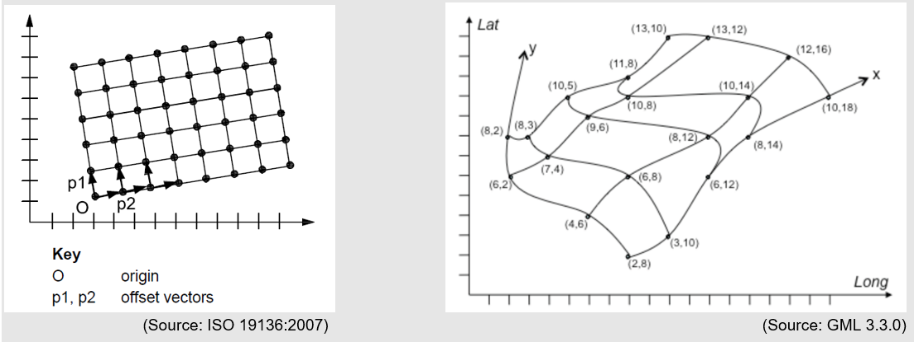

[.text-center]
*Figure 2 – Examples of a rectified grid (left) and a referenceable grid (right)*

image::./media/image57.png[image, align=center]

[.text-center]
*Figure 3 – Example of a time series*

=== Application schema Environmental Monitoring Facilities

==== Description

===== Narrative description

The thematic working group _Environmental Monitoring Facilities_ provides one application schema for the thematic area.

The schema contains both aspects in scope for EF; on the one hand the description of a monitoring facility and on the other hand the link to observations and measurements. The schema follows a generic approach which should enable thematic communities to use this structure across domains. The specifications and definitions provide sufficient flexibility to the thematic domains to bring their data in. Not to create a burden for thematic communities, the common elements defined in the data specification are kept to a minimum and are reduced to elements which are seen as essential for accessing environmental monitoring facilities in a common way and keep a common denominator across domains. But as intense discussions with experts from various domains showed, the requirements from the thematic domains are very different and harmonisation across themes is complex. The dimension of theme/domain specific harmonisation is not at all underestimated and stays with high priority regarding meaningful data exchange but cannot be covered by the application schema of EF. This would include agreed cross domain use of codes and shared requirements to provide information on environmental monitoring facilities. From this point of view the data specification EF should cover the requirements from specific thematic domains but as well provide an option for future developments.

The actual version 3.0 of thematic area EF covers the aspect of describing an environmental monitoring facility. The link to Observations and Measurements is included in the model provided but as well addressed by a guideline paper include correct reference here. The guideline document (DS-D2.9) on the common use of ISO 19156 Observations and Measurements (O&M) is developed by a specific working group including experts from various INSPIRE themes (among which is EF). Aspects regarding the use of O&M standard across domains and integration in INSPIRE not directly related to the theme environmental monitoring facilities is covered by that guideline document.

The application schema for _Environmental Monitoring Facilities_ contains 4 spatial object types:

* Environmental Monitoring Programme
* Environmental Monitoring Activity
* Environmental Monitoring Network
* Environmental Monitoring Facility

The EnvironmentalMonitoringFacilitiy (EMF) is the central spatial object type for both aspects of our scope. The narrative description focuses to explain the spatial object types as mentioned before and to explain their relationships as well as for linking to observations and measurements using the O&M ISO standard. For modelling reasons two abstract classes are introduced to group common attributes shared between the spatial object types.

The overall idea of the model provided is that each thematic domain can decide based on their own requirements which level of detail is appropriate. The model does not imply a mandatory level of detail but gives the option to do where appropriate.

===== UML Overview

image::./media/image7.png[image,width=605,height=723, align=center]

[.text-center]
*Figure 4: Package dependency of the Environmental Monitoring Facilities application schema*

image::./media/image8.png[image,width=594,height=855, align=center]

[.text-center]
*Figure 5 – UML class diagram: Overview of the Environmental Monitoring Facilities application schema*

*EnvironmentalMonitoringFacility (EMF)*

The Environmental Monitoring Facility spatial entity is the result of the information modeled in the EMF class itself but also in the 2 abstract classes mentioned above.

Indeed, as the description of an Environmental Monitoring Facility shares elements with other spatial object types in the EF model and these attributes are modelled in abstract classes. As all other spatial object types, an EMF has a geometry but includes for practical reasons a geometrical attribute "representative point" to facilitate the need to have a point representation in thematic context even if the initial one is different.

An Environmental Monitoring Facility can either be fixed, mobile or attached to another one. As environmental monitoring facilities can be described at various levels of detail, the model provides a recursive hierarchical link between _Environmental Monitoring Facilities_. This reflects the fact that a station can have various parts or a platform can host a number of sensors or measuring equipment. This cascade is modelled as an attributed association "hierarchy". In case of mobile / removable parts of such, a cascade equipment can be moved to another platform and is therefore linked to an explicit station only over a certain period of time, this association has a life time notion.

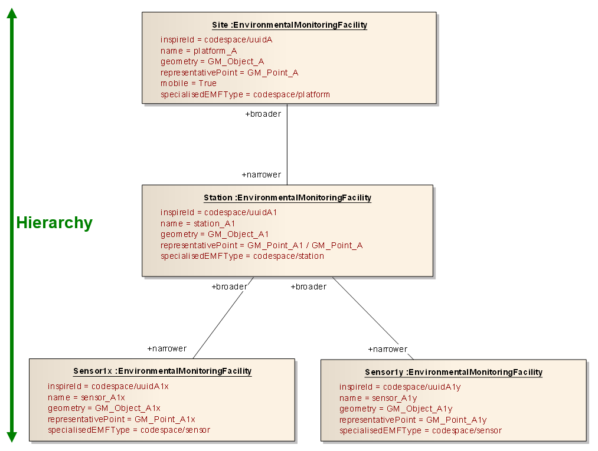

[.text-center]
*Figure 6: Schema of a hierarchical cascade of environmental monitoring facilities*

For cases where a monitoring facility is running out of operation and superseded by another one the genealogy link is modelled. This relation reflects that an environmental monitoring facility is superseded by another one. Main reason to integrate this in our model is to provide a mechanism which ensures that related observations can be interpreted as one time series and a continuum from a thematic point of view.

image::./media/image10.png[image,width=618,height=518, align=center]

[.text-center]
*Figure 7: Schema of a genealogy relation inside a hierarchical cascade of environmental monitoring facilities*

The link "any thematic link" is modelled to reflect the issue that in various thematic setups a link between environmental monitoring facilities is needed to establish a relation independent from hierarchical or genealogical links. For example, a water quantity monitoring facility is related to an upstream water quality monitoring station. The modelled link provides an option to thematic communities linking environmental monitoring facilities according to their internal specific needs.

The automated aggregation advanced processing starting from highest level of detail and constraints how to produce aggregates are in full responsibility of the thematic experts and can therefore not be part of the EF model which has to stay in this aspect generic.

image::./media/image11.png[image,width=623,height=756, align=center]

[.text-center]
*Figure 8: UML class diagram extracted from application schema: EnvironmentalMonitoringFacility*

*EnvironmentalMonitoringNetwork (EMN)*

The EnvironmentalMonitoringNetwork is a spatial object type in the model which normally consists of a number of environmental monitoring facilities. It's possible to provide information on the aggregated level of an environmental monitoring network including the option to have cascades of networks and sub networks. An environmental monitoring facility can belong to various environmental monitoring networks e.g. being part of a regional network and a national one.

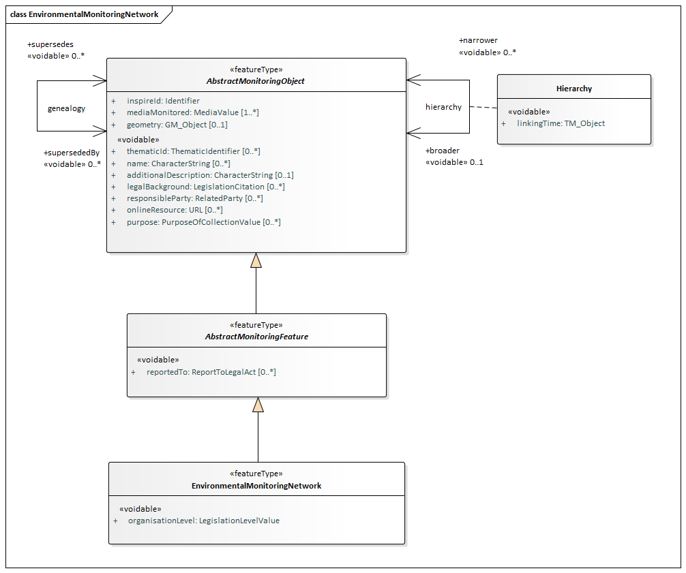

[.text-center]
*Figure 9*: UML class diagram extracted from application schema: EnvironmentalMonitoringNetwork

*EnvironmentalMonitoringProgramme (EMP)*

An Environmental Monitoring Programme (EMP) is a policy relevant description defining the target of a collection of observations and/or the deployment of _Environmental Monitoring Facilities_ in the field. Usually an Environmental Monitoring Programme has a long-term perspective over at least a few years. An Environmental Monitoring Programme covers an area of interest (e.g. a region) and is based on environmental legislation. The description of this spatial object type provides an overview and can be used for assessment and policy evaluation.

So the information linked to Environmental Monitoring Programme is relevant even if the location of facilities is hidden. It provides a very generic access point to environmental monitoring information with an overarching view and can optionally be cross domain implemented. The level of detail made available is on the thematic domain experts but not induced by the application schema.

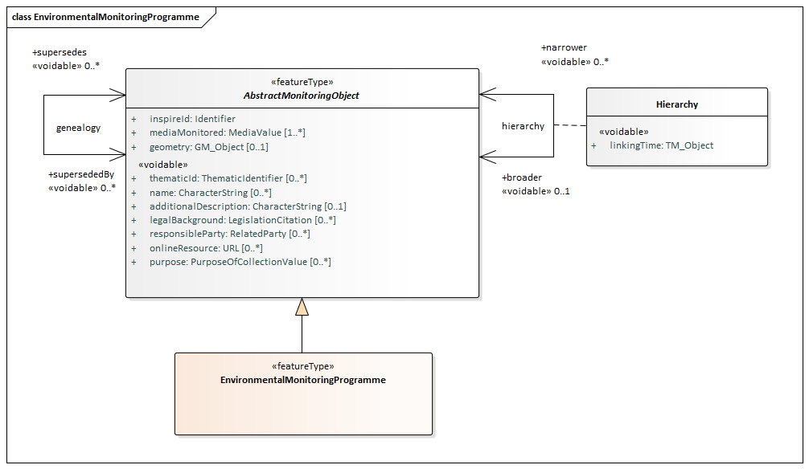

[.text-center]
*Figure 10: UML class diagram extracted from application schema: EnvironmentalMonitoringProgramme*

The class AbstractMonitoringObject models all common elements shared between EMF, EMN and EMP. These attributes provide a common denominator between the core spatial object types and allow a grouping or access using the same attributes.

*Environmental Monitoring Activity (EMA)*

A fourth spatial object type is modelled within the theme environmental monitoring facilities - the Environmental Monitoring Activity. This object type expresses the need to describe environmental monitoring campaigns which are carried out with specific equipment for a specific period of time.

Examples could be a research cruise of a vessel with monitoring equipment in the ocean or flights by an airplane hosting various sensors for airborne observations. These examples show the high relevance for mobile environmental monitoring facilities in relation to a long term perspective of environmental monitoring programmes. The Environmental Monitoring Activity is modelled as a link from an EMF and EMN for specific time to Environmental Monitoring Programme using the abstract class AbstractMonitoringFeature as their common element.

image::./media/image14.png[image,width=604,height=131, align=center]

[.text-center]
*Figure 11: UML class diagram extracted from application schema: EnvironmentalMonitoringActivity*

An essential part of the theme environmental monitoring facilities is to link to Observations and Measurements taken at an environmental monitoring facility. The link to the OM_Observation class reflects this direct connection which is possible from any environmental monitoring facility or environmental monitoring network. In addition, the class ObservingCapability is modelled to serve the need that a measurement regime can be described without providing the observed or measured value itself (caused e.g. by data privacy issues or because a reporting sheet does not require this). The class contains attributes to describe the operational time for a measurement regime, a process type value to distinguish between an INSPIRE_OM_process and SensorML as indication of what is expected under the process relation (defined in O&M guidelines), the ResultNatureValue to express the related values are primary data, processed data or coming from simulation models and in case it is available information that the measurement regime is established to serve a specific need from a reporting obligation.

Together with the link to OM_Observation the class ObservingCapability establish a consistent link from environmental monitoring facility theme to the INSPIRE implementation of ISO FDIS 19156 Observations and Measurements. Consistency has to be assured between links from class ObservingCapability and observations. So if an observation is linked to an Environmental monitoring facility, this facility shall have an observing capability description as well. The Observing Capability has to reference to the identical Phenomenon and Process as the observation. The Domain should either be identical, or in some cases the Domain of the observation is a samplingFeature of the Domain of the Observing Capability (see DS-D2.9).

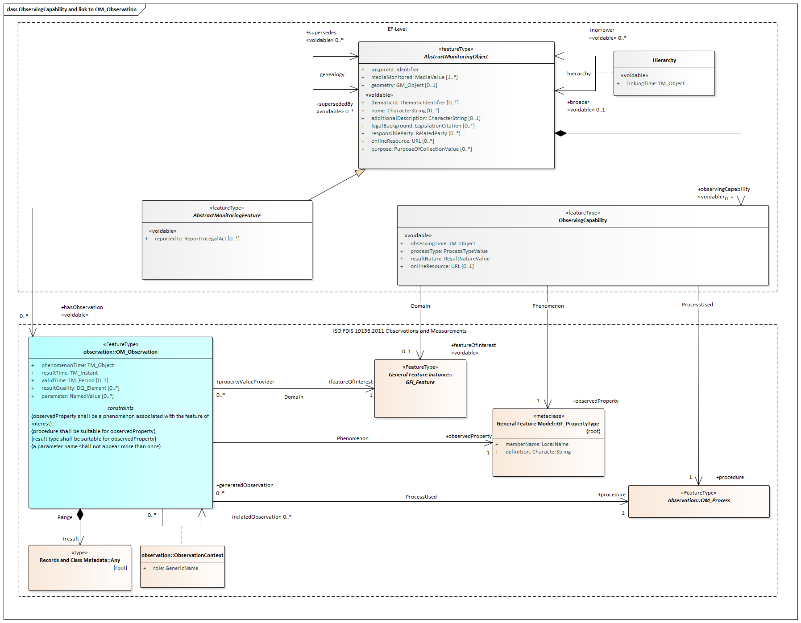

[.text-center]
*Figure 12: UML class diagram extracted from application schema: ObservingCapability and link to OM_Observation*

O&M Related Concepts and Attributes

The section is addressing those parts of the EF application schema which are related to the Observations and Measurements carried out at the facility. As mentioned in the "Interoperability of Spatial Data Sets and Services – General Executive Summary" part of this document, ISO 19156 Geographic Information – Observations and Measurements (O&M) is to be used in INSPIRE application schemas for the provision of data on Observations or Measurements directly related to INSPIRE features (see also Recommendation 6, chapter 9.4.6 GCM V3.3).

[NOTE]
====
*Recommendation 6*

The hasObservation role should be implemented as follow: 

* use no value if there are no observations at the station (i.e. it is not yet operational), 
* use "void" and "unpopulated" if there are observations, but the monitoring facility/network data provider does not have access to them 
* use "withheld" if there are observations, but these are not made available in compliance with this specification, e.g. because they cannot be refactored to the ISO 19156 standard at a reasonable cost.

====
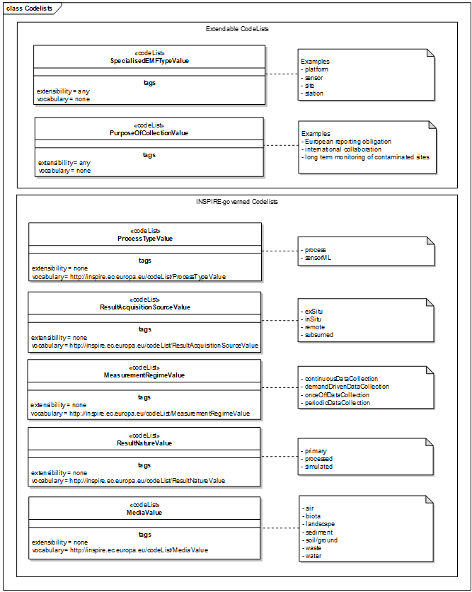

[.text-center]
*Figure 13: UML class diagram: Overview of the Environmental Monitoring Facilities application schema - Code Lists view*

===== Consistency between spatial data sets

Not relevant for the EF data specification.

==== Feature catalogue

*Feature catalogue metadata*

[cols=",",options="header",]
|===
|Application Schema |INSPIRE Application Schema EnvironmentalMonitoringFacilities
|Version number |3.0
|===

*Types defined in the feature catalogue*

[cols=",,",options="header",]
|===
|*Type* |*Package* |*Stereotypes*
|_AbstractMonitoringFeature_ |EnvironmentalMonitoringFacilities |«featureType»
|_AbstractMonitoringObject_ |EnvironmentalMonitoringFacilities |«featureType»
|_AnyDomainLink_ |EnvironmentalMonitoringFacilities |
|_EnvironmentalMonitoringActivity_ |EnvironmentalMonitoringFacilities |«featureType»
|_EnvironmentalMonitoringFacility_ |EnvironmentalMonitoringFacilities |«featureType»
|_EnvironmentalMonitoringNetwork_ |EnvironmentalMonitoringFacilities |«featureType»
|_EnvironmentalMonitoringProgramme_ |EnvironmentalMonitoringFacilities |«featureType»
|_Hierarchy_ |EnvironmentalMonitoringFacilities |
|_MeasurementRegimeValue_ |EnvironmentalMonitoringFacilities |«codelist»
|_MediaValue_ |EnvironmentalMonitoringFacilities |«codelist»
|_NetworkFacility_ |EnvironmentalMonitoringFacilities |
|_ObservingCapability_ |EnvironmentalMonitoringFacilities |«featureType»
|_OperationalActivityPeriod_ |EnvironmentalMonitoringFacilities |«featureType»
|_ProcessTypeValue_ |EnvironmentalMonitoringFacilities |«codelist»
|_PurposeOfCollectionValue_ |EnvironmentalMonitoringFacilities |«codelist»
|_ReportToLegalAct_ |EnvironmentalMonitoringFacilities |«dataType»
|_ResultAcquisitionSourceValue_ |EnvironmentalMonitoringFacilities |«codelist»
|_ResultNatureValue_ |EnvironmentalMonitoringFacilities |«codelist»
|_SpecialisedEMFTypeValue_ |EnvironmentalMonitoringFacilities |«codelist»
|===

===== Spatial object types

====== _AbstractMonitoringFeature_

[cols="",options="header",]
|===
|*AbstractMonitoringFeature (abstract)*
a|
[cols=","]
!===
!Name: !abstract monitoring feature
!Subtype of: !AbstractMonitoringObject
!Definition: !An abstract base class for environmental monitoring features in the real world (EnvironmentalMonitoringNetwork, EnvironmentalMonitoringFacility).
!Stereotypes: !«featureType»
!===

a|
*Attribute: reportedTo*

[cols=","]
!===
!Value type: !ReportToLegalAct
!Definition: !Information on the involvement of the AbstractMonitoringFeature in reporting.
!Multiplicity: !0..*
!Stereotypes: !«voidable»
!===

a|
*Association role: involvedIn*

[cols=","]
!===
!Value type: !EnvironmentalMonitoringActivity
!Definition: !EnvironmentalMonitoringActivity(s) in which the AbstractMonitoringFeature is involved.
!Multiplicity: !0..*
!Stereotypes: !«voidable»
!===

a|
*Constraint: Observation and ObservingCapability*

[cols=","]
!===
!Natural language: !If observation(s) are attached to an AbstractMonitoringFeature this shall have an ObservingCapability attached to it. The ObservingCapability shall reference the same Domain, Phenomenon and ProcessUsed as the observation(s).
!OCL: !inv: hasObservation->notEmpty() implies observingCapability->notEmpty() and hasObservation.OM_Observation.featureOfInterest = observingCapability.featureOfInterest and hasObservation.OM_Observation.observedProperty = observingCapability.observedProperty and hasObservation.OM_Observation.procedure = observingCapability.procedure
!===

|===

====== _AbstractMonitoringObject_

[cols="",options="header",]
|===
|*AbstractMonitoringObject (abstract)*
a|
[cols=","]
!===
!Name: !abstract monitoring object
!Definition: !An abstract base class for environmental monitoring objects.
!Stereotypes: !«featureType»
!===

a|
*Attribute: inspireId*

[cols=","]
!===
!Value type: !Identifier
!Definition: !External object identifier.
!Multiplicity: !1
!===

a|
*Attribute: thematicId*

[cols=","]
!===
!Value type: !ThematicIdentifier
!Definition: !Thematic object identifier.
!Multiplicity: !0..*
!Stereotypes: !«voidable»
!===

a|
*Attribute: name*

[cols=","]
!===
!Value type: !CharacterString
!Definition: !Plain text denotation of the AbstractMonitoringObject.
!Multiplicity: !0..*
!Stereotypes: !«voidable»
!===

a|
*Attribute: additionalDescription*

[cols=","]
!===
!Value type: !CharacterString
!Definition: !Plain text description of additional information not fitting in other attributes.
!Multiplicity: !0..1
!Stereotypes: !«voidable»
!===

a|
*Attribute: mediaMonitored*

[cols=","]
!===
!Value type: !MediaValue
!Definition: !Monitored environmental medium.
!Multiplicity: !1..*
!===

a|
*Attribute: legalBackground*

[cols=","]
!===
!Value type: !LegislationCitation
!Definition: !The legal context, in which the management and regulation of the AbstractMonitoringObject is defined.
!Multiplicity: !0..*
!Stereotypes: !«voidable»
!===

a|
*Attribute: responsibleParty*

[cols=","]
!===
!Value type: !RelatedParty
!Definition: !Responsible party for the AbstractMonitoringObject.
!Multiplicity: !0..*
!Stereotypes: !«voidable»
!===

a|
*Attribute: geometry*

[cols=","]
!===
!Value type: !GM_Object
!Definition: !Geometry associated to the AbstractMonitoringObject. For mobile facilities the geometry represents the area the facility is expected to measure in.
!Multiplicity: !0..1
!===

a|
*Attribute: onlineResource*

[cols=","]
!===
!Value type: !URL
!Definition: !A link to an external document providing further information on the AbstractMonitoringObject.
!Multiplicity: !0..*
!Stereotypes: !«voidable»
!===

a|
*Attribute: purpose*

[cols=","]
!===
!Value type: !PurposeOfCollectionValue
!Definition: !Reason for which the AbstractMonitoringObject has been generated.
!Multiplicity: !0..*
!Stereotypes: !«voidable»
!===

a|
*Association role: observingCapability*

[cols=","]
!===
!Value type: !ObservingCapability
!Definition: !A link pointing to the explicit capability of an AbstractMonitoringObject. This provides a clean link between the observed property, the procedure used as well as the location of the measurement
!Multiplicity: !0..*
!===

a|
*Association role: broader [the association has additional attributes - see association class Hierarchy]*

[cols=","]
!===
!Value type: !AbstractMonitoringObject
!Definition: !A link pointing to a broader AbstractMonitoringObject (a higher level in a hierarchical structure). The association has additional properties as defined in the association class Hierarchy.
!Multiplicity: !0..1
!Stereotypes: !«voidable»
!===

a|
*Association role: supersedes*

[cols=","]
!===
!Value type: !AbstractMonitoringObject
!Definition: !In a genealogy, the AbstractMonitoringObject(s) that has(have) been deactivated/replaced by another one.
!Multiplicity: !0..*
!Stereotypes: !«voidable»
!===

a|
*Association role: narrower [the association has additional attributes - see association class Hierarchy]*

[cols=","]
!===
!Value type: !AbstractMonitoringObject
!Definition: !A link pointing to narrower AbstractMonitoringObject(s) (a lower level in a hierarchical structure). The association has additional properties as defined in the association class Hierarchy.
!Multiplicity: !0..*
!Stereotypes: !«voidable»
!===

a|
*Association role: supersededBy*

[cols=","]
!===
!Value type: !AbstractMonitoringObject
!Definition: !In a genealogy, the newly active AbstractMonitoringObject(s) that replaces(replace) the superseded one.
!Multiplicity: !0..*
!===

|===

====== _EnvironmentalMonitoringActivity_

[cols="",options="header",]
|===
|*EnvironmentalMonitoringActivity*
a|
[cols=","]
!===
!Name: !environmental monitoring activity
!Definition: !Specific set of AbstractMonitoringFeatures used for a given domain in a coherent and concise timeframe, area and purpose. Usually the information collected is treated as one time step in a long term monitoring programme. It is a concrete realisation of a given EnvironmentalMonitoringProgramme.
!Description: !For example a vessel could be equipped with a collection of EnvironmentalMonitoringFacilities for a given campaign (= EnvironmentalMonitoringActivity) fulfilling an EnvironmentalMonitoringProgramme requirements. Then, after a given period this exact same vessel could be equipped with another set of EnvironmentalMonitoringFacilities for another campaign fulfilling another EnvironmentalMonitoringProgramme requirements.
!Stereotypes: !«featureType»
!===

a|
*Attribute: activityTime*

[cols=","]
!===
!Value type: !TM_Object
!Definition: !Lifespan of the EnvironmentalMonitoringActivity.
!Multiplicity: !1
!Stereotypes: !«voidable»
!===

a|
*Attribute: activityConditions*

[cols=","]
!===
!Value type: !CharacterString
!Definition: !Textual description of the EnvironmentalMonitoringActivity.
!Multiplicity: !1
!Stereotypes: !«voidable»
!===

a|
*Attribute: boundingBox*

[cols=","]
!===
!Value type: !GM_Boundary
!Definition: !Bounding box in which the EnvironmentalMonitoringActivity takes place.
!Description: !EXAMPLE: If a research vessel has several monitoring activities (EnvironmentalMonitoringActivity) one wants to know where he cruised for each of those (EnvironmentaMonitoringActivity).
!Multiplicity: !0..1
!Stereotypes: !«voidable»
!===

a|
*Attribute: responsibleParty*

[cols=","]
!===
!Value type: !RelatedParty
!Definition: !Responsible party for the EnvironmentalMonitoringActivity.
!Multiplicity: !1
!Stereotypes: !«voidable»
!===

a|
*Attribute: inspireId*

[cols=","]
!===
!Value type: !Identifier
!Definition: !External object identifier.
!Multiplicity: !1
!===

a|
*Attribute: onlineResource*

[cols=","]
!===
!Value type: !URL
!Definition: !A link to an external document providing further information on the EnvironmentalMonitoringActivity.
!Multiplicity: !0..*
!Stereotypes: !«voidable»
!===

a|
*Association role: uses*

[cols=","]
!===
!Value type: !AbstractMonitoringFeature
!Definition: !Specific set of AbstractMonitoringFeature(s) involved in an EnvironmentalMonitoringActivity.
!Multiplicity: !0..*
!===

a|
*Association role: setUpFor*

[cols=","]
!===
!Value type: !EnvironmentalMonitoringProgramme
!Definition: !EnvironmentalMonitoringProgramme(s) for which the EnvironmentalMonitoringActivity is set up.
!Multiplicity: !0..*
!Stereotypes: !«voidable»
!===

|===

====== _EnvironmentalMonitoringFacility_

[cols="",options="header",]
|===
|*EnvironmentalMonitoringFacility*
a|
[cols=","]
!===
!Name: !environmental monitoring facility
!Subtype of: !AbstractMonitoringFeature
!Definition: !A georeferenced object directly collecting or processing data about objects whose properties (e.g. physical, chemical, biological or other aspects of environmental conditions) are repeatedly observed or measured. An environmental monitoring facility can also host other environmental monitoring facilities.
!Description: !NOTE 1: An EnvironmentalMonitoringFacility is not a facility in the common INSPIRE sense realised by the Generic Conceptual Model class ActivtiyComplex. 
 
NOTE 2: Laboratories are not EnvironmentalMonitoringFacilities from an INSPIRE perspective as the exact location of the laboratory does not add further information to the measurement. 
The methodology used in the laboratory should be provided with observational data.
!Stereotypes: !«featureType»
!===

a|
*Attribute: representativePoint*

[cols=","]
!===
!Value type: !GM_Point
!Definition: !Representative location for the EnvironmentalMonitoringFacility.
!Multiplicity: !0..1
!Stereotypes: !«voidable»
!===

a|
*Attribute: measurementRegime*

[cols=","]
!===
!Value type: !MeasurementRegimeValue
!Definition: !Regime of the measurement
!Multiplicity: !1
!Stereotypes: !«voidable»
!===

a|
*Attribute: mobile*

[cols=","]
!===
!Value type: !Boolean
!Definition: !Indicate whether the EnvironmentalMonitoringFacility is mobile (repositionable) during the acquisition of the observation.
!Multiplicity: !1
!Stereotypes: !«voidable»
!===

a|
*Attribute: resultAcquisitionSource*

[cols=","]
!===
!Value type: !ResultAcquisitionSourceValue
!Definition: !Source of result acquisition
!Multiplicity: !0..*
!Stereotypes: !«voidable»
!===

a|
*Attribute: specialisedEMFType*

[cols=","]
!===
!Value type: !SpecialisedEMFTypeValue
!Definition: !Categorisation of EnvironmentalMonitoringFacilities generally used by domain and in national settings.
!Description: !EXAMPLE: platform, site, station, sensor, ...
!Multiplicity: !0..1
!Stereotypes: !«voidable»
!===

a|
*Association role: belongsTo [the association has additional attributes - see association class NetworkFacility]*

[cols=","]
!===
!Value type: !EnvironmentalMonitoringNetwork
!Definition: !A link pointing to the EnvironmentalMonitoringNetwork(s) this EnvironmentalMonitoringFacility pertains to. The association has additional properties as defined in the association class NetworkFacility.
!Multiplicity: !0..*
!Stereotypes: !«voidable»
!===

a|
*Association role: operationalActivityPeriod*

[cols=","]
!===
!Value type: !OperationalActivityPeriod
!Definition: !Lifespan of the physical object (facility).
!Multiplicity: !1..*
!Stereotypes: !«voidable»
!===

a|
*Association role: relatedTo [the association has additional attributes - see association class AnyDomainLink]*

[cols=","]
!===
!Value type: !EnvironmentalMonitoringFacility
!Definition: !Any Thematic Link to an Environmental Monitoring Facility. The association has additional properties as defined in the association class AnyDomainLink.
!Multiplicity: !0..*
!Stereotypes: !«voidable»
!===

a|
*Constraint: GeometryRequired*

[cols=","]
!===
!Natural language: !Geometry and representativePoint cannot both be empty.
!OCL: !inv: geometry ->notEmpty() or representativePoint ->notEmpty()
!===

|===

====== _EnvironmentalMonitoringNetwork_

[cols="",options="header",]
|===
|*EnvironmentalMonitoringNetwork*
a|
[cols=","]
!===
!Name: !environmental monitoring network
!Subtype of: !AbstractMonitoringFeature
!Definition: !Administrative or organisational grouping of EnvironmentalMonitoringFacilities managed the same way for a specific purpose, targeting a specific area. Each network respects common rules aiming at ensuring coherence of the observations, especially for purposes of EnvironmentalMonitoringFacilities, mandatory parameters selection, measurement methods and measurement regime.
!Stereotypes: !«featureType»
!===

a|
*Attribute: organisationLevel*

[cols=","]
!===
!Value type: !LegislationLevelValue
!Definition: !Level of legal organisation the EnvironmentalMonitoringNetwork is affiliated with.
!Multiplicity: !1
!Stereotypes: !«voidable»
!===

a|
*Association role: contains [the association has additional attributes - see association class NetworkFacility]*

[cols=","]
!===
!Value type: !EnvironmentalMonitoringFacility
!Definition: !A link pointing to the EnvironmentalMonitoringFacility(s) included in this EnvironmentalMonitoringNetwork. The association has additional properties as defined in the association class NetworkFacility.
!Multiplicity: !0..*
!Stereotypes: !«voidable»
!===

|===

====== _EnvironmentalMonitoringProgramme_

[cols="",options="header",]
|===
|*EnvironmentalMonitoringProgramme*
a|
[cols=","]
!===
!Name: !environmental monitoring programme
!Subtype of: !AbstractMonitoringObject
!Definition: !Framework based on policy relevant documents defining the target of a collection of observations and/or the deployment of AbstractMonitoringFeatures on the field. Usually an Environmental Monitoring Programme has a long term perspective over at least a few years.
!Stereotypes: !«featureType»
!===

a|
*Association role: triggers*

[cols=","]
!===
!Value type: !EnvironmentalMonitoringActivity
!Definition: !EnvironmentalMonitoringActivity(s) triggered by the EnvironmentalMonitoringProgramme.
!Multiplicity: !0..*
!===

|===

====== _ObservingCapability_

[cols="",options="header",]
|===
|*ObservingCapability*
a|
[cols=","]
!===
!Name: !observing capability
!Definition: !Explicit capability of an AbstractMonitoringObject.
!Stereotypes: !«featureType»
!===

a|
*Attribute: observingTime*

[cols=","]
!===
!Value type: !TM_Object
!Definition: !Describes the time period that observations can be expected from this AbstractMonitoringObject. Can be only a start time for running measurements or an interval.
!Multiplicity: !1
!Stereotypes: !«voidable»
!===

a|
*Attribute: processType*

[cols=","]
!===
!Value type: !ProcessTypeValue
!Definition: !The type of object used for describing the process.
!Multiplicity: !1
!Stereotypes: !«voidable»
!===

a|
*Attribute: resultNature*

[cols=","]
!===
!Value type: !ResultNatureValue
!Definition: !State of the provided result.
!Multiplicity: !1
!Stereotypes: !«voidable»
!===

a|
*Attribute: onlineResource*

[cols=","]
!===
!Value type: !URL
!Definition: !A link to an external document providing further information about an ISO 19156 'Observations and Measurements' compliant data model used to store or exchange Observations and Measurements acquired.
!Multiplicity: !0..1
!Stereotypes: !«voidable»
!===

|===

====== _OperationalActivityPeriod_

[cols="",options="header",]
|===
|*OperationalActivityPeriod*
a|
[cols=","]
!===
!Name: !operational activity period
!Definition: !Corresponds to a period during which the EnvironmentalMonitoringFacility has been up and running.
!Stereotypes: !«featureType»
!===

a|
*Attribute: activityTime*

[cols=","]
!===
!Value type: !TM_Object
!Definition: !Lifespan of the OperationalActivityPeriod.
!Multiplicity: !1
!===

|===

===== Data types

====== _AnyDomainLink_

[cols="",options="header",]
|===
|*AnyDomainLink (association class)*
a|
[cols=","]
!===
!Name: !any domain link
!Definition: !Any domain relevant link to an EnvironmentalMonitoringFacility that is not hierarchical or associated with a notion of genealogy.
!===

a|
*Attribute: comment*

[cols=","]
!===
!Value type: !CharacterString
!Definition: !Additional information on the domain link.
!Multiplicity: !1
!Stereotypes: !«voidable»
!===

|===

====== _Hierarchy_

[cols="",options="header",]
|===
|*Hierarchy (association class)*
a|
[cols=","]
!===
!Name: !hierarchy
!Definition: !Hierachical link between AbstractMonitoringObjects.
!===

a|
*Attribute: linkingTime*

[cols=","]
!===
!Value type: !TM_Object
!Definition: !Time period of the link.
!Multiplicity: !1
!Stereotypes: !«voidable»
!===

|===

====== _NetworkFacility_

[cols="",options="header",]
|===
|*NetworkFacility (association class)*
a|
[cols=","]
!===
!Name: !network facility
!Definition: !Link between EnvironmentalMonitoringNetwork and EnvironmentalMonitoringFacility.
!===

a|
*Attribute: linkingTime*

[cols=","]
!===
!Value type: !TM_Object
!Definition: !Time period of the link.
!Multiplicity: !1
!Stereotypes: !«voidable»
!===

|===

====== _ReportToLegalAct_

[cols="",options="header",]
|===
|*ReportToLegalAct*
a|
[cols=","]
!===
!Name: !report to legal act
!Definition: !Information on the involvement of an AbstractMonitoringFeature in reporting. The information is specific per submitted reporting envelope and not per obligation/agreement.
!Description: !From INSPIRE perspective, an AbstractMonitoringFeature requires the provision of ISO 19156 compliant observations & measurements only in the case that these have been required by a legal reporting obligation or a commonly agreed voluntarily data flow using INSPIRE EF dataspecification for the definition of datastructure.
!Stereotypes: !«dataType»
!===

a|
*Attribute: legalAct*

[cols=","]
!===
!Value type: !LegislationCitation
!Definition: !LegalAct which is reported to.
!Multiplicity: !1
!===

a|
*Attribute: reportDate*

[cols=","]
!===
!Value type: !DateTime
!Definition: !Time of reporting.
!Multiplicity: !1
!Stereotypes: !«voidable»
!===

a|
*Attribute: reportedEnvelope*

[cols=","]
!===
!Value type: !URI
!Definition: !Link to the reported data set according to the date indicated in the attribute reportDate.
!Multiplicity: !0..1
!Stereotypes: !«voidable»
!===

a|
*Attribute: observationRequired*

[cols=","]
!===
!Value type: !Boolean
!Definition: !Indicates whether an observation is required for the AbstractMonitoringFeature.
!Multiplicity: !1
!Stereotypes: !«voidable»
!===

a|
*Attribute: observingCapabilityRequired*

[cols=","]
!===
!Value type: !Boolean
!Definition: !Indicates whether the observingCapability is required for the AbstractMonitoringFeature.
!Multiplicity: !1
!Stereotypes: !«voidable»
!===

a|
*Attribute: description*

[cols=","]
!===
!Value type: !CharacterString
!Definition: !Additional information on the actual data reported.
!Multiplicity: !0..1
!Stereotypes: !«voidable»
!===

|===

===== Code lists

====== _MeasurementRegimeValue_

[cols="",options="header",]
|===
|*MeasurementRegimeValue*
a|
[cols=","]
!===
!Name: !measurement regime
!Definition: !Categories for different types of the MeasurementRegime.
!Extensibility: !any
!Identifier: !http://inspire.ec.europa.eu/codelist/MeasurementRegimeValue
!Values: !The allowed values for this code list comprise any values defined by data providers. _Annex C_ includes recommended values that may be used by data providers.
!===

|===

====== _MediaValue_

[cols="",options="header",]
|===
|*MediaValue*
a|
[cols=","]
!===
!Name: !media
!Definition: !Categories for different types of media.
!Extensibility: !any
!Identifier: !http://inspire.ec.europa.eu/codelist/MediaValue
!Values: !The allowed values for this code list comprise any values defined by data providers. _Annex C_ includes recommended values that may be used by data providers.
!===

|===

====== _ProcessTypeValue_

[cols="",options="header",]
|===
|*ProcessTypeValue*
a|
[cols=","]
!===
!Name: !process type
!Definition: !Categories for different process types.
!Extensibility: !any
!Identifier: !http://inspire.ec.europa.eu/codelist/ProcessTypeValue
!Values: !The allowed values for this code list comprise any values defined by data providers. _Annex C_ includes recommended values that may be used by data providers.
!===

|===

====== _PurposeOfCollectionValue_

[cols="",options="header",]
|===
|*PurposeOfCollectionValue*
a|
[cols=","]
!===
!Name: !purpose of collection
!Definition: !Categories for different purposes of collections.
!Extensibility: !any
!Identifier: !none
!Values: !The allowed values for this code list comprise any values defined by data providers. _Annex C_ includes recommended values that may be used by data providers.
!===

|===

====== _ResultAcquisitionSourceValue_

[cols="",options="header",]
|===
|*ResultAcquisitionSourceValue*
a|
[cols=","]
!===
!Name: !result acquisition source
!Definition: !Categories for different types of the ResultAcquisitionSource.
!Extensibility: !any
!Identifier: !http://inspire.ec.europa.eu/codelist/ResultAcquisitionSourceValue
!Values: !The allowed values for this code list comprise any values defined by data providers. _Annex C_ includes recommended values that may be used by data providers.
!===

|===

====== _ResultNatureValue_

[cols="",options="header",]
|===
|*ResultNatureValue*
a|
[cols=","]
!===
!Name: !result nature
!Definition: !State of the result of an observation.
!Extensibility: !any
!Identifier: !http://inspire.ec.europa.eu/codelist/ResultNatureValue
!Values: !The allowed values for this code list comprise any values defined by data providers. _Annex C_ includes recommended values that may be used by data providers.
!===

|===

====== _SpecialisedEMFTypeValue_

[cols="",options="header",]
|===
|*SpecialisedEMFTypeValue*
a|
[cols=","]
!===
!Name: !specialised EMF type
!Definition: !Categories for different types of EnvironmentalMonitoringFacilities.
!Extensibility: !any
!Identifier: !none
!Values: !The allowed values for this code list comprise any values defined by data providers. _Annex C_ includes recommended values that may be used by data providers.
!===

|===

===== Imported types (informative)

This section lists definitions for feature types, data types and enumerations and code lists that are defined in other application schemas. The section is purely informative and should help the reader understand the feature catalogue presented in the previous sections. For the normative documentation of these types, see the given references.

====== _Boolean_

[cols="",options="header",]
|===
|*Boolean*
a|
[cols=","]
!===
!Package: !Truth
!Reference: !Geographic information -- Conceptual schema language [ISO/TS 19103:2005]
!===

|===

====== _CharacterString_

[cols="",options="header",]
|===
|*CharacterString*
a|
[cols=","]
!===
!Package: !Text
!Reference: !Geographic information -- Conceptual schema language [ISO/TS 19103:2005]
!===

|===

====== _DateTime_

[cols="",options="header",]
|===
|*DateTime*
a|
[cols=","]
!===
!Package: !Date and Time
!Reference: !Geographic information -- Conceptual schema language [ISO/TS 19103:2005]
!===

|===

====== _GM_Boundary_

[cols="",options="header",]
|===
|*GM_Boundary (abstract)*
a|
[cols=","]
!===
!Package: !Geometry root
!Reference: !Geographic information -- Spatial schema [ISO 19107:2003]
!===

|===

====== _GM_Object_

[cols="",options="header",]
|===
|*GM_Object (abstract)*
a|
[cols=","]
!===
!Package: !Geometry root
!Reference: !Geographic information -- Spatial schema [ISO 19107:2003]
!===

|===

====== _GM_Point_

[cols="",options="header",]
|===
|*GM_Point*
a|
[cols=","]
!===
!Package: !Geometric primitive
!Reference: !Geographic information -- Spatial schema [ISO 19107:2003]
!===

|===

====== _Identifier_

[cols="",options="header",]
|===
|*Identifier*
a|
[cols=","]
!===
!Package: !Base Types
!Reference: !INSPIRE Generic Conceptual Model, version 3.4 [DS-D2.5]
!Definition: !External unique object identifier published by the responsible body, which may be used by external applications to reference the spatial object.
!Description: !NOTE1 External object identifiers are distinct from thematic object identifiers. 
 
NOTE 2 The voidable version identifier attribute is not part of the unique identifier of a spatial object and may be used to distinguish two versions of the same spatial object. 
 
NOTE 3 The unique identifier will not change during the life-time of a spatial object.
!===

|===

====== _LegislationCitation_

[cols="",options="header",]
|===
|*LegislationCitation*
a|
[cols=","]
!===
!Package: !Base Types 2
!Reference: !INSPIRE Generic Conceptual Model, version 3.4 [DS-D2.5]
!Definition: !Citation for the purposes of unambiguously referencing a legal act or a specific part of a legal act.
!===

|===

====== _LegislationLevelValue_

[cols="",options="header",]
|===
|*LegislationLevelValue*
a|
[cols=","]
!===
!Package: !Base Types 2
!Reference: !INSPIRE Generic Conceptual Model, version 3.4 [DS-D2.5]
!Definition: !The level at which a legal act or convention has been adopted.
!===

|===

====== _RelatedParty_

[cols="",options="header",]
|===
|*RelatedParty*
a|
[cols=","]
!===
!Package: !Base Types 2
!Reference: !INSPIRE Generic Conceptual Model, version 3.4 [DS-D2.5]
!Definition: !An organisation or a person with a role related to a resource.
!Description: !NOTE 1 A party, typically an individual person, acting as a general point of contact for a resource can be specified without providing any particular role.
!===

|===

====== _TM_Object_

[cols="",options="header",]
|===
|*TM_Object*
a|
[cols=","]
!===
!Package: !Temporal Objects
!Reference: !Geographic information -- Temporal schema [ISO 19108:2002/Cor 1:2006]
!===

|===

====== _URI_

[cols="",options="header",]
|===
|*URI*
a|
[cols=","]
!===
!Package: !basicTypes
!Reference: !Geographic information -- Geography Markup Language (GML) [ISO 19136:2007]
!===

|===

====== _URL_

[cols="",options="header",]
|===
|*URL*
a|
[cols=","]
!===
!Package: !Citation and responsible party information
!Reference: !Geographic information -- Metadata [ISO 19115:2003/Cor 1:2006]
!===

|===

INSPIRE governed code list are given in the Annex C.

==== Externally governed code lists

The externally governed code lists included in this application schema are specified in the tables in this section.

===== Governance and authoritative source

[cols=",,",options="header",]
|===
|*Code list* |*Governance* |**Authoritative Source 
(incl. version**footnote:[If no version or publication date are specified, the "latest available version" shall be used.] *and relevant subset, where applicable)*
|PurposeOfCollectionValue | |
|SpecialisedEMFTypeValue | |
|===

===== Availability

[cols=",,",options="header",]
|===
|*Code list* |*Availability* |*Format*
|PurposeOfCollectionValue | |
|SpecialisedEMFTypeValue | |
|===

===== Rules for code list values

None

<<<
== Reference systems, units of measure and grids

=== Default reference systems, units of measure and grid

The reference systems, units of measure and geographic grid systems included in this sub-section are the defaults to be used for all INSPIRE data sets, unless theme-specific exceptions and/or additional requirements are defined in section 6.2.

==== Coordinate reference systems

===== Datum

[IMPORTANT]
====
[.text-center]
*IR Requirement*
_Annex II, Section 1.2_
*Datum for three-dimensional and two-dimensional coordinate reference systems*

For the three-dimensional and two-dimensional coordinate reference systems and the horizontal component of compound coordinate reference systems used for making spatial data sets available, the datum shall be the datum of the European Terrestrial Reference System 1989 (ETRS89) in areas within its geographical scope, or the datum of the International Terrestrial Reference System (ITRS) or other geodetic coordinate reference systems compliant with ITRS in areas that are outside the geographical scope of ETRS89. Compliant with the ITRS means that the system definition is based on the definition of the ITRS and there is a well documented relationship between both systems, according to EN ISO 19111.

====

===== Coordinate reference systems

[IMPORTANT]
====
[.text-center]
*IR Requirement*
_Annex II, Section 1.3_
*Coordinate Reference Systems*

Spatial data sets shall be made available using at least one of the coordinate reference systems specified in sections 1.3.1, 1.3.2 and 1.3.3, unless one of the conditions specified in section 1.3.4 holds.

*1.3.1. Three-dimensional Coordinate Reference Systems*

* Three-dimensional Cartesian coordinates based on a datum specified in 1.2 and using the parameters of the Geodetic Reference System 1980 (GRS80) ellipsoid.

* Three-dimensional geodetic coordinates (latitude, longitude and ellipsoidal height) based on a datum specified in 1.2 and using the parameters of the GRS80 ellipsoid.

*1.3.2. Two-dimensional Coordinate Reference Systems*

* Two-dimensional geodetic coordinates (latitude and longitude) based on a datum specified in 1.2 and using the parameters of the GRS80 ellipsoid.

* Plane coordinates using the ETRS89 Lambert Azimuthal Equal Area coordinate reference system.

* Plane coordinates using the ETRS89 Lambert Conformal Conic coordinate reference system.

* Plane coordinates using the ETRS89 Transverse Mercator coordinate reference system.

*1.3.3. Compound Coordinate Reference Systems*

1. For the horizontal component of the compound coordinate reference system, one of the coordinate reference systems specified in section 1.3.2 shall be used.

2. For the vertical component, one of the following coordinate reference systems shall be used:

* For the vertical component on land, the European Vertical Reference System (EVRS) shall be used to express gravity-related heights within its geographical scope. Other vertical reference systems related to the Earth gravity field shall be used to express gravity-related heights in areas that are outside the geographical scope of EVRS.

* For the vertical component in the free atmosphere, barometric pressure, converted to height using ISO 2533:1975 International Standard Atmosphere, or other linear or parametric reference systems shall be used. Where other parametric reference systems are used, these shall be described in an accessible reference using EN ISO 19111-2:2012.

* For the vertical component in marine areas where there is an appreciable tidal range (tidal waters), the Lowest Astronomical Tide (LAT) shall be used as the reference surface.

* For the vertical component in marine areas without an appreciable tidal range, in open oceans and effectively in waters that are deeper than 200 meters, the Mean Sea Level (MSL) or a well-defined reference level close to the MSL shall be used as the reference surface.

*1.3.4. Other Coordinate Reference Systems*

Exceptions, where other coordinate reference systems than those listed in 1.3.1, 1.3.2 or 1.3.3 may be used, are:

. Other coordinate reference systems may be specified for specific spatial data themes.

. For regions outside of continental Europe, Member States may define suitable coordinate reference systems.

The geodetic codes and parameters needed to describe these other coordinate reference systems and to allow conversion and transformation operations shall be documented and an identifier shall be created in a coordinate systems register established and operated by the Commission, according to EN ISO 19111 and ISO 19127.
The Commission shall be assisted by the INSPIRE Commission expert group in the maintenance and update of the coordinate systems register.

====

===== Display

[IMPORTANT]
====
[.text-center]
*IR Requirement*
_Annex II, Section 1.4_
*Coordinate Reference Systems used in the View Network Service*

For the display of spatial data sets with the view network service as specified in Regulation No 976/2009, at least the coordinate reference systems for two-dimensional geodetic coordinates (latitude, longitude) shall be available.

====

===== Identifiers for coordinate reference systems

[IMPORTANT]
====
[.text-center]
*IR Requirement*
_Annex II, Section 1.5_
*Coordinate Reference Systems used in the View Network Service*

1. Coordinate reference system parameters and identifiers shall be managed in one or several common registers for coordinate reference systems.

2. Only identifiers contained in a common register shall be used for referring to the coordinate reference systems listed in this Section.

====

This Technical Guidelines proposes to use the http URIs provided by the Open Geospatial Consortium as coordinate reference system identifiers (see identifiers for the default CRSs in the INSPIRE coordinate reference systems register). These are based on and redirect to the definition in the EPSG Geodetic Parameter Registry (_http://www.epsg-registry.org/_).

[TIP]
====
*TG Requirement 2*

The identifiers listed in the INSPIRE coordinate reference systems register (https://inspire.ec.europa.eu/crs) shall be used for referring to the coordinate reference systems used in a data set.

====

NOTE CRS identifiers may be used e.g. in:

* data encoding,
* data set and service metadata, and
* requests to INSPIRE network services.

==== Temporal reference system

[IMPORTANT]
====
[.text-center]
*IR Requirement*
_Article 11_
*Temporal Reference Systems*

1. The default temporal reference system referred to in point 5 of part B of the Annex to Commission Regulation (EC) No 1205/2008 (footnote:[OJ L 326, 4.12.2008, p. 12.]) shall be used, unless other temporal reference systems are specified for a specific spatial data theme in Annex II.
====

NOTE 1 Point 5 of part B of the Annex to Commission Regulation (EC) No 1205/2008 (the INSPIRE Metadata IRs) states that the default reference system shall be the Gregorian calendar, with dates expressed in accordance with ISO 8601.

NOTE 2 ISO 8601 _Data elements and interchange formats – Information interchange – Representation of dates and times_ is an international standard covering the exchange of date and time-related data. The purpose of this standard is to provide an unambiguous and well-defined method of representing dates and times, so as to avoid misinterpretation of numeric representations of dates and times, particularly when data is transferred between countries with different conventions for writing numeric dates and times. The standard organizes the data so the largest temporal term (the year) appears first in the data string and progresses to the smallest term (the second). It also provides for a standardized method of communicating time-based information across time zones by attaching an offset to Coordinated Universal Time (UTC).

EXAMPLE 1997 (the year 1997), 1997-07-16 (16^th^ July 1997), 1997-07-16T19:20:3001:00 (16^th^ July 1997, 19h 20' 30'', time zone: UTC1)

==== Units of measure

[IMPORTANT]
====
[.text-center]
*IR Requirement*
_Article 12_
*Other Requirements & Rules*

(...)

[arabic, start=2]
. All measurement values shall be expressed using SI units or non-SI units accepted for use with the International System of Units, unless specified otherwise for a specific spatial data theme or type.

====

==== Grids

[IMPORTANT]
====
[.text-center]
*IR Requirement*
_Annex II, Section 2.2_
*Grids*

Either of the grids with fixed and unambiguously defined locations defined in Sections 2.2.1 and 2.2.2 shall be used as a geo-referencing framework to make gridded data available in INSPIRE, unless one of the following conditions holds:

[arabic, start=1]
. Other grids may be specified for specific spatial data themes in Annexes II-IV. In this case, data exchanged using such a theme-specific grid shall use standards in which the grid definition is either included with the data, or linked by reference.

. For grid referencing in regions outside of continental Europe Member States may define their own grid based on a geodetic coordinate reference system compliant with ITRS and a Lambert Azimuthal Equal Area projection, following the same principles as laid down for the grid specified in Section 2.2.1. In this case, an identifier for the coordinate reference system shall be created.

*2.2 Equal Area Grid*

The grid is based on the ETRS89 Lambert Azimuthal Equal Area (ETRS89-LAEA) coordinate reference system with the centre of the projection at the point 52^o^ N, 10^o^ E and false easting: x~0~ = 4321000 m, false northing: y~0~ = 3210000 m.

The origin of the grid coincides with the false origin of the ETRS89-LAEA coordinate reference system (x=0, y=0).

Grid points of grids based on ETRS89-LAEA shall coincide with grid points of the grid.

The grid is hierarchical, with resolutions of 1m, 10m, 100m, 1000m, 10000m and 100000m.

The grid orientation is south-north, west-east.

The grid is designated as Grid_ETRS89-LAEA. For identification of an individual resolution level the cell size in metres is appended.

For the unambiguous referencing and identification of a grid cell, the cell code composed of the size of the cell and the coordinates of the lower left cell corner in ETRS89-LAEA shall be used. The cell size shall be denoted in metres ("m") for cell sizes up to 100m or kilometres ("km") for cell sizes of 1000m and above. Values for northing and easting shall be divided by 10^n^, where _n_ is the number of trailing zeros in the cell size value.

====

=== Theme-specific requirements and recommendations

There are no theme-specific requirements or recommendations on reference systems and grids. This is due to the fact that the model provided follows a generic approach which can be potentially integrated in models of various domains. Specific requirements and recommendations are caused by specific domain needs and therefore belong fully to the environmental thematic domains including parts or full model of data specification EF.

<<<
== Data quality

This chapter includes a description of the data quality elements and sub-elements as well as the corresponding data quality measures that should be used to evaluate and document data quality for data sets related to the spatial data theme _Environmental Monitoring Facilities_ (section 7.1).

It may also define requirements or recommendations about the targeted data quality results applicable for data sets related to the spatial data theme _Environmental Monitoring Facilities_ (sections 7.2 and 7.3).

In particular, the data quality elements, sub-elements and measures specified in section 7.1 should be used for

* evaluating and documenting data quality properties and constraints of spatial objects, where such properties or constraints are defined as part of the application schema(s) (see section 5);

* evaluating and documenting data quality metadata elements of spatial data sets (see section 8); and/or

* specifying requirements or recommendations about the targeted data quality results applicable for data sets related to the spatial data theme _Environmental Monitoring Facilities_ (see sections 7.2 and 7.3).

The descriptions of the elements and measures are based on Annex D of ISO/DIS 19157 Geographic information – Data quality.

=== Data quality elements

Table 3 lists all data quality elements and sub-elements that are being used in this specification. Data quality information can be evaluated at level of spatial object, spatial object type, dataset or dataset series. The level at which the evaluation is performed is given in the "Evaluation Scope" column.

The measures to be used for each of the listed data quality sub-elements are defined in the following sub-sections.

*Table 3 – Data quality elements used in the spatial data theme _Environmental Monitoring Facilities_*

[cols=",,,,",]
|===
|*Section* |*Data quality element* |*Data quality sub-element* |*Definition* |*Evaluation Scope*
|7.1.1 |Logical consistency |Conceptual consistency |adherence to rules of the conceptual schema |dataset series; dataset; spatial object type; spatial object
|7.1.2 |Logical consistency |Domain consistency |adherence of values to the value domains |dataset series; dataset; spatial object type; spatial object
|===

[NOTE]
====
*Recomendation 7*

Where it is impossible to express the evaluation of a data quality element in a quantitative way, the evaluation of the element should be expressed with a textual statement as a data quality descriptive result.

====

==== Logical consistency – Conceptual consistency

The Application Schema conformance class of the Abstract Test Suite in Annex I defines a number of tests to evaluate the conceptual consistency (tests A.1.1-A.1.9) of a data set.

[NOTE]
====
*Recomendation 8*

For the tests on conceptual consistency, it is recommended to use the _Logical consistency – Conceptual consistency_ data quality sub-element and the measure _Number of items not compliant with the rules of the conceptual schema_ as specified in the table below.

====

[cols=",",]
|===
|*Name* |
|Alternative name |-
|Data quality element |logical consistency
|Data quality sub-element |conceptual consistency
|Data quality basic measure |error count
|Definition |count of all items in the dataset that are not compliant with the rules of the conceptual schema
|Description |If the conceptual schema explicitly or implicitly describes rules, these rules shall be followed. Violations against such rules can be, for example, invalid placement of features within a defined tolerance, duplication of features and invalid overlap of features.
|Evaluation scope |spatial object / spatial object type
|Reporting scope |data set
|Parameter |-
|Data quality value type |integer
|Data quality value structure |-
|Source reference |ISO/DIS 19157 Geographic information – Data quality
|Example |
|Measure identifier |10
|===

==== Logical consistency – Domain consistency

The Application Schema conformance class of the Abstract Test Suite in Annex I defines a number of tests to evaluate the domain consistency (tests A1.10-A.1.12) of a data set.

[NOTE]
====
*Recomendation 9*

For the tests on domain consistency, it is recommended to use the _Logical consistency – Domain consistency_ data quality sub-element and the measure _Number of items not in conformance with their value domain_ as specified in the table below.

====

[cols=",",]
|===
|*Name* |*Number of items not in conformance with their value domain*
|Alternative name |-
|Data quality element |logical consistency
|Data quality sub-element |domain consistency
|Data quality basic measure |error count
|Definition |count of all items in the dataset that are not in conformance with their value domain
|Description |
|Evaluation scope |spatial object / spatial object type
|Reporting scope |data set
|Parameter |-
|Data quality value type |integer
|===

=== Minimum data quality requirements

No minimum data quality requirements are defined for the spatial data theme _Environmental Monitoring Facilities_.

=== Recommendation on data quality

No minimum data quality recommendations are defined.

<<<
== Dataset-level metadata

This section specifies dataset-level metadata elements, which should be used for documenting metadata for a complete dataset or dataset series.

NOTE Metadata can also be reported for each individual spatial object (spatial object-level metadata). Spatial object-level metadata is fully described in the application schema(s) (section 5).

For some dataset-level metadata elements, in particular those for reporting data quality and maintenance, a more specific scope can be specified. This allows the definition of metadata at sub-dataset level, e.g. separately for each spatial object type (see instructions for the relevant metadata element).

=== Metadata elements defined in INSPIRE Metadata Regulation

Table 4 gives an overview of the metadata elements specified in Regulation 1205/2008/EC (implementing Directive 2007/2/EC of the European Parliament and of the Council as regards metadata).

The table contains the following information:

* The first column provides a reference to the relevant section in the Metadata Regulation, which contains a more detailed description.
* The second column specifies the name of the metadata element.
* The third column specifies the multiplicity.
* The fourth column specifies the condition, under which the given element becomes mandatory.

*Table 4 – Metadata for spatial datasets and spatial dataset series specified in Regulation 1205/2008/EC*

[cols=",,,",]
|===
|*Metadata Regulation Section* |*Metadata element* |*Multiplicity* |*Condition*
|1.1 |Resource title |1 |
|1.2 |Resource abstract |1 |
|1.3 |Resource type |1 |
|1.4 |Resource locator |0..* |Mandatory if a URL is available to obtain more information on the resource, and/or access related services.
|1.5 |Unique resource identifier |1..* |
|1.7 |Resource language |0..* |Mandatory if the resource includes textual information.
|2.1 |Topic category |1..* |
|3 |Keyword |1..* |
|4.1 |Geographic bounding box |1..* |
|5 |Temporal reference |1..* |
|6.1 |Lineage |1 |
|6.2 |Spatial resolution |0..* |Mandatory for data sets and data set series if an equivalent scale or a resolution distance can be specified.
|7 |Conformity |1..* |
|8.1 |Conditions for access and use |1..* |
|8.2 |Limitations on public access |1..* |
|9 |Responsible organisation |1..* |
|10.1 |Metadata point of contact |1..* |
|10.2 |Metadata date |1 |
|10.3 |Metadata language |1 |
|===

Generic guidelines for implementing these elements using ISO 19115 and 19119 are available at _http://inspire.jrc.ec.europa.eu/index.cfm/pageid/101_. The following sections describe additional theme-specific recommendations and requirements for implementing these elements.

==== Conformity

The _Conformity_ metadata element defined in Regulation 1205/2008/EC requires to report the conformance with the Implementing Rule for interoperability of spatial data sets and services. In addition, it may be used also to document the conformance to another specification.

[NOTE]
====
*Recomendation 10*

Dataset metadata should include a statement on the overall conformance of the dataset with this data specification (i.e. conformance with all requirements).

====

[NOTE]
====
*Recomendation 11*

The _Conformity_ metadata element should be used to document conformance with this data specification (as a whole), with a specific conformance class defined in the Abstract Test Suite in Annex A and/or with another specification.

====

The _Conformity_ element includes two sub-elements, the _Specification_ (a citation of the Implementing Rule for interoperability of spatial data sets and services or other specification), and the _Degree_ of conformity. The _Degree_ can be _Conformant_ (if the dataset is fully conformant with the cited specification), _Not Conformant_ (if the dataset does not conform to the cited specification) or _Not Evaluated_ (if the conformance has not been evaluated).

[NOTE]
====
*Recomendation 12*

If a dataset is not yet conformant with all requirements of this data specification, it is recommended to include information on the conformance with the individual conformance classes specified in the Abstract Test Suite in Annex A.

====

[NOTE]
====
*Recomendation 13*

If a dataset is produced or transformed according to an external specification that includes specific quality assurance procedures, the conformity with this specification should be documented using the _Conformity_ metadata element.

====

[NOTE]
====
*Recomendation 14*

If minimum data quality recommendations are defined then the statement on the conformity with these requirements should be included using the _Conformity_ metadata element and referring to the relevant data quality conformance class in the Abstract Test Suite.

====

NOTE Currently no minimum data quality requirements are included in the IRs. The recommendation above should be included as a requirement in the IRs if minimum data quality requirements are defined at some point in the future.

[NOTE]
====
*Recomendation 15*

When documenting conformance with this data specification or one of the conformance classes defined in the Abstract Test Suite, the _Specification_ sub-element should be given using the http URI identifier of the conformance class or using a citation including the following elements:

* title: "INSPIRE Data Specification on _Environmental Monitoring Facilities_ – Technical Guidelines – <name of the conformance class>"

* date:

** dateType: publication
** date: 2013-01-23

====

EXAMPLE 1: The XML snippets below show how to fill the _Specification_ sub-element for documenting conformance with the whole data specification on Addresses v3.0.1.

[source, xml]
<gmd:DQ_ConformanceResult>
<gmd:DQ_ConformanceResult>
	<gmd:specification href="http://inspire.ec.europa.eu/conformanceClass/ad/3.0.1/tg" />
	<gmd:explanation> (...) </gmd:explanation>
	<gmd:pass> (...) </gmd:pass>
</gmd:DQ_ConformanceResult>

or (using a citation):

[source, xml]
<gmd:DQ_ConformanceResult>
	<gmd:specification>
		<gmd:CI_Citation>
			<gmd:title>
				<gco:CharacterString>INSPIRE Data Specification on Environmental Monitoring Facilities – Technical Guidelines</gco:CharacterString>
			</gmd:title>
			<gmd:date>
				<gmd:date>
					<gco:Date>2013-01-23</gco:Date>
				</gmd:date>
				<gmd:dateType>
					<gmd:CI_DateTypeCode codeList="http://standards.iso.org/ittf/PubliclyAvailableStandards/ISO_19139_Schemas/resou
rces/Codelist/ML_gmxCodelists.xml#CI_DateTypeCode" codeListValue="publication">publication</gmd:CI_DateTypeCode>
				</gmd:dateType>
			</gmd:date>
		</gmd:CI_Citation>
	</gmd:specification>
	<gmd:explanation> (...) </gmd:explanation>
	<gmd:pass> (...) </gmd:pass>
</gmd:DQ_ConformanceResult>

EXAMPLE 2: The XML snippets below show how to fill the _Specification_ sub-element for documenting conformance with the CRS conformance class of the data specification on Addresses v3.0.1.

[source, xml]
<gmd:DQ_ConformanceResult>
	<gmd:specification href="http://inspire.ec.europa.eu/conformanceClass/ad/3.0.1/crs" />
	<gmd:explanation> (...) </gmd:explanation>
	<gmd:pass> (...) </gmd:pass>
</gmd:DQ_ConformanceResult>

or (using a citation):

[source, xml]
<gmd:DQ_ConformanceResult>
	<gmd:specification>
		<gmd:CI_Citation>
			<gmd:title>
				<gco:CharacterString>INSPIRE Data Specification on Environmental Monitoring Facilities – Technical Guidelines – CRS</gco:CharacterString>
			</gmd:title>
			<gmd:date>
				<gmd:date>
					<gco:Date>2013-01-23</gco:Date>
				</gmd:date>
				<gmd:dateType>
					<gmd:CI_DateTypeCode codeList="http://standards.iso.org/ittf/PubliclyAvailableStandards/ISO_19139_Schemas/resou
rces/Codelist/ML_gmxCodelists.xml#CI_DateTypeCode" codeListValue="publication">publication</gmd:CI_DateTypeCode>
				</gmd:dateType>
			</gmd:date>
		</gmd:CI_Citation>
	</gmd:specification>
	<gmd:explanation> (...) </gmd:explanation>
	<gmd:pass> (...) </gmd:pass>
</gmd:DQ_ConformanceResult>

==== Lineage

[NOTE]
====
*Recomendation 16*

Following the ISO/DIS 19157 Quality principles, if a data provider has a procedure for the quality management of their spatial data sets then the appropriate data quality elements and measures defined in ISO/DIS 19157 should be used to evaluate and report (in the metadata) the results. If not, the _Lineage_ metadata element (defined in Regulation 1205/2008/EC) should be used to describe the overall quality of a spatial data set.

====

According to Regulation 1205/2008/EC, lineage "is a statement on process history and/or overall quality of the spatial data set. Where appropriate it may include a statement whether the data set has been validated or quality assured, whether it is the official version (if multiple versions exist), and whether it has legal validity. The value domain of this metadata element is free text".

The Metadata Technical Guidelines based on EN ISO 19115 and EN ISO 19119 specifies that the statement sub-element of LI_Lineage (EN ISO 19115) should be used to implement the lineage metadata element.

[NOTE]
====
*Recomendation 17*

To describe the transformation steps and related source data, it is recommended to use the following sub-elements of LI_Lineage:

====

- For the description of the transformation process of the local to the common INSPIRE data structures, the LI_ProcessStep sub-element should be used.

- For the description of the source data the LI_Source sub-element should be used.

NOTE 1 In order to improve the interoperability, domain templates and instructions for using these free text elements (descriptive statements) may be specified here and/or in an Annex of this data specification.

==== Temporal reference

According to Regulation 1205/2008/EC, at least one of the following temporal reference metadata sub-elements shall be provided: temporal extent, date of publication, date of last revision, date of creation.

[NOTE]
====
*Recomendation 18*

It is recommended that at least the date of the last revision of a spatial data set should be reported using the _Date of last revision_ metadata sub-element.

====

=== Metadata elements for interoperability

[IMPORTANT]
====
[.text-center]
*IR Requirement*
_Article 13_
*Metadata required for Interoperability*

The metadata describing a spatial data set shall include the following metadata elements required for interoperability:

1. Coordinate Reference System: Description of the coordinate reference system(s) used in the data set.

2. Temporal Reference System: Description of the temporal reference system(s) used in the data set.
+
This element is mandatory only if the spatial data set contains temporal information that does not refer to the default temporal reference system.

3. Encoding: Description of the computer language construct(s) specifying the representation of data objects in a record, file, message, storage device or transmission channel.

4. Topological Consistency: Correctness of the explicitly encoded topological characteristics of the data set as described by the scope.
+
This element is mandatory only if the data set includes types from the Generic Network Model and does not assure centreline topology (connectivity of centrelines) for the network.

5. Character Encoding: The character encoding used in the data set.
+
This element is mandatory only if an encoding is used that is not based on UTF-8.

6. Spatial Representation Type: The method used to spatially represent geographic information.

====

This Technical Guidelines proposes to implement the required metadata elements based on ISO 19115 and ISO/TS 19139.

The following TG requirements need to be met in order to be conformant with the proposed encoding.

[TIP]
====
*TG Requirement 3*

Metadata instance (XML) documents shall validate without error against the used ISO 19139 XML schema.

====

NOTE Section 2.1.2 of the Metadata Technical Guidelines discusses the different ISO 19139 XML schemas that are currently available.

[TIP]
====
*TG Requirement 4*

Metadata instance (XML) documents shall contain the elements and meet the INSPIRE multiplicity specified in the sections below.

====

[TIP]
====
*TG Requirement 5*

The elements specified below shall be available in the specified ISO/TS 19139 path.

====

[NOTE]
====
*Recomendation 19*

The metadata elements for interoperability should be made available together with the metadata elements defined in the Metadata Regulation through an INSPIRE discovery service.

====

NOTE While this not explicitly required by any of the INSPIRE Implementing Rules, making all metadata of a data set available together and through one service simplifies implementation and usability.

==== Coordinate Reference System

[cols=",",options="header",]
|===
|*Metadata element name* |*Coordinate Reference System*
|Definition |Description of the coordinate reference system used in the dataset.
|ISO 19115 number and name |13. referenceSystemInfo
|ISO/TS 19139 path |referenceSystemInfo
|INSPIRE obligation / condition |mandatory
|INSPIRE multiplicity |1..*
|Data type(and ISO 19115 no.) |186. MD_ReferenceSystem
|Domain a|
To identify the reference system, the referenceSystemIdentifier (RS_Identifier) shall be provided.

NOTE More specific instructions, in particular on pre-defined values for filling the referenceSystemIdentifier attribute should be agreed among Member States during the implementation phase to support interoperability.

|Implementing instructions |
|Example a|
referenceSystemIdentifier:
code: ETRS_89

odeSpace: INSPIRE RS registry

|Example XML encoding a|
[source, xml]
<gmd:referenceSystemInfo>
		<gmd:MD_ReferenceSystem>
			<gmd:referenceSystemIdentifier>
				<gmd:RS_Identifier>
					<gmd:code>
						<gco:CharacterString>ETRS89 </gco:CharacterString>
					</gmd:code>
					<gmd:codeSpace>
						<gco:CharacterString>INSPIRE RS registry</gco:CharacterString>
					</gmd:codeSpace>
				</gmd:RS_Identifier>
			</gmd:referenceSystemIdentifier>
		</gmd:MD_ReferenceSystem>
</gmd:referenceSystemInfo>
|Comments |
|===

==== Temporal Reference System

[cols=",",options="header",]
|===
|*Metadata element name* |*Temporal Reference System*
|Definition |Description of the temporal reference systems used in the dataset.
|ISO 19115 number and name |13. referenceSystemInfo
|ISO/TS 19139 path |referenceSystemInfo
|INSPIRE obligation / condition |Mandatory, if the spatial data set or one of its feature types contains temporal information that does not refer to the Gregorian Calendar or the Coordinated Universal Time.
|INSPIRE multiplicity |0..*
|Data type(and ISO 19115 no.) |186. MD_ReferenceSystem
|Domain a|
No specific type is defined in ISO 19115 for temporal reference systems. Thus, the generic MD_ReferenceSystem element and its reference SystemIdentifier (RS_Identifier) property shall be provided.

NOTE More specific instructions, in particular on pre-defined values for filling the referenceSystemIdentifier attribute should be agreed among Member States during the implementation phase to support interoperability.

|Implementing instructions |
|Example a|
referenceSystemIdentifier:
code: GregorianCalendar
codeSpace: INSPIRE RS registry

|Example XML encoding a|
[source, xml]
<gmd:referenceSystemInfo>
	<gmd:MD_ReferenceSystem>
		<gmd:referenceSystemIdentifier>
			<gmd:RS_Identifier>
				<gmd:code>
					<gco:CharacterString>GregorianCalendar</gco:CharacterString>
				</gmd:code>
				<gmd:codeSpace>
					<gco:CharacterString>INSPIRE RS registry</gco:CharacterString>
				</gmd:codeSpace>
			</gmd:RS_Identifier>
		</gmd:referenceSystemIdentifier>
	</gmd:MD_ReferenceSystem>
</gmd:referenceSystemInfo>

|Comments |
|===

==== Encoding

[cols=",",options="header",]
|===
|*Metadata element name* |*Encoding*
|Definition |Description of the computer language construct that specifies the representation of data objects in a record, file, message, storage device or transmission channel
|ISO 19115 number and name |271. distributionFormat
|ISO/TS 19139 path |distributionInfo/MD_Distribution/distributionFormat
|INSPIRE obligation / condition |mandatory
|INSPIRE multiplicity |1
|Data type (and ISO 19115 no.) |284. MD_Format
|Domain |See B.2.10.4. The property values (name, version, specification) specified in section 5 shall be used to document the default and alternative encodings.
|Implementing instructions |
|Example a|
name: <Theme Name> GML application schema
version: version x.y(.z), GML, version 3.2.1
specification: D2.8.II/III.x Data Specification on <Theme Name> –
Technical Guidelines
|Example XML encoding a|
[source, xml]
<gmd:MD_Format>
	<gmd:name>
	    <gco:CharacterString> <Theme Name> GML application schema </gco:CharacterString>
	</gmd:name>
	<gmd:version>
	    <gco:CharacterString>x.y(.z), GML, version 3.2.1</gco:CharacterString>
	</gmd:version>
	<gmd:specification>
		<gco:CharacterString>D2.8.II/III.x Data Specification on <Theme Name> –
Technical Guidelines</gco:CharacterString>
	</gmd:specification>
</gmd:MD_Format>

|Comments |
|===

==== Character Encoding

[cols=",",options="header",]
|===
|*Metadata element name* |*Character Encoding*
|Definition |The character encoding used in the data set.
|ISO 19115 number and name |
|ISO/TS 19139 path |
|INSPIRE obligation / condition |Mandatory, if an encoding is used that is not based on UTF-8.
|INSPIRE multiplicity |0..*
|Data type (and ISO 19115 no.) |
|Domain |
|Implementing instructions |
|Example |-
|Example XML encoding a|
[source, xml]
<gmd:characterSet>
	<gmd:MD_CharacterSetCode codeListValue="8859part2" codeList="http://standards.iso.org/ittf/PubliclyAvailableStandards/ISO_19139_Schemas/resources/Codelist/ML_gmxCodelists.xml#CharacterSetCode">8859-2</gmd:MD_CharacterSetCode>
</gmd:characterSet>

|Comments |
|===

==== Spatial representation type

[cols=",",options="header",]
|===
|*Metadata element name* |*Spatial representation type*
|Definition |The method used to spatially represent geographic information.
|ISO 19115 number and name |37. spatialRepresentationType
|ISO/TS 19139 path |
|INSPIRE obligation / condition |Mandatory
|INSPIRE multiplicity |1..*
|Data type (and ISO 19115 no.) |B.5.26 MD_SpatialRepresentationTypeCode
|Domain |
|Implementing instructions |Of the values included in the code list in ISO 19115 (vector, grid, textTable, tin, stereoModel, video), only vector, grid and tin should be used. In addition, the value "..." should be used for ...
|Example |-
|Example XML encoding |
|Comments |
|===

==== Data Quality – Logical Consistency – Topological Consistency

See section 8.3.2 for instructions on how to implement metadata elements for reporting data quality.

=== Recommended theme-specific metadata elements

[NOTE]
====
*Recomendation 20*

The metadata describing a spatial data set or a spatial data set series related to the theme _Environmental Monitoring Facilities_ should comprise the theme-specific metadata elements specified in Table 5.

====

The table contains the following information:

* The first column provides a reference to a more detailed description.
* The second column specifies the name of the metadata element.
* The third column specifies the multiplicity.

*Table 5 – Optional theme-specific metadata elements for the theme _Environmental Monitoring Facilities_*

[cols=",,",]
|===
|*Section* |*Metadata element* |*Multiplicity*
|8.3.1 |Maintenance Information |0..1
|8.3.2 |Logical Consistency – Conceptual Consistency |0..*
|8.3.2 |Logical Consistency – Domain Consistency |0..*
|8.3.3 |Keyword |0..*
|===

[NOTE]
====
*Recomendation 21*

For implementing the metadata elements included in this section using ISO 19115, ISO/DIS 19157 and ISO/TS 19139, the instructions included in the relevant sub-sections should be followed.

====

==== Maintenance Information

[cols=",",options="header",]
|===
|*Metadata element name* |*Maintenance information*
|Definition |Information about the scope and frequency of updating
|ISO 19115 number and name |30. resourceMaintenance
|ISO/TS 19139 path |identificationInfo/MD_Identification/resourceMaintenance
|INSPIRE obligation / condition |optional
|INSPIRE multiplicity |0..1
|Data type(and ISO 19115 no.) |142. MD_MaintenanceInformation
|Domain a|
This is a complex type (lines 143-148 from ISO 19115).

At least the following elements should be used (the multiplicity according to ISO 19115 is shown in parentheses):

* maintenanceAndUpdateFrequency [1]: frequency with which changes and additions are made to the resource after the initial resource is completed / domain value: MD_MaintenanceFrequencyCode:

* updateScope [0..*]: scope of data to which maintenance is applied / domain value: MD_ScopeCode

* maintenanceNote [0..*]: information regarding specific requirements for maintaining the resource / domain value: free text

|Implementing instructions |
|Example |
|Example XML encoding |
|Comments |
|===

==== Metadata elements for reporting data quality

[NOTE]
====
*Recomendation 22*

For reporting the results of the data quality evaluation, the data quality elements, sub-elements and (for quantitative evaluation) measures defined in chapter 7 should be used.

====

[NOTE]
====
*Recomendation 23*

The metadata elements specified in the following sections should be used to report the results of the data quality evaluation. At least the information included in the row "Implementation instructions" should be provided.

====

The first section applies to reporting quantitative results (using the element DQ_QuantitativeResult), while the second section applies to reporting non-quantitative results (using the element DQ_DescriptiveResult).

[NOTE]
====
*Recomendation 24*

If a dataset does not pass the tests of the Application schema conformance class (defined in Annex A), the results of each test should be reported using one of the options described in sections 8.3.2.1 and 8.3.2.2.

====

NOTE 1 If using non-quantitative description, the results of several tests do not have to be reported separately, but may be combined into one descriptive statement.

NOTE 2 The sections 8.3.2.1 and 8.3.2.2 may need to be updated once the XML schemas for ISO 19157 have been finalised.

The scope for reporting may be different from the scope for evaluating data quality (see section 7). If data quality is reported at the data set or spatial object type level, the results are usually derived or aggregated.

[NOTE]
====
*Recomendation 25*

The scope element (of type DQ_Scope) of the DQ_DataQuality subtype should be used to encode the reporting scope.

Only the following values should be used for the level element of DQ_Scope: Series, Dataset, featureType.

If the level is featureType the levelDescription/MDScopeDescription/features element (of type Set< GF_FeatureType>) shall be used to list the feature type names.

====

NOTE In the level element of DQ_Scope, the value featureType is used to denote spatial object type.

===== Guidelines for reporting quantitative results of the data quality evaluation

[cols=",",options="header",]
|===
|*Metadata element name* |*See chapter 7*
|Definition |See chapter 7
|ISO/DIS 19157 number and name |3. report
|ISO/TS 19139 path |dataQualityInfo/*/report
|INSPIRE obligation / condition |optional
|INSPIRE multiplicity |0..*
|Data type (and ISO/DIS 19157 no.) |Corresponding DQ_xxx subelement from ISO/DIS 19157, e.g. 12. DQ_CompletenessCommission
|Domain a|
Lines 7-9 from ISO/DIS 19157

[arabic, start=7]
. DQ_MeasureReference (C.2.1.3)
. DQ_EvaluationMethod (C.2.1.4.)
. DQ_Result (C2.1.5.)

|Implementing instructions a|
[arabic, start=39]
. nameOfMeasure

NOTE This should be the name as defined in Chapter 7.

[arabic, start=42]
. evaluationMethodType

. evaluationMethodDescription

NOTE If the reported data quality results are derived or aggregated (i.e. the scope levels for evaluation and reporting are different), the derivation or aggregation should also be specified using this property.

[arabic, start=46]
. dateTime

NOTE This should be data or range of dates on which the data quality measure was applied.

[arabic, start=63]
. DQ_QuantitativeResult / 64. value

NOTE The DQ_Result type should be DQ_QuantitativeResult and the value(s) represent(s) the application of the data quality measure (39.) using the specified evaluation method (42-43.)

|Example |See Table E.12 — Reporting commission as metadata (ISO/DIS 19157)
|Example XML encoding |
|===

===== Guidelines for reporting descriptive results of the Data Quality evaluation

[cols=",",options="header",]
|===
|Metadata element name |*See chapter 7*
|Definition |See chapter 7
|ISO/DIS 19157 number and name |3. report
|ISO/TS 19139 path |dataQualityInfo/*/report
|INSPIRE obligation / condition |optional
|INSPIRE multiplicity |0..*
|Data type (and ISO/DIS 19157 no.) |Corresponding DQ_xxx subelement from ISO/DIS 19157, e.g. 12. DQ_CompletenessCommission
|Domain a|
Line 9 from ISO/DIS 19157

[arabic, start=9]
. DQ_Result (C2.1.5.)

|Implementing instructions a|
[arabic, start=67]
. DQ_DescripitveResult / 68. statement

NOTE The DQ_Result type should be DQ_DescriptiveResult and in the statement (68.) the evaluation of the selected DQ sub-element should be expressed in a narrative way.

|Example |See Table E.15 — Reporting descriptive result as metadata (ISO/DIS 19157)
|Example XML encoding |
|===

==== Keyword

[arabic, start=26]
. Data providers should also include the following keywords: 
– One or several keywords describing the environmental media monitored, as defined in MediaValue code list (Annex C). The Value should be used as the keyword. The originating controlled vocabulary should be specified as follows: 
– Title: INSPIRE MediaValue code list 
– Date type: publication 
– Date: 2013-01-14

[cols=",",options="header",]
|===
|Metadata element name |*Keyword*
|Definition a|
Commonly used word(s) or formalised word(s) or phrase(s) used

to describe the subject

|ISO 19115 number and name |76. keyword
|ISO/TS 19139 path |descriptiveKeywords/MD_Keywords/keyword
|INSPIRE obligation / condition |conditional
|INSPIRE multiplicity |0..*
|Data type (and ISO 19115 no.) |Character String
|Domain |MediaValue code list
|Implementing instructions a|
MediaValue identified in the dataset at the object level

(AbstractMonitoringObject mediaMonitored attribute) are to be

reused.

|Example |
|Example XML encoding |
|Comments |
|===

<<<
== Delivery

=== Updates

[IMPORTANT]
====
[.text-center]
*IR Requirement*
_Article 8_
*Updates*

1. Member States shall make available updates of data on a regular basis.

2. All updates shall be made available at the latest 6 months after the change was applied in the source data set, unless a different period is specified for a specific spatial data theme in Annex II.

====

NOTE In this data specification, no exception is specified, so all updates shall be made available at the latest 6 months after the change was applied in the source data set.

=== Delivery medium

According to Article 11(1) of the INSPIRE Directive, Member States shall establish and operate a network of services for INSPIRE spatial data sets and services. The relevant network service types for making spatial data available are:

* _view services_ making it possible, as a minimum, to display, navigate, zoom in/out, pan, or overlay viewable spatial data sets and to display legend information and any relevant content of metadata;
* _download services_, enabling copies of spatial data sets, or parts of such sets, to be downloaded and, where practicable, accessed directly;
* _transformation services_, enabling spatial data sets to be transformed with a view to achieving interoperability.

NOTE For the relevant requirements and recommendations for network services, see the relevant Implementing Rules and Technical Guidelinesfootnote:[The Implementing Rules and Technical Guidelines on INSPIRE Network Services are available at http://inspire.jrc.ec.europa.eu/index.cfm/pageid/5].

EXAMPLE 1 Through the Get Spatial Objects function, a download service can either download a pre-defined data set or pre-defined part of a data set (non-direct access download service), or give direct access to the spatial objects contained in the data set, and download selections of spatial objects based upon a query (direct access download service). To execute such a request, some of the following information might be required:

* the list of spatial object types and/or predefined data sets that are offered by the download service (to be provided through the Get Download Service Metadata operation),
* and the query capabilities section advertising the types of predicates that may be used to form a query expression (to be provided through the Get Download Service Metadata operation, where applicable),
* a description of spatial object types offered by a download service instance (to be provided through the Describe Spatial Object Types operation).

EXAMPLE 2 Through the Transform function, a transformation service carries out data content transformations from native data forms to the INSPIRE-compliant form and vice versa. If this operation is directly called by an application to transform source data (e.g. obtained through a download service) that is not yet conformant with this data specification, the following parameters are required:

Input data (mandatory). The data set to be transformed.

* Source model (mandatory, if cannot be determined from the input data). The model in which the input data is provided.
* Target model (mandatory). The model in which the results are expected.
* Model mapping (mandatory, unless a default exists). Detailed description of how the transformation is to be carried out.

=== Encodings

The IRs contain the following two requirements for the encoding to be used to make data available.

[IMPORTANT]
====
[.text-center]
*IR Requirement*
_Article 7_
*Encoding*

{empty}1. Every encoding rule used to encode spatial data shall conform to EN ISO 19118. In particular, it shall specify schema conversion rules for all spatial object types and all attributes and association roles and the output data structure used.

{empty}2. Every encoding rule used to encode spatial data shall be made available.

{empty}2a. Every encoding rule used to encode spatial data shall also specify whether and how to represent attributes and association roles for which a corresponding value exists but is not contained in the spatial data sets maintained by a Member State, or cannot be derived from existing values at reasonable costs.

====

NOTE ISO 19118:2011 specifies the requirements for defining encoding rules used for interchange of geographic data within the set of International Standards known as the "ISO 19100 series". An encoding rule allows geographic information defined by application schemas and standardized schemas to be coded into a system-independent data structure suitable for transport and storage. The encoding rule specifies the types of data being coded and the syntax, structure and coding schemes used in the resulting data structure. Specifically, ISO 19118:2011 includes

* requirements for creating encoding rules based on UML schemas,
* requirements for creating encoding services, and
* requirements for XML-based encoding rules for neutral interchange of data.

While the IRs do not oblige the usage of a specific encoding, this Technical Guidelines proposes to make data related to the spatial data theme _Environmental Monitoring Facilities_ available at least in the default encoding(s) specified in section 0. In this section, a number of TG requirements are listed that need to be met in order to be conformant with the default encoding(s).

The proposed default encoding(s) meet the requirements in Article 7 of the IRs, i.e. they are conformant with ISO 19118 and (since they are included in this specification) publicly available.

==== Default Encoding(s)

===== Specific requirements for GML encoding

This data specification proposes the use of GML as the default encoding, as recommended in sections 7.2 and 7.3 of [DS-D2.7]. GML is an XML encoding in compliance with ISO 19118, as required in Article 7(1). For details, see [ISO 19136], and in particular Annex E (UML-to-GML application schema encoding rules).

The following TG requirements need to be met in order to be conformant with GML encodings.

[TIP]
====
*TG Requirement 6*

Data instance (XML) documents shall validate without error against the provided XML schema.

====

NOTE 1 Not all constraints defined in the application schemas can be mapped to XML. Therefore, the following requirement is necessary.

NOTE 2 The obligation to use only the allowed code list values specified for attributes and most of the constraints defined in the application schemas cannot be mapped to the XML sch. They can therefore not be enforced through schema validation. It may be possible to express some of these constraints using other schema or rule languages (e.g. Schematron), in order to enable automatic validation.

===== Default encoding(s) for application schema Environmental Monitoring Facilities

*Name: Environmental Monitoring Facilities GML Application Schema*
Version: GML version 3.2.1
Specification: D2.8.III.7 Data Specification on _Environmental Monitoring Facilities_ – Technical Guidelines
Character set: UTF-8

The xml schema document is available on the INSPIRE website _http://inspire.ec.europa.eu_

[TIP]
====
*TG Requirement7*

If the format used for encoding the coverage range also includes information about the coverage domain, this information shall be consistent with the information encoded using the GML Application Schema for Coverages.
====

====== Encoding rules used

The encoding rule used for this encoding is specified in Annex B of [DS-D2.7].

NOTE Annex B of [DS-D2.7], version 3.3rc2, requires that the "encoding rule specified in ISO 19136 Annex E with the extensions in GML 3.3 shall be applied with the additional rules stated in this Annex. For types within the scope of the ISO/TS 19139 encoding rule, the encoding rule of ISO/TS 19139 shall be applied."

Introducing encoding formats other than GML for representing coverage elements requires the definition of encoding rules to map the _Environmental Monitoring Facilities_ application schema to the resulting specific data structure unambiguously.

The encoding of coverage components in the file formats specified above is specified in 9.4 and D2.7.

NOTE The GeoTiff format, as a specific extension of the Baseline TIFF Format, is also covered by these encoding rules.

=== Options for delivering coverage data

For coverages, different encodings may be used for the domain and the range of the coverage. There are several options for packaging the domain and range encoding when delivering coverage data through a download service, as discussed belowfootnote:[Further details and examples will be included in a future version of the Guidelines for the encoding of spatial data [DS-D2.7].].

*Multipart representation*

For performance reasons, binary file formats are usually preferred to text-based formats such as XML for storing large amounts of coverage data. However, they cannot directly constitute an alternative to pure GML, since their own data structure might often not support all the ISO 19123 elements used to describe coverages in the conceptual model.

The OGC standard GML Application Schema for coverages [OGC 09-146r2] offers a format encoding which combines these two approaches. The first part consists of a GML document representing all coverage components except the range set, which is contained in the second part in some other encoding format such as 'well known' binary formats'. Some information in the second part may be redundant with the GML content of the first part. In this case, consistency must be necessarily ensured, for example by defining a GML mapping of the additional encoding format.

The advantage of this multipart representation is that coverage constituents are not handled individually but as a whole. This is not really the case with GML which also allows the encoding of the value side of the coverage in external binary files, but via references to remote locations.

[TIP]
====
*TG Requirement 8*

Coverage data encoded as multipart messages shall comply with the multipart representation conformance class defined in GML Application Schema for Coverages [OGC 09-146r2].

====

NOTE The GML Application Schema for Coverages establishes a one-to-one relationship between coverages and multipart document instances.

*Reference to an external file*

The range set can be encoded within the XML structure as an external binary file using the gml:File element. This has the benefit of efficiently storing the range set data within an external file that is of a well-known format type, for example TIFF or GeoTIFF. This method of encoding is of most use for the storage of large files.

*Encoding the range inline*

This option encodes the range set data within the XML inline. This is encoded as a DataBlock element. This encoding provides much greater visibility for the range set values, however, this comes at the cost of reduced efficiency. This method of encoding would therefore only be suitable for small datasets.

*Encoding the domain inside a JPEG 2000 file*

This option consists in packaging all the components of one or several coverages, including the domain expressed in GML, in a single JPEG 2000 file. It is based on the OGC standard GML in JPEG 2000 for Geographic Imagery [OGC 05-047r2], also known as GMLJP2, which specifies how to use GML within the XML boxes of JPEG 2000 files.

[TIP]
====
*TG Requirement 9*

Coverage data encoded in standalone JPEG 2000 files shall comply with the OGC standard GML in JPEG 2000 for Geographic Imagery [OGC 05-047r2].

====

TG Requirement 9 implies that all the encoding rules presented in GMLJP2 shall be strictly followed for including GML within JPEG 2000 data files correctly. For the sake of harmonization, the encoding rules adopted for the multipart message encoding should also apply to the GMLJP2 encoding.

[NOTE]
====
*Recomendation 27*

The encoding of coverage components in GMLJP2 within a JPEG 2000 file should conform to the rules specified in the Guidelines for the encoding of spatial data [DS-D2.7].

====

<<<
== Data Capture

The data specification EF addresses various level of detail which can be provided using the proposed model. But as the model follows a generic cross domain approach data capture rules cannot be defined.

For domain communities including the data model EF in their specification this might be different as from the point of view of domain community there might be rules which level of detail is required for a specific use.

On the generic level of EF data specification this is excluded.

There is no specific guidance required with respect to data capture.

<<<
== Portrayal

This clause defines the rules for layers and styles to be used for portrayal of the spatial object types defined for this theme. Portrayal is regulated in Article 14 of the IRs.

[IMPORTANT]
====
[.text-center]
*IR Requirement*
_Article 14_
*Portrayal*

[arabic, start=1]
. For the portrayal of spatial data sets using a view network service as specified in Commission Regulation No 976/2009 (footnote:[OJ L 274, 20.10.2009, p. 9.]), the following shall be available:

[loweralpha]
.. the layers specified in Annex II for the theme or themes the data set is related to;
.. for each layer at least a default portrayal style, with as a minimum an associated title and a unique identifier.

[arabic, start=2]
. For each layer, Annex II defines the following:

[loweralpha]
.. a human readable title of the layer to be used for display in user interface;
.. the spatial object type(s), or sub-set thereof, that constitute(s) the content of the layer.

====

In section 11.1, the _types_ of layers are defined that are to be used for the portrayal of the spatial object types defined in this specification. A view service may offer several layers of the same type, one for each dataset that it offers data on a specific topic.

NOTE The layer specification in the IRs only contains the name, a human readable title and the (subset(s) of) spatial object type(s), that constitute(s) the content of the layer. In addition, this TG documents suggests keywords for describing the layer.

[NOTE]
====
*Recomendation 28*

It is recommended to use the keywords specified in section 11.1 in the _Layers Metadata parameters_ of the INSPIRE View service (see Annex III, Part A, section 2.2.4 in Commission Regulation (EC) No 976/2009).

====

Section 11.2 specifies one style for each of these layers. It is proposed that INSPIRE view services support this style as the default style required by Article 14(1b).

[TIP]
====
*TG Requirement 10*

For each layer specified in this section, the styles defined in section 11.2 shall be available.

====

NOTE The default style should be used for portrayal by the view network service if no user-defined style is specified in a portrayal request for a specific layer.

In section 11.3, further styles can be specified that represent examples of styles typically used in a thematic domain. It is recommended that also these styles should be supported by INSPIRE view services, where applicable.

[NOTE]
====
*Recomendation 29*

In addition, it is recommended that, where applicable, INSPIRE view services also support the styles defined in section 11.3.

====

Where XML fragments are used in the following sections, the following namespace prefixes apply:

* sld="http://www.opengis.net/sld" (WMS/SLD 1.1)
* se="http://www.opengis.net/se" (SE 1.1)
* ogc="http://www.opengis.net/ogc" (FE 1.1)

=== Layers to be provided by INSPIRE view services

[cols=",,,",options="header",]
|===
|*Layer Name* |*Layer Title* |*Spatial object type(s)* |*Keywords*
a|
EF.EnvironmentalMonitoringFacilities
a|
Environmental
Monitoring Facilities
|EnvironmentalMonitoringFacility |air/biota/landscape/sediment/soil ground / /waste/water
a|
EF.EnvironmentalMonitoringNetworks
a|
Environmental
Monitoring Networks
|EnvironmentalMonitoringNetwork |air/biota/landscape/sediment/soil ground / /waste/water
|EF.EnvironmentalMonitoringProgrammes |Environmental Monitoring Programmes |EnvironmentalMonitoringProgramme |air/biota/landscape/sediment/soil ground / /waste/water
|===

==== Layers organisation

None.

=== Styles required to be supported by INSPIRE view services

==== Styles for the layer EF.EnvironmentalMonitoringFacilities

[cols=",",options="header",]
|===
|*Style Name* |*EF.EnvironmentalMonitoringFacilities.Default*
|*Default Style* |Yes
|*Style Title* |_Environmental Monitoring Facilities_ Default Style
|*Style Abstract* a|
If the EnvironmentalMonitoringFacility representativePoint is available it should be used for display. Otherwise the AbstractMonitoringObject geometry attribute will be the source of information.

Given that the geometry information could be either point, line or polygon, the three default INSPIRE symbologies could be used.

The geometry is rendered for points or representativePoints as a square with a size of 6 pixels, with a 50% grey (#808080) fill and a black (#000000) outline; for curves as a solid black (#000000) line with a stroke width of 1 pixel; and for surfaces using a 50% grey (#808080) fill and a solid black (#000000) outline with a stroke width of 1 pixel.

|*Symbology* a|
*Style using the representativePoint*
[source, xml]
<sld:NamedLayer>
    <se:Name>EF.EnvironmentalMonitoringFacilities</se:Name>
    <sld:UserStyle>
      <se:Name>EF.EnvironmentalMonitoringFacilities.Default.representativePoint</se:Name>
      <sld:IsDefault>1</sld:IsDefault>
      <se:FeatureTypeStyle version="1.1.0">
        <se:Description>
          <se:Title>Environmental Monitoring Facilities Default Style Representative Point</se:Title>
          <se:Abstract>Style using the representativePoint attribute. The geometry is rendered as a square with a size of 6 pixels, with a 50% grey (#808080) fill and a black (#000000) outline.</se:Abstract>
        </se:Description>
        <se:FeatureTypeName>EnvironmentalMonitoringFacility</se:FeatureTypeName>
        <se:Rule>
          <se:PointSymbolizer>
            <se:Geometry>
              <ogc:PropertyName>representativePoint</ogc:PropertyName>
            </se:Geometry>
            <se:Graphic/>
          </se:PointSymbolizer>
        </se:Rule>
      </se:FeatureTypeStyle>
    </sld:UserStyle>
  </sld:NamedLayer>

*Style using the geometry and geometry being a point*

[source, xml]
  <sld:NamedLayer>
    <se:Name>EF.EnvironmentalMonitoringFacilities</se:Name>
    <sld:UserStyle>
      <se:Name>EF.EnvironmentalMonitoringFacilities.Default.Point</se:Name>
      <sld:IsDefault>1</sld:IsDefault>
      <se:FeatureTypeStyle version="1.1.0">
        <se:Description>
          <se:Title>Environmental Monitoring Facilities Default Style Point</se:Title>
          <se:Abstract>Style using the geometry attribute and geometry being a point. The geometry is rendered as a square with a size of 6 pixels, with a 50% grey (#808080) fill and a black (#000000) outline.</se:Abstract>
        </se:Description>
        <se:FeatureTypeName>EnvironmentalMonitoringFacility</se:FeatureTypeName>
        <se:Rule>
          <se:PointSymbolizer>
            <se:Geometry>
              <ogc:PropertyName>geometry</ogc:PropertyName>
            </se:Geometry>
            <se:Graphic/>
          </se:PointSymbolizer>
        </se:Rule>
      </se:FeatureTypeStyle>
    </sld:UserStyle>
  </sld:NamedLayer>

*Style using the geometry and geometry being a curve*

[source, xml]
  <sld:NamedLayer>
    <se:Name>EF.EnvironmentalMonitoringFacilities</se:Name>
    <sld:UserStyle>
      <se:Name>EF.EnvironmentalMonitoringFacilities.Default.Curve</se:Name>
      <sld:IsDefault>1</sld:IsDefault>
      <se:FeatureTypeStyle version="1.1.0">
        <se:Description>
          <se:Title>Environmental Monitoring Facilities Default Style Curve</se:Title>
          <se:Abstract>Style using geometry attribute and geometry being a curve. The geometry is rendered as a solid black (#000000) line with a stroke width of 1 pixel.</se:Abstract>
        </se:Description>
        <se:FeatureTypeName>EnvironmentalMonitoringFacility</se:FeatureTypeName>
        <se:Rule>
          <se:LineSymbolizer>
            <se:Geometry>
              <ogc:PropertyName>geometry</ogc:PropertyName>
            </se:Geometry>
            <se:Stroke/>
          </se:LineSymbolizer>
        </se:Rule>
      </se:FeatureTypeStyle>
    </sld:UserStyle>
  </sld:NamedLayer>

*Style using the geometry and geometry being a surface*

[source, xml]
  <sld:NamedLayer>
    <se:Name>EF.EnvironmentalMonitoringFacilities</se:Name>
    <sld:UserStyle>
      <se:Name>EF.EnvironmentalMonitoringFacilities.Default.Surface</se:Name>
      <sld:IsDefault>1</sld:IsDefault>
      <se:FeatureTypeStyle version="1.1.0">
        <se:Description>
          <se:Title>Environmental Monitoring Facilities Default Style Surface</se:Title>
          <se:Abstract>Style using geometry attribute and geometry being a surface. The geometry is rendered using a 50% grey (#808080) fill and a solid black (#000000) outline with a stroke width of 1 pixel.</se:Abstract>
        </se:Description>
        <se:FeatureTypeName>EnvironmentalMonitoringFacility</se:FeatureTypeName>
        <se:Rule>
          <se:PolygonSymbolizer>
            <se:Geometry>
              <ogc:PropertyName>geometry</ogc:PropertyName>
            </se:Geometry>
            <se:Fill/>
            <se:Stroke/>
          </se:PolygonSymbolizer>
        </se:Rule>
      </se:FeatureTypeStyle>
    </sld:UserStyle>
  </sld:NamedLayer>

|*Minimum & maximum scales* a|
None
|*Example* a|image::./media/image58.png[image]
|===

==== Styles for the layer EF.EnvironmentalMonitoringNetworks

[cols=",",options="header",]
|===
|*Style Name* |*EF.EnvironmentalMonitoringNetwork.Default*
|*Default Style* |Yes
|*Style Title* |Environmental Monitoring Networks Default Style
|*Style Abstract* a|
The AbstractMonitoringObject geometry attribute will be the source of information.

Given that the geometry information could be either point, line or polygon, the three default INSPIRE symbologies could be used.

The geometry is rendered for points or representativePoints as a square with a size of 6 pixels, with a 50% grey (#808080) fill and a black (#000000) outline; for curves as a solid black (#000000) line with a stroke width of 1 pixel; and for surfaces using a 50% grey (#808080) fill and a solid black (#000000) outline with a stroke width of 1 pixel.

|*Symbology* a|
*Style with geometry being a point*
[source,xml]
  <sld:NamedLayer>
    <se:Name>EF.EnvironmentalMonitoringNetworks</se:Name>
    <sld:UserStyle>
      <se:Name>EF.EnvironmentalMonitoringNetworks.Default.Point</se:Name>
      <sld:IsDefault>1</sld:IsDefault>
      <se:FeatureTypeStyle version="1.1.0">
        <se:Description>
          <se:Title>Environmental Monitoring Networks Default Style Point</se:Title>
          <se:Abstract>Style with geometry being a point. The geometry is rendered as a square with a size of 6 pixels, with a 50% grey (#808080) fill and a black (#000000) outline.</se:Abstract>
        </se:Description>
        <se:FeatureTypeName>EnvironmentalMonitoringNetwork</se:FeatureTypeName>
        <se:Rule>
          <se:PointSymbolizer>
            <se:Geometry>
              <ogc:PropertyName>geometry</ogc:PropertyName>
            </se:Geometry>
            <se:Graphic/>
          </se:PointSymbolizer>
        </se:Rule>
      </se:FeatureTypeStyle>
    </sld:UserStyle>
  </sld:NamedLayer>

*Style with geometry being a curve*

[source, xml]
  <sld:NamedLayer>
    <se:Name>EF.EnvironmentalMonitoringNetworks</se:Name>
    <sld:UserStyle>
      <se:Name>EF.EnvironmentalMonitoringNetworks.Default.Curve</se:Name>
      <sld:IsDefault>1</sld:IsDefault>
      <se:FeatureTypeStyle version="1.1.0">
        <se:Description>
          <se:Title>Environmental Monitoring Networks Default Style Curve</se:Title>
          <se:Abstract>Style with geometry being a curve. The geometry is rendered as a solid black (#000000) line with a stroke width of 1 pixel.</se:Abstract>
        </se:Description>
        <se:FeatureTypeName>EnvironmentalMonitoringNetwork</se:FeatureTypeName>
        <se:Rule>
          <se:LineSymbolizer>
            <se:Geometry>
              <ogc:PropertyName>geometry</ogc:PropertyName>
            </se:Geometry>
            <se:Stroke/>
          </se:LineSymbolizer>
        </se:Rule>
      </se:FeatureTypeStyle>
    </sld:UserStyle>
  </sld:NamedLayer>
 
*Style with geometry being a surface*

[source, xml]
  <sld:NamedLayer>
    <se:Name>EF.EnvironmentalMonitoringNetworks</se:Name>
    <sld:UserStyle>
      <se:Name>EF.EnvironmentalMonitoringNetworks.Default.Surface</se:Name>
      <sld:IsDefault>1</sld:IsDefault>
      <se:FeatureTypeStyle version="1.1.0">
        <se:Description>
          <se:Title>Environmental Monitoring Networks Default Style Surface</se:Title>
          <se:Abstract>Style with geometry being a surface. The geometry is rendered using a 50% grey (#808080) fill and a solid black (#000000) outline with a stroke width of 1 pixel.</se:Abstract>
        </se:Description>
        <se:FeatureTypeName>EnvironmentalMonitoringNetwork</se:FeatureTypeName>
        <se:Rule>
          <se:PolygonSymbolizer>
            <se:Geometry>
                <ogc:PropertyName>geometry</ogc:PropertyName>
            </se:Geometry>
            <se:Fill/>
            <se:Stroke/>
          </se:PolygonSymbolizer>
        </se:Rule>
      </se:FeatureTypeStyle>
    </sld:UserStyle>
  </sld:NamedLayer> 

|*Minimum & maximum scales* a|
None
|*Example* a|image::./media/image58.png[image]
|===

==== Styles for the layer EF.EnvironmentalMonitoringProgrammes

[cols=",",options="header",]
|===
|*Style Name* |*EF.EnvironmentalMonitoringProgramme.Default*
|*Default Style* |Yes
|*Style Title* |Environmental Monitoring Programmes Default Style
|*Style Abstract* a|
The AbstractMonitoringObject geometry attribute will be the source of information.

Given that the geometry information could be either point, line or polygon, the three default INSPIRE symbologies could be used.

The geometry is rendered for points or representativePoints as a square with a size of 6 pixels, with a 50% grey (#808080) fill and a black (#000000) outline; for curves as a solid black (#000000) line with a stroke width of 1 pixel; and for surfaces using a 50% grey (#808080) fill and a solid black (#000000) outline with a stroke width of 1 pixel.

|*Symbology* a|
*Style with geometry being a point*

[source, xml]
  <sld:NamedLayer>
    <se:Name>EF.EnvironmentalMonitoringProgrammes</se:Name>
    <sld:UserStyle>
      <se:Name>EF.EnvironmentalMonitoringProgrammes.Default.Point</se:Name>
      <sld:IsDefault>1</sld:IsDefault>
      <se:FeatureTypeStyle version="1.1.0">
        <se:Description>
          <se:Title>Environmental Monitoring Programmes Default Style Point</se:Title>
          <se:Abstract>Style with geometry being a point. The geometry is rendered as a square with a size of 6 pixels, with a 50% grey (#808080) fill and a black (#000000) outline.</se:Abstract>
        </se:Description>
        <se:FeatureTypeName>EnvironmentalMonitoringProgramme</se:FeatureTypeName>
        <se:Rule>
          <se:PointSymbolizer>
            <se:Geometry>
              <ogc:PropertyName>geometry</ogc:PropertyName>
            </se:Geometry>
            <se:Graphic/>
          </se:PointSymbolizer>
        </se:Rule>
      </se:FeatureTypeStyle>
    </sld:UserStyle>
  </sld:NamedLayer>

*Style with geometry being a curve*

[source, xml]
  <sld:NamedLayer>
    <se:Name>EF.EnvironmentalMonitoringProgrammes</se:Name>
    <sld:UserStyle>
      <se:Name>EF.EnvironmentalMonitoringProgrammes.Default.Curve</se:Name>
      <sld:IsDefault>1</sld:IsDefault>
      <se:FeatureTypeStyle version="1.1.0">
        <se:Description>
          <se:Title>Environmental Monitoring Programmes Default Style Curve</se:Title>
          <se:Abstract>Style with geometry being a curve. The geometry is rendered as a solid black (#000000) line with a stroke width of 1 pixel.</se:Abstract>
        </se:Description>
        <se:FeatureTypeName>EnvironmentalMonitoringProgramme</se:FeatureTypeName>
        <se:Rule>
          <se:LineSymbolizer>
            <se:Geometry>
              <ogc:PropertyName>geometry</ogc:PropertyName>
            </se:Geometry>
            <se:Stroke/>
          </se:LineSymbolizer>
        </se:Rule>
      </se:FeatureTypeStyle>
    </sld:UserStyle>
  </sld:NamedLayer>
 
*Style with geometry being a surface*

[source, xml]
  <sld:NamedLayer>
    <se:Name>EF.EnvironmentalMonitoringProgrammes</se:Name>
    <sld:UserStyle>
      <se:Name>EF.EnvironmentalMonitoringProgrammes.Default.Surface</se:Name>
      <sld:IsDefault>1</sld:IsDefault>
      <se:FeatureTypeStyle version="1.1.0">
        <se:Description>
          <se:Title>Environmental Monitoring Programmes Default Style Surface</se:Title>
          <se:Abstract>Style with geometry being a surface. The geometry is rendered using a 50% grey (#808080) fill and a solid black (#000000) outline with a stroke width of 1 pixel.</se:Abstract>
        </se:Description>
        <se:FeatureTypeName>EnvironmentalMonitoringProgramme</se:FeatureTypeName>
        <se:Rule>
          <se:PolygonSymbolizer>
            <se:Geometry>
              <ogc:PropertyName>geometry</ogc:PropertyName>
            </se:Geometry>
            <se:Fill/>
            <se:Stroke/>
          </se:PolygonSymbolizer>
        </se:Rule>
      </se:FeatureTypeStyle>
    </sld:UserStyle>
  </sld:NamedLayer>

|*Minimum & maximum scales* a|
None
|*Example* a| image::./media/image58.png[image]
|===

=== Styles recommended to be supported by INSPIRE view services 

No other styles are recommended.

<<<
:sectnums!:
== Bibliography

[DS-D2.3] INSPIRE DS-D2.3, Definition of Annex Themes and Scope, v3.0, http://inspire.jrc.ec.europa.eu/reports/ImplementingRules/DataSpecifications/D2.3_Definition_of_Annex_Themes_and_scope_v3.0.pdf

[DS-D2.5] INSPIRE DS-D2.5, Generic Conceptual Model, v3.3, http://inspire.jrc.ec.europa.eu/documents/Data_Specifications/D2.5_v3_3.pdf

[DS-D2.6] INSPIRE DS-D2.6, Methodology for the development of data specifications, v3.0, http://inspire.jrc.ec.europa.eu/reports/ImplementingRules/DataSpecifications/D2.6_v3.0.pdf

[DS-D2.7] INSPIRE DS-D2.7, Guidelines for the encoding of spatial data, v3.2, http://inspire.jrc.ec.europa.eu/documents/Data_Specifications/D2.7_v3.2.pdf

[DS-D2.9] INSPIRE DS-D2.9, Guidelines for the use of Observations & Measurements and Sensor Web Enablement-related standards in INSPIRE Annex II and III data specification development, v1.0, http://inspire.jrc.ec.europa.eu/documents/Data_Specifications/D2.9_O&M_Guidelines_V1.0.pdf

[ISO 19101] EN ISO 19101:2005 Geographic information – Reference model (ISO 19101:2002)

[ISO 19103] ISO/TS 19103:2005, Geographic information – Conceptual schema language

[ISO 19107] EN ISO 19107:2005, Geographic information – Spatial schema (ISO 19107:2003)

[ISO 19108] EN ISO 19108:2005 Geographic information - Temporal schema (ISO 19108:2002)

[ISO 19111] EN ISO 19111:2007 Geographic information - Spatial referencing by coordinates (ISO 19111:2007)

[ISO 19115] EN ISO 19115:2005, Geographic information – Metadata (ISO 19115:2003)

[ISO 19118] EN ISO 19118:2006, Geographic information – Encoding (ISO 19118:2005)

[ISO 19135] EN ISO 19135:2007 Geographic information – Procedures for item registration (ISO 19135:2005)

[ISO 19139] ISO/TS 19139:2007, Geographic information – Metadata – XML schema implementation

[ISO 19156] ISO 19156: 2011, Geographic information - Observations and measurements

[ISO 19157] ISO/DIS 19157, Geographic information – Data quality

[OGC 06-103r3] Implementation Specification for Geographic Information - Simple feature access – Part 1: Common Architecture v1.2.0

<<<
[appendix]
:sectnums:
== Abstract Test Suite -(normative) 
 

*Disclaimer*

While this Annex refers to the Commission Regulation (EU) No 1089/2010 of 23 November 2010 implementing Directive 2007/2/EC of the European Parliament and of the Council as regards interoperability of spatial data sets and services, it does not replace the legal act or any part of it.

The objective of the Abstract Test Suite (ATS) included in this Annex is to help the conformance testing process. It includes a set of tests to be applied on a data set to evaluate whether it fulfils the requirements included in this data specification and the corresponding parts of Commission Regulation No 1089/2010 (implementing rule as regards interoperability of spatial datasets and services, further referred to as ISDSS Regulation). This is to help data providers in declaring the conformity of a data set to the "degree of conformity, with implementing rules adopted under Article 7(1) of Directive 2007/2/EC", which is required to be provided in the data set metadata according to Commission Regulation (EC) No 2008/1205 (the Metadata Regulation).

*Part 1* of this ATS includes tests that provide *input for assessing conformity with the ISDSS regulation.* In order to make visible which requirements are addressed by a specific test, references to the corresponding articles of the legal act are given. The way how the cited requirements apply to ef specification is described under the testing method.

In addition to the requirements included in ISDSS Regulation this Technical guideline contains TG requirements too. TG requirements are technical provisions that need to be fulfilled in order to be conformant with the corresponding IR requirement when the specific technical implementation proposed in this document is used. Such requirements relate for example to the default encoding described in section 9. *Part 2* of the ATS presents tests necessary for assessing the *conformity with TG requirements*.

NOTE Conformance of a data set with the TG requirement(s) included in this ATS implies conformance with the corresponding IR requirement(s).

The *ATS is applicable to the data sets that* *have been transformed* to be made available through INSPIRE download services (i.e. the data returned as a response to the mandatory "Get Spatial Dataset" operation) rather than the original "source" data sets.

The requirements to be tested are grouped in several _conformance classes_. Each of these classes covers a specific aspect: one conformance class contains tests reflecting the requirements on the application schema, another on the reference systems, etc. *Each conformance class is identified by a URI* (uniform resource identifier) according to the following pattern:

http://inspire.ec.europa.eu/conformance-class/ir/ef/<conformance class identifier>

EXAMPLE 1 The URI _http://inspire.ec.europa.eu/conformance-class/ir/ef/rs_ identifies the Reference Systems ISDSS conformance class of the Environmental Monitoring Facilities (EF) data theme.

The results of the tests should be published referring to the relevant conformance class (using its URI).

When an INSPIRE data specification contains *more than one application schema,* the requirements tested in a conformance class may differ depending on the application schema used as a target for the transformation of the data set. This will always be the case for the application schema conformance class. However, also other conformance classes could have different requirements for different application schemas. In such cases, a separate conformance class is defined for each application schema, and they are distinguished by specific URIs according to the following pattern:

http://inspire.ec.europa.eu/conformance-class/ir/ef/<conformance class identifier>/ 
<application schema namespace prefix>

EXAMPLE 2 The URI _http://inspire.ec.europa.eu/conformance-class/ir/el/as/el-vec_ identifies the conformity with the application schema (_as_) conformance class for the Elevation Vector Elements (_el-vec_) application schema.

An overview of the conformance classes and the associated tests is given in the table below.

*Table 6. Overview of the tests within this Abstract Test Suite*.

[cols=""]
|===
|A.1 Application Schema Conformance Class
a|
!===
!A.1.1 Schema element denomination test
!A.1.2 Value type test
!A.1.3 Value test
!A.1.4 Attributes/associations completeness test
!A.1.5 Abstract spatial object test
!A.1.6 Constraints test
!A.1.7 Geometry representation test
!===
|A.2 Reference Systems Conformance Class
a|
!===
!A.2.1 Datum test
!A.2.2 Coordinate reference system test
!A.2.3 Grid test
!A.2.4 View service coordinate reference system test
!A.2.5 Temporal reference system test
!A.2.6 Units of measurements test
!===
|A.3 Data Consistency Conformance Class
a|
!===
!A.3.1 Unique identifier persistency test
!A.3.2 Version consistency test
!A.3.3 Life cycle time sequence test
!A.3.4 Validity time sequence test
!A.3.5 Update frequency test
!===
|A.4 Data Quality Conformance Class
|A.5 Metadata IR Conformance Class
a|
!===
!A.5.1 Metadata for interoperability test
!===
|A.6 Information Accessibility Conformance Class
a|
!===
!A.6.1 Code list publication test
!A.6.2 CRS publication test
!A.6.3 CRS identification test
!A.6.4 Grid identification test
!===
|A.7 Data Delivery Conformance Class
a|
!===
!A.7.1 Encoding compliance test
!===
|A.8 Portrayal Conformance Class
a|
!===
!A.8.1 Layer designation test
!===
|A.9 Technical Guideline Conformance Class
a|
!===
!A.9.1 Multiplicity test
!A.9.2 CRS http URI test
!A.9.3 Metadata encoding schema validation test
!A.9.4 Metadata occurrence test
!A.9.5 Metadata consistency test
!A.9.6 Encoding schema validation test
!A.9.7 Coverage multipart representation test
!A.9.8 Coverage domain consistency test
!A.9.9 Style test
|===

In order to be conformant to a conformance class, a data set has to pass *all* tests defined for that conformance class.

In order to be conformant with the ISDSS regulation the inspected data set needs to be conformant to *all* conformance classes in Part 1. The conformance class for overall conformity with the ISDSS regulation is identified by the URI _http://inspire.ec.europa.eu/conformance-class/ir/ef/._

In order to be conformant with the Technical Guidelines, the dataset under inspection needs to be conformant to all conformance classes included both in Part 1 and 2. Chapter 8 describes in detail how to publish the result of testing regarding overall conformity and conformity with the conformance classes as metadata. The conformance class for overall conformity with the Technical Guidelines is identified by the URI _http://inspire.ec.europa.eu/conformance-class/tg/ef/3.0._

It should be noted that data providers are not obliged to integrate / decompose the original structure of the source data sets when they deliver them for INSPIRE. It means that a conformant dataset can contain less or more spatial object / data types than specified in the ISDSS Regulation.

*A dataset that contains less spatial object and/or data types* can be regarded conformant when the corresponding types of the source datasets after the necessary transformations fulfil the requirements set out in the ISDSS Regulation.

A *dataset that contain more spatial object and/or data types* may be regarded as conformant when

* all the spatial object / data types that have corresponding types in the source dataset after the necessary transformations fulfil the requirements set out in the ISDSS Regulation and
* all additional elements of the source model (spatial object types, data types, attributes, constraints, code lists and enumerations together with their values) do not conflict with any rule defined in the interoperability target specifications defined for any theme within INSPIRE.

|===
*Open issue 1:* Even though the last condition can be derived from Art. 8(4) of the Directive, the ISDSS Regulation does not contain requirements concerning the above issue. Therefore, no specific tests have been included in this abstract suit for testing conformity of extended application schemas. Annex F of the Generic Conceptual Model (D2.5) provides an example how to extend INSPIRE application schemas in a compliant way.
|===

The ATS contains a detailed list of abstract tests. It should be noted that some tests in the Application schema conformance class can be automated by utilising xml *schema validation tools.* It should be noted that failing such validation test does not necessary reflect non-compliance to the application schema; it may be the results of erroneous encoding.

Each test in this suit follows the same structure:

* Requirement: citation from the legal texts (ISDSS requirements) or the Technical Guidelines (TG requirements);
* Purpose: definition of the scope of the test;
* Reference: link to any material that may be useful during the test;
* Test method: description of the testing procedure.

According to ISO 19105:2000 all tests in this ATS are basic tests. Therefore, this statement is not repeated each time.

[discrete]
[.text-center]
=== Part 1 - (normative)

[discrete]
[.text-center]
=== Conformity with Commission Regulation No 1089/2010

=== Application Schema Conformance Class

*Conformance class:*

http://inspire.ec.europa.eu/conformance-class/ir/ef/as/ef

==== Schema element denomination test

a) [.underline]#Purpose#: Verification whether each element of the dataset under inspection carries a name specified in the target application schema(s).

b) [.underline]#Reference#: Art. 3 and Art.4 of Commission Regulation No 1089/2010

c) [.underline]#Test Method#: Examine whether the corresponding elements of the source schema (spatial object types, data types, attributes, association roles, code lists, and enumerations) are mapped to the target schema with the correct designation of mnemonic names.

NOTE Further technical information is in the Feature catalogue and UML diagram of the application schema(s) in section 5.2.

==== Value type test

a) [.underline]#Purpose#: Verification whether all attributes or association roles use the corresponding value types specified in the application schema(s).

b) [.underline]#Reference#: Art. 3, Art.4, Art.6(1), Art.6(4), Art.6(5) and Art.9(1)of Commission Regulation No 1089/2010.

c) [.underline]#Test Method#: Examine whether the value type of each provided attribute or association role adheres to the corresponding value type specified in the target specification.

NOTE 1 This test comprises testing the value types of INSPIRE identifiers, the value types of attributes and association roles that should be taken from enumeration and code lists, and the coverage domains.

NOTE 2 Further technical information is in the Feature catalogue and UML diagram of the application schema(s) in section 5.2.

==== Value test

a) [.underline]#Purpose#: Verify whether all attributes or association roles whose value type is a code list or enumeration take the values set out therein.

b) [.underline]#Reference#: Art.4 (3) of Commission Regulation No 1089/2010.

c) [.underline]#Test Method#: When an attribute / association role has an enumeration or code list as its type, compare the values of each instance with those provided in the application schema. To pass this tests any instance of an attribute / association role

* shall not take any other value than defined in the enumeration table when its type is an enumeration.

* shall take only values explicitly specified in the code list when the code list's extensibility is "none".

* shall take only a value explicitly specified in the code list or shall take a value that is narrower (i.e. more specific) than those explicitly specified in the application schema when the code list's extensibility is "narrower".

NOTE 1 This test is not applicable to code lists with extensibility "open" or "any".

NOTE 2 When a data provider only uses code lists with narrower (more specific values) this test can be fully performed based on internal information.

==== Attributes/associations completeness test

a) [.underline]#Purpose#: Verification whether each instance of spatial object type and data types include all attributes and association roles as defined in the target application schema.

b) [.underline]#Reference#: Art. 3, Art.4(1), Art.4(2), and Art.5(2) of Commission Regulation No 1089/2010.

c) [.underline]#Test Method#: Examine whether all attributes and association roles defined for a spatial object type or data type are present for each instance in the dataset.

NOTE 1 Further technical information is in the Feature catalogue and UML diagram of the application schema(s) in section 5.2.

NOTE 2 For all properties defined for a spatial object, a value has to be provided if it exists in or applies to the real world entity – either the corresponding value (if available in the data set maintained by the data provider) or the value of _void._ If the characteristic described by the attribute or association role does not exist in or apply to the real world entity, the attribute or association role does not need to be present in the data set.

==== Abstract spatial object test

a) [.underline]#Purpose#: Verification whether the dataset does NOT contain abstract spatial object / data types defined in the target application schema(s).

b) [.underline]#Reference#: Art.5(3) of Commission Regulation No 1089/2010

c) [.underline]#Test Method#: Examine that there are NO instances of abstract spatial object / data types in the dataset provided.

NOTE Further technical information is in the Feature catalogue and UML diagram of the application schema(s) in section 5.2.

==== Constraints test

a) [.underline]#Purpose#: Verification whether the instances of spatial object and/or data types provided in the dataset adhere to the constraints specified in the target application schema(s).

b) [.underline]#Reference#: Art. 3, Art.4(1), and Art.4(2) of Commission Regulation No 1089/2010.

c) [.underline]#Test Method#: Examine all instances of data for the constraints specified for the corresponding spatial object / data type. Each instance shall adhere to all constraints specified in the target application schema(s).

NOTE Further technical information is in the Feature catalogue and UML diagram of the application schema(s) in section 5.2.

==== Geometry representation test

a) [.underline]#Purpose#: Verification whether the value domain of spatial properties is restricted as specified in the Commission Regulation No 1089/2010.

b) [.underline]#Reference#: Art.12(1), of Commission Regulation No 1089/2010

c) [.underline]#Test Method#: Check whether all spatial properties only use 0, 1 and 2-dimensional geometric objects that exist in the right 2-, 3- or 4-dimensional coordinate space, and where all curve interpolations respect the rules specified in the reference documents.

NOTE Further technical information is in OGC Simple Feature spatial schema v1.2.1 [06-103r4].

=== Reference Systems Conformance Class

*Conformance class:*

http://inspire.ec.europa.eu/conformance-class/ir/ef/rs

==== Datum test

a) [.underline]#Purpose#: Verify whether each instance of a spatial object type is given with reference to one of the (geodetic) datums specified in the target specification.

b) [.underline]#Reference#: Annex II Section 1.2 of Commission Regulation No 1089/2010

c) [.underline]#Test Method#: Check whether each instance of a spatial object type specified in the application schema(s) in section 5 has been expressed using:

* the European Terrestrial Reference System 1989 (ETRS89) within its geographical scope; or
* the International Terrestrial Reference System (ITRS) for areas beyond the ETRS89 geographical scope; or
* other geodetic coordinate reference systems compliant with the ITRS. Compliant with the ITRS means that the system definition is based on the definition of ITRS and there is a well-established and described relationship between both systems, according to the EN ISO 19111.

NOTE Further technical information is given in Section 6 of this document.

==== Coordinate reference system test

a) [.underline]#Purpose#: Verify whether the two- and three-dimensional coordinate reference systems are used as defined in section 6.

b) [.underline]#Reference#: Section 6 of Commission Regulation 1089/2010.

c) [.underline]#Test Method#: Inspect whether the horizontal and vertical components of coordinates one of the corresponding coordinate reference system has been:

* Three-dimensional Cartesian coordinates based on a datum specified in 1.2 and using the parameters of the Geodetic Reference System 1980 (GRS80) ellipsoid.

* Three-dimensional geodetic coordinates (latitude, longitude and ellipsoidal height) based on a datum specified in 1.2 and using the parameters of the GRS80 ellipsoid.

* Two-dimensional geodetic coordinates (latitude and longitude) based on a datum specified in 1.2 and using the parameters of the GRS80 ellipsoid.

* Plane coordinates using the ETRS89 Lambert Azimuthal Equal Area coordinate reference system.

* Plane coordinates using the ETRS89 Lambert Conformal Conic coordinate reference system.

* Plane coordinates using the ETRS89 Transverse Mercator coordinate reference system.

* For the vertical component on land, the European Vertical Reference System (EVRS) shall be used to express gravity-related heights within its geographical scope. Other vertical reference systems related to the Earth gravity field shall be used to express gravity-related heights in areas that are outside the geographical scope of EVRS.

* For the vertical component in marine areas where there is an appreciable tidal range (tidal waters), the Lowest Astronomical Tide (LAT) shall be used as the reference surface.

* For the vertical component in marine areas without an appreciable tidal range, in open oceans and effectively in waters that are deeper than 200 meters, the Mean Sea Level (MSL) or a well-defined reference level close to the MSL shall be used as the reference surface."

* For the vertical component in the free atmosphere, barometric pressure, converted to height using ISO 2533:1975 International Standard Atmosphere, or other linear or parametric reference systems shall be used. Where other parametric reference systems are used, these shall be described in an accessible reference using EN ISO 19111-2:2012.

NOTE Further technical information is given in Section 6 of this document.

==== Grid test

a) [.underline]#Purpose#: Verify that gridded data related are available using the grid compatible with one of the coordinate reference systems defined in Commission Regulation No 1089/2010

b) [.underline]#Reference#: Annex II Section 2.1 and 2.2 of Commission Regulation 1089/2010.

c) [.underline]#Test Method#: Check whether the dataset defined as a grid is compatible with one of the coordinate reference.

* Grid_ETRS89_GRS80 based on two-dimensional geodetic coordinates using the parameters of the GRS80 ellipsoid

* Grid_ETRS89_GRS80zn based on two-dimensional geodetic coordinates with zoning,

* Plane coordinates using the Lambert Azimuthal Equal Area projection and the parameters of the GRS80 ellipsoid (ETRS89-LAEA)

* Plane coordinates using the Lambert Conformal Conic projection and the parameters of the GRS80 ellipsoid (ETRS89-LCC)

* Plane coordinates using the Transverse Mercator projection and the parameters of the GRS80 ellipsoid (ETRS89-TMzn)

NOTE Further technical information is given in Section 6 of this document.

==== View service coordinate reference system test

a) [.underline]#Purpose#: Verify whether the spatial data set is available in the two dimensional geodetic coordinate system for their display with the INSPIRE View Service.

b) [.underline]#Reference#: Annex II Section 1.4 of Commission Regulation 1089/2010

c) [.underline]#Test Method#: Check that each instance of a spatial object types specified in the application schema(s) in section 5 is available in the two-dimensional geodetic coordinate system

NOTE Further technical information is given in Section 6 of this document.

==== Temporal reference system test

a) [.underline]#Purpose#: Verify whether date and time values are given as specified in Commission Regulation No 1089/2010.

b) [.underline]#Reference#: Art.11(1) of Commission Regulation 1089/2010

c) [.underline]#Test Method#: Check whether:

* the Gregorian calendar is used as a reference system for date values;
* the Universal Time Coordinated (UTC) or the local time including the time zone as an offset from UTC are used as a reference system for time values.

NOTE Further technical information is given in Section 6 of this document.

==== Units of measurements test

a) [.underline]#Purpose#: Verify whether all measurements are expressed as specified in Commission Regulation No 1089/2010.

b) [.underline]#Reference#: Art.12(2) of Commission Regulation 1089/2010

c) [.underline]#Test Method#: Check whether all measurements are expressed in SI units or non-SI units accepted for use with the International System of Units.

NOTE 1 Further technical information is given in ISO 80000-1:2009.

NOTE 2 Degrees, minutes and seconds are non-SI units accepted for use with the International System of Units for expressing measurements of angles.

=== Data Consistency Conformance Class

*Conformance class:*

http://inspire.ec.europa.eu/conformance-class/ir/ef/dc

==== Unique identifier persistency test

a) [.underline]#Purpose#: Verify whether the namespace and localId attributes of the external object identifier remain the same for different versions of a spatial object.

b) [.underline]#Reference#: Art. 9 of Commission Regulation 1089/2010.

c) [.underline]#Test Method#: Compare the namespace and localId attributes of the external object identifiers in the previous version(s) of the dataset with the namespace and localId attributes of the external object identifiers of current version for the same instances of spatial object / data types; To pass the test, neither the namespace, nor the localId shall be changed during the life-cycle of a spatial object.

NOTE 1 This test can be performed exclusively on the basis of the information available in the database of the data providers.

NOTE 2 When using URI this test includes the verification whether no part of the construct has been changed during the life cycle of the instances of spatial object / data types.

NOTE 3 Further technical information is given in section 14.2 of the INSPIRE Generic Conceptual Model.

==== Version consistency test

a) [.underline]#Purpose#: Verify whether different versions of the same spatial object / data type instance belong to the same type.

b) [.underline]#Reference#: Art. 9 of Commission Regulation 1089/2010.

c) [.underline]#Test Method#: Compare the types of different versions for each instance of spatial object / data type

NOTE 1 This test can be performed exclusively on the basis of the information available in the database of the data providers.

==== Life cycle time sequence test

a) [.underline]#Purpose#: Verification whether the value of the attribute beginLifespanVersion refers to an earlier moment of time than the value of the attribute endLifespanVersion for every spatial object / object type where this property is specified.

b) [.underline]#Reference#: Art.10(3) of Commission Regulation 1089/2010.

c) [.underline]#Test Method#: Compare the value of the attribute beginLifespanVersion with attribute endLifespanVersion. The test is passed when the beginLifespanVersion value is before endLifespanVersion value for each instance of all spatial object/data types for which this attribute has been defined.

NOTE 1 This test can be performed exclusively on the basis of the information available in the database of the data providers.

==== Validity time sequence test

a) [.underline]#Purpose#: Verification whether the value of the attribute validFrom refers to an earlier moment of time than the value of the attribute validTo for every spatial object / object type where this property is specified.

b) [.underline]#Reference#: Art.12(3) of Commission Regulation 1089/2010.

c) [.underline]#Test Method#: Compare the value of the attribute validFrom with attribute validTo. The test is passed when the validFrom value is before validTo value for each instance of all spatial object/data types for which this attribute has been defined.

NOTE 1 This test can be performed exclusively on the basis of the information available in the database of the data providers.

==== Update frequency test

a) [.underline]#Purpose#: Verify whether all the updates in the source dataset(s) have been transmitted to the dataset(s) which can be retrieved for the EF data theme using INSPIRE download services.

b) [.underline]#Reference#: Art.8 (2) of Commission Regulation 1089/2010.

c) [.underline]#Test Method#: Compare the values of beginning of life cycle information in the source and the target datasets for each instance of corresponding spatial object / object types. The test is passed when the difference between the corresponding values is less than 6 months.

NOTE 1 This test can be performed exclusively on the basis of the information available in the database of the data providers.

=== Data Quality Conformance Class 

*Conformance class:*

http://inspire.ec.europa.eu/conformance-class/ir/ef/dq

=== Metadata IR Conformance Class

*Conformance class:*

http://inspire.ec.europa.eu/conformance-class/ir/ef/md

==== Metadata for interoperability test

a) [.underline]#Purpose#: Verify whether the metadata for interoperability of spatial data sets and services described in 1089/2010 Commission Regulation have been created and published for each dataset related to the EF data theme.

b) [.underline]#Reference#: Art.13 of Commission Regulation 1089/2010

c) [.underline]#Test Method#: Inspect whether metadata describing the coordinate reference systems, encoding and spatial representation type have been created and published. If the spatial data set contains temporal information that does not refer to the default temporal reference system, inspect whether metadata describing the temporal reference system have been created and published. If an encoding is used that is not based on UTF-8, inspect whether metadata describing the character encoding have been created.

NOTE Further technical information is given in section 8 of this document.

=== Information Accessibility Conformance Class

*Conformance class:*

http://inspire.ec.europa.eu/conformance-class/ir/ef/ia

==== Code list publication test

a) [.underline]#Purpose#: Verify whether all additional values used in the data sets for attributes, for which narrower values or any other value than specified in Commission Regulation 1089/2010 are allowed, are published in a register.

b) [.underline]#Reference#: Art.6(3) and Annex IV Section 7.3

c) Test method: For each additional value used in the data sets for code list-valued attributes, check whether it is published in a register.

NOTE Further technical information is given in section 5 of this document.

==== CRS publication test

a) [.underline]#Purpose#: Verify whether the identifiers and the parameters of coordinate reference system are published in common registers.

b) [.underline]#Reference#: Annex II Section 1.5

c) Test method: Check whether the identifier and the parameter of the CRS used for the dataset are included in a register. .

NOTE Further technical information is given in section 6 of this document.

==== CRS identification test

a) [.underline]#Purpose#: Verify whether identifiers for other coordinate reference systems than specified in Commission Regulation 1089/2010 have been created and their parameters have been described according to EN ISO 19111 and ISO 19127.

b) [.underline]#Reference#: Annex II Section 1.3.4

c) Test method: Check whether the register with the identifiers of the coordinate reference systems is accessible.

NOTE Further technical information is given in section 6 of this document.

==== Grid identification test

a) [.underline]#Purpose#: Verify whether identifiers for other geographic grid systems than specified in Commission Regulation 1089/2010 have been created and their definitions have been either described with the data or referenced.

b) [.underline]#Reference#: Annex II Section 2.1 and 2.2

c) [.underline]#Test Method#: Check whether the identifiers for grids have been created. Inspect the dataset and/or the metadata for inclusion of grid definition.

NOTE Further technical information is given in section 6 of this document.

=== Data Delivery Conformance Class

*Conformance class:*

http://inspire.ec.europa.eu/conformance-class/ir/ef/de

==== Encoding compliance test

a) [.underline]#Purpose#: Verify whether the encoding used to deliver the dataset comply with EN ISO 19118.

b) [.underline]#Reference#: Art.7 (1) of Commission Regulation 1089/2010.

c) [.underline]#Test Method#: Follow the steps of the Abstract Test Suit provided in EN ISO 19118.

NOTE 1 Datasets using the default encoding specified in Section 9 fulfil this requirement.

NOTE 2 Further technical information is given in Section 9 of this document.

=== Portrayal Conformance Class

*Conformance class:*

http://inspire.ec.europa.eu/conformance-class/ir/ef/po

==== Layer designation test

a) [.underline]#Purpose#: verify whether each spatial object type has been assigned to the layer designated according to Commission Regulation 1089/2010.

b) [.underline]#Reference#: Art. 14(1), Art14(2) and Annex IV Section 7.4.

c) [.underline]#Test Method#: Check whether data is made available for the view network service using the specified layers respectively:

* EF.EnvironmentalMonitoringFacilities
* EF.EnvironmentalMonitoringNetworks
* EF.EnvironmentalMonitoringProgrammes

NOTE Further technical information is given in section 11 of this document.

[discrete]
[.text-center]
=== Part 2 - (informative)

[discrete]
[.text-center]
=== Conformity with the technical guideline (TG) Requirements

=== Technical Guideline Conformance Class

*Conformance class:*

_http://inspire.ec.europa.eu/conformance-class/tg/ef/3.0_

==== Multiplicity test

a) [.underline]#Purpose#: Verify whether each instance of an attribute or association role specified in the application schema(s) does not include fewer or more occurrences than specified in section 5.

b) [.underline]#Reference#: Feature catalogue and UML diagram of the application schema(s) in section 5 of this guideline.

c) [.underline]#Test Method#: Examine that the number of occurrences of each attribute and/or association role for each instance of a spatial object type or data type provided in the dataset corresponds to the number of occurrences of the attribute / association role that is specified in the application schema(s) in section 5.

==== CRS http URI test

a) [.underline]#Purpose#: Verify whether the coordinate reference system used to deliver data for INSPIRE network services has been identified by URIs according to the EPSG register.

b) [.underline]#Reference#: Section 6 of this technical guideline

c) [.underline]#Test Method#: Compare the URI of the dataset with the URIs in the table.

NOTE 1 Passing this test implies the fulfilment of test A6.2

NOTE 2 Further reference please see _http://www.epsg.org/geodetic.html_

==== Metadata encoding schema validation test

a) [.underline]#Purpose#: Verify whether the metadata follows an XML schema specified in ISO/TS 19139.

b) [.underline]#Reference#: Section 8 of this technical guideline, ISO/TS 19139

c) [.underline]#Test Method#: Inspect whether provided XML schema is conformant to the encoding specified in ISO 19139 for each metadata instance.

NOTE 1 Section 2.1.2 of the Metadata Technical Guidelines discusses the different ISO 19139 XML schemas that are currently available.

==== Metadata occurrence test

a) [.underline]#Purpose#: Verify whether the occurrence of each metadata element corresponds to those specified in section 8.

b) [.underline]#Reference#: Section 8 of this technical guideline

c) [.underline]#Test Method#: Examine the number of occurrences for each metadata element. The number of occurrences shall be compared with its occurrence specified in Section 8:

NOTE 1 Section 2.1.2 of the Metadata Technical Guidelines discusses the different ISO 19139 XML schema

==== Metadata consistency test

a) [.underline]#Purpose#: Verify whether the metadata elements follow the path specified in ISO/TS 19139.

b) [.underline]#Reference#: Section 8 of this technical guideline, ISO/TS 19139

c) [.underline]#Test Method#: Compare the XML schema of each metadata element with the path provide in ISO/TS 19137.

NOTE 1 This test does not apply to the metadata elements that are not included in ISO/TS 19139.

==== Encoding schema validation test

a) [.underline]#Purpose#: Verify whether the provided dataset follows the rules of default encoding specified in section 9 of this document

b) [.underline]#Reference#: section 9 of this technical guideline

c) [.underline]#Test Method#: Inspect whether provided encoding(s) is conformant to the encoding(s) for the relevant application schema(s) as defined in section 9:

NOTE 1 Applying this test to the default encoding schema described in section 9 facilitates testing conformity with the application schema specified in section 5. In such cases running this test with positive result may replace tests from A1.1 to A1.4 provided in this abstract test suite.

NOTE 2 Using Schematron or other schema validation tool may significantly improve the validation process, because some some complex constraints of the schema cannot be validated using the simple XSD validation process. On the contrary to XSDs Schematron rules are not delivered together with the INSPIRE data specifications. Automating the process of validation (e.g. creation of Schematron rules) is therefore a task and an opportunity for data providers.

==== Coverage multipart representation test

a) [.underline]#Purpose#: Verify whether coverage data encoded as multipart messages comply with the multipart representation conformance class defined in GML Application Schema for Coverages [OGC 09-146r2].

b) [.underline]#Reference#: OGC standard GML Application Schema for Coverages [OGC 09-146r2].

c) [.underline]#Test Method#: Inspect whether coverage data encoded as multipart messages comply with the multipart representation conformance class defined in GML Application Schema for Coverages [OGC 09-146r2].

NOTE further information is provided in section 9.4 of this technical guideline.

==== Coverage domain consistency test

a) [.underline]#Purpose#: Verify whether the encoded coverage domain is consistent with the information provided in the GML application schema.

b) [.underline]#Reference#: Section 9.4.1.2 of this technical guideline.

c) [.underline]#Test Method#: For multipart coverage messages compare the encoded coverage domain with the description of the coverage component in the GML application schema

NOTE 1 This test applies only to those multipart messages, where the coverage range is encoded together with the coverage domain (some binary formats).

NOTE 2 .This test does not apply to multipart messages where the coverage range is embedded without describing the data structure (e.g. text based formats).

==== Style test

a) [.underline]#Purpose#: Verify whether the styles defined in section 11.2 have been made available for each specified layer.

b) [.underline]#Reference#: section 11.2.

c) [.underline]#Test Method#: Check whether the styles defined in section 11.2 have been made available for each specified layer.

<<<
[appendix]
== Use cases - (informative)

This annex describes the use cases that were used as a basis for the development of this data specification.

=== Use Cases Overview

image::./media/image17.png[image,width=594,height=474, align=center]

[.text-center]
=== 1a. Identify Facilities and Networks available for a given area of interest and domain

image::./media/image18.png[image,width=580,height=148, align=center]

[.text-center]
[cols=",",]
|===
2+| *Use Case Description*
a|
Name
a|
1a. Identify Facilities and Networks available for a given area of interest and domain.
a|
Primary actor
a|
Thematic domain expert / politician
a|
Description
a|
The user has domain related work to carry out he needs to search for relevant Monitoring Features (Facility, Network).

The user gets domain specific access on background information on the environmental monitoring for a given area. So this includes the information about legislation the monitoring is based on, the authorities involved to operate the monitoring, existing networks, monitoring programmes for the domain and area, facilities and activities and so on.
a|
Pre-condition
a|
Area of interest and domain specified by the user.
a|
Post-condition
a|
A structured set of Monitoring Features (Facility, Network) and their background information attached (with links e.g. specific environmental legislation).
2+| Flow of Events – Basic Path
a|
Step 1
a|
The user defines its area of interest and domain using categorisation from Monitoring Feature.
a|
Step 2
a|
The user analyses the set of Monitoring Features corresponding its search parameters.
a|
Step 3
a|
The user gets direct access to relevant Monitoring Feature with a possibility to drill down into details.
2+| Flow of Events – Alternative Paths
| a|
NONE
2+|
*Data set: Monitoring Network*
a|
Description
a|
Relevant Monitoring Network(s)
a|
Type
a|
output
a|
Data provider
a|
mixed
a|
Geographic scope
a|
AreaOfInterest XYZ
a|
Thematic scope
a|
Specified domain
a|
Scale, resolution
a|
N/A
a|
Delivery
a|
Online
a|
Documentation
a|
Link to legislation
Link to data provider sites
2+|
*Data set: Monitoring Facility*
a|
Description
a|
Relevant Monitoring Facility(s)
a|
Type
a|
output
a|
Data provider
a|
mixed
a|
Geographic scope
a|
AreaOfInterest XYZ
a|
Thematic scope
a|
Specified domain
a|
Scale, resolution
a|
N/A
a|
Delivery
a|
Online
a|
Documentation
a|
Link to legislation
Link to data provider sites
|===

=== 1b. Access to background information behind the Monitoring Feature

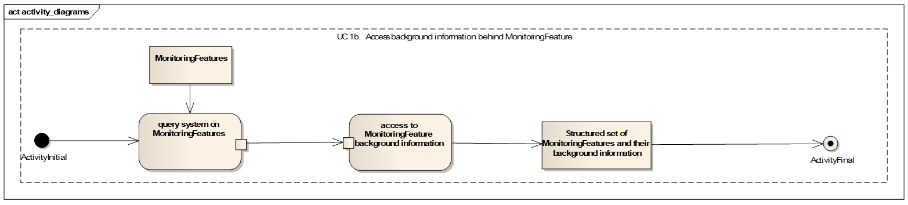

[.text-center]
[cols=",",]
|===
2+|*Use Case Description*
a|
Name
a|
1b. Access to background information behind the Monitoring Feature
a|
Primary actor
a|
Thematic domain expert / politician
a|
Description
a|
The user is using Monitoring Features (Facility, Network) to carry out domain related work. Compared to Use Case 1a, the entry point is the Monitoring Feature

The user gets domain specific access on background information on the environmental monitoring for a given area. So this includes the information about legislation the monitoring is based on, the authorities involved to operate the monitoring, existing networks, monitoring programmes for the domain and area, facilities and activities and so on.
a|
Pre-condition
a|
Monitoring Features used by the user.
a|
Post-condition
a|
A structured set of Monitoring Features (Facility, Network) and their background information attached (with links e.g. specific environmental legislation).
2+|Flow of Events – Basic Path
a|
Step 1
a|
The user queries the system on the Monitoring Features he is actually using.
a|
Step 2
a|
The user gets direct access to each Monitoring Feature background information.
| |
2+|
Flow of Events – Alternative Paths
| |NONE
2+|*Data set: Monitoring Network*
a|
Description
a|
Relevant Monitoring Network(s)
a|
Type
a|
output
a|
Data provider
a|
mixed
a|
Geographic scope
a|
AreaOfInterest XYZ
a|
Thematic scope
a|
Specified domain
a|
Scale, resolution
a|
N/A
a|
Delivery
a|
Online
a|
Documentation
a|
Link to legislation
Link to data provider sites
2+|*Data set: Monitoring Facility*
a|
Description
a|
Relevant Monitoring Facility(s)
a|
Type
a|
output
a|
Data provider
a|
mixed
a|
Geographic scope
a|
AreaOfInterest XYZ
a|
Thematic scope
a|
Specified domain
a|
Scale, resolution
a|
N/A
a|
Delivery
a|
Online
a|
Documentation
a|
Link to legislation
Link to data provider sites
|===

=== 2. Providing information on what an EF is actually monitoring 

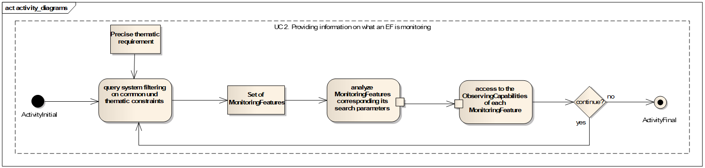

[.text-center]
[cols=",",]
|===
2+|*Use Case Description*
a|

Name
a|
[arabic, start=2]
. Providing information on what an EF is actually monitoring (observing capability)
a|
Primary actor
a|
Thematic domain expert
a|
Description
a|
The user queries in an iterative approach the system to identify relevant Monitoring Features (Facility, Network) based on thematic constraints (Media, Area of Interest, Property, Process, Classification and FeatureOfInterest...).

The user gets domain specific access to precise information on what is monitored, how, when, where, and why.
a|
Pre-condition
a|
Thematic domain expert has a precise thematic requirements (Property, Process, Classification, ...).
a|
Post-condition
a|
A structured set of Monitoring Features (Facility, Network) and their observing capabilities information attached.
2+|Flow of Events – Basic Path
a|
Step 1
a|
The user queries the system filtering on the common and thematic constraints: e.g area of interest and media monitored, observed/measured properties, time span covered, specific methodology applied ...
a|
Step 2
a|
The user analyses the set of Monitoring Features corresponding its search parameters.
a|
Step 3
a|
The user gets direct access to each Monitoring Feature's observing capabilities.
a|
Step 4
a|
The user has the ability to continue querying the system adding further constraints/filters.
| |
2+|Flow of Events – Alternative Paths
| |NONE
2+|*Data set: Monitoring Network*
a|
Description
a|
Relevant Monitoring Network(s)
a|
Type
a|
output
a|
Data provider
a|
mixed
a|
Geographic scope
a|
AreaOfInterest XYZ
a|
Thematic scope
a|
According to the domain specific constraints
a|
Scale, resolution
a|
N/A
a|
Delivery
a|
Online
a|
Documentation
a|
Link to legislation
Link to data provider sites
Link(s) to domain specific semantic (Property, Process, Classification, ...)
2+|*Data set: Monitoring Facility*
a|
Description
a|
Relevant Monitoring Facility(s)
a|
Type
a|
output
a|
Data provider
a|
mixed
a|
Geographic scope
a|
AreaOfInterest XYZ
a|
Thematic scope
a|
According to the domain specific constraints
a|
Scale, resolution
a|
N/A
a|
Delivery
a|
Online
a|
Documentation
a|
Link to legislation
Link to data provider sites
Link(s) to domain specific semantic (Property, Process, Classification,...)

|===

=== 3a. Providing the observations and/or measurements acquired at a Fixed/Mobile EF level 

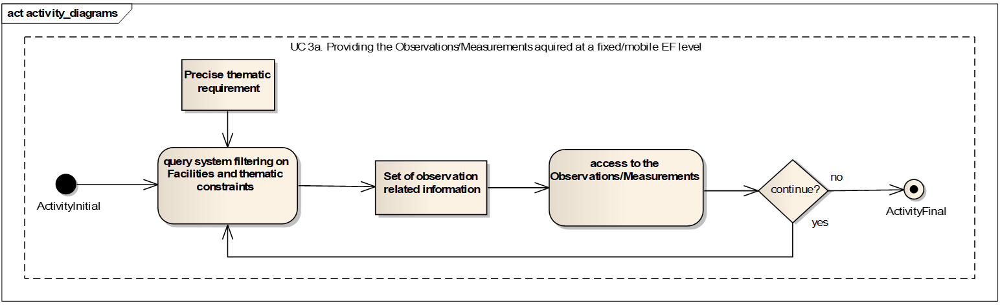

[.text-center]
[cols=",",]
|===
2+|*Use Case Description*
a|
Name
a|
3a. Providing the observations and/or measurements acquired at a Fixed/Mobile EF level
a|
Primary actor
a|
Thematic domain expert
a|
Description
a|
The user has identified the Facilities to carry out his domain related work.

The user queries the Facilities. He has the ability to filter on thematic constraints (Time, Media, Area of Interest, Property, Process, Classification, FeatureOfInterest, ...).

The user receives the corresponding Observations / Measurements
a|
Pre-condition
a|
Thematic domain expert has a precise thematic requirement (Property, Process, Classification, ...)
a|
Post-condition
a|
A structured set of Observations and Measurements in a given encoding.
2+|Flow of Events – Basic Path
a|
Step 1
a|
The user queries the system filtering on Facilities and thematic constraints: e.g area of interest and media monitored, observed/measured properties, time span covered, specific methodology applied ...
a|
Step 2
a|
Result set contains observation related information.
The user gets access to the result set (no observation/measurement is a valid information to be provided).
|Step 3 a|
The user has the ability to continue querying the system adding further constraints/filters.
2+|Flow of Events – Alternative Paths
|
| |NONE
2+|Data set: Observations & Measurements
a|
Description
a|
corresponding Observations / Measurements
a|
Type
a|
output
a|
Data provider
|mixed
|Geographic scope a|
by link to facility
a|
Thematic scope
a|
Specified domain
a|
Scale, resolution
a|
N/A
a|
Delivery
a|
Online / Offline
|Documentation a|
Link to Facility
Link to Property
Link to Process
Link to Feature Of Interest

|===

=== 3b. Providing the observations and/or measurements acquired when a sample is being made 

image::./media/image22.png[image,width=648,height=163, align=center]

[.text-center]
[cols=",",]
|===
2+|*Use Case Description*
a|

Name
a|
3b. Providing the observations and/or measurements acquired when a sample is being made
a|
Primary actor
a|
Thematic domain expert
a|
Description
a|
The user has identified the Facilities to carry out his domain related work.

The user queries the Facilities. He has the ability to filter on thematic constraints (Time, Media, Area of Interest, Property, Process, Classification, FeatureOfInterest...).

The user receives the corresponding Observations / Measurements.
a|
Pre-condition
a|
Thematic domain expert has a precise thematic requirement (Property, Process, Classification,...).
a|
Post-condition
a|
A structured set of Observations and Measurements in a given encoding.
2+|Flow of Events – Basic Path
a|
Step 1
a|
The user queries the system filtering on domain feature of interest, area of interest, media monitored.
a|
Step 2
a|
The system replies with a list of possible domain feature of interest.
The user queries samples per domain feature of interest according to thematic constraints: e.g observed/measured properties, time span covered, specific methodology applied ...
|Step 3
a|
Result set contains specific sampling procedure related information as well as observation related information.
The user gets access to the result set (no observation/measurement is a valid information to be provided).
2+|Flow of Events – Alternative Paths
| |NONE
2+|Data set: Observations & Measurements
a|
Description
a|
List of domain features of interest and corresponding Observations / Measurements
a|
Type
a|
output
a|
Data provider
|mixed
|Geographic scope a|
by link to facility
a|
Thematic scope
a|
Specified domain
a|
Scale, resolution
a|
N/A
a|
Delivery
a|
Online / Offline
|Documentation a|
Link to Facility
Link to Property
Link to Process
Link to Feature Of Interest

|===

=== 4a. Reporting monitoring features

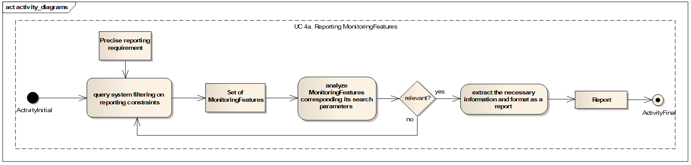

[.text-center]
[cols=",",]
|===
2+|*Use Case Description*
a|

Name
a|
4a : Being able to create a reporting envelope for a given directive involving EFs. Reporting envelope containing Monitoring Features (Facility, Network) only.
a|
Primary actor
a|
Reporter
a|
Description
a|
For certain reporting requirements, the Member State (MS) must provide information on all environmental monitoring facilities (EMF) monitoring a certain media. Background information must be provided for all facilities, as well as the coordinating network.
This use case is not taking into account the generation of a reporting sheet compliant format. Just the extraction of the Monitoring Features from one MS's information system involved in a given reporting is.
a|
Pre-condition
a|
The reporter has a precise reporting requirement to fulfill.
a|
Post-condition
a|
A structured set of Monitoring Features (Facility, Network) and their background information attached (with links e.g. specific environmental legislation) answering the reporting question.
2+|Flow of Events – Basic Path
a|
Step 1
a|
The user queries the system filtering on the reporting constraints: e.g monitoring programme, area of interest and media monitored, observed/measured properties, time span covered, specific methodology applied ...
a|
Step 2
a|
The user analyzes the set of Monitoring Features corresponding its search parameters.
|Step 3 a|
The user extracts the necessary information for the Monitoring Features identified and formats as a report.
2+|Flow of Events – Alternative Paths
| a|
The Features involved in the reporting are marked as such in the MS database.
2+|Data set: Monitoring Network
a|
Description
a|
Relevant Monitoring Network(s)
a|
Type
a|
output
a|
Data provider
|mixed
|Geographic scope a|
AreaOfInterest XYZ
a|
Thematic scope
a|
Reporting requirement domain
a|
Scale, resolution
a|
N/A
a|
Delivery
a|
Online
|Documentation a|
Link to the relevant information regarding the reporting exercise concerned.
2+|*Data set: Monitoring Facility*
a|
Description
a|
Relevant Monitoring Facility(s)
a|
Type
a|
output
a|
Data provider
a|
mixed
a|
Geographic scope
a|
AreaOfInterest XYZ
a|
Thematic scope
a|
Reporting requirement domain
a|
Scale, resolution
a|
N/A
a|
Delivery
a|
Online
a|
Documentation
a|
Link to the relevant information regarding the reporting exercise concerned.

|===

=== 4b. Reporting monitoring features and Observations/Measurements

image::./media/image24.png[image,width=635,height=133, align=center]

[.text-center]
[cols=",",]
|===
2+|*Use Case Description*
a|

Name
a|
4b : Being able to create a reporting envelope for a given directive involving EFs. Reporting envelope containing Monitoring Features (Facility, Network) and Observations and Measurements.
a|
Primary actor
a|
Reporter
a|
Description
a|
For certain reporting requirements, the Member State (MS) must provide information on all environmental monitoring facilities (EMF) monitoring a certain media associated with the corresponding Observations & Measurements.
Background information must be provided for all facilities, as well as the coordinating network.
This use case is not taking into account the generation of a reporting sheet compliant format; just the extraction of the Monitoring Features and Observations & Measurements from one MS's information system involved in a given reporting is.
a|
Pre-condition
a|
The reporter has a precise reporting requirement to fulfill.
a|
Post-condition
a|
A structured set of Monitoring Features (Facility, Network), their background information attached (with links e.g. specific environmental legislation) and their corresponding Observations & Measurements.
2+|Flow of Events – Basic Path
a|
Step 1
a|
The user queries the system filtering on the reporting constraints: e.g monitoring programme, area of interest and media monitored, observed/measured properties, time span covered, specific methodology applied ...
a|
Step 2
a|
The user analyzes the set of Monitoring Features corresponding its search parameters.
|Step 3 a|
The user selects Observations & Measurements fulfilling the reporting requirement constraints (Quality, ...).
|Step 4 a|
The user extracts the necessary information for the Monitoring Features identified and formats as a report.
2+|Flow of Events – Alternative Paths
| a|
The Features involved in the reporting are marked as such in the MS database.
2+|Data set: Monitoring Network
a|
Description
a|
Relevant Monitoring Network(s)
a|
Type
a|
output
a|
Data provider
|mixed
|Geographic scope a|
AreaOfInterest XYZ
a|
Thematic scope
a|
Reporting requirement domain
a|
Scale, resolution
a|
N/A
a|
Delivery
a|
Online
|Documentation a|
Link to the relevant information regarding the reporting exercise concerned.
2+|*Data set: Monitoring Facility*
a|
Description
a|
Relevant Monitoring Facility(s)
a|
Type
a|
output
a|
Data provider
a|
mixed
a|
Geographic scope
a|
AreaOfInterest XYZ
a|
Thematic scope
a|
Reporting requirement domain
a|
Scale, resolution
a|
N/A
a|
Delivery
a|
Online
a|
Documentation
a|
Link to the relevant information regarding the reporting exercise concerned.

|===

<<<
[appendix]
== Code list values - (normative) 

[cols="",options="header",]
|===
|*Code List*
|_MeasurementRegimeValue_
|_MediaValue_
|_ProcessTypeValue_
|_ResultAcquisitionSourceValue_
|_ResultNatureValue_
|===

*MeasurementRegimeValue*

[cols="",]
|===
a|
[cols=",",options="header",]
!===
!Name: !measurement regime
!Definition: !Categories for different types of the MeasurementRegime.
!Extensibility: !any
!Identifier: !http://inspire.ec.europa.eu/codelist/MeasurementRegimeValue
!Values: !
!===

|===

The table below includes recommended values that may be used by data providers.

[cols=""]
|===
a|
*continuousDataCollection*

[cols=","]
!===
!Name: !continuous data collection
!Definition: !Data is collected on a continuous basis. there is usually no end date, as further data is collected
!===

a|
*demandDrivenDataCollection*

[cols=","options="header",]
!===
!Name: !demand driven data collection
!Definition: !Data is collected on demand.
!===

a|
*onceOffDataCollection*

[cols=","options="header",]
!===
!Name: !once-off data collection
!Definition: !Data is collected only once in this configuration. no further observations in this configuration can be expected
!===

a|
*periodicDataCollection*

[cols=","options="header",]
!===
!Name: !periodic data collection
!Definition: !Data is collected at regular intervals. No information is available at to the data collection interval.
!===

|===

*MediaValue*

[cols="",]
|===
a|
[cols=",",options="header",]
!===
!Name: !media
!Definition: !Categories for different types of media.
!Extensibility: !any
!Identifier: !http://inspire.ec.europa.eu/codelist/MediaValue
!Values: !
!===

|===

The table below includes recommended values that may be used by data providers.

[cols=""]
|===
a|
*air*

[cols=","]
!===
!Name: !air
!===

a|
*biota*

[cols=","]
!===
!Name: !biota
!===

a|
*landscape*

[cols=","]
!===
!Name: !landscape
!===

a|
*sediment*

[cols=","]
!===
!Name: !sediment
!===

a|
*soil/ground*

[cols=","]
!===
!Name: !soil/ground
!===

a|
*waste*

[cols=","]
!===
!Name: !waste
!===

a|
*water*

[cols=","]
!===
!Name: !water
!===

|===

*ProcessTypeValue*

[cols=""]
|===
a|
[cols=","]
!===
!Name: !process type
!Definition: !Categories for different process types.
!Extensibility: !any
!Identifier: !http://inspire.ec.europa.eu/codelist/ProcessTypeValue
!Values: !
!===

|===

The table below includes recommended values that may be used by data providers.

[cols=""]
|===
a|
*process*

[cols=","]
!===
!Name: !Process
!Definition: !Indicates that the class used for the description of methodological information of the Observation (ProcessUsed association) is the Process class defined in the GCM.
!===

a|
*sensorML*

[cols=","]
!===
!Name: !SensorML
!Definition: !Indicates that the class used for the description of methodological information of the Observation (ProcessUsed association) comes from SensorML.
!===

|===

*ResultAcquisitionSourceValue*

[cols="",]
|===
a|
[cols=",",options="header",]
!===
!Name: !result acquisition source
!Definition: !Categories for different types of the ResultAcquisitionSource.
!Extensibility: !any
!Identifier: !http://inspire.ec.europa.eu/codelist/ResultAcquisitionSourceValue
!Values: !
!===

|===

The table below includes recommended values that may be used by data providers.

[cols=""]
|===
a|
*exSitu*

[cols=","]
!===
!Name: !ex-situ
!Definition: !The FeatureOfInterest is a specimen taken from the ultimate FeatureOfInterest (i.e. the sampledFeature).
!===

a|
*inSitu*

[cols=","]
!===
!Name: !in-situ
!Definition: !The FeatureOfInterest is a sampling feature which is co-located with the ultimate FeatureOfInterest (i.e. the sampledFeature).
!===

a|
*remoteSensing*

[cols=","]
!===
!Name: !remote-sensing
!Definition: !The FeatureOfInterest is a sampling feature which is also the ultimate FeatureOfInterest (i.e. the sampledFeature).
!===

a|
*subsumed*

[cols=","]
!===
!Name: !subsumed
!Definition: !The value is inherited from children.
!===

|===

*ResultNatureValue*

[cols="",]
|===
a|
[cols=",",options="header",]
!===
!Name: !result nature
!Definition: !State of the result of an observation.
!Extensibility: !any
!Identifier: !http://inspire.ec.europa.eu/codelist/ResultNatureValue
!Values: !
!===

|===

The table below includes recommended values that may be used by data providers.

[cols=""]
|===
a|
*primary*

[cols=","]
!===
!Name: !primary
!Definition: !The result provided with the observation is the direct result of an estimate of a property on the featureOfInterest. No further processing has been performed. Processing may have taken place, but only in the sense of the measurement methodology itself, i.e. converting the millivolt returned from the sensor to the concentration of a substance.
!===

a|
*processed*

[cols=","]
!===
!Name: !processed
!Definition: !The result provided, while usually based on primary measurements, has been substantially processed. This processing can be of diverse natures, in some situations complex aggregates are provided, in other situations, the existing values are interpolated to a continuum.
!===

a|
*simulated*

[cols=","]
!===
!Name: !simulated
!Definition: !The result provided, while usually based on primary measurements, is based on an interpretation model, and provides a simulation of past or future states of the media being analyzed. In this case, the existing values are usually extrapolated into the past or future.
!===

|===

<<<
[appendix]
== Examples - (informative) 

These examples aim to explain the different parts of the EF model including the link to sampling and direct observations. The hierarchical structure offers the option to describe it down to the appropriate level of detail while the associated option provides the possibility to group EF in different ways. Connection point from all thematic areas is from EF point of view the monitoring facility (could be the environmental monitoring network).

In cases where this seems inappropriate to thematic communities, the proposed O&M part could be integrated as well directly into a thematic model. What will be lost will be the common elements for all environmental monitoring facilities shared across thematic areas.

The INSPIRE _Environmental Monitoring Facilities_ Data Specification provides all the basic concepts required to share data on such domain. In addition to the description of the individual facilities including their location and a description of the environmental media monitored, this Data Specification also contains the necessary classes to describe the organisational structure the facilities are involved in such as Programmes and Networks, as well as for the provision of information on the state of environmental media and of other ecosystem parameters.

In order to properly represent the usage of this Data Specification, we have provided object diagrams detailing the individual classes used with exemplary values provided for each class. These individual objects (instances of the classes provided in the Data Specification) are further described by illustrating their correspondence to the real-world objects they represent.

=== Monitoring of water quantity in rivers

==== _Domain introduction_

For various purposes the quantity of water passing a specific location in a river is monitored. Monitoring can range from highly frequent water level observations (water height, river flow) done at fixed locations and using various equipment to singular/randomly taken measures at different locations.

Depending on the question/problem, the measurements/observations/information is used to provide/produce information. The actual problem is defining what is "usable" for the actual questions. E.g. only measurements taken in a specific frequency can be taken into account. For location with a higher frequency averages are used; measurements taken at a lower frequency cannot be used.

Thus, the dataset produced/exchanged is created out of various sources and depends on a common structure how location, frequency and methodology are documented. Direct access to initial raw measurements is not core and in many cases even misleading as the result values cannot be used directly for the specific purpose required.

The EF model tries to provide an approach to exchange aggregated information the same way as primary measurement results. The common approach is to provide the location representing an area of validity of a value and the information needed to include it into further processing or use it for decision support and so on.

The model provides a recursive structure to allow the provision of the correct information at the appropriate level of detail/accuracy while keeping consistency between result values and descriptive attributes. The same attributes are used to describe various levels of aggregation within one thematic domain so the user of the exchanged information has all information needed.

==== _Water quantity monitoring in the French Water Information System_

French _Sandre_'s hydrometric data model follows a 3 steps approach:

[cols=","]
|===
a|
* Hydrometric site:
+
Geographical site (watercourse link) on which river flow measurements are considered to be homogeneous and comparable. Usually for cartographic needs its representative point is used.
+
Apart from general information (administrative, hydrological localisation,...), measurements can be attached to a hydrometric site.
+
On a hydrometric site many equipment allowing the measurement of one or many hydrometric parameters are deployed: hydrometric stations.

a|image::./media/image25.jpeg[image,width=339,height=255, align=center]

a|* Hydrometric station:
+
Equipment deployed on a hydrometric site to observe and measure a given hydrometric parameter (water height, river flow). A hydrometric station pertains to only one site.
+
The hydrometric station carries its own description information. It is also attached to ancillary information such as rating curves, correction curves for the local vertical datum used, certain historical thresholds (floods, ...).
+
Each hydrometric station is fitted with hydrometric sensor(s).

a|image::./media/image26.jpeg[image,width=261,height=261, align=center]

a|* Hydrometric sensor:
+
The hydrometric sensor (one = one of the five vertical gages in the above image) is the equipment that realises the actual physical measurement. It could be a spirit level, an ultrasonic sensor, a human being with a mobile equipment.
+
A hydrometric sensor pertains to only one hydrometric station.
+
It carries descriptive information on the equipment used to measure water height or river flow.
+
It is also attached to the actual measurements.

a|image::./media/image59.jpeg[image,width=72,height=267, align=center]

|===

==== _Mapping to EF theme terminology_

[cols=","]
|===
2+a|* *Environmental Monitoring Facilities*

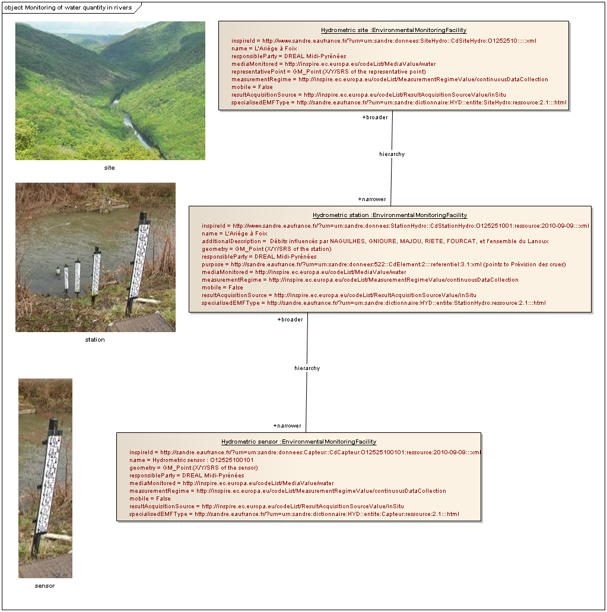

a|* *ObservingCapability and Observation*

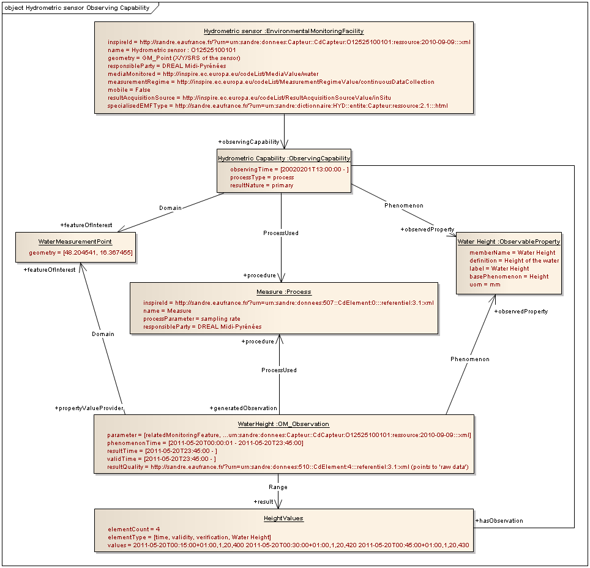

a|For the ease of the example we have simplified the initial Sandre's hydrometric data model.

For example, the featureOfInterest here is a simple location whereas in the initial model, it's a domain feature with its own attributes and associations.

2+a|* *Water Monitoring Network*

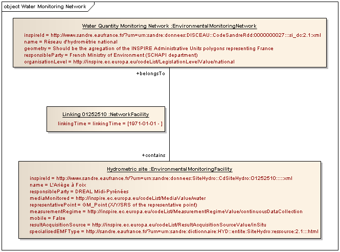
|===

This network pertains to several national Monitoring Programmes

* Environmental Monitoring Programme :

- inspireID : "http://www.sandre.eaufrance.fr/?urn=urn:sandre:donnees:xxxx:1"

- name : "Prévision des crues" -> (flood forecast)

- geometry : should be the aggregation of the INSPIRE Administrative Units polygons representing France

- responsibleParty : "French Ministry of Environment"

* Environmental Monitoring Programme :

- inspireID : "http://www.sandre.eaufrance.fr/?urn=urn:sandre:donnees:xxxx:2"

- name : "connaissance générale des débits (réseau patrimonial)"-> general riverflow knowledge (perenial network)

- geometry : should be the aggregation of the INSPIRE Administrative Units polygons representing France

- responsibleParty : "French Ministry of Environment"'

Other 'hydrometric' Environmental Monitoring Network exist in France. For example the one with the following inspireID :

"http://www.sandre.eaufrance.fr/?urn=urn:sandre:donnees:DISCEAU::CodeSandreRdd:0400000035:::si_dc:2.1:xml"

This EMN geometry is restricted to the 'Loire' River Basin (thus a 'sub-national' organisationalLevel).

It's a sub-network of the one described in the instance diagram above (0000000027) with whom it shares some EFs and Environmental Monitoring Programmes.

It is also linked to other Environmental Monitoring Programmes like one on the management of two dams/reservoirs.

* *Links between EMFs from different themes*

Water quantity and water quality monitoring network are not set up in order to answer to the same needs. Then with each water quality EMF, users won't always find a water quality EMF.

In some cases it can be useful to know which water quantity EMF can be associated with which water quality EMF; at least to have an information about the river flow at the water quality EMF level (a correction coefficient can be applied).

This association of EMFs is allowed by the anyDomainLink association class available at the EMF concept level.

=== Landscape monitoring in Sweden

==== _Domain introduction_

Landscape monitoring programmes are typically set up with an aim to describe and quantify the status and trend of biodiversity, or more precisely those landscape structures that make up the prerequisites for important aspects of biodiversity. To optimise monitoring efforts and data quality, the sampling strategy will be either a random sample or a fixed grid setup with randomised starting point. The grid may be further stratified in order to enhance coverage of less common biotopes or landscape types. In such monitoring programmes, the data analysis will always take place on the aggregated level, whereas data from the individual monitoring plot becomes meaningful only after pooling of data from all plots within the wider programme context. This means that the logical georeference for the data set will be the whole area (biogeographical or administrative) covered by the monitoring network, rather than the individual plots. There are also special cases where the exact location of the permanent data collection plot has to be kept hidden/secret. This is because the rationale of the monitoring programme demands that the individual monitoring plots should face the same chance of land use changes (or permanency of land use practises) as any other part of the territory. If landowners or land users of any category were to make decisions on land use based on the knowledge that plots are being monitored for existing landscape and biodiversity qualities there would be a real risk of bias in such monitoring programmes.

==== Overall description of the monitoring programme NILS

One landscape monitoring example in Europe is the Swedish National Inventory of Landscapes (NILS) which covers all parts of the country by a fixed grid of 631 5x5 km landscape squares where infrared aerial photo interpretation is applied in combination with systematic field measurements in a systematic subset of plots within the squares. By rotation, the squares are revisited every 5 years, starting from 2003. The focus is mainly on biophysical landscape changes and land use impact relevant for biodiversity. The NILS programme is designed to provide a scientifically sound baseline for biodiversity monitoring and evaluation in Sweden.

As an extension of the NILS programme, the ongoing project (LIFE08 NAT/S/264) Monitoring of Terrestrial Habitats (MOTH) is set to strengthen NILS capacity to contribute to the evaluation of conservation status of species and habitats of European concern. In this context, the original Swedish national Inventory of Forests (in operation since 1923) has been partially redesigned with a stronger biodiversity focus in order to support and complement the new NILS programme.

All of these nationwide landscape monitoring programmes are based on the same rationale - that land use on individual sites must not be influenced by knowledge about the location of the plots. The results of the landscape monitoring programmes – if successful – have a strong potential to support national policies in economically important as well as ecological and environmental relevant areas such as agriculture and forestry. Thus it is essential that the permanent plots remain an exclusive knowledge of the monitoring programmes and their closely collaborating researchers only.

Online references:

_www.slu.se/en/collaborative-centres-and-projects/nils/_

_www.slu.se/en/collaborative-centres-and-projects/swedish-national-forest-inventory/_

_http://www.slu.se/Documents/externwebben/s-fak/skoglig-resurshallning/Landskapsanalys_publikationer/Publikationer2003-2009/NILS_manual_f%C3%A4lt_2007_English.pdf_

NILS follows the biological diversity by monitoring the landscape with random sampling in 631 permanent sample plots, systematically distributed in Sweden.

image::./media/image30.png[image,width=425,height=307, align=center]

[.text-center]
*Figure 14: Sample NILS overall structure*

NlLS' random sampling design makes it possible to collect objective data with the highest precision possible, which is a requirement in order to be able to convey reliable information on national and regional levels. The composition and structure of the landscape are important elements in NILS and in order to be able to investigate them properly, it is necessary that the random sample covers large parts of the landscape. By compromising between need and cost, NILS has chosen landscape squares (5x5 km) for general descriptions with a central kilometre square (1x1 km) for more comprehensive measurements.

In order to carry out the estimates of e.g. landscape structure index, the area of the ground cover and frequency of indicator species, NILS has been designed in the following way:

*Strata divisions*

Sweden has been divided into ten geographical strata. The divisions provide basis for concentrated random sampling in certain areas, e.g. cultivated land and the alpine region.

In each strata, NILS consists of the following parts:

* General aerial photo interpretation within a 5x5 km square (the "landscape square'),
* Detailed aerial photo interpretation within a central 1x1 km square of surface objects (comprehensive surveying of land cover based on a detailed class system) with linear elements and point elements,
* Field inventory within a 1x 1 km square as well as in selected semi-natural pastures and meadows within the NILS landscape square, comprising the following components:
** Sample plot inventory, with detailed description of land cover, land use, measures, ground type and vegetation.
** Line intercept sampling of linear elements (not treated in the mapping to EF terminology below):
*** Water courses, ditches, roads, fences, forest edges etc,
*** Linear ground disturbance, tire tracks, paths etc,
*** Water environments in proximity to ditches, streams and shore areas.

Data are collected by two different methods:

*Aerial Photo Interpretation*

The composition and structural changes in the landscape are large scale events that are hard to detect from the ground, but that can easily be interpreted from infrared aerial photos. A general interpretation and digitising is made of the NILS plots. Many different types of landscapes are registered in order to give a general picture of the structure and composition of the landscape. Within a kilometre square (1x1 km), a more detailed interpretation with digital readings of landscape elements and biotopes is made. Interpretation and analysis of historical aerial pictures and maps makes it possible to follow the historical development.

_http://www.slu.se/en/collaborative-centres-and-projects/nils/data-collection/aerial-photo-interpretation/_

*Field Inventory*

The field inventory adds information that cannot be obtained from the aerial photos, for instance detailed habitat and site characteristics and biological species information. Aerial photo interpretation and field inventory are closely coordinated in the fixed monitoring design. The sample plots' sizes correspond directly to the smallest map unit in the aerial photo interpretation

Both comprehensive inventory of the ground cover and land use, as well as detailed description of the vegetation are performed in systematically placed sample plots within the 1 km x 1 km square. The line intersect inventory, which is performed between the circular plots, provides good estimates of length and quality of linear elements in the landscape (such as roads, hedges and ditches).

About ten two-person crews take part in the fieldwork, which is performed between May and September.

_http://www.slu.se/en/collaborative-centres-and-projects/nils/data-collection/field-inventory/_

==== _Mapping to EF theme terminology_

* *Environmental Monitoring Facilities*
+
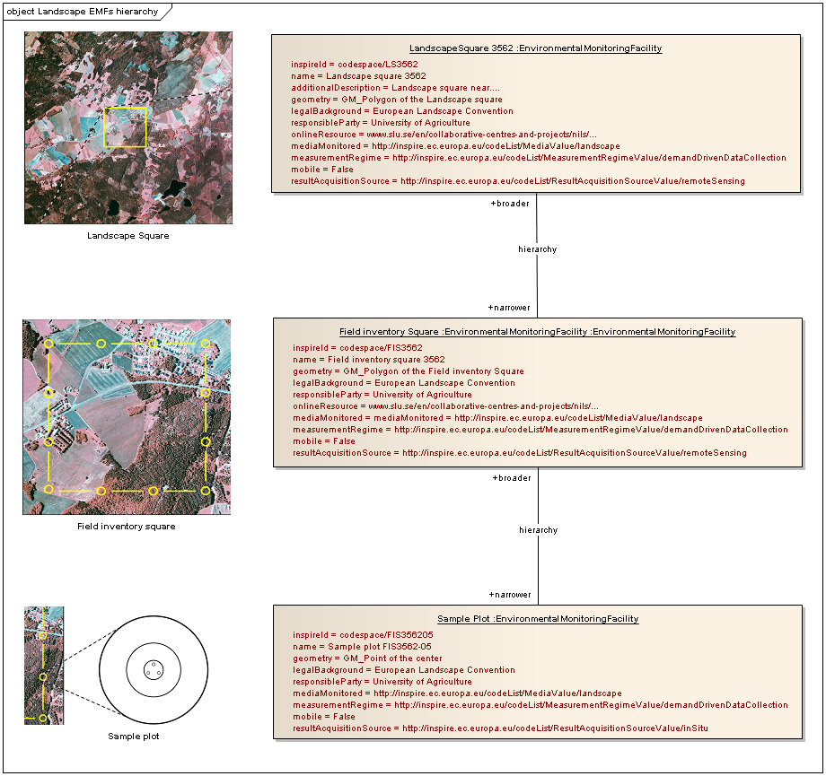
+
** *Landscape square (5x5km)*
+
A Landscape square is an Environmental Monitoring Facility with an ObservingCapability defining the general aerial photo interpretation protocol
+
The general photo interpretation is then an Observation attached to this Environmental Monitoring Facility.

** *Field inventory square (1x1 km)*
+
The Field inventory square is an Environmental Monitoring Facility with an ObservingCapability defining the detailed aerial photo interpretation protocol
+
The detailed photo interpretation is then an Observation attached to this Environmental Monitoring Facility.

** *Sample plot*
+
The Sample Plot, is an extra level of the EMF hierarchy.
+
It has 4 different observing capabilities, each of those corresponding to each radius.
+
Each observing capability results in Observations corresponding to the protocol applied.

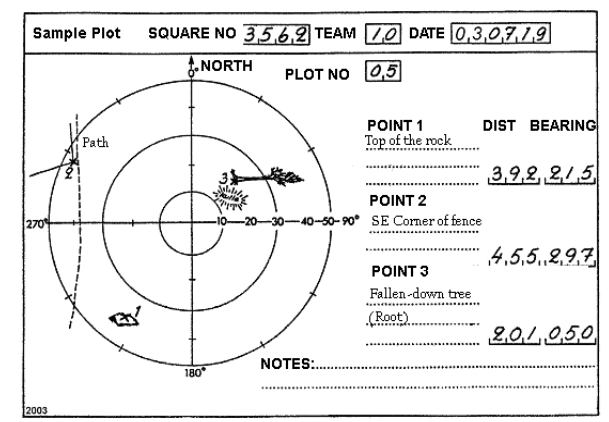

[.text-center]
*Figure 15: Sample Plot sheet example*

FOR EACH RADIUS DIFFERENT KINDS OF DATA ARE COLLECTED:

20 M RADIUS (1257m2)

* Landcover main type
* Landcover trees
* Main land use
* Impact, land use practise
* Fell habitat type

10 M RADIUS RADIUS (314m2)

* Landcover bushes
* Landcover field layer
* Landcover bottom layer
* Soil description
* Detailed tree measurement
* Indicator lichen species

3,5 M RADIUS (38,5m2)

* Detailed tree measurement
* Animal droppings

0,28 M RADIUS (0,25m2)

* Field layer description
* Bottom layer description
* Vascular plant species
* Bryophyte species
* Lichen species

* *Environmental Monitoring Facility with Observing Capabilities and Observations: Field inventory square*

Here we show how Observing Capabilities are attached to a specific _Environmental Monitoring Facilities_ instance. In this example, the _Environmental Monitoring Facilities_ instance describes a field inventory square. The Phenomenon being observed is the canopy cover of pine; the Process Used is aerial photo interpretation. The Feature of Interest is the 1x1km Field inventory square.

[cols=","]
|===
2+a|
image::./media/image33.png[image,width=754,height=473, align=center]

a|image::./media/image34.png[image] 

a|In this diagram, the example above has been extended through the addition of an observation. This refers to the same Phenomenon, Process Used and Feature of Interest as the Observing Capability described above. In addition, it provides a result on the Range association, which contains the actual canopy cover of pine on the field inventory square.
|===

* *Environmental Monitoring Facility with Observing Capabilities and Observations: Sample Plot*

In the next example we show how Observing Capabilities are attached to a specific _Environmental Monitoring Facilities_ instance. In this example, the _Environmental Monitoring Facilities_ instance describes a Sample Plot, so a lower hierarchy level than shown in the previous example. The Phenomenon being observed is the occurrence of individual species from a checklist; the Process Used describes the field inventory methodology. The Feature of Interest is the Sample Plot.

[cols=","]
|===
2+a|
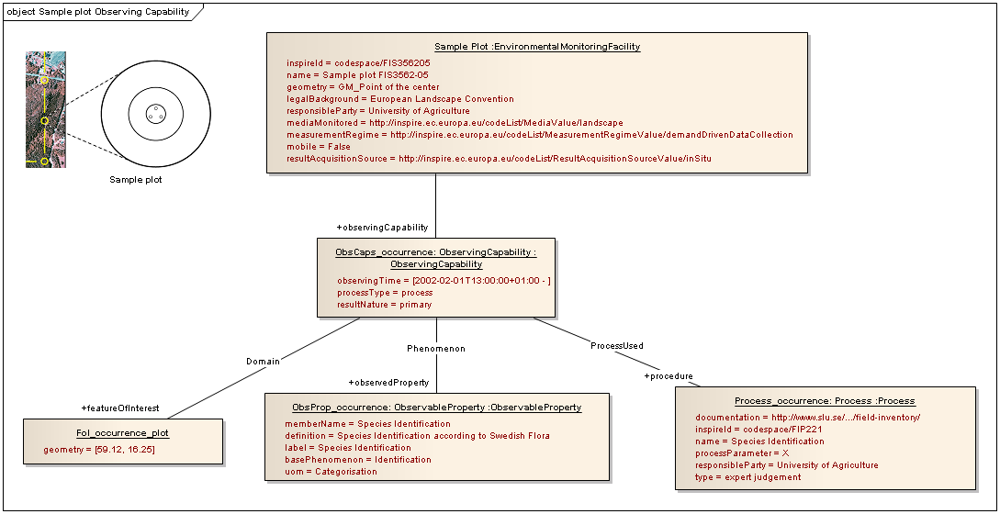

a|
image::./media/image36.png[image,width=608,height=524] 

a|In this diagram, the example above has been extended through the addition of an observation. This refers to the same Phenomenon and Process Used as the Observing Capability described above, but provides a different Feature of Interest representing the actual location of the individual species being reported. In addition, it provides a result on the Range association, which identifies which species (_Juncus anceps)_ was identified.
|===

* *Environmental Monitoring Facilities*

All Sample Unit pertain to the 'NILS' monitoring network

image::./media/image37.png[image,width=604,height=652, align=center]

* *Environmental Monitoring Programme*

The EnvironmentalMonitoringProgramme is the 'Landscape monitoring in Sweden'.

Starting from 2003 and by rotation, the squares are revisited every 5 year. Work is performed between May and September.. Then each revisit corresponds to an EnvironmentalMonitoringActivity.

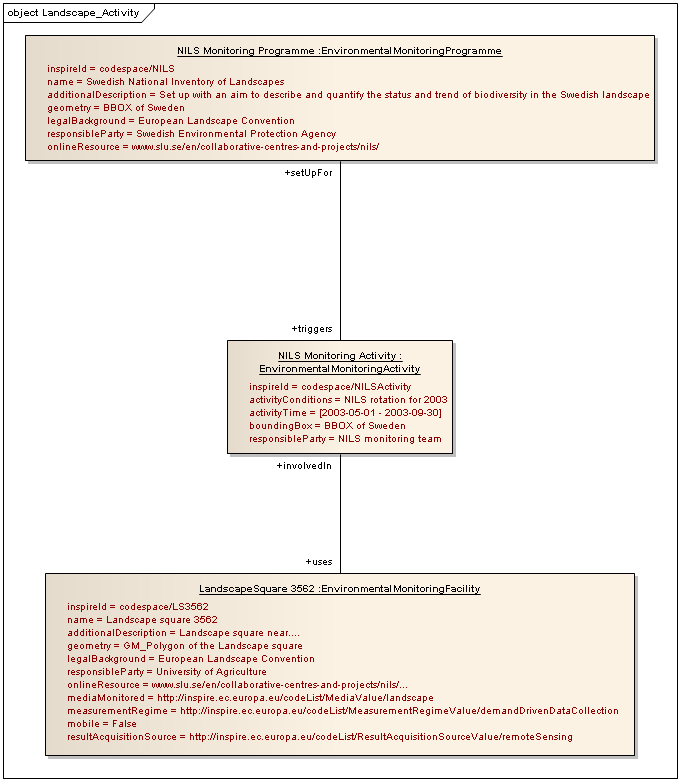

=== Air quality monitoring example

==== Domain introduction

Air pollution is a local, European and hemispheric issue. Released in one country air pollution may be transported in the atmosphere and contribute to poor air quality elsewhere, affecting human health and the environment. The issue of the air quality guideline 2008/50/EG is to improve air quality in areas where the current quality is unacceptable and to protect areas where the air is relatively free of contamination. Therefore comparable information on air quality should be collected across the Community with standardised measurement techniques and common criteria for the number and location of measuring stations.

==== Description of air quality monitoring in Austria

The Austrian air quality network is organised as a decentralised system, mirroring the federal structure of administration in Austria. The nine regional provincial governments each operate a regional air quality monitoring network within their federal province; the national background network, including EMEP, is operated by Umweltbundesamt.

Each of the 10 networks is responsible for the entire QA/QS and storage of its measurement data, using reference standards provided by Umweltbundesamt for calibration. Each Federal Province publishes daily and annual reports (partly monthly reports) for its territory.

Preliminarily validated data are transmitted hourly from the Provinces to the national AQ data-base (operated by Umweltbundesamt) for daily national (and, through EEA's NRT information system, Europe-wide) AQ information, as well as for monthly and summer ozone reports to EC.

Finally validated data are transmitted annually from the Provinces to the national AQ data base for national annual reports and annual reports and data submission to EC.

The data from these networks are stored at the regional level within the provincial administration. This data is then aggregated at national level. This central aggregation serves 2 purposed:

• Provide information for national air quality legislation

• Provide information for EU reporting

The following diagram gives a coarse overview of the structure of the decentralised Austrian Air Quality Network:

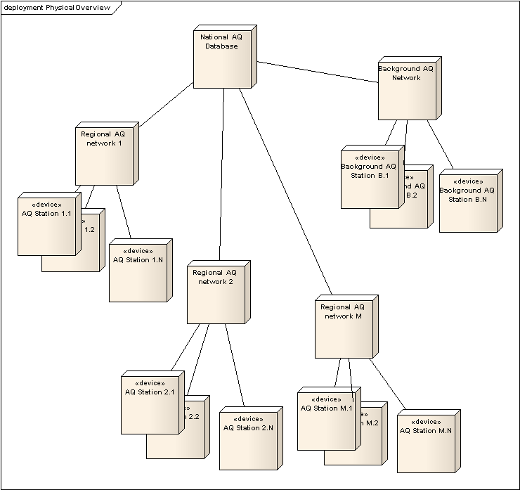

[.text-center]
*Figure 16: Distributed Architecture in Austria Deployment Diagram*

Each Network maintains multiple air quality monitoring stations. The data from these stations is collected and quality assured within the regional air quality networks. In addition to the regional network, the background network also collects and stores data. This is then aggregated into a central national air quality database for report generation on the national level.

image::./media/image40.png[CheckExceedances,width=604,height=532]

[.text-center]
*Figure 17: Exceedance Checking Activity Diagram*

When an exceedance occurs, the national air quality expert on standby is automatically notified via e-mail and sms. The national air quality expert in turn notifies the regional expert that an exceedance has occurred, and requests input from the regional expert. The regional expert accesses the relevant data, and based on local expertise decides if the exceedance is to be deemed as valid. If it is a valid exceedance, this information is returned to the national expert, who in turn gives clearance for transmission of the exceedance values for reporting purposes. If the exceedance is deemed as invalid, this value is flagged as invalid within the regional AQ DB and the national expert is notified, who suppresses the further communication of this value. In addition, the station operator is informed of the invalid values being generated by the station. The updated data, with the invalid flag, is then uploaded to the national air quality database.

[cols=","]
|===
a|
* Air quality monitoring stations
+
The operation, maintenance and quality assurance of the air quality monitoring stations is performed by the nine provincial governments and by Umweltbundesamt (for background measurements).
a|image::./media/image41.png[Station,width=158,height=263]

a|
* Air quality monitoring networks
+
Each of the nine federal provinces, as well as Umweltbundesamt (background AQ monitoring network) operates an air quality database. Measurement data are transmitted every 30 minutes to the databases from the monitoring stations. The data-bases are equipped with tools for QA/QC of measurement data (visualisation, data correction, documentation of validation), for generating reports and other statistics, and for data exchange with other data-bases (national, EEA).
a|
image::./media/image42.png[NetworkStations,width=488,height=245]
2+a|

* National air quality database
+
All Austrian air quality monitoring databases are connected by the AQ data network ("Immissionsdatenverbund", IDV), which enables NRT data transmission from the regional AQ data-bases to the national AQ data-base operated by Umweltbundesamt. Each monitoring network operator can retrieve data from each other by the AQ data network.
+
Umweltbundesamt uses the data from all networks for national and international reporting.
|===

==== Mapping to EF theme terminology

As _Environmental Monitoring Facilities_ lie at the core of this Data Specification, we will begin this section with the description of a simple air quality monitoring station with one sensor monitoring ozone concentration (O3). This example makes use of the attributed association "hierarchy" to provide information on both the facility itself as well as the O3 Sensor as an instance of the "EnvironmentalMonitoringFacility" Class.

The first object we will describe carries the name "AQ_Station", and is an instance of the "EnvironmentalMonitoringFacility" Class. This object describes the Environmental Monitoring Facility itself, so its focus is more on organisational information pertaining to this facility such as the legal background leading to its establishment or the organisation responsible for maintenance.

A second instance of the "EnvironmentalMonitoringFacility" Class is used to describe the O3 measurement complex contained within this station; the corresponding object carries the name "O3_Sensor". This object contains information specific to the O3 measurement process carried through by the equipment at this station, partially through attributes within this class and partially through its link to an object of the class "ObservingCapability", which provides the more measurement specific parts of this information. This object is linked to the "AQ_Station" object via the "hierarchy" association, which describes the time that the measurement complex "O3_Sensor" has been linked to the station "Station".

The "ObservingCapability" class provides detailed information on the capabilities of an individual sensor or other type of data input device. In addition to general information such as if the results provided are primary, processed or simulated data, this includes the following objects:

* The phenomenon being measured or observed through reference via the "Phenomenon" association to the "observedProperty", an object of class "ObservableProperty" named "O3_Property" in this example;
* the measurement process through reference via the "ProcessUsed" association to the "procedure", an object of the class "INSPIRE_OM_Process" named "O3_Process" in this example;
* the exact object of observation or measurement, in this case the air bubble around the intake vent represented by a green circle around the vent, through reference via the "Domain" association to the "featureOfInterest", in this case an instance of the GML feature type "My_FoI_Type" and named "O3_FoI" in this example.

The individual objects described are shown in relation to each other as well as to an illustrative image of an air quality monitoring station in the image below.

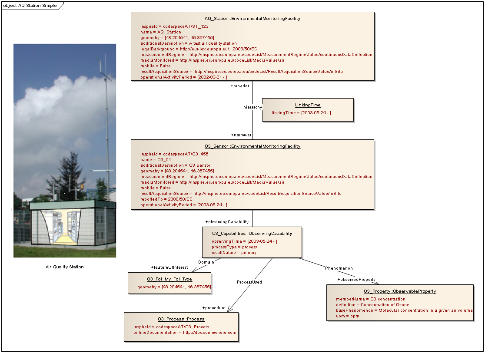

In order to show the true power of the "EnvironmentalMonitoringFacility" "Hierarchy" association, a more complex example is provide. In this example, in addition to the O3 measurement complex contained within this station, we will also describe the tower hosting meteorological equipment. For clarity only the "EnvironmentalMonitoringFacility" classes are depicted, while the "ObservingCapabilities" classes have been omitted.

The _Environmental Monitoring Facilities_ objects "AQ_Station" as well as "O3_Sensor" are the same as in the previous example. In addition, we have modelled the tower hosting various types of meteorological equipment, in our example wind speed and wind direction.

A new object of the "EnvironmentalMonitoringFacility" class has been created for the representation of the measurement tower. While this is not strictly necessary, it can be useful in providing clarity as to the actual station configuration, especially in the case of complex stations. This object carries the name "MeteoTower". A simpler approach would be directly linking all sensors on the tower to the _Environmental Monitoring Facilities_ object "AQ_Station"

For each sensor mounted on this measurement tower, we have created further objects based on the "EnvironmentalMonitoringFacility" class for the example wind speed and direction sensors; these carry the names "AQ_WindSpeed" and "AQ_WindDirection" respectively. This example also further illustrates the use of the linking time information provided in the "Hierarchy" association; while the wind speed sensor was linked to the tower, and thus the facility on July 26^th^ 2005, the wind direction sensor was not linked to this facility until the 3^rd^ of December 2007.

In a full data model, these objects of the "EnvironmentalMonitoringFacility" class would be further detailed with their "ObservingCapabilities", giving the user detailed information on the capabilities of the individual sensors described.

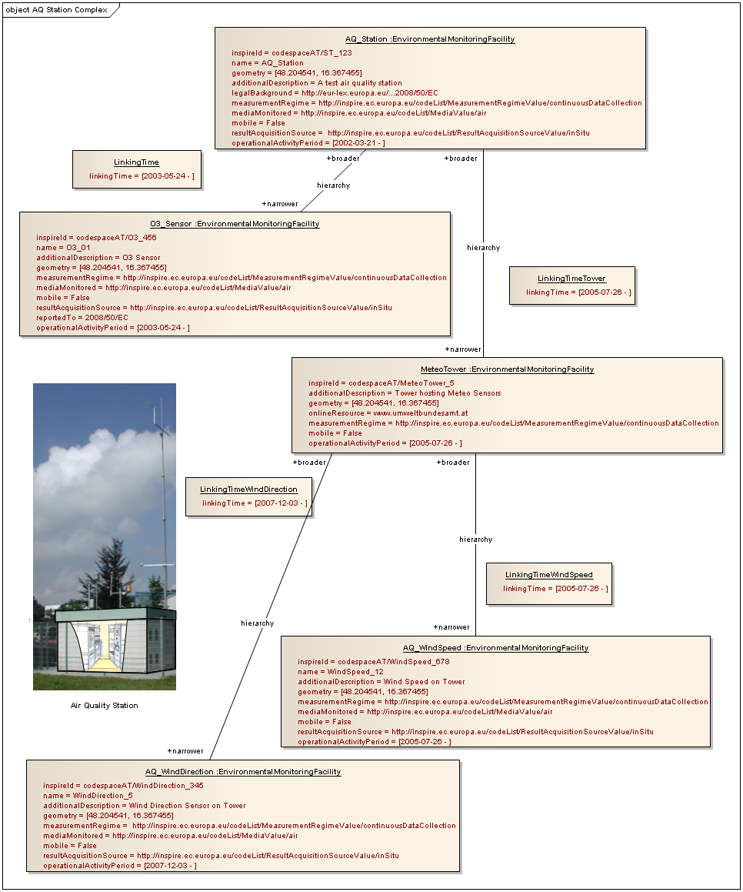

In addition to providing concise information about _Environmental Monitoring Facilities_, this Data Specification also contains the necessary classes to describe the organisational structure the facilities are bedded in such as Programmes and Networks.

The "EnvironmentalMonitoringNetwork" has been provided for structuring information on Environmental Monitoring Networks such as the area the network is operating in or contact information to the parties responsible for this network. In the example the object representing an instance of the "EnvironmentalMonitoringNetwork" class carries the name "NetworkCarinthia", and represents the network shown in the map by the grey border.

While in reality all stations belonging to this network would be given, for purposes of brevity we will only describe 2 stations belonging to this network. The objects representing instances of the "EnvironmentalMonitoringFacility" class carry the names "AQ_Station_Obervellach" and "AQ_Station_Wolfsberg". They are each linked to the "NetworkCarinthia" with their linking time, so the time they have been actively participating within this network.

In order to keep the illustrations understandable, the further component parts of the facilities shown in the diagram below have been omitted, and only the top level instance of the "EnvironmentalMonitoringFacility" Class is used to represent the individual facilities.

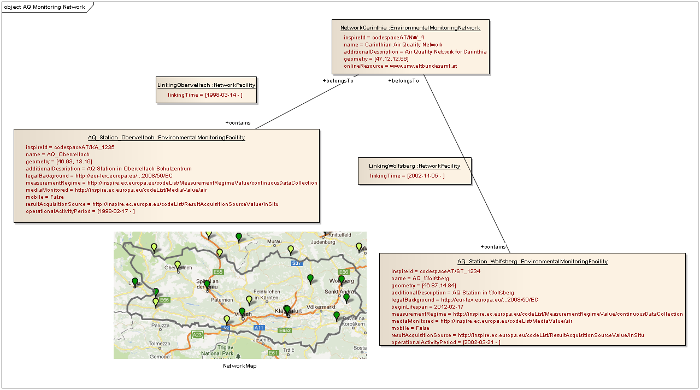

In addition to the provision of the information describing _Environmental Monitoring Facilities_ including their location and a description of the environmental media monitored and further administrative information, the INSPIRE directive also stipulates the provision of information on the state of environmental media and of other ecosystem parameters.

All objects that have already been described in the previous examples, and where the information described in these objects would usually be made available together with the station information, have been coloured green for easy differentiation. The only true additions when providing data are instances of the classes "OM_Observation" as well as the result type.

In real-world implementations, all objects referred to in both examples need only be provided once, and then referenced where needed. This has the advantage that all information describing the measurement process carried through by the equipment one particular station need only be provided once, and can then be referenced by its inspireId each time it is reused. In theory, objects such as the "O3_Process" could be provided by the equipment manufacturer, and referenced by those using this equipment in their stations.

The "OM_Observation" class, taken from the ISO 19156 Observations and Measurements standard, provides the core information for an observation or measurement on an INSPIRE feature. It does so by utilising the same associations as used in the "ObservingCapability" class, from the object "O3_Observation", as follows:

* The phenomenon being measured or observed through reference via the "Phenomenon" association to the "observedProperty", an object of class "ObservableProperty" named "O3_Property" in this example;
* the measurement process through reference via the "ProcessUsed" association to the "procedure", an object of the class "INSPIRE_OM_Process" named "O3_Process" in this example;
* the exact object of observation or measurement, in this case the air bubble around the intake vent represented by a green circle around the vent, through reference via the "Domain" association to the "featureOfInterest", in this case an instance of the GML feature type "My_FoI_Type" and named "O3_FoI" in this example.

The object "O3_Observation" also provides information on the explicit measurement being provided; this includes the time that the phenomenon was observed, the time the measurement results were actually available, and in the parameter attribute a link back to the Environmental Monitoring Facility where these measurement were made.

In addition to the observation metadata described above, the object "O3_Observation" also provides the actual measurement data via its association with a result object, in this example "O3_Result". Various types are provided for the encoding of results from observations; in this example we are showing the simplest result type for time series information, covering the following attributes:

* the number of elements provided for each individual measurement (in this example 4);
* the types of these elements (in this example the timestamp of the measurement (start-time of the hour interval), the validity of this measurement, the verification status of the measurement;
* the actual measurement values.

image::./media/image46.png[image,width=604,height=618, align=center]

=== Marine environment monitoring facilities

==== _Domain introduction_

A monitoring programme implemented by a European directive on assessing environmental status initiates campaign activities to collect data from environmental monitoring facilities. Environmental monitoring facilities include at the top of hierarchy a mobile vessel which undertakes a research cruise with a defined scientific mission of environmental data collection. A mobile vessel hosts devices which have different measurement regimes either ex-situ or in-situ. An example of a ex-situ regime is sampling equipment periodically deployed which collects specimens and data direct from the environment domain and observes and measures parameters in a scientific laboratory after the campaign has finished. Synchronously, the mobile vessel contains in-situ environmental monitoring facilities which continuously collect environmental data related to the domain. Observations and measurements from the permanently deployed facilities on a mobile vessel are managed via an onboard scientific data management system and transferred to the shore organisational data management system after a campaign has completed.

==== _Example at the Marine Institute_ 

A Marine Vessel is fitted with an array of monitoring devices.

image::./media/image47.jpeg[CelticExplorer.jpg,width=534,height=359]

[.text-center]
*Figure 18: Marine vessel © Marine Institute*

*One Automated sampling device (also called CTD)* is taking water samples at fixed location.

At those locations the ship stops to allow the sampling device go under the water and take water samples at various depths.

Each of those sample/specimen will be analysed latter in a laboratory

image::./media/image48.png[image,width=385,height=292, align=center]

[.text-center]
*Figure 19: © Rosette sampler*

image::./media/image49.png[image,width=383,height=444, align=center]

[.text-center]
*Figure 20: Potential cruise followed and location of observations taken by the automated sampling device © European Environment Agency*

*One other monitoring device is attached to the hull of the ship and is taking continuous measurements of the water temperature and salinity.*

image::./media/image50.png[image,width=488,height=510, align=center]

[.text-center]
*Figure 21: Same cruise but with location of observations of continuous measurement device* *© European Environment Agency*

The following diagram summarises the context.

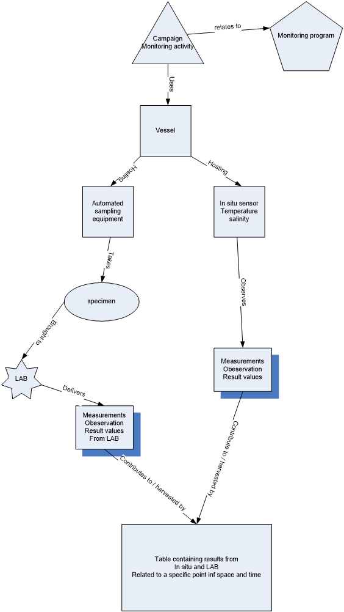

==== _Mapping to EF theme terminology_ 

* *Environmental Monitoring Facilities*

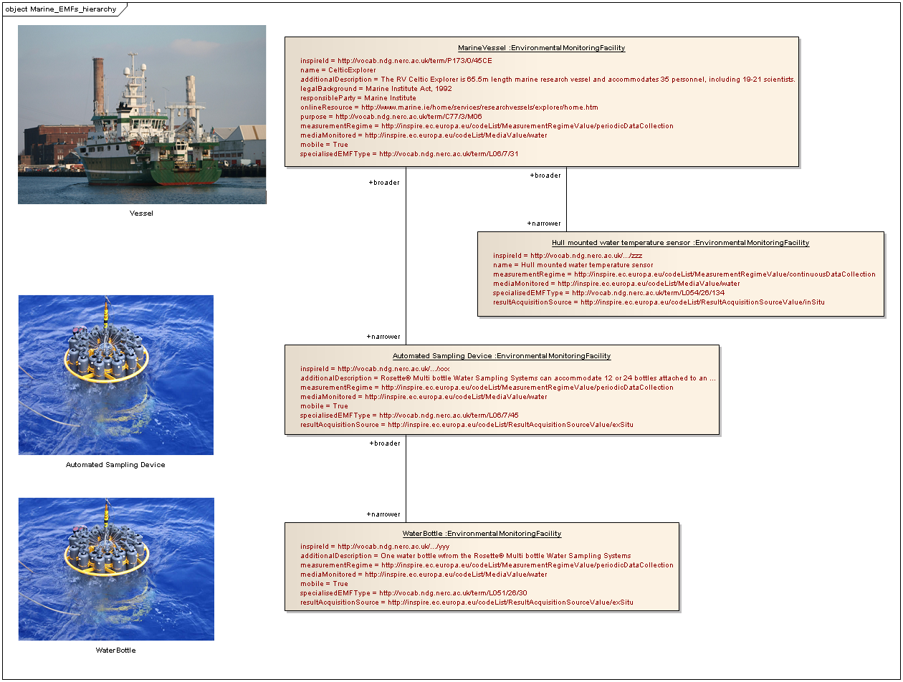

[.text-center]

* *ObservingCapability and Observation for the automated sampling device*

image::./media/image53.png[image,width=602,height=532, align=center]

=== How to extend EF data model when reused in a reporting context?

==== _Domain introduction_

This example aims at providing a basic methodology for reusing and extending the INSPIRE _Environmental Monitoring Facilities_ data model as required in various contexts. The most important use case identified for such reuse and extension is the reporting of environmental data to the European Commission; however, the basic principle demonstrated could be applied in another context (i.e. deploying an extended version of the EF data model within a Member State information system).

We will demonstrate the method used for the definition of air quality reporting schemata in accordance with the harmonised air quality directive 2008/50/EC.

*_/!\ Please note that the following example is here for the sole purpose of demonstrating the mechanism for the extension of the existing Environmental Monitoring Facilities data model to the full reporting requirements. As this work is still in progress at the time of writing this document, it must be noted that the structure and mapping described here may have been subject to modifications in the finalisation process. Thus, this example does NOT provide guidance for the implementation of INSPIRE based air quality reporting. /!\_*

==== _European Air Quality Reporting Based on INSPIRE_

Directive 2008/50/EC of the European Parliament and of the Council of 21 May 2008 on Ambient Air Quality and Cleaner Air For Europe (CAFE) states in Article 26 Public information "_Member States shall ensure that the public as well as appropriate organisations ... are informed, adequately and in good time, of ... ambient air quality ..._ [and] _... air quality plans ... The information shall be made available free of charge by means of any easily accessible media including the Internet or any other appropriate means of telecommunication, and shall take into account the provisions laid down in Directive 2007/2/EC."_

[.text-center]
*Figure 22: Legal Reporting Background*

Over the last several years, INSPIRE Thematic Working Groups (TWG) have been collecting and structuring the requirements for the provision of data within their thematic domain. The types of data commonly stored for the description of features pertaining to these thematic domains have been collated; Use Cases have been collected from diverse possible usage areas. The resulting INSPIRE thematic Data Specifications have been created in a manner designed to support the various usage areas, including environmental reporting on both the national and the European level.

However, the inclusion of the explicit reporting concepts directly into the INSPIRE Data Specifications would not be beneficial, as this would increase the legislative burden each time thematic reporting requirements were adjusted. In addition to the necessary modifications of the thematic legislation, changes to the INSPIRE Data Specifications would also be required. Thus, the INSPIRE Data Specifications have been designed in such a manner to provide the core thematic framework, which can then be extended to also support the additional requirements stemming from reporting requirements.

==== _Inspire specifications reuse methodology_

* *Extension Process*
+
The following steps have been identified as necessary for the extension of INSPIRE Data Specifications to reporting requirements:
+
** Analyse reporting concepts from legal requirements,
** Identify relevant INSPIRE Themes,
** Identify relevant INSPIRE Feature Types,
** Map reporting concepts to INSPIRE Feature Types:
*** Direct mapping to attributes possible,
*** Direct mapping to associations possible,
*** Additional attributes necessary -> derive class from INSPIRE,
*** If required, define additional classes,
*** INSPIRE requires additional attributes -> add to reporting guidelines.
** Provide Mapping from reporting concepts to (extended) INSPIRE classes.

* *Extension Process applied to the European Air Quality Reporting*
+
The following air quality reporting concepts have been harmonised within Annex II of the Implementing Provisions (2011/850/EU) of the AQ directive:
+
** Common Data types,
** (B) Information on zones and agglomerations,
** (C) Information on the assessment regime,
** (D) Information on the assessment methods:
*** (i) General: information for all assessment methods,
*** (ii) Fixed measurement Information,
*** (iii) Indicative Measurement Information,
*** (iv) Modelling Information,
*** (v) Objective Estimation Information.
** (E) Information on primary validated assessment data and primary up-to-date assessment data,
** (F) Information on generated aggregated data,
** (G) Information on the attainment of environmental objectives,
** (H) Information on air quality plans,
** (I) Information on source apportionment,
** (J) Information on the scenario for the attainment year,
** (K) Information on measures.

The concepts provided in sections H to K describe Air Quality Management Plans, which pertain to the information level instead of the data level covered by INSPIRE, are out of scope for INSPIRE. Air Quality assessment and attainment information, as provided in sections B to G of the Implementing Provisions, clearly falls into the INSPIRE domain. The following INSPIRE Themes provide the basis for this reporting:

* Atmospheric Conditions and Meteorological Geographical Features,
* Area management/restriction/regulation zones and reporting units,
* _Environmental Monitoring Facilities_,
* Transport Networks.

The relevant classes from these data specifications have been identified, and the required reporting concepts have been mapped to these classes.

image::./media/image55.png[AQD_Mapping_New,width=525,height=277]

[.text-center]
*Figure 23: Mapping to EnvironmentalMonitoringFacility Class*

Where necessary, the base classes provided by INSPIRE have been extended with Air Quality reporting specific concepts.

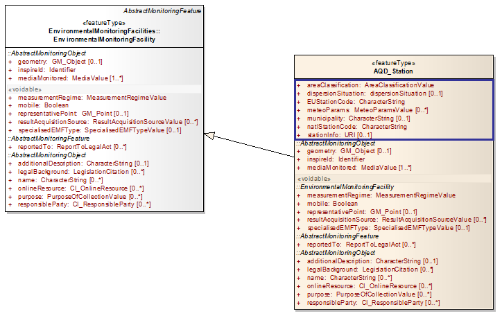

[.text-center]
*Figure 24: Extending EnvironmentalMonitoringFacility Class*

This mapping and extension process pertains not only to the spatial information, such as the air quality monitoring station, zone geometry and metadata; it also covers both primary and aggregated data available for both the air quality monitoring station and zone levels, utilising the Observations and Measurements Standard (EN ISO 19156) for the provision of measurement data.

As 2008/50/EC will require the provision of INSPIRE compliant reporting data well before the mandatory provision of the underlying themes to INSPIRE, tools for the provision of this data are being provided. These tools will enable Member States to provide the INSPIRE compliant reporting data via services without undue burden.

Through the use of INSPIRE data specifications in the AQ reporting process, great synergies can be attained. Member States only need to set up one INSPIRE service providing relevant Air Quality Features and Data to cover both their INSPIRE obligations as well as their legal reporting obligations pertaining to Air Quality.
