// Admonition icons:
// IR Requirement
:important-caption: 📕
// TG Requirement
:tip-caption: 📒
// Recommendation
:note-caption: 📘

// TOC placement using macro (manual)
:toc: macro

// Empty TOC title (the title is in the document)
:toc-title:

// TOC level depth
:toclevels: 3

// Section numbering level depth
:sectnumlevels: 8

// Line Break Doc Title
:hardbreaks-option:

:appendix-caption: Annex

// Document properties
:title: D2.8.II.1 INSPIRE Data Specification on Elevation – Technical Guidelines
:revdate: 2023-01-31
:keywords: INSPIRE Data Specification for the spatial data theme Elevation
:producer: INSPIRE Maintenance and Implementation Group (MIG)
:description: This document describes the INSPIRE Data Specification for the spatial data theme Elevation
:author: Temporary MIWP 2021-2024 sub-group 2.3.1
:copyright: Public
:revremark: https://github.com/INSPIRE-MIF/technical-guidelines/releases/tag/2023.1
:lang: en

image::./media/image2.jpeg[image,width=93,height=93,align=center]

image:./media/image3.png[image,width=100,height=100] **INSPIRE** - *Infrastructure for Spatial Information in Europe*

[discrete]
= D2.8.II.1 Data Specification on _Elevation_ – Technical Guidelines

[width="100%",cols="17%,83%",]
|===
|*Title* |{doctitle}
|*Creator* |{author}
|*Date of publication* |{revdate}
|*Subject* |{keywords}
|*Publisher* |{producer}
|*Type* |Text
|*Description* |{description}
|*Format* |AsciiDoc
|*Licence* |https://creativecommons.org/licenses/by/4.0[Creative Commons Attribution (cc-by) 4.0]
|*Rights* |{copyright}
|*Identifier* |https://inspire.ec.europa.eu/id/document/tg/el[D2.8.II.1_v3.1.0]
|*Changelog* |{revremark}
|*Language* |{lang}
|*Relation* |Directive 2007/2/EC of the European Parliament and of the Council of 14 March 2007 establishing an Infrastructure for Spatial Information in the European Community (INSPIRE)
|===

<<<
[discrete]
== *Foreword*
[discrete]
== *How to read the document?*

This document describes the _"INSPIRE data specification on Elevation – Technical Guidelines"_ version 3.0 as developed by the Thematic Working Group (TWG) _Elevation_ using both natural and a conceptual schema language.

The data specification is based on a common templatefootnote:[The common document template is available in the "Framework documents" section of the data specifications web page at http://inspire.jrc.ec.europa.eu/index.cfm/pageid/2] used for all data specifications, which has been harmonised using the experience from the development of the Annex I, II and III data specifications.

This document provides guidelines for the implementation of the provisions laid down in the Implementing Rule for spatial data sets and services of the INSPIRE Directive. It also includes additional requirements and recommendations that, although not included in the Implementing Rule, are relevant to guarantee or to increase data interoperability.

Two executive summaries provide a quick overview of the INSPIRE data specification process in general, and the content of the data specification on _Elevation_ in particular. We highly recommend that managers, decision makers, and all those new to the INSPIRE process and/or information modelling should read these executive summaries first.

The UML diagrams (in Chapter 5) offer a rapid way to see the main elements of the specifications and their relationships. The definition of the spatial object types, attributes, and relationships are included in the Feature Catalogue (also in Chapter 5). People having thematic expertise but not familiar with UML can fully understand the content of the data model focusing on the Feature Catalogue. Users might also find the Feature Catalogue especially useful to check if it contains the data necessary for the applications that they run. The technical details are expected to be of prime interest to those organisations that are responsible for implementing INSPIRE within the field of _Elevation_, but also to other stakeholders and users of the spatial data infrastructure.

The technical provisions and the underlying concepts are often illustrated by examples. Smaller examples are within the text of the specification, while longer explanatory examples and descriptions of selected use cases are attached in the annexes.

In order to distinguish the INSPIRE spatial data themes from the spatial object types, the INSPIRE spatial data themes are written in _italics._

[width="100%",cols="100%",options="header",]
|===
|The document will be publicly available as a 'non-paper'. It does not represent an official position of the European Commission, and as such cannot be invoked in the context of legal procedures.
|===

*Legal Notice*

Neither the European Commission nor any person acting on behalf of the Commission is responsible for the use which might be made of this publication.

<<<
[discrete]
== *Interoperability of Spatial Data Sets and Services – General Executive Summary*

The challenges regarding the lack of availability, quality, organisation, accessibility, and sharing of spatial information are common to a large number of policies and activities and are experienced across the various levels of public authority in Europe. In order to solve these problems it is necessary to take measures of coordination between the users and providers of spatial information. The Directive 2007/2/EC of the European Parliament and of the Council adopted on 14 March 2007 aims at establishing an Infrastructure for Spatial Information in the European Community (INSPIRE) for environmental policies, or policies and activities that have an impact on the environment.

INSPIRE is based on the infrastructures for spatial information that are created and maintained by the Member States. To support the establishment of a European infrastructure, Implementing Rules addressing the following components of the infrastructure have been specified: metadata, interoperability of spatial data sets (as described in Annexes I, II, III of the Directive) and spatial data services, network services, data and service sharing, and monitoring and reporting procedures.

INSPIRE does not require collection of new data. However, after the period specified in the Directivefootnote:[For all 34 Annex I,II and III data themes: within two years of the adoption of the corresponding Implementing Rules for newly collected and extensively restructured data and within 5 years for other data in electronic format still in use] Member States have to make their data available according to the Implementing Rules.

Interoperability in INSPIRE means the possibility to combine spatial data and services from different sources across the European Community in a consistent way without involving specific efforts of humans or machines. It is important to note that "interoperability" is understood as providing access to spatial data sets through network services, typically via Internet. Interoperability may be achieved by either changing (harmonising) and storing existing data sets or transforming them via services for publication in the INSPIRE infrastructure. It is expected that users will spend less time and efforts on understanding and integrating data when they build their applications based on data delivered in accordance with INSPIRE.

In order to benefit from the endeavours of international standardisation bodies and organisations established under international law their standards and technical means have been utilised and referenced, whenever possible.

To facilitate the implementation of INSPIRE, it is important that all stakeholders have the opportunity to participate in specification and development. For this reason, the Commission has put in place a consensus building process involving data users, and providers together with representatives of industry, research and government. These stakeholders, organised through Spatial Data Interest Communities (SDIC) and Legally Mandated Organisations (LMO)footnote:[The current status of registered SDICs/LMOs is available via INSPIRE website: http://inspire.jrc.ec.europa.eu/index.cfm/pageid/42], have provided reference materials, participated in the user requirement and technicalfootnote:[Surveys on unique identifiers and usage of the elements of the spatial and temporal schema,] surveys, proposed experts for the Data Specification Drafting Teamfootnote:[The Data Specification Drafting Team has been composed of experts from Austria, Belgium, Czech Republic, France, Germany, Greece, Italy, Netherlands, Norway, Poland, Switzerland, UK, and the European Environment Agency], the Thematic Working Groupsfootnote:[The Thematic Working Groups have been composed of experts from Austria, Australia, Belgium, Bulgaria, Czech Republic, Denmark, Finland, France, Germany, Hungary, Ireland, Italy, Latvia, Netherlands, Norway, Poland, Romania, Slovakia, Spain, Slovenia, Sweden, Switzerland, Turkey, UK, the European Environment Agency and the European Commission.] and other ad-hoc cross-thematic technical groups and participated in the public stakeholder consultations on draft versions of the data specifications. These consultations covered expert reviews as well as feasibility and fitness-for-purpose testing of the data specificationsfootnote:[For Annex IIIII, the consultation and testing phase lasted from 20 June to 21 October 2011.].

This open and participatory approach was successfully used during the development of the data specifications on Annex I, II and III data themes as well as during the preparation of the Implementing Rule on Interoperability of Spatial Data Sets and Servicesfootnote:[Commission Regulation (EU) No 1089/2010 http://eur-lex.europa.eu/JOHtml.do?uri=OJ:L:2010:323:SOM:EN:HTML[implementing Directive 2007/2/EC of the European Parliament and of the Council as regards interoperability of spatial data sets and services,] published in the Official Journal of the European Union on 8^th^ of December 2010.] for Annex I spatial data themes and of its amendment regarding the themes of Annex II and III.

The development framework elaborated by the Data Specification Drafting Team aims at keeping the data specifications of the different themes coherent. It summarises the methodology to be used for the development of the data specifications, providing a coherent set of requirements and recommendations to achieve interoperability. The pillars of the framework are the following technical documentsfootnote:[The framework documents are available in the "Framework documents" section of the data specifications web page at http://inspire.jrc.ec.europa.eu/index.cfm/pageid/2]:

* The _Definition of Annex Themes and Scope_ describes in greater detail the spatial data themes defined in the Directive, and thus provides a sound starting point for the thematic aspects of the data specification development.
* The _Generic Conceptual Model_ defines the elements necessary for interoperability and data harmonisation including cross-theme issues. It specifies requirements and recommendations with regard to data specification elements of common use, like the spatial and temporal schema, unique identifier management, object referencing, some common code lists, etc. Those requirements of the Generic Conceptual Model that are directly implementable are included in the Implementing Rule on Interoperability of Spatial Data Sets and Services.
* The _Methodology for the Development of Data Specifications_ defines a repeatable methodology. It describes how to arrive from user requirements to a data specification through a number of steps including use-case development, initial specification development and analysis of analogies and gaps for further specification refinement.
* The _Guidelines for the Encoding of Spatial Data_ defines how geographic information can be encoded to enable transfer processes between the systems of the data providers in the Member States. Even though it does not specify a mandatory encoding rule it sets GML (ISO 19136) as the default encoding for INSPIRE.
* The _Guidelines for the use of Observations & Measurements and Sensor Web Enablement-related standards in INSPIRE Annex II and III data specification development_ provides guidelines on how the "Observations and Measurements" standard (ISO 19156) is to be used within INSPIRE.
* The _Common data models_ are a set of documents that specify data models that are referenced by a number of different data specifications. These documents include generic data models for networks, coverages and activity complexes.

The structure of the data specifications is based on the "ISO 19131 Geographic information - Data product specifications" standard. They include the technical documentation of the application schema, the spatial object types with their properties, and other specifics of the spatial data themes using natural language as well as a formal conceptual schema languagefootnote:[UML – Unified Modelling Language].

A consolidated model repository, feature concept dictionary, and glossary are being maintained to support the consistent specification development and potential further reuse of specification elements. The consolidated model consists of the harmonised models of the relevant standards from the ISO 19100 series, the INSPIRE Generic Conceptual Model, and the application schemasfootnote:[Conceptual models related to specific areas (e.g. INSPIRE themes)] developed for each spatial data theme. The multilingual INSPIRE Feature Concept Dictionary contains the definition and description of the INSPIRE themes together with the definition of the spatial object types present in the specification. The INSPIRE Glossary defines all the terms (beyond the spatial object types) necessary for understanding the INSPIRE documentation including the terminology of other components (metadata, network services, data sharing, and monitoring).

By listing a number of requirements and making the necessary recommendations, the data specifications enable full system interoperability across the Member States, within the scope of the application areas targeted by the Directive. The data specifications (in their version 3.0) are published as technical guidelines and provide the basis for the content of the Implementing Rule on Interoperability of Spatial Data Sets and Servicesfootnote:[In the case of the Annex IIIII data specifications, the extracted requirements are used to formulate an amendment to the existing Implementing Rule.]. The content of the Implementing Rule is extracted from the data specifications, considering short- and medium-term feasibility as well as cost-benefit considerations. The requirements included in the Implementing Rule are legally binding for the Member States according to the timeline specified in the INSPIRE Directive.

In addition to providing a basis for the interoperability of spatial data in INSPIRE, the data specification development framework and the thematic data specifications can be reused in other environments at local, regional, national and global level contributing to improvements in the coherence and interoperability of data in spatial data infrastructures.

<<<
[discrete]
== *Elevation – Executive Summary*

The _Elevation_ of a terrain surface, whether land based or bathymetric in nature, is one of the most important descriptors of the Earth's morphology. Recognising the specific role that elevation may play in engineering and spatial analysis, the related data theme has been included in Annex II of INSPIRE. The _Elevation_ data theme includes digital elevation models for land, ice and ocean surfaces both for terrestrial elevation and bathymetry, as well as shorelines.

_Elevation_ data is being used in a wide range of applications like civil engineering, Earth science applications (especially flood mapping), planning and resource management, surveying and photogrammetry (in particular orthoimagery) and defence, which is reflected in the use-cases governing the data specification process.

The main purpose of a Digital Elevation Model is to provide an elevation property with reference to a specified origin (vertical reference or datum). This property may be height (when the value is measured opposite to the gravity field of the Earth) or depth (when the value is measured in the direction of the gravity field). Therefore they share the basic modelling concepts. Integrated land-sea models may be provided using either a height or depth property referenced to a known vertical reference. When an elevation property describes the bare surface of the land or sea floor the related model is called Digital Terrain Model (DTM). When an elevation property includes the heights of the objects present on the surface (e.g. vegetation, man-made objects) the related model is referred as Digital Surface Model (DSM). The INSPIRE data model permits the description of both options. In all cases, only one elevation value is included for each planimetric position (2.5-D modelling).

In the case of the vector model, this data specification allows the use of 2-D or 2.5-D geometries. In the first case the vertical component of the coordinates are given as an attribute of a two dimensional spatial object, while in the second all the points in the elevation data set are expressed using three coordinates, where the elevation value is assigned to the (third) Z coordinate.

In line with existing technologies three spatial representation methods have been offered: grid, of mandatory provision, as well as vector and triangulated irregular network (TIN), of optional provision. Each of them is described in a separate package. In addition, generic modelling elements, such as enumerations and generic utilities (data types) are included in the base types application schema.

The _Elevation_ data specification includes the widely used grid representation, which is based on a coverage geometry, indicating elevation values at the points of a rectified grid. For Pan-European and cross-border purposes the data specification recommends the provision of elevation data using a theme-specific common grid based on ETRS89 geodetic coordinates (shared with the _Orthoimagery_ data specifications), while using real time re-projection for display through view services.

The vector model consists of land elevation and bathymetry elements in the form of spot elevations, contour lines, as well as break lines. These elements are well known from topographical maps or nautical charts. The model supports the provision of all attributes and classifications that are required by the selected use-cases. It should be noted that the shoreline spatial object has been specified in the _Sea Regions_ data specification and not in the _Elevation_ as it was foreseen by the Directive.

The other alternative spatial representation form specified in INSPIRE is the TIN, where a collection of geometries (control points, break lines and stop lines) representing the terrain are collected together. The collection may be used later on to calculate a surface following the rules of any triangulation method (e.g. Delaunay).

As stated in the Commission Regulation (EU) No 1089/2010, on interoperability of spatial data sets and services, the European Vertical Reference System (EVRS) shall be used to express gravity-related heights for the vertical component on land, within its geographical scope (continental Europe). Outside the geographical scope of EVRS (e.g. overseas territories), other vertical reference systems related to the Earth gravity field shall be used, which shall be defined and documented according to EN ISO 19111 and ISO 19127 by the Member State concerned. The Earth Gravitational Model (EGM Version 2008) is recommended in that cases.

Interoperability is further supported by harmonised metadata elements, recommendations for data quality, and agreed encoding to facilitate data exchange. The default encoding is GML. Gridded land-based and bathymetry elevation data is encoded using a GML Coverage. For the former, (land) the elevation values may alternatively be provided using external files in TIFF format. For the latter, (bathymetry) a file according to the BAG standard format of the International Hydrographic Organisation may be used optionally as an external file to provide the values. Only those compression methods are valid that do not lead to data loss. TIN data shall be encoded using GML TIN of the OpenGIS consortium. For supporting INSPIRE view services, default and alternative portrayal styles have been defined.

The main value of the INSPIRE _Elevation data_ specification stands in the conceptually homogenous approaches to land elevation and bathymetry, as well as in the integrated presentation of different spatial representation forms. This is expected to underpin the exchange of all datasets in use in an interoperable way.

<<<
[discrete]
== *Acknowledgements*

Many individuals and organisations have contributed to the development of these Guidelines.

The Thematic Working Group _Elevation_ (TWG-EL) included:

Michael Hovenbitzer (TWG Facilitator), Jordi Escriu Paradell (TWG Editor), Chris Howlett, Dave Capstick, Eduardo González, Gyula Iván, Lee Brinton, Lynne Allan, Rogier Broekman, Tim Kearns, Veijo Pätynen, Vincent Donato, Zdzislaw Kurczyński, Katalin Tóth (European Commission contact point).

Other contributors to the INSPIRE data specifications are the Drafting Team Data Specifications, the JRC data specifications team and the INSPIRE stakeholders - Spatial Data Interested Communities (SDICs) or Legally Mandated Organisations (LMOs).

*Contact information*

Vanda Nunes de Lima
European Commission Joint Research Centre
Institute for Environment and Sustainability
Unit H06: Digital Earth and Reference Data
TP262, Via Fermi 2749
I-21027 Ispra (VA)
ITALY
E-mail: vanda.lima@jrc.ec.europa.eu
Tel.: 39-0332-7865052
Fax: 39-0332-7866325
http://ies.jrc.ec.europa.eu/
http://ec.europa.eu/dgs/jrc/
http://inspire.jrc.ec.europa.eu/

<<<
[discrete]
= Table of Contents
toc::[]

:sectnums:

<<<
== Scope

This document specifies a harmonised data specification for the spatial data theme _Elevation_ as defined in Annex II of the INSPIRE Directive.

This data specification provides the basis for the drafting of Implementing Rules according to Article 7 (1) of the INSPIRE Directive [Directive 2007/2/EC]. The entire data specification is published as implementation guidelines accompanying these Implementing Rules.

<<<
== Overview

=== Name

INSPIRE data specification for the theme _Elevation_.

=== Informal description

*Definition:*

Digital elevation models for land, ice and ocean surface. Includes terrestrial elevation, bathymetry and shoreline. [Directive 2007/2/EC]

*Description:*

_Data content_

The theme _Elevation_ describes digital models for describing land, ice and ocean surfaces in terms of absolute gravity-related terrestrial elevation information (heights) and bathymetry data (depths).

It is further described as follows, based on the preliminary content from the INSPIRE Feature Concept Dictionary which has been adapted by the TWG:

_"The theme includes:_

* _Terrestrial elevation (namely land-elevation), represented as:_
** _Digital Terrain Models (DTM) describing the three-dimensional shape of the Earth's surface (ground surface topography)._

** _Digital Surface Models (DSM) specifying the three dimensional geometry of every feature on the ground, for example vegetation, buildings and bridges._

* _Bathymetry data, e.g. a gridded sea floor model_

{empty} [Adapted from INSPIRE Feature Concept Dictionary]

The data model incorporated in this specification is aimed at describing the three-dimensional shape of the Earth's surfaces in terms of the _Elevation_ properties, either height or depth.

Both properties are constrained to the physical vertical dimension, measured along the plumb lines from a well defined surface, such as a geoid or a well-defined water level.

_Scope_

Land-elevation and bathymetry are included in the scope of this specification as end-product data sets, regardless of the processes and measurements from which this information has been captured.

There are no limits in the geographical scope of bathymetry data. The description of the floor of the sea and inland standing water bodies, as well as the bed of navigable rivers, is possible using the model provided in this document.

This specification recognizes the importance of supporting the provision of integrated models describing a continuous surface for land and submerged areas (e.g. an integrated land-sea model). Hence, this specification allows also the description of this kind of model.

Only modelling of surfaces (Digital Terrain Models and Digital Surface Models) in 2.5-D is supported.

The shoreline feature (considered as part of the _Elevation_ theme as stated in the INSPIRE Directive) is not considered as an _Elevation_ object, but as a feature which may be sometimes a useful reference for _Elevation_ data mapping. Hence, the shoreline feature is defined in the INSPIRE Data Specification on Sea Regions (as the _CoastLine_ spatial object) attending to physical properties and it is not included in this specification.

_Spatial extent_

This INSPIRE data specification covers spatial data sets which relate to an area where a Member State has and/or exercises jurisdictional rights.

_Spatial resolution_

No specific restrictions on spatial resolution are established in this specification for the _Elevation_ theme.

According to the INSPIRE Directive every dataset is within the scope of the specification 
regardless of its level of detail / resolution. This is reinforced by the heterogeneity of data sources from which existing _Elevation_ data is derived across Europe as well as the wide range of relevant use cases to be served.

All levels of resolution are therefore affected: the European level, the National level, the Regional level and the Local level.

_Spatial representation types_

Vector spatial objects and Digital Elevation Models (DTM and DSM), either in terms of Grid coverages and/or TIN structures, are supported by this specification. All these types of _data_ may form part of an INSPIRE _Elevation_ data set.

The provision of grid data is mandatory for land elevation, whereas provision of vector and TIN data is recommended (optional).

In the case of bathymetry, either grid or vector data shall be provided.

_Purpose_

INSPIRE _Elevation_ data specification consists of a set of conceptually homogenous approaches to land elevation and bathymetry, as well as of an integrated presentation of different spatial representation forms which are relevant to this kind of information. This all is mainly expected to underpin exchanging all existing European data sets in an interoperable way.

_Use cases and Applications_

A selection of relevant use cases where _Elevation_ data is needed have been identified in this specification, as examples to extract data requirements:

* Flood mapping
* Orthoimagery production
* Elevation mapping
* Maintenance of fairways

These are documented in detail in Annex B.1 of this document. Annex B.2 includes examples of additional applications.

|===

|*Definition:*

Digital elevation models for land, ice and ocean surface. Includes terrestrial elevation, bathymetry and shoreline. [Directive 2007/2/EC]

*Description:*

The _Elevation_ of a terrain surface, whether land based or bathymetric in nature described the Earth's morphology. The _Elevation_ data theme includes digital elevation models for land, ice and ocean surfaces both for terrestrial elevation and bathymetry, as well as shorelines.

The main purpose of a Digital Elevation Model is to provide an elevation property with reference to a specified origin (vertical reference or datum). This property may be height (when the value is measured opposite to the gravity field of the Earth) or depth (when the value is measured in the direction of the gravity field). In line with existing technologies three spatial representation methods have been provided: grid, vector and triangulated irregular network (TIN). Regarding provision of data, the grid spatial representation type is mandatory for the description of land elevation, whereas the other ones are optional. Finally, either the grid or the vector spatial representation type is mandatory for the provision of data describing the bathymetry, whereas the other ones are optional.
|===

[.text-right]
Entry in the INSPIRE registry: _http://inspire.ec.europa.eu/theme/el/_

=== Normative References

[Directive 2007/2/EC] Directive 2007/2/EC of the European Parliament and of the Council of 14 March 2007 establishing an Infrastructure for Spatial Information in the European Community (INSPIRE)

[ISO 19105] EN ISO 19105:2000, Geographic information -- Conformance and testing

[ISO 19107] EN ISO 19107:2005, Geographic Information – Spatial Schema

[ISO 19108] EN ISO 19108:2005, Geographic Information – Temporal Schema

[ISO 19108-c] ISO 19108:2002/Cor 1:2006, Geographic Information – Temporal Schema, Technical Corrigendum 1

[ISO 19111] EN ISO 19111:2007 Geographic information - Spatial referencing by coordinates (ISO 19111:2007)

[ISO 19113] EN ISO 19113:2005, Geographic Information – Quality principles

[ISO 19115] EN ISO 19115:2005, Geographic information – Metadata (ISO 19115:2003)

[ISO 19118] EN ISO 19118:2006, Geographic information – Encoding (ISO 19118:2005)

[ISO 19123] EN ISO 19123:2007, Geographic Information – Schema for coverage geometry and functions

[ISO 19135] EN ISO 19135:2007 Geographic information – Procedures for item registration (ISO 19135:2005)

[ISO 19138] ISO/TS 19138:2006, Geographic Information – Data quality measures

[ISO 19139] ISO/TS 19139:2007, Geographic information – Metadata – XML schema implementation

[ISO 19157]    ISO/DIS 19157, Geographic information – Data quality

[OGC 06-103r4] Implementation Specification for Geographic Information - Simple feature access – Part 1: Common Architecture v1.2.1

NOTE This is an updated version of "EN ISO 19125-1:2004, Geographic information – Simple feature access – Part 1: Common architecture". A revision of the EN ISO standard has been proposed.

[Regulation 1205/2008/EC] Regulation 1205/2008/EC implementing Directive 2007/2/EC of the European Parliament and of the Council as regards metadata

[Regulation 976/2009/EC] Commission Regulation (EC) No 976/2009 of 19 October 2009 implementing Directive 2007/2/EC of the European Parliament and of the Council as regards the Network Services

[Regulation 1089/2010/EC] Commission Regulation (EU) No 1089/2010 of 23 November 2010 implementing Directive 2007/2/EC of the European Parliament and of the Council as regards interoperability of spatial data sets and services

=== Terms and definitions

General terms and definitions helpful for understanding the INSPIRE data specification documents are defined in the INSPIRE Glossaryfootnote:[The INSPIRE Glossary is available from http://inspire-registry.jrc.ec.europa.eu/registers/GLOSSARY].

Specifically, for the theme _Elevation_, the following terms are defined:

*(1) 2-D*

Two dimensional coordinate space (ℜ^2^), where the coordinate dimension is 2.

EXAMPLE X and Y dimensions.

NOTE In 2-D representation the elevation property is included as an attribute value of the spatial object (vector representation).

*(2) 2.5-D*

Two dimensional coordinate space (ℜ^2^), where the elevation property is represented by an additional third coordinate (z).

NOTE 1 Contrary to true 3-D representations coordinate z is not part of the data structure. 2.5-D representation can be used for calculating surfaces, but cannot be used for calculating volumes.

NOTE 2 From a mathematical point of view 2.5-D elevation models are such functions _f(x y)_ where every point P(x y) is uniquely associated with an object _f(x y)=z_. Therefore, terrain forms such as overhangs cannot be modelled, since one planar position can be associated with one and only one elevation property value.

*(3) Coordinate dimension*

Number of measurements or axes needed to describe a position in a coordinate system [ISO 19107].

NOTE ℜ^n^ is an n-Dimensional coordinate space, where n may be any integer.

*(4) Coverage*

Spatial object that acts as a function to return values from its range for any direct position within its spatial, temporal or spatiotemporal domain [INSPIRE glossary].

NOTE In other words, a coverage is a feature that has multiple values for each attribute type, where each direct position within the geometric representation of the feature has a single value for each attribute type. An elevation property may be one of these attribute types.

*(5) Depth*

_Elevation_ property measured along a plumb line in a direction coincident to Earth's gravity field (downwards).

NOTE This definition intentionally avoids making reference to complex geodetic terms. It is only intended to specify the direction in which the elevation property has been measured.

*(6) Digital Elevation Model*

Digital Surface Model (DSM) or Digital Terrain Model (DTM).

EXAMPLE Digital Terrain Model, Digital Surface Model.

*(7) Digital Surface Model*

(DSM) Surface describing the three dimensional shape of the Earth's surface, including all static features placed on it. Temporary phenomena do not form part of the surface, but due to the technical difficulties in removing them some of these features may also be present in the surface.

EXAMPLE 1 Vegetation, buildings and bridges are examples of static features.

EXAMPLE 2 Cars, trucks and other dynamic features are examples of temporary phenomena.

NOTE 1 For DSM surfaces describing the floor of water bodies (e.g. the sea-floor) and those features placed on it, the water bodies are not considered as part of the Earth's bare surface. Hence, they are excluded from the DSM.

NOTE 2 For DSM surfaces in which any temporary phenomena have not been totally filtered and excluded, the deviations must be explained in the metadata.

*(8) Digital Terrain Model*

(DTM) Surface describing the three dimensional shape of the Earth's bare surface, excluding as possible any other features placed on it.

EXAMPLE Buildings, bridges or vegetation do not form part of a DTM.

NOTE 1 For DTM surfaces describing the floor of water bodies (e.g. the sea-floor), the water bodies are not considered as part of the Earth's bare surface. Hence, they are excluded from the DTM.

NOTE 2 For DTM surfaces in which any features placed on the Earth's bare surface have not been totally filtered and excluded, the deviations must be explained in the metadata.

*(9) Direct position*

Position described by a single set of coordinates within a coordinate reference system [ISO 19107].

*(10) Domain*

Well-defined set [ISO/TS 19103].

NOTE In the case of an elevation coverage, it is the well-defined set where a coverage is defined. In other words, the locations where the elevation values are provided.

*(11) Elevation*

Vertically-constrained dimensional property of an spatial object consisting of an absolute measure referenced to a well-defined surface which is commonly taken as origin.

 

EXAMPLE 1 Height and depth are elevation properties.

EXAMPLE 2 A geoid or a water level are examples of surfaces taken as origin for elevation properties.

 

NOTE 1 The term, as used in this specification, integrates all absolute measures of dimensions constrained to the vertical component, either having upward (_height_) or downward direction (_depth_). Other interpretations of the term shall be avoided.

NOTE 2 The term does not include relative elevations of the spatial object referenced to other spatial objects.

*(12) Height*

_Elevation_ property measured along a plumb line in a direction opposite to Earth's gravity field (upwards).

 

NOTE This definition intentionally avoids making reference to complex geodetic terms. It is only intended to specify the direction in which the elevation property has been measured.

*(13) Range*

(Coverage) Set of feature attribute values associated by a function with the elements of the domain of a coverage [ISO 19123].

NOTE In the case of an elevation coverage, the range is the collection of elevation values, which are known for the locations included within the domain.

*(14) Simple feature*

Feature (spatial object) with all geometric attributes described piecewise by straight line or planar interpolation between sets of points [OGC 06-103r4].

=== Symbols and abbreviations

[width="100%",cols="14%,86%"]
|===
|ASCII |American Standard Code for Information Interchange
|ATS |Abstract Test Suite
|CRS |Coordinate Reference System
|DEM |Digital Elevation Model
|DSM |Digital Surface Model
|DTM |Digital Terrain Model
|EC |European Commission
|EEA |European Environmental Agency
|EL |_Elevation_.
|EPSG |European Petroleum Survey Group
|ETRS89 |European Terrestrial Reference System 1989
|ETRS89-LAEA |Lambert Azimuthal Equal Area
|EVRS |European Vertical Reference System
|GCM |Generic Conceptual Model
|GeoTIFF |Geographic Tagged Image File Format
|GML |Geographic Markup Language
|IHO |International Hydrographic Organization
|IR |Implementing Rule
|ISDSS |Interoperability of Spatial Data Sets and Services
|ISO |International Organization for Standardization
|ITRS |International Terrestrial Reference System
|JPEG |Joint Photographic Experts Group
|LAT |Lowest Astronomical Tide
|LAT |Lowest Astronomical Tide
|LMO |Legally Mandated Organisation
|MSL |Mean Sea Level
|OCL |Object Constraint Language
|OGC |Open Geospatial Consortium
|RMSE |Root Mean Square Error
|RMSEH |Horizontal Root Mean Square Error
|RMSEP |Root Mean Square Error of Planimetry
|RMSEv |Vertical Root Mean Square Error
|SDIC |Spatial Data Interest Community
|SWE |Sensor Web Enablement
|TG |Technical GuidanceFigure
|TIFF |Tagged Image File Format
|TIN |Triangulated Irregular Network
|TWG |Thematic Working Group
|TWG-EL |Thematic Working Group Elevation
|UML |Unified Modelling Language
|URI |Uniform Resource Identifier
|UTC |Coordinated Universal Time
|WCS |Web Coverage Service
|XML |eXtensible Markup language
|===

<<<
=== How the Technical Guidance maps to the Implementing Rules

The schematic diagram in Figure 1 gives an overview of the relationships between the INSPIRE legal acts (the INSPIRE Directive and Implementing Rules) and the INSPIRE Technical Guidance document. The INSPIRE Directive and Implementing Rules include legally binding requirements that describe, usually on an abstract level, _what_ Member States must implement.

In contrast, the Technical Guidance documents define _how_ Member States might implement the requirements included in the INSPIRE Implementing Rules. As such, they may include non-binding technical requirements that must be satisfied if a Member State data provider chooses to conform to the Technical Guidance. Implementing this technical guidance will maximise the interoperability of INSPIRE spatial data sets.

[.text-center]
*Figure 1 - Relationship between INSPIRE Implementing Rules and Technical Guidance*

==== Requirements

The purpose of this Technical Guidance (Data specifications on _Elevation_) is to provide practical guidance for implementation that is guided by, and satisfies, the (legally binding) requirements included for the spatial data theme _Elevation_ in the Regulation (Implementing Rules) on interoperability of spatial data sets and services. These requirements are highlighted in this document as follows:

[IMPORTANT]
====
[.text-center]
*IR Requirement*
_Article / Annex / Section no._
*Title / Heading*

This style is used for requirements contained in the Implementing Rules on interoperability of spatial data sets and services (Commission Regulation (EU) No 1089/2010).

====

For each of these IR requirements, this Technical Guidance contains additional explanations and examples.

NOTE The Abstract Test Suite (ATS) in Annex A contains conformance tests that directly check conformance with these IR requirements.

Furthermore, this Technical Guidance may propose a specific technical implementation for satisfying an IR requirement. In such cases, this Technical Guidance may contain additional technical requirements that need to be met in order to be conformant with the corresponding IR requirement _when using this proposed implementation_. These technical requirements are highlighted as follows:

[TIP]
====
*TG Requirement X* This style is used for requirements for a specific technical solution proposed in this Technical Guidance for an IR requirement.
====

NOTE 1 Conformance of a data set with the TG requirement(s) included in the ATS implies conformance with the corresponding IR requirement(s).

NOTE 2 In addition to the requirements included in the Implementing Rules on interoperability of spatial data sets and services, the INSPIRE Directive includes further legally binding obligations that put additional requirements on data providers. For example, Art. 10(2) requires that Member States shall, where appropriate, decide by mutual consent on the depiction and position of geographical features whose location spans the frontier between two or more Member States. General guidance for how to meet these obligations is provided in the INSPIRE framework documents.

==== Recommendations

In addition to IR and TG requirements, this Technical Guidance may also include a number of recommendations for facilitating implementation or for further and coherent development of an interoperable infrastructure.

[NOTE]
====
*Recommendation X* Recommendations are shown using this style.
====

NOTE The implementation of recommendations is not mandatory. Compliance with this Technical Guidance or the legal obligation does not depend on the fulfilment of the recommendations.

==== Conformance

Annex A includes the abstract test suite for checking conformance with the requirements included in this Technical Guidance and the corresponding parts of the Implementing Rules (Commission Regulation (EU) No 1089/2010).

<<<
== Specification scopes

This data specification does not distinguish different specification scopes, but just considers one general scope.

NOTE For more information on specification scopes, see [ISO 19131:2007], clause 8 and Annex D.

<<<
== Identification information

These Technical Guidelines are identified by the following URI:

http://inspire.ec.europa.eu/tg/el/3.0

NOTE ISO 19131 suggests further identification information to be included in this section, e.g. the title, abstract or spatial representation type. The proposed items are already described in the document metadata, executive summary, overview description (section 2) and descriptions of the application schemas (section 5). In order to avoid redundancy, they are not repeated here.

<<<
== Data content and structure

=== Application schemas – Overview 

==== Application schemas included in the IRs

Articles 3, 4 and 5 of the Implementing Rules lay down the requirements for the content and structure of the data sets related to the INSPIRE Annex themes.

[IMPORTANT]
====
[.text-center]
*IR Requirement*
Article 4
*Types for the Exchange and Classification of Spatial Objects*

1. For the exchange and classification of spatial objects from data sets meeting the conditions laid down in Article 4 of Directive 2007/2/EC, Member States shall use the spatial object types and associated data types, enumerations and code lists that are defined in Annexes II, III and IV for the themes the data sets relate to.

2. Spatial object types and data types shall comply with the definitions and constraints and include the attributes and association roles set out in the Annexes.

3. The enumerations and code lists used in attributes or association roles of spatial object types or data types shall comply with the definitions and include the values set out in Annex II. The enumeration and code list values are uniquely identified by language-neutral mnemonic codes for computers. The values may also include a language-specific name to be used for human interaction.

====

The types to be used for the exchange and classification of spatial objects from data sets related to the spatial data theme _Elevation_ are defined in the following application schemas:

* The ElevationBaseTypes application schema, which provides basic enumerations for the rest application schemas of _Elevation_ (Section 5.4).

* The ElevationGridCoverage application schema, which defines the model for _Elevation_ data in the grid spatial representation type (Section 5.5).

* The ElevationVectorElements application schema, which defines the model for _Elevation_ data in the vector spatial representation type (Section 5.6).

* The ElevationTIN application schema, which defines the model for _Elevation_ data in the TIN spatial representation type (Section 5.7).

The application schemas specify requirements on the properties of each spatial object including its multiplicity, domain of valid values, constraints, etc.

NOTE The application schemas presented in this section contain some additional information that is not included in the Implementing Rules, in particular multiplicities of attributes and association roles.

[TIP]
====
*TG Requirement 1* Spatial object types and data types shall comply with the multiplicities defined for the attributes and association roles in this section.
====

An application schema may include references (e.g. in attributes or inheritance relationships) to common types or types defined in other spatial data themes. These types can be found in a sub-section called "Imported Types" at the end of each application schema section. The common types referred to from application schemas included in the IRs are addressed in Article 3.

[IMPORTANT]
====
[.text-center]
*IR Requirement*
_Article 3_
*Common Types*

Types that are common to several of the themes listed in Annexes I, II and III to Directive 2007/2/EC shall conform to the definitions and constraints and include the attributes and association roles set out in Annex I.

====

NOTE Since the IRs contain the types for all INSPIRE spatial data themes in one document, Article 3 does not explicitly refer to types defined in other spatial data themes, but only to types defined in external data models.

Common types are described in detail in the Generic Conceptual Model [DS-D2.7], in the relevant international standards (e.g. of the ISO 19100 series) or in the documents on the common INSPIRE models [DS-D2.10.x]. For detailed descriptions of types defined in other spatial data themes, see the corresponding Data Specification TG document [DS-D2.8.x].

=== Basic notions

This section explains some of the basic notions used in the INSPIRE application schemas. These explanations are based on the GCM [DS-D2.5].

==== Notation

===== Unified Modeling Language (UML)

The application schemas included in this section are specified in UML, version 2.1. The spatial object types, their properties and associated types are shown in UML class diagrams.

NOTE For an overview of the UML notation, see Annex D in [ISO 19103].

The use of a common conceptual schema language (i.e. UML) allows for an automated processing of application schemas and the encoding, querying and updating of data based on the application schema – across different themes and different levels of detail.

The following important rules related to class inheritance and abstract classes are included in the IRs.

[IMPORTANT]
====
[.text-center]
*IR Requirement*
Article 5
*Types*
(...)

{empty} 2. Types that are a sub-type of another type shall also include all this type's attributes and association roles.

{empty} 3. Abstract types shall not be instantiated.

====

The use of UML conforms to ISO 19109 8.3 and ISO/TS 19103 with the exception that UML 2.1 instead of ISO/IEC 19501 is being used. The use of UML also conforms to ISO 19136 E.2.1.1.1-E.2.1.1.4.

NOTE ISO/TS 19103 and ISO 19109 specify a profile of UML to be used in conjunction with the ISO 19100 series. This includes in particular a list of stereotypes and basic types to be used in application schemas. ISO 19136 specifies a more restricted UML profile that allows for a direct encoding in XML Schema for data transfer purposes.

To model constraints on the spatial object types and their properties, in particular to express data/data set consistency rules, OCL (Object Constraint Language) is used as described in ISO/TS 19103, whenever possible. In addition, all constraints are described in the feature catalogue in English, too.

NOTE Since "void" is not a concept supported by OCL, OCL constraints cannot include expressions to test whether a value is a _void_ value. Such constraints may only be expressed in natural language.

===== Stereotypes

In the application schemas in this section several stereotypes are used that have been defined as part of a UML profile for use in INSPIRE [DS-D2.5]. These are explained in Table 1 below.

*Table 1 – Stereotypes (adapted from [DS-D2.5])*

[cols=",,",]
|===
|*Stereotype* |*Model element* |*Description*
|applicationSchema |Package |An INSPIRE application schema according to ISO 19109 and the Generic Conceptual Model.
|leaf |Package |A package that is not an application schema and contains no packages.
|featureType |Class |A spatial object type.
|type |Class |A type that is not directly instantiable, but is used as an abstract collection of operation, attribute and relation signatures. This stereotype should usually not be used in INSPIRE application schemas as these are on a different conceptual level than classifiers with this stereotype.
|dataType |Class |A structured data type without identity.
|union |Class |A structured data type without identity where exactly one of the properties of the type is present in any instance.
|enumeration |Class |An enumeration.
|codeList |Class |A code list.
|import |Dependency |The model elements of the supplier package are imported.
|voidable |Attribute, association role |A voidable attribute or association role (see section 5.2.2).
|lifeCycleInfo |Attribute, association role |If in an application schema a property is considered to be part of the life-cycle information of a spatial object type, the property shall receive this stereotype.
|version |Association role |If in an application schema an association role ends at a spatial object type, this stereotype denotes that the value of the property is meant to be a specific version of the spatial object, not the spatial object in general.
|===

==== Voidable characteristics

The «voidable» stereotype is used to characterise those properties of a spatial object that may not be present in some spatial data sets, even though they may be present or applicable in the real world. This does _not_ mean that it is optional to provide a value for those properties.

For all properties defined for a spatial object, a value has to be provided – either the corresponding value (if available in the data set maintained by the data provider) or the value of _void._ A _void_ value shall imply that no corresponding value is contained in the source spatial data set maintained by the data provider or no corresponding value can be derived from existing values at reasonable costs.

[NOTE]
====
*Recommendation 1*

The reason for a void value should be provided where possible using a listed value from the VoidReasonValue code list to indicate the reason for the missing value.

====

The VoidReasonValue type is a code list, which includes the following pre-defined values:

* _Unpopulated_: The property is not part of the dataset maintained by the data provider. However, the characteristic may exist in the real world. For example when the "elevation of the water body above the sea level" has not been included in a dataset containing lake spatial objects, then the reason for a void value of this property would be 'Unpopulated'. The property receives this value for all spatial objects in the spatial data set.
* _Unknown_: The correct value for the specific spatial object is not known to, and not computable by the data provider. However, a correct value may exist. For example when the "elevation of the water body above the sea level" _of a certain lake_ has not been measured, then the reason for a void value of this property would be 'Unknown'. This value is applied only to those spatial objects where the property in question is not known.
* _Withheld_: The characteristic may exist, but is confidential and not divulged by the data provider.

NOTE It is possible that additional reasons will be identified in the future, in particular to support reasons / special values in coverage ranges.

The «voidable» stereotype does not give any information on whether or not a characteristic exists in the real world. This is expressed using the multiplicity:

* If a characteristic may or may not exist in the real world, its minimum cardinality shall be defined as 0. For example, if an Address may or may not have a house number, the multiplicity of the corresponding property shall be 0..1.
* If at least one value for a certain characteristic exists in the real world, the minimum cardinality shall be defined as 1. For example, if an Administrative Unit always has at least one name, the multiplicity of the corresponding property shall be 1..*.

In both cases, the «voidable» stereotype can be applied. In cases where the minimum multiplicity is 0, the absence of a value indicates that it is known that no value exists, whereas a value of void indicates that it is not known whether a value exists or not.

EXAMPLE If an address does not have a house number, the corresponding Address object should not have any value for the «voidable» attribute house number. If the house number is simply not known or not populated in the data set, the Address object should receive a value of _void_ (with the corresponding void reason) for the house number attribute.

==== Enumerations

Enumerations are modelled as classes in the application schemas. Their values are modelled as attributes of the enumeration class using the following modelling style:

* No initial value, but only the attribute name part, is used.
* The attribute name conforms to the rules for attributes names, i.e. is a lowerCamelCase name. Exceptions are words that consist of all uppercase letters (acronyms).

[IMPORTANT]
====
[.text-center]
*IR Requirement*
Article 6
*Code Lists and Enumerations*
(...)

5) Attributes or association roles of spatial object types or data types that have an enumeration type may only take values from the lists specified for the enumeration type."

====

==== Code lists

Code lists are modelled as classes in the application schemas. Their values, however, are managed outside of the application schema.

===== Code list types

The IRs distinguish the following types of code lists.

[IMPORTANT]
====
[.text-center]
*IR Requirement*
Article 6
*Code Lists and Enumerations*

1. Code lists shall be of one of the following types, as specified in the Annexes:
	a) code lists whose allowed values comprise only the values specified in this Regulation;
	b) code lists whose allowed values comprise the values specified in this Regulation and narrower values defined by data providers;
	c) code lists whose allowed values comprise the values specified in this Regulation and additional values at any level defined by data providers;
	d) code lists, whose allowed values comprise any values defined by data providers.
 
For the purposes of points (b), (c) and (d), in addition to the allowed values, data providers may use the values specified in the relevant INSPIRE Technical Guidance document available on the INSPIRE web site of the Joint Research Centre.
====

The type of code list is represented in the UML model through the tagged value _extensibility_, which can take the following values:

* _none_, representing code lists whose allowed values comprise only the values specified in the IRs (type a);
* _narrower_, representing code lists whose allowed values comprise the values specified in the IRs and narrower values defined by data providers (type b);
* _open_, representing code lists whose allowed values comprise the values specified in the IRs and additional values at any level defined by data providers (type c); and
* _any_, representing code lists, for which the IRs do not specify any allowed values, i.e. whose allowed values comprise any values defined by data providers (type d).

[NOTE]
====
*Recommendation 2*

Additional values defined by data providers should not replace or redefine any value already specified in the IRs.

====

NOTE This data specification may specify recommended values for some of the code lists of type (b), (c) and (d) (see section 5.2.4.3). These recommended values are specified in a dedicated Annex.

In addition, code lists can be hierarchical, as explained in Article 6(2) of the IRs.

[IMPORTANT]
====
[.text-center]
*IR Requirement*
Article 6
*Code Lists and Enumerations*
(...)

2) Code lists may be hierarchical. Values of hierarchical code lists may have a more generic parent value. Where the valid values of a hierarchical code list are specified in a table in this Regulation, the parent values are listed in the last column.

====

The type of code list and whether it is hierarchical or not is also indicated in the feature catalogues.

===== Obligations on data providers

[IMPORTANT]
====
[.text-center]
*IR Requirement*
Article 6
*Code Lists and Enumerations*
(....)

3) Where, for an attribute whose type is a code list as referred to in points (b), (c) or (d) of paragraph 1, a data provider provides a value that is not specified in this Regulation, that value and its definition shall be made available in a register.

4) Attributes or association roles of spatial object types or data types whose type is a code list may only take values that are allowed according to the specification of the code list.

====

Article 6(4) obliges data providers to use only values that are allowed according to the specification of the code list. The "allowed values according to the specification of the code list" are the values explicitly defined in the IRs plus (in the case of code lists of type (b), (c) and (d)) additional values defined by data providers.

For attributes whose type is a code list of type (b), (c) or (d) data providers may use additional values that are not defined in the IRs. Article 6(3) requires that such additional values and their definition be made available in a register. This enables users of the data to look up the meaning of the additional values used in a data set, and also facilitates the re-use of additional values by other data providers (potentially across Member States).

NOTE Guidelines for setting up registers for additional values and how to register additional values in these registers is still an open discussion point between Member States and the Commission.

===== Recommended code list values

For code lists of type (b), (c) and (d), this data specification may propose additional values as a recommendation (in a dedicated Annex). These values will be included in the INSPIRE code list register. This will facilitate and encourage the usage of the recommended values by data providers since the obligation to make additional values defined by data providers available in a register (see section 5.2.4.2) is already met.

[NOTE]
====
*Recommendation 3*

Where these Technical Guidelines recommend values for a code list in addition to those specified in the IRs, these values should be used.

====

NOTE For some code lists of type (d), no values may be specified in these Technical Guidelines. In these cases, any additional value defined by data providers may be used.

===== Governance

The following two types of code lists are distinguished in INSPIRE:

* _Code lists that are governed by INSPIRE (INSPIRE-governed code lists)._ These code lists will be managed centrally in the INSPIRE code list register. Change requests to these code lists (e.g. to add, deprecate or supersede values) are processed and decided upon using the INSPIRE code list register's maintenance workflows.

====
INSPIRE-governed code lists will be made available in the INSPIRE code list register at http__://inspire.ec.europa.eu/codelist/<CodeListName__>. They will be available in SKOS/RDF, XML and HTML. The maintenance will follow the procedures defined in ISO 19135. This means that the only allowed changes to a code list are the addition, deprecation or supersession of values, i.e. no value will ever be deleted, but only receive different statuses (valid, deprecated, superseded). Identifiers for values of INSPIRE-governed code lists are constructed using the pattern http__://inspire.ec.europa.eu/codelist/<CodeListName>__/<value>.
====

Code _lists that are governed by an organisation outside of INSPIRE (externally governed code lists)._ These code lists are managed by an organisation outside of INSPIRE, e.g. the World Meteorological Organization (WMO) or the World Health Organization (WHO). Change requests to these code lists follow the maintenance workflows defined by the maintaining organisations. Note that in some cases, no such workflows may be formally defined.

* _Since the updates of externally governed code lists is outside the control of INSPIRE, the_ IRs and these Technical Guidelines reference a specific version for such code lists.
* The tables describing externally governed code lists in this section contain the following columns:
* The Governance column describes the external organisation that is responsible for maintaining the code list.
* The Source column specifies a citation for the authoritative source for the values of the code list. For code lists, whose values are mandated in the IRs, this citation should include the version of the code list used in INSPIRE. The version can be specified using a version number or the publication date. For code list values recommended in these Technical Guidelines, the citation may refer to the "latest available version".

====
In some cases, for INSPIRE only a subset of an externally governed code list is relevant. The subset is specified using the _Subset_ column.

The Availability column specifies from where (e.g. URL) the values of the externally governed code list are available, and in which formats. Formats can include machine-readable (e.g. SKOS/RDF, XML) or human-readable (e.g. HTML, PDF) ones.

Code list values are encoded using http URIs and labels. Rules for generating these URIs and labels are specified in a separate table.

** The _http_ URIs and labels used for encoding code list values should be taken from the INSPIRE code list registry for INSPIRE-governed code lists and generated according to the relevant rules specified for externally governed code lists.
NOTE Where practicable, the INSPIRE code list register could also provide http URIs and labels for externally governed code lists.

** Vocabulary
*** For each code list, a tagged value called "vocabulary" is specified to define a URI identifying the values of the code list. For INSPIRE-governed code lists and externally governed code lists that do not have a persistent identifier, the URI is constructed following the pattern _http://inspire.ec.europa.eu/codelist/<UpperCamelCaseName>_.
*** If the value is missing or empty, this indicates an empty code list. If no sub-classes are defined for this empty code list, this means that any code list may be used that meets the given definition.
*** An _empty_ code list may also be used as a super-class for a number of specific code lists whose values may be used to specify the attribute value. If the sub-classes specified in the model represent all valid extensions to the empty code list, the subtyping relationship is qualified with the standard UML constraint "\{complete,disjoint}".

====

==== Consistency between spatial data sets

This section specifies generic consistency rules which are applicable to all _Elevation_ application schemas.

As described in D2.6 A.18 there are three topic areas regarding consistency between spatial data sets, these are:

* Coherence between spatial objects of the same theme at different levels of detail.
* Coherence between different spatial objects within the same area.
* Coherence at state boundaries.

Several of these topic areas affect the consistency of elevation data itself and the consistency of elevation data when compared to data from other INSPIRE themes. Hence, both cases are described here separately.

===== Self-consistency of elevation data

_Elevation_ data in the different spatial representation types described in this specification should maintain integrity and positional consistency, at least when coming from the same data provider. However, given the current context of elevation data across Europe, it is not possible to establish achievable consistency rules rather than those described in Section 10.

===== Consistency of elevation data with other themes 

Elevation data is widely used as input data when performing spatial analyses or displaying data from other themes (e.g. hydrography, transport networks, orthoimagery, cadastral parcels, sea regions, etc.) for a wide variety of applications and purposes.

This requires a certain level of geometrical consistency so that all spatial objects being combined match within the limits of their respective accuracy. Data integrity demands that this data should be spatially consistent to ensure both a faithful representation of the real world and a professional appearance that will fill the user with confidence.

This is perceived as achievable at least for data at the same level of detail (similar resolution). However, it is not possible to identify relevant consistency rules.

==== Identifier management

[IMPORTANT]
====
[.text-center]
*IR Requirement*
_Article 9_
*Identifier Management*

1. The data type Identifier defined in Section 2.1 of Annex I shall be used as a type for the external object identifier of a spatial object.

2. The external object identifier for the unique identification of spatial objects shall not be changed during the life-cycle of a spatial object.

====

NOTE 1 An external object identifier is a unique object identifier which is published by the responsible body, which may be used by external applications to reference the spatial object. [DS-D2.5]

NOTE 2 Article 9(1) is implemented in each application schema by including the attribute _inspireId_ of type Identifier.

NOTE 3 Article 9(2) is ensured if the _namespace_ and _localId_ attributes of the Identifier remains the same for different versions of a spatial object; the _version_ attribute can of course change.

==== Geometry representation

[IMPORTANT]
====
[.text-center]
*IR Requirement*
_Article 12_
*Other Requirements & Rules*

1. The value domain of spatial properties defined in this Regulation shall be restricted to the Simple Feature spatial schema as defined in Herring, John R. (ed.), OpenGIS® Implementation Standard for Geographic information – Simple feature access – Part 1: Common architecture, version 1.2.1, Open Geospatial Consortium, 2011, unless specified otherwise for a specific spatial data theme or type.

====

NOTE 1 The specification restricts the spatial schema to 0-, 1-, 2-, and 2.5-dimensional geometries where all curve interpolations are linear and surface interpolations are performed by triangles.

NOTE 2 The topological relations of two spatial objects based on their specific geometry and topology properties can in principle be investigated by invoking the operations of the types defined in ISO 19107 (or the methods specified in EN ISO 19125-1).

More information about the geometry representation is provided in the chapters describing the various application schemas included in INSPIRE.

==== Temporality representation

The application schema(s) use(s) the derived attributes "beginLifespanVersion" and "endLifespanVersion" to record the lifespan of a spatial object.

The attributes "beginLifespanVersion" specifies the date and time at which this version of the spatial object was inserted or changed in the spatial data set. The attribute "endLifespanVersion" specifies the date and time at which this version of the spatial object was superseded or retired in the spatial data set.

NOTE 1 The attributes specify the beginning of the lifespan of the version in the spatial data set itself, which is different from the temporal characteristics of the real-world phenomenon described by the spatial object. This lifespan information, if available, supports mainly two requirements: First, knowledge about the spatial data set content at a specific time; second, knowledge about changes to a data set in a specific time frame. The lifespan information should be as detailed as in the data set (i.e., if the lifespan information in the data set includes seconds, the seconds should be represented in data published in INSPIRE) and include time zone information.

NOTE 2 Changes to the attribute "endLifespanVersion" does not trigger a change in the attribute "beginLifespanVersion".

[IMPORTANT]
====
[.text-center]
*IR Requirement*
_Article 10_
*Life-cycle of Spatial Objects*
(...)

{empty} 3. Where the attributes beginLifespanVersion and endLifespanVersion are used, the value of endLifespanVersion shall not be before the value of beginLifespanVersion.

====

NOTE The requirement expressed in the IR Requirement above will be included as constraints in the UML data models of all themes.

[NOTE]
====
*Recommendation 4*

If life-cycle information is not maintained as part of the spatial data set, all spatial objects belonging to this data set should provide a void value with a reason of "unpopulated".

====

A change of version should occur only when the elevation data is reprocessed using the same source data, which is the typical case when errors or thematic inconsistencies has been detected in the data and therefore it .

This data specification does not attach the notion of version to the real world objects or the geographic areas covered by elevation data.

A new data acquisition process over a given area is considered rather a new observation than an update (i.e. a new version).

[IMPORTANT]
====
[.text-center]
*IR Requirement*
_Annex III, Section 1.7.1_
*External Object Identifiers of Elevation Data*

(1) If elevation data is updated based on new source data, the updated objects shall receive a new external object identifier.

====

==== Coverages

Coverage functions are used to describe characteristics of real-world phenomena that vary over space and/or time. Typical examples are temperature, elevation, precipitation, imagery. A coverage contains a set of such values, each associated with one of the elements in a spatial, temporal or spatio-temporal domain. Typical spatial domains are point sets (e.g. sensor locations), curve sets (e.g. isolines), grids (e.g. orthoimages, elevation models), etc.

In INSPIRE application schemas, coverage functions are defined as properties of spatial object types where the type of the property value is a realisation of one of the types specified in ISO 19123.

To improve alignment with coverage standards on the implementation level (e.g. ISO 19136 and the OGC Web Coverage Service) and to improve the cross-theme harmonisation on the use of coverages in INSPIRE, an application schema for coverage types is included in the Generic Conceptual Model in 9.9.4. This application schema contains the following coverage types:

* _RectifiedGridCoverage_: coverage whose domain consists of a rectified grid – a grid for which there is an affine transformation between the grid coordinates and the coordinates of a coordinate reference system (see Figure 2, left).
* _ReferenceableGridCoverage_: coverage whose domain consists of a referenceable grid – a grid associated with a transformation that can be used to convert grid coordinate values to values of coordinates referenced to a coordinate reference system (see Figure 2, right).

In addition, some themes make reference to the types TimeValuePair and Timeseries defined in Taylor, Peter (ed.), _OGC^®^ WaterML 2.0: Part 1 – Timeseries, v2.0.0,_ Open Geospatial Consortium, 2012. These provide a representation of the time instant/value pairs, i.e. time series (see Figure 3).

Where possible, only these coverage types (or a subtype thereof) are used in INSPIRE application schemas.

|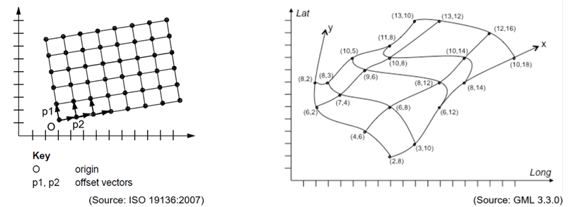

[.text-center]
*Figure 2 – Examples of a rectified grid (left) and a referenceable grid (right)*

image::./media/image7.png[image]

[.text-center]
*Figure 3 – Example of a time series*

<<<
=== Application schema Elevation

==== Description

===== Narrative description

====== Elevation properties: height and depth

The data models incorporated in this specification are aimed at describing the three-dimensional shape of the Earth's surface in terms of _Elevation_ properties, either height or depth.

Both properties are constrained to the physical vertical dimension, measured along the plumb line from a well defined surface, such as a geoid or a specific water level.

The orientation of the positive axis is opposite to the Earth's gravity field in the case of the height property (upwards) and coincident to the Earth's gravity field in the case of the depth property (downwards). Hence, heights are positive above the surface taken as origin whereas depths are positive below it, as show in the next figure.

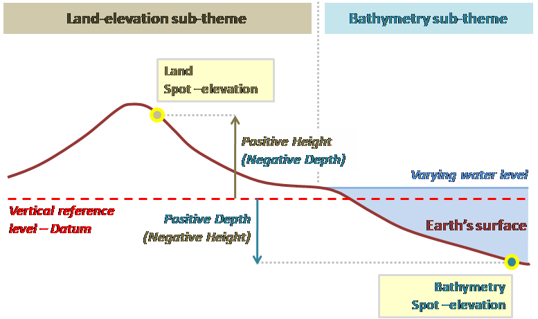

[.text-center]
*Figure 4 – Measuring of elevation properties.*

====== Sub-themes

As stated in Section 2.2 land-elevation and bathymetry are included in the scope of this specification. Both types of data are considered in this specification as elevation sub-themes.

_Land-elevation_

Describing the height property of the Earth's surface on land, as ilustrated in Figure 5 below.

_Bathymetry_

Describing the depth property for the following geographical elements is in the INSPIRE scope:

* the sea floor – as exemplified in Figure 6 below.
* the floor of inland standing water bodies – as exemplified in Figure 7 below.
* the bed of navigable rivers – as exemplified in Figure 8 below.

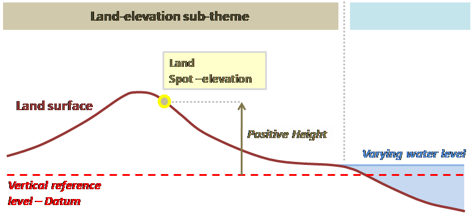

[.text-center]
*Figure 5 – Example: Description of land elevation.*

image::./media/image10.png[image]

[.text-center]
*Figure 6 – Example: Description of the sea floor.*

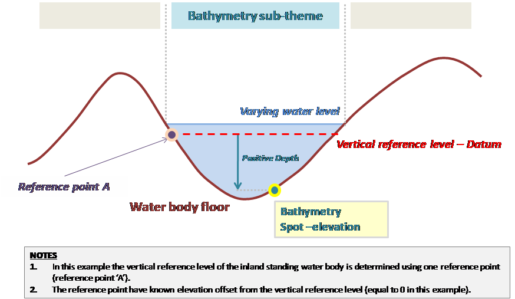

[.text-center]
*Figure 7 – Example: Description of the floor of an inland standing water body.*

image::./media/image12.png[image]

[.text-center]
*Figure 8 – Example: Description of the bed of a navigable river.*

_Integrated land-sea models_

Land-elevation and bathymetry data may be combined in the same data set using different properties (height or depth), which are referenced very often to various vertical coordinate reference systems (namely vertical references). However, when dealing with certain use cases and applications it is necessary, to provide just a single surface of the Earth's. This becomes especially important in coastal areas, where an integrated vision of land and submerged areas is very useful.

This specification supports the description of this kind of model in terms of a single elevation property (either height or depth), referenced only to one vertical reference.

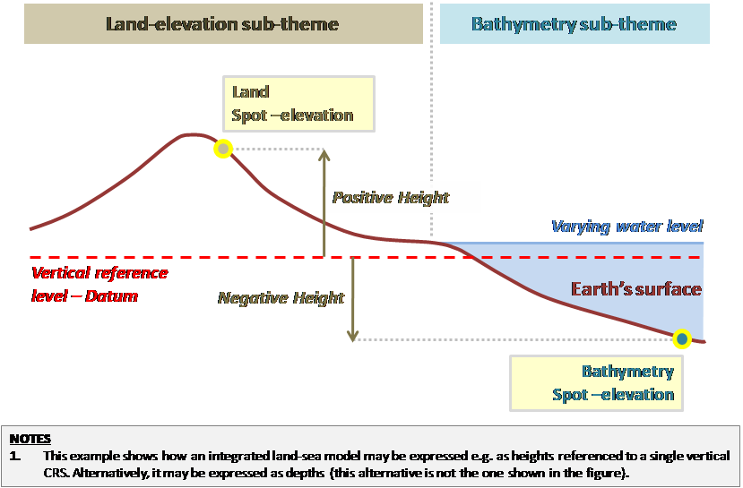

[.text-center]
*Figure 9 – Example: Description of an integrated land-sea model.*

====== Terrain surfaces

Regardless of the elevation sub-themes represented in a data set, two visions of the three dimensional shape of the Earth's surface are possible:

* a Digital Terrain Model (DTM), which describes the Earth's bare surface, excluding any features placed on it.
* a Digital Surface Model (DSM), which describes the Earth's surface including all static features placed on it (as exception of temporary / dynamic phenomena).

NOTE The pure concepts of DTM and DSM are used here. In practice, real data may be slightly deviated from this ideal situation, due to technical limitations in the data acquisition and production processes.

The term Digital Elevation Model (DEM) covers both visions above mentioned.

image::./media/image14.png[image, align=center]

[.text-center]
*Figure 10 – Digital elevation models (DEM): Difference between DTM and DSM*

====== Dimensionality of modelling

As introduced in Section 2.2, the Earth's surface can only be modelled in 2.5 dimensions (2.5-D) using this specification, i.e. a single elevation property value can be stored for each planimetric position of the surface. This means that in the case of vertical cliffs or very steep areas problems may appear. As an illustration, overhanging terrain features such as a rock shelter (whose morphology hides part of the terrain) can not be modelled; or for the cantilever formed by the roof of a building only one elevation value can be stored, the top one.

====== Spatial representation types 

This specification supports elevation data using the following spatial representation types, which may be combined within an INSPIRE _Elevation_ data set:

* Gridded data
+
Modelled as continuous coverages, compliant with ISO 19123 – _Coverage geometry and functions_ standard, which use a systematic tessellation based on a regular rectified quadrilateral grid to cover its domain. The _Elevation_ property values are known for each of the grid points forming this domain (_rangeSet_ of the coverage).

* Vector data
+
Vector objects comprise spot elevations (spot heights and depth spots), contour lines (land-elevation contour lines and depth contours), break lines describing the morphology of the terrain as well as other objects which may help in calculating a Digital Elevation Model from vector data (void areas, isolated areas).

* TIN data
+
TIN structures according to the _GM_Tin_ class in ISO 19107 – _Spatial schema_. This a collection of vector geometries (control points with known _Elevation_ property values, break lines and stop lines) which allows calculating a triangulated surface using any valid triangulation method (e.g. a Delaunay triangulation).
+
It is worth to note here that the concept of TIN coverage from ISO 19123 (i.e. 1 value assigned to each triangle) is not applicable in the _Elevation_ theme, where 1 value needs to be assigned to each triangle vertex or control point in a the TIN.

The model incorporated in this specification devotes one application schema for each of these spatial representation types, and an additional one where common enumerations and data types are defined.

====== Data provision

[IMPORTANT]
====
[.text-center]
*IR Requirement*
_Annex III, Section 1.2_
*Provision of Land Elevation Data*
(...)

Spatial data sets describing the morphology of land elevation shall be made available at least using the spatial object types included in the package _Elevation_ – Grid Coverage.

====

[NOTE]
====
*Recommendation 5*

Spatial data sets related to the theme _Elevation_ describing the morphology of land elevation should be also made available using the spatial object types and data types specified in the following application schemas: ElevationVectorElements.
====

[IMPORTANT]
====
[.text-center]
*IR Requirement*
_Annex III, Section 1.2_
*Provision of Bathymetry Data*
(...)

Spatial data sets describing the morphology of bathymetry shall be made available at least using the spatial object types included in either the package Elevation – Grid Coverage or the package Elevation – Vector Elements.
====

[NOTE]
====
*Recommendation 6*

Additional and/or use case-specific information related to the theme _Elevation_ should be made available using the spatial object types and data types specified in the following application schema(s): ElevationTIN.
====

====== Reference systems

As detailed in Section 6 of this document, the vertical coordinate reference system in which the data is provided shall be identified using the proper classes from ISO 19111 - _Spatial referencing by coordinates_ (e.g. _SC_VerticalCRS_ class). These classes are linked to the object geometries (_GM_Object_ classes) or positional attributes (_DirectPosition_ data type) through the _Coordinate Reference System_ association.

An exception to this rule are local chart datums aimed at referencing depths when the CRS information is not available through an on-line registry. This constitutes the typical situation in the case of inland waters local references (e.g. lakes and navigable rivers) but also possible for sea chart datums.

====== Package structure

This section explains the structure of the _Elevation_ model, which is composed of four application schemas (packages) as illustrated in Figure 11:

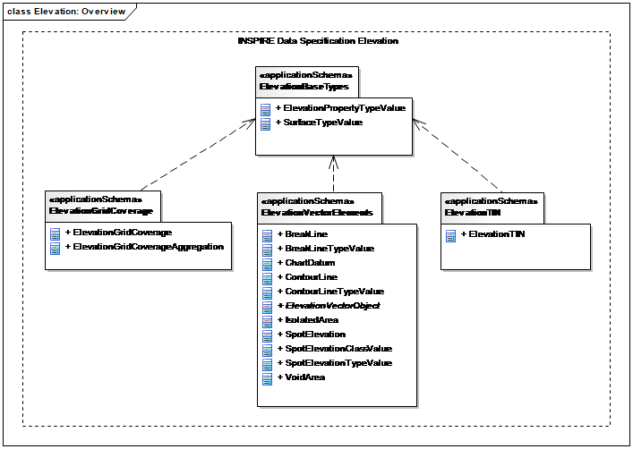

[.text-center]
*Figure 11 – UML class diagram: Overview of the application schemas of Elevation*

* _ElevationBaseTypes_
+
This application schema defines basic enumerations and data types which are re-used in the rest of application schemas.

* _ElevationGridCoverage_
+
This application schema constitutes the elevation model for the grid spatial representation type.
+
Elevation data using this model is provided as continuous coverages. Each coverage uses a systematic tessellation of the space based on a regular rectified quadrilateral grid to cover its domain.
+
The coverages defined in this application schema are based on the common model for coverages included in the Generic Conceptual Model [DS-D2.5], which provides the framework for the definition of coverage types. This common model has been established according to the WCS2.0 and ISO 19123 (_Coverage geometry and functions_) standards.

* _ElevationVectorElements_
+
This application schema constitutes the elevation model for the vector spatial representation type.
+
Elevation data using this model is provided as different vector spatial object types, each of them having their inherent properties.

* _ElevationTIN_
+
This application schema constitutes the elevation model for the TIN spatial representation type.
+
Elevation data using this model is provided as TIN structures or collections.
+
Each TIN structure is defined according the type GM_Tin type defined in ISO 19107. It consists on a collection of vector spatial objects, such as control points (points having known elevation property values), break lines and stop lines. In addition, this collection stores the necessary parameters which allow the calculation of a triangulation (triangulated surface) in a subsequent process (e.g. a Delaunay triangulation).
+
_ElevationGridCoverage_, _ElevationVectorElements_ and _ElevationTIN_ application schemas have dependency relationships to the _ElevationBaseTypes_ application schema, since they use generic enumerations defined in it.

====== Package dependencies

Figure 12 shows the dependencies between the four _Elevation_ packages and other external packages from where they import classes (Generic Conceptual Model [DS-D2.5], ISO standards, application schemas defined for other INSPIRE themes).

image::./media/image16.png[image, align=center]

[.text-center]
*Figure 12 – Package dependencies: Application schemas of Elevation*

<<<
=== Application schema _ElevationBaseTypes_

==== Description

===== Narrative description and UML overview

image::./media/image17.png[image, align=center]

[.text-center]
*Figure 13 – UML class diagram: Overview of the _ElevationBaseTypes_ application schema*

The _ElevationBaseTypes_ application schema provides the basic framework for the _Elevation_ theme. Regardless of the spatial representation type used for the elevation data, it defines enumerations which are common to the other _Elevation_ application schemas: _ElevationGridCoverage_, _ElevationVectorElements_ and _ElevationTIN_.

====== ElevationPropertyTypeValue enumeration

As stated in this specification, an elevation property is a vertically-constrained dimensional property of a spatial object consisting of an absolute measure referenced to a well-defined surface which is commonly taken as origin (e.g. a geoid, a specific water level, etc.).

This enumeration establishes the possible types of elevation properties with regard to the orientation of the measurement with respect to the Earth's gravity field direction:

* height (measured in a direction opposite to Earth's gravity field - upwards direction), and;

* depth (measured in the same direction of Earth's gravity field - downwards direction).

This enumeration is defined in Section 5.4.2.1.1.

====== SurfaceTypeValue enumeration

This enumeration establishes the different types of DEMs taking into account the relative adherence of the surface modelled to the Earth's bare surface. The possible values are DTM and DSM.

This enumeration is defined in Section 5.4.2.1.2.

==== Feature catalogue

*Feature catalogue metadata*

[cols=","]
|===
|Application Schema |INSPIRE Application Schema ElevationBaseTypes
|Version number |3.0
|===

*Types defined in the feature catalogue*

[cols=",,"]
|===
|*Type* |*Package* |*Stereotypes*
|===

===== Enumerations

====== ElevationPropertyTypeValue

[cols=",",options="header",]
|===
|*ElevationPropertyTypeValue*
|
|Name: |elevation property type value
|Definition: |Enumeration type which determines the elevation property which has been measured or calculated.
|Description: |NOTE 1 An elevation property is a vertically-constrained dimensional property of an element consisting of an absolute measure referenced to a well-defined surface which is commonly taken as origin (geoid, water level, etc.). 
 
NOTE 2 It does not include relative elevations of the element referenced to other spatial objects. 
 
EXAMPLE Height, depth.
|URI: |
|Value: |*height*
|Definition: |Elevation property measured along a plumb line in a direction opposite to Earth's gravity field (upwards).
|Description: |NOTE This definition intentionally avoids making reference to complex geodetic terms. It is only intended to specify the direction in which the elevation property has been measured.
|Value: |*depth*
|Definition: |Elevation property measured along a plumb line in a direction coincident to Earth's gravity field (downwards).
|Description: |NOTE This definition intentionally avoids making reference to complex geodetic terms. It is only intended to specify the direction in which the elevation property has been measured.
|===

====== SurfaceTypeValue

[cols=",",options="header",]
|===
|*SurfaceTypeValue*
|
|Name: |surface type value
|Definition: |Enumeration type which determines the elevation surface with regard to its relative adherence to the Earth's bare surface.
|Description: |EXAMPLE DTM and DSM.
|URI: |
|Value: |*DTM*
|Definition: |Digital terrain model.
|Description: |EXAMPLE Buildings, bridges or vegetation do not form part of a DTM. 
 
NOTE 1 For DTM surfaces describing the floor of water bodies (e.g. the sea-floor), the water bodies are not considered as part of the Earth's bare surface. Hence, they are excluded from the DTM. 
 
NOTE 2 For DTM surfaces in which any features placed on the Earth's bare surface have not been totally filtered and excluded, the deviations must be explained in the metadata.
|Value: |*DSM*
|Definition: |Digital surface model.
|Description: |EXAMPLE 1 Vegetation, buildings and bridges are examples of static features. 
 
EXAMPLE 2 Cars, trucks and other dynamic features are examples of temporary phenomena. 
 
NOTE 1 For DSM surfaces describing the floor of water bodies (e.g. the sea-floor) and those features placed on it, the water bodies are not considered as part of the Earth's bare surface. Hence, they are excluded from the DSM. 
 
NOTE 2 For DSM surfaces in which any temporary phenomena have not been totally filtered and excluded, the deviations must be explained in the metadata.
|===

<<<
===  Application schema ElevationGridCoverage

==== Description

===== Narrative description

This application schema constitutes the elevation model for the grid spatial representation type.

====== Coverage representation for elevation 

Elevation data represented in a grid is a kind of raster data. This is a simple form of geographic information. It consists of a set of values measuring an elevation property, organized in a regular array of points together with associated metadata and georeferencing. The coverage approach specified in [ISO 19123] is particularly well-suited for modelling such a data structure.

A coverage is a type of feature describing the characteristics of real-world phenomena that vary over space. Contrary to other types of features, its non-spatial attributes are strongly associated with its spatial attributes (i.e. its geometry). It acts as a function to return attribute values from its range for any direct position within its spatiotemporal domain.

Since it depicts continuously-varying phenomena, an elevation grid coverage is inherently a continuous coverage. A proper interpolation method enables the evaluation of the coverage at direct positions between the elements of its domain (e.g. points).

The attribute values of an elevation grid coverage are arranged using the geometry of a regular quadrilateral grid in two dimensions. Such a grid is a network composed of two sets of equally spaced parallel lines that intersect at right angles. The intersection points are called grid points or sample points. They carry the range values of the coverage, even if the physical quantity is actually measured within a sample space surrounding the grid point. The areas delimited by the grid lines are called grid cells and support the evaluation of the coverage by interpolation. They are not necessarily square but rectangular. Note that grid cells and sample points are two distinct notions.

A grid coordinate system is defined by means of the origin and the axes of the grid. Grid coordinates are measured along the axis away from the origin.

image::./media/image18.png[image, align=center]

[.text-center]
*Figure 14 - Example of rectified quadrilateral grid*

Furthermore, the grid of an elevation coverage is geo-rectified in the sense of ISO 19123. It is related to the Earth through an affine relationship that makes a simple transformation between the grid coordinates and the coordinates in the associated Earth-based reference system. The transformation parameters are determined by the location of the grid origin, the orientation of the axis and the grid spacing in each direction within the external coordinate reference system.

====== Concept of tiling 

Different motivations can lead data producers to break grid elevation data into smaller parts. This process is usually known as "tiling", which is also typically used in orthoimagery. However, this term may encompass different meanings depending on the abstraction level of the description. Three main levels of tiling need to be distinguished:

Firstly, tiling may be internally implemented in file formats (e.g. tiled tiff). By rearranging elevation content into roughly square tiles instead of horizontally-wide strips, this method improves performances for accessing and processing high-resolution grid DEMs. Since it basically reflects the storage structure of data, it does not appear in the application schema which is restricted to the conceptual level.

Secondly, high-resolution grid DEMs covering broad territories represent large volumes of data that often can not be stored reasonably in a single DEM file. Data producers usually cut them out into separate individual files to facilitate their storage, distribution and use. The most common tiling scheme used in elevation for this purpose is a simple rectangular grid where tiles edge-match without image overlaps or gaps (Figure 15 a). However, it is sometimes required that the individual tiles overlap with their neighbours to ensure a certain spatial continuity when handling them (Figure 15 b). The tiling scheme may also have a less regular geometry with a varying density of tiles (Figure 15 c).

This file-based data structure is artificial and has no real logical meaning on its own even though it is usually based on grid elements. Therefore it is addressed in the encoding part of this data specification (Section 9.3).

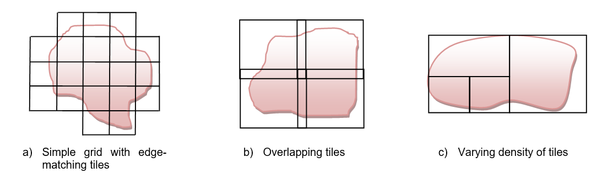

[.text-center]
*Figure 15 - Various configurations of tiling scheme*

Third, large grid DEMs can also be divided into subsets that make sense on their own as they describe logical structures (e.g. map sheets, administrative units like regions or districts, etc.). Unlike the previous case, this type of file-independent tiling is fully in the scope of the conceptual model.

But pragmatically, a reverse view on tiling may offer more possibilities and should increase data harmonization: indeed, tiling can be seen as well as an aggregation process instead of a split process. So, a collection of elevation grid coverages can be aggregated to make up a larger single coverage. This has the following advantages:

* The input elevation coverages may just partially contribute to the aggregated coverage.

* Consequently, the input elevation coverages may spatially overlap whenever necessary.

This mechanism is named "_elevation grid coverage aggregation_" and it is described in more details below in this document.

====== Data structure 

A first data structure level is provided through the concept of coverage. In addition, the _ElevationGridCoverage_ application schema offers a second level that consists in grouping coverages themselves in another logical structure. In other words, subsets from several homogeneous elevation grid coverages can be combined so that they build a new elevation coverage. The aggregated coverage does not hold directly its own grid cell values. It just makes reference to its input coverages, thereby avoiding data duplication. The range set of the coverage is computed on the fly by a service or an application when requested by users.

For applicability, input and aggregated elevation grid coverages shall be part of the same elevation dataset.

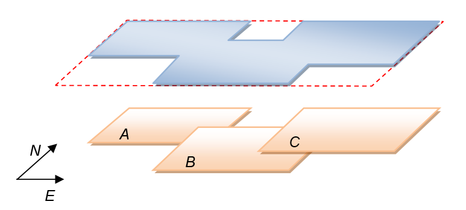

[.text-center]
*Figure 16 - Elevation grid coverage aggregation principle*

As shown in Figure 16 overlapping elevation coverages A B and C compose the aggregated elevation coverage D, the bounding box of which is dotted.

This mechanism is fully recursive so that an elevation coverage can itself be a composition of already-aggregated elevation coverages.

===== UML Overview

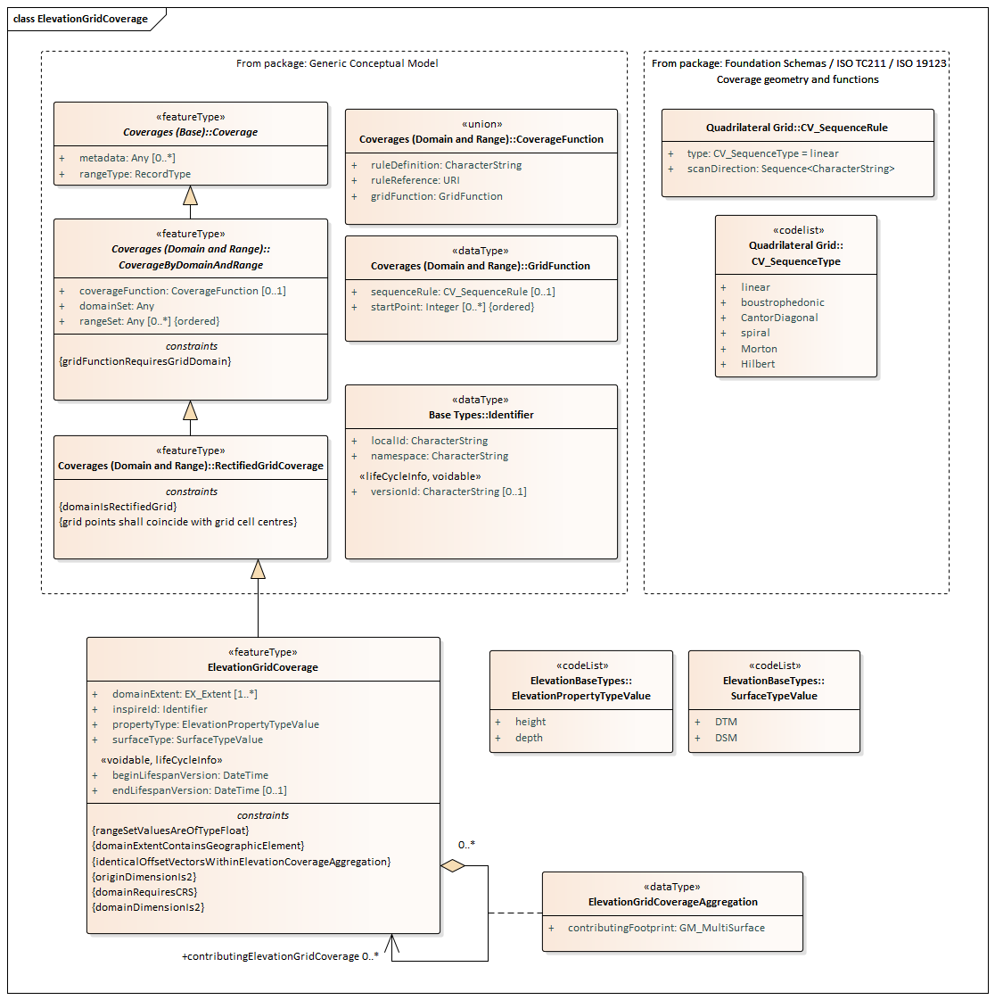

[.text-center]
*Figure 17 – UML class diagram: Overview of the _ElevationGridCoverage_ application schema*

The _ElevationGridCoverage_ application schema defines the basis for the provision of elevation data as continuous coverages using a systematic tessellation based on a regular rectified quadrilateral grid to cover its domain.

The regular grid is one of the most extended formats for elevation models, which is also widely accepted for data exchange and use between users with different technical expertise levels. This has been highlighted in Pan-European projects like _EuroDEM (EuroGeographics)_ and justifies the selection of this spatial representation type to harmonise elevation data across Europe. Its provision is therefore mandatory in this specification in the case of land-elevations.

====== ElevationGridCoverage spatial object type

The _ElevationGridCoverage_ spatial object type is the core element of the _ElevationGridCoverage_ application schema. It specializes the imported type _RectifiedGridCoverage_ which is specified in the common coverage model of the Generic Conceptual Model [DS-D2.5] - _Coverages (Domain and Range)_ application schema, shown in the next figure.

image::./media/image20.jpeg[image]

[.text-center]
*Figure 18 – UML class diagram: GCM - _Coverages (Domain and Range)_*

_RectifiedGridCoverage_ is itself an implementation of continuous quadrilateral grid coverages defined in ISO 19123, which establishes the basic properties of coverage structures. Thereby, the compliance with the standard is assured.

_ElevationGridCoverage_ inherits five properties necessary to process the coverage:

* _domainSet_ defines the spatial domain of the elevation coverage, i.e. its geometry (See Section 5.5.1.2.2).
* _rangeSet_ contains the feature attribute values associated with the grid points of the domain (See Section 5.5.1.2.3). All range values shall be of type _Float_ and shall conform to the description provided by the attribute _rangeType_.
* _rangeType_ describes the characteristics of the range values (See Section 5.5.1.2.4).
* _CoverageFunction_, whose value type is defined in the GCM [DS-D2.5], identifies the rules to be followed in assigning the range values to the grid points. These rules can be externally referenced through an URI (_CoverageFunction::ruleReference_) or directly detailed in the data set as free text (_CoverageFunction::ruleDefinition_) or as configurable elements (_CoverageFunction::gridFunction_). In the last option, the dataType _GridFunction_ identifies both the grid coordinates of the point associated with the first value in the rangeSet (_GridFunction::startPoint_) and the method for scanning grid points in the same order as the following range values (_GridFunction::sequenceRule_). The sequencing method, modeled with the ISO 19123 data type _CV_SequenceRule,_ is simply determined by its category, e.g. "linear", and a list of signed axis names indicating the order in which to jump to the next grid point.
* _metadata_ consists in a placeholder for additional metadata information a data provider decides to provide at a spatial object level (See Section 5.5.1.2.5).

For a more detailed description of these inherited attributes, see the section 9.9.4 of the Generic Conceptual Model [DS-D2.5].

Other attributes provide additional information for the _ElevationGridCoverage_:

* _inspireId_, unique external identifier (as specified in the Generic Conceptual Model [DS-D2.5]) used for the identification of each elevation coverage.

* _beginLifespanVersion_ and _endLifespanVersion_, covering the temporal aspects.

* _domainExtent, attribute_ stemming from ISO 19123 which completes the description of the coverage characteristics. It represents the spatiotemporal extent of the coverage.

* _propertyType_, for identifying the type of elevation property described by the coverage (height or depth). For the purpose of this specification, only one property (an elevation property) is represented in the range of an elevation coverage.

* _surfaceType_, for identifying the type of Earth's surface or DEM represented by the coverage (DTM or DSM).

NOTE Since real elevation data sets have very often discrepancies to what it is considered as a pure DTM or DSM (e.g. presence of any dynamic features, limitations due to the data capture process of data coming from a specific provider), these deviations should be explained in the metadata (_supplementalInformation_ metadata element), in order to show what is really included within the DEM.

[IMPORTANT]
====
[.text-center]
*IR Requirement*
_Annex III, Section 1.7.2_
*Domain Extent and Range Set of Elevation Grid Coverage*

(2) The _domainExtent_ attribute of every _ElevationGridCoverage_ instance shall be at least populated with a subtype of _the EX_GeographicExtent_ type.

(3) The elevation property values included within the range set of a single _ElevationGridCoverage_ shall be referenced to one and only one vertical coordinate reference system.

====

NOTE The _EX_GeographicExtent_ abstract class is specialized by the _EX_BoundingPolygon_, _EX_GeographicBoundingBox_ and _EX_GeographicDescription_ classes specified in ISO 19115.

A relevant attribute of coverages according to ISO 19123 is the interpolation method or type. It is a calculation procedure used in order to evaluate the continuous coverage, i.e. determine the values of the property represented at any direct position within the domain of the coverage, by using the values known for the corresponding set of control points.

This specification does not incorporate the interpolation method as an attribute of the _ElevationGridCoverage_ spatial object type, because it only constitutes a recommendation the data provider makes to the user about the most appropriate calculation procedure to be used for the property represented in the coverage. Data providers are therefore invited to provide this information in the metadata using the appropriate values from the _CV_InterpolationMethod_ code list (from ISO 19123). The default value advised in this specification is bilinear.

[NOTE]
====
*Recommendation 7*

This specification recommends the use of the bilinear interpolation method to evaluate a continuous elevation coverage at direct positions between the elements of its domain (included within its domain extent).

====

The _ElevationGridCoverage_ spatial object type is defined in Section 5.5.2.1.1.

====== Attribute ElevationGridCoverage::domainSet 

The property _domainSet_ determines the spatial structure on which the coverage function applies, that is, for elevation coverages, a set of grid points, including their convex hull.

By inheritance from _RectifiedGridCoverage_, the value type is restricted to _CV_RectifiedGrid_. This ISO 19123 element allows defining the characteristics of the internal grid structure: the grid dimension, which is constrained to two (_CV_RectifiedGrid::dimension_), the extent which reports the extreme internal grid coordinates of the DEM (_CV_RectifiedGrid::extent_) and the names the grid axes (_CV_RectifiedGrid::axisNames_).

In addition, _CV_RectifiedGrid_ carries the georeference of the elevation coverage that consists of the location of the origin of the rectified grid (_CV_RectifiedGrid::origin_), the orientation and direction of the grid axes as well as the spacing between grid lines (_CV_RectifiedGrid::offsetVectors_), all expressed in an external coordinate reference system.

The identification of the coordinate reference system is ensured through the attribute _origin_ whose value type, Direct Position (specified in ISO 19107), offers an association to the class SC_CRS (ISO 19111). This association is mandatory in this specification.

By allowing different settings, ISO 19123 leaves it up to implementers to define their own grid coordinates systems. But, while providing plenty of flexibility, this possibility may lead to misinterpretations and consequently to non-interoperability. To prevent this situation, this data specification promotes the use of a common grid coordinate system for describing the domain of elevation coverages within the INSPIRE context.

[NOTE]
====
*Recommendation 8*

The grid origin, which is located at grid coordinates (0, 0), should be the upper left point of the elevation coverage.
====

[NOTE]
====
*Recommendation 9*

The grid axes should be called "x" and "y", considering that x axis extends to the right and y axis extends downwards.
====

NOTE These recommendations are based on the most widespread convention in the case of elevation coverages.

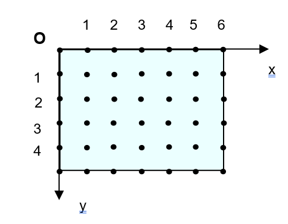

[.text-center]
*Figure 19 – Recommended grid coordinate system*

====== Attribute ElevationGridCoverage::rangeSet 

The range set of the elevation grid coverage is composed of a finite number of values which are of type _Float_, i.e. the elevation values are stored as float numbers.

NOTE The unit of measure used for the elevation values in the range set shall be a SI unit (See Section 6.1.3) but shall be also identified in the _rangeType_ (Section 5.5.1.2.4).

However, the values in the range set of an elevation coverage may contain certain values meaning "no data value". This happens in the cases where the values are unknown (e.g. grid points inside void areas, not available for security reasons, etc.). Section 5.5.1.2.4 explains how no data values may be encoded.

NOTE The cases where no data values are provided are not typified as data quality omission errors in the context of this specification.

====== Attribute ElevationGridCoverage::rangeType 

The property _rangeType_ is devoted to the description of the range value structure of the coverage. It can be considered as technical metadata making easier the interpretation of the elevation coverage content. _RangeType_ is described in the Generic Conceptual Model [DS-D2.5] with the basic type _RecordType_ specified in ISO 19103. But it is encoded with the element _DataRecord_ defined in the SWE Common [OGC 08-094r1], provided that the value attribute of the fields listed by the _DataRecord_ is not used. Indeed, _DataRecord_ must behave in this context like a descriptor without containing the actual data values themselves.

_DataRecord_ is defined in [OGC 08-094r1] as "a composite data type composed of one to many fields, each of which having its own name and type definition".

In general, a coverage contains the values that one or several attributes take for the points belonging to its domain. In the case of elevation, only one attribute – the elevation property – is represented in the coverage. Hence, _DataRecord_ should correspond to the description of this property. This should be done by using only one field holding an instance of the data type Quantity, since the property measured is represented as real numbers (float) with a explicit unit of measure.

This _rangeType_ representation allows a clear description of the main characteristics of an elevation coverage, such as:

* _DataRecord::field_
+
It holds the instance describing the elevation attribute of the coverage (i.e. the elevation property). The cardinality of the _field_ attribute shall be 1.

* _Quantity::definition_ attribute (optional)
+
Identification of the elevation property by using a scoped name. The terms _height_ and _depth_ as defined in this specification should be included here. This identification shall be consistent with the value given to the _propertyType_ attribute of the elevation grid coverage.

* _Quantity::description_ attribute (optional)
+
A human readable description of the elevation property. Either of the definitions given in this specification for the terms _height_ and _depth_ should be included here.

* _Quantity::constraint_ attribute (optional)
+
To state the number of significant digits after the decimal point (float values).

* _Quantity::nilValues_ attribute
+
It is aimed at providing the list of no data values (nil values) that are present in the elevation coverage, this is to identify the reserved values that are used to stand in for missing actual elevation values. For each reserved value the corresponding reason shall be indicated (e.g. security reasons, etc.). The reserved values shall be of type float for elevation coverages.

* _Quantity::uom_ attribute
+
The unit of measure, which shall be always specified.

====== Attribute ElevationGridCoverage::metadata 

The property metadata can be used to provide additional information on an elevation grid coverage at spatial object level. The value type has been set to _any_ as default, to allow data providers to choose freely which metadata model to use. For proper use, however, the value type must be restricted, in extensions or application profiles, to any kind of data type defining an application-specific metadata structure.

This specification proposes the ISO 19115 as metadata model, although other metadata models or standards are also applicable. For example, in the case of raw LIDAR data the ISO 19156 standard on Observations and Measurements would be applicable. However, this specification aims at the provision of elevation data ready to use (pre-processed) for the wide-community, where the generic information about the acquisition process is more relevant than technical and detailed metadata from the sensor at spatial object level (for each _ElevationGridCoverage_). Hence, the data about the acquisition process may be easily provided as descriptive information within the _Lineage_ metadata element from ISO 19115 (mandatory for INSPIRE).

Under no circumstances the provision of metadata at spatial object level using the metadata attribute of the _ElevationGridCoverage_ may exempt from reporting (mandatory) dataset-level metadata addressed in Section 8.

====== ElevationGridCoverage aggregation

As stated in 5.5.1.1.3, an _ElevationGridCoverage_ instance may be an aggregation of other _ElevationGridCoverage_ instances. However certain conditions are required:

[IMPORTANT]
====
[.text-center]
*IR Requirement*
_Annex III, Section 1.7.2_
*Aggregated Elevation Grid Coverage*

[arabic, start=4]
. All the _ElevationGridCoverage_ instances to which an aggregated _ElevationGridCoverage_ instance refers, shall be consistent. This means that they shall share the same range type, Coordinate Reference System and resolution. They shall also support grid alignment, i.e. the grid points in one _ElevationGridCoverage_ instance line up with grid points of the other _ElevationGridCoverage_ instances, so that grid cells do not partially overlap.

[arabic, start=5]
. The contributing footprints of any two _ElevationGridCoverage_ instances referred to by the same aggregated _ElevationGridCoverage_ instance shall be either adjacent or disjoint.

[arabic, start=6]
. The union of the contributing footprints of the _ElevationGridCoverage_ instances referred to by the same aggregated _ElevationGridCoverage_ instance shall determine the geographic extent (_domainExtent_) of the aggregated _ElevationGridCoverage_ instance.

====

NOTE 1 The data structure is implemented by the recursive UML aggregation linking the _ElevationGridCoverage_ class to itself. The _ElevationGridCoverageAggregation_ association class indicates through the _contributingFootprint_ attribute which geographic data areas of an input coverage are reused in the composed coverage.

NOTE 2 Two polygons are adjacent if they share one or more sides or portions of sides, without any interior point in common.

NOTE 3 The range set of an aggregated elevation grid coverage is directly determined by the range sets of the elevation grid coverages it refers to. Each grid point of the aggregated elevation grid coverage receives the range value of the elevation grid coverage the contributing footprint of which contains the given position. If the grid point is not located within the contributing footprint of any elevation grid coverage, it receives a nil value specified in the range type of the aggregated elevation grid coverage.

===== Consistency between spatial data sets

While an actual need to combine grid elevation data sets exists, in practice, achieving geometrical consistency of _Elevation_ data in the grid spatial representation type is complicated for at least three reasons:

* Spatial resolutions (i.e. Ground Sample Distances or grid spacing) must be strictly identical.
* Grid points must be aligned.
* Edge-matching between grid elevation data sets along local or national boundaries is mostly impossible to achieve: the rectangular extent of elevation coverages usually covers a territory larger than the real, rarely regular, area of interest and the superfluous area is often filled with elevation information.

The technical characteristics mentioned above are defined in the existing data products specifications which are not harmonised across Europe. That is why the present INSPIRE data specification does not set out specific requirements to ensure consistency between grid elevation data sets.

However, it comes up with a solution for pan-European and cross-border use cases by establishing a common European grid for raster data (see Annex C). Note that this grid is intended to avoid the problems caused by raster data aggregation from different Member States or data providers, although the issue of edge-matching along boundaries is not addressed given its complexity due to the wide variety of use cases.

===== Identifier management

As required in the _ElevationGridCoverage_ application schema, each _ElevationGridCoverage_ spatial object shall receive a unique external identifier as specified in the Generic Conceptual Model [DS-D2.5]. This identifier is carried by the _inspireId_ attribute.

The unique object identifier will be modelled on the form described in D2.5 Sections 9.7, 9.8.2 and Chapter 14, where a country code and namespace is applied as a prefix to the existing local identifier used by the authority responsible for the data. This will both ensure that the identifier is:

* Unique in the European spatial data infrastructure.
* The object is traceable in that infrastructure.

NOTE 1 Identifier management is explained in detail in the section 14 of the Generic Conceptual Model [DS-D2.5].

NOTE 2 The version identifier property of the INSPIRE base type _Identifier_ allows for distinguishing between the different versions of the elevation coverages. In this data specification, the concept of 'version' is restricted to the reprocessing of elevation coverages using the same source data in order to correct errors or inconsistencies detected in the former coverage (see 5.5.1.7).

NOTE 3 National agencies often use the term 'version' in a different meaning than in NOTE 2 above:

* As a code to describe what production process has been used to create the elevation data (e.g. a reference to the product specification).
* As an edition/revision code to describe how many times an elevation data product has been made on a specific area with different source data acquired at different dates.

These codes are not a part of life-cycle information as understood by INSPIRE. But they may be introduced in the local identifier included in the INSPIRE identifier or in the discovery metadata as lineage elements.

===== Modelling of object references

No requirements for modelling object references have been identified between different levels of detail of elevation data. Hence, object referencing, as described in the Generic conceptual Model [DS-D2.5] clause 13, is not applied in the _ElevationGridCoverage_ Application Schema.

However, the device of elevation grid coverage aggregation takes a similar approach within a single data set in the sense that it prevents data duplication by sharing common feature attributes: aggregated elevation grid coverages reference their contributing elevation grid coverages using the unique INSPIRE identifier provided.

===== Geometry representation

Grid data shall be provided as a quadrilateral rectified Grid coverage, where the _Elevation_ values are included within the range set of the coverage.

[TIP]
====
*TG Requirement 2*
The value domain of spatial properties used in the ElevationGridCoverage package shall be restricted to the Simple Feature spatial schema as defined by EN ISO 19125-1:2004.
====

NOTE 1 EN ISO 19125-1:2004 restricts the spatial schema to 0, 1 and 2-dimensional geometric objects that exist in 2-dimensional coordinate space, where all curve interpolations are linear.

NOTE 2 The topological relations of two spatial objects based on their specific geometry and topology properties can in principle be investigated by invoking the operations of the types defined in ISO 19107 (or the methods specified in EN ISO 19125-1).

[IMPORTANT]
====
[.text-center]
*IR Requirement*
_Annex III Section 1.7.2_
*Dimension of Elevation Grid Coverage*

(7) The ElevationGridCoverage package shall be restricted to two-dimensional geometries.

====

Given the nature of grid elevation data, only two-dimensional geometries can be supported by elevation grid coverage spatial objects.

===== Temporality representation

A change of version should occur only when the elevation grid coverage is reprocessed using the same source data, for example to correct geometrical errors or thematic inconsistencies, or when an enhanced processing algorithm is available.

This data specification does not attach the notion of version to the real world objects or the geographic areas covered by elevation grid coverages. For example, the same region can appear on different elevation coverages that do not constitute the successive versions of a same coverage. An elevation grid coverage is considered as a single feature that is the result of:

* the observation of real world phenomena by a sensor at a specific time (e.g. LIDAR data)
* a calculation process from other source elevation data (elevation data in other spatial representation type, e.g. vector data).

Thus, a new acquisition campaign over a given area is rather a new observation than an update (i.e. a new version) and it is difficult to see an elevation coverage resulting from this new capture as being the same spatial object as the previous elevation coverage on the same area, especially if their extents do not match.

As established by the requirement about external object identifier included in Section 5.2.8, an elevation grid coverage that has been derived from new source data shall be a new spatial object and it shall consequently receive a new external object identifier.

In addition, the application schema allows for provision of the date of data capture for a single elevation grid coverage. This should be done by using the _metadata_ attribute each coverage has.

Such information is very useful to the users as it provides the temporal characteristics of each coverage (may be coming from different data sets or data providers).

Moreover, in the context of data maintenance, this temporal element provides a simple distinction between the different revisions of an elevation grid coverage over a same area.

[IMPORTANT]
====
[.text-center]
*IR Requirement*
_Annex III Section 1.7.2_
*Elevation Grid Coverage - Acquisition Date Infromation*

(8) Information about the acquisition dates of data contained in elevation grid coverages shall be provided at least in one of the following ways:

(a) by providing the metadata element Temporal reference for each spatial object through the _metadata_ attribute of the spatial object type _ElevationGridCoverage_.

(b) by providing the metadata element Temporal reference required by Regulation (EC) No 1205/2008 as a temporal extent.
====

NOTE There is no requirement about the acquisition time of elevation grid coverages.

==== Feature catalogue

*Feature catalogue metadata*

[cols=","]
|===
|Application Schema |INSPIRE Application Schema ElevationGridCoverage
|Version number |3.0
|===

*Types defined in the feature catalogue*

[cols=",,"]
|===
|*Type* |*Package* |*Stereotypes*
|_ElevationGridCoverage_ |ElevationGridCoverage |«featureType»
|_ElevationGridCoverageAggregation_ |ElevationGridCoverage |«dataType»
|===

===== Spatial object types

====== ElevationGridCoverage

[cols=",",options="header",]
|===
2+|*ElevationGridCoverage*
|Name: |elevation grid coverage
|Subtype of: |RectifiedGridCoverage
|Definition: |Continuous coverage which uses a systematic tessellation based on a regular rectified quadrilateral grid to cover its domain, where the elevation property value is usually known for each of the grid points forming this domain.
|Description: |SOURCE Adapted from [ISO 19123:2005].
|Stereotypes: |«featureType»
2+|*Attribute: beginLifespanVersion*
|Name: |begin lifespan version
|Value type: |DateTime
|Definition: |Date and time at which this version of the spatial object was inserted or changed in the spatial data set.
|Multiplicity: |1
|Stereotypes: |«voidable,lifeCycleInfo»
2+|*Attribute: domainExtent*
|Name: |domain extent
|Value type: |EX_Extent
|Definition: |Extent of the spatiotemporal domain of the coverage.
|Description: |SOURCE [ISO 19123:2005]. 
 
NOTE 1 The data type EX_Extent, is defined in ISO 19103. Extents may be specified in both space and time. 
 
NOTE 2 The domain extent shall be specified at least in space by using EX_BoundingPolygon, EX_GeographicBoundingBox or EX_GeographicDescription. The whole geographic extent of the elevation coverage is affected, including areas where grid points hold nil reason values.
|Multiplicity: |1..*
2+|*Attribute: endLifespanVersion*
|Name: !end lifespan version
|Value type: |DateTime
|Definition: |Date and time at which this version of the spatial object was superseded or retired in the spatial data set.
|Multiplicity: |1
|Stereotypes: |«voidable,lifeCycleInfo»
2+|*Attribute: inspireId*
|Name: |inspire ID
|Value type: |Identifier
|Definition: |External object identifier of the spatial object.
|Description: |NOTE An external object identifier is a unique object identifier published by the responsible body, which may be used by external applications to reference the spatial object. The identifier is an identifier of the spatial object, not an identifier of the real-world phenomenon.
|Multiplicity: |1
2+|*Attribute: propertyType*
|Name: |property type
|Value type: |ElevationPropertyTypeValue
|Definition: |Attribute determining the elevation property represented by the elevation grid coverage.
|Description: |EXAMPLE Height, depth.
|Multiplicity: |1
2+|*Attribute: surfaceType*
|Name: |surface type
|Value type: |SurfaceTypeValue
|Definition: |Attribute indicating the type of elevation surface that the coverage describes in relation to the Earth's bare surface.
|Multiplicity: |1
2+|*Association role: contributingElevationGridCoverage [the association has additional attributes - see association class ElevationGridCoverageAggregation]*
|Name: |contributing elevation grid coverage
|Value type: |ElevationGridCoverage
|Definition: |Reference to the elevation grid coverages that compose an aggregated elevation grid coverage. The association has additional properties as defined in the association class ElevationGridCoverageAggregation.
|Multiplicity: |0..*
2+|*Constraint: domainDimensionIs2*
|Natural language: |The grid dimension shall always be 2 for an elevation grid coverage
|OCL: |inv: domainSet.dimension=2
2+|*Constraint: domainExtentContainsGeographicElement*
|Natural language: |The domainExtent shall be at least populated with a subtype of EX_GeographicExtent
|OCL: |inv: domainExtent.geographicElement->size()>=1
2+|*Constraint: domainRequiresCRS*
|Natural language: |The coordinate reference system used to reference the grid shall be provided
|OCL: |inv: domainSet.origin.coordinateReferenceSystem->notEmpty
2+|*Constraint: identicalOffsetVectorsWithinElevationCoverageAggregation*
|Natural language: |All the ElevationGridCoverage instances to which an aggregated ElevationGridCoverage instance refers, shall share the same orientation of grid axes and the same grid spacing in each direction
|OCL: |Inv: contributingElevationCoverage->forAll(v \| v.domainSet.offsetVectors = self.domainSet.offsetVectors)
2+|*Constraint: originDimensionIs2*
|Natural language: |The origin of the grid shall be described in two dimensions
|OCL: |inv: domainSet.origin.dimension=2
2+|*Constraint: rangeSetValuesAreOfTypeFloat*
|Natural language: |The values in the range set shall be described by the Float type
|OCL: |inv: rangeSet->forAll(v \| v.oclIsKindOf(Float))
|===

===== Data types

====== ElevationGridCoverageAggregation

[cols=",",options="header",]
|===
2+|*ElevationGridCoverageAggregation (association class)*
|Name: |elevation grid coverage aggregation
|Definition: |Geometrical characteristics of the elevation grid coverage aggregation.
|Stereotypes: |«dataType»
2+|*Attribute: contributingFootprint*
|Name: |contributing footprint
|Value type: |GM_MultiSurface
|Definition: |Multi polygon delineating the geographic area of the elevation grid coverage that contributes to the aggregated elevation grid coverage.
|Multiplicity: |1
|===

====== ElevationGridCoverageAggregation

[cols=","]
|===
2+|*ElevationGridCoverageAggregation (association class)* |
|Name: |elevation grid coverage aggregation
|Definition: |Geometrical characteristics of the elevation grid coverage aggregation.
|Stereotypes: |«dataType»
2+|*Attribute: contributingFootprint*
|Name: |contributing footprint
|Value type: |GM_MultiSurface
|Definition: |Multi polygon delineating the geographic area of the elevation grid coverage that contributes to the aggregated elevation grid coverage.
|Multiplicity: |1
|===

===== Imported types (informative)

This section lists definitions for feature types, data types and enumerations and code lists that are defined in other application schemas. The section is purely informative and should help the reader understand the feature catalogue presented in the previous sections. For the normative documentation of these types, see the given references.

====== DateTime

[cols=",",options="header",]
|===
|*DateTime* |
|Package: |Date and Time
|Reference: |Geographic information -- Conceptual schema language [ISO/TS 19103:2005]
|===

====== EX_Extent

[cols=",",options="header"]
|===
|*EX_Extent*
|
|Package: |Extent information
|Reference: |Geographic information -- Metadata [ISO 19115:2003/Cor 1:2006]
|===

====== ElevationPropertyTypeValue

[cols=",",options="header",]
|===
2+|*ElevationPropertyTypeValue*
|Package: |ElevationBaseTypes
|Reference: |INSPIRE Data specification on Elevation [DS-D2.8.II.1]
|Definition: |Enumeration type which determines the elevation property which has been measured or calculated.
|Description: |NOTE 1 An elevation property is a vertically-constrained dimensional property of an element consisting of an absolute measure referenced to a well-defined surface which is commonly taken as origin (geoid, water level, etc.). 
 
NOTE 2 It does not include relative elevations of the element referenced to other spatial objects. 
 
EXAMPLE Height, depth.

|===

====== GM_MultiSurface

[cols=",",options="header",]
|===
2+|*GM_MultiSurface*
|Package: |Geometric aggregates
|Reference: |Geographic information -- Spatial schema [ISO 19107:2003]
|===

====== Identifier

[cols=",",options="header",]
|===
2+|*Identifier*
|Package: |Base Types
|Reference: |INSPIRE Generic Conceptual Model, version 3.4 [DS-D2.5]
|Definition: |External unique object identifier published by the responsible body, which may be used by external applications to reference the spatial object.
|Description: |NOTE1 External object identifiers are distinct from thematic object identifiers. 
 
NOTE 2 The voidable version identifier attribute is not part of the unique identifier of a spatial object and may be used to distinguish two versions of the same spatial object. 
 
NOTE 3 The unique identifier will not change during the life-time of a spatial object.
|===

====== RectifiedGridCoverage

[cols=",",options="header",]
|===
2+|*RectifiedGridCoverage*
|Package: |Coverages (Domain and Range)
|Reference: |INSPIRE Data Specifications – Base Models – Coverage Types, version 1.0 [DS-D2.10.2]
|Definition: |Coverage whose domain consists of a rectified grid
|Description: |A rectified grid is a grid for which there is an affine transformation between the grid coordinates and the coordinates of a coordinate reference system. 
 
NOTE This type can be used for both discrete and continuous coverages.
|===

====== SurfaceTypeValue

[cols=",",options="header",]
|===
2+|*SurfaceTypeValue*
|Package: |ElevationBaseTypes
|Reference: |INSPIRE Data specification on Elevation [DS-D2.8.II.1]
|Definition: |Enumeration type which determines the elevation surface with regard to its relative adherence to the Earth's bare surface.
|Description: |EXAMPLE DTM and DSM.
|===

<<<
===  Application schema _ElevationVectorElements_

==== Description

===== Narrative description and UML Overview

image::./media/image21.jpeg[image]

[.text-center]
*Figure 20 – UML class diagram: Overview of the ElevationVectorElements application schema*

This application schema constitutes the elevation model for the vector spatial representation type.

The _ElevationVectorElements_ application schema defines the spatial object types and data types that form part of an elevation data set in the vector spatial representation type, together with their inherent properties and characteristics.

====== ElevationVectorObject spatial object type

The _ElevationVectorElements_ application schema is focused on this abstract class (defined in Section 5.6.1), which establishes common properties shared by all vector spatial object types defined in this specification, such as:

* _propertyType_, for identifying the type of elevation property the elevation object is describing (height or depth).
* _beginLifespanVersion_ and _endLifespanVersion_, attributes controlling the temporality representation.
* _localDepthDatum_, for the description of the local datum for referring the depth of these objects. This attribute only applies to bathymetry objects for which the mechanism specified in Section 6.2.1.4.2 is used to identify the vertical CRS (rather than the general mechanism provided in Section 6.2.1.4.1 of this specification).

NOTE Land-elevation (heights) and bathymetry data (depths) may be combined within the same vector data set referred to different vertical CRS. This option is not possible when delivering elevation data in the grid or TIN spatial representation type, since both grid coverage and TIN data sets shall only be referred to only one vertical coordinate reference system.

_ElevationVectorObject_ is further specialized into several non-abstract spatial object types, each having different roles, added meaning and specific thematic attributes. These spatial object types are enumerated in Section 5.6.1.1.2.

====== Spatial object types specialized from ElevationVectorObject

_ElevationVectorObject_ is specialized into five non-abstract spatial object types.

The spatial object types _SpotElevation_ (defined in Section 5.6.2.1.5)_,_ _ContourLine_ (defined in Section 5.6.2.1.2) and _BreaklineLine_ (defined in Section 5.6.2.1.1) constitute the main types of elevation spatial objects in vector data sets. Each spot elevation or contour line spatial object has a constant value. Break lines are aimed at representing the breaks in slope of an Earth's surface. It is worth highlighting that this elevation property may either represent _height_ or _depth_ values, as stated in the description of the _ElevationBaseTypes_ application schema. As an example, the _SpotElevation_ spatial object type may represent either spot heights or depth spots depending on the type of elevation property represented.

The _VoidArea_ spatial object type (defined in Section5.6.2.1.6) delimits areas without elevation data. Finally, the _IsolatedArea_ spatial object type (defined in Section 5.6.2.1.4) delimits areas with elevation data which are isolated and included within areas without data (e.g. may be inside void areas).

The last two objects may be useful as input data (masks) for the generation of a more appropriate or accurate digital elevation model (grid or TIN).

===== Consistency between spatial data sets

In addition to the generic consistency rules specified in section 5.2.5, specific consistency rules for vector data are described in Section 10.2.

===== Identifier management

Although use of _inspireId_ attribute is desirable for all elevation features, unique and persistent external object identifiers are not widespread across European elevation vector data sets. As a result, _inspireId_ is not required for vector spatial objects, since such identifier can not be provided in most cases.

===== Geometry representation

Art. 12(1) of Regulation 1089/2010 restricting the value domain of spatial properties to the Simple Feature spatial schema as defined in the _OpenGIS® Implementation Standard for Geographic information – Simple feature access – Part 1: Common architecture, version 1.2.1_ is valid for this application schema.

As a consequence, linear spatial objects of the type _GM_Curve_ defined in this application schema (e.g. contour lines, break lines) shall only implement linear interpolation methods. This constraint is helpful to avoid problems, since curve geometric types typically make use of interpolation parameters which are differently implemented in the software systems. Additionally, some of these systems may not be able to work with complex curve interpolation methods to manage these geometries (also the software systems for generation of DEMs).

[IMPORTANT]
====
[.text-center]
*IR Requirement*
_Annex III, Section 1.7.3_
*Provision of Elevation Property Values*

[arabic, start=1]
. Where elevation vector data sets are provided using 2-D geometries, the vertical component (third dimension) shall be provided as elevation property values within the _propertyValue_ attribute.

[arabic, start=2]
. Where elevation vector data sets are provided using 2.5-D geometries, the elevation property values shall be only included within the third coordinate (Z) of these geometries.

====

The model described in this specification allows providing 2-D or 2.5-D vector data:

* In the first case data is provided using 2-D geometries and the vertical component (third dimension) is reported as elevation property values within an attribute designed for such purpose.
+
EXAMPLE The X and Y coordinates of the geometry define the horizontal component, while the vertical component is informed in an attribute of the vector spatial object.

* In the second case data is provided using 2.5-D geometries and the vertical component (third dimension) is stored as elevation property values within the third coordinate (Z) of those geometries.
+
EXAMPLE The _X_ and _Y_ coordinates of the geometry define the horizontal component, while the vertical component is represented by the _Z_ coordinate of the geometry, despite of not forming part of the data structure.

If break line spatial objects are provided using 2-D geometries, it is not possible to represent the elevation information along such lines. In this case, their usefulness as input data is very limited for users.

[NOTE]
====
*Recommendation 10* Break line spatial objects should be always provided using 2.5-D geometries, in order to properly describe the singularities of the surface being represented
====

===== Temporality representation

A change of version should occur only when the elevation vector object is affected by a reprocessing of the data set using the same source data, for example to correct geometrical errors or thematic inconsistencies.

Since elevation vector objects do not have an external object identifier, the control of these spatial objects has to be done only by analysing the information provided in the attributes dealing with the versioning (_beginLifespanVervsion_ and _endLifespanVersion_).

==== Feature catalogue

*Feature catalogue metadata*

[cols=",",options="header",]
|===
|Application Schema |INSPIRE Application Schema ElevationVectorElements
|Version number |3.0
|===

*Types defined in the feature catalogue*

[cols=",,",options="header",]
|===
|*Type* |*Package* |*Stereotypes*
|_BreakLine_ |ElevationVectorElements |«featureType»
|_BreakLineTypeValue_ |ElevationVectorElements |«codeList»
|_ChartDatum_ |ElevationVectorElements |«dataType»
|_ContourLine_ |ElevationVectorElements |«featureType»
|_ElevationVectorObject_ |ElevationVectorElements |«featureType»
|_IsolatedArea_ |ElevationVectorElements |«featureType»
|_SpotElevation_ |ElevationVectorElements |«featureType»
|_SpotElevationClassValue_ |ElevationVectorElements |«codeList»
|_SpotElevationTypeValue_ |ElevationVectorElements |«codeList»
|_VoidArea_ |ElevationVectorElements |«featureType»
|===

===== Spatial object types

====== BreakLine

[cols=",",options="header",]
|===
|*BreakLine*
|
|Name: |breakline
|Subtype of: |ElevationVectorObject
|Definition: |A line of a critical nature which describes the shape of an elevation surface and indicates a discontinuity in the slope of the surface (i.e. an abrupt change in gradient). Triangles included within a TIN model must never cross it.
|Description: |SOURCE Adapted from [ISO 19107:2003]. 
 
EXAMPLE 
Breaklines represent local ridges or depressions (streams or drainage lines) in the surface, man-made structures (e.g. roads), etc. 
 
NOTE 1 A breakline connects points with different elevation and therefore its description using 2.5-D coordinates (using the 'geometry' attribute) is fully recommended. 
 
NOTE 2 No triangle in a TIN may cross a breakline (in other words, breakline segments are enforced as triangle edges), even if doing so violates the triangulation criterion. 
 
NOTE 3 All breaklines are located on the ground surface or on any of the artificial structures built on it. 
 
NOTE 4 Breaklines are useful as input data for the generation of a more appropriate or accurate digital elevation model by using interpolation methods.
|Stereotypes: |«featureType»
|*Attribute: breakLineType*
|
|Name: |break line type
|Value type: |BreakLineTypeValue
|Definition: |The type of break line with regard the natural or man-made real world characteristic it represents, or the specific function it has in calculating a Digital Elevation Model (DEM).
|Multiplicity: |1
|*Attribute: geometry*
|
|Name: |geometry
|Value type: |GM_Curve
|Definition: |Represents the geometric properties of the spatial object.
|Multiplicity: |1
|*Attribute: manMadeBreak*
|
|Name: |man-made break
|Value type: |Boolean
|Definition: |Line which represents an elevation break due to an artificial or man-made construction present on the terrain.
|Multiplicity: |1
|Stereotypes: |«voidable»
|===

====== ContourLine

[cols=",",options="header",]
|===
|*ContourLine*
|
|Name: |contour line
|Subtype of: |ElevationVectorObject
|Definition: |Linear spatial object composed of a set of adjoining locations characterized by having the same elevation property value. It describes, together with other contour lines present in the area, the local morphology of the Earth's surface.
|Description: |NOTE 1 The attribute propertyType is equal to 'height' in the case of contour lines and it is equal to 'depth' in the case of depth contours.
|Stereotypes: |«featureType»
|*Attribute: contourLineType*
|
|Name: |contour line type
|Value type: |ContourLineTypeValue
|Definition: |The type of contour line with regard to the normal contour vertical interval (if any).
|Description: |NOTE This attribute is often applicable to contour lines describing the relief of a land-based area. For depth contours describing the floor of a water body is not always applicable.
|Multiplicity: |1
|Stereotypes: |«voidable»
|*Attribute: downRight*
|
|Name: |down right
|Value type: |Boolean
|Definition: |Property indicating that the contour line spatial object is digitized in a way that the height of the elevation surface is lower at the right side of the line.
|Description: |NOTE 1 In the case of contour lines, when the downRight attribute is 'true' this indicates that the height of the surface is lower at the right side of the line. 
 
NOTE 2 In the case of depth contours, when the downRight attribute is 'true' this indicates that the depth of the surface is higher at the right side of the line.
|Multiplicity: |1
|Stereotypes: |«voidable»
|*Attribute: geometry*
|
|Name: |geometry
|Value type: |GM_Curve
|Definition: |Represents the geometric properties of the spatial object.
|Multiplicity: |1
|*Attribute: propertyValue*
|
|Name: |property value
|Value type: |DirectPosition
|Definition: |Value of the elevation property of the spatial object referred to a specific vertical coordinate reference system.
|Multiplicity: |1
|*Constraint: propertyValueDimensionIs1*
|
|Natural language: |The dimension of the property value coordinate shall be 1
|OCL: |inv: propertyValue.dimension=1
|*Constraint: propertyValueIsReferredToVerticalCRS*
|
|Natural language: |The property value shall be expressed referring to a vertical coordinate reference system
|OCL: |inv: propertyValue.coordinateReferenceSystem.oclIsKindOf(SC_VerticalCRS)
|===

====== ElevationVectorObject

[cols=",",options="header",]
|===
|*ElevationVectorObject (abstract)*
|
|Name: |elevation vector object
|Definition: |Elevation spatial object forming part of a vector data set, which participates in the description of the elevation property of a real world surface. It consists of an identity base for all vector objects which can be included as part of an elevation data set.
|Description: |It is an abstract feature type which generically describes every possible type of elevation vector object. It includes common attributes, properties and constraints for such spatial objects.
|Stereotypes: |«featureType»
|*Attribute: beginLifespanVersion*
|
|Name: |begin lifespan version
|Value type: |DateTime
|Definition: |Date and time at which this version of the spatial object was inserted or changed in the spatial data set.
|Multiplicity: |1
|Stereotypes: |«voidable,lifeCycleInfo»
|*Attribute: endLifespanVersion*
|
|Name: |end lifespan version
|Value type: |DateTime
|Definition: |Date and time at which this version of the spatial object was superseded or retired in the spatial data set.
|Multiplicity: |1
|Stereotypes: |«voidable,lifeCycleInfo»
|*Attribute: localDepthDatum*
|
|Name: |local depth datum
|Value type: |ChartDatum
|Definition: |Identification of a local vertical coordinate reference system not included in a registry, which is used to refer depth measurements.
|Description: |NOTE This data type is applicable only to bathymetric vector objects. 
 
EXAMPLE Local datums for referring depths in lakes and navigable rivers.
|Multiplicity: |0..1
|*Attribute: propertyType*
|
|Name: |property type
|Value type: |ElevationPropertyTypeValue
|Definition: |Attribute categorizing the elevation vector object as a land-elevation or a bathymetry spatial object. It determines the elevation property represented by the object.
|Description: |EXAMPLE Height, depth.
|Multiplicity: |1
|===

====== IsolatedArea

[cols=",",options="header",]
|===
|*IsolatedArea*
|
|Name: |isolated area
|Subtype of: |ElevationVectorObject
|Definition: |Delimitation of an area of the Earth's surface where an isolated part of the elevation model exists. Its outside surroundings have no elevation information.
|Description: |SOURCE Adapted from "IslandArea" [GIS4EU D3.5]. 
 
NOTE 1 It includes the delimitation of any island of elevation data which are isolated from the main DEM. They may be included inside void areas. 
 
NOTE 2 Isolated areas can be useful as masks when calculating a more appropriate or accurate DEM.
|Stereotypes: |«featureType»
|*Attribute: geometry*
|
|Name: |geometry
|Value type: |GM_Surface
|Definition: |Represents the geometric properties of the spatial object.
|Multiplicity: |1
|===

====== SpotElevation

[cols=",",options="header",]
|===
|*SpotElevation*
|
|Name: |spot elevation
|Subtype of: |ElevationVectorObject
|Definition: |Point spatial object which describes the elevation of an Earth's surface at a specific location. It provides a single elevation property value.
|Description: |NOTE 1 It often represents a singular point in the morphology of a land or water body's floor surface. 
 
NOTE 2 The attribute propertyType is equal to 'height' in the case of spot heights. It is equal to 'depth' in the case of spot depths.
|Stereotypes: |«featureType»
|*Attribute: classification*
|
|Name: |classification
|Value type: |SpotElevationClassValue
|Definition: |Class of spot elevation according to the LAS specification of the American Society for Photogrammetry and Remote Sensing (ASPRS).
|Multiplicity: |1
|Stereotypes: |«voidable»
|*Attribute: geographicalName*
|
|Name: |geographical name
|Value type: |GeographicalName
|Definition: |A geographical name that is used to identify a named land or water body's floor location in the real world, which is represented by the spot elevation spatial object.
|Multiplicity: |0..*
|Stereotypes: |«voidable»
|*Attribute: geometry*
|
|Name: |geometry
|Value type: |GM_Point
|Definition: |Represents the geometric properties of the spatial object.
|Multiplicity: |1
|*Attribute: propertyValue*
|
|Name: |property value
|Value type: |DirectPosition
|Definition: |Value of the elevation property of the spatial object referred to a specific vertical coordinate reference system.
|Multiplicity: |1
|*Attribute: spotElevationType*
|
|Name: |spot elevation type
|Value type: |SpotElevationTypeValue
|Definition: |The type of elevation spot.
|Multiplicity: |1
|Stereotypes: |«voidable»
|*Constraint: propertyValueDimensionIs1*
||Natural language: |The dimension of the property value coordinate shall be 1
|OCL: |inv: propertyValue.dimension=1
|*Constraint: propertyValueIsReferredToVerticalCRS*
|
|Natural language: |The property value shall be expressed referring to a vertical coordinate reference system
|OCL: |inv: propertyValue.coordinateReferenceSystem.oclIsKindOf(SC_VerticalCRS)
|===

====== VoidArea

[cols=",",options="header",]
|===
|*VoidArea*
|
|Name: |void area
|Subtype of: |ElevationVectorObject
|Definition: |Area of the Earth's surface where the elevation model is unknown because of missing input data. This area shall be excluded from a DEM.
|Description: |SOURCE "ObscureArea" [GIS4EU D3.5]. 
 
NOTE 1 A void area may contain a number of isolated areas with elevation data. These are considered as holes of the container void area. 
 
NOTE 2 Void areas can be useful as masks when calculating a more appropriate or accurate DEM.
|Stereotypes: |«featureType»
|*Attribute: geometry*
|
|Name: |geometry
|Value type: |GM_Surface
|Definition: |Represents the geometric properties of the spatial object.
|Multiplicity: |1
|===

===== Data types

====== ChartDatum

[cols=",",options="header",]
|===
|*ChartDatum*
|
|Name: |chart datum
|Definition: |Local vertical coordinate reference system which is used to refer and portray depth measurements as property values.
|Description: |NOTE This data type is intended to describe the main characteristics of a vertical CRS for measurement of depths in cases where this information is rarely or not available through a CRS registry (e.g. like EPSG). 
 
EXAMPLE Local datums for referring depths in lakes and navigable rivers.
|Stereotypes: |«dataType»
|*Attribute: datumWaterLevel*
|
|Name: |datum water level
|Value type: |WaterLevelValue
|Definition: |Water level determining the origin of depth measurements for the chart datum.
|Description: |EXAMPLE High water, low water, etc. 
 
NOTE 1 Values in the code list are applicable either for sea or inland waters. 
 
NOTE 2 When defining a depth datum for inland waters, it is recommended the use of "highWater", "lowWater" or "meanWaterLevel" - as applicable. All the other levels in the code list are well defined but usually just locally and do not serve for cross border purposes.
|Multiplicity: |1
|*Attribute: offset*
|
|Name: |offset
|Value type: |Measure
|Definition: |Relative difference between the height of each reference point and the height of the water level determining the chart datum.
|Description: |NOTE 1 In order to calculate the offset parameter, the height(s) of the reference point(s) and the height of the water level determining the chart datum must be compared in the same vertical CRS. 
 
NOTE 2 When a single reference point is provided, the offset parameter is supposed to be zero (by default). If this condition is true, there is no need to inform the offset parameter. 
 
NOTE 3 When a set of reference points is provided, an individual offset parameter shall be provided for each of these points. The multiplicity between both properties - "referencePoint" and "offset" - is ordered with the aim to maintain this correspondence.
|Multiplicity: |0..*
|*Attribute: referencePoint*
|
|Name: |reference point
|Value type: |GM_Point
|Definition: |Geographical position(s) of: - Case A: a single point which is used to refer depth values within the geographical scope of the chart datum. - Case B: a set of points where water level measurements are performed to determine the water level of the chart datum.
|Description: |NOTE 1 The altimetric position of each reference point must be its height in a common vertical CRS: 
- in EVRS within its geographical scope (continental Europe). 
- in a vertical CRS identified and documented by the Member State concerned, outside the geographical scope of EVRS (overseas territories). 
 
NOTE 2 In Case A - The altimetric position of the reference point can be directly utilised as input to calculate approximate heights in a common vertical CRS for those vector objects whose depth values are referred to the chart datum. 
 
NOTE 3 In Case B - The altimetric positions of the reference points can be utilised, together with the respective offset parameter, as input to calculate approximate heights in a common vertical CRS for those vector objects whose depth values are referred to the water level of the chart datum. 
 
NOTE 4 The common vertical CRS mentioned in Note 2 and Note 3 shall be the one determined by Note 1.
|Multiplicity: |1..*
|*Attribute: scope*
|
|Name: |scope
|Value type: |EX_Extent
|Definition: |Geographic scope in which the local depth datum is practically used.
|Description: |NOTE Chart datums should only be used to refer and portray depths at local level, since they are determined by a local water level. 
 
EXAMPLE 1 Lake or part of a lake in which a specific water level is used as depth datum. 
 
EXAMPLE 2 River section in which a specific water level is used as depth datum. 
 
EXAMPLE 3 Extent of the sea area in which a specific local tide level is used as depth datum.
|Multiplicity: |1
|===

===== Enumerations

====== ContourLineTypeValue

[cols=",",options="header",]
|===
|*ContourLineTypeValue*
|
|Name: |contour line type value
|Definition: |List of possible categories of contour lines based on the equidistance parameter of the data set.
|URI: |
|Value: |*master*
|Definition: |Contour at a vertical distance which is multiple to the equidistance parameter (corresponding to a certain multiple of the normal contour vertical interval) associated with the nominal scale.
|Value: |*ordinary*
|Definition: |Contour at the equidistance parameter (corresponding to the normal contour vertical interval) associated with the nominal scale, and which is not a master contour.
|Value: |*auxiliary*
|Definition: |A supplementary contour – not corresponding to the normal contour vertical interval – estimated or interpolated from surrounding contours, used in areas where there is insufficient height information for elevation mapping purposes or to control the creation of a digital elevation model.
|Description: |NOTE This term is equivalent to the value 'intermediate' used in some Member States.
|===

===== Code lists

====== BreakLineTypeValue

[cols=",",options="header",]
|===
|*BreakLineTypeValue*
|
|Name: |breakline type value
|Definition: |List of possible type values for break lines based on the physical characteristics of the break line [in the elevation surface].
|Extensibility: |narrower
|Identifier: |http://inspire.ec.europa.eu/codelist/BreakLineTypeValue
|Values: |The allowed values for this code list comprise the values specified in _Annex C_ and narrower values defined by data providers.
|===

====== SpotElevationClassValue

[cols=",",options="header",]
|===
|*SpotElevationClassValue*
|
|Name: |spot elevation classification value
|Definition: |Possible classification values for spot elevations based on the LAS specification maintained by the American Society for Photogrammetry and Remote Sensing (ASPRS).
|Description: |NOTE These classes are proposed regardless of the adquisition method of the spot elevation. They correspond to the ASPRS Standard LIDAR Point Classes.
|Extensibility: |any
|Identifier: |http://inspire.ec.europa.eu/codelist/SpotElevationClassValue
|Values: |The allowed values for this code list comprise any values defined by data providers.
|===

====== SpotElevationTypeValue

[cols=",",options="header",]
|===
|*SpotElevationTypeValue*
|
|Name: |spot elevation type value
|Definition: |Possible values for spot elevation points that describe a singularity of the surface.
|Extensibility: |narrower
|Identifier: |http://inspire.ec.europa.eu/codelist/SpotElevationTypeValue
|Values: |The allowed values for this code list comprise the values specified in _Annex C_ and narrower values defined by data providers.
|===

===== Imported types (informative)

This section lists definitions for feature types, data types and enumerations and code lists that are defined in other application schemas. The section is purely informative and should help the reader understand the feature catalogue presented in the previous sections. For the normative documentation of these types, see the given references.

====== Boolean

[cols=",",options="header",]
|===
|*Boolean*
|
|Package: |Truth
|Reference: |Geographic information -- Conceptual schema language [ISO/TS 19103:2005]
|===

====== DateTime

[cols=",",options="header",]
|===
|*DateTime*
|
|Package: |Date and Time
|Reference: |Geographic information -- Conceptual schema language [ISO/TS 19103:2005]
|===

====== DirectPosition

[cols=",",options="header",]
|===
|*DirectPosition*
|
|Package: |Coordinate geometry
|Reference: |Geographic information -- Spatial schema [ISO 19107:2003]
|===

====== EX_Extent

[cols=",",options="header",]
|===
|*EX_Extent*
|
|Package: |Extent information
|Reference: |Geographic information -- Metadata [ISO 19115:2003/Cor 1:2006]
|===

====== ElevationPropertyTypeValue

[cols=",",options="header",]
|===
|*ElevationPropertyTypeValue*
|
|Package: |ElevationBaseTypes
|Reference: |INSPIRE Data specification on Elevation [DS-D2.8.II.1]
|Definition: |Enumeration type which determines the elevation property which has been measured or calculated.
|Description: |NOTE 1 An elevation property is a vertically-constrained dimensional property of an element consisting of an absolute measure referenced to a well-defined surface which is commonly taken as origin (geoid, water level, etc.). 
 
NOTE 2 It does not include relative elevations of the element referenced to other spatial objects. 
 
EXAMPLE Height, depth.
|===

====== GM_Curve

[cols=",",options="header",]
|===
|*GM_Curve*
|
|Package: |Geometric primitive
|Reference: |Geographic information -- Spatial schema [ISO 19107:2003]
|===

====== GM_Point

[cols=",",options="header",]
|===
|*GM_Point*
|
|Package: |Geometric primitive
|Reference: |Geographic information -- Spatial schema [ISO 19107:2003]
|===

====== GM_Surface

[cols=",",options="header",]
|===
|*GM_Surface*
|
|Package: |Geometric primitive
|Reference: |Geographic information -- Spatial schema [ISO 19107:2003]
|===

====== GeographicalName

[cols=",",options="header",]
|===
|*GeographicalName*
|
|Package: |Geographical Names
|Reference: |INSPIRE Data specification on Geographical Names [DS-D2.8.I.3]
|Definition: |Proper noun applied to a real world entity.
|===

====== Measure

[cols=",",options="header",]
|===
|*Measure*
|
|Package: |ProductionAndIndustrialFacilitiesExtension
|Reference: |INSPIRE Data specification on Production and Industrial Facilities [DS-D2.8.III.8]
|Definition: |Declared or measured quantity of any kind of physical entity.
|===

====== WaterLevelValue

[cols=",",options="header",]
|===
|*WaterLevelValue*
|
|Package: |Hydro - Physical Waters
|Reference: |INSPIRE Data specification on Hydrography [DS-D2.8.I.8]
|Definition: |The tidal datum / waterlevel to which depths and heights are referenced.
|Description: |SOURCE [Codelist values based on DFDD].
|===

INSPIRE governed code lists are given in Annex C.

==== Externally governed code lists

The externally governed code lists included in this application schema are specified in the tables in this section.

===== Governance and authoritative source

[cols=",,",options="header",]
|===
|*Code list* |*Governance* |**Authoritative Source 
(incl. version**footnote:[If no version or publication date are specified, the "latest available version" shall be used.] *and relevant subset, where applicable)*
|SpotElevationClassValue |American Society for Photogrammetry and Remote Sensing (ASPRS) |Technical specification of the ASPRS Standards Committee LAS specification
|===

===== Availability

[cols=",,",options="header",]
|===
|*Code list* |*Availability* |*Format*
|SpotElevationClassValue |http://www.asprs.org/a/society/committees/standards/LAS_1_3_r11.pdf |PDF
|===

===== Rules for code list values

[cols=",,,",options="header",]
|===
|*Code list* |*Identifiers* |*Identifier examples* |*Labels*
.11+|SpotElevationClassValue .11+|Append the number in the "Classification Value" column of Table 4.9 to the URI prefix _http://inspire.ec.europa.eu/codeList/SpotElevationClassValue/_
|_http://inspire.ec.europa.eu/codeList/SpotElevationClassValue/0_ |_Created, never classified_
|_http://inspire.ec.europa.eu/codeList/SpotElevationClassValue/1_ |_Unclassified_
|_http://inspire.ec.europa.eu/codeList/SpotElevationClassValue/2_ |_Ground_
|_http://inspire.ec.europa.eu/codeList/SpotElevationClassValue/3_ |_Low Vegetation_
|_http://inspire.ec.europa.eu/codeList/SpotElevationClassValue/4_ |_Medium Vegetation_
|_http://inspire.ec.europa.eu/codeList/SpotElevationClassValue/5_ |_High Vegetation_
|_http://inspire.ec.europa.eu/codeList/SpotElevationClassValue/6_ |_Building_
|_http://inspire.ec.europa.eu/codeList/SpotElevationClassValue/7_ |_Low point (noise)_
|_http://inspire.ec.europa.eu/codeList/SpotElevationClassValue/8_ |_Model Key-point (mass point)_
|_http://inspire.ec.europa.eu/codeList/SpotElevationClassValue/9_ |_Water_
|_http://inspire.ec.europa.eu/codeList/SpotElevationClassValue/12_ |_Overlap Points_
|===

<<<
=== Application schema _ElevationTIN_

==== Description

===== Narrative description and UML Overview

image::./media/image22.jpeg[image]

[.text-center]
*Figure 21 – UML class diagram: Overview of the ElevationTIN application schema*

This application schema constitutes the elevation model for the TIN spatial representation type.

The _ElevationTIN_ application schema defines the basic spatial object type for the provision of elevation data based on a Triangulated Irregular Network (TIN) structure.

TIN data is often limited to users with advanced technical expertise and its use is not as widespread as grid based data. Hence, the provision of TIN elevation data is optional in this specification.

====== ElevationTIN

The _ElevationTIN_ spatial object type defines a particular tessellation of the space based on a Triangulated Irregular Network according the complex type _GM_Tin_ defined in ISO 19107:2003. It consists of a collection of vector geometries like control points (whose elevation property values are known), break lines and stop lines. A _GM_Tin_ is at least composed of 3 vertices (1 triangle). Modelling of void areas inside a TIN structure is possible by using an appropriate set of stop lines, preventing the generation of the triangles corresponding to that area.

_ElevationTIN_ carries the following attributes or properties:

* _inspireId_, unique external identifier (as specified in the Generic Conceptual Model [DS-D2.5]) used for the identification of each elevation TIN collection.

* _propertyType_, for identifying the type of elevation property the elevation TIN collection describes (height or depth).

* _beginLifespanVersion_ and _endLifespanVersion_, attributes controlling the temporality representation.

* _surfaceType_, for identifying the type of Earth's surface or DEM represented by the elevation TIN (DTM or DSM).

NOTE See the note included in Section 5.5.1.2.1 explaining how to describe existing deviations from the pure concepts of DTM and DSM.

Additionally, the TIN collection carries the necessary parameters which allow calculating a triangulation of a surface in a subsequent process.

EXAMPLE A Delaunay triangulation, which has triangles that are optimally equiangular in shape, and are generated in such a manner that the circumscribing circle containing each triangle contains no vertex points other than those at the vertices of the triangle.

Any triangulation method valid for TIN structures can be used, but use of Delaunay is recommended.

[NOTE]
====
*Recommendation 11*

The spatial objects carried within an _ElevationTIN_ collection may be used to obtain a triangulated surface in a subsequent process. The use of a Delaunay triangulation method is recommended, in combination with the set of break lines and stop lines included in the collection.
====

It is worth clarifying here that the concept of TIN coverage from ISO 19123 (i.e. 1 value assigned to each triangle) is neither useful nor applicable in the _Elevation_ theme, where 1 value needs to be assigned to each triangle vertex or control point in a the TIN (whereas in a TIN coverage only 1 value is assigned to each triangle in the TIN).

However, the coverage concept of interpolation method is also applicable to _GM_Tin_ collections. As it is the case of the elevation grid coverages, the interpolation method is considered as a recommendation from the data provider. It should specify the most appropriate calculation procedure to be used when interpolating the property values known for the control points to derive values within the TIN extent. Data providers are again invited to provide this information in the metadata using the appropriate values from the _CV_InterpolationMethod_ code list (from ISO 19123).

The default value advised in this specification is _bilinear_.

[NOTE]
====
*Recommendation 12*

This specification recommends the use of the bilinear interpolation method to calculate elevation values at direct positions included within the _ElevationTIN_ geographical extent.
====

[IMPORTANT]
====
[.text-center]
*IR Requirement*
_Annex III, Section 1.7.4_
*Theme-specific Requirements*

[arabic, start=1]
. The property values included within a single instance of _ElevationTIN_ spatial object type (TIN model) shall be referenced to one and only one vertical coordinate reference system.

[arabic, start=2]
. Triangles intersecting a stop line shall be removed from the TIN surface, leaving holes in the surface. If coincidence occurs on surface boundary triangles, the result shall be a change of the surface boundary.
====

===== Consistency between spatial data sets

In addition to the consistency rules specified in section 5.2.5, specific consistency rules for vector spatial objects composing an elevation TIN collection should follow the rules described in Section 10.2 and Section 10.3.

===== Identifier management

As required in the _ElevationTIN_ application schema, each _ElevationTIN_ spatial object shall receive a unique external identifier as specified in the Generic Conceptual Model [DS-D2.5]. This identifier is carried by the _inspireId_ attribute.

The unique object identifier will be modelled on the form described in D2.5 Sections 9.7, 9.8.2 and Chapter 14, where a country code and namespace is applied as a prefix to the existing local identifier used by the authority responsible for the data. This will both ensure that the identifier is:

* Unique in the European spatial data infrastructure.

* The object is traceable in that infrastructure.

NOTE 1 Identifier management is explained in detail in the section 14 of the Generic Conceptual Model [DS-D2.5].

NOTE 2 The version identifier property of the INSPIRE base type _Identifier_ allows for distinguishing between the different versions of the elevation TIN collections. In this data specification, the concept of 'version' is restricted to the reprocessing of elevation TIN collections using the same source data in order to correct errors or inconsistencies detected in the former TIN collection (see 5.7.1.5).

===== Geometry representation

TIN data is composed of a collection of vector geometries and parameters according the type _GM_Tin_ class defined in ISO 19107. Therefore a geometry representation is needed for each single vector spatial object included within an elevation TIN collection (control points, break lines and stop lines). As a consequence, the content of Section 5.6.1.4 (geometry representation for vector data) is also applicable to the components of a TIN collection.

===== Temporality representation

A change of version should occur only when the elevation TIN composition varies, i.e. any of its components (vector spatial objects) is affected by a reprocessing using the same source data, for example to correct geometrical errors or thematic inconsistencies, if these objects provide other information rather than their geometries.

In line with the approach taken in Section 5.6.1.5, when an elevation TIN is composed of data (vector geometries) coming from a new acquisition campaign over a given area (i.e. a new version), the elevation TIN shall constitute a new spatial object.

As established by the requirement about external object identifier included in Section 5.2.8, an elevation TIN that has been derived from new source data shall be a new spatial object and it shall consequently receive a new external object identifier.

==== Feature catalogue

*Feature catalogue metadata*

[cols=","]
|===
|Application Schema |INSPIRE Application Schema ElevationTIN
|Version number |3.0
|===

*Types defined in the feature catalogue*

[cols=",,",options="header",]
|===
|*Type* |*Package* |*Stereotypes*
|_ElevationTIN_ |ElevationTIN |«featureType»
|===

===== Spatial object types

====== ElevationTIN

[cols=",",options="header",]
|===
|*ElevationTIN*
|
|Name: |elevation TIN
|Definition: |Collection of elevation spatial objects forming a particular tessellation of the space based on a Triangulated Irregular Network (TIN) according the geometry GM_Tin (defined in ISO 19107:2003). Its components are a set of control points whose elevation property values are known, and a set of break lines and stop lines.
|Description: |NOTE The TIN can be calculated using any triangulation method, which determines the spatial relationships between the spatial objects in the collection. 
 
EXAMPLE An elevation TIN model calculated by means of the Delaunay triangulation method.
|Stereotypes: |«featureType»
|*Attribute: beginLifespanVersion*
|
|Name: |begin lifespan version
|Value type: |DateTime
|Definition: |Date and time at which this version of the spatial object was inserted or changed in the spatial data set.
|Multiplicity: |1
|Stereotypes: |«voidable,lifeCycleInfo»
|*Attribute: endLifespanVersion*
|
|Name: |end lifespan version
|Value type: |DateTime
|Definition: |Date and time at which this version of the spatial object was superseded or retired in the spatial data set.
|Multiplicity: |1
|Stereotypes: |«voidable,lifeCycleInfo»
|*Attribute: geometries*
|
|Name: |geometries
|Value type: |GM_Tin
|Definition: |Represents the collection of geometric properties of the elevation TIN spatial object.
|Multiplicity: |1
|*Attribute: inspireId*
|
|Name: |inspire ID
|Value type: |Identifier
|Definition: |External object identifier of the spatial object.
|Description: |NOTE An external object identifier is a unique object identifier published by the responsible body, which may be used by external applications to reference the spatial object. The identifier is an identifier of the spatial object, not an identifier of the real-world phenomenon.
|Multiplicity: |1
|*Attribute: propertyType*
|
|Name: |property type
|Value type: |ElevationPropertyTypeValue
|Definition: |Attribute determining the elevation property represented by the elevation TIN.
|Description: |EXAMPLE Height, depth.
|Multiplicity: |1
|*Attribute: surfaceType*
|
|Name: |surface type
|Value type: |SurfaceTypeValue
|Definition: |Attribute indicating the type of elevation surface that the elevation TIN describes in relation to the Earth's bare surface.
|Multiplicity: |1
|===

===== Imported types (informative)

This section lists definitions for feature types, data types and enumerations and code lists that are defined in other application schemas. The section is purely informative and should help the reader understand the feature catalogue presented in the previous sections. For the normative documentation of these types, see the given references.

====== DateTime

[cols=",",options="header",]
|===
|*DateTime*
|
|Package: |Date and Time
|Reference: |Geographic information -- Conceptual schema language [ISO/TS 19103:2005]
|===

====== ElevationPropertyTypeValue

[cols=",",options="header",]
|===
|*ElevationPropertyTypeValue*
|
|Package: |ElevationBaseTypes
|Reference: |INSPIRE Data specification on Elevation [DS-D2.8.II.1]
|Definition: |Enumeration type which determines the elevation property which has been measured or calculated.
|Description: |NOTE 1 An elevation property is a vertically-constrained dimensional property of an element consisting of an absolute measure referenced to a well-defined surface which is commonly taken as origin (geoid, water level, etc.). 
 
NOTE 2 It does not include relative elevations of the element referenced to other spatial objects. 
 
EXAMPLE Height, depth.
|===

====== GM_Tin

[cols=",",options="header",]
|===
|*GM_Tin*
|
|Package: |Coordinate geometry
|Reference: |Geographic information -- Spatial schema [ISO 19107:2003]
|===

====== Identifier

[cols=",",options="header",]
|===
|*Identifier*
|
|Package: |Base Types
|Reference: |INSPIRE Generic Conceptual Model, version 3.4 [DS-D2.5]
|Definition: |External unique object identifier published by the responsible body, which may be used by external applications to reference the spatial object.
|Description: |NOTE1 External object identifiers are distinct from thematic object identifiers. 
 
NOTE 2 The voidable version identifier attribute is not part of the unique identifier of a spatial object and may be used to distinguish two versions of the same spatial object. 
 
NOTE 3 The unique identifier will not change during the life-time of a spatial object.
|===

====== SurfaceTypeValue

[cols=",",options="header",]
|===
|*SurfaceTypeValue*
|
|Package: |ElevationBaseTypes
|Reference: |INSPIRE Data specification on Elevation [DS-D2.8.II.1]
|Definition: |Enumeration type which determines the elevation surface with regard to its relative adherence to the Earth's bare surface.
|Description: |EXAMPLE DTM and DSM.
|===

<<<
== Reference systems, units of measure and grids

=== Default reference systems, units of measure and grid

The reference systems, units of measure and geographic grid systems included in this sub-section are the defaults to be used for all INSPIRE data sets, unless theme-specific exceptions and/or additional requirements are defined in section 6.2.

==== Coordinate reference systems

===== Datum

[IMPORTANT]
====
[.text-center]
*IR Requirement*
_Annex II, Section 1.2_
*Datum for three-dimensional and two-dimensional coordinate reference systems*

For the three-dimensional and two-dimensional coordinate reference systems and the horizontal component of compound coordinate reference systems used for making spatial data sets available, the datum shall be the datum of the European Terrestrial Reference System 1989 (ETRS89) in areas within its geographical scope, or the datum of the International Terrestrial Reference System (ITRS) or other geodetic coordinate reference systems compliant with ITRS in areas that are outside the geographical scope of ETRS89. Compliant with the ITRS means that the system definition is based on the definition of the ITRS and there is a well documented relationship between both systems, according to EN ISO 19111.

====

===== Coordinate reference systems

[IMPORTANT]
====
[.text-center]
*IR Requirement*
_Annex II, Section 1.3_
*Coordinate Reference Systems*

Spatial data sets shall be made available using at least one of the coordinate reference systems specified in sections 1.3.1, 1.3.2 and 1.3.3, unless one of the conditions specified in section 1.3.4 holds.

*1.3.1. Three-dimensional Coordinate Reference Systems*

* Three-dimensional Cartesian coordinates based on a datum specified in 1.2 and using the parameters of the Geodetic Reference System 1980 (GRS80) ellipsoid.

* Three-dimensional geodetic coordinates (latitude, longitude and ellipsoidal height) based on a datum specified in 1.2 and using the parameters of the GRS80 ellipsoid.

*1.3.2. Two-dimensional Coordinate Reference Systems*

* Two-dimensional geodetic coordinates (latitude and longitude) based on a datum specified in 1.2 and using the parameters of the GRS80 ellipsoid.

* Plane coordinates using the ETRS89 Lambert Azimuthal Equal Area coordinate reference system.

* Plane coordinates using the ETRS89 Lambert Conformal Conic coordinate reference system.

* Plane coordinates using the ETRS89 Transverse Mercator coordinate reference system.

*1.3.3. Compound Coordinate Reference Systems*

1. For the horizontal component of the compound coordinate reference system, one of the coordinate reference systems specified in section 1.3.2 shall be used.

2. For the vertical component, one of the following coordinate reference systems shall be used:

* For the vertical component on land, the European Vertical Reference System (EVRS) shall be used to express gravity-related heights within its geographical scope. Other vertical reference systems related to the Earth gravity field shall be used to express gravity-related heights in areas that are outside the geographical scope of EVRS.

* For the vertical component in the free atmosphere, barometric pressure, converted to height using ISO 2533:1975 International Standard Atmosphere, or other linear or parametric reference systems shall be used. Where other parametric reference systems are used, these shall be described in an accessible reference using EN ISO 19111-2:2012.

* For the vertical component in marine areas where there is an appreciable tidal range (tidal waters), the Lowest Astronomical Tide (LAT) shall be used as the reference surface.

* For the vertical component in marine areas without an appreciable tidal range, in open oceans and effectively in waters that are deeper than 200 meters, the Mean Sea Level (MSL) or a well-defined reference level close to the MSL shall be used as the reference surface.

*1.3.4. Other Coordinate Reference Systems*

Exceptions, where other coordinate reference systems than those listed in 1.3.1, 1.3.2 or 1.3.3 may be used, are:

1. Other coordinate reference systems may be specified for specific spatial data themes in this Annex.

2. For regions outside of continental Europe, Member States may define suitable coordinate reference systems.

The geodetic codes and parameters needed to describe these coordinate reference systems and to allow conversion and transformation operations shall be documented and an identifier shall be created, according to EN ISO 19111 and ISO 19127.
====

===== Display

[IMPORTANT]
====
[.text-center]
*IR Requirement*
_Annex II, Section 1.4_
*Coordinate Reference Systems used in the View Network Service*

For the display of spatial data sets with the view network service as specified in Regulation No 976/2009, at least the coordinate reference systems for two-dimensional geodetic coordinates (latitude, longitude) shall be available.
====

===== Identifiers for coordinate reference systems

[IMPORTANT]
====
[.text-center]
*IR Requirement*
_Annex II, Section 1.4_
*Coordinate Reference Systems used in the View Network Service*

1. Coordinate reference system parameters and identifiers shall be managed in one or several common registers for coordinate reference systems.

2. Only identifiers contained in a common register shall be used for referring to the coordinate reference systems listed in this Section.
====

This Technical Guidance proposes to use the http URIs provided by the Open Geospatial Consortium as coordinate reference system identifiers (see identifiers for the default CRSs below). These are based on and redirect to the definition in the EPSG Geodetic Parameter Registry (_http://www.epsg-registry.org/_).

[TIP]
====
*TG Requirement 3*

The identifiers listed in Table 2 shall be used for referring to the coordinate reference systems used in a data set.
====

NOTE CRS identifiers may be used e.g. in:

* data encoding,
* data set and service metadata, and
* requests to INSPIRE network services.

*Table 2. http URIs for the default coordinate reference systems*

[cols=",,",options="header",]
|===
|*Coordinate reference system* |*Short name* |*http URI identifier*
|3D Cartesian in ETRS89 |ETRS89-XYZ |_http://www.opengis.net/def/crs/EPSG/0/4936_
|3D geodetic in ETRS89 on GRS80 |ETRS89-GRS80h |_http://www.opengis.net/def/crs/EPSG/0/4937_
|2D geodetic in ETRS89 on GRS80 |ETRS89-GRS80 |_http://www.opengis.net/def/crs/EPSG/0/4258_
|2D LAEA projection in ETRS89 on GRS80 |ETRS89-LAEA |_http://www.opengis.net/def/crs/EPSG/0/3035_
|2D LCC projection in ETRS89 on GRS80 |ETRS89-LCC |_http://www.opengis.net/def/crs/EPSG/0/3034_
|2D TM projection in ETRS89 on GRS80, zone 26N (30°W to 24°W) |ETRS89-TM26N |_http://www.opengis.net/def/crs/EPSG/0/3038_
|2D TM projection in ETRS89 on GRS80, zone 27N (24°W to 18°W) |ETRS89-TM27N |_http://www.opengis.net/def/crs/EPSG/0/3039_
|2D TM projection in ETRS89 on GRS80, zone 28N (18°W to 12°W) |ETRS89-TM28N |_http://www.opengis.net/def/crs/EPSG/0/3040_
|2D TM projection in ETRS89 on GRS80, zone 29N (12°W to 6°W) |ETRS89-TM29N |_http://www.opengis.net/def/crs/EPSG/0/3041_
|2D TM projection in ETRS89 on GRS80, zone 30N (6°W to 0°) |ETRS89-TM30N |_http://www.opengis.net/def/crs/EPSG/0/3042_
|2D TM projection in ETRS89 on GRS80, zone 31N (0° to 6°E) |ETRS89-TM31N |_http://www.opengis.net/def/crs/EPSG/0/3043_
|2D TM projection in ETRS89 on GRS80, zone 32N (6°E to 12°E) |ETRS89-TM32N |_http://www.opengis.net/def/crs/EPSG/0/3044_
|2D TM projection in ETRS89 on GRS80, zone 33N (12°E to 18°E) |ETRS89-TM33N |_http://www.opengis.net/def/crs/EPSG/0/3045_
|2D TM projection in ETRS89 on GRS80, zone 34N (18°E to 24°E) |ETRS89-TM34N |_http://www.opengis.net/def/crs/EPSG/0/3046_
|2D TM projection in ETRS89 on GRS80, zone 35N (24°E to 30°E) |ETRS89-TM35N |_http://www.opengis.net/def/crs/EPSG/0/3047_
|2D TM projection in ETRS89 on GRS80, zone 36N (30°E to 36°E) |ETRS89-TM36N |_http://www.opengis.net/def/crs/EPSG/0/3048_
|2D TM projection in ETRS89 on GRS80, zone 37N (36°E to 42°E) |ETRS89-TM37N |_http://www.opengis.net/def/crs/EPSG/0/3049_
|2D TM projection in ETRS89 on GRS80, zone 38N (42°E to 48°E) |ETRS89-TM38N |_http://www.opengis.net/def/crs/EPSG/0/3050_
|2D TM projection in ETRS89 on GRS80, zone 39N (48°E to 54°E) |ETRS89-TM39N |_http://www.opengis.net/def/crs/EPSG/0/3051_
|Height in EVRS |EVRS |_http://www.opengis.net/def/crs/EPSG/0/5730_
|3D compound: 2D geodetic in ETRS89 on GRS80, and EVRS height |ETRS89-GRS80-EVRS |_http://www.opengis.net/def/crs/EPSG/0/7409_
|Height in EVRS (EVRF2007) |EVRS-EVRF2007 |_http://www.opengis.net/def/crs/EPSG/0/5621_
|Height in EVRS (EVRF2019) |EVRS-EVRF2019 |_http://www.opengis.net/def/crs/EPSG/0/9389_
|Mean-tide height in EVRS (EVRF2019) |EVRS-EVRF2019mean |_http://www.opengis.net/def/crs/EPSG/0/9390_
|===

==== Temporal reference system

[IMPORTANT]
====
[.text-center]
*IR Requirement*
_Article 11_
*Temporal Reference Systems*

1. The default temporal reference system referred to in point 5 of part B of the Annex to Commission Regulation (EC) No 1205/2008 (footnote:[OJ L 326, 4.12.2008, p. 12.]) shall be used, unless other temporal reference systems are specified for a specific spatial data theme in Annex II.

====

NOTE 1 Point 5 of part B of the Annex to Commission Regulation (EC) No 1205/2008 (the INSPIRE Metadata IRs) states that the default reference system shall be the Gregorian calendar, with dates expressed in accordance with ISO 8601.

NOTE 2 ISO 8601 _Data elements and interchange formats – Information interchange – Representation of dates and times_ is an international standard covering the exchange of date and time-related data. The purpose of this standard is to provide an unambiguous and well-defined method of representing dates and times, so as to avoid misinterpretation of numeric representations of dates and times, particularly when data is transferred between countries with different conventions for writing numeric dates and times. The standard organizes the data so the largest temporal term (the year) appears first in the data string and progresses to the smallest term (the second). It also provides for a standardized method of communicating time-based information across time zones by attaching an offset to Coordinated Universal Time (UTC).

EXAMPLE 1997 (the year 1997), 1997-07-16 (16^th^ July 1997), 1997-07-16T19:20:3001:00 (16^th^ July 1997, 19h 20' 30'', time zone: UTC1)

==== Units of measure

[IMPORTANT]
====
[.text-center]
*IR Requirement*
_Article 12_
*Other Requirements & Rules*
(...)

{empty} 2. All measurement values shall be expressed using SI units or non-SI units accepted for use with the International System of Units, unless specified otherwise for a specific spatial data theme or type.
====

==== Grids

[IMPORTANT]
====
[.text-center]
*IR Requirement*
_Annex II, Section 2.2_
*Grids*

Either of the grids with fixed and unambiguously defined locations defined in Sections 2.2.1 and 2.2.2 shall be used as a geo-referencing framework to make gridded data available in INSPIRE, unless one of the following conditions holds:

(1) Other grids may be specified for specific spatial data themes in Annexes II-IV. In this case, data exchanged using such a theme-specific grid shall use standards in which the grid definition is either included with the data, or linked by reference.

(2) For grid referencing in regions outside of continental Europe Member States may define their own grid based on a geodetic coordinate reference system compliant with ITRS and a Lambert Azimuthal Equal Area projection, following the same principles as laid down for the grid specified in Section 2.2.1. In this case, an identifier for the coordinate reference system shall be created.

*2.2 Equal Area Grid*

The grid is based on the ETRS89 Lambert Azimuthal Equal Area (ETRS89-LAEA) coordinate reference system with the centre of the projection at the point 52^o^ N, 10^o^ E and false easting: x~0~ = 4321000 m, false northing: y~0~ = 3210000 m.

The origin of the grid coincides with the false origin of the ETRS89-LAEA coordinate reference system (x=0, y=0).

Grid points of grids based on ETRS89-LAEA shall coincide with grid points of the grid.

The grid is hierarchical, with resolutions of 1m, 10m, 100m, 1000m, 10000m and 100000m.

The grid orientation is south-north, west-east.

The grid is designated as Grid_ETRS89-LAEA. For identification of an individual resolution level the cell size in metres is appended.

For the unambiguous referencing and identification of a grid cell, the cell code composed of the size of the cell and the coordinates of the lower left cell corner in ETRS89-LAEA shall be used. The cell size shall be denoted in metres ("m") for cell sizes up to 100m or kilometres ("km") for cell sizes of 1000m and above. Values for northing and easting shall be divided by 10^n^, where _n_ is the number of trailing zeros in the cell size value.
====

=== Theme-specific requirements and recommendations

==== Coordinate reference systems

As stated in Section 6.1.1.1, the European Terrestrial Reference System 1989 (ETRS89) datum shall be used for making available INSPIRE spatial data sets in areas within its geographical scope, whereas the International Terrestrial Reference System (ITRS) or other geodetic coordinate reference systems compliant with ITRS shall be used in areas that are outside the geographical scope of ETRS89.

These requirements apply to both, INSPIRE land-elevation and/or bathymetry data sets.

Sections 6.2.1.1, 6.2.1.2 and 6.2.1.3 establish specific rules for each of the mentioned sub-themes.

NOTE Once fulfilled provision of _Elevation_ data sets for land-elevation and bathymetry sub-themes using the vertical coordinate reference systems mandated in this specification, data providers are able to deliver additional data sets using other vertical references.

===== Land-Elevation

For the vertical component on land, Section 6.1.1.2 states that the European Vertical Reference System (EVRS) shall be used to express gravity-related heights in areas within its geographical scope, whereas other vertical reference systems related to the Earth gravity field shall be used to express gravity-related heights in areas that are outside the geographical scope of EVRS.

In light of the above mentioned requirements and the guidelines in Section 5.2.2 (Map projections) of the INSPIRE Data specification on Coordinate reference systems v3.1, this specification formulates the following recommendations:

[NOTE]
====
*Recommendation 13*

For pan-European global Elevation datasets the compound CRS ETRS89-GRS80/EVRS is recommended for data provision, in areas within the geographical scope of ETRS89.

====

[NOTE]
====
*Recommendation 14*

For regional European Elevation datasets, covering specific parts of countries, the compound CRS ETRS89-TMzn/EVRS is recommended for data provision and display, in areas within the geographical scope of ETRS89.

====

NOTE 1 ETRS89-GRS80/EVRS means two-dimensional ETRS89 geodetic coordinates on the GRS80 ellipsoid to describe the horizontal position, and a value in metres to specify the EVRS height to describe the vertical position.

NOTE 2 ETRS89-TMzn/EVRS means two-dimensional ETRS89 coordinates in the Transverse Mercator Projection (N, E) to describe the horizontal position, and a value in metres to specify the EVRS height to describe the vertical position.

In December 2008 the IAG Sub-commission EUREF handed over data and information of the final solution of EVRF2007 to the participating countries. EUREF recommended to the European Commission the adoption of EVRF2007 as the vertical reference for pan-European geo-information.

[NOTE]
====
*Recommendation 15*

The EVRF2007 realization of EVRS should be adopted as height vertical reference for pan-European geo-information in areas within the geographical scope of EVRS.

====

[NOTE]
====
*Recommendation 16*

The Earth Gravitational Model (EGM Version 2008) is recommended as height datum for areas that are outside the geographical scope of ETRS89.

====

===== Bathymetry

The IHO recognises the need to clarify and further develop its definitions for vertical references for non-tidal and inland waters. This work is ongoing and the organization has the goal to enhance its standards in the near future. As they are getting updated, this specification should be revised.

Bathymetric surveys are referenced to a well-defined surface which represents a specific water level, which may be approximately determined by direct observation, or predicted e.g. by interpolating a time-series water level measurements in one or more locations (gauge measurements). The reference surface obtained as a result is usually known as _Chart Datum_.

====== *Sea waters*

For the vertical component measuring the depth of the sea floor, this specification specifies the following chart datums.

[IMPORTANT]
====
[.text-center]
*IR Requirement*
_Annex III, Section 1.7.5_
*Theme-specific Requirements*

[arabic, start=1]
. For measuring the depth of the sea floor where there is an appreciable tidal range (tidal waters), the _Lowest Astronomical Tide (LAT)_ shall be used as reference surface

[arabic, start=2]
. For measuring the depth of the sea floor in marine areas without an appreciable tidal range, in open oceans and effectively in waters that are deeper than 200 meters, the depth of the sea floor shall be referenced to the _Mean Sea Level (MSL),_ or to a well defined reference level close to the _MSL_

====

NOTE In open oceans and effectively in waters that are deeper than 200 meters, the difference between LAT and MSL (Mean Sea Level) may be neglected due to overall inaccuracy of the depth measurements.

NOTE See the note in Section 6.2.1.4.2 regarding Mean Sea Level.

====== *Inland waters*

Bathymetry of inland waters has to be focused on lakes and navigable rivers, where this elevation property plays a crucial role.

For the vertical component measuring the depth of inland water bodies floor, this specification mandates the use of gravity-related vertical reference systems, distinguishing between regions within the geographical scope of EVRS (continental Europe) and outside this scope (overseas territories).

[IMPORTANT]
====
[.text-center]
*IR Requirement*
_Annex III, Section 1.7.5_
*Theme-specific Requirements*

[arabic, start=3]
. The height of the reference level to which the depth of the floor of an inland water body is measured shall be referred to a gravity-related vertical reference system. This shall be the European Vertical Reference System (EVRS) for the areas within the geographical scope of EVRS, or the gravity-related vertical reference system identified by the Member State outside the scope of EVRS.

====

This specification provides a simple mechanism to identify non-registered chart datums used when referring the depth of bathymetric vector objects. It is mainly intended for an easy description of inland chart datums used at local level, in lakes and navigable rivers, where this information is rarely available within a CRS registry. Elevation values obtained through transformation from property values referred to this kind of references are approximate and should be only used at local level.

This mechanism is implemented through the data type _ChartDatum_, defined in the _ElevationVectorElements_ application schema (Section 5.6.2.2.1) and further explained in Section 6.2.1.4.2 of this chapter.

===== Integrated land-sea models 

[NOTE]
====
*Recommendation 17*

Where an _Elevation_ data set describes an integrated land-sea surface in coastal areas, this condition should be reported within the resource abstract metadata element.

====

[IMPORTANT]
====
[.text-center]
*IR Requirement*
_Annex III, Section 1.7.5_
*Theme-specific Requirements*

[arabic, start=4]
. When providing an integrated land-sea elevation model, only one elevation property (either height or depth) shall be modelled, and its values shall be referenced to a single vertical coordinate reference system.

====

NOTE Integrated land-sea elevation models, defined either by means of height or depth properties, shall implicitly fulfil the requirements (and should implicitly fulfil the recommendations) about land elevations or sea bathymetry included in this specification, respectively.

===== Identification of the vertical coordinate reference system 

====== *General mechanism for the identification of the vertical CRS*

As a general mechanism to identify the vertical CRS in which the elevation property is provided, the classes inherited from the _SC_CRS_ abstract class in ISO 19111 shall be used.

ISO 19111 standard allows different methods to provide the information of the vertical CRS, either by means of a:

[loweralpha]
. Full object description of the vertical CRS (all components and characteristics of the CRS);

. Reference to a full object description in a register of geodetic parameters (the reference is made to the register's object identifier);

. Both of last methods (b prevails on a in case of conflict).

Methods a and b are alternative, but b is recommended in ISO 19111 and also in this specification.

The description of this reference to the CRS is mainly comprised of its scope, spatiotemporal validity, primary name (and optional aliases) and, fundamentally, the identifier (of type _RS_Identifier_ defined in ISO 19115). This is a unique code used to reference the CRS in a given name space, a register of geodetic codes and parameters (CRS registry).

As shown in the next figure, the identification of a vertical CRS is carried out either by means of a:

* Single CRS (e.g. _SC_VerticalCRS_, a 1 dimensional CRS defined in the direction of the gravity field, used either for heights or depths), or;

* Compound CRS, where the vertical CRS is identified together with the horizontal CRS used for providing the coordinates of elevation objects.

In any case, the units of measure shall be always expressed using SI units, as stated in Section 6.1.3.

image::./media/image23.png[image, align=center]

[.text-center]
*Figure 22 – UML class diagram: Overview of the SC_CRS classes [ISO 19111:2007]*

In light of the previous paragraphs describing the use of the _SC_CRS_ types, it is clear that registering of CRS is highly recommended.

In the case of local vertical datums to reference the depth property (chart datum) – especially for inland datums, e.g. used in lakes and navigable rivers - these are rarely available within a registry. Moreover, important properties of these datums are missing from ISO 19111, such as the reference water level, the reference points and their possible associated offsets. These properties are helpful when there is a need to transform depths referenced to the chart datum to heights (e.g. known the height in EVRS of a bathymetric vector spatial object describing the bottom of a lake, which is referenced to the chart datum).

Therefore, local chart datums constitute an exception to the general mechanism described in this section. Hence, this specification provides in the model a simple mechanism to identify the fundamental properties of such vertical datums. The main aims are to avoid registering of these vertical CRS, which are just used at local level and facilitate an approximate conversion of depths to heights.

*Vertical CRS linkage to Elevation 2.5D vector data and TIN models*

For these types of elevation data _SC_CRS_ classes are directly associated to the geometry of each spatial object. This is implemented through the _Coordinate Reference System_ association established between the abstract _GM_Object_ type and _SC_CRS_, as shown in Figure 22 [ISO 19111:2007]. _GM_Object_ is a generic class which represents any type of geometry, e.g. points (_GM_Point_), curves (_GM_Curve_) and even surfaces (_GM_Surface_). The upper multiplicity bound of the CRS role in the _Coordinate Reference System_ association is one, so only one CRS can be associated to the geometry of an spatial object.

*Vertical CRS linkage to Elevation 2D vector data with the elevation property attribute*

For this type of elevation data _SC_CRS_ classes are directly associated to the _DirectPosition_ data type, which is the type for _propertyValue_, the attribute which provides the elevation property value in the case of 2D vector data. This is implemented through the _Coordinate Reference System_ association established between the _DirectPosition_ data type and _SC_CRS_, as shown in Figure 22 [ISO 19111:2007]. The upper multiplicity bound of the CRS role in the _Coordinate Reference System_ association is one, so only one CRS can be associated to the geometry of an spatial object.

*Vertical CRS linkage to Elevation grid coverages*

As far as grid coverage data is concerned, _SC_CRS_ classes are directly associated to the _CV_Coverage_ type, from which the _ElevationGridCoverage_ class defined in this specification is indirectly generalized (see UML diagram of the _ElevationGridCoverage_ application schema in Section 5.5.1.2). This is implemented through the _Coordinate Reference System_ association established between the _CV_Coverage_ type and _SC_CRS_, as shown in Figure 23 [ISO 19123:2005]. The multiplicity of the CRS role in the _Coordinate Reference System_ association is one, so only one CRS can be associated to the grid coverage (valid for both domain and range).

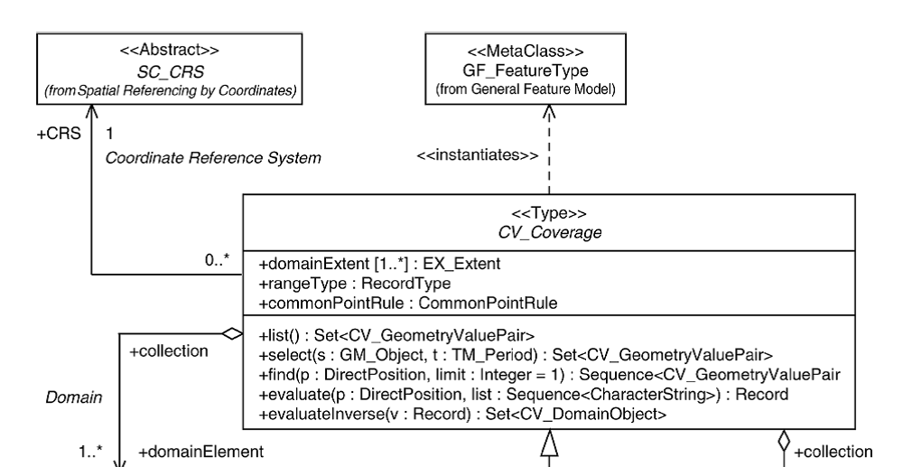

[.text-center]
*Figure 23 – UML class diagram: Overview of the CV_Coverage class [ISO 19123:2005]*

The range of aggregated elevation coverages shall be referenced to the same vertical CRS.

====== *Specific mechanism for the identification of non-registered depth Chart Datums*

The concept of Chart Datum has been introduced in Section 6.2.1.2 (Bathymetry).

As mentioned in Section 6.2.1.4.1, local chart datums for referencing the depth property – especially those used in inland water bodies such as lakes and navigable rivers -, which are rarely available within a registry, use the _ChartDatum_ data type described below to identify its characteristics.

This prevents data providers to register depth vertical CRS which are just used at local level and at the same time facilitates an approximate conversion of depths to heights in these cases. Users shall be aware if this approximation may be accepted depending on their final purposes.

image::./media/image25.png[image, align=center]

[.text-center]
*Figure 24 – UML class: ChartDatum data type (ElevationVectorElements app. schema)*

The _ChartDatum_ data type (Figure 24) is defined in Section 5.6.2.2.1 and includes the following properties:

* _Scope_ – the geographic scope in which the local depth datum is practically used.
+
In most cases the transformation between different vertical references is not a constant shift, but a non-linear transformation depending on the geographic location. The scope delimits the geographic area in which a shift (from now on, the _offset_ property) can be applied locally as an approximation of this transformation.
+
This approximation is specially useful when the user is interested in describing the bottom of a lake and its emerged surroundings as a common surface referenced to the same height vertical CRS (or e.g. the bed of a river section as the same surface than the surroundings).

* _Datum water level_ – the water level determining the origin of depth measurements for the chart datum.
+
This property makes use of the _WaterLevelValue_ code list defined in the INSPIRE Data specifications on Hydrography, and it is applicable in both sea and inland waters (e.g. high water, low water, mean sea level, etc.).

* _Reference point_ – which is defined according to two possible cases:
** _Case A_: a single point which is used to refer depth values within the geographical scope of the chart datum.

** _Case B_: a set of points where water level measurements are performed to determine the water level of the chart datum.

Reference points are located along the coast line (sea waters) or along land-water boundaries (inland waters), where the height property is known. Their vertical position shall be referenced to a common CRS. This common system shall be EVRS within its geographical scope (continental Europe), or the vertical CRS identified and documented by the Member State concerned, outside the geographical scope of EVRS (overseas territories).

In Case A - The reference point may be used as input to calculate approximate heights in the common vertical CRS for those vector objects whose depth values are referred to the chart datum. In Case B - The reference point may be used, together with the respective offset parameters, as input to calculate approximate heights in the common vertical CRS for those vector objects whose depth values are referred to the water level of the chart datum.

* _Offset_ – the relative difference between the height of a reference point and the height of the water level determining the chart datum.
+
When a single reference point is provided, the offset parameter is usually zero, so if the parameter is not informed it is supposed to be equal to zero. When a set of reference points is provided, an individual offset parameter shall be provided for each of these points. Hence, there is a one-to-one correspondence (ordered multiplicity) between the properties _reference point_ and _offset_.

NOTE The definition of the Mean Sea Level is just local and it depends on the geographical location. This location is implicitly determined by the _referencePoint_ attribute within _ChartDatum_.

5.6.2.2.1 of this specification provides examples clarifying the use of the _ChartDatum_ data type for different geographic scopes.

==== Grids

===== Geo-referencing of gridded data (coverages) into geographical grids

The geographic grids defined in the amendment of the _Commission Regulation (EU) No 1089/2010, of 23 November 2010, implementing Directive 2007/2/CE of the European Parliament and of the Council as regards interoperability of spatial data sets and services_, are modelled as a collection of surfaces (geographic grid cells) which are mutually exclusive and constitute an exhaustive partition of the full extent of the grid. This modelling approach has mainly three advantages:

* It provides an harmonised framework for the definition of geographical grids in INSPIRE, which is consistent with the Equal Area Grid (Grid_ETRS89-LAEA) already proposed during the INSPIRE Annex I process.

* It is suited for this purpose, since the geographic grid cells are widely used to organize geographic data set series as a partition of map units (e.g. map sheets) covering a specific geographic area.

* Do not prevent widening the potential usages of the geographic grid in the future, since the geographic grid is independent from theme-specific data structures (such as the grid coverages use d in _Elevation_).

Despite those geographic grids are not formally defined as coverages according ISO 19123:2005 (_Geographic information – Schema for coverage geometry and functions_), the concept utilized for their definition is consistent with the domain of a discrete surface coverage (CV_DiscreteSurfaceCoverage) as defined in such a standard.

In contrast, gridded data files (from now on, coverages) are defined in INSPIRE as a network composed of two sets of equally spaced parallel lines that intersect at right angles, where the intersection points (to which the range values of the coverage are assigned) are designated grid points, i.e. a mesh of points.

This situation makes necessary to explicit the rules governing geo-referencing or alignment of grid coverages to those geographic grids.

[IMPORTANT]
====
[.text-center]
*IR Requirement*
_Annex II Section 6.2.1.2_
*Constraints of the spatial object type RectifiedGridCoverage*

Grid points of a RectifiedGridCoverage shall coincide with the centres of cells of the geographical grids defined in Section 2.2 of Annex II of the Commission Regulation on Interoperability of Spatial Data Sets and Services at the same resolution level.

====

image::./media/image26.jpeg[image]

[.text-center]
*Figure 25 – Example: Detail showing the alignment of Elevation grid coverages to a geographic grid*

NOTE As for the geographical grid defined in Annex D.2 of this specification (Zoned Geographic Grid), the previous alignment rule implicitly clarifies the _Elevation_ gridded data values (included in grid coverages) that belong to each zone of the geographic grid. In other words, the rule avoids duplicity of values in the borders of the geographic grid zones.

===== Geographical grids for Gridded Elevation data

[IMPORTANT]
====
[.text-center]
*IR Requirement*
_Annex III Section 1.7.2_
*Geographic Grids to be used for Elevation Data*

[arabic, start=1]
. By way of derogation from the requirement in Section 2.2 of Annex II, any grid compatible with one of the following coordinate reference systems may be used for making gridded _Elevation_ data available:

* two-dimensional geodetic coordinates (latitude and longitude) based on a datum specified in Section 1.2 of Annex II and using the parameters of the GRS80 ellipsoid;

* plane coordinates using the ETRS89 Lambert Conformal Conic coordinate reference system;

* plane coordinates using the ETRS89 Transverse Mercator coordinate reference system.

The grid specified in 2.2.1 of Annex II shall not be used.

====

Whereas most _Elevation_ applications may be solved using datasets based on existing national grids compliant with the requirement above, there is a need to properly combine gridded data in order to satisfy cross-border use-cases (e.g. flooding management and emergency response). This implies the utilization of a common grid which avoids the problems caused by the fact of using different map projections and geographic grid properties which affect the proper alignment of grid coverage cells. Making available this kind of data using ETRS89-GRS80 geodetic coordinates according to a common geographic grid is a possible solution to the problem. Annex D.2 in this document further explains the need to establish such a common geographic grid.

The geographic grid defined in Annex D.2 (Grid_ETRS89-GRS80zn) is designed for this specific purpose. This grid is recommended as a geo-referencing framework for the provision of Pan-European gridded Elevation data sets within the continental part of Europe (geographical scope of ETRS89) in order to obtain continuous-seamless data.

[NOTE]
====
*Recommendation 18*

Gridded data related to the _Elevation_ theme in areas within the scope of ETRS89 should be made available using geodetic coordinates based on the Zoned Geographic Grid (specified in Annex D.2). This geographic grid may be used as a geo-referencing framework for the _Elevation_ theme data sets in order to avoid interoperability problems in cross-border areas.
====

The use of map projections may be needed in order to properly visualize the data in a specific geographical area. However, this can be performed in a subsequent process whereas data is geometrically continuous and provided in geodetic coordinates at pan-European level. Therefore it will be necessary to perform on-the-fly re-projections to transform from the source coordinate reference system (in which data is stored) to the one chosen for display.

It is worth mentioning here that the most direct way to provide raster data sets through a download service according the previous recommendation would be to store them at data sources using geodetic coordinates based on the Grid_ETRS89-GRS80_zn. This would make possible downloading the original harmonised data free of any additional transformation.

In the future, production of _Elevation_ data sets could be based on the common Grid_ETRS89-GRS80_zn instead of national grids, since the unavoidable transformation between the grids has an inherent loss of quality.

The planar representation of geodetic coordinates introduces unusual distortions as the latitude parameter increases in each zone, as a result of the convergence of meridians. Particularly, the longitude axis is rescaled causing a stretching of the grid in the WE direction when it is represented in geodetic coordinates (visually this is perceived as if the grid was flattened in the NS direction).

EXAMPLE While 1 arcsecond in longitude corresponds approximately to 31 meters at the Equator, it corresponds to 25 meters in Gibraltar (southern part of Spain - latitude 35 degrees) and only to 10 meters in North Cape (North Scandinavia - latitude 71 degrees).

Therefore, for the visualization of such data sets it is recommended the use of any map projection which is suitable to the specific geographical area to be rendered as it is allowed by the _Regulation (EU) No 1089/2010, of 23 November 2010, on interoperability of spatial data sets and services_.

Consequently, _on-the-fly_ projection transformations are needed for view services serving these data sets.

[NOTE]
====
*Recommendation 19*
Real time re-projection is recommended for the view services serving gridded _Elevation_ data sets aimed at satisfying global purposes and based on any grid compatible with this specification__.__
====

<<<
== Data quality

This chapter includes a description of the data quality elements and sub-elements as well as the corresponding data quality measures that should be used to evaluate and document data quality for data sets related to the spatial data theme _Elevation_ (section 7.1).

It may also define requirements or recommendations about the targeted data quality results applicable for data sets related to the spatial data theme _Elevation_ (sections 7.2 and 7.3).

In particular, the data quality elements, sub-elements and measures specified in section 7.1 should be used for

* evaluating and documenting data quality properties and constraints of spatial objects, where such properties or constraints are defined as part of the application schema(s) (see section 5);

* evaluating and documenting data quality metadata elements of spatial data sets (see section 8); and/or

* specifying requirements or recommendations about the targeted data quality results applicable for data sets related to the spatial data theme _Elevation_ (see sections 7.2 and 7.3).

The descriptions of the elements and measures are based on Annex D of ISO/DIS 19157 Geographic information – Data quality.

=== Data quality elements

Table 3 lists all data quality elements and sub-elements that are being used in this specification. Data quality information can be evaluated at level of spatial object, spatial object type, dataset or dataset series. The level at which the evaluation is performed is given in the "Evaluation Scope" column.

The measures to be used for each of the listed data quality sub-elements are defined in the following sub-sections.

*Table 3 – Data quality elements used in the spatial data theme _Elevation_*

[cols=",,,,,,",]
|===
.2+|*Section* .2+|*Data quality element /*
*sub-element*
.2+|*Definition* .2+|*Evaluation Scope* 3+|*Application to Spatial Representation types*
 |*Vector* |*Grid* |*TIN*
|7.1.1 a|
Completeness /
Commission

|excess data present in the dataset, as described by the scope |dataset / dataset series |* | |*
|7.1.2 a|
Completeness /
Omission

|data absent from the dataset, as described by the scope |dataset / dataset series / spatial object type |* |* |*
|7.1.3 |Logical consistency / Conceptual consistency |adherence to rules of the conceptual schema |spatial object / spatial object type |* |* |*
|7.1.4 a|
Logical consistency /
Domain consistency

|adherence of values to the value domains |spatial object / spatial object type |* | |*
|7.1.5 a|
Logical consistency /
Format consistency

|degree to which data is stored in accordance with the physical structure of the dataset, as described by the scope |dataset / dataset series |* |* |*
|7.1.6 a|
Logical consistency /
Topological consistency

|correctness of the explicitly encoded topological characteristics of the dataset, as described by the scope |spatial object type / dataset / dataset series |* | |*
.2+|7.1.7 .2+|
Positional accuracy /
Absolute or external accuracy

.2+|closeness of reported coordinate values to values accepted as or being true .2+|spatial object / spatial object type / dataset series / dataset a|
Horizontal
Component

| a|
Horizontal
Component

a|
Vertical
Component

a|
Vertical
Component

a|
Vertical
Component

|7.1.8 a|
Positional accuracy /

Gridded data position accuracy

|closeness of gridded data position values to values accepted as or being true |spatial object / spatial object type / dataset series / dataset | a|
Horizontal
Component
|
|===

[NOTE]
====
*Recommendation 20*

Where it is impossible to express the evaluation of a data quality element in a quantitative way, the evaluation of the element should be expressed with a textual statement as a data quality descriptive result.

====

Descriptive result can also be used to for providing a short synthetic description of the result of the data quality evaluation, to accompany the complete quantitative result.

==== Completeness – Commission

[NOTE]
====
*Recommendation 21*

Commission should be evaluated and documented using Rate of excess items , as specified in the table below.

====

[cols=",",]
|===
|*Name* |*Rate of excess items*
|Alternative name |–
|Data quality element |Completeness
|Data quality sub-element |Commission
|Data quality basic measure |Error rate
|Definition |Number of excess items in the dataset in relation to the number of items that should have been present.
|Description |–
|Evaluation scope |data set / data set series
|Reporting scope |data set / data set series
|Parameter |–
|Data quality value type |Real (e.g. percentage, ratio)
|Data quality value structure |Single value
|Source reference |ISO/DIS 19157 Geographic information – Data quality
|Example |2% (The dataset has 2% duplicated contour lines than ones necessary to model the universe of discourse)
|Measure identifier |3 (ISO/DIS 19157:2012)
|===

==== Completeness – Omission

[NOTE]
====
*Recommendation 22*

Omission should be evaluated and documented using Rate of missing items as specified in the table below. Spatial object type evaluation and reporting scope is especially recommended for Contour line vector spatial objects and for _Elevation_ grid coverages.

====

[cols=",",]
|===
|*Name* |*Rate of missing items*
|Alternative name |–
|Data quality element |Completeness
|Data quality sub-element |Omission
|Data quality basic measure |Error rate
|Definition |Number of missing items in the dataset in relation to the number of items that should have been present.
|Description |-
|Evaluation scope a|
spatial object type: _ContourLine_, _ElevationGridCoverage_ /

data set / data set series

|Reporting scope a|
spatial object type: _ContourLine_, _ElevationGridCoverage_ /

data set / data set series

|Parameter |–
|Data quality value type |Real (e.g. percentage, ratio)
|Data quality value structure |Single value
|Source reference |ISO/DIS 19157 Geographic information – Data quality
|Example |2% (The dataset has 2% less contour lines than ones necessary to model the universe of discourse)
|Measure identifier |7 (ISO/DIS 19157:2012)
|===

==== Logical consistency – Conceptual consistency

The Application Schema conformance class of the Abstract Test Suite in Annex I defines a number of tests to evaluate the conceptual consistency (tests A.1.1-A.1.9) of a data set.

[NOTE]
====
*Recommendation 23*

For the tests on conceptual consistency, it is recommended to use the Logical consistency – Conceptual consistency data quality sub-element and the measure Non-compliance rate with respect to the rules of the conceptual schema as specified in the table below.

====

[cols=",",]
|===
|*Name* |*_Non-compliance rate with respect to the rules of the conceptual schema_*
|Alternative name |-
|Data quality element |Logical consistency
|Data quality sub-element |Conceptual consistency
|Data quality basic measure |Error rate
|Definition |Number of items in the dataset that are not compliant with the rules of the conceptual schema in relation to the total number of these items supposed to be in the dataset
|Description |If the conceptual schema explicitly or implicitly describes rules, these rules shall be followed.
|Evaluation scope |spatial object / spatial object type
|Reporting scope |data set / data set series
|Parameter |-
|Data quality value type |Real (e.g. percentage, ratio)
|Data quality value structure |-
|Source reference |ISO/DIS 19157 Geographic information – Data quality
|Example |
|Measure identifier |12 (ISO/DIS 19157:2012)
|===

==== Logical consistency – Domain consistency

The Application Schema conformance class of the Abstract Test Suite in Annex I defines a number of tests to evaluate the domain consistency (tests A1.10-A.1.12) of a data set.

[NOTE]
====
*Recommendation 24*

For the tests on domain consistency, it is recommended to use the Logical consistency – Domain consistency data quality sub-element and the measure Value domain non-conformance rate as specified in the table below.

====

[cols=",",]
|===
|*Name* |*Value domain non-conformance rate*
|Alternative name |-
|Data quality element |Logical consistency
|Data quality sub-element |Domain consistency
|Data quality basic measure |Error rate
|Definition |Number of items in the dataset that are not in conformance with their value domain in relation to the total number of items.
|Description |-
|Evaluation scope |spatial object / spatial object type
|Reporting scope |data set / data set series
|Parameter |-
|Data quality value type |Real (e.g. percentage, ratio)
|Data quality value structure |Single value
|Source reference |ISO/DIS 19157 Geographic information – Data quality
|Example |-
|Measure identifier |18 (ISO/DIS 19157:2012)
|===

==== Logical Consistency – Format consistency

[NOTE]
====
*Recommendation 25*

Format consistency should be evaluated and documented using Physical structure conflict rate as specified in the table below.

====

[cols=",",]
|===
|*Name* |*Physical structure conflict rate*
|Alternative name |-
|Data quality element |Logical consistency
|Data quality sub-element |Format consistency
|Data quality basic measure |Error rate
|Definition |Number of items in the dataset that are stored in conflict with the physical structure of the dataset divided by the total number of items.
|Description |-
|Evaluation scope |data set / data set series
|Reporting scope |data set / data set series
|Parameter |-
|Data quality value type |Real (e.g. percentage, ratio)
|Data quality value structure |Single value
|Source reference |ISO/DIS 19157 Geographic information – Data quality
|Example |-
|Measure identifier |20 (ISO/DIS 19157:2012)
|===

==== Logical Consistency – Topological consistency

[NOTE]
====
*Recommendation 26*

Topological consistency of vector linear spatial objects which shall be connected should be evaluated and documented using Rate of missing connections due to undershoots and Rate of missing connections due to overshoots as specified in the tables below.

====

Topological consistency of vector linear spatial objects shall be evaluated against the rules defined in the feature catalogue (Chapter 5) and in the data capture chapter (Chapter 10).

[cols=",",]
|===
|*Name* |*Rate of missing connections due to undershoots*
|Alternative name |Undershoots rate
|Data quality element |Logical consistency
|Data quality sub-element |Topological consistency
|Data quality basic measure |Error rate
|Definition |Count of items in the dataset, within the parameter tolerance, that are mismatched due to undershoots divided by the total number of elements in the data set.
|Description |Missing connections exceeding the parameter tolerance are considered as errors (undershoots) if the real linear elevation features have to be connected.
|Evaluation scope a|
spatial object type: _ContourLine_, _BreakLine_ /

data set / data set series

|Reporting scope a|
spatial object type: _ContourLine_, _BreakLine_ /

data set / data set series

|Parameter a|
Name:
_Connectivity tolerance_

Definition:
Search distance from the end of a dangling line.

Description:
This parameter is specific for each data provider's dataset and must be reported as metadata in order to evaluate this data quality measure.

The tolerance must be specified by the data provider using the following elements of the DQ_TopologicalConsistency metadata element for the current measure:

* 102. measureDescription (type: free text):
+
Defined as "_Description of the measure_".

* 107. Result (type DQ_Result):
+
Defined as "_Value (or set of values) obtained from applying a data quality measure or the outcome of evaluating the obtained value (or set of values) against a specified acceptable conformance quality level_".
Specifically, the tolerance must be informed within the two elements, together with the result of the data quality measure:

** 130. specification

** 131. explanation

+
from DQ_Result class.

Note: Metadata elements defined in ISO 19115.

|Data quality value type |Real (e.g. percentage, ratio)
|Data quality value structure |Single value
|Source reference |ISO/DIS 19157 Geographic information – Data quality
|Example a|
Example – Connectivity between two consecutive contour line instances with the same height which have to be connected.

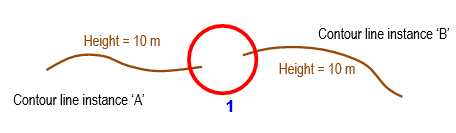
*Key*
*1* Search tolerance is 3 m

|Measure identifier a|
This measure is explicitly defined in this data specification.

It is derived from DQ measure 23 (ISO/DIS 19157:2012).
|===

[cols=",",]
|===
|*Name* |*Rate of missing connections due to overshoots*
|Alternative name |Overshoots rate
|Data quality element |Logical consistency
|Data quality sub-element |Topological consistency
|Data quality basic measure |Error rate
|Definition |Count of items in the dataset, within the parameter tolerance, that are mismatched due to overshoots divided by the total number of elements in the data set.
|Description |Missing connections exceeding the parameter tolerance are considered as errors (overshoots) if the real linear elevation features have to be connected.
|Evaluation scope a|
spatial object type: _ContourLine_, _BreakLine_ /

data set / data set series

|Reporting scope a|
spatial object type: _ContourLine_, _BreakLine /_

data set / data set series

|Parameter a|
Name:
_Connectivity tolerance_

Definition:
Search distance from the end of a dangling line.

Description:
This parameter is specific for each data provider's dataset and must be reported as metadata in order to evaluate this data quality measure.

The tolerance must be specified by the data provider using the following elements of the DQ_TopologicalConsistency metadata element for the current measure:

* 102. measureDescription (type: free text):
+
Defined as "_Description of the measure_".

* 107. Result (type DQ_Result):
+
Defined as "_Value (or set of values) obtained from applying a data quality measure or the outcome of evaluating the obtained value (or set of values) against a specified acceptable conformance quality level_".
Specifically, the tolerance must be informed within the two elements, together with the result of the data quality measure:

** 130. specification
** 131. explanation

+
from DQ_Result class.

Note: Metadata elements defined in ISO 19115.

|Data quality value type |Real (e.g. percentage, ratio)
|Data quality value structure |Single value
|Source reference |ISO/DIS 19157 Geographic information – Data quality
|Example a|
Example – Connectivity between two consecutive contour line instances with the same height which have to be connected.

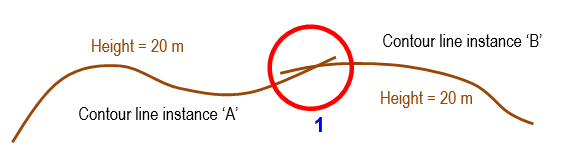

*Key*
*1* Search tolerance is 3 m

|Measure identifier a|
This measure is explicitly defined in this data specification.

It is derived from DQ measure 24 (ISO/DIS 19157:2012).
|===

[NOTE]
====
*Recommendation 27*

Topological consistency of vector linear spatial objects and the boundaries of area spatial objects should be evaluated and documented using Rate of invalid self-intersect errors and Rate of invalid self-overlap errors as specified in the tables below.

====

[cols=",",]
|===
|*Name* |*Rate of invalid self-intersect errors*
|Alternative name |Loops rate
|Data quality element |Logical consistency
|Data quality sub-element |Topological consistency
|Data quality basic measure |Error rate
|Definition |Count of all items in the data that illegally intersect with themselves divided by the total number of elements in the data set.
|Description |-
|Evaluation scope a|
spatial object type: _ContourLine_, _BreakLine_, _VoidArea_, _IsolatedArea_ /

data set / data set series

|Reporting scope a|
spatial object type: _ContourLine_, _BreakLine_, _VoidArea_, _IsolatedArea_ /

data set / data set series

|Parameter |-
|Data quality value type |Real (e.g. percentage, ratio)
|Data quality value structure |Single value
|Source reference |ISO/DIS 19157 Geographic information – Data quality
|Example a|
Example – Self-intersection of a contour line instance.

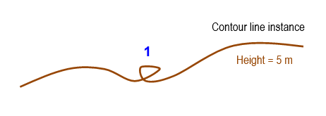

*Key*
*1* Illegal intersection (loop)

|Measure identifier a|
This measure is explicitly defined in this data specification.

It is derived from DQ measure 26 (ISO/DIS 19157:2012).
|===

[cols=",",]
|===
|*Name* |*Rate of invalid self-overlap errors*
|Alternative name |Kickbacks rate
|Data quality element |Logical consistency
|Data quality sub-element |Topological consistency
|Data quality basic measure |Error rate
|Definition |Count of all items in the data that illegally self overlap divided by the total number of elements in the data set.
|Description |-
|Evaluation scope a|
spatial object type: _ContourLine_, _BreakLine_, _VoidArea_, _IsolatedArea_ /

data set / data set series

|Reporting scope a|
spatial object type: _ContourLine_, _BreakLine_, _VoidArea_, _IsolatedArea_ /

data set / data set series

|Parameter |-
|Data quality value type |Real (e.g. percentage, ratio)
|Data quality value structure |Single value
|Source reference |ISO/DIS 19157 Geographic information – Data quality
|Example a|
Example – Self-overlap of a contour line instance.

image::./media/image716d.png[image, align=center]

*Key*

* Vertices [digitized order]
+
*1* Illegal overlap (kickback)

|Measure identifier a|
This measure is explicitly defined in this data specification.
It is derived from DQ measure 27 (ISO/DIS 19157:2012).
|===

==== Positional accuracy – Absolute or external accuracy

[NOTE]
====
*Recommendation 28*

Absolute or external accuracy of the horizontal component of vector objects within vector datasets and within TIN structures should be evaluated and documented using Root mean square error of planimetry as specified in the table below.

====

[cols=",",]
|===
|*Name* |*Root mean square error of planimetry*
|Alternative name |RMSEP
|Data quality element |Positional accuracy
|Data quality sub-element |Absolute or external accuracy
|Data quality basic measure |Not applicable
|Definition |Radius of a circle around the given point, in which the true value lies with probability P
|Description a|
The true values of the observed coordinates _X_ and _Y_ are known as _x~t~_ and _y~t~ ._

From this the estimator

image::./media/image27.png[image, align=center]

yields to the linear root mean square error of planimetry RMSEP = _σ_

|Evaluation scope a|
spatial object: _SpotElevation, ContourLine, BreakLine_ /
spatial object type: _SpotElevation, ContourLine, BreakLine_ /
data set / data set series

|Reporting scope a|
spatial object type: _SpotElevation, ContourLine, BreakLine_ /
data set / data set series

|Parameter |-
|Data quality value type |Measure
|Data quality value structure |Single value
|Source reference |ISO/DIS 19157 Geographic information – Data quality
|Example |-
|Measure identifier |47 (ISO/DIS 19157:2012)
|===

[NOTE]
====
*Recommendation 29*

Absolute or external accuracy of the vertical component of vector objects within vector data sets and within TIN structures and of values composing the range of grid elevation coverages, should be evaluated and documented using Root mean square error as specified in the table below.

====

[cols=",",]
|===
|*Name* |*Root mean square error*
|Alternative name |RMSE
|Data quality element |Positional accuracy
|Data quality sub-element |Absolute or external accuracy
|Data quality basic measure |Not applicable
|Definition |Standard deviation, where the true value is not estimated from the observations but known _a priori_
|Description a|
The true value of an observable _Z_ is known as __z__~t~ _._ From this, the estimator:

image::./media/image28.png[image, align=center]

yields to the linear root mean square error RMSE = _σ~z~_.

|Evaluation scope a|
spatial object: _SpotElevation, ContourLine, BreakLine_ /
spatial object type: _SpotElevation, ContourLine, BreakLine, ElevationGridCoverage_ /
data set / data set series

|Reporting scope a|
spatial object: _ElevationGridCoverage_ /
spatial object type: _SpotElevation, ContourLine, BreakLine, ElevationGridCoverage_ /
data set / data set series

|Parameter |-
|Data quality value type |Measure
|Data quality value structure |Single value
|Source reference |ISO/DIS 19157 Geographic information – Data quality
|Example |-
|Measure identifier |39 (ISO/DIS 19157:2012)
|===

==== Positional accuracy – Gridded data position accuracy

This specification uses the Gridded data position accuracy data quality sub-element to evaluate the closeness of planimetric position of elevation grid coverages (direct positions composing the domain of the coverage) to values accepted as or being true.

[NOTE]
====
*Recommendation 30*

Gridded data position accuracy should be evaluated and documented using Root mean square error of planimetry as specified in the table below.

====

[cols=",",]
|===
|*Name* |*Root mean square error of planimetry*
|Alternative name |RMSEP
|Data quality element |Positional accuracy
|Data quality sub-element |Gridded data position accuracy
|Data quality basic measure |Not applicable
|Definition |Radius of a circle around the given point, in which the true value lies with probability P
|Description a|
The true values of the observed coordinates _X_ and _Y_ are known as _x~t~_ and _y~t~ ._
From this the estimator

image::./media/image27.png[image]

yields to the linear root mean square error of planimetry RMSEP = _σ_

|Evaluation scope a|
spatial object: _ElevationGridCoverage_ /
spatial object type: _ElevationGridCoverage_ /
data set / data set series

|Reporting scope a|
spatial object: _ElevationGridCoverage_ /
spatial object type: _ElevationGridCoverage_ /
data set / data set series

|Parameter |-
|Data quality value type |Measure
|Data quality value structure |Single value
|Source reference |ISO/DIS 19157 Geographic information – Data quality
|Example |-
|Measure identifier |47 (ISO/DIS 19157:2012)
|===

=== Minimum data quality requirements

No minimum data quality requirements are defined for the spatial data theme _Elevation_.

<<<
=== Recommendation on data quality

[NOTE]
====
*Recommendation 31*

For the data quality elements listed in Table 11, all data sets related to the spatial data theme _Elevation_ should meet the specified target results.

====

Table 11 – Recommended minimum data quality results for spatial data theme Elevation

[cols=",,,,",]
|===
|*Section* |*Data quality element and sub-element* |*Measure name(s)* |*Target result(s)* |*Condition*
|7.1.1 a|
Completeness /
Commission

|Rate of excess items |0 % |Data duplication can be checked and corrected automatically
|7.1.2 a|
Completeness /
Omission

|Rate of missing items |0 % |
|7.1.3 |Logical consistency / Conceptual consistency |Non-compliance rate with respect to the rules of the conceptual schema |0 % |
|7.1.4 a|
Logical consistency /
Domain consistency

|Value domain non-conformance rate |0 % .6+.^|Quality controls and data editing can be performed automatically
|7.1.5 a|
Logical consistency /
Format consistency

|Physical structure conflict rate |0 %
.4+|7.1.6 .4+|
Logical consistency /
Topological consistency

|Rate of missing connections due to undershoots |0 % 
|Rate of missing connections due to overshoots |0 % 
|Rate of invalid self-intersect errors |0 % 
|Rate of invalid self-overlap errors |0 % 
.3+|7.1.7 .3+|
Positional accuracy /
Absolute or external accuracy

|Root mean square error of planimetry a|
*Vector / TIN objects*
_Horizontal (m):_
Max RMSE~H~ = E / 10000
|
|Root mean square error a|
*Vector / TIN objects*
_Vertical (m):_
Max RMSE~v~ = V~int~ / 6

NOTE V~int~ can be approximated by E / 1000.

|In low reliability areas (e.g. wooded areas) the maximum error can be increased by 50%
|Root mean square error a|
*Grid*
_Vertical (m):_
Max RMSE~v~ = GSD / 3
|
|7.1.8 a|
Positional accuracy /
Gridded data position accuracy

|Root mean square error of planimetry a|
*Grid*
_Horizontal (m):_
Max RMSE~H~ = GSD / 6
|
|===

NOTE 1 Target results on positional accuracy measures are considered as the maximum error permitted (minimum data quality requirement) for a specific level of detail of data. Elevation data sets data quality will be often improving these figures, especially those aimed to serve positional accuracy demanding use cases.

NOTE 2 The following notation is used in Table 11:

* E Denominator of the intended scale of mapping.
* V~int~ Normal contour line vertical interval.
* GSD Ground sample distance

Elevation data provided through INSPIRE should have the best spatial, temporal and thematic accuracy available. Relevant use-cases like modelling and control of floods especially pose strict spatial accuracy requirements to measures in the vertical dimension, which are often fulfilled by using accurate data capture methods (e.g. LIDAR data).

[NOTE]
====
*Recommendation 32*
All spatial objects should be provided at the best spatial, temporal and thematic accuracy available, in order to serve relevant use-cases, like modelling of flooding events and emergency response.
====

<<<
== Dataset-level metadata

This section specifies dataset-level metadata elements, which should be used for documenting metadata for a complete dataset or dataset series.

NOTE Metadata can also be reported for each individual spatial object (spatial object-level metadata). Spatial object-level metadata is fully described in the application schema(s) (section 5).

For some dataset-level metadata elements, in particular those for reporting data quality and maintenance, a more specific scope can be specified. This allows the definition of metadata at sub-dataset level, e.g. separately for each spatial object type (see instructions for the relevant metadata element).

=== Metadata elements defined in INSPIRE Metadata Regulation

Table 4 gives an overview of the metadata elements specified in Regulation 1205/2008/EC (implementing Directive 2007/2/EC of the European Parliament and of the Council as regards metadata).

The table contains the following information:

* The first column provides a reference to the relevant section in the Metadata Regulation, which contains a more detailed description.
* The second column specifies the name of the metadata element.
* The third column specifies the multiplicity.
* The fourth column specifies the condition, under which the given element becomes mandatory.

*Table 4 – Metadata for spatial datasets and spatial dataset series specified in Regulation 1205/2008/EC*

[cols=",,,",]
|===
|*Metadata Regulation Section* |*Metadata element* |*Multiplicity* |*Condition*
|1.1 |Resource title |1 |
|1.2 |Resource abstract |1 |
|1.3 |Resource type |1 |
|1.4 |Resource locator |0..* |Mandatory if a URL is available to obtain more information on the resource, and/or access related services.
|1.5 |Unique resource identifier |1..* |
|1.7 |Resource language |0..* |Mandatory if the resource includes textual information.
|2.1 |Topic category |1..* |
|3 |Keyword |1..* |
|4.1 |Geographic bounding box |1..* |
|5 |Temporal reference |1..* |
|6.1 |Lineage |1 |
|6.2 |Spatial resolution |0..* |Mandatory for data sets and data set series if an equivalent scale or a resolution distance can be specified.
|7 |Conformity |1..* |
|8.1 |Conditions for access and use |1..* |
|8.2 |Limitations on public access |1..* |
|9 |Responsible organisation |1..* |
|10.1 |Metadata point of contact |1..* |
|10.2 |Metadata date |1 |
|10.3 |Metadata language |1 |
|===

Generic guidelines for implementing these elements using ISO 19115 and 19119 are available at _http://inspire.jrc.ec.europa.eu/index.cfm/pageid/101_. The following sections describe additional theme-specific recommendations and requirements for implementing these elements.

==== Conformity

The _Conformity_ metadata element defined in Regulation 1205/2008/EC requires to report the conformance with the Implementing Rule for interoperability of spatial data sets and services. In addition, it may be used also to document the conformance to another specification.

[NOTE]
====
*Recommendation 33*

Dataset metadata should include a statement on the overall conformance of the dataset with this data specification (i.e. conformance with all requirements).

====

[NOTE]
====
*Recommendation 34*

The _Conformity_ metadata element should be used to document conformance with this data specification (as a whole), with a specific conformance class defined in the Abstract Test Suite in Annex A and/or with another specification.

====

The _Conformity_ element includes two sub-elements, the _Specification_ (a citation of the Implementing Rule for interoperability of spatial data sets and services or other specification), and the _Degree_ of conformity. The _Degree_ can be _Conformant_ (if the dataset is fully conformant with the cited specification), _Not Conformant_ (if the dataset does not conform to the cited specification) or _Not Evaluated_ (if the conformance has not been evaluated).

[NOTE]
====
*Recommendation 35*

If a dataset is not yet conformant with all requirements of this data specification, it is recommended to include information on the conformance with the individual conformance classes specified in the Abstract Test Suite in Annex A.

====

[NOTE]
====
*Recommendation 36*

If a dataset is produced or transformed according to an external specification that includes specific quality assurance procedures, the conformity with this specification should be documented using the _Conformity_ metadata element.

====

[NOTE]
====
*Recommendation 37*

If minimum data quality recommendations are defined then the statement on the conformity with these requirements should be included using the _Conformity_ metadata element and referring to the relevant data quality conformance class in the Abstract Test Suite.

====

NOTE Currently no minimum data quality requirements are included in the IRs. The recommendation above should be included as a requirement in the IRs if minimum data quality requirements are defined at some point in the future.

[NOTE]
====
*Recommendation 38*

When documenting conformance with this data specification or one of the conformance classes defined in the Abstract Test Suite, the _Specification_ sub-element should be given using the http URI identifier of the conformance class or using a citation including the following elements:

- title: "
- date:
- dateType: publication
- date: yyyy-mm-dd

====

NOTE the construct of the title should follow the pattern:

INSPIRE Data Specification on <Theme Name> – Technical Guidelines – <name of the conformance class>"

EXAMPLE 1: The XML snippets below show how to fill the _Specification_ sub-element for documenting conformance with the whole data specification on Addresses v3.0.1.

[source,xml]
----
<gmd:DQ_ConformanceResult>
	<gmd:specification href="http://inspire.ec.europa.eu/conformanceClass/ad/3.0.1/tg"/>
	<gmd:explanation> (...) </gmd:explanation>
	<gmd:pass> (...) </gmd:pass>
</gmd:DQ_ConformanceResult>

or (using a citation):

<gmd:DQ_ConformanceResult>
	<gmd:specification>
		<gmd:CI_Citation>
			<gmd:title>
				<gco:CharacterString>INSPIRE Data Specification on Elevation – Technical Guidelines</gco:CharacterString>
			</gmd:title>
			<gmd:date>
				<gmd:date>
					<gco:Date>2013-01-21</gco:Date>
				</gmd:date>
				<gmd:dateType>
					<gmd:CI_DateTypeCode codeList="http://standards.iso.org/ittf/PubliclyAvailableStandards/ISO_19139_Schemas/resou
rces/Codelist/ML_gmxCodelists.xml#CI_DateTypeCode" codeListValue="publication">publication</gmd:CI_DateTypeCode>
				</gmd:dateType>
			</gmd:date>
		</gmd:CI_Citation>
	</gmd:specification>
	<gmd:explanation> (...) </gmd:explanation>
	<gmd:pass> (...) </gmd:pass>
</gmd:DQ_ConformanceResult>
----

EXAMPLE 2: The XML snippets below show how to fill the _Specification_ sub-element for documenting conformance with the CRS conformance class of the data specification on Addresses v3.0.1.

[source, xml]
----
<gmd:DQ_ConformanceResult>
	<gmd:specification href="http://inspire.ec.europa.eu/conformanceClass/ad/3.0.1/crs" />
	<gmd:explanation> (...) </gmd:explanation>
	<gmd:pass> (...) </gmd:pass>
</gmd:DQ_ConformanceResult>

or (using a citation):

<gmd:DQ_ConformanceResult>
	<gmd:specification>
		<gmd:CI_Citation>
			<gmd:title>
				<gco:CharacterString>INSPIRE Data Specification on Elevation – Technical Guidelines – CRS</gco:CharacterString>
			</gmd:title>
			<gmd:date>
				<gmd:date>
					<gco:Date>2013-01-21</gco:Date>
				</gmd:date>
				<gmd:dateType>
					<gmd:CI_DateTypeCode codeList="http://standards.iso.org/ittf/PubliclyAvailableStandards/ISO_19139_Schemas/resou
rces/Codelist/ML_gmxCodelists.xml#CI_DateTypeCode" codeListValue="publication">publication</gmd:CI_DateTypeCode>
				</gmd:dateType>
			</gmd:date>
		</gmd:CI_Citation>
	</gmd:specification>
	<gmd:explanation> (...) </gmd:explanation>
	<gmd:pass> (...) </gmd:pass>
</gmd:DQ_ConformanceResult>

----

==== Lineage

[NOTE]
====
*Recommendation 39*

Following the ISO/DIS 19157 Quality principles, if a data provider has a procedure for the quality management of their spatial data sets then the appropriate data quality elements and measures defined in ISO/DIS 19157 should be used to evaluate and report (in the metadata) the results. If not, the _Lineage_ metadata element (defined in Regulation 1205/2008/EC) should be used to describe the overall quality of a spatial data set.

====

According to Regulation 1205/2008/EC, lineage "is a statement on process history and/or overall quality of the spatial data set. Where appropriate it may include a statement whether the data set has been validated or quality assured, whether it is the official version (if multiple versions exist), and whether it has legal validity. The value domain of this metadata element is free text".

The Metadata Technical Guidelines based on EN ISO 19115 and EN ISO 19119 specifies that the statement sub-element of LI_Lineage (EN ISO 19115) should be used to implement the lineage metadata element.

[NOTE]
====
*Recommendation 40*
To describe the transformation steps and related source data, it is recommended to use the following sub-elements of LI_Lineage: 
 
* For the description of the transformation process of the local to the common INSPIRE data structures, the LI_ProcessStep sub-element should be used. 
 
* For the description of the source data the LI_Source sub-element should be used.
====

NOTE 1 In order to improve the interoperability, domain templates and instructions for using these free text elements (descriptive statements) may be specified here and/or in an Annex of this data specification.

[NOTE]
====
*Recommendation 41*

If LI_Source and LI_ProcessStep sub-elements of the lineage are not used (respectively) to describe the data source(s) and the INSPIRE transformation process(es) for a specific _Elevation_ data set, therefore the lineage metadata statement should at least include a brief description of the most relevant data source and an overview of such transformation process.

====

[IMPORTANT]
====
[.text-center]
*IR Requirement*
Annex III Section 1.7.6
*Metadata required for Interoperability*

(1) If measures other than ISO data quality measures have been used to evaluate an elevation data set, the Lineage metadata element shall include information about those measures and, if possible, a reference to an online resource where more information is available.

====

==== Temporal reference

According to Regulation 1205/2008/EC, at least one of the following temporal reference metadata sub-elements shall be provided: temporal extent, date of publication, date of last revision, date of creation.

[NOTE]
====
*Recommendation 42*

At least the date of the last revision of a spatial data set should be reported using the _Date of last revision_ metadata sub-element.

====

<<<
=== Metadata elements for interoperability

[IMPORTANT]
====
[.text-center]
*IR Requirement*
Article 13
*Metadata required for Interoperability*

The metadata describing a spatial data set shall include the following metadata elements required for interoperability:

. Coordinate Reference System: Description of the coordinate reference system(s) used in the data set.

. Temporal Reference System: Description of the temporal reference system(s) used in the data set.
+
This element is mandatory only if the spatial data set contains temporal information that does not refer to the default temporal reference system.

. Encoding: Description of the computer language construct(s) specifying the representation of data objects in a record, file, message, storage device or transmission channel.

. Topological Consistency: Correctness of the explicitly encoded topological characteristics of the data set as described by the scope.
+
This element is mandatory only if the data set includes types from the Generic Network Model and does not assure centreline topology (connectivity of centrelines) for the network.

. Character Encoding: The character encoding used in the data set.
+
This element is mandatory only if an encoding is used that is not based on UTF-8.

. Spatial Representation Type: The method used to spatially represent geographic information.

====

This Technical Guidance proposes to implement the required metadata elements based on ISO 19115 and ISO/TS 19139.

The following TG requirements need to be met in order to be conformant with the proposed encoding.

[TIP]
====
*TG Requirement 4*
Metadata instance (XML) documents shall validate without error against the used ISO 19139 XML schema.
====

NOTE Section 2.1.2 of the Metadata Technical Guidelines discusses the different ISO 19139 XML schemas that are currently available.

[TIP]
====
*TG Requirement 5*
Metadata instance (XML) documents shall contain the elements and meet the INSPIRE multiplicity specified in the sections below.
====

[TIP]
====
*TG Requirement 6*
The elements specified below shall be available in the specified ISO/TS 19139 path.
====

[NOTE]
====
*Recommendation 43*

The metadata elements for interoperability should be made available together with the metadata elements defined in the Metadata Regulation through an INSPIRE discovery service.

====

NOTE While this not explicitly required by any of the INSPIRE Implementing Rules, making all metadata of a data set available together and through one service simplifies implementation and usability.

==== Coordinate Reference System

[cols=",",options="header",]
|===
|Metadata element name |*Coordinate Reference System*
|Definition |Description of the coordinate reference system used in the dataset.
|ISO 19115 number and name |13. referenceSystemInfo
|ISO/TS 19139 path |referenceSystemInfo
|INSPIRE obligation / condition |mandatory
|INSPIRE multiplicity |1..*
|Data type(and ISO 19115 no.) |186. MD_ReferenceSystem
|Domain a|
To identify the reference system, the referenceSystemIdentifier (RS_Identifier) shall be provided.

NOTE More specific instructions, in particular on pre-defined values for filling the referenceSystemIdentifier attribute should be agreed among Member States during the implementation phase to support interoperability.

|Implementing instructions |
|Example a|
referenceSystemIdentifier:

code: ETRS_89

codeSpace: INSPIRE RS registry

|Example XML encoding a|

[source, xml]
----
<gmd:referenceSystemInfo>
		<gmd:MD_ReferenceSystem>
			<gmd:referenceSystemIdentifier>
				<gmd:RS_Identifier>
					<gmd:code>
						<gco:CharacterString>ETRS89</gco:CharacterString>
					</gmd:code>
					<gmd:codeSpace>
						<gco:CharacterString>INSPIRE RS registry</gco:CharacterString>
					</gmd:codeSpace>
				</gmd:RS_Identifier>
			</gmd:referenceSystemIdentifier>
		</gmd:MD_ReferenceSystem>
</gmd:referenceSystemInfo>

----

|Comments |
|===

==== Temporal Reference System

[cols=",",options="header",]
|===
|Metadata element name |*Temporal Reference System*
|Definition |Description of the temporal reference systems used in the dataset.
|ISO 19115 number and name |13. referenceSystemInfo
|ISO/TS 19139 path |referenceSystemInfo
|INSPIRE obligation / condition |Mandatory, if the spatial data set or one of its feature types contains temporal information that does not refer to the Gregorian Calendar or the Coordinated Universal Time.
|INSPIRE multiplicity |0..*
|Data type(and ISO 19115 no.) |186. MD_ReferenceSystem
|Domain a|
No specific type is defined in ISO 19115 for temporal reference systems. Thus, the generic MD_ReferenceSystem element and its reference SystemIdentifier (RS_Identifier) property shall be provided.

NOTE More specific instructions, in particular on pre-defined values for filling the referenceSystemIdentifier attribute should be agreed among Member States during the implementation phase to support interoperability.

|Implementing instructions |
|Example a|
referenceSystemIdentifier:

code: GregorianCalendar

codeSpace: INSPIRE RS registry

|Example XML encoding a|
[source, xml]
----
<gmd:referenceSystemInfo>
	<gmd:MD_ReferenceSystem>
		<gmd:referenceSystemIdentifier>
			<gmd:RS_Identifier>
				<gmd:code>
					<gco:CharacterString>GregorianCalendar</gco:CharacterString>
				</gmd:code>
				<gmd:codeSpace>
					<gco:CharacterString>INSPIRE RS registry</gco:CharacterString>
				</gmd:codeSpace>
			</gmd:RS_Identifier>
		</gmd:referenceSystemIdentifier>
	</gmd:MD_ReferenceSystem>
</gmd:referenceSystemInfo>

----

|Comments |
|===

==== Encoding

[cols=",",options="header",]
|===
|Metadata element name |*Encoding*
|Definition |Description of the computer language construct that specifies the representation of data objects in a record, file, message, storage device or transmission channel
|ISO 19115 number and name |271. distributionFormat
|ISO/TS 19139 path |distributionInfo/MD_Distribution/distributionFormat
|INSPIRE obligation / condition |mandatory
|INSPIRE multiplicity |1
|Data type (and ISO 19115 no.) |284. MD_Format
|Domain |See B.2.10.4. The property values (name, version, specification) specified in section 5 shall be used to document the default and alternative encodings.
|Implementing instructions |
|Example a|
name: Elevation GML application schema

version: version 3.0(.3), GML, version 3.2.1

specification: D2.8.II.II Data Specification on Elevation –

Technical Guidelines

|Example XML encoding a|
[source, xml]
----
<gmd:MD_Format>
	<gmd:name>
		<gco:CharacterString> Elevation GML application schema</gco:CharacterString>
	</gmd:name>
	<gmd:version>
		<gco:CharacterString>3.0(.3), GML, version 3.2.1</gco:CharacterString>
	</gmd:version>
	<gmd:specification>
		<gco:CharacterString>D2.8.II.II Data Specification on Elevation – Technical Guidelines</gco:CharacterString>
	</gmd:specification>
</gmd:MD_Format>

----

|Comments |
|===

==== Character Encoding

[cols=",",options="header",]
|===
|Metadata element name |*Character Encoding*
|Definition |The character encoding used in the data set.
|ISO 19115 number and name |
|ISO/TS 19139 path |
|INSPIRE obligation / condition |Mandatory, if an encoding is used that is not based on UTF-8.
|INSPIRE multiplicity |0..*
|Data type (and ISO 19115 no.) |
|Domain |
|Implementing instructions |
|Example |-
|Example XML encoding a|
[source, xml]
----
<gmd:characterSet>
	<gmd:MD_CharacterSetCode codeListValue="8859part2" codeList="http://standards.iso.org/ittf/PubliclyAvailableStandards/ISO_19139_Schemas/resources/Codelist/ML_gmxCodelists.xml#CharacterSetCode">8859-2</gmd:MD_CharacterSetCode>
</gmd:characterSet>

----

|Comments |
|===

==== Spatial representation type

[cols=",",options="header",]
|===
|Metadata element name |*Spatial representation type*
|Definition |The method used to spatially represent geographic information.
|ISO 19115 number and name |37. spatialRepresentationType
|ISO/TS 19139 path |
|INSPIRE obligation / condition |Mandatory
|INSPIRE multiplicity |1..*
|Data type (and ISO 19115 no.) |B.5.26 MD_SpatialRepresentationTypeCode
|Domain |
|Implementing instructions a|
Of the values included in the code list in ISO 19115 (vector, grid, textTable, tin, stereoModel, video), only vector, grid and tin should be used.

NOTE Additional code list values may be defined based on feedback from implementation.

|Example |-
|Example XML encoding |
|Comments |
|===

==== Data Quality – Logical Consistency – Topological Consistency

See section 8.3.2 for instructions on how to implement metadata elements for reporting data quality.

=== Recommended theme-specific metadata elements

[NOTE]
====
*Recommendation 44*

The metadata describing a spatial data set or a spatial data set series related to the theme _Elevation_ should comprise the theme-specific metadata elements specified in Table 5.

====

The table contains the following information:

* The first column provides a reference to a more detailed description.
* The second column specifies the name of the metadata element.
* The third column specifies the multiplicity.

Table 5 – Optional theme-specific metadata elements for the theme Elevation

[cols=",,,",]
|===
|*Section* |*Metadata element* |*Multiplicity* |*Condition*
|8.3.1 |Maintenance Information |0..1 |
|8.3.2 |Completeness - Commission |0..* |
|8.3.2 |Completeness – Omission |0..* |
|8.3.2 |Logical Consistency – Conceptual Consistency |0..* |
|8.3.2 |Logical Consistency – Domain Consistency |0..* |
|8.3.2 |Logical consistency – Format consistency |0..* |
|8.3.2 |Logical consistency – Topological consistency |0..* |
|8.3.2 |Positional accuracy – Absolute or external accuracy |0..* |
|8.3.2 |Positional accuracy – Gridded data position accuracy |0..* |If spatial representation type is _grid_
|8.3.3 |Spatial representation information |0..* |
|8.3.4 |Supplemental information |0..1 |
|8.3.5 |Process step |0..* |
|8.3.6 |Data source |0..* |
|8.3.7 |Browse graphic information |0..* |
|8.3.8 |Digital transfer options |0..* |
|===

[NOTE]
====
*Recommendation 45*

For implementing the metadata elements included in this section using ISO 19115, ISO/DIS 19157 and ISO/TS 19139, the instructions included in the relevant sub-sections should be followed.

====

==== Maintenance Information

[cols=",",options="header",]
|===
|Metadata element name |*Maintenance information*
|Definition |Information about the scope and frequency of updating
|ISO 19115 number and name |30. resourceMaintenance
|ISO/TS 19139 path |identificationInfo/MD_Identification/resourceMaintenance
|INSPIRE obligation / condition |optional
|INSPIRE multiplicity |0..1
|Data type(and ISO 19115 no.) |142. MD_MaintenanceInformation
|Domain a|
This is a complex type (lines 143-148 from ISO 19115).

At least the following elements should be used (the multiplicity according to ISO 19115 is shown in parentheses):

* maintenanceAndUpdateFrequency [1]: frequency with which changes and additions are made to the resource after the initial resource is completed / domain value: MD_MaintenanceFrequencyCode:

* updateScope [0..*]: scope of data to which maintenance is applied / domain value: MD_ScopeCode

* maintenanceNote [0..*]: information regarding specific requirements for maintaining the resource / domain value: free text

|Implementing instructions |
|Example |
|Example XML encoding |
|Comments |
|===

==== Metadata elements for reporting data quality

[NOTE]
====
*Recommendation 46*

For reporting the results of the data quality evaluation, the data quality elements, sub-elements and (for quantitative evaluation) measures defined in chapter 7 should be used.

====

[NOTE]
====
*Recommendation 47*

The metadata elements specified in the following sections should be used to report the results of the data quality evaluation. At least the information included in the row "Implementation instructions" should be provided.

====

The first section applies to reporting quantitative results (using the element DQ_QuantitativeResult), while the second section applies to reporting non-quantitative results (using the element DQ_DescriptiveResult).

[NOTE]
====
*Recommendation 48*

If a dataset does not pass the tests of the Application schema conformance class (defined in Annex A), the results of each test should be reported using one of the options described in sections 8.3.2.1 and 8.3.2.2.

====

NOTE 1 If using non-quantitative description, the results of several tests do not have to be reported separately, but may be combined into one descriptive statement.

NOTE 2 The sections 8.3.2.1 and 8.3.2.2 may need to be updated once the XML schemas for ISO 19157 have been finalised.

The scope for reporting may be different from the scope for evaluating data quality (see section 7). If data quality is reported at the data set or spatial object type level, the results are usually derived or aggregated.

[NOTE]
====
*Recommendation 49*

The scope element (of type DQ_Scope) of the DQ_DataQuality subtype should be used to encode the reporting scope. 
 
- Only the following values should be used for the level element of DQ_Scope: Series, Dataset, featureType. 
 
If the level is featureType the levelDescription/MDScopeDescription/features element (of type Set< GF_FeatureType>) shall be used to list the feature type names.
====

NOTE In the level element of DQ_Scope, the value featureType is used to denote spatial object type.

===== Guidelines for reporting quantitative results of the data quality evaluation

[cols=",",options="header",]
|===
|Metadata element name |*See chapter 7*
|Definition |See chapter 7
|ISO/DIS 19157 number and name |3. report
|ISO/TS 19139 path |dataQualityInfo/*/report
|INSPIRE obligation / condition |optional
|INSPIRE multiplicity |0..*
|Data type (and ISO/DIS 19157 no.) |Corresponding DQ_xxx subelement from ISO/DIS 19157, e.g. 12. DQ_CompletenessCommission
|Domain a|
Lines 7-9 from ISO/DIS 19157
{empty} 7. DQ_MeasureReference (C.2.1.3)
{empty} 8. DQ_EvaluationMethod (C.2.1.4.)
{empty} 9. DQ_Result (C2.1.5.)

|Implementing instructions a|
{empty} 39. nameOfMeasure

NOTE This should be the name as defined in Chapter 7.

{empty} 42. evaluationMethodType

{empty} 43. evaluationMethodDescription

NOTE If the reported data quality results are derived or aggregated (i.e. the scope levels for evaluation and reporting are different), the derivation or aggregation should also be specified using this property.

{empty} 46. dateTime

NOTE This should be data or range of dates on which the data quality measure was applied.

{empty} 63. DQ_QuantitativeResult / 64. value

NOTE The DQ_Result type should be DQ_QuantitativeResult and the value(s) represent(s) the application of the data quality measure (39.) using the specified evaluation method (42-43.)

|Example |See Table E.12 — Reporting commission as metadata (ISO/DIS 19157)
|Example XML encoding |
|===

===== Guidelines for reporting descriptive results of the Data Quality evaluation

[cols=",",options="header",]
|===
|Metadata element name |*See chapter 7*
|Definition |See chapter 7
|ISO/DIS 19157 number and name |3. report
|ISO/TS 19139 path |dataQualityInfo/*/report
|INSPIRE obligation / condition |optional
|INSPIRE multiplicity |0..*
|Data type (and ISO/DIS 19157 no.) |Corresponding DQ_xxx subelement from ISO/DIS 19157, e.g. 12. DQ_CompletenessCommission
|Domain a|
Line 9 from ISO/DIS 19157

9. DQ_Result (C2.1.5.)

|Implementing instructions a|
67. DQ_DescripitveResult / 68. statement

NOTE The DQ_Result type should be DQ_DescriptiveResult and in the statement (68.) the evaluation of the selected DQ sub-element should be expressed in a narrative way.

|Example |See Table E.15 — Reporting descriptive result as metadata (ISO/DIS 19157)
|Example XML encoding |
|===

==== Spatial representation information

[cols=",",options="header",]
|===
|Metadata element name |*Spatial representation information*
|Definition |Digital representation of spatial information in the dataset.
|ISO 19115 number and name |12. spatialRepresentationInfo
|ISO/TS 19139 path |spatialRepresentationInfo
|INSPIRE obligation / condition |optional
|INSPIRE multiplicity |0..*
|Data type (and ISO 19115 no.) |156. MD_SpatialRepresentation
|Domain a|
This is an abstract complex type – Domain vary depending on the spatial representation type (vector or grid) –

See B.2.6 in ISO 19115:2003.

|Implementing instructions |
|Example |
|Example XML encoding |
|Comments |This metadata information is only applicable to vector and grid spatial representations. Hence it should be informed only when the data set adopt any of these spatial representation types.
|===

==== Supplemental information

[cols=",",options="header",]
|===
|Metadata element name |*Supplemental information*
|Definition |Any other descriptive information about the dataset.
|ISO 19115 number and name |46. supplementalInformation
|ISO/TS 19139 path |identificationInfo/MD_DataIdentification/supplementalInformation
|INSPIRE obligation / condition |optional
|INSPIRE multiplicity |0..1
|Data type (and ISO 19115 no.) |CharacterString
|Domain |Free text
|Implementing instructions |
|Example |
|Example XML encoding |
|Comments a|
This metadata element is recommended to concisely describe general properties of the spatial data set which should be traced here. As illustration, depending on the spatial representation types of the data set:

[.underline]#Vector#

* Contour line vertical intervals (i.e. equidistance parameters), indicating in which geographic areas and/or conditions they are used (if any) within the data set.

[.underline]#Grid or Tin#

* Interpolation method recommended by the data provider in order to calculate the elevation values at any direct position within the DEM extent (either a grid coverage or TIN surface. The calculation involves the interpolation of the elevation values known for the grid coverage range set points or TIN control points, respectively). The values defined for the _CV_InterpolationType_ code list defined in ISO 19123:2005 should be re-used where possible.

* Description of the geographic features that are included (measured) within the DEM surface. Organizations very often have discrepancies to what it is considered as a pure DTM or DSM. Data providers should explain here any existing deviations from the concepts of pure DTM / DSM. As illustration, declaration of any known dynamic features included within the DEM surface, limitations due to the data capture process (e.g. trees or bridges not included within a DSM), if water body surfaces have been flattened or not, etc.
|===

==== Process step

[cols=",",options="header",]
|===
|Metadata element name |*Process step*
|Definition |Information about an event or transformation in the life of a dataset including the process used to maintain the dataset.
|ISO 19115 number and name |84. processStep
|ISO/TS 19139 path |dataQualityInfo/lineage/LI_Lineage/processStep
|INSPIRE obligation / condition |optional
|INSPIRE multiplicity |0..*
|Data type (and ISO 19115 no.) |86. LI_ProcessStep
|Domain |This is a complex type - See B.2.4.2.2 (Lines 87-91 from ISO 19115:2003).
|Implementing instructions |
|Example |
|Example XML encoding |
|Comments a|
This metadata element aims to supplement the _Lineage_ metadata element defined in Regulation 1205/2008/EC with a precise description of a process or operation that has been applied to the elevation dataset.

As illustration, the following processing steps may be traced here:
* Data acquisition.
* Data editing.

[.underline]#For vector data:#

** Aero-triangulation.
** Stereo-plotting.

[.underline]#For grid data:#

* Grid calculation / sampling.

Note that such information may convey, most often implicitly, supplementary indications of the expected quality of a dataset, which often depends on the nature of the production process.

In the case of the data acquisition process it is important to highlight any known limitations which may lead to quality problems, for example the description of the geographical areas where the reliability of geographic information is reduced or limited due to limitations of the data capture technology used. Information relative to the geometry of low reliability areas (e.g. links to elsewhere such geometries may be obtained) can be particularly helpful to assess the accuracy and the reliability of the elevation data set.
|===

==== Data source

[cols=",",options="header",]
|===
|Metadata element name |*Data source*
|Definition |Information about the source data used in creating the data specified by the scope.
|ISO 19115 number and name |85. source
|ISO/TS 19139 path |dataQualityInfo/lineage/LI_Lineage/source
|INSPIRE obligation / condition |optional
|INSPIRE multiplicity |0..*
|Data type (and ISO 19115 no.) |92. LI_Source
|Domain a|
This is a complex type - See B.2.4.2.3 (Lines 93-98 from ISO 19115:2003).

Either the _description_ (CharacterString) or the _sourceExtent_ (EX_Extent) elements shall be provided.

|Implementing instructions |
|Example |
|Example XML encoding |
|Comments a|
This metadata element aims to supplement the _Lineage_ metadata element defined in Regulation 1205/2008/EC with a precise description of data sources that have been used as input to generate the elevation dataset.

For example, the following data sources may be described and referenced here:

* image sources and orientations

* calibration data

* control data (e.g. aero-triangulation control points)

* data sources used to infer break lines

Metadata on data sources may as well include any specifications available and the conditions of data acquisition (e.g. sensors characteristics, data properties like image overlaps, known lacks of source data, etc).
|===

==== Browse graphic information

[cols=",",options="header",]
|===
|Metadata element name |*Browse graphic information*
|Definition |Graphic that provides an illustration of the dataset (should include a legend for the graphic).
|ISO 19115 number and name |31. graphicOverview
|ISO/TS 19139 path |identificationInfo/MD_Identification/graphicOverview
|INSPIRE obligation / condition |optional
|INSPIRE multiplicity |0..*
|Data type (and ISO 19115 no.) |48. MD_BrowseGraphic
|Domain a|
This is a complex type - See B.2.2.2 (Lines 49-51 from ISO 19115:2003).

The following element is mandatory (the multiplicity according to ISO 19115 is shown in brackets):

* filename [1]: name of the file that contains a graphic that provides an illustration of the dataset / domain value: free text

|Implementing instructions |
|Example |
|Example XML encoding |
|Comments |
|===

==== Digital transfer options information

[cols=",",options="header",]
|===
|Metadata element name |*Digital transfer options information*
|Definition |Technical means and media by which a resource is obtained from the distributor.
|ISO 19115 number and name |273. transferOptions
|ISO/TS 19139 path |distributionInfo/MD_Distribution/transferOptions
|INSPIRE obligation / condition |optional
|INSPIRE multiplicity |0..*
|Data type (and ISO 19115 no.) |274. MD_DigitalTransferOptions
|Domain a|
This is a complex type - See B.2.10.2 (Lines 275-278 from ISO 19115:2003).

At least the following elements should be used (the multiplicity according to ISO 19115 is shown in brackets):

* unitsOfDistribution [0..1]: tiles, layers, geographic areas, etc., in which data is available / domain value: free text

* offline [0..1]: information about offline media on which the resource can be obtained / domain value: MD_Medium

|Implementing instructions |
|Example |
|Example XML encoding |
|Comments |
|===

<<<
== Delivery

=== Updates

[IMPORTANT]
====
[.text-center]
*IR Requirement*
_Article 8_
*Updates*

1. Member States shall make available updates of data on a regular basis.

2. All updates shall be made available at the latest 6 months after the change was applied in the source data set, unless a different period is specified for a specific spatial data theme in Annex II.

====

NOTE In this data specification, no exception is specified, so all updates shall be made available at the latest 6 months after the change was applied in the source data set.

=== Delivery medium

According to Article 11(1) of the INSPIRE Directive, Member States shall establish and operate a network of services for INSPIRE spatial data sets and services. The relevant network service types for making spatial data available are:

* _view services_ making it possible, as a minimum, to display, navigate, zoom in/out, pan, or overlay viewable spatial data sets and to display legend information and any relevant content of metadata;
* _download services_, enabling copies of spatial data sets, or parts of such sets, to be downloaded and, where practicable, accessed directly;
* _transformation services_, enabling spatial data sets to be transformed with a view to achieving interoperability.

NOTE For the relevant requirements and recommendations for network services, see the relevant Implementing Rules and Technical Guidelinesfootnote:[The Implementing Rules and Technical Guidelines on INSPIRE Network Services are available at http://inspire.jrc.ec.europa.eu/index.cfm/pageid/5].

EXAMPLE 1 Through the Get Spatial Objects function, a download service can either download a pre-defined data set or pre-defined part of a data set (non-direct access download service), or give direct access to the spatial objects contained in the data set, and download selections of spatial objects based upon a query (direct access download service). To execute such a request, some of the following information might be required:

* the list of spatial object types and/or predefined data sets that are offered by the download service (to be provided through the Get Download Service Metadata operation),
* and the query capabilities section advertising the types of predicates that may be used to form a query expression (to be provided through the Get Download Service Metadata operation, where applicable),
* a description of spatial object types offered by a download service instance (to be provided through the Describe Spatial Object Types operation).

EXAMPLE 2 Through the Transform function, a transformation service carries out data content transformations from native data forms to the INSPIRE-compliant form and vice versa. If this operation is directly called by an application to transform source data (e.g. obtained through a download service) that is not yet conformant with this data specification, the following parameters are required:

Input data (mandatory). The data set to be transformed.

* Source model (mandatory, if cannot be determined from the input data). The model in which the input data is provided.
* Target model (mandatory). The model in which the results are expected.
* Model mapping (mandatory, unless a default exists). Detailed description of how the transformation is to be carried out.

=== Options for delivering coverage data

For coverages, different encodings may be used for the domain and the range of the coverage. There are several options for packaging the domain and range encoding when delivering coverage data through a download service, as discussed belowfootnote:[Further details and examples will be included in a future version of the Guidelines for the encoding of spatial data [DS-D2.7].].

*Multipart representation*

For performance reasons, binary file formats are usually preferred to text-based formats such as XML for storing large amounts of coverage data. However, they cannot directly constitute an alternative to pure GML, since their own data structure might often not support all the ISO 19123 elements used to describe coverages in the conceptual model.

The OGC standard GML Application Schema for coverages [OGC 09-146r2] offers a format encoding which combines these two approaches. The first part consists of a GML document representing all coverage components except the range set, which is contained in the second part in some other encoding format such as 'well known' binary formats'. Some information in the second part may be redundant with the GML content of the first part. In this case, consistency must be necessarily ensured, for example by defining a GML mapping of the additional encoding format.

The advantage of this multipart representation is that coverage constituents are not handled individually but as a whole. This is not really the case with GML which also allows the encoding of the value side of the coverage in external binary files, but via references to remote locations.

[TIP]
====
*TG Requirement 4*
Coverage data encoded as multipart messages shall comply with the multipart representation conformance class defined in GML Application Schema for Coverages [OGC 09-146r2].
====
NOTE The GML Application Schema for Coverages establishes a one-to-one relationship between coverages and multipart document instances.

*Reference to an external file*

The range set can be encoded within the XML structure as an external binary file using the gml:File element. This has the benefit of efficiently storing the range set data within an external file that is of a well-known format type, for example TIFF or GeoTIFF. This method of encoding is of most use for the storage of large files.

*Encoding the range inline*

This option encodes the range set data within the XML inline. This is encoded as a DataBlock element. This encoding provides much greater visibility for the range set values, however, this comes at the cost of reduced efficiency. This method of encoding would therefore only be suitable for small datasets.

=== Encodings

The IRs contain the following two requirements for the encoding to be used to make data available.

[IMPORTANT]
====
[.text-center]
*IR Requirement*
_Article 7_
*Encoding*

1. Every encoding rule used to encode spatial data shall conform to EN ISO 19118. In particular, it shall specify schema conversion rules for all spatial object types and all attributes and association roles and the output data structure used.

2. Every encoding rule used to encode spatial data shall be made available.

====

NOTE ISO 19118:2011 specifies the requirements for defining encoding rules used for interchange of geographic data within the set of International Standards known as the "ISO 19100 series". An encoding rule allows geographic information defined by application schemas and standardized schemas to be coded into a system-independent data structure suitable for transport and storage. The encoding rule specifies the types of data being coded and the syntax, structure and coding schemes used in the resulting data structure. Specifically, ISO 19118:2011 includes

* requirements for creating encoding rules based on UML schemas,
* requirements for creating encoding services, and
* requirements for XML-based encoding rules for neutral interchange of data.

While the IRs do not oblige the usage of a specific encoding, this Technical Guidance proposes to make data related to the spatial data theme Elevation available at least in the default encoding(s) specified in section 9.4.1. In this section, a number of TG requirements are listed that need to be met in order to be conformant with the default encoding(s).

The proposed default encoding(s) meet the requirements in Article 7 of the IRs, i.e. they are conformant with ISO 19118 and (since they are included in this specification) publicly available.

==== Default Encoding(s)

===== Specific requirements for GML encoding

This data specification proposes the use of GML as the default encoding, as recommended in sections 7.2 and 7.3 of [DS-D2.7]. GML is an XML encoding in compliance with ISO 19118, as required in Article 7(1). For details, see [ISO 19136], and in particular Annex E (UML-to-GML application schema encoding rules).

The following TG requirements need to be met in order to be conformant with GML encodings.

[TIP]
====
*TG Requirement 5*
Data instance (XML) documents shall validate without error against the provided XML schema.
====

NOTE 1 Not all constraints defined in the application schemas can be mapped to XML. Therefore, the following requirement is necessary.

NOTE 2 The obligation to use only the allowed code list values specified for attributes and most of the constraints defined in the application schemas cannot be mapped to the XML sch. They can therefore not be enforced through schema validation. It may be possible to express some of these constraints using other schema or rule languages (e.g. Schematron), in order to enable automatic validation.

[TIP]
====
*TG Requirement 6*
Data related to the theme _Elevation_ shall be made available in at least the encoding(s) specified in this section for the relevant application schema(s). If more than one encoding is specified for an application schema, data shall be made available in at least one of these encodings.
====

===== Default encoding(s) for application schema _ElevationGridCoverage_ (coverage data)

*Name: _ElevationGridCoverage_ GML Application Schema*

Version: version 3.0,

Specification: D2.8.*II*.1 Data Specification on _Elevation_ – Technical Guidelines

Character set: UTF-8

The xml schema document is available on the INSPIRE website http://inspire.jrc.ec.europa.eu/schemas/el-bas/3.0rc3/ElevationBaseTypes.xsd

*Name: GML Application Schema for Coverages (for the coverage domain)*

Version: version 1.0.0

Specification: OGC GML Application Schema – Coverages [OGC 09-146r2]

Character set: UTF-8

The xml schema documents are available from _http://schemas.opengis.net/gmlcov/1.0/_.

NOTE For elevation only one format is described below for representing the range set. Formats such as ESRI ASCII Grid are specifically excluded from this specification.

*Name: TIFF (for the coverage range)*

Version: 6

Specification: TIFF Baseline

Character set: UTF-8

NOTE The Geographic Tagged Image File Format (GeoTiff), associates geo-referencing information with TIFF imagery and gridded data by supplying metadata as TIFF tags. Since it fully complies with the TIFF 6.0 specifications, it may be implemented in place of TIFF format to meet this requirement.

[TIP]
====
*TG Requirement 7*
If the format used for encoding the coverage range also includes information about the coverage domain, this information shall be consistent with the information encoded using the GML Application Schema for Coverages.
====

*Name: GML Application Schema for Coverages (for the coverage domain and range)*

Version: version 1.0.0

Specification: OGC GML Application Schema – Coverages [OGC 09-146r2]

Character set: UTF-8

The xml schema documents are available from _http://schemas.opengis.net/gmlcov/1.0/_.

NOTE The GML Application Schema is to be used to encode both the domain and the range of the coverage.

EXAMPLE The following is a complete RectifiedGridCoverage instance (taken from [OGC 09-146r2]), using the base type RectifiedGridCoverage defined in the OGC GML Application Schema – Coverages available from _http://schemas.opengis.net/gmlcov/1.0/_.

[source ,xml]
----
<?xml version="1.0" encoding="UTF-8" ?> 
<gmlcov:RectifiedGridCoverage 
    xmlns="http://www.w3.org/2001/XMLSchema" 
    xmlns:xsi="http://www.w3.org/2001/XMLSchema-instance" 
    xmlns:xlink="http://www.w3.org/1999/xlink" 
    xmlns:gmlcov=”http://www.opengis.net/gmlcov/1.0”
    xmlns:gml=”http://www.opengis.net/gml/3.2”
    xsi:schemaLocation=
        ”http://www.opengis.net/gmlcov/1.0 http://schemas.opengis.net/gmlcov/1.0/gmlcovAll.xsd"
    gml:id="C001">
    <gml:boundedBy>
        <gml:Envelope srsName="http://www.opengis.net/def/crs/EPSG/0/4326" axisLabels="Lat Long"
            uomLabels="deg deg" srsDimension="2">
            <gml:lowerCorner>1 1</gml:lowerCorner>
            <gml:upperCorner>3 3</gml:upperCorner> 
        </gml:Envelope>
    </gml:boundedBy>
    <gml:domainSet>
        <gml:RectifiedGrid gml:id="RG001_C001"
            srsName="http://www.opengis.net/def/crs/EPSG/0/4326" axisLabels="Lat Long"
           uomLabels="deg deg" dimension="2">
            <gml:limits>
                <gml:GridEnvelope>
                    <gml:low>0 0</gml:low> 
                    <gml:high>9999 9999</gml:high> 
                </gml:GridEnvelope>
            </gml:limits>
            <gml:axisLabels>Lat Long</gml:axisLabels> 
            <gml:origin>
                <gml:Point gml:id="P001_C001" srsName="http://www.opengis.net/def/crs/EPSG/0/4326">
                    <gml:pos>99. 99.9</gml:pos> 
                </gml:Point>
            </gml:origin>
            <gml:offsetVector>1 0</gml:offsetVector> 
            <gml:offsetVector>0 1</gml:offsetVector> 
        </gml:RectifiedGrid>
    </gml:domainSet>
    <rangeType>
       <swe:DataRecord>
            <swe:field name="white">
               <swe:Quantity definition="http://opengis.net/def/property/OGC/0/Radiance">
                   <gml:description>Panchromatic</gml:description>
                   <gml:name>White</gml:name>
                   <swe:nilValues>
                       <swe:nilValue reason="http://www.opengis.net/def/nil/OGC/0/BelowDetectionRange">
                           0
                       </swe:nilValue>
                       <swe:nilValue reason="http://www.opengis.net/def/nil/OGC/0/AboveDetectionRange">
                           255
                       </swe:nilValue>
                   </swe:nilValues>    
                   <swe:uom code="W/cm2"/>
                   <swe:constraint>
                       <swe:AllowedValues>
                           <swe:interval>0 255</swe:interval>
                           <swe:significantFigures>3</swe:significantFigures>
                       </swe:AllowedValues>
                   </swe:constraint>
               </swe:Quantity>
            </swe:field>
       </swe:DataRecord>
    </rangeType>
    <gml:coverageFunction>
        <gml:GridFunction>
            <gml:sequenceRule axisOrder="+1 +2">Linear</gml:sequenceRule> 
            <gml:startPoint>0 0</gml:startPoint> 
        </gml:GridFunction>
    </gml:coverageFunction>
    <gml:rangeSet>
        <DataBlock>
            <rangeParameters/>
            <tupleList>
                1  2  3  4  5
                6  7  8  9  10
                11 12 13 14 15
            </tupleList>
        </DataBlock>
    </gml:rangeSet>
</gmlcov:RectifiedGridCoverage>

----

====== Encoding rules used

Introducing encoding formats other than GML for representing coverage elements requires the definition of encoding rules to map the ElevationGridCoverage application schema to the resulting specific data structure unambiguously.

[NOTE]
====
*Recommendation 50*

The encoding of coverage components in the file formats specified above should conform to the rules specified in Annex E.

====

NOTE The GeoTiff format, as a specific extension of the Baseline TIFF Format, is also affected by this recommendation.

====== Specific mappings from UML classes to GML/XML Schema types and elements

In addition to the mappings between conceptual UML classes and the associated GML object element, XML Schema type and GML property type provided in Table D.2 of ISO 19136 (GML), the mappings included in have been used to generate the GML application schema.

Table 6. Mappings between conceptual UML classes and the associated GML object elements, XML Schema types and GML property types

[cols=",,,",options="header",]
|===
|*UML class* |*GML object element* |*GML type* |*GML property type*
|RectifiedGridCoverage |gmlcov:RectifiedGridCoverage |gmlcov:AbstractDiscreteCoverageType |n/a
|===

===== Required encoding(s) for application schema _ElevationVectorElements_

*Name: _ElevationVectorElements_ GML Application Schema*

Version: version 3.0,

Specification: D2.8.II.1 Data Specification on _Elevation_ – Technical Guidelines

Character set: UTF-8

The GML Application Schema is distributed in a zip-file separately from the data specification document.

The xml schema document is available on the INSPIRE website http://inspire.ec.europa.eu

====== Encoding rules used

The encoding rule used for this encoding is specified in Annex B of [DS-D2.7].

NOTE Annex B of [DS-D2.7], version 3.3rc2, requires that the "encoding rule specified in ISO 19136 Annex E with the extensions in GML 3.3 shall be applied with the additional rules stated in this Annex. For types within the scope of the ISO/TS 19139 encoding rule, the encoding rule of ISO/TS 19139 shall be applied."

===== Required encoding(s) for application schema _ElevationTIN_

*Name: _ElevationTIN_ GML Application Schema*

Version: version 3.0,

Specification: D2.8.II.1 Data Specification on _Elevation_ – Technical Guidelines

Character set: UTF-8

The GML Application Schema is distributed in a zip-file separately from the data specification document.

NOTE GML allows the encoding of TINs through the use of GML TIN.

The xml schema document is available on the INSPIRE website http://inspire.ec.europa.eu

====== Encoding rules used

The encoding rule used for this encoding is specified in Annex B of [DS-D2.7].

NOTE Annex B of [DS-D2.7], version 3.3rc2, requires that the "encoding rule specified in ISO 19136 Annex E with the extensions in GML 3.3 shall be applied with the additional rules stated in this Annex. For types within the scope of the ISO/TS 19139 encoding rule, the encoding rule of ISO/TS 19139 shall be applied."

==== Recommended Encoding(s)

[NOTE]
====
*Recommendation 51*

It is recommended that also the encodings specified in this section be provided for the relevant application schemas.

====

===== Alternative encoding for application schema _ElevationGridCoverage_

There are several different formats for elevation data that may be used for hydrographic data, for example BAG. This format is suggested here as an alternative for hydrographic data sets only.

*Name: GML Application Schema for Coverages (for the coverage domain)*

Version: version 1.0.0

Specification: OGC GML Application Schema – Coverages [OGC 09-146r2]

Character set: UTF-8

The xml schema documents are available from _http://schemas.opengis.net/gmlcov/1.0/_.

NOTE There are several alternative formats available for encoding the range set of a hydrographic coverage dataset. One such commonly used format is Bathymetric Attributed Grid Object (BAG).

*Name: Bathymetric Attributed Grid Object (BAG) (for the coverage range)*

Version: 1

Specification: International Hydrographic Organization (IHO) Bathymetric Attributed Grid Object (BAG)

Character set: UTF-8

<<<
== Data Capture

This chapter highlights cases which require specific attention as regards collecting and assembling different data components and information of the _Elevation_ data sets.

According to the _Elevation_ model included in this specification, guidance is focused on grid coverages, vector elements and TIN structures.

=== Elevation - Coverages (Grids)

==== Grid spacing

The linear grid spacing of a DEM having a grid structure should be consistent with its vertical accuracy, expressed as RMSE~v~ (vertical Root Mean Square Error).

The recommended relation between grid spacing of the DEM and its related RMSE~v~ should be as following:

* Grid spacing not longer than (approximately) 20 times RMSE~v~ and not smaller than 3 times RMSE~v~, for flat and undulating terrain.
* Grid spacing not longer than (approximately) 10 times RMSE~v~ and not smaller than 3 times RMSE~v~, for hilly and mountainous terrain.

*Table 7 - Recommended grid spacing in relation to vertical accuracy (RMSE~v~)*

[cols=",",options="header",]
|===
|*_Recommended Grid spacing_* |*_Type of terrain_*
|3 times RMSE~v~ ≤ Grid spacing ≤ 20 times RMSE~v~ |Flat and undulating terrain
|3 times RMSE~v~ ≤ Grid spacing ≤ 10 times RMSE~v~ |Hilly and mountainous terrain
|===

[NOTE]
====
*Recommendation 52*

_Elevation_ theme grid DEM models should have a grid spacing consistent with its vertical accuracy (RMSEv) and the type of terrain as proposed in Table 7.

====

=== Elevation - Vector elements

==== Generic consistency rules

Generic consistency rules set requirements / recommendations mainly aimed to control topological relationships established between vector spatial objects of the _Elevation_ theme.

[NOTE]
====
*Recommendation 53*
Provision of _break line_ spatial objects is recommended using 2.5D modelling in order to better describe the singularities of the terrain. If this is not accomplished, these objects may be provided in 2D modelling without elevation information, since this is allowed in the _Elevation_ specification__.__
====

[NOTE]
====
*Recommendation 54*

Contour line spatial objects should not self-intersect.

====

[IMPORTANT]
====
[.text-center]
*IR Requirement*
_Annex III, Section 1.7.6_
*Theme-specific Requirements*

[arabic, start=2]
. Connected _contour line_ spatial objects shall have the same elevation value when they are referenced to the same vertical coordinate reference system.

. When the elevation values of break line spatial objects are given as third coordinates (Z), the intersection point of two break line spatial objects shall have the same elevation value.

. When a contour line spatial object and a break line spatial object provided in the same vertical coordinate reference system intersect each other, the intersection point shall have the same elevation value (if the elevation value of break line spatial objects are given by the third (Z) coordinate).

. Contour line spatial objects having different elevation value shall neither intersect nor touch each other when they are referenced to the same vertical coordinate reference system.

. The boundary of an isolated area spatial object shall not touch the external boundary of a void area spatial object when they are referenced to the same vertical coordinate reference system.
====

NOTE In areas of vertical cliffs where overhangs may appear, contour lines shall be interrupted to avoid situations where the requirement above is not met.

==== Density of Elevation data

Relationship between contour equidistance and scale of mappingshould take into consideration the different types of terrain (flat, hilly, mountainous). In addition, the contour line equidistance (vertical interval) and the level of detail (scale of mapping) or the vertical accuracy of the information should be consistent:

As a general rule for any map scale, the normal contour vertical interval in meters should be (approximately) the denominator of the scale of mapping divided by 1000. However, this expression does not work always for every data set, given the heterogeneity of data sources and production processes used in the European context. Therefore, it is difficult to establish a recommendation establishing the correct contour vertical interval for each scale. Table 8 shows an example of current practice with consistent contour vertical intervals for a number of map scales (levels of detail) depending on the type of terrain.

*Table 8– Vertical interval of contour lines for different levels of detail (map scales)*

[cols=","]
|===
2+|*_Topographic map 1:10 000 (1:5 000)_* 
|1.25 m |terrain: flat (with slopes < 2 degrees) und undulating (with slopes 2 - 6 degrees)
|2.5 m |terrain: hilly (with slopes 6 – 12 degrees)
|5 m |terrain: mountainous (with slopes > 12 degrees)
2+|*_Topographic map 1:25 000_* 
|1.25 m |terrain: flat (with slopes < 2 degrees)
|2.5 m |terrain: undulating (with slopes 2 - 6 degrees)
|5 m |terrain: hilly (with slopes 6 – 12 degrees)
|10 m |terrain: mountainous (with slopes > 12 degrees)
2+|*_Topographic map 1:50 000_* 
|2.5 m |terrain: flat (with slopes < 2 degrees)
|5 m |terrain: undulating (with slopes 2 - 6 degrees)
|10 m |terrain: hilly (with slopes 6 – 12 degrees)
|20 m |terrain: mountainous (with slopes > 12 degrees)
2+|*_Topographic map 1:100 000_* 
|10 m |terrain: flat (with slopes < 2 degrees)
|20 m |terrain: undulating (with slopes 2 - 6 degrees)
|20 m |terrain: hilly (with slopes 6 – 12 degrees)
|40 m |terrain: mountainous (with slopes > 12 degrees)
2+|*_Topographic map 1:200 000_* 
|20 m |terrain: flat (with slopes < 2 degrees)
|20 m |terrain: undulating (with slopes 2 - 6 degrees)
|40 m |terrain: hilly (with slopes 6 – 12 degrees)
|40 m |terrain: mountainous (with slopes > 12 degrees)
2+|*_Topographic map 1:500 000_* 
|20 m |terrain: flat (with slopes < 2 degrees)
|50 m |terrain: undulating (with slopes 2 - 6 degrees)
|100 m |terrain: hilly (with slopes 6 – 12 degrees)
|100 m |terrain: mountainous (with slopes > 12 degrees)
|===

The contoue equidistance is also dependent on the vertical accuracy, taking into and the slope of terrain surface. When elevation interpolated from a contour map the vertical accuracy (RMSEv) should be not worse than indicated in Table 9.

*Table 9 – Consistency between contour line vertical interval and vertical accuracy*

[cols=",",options="header",]
|===
|_**Vertical accuracy (RMSE**~v~*) **_ |*_Type of terrain_*
|1/3 of contour equidistance |Flat terrain (slope < 2 degrees)
|2/3 of contour equidistance |Undulating terrain (slope 2-6 degrees)
|1 contour equidistance |Hilly terrain (slope 6-12 degrees) and mountainous terrain (slope > 12 degrees)
|===

*In wooded areas these figures can be increased by 50%.

[NOTE]
====
*Recommendation 55*
_Elevation_ theme data sets describing the land surface should have a vertical accuracy (RMSEv) consistent with the contour line vertical interval and the type of terrain - as proposed in 
Table 9 .
====

=== Elevation - TIN

[IMPORTANT]
====
[.text-center]
*IR Requirement*
_Annex III, Section 1.7.4_
*Theme-specific Requirements*

(3) The vector spatial objects provided as component of a TIN collection shall fiulfill the generic consistency rules provided for vector objects.

====

No other specific guidance is provided regarding data capture for TIN collections.

=== Bathymetry-specific objects

Bathymetry data is divided according to the IHO standards for Hydrographic Surveys - Special publication No. 44 [IHO S-44] into four different classes. These are named Orders. The different Orders are applicable to areas of interest in shipping. Each Order has specific requirements for safety of navigation, including detection of features present on the sea floor.

[NOTE]
====
*Recommendation 56*

Bathymetry data capture should follow the recommendations of the IHO standards for Hydrographic Surveys - Special publication No. 44 [IHO S-44].

====

Additionally, special attention should be paid to the following error sources in bathymetric surveys: vertical datum errors, vertical positioning system errors, tidal measurement errors, instrument errors, sound speed errors, ellipsoidal / vertical datum separation model errors, vessel motion errors, vessel draught, vessel settlement and squat, sea floor slope, time synchronisation / latency.

<<<
== Portrayal

This clause defines the rules for layers and styles to be used for portrayal of the spatial object types defined for this theme. Portrayal is regulated in Article 14 of the IRs.

[IMPORTANT]
====
[.text-center]
*IR Requirement*
_Article 14_
*Portrayal*

1. For the portrayal of spatial data sets using a view network service as specified in Commission Regulation No 976/2009 (footnote:[OJ L 274, 20.10.2009, p. 9.]), the following shall be available:
+
(a) the layers specified in Annex II for the theme or themes the data set is related to;
(b) for each layer at least a default portrayal style, with as a minimum an associated title and a unique identifier.

2. For each layer, Annex II defines the following:

+
(a) a human readable title of the layer to be used for display in user interface;
(b) the spatial object type(s), or sub-set thereof, that constitute(s) the content of the layer.
====

In section 11.1, the _types_ of layers are defined that are to be used for the portrayal of the spatial object types defined in this specification. A view service may offer several layers of the same type, one for each dataset that it offers data on a specific topic.

NOTE The layer specification in the IRs only contains the name, a human readable title and the (subset(s) of) spatial object type(s), that constitute(s) the content of the layer. In addition, this TG documents suggests keywords for describing the layer.

[NOTE]
====
*Recommendation 57*

It is recommended to use the keywords specified in section 11.1 in the _Layers Metadata parameters_ of the INSPIRE View service (see Annex III, Part A, section 2.2.4 in Commission Regulation (EC) No 976/2009).
====

Section 11.2 specifies one style for each of these layers. It is proposed that INSPIRE view services support this style as the default style required by Article 14(1b).

[TIP]
====
*Requirement 8*

For each layer specified in this section, the styles defined in section 11.2 shall be available.
====
NOTE The default style should be used for portrayal by the view network service if no user-defined style is specified in a portrayal request for a specific layer.

In section 11.3, further styles can be specified that represent examples of styles typically used in a thematic domain. It is recommended that also these styles should be supported by INSPIRE view services, where applicable.

[NOTE]
====
*Recommendation 58*

In addition, it is recommended that, where applicable, INSPIRE view services also support the styles defined in section 11.3.
====

Where XML fragments are used in the following sections, the following namespace prefixes apply:

* sld="http://www.opengis.net/sld" (WMS/SLD 1.1)
* se="http://www.opengis.net/se" (SE 1.1)
* ogc="http://www.opengis.net/ogc" (FE 1.1)

=== Layers to be provided by INSPIRE view services

Table 10 – Layers for viewing the INSPIRE Elevation spatial data theme

[cols=",,,",options="header",]
|===
|*Layer Name* |*Layer Title* |*Spatial object type(s)* |*Keywords*
|EL.BreakLine |Break Line |BreakLine |break line
|EL.ContourLine |Contour Line |ContourLine |contour line, depth contour
|EL.IsolatedArea |Isolated Area |IsolatedArea |isolated area
|EL.SpotElevation |Spot Elevation |SpotElevation |spot elevation, spot height, depth spot
|EL.VoidArea |Void Area |VoidArea |void, obscure area
|EL.GridCoverage |Grid Coverage |ElevationGridCoverage |grid, coverage
|EL.TIN |TIN Elevation |ElevationTIN |tin, control point, break line, stop line
|===

==== Layers organisation

None.

=== Styles required to be supported by INSPIRE view services

==== Styles for the layer EL.BreakLine

[cols=",",options="header",]
|===
|*Style Name* |*EL.BreakLine.Default*
|*Default Style* |yes
|*Style Title* |Break Line Default Style
|*Style Abstract* |Break Line is a light brown (#CF7916) 2 pixels width line
|*Symbology* a|
[source,xml]
----
<sld:NamedLayer>
	<se:Name>EL.BreakLine</se:Name>
	<sld:UserStyle>
		<se:Name>EL.BreakLine.Default</se:Name>
		<sld:IsDefault>1</sld:IsDefault>
		<se:FeatureTypeStyle version="1.1.0">
			<se:Description>
				<se:Title>Break Line Default Style</se:Title>
				<se:Abstract> Break Line is a light brown (#CF7916) 2 pixel width line.</se:Abstract>
			</se:Description>
			<se:FeatureTypeName>BreakLine</se:FeatureTypeName>
			<se:Rule>
				<se:MinScaleDenominator>1</se:MinScaleDenominator>
				<se:MaxScaleDenominator>100000</se:MaxScaleDenominator>
				<se:LineSymbolizer>
					<se:Geometry>
						<ogc:PropertyName>geometry</ogc:PropertyName>
					</se:Geometry>
					<se:Stroke>
						<se:SvgParameter name="stroke">#CF7916</se:SvgParameter>
						<se:SvgParameter name="stroke-width">2</se:SvgParameter>
					</se:Stroke>
				</se:LineSymbolizer>
			</se:Rule>          
		</se:FeatureTypeStyle>
	</sld:UserStyle>
</sld:NamedLayer>
----

|*Minimum & maximum scales* |1: 1 - 1: 100 000
|===

==== Styles for the layer EL.ContourLine

[cols=",",options="header",]
|===
|*Style Name* |*EL.ContourLine.Default*
|*Default Style* |yes
|*Style Title* |Contour Line Default Style
|*Style Abstract* a|
Contour Line representing the height property (Land Contour Line)

(Filter: ContourLine:propertyType = 'height')

Land Contour Line is a brown (#A47916) 1 pixel width line.

Contour Line representing the depth property (Bathymetric Contour Line)

(Filter: ContourLine:propertyType = 'depth')

Depth Contour line is a blue (#0A93FC) 1 pixel width line.

|*Symbology* a|
[source ,xml]
----
<sld:NamedLayer>
	<se:Name>EL.ContourLine</se:Name>
	<sld:UserStyle>
		<se:Name>EL.ContourLine.Default</se:Name>
		<sld:IsDefault>1</sld:IsDefault>
		<se:FeatureTypeStyle version="1.1.0">
			<se:Description>
				<se:Title>Contour Line Default Style</se:Title>
				<se:Abstract> ContourLine is rendered depending on the type of elevation property represented: a ContourLine representing the ’height’ property (a Land Contour Line) is a brown(#A47916) 1 pixel circle of size 10; a ContourLine representing the ’depth’ property (a Bathymetric Contour Line) is a blue(#0A93FC) 1 pixel circle of size 10;</se:Abstract>
			</se:Description>
			<se:FeatureTypeName>ContourLine</se:FeatureTypeName>
			<se:Rule>
				<se:MinScaleDenominator>1</se:MinScaleDenominator>
				<se:MaxScaleDenominator>1000000</se:MaxScaleDenominator>
				<ogc:Filter>
					<!-Land Contour Lines ->
					<se:PropertyIsEqualTo>
						<ogc:PropertyName>propertyType</ogc:PropertyName>
						<ogc:Literal>height</ogc:Literal>
					</se:PropertyIsEqualTo>
				</ogc:Filter>
				<se:LineSymbolizer>
					<se:Geometry>
						<ogc:PropertyName>geometry</ogc:PropertyName>
					</se:Geometry>
					<se:Stroke>
						<se:SvgParameter name="stroke">#A47916</se:SvgParameter>
						<se:SvgParameter name="stroke-width">1</se:SvgParameter>
					</se:Stroke>
				</se:LineSymbolizer>
			</se:Rule>
			<se:Rule>
				<se:MinScaleDenominator>1</se:MinScaleDenominator>
				<se:MaxScaleDenominator>1000000</se:MaxScaleDenominator>
				<ogc:ElseFilter/>
				<!-Bathymetric Contour Lines ->
				<se:LineSymbolizer>
					<se:Geometry>
						<ogc:PropertyName>geometry</ogc:PropertyName>
					</se:Geometry>
					<se:Stroke>
						<se:SvgParameter name="stroke">#0A93FC</se:SvgParameter>
						<se:SvgParameter name="stroke-width">1</se:SvgParameter>
					</se:Stroke>
				</se:LineSymbolizer>
			</se:Rule>          
		</se:FeatureTypeStyle>
	</sld:UserStyle>
</sld:NamedLayer>
----

|*Minimum & maximum scales* |1: 1 - 1: 1 000 000
|===

==== Styles for the layer EL.IsolatedArea 

[cols=",",options="header",]
|===
|*Style Name* |*EL.IsolatedArea.Default*
|*Default Style* |yes
|*Style Title* |Isolated Area Default Style
|*Style Abstract* |Isolated Area is a light pink (#FFE6FF) filled polygon with 1 pixel width outline.
|*Symbology* a|
[source, xml]
----
<sld:NamedLayer>
	<se:Name>EL.IsolatedArea</se:Name>
	<sld:UserStyle>
		<se:Name>EL.IsolatedArea.Default</se:Name>
		<sld:IsDefault>1</sld:IsDefault>
		<se:FeatureTypeStyle version="1.1.0">
			<se:Description>
				<se:Title>Isolated Area Default Style</se:Title>
				<se:Abstract> Isolated Area is a light pink (#FFE6FF) filled polygon with 1 pixel width outline.</se:Abstract>
			</se:Description>
			<se:FeatureTypeName>IsolatedArea</se:FeatureTypeName>
			<se:Rule>
				<se:MinScaleDenominator>1</se:MinScaleDenominator>
				<se:MaxScaleDenominator>500000</se:MaxScaleDenominator>
				<se:PolygonSymbolizer>
					<se:Geometry>
						<ogc:PropertyName>geometry</ogc:PropertyName>
					</se:Geometry>
					<se:Stroke>
						<se:SvgParameter name="stroke">#000000</se:SvgParameter>
						<se:SvgParameter name="stroke-width">1</se:SvgParameter>
						<se:SvgParameter name="fill">#FFE6FF</se:SvgParameter>
					</se:Stroke>
				</se:PolygonSymbolizer>
			</se:Rule>          
		</se:FeatureTypeStyle>
	</sld:UserStyle>
</sld:NamedLayer>
----

|*Minimum & maximum scales* |1: 1 - 1: 500 000
|===

==== Styles for the layer EL.SpotElevation

[cols=",",options="header",]
|===
|*Style Name* |*EL.SpotElevation.Default*
|*Default Style* |yes
|*Style Title* |Spot Elevation Default Style
|*Style Abstract* a|
Spot Elevation representing the height property (Spot Heights)

(Filter: SpotElevation:propertyType is equal to 'height')

Spot height is a black (#000000) 1 pixel width circle of size 10.

Height values are labels in Arial 10 black (#000000).

Spot Elevation representing the depth property (Depth Spots)

(Filter: SpotElevation:propertyType is equal to 'depth')

Depth spot is a blue (#0000FF) 1 pixel width circle of size 10.

Depth values are labels in Arial 10 blue (#0000FF).

|*Symbology* a|
[source, xml]
----
<sld:NamedLayer>
	<se:Name>EL.SpotElevation</se:Name>
	<sld:UserStyle>
		<se:Name>EL.SpotElevation.Default</se:Name>
		<sld:IsDefault>1</sld:IsDefault>
		<se:FeatureTypeStyle version="1.1.0">
			<se:Description>
				<se:Title>Spot Elevation Default Style</se:Title>
				<se:Abstract> SpotElevation is rendered depending on the type of elevation property represented: a SpotElevation representing the ’height’ property (a Spot Height) is a black(#000000) 1 pixel circle of size 10 and its Height Values are labels in Arial 10 black (#000000); a SpotElevation representing the ’depth’ property (a Depth Spot) is a blue(#0000FF) 1 pixel circle of size 10 and its Depth Values are labels in Arial 10 blue (#0000FF);</se:Abstract>
			</se:Description>
			<se:FeatureTypeName>SpotElevation</se:FeatureTypeName>
			<se:Rule>
				<se:MinScaleDenominator>1</se:MinScaleDenominator>
				<se:MaxScaleDenominator>100000</se:MaxScaleDenominator>
				<ogc:Filter>
					<!-Spot Heights->
					<se:PropertyIsEqualTo>
						<ogc:PropertyName>propertyType</ogc:PropertyName>
						<ogc:Literal>height</ogc:Literal>
					</se:PropertyIsEqualTo>
				</ogc:Filter>
				<se:PointSymbolizer>
					<se:Geometry>
						<ogc:PropertyName>geometry</ogc:PropertyName>
					</se:Geometry>
					<se:Graphic>
						<se:Mark>
							<se:WellKnownName>circle</se:WellKnownName>
							<se:Stroke>
								<se:SvgParameter name="stroke">#000000</se:SvgParameter>
								<se:SvgParameter name="stroke-width">1</se:SvgParameter>
							</se:Stroke>
						</se:Mark>
						<se:Size>
							<se:SvgParameter name=”size”>10</se:SvgParameter>
						</se:Size>
					</se:Graphic>
				</se:PointSymbolizer>
				<se:TextSymbolizer>
					<se:Label>
						<ogc:PropertyName>propertyValue</ogc:PropertyName>
					</se:Label>
					<se:Font>
						<se:SvgParameter name="font-family">Arial</se:SvgParameter>
						<se:SvgParameter name="font-size">10</se:SvgParameter>
					</se:Font>
					<se:Fill>
						<se:SvgParameter name="fill">#000000</se:SvgParameter>
					</se:Fill>
				</se:TextSymbolizer>
			</se:Rule>
			<se:Rule>
				<se:MinScaleDenominator>1</se:MinScaleDenominator>
				<se:MaxScaleDenominator>100000</se:MaxScaleDenominator>
				<ogc:ElseFilter/>
				<!-Depth Spots ->
				<se:PointSymbolizer>
					<se:Geometry>
						<ogc:PropertyName>geometry</ogc:PropertyName>
					</se:Geometry>
					<se:Graphic>
						<se:Mark>
							<se:WellKnownName>circle</se:WellKnownName>
							<se:Stroke>
								<se:SvgParameter name="stroke">#0000FF</se:SvgParameter>
								<se:SvgParameter name="stroke-width">1</se:SvgParameter>
							</se:Stroke>
						</se:Mark>
						<se:Size>
							<se:SvgParameter name=”size”>10</se:SvgParameter>
						</se:Size>
					</se:Graphic>
				</se:PointSymbolizer>
				<se:TextSymbolizer>
					<se:Label>
						<ogc:PropertyName>propertyValue</ogc:PropertyName>
					</se:Label>
					<se:Font>
						<se:SvgParameter name="font-family">Arial</se:SvgParameter>
						<se:SvgParameter name="font-size">10</se:SvgParameter>
					</se:Font>
					<se:Fill>
						<se:SvgParameter name="fill">#0000FF</se:SvgParameter>
					</se:Fill>
				</se:TextSymbolizer>
			</se:Rule>
		</se:FeatureTypeStyle>
	</sld:UserStyle>
</sld:NamedLayer>
----

|*Minimum & maximum scales* |1: 1 - 1: 100 000
|===

==== Styles for the layer EL.VoidArea

[cols=",",options="header",]
|===
|*Style Name* |*EL.VoidArea.Default*
|*Default Style* |yes
|*Style Title* |Void Area Default Style
|*Style Abstract* |Void Area is a black (#000000) non-filled polygon with 1 pixel width outline.
|*Symbology* a|
[source ,xml]
----
<sld:NamedLayer>
	<se:Name>EL.VoidArea</se:Name>
	<sld:UserStyle>
		<se:Name>EL.VoidArea.Default</se:Name>
		<sld:IsDefault>1</sld:IsDefault>
		<se:FeatureTypeStyle version="1.1.0">
			<se:Description>
				<se:Title>Void Area Default Style</se:Title>
				<se:Abstract>Void Area is a black (#000000) non-filled polygon with 1 pixel width outline.</se:Abstract>
			</se:Description>
			<se:FeatureTypeName>VoidArea</se:FeatureTypeName>
			<se:Rule>
				<se:MinScaleDenominator>1</se:MinScaleDenominator>
				<se:MaxScaleDenominator>500000</se:MaxScaleDenominator>
				<se:PolygonSymbolizer>
					<se:Geometry>
						<ogc:PropertyName>geometry</ogc:PropertyName>
					</se:Geometry>
					<se:Stroke>
						<se:SvgParameter name="stroke">#000000</se:SvgParameter>
						<se:SvgParameter name="stroke-width">1</se:SvgParameter>
					</se:Stroke>
				</se:PolygonSymbolizer>
			</se:Rule>          
		</se:FeatureTypeStyle>
	</sld:UserStyle>
</sld:NamedLayer>

----

|*Minimum & maximum scales* |1: 1 - 1: 500 000
|===

==== Styles for the layer EL.GridCoverage

[cols=",",options="header",]
|===
|*Style Name* |*EL.GridCoverage.Default*
|*Default Style* |yes
|*Style Title* |Grid Coverage Default Style
|*Style Abstract* |Grid Coverage is symbolized by a coloured raster symbolizer (values in meters).
|*Symbology* a|
[source ,xml]
----
<sld:NamedLayer>
	<se:Name>EL.GridCoverage</se:Name>
	<sld:UserStyle>
		<se:Name>EL.GridCoverage.Default</se:Name>
		<sld:IsDefault>1</sld:IsDefault>
		<se:RasterSymbolizer version="1.1.0">
			<se:Description>
				<se:Title>GridCoverage Default Style</se:Title>
				<se:Abstract> Grid Coverage is symbolized by a coloured raster symbolizer (values in meters).</se:Abstract>
			</se:Description>
			<se:Opacity>1.0</se:Opacity> 
			<se:OverlapBehavior>AVERAGE</se:OverlapBehavior> 
			<se:ColorMap> 
				<se:Categorize fallbackValue="#78c818"> 
					<se:LookupValue>Rasterdata</se:LookupValue> 
					<se:Value>#005CE6</se:Value> 
					<se:Threshold>-100</se:Threshold> 
					<se:Value>#28EDD6</se:Value> 
					<se:Threshold>0</se:Threshold> 
					<se:Value>#54F76D</se:Value> 
					<se:Threshold>50</se:Threshold> 
					<se:Value>#9AFA66</se:Value> 
					<se:Threshold>100</se:Threshold> 
					<se:Value>#7BF23A</se:Value> 
					<se:Threshold>150</se:Threshold> 
					<se:Value>#5DE813</se:Value> 
					<se:Threshold>200</se:Threshold> 
					<se:Value>#70E02B</se:Value> 
					<se:Threshold>250</se:Threshold> 
					<se:Value>#A4D453</se:Value> 
					<se:Threshold>300</se:Threshold> 
					<se:Value>#D4C574</se:Value> 
					<se:Threshold>400</se:Threshold> 
					<se:Value>#BFA15C</se:Value> 
					<se:Threshold>500</se:Threshold> 
					<se:Value>#A17C3D</se:Value> 
					<se:Threshold>600</se:Threshold> 
					<se:Value>#8A622B</se:Value> 
					<se:Threshold>700</se:Threshold> 
					<se:Value>#94765C</se:Value> 
					<se:Threshold>800</se:Threshold> 
					<se:Value>#968992</se:Value> 
					<se:Threshold>900</se:Threshold> 
					<se:Value>#9B96B5</se:Value> 
					<se:Threshold>1000</se:Threshold> 
					<se:Value>#A696B5</se:Value> 
					<se:Threshold>1500</se:Threshold> 
					<se:Value>#B196B5</se:Value> 
					<se:Threshold>2000</se:Threshold> 
					<se:Value>#C7AFC7</se:Value> 
					<se:Threshold>3000</se:Threshold> 
					<se:Value>#E3D5E3</se:Value> 
					<se:Threshold>5000</se:Threshold> 
					<se:Value>#FFFFFF</se:Value> 
				</se:Categorize> 
			</se:ColorMap>
----

|*Minimum & maximum scales* |1: 1 - 1: 3 000 000
|===

NOTE Use of a common style for elevation grid coverages may introduce problems when visualizing data sets from different data providers, since their corresponding range set values may differ substantially. This is recognized as an open issue. In the meantime, a default style should be accepted.

==== Styles for the layer EL.TIN

[cols=",",options="header",]
|===
|*Style Name* |*EL.TIN.Default*
|*Default Style* |yes
|*Style Title* |TIN Elevation Default Style
|*Style Abstract* |TIN Elevation default style is a complex style where the different geometry types forming part of an ElevationTIN are rendered: stopLines are (#7F8850) 2 pixel width lines; breakLines are (#CF7916) 2 pixel width lines; controlPoints are black(#000000) 1 pixel circles of size 10;
|*Symbology* a|
[source ,xml]
----
<sld:NamedLayer>
	<se:Name>EL.TIN</se:Name>
	<sld:UserStyle>
		<se:Name>EL.TIN.Default</se:Name>
		<sld:IsDefault>1</sld:IsDefault>
		<se:FeatureTypeStyle version="1.1.0">
			<se:Description>
				<se:Title>Elevation TIN Default Style</se:Title>
				<se:Abstract>Geometries composing an ElevationTIN are rendered according their type: stopLines are (#7F8850) 2 pixel width lines; breakLines are (#CF7916) 2 pixel width lines; controlPoints are black(#000000) 1 pixel circles of size 10;</se:Abstract>
			</se:Description>
			<se:FeatureTypeName>ElevationTIN</se:FeatureTypeName>
			<se:Rule>
				<se:MinScaleDenominator>1</se:MinScaleDenominator>
				<se:MaxScaleDenominator>100000</se:MaxScaleDenominator>
				<se:LineSymbolizer>
					<se:Geometry>
						<ogc:PropertyName>geometries:stopLines</ogc:PropertyName>
					</se:Geometry>
					<se:Stroke>
						<se:SvgParameter name="stroke">#7F8850</se:SvgParameter>
						<se:SvgParameter name="stroke-width">2</se:SvgParameter>
					</se:Stroke>
				</se:LineSymbolizer>
				<se:LineSymbolizer>
					<se:Geometry>
						<ogc:PropertyName>geometries:breakLines</ogc:PropertyName>
					</se:Geometry>
					<se:Stroke>
						<se:SvgParameter name="stroke">#CF7916</se:SvgParameter>
						<se:SvgParameter name="stroke-width">2</se:SvgParameter>
					</se:Stroke>
				</se:LineSymbolizer>
				<se:PointSymbolizer>
					<se:Geometry>
						<ogc:PropertyName>geometries:controlPoint</ogc:PropertyName>
					</se:Geometry>
					<se:Graphic>
						<se:Mark>
							<se:WellKnownName>circle</se:WellKnownName>
							<se:Stroke>
								<se:SvgParameter name="stroke">#000000</se:SvgParameter>
								<se:SvgParameter name="stroke-width">1</se:SvgParameter>
							</se:Stroke>
						</se:Mark>
						<se:Size>
							<se:SvgParameter name=”size”>10</se:SvgParameter>
						</se:Size>
					</se:Graphic>
				</se:PointSymbolizer>
			</se:Rule>
		</se:FeatureTypeStyle>
	</sld:UserStyle>
</sld:NamedLayer>

----

|*Minimum & maximum scales* |1: 1 - 1: 100 000
|===

==== Examples 

image::./media/image29.jpeg[image]

[.text-center]
*Figure 26 – Default Styles for Contour Line, Break Line and Height Spot Elevation (Scale: 1:3 000)*

image::./media/image30.jpeg[image]

[.text-center]
*Figure 27 – Default Styles for Depth Contour Line, Depth Spot Elevation (Scale: 1:3 000)*

image::./media/image31.jpeg[image]

[.text-center]
*Figure 28 – Default Styles for Void Area and Isolated Area (Scale: 1:300 000)*

In the figure above, the Grid Coverage style is used as background and transparency has been used for Isolated Area in order to show the gridded data contained inside its area.

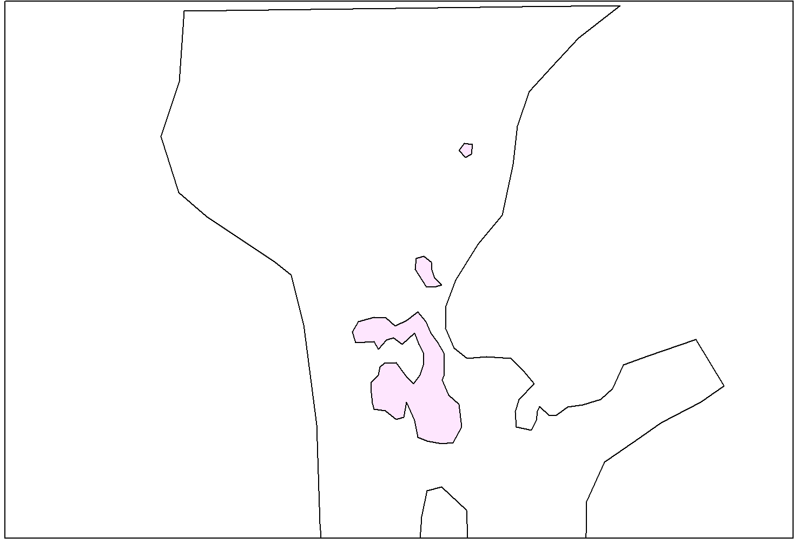

[.text-center]
*Figure 29 – Default Styles for Void Area and Isolated Area (Scale: 1:300 000)*

In the figure above, the Grid Coverage style is not used as background.

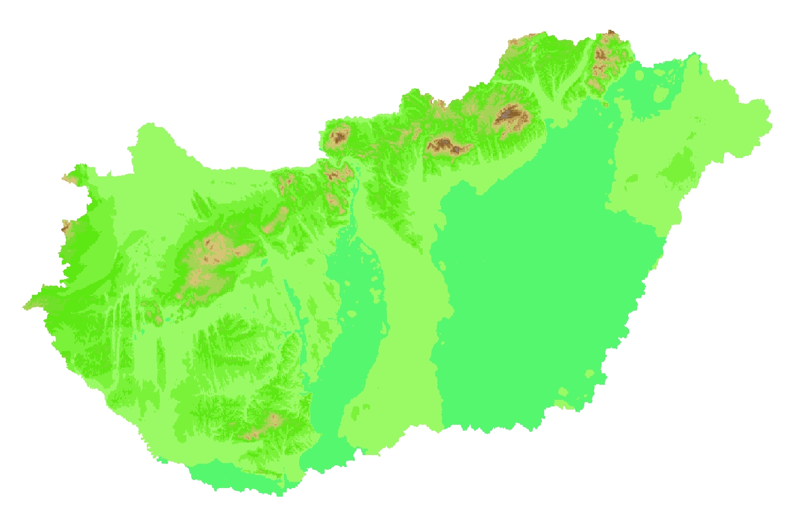

[.text-center]
*Figure 30 – Default Style for Grid Coverage (Scale: 1:2 000 000) - Hungary*

=== Styles recommended to be supported by INSPIRE view services 

==== Styles for the layer EL.ContourLine

===== Master contours

[cols=",",options="header",]
|===
|*Style Name* |*EL.ContourLine.Master*
|*Style Title* |Contour Line - for master contours
|*Style Abstract* |Master Contour Line is a brown (#A47916) 2 pixels width line.
|*Symbology* a|
[source ,xml]
----

<sld:NamedLayer>
	<se:Name>EL.ContourLine</se:Name>
	<sld:UserStyle>
		<se:Name>EL.ContourLine.Master</se:Name>
		<sld:IsDefault>1</sld:IsDefault>
		<se:FeatureTypeStyle version="1.1.0">
			<se:Description>
				<se:Title>Master Contour Line Style</se:Title>
				<se:Abstract>Master Contour Line is a brown (#A47916) 2 pixels width line.</se:Abstract>
			</se:Description>
			<se:FeatureTypeName>ContourLine</se:FeatureTypeName>
			<se:Rule>
				<se:MinScaleDenominator>1</se:MinScaleDenominator>
				<se:MaxScaleDenominator>1000000</se:MaxScaleDenominator>
				<ogc:Filter>
					<!-Master Contour Lines ->
					<se:PropertyIsEqualTo>
						<ogc:PropertyName>contourLineType</ogc:PropertyName>
						<ogc:Literal>master</ogc:Literal>
					</se:PropertyIsEqualTo>
				</ogc:Filter>
				<se:LineSymbolizer>
					<se:Geometry>
						<ogc:PropertyName>geometry</ogc:PropertyName>
					</se:Geometry>
					<se:Stroke>
						<se:SvgParameter name="stroke">#A47916</se:SvgParameter>
						<se:SvgParameter name="stroke-width">2</se:SvgParameter>
					</se:Stroke>
				</se:LineSymbolizer>
			</se:Rule>          
		</se:FeatureTypeStyle>
	</sld:UserStyle>
</sld:NamedLayer>
----

|*Minimum & maximum scales* |1: 1 - 1: 1 000 000
|===

===== Ordinary contours

[cols=",",options="header",]
|===
|*Style Name* |*EL.ContourLine.Ordinary*
|*Style Title* |Contour Line – for ordinary contours
|*Style Abstract* |Ordinary Contour Line is a brown (#734C00) 1 pixel width line.
|*Symbology* a|
[source ,xml]
----
<sld:NamedLayer>
	<se:Name>EL.ContourLine</se:Name>
	<sld:UserStyle>
		<se:Name>EL.ContourLine.Ordinary</se:Name>
		<sld:IsDefault>1</sld:IsDefault>
		<se:FeatureTypeStyle version="1.1.0">
			<se:Description>
				<se:Title>Ordinary Contour Line Style</se:Title>
				<se:Abstract>Ordinary Contour Line is a brown (#734C00) 2 pixels width line. 
</se:Abstract>
			</se:Description>
			<se:FeatureTypeName>ContourLine</se:FeatureTypeName>
			<se:Rule>
				<se:MinScaleDenominator>1</se:MinScaleDenominator>
				<se:MaxScaleDenominator>1000000</se:MaxScaleDenominator>
				<ogc:Filter>
					<!-Ordinary Contour Lines ->
					<se:PropertyIsEqualTo>
						<ogc:PropertyName>contourLineType</ogc:PropertyName>
						<ogc:Literal>ordinary</ogc:Literal>
					</se:PropertyIsEqualTo>
				</ogc:Filter>
				<se:LineSymbolizer>
					<se:Geometry>
						<ogc:PropertyName>geometry</ogc:PropertyName>
					</se:Geometry>
					<se:Stroke>
						<se:SvgParameter name="stroke">#734C00</se:SvgParameter>
						<se:SvgParameter name="stroke-width">1</se:SvgParameter>
					</se:Stroke>
				</se:LineSymbolizer>
			</se:Rule>          
		</se:FeatureTypeStyle>
	</sld:UserStyle>
</sld:NamedLayer>
----

|*Minimum & maximum scales* |1: 1 - 1: 1 000 000
|===

===== Auxiliary contours

[cols=",",options="header",]
|===
|*Style Name* |*EL.ContourLine.Auxiliary*
|*Style Title* |Contour Line – for auxiliary contours
|*Style Abstract* |Auxiliary Contour Line is a brown (#734C00) dashed 1 pixel width line.
|*Symbology* a|
[source ,xml]
----
<sld:NamedLayer>
	<se:Name>EL.ContourLine</se:Name>
	<sld:UserStyle>
		<se:Name>EL.ContourLine.Auxiliary</se:Name>
		<sld:IsDefault>1</sld:IsDefault>
		<se:FeatureTypeStyle version="1.1.0">
			<se:Description>
				<se:Title>Auxiliary Contour Line Style</se:Title>
				<se:Abstract> Auxiliary Contour Line is a brown (#734C00) dashed 1 pixel width line.</se:Abstract>
			</se:Description>
			<se:FeatureTypeName>ContourLine</se:FeatureTypeName>
			<se:Rule>
				<se:MinScaleDenominator>1</se:MinScaleDenominator>
				<se:MaxScaleDenominator>1000000</se:MaxScaleDenominator>
				<ogc:Filter>
					<!-Auxiliary Contour Lines ->
					<se:PropertyIsEqualTo>
						<ogc:PropertyName>contourLineType</ogc:PropertyName>
						<ogc:Literal>auxiliary</ogc:Literal>
					</se:PropertyIsEqualTo>
				</ogc:Filter>
				<se:LineSymbolizer>
					<se:Geometry>
						<ogc:PropertyName>geometry</ogc:PropertyName>
					</se:Geometry>
					<se:Stroke>
						<se:SvgParameter name="stroke">#734C00</se:SvgParameter>
						<se:SvgParameter name="stroke-width">1</se:SvgParameter>
						<se:SvgParameter name="stroke-dasharray">6 2</se:SvgParameter>
					</se:Stroke>
				</se:LineSymbolizer>
			</se:Rule>          
		</se:FeatureTypeStyle>
	</sld:UserStyle>
</sld:NamedLayer>
----

|*Minimum & maximum scales* |1: 1 - 1: 1 000 000
|===

==== Examples 

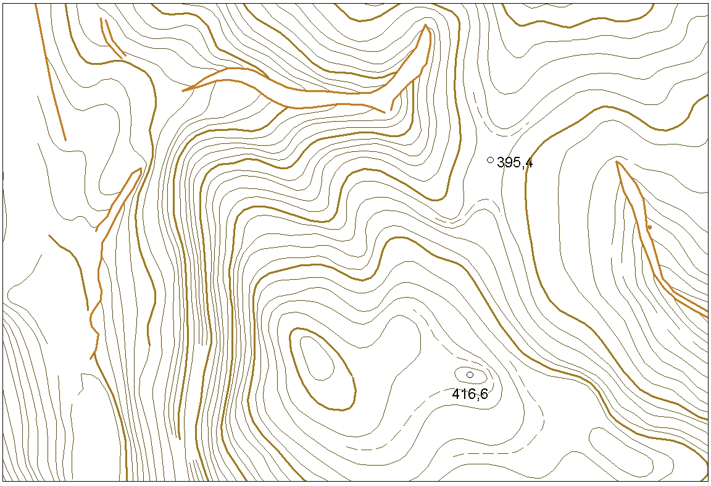

[.text-center]
*Figure 31 – Usage of Other Well-Defined Styles on Contour Lines (Scale: 1:3 000)*

<<<
:sectnums!:
== Bibliography

[BAG V1] Open Navigation Surface - Format Specification Document - Description of Bathymetric Attributed Grid Object (BAG), Version 1.0.0, 2006-04-07 - Open Navigation Surface Working Group (ONSWG)

[DS-D2.3] INSPIRE DS-D2.3, Definition of Annex Themes and Scope, v3.0, _http://inspire.jrc.ec.europa.eu/reports/ImplementingRules/DataSpecifications/D2.3_Definition_of_Annex_Themes_and_scope_v3.0.pdf_

[DS-D2.5] INSPIRE DS-D2.5, Generic Conceptual Model, v3.3, _http://inspire.jrc.ec.europa.eu/documents/Data_Specifications/D2.5_v3_3.pdf_

[DS-D2.6] INSPIRE DS-D2.6, Methodology for the development of data specifications, v3.0, _http://inspire.jrc.ec.europa.eu/reports/ImplementingRules/DataSpecifications/D2.6_v3.0.pdf_

[DS-D2.7] INSPIRE DS-D2.7, Guidelines for the encoding of spatial data, v3.2, _http://inspire.jrc.ec.europa.eu/documents/Data_Specifications/D2.7_v3.2.pdf_

[ENGO 573] Digital Terrain Modelling – ENGO 573, University of Calgary, Naser El-Sheimy (Geomatics Engineering Department), September 1999

[EURODEM] The European DEM (EURODEM) - Setup and Harmonisation, Michael Hovenbitzer (BKG - Germany), The International Archives of the Photogrammetry, Remote Sensing and Spatial Information Sciences. Vol. XXXVII. Part B4. Beijing 2008.

[IHO S-44] IHO standards for Hydrographic Surveys - Special publication No. 44, 5th edition, February 2008 - International Hydrographic Bureau (Monaco), _www.iho.int_

[IHO S-57] IHO Transfer standard for Digital Hydrographic Data - Special publication No. 57, Edition 3.1, November 2000 - International Hydrographic Bureau (Monaco), _www.iho.int_

[IHO S-102] Bathymetric Surface Product Specification - Special publication No. 102, Draft Edition 1.0, July 2008 - International Hydrographic Bureau (Monaco), _www.iho.int_

[ISO 19101] EN ISO 19101:2005 Geographic information – Reference model (ISO 19101:2002)

[ISO 19103] ISO/TS 19103:2005, Geographic information – Conceptual schema language

[ISO 19107] EN ISO 19107:2005, Geographic information – Spatial schema (ISO 19107:2003)

[ISO 19108] EN ISO 19108:2005 Geographic information - Temporal schema (ISO 19108:2002)

[ISO 19111] EN ISO 19111:2007 Geographic information - Spatial referencing by coordinates (ISO 19111:2007)

[ISO 19115] EN ISO 19115:2005, Geographic information – Metadata (ISO 19115:2003)

[ISO 19118] EN ISO 19118:2006, Geographic information – Encoding (ISO 19118:2005)

[ISO 19123] EN ISO 19123:2005, Geographic information – Schema for coverage geometry and functions

[ISO 19135] EN ISO 19135:2007 Geographic information – Procedures for item registration (ISO 19135:2005)

[ISO 19139] ISO/TS 19139:2007, Geographic information – Metadata – XML schema implementation

[ISO 19157] ISO/DIS 19157, Geographic information – Data quality

[OGC 05-047r2] GML in JPEG2000 for Geospatial Imagery, version 1.0.0

[OGC 06-103r4] Implementation Specification for Geographic Information - Simple feature access – Part 1: Common Architecture v1.2.1

[OGC 08-094r1] OGC® SWE Common Data Model Encoding Standard, version 2.0

[OGC 09-110r3] Web Coverage Service 2.0 Interface Standard: Core

[OGC 09-146r2] OGC®GML Application Schema - Coverages, version 1.0.1

[GEOTIFF] GeoTIFF format specification, Revision 1.0, version 1.8.2, last modified: 28 December 2000

[TIFF] TIFF format specification, Revision 6.0, Final June 1992

<<<
:sectnums:

[appendix]
== Abstract Test Suite (normative)

|===
|*Disclaimer*
While this Annex refers to the Commission Regulation (EU) No 1089/2010 of 23 November 2010 implementing Directive 2007/2/EC of the European Parliament and of the Council as regards interoperability of spatial data sets and services, it does not replace the legal act or any part of it.
|===

The objective of the Abstract Test Suite (ATS) included in this Annex is to help the conformance testing process. It includes a set of tests to be applied on a data set to evaluate whether it fulfils the requirements included in this data specification and the corresponding parts of Commission Regulation No 1089/2010 (implementing rule as regards interoperability of spatial datasets and services, further referred to as ISDSS Regulation). This is to help data providers in declaring the conformity of a data set to the "degree of conformity, with implementing rules adopted under Article 7(1) of Directive 2007/2/EC", which is required to be provided in the data set metadata according to Commission Regulation (EC) No 2008/1205 (the Metadata Regulation).

*Part 1* of this ATS includes tests that provide *input for assessing conformity with the ISDSS regulation.* In order to make visible which requirements are addressed by a specific test, references to the corresponding articles of the legal act are given. The way how the cited requirements apply to <theme short name> specification is described under the testing method.

In addition to the requirements included in ISDSS Regulation this Technical guideline contains TG requirements too. TG requirements are technical provisions that need to be fulfilled in order to be conformant with the corresponding IR requirement when the specific technical implementation proposed in this document is used. Such requirements relate for example to the default encoding described in section 9. *Part 2* of the ATS presents tests necessary for assessing the *conformity with TG requirements*.

NOTE Conformance of a data set with the TG requirement(s) included in this ATS implies conformance with the corresponding IR requirement(s).

The *ATS is applicable to the data sets that* *have been transformed* to be made available through INSPIRE download services (i.e. the data returned as a response to the mandatory "Get Spatial Dataset" operation) rather than the original "source" data sets.

The requirements to be tested are grouped in several _conformance classes_. Each of these classes covers a specific aspect: one conformance class contains tests reflecting the requirements on the application schema, another on the reference systems, etc. *Each conformance class is identified by a URI* (uniform resource identifier) according to the following pattern:

http://inspire.ec.europa.eu/conformance-class/ir/<theme short name>/<conformance class identifier>

EXAMPLE 1 The URI _http://inspire.ec.europa.eu/conformance-class/ir/ef/rs_ identifies the Reference Systems ISDSS conformance class of the Environmental Monitoring Facilities (EF) data theme.

The results of the tests should be published referring to the relevant conformance class (using its URI).

When an INSPIRE data specification contains *more than one application schema,* the requirements tested in a conformance class may differ depending on the application schema used as a target for the transformation of the data set. This will always be the case for the application schema conformance class. However, also other conformance classes could have different requirements for different application schemas. In such cases, a separate conformance class is defined for each application schema, and they are distinguished by specific URIs according to the following pattern:

http://inspire.ec.europa.eu/conformance-class/ir/<theme short name>/<conformance class identifier>/ 
<application schema namespace prefix>

EXAMPLE 2 The URI _http://inspire.ec.europa.eu/conformance-class/ir/el/as/el-vec_ identifies the conformity with the application schema (_as_) conformance class for the Elevation Vector Elements (_el-vec_) application schema.

An overview of the conformance classes and the associated tests is given in the table below.

*Table 11. Overview of the tests within this Abstract Test Suite.*

|===
|A.1 Application Schema Conformance Class
a|
!===
!A.1.1 Schema element denomination test
!A.1.2 Value type test
!A.1.3 Value test
!A.1.4 Attributes/associations completeness test
!A.1.5 Abstract spatial object test
!A.1.6 Constraints test
!A.1.7 Geometry representation test
!===
|A.2 Reference Systems Conformance Class
a|
!===
!A.2.1 Datum test
!A.2.2 Coordinate reference system test
!A.2.3 Vertical Coordinate Reference System exclusiveness test
!A.2.4 Grid test
!A.2.5 View service coordinate reference system test
!A.2.6 Temporal reference system test
!A.2.7 Units of measurements test
!===
|A.3 Data Consistency Conformance Class
a|
!===
!A.3.1 Unique identifier persistency test
!A.3.2 Version consistency test
!A.3.3 Life cycle time sequence test
!A.3.4 Update frequency test
!A.3.5 Grid aggregation test
!A.3.6 Contour line test
!A.3.7 Break line test
!A.3.8 Isolated area test
!A.3.9 Stop line test
!===
|A.4 Metadata IR Conformance Class
a|
!===
!A.4.1 Metadata for interoperability test
!A.4.2 Metadata completeness test
!===
|A.5 Information Accessibility Conformance Class
a|
!===
!A.5.1 Code list publication test
!A.5.2 CRS publication test
!A.5.3 CRS identification test
!A.5.4 Grid identification test
!===
|A.6 Data Delivery Conformance Class
a|
!===
!A.6.1 Encoding compliance test
!A.6.2 Minimum data delivery test
!===
|A.7 Portrayal Conformance Class
a|
!===
!A.7.1 Layer designation test
!===
|A.8 Part 2 : Conformity with the technical guideline (TG) Requirements
a|
!===
!A.8.1 Multiplicity test
!A.8.2 CRS http URI test
!A.8.3 Metadata encoding schema validation test
!A.8.4 Metadata occurrence test
!A.8.5 Metadata consistency test
!A.8.6 Encoding schema validation test
!A.8.7 Coverage multipart representation test
!A.8.8 Coverage domain consistency test
!A.8.9 TIFF conformity test
!A.8.10 TIFF data structure test
!A.8.11 TIFF range coding test
!A.8.12 TIFF range compression test
!A.8.13 TIFF grid coordinate system test
!A.8.14 Style test
!===
|===

In order to be conformant to a conformance class, a data set has to pass *all* tests defined for that conformance class.

In order to be conformant with the ISDSS regulation the inspected data set needs to be conformant to *all* conformance classes in Part 1. The conformance class for overall conformity with the ISDSS regulation is identified by the URI _http://inspire.ec.europa.eu/conformance-class/ir/<theme short name>/._

In order to be conformant with the Technical Guidelines, the dataset under inspection needs to be conformant to all conformance classes included both in Part 1 and 2. Chapter 8 describes in detail how to publish the result of testing regarding overall conformity and conformity with the conformance classes as metadata. The conformance class for overall conformity with the Technical Guidelines is identified by the URI _http://inspire.ec.europa.eu/conformance-class/tg/<theme short name>/x.y.(z)._

It should be noted that data providers are not obliged to integrate / decompose the original structure of the source data sets when they deliver them for INSPIRE. It means that a conformant dataset can contain less or more spatial object / data types than specified in the ISDSS Regulation.

*A dataset that contains less spatial object and/or data types* can be regarded conformant when the corresponding types of the source datasets after the necessary transformations fulfil the requirements set out in the ISDSS Regulation.

A *dataset that contain more spatial object and/or data types* may be regarded as conformant when

* all the spatial object / data types that have corresponding types in the source dataset after the necessary transformations fulfil the requirements set out in the ISDSS Regulation and
* all additional elements of the source model (spatial object types, data types, attributes, constraints, code lists and enumerations together with their values) do not conflict with any rule defined in the interoperability target specifications defined for any theme within INSPIRE.

*Open Issue 1* Even though the last condition can be derived from Art. 8(4) of the Directive, the ISDSS Regulation does not contain requirements concerning the above issue. Therefore, no specific tests have been included in this abstract suit for testing conformity of extended application schemas. Annex F of the Generic Conceptual Model (D2.5) provides an example how to extend INSPIRE application schemas in a compliant way.

The ATS contains a detailed list of abstract tests. It should be noted that some tests in the Application schema conformance class can be automated by utilising xml *schema validation tools.* It should be noted that failing such validation test does not necessary reflect non-compliance to the application schema; it may be the results of erroneous encoding.

Each test in this suit follows the same structure:

* Requirement: citation from the legal texts (ISDSS requirements) or the Technical Guidelines (TG requirements);
* Purpose: definition of the scope of the test;
* Reference: link to any material that may be useful during the test;
* Test method: description of the testing procedure.

According to ISO 19105:2000 all tests in this ATS are basic tests. Therefore, this statement is not repeated each time.

<<<
[discrete]
[.text-center]
=== *Part 1* (normative)

[discrete]
[.text-center]
=== *Conformity with Commission Regulation No 1089/2010*

=== Application Schema Conformance Class

*Conformance classes:*
_http://inspire.ec.europa.eu/conformance-class/ir/el/as/el-cov_

_http://inspire.ec.europa.eu/conformance-class/ir/el/as/el-vec http://inspire.ec.europa.eu/conformance-class/ir/el/as/el-tin_

==== Schema element denomination test

a) Purpose: Verification whether each element of the dataset under inspection carries a name specified in the target application schema(s).

b) Reference: Art. 3 and Art.4 of Commission Regulation No 1089/2010

c) Test Method: Examine whether the corresponding elements of the source schema (spatial object types, data types, attributes, association roles, code lists, and enumerations) are mapped to the target schema with the correct designation of mnemonic names.

NOTE Further technical information is in the Feature catalogue and UML diagram of the application schema(s) in section 5.1.

==== Value type test

a) Purpose: Verification whether all attributes or association roles use the corresponding value types specified in the application schema(s).

b) Reference: Art. 3, Art.4, Art.6(1), Art.6(4), Art.6(5) and Art.9(1)of Commission Regulation No 1089/2010.

c) Test Method: Examine whether the value type of each provided attribute or association role adheres to the corresponding value type specified in the target specification.

NOTE 1 This test comprises testing the value types of INSPIRE identifiers, the value types of attributes and association roles that should be taken from enumeration and code lists, and the coverage domains.

NOTE 2 Further technical information is in the Feature catalogue and UML diagram of the application schema(s) in section 5.1.

==== Value test

a) Purpose: Verify whether all attributes or association roles whose value type is a code list or enumeration take the values set out therein.

b) Reference: Art.4 (3) of Commission Regulation No 1089/2010.

c) Test Method: When an attributes / association roles has "enumeration" or "codeList" type compare the values of each instance with those provided in the application schema. To pass this tests any instance of an attribute / association role

* Shall not take any other value than defined in the enumeration table when its type is enumeration.
* Shall take only values explicitly specified in the code list when its type is codeList with extensibility value is "none".
* Shall take only a value explicitly specified in the code list or shall take a value that is narrower (i.e. more specific) than those explicitly specified in the application schema when the type is codeList with extensibility value is "narrower".

NOTE 1 This test is not applicable to code lists with extensibility "any".

NOTE 2 When a data provider only uses code lists with narrower (more specific values) this test can be fully performed based on internal information.

NOTE 3 This test is applicable to all application schemas to verify whether each instance of the property Type attribute takes only the values specified in the ElevationPropertyTypeValue enumeration.

NOTE 4 This test is applicable to the ElevationGridCoverage and ElevationTIN schemas to verify whether each instance of the surfaceType attribute takes only the values specified in the SurfaceTypeValue enumeration.

NOTE 5 This test is applicable to the ElevationVectorElements schema to verify whether each instance of the contourLineType attribute takes only values specified in the ContourLineTypeValue enumeration.

NOTE 6 This test is applicable to the code lists specified in the ElevationVectorElements schema to verify whether:

* all the instances of BreakLine take a value for the breakLineType attribute as specified in the BreakLineTypeValue code list, or take a value that is narrower than the specified ones.
* all the instances of the SpotElevation spatial object take a values for the spotElevationType attribute as specified in the SpotElevationTypeValue code list, or take a value that is narrower than the specified ones.
* all the instances of the SpotElevation spatial object take a values for the classification attribute as specified in the SpotElevationClassValue code list.

NOTE 7 This test is applicable to the ElevationGridCoverage schema to verify whether the QuadrilateralGrid:CV_SequenceType attribute within the coverage take only values from the code list defined in ISO 19123.

==== Attributes/associations completeness test

a) Purpose: Verification whether each instance of spatial object type and data types include all attributes and association roles as defined in the target application schema.

b) Reference: Art. 3, Art.4(1), Art.4(2), and Art.5(2) of Commission Regulation No 1089/2010.

c) Test Method: Examine whether all attributes and association roles defined for a spatial object type or data type are present for each instance in the dataset.

NOTE 1 Further technical information is in the Feature catalogue and UML diagram of the application schema(s) in section 5.1.

NOTE 2 If an attribute has the stereotype «voidable», then according to the INSPIRE Generic Conceptual Model (section 9.8.4.3) one of the three "void reason" values "unknown", "unpopulated" or "withheld" shall be provided instead of the real values.

NOTE 3 If the characteristic described by the attribute or association role does not apply to the real world entity, the attribute or association role does not need to be present in the data set.

==== Abstract spatial object test

a) Purpose: Verification whether the dataset does NOT contain abstract spatial object / data types defined in the target application schema(s).

b) Reference: Art.5(3) of Commission Regulation No 1089/2010

c) Test Method: examine that there are NO instances of abstract spatial object / data types in the dataset provided.

NOTE 1 Further technical information is in the Feature catalogue and UML diagram of the application schema(s) in section 5.1.

NOTE 2 This test applies only to ElevationVectorElements schema, where one abstract spatial object type, the _ElevationVectorObject_, is included.

==== Constraints test

a) Purpose: Verification whether the instances of spatial object and/or data types provided in the dataset adhere to the constraints specified in the target application schema(s).

b) Reference: Art. 3, Art.4(1), and Art.4(2) of Commission Regulation No 1089/2010.

c) Test Method: Examine all instances of data for the constraints specified for the corresponding spatial object / data type. Each instance shall adhere to all constraints specified in the target application schema(s).

NOTE 1 Further technical information is in the Feature catalogue and UML diagram of the application schema(s) in section 5.1.

NOTE 2 This test is not applicable for the ElevationTIN application schema, as it does not contain constraints.

==== Geometry representation test

a) Purpose: Verification whether the value domain of spatial properties is restricted as specified in the Commission Regulation No 1089/2010.

b) Reference: Art.12(1), Annex III 1.7.2 (7), and 1.7.3 of Commission Regulation No 1089/2010

c) Test Method: Check whether all spatial properties only use 0, 1 and 2-dimensional geometric objects that exist in the right 2-, 3- or 4-dimensional coordinate space, and where all curve interpolations respect the rules specified in the reference documents.

NOTE 1 Further technical information is in OGC Simple Feature spatial schema v1.2.1 [06-103r4] and ISO 19125-1:2004.

NOTE 2 OGC Simple Feature spatial schema v1.2.1 [06-103r4] applies to the ElevationVectorElements and ElevationTIN application schemas.

NOTE 3 ISO 19125-1:2004 applies to the ElevationGridCoverage application schema.

=== Reference Systems Conformance Class

*Conformance class:*

http://inspire.ec.europa.eu/conformanceClass/ir/el/rs

==== Datum test

a) Purpose: Verify whether each instance of a spatial object type is given with reference to one of the (geodetic) datums specified in the target specification.

c) Reference: Annex II Section 1.2 of Commission Regulation No 1089/2010

b) Test Method: Check whether each instance of a spatial object type specified in the application schema(s) in section 5 has been expressed using:

* the European Terrestrial Reference System 1989 (ETRS89) within its geographical scope; or
* the International Terrestrial Reference System (ITRS) for areas beyond the ETRS89 geographical scope; or
* other geodetic coordinate reference systems compliant with the ITRS. Compliant with the ITRS means that the system definition is based on the definition of ITRS and there is a well-established and described relationship between both systems, according to the EN ISO 19111.

NOTE Further technical information is given in Section 6 of this document.

==== Coordinate reference system test

a) Purpose: Verify whether the two- and three-dimensional coordinate reference systems are used as defined in section 6.

b) Reference: Section 6, of Commission Regulation 1089/2010.

c) Test Method: Inspect whether the horizontal and vertical components of coordinates one of the corresponding coordinate reference system has been:

* Three-dimensional geodetic coordinates (latitude, longitude and ellipsoidal height) based on a datum specified in 1.2 and using the parameters of the GRS80 ellipsoid.
* Two-dimensional geodetic coordinates (latitude and longitude) based on a datum specified in 1.2 and using the parameters of the GRS80 ellipsoid.
* Plane coordinates using the ETRS89 Lambert Conformal Conic coordinate reference system.
* Plane coordinates using the ETRS89 Transverse Mercator coordinate reference system.
* For the vertical component on land, the European Vertical Reference System (EVRS) shall be used to express gravity-related heights within its geographical scope. Other vertical reference systems related to the Earth gravity field shall be used to express gravity-related heights in areas that are outside the geographical scope of EVRS.
* For the vertical component in marine areas where there is an appreciable tidal range (tidal waters), the Lowest Astronomical Tide (LAT) shall be used as the reference surface.
* For the vertical component in marine areas without an appreciable tidal range, in open oceans and effectively in waters that are deeper than 200 meters, the Mean Sea Level (MSL) or a well-defined reference level close to the MSL shall be used as the reference surface."

NOTE Further technical information is given in Section 6 of this document.

==== Vertical Coordinate Reference System exclusiveness test

a) Purpose: Verify whether one and only one vertical coordinate reference system has been used within a dataset delivered for INSPIRE

b) Reference: Annex III Section 1.7.2(3) and 1.7.4(1) of Commission Regulation 1089/2010

c) Test method: Check whether the values of the elevation property are expressed in the same vertical CRS in case of ElevationGridCoverage and ElevationTIN spatial representations.

NOTE 1 This test can be performed entirely on the basis of the information available at the data providers.

NOTE 2 This test is not applicable to the ElevationVectorElements application schema.

==== Grid test

a) Purpose: Verify that gridded data are available using the grid compatible with one of the coordinate reference systems defined in Commission Regulation No 1089/2010

b) Reference: Annex II Section 2.1 and 2.2 of Commission Regulation 1089/2010.

c) Test Method: Check whether the dataset defined as a grid is compatible with one of the coordinate reference.

* Grid_ETRS89_GRS80 based on two-dimensional geodetic coordinates using the parameters of the GRS80 ellipsoid
* Grid_ETRS89_GRS80zn based on two-dimensional geodetic coordinates with zoning,
* Plane coordinates using the Lambert Conformal Conic projection and the parameters of the GRS80 ellipsoid (ETRS89-LCC)
* Plane coordinates using the Transverse Mercator projection and the parameters of the GRS80 ellipsoid (ETRS89-TMzn)

NOTE 1 Further technical information is given in Section 6 of this document.

NOTE 2 This test applies only to ElevetionGridCoverage application schema.

==== View service coordinate reference system test

a) Purpose: Verify whether the spatial data set is available in the two dimensional geodetic coordinate system for their display with the INSPIRE View Service.

b) Reference: Annex II Section 1.4 of Commission Regulation 1089/2010

c) Test Method: Check that each instance of a spatial object types specified in the application schema(s) in section 5 is available in the two-dimensional geodetic coordinate system

NOTE Further technical information is given in Section 6 of this document.

==== Temporal reference system test

a) Purpose: Verify whether date and time values are given as specified in Commission Regulation No 1089/2010.

b) Reference: Art.11(1) of Commission Regulation 1089/2010

c) Test Method: Check whether:

* the Gregorian calendar is used as a reference system for date values;
* the Universal Time Coordinated (UTC) or the local time including the time zone as an offset from UTC are used as a reference system for time values.

NOTE Further technical information is given in Section 6 of this document.

==== Units of measurements test

a) Purpose: Verify whether all measurements are expressed as specified in Commission Regulation No 1089/2010.

b) Reference: Art.12(2) of Commission Regulation 1089/2010

c) Test Method: Check whether all measurements are expressed in SI units or non-SI units accepted for use with the International System of Units.

NOTE 1 Further technical information is given in ISO 80000-1:2009.

NOTE 2 Degrees, minutes and seconds are non-SI units accepted for use with the International System of Units for expressing measurements of angles.

=== Data Consistency Conformance Class

*Conformance class:*

_http://inspire.ec.europa.eu/conformance-class/ir/el/dc/el-cov_

_http://inspire.ec.europa.eu/conformance-class/ir/el/dc/el-vec http://inspire.ec.europa.eu/conformance-class/ir/el/dc/el-tin_

==== Unique identifier persistency test

a) Purpose: Verify whether the namespace and localId attributes of the external object identifier remain the same for different versions of a spatial object.

b) Reference: Art. 9 of Commission Regulation 1089/2010.

c) Test Method: Compare the namespace and localId attributes of the external object identifiers in the previous version(s) of the dataset with the namespace and localId attributes of the external object identifiers of current version for the same instances of spatial object / data types; To pass the test, neither the namespace, nor the localId shall be changed during the life-cycle of a spatial object.

NOTE 1 The localId test can be performed entirely on the basis of the information available in the database of the data providers.

NOTE 2 When using URI this test includes the verification whether no part of the construct has been changed during the life cycle of the instances of spatial object / data types.

NOTE 3 Further technical information is given in section 14.2 of the INSPIRE Generic Conceptual Model.

==== Version consistency test

a) Purpose: Verify whether different versions of the same spatial object / data type instance belong to the same type.

b) Reference: Art. 9 of Commission Regulation 1089/2010.

c) Test Method: Compare the types of different versions for each instance of spatial object / data type

NOTE 1 This can be performed entirely on the basis of the information available in the database of the data providers.

==== Life cycle time sequence test

a) Purpose: Verification whether the value of the attribute beginLifespanVersion refers to an earlier moment of time than the value of the attribute endLifespanVersion for every spatial object / object type where this property is specified.

b) Reference: Art.10(3) of Commission Regulation 1089/2010.

c) Test Method: Compare the value of the attribute beginLifespanVersion with attribute endLifespanVersion. The test is passed when the beginLifespanVersion value is before endLifespanVersion value for each instance of all spatial object/data types for which this attribute has been defined.

NOTE 1 this test can be performed entirely on the basis of the information available in the database of the data providers.

==== Update frequency test

a) Purpose: Verify whether all the updates in the source dataset(s) have been transmitted to the dataset(s) which can be retrieved for the <theme short name> using INSPIRE download services.

b) Reference: Art.8 (2) of Commission Regulation 1089/2010.

c) Test Method: Compare the values of beginning of life cycle information in the source and the target datasets for each instance of corresponding spatial object / object types. The test is passed when the difference between the corresponding values is less than 6 months.

NOTE 1 this test can be performed entirely on the basis of the information available in the database of the data providers.

==== Grid aggregation test

a) Purpose: Verify whether the contributing grid coverages are consistent when they are aggregated in one coverage.

b) Reference: Annex III Section 1.7.2(3) (4) and (5) of Commission Regulation 1089/2010.

c) Test Method: Verify whether the contributing coverage instances

* share the same range type, coordinate reference system, and resolution,
* are aligned,
* have adjacent or disjoint footprints,
* determine the geographic extent (domainExtent) of the aggregated coverage by the union of their footprints.

NOTE 1 This test can be performed entirely on the basis of the information available in the database of the data providers.

NOTE 2 This test is only applicable to ElevationGridCoverage application schema.

==== Contour line test

a) Purpose: Verify whether contour lines follow the consistency rules specified in Commission Regulation 1089/2010.

b) Reference: Annex III Section 1.7.6(2) and 1.7.6(5) of Commission Regulation 1089/2010.

c) Test Method: Inspect elevationPropertyTypeValue referenced to the same vertical coordinate reference system for each pair of contour lines. The test is passed when

* each connected contour lines have the same elevation value and
* contour lines having different elevation values neither intersect nor touch each other.

NOTE 1 This test can be performed entirely on the basis of the information available in the database of the data providers.

NOTE 2 This test is only applicable to datasets following the ElevationVectorElements application schema.

==== Break line test

a) Purpose: Verify whether contour lines follow the consistency rules specified in Commission Regulation 1089/2010.

b) Reference: Annex III Section 1.7.6(3) and 1.7.6(4) of Commission Regulation 1089/2010.

c) Test Method: For each brake line that has an intersection point expressed as third coordinate (Z) in the same vertical coordinate reference system inspect the elevation value at the intersection point. The test is passed when the elevationPropertyTypeValue at this point is equal

* for any pair of intersecting break lines and/or
* for any intersecting brake line and contour line.

NOTE 1 this test can be performed entirely on the basis of the information available in the database of the data providers.

NOTE 2 This is only applicable to datasets following the ElevationVectorElements application schema.

==== Isolated area test

a) Purpose: Verify whether an isolated area does not touch the external boundary of a void area.

b) Reference: Annex III Section 1.7.6(6) of Commission Regulation 1089/2010.

c) Test Method: Inspect each instance of IsolatedArea spatial object type. The test is passed when non of them touches the external boundary of VoidArea object type that contains it when they are referenced to the same vertical reference system.

NOTE 1 this test can be performed entirely on the basis of the information available in the database of the data providers.

NOTE 2 This is only applicable to datasets following the ElevationVectorElements application schema.

==== Stop line test

a) Purpose: Verify whether triangles intersecting a stopline have been removed.

b) Reference: Annex III Section 1.7.4(2) of Commission Regulation 1089/2010.

c) Test Method: Inspect whether any of the stoplines present in the dataset intersect a triangle. The test is passed when the intersected triangles have been removed.

NOTE 1 this test can be performed entirely on the basis of the information available in the database of the data providers.

NOTE 2 This is applicable to datasets following the ElevationTIN application schema only when the encoding used to deliver the dataset supports the representation of the triangles.

=== Metadata IR Conformance Class

*Conformance class:*

_http://inspire.ec.europa.eu/conformance-class/ir/el/md_

==== Metadata for interoperability test

a) Purpose: Verify whether the metadata for interoperability of spatial data sets and services described in 1089/2010 Commission Regulation have been created..

b) Reference: Art.13 of Commission Regulation 1089/2010

c) Test Method: Inspect whether metadata describing the coordinate reference systems, temporal reference system, encoding, character encoding, spatial representation type and when applicable topological consistency have been created and published.

NOTE 1 Further technical information is given in section 8 of this document.

==== Metadata completeness test

a) Purpose: Verify whether the theme specific metadata required in 1089/2010 Commission Regulation have been created and published for each dataset related to the Elevation data theme.

b) Reference: Annex III Section 1.7.2(8) of Commission Regulation 1089/2010

c) Test Method: Inspect the existence of the following information in each dataset:

* Metadata about the acquisition dates of data contained in ElevationGridCoverage,
* Lineage metadata element containing the data quality elements,

NOTE 1 Further technical information is given in section 8 of this document.

NOTE 2 The acquisition dates for each instance of ElevationGridCoverage shall be provided in one of the following ways:

* by providing the Temporal reference metadata element through the attribute _metadata_ of ElevationGridCoverage
* by providing the Temporal reference metadata element required by Commission Regulation No 1205/2008.

=== Information Accessibility Conformance Class

==== Code list publication test

*Conformance class:*

_http://inspire.ec.europa.eu/conformance-class/ir/el/ia_

a) Purpose: Verify whether the values of each code list that allow narrower values or any other value than specified in Commission Regulation 1089/2010 are published in a register.

b) Reference: Art.6(3) and Annex III Section 1.5.4.1 and 1.5.4.3

c) Test Method: check whether the BrakeLineTypeValue and SpotElevationTypeValue code list are accessible in a register.

NOTE 1 Further technical information is given in section 5 of this document.

NOTE 2 This test only applies to the ElevationVectorElements application schema when a data provider uses narrower values for the two code lists indicated in point c).

==== CRS publication test

a) Purpose: Verify whether the identifiers and the parameters of coordinate reference system are published in common registers.

b) Reference: Annex II Section 1.5

c) Test method: Check whether the identifier and the parameters of the CRS used for the dataset are included in a register.

NOTE Further technical information is given in section 6 of this document.

==== CRS identification test

a) Purpose: Verify whether identifiers for other coordinate reference systems than specified in Commission Regulation 1089/2010 have been created and their parameters have been described according to EN ISO 19111 and ISO 19127.

b) Reference: Annex II Section 1.3.4

c) Test method: Check whether the register with the identifiers of the coordinate reference systems is accessible.

NOTE Further technical information is given in section 6 of this document.

==== Grid identification test

a) Purpose: Verify whether identifiers for other geographic grid systems than specified in Commission Regulation 1089/2010 have been created and their definitions have been either described with the data or referenced.

b) Reference: Annex II Section 2.1 and 2.2

c) Test Method: Check whether the identifiers for grids have been created. Inspect the dataset and/or the metadata for inclusion of grid definition.

NOTE Further technical information is given in section 6 of this document.

=== Data Delivery Conformance Class

*Conformance class:*

_http://inspire.ec.europa.eu/conformance-class/ir/el/de_

==== Encoding compliance test

a) Purpose: Verify whether the encoding used to deliver the dataset comply with EN ISO 19118.

b) Reference: Art.7 (1) of Commission Regulation 1089/2010.

c) Test Method: Follow the steps of the Abstract Test Suit provided in EN ISO 19118.

NOTE 1 Datasets using the default encoding specified in Section 9 fulfil this requirement.

NOTE 2 Further technical information is given in Section 9 of this document.

==== Minimum data delivery test

a) Purpose: Verify whether each dataset delivered for INSPIRE has been made available according to the application schema specified in Commission Regulation 1089/2010.

b) Reference: Annex III Section 1.2 of Commission Regulation 1089/2010.

c) Test Method: Verify whether each elevation dataset delivered for INSPIRE follow at least the application schema:

* ElevationGridCoverage when describing the morphology of land elevation.
* ElevationGridCoverage or ElevationVectorElements when describing the morphology of bathymetry

NOTE 1 For each vector and TIN dataset describing land elevation a dataset following the ElevationGridCoverage schema shall be additionally created.

=== Portrayal Conformance Class

*Conformance class:*

_http://inspire.ec.europa.eu/conformance-class/ir/el/po_

==== Layer designation test

a) Purpose: verify whether each spatial object type has been assigned to the layer designated according to Commission Regulation 1089/2010.

b) Reference: Art. 14(1), Art14(2) and Annex III Section 1.8.

c) Test Method: Check whether data is made available for the view network service using the specified layers respectively:

NOTE Further technical information is given in section 11 of this document.

=== Part 2 : Conformity with the technical guideline (TG) Requirements

To claim conformity with this Technical Guidance document as a whole (including the specific technical implementations proposed), a data set needs to fulfil the requirements listed in this part.

*Conformance class:*

http://inspire.ec.europa.eu/conformanceClass/tg/el/el-cov
http://inspire.ec.europa.eu/conformanceClass/tg/el/el-vec
http://inspire.ec.europa.eu/conformanceClass/tg/el/el-tin

==== Multiplicity test

a) Purpose: Verification whether each instance of an attribute or association role specified in the application schema(s) does not include fewer or more occurrences than specified in section 5.

c) Reference: Feature catalogue and UML diagram of the application schema(s) in section 5 of this guideline.

b) Test Method: Examine that the number of occurrences of each attribute and/or association role for each instance of a spatial object type or data type provided in the dataset corresponds to the number of occurrences of the attribute / association role that is specified in the application schema(s) in section 5.

==== CRS http URI test

a) Purpose: Verify whether the coordinate reference system used to deliver data for INSPIRE network services has been identified by URIs according to the EPSG register.

c) Reference: Table 2 in Section 6 of this technical guideline

b) Test Method: Compare the URI of the dataset with the URIs in the table.

NOTE 1 Passing this test implies the fulfilment of test A6.2

NOTE 2 For further reference please see _http://www.epsg.org/geodetic.html_

==== Metadata encoding schema validation test

a) Purpose: Verify whether the metadata follows an XML schema specified in ISO/TS 19139.

c) Reference: Section 8 of this technical guideline, ISO/TS 19139

b) Test Method: Inspect whether provided XML schema is conformant to the encoding specified in ISO 19139 for each metadata instance.

NOTE 1 Section 2.1.2 of the Metadata Technical Guidelines discusses the different ISO 19139 XML schemas that are currently available.

==== Metadata occurrence test

a) Purpose: Verify whether the occurrence of each metadata element corresponds to those specified in section 8.

c) Reference: Section 8 of this technical guideline

b) Test Method: Examine the number of occurrences for each metadata element. The number of occurrences shall be compared with its occurrence specified in Section 8:

NOTE 1 Section 2.1.2 of the Metadata Technical Guidelines discusses the different ISO 19139 XML schema

==== Metadata consistency test

a) Purpose: Verify whether the metadata elements follow the path specified in ISO/TS 19139.

c) Reference: Section 8 of this technical guideline, ISO/TS 19139

b) Test Method: Compare the XML schema of each metadata element with the path provide in ISO/TS 19137.

NOTE 1 This test does not apply to the metadata elements that are not included in ISO/TS 19139.

==== Encoding schema validation test

a) Purpose: Verify whether the provided dataset follows the rules of default encoding specified in section 9 of this document

c) Reference: section 9 of this technical guideline

b) Test Method: Inspect whether provided encoding(s) is conformant to the encoding(s) for the relevant application schema(s) as defined in section 9:

NOTE 1 Applying this test to the default encoding schema described in section 9 facilitates testing conformity with the application schema specified in section 5. In such cases running this test with positive result may replace tests from A1.1 to A1.4 provided in this abstract test suite.

NOTE 2 Using Schematron or other schema validation tool may significantly improve the validation process, because some some complex constraints of the schema cannot be validated using the simple XSD validation process. On the contrary to XSDs Schematron rules are not delivered together with the INSPIRE data specifications. Automating the process of validation (e.g. creation of Schematron rules) is therefore a task and an opportunity for data providers.

==== Coverage multipart representation test

a) Purpose: Verify whether coverage data encoded as multipart messages comply with the multipart representation conformance class defined in GML Application Schema for Coverages [OGC 09-146r2].

b) Reference: OGC standard GML Application Schema for Coverages [OGC 09-146r2].

c) Test Method: Inspect whether coverage data encoded as multipart messages comply with the multipart representation conformance class defined in GML Application Schema for Coverages [OGC 09-146r2].

NOTE 1 further information is provided in section 9.4 of this technical guideline.

NOTE 2 This test only applies to ElevationGridCoverage application schema.

==== Coverage domain consistency test

a) Purpose: Verify whether the encoded coverage domain is consistent with the information provided in the GML application schema.

b) Reference: Section 9.4.1.2 of this technical guideline.

c) Test Method: For multipart coverage messages compare the encoded coverage domain with the description of the coverage component in the GML application schema

NOTE 1 This test applies only to those multipart messages, where the coverage range is encoded together with the coverage domain (some binary formats).

NOTE 2 .This test does not apply to multipart messages where the coverage range is embedded without describing the data structure (e.g. text based formats).

==== TIFF conformity test

a) Purpose: Verify whether coverage data encoded in TIFF files comply with the TIFF 6.0 specification and receive the _image/tiff_ MIME type registered in RFC 3302.

b) Reference: TG Requirement 13 and 14

c) Test Method: Inspect whether coverage range encoded in TIFF files comply with Baseline TIFF extended to LZW compression.

NOTE Test A.2.8 does not replace test A.2.7. The Coverage multipart representation test applies to TIFF encoding too.

NOTE 2 The GeoTiff format, as a specific extension of the Baseline TIFF Format, is also affected by this recommendation.

NOTE 3 This test applies to ElevationGridCoverage application schema only when the range type is encoded in TIFF format.

NOTE 4 For further technical reference please see DGIWG-108 standard of the Defence Geospatial Working Group

_https://www.dgiwg.org/dgiwg/htm/documents/standards_implementation_profiles.htm_

==== TIFF data structure test

a) Purpose: Verify whether coverage data encoded in TIFF files does not contain more than two image file directories (IFD) where the first contains the range set of the grid coverage, while the second the transparency mask, it any.

b) Reference: TG Requirement 15 and 16.

c) Test Method: Check the number and the designation of each TIFF files delivered for INSPIRE. The test is passed if the condition described in a) fulfils.

====  TIFF range coding test

a) Purpose: Verify the coding method used for the coverage range in TIFF files.

b) Reference: TG Requirement 18.

c) Test Method: Check whether the range values are expressed as signed or unsigned integers stored on 32 bits floating point.

====  TIFF range compression test

a) Purpose: Verify whether the compression method used for the coverage range in TIFF files follows the specification.

b) Reference: TG Requirement 21.

c) Test Method: Check the compression (if any) used to deliver TIFF files for INSPIRE. The test is passed when the file is:

* uncompressed
* lossless compressed with packbit or LZW compression schemes.

==== TIFF grid coordinate system test

a) Purpose: Verify whether the origin and the orientation of the grid coordinate system follows the specification.

b) Reference: TG Requirement 17.

c) Test Method: Check the origin and the orientation of the image coordinate system. The test is passed when:

* The origin of the grid coordinate system is fixed at the upper left corner of the grid coverage,
* Axis 'row' is directed downwards,
* Axis 'column' is directed to the right.

====  Style test

a) Purpose: Verify whether the styles defined in section 11.2 have been made available for each specified layer.

b) Reference: section 11.2.

c) Test Method: Check whether the styles defined in section 11.2 have been made available for each specified layer.

<<<
[appendix]
== Use-Cases (informative)

=== Documented high-level use cases

Four high-level real use cases have been documented in the development of this specification, as examples of user needs regarding _Elevation_ data.

==== Flood mapping

[cols=",",]
|===
|Use Case Description |
|Name a| Generic Flood mapping for any actor from the citizen to the European Commission. It could be required for reporting purposes or for general information.

|Priority a|
High / Medium

|Description a|
A data provider or modeler will present flood-related information in a spatial context to the user.

|Pre-condition a|
The representation of all main flood related elements, as well as facilities and constructions related to the water network is needed to provide a map background for orientation and to understand spatial relationships.

Feature classification may be required as reference data or defined rules to choose reference elements (features, dimensions).

Portrayal: Generalisation and symbol assignment rules for reference data and flood related information

Alternatively a set of pre-defined raster data.reference maps could be specified as context.

|Flow of Events – Basic Path |
|Step 1. a|
The data provider defines the purpose of a flood map (Flood Event Map, Flood Hazard Map, Flood Risk Map, Map for Land Use Planning, Urban and Regional Planning etc.)

|Step 2 a|

The map creator asks for a reference map (SDI/ view service ...) and for flood-related information such as modelling results, locations of flood events etc

|Step 3 a|
Several objects or coverages are requested by the map creator for reference data at specific resolutions (DEM, Name and position of the hydrographic element, GIS-layer with topographic elements etc.) and flood-related information

|Step 4 a|

Generalisation and symbol assignment rules should be applied, suitability of flood-related information for each purpose should be checked by a competent authority to avoid false statements with respect to conclusions.

|Step 5 a|

Data provider delivers requested layer

|Step 6 a|

When thematic layers containing the same information from different providers are provided there may be a requirement to manipulate data before merging, analyzing etc. (e.g. recalculation of values, classes)

|Flow of Events – Alternative Paths |
|Step 3 a|

Request, concurrent with delivery, a pre-defined target data model (e.g. features, values) to support merging, harmonization etc.

|Step 4. a|

Pre-defined reference map selection

|Step 5 a|
Delivery of seamless and as far as possible harmonised requested layer

|Post-condition a|
Layers coming from different thematic databases must be merged to produce the reference map: e. g. flood risk level information and verified by a competent authority.

|Data source: Topographic Reference Data |
|Description a|
Topographic reference data including hydrographic data

There are two roles for which topographic data are required:

Topographic data as a visual background. The aim here is to help locate a flood risk zone in its surroundings. The scale of data ranges from 1:500 000 to 1:25 000. The data can be modeled in 2D geometry. There are no specific topological constraints on these data.

Topographic data as a tool for modelling the flood hazard. Data here are used for the modelling of a flood hazard map. The scale of data here ranges from 1: 25 000 up to what is deemed necessary by the modeller. The geographical extent of these data is limited to the areas that are likely to be investigated as prospective flood hazard area, (whose decision to investigate is up to the modeller). Data can be modeled in 2D, 2.5D or 3D Item for topographic constraints.

|Data provider a|
Mapping agency; Eurogeographics, OpenStreetMap, Google earth, EEA (WISE-reference datasets like ECRINS)

|Geographic scope a|
Various (Pan-European, cross-border, national, regional, local)

|Thematic scope a|
Spatial information supporting orientation on maps and understanding of spatial relationships. The aim of topographic data is to help locate a flood risk zone in its surrounding.

|Scale, resolution a|
Various (depends on the purpose) For Topographic reference data, scale ranges from 1:500 000 to 1:25 000

|Delivery a|
GIS-Raster files, GIS-Vector-files

|Documentation a|
Metadata

|Data source: Thematic information for example relating to elements at risk |
|Description a|
For example building use information

|Data provider a|
Topographic data providers. Data harmonized with cadastral information.

|Geographic scope a|
Various (Pan-European, cross-border, national, regional, local)

|Thematic scope a|

That useful to answer initial flood question.

|Scale, resolution a|
Various (depends on the purpose)

|Delivery a|
GIS-Raster files, GIS-Vector-files, GML-files, WFS, WCS

|Documentation a|
Metadata, Model description
|===

==== Orthoimagery production

*Orthorectification of satellite images - Regione Liguria, Italy*

[cols=",",]
|===
|*Use Case Description* |
|Name a|
Orthorectification of satellite images

|Priority a|
High

|Description a|
The orthorectification of a satellite image consists in the correction of the image according to DTM and with satellite orbital parameters. We dispose of several orthorectification methods. RLIG use the RPC (Rational Polynomial Coefficients)one. It uses the RPC that are contained in an auxiliary file of the image. This use case is real and already implemented.

|Pre-condition a|
It is necessary to have DTM, ground control points, RPC files and the CTR (technical topographic base map) 1:5000. All the input data must overlay the satellite image-bounding block.

|*Flow of Events: Basic Path* |
|Step 1 a|
To orthorectify satellite images it is necessary to give to the software the corresponding DTM and Rational Polynomial Coefficients files.

|Step 2 a|
After that it is necessary to collect at least 15-20 ground control points within the image and the CTR 1:5000 (technical topographic base map) until you get at least a standard error smaller than a satellite image's pixel (1 m).

|Step 3 a|
At this step it is possible to start orthorectification process that can take several hours.

|Step 4 a|
The last step is the control quality check that is performed using ground control points that were not used before.

|*Flow of Events: Alternative Path in case we don't have the RPC file.* |
|Step 1 a|
In this case, in order to orthorectify satellite images, it is necessary to give to the software only the corresponding DTM.

|Step 2 a|
After that, it is necessary to collect ground control points between the image and the CTR 1:5000 (technical topographic base map) until you get at least a standard error smaller than a satellite image's pixel (1 m). In this case the method used is called RPF model (Rational Polynomial Function).

Here the number of ground control points necessary is much higher than with the RPC method.

|Step 3 a|
At this step it is possible to start orthorectification process that can take several hours.

|Step 4 a|
The last step is the control quality check that is performed using ground control points not used before.

|Post-Condition a|
Orthorectified image in geotiff formats.

At this step we get all the multispectral bands orthorectified.

|*Data Source: Input image in the row format* |
|Description a|
The satellite image is in a row format only with the system corrections. It is in geotiff 16-bit format. The image file is together with the ancillary files and with the RPC files.

|Data Provider(s) a|
Digital Globe-Telespazio

|Geographic Scope(s) a|
Regione Liguria

|Thematic Scope a|
Remote sensing applications

|Scale, resolution a|
From 1:7000 to 1:100000, form 0.6x0,6 m to 30x30 m

|Delivery a|
Geotiff 16 bit unsigned uncompressed

|Documentation a|

http://www.cartografia.regione.liguria.it/repertorio cartografico/immagini satellitari e aeree/mmagini satellitari ad alta risoluzione

|*Data Source: DEM* |
|Description a|
The RLIG DEM was carried out using DBPrior10K's morphology data: contour lines and elevation points. A TTN file was carried out from the vector base map at scale 1:5000 using a Delaunay Interpolation with bilinear algorithm. The TTN file was converted into GRID file (16 bit) with cell of 5mx5m. The prior model was mosaicated with SRTM data (90 m grid size) and Spot-5 data for areas on Liguria's boundary in order to obtain the DTM of the Region.

|Data Provider(s) a|
Regione Liguria

|Geographic Scope(s) a|
Regione Liguria

|Thematic Scope a|
Elevation data

|Scale, resolution a|
Form 5x5 m to 20x20 m grid

|Delivery a|
Geotiff 16 bit, Grid ASCII Esri, XYZ ASCII on CD

|Documentation a|
http://www.cartografia.regione.liguria.it/repertorio/carte di base/quote e prodotti derivati

|*Data source: SRTM Digital Elevation Data* |
|Description Elevation Data a|
SRTM 90m Digital

|Data Provider(s) a|
CGIAR-CSI SRTM

|Geographic Scope(s) a|
World

|Thematic Scope a|
Elevation data

|Scale, resolution a|
90x90 m grid

|Delivery a|
Download from http://csi.cgiar.org/

|Documentation a|
http://srtm.csi.cgiar.org/
|===

*Orthophoto rectification – Catalunya, Spain*

[cols=",",]
|===
|*Use Case Description* |
|Name a|
Orthophoto rectification
|Priority a|
High
|Description a|
Correction of the image according to the DEM. The software for orthophoto rectification was developed by the ICC. In the orthophoto of Catalonia at scale 1:5000, the process is based on a triangulation derived from the extraction of the data of the BT-5M that covers the area to rectify.
|Pre-condition a|
DEM data is available.
|*Flow of Events: Basic Path* |
|Step 1 a|
Extraction of the surface data of the Topographic Database of Catalonia at 1:5000 that covers the area to rectify
|Step 2 a|
Processing of the input data to avoid the generation of vertical triangles
|Step 3 a|
Generation of a triangulation
|Step 4 a|
Rectification process
|Post-Condition a|
The orthophotos are rectified
|*Data Source: DTM of Catalonia* |
|Description a|
DTM and DEM compiled at the same time that the compilation of the Topographic Database of Catalonia at 1:5000 scale. Following DTM elements are available: scan lines, break lines, spots height and flat areas. DEM elements are buildings and bridges
|Data Provider(s) a|
Institute Cartogràfic de Catalunya
|Geographic Scope(s) a|
Catalonia
|Thematic Scope a|
Elevation data
|Scale, resolution a|
1:5000
|Delivery a|
DGN from MicroStation (Bentley)
|Documentation a|
Not available
|===

*Orthorectification of MADOP aerial photographs - Hungary*

[cols=",",]
|===
|*Use Case Description* |
|Name a|
Orthorectification of MADOP aerial photographs
|Priority a|
High
|Description a|
In MADOP programs 1:30 000 scale analogue aerial photos had been taken, which are the base of Digital Orthophoto Database of Hungary. These photos have been scanned by 21 microns resolution and HUNDEM-5 was used as height reference data for orthorectification of photographs.
|Pre-condition a|
It is necessary to have DEM for orthorectification of photographs
|*Flow of Events: Basic Path* |
|Step 1 a|
Aerial triangulation of photographs by bundle block adjustment to determine the exterior orientation parameters of photographs
|Step 2 a|
Inner orientation of photographs to reconstruct the bundle of rays at the time of exposition
|Step 3 a|
Orthorectification of photographs by orientation parameters and HUNDEM-5
|Step 4 a|
Quality check of orthophotos
|Step 5 a|
Mosaicing of orthophotos
|Step 6 a|
Cutting of mosaics and resembling of orthophoto to 1:10 000 scale topomaps sheets and 0,5 resolution
|Post-Condition a|
No
|*Data Source* |
|Description a|
HUNDEM-5 see above
|Data Provider(s) a|
FÖMI and Private Companies which carried out aerial photography and aerial triangulation
|Geographic Scope(s) a|
Hungary
|Thematic Scope a|
orthophoto
|Scale, resolution a|
0,5m
|Delivery a|
ESRI ASCII GRID
|Documentation a|
Each unit
|===

==== Elevation mapping

A. *DTM production using airborne laser scanning - NLS Finland*

[cols=",",]
|===
|*Use Case Description* |
|Name a|
DTM production using airborne laser scanning
|Priority a|
High
|Description a|
National Land Survey of Finland started 2008 production of accurate homogenous DTM using laser scanning.
|Pre-condition a|
It is necessary to have stereo models, ground control points and digital topographic data (water areas, rivers, bridges and buildings)
|*Flow of Events* ||
Step 1.
|
Identifying areas requiring precise elevation data
|
Step 2.
|
Planning of flights
|
Step 3.
|
Measurements of control points
|
Step 4.
|
Laser scanning
|
Step 5.
|
Project calibrations
|
Step 6.
|
Quality control
|
Step 7.
|
Automatic classification of point data
|
Step 8.
|
Interactive classification of point data
|
Step 9.
|
Calculation of DTM
|
Step 10.
|
Provide different outputs to users
|Post-condition|
Classified elevation point data, DTM 2 m grid, metadata
|*Data source: Elevation point data* |
|
Description
|
Elevation point data refers to an entire point cloud, since all points (for instance those hitting the ground or the trees) have a known elevation and the entire point mass is stored for various purposes.
|
Data provider
|
NLS of Finland
|
Geographic scope
|
Finland
|
Thematic scope
|
Elevation data
|
Scale, resolution
|
Elevation accuracy (RMSE at the most) is 15 cm on unambiguous surfaces.
|
Delivery
|
Files in LAS-format
|
Documentation
|
|*Data source: DTM 2 m grid* |
|
Description
|
The national elevation model is a grid model with a grid size of 2 metres.
|
Data provider
|
NLS of Finland
|
Geographic scope
|
Finland
|
Thematic scope
|
Elevation data
|
Scale, resolution
|
The accuracy (RMSE at the most) is 30 cm.
|
Delivery
|
ASCII grid, ASCII xyz
|
Documentation
|
|===

==== Maintenance of fairways

[cols=",",options="header",]
|===
|Use Case Description |
|Name a|
Maintenance of Fairways
|Priority a|
Medium
|Description a|
Recommendation depth of fairway is presented to the end user.
|Pre-condition a|
Depth of fairway is a calculated value. The depth of an inland waterway is a variable item relative to EVRS height. To allow DTM and or DSM of elevation to be smoothless integrated into depth of fairways, a consistent internal storage frame is required.
|*Flow of events - Basic path* |
|Step 1 a|
Heights of the "dry" surface are delivered in the EVRS system. The sign of it's value is absolute, i.e. positive when above the EVRS frame and negative when below the EVRS surface.
|Step 2 a|
Fairways can be presented in three different Coordinate Reference Systems: LAT where there is an appreciable tidal range, MSL for depth in sea regions without appreciable tidal range, EVRS for inland waterways.
|Step3 a|
Data provider establishes the horizontal boundary between any of the three different systems if at least two of them exist in its territory.
|Step 4 a|
On inland waterways the "height" of the sea floor is internally stored with an absolute sign relative to EVRS. When the "height" of the sea floor is above EVRS, it has a positive sign. When below EVRS, the sign is negative.
|Step 5 a|
The calculated and reported depth is the difference of the "height" of the water level and the "height" of the seafloor, both measured in EVRS using the sign convention as in step 4.
|Step 6 a|
On the boundary of inland waterways and open sea waterways, a break line in reported depth may appear. The establishment of the relation between LAT or MSL and EVRS is the responsibility of the Member State. It is recommended that the transition between open sea fairways and inland waterways is as smooth as possible.
|Step 7 a|
The reported depth in charts may be represented as a positive sign for both open sea areas and inland waterways.
|Post condition a|
The DTM and/or DSM of both "dry" elevation and "wet" elevation can be merged into a seamless dataset. With adequate models to open sea areas, the coastal zone height information can be included.
|===

=== Additional applications

Digital Elevation Models constitute a useful method for modelling and analysis of spatial topographic information. They are frequently used in a number of applications in the earth, environmental and engineering sciences, which may be classified in five main application domains:

* Civil engineering
+
Dealing with problems involved with road design, site planning, volumetric calculations in building dams, reservoirs, excavating and trucking earthworks etc.

* Earth sciences
+
Earth or geo-scientific applications mainly focused on specific functions for modelling, analysis and interpretation of the unique terrain morphology, including: drainage basin network development and delineation, hydrological run-off modelling, geomorphological simulation and classification, geological mapping, generation of slope and aspect maps and slope profiles for creating shaded relief maps.

* Planning and resource management
+
Group of diverse fields whose central focus is the management of natural resources, including: remote sensing, agriculture, soil science, meteorology, climatology, environmental and urban planning and forestry.
+
Applications best characterising this domain include site location, support of image classification in remote sensing, geometric and radiometric correction of remote sensing images, soil erosion potential models, crop suitability studies, wind flow and pollution dispersion models, modelling of flooding events and emergency response management.
+
This group covers a wide range of concerns and requires using software tools covering procedures for data capture, editing, verification, managing data models and structures in both Grid and TIN (Triangulated Irregular Networks) formats, robust analytical calculation, modelling, and visualisation tools.

* Surveying and Photogrammetry
+
One of the main objectives of employing surveying and photogrammetry is in building reliable DTMs (Digital Terrain Models) and DSMs (Digital Surface Model) to be used in a number of production-related applications: survey or photogrammetric data capture and subsequent editing, orthophoto production, data quality as-assessment and topographic mapping.

* Military applications
+
Almost every aspect of the military environment depends on a reliable and accurate understanding of the terrain, elevation and slope of the land surface. The military usage combines facets and methods mentioned for the previous application domains, with the peculiarity of having very specialised and demanding objectives – including e.g. inter-visibility analysis for battlefield management, 3-D display for weapons guidance systems and flight simulation and radar line-of-sight analyses.

As additional information, in the development of this specification the following applications has been also taken into account as further input for user requirements:

* Environmental impact assessment.
* Air traffic management: electronic terrain and obstacle data.
* Maritime and inland navigation
* Support to cartographic processing tasks, as stated in document D3.5 of GIS4EU project:

** DEM interpolation, DEM merging, DEM analysis.
** Generation of shaded-relief, hypsometric-areas and slope maps, natural basins, viewsheds and vector elevation features.
** Generalization of DEM and spot heights.

<<<
[appendix]
== Code list values (normative)

INSPIRE Application Schema 'ElevationVectorElements'

[cols="",options="header",]
|===
|*Code List*
|_BreakLineTypeValue_
|_SpotElevationTypeValue_
|===

*BreakLineTypeValue*

[cols="",]
|===
|Name: |breakline type value
|Definition: |List of possible type values for break lines based on the physical characteristics of the break line [in the elevation surface].
|Extensibility: |narrower
|Identifier: |http://inspire.ec.europa.eu/codelist/BreakLineTypeValue
|Values: |The allowed values for this code list comprise the values specified in the table below and narrower values defined by data providers.
|===

[cols=","]
|===
|*bottomOfSlope*
|
|Name: |bottom of slope
|Definition: |Break line representing the lower boundary of an area having a constant slope in the terrain surface, typically varying approximately between 2? and 40?.
|*changeInSlope*
|
|Name: |change in slope
|Definition: |Break line representing a collection of adjoining points where the terrain has an abrupt change in slope.
|*flatAreaBoundary*
|
|Name: |flat area boundary
|Definition: |Break line that delimits an isolated part of the territory where the elevation model has to be constrained at the same elevation value.
|Description: |NOTE The boundary of a flat area shall be closed. 
EXAMPLE Boundary of an inland water body (e.g. lake).
|*formLine*
|
|Name: |form line
|Definition: |Break line representing a local direction in which the elevation surface being described takes the greatest slope.
|Description: |"NOTE 1 Form lines are always perpendicular to contour lines describing the same elevation surface. 
NOTE 2 This special case of break line is often used to describe troughs and ridges of the terrain surface. 
EXAMPLE Ridge line, thalweg."
|*topOfSlope*
|
|Name: |top of slope
|Definition: |Break line representing the upper boundary of an area having a constant slope in the terrain surface, typically varying approximately between 2? and 40?.
|===

*SpotElevationTypeValue*

[cols="",]
|===
|Name: |spot elevation type value
|Definition: |Possible values for spot elevation points that describe a singularity of the surface.
|Extensibility: |narrower
|Identifier: |http://inspire.ec.europa.eu/codelist/SpotElevationTypeValue
|Values: |The allowed values for this code list comprise the values specified in the table below and narrower values defined by data providers.
|===

[cols=",",options="header",]
|===
| *depression*
|
|Name: |depression
|Definition: |Point that represents a part of the relief of the land surface or water body's floor surface that is lower in elevation when compared to its surrounding points.
|Description: |EXAMPLE Trough or basin.
|*formSpot*
|
|Name: |form spot
|Definition: |A supplementary spot height, estimated or interpolated from surrounding heights, in areas where few contour lines or other height information exist.
|Description: |"NOTE 1 Used to control the creation of DEMs. 
 
NOTE 2 This value is only applicable to spot heights, not to spot depths."
|*generic*
|
|Name: |generic
|Definition: |Spot elevation spatial object not fulfilling the description of any of the other values in the current code list.
|*pass*
|
|Name: |pass
|Definition: |Lower point of a depression within a ridge alignment, generally opened along the crest line, which allow passing from one slope of the surface to another.
|Description: |"NOTE A pass is a point of double curvature, one in the direction of the crest line and another in the direction of the thalwegs born in this point (i.e. with two maximum curvatures - concave and convex, respectively)."
|*summit*
|
|Name: |summit
|Definition: |Highest point of a prominence in the relief of a land surface or a water body's floor surface.
|Description: |EXAMPLE The top of a hill or a mountain.
|===

<<<
[appendix]
== Pan-European Geographic Grid for gridded _Elevation_ data (informative)

This annex explains the need to establish a Pan-European geographic grid for the provision of gridded _Elevation_ spatial information (i.e. raster, coverage-based data) aimed at global purposes within the INSPIRE context and defines the characteristics of this grid.

Section 2.2.1 of the _Commission Regulation (EU) No 1089/2010, of 23 November 2010, implementing Directive 2007/2/CE of the European Parliament and of the Council as regards interoperability of spatial data sets and services_, establishes a common grid for Pan-European spatial analysis and reporting.

As stated in Section 2.2.2 of the mentioned regulation, other grids may be specified for specific spatial data themes of the INSPIRE Annexes.

The reasons justifying the recommendation to use a specific geographic grid for gridded European _Elevation_ data aimed at global purposes are summarized in D.1 of this annex.

=== Introduction

The amount of information made available to users will be enormous when INSPIRE services become operative. In order to combine all these data sets or make cross-reference analyses aimed at satisfying Pan-European cross-border needs, it would be highly desirable to make data available in the same coordinate reference system (with its associated datum) to obtain consistent data. This is supported by key use-cases like flood modelling and emergency response. Although they are not equally relevant for every INSPIRE theme dealing with gridded data, it would be highly desirable that all the themes with similar needs makes use of the same geographical grid system in order to maintain their coherence.

Conservation of original values is important when working with raster files, since interpolations directly affect the accuracy of those variables computed from them. As an example, in the case of the elevation property resampling diminishes height values associated to points on the Earth surface.

The different projections allowed by the _INSPIRE Data Specification on Coordinate Reference Systems v3.1_ for representation in plane coordinates are recommended in association to a certain range of scales and/or purposes, but problems arise when combining the data using these map projections (due to their inherent characteristics). As an example, ETRS-LAEA is suitable for spatial analysis and reporting, ETRS89-LCC is recommended for mapping at scales smaller than 1:500,000 and ETRS89-TMzn at scales larger than 1:500,000, with the additional inconvenience of using different zones for the whole Europe.

Hence, it would be recommendable to minimise coordinate reference system transformations of the data sets as possible, in order to preserve their quality.

Furthermore, even in the case where data is made available in the same coordinate reference system, when combining raster georeferenced data (coverages) from different sources, limits of pixels (coverage grid cells) usually do not match in x, y coordinates (i.e. maybe they are not aligned due to the fact they were generated by independent production lines). In order to get the proper alignment it is necessary to establish additional rules, such as the origin of a common geographic grid or its orientation.

Section 2.2.1 of the _Commission Regulation (EU) No 1089/2010, on interoperability of spatial data sets and services_, establishes a common grid for Pan-European spatial analysis and reporting (Equal Area Grid). This geographical grid (identified as Grid_ETRS89-LAEA) is based on the ETRS89 Lambert Azimuthal Equal Area coordinate reference system (ETRS89-LAEA) and is proposed as the multipurpose Pan-European standard. However, the Grid_ETRS89-LAEA is not suited for _Elevation_ data, because:

* The inherent properties of LAEA projection are inappropriate:
** The direction of the Geographic North varies as geographical longitude does;
** The scale gradually decreases from the centre of the projection;
** Directions are only true directions from this point;
** Shape distortions increases while moving away from this point.
** It makes difficult the use of hierarchical levels of grid cell sizes, since resolution varies depending on the position;
* The Grid_ETRS89-LAEA is defined in an equal area projection, suited for thematic spatial analysis and reporting, whereas for _Elevation_ data the geometric aspects are important (e.g. conservation of angles, shapes and directions), as it is desirable for reference data.

In prevision of this type of issues, Section 2.2.2 of the mentioned regulation, states that other grids than the Grid_ETRS89-LAEA may be specified for specific spatial data themes of the INSPIRE Annexes. Therefore there is the possibility to solve these issues or minimize them as possible.

As a consequence of all the aspects above, this specification recommends the use of a common geographic grid in Europe to achieve convergence of gridded _Elevation_ data sets in terms of datum (already fixed by the _Commission Regulation (EU) No 1089/2010_), coordinate reference system and data sets organization at different levels of detail for data provision.

The Zoned Geographic Grid proposed in D.2 of this annex is aimed at minimize the previous issues. It is defined in geodetic coordinates and follows a structure analogue to DTED (Digital Terrain Elevation Data), which constitutes a valid solution to mitigate the effect of convergence of meridians. Due to this effect, if a geographic grid is defined in equiangular geodetic coordinates, the grid cell dimension on the ground becomes smaller in the longitude axis while the latitude increases, causing undesirable effects in areas with high latitude. This becomes especially problematic in areas near the Polar Regions.

=== Zoned Geographic Grid for gridded _Elevation_ data

Provision of data in ETRS89-GRS80 geodetic coordinates is aligned with the _Commission Regulation (EU) No 1089/2010, of 23 November 2010, on interoperability of spatial data sets and services_, while is a valid alternative to have continuous data regardless different levels of detail and purposes (as explained in D.1).

The amendment of this Regulation presented as a result of the INSPIRE Annex II and III process establishes the Zoned Geographic Grid, a multi-resolution geographic which may be used as a geo-referencing framework when gridded data is delivered using geodetic coordinates. The characteristics of this grid are defined below.

[IMPORTANT]
====
[.text-center]
*IR Requirement*
_Annex II, Section 2.2.2_
*Zoned Geographic Grid*

(1) When gridded data is delivered using geodetic coordinates the multi-resolution Zoned Geographic Grid defined in this annex may be used as a geo-referencing framework.

====

As recommended in Section 6.2.2 of this specification, Pan-European gridded _Elevation_ data in areas within the scope of ETRS89 should be at least made available using geodetic coordinates based on the Zoned Geographic Grid.

[IMPORTANT]
====
[.text-center]
*IR Requirement*
_Annex II, Section 2.2.2_
*Zoned Geographic Grid*
(...)

(3) The grid shall be based on the ETRS89-GRS80 geodetic coordinate reference system.

====

[IMPORTANT]
====
[.text-center]
*IR Requirement*
_Annex II, Section 2.2.2_
*Zoned Geographic Grid*
(...)

(4) The origin of the grid shall coincide with the intersection point of the Equator with the Greenwich Meridian (GRS80 latitude φ=0; GRS80 longitude λ=0).

====

[IMPORTANT]
====
[.text-center]
*IR Requirement*
_Annex II, Section 2.2.2_
*Zoned Geographic Grid*
(...)

(5) The grid orientation shall be south-north and west-east according to the net defined by the meridians and parallels of the GRS80 ellipsoid.

====

The geographical grid establishes multiple levels of resolution and follows a structure analogue to DTED, dividing the world into different zones in latitude, as shown in the following table:

*Table 12– Latitudinal zones for the common Grid_ETRS89-GRS80zn*

[cols=",,",options="header",]
|===
|*Zone* |*Latitude* |*Factor*
|*1* |*0°–50°* |*1*
|*2* |*50°–70°* |*2*
|*3* |*70°–75°* |*3*
|*4* |*75°–80°* |*4*
|*5* |*80°–90°* |*6*
|===

It is recognized that a geographical grid with such structure may constitute additional efforts for Member States whose territories intersect the limit of adjoining zones. However, this is perceived as an acceptable solution to mitigate the meridian convergence. It is worth to mention here that most of territories in continental European are included in Zones 1 and 2 (Cape North in Norway is approximately at 71° latitude).

For a given level of resolution:

* The latitude spacing of cells of the geographic grid is the same in the different zones.
* Each zone has a specific longitude spacing for the cells of the geographic grid (equal or greater than the latitude spacing). Last column in the previous table shows the factor by which the latitude spacing is multiplied in each zone to obtain the longitude spacing.

When applying this factor, the cell sizes become approximately square on the ground (while they are rectangular in geodetic coordinates, i.e. 1x2, 1x3, 1x4, 1x6). Only grid cells included in Zone 1 preserve the square condition in geodetic coordinates (1x1).

[IMPORTANT]
====
[.text-center]
*IR Requirement*
_Annex II, Section 2.2.2_
*Zoned Geographic Grid*
(...)

(2) The resolution levels are defined in Table 1.

====

NOTE Table 13 in this document

[IMPORTANT]
====
[.text-center]
*IR Requirement*
_Annex II, Section 2.2.2_
*Zoned Geographic Grid*
(...)

(7) This grid shall be subdivided in zones. The south-north resolution of the grid shall have equal angular spacing. The west-east resolution of the grid shall be established as the product of angular spacing multiplied by the factor of the zone as defined in Table 1.

====

NOTE Table 13 in this document

The geographic grid is generically designated as Grid_ETRS89-GRS80zn. For identification of an individual resolution level the zone number (_n_) and the cell size (_res_) - in degrees (D), minutes (M), seconds (S), milliseconds (MS) or microseconds (MMS) - has to be included and appended (respectively) to this designator, resulting in the Grid_ETRS89-GRS80z__n_res__.

EXAMPLE The zoned geographical grid at a resolution level of 300 milliseconds in Zone 2 is designated as Grid_ETRS89-GRS80z__2_300MS__.

[IMPORTANT]
====
[.text-center]
*IR Requirement*
_Annex II, Section 2.2.2_
*Zoned Geographic Grid*
(...)

(8) The grid shall be designated Grid_ETRS89-GRS80z__n_res__, where _n_ represents the number of the zone and _res_ the cell size in angular units, as specified in Table 1.

====

NOTE Table 13 in this document

*Table 13 - Common Grid_ETRS89-GRS80zn: Latitude spacing (resolution level) and longitude spacing for each zone*

image::./media/table13.png[image, align=center]

The table above shows the latitude spacing (each resolution level), as well as the longitude spacing obtained by applying the factor parameter to each latitudinal zone.

The levels of resolution identified in Table 13 make up a hierarchical geographic grid (which constitute a pyramidal grid structure). Level 8, Level 11 and Level 13 in the previous table correspond to the levels of resolution of the Digital Terrain Elevation Data (DTED) L0, L1 and L2, respectively. Other levels in the table are derived from these taking into account the well-known scale set _GlobalCRS84Pixel_ included in the WMTS v1.0.0 specification.

Table 14 illustrates the approximate geographic grid cell size on terrain in latitude at each resolution level.

*Table 14 – Approximate Grid_ETRS89-GRS80zn cell size on terrain in latitude at each resolution level*

image::./media/table14.png[image, align=center]

[TIP]
====
*TG Requirement 9*

The coordinates of the top left corner of cells of the Grid_ETRS89-GRS80zn shall be used for cell identification purposes.
====

The geodetic coordinates of any cell of this Zoned Geographic Grid for a specific zone will always be a multiple of the grid cell size for a given resolution level, as a consequence of establishing a common origin for the geographic grid (φ=0; λ=0).

As a consequence, problems of alignment between raster files (coverages) based on the Grid_ETRS89-GRS80z__n_res__ at the same resolution level (grid coverage cell size) disappear. Remaining misalignments correspond only to the difference in absolute positioning and consistency of the data being combined. Especially in the case of very high resolution data, an inherent positional misalignment between coverages originated from two neighbour data providers may be observed, due to the different product specifications and (moreover) to the fact that the cells of the common geographic grid do not necessarily represent the same sampled features on the Earth in both datasets (e.g. because of the occlusions and/or the different angles of observation).

It is recognised that there is a need to enable grid referencing for regions outside of continental Europe, for example for overseas Member States (MS) territories. For these regions, MS are able to define their own geographic grid, although it must follow the same principles as laid down for the Pan-European Grid_ETRS89-GRS80zn and be documented according to ISO 19100 standards.

Such MS defined grids will be based on the International Terrestrial Reference System (ITRS), or other geodetic coordinate reference systems compliant with ITRS in areas that are outside the geographical scope of ETRS89. This follows the Requirement 2 of the Implementing Rule on Coordinate reference systems [INSPIRE-DS-CRS], i.e. compliant with the ITRS means that the system definition is based on the definition of the ITRS and there is a well established and described relationship between both systems, according to ISO 19111:2007 Geographic Information – Spatial referencing by coordinates.

[IMPORTANT]
====
[.text-center]
*IR Requirement*
_Annex II, Section 2.2.2_
*Zoned Geographic Grid*
(...)

(6) For grid referencing in regions outside of continental Europe data providers may define their own grid based on a geodetic coordinate reference system compliant with ITRS, following the same principles as laid down for the Pan-European Grid_ETRS89-GRS80zn. In this case, an identifier for the CRS and the corresponding identifier for the grid shall be created.

====

NOTE The term continental Europe means the area within the scope of ETRS89/EVRS.

<<<
[appendix]
== Examples on how to use _ChartDatum_ data type (informative)

This annex includes example figures which help in understanding the use of the _ChartDatum_ data type, defined in Section 6.2.1.4.2.

=== Description of the sea floor

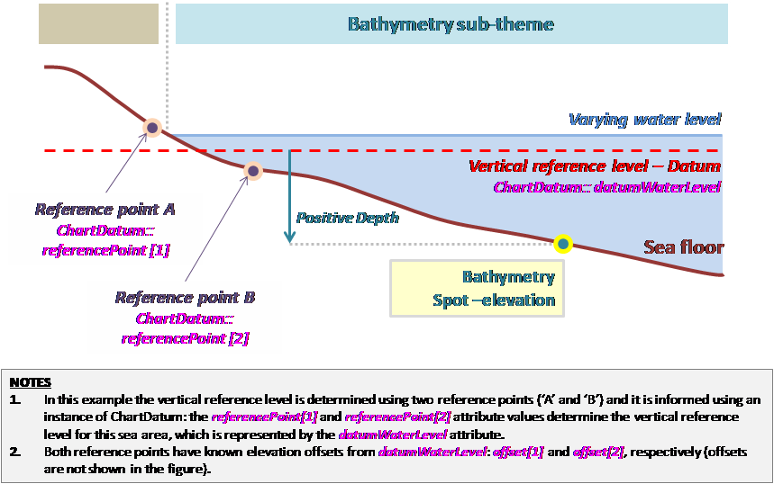

[.text-center]
*Figure 32 – Example: Description of the sea floor.*

=== Description of the floor of an inland standing water body

image::./media/image36.png[image, align=center]

[.text-center]
*Figure 33 – Example: Description of the floor of an inland standing water body.*

=== Description of the bed of a navigable river

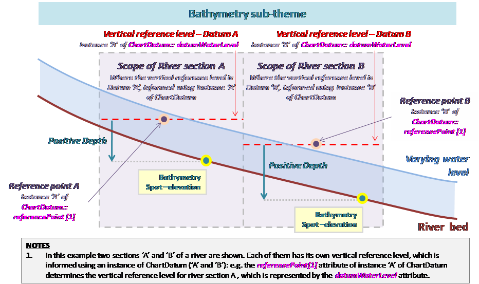

[.text-center]
*Figure 34 – Example: Description of the bed of a navigable river.*

<<<
[appendix]
== Encoding rules for TIFF (normative)

=== Introduction

This annex specifies how to use the TIFF file format for encoding the range set of grid coverages. Because pixel payload is not sufficient to construct a readable standalone image, additional descriptive information has to be packaged together in the same file, even if it is already provided somewhere else in GML. For this purpose, this part establishes schema conversion rules for all the coverage components of INSPIRE Application Schemas that have a corresponding element in the output TIFF data structures. These conversion rules play an essential role in maintaining consistency between the different representations (i.e. GML or TIFF) of the same coverage information.

On the other hand, TIFF specifications offers many options and let some variables open for encoding image data. If this flexibility allows covering most applications, it leads, in turn, to a situation where disparate implementation platforms exist while being potentially incompatible. As a result, interoperability is often unlikely. In order to fill in this gap and to enable a controlled exchange of data across Europe, this annex draws up an implementation profile of TIFF to constrain their usage within the scope of INSPIRE. It amounts to impose external format-dependent restrictions to the applicable values of the properties described in the INSPIRE application schemas.

=== TIFF format

==== Format overview

The Tagged Image File Format (TIFF) is a binary file format for storing and interchanging raster images. Originally developed by the company Aldus (Adobe Systems), it is in the public domain since 1992, the year of the latest release of the specifications (revision 6.0 [TIFF]). TIFF has become a popular "de facto standard" for high colour-depth digital images. It is widely used in image handling applications, covering various themes such as Elevation.

TIFF specifications are divided into two parts. Part 1: Baseline TIFF defines all the features that every reader must support, while Part 2: TIFF Extensions provides additional format structures designed for specialized applications, that are not necessarily taken into account by all TIFF readers (e.g. JPEG or LZW compression, tiling, CMYK images).

As highlighted in the format name, the TIFF data structure is based on the definition of tags for describing the characteristics of images. To be more precise, a TIFF file contains an image file header pointing to one or several image file directory (IFD). The image file header fixes the technical properties of the file, such as the byte order (e.g. little-endian or big-endian) or the offset of the first byte. An image file directory holds the complete description of an image by means of fields or entries. Each IFD entry consists of a tag identifying the field, the field type (e.g. byte, ASCII, short int), the number of values and the values themselves or an offset to the values. The location of the actual image data within the file is given by the combination of information elements expressed in some fields.

==== INSPIRE TIFF profile for grid coverage data

This section lists the requirements and the constraints to be applied to the TIFF format when encoding INSPIRE Elevation data sets in this format. It should be read in conjunction with the table in section E.2.3 which provides more detailed information. Some of the rules presented here are directly inspired by the GeoTIFF Profile for Georeferenced Imagery [DGIWG-108] edited by DGIWG for the military community.

===== General rules

[TIP]
====
*TG Requirement 10*

Encoding of INSPIRE Elevation data sets by using TIFF format shall conform to Baseline TIFF extended to LZW Compression.
====

NOTE Baseline TIFF is described in the part 1 of the TIFF specification 6.0 [TIFF], while the TIFF extension on LZW Compression is addressed in part 2.

TIFF files must be identified as such by network services by using a predefined Internet media type or MIME type.

[TIP]
====
*TG Requirement 11*
A file claiming to encode coverage elements in TIFF shall receive the _image/tiff_ MIME type registered in RFC 3302.
====

NOTE The absence of the optional application parameter here does not necessarily imply that the encoded TIFF image is Baseline TIFF.

===== Data structure

Even though TIFF specifications allow describing multiple related images in a single file by using more than one Image File Directory (IFD), Baseline TIFF readers are not required to decode any IFD beyond the first one. In order to ensure alignment with Baseline TIFF, all indispensable information has to be included in the first IFD.

[TIP]
====
*TG Requirement 12*
A TIFF file shall not contain more than two image file directories (IFD).
====

[TIP]
====
*TG Requirement 13*
The first IFD shall carry the range set of the grid coverage. In the case of two IFD, the second shall be used to support a transparency mask.
====

NOTE As a consequence, the different bands of a same image can not be split in separate IFDs.

The use of a second IFD is admitted for encoding an optional transparency mask, which is common for geographic raster data. This kind of ancillary information describes precisely the meaningful area of the image in the first IFD. It is useful at least for portrayal considerations. A transparency mask is a bi-level image matching pixel by pixel the image depicted in the first IFD. The pixel value 1 in the transparency mask means that the corresponding pixel in the image itself is significant. Conversely, the value 0 means that the corresponding pixel in the image holds a no data value (e.g. unknown, withheld). Typically, it must be made transparent when displaying the image.

The image file directory assigned to a transparency mask must receive the following TIFF tag values:

* BitsPerSample = 1
* Colormap: not used
* ImageDescription = 'transparency mask'
* ImageLength = ImageLength of the first IFD
* ImageWidth = ImageWidth of the first IFD
* NewSubFileType: all bits equal 0, except bit 2 = 1
* PhotometricInterpretation = 4
* SamplesPerPixel = 1

===== Grid coordinate system

Baseline TIFF supports only one type of orientation for grid coverages, that is, one type of grid coordinate system.

[TIP]
====
*TG Requirement 14*
The origin of the grid coordinate system shall be the upper left corner of the grid coverage. The axis 'row' and 'column' shall be oriented downward and to the right.
====

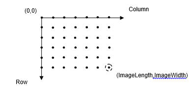

[.text-center]
*Figure 35. referenced grid as defined by Baseline TIFF*

===== Range values

The Baseline TIFF specifications cover four image types: bi-level, greyscale, palette-colour and full-colour images. Multi-band images are allowed but not fully addressed: baseline TIFF readers are intended to skip over the extra components gracefully, using the values of the SamplesPerPixel and BitsPerSample fields.

The image data of a TIFF file should contain either 1 (bi-level, greyscale and palette-colour), 3 (RGB) or 4 bands (RGB with associated alpha data).

NOTE 1 Alpha data, which provides opacity information, is stored as an additional component per pixel. A 4-bands RGB image must have the following TIFF tag values: SamplesPerPixel = 4, PhotometricInterpretation = 2 (RGB) and ExtraSamples = 1 (associated alpha data).

NOTE 2 Encoding multispectral images in TIFF is running the risk of losing a part of the coverage range set, since many software applications are not able to support more than three colours.

[TIP]
====
*TG Requirement 15*
For gridded data (e.g. elevation data, measured data), they shall be stored as 32-bit floating points.
====

NOTE If the original data do not satisfy this requirement, they will be converted in a representation using the next higher power of 2.

[TIP]
====
*TG Requirement 16*
In the case of multi-band images, the number of bits per component shall be the same for all the bands.
====

[TIP]
====
*TG Requirement 17*
In the case of multi-band images, the planar configuration shall be _Chunky_ format, i.e. the bands are interleaved.
====

NOTE The range values of a same grid point in its different bands are stored contiguously. For instance, RGB data is stored as RGBRGBRGBRGB...

===== Compression

Data compression can be used within this profile to reduce the size of a file, provided that it does not distort the original range values after an encoding-decoding cycle. This condition allows, for example, ensuring the preservation of nil values.

[TIP]
====
*TG Requirement 18*
The range value data shall be either uncompressed or lossless compressed with packbit or LZW compression schemes.
====

NOTE As a TIFF extension, LZW compression is not supported by Baseline TIFF. However, it is included in this profile since its use is widespread, essentially for both its simplicity and its efficiency.

===== Internal tiling

The TIFF extension defined in section 15 of the specifications focuses on the way of laying out the image content into roughly square tiles. This method, as an alternative to the standard repartition of the range within separate strips, improves the access to data. However, it may cause some interoperability problems too. It is therefore better not to use it and to restrict oneself to Baseline TIFF.

==== Mapping between TIFF and GML data structures

The following table indicates how to fill the content of TIFF tags for grid coverages in the context of INSPIRE. On the other hand, it gives the rules to be applied for ensuring the consistency of TIFF files with the Elevation GML Application(s) Schema(s). It does not address the encoding of the possible transparency mask (See E.2.2.2).

The columns _Tag name_, _Code_, _Type_, _Card._ and _Description_ remind respectively the name, the code, the type, the maximum number of occurrences and the description of each Baseline TIFF tag within the meaning of the TIFF specification. The column _Obligation_ informs if the tag is considered to be mandatory (M), conditional (C), optional (O) or inadequate (I). The column _Restricted values_ specifies the values allowed for the tag in the context of INSPIRE. The column _Mapping to GML elements_ establishes a correspondence between the tag values and the corresponding GML elements of the coverage whose type is one of those specified in the Generic Conceptual Model (e.g. RectifiedGridCoverage). N/A means not applicable.

*Table 15. Baseline TIFF implementation profile and Mapping between TIFF tags and the associated object elements from the Elevation GML Application Schema*

[cols=",,,,,,,",]
|===
|*Tag name* |*Code* |*Type* |*Card.* |*Description* |*Obligation* |*Restricted values* |*Mapping to GML elements (including restrictions)*
|Artist |315 |ASCII |1 |Person who created the image |O |- |N/A
|BitsPerSample |258 |Short |SamplesPerPixel |Number of bits per component |M a|
1 for bi-level images

For imagery, constrained to *8* or *16* bits-per-pixel-per-band (e.g. 8 8 8 or 16 16 16 for RGB images).

For other gridded data, 8, 16 and 32 bits-per-pixel-per-band

|For each band _i_, rangeType.field[_i_].constraint.interval = "0 _2^BitsPerSample[i]-1_"
|CellLength |265 |Short |1 |The length of the dithering or halftoning matrix used to create a dithered or halftoned bilevel file. |I |This field should be never used |N/A
|CellWidth |264 |Short |1 |The width of the dithering or halftoning matrix used to create a dithered or halftoned bilevel file. |I |This field should be never used |N/A
|ColorMap |320 |Short |3*(2**BitsPerSample) |A colour map for palette colour images |C |Only for palette colour images |N/A
|Compression |259 |Short |1 |Compression scheme used on the image data |M a|
*1* for uncompressed data

*5* for LZW compression

*32773* for PackBits compression of greyscale and palette-colour data

|N/A
|Copyright |33432 |ASCII |1..* |Copyright notice |O |- |N/A
|DateTime |306 |ASCII |20 |Date and time of image creation |O |The Gregorian calendar should be used as a reference system for date values, and the Universal Time Coordinated (UTC) as a reference system for time values (local time is not recommended because offset from UTC can not be expressed in TIFF). a|
N/A

NOTE the field DateTime should not be confused with the properties _phenomenonTime_ and _beginLifespanVersion_ that report other types of temporal information.

|ExtraSample |338 |Short |1..* |Description of extra components |C a|
Only when extra samples are present

*1* for 4-bands RGB images with alpha channel

|N/A
|FillOrder |266 |Short |1 |The logical order of bits within a byte. |O |*1* (default) |N/A
|FreeByteCounts |289 |Long |1 |For each string of contiguous unused bytes in a TIFF file, the number of bytes in the string. |I |This field should be never used |N/A
|FreeOffsets |288 |Long |1 |For each string of contiguous unused bytes in a TIFF file, the byte offset of the string. |I |This field should be never used |N/A
|GrayResponseCurve |291 |Short |2**BitsPerSample |For greyscale data, the optical density of each possible pixel value. |I |This field should be never used |N/A
|GrayResponseUnit |290 |Short |1 |The precision of the information contained in the GrayResponseCurve |I |This field should be never used |N/A
|HostComputer |316 |ASCII |1..* |The computer and/or operating system in use at the time of image creation. |O |*-* |N/A
|ImageDescription |270 |ASCII |1..* |Description of the image subject. |O |- |N/A
|ImageLength |257 |Short or Long |1 |The number of rows in the image. |M |- a|
domainSet.extent.high.coordValues[_0_]-

domainSet.extent.low.coordValues[_0_]=ImageLength

|ImageWidth |256 |Short or Long |1 |The number of columns in the image, i.e. the number of pixels per row. |M |- a|
domainSet.extent.high.coordValues[_1_]-

domainSet.extent.low.coordValues[_1_]=ImageWidth

|Make |271 |ASCII |1 |The scanner manufacturer. |O |- |N/A
|MaxSampleValue |281 |Short |SamplesPerPixel |The maximum component value used. |O |This field should be used only for statistical purposes |N/A
|MinSampleValue |280 |Short |SamplesPerPixel |The minimum component value used. |O |This field should be used only for statistical purposes |N/A
|Model |272 |ASCII |1 |The scanner model name or number. |O |- |N/A
|NewSubfileType |254 |Long |1 |A general indication of the kind of data contained in this subfile. |O |*0* |N/A
|Orientation |274 |Short |1 |The orientation of the image with respect to the rows and columns. |M |*1* (default) |domainSet.extent.low.coordValues="0 0"
|PhotometricInterpretation |262 |Short |1 |Colour space of the image data. |M a|
*1* for bi-level and greyscale images (0 is black)

*2* for RGB images

*3* for palette-colour images

|N/A
|PlanarConfiguration |284 |Short |1 |How the components of each pixel are stored. |M |*1* which means, for RGB data, that the data is stored as RGBRGBRGB... |rangeSet.fileStructure="Record Interleaved"
|ResolutionUnit |296 |Short |1 |Unit of measurement for XResolution and YResolution. |M |*2* which means dpi (dot per inch) |N/A
|RowsPerStrip |278 |Short or Long |1 |Number of rows per strip. a|
C

Not used if tiling

|It is recommended to choose this value such that each strip is about 8K bytes. |N/A
|SampleFormat |399 |Short |SamplesPerPixel |This field specifies how to interpret each data sample in a pixel. |M a|
*1* for imagery (unsigned integer data)

1, 2 or 3 for gridded data

|For imagery, for each band _i_, rangeType.field[_i_].constraint.interval[0] = "0"
|SamplesPerPixel |277 |Short |1 |Number of components per pixel. |M a|
*1* usually for bi-level, greyscale and palette-colour images

*3* or *4* usually for RGB images (the 4^th^ component being used for alpha channel)

|rangeType.field.size()=SamplesPerPixel
|SmaxSampleValue |341 |Field type that best matches the sample data |SamplesPerPixel |The maximum value for each sample. This tag is used in lieu of MaxSampleValue when the sample type is other than integer. |I |This field should be never used |N/A
|SminSampleValue | |Field type that best matches the sample data |SamplesPerPixel |The minimum value for each sample. This tag is used in lieu of MaxSampleValue when the sample type is other than integer. |I |This field should be never used |N/A
|Software |305 |ASCII |1..* |Name and version number of the software package(s) used to create the image. |O |- |N/A
|StripByteCounts |279 |Short or Long |StripPerImage |For each strip, number of bytes in the strip after compression. a|
C

Not used if tiling

|*-* |N/A
|StripOffsets |273 |Long |StripPerImage |For each strip, the byte offset of that strip a|
C

Not used if tiling

|- |N/A
|Thresholding |263 |Short |1 |For black and white TIFF files that represent shades of gray, the technique used to convert gray to black and white pixels. |I |This field should be never used |N/A
|TileWidth |322 |Short or Long | |The tile width in pixels. This is the number of columns in each tile. a|
C

if tiling

|- |N/A
|TileLength |323 |Short or Long | |The tile length (height) in pixels. This is the number of rows in each tile. a|
C

if tiling

|- |N/A
|TileOffsets |324 |Long | |For each tile, the byte offset of that tile, as compressed and stored on disk. a|
C

if tiling

|- |N/A
|TileByteCount |325 |Short or Long | |For each tile, the number of (compressed) bytes in that tile. a|
C

if tiling

|- |N/A
|Xresolution |282 |Rational | |The number of pixels per ResolutionUnit in the ImageWidth direction. |M |*-* |N/A
|Yresolution |283 |Rational | |The number of pixels per ResolutionUnit in the ImageLength direction. |M |*-* |N/A
|===

In addition, the description of the coverage grid function must reflect the baseline ordering used by TIFF format to store the range values within a file. The following mapping must be applied:

coverageFunction.gridFunction.sequenceRule.type = "linear" AND coverageFunction.gridFunction.sequenceRule.scanDirection = "+2 +1
