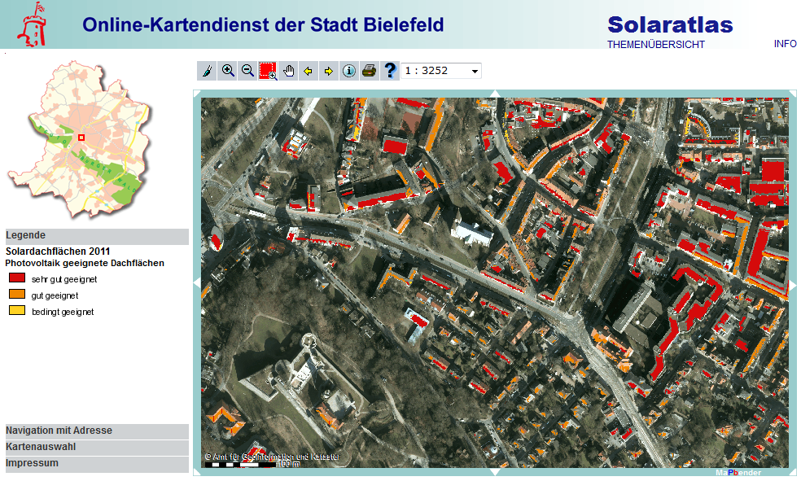

// Admonition icons:
// TG Requirement
:important-caption: 📕
// TG Recommendation
:tip-caption: 📒
// Conformance class
:note-caption: 📘

// TOC placement using macro (manual)
:toc: macro

// Empty TOC title (the title is in the document)
:toc-title:

// TOC level depth
:toclevels: 5

// Section numbering level depth
:sectnumlevels: 8

// Line Break Doc Title
:hardbreaks-option:

:appendix-caption: Annex

image::./media/image2.jpeg[logo_ce-en-rvb-lr,width=131,height=90]

image:./media/image3.png[ESEC,width=93,height=93] **INSPIRE** *Infrastructure for Spatial Information in Europe*

[discrete]
= D2.8.III.20 Data Specification on _Energy Resources_ – Technical Guidelines

[width="100%",cols="17%,83%",]
|===
|*Title* |D2.8.III.20 INSPIRE Data Specification on _Energy Resources_ – Technical Guidelines
|*Creator* |INSPIRE Thematic Working Group _Energy Resources_
|*Date* |2013-12-10
|*Subject* |INSPIRE Data Specification for the spatial data theme _Energy Resources_
|*Publisher* |European Commission Joint Research Centre
|*Type* |Text
|*Description* |This document describes the INSPIRE Data Specification for the spatial data theme _Energy Resources_
|*Contributor* |Members of the INSPIRE Thematic Working Group _Energy Resources_
|*Format* |Portable Document Format (pdf)
|*Source* |
|*Rights* |Public
|*Identifier* |D2.8.III.20_v3.0
|*Language* |En
|*Relation* |Directive 2007/2/EC of the European Parliament and of the Council of 14 March 2007 establishing an Infrastructure for Spatial Information in the European Community (INSPIRE)
|*Coverage* |Project duration
|===

<<<
[discrete]
== Foreword
[discrete]
== How to read the document?

This document describes the _"INSPIRE data specification on Energy Resources – Technical Guidelines"_ version 3.0 as developed by the Thematic Working Group (TWG) _Energy Resources_ using both natural and a conceptual schema language.

The data specification is based on a common templatefootnote:[The common document template is available in the "Framework documents" section of the data specifications web page at http://inspire.jrc.ec.europa.eu/index.cfm/pageid/2] used for all data specifications, which has been harmonised using the experience from the development of the Annex I, II and III data specifications.

This document provides guidelines for the implementation of the provisions laid down in the Implementing Rule for spatial data sets and services of the INSPIRE Directive. It also includes additional requirements and recommendations that, although not included in the Implementing Rule, are relevant to guarantee or to increase data interoperability.

Two executive summaries provide a quick overview of the INSPIRE data specification process in general, and the content of the data specification on _Energy Resources_ in particular. We highly recommend that managers, decision makers, and all those new to the INSPIRE process and/or information modelling should read these executive summaries first.

The UML diagrams (in Chapter 5) offer a rapid way to see the main elements of the specifications and their relationships. The definition of the spatial object types, attributes, and relationships are included in the Feature Catalogue (also in Chapter 5). People having thematic expertise but not familiar with UML can fully understand the content of the data model focusing on the Feature Catalogue. Users might also find the Feature Catalogue especially useful to check if it contains the data necessary for the applications that they run. The technical details are expected to be of prime interest to those organisations that are responsible for implementing INSPIRE within the field of _Energy Resources_, but also to other stakeholders and users of the spatial data infrastructure.

The technical provisions and the underlying concepts are often illustrated by examples. Smaller examples are within the text of the specification, while longer explanatory examples and descriptions of selected use cases are attached in the annexes.

In order to distinguish the INSPIRE spatial data themes from the spatial object types, the INSPIRE spatial data themes are written in _italics._

[width="100%",cols="100%"]
|===
|The document will be publicly available as a 'non-paper'. It does not represent an official position of the European Commission, and as such cannot be invoked in the context of legal procedures.
|===

*Legal Notice*

Neither the European Commission nor any person acting on behalf of the Commission is responsible for the use which might be made of this publication.

<<<
[discrete]
== Interoperability of Spatial Data Sets and Services – General Executive Summary

The challenges regarding the lack of availability, quality, organisation, accessibility, and sharing of spatial information are common to a large number of policies and activities and are experienced across the various levels of public authority in Europe. In order to solve these problems it is necessary to take measures of coordination between the users and providers of spatial information. The Directive 2007/2/EC of the European Parliament and of the Council adopted on 14 March 2007 aims at establishing an Infrastructure for Spatial Information in the European Community (INSPIRE) for environmental policies, or policies and activities that have an impact on the environment.

INSPIRE is based on the infrastructures for spatial information that are created and maintained by the Member States. To support the establishment of a European infrastructure, Implementing Rules addressing the following components of the infrastructure have been specified: metadata, interoperability of spatial data sets (as described in Annexes I, II, III of the Directive) and spatial data services, network services, data and service sharing, and monitoring and reporting procedures.

INSPIRE does not require collection of new data. However, after the period specified in the Directivefootnote:[For all 34 Annex I,II and III data themes: within two years of the adoption of the corresponding Implementing Rules for newly collected and extensively restructured data and within 5 years for other data in electronic format still in use] Member States have to make their data available according to the Implementing Rules.

Interoperability in INSPIRE means the possibility to combine spatial data and services from different sources across the European Community in a consistent way without involving specific efforts of humans or machines. It is important to note that "interoperability" is understood as providing access to spatial data sets through network services, typically via Internet. Interoperability may be achieved by either changing (harmonising) and storing existing data sets or transforming them via services for publication in the INSPIRE infrastructure. It is expected that users will spend less time and efforts on understanding and integrating data when they build their applications based on data delivered in accordance with INSPIRE.

In order to benefit from the endeavours of international standardisation bodies and organisations established under international law their standards and technical means have been utilised and referenced, whenever possible.

To facilitate the implementation of INSPIRE, it is important that all stakeholders have the opportunity to participate in specification and development. For this reason, the Commission has put in place a consensus building process involving data users, and providers together with representatives of industry, research and government. These stakeholders, organised through Spatial Data Interest Communities (SDIC) and Legally Mandated Organisations (LMO)footnote:[The current status of registered SDICs/LMOs is available via INSPIRE website: http://inspire.jrc.ec.europa.eu/index.cfm/pageid/42], have provided reference materials, participated in the user requirement and technicalfootnote:[Surveys on unique identifiers and usage of the elements of the spatial and temporal schema,] surveys, proposed experts for the Data Specification Drafting Teamfootnote:[The Data Specification Drafting Team has been composed of experts from Austria, Belgium, Czech Republic, France, Germany, Greece, Italy, Netherlands, Norway, Poland, Switzerland, UK, and the European Environment Agency], the Thematic Working Groupsfootnote:[The Thematic Working Groups have been composed of experts from Austria, Australia, Belgium, Bulgaria, Czech Republic, Denmark, Finland, France, Germany, Hungary, Ireland, Italy, Latvia, Netherlands, Norway, Poland, Romania, Slovakia, Spain, Slovenia, Sweden, Switzerland, Turkey, UK, the European Environment Agency and the European Commission.] and other ad-hoc cross-thematic technical groups and participated in the public stakeholder consultations on draft versions of the data specifications. These consultations covered expert reviews as well as feasibility and fitness-for-purpose testing of the data specificationsfootnote:[For Annex IIIII, the consultation and testing phase lasted from 20 June to 21 October 2011.].

This open and participatory approach was successfully used during the development of the data specifications on Annex I, II and III data themes as well as during the preparation of the Implementing Rule on Interoperability of Spatial Data Sets and Servicesfootnote:[Commission Regulation (EU) No 1089/2010 http://eur-lex.europa.eu/JOHtml.do?uri=OJ:L:2010:323:SOM:EN:HTML[implementing Directive 2007/2/EC of the European Parliament and of the Council as regards interoperability of spatial data sets and services&#44;] published in the Official Journal of the European Union on 8^th^ of December 2010.] for Annex I spatial data themes and of its amendment regarding the themes of Annex II and III.

The development framework elaborated by the Data Specification Drafting Team aims at keeping the data specifications of the different themes coherent. It summarises the methodology to be used for the development of the data specifications, providing a coherent set of requirements and recommendations to achieve interoperability. The pillars of the framework are the following technical documentsfootnote:[The framework documents are available in the "Framework documents" section of the data specifications web page at http://inspire.jrc.ec.europa.eu/index.cfm/pageid/2]:

* The _Definition of Annex Themes and Scope_ describes in greater detail the spatial data themes defined in the Directive, and thus provides a sound starting point for the thematic aspects of the data specification development.
* The _Generic Conceptual Model_ defines the elements necessary for interoperability and data harmonisation including cross-theme issues. It specifies requirements and recommendations with regard to data specification elements of common use, like the spatial and temporal schema, unique identifier management, object referencing, some common code lists, etc. Those requirements of the Generic Conceptual Model that are directly implementable are included in the Implementing Rule on Interoperability of Spatial Data Sets and Services.
* The _Methodology for the Development of Data Specifications_ defines a repeatable methodology. It describes how to arrive from user requirements to a data specification through a number of steps including use-case development, initial specification development and analysis of analogies and gaps for further specification refinement.
* The _Guidelines for the Encoding of Spatial Data_ defines how geographic information can be encoded to enable transfer processes between the systems of the data providers in the Member States. Even though it does not specify a mandatory encoding rule it sets GML (ISO 19136) as the default encoding for INSPIRE.
* The _Guidelines for the use of Observations & Measurements and Sensor Web Enablement-related standards in INSPIRE Annex II and III data specification development_ provides guidelines on how the "Observations and Measurements" standard (ISO 19156) is to be used within INSPIRE.
* The _Common data models_ are a set of documents that specify data models that are referenced by a number of different data specifications. These documents include generic data models for networks, coverages and activity complexes.

The structure of the data specifications is based on the "ISO 19131 Geographic information - Data product specifications" standard. They include the technical documentation of the application schema, the spatial object types with their properties, and other specifics of the spatial data themes using natural language as well as a formal conceptual schema languagefootnote:[UML – Unified Modelling Language].

A consolidated model repository, feature concept dictionary, and glossary are being maintained to support the consistent specification development and potential further reuse of specification elements. The consolidated model consists of the harmonised models of the relevant standards from the ISO 19100 series, the INSPIRE Generic Conceptual Model, and the application schemasfootnote:[Conceptual models related to specific areas (e.g. INSPIRE themes)] developed for each spatial data theme. The multilingual INSPIRE Feature Concept Dictionary contains the definition and description of the INSPIRE themes together with the definition of the spatial object types present in the specification. The INSPIRE Glossary defines all the terms (beyond the spatial object types) necessary for understanding the INSPIRE documentation including the terminology of other components (metadata, network services, data sharing, and monitoring).

By listing a number of requirements and making the necessary recommendations, the data specifications enable full system interoperability across the Member States, within the scope of the application areas targeted by the Directive. The data specifications (in their version 3.0) are published as technical guidelines and provide the basis for the content of the Implementing Rule on Interoperability of Spatial Data Sets and Servicesfootnote:[In the case of the Annex IIIII data specifications, the extracted requirements are used to formulate an amendment to the existing Implementing Rule.]. The content of the Implementing Rule is extracted from the data specifications, considering short- and medium-term feasibility as well as cost-benefit considerations. The requirements included in the Implementing Rule are legally binding for the Member States according to the timeline specified in the INSPIRE Directive.

In addition to providing a basis for the interoperability of spatial data in INSPIRE, the data specification development framework and the thematic data specifications can be reused in other environments at local, regional, national and global level contributing to improvements in the coherence and interoperability of data in spatial data infrastructures.

<<<
[discrete]
== _Energy Resources_ – Executive Summary

*Purpose*

The INSPIRE Directive (2007/2/EC) defines the spatial data theme _Energy Resources_ as the: "*Energy Resources including hydrocarbons, hydropower, bio-energy, solar, wind, etc., where relevant including depth/height information on the extent of the resource.*" _Energy Resources_ are included in Annex III with the aim of providing an essential thematic frame, allowing for the exchange of _Energy Resources_ related spatial information across Europe in an interoperable way.

The effective planning and utilisation of energy resources is essential given that the availability of non-renewable energy resources is in decline and there is, as yet, limited utilisation of renewable energy resources. Also, given the growing global energy consumption increasing the dependency of society on energy as a whole, the sharing of data, both nationally and internationally, within a harmonised structure is critical.

The _Energy Resources_ theme covers the mapping of historic, current and future energy resources covering the entire lifecycle of _Energy Resources_, irrespective of its viability in terms of economic, social and technological aspects. It takes into account resources that are depleted due to exploitation in the past and resources currently not viable but may become so in the future. Information about location and the potential of _Energy Resources_ have a significant impact on the environment. This impact can have both positive and negative implications; therefore appropriate knowledge about the extent, distribution and volumes of the resources is of great value.

The main purpose therefore of this specification is to allow identification of geographical locations of each type of Energy Resource, providing information about their extent, distribution and volume (where possible and relevant) of the resource and also in providing relevant links to the other related domains.

The provision and implementation of this harmonised data specification should significantly contribute to the main priorities, targets and flagship initiatives of Europe 2020 strategyfootnote:[Europe 2020 Strategy (http://ec.europa.eu/europe2020/priorities/sustainable-growth/index_en.htm)] within the mechanisms of establishing a European spatial data infrastructure.

*Assumptions*

The data specification scope is delineated by the theme definition and further elaborated, taking into consideration reference material and use cases provided by the stakeholders as well as identified by the members of the INSPIRE Thematic Working Group for _Energy Resources_ (TWG ER). In addition, the document also reflects the contribution from public consultation and testing of the Data Specification of _Energy Resources_.

Detailed interpretation and description of the _Energy Resources_ theme is transposed to the core of the data specification with possible extensions for specific sub-domain or national needs. The entire concept of the data specification is based on modelling needs to cover existing and potential _Energy Resources_. With this, a distinction between non-renewable (fossil fuels), renewable and waste _Energy Resources_ had to be taken into consideration. Since in the real world certain types of _Energy Resources_ occur as discrete features whilst other types are present everywhere, the need arises to model both feature as well as coverage spatial data representations.

A significant part of the detailed information under the domain covered by this theme falls within the private sector therefore aggregations and overview data are a focus of this data specification. Nevertheless, where possible, this data specification retains the possibility to exchange detailed information at a local level.

Finally, in some cases a single feature can represent both an Energy Resource as a spatial object defined in another INSPIRE theme. This data specification provides information how to ensure consistency and reduce multiplicities where cross-theme interrelationships exist.

*Future*

The main value of the INSPIRE _Energy Resources_ data specification is in providing the framework for _Energy Resources_ related spatial data exchange. In addition this framework is characterised by its versatile yet flexible structure. Data providers are thus able to publish their existing data in the most convenient way and users can easily discover, evaluate and use appropriate data for their specific needs. As soon as new generic or theme specific needs and requirements are identified, appropriate activities within the framework of INSPIRE implementation and maintenancefootnote:[Proposal for INSPIRE Maintenance and Implementation (_http://bit.ly/Jj4gQT_)] will have to take place.

<<<
[discrete]
== Acknowledgements

Many individuals and organisations have contributed to the development of these Guidelines.

The Thematic Working Group _Energy Resources_ (ER) included:

Martin Tuchyna (European Commission contact point, TWG Facilitator), Diederik Tirry (TWG Editor), Pablo Burgos Casado, Radoslav Chudy, Søren Elkjær Kristensen, Gijs Remmelts, Chris Rhodes, Peter Semrad, Marta Szabo, Marcel Suri and Lisa Thomas.

Other contributors to the INSPIRE data specifications are the Drafting Team Data Specifications, the JRC Data Specifications Team and the INSPIRE stakeholders - Spatial Data Interested Communities (SDICs) and Legally Mandated Organisations (LMOs).

*Contact information*

Maria Vanda Nunes de Lima & Michael Lutz
European Commission Joint Research Centre (JRC)
Institute for Environment and Sustainability
Unit H06: Digital Earth and Reference Data
_http://inspire.ec.europa.eu/index.cfm/pageid/2_

<<<
[discrete]
= Table of contents
toc::[]

:sectnums:

<<<
== Scope

This document specifies a harmonised data specification for the spatial data theme _Energy Resources_ as defined in Annex III of the INSPIRE Directive.

This data specification provides the basis for the drafting of Implementing Rules according to Article 7 (1) of the INSPIRE Directive [Directive 2007/2/EC]. The entire data specification is published as implementation guidelines accompanying these Implementing Rules.

<<<
== Overview

=== Name

INSPIRE data specification for the theme _Energy Resources_.

=== Informal description

*[.underline]#Definition:#*

Energy resources including hydrocarbons, hydropower, bio-energy, solar, wind, etc., where relevant including depth/height information on the extent of the resource. [Directive 2007/2/EC]

*[.underline]#Description:#*

At a high level, and within the INSPIRE context, _Energy Resources_ are features defining an inferred or observable spatial extent of a resource that can be, or has been, used as a source of energy [DER 2011].

The central concept of this theme is _to provide a means for distributing and exchanging information on the spatial extent and type or classification of previous, current or potential sources of energy._ Knowing the spatial representation and location of energy resources will allow data providers to provide information about the resource type, the quantification of the resource, the level of resource utilisation and a unified approach for units of measurement to data users.

There are different approaches to describe spatial features representing various types of _Energy Resources_. On the one hand the occurrence of _Energy Resources_ can be considered as discrete, well-defined features, on the other hand properties of _Energy Resources_, and in particular renewable energy, can be assessed in a continuous way within a domain of interest. As a consequence of these two different approaches this specification covers both feature as well as coverage spatial data representations.

==== The importance of the Energy Resources Theme

Despite the occurrence of economic recessions, growing global energy consumption increases the dependency of society on energy as a whole. Whilst seeking solutions as to where and how to explore for alternative energy resources, it is important to keep in mind the need to deal with this increasing dependency now and in the future by using energy resources efficiently and by creating new or implementing existing initiatives. Moreover, the effective utilisation of energy resources is essential given that the availability of non-renewable energy resources is in decline and there is, as yet, limited utilisation of renewable energy resources.

The data specification for _Energy Resources_ provides the mechanism to exchange and compare energy resources related information defined within a spatial context. By creating a standards based data-sharing model, wider and more complex dependencies placed upon energy resources and their related activities in different countries will be able to be identified. It will also provide an overview of the state of play of energy resources within the wider European context.

==== Scope of the Energy Resources Theme

The _Energy Resources_ theme covers the mapping of historic, current and future energy resources alongside their primary characteristics. The concept of this theme is to provide focus to the resource aspect and the extent and distribution of the resources whilst also addressing aggregate information on energy statistics.

This theme covers the entire lifecycle of _Energy Resources_, irrespective of its viability in terms of economic, social and technological aspects. It takes into account resources that are depleted due to exploitation in the past and resources currently not viable but may become so in the future.

Energy resources are commonly divided into two main types: Primary and Secondary Energy. *Primary* *energy* is either extracted or captured directly from natural resources (such as coal, crude oil, wind or solar radiation) whereas *Secondary* *energy* (Energy Carriers) is the result of a conversion of primary or secondary energy types (see Figure 1). Electricity is one of the most common secondary energy types, being transformed from various primary energy sources such as coal, oil, natural gas, and wind. Although within the INSPIRE context only Primary _Energy Resources_ are considered, links to the secondary energy form are allowed for through the connection via statistics.

image::./media/image4.png[./media/image4,width=540,height=298]

[.text-center]
*Figure 1 – Transformation from Primary to Secondary Energy (Statistics Norway, 2008)*

Considering the INSPIRE definition as well as the scope of the remaining INSPIRE themes, this theme addresses each of the subcategories of primary energy resources: non-renewable resources, renewable resources and waste.

* *Non-renewables*: Natural resources which, due to long-term formation, cannot be produced, grown, generated, or used on a scale which can sustain its consumption rate. These resources, also known as fossil fuels (crude oil, coal, natural gas) and nuclear fuels, exist in a fixed amount, or are consumed much faster than nature can replenish them.
* *Renewables*: Naturally occurring and theoretically inexhaustible source of energy that is not derived from fossil or nuclear fuel. Renewable resources are widely abundant all over the Earth, but their energy intensity per unit area is typically smaller compared to non-renewable resources. These resources comprise for instance wind, solar, hydropower and geothermal resources that may produce heat, (non-thermal) electricity and biofuels.
* *Waste* is a fuel that may consist of many different materials coming from combustible industrial, institutional, hospital and household wastes such as rubber, plastics, waste fossil oils and other similar commodities. It is either solid or liquid in form, renewable or non-renewable, biodegradable or non-biodegradable.

Given that Nuclear fuels (Uranium and Thorium) are excluded from the energy resource types (see 2.2.3) and are modelled within the Mineral Resources data specification, this data specification addresses only the fossil fuel element of the non-renewable resources.

* *Fossil Fuels* are a form of non-renewable primary energy formed by natural processes such as the anaerobic decomposition of buried dead organisms. Fossil fuels contain high percentages of carbon and include coal, crude oil, and natural gas.

[.text-center]
*Figure 2 - Scope delineation of the theme (Energy Statistics Manual, OECD/IEA, 2004)*

==== Limits to the scope of the theme

Considering the INSPIRE definition of this theme scope the following exclusions have been made:

* Secondary Energy Types e.g. electricity, are not included within this theme.
* Energy use e.g. petrol consumption is not included within this theme.
* Smart grids have been assessed but regarded as not relevant for this theme.
* Storage of energy resources based on natural constructions (lakes for hydro, or empty natural reservoirs) have been assessed but regarded as not relevant for this theme.
* Underground Coal Gasification (UCG) has not been explicitly defined within this theme since all coal resource areas are potentially UCG sites.

The _Energy Resources_ theme definition is broad reaching and as such has correlations with other INSPIRE themes. Each correlation was assessed for inclusion within this theme on the basis of whether another theme had more significant relevance for the feature concerned and where duplication would be the least. Following discussions with the relevant Thematic Working Groups, it was concluded that the following features would not be covered within the Energy Resource theme. More information can be obtained within Chapter 5.

* Uranium and Thorium as energy resource types are modelled within the Mineral Resources data specification. These elements are exploited together with other minerals and therefore more relevant to the Mineral Resources Data Specification.
* The technical constructions for abstraction, transport and treatment, these are largely covered by Production and Industrial Facilities.
* Basic data for wind and temperature distributions are modelled within the Atmospheric Conditions data specification.
* Hydro-power plants are a candidate type inherited from the Annex I Hydrography specification. It was decided that this feature is not within the scope of this theme.
* Aerothermal energy resource is covered by the Atmospheric Conditions theme.
* Although an energy resource type of biogas can be derived from a landfill feature type (currently modelled within Production and Industrial Facilities), biogas is retained within the _Energy Resources_ code lists in order that it is possible to define a future area of interest with an estimation of the energy production value.

==== Data specification process

This Data Specification is defined following the requirements of the INSPIRE Directive and the Commission Regulation implementing Directive 2007/2/EC of the European Parliament and of the Council with regards to the interoperability of spatial data sets and services. The INSPIRE data specification on _Energy Resources_ was prepared following the participatory process of consensus building. The stakeholders, based on their registration as Spatial Data Interest Communities (SDICs) or Legally Mandated Organisations (LMOs)footnote:[INSPIRE Stakeholders (_http://inspire.jrc.ec.europa.eu/index.cfm/pageid/42_)] had the opportunity to bring forward user requirements and reference materials. They also proposed experts for the Thematic Working Groups (TWGs) responsible for the specification development and participated in the consultation (review) and testing of the data specifications. TWG ER was composed of experts from Belgium, Hungary, Netherlands, Norway, Spain, Slovakia, the United Kingdom and the European Commission.

The specification process took place according to the methodology detailed for INSPIRE respecting the requirements and the recommendations of the INSPIRE Generic Conceptual Model, which is one of the elements that ensures a coherent approach and a cross theme consistency.

In order to delineate the scope of the energy resources theme, relevant legislative framework was reviewed. This approach to reuse established information exchange agreements was chosen in order to reduce any additional burden on the related communities. The most relevant guiding reference with regard to _Energy Resources_ in Europe is the Energy Statistics Regulation EC 1099/2008 which provides generic domain coverage and a basis for the extent of the scope for the energy resources theme. Energy statistics are often used to communicate energy resources related information to the various communities.

[cols=""]
|===
a|*[.underline]#Definition:#*

Energy resources including hydrocarbons, hydropower, bio-energy, solar, wind, etc., where relevant including depth/height information on the extent of the resource.

*[.underline]#Description:#*

Energy Resources in INSPRE covers historic, current and future energy resources and the entire lifecycle of energy resources, irrespective of its viability in terms of economic, social and technological aspects. It takes into account resources that are depleted due to exploitation in the past and resources currently not viable but may become so in the future. Information about location and the potential of energy resources have a significant impact on the environment. This impact can have both positive and negative implications, therefore appropriate knowledge about the extent, distribution and volumes of the resources is of great value.

There is a main distinction between fossil fuels and renewable energy resources. The concept of energy resources provides focus to the resource aspect and the extent/distribution of the resources. Energy use, e.g. petrol consumption, is not covered by this theme. Fossil fuel resources include oil accumulation, natural gas accumulations, coal, lignite or peat deposits and Uranium ore deposits.

Renewable energy resources include Hydropower in which water resources mapped according to energy potential.

Bio-energy resources contains forest resources, cereals or agricultural residues which can be used for energy purposes, Wind energy - estimated by wind measurement together with topographical information. Geothermal energy the natural heat flow is of high interest as a renewable and clean energy source.

Entry in the INSPIRE registry: _http://inspire.ec.europa.eu/theme/ef/_
|===

=== Normative References

[Directive 2007/2/EC] Directive 2007/2/EC of the European Parliament and of the Council of 14 March 2007 establishing an Infrastructure for Spatial Information in the European Community (INSPIRE)

[ISO 19107] EN ISO 19107:2005, Geographic Information – Spatial Schema

[ISO 19108] EN ISO 19108:2005, Geographic Information – Temporal Schema

[ISO 19108-c] ISO 19108:2002/Cor 1:2006, Geographic Information – Temporal Schema, Technical Corrigendum 1

[ISO 19111] EN ISO 19111:2007 Geographic information - Spatial referencing by coordinates (ISO 19111:2007)

[ISO 19113] EN ISO 19113:2005, Geographic Information – Quality principles

[ISO 19115] EN ISO 19115:2005, Geographic information – Metadata (ISO 19115:2003)

[ISO 19118] EN ISO 19118:2006, Geographic information – Encoding (ISO 19118:2005)

[ISO 19123] EN ISO 19123:2007, Geographic Information – Schema for coverage geometry and functions

[ISO 19125-1] EN ISO 19125-1:2004, Geographic Information – Simple feature access – Part 1: Common architecture

[ISO 19135] EN ISO 19135:2007 Geographic information – Procedures for item registration (ISO 19135:2005)

[ISO 19138] ISO/TS 19138:2006, Geographic Information – Data quality measures

[ISO 19139] ISO/TS 19139:2007, Geographic information – Metadata – XML schema implementation

[ISO 19157] ISO/DIS 19157, Geographic information – Data quality

[OGC 06-103r4] Implementation Specification for Geographic Information - Simple feature access – Part 1: Common Architecture v1.2.1

NOTE This is an updated version of "EN ISO 19125-1:2004, Geographic information – Simple feature access – Part 1: Common architecture".

[Regulation 1205/2008/EC] Regulation 1205/2008/EC implementing Directive 2007/2/EC of the European Parliament and of the Council as regards metadata

[Regulation 976/2009/EC] Commission Regulation (EC) No 976/2009 of 19 October 2009 implementing Directive 2007/2/EC of the European Parliament and of the Council as regards the Network Services

[Regulation 1089/2010/EC] Commission Regulation (EU) No 1089/2010 of 23 November 2010 implementing Directive 2007/2/EC of the European Parliament and of the Council as regards interoperability of spatial data sets and services

[Regulation 1099/2008/EC] Commission Regulation (EC) No 1099/2008 of the European Parliament and of the Council of 22 October 2008 on energy statistics of 22 October 2008

=== Terms and definitions

General terms and definitions helpful for understanding the INSPIRE data specification documents are defined in the INSPIRE Glossaryfootnote:[The INSPIRE Glossary is available from http://inspire-registry.jrc.ec.europa.eu/registers/GLOSSARY].

Specifically, for the theme _Energy Resources_, the following terms are defined:

. *Energy resource*

means a concentration or occurrence of an energy source which may have been present, is present or may be present in the future.

[arabic, start=2]
. *Fossil fuels*

means a form of non-renewable primary energy formed by natural processes such as the anaerobic decomposition of buried dead organisms, which contains high percentages of carbon and includes coal, crude oil, and natural gas.

[arabic, start=3]
. *Primary energy*

means energy that has not been subjected to any conversion or transformation process.

[arabic, start=4]
. *Non-renewable energy*

means natural resources which, due to long-term formation, cannot be produced, grown, generated, or used on a scale which can sustain its consumption rate.

[arabic, start=5]
. *Energy from renewable sources*

means energy from renewable non-fossil sources, namely wind, solar, aerothermal, geothermal, hydrothermal and ocean energy, hydropower, biomass, landfill gas, sewage treatment plant gas and biogases, in accordance with Article 2 of Directive 2009/28/EC of the European Parliament and of the Councilfootnote:[OJ L 140, 5.6.2009, p. 16.].

[arabic, start=6]
. *Waste as energy resources*

means a fuel that may consist of many different materials coming from combustible industrial, institutional, hospital and household waste such as rubber, plastics, waste fossil oils and other similar commodities. It is either solid or liquid in form, renewable or non-renewable, biodegradable or non-biodegradable.

=== Symbols and abbreviations

[align=center,width="100%",cols="18%,82%"]
|===
|AAPG |American Association of Petroleum Geologists
|AONB |Areas of Outstanding Natural Beauty
|ATS |Abstract Test Suite
|CDP |County Development Plan
|CPV |Concentrated Photovoltaics
|CSP |Concentrated Solar Power
|DNI |Direct Normal Irradiation / Direct Normal Irradiance
|EC |European Commission
|EC |European Commission
|EEA |European Energy Agency
|EEA |European Environmental Agency
|EFG |European Federation of Geologists
|ER |Energy Resources
|ETRS |European Terrestrial Reference System
|ETRS89 |European Terrestrial Reference System 1989
|ETRS89-LAEA |Lambert Azimuthal Equal Area
|EVRS |European Vertical Reference System
|GCM |General Conceptual Model
|GHI |Global Horizontal Irradiance
|GML |Geography Markup Language
|GSL |Geological Society of London
|IEA |International Energy Agency
|IGI |Institute of Geologists of Ireland
|INSPIRE |Infrastructure for Spatial Information in the European Community
|IoM3 |Institute of Materials, Minerals and Mining
|IPCC |Intergovernmental Panel on Climate Change
|IR |Implementing Rules
|IR |Implementing Rule
|ISDSS |Interoperability of Spatial Data Sets and Services
|ISO |International Organization for Standardization
|ITRS |International Terrestrial Reference System
|JRC |Joint Research Centre
|LAT |Lowest Astronomical Tide
|LMO |Legally Mandated Organisation
|NPD |Norwegian Petroleum Directorate
|OECD |Organisation for Economic Co-operation and Development
|PERC |Pan-European Code for Reporting of Exploration Results, Mineral Resources and Reserves
|PV |Photovoltaic
|PVGIS |Photovoltaic Geographic Information System
|SAC |Special Area of Conservation
|SDIC |Spatial Data Interest Community
|SPA |Special Protection Areas
|SPE |Society of Petroleum Engineers
|TG |Technical Guidelines
|TG |Technical Guidance
|TWG |Thematic Working Group
|UCG |Underground Coal Gasification
|UML |Unified Modeling Language
|UNFC |United Nations Framework Classification
|USGS |United States Geological Survey
|UTC |Coordinated Universal Time
|WHO |World Health Organization
|WMO |World Meteorological Organization
|WPC |World Petroleum Council
|XML |EXtensible Markup Language
|===

=== How the Technical Guidelines map to the Implementing Rules

The schematic diagram in Figure 3 gives an overview of the relationships between the INSPIRE legal acts (the INSPIRE Directive and Implementing Rules) and the INSPIRE Technical Guidelines. The INSPIRE Directive and Implementing Rules include legally binding requirements that describe, usually on an abstract level, _what_ Member States must implement.

In contrast, the Technical Guidelines define _how_ Member States might implement the requirements included in the INSPIRE Implementing Rules. As such, they may include non-binding technical requirements that must be satisfied if a Member State data provider chooses to conform to the Technical Guidelines. Implementing these Technical Guidelines will maximise the interoperability of INSPIRE spatial data sets.

image::./media/image6.png[./media/image6,width=603,height=375]

[.text-center]
*Figure 3 - Relationship between INSPIRE Implementing Rules and Technical Guidelines*

==== Requirements

The purpose of these Technical Guidelines (Data specifications on _Energy Resources_) is to provide practical guidance for implementation that is guided by, and satisfies, the (legally binding) requirements included for the spatial data theme _Energy Resources_ in the Regulation (Implementing Rules) on interoperability of spatial data sets and services. These requirements are highlighted in this document as follows:

[IMPORTANT]
====
[.text-center]
*IR Requirement*
_Article / Annex / Section no._
*Title / Heading*

This style is used for requirements contained in the Implementing Rules on interoperability of spatial data sets and services (Commission Regulation (EU) No 1089/2010).

====

For each of these IR requirements, these Technical Guidelines contain additional explanations and examples.

NOTE The Abstract Test Suite (ATS) in Annex A contains conformance tests that directly check conformance with these IR requirements.

Furthermore, these Technical Guidelines may propose a specific technical implementation for satisfying an IR requirement. In such cases, these Technical Guidelines may contain additional technical requirements that need to be met in order to be conformant with the corresponding IR requirement _when using this proposed implementation_. These technical requirements are highlighted as follows:

[TIP]
====
*TG Requirement X* 

This style is used for requirements for a specific technical solution proposed in these Technical Guidelines for an IR requirement.

====

NOTE 1 Conformance of a data set with the TG requirement(s) included in the ATS implies conformance with the corresponding IR requirement(s).

NOTE 2 In addition to the requirements included in the Implementing Rules on interoperability of spatial data sets and services, the INSPIRE Directive includes further legally binding obligations that put additional requirements on data providers. For example, Art. 10(2) requires that Member States shall, where appropriate, decide by mutual consent on the depiction and position of geographical features whose location spans the frontier between two or more Member States. General guidance for how to meet these obligations is provided in the INSPIRE framework documents.

==== Recommendations

In addition to IR and TG requirements, these Technical Guidelines may also include a number of recommendations for facilitating implementation or for further and coherent development of an interoperable infrastructure.

[NOTE]
====
*Recommendation X* 

Recommendations are shown using this style.

====

NOTE The implementation of recommendations is not mandatory. Compliance with these Technical Guidelines or the legal obligation does not depend on the fulfilment of the recommendations.

==== Conformance

Annex A includes the abstract test suite for checking conformance with the requirements included in these Technical Guidelines and the corresponding parts of the Implementing Rules (Commission Regulation (EU) No 1089/2010).

<<<
== Specification scopes

This data specification does not distinguish different specification scopes, but just considers one general scope.

NOTE For more information on specification scopes, see [ISO 19131:2007], clause 8 and Annex D.

<<<
== Identification information

These Technical Guidelines are identified by the following URI:

http://inspire.ec.europa.eu/tg/er/3.0

NOTE ISO 19131 suggests further identification information to be included in this section, e.g. the title, abstract or spatial representation type. The proposed items are already described in the document metadata, executive summary, overview description (section 2) and descriptions of the application schemas (section 5). In order to avoid redundancy, they are not repeated here.

<<<
== Data content and structure

=== Application schemas – Overview 

==== Application schemas included in the IRs

Articles 3, 4 and 5 of the Implementing Rules lay down the requirements for the content and structure of the data sets related to the INSPIRE Annex themes.

[IMPORTANT]
====
[.text-center]
*IR Requirement*
_Article 4_
*Types for the Exchange and Classification of Spatial Objects*

. For the exchange and classification of spatial objects from data sets meeting the conditions laid down in Article 4 of Directive 2007/2/EC, Member States shall use the spatial object types, associated data types and code lists that are defined in Annexes II, III and IV to this Regulation for the themes the data sets relate to.

. When exchanging spatial objects, Member States shall comply with the definitions and constraints set out in the Annexes and provide values for all attributes and association roles set out for the relevant spatial object types and data types in the Annexes. For voidable attributes and association roles for which no value exists, Member States may omit the value.

====

The types to be used for the exchange and classification of spatial objects from data sets related to the spatial data theme _Energy Resources_ are defined in the following application schemas (see sections 5.4; 5.5; 5.6):

* The _Energy Resources Base_ application schema provides a base set of common Energy Resource classes including coded values for the classification of _Energy Resources_ that fall within the scope of this theme.
* The _Energy Resources Vector_ application schema provides the means for modelling discrete spatial features representing fossil fuels and renewables.
* The _Energy Resources Coverage_ application schema provides a simple scheme for assessing the variation of energy potential of renewable resources including waste.

The application schemas specify requirements on the properties of each spatial object including its multiplicity, domain of valid values, constraints, etc.

NOTE The application schemas presented in this section contain some additional information that is not included in the Implementing Rules, in particular multiplicities of attributes and association roles.

[TIP]
====
*TG Requirement 1*

Spatial object types and data types shall comply with the multiplicities defined for the attributes and association roles in this section.

====

An application schema may include references (e.g. in attributes or inheritance relationships) to common types or types defined in other spatial data themes. These types can be found in a sub-section called "Imported Types" at the end of each application schema section. The common types referred to from application schemas included in the IRs are addressed in Article 3.

[IMPORTANT]
====
[.text-center]
*IR Requirement*
_Article 3_
*Common Types*

Types that are common to several of the themes listed in Annexes I, II and III to Directive 2007/2/EC shall conform to the definitions and constraints and include the attributes and association roles set out in Annex I.

====

NOTE Since the IRs contain the types for all INSPIRE spatial data themes in one document, Article 3 does not explicitly refer to types defined in other spatial data themes, but only to types defined in external data models.

Common types are described in detail in the Generic Conceptual Model [DS-D2.7], in the relevant international standards (e.g. of the ISO 19100 series) or in the documents on the common INSPIRE models [DS-D2.10.x]. For detailed descriptions of types defined in other spatial data themes, see the corresponding Data Specification TG document [DS-D2.8.x].

==== Additional recommended application schemas 

In addition to the application schemas listed above, the following additional application schemas have been defined for the theme _Energy Resources_ (see section 5.7):

* The _Energy Statistics_ application schema targets the exchange of aggregated data (statistical information) on the quantification of energy resources. It is expected that detailed information on the amount of resources is to a large extent private commercial information. For this reason this application scheme should be considered as a guideline.

These additional application schemas are not included in the IRs. They typically address requirements from specific (groups of) use cases and/or may be used to provide additional information. They are included in this specification in order to improve interoperability also for these additional aspects and to illustrate the extensibility of the application schemas included in the IRs.

[NOTE]
====
*Recomendation 1*

Additional and/or use case-specific information related to the theme _Energy Resources_ should be made available using the spatial object types and data types specified in the following application schema(s): _Energy Statistics_

These spatial object types and data types should comply with the definitions and constraints and include the attributes and association roles defined in this section.

The code lists used in attributes or association roles of spatial object types or data types should comply with the definitions and include the values defined in this section.

====

=== Basic notions

This section explains some of the basic notions used in the INSPIRE application schemas. These explanations are based on the GCM [DS-D2.5].

==== Notation

===== Unified Modeling Language (UML)

The application schemas included in this section are specified in UML, version 2.1. The spatial object types, their properties and associated types are shown in UML class diagrams.

NOTE For an overview of the UML notation, see Annex D in [ISO 19103].

The use of a common conceptual schema language (i.e. UML) allows for an automated processing of application schemas and the encoding, querying and updating of data based on the application schema – across different themes and different levels of detail.

The following important rules related to class inheritance and abstract classes are included in the IRs.

[IMPORTANT]
====
[.text-center]
*IR Requirement*
_Article 5_
*Types*

(...)

[arabic, start=2]
. Types that are a sub-type of another type shall also include all this type's attributes and association roles.
. Abstract types shall not be instantiated.

====

The use of UML conforms to ISO 19109 8.3 and ISO/TS 19103 with the exception that UML 2.1 instead of ISO/IEC 19501 is being used. The use of UML also conforms to ISO 19136 E.2.1.1.1-E.2.1.1.4.

NOTE ISO/TS 19103 and ISO 19109 specify a profile of UML to be used in conjunction with the ISO 19100 series. This includes in particular a list of stereotypes and basic types to be used in application schemas. ISO 19136 specifies a more restricted UML profile that allows for a direct encoding in XML Schema for data transfer purposes.

To model constraints on the spatial object types and their properties, in particular to express data/data set consistency rules, OCL (Object Constraint Language) is used as described in ISO/TS 19103, whenever possible. In addition, all constraints are described in the feature catalogue in English, too.

NOTE Since "void" is not a concept supported by OCL, OCL constraints cannot include expressions to test whether a value is a _void_ value. Such constraints may only be expressed in natural language.

===== Stereotypes

In the application schemas in this section several stereotypes are used that have been defined as part of a UML profile for use in INSPIRE [DS-D2.5]. These are explained in Table 1 below.

[.text-center]
*Table 1 – Stereotypes (adapted from [DS-D2.5])*

[align=center,width="100%",cols="22%,14%,64%",options="header",]
|===
|*Stereotype* |*Model element* |*Description*
|applicationSchema |Package |An INSPIRE application schema according to ISO 19109 and the Generic Conceptual Model.
|leaf |Package |A package that is not an application schema and contains no packages.
|featureType |Class |A spatial object type.
|type |Class |A type that is not directly instantiable, but is used as an abstract collection of operation, attribute and relation signatures. This stereotype should usually not be used in INSPIRE application schemas as these are on a different conceptual level than classifiers with this stereotype.
|dataType |Class |A structured data type without identity.
|union |Class |A structured data type without identity where exactly one of the properties of the type is present in any instance.
|codeList |Class |A code list.
|import |Dependency |The model elements of the supplier package are imported.
|voidable |Attribute, association role |A voidable attribute or association role (see section 5.2.2).
|lifeCycleInfo |Attribute, association role |If in an application schema a property is considered to be part of the life-cycle information of a spatial object type, the property shall receive this stereotype.
|version |Association role |If in an application schema an association role ends at a spatial object type, this stereotype denotes that the value of the property is meant to be a specific version of the spatial object, not the spatial object in general.
|===

==== Voidable characteristics

The «voidable» stereotype is used to characterise those properties of a spatial object that may not be present in some spatial data sets, even though they may be present or applicable in the real world. This does _not_ mean that it is optional to provide a value for those properties.

For all properties defined for a spatial object, a value has to be provided – either the corresponding value (if available in the data set maintained by the data provider) or the value of _void._ A _void_ value shall imply that no corresponding value is contained in the source spatial data set maintained by the data provider or no corresponding value can be derived from existing values at reasonable costs.

[NOTE]
====
*Recomendation 2*

The reason for a _void_ value should be provided where possible using a listed value from the VoidReasonValue code list to indicate the reason for the missing value.

====

The VoidReasonValue type is a code list, which includes the following pre-defined values:

* _Unpopulated_: The property is not part of the dataset maintained by the data provider. However, the characteristic may exist in the real world. For example when the "elevation of the water body above the sea level" has not been included in a dataset containing lake spatial objects, then the reason for a void value of this property would be 'Unpopulated'. The property receives this value for all spatial objects in the spatial data set.
* _Unknown_: The correct value for the specific spatial object is not known to, and not computable by the data provider. However, a correct value may exist. For example when the "elevation of the water body above the sea level" _of a certain lake_ has not been measured, then the reason for a void value of this property would be 'Unknown'. This value is applied only to those spatial objects where the property in question is not known.
* _Withheld_: The characteristic may exist, but is confidential and not divulged by the data provider.

NOTE It is possible that additional reasons will be identified in the future, in particular to support reasons / special values in coverage ranges.

The «voidable» stereotype does not give any information on whether or not a characteristic exists in the real world. This is expressed using the multiplicity:

* If a characteristic may or may not exist in the real world, its minimum cardinality shall be defined as 0. For example, if an Address may or may not have a house number, the multiplicity of the corresponding property shall be 0..1.
* If at least one value for a certain characteristic exists in the real world, the minimum cardinality shall be defined as 1. For example, if an Administrative Unit always has at least one name, the multiplicity of the corresponding property shall be 1..*.

In both cases, the «voidable» stereotype can be applied. In cases where the minimum multiplicity is 0, the absence of a value indicates that it is known that no value exists, whereas a value of void indicates that it is not known whether a value exists or not.

EXAMPLE If an address does not have a house number, the corresponding Address object should not have any value for the «voidable» attribute house number. If the house number is simply not known or not populated in the data set, the Address object should receive a value of _void_ (with the corresponding void reason) for the house number attribute.

==== Code lists

Code lists are modelled as classes in the application schemas. Their values, however, are managed outside of the application schema.

===== Code list types

The IRs distinguish the following types of code lists.

[IMPORTANT]
====
[.text-center]
*IR Requirement*
_Article 6_
*Code Lists for Spatial Data Sets*

. The code lists included in this Regulation set out the multilingual thesauri to be used for the key attributes, in accordance with Article 8(2), point (c), of Directive 2007/2/EC.

. The Commission shall establish and operate an INSPIRE code list register at Union level for managing and making publicly available the values that are included in the code lists referred to in paragraph 1.

. The Commission shall be assisted by the INSPIRE Commission expert group in the maintenance and update of the code list values.

. Code lists shall be one of the following types:

.. code lists whose values comprise only the values specified in the INSPIRE code list register;
.. code lists whose values comprise the values specified in the INSPIRE code list register and narrower values defined by data providers;
.. code lists whose values comprise the values specified in the INSPIRE code list register and additional values at any level defined by data providers;
.. code lists, whose values comprise any values defined by data providers.

. Code lists may be hierarchical. Values of hierarchical code lists may have a more general parent value.
. Where, for an attribute whose type is a code list as referred to in paragraph 4, points (b), (c) or (d), a data provider provides a value that is not specified in the INSPIRE code list register, that value and its definition and label shall be made available in another register.

====

The type of code list is represented in the UML model through the tagged value _extensibility_, which can take the following values:

* _none_, representing code lists whose allowed values comprise only the values specified in the IRs (type a);
* _narrower_, representing code lists whose allowed values comprise the values specified in the IRs and narrower values defined by data providers (type b);
* _open_, representing code lists whose allowed values comprise the values specified in the IRs and additional values at any level defined by data providers (type c); and
* _any_, representing code lists, for which the IRs do not specify any allowed values, i.e. whose allowed values comprise any values defined by data providers (type d).

[NOTE]
====
*Recomendation 3*

Additional values defined by data providers should not replace or redefine any value already specified in the IRs.

====

NOTE This data specification may specify recommended values for some of the code lists of type (b), (c) and (d) (see section 5.2.4.3). These recommended values are specified in a dedicated Annex.

In addition, code lists can be hierarchical, as explained in Article 6(2) of the IRs.

[IMPORTANT]
====
[.text-center]
*IR Requirement*
_Article 6_
*Code Lists*

(...)

[arabic, start=2]
. Code lists may be hierarchical. Values of hierarchical code lists may have a more generic parent value. Where the valid values of a hierarchical code list are specified in a table in this Regulation, the parent values are listed in the last column.

====

The type of code list and whether it is hierarchical or not is also indicated in the feature catalogues.

===== Obligations on data providers

[IMPORTANT]
====
[.text-center]
*IR Requirement*
_Article 6_
*Code Lists*

(....)

[arabic, start=3]
. Where, for an attribute whose type is a code list as referred to in points (b), (c) or (d) of paragraph 1, a data provider provides a value that is not specified in this Regulation, that value and its definition shall be made available in a register.
. Attributes or association roles of spatial object types or data types whose type is a code list may only take values that are allowed according to the specification of the code list.

====

Article 6(4) obliges data providers to use only values that are allowed according to the specification of the code list. The "allowed values according to the specification of the code list" are the values explicitly defined in the IRs plus (in the case of code lists of type (b), (c) and (d)) additional values defined by data providers.

For attributes whose type is a code list of type (b), (c) or (d) data providers may use additional values that are not defined in the IRs. Article 6(3) requires that such additional values and their definition be made available in a register. This enables users of the data to look up the meaning of the additional values used in a data set, and also facilitates the re-use of additional values by other data providers (potentially across Member States).

NOTE Guidelines for setting up registers for additional values and how to register additional values in these registers is still an open discussion point between Member States and the Commission.

===== Recommended code list values

For code lists of type (b), (c) and (d), this data specification may propose additional values as a recommendation (in a dedicated Annex). These values will be included in the INSPIRE code list register. This will facilitate and encourage the usage of the recommended values by data providers since the obligation to make additional values defined by data providers available in a register (see section 5.2.4.2) is already met.

[NOTE]
====
*Recomendation 4*

Where these Technical Guidelines recommend values for a code list in addition to those specified in the IRs, these values should be used.

====

NOTE For some code lists of type (d), no values may be specified in these Technical Guidelines. In these cases, any additional value defined by data providers may be used.

===== Governance

The following two types of code lists are distinguished in INSPIRE:

* _Code lists that are governed by INSPIRE (INSPIRE-governed code lists)._ These code lists will be managed centrally in the INSPIRE code list register. Change requests to these code lists (e.g. to add, deprecate or supersede values) are processed and decided upon using the INSPIRE code list register's maintenance workflows.
+
INSPIRE-governed code lists will be made available in the INSPIRE code list register at __http://inspire.ec.europa.eu/codelist/<CodeListName__>. They will be available in SKOS/RDF, XML and HTML. The maintenance will follow the procedures defined in ISO 19135. This means that the only allowed changes to a code list are the addition, deprecation or supersession of values, i.e. no value will ever be deleted, but only receive different statuses (valid, deprecated, superseded). Identifiers for values of INSPIRE-governed code lists are constructed using the pattern __http://inspire.ec.europa.eu/codelist/<CodeListName__>/<value>.

* _Code lists that are governed by an organisation outside of INSPIRE (externally governed code lists)._ These code lists are managed by an organisation outside of INSPIRE, e.g. the World Meteorological Organization (WMO) or the World Health Organization (WHO). Change requests to these code lists follow the maintenance workflows defined by the maintaining organisations. Note that in some cases, no such workflows may be formally defined.
+
Since the updates of externally governed code lists is outside the control of INSPIRE, the IRs and these Technical Guidelines reference a specific version for such code lists.
+
The tables describing externally governed code lists in this section contain the following columns:
+
** The _Governance_ column describes the external organisation that is responsible for maintaining the code list.
** The _Source_ column specifies a citation for the authoritative source for the values of the code list. For code lists, whose values are mandated in the IRs, this citation should include the version of the code list used in INSPIRE. The version can be specified using a version number or the publication date. For code list values recommended in these Technical Guidelines, the citation may refer to the "latest available version".
** In some cases, for INSPIRE only a subset of an externally governed code list is relevant. The subset is specified using the _Subset_ column.
** The _Availability_ column specifies from where (e.g. URL) the values of the externally governed code list are available, and in which formats. Formats can include machine-readable (e.g. SKOS/RDF, XML) or human-readable (e.g. HTML, PDF) ones.

+
Code list values are encoded using http URIs and labels. Rules for generating these URIs and labels are specified in a separate table.

[NOTE]
====
*Recomendation 5*

The http URIs and labels used for encoding code list values should be taken from the INSPIRE code list registry for INSPIRE-governed code lists and generated according to the relevant rules specified for externally governed code lists.

====

NOTE Where practicable, the INSPIRE code list register could also provide http URIs and labels for externally governed code lists.

===== Vocabulary

For each code list, a tagged value called "vocabulary" is specified to define a URI identifying the values of the code list. For INSPIRE-governed code lists and externally governed code lists that do not have a persistent identifier, the URI is constructed following the pattern _http://inspire.ec.europa.eu/codelist/<UpperCamelCaseName>_.

If the value is missing or empty, this indicates an empty code list. If no sub-classes are defined for this empty code list, this means that any code list may be used that meets the given definition.

An empty code list may also be used as a super-class for a number of specific code lists whose values may be used to specify the attribute value. If the sub-classes specified in the model represent all valid extensions to the empty code list, the subtyping relationship is qualified with the standard UML constraint "\{complete,disjoint}".

==== Identifier management

[IMPORTANT]
====
[.text-center]
*IR Requirement*
_Article 9_
*Identifier Management*

. The data type Identifier defined in Section 2.1 of Annex I shall be used as a type for the external object identifier of a spatial object.

. The external object identifier for the unique identification of spatial objects shall not be changed during the life-cycle of a spatial object.

====

NOTE 1 An external object identifier is a unique object identifier which is published by the responsible body, which may be used by external applications to reference the spatial object. [DS-D2.5]

NOTE 2 Article 9(1) is implemented in each application schema by including the attribute _inspireId_ of type Identifier.

NOTE 3 Article 9(2) is ensured if the _namespace_ and _localId_ attributes of the Identifier remains the same for different versions of a spatial object; the _version_ attribute can of course change.

==== Geometry representation

[IMPORTANT]
====
[.text-center]
*IR Requirement*
_Article 12_
*Other Requirements & Rules*

. The value domain of spatial properties defined in this Regulation shall be restricted to the Simple Feature spatial schema as defined in Herring, John R. (ed.), OpenGIS® Implementation Standard for Geographic information – Simple feature access – Part 1: Common architecture, version 1.2.1, Open Geospatial Consortium, 2011, unless specified otherwise for a specific spatial data theme or type.

====

NOTE 1 The specification restricts the spatial schema to 0-, 1-, 2-, and 2.5-dimensional geometries where all curve interpolations are linear and surface interpolations are performed by triangles.

NOTE 2 The topological relations of two spatial objects based on their specific geometry and topology properties can in principle be investigated by invoking the operations of the types defined in ISO 19107 (or the methods specified in EN ISO 19125-1).

====  Temporality representation

The application schema(s) use(s) the derived attributes "beginLifespanVersion" and "endLifespanVersion" to record the lifespan of a spatial object.

The attributes "beginLifespanVersion" specifies the date and time at which this version of the spatial object was inserted or changed in the spatial data set. The attribute "endLifespanVersion" specifies the date and time at which this version of the spatial object was superseded or retired in the spatial data set.

NOTE 1 The attributes specify the beginning of the lifespan of the version in the spatial data set itself, which is different from the temporal characteristics of the real-world phenomenon described by the spatial object. This lifespan information, if available, supports mainly two requirements: First, knowledge about the spatial data set content at a specific time; second, knowledge about changes to a data set in a specific time frame. The lifespan information should be as detailed as in the data set (i.e., if the lifespan information in the data set includes seconds, the seconds should be represented in data published in INSPIRE) and include time zone information.

NOTE 2 Changes to the attribute "endLifespanVersion" does not trigger a change in the attribute "beginLifespanVersion".

[IMPORTANT]
====
[.text-center]
*IR Requirement*
_Article 10_
*Life-cycle of Spatial Objects*

(...)

[arabic, start=3]
. Where the attributes beginLifespanVersion and endLifespanVersion are used, the value of endLifespanVersion shall not be before the value of beginLifespanVersion.

====

NOTE The requirement expressed in the IR Requirement above will be included as constraints in the UML data models of all themes.

[NOTE]
====
*Recomendation 6*

If life-cycle information is not maintained as part of the spatial data set, all spatial objects belonging to this data set should provide a void value with a reason of "unpopulated".

====

===== Validity of the real-world phenomena

The application schema(s) use(s) the attributes "validFrom" and "validTo" to record the validity of the real-world phenomenon represented by a spatial object.

The attributes "validFrom" specifies the date and time at which the real-world phenomenon became valid in the real world. The attribute "validTo" specifies the date and time at which the real-world phenomenon is no longer valid in the real world.

Specific application schemas may give examples what "being valid" means for a specific real-world phenomenon represented by a spatial object.

[IMPORTANT]
====
[.text-center]
*IR Requirement*
_Article 12_
*Other Requirements & Rules*

(...)

[arabic, start=3]
. Where the attributes validFrom and validTo are used, the value of validTo shall not be before the value of validFrom.

====

NOTE The requirement expressed in the IR Requirement above will be included as constraints in the UML data models of all themes.

==== Coverages

Coverage functions are used to describe characteristics of real-world phenomena that vary over space and/or time. Typical examples are temperature, elevation, precipitation, imagery. A coverage contains a set of such values, each associated with one of the elements in a spatial, temporal or spatio-temporal domain. Typical spatial domains are point sets (e.g. sensor locations), curve sets (e.g. isolines), grids (e.g. orthoimages, elevation models), etc.

In INSPIRE application schemas, coverage functions are defined as properties of spatial object types where the type of the property value is a realisation of one of the types specified in ISO 19123.

To improve alignment with coverage standards on the implementation level (e.g. ISO 19136 and the OGC Web Coverage Service) and to improve the cross-theme harmonisation on the use of coverages in INSPIRE, an application schema for coverage types is included in the Generic Conceptual Model in 9.9.4. This application schema contains the following coverage types:

* _RectifiedGridCoverage_: coverage whose domain consists of a rectified grid – a grid for which there is an affine transformation between the grid coordinates and the coordinates of a coordinate reference system (see Figure 4, left).
* _ReferenceableGridCoverage_: coverage whose domain consists of a referenceable grid – a grid associated with a transformation that can be used to convert grid coordinate values to values of coordinates referenced to a coordinate reference system (see Figure 4, right).

In addition, some themes make reference to the types TimeValuePair and Timeseries defined in Taylor, Peter (ed.), _OGC^®^ WaterML 2.0: Part 1 – Timeseries, v2.0.0,_ Open Geospatial Consortium, 2012. These provide a representation of the time instant/value pairs, i.e. time series (see Figure 5).

Where possible, only these coverage types (or a subtype thereof) are used in INSPIRE application schemas.

[cols=","]
|===
^a|image::./media/image7.png[./media/image7,width=221,height=207] 
^a|image::./media/image8.png[./media/image8,width=308,height=208]
^|(Source: ISO 19136:2007) ^|(Source: GML 3.3.0)
|===

[.text-center]
*Figure 4 – Examples of a rectified grid (left) and a referenceable grid (right)*

image::./media/image32.png[image]

[.text-center]
*Figure 5 – Example of a time series*

=== Application schema Energy Resources

==== Description

In this section a brief overview is given of the composition of the _Energy Resources_ model, which is based on four application schema packages.

===== Narrative description

The _Energy Resources_ UML model is structured as four separate application schemas which are created to represent the different approaches to model _Energy Resources_. The _Energy Resources Vector_, _Energy Resources Coverage_ and the _Energy Statistics_ application schemas depend on the _Energy Resources Base_ application schema, which provides a base set of common Energy Resource classes including coded values for the classification of fossil fuel, renewable and waste _Energy Resources_. The dependencies between the application schemas are illustrated in Figure 6.

Figure 6 also illustrates the dependencies between the different _Energy Resources_ application schemas and other packages:

* The _Base Types_ application schema from the Generic Conceptual Model, and the Annex I theme 'Geographical Names' data type are used.
* The _Energy Resources Coverage_ application schema is based on the Generic Coverage (Domain and Range) model defined in the INSPIRE Generic Conceptual Model.

The four _Energy Resources_ application schemas together define a general model that supports the identification and description of a wide range of spatial objects that represent various energy resources or derived aggregated statistical information.

===== UML Overview

[.text-center]
*Figure 6 – Package structure of the _Energy Resources_ application schemas*

=== Application schema Energy Resources Base

==== Description

===== Narrative description

The _Energy Resources Base_ application schema provides a core set of Energy Resource types that define common classes and characteristics used in other application schemas of the _Energy Resources_ theme.

The use of a pre-existing classification system for _Energy Resources_ is not feasible as there is little consistency across member states for how energy from different sources is classified. For example, coal types are often based upon the calorific range, the rank, moisture content, use or indeed a mixture of these characteristics. The widest disparity across Member States is that of the sub-bituminous class of coal and whether it is reported within the hard coal category or within the brown or low rank coal categories. Within this specification the type values for fossil fuels are purposefully broad and of the highest level in order to enable the sharing of this data. With respect to coal specifically, the classification has been taken from the World Coal Association (see Figure 7) and the definitions enhanced with calorific values to clearly define the bounds and contents of each sub type.

image::./media/image10.png[./media/image10,width=495,height=290]

[.text-center]
*Figure 7 – Types and uses of coal (World Coal Association, 2012).*

The base application schema includes coded values for the identification, classification and quantification of _Energy Resources_ that fall within the scope of this theme. As there is no unique reference classification for all types of _Energy Resources_, the coded values are split into two distinct code lists corresponding with the most widely used classifications incorporating also the Regulation (EC) No 1099/2008 of the European Parliament and of the Council of 22 October 2008 on Energy Statistics.

===== UML Overview

image::./media/image11.png[./media/image11,width=604,height=568]

[.text-center]
*Figure 8 – UML class diagram: Overview of the Energy Resources Base application schema*

The base application schema as illustrated in Figure 8 defines 8 basic classes common to all application schemas.

The main categories of _Energy Resources_ are described by 2 distinct code lists: _FossilFuelValue_, and _RenewableAndWasteValue_. Both code list classes contain a list with the main values of Energy Resource types in a specific subdomain. The use of these code lists will be further explained in section 5.5, 5.6 and 5.7.

The _ClassificationAndQuantificationFrameworkValue_ class lists the most widely used classification frameworks that are applied to classify and/or quantify _Energy Resources_, in particular to fossil fuels. At the time of the development of the data specification an initial list of ClassificationAndQuantificationFrameworkValues has been defined. However, if another classification framework is used besides the listed ones, this code list can be extended by Member States and thematic communities with any other value than those explicitly listed.

The _FossilFuelClassValue_ code list defines the different sublevels within a resource for distinguishing real from potential or expected amount of fossil fuels. These sublevels shall be clarified in detail in section 5.5.1.2.

Furthermore, the _Energy Resources Base_ application schema contains four classes (_VerticalReferenceValue_, _VerticalExtentRangeType_, _VerticalExtentType, VerticalExtentValue_) for providing information on the third dimension of the resource or resource potential.

===== Consistency between spatial data sets

The _Energy Resources Base_ application schema does not require consistency rules.

===== Modelling of object references

The _Energy Resources Base_ application schema does not require modelling of object references.

==== Feature catalogue

*Feature catalogue metadata*

[width="100%",cols="32%,68%"]
|===
|Application Schema |INSPIRE Application Schema _Energy Resources_ Base
|Version number |3.0
|===

*Types defined in the feature catalogue*

[width="100%",cols="51%,33%,16%",options="header",]
|===
|*Type* |*Package* |*Stereotypes*
|_ClassificationAndQuantificationFrameworkValue_ |_Energy Resources_ Base |«codeList»
|_FossilFuelClassValue_ |_Energy Resources_ Base |«codeList»
|_FossilFuelValue_ |_Energy Resources_ Base |«codeList»
|_RenewableAndWasteValue_ |_Energy Resources_ Base |«codeList»
|_VerticalExtentRangeType_ |_Energy Resources_ Base |«dataType»
|_VerticalExtentType_ |_Energy Resources_ Base |«dataType»
|_VerticalExtentValue_ |_Energy Resources_ Base |«union»
|_VerticalReferenceValue_ |_Energy Resources_ Base |«codeList»
|===

===== Data types

====== VerticalExtentRangeType

[width="100%",cols="100%",options="header",]
|===
|*VerticalExtentRangeType*
a|
[cols=","]
!===
!Name: !Vertical extent range type
!Definition: !Value indicating the upper and lower bounds of the height/depth range.
!Description: !In the case of depth, the range between the deepest (lower bound) and most shallow (upper bound) aspect of the deposit body, where the depth is true vertical depth below a chosen vertical reference level.
!Stereotypes: !«dataType»
!===

a|
*Attribute: lowerBound*

[cols=","]
!===
!Name: !Lower bound
!Value type: !Length
!Definition: !Value indicating the lower bound of the height/depth range.
!Description: !In the case of subsurface resources, true vertical depth below a chosen vertical reference level to the deepest vertex of the deposit body.
!Multiplicity: !1
!Stereotypes: !«voidable»
!===

a|
*Attribute: upperBound*

[cols=","]
!===
!Name: !Upper bound
!Value type: !Length
!Definition: !Value indicating the upper bound of the height/depth range.
!Description: !In the case of subsurface resources, depth is the true vertical depth below a chosen vertical reference level to the shallowest vertex of the deposit body.
!Multiplicity: !1
!===

a|
*Constraint: LowerBoundUoMShallBeMeter*

[cols=","]
!===
!Natural language: !Value of lowerBound shall be expressed in meters.
!OCL: !inv: self.lowerbound.uom.uomSymbol='m'
!===

a|
*Constraint: UpperBoundUoMShallBeMeter*

[cols=","]
!===
!Natural language: !Value of upperBound shall be expressed in meters.
!OCL: !inv: self.upperBound.uom.uomSymbol='m'
!===

|===

====== VerticalExtentType

[width="100%",cols="100%",options="header",]
|===
|*VerticalExtentType*
a|
[cols=","]
!===
!Name: !Vertical extent type
!Definition: !Vertical dimensional property consisting of an absolute measure or range of measures referenced to a well-defined vertical reference level which is commonly taken as origin (ground level, mean sea level, etc.).
!Stereotypes: !«dataType»
!===

a|
*Attribute: verticalExtent*

[cols=","]
!===
!Name: !Vertical extent
!Value type: !VerticalExtentValue
!Definition: !Extent of the vertical dimension represented by a scalar or by a range of values.
!Multiplicity: !1
!===

a|
*Attribute: verticalReference*

[cols=","]
!===
!Name: !Vertical Reference
!Value type: !VerticalReferenceValue
!Definition: !Reference level that was chosen to determine the vertical height/depth.
!Multiplicity: !1
!===

|===

====== VerticalExtentValue

[width="100%",cols="100%",options="header",]
|===
|*VerticalExtentValue*
a|
[cols=","]
!===
!Name: !Vertical extent value
!Definition: !Either a single number or a range of height/depth values to describe the height/depth position of an Energy Resource.
!Stereotypes: !«union»
!===

a|
*Attribute: range*

[cols=","]
!===
!Name: !Range
!Value type: !VerticalExtentRangeType
!Definition: !Range of numbers representing the height or depth range of an Energy Resource.
!Description: !NOTE depth values are represented by negative numbers.
!Multiplicity: !1
!===

a|
*Attribute: scalar*

[cols=","]
!===
!Name: !Scalar
!Value type: !Length
!Definition: !Number representing the height or depth of an Energy Resource.
!Description: !NOTE depth values are represented by negative numbers.
!Multiplicity: !1
!===

a|
*Constraint: ScalarUoMShallBeMeter*

[cols=","]
!===
!Natural language: !Value of scalar shall be expressed in meters.
!OCL: !inv: self.scalar.uom.uomSymbol='m'
!===

|===

===== Code lists

====== ClassificationAndQuantificationFrameworkValue

[width="100%",cols="100%",options="header",]
|===
|*ClassificationAndQuantificationFrameworkValue*
a|
[cols=","]
!===
!Name: !Classification and quantification framework value
!Definition: !Values for the most widely used classification schemes to classify and quantify energy resources.
!Description: !NOTE Most of the listed classification frameworks only focus on fossil fuels.
!Extensibility: !open
!Identifier: !http://inspire.ec.europa.eu/codelist/ClassificationFrameworkValue
!Values: !The allowed values for this code list comprise the values specified in _Annex C_ and additional values at any level defined by data providers.
!===

|===

====== FossilFuelClassValue

[width="100%",cols="100%",options="header",]
|===
|*FossilFuelClassValue*
a|
[cols=","]
!===
!Name: !Fossil fuel class value
!Definition: !Different sublevels within a resource for distinguishing real from potential or expected amount of fossil fuel resources.
!Extensibility: !open
!Identifier: !http://inspire.ec.europa.eu/codelist/FossilFuelClassValue
!Values: !The allowed values for this code list comprise the values specified in _Annex C_ and additional values at any level defined by data providers.
!===

|===

====== FossilFuelValue

[width="100%",cols="100%",options="header",]
|===
|*FossilFuelValue*
a|
[cols=","]
!===
!Name: !Fossil fuel value
!Definition: !Types of fossil fuels.
!Extensibility: !none
!Identifier: !http://inspire.ec.europa.eu/codelist/FossilFuelValue
!Values: !The allowed values for this code list comprise only the values specified in _Annex C_ .
!===

|===

====== RenewableAndWasteValue

[width="100%",cols="100%",options="header",]
|===
|*RenewableAndWasteValue*
a|
[cols=","]
!===
!Name: !Renewable and waste value
!Definition: !Types of renewable and waste resources.
!Description: !NOTE Waste values have been included in this code list to simplify the code lists rather than to imply that only renewable waste is included.
!Extensibility: !none
!Identifier: !http://inspire.ec.europa.eu/codelist/RenewableAndWasteValue
!Values: !The allowed values for this code list comprise only the values specified in _Annex C_ .
!===

|===

====== VerticalReferenceValue

[width="100%",cols="100%",options="header",]
|===
|*VerticalReferenceValue*
a|
[cols=","]
!===
!Name: !Vertical reference value
!Definition: !Values indicating the reference level of the vertical extent.
!Extensibility: !open
!Identifier: !http://inspire.ec.europa.eu/codelist/VerticalReferenceValue
!Values: !The allowed values for this code list comprise the values specified in _Annex C_ and additional values at any level defined by data providers.
!===

|===

===== Imported types (informative)

This section lists definitions for feature types, data types and code lists that are defined in other application schemas. The section is purely informative and should help the reader understand the feature catalogue presented in the previous sections. For the normative documentation of these types, see the given references.

====== Length

[width="100%",cols="100%",options="header",]
|===
|*Length*
a|
[cols=","]
!===
!Package: !Units of Measure
!Reference: !Geographic information -- Conceptual schema language [ISO/TS 19103:2005]
!===

|===

==== Externally governed code lists

The _Energy Resources Base_ application schema does not contain externally governed code lists.

=== Application schema Energy Resources Vector

==== Description

===== Narrative description

There are different approaches for representing _Energy Resources_ since they can be modelled as discrete or continuous phenomena depending on the conceptualization of the universe of discourse (i.e. real world). The _Energy Resources Vector_ application schema enables in general the representation of fossil fuels and renewables as 1-, 2-, and 2.5-dimensional vector objects i.e. points, lines and polygons. This scheme does not exclude 3D volumetric data; however the primary objective is to support the exchange of planar data on _Energy Resources_.

The presence of fossil fuels depends on geological characteristics. Since geological characteristics are continuous in nature it is not always possible to define their exact boundaries. Consequently boundaries delimiting subsurface fossil fuels are subject to human interaction, and rely on the interpretation of a series of scientific and eventually social-economic criteria in order to define the extent and type of the resource. Furthermore, detailed information on the type and classification of fossil fuels can only be gathered through exploration and exploitation projects, the conditions (including the spatial extent of the activity) of which are defined by legally managed or regulated areas.

Renewable and waste resources are modelled using a similar approach as for fossil fuels. On the one hand some resources are clearly discrete in nature (for example industrial waste), on the other hand there is a variety of resources that are continuous in nature (for example wind, solar radiance,...) and therefore also require human interaction to define favourable areas for energy production.

When applying this application schema it should be realized that strong links exist between the _Energy Resources_ data specifications and the Annex III theme '_Area Management, Restriction and Regulation Zones_'. Geometric objects representing _Energy Resources_ may partially or fully overlap with geometric objects of the '_Area Management, Restriction and Regulation Zones_' Annex III theme mentioned above, nevertheless an independent geometry is needed since the delimitation and properties of a feature in the scope of one theme may change while it remains unchanged in the scope of another theme.

===== UML Overview

An overview of the _Energy Resources Vector_ application schema is shown in Figure 9 and is further described below.

[.text-center]
*Figure 9 – UML class diagram: Overview of the components of the Energy Resources Vector application schema*

The abstract feature type _VectorEnergyResource_ is the key spatial object type in this application schema and defines discrete spatial features, representing either fossil fuels, renewables or waste. It carries common properties such as the Inspire identifier and lifecycle.

The geographical representation of the resources (objects) may be different in spatial dimension and scale, therefore their geometric representation is expressed by the GM_Object type. For harmonisation and interoperability reasons the aim of this schema is the provision of 2D and 2.5D data. A coverage representation of _Energy Resources_ is described in a separate and independent application schema (see section 5.6).

The _VectorEnergyResource_ spatial object type also contains common attributes to provide a geographical name of the energy resource concerned and to specify the time period of exploitation (_ExploitationPeriod)_ of the Energy Resource. It also comprises attributes to identify the reporting authority and to describe the vertical dimension of a resource, if applicable.

The spatial object type is further specialized into two main categories of _Energy Resources_: on the one hand fossil fuels which are represented by the _FossilFuelResource_ featuretype, on the other hand renewables (including waste resources) that are represented by the _RenewablesAndWasteResource_ class. The _FossilFuelResource_ featuretype covers the various types of coal resources (solid fossil fuels) in the broadest sense and the different types of natural gas and petroleum resources.

Please note that for each Energy Resource spatial object in the _EnergyResourcesVector_ application schema, information regarding the type of Energy Resource shall be provided.

Both spatial object types (_FossilFuelResource and RenewablesAndWasteResource)_ contain complex attributes defining the subtype and, if data are available, documenting the calorific value (as a scalar or range) and quantification of the Energy Resource in terms of volume, mass or capacity.

The different methods and approaches for quantifying resources are the main reason for defining two distinct vector spatial object types. Whereas renewable resources can only be quantified by expressing the capacity of the facility extracting the energy resource, the present amount of fossil fuel is subject to a domain-specific approach. The datatype _FossilFuelMeasure_ defines the properties that are needed for identifying the resource class (resources initially in place, proven reserves, contingent resources) and estimating the amount of the fossil fuels. With regard to Fossil Fuels, an additional datatype _FossilFuelResourceType_ has been introduced to support the fact that different types of fossil fuels might occur together in a single deposit or reservoir, e.g. many oil fields have gas caps.

Usually, information on the resource classification and quantification of _Energy Resources_ are dependent on the type of resource classification framework that is applied within the subdomain. Certainly, within the domain of fossil fuels, the quantification of resources as illustrated by the petroleum example in Figure 10 is dependent on different stages within an exploration project or an exploitation activity. For example, resource assessments estimate total quantities in known and yet-to-be discovered accumulations whereas resources evaluations are focused on those quantities that can potentially be recovered and marketed by commercial projects. A resources management system such as a petroleum resources management system provides a consistent approach to estimating petroleum quantities, evaluating development projects, and presenting results within a comprehensive classification framework. The classification framework foresees different sublevels within a resource that provide a clear overview of the real and potential amount of resources.

image::./media/image13.png[./media/image13,width=444,height=388]

[.text-center]
*Figure 10 – Example of the international SPE classification for fossil fuels (SPE/WPC/AAPG, 2011)*

As there are numerous classification frameworks there is no singular framework proposed within the scope of this theme. Instead only the highest level of resource classes have been incorporated enabling the mapping of all classification frameworks to these high-level classes. At the time of the development of the data specification an initial list of _ClassificationAndQuantificationFrameworkValues_ has been defined. However, if another classification framework is used besides the listed ones, this code list can be extended by Member States and thematic communities with any other value than those explicitly listed.

[NOTE]
====
*Recomendation 7*

The standardisation and harmonisation of classification of resources has been considered in great detail. In order to achieve a greater degree of interoperability, the use of the UNFC 2009 classification is recommended where its use is possible and feasible.

====

[NOTE]
====
*Recomendation 8*

Quantitative resource information for fossil fuels should be mapped to the proposed high-level resource classes.

====

===== Consistency between spatial data sets

In a few cases _Energy Resources_ features derive their geometry from another existing spatial object, when the boundaries of the natural resource are unknown or undefined. A typical example is a mining area or permission zone that might represent an Energy Resource at the same time. In this rare case the geometries of both spatial objects shall be consistent.

[IMPORTANT]
====
[.text-center]
*IR Requirement 1*

Where the geometry of the spatial object is derived from another spatial object the geometries of the two objects shall be consistent.
====

===== Identifier management

All spatial objects in the _Energy Resources Vector_ application schema shall be assigned an inspireId in accordance with the rules for Identifier Management defined in D2.5 Generic Conceptual Model. This identifier shall be maintained by the national or regional authority.

===== Modelling of object references

The _Energy Resources Vector_ application schema does not require modelling of object references.

===== Geometry representation

Art. 12(1) of Regulation 1089/2010 restricts the value domain of spatial properties to the Simple Feature spatial schema as defined by EN ISO 19125-1, unless specified otherwise for a specific spatial data theme or type. ISO 19125-1:2004 restricts the spatial schema to 0-, 1- and 2-dimensional geometric objects that exist in 2-dimensional coordinate space. Hence, it is not applicable in the case of the _Energy Resources_ theme, since the third coordinate is not supported. Therefore, the requirement is relaxed to the Simple Feature v1.2.1 spatial schema, which also allows geometries in 3- or 4-dimensional coordinate space.

[IMPORTANT]
====
[.text-center]
*IR Requirement 1* 

The value domain of spatial properties used in this specification shall be restricted to the Simple Feature v1.2.1 spatial schema as defined by OGC document 06-103r4.

====

NOTE 1 The specification restricts the spatial schema to 0-, 1-, 2-, and 2.5-dimensional geometries where all curve interpolations are linear and surface interpolations are performed by triangles.

NOTE 2 The topological relations of two spatial objects based on their specific geometry and topology properties can in principle be investigated by invoking the operations of the types defined in ISO 19107 (or the methods specified in EN ISO 19125-1).

==== Feature catalogue

*Feature catalogue metadata*

[width="100%",cols="32%,68%"]
|===
|Application Schema |INSPIRE Application Schema _Energy Resources_ Vector
|Version number |3.0
|===

*Types defined in the feature catalogue*

[width="100%",cols="40%,40%,20%",options="header",]
|===
|*Type* |*Package* |*Stereotypes*
|_CalorificRangeType_ |_Energy Resources_ Vector |«dataType»
|_CalorificValueType_ |_Energy Resources_ Vector |«union»
|_ExploitationPeriodType_ |_Energy Resources_ Vector |«dataType»
|_FossilFuelMeasure_ |_Energy Resources_ Vector |«dataType»
|_FossilFuelResource_ |_Energy Resources_ Vector |«featureType»
|_FossilFuelResourceType_ |_Energy Resources_ Vector |«dataType»
|_RenewableAndWasteResource_ |_Energy Resources_ Vector |«featureType»
|_VectorEnergyResource_ |_Energy Resources_ Vector |«featureType»
|===

===== Spatial object types

====== FossilFuelResource

[width="100%",cols="100%",options="header",]
|===
|*FossilFuelResource*
a|
[cols=","]
!===
!Name: !Fossil fuel resource
!Subtype of: !VectorEnergyResource
!Definition: !A spatial object defining an inferred or observable spatial extent of a resource that can be, or has been used as a source of fossil fuel energy. The most common fossil fuel types are coal, natural gas and crude oil.
!Description: !Solid fossil fuels are those non-renewable hydrocarbon energy resources that are naturally found in the solid state i.e. coals and peat. Hydrocarbons cover various types of natural gas and petroleum resources.
!Stereotypes: !«featureType»
!===

a|
*Attribute: dateOfDiscovery*

[cols=","]
!===
!Name: !Date of discovery
!Value type: !TM_Position
!Definition: !The date the energy source was discovered.
!Multiplicity: !1
!Stereotypes: !«voidable»
!===

a|
*Attribute: resource*

[cols=","]
!===
!Name: !Resource
!Value type: !FossilFuelResourceType
!Definition: !Type and amount of fossil fuel resources in a single spatial object.
!Multiplicity: !1..*
!===

|===

====== RenewableAndWasteResource

[width="100%",cols="100%",options="header",]
|===
|*RenewableAndWasteResource*
a|
[cols=","]
!===
!Name: !Renewable and waste resource
!Subtype of: !VectorEnergyResource
!Definition: !A spatial object defining an inferred or observable spatial extent of a resource that can be, or has been used as a source of renewable energy or waste.
!Description: !Renewable energy is energy that is naturally occurring and theoretically inexhausatable that is not derived from fossil or nuclear fuel. Waste is a fuel that may consist of many materials coming from combustible industrial, institutional, hospital and household wastes such as rubber, plastics, waste fossil oils and other similar commodities. It is either solid or liquid in form, renewable or non-renewable, biodegradable or non-biodegradable.
!Stereotypes: !«featureType»
!===

a|
*Attribute: Capacity*

[cols=","]
!===
!Name: !Capacity
!Value type: !Measure
!Definition: !Energy capacity of a renewable energy resource within the spatial object.
!Description: !NOTE the unit of measure to be used is MWe for electrical generation capacity and MWt for heat generation capacity.
!Multiplicity: !0..1
!Stereotypes: !«voidable»
!===

a|
*Attribute: dateOfDetermination*

[cols=","]
!===
!Name: !Date of determination
!Value type: !TM_Position
!Definition: !Date on which the capacity of the resource has been determined.
!Multiplicity: !1
!Stereotypes: !«voidable»
!===

a|
*Attribute: typeOfResource*

[cols=","]
!===
!Name: !Type of resource
!Value type: !RenewableAndWasteValue
!Definition: !The type of renewable energy or waste resource.
!Multiplicity: !1
!===

|===

====== VectorEnergyResource

[width="100%",cols="100%",options="header",]
|===
|*VectorEnergyResource (abstract)*
a|
[cols=","]
!===
!Name: !Vector Energy Resource
!Definition: !A vector spatial object defining an inferred or observable spatial extent of a resource that can be or has been used as a source of energy.
!Stereotypes: !«featureType»
!===

a|
*Attribute: beginLifespanVersion*

[cols=","]
!===
!Value type: !DateTime
!Definition: !Date and time at which this version of the spatial object was inserted or changed in the spatial data set.
!Multiplicity: !1
!Stereotypes: !«lifeCycleInfo,voidable»
!===

a|
*Attribute: ClassificationAndQuantificationFramework*

[cols=","]
!===
!Name: !Classification and quantification framework
!Value type: !ClassificationAndQuantificationFrameworkValue
!Definition: !A reference classification scheme to classify and quantify energy resources.
!Description: !NOTE in most cases, only applicable to fossil fuels.
!Multiplicity: !0..1
!===

a|
*Attribute: endLifespanVersion*

[cols=","]
!===
!Value type: !DateTime
!Definition: !Date and time at which this version of the spatial object was superseded or retired in the spatial data set.
!Multiplicity: !0..1
!Stereotypes: !«lifeCycleInfo,voidable»
!===

a|
*Attribute: exploitationPeriod*

[cols=","]
!===
!Name: !Exploitation period
!Value type: !ExploitationPeriodType
!Definition: !The exploitationPeriod defines the start and, if applicable, the end date of the application.
!Description: !NOTE For several reasons there might be more than 1 exploitation period
!Multiplicity: !0..*
!Stereotypes: !«voidable»
!===

a|
*Attribute: geometry*

[cols=","]
!===
!Name: !Geometry
!Value type: !GM_Object
!Definition: !Geometric representation of spatial extent covered by this energy resource.
!Multiplicity: !1
!===

a|
*Attribute: inspireId*

[cols=","]
!===
!Value type: !Identifier
!Definition: !External object identifier of the spatial object.
!Description: !NOTE An external object identifier is a unique object identifier published by the responsible body, which may be used by external applications to reference the spatial object. The identifier is an identifier of the spatial object, not an identifier of the real-world phenomenon.
!Multiplicity: !1
!===

a|
*Attribute: reportingAuthority*

[cols=","]
!===
!Name: !Reporting authority
!Value type: !RelatedParty
!Definition: !Organisation responsible for reporting on the estimated and produced energy resources.
!Multiplicity: !0..*
!Stereotypes: !«voidable»
!===

a|
*Attribute: resourceName*

[cols=","]
!===
!Name: !Resource name
!Value type: !GeographicalName
!Definition: !The name of the energy resource
!Description: !NOTE For fossil fuels this name is the official name, as it's registered in the national register governed by geological survey or other national authority in charge.
!Multiplicity: !0..*
!Stereotypes: !«voidable»
!===

a|
*Attribute: verticalExtent*

[cols=","]
!===
!Name: !Vertical extent
!Value type: !VerticalExtentType
!Definition: !Vertical dimensional property consisting of an absolute measure or range of measures referenced to a well-defined vertical reference level which is commonly taken as origin (ground level, mean sea level, etc.).
!Description: !In the case of subsurface resources the depth or depth range between the deepest (lower bound) and most shallow (upper bound) aspect of the deposit body, where the depth is true vertical depth below a chosen vertical reference level.
!Multiplicity: !0..1
!Stereotypes: !«voidable»
!===

|===

===== Data types

====== CalorificRangeType

[width="100%",cols="100%",options="header",]
|===
|*CalorificRangeType*
a|
[cols=","]
!===
!Name: !Calorific range type
!Definition: !Value indicating the upper and lower bounds of the calorific range of the energy resource.
!Stereotypes: !«dataType»
!===

a|
*Attribute: lowerBound*

[cols=","]
!===
!Name: !Lower bound
!Value type: !Measure
!Definition: !Value indicating the lower bound of the calorific range.
!Description: !NOTE the unit of measure to be used is the SI unit kJ/kg.
!Multiplicity: !1
!===

a|
*Attribute: upperBound*

[cols=","]
!===
!Name: !Upper bound
!Value type: !Measure
!Definition: !Value indicating the upper bound of the calorific range.
!Description: !NOTE the unit of measure to be used is the SI unit kJ/kg.
!Multiplicity: !1
!===

|===

====== CalorificValueType

[width="100%",cols="100%",options="header",]
|===
|*CalorificValueType*
a|
[cols=","]
!===
!Name: !Calorific value type.
!Definition: !Value or range of values describing the calorific value of an Energy Resource.
!Stereotypes: !«union»
!===

a|
*Attribute: calorificRange*

[cols=","]
!===
!Name: !Calorific range
!Value type: !CalorificRangeType
!Definition: !A range of calorific values describing the calorific value of an Energy Resource.
!Multiplicity: !1
!===

a|
*Attribute: calorificScalar*

[cols=","]
!===
!Name: !Calorific scalar
!Value type: !Measure
!Definition: !Measure quantifying the calorific property of an Energy Resource.
!Description: !NOTE the unit of measure to be used is the SI unit kJ/kg.
!Multiplicity: !1
!===

|===

====== ExploitationPeriodType

[width="100%",cols="100%",options="header",]
|===
|*ExploitationPeriodType*
a|
[cols=","]
!===
!Name: !Exploitation period type
!Definition: !The exploitationPeriod defines the start and, if applicable, the end date of the exploitation or application.
!Stereotypes: !«dataType»
!===

a|
*Attribute: beginTime*

[cols=","]
!===
!Name: !Begin time
!Value type: !TM_Position
!Definition: !The time when the exploitation started.
!Description: !This is both for renewable and non-renewable energy sources. For non-renewable energy resources exploitation starts with certain mining activities. In the case of renewable energy resources, it starts with the extraction of energy using specific equipment.
!Multiplicity: !1
!===

a|
*Attribute: endTime*

[cols=","]
!===
!Name: !End time
!Value type: !TM_Position
!Definition: !The time when the exploitation ended.
!Description: !This is both for renewable and non-renewable energy sources. For non-renewable energy resources exploitation ends with stopping the mining activities. In the case of renewable energy resources, it ends when specific equipment is no longer used for extraction of renewable and waste energy.
!Multiplicity: !0..1
!===

|===

====== FossilFuelMeasure

[width="100%",cols="100%",options="header",]
|===
|*FossilFuelMeasure*
a|
[cols=","]
!===
!Name: !Fossil fuel measure
!Definition: !Amount of resources according to the specific categorisation.
!Stereotypes: !«dataType»
!===

a|
*Attribute: amount*

[cols=","]
!===
!Name: !Amount
!Value type: !Measure
!Definition: !Amount of resource present in the spatial object.
!Description: !NOTE the unit of measure to be used is standard m³ for natural gas assuming reference gas conditions (15° C; 101,325 kPa) and 10³ tonnes for solid fossil fuels and oil.
!Multiplicity: !1
!===

a|
*Attribute: dateOfDetermination*

[cols=","]
!===
!Name: !Date of determination
!Value type: !TM_Position
!Definition: !Date on which the resource was quantified.
!Multiplicity: !1
!===

a|
*Attribute: resourceClass*

[cols=","]
!===
!Name: !Resource class
!Value type: !FossilFuelClassValue
!Definition: !Category indicating the different confidence levels of fossil fuel resources for distinguishing real from potential or expected amount of fossil fuels.
!Description: !A particular class within the classification framework.
!Multiplicity: !1
!===

|===

====== FossilFuelResourceType

[width="100%",cols="100%",options="header",]
|===
|*FossilFuelResourceType*
a|
[cols=","]
!===
!Name: !Resource type
!Definition: !Type and amount of resource according to specific categorisation.
!Stereotypes: !«dataType»
!===

a|
*Attribute: calorificValue*

[cols=","]
!===
!Name: !-- Calorific value
!Value type: !CalorificValueType
!Definition: !Each fossil fuel resource is characterised by its own calorific value, i.e. the quantity of energy available in a unit of mass.  
!Description: !NOTE the unit of measure to be used is MJ/tonne for solid fossil fuels, MJ/tonne for oil and KJ/m³ for natural gas assuming reference gas conditions (15°C; 101,325 kPa)
!Multiplicity: !1
!Stereotypes: !«voidable»
!===

a|
*Attribute: quantity*

[cols=","]
!===
!Name: !Quantity
!Value type: !FossilFuelMeasure
!Definition: !Amount of resource according to the specific categorisation.
!Multiplicity: !0..*
!Stereotypes: !«voidable»
!===

a|
*Attribute: typeOfResource*

[cols=","]
!===
!Name: !Type of resource
!Value type: !FossilFuelValue
!Definition: !Type of fossil fuel.
!Multiplicity: !1
!===

|===

===== Imported types (informative)

This section lists definitions for feature types, data types and code lists that are defined in other application schemas. The section is purely informative and should help the reader understand the feature catalogue presented in the previous sections. For the normative documentation of these types, see the given references.

====== ClassificationAndQuantificationFrameworkValue

[width="100%",cols="100%",options="header",]
|===
|*ClassificationAndQuantificationFrameworkValue*
a|
[cols=","]
!===
!Package: !_Energy Resources_ Base
!Reference: !INSPIRE Data specification on _Energy Resources_ [DS-D2.8.III.20]
!Definition: !Values for the most widely used classification schemes to classify and quantify energy resources.
!Description: !NOTE Most of the listed classification frameworks only focus on fossil fuels.
!===

|===

====== DateTime

[width="100%",cols="100%",options="header",]
|===
|*DateTime*
a|
[cols=","]
!===
!Package: !Date and Time
!Reference: !Geographic information -- Conceptual schema language [ISO/TS 19103:2005]
!===

|===

====== FossilFuelClassValue

[width="100%",cols="100%",options="header",]
|===
|*FossilFuelClassValue*
a|
[cols=","]
!===
!Package: !_Energy Resources_ Base
!Reference: !INSPIRE Data specification on _Energy Resources_ [DS-D2.8.III.20]
!Definition: !Different sublevels within a resource for distinguishing real from potential or expected amount of fossil fuel resources.
!===

|===

====== FossilFuelValue

[width="100%",cols="100%",options="header",]
|===
|*FossilFuelValue*
a|
[cols=","]
!===
!Package: !_Energy Resources_ Base
!Reference: !INSPIRE Data specification on _Energy Resources_ [DS-D2.8.III.20]
!Definition: !Types of fossil fuels.
!===

|===

====== GM_Object

[width="100%",cols="100%",options="header",]
|===
|*GM_Object (abstract)*
a|
[cols=","]
!===
!Package: !Geometry root
!Reference: !Geographic information -- Spatial schema [ISO 19107:2003]
!===

|===

====== GeographicalName

[width="100%",cols="100%",options="header",]
|===
|*GeographicalName*
a|
[cols=","]
!===
!Package: !Geographical Names
!Reference: !INSPIRE Data specification on Geographical Names [DS-D2.8.I.3]
!Definition: !Proper noun applied to a real world entity.
!===

|===

====== Identifier

[width="100%",cols="100%",options="header",]
|===
|*Identifier*
a|
[cols=","]
!===
!Package: !Base Types
!Reference: !INSPIRE Generic Conceptual Model, version 3.4 [DS-D2.5]
!Definition: !External unique object identifier published by the responsible body, which may be used by external applications to reference the spatial object.
!Description: !NOTE1 External object identifiers are distinct from thematic object identifiers. 
 
NOTE 2 The voidable version identifier attribute is not part of the unique identifier of a spatial object and may be used to distinguish two versions of the same spatial object. 
 
NOTE 3 The unique identifier will not change during the life-time of a spatial object.
!===

|===

====== Measure

[width="100%",cols="100%",options="header",]
|===
|*Measure*
a|
[cols=","]
!===
!Package: !ProductionAndIndustrialFacilitiesExtension
!Reference: !INSPIRE Data specification on Production and Industrial Facilities [DS-D2.8.III.8]
!Definition: !Declared or measured quantity of any kind of physical entity.
!===

|===

====== RelatedParty

[width="100%",cols="100%",options="header",]
|===
|*RelatedParty*
a|
[cols=","]
!===
!Package: !Base Types 2
!Reference: !INSPIRE Generic Conceptual Model, version 3.4 [DS-D2.5]
!Definition: !An organisation or a person with a role related to a resource.
!Description: !NOTE 1 A party, typically an individual person, acting as a general point of contact for a resource can be specified without providing any particular role.
!===

|===

====== RenewableAndWasteValue

[width="100%",cols="100%",options="header",]
|===
|*RenewableAndWasteValue*
a|
[cols=","]
!===
!Package: !_Energy Resources_ Base
!Reference: !INSPIRE Data specification on _Energy Resources_ [DS-D2.8.III.20]
!Definition: !Types of renewable and waste resources.
!Description: !NOTE Waste values have been included in this code list to simplify the code lists rather than to imply that only renewable waste is included.
!===

|===

====== TM_Position

[width="100%",cols="100%",options="header",]
|===
|*TM_Position*
a|
[cols=","]
!===
!Package: !Temporal Reference System
!Reference: !Geographic information -- Temporal schema [ISO 19108:2002/Cor 1:2006]
!===

|===

====== VerticalExtentType

[width="100%",cols="100%",options="header",]
|===
|*VerticalExtentType*
a|
[cols=","]
!===
!Package: !_Energy Resources_ Base
!Reference: !INSPIRE Data specification on _Energy Resources_ [DS-D2.8.III.20]
!Definition: !Vertical dimensional property consisting of an absolute measure or range of measures referenced to a well-defined vertical reference level which is commonly taken as origin (ground level, mean sea level, etc.).
!===

|===

==== Externally governed code lists

The _Energy Resources Vector_ application schema does not contain externally governed code lists.

=== Application schema Energy Resources Coverage

==== Description

===== Narrative description

In addition to the previously described _Energy Resources Vector_ application schema a second approach to spatially describe _Energy Resources_ is to assess the continuous variation of an Energy Resource property within a domain of interest (wind speed, solar radiation, geothermal gradient etc...). This approach is particularly applied for the representation of the energy potential of renewable resources, and relies to a large extent on the energy potential of a natural resource only and not on any legal or socio-economic criteria.

The _Energy Resources Coverage_ application schema should not be used as an alternative representation of discrete objects like coal deposits, oil fields, or any other delineation of spatial features, nor to represent properties of subsurface non-renewable energy sources. Therefore, the use of this application schema is restricted to those renewable resources, the potential of which can vary over time and space.

The _Energy Resources Coverage_ application schema has been developed according to the Rules for application schemas defined in ISO 19109 and depends on the common model for Coverages included in the Generic Conceptual model. The coverage representation should be applied in order to present the variation of energy-related properties based on a gridded domain.

===== UML Overview

The _Energy Resources Coverage_ application schema is presented in Figure 11 and described below.

image::./media/image14.png[./media/image14,width=604,height=318]

[.text-center]
*Figure 11 – UML class diagram: Overview of the key components of the Energy Resources Coverage application schema*

image::./media/image15.png[./media/image15,width=604,height=500]

[.text-center]
*Figure 12 – UML class diagram: Overview of the code lists of the Energy Resources Coverage application schema*

The _Energy Resources Coverage_ application schema defines a model for gridded coverage types based on ISO 19123.

The feature type _RenewableAndWastePotentialCoverage_ is the single spatial object type in this application schema for modelling a gridded coverage that represents the potential of a renewable energy resource. It contains common properties such as the Inspire identifier and lifecycle information.

At the same time other properties are inherited from the abstract _CoverageByDomainAndRange_ featuretype (GCM) and correspond to the basic properties of coverages as defined in ISO 19123. Besides the inherited properties additional attributes are defined:

* for indicating the main type of energy resource (attribute _typeOfResource_)
* for providing a coverage name (attribute _name_),
* for describing the extent of the spatial domain (attribute _domainExtent_),
* for documenting the method used to assess the energy potential (attribute _assessmentMethod_),
* for defining the time period during which the data is usable (attribute _validTime_).

In cases like the modelling of wind and geothermal energy it is important to know at which height or depth the wind speed and Earth's crust temperature have been modelled into a coverage representation. This information can be provided by using the _VerticalExtent_ attribute allowing for describing either the height or depth as appropriate.

[NOTE]
====
*Recomendation 9*

It is recommended to describe at least EX_GeographicExtent information through the DomainExtent attribute.

====

[NOTE]
====
*Recomendation 10*

Height or depth information should be provided through the _VerticalExtent_ attribute when the coverage represents a range set of values at a certain depth or height (for example potential of geothermal energy, of wind energy,...).

====

Detailed information on the type of potential energy (_PotentialType_ attribute) needs to be provided by selecting a coded value from the _PotentialTypeValue_ code list. This code list is abstract and has been left empty on purpose, and the values should be taken from subtyped code lists. The reason for this approach is twofold:

* To allow the definition of defining Range Values via domain-specific code lists: What are the domain-specific values to be represented: wind power density, direct normal solar irradiation, potential Biomass etc...
* To propose common units of energy measures: In order to achieve a greater interoperability among European data sets with regard to energy potential, the definition of common units of measures would be beneficial for each subtype of renewable energy or energy extracted from waste resources.

Hence, the subtyped code lists contain an initial set of code values for a number of energy types (wind, geothermal, etc...), however the code lists can be extended and new sub typed code lists can be proposed for other renewable energy types (e.g. bio-energy).

The range set of the coverage needs to correspond with the type of potential energy defined (e.g. diffuse solar irradiance, wind speed....) and is composed of a finite range of attribute values which are of type Measure (e.g. 1000 Wh/m²).

It should be noted that the enhancement of the application schema is not a theme-independent process. Some natural phenomena such as wind properties, temperature properties, and wave properties can be modelled within application schema's of other Annex II and III themes, as the observations of these natural phenomena are within the scope of these themes.

The domain of the coverage shall be limited to rectified grids, which means it can be spatially referenced through a coordinate reference system. Each grid cell that is part of the domain shall correspond with a value representing the amount of potential energy modelled or calculated for a specific renewable Energy Resource type.

When providing data according to the specified application schema, it is of paramount importance that the type of resource, the type of energy potential and the methodology (i.e. _assessmentMethod_) followed for modelling and generating the coverage is documented. This type of information is essential to interpret the provided information correctly.

===== Consistency between spatial data sets

The _Energy Resources Coverage_ application schema does not require consistency rules.

===== Identifier management

All spatial objects in the _Energy Resources Coverage_ application schema shall be assigned an inspireId in accordance with the rules for Identifier Management defined in D2.5 Generic Conceptual Model. This identifier shall be maintained by the national or regional authority.

===== Modelling of object references

The _Energy Resources Coverage_ application schema does not require modelling of object references.

===== Geometry representation

The geometry representation for _Energy Resources_ coverages is identified by the data structures defined for rectified grids in this specification.

==== Feature catalogue

*Feature catalogue metadata*

[width="100%",cols="32%,68%"]
|===
|Application Schema |INSPIRE Application Schema _Energy Resources_ Coverage
|Version number |3.0
|===

*Types defined in the feature catalogue*

[width="100%",cols="46%,36%,18%",options="header",]
|===
|*Type* |*Package* |*Stereotypes*
|_GeothermalPotentialValue_ |_Energy Resources_ Coverage |«codeList»
|_HydroPotentialValue_ |_Energy Resources_ Coverage |«codeList»
|_PotentialTypeValue_ |_Energy Resources_ Coverage |«codeList»
|_RenewableAndWastePotentialCoverage_ |_Energy Resources_ Coverage |«featureType»
|_SolarPotentialValue_ |_Energy Resources_ Coverage |«codeList»
|_TidalPotentialValue_ |_Energy Resources_ Coverage |«codeList»
|_WindPotentialValue_ |_Energy Resources_ Coverage |«codeList»
|===

===== Spatial object types

====== RenewableAndWastePotentialCoverage

[width="100%",cols="100%",options="header",]
|===
|*RenewableAndWastePotentialCoverage*
a|
[cols=","]
!===
!Name: !Renewable and waste potential coverage
!Subtype of: !CoverageByDomainAndRange
!Definition: !Function that returns an energy potential value from its range for any direct position within its spatial, temporal or spatio-temporal domain.
!Description: !SOURCE Adapted from "Coverage" [ISO 19123:2005].
!Stereotypes: !«featureType»
!===

a|
*Attribute: assessmentMethod*

[cols=","]
!===
!Name: !Assessment method
!Value type: !DocumentCitation
!Definition: !A reference to the method used to assess the energy resource potential.
!Multiplicity: !1
!Stereotypes: !«voidable»
!===

a|
*Attribute: beginLifespanVersion*

[cols=","]
!===
!Value type: !DateTime
!Definition: !Date and time at which this version of the spatial object was inserted or changed in the spatial data set.
!Multiplicity: !1
!Stereotypes: !«voidable,lifeCycleInfo»
!===

a|
*Attribute: domainExtent*

[cols=","]
!===
!Name: !Domain extent
!Value type: !EX_Extent
!Definition: !The attribute domainExtent shall contain the extent of the spatio-temporal domain of the coverage. Extents may be specified in both space and time.
!Description: !NOTE 1 The domain extent shall be specified at least in space by using EX_BoundingPolygon, EX_GeographicBoundingBox or EX_GeographicDescription. 
 
NOTE 2 In specific cases information is needed on the vertical extent e.g. wind power potential. 
SOURCE Adapted from [ISO 19123:2005].
!Multiplicity: !1..*
!===

a|
*Attribute: endLifespanVersion*

[cols=","]
!===
!Value type: !DateTime
!Definition: !Date and time at which this version of the spatial object was superseded or retired in the spatial data set.
!Multiplicity: !0..1
!Stereotypes: !«voidable,lifeCycleInfo»
!===

a|
*Attribute: inspireId*

[cols=","]
!===
!Value type: !Identifier
!Definition: !External object identifier of the spatial object.
!Description: !NOTE An external object identifier is a unique object identifier published by the responsible body, which may be used by external applications to reference the spatial object. The identifier is an identifier of the spatial object, not an identifier of the real-world phenomenon.
!Multiplicity: !1
!===

a|
*Attribute: name*

[cols=","]
!===
!Value type: !CharacterString
!Definition: !Name of the coverage.
!Description: !EXAMPLE The name of the catchment area for which a coverage has been extracted to represent Hydroelectric potential.
!Multiplicity: !0..1
!Stereotypes: !«voidable»
!===

a|
*Attribute: potentialType*

[cols=","]
!===
!Name: !Potential type
!Value type: !PotentialTypeValue
!Definition: !There are various types of potential energy, each associated with a particular type of power.
!Description: !NOTE Most detailed classification must be provided.
!Multiplicity: !1
!===

a|
*Attribute: typeOfResource*

[cols=","]
!===
!Name: !Type of resource
!Value type: !RenewableAndWasteValue
!Definition: !Type of renewable and waste resource to which the measured phenomenon is applicable.
!Description: !NOTE Most detailed classification must be provided.
!Multiplicity: !1
!===

a|
*Attribute: validTime*

[cols=","]
!===
!Name: !Valid time
!Value type: !TM_Period
!Definition: !The time period for which this coverage is representative.
!Multiplicity: !1
!Stereotypes: !«voidable»
!===

a|
*Attribute: verticalExtent*

[cols=","]
!===
!Name: !Vertical extent
!Value type: !VerticalExtentType
!Definition: !A number or a range of height/depth values to describe the height/depth for which the range set values are valid. EXAMPLE wind power map represents wind power at a height of 80m above groundlevel.
!Multiplicity: !0..1
!Stereotypes: !«voidable»
!===

a|
*Constraint: domainIsRectifiedGrid*

[cols=","]
!===
!Natural language: !the domain shall be a rectified grid.
!OCL: !inv: domainSet.oclIsKindOf(CV_RectifiedGrid)
!===

a|
*Constraint: rangeSetValuesAreOfTypeMeasure*

[cols=","]
!===
!Natural language: !the rangeSet values shall be of type Measure.
!OCL: !inv: rangeSet.forAll(oclIsKindOf(Measure))
!===

|===

===== Code lists

====== GeothermalPotentialValue

[width="100%",cols="100%",options="header",]
|===
|*GeothermalPotentialValue*
a|
[cols=","]
!===
!Name: !Geothermal potential value
!Definition: !Types of potential geothermal energy.
!Extensibility: !open
!Identifier: !http://inspire.ec.europa.eu/codelist/GeothermalPotentialValue
!Values: !The allowed values for this code list comprise the values specified in _Annex C_ and additional values at any level defined by data providers. _Annex C_ includes recommended values that may be used by data providers.
!===

|===

====== HydroPotentialValue

[width="100%",cols="100%",options="header",]
|===
|*HydroPotentialValue*
a|
[cols=","]
!===
!Name: !Hydro potential value
!Definition: !Types of potential hydro energy.
!Extensibility: !open
!Identifier: !http://inspire.ec.europa.eu/codelist/HydroPotentialValue
!Values: !The allowed values for this code list comprise the values specified in _Annex C_ and additional values at any level defined by data providers. _Annex C_ includes recommended values that may be used by data providers.
!===

|===

====== PotentialTypeValue

[width="100%",cols="100%",options="header",]
|===
|*PotentialTypeValue*
a|
[cols=","]
!===
!Name: !Potential type value
!Definition: !Types of potential energy from renewable and waste resources.
!Extensibility: !any
!Identifier: !http://inspire.ec.europa.eu/codelist/PotentialTypeValue
!Values: !The allowed values for this code list comprise any values defined by data providers.
!===

|===

====== SolarPotentialValue

[width="100%",cols="100%",options="header",]
|===
|*SolarPotentialValue*
a|
[cols=","]
!===
!Name: !Solar potential value
!Definition: !Types of potential solar energy.
!Extensibility: !open
!Identifier: !http://inspire.ec.europa.eu/codelist/SolarPotentialValue
!Values: !The allowed values for this code list comprise the values specified in _Annex C_ and additional values at any level defined by data providers. _Annex C_ includes recommended values that may be used by data providers.
!===

|===

====== TidalPotentialValue

[width="100%",cols="100%",options="header",]
|===
|*TidalPotentialValue*
a|
[cols=","]
!===
!Name: !Tidal potential value
!Definition: !Types of potential tidal energy.
!Extensibility: !open
!Identifier: !http://inspire.ec.europa.eu/codelist/TidalPotentialValue
!Values: !The allowed values for this code list comprise the values specified in _Annex C_ and additional values at any level defined by data providers. _Annex C_ includes recommended values that may be used by data providers.
!===

|===

====== WindPotentialValue

[width="100%",cols="100%",options="header",]
|===
|*WindPotentialValue*
a|
[cols=","]
!===
!Name: !Wind potential value
!Definition: !Types of potential wind energy.
!Extensibility: !open
!Identifier: !http://inspire.ec.europa.eu/codelist/WindPotentialValue
!Values: !The allowed values for this code list comprise the values specified in _Annex C_ and additional values at any level defined by data providers. _Annex C_ includes recommended values that may be used by data providers.
!===

|===

===== Imported types (informative)

This section lists definitions for feature types, data types and code lists that are defined in other application schemas. The section is purely informative and should help the reader understand the feature catalogue presented in the previous sections. For the normative documentation of these types, see the given references.

====== CharacterString

[width="100%",cols="100%",options="header",]
|===
|*CharacterString*
a|
[cols=","]
!===
!Package: !Text
!Reference: !Geographic information -- Conceptual schema language [ISO/TS 19103:2005]
!===

|===

====== CoverageByDomainAndRange

[width="100%",cols="100%",options="header",]
|===
|*CoverageByDomainAndRange (abstract)*
a|
[cols=","]
!===
!Package: !Coverages (Domain and Range)
!Reference: !INSPIRE Data Specifications – Base Models – Coverage Types, version 1.0 [DS-D2.10.2]
!Definition: !Coverage which provide the domain and range as separate properties.
!===

|===

====== DateTime

[width="100%",cols="100%",options="header",]
|===
|*DateTime*
a|
[cols=","]
!===
!Package: !Date and Time
!Reference: !Geographic information -- Conceptual schema language [ISO/TS 19103:2005]
!===

|===

====== DocumentCitation

[width="100%",cols="100%",options="header",]
|===
|*DocumentCitation*
a|
[cols=","]
!===
!Package: !Base Types 2
!Reference: !INSPIRE Generic Conceptual Model, version 3.4 [DS-D2.5]
!Definition: !Citation for the purposes of unambiguously referencing a document.
!===

|===

====== EX_Extent

[width="100%",cols="100%",options="header",]
|===
|*EX_Extent*
a|
[cols=","]
!===
!Package: !Extent information
!Reference: !Geographic information -- Metadata [ISO 19115:2003/Cor 1:2006]
!===

|===

====== Identifier

[width="100%",cols="100%",options="header",]
|===
|*Identifier*
a|
[cols=","]
!===
!Package: !Base Types
!Reference: !INSPIRE Generic Conceptual Model, version 3.4 [DS-D2.5]
!Definition: !External unique object identifier published by the responsible body, which may be used by external applications to reference the spatial object.
!Description: !NOTE1 External object identifiers are distinct from thematic object identifiers. 
 
NOTE 2 The voidable version identifier attribute is not part of the unique identifier of a spatial object and may be used to distinguish two versions of the same spatial object. 
 
NOTE 3 The unique identifier will not change during the life-time of a spatial object.
!===

|===

====== RenewableAndWasteValue

[width="100%",cols="100%",options="header",]
|===
|*RenewableAndWasteValue*
a|
[cols=","]
!===
!Package: !_Energy Resources_ Base
!Reference: !INSPIRE Data specification on _Energy Resources_ [DS-D2.8.III.20]
!Definition: !Types of renewable and waste resources.
!Description: !NOTE Waste values have been included in this code list to simplify the code lists rather than to imply that only renewable waste is included.
!===

|===

====== TM_Period

[width="100%",cols="100%",options="header",]
|===
|*TM_Period*
a|
[cols=","]
!===
!Package: !Temporal Objects
!Reference: !Geographic information -- Temporal schema [ISO 19108:2002/Cor 1:2006]
!===

|===

====== VerticalExtentType

[width="100%",cols="100%",options="header",]
|===
|*VerticalExtentType*
a|
[cols=","]
!===
!Package: !_Energy Resources_ Base
!Reference: !INSPIRE Data specification on _Energy Resources_ [DS-D2.8.III.20]
!Definition: !Vertical dimensional property consisting of an absolute measure or range of measures referenced to a well-defined vertical reference level which is commonly taken as origin (ground level, mean sea level, etc.).
!===

|===

==== Externally governed code lists

The _Energy Resources Vector_ application schema does not contain externally governed code lists.

=== Application schema Energy Statistics

==== Description

===== Narrative description

Detailed, complete, timely and reliable statistics are essential to monitor the energy resources and security at a country level as well as at an international level. This application schema supports the provision of aggregated data on _Energy Resources_ and Energy statistics (i.e. all types of energy products and flows). It is expected that detailed information on the amount of resources is to a large extent private commercial information, nevertheless statistics at a particular aggregated level may be available. Hence, since aggregated information is not directly linked to a single spatial object representing an Energy Resource this application scheme is not part of the Implementing Rule and should be considered as a guideline.

Whenever data are not available at the resource level, aggregation of data is an alternative to document the status of resources within a statistical unit, for instance aggregated to the national level. Moreover, this application schema also enables the collection and representation of statistical information on the supply, trade, stocks, transformation and demand of energy products in the production and consumption chain.

As such the scope of the _Energy Statistics_ application schema is much wider than the scope defined in this data specification. Nevertheless, there is a need to support the exchange of aggregated and statistical information since a lot of spatial data about _Energy Resources_ are privately held and not available within the context of INSPIRE.

The _Energy Statistics_ application schema provides a generic pattern for exchanging aggregated data based on statistical units. The original objective of this application schema is to enable the representation of aggregated data dealing with the quantification of primary energy resources in terms of available in-place resources. Furthermore the objective has been extended to enable the representation of balance statistics of energy products in line with the European Energy Statistics Regulation, for example monthly production values.

With regard to the abovementioned type of data the _Energy Statistics_ application schema has been restricted to vector geometries as no user requirements were identified to support statistical grids.

===== UML Overview

image::./media/image16.png[./media/image16,width=604,height=625]

[.text-center]
*Figure 13 – UML class diagram: Overview of the Energy Statistics application schema*

The feature type _EnergyStatisticalUnit_ is the key spatial object in this application schema and inherits all properties of the _VectorStatisticalUnit_ that has been defined in the INSPIRE theme Statistical Units. _EnergyStatisticalUnit_ is associated to the _AggregatedEnergy_ datatype, which defines the statistical values composing the energy statistic. In other words, _EnergyStatisticalUnit_ provides the spatial reference whereas _AggregatedEnergy_ describes the statistical values that are valid for a specific Statistical Unit.

The datatype _AggregatedEnergy_ has been subdivided in two subtypes: _AggregatedResource_ and _EnergyStatistic._ The _AggregatedResource_ represents aggregated data on primary _Energy Resources_, in the format of a statistical measure. The _EnergyStatistic_ datatype is a class for exchanging statistical data on any kind of energy product or flow.

In order to geographically locate aggregated data both subtypes are associated through their parent class _AggregatedEnergy_ to the spatial object type _EnergyStatisticalUnit_ defining the spatial unit for disseminating or using statistical information. Figure 13 above shows the _EnergyStatistics_ application schema structure and visualizes how energy-related statistics are linked, through an association, to the _EnergyStatisticalUnit_ class, a subtype from VectorStatisticalUnit as it has been defined in the Statistical Unit – Core application schema. The Vector application schema of Statistical Units allows to further specialize the type of statistical unit (urban audit, NUTS, region, etc...).

Contrary to the abovementioned application schema's, the _EnergyStatisticalUnit_ featuretype does not need to define common properties such as the Inspire identifier and lifecycle information because the identifier and lifecycle information are already inherited from the _VectorStatisticalUnit_.

Aggregated data are characterized by 3 common properties:

* _aggregationPeriod_: A time period over which a statistic is calculated (e.g. a year)
* _measureValue_: the actual statistical value (e.g. 10 GWh)
* _label_: a voidable property for providing a human-readable title for the statistic.

The inherited _AggregatedResource_ datatype has 2 specific attributes: The _typeOfResource_ attribute allows for defining the subdomain of _Energy Resources_ to which the statistic applies, whereas the voidable _resourceClass_ is meant for describing the type of the resource class (e.g. resources initially in place, reserves...), in particular for aggregated values on fossil fuels.

In addition the _EnergyStatistic_ featuretype is characterized by 2 specific properties: _energyProduct_ refers to a code list of energy product values as they are listed within the EU regulation on Energy Statistics. The attribute _energyStatisticsAggregate_ explains what the statistic represents i.e. production, trade, stock, etc...Both code lists have been left empty on purpose, and the values should be extracted from the EC regulation on Energy Statistics.

===== Consistency between spatial data sets

The _Energy Statistics_ application schema does not require consistency rules.

===== Identifier management

The _Energy Statistics_ application schema inherits the identifier management that is defined in the _Vector_ application schema of the Statistical Units theme.

===== Modelling of object references

The _Energy Statistics_ application schema does not require modelling of object references.

===== Geometry representation

The geometry representation for _Energy Statistics_ support different geometrical representations and is described by the geometry descriptor in the _Statistical Units_ application schema.

==== Feature catalogue

*Feature catalogue metadata*

[width="100%",cols="32%,68%"]
|===
|Application Schema |INSPIRE Application Schema Energy Statistics
|Version number |3.0
|===

*Types defined in the feature catalogue*

[width="100%",cols="40%,40%,20%",options="header",]
|===
|*Type* |*Package* |*Stereotypes*
|_AggregatedEnergy_ |Energy Statistics |«dataType»
|_AggregatedResource_ |Energy Statistics |«dataType»
|_EnergyProductValue_ |Energy Statistics |«codeList»
|_EnergyStatistic_ |Energy Statistics |«dataType»
|_EnergyStatisticalUnit_ |Energy Statistics |«featureType»
|_EnergyStatisticsAggregateValue_ |Energy Statistics |«codeList»
|_ResourceType_ |Energy Statistics |«union»
|===

===== Spatial object types

====== EnergyStatisticalUnit

[width="100%",cols="100%",options="header",]
|===
|*EnergyStatisticalUnit*
a|
[cols=","]
!===
!Name: !Energy statistical unit
!Subtype of: !VectorStatisticalUnit
!Definition: !Statistical unit for representing energy statistics.
!Stereotypes: !«featureType»
!===

a|
*Association role: statisticalValues*

[cols=","]
!===
!Name: !Statistical values
!Value type: !AggregatedEnergy
!Definition: !The statistical values composing the energy statistic.
!Multiplicity: !0..*
!Stereotypes: !«voidable»
!===

|===

===== Data types

====== AggregatedEnergy

[width="100%",cols="100%",options="header",]
|===
|*AggregatedEnergy (abstract)*
a|
[cols=","]
!===
!Name: !Aggregated Energy
!Definition: !Abstract class intended to aggregate values on energy statistics (energy products, consumption, supply, etc...) and energy resources (fossil fuels, renewables and waste).
!Stereotypes: !«dataType»
!===

a|
*Attribute: aggregationPeriod*

[cols=","]
!===
!Name: !Aggregation period
!Value type: !TM_Period
!Definition: !A temporal range over which a statistic is calculated. e.g. month, a year.
!Multiplicity: !1
!===

a|
*Attribute: label*

[cols=","]
!===
!Name: !label
!Value type: !CharacterString
!Definition: !A human readable title for the statistical measure
!Multiplicity: !0..1
!Stereotypes: !«voidable»
!===

a|
*Attribute: measureValue*

[cols=","]
!===
!Name: !Measure value
!Value type: !Measure
!Definition: !The value for the defined variable.
!Description: !NOTE1: for comparing different types of energy resources the unit of measure is tonnes of oil equivalent (toe). Otherwise the commodity units of measure should be applied: 10³ tonnes for solid fossil fuels and oils, m³ for natural gas, GWh (electriciy) and TJ (Heat) for renewables and waste 
 
NOTE2 with regard to energy statistics the unit of measure is defined by the Regulation on Energy Statistics. 
 
EXAMPLE: proved coal reserves by country, wind energy capacity by region, etc...
!Multiplicity: !1
!===

|===

====== AggregatedResource

[width="100%",cols="100%",options="header",]
|===
|*AggregatedResource*
a|
[cols=","]
!===
!Name: !Aggregated resource
!Subtype of: !AggregatedEnergy
!Definition: !Statistic restricted to aggregate values on energy resources (and not on Energy Statistics).
!Stereotypes: !«dataType»
!===

a|
*Attribute: resourceClass*

[cols=","]
!===
!Name: !Resource class
!Value type: !FossilFuelClassValue
!Definition: !Type of resource class.
!Description: !A particular class within the classification framework.
!Multiplicity: !0..1
!Stereotypes: !«voidable»
!===

a|
*Attribute: typeOfResource*

[cols=","]
!===
!Name: !Type of resource
!Value type: !ResourceType
!Definition: !Type of energy resource to which the aggregation is applicable.
!Multiplicity: !1
!===

|===

====== EnergyStatistic

[width="100%",cols="100%",options="header",]
|===
|*EnergyStatistic*
a|
[cols=","]
!===
!Name: !Energy statistic.
!Subtype of: !AggregatedEnergy
!Definition: !Quantitative, aggregated and representative information taken from the collection and systematic processing of data, produced by the national authorities and the Community authority in the framework of the Regulation on Energy Statistics.
!Stereotypes: !«dataType»
!===

a|
*Attribute: energyProduct*

[cols=","]
!===
!Name: !Energy product
!Value type: !EnergyProductValue
!Definition: !Energy products mean combustible fuels, heat, renewable energy, electricity, or any other form of energy.
!Multiplicity: !1
!===

a|
*Attribute: energyStatisticsAggregate*

[cols=","]
!===
!Name: !Energy statistics aggregate
!Value type: !EnergyStatisticsAggregateValue
!Definition: !What the statistic means or represents. Aggregates mean data aggregated at national level on the treatment or use of energy products, namely production, trade, stocks, transformation, consumption, and structural characteristics of the energy system such as installed capacities for electricity generation or production capacities for oil products.
!Multiplicity: !1
!===

|===

====== ResourceType

[width="100%",cols="100%",options="header",]
|===
|*ResourceType*
a|
[cols=","]
!===
!Name: !Resource type
!Definition: !Choice to specify either a fossil fuel or a renewable or waste resource i.e. the type of resource to which the statistic applies. NOTE only one option can be chosen.
!Stereotypes: !«union»
!===

a|
*Attribute: renewableAndWasteType*

[cols=","]
!===
!Name: !Renewable and waste type
!Value type: !RenewableAndWasteValue
!Definition: !Type of renewable energy and waste.
!Multiplicity: !1
!===

a|
*Attribute: fossilFuelType*

[cols=","]
!===
!Name: !Fossil fuel type
!Value type: !FossilFuelValue
!Definition: !Type of fossil fuel.
!Multiplicity: !1
!===

|===

===== Code lists

====== EnergyProductValue

[width="100%",cols="100%",options="header",]
|===
|*EnergyProductValue*
a|
[cols=","]
!===
!Name: !Energy product value
!Definition: !A codelist of energy product values.
!Description: !This codelist itself is an empty placeholder and should be based on the EU regulation on Energy Statistics. 
EXAMPLE combustible fuels, heat, renewable 
energy, electricity, or any other form of energy
!Extensibility: !open
!Identifier: !http://inspire.ec.europa.eu/codelist/EnergyProductValue
!Values: !The allowed values for this code list comprise the values specified in _Annex C_ and additional values at any level defined by data providers. _Annex C_ includes recommended values that may be used by data providers.
!===

|===

====== EnergyStatisticsAggregateValue

[width="100%",cols="100%",options="header",]
|===
|*EnergyStatisticsAggregateValue*
a|
[cols=","]
!===
!Name: !Energy statistics aggregate value
!Definition: !A codelist of aggregates that the statistical data are representing.
!Description: !This codelist itself is an empty placeholder and should be based on the EU regulation on Energy Statistics. 
EXAMPLE indigenous production of natural gas.
!Extensibility: !open
!Identifier: !http://inspire.ec.europa.eu/codelist/EnergyStatisticsAggregate
!Values: !The allowed values for this code list comprise the values specified in _Annex C_ and additional values at any level defined by data providers. _Annex C_ includes recommended values that may be used by data providers.
!===

|===

===== Imported types (informative)

This section lists definitions for feature types, data types and code lists that are defined in other application schemas. The section is purely informative and should help the reader understand the feature catalogue presented in the previous sections. For the normative documentation of these types, see the given references.

====== CharacterString

[width="100%",cols="100%",options="header",]
|===
|*CharacterString*
a|
[cols=","]
!===
!Package: !Text
!Reference: !Geographic information -- Conceptual schema language [ISO/TS 19103:2005]
!===

|===

====== FossilFuelClassValue

[width="100%",cols="100%",options="header",]
|===
|*FossilFuelClassValue*
a|
[cols=","]
!===
!Package: !_Energy Resources_ Base
!Reference: !INSPIRE Data specification on _Energy Resources_ [DS-D2.8.III.20]
!Definition: !Different sublevels within a resource for distinguishing real from potential or expected amount of fossil fuel resources.
!===

|===

====== FossilFuelValue

[width="100%",cols="100%",options="header",]
|===
|*FossilFuelValue*
a|
[cols=","]
!===
!Package: !_Energy Resources_ Base
!Reference: !INSPIRE Data specification on _Energy Resources_ [DS-D2.8.III.20]
!Definition: !Types of fossil fuels.
!===

|===

====== Measure

[width="100%",cols="100%",options="header",]
|===
|*Measure*
a|
[cols=","]
!===
!Package: !ProductionAndIndustrialFacilitiesExtension
!Reference: !INSPIRE Data specification on Production and Industrial Facilities [DS-D2.8.III.8]
!Definition: !Declared or measured quantity of any kind of physical entity.
!===

|===

====== RenewableAndWasteValue

[width="100%",cols="100%",options="header",]
|===
|*RenewableAndWasteValue*
a|
[cols=","]
!===
!Package: !_Energy Resources_ Base
!Reference: !INSPIRE Data specification on _Energy Resources_ [DS-D2.8.III.20]
!Definition: !Types of renewable and waste resources.
!Description: !NOTE Waste values have been included in this code list to simplify the code lists rather than to imply that only renewable waste is included.
!===

|===

====== TM_Period

[width="100%",cols="100%",options="header",]
|===
|*TM_Period*
a|
[cols=","]
!===
!Package: !Temporal Objects
!Reference: !Geographic information -- Temporal schema [ISO 19108:2002/Cor 1:2006]
!===

|===

====== VectorStatisticalUnit

[width="100%",cols="100%",options="header",]
|===
|*VectorStatisticalUnit*
a|
[cols=","]
!===
!Package: !Statistical Units Vector
!Reference: !INSPIRE Data specification on Statistical Units [DS-D2.8.III.1]
!Definition: !Statistical unit represented as a vector geometry (point, line or surface).
!===

|===

==== Externally governed code lists

The externally governed code lists included in this application schema are specified in the tables in this section.

===== Governance and authoritative source

[width="100%",cols="32%,23%,45%",options="header",]
|===
|*Code list* |*Governance* |*Authoritative Source*
|EnergyProductValue a|
EC - EUR-Lex

Publications Office of the European Union

|Latest available version
|EnergyStatisticsAggregateValue a|
EC – EUR-Lex

Publications Office of the European Union

|Latest available version
|===

===== Availability

[width="100%",cols="20%,67%,13%",options="header",]
|===
|*Code list* |*Availability* |*Formats*
|EnergyProductValue |_http://eur-lex.europa.eu/LexUriServ/LexUriServ.do?uri=CELEX:32008R1099:EN:NOT_ |HTML, PDF, TIFF
|EnergyStatisticsAggregateValue |_http://eur-lex.europa.eu/LexUriServ/LexUriServ.do?uri=CELEX:32008R1099:EN:NOT_ |HTML, PDF, TIFF
|===

The values of selected external code lists are included in Annex C for information.

===== Rules for code list values

[width="100%",cols="20%,21%,33%,26%",options="header",]
|===
|*Code list* |*Identifiers* |*Examples* |*Labels*
|EnergyProductValue |Append using lowerCamelCase the name of the energy product in Annex B to the URI prefix http://inspire.ec.europa.eu/codeList/ EnergyProductValue/ a|
_http://inspire.ec.europa.eu/codeList/EnergyProductValue/cokingCoal_

_http://inspire.ec.europa.eu/codeList/EnergyProductValue/peat_

|The name of the energy product as written in Annex B of the Regulation
|EnergyStatisticsAggregateValue |Append using lowerCamelCase the name of the first-order statistical aggregate in Annex B to the URI prefix http://inspire.ec.europa.eu/codeList/ EnergyStatisticsAggregateValue / a|
_http://inspire.ec.europa.eu/codeList/EnergyStatisticsAggregate/primaryProduction_

_http://inspire.ec.europa.eu/codeList/EnergyStatisticsAggregate/imports_

_http://inspire.ec.europa.eu/codeList/EnergyStatisticsAggregate/transformationOutput_

|The name of the statistical aggregate as written in Annex B of the Regulation
|===

[width="100%",cols="19%,54%,27%",options="header",]
|===
|*Code list* |*Labels* |*Examples*
|EnergyProductValue |The name of the energy product as written in Annex B of the Regulation a|
_"cokingCoal"_

_"peat"_

|EnergyStatisticsAggregateValue |The name of the statistical aggregate as written in Annex B of the Regulation a|
_"primaryProduction"_

_"imports"_

_"transformationOutput"_

|===

<<<
== Reference systems, units of measure and grids

=== Default reference systems, units of measure and grid

The reference systems, units of measure and geographic grid systems included in this sub-section are the defaults to be used for all INSPIRE data sets, unless theme-specific exceptions and/or additional requirements are defined in section 6.2.

==== Coordinate reference systems

===== Datum

[IMPORTANT]
====
[.text-center]
*IR Requirement*
_Annex II, Section 1.2_
*Datum for three-dimensional and two-dimensional coordinate reference systems*

For the three-dimensional and two-dimensional coordinate reference systems and the horizontal component of compound coordinate reference systems used for making spatial data sets available, the datum shall be the datum of the European Terrestrial Reference System 1989 (ETRS89) in areas within its geographical scope, or the datum of the International Terrestrial Reference System (ITRS) or other geodetic coordinate reference systems compliant with ITRS in areas that are outside the geographical scope of ETRS89. Compliant with the ITRS means that the system definition is based on the definition of the ITRS and there is a well documented relationship between both systems, according to EN ISO 19111.

====

===== Coordinate reference systems

[IMPORTANT]
====
[.text-center]
*IR Requirement*
_Annex II, Section 1.3_
*Coordinate Reference Systems*

Spatial data sets shall be made available using at least one of the coordinate reference systems specified in sections 1.3.1, 1.3.2 and 1.3.3, unless one of the conditions specified in section 1.3.4 holds.

*1.3.1. Three-dimensional Coordinate Reference Systems*

* Three-dimensional Cartesian coordinates based on a datum specified in 1.2 and using the parameters of the Geodetic Reference System 1980 (GRS80) ellipsoid.
* Three-dimensional geodetic coordinates (latitude, longitude and ellipsoidal height) based on a datum specified in 1.2 and using the parameters of the GRS80 ellipsoid.

*1.3.2. Two-dimensional Coordinate Reference Systems*

* Two-dimensional geodetic coordinates (latitude and longitude) based on a datum specified in 1.2 and using the parameters of the GRS80 ellipsoid.
* Plane coordinates using the ETRS89 Lambert Azimuthal Equal Area coordinate reference system.
* Plane coordinates using the ETRS89 Lambert Conformal Conic coordinate reference system.
* Plane coordinates using the ETRS89 Transverse Mercator coordinate reference system.

*1.3.3. Compound Coordinate Reference Systems*

--
. For the horizontal component of the compound coordinate reference system, one of the coordinate reference systems specified in section 1.3.2 shall be used.

. For the vertical component, one of the following coordinate reference systems shall be used:
--

* For the vertical component on land, the European Vertical Reference System (EVRS) shall be used to express gravity-related heights within its geographical scope. Other vertical reference systems related to the Earth gravity field shall be used to express gravity-related heights in areas that are outside the geographical scope of EVRS.
* For the vertical component in the free atmosphere, barometric pressure, converted to height using ISO 2533:1975 International Standard Atmosphere, or other linear or parametric reference systems shall be used. Where other parametric reference systems are used, these shall be described in an accessible reference using EN ISO 19111-2:2012.
* For the vertical component in marine areas where there is an appreciable tidal range (tidal waters), the Lowest Astronomical Tide (LAT) shall be used as the reference surface.
* For the vertical component in marine areas without an appreciable tidal range, in open oceans and effectively in waters that are deeper than 200 meters, the Mean Sea Level (MSL) or a well-defined reference level close to the MSL shall be used as the reference surface.

*1.3.4. Other Coordinate Reference Systems*

Exceptions, where other coordinate reference systems than those listed in 1.3.1, 1.3.2 or 1.3.3 may be used, are:

. Other coordinate reference systems may be specified for specific spatial data themes in this Annex.

. For regions outside of continental Europe, Member States may define suitable coordinate reference systems.

The geodetic codes and parameters needed to describe these coordinate reference systems and to allow conversion and transformation operations shall be documented and an identifier shall be created, according to EN ISO 19111 and ISO 19127.

====

===== Display

[IMPORTANT]
====
[.text-center]
*IR Requirement*
_Annex II, Section 1.4_
*Coordinate Reference Systems used in the View Network Service*

For the display of spatial data sets with the view network service as specified in Regulation No 976/2009, at least the coordinate reference systems for two-dimensional geodetic coordinates (latitude, longitude) shall be available.

====

===== Identifiers for coordinate reference systems

[IMPORTANT]
====
[.text-center]
*IR Requirement*
_Annex II, Section 1.5_
*Coordinate Reference System Identifiers*

. Coordinate reference system parameters and identifiers shall be managed in one or several common registers for coordinate reference systems.

. Only identifiers contained in a common register shall be used for referring to the coordinate reference systems listed in this Section.

====

These Technical Guidelines propose to use the http URIs provided by the Open Geospatial Consortium as coordinate reference system identifiers (see identifiers for the default CRSs below). These are based on and redirect to the definition in the EPSG Geodetic Parameter Registry (_http://www.epsg-registry.org/_).

[TIP]
====
*TG Requirement 2*

The identifiers listed in Table 2 shall be used for referring to the coordinate reference systems used in a data set.

====

NOTE CRS identifiers may be used e.g. in:

* data encoding,
* data set and service metadata, and
* requests to INSPIRE network services.

[.text-center]
*Table 2. http URIs for the default coordinate reference systems*

[align=center,width="100%",cols="37%,20%,43%",options="header",]
|===
|*Coordinate reference system* |*Short name* |*http URI identifier*
|3D Cartesian in ETRS89 |ETRS89-XYZ |_http://www.opengis.net/def/crs/EPSG/0/4936_
|3D geodetic in ETRS89 on GRS80 |ETRS89-GRS80h |_http://www.opengis.net/def/crs/EPSG/0/4937_
|2D geodetic in ETRS89 on GRS80 |ETRS89-GRS80 |_http://www.opengis.net/def/crs/EPSG/0/4258_
|2D LAEA projection in ETRS89 on GRS80 |ETRS89-LAEA |_http://www.opengis.net/def/crs/EPSG/0/3035_
|2D LCC projection in ETRS89 on GRS80 |ETRS89-LCC |_http://www.opengis.net/def/crs/EPSG/0/3034_
|2D TM projection in ETRS89 on GRS80, zone 26N (30°W to 24°W) |ETRS89-TM26N |_http://www.opengis.net/def/crs/EPSG/0/3038_
|2D TM projection in ETRS89 on GRS80, zone 27N (24°W to 18°W) |ETRS89-TM27N |_http://www.opengis.net/def/crs/EPSG/0/3039_
|2D TM projection in ETRS89 on GRS80, zone 28N (18°W to 12°W) |ETRS89-TM28N |_http://www.opengis.net/def/crs/EPSG/0/3040_
|2D TM projection in ETRS89 on GRS80, zone 29N (12°W to 6°W) |ETRS89-TM29N |_http://www.opengis.net/def/crs/EPSG/0/3041_
|2D TM projection in ETRS89 on GRS80, zone 30N (6°W to 0°) |ETRS89-TM30N |_http://www.opengis.net/def/crs/EPSG/0/3042_
|2D TM projection in ETRS89 on GRS80, zone 31N (0° to 6°E) |ETRS89-TM31N |_http://www.opengis.net/def/crs/EPSG/0/3043_
|2D TM projection in ETRS89 on GRS80, zone 32N (6°E to 12°E) |ETRS89-TM32N |_http://www.opengis.net/def/crs/EPSG/0/3044_
|2D TM projection in ETRS89 on GRS80, zone 33N (12°E to 18°E) |ETRS89-TM33N |_http://www.opengis.net/def/crs/EPSG/0/3045_
|2D TM projection in ETRS89 on GRS80, zone 34N (18°E to 24°E) |ETRS89-TM34N |_http://www.opengis.net/def/crs/EPSG/0/3046_
|2D TM projection in ETRS89 on GRS80, zone 35N (24°E to 30°E) |ETRS89-TM35N |_http://www.opengis.net/def/crs/EPSG/0/3047_
|2D TM projection in ETRS89 on GRS80, zone 36N (30°E to 36°E) |ETRS89-TM36N |_http://www.opengis.net/def/crs/EPSG/0/3048_
|2D TM projection in ETRS89 on GRS80, zone 37N (36°E to 42°E) |ETRS89-TM37N |_http://www.opengis.net/def/crs/EPSG/0/3049_
|2D TM projection in ETRS89 on GRS80, zone 38N (42°E to 48°E) |ETRS89-TM38N |_http://www.opengis.net/def/crs/EPSG/0/3050_
|2D TM projection in ETRS89 on GRS80, zone 39N (48°E to 54°E) |ETRS89-TM39N |_http://www.opengis.net/def/crs/EPSG/0/3051_
|Height in EVRS |EVRS |_http://www.opengis.net/def/crs/EPSG/0/5730_
|3D compound: 2D geodetic in ETRS89 on GRS80, and EVRS height |ETRS89-GRS80-EVRS |_http://www.opengis.net/def/crs/EPSG/0/7409_
|===

==== Temporal reference system

[IMPORTANT]
====
[.text-center]
*IR Requirement*
_Article 11_
*Temporal Reference Systems*

. The default temporal reference system referred to in point 5 of part B of the Annex to Commission Regulation (EC) No 1205/2008 (footnote:[OJ L 326, 4.12.2008, p. 12.]) shall be used, unless other temporal reference systems are specified for a specific spatial data theme in Annex II.

====

NOTE 1 Point 5 of part B of the Annex to Commission Regulation (EC) No 1205/2008 (the INSPIRE Metadata IRs) states that the default reference system shall be the Gregorian calendar, with dates expressed in accordance with ISO 8601.

NOTE 2 ISO 8601 _Data elements and interchange formats – Information interchange – Representation of dates and times_ is an international standard covering the exchange of date and time-related data. The purpose of this standard is to provide an unambiguous and well-defined method of representing dates and times, so as to avoid misinterpretation of numeric representations of dates and times, particularly when data is transferred between countries with different conventions for writing numeric dates and times. The standard organizes the data so the largest temporal term (the year) appears first in the data string and progresses to the smallest term (the second). It also provides for a standardized method of communicating time-based information across time zones by attaching an offset to Coordinated Universal Time (UTC).

EXAMPLE 1997 (the year 1997), 1997-07-16 (16^th^ July 1997), 1997-07-16T19:20:3001:00 (16^th^ July 1997, 19h 20' 30'', time zone: UTC1)

==== Units of measure

[IMPORTANT]
====
[.text-center]
*IR Requirement*
_Article 12_
*Other Requirements & Rules*

(...)

[arabic, start=2]
. All measurement values shall be expressed using SI units or non-SI units accepted for use with the International System of Units, unless specified otherwise for a specific spatial data theme or type.

====

==== Grids

[IMPORTANT]
====
[.text-center]
*IR Requirement*
_Annex II, Section 2.2_
*Grids*

Either of the grids with fixed and unambiguously defined locations defined in Sections 2.2.1 and 2.2.2 shall be used as a geo-referencing framework to make gridded data available in INSPIRE, unless one of the following conditions holds:

. Other grids may be specified for specific spatial data themes in Annexes II-IV. In this case, data exchanged using such a theme-specific grid shall use standards in which the grid definition is either included with the data, or linked by reference.

. For grid referencing in regions outside of continental Europe Member States may define their own grid based on a geodetic coordinate reference system compliant with ITRS and a Lambert Azimuthal Equal Area projection, following the same principles as laid down for the grid specified in Section 2.2.1. In this case, an identifier for the coordinate reference system shall be created.

*2.2 Equal Area Grid*

The grid is based on the ETRS89 Lambert Azimuthal Equal Area (ETRS89-LAEA) coordinate reference system with the centre of the projection at the point 52^o^ N, 10^o^ E and false easting: x~0~ = 4321000 m, false northing: y~0~ = 3210000 m.

The origin of the grid coincides with the false origin of the ETRS89-LAEA coordinate reference system (x=0, y=0).

Grid points of grids based on ETRS89-LAEA shall coincide with grid points of the grid.

The grid is hierarchical, with resolutions of 1m, 10m, 100m, 1000m, 10000m and 100000m.

The grid orientation is south-north, west-east.

The grid is designated as Grid_ETRS89-LAEA. For identification of an individual resolution level the cell size in metres is appended.

For the unambiguous referencing and identification of a grid cell, the cell code composed of the size of the cell and the coordinates of the lower left cell corner in ETRS89-LAEA shall be used. The cell size shall be denoted in metres ("m") for cell sizes up to 100m or kilometres ("km") for cell sizes of 1000m and above. Values for northing and easting shall be divided by 10^n^, where _n_ is the number of trailing zeros in the cell size value.

====

=== Theme-specific requirements and recommendations

==== Units of measure

The most common units employed to express quantitative information on energy resources are those relating to volume, mass and capacity. The actual units employed vary according to member state and local conditions and reflect historical practice in the member state. The internationally recognised units which cover almost all of the measurements of fuel and energy quantities are the cubic metre, tonne (metric ton) and joule (Energy Statistics Manual, OECD/IEA, 2005). They are derived from the metre, kilogramme and second included in the Système International d'Unités (SI) and serve as an international basis for science, technology and commerce.

[NOTE]
====
*Recomendation 11*

To express quantitative information on _Energy Resources_ it is recommended to apply common units of measures: tonnes for masses, Standard m³ for volumes, MW for electrical or heat generation capacity to increase data harmonization and semantic interoperability.

====

Please note that a unit converter is provided on the IEA website (_www.iea.org_ Figure 14 shows an example of a conversion table for volume measures.

[.text-center]
*Figure 14 – Example of an volume conversion to m³ (Source: Energy Statistics Manual, OECD/IEA, 2005)*

With regard to Energy Statistics it is also appropriate to apply common units of measures to express quantities of energy products: tonnes for masses, m³ for volumes, MWh for production of electricity. To enable the comparison between energy resources it is highly recommended to convert quantities into tonne of oil equivalent (toe) defined as 41.868 gigajoules. Many organisations use this unit but the terajoule is increasingly used in accordance with the recommendations by the International Standards Organization (ISO). Please note that a unit converter for volume, mass and energy is provided on the IEA website (_www.iea.org_). An example of a conversion table is provided in Figure 15.

[.text-center]
*Figure 15 – Example of an energy conversion table (Energy Statistics Manual, OECD/IEA, 2005)*

==== Grids

There are no theme-specific requirements or recommendations on reference systems and grids.

<<<
== Data quality

This chapter includes a description of the data quality elements and sub-elements as well as the corresponding data quality measures that should be used to evaluate and document data quality for data sets related to the spatial data theme _Energy Resources_ (section 7.1).

It may also define requirements or recommendations about the targeted data quality results applicable for data sets related to the spatial data theme _Energy Resources_ (sections 7.2)

In particular, the data quality elements, sub-elements and measures specified in section 7.1 should be used for

* evaluating and documenting data quality properties and constraints of spatial objects, where such properties or constraints are defined as part of the application schema(s) (see section 5);
* evaluating and documenting data quality metadata elements of spatial data sets (see section 8); and/or
* specifying requirements or recommendations about the targeted data quality results applicable for data sets related to the spatial data theme _Energy Resources_ (see sections 7.2)

The descriptions of the elements and measures are based on Annex D of ISO/DIS 19157 Geographic information – Data quality.

=== Data quality elements

Table 3 lists all data quality elements and sub-elements that are being used in this specification. Data quality information can be evaluated at level of spatial object, spatial object type, dataset or dataset series. The level at which the evaluation is performed is given in the "Evaluation Scope" column.

The measures to be used for each of the listed data quality sub-elements are defined in the following sub-sections.

[.text-center]
*Table 3 – Data quality elements used in the spatial data theme _Energy Resources_*

[align=center,width="100%",cols="12%,18%,15%,38%,17%",options="header",]
|===
|*Section* |*Data quality element* |*Data quality sub-element* |*Definition* |*Evaluation Scope*
|7.1.1 |Logical consistency |Conceptual consistency |adherence to rules of the conceptual schema |dataset series; dataset; spatial object type; spatial object
|7.1.2 |Logical consistency |Domain consistency |adherence of values to the value domains |dataset series; dataset; spatial object type; spatial object
|===

[NOTE]
====
*Recomendation 12*

Where it is impossible to express the evaluation of a data quality element in a quantitative way, the evaluation of the element should be expressed with a textual statement as a data quality descriptive result.

====

==== Logical consistency – Conceptual consistency

The Application Schema conformance class of the Abstract Test Suite in Annex I defines a number of tests to evaluate the conceptual consistency (tests A.1.1-A.1.9) of a data set.

[NOTE]
====
*Recomendation 13*

For the tests on conceptual consistency, it is recommended to use the _Logical consistency – Conceptual consistency_ data quality sub-element and the measure _Number of items not compliant with the rules of the conceptual schema_ as specified in the table below.

====

[width="100%",cols="34%,66%",]
|===
|*Name* |
|Alternative name |-
|Data quality element |logical consistency
|Data quality sub-element |conceptual consistency
|Data quality basic measure |error count
|Definition |count of all items in the dataset that are not compliant with the rules of the conceptual schema
|Description |If the conceptual schema explicitly or implicitly describes rules, these rules shall be followed. Violations against such rules can be, for example, invalid placement of features within a defined tolerance, duplication of features and invalid overlap of features.
|Evaluation scope |spatial object / spatial object type
|Reporting scope |data set
|Parameter |-
|Data quality value type |integer
|Data quality value structure |-
|Source reference |ISO/DIS 19157 Geographic information – Data quality
|Example |
|Measure identifier |10
|===

==== Logical consistency – Domain consistency

The Application Schema conformance class of the Abstract Test Suite in Annex I defines a number of tests to evaluate the domain consistency (tests A1.10-A.1.12) of a data set.

[NOTE]
====
*Recomendation 14*

For the tests on domain consistency, it is recommended to use the _Logical consistency – Domain consistency_ data quality sub-element and the measure _Number of items not in conformance with their value domain_ as specified in the table below.

====

[width="100%",cols="34%,66%",]
|===
|*Name* |*Number of items not in conformance with their value domain*
|Alternative name |-
|Data quality element |logical consistency
|Data quality sub-element |domain consistency
|Data quality basic measure |error count
|Definition |count of all items in the dataset that are not in conformance with their value domain
|Description |
|Evaluation scope |spatial object / spatial object type
|Reporting scope |data set
|Parameter |-
|Data quality value type |integer
|===

=== Minimum data quality requirements

No minimum data quality requirements are defined for the spatial data theme _Energy Resources_.

<<<
== Dataset-level metadata

This section specifies dataset-level metadata elements, which should be used for documenting metadata for a complete dataset or dataset series.

NOTE Metadata can also be reported for each individual spatial object (spatial object-level metadata). Spatial object-level metadata is fully described in the application schema(s) (section 5).

For some dataset-level metadata elements, in particular those for reporting data quality and maintenance, a more specific scope can be specified. This allows the definition of metadata at sub-dataset level, e.g. separately for each spatial object type (see instructions for the relevant metadata element).

=== Metadata elements defined in INSPIRE Metadata Regulation

Table 4 gives an overview of the metadata elements specified in Regulation 1205/2008/EC (implementing Directive 2007/2/EC of the European Parliament and of the Council as regards metadata).

The table contains the following information:

* The first column provides a reference to the relevant section in the Metadata Regulation, which contains a more detailed description.
* The second column specifies the name of the metadata element.
* The third column specifies the multiplicity.
* The fourth column specifies the condition, under which the given element becomes mandatory.

[.text-center]
*Table 4 – Metadata for spatial datasets and spatial dataset series specified in Regulation 1205/2008/EC*

[align=center,width="100%",cols="17%,28%,15%,40%",options="header",]
|===
|*Metadata Regulation Section* |*Metadata element* |*Multiplicity* |*Condition*
|1.1 |Resource title |1 |
|1.2 |Resource abstract |1 |
|1.3 |Resource type |1 |
|1.4 |Resource locator |0..* |Mandatory if a URL is available to obtain more information on the resource, and/or access related services.
|1.5 |Unique resource identifier |1..* |
|1.7 |Resource language |0..* |Mandatory if the resource includes textual information.
|2.1 |Topic category |1..* |
|3 |Keyword |1..* |
|4.1 |Geographic bounding box |1..* |
|5 |Temporal reference |1..* |
|6.1 |Lineage |1 |
|6.2 |Spatial resolution |0..* |Mandatory for data sets and data set series if an equivalent scale or a resolution distance can be specified.
|7 |Conformity |1..* |
|8.1 |Conditions for access and use |1..* |
|8.2 |Limitations on public access |1..* |
|9 |Responsible organisation |1..* |
|10.1 |Metadata point of contact |1..* |
|10.2 |Metadata date |1 |
|10.3 |Metadata language |1 |
|===

Generic guidelines for implementing these elements using ISO 19115 and 19119 are available at _http://inspire.jrc.ec.europa.eu/index.cfm/pageid/101_. The following sections describe additional theme-specific recommendations and requirements for implementing these elements.

==== Conformity

The _Conformity_ metadata element defined in Regulation 1205/2008/EC requires to report the conformance with the Implementing Rule for interoperability of spatial data sets and services. In addition, it may be used also to document the conformance to another specification.

[NOTE]
====
*Recomendation 15*

Dataset metadata should include a statement on the overall conformance of the dataset with this data specification (i.e. conformance with all requirements).

====

[NOTE]
====
*Recomendation 16*

The _Conformity_ metadata element should be used to document conformance with this data specification (as a whole), with a specific conformance class defined in the Abstract Test Suite in Annex A and/or with another specification.

====

The _Conformity_ element includes two sub-elements, the _Specification_ (a citation of the Implementing Rule for interoperability of spatial data sets and services or other specification), and the _Degree_ of conformity. The _Degree_ can be _Conformant_ (if the dataset is fully conformant with the cited specification), _Not Conformant_ (if the dataset does not conform to the cited specification) or _Not Evaluated_ (if the conformance has not been evaluated).

[NOTE]
====
*Recomendation 17*

If a dataset is not yet conformant with all requirements of this data specification, it is recommended to include information on the conformance with the individual conformance classes specified in the Abstract Test Suite in Annex A.

====

[NOTE]
====
*Recomendation 18*

If a dataset is produced or transformed according to an external specification that includes specific quality assurance procedures, the conformity with this specification should be documented using the _Conformity_ metadata element.

====

[NOTE]
====
*Recomendation 19*

If minimum data quality recommendations are defined then the statement on the conformity with these requirements should be included using the _Conformity_ metadata element and referring to the relevant data quality conformance class in the Abstract Test Suite.

====

NOTE Currently no minimum data quality requirements are included in the IRs. The recommendation above should be included as a requirement in the IRs if minimum data quality requirements are defined at some point in the future.

[NOTE]
====
*Recomendation 20*

When documenting conformance with this data specification or one of the conformance classes defined in the Abstract Test Suite, the _Specification_ sub-element should be given using the http URI identifier of the conformance class or using a citation including the following elements:

* title: "INSPIRE Data Specification on _Energy Resources_ – Draft Guidelines – <name of the conformance class>"
* date:
** dateType: publication
** date: 2012-12-12

====

EXAMPLE 1: The XML snippets below show how to fill the _Specification_ sub-element for documenting conformance with the whole data specification on Addresses v3.0.1.

[source, xml]
<gmd:DQ_ConformanceResult>
	<gmd:specification href="http://inspire.ec.europa.eu/conformanceClass/ad/3.0.1/tg" />
	<gmd:explanation> (...) </gmd:explanation>
	<gmd:pass> (...) </gmd:pass>
</gmd:DQ_ConformanceResult>

or (using a citation):

[source, xml]
<gmd:DQ_ConformanceResult>
	<gmd:specification>
		<gmd:CI_Citation>
			<gmd:title>
				<gco:CharacterString>INSPIRE Data Specification on Energy Resources – Draft Guidelines</gco:CharacterString>
			</gmd:title>
			<gmd:date>
				<gmd:date>
					<gco:Date>2012-12-12</gco:Date>
				</gmd:date>
				<gmd:dateType>
					<gmd:CI_DateTypeCode codeList="http://standards.iso.org/ittf/PubliclyAvailableStandards/ISO_19139_Schemas/resou
rces/Codelist/ML_gmxCodelists.xml#CI_DateTypeCode" codeListValue="publication">publication</gmd:CI_DateTypeCode>
				</gmd:dateType>
			</gmd:date>
		</gmd:CI_Citation>
	</gmd:specification>
	<gmd:explanation> (...) </gmd:explanation>
	<gmd:pass> (...) </gmd:pass>
</gmd:DQ_ConformanceResult>

EXAMPLE 2: The XML snippets below show how to fill the _Specification_ sub-element for documenting conformance with the CRS conformance class of the data specification on Addresses v3.0.1.

[source, xml]
<gmd:DQ_ConformanceResult>
	<gmd:specification href="http://inspire.ec.europa.eu/conformanceClass/ad/3.0.1/crs" />
	<gmd:explanation> (...) </gmd:explanation>
	<gmd:pass> (...) </gmd:pass>
</gmd:DQ_ConformanceResult>

or (using a citation):

[source, xml]
<gmd:DQ_ConformanceResult>
	<gmd:specification>
		<gmd:CI_Citation>
			<gmd:title>
				<gco:CharacterString>INSPIRE Data Specification on Energy Resources – Draft Guidelines – CRS</gco:CharacterString>
			</gmd:title>
			<gmd:date>
				<gmd:date>
					<gco:Date>2012-12-12</gco:Date>
				</gmd:date>
				<gmd:dateType>
					<gmd:CI_DateTypeCode codeList="http://standards.iso.org/ittf/PubliclyAvailableStandards/ISO_19139_Schemas/resou
rces/Codelist/ML_gmxCodelists.xml#CI_DateTypeCode" codeListValue="publication">publication</gmd:CI_DateTypeCode>
				</gmd:dateType>
			</gmd:date>
		</gmd:CI_Citation>
	</gmd:specification>
	<gmd:explanation> (...) </gmd:explanation>
	<gmd:pass> (...) </gmd:pass>
</gmd:DQ_ConformanceResult>

==== Lineage

[NOTE]
====
*Recomendation 21*

Following the ISO/DIS 19157 Quality principles, if a data provider has a procedure for the quality management of their spatial data sets then the appropriate data quality elements and measures defined in ISO/DIS 19157 should be used to evaluate and report (in the metadata) the results. If not, the _Lineage_ metadata element (defined in Regulation 1205/2008/EC) should be used to describe the overall quality of a spatial data set.

====

According to Regulation 1205/2008/EC, lineage "is a statement on process history and/or overall quality of the spatial data set. Where appropriate it may include a statement whether the data set has been validated or quality assured, whether it is the official version (if multiple versions exist), and whether it has legal validity. The value domain of this metadata element is free text".

The Metadata Technical Guidelines based on EN ISO 19115 and EN ISO 19119 specifies that the statement sub-element of LI_Lineage (EN ISO 19115) should be used to implement the lineage metadata element.

[NOTE]
====
*Recomendation 22*

To describe the transformation steps and related source data, it is recommended to use the following sub-elements of LI_Lineage:

* For the description of the transformation process of the local to the common INSPIRE data structures, the LI_ProcessStep sub-element should be used.

* For the description of the source data the LI_Source sub-element should be used.

====

NOTE 1 In order to improve the interoperability, domain templates and instructions for using these free text elements (descriptive statements) may be specified here and/or in an Annex of this data specification.

==== Temporal reference

According to Regulation 1205/2008/EC, at least one of the following temporal reference metadata sub-elements shall be provided: temporal extent, date of publication, date of last revision, date of creation.

[NOTE]
====
*Recomendation 23*

It is recommended that at least the date of the last revision of a spatial data set should be reported using the _Date of last revision_ metadata sub-element.

====

=== Metadata elements for interoperability

[IMPORTANT]
====
[.text-center]
*IR Requirement*
_Article 13_
*Metadata required for Interoperability*

The metadata describing a spatial data set shall include the following metadata elements required for interoperability:

. Coordinate Reference System: Description of the coordinate reference system(s) used in the data set.

. Temporal Reference System: Description of the temporal reference system(s) used in the data set.
+
This element is mandatory only if the spatial data set contains temporal information that does not refer to the default temporal reference system.

. Encoding: Description of the computer language construct(s) specifying the representation of data objects in a record, file, message, storage device or transmission channel.

. Topological Consistency: Correctness of the explicitly encoded topological characteristics of the data set as described by the scope.
+
This element is mandatory only if the data set includes types from the Generic Network Model and does not assure centreline topology (connectivity of centrelines) for the network.

. Character Encoding: The character encoding used in the data set.
+
This element is mandatory only if an encoding is used that is not based on UTF-8.

. Spatial Representation Type: The method used to spatially represent geographic information.

====

These Technical Guidelines propose to implement the required metadata elements based on ISO 19115 and ISO/TS 19139.

The following TG requirements need to be met in order to be conformant with the proposed encoding.

[TIP]
====
*TG Requirement 3*

Metadata instance (XML) documents shall validate without error against the used ISO 19139 XML schema.

====

NOTE Section 2.1.2 of the Metadata Technical Guidelines discusses the different ISO 19139 XML schemas that are currently available.

[TIP]
====
*TG Requirement 4*

Metadata instance (XML) documents shall contain the elements and meet the INSPIRE multiplicity specified in the sections below.

====

[TIP]
====
*TG Requirement 5*

The elements specified below shall be available in the specified ISO/TS 19139 path.

====

[NOTE]
====
*Recomendation 24*

The metadata elements for interoperability should be made available together with the metadata elements defined in the Metadata Regulation through an INSPIRE discovery service.

====

NOTE While this not explicitly required by any of the INSPIRE Implementing Rules, making all metadata of a data set available together and through one service simplifies implementation and usability.

==== Coordinate Reference System

[width="100%",cols="33%,67%",options="header",]
|===
|Metadata element name |*Coordinate Reference System*
|Definition |Description of the coordinate reference system used in the dataset.
|ISO 19115 number and name a|
[arabic, start=13]
. referenceSystemInfo
|ISO/TS 19139 path |referenceSystemInfo
|INSPIRE obligation / condition |mandatory
|INSPIRE multiplicity |1..*
|Data type(and ISO 19115 no.) a|
[arabic, start=186]
. MD_ReferenceSystem
|Domain a|
To identify the reference system, the referenceSystemIdentifier (RS_Identifier) shall be provided.

NOTE More specific instructions, in particular on pre-defined values for filling the referenceSystemIdentifier attribute should be agreed among Member States during the implementation phase to support interoperability.

|Implementing instructions |
|Example a|
referenceSystemIdentifier:
code: ETRS_89
codeSpace: INSPIRE RS registry

|Example XML encoding a|
[source, xml]
<gmd:referenceSystemInfo>
		<gmd:MD_ReferenceSystem>
			<gmd:referenceSystemIdentifier>
				<gmd:RS_Identifier>
					<gmd:code>
						<gco:CharacterString>ETRS89 </gco:CharacterString>
					</gmd:code>
					<gmd:codeSpace>
						<gco:CharacterString>INSPIRE RS registry</gco:CharacterString>
					</gmd:codeSpace>
				</gmd:RS_Identifier>
			</gmd:referenceSystemIdentifier>
		</gmd:MD_ReferenceSystem>
</gmd:referenceSystemInfo>

|Comments |
|===

==== Temporal Reference System

[width="100%",cols="33%,67%",options="header",]
|===
|Metadata element name |*Temporal Reference System*
|Definition |Description of the temporal reference systems used in the dataset.
|ISO 19115 number and name a|
[arabic, start=13]
. referenceSystemInfo
|ISO/TS 19139 path |referenceSystemInfo
|INSPIRE obligation / condition |Mandatory, if the spatial data set or one of its feature types contains temporal information that does not refer to the Gregorian Calendar or the Coordinated Universal Time.
|INSPIRE multiplicity |0..*
|Data type(and ISO 19115 no.) a|
[arabic, start=186]
. MD_ReferenceSystem
|Domain a|
No specific type is defined in ISO 19115 for temporal reference systems. Thus, the generic MD_ReferenceSystem element and its reference SystemIdentifier (RS_Identifier) property shall be provided.

NOTE More specific instructions, in particular on pre-defined values for filling the referenceSystemIdentifier attribute should be agreed among Member States during the implementation phase to support interoperability.

|Implementing instructions |
|Example a|
referenceSystemIdentifier:
code: GregorianCalendar
codeSpace: INSPIRE RS registry

|Example XML encoding a|
[source, xml]
<gmd:referenceSystemInfo>
	<gmd:MD_ReferenceSystem>
		<gmd:referenceSystemIdentifier>
			<gmd:RS_Identifier>
				<gmd:code>
			<gco:CharacterString>GregorianCalendar </gco:CharacterString>
				</gmd:code>
				<gmd:codeSpace>
					<gco:CharacterString>INSPIRE RS registry</gco:CharacterString>
				</gmd:codeSpace>
			</gmd:RS_Identifier>
		</gmd:referenceSystemIdentifier>
	</gmd:MD_ReferenceSystem>
</gmd:referenceSystemInfo>

|Comments |
|===

==== Encoding

[width="100%",cols="33%,67%",options="header",]
|===
|Metadata element name |*Encoding*
|Definition |Description of the computer language construct that specifies the representation of data objects in a record, file, message, storage device or transmission channel
|ISO 19115 number and name a|
[arabic, start=271]
. distributionFormat
|ISO/TS 19139 path |distributionInfo/MD_Distribution/distributionFormat
|INSPIRE obligation / condition |mandatory
|INSPIRE multiplicity |1..*
|Data type (and ISO 19115 no.) a|
[arabic, start=284]
. MD_Format
|Domain |See B.2.10.4. The property values (name, version, specification) specified in section 5 shall be used to document the default and alternative encodings.
|Implementing instructions |
|Example a|
name: <Application schema name> GML application schema
version: version 3.0
specification: D2.8.III.20 Data Specification on _Energy Resources_ – Technical Guidelines

|Example XML encoding a|
[source, xml]
<gmd:MD_Format>
	<gmd:name>
		<gco:CharacterString>SomeApplicationSchema GML application schema</gco:CharacterString>
	</gmd:name>
	<gmd:version>
		<gco:CharacterString>3.0</gco:CharacterString>
	</gmd:version>
	<gmd:specification>
		<gco:CharacterString>D2.8.III.20 Data Specification on Energy Resources – Technical Guidelines</gco:CharacterString>
	</gmd:specification>
</gmd:MD_Format>

|Comments |
|===

==== Character Encoding

[width="100%",cols="33%,67%",options="header",]
|===
|Metadata element name |*Character Encoding*
|Definition |The character encoding used in the data set.
|ISO 19115 number and name |
|ISO/TS 19139 path |
|INSPIRE obligation / condition |Mandatory, if an encoding is used that is not based on UTF-8.
|INSPIRE multiplicity |0..*
|Data type (and ISO 19115 no.) |
|Domain |
|Implementing instructions |
|Example |-
|Example XML encoding a|
[source, xml]
<gmd:characterSet>
	<gmd:MD_CharacterSetCode codeListValue="8859part2" codeList="http://standards.iso.org/ittf/PubliclyAvailableStandards/ISO_19139_Schemas/resources/Codelist/ML_gmxCodelists.xml#CharacterSetCode">8859-2</gmd:MD_CharacterSetCode>
</gmd:characterSet>

|Comments |
|===

==== Spatial representation type

[width="100%",cols="33%,67%",options="header",]
|===
|Metadata element name |*Spatial representation type*
|Definition |The method used to spatially represent geographic information.
|ISO 19115 number and name a|
[arabic, start=37]
. spatialRepresentationType
|ISO/TS 19139 path |
|INSPIRE obligation / condition |Mandatory
|INSPIRE multiplicity |1..*
|Data type (and ISO 19115 no.) |B.5.26 MD_SpatialRepresentationTypeCode
|Domain |
|Implementing instructions a|
Of the values included in the code list in ISO 19115 (vector, grid, textTable, tin, stereoModel, video), only vector, grid and tin should be used.

NOTE Additional code list values may be defined based on feedback from implementation.

|Example |-
|Example XML encoding |
|Comments |
|===

==== Data Quality – Logical Consistency – Topological Consistency

See section 8.3.2 for instructions on how to implement metadata elements for reporting data quality.

=== Recommended theme-specific metadata elements

[NOTE]
====
*Recomendation 25*

The metadata describing a spatial data set or a spatial data set series related to the theme _Energy Resources_ should comprise the theme-specific metadata elements specified in Table 5.

====

The table contains the following information:

* The first column provides a reference to a more detailed description.
* The second column specifies the name of the metadata element.
* The third column specifies the multiplicity.

[.text-center]
*Table 5 – Optional theme-specific metadata elements for the theme _Energy Resources_*

[align=center,width="100%",cols="12%,73%,15%",options="header",]
|===
|*Section* |*Metadata element* |*Multiplicity*
|8.3.1 |Maintenance Information |0..1
|8.3.2 |Logical Consistency – Conceptual Consistency |0..*
|8.3.2 |Logical Consistency – Domain Consistency |0..*
|===

[NOTE]
====
*Recomendation 26*

For implementing the metadata elements included in this section using ISO 19115, ISO/DIS 19157 and ISO/TS 19139, the instructions included in the relevant sub-sections should be followed.

====

==== Maintenance Information

[width="100%",cols="33%,67%",options="header",]
|===
|Metadata element name |*Maintenance information*
|Definition |Information about the scope and frequency of updating
|ISO 19115 number and name a|
[arabic, start=30]
. resourceMaintenance
|ISO/TS 19139 path |identificationInfo/MD_Identification/resourceMaintenance
|INSPIRE obligation / condition |optional
|INSPIRE multiplicity |0..1
|Data type(and ISO 19115 no.) a|
[arabic, start=142]
. MD_MaintenanceInformation
|Domain a|
This is a complex type (lines 143-148 from ISO 19115).

At least the following elements should be used (the multiplicity according to ISO 19115 is shown in parentheses):

* maintenanceAndUpdateFrequency [1]: frequency with which changes and additions are made to the resource after the initial resource is completed / domain value: MD_MaintenanceFrequencyCode:
* updateScope [0..*]: scope of data to which maintenance is applied / domain value: MD_ScopeCode
* maintenanceNote [0..*]: information regarding specific requirements for maintaining the resource / domain value: free text

|Implementing instructions |
|Example |
|Example XML encoding |
|Comments |
|===

==== Metadata elements for reporting data quality

[NOTE]
====
*Recomendation 27*

For reporting the results of the data quality evaluation, the data quality elements, sub-elements and (for quantitative evaluation) measures defined in chapter 7 should be used.

====

[NOTE]
====
*Recomendation 28*

The metadata elements specified in the following sections should be used to report the results of the data quality evaluation. At least the information included in the row "Implementation instructions" should be provided.

====

The first section applies to reporting quantitative results (using the element DQ_QuantitativeResult), while the second section applies to reporting non-quantitative results (using the element DQ_DescriptiveResult).

[NOTE]
====
*Recomendation 29*

If a dataset does not pass the tests of the Application schema conformance class (defined in Annex A), the results of each test should be reported using one of the options described in sections 8.3.2.1 and 8.3.2.2.

====

NOTE 1 If using non-quantitative description, the results of several tests do not have to be reported separately, but may be combined into one descriptive statement.

NOTE 2 The sections 8.3.2.1 and 8.3.2.2 may need to be updated once the XML schemas for ISO 19157 have been finalised.

The scope for reporting may be different from the scope for evaluating data quality (see section 7). If data quality is reported at the data set or spatial object type level, the results are usually derived or aggregated.

[NOTE]
====
*Recomendation 30*

The scope element (of type DQ_Scope) of the DQ_DataQuality subtype should be used to encode the reporting scope.

Only the following values should be used for the level element of DQ_Scope: Series, Dataset, featureType.

If the level is featureType the levelDescription/MDScopeDescription/features element (of type Set< GF_FeatureType>) shall be used to list the feature type names.

====

NOTE In the level element of DQ_Scope, the value featureType is used to denote spatial object type.

===== Guidelines for reporting quantitative results of the data quality evaluation

[width="100%",cols="36%,64%",options="header",]
|===
|Metadata element name |*See chapter 7*
|Definition |See chapter 7
|ISO/DIS 19157 number and name a|
[arabic, start=3]
. report
|ISO/TS 19139 path |dataQualityInfo/*/report
|INSPIRE obligation / condition |optional
|INSPIRE multiplicity |0..*
|Data type (and ISO/DIS 19157 no.) |Corresponding DQ_xxx subelement from ISO/DIS 19157, e.g. 12. DQ_CompletenessCommission
|Domain a|
Lines 7-9 from ISO/DIS 19157

[arabic, start=7]
. DQ_MeasureReference (C.2.1.3)
. DQ_EvaluationMethod (C.2.1.4.)
. DQ_Result (C2.1.5.)

|Implementing instructions a|
[arabic, start=39]
. nameOfMeasure

NOTE This should be the name as defined in Chapter 7.

[arabic, start=42]
. evaluationMethodType
. evaluationMethodDescription

NOTE If the reported data quality results are derived or aggregated (i.e. the scope levels for evaluation and reporting are different), the derivation or aggregation should also be specified using this property.

[arabic, start=46]
. dateTime

NOTE This should be data or range of dates on which the data quality measure was applied.

[arabic, start=63]
. DQ_QuantitativeResult / 64. value

NOTE The DQ_Result type should be DQ_QuantitativeResult and the value(s) represent(s) the application of the data quality measure (39.) using the specified evaluation method (42-43.)

|Example |See Table E.12 — Reporting commission as metadata (ISO/DIS 19157)
|Example XML encoding |
|===

===== Guidelines for reporting descriptive results of the Data Quality evaluation

[width="100%",cols="36%,64%",options="header",]
|===
|Metadata element name |*See chapter 7*
|Definition |See chapter 7
|ISO/DIS 19157 number and name a|
[arabic, start=3]
. report
|ISO/TS 19139 path |dataQualityInfo/*/report
|INSPIRE obligation / condition |optional
|INSPIRE multiplicity |0..*
|Data type (and ISO/DIS 19157 no.) |Corresponding DQ_xxx subelement from ISO/DIS 19157, e.g. 12. DQ_CompletenessCommission
|Domain a|
Line 9 from ISO/DIS 19157

[arabic, start=9]
. DQ_Result (C2.1.5.)

|Implementing instructions a|
[arabic, start=67]
. DQ_DescripitveResult / 68. statement

NOTE The DQ_Result type should be DQ_DescriptiveResult and in the statement (68.) the evaluation of the selected DQ sub-element should be expressed in a narrative way.

|Example |See Table E.15 — Reporting descriptive result as metadata (ISO/DIS 19157)
|Example XML encoding |
|===

<<<
== Delivery

=== Updates

[IMPORTANT]
====
[.text-center]
*IR Requirement*
_Article 8_
*Updates*

. Member States shall make available updates of data on a regular basis.

. All updates shall be made available at the latest 6 months after the change was applied in the source data set, unless a different period is specified for a specific spatial data theme in Annex II.

====

NOTE In this data specification, no exception is specified, so all updates shall be made available at the latest 6 months after the change was applied in the source data set.

=== Delivery medium

According to Article 11(1) of the INSPIRE Directive, Member States shall establish and operate a network of services for INSPIRE spatial data sets and services. The relevant network service types for making spatial data available are:

* _view services_ making it possible, as a minimum, to display, navigate, zoom in/out, pan, or overlay viewable spatial data sets and to display legend information and any relevant content of metadata;
* _download services_, enabling copies of spatial data sets, or parts of such sets, to be downloaded and, where practicable, accessed directly;
* _transformation services_, enabling spatial data sets to be transformed with a view to achieving interoperability.

NOTE For the relevant requirements and recommendations for network services, see the relevant Implementing Rules and Technical Guidelinesfootnote:[The Implementing Rules and Technical Guidelines on INSPIRE Network Services are available at http://inspire.jrc.ec.europa.eu/index.cfm/pageid/5].

EXAMPLE 1 Through the Get Spatial Objects function, a download service can either download a pre-defined data set or pre-defined part of a data set (non-direct access download service), or give direct access to the spatial objects contained in the data set, and download selections of spatial objects based upon a query (direct access download service). To execute such a request, some of the following information might be required:

* the list of spatial object types and/or predefined data sets that are offered by the download service (to be provided through the Get Download Service Metadata operation),
* and the query capabilities section advertising the types of predicates that may be used to form a query expression (to be provided through the Get Download Service Metadata operation, where applicable),
* a description of spatial object types offered by a download service instance (to be provided through the Describe Spatial Object Types operation).

EXAMPLE 2 Through the Transform function, a transformation service carries out data content transformations from native data forms to the INSPIRE-compliant form and vice versa. If this operation is directly called by an application to transform source data (e.g. obtained through a download service) that is not yet conformant with this data specification, the following parameters are required:

Input data (mandatory). The data set to be transformed.

* Source model (mandatory, if cannot be determined from the input data). The model in which the input data is provided.
* Target model (mandatory). The model in which the results are expected.
* Model mapping (mandatory, unless a default exists). Detailed description of how the transformation is to be carried out.

=== Encodings

The IRs contain the following two requirements for the encoding to be used to make data available.

[IMPORTANT]
====
[.text-center]
*IR Requirement*
_Article 7_
*Encoding*

. Every encoding rule used to encode spatial data shall conform to EN ISO 19118. In particular, it shall specify schema conversion rules for all spatial object types and all attributes and association roles and the output data structure used.

. Every encoding rule used to encode spatial data shall be made available.

====

NOTE ISO 19118:2011 specifies the requirements for defining encoding rules used for interchange of geographic data within the set of International Standards known as the "ISO 19100 series". An encoding rule allows geographic information defined by application schemas and standardized schemas to be coded into a system-independent data structure suitable for transport and storage. The encoding rule specifies the types of data being coded and the syntax, structure and coding schemes used in the resulting data structure. Specifically, ISO 19118:2011 includes

* requirements for creating encoding rules based on UML schemas,
* requirements for creating encoding services, and
* requirements for XML-based encoding rules for neutral interchange of data.

While the IRs do not oblige the usage of a specific encoding, these Technical Guidelines propose to make data related to the spatial data theme _Energy Resources_ available at least in the default encoding(s) specified in section 0. In this section, a number of TG requirements are listed that need to be met in order to be conformant with the default encoding(s).

The proposed default encoding(s) meet the requirements in Article 7 of the IRs, i.e. they are conformant with ISO 19118 and (since they are included in this specification) publicly available.

==== Default Encoding(s)

===== Specific requirements for GML encoding

This data specification proposes the use of GML as the default encoding, as recommended in sections 7.2 and 7.3 of [DS-D2.7]. GML is an XML encoding in compliance with ISO 19118, as required in Article 7(1). For details, see [ISO 19136], and in particular Annex E (UML-to-GML application schema encoding rules).

The following TG requirements need to be met in order to be conformant with GML encodings.

[TIP]
====
*TG Requirement 6*

Data instance (XML) documents shall validate without error against the provided XML schema.

====

NOTE 1 Not all constraints defined in the application schemas can be mapped to XML. Therefore, the following requirement is necessary.

NOTE 2 The obligation to use only the allowed code list values specified for attributes and most of the constraints defined in the application schemas [.underline]#cannot# be mapped to the XML sch. They can therefore [.underline]#not# be enforced through schema validation. It may be possible to express some of these constraints using other schema or rule languages (e.g. Schematron), in order to enable automatic validation.

=====  Default encoding(s) for application schema EnergyResourcesBase

*Name: EnergyResourcesBase GML Application Schema*
Version: version 3.0
Specification: D2.8.III.20 Data Specification on _Energy Resources_
Character set: UTF-8

The xml schema document is available from
_[.mark]#http://inspire.jrc.ec.europa.eu/schemas/er-b/3.0#/EnergyResourcesBase.xsd_

===== Default encoding(s) for application schema EnergyResourcesVector

*Name: EnergyResourcesVector GML Application Schema*
Version: version 3.0
Specification: D2.8.III.20 Data Specification on _Energy Resources_
Character set: UTF-8

The xml schema document is available from
_[.mark]##http://inspire.jrc.ec.europa.eu/schemas/##er-v/3.0/EnergyResourcesVector.xsd_

===== Default encoding(s) for application schema EnergyResourcesCoverage

*Name: EnergyResourcesCoverage GML Application Schema*
Version: version 3.0
Specification: D2.8.III.20 Data Specification on _Energy Resources_
Character set: UTF-8

The xml schema document is available from
_http://inspire.jrc.ec.europa.eu/schemas/er-c/3.0/EnergyResourcesCoverage.xsd_

===== Default encoding(s) for application schema Energy Statistics

*Name: EnergyStatistics GML Application Schema*
Version: version 3.0
Specification: D2.8.III.20 Data Specification on _Energy Resources_
Character set: UTF-8

The xml schema document is available from
_http://inspire.jrc.ec.europa.eu/draft-schemas/er-s/3.0/EnergyStatistics.xsd_

==== Recommended Encoding(s)

[NOTE]
====
*Recomendation 31*

It is recommended that also the encodings specified in this section be provided for the relevant application schemas.

====

===== Alternative encoding for application schema EnergyResourcesCoverage

*Name: EnergyResourcesCoverage GML Application Schema (for the coverage domain and range)*
Version: version 3.0
Specification: D2.8.III.20 Data Specification on _Energy Resources_ – Draft Guidelines
Character set: UTF-8

The xml schema document is available from
_[.mark]#http://inspire.jrc.ec.europa.eu/draft-schemas/er-c/3.0#/EnergyResourcesCoverage.xsd_

NOTE The GML Application Schema is to be used to encode both the domain and the range of the coverage.

EXAMPLE The following is a complete RectifiedGridCoverage instance (taken from [OGC 09-146r2]), using the base type RectifiedGridCoverage defined in the OGC GML Application Schema – Coverages available from _http://schemas.opengis.net/gmlcov/1.0/_.

[source, xml]
<?xml version="1.0" encoding="UTF-8" ?> 
<gmlcov:RectifiedGridCoverage 
    xmlns="http://www.w3.org/2001/XMLSchema" 
    xmlns:xsi="http://www.w3.org/2001/XMLSchema-instance" 
    xmlns:xlink="http://www.w3.org/1999/xlink" 
    xmlns:gmlcov=”http://www.opengis.net/gmlcov/1.0”
    xmlns:gml=”http://www.opengis.net/gml/3.2”
    xsi:schemaLocation=
        ”http://www.opengis.net/gmlcov/1.0 http://schemas.opengis.net/gmlcov/1.0/gmlcovAll.xsd"
    gml:id="C001">
    <gml:boundedBy>
        <gml:Envelope srsName="http://www.opengis.net/def/crs/EPSG/0/4326" axisLabels="Lat Long"
            uomLabels="deg deg" srsDimension="2">
            <gml:lowerCorner>1 1</gml:lowerCorner>
            <gml:upperCorner>3 3</gml:upperCorner> 
        </gml:Envelope>
    </gml:boundedBy>
    <gml:domainSet>
        <gml:RectifiedGrid gml:id="RG001_C001"
            srsName="http://www.opengis.net/def/crs/EPSG/0/4326" axisLabels="Lat Long"
           uomLabels="deg deg" dimension="2">
            <gml:limits>
                <gml:GridEnvelope>
                    <gml:low>0 0</gml:low> 
                    <gml:high>9999 9999</gml:high> 
                </gml:GridEnvelope>
            </gml:limits>
            <gml:axisLabels>Lat Long</gml:axisLabels> 
            <gml:origin>
                <gml:Point gml:id="P001_C001" srsName="http://www.opengis.net/def/crs/EPSG/0/4326">
                    <gml:pos>99. 99.9</gml:pos> 
                </gml:Point>
            </gml:origin>
            <gml:offsetVector>1 0</gml:offsetVector> 
            <gml:offsetVector>0 1</gml:offsetVector> 
        </gml:RectifiedGrid>
    </gml:domainSet>
    <rangeType>
       <swe:DataRecord>
            <swe:field name="white">
               <swe:Quantity definition="http://opengis.net/def/property/OGC/0/Radiance">
                   <gml:description>Panchromatic</gml:description>
                   <gml:name>White</gml:name>
                   <swe:nilValues>
                       <swe:nilValue reason="http://www.opengis.net/def/nil/OGC/0/BelowDetectionRange">
                           0
                       </swe:nilValue>
                       <swe:nilValue reason="http://www.opengis.net/def/nil/OGC/0/AboveDetectionRange">
                           255
                       </swe:nilValue>
                   </swe:nilValues>    
                   <swe:uom code="W/cm2"/>
                   <swe:constraint>
                       <swe:AllowedValues>
                           <swe:interval>0 255</swe:interval>
                           <swe:significantFigures>3</swe:significantFigures>
                       </swe:AllowedValues>
                   </swe:constraint>
               </swe:Quantity>
            </swe:field>
       </swe:DataRecord>
    </rangeType>
    <gml:coverageFunction>
        <gml:GridFunction>
            <gml:sequenceRule axisOrder="+1 +2">Linear</gml:sequenceRule> 
            <gml:startPoint>0 0</gml:startPoint> 
        </gml:GridFunction>
    </gml:coverageFunction>
    <gml:rangeSet>
        <DataBlock>
            <rangeParameters/>
            <tupleList>
                1  2  3  4  5
                6  7  8  9  10
                11 12 13 14 15
            </tupleList>
        </DataBlock>
    </gml:rangeSet>
</gmlcov:RectifiedGridCoverage>

====== Specific mappings from UML classes to GML/XML Schema types and elements

In addition to the mappings between conceptual UML classes and the associated GML object element, XML Schema type and GML property type provided in Table D.2 of ISO 19136 (GML), the mappings included in have been used to generate the GML application schema.

[.text-center]
*Table 8. Mappings between conceptual UML classes and the associated GML object elements, XML Schema types and GML property types*

[align=center,width="100%",cols="21%,25%,35%,19%",options="header",]
|===
|*UML class* |*GML object element* |*GML type* |*GML property type*
|RectifiedGridCoverage |gmlcov:RectifiedGridCoverage |gmlcov:AbstractDiscreteCoverageType |n/a
|===

=== Options for delivering coverage data

For coverages, different encodings may be used for the domain and the range of the coverage. There are several options for packaging the domain and range encoding when delivering coverage data through a download service, as discussed belowfootnote:[Further details and examples will be included in a future version of the Guidelines for the encoding of spatial data [DS-D2.7].].

*Multipart representation*

For performance reasons, binary file formats are usually preferred to text-based formats such as XML for storing large amounts of coverage data. However, they cannot directly constitute an alternative to pure GML, since their own data structure might often not support all the ISO 19123 elements used to describe coverages in the conceptual model.

The OGC standard GML Application Schema for coverages [OGC 09-146r2] offers a format encoding which combines these two approaches. The first part consists of a GML document representing all coverage components except the range set, which is contained in the second part in some other encoding format such as 'well known' binary formats'. Some information in the second part may be redundant with the GML content of the first part. In this case, consistency must be necessarily ensured, for example by defining a GML mapping of the additional encoding format.

The advantage of this multipart representation is that coverage constituents are not handled individually but as a whole. This is not really the case with GML which also allows the encoding of the value side of the coverage in external binary files, but via references to remote locations.

[TIP]
====
*TG Requirement 7*

Coverage data encoded as multipart messages shall comply with the multipart representation conformance class defined in GML Application Schema for Coverages [OGC 09-146r2].

====

NOTE The GML Application Schema for Coverages establishes a one-to-one relationship between coverages and multipart document instances.

*Reference to an external file*

The range set can be encoded within the XML structure as an external binary file using the gml:File element. This has the benefit of efficiently storing the range set data within an external file that is of a well-known format type, for example TIFF or GeoTIFF. This method of encoding is of most use for the storage of large files.

*Encoding the range inline*

This option encodes the range set data within the XML inline. This is encoded as a DataBlock element. This encoding provides much greater visibility for the range set values, however, this comes at the cost of reduced efficiency. This method of encoding would therefore only be suitable for small datasets.

*Encoding the domain inside a JPEG 2000 file*

This option consists in packaging all the components of one or several coverages, including the domain expressed in GML, in a single JPEG 2000 file. It is based on the OGC standard GML in JPEG 2000 for Geographic Imagery [OGC 05-047r2], also known as GMLJP2, which specifies how to use GML within the XML boxes of JPEG 2000 files.

[TIP]
====
*TG Requirement 8*

Coverage data encoded in standalone JPEG 2000 files shall comply with the OGC standard GML in JPEG 2000 for Geographic Imagery [OGC 05-047r2].

====

TG Requirement 8 implies that all the encoding rules presented in GMLJP2 shall be strictly followed for including GML within JPEG 2000 data files correctly. For the sake of harmonization, the encoding rules adopted for the multipart message encoding should also apply to the GMLJP2 encoding.

The encoding of coverage components in GMLJP2 within a JPEG 2000 file should conform to the rules specified in the Guidelines for the encoding of spatial data [DS-D2.7].

<<<
== Data Capture

There is no specific guidance required with respect to data capture.

<<<
== Portrayal

This clause defines the rules for layers and styles to be used for portrayal of the spatial object types defined for this theme. Portrayal is regulated in Article 14 of the IRs.

[IMPORTANT]
====
[.text-center]
*IR Requirement*
_Article 14_
*Portrayal*

. For the portrayal of spatial data sets using a view network service as specified in Commission Regulation No 976/2009 (footnote:[OJ L 274, 20.10.2009, p. 9.]), the following shall be available:
[loweralpha]
.. the layers specified in Annex II for the theme or themes the data set is related to;
.. for each layer at least a default portrayal style, with as a minimum an associated title and a unique identifier.

[arabic, start=2]
. For each layer, Annex II defines the following:
[loweralpha]
.. a human readable title of the layer to be used for display in user interface;
.. the spatial object type(s), or sub-set thereof, that constitute(s) the content of the layer.

====

In section 11.1, the _types_ of layers are defined that are to be used for the portrayal of the spatial object types defined in this specification. A view service may offer several layers of the same type, one for each dataset that it offers data on a specific topic.

NOTE The layer specification in the IRs only contains the name, a human readable title and the (subset(s) of) spatial object type(s), that constitute(s) the content of the layer. In addition, these Technical Guidelines suggest keywords for describing the layer.

[NOTE]
====
*Recomendation 32*

It is recommended to use the keywords specified in section 11.1 in the _Layers Metadata parameters_ of the INSPIRE View service (see Annex III, Part A, section 2.2.4 in Commission Regulation (EC) No 976/2009).

====

Section 11.2 specifies one style for each of these layers. It is proposed that INSPIRE view services support this style as the default style required by Article 14(1b).

[TIP]
====
*TG Requirement 9*

For each layer specified in this section, the styles defined in section 11.2 shall be available.

====

NOTE The default style should be used for portrayal by the view network service if no user-defined style is specified in a portrayal request for a specific layer.

In section 11.3, further styles can be specified that represent examples of styles typically used in a thematic domain. It is recommended that also these styles should be supported by INSPIRE view services, where applicable.

[NOTE]
====
*Recomendation 33*

In addition, it is recommended that, where applicable, INSPIRE view services also support the styles defined in section 11.3.

====

Where XML fragments are used in the following sections, the following namespace prefixes apply:

* sld="http://www.opengis.net/sld" (WMS/SLD 1.1)
* se="http://www.opengis.net/se" (SE 1.1)
* ogc="http://www.opengis.net/ogc" (FE 1.1)

=== Layers to be provided by INSPIRE view services

[width="100%",cols="25%,25%,25%,25%",options="header",]
|===
|*Layer Name* |*Layer Title* |*Spatial object type(s)* |*Keywords*
|ER.FossilFuelResource |Fossil Fuel Resource |FossilFuelResource |Fossil Fuel Resource, Solid fossil fuel, Hydrocarbon, Energy, Resource
|ER.RenewableAndWasteResource |Renewable And Waste Resource |RenewableAndWasteResource |Renewable, Waste, Energy, Resource,
|ER.RenewableAndWastePotentialCoverage |Renewable And Waste Potential Coverage |RenewableAndWastePotentialCoverage |Renewable, waste, potential, Energy, Resource, Coverage
|ER.EnergyStatisticalUnit |Energy Statistical Unit |EnergyStatisticalUnit |Energy statistic, Energy
|===

NOTE The table above contains several layers for the spatial object type(s) <spatial object type names>, which can be further classified using a code list-valued attribute. Such sets of layers are specified as described in Article 14(3) of the IRs.

[IMPORTANT]
====
[.text-center]
*IR Requirement*
_Article 14_
*Portrayal*

(...)

[arabic, start=3]
. For spatial object types whose objects can be further classified using a code list-valued attribute, several layers may be defined. Each of these layers shall include the spatial objects corresponding to one specific code list value. In the definition of such sets of layers in Annexes II-IV,
[loweralpha]
.. the placeholder <CodeListValue> shall represent the values of the relevant code list, with the first letter in upper case,
.. the placeholder <human-readable name> shall represent the human-readable name of the code list values;
.. the spatial object type shall include the relevant attribute and code list, in parentheses;
.. one example of a layer shall be given.

====

==== Layers organisation

None.

=== Styles required to be supported by INSPIRE view services

==== Styles for the layer ER.FossilFuelResource

[width="100%",cols="18%,82%",options="header",]
|===
|*Style Name* |*ER.FossilFuelResource.Default*
|*Default Style* |yes
|*Style Title* |Fossil Fuel Resource Default Style
|*Style Abstract* |This layer type is for representation of fossil fuel data as points, curves and surfaces.
|*Symbology* a|
 The symbol depends on the geometry type.

*[.underline]#For point geometry:#*

Fill colour: 50% GREY RGB 80,80,80

Outline colour: SOLID BLACK

Abstract: The geometry is rendered as a square with a size of 6 pixels, with a 50% grey (#808080) fill and a black outline.

Example:

image::./media/image19.png[./media/image19,width=111,height=104]

[.underline]#SLD:#

[source, xml]
<sld:NamedLayer>
    <se:Name>ER.FossilFuelResource.Default</se:Name>
    <sld:UserStyle>
      <se:Name>INSPIRE_Default</se:Name>
      <sld:IsDefault>1</sld:IsDefault>
      <se:FeatureTypeStyle version="1.1.0">
        <se:Description>
          <se:Title>Fossil Fuel Resource Default Style</se:Title>
          <se:Abstract>The geometry is rendered as a square with a size of 6 pixels, with a 50% grey (#808080) fill and a black outline.</se:Abstract>
        </se:Description>
        <se:FeatureTypeName>FossilFuelResource</se:FeatureTypeName>
        <se:Rule>
          <se:PointSymbolizer>
            <se:Geometry>
              <ogc:PropertyName>ER.geometry</ogc:PropertyName>
            </se:Geometry>
            <se:Graphic/>
          </se:PointSymbolizer>
        </se:Rule>
      </se:FeatureTypeStyle>
    </sld:UserStyle>
  </sld:NamedLayer>

| a|*[.underline]#For curve geometry:#*

Colour: SOLID BLACK

Width: 1px

Abstract: The geometry is rendered as a solid black line with a stroke width of 1 pixel..

Example:

[.underline]#SLD:#
[source, xml]
<sld:NamedLayer>
    <se:Name ER.FossilFuelResource.Default </se:Name>
    <sld:UserStyle>
      <se:Name>INSPIRE_Default</se:Name>
      <sld:IsDefault>1</sld:IsDefault>
      <se:FeatureTypeStyle version="1.1.0">
        <se:Description>
          <se:Title> Fossil Fuel Resource Default Style </se:Title>
          <se:Abstract>The geometry is rendered as a solid black line with a stroke width of 1 pixel.</se:Abstract>
        </se:Description>
        <se:FeatureTypeName> FossilFuelResource </se:FeatureTypeName>
        <se:Rule>
          <se:LineSymbolizer>
            <se:Geometry>
              <ogc:PropertyName>ER.geometry</ogc:PropertyName>
            </se:Geometry>
            <se:Stroke/>
          </se:LineSymbolizer>
        </se:Rule>
      </se:FeatureTypeStyle>
    </sld:UserStyle>
  </sld:NamedLayer>

| a|*[.underline]#For surface geometry:#*

Fill Colour: 50% GREY RGB 80,80,80

Outline colour: SOLID BLACK

Width: 1px

Abstract: The geometry is rendered using a 50% grey (#808080) fill and a solid black outline with a stroke width of 1 pixel.

Example:

[.underline]#SLD:#

[source, xml]
<sld:NamedLayer>
    <se:Name> ER.FossilFuelResource.Default </se:Name>
    <sld:UserStyle>
      <se:Name>INSPIRE_Default</se:Name>
      <sld:IsDefault>1</sld:IsDefault>
      <se:FeatureTypeStyle version="1.1.0">
        <se:Description>
          <se:Title> Fossil Fuel Resource Default Style </se:Title>
          <se:Abstract>The geometry is rendered using a 50% grey (#808080) fill and a solid black outline with a stroke width of 1 pixel.</se:Abstract>
        </se:Description>
        <se:FeatureTypeName> FossilFuelResource </se:FeatureTypeName>
        <se:Rule>
          <se:PolygonSymbolizer>
            <se:Geometry>
              <ogc:PropertyName>ER.geometry</ogc:PropertyName>
            </se:Geometry>
            <se:Fill/>
            <se:Stroke/>
          </se:PolygonSymbolizer>
        </se:Rule>
      </se:FeatureTypeStyle>
    </sld:UserStyle>
  </sld:NamedLayer>

|*Minimum & maximum scales* a|
No scale limits

_The range of scales for which it is appropriate to use this style. The default is no scale limits._

_Several default styles can be specified for one layer type – one for each scale range._

|===

==== Styles for the layer ER.RenewableAndWasteResource

[width="100%",cols="16%,84%",options="header",]
|===
|*Style Name* |*ER.RenewableAndWasteResource.Default*
|*Default Style* |yes
|*Style Title* |Renewable and Waste Resource Default Style
|*Style Abstract* |This layer type is for representation of Renewable and waste resource data as points, curves and surfaces.
|*Symbology* a|
*[.underline]#For point geometry:#*

Fill colour: 50% GREY RGB 80,80,80

Outline colour: SOLID BLACK

Abstract: The geometry is rendered as a square with a size of 6 pixels, with a 50% grey (#808080) fill and a black outline.

Example:

image::./media/image19.png[./media/image19,width=111,height=104]

[.underline]#SLD:#
[source, xml]
<sld:NamedLayer>
    <se:Name>ER.RenewableAndWasteResource.Default</se:Name>
    <sld:UserStyle>
      <se:Name>INSPIRE_Default</se:Name>
      <sld:IsDefault>1</sld:IsDefault>
      <se:FeatureTypeStyle version="1.1.0">
        <se:Description>
          <se:Title>Renewable and Waste Resource Default Style</se:Title>
          <se:Abstract> The geometry is rendered as a square with a size of 6 pixels, with a 50% grey (#808080) fill and a black outline.</se:Abstract>
        </se:Description>
        <se:FeatureTypeName>RenewableAndWasteResource</se:FeatureTypeName>
        <se:Rule>
          <se:PointSymbolizer>
            <se:Geometry>
              <ogc:PropertyName>ER.geometry</ogc:PropertyName>
            </se:Geometry>
            <se:Graphic/>
          </se:PointSymbolizer>
        </se:Rule>
      </se:FeatureTypeStyle>
    </sld:UserStyle>
  </sld:NamedLayer>

| a|*[.underline]#For curve geometry:#*

Colour: SOLID BLACK

Width: 1px

Abstract: The geometry is rendered as a solid black line with a stroke width of 1 pixel..

Example:

[.underline]#SLD:#
[source, xml]
 <sld:NamedLayer>
    <se:Name> ER.RenewableAndWasteResource.Default </se:Name>
    <sld:UserStyle>
      <se:Name>INSPIRE_Default</se:Name>
      <sld:IsDefault>1</sld:IsDefault>
      <se:FeatureTypeStyle version="1.1.0">
        <se:Description>
          <se:Title>Renewable and Waste Resource Default Style</se:Title>
          <se:Abstract> The geometry is rendered as a solid black line with a stroke width of 1 pixel.</se:Abstract>
        </se:Description>
        <se:FeatureTypeName> RenewableAndWasteResource </se:FeatureTypeName>
        <se:Rule>
          <se:LineSymbolizer>
            <se:Geometry>
              <ogc:PropertyName>ER.geometry</ogc:PropertyName>
            </se:Geometry>
            <se:Stroke/>
          </se:LineSymbolizer>
        </se:Rule>
      </se:FeatureTypeStyle>
    </sld:UserStyle>
  </sld:NamedLayer>

| a|*[.underline]#For surface geometry:#*

Fill Colour: 50% GREY RGB 80,80,80

Outline colour: SOLID BLACK

Width: 1px

Abstract: The geometry is rendered using a 50% grey (#808080) fill and a solid black outline with a stroke width of 1 pixel.

Example:

[.underline]#SLD:#
[source, xml]
<sld:NamedLayer>
    <se:Name> ER.RenewableAndWasteResource.Default </se:Name>
    <sld:UserStyle>
      <se:Name>INSPIRE_Default</se:Name>
      <sld:IsDefault>1</sld:IsDefault>
      <se:FeatureTypeStyle version="1.1.0">
        <se:Description>
          <se:Title>Renewable and Waste Resource Default Style</se:Title>
          <se:Abstract> The geometry is rendered using a 50% grey (#808080) fill and a solid black outline with a stroke width of 1 pixel.</se:Abstract>
        </se:Description>
        <se:FeatureTypeName>RenewableAndWasteResource</se:FeatureTypeName>
        <se:Rule>
          <se:PolygonSymbolizer>
            <se:Geometry>
              <ogc:PropertyName>ER.geometry</ogc:PropertyName>
            </se:Geometry>
            <se:Fill/>
            <se:Stroke/>
          </se:PolygonSymbolizer>
        </se:Rule>
      </se:FeatureTypeStyle>
    </sld:UserStyle>
  </sld:NamedLayer>

|*Minimum & maximum scales* |No scale limits.
|===

=== Styles recommended to be supported by INSPIRE view services 

==== Styles for the layer ER.RenewableAndWasteResource

[width="100%",cols="16%,84%",options="header",]
|===
|*Style Name* |*ER.RenewableAndWasteResource.Default*
|*Default Style* |no
|*Style Title* |Renewable and Waste Resource Default Style
|*Style Abstract* |This layer type is for representation of Renewable and waste resource data as points, curves and surfaces.
|*Symbology* a|
*[.underline]#For point geometry:#*

Fill colour: LIGHT GREEN RGB 00,255,00

Outline colour: SOLID BLACK

Abstract: The geometry is rendered as a square with a size of 6 pixels, with a green (#008000) fill and a black outline.

Example:

[.underline]#SLD:#
[source, xml]
<sld:NamedLayer>
    <se:Name>ER.RenewableAndWasteResource.Default</se:Name>
    <sld:UserStyle>
      <se:Name>INSPIRE_Default</se:Name>
      <sld:IsDefault>1</sld:IsDefault>
      <se:FeatureTypeStyle version="1.1.0">
        <se:Description>
          <se:Title>Renewable and Waste Resource Default Style</se:Title>
          <se:Abstract>The geometry is rendered as a square with a size of 6 pixels, with a green (#008000) fill and a black outline.</se:Abstract>
        </se:Description>
        <se:FeatureTypeName>RenewableAndWasteResource</se:FeatureTypeName>
        <se:Rule>
          <se:PointSymbolizer>
            <se:Geometry>
              <ogc:PropertyName>ER.geometry</ogc:PropertyName>
            </se:Geometry>
            <se:Graphic/>
          </se:PointSymbolizer>
        </se:Rule>
      </se:FeatureTypeStyle>
    </sld:UserStyle>
  </sld:NamedLayer>

| a|*[.underline]#For curve geometry:#*

Colour: LIGHT GREEN RGB 00,255,00

Width: 1px

Abstract: The geometry is rendered as a green line with a stroke width of 1 pixel..

Example:

[.underline]#SLD:#
[source, xml]
<sld:NamedLayer>
    <se:Name> ER.RenewableAndWasteResource.Default </se:Name>
    <sld:UserStyle>
      <se:Name>INSPIRE_Default</se:Name>
      <sld:IsDefault>1</sld:IsDefault>
      <se:FeatureTypeStyle version="1.1.0">
        <se:Description>
          <se:Title>Renewable and Waste Resource Default Style</se:Title>
          <se:Abstract>The geometry is rendered as a green line with a stroke width of 1 pixel.</se:Abstract>
        </se:Description>
        <se:FeatureTypeName> RenewableAndWasteResource </se:FeatureTypeName>
        <se:Rule>
          <se:LineSymbolizer>
            <se:Geometry>
              <ogc:PropertyName>ER.geometry</ogc:PropertyName>
            </se:Geometry>
            <se:Stroke/>
          </se:LineSymbolizer>
        </se:Rule>
      </se:FeatureTypeStyle>
    </sld:UserStyle>
  </sld:NamedLayer>

| a|*[.underline]#For surface geometry:#*

Fill Colour: LIGHT GREEN RGB 00,255,00

Outline colour: SOLID BLACK

Width: 1px

Abstract: The geometry is rendered using a green (#008000) fill and a solid black outline with a stroke width of 1 pixel.

Example:

[.underline]#SLD:#
[source, xml]
<sld:NamedLayer>
    <se:Name> ER.RenewableAndWasteResource.Default </se:Name>
    <sld:UserStyle>
      <se:Name>INSPIRE_Default</se:Name>
      <sld:IsDefault>1</sld:IsDefault>
      <se:FeatureTypeStyle version="1.1.0">
        <se:Description>
          <se:Title>Renewable and Waste Resource Default Style</se:Title>
          <se:Abstract>The geometry is rendered using a green (#008000) fill and a solid black outline with a stroke width of 1 pixel.</se:Abstract>
        </se:Description>
        <se:FeatureTypeName>RenewableAndWasteResource</se:FeatureTypeName>
        <se:Rule>
          <se:PolygonSymbolizer>
            <se:Geometry>
              <ogc:PropertyName>ER.geometry</ogc:PropertyName>
            </se:Geometry>
            <se:Fill/>
            <se:Stroke/>
          </se:PolygonSymbolizer>
        </se:Rule>
      </se:FeatureTypeStyle>
    </sld:UserStyle>
  </sld:NamedLayer>
|*Minimum & maximum scales* |No scale limits.
|===

==== Styles for the layer ER.RenewableAndWastePotentialCoverage

[width="100%",cols="16%,84%",options="header",]
|===
|*Style Name* |*ER.RenewableAndWastePotentialCoverage.Default*
|*Default Style* |yes
|*Style Title* |Renewable And Waste Potential Coverage Default Style
|*Style Abstract* a|
This layer type is for representation of Renewable and Waste Potential data as

colored raster symbolize (values are Measures, expressed in units of Energy)

|*Symbology* a|
Example:

image::./media/image25.png[./media/image25,width=328,height=363]

[.text-center]
*Figure 15 - ©Atlas of UK Marine Renewable Energy Resources*

[.underline]#SLD Example for potential coverage:#
[source, xml]
<sld:NamedLayer>
<se:Name> ER.TidalPotentialSurfaceCoverage </se:Name>
<sld:UserStyle>
<se:Name> ER.TidalPotentialSurfaceCoverage.tidalPower </se:Name>
<sld:IsDefault>1</sld:IsDefault>
<se:Raster Symbolizer version="1.1.0">
<se:Description>
<se:Title> Tidal power potential Surface Coverage  </se:Title>
<se:Abstract> Grid Coverage is symbolized by a colored raster symbolizer (Values in kW/m2)
</se:Abstract>
</se:Description>
<se:Opacity>1.0</se:Opacity>
<se:OverlapBehavior>AVERAGE</se:OverlapBehavior>
<se:ColorMap>
<se:Categorize fallbackValue="#FFFFFF">
<se:LookupValue>Rasterdata</se:LookupValue>
<se:Value>#9B9C9D</se:Value>
<se:Threshold>0.01</se:Threshold>
<se:Value>#583495</se:Value>
<se:Threshold>0.05</se:Threshold>
<se:Value>#6D429A</se:Value>
<se:Threshold>0.1</se:Threshold>
<se:Value>#8E489C</se:Value>
<se:Threshold>0.25</se:Threshold>
<se:Value>#B44299</se:Value>
<se:Threshold>0.5</se:Threshold>
<se:Value>#EC148C</se:Value>
<se:Threshold>1</se:Threshold>
<se:Value>#EC2D50</se:Value>
<se:Threshold>1.5</se:Threshold>
<se:Value>#F46F21</se:Value>
<se:Threshold>2</se:Threshold>
<se:Value>#F7B71B</se:Value>
<se:Threshold>3</se:Threshold>
<se:Value>#F2EC3B</se:Value>
<se:Threshold>4</se:Threshold>
<se:Value>#E5E03C</se:Value>
<se:Threshold>5</se:Threshold>
<se:Value>#D2C53F</se:Value>
<se:Threshold>6</se:Threshold>
<se:Value>#BDAB3E</se:Value>
<se:Threshold>8</se:Threshold>
<se:Value>#AD9140</se:Value>
<se:Threshold>10</se:Threshold>
<se:Value>#997940</se:Value>
<se:Threshold>20</se:Threshold>
<se:Value>#866240</se:Value>
| a|
<se:Threshold>40</se:Threshold>
</se:Categorize>
</se:ColorMap>
</se:RasterSymbolizer>
</sld:UserStyle>
</sld:NamedLayer>

[.text-center]
*Figure 2 - Solar potential analysis of buildings at the municipal levelfootnote:[http://www.bielefeld01.de/geodaten/welcome_solardach.php]*

|*Minimum & maximum scales* |No scale limits.
|===

==== Styles for the layer ER.EnergyStatisticalUnit

[width="100%",cols="18%,82%",options="header",]
|===
|*Style Name* |*ER.EnergyStatisticalUnit.Default*
|*Default Style* |yes
|*Style Title* |Energy Statistical Unit Default Style
|*Style Abstract* |This layer type is for representation of Energy statistical data as surfaces.
|*Symbology* a|
*[.underline]#For surface geometry:#*

Fill colour: light yellow, transparency 0.2 (RGBA 228 255 0 51)

Outline colour: solid, magenta (RGB 255 0 255)

Outline width: 3pt
    
Example:

[.underline]#SLD:#
[source, xml]
<sld:NamedLayer>
    <se:Name> ER.EnergyStatisticalUnit.Default </se:Name>
    <sld:UserStyle>
      <se:Name>INSPIRE_Default</se:Name>
      <sld:IsDefault>1</sld:IsDefault>
      <se:FeatureTypeStyle version="1.1.0">
        <se:Description>
          <se:Title> Energy Statistical Unit Default Style </se:Title>
          <se:Abstract></se:Abstract>
        </se:Description>
        <se:FeatureTypeName> EnergyStatisticalUnit </se:FeatureTypeName>
        <se:Rule>
         <se:PolygonSymbolizer>
          <se:Geometry>
           <ogc:PropertyName>geometries.geometry</ogc:PropertyName>
          </se:Geometry>
          <se:Fill>
           <se:SvgParameter name="fill">#e4ff00</se:SvgParameter>
           <se:SvgParameter name="fill-opacity">
            <se:Literal>0.2</se:Literal>
           </se:SvgParameter>
          </se:Fill>
          <se:Stroke>
           <se:SvgParameter name="stroke">#ff00ff</se:SvgParameter>
           <se:SvgParameter name="stroke-width">3</se:SvgParameter>
          </se:Stroke>
         </se:PolygonSymbolizer>
        </se:Rule>
      </se:FeatureTypeStyle>
    </sld:UserStyle>
  </sld:NamedLayer>

|*Minimum & maximum scales* a|

No scale limits

|===

:sectnums!:

<<<
== Bibliography

[DS-D2.3] INSPIRE DS-D2.3, Definition of Annex Themes and Scope, v3.0, http://inspire.jrc.ec.europa.eu/reports/ImplementingRules/DataSpecifications/D2.3_Definition_of_Annex_Themes_and_scope_v3.0.pdf

[DS-D2.5] INSPIRE DS-D2.5, Generic Conceptual Model, v3.4rc2, _http://inspire.jrc.ec.europa.eu/documents/Data_Specifications/D2.5_v3.4rc2.pdf_

[DS-D2.6] INSPIRE DS-D2.6, Methodology for the development of data specifications, v3.0, http://inspire.jrc.ec.europa.eu/reports/ImplementingRules/DataSpecifications/D2.6_v3.0.pdf

[DS-D2.7] INSPIRE DS-D2.7, Guidelines for the encoding of spatial data, v3.3rc2, _http://inspire.jrc.ec.europa.eu/documents/Data_Specifications/D2.7_v3.3rc2.pdf_

[ISO 19101] EN ISO 19101:2005 Geographic information – Reference model (ISO 19101:2002)

[ISO 19103] ISO/TS 19103:2005, Geographic information – Conceptual schema language

[ISO 19107] EN ISO 19107:2005, Geographic information – Spatial schema (ISO 19107:2003)

[ISO 19108] EN ISO 19108:2005 Geographic information - Temporal schema (ISO 19108:2002)

[ISO 19111] EN ISO 19111:2007 Geographic information - Spatial referencing by coordinates (ISO 19111:2007)

[ISO 19115] EN ISO 19115:2005, Geographic information – Metadata (ISO 19115:2003)

[ISO 19118] EN ISO 19118:2006, Geographic information – Encoding (ISO 19118:2005)

[ISO 19135] EN ISO 19135:2007 Geographic information – Procedures for item registration (ISO 19135:2005)

[ISO 19139] ISO/TS 19139:2007, Geographic information – Metadata – XML schema implementation

[ISO 19157] ISO/DIS 19157, Geographic information – Data quality

[OGC 06-103r3] Implementation Specification for Geographic Information - Simple feature access – Part 1: Common Architecture v1.2.0

:sectnums:

<<<
[appendix]
== Abstract Test Suite - (normative)

[cols=""]
|===
a|Disclaimer

While this Annex refers to the Commission Regulation (EU) No 1089/2010 of 23 November 2010 implementing Directive 2007/2/EC of the European Parliament and of the Council as regards interoperability of spatial data sets and services, it does not replace the legal act or any part of it.
|===

The objective of the Abstract Test Suite (ATS) included in this Annex is to help the conformance testing process. It includes a set of tests to be applied on a data set to evaluate whether it fulfils the requirements included in this data specification and the corresponding parts of Commission Regulation No 1089/2010 (implementing rule as regards interoperability of spatial datasets and services, further referred to as ISDSS Regulation). This is to help data providers in declaring the conformity of a data set to the "degree of conformity, with implementing rules adopted under Article 7(1) of Directive 2007/2/EC", which is required to be provided in the data set metadata according to Commission Regulation (EC) No 2008/1205 (the Metadata Regulation).

Part 1 of this ATS includes tests that provide input for assessing conformity with the ISDSS regulation. In order to make visible which requirements are addressed by a specific test, references to the corresponding articles of the legal act are given. The way how the cited requirements apply to er specification is described under the testing method.

In addition to the requirements included in ISDSS Regulation this Technical guideline contains TG requirements too. TG requirements are technical provisions that need to be fulfilled in order to be conformant with the corresponding IR requirement when the specific technical implementation proposed in this document is used. Such requirements relate for example to the default encoding described in section 9. Part 2 of the ATS presents tests necessary for assessing the conformity with TG requirements.

NOTE Conformance of a data set with the TG requirement(s) included in this ATS implies conformance with the corresponding IR requirement(s).

The ATS is applicable to the data sets that have been transformed to be made available through INSPIRE download services (i.e. the data returned as a response to the mandatory "Get Spatial Dataset" operation) rather than the original "source" data sets.

The requirements to be tested are grouped in several conformance classes. Each of these classes covers a specific aspect: one conformance class contains tests reflecting the requirements on the application schema, another on the reference systems, etc. Each conformance class is identified by a URI (uniform resource identifier) according to the following pattern:

http://inspire.ec.europa.eu/conformance-class/ir/er/<conformance class identifier>

EXAMPLE 1 The URI http://inspire.ec.europa.eu/conformance-class/ir/ef/rs identifies the Reference Systems ISDSS conformance class of the Environmental Monitoring Facilities (EF) data theme.

The results of the tests should be published referring to the relevant conformance class (using its URI).

When an INSPIRE data specification contains more than one application schema, the requirements tested in a conformance class may differ depending on the application schema used as a target for the transformation of the data set. This will always be the case for the application schema conformance class. However, also other conformance classes could have different requirements for different application schemas. In such cases, a separate conformance class is defined for each application schema, and they are distinguished by specific URIs according to the following pattern:

http://inspire.ec.europa.eu/conformance-class/ir/er/<conformance class identifier>/ 
<application schema namespace prefix>

EXAMPLE 2 The URI http://inspire.ec.europa.eu/conformance-class/ir/el/as/el-vec identifies the conformity with the application schema (as) conformance class for the Elevation Vector Elements (el-vec) application schema.

An overview of the conformance classes and the associated tests is given in the table below.

[cols=""]
|===
|A.1 Application Schema Conformance Class
a|[cols=""]
!===
!A.1.1 Schema element denomination test
!A.1.2 Value type test
!A.1.3 Value test
!A.1.4 Attributes/associations completeness test
!A.1.5 Abstract spatial object test
!A.1.6 Constraints test
!A.1.7 Geometry representation test
!===
|A.2 Reference Systems Conformance Class
a|[cols=""]
!===
!A.2.1 Datum test
!A.2.2 Coordinate reference system test
!A.2.3 Grid test
!A.2.4 View service coordinate reference system test
!A.2.5 Temporal reference system test
!A.2.6 Units of measurements test
!===
|A.3 Data Consistency Conformance Class
a|[cols=""]
!===
!A.3.1 Unique identifier persistency test
!A.3.2 Version consistency test
!A.3.3 Life cycle time sequence test
!A.3.4 Validity time sequence test
!A.3.5 Update frequency test
!===
|A.4 Metadata IR Conformance Class
a|[cols=""]
!===
!A.4.1 Metadata for interoperability test
!===
|A.5 Information Accessibility Conformance Class
a|[cols=""]
!===
!A.5.1 Code list publication test
!A.5.2 CRS publication test
!A.5.3 CRS identification test
!A.5.4 Grid identification test
!===
|A.6 Data Delivery Conformance Class
a|[cols=""]
!===
!A.6.1 Encoding compliance test
!===
|A.7 Portrayal Conformance Class
a|[cols=""]
!===
!A.7.1 Layer designation test
!===
|A.8 Technical Guideline Conformance Class
a|[cols=""]
!===
!A.8.1 Multiplicity test
!A.8.2 CRS http URI test
!A.8.3 Metadata encoding schema validation test
!A.8.4 Metadata occurrence test
!A.8.5 Metadata consistency test
!A.8.6 Encoding schema validation test
!A.8.7 Coverage multipart representation test
!A.8.8 Coverage domain consistency test
!A.8.9 Coverage range coding test
!A.8.10 TIFF conformity test
!A.8.11 TIFF data structure test
!A.8.12 TIFF range compression test
!A.8.13 TIFF grid coordinate system test
!A.8.14 . JPEG 2000 conformity test
!A.8.15 JPEG 2000 data structure test
!A.8.16 JPEG 2000 range compression test
!A.8.17 Style test
!===
|===

In order to be conformant to a conformance class, a data set has to pass *all* tests defined for that conformance class.

In order to be conformant with the ISDSS regulation the inspected data set needs to be conformant to *all* conformance classes in Part 1. The conformance class for overall conformity with the ISDSS regulation is identified by the URI _http://inspire.ec.europa.eu/conformance-class/ir/er/._

In order to be conformant with the Technical Guidelines, the dataset under inspection needs to be conformant to all conformance classes included both in Part 1 and 2. Chapter 8 describes in detail how to publish the result of testing regarding overall conformity and conformity with the conformance classes as metadata. The conformance class for overall conformity with the Technical Guidelines is identified by the URI _http://inspire.ec.europa.eu/conformance-class/tg/er/3.0._

It should be noted that data providers are not obliged to integrate / decompose the original structure of the source data sets when they deliver them for INSPIRE. It means that a conformant dataset can contain less or more spatial object / data types than specified in the ISDSS Regulation.

*A dataset that contains less spatial object and/or data types* can be regarded conformant when the corresponding types of the source datasets after the necessary transformations fulfil the requirements set out in the ISDSS Regulation.

A *dataset that contain more spatial object and/or data types* may be regarded as conformant when

* all the spatial object / data types that have corresponding types in the source dataset after the necessary transformations fulfil the requirements set out in the ISDSS Regulation and
* all additional elements of the source model (spatial object types, data types, attributes, constraints and code lists together with their values) do not conflict with any rule defined in the interoperability target specifications defined for any theme within INSPIRE.

[.red.background]
====
*Open issue 1:* Even though the last condition can be derived from Art. 8(4) of the Directive, the ISDSS Regulation does not contain requirements concerning the above issue. Therefore, no specific tests have been included in this abstract suite for testing conformity of extended application schemas. Annex F of the Generic Conceptual Model (D2.5) provides an example how to extend INSPIRE application schemas in a compliant way.
====

The ATS contains a detailed list of abstract tests. It should be noted that some tests in the Application schema conformance class can be automated by utilising xml *schema validation tools.* It should be noted that failing such validation test does not necessary reflect non-compliance to the application schema; it may be the results of erroneous encoding.

Each test in this suite follows the same structure:

* Requirement: citation from the legal texts (ISDSS requirements) or the Technical Guidelines (TG requirements);
* Purpose: definition of the scope of the test;
* Reference: link to any material that may be useful during the test;
* Test method: description of the testing procedure.

According to ISO 19105:2000 all tests in this ATS are basic tests. Therefore, this statement is not repeated each time.

<<<
[discrete]
== Part 1 - (normative)

*Conformity with Commission Regulation No 1089/2010*

=== Application Schema Conformance Class

*Conformance class:*

http://inspire.ec.europa.eu/conformance-class/ir/er/as/er-b

http://inspire.ec.europa.eu/conformance-class/ir/er/as/er-v

http://inspire.ec.europa.eu/conformance-class/ir/er/as/er-c

http://inspire.ec.europa.eu/conformance-class/ir/er/as/er-s

==== Schema element denomination test

[loweralpha]
. [.underline]#Purpose#: Verification whether each element of the dataset under inspection carries a name specified in the target application schema(s).

. [.underline]#Reference#: Art. 3 and Art.4 of Commission Regulation No 1089/2010

. [.underline]#Test Method#: Examine whether the corresponding elements of the source schema (spatial object types, data types, attributes, association roles and code lists) are mapped to the target schema with the correct designation of mnemonic names.

NOTE Further technical information is in the Feature catalogue and UML diagram of the application schema(s) in section 5.2.

==== Value type test

[loweralpha]
. [.underline]#Purpose#: Verification whether all attributes or association roles use the corresponding value types specified in the application schema(s).

. [.underline]#Reference#: Art. 3, Art.4, Art.6(1), Art.6(4), Art.6(5) and Art.9(1)of Commission Regulation No 1089/2010.

. [.underline]#Test Method#: Examine whether the value type of each provided attribute or association role adheres to the corresponding value type specified in the target specification.

NOTE 1 This test comprises testing the value types of INSPIRE identifiers, the value types of attributes and association roles that should be taken from code lists, and the coverage domains.

NOTE 2 Further technical information is in the Feature catalogue and UML diagram of the application schema(s) in section 5.2.

==== Value test

[loweralpha]
. [.underline]#Purpose#: Verify whether all attributes or association roles whose value type is a code list take the values set out therein.

. [.underline]#Reference#: Art.4 (3) of Commission Regulation No 1089/2010.

. [.underline]#Test Method#: When an attribute / association role has a code list as its type, compare the values of each instance with those provided in the application schema. To pass this tests any instance of an attribute / association role
+
* shall take only values explicitly specified in the code list when the code list's extensibility is "none".

NOTE 1 This test is not applicable to code lists with extensibility "open" or "any".

NOTE 2 When a data provider only uses code lists with narrower (more specific values) this test can be fully performed based on internal information.

==== Attributes/associations completeness test

[loweralpha]
. [.underline]#Purpose#: Verification whether each instance of spatial object type and data types include all attributes and association roles as defined in the target application schema.

. [.underline]#Reference#: Art. 3, Art.4(1), Art.4(2), and Art.5(2) of Commission Regulation No 1089/2010.

. [.underline]#Test Method#: Examine whether all attributes and association roles defined for a spatial object type or data type are present for each instance in the dataset.

NOTE 1 Further technical information is in the Feature catalogue and UML diagram of the application schema(s) in section 5.2.

NOTE 2 For all properties defined for a spatial object, a value has to be provided if it exists in or applies to the real world entity – either the corresponding value (if available in the data set maintained by the data provider) or the value of _void._ If the characteristic described by the attribute or association role does not exist in or apply to the real world entity, the attribute or association role does not need to be present in the data set.

==== Abstract spatial object test

[loweralpha]
. [.underline]#Purpose#: Verification whether the dataset does NOT contain abstract spatial object / data types defined in the target application schema(s).

. [.underline]#Reference#: Art.5(3) of Commission Regulation No 1089/2010

. [.underline]#Test Method#: Examine that there are NO instances of abstract spatial object / data types in the dataset provided.

NOTE Further technical information is in the Feature catalogue and UML diagram of the application schema(s) in section 5.2.

==== Constraints test

[loweralpha]
. [.underline]#Purpose#: Verification whether the instances of spatial object and/or data types provided in the dataset adhere to the constraints specified in the target application schema(s).

. [.underline]#Reference#: Art. 3, Art.4(1), and Art.4(2) of Commission Regulation No 1089/2010.

. [.underline]#Test Method#: Examine all instances of data for the constraints specified for the corresponding spatial object / data type. Each instance shall adhere to all constraints specified in the target application schema(s).

NOTE Further technical information is in the Feature catalogue and UML diagram of the application schema(s) in section 5.2.

==== Geometry representation test

[loweralpha]
. [.underline]#Purpose#: Verification whether the value domain of spatial properties is restricted as specified in the Commission Regulation No 1089/2010.

. [.underline]#Reference#: Art.12(1), Annex III Section 19 of Commission Regulation No 1089/2010

. [.underline]#Test Method#: Check whether all spatial properties only use 0, 1 and 2-dimensional geometric objects that exist in the right 2-, 3- or 4-dimensional coordinate space, and where all curve interpolations respect the rules specified in the reference documents.

NOTE Further technical information is in OGC Simple Feature spatial schema v1.2.1 [06-103r4].

=== Reference Systems Conformance Class

*Conformance class:*

http://inspire.ec.europa.eu/conformance-class/ir/er/rs

==== Datum test

[loweralpha]
. [.underline]#Purpose#: Verify whether each instance of a spatial object type is given with reference to one of the (geodetic) datums specified in the target specification.

. [.underline]#Reference#: Annex II Section 1.2 of Commission Regulation No 1089/2010

. [.underline]#Test Method#: Check whether each instance of a spatial object type specified in the application schema(s) in section 5 has been expressed using:

* the European Terrestrial Reference System 1989 (ETRS89) within its geographical scope; or
* the International Terrestrial Reference System (ITRS) for areas beyond the ETRS89 geographical scope; or
* other geodetic coordinate reference systems compliant with the ITRS. Compliant with the ITRS means that the system definition is based on the definition of ITRS and there is a well-established and described relationship between both systems, according to the EN ISO 19111.

NOTE Further technical information is given in Section 6 of this document.

==== Coordinate reference system test

[loweralpha]
. [.underline]#Purpose#: Verify whether the two- and three-dimensional coordinate reference systems are used as defined in section 6.

. [.underline]#Reference#: Section 6 of Commission Regulation 1089/2010.

. [.underline]#Test Method#: Inspect whether the horizontal and vertical components of coordinates one of the corresponding coordinate reference system has been:
+
* Three-dimensional Cartesian coordinates based on a datum specified in 1.2 and using the parameters of the Geodetic Reference System 1980 (GRS80) ellipsoid.
* Three-dimensional geodetic coordinates (latitude, longitude and ellipsoidal height) based on a datum specified in 1.2 and using the parameters of the GRS80 ellipsoid.
* Two-dimensional geodetic coordinates (latitude and longitude) based on a datum specified in 1.2 and using the parameters of the GRS80 ellipsoid.
* Plane coordinates using the ETRS89 Lambert Azimuthal Equal Area coordinate reference system.
* Plane coordinates using the ETRS89 Lambert Conformal Conic coordinate reference system.
* Plane coordinates using the ETRS89 Transverse Mercator coordinate reference system.
* For the vertical component on land, the European Vertical Reference System (EVRS) shall be used to express gravity-related heights within its geographical scope. Other vertical reference systems related to the Earth gravity field shall be used to express gravity-related heights in areas that are outside the geographical scope of EVRS.
* For the vertical component in marine areas where there is an appreciable tidal range (tidal waters), the Lowest Astronomical Tide (LAT) shall be used as the reference surface.
* For the vertical component in marine areas without an appreciable tidal range, in open oceans and effectively in waters that are deeper than 200 meters, the Mean Sea Level (MSL) or a well-defined reference level close to the MSL shall be used as the reference surface."
* For the vertical component in the free atmosphere, barometric pressure, converted to height using ISO 2533:1975 International Standard Atmosphere, or other linear or parametric reference systems shall be used. Where other parametric reference systems are used, these shall be described in an accessible reference using EN ISO 19111-2:2012.

NOTE Further technical information is given in Section 6 of this document.

==== Grid test

[loweralpha]
. [.underline]#Purpose#: Verify that gridded data related are available using the grid compatible with one of the coordinate reference systems defined in Commission Regulation No 1089/2010

. [.underline]#Reference#: Annex II Section 2.1 and 2.2 of Commission Regulation 1089/2010.

. [.underline]#Test Method#: Check whether the dataset defined as a grid is compatible with one of the coordinate reference.
+
* Grid_ETRS89_GRS80 based on two-dimensional geodetic coordinates using the parameters of the GRS80 ellipsoid
* Grid_ETRS89_GRS80zn based on two-dimensional geodetic coordinates with zoning,
* Plane coordinates using the Lambert Azimuthal Equal Area projection and the parameters of the GRS80 ellipsoid (ETRS89-LAEA)
* Plane coordinates using the Lambert Conformal Conic projection and the parameters of the GRS80 ellipsoid (ETRS89-LCC)
* Plane coordinates using the Transverse Mercator projection and the parameters of the GRS80 ellipsoid (ETRS89-TMzn)

NOTE Further technical information is given in Section 6 of this document.

==== View service coordinate reference system test

[loweralpha]
. [.underline]#Purpose#: Verify whether the spatial data set is available in the two dimensional geodetic coordinate system for their display with the INSPIRE View Service.

. [.underline]#Reference#: Annex II Section 1.4 of Commission Regulation 1089/2010

. [.underline]#Test Method#: Check that each instance of a spatial object types specified in the application schema(s) in section 5 is available in the two-dimensional geodetic coordinate system

NOTE Further technical information is given in Section 6 of this document.

==== Temporal reference system test

[loweralpha]
. [.underline]#Purpose#: Verify whether date and time values are given as specified in Commission Regulation No 1089/2010.

. [.underline]#Reference#: Art.11(1) of Commission Regulation 1089/2010

. [.underline]#Test Method#: Check whether:
+
* the Gregorian calendar is used as a reference system for date values;
* the Universal Time Coordinated (UTC) or the local time including the time zone as an offset from UTC are used as a reference system for time values.

NOTE Further technical information is given in Section 6 of this document.

==== Units of measurements test

[loweralpha]
. [.underline]#Purpose#: Verify whether all measurements are expressed as specified in Commission Regulation No 1089/2010.

. [.underline]#Reference#: Art.12(2) of Commission Regulation 1089/2010

. [.underline]#Test Method#: Check whether all measurements are expressed in SI units or non-SI units accepted for use with the International System of Units.

NOTE 1 Further technical information is given in ISO 80000-1:2009.

NOTE 2 Degrees, minutes and seconds are non-SI units accepted for use with the International System of Units for expressing measurements of angles.

=== Data Consistency Conformance Class

*Conformance class:*

http://inspire.ec.europa.eu/conformance-class/ir/er/dc/er-b

http://inspire.ec.europa.eu/conformance-class/ir/er/dc/er-v

http://inspire.ec.europa.eu/conformance-class/ir/er/dc/er-c

http://inspire.ec.europa.eu/conformance-class/ir/er/dc/er-s

==== Unique identifier persistency test

[loweralpha]
. [.underline]#Purpose#: Verify whether the namespace and localId attributes of the external object identifier remain the same for different versions of a spatial object.

. [.underline]#Reference#: Art. 9 of Commission Regulation 1089/2010.

. [.underline]#Test Method#: Compare the namespace and localId attributes of the external object identifiers in the previous version(s) of the dataset with the namespace and localId attributes of the external object identifiers of current version for the same instances of spatial object / data types; To pass the test, neither the namespace, nor the localId shall be changed during the life-cycle of a spatial object.

NOTE 1 This test can be performed exclusively on the basis of the information available in the database of the data providers.

NOTE 2 When using URI this test includes the verification whether no part of the construct has been changed during the life cycle of the instances of spatial object / data types.

NOTE 3 Further technical information is given in section 14.2 of the INSPIRE Generic Conceptual Model.

==== Version consistency test

[loweralpha]
. [.underline]#Purpose#: Verify whether different versions of the same spatial object / data type instance belong to the same type.

. [.underline]#Reference#: Art. 9 of Commission Regulation 1089/2010.

. [.underline]#Test Method#: Compare the types of different versions for each instance of spatial object / data type

NOTE 1 This test can be performed exclusively on the basis of the information available in the database of the data providers.

==== Life cycle time sequence test

[loweralpha]
. [.underline]#Purpose#: Verification whether the value of the attribute beginLifespanVersion refers to an earlier moment of time than the value of the attribute endLifespanVersion for every spatial object / object type where this property is specified.

. [.underline]#Reference#: Art.10(3) of Commission Regulation 1089/2010.

. [.underline]#Test Method#: Compare the value of the attribute beginLifespanVersion with attribute endLifespanVersion. The test is passed when the beginLifespanVersion value is before endLifespanVersion value for each instance of all spatial object/data types for which this attribute has been defined.

NOTE 1 This test can be performed exclusively on the basis of the information available in the database of the data providers.

==== Validity time sequence test

[loweralpha]
. [.underline]#Purpose#: Verification whether the value of the attribute validFrom refers to an earlier moment of time than the value of the attribute validTo for every spatial object / object type where this property is specified.

. [.underline]#Reference#: Art.12(3) of Commission Regulation 1089/2010.

. [.underline]#Test Method#: Compare the value of the attribute validFrom with attribute validTo. The test is passed when the validFrom value is before validTo value for each instance of all spatial object/data types for which this attribute has been defined.

NOTE 1 This test can be performed exclusively on the basis of the information available in the database of the data providers.

==== Update frequency test

[loweralpha]
. [.underline]#Purpose#: Verify whether all the updates in the source dataset(s) have been transmitted to the dataset(s) which can be retrieved for the ER data theme using INSPIRE download services.

. [.underline]#Reference#: Art.8 (2) of Commission Regulation 1089/2010.

. [.underline]#Test Method#: Compare the values of beginning of life cycle information in the source and the target datasets for each instance of corresponding spatial object / object types. The test is passed when the difference between the corresponding values is less than 6 months.

NOTE 1 This test can be performed exclusively on the basis of the information available in the database of the data providers.

=== Metadata IR Conformance Class

*Conformance class:*

http://inspire.ec.europa.eu/conformance-class/ir/er/md

==== Metadata for interoperability test

[loweralpha]
. [.underline]#Purpose#: Verify whether the metadata for interoperability of spatial data sets and services described in 1089/2010 Commission Regulation have been created and published for each dataset related to the ER data theme.

. [.underline]#Reference#: Art.13 of Commission Regulation 1089/2010

. [.underline]#Test Method#: Inspect whether metadata describing the coordinate reference systems, encoding, topological consistency and spatial representation type have been created and published. If the spatial data set contains temporal information that does not refer to the default temporal reference system, inspect whether metadata describing the temporal reference system have been created and published. If an encoding is used that is not based on UTF-8, inspect whether metadata describing the character encoding have been created.

NOTE Further technical information is given in section 8 of this document.

=== Information Accessibility Conformance Class

*Conformance class:*

http://inspire.ec.europa.eu/conformance-class/ir/er/ia

==== Code list publication test

[loweralpha]
. [.underline]#Purpose#: Verify whether all additional values used in the data sets for attributes, for which narrower values or any other value than specified in Commission Regulation 1089/2010 are allowed, are published in a register.

. [.underline]#Reference#: Art.6(3) and Annex IV Section 19.3.2, 19.5.2

. [.underline]#Test method#: For each additional value used in the data sets for code list-valued attributes, check whether it is published in a register.

NOTE Further technical information is given in section 5 of this document.

==== CRS publication test

[loweralpha]
. [.underline]#Purpose#: Verify whether the identifiers and the parameters of coordinate reference system are published in common registers.

. [.underline]#Reference#: Annex II Section 1.5

. [.underline]#Test method#: Check whether the identifier and the parameter of the CRS used for the dataset are included in a register. .

NOTE Further technical information is given in section 6 of this document.

==== CRS identification test

[loweralpha]
. [.underline]#Purpose#: Verify whether identifiers for other coordinate reference systems than specified in Commission Regulation 1089/2010 have been created and their parameters have been described according to EN ISO 19111 and ISO 19127.

. [.underline]#Reference#: Annex II Section 1.3.4

. [.underline]#Test method#: Check whether the register with the identifiers of the coordinate reference systems is accessible.

NOTE Further technical information is given in section 6 of this document.

==== Grid identification test

[loweralpha]
. Purpose: Verify whether identifiers for other geographic grid systems than specified in Commission Regulation 1089/2010 have been created and their definitions have been either described with the data or referenced.

. [.underline]#Reference#: Annex II Section 2.1 and 2.2

. [.underline]#Test Method#: Check whether the identifiers for grids have been created. Inspect the dataset and/or the metadata for inclusion of grid definition.

NOTE Further technical information is given in section 6 of this document.

=== Data Delivery Conformance Class

*Conformance class:*

http://inspire.ec.europa.eu/conformance-class/ir/er/de

==== Encoding compliance test

[loweralpha]
. [.underline]#Purpose#: Verify whether the encoding used to deliver the dataset comply with EN ISO 19118.

. [.underline]#Reference#: Art.7 (1) of Commission Regulation 1089/2010.

. [.underline]#Test Method#: Follow the steps of the Abstract Test Suit provided in EN ISO 19118.

NOTE 1 Datasets using the default encoding specified in Section 9 fulfil this requirement.

NOTE 2 Further technical information is given in Section 9 of this document.

=== Portrayal Conformance Class

*Conformance class:*

http://inspire.ec.europa.eu/conformance-class/ir/er/po

==== Layer designation test

[loweralpha]
. [.underline]#Purpose#: verify whether each spatial object type has been assigned to the layer designated according to Commission Regulation 1089/2010.

. [.underline]#Reference#: Art. 14(1), Art14(2) and Annex IV Section 19.7.

. [.underline]#Test Method#: Check whether data is made available for the view network service using the specified layers respectively:
+
* ER. FossilFuelResource,
* ER.RenewableAndWasteResource
* ER.RenewableAndWastePotentialCoverage

NOTE Further technical information is given in section 11 of this document.

<<<
[discrete]
== Part 2 - (informative)

*Conformity with the technical guideline (TG) Requirements*

=== Technical Guideline Conformance Class

*Conformance class:*

_http://inspire.ec.europa.eu/conformance-class/tg/er/3.0_

==== Multiplicity test

[loweralpha]
. [.underline]#Purpose#: Verify whether each instance of an attribute or association role specified in the application schema(s) does not include fewer or more occurrences than specified in section 5.

. [.underline]#Reference#: Feature catalogue and UML diagram of the application schema(s) in section 5 of this guideline.

. [.underline]#Test Method#: Examine that the number of occurrences of each attribute and/or association role for each instance of a spatial object type or data type provided in the dataset corresponds to the number of occurrences of the attribute / association role that is specified in the application schema(s) in section 5.

==== CRS http URI test

[loweralpha]
. [.underline]#Purpose#: Verify whether the coordinate reference system used to deliver data for INSPIRE network services has been identified by URIs according to the EPSG register.

. [.underline]#Reference#: Table 2 in Section 6 of this technical guideline

. [.underline]#Test Method#: Compare the URI of the dataset with the URIs in the table.

NOTE 1 Passing this test implies the fulfilment of test A6.2

NOTE 2 Further reference please see _http://www.epsg.org/geodetic.html_

==== Metadata encoding schema validation test

[loweralpha]
. [.underline]#Purpose#: Verify whether the metadata follows an XML schema specified in ISO/TS 19139.

. [.underline]#Reference#: Section 8 of this technical guideline, ISO/TS 19139

. [.underline]#Test Method#: Inspect whether provided XML schema is conformant to the encoding specified in ISO 19139 for each metadata instance.

NOTE 1 Section 2.1.2 of the Metadata Technical Guidelines discusses the different ISO 19139 XML schemas that are currently available.

==== Metadata occurrence test

[loweralpha]
. [.underline]#Purpose#: Verify whether the occurrence of each metadata element corresponds to those specified in section 8.

. [.underline]#Reference#: Section 8 of this technical guideline

. [.underline]#Test Method#: Examine the number of occurrences for each metadata element. The number of occurrences shall be compared with its occurrence specified in Section 8:

NOTE 1 Section 2.1.2 of the Metadata Technical Guidelines discusses the different ISO 19139 XML schema

==== Metadata consistency test

[loweralpha]
. [.underline]#Purpose#: Verify whether the metadata elements follow the path specified in ISO/TS 19139.

. [.underline]#Reference#: Section 8 of this technical guideline, ISO/TS 19139

. [.underline]#Test Method#: Compare the XML schema of each metadata element with the path provide in ISO/TS 19137.

NOTE 1 This test does not apply to the metadata elements that are not included in ISO/TS 19139.

==== Encoding schema validation test

[loweralpha]
. [.underline]#Purpose#: Verify whether the provided dataset follows the rules of default encoding specified in section 9 of this document

. [.underline]#Reference#: section 9 of this technical guideline

. [.underline]#Test Method#: Inspect whether provided encoding(s) is conformant to the encoding(s) for the relevant application schema(s) as defined in section 9:

NOTE 1 Applying this test to the default encoding schema described in section 9 facilitates testing conformity with the application schema specified in section 5. In such cases running this test with positive result may replace tests from A1.1 to A1.4 provided in this abstract test suite.

NOTE 2 Using Schematron or other schema validation tool may significantly improve the validation process, because some complex constraints of the schema cannot be validated using the simple XSD validation process. On the contrary to XSDs Schematron rules are not delivered together with the INSPIRE data specifications. Automating the process of validation (e.g. creation of Schematron rules) is therefore a task and an opportunity for data providers.

==== Coverage multipart representation test

[loweralpha]
. [.underline]#Purpose#: Verify whether coverage data encoded as multipart messages comply with the multipart representation conformance class defined in GML Application Schema for Coverages [OGC 09-146r2].

. [.underline]#Reference#: OGC standard GML Application Schema for Coverages [OGC 09-146r2], TG Requirement 5.

. [.underline]#Test Method#: Inspect whether coverage data encoded as multipart messages comply with the multipart representation conformance class defined in GML Application Schema for Coverages [OGC 09-146r2].

NOTE further information is provided in section 9.4 of this technical guideline.

==== Coverage domain consistency test

[loweralpha]
. [.underline]#Purpose#: Verify whether the encoded coverage domain is consistent with the information provided in the GML application schema.

. [.underline]#Reference#: Section 9.4.1 of this technical guideline, TG requirement 8.

. [.underline]#Test Method#: For multipart coverage messages compare the encoded coverage domain with the description of the coverage component in the GML application schema

NOTE 1 This test applies only to those multipart messages, where the coverage range is encoded together with the coverage domain (some binary formats).

NOTE 2 .This test does not apply to multipart messages where the coverage range is embedded without describing the data structure (e.g. text based formats).

==== Coverage range coding test

[loweralpha]
. [.underline]#Purpose#: Verify whether the coding method used for the coverage range corresponds to the specification in this guideline.

. [.underline]#Reference#: TG Requirement 15, 16, 17, 22, 23.

. [.underline]#Test Method#: Check whether the bands (if any) are interleaved, the number of bits used for coding the range values of multi-band images is the same for each component, and whether the range is expressed as unsigned integers coded on

* 8 or 16 bits for imagery
* 1 bit for transparency mask.

NOTE 1 This test provides input for test A.1.6 Constraint test for testing the constraints on the range set values.

NOTE 2 This test is applicable when the coverage range is encoded in TIFF and JPEG 2000 formats.

==== TIFF conformity test

[loweralpha]
. [.underline]#Purpose#: Verify whether coverage data whose range is encoded in TIFF files comply with the TIFF 6.0 specification and receive the _image/tiff_ MIME type registered in RFC 3302.

. [.underline]#Reference#: TG Requirement 10 and 11

. [.underline]#Test Method#: Inspect whether coverage range encoded in TIFF files comply with Baseline TIFF extended to LZW compression and the image/tiff MIME type has been assigned.

NOTE 1 Test A.8.10 does not replace test A.8.7. The Coverage multipart representation test applies to TIFF encoding too.

NOTE 2 The GeoTiff format, as a specific extension of the Baseline TIFF Format, is also affected by this recommendation.

NOTE 3 For further technical reference please see DGIWG-108 standard of the Defence Geospatial Working Group

_https://www.dgiwg.org/dgiwg/htm/documents/standards_implementation_profiles.htm_

==== TIFF data structure test

[loweralpha]
. [.underline]#Purpose#: Verify whether coverage data encoded in TIFF files does not contain more than two image file directories (IFD) where the first contains the range set of the grid coverage, while the second the transparency mask, if any.

. [.underline]#Reference#: TG Requirement 12 and 13.

. [.underline]#Test Method#: Check the number and the designation of each TIFF image files directory

delivered for INSPIRE. The test is passed if the condition described in a) fulfils.

==== TIFF range compression test

[loweralpha]
. [.underline]#Purpose#: Verify whether the compression method used for the coverage range in TIFF files follows the specification.

. [.underline]#Reference#: TG Requirement 18.

. [.underline]#Test Method#: Check the compression (if any) used to deliver TIFF files for INSPIRE. The test is passed when the file is:
+
* uncompressed

lossless compressed with packbit or LZW compression schemes

==== TIFF grid coordinate system test 

[loweralpha]
. [.underline]#Purpose#: Verify whether the origin and the orientation of the grid coordinate system follows the specification.

. [.underline]#Reference#: TG Requirement 14.

. [.underline]#Test Method#: Check the origin and the orientation of the image coordinate system. The test is passed when:
+
* The origin of the grid coordinate system is fixed at the upper left corner of the grid coverage,
* Axis 'row' is directed downwards,
* Axis 'column' is directed to the right.

==== . JPEG 2000 conformity test

[loweralpha]
. [.underline]#Purpose#: Verify whether coverage data encoded in JPEG 2000 files comply with the the profile 1 of ISO 15444-1 in general case or OGC 05-047r3 standard when imagery is delivered as GMLJP2 files and that it received the _image/jp2_ MIME tupe registered in RFC 3745.

. [.underline]#Reference#: TG Requirement 19 and 20

. [.underline]#Test Method#: Inspect whether coverage range encoded in JPEG 200 files comply the standards stated in a).

NOTE Test A.8.14 does not replace test A.8.7. The Coverage multipart representation test applies to JPEG 2000 encoding too.

==== JPEG 2000 data structure test

[loweralpha]
. [.underline]#Purpose#: Verify whether coverage data encoded in JPEG 2000 files is carried by only one jp2c box (one codestream per JPEG 2000 file).

. [.underline]#Reference#: TG Requirement 21.

. [.underline]#Test Method#: Check the number of codestreams for each JPEG 2000 files delivered for INSPIRE. The test is passed if the condition described in a) fulfils.

==== JPEG 2000 range compression test

[loweralpha]
. [.underline]#Purpose#: Verify whether the compression method used for the coverage range in JPEG 2000 files follows the specification.

. [.underline]#Reference#: TG Requirement 24.

. [.underline]#Test Method#: Check the JPEG 2000 codestream for the Region Of Interest (RGN marker segment) capability. The test is passes when this capability is not used for orthoimagery delivered for INSPIRE.

==== Style test

[loweralpha]
. [.underline]#Purpose#: Verify whether the styles defined in section 11.2 have been made available for each specified layer.

. [.underline]#Reference#: section 11.2.

. [.underline]#Test Method#: Check whether the styles defined in section 11.2 have been made available for each specified layer.

<<<
[appendix]
== Use cases - (informative)

Energy resources related information is mainly collected or produced to be used within the energy domain as well as for the usage in other domains (contingency planning, impact assessment, landscape planning, identification of EU critical infrastructure, etc.). Following use cases were used in data specification development as examples of real use of _Energy Resources_ related data.

=== Energy crisis management

==== Overview and involved actors

Activities aimed to prevent and manage potential energy crises, with an enhanced Early Warning Mechanism utilising _Energy Resources_ related spatial data.

Main actors:

* Energy resources providers
* Energy resources consumers
* European Commission
* Citizens

==== Narrative description

An energy crisis is any great bottleneck (or price rise) in the supply of energy resources to an economy. In popular literature though, it often refers to one of the energy sources used at a certain time and place. Energy runs machinery in factories, lights our cities and powers our vehicles. There has been an enormous increase in the demand for energy as a result of industrial development and population growth. Supply of energy is, therefore, far less than the actual demand.

==== Detailed description

[width="100%",cols="43%,57%",options="header",]
|===
2+|Use Case Description
|Name |Energy crisis management
|Primary actor |Energy resources data provider
|Goal |Achieve energy resources security
|System under consideration |Energy Management System
|Importance |High
|Description |In case some countries will reduce or stop providing energy from their own resources, this mechanism will ensure, the negative impact on the countries depending on those resources will be reduced on minimal level.
|Pre-condition |Knowledge on location of existing energy resources
|Post-condition |Energy supply is secured via origin supplier or the new one based on deployed scenario
2+h|Flow of Events – Basic Path
|Step 1. |In case country providing energy from energy resources located within their jurisdiction will see there are reasons to eliminate or interrupt supply of energy, they will inform the EC about the situation.
|Step 2. |European Commission will analyse received information and based on available spatial data scenarios for alternative energy supply are prepared.
|Step 3. |If the situation is not solved within the time countries can use their backups, the most appropriate implementable scenario have to be deployed.
2+h|Flow of Events – Alternative Paths
| |NONE
2+h|Data source: Location of Energy Resource
|Description |Identification of places with the technically, technologically and commercially (with profit) exploitable accumulation (occurrence) of whatever phenomenon from which energy is/might be produced or extracted.
|Data provider |National energy agencies collecting deposit related data
|Geographic scope
|EU
|Thematic scope
|Energy resources
|Scale, resolution
|Depending on source data
|Delivery
|Of/on line
|Documentation
a|_http://europa.eu/rapid/pressReleasesAction.do?reference=IP/09/1718_

_http://en.wikipedia.org/wiki/Energy_crisis#Crisis_management_

_http://www.informaworld.com/smpp/section?content=a919781602&fulltext=713240928#references_

_http://www.springerlink.com/content/v2r1k301t426072h/fulltext.pdf_

|===

==== Requirements from the use case 

Analyzing the use case, there is a need to provide the following objects and attributes:

* VectorEnergyResource
* geometry
* referenceClassificationFramework
* RenewableAndWastePotentialCoverage
* domainExtent
* potentialType
* typeOfResource

==== Relationship with other INSPIRE Themes 

This use case has some relationships with the following INSPIRE data themes:

* Production and industrial facilities
* Utility and governmental services

=== County Development Plan (Wind energy resources data usage), Ireland

==== Overview and involved actors

This use case shows flow of the spatial data (from Wind energy resources point of view) used for the purpose of County Development Plan (CDP) In Ireland.

Main actors:

* Sustainable Energy Authority of Ireland
* County council
* Citizens

==== Narrative description

Main purpose of CPD is to set out an overall strategy for the proper planning and sustainable development on the County level. CPD is in line with National Spatial Strategy as well as Irish Spatial Data Infrastructure development strategies. Each county has developed their own CDP which covers all aspects of development and land use within that county e.g. commercial, residential and of course wind-farm development. CPD is directly driven by the legislative requirement defined in the Planning and Development Act, 2000.

CDP assessment has to be updated at least every six years.

==== Detailed description

[width="100%",cols=",",options="header",]
|===
2+|Use Case Description
|Name |County Development Plan (Wind energy resources data usage) adopted by County Council
|Primary actor |Analyst
|Goal |Establish sustainable energy structures, technologies and practices on county level in order to achieve the energy efficiency improvement.
|System under the consideration |Development Plan Information System
|Importance|Medium
|Description a|
Relevant authorities in Ireland collect the wind energy resources spatial data, which are used to perform the analysis for the Environment and Heritage part of the CDP, especially in area of Landscape and Visual Amenity evaluation.

Available data are adjusted for the purpose of CDP and provided to County Council. County Council (or another authority) performs analysis of data data and prepare CDP including landscape designation maps containing the results of analysis and synthesis done according the specific methodology based on dedicated legislation.

The CDP covers also other aspects such as the identification and location of archaeological monuments, protected views/prospects, protected habitat such as Special Protection Areas (SPAs) and Special Area of Conservation (SACs), protected landscapes (Areas of Outstanding Natural Beauty – AONB) etc, but focus on this use case is to the energy resources scope.
|Pre-condition |Availability of spatial data to be used for the purpose of CDP
|Post-condition |The County Council data sets are available *on-line* (in future complying with INSPIRE standards) comprising data sets of all stages of the processing, basic data, grid data and range data.
2+h|Flow of Events – Basic Path
|Step 1. |Relevant authorities responsible for wind energy resources inventories and data provision identify, where necessary collect and collate existing data.
|Step 2. |Collected data are adjusted to the desirable structure by (same authority like in step 1, or by the different authority).
|Step 3.|Adjusted data are analysed by (same authority like in step 1, or by the different authority) according the methodology based on relevant legislation.
|Step 4.|Results of analysis are provided to County Council for preparation of Draft Development Plan.
|Step 5.|Evaluation of comments received by Public displays (1^st^2^nd^).
|Step 6. |Adoption by County Council of the Development Plan and Manager's report
|Step 7. |CPD publication
2+h|Flow of Events – Alternative Paths
| |NONE
2+h|Data source: Member State Data Set
|Description |Relevant authorities responsible for wind energy resources manages database with a collection of all relevant wind energy data. This database is available internally and published to some extent in information systems.
|Data provider a|
*The Sustainable Energy Authority of Ireland?

_http://maps.seai.ie/wind/_

|Geographic scope |Ireland
|Thematic scope|Energy resources
|Scale, resolution |The highest resolution that the member state can provide.
|Delivery a| Formats of encoding? (XML, SHP, other?). These data are published in specific information systems on the internet by state administrative services including view services.

In future, data should be delivered INSPIRE GML application schema conform, either directly or through OGC web services.
|Documentation
a|
_http://www.irishspatialstrategy.ie/_

_http://www.irishspatialstrategy.ie/isdi/_

_http://www.irishstatutebook.ie/2000/en/act/pub/0030/index.html_

_http://www.leitrimcoco.ie/eng/Services_A-Z/Planning_and_Building_Control/Publications/County_Development_Plan.pdf_

|===

==== Requirements from the use case

Analyzing the use case, there is a need to provide the following objects and attributes:

* RenewableAndWastePotentialCoverage
* domainExtent
* potentialType
* WindPotentialValue
* EnergyStatisticalUnit
* AggregatedEnergy
* aggregationPeriod
* measureValue

==== Relationship with other INSPIRE Themes

This use case has some relationships with the following INSPIRE data themes:

* Protected sites: identification and location of archaeological monuments

*Note*: This use case is related to the use case defined in TWG AC-MF "*Use Case on finding best locations for new wind farms*". Despite the connection, scope of both use cases is different. The finality of the use case provided by TWG ER is to optimize spatial planning and spatial development in which wind farms are one of the features to be considered, whereas the use case developed by TWG AC/MF is really to find the best location for wind farms by primarily using meteorological information and secondary looking to the environment (availability of infrastructure, protected areas, etc....). Nevertheless the use case defined by AC-MF has high relevance for this data specification, therefore it is highly recommended to read also AC-MF use case.

=== Potential for photovoltaic power generation in EU countries

==== Overview and involved actors

Performance of photovoltaic (PV) power plants depends strongly on solar radiation and temperature which are variable across regions. A study has been conducted by European Commission Joint Research Centre (EU JRC) to quantify potential for solar electricity production in member states as one of key pieces of information needed for setting up policy incentives for promoting photovoltaic installations.

Main actors:

* EU JRC, EU member states  regions
* Research and education bodies
* Citizens

==== Narrative description

Solar renewable energy needs political support mechanisms that aim to promote dissemination of solar energy technology and development of new markets. One of the most used measure to support renewable energies in Europe are preferential feed-in-tariffs which are calculated from information about production potential for each of technologies and payback time of the investment. To set up proper feed-in-tariff for photovoltaics, an information about annual PV production potential is needed. To provide this information a GIS-based study has been conducted, which resulted in maps and statistical information on PV production potential in countries and regions.

==== Detailed description

[width="100%",cols=",",options="header",]
|===
2+h|Use Case Description
|Name |Potential for photovoltaic power generation in EU countries
|Primary actor |Data analyst
|Goal |Quantify potential for solar electricity production in member states as one of key pieces of information needed for setting up policy incentives for promoting photovoltaic installations.
|System under the consideration |Photovoltaic Geographic Information System (PVGIS)
|Importance |High
|Description |For setting up proper financial support incentives for solar photovoltaics, information about production potential of photovoltaic power systems is needed for each region or country.
|Pre-condition |Knowledge on existing solar energy resources
|Post-condition a|
The resulting map and derived statistical information is used in policy making for setting up the incentives for solar photovoltaics.

[.text-center]
*Figure B4 - Illustrative example: Input data source ‑ annual sum of global in-plane irradiation for optimally inclined surface*

image::./media/image29.png[fig3_opt_angle_col,width=438,height=282]

[.text-center]
*Figure B5 - Illustrative example of the output: Yearly sum of the electricity generated by a typical 1 kWp PV system in EU 27 Member States and 3 Candidate Countries (kWh/kWp) with modules mounted at the optimum angle.*

The solid line represents the country's average value. The extremes of the dash lines show the minimum and maximum values in each country. The box plot depicts the 90% of occurrence of values in urban residential areas

2+h|Flow of Events – Basic Path
|Step 1. |To quantify potential electricity production from a PV system a grid data layers (maps) on annual average global horizontal and in-plane irradiation are needed. These data layers are used for calculation of annual PV electricity production maps across the EU.
|Step 2. |The PV production maps are overlaid with a land cover map, namely with the category 1 (at the hierarchical level 1 this class represents urbanised land) to focus the analysis on areas where installations of PV systems are the most likely (places where people live, or close to them).
|Step 3.|The map of PV potential in urban areas is statistically summarised at the level of a country and at the level of large administrative region (corresponding to the NUTS level 1 or 2) to provide an aggregated information for decision making. Such maps are statistically analysed to provide info about average PV potential but also about statistical distribution values.
2+h|Flow of Events – Alternative Paths
| |NONE
2+h|Data source: Global horizontal and in-plane irradiation, CORINE Land Cover, GISCO NUTS
|Description |From renewable energy sources, a data file representing annual potential of global horizontal irradiation and global in-plane irradiation are needed at a medium spatial resolution. In addition the following data are needed: CORINE Land Cover map and GISCO NUTS (administrative regions).
|Data provider |JRC, EEA, GISCO
|Geographic scope
|EU
|Thematic scope
|Energy resources and other thematic groups
|Scale, resolution
|regional (cca 1:500 000)
|Delivery
|Off–line |
|Documentation
|_http://dx.doi.org/10.1016/j.solener.2006.12.007_
|===

==== Requirements from the use case

Analyzing the use case, there is a need to provide the following objects and attributes:

* RenewableAndWastePotentialCoverage
* domainExtent
* potentialType
* SolarPotentialValue

==== Relationship with other INSPIRE Themes

This use case has relationships with the following INSPIRE data themes:

* Land Cover (CORINE Land Cover 2000 (grid data layer))
* Administrative Units (GISCO administrative units)

<<<
[appendix]
== Code lists Values - (informative) 

=== Energy Resources Base

*INSPIRE Application Schema 'Energy Resources Base'*

[width="100%",cols="100%",options="header",]
|===
|*Code List*
|_ClassificationAndQuantificationFrameworkValue_
|_FossilFuelClassValue_
|_FossilFuelValue_
|_RenewableAndWasteValue_
|_VerticalReferenceValue_
|===

*ClassificationAndQuantificationFrameworkValue*

[width="100%",cols="100%"]
|===
a|
[width="100%",cols="17%,83%"]
!===
!Name: !Classification and quantification framework value
!Definition: !Values for the most widely used classification schemes to classify and quantify energy resources.
!Description: !NOTE Most of the listed classification frameworks only focus on fossil fuels.
!Extensibility: !open
!Identifier: !http://inspire.ec.europa.eu/codelist/ClassificationFrameworkValue
!Values: !
!===

|===

The table below includes recommended values that may be used by data providers. Before creating new terms, please check if one of them can be used.

[width="100%",cols="100%"]
|===
a|
*NPD*

[cols=","]
!===
!Name: !Norwegian Petroleum Directorate classification (NPD-2001)
!Definition: !Norwegian Petroleum Directorate classification (NPD-2001)
!Description: !"The Norwegian Petroleum Directorate classification (NPD-2001) is based on the SPE/WPC/AAPG 2000 classification but expanded to utilize categories that differentiate projects based on their commerciality, that is, their maturity towards full producing status."
!===

a|
*PERC*

[cols=","]
!===
!Name: !"Pan-European Code for Reporting of Exploration Results, Mineral Resources and Reserves (PERC)."
!Definition: !Pan-European Code for Reporting of Exploration Results, Mineral Resources and Reserves (PERC).
!Description: !"The PERC Code for Reporting of Exploration Results, Mineral Resources and Mineral Reserves sets out minimum standards, recommendations and guidelines for Public Reporting of Exploration Results, Mineral Resources and Mineral Reserves in the United Kingdom, Ireland and Europe. The Code has been adopted by the Institute of Materials, Minerals and Mining (IoM3), the Geological Society of London (GSL), the European Federation of Geologists (EFG) and the Institute of Geologists of Ireland (IGI), and is therefore binding on their individual members."
!===

a|
*RF*

[cols=","]
!===
!Name: !Russian reserve guidelines.
!Definition: !Russian reserve guidelines.
!Description: !Russian reserve guidelines are in a state of transition from the system utilized within Soviet state companies to a new system more closely aligned with the needs of private industry.
!===

a|
*SPE/WPC/AAPG(PRMS)*

[cols=","]
!===
!Name: !Petroleum Resources Management System
!Definition: !Petroleum Resources Management System
!Description: !"In 2000, the Society of Petroleum Engineers (SPE) jointly with the World Petroleum Council (WPC) and the American Association of Petroleum Geologists (AAPG) published a Reserve and Resource Classification to address the requirement for an international standard. The underlying Reserves Definitions were unchanged from those published by the SPE/WPC in 1997. Additionally, in 2001 the SPE/WPC/AAPG jointly published Guidelines for the Evaluation of Petroleum Reserves and Resources as clarifications for the application of the 2001 and 1997 documents. Further clarification was provided in the Glossary of 2005, in particular by the definition of the term commercial, and thereby reserves."
!===

a|
*UNFC1997*

[cols=","]
!===
!Name: !United Nations Framework Classification (1997).
!Definition: !United Nations Framework Classification (1997).
!Description: !The classification is based on three key attributes: 
ò Economic (E) 
ò Field Project Sta-tus/Feasibility (F) 
ò Geological (G)
!===

a|
*UNFC2004*

[cols=","]
!===
!Name: !United Nations Framework Classification (2004).
!Definition: !United Nations Framework Classification (2004).
!Description: !The classification is based on three key attributes: 
ò Economic (E) 
ò Field Project Sta-tus/Feasibility (F) 
ò Geological (G)
!===

a|
*UNFC2009*

[cols=","]
!===
!Name: !United Nations Framework Classification (2009).
!Definition: !United Nations Framework Classification (2009).
!Description: !The classification is based on three key attributes: 
ò Economic (E) 
ò Field Project Sta-tus/Feasibility (F) 
ò Geological (G)
!===

a|
*USGS*

[cols=","]
!===
!Name: !United States Geological Survey
!Definition: !United States Geological Survey
!Description: !The USGS classifi-cation is based on two parameters whereby resources are classified by feasibility of eco-nomic recovery and degree of geologic certainty.
!===

|===

*FossilFuelClassValue*

[width="100%",cols="100%"]
|===
a|
[width="100%",cols="17%,83%"]
!===
!Name: !Fossil fuel class value
!Definition: !Different sublevels within a resource for distinguishing real from potential or expected amount of fossil fuel resources.
!Extensibility: !open
!Identifier: !http://inspire.ec.europa.eu/codelist/FossilFuelClassValue
!Values: !
!===

|===

The table below includes recommended values that may be used by data providers. Before creating new terms, please check if one of them can be used.

[width="100%",cols="100%"]
|===
a|
*contingentResources*

[cols=","]
!===
!Name: !contingent resources
!Definition: !Contingent resources are those quantities of energy resources estimated, as of a given date, to be potentially recoverable from known accumulations or deposits using established technology or technology under development. For coal organisations this category is often referred to as reserves.
!Description: !"These quantities are not (yet) commercial. Maturing of the project to produce this quantity, or technical abilities or economic factors may convert these contingent resources into reserves."
!===

a|
*resourcesInitiallyInPlace*

[cols=","]
!===
!Name: !resources initially in place
!Definition: !The total amount of a resource initially present in an accumulation or deposit.
!Description: !"Hydrocarbons initially in place (HCIIP, GIIP, or STOOIP for Hydrocarbon, gas or oil respectively) is the quantity estimated to be initially present in an accumulation or deposit."
!===

a|
*provenReserves*

[cols=","]
!===
!Name: !proven reserves
!Definition: !The estimated remaining quantities of a resource anticipated to be economically producible, as of a given date, by the application of development projects to known accumulations or deposits.
!Description: !Proven reserves are that part of the reserves for which the presence is 90 % certain.
!===

|===

*FossilFuelValue*

[width="100%",cols="100%"]
|===
a|
[width="100%",cols="17%,83%"]
!===
!Name: !Fossil fuel value
!Definition: !Types of fossil fuels.
!Extensibility: !none
!Identifier: !http://inspire.ec.europa.eu/codelist/FossilFuelValue
!Values: !The allowed values for this code list comprise only the values specified in the table below.
!===

|===

[width="100%",cols="100%"]
|===
a|
*hardCoal*

[cols=","]
!===
!Name: !hard coal
!Definition: !Black, combustible, solid, organic fossil sediment often referred to as High Rank, due to their high calorific value, or Black Coals, given their physical characteristic. This category includes anthracite, coking coal and other bituminous coal.
!Description: !These coals have a gross calorific value greater than 23 865 kJ/kg (5 700 kcal/kg) on an ashfree but moist basis and with a mean random reflectance of vitrinite of at least 0.6. SOURCE Adapted from IEA (2011): Coal Information 2011 Edition - Documentation For Beyond 2020 Files and Directive 2008/1099/EC.
!===

a|
*lowRankCoal*

[cols=","]
!===
!Name: !low-rank coal
!Definition: !Combustible brown to black organic fossil sediment which are non-agglomerating and are often referred to as Low Rank Coals due to their lower calorific value or Brown Coals, due to their physical characteristics. This category includes both sub-bituminous coals and lignite.
!Description: !These coals have gross calorific values less that 23 865 kJ/kg (5 700 kcal/kg) on an ash free but moist basis. The sub type of sub-bituminous coal refers to . non-agglomerating coal with a gross calorific value between 17 435 kJ/kg (4 165 kcal/kg) and 23 865 kJ/kg (5 700 kcal/kg) containing more than 31% volatile matter on a dry mineral matter free basis.
!===

a|
*peat*

[cols=","]
!===
!Name: !peat
!Definition: !A combustible soft, porous or compressed, sedimentary deposit of plant origin with high water content (up to 90 % in the raw state), easily cut, of light to dark brown colour.
!Description: !Lignite is a non-agglomerating coal with a gross calorific value less than 17 435 kJ/kg (4 165 kcal/kg) and greater than 31% volatile matter on a dry mineral matter free basis.
!===

a|
*crudeOil*

[cols=","]
!===
!Name: !crude oil
!Definition: !Crude oil is a mineral oil of natural origin comprising a mixture of hydrocarbons and associated impurities, such as sulphur. It exists in the liquid phase under normal surface temperature and pressure and its physical characteristics (density, viscosity, etc.) are highly variable.
!Description: !SOURCE Adapted from IEA (2011): Coal Information 2011 Edition - Documentation For Beyond 2020 Files and Directive 2008/1099/EC.
!===

a|
*naturalGas*

[cols=","]
!===
!Name: !natural gas
!Definition: !Gases occurring in underground deposits, whether liquefied or gaseous, consisting mainly of methane.
!Description: !Peat used for non-energy purposes is not included.
!===

a|
*naturalGasLiquids*

[cols=","]
!===
!Name: !natural gas liquids
!Definition: !Liquid or liquefied hydrocarbons recovered from natural gas in separation facilities or gas processing plants.
!Description: !"SOURCE Adapted from Directive 2008/1099/EC which is also without prejudice to the definition of renewable energy sources in """"Directive 2001/77/EC and to the 2006 IPCC Guidelines for National Greenhouse Gas inventories."
!===

a|
*oilSands*

[cols=","]
!===
!Name: !oil sands
!Definition: !Oil sands, tar sands or, more technically, bituminous sands, are loose sand or partially consolidated sandstone saturated with a dense and extremely viscous form of petroleum technically referred to as bitumen.
!Description: !SOURCE Adapted from Energy Statistics Regulation EC 1099/2008 .
!===

a|
*oilShales*

[cols=","]
!===
!Name: !oil shales
!Definition: !Oil shale, also known as kerogen shale, is an organic-rich fine-grained sedimentary rock containing kerogen (immature hydrocarbons).
!Description: !"It includes both non-associated gas originating from fields producing hydrocarbons only in gaseous form, and associated gas produced in association with crude oil as well as methane recovered from coal mines (coal mine methane) or from coal seams (coal seam gas)."
!===

|===

*RenewableAndWasteValue*

[width="100%",cols="100%"]
|===
a|
[width="100%",cols="17%,83%"]
!===
!Name: !Renewable and waste value
!Definition: !Types of renewable and waste resources.
!Description: !NOTE Waste values have been included in this code list to simplify the code lists rather than to imply that only renewable waste is included.
!Extensibility: !none
!Identifier: !http://inspire.ec.europa.eu/codelist/RenewableAndWasteValue
!Values: !The allowed values for this code list comprise only the values specified in the table below.
!===

|===

[width="100%",cols="100%"]
|===
a|
*biogas*

[cols=","]
!===
!Name: !biogas
!Definition: !A gas composed principally of methane and carbon dioxide produced by anaerobic digestion of biomass.
!Description: !It does not include gases created by anaerobic digestion of biomass (e.g. municipal or sewage gas) nor gasworks gas.
!===

a|
*geothermal*

[cols=","]
!===
!Name: !geothermal
!Definition: !Energy available as heat emitted from within the Earth's crust, usually in the form of hot water or steam. This energy production is the difference between the enthalpy of the fluid produced in the production borehole and that of the fluid eventually disposed of. It is exploited at suitable sites for electricity generation or directly as heat.
!Description: !SOURCE Adapted from Energy Statistics Regulation EC 1099/2008 .
!===

a|
*hydro*

[cols=","]
!===
!Name: !hydro power
!Definition: !Potential and kinetic energy of water converted into electricity in hydroelectric plants.
!Description: !SOURCE Adapted from Energy Statistics Regulation EC 1099/2008 .
!===

a|
*industrialWaste*

[cols=","]
!===
!Name: !industrial waste
!Definition: !Waste of industrial non-renewable origin (solids or liquids) combusted directly for the production of electricity and/or heat.
!===

a|
*liquidBiofuels*

[cols=","]
!===
!Name: !liquid biofuels
!Definition: !Liquid biofuels are biogasoline, bio-diesels or other biofuels directly used as fuel.
!===

a|
*municipalSolidWaste*

[cols=","]
!===
!Name: !municipal solid waste
!Definition: !Waste produced by households, industry, hospitals and the tertiary sector which contains biodegradable materials that are incinerated at specific installations.
!Description: !SOURCE Adapted from Energy Statistics Regulation EC 1099/2008 .
!===

a|
*solarPhotovoltaic*

[cols=","]
!===
!Name: !solar photovoltaic
!Definition: !Sunlight converted into electricity by the use of solar cells usually made of semi-conducting material which, when exposed to light, will generate electricity.
!Description: !SOURCE Adapted from Energy Statistics Regulation EC 1099/2008 .
!===

a|
*solarThermal*

[cols=","]
!===
!Name: !solar thermal
!Definition: !Heat from solar radiationthat can consist ofsolar thermal-electric plants or of equipment for the production of heat.
!Description: !SOURCE Adapted from Energy Statistics Regulation EC 1099/2008 .
!===

a|
*solidBiomass*

[cols=","]
!===
!Name: !solid biomass
!Definition: !Covers organic, non-fossil material of biological origin which may be used as fuel for heat production or electricity generation.
!Description: !SOURCE Adapted from Energy Statistics Regulation EC 1099/2008 .
!===

a|
*tideWaveOcean*

[cols=","]
!===
!Name: !"tide, wave, ocean"
!Definition: !Mechanical energy derived from tidal movement, wave motion or ocean current and exploited for electricity generation.
!Description: !SOURCE Adapted from Energy Statistics Regulation EC 1099/2008 .
!===

a|
*wind*

[cols=","]
!===
!Name: !wind
!Definition: !Kinetic energy of wind exploited for electricity generation in wind turbines.
!Description: !SOURCE Adapted from Energy Statistics Regulation EC 1099/2008 .
!===

|===

*VerticalReferenceValue*

[width="100%",cols="100%"]
|===
a|
[width="100%",cols="17%,83%"]
!===
!Name: !Vertical reference value
!Definition: !Values indicating the reference level of the vertical extent.
!Extensibility: !open
!Identifier: !http://inspire.ec.europa.eu/codelist/VerticalReferenceValue
!Values: !
!===

|===

The table below includes recommended values that may be used by data providers. Before creating new terms, please check if one of them can be used.

[width="100%",cols="100%"]
|===
a|
*groundLevel*

[cols=","]
!===
!Name: !ground level
!Definition: !The EarthÆs surface
!===

a|
*lowestAstronomicalTide*

[cols=","]
!===
!Name: !lowest astronomical tide
!Definition: !The lowest tide level that can be predicted to occur under average meteorological conditions and under any combination of astronomical conditions.
!===

a|
*meanSeaLevel*

[cols=","]
!===
!Name: !mean sea level
!Definition: !The average height of the sea at a tide station measured from a fixed predetermined reference level.
!Description: !"Ordnance Datum, often used as a reference point for defining vertical heights, uses the mean Sea Level as its reference point and therefore is also included within this value."
!===

a|
*seafloor*

[cols=","]
!===
!Name: !seafloor
!Definition: !The bottom of a sea or ocean.
!===

|===

=== Energy Resources Coverage

*INSPIRE Application Schema 'Energy Resources Coverage'*

[width="100%",cols="100%",options="header",]
|===
|*Code List*
|_GeothermalPotentialValue_
|_HydroPotentialValue_
|_SolarPotentialValue_
|_TidalPotentialValue_
|_WindPotentialValue_
|===

*GeothermalPotentialValue*

[width="100%",cols="100%"]
|===
a|
[width="100%",cols="17%,83%"]
!===
!Name: !Geothermal potential value
!Definition: !Types of potential geothermal energy.
!Extensibility: !open
!Identifier: !http://inspire.ec.europa.eu/codelist/GeothermalPotentialValue
!Values: !
!===

|===

The table below includes recommended values that may be used by data providers. Before creating new terms, please check if one of them can be used.

[width="100%",cols="100%"]
|===
a|
*geothermalGradient*

[width="100%",cols=","]
!===
!Name: !geothermal gradient
!Definition: !Geothermal gradient is the rate of increasing temperature with respect to increasing depth in the Earth's interior in ?C/km.
!===

a|
*temperature*

[cols=","]
!===
!Name: !temperature
!Definition: !Temperature measured in ?C.
!===

|===

*HydroPotentialValue*

[cols=""]
|===
a|[cols=","]
!===
!Name: !Hydro potential value
!Definition: !Types of potential hydro energy.
!Extensibility: !open
!Identifier: !http://inspire.ec.europa.eu/codelist/HydroPotentialValue
!Values: !
!===

|===

The table below includes recommended values that may be used by data providers. Before creating new terms, please check if one of them can be used.

[cols=""]
|===
a|
*potentialHydroPower*

[cols=","]
!===
!Name: !potential hydro power
!Definition: !Yearly potential hydro power production.
!===

|===

*SolarPotentialValue*

[cols=""]
|===
a|
[cols=","]
!===
!Name: !Solar potential value
!Definition: !Types of potential solar energy.
!Extensibility: !open
!Identifier: !http://inspire.ec.europa.eu/codelist/SolarPotentialValue
!Values: !
!===

|===

The table below includes recommended values that may be used by data providers. Before creating new terms, please check if one of them can be used.

[cols=""]
|===
a|
*diffuseIrradiance*

[cols=","]
!===
!Name: !diffuse irradiance
!Definition: !Part of solar power (instantaneous rate of radiant energy), falling on a surface on the Earth per unit time, which is scattered by air molecules or atmospheric particles such as aerosols or clouds [W.m-2].
!===

a|
*diffuseIrradiation*

[cols=","]
!===
!Name: !diffuse irradiation
!Definition: !Amount of solar energy (integrated over a time), falling on a surface on the Earth, which is scattered by air molecules or atmospheric particles such as aerosols or clouds [Wh.m-2].
!===

a|
*directNormalIrradiance*

[cols=","]
!===
!Name: !direct normal irradiation
!Definition: !Part of solar power (instantaneous rate of radiant energy), falling on a surface perpendicular to the Sun's rays per unit time, which is not scattered or reflected by air molecules or atmospheric particles [Wh.m-2].
!===

a|
*directNormalIrradiation*

[cols=","]
!===
!Name: !direct normal irradiation
!Definition: !Amount of solar energy (integrated over a time), falling on a surface perpendicular to sunrays, which is not scattered or reflected by air molecules or atmospheric particles [Wh.m-2].
!===

a|
*globalHorizontalIrradiance*

[cols=","]
!===
!Name: !global horizontal irradiance
!Definition: !Solar power (instantaneous rate of total radiant energy) attenuated by all constituents of the atmosphere and falling on a horizontal surface on the Earth per unit time. Global horizontal irradiance integrates direct, diffuse and reflected components of solar power [W.m-2].
!===

a|
*globalHorizontalIrradiation*

[cols=","]
!===
!Name: !global horizontal irradiation
!Definition: !Amount of solar energy (integrated over a time) attenuated by all constituents of the atmosphere and falling on a horizontal surface on the Earth. Global horizontal irradiation integrates direct, diffuse and reflected components of solar energy [Wh.m-2].
!===

|===

*TidalPotentialValue*

[cols=""]
|===
a|
[cols=","]
!===
!Name: !Tidal potential value
!Definition: !Types of potential tidal energy.
!Extensibility: !open
!Identifier: !http://inspire.ec.europa.eu/codelist/TidalPotentialValue
!Values: !
!===

|===

The table below includes recommended values that may be used by data providers. Before creating new terms, please check if one of them can be used.

[cols=""]
|===
a|
*averagePeakFlow*

[cols=","]
!===
!Name: !average peak flow
!Definition: !Peak velocity of tidal stream for whole tidal cycle.
!===

a|
*averageTidalPower*

[cols=","]
!===
!Name: !average tidal power
!Definition: !Average tidal power obtainable over a complete year.
!===

a|
*meanNeapTidalPower*

[cols=","]
!===
!Name: !mean neap tidal power
!Definition: !Average neap power taking into account the peak only of the neap tidal curve.
!===

a|
*meanNeapTidalRange*

[cols=","]
!===
!Name: !mean neap tidal range
!Definition: !Vertical distance between high and low tide during neap tidal curve.
!===

a|
*meanNeapTidePeakFlow*

[cols=","]
!===
!Name: !mean neap tide peak flow
!Definition: !Peak velocity of neap tidal stream.
!===

a|
*meanSpringTidalPower*

[cols=","]
!===
!Name: !mean spring tidal power
!Definition: !Average spring power taking account the peak only of the spring tidal curve.
!===

a|
*meanSpringTidalRange*

[cols=","]
!===
!Name: !mean spring tidal range
!Definition: !Vertical distance between high and low tide during spring tidal curve
!===

a|
*meanSpringTidePeakFlow*

[cols=","]
!===
!Name: !mean spring tide peak flow
!Definition: !Peak velocity of spring tidal stream.
!===

|===

*WindPotentialValue*

[cols=""]
|===
a|
[cols=","]
!===
!Name: !Wind potential value
!Definition: !Types of potential wind energy.
!Extensibility: !open
!Identifier: !http://inspire.ec.europa.eu/codelist/WindPotentialValue
!Values: !
!===

|===

The table below includes recommended values that may be used by data providers. Before creating new terms, please check if one of them can be used.

[cols=""]
|===
a|
*averageMeanWindPowerDensity*

[cols=","]
!===
!Name: !average mean wind power density
!Definition: !The availability of energy at a location for conversion by a wind turbine.
!===

a|
*averageMeanWindSpeed*

[cols=","]
!===
!Name: !average mean wind speed
!Definition: !Annual Mean wind speed at a location.
!===

|===

=== Energy Resources Statistics

*INSPIRE Application Schema 'Energy Statistics'*

[width="100%",cols="100%",options="header",]
|===
|*Code List*
|_EnergyProductValue_
|_EnergyStatisticsAggregateValue_
|===

*EnergyProductValue*

[width="100%",cols="100%"]
|===
a|
[width="100%",cols="17%,83%"]
!===
!Name: !Energy product value
!Definition: !A codelist of energy product values.
!Description: !This codelist itself is an empty placeholder and should be based on the EU regulation on Energy Statistics. 
EXAMPLE combustible fuels, heat, renewable 
energy, electricity, or any other form of energy
!Extensibility: !open
!Identifier: !http://inspire.ec.europa.eu/codelist/EnergyProductValue
!Values: !
!===

|===

The table below includes recommended values that may be used by data providers. Before creating new terms, please check if one of them can be used.

[width="100%",cols="100%"]
|===
a|
*Energy product value*

[width="100%",cols=","]
!===
!Name: !A codelist of energy product values.
!Definition: !This codelist itself is an empty placeholder and should be based on the EU regulation on Energy Statistics.\nEXAMPLE combustible fuels, heat, renewable\nenergy, electricity, or any other form of energy
!===

|===

*EnergyStatisticsAggregateValue*

[width="100%",cols="100%"]
|===
a|
[width="100%",cols="17%,83%"]
!===
!Name: !Energy statistics aggregate value
!Definition: !A codelist of aggregates that the statistical data are representing.
!Description: !This codelist itself is an empty placeholder and should be based on the EU regulation on Energy Statistics. 
EXAMPLE indigenous production of natural gas.
!Extensibility: !open
!Identifier: !http://inspire.ec.europa.eu/codelist/EnergyStatisticsAggregate
!Values: !
!===

|===

The table below includes recommended values that may be used by data providers. Before creating new terms, please check if one of them can be used.

[width="100%",cols="100%"]
|===
a|
*Energy statistics aggregate value*

[width="100%",cols=","]
!===
!Name: !A codelist of aggregates that the statistical data are representing.
!Definition: !This codelist itself is an empty placeholder and should be based on the EU regulation on Energy Statistics.\nEXAMPLE indigenous production of natural gas.
!===

|===

<<<
[appendix]
== Encoding rules for TIFF and JPEG 2000 file formats - (normative) 

=== Introduction

This annex specifies how to use the TIFF or JPEG 2000 file formats for encoding the range set of grid coverages. Because pixel payload is not sufficient to construct a readable standalone image, additional descriptive information has to be packaged together in the same file, even if it is already provided somewhere else in GML. For this purpose, this part establishes schema conversion rules for all the coverage components of INSPIRE Application Schemas that have a corresponding element in the output TIFF or JPEG 2000 data structures. These conversion rules play an essential role in maintaining consistency between the different representations (i.e. GML, TIFF or JPEG 2000) of the same coverage information.

On the other hand, TIFF specifications and JPEG 2000 Standard offer many options and let some variables open for encoding image data. If this flexibility allows covering most applications, it leads, in turn, to a situation where disparate implementation platforms exist while being potentially incompatible. As a result, interoperability is often unlikely. In order to fill in this gap and to enable a controlled exchange of data across Europe, this annex draws up an implementation profile of TIFF and JPEG 2000 to constraint their usage within the scope of INSPIRE. It amounts to impose external format-dependent restrictions to the applicable values of the properties described in the INSPIRE application schemas.

=== TIFF format

==== Format overview

The Tagged Image File Format (TIFF) is a binary file format for storing and interchanging raster images. Originally developed by the company Aldus (Adobe Systems), it is in the public domain since 1992, the year of the latest release of the specifications (revision 6.0 [TIFF]). TIFF has become a popular "de facto standard" for high color-depth digital images. It is widely used in image handling applications, covering various themes such as <theme name>.

TIFF specifications are divided into two parts. Part 1: Baseline TIFF defines all the features that every reader must support, while Part 2: TIFF Extensions provides additional format structures designed for specialized applications, that are not necessarily taken into account by all TIFF readers (e.g. JPEG or LZW compression, tiling, CMYK images).

As highlighted in the format name, the TIFF data structure is based on the definition of tags for describing the characteristics of images. To be more precise, a TIFF file contains an image file header pointing to one or several image file directory (IFD). The image file header fixes the technical properties of the file, such as the byte order (e.g. little-endian or big-endian) or the offset of the first byte. An image file directory holds the complete description of an image by means of fields or entries. Each IFD entry consists of a tag identifying the field, the field type (e.g. byte, ASCII, short int), the number of values and the values themselves or an offset to the values. The location of the actual image data within the file is given by the combination of information elements expressed in some fields.

==== INSPIRE TIFF profile for grid coverage data

This section lists the requirements and the constraints to be applied to the TIFF format when encoding INSPIRE <theme name> data sets in this format. It should be read in conjunction with the table in section B.2.3 which provides more detailed information. Some of the rules presented here are directly inspired by the GeoTIFF Profile for Georeferenced Imagery [DGIWG-108] edited by DGIWG for the military community.

===== General rules

[TIP]
====
*TG Requirement 10* 

Encoding of INSPIRE <theme name> data sets by using TIFF format shall conform to Baseline TIFF extended to LZW Compression.
====

NOTE Baseline TIFF is described in the part 1 of the TIFF specification 6.0 [TIFF], while the TIFF extension on LZW Compression is addressed in part 2.

TIFF files must be identified as such by network services by using a predefined Internet media type or MIME type.

[TIP]
====
*TG Requirement 11* 

A file claiming to encode coverage elements in TIFF shall receive the _image/tiff_ MIME type registered in RFC 3302.
====

NOTE The absence of the optional application parameter here does not necessarily imply that the encoded TIFF image is Baseline TIFF.

===== Data structure

Even though TIFF specifications allow describing multiple related images in a single file by using more than one Image File Directory (IFD), Baseline TIFF readers are not required to decode any IFD beyond the first one. In order to ensure alignment with Baseline TIFF, all indispensable information has to be included in the first IFD.

[TIP]
====
*TG Requirement 12* 

The range set of the grid coverage shall be carried by only one Image File Directory (IFD), which is the first one in the TIFF file.
====

NOTE As a consequence, the different bands of a same image can not be split in separate IFDs.

[TIP]
====
*TG Requirement 13*

A TIFF file shall not contain more than two image file directories (IFD), the second being used to support a transparency mask.
====

The use of a second IFD is admitted for encoding an optional transparency mask, which is common for geographic raster data. This kind of ancillary information is useful at least for portrayal considerations. A transparency mask is a bi-level image matching pixel by pixel the image depicted in the first IFD. The pixel value 1 in the transparency mask means that the corresponding pixel in the image itself is significant. Conversely, the value 0 means that the corresponding pixel in the image holds a no data value (e.g. unknown, withheld). Typically, it must be made transparent when displaying the image.

The image file directory assigned to a transparency mask must receive the following TIFF tag values:

* BitsPerSample = 1
* Colormap: not used
* ImageDescription = 'transparency mask'
* ImageLength = ImageLength of the first IFD
* ImageWidth = ImageWidth of the first IFD
* NewSubFileType: all bits equal 0, except bit 2 = 1
* PhotometricInterpretation = 4
* SamplesPerPixel = 1

===== Grid coordinate system

Baseline TIFF supports only one type of orientation for grid coverages, that is, one type of grid coordinate system.

[TIP]
====
*TG Requirement 14*

The origin of the grid coordinate system shall be the upper left corner of the grid coverage. The axis 'row' and 'column' shall be oriented downward and to the right.

====

[.text-center]
*Figure 1. referenced grid as defined by Baseline TIFF*

===== Range values

The Baseline TIFF specifications cover four image types: bi-level, greyscale, palette-colour and full-colour images. Multi-band images are allowed but not fully addressed: baseline TIFF readers are intended to skip over the extra components gracefully, using the values of the SamplesPerPixel and BitsPerSample fields.

[NOTE]
====
*Recomendation 34*

The image data of a TIFF file should contain either 1 (bi-level, greyscale and palette-colour) or 3 bands (RGB).

====

NOTE Encoding multispectral images in TIFF is running the risk of losing a part of the coverage range set, since many software applications are not able to support more than three colours.

For better performances, it is preferable to encode the range values as arrays of type SHORT, BYTE or LONG, depending on the type of data.

[TIP]
====
*TG Requirement 15*

For imagery, the range values shall be expressed as unsigned integers coded on 8 or 16 bits, except for bi-level images which are 1-bit data. For other gridded data (e.g. elevation data, measured data), they shall be stored as 8 or 16-bits integers, signed or unsigned, or as 32-bits floating points.

====

NOTE If the original data do not satisfy this requirement, they will be converted in a representation using the next higher power of 2.

[TIP]
====
*TG Requirement 16*

In the case of multi-band images, the number of bits per component shall be the same for all the bands.

====

[TIP]
====
*TG Requirement 17*

In the case of multi-band images, the planar configuration shall be _Chunky_ format, i.e. the bands are interleaved.

====

NOTE The range values of a same grid point in its different bands are stored contiguously. For instance, RGB data is stored as RGBRGBRGBRGB...

===== Compression

Data compression can be used within this profile to reduce the size of a file, provided that it does not distort the original range values after an encoding-decoding cycle. This condition allows, for example, ensuring the preservation of nil values.

[TIP]
====
*TG Requirement 18*

The range value data shall be either uncompressed or lossless compressed with packbit or LZW compression schemes.

====

NOTE As a TIFF extension, LZW compression is not supported by Baseline TIFF. However, it is included in this profile since its use is widespread, essentially for both its simplicity and its efficiency.

===== Internal tiling

The TIFF extension defined in section 15 of the specifications focuses on the way of laying out the image content into roughly square tiles. This method, as an alternative to the standard repartition of the range within separate strips, increases the access to data. However, it may cause some interoperability problems in the same time. It is therefore better not to use it and to restrict oneself to Baseline TIFF.

==== Mapping between TIFF and GML data structures

The following table indicates how to fill the content of TIFF tags for grid coverages in the context of INSPIRE. On the other hand, it gives the rules to be applied for ensuring the consistency of TIFF files with the <theme name> GML Application(s) Schema(s). It does not address the encoding of the possible transparency mask.

The columns _Tag name_, _Code_, _Type_, _Card._ and _Description_ remind respectively the name, the code, the type, the maximum number of occurrences and the description of each Baseline TIFF tag within the meaning of the TIFF specification. The column _Obligation_ informs if the tag is considered to be mandatory (M), conditional (C), optional (O) or inadequate (I). The column _Restricted values_ specifies the values allowed for the tag in the context of INSPIRE. The column _Mapping to GML elements_ establishes a correspondence between the tag values and the corresponding GML elements of the coverage whose type is one of those specified in the Generic Conceptual Model (e.g. RectifiedGridCoverage). N/A means not applicable.

[.text-center]
*Table 2. Baseline TIFF implementation profile and Mapping between TIFF tags and the associated object elements from the <theme name> GML Application Schema*

[align=center,width="100%",cols="17%,8%,8%,11%,13%,9%,12%,22%",options="header",]
|===
|*Tag name* |*Code* |*Type* |*Card.* |*Description* |*Obligation* |*Restricted values* |*Mapping to GML elements (including restrictions)*
|Artist |315 |ASCII |1 |Person who created the image |O |- |N/A
|BitsPerSample |258 |Short |SamplesPerPixel |Number of bits per component |M a|
1 for bi-level images

For imagery, constrained to *8* or *16* bits-per-pixel-per-band (e.g. 8 8 8 or 16 16 16 for RGB images).

For other gridded data, 8, 16 and 32 bits-per-pixel-per-band

|For each band _i_, rangeType.field[_i_].constraint.interval = "0 _2^BitsPerSample[i]-1_"
|CellLength |265 |Short |1 |The length of the dithering or halftoning matrix used to create a dithered or halftoned bilevel file. |I |This field should be never used |N/A
|CellWidth |264 |Short |1 |The width of the dithering or halftoning matrix used to create a dithered or halftoned bilevel file. |I |This field should be never used |N/A
|ColorMap |320 |Short |3*(2**BitsPerSample) |A colour map for palette colour images |C |Only for palette color images |N/A
|Compression |259 |Short |1 |Compression scheme used on the image data |M a|
*1* for uncompressed data

*5* for LZW compression

*32773* for PackBits compression of greyscale and palette-colour data

|N/A
|Copyright |33432 |ASCII |1..* |Copyright notice |O |- |N/A
|DateTime |306 |ASCII |20 |Date and time of image creation |O |- a|
N/A

NOTE the field DateTime should not be confused with the properties _phenomenonTime_ and _beginLifespanVersion_ that report other types of temporal information.

|ExtraSample |338 |Short |1..* |Description of extra components |C |Only when extra samples are present |N/A
|FillOrder |266 |Short |1 |The logical order of bits within a byte. |O |*1* (default) |N/A
|FreeByteCounts |289 |Long |1 |For each string of contiguous unused bytes in a TIFF file, the number of bytes in the string. |I |This field should be never used |N/A
|FreeOffsets |288 |Long |1 |For each string of contiguous unused bytes in a TIFF file, the byte offset of the string. |I |This field should be never used |N/A
|GrayResponseCurve |291 |Short |2**BitsPerSample |For greyscale data, the optical density of each possible pixel value. |I |This field should be never used |N/A
|GrayResponseUnit |290 |Short |1 |The precision of the information contained in the GrayResponseCurve |I |This field should be never used |N/A
|HostComputer |316 |ASCII |1..* |The computer and/or operating system in use at the time of image creation. |O |*-* |N/A
|ImageDescription |270 |ASCII |1..* |Description of the image subject. |O |- |N/A
|ImageLength |257 |Short or Long |1 |The number of rows in the image. |M |- a|
domainSet.extent.high.coordValues[_0_]-

domainSet.extent.low.coordValues[_0_]=ImageLength

|ImageWidth |256 |Short or Long |1 |The number of columns in the image, i.e. the number of pixels per row. |M |- a|
domainSet.extent.high.coordValues[_1_]-

domainSet.extent.low.coordValues[_1_]=ImageWidth

|Make |271 |ASCII |1 |The scanner manufacturer. |O |- |N/A
|MaxSampleValue |281 |Short |SamplesPerPixel |The maximum component value used. |O |This field should be used only for statistical purposes |N/A
|MinSampleValue |280 |Short |SamplesPerPixel |The minimum component value used. |O |This field should be used only for statistical purposes |N/A
|Model |272 |ASCII |1 |The scanner model name or number. |O |- |N/A
|NewSubfileType |254 |Long |1 |A general indication of the kind of data contained in this subfile. |O |*0* |N/A
|Orientation |274 |Short |1 |The orientation of the image with respect to the rows and columns. |M |*1* (default) |domainSet.extent.low.coordValues="0 0"
|PhotometricInterpretation |262 |Short |1 |Colour space of the image data. |M a|
*1* for bi-level and greyscale images (0 is black)

*2* for RGB images

*3* for palette-colour images

|N/A
|PlanarConfiguration |284 |Short |1 |How the components of each pixel are stored. |M |*1* which means, for RGB data, that the data is stored as RGBRGBRGB... |rangeSet.fileStructure="Record Interleaved"
|ResolutionUnit |296 |Short |1 |Unit of measurement for XResolution and YResolution. |M |*2* which means dpi (dot per inch) |N/A
|RowsPerStrip |278 |Short or Long |1 |Number of rows per strip. a|
C

Not used if tiling

|It is recommended to choose this value such that each strip is about 8K bytes. |N/A
|SampleFormat |399 |Short |SamplesPerPixel |This field specifies how to interpret each data sample in a pixel. |M a|
*1* for imagery (unsigned integer data)

1 or 3 for gridded data

|For imagery, for each band _i_, rangeType.field[_i_].constraint.interval[0] = "0"
|SamplesPerPixel |277 |Short |1 |Number of components per pixel. |M a|
*1* usually for bi-level, greyscale and palette-colour images

*3* usually for RGB images

|rangeType.field.size()=SamplesPerPixel
|SmaxSampleValue |341 |Field type that best matches the sample data |SamplesPerPixel |The maximum value for each sample. This tag is used in lieu of MaxSampleValue when the sample type is other than integer. |I |This field should be never used |N/A
|SminSampleValue | |Field type that best matches the sample data |SamplesPerPixel |The minimum value for each sample. This tag is used in lieu of MaxSampleValue when the sample type is other than integer. |I |This field should be never used |N/A
|Software |305 |ASCII |1..* |Name and version number of the software package(s) used to create the image. |O |- |N/A
|StripByteCounts |279 |Short or Long |StripPerImage |For each strip, number of bytes in the strip after compression. a|
C

Not used if tiling

|*-* |N/A
|StripOffsets |273 |Long |StripPerImage |For each strip, the byte offset of that strip a|
C

Not used if tiling

|- |N/A
|Thresholding |263 |Short |1 |For black and white TIFF files that represent shades of gray, the technique used to convert gray to black and white pixels. |I |This field should be never used |N/A
|TileWidth |322 |Short or Long | |The tile width in pixels. This is the number of columns in each tile. a|
C

if tiling

|- |N/A
|TileLength |323 |Short or Long | |The tile length (height) in pixels. This is the number of rows in each tile. a|
C

if tiling

|- |N/A
|TileOffsets |324 |Long | |For each tile, the byte offset of that tile, as compressed and stored on disk. a|
C

if tiling

|- |N/A
|TileByteCount |325 |Short or Long | |For each tile, the number of (compressed) bytes in that tile. a|
C

if tiling

|- |N/A
|Xresolution |282 |Rational | |The number of pixels per ResolutionUnit in the ImageWidth direction. |M |*254* |N/A
|Yresolution |283 |Rational | |The number of pixels per ResolutionUnit in the ImageLength direction. |M |*254* |N/A
|===

In addition, the description of the coverage grid function must reflect the baseline ordering used by TIFF format to store the range values within a file. The following mapping must be applied:

coverageFunction.gridFunction.sequenceRule.type = "linear" AND coverageFunction.gridFunction.sequenceRule.scanDirection = "2 1"

==== Theme-specific requirements and recommendations

No further requirements or recommendations are defined for this theme.

=== JPEG 2000 format

==== Format overview

JPEG 2000 is a wavelet compression for storing and interchanging raster. Other wavelet compressions exist like ECW or MrSid. JPEG 2000 was prepared by Joint Technical Committee ISO/IEC JTC 1, _Information technology_, Subcommittee SC 29, _Coding of audio, picture, multimedia and hypermedia information_ in collaboration with ITU-T. The identical text is published as ITU-T Rec. T.800. First version was was published in 2000. JPEG 2000 is known as a very efficient format to distribute and access large imagery data.

JPEG 2000 Standard is defined by ISO 15444 serie (from 15444-1 to 15444-12). The two parts dealing with 2D still imagery and then interesting for INSPIRE are:

* ISO 15444-1: Core Coding System, defining how coders and decoders shall behave and how shall be structured a JPEG 2000 codestream. This part also defines JP2 format, the simpler wrapper for JPEG 2000 encoded data.
* ISO 15444-2: Extensions, defining extensions for JPEG 2000 codestream (new makers) and JPX format. This part deals with extended capabilities which are not useful for INSPIRE themes. That's the reason why this part is not used within INSPIRE.

JPEG 2000 is complex

* The JPEG 2000 codestream, which directly contains compressed data. This stream contains markers and segment markers which allow decoding and accessing data.
* The format which is the wrapper of the JPEG 2000 codestream. It is possible to only distribute the codestream (extension file .j2c), but to have a more comprehensive file, it's recommended to wrap this stream inside a format, whose the most common is JP2, described by Annex I of ISO 15444-1 (extension file .jp2) which adds some boxes describing encoded data.

The figure below shows the JP2 file structure :

[.text-center]
*Figure 1 : JP2 file structure*

==== JPEG 2000 profile for INSPIRE Energy Resources data

This section lists the requirements and the constraints to be applied to JPEG 2000 when encoding INSPIRE <theme name> data sets in this format. It should be read in conjunction with the table in section B.2.3 which provides more detailed information.

===== General rules

[TIP]
====
*TG Requirement 19*

Encoding of INSPIRE <theme name> data sets by using JPEG 2000 shall conform to profile 1 of ISO 15444-1, extended by the use of boxes "association" and "label" (defined by JPX format in ISO 15444-2) necessary for GMLJP2 encoding (see GMLJP2 standard for more details).

====

JPEG 2000 files must be identified as such by network services by using a predefined Internet media type or MIME type

[TIP]
====
*TG Requirement 20*

A file claiming to encode coverage elements in JPEG 2000 shall receive the _image/jp2_ MIME type registered in RFC 3745.

====

NOTE GMLJP2 uses extended boxes from JPX format, so it would suggest a _image/jpx_ MIME type but GMLJP2 standard ask for image/jp2 as well because "association" and "label" boxes are just a very small part of JPX. Claiming conformance to JP2 allows GMLJP2 data to be supported by more visualisation softwares (some tools could stop reading JPEG 2000 files when seeing image/jpx MIME type). In the case of a software only compliant with ISO 15444-1 (reading strict JP2 files), the image and the GML (in the XML box) will be read and just the association between the two will be not interpreted.

So in both cases, pure JPEG2000 or GML embedded in JPEG2000 (GMLJP2), _image/jp2_ MIME type shall be used.

===== Data structure

Even though JPEG 2000 Standard (and more precisely JP2 format) allows describing multiple codestreams in a single file by using more than one jp2c, only one is required to encode range sets of gridded coverages.

[TIP]
====
*TG Requirement 21*

The range set of the grid coverage shall be carried by only one jp2c box (one codestream per JPEG 200 file).

====

NOTE As a consequence, the different components of a same image can not be split in separate codestreams.

===== Grid coordinate system

JPEG 2000 Standard defines the origin of the grid coordinate system as being the upper left corner of the grid coverage. The axis 'X' and 'Y are oriented to the right and downward.

[.text-center]
*Figure 2 : referenced grid as defined by JPEG 2000*

*_Source : ISO 15444-1_*

===== Range values

ISO 15444-1 allows a lot of image types with multiband composition. Within the scope of INSPIRE, following types are addressed: bilevel, grayscale, palette-color and full-color images (known as RGB images).

[NOTE]
====
*Recomendation 35*

The image data of a JPEG 2000 file should contain either 1 (bilevel, greyscale and palette-colour) or 3 bands (RGB). An additional band for opacity could also be used.

====

The use of palette-colour in JPEG 2000 is restricted to a mapping to one component to RGB data.

These components are described trough markers in the JPEG 2000 codestream (see Table 4) and boxes in the JP2 format (see Table 5).

[TIP]
====
*TG Requirement 22*

For imagery, the range values shall be expressed as unsigned integers coded on 8 or 16 bits, except for bi-level images which are 1-bit data. For other gridded data (e.g. elevation data, measured data), they shall be stored as 8 or 16-bits integers, signed or unsigned, or as 32-bits.

====

JPEG2000 (ISO 15444-1) does not allow to encode data as floats (only integers), but in general you can choose a Unit of measure for which your results are integers. For elevation, use centimeters (cm) instead of meters (m).

NOTE If the original data do not satisfy this requirement, they will be converted in a representation using the next higher power of 2.

[TIP]
====
*TG Requirement 23*

In the case of multi-band images, the number of bits per component shall be the same for all the bands.

====

===== Opacity channel

JP2 format allows to describe opacity channel (trough Channel Definition Box or CDEF) and then to display multiple files without overlapping issues. Opacity channel can be defined for RGB or greyscales images. The following table give example of an RGB image with alpha channel. CDF defines the 3 RGB components and then the alpha channel which applies to the all 3 RGB ones.

[.text-center]
*Table 3. Definition of opacity channel with CDEF box*

[width="100%",cols=",,,,",options="header",]
|===
5+^|CDEF box
^|Hexadecimal 3+^|Numeric conversion (2 bits) ^|interprétation
.6+^|
00 04
00 00 00 00 00 01 \|
00 01 00 00 00 02
00 02 \| 00 00 00 03
00 03 00 01 \| 00 00
3+^|4 ^|4 components
^|0 ^|0 ^|1 ^|component 0 is red R
^|1 ^|0 ^|2 ^|component 1 is green G
^|2 ^|0 ^|3 ^|component 2 is blue B
^|3 ^|1 ^|0 ^|component 3 is an opacity channel related to all other component
^|Component number ^|signification ^|Color of the component |
|===

NOTE In this case, bit depth shall be defined for each of the four components trough the bpcc boxes in the JP2 Header Box.

JPEG 2000 allows defining opacity channel on more than 1 bit to have a scale of transparency. In pur case, we're just interested in full transparency and full opacity. So, within the scope of INSPIRE, it is recommended to code it on only 1 bit (0= transparent , 1=opaque)

[NOTE]
====
*Recomendation 36*

In the case of an opacity channel, the bit depth should be 1-bit.

====

===== Compression

JPEG 2000 codestream allows both lossless and lossy compression. Lossless compression is important for some themes because you can't allow any loss of information. For example in Land Cover, or Land Use, you encode a code which represents a class. For other themes, a lossy compression without visual effect can be also interesting. JPEG 2000 lossy compression is very powerful with which you can compress imagery data by 1:10 or more without visual effect.

===== Internal tiling

JPEG 2000 allows internal tiling within the codestream. Profile 1 of ISO 15444-1 already requires no tiling (i.e. the image = 1 tile) or tiles size bigger than1024x1024 pixels. There is no further requirement.

===== Resolutions

JPEG 2000 codestream encode the full resolution image but has mechanisms to directly access (without any computation) particular sub-resolutions. So the JPEG 2000 file contains a pyramid of resolution. The number of decomposition Nd defines the smallest image you can access whose size is reduced by 2^Nd^ (compared to the full image). Profile 1 of ISO 15444-1 requires that the number of decomposition shall be such as: Height/2^Nd^ ≤128 pixels and Width/2^Nd^ ≤128 pixels (height and width of the full resolution image).

For example for a 2048x1024 image, the number of decomposition is 4, and the smallest thumbnail image is 128x64 pixels.

There is no further requirement.

===== Region of interest

When encoding in a lossy mode, JPEG 2000 allows to encode some image regions with better quality and then deteriorate the quality of other areas. This capability shall not be used.

[TIP]
====
*TG Requirement 24*

JPEG 2000 codestream shall not encode Region Of Interest (RGN marker segment).

====

===== Other options

JPEG 2000 allows more options:

* Quality layers, i.e. the capability to different levels of compressions within the same JPEG 200 file.
* Presence of markers, some allowing fast data access (TLM, PLT), other allowing error resiliency, ..
* Presence of precints and their size.
* Encoding order ; the codestream can be arranged in different ways depending the order you want the data to be decompressed.
* Color transformation, from RGB to three other decorrelated components (ICT or RCT transformations).

These choices depend on data size, data access (trough network services, via FTP, via USB stick, ...) and then can't be made here.

==== Mapping between JPEG 2000 and GML data structures

The following table indicates how to fill the content of TIFF tags for grid coverages in the context of INSPIRE. On the other hand, it gives the rules to be applied for ensuring the consistency of JPEG 2000 files with the <theme name> GML Application(s) Schema(s). It does not address the encoding of the possible transparency mask.

As described by the Format overview section, the JP2 format contains the JPEG 2000 codestream. Both have elements that need to be consistent with GML. The first table deals with mappings between the JPEG 2000 codestream and GML, whereas the second table deals with mappings between JP2 boxes and GML elements.

The columns _marker/box_, _description_, _Type_, _Card._ and Conditions/_Values_ remind respectively the marker code/box name, its description, its obligation/maximum number of occurrences allowed by JPEG 2000 standard (ISO 15444-1). The column _values_ specifies the values allowed for the marker in the context of INSPIRE. The column _Mapping to GML elements_ establishes a correspondence between these makers values and the corresponding GML elements of the coverage whose type is one of those specified in the Generic Conceptual Model (e.g. RectifiedGridCoverage). N/A means not applicable.

[.text-center]
*Table 4. mapping between markers in JPEG 2000 codestream and GML elements*

[align=center,width="100%",cols="8%,23%,9%,29%,31%",options="header",]
|===
|*Marker* |*Description* |*Card.* |*Values* |*Mapping GML*
|SIZ |Marker code (Image and tile size) |1 | |N/A
|Lsiz |Length of marker segment |1 | |N/A
|Rsiz |Denotes capabilities that a decoder needs to properly decode the codestream |1 a|
0000 0000 0000 0010

Codestream restricted as described for Profile 0 from Table A.45

|N/A
|Xsiz |Width of the reference grid |1 | |= domainSet.RectifiedGrid.limits.GridEnvelope.high[0]
|Ysiz |Height of the reference grid |1 | |= domainSet.RectifiedGrid.limits.GridEnvelope.high[1]
|X0siz |Horizontal offset from the origin of the reference grid to the left side of the image area |1 | |= domainSet.RectifiedGrid.limits.GridEnvelope.low[0]
|YOsiz |Vertical offset from the origin of the reference grid to the top side of the image area. |1 | |= domainSet.RectifiedGrid.limits.GridEnvelope.low[1]
|XTsiz |Width of one reference tile with respect to the reference grid. |1 | |N/A
|YTsiz |Height of one reference tile with respect to the reference grid |1 | |N/A
|XTOsiz |Horizontal offset from the origin of the reference grid to the left side of the first tile |1 | |N/A
|YTOsiz |Vertical offset from the origin of the reference grid to the top side of the first tile |1 | |N/A
|Csiz |Number of components in the image |1 a|
1 for greyscale imagery

3 for RGB data

...

|rangeType.field.size()
|Ssiz^i^ |Precision (depth) in bits and sign of the ith component samples |1/component a|
x000 0000 to x010 101 Component sample bit depth = value  1.

x=0 (unsigned values)

x=1 (signed values)

|For each band i, rangeType.field[i].constraint.interval = "0 2^[Ssiz^i^1]-1"
|XRsiz^i^ |Horizontal separation of a sample of ith component with respect to the reference grid |1/component |In most case XRsiz^i^ =1 for all components |N/A
|YRsiz^i^ |Vertical separation of a sample of ith component with respect to the reference grid |1/component |In most case YRsiz^i^ =1 for all components |N/A
|===

For each component i of the image, its size is defined by :

Width^i^ = (Xsiz – X0siz)/XRsiz^i^

Height^i^ = (Ysiz – Y0siz)/YRsiz^i^

[.text-center]
*Table 5. Mapping between boxes in JP2 format and GML elements*

[align=center,width="100%",cols=",,,,,,,",options="header",]
|===
3+|*Box name* |*Type* |*Description* |*Card.* |*Conditions/Values* |*Mapping GML*
3+|JPEG 2000 Signature box |'jP\040\040' |The combination of the particular type and contents for this box enable an application to detect a common set of file transmission errors. |1 |'<CR><LF><0x87><LF>' |N/A
3+|File Type box |'ftyp' | |1 | |N/A
| 2+|BR | |Brand. This field specifies the Recommendation \| International Standard which completely defines this file. | a|
'jp2\040'
meaning is 15444-1, Annex I

|N/A
| 2+|MinV | |Minor version. This parameter defines the minor version number of this JP2 specification for which the file complies. |1 | |N/A
| 2+|CL | a|
Compatibility list. This field specifies a code representing this Recommendation \| International Standard, another standard, or a profile of another standard, to which the file conforms.
|1..* |At least 'jp2\040' |N/A
3+|JP2 Header box |'jp2h' | |1 | |N/A
3+|ihdr |'ihdr' |Image Header box |1 | |N/A
|||HEIGHT ||Image area height |1 |Ysiz – Y0siz |domainSet.RectifiedGrid.limits.GridEnvelope.high[1]- domainSet.RectifiedGrid.limits.GridEnvelope.low[1]
|||WIDTH ||Image area width |1 |Xsiz – X0siz |domainSet.RectifiedGrid.limits.GridEnvelope.high[0]- domainSet.RectifiedGrid.limits.GridEnvelope.low[0]
|||NC ||Number of components |1 |= Csiz a|
= rangeType.field.size() if no use of palette-colour data.

If use of a colour palette NC=1, rangeType.field.size()=3.

|||BPC ||Bits per component |1 a|
If the bit depth of all components in the codesteam is the same (sign an precision)

{empty}= Ssiz^i^

a|
For each band i, rangeType.field[i].constraint.interval = "0 2^[Ssiz^i^1]-1" if no use of palette-colour data.

If use of a palette colour, there is no relation.

|||C ||Compression type | a|
7 (Other values are reserved for ISO use)

|N/A
|||UnkC ||Colourspace Unknown. |1 a|
0 (colourspace of the image is known and correctly specified in the Colourspace Specification boxes within the file)

1 (if the colourspace of the image is not known)

|N/A
|||IPR ||Intellectual Property |1 | |N/A
| 2+|bpc^i^ |'bpcc' |Bits per component a|
Optional
Required if component have different bit depth

a|
x000 0000 to x010 101 Component sample bit depth = value  1.

x=0 (unsigned values)

x=1 (signed values)

|For each band i, rangeType.field[i].constraint.interval = "0 2^[Ssiz^i^1]-1"
| 2+|colr^i^|'colr' a|
Each Colour Specification box defines one method by which an application can interpret the colourspace of the decompressed image data

|1 | |N/A
|||METH ||Specification method |1 a|
1 (Enumerated Colourspace)

2 (Restricted ICC profile)

other values (Reserved for other ISO use)

|N/A
|||PREC ||Precedence |1 |0 (field reserved for ISO use) |
|||APPROX ||Colourspace approximation. |1 |0 |N/A
|||EnumCS ||Enumerated colourspace |1 a|
16 (sRGB as defined by IEC 61966-2-1)

17 (greyscale)

18 (sYCC as defined by IEC 61966-2-1 Amd. 1)

other values (Reserved for other ISO uses)

|N/A
| 2+|pclr |'pclr' a|
Palette box.

This box specifies a palette that can be used to create channels from components.

|0..1 | |N/A
| 2+|cmap |'cmap' a|
Component Mapping box.

The Component Mapping box defines how image channels are identified from the actual components decoded from the codestream.

|0..1 | |N/A
| 2+|cdef |'cdef' |Channel Definition box |Optional | |The description provided shall be consistent with the rangeType description
|||N | |Number of channel descriptions |1 | |= rangeType.field.size()
|||Cni | |Channel index |1/channel | |N/A
|||Typi | |Channel type |1/channel a|
0 This channel is the colour image data for the associated colour.

1 (Opacity)

2 (Premultiplied opacity)

|N/A
|||Asoci | |Channel association |1/channel a|
0 (This channel is associated as the image as a whole)

1 to (216– 2) This channel is associated with a particular colour as indicated by this value)

216– 1 This channel is not associated with any particular colour.

|N/A
| 2+|res |'resd' | |Optional | |N/A
|||resc | |Capture Resolution box. |Optional | |N/A
|||resd | |Default Display Resolution box. |Optional | |N/A
3+|Contiguou Codestream box |'jp2c' |This box contains the codestream as defined by Annex A of ISO 15444-1. |1 |Contains the encoded data in JPEG 2000. |
||||||||
3+|Intellectual property box  |'jp2i' a|
This box contains intellectual property

information about the image.

|Optional | |N/A
||||||||
3+|XML Box |'xml\040' a|
Box for XML formatted information to a

JP2 file.

|Optional | |The place to provide GML within JPEG 2000 (see OGC standard for more details).
||||||||
3+|UUID box |'uuid' a|
Box for additional information to a file

without risking conflict with other vendors

|Optional | a|
The place to provide GeoJP2 georeference. Shall be consistent with georeference given by :

The origine of the grid : domainSet.RectifiedGrid.origin

domainSet.RectifiedGrid.offsetVector

3+|UUID info box |'uinf' a|
Box for providing access to additional

information associated with a UUID.

|Optional | |N/A
| 2+|UUID list box |'ulst' |This box specifies a list of UUIDs. |Optional | |N/A
| 2+|URL box |'url\040' |This box specifies a URL. |Optional | |N/A
|===
