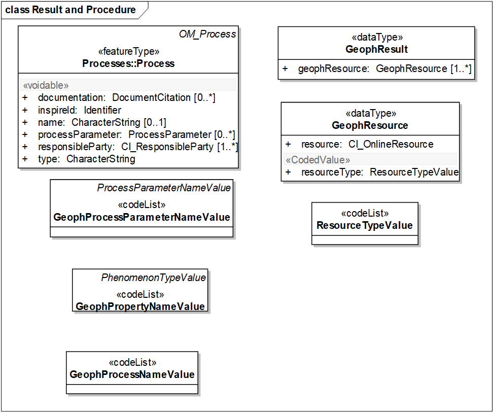
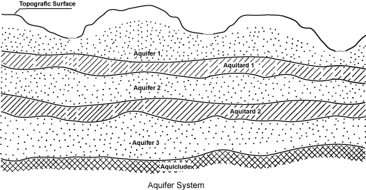

// Admonition icons:
// TG Requirement
:important-caption: 📕
// TG Recommendation
:tip-caption: 📒
// Conformance class
:note-caption: 📘

// TOC placement using macro (manual)
:toc: macro

// Empty TOC title (the title is in the document)
:toc-title:

// TOC level depth
:toclevels: 3

// Section numbering level depth
:sectnumlevels: 8

// Line Break Doc Title
:hardbreaks-option:

:appendix-caption: Annex

// Document properties
:title: D2.8.II.4 Data Specification on Geology – Technical Guidelines
:revdate: 2023-07-31
:keywords: INSPIRE Data Specification for the spatial data theme Geology
:producer: INSPIRE Maintenance and Implementation Group (MIG)
:description: This document describes the INSPIRE Data Specification for the spatial data theme Geology
:author: Temporary MIWP 2021-2024 sub-group 2.3.1
:copyright: Public
:revremark: https://github.com/INSPIRE-MIF/technical-guidelines/releases/tag/v2023.2
:lang: en

image::./media/image2.jpeg[image,width=131,height=90, align=center]

image:./media/image3.png[image,width=93,height=93, align=center] **INSPIRE** *Infrastructure for Spatial Information in Europe*

[discrete]
= D2.8.II.4 Data Specification on _Geology_ – Technical Guidelines

[width="100%",cols="17%,83%",]
|===
|*Title* |{doctitle}
|*Creator* |{author}
|*Date of publication* |{revdate}
|*Subject* |{keywords}
|*Publisher* |{producer}
|*Type* |Text
|*Description* |{description}
|*Format* |AsciiDoc
|*Licence* |https://creativecommons.org/licenses/by/4.0[Creative Commons Attribution (cc-by) 4.0]
|*Rights* |{copyright}
|*Identifier* |https://inspire.ec.europa.eu/id/document/tg/ge[D2.8.II.4_v3.1.0]
|*Changelog* |{revremark}
|*Language* |{lang}
|*Relation* |Directive 2007/2/EC of the European Parliament and of the Council of 14 March 2007 establishing an Infrastructure for Spatial Information in the European Community (INSPIRE)
|===

<<<
[discrete]
== Foreword
[discrete]
== How to read the document?

This document describes the _"INSPIRE data specification on Geology – Technical Guidelines"_ version 3.0 as developed by the Thematic Working Group (TWG) _Geology_ using both natural and a conceptual schema language.

The data specification is based on a common templatefootnote:[The common document template is available in the "Framework documents" section of the data specifications web page at http://inspire.jrc.ec.europa.eu/index.cfm/pageid/2] used for all data specifications, which has been harmonised using the experience from the development of the Annex I, II and III data specifications.

This document provides guidelines for the implementation of the provisions laid down in the Implementing Rule for spatial data sets and services of the INSPIRE Directive. It also includes additional requirements and recommendations that, although not included in the Implementing Rule, are relevant to guarantee or to increase data interoperability.

Two executive summaries provide a quick overview of the INSPIRE data specification process in general, and the content of the data specification on _Geology_ in particular. We highly recommend that managers, decision makers, and all those new to the INSPIRE process and/or information modelling should read these executive summaries first.

The UML diagrams (in Chapter 5) offer a rapid way to see the main elements of the specifications and their relationships. The definition of the spatial object types, attributes, and relationships are included in the Feature Catalogue (also in Chapter 5). People having thematic expertise but not familiar with UML can fully understand the content of the data model focusing on the Feature Catalogue. Users might also find the Feature Catalogue especially useful to check if it contains the data necessary for the applications that they run. The technical details are expected to be of prime interest to those organisations that are responsible for implementing INSPIRE within the field of _Geology_, but also to other stakeholders and users of the spatial data infrastructure.

The technical provisions and the underlying concepts are often illustrated by examples. Smaller examples are within the text of the specification, while longer explanatory examples and descriptions of selected use cases are attached in the annexes.

In order to distinguish the INSPIRE spatial data themes from the spatial object types, the INSPIRE spatial data themes are written in _italics._

|===
|The document will be publicly available as a 'non-paper'. It does not represent an official position of the European Commission, and as such cannot be invoked in the context of legal procedures.
|===

*Legal Notice*

Neither the European Commission nor any person acting on behalf of the Commission is responsible for the use which might be made of this publication.

<<<
[discrete]
== Interoperability of Spatial Data Sets and Services – General Executive Summary

The challenges regarding the lack of availability, quality, organisation, accessibility, and sharing of spatial information are common to a large number of policies and activities and are experienced across the various levels of public authority in Europe. In order to solve these problems it is necessary to take measures of coordination between the users and providers of spatial information. The Directive 2007/2/EC of the European Parliament and of the Council adopted on 14 March 2007 aims at establishing an Infrastructure for Spatial Information in the European Community (INSPIRE) for environmental policies, or policies and activities that have an impact on the environment.

INSPIRE is based on the infrastructures for spatial information that are created and maintained by the Member States. To support the establishment of a European infrastructure, Implementing Rules addressing the following components of the infrastructure have been specified: metadata, interoperability of spatial data sets (as described in Annexes I, II, III of the Directive) and spatial data services, network services, data and service sharing, and monitoring and reporting procedures.

INSPIRE does not require collection of new data. However, after the period specified in the Directivefootnote:[For all 34 Annex I,II and III data themes: within two years of the adoption of the corresponding Implementing Rules for newly collected and extensively restructured data and within 5 years for other data in electronic format still in use] Member States have to make their data available according to the Implementing Rules.

Interoperability in INSPIRE means the possibility to combine spatial data and services from different sources across the European Community in a consistent way without involving specific efforts of humans or machines. It is important to note that "interoperability" is understood as providing access to spatial data sets through network services, typically via Internet. Interoperability may be achieved by either changing (harmonising) and storing existing data sets or transforming them via services for publication in the INSPIRE infrastructure. It is expected that users will spend less time and efforts on understanding and integrating data when they build their applications based on data delivered in accordance with INSPIRE.

In order to benefit from the endeavours of international standardisation bodies and organisations established under international law their standards and technical means have been utilised and referenced, whenever possible.

To facilitate the implementation of INSPIRE, it is important that all stakeholders have the opportunity to participate in specification and development. For this reason, the Commission has put in place a consensus building process involving data users, and providers together with representatives of industry, research and government. These stakeholders, organised through Spatial Data Interest Communities (SDIC) and Legally Mandated Organisations (LMO)footnote:[The current status of registered SDICs/LMOs is available via INSPIRE website: http://inspire.jrc.ec.europa.eu/index.cfm/pageid/42], have provided reference materials, participated in the user requirement and technicalfootnote:[Surveys on unique identifiers and usage of the elements of the spatial and temporal schema,] surveys, proposed experts for the Data Specification Drafting Teamfootnote:[The Data Specification Drafting Team has been composed of experts from Austria, Belgium, Czech Republic, France, Germany, Greece, Italy, Netherlands, Norway, Poland, Switzerland, UK, and the European Environment Agency], the Thematic Working Groupsfootnote:[The Thematic Working Groups have been composed of experts from Austria, Australia, Belgium, Bulgaria, Czech Republic, Denmark, Finland, France, Germany, Hungary, Ireland, Italy, Latvia, Netherlands, Norway, Poland, Romania, Slovakia, Spain, Slovenia, Sweden, Switzerland, Turkey, UK, the European Environment Agency and the European Commission.] and other ad-hoc cross-thematic technical groups and participated in the public stakeholder consultations on draft versions of the data specifications. These consultations covered expert reviews as well as feasibility and fitness-for-purpose testing of the data specificationsfootnote:[For Annex IIIII, the consultation and testing phase lasted from 20 June to 21 October 2011.].

This open and participatory approach was successfully used during the development of the data specifications on Annex I, II and III data themes as well as during the preparation of the Implementing Rule on Interoperability of Spatial Data Sets and Servicesfootnote:[Commission Regulation (EU) No 1089/2010 http://eur-lex.europa.eu/JOHtml.do?uri=OJ:L:2010:323:SOM:EN:HTML[implementing Directive 2007/2/EC of the European Parliament and of the Council as regards interoperability of spatial data sets and services,] published in the Official Journal of the European Union on 8^th^ of December 2010.] for Annex I spatial data themes and of its amendment regarding the themes of Annex II and III.

The development framework elaborated by the Data Specification Drafting Team aims at keeping the data specifications of the different themes coherent. It summarises the methodology to be used for the development of the data specifications, providing a coherent set of requirements and recommendations to achieve interoperability. The pillars of the framework are the following technical documentsfootnote:[The framework documents are available in the "Framework documents" section of the data specifications web page at http://inspire.jrc.ec.europa.eu/index.cfm/pageid/2]:

* The _Definition of Annex Themes and Scope_ describes in greater detail the spatial data themes defined in the Directive, and thus provides a sound starting point for the thematic aspects of the data specification development.
* The _Generic Conceptual Model_ defines the elements necessary for interoperability and data harmonisation including cross-theme issues. It specifies requirements and recommendations with regard to data specification elements of common use, like the spatial and temporal schema, unique identifier management, object referencing, some common code lists, etc. Those requirements of the Generic Conceptual Model that are directly implementable are included in the Implementing Rule on Interoperability of Spatial Data Sets and Services.
* The _Methodology for the Development of Data Specifications_ defines a repeatable methodology. It describes how to arrive from user requirements to a data specification through a number of steps including use-case development, initial specification development and analysis of analogies and gaps for further specification refinement.
* The _Guidelines for the Encoding of Spatial Data_ defines how geographic information can be encoded to enable transfer processes between the systems of the data providers in the Member States. Even though it does not specify a mandatory encoding rule it sets GML (ISO 19136) as the default encoding for INSPIRE.
* The _Guidelines for the use of Observations & Measurements and Sensor Web Enablement-related standards in INSPIRE Annex II and III data specification development_ provides guidelines on how the "Observations and Measurements" standard (ISO 19156) is to be used within INSPIRE.
* The _Common data models_ are a set of documents that specify data models that are referenced by a number of different data specifications. These documents include generic data models for networks, coverages and activity complexes.

The structure of the data specifications is based on the "ISO 19131 Geographic information - Data product specifications" standard. They include the technical documentation of the application schema, the spatial object types with their properties, and other specifics of the spatial data themes using natural language as well as a formal conceptual schema languagefootnote:[UML – Unified Modelling Language].

A consolidated model repository, feature concept dictionary, and glossary are being maintained to support the consistent specification development and potential further reuse of specification elements. The consolidated model consists of the harmonised models of the relevant standards from the ISO 19100 series, the INSPIRE Generic Conceptual Model, and the application schemasfootnote:[Conceptual models related to specific areas (e.g. INSPIRE themes)] developed for each spatial data theme. The multilingual INSPIRE Feature Concept Dictionary contains the definition and description of the INSPIRE themes together with the definition of the spatial object types present in the specification. The INSPIRE Glossary defines all the terms (beyond the spatial object types) necessary for understanding the INSPIRE documentation including the terminology of other components (metadata, network services, data sharing, and monitoring).

By listing a number of requirements and making the necessary recommendations, the data specifications enable full system interoperability across the Member States, within the scope of the application areas targeted by the Directive. The data specifications (in their version 3.0) are published as technical guidelines and provide the basis for the content of the Implementing Rule on Interoperability of Spatial Data Sets and Servicesfootnote:[In the case of the Annex IIIII data specifications, the extracted requirements are used to formulate an amendment to the existing Implementing Rule.]. The content of the Implementing Rule is extracted from the data specifications, considering short- and medium-term feasibility as well as cost-benefit considerations. The requirements included in the Implementing Rule are legally binding for the Member States according to the timeline specified in the INSPIRE Directive.

In addition to providing a basis for the interoperability of spatial data in INSPIRE, the data specification development framework and the thematic data specifications can be reused in other environments at local, regional, national and global level contributing to improvements in the coherence and interoperability of data in spatial data infrastructures.

<<<
[discrete]
== Geology – Executive Summary

In the INSPIRE context _Geology_ could be seen as a "reference data theme" as it provides information for several themes of Annex III: Mineral resources, Natural Risk Zones, Soil, Energy resources, and it has a specific relationship with one of the most important natural resources, water, through groundwater bodies contained in aquifers. Geomorphology describes the Earth's present-day surface, and the processes creating its geometry.

*The use of geological data*

Geological data are used in various domains requiring knowledge of the surface and underground geological environment: detecting geo-hazards; ensuring the safe disposal of wastes, nuclear wastes, carbon capture and storage; ensuring the safe construction of buildings; providing information for environmental planning; providing information for natural resources exploration; vulnerability of the underground to contamination; providing indicators for climatic change; providing construction material and minerals. For groundwater and aquifers uses are: water supply (water abstraction); groundwater resources (water availability); providing base flow for rivers, wetlands; protecting ecosystems dependent on groundwater; groundwater quality and quantity assessment; transboundary groundwater management.

*How geoscientists could provide this useful information?*

Geological information provides basic knowledge about the physical properties and composition of the geologic materials (rocks and sediments) outcropping at the land's surface and forming the underground, and about their structure and their age. It also provides knowledge about aquifers, i.e. subsurface units of rocks or sediments of sufficient porosity and permeability to allow either a significant flow of groundwater or the abstraction of significant quantities of groundwater. Knowledge about landforms is also provided.

The main product delivered by geologists for the users is a *geological map* which is the result of an *interpretation* of the observations and measurements made on rocks and sediments, on and under the surface. Because the rocks forming the subsurface are visible or accessible only on very small parts of the surface, the outcrops, geologists have to interpret these observations and measurements to group rocks in geologic units, and to connect other information observed locally to identify the general geological structure.

*Boreholes* are another important source of information for interpreting the subsurface geology. These can provide a stratigraphic and lithological log, analogous to a vertical geological map, and can also be used to gather samples and make measurements of various properties at depth.

All this information is interpreted to make geological maps. The *landforms* (geomorphologic features) are often indicated on general geological maps, and are detailed on specific, applied geomorphological maps.

*Hydrogeological information*

*Hydrogeology* describes the flow, occurrence, and behavior of water in the underground environment. It is a science located between hydrology and geology, and both have a strong influence on the understanding of groundwater flow and solute transport. Hydrological processes are responsible, for example, for the characterization and understanding of water supply derived from recharge of aquifers. On the other hand the physical properties and composition of the geologic materials (rocks and sediments) create the main environment for groundwater flow and storage. Rocks and sediments also influence groundwater quality in terms of their chemical composition.

The INSPIRE groundwater model describes two basic elements: the rock system (including aquifers, dependent on the geological condition) and the groundwater system (including groundwater bodies), completed by hydrogeological objects (such as water wells). See annex C for a detailed description of this domain.

*Geophysical information*

Since geophysics provides valuable information on the physical properties of rocks (like density, porosity, magnetic susceptibility, etc.), regardless of their organization as geologic units, geophysics is part of the INSPIRE Geological data specifications. Geophysical boundaries may or may not coincide with geological boundaries, depending on the changes of physical properties within and outside the geological units. Geophysics provides extra - quite often the only - information on the organization of the units in the subsurface. These results are processed by geophysicists in order to deliver the 1D, 2D, 3D or even 4D spatial distribution of the property. The spatial property distributions are then interpreted by geologists to build geological models of the subsurface, for instance to detect hydrocarbon bearing structures or zones of mineral resources.

Which geological data to provide through INSPIRE?

Based on the analysis of the potential types of users and identification of use cases the TWG developed a core data model. It is based on the complex GeoSciML data model, developed by the international geosciences community, in particular Geological Survey Organisations (_http://www.geosciml.org/_).

The core data model contains the main types of GeologicFeatures (GeologicUnits, GeologicStructures, and GeomorphologicFeatures). The geometry of these features is described in MappedFeatures and can be included in geological maps and profiles in the form of points, lines and polygons. The data model also enables a description of the lithological/stratigraphical characteristics of borehole logs, thematic maps, geophysical surveys and measurements, and features related to hydrogeology (aquifers and groundwater bodies).

Basic geological knowledge and applied maps

As mentioned above, _Geology_ is used by other thematic domains which are interested only in specific properties of the underground (to prevent landslides, to insure safe disposal of wastes etc). Geological surveys provide the basic knowledge about the Earth, but this basic information must then be processed by experts to transform it into the specific maps (named applied maps) required by thematic users. As very often the needs of thematic users concern a local area, the basic knowledge must be supplemented by new data related to specific properties (for example the porosity of the local rocks is needed in an assessment of a landslide).

*The INSPIRE Geology model provides elements to* build applied maps but does not describe these applied features.

<<<
[discrete]
== Acknowledgements

Many individuals and organisations have contributed to the development of these Guidelines.

The Thematic Working Group Geology and Mineral Resources (TWG-GE-MR) included:

Jean-Jacques Serrano (TWG Facilitator), John Laxton (TWG Editor), Kristine Ash, Xavier Berástegui Batalla, Stefan Bergman, Daniel Cassard, Bjørn Follestad, Andrew Hughes, Uffe Larsen, Tomasz Nałęcz, Simon Pen, László Sőrés, Jouni Vuollo, Robert Tomas (European Commission Contact Point).

Also contributed:

Invited external experts for hydrogeology: Bernhard Wagner, Janusz Michalak,

Invited external expert for geoscience interoperability: Francois Robida.

For the final version of the document: Chris Schubert

Other contributors to the INSPIRE data specifications are the Drafting Team Data Specifications, the JRC Data Specifications Team and the INSPIRE stakeholders - Spatial Data Interested Communities (SDICs) and Legally Mandated Organisations (LMOs).

*Contact information*

Maria Vanda Nunes de Lima & Michael Lutz
European Commission Joint Research Centre (JRC)
Institute for Environment and Sustainability
Unit H06: Digital Earth and Reference Data
_http://inspire.ec.europa.eu/index.cfm/pageid/2_

<<<
[discrete]
= Table of Contents
toc::[]

:sectnums:
<<<
== Scope

This document specifies a harmonised data specification for the spatial data theme _Geology_ as defined in Annex II of the INSPIRE Directive.

This data specification provides the basis for the drafting of Implementing Rules according to Article 7 (1) of the INSPIRE Directive [Directive 2007/2/EC]. The entire data specification is published as implementation guidelines accompanying these Implementing Rules.

<<<
== Overview

=== Name

INSPIRE data specification for the theme _Geology_.

=== Informal description

*Definition:*

_Geology_ characterised according to composition and structure. Includes bedrock, aquifers and geomorphology [Directive 2007/2/EC].

*Description*

From the definition, we detail each word. *Geology* is the study of the past and present aspects of the Earth, including its history and life on Earth.

The *composition* of an earth material describes what it consists of (its components), both the weight percentage of elements or molecules (chemical composition), and the species and number of particles, e.g. minerals (mineralogical composition), clasts and fossils.

The *structure* of an earth material describes the physical arrangements of its components. A geologic structure is a configuration of matter in the Earth based on describable inhomogeneity, pattern, or fracture in an earth material.

The composition and structure of earth materials

* are reflected by their physical properties (e.g. density, porosity, and mechanical, magnetic, electrical, seismic and hydraulic properties)
* influence geological processes (genesis, fracturing, alteration)
* control the properties of aquifers
* control the morphology of the landscape
* control their use as a natural resources
* determine their behavior during natural and industrial processes

The *bedrock* is a general term for the rock, usually solid, that underlies soil or other unconsolidated, superficial material.

*Aquifer* is a wet underground layer of water-bearing permeable rock or unconsolidated materials (gravel, sand, silt, or clay) from which groundwater can be usefully extracted using a water well.

*Groundwater* is all water which is below the surface of the ground in the saturation zone and in direct contact with the ground or subsoil. This zone is commonly referred to as an aquifer.

*Groundwater body* is a distinct volume of groundwater within an aquifer. Generally the groundwater body is not exactly correlated with the main (deeper) groundwater aquifers because it was based on the surface water basins. This means that an aquifer is not always equivalent to a groundwater body (GWB) (the methodology differs in different member states).

*Geomorphology* provides basic knowledge about the present shape of the sub-aerial and submerged parts of the Earth surface and its dynamics (genesis and involved processes).

The analysis of reference material and examples of use, briefly described in the Executive Summary, shows the wide range of uses with various sets of rock properties required for different uses: a geologist in charge of mineral prospecting, or mining waste protection, does not request the same information about rocks as an engineer dealing with natural hazards who is more interested in underground stability.

This data specification defines three application schemas: Geology, Hydrogeology, and Geophysics to provide the basic geological, hydrogeological and geophysical knowledge on an area, with agreed sets of attributes. To demonstrate the extensibility and also to cover more specific geological and geophysical requirements two extension application schemas for _Geology_ and Geophysics where defined (see Annex D).

*The Geological data model contains:*

* Geologic Features with Geologic Events, Geologic Units, Geologic Structures, and Geomorphologic Features. The geometry of these features is described in Mapped Features, and is included in geological maps and profiles in the form of points, lines and polygons. Mapped Features and Boreholes can be bundled in Collections,
* Thematic Class for reclassifying GeologicFeatures as some thematic class for thematic maps,
* The lithology of rock units,
* The processes of Geologic Events and their environments and ages
* The types of Shear Displacement Structures and Folds
* Borehole details, such as location and purpose.

*The Geophysics data model* provides essential information on the physical properties of geological structures. The data model includes:

* High rank geophysical stations that are part of international and national observation networks
* Important types of geophysical measurements that are most often requested or provided by stakeholders
* Measurements that have basic role in improving geological knowledge, especially in environmental and engineering context.
* Measurement campaigns that include any number of measurements and allow data providers to deliver metadata in a collective manner.

*The Hydrogeological data model* contains:

* The Aquifer System comprising HydrogeologicUnits, Aquifers, Aquitards, Aquicludes and the AquiferSystem,
* The Groundwater System comprising GroundWaterBody, and its relationships to the Aquifer System, Hydrogeology Objects, and WFD_GroundWaterBody
* Hydrogeology Objects, both natural and man-made, including Wells

*Extensibility of the INSPIRE geology models:*

* For geology: the possibility of using GeoSciML v 3.2 for a wide range of geoscientific information is discussed in the Annex D,
* For geophysics: guidance and examples are included to demonstrate the usage of the Observations & Measurements schema in delivering measurement and processing results.

*Definition:*

_Geology_ characterised according to composition and structure. Includes bedrock, aquifers and geomorphology [Directive 2007/2/EC].

*Description:*

In the INSPIRE context the _Geology_ data theme can be seen as a "reference data theme" as it provides information for several other INSPIRE data themes e.g. Mineral resources; Area Management, Restriction and Regulation Zones; Natural Risk Zones; Soil; Energy resources. In _Geology_ there is a specific relationship with one of the most important natural resources, water, through groundwater bodies contained in aquifers. The theme also covers geomorphology that describes the Earth's present-day surface, and the location of the geophysical campaigns and measurements that provide valuable information on the physical properties of rocks (like density, porosity, magnetic susceptibility, etc.) regardless of their organization as geologic units.

The INSPIRE _Geology_ Theme is split into the following sub-themes:

• Geology: provides basic knowledge about the physical properties and composition of geologic materials (rocks and sediments), their structure and their age as depicted in geological maps, as well as landforms (geomorphological features). The model also covers boreholes - another important source of information for interpreting the subsurface geology.

• Hydrogeology: describes the flow, occurrence, and behaviour of water in the subsurface environment. The two basic elements are the rock system (including aquifers) and the groundwater system (including groundwater bodies). Man-made or natural hydrogeological objects/features (such as groundwater wells and natural springs) are also included.

• Geophysics: focuses on the availability and location of key geophysical features. It includes metadata on high rank gravity, magnetic and seismological stations that are part of international and national observation networks as well as metadata on 2D and 3D seismic measurements that are most often requested by third party users. It also provides collective metadata on gravity, magnetic and airborne geophysical campaigns that cover large areas and provide basic geological information for scientific research and more detailed applied studies e.g. exploring earth resources (hydrocarbons, mineral deposits, ground water, geothermal energy...).

Entry in the INSPIRE registry: _http://inspire.ec.europa.eu/theme/ge/_

=== Normative References

[Directive 2007/2/EC] Directive 2007/2/EC of the European Parliament and of the Council of 14 March 2007 establishing an Infrastructure for Spatial Information in the European Community (INSPIRE)

[ISO 19105] EN ISO 19105:2000, Geographic information -- Conformance and testing

[ISO 19105] EN ISO 19105:2000, Geographic information -- Conformance and testing

[ISO 19107] EN ISO 19107:2005, Geographic Information – Spatial Schema

[ISO 19108] EN ISO 19108:2005, Geographic Information – Temporal Schema

[ISO 19108-c] ISO 19108:2002/Cor 1:2006, Geographic Information – Temporal Schema, Technical Corrigendum 1

[ISO 19111] EN ISO 19111:2007 Geographic information - Spatial referencing by coordinates (ISO 19111:2007)

[ISO 19113] EN ISO 19113:2005, Geographic Information – Quality principles

[ISO 19115] EN ISO 19115:2005, Geographic information – Metadata (ISO 19115:2003)

[ISO 19118] EN ISO 19118:2006, Geographic information – Encoding (ISO 19118:2005)

[ISO 19123] EN ISO 19123:2007, Geographic Information – Schema for coverage geometry and functions

[ISO 19125-1] EN ISO 19125-1:2004, Geographic Information – Simple feature access – Part 1: Common architecture

[ISO 19135] EN ISO 19135:2007 Geographic information – Procedures for item registration (ISO 19135:2005)

[ISO 19138] ISO/TS 19138:2006, Geographic Information – Data quality measures

[ISO 19139] ISO/TS 19139:2007, Geographic information – Metadata – XML schema implementation

[ISO 19157] ISO/DIS 19157, Geographic information – Data quality

[OGC 06-103r4] Implementation Specification for Geographic Information - Simple feature access – Part 1: Common Architecture v1.2.1

NOTE This is an updated version of "EN ISO 19125-1:2004, Geographic information – Simple feature access – Part 1: Common architecture".

[Regulation 1205/2008/EC] Regulation 1205/2008/EC implementing Directive 2007/2/EC of the European Parliament and of the Council as regards metadata

[Regulation 976/2009/EC] Commission Regulation (EC) No 976/2009 of 19 October 2009 implementing Directive 2007/2/EC of the European Parliament and of the Council as regards the Network Services

[Regulation 1089/2010/EC] Commission Regulation (EU) No 1089/2010 of 23 November 2010 implementing Directive 2007/2/EC of the European Parliament and of the Council as regards interoperability of spatial data sets and services

[Regulation 2000/60/EC] DIRECTIVE 2000/60/EC OF THE EUROPEAN PARLIAMENT AND OF THE COUNCIL of 23 October 2000 establishing a framework for Community action in the field of water policy

[Regulation 2006/118/EC] DIRECTIVE 2006/118/EC OF THE EUROPEAN PARLIAMENT AND OF THE COUNCIL of 12 December 2006 on the protection of groundwater against pollution and deterioration

=== Terms and definitions

General terms and definitions helpful for understanding the INSPIRE data specification documents are defined in the INSPIRE Glossaryfootnote:[The INSPIRE Glossary is available from http://inspire-registry.jrc.ec.europa.eu/registers/GLOSSARY].

Specifically, for the theme _Geology_, the following terms are defined:

*(1) GeologicFeature*

The abstract GeologicFeature class represents a conceptual feature that is hypothesized to exist coherently in the world. This corresponds with a "legend item" from a traditional geologic map * while the bounding coordinates of a Geologic Feature may be described, its shape is not. The implemented Geologic Feature instance acts as the "description package"

*(2) MappedFeature*

A spatial representation of a GeologicFeature. A MappedFeature is part of a geological interpretation.

It provides a link between a notional feature (description package) and one spatial representation of it, or part of it (exposures, surface traces and intercepts, etc) which forms the specific bounded occurrence, such as an outcrop or map polygon.

*(3) Geologic Unit*

A volume of rock with distinct characteristics. Includes both formal units (i.e. formally adopted and named in an official lexicon) and informal units (i.e. named but not promoted to the lexicon) and unnamed units (i.e. recognisable and described and delineable in the field but not otherwise formalised). Spatial properties are only available through association with a MappedFeature.

*(4) Geologic Structure*

Geologic Structure, in the INSPIRE context, considers shear displacement structures (including faults) and folds. A shear displacement structure is defined as a brittle to ductile style structure along which displacement has occurred. A fold is defined as one or more systematically curved layers, surfaces, or lines in a rock body.

*(5) Hydrogeologic Unit*

A Hydrogeologic Unit is a volume of rock that by virtue of its porosity or permeability has a distinct influence on the storage or movement of groundwater.

*(6) Aquifer*

A wet underground layer of water-bearing permeable rock or unconsolidated materials (gravel, sand, silt, or clay) from which groundwater can be usefully extracted using a water well.

*(7) Groundwater Body*

A distinct volume of groundwater within an aquifer or system of aquifers, which is hydraulically isolated from nearby groundwater bodies.

*(8) Geophysical Station*

Geophysical measurement spatially referenced to a single point location.

*(9) Geophysical Profile*

Geophysical measurement spatially referenced to a curve.

*(10) Geophysical Swath*

Geophysical measurement spatially referenced to a surface.

*(11) Campaign*

Geophysical activity extending over a limited time range and limited area for producing similar geophysical measurements, processing results or models.

=== Symbols and abbreviations

*Error! Not a valid link.*

=== How the Technical Guidelines map to the Implementing Rules

The schematic diagram in Figure 1 gives an overview of the relationships between the INSPIRE legal acts (the INSPIRE Directive and Implementing Rules) and the INSPIRE Technical Guidelines. The INSPIRE Directive and Implementing Rules include legally binding requirements that describe, usually on an abstract level, _what_ Member States must implement.

In contrast, the Technical Guidelines define _how_ Member States might implement the requirements included in the INSPIRE Implementing Rules. As such, they may include non-binding technical requirements that must be satisfied if a Member State data provider chooses to conform to the Technical Guidelines. Implementing these Technical Guidelines will maximise the interoperability of INSPIRE spatial data sets.

image::./media/image4.png[image,width=603,height=375, align=center]

[.text-center]
*Figure 1 - Relationship between INSPIRE Implementing Rules and Technical Guidelines*

==== Requirements

The purpose of these Technical Guidelines (Data specifications on _Geology_) is to provide practical guidance for implementation that is guided by, and satisfies, the (legally binding) requirements included for the spatial data theme _Geology_ in the Regulation (Implementing Rules) on interoperability of spatial data sets and services. These requirements are highlighted in this document as follows:

[IMPORTANT]
====
[.text-center]
*IR Requirement*
_Article / Annex / Section no._
*Title / Heading*

This style is used for requirements contained in the Implementing Rules on interoperability of spatial data sets and services (Commission Regulation (EU) No 1089/2010).
====

For each of these IR requirements, these Technical Guidelines contain additional explanations and examples.

NOTE The Abstract Test Suite (ATS) in Annex A contains conformance tests that directly check conformance with these IR requirements.

Furthermore, these Technical Guidelines may propose a specific technical implementation for satisfying an IR requirement. In such cases, these Technical Guidelines may contain additional technical requirements that need to be met in order to be conformant with the corresponding IR requirement _when using this proposed implementation_. These technical requirements are highlighted as follows:

[TIP]
====
*TG Requirement X* 

This style is used for requirements for a specific technical solution proposed in these Technical Guidelines for an IR requirement.
====

NOTE 1 Conformance of a data set with the TG requirement(s) included in the ATS implies conformance with the corresponding IR requirement(s).

NOTE 2 In addition to the requirements included in the Implementing Rules on interoperability of spatial data sets and services, the INSPIRE Directive includes further legally binding obligations that put additional requirements on data providers. For example, Art. 10(2) requires that Member States shall, where appropriate, decide by mutual consent on the depiction and position of geographical features whose location spans the frontier between two or more Member States. General guidance for how to meet these obligations is provided in the INSPIRE framework documents.

==== Recommendations

In addition to IR and TG requirements, these Technical Guidelines may also include a number of recommendations for facilitating implementation or for further and coherent development of an interoperable infrastructure.

[NOTE]
====
*Recommendation X* 

Recommendations are shown using this style.
====

NOTE The implementation of recommendations is not mandatory. Compliance with these Technical Guidelines or the legal obligation does not depend on the fulfilment of the recommendations.

==== Conformance

Annex A includes the abstract test suite for checking conformance with the requirements included in these Technical Guidelines and the corresponding parts of the Implementing Rules (Commission Regulation (EU) No 1089/2010).

<<<
== Specification scopes

This data specification does not distinguish different specification scopes, but just considers one general scope.

NOTE For more information on specification scopes, see [ISO 19131:2007], clause 8 and Annex D.

<<<
== Identification information

These Technical Guidelines are identified by the following URI:

http://inspire.ec.europa.eu/tg/ge/3.0

NOTE ISO 19131 suggests further identification information to be included in this section, e.g. the title, abstract or spatial representation type. The proposed items are already described in the document metadata, executive summary, overview description (section 2) and descriptions of the application schemas (section 5). In order to avoid redundancy, they are not repeated here.

<<<
== Data content and structure

=== Application schemas – Overview 

==== Application schemas included in the IRs

Articles 3, 4 and 5 of the Implementing Rules lay down the requirements for the content and structure of the data sets related to the INSPIRE Annex themes.

[IMPORTANT]
====
[.text-center]
*IR Requirement*
_Article 4_
*Types for the Exchange and Classification of Spatial Objects*

. For the exchange and classification of spatial objects from data sets meeting the conditions laid down in Article 4 of Directive 2007/2/EC, Member States shall use the spatial object types and associated data types, enumerations and code lists that are defined in Annexes II, III and IV for the themes the data sets relate to.

. Spatial object types and data types shall comply with the definitions and constraints and include the attributes and association roles set out in the Annexes.

. The enumerations and code lists used in attributes or association roles of spatial object types or data types shall comply with the definitions and include the values set out in Annex II. The enumeration and code list values are uniquely identified by language-neutral mnemonic codes for computers. The values may also include a language-specific name to be used for human interaction.

====

The types to be used for the exchange and classification of spatial objects from data sets related to the spatial data theme Geology are defined in the following application schemas (see sections 5.3, 5.4, 5.5):

* Geology application schema
* Hydrogeology application schema
* Geophysics application schema

All 3 application schemas provide basic geological, hydrogeological and geophysical knowledge on an area, with an agreed set of attributes.

The application schemas specify requirements on the properties of each spatial object including its multiplicity, domain of valid values, constraints, etc.

NOTE The application schemas presented in this section contain some additional information that is not included in the Implementing Rules, in particular multiplicities of attributes and association roles.

[TIP]
====
*TG Requirement 1*

Spatial object types and data types shall comply with the multiplicities defined for the attributes and association roles in this section.

====

An application schema may include references (e.g. in attributes or inheritance relationships) to common types or types defined in other spatial data themes. These types can be found in a sub-section called "Imported Types" at the end of each application schema section. The common types referred to from application schemas included in the IRs are addressed in Article 3.

[IMPORTANT]
====
[.text-center]
*IR Requirement*
_Article 3_
*Common Types*

Types that are common to several of the themes listed in Annexes I, II and III to Directive 2007/2/EC shall conform to the definitions and constraints and include the attributes and association roles set out in Annex I.

====

NOTE Since the IRs contain the types for all INSPIRE spatial data themes in one document, Article 3 does not explicitly refer to types defined in other spatial data themes, but only to types defined in external data models.

Common types are described in detail in the Generic Conceptual Model [DS-D2.7], in the relevant international standards (e.g. of the ISO 19100 series) or in the documents on the common INSPIRE models [DS-D2.10.x]. For detailed descriptions of types defined in other spatial data themes, see the corresponding Data Specification TG document [DS-D2.8.x].

==== Additional recommended application schemas 

In addition to the application schemas listed above, the following additional application schema have been defined for the theme _Geology_ (see Annex D):

* Geophysics extension application schema to share e.g. geophysical observation results in a harmonised way using ISO 19156 (O&M) Standard.

These additional application schemas are not included in the IRs. They typically address requirements from specific (groups of) use cases and/or may be used to provide additional information. They are included in this specification in order to improve interoperability also for these additional aspects and to illustrate the extensibility of the application schemas included in the IRs.

[NOTE]
====
*Recomendation 1*

Additional and/or use case-specific information related to the theme _Geology_ should be made available using the spatial object types and data types specified in the following application schema: - *Geophysics extension*

These spatial object types and data types should comply with the definitions and constraints and include the attributes and association roles defined in the Annex D.

The enumerations and code lists used in attributes or association roles of spatial object types or data types should comply with the definitions and include the values defined in the Annex D.

====

=== Basic notions

This section explains some of the basic notions used in the INSPIRE application schemas. These explanations are based on the GCM [DS-D2.5].

==== Notation

===== Unified Modeling Language (UML)

The application schemas included in this section are specified in UML, version 2.1. The spatial object types, their properties and associated types are shown in UML class diagrams.

NOTE For an overview of the UML notation, see Annex D in [ISO 19103].

The use of a common conceptual schema language (i.e. UML) allows for an automated processing of application schemas and the encoding, querying and updating of data based on the application schema – across different themes and different levels of detail.

The following important rules related to class inheritance and abstract classes are included in the IRs.

[IMPORTANT]
====
[.text-center]
*IR Requirement*
_Article 5_
*Types*

(...)

[arabic, start=2]
. Types that are a sub-type of another type shall also include all this type's attributes and association roles.

. Abstract types shall not be instantiated.

====

The use of UML conforms to ISO 19109 8.3 and ISO/TS 19103 with the exception that UML 2.1 instead of ISO/IEC 19501 is being used. The use of UML also conforms to ISO 19136 E.2.1.1.1-E.2.1.1.4.

NOTE ISO/TS 19103 and ISO 19109 specify a profile of UML to be used in conjunction with the ISO 19100 series. This includes in particular a list of stereotypes and basic types to be used in application schemas. ISO 19136 specifies a more restricted UML profile that allows for a direct encoding in XML Schema for data transfer purposes.

To model constraints on the spatial object types and their properties, in particular to express data/data set consistency rules, OCL (Object Constraint Language) is used as described in ISO/TS 19103, whenever possible. In addition, all constraints are described in the feature catalogue in English, too.

NOTE Since "void" is not a concept supported by OCL, OCL constraints cannot include expressions to test whether a value is a _void_ value. Such constraints may only be expressed in natural language.

===== Stereotypes

In the application schemas in this section several stereotypes are used that have been defined as part of a UML profile for use in INSPIRE [DS-D2.5]. These are explained in Table 1 below.

[.text-center]
*Table 1 – Stereotypes (adapted from [DS-D2.5])*

[cols=",,",options="header"]
|===
|*Stereotype* |*Model element* |*Description*
|applicationSchema |Package |An INSPIRE application schema according to ISO 19109 and the Generic Conceptual Model.
|leaf |Package |A package that is not an application schema and contains no packages.
|featureType |Class |A spatial object type.
|type |Class |A type that is not directly instantiable, but is used as an abstract collection of operation, attribute and relation signatures. This stereotype should usually not be used in INSPIRE application schemas as these are on a different conceptual level than classifiers with this stereotype.
|dataType |Class |A structured data type without identity.
|union |Class |A structured data type without identity where exactly one of the properties of the type is present in any instance.
|enumeration |Class |An enumeration.
|codeList |Class |A code list.
|import |Dependency |The model elements of the supplier package are imported.
|voidable |Attribute, association role |A voidable attribute or association role (see section 5.2.2).
|lifeCycleInfo |Attribute, association role |If in an application schema a property is considered to be part of the life-cycle information of a spatial object type, the property shall receive this stereotype.
|version |Association role |If in an application schema an association role ends at a spatial object type, this stereotype denotes that the value of the property is meant to be a specific version of the spatial object, not the spatial object in general.
|===

==== Voidable characteristics

The «voidable» stereotype is used to characterise those properties of a spatial object that may not be present in some spatial data sets, even though they may be present or applicable in the real world. This does _not_ mean that it is optional to provide a value for those properties.

For all properties defined for a spatial object, a value has to be provided – either the corresponding value (if available in the data set maintained by the data provider) or the value of _void._ A _void_ value shall imply that no corresponding value is contained in the source spatial data set maintained by the data provider or no corresponding value can be derived from existing values at reasonable costs.

[NOTE]
====
*Recomendation 2*

The reason for a _void_ value should be provided where possible using a listed value from the VoidReasonValue code list to indicate the reason for the missing value.

====

The VoidReasonValue type is a code list, which includes the following pre-defined values:

* _Unpopulated_: The property is not part of the dataset maintained by the data provider. However, the characteristic may exist in the real world. For example when the "elevation of the water body above the sea level" has not been included in a dataset containing lake spatial objects, then the reason for a void value of this property would be 'Unpopulated'. The property receives this value for all spatial objects in the spatial data set.
* _Unknown_: The correct value for the specific spatial object is not known to, and not computable by the data provider. However, a correct value may exist. For example when the "elevation of the water body above the sea level" _of a certain lake_ has not been measured, then the reason for a void value of this property would be 'Unknown'. This value is applied only to those spatial objects where the property in question is not known.
* _Withheld_: The characteristic may exist, but is confidential and not divulged by the data provider.

NOTE It is possible that additional reasons will be identified in the future, in particular to support reasons / special values in coverage ranges.

The «voidable» stereotype does not give any information on whether or not a characteristic exists in the real world. This is expressed using the multiplicity:

* If a characteristic may or may not exist in the real world, its minimum cardinality shall be defined as 0. For example, if an Address may or may not have a house number, the multiplicity of the corresponding property shall be 0..1.
* If at least one value for a certain characteristic exists in the real world, the minimum cardinality shall be defined as 1. For example, if an Administrative Unit always has at least one name, the multiplicity of the corresponding property shall be 1..*.

In both cases, the «voidable» stereotype can be applied. In cases where the minimum multiplicity is 0, the absence of a value indicates that it is known that no value exists, whereas a value of void indicates that it is not known whether a value exists or not.

EXAMPLE If an address does not have a house number, the corresponding Address object should not have any value for the «voidable» attribute house number. If the house number is simply not known or not populated in the data set, the Address object should receive a value of _void_ (with the corresponding void reason) for the house number attribute.

==== Enumerations

Enumerations are modelled as classes in the application schemas. Their values are modelled as attributes of the enumeration class using the following modelling style:

* No initial value, but only the attribute name part, is used.
* The attribute name conforms to the rules for attributes names, i.e. is a lowerCamelCase name. Exceptions are words that consist of all uppercase letters (acronyms).

[IMPORTANT]
====
[.text-center]
*IR Requirement*
_Article 6_
*Code Lists and Enumerations*

(...)

[arabic, start=5]
. Attributes or association roles of spatial object types or data types that have an enumeration type may only take values from the lists specified for the enumeration type."

====

==== Code lists

Code lists are modelled as classes in the application schemas. Their values, however, are managed outside of the application schema.

===== Code list types

The IRs distinguish the following types of code lists.

[IMPORTANT]
====
[.text-center]
*IR Requirement*
_Article 6_
*Code Lists and Enumerations*

. Code lists shall be of one of the following types, as specified in the Annexes:
[loweralpha]
.. code lists whose allowed values comprise only the values specified in this Regulation;
.. code lists whose allowed values comprise the values specified in this Regulation and narrower values defined by data providers;
.. code lists whose allowed values comprise the values specified in this Regulation and additional values at any level defined by data providers;
.. code lists, whose allowed values comprise any values defined by data providers.

For the purposes of points (b), (c) and (d), in addition to the allowed values, data providers may use the values specified in the relevant INSPIRE Technical Guidance document available on the INSPIRE web site of the Joint Research Centre.

====

The type of code list is represented in the UML model through the tagged value _extensibility_, which can take the following values:

* _none_, representing code lists whose allowed values comprise only the values specified in the IRs (type a);
* _narrower_, representing code lists whose allowed values comprise the values specified in the IRs and narrower values defined by data providers (type b);
* _open_, representing code lists whose allowed values comprise the values specified in the IRs and additional values at any level defined by data providers (type c); and
* _any_, representing code lists, for which the IRs do not specify any allowed values, i.e. whose allowed values comprise any values defined by data providers (type d).

[NOTE]
====
*Recomendation 3*

Additional values defined by data providers should not replace or redefine any value already specified in the IRs.

====

NOTE This data specification may specify recommended values for some of the code lists of type (b), (c) and (d) (see section 5.2.4.3). These recommended values are specified in a dedicated Annex.

In addition, code lists can be hierarchical, as explained in Article 6(2) of the IRs.

[IMPORTANT]
====
[.text-center]
*IR Requirement*
_Article 6_
*Code Lists and Enumerations*

(...)

[arabic, start=2]
. Code lists may be hierarchical. Values of hierarchical code lists may have a more generic parent value. Where the valid values of a hierarchical code list are specified in a table in this Regulation, the parent values are listed in the last column.

====

The type of code list and whether it is hierarchical or not is also indicated in the feature catalogues.

===== Obligations on data providers

[IMPORTANT]
====
[.text-center]
*IR Requirement*
_Article 6_
*Code Lists and Enumerations*

(....)

[arabic, start=3]
. Where, for an attribute whose type is a code list as referred to in points (b), (c) or (d) of paragraph 1, a data provider provides a value that is not specified in this Regulation, that value and its definition shall be made available in a register.

. Attributes or association roles of spatial object types or data types whose type is a code list may only take values that are allowed according to the specification of the code list.

====

Article 6(4) obliges data providers to use only values that are allowed according to the specification of the code list. The "allowed values according to the specification of the code list" are the values explicitly defined in the IRs plus (in the case of code lists of type (b), (c) and (d)) additional values defined by data providers.

For attributes whose type is a code list of type (b), (c) or (d) data providers may use additional values that are not defined in the IRs. Article 6(3) requires that such additional values and their definition be made available in a register. This enables users of the data to look up the meaning of the additional values used in a data set, and also facilitates the re-use of additional values by other data providers (potentially across Member States).

NOTE Guidelines for setting up registers for additional values and how to register additional values in these registers is still an open discussion point between Member States and the Commission.

===== Recommended code list values

For code lists of type (b), (c) and (d), this data specification may propose additional values as a recommendation (in a dedicated Annex). These values will be included in the INSPIRE code list register. This will facilitate and encourage the usage of the recommended values by data providers since the obligation to make additional values defined by data providers available in a register (see section 5.2.4.2) is already met.

[NOTE]
====
*Recomendation 4*

Where these Technical Guidelines recommend values for a code list in addition to those specified in the IRs, these values should be used.

====

NOTE For some code lists of type (d), no values may be specified in these Technical Guidelines. In these cases, any additional value defined by data providers may be used.

===== Governance

The following two types of code lists are distinguished in INSPIRE:

* _Code lists that are governed by INSPIRE (INSPIRE-governed code lists)._ These code lists will be managed centrally in the INSPIRE code list register. Change requests to these code lists (e.g. to add, deprecate or supersede values) are processed and decided upon using the INSPIRE code list register's maintenance workflows.

INSPIRE-governed code lists will be made available in the INSPIRE code list register at __http://inspire.ec.europa.eu/codelist/<CodeListName__>. They will be available in SKOS/RDF, XML and HTML. The maintenance will follow the procedures defined in ISO 19135. This means that the only allowed changes to a code list are the addition, deprecation or supersession of values, i.e. no value will ever be deleted, but only receive different statuses (valid, deprecated, superseded). Identifiers for values of INSPIRE-governed code lists are constructed using the pattern __http://inspire.ec.europa.eu/codelist/<CodeListName__>/<value>.

* _Code lists that are governed by an organisation outside of INSPIRE (externally governed code lists)._ These code lists are managed by an organisation outside of INSPIRE, e.g. the World Meteorological Organization (WMO) or the World Health Organization (WHO). Change requests to these code lists follow the maintenance workflows defined by the maintaining organisations. Note that in some cases, no such workflows may be formally defined.

Since the updates of externally governed code lists is outside the control of INSPIRE, the IRs and these Technical Guidelines reference a specific version for such code lists.

The tables describing externally governed code lists in this section contain the following columns:

* The _Governance_ column describes the external organisation that is responsible for maintaining the code list.

* The _Source_ column specifies a citation for the authoritative source for the values of the code list. For code lists, whose values are mandated in the IRs, this citation should include the version of the code list used in INSPIRE. The version can be specified using a version number or the publication date. For code list values recommended in these Technical Guidelines, the citation may refer to the "latest available version".

* In some cases, for INSPIRE only a subset of an externally governed code list is relevant. The subset is specified using the _Subset_ column.

* The _Availability_ column specifies from where (e.g. URL) the values of the externally governed code list are available, and in which formats. Formats can include machine-readable (e.g. SKOS/RDF, XML) or human-readable (e.g. HTML, PDF) ones.

Code list values are encoded using http URIs and labels. Rules for generating these URIs and labels are specified in a separate table.

[NOTE]
====
*Recomendation 5*

The http URIs and labels used for encoding code list values should be taken from the INSPIRE code list registry for INSPIRE-governed code lists and generated according to the relevant rules specified for externally governed code lists.

====

NOTE Where practicable, the INSPIRE code list register could also provide http URIs and labels for externally governed code lists.

===== Vocabulary

For each code list, a tagged value called "vocabulary" is specified to define a URI identifying the values of the code list. For INSPIRE-governed code lists and externally governed code lists that do not have a persistent identifier, the URI is constructed following the pattern _http://inspire.ec.europa.eu/codelist/<UpperCamelCaseName>_.

If the value is missing or empty, this indicates an empty code list. If no sub-classes are defined for this empty code list, this means that any code list may be used that meets the given definition.

An empty code list may also be used as a super-class for a number of specific code lists whose values may be used to specify the attribute value. If the sub-classes specified in the model represent all valid extensions to the empty code list, the subtyping relationship is qualified with the standard UML constraint "\{complete,disjoint}".

==== Identifier management

[IMPORTANT]
====
[.text-center]
*IR Requirement*
_Article 9_
*Identifier Management*

. The data type Identifier defined in Section 2.1 of Annex I shall be used as a type for the external object identifier of a spatial object.

. The external object identifier for the unique identification of spatial objects shall not be changed during the life-cycle of a spatial object.

====

NOTE 1 An external object identifier is a unique object identifier which is published by the responsible body, which may be used by external applications to reference the spatial object. [DS-D2.5]

NOTE 2 Article 9(1) is implemented in each application schema by including the attribute _inspireId_ of type Identifier.

NOTE 3 Article 9(2) is ensured if the _namespace_ and _localId_ attributes of the Identifier remains the same for different versions of a spatial object; the _version_ attribute can of course change.

==== Geometry representation

[IMPORTANT]
====
[.text-center]
*IR Requirement*
_Article 12_
*Other Requirements & Rules*

. The value domain of spatial properties defined in this Regulation shall be restricted to the Simple Feature spatial schema as defined in Herring, John R. (ed.), OpenGIS® Implementation Standard for Geographic information – Simple feature access – Part 1: Common architecture, version 1.2.1, Open Geospatial Consortium, 2011, unless specified otherwise for a specific spatial data theme or type.

====

NOTE 1 The specification restricts the spatial schema to 0-, 1-, 2-, and 2.5-dimensional geometries where all curve interpolations are linear and surface interpolations are performed by triangles.

NOTE 2 The topological relations of two spatial objects based on their specific geometry and topology properties can in principle be investigated by invoking the operations of the types defined in ISO 19107 (or the methods specified in EN ISO 19125-1).

====  Temporality representation

The application schema(s) use(s) the derived attributes "beginLifespanVersion" and "endLifespanVersion" to record the lifespan of a spatial object.

The attributes "beginLifespanVersion" specifies the date and time at which this version of the spatial object was inserted or changed in the spatial data set. The attribute "endLifespanVersion" specifies the date and time at which this version of the spatial object was superseded or retired in the spatial data set.

NOTE 1 The attributes specify the beginning of the lifespan of the version in the spatial data set itself, which is different from the temporal characteristics of the real-world phenomenon described by the spatial object. This lifespan information, if available, supports mainly two requirements: First, knowledge about the spatial data set content at a specific time; second, knowledge about changes to a data set in a specific time frame. The lifespan information should be as detailed as in the data set (i.e., if the lifespan information in the data set includes seconds, the seconds should be represented in data published in INSPIRE) and include time zone information.

NOTE 2 Changes to the attribute "endLifespanVersion" does not trigger a change in the attribute "beginLifespanVersion".

[IMPORTANT]
====
[.text-center]
*IR Requirement*
_Article 10_
*Life-cycle of Spatial Objects*

(...)

[arabic, start=3]
. Where the attributes beginLifespanVersion and endLifespanVersion are used, the value of endLifespanVersion shall not be before the value of beginLifespanVersion.

====

NOTE The requirement expressed in the IR Requirement above will be included as constraints in the UML data models of all themes.

[NOTE]
====
*Recomendation 6*

If life-cycle information is not maintained as part of the spatial data set, all spatial objects belonging to this data set should provide a void value with a reason of "unpopulated".

====

===== Validity of the real-world phenomena

The application schema(s) use(s) the attributes "validFrom" and "validTo" to record the validity of the real-world phenomenon represented by a spatial object.

The attributes "validFrom" specifies the date and time at which the real-world phenomenon became valid in the real world. The attribute "validTo" specifies the date and time at which the real-world phenomenon is no longer valid in the real world.

Specific application schemas may give examples what "being valid" means for a specific real-world phenomenon represented by a spatial object.

[IMPORTANT]
====
[.text-center]
*IR Requirement*
_Article 12_
*Other Requirements & Rules*

(...)

[arabic, start=3]
. Where the attributes validFrom and validTo are used, the value of validTo shall not be before the value of validFrom.

====

NOTE The requirement expressed in the IR Requirement above will be included as constraints in the UML data models of all themes.

==== Coverages

Coverage functions are used to describe characteristics of real-world phenomena that vary over space and/or time. Typical examples are temperature, elevation, precipitation, imagery. A coverage contains a set of such values, each associated with one of the elements in a spatial, temporal or spatio-temporal domain. Typical spatial domains are point sets (e.g. sensor locations), curve sets (e.g. isolines), grids (e.g. orthoimages, elevation models), etc.

In INSPIRE application schemas, coverage functions are defined as properties of spatial object types where the type of the property value is a realisation of one of the types specified in ISO 19123.

To improve alignment with coverage standards on the implementation level (e.g. ISO 19136 and the OGC Web Coverage Service) and to improve the cross-theme harmonisation on the use of coverages in INSPIRE, an application schema for coverage types is included in the Generic Conceptual Model in 9.9.4. This application schema contains the following coverage types:

* _RectifiedGridCoverage_: coverage whose domain consists of a rectified grid – a grid for which there is an affine transformation between the grid coordinates and the coordinates of a coordinate reference system (see Figure 2, left).
* _ReferenceableGridCoverage_: coverage whose domain consists of a referenceable grid – a grid associated with a transformation that can be used to convert grid coordinate values to values of coordinates referenced to a coordinate reference system (see Figure 2, right).

In addition, some themes make reference to the types TimeValuePair and Timeseries defined in Taylor, Peter (ed.), _OGC^®^ WaterML 2.0: Part 1 – Timeseries, v2.0.0,_ Open Geospatial Consortium, 2012. These provide a representation of the time instant/value pairs, i.e. time series (see Figure 3).

Where possible, only these coverage types (or a subtype thereof) are used in INSPIRE application schemas.

image::./media/image5.png[image,width=222,height=207]
(Source: ISO 19136:2007)
image::./media/image6.png[image,width=309,height=209, align=center]
(Source: GML 3.3.0)

[.text-center]
*Figure 2 – Examples of a rectified grid (left) and a referenceable grid (right)*

image::./media/image66.png[image]

[.text-center]
*Figure 3 – Example of a time series*

=== Application schema Geology

==== Description

===== Narrative description and UML Overview

image::./media/image7.png[image,width=603,height=269, align=center]

[.text-center]
*Figure 4 – UML class diagram: Overview of the Geology application schema*

Figure 4 shows only the spatial object types and their relationships. It does not include data types and code-lists. The properties are not visible but are shown in the following figures, which describe the main parts of the Geology data model.

[.text-center]
*Figure 5 – UML class diagram: GeologicFeature, MappedFeature, GeologicEvent, ThematicClass*

_MappedFeature_ and _GeologicFeature_ are central classes (spatial object types) in the model.

A _MappedFeature_ provides a spatial representation of a _GeologicFeature_. The _specification_ association from _MappedFeature_ to _GeologicFeature_ allows only one Geologic Feature to be represented by any Mapped Feature.

As well as 'standard' geological maps the model allows the description of thematic maps using the _themeClass_ association to _ThematicClass_. A thematic map in this context can be considered as a reclassification of the GeologicUnit in terms of some thematic property, for example reclassifying Geologic Units in terms of their susceptibility to compaction or their potential as a source of aggregate. A theme should have a name and be constrained by a codelist of class values for that theme but as each theme will have different classes, and it is likely different classification systems will have been used by different data providers, it is not possible to mandate any particular codelist of theme class values in the specification.

The abstract _GeologicFeature_ class represents a conceptual geological feature that is hypothesized to exist coherently in the world, and includes as sub-types the main information classes in the model. The implemented Geologic Feature instance acts as the "description package". There are three sub-types of _GeologicFeature_ in the data model: _GeologicUnit, GeologicStructure and GeomorphologicFeature._

A _GeologicEvent_ is defined as an identifiable event during which one or more geological processes act to modify geological entities. Geological age is modelled using _GeologicEvent_ – the age of some geological event occurring. A _GeologicEvent_ should have a specified geologic age and process, and may have a specified environment.

The _geologicHistory_ association from _GeologicFeature_ to _GeologicEvent_ describes a sequence of one or more Geologic Events which together describe the age or geologic history of the GeologicFeature. Commonly GeologicFeatures will have a geologicHistory comprising only one GeologicEvent, which represents the formation of the GeologicFeature.

[.text-center]
*Figure 6 – UML class diagram: GeologicCollection*

A _GeologicCollection_ is a named or identifiable group of geological or geophysical objects. Geologic objects are commonly grouped into collections such as geological maps, thematic maps, groups of geophysical measurements or models of the same type etc, which are familiar to many user communities. The GeologicCollection class allows the delivery of a package of objects that go to make up one of these familiar collections.

image::./media/image10.png[image,width=604,height=533, align=center]

[.text-center]
*Figure 7 – UML class diagram: GeologicUnit*

_GeologicUnit_ represents a body of material in the Earth whose complete and precise extent is inferred to exist. Spatial properties are only available through association with a _MappedFeature_.

The _composition_ association from _GeologicUnit_ to _CompositionPart_ allows the lithological description of the Geologic Unit. The composition of a Geologic Unit can be made up of several Composition Parts, for example where there are lithologically distinct components interbedded.

[.text-center]
*Figure 8 – UML class diagram: GeologicStructure*

_Geologic Structure_ is defined as a configuration of matter in the Earth based on describable inhomogeneity, pattern, or fracture in an Earth Material. The identity of a Geologic Structure is independent of the material that is the substrate for the structure.

The two types of GeologicStructure in the data model are ShearDisplacementStructure and Fold.

* _ShearDisplacementStructure_ includes all brittle to ductile style structures along which displacement has occurred, from a simple, single 'planar' brittle (fault) or ductile surface to a fault system comprised of tens of strands of both brittle and ductile nature.

* _Fold_ describes one or more systematically curved layers, surfaces, or lines in a rock body. A fold denotes a structure formed by the deformation of a Geologic Feature to form a structure that may be described by the translation of an abstract line (the fold axis) along some curvilinear path (the fold profile).

image::./media/image12.png[image,width=607,height=322, align=center]

[.text-center]
*Figure 9 – UML class diagram: GeomorphologicFeature*

The abstract _GeomorphologicFeature_ class is a point, linear or areal landform or landscape. It is a natural or an anthropogenic surface feature and may be erosional, depositional or both. _GeomorphologicFeature_ has two subtypes: _NaturalGeomorphologicFeature_ and _AnthropogenicGeomorphologicFeature._

* _NaturalGeomorphologicFeature_ is a geomorphologic feature produced by natural dynamics.
* _AnthropogenicGeomorphologicFeature_ is a man-made geomorphologic feature on the earth's surface (including those in shallow water), having a characteristic shape and range in composition, composed of unconsolidated earthy, organic materials, artificial materials, or rock, that is the direct result of human manipulation or activities. It can be either constructional (e.g., artificial levee) or destructional (quarry), or both.

image::./media/image13.png[image,width=604,height=407, align=center]

[.text-center]
*Figure 10 – UML class diagram: Borehole*

_Borehole_ is a generalized class for any narrow shaft drilled in the ground, at any angle. The logElement association to MappedInterval allows the description of a borehole log as a collection of MappedIntervals, each off which can be specified by a GeologicUnit and have a geologicHistory (age). This allows the description of lithological or stratigraphical borehole logs. A MappedInterval is a special kind of Mapped Feature whose shape is a 1-D interval and which uses the spatial reference system (SRS) of the containing borehole.

A MappedInterval is therefore an interpretation of the observations (lithological, geophysical etc) made in the original log, and it is only such interpreted borehole logs which are in scope of the data specification. These interpretations can be in terms of lithostratigraphic units described in a stratigraphic lexicon and shown on a geological map, but they can be in terms of other types of unit such as a recognisable lithological unit correlated between boreholes. The data specification does not cover the original observations upon which the interpretation was made, but these can be delivered using the GeoSciML and the ISO 19156 Observations & Measurements standard.

===== Consistency between spatial data sets

The observation location is specified by its coordinates.

===== Modelling of object references

MappedFeature can be seen as a container for geometry whereas GeologicFeature is a container for properties. This enables a single 'real world' GeologicFeature to have multiple 'map' representations, for example at different scales or resolutions of map or as an element in a  3D model

==== Feature catalogue

*Feature catalogue metadata*

[cols=","]
|===
|Application Schema |INSPIRE Application Schema Geology
|Version number |3.0
|===

*Types defined in the feature catalogue*

[cols=",,",options="header",]
|===
|*Type* |*Package* |*Stereotypes*
|_AnthropogenicGeomorphologicFeature_ |Geology |«featureType»
|_AnthropogenicGeomorphologicFeatureTypeValue_ |Geology |«codeList»
|_Borehole_ |Geology |«featureType»
|_BoreholePurposeValue_ |Geology |«codeList»
|_CollectionTypeValue_ |Geology |«codeList»
|_CompositionPart_ |Geology |«dataType»
|_CompositionPartRoleValue_ |Geology |«codeList»
|_EventEnvironmentValue_ |Geology |«codeList»
|_EventProcessValue_ |Geology |«codeList»
|_FaultTypeValue_ |Geology |«codeList»
|_Fold_ |Geology |«featureType»
|_FoldProfileTypeValue_ |Geology |«codeList»
|_GeochronologicEraValue_ |Geology |«codeList»
|_GeologicCollection_ |Geology |«featureType»
|_GeologicEvent_ |Geology |«featureType»
|_GeologicFeature_ |Geology |«featureType»
|_GeologicStructure_ |Geology |«featureType»
|_GeologicUnit_ |Geology |«featureType»
|_GeologicUnitTypeValue_ |Geology |«codeList»
|_GeomorphologicActivityValue_ |Geology |«codeList»
|_GeomorphologicFeature_ |Geology |«featureType»
|_LithologyValue_ |Geology |«codeList»
|_MappedFeature_ |Geology |«featureType»
|_MappedInterval_ |Geology |«featureType»
|_MappingFrameValue_ |Geology |«codeList»
|_NaturalGeomorphologicFeature_ |Geology |«featureType»
|_NaturalGeomorphologicFeatureTypeValue_ |Geology |«codeList»
|_ShearDisplacementStructure_ |Geology |«featureType»
|_ThematicClass_ |Geology |«dataType»
|_ThematicClassValue_ |Geology |«codeList»
|_ThematicClassificationValue_ |Geology |«codeList»
|===

===== Spatial object types

====== AnthropogenicGeomorphologicFeature

[cols="",options="header",]
|===
|*AnthropogenicGeomorphologicFeature*
a|
[cols=","]
!===
!Subtype of: !GeomorphologicFeature
!Definition: !A geomorphologic feature (ie, landform) which has been created by human activity.
!Description: !EXAMPLE: dredged channel, midden, open pit, reclaimed land.
!Stereotypes: !«featureType»
!===

a|
*Attribute: anthropogenicGeomorphologicFeatureType*

[cols=","]
!===
!Value type: !AnthropogenicGeomorphologicFeatureTypeValue
!Definition: !Terms describing the type of a geomorphologic feature.
!Multiplicity: !1
!===

|===

====== Borehole

[cols="",options="header",]
|===
|*Borehole*
a|
[cols=","]
!===
!Definition: !A borehole is the generalized term for any narrow shaft drilled in the ground.
!Stereotypes: !«featureType»
!===

a|
*Attribute: inspireId*

[cols=","]
!===
!Value type: !Identifier
!Definition: !External object identifier of the spatial object.
!Multiplicity: !1
!===

a|
*Attribute: downholeGeometry*

[cols=","]
!===
!Name: !The downhole geometry of the borehole
!Value type: !GM_Curve
!Multiplicity: !1
!Stereotypes: !«voidable»
!===

a|
*Attribute: boreholeLength*

[cols=","]
!===
!Value type: !Quantity
!Definition: !The distance along a borehole.
!Description: !This will be determined by the data provider (ie, "length" can have different sources, like drillers measurement, loggers measurement, survey).
!Multiplicity: !1
!Stereotypes: !«voidable»
!===

a|
*Attribute: elevation*

[cols=","]
!===
!Value type: !DirectPosition
!Definition: !The vertical height above datum of the borehole collar.
!Description: !This is a compromise approach to supply elevation explictly for location; this is to allow for software that cannot process 3-D GM_Point. Use null if elevation is unknown. Direct position shall have a dimension of 1, and CRS will be a "vertical" CRS (e.g. EPSG CRSs in the range 5600-5799).
!Multiplicity: !1
!Stereotypes: !«voidable»
!===

a|
*Attribute: location*

[cols=","]
!===
!Value type: !GM_Point
!Definition: !The location of the borehole collar.
!Multiplicity: !1
!===

a|
*Attribute: purpose*

[cols=","]
!===
!Value type: !BoreholePurposeValue
!Definition: !The purpose for which the borehole was drilled.
!Description: !EXAMPLE: site investigation, mineral exploration, hydrocarbon exploration, water resources.
!Multiplicity: !1..*
!Stereotypes: !«voidable»
!===

a|
*Association role: logElement*

[cols=","]
!===
!Value type: !MappedInterval
!Definition: !1-D MappedFeature instances that are logged (interpreted) intervals within a borehole.
!Multiplicity: !1..*
!Stereotypes: !«voidable»
!===

|===

====== Fold

[cols="",options="header",]
|===
|*Fold*
a|
[cols=","]
!===
!Subtype of: !GeologicStructure
!Definition: !One or more systematically curved layers, surfaces, or lines in a rock body.
!Description: !A fold denotes a structure formed by the deformation of a Geologic Structure to form a structure that may be described by the translation of an abstract line (the fold axis) parallel to itself along some curvilinear path (the fold profile). Folds have a hinge zone (zone of maximum curvature along the surface) and limbs (parts of the deformed surface not in the hinge zone).
!Stereotypes: !«featureType»
!===

a|
*Attribute: profileType*

[cols=","]
!===
!Value type: !FoldProfileTypeValue
!Definition: !The type of the fold.
!Description: !Folds are typed according to the concave/convex geometry of the fold relative to the earth surface, and the relationship to younging direction in folded strata if known. 
EXAMPLE: antiform, synform, anticline, syncline, etc.
!Multiplicity: !1
!Stereotypes: !«voidable»
!===

|===

====== GeologicCollection

[cols="",options="header",]
|===
|*GeologicCollection*
a|
[cols=","]
!===
!Definition: !A collection of geological or geophysical objects.
!Description: !Geologic objects are commonly grouped into collections such as geological maps, thematic maps, or the required input to a geological model.
!Stereotypes: !«featureType»
!===

a|
*Attribute: inspireId*

[cols=","]
!===
!Value type: !Identifier
!Definition: !External object identifier of the spatial object.
!Multiplicity: !1
!===

a|
*Attribute: name*

[cols=","]
!===
!Value type: !CharacterString
!Definition: !The name of the collection.
!Multiplicity: !1
!===

a|
*Attribute: collectionType*

[cols=","]
!===
!Value type: !CollectionTypeValue
!Definition: !The type of the collection.
!Description: !Refers to a vocabulary of types. 
EXAMPLE: geological map, thematic map etc.
!Multiplicity: !1
!===

a|
*Attribute: reference*

[cols=","]
!===
!Value type: !DocumentCitation
!Definition: !A reference for the collection.
!Multiplicity: !1
!Stereotypes: !«voidable»
!===

a|
*Attribute: beginLifespanVersion*

[cols=","]
!===
!Value type: !DateTime
!Definition: !Date and time at which this version of the spatial object was inserted or changed in the spatial data set.
!Multiplicity: !1
!Stereotypes: !«voidable,lifeCycleInfo»
!===

a|
*Attribute: endLifespanVersion*

[cols=","]
!===
!Value type: !DateTime
!Definition: !Date and time at which this version of the spatial object was superseded or retired in the spatial data set.
!Multiplicity: !0..1
!Stereotypes: !«voidable,lifeCycleInfo»
!===

a|
*Association role: geophObjectSet*

[cols=","]
!===
!Value type: !GeophObjectSet
!Definition: !A GeophObjectSet member of a Geologic Collection.
!Multiplicity: !0..*
!Stereotypes: !«voidable»
!===

a|
*Association role: geophObjectMember*

[cols=","]
!===
!Value type: !GeophObject
!Definition: !A GeophObject member of a Geologic Collection.
!Multiplicity: !0..*
!Stereotypes: !«voidable»
!===

a|
*Association role: boreholeMember*

[cols=","]
!===
!Value type: !Borehole
!Definition: !A Borehole member of a Geologic Collection.
!Description: !Association that allows Borehole objects to be included as members in a GML Collection, through the use of the GeologicCollection class.
!Multiplicity: !1..*
!Stereotypes: !«voidable»
!===

a|
*Association role: mapMember*

[cols=","]
!===
!Value type: !MappedFeature
!Definition: !A Mapped Feature member of a Geologic Collection.
!Description: !Association that allows MappedFeature objects to be included as members in a GML Collection, through the use of the GeologicCollection class.
!Multiplicity: !1..*
!Stereotypes: !«voidable»
!===

|===

====== GeologicEvent

[cols="",options="header",]
|===
|*GeologicEvent*
a|
[cols=","]
!===
!Definition: !An identifiable event during which one or more geological processes act to modify geological entities.
!Description: !A GeologicEvent should have a specified geologic age and process, and may have a specified environment. An example might be a cratonic uplift event during which erosion, sedimentation, and volcanism all take place. A GeologicEvent age can represent an instant in time or an interval of time.
!Stereotypes: !«featureType»
!===

a|
*Attribute: name*

[cols=","]
!===
!Value type: !CharacterString
!Definition: !The name of the Geologic Event.
!Description: !Only major Geologic Events, such as orogenies, are likely to have names.
!Multiplicity: !1
!Stereotypes: !«voidable»
!===

a|
*Attribute: eventEnvironment*

[cols=","]
!===
!Value type: !EventEnvironmentValue
!Definition: !The physical setting within which the geologic event takes place.
!Description: !GeologicEnvironment is construed broadly to include physical settings on the Earth surface specified by climate, tectonics, physiography or geography, and settings in the Earth's interior specified by pressure, temperature, chemical environment, or tectonics.
!Multiplicity: !1
!Stereotypes: !«voidable»
!===

a|
*Attribute: eventProcess*

[cols=","]
!===
!Value type: !EventProcessValue
!Definition: !The process or processes that occurred during the geologic event.
!Description: !EXAMPLE: deposition, extrusion, intrusion, cooling.
!Multiplicity: !1..*
!Stereotypes: !«voidable»
!===

a|
*Attribute: olderNamedAge*

[cols=","]
!===
!Value type: !GeochronologicEraValue
!Definition: !Older boundary of the age of the event.
!Description: !This is expressed using a geochronologic era defined in a vocabulary of recognised units, such as those of the International Commission on Stratigraphy (ICS) Stratigraphic Chart.
!Multiplicity: !1
!Stereotypes: !«voidable»
!===

a|
*Attribute: youngerNamedAge*

[cols=","]
!===
!Value type: !GeochronologicEraValue
!Definition: !Younger boundary of the age of the event.
!Description: !This is expressed using a geochronologic era defined in a vocabulary of recognised units, such as those of the International Commission on Stratigraphy (ICS) Stratigraphic Chart.
!Multiplicity: !1
!Stereotypes: !«voidable»
!===

|===

====== GeologicFeature

[cols="",options="header",]
|===
|*GeologicFeature (abstract)*
a|
[cols=","]
!===
!Definition: !A conceptual geological feature that is hypothesized to exist coherently in the world.
!Description: !This corresponds with a "legend item" from a traditional geologic map. While the bounding coordinates of a Geologic Feature may be described, its shape is not. 
The implemented Geologic Feature instance acts as the "description package"
!Stereotypes: !«featureType»
!===

a|
*Attribute: inspireId*

[cols=","]
!===
!Value type: !Identifier
!Definition: !External object identifier of the spatial object.
!Multiplicity: !1
!===

a|
*Attribute: name*

[cols=","]
!===
!Value type: !CharacterString
!Definition: !The name of the geologic feature.
!Description: !EXAMPLE: a lithostratigraphic unit, mineral occurrence, or major fault. 
Not all GeologicFeatures will have names, for example minor faults.
!Multiplicity: !1
!Stereotypes: !«voidable»
!===

a|
*Association role: themeClass*

[cols=","]
!===
!Value type: !ThematicClass
!Definition: !A thematic classification of the geologic feature.
!Description: !A GeologicFeature may be classified according to one or more thematic schema, for example ground stability or mineral resource potential.
!Multiplicity: !0..*
!Stereotypes: !«voidable»
!===

a|
*Association role: geologicHistory*

[cols=","]
!===
!Value type: !GeologicEvent
!Definition: !An association that relates one or more geologic events to a geologic feature to describe their age or geologic history.
!Multiplicity: !1..*
!Stereotypes: !«voidable»
!===

|===

====== GeologicStructure

[cols="",options="header",]
|===
|*GeologicStructure (abstract)*
a|
[cols=","]
!===
!Subtype of: !GeologicFeature
!Definition: !A configuration of matter in the Earth based on describable inhomogeneity, pattern, or fracture in an earth material.
!Description: !The identity of a GeologicStructure is independent of the material that is the substrate for the structure.
!Stereotypes: !«featureType»
!===

|===

====== GeologicUnit

[cols="",options="header",]
|===
|*GeologicUnit*
a|
[cols=","]
!===
!Subtype of: !GeologicFeature
!Definition: !A volume of rock with distinct characteristics.
!Description: !Includes both formal units (i.e. formally adopted and named in an official lexicon) and informal units (i.e. named but not promoted to the lexicon) and unnamed units (i.e. recognisable and described and delineable in the field but not otherwise formalised). 
Spatial properties are only available through association with a MappedFeature.
!Stereotypes: !«featureType»
!===

a|
*Attribute: geologicUnitType*

[cols=","]
!===
!Value type: !GeologicUnitTypeValue
!Definition: !The type of geological the unit.
!Description: !Logical constraints of definition of unit and valid property cardinalities should be contained in the definition.
!Multiplicity: !1
!===

a|
*Association role: composition*

[cols=","]
!===
!Value type: !CompositionPart
!Definition: !Describes the composition of the geologic unit.
!Multiplicity: !1..*
!Stereotypes: !«voidable»
!===

|===

====== GeomorphologicFeature

[cols="",options="header",]
|===
|*GeomorphologicFeature (abstract)*
a|
[cols=","]
!===
!Subtype of: !GeologicFeature
!Definition: !An abstract spatial object type describing the shape and nature of the Earth's land surface (ie, a landform).
!Description: !These landforms may be created by natural Earth processes (eg, river channel, beach, moraine, mountain) or through human (anthropogenic) activity (eg, dredged channel, reclaimed land, mine waste dumps).
!Stereotypes: !«featureType»
!===

|===

====== MappedFeature

[cols="",options="header",]
|===
|*MappedFeature*
a|
[cols=","]
!===
!Definition: !A spatial representation of a GeologicFeature.
!Description: !A MappedFeature is part of a geological interpretation. 
It provides a link between a notional feature (description package) and one spatial representation of it, or part of it (exposures, surface traces and intercepts, etc) which forms the specific bounded occurrence, such as an outcrop or map polygon.
!Stereotypes: !«featureType»
!===

a|
*Attribute: shape*

[cols=","]
!===
!Value type: !GM_Object
!Definition: !The geometry of the mapped feature.
!Multiplicity: !1
!===

a|
*Attribute: mappingFrame*

[cols=","]
!===
!Value type: !MappingFrameValue
!Definition: !The surface on which the mapped feature is projected.
!Description: !EXAMPLE: Topographic surface, Bedrock surface, Base of Permian
!Multiplicity: !1
!===

a|
*Association role: specification*

[cols=","]
!===
!Value type: !GeologicFeature
!Definition: !A description association that links a mapped feature to a notional geologic feature.
!Description: !A geologic feature, such as a geologic unit may be linked to mapped features from a number of different maps. A mapped feature, however is always associated with only a single description (geologic feature).
!Multiplicity: !1
!===

|===

====== MappedInterval

[cols="",options="header",]
|===
|*MappedInterval*
a|
[cols=","]
!===
!Subtype of: !MappedFeature
!Definition: !A special kind of mapped feature whose shape is a 1-D interval and which uses the SRS of the containing borehole.
!Stereotypes: !«featureType»
!===

|===

====== NaturalGeomorphologicFeature

[cols="",options="header",]
|===
|*NaturalGeomorphologicFeature*
a|
[cols=","]
!===
!Subtype of: !GeomorphologicFeature
!Definition: !A geomorphologic feature (ie, landform) that has been created by natural Earth processes.
!Description: !EXAMPLE: river channel, beach ridge, caldera, canyon, moraine, mud flat.
!Stereotypes: !«featureType»
!===

a|
*Attribute: naturalGeomorphologicFeatureType*

[cols=","]
!===
!Value type: !NaturalGeomorphologicFeatureTypeValue
!Definition: !The type of the natural geomorphologic feature.
!Multiplicity: !1
!===

a|
*Attribute: activity*

[cols=","]
!===
!Value type: !GeomorphologicActivityValue
!Definition: !The level of activity of the natural geomorphologic feature.
!Multiplicity: !0..1
!Stereotypes: !«voidable»
!===

|===

====== ShearDisplacementStructure

[cols="",options="header",]
|===
|*ShearDisplacementStructure*
a|
[cols=","]
!===
!Subtype of: !GeologicStructure
!Definition: !Brittle to ductile style structures along which displacement has occurred.
!Description: !These range from from a simple, single 'planar' brittle or ductile surface to a fault system comprised of tens of strands of both brittle and ductile nature.
!Stereotypes: !«featureType»
!===

a|
*Attribute: faultType*

[cols=","]
!===
!Value type: !FaultTypeValue
!Definition: !Refers to a vocabulary of terms describing the type of shear displacement structure.
!Description: !EXAMPLE: thrust fault, normal fault, wrench fault.
!Multiplicity: !1
!===

|===

===== Data types

====== CompositionPart

[cols="",options="header",]
|===
|*CompositionPart*
a|
[cols=","]
!===
!Definition: !The composition of a geologic unit in terms of lithological constituents.
!Stereotypes: !«dataType»
!===

a|
*Attribute: material*

[cols=","]
!===
!Value type: !LithologyValue
!Definition: !The material that comprises part or all of the geologic unit.
!Description: !This refers to a vocabulary of lithological terms.
!Multiplicity: !1
!===

a|
*Attribute: proportion*

[cols=","]
!===
!Value type: !QuantityRange
!Definition: !Quantity that specifies the fraction of the geologic unit composed of the material.
!Multiplicity: !1
!Stereotypes: !«voidable»
!===

a|
*Attribute: role*

[cols=","]
!===
!Value type: !CompositionPartRoleValue
!Definition: !The relationship of the composition part to the geologic unit composition as a whole.
!Description: !EXAMPLE: vein, interbedded constituent, layers, dominant constituent.
!Multiplicity: !1
!===

|===

====== ThematicClass

[cols="",options="header",]
|===
|*ThematicClass*
a|
[cols=","]
!===
!Definition: !A generic thematic classifier to enable the reclassification of Geologic Features with user defined classes appropriate to thematic maps.
!Description: !This datatype allows Geologic Features to be classified against thematic classes. This provides a generic means of delivering geological thematic map data.
!Stereotypes: !«dataType»
!===

a|
*Attribute: themeClassification*

[cols=","]
!===
!Value type: !ThematicClassificationValue
!Definition: !The used classification.
!Multiplicity: !1
!===

a|
*Attribute: themeClass*

[cols=","]
!===
!Value type: !ThematicClassValue
!Definition: !The value of the thematic class.
!Description: !The thematic class value should be constrained by a codelist of defined terms, but these will commonly be specific to a particular thematic map.
!Multiplicity: !1
!===

|===

===== Code lists

====== AnthropogenicGeomorphologicFeatureTypeValue

[cols="",options="header",]
|===
|*AnthropogenicGeomorphologicFeatureTypeValue*
a|
[cols=","]
!===
!Definition: !The types of anthropogenic geomorphologic feature.
!Extensibility: !open
!Identifier: !http://inspire.ec.europa.eu/codelist/AnthropogenicGeomorphologicFeatureTypeValue
!Values: !The allowed values for this code list comprise the values specified in _Annex C_ and additional values at any level defined by data providers.
!===

|===

====== BoreholePurposeValue

[cols="",options="header",]
|===
|*BoreholePurposeValue*
a|
[cols=","]
!===
!Definition: !Purposes for which a borehole was drilled.
!Description: !EXAMPLE: mineral exploration, water pumping, site evaluation, stratigraphic research, etc.
!Extensibility: !open
!Identifier: !http://inspire.ec.europa.eu/codelist/BoreholePurposeValue
!Values: !The allowed values for this code list comprise the values specified in _Annex C_ and additional values at any level defined by data providers.
!===

|===

====== CollectionTypeValue

[cols="",options="header",]
|===
|*CollectionTypeValue*
a|
[cols=","]
!===
!Definition: !Types of collections of geological and geophysical objects.
!Description: !EXAMPLE: geological map, thematic map etc.
!Extensibility: !open
!Identifier: !http://inspire.ec.europa.eu/codelist/CollectionTypeValue
!Values: !The allowed values for this code list comprise the values specified in _Annex C_ and additional values at any level defined by data providers.
!===

|===

====== CompositionPartRoleValue

[cols="",options="header",]
|===
|*CompositionPartRoleValue*
a|
[cols=","]
!===
!Definition: !Roles that a compositional part plays in a geologic unit.
!Extensibility: !open
!Identifier: !http://inspire.ec.europa.eu/codelist/CompositionPartRoleValue
!Values: !The allowed values for this code list comprise the values specified in _Annex C_ and additional values at any level defined by data providers.
!===

|===

====== EventEnvironmentValue

[cols="",options="header",]
|===
|*EventEnvironmentValue*
a|
[cols=","]
!===
!Definition: !Terms for the geologic environments within which geologic events take place.
!Extensibility: !open
!Identifier: !http://inspire.ec.europa.eu/codelist/EventEnvironmentValue
!Values: !The allowed values for this code list comprise the values specified in _Annex C_ and additional values at any level defined by data providers. _Annex C_ includes recommended values that may be used by data providers.
!===

|===

====== EventProcessValue

[cols="",options="header",]
|===
|*EventProcessValue*
a|
[cols=","]
!===
!Definition: !Terms specifying the process or processes that occurred during an event.
!Description: !EXAMPLE: deposition, extrusion, intrusion, cooling.
!Extensibility: !open
!Identifier: !http://inspire.ec.europa.eu/codelist/EventProcessValue
!Values: !The allowed values for this code list comprise the values specified in _Annex C_ and additional values at any level defined by data providers. _Annex C_ includes recommended values that may be used by data providers.
!===

|===

====== FaultTypeValue

[cols="",options="header",]
|===
|*FaultTypeValue*
a|
[cols=","]
!===
!Definition: !Terms describing the type of shear displacement structure.
!Description: !EXAMPLE: thrust fault, normal fault, wrench fault.
!Extensibility: !open
!Identifier: !http://inspire.ec.europa.eu/codelist/FaultTypeValue
!Values: !The allowed values for this code list comprise the values specified in _Annex C_ and additional values at any level defined by data providers. _Annex C_ includes recommended values that may be used by data providers.
!===

|===

====== FoldProfileTypeValue

[cols="",options="header",]
|===
|*FoldProfileTypeValue*
a|
[cols=","]
!===
!Definition: !Terms specifying the type of fold.
!Description: !Folds are typed according to the concave/convex geometry of the fold relative to the earth surface, and the relationship to younging direction in folded strata if known. 
EXAMPLE: antiform, synform, anticline, syncline, etc.
!Extensibility: !open
!Identifier: !http://inspire.ec.europa.eu/codelist/FoldProfileTypeValue
!Values: !The allowed values for this code list comprise the values specified in _Annex C_ and additional values at any level defined by data providers.
!===

|===

====== GeochronologicEraValue

[cols="",options="header",]
|===
|*GeochronologicEraValue*
a|
[cols=","]
!===
!Definition: !Terms specifying recognised geological time units.
!Extensibility: !open
!Identifier: !http://inspire.ec.europa.eu/codelist/GeochronologicalEraValue
!Values: !The allowed values for this code list comprise the values specified in "Cohen, K.M., Finney, S. & Gibbard, P.L., International Chronostratigraphic Chart, August 2012, International Commission on Stratigraphy of the International Union of Geological Sciences, 2012" and additional values at any level defined by data providers. _Annex C_ includes recommended values that may be used by data providers.
!===

|===

====== GeologicUnitTypeValue

[cols="",options="header",]
|===
|*GeologicUnitTypeValue*
a|
[cols=","]
!===
!Definition: !Terms describing the type of geologic unit.
!Description: !EXAMPLE: GeologicUnit, AllostratigraphicUnit etc
!Extensibility: !open
!Identifier: !http://inspire.ec.europa.eu/codelist/GeologicUnitTypeValue
!Values: !The allowed values for this code list comprise the values specified in _Annex C_ and additional values at any level defined by data providers.
!===

|===

====== GeomorphologicActivityValue

[cols="",options="header",]
|===
|*GeomorphologicActivityValue*
a|
[cols=","]
!===
!Definition: !Terms indicating the level of activity of a geomorphologic feature.
!Extensibility: !open
!Identifier: !http://inspire.ec.europa.eu/codelist/GeomorphologicActivityValue
!Values: !The allowed values for this code list comprise the values specified in _Annex C_ and additional values at any level defined by data providers.
!===

|===

====== LithologyValue

[cols="",options="header",]
|===
|*LithologyValue*
a|
[cols=","]
!===
!Definition: !Terms describing the lithology.
!Description: !EXAMPLE: granite, sandstone, schist.
!Extensibility: !open
!Identifier: !http://inspire.ec.europa.eu/codelist/LithologyValue
!Values: !The allowed values for this code list comprise the values specified in _Annex C_ and additional values at any level defined by data providers. _Annex C_ includes recommended values that may be used by data providers.
!===

|===

====== MappingFrameValue

[cols="",options="header",]
|===
|*MappingFrameValue*
a|
[cols=","]
!===
!Definition: !Terms indicating the surface on which the MappedFeature is projected.
!Extensibility: !open
!Identifier: !http://inspire.ec.europa.eu/codelist/MappingFrameValue
!Values: !The allowed values for this code list comprise the values specified in _Annex C_ and additional values at any level defined by data providers.
!===

|===

====== NaturalGeomorphologicFeatureTypeValue

[cols="",options="header",]
|===
|*NaturalGeomorphologicFeatureTypeValue*
a|
[cols=","]
!===
!Definition: !Terms describing the type of natural geomorphologic feature.
!Extensibility: !open
!Identifier: !
!Values: !The allowed values for this code list comprise the values specified in _Annex C_ and additional values at any level defined by data providers.
!===

|===

====== ThematicClassificationValue

[cols="",options="header",]
|===
|*ThematicClassificationValue*
a|
[cols=","]
!===
!Definition: !List of thematic classifications for geologic features.
!Extensibility: !any
!Identifier: !http://inspire.ec.europa.eu/codelist/ThematicClassificationValue
!Values: !The allowed values for this code list comprise any values defined by data providers.
!===

|===

====== ThematicClassValue

[cols="",options="header",]
|===
|*ThematicClassValue*
a|
[cols=","]
!===
!Definition: !Values for thematic classification of geologic features.
!Extensibility: !any
!Identifier: !http://inspire.ec.europa.eu/codelist/ThematicClassValue
!Values: !The allowed values for this code list comprise any values defined by data providers.
!===

|===

===== Imported types (informative)

This section lists definitions for feature types, data types and enumerations and code lists that are defined in other application schemas. The section is purely informative and should help the reader understand the feature catalogue presented in the previous sections. For the normative documentation of these types, see the given references.

====== CharacterString

[cols="",options="header",]
|===
|*CharacterString*
a|
[cols=","]
!===
!Package: !Text
!Reference: !Geographic information -- Conceptual schema language [ISO/TS 19103:2005]
!===

|===

====== DateTime

[cols="",options="header",]
|===
|*DateTime*
a|
[cols=","]
!===
!Package: !Date and Time
!Reference: !Geographic information -- Conceptual schema language [ISO/TS 19103:2005]
!===

|===

====== DirectPosition

[cols="",options="header",]
|===
|*DirectPosition*
a|
[cols=","]
!===
!Package: !Coordinate geometry
!Reference: !Geographic information -- Spatial schema [ISO 19107:2003]
!===

|===

====== DocumentCitation

[cols="",options="header",]
|===
|*DocumentCitation*
a|
[cols=","]
!===
!Package: !Base Types 2
!Reference: !INSPIRE Generic Conceptual Model, version 3.4 [DS-D2.5]
!Definition: !Citation for the purposes of unambiguously referencing a document.
!===

|===

====== GM_Curve

[cols="",options="header",]
|===
|*GM_Curve*
a|
[cols=","]
!===
!Package: !Geometric primitive
!Reference: !Geographic information -- Spatial schema [ISO 19107:2003]
!===

|===

====== GM_Object

[cols="",options="header",]
|===
|*GM_Object (abstract)*
a|
[cols=","]
!===
!Package: !Geometry root
!Reference: !Geographic information -- Spatial schema [ISO 19107:2003]
!===

|===

====== GM_Point

[cols="",options="header",]
|===
|*GM_Point*
a|
[cols=","]
!===
!Package: !Geometric primitive
!Reference: !Geographic information -- Spatial schema [ISO 19107:2003]
!===

|===

====== GeophObject

[cols="",options="header",]
|===
|*GeophObject (abstract)*
a|
[cols=","]
!===
!Package: !Geophysics
!Reference: !INSPIRE Data specification on Geology [DS-D2.8.II.4]
!Definition: !A generic class for geophysical objects.
!Description: !GeophObject models single geophysical entities that are used for spatial sampling either by means of data acquisition or data processing.
!===

|===

====== GeophObjectSet

[cols="",options="header",]
|===
|*GeophObjectSet*
a|
[cols=","]
!===
!Package: !Geophysics
!Reference: !INSPIRE Data specification on Geology [DS-D2.8.II.4]
!Definition: !Generic class for collections of geophysical objects
!Description: !It is a set of geophysical objects that are grouped by some common property. p.e: created in the same measuring campaign. GeophObjectSets are used for spatial sampling either by means of data acquisition or data processing. The produced result of a geophObjectSet is always collective, e.g. a map constructed from the results of the individual member objects.
!===

|===

====== Identifier

[cols="",options="header",]
|===
|*Identifier*
a|
[cols=","]
!===
!Package: !Base Types
!Reference: !INSPIRE Generic Conceptual Model, version 3.4 [DS-D2.5]
!Definition: !External unique object identifier published by the responsible body, which may be used by external applications to reference the spatial object.
!Description: !NOTE1 External object identifiers are distinct from thematic object identifiers. 
 
NOTE 2 The voidable version identifier attribute is not part of the unique identifier of a spatial object and may be used to distinguish two versions of the same spatial object. 
 
NOTE 3 The unique identifier will not change during the life-time of a spatial object.
!===

|===

====== Quantity

[cols="",options="header",]
|===
|*Quantity*
a|
[cols=","]
!===
!Package: !valueObjects
!Reference: !Geographic information -- Geography Markup Language (GML) [ISO 19136:2007]
!===

|===

====== QuantityRange

[cols="",options="header",]
|===
|*QuantityRange*
a|
[cols=","]
!===
!Package: !Simple Components
!Reference: !Robin, Alexandre (ed.), OGC®SWE Common Data Model Encoding Standard, version 2.0.0, Open Geospatial Consortium, 2011 [OGC 08-094r1]
!===

|===

==== Externally governed code lists 

The externally governed code lists included in this application schema are specified in the tables in this section and in Annex C.

===== Governance and authoritative source

[cols=",,",options="header",]
|===
|*Code list* |*Governance* |*Authoritative Source(incl. version**footnote:[If no version or publication date are specified, the "latest available version" shall be used.] *and relevant subset, where applicable)*
|GeochronologicEraValue |International Commission on Stratigraphy of the International Union of Geological Sciences |Cohen, K.M., Finney, S. & Gibbard, P.L., _International Chronostratigraphic Chart, August 2012_, International Commission on Stratigraphy of the International Union of Geological Sciences, 2012
|===

===== Availability

[cols=",,",options="header",]
|===
|*Code list* |*Availability* |*Format*
|GeochronologicEraValue |http://www.stratigraphy.org/column.php?id=Chart/Time Scale |PDF or JPG
|===

NOTE This externally managed code list and its values extended for Pre-Cambrian rocks and Quaternary units are presented in the Annex C of this document.

=== Application schema Hydrogeology

==== Description

===== Narrative description and UML Overview

[.text-center]
*Figure 11 – UML class diagram: Overview of the Hydrogeology application schema*

The INSPIRE Hydrogeological data model identifies two basic elements: the *'rock' system* or aquifer system (invariable in time) containing hydrogeological units, classified as aquifers, aquitards and aquicludes and the *'groundwater' system* with groundwater bodies (variable in time). Hydrogeological objects (man-made and natural objects such as groundwater wells and springs) interact with these domains of the 'rock' system and the 'groundwater' system. The 'rock' system and the 'groundwater' system and the interaction between them create a hydrogeological system. The principal aim of the core model is to capture the main classes of these systems and to provide the logical links between them. The *'groundwater' system* is created by groundwater flow in aquifers of the *'rock' system*, which have the right porosity and permeability to conduct groundwater. The *'groundwater' system* has distinct groundwater flow properties and a distinct pressure regime and is confined by permeability, groundwater surface or other barriers in the subsurface.

The model provides the classes of the 'rock' system and the 'groundwater' system and the links between them and also the interaction of these systems with man-made facilities and natural features. Like the INSPIRE Geological model the Hydrogeological model represents a more static approach aimed at providing mainly information depicted onhydrogeological maps at a regional or national scale (1 : 50.000 or smaller).

NOTE 1 For provision of detailed measurements on the quality and chemical composition of groundwater and time series measurements of groundwater level within groundwater wells the use of the WaterML 2.0 specification is recommended.

*The Hydrogeology - 'Rock' system*

[.text-center]
*Figure 12 – UML class diagram: HydrogeologicalUnit, AquiferSystem, Aquifer, Aquitard, Aquiclude*

The 'Rock' system has 1 main class, _HydrogeologicalUnit,_ with a number of important subclasses. _HydrogeologicalUnit_ is a part of the lithosphere with distinctive parameters for water storage and conduction, and is a specialisation of _GeologicUnit._

There are four important subclasses of _HydrogeologicalUnit_: _Aquifer_, _Aquitard, Aquiclude and AquiferSystem_. An _Aquifer_ is a wet underground layer of water-bearing permeable rock or unconsolidated materials (gravel, sand, silt, or clay) from which groundwater can be usefully extracted by a groundwater well.

An _Aquitard_ is a saturated, but poorly permeable bed that impedes groundwater movement and does not yield water freely to wells, but which may transmit appreciable water to or from adjacent aquifers and, where sufficiently thick, may constitute an important groundwater storage unit.

An _Aquiclude_ is a _HydrogeologicalUnit_ that due to its low permeability can act as a barrier to groundwater flow and as such often confines aquifers or aquifer systems.

An _AquiferSystem_ is a collection of Aquifers and/or Aquitards which together constitute the environment of groundwater - "communicating vessels" that are filled or can be filled with groundwater i.e. a GroundWaterBody.

An _AquiferSystem_ may contain one or more _Aquifers, Aquitards_ and _Aquicludes_ .

*The hydrogeology – "Groundwater system"*

image::./media/image16.png[image,width=604,height=314, align=center]

[.text-center]
*Figure 13 – UML class diagram: GroundWaterBody, AquiferSystem, ActiveWell, WFDGroundWaterBody - from the application schema Water Framework Directive of Area management/restriction/regulation zones and reporting units INSPIRE theme*

The hydrogeological system is formed by the interaction of the groundwater system and the rock system.

The main class of the the groundwater system is _GroundWaterBody._

A _GroundWaterBody_ is a distinct volume of groundwater within an aquifer or system of aquifers, which is hydraulically isolated from nearby groundwater bodies. The _piezometricState_ property of a _GroundWaterBody,_ which specifies the piezometric state of the groundwater body water table, is modelled in a separate class _PiezometricState._

_WFDGroundWaterBody_ is a distinct volume of groundwater within a groundwater flow system, which is used as a reporting or management unit within the Water Framework Directive (WFD). This class is a special type of __ManagementOrRegulationZon__e class, which is imported from the application schema Water Framework Directive of Area management/restriction/regulation zones and reporting units INSPIRE theme. The relationship to the GroundWaterBody is modeled through the association relatedGroundWaterBody (i.e. every _WFDGroundWaterBody_ is linked to 1 or many natural _GroundWaterBodies_).

_GroundWaterBody_ interacts with the 'rock' system through an association with _AquiferSystem._

*Hydrogeological objects*

[.text-center]
*Figure 14 – UML class diagram: HydrogeologicalObject, HydrogeologicalObjectNatural, HydrogeologicalObjectManMade, ActiveWell, GroundWaterBody, Borehole (from Geology), EnvironmentalMonitoringFacilities (from EF Theme)*

_HydrogeologicalObject_ is an abstract class for man-made or natural objects where interaction occurs with the hydrogeological system. _HydrogeologicalObject_ has two subclasses _HydrogeologicalObjectManMade and HydrogeologicalObjectNatural_

_HydrogeologicalObjectManMade_ is an abstract class for a manmade facility, where interaction occurs with the hydrogeological system.

An _ActiveWell_ is the only type of _HydrogeologicalObjectManMade_ defined in this application schema. It is an excavation or opening into the ground where the intended use is for location, acquisition, development, or artificial recharge of ground water. The association from _ActiveWell_ to _Borehole_ allows the _ActiveWell_ to be associated with a particular Borehole. Where there is an associated _Borehole_ the geometry should be taken from _Borehole_ rather than from _HydrogeologicalObject_.

_ActiveWell_ has a bidirectional associations to a _GroundWaterBody_ to describe the interaction between these wells and a groundwater body.

_HydrogeologicalObjectNatural_ is the type of _HydrogeologicalObject_ for natural objects where interaction (inflow or outflow) occurs with the hydrogeological system.

Like _ActiveWell, HydrogeologicalObjectNatural_ has bidirectional associations to a _GroundWaterBody_ to describe the interaction between a type of natural hydrogeological object and a groundwater body.

===== Consistency between spatial data sets

The observation location is specified by its coordinates.

===== Modelling of object references

MappedFeature can be seen as a container for geometry whereas GeologicUnit (and thus HydrogeologicalUnit) is a container for properties. This enables a single 'real world' GeologicUnit to have multiple 'map' representations, for example at different scales or resolutions of map or as an element in a 3D model.

A GroundWaterBody may be monitored by an EnvironmentalMonitoringFacility comprising one or more ActiveWells acting as groundwater observation wells.

Based on the different assumptions established in Member States the delineation of a WFDGroundWaterBody, used for reporting under the Water Framework Directive, boundary can differ from the natural GroundWaterBody extent.The WFDGroundWaterBody is associated with one or more natural groundwater bodies.

==== Feature catalogue

*Feature catalogue metadata*

[cols=","]
|===
|Application Schema |INSPIRE Application Schema Hydrogeology
|Version number |3.0
|===

*Types defined in the feature catalogue*

[cols=",,",options="header",]
|===
|*Type* |*Package* |*Stereotypes*
|_ActiveWell_ |Hydrogeology |«featureType»
|_ActiveWellTypeValue_ |Hydrogeology |«codeList»
|_Aquiclude_ |Hydrogeology |«featureType»
|_Aquifer_ |Hydrogeology |«featureType»
|_AquiferMediaTypeValue_ |Hydrogeology |«codeList»
|_AquiferSystem_ |Hydrogeology |«featureType»
|_AquiferTypeValue_ |Hydrogeology |«codeList»
|_Aquitard_ |Hydrogeology |«featureType»
|_ConditionOfGroundwaterValue_ |Hydrogeology |«codeList»
|_GroundWaterBody_ |Hydrogeology |«featureType»
|_HydroGeochemicalRockTypeValue_ |Hydrogeology |«codeList»
|_HydrogeologicalObject_ |Hydrogeology |«featureType»
|_HydrogeologicalObjectManMade_ |Hydrogeology |«featureType»
|_HydrogeologicalObjectNatural_ |Hydrogeology |«featureType»
|_HydrogeologicalSurface_ |Hydrogeology |«union»
|_HydrogeologicalUnit_ |Hydrogeology |«featureType»
|_NaturalObjectTypeValue_ |Hydrogeology |«codeList»
|_PiezometricState_ |Hydrogeology |«dataType»
|_QuantityValue_ |Hydrogeology |«union»
|_StatusCodeTypeValue_ |Hydrogeology |«codeList»
|_WaterPersistenceValue_ |Hydrogeology |«codeList»
|_WaterSalinityValue_ |Hydrogeology |«codeList»
|===

===== Spatial object types

====== ActiveWell

[cols="",options="header",]
|===
|*ActiveWell*
a|
[cols=","]
!===
!Name: !Active Well
!Subtype of: !HydrogeologicalObjectManMade
!Definition: !A well influencing the groundwater resources of the aquifer.
!Description: !The most common examples of Active Well are: extracting, artificial recharging, or dewatering wells. 
NOTE ActiveWell by extracting, recharging or dewatering influences and changes the state of groundwater resources.
!Stereotypes: !«featureType»
!===

a|
*Attribute: activityType*

[cols=","]
!===
!Name: !Active Well Type
!Value type: !ActiveWellTypeValue
!Definition: !The type of activity carried out by the well.
!Description: !Indicates if the well is used for extracting, recharging, dewatering etc of the groundwater resources.
!Multiplicity: !1..*
!===

a|
*Association role: environmentalMonitoringFacility*

[cols=","]
!===
!Name: !Environmental Monitoring Facility
!Value type: !EnvironmentalMonitoringFacility
!Definition: !The related EnvironmentalMonitoringFacility.
!Description: !The Environmental Monitoring Facility commonly comprises one or more Active Wells acting as groundwater observation wells.
!Multiplicity: !0..1
!Stereotypes: !«voidable»
!===

a|
*Association role: borehole*

[cols=","]
!===
!Name: !Borehole
!Value type: !Borehole
!Definition: !The Borehole upon which the ActiveWell is based.
!Multiplicity: !0..1
!Stereotypes: !«voidable»
!===

a|
*Association role: groundWaterBody*

[cols=","]
!===
!Name: !Groundwater Body
!Value type: !GroundWaterBody
!Definition: !The GroundWaterBody from which the ActiveWell extracts groundwater resources.
!Multiplicity: !0..*
!Stereotypes: !«voidable»
!===

|===

====== Aquiclude

[cols="",options="header",]
|===
|*Aquiclude*
a|
[cols=","]
!===
!Name: !Aquiclude
!Subtype of: !HydrogeologicalUnit
!Definition: !An impermeable body of rock or stratum of sediment that acts as a barrier to the flow of groundwater.
!Description: !A formation which, although porous and capable of absorbing water slowly, will not transmit water fast enough to furnish an appreciable supply for a well or spring. Aquicludes are characterized by very low values of "leakage" (the ratio of vertical _Hydraulic Conductivity_ to thickness), so that they transmit only minor inter-aquifer flow and also have very low rates of yield from compressible storage. Therefore, they constitute boundaries of aquifer flow systems.
!Stereotypes: !«featureType»
!===

|===

====== Aquifer

[cols="",options="header",]
|===
|*Aquifer*
a|
[cols=","]
!===
!Name: !Aquifer
!Subtype of: !HydrogeologicalUnit
!Definition: !A wet underground layer of water-bearing permeable rock or unconsolidated materials (gravel, sand, silt, or clay) from which groundwater can be usefully extracted using a water well.
!Description: !An underground geological formation able to store and yield water.
!Stereotypes: !«featureType»
!===

a|
*Attribute: aquiferType*

[cols=","]
!===
!Name: !Type of Aquifer
!Value type: !AquiferTypeValue
!Definition: !The type of aquifer.
!Description: !Water in an Aquifer is, or is not, under pressure. Based on that unconfined, confined, artesian, or subartesian types are distinguished.
!Multiplicity: !1
!===

a|
*Attribute: mediaType*

[cols=","]
!===
!Name: !Type of Media
!Value type: !AquiferMediaTypeValue
!Definition: !The classification of the medium in which the groundwater flow occurs.
!Multiplicity: !1
!===

a|
*Attribute: isExploited*

[cols=","]
!===
!Name: !Is Exploited
!Value type: !Boolean
!Definition: !Indicates if groundwater from aquifer is exploited by wells or intakes
!Multiplicity: !1
!Stereotypes: !«voidable»
!===

a|
*Attribute: isMainInSystem*

[cols=","]
!===
!Name: !Is Main In System
!Value type: !Boolean
!Definition: !Indicates if aquifer is the main useful aquifer in the aquifer system
!Multiplicity: !1
!Stereotypes: !«voidable»
!===

a|
*Attribute: vulnerabilityToPollution*

[cols=","]
!===
!Name: !Vulnerability To Pollution
!Value type: !QuantityValue
!Definition: !An index value or interval of values determining the potential degree of aquifer risk arising from the geological structure, hydrogeological conditions and the existence of real or potential source of contamination.
!Description: !A single value should be used if it is determined directly from the DRASTIC method. If attribute data comes from another data source which is expressed by categorized items, for example: low, moderate or high, interval should be used expressed by lowest and highest value of category. EXAMPLE: 'Moderate' means interval from 101 to 140.
!Multiplicity: !1
!Stereotypes: !«voidable»
!===

a|
*Attribute: permeabilityCoefficient*

[cols=","]
!===
!Name: !Permeability Coefficient
!Value type: !QuantityValue
!Definition: !The volume of an incompressible fluid that will flow in unit time through a unit cube of a porous substance across which a unit pressure difference is maintained.
!Description: !The parameter represents the hydraulic conductivity of a rock container. Describes the ease with which water can move through pore spaces or fractures. It depends on the intrinsic permeability of the material and on the degree of saturation. 
NOTE Because of their high porosity and permeability, sand and gravel have higher hydraulic conductivity than clay or unfractured granite aquifers.
!Multiplicity: !1
!Stereotypes: !«voidable»
!===

a|
*Attribute: storativityCoefficient*

[cols=","]
!===
!Name: !Storativity Coefficient
!Value type: !QuantityValue
!Definition: !The ability of an aquifer to store water.
!Multiplicity: !1
!Stereotypes: !«voidable»
!===

a|
*Attribute: hydroGeochemicalRockType*

[cols=","]
!===
!Name: !Hydrogeochemical Type of Rock
!Value type: !HydroGeochemicalRockTypeValue
!Definition: !The rock type with respect to the soluble rock components and their hydrogeochemical influence of groundwater.
!Description: !Defines the prevailing geochemical character of natural groundwater within the Aquifer.
!Multiplicity: !1
!Stereotypes: !«voidable»
!===

a|
*Association role: aquitard*

[cols=","]
!===
!Name: !Aquitard
!Value type: !Aquitard
!Definition: !The Aquitard(s) that separates the Aquifer.
!Multiplicity: !0..*
!Stereotypes: !«voidable»
!===

a|
*Association role: hydrogeologicalObject*

[cols=","]
!===
!Name: !Hydrogeological Object
!Value type: !HydrogeologicalObject
!Definition: !The HydrogeologicalObject(s) related to the aquifer.
!Multiplicity: !0..*
!Stereotypes: !«voidable»
!===

a|
*Association role: aquiferSystem*

[cols=","]
!===
!Name: !Aquifer System
!Value type: !AquiferSystem
!Definition: !The specific AquiferSystem where the Aquitard occurs.
!Multiplicity: !0..1
!Stereotypes: !«voidable»
!===

|===

====== AquiferSystem

[cols="",options="header",]
|===
|*AquiferSystem*
a|
[cols=","]
!===
!Name: !Aquifer System
!Subtype of: !HydrogeologicalUnit
!Definition: !A collection of aquifers and aquitards, which together constitute the environment of groundwater - "communicating vessels", that are filled or can be filled with water.
!Description: !Attributes of Aquifer System and its components determine the feasibility of water collection, its movement, as well as the impact on its chemical state. 
NOTE The Aquifer System components and their attributes (including geometry) are relatively stable over time except in special cases.
!Stereotypes: !«featureType»
!===

a|
*Attribute: isLayered*

[cols=","]
!===
!Name: !Is Layered
!Value type: !Boolean
!Definition: !Indicates if the AquiferSystem consists of more than one layer.
!Multiplicity: !1
!Stereotypes: !«voidable»
!===

a|
*Association role: aquitard*

[cols=","]
!===
!Name: !Aquitard
!Value type: !Aquitard
!Definition: !The Aquitard(s) contained within the AquiferSystem.
!Multiplicity: !0..*
!Stereotypes: !«voidable»
!===

a|
*Association role: aquiclude*

[cols=","]
!===
!Name: !Aquiclude
!Value type: !Aquiclude
!Definition: !An Aquiclude enclosing the AquiferSystem.
!Description: !This acts as a barrier for groundwater flow.
!Multiplicity: !0..*
!Stereotypes: !«voidable»
!===

a|
*Association role: aquifer*

[cols=","]
!===
!Name: !Aquifer
!Value type: !Aquifer
!Definition: !The Aquifer(s) contained in the AquiferSystem.
!Multiplicity: !0..*
!Stereotypes: !«voidable»
!===

|===

====== Aquitard

[cols="",options="header",]
|===
|*Aquitard*
a|
[cols=","]
!===
!Name: !Aquitard
!Subtype of: !HydrogeologicalUnit
!Definition: !A saturated, but poorly permeable bed that impedes groundwater movement.
!Description: !It does not yield water freely to wells, but may transmit appreciable water to or from adjacent aquifers and, where sufficiently thick, may constitute an important ground-water storage unit. Aquitards are characterized by values of leakance that may range from relatively low to relatively high. A really extensive aquitard of relatively low leakance may function regionally as boundaries of aquifer flow systems.
!Stereotypes: !«featureType»
!===

a|
*Attribute: approximatePermeabilityCoefficient*

[cols=","]
!===
!Name: !Approximate Permeability Coefficient
!Value type: !QuantityValue
!Definition: !The volume of an incompressible fluid that will flow in unit time through a unit cube of a porous substance across which a unit pressure difference is maintained.
!Description: !The parameter represents the hydraulic conductivity of a rock container. Describes the ease with which water can move through pore spaces or fractures. It depends on the intrinsic permeability of the material and on the degree of saturation. 
NOTE Because of their high porosity and permeability, sand and gravel have higher hydraulic conductivity than clay or unfractured granite aquifers.
!Multiplicity: !1
!Stereotypes: !«voidable»
!===

a|
*Attribute: approximateStorativityCoefficient*

[cols=","]
!===
!Name: !Approximate Storativity Coefficient
!Value type: !QuantityValue
!Definition: !The ability of an aquifer to store water.
!Multiplicity: !1
!Stereotypes: !«voidable»
!===

a|
*Association role: aquiferSystem*

[cols=","]
!===
!Name: !Aquifer System
!Value type: !AquiferSystem
!Definition: !The AquiferSystem of which the Aquitard is a part.
!Multiplicity: !0..1
!Stereotypes: !«voidable»
!===

a|
*Association role: aquifer*

[cols=","]
!===
!Name: !Aquifer
!Value type: !Aquifer
!Definition: !The Aquifers separated by the Aquitard.
!Multiplicity: !0..*
!Stereotypes: !«voidable»
!===

|===

====== GroundWaterBody

[cols="",options="header",]
|===
|*GroundWaterBody*
a|
[cols=","]
!===
!Name: !Groundwater Body
!Definition: !A distinct volume of groundwater within an aquifer or system of aquifers, which is hydraulically isolated from nearby groundwater bodies.
!Description: !Groundwater bodies form the principal management units under the European Water Framework Directive (2000/60/CE, 2000). They should be hydraulically continuous entities, and must be defined on the basis of flow or abstraction, and are inextricably linked to surface water bodies.
!Stereotypes: !«featureType»
!===

a|
*Attribute: inspireId*

[cols=","]
!===
!Name: !INSPIRE Identifier
!Value type: !Identifier
!Definition: !External object identifier of the spatial object.
!Description: !NOTE An external object identifier is a unique object identifier published by the responsible body, which may be used by external applications to reference the spatial object. The identifier is an identifier of the spatial object, not an identifier of the real-world phenomenon.
!Multiplicity: !1
!===

a|
*Attribute: approximateHorizontalExtend*

[cols=","]
!===
!Name: !Approximate Horizontal Extend
!Value type: !GM_Surface
!Definition: !The geometry defining the boundary of the GroundWaterBody.
!Multiplicity: !1
!Stereotypes: !«voidable»
!===

a|
*Attribute: conditionOfGroundWaterBody*

[cols=","]
!===
!Name: !Condition of Groundwater Body
!Value type: !ConditionOfGroundwaterValue
!Definition: !The approximate degree of change to groundwater as a result of human activity.
!Multiplicity: !1
!===

a|
*Attribute: mineralization*

[cols=","]
!===
!Name: !Water Type
!Value type: !WaterSalinityValue
!Definition: !One of the main chemical characteristics of water. A value is a sum of all water chemical concentration components.
!Multiplicity: !1
!Stereotypes: !«voidable»
!===

a|
*Attribute: piezometricState*

[cols=","]
!===
!Name: !Piezometric State
!Value type: !PiezometricState
!Definition: !Specifies the piezometric state of the GroundwaterBody water table
!Multiplicity: !1
!Stereotypes: !«voidable»
!===

a|
*Attribute: beginLifespanVersion*

[cols=","]
!===
!Name: !Begin Life Span Version
!Value type: !DateTime
!Definition: !Date and time at which this version of the spatial object was inserted or changed in the spatial data set.
!Multiplicity: !1
!Stereotypes: !«lifeCycleInfo - voidable»
!===

a|
*Attribute: endLifespanVersion*

[cols=","]
!===
!Name: !End Life Span Version
!Value type: !DateTime
!Definition: !Date and time at which this version of the spatial object was superseded or retired in the spatial data set.
!Multiplicity: !0..1
!Stereotypes: !«lifeCycleInfo - voidable»
!===

a|
*Association role: activeWell*

[cols=","]
!===
!Name: !Active Well
!Value type: !ActiveWell
!Definition: !The ActiveWell which changes the state of the GroundwaterBody through the extraction of groundwater resources.
!Description: !ActiveWell by extracting groundwater resources influences the state of GroundWaterBody resources it is installed in.
!Multiplicity: !0..*
!Stereotypes: !«voidable»
!===

a|
*Association role: aquiferSystem*

[cols=","]
!===
!Name: !Aquifer System
!Value type: !AquiferSystem
!Definition: !The AquiferSystem which includes the GroundWaterBody.
!Multiplicity: !0..1
!Stereotypes: !«voidable»
!===

a|
*Association role: observationWell*

[cols=","]
!===
!Value type: !EnvironmentalMonitoringFacility
!Definition: !The observation wells which monitor the GroundWaterBody
!Multiplicity: !0..*
!Stereotypes: !«voidable»
!===

a|
*Association role: hydrogeologicalObjectNatural*

[cols=","]
!===
!Name: !Hydrogeological Object Natural
!Value type: !HydrogeologicalObjectNatural
!Definition: !A HydrogeologicalObjectNatural interacting with the GroundwaterBody.
!Multiplicity: !0..*
!Stereotypes: !«voidable»
!===

|===

====== HydrogeologicalObject

[cols="",options="header",]
|===
|*HydrogeologicalObject (abstract)*
a|
[cols=","]
!===
!Name: !Hydrogeological Object
!Definition: !An abstract class for man-made facilities or natural features that have an interaction with the hydrogeological system.
!Description: !Hydrogeological objects may be natural (eg. spring) or the manmade (eg. wells). The vast majority of hydrogeological objects are manmade.
!Stereotypes: !«featureType»
!===

a|
*Attribute: inspireId*

[cols=","]
!===
!Name: !INSPIRE Identifier
!Value type: !Identifier
!Definition: !External object identifier of the spatial object.
!Description: !NOTE An external object identifier is a unique object identifier published by the responsible body, which may be used by external applications to reference the spatial object. The identifier is an identifier of the spatial object, not an identifier of the real-world phenomenon.
!Multiplicity: !0..1
!===

a|
*Attribute: geometry*

[cols=","]
!===
!Name: !Geometry
!Value type: !GM_Primitive
!Definition: !The geometry defining the spatial location of the HydrogeologicalObject.
!Multiplicity: !1
!===

a|
*Attribute: name*

[cols=","]
!===
!Value type: !PT_FreeText
!Definition: !The name or code of the HydrogeologicalObject.
!Multiplicity: !1
!Stereotypes: !«voidable»
!===

a|
*Attribute: description*

[cols=","]
!===
!Value type: !PT_FreeText
!Definition: !The description of the HydrogeologicalObject.
!Multiplicity: !1
!Stereotypes: !«voidable»
!===

a|
*Attribute: beginLifespanVersion*

[cols=","]
!===
!Name: !Begin Life Span Version
!Value type: !DateTime
!Definition: !Date and time at which this version of the spatial object was inserted or changed in the spatial data set.
!Multiplicity: !1
!Stereotypes: !«lifeCycleInfo - voidable»
!===

a|
*Attribute: endLifespanVersion*

[cols=","]
!===
!Name: !End Life Span Version
!Value type: !DateTime
!Definition: !Date and time at which this version of the spatial object was superseded or retired in the spatial data set.
!Multiplicity: !0..1
!Stereotypes: !«lifeCycleInfo - voidable»
!===

a|
*Association role: aquifer*

[cols=","]
!===
!Name: !Aquifer
!Value type: !Aquifer
!Definition: !The Aquifer within which the HydrogeologicalObject occurs.
!Multiplicity: !0..1
!Stereotypes: !«voidable»
!===

|===

====== HydrogeologicalObjectManMade

[cols="",options="header",]
|===
|*HydrogeologicalObjectManMade (abstract)*
a|
[cols=","]
!===
!Name: !Hydrogeological Object Man-made
!Subtype of: !HydrogeologicalObject
!Definition: !A man-made hydrogeological object.
!Description: !Examples of manmade hydrogeological objects are: well, groundwater intake, groundwater monitoring station or monitoring well.
!Stereotypes: !«featureType»
!===

a|
*Attribute: validFrom*

[cols=","]
!===
!Name: !Valid From
!Value type: !DateTime
!Definition: !Official date and time the hydrogeological object was/will be legally established.
!Description: !NOTE This is the date and time the register reference can be used in legal acts.
!Multiplicity: !1
!Stereotypes: !«lifeCycleInfo - voidable»
!===

a|
*Attribute: validTo*

[cols=","]
!===
!Name: !Valid To
!Value type: !DateTime
!Definition: !Date and time at which the hydrogeological object legally ceased/will cease to be used.
!Description: !NOTE This is the date and time the register reference can no longer be used in legal acts.
!Multiplicity: !0..1
!Stereotypes: !«lifeCycleInfo - voidable»
!===

a|
*Attribute: statusCode*

[cols=","]
!===
!Name: !Status Code
!Value type: !StatusCodeTypeValue
!Definition: !A code defining the formal status of a man-made hydrogeological object.
!Multiplicity: !1
!Stereotypes: !«voidable»
!===

|===

====== HydrogeologicalObjectNatural

[cols="",options="header",]
|===
|*HydrogeologicalObjectNatural*
a|
[cols=","]
!===
!Name: !Hydrogeological Object Natural
!Subtype of: !HydrogeologicalObject
!Definition: !HydrogeologicalObject which was created by natural processes.
!Description: !Examples of natural hydrogeological objects are: a source, vanishing point and geyser.
!Stereotypes: !«featureType»
!===

a|
*Attribute: naturalObjectType*

[cols=","]
!===
!Name: !Natural Object Type
!Value type: !NaturalObjectTypeValue
!Definition: !The type of natural hydrogeological object.
!Multiplicity: !1
!===

a|
*Attribute: waterPersistence*

[cols=","]
!===
!Name: !Water Persistence
!Value type: !WaterPersistenceValue
!Definition: !The degree of persistence of water flow.
!Multiplicity: !1
!Stereotypes: !«voidable»
!===

a|
*Attribute: approximateQuantityOfFlow*

[cols=","]
!===
!Name: !Approximate Quantity of Flow
!Value type: !QuantityValue
!Definition: !An approximate value defining the water yield in a natural hydrogeological object.
!Description: !The discharge of water flow for a certain cross-section per time unit.
!Multiplicity: !1
!Stereotypes: !«voidable»
!===

a|
*Association role: groundWaterBody*

[cols=","]
!===
!Name: !Groundwater Body
!Value type: !GroundWaterBody
!Definition: !The GroundWateBody with which the natural hydrogeological object interacts.
!Multiplicity: !0..1
!Stereotypes: !«voidable»
!===

|===

====== HydrogeologicalUnit

[cols="",options="header",]
|===
|*HydrogeologicalUnit (abstract)*
a|
[cols=","]
!===
!Name: !Hydrogeological Unit
!Subtype of: !GeologicUnit
!Definition: !A part of the lithosphere with distinctive parameters for water storage and conduction.
!Stereotypes: !«featureType»
!===

a|
*Attribute: description*

[cols=","]
!===
!Value type: !PT_FreeText
!Definition: !The description of the HydrogeologicalUnit
!Multiplicity: !1
!Stereotypes: !«voidable»
!===

a|
*Attribute: approximateDepth*

[cols=","]
!===
!Name: !Approximate Depth
!Value type: !QuantityValue
!Definition: !The approximate depth of the HydrogeologicalUnit occurrence.
!Multiplicity: !1
!Stereotypes: !«voidable»
!===

a|
*Attribute: approximateThickness*

[cols=","]
!===
!Name: !Approximate Thickness
!Value type: !QuantityValue
!Definition: !The approximate thickness of the HydrogeologicalUnit.
!Multiplicity: !1
!Stereotypes: !«voidable»
!===

a|
*Attribute: beginLifespanVersion*

[cols=","]
!===
!Name: !Begin Life Span Version
!Value type: !DateTime
!Definition: !Date and time at which this version of the spatial object was inserted or changed in the spatial data set.
!Multiplicity: !1
!Stereotypes: !«lifeCycleInfo - voidable»
!===

a|
*Attribute: endLifespanVersion*

[cols=","]
!===
!Name: !End Life Span Version
!Value type: !DateTime
!Definition: !Date and time at which this version of the spatial object was superseded or retired in the spatial data set.
!Multiplicity: !0..1
!Stereotypes: !«lifeCycleInfo - voidable»
!===

a|
*Association role: geologicStructure*

[cols=","]
!===
!Name: !Geologic Structure
!Value type: !GeologicStructure
!Definition: !Relates one or many HydrogeologicalUnit(s) to a GeologicStructure.
!Description: !Allows the description of groundwater occurrence in geological structures.
!Multiplicity: !0..*
!Stereotypes: !«voidable»
!===

|===

===== Data types

====== HydrogeologicalSurface

[cols="",options="header",]
|===
|*HydrogeologicalSurface*
a|
[cols=","]
!===
!Name: !Hydrogeological Surface
!Definition: !A surface that represents the interpolated groundwater table, or other surface, for a local or regional area.
!Description: !This is the 2.5D geometry for hydrogeological surfaces and is based on hydrogeological measurements in a group of wells or other sources of data.
!Stereotypes: !«union»
!===

a|
*Attribute: surfaceRectifiedGrid*

[cols=","]
!===
!Name: !Surface as Rectified Grid
!Value type: !RectifiedGridCoverage
!Definition: !A surface whose domain is a rectified grid.
!Description: !A rectified grid is a grid for which there is an affine transformation between the grid coordinates and the coordinates of a coordinate system. It can be used for both discrete and continuous coverages.
!Multiplicity: !1
!Stereotypes: !«featureType»
!===

a|
*Attribute: surfaceReferencableGrid*

[cols=","]
!===
!Name: !Surface as Referenceable Grid.
!Value type: !ReferenceableGridCoverage
!Definition: !Surface whose domain consists of a referenceable grid.
!Description: !A referenceable grid is a grid associated with a transformation that can be used to convert grid coordinate values to values of coordinates referenced to a coordinate reference system. It can be used for both discrete and continuous coverages.
!Multiplicity: !1
!Stereotypes: !«featureType»
!===

a|
*Attribute: surfacePointCollection*

[cols=","]
!===
!Name: !Surface Point Collection
!Value type: !PointObservationCollection
!Definition: !Hydrogeological surface represented by collection of observations in points.
!Multiplicity: !1
!Stereotypes: !«featureType»
!===

|===

====== PiezometricState

[cols="",options="header",]
|===
|*PiezometricState*
a|
[cols=","]
!===
!Name: !Piezometric State
!Definition: !The piezometric state of a GroundWaterBody
!Description: !Groundwater state (level) as a surface. It can be a set of point observations or interpolated to form a coverage.
!Stereotypes: !«dataType»
!===

a|
*Attribute: observationTime*

[cols=","]
!===
!Name: !Observation Time
!Value type: !DateTime
!Definition: !Date and time of groundwater state observation.
!Multiplicity: !1
!===

a|
*Attribute: piezometricSurface*

[cols=","]
!===
!Name: !Piezometric Surface
!Value type: !HydrogeologicalSurface
!Definition: !A surface that represents the level to which water will rise in tightly cased wells.
!Description: !If the head varies significantly with depth in the aquifer, then there may be more than one potentiometric surface. The water table is a particular potentiometric surface for an unconfined aquifer.
!Multiplicity: !1
!===

|===

====== QuantityValue

[cols="",options="header",]
|===
|*QuantityValue*
a|
[cols=","]
!===
!Name: !QuantityValue
!Definition: !Data container with a single quantity value or a range of quantity values .
!Stereotypes: !«union»
!===

a|
*Attribute: singleQuantity*

[cols=","]
!===
!Name: !Single Quantity
!Value type: !Quantity
!Definition: !Scalar component with decimal representation and a unit of measure used to store value of a continuous quantity.
!Multiplicity: !1
!===

a|
*Attribute: quantityInterval*

[cols=","]
!===
!Name: !Quantity Interval
!Value type: !QuantityRange
!Definition: !Decimal pair for specifying a quantity range with a unit of measure.
!Multiplicity: !1
!===

|===

===== Code lists

====== ActiveWellTypeValue

[cols="",options="header",]
|===
|*ActiveWellTypeValue*
a|
[cols=","]
!===
!Name: !Active Well Type
!Definition: !Types of active wells.
!Extensibility: !open
!Identifier: !http://inspire.ec.europa.eu/codelist/ActiveWellTypeValue
!Values: !The allowed values for this code list comprise the values specified in _Annex C_ and additional values at any level defined by data providers.
!===

|===

====== AquiferMediaTypeValue

[cols="",options="header",]
|===
|*AquiferMediaTypeValue*
a|
[cols=","]
!===
!Name: !Aquifer Media Type
!Definition: !Values describing the characteristics of the aquifer medium.
!Extensibility: !open
!Identifier: !http://inspire.ec.europa.eu/codelist/AquiferMediaTypeValue
!Values: !The allowed values for this code list comprise the values specified in _Annex C_ and additional values at any level defined by data providers.
!===

|===

====== AquiferTypeValue

[cols="",options="header",]
|===
|*AquiferTypeValue*
a|
[cols=","]
!===
!Name: !Aquifer Type
!Definition: !Types of aquifers.
!Extensibility: !none
!Identifier: !http://inspire.ec.europa.eu/codelist/AquiferTypeValue
!Values: !The allowed values for this code list comprise only the values specified in _Annex C_ .
!===

|===

====== ConditionOfGroundwaterValue

[cols="",options="header",]
|===
|*ConditionOfGroundwaterValue*
a|
[cols=","]
!===
!Name: !Condition Of Groundwater
!Definition: !Values indicating the approximate degree of change which has taken place on the natural state of groundwater.
!Description: !The groundwater in a GroundWaterFlowSystem is in a variable condition, dependent on external factors, among which are diverse human activities.
!Extensibility: !none
!Identifier: !http://inspire.ec.europa.eu/codelist/ConditionOfGroundwaterValue
!Values: !The allowed values for this code list comprise only the values specified in _Annex C_ .
!===

|===

====== HydroGeochemicalRockTypeValue

[cols="",options="header",]
|===
|*HydroGeochemicalRockTypeValue*
a|
[cols=","]
!===
!Name: !Hydrogeochemical Rock Value
!Definition: !Values describing the hydrogeochemical condition of the groundwater environment.
!Extensibility: !open
!Identifier: !http://inspire.ec.europa.eu/codelist/HydroGeochemicalRockTypeValue
!Values: !The allowed values for this code list comprise the values specified in _Annex C_ and additional values at any level defined by data providers.
!===

|===

====== NaturalObjectTypeValue

[cols="",options="header",]
|===
|*NaturalObjectTypeValue*
a|
[cols=","]
!===
!Name: !Natural Object Type
!Definition: !Types of natural hydrogeological objects.
!Extensibility: !open
!Identifier: !http://inspire.ec.europa.eu/codelist/NaturalObjectTypeValue
!Values: !The allowed values for this code list comprise the values specified in _Annex C_ and additional values at any level defined by data providers.
!===

|===

====== StatusCodeTypeValue

[cols="",options="header",]
|===
|*StatusCodeTypeValue*
a|
[cols=","]
!===
!Name: !Status Code Type
!Definition: !Values describing the statuses of man-made hydrogeological objects.
!Extensibility: !open
!Identifier: !http://inspire.ec.europa.eu/codelist/StatusCodeTypeValue
!Values: !The allowed values for this code list comprise the values specified in _Annex C_ and additional values at any level defined by data providers.
!===

|===

====== WaterPersistenceValue

[cols="",options="header",]
|===
|*WaterPersistenceValue*
a|
[cols=","]
!===
!Name: !Water Persistence Value
!Definition: !Types of hydrological persistence of water.
!Extensibility: !open
!Identifier: !http://inspire.ec.europa.eu/codelist/WaterPersistenceValue
!Values: !The allowed values for this code list comprise the values specified in _Annex C_ and additional values at any level defined by data providers.
!===

|===

====== WaterSalinityValue

[cols="",options="header",]
|===
|*WaterSalinityValue*
a|
[cols=","]
!===
!Name: !Water Salinity
!Definition: !A code list indicating salinity classes in water.
!Description: !Salinity is the saltiness or dissolved salt content of a body of water. Generally, it is the concentration of mineral salts dissolved in water. Salinity may be expressed in terms of a concentration or as electrical conductivity. When describing salinity influenced by seawater salinity often refers to the concentration of chlorides in the water. See also total dissolved solids.
!Extensibility: !open
!Identifier: !http://inspire.ec.europa.eu/codelist/WaterSalinityValue
!Values: !The allowed values for this code list comprise the values specified in _Annex C_ and additional values at any level defined by data providers.
!===

|===

===== Imported types (informative)

This section lists definitions for feature types, data types and enumerations and code lists that are defined in other application schemas. The section is purely informative and should help the reader understand the feature catalogue presented in the previous sections. For the normative documentation of these types, see the given references.

====== Boolean

[cols="",options="header",]
|===
|*Boolean*
a|
[cols=","]
!===
!Package: !Truth
!Reference: !Geographic information -- Conceptual schema language [ISO/TS 19103:2005]
!===

|===

====== Borehole

[cols="",options="header",]
|===
|*Borehole*
a|
[cols=","]
!===
!Package: !Geology
!Reference: !INSPIRE Data specification on Geology [DS-D2.8.II.4]
!Definition: !A borehole is the generalized term for any narrow shaft drilled in the ground.
!===

|===

====== DateTime

[cols="",options="header",]
|===
|*DateTime*
a|
[cols=","]
!===
!Package: !Date and Time
!Reference: !Geographic information -- Conceptual schema language [ISO/TS 19103:2005]
!===

|===

====== EnvironmentalMonitoringFacility

[cols="",options="header",]
|===
|*EnvironmentalMonitoringFacility*
a|
[cols=","]
!===
!Package: !EnvironmentalMonitoringFacilities
!Reference: !INSPIRE Data specification on Environmental Monitoring Facilities [DS-D2.8.III.7]
!Definition: !A georeferenced object directly collecting or processing data about objects whose properties (e.g. physical, chemical, biological or other aspects of environmental conditions) are repeatedly observed or measured. An environmental monitoring facility can also host other environmental monitoring facilities.
!Description: !NOTE 1: An EnvironmentalMonitoringFacility is not a facility in the common INSPIRE sense realised by the Generic Conceptual Model class ActivtiyComplex. 
 
NOTE 2: Laboratories are not EnvironmentalMonitoringFacilities from an INSPIRE perspective as the exact location of the laboratory does not add further information to the measurement. 
The methodology used in the laboratory should be provided with observational data.
!===

|===

====== GM_Primitive

[cols="",options="header",]
|===
|*GM_Primitive (abstract)*
a|
[cols=","]
!===
!Package: !Geometric primitive
!Reference: !Geographic information -- Spatial schema [ISO 19107:2003]
!===

|===

====== GM_Surface

[cols="",options="header",]
|===
|*GM_Surface*
a|
[cols=","]
!===
!Package: !Geometric primitive
!Reference: !Geographic information -- Spatial schema [ISO 19107:2003]
!===

|===

====== GeologicStructure

[cols="",options="header",]
|===
|*GeologicStructure (abstract)*
a|
[cols=","]
!===
!Package: !Geology
!Reference: !INSPIRE Data specification on Geology [DS-D2.8.II.4]
!Definition: !A configuration of matter in the Earth based on describable inhomogeneity, pattern, or fracture in an earth material.
!Description: !The identity of a GeologicStructure is independent of the material that is the substrate for the structure.
!===

|===

====== GeologicUnit

[cols="",options="header",]
|===
|*GeologicUnit*
a|
[cols=","]
!===
!Package: !Geology
!Reference: !INSPIRE Data specification on Geology [DS-D2.8.II.4]
!Definition: !A volume of rock with distinct characteristics.
!Description: !Includes both formal units (i.e. formally adopted and named in an official lexicon) and informal units (i.e. named but not promoted to the lexicon) and unnamed units (i.e. recognisable and described and delineable in the field but not otherwise formalised). 
Spatial properties are only available through association with a MappedFeature.
!===

|===

====== Identifier

[cols="",options="header",]
|===
|*Identifier*
a|
[cols=","]
!===
!Package: !Base Types
!Reference: !INSPIRE Generic Conceptual Model, version 3.4 [DS-D2.5]
!Definition: !External unique object identifier published by the responsible body, which may be used by external applications to reference the spatial object.
!Description: !NOTE1 External object identifiers are distinct from thematic object identifiers. 
 
NOTE 2 The voidable version identifier attribute is not part of the unique identifier of a spatial object and may be used to distinguish two versions of the same spatial object. 
 
NOTE 3 The unique identifier will not change during the life-time of a spatial object.
!===

|===

====== PT_FreeText

[cols="",options="header",]
|===
|*PT_FreeText*
a|
[cols=","]
!===
!Package: !Cultural and linguistic adapdability
!Reference: !Geographic information -- Metadata -- XML schema implementation [ISO/TS 19139:2007]
!===

|===

====== PointObservationCollection

[cols="",options="header",]
|===
|*PointObservationCollection*
a|
[cols=","]
!===
!Package: !Point Observations
!Reference: !Guidelines for the use of Observations & Measurements and Sensor Web Enablement-related standards in INSPIRE [DS-D2.9]
!Definition: !A collection of Point Observations.
!Description: !The PointObservationCollection is a collection of separate PointObservations. In the case where it is useful to group together a set of otherwise independent PointObservations the PointObservationCollection should be used to make this grouping. The grouping may be made on any basis e.g. it may be useful to group together PointObservations made by the same instrument or Environmental Facility, or in a particular measurement campaign. Each member of the PointObservationCollection must be a single PointObservation.
!===

|===

====== Quantity

[cols="",options="header",]
|===
|*Quantity*
a|
[cols=","]
!===
!Package: !valueObjects
!Reference: !Geographic information -- Geography Markup Language (GML) [ISO 19136:2007]
!===

|===

====== QuantityRange

[cols="",options="header",]
|===
|*QuantityRange*
a|
[cols=","]
!===
!Package: !Simple Components
!Reference: !Robin, Alexandre (ed.), OGC®SWE Common Data Model Encoding Standard, version 2.0.0, Open Geospatial Consortium, 2011 [OGC 08-094r1]
!===

|===

====== RectifiedGridCoverage

[cols="",options="header",]
|===
|*RectifiedGridCoverage*
a|
[cols=","]
!===
!Package: !Coverages (Domain and Range)
!Reference: !INSPIRE Data Specifications – Base Models – Coverage Types, version 1.0 [DS-D2.10.2]
!Definition: !Coverage whose domain consists of a rectified grid
!Description: !A rectified grid is a grid for which there is an affine transformation between the grid coordinates and the coordinates of a coordinate reference system. 
 
NOTE This type can be used for both discrete and continuous coverages.
!===

|===

====== ReferenceableGridCoverage

[cols="",options="header",]
|===
|*ReferenceableGridCoverage*
a|
[cols=","]
!===
!Package: !Coverages (Domain and Range)
!Reference: !INSPIRE Data Specifications – Base Models – Coverage Types, version 1.0 [DS-D2.10.2]
!Definition: !Coverage whose domain consists of a referenceable grid
!Description: !A referencable grid is a grid associated with a transformation that can be used to convert grid coordinate values to values of coordinates referenced to a coordinate reference system. 
 
NOTE This type can be used for both discrete and continuous coverages.
!===

|===

==== Externally governed code lists

The Hydrogeology application schema does not contain externally governed code lists.

=== Application schema Geophysics

==== Description

===== Narrative description and UML overview

[.text-center]
*Figure 15 – UML class diagram: Overview of the Geophysics application schema*

The Geophysical data model is designed to fulfill identified common requirements mainly related to spatial locations and essential metadata of geophysical measurements. The extended model (see Annex D) is to demonstrate the extensibility of the core model to address some more specific geophysical information and delivery of observation results.

Fundamental classes that are defined in this model are related to the well-known geophysical concepts measurement and survey:

* _GeophMeasurement_ is a generic spatial object type that models the field observation procedure with its location, spatial characteristics and related metadata. The related projectedGeometry is necessary when measurement setup is 3 dimensional, to define a 2D geometry for displaying purposes
* _Campaign_ is used to document geophysical surveys as measurement campaigns

Both are derived from SF_SpatialSamplingFeature that is a fundamental element of the ISO 19156 Observations and Measurements standard (O&M). Geophysical entities are always used for spatial sampling either by means of data acquisition (measurements) or data processing (models), therefore these are considered as sampling features. To encode the geophysical results of data acquisition and modeling procedures the O&M standard has to be used. At the minimum, in the Geophysics application schema, the sampling geometry (shape) shall always be provided. Recommendations and coding examples about the use of O&M, are provided in the .

*Geophysics - Campaign*

[.text-center]
*Figure 16 – UML class diagram: GeophObjectSet, Campaign*

_GeophObjectSet_ is a generic spatial object type, subclass of SF_SamplingFeature that models geophysical entity collections like campaigns, or projects.

Note: In many cases it is useful to link observation results to collections, rather than to individual geophysical objects (e.g. a gravity map can be associated with a gravity survey and not with a single station). For encoding the O&M standard has to be used. As a minimum the sampling geometry shall always be provided. Recommendations for the use of O&M, and coding examples are provided in the guidelines (please reference D2.9 document).

_Campaign_ is subtype of _GeophObjectSet_. Geophysical activity is usually organized into campaigns and projects. In the core model Campaign is a collective class to document such measuring activities. In the extension model (see Annex D) another _GeophObjectSet_ subtype, _Project_ is also available.

*Geophysics - Measurement*

[.text-center]
*Figure 17 – UML class diagram: GeophObject, GeophMeasurment, GeophStation, GeophProfile, GeophSwath*

_GeophObject_ is a generic spatial object type that models single geophysical entities. It has two subtypes: _GeophMeasurement_ and _GeophModel._ The later is only available in the Geopysics extension application schema (see Annex D).

_GeophMeasurement_ is a generic spatial object type that models the field observation procedure with its location, spatial characteristics and related metadata. In contrast to Geophysical models geophysical measurements collect data outside or on the boundary of the observed spatial domain. In many cases observed data carries the characteristics of the internal organization of the observed domain as a function of some non spatial dimension (time, frequency, electrode distance etc.). It is a matter of processing to transform measured data so that the results overlap with the internal area of the observed domain. The observed property of a measurement is usually a geophysical property that can not be directly interpreted as a property of the observed domain.

In this model _GeophMeasurement_ has three subtypes: _GeophStation, GeophProfile_, and _GeophSwath._

_GeophStations_ are measurements spatially referenced to a point. They are used to collect data at a single location. The source – sensor setup may be elongated or two dimensional, but the observed data is either zero dimensional or a function of a non spatial parameter, for example time, frequency or electrode spacing. Processed results can be one dimensional (eg. a sounding curve) but it does not change the fact that the original sampling feature geometry is still a point. The type of _GeophStation_ is restricted to gravity and magnetic base stations, seismological stations, vertical electric soundings and magnetotelluric soundings.

Note: Exclusion of ordinary (non base) gravity and magnetic survey stations prevents data providers from the obligation of reporting millions of ordinary stations. These should be reported in a collective manner by using the _Campaign_ class.

Constraint: shape must be point geometry. It is equivalent to the center or reference point of the measurement.

__GeophProfile__s are measurements spatially referenced to a curve. They are used to collect data along a curve or a series of points that can either be on the surface or in the 3D space. Observed data is a curve coverage. Range data may contain non dimensional parameters, for example time, frequency. Processed results can be two dimensional (eg. a depth section) but it does not change the fact that the original sampling feature geometry is still a curve. The type of _GeophProfile_ is restricted to seismicLine, and boreholeLogging.

Constraint: shape must be curve geometry. It is equivalent to the reference curve of the measurement.

_GeophSwath_ is a geophysical measurement spatially referenced to a surface. Range data may contain non dimensional parameters, for example time, frequency. Processed results are two or three dimensional. Type of _GeophSwath_ is restricted to 3DSeismics.

Constraint: shape must be surface geometry. It is equivalent to the reference surface of the measurement.

===== Consistency between spatial data sets

===== Identifier management

All geophysical spatial object types shall be identified by an inspireId of type Identifier. It is composed of a local identification code, a namespace that identifies the naming authority, and an optional version number. Features derived from _GeophMeasurement_ usually don't get updated, and for this reason version number is not required. Features derived from _GeophModel_ may have several versions as a result of reprocessing. Therefore, version number may be required.

===== Modelling of object references

Using geophysical features object referencing is often required. (eg. largerWork, relatedMeasurement, relatedModel) For internal referencing the Identifier class of the General Concept Model is used. For external referencing the usage of MD_Identifier embedded in citation records is recommended.

==== Feature catalogue

*Feature catalogue metadata*

[cols=","]
|===
|Application Schema |INSPIRE Application Schema Geophysics
|Version number |3.0
|===

*Types defined in the feature catalogue*

[cols=",,",options="header",]
|===
|*Type* |*Package* |*Stereotypes*
|_Campaign_ |Geophysics |«featureType»
|_CampaignTypeValue_ |Geophysics |«codeList»
|_GeophMeasurement_ |Geophysics |«featureType»
|_GeophObject_ |Geophysics |«featureType»
|_GeophObjectSet_ |Geophysics |«featureType»
|_GeophProfile_ |Geophysics |«featureType»
|_GeophStation_ |Geophysics |«featureType»
|_GeophSwath_ |Geophysics |«featureType»
|_NetworkNameValue_ |Geophysics |«codeList»
|_PlatformTypeValue_ |Geophysics |«codeList»
|_ProfileTypeValue_ |Geophysics |«codeList»
|_StationRankValue_ |Geophysics |«codeList»
|_StationTypeValue_ |Geophysics |«codeList»
|_SurveyTypeValue_ |Geophysics |«codeList»
|_SwathTypeValue_ |Geophysics |«codeList»
|===

===== Spatial object types

====== Campaign

[cols="",options="header",]
|===
|*Campaign*
a|
[cols=","]
!===
!Subtype of: !GeophObjectSet
!Definition: !Geophysical activity extending over a limited time range and limited area for producing similar geophysical measurements, processing results or models.
!Description: !Campaigns can be considered as parents of geophysical measurements or models. Children may refer to parent campaigns through the largerWork identifier.
!Stereotypes: !«featureType»
!===

a|
*Attribute: campaignType*

[cols=","]
!===
!Value type: !CampaignTypeValue
!Definition: !Type of activity to produce data
!Description: !Value shall be one of the items defined in codelist CampaignTypeValue
!Multiplicity: !1
!===

a|
*Attribute: surveyType*

[cols=","]
!===
!Value type: !SurveyTypeValue
!Definition: !Type of geophysical survey
!Description: !The geophysical method is specified by this attribute. Value shall be one of the items defined in codelist SurveyTypeValue.
!Multiplicity: !1
!===

a|
*Attribute: client*

[cols=","]
!===
!Value type: !RelatedParty
!Definition: !Party for which data was created.
!Multiplicity: !1
!Stereotypes: !«voidable»
!===

a|
*Attribute: contractor*

[cols=","]
!===
!Value type: !RelatedParty
!Definition: !Party by which data was created
!Description: !Party responsible for creating the data related to the campaign
!Multiplicity: !1
!Stereotypes: !«voidable»
!===

a|
*Constraint: shape must be GM_Surface*

[cols=","]
!===
!Natural language: !The shape attribute shall be of type GM_Surface
!OCL: !inv: shape.oclIsKindOf(GM_Surface)
!===

|===

====== GeophMeasurement

[cols="",options="header",]
|===
|*GeophMeasurement (abstract)*
a|
[cols=","]
!===
!Subtype of: !GeophObject
!Definition: !Generic spatial object type for geophysical measurements.
!Description: !Geophysical measurements collect data outside or on the boundary of the observed spatial domain.
!Stereotypes: !«featureType»
!===

a|
*Attribute: relatedModel*

[cols=","]
!===
!Value type: !Identifier
!Definition: !Identifier of the geophysical model that was created from the measurement
!Description: !Results of the measurement can be referenced by these identifiers.
!Multiplicity: !1..*
!Stereotypes: !«voidable»
!===

a|
*Attribute: platformType*

[cols=","]
!===
!Value type: !PlatformTypeValue
!Definition: !Platform from which the measurement was carried out
!Description: !Values to be used are defined in codelist PlatformTypeValue.
!Multiplicity: !1
!===

a|
*Attribute: relatedNetwork*

[cols=","]
!===
!Value type: !NetworkNameValue
!Definition: !Name of a national or international observation network to which the facility belongs, or to which measured data is reported.
!Description: !Permanent measuring installations maz be part of larger observation networks. It means that observation data is regularly sent to the archives of the related network in an official way.
!Multiplicity: !1..*
!Stereotypes: !«voidable»
!===

|===

====== GeophObject

[cols="",options="header",]
|===
|*GeophObject (abstract)*
a|
[cols=","]
!===
!Subtype of: !SF_SpatialSamplingFeature
!Definition: !A generic class for geophysical objects.
!Description: !GeophObject models single geophysical entities that are used for spatial sampling either by means of data acquisition or data processing.
!Stereotypes: !«featureType»
!===

a|
*Attribute: inspireId*

[cols=","]
!===
!Value type: !Identifier
!Definition: !External object identifier of the measurement.
!Description: !NOTE An external object identifier is a unique object identifier published by the responsible body, which may be used by external applications to reference the spatial object. The identifier is an identifier of the spatial object, not an identifier of the real-world phenomenon.
!Multiplicity: !1
!===

a|
*Attribute: citation*

[cols=","]
!===
!Value type: !DocumentCitation
!Definition: !Citation of geophysical documentation
!Description: !Used for title, date of related documentation and URL for online access. At the minimum a short name (title) shall be given.
!Multiplicity: !1
!===

a|
*Attribute: projectedGeometry*

[cols=","]
!===
!Value type: !GM_Object
!Definition: !2D projection of the feature to the ground surface (as a representative point, curve or bounding polygon) to be used by an INSPIRE view service to display the spatial object location on a map.
!Description: !When measurement setup is 3 dimensional, it is necessary to define a 2D geometry for displaying purposes. It shall be the 2D projection of the spatial object on the ground surface. Allowed types: point, track and outline. Examples: projected geometry of a borehole logging measurement is a point coincident with the borehole collar location. Projected geometry of a 3D multielectrode DC measurement is a polygon
!Multiplicity: !1..*
!===

a|
*Attribute: verticalExtent*

[cols=","]
!===
!Value type: !EX_VerticalExtent
!Definition: !Vertical extent of the range of interest.
!Description: !This parameter serves discovery purposes. It may refer both to the vertical extent of the measurement setup (p.e. borehole logging) or the extent of the range where processed data is spatially referenced to (Vertical Electric Sounding). The aim is to give an idea to the user about the estimated depth of investigation.
!Multiplicity: !1
!Stereotypes: !«voidable»
!===

a|
*Attribute: distributionInfo*

[cols=","]
!===
!Value type: !MD_Distributor
!Definition: !Distribution metadata
!Description: !Data providers may use external services to provide information on a geophysical measurement. Links to the access points, description of ordering procedures or external services can be added in distributionInfo, that is an ISO MD_Distributor record.
!Multiplicity: !1
!Stereotypes: !«voidable»
!===

a|
*Attribute: largerWork*

[cols=","]
!===
!Value type: !Identifier
!Definition: !Identifier of a larger work dataset, typically a campaign or project
!Description: !Measurements are usually made in campaigns. The largerWork identifier points to the parent Campaign or Project
!Multiplicity: !1..*
!Stereotypes: !«voidable»
!===

a|
*Constraint: projectedGeometry must be GM_Point, GM_Curve or GM_Surface*

[cols=","]
!===
!Natural language: !The projectedGeometry shall be of type GM_Point, GM_Curve or GM_Surface
!OCL: !inv: projectedGeometry.oclIsKindOf(GM_Point) or projectedGeometry.oclIsKindOf(GM_Curve) or projectedGeometry.oclIsKindOf(GM_Surface)
!===

|===

====== GeophObjectSet

[cols="",options="header",]
|===
|*GeophObjectSet*
a|
[cols=","]
!===
!Subtype of: !SF_SpatialSamplingFeature
!Definition: !Generic class for collections of geophysical objects
!Description: !It is a set of geophysical objects that are grouped by some common property. p.e: created in the same measuring campaign. GeophObjectSets are used for spatial sampling either by means of data acquisition or data processing. The produced result of a geophObjectSet is always collective, e.g. a map constructed from the results of the individual member objects.
!Stereotypes: !«featureType»
!===

a|
*Attribute: inspireId*

[cols=","]
!===
!Value type: !Identifier
!Definition: !External object identifier of the spatial object.
!Description: !NOTE An external object identifier is a unique object identifier published by the responsible body, which may be used by external applications to reference the spatial object. The identifier is an identifier of the spatial object, not an identifier of the real-world phenomenon.
!Multiplicity: !1
!===

a|
*Attribute: citation*

[cols=","]
!===
!Value type: !DocumentCitation
!Definition: !Citation of geophysical documentation
!Description: !Used for title, date of related documentation and URL for online access. At the minimum a short name (title) shall be given.
!Multiplicity: !1
!===

a|
*Attribute: verticalExtent*

[cols=","]
!===
!Value type: !EX_VerticalExtent
!Definition: !Vertical extent of the range of interest.
!Description: !This parameter serves discovery purposes. It may refer both to the vertical extent of the setup of measurements within the survey, or the extent of the range where processed data is spatially referenced to (estimated depth of investigation). The aim is to give an idea to the user about the estimated depth of investigation.
!Multiplicity: !1
!Stereotypes: !«voidable»
!===

a|
*Attribute: distributionInfo*

[cols=","]
!===
!Value type: !MD_Distributor
!Definition: !Distribution metadata
!Description: !Data providers may use external services to provide access to data or information on a survey. Links to the access points, description of ordering procedures, fees can be added in distributionInfo that is an ISO MD_Distributor record.
!Multiplicity: !1
!Stereotypes: !«voidable»
!===

a|
*Attribute: projectedGeometry*

[cols=","]
!===
!Value type: !GM_Object
!Definition: !2D projection of the feature to the ground surface (as a representative point, curve or bounding polygon) to be used by an INSPIRE view service to display the spatial object on a map..
!Description: !Projected geometry of the object set (survey), that is usually the bounding polygon of the working area.
!Multiplicity: !1..*
!===

a|
*Attribute: largerWork*

[cols=","]
!===
!Value type: !Identifier
!Definition: !Identifier of a larger work dataset
!Description: !The largerWork identifier points to the parent Campaign or Project
!Multiplicity: !1..*
!Stereotypes: !«voidable»
!===

a|
*Constraint: projectedGeometry must be GM_Point, GM_Curve or GM_Surface*

[cols=","]
!===
!Natural language: !The projectedGeometry shall be of type GM_Point, GM_Curve or GM_Surface
!OCL: !inv: projectedGeometry.oclIsKindOf(GM_Point) or projectedGeometry.oclIsKindOf(GM_Curve) or projectedGeometry.oclIsKindOf(GM_Surface)
!===

|===

====== GeophProfile

[cols="",options="header",]
|===
|*GeophProfile*
a|
[cols=","]
!===
!Subtype of: !GeophMeasurement
!Definition: !Geophysical measurement spatially referenced to a curve
!Description: !Used to collect data along a curve. Examples: 2D seismic line (field measurement), borehole logging, airborne geophysical flight line 
 
NOTE1. Processing results of geophProfiles are often vertical surface coverages
!Stereotypes: !«featureType»
!===

a|
*Attribute: profileType*

[cols=","]
!===
!Value type: !ProfileTypeValue
!Definition: !Type of geophysical profile
!Multiplicity: !1
!===

a|
*Constraint: shape must be GM_Curve*

[cols=","]
!===
!Natural language: !The shape attribute shall be of type GM_Curve
!OCL: !inv: shape.oclIsKindOf(GM_Curve)
!===

|===

====== GeophSwath

[cols="",options="header",]
|===
|*GeophSwath*
a|
[cols=","]
!===
!Subtype of: !GeophMeasurement
!Definition: !Geophysical measurement spatially referenced to a surface
!Description: !Used to collect data over a surface. Example: 3D seismic swath 
 
NOTE1. Processing results of geophSwaths can be both surface and solid coverages
!Stereotypes: !«featureType»
!===

a|
*Attribute: swathType*

[cols=","]
!===
!Value type: !SwathTypeValue
!Definition: !Type of geophysical swath
!Multiplicity: !1
!===

a|
*Constraint: shape must be GM_Surface*

[cols=","]
!===
!Natural language: !The shape attribute shall be of type GM_Surface
!OCL: !inv: shape.oclIsKindOf(GM_Surface)
!===

|===

====== GeophStation

[cols="",options="header",]
|===
|*GeophStation*
a|
[cols=","]
!===
!Subtype of: !GeophMeasurement
!Definition: !Geophysical measurement spatially referenced to a single point location
!Description: !Used to collect data at a single location. The source-sensor setup may be elongated or two dimensional, but the collected data is spatially referenced to a single point. Example: Gravity station, Magnetic station 
 
NOTE 1. Processing results of geophStations are often vertical curve coverages
!Stereotypes: !«featureType»
!===

a|
*Attribute: stationType*

[cols=","]
!===
!Value type: !StationTypeValue
!Definition: !Type of geophysical station
!Multiplicity: !1
!===

a|
*Attribute: stationRank*

[cols=","]
!===
!Value type: !StationRankValue
!Definition: !Geophysical stations may be part of a hierarchical system. Rank is proportional to the importance of a station
!Description: !Significance of stations can be very different even for the same geophysical method. Rank maz take the following values: 1stOrderBase, 2ndOrderBase, secularStation, observatory. Base stations are used to tie local measurements to higher level networks. Secular stations are visited from time to time to detect long term temporal changes of physical parameters. Observatories are important facilities that collect data continuously, or on a regular basis.
!Multiplicity: !1..*
!Stereotypes: !«voidable»
!===

a|
*Constraint: shape must be GM_Point*

[cols=","]
!===
!Natural language: !The shape attribute shall be of type GM_Point
!OCL: !inv: shape.oclIsKindOf(GM_Point)
!===

|===

===== Code lists

====== CampaignTypeValue

[cols="",options="header",]
|===
|*CampaignTypeValue*
a|
[cols=","]
!===
!Definition: !Type of geophysical campaign
!Description: !An initial set of values are provided in the Implementation Rules. The codelist is expected to be extended by the geophysical community. Recommendations can be found in the Technical Guidence.
!Extensibility: !open
!Identifier: !http://inspire.ec.europa.eu/codelist/CampaignTypeValue
!Values: !The allowed values for this code list comprise the values specified in _Annex C_ and additional values at any level defined by data providers.
!===

|===

====== NetworkNameValue

[cols="",options="header",]
|===
|*NetworkNameValue*
a|
[cols=","]
!===
!Definition: !Name of geophysical network
!Description: !An initial set of values are provided in the Implementation Rules. The codelist is expected to be extended by the geophysical community. Recommendations can be found in the Technical Guidence.
!Extensibility: !open
!Identifier: !http://inspire.ec.europa.eu/codelist/NetworkNameValue
!Values: !The allowed values for this code list comprise the values specified in _Annex C_ and additional values at any level defined by data providers.
!===

|===

====== PlatformTypeValue

[cols="",options="header",]
|===
|*PlatformTypeValue*
a|
[cols=","]
!===
!Definition: !Platform on which data acquisision was carried out
!Description: !An initial set of values are provided in the Implementation Rules. The codelist is expected to be extended by the geophysical community. Recommendations can be found in the Technical Guidence.
!Extensibility: !open
!Identifier: !http://inspire.ec.europa.eu/codelist/PlatformTypeValue
!Values: !The allowed values for this code list comprise the values specified in _Annex C_ and additional values at any level defined by data providers.
!===

|===

====== ProfileTypeValue

[cols="",options="header",]
|===
|*ProfileTypeValue*
a|
[cols=","]
!===
!Definition: !Type of geophysical profile
!Description: !An initial set of values are provided in the Implementation Rules. The codelist is expected to be extended by the geophysical community. Recommendations can be found in the Technical Guidence.
!Extensibility: !open
!Identifier: !http://inspire.ec.europa.eu/codelist/ProfileTypeValue
!Values: !The allowed values for this code list comprise the values specified in _Annex C_ and additional values at any level defined by data providers.
!===

|===

====== StationRankValue

[cols="",options="header",]
|===
|*StationRankValue*
a|
[cols=","]
!===
!Definition: !Rank of geophysical station
!Description: !An initial set of values are provided in the Implementation Rules. The codelist is expected to be extended by the geophysical community. Recommendations can be found in the Technical Guidence.
!Extensibility: !open
!Identifier: !http://inspire.ec.europa.eu/codelist/StationRankValue
!Values: !The allowed values for this code list comprise the values specified in _Annex C_ and additional values at any level defined by data providers.
!===

|===

====== StationTypeValue

[cols="",options="header",]
|===
|*StationTypeValue*
a|
[cols=","]
!===
!Definition: !Type of geophysical station
!Description: !An initial set of values are provided in the Implementation Rules. The codelist is expected to be extended by the geophysical community. Recommendations can be found in the Technical Guidence.
!Extensibility: !open
!Identifier: !http://inspire.ec.europa.eu/codelist/StationTypeValue
!Values: !The allowed values for this code list comprise the values specified in _Annex C_ and additional values at any level defined by data providers.
!===

|===

====== SurveyTypeValue

[cols="",options="header",]
|===
|*SurveyTypeValue*
a|
[cols=","]
!===
!Definition: !Type of geophysical survey or dataset
!Description: !An initial set of values are provided in the Implementation Rules. The codelist is expected to be extended by the geophysical community. Recommendations can be found in the Technical Guidence.
!Extensibility: !open
!Identifier: !http://inspire.ec.europa.eu/codelist/SurveyTypeValue
!Values: !The allowed values for this code list comprise the values specified in _Annex C_ and additional values at any level defined by data providers.
!===

|===

====== SwathTypeValue

[cols="",options="header",]
|===
|*SwathTypeValue*
a|
[cols=","]
!===
!Definition: !Type of geophysical swath
!Description: !An initial set of values are provided in the Implementation Rules. The codelist is expected to be extended by the geophysical community. Recommendations can be found in the Technical Guidence.
!Extensibility: !open
!Identifier: !http://inspire.ec.europa.eu/codelist/SwathTypeValue
!Values: !The allowed values for this code list comprise the values specified in _Annex C_ and additional values at any level defined by data providers.
!===

|===

===== Imported types (informative)

This section lists definitions for feature types, data types and enumerations and code lists that are defined in other application schemas. The section is purely informative and should help the reader understand the feature catalogue presented in the previous sections. For the normative documentation of these types, see the given references.

====== DocumentCitation

[cols="",options="header",]
|===
|*DocumentCitation*
a|
[cols=","]
!===
!Package: !Base Types 2
!Reference: !INSPIRE Generic Conceptual Model, version 3.4 [DS-D2.5]
!Definition: !Citation for the purposes of unambiguously referencing a document.
!===

|===

====== EX_VerticalExtent

[cols="",options="header",]
|===
|*EX_VerticalExtent*
a|
[cols=","]
!===
!Package: !Extent information
!Reference: !Geographic information -- Metadata [ISO 19115:2003/Cor 1:2006]
!===

|===

====== GM_Object

[cols="",options="header",]
|===
|*GM_Object (abstract)*
a|
[cols=","]
!===
!Package: !Geometry root
!Reference: !Geographic information -- Spatial schema [ISO 19107:2003]
!===

|===

====== Identifier

[cols="",options="header",]
|===
|*Identifier*
a|
[cols=","]
!===
!Package: !Base Types
!Reference: !INSPIRE Generic Conceptual Model, version 3.4 [DS-D2.5]
!Definition: !External unique object identifier published by the responsible body, which may be used by external applications to reference the spatial object.
!Description: !NOTE1 External object identifiers are distinct from thematic object identifiers. 
 
NOTE 2 The voidable version identifier attribute is not part of the unique identifier of a spatial object and may be used to distinguish two versions of the same spatial object. 
 
NOTE 3 The unique identifier will not change during the life-time of a spatial object.
!===

|===

====== MD_Distributor

[cols="",options="header",]
|===
|*MD_Distributor*
a|
[cols=","]
!===
!Package: !Distribution information
!Reference: !Geographic information -- Metadata [ISO 19115:2003/Cor 1:2006]
!===

|===

====== RelatedParty

[cols="",options="header",]
|===
|*RelatedParty*
a|
[cols=","]
!===
!Package: !Base Types 2
!Reference: !INSPIRE Generic Conceptual Model, version 3.4 [DS-D2.5]
!Definition: !An organisation or a person with a role related to a resource.
!Description: !NOTE 1 A party, typically an individual person, acting as a general point of contact for a resource can be specified without providing any particular role.
!===

|===

====== SF_SpatialSamplingFeature

[cols="",options="header",]
|===
|*SF_SpatialSamplingFeature (abstract)*
a|
[cols=","]
!===
!Package: !spatialSamplingFeature
!Reference: !Geographic information -- Observations and measurements [ISO/TS 19156:2011]
!===

|===

==== Externally governed code lists

The Geophysics application schema does not contain externally governed code lists.

== Reference systems, units of measure and grids

=== Default reference systems, units of measure and grid

The reference systems, units of measure and geographic grid systems included in this sub-section are the defaults to be used for all INSPIRE data sets, unless theme-specific exceptions and/or additional requirements are defined in section 6.2.

==== Coordinate reference systems

===== Datum

[IMPORTANT]
====
[.text-center]
*IR Requirement*
_Annex II, Section 1.2_
*Datum for three-dimensional and two-dimensional coordinate reference systems*

For the three-dimensional and two-dimensional coordinate reference systems and the horizontal component of compound coordinate reference systems used for making spatial data sets available, the datum shall be the datum of the European Terrestrial Reference System 1989 (ETRS89) in areas within its geographical scope, or the datum of the International Terrestrial Reference System (ITRS) or other geodetic coordinate reference systems compliant with ITRS in areas that are outside the geographical scope of ETRS89. Compliant with the ITRS means that the system definition is based on the definition of the ITRS and there is a well documented relationship between both systems, according to EN ISO 19111.

====

===== Coordinate reference systems

[IMPORTANT]
====
[.text-center]
*IR Requirement*
_Annex II, Section 1.3_
*Coordinate Reference Systems*

Spatial data sets shall be made available using at least one of the coordinate reference systems specified in sections 1.3.1, 1.3.2 and 1.3.3, unless one of the conditions specified in section 1.3.4 holds.

*1.3.1. Three-dimensional Coordinate Reference Systems*

* Three-dimensional Cartesian coordinates based on a datum specified in 1.2 and using the parameters of the Geodetic Reference System 1980 (GRS80) ellipsoid.

* Three-dimensional geodetic coordinates (latitude, longitude and ellipsoidal height) based on a datum specified in 1.2 and using the parameters of the GRS80 ellipsoid.

*1.3.2. Two-dimensional Coordinate Reference Systems*

* Two-dimensional geodetic coordinates (latitude and longitude) based on a datum specified in 1.2 and using the parameters of the GRS80 ellipsoid.

* Plane coordinates using the ETRS89 Lambert Azimuthal Equal Area coordinate reference system.

* Plane coordinates using the ETRS89 Lambert Conformal Conic coordinate reference system.

* Plane coordinates using the ETRS89 Transverse Mercator coordinate reference system.

*1.3.3. Compound Coordinate Reference Systems*

--
. For the horizontal component of the compound coordinate reference system, one of the coordinate reference systems specified in section 1.3.2 shall be used.

. For the vertical component, one of the following coordinate reference systems shall be used:
--

* For the vertical component on land, the European Vertical Reference System (EVRS) shall be used to express gravity-related heights within its geographical scope. Other vertical reference systems related to the Earth gravity field shall be used to express gravity-related heights in areas that are outside the geographical scope of EVRS.

* For the vertical component in the free atmosphere, barometric pressure, converted to height using ISO 2533:1975 International Standard Atmosphere, or other linear or parametric reference systems shall be used. Where other parametric reference systems are used, these shall be described in an accessible reference using EN ISO 19111-2:2012.

* For the vertical component in marine areas where there is an appreciable tidal range (tidal waters), the Lowest Astronomical Tide (LAT) shall be used as the reference surface.

* For the vertical component in marine areas without an appreciable tidal range, in open oceans and effectively in waters that are deeper than 200 meters, the Mean Sea Level (MSL) or a well-defined reference level close to the MSL shall be used as the reference surface.

*1.3.4. Other Coordinate Reference Systems*

Exceptions, where other coordinate reference systems than those listed in 1.3.1, 1.3.2 or 1.3.3 may be used, are:
. Other coordinate reference systems may be specified for specific spatial data themes.

.  For regions outside of continental Europe, Member States may define suitable coordinate reference systems.

The geodetic codes and parameters needed to describe these other coordinate reference systems and to allow conversion and transformation operations shall be documented and an identifier shall be created in a coordinate systems register established and operated by the Commission, according to EN ISO 19111 and ISO 19127.
The Commission shall be assisted by the INSPIRE Commission expert group in the maintenance and update of the coordinate systems register.

====

===== Display

[IMPORTANT]
====
[.text-center]
*IR Requirement*
_Annex II, Section 1.4_
*Coordinate Reference Systems used in the View Network Service*

For the display of spatial data sets with the view network service as specified in Regulation No 976/2009, at least the coordinate reference systems for two-dimensional geodetic coordinates (latitude, longitude) shall be available.

====

===== Identifiers for coordinate reference systems

[IMPORTANT]
====
[.text-center]
*IR Requirement*
_Annex II, Section 1.5_
*Coordinate Reference System Identifiers*

. Coordinate reference system parameters and identifiers shall be managed in one or several common registers for coordinate reference systems.

. Only identifiers contained in a common register shall be used for referring to the coordinate reference systems listed in this Section.

====

These Technical Guidelines propose to use the http URIs provided by the Open Geospatial Consortium as coordinate reference system identifiers (see identifiers for the default CRSs in the INSPIRE coordinate reference systems register). These are based on and redirect to the definition in the EPSG Geodetic Parameter Registry (_http://www.epsg-registry.org/_).

[TIP]
====
*TG Requirement 2*

The identifiers listed in the INSPIRE coordinate reference systems register (https://inspire.ec.europa.eu/crs) shall be used for referring to the coordinate reference systems used in a data set.

====

NOTE CRS identifiers may be used e.g. in:

* data encoding,
* data set and service metadata, and
* requests to INSPIRE network services.

==== Temporal reference system

[IMPORTANT]
====
[.text-center]
*IR Requirement*
_Article 11_
*Temporal Reference Systems*

. The default temporal reference system referred to in point 5 of part B of the Annex to Commission Regulation (EC) No 1205/2008 (footnote:[OJ L 326, 4.12.2008, p. 12.]) shall be used, unless other temporal reference systems are specified for a specific spatial data theme in Annex II.

====

NOTE 1 Point 5 of part B of the Annex to Commission Regulation (EC) No 1205/2008 (the INSPIRE Metadata IRs) states that the default reference system shall be the Gregorian calendar, with dates expressed in accordance with ISO 8601.

NOTE 2 ISO 8601 _Data elements and interchange formats – Information interchange – Representation of dates and times_ is an international standard covering the exchange of date and time-related data. The purpose of this standard is to provide an unambiguous and well-defined method of representing dates and times, so as to avoid misinterpretation of numeric representations of dates and times, particularly when data is transferred between countries with different conventions for writing numeric dates and times. The standard organizes the data so the largest temporal term (the year) appears first in the data string and progresses to the smallest term (the second). It also provides for a standardized method of communicating time-based information across time zones by attaching an offset to Coordinated Universal Time (UTC).

EXAMPLE 1997 (the year 1997), 1997-07-16 (16^th^ July 1997), 1997-07-16T19:20:3001:00 (16^th^ July 1997, 19h 20' 30'', time zone: UTC1)

==== Units of measure

[IMPORTANT]
====
[.text-center]
*IR Requirement*
_Article 12_
*Other Requirements & Rules*

(...)

[arabic, start=2]
. All measurement values shall be expressed using SI units or non-SI units accepted for use with the International System of Units, unless specified otherwise for a specific spatial data theme or type.

====

==== Grids

[IMPORTANT]
====
[.text-center]
*IR Requirement*
_Annex II, Section 2.2_
*Grids*

Either of the grids with fixed and unambiguously defined locations defined in Sections 2.2.1 and 2.2.2 shall be used as a geo-referencing framework to make gridded data available in INSPIRE, unless one of the following conditions holds:

. Other grids may be specified for specific spatial data themes in Annexes II-IV. In this case, data exchanged using such a theme-specific grid shall use standards in which the grid definition is either included with the data, or linked by reference.

. For grid referencing in regions outside of continental Europe Member States may define their own grid based on a geodetic coordinate reference system compliant with ITRS and a Lambert Azimuthal Equal Area projection, following the same principles as laid down for the grid specified in Section 2.2.1. In this case, an identifier for the coordinate reference system shall be created.

*2.2 Equal Area Grid*

The grid is based on the ETRS89 Lambert Azimuthal Equal Area (ETRS89-LAEA) coordinate reference system with the centre of the projection at the point 52^o^ N, 10^o^ E and false easting: x~0~ = 4321000 m, false northing: y~0~ = 3210000 m.

The origin of the grid coincides with the false origin of the ETRS89-LAEA coordinate reference system (x=0, y=0).

Grid points of grids based on ETRS89-LAEA shall coincide with grid points of the grid.

The grid is hierarchical, with resolutions of 1m, 10m, 100m, 1000m, 10000m and 100000m.

The grid orientation is south-north, west-east.

The grid is designated as Grid_ETRS89-LAEA. For identification of an individual resolution level the cell size in metres is appended.

For the unambiguous referencing and identification of a grid cell, the cell code composed of the size of the cell and the coordinates of the lower left cell corner in ETRS89-LAEA shall be used. The cell size shall be denoted in metres ("m") for cell sizes up to 100m or kilometres ("km") for cell sizes of 1000m and above. Values for northing and easting shall be divided by 10^n^, where _n_ is the number of trailing zeros in the cell size value.

====

=== Theme-specific requirements and recommendations

There are no theme-specific requirements or recommendations on reference systems and grids.

<<<
== Data quality

This chapter includes a description of the data quality elements and sub-elements as well as the corresponding data quality measures that should be used to evaluate and document data quality for data sets related to the spatial data theme _Geology_ (section 7.1).

It may also define requirements or recommendations about the targeted data quality results applicable for data sets related to the spatial data theme _Geology_ (sections 7.2).

In particular, the data quality elements, sub-elements and measures specified in section 7.1 should be used for

* evaluating and documenting data quality properties and constraints of spatial objects, where such properties or constraints are defined as part of the application schema(s) (see section 5);
* evaluating and documenting data quality metadata elements of spatial data sets (see section 8); and/or
* specifying requirements or recommendations about the targeted data quality results applicable for data sets related to the spatial data theme _Geology_ (see sections 7.2).

The descriptions of the elements and measures are based on Annex D of ISO/DIS 19157 Geographic information – Data quality.

=== Data quality elements

Table 3 lists all data quality elements and sub-elements that are being used in this specification. Data quality information can be evaluated at level of spatial object, spatial object type, dataset or dataset series. The level at which the evaluation is performed is given in the "Evaluation Scope" column.

The measures to be used for each of the listed data quality sub-elements are defined in the following sub-sections.

[.text-center]
*Table 3 – Data quality elements used in the spatial data theme _Geology_*

[cols=",,,,",]
|===
|*Section* |*Data quality element* |*Data quality sub-element* |*Definition* |*Evaluation Scope*
|7.1.1 |Logical consistency |Conceptual consistency |adherence to rules of the conceptual schema |spatial object type; spatial object
|7.1.2 |Logical consistency |Domain consistency |adherence of values to the value domains |spatial object type; spatial object
|===

[NOTE]
====
*Recomendation 7*

Where it is impossible to express the evaluation of a data quality element in a quantitative way, the evaluation of the element should be expressed with a textual statement as a data quality descriptive result.

====

==== Logical consistency – Conceptual consistency

The Application Schema conformance class of the Abstract Test Suite in Annex I defines a number of tests to evaluate the conceptual consistency (tests A.1.1-A.1.7) of a data set.

[NOTE]
====
*Recomendation 8*

For the tests on conceptual consistency, it is recommended to use the _Logical consistency – Conceptual consistency_ data quality sub-element and the measure _Number of items not compliant with the rules of the conceptual schema_ as specified in the table below.

====

[cols=",",]
|===
|*Name* |
|Alternative name |-
|Data quality element |logical consistency
|Data quality sub-element |conceptual consistency
|Data quality basic measure |error count
|Definition |count of all items in the dataset that are not compliant with the rules of the conceptual schema
|Description |If the conceptual schema explicitly or implicitly describes rules, these rules shall be followed. Violations against such rules can be, for example, invalid placement of features within a defined tolerance, duplication of features and invalid overlap of features.
|Evaluation scope |spatial object / spatial object type
|Reporting scope |data set
|Parameter |-
|Data quality value type |integer
|Data quality value structure |-
|Source reference |ISO/DIS 19157 Geographic information – Data quality
|Example |
|Measure identifier |10
|===

==== Logical consistency – Domain consistency

The Application Schema conformance class of the Abstract Test Suite in Annex I defines a number of tests to evaluate the domain consistency (tests A1.1 - A.1.7) of a data set.

[NOTE]
====
*Recomendation 9*

For the tests on domain consistency, it is recommended to use the _Logical consistency – Domain consistency_ data quality sub-element and the measure _Number of items not in conformance with their value domain_ as specified in the table below.

====

[cols=",",]
|===
|*Name* |*Number of items not in conformance with their value domain*
|Alternative name |-
|Data quality element |logical consistency
|Data quality sub-element |domain consistency
|Data quality basic measure |error count
|Definition |count of all items in the dataset that are not in conformance with their value domain
|Description |
|Evaluation scope |spatial object / spatial object type
|Reporting scope |data set
|Parameter |-
|Data quality value type |integer
|===

=== Minimum data quality requirements

No minimum data quality requirements are defined for the spatial data theme _Geology_.

<<<
== Dataset-level metadata

This section specifies dataset-level metadata elements, which should be used for documenting metadata for a complete dataset or dataset series.

NOTE Metadata can also be reported for each individual spatial object (spatial object-level metadata). Spatial object-level metadata is fully described in the application schema(s) (section 5).

For some dataset-level metadata elements, in particular those for reporting data quality and maintenance, a more specific scope can be specified. This allows the definition of metadata at sub-dataset level, e.g. separately for each spatial object type (see instructions for the relevant metadata element).

=== Metadata elements defined in INSPIRE Metadata Regulation

Table 4 gives an overview of the metadata elements specified in Regulation 1205/2008/EC (implementing Directive 2007/2/EC of the European Parliament and of the Council as regards metadata).

The table contains the following information:

* The first column provides a reference to the relevant section in the Metadata Regulation, which contains a more detailed description.
* The second column specifies the name of the metadata element.
* The third column specifies the multiplicity.
* The fourth column specifies the condition, under which the given element becomes mandatory.

[.text-center]
*Table 4 – Metadata for spatial datasets and spatial dataset series specified in Regulation 1205/2008/EC*

[cols=",,,",]
|===
|*Metadata Regulation Section* |*Metadata element* |*Multiplicity* |*Condition*
|1.1 |Resource title |1 |
|1.2 |Resource abstract |1 |
|1.3 |Resource type |1 |
|1.4 |Resource locator |0..* |Mandatory if a URL is available to obtain more information on the resource, and/or access related services.
|1.5 |Unique resource identifier |1..* |
|1.7 |Resource language |0..* |Mandatory if the resource includes textual information.
|2.1 |Topic category |1..* |
|3 |Keyword |1..* |
|4.1 |Geographic bounding box |1..* |
|5 |Temporal reference |1..* |
|6.1 |Lineage |1 |
|6.2 |Spatial resolution |0..* |Mandatory for data sets and data set series if an equivalent scale or a resolution distance can be specified.
|7 |Conformity |1..* |
|8.1 |Conditions for access and use |1..* |
|8.2 |Limitations on public access |1..* |
|9 |Responsible organisation |1..* |
|10.1 |Metadata point of contact |1..* |
|10.2 |Metadata date |1 |
|10.3 |Metadata language |1 |
|===

Generic guidelines for implementing these elements using ISO 19115 and 19119 are available at _http://inspire.jrc.ec.europa.eu/index.cfm/pageid/101_. The following sections describe additional theme-specific recommendations and requirements for implementing these elements.

==== Conformity

The _Conformity_ metadata element defined in Regulation 1205/2008/EC requires to report the conformance with the Implementing Rule for interoperability of spatial data sets and services. In addition, it may be used also to document the conformance to another specification.

[NOTE]
====
*Recomendation 10*

Dataset metadata should include a statement on the overall conformance of the dataset with this data specification (i.e. conformance with all requirements).

====

[NOTE]
====
*Recomendation 11*

The _Conformity_ metadata element should be used to document conformance with this data specification (as a whole), with a specific conformance class defined in the Abstract Test Suite in Annex A and/or with another specification.

====

The _Conformity_ element includes two sub-elements, the _Specification_ (a citation of the Implementing Rule for interoperability of spatial data sets and services or other specification), and the _Degree_ of conformity. The _Degree_ can be _Conformant_ (if the dataset is fully conformant with the cited specification), _Not Conformant_ (if the dataset does not conform to the cited specification) or _Not Evaluated_ (if the conformance has not been evaluated).

[NOTE]
====
*Recomendation 12*

If a dataset is not yet conformant with all requirements of this data specification, it is recommended to include information on the conformance with the individual conformance classes specified in the Abstract Test Suite in Annex A.

====

[NOTE]
====
*Recomendation 13*

If a dataset is produced or transformed according to an external specification that includes specific quality assurance procedures, the conformity with this specification should be documented using the _Conformity_ metadata element.

====

[NOTE]
====
*Recomendation 14*

If minimum data quality recommendations are defined then the statement on the conformity with these requirements should be included using the _Conformity_ metadata element and referring to the relevant data quality conformance class in the Abstract Test Suite.

====

NOTE Currently no minimum data quality requirements are included in the IRs. The recommendation above should be included as a requirement in the IRs if minimum data quality requirements are defined at some point in the future.

[NOTE]
====
*Recomendation 15*

When documenting conformance with this data specification or one of the conformance classes defined in the Abstract Test Suite, the _Specification_ sub-element should be given using the http URI identifier of the conformance class or using a citation including the following elements:

* title: "INSPIRE Data Specification on _Geology_ – Draft Guidelines – <name of the conformance class>"
* date:
** dateType: publication
** date: 2013-02-04

====

EXAMPLE 1: The XML snippets below show how to fill the _Specification_ sub-element for documenting conformance with the whole data specification on Addresses v3.0.1.

[source, xml]
<gmd:DQ_ConformanceResult>
	<gmd:specification href="http://inspire.ec.europa.eu/conformanceClass/ad/3.0.1/tg" />
	<gmd:explanation> (...) </gmd:explanation>
	<gmd:pass> (...) </gmd:pass>
</gmd:DQ_ConformanceResult>

or (using a citation):

[source, xml]
<gmd:DQ_ConformanceResult>
	<gmd:specification>
		<gmd:CI_Citation>
			<gmd:title>
				<gco:CharacterString>INSPIRE Data Specification on Geology – Draft Guidelines</gco:CharacterString>
			</gmd:title>
			<gmd:date>
				<gmd:date>
					<gco:Date>2013-02-04</gco:Date>
				</gmd:date>
				<gmd:dateType>
					<gmd:CI_DateTypeCode codeList="http://standards.iso.org/ittf/PubliclyAvailableStandards/ISO_19139_Schemas/resou
rces/Codelist/ML_gmxCodelists.xml#CI_DateTypeCode" codeListValue="publication">publication</gmd:CI_DateTypeCode>
				</gmd:dateType>
			</gmd:date>
		</gmd:CI_Citation>
	</gmd:specification>
	<gmd:explanation> (...) </gmd:explanation>
	<gmd:pass> (...) </gmd:pass>
</gmd:DQ_ConformanceResult>

EXAMPLE 2: The XML snippets below show how to fill the _Specification_ sub-element for documenting conformance with the CRS conformance class of the data specification on Addresses v3.0.1.

[source, xml]
<gmd:DQ_ConformanceResult>
	<gmd:specification href="http://inspire.ec.europa.eu/conformanceClass/ad/3.0.1/crs" />
	<gmd:explanation> (...) </gmd:explanation>
	<gmd:pass> (...) </gmd:pass>
</gmd:DQ_ConformanceResult>

or (using a citation):

[source, xml]
<gmd:DQ_ConformanceResult>
	<gmd:specification>
		<gmd:CI_Citation>
			<gmd:title>
				<gco:CharacterString>INSPIRE Data Specification on Geology – Draft Guidelines – CRS</gco:CharacterString>
			</gmd:title>
			<gmd:date>
				<gmd:date>
					<gco:Date>2013-02-04</gco:Date>
				</gmd:date>
				<gmd:dateType>
					<gmd:CI_DateTypeCode codeList="http://standards.iso.org/ittf/PubliclyAvailableStandards/ISO_19139_Schemas/resou
rces/Codelist/ML_gmxCodelists.xml#CI_DateTypeCode" codeListValue="publication">publication</gmd:CI_DateTypeCode>
				</gmd:dateType>
			</gmd:date>
		</gmd:CI_Citation>
	</gmd:specification>
	<gmd:explanation> (...) </gmd:explanation>
	<gmd:pass> (...) </gmd:pass>
</gmd:DQ_ConformanceResult>

==== Lineage

[NOTE]
====
*Recomendation 16*

Following the ISO/DIS 19157 Quality principles, if a data provider has a procedure for the quality management of their spatial data sets then the appropriate data quality elements and measures defined in ISO/DIS 19157 should be used to evaluate and report (in the metadata) the results. If not, the _Lineage_ metadata element (defined in Regulation 1205/2008/EC) should be used to describe the overall quality of a spatial data set.

====

According to Regulation 1205/2008/EC, lineage "is a statement on process history and/or overall quality of the spatial data set. Where appropriate it may include a statement whether the data set has been validated or quality assured, whether it is the official version (if multiple versions exist), and whether it has legal validity. The value domain of this metadata element is free text".

The Metadata Technical Guidelines based on EN ISO 19115 and EN ISO 19119 specifies that the statement sub-element of LI_Lineage (EN ISO 19115) should be used to implement the lineage metadata element.

[NOTE]
====
*Recomendation 17*

To describe the transformation steps and related source data, it is recommended to use the following sub-elements of LI_Lineage:

* For the description of the transformation process of the local to the common INSPIRE data structures, the LI_ProcessStep sub-element should be used.

* For the description of the source data the LI_Source sub-element should be used.

====

NOTE 1 In order to improve the interoperability, domain templates and instructions for using these free text elements (descriptive statements) may be specified here and/or in an Annex of this data specification.

*TWG Recommendations on the use of the Lineage MD element (based on the results of the OneGeology-Europe project):*

To provide the user with valuable information about the quality (thematic, geometric) and usability of geological map data, the metadata should include information about the original data sources (geological and topographic sources, digitizing and mapping processes) for the final digital dataset.

Geological units and structures are the result of an interpretation and their geometry is drawn on a topographic map. The digitizing method and the topographic map used are then very important for the data quality. To create all geological maps of a country needs several decades of work. So the data are very heterogeneous for many reasons, and harmonizing these data is a well-known issue and needs a huge work, but the user would like to know if the thematic and the geometric harmonisation are done or not.

*Metadata elements to describe the dataset*

* Digitizing method
* Internal thematic harmonization
* Internal geometric harmonization

*Metadata elements to describe Geological and Topographic Sources:*

* Title
* Description
* Date
* Mapping method (only for geological source)
* Temporal extent
* Scale
* Reference system

The following paragraphs describe which Lineage metadata elements should be used:

Digitizing method:

[cols=","]
|===
|ISO Number |87
|Name |description
|Definition |description of the event, including related parameters or tolerances
|XPath |dataQualityInfo/*/lineage/*/ processStep/*/description
|Data type |CharacterString
|Domain |Free text
|Example |Digitized on screen from scanned geological or applied map
|===

Internal thematic harmonization

[cols=","]
|===
|ISO Number |83
|Name |statement
|Definition |general explanation of the data producer's knowledge about the lineage of a dataset
|XPath |dataQualityInfo/*/lineage/*/statement
|Data type |CharacterString
|Domain |Free text
|Example a|
thematicHarmonizationDescription=Yes,

thematicHarmonizationDescription: unified structured legend

|===

Internal geometric harmonization

[cols=","]
|===
|ISO Number |83
|Name |statement
|Definition |general explanation of the data producer's knowledge about the lineage of a dataset
|XPath |dataQualityInfo/*/lineage/*/statement
|Data type |CharacterString
|Domain |Free text
|Example |geometricHarmonization= yes; 
geometricHarmonizationDescription: seamless map
|===

Source title:

[cols=","]
|===
|ISO Number |360
|Name |sourceCitation
|Definition |recommended reference to be used for the source data
|XPath a|
dataQualityInfo/*/lineage/*/processStep/*/source/*/

sourceCitation/*/title

|Data type |CharacterString
|Domain |Free text
|Example |
|===

Source description:

[cols=","]
|===
|ISO Number |93
|Name |description
|Definition |detailed description of the level of the source data
|XPath a|
dataQualityInfo/*/lineage/*/processStep/*/source/*/

description

|Data type |CharacterString
|Domain |Free text
|Example |
|===

Source Date:

[cols=","]
|===
|ISO Number |362
|Name |date
|Definition |Reference date for the cited resource
|XPath a|
dataQualityInfo/*/lineage/*/processStep/*/source/*/

sourceCitation/*/date

|Data type |Class
|Domain |Date (B.4.2)
|Example |
|===

Source Mapping method (only for geological source):

[cols=","]
|===
|ISO Number |87
|Name |description
|Definition |description of the event, including related parameters or tolerances
|XPath |dataQualityInfo/*/lineage/*/ processStep/*/description
|Data type |CharacterString
|Domain |Free text
|Example a|
Field survey

_(A predefined code list is available for specifying the source mapping method)_

|===

Source Scale:

[cols=","]
|===
|ISO Number |94
|Name |scaleDenominator
|Definition |denominator of the representative fraction on a source map
|XPath a|
dataQualityInfo/*/lineage/*/processStep/*/source/*/

scaleDenominator

|Data type |Class
|Domain |MD_RepresentativeFraction (B.2.2.4)
|Example |25000
|===

Source Reference system:

[cols=","]
|===
|ISO Number |95
|Name |sourceReferenceSystem
|Definition |spatial reference system used by the source data
|XPath |dataQualityInfo/*/lineage/*/processStep/*/source/*/referenceSystem
|Data type |Class
|Domain |MD_ReferenceSystem (B.2.7)
|Example |
|===

*Suggested list of Digitizing methods:*

[cols=",",]
|===
|*code* |*method*
|directGIS |Direct input in GIS software
|directGPS |Direct input – GPS measurement
|interpolationPoint |Generated data (interpolation from point data)
| |Digitized on digitizing tablet:
|digitizedTabletLineMap a|
* from line-map

|digitizedTabletPenciledOriginal a|
* from penciled original

|digitizedTabletScribingFolio a|
* from scribing folio

|digitizedTabletFilm a|
* from transparency film

|digitizedTabletPaperCopy a|
* from paper copy

| |Digitized on screen from scanned geological or applied map:
|digitizedScannedMapManual a|
* Interactive manually

|digitizedScannedMapSemiAutomated a|
* semi-automated

|digitizedScannedMapAutomated a|
* automated

| |Digitized on screen from other digital raster data:
|digitizedScannedOtherManual a|
* Interactive manually

|digitizedScannedOtherSemiAutomated a|
* semi-automated

|digitizedScannedOtherAutomated a|
* automated

|generalized |Generalized
|unknown |Unknown digitizing method
|===

*Suggested list of Mapping methods:*

[cols=",",]
|===
|*code* |*method*
|fieldSurvey |Field survey
|assemblyOfPublishedMaps |Synthesis of published descriptions/maps
|generalization |Generalization from larger scale
| |Interpretation:
|intepretationGeophysical a|
* geophysical methods

|intepretationAerial a|
* aerial imagery

|intepretationSatellite a|
* satellite imagery

|unknown |Unknown mapping method
|===

==== Temporal reference

According to Regulation 1205/2008/EC, at least one of the following temporal reference metadata sub-elements shall be provided: temporal extent, date of publication, date of last revision, date of creation.

[NOTE]
====
*Recomendation 18*

It is recommended that at least the date of the last revision of a spatial data set should be reported using the _Date of last revision_ metadata sub-element.

====

=== Metadata elements for interoperability

[IMPORTANT]
====
[.text-center]
*IR Requirement*
_Article 13_
*Metadata required for Interoperability*

The metadata describing a spatial data set shall include the following metadata elements required for interoperability:

. Coordinate Reference System: Description of the coordinate reference system(s) used in the data set.

. Temporal Reference System: Description of the temporal reference system(s) used in the data set.
+
This element is mandatory only if the spatial data set contains temporal information that does not refer to the default temporal reference system.

. Encoding: Description of the computer language construct(s) specifying the representation of data objects in a record, file, message, storage device or transmission channel.

. Topological Consistency: Correctness of the explicitly encoded topological characteristics of the data set as described by the scope.
+
This element is mandatory only if the data set includes types from the Generic Network Model and does not assure centreline topology (connectivity of centrelines) for the network.

. Character Encoding: The character encoding used in the data set.
+
This element is mandatory only if an encoding is used that is not based on UTF-8.

. Spatial Representation Type: The method used to spatially represent geographic information.

====

These Technical Guidelines propose to implement the required metadata elements based on ISO 19115 and ISO/TS 19139.

The following TG requirements need to be met in order to be conformant with the proposed encoding.

[TIP]
====
*TG Requirement 3*

Metadata instance (XML) documents shall validate without error against the used ISO 19139 XML schema.

====

NOTE Section 2.1.2 of the Metadata Technical Guidelines discusses the different ISO 19139 XML schemas that are currently available.

[TIP]
====
*TG Requirement 4*

Metadata instance (XML) documents shall contain the elements and meet the INSPIRE multiplicity specified in the sections below.

====

[TIP]
====
*TG Requirement 5*

The elements specified below shall be available in the specified ISO/TS 19139 path.

====

[NOTE]
====
*Recomendation 19*

The metadata elements for interoperability should be made available together with the metadata elements defined in the Metadata Regulation through an INSPIRE discovery service.

====

NOTE While this not explicitly required by any of the INSPIRE Implementing Rules, making all metadata of a data set available together and through one service simplifies implementation and usability.

==== Coordinate Reference System

[cols=",",options="header",]
|===
|*Metadata element name* |*Coordinate Reference System*
|Definition |Description of the coordinate reference system used in the dataset.
|ISO 19115 number and name |13. referenceSystemInfo
|ISO/TS 19139 path |referenceSystemInfo
|INSPIRE obligation / condition |mandatory
|INSPIRE multiplicity |1..*
|Data type(and ISO 19115 no.) |186. MD_ReferenceSystem
|Domain a|
To identify the reference system, the referenceSystemIdentifier (RS_Identifier) shall be provided.

NOTE More specific instructions, in particular on pre-defined values for filling the referenceSystemIdentifier attribute should be agreed among Member States during the implementation phase to support interoperability.

|Implementing instructions |
|Example a|
referenceSystemIdentifier:

code: ETRS_89

codeSpace: INSPIRE RS registry

|Example XML encoding a|
[source, xml]
<gmd:referenceSystemInfo>
		<gmd:MD_ReferenceSystem>
			<gmd:referenceSystemIdentifier>
				<gmd:RS_Identifier>
					<gmd:code>
						<gco:CharacterString>ETRS89 </gco:CharacterString>
					</gmd:code>
					<gmd:codeSpace>
						<gco:CharacterString>INSPIRE RS registry</gco:CharacterString>
					</gmd:codeSpace>
				</gmd:RS_Identifier>
			</gmd:referenceSystemIdentifier>
		</gmd:MD_ReferenceSystem>
</gmd:referenceSystemInfo>

|Comments |
|===

==== Temporal Reference System

[cols=",",options="header",]
|===
|*Metadata element name* |*Temporal Reference System*
|Definition |Description of the temporal reference systems used in the dataset.
|ISO 19115 number and name |13. referenceSystemInfo
|ISO/TS 19139 path |referenceSystemInfo
|INSPIRE obligation / condition |Mandatory, if the spatial data set or one of its feature types contains temporal information that does not refer to the Gregorian Calendar or the Coordinated Universal Time.
|INSPIRE multiplicity |0..*
|Data type(and ISO 19115 no.) |186. MD_ReferenceSystem
|Domain a|
No specific type is defined in ISO 19115 for temporal reference systems. Thus, the generic MD_ReferenceSystem element and its reference SystemIdentifier (RS_Identifier) property shall be provided.

NOTE More specific instructions, in particular on pre-defined values for filling the referenceSystemIdentifier attribute should be agreed among Member States during the implementation phase to support interoperability.

|Implementing instructions |
|Example a|
referenceSystemIdentifier:

code: GregorianCalendar

codeSpace: INSPIRE RS registry

|Example XML encoding a|
[source, xml]
<gmd:referenceSystemInfo>
	<gmd:MD_ReferenceSystem>
		<gmd:referenceSystemIdentifier>
			<gmd:RS_Identifier>
				<gmd:code>
			<gco:CharacterString>GregorianCalendar </gco:CharacterString>
				</gmd:code>
				<gmd:codeSpace>
					<gco:CharacterString>INSPIRE RS registry</gco:CharacterString>
				</gmd:codeSpace>
			</gmd:RS_Identifier>
		</gmd:referenceSystemIdentifier>
	</gmd:MD_ReferenceSystem>
</gmd:referenceSystemInfo>

|Comments |
|===

==== Encoding

[cols=",",options="header",]
|===
|*Metadata element name* |*Encoding*
|Definition |Description of the computer language construct that specifies the representation of data objects in a record, file, message, storage device or transmission channel
|ISO 19115 number and name |271. distributionFormat
|ISO/TS 19139 path |distributionInfo/MD_Distribution/distributionFormat
|INSPIRE obligation / condition |mandatory
|INSPIRE multiplicity |1..*
|Data type (and ISO 19115 no.) |284. MD_Format
|Domain |See B.2.10.4. The property values (name, version, specification) specified in section 5 shall be used to document the default and alternative encodings.
|Implementing instructions |
|Example a|
name: <Application schema name> GML application schema

version: version 3.0

specification: D2.8.II.4 Data Specification on _Geology_ – Technical Guidelines

|Example XML encoding a|
[source, xml]
<gmd:MD_Format>
	<gmd:name>
		<gco:CharacterString>SomeApplicationSchema GML application schema</gco:CharacterString>
	</gmd:name>
	<gmd:version>
		<gco:CharacterString>3.0</gco:CharacterString>
	</gmd:version>
	<gmd:specification>
		<gco:CharacterString>D2.8.II.4 Data Specification on Geology – Technical Guidelines</gco:CharacterString>
	</gmd:specification>
</gmd:MD_Format>

|Comments |
|===

==== Character Encoding

[cols=",",options="header",]
|===
|*Metadata element name* |*Character Encoding*
|Definition |The character encoding used in the data set.
|ISO 19115 number and name |
|ISO/TS 19139 path |
|INSPIRE obligation / condition |Mandatory, if an encoding is used that is not based on UTF-8.
|INSPIRE multiplicity |0..*
|Data type (and ISO 19115 no.) |
|Domain |
|Implementing instructions |
|Example |-
|Example XML encoding a|
[source, xml]
<gmd:characterSet>
	<gmd:MD_CharacterSetCode codeListValue="8859part2" codeList="http://standards.iso.org/ittf/PubliclyAvailableStandards/ISO_19139_Schemas/resources/Codelist/ML_gmxCodelists.xml#CharacterSetCode">8859-2</gmd:MD_CharacterSetCode>
</gmd:characterSet>

|Comments |
|===

==== Spatial representation type

[cols=",",options="header",]
|===
|*Metadata element name* |*Spatial representation type*
|Definition |The method used to spatially represent geographic information.
|ISO 19115 number and name |37. spatialRepresentationType
|ISO/TS 19139 path |
|INSPIRE obligation / condition |Mandatory
|INSPIRE multiplicity |1..*
|Data type (and ISO 19115 no.) |B.5.26 MD_SpatialRepresentationTypeCode
|Domain |
|Implementing instructions a|
Of the values included in the code list in ISO 19115 (vector, grid, textTable, tin, stereoModel, video), only vector, grid and tin should be used.

NOTE Additional code list values may be defined based on feedback from implementation.

|Example |-
|Example XML encoding |
|Comments |
|===

==== Data Quality – Logical Consistency – Topological Consistency

See section 8.3.2 for instructions on how to implement metadata elements for reporting data quality.

=== Recommended theme-specific metadata elements

[NOTE]
====
*Recomendation 20*

The metadata describing a spatial data set or a spatial data set series related to the theme _Geology_ should comprise the theme-specific metadata elements specified in *Table 5*.

====

The table contains the following information:

* The first column provides a reference to a more detailed description.
* The second column specifies the name of the metadata element.
* The third column specifies the multiplicity.

[.text-center]
*Table 5 – Optional theme-specific metadata elements for the theme _Geology_*

[cols=",,",]
|===
|*Section* |*Metadata element* |*Multiplicity*
|8.3.1 |Maintenance Information |0..1
|8.3.2 |Logical Consistency – Conceptual Consistency |0..*
|8.3.2 |Logical Consistency – Domain Consistency |0..*
|===

[NOTE]
====
*Recomendation 21*

For implementing the metadata elements included in this section using ISO 19115, ISO/DIS 19157 and ISO/TS 19139, the instructions included in the relevant sub-sections should be followed.

====

==== Maintenance Information

[cols=",",options="header",]
|===
|*Metadata element name* |*Maintenance information*
|Definition |Information about the scope and frequency of updating
|ISO 19115 number and name |30. resourceMaintenance
|ISO/TS 19139 path |identificationInfo/MD_Identification/resourceMaintenance
|INSPIRE obligation / condition |optional
|INSPIRE multiplicity |0..1
|Data type(and ISO 19115 no.) |142. MD_MaintenanceInformation
|Domain a|
This is a complex type (lines 143-148 from ISO 19115).

At least the following elements should be used (the multiplicity according to ISO 19115 is shown in parentheses):

* maintenanceAndUpdateFrequency [1]: frequency with which changes and additions are made to the resource after the initial resource is completed / domain value: MD_MaintenanceFrequencyCode:

* updateScope [0..*]: scope of data to which maintenance is applied / domain value: MD_ScopeCode

* maintenanceNote [0..*]: information regarding specific requirements for maintaining the resource / domain value: free text

|Implementing instructions |
|Example |
|Example XML encoding |
|Comments |
|===

==== Metadata elements for reporting data quality

[NOTE]
====
*Recomendation 22*

For reporting the results of the data quality evaluation, the data quality elements, sub-elements and (for quantitative evaluation) measures defined in chapter 7 should be used.

====

[NOTE]
====
*Recomendation 23*

The metadata elements specified in the following sections should be used to report the results of the data quality evaluation. At least the information included in the row "Implementation instructions" should be provided.

====

The first section applies to reporting quantitative results (using the element DQ_QuantitativeResult), while the second section applies to reporting non-quantitative results (using the element DQ_DescriptiveResult).

[NOTE]
====
*Recomendation 24*

If a dataset does not pass the tests of the Application schema conformance class (defined in Annex A), the results of each test should be reported using one of the options described in sections 8.3.2.1 and 8.3.2.2.

====

NOTE 1 If using non-quantitative description, the results of several tests do not have to be reported separately, but may be combined into one descriptive statement.

NOTE 2 The sections 8.3.2.1 and 8.3.2.2 may need to be updated once the XML schemas for ISO 19157 have been finalised.

The scope for reporting may be different from the scope for evaluating data quality (see section 7). If data quality is reported at the data set or spatial object type level, the results are usually derived or aggregated.

[NOTE]
====
*Recomendation 25*

The scope element (of type DQ_Scope) of the DQ_DataQuality subtype should be used to encode the reporting scope.

Only the following values should be used for the level element of DQ_Scope: Series, Dataset, featureType.

If the level is featureType the levelDescription/MDScopeDescription/features element (of type Set< GF_FeatureType>) shall be used to list the feature type names.

====

NOTE In the level element of DQ_Scope, the value featureType is used to denote spatial object type.

===== Guidelines for reporting quantitative results of the data quality evaluation

[cols=",",options="header",]
|===
|*Metadata element name* |*See chapter 7*
|Definition |See chapter 7
|ISO/DIS 19157 number and name |3. report
|ISO/TS 19139 path |dataQualityInfo/*/report
|INSPIRE obligation / condition |optional
|INSPIRE multiplicity |0..*
|Data type (and ISO/DIS 19157 no.) |Corresponding DQ_xxx subelement from ISO/DIS 19157, e.g. 12. DQ_CompletenessCommission
|Domain a|
Lines 7-9 from ISO/DIS 19157

[arabic, start=7]
. DQ_MeasureReference (C.2.1.3)
. DQ_EvaluationMethod (C.2.1.4.)
. DQ_Result (C2.1.5.)

|Implementing instructions a|
{empty}39. nameOfMeasure

NOTE This should be the name as defined in Chapter 7.

[arabic, start=42]
. evaluationMethodType
. evaluationMethodDescription

NOTE If the reported data quality results are derived or aggregated (i.e. the scope levels for evaluation and reporting are different), the derivation or aggregation should also be specified using this property.

[arabic, start=46]
. dateTime

NOTE This should be data or range of dates on which the data quality measure was applied.

[arabic, start=63]
. DQ_QuantitativeResult / 64. value

NOTE The DQ_Result type should be DQ_QuantitativeResult and the value(s) represent(s) the application of the data quality measure (39.) using the specified evaluation method (42-43.)

|Example |See Table E.12 — Reporting commission as metadata (ISO/DIS 19157)
|Example XML encoding |
|===

===== Guidelines for reporting descriptive results of the Data Quality evaluation

[cols=",",options="header",]
|===
|*Metadata element name* |*See chapter 7*
|Definition |See chapter 7
|ISO/DIS 19157 number and name |3. report
|ISO/TS 19139 path |dataQualityInfo/*/report
|INSPIRE obligation / condition |optional
|INSPIRE multiplicity |0..*
|Data type (and ISO/DIS 19157 no.) |Corresponding DQ_xxx subelement from ISO/DIS 19157, e.g. 12. DQ_CompletenessCommission
|Domain a|
Line 9 from ISO/DIS 19157

[arabic, start=9]
. DQ_Result (C2.1.5.)

|Implementing instructions a|
[arabic, start=67]
. DQ_DescripitveResult / 68. statement

NOTE The DQ_Result type should be DQ_DescriptiveResult and in the statement (68.) the evaluation of the selected DQ sub-element should be expressed in a narrative way.

|Example |See Table E.15 — Reporting descriptive result as metadata (ISO/DIS 19157)
|Example XML encoding |
|===

<<<
== Delivery

=== Updates

[IMPORTANT]
====
[.text-center]
*IR Requirement*
_Article 8_
*Updates*

. Member States shall make available updates of data on a regular basis.

. All updates shall be made available at the latest 6 months after the change was applied in the source data set, unless a different period is specified for a specific spatial data theme in Annex II.

====

NOTE In this data specification, no exception is specified, so all updates shall be made available at the latest 6 months after the change was applied in the source data set.

=== Delivery medium

According to Article 11(1) of the INSPIRE Directive, Member States shall establish and operate a network of services for INSPIRE spatial data sets and services. The relevant network service types for making spatial data available are:

* _view services_ making it possible, as a minimum, to display, navigate, zoom in/out, pan, or overlay viewable spatial data sets and to display legend information and any relevant content of metadata;
* _download services_, enabling copies of spatial data sets, or parts of such sets, to be downloaded and, where practicable, accessed directly;
* _transformation services_, enabling spatial data sets to be transformed with a view to achieving interoperability.

NOTE For the relevant requirements and recommendations for network services, see the relevant Implementing Rules and Technical Guidelinesfootnote:[The Implementing Rules and Technical Guidelines on INSPIRE Network Services are available at http://inspire.jrc.ec.europa.eu/index.cfm/pageid/5].

EXAMPLE 1 Through the Get Spatial Objects function, a download service can either download a pre-defined data set or pre-defined part of a data set (non-direct access download service), or give direct access to the spatial objects contained in the data set, and download selections of spatial objects based upon a query (direct access download service). To execute such a request, some of the following information might be required:

* the list of spatial object types and/or predefined data sets that are offered by the download service (to be provided through the Get Download Service Metadata operation),
* and the query capabilities section advertising the types of predicates that may be used to form a query expression (to be provided through the Get Download Service Metadata operation, where applicable),
* a description of spatial object types offered by a download service instance (to be provided through the Describe Spatial Object Types operation).

EXAMPLE 2 Through the Transform function, a transformation service carries out data content transformations from native data forms to the INSPIRE-compliant form and vice versa. If this operation is directly called by an application to transform source data (e.g. obtained through a download service) that is not yet conformant with this data specification, the following parameters are required:

Input data (mandatory). The data set to be transformed.

* Source model (mandatory, if cannot be determined from the input data). The model in which the input data is provided.
* Target model (mandatory). The model in which the results are expected.
* Model mapping (mandatory, unless a default exists). Detailed description of how the transformation is to be carried out.

=== Encodings

The IRs contain the following two requirements for the encoding to be used to make data available.

[IMPORTANT]
====
[.text-center]
*IR Requirement*
_Article 7_
*Encoding*

. Every encoding rule used to encode spatial data shall conform to EN ISO 19118. In particular, it shall specify schema conversion rules for all spatial object types and all attributes and association roles and the output data structure used.

. Every encoding rule used to encode spatial data shall be made available.

====

NOTE ISO 19118:2011 specifies the requirements for defining encoding rules used for interchange of geographic data within the set of International Standards known as the "ISO 19100 series". An encoding rule allows geographic information defined by application schemas and standardized schemas to be coded into a system-independent data structure suitable for transport and storage. The encoding rule specifies the types of data being coded and the syntax, structure and coding schemes used in the resulting data structure. Specifically, ISO 19118:2011 includes

* requirements for creating encoding rules based on UML schemas,
* requirements for creating encoding services, and
* requirements for XML-based encoding rules for neutral interchange of data.

While the IRs do not oblige the usage of a specific encoding, these Technical Guidelines propose to make data related to the spatial data theme _Geology_ available at least in the default encoding(s) specified in section 0. In this section, a number of TG requirements are listed that need to be met in order to be conformant with the default encoding(s).

The proposed default encoding(s) meet the requirements in Article 7 of the IRs, i.e. they are conformant with ISO 19118 and (since they are included in this specification) publicly available.

==== Default Encoding(s)

===== Specific requirements for GML encoding

This data specification proposes the use of GML as the default encoding, as recommended in sections 7.2 and 7.3 of [DS-D2.7]. GML is an XML encoding in compliance with ISO 19118, as required in Article 7(1). For details, see [ISO 19136], and in particular Annex E (UML-to-GML application schema encoding rules).

The following TG requirements need to be met in order to be conformant with GML encodings.

[TIP]
====
*TG Requirement 6*

Data instance (XML) documents shall validate without error against the provided XML schema.

====

NOTE 1 Not all constraints defined in the application schemas can be mapped to XML. Therefore, the following requirement is necessary.

NOTE 2 The obligation to use only the allowed code list values specified for attributes and most of the constraints defined in the application schemas cannot be mapped to the XML sch. They can therefore not be enforced through schema validation. It may be possible to express some of these constraints using other schema or rule languages (e.g. Schematron), in order to enable automatic validation.

===== Default encoding(s) for application schema Geology

*Name: Geology GML Application Schema*
Version: version 3.0,
Specification: D2.8.II.4 Data Specification on _Geology_ – Technical Guidelines
Character set: UTF-8

The xml schema document is available on the INSPIRE website _http://inspire.ec.europa.eu/schemas/ge/3.0/Geology.xsd_

===== Default encoding(s) for application schema Hydrogeology

*Name: Hydrogeology GML Application Schema*
Version: version 3.0,
Specification: D2.8.II.4 Data Specification on _Geology_ – Technical Guidelines
Character set: UTF-8

The xml schema document is available on the INSPIRE website _http://inspire.ec.europa.eu/schemas/ge_hg/3.0/Hydrogeology.xsd_

===== Default encoding(s) for application schema Geophysics

*Name: Geology GML Application Schema*
Version: version 3.0,
Specification: D2.8.II.4 Data Specification on _Geology_ – Technical Guidelines
Character set: UTF-8

The xml schema document is available on the INSPIRE website _http://inspire.ec.europa.eu/schemas/ge_gp/3.0/Geophysics.xsd_

==== Recommended Encoding(s)

[NOTE]
====
*Recomendation 26*

It is recommended that also the encodings specified in this section be provided for the relevant application schemas.

====

===== The use of GeoSciML encoding 

*Name: GeoSciML*
Version: 3.2, GML, version 3.2.1
Specification: http://www.geosciml.org
Character set: UTF-8

GeoSciML v 3.2 is the community developed exchange format for providing detailed geoscientific information. It also served as the basis for the more simplified INSPIRE _Geology_ core data model. The detailed guidelines, entitled "GeoSciML 3.2 Encoding Cookbook for INSPIRE WFS services" document how to use GeoSciML for INSPIRE and are available at__:__

http://www.geosciml.org/geosciml/3.2/documentation/cookbook/INSPIRE_GeoSciML_Cookbook%20_1.0.pdf__.__

*_NOTE These aim at providing a unique encoding solution (e.g. a transformation tool) to fully address both INSPIRE and GeoSciML requirements. However, this proposed solution still needs to be tested by the wider stakeholder community as part of the INSPIRE Maintenance and Implementation Framework. Based on the results, it should be discussed whether the current default INSPIRE encoding (see Section 9.3.1. ) can be replaced by the GeoSciML encoding._*

=== Options for delivering coverage data

For coverages, different encodings may be used for the domain and the range of the coverage. There are several options for packaging the domain and range encoding when delivering coverage data through a download service, as discussed belowfootnote:[Further details and examples will be included in a future version of the Guidelines for the encoding of spatial data [DS-D2.7].].

*Multipart representation*

For performance reasons, binary file formats are usually preferred to text-based formats such as XML for storing large amounts of coverage data. However, they cannot directly constitute an alternative to pure GML, since their own data structure might often not support all the ISO 19123 elements used to describe coverages in the conceptual model.

The OGC standard GML Application Schema for coverages [OGC 09-146r2] offers a format encoding which combines these two approaches. The first part consists of a GML document representing all coverage components except the range set, which is contained in the second part in some other encoding format such as 'well known' binary formats'. Some information in the second part may be redundant with the GML content of the first part. In this case, consistency must be necessarily ensured, for example by defining a GML mapping of the additional encoding format.

The advantage of this multipart representation is that coverage constituents are not handled individually but as a whole. This is not really the case with GML which also allows the encoding of the value side of the coverage in external binary files, but via references to remote locations.

[TIP]
====
*TG Requirement 7*

Coverage data encoded as multipart messages shall comply with the multipart representation conformance class defined in GML Application Schema for Coverages [OGC 09-146r2].

====

NOTE The GML Application Schema for Coverages establishes a one-to-one relationship between coverages and multipart document instances.

*Reference to an external file*

The range set can be encoded within the XML structure as an external binary file using the gml:File element. This has the benefit of efficiently storing the range set data within an external file that is of a well-known format type, for example TIFF or GeoTIFF. This method of encoding is of most use for the storage of large files.

*Encoding the range inline*

This option encodes the range set data within the XML inline. This is encoded as a DataBlock element. This encoding provides much greater visibility for the range set values, however, this comes at the cost of reduced efficiency. This method of encoding would therefore only be suitable for small datasets.

*Encoding the domain inside a JPEG 2000 file*

This option consists in packaging all the components of one or several coverages, including the domain expressed in GML, in a single JPEG 2000 file. It is based on the OGC standard GML in JPEG 2000 for Geographic Imagery [OGC 05-047r2], also known as GMLJP2, which specifies how to use GML within the XML boxes of JPEG 2000 files.

[TIP]
====
*TG Requirement 8*

Coverage data encoded in standalone JPEG 2000 files shall comply with the OGC standard GML in JPEG 2000 for Geographic Imagery [OGC 05-047r2].

====

TG Requirement 8 implies that all the encoding rules presented in GMLJP2 shall be strictly followed for including GML within JPEG 2000 data files correctly. For the sake of harmonization, the encoding rules adopted for the multipart message encoding should also apply to the GMLJP2 encoding.

The encoding of coverage components in GMLJP2 within a JPEG 2000 file should conform to the rules specified in the Guidelines for the encoding of spatial data [DS-D2.7].

<<<
== Data Capture

There is no specific guidance required with respect to data capture.

<<<
== Portrayal

This clause defines the rules for layers and styles to be used for portrayal of the spatial object types defined for this theme. Portrayal is regulated in Article 14 of the IRs.

[IMPORTANT]
====
[.text-center]
*IR Requirement*
_Article 14_
*Portrayal*

. For the portrayal of spatial data sets using a view network service as specified in Commission Regulation No 976/2009 (footnote:[OJ L 274, 20.10.2009, p. 9.]), the following shall be available:
[loweralpha]
.. the layers specified in Annex II for the theme or themes the data set is related to;
.. for each layer at least a default portrayal style, with as a minimum an associated title and a unique identifier.

[arabic, start=2]
. For each layer, Annex II defines the following:
[loweralpha]
.. a human readable title of the layer to be used for display in user interface;
.. the spatial object type(s), or sub-set thereof, that constitute(s) the content of the layer.

====

In section , the _types_ of layers are defined that are to be used for the portrayal of the spatial object types defined in this specification. A view service may offer several layers of the same type, one for each dataset that it offers data on a specific topic.

NOTE The layer specification in the IRs only contains the name, a human readable title and the (subset(s) of) spatial object type(s), that constitute(s) the content of the layer. In addition, these Technical Guidelines suggest keywords for describing the layer.

[NOTE]
====
*Recomendation 27*

It is recommended to use the keywords specified in section  in the _Layers Metadata parameters_ of the INSPIRE View service (see Annex III, Part A, section 2.2.4 in Commission Regulation (EC) No 976/2009).

====

Section 0 specifies one style for each of these layers. It is proposed that INSPIRE view services support this style as the default style required by Article 14(1b).

[TIP]
====
*TG Requirement 9*

For each layer specified in this section, the styles defined in section 0 shall be available.

====

NOTE The default style should be used for portrayal by the view network service if no user-defined style is specified in a portrayal request for a specific layer.

In section 11.3, further styles can be specified that represent examples of styles typically used in a thematic domain. It is recommended that also these styles should be supported by INSPIRE view services, where applicable.

[NOTE]
====
*Recomendation 28*

In addition, it is recommended that, where applicable, INSPIRE view services also support the styles defined in section 11.3.

====

Where XML fragments are used in the following sections, the following namespace prefixes apply:

* sld="http://www.opengis.net/sld" (WMS/SLD 1.1)
* se="http://www.opengis.net/se" (SE 1.1)
* ogc="http://www.opengis.net/ogc" (FE 1.1)

=== Layers to be provided by INSPIRE view services

[cols=",,,",options="header",]
|===
|*Layer Name* |*Layer Title* |*Spatial object type(s)* |*Keywords*
|GE.GeologicUnit |Geologic Units |MappedFeature (spatial objects whose specification property is of type GeologicUnit) |Geology, Lithology, Age, Geologic unit
a|
GE. <CodeListValue>footnote:[One layer shall be made available for each code list value, in accordance with Art. 14(3).]

Example: GE.ShrinkingAndSwelling Clays

a|
<human readable name>

Example: Shrinking and swelling clays

a|
MappedFeature (spatial objects whose specification property is of type GeologicFeature and which are classified (using the themeClass property) according to the same thematic classification)

(themeClassification : ThematicClassificationValue)

|Geology, Thematic map
|GE.GeologicFault |Geologic Faults |MappedFeature (spatial objects whose specification property is of type ShearDisplacementStructure) |Geology, Geologic Structure, Fault
|GE.GeologicFold |Geologic Folds |MappedFeature (spatial objects whose specification property is of type Fold) |Geology, Geologic Structure, Fold
|GE.GeomorphologicFeature |Geomorphologic Features |MappedFeature (spatial objects whose specification property is of type GeomorphologicFeature ) |Geomorphology, Land surface, Landform
|GE.Borehole |Boreholes |Borehole |Borehole, Shaft
|GE.Aquifer |Aquifers |MappedFeature (spatial objects whose specification property is of type Aquifer ) |Aquifer, Groundwater, Permeable, Hydrogeology
|GE.Aquiclude |Aquicludes |MappedFeature (spatial objects whose specification property is of type Aquiclude) |Impermeable, Aquiclude, Hydrogeology
|GE.Aquitard |Aquitards |MappedFeature (spatial objects whose specification property is of type Aquitard) |Poorly permeable, Saturated, Aquitard, Hydrogeology
|GE.AquiferSystems |Aquifer Systems |MappedFeature (spatial objects whose specification property is of type AquiferSystem) |Aquifer, Aquitard, Hydrogeology
|GE.Groundwaterbody |Groundwater Bodies |Groundwaterbody |Groundwater, Aquifer, Hydrogeology
|GE.ActiveWell |Active Wells |ActiveWell |Groundwater, Well, Aquifer, Hydrogeology
a|
GE. <CodeListValue>footnote:[One layer shall be made available for each code list value, in accordance with Art. 14(3).]

Example: GE.gravityStation

a|
<human readable name>

Example: Gravity Stations

|GeophStation (stationType : StationTypeValue) |Geophysics, Measurement, Point, Station
a|
GE. <CodeListValue>footnote:[One layer shall be made available for each code list value, in accordance with Art. 14(3).]

Example: GE.seismicLine

a|
<human readable name>

Example: Seismic Lines

|GeophProfile (profilType : ProfileTypeValue) |Geophysics, Measurement, Curve, Profile
a|
GE. <CodeListValue>footnote:[One layer shall be made available for each code list value, in accordance with Art. 14(3).]

Example: GE.groundGravitySurvey

a|
<human readable name>

Example: Ground Gravity Surveys

|Campaign (surveyType : SurveyTypeValue) |Geophysics, Measurement, Campaign, Survey
a|
GE. <CodeListValue>footnote:[One layer shall be made available for each code list value, in accordance with Art. 14(3).]

Example: GE.3DSeismics

a|
<human readable name>

Example: 3D Seismics

|GeophSwath (swathType: SwathTypeValue) |Geophysics, Measurement, Surface, Swath
|===

NOTE The table above contains several layers for the spatial object type(s), which can be further classified using a code list-valued attribute. Such sets of layers are specified as described in Article 14(3) of the IRs.

[IMPORTANT]
====
[.text-center]
*IR Requirement*
_Article 14_
*Portrayal*

(...)

[arabic, start=3]
. For spatial object types whose objects can be further classified using a code list-valued attribute, several layers may be defined. Each of these layers shall include the spatial objects corresponding to one specific code list value. In the definition of such sets of layers in Annexes II-IV,
[loweralpha]
.. the placeholder <CodeListValue> shall represent the values of the relevant code list, with the first letter in upper case,
.. the placeholder <human-readable name> shall represent the human-readable name of the code list values;
.. the spatial object type shall include the relevant attribute and code list, in parentheses;
.. one example of a layer shall be given.

====

==== Layers organisation

None.

=== Styles required to be supported by INSPIRE view services

None

=== Styles recommended to be supported by INSPIRE view services 

The way rock units are portrayed on maps is an important factor in facilitating the understanding of geological data and can be used to highlight, for example, the different lithologies or ages. For the user it is important to be able to recognise patterns and schemes, so that relevant information can be drawn from the spatial data base immediately.

A portrayal scheme for lithology, age and faults was developed for OneGeology-Europe with special attention paid to the particularities of the different European countries.

==== Styles for the layer GE.GeologicUnit - Lithology

[cols=","]
|===
|*Style Name* |GE.GeologicUnit.Lithology
|*Style Title* |Geologic Units - Lithology
|*Style Abstract* |The colours and RGB codes for lithology, developed for the OneGeology-Europe project, with the addition of styles for anthropogenic consolidated and unconsolidated material, loss of core, cavity and soil, undifferentiated material are includedin the colour tables below.
|*Symbology* |See the colour tables below
|*Minimum & maximum scales* a|

None

|===

==== Styles for the layer GE.GeologicUnit – Age of Rocks (olderNamedAge)

[cols=","]
|===
|*Style Name* |GE.GeologicUnit.AgeOfRocks
|*Style Title* |Geologic Units – Age of rocks
|*Style Abstract* |The colours and RGB codes according to the Geological Time Scale 2008, International Commission of Stratigraphy, with the addition of 27 newly defined colours for the proposed new European Proterozoic Epochs (by the OneGeology-Europe project). Please note, the defining age for the unit is the older age.
|*Symbology* |See the colour tables below.
|*Minimum & maximum scales* a|

None

|===

image::./media/image23.jpeg[Inspire_Age_rgb_left,width=623,height=844]

==== Styles for the layer GE.GeologicFault 

[cols=","]
|===
|*Style Name* |GE.GeologicFault.
|*Style Title* |Type of Geologic Fault
|*Style Abstract* |The lines (MappedFeatures) of *Geologic Structures - faults* are portrayed by their type. A proposal was created for the OneGeology_Europe project.
|*Symbology* |See the colour table below
|*Minimum & maximum scales* a|

None

|===

[cols=",,,",options="header"]
|===
|*Value (FaultTypeValue)* |*Draw annotation* |*Colour (RGB)* |*Symbol [lw = line width in pixel]*
|*fault* | |0, 0, 0 a|image::./media/image25.png[fault,width=231]
|*strikeSlipFault* | |0, 0, 0 a|image::./media/image26.png[strike_slip_fault_Bergman,width=231,height=33]
|*dextralStrikeSlipFault* | |0, 0, 0 a|image::./media/image26.png[strike_slip_fault_Bergman,width=231,height=33]
|*sinistralStrikeSlipFault* | |0, 0, 0 a|image::./media/image26.png[strike_slip_fault_Bergman,width=231,height=33]
|*wrenchFault* | |0, 0, 0 a|image::./media/image26.png[strike_slip_fault_Bergman,width=231,height=33]
|*reverseFault* a|

Symbols in the upthrown block. (For cartographers: The line should be drawn so that the upthrown block is to the right in the drawing direction.)

|0, 0, 0 a|image::./media/image27.png[reverse_fault_bergman,width=231,height=24]
|*thrustFault* a|

Symbols in the upthrown block. (For cartographers: The line should be drawn so that the upthrown block is to the right in the drawing direction.)

|0, 0, 0 a|image::./media/image27.png[reverse_fault_bergman,width=231,height=24]
|*highAngleReverse* a|

Symbols in the upthrown block. (For cartographers: The line should be drawn so that the upthrown block is to the right in the drawing direction.)

|0, 0, 0 a|image::./media/image27.png[reverse_fault_bergman,width=231,height=24]
|*normalFault* | |0, 0, 0 a|image::./media/image28.png[normal_fault_bergman,width=229,height=24]
|*lowAngleNormalFault* a|

Symbols in the downthrown block. (For cartographers: The line should be drawn so that the downthrown block is to the right in the drawing direction

|0, 0, 0 a|image::./media/image28.png[normal_fault_bergman,width=229,height=24]
|*detachmentFault* a|

Symbols in the downthrown block. (For cartographers: The line should be drawn so that the downthrown block is to the right in the drawing direction

|0, 0, 0 a|image::./media/image28.png[normal_fault_bergman,width=229,height=24]
|*highAngleNormalFault* a|

Symbols in the downthrown block. (For cartographers: The line should be drawn so that the downthrown block is to the right in the drawing direction

|0, 0, 0 a|image::./media/image28.png[normal_fault_bergman,width=229,height=24]
|*highAngleFault* | |0, 0, 0 a|image::./media/image28.png[normal_fault_bergman,width=229,height=24]
|*lowAngleFault* | | a|image::./media/image29.png[low-angel fault,width=229,height=24]
|*horizontalFault* | | a|image::./media/image29.png[low-angel fault,width=229,height=24]
|*obliqueSlipFault* | | a|image::./media/image30.png[image,width=230,height=38, align=center]

|*leftNormalFault* | | a|image::./media/image30.png[image,width=230,height=38, align=center]

|*rightNormalFault* | | a|image::./media/image30.png[image,width=230,height=38, align=center]

|*leftReverseFault* | | a|image::./media/image30.png[image,width=230,height=38, align=center]

|*rightReverseFault* | | a|image::./media/image30.png[image,width=230,height=38, align=center]
|*scissorFault* | |255,51,51 a|image::./media/image31.png[scissour_fault,width=231,height=24]
|*extractionFault* | |128,230,77 a|image::./media/image32.png[extraction_fault_fault,width=231,height=24]
|*mixedExtractionFault* | |128,230,77 a|image::./media/image32.png[extraction_fault_fault,width=231,height=24]
|*pureExtractionFault* | |128,230,77 a|image::./media/image32.png[extraction_fault_fault,width=231,height=24]
|===

==== Styles for the layer GE.GeologicFold 

[cols=","]
|===
|*Style Name* |GE.GeologicFold
|*Style Title* |Type of Geologic Fold
|*Style Abstract* |The lines (MappedFeatures) of Geological structures - *Folds* are portrayed by their type.
|*Symbology* |See the colour table below
|*Minimum & maximum scales* a|

None

|===

[cols=",,,",options="header"]
|===
|*Value (FoldProfileTypeValue)* |*Colour (RGB)* |*Line width* |*Symbol*
|*anticline* |230, 0, 51 |1 px a|image::./media/image33.jpeg[Anticline,width=143,height=78]
|*antiform* |230, 0, 51 |1 px a|image::./media/image34.jpeg[Antiform,width=145,height=80]
|*syncline* |230, 0, 51 |1 px a|image::./media/image35.jpeg[Syncline,width=139,height=75]
|*synform* |230, 0, 51 |1 px a|image::./media/image36.jpeg[Synform,width=145,height=78]
|===

==== Styles for the layer GE.GeomorphologicFeature – Natural Geomorphologic Feature 

[cols=",",options="header",]
|===
|*Style Name* |GE.GeomorphologicFeature.Natural
|*Style Title* |Type of Natural Geomorphologic Features
|*Style Abstract* |Proposal for the portrayal style for types of natural geomorphologic features based on color codes: Some rules consider color codes associated to the landform genesis or geomorphologic environments (References 1 and 2). In other cases (Reference 3) the color code is not directly related to any specific geomorphologic environment.
|*Symbology* |See the colour tables below
|*Minimum & maximum scales* |Depending on the information resolution, the landforms are represented using polygons, lines or points.
|===

[cols=",,,,,,",options="header",]
|===
|*Feature* |*Values (NaturalGeomorphologicFeatureTypeValue)* |*POINT (P) LINE (L) POLYGON (POL)* |*COLOUR (RGB)* |*EXAMPLE* |*EXAMPLE NAME* |*REFERENCE*
|naturalGeomorphologicFeature |drainagePattern |L |0,255,255 | |Stream course |3
|naturalGeomorphologicFeature |constructionalFeature |P,L,POL |Same colour as the volcanic, hydrothermal, slopeGravitational, nivalPeriglacialPermafrost, glacial, eolian, marineLittoralCoastalWetland, karstChemicalWeathering, alluvialFluvial, lacustrine or impact NaturalGeomorphologicFeatureTypeValue to which is related (symbol _ad-hoc_) | | |
|naturalGeomorphologicFeature |destructionalFeature |P,L,POL |Same colour as the volcanic, hydrothermal, slopeGravitational, nivalPeriglacialPermafrost, glacial, eolian, marineLittoralCoastalWetland, karstChemicalWeathering, alluvialFluvial, lacustrine or impact NaturalGeomorphologicFeatureTypeValue to which is related (symbol _ad-hoc_) | | |
|naturalGeomorphologicFeature |degradationFeature |P,L,POL |Same colour as the volcanic, hydrothermal, slopeGravitational, nivalPeriglacialPermafrost, glacial, eolian, marineLittoralCoastalWetland, karstChemicalWeathering, alluvialFluvial, lacustrine or impact NaturalGeomorphologicFeatureTypeValue to which is related (symbol _ad-hoc_) | | |
|naturalGeomorphologicFeature |relicFeature |P,L,POL |Same colour as the volcanic, hydrothermal, slopeGravitational, nivalPeriglacialPermafrost, glacial, eolian, marineLittoralCoastalWetland, karstChemicalWeathering, alluvialFluvial, lacustrine or impact NaturalGeomorphologicFeatureTypeValue to which is related (symbol _ad-hoc_) | | |
|naturalGeomorphologicFeature |exhumedFeature |P,L,POL |Same colour as the volcanic, hydrothermal, slopeGravitational, nivalPeriglacialPermafrost, glacial, eolian, marineLittoralCoastalWetland, karstChemicalWeathering, alluvialFluvial,l acustrine or impact NaturalGeomorphologicFeatureTypeValue to which is related (symbol _ad-hoc_) | | |
|naturalGeomorphologicFeature |buriedFeature |P,L,POL |Same colour as the volcanic, hydrothermal, slopeGravitational, nivalPeriglacialPermafrost, glacial, eolian, marineLittoralCoastalWetland, karstChemicalWeathering, alluvialFluvial, lacustrine or impact NaturalGeomorphologicFeatureTypeValue to which is related (symbol _ad-hoc_) | | |
|naturalGeomorphologicFeature |pediment |POL |168,74,10 a|image::./media/image37.png[image,width=60,height=38] |Pediment |1
|naturalGeomorphologicFeature |erosionalFeature |P,L,POL |Same colour as the volcanic, hydrothermal, slopeGravitational, nivalPeriglacialPermafrost, glacial, eolian, marineLittoralCoastalWetland, karstChemicalWeathering, alluvialFluvial, lacustrine or impact NaturalGeomorphologicFeatureTypeValue to which is related (symbol _ad-hoc_) | | |
|naturalGeomorphologicFeature |hill |POL |200,200,200 a|image::./media/image38.png[image,width=66,height=41] |Hill |--
|naturalGeomorphologicFeature |interfluve |POL |235,230,230 | |Interfluve |--
|naturalGeomorphologicFeature |crest |L |0,0,0 a|image::./media/image39.png[image,width=69,height=33] |Crest |1
|naturalGeomorphologicFeature |headSlope |POL |160,160,160 | |Head slope |--
|naturalGeomorphologicFeature` |sideSlope |POL |215,215,215 | |Side slope |--
|naturalGeomorphologicFeature |noseSlope |POL |240,230,255 | |Nose slope |--
|naturalGeomorphologicFeature |freeFace |POL |227,227,227 a|image::./media/image40.png[image,width=66,height=42] |Outcrop (i.e. "carbonate rocks") |4
|naturalGeomorphologicFeature |baseSlope |POL |250,220,140 | |Base slope |--
|naturalGeomorphologicFeature |mountain |POL |227,227,245 a|image::./media/image41.png[image,width=66,height=42] |Mountains (i.e."Alpine chain") |4
|naturalGeomorphologicFeature |mountaintop |POL |254,254,254 | |Mountain top |--
|naturalGeomorphologicFeature |mountainslope |POL |225,220,200 | |Mountain slope |--
|naturalGeomorphologicFeature |mountainflank |POL |220,225,205 | |Mountain flank |--
|naturalGeomorphologicFeature |mountainbase |POL |245,210,170 | |Mountain base |--
|naturalGeomorphologicFeature |depression |POL |220,235,210 | |Depression |1
|naturalGeomorphologicFeature |plain |POL |235,235,200 | |Plain |--
|naturalGeomorphologicFeature |tectonicStructural |P,L, POL |0,0,0 a|image::./media/image42.png[image,width=66,height=23] |Hogback |1
|naturalGeomorphologicFeature |volcanic |P,L,POL |209,43,255 a|image::./media/image43.png[image,width=66,height=44] |Lava field |4
|naturalGeomorphologicFeature |hydrothermal |P,L,POL |225,65,110 a|image::./media/image44.png[image,width=27,height=26] |Geyser |1
|naturalGeomorphologicFeature |erosionSurface |POL |168,74,10 a|image::./media/image45.png[image,width=67,height=39] |Erosion surface |4
|naturalGeomorphologicFeature |slopeGravitational |P,L,POL |245,210,170 a|image::./media/image46.png[image,width=69,height=44] |Scree slope |1
|naturalGeomorphologicFeature |nivalPeriglacialPermafrost |P,L,POL |235,150,180 a|image::./media/image47.png[image,width=65,height=42] |Rock glacier |2
|naturalGeomorphologicFeature |glacial |P,L, POL |220,150,225 | |Till plain |4
|naturalGeomorphologicFeature |eolian |P,L, POL |240,240,70 | |Dune field |4
|naturalGeomorphologicFeature |marineLittoralCoastalWetland |P,L, POL |160,255,235 a|image::./media/image48.png[image,width=68,height=48] |Delta plain complex |4
|naturalGeomorphologicFeature |karstChemicalWeathering |P, L, POL |240,160,185 a|image::./media/image49.png[image,width=67,height=43] |Karst landscape |4
|naturalGeomorphologicFeature |alluvialFluvial |P,L, POL |160,215,170 | |Alluvial plain |--
|naturalGeomorphologicFeature |lacustrine |P,L, POL |220,250,250 | |Playa |4
|naturalGeomorphologicFeature |impact |P,L,POL |150,120,100 | |Impact crater |--
|===

==== Styles for the layer GE.GeomorphologicFeature – Anthropogenic Geomorphologic Feature 

[cols=",",options="header",]
|===
|*Style Name* |GE.GeomorphologicFeature.Anthropogenic
|*Style Title* |Type of Anthropogenic Geomorphologic Features
|*Style Abstract* |Proposal for the portrayal style for types of anthropogenic geomorphologic features based on Color codes: Some rules consider color codes associated to the landform genesis or geomorphologic environments (References 1 and 2). In other cases (Reference 3) the color code is not directly related to any specific geomorphologic environment.
|*Symbology* |See the colour table below
|*Minimum & maximum scales* |Depending on the information resolution, the landforms are represented using polygons, lines or points.
|===

[cols=",,,,",options="header",]
|===
|Feature |Values (AnthropogenicGeomorpohologicFeatureTypeValue) |POINT(P), LINE(L), POLYGON (POL) |COLOUR (RGB) |EXAMPLE
|AnthropogenicGeomorpohologicFeature |artificialCollapsedDepression |P,L,POL |170,165,45 |
|AnthropogenicGeomorpohologicFeature |artificialDrainage |L |90,220,225 |
|AnthropogenicGeomorpohologicFeature |artificialLevee |L,POL |80,60,30 |
|AnthropogenicGeomorpohologicFeature |dredgedChannel |L |40,100,125 |
|AnthropogenicGeomorpohologicFeature |dump |P,POL |200,175,100 |
|AnthropogenicGeomorpohologicFeature |fill |P,POL |250,210,80 |
|AnthropogenicGeomorpohologicFeature |impactCraterAnthropogenic |P,POL |210,20,5 |
|AnthropogenicGeomorpohologicFeature |landfillSite |P,POL |255,190,0 |
|AnthropogenicGeomorpohologicFeature |levelledLand |POL |230,200,150 |
|AnthropogenicGeomorpohologicFeature |openpitMine |P,POL |145,110,45 |
|AnthropogenicGeomorpohologicFeature |pit |P,POL |105,100,30 |
|AnthropogenicGeomorpohologicFeature |quarry |P,POL |230,227,162 |
|AnthropogenicGeomorpohologicFeature |reclaimedLand |POL |250,225,250 |
|AnthropogenicGeomorpohologicFeature |reservoirLake |POL |90,220,225 |
|AnthropogenicGeomorpohologicFeature |spoilBank |P,POL |215,105,45 |
|AnthropogenicGeomorpohologicFeature |subsidenceAreaAnthropogenic |POL |200,200,70 |
|===

REFERENCES for both types of Geomorphological features

* Mapa geomorfológico de España a escala 1:50.000: Guía para su elaboración / Instituto Geológico y Minero de España. Área de Cartografía Geológica; Martín-Serrano, Á., Salazar, Á., Nozal, F., Suárez, Á. Madrid: Instituto Geológico y Minero de España, 2004.
* Université de Lausanne**.** Faculté des Géosciences et de l'Environnement**.** Institut de Géographie. _http://www.unil.ch/igul/page19238.html_ (April 2011)
* Federal Geographic Data Committee [prepared for the Federal Geographic Data Committee by the U.S. Geological Survey], 2006, FGDC Digital Cartographic Standard for Geologic Map Symbolization: Reston, Va., Federal Geographic Data Committee Document Number FGDC-STD-013-2006, 290 p., 2 plates.

==== Styles for the layer GE.Borehole - Purpose of Boreholes 

[cols=",",options="header",]
|===
|*Style Name* |GE.Borehole
|*Style Title* |Boreholes – Purpose type
|*Style Abstract* |The Point Symbology to portrayal different boreholes based on their purpose (BoreholePurposeValue code list) using the 'ASCII Windings Font'.
|*Symbology* |See the colour table below
|*Minimum & maximum scales* a|

None

|===

[cols=",,",options="header",]
|===
|*Value (BoreholePurposeValue)* |*Portrayal* |*Portrayal Code*
|aquaculture | |170-w2
|contingencyWaterSupply | |165-w2
|dewatering |  |163-w2  230-w2
|disposal | |85-w2
|drinkingWaterSupply |  |163-w2  174-w2
|emergencyWaterSupply |  |163-w2  237-w2
|environmentalMonitoring | |155-w2
|explorationExploitationNonmetallicMineralDeposits | |209-w2
|explorationExploitationRawMaterial | |171-w
|explorationNaturalUndergroundStorage | |193-w2
|explorationExploitationEnergyResources | |191-w2
|flowingShot | |163-w2
|geochemicalSurvey | |178-w
|geologicalSurvey | |202-w2
|geophysicalSurvey | |226-w2
|geotechnicalSurvey | |179w
|geothermalEnergy | |236-w2
|groundwaterLevelMonitoring |  |162-w2  178-w
|hydrogeologicalSurvey | |162-w2
|industrialWaterSupply |  |163-w2  236-w2
|irrigation |  |163-w2  231-w2
|mineralExplorationExtraction | |185-w2
|mitigation | |156-w2
|pedologicalSurvey | |195-w2
|pollutionMonitoring | |88-w2
|recharge | |167-w2
|remediation | |152-w2
|_Shallow methane production_ | |176-w2
|shotHole | |224-w2
|thermalCleaning | |56-w2
|waterQualityMonitoring | |181w
|hydrocarbonAppraisal | |175-w2
|hydrocarbonExploration | |179-w2
|hydrocarbonProduction | |178-w2
|waterSupply | |163-w2
a|
Fonts: 

w = Wingdings

w2 = Windings2

| |
|===

==== Styles for the layer GE.Aquifer – Aquifer Type 

[cols=","]
|===
|*Style Name* |GE.Aquifer.Type
|*Style Title* |Type of Aquifers
|*Style Abstract* |The polygons (MappedFeatures) of Types of Aquifers based on the **Aqui**f*erTypeValue* code list.
|*Symbology* |See the colour table below
|*Minimum & maximum scales* a|

None

|===

[cols=",,,",options="header",]
|===
|*Value (AquiferTypeValue)* |*Colour (RGB)* |*Line width* |*Symbol*
|confinedSubArtesian |132, 0, 168 |*1,5 px* a|image::./media/image50.png[image,width=85,height=37, align=center]

|confinedArtesian |132, 0, 168 |*1,5 px* a|image::./media/image51.png[image,width=103,height=41, align=center]

|unconfined |132, 0, 168 |*1,5 px* |
|===

==== Styles for the layer GE.Aquifer – Media Type 

[cols=",",]
|===
|*Style Name* |GE.Aquifer.MediaType
|*Style Title* |Type of Aquifer Media
|*Style Abstract* |The polygons (MappedFeatures) of Types *of Aquifers based on the media type* (*AquiferMediaTypeValue* code list).
|*Symbology* |See the colour tables below
|*Minimum & maximum scales* a|

None

|===

[cols=",,,,,,,,,,",options="header"]
|===
| |*Color (CMYK and RGB)* | | | | | | | | |
|*AquiferMediaTypeValue* |*C* |*M* |*Y* |*K* | |*R* |*G* |*B* | |*Symbol*
| | | | | | | | | | |
|fractured |0 |32 |30 |0 | |255 |173 |178 | |
| | | | | | | | | | |
|porous |45 |0 |0 |0 | |140 |255 |255 | |
| | | | | | | | | | |
|karstic |89 |0 |161 |122 | |204 |224 |188 | |
| | | | | | | | | | |
|compound |0 |173 |50 |0 | |255 |211 |127 | |
| | | | | | | | | | |
|karsticAndFractured |25 |25 |0 |0 | |191 |191 |255 | |
| | | | | | | | | | |
|porousAndFractured |40 |0 |40 |0 | |155 |255 |153 | |
| | | | | | | | | | |
|===

==== Styles for the layer GE.Aquiclude – ConstitutionOfAquiclude

[cols=",",options="header",]
|===
|*Style Name* |GE. Aquiclude.ConstitutionOfAquiclude
|*Style Title* |Aquiclude – Constitution of Aquiclude
|*Style Abstract* |The polygons (MappedFeatures) of spatial objects whose specification property is of type Aquiclude
|*Symbology* |See the colour table below
|*Minimum & maximum scales* |None
|===

[cols=",,,,,,,,,,",]
|===
| |*Color (CMYK and RGB)* | | | | | | | | |
|*Aquiclude* |*C* |*M* |*Y* |*K* | |*R* |*G* |*B* | |*Symbol*
| | | | | | | | | | |
|unconsolidated |7 |17 |40 |0 | |237 |212 |153 | |
| | | | | | | | | | |
|consolidated (rock) |15 |30 |45 |0 | |217 |178 |140 | |
|===

==== Styles for the layer GE.Aquitard – ConstitutionOfAquitard

[cols=",",options="header",]
|===
|*Style Name* |GE.Aquitard. ConstitutionOfAquitard
|*Style Title* |Aquiclude – Constitution of Aquiclude
|*Style Abstract* |The polygons (MappedFeatures) of spatial objects whose specification property is of type Aquitard
|*Symbology* |See the colour table below
|*Minimum & maximum scales* |None
|===

[cols=",,,,,,,,,,",]
|===
| |*Color (CMYK and RGB)* | | | | | | | | |
| |*C* |*M* |*Y* |*K* | |*R* |*G* |*B* | |*Symbol*
| | | | | | | | | | |
|*Aquitard* |38 |20 |0 |114 | |140 |180 |226 | |
|===

==== Styles for the layer GE.AquiferSystem – ConstitutionOfAquifer System

[cols=",",options="header",]
|===
|*Style Name* |GE.AquiferSystem. ConstitutionOfAquiferSystem
|*Style Title* |AquiferSystem – Constitution of AquiferSystem
|*Style Abstract* |The polygons (MappedFeatures) of spatial objects whose specification property is of type AquiferSystem
|*Symbology* |See the colour table below
|*Minimum & maximum scales* |None
|===

[cols=",,,,,,,,,,",]
|===
| |*Color (CMYK and RGB)* | | | | | | | | |
| |*C* |*M* |*Y* |*K* | |*R* |*G* |*B* | |*Symbol*
| | | | | | | | | | |
|*AquiferSystem* |38 |20 |0 |114 | |190 |215 |240 | |
|===

==== Styles for the layer GE.GroundWaterBody– Groundwater Body

[cols=",",options="header",]
|===
|*Style Name* |GE.GroundWaterBody
|*Style Title* |Groundwater Body
|*Style Abstract* |Normally represented by contour lines of (piezometric) head
|*Symbology* |default
|*Minimum & maximum scales* |None
|===

[cols=",,,,,,,,,,",]
|===
| |*Color (CMYK and RGB)* | | | | | | | | |
| |*C* |*M* |*Y* |*K* | |*R* |*G* |*B* | |*Line*
| | | | | | | | | | |
|*Groundwater Body* |0 |0 |0 |1 | |0 |0 |0 | |
|===

==== Styles for the layer GE.ActiveWell– Type of Active Well

[cols=",",options="header",]
|===
|*Style Name* |GE.ActiveWell
|*Style Title* |Type of Active Wells
|*Style Abstract* |Style for Active Wells based on the activity type (ActiveWellTypeValue)
|*Symbology* |See the colour table below
|*Minimum & maximum scales* |None
|===

[cols=",,",options="header",]
|===
|*Value (ActiveWellTypeValue)* |*Portrayal* |*Portrayal Code*
|exploitation | |165-w2
|recharge | |167-w2
|dewatering |  |163-w2  230-w2
|disposal | |85-w2
|waterExploratory | |162-w2
|thermal | |236-w2
|===

==== Styles for the layer group GE.GeophStation - (TypeOfGeophStation) 

[cols=",",options="header",]
|===
|*Style Name* |GE.TypeOfGeophStation:GE.gravityStation
|*Style Title* |TypeOfGeophStation - Gravity Stations
|*Style Abstract* a|
The symbols of *GeophStation* are portrayed by type (stationType) and size of symbol by rank (stationRank).

Note: One layer shall be made available for each code list value, for example: GE.gravityStation, GE.magneticStation, GE.seismologicalStation, etc..

|*Symbology* |See the colour table below
|*Minimum & maximum scales* |
|===

[cols=",,,,,,",]
|===
|*Value (StationTypeValue)* |*Value (StationRankValue)* |*Geometry* |*Stroke RGB* |*Fill RGB* |*Symbol* |*Size*
|gravity station |Observatory |point |  |#FF6600 |square |14
|gravity station |1stOrderBase |point |  |#FF6600 |circle |14
|gravity station |2ndOrderBase |point |  |#FF6600 |circle |12
|magnetic station |Observatory |point |  |#00CCFF |square |14
|magnetic station |secularStation |point |  |#00CCFF |triangle |14
|magnetic station |1stOrderBase |point |  |#00CCFF |circle |14
|magnetic station |2ndOrderBase |point |  |#00CCFF |circle |12
|seismologicalStation |Observatory |point |  |#993366 |square |14
|seismologicalStation |1stOrderBase |point |  |#993366 |circle |14
|seismologicalStation |2ndOrderBase |point |  |#993366 |circle |12
|magnetotelluricsounding |- |point |  |#FFFF00 |circle |10
|verticalElectricSounding |- |point |  |#C0C0C0 |circle |10
|===

==== Styles for the layer group GE.GeophProfile - (TypeOfGeophProfile) 

[cols=",",options="header",]
|===
|*Style Name* |GE.TypeOf GeophProfile:GE.seismicLine
|*Style Title* |TypeOf GeophProfile - Seismic Lines
|*Style Abstract* a|
The symbols of *GeophProfile* are portrayed by type (ProfileType).

Note: One layer shall be made available for each code list value, for example: GE.boreholeLogging, GE.seismicLine, GE.multielectrodeDCProfile, etc.

|*Symbology* |See the colour table below
|*Minimum & maximum scales* a|

<min scale> - <max scale>

|===

[cols=",,,,,",]
|===
|*Value (ProfileTypeValue)* |*Geometry* |*stroke RGB* |*fll RGB* |*symbol* |*size*
|boreholeLogging |point |  |#00FF00 |circle |12
|seismicLine |linestring |#FF0000 |  |  |
|multielectrodeDCProfile |linestring |#C0C0C0 |  |  |
|conePenetrationTest |point |  |#CCFFCC |circle |10
|flightLine |linestring |#3366FF |  |  |
|verticalSeismicProfile |linestring |#FFCC99 |  |  |
|georadarProfile |linestring |#99CC00 |  |  |
|===

==== Styles for the layer group GE.Campaign - (TypeOfSurvey) 

[cols=",",options="header",]
|===
|*Style Name* |GE.TypeOfSurvey:GE.groundGravitySurvey
|*Style Title* |TypeOfSurvey - Ground Gravity Survey
|*Style Abstract* a|
The symbols of *Campaign* are portrayed by type (surveyType).

Note: One layer shall be made available for each code list value, for example: GE.groundGravitySurvey, GE.groundMagneticSurvey, GE.airborneGeophysicalSurvey, etc.

|*Symbology* |See the colour table below
|*Minimum & maximum scales* |
|===

[cols=",,,,,",]
|===
|*Value (SurveyTypeValue)* |*Geometry* |*stroke RGB* |*fll RGB* |*symbol* |*size*
|groundGravitySurvey |polygon |#FF6600 |  |  | 
|groundMagneticSurvey |polygon |#00CCFF |  |  | 
|airborneGeophysicalSurvey |polygon |#3366FF |  |  | 
|seismologicalSurvey |polygon |#993366 |  |  | 
|3DResistivitySurvey |polygon |#C0C0C0 |  |  | 
|2D seismic survey |polygon |#FF0000 |  |  | 
|3D seismic survey |polygon |#FF0000 |  |  | 
|borehole logging survey |polygon |#00FF00 |  |  | 
|VES survey |polygon |#C0C0C0 |  |  | 
|2D resistivity survey |polygon |#C0C0C0 |  |  | 
|TDEM survey |polygon |#FF00FF |  |  | 
|FDEM Survey |polygon |#FF99CC |  |  | 
|MT survey |polygon |#FFFF00 |  |  | 
|georadar survey |polygon |#99CC00 |  |  | 
|CPT survey |polygon |#CCFFCC |  |  | 
|VSP survey |polygon |#FFCC99 |  |  | 
|sonar survey |polygon |#000000 |  |  | 
|===

==== Styles for the layer group GE. GeophSwath - (TypeOfGeophSwath) 

[cols=",",options="header",]
|===
|*Style Name* |GE.TypeOfGeophSwath: GE.3DSeismics
|*Style Title* |TypeOfGeophSwath - 3D Seismics
|*Style Abstract* |The symbols of *GeophSwath* are portrayed by type (SwathType).
|*Symbology* |See the colour table below
|*Minimum & maximum scales* a|

<min scale> - <max scale>

|===

[cols=",,,,,",]
|===
|*Value (SwathTypeValue)* |*Geometry* |*stroke RGB* |*fll RGB* |*symbol* |*size*
|radarInterferometry |polygon |#000000 |#99CC00 |  | 
|sonar |polygon |#000000 |#FFFFFF |  | 
|3D Seismics |polygon |#000000 |#FF0000 |  | 
|===

:sectnums!:
<<<
==  Bibliography

[DS-D2.3] INSPIRE DS-D2.3, Definition of Annex Themes and Scope, v3.0, http://inspire.jrc.ec.europa.eu/reports/ImplementingRules/DataSpecifications/D2.3_Definition_of_Annex_Themes_and_scope_v3.0.pdf

[DS-D2.5] INSPIRE DS-D2.5, Generic Conceptual Model, v3.4rc2, _http://inspire.jrc.ec.europa.eu/documents/Data_Specifications/D2.5_v3.4rc2.pdf_

[DS-D2.6] INSPIRE DS-D2.6, Methodology for the development of data specifications, v3.0, http://inspire.jrc.ec.europa.eu/reports/ImplementingRules/DataSpecifications/D2.6_v3.0.pdf

[DS-D2.7] INSPIRE DS-D2.7, Guidelines for the encoding of spatial data, v3.3rc2, _http://inspire.jrc.ec.europa.eu/documents/Data_Specifications/D2.7_v3.3rc2.pdf_

[ISO 19101] EN ISO 19101:2005 Geographic information – Reference model (ISO 19101:2002)

[ISO 19103] ISO/TS 19103:2005, Geographic information – Conceptual schema language

[ISO 19107] EN ISO 19107:2005, Geographic information – Spatial schema (ISO 19107:2003)

[ISO 19108] EN ISO 19108:2005 Geographic information - Temporal schema (ISO 19108:2002)

[ISO 19111] EN ISO 19111:2007 Geographic information - Spatial referencing by coordinates (ISO 19111:2007)

[ISO 19115] EN ISO 19115:2005, Geographic information – Metadata (ISO 19115:2003)

[ISO 19118] EN ISO 19118:2006, Geographic information – Encoding (ISO 19118:2005)

[ISO 19135] EN ISO 19135:2007 Geographic information – Procedures for item registration (ISO 19135:2005)

[ISO 19139] ISO/TS 19139:2007, Geographic information – Metadata – XML schema implementation

[ISO 19157] ISO/DIS 19157, Geographic information – Data quality

[OGC 06-103r3] Implementation Specification for Geographic Information - Simple feature access – Part 1: Common Architecture v1.2.0

<<<
:sectnums:
[appendix]
== Abstract Test Suite - (normative) 

*Disclaimer*

While this Annex refers to the Commission Regulation (EU) No 1089/2010 of 23 November 2010 implementing Directive 2007/2/EC of the European Parliament and of the Council as regards interoperability of spatial data sets and services, it does not replace the legal act or any part of it.

The objective of the Abstract Test Suite (ATS) included in this Annex is to help the conformance testing process. It includes a set of tests to be applied on a data set to evaluate whether it fulfils the requirements included in this data specification and the corresponding parts of Commission Regulation No 1089/2010 (implementing rule as regards interoperability of spatial datasets and services, further referred to as ISDSS Regulation). This is to help data providers in declaring the conformity of a data set to the "degree of conformity, with implementing rules adopted under Article 7(1) of Directive 2007/2/EC", which is required to be provided in the data set metadata according to Commission Regulation (EC) No 2008/1205 (the Metadata Regulation).

*Part 1* of this ATS includes tests that provide *input for assessing conformity with the ISDSS regulation.* In order to make visible which requirements are addressed by a specific test, references to the corresponding articles of the legal act are given. The way how the cited requirements apply to ge specification is described under the testing method.

In addition to the requirements included in ISDSS Regulation this Technical guideline contains TG requirements too. TG requirements are technical provisions that need to be fulfilled in order to be conformant with the corresponding IR requirement when the specific technical implementation proposed in this document is used. Such requirements relate for example to the default encoding described in section 9. *Part 2* of the ATS presents tests necessary for assessing the *conformity with TG requirements*.

NOTE Conformance of a data set with the TG requirement(s) included in this ATS implies conformance with the corresponding IR requirement(s).

The *ATS is applicable to the data sets that* *have been transformed* to be made available through INSPIRE download services (i.e. the data returned as a response to the mandatory "Get Spatial Dataset" operation) rather than the original "source" data sets.

The requirements to be tested are grouped in several _conformance classes_. Each of these classes covers a specific aspect: one conformance class contains tests reflecting the requirements on the application schema, another on the reference systems, etc. *Each conformance class is identified by a URI* (uniform resource identifier) according to the following pattern:

http://inspire.ec.europa.eu/conformance-class/ir/ge/<conformance class identifier>

EXAMPLE 1 The URI _http://inspire.ec.europa.eu/conformance-class/ir/ef/rs_ identifies the Reference Systems ISDSS conformance class of the Environmental Monitoring Facilities (EF) data theme.

The results of the tests should be published referring to the relevant conformance class (using its URI).

When an INSPIRE data specification contains *more than one application schema,* the requirements tested in a conformance class may differ depending on the application schema used as a target for the transformation of the data set. This will always be the case for the application schema conformance class. However, also other conformance classes could have different requirements for different application schemas. In such cases, a separate conformance class is defined for each application schema, and they are distinguished by specific URIs according to the following pattern:

http://inspire.ec.europa.eu/conformance-class/ir/ge/<conformance class identifier>/ 
<application schema namespace prefix>

EXAMPLE 2 The URI _http://inspire.ec.europa.eu/conformance-class/ir/el/as/el-vec_ identifies the conformity with the application schema (_as_) conformance class for the Elevation Vector Elements (_el-vec_) application schema.

An overview of the conformance classes and the associated tests is given in the table below.

[.text-center]
*Table 6. Overview of the tests within this Abstract Test Suite.*

[cols=""]
|===
|A.1 Application Schema Conformance Class
a|
[cols=""]
!===
!A.1.1 Schema element denomination test
!A.1.2 Value type test
!A.1.3 Value test
!A.1.4 Attributes/associations completeness test
!A.1.5 Abstract spatial object test
!A.1.6 Constraints test
!A.1.7 Geometry representation test
!===
|A.2 Reference Systems Conformance Class
a|
[cols=""]
!===
!A.2.1 Datum test
!A.2.2 Coordinate reference system test
!A.2.3 Grid test
!A.2.4 View service coordinate reference system test
!A.2.5 Temporal reference system test
!A.2.6 Units of measurements test
!===
|A.3 Data Consistency Conformance Class
a|
[cols=""]
!===
!A.3.1 Unique identifier persistency test
!A.3.2 Version consistency test
!A.3.3 Life cycle time sequence test
!A.3.4 Validity time sequence test
!A.3.5 Update frequency test
!===
|A.4 Metadata IR Conformance Class
a|
[cols=""]
!===
!A.4.1 Metadata for interoperability test
!===
|A.5 Information Accessibility Conformance Class
a|
[cols=""]
!===
!A.5.1 Code list publication test
!A.5.2 CRS publication test
!A.5.3 CRS identification test
!A.5.4 Grid identification test
!===
|A.6 Data Delivery Conformance Class
a|
[cols=""]
!===
!A.6.1 Encoding compliance test
!===
|A.7 Portrayal Conformance Class
a|
[cols=""]
!===
!A.7.1 Layer designation test
!===
|A.8 Technical Guidelines Conformance Class
a|
[cols=""]
!===
!A.8.1 Multiplicity test
!A.8.2 CRS http URI test
!A.8.3 Metadata encoding schema validation test
!A.8.4 Metadata occurrence test
!A.8.5 Metadata consistency test
!A.8.6 Encoding schema validation test
!A.8.7 Coverage multipart representation test
!A.8.8 Coverage domain consistency test
!A.8.9 Style test
!===
|===

In order to be conformant to a conformance class, a data set has to pass *all* tests defined for that conformance class.

In order to be conformant with the ISDSS regulation the inspected data set needs to be conformant to *all* conformance classes in Part 1. The conformance class for overall conformity with the ISDSS regulation is identified by the URI _http://inspire.ec.europa.eu/conformance-class/ir/ge/._

In order to be conformant with the Technical Guidelines, the dataset under inspection needs to be conformant to all conformance classes included both in Part 1 and 2. Chapter 8 describes in detail how to publish the result of testing regarding overall conformity and conformity with the conformance classes as metadata. The conformance class for overall conformity with the Technical Guidelines is identified by the URI _http://inspire.ec.europa.eu/conformance-class/tg/ge/3.0._

It should be noted that data providers are not obliged to integrate / decompose the original structure of the source data sets when they deliver them for INSPIRE. It means that a conformant dataset can contain less or more spatial object / data types than specified in the ISDSS Regulation.

*A dataset that contains less spatial object and/or data types* can be regarded conformant when the corresponding types of the source datasets after the necessary transformations fulfil the requirements set out in the ISDSS Regulation.

A *dataset that contain more spatial object and/or data types* may be regarded as conformant when

* all the spatial object / data types that have corresponding types in the source dataset after the necessary transformations fulfil the requirements set out in the ISDSS Regulation and
* all additional elements of the source model (spatial object types, data types, attributes, constraints, code lists and enumerations together with their values) do not conflict with any rule defined in the interoperability target specifications defined for any theme within INSPIRE.

====
*Open issue 1*: Even though the last condition can be derived from Art. 8(4) of the Directive, the ISDSS Regulation does not contain requirements concerning the above issue. Therefore, no specific tests have been included in this abstract suite for testing conformity of extended application schemas. Annex F of the Generic Conceptual Model (D2.5) provides an example how to extend INSPIRE application schemas in a compliant way.
====

The ATS contains a detailed list of abstract tests. It should be noted that some tests in the Application schema conformance class can be automated by utilising xml *schema validation tools.* It should be noted that failing such validation test does not necessary reflect non-compliance to the application schema; it may be the results of erroneous encoding.

Each test in this suite follows the same structure:

* Requirement: citation from the legal texts (ISDSS requirements) or the Technical Guidelines (TG requirements);
* Purpose: definition of the scope of the test;
* Reference: link to any material that may be useful during the test;
* Test method: description of the testing procedure.

According to ISO 19105:2000 all tests in this ATS are basic tests. Therefore, this statement is not repeated each time.

<<<
[discrete]
== Part 1 - (normative)

*Conformity with Commission Regulation No 1089/2010*

=== Application Schema Conformance Class

*Conformance class:*

http://inspire.ec.europa.eu/conformance-class/ir/ge/as/Geology

http://inspire.ec.europa.eu/conformance-class/ir/ge/as/Hydrogeology

http://inspire.ec.europa.eu/conformance-class/ir/ge/as/Geophysics

==== Schema element denomination test

a) [.underline]#Purpose#: Verification whether each element of the dataset under inspection carries a name specified in the target application schema(s).

b) [.underline]#Reference#: Art. 3 and Art.4 of Commission Regulation No 1089/2010

c) [.underline]#Test Method#: Examine whether the corresponding elements of the source schema (spatial object types, data types, attributes, association roles, code lists, and enumerations) are mapped to the target schema with the correct designation of mnemonic names.

NOTE Further technical information is in the Feature catalogue and UML diagram of the application schema(s) in section 5.2.

==== Value type test

a) [.underline]#Purpose#: Verification whether all attributes or association roles use the corresponding value types specified in the application schema(s).

b) [.underline]#Reference#: Art. 3, Art.4, Art.6(1), Art.6(4), Art.6(5) and Art.9(1)of Commission Regulation No 1089/2010.

c) [.underline]#Test Method#: Examine whether the value type of each provided attribute or association role adheres to the corresponding value type specified in the target specification.

NOTE 1 This test comprises testing the value types of INSPIRE identifiers, the value types of attributes and association roles that should be taken from enumeration and code lists, and the coverage domains.

NOTE 2 Further technical information is in the Feature catalogue and UML diagram of the application schema(s) in section 5.2.

==== Value test

a) [.underline]#Purpose#: Verify whether all attributes or association roles whose value type is a code list or enumeration take the values set out therein.

b) [.underline]#Reference#: Art.4 (3) of Commission Regulation No 1089/2010.

c) [.underline]#Test Method#: When an attribute / association role has an enumeration or code list as its type, compare the values of each instance with those provided in the application schema. To pass this tests any instance of an attribute / association role

* shall not take any other value than defined in the enumeration table when its type is an enumeration.

* shall take only values explicitly specified in the code list when the code list's extensibility is "none".

* shall take only a value explicitly specified in the code list or shall take a value that is narrower (i.e. more specific) than those explicitly specified in the application schema when the code list's extensibility is "narrower".

NOTE 1 This test is not applicable to code lists with extensibility "open" or "any".

NOTE 2 When a data provider only uses code lists with narrower (more specific values) this test can be fully performed based on internal information.

NOTE 3 All code lists defined in this Data specification on _Geology_ are with the extensibility "open" or "any". Before using a new or more detailed term the definitions of all values of a relevant code list should be checked (see Recommendation 4).

==== Attributes/associations completeness test

a) [.underline]#Purpose#: Verification whether each instance of spatial object type and data types include all attributes and association roles as defined in the target application schema.

b) [.underline]#Reference#: Art. 3, Art.4(1), Art.4(2), and Art.5(2) of Commission Regulation No 1089/2010.

c) [.underline]#Test Method#: Examine whether all attributes and association roles defined for a spatial object type or data type are present for each instance in the dataset.

NOTE 1 Further technical information is in the Feature catalogue and UML diagram of the application schema(s) in section 5.2.

NOTE 2 For all properties defined for a spatial object, a value has to be provided if it exists in or applies to the real world entity – either the corresponding value (if available in the data set maintained by the data provider) or the value of _void._ If the characteristic described by the attribute or association role does not exist in or apply to the real world entity, the attribute or association role does not need to be present in the data set.

==== Abstract spatial object test

a) [.underline]#Purpose#: Verification whether the dataset does NOT contain abstract spatial object / data types defined in the target application schema(s).

b) [.underline]#Reference#: Art.5(3) of Commission Regulation No 1089/2010

c) [.underline]#Test Method#: Examine that there are NO instances of abstract spatial object / data types in the dataset provided.

NOTE Further technical information is in the Feature catalogue and UML diagram of the application schema(s) in section 5.2.

==== Constraints test

a) [.underline]#Purpose#: Verification whether the instances of spatial object and/or data types provided in the dataset adhere to the constraints specified in the target application schema(s).

b) [.underline]#Reference#: Art. 3, Art.4(1), and Art.4(2) of Commission Regulation No 1089/2010.

c) [.underline]#Test Method#: Examine all instances of data for the constraints specified for the corresponding spatial object / data type. Each instance shall adhere to all constraints specified in the target application schema(s).

NOTE Further technical information is in the Feature catalogue and UML diagram of the application schema(s) in section 5.2.

==== Geometry representation test

a) [.underline]#Purpose#: Verification whether the value domain of spatial properties is restricted as specified in the Commission Regulation No 1089/2010.

b) [.underline]#Reference#: Art.12(1) of Commission Regulation No 1089/2010

c) Test Method: Check whether all spatial properties only use 0, 1 and 2-dimensional geometric objects that exist in the right 2-, 3- or 4-dimensional coordinate space, and where all curve interpolations respect the rules specified in the reference documents.

NOTE Further technical information is in OGC Simple Feature spatial schema v1.2.1 [06-103r4].

=== Reference Systems Conformance Class

*Conformance class:*

http://inspire.ec.europa.eu/conformance-class/ir/ge/rs

==== Datum test

a) [.underline]#Purpose#: Verify whether each instance of a spatial object type is given with reference to one of the (geodetic) datums specified in the target specification.

b) [.underline]#Reference#: Annex II Section 1.2 of Commission Regulation No 1089/2010

c) [.underline]#Test Method#: Check whether each instance of a spatial object type specified in the application schema(s) in section 5 has been expressed using:

* the European Terrestrial Reference System 1989 (ETRS89) within its geographical scope; or
* the International Terrestrial Reference System (ITRS) for areas beyond the ETRS89 geographical scope; or
* other geodetic coordinate reference systems compliant with the ITRS. Compliant with the ITRS means that the system definition is based on the definition of ITRS and there is a well-established and described relationship between both systems, according to the EN ISO 19111.

NOTE Further technical information is given in Section 6 of this document.

==== Coordinate reference system test

a) [.underline]#Purpose#: Verify whether the two- and three-dimensional coordinate reference systems are used as defined in section 6.

b) [.underline]#Reference#: Section 6 of Commission Regulation 1089/2010.

c) [.underline]#Test Method#: Inspect whether the horizontal and vertical components of coordinates one of the corresponding coordinate reference system has been:

* Three-dimensional Cartesian coordinates based on a datum specified in 1.2 and using the parameters of the Geodetic Reference System 1980 (GRS80) ellipsoid.

* Three-dimensional geodetic coordinates (latitude, longitude and ellipsoidal height) based on a datum specified in 1.2 and using the parameters of the GRS80 ellipsoid.

* Two-dimensional geodetic coordinates (latitude and longitude) based on a datum specified in 1.2 and using the parameters of the GRS80 ellipsoid.

* Plane coordinates using the ETRS89 Lambert Azimuthal Equal Area coordinate reference system.

* Plane coordinates using the ETRS89 Lambert Conformal Conic coordinate reference system.

* Plane coordinates using the ETRS89 Transverse Mercator coordinate reference system.

* For the vertical component on land, the European Vertical Reference System (EVRS) shall be used to express gravity-related heights within its geographical scope. Other vertical reference systems related to the Earth gravity field shall be used to express gravity-related heights in areas that are outside the geographical scope of EVRS.

* For the vertical component in marine areas where there is an appreciable tidal range (tidal waters), the Lowest Astronomical Tide (LAT) shall be used as the reference surface.

* For the vertical component in marine areas without an appreciable tidal range, in open oceans and effectively in waters that are deeper than 200 meters, the Mean Sea Level (MSL) or a well-defined reference level close to the MSL shall be used as the reference surface."

* For the vertical component in the free atmosphere, barometric pressure, converted to height using ISO 2533:1975 International Standard Atmosphere, or other linear or parametric reference systems shall be used. Where other parametric reference systems are used, these shall be described in an accessible reference using EN ISO 19111-2:2012.

NOTE Further technical information is given in Section 6 of this document.

==== Grid test

a) [.underline]#Purpose#: Verify that gridded data related are available using the grid compatible with one of the coordinate reference systems defined in Commission Regulation No 1089/2010

b) [.underline]#Reference#: Annex II Section 2.1 and 2.2 of Commission Regulation 1089/2010.

c) [.underline]#Test Method#: Check whether the dataset defined as a grid is compatible with one of the coordinate reference.

* Grid_ETRS89_GRS80 based on two-dimensional geodetic coordinates using the parameters of the GRS80 ellipsoid

* Grid_ETRS89_GRS80zn based on two-dimensional geodetic coordinates with zoning,

* Plane coordinates using the Lambert Azimuthal Equal Area projection and the parameters of the GRS80 ellipsoid (ETRS89-LAEA)

* Plane coordinates using the Lambert Conformal Conic projection and the parameters of the GRS80 ellipsoid (ETRS89-LCC)

* Plane coordinates using the Transverse Mercator projection and the parameters of the GRS80 ellipsoid (ETRS89-TMzn)

NOTE 1 Further technical information is given in Section 6 of this document.

NOTE 2 This test applies only to Hydrogeology application schema (GroundWaterBody/HydrogeologicalSurface).

==== View service coordinate reference system test

a) [.underline]#Purpose#: Verify whether the spatial data set is available in the two dimensional geodetic coordinate system for their display with the INSPIRE View Service.

b) [.underline]#Reference#: Annex II Section 1.4 of Commission Regulation 1089/2010

c) [.underline]#Test Method#: Check that each instance of a spatial object types specified in the application schema(s) in section 5 is available in the two-dimensional geodetic coordinate system

NOTE Further technical information is given in Section 6 of this document.

==== Temporal reference system test

a) [.underline]#Purpose#: Verify whether date and time values are given as specified in Commission Regulation No 1089/2010.

b) [.underline]#Reference#: Art.11(1) of Commission Regulation 1089/2010

c) [.underline]#Test Method#: Check whether:

* the Gregorian calendar is used as a reference system for date values;
* the Universal Time Coordinated (UTC) or the local time including the time zone as an offset from UTC are used as a reference system for time values.

NOTE Further technical information is given in Section 6 of this document.

==== Units of measurements test

a) [.underline]#Purpose#: Verify whether all measurements are expressed as specified in Commission Regulation No 1089/2010.

b) [.underline]#Reference#: Art.12(2) of Commission Regulation 1089/2010

c) [.underline]#Test Method#: Check whether all measurements are expressed in SI units or non-SI units accepted for use with the International System of Units.

NOTE 1 Further technical information is given in ISO 80000-1:2009.

NOTE 2 Degrees, minutes and seconds are non-SI units accepted for use with the International System of Units for expressing measurements of angles.

=== Data Consistency Conformance Class

*Conformance class:*

http://inspire.ec.europa.eu/conformance-class/ir/ge/dc/Geology

http://inspire.ec.europa.eu/conformance-class/ir/ge/dc/Hydrogeoplogy

http://inspire.ec.europa.eu/conformance-class/ir/ge/dc/Geophysics

==== Unique identifier persistency test

a) [.underline]#Purpose#: Verify whether the namespace and localId attributes of the external object identifier remain the same for different versions of a spatial object.

b) [.underline]#Reference#: Art. 9 of Commission Regulation 1089/2010.

c) [.underline]#Test Method#: Compare the namespace and localId attributes of the external object identifiers in the previous version(s) of the dataset with the namespace and localId attributes of the external object identifiers of current version for the same instances of spatial object / data types; To pass the test, neither the namespace, nor the localId shall be changed during the life-cycle of a spatial object.

NOTE 1 This test can be performed exclusively on the basis of the information available in the database of the data providers.

NOTE 2 When using URI this test includes the verification whether no part of the construct has been changed during the life cycle of the instances of spatial object / data types.

NOTE 3 Further technical information is given in section 14.2 of the INSPIRE Generic Conceptual Model.

==== Version consistency test

a) [.underline]#Purpose#: Verify whether different versions of the same spatial object / data type instance belong to the same type.

b) [.underline]#Reference#: Art. 9 of Commission Regulation 1089/2010.

c) [.underline]#Test Method#: Compare the types of different versions for each instance of spatial object / data type

NOTE 1 This test can be performed exclusively on the basis of the information available in the database of the data providers.

==== Life cycle time sequence test

a) [.underline]#Purpose#: Verification whether the value of the attribute beginLifespanVersion refers to an earlier moment of time than the value of the attribute endLifespanVersion for every spatial object / object type where this property is specified.

b) [.underline]#Reference#: Art.10(3) of Commission Regulation 1089/2010.

c) [.underline]#Test Method#: Compare the value of the attribute beginLifespanVersion with attribute endLifespanVersion. The test is passed when the beginLifespanVersion value is before endLifespanVersion value for each instance of all spatial object/data types for which this attribute has been defined.

NOTE 1 This test can be performed exclusively on the basis of the information available in the database of the data providers.

==== Validity time sequence test

a) [.underline]#Purpose#: Verification whether the value of the attribute validFrom refers to an earlier moment of time than the value of the attribute validTo for every spatial object / object type where this property is specified.

b) [.underline]#Reference#: Art.12(3) of Commission Regulation 1089/2010.

c) [.underline]#Test Method#: Compare the value of the attribute validFrom with attribute validTo. The test is passed when the validFrom value is before validTo value for each instance of all spatial object/data types for which this attribute has been defined.

NOTE 1 This test can be performed exclusively on the basis of the information available in the database of the data providers.

==== Update frequency test

a) [.underline]#Purpose#: Verify whether all the updates in the source dataset(s) have been transmitted to the dataset(s) which can be retrieved for the GE data theme using INSPIRE download services.

b) [.underline]#Reference#: Art.8 (2) of Commission Regulation 1089/2010.

c) [.underline]#Test Method#: Compare the values of beginning of life cycle information in the source and the target datasets for each instance of corresponding spatial object / object types. The test is passed when the difference between the corresponding values is less than 6 months.

NOTE 1 This test can be performed exclusively on the basis of the information available in the database of the data providers.

=== Metadata IR Conformance Class

*Conformance class:*

http://inspire.ec.europa.eu/conformance-class/ir/ge/md

==== Metadata for interoperability test

a) [.underline]#Purpose#: Verify whether the metadata for interoperability of spatial data sets and services described in 1089/2010 Commission Regulation have been created and published for each dataset related to the GE data theme.

b) [.underline]#Reference#: Art.13 of Commission Regulation 1089/2010

c) [.underline]#Test Method#: Inspect whether metadata describing the coordinate reference systems, encoding, and spatial representation type have been created and published. If the spatial data set contains temporal information that does not refer to the default temporal reference system, inspect whether metadata describing the temporal reference system have been created and published. If an encoding is used that is not based on UTF-8, inspect whether metadata describing the character encoding have been created.

NOTE Further technical information is given in section 8 of this document.

=== Information Accessibility Conformance Class

*Conformance class:*

http://inspire.ec.europa.eu/conformance-class/ir/ge/ia/

==== Code list publication test

a) [.underline]#Purpose#: Verify whether all additional values used in the data sets for attributes, for which narrower values or any other value than specified in Commission Regulation 1089/2010 are allowed, are published in a register.

b) [.underline]#Reference#: Art.6(3) and Annex III Section 4.2.3 (Geology), 4.3.2 (Geophysics), 4.4.3. (Hydrogeology)

c) [.underline]#Test Method#: For each additional value used in the data sets for code list-valued attributes, check whether it is published in a register.

NOTE Further technical information is given in section 5 of this document.

==== CRS publication test

a) [.underline]#Purpose#: Verify whether the identifiers and the parameters of coordinate reference system are published in common registers.

b) [.underline]#Reference#: Annex II Section 1.5

c) [.underline]#Test Method#: Check whether the identifier and the parameter of the CRS used for the dataset are included in a register. .

NOTE Further technical information is given in section 6 of this document.

==== CRS identification test

a) [.underline]#Purpose#: Verify whether identifiers for other coordinate reference systems than specified in Commission Regulation 1089/2010 have been created and their parameters have been described according to EN ISO 19111 and ISO 19127.

b) [.underline]#Reference#: Annex II Section 1.3.4

c) [.underline]#Test Method#: Check whether the register with the identifiers of the coordinate reference systems is accessible.

NOTE Further technical information is given in section 6 of this document.

==== Grid identification test

a) [.underline]#Purpose#: Verify whether identifiers for other geographic grid systems than specified in Commission Regulation 1089/2010 have been created and their definitions have been either described with the data or referenced.

b) [.underline]#Reference#: Annex II Section 2.1 and 2.2

c) [.underline]#Test Method#: Check whether the identifiers for grids have been created. Inspect the dataset and/or the metadata for inclusion of grid definition.

NOTE Further technical information is given in section 6 of this document.

=== Data Delivery Conformance Class

*Conformance class:*

http://inspire.ec.europa.eu/conformance-class/ir/ge/de/

==== Encoding compliance test

a) [.underline]#Purpose#: Verify whether the encoding used to deliver the dataset comply with EN ISO 19118.

b) [.underline]#Reference#: Art.7 (1) of Commission Regulation 1089/2010.

c) [.underline]#Test Method#: Follow the steps of the Abstract Test Suit provided in EN ISO 19118.

NOTE 1 Datasets using the default encoding specified in Section 9 fulfil this requirement.

NOTE 2 Further technical information is given in Section 9 of this document.

=== Portrayal Conformance Class

*Conformance class:*

_http://inspire.ec.europa.eu/conformance-class/ir/ge/po/_

==== Layer designation test

a) [.underline]#Purpose#: verify whether each spatial object type has been assigned to the layer designated according to Commission Regulation 1089/2010.

b) [.underline]#Reference#: Art. 14(1), Art14(2) and Annex III Section 4.5.

c) [.underline]#Test Method#: Check whether data is made available for the view network service using the specified layers respectively:

[cols="",options="header",]
|===
|*Layer Name*
|GE.GeologicUnit
a|
GE. <CodeListValue>footnote:[One layer shall be made available for each ThematicClassificationValue code list value, in accordance with Art. 14(3).]

Example: GE.ShrinkingAndSwelling Clays

|GE.GeologicFault
|GE.GeologicFold
|GE.GeomorphologicFeature
|GE.Borehole
|GE.Aquifer
|GE.Aquiclude
|GE.Aquitard
|GE.AquiferSystems
|GE.Groundwaterbody
|GE.ActiveWell
a|
GE. <CodeListValue>footnote:[One layer shall be made available for each StationTypeValue code list value, in accordance with Art. 14(3).]

Example: GE.gravityStation

a|
GE. <CodeListValue>footnote:[One layer shall be made available for each ProfileTypeValue code list value, in accordance with Art. 14(3).]

Example: GE.seismicLine

a|
GE. <CodeListValue>footnote:[One layer shall be made available for each SurveyTypeValue code list value, in accordance with Art. 14(3).]

Example: GE.groundGravitySurvey

a|
GE. <CodeListValue>footnote:[One layer shall be made available for each SurveyTypeValue code list value, in accordance with Art. 14(3).]

Example: GE.groundMagneticSurvey

|GE.Geophysics.3DSeismics
|===

NOTE Further technical information is given in section 11 of this document.

<<<
[discrete]
== Part 2 - (informative)

*Conformity with the technical guideline (TG) Requirements*

=== Technical Guidelines Conformance Class

*Conformance class:*

http://inspire.ec.europa.eu/conformance-class/ir/ge/tg/Geology

http://inspire.ec.europa.eu/conformance-class/ir/ge/tg/Hydrogeology

http://inspire.ec.europa.eu/conformance-class/ir/ge/tg/Geophysics

==== Multiplicity test

a) [.underline]#Purpose#: Verify whether each instance of an attribute or association role specified in the application schema(s) does not include fewer or more occurrences than specified in section 5.

b) [.underline]#Reference#: Feature catalogue and UML diagram of the application schema(s) in section 5 of this guideline.

c) [.underline]#Test Method#: Examine that the number of occurrences of each attribute and/or association role for each instance of a spatial object type or data type provided in the dataset corresponds to the number of occurrences of the attribute / association role that is specified in the application schema(s) in section 5.

==== CRS http URI test

a) [.underline]#Purpose#: Verify whether the coordinate reference system used to deliver data for INSPIRE network services has been identified by URIs according to the EPSG register.

b) [.underline]#Reference#: Section 6 of this technical guideline

c) [.underline]#Test Method#: Compare the URI of the dataset with the URIs in the table.

NOTE 1 Passing this test implies the fulfilment of test A6.2

NOTE 2 Further reference please see _http://www.epsg.org/geodetic.html_

==== Metadata encoding schema validation test

a) [.underline]#Purpose#: Verify whether the metadata follows an XML schema specified in ISO/TS 19139.

b) [.underline]#Reference#: Section 8 of this technical guideline, ISO/TS 19139

c) [.underline]#Test Method#: Inspect whether provided XML schema is conformant to the encoding specified in ISO 19139 for each metadata instance.

NOTE 1 Section 2.1.2 of the Metadata Technical Guidelines discusses the different ISO 19139 XML schemas that are currently available.

==== Metadata occurrence test

a) [.underline]#Purpose#: Verify whether the occurrence of each metadata element corresponds to those specified in section 8.

b) [.underline]#Reference#: Section 8 of this technical guideline

c) [.underline]#Test Method#: Examine the number of occurrences for each metadata element. The number of occurrences shall be compared with its occurrence specified in Section 8:

NOTE 1 Section 2.1.2 of the Metadata Technical Guidelines discusses the different ISO 19139 XML schema

==== Metadata consistency test

a) [.underline]#Purpose#: Verify whether the metadata elements follow the path specified in ISO/TS 19139.

b) [.underline]#Reference#: Section 8 of this technical guideline, ISO/TS 19139

c) [.underline]#Test Method#: Compare the XML schema of each metadata element with the path provide in ISO/TS 19137.

NOTE 1 This test does not apply to the metadata elements that are not included in ISO/TS 19139.

==== Encoding schema validation test

a) [.underline]#Purpose#: Verify whether the provided dataset follows the rules of default encoding specified in section 9 of this document

b) [.underline]#Reference#: section 9 of this technical guideline

c) [.underline]#Test Method#: Inspect whether provided encoding(s) is conformant to the encoding(s) for the relevant application schema(s) as defined in section 9:

NOTE 1 Applying this test to the default encoding schema described in section 9 facilitates testing conformity with the application schema specified in section 5. In such cases running this test with positive result may replace tests from A1.1 to A1.4 provided in this abstract test suite.

NOTE 2 Using Schematron or other schema validation tool may significantly improve the validation process, because some some complex constraints of the schema cannot be validated using the simple XSD validation process. On the contrary to XSDs Schematron rules are not delivered together with the INSPIRE data specifications. Automating the process of validation (e.g. creation of Schematron rules) is therefore a task and an opportunity for data providers.

==== Coverage multipart representation test

a) [.underline]#Purpose#: Verify whether coverage data encoded as multipart messages comply with the multipart representation conformance class defined in GML Application Schema for Coverages [OGC 09-146r2].

b) [.underline]#Reference#: OGC standard GML Application Schema for Coverages [OGC 09-146r2].

c) [.underline]#Test Method#: Inspect whether coverage data encoded as multipart messages comply with the multipart representation conformance class defined in GML Application Schema for Coverages [OGC 09-146r2].

NOTE 1 further information is provided in section 9.4 of this technical guideline.

NOTE 2 This test applies only to Hydrogeology application schema (GroundWaterBody/HydrogeologicalSurface).

==== Coverage domain consistency test

a) [.underline]#Purpose#: Verify whether the encoded coverage domain is consistent with the information provided in the GML application schema.

b) [.underline]#Reference#: Section 9.4.1.2 of this technical guideline.

c) [.underline]#Test Method#: For multipart coverage messages compare the encoded coverage domain with the description of the coverage component in the GML application schema

NOTE 1 This test applies only to those multipart messages, where the coverage range is encoded together with the coverage domain (some binary formats).

NOTE 2 .This test does not apply to multipart messages where the coverage range is embedded without describing the data structure (e.g. text based formats).

==== Style test

a) [.underline]#Purpose#: Verify whether the styles defined in section 11.2 have been made available for each specified layer.

b) [.underline]#Reference#: section 11.2.

c) [.underline]#Test Method#: Check whether the styles defined in section 11.2 have been made available for each specified layer.

<<<
[appendix]
== Use case - (informative) 

This annex describes the use cases related to Geology, Hydrogeology & Geophysics that were used as a basis for the development of this data specification. Geological information is mainly collected or produced to be used by other thematic domains (geo-hazard assessment, ensuring safe disposal of wastes, providing construction material etc.) as described in the document "Examples of use".

The following use cases are described:

*UC01: Providing geological data to detect geo-hazards*

*UC02: Providing geological data to ensure safe disposal of waste*

*UC03: Providing geological data to detect ground instability in a flat area*

*UC04: Looking for deep fractured zones in the basement (Geothermal exploration)*

*UC05: Checking background radiation level changes*

*UC06: Providing data to undertake water balance to ensure compliance with the WFD*

*UC07: Groundwater reporting for WFD*

*UC08: Providing hydrogeological data to define significant pressure*

*UC09: Providing data to assess Corrosivity to Underground Assets*

*UC10: Providing data to plan tunneling operations safely and effectively*

=== UC01: Providing geological data to detect geo-hazards

This use case is related to example of use:

* GE-02: Detecting geo-hazards.

*Overview and involved actors*

This use case is a part of a more general use case which provides risk maps in a process that involves many other data than geological data (like meteorological data, elements at risk, ...) in the disaster management cycle.

The goal of this use case is therefore to deliver geological data to the engineer responsible for establishing risk maps.

Actors:

* Geological surveys to provide geological information (Geological Surveys represent the Member States)
* Engineers responsible for establishing risk maps using the geological information in combination with other data.

*Narrative description*

The hazard is often defined as the probability of occurrence of a potentially damaging phenomenon within a given area and a given period of time. To define this probability the engineer has to access data describing the physical, chemical, mechanical properties of rocks.

*Detailed description*

[cols=",",options="header",]
|===
2+|*Use case description*
|Name |Providing geological data to detect geo-hazards
|Priority |High
|Description |The user selects the relevant geographic area and search for geological data: geological map, borehole data, and geotechnical data.
|Pre-condition |Geological data are available in line with INSPIRE specifications. A specific vocabulary related to the user requirements is available with a "mapping" between geological terms and user's terms (done by the data provider?).
2+|*Flow of events – Basic path*
|Step 1 |The user selects on a geo-portal the area of interest and search in a metadata catalogue for geological maps with lithological and structural information.
|Step 2 |The user displays the geological map and accesses detailed information about the geologic units (lithology) and structures (existing faults)
|Step 3 |The user searches in a metadata catalogue for borehole data with information about geologic unit thickness and depth, water level, physical and chemical properties
|Step 4 |The user accesses the borehole data to get the values of the properties.
|Step 5 |The user searches in a metadata catalogue for geotechnical data related to the area (existing measurements), or geotechnical properties related to the lithology in general.
|Step 6 |The user accesses the geotechnical data to get the values of the properties.
| |
2+|*Flow of events – Alternative path*
| |
| |
| |
2+|*Post-conditions*
|Post-condition |The user has a set of geological data related to the selected area.
2+|*Data source: _INSPIRE-conformant Geology data set provided by Member Sate_ *
|Description |Geological data from national sources.
|Data provider |Each Member State
|Geographic scope |All EU Member States, with appropriate cross border cooperation where necessary
|Thematic scope |Geology
|Scale, resolution |Scale relevant to the application (tbd)
|Delivery |INSPIRE Geology GML Application schema
|Documentation |INSPIRE _Geology_ Data Specification
|===

*Requirements from the use case*

Analyzing the use case, there is a need to provide the following objects and attributes:

Geological units with:

* their related polygons
* lithology

Geologic structures (faults) with:

* their related lines
* attribute: active or non-active

Borehole data with:

* geologic unit thickness and depth
* water level
* any other properties (physical and chemical) measured

Geotechnical data with:

* data related to the geologic units (from measurements: porosity, ...)
* or values related to the rock types in general

*Relationship with other INSPIRE Themes*

This use case has some relationships with the following INSPIRE data themes:

* Soils: the geotechnical properties are those of the rocks but also of the soil on a "continuous column".
* Natural Risk Zones: Geology is a provider of information about underground to engineers who has to define the risk zones.

=== UC02: Providing geological data to ensure safe disposal of waste

This use case is related to example of use:

* GE-03: Ensuring the safe disposal of wastes, Nuclear Waste, Carbon Capture and Storage.

*Overview and involved actors*

This use case is a part of a more general use case which provides geological data in a process that involves many other data than geological data (like population distribution, land use ...) in the waste disposal management cycle. It is relevant for the disposal of many different kinds of waste in various geological environments. The goal of the use case is to deliver geological data to the authorities and companies responsible for safe disposal of waste.

Actors:

* Geological surveys to provide geological data (Geological Surveys represent the Member States)
* Authorities and companies responsible for safe disposal of waste using the geological data in combination with other data.

*Narrative description*

"Safe disposal" usually means that the waste is placed in the bedrock or in unconsolidated superficial deposits at some depth (< 2 500 meters) below the surface. Depending on the nature of the waste the actual site of disposal is either in a natural space (e.g. pore space) or in man-made space (e.g. excavation or bore hole). Examples of waste are burned nuclear fuel and carbon dioxide. Geological data is needed to build a 3D-model that is used and refined during all stages of the waste disposal process: site selection, planning, characterization, construction, and follow-up program.

*Detailed description*

[cols=",",options="header",]
|===
2+|*Use case description*|Name |Providing geological data to ensure safe disposal of waste
|Priority |High
|Description |The user selects the relevant geographic area and searches for geological data from the surface and underground: geological map, borehole data, groundwater data, geophysical and geochemical data.
|Pre-condition |Geological data are available in line with INSPIRE specifications.
2+|*Flow of events – Basic path*
|Step 1 |The user selects on a geo-portal the area of interest and searches in a metadata catalogue for geological maps with lithological and structural information.
|Step 2 |The user displays the geological map and accesses detailed information about the geologic units (lithology etc) and structures (existing faults)
|Step 3 |The user searches in a metadata catalogue for mineral resource data with information about location of known mineral deposits
|Step 4 |The user displays the mineral resource data and accesses detailed information about the deposits
|Step 5 |The user searches in a metadata catalogue for geophysical data with information about seismicity and survey data
|Step 6 |The user displays the geophysical data and accesses detailed information about the geophysical expression of the rocks
|Step 7 |The user searches in a metadata catalogue for borehole data with information about geologic unit thickness and depth, water level, physical and chemical properties, fracture properties
|Step 8 |The user accesses the borehole data to get the values of the properties.
|Step 9 |The user searches in a metadata catalogue for groundwater data with information about groundwater flow and groundwater chemistry
|Step 10 |The user accesses the groundwater data to get the values of the properties.
| |
2+|*Flow of events – Alternative path*
| |
| |
| |
2+|*Post-conditions*
|Post-condition |The user has a set of geological data for 3D-modelling of the selected area.
2+|*Data source: _INSPIRE-conformant Geology data set provided by Member Sate_ *
|Description |Geological data from national sources.
|Data provider |Each Member State
|Geographic scope |All EU Member States, with appropriate cross border cooperation where necessary
|Thematic scope |Geology
|Scale, resolution |National to local
|Delivery |INSPIRE Geology GML Application schema
|Documentation |INSPIRE _Geology_ Data Specification
|===

*Requirements from the use case*

Analyzing the use case, there is a need to provide the following objects and attributes:

Geological units with:

* their related spatial objects
* lithology, mineralogical composition, chemical composition, age, contact relationships, alteration

Geologic structures (faults) with:

* their related spatial objects
* attribute: active or non-active

Mineral resource data

* location of mineral deposits

Geophysical data

* seismicity
* survey data (magnetic, electromagnetic, gravity, elevation)

Borehole data with:

* location of bore holes
* geologic unit thickness and depth
* water level
* mineralogical and chemical composition of rocks
* porosity, permeability, temperature, fracture pressure, capillary pressure
* fracture frequency, fracture fillings

Groundwater data

* location of wells
* groundwater flow
* groundwater chemistry

*Relationship with other INSPIRE Themes*

This use case some relationships with the following INSPIRE data themes.

* Environmental monitoring facilities: Aquifer monitoring stations, seismicity networks
* Protected sites: Groundwater protection
* Elevation: Digital elevation models

=== UC03: Providing geological data to detect ground instability in a flat area

This use case is related to example of use:

* GE-02: Detecting geo-hazards.

*Overview and involved actors*

This use case is a very particular case which provides risk maps in a process that involves many other data than geological data (like use of the subsurface data, elements at risk...) in the land and urban management cycle.

The goal of this use case is to deliver geological data to the responsible for land and urban planning. These data should then be merged with other related data, in order to construct a basic framework which allows classifying areas according to its hazard and risk levels. From this, further specific works, at the scale of the project, should be developed.

Actors:

* Geological surveys to provide geological information, including hazard assessment, if available (Geological Surveys represent the Member States)
* Mining Authorities to provide information on active and abandoned underground activities
* Geological Surveys and/or Water Authorities to provide information on groundwater
* Responsible for establishing risk maps using the geological information in combination with other data.
* Land and urban planners

*Narrative description*

Land and urban planning need to know the ground stability for safe infrastructure development.

In flat areas, ground instabilities are mainly related to:

* The existence of soluble lithologies in the subsurface (i.e. evaporites: gypsum or salt; carbonates...)
* The existence of sand and gravel deposits, loess, peat, shrinking and swelling clays, and other unconsolidated materials, including artificial landfills.
* The variations in the water table (natural and induced by artificial activities)
* The existence of a (melting) permafrost
* The presence of mining, gas production, subsurface infrastructures and other anthropic underground structures, both active and abandoned
* The seismic activity

Some surface features, as are dolines, some kind of depressions, or other landforms, can be indications of ground instability.

The three first groups of data (lithologies, unconsolidated deposits and hydrogeological data) and the surface features indicating ground instability (geomorphological elements) are geological data and the rest are related data.

(The hazard is often defined as the probability of occurrence of a potentially damaging phenomenon within a given area and a given period of time. To define this probability the engineer has to access data describing the physical, chemical, mechanical properties of rocks).

*Detailed description*

[cols=",",options="header",]
|===
2+|*Use case description*
|Name |Providing geological data to detect ground stability in a flat area
|Priority |High
|Description |The user views the geographic work area and search for geological data (geological map, borehole data, geotechnical data) and other related data (presence of mining, gas production, subsurface infrastructures and other anthropic underground activities, both active and abandoned; presence of permafrost; seismological zoning)
|Pre-condition |Geological and the other related data are available in line with INSPIRE specifications. A specific vocabulary related to the user requirements is available with a "mapping" between geological terms and user's terms (done by the data provider).
2+|*Flow of events – Basic path*
|Step 1 |The user selects on a geo-portal the area of interest and search in a metadata catalogue for geological maps with lithological, structural and geomorphological information.
|Step 2 |The user displays the geological map and accesses detailed information about the geologic units (rock type, including unconsolidated natural materials and anthropogenic deposits or landfills), the landforms (indices of collapse structures), hydrogeological (watertable) and tectonic structures (existing faults)
|Step 3 |The user searches in a metadata catalogue for borehole data with information about geologic unit thickness and depth (including artificial landfills), water level, physical and chemical properties
|Step 4 |The user accesses the borehole data to get the values of the properties.
|Step 5 |The user searches in a metadata catalogue for geotechnical data related to the area (existing measurements), or geotechnical properties related to the materials in general.
|Step 6 |The user accesses the geotechnical data to get the values of the properties.
|Step 7 |The user downloads all the selected information to his computer and makes a specific map of the work area
| |
2+|*Flow of events – Alternative path*
| |
| |
| |
2+|*Post-conditions*
|Post-condition 1 |The user has a set of geological data related to the selected area (a specific geological map).
|Post-condition 2 |The same user (or a different user involved in the land and urban management) merges the geological information with the other related data and constructs a map which will be the basis for further specific, on site works, at the scale of the project.
2+|*Data source: _INSPIRE-conformant Geology and other related data set provided by Member Sate_*
|Description |Geological and other related data from national sources.
|Data provider |Each Member State
|Geographic scope |All EU Member States, with appropriate cross border cooperation where necessary
|Thematic scope |Geology
|Scale, resolution |Scale relevant to the application (tbd)
|Delivery |INSPIRE Geology GML Application schema
|Documentation |INSPIRE _Geology_ Data Specification
|===

*Requirements from the use case*

Analyzing the use case, there is a need to provide the following objects and attributes:

Geological units, including artificial unconsolidated deposits, with:

* their related polygons
* lithology

Geologic structures (contacts (primary = original, and secondary = mechanical: faults) with:

* their related lines
* their related indications of dip and dip direction
* landforms (collapse structures, dolines)
* attribute: active or non-active

Borehole data with:

* geologic unit thickness and depth
* water level
* any other properties (physical and chemical) measured

Geotechnical data with:

* data related to the geological units (from measurements: porosity, ...)
* or values related to the rock types in general

*Relationship with other INSPIRE Themes*

This use case has some relationships with the following INSPIRE data themes:

* Soils: the geotechnical properties are those of the rocks but also of the soil on a "continuous column".
* Natural Risk Zones: Geology is a provider of information about underground to engineers who have to define the risk zones.
* Energy
* Several aspects from Annex I

=== UC04: Looking for deep fractured zones in the basement (Geothermal exploration)

This use case is related to example of use:

* GE-12: Use of geophysics.

*Overview and involved actors*

This use case is part of a more general use case of providing access to public geophysical information for users interested in mineral or geothermal exploration.

The goal of this use case is to demonstrate the interoperability between geological, borehole and geophysical data services.

Actors:

* Geological surveys to provide geological information
* Geophysicists responsible for establishing
* Geothermal exploration company (user)

*Narrative description*

In order to find an optimum location for a geothermal drilling the user is looking for data resources related to deep fractured zones in a specific geological unit. Borehole locations are identified in a GIS search and then a specific borehole is selected. From the list of geological units crossed by the borehole the one related to the carboniferous basement is selected and the related observations are examined. From the observation results a geophysical resistivity cross section is selected. If it is freely available the user can download the online resource, otherwise the distributor is contacted and the data is purchased.

*Detailed description*

[cols=",",options="header",]
|===
2+|*Use case description*
|Name |Looking for deep fractured zones in the basement
|Priority |High
|Description |
|Pre-condition |Geological data are available in line with INSPIRE specifications.
2+|*Flow of events – Basic path*
|Step 1 |The user selects „*borehole*" from the *catalogue of available features* on the geoportal.
|Step 2 |Starts a BBOX search for boreholes in the target area
|Step 3 |Locates a borehole and opens it
|Step 4 |Identifies a *geologicUnit* from the list of *features of interest* and opens it. (basement)
|Step 5 |Selects a *physical property* (conductivity) of the geologicalUnit and opens the list of related *observations*
|Step 6 |The results of the selected observation is a *geophysical model* (2D MT conductivity profile showing the resistivity variations of the basement)
|Step 7 |The user opens the coverage in a 3D viewer
| |
2+|*Flow of events – Alternative path*
|Step 7 |The user checks the *distribution metadata* of the model and finds the link to the data provider
|Step 8 |Data provider is contacted and the results are purchased
| |
2+|*Post-conditions*
|Post-condition |
2+|*Data source: _INSPIRE-conformant Geology data set provided by Member Sate_*
|Description |Geological data from national sources.
|Data provider |Each Member State
|Geographic scope |All EU Member States, with appropriate cross border cooperation where necessary
|Thematic scope |Geology
|Scale, resolution |Scale relevant to the application (tbd)
|Delivery |INSPIRE Geology GML Application schema
|Documentation |INSPIRE _Geology_ Data Specification
|===

*Requirements from the use case*

Analyzing the use case, there is a need to provide the following objects and attributes:

Borehole data with:

* geologic unit thickness and depth
* water level
* any other properties (physical and chemical) measured

Geological units crossed by the borehole with:

* their physical properties (conductivity) and related observations

Geophysical objects:

* geophysical method type, location, distribution metadata
* geophysical cross section, online resource, distribution metadata

*Relationship with other INSPIRE Themes*

This use case has some relationships with the following INSPIRE data themes:

* Mineral resources – for exploration
* Energy resources – for the Geothermal potential

=== UC05: Checking background radiation level changes

This use case is related to example of use:

* GE-12: Use of geophysics.

*Overview and involved actors*

This use case is part of a more general use case of providing access to public geophysical information for users interested in the physical state of environment and the impact of industrial contaminations.

The goal of this use case is to demonstrate the importance of access to geophysical monitoring data in order to locate large areas affected by possible radioactive contamination.

Actors:

* Environment agency (user)
* Geophysicists responsible for establishing

*Narrative description*

After a nuclear power plant accident an environment agency analyses the impact of the possible radioactive contamination and collects information on the changes of background radiation intensity. The INSPIRE geoportal is used to locate airborne geophysical surveys that acquired total gamma radiation data over large areas before and after the accident. The results are compared and the areas showing significant changes are outlined for further inversitation.

*Detailed description*

[cols=",",options="header",]
|===
2+|*Use case description*
|Name |Checking background radiation level changes
|Priority |High
|Description |
|Pre-condition |Geological data are available in line with INSPIRE specifications.
2+|*Flow of events – Basic path*
|Step 1 |The user starts a BBOX search for airborne *geophysical surveys* carried out before the accident in the target area
|Step 2 |The user locates a survey and checks the measured *physical parameters*
|Step 3 |If the list of physical parameters include total gamma radiation the user checks the *distribution metadata* of the model and finds the link to the data provider
|Step 4 |The user starts a BBOX search for airborne *geophysical surveys* carried out after the accident in the target area
|Step 5 |The user locates a survey and checks the measured *physical parameters*
|Step 6 |If the list of physical parameters include total gamma radiation the user checks the *distribution metadata* of the model and finds the link to the data provider
|Step 7 |Data provider is contacted and the results are purchased
|Step 8 |Radiation maps are compared and anomalous areas are selected for further investigation
2+|*Post-conditions*
|Post-condition |
2+|*Data source: _INSPIRE-conformant Geology data set provided by Member Sate_*
|Description |Geological data from national sources.
|Data provider |Each Member State
|Geographic scope |All EU Member States, with appropriate cross border cooperation where necessary
|Thematic scope |Geology
|Scale, resolution |Scale relevant to the application (tbd)
|Delivery |INSPIRE Geology GML Application schema
|Documentation |INSPIRE _Geology_ Data Specification
|===

*Requirements from the use case*

Analyzing the use case, there is a need to provide the following objects and attributes:

*Geophysical Survey:*

* geometry, geophysical method type (airborne geophysics), list of measured physical parameters (total gamma radiation)
* distribution metadata

*Geophysical features*

From the use case there is a request for three main types of geophysical features. These are:

* *Geophysical measurement*
* *Geophysical model*
* *Geophysical survey*

*Geophysical measurement*

Geophysical measurements are artifacts to study the spatial distribution of physical properties within the observed domain, most often underground geologic structures. Usually measured data itself can not be used directly in geological interpretation. It has to be analyzed by experts to create geophysical models. The availability and location of geophysical measurements, especially those collected in hydrocarbon, geothermal exploration or environmental studies are considered as information of public interest in most member states.

*Geophysical model*

Geophysical models are results of data processing. They represent spatial distribution of physical properties within the observed domain, typically underground geologic structures. Geophysical models can be used directly for geologic interpretation. Results are distributed either in industry standard format or as GML coverage.

*Geophysical survey*

Geophysical exploration surveys may include large number of measurements over large areas. The individual measurements may not be important for the user, but the existence, type, and availability of their results are essential.

*Relationship with other INSPIRE Themes*

This use case has some relationships with the following INSPIRE data themes:

* Human health – for identifying areas with different level of hazard caused by increased background radiation intensity
* Natural risk zones – to register hazardous areas with increased background radiation intensity

=== UC06: Providing data to undertake water balance to ensure compliance with the WFD

This use case is related to example of use:

* AQ-01: Water supply (water abstraction).

*Overview and involved actors*

The goal of this use case is therefore to deliver hydrogeological data to professionals responsible for establishing whether groundwater bodies are over or under abstracted according to the WFD. Examples of the professionals include regulators such as the Environment Agency of England and Wales.

Actors:

* Geological surveys to provide geological information (Geological Surveys represent the Member States)
* Other hydrometric organizations to provide relevant hydrological data, e.g. rainfall
* Professionals responsible for ensuring compliance with the WFD, e.g. regulator in each member state.
* Professionals responsible for establishing water supply system, for local government to support water management decision process as well as individual investors.
* Water modelers.

*Narrative description*

The WFD requires that a groundwater body has "good status" in that it is not over abstracted. In order to ensure that a groundwater body is not over abstracted, then a water balance needs to be undertaken. The various inputs and outputs to the system need to be quantified and the balance calculated. Importantly the proportion of abstraction compared to recharge to the aquifer has to be determined. The water balance is created for an Assessment Point (AP) for each sub-catchment.

*Detailed description*

[cols=",",options="header",]
|===
2+|*Use case description*
|Name |Providing data to undertake water balance to ensure compliance with the WFD
|Priority |High
|Description |The user selects the relevant geographic area and searches for hydrogeological and hydrological data: abstraction, baseflow, springflow, rainfall, potential evaporation.
|Pre-condition |Hydrogeological and hydrometric data are available in line with INSPIRE specifications. A specific vocabulary related to the user requirements is available with a "mapping" between hydrogeological terms and user's terms.
2+|*Flow of events – Basic path*
|Step 1 |The user selects on a geo-portal the area of interest and searches in a metadata catalogue for hydrogeological maps and other relevant hydrological data.
|Step 2 |The user displays the hydrogeological map and accesses detailed information about the groundwater resources location (useful groundwater aquifers) and hydrogeological parameters (potential discharge of the well, drawdown)
|Step 3 |The user searches in a metadata catalogue for relevant hydrological data.
|Step 4 |The user accesses the hydrological data to get the values of the properties and combines them with the hydrogeological data to perform a water balance for the required AP.
|Step 5 |The user uploads the water balance back into a portal to provide information at the AP.
| |
2+|*Flow of events – Alternative path*
| |
| |
| |
2+|*Post-conditions*
|Post-condition |The user has a set of hydrogeological and hydrometric data related to the selected area as well as a water balance for the relevant AP.
2+|*Data source: _INSPIRE-conformant Geology data set provided by Member Sate_*
|Description |Hydrogeological and hydrological data from national sources.
|Data provider |Each Member State
|Geographic scope |All EU Member States, with appropriate cross border cooperation where necessary
|Thematic scope |Geology
|Scale, resolution |Scale relevant to the application (tbd)
|Delivery |INSPIRE Geology GML Application schema
|Documentation |INSPIRE _Geology_ Data Specification
|===

*Requirements from the use case*

Analyzing the use case, there is a need to provide the following objects and attributes:

Hydrogeological units with:

* their related polygons
* potential discharge
* water table depth
* aquifer type
* rock lithology

Well data in relation to borehole with:

* geologic unit thickness and depth
* water level
* any other properties (physical and chemical) measured

Generally to create water balance two main information are needed:

* Recharge (rainfall, river infiltration, river vanish point)
* Discharge – groundwater abstraction (water well, effluent stream, spring or seep)

Vanishing point, spring and seep are objects of interest in Hydrography DS (Annex I)

*Relationship with other INSPIRE Themes*

This use case has some relationships with the following INSPIRE data themes:

* Hydrology: HydroPointOfInterest
* Geology: the geologic property of an aquifer

Groundwater Unit is an object in GWML in relation to Geologic Unit in GeoSciML. Although to describe aquifer the more precise information is expected. The GWML object structure may be use as pointed at figure bellow (pink). Those object allow to define type aquifer water table (confined, unconfined).

=== UC07: Groundwater reporting for WFD

This use case is related to example of use:

* AQ-05: Groundwater quality and quantity assessment.

*Overview and involved actors*

The implementation of the WFD requires the handling of spatial data both for the preparation of the River Basin Management Plans and for the reporting to the Commission.

Article 15 of the Water Framework Directive (WFD) requires Member States to provide information to the European Commission concerning the river basin management plans (RBMP). The RBMP covers, among others a general description of the characteristics of the river basin district (RBD) required under Article 5 and Annex II WFD including the mapping of the location and boundaries of groundwater bodies (GWB) (Annex VII, WFD).

Recommendation for the form and scope of spatial information deliver under the WFD and the Groundwater Directive (GWD) were presented in "Updated Guidance on Implementing the Geographical Information System (GIS) Elements of the EU Water policy".

Member States are obliged to deliver necessary data to fulfill Water Information System of Europe (WISE) managed by European Environmental Agency (EEA).

Actors:

* Geological surveys to provide geological information (Geological Surveys represent the Member States)
* Member States Environmental Agencies or other bodies responsible for reporting
* European Environmental Agencies (EEA)

*Narrative description*

GWBs according to Article 2.12 WFD are defined as "a distinct volume of groundwater within an aquifer or aquifers". Thus GWBs are three-dimensional. For the time being it is not possible to represent WBs three-dimensionally in geographic information systems as there are, in most cases, not enough data available to develop three-dimensional models of GWBs. Thus the representation of the feature will be as two-dimensional polygons.

The spatial data concerning GWB is a basis for general maps produce:

• Map 1: Quantitative status – Identification of bodies that are at "good quantitative status" and those that are at "poor quantitative status";

• Map 2: Achievement/exceedance of standard for nitrates (value in Annex 1 of GWD or set according to paragraph 3 of Annex 1 GWD, and according to status assessment procedure in Article 4 of GWD);

• Map 3: Achievement/exceedance of standard for pesticides (combined total and individual value in Annex 1 of GWD or set according to paragraph 3 of Annex 1 GWD, and according to status assessment procedure in Article 4 of GWD); 
• Map 4: Achievement/exceedance of threshold values set by Member States for other pollutants (considering in this category the list of substances as contained in Part B of Annex II of GWD and more generally any other pollutants contributing to the characterisation of groundwater bodies as being 'at risk', and according to status assessment procedure in Article 4 of GWD);
• Map 5: Trends - Identification of: (a) groundwater bodies with environmentally significant and sustained upward trends in pollutant concentrations, and (b) groundwater bodies in which trends have been reversed;

GIS data submitted by Member States will be also used to produce a *WISE Reference GIS dataset of groundwater bodies* by the EEA or its contracted partners.

GWBs provided by Member States will be merged into one dataset taking into account the description of the submitted GWBs (layered, depth range, aquifer type etc.) to produce a consistent dataset.

*Detailed description*

[cols=",",options="header",]
|===
2+|*Use case description*
|Name |Providing groundwater data to WISE reporting
|Priority |High
|Description |The Member States are obliged to deliver Groundwater Bodies and Groundwater monitoring information to European Environment Agency (EEA) for Water Management Plans
|Pre-condition |Hydrogeological data are available in line with INSPIRE specifications. The Reporting schema provide a framework for water related reporting(Water Framework Directive). Format of reporting sheets is defined in Water Information System for Europe (WISE) hosted by EEA
2+|*Flow of events – Basic path*
|Step 1 |The user selects on a geo-portal the area of interest and search in a metadata catalogue for groundwater maps with groundwater bodies.
|Step 2 |The user displays the groundwater map and accesses detailed information about the groundwater bodies (status) and monitoring stations (quality and quantity)
|Step 3 |The user searches in a metadata catalogue for groundwater monitoring station data with information about aquifer unit thickness and depth, water level, physical and chemical properties
|Step 4 |The user accesses the monitoring station data to get the values of the properties.
| |
2+|*Flow of events – Alternative path*
| |The user (EEA) selects on a geo-portal the area of interest and search in a metadata catalogue for groundwater maps with groundwater bodies and monitoring stations
| |The user (EEA) displays the groundwater map and accesses detailed information about the groundwater bodies (status) and monitoring stations (quality and quantity)
| |
2+|*Post-conditions*
|Post-condition |The user has a set of groundwater data related to the selected area.
2+|*Data source: _INSPIRE-conformant Geology data set provided by Member Sate_*
|Description |Groundwater data from national sources.
|Data provider |Each Member State
|Geographic scope |All EU Member States, with appropriate cross border cooperation where necessary
|Thematic scope |Geology
|Scale, resolution |Scale relevant to the application (tbd)
|Delivery |INSPIRE Geology GML Application schema
|Documentation |INSPIRE _Geology_ Data Specification
|===

*Requirements from the use case*

Analyzing the use case, there is a need to provide the following objects and attributes:

The following data were requested as a minimum to be provided for each GWB (under Reporting sheet GWB1):

• Unique code;

• Name (if available);

• X co-ordinate (Longitude) of the centroid of the GWB;

• Y co-ordinate (Latitude) of the centroid of the GWB; and

• Size (surface area (m2), unique identifier for the horizon where separate overlying bodies

exist and, if possible, volume of aquifer (m3).

This was translated into the reporting schemas as follows:

image::./media/image52.png[image,width=605,height=363, align=center]

In addition to the IDs assigned by Member States (MS_CD), unique IDs will be generated at EC level (EU_CD) to uniquely identify groundwater bodies in the WISE Reference GIS dataset. This is necessary to identify and visualise *transboundary GWBs*. With the IDs assigned by Member States only the Member State part of transboundary GWBs can be identified.

The structure of the WISE code will be defined by the data provider of the reference dataset according to the specifications given in the WISE GIS guidance document, second edition. The data provider will be the EEA or its contracted partner.

The following diagram illustrates a fictive example of MS GWB-IDs and European (WISE) GWBIDs for a transboundary groundwater body.

[.text-center]
*There is a transboundary GWB between AT and CZ. Both Member States delineate the national parts of the transboundary GWBs and assign IDs (EUGroundwaterBodyCode=ATGK1200087,CZ195). The boundaries of the GWB are harmonised at the country border and the GWBs are marked as transboundary. At EU level it will be identified which Member State parts of transboundary GWBs belong together and unique IDs for the total GWB will be assigned (ECGWB173).*

To develop a more consistent picture of groundwater bodies it will be necessary to get information on aquifer types and the 3-dimensional characteristics of GWBs, as they might overlay each other.

GIS data to be reported for each groundwater body are specified in Guidance Document: Guidance for reporting under the Water Framework Directive (see Chapter 13). This data will allow the description and visualisation of GWBs and groups of GWBs. Furthermore the parameter horizon should also be characterised according to the groundwater body layer (e.g. alluvial deposit layer, "main" layer, deep horizon (cenoman), thermal or mineral water).

The definition of the parameter "*horizon*", which will be used in the sense of the numerical position of groundwater body layer (e.g. 1 for the first horizon from the surface, 2 for the second horizon from the surface, 3 for the third horizon from the surface, 4 for fourth and deeper horizons from the surface).

The following attributes should be reported for each GWB

* Water body code
* Water body name
* Shape/GML file
** Groundwaters: boundaries of all groundwater bodies or groups of groundwater bodies identified.

* For groundwater bodies or groups of groundwater bodies, if available:
** Layered (Y/N)
** Average depth to groundwater body (m)
** Average thickness of groundwater body (m)
** Assignment to a depth range where the main part of the GWB is situated in (depth ranges: 0-20m, 20-50 m, 50-200 m, >200m)
** Directly dependent aquatic ecosysteRBD (Y/N)
** Directly dependent terrestrial ecosysteRBD (Y/N)
** Geological formation – aquifer type (according to a predefined typology)
** Type of vertical orientation of GWB (indicated by category and visualised by symbols)
** Volume of aquifer (m3) (if possible)

* Relevant point source discharges to groundwater
** ID of significant point sources where data already available
** Latitude and longitude of each relevant point source (if possible)
** Type of point source (see GWPI3)

* Relevant diffuse source pollution to groundwater bodies
** WB Affected? (Y/N)
** Type of source (see GWPI4)

* Relevant abstractions from groundwater
** WB Affected? (Y/N)
** Latitude and longitude of each abstraction (if possible)
** Type of abstraction (see GWPI5)

* Relevant artificial recharge of groundwater
** WB Affected? (Y/N)
** Type of Regulation/Alteration (see GWPI6)

* Significant saltwater or other intrusion
** WB Affected? (Y/N)

* Other pressures
** WB Affected? (Y/N)
** Type of Pressure (to be specified see GWPI8)

* Impacts
** Type of impact identified (see GWPI9)

* Protected areas
** Water body within or overlapping with a protected area (Y/N)
** Type of protected area (provide a shape file only where information is NOT reported under any other Directive. Where information has been provided under other Directives provide the unique identifier (code) of the appropriate protected area)

For WISE reporting it is expected that except the GroundWater bodies the Groundwater monitoring station location will be required for reporting.

*Relationship with other INSPIRE Themes*

This use case has some relationships with the following INSPIRE data themes:

* Hydrography (HY): GWB is a subset of Water Body class which is the main element in WFD directive reporting as well as base information for Water Management Plans analyzes (water balance)..
* Area management/restriction/regulation zones and reporting units (AM): there is a important relation between GWB and water related reporting units
* Environmental Monitoring Facilities (EF): location and characteristics of Groundwater monitoring facilities will be provided by EF specification, but the link to GW monitoring measurement method and properties is needed in _Geology_ DS

=== UC08: Providing hydrogeological data to define significant pressure

This use case is related to example of use:

* AQ-04: Protecting ecosystems dependent on groundwater

*Overview and involved actors*

The goal of this use case is therefore to deliver hydrogeological data to professionals responsible for biological diversity

Actors:

* Geological surveys to provide geological information (Geological Surveys represent the Member States)
* Professionals responsible for biological diversity.
* Soil experts

*Narrative description*

Groundwater dependent ecosystems (GDE) are a diverse and important component of biological diversity. The term GDE takes into account ecosystems that use groundwater as part of survival, and can potentially include wetlands, vegetation, mound springs, river base flows, cave ecosystems, playa lakes and saline discharges, springs, mangroves, river pools, billabongs and hanging swamps. The groundwater dependence of ecosystems will range from complete reliance to those that partially rely on groundwater, such as during droughts. The degree and nature of dependency will influence the extent to which ecosystems are affected by changes to the groundwater system, both in quality and quantity. The EU Water Framework Directive (WFD) requires those terrestrial ecosystems dependent on groundwater be identified and the anthropogenic pressures acting on the ecosystems analysed.

*Detailed description*

[cols=",",options="header",]
|===
2+|*Use case description*
|Name |Managing the positive role aquifers play in supporting ecosystems
|Priority |High
|Description a|
The user selects the relevant geographic area and search for hydrogeological data: hydrogeological map (groundwater table level) and well data (geological profile) to estimate the risks associated with groundwater abstraction pressures on the

condition of groundwater dependent ecological features.

|Pre-condition |Hydrogeological data are available in line with INSPIRE specifications. A specific vocabulary related to the user requirements is available with a "mapping" between hydrogeological terms and user's terms (done by the data provider?).
2+|*Flow of events – Basic path*
|Step 1 |The user selects on a geo-portal the area of interest and search in a metadata catalogue for hydrogeological maps with groundwater bodies information.
|Step 2 |The user displays the hydrogeological map and accesses detailed information about the groundwater bodies location, useful groundwater aquifers and hydrogeological parameters (potential discharge of the well, regional discharge pressures, drawdown)
|Step 3 |The user searches in a metadata catalogue for well data with information about geologic unit thickness and depth, water level changes, groundwater quality (physical and chemical properties)
|Step 4 |The user accesses the well data to get the values of the properties.
| |
2+|*Flow of events – Alternative path*
| |
| |
| |
2+|*Post-conditions*
|Post-condition |The user has a set of hydrogeological data related to the selected area and is able to analyse data to provide information for decision makers.
2+|*Data source: _INSPIRE-conformant Geology data set provided by Member Sate_*
|Description |Hydrogeological data from national sources.
|Data provider |Each Member State
|Geographic scope |All EU Member States, with appropriate cross border cooperation where necessary
|Thematic scope |Geology
|Scale, resolution |Scale relevant to the application (tbd)
|Delivery |INSPIRE Geology GML Application schema
|Documentation |INSPIRE _Geology_ Data Specification
|===

*Requirements from the use case*

Analyzing the use case, there is a need to provide the following objects and attributes:

Hydrogeological units with:

* their related polygons
* potential discharge
* water table depth
* rock lithology

The dependency of ecosystems on groundwater is based on some basic groundwater attributes :

* flow or flux - the rate and volume of supply of groundwater;
* level - for unconfined aquifers, the depth below surface of the water table;
* pressure - for confined aquifers, the potentiometric head of the aquifer and its expression in groundwater discharge areas;
* quality - the chemical quality of groundwater expressed in terms of pH, salinity and/or other potential constituents, including nutrients and contaminants.

*Relationship with other INSPIRE Themes*

This use case has some relationships with the following INSPIRE data themes:

* Bio-geographical Regions, Habitats and Biotopes, Species Distribution (BR, HB, SD): existence of some ecosystems in strong plant and animal communities relations with groundwater system.
* Geology (GE): the geologic property of an aquifer
* Soil (SO): changing soil moisture level can cause drought
* Sea region (SR): saline or other intrusion changing ecosystem condition
* Land Use (LU)

=== UC09: Providing data to assess Corrosivity to Underground Assets

This use case is related to example of use:

* AQ-07: Groundwater as a hazard

*Overview and involved actors*

The goal of this use case is therefore to deliver hydrogeological and geochemical data to professionals responsible for operating underground assets such as water pipes and building foundations to establish whether corrosion will occur and degrade the asset sufficient to cause a leakage, etc.

Actors:

* Geological surveys to provide geological information (Geological Surveys represent the Member States)
* Other organizations to provide relevant geochemical data, e.g. concentration of sulphates/sulphides.
* Professionals responsible for assessing risk of corrosivity to underground assets, i.e. pipeline operators, etc.

*Narrative description*

Underground assets, such as iron pipes, concrete foundations are at risk from corrosion due to chemical attack from solutes found in groundwater and leached from the rock they are in contact with. To provide an understanding of areas where the potential for corrosion is greatest, then the relevant data need to be brought together and an assessment undertaken of the potential for corrosion. By combining hydrogeologcial and geochemical data then the likelihood of corrosion occurring to the underground asset can be quantified and maps produced to inform operators of these assets to be informed.

*Detailed description*

[cols=",",options="header",]
|===
2+|*Use case description*
|Name |Providing data to assess Corrosivity to Underground Assets
|Priority |Medium
|Description |The user selects the relevant geographic area and searches for hydrogeological and geochemical data: depth to water table, geochemical information - sulphate/sulphides, pH, moisture content, organic carbon and resistivity.
|Pre-condition |Hydrogeological and geochemical data are available in line with INSPIRE specifications. A specific vocabulary related to the user requirements is available with a "mapping" between hydrogeological terms and user's terms.
2+|*Flow of events – Basic path*
|Step 1 |The user selects on a geo-portal the area of interest and searches in a metadata catalogue for geological maps and other relevant hydrogeological and geochemical data.
|Step 2 |The user displays the hydrogeological map and accesses detailed information about the groundwater system (depth to water table and moisture content), rock properties (resistivity) and geochemistry (pH, Organic Carbon and sulphate/sulphide concentration)
|Step 3 |The user accesses the relevant data to get the values of the properties and combines them to produce potential corrosion maps for each type of asset.
|Step 4 |The user uploads the gridded data back into a portal to provide information for the operator of the asset.
| |
| |
2+|*Flow of events – Alternative path*
| |
| |
| |
2+|*Post-conditions*
|Post-condition |The user has a set of hydrogeological and geochemical data related to the selected area as well as a map of potential corrosivity..
2+|*Data source: _INSPIRE-conformant Geology data set provided by Member Sate_*
|Description |Hydrogeological and geochemical data from national sources.
|Data provider |Each Member State
|Geographic scope |All EU Member States, with appropriate cross border cooperation where necessary
|Thematic scope |Geology
|Scale, resolution |Scale relevant to the application (tbd)
|Delivery |INSPIRE Geology GML Application schema
|Documentation |INSPIRE _Geology_ Data Specification
|===

*Requirements from the use case*

Analyzing the use case, there is a need to provide the following objects and attributes:

Hydrogeological units with:

* their related polygons
* water table depth
* rock lithology

Unsaturated zone data:

* moisture content

Geochemical data:

* pH
* Sulphate/sulphide concentration

Geophysical data:

* Resistivity of the rocks

*Relationship with other INSPIRE Themes*

This use case has some relationships with the following INSPIRE data themes:

* Soils: moisture content:
* Geology: the geologic property of an aquifer

To understand corrosivity, it is important to quantify groundwater flow and solute transport, therefore data for groundwater quantity and quality need to be available.

The majority of groundwater measurements are undertaken at a well, therefore the WaterWell feature type needs to be included.

=== UC10: Providing data to plan tunneling operations safely and effectively

This use case is related to example of use:

* AQ-07: Groundwater as a hazard

*Overview and involved actors*

The goal of this use case is therefore to deliver hydrogeological data to professionals responsible for tunneling operations.

Actors:

* Geological surveys to provide geological information (Geological Surveys represent the Member States)
* Other organizations to provide relevant hydrogoelogical data, e.g. groundwater level.
* Professionals responsible for planning and undertaking tunneling operations.
* {blank}

*Narrative description*

Tunneling is an activity that required suitable knowledge of the geological and hydrogeological conditions to be undertaken safely and cost effectively. Knowledge of the ground conditions that are likely to be encountered is very important to ensure that the correct tunnel boring techniques are used and that the operations are conducted in a safe a way as possible. Understanding of the saturation of the deposits being tunnelled through is equally important to ensure the safe undertaking of underground working. Therefore, building a 3D understanding of the geology combined with the variation of groundwater heads is important in planning any tunneling operation.

*Detailed description*

[cols=",",options="header",]
|===
2+|*Use case description*
|Name |Providing data to plan tunneling operations safely and effectively
|Priority |Medium
|Description |The user selects the relevant geographic area and searches for geological and hydrogeological data. The geological data will be used to construct a 3D model
|Pre-condition |Geological and hydrogeological data are available in line with INSPIRE specifications. A specific vocabulary related to the user requirements is available with a "mapping" between hydrogeological terms and user's terms.
2+|*Flow of events – Basic path*
|Step 1 |The user selects on a geo-portal the area of interest and searches in a metadata catalogue for geological maps and other relevant hydrogeological data.
|Step 2 |The user accesses a DTM, borehole data and other relevant data to produce a 3D geological model.
|Step 3 |The user displays the hydrogeological map and accesses detailed information about the groundwater system (water table and moisture content).
|Step 4 |The user accesses the relevant data to get the values of the properties and combines them with the 3D geolgocial model to produce the required understanding of rock properties and moisture content to plan the tunneling activities.
|Step 5 |The user uploads the 3D geological model with groundwater data back into a portal to provide information for the tunneling organisation.
| |
| |
2+|*Flow of events – Alternative path*
| |
| |
| |
2+|*Post-conditions*
|Post-condition |The user has a 3D geological model and a set of hydrogeological data related to the selected area. The can be combined to produce a 4D understanding of groundwater flow.
2+|*Data source: _INSPIRE-conformant Geology data set provided by Member Sate_*
|Description |Hydrogeological and geochemical data from national sources.
|Data provider |Each Member State
|Geographic scope |All EU Member States, with appropriate cross border cooperation where necessary
|Thematic scope |Geology
|Scale, resolution |Scale relevant to the application (tbd)
|Delivery |INSPIRE Geology GML Application schema
|Documentation |INSPIRE _Geology_ Data Specification
|===

*Requirements from the use case*

Analyzing the use case, there is a need to provide the following objects and attributes:

Topographic data:

* DTM

Geological data:

* borehole logs
* 2D maps
* previously created cross sections
* physical and mechanical properties of geological units
* rock mass classification

Hydrogeological units with:

* their related polygons
* water table depth
* rock lithology

Unsaturated zone data:

* moisture content

*Relationship with other INSPIRE Themes*

This use case has some relationships with the following INSPIRE data themes:

* Soils: moisture content:
* Elevation: DTM
* Geology: the geologic property of an aquifer

To understand water movement around any underground structure, it is important to quantify groundwater flow, therefore data for groundwater quantity need to be available.

The majority of groundwater measurements are undertaken at a well, therefore the WaterWell feature type needs to be included.

<<<
[appendix]
== Code list values - (normative) 

*INSPIRE Application Schema 'Geology'*

[cols="",options="header",]
|===
|*Code List*
|_AnthropogenicGeomorphologicFeatureTypeValue_
|_BoreholePurposeValue_
|_CollectionTypeValue_
|_CompositionPartRoleValue_
|_EventEnvironmentValue_
|_EventProcessValue_
|_FaultTypeValue_
|_FoldProfileTypeValue_
|_GeochronologicEraValue_
|_GeologicUnitTypeValue_
|_GeomorphologicActivityValue_
|_LithologyValue_
|_MappingFrameValue_
|_NaturalGeomorphologicFeatureTypeValue_
|===

*AnthropogenicGeomorphologicFeatureTypeValue*

[cols="",]
|===
a|
[cols=",",options="header",]
!===
!Definition: !The types of anthropogenic geomorphologic feature.
!Extensibility: !open
!Identifier: !http://inspire.ec.europa.eu/codelist/AnthropogenicGeomorphologicFeatureTypeValue
!Values: !The allowed values for this code list comprise the values specified in the table below and additional values at any level defined by data providers.
!===

|===

[cols=""]
|===
a|
*artificialCollapsedDepression*

[cols=","]
!===
!Name: !artificial collapsed depression
!Definition: !A collapse basin, commonly a closed depression, which is the direct result of surficial subsidence associated with subsurface mining or tunneling.
!===

a|
*artificialDrainage*

[cols=","]
!===
!Name: !artificial drainage
!Definition: !Human-made network built primarily to lower or control the local water table.
!===

a|
*artificialLevee*

[cols=","]
!===
!Name: !artificial levee
!Definition: !An artificial embankment constructed along the bank of a watercourse or an arm of the sea, to protect land from inundation or to confine streamflow to its channel.
!===

a|
*dredgedChannel*

[cols=","]
!===
!Name: !dredged channel
!Definition: !A roughly linear, deep water area formed by a dredging operation for navigation purposes
!===

a|
*dump*

[cols=","]
!===
!Name: !dump
!Definition: !An area of smooth or uneven accumulations or piles of waste rock, earthy material, or general refuse that without major reclamation are incapable of supporting plants.
!===

a|
*fill*

[cols=","]
!===
!Name: !fill
!Definition: !Human-constructed deposits of natural earth materials and/or waste materials used to fill a depression, to extend shore land into a body of water, or in building dams.
!===

a|
*impactCraterAnthropogenic*

[cols=","]
!===
!Name: !impact crater (anthropogenic)
!Definition: !A generally circular or elliptical depression formed by hypervelocity impact of an experimental projectile or ordnance into earthy or rock material.
!===

a|
*landfillSite*

[cols=","]
!===
!Name: !landfill site
!Definition: !Waste disposal site used for the controlled deposit of the waste onto or into land.
!===

a|
*levelledLand*

[cols=","]
!===
!Name: !levelled land
!Definition: !A land area, usually a field, that has been mechanically flattened or smoothed to facilitate management practices such as flood irrigation.
!===

a|
*openpitMine*

[cols=","]
!===
!Name: !openpit mine
!Definition: !A relatively large depression resulting from the excavation of material and redistribution of overburden associated with surficial mining operations.
!===

a|
*pit*

[cols=","]
!===
!Name: !pit
!Definition: !A depression, ditch or pit excavated to furnish gravel, sand or other materials for roads or other construction purposes; a type of borrow pit.
!===

a|
*quarry*

[cols=","]
!===
!Name: !quarry
!Definition: !Excavation areas, open to the sky, usually for the extraction of stone.
!===

a|
*reclaimedLand*

[cols=","]
!===
!Name: !reclaimed land
!Definition: !A land area composed of earthy fill material that has been placed and shaped to approximate natural contours, commonly part of land-reclamation efforts after mining operations. Or a land area, commonly submerged in its native state, that has been protected by artificial structures and drained for agricultural or other purposes.
!===

a|
*reservoirLake*

[cols=","]
!===
!Name: !reservoir lake
!Definition: !An inland body of permanently standing water, usually fresh, occupying a depression on the Earth?s surface closed by a dam.
!===

a|
*spoilBank*

[cols=","]
!===
!Name: !spoil bank
!Definition: !A bank, mound, or other artificial accumulation of rock debris and earthy dump deposits removed from ditches, strip mines, or other excavations.
!===

a|
*subsidenceAreaAnthropogenic*

[cols=","]
!===
!Name: !subsidence area (anthropogenic)
!Definition: !An area subject to a process of subsidence induced by anthropogenic activities, for example subsurface mining, tunneling, hydrocarbon or groundwater production.
!===

|===

*BoreholePurposeValue*

[cols="",]
|===
a|
[cols=",",options="header",]
!===
!Definition: !Purposes for which a borehole was drilled.
!Description: !EXAMPLE: mineral exploration, water pumping, site evaluation, stratigraphic research, etc.
!Extensibility: !open
!Identifier: !http://inspire.ec.europa.eu/codelist/BoreholePurposeValue
!Values: !The allowed values for this code list comprise the values specified in the table below and additional values at any level defined by data providers.
!===

|===

[cols=""]
|===
a|
*geologicalSurvey*

[cols=","]
!===
!Name: !geological survey
!Definition: !General examination of an area's geological entities.
!===

a|
*explorationExploitationRawMaterial*

[cols=","]
!===
!Name: !exploration and exploitation of raw material
!Definition: !The discovery and identification of mineral resources, including the assessment of their importance and the evaluation of their economic potential.
!===

a|
*explorationExploitationEnergyResources*

[cols=","]
!===
!Name: !exploration and exploitation of energy resources
!Definition: !Examination of the subsurface with regard to the availability of fossil energy resources and planning the extraction thereof.
!===

a|
*hydrocarbonProduction*

[cols=","]
!===
!Name: !hydrocarbon production
!Definition: !Production of petroleum oil and/or gas.
!Parent: !explorationExploitationRawMaterial
!===

a|
*hydrocarbonExploration*

[cols=","]
!===
!Name: !hydrocarbon exploration
!Definition: !Exploration in an unproved area to test for a new field, a new pay, a deeper reservoir, or a shallower reservoir.
!Parent: !explorationExploitationRawMaterial
!===

a|
*hydrocarbonAppraisal*

[cols=","]
!===
!Name: !hydrocarbon appraisal
!Definition: !Assessment of characteristics of a proven hydrocarbon accumulation.
!Parent: !explorationExploitationRawMaterial
!===

a|
*geothermalEnergy*

[cols=","]
!===
!Name: !"geothermal energy, geothermal heat exchangers"
!Definition: !Exploration pertaining to the utilization of geothermal energy resources and design of geothermal heat pumps.
!Parent: !explorationExploitationRawMaterial
!===

a|
*heatStorage*

[cols=","]
!===
!Name: !heat storage
!Definition: !Well to enable the underground to be used for heat storage.
!Parent: !geothermalEnergy
!===

a|
*mineralExplorationExtraction*

[cols=","]
!===
!Name: !mineral exploration and extraction
!Definition: !Well drilled for the purpose of locating and/or extracting mineral resources from the subsurface, usually through the injection and/or extraction of mineral bearing fluids.
!Parent: !explorationExploitationRawMaterial
!===

a|
*explorationExploitationNonmetallicMineralDeposits*

[cols=","]
!===
!Name: !exploration and exploitation of nonmetallic mineral deposits
!Definition: !Prospecting with regard to the availability and planning for excavation of nonmetallic mineral deposits, mainly for construction purposes, building stones, cement and ceramic or glass industry.
!Parent: !explorationExploitationRawMaterial
!===

a|
*disposal*

[cols=","]
!===
!Name: !disposal
!Definition: !A well, often a depleted oil or gas well, into which waste fluids can be injected for safe disposal.
!===

a|
*explorationNaturalUndergroundStorage*

[cols=","]
!===
!Name: !exploration of natural underground storage space
!Definition: !Examination of the subsurface's ability to store various materials.
!===

a|
*waterSupply*

[cols=","]
!===
!Name: !water supply
!Definition: !Water supply in general.
!===

a|
*drinkingWaterSupply*

[cols=","]
!===
!Name: !drinking water supply
!Definition: !Well construction for drinking water.
!Parent: !waterSupply
!===

a|
*industrialWaterSupply*

[cols=","]
!===
!Name: !industrial water supply
!Definition: !Well construction for industrial water supply.
!Parent: !waterSupply
!===

a|
*aquaculture*

[cols=","]
!===
!Name: !aquaculture
!Definition: !To supply water to aquaculture purposes.
!Parent: !waterSupply
!===

a|
*irrigation*

[cols=","]
!===
!Name: !irrigation
!Definition: !Well construction for irrigation purposes.
!Parent: !waterSupply
!===

a|
*emergencyWaterSupply*

[cols=","]
!===
!Name: !emergency water supply
!Definition: !Well construction for emergency water supply.
!Parent: !waterSupply
!===

a|
*contingencyWaterSupply*

[cols=","]
!===
!Name: !contingency water supply
!Definition: !Stand-by water supply in case of water deficiency.
!Parent: !waterSupply
!===

a|
*geophysicalSurvey*

[cols=","]
!===
!Name: !geophysical survey
!Definition: !Examination of the subsurface's geophysical properties.
!===

a|
*shotHole*

[cols=","]
!===
!Name: !shot hole
!Definition: !In connection with seismic surveys explosives are loaded into shot holes.
!Parent: !geophysicalSurvey
!===

a|
*flowingShot*

[cols=","]
!===
!Name: !flowing shot
!Definition: !A flowing shot hole is a drilled hole for seismic purposes that has entered an underground water source that has sufficient pressure to cause the hole to overflow.
!Parent: !shotHole
!===

a|
*hydrogeologicalSurvey*

[cols=","]
!===
!Name: !"hydrogeological survey, water management"
!Definition: !Examination of groundwater flow, the chemical properties of ground water, and transport of particles, solutes, and energy, as well as the management of the sustainable use of ground water resources.
!===

a|
*geotechnicalSurvey*

[cols=","]
!===
!Name: !"geotechnical survey, construction site characterization"
!Definition: !Geotechnical investigations performed to obtain information on the physical and mechanical properties of soil and rock around a site to design earthworks and foundations for proposed structures and for repair of distress to earthworks and structures caused by subsurface conditions.
!===

a|
*geochemicalSurvey*

[cols=","]
!===
!Name: !"geochemical survey, analyses"
!Definition: !Examination of chemical properties of the rock formation and /or the porosity fluids.
!===

a|
*pedologicalSurvey*

[cols=","]
!===
!Name: !pedological survey
!Definition: !Investigation to characterize types of soils.
!===

a|
*environmentalMonitoring*

[cols=","]
!===
!Name: !environmental monitoring
!Definition: !Groundwater chemistry and groundwater level is monitored.
!===

a|
*pollutionMonitoring*

[cols=","]
!===
!Name: !pollution monitoring
!Definition: !Monitoring of known pollution sites.
!Parent: !environmentalMonitoring
!===

a|
*waterQualityMonitoring*

[cols=","]
!===
!Name: !water quality monitoring
!Definition: !Monitoring to assess the nature and distribution of pollutants and contaminants in groundwater; the nature and distribution of naturally occurring chemical constituents; subsurface hydrologic conditions, and hydraulic properties of strata as they relate to pollutant and contaminant movement.
!Parent: !environmentalMonitoring
!===

a|
*groundwaterLevelMonitoring*

[cols=","]
!===
!Name: !groundwater level monitoring
!Definition: !Construction of a gauge for recording groundwater level changes.
!Parent: !environmentalMonitoring
!===

a|
*dewatering*

[cols=","]
!===
!Name: !dewatering
!Definition: !Dewatering is the removal of water from solid material or soil by wet classification, centrifugation, filtration, or similar solid-liquid separation processes. Removing or draining water from a riverbed, construction site, caisson, or mine shaft, by pumping or evaporation.
!===

a|
*mitigation*

[cols=","]
!===
!Name: !mitigation
!Definition: !Lowering of the groundwater level to prevent the groundwater table to reach polluted sites.
!Parent: !dewatering
!===

a|
*remediation*

[cols=","]
!===
!Name: !remediation
!Definition: !Remediation in general. The removal of pollution or contaminants from groundwater, soil and other rock
!===

a|
*thermalCleaning*

[cols=","]
!===
!Name: !"sparging , thermal cleaning"
!Definition: !A kind of remediation. In situ cleaning of soil using heat, steam.
!Parent: !remediation
!===

a|
*recharge*

[cols=","]
!===
!Name: !recharge
!Definition: !(a) Aquifer Recharge Wells: Used to recharge depleted aquifers by injecting water from a variety of sources such as lakes, streams, domestic wastewater treatment plants, other aquifers, etc. (b) Saline Water Intrusion Barrier Wells: Used to inject water into fresh water aquifers to prevent intrusion of salt water into fresh water aquifers. (c) Subsidence Control Wells: Used to inject fluids into a non-oil or gas-producing zone to reduce or eliminate subsidence associated with overdraft of fresh water.
!===

|===

*CollectionTypeValue*

[cols="",]
|===
a|
[cols=",",options="header",]
!===
!Definition: !Types of collections of geological and geophysical objects.
!Description: !EXAMPLE: geological map, thematic map etc.
!Extensibility: !open
!Identifier: !http://inspire.ec.europa.eu/codelist/CollectionTypeValue
!Values: !The allowed values for this code list comprise the values specified in the table below and additional values at any level defined by data providers.
!===

|===

[cols=""]
|===
a|
*boreholeCollection*

[cols=","]
!===
!Name: !borehole collection
!Definition: !Collection of boreholes
!===

a|
*geologicalModel*

[cols=","]
!===
!Name: !geological model
!Definition: !Collection of objects for a 3D geological spatial model
!===

a|
*geologicalMap*

[cols=","]
!===
!Name: !geological map
!Definition: !Collection of features for a geological map which described geological units, structures geomorphologic features, etc.
!===

a|
*geophysicalObjectCollection*

[cols=","]
!===
!Name: !geophysical object collection
!Definition: !Collection of geophysical objects
!===

|===

*CompositionPartRoleValue*

[cols="",]
|===
a|
[cols=",",options="header",]
!===
!Definition: !Roles that a compositional part plays in a geologic unit.
!Extensibility: !open
!Identifier: !http://inspire.ec.europa.eu/codelist/CompositionPartRoleValue
!Values: !The allowed values for this code list comprise the values specified in the table below and additional values at any level defined by data providers.
!===

|===

[cols="",options="header",]
|===
a|
*onlyPart*

[cols=","]
!===
!Name: !only part
!Definition: !Entire described unit consists of a single part or constituent.
!===

a|
*partOf*

[cols=","]
!===
!Name: !part of
!Definition: !The geologic unit part role is not known in any greater detail.
!===

a|
*facies*

[cols=","]
!===
!Name: !facies
!Definition: !Represents a particular body of rock that is a lateral variant of a lithostratigraphic unit, or a variant of a lithodemic unit.
!Parent: !partOf
!===

a|
*inclusion*

[cols=","]
!===
!Name: !inclusion
!Definition: !Geologic unit constituent is present as masses with generally sharp boundaries enclosed within a matrix of some other material.
!Parent: !partOf
!===

a|
*lithosome*

[cols=","]
!===
!Name: !lithosome
!Definition: !A kind of rock body that has multiple occurrences in a single geologic unit. A mass of rock of uniform character, characterized by geometry, composition, and internal structure.
!Parent: !partOf
!===

a|
*stratigraphicPart*

[cols=","]
!===
!Name: !stratigraphic part
!Definition: !A geologic unit part that occupies a particular stratigraphic position within a geologic unit.
!Parent: !partOf
!===

a|
*unspecifiedPartRole*

[cols=","]
!===
!Name: !unspecified part role
!Definition: !Geologic unit part with unspecified role.
!Parent: !partOf
!===

|===

*EventEnvironmentValue*

[cols="",]
|===
a|
[cols=",",options="header",]
!===
!Definition: !Terms for the geologic environments within which geologic events take place.
!Extensibility: !open
!Identifier: !http://inspire.ec.europa.eu/codelist/EventEnvironmentValue
!Values: !The allowed values for this code list comprise the values specified in the table below and additional values at any level defined by data providers.
!===

|===

[cols=""]
|===
a|
*earthInteriorSetting*

[cols=","]
!===
!Name: !earth interior setting
!Definition: !Geologic environments within the solid Earth.
!===

a|
*earthSurfaceSetting*

[cols=","]
!===
!Name: !earth surface setting
!Definition: !Geologic environments on the surface of the solid Earth.
!===

a|
*extraTerrestrialSetting*

[cols=","]
!===
!Name: !extra-terrestrial setting
!Definition: !Material originated outside of the Earth or its atmosphere.
!===

a|
*tectonicallyDefinedSetting*

[cols=","]
!===
!Name: !tectonically defined setting
!Definition: !Setting defined by relationships to tectonic plates on or in the Earth.
!===

|===

The table below includes additional recommended values that may also be used by data providers. Before creating new terms, please check if one of them can be used.

[cols=""]
|===
a|
*abandonedRiverChannelSetting*

[cols=","]
!===
!Name: !abandoned river channel setting
!Definition: !A drainage channel along which runoff no longer occurs, as on an alluvial fan.
!Parent: !riverPlainSystemSetting
!===

a|
*aboveCarbonateCompensationDepthSetting*

[cols=","]
!===
!Name: !above carbonate compensation depth setting
!Definition: !Marine environment in which carbonate sediment does not dissolve before reaching the sea floor and can accumulate.
!Parent: !marineSetting
!===

a|
*abyssalSetting*

[cols=","]
!===
!Name: !abyssal setting
!Definition: !The ocean environment at water depths between 3,500 and 6,000 metres.
!Description: !"The Abyssal zone is a part of the deep sea floor that exhibits a uniform fauna and is generally noted for its lack of nutrients, high oxygen content, and almost total lack of sunlight. The zone is characterized by continuously cold waters of approximately"
!Parent: !marineSetting
!===

a|
*activeContinentalMarginSetting*

[cols=","]
!===
!Name: !active continental margin setting
!Definition: !Plate margin setting on continental crust.
!Parent: !plateMarginSetting
!===

a|
*activeSpreadingCenterSetting*

[cols=","]
!===
!Name: !active spreading center setting
!Definition: !Divergent plate margin at which new oceanic crust is being formed.
!Parent: !plateMarginSetting
!===

a|
*aeolianProcessSetting*

[cols=","]
!===
!Name: !aeolian process setting
!Definition: !Sedimentary setting in which wind is the dominant process producing, transporting, and depositing sediment. Typically has low-relief plain or piedmont slope physiography.
!Parent: !subaerialSetting
!===

a|
*agriculturalAndForestryLandSetting*

[cols=","]
!===
!Name: !agricultural and forestry land setting
!Definition: !Human influence setting with intensive agricultural activity or forestry land use, including forest plantations.
!===

a|
*algalFlatSetting*

[cols=","]
!===
!Name: !algal flat setting
!Definition: !Modern ""algal flats are found on rock or mud in areas flooded only by the highest tides and are often subject to high evaporation rates. Algal flats survive only when an area is salty enough to eliminate snails and other herbivorous animals that eat algae, yet is not so salty that the algae cannot survive. The most common species of algae found on algal flats are blue-green algae of the genera Scytonema and Schizothrix. These algae can tolerate the daily extremes in temperature and oxygen that typify conditions on the flats. Other plants sometimes found on algal flats include one-celled green algae, flagellates, diatoms, bacteria, and isolated scrubby red and black mangroves, as well as patches of saltwort. Animals include false cerith, cerion snails, fiddler crabs, and great land crabs. Flats with well developed algal mats are restricted for the most part to the Keys, with Sugarloaf and Crane Keys offering prime examples of algal flat habitat."" (Audubon, 1991)
!Parent: !lowEnergyShorelineSetting
!===

a|
*alluvialFanSetting*

[cols=","]
!===
!Name: !alluvial fan setting
!Definition: !A low, outspread, relatively flat to gently sloping mass of loose rock material, shaped like an open fan or a segment of a cone, deposited by a stream (esp. in a semiarid region) at the place where it issues from a narrow mountain valley upon a plain or broad valley, or where a tributary stream is near or at its junction with the main stream, or wherever a constriction in a valley abruptly ceases or the gradient of the stream suddenly decreases; it is steepest near the mouth of the valley where its apex points upstream, and it slopes gently and convexly outward with gradually decreasing gradient.
!Parent: !piedmontSlopeSystemSetting
!===

a|
*alluvialPlainSetting*

[cols=","]
!===
!Name: !alluvial plain setting
!Definition: !An assemblage landforms produced by alluvial and fluvial processes (braided streams, terraces, etc.,) that form low gradient, regional ramps along the flanks of mountains and extend great distances from their sources (e.g., High Plains of North America). (NRCS GLOSSARY OF LANDFORM AND GEOLOGIC TERMS). A level or gently sloping tract or a slightly undulating land surface produced by extensive deposition of alluvium... Synonym-- wash plain;...river plain; aggraded valley plain;... (Jackson, 1997, p. 17). May include one or more River plain systems.
!Parent: !piedmontSlopeSystemSetting
!===

a|
*anoxicSetting*

[cols=","]
!===
!Name: !anoxic setting
!Definition: !Setting depleted in oxygen, typically subaqueous.
!Parent: !earthSurfaceSetting
!===

a|
*aridOrSemiAridEnvironmentSetting*

[cols=","]
!===
!Name: !arid or Semi Arid environment setting
!Definition: !Setting characterized by mean annual precipitation of 10 inches (25 cm) or less. (Jackson, 1997, p. 172). Equivalent to SLTT 'Desert setting', but use 'Arid' to emphasize climatic nature of setting definition.
!Parent: !earthSurfaceSetting
!===

a|
*backArcSetting*

[cols=","]
!===
!Name: !back arc setting
!Definition: !Tectonic setting adjacent to a volcanic arc formed above a subduction zone. The back arc setting is on the opposite side of the volcanic arc from the trench at which oceanic crust is consumed in a subduction zone. Back arc setting includes terrane that is affected by plate margin and arc-related processes.
!Parent: !tectonicallyDefinedSetting
!===

a|
*backreefSetting*

[cols=","]
!===
!Name: !backreef setting
!Definition: !The landward side of a reef. The term is often used adjectivally to refer to deposits within the restricted lagoon behind a barrier reef, such as the ""back-reef facies"" of lagoonal deposits. In some places, as on a platform-edge reef tract, ""back reef"" refers to the side of the reef away from the open sea, even though no land may be nearby.
!Parent: !biologicalReefSetting
!===

a|
*barrierBeachSetting*

[cols=","]
!===
!Name: !barrier beach setting
!Definition: !A narrow, elongate sand or gravel ridge rising slightly above the high-tide level and extending generally parallel with the shore, but separated from it by a lagoon (Shepard, 1954, p.1904), estuary, or marsh; it is extended by longshore transport and is rarely more than several kilometers long.
!Parent: !barrierIslandCoastlineSetting
!===

a|
*barrierIslandCoastlineSetting*

[cols=","]
!===
!Name: !barrier island coastline setting
!Definition: !Setting meant to include all the various geographic elements typically associated with a barrier island coastline, including the barrier islands, and geomorphic/geographic elements that are linked by processes associated with the presence of the island (e.g. wash over fans, inlet channel, back barrier lagoon).
!Parent: !shorelineSetting
!===

a|
*barrierLagoonSetting*

[cols=","]
!===
!Name: !barrier lagoon setting
!Definition: !A lagoon that is roughly parallel to the coast and is separated from the open ocean by a strip of land or by a barrier reef. Tidal influence is typically restricted and the lagoon is commonly hypersaline.
!Parent: !barrierIslandCoastlineSetting
!===

a|
*basinBogSetting*

[cols=","]
!===
!Name: !basin bog setting
!Definition: !An ombrotrophic or ombrogene peat/bog whose nutrient supply is exclusively from rain water (including snow and atmospheric fallout) therefore making nutrients extremely oligotrophic.
!Parent: !bogSetting
!===

a|
*basinPlainSetting*

[cols=","]
!===
!Name: !basin plain setting
!Definition: !Near flat areas of ocean floor, slope less than 1:1000; generally receive only distal turbidite and pelagic sediments.
!Parent: !marineSetting
!===

a|
*bathyalSetting*

[cols=","]
!===
!Name: !bathyal setting
!Definition: !The ocean environment at water depths between 200 and 3500 metres.
!Parent: !marineSetting
!===

a|
*beachSetting*

[cols=","]
!===
!Name: !beach setting
!Definition: !The unconsolidated material at the shoreline that covers a gently sloping zone, typically with a concave profile, extending landward from the low-water line to the place where there is a definite change in material or physiographic form (such as a cliff), or to the line of permanent vegetation (usually the effective limit of the highest storm waves); at the shore of a body of water, formed and washed by waves or tides, usually covered by sand or gravel, and lacking a bare rocky surface.
!Parent: !shorelineSetting
!===

a|
*belowCarbonateCompensationDepthSetting*

[cols=","]
!===
!Name: !below carbonate compensation depth setting
!Definition: !Marine environment in which water is deep enough that carbonate sediment goes into solution before it can accumulate on the sea floor.
!Parent: !marineSetting
!===

a|
*biologicalReefSetting*

[cols=","]
!===
!Name: !biological reef setting
!Definition: !A ridgelike or moundlike structure, layered or massive, built by sedentary calcareous organisms, esp. corals, and consisting mostly of their remains; it is wave-resistant and stands topographically above the surrounding contemporaneously deposited sediment.
!Parent: !marineSetting
!===

a|
*blanketBog*

[cols=","]
!===
!Name: !blanket bog
!Definition: !Topogeneous bog/peat whose moisture content is largely dependent on surface water. It is relatively rich in plant nutrients, nitrogen, and mineral matter, is mildly acidic to nearly neutral, and contains little or no cellulose; forms in topographic depressions with essential stagnat or non-moving minerotrophic water supply
!Parent: !bogSetting
!===

a|
*bogSetting*

[cols=","]
!===
!Name: !bog setting
!Definition: !Waterlogged, spongy ground, consisting primarily of mosses, containing acidic, decaying vegetation that may develop into peat.
!Parent: !terrestrialSetting
!===

a|
*braidedRiverChannelSetting*

[cols=","]
!===
!Name: !braided river channel setting
!Definition: !A stream that divides into or follows an interlacing or tangled network of several small branching and reuniting shallow channels separated from each other by ephemeral branch islands or channel bars, resembling in plan the strands of a complex braid. Such a stream is generally believed to indicate an inability to carry all of its load, such as an overloaded and aggrading stream flowing in a wide channel on a floodplain.
!Parent: !riverChannelSetting
!===

a|
*carbonateDominatedShorelineSetting*

[cols=","]
!===
!Name: !carbonate dominated shoreline setting
!Definition: !A shoreline setting in which terrigenous input is minor compared to local carbonate sediment production. Constructional biogenic activity is an important element in geomorphic development.
!Parent: !shorelineSetting
!===

a|
*carbonateShelfSetting*

[cols=","]
!===
!Name: !carbonate shelf setting
!Definition: !A type of carbonate platform that is attached to a continental landmass and a region of sedimentation that is analogous to shelf environments for terrigenous clastic deposition. A carbonate shelf may receive some supply of material from the adjacent landmass.
!===

a|
*caveSetting*

[cols=","]
!===
!Name: !cave setting
!Definition: !A natural underground open space; it generally has a connection to the surface, is large enough for a person to enter, and extends into darkness. The most common type of cave is formed in limestone by dissolution.
!Parent: !earthSurfaceSetting
!===

a|
*coastalDuneFieldSetting*

[cols=","]
!===
!Name: !coastal dune field setting
!Definition: !A dune field on low-lying land recently abandoned or built up by the sea; the dunes may ascend a cliff and travel inland.
!Parent: !dunefieldSetting
!===

a|
*coastalPlainSetting*

[cols=","]
!===
!Name: !coastal plain setting
!Definition: !A low relief plain bordering a water body extending inland to the nearest elevated land, sloping very gently towards the water body. Distinguished from alluvial plain by presence of relict shoreline-related deposits or morphology.
!Parent: !shorelineSetting
!===

a|
*collisionalSetting*

[cols=","]
!===
!Name: !collisional setting
!Definition: !ectonic setting in which two continental crustal plates impact and are sutured together after intervening oceanic crust is entirely consumed at a subduction zone separating the plates. Such collision typically involves major mountain forming events, exemplified by the modern Alpine and Himalayan mountain chains.
!Parent: !continentalCrustalSetting
!===

a|
*contactMetamorphicSetting*

[cols=","]
!===
!Name: !contact metamorphic setting
!Definition: !Metamorphism of country rock at the contact of an igneous body.
!Parent: !earthInteriorSetting
!===

a|
*continentalBorderlandSetting*

[cols=","]
!===
!Name: !continental borderland setting
!Definition: !An area of the continental margin between the shoreline and the continental slope that is topographically more complex than the continental shelf. It is characterized by ridges and basins, some of which are below the depth of the continental shelf. An example is the southern California continental borderland (Jackson, 1997, p. 138).
!Parent: !marineSetting
!===

a|
*continentalCrustalSetting*

[cols=","]
!===
!Name: !continental-crustal setting
!Definition: !That type of the Earth's crust which underlies the continents and the continental shelves; it is equivalent to the sial and continental sima and ranges in thickness from about 25 km to more than 70 km under mountain ranges, averaging ~40 km. The density of the continental crust averages ~2.8 g/cm3 and is ~2.7 g.cm3 in the upper layer. The velocities of compressional seismic waves through it average ~6.5 km/s and are less than ~7.0 km/sec.
!Parent: !crustalSetting
!===

a|
*continentalRiftSetting*

[cols=","]
!===
!Name: !continental rift setting
!Definition: !Extended terrane in a zone of continental breakup, may include incipient oceanic crust. Examples include Red Sea, East Africa Rift, Salton Trough.
!Parent: !extendedTerraneSetting
!===

a|
*continentalShelfSetting*

[cols=","]
!===
!Name: !continental shelf setting
!Definition: !That part of the ocean floor that is between the shoreline and the continental slope (or, when there is no noticeable continental slope, a depth of 200 m). It is characterized by its gentle slope of 0.1 degree (Jackson, 1997, p. 138). Continental shelves have a classic shoreline-shelf-slope profile termed 'clinoform'.
!Parent: !marineSetting
!===

a|
*crustalSetting*

[cols=","]
!===
!Name: !crustal setting
!Definition: !The outermost layer or shell of the Earth, defined according to various criteria, including seismic velocity, density and composition; that part of the Earth above the Mohorovicic discontinuity, made up of the sial and the sima.
!Parent: !earthInteriorSetting
!===

a|
*cutoffMeanderSetting*

[cols=","]
!===
!Name: !cutoff meander setting
!Definition: !The abandoned, bow- or horseshoe-shaped channel of a former meander, left when the stream formed a cutoff across a narrow meander neck. Note that these are typically lakes, thus also lacustrine.
!Parent: !riverPlainSystemSetting
!===

a|
*deepSeaTrenchSetting*

[cols=","]
!===
!Name: !deep sea trench setting
!Definition: !Deep ocean basin with steep (average 10 degrees) slope toward land, more gentle slope (average 5 degrees) towards the sea, and abundant seismic activity on landward side of trench. Does not denote water depth, but may be very deep.
!Parent: !marineSetting
!===

a|
*deltaDistributaryChannelSetting*

[cols=","]
!===
!Name: !delta distributary channel setting
!Definition: !A divergent stream flowing away from the main stream and not returning to it, as in a delta or on an alluvial plain.
!Parent: !deltaicSystemSetting
!===

a|
*deltaDistributaryMouthSetting*

[cols=","]
!===
!Name: !delta distributary mouth setting
!Definition: !The mouth of a delta distributary channel where fluvial discharge moves from confined to unconfined flow conditions.
!Parent: !deltaicSystemSetting
!===

a|
*deltaFrontSetting*

[cols=","]
!===
!Name: !delta front setting
!Definition: !A narrow zone where deposition in deltas is most active, consisting of a continuous sheet of sand, and occurring within the effective depth of wave erosion (10 m or less). It is the zone separating the prodelta from the delta plain, and it may or may not be steep""
!Parent: !deltaicSystemSetting
!===

a|
*deltaicSystemSetting*

[cols=","]
!===
!Name: !deltaic system setting
!Definition: !Environments at the mouth of a river or stream that enters a standing body of water (ocean or lake). The delta forms a triangular or fan-shaped plain of considerable area. Subaerial parts of the delta are crossed by many distributaries of the main river,
!Parent: !earthSurfaceSetting
!===

a|
*deltaPlainSetting*

[cols=","]
!===
!Name: !delta plain setting
!Definition: !The level or nearly level surface composing the landward part of a large or compound delta; strictly, an alluvial plain characterized by repeated channel bifurcation and divergence, multiple distributary channels, and interdistributary flood basins.
!Parent: !deltaicSystemSetting
!===

a|
*deltaSlopeSetting*

[cols=","]
!===
!Name: !delta slope setting
!Definition: !Slope setting within the deltaic system.
!===

a|
*dunefieldSetting*

[cols=","]
!===
!Name: !dunefield setting
!Definition: !Extensive deposits on sand in an area where the supply is abundant. As a characteristic, individual dunes somewhat resemble barchans but are highly irregular in shape and crowded; erg areas of the Sahara are an example.
!Parent: !aeolianProcessSetting
!===

a|
*dustAccumulationSetting*

[cols=","]
!===
!Name: !dust accumulation setting
!Definition: !Setting in which finegrained particles accumulate, e.g. loess deposition.
!Parent: !aeolianProcessSetting
!===

a|
*dwellingAreaSetting*

[cols=","]
!===
!Name: !dwelling area setting
!Definition: !Dwelling area setting.
!===

a|
*englacialSetting*

[cols=","]
!===
!Name: !englacial setting
!Definition: !Contained, embedded, or carried within the body of a glacier or ice sheet; said of meltwater streams, till, drift, moraine.
!Parent: !glacierRelatedSetting
!===

a|
*epicontinentalMarineSetting*

[cols=","]
!===
!Name: !epicontinental marine setting
!Definition: !Marine setting situated within the interior of the continent, rather than at the edge of a continent.
!Parent: !marineSetting
!===

a|
*estuarineDeltaSetting*

[cols=","]
!===
!Name: !estuarine delta setting
!Definition: !A delta that has filled, or is in the process of filling, an estuary.
!Parent: !deltaicSystemSetting
!===

a|
*estuarineLagoonSetting*

[cols=","]
!===
!Name: !estuarine lagoon setting
!Definition: !A lagoon produced by the temporary sealing of a river estuary by a storm barrier. Such lagoons are usually seasonal and exist until the river breaches the barrier; they occur in regions of low or spasmodic rainfall.
!Parent: !estuarySetting
!===

a|
*estuarySetting*

[cols=","]
!===
!Name: !estuary setting
!Definition: !Environments at the seaward end or the widened funnel-shaped tidal mouth of a river valley where fresh water comes into contact with seawater and where tidal effects are evident (adapted from Glossary of Geology, Jackson, 1997, p. 217).
!Parent: !shorelineSetting
!===

a|
*extendedTerraneSetting*

[cols=","]
!===
!Name: !extended terrane setting
!Definition: !Tectonic setting characterized by extension of the upper crust, manifested by formation of rift valleys or basin and range physiography, with arrays of low to high angle normal faults. Modern examples include the North Sea, East Africa, and the Basin and Range of the North American Cordillera. Typically applied in continental crustal settings.
!Parent: !tectonicallyDefinedSetting
!===

a|
*fanDeltaSetting*

[cols=","]
!===
!Name: !fan delta setting
!Definition: !A debris-flow or sheetflood-dominated alluvial fan build out into a lake or the sea.
!===

a|
*fastSpreadingCenterSetting*

[cols=","]
!===
!Name: !fast spreading center setting
!Definition: !Spreading center at which the opening rate is greater than 100 mm per year.
!Parent: !activeSpreadingCenterSetting
!===

a|
*floodplainSetting*

[cols=","]
!===
!Name: !floodplain setting
!Definition: !The surface or strip of relatively smooth land adjacent to a river channel, constructed by the present river in its existing regimen and covered with water when the river overflows its banks. It is built of alluvium carried by the river during floods and deposited in the sluggish water beyond the influence of the swiftest current. A river has one floodplain and may have one or more terraces representing abandoned floodplains.
!Parent: !riverPlainSystemSetting
!===

a|
*forearcSetting*

[cols=","]
!===
!Name: !forearc setting
!Definition: !Tectonic setting between a subduction-related trench and a volcanic arc.
!Parent: !plateMarginSetting
!===

a|
*forelandSetting*

[cols=","]
!===
!Name: !foreland setting
!Definition: !The exterior area of an orogenic belt where deformation occurs without significant metamorphism. Generally the foreland is closer to the continental interior than other portions of the orogenic belt are.
!Parent: !continentalCrustalSetting
!===

a|
*forereefSetting*

[cols=","]
!===
!Name: !forereef setting
!Definition: !The seaward side of a reef; the slope covered with deposits of coarse reef talus.
!Parent: !biologicalReefSetting
!===

a|
*foreshore*

[cols=","]
!===
!Name: !foreshore
!Definition: !A foreshore is the region between mean high water and mean low water marks of the tides. Depending on the tidal range this may be a vertical distance of anything from a few tens of centimetres to many meters.
!===

a|
*gibberPlainSetting*

[cols=","]
!===
!Name: !gibber plain setting
!Definition: !A desert plain strewn with wind-abraded pebbles, or gibbers; a gravelly desert.
!Parent: !aridOrSemiAridEnvironmentSetting
!===

a|
*glacialOutwashPlainSetting*

[cols=","]
!===
!Name: !glacial outwash plain setting
!Definition: !A broad, gently sloping sheet of outwash deposited by meltwater streams flowing in front of or beyond a glacier, and formed by coalescing outwahs fans; the surface of a broad body of outwash.
!Parent: !glacierRelatedSetting
!===

a|
*glacierLateralSetting*

[cols=","]
!===
!Name: !glacier lateral setting
!Definition: !Settings adjacent to edges of confined glacier.
!Parent: !glacierRelatedSetting
!===

a|
*glacierRelatedSetting*

[cols=","]
!===
!Name: !glacier related setting
!Definition: !Earth surface setting with geography defined by spatial relationship to glaciers (e.g. on top of a glacier, next to a glacier, in front of a glacier...). Processes related to moving ice dominate sediment transport and deposition and landform development.
!Parent: !earthSurfaceSetting
!===

a|
*glacierTerminusSetting*

[cols=","]
!===
!Name: !glacier terminus setting
!Definition: !Region of sediment deposition at the glacier terminus due to melting of glacier ice, melt-out, ablation and flow till setting.
!Parent: !proglacialSetting
!===

a|
*glaciofluvialSetting*

[cols=","]
!===
!Name: !glaciofluvial setting
!Definition: !A setting influenced by glacial meltwater streams. This setting can be sub- en-, supra- and proglacial.
!===

a|
*glaciolacustrineSetting*

[cols=","]
!===
!Name: !glaciolacustrine setting
!Definition: !Ice margin lakes and other lakes related to glaciers. Where meltwater streams enter the lake, sands and gravels are deposited in deltas. At the lake floor, typivally rhythmites (varves) are deposited.Ice margin lakes and other lakes related to glaciers.
!===

a|
*glaciomarineSetting*

[cols=","]
!===
!Name: !glaciomarine setting
!Definition: !A marine environment influenced by glaciers. Dropstone diamictons and dropstone muds are typical deposits in this environment.
!===

a|
*graben*

[cols=","]
!===
!Name: !graben
!Definition: !An elongate trough or basin, bounded on both sides by high-angle normal faults that dip toward one another. It is a structual form that may or may not be geomorphologically expressed as a rift valley.
!===

a|
*hadalSetting*

[cols=","]
!===
!Name: !hadal setting
!Definition: !The deepest oceanic environment, i.e., over 6,000 m in depth. Always in deep sea trench.
!Parent: !marineSetting
!===

a|
*halfGraben*

[cols=","]
!===
!Name: !half-graben
!Definition: !A elongate , asymmetric trough or basin bounded on one side by a normal fault.
!===

a|
*highPressureLowTemperatureEarthInteriorSetting*

[cols=","]
!===
!Name: !high pressure low temperature Earth interior setting
!Definition: !High pressure environment characterized by geothermal gradient significantly lower than standard continental geotherm; environment in which blueschist facies metamorphic rocks form. Typically associated with subduction zones.
!Parent: !earthInteriorSetting
!===

a|
*hillslopeSetting*

[cols=","]
!===
!Name: !hillslope setting
!Definition: !Earth surface setting characterized by surface slope angles high enough that gravity alone becomes a significant factor in geomorphic development, as well as base-of-slope areas influenced by hillslope processes. Hillslope activities include creep, sliding, slumping, falling, and other downslope movements caused by slope collapse induced by gravitational influence on earth materials. May be subaerial or subaqueous.
!Parent: !earthSurfaceSetting
!===

a|
*hinterlandTectonicSetting*

[cols=","]
!===
!Name: !hinterland tectonic setting
!Definition: !Tectonic setting in the internal part of an orogenic belt, characterized by plastic deformation of rocks accompanied by significant metamorphism, typically involving crystalline basement rocks. Typically denotes the most structurally thickened part of an orogenic belt, between a magmatic arc or collision zone and a more 'external' foreland setting.
!Parent: !continentalCrustalSetting
!===

a|
*hotSpotSetting*

[cols=","]
!===
!Name: !hot spot setting
!Definition: !Setting in a zone of high heat flow from the mantle. Typically identified in intraplate settings, but hot spot may also interact with active plate margins (Iceland...). Includes surface manifestations like volcanic center, but also includes crust and mantle manifestations as well.
!Parent: !tectonicallyDefinedSetting
!===

a|
*humanEnvironmentSetting*

[cols=","]
!===
!Name: !human environment setting
!Definition: !Human environment setting.
!===

a|
*humidTemperateClimaticSetting*

[cols=","]
!===
!Name: !humid temperate climatic setting
!Definition: !Setting with seasonal climate having hot to cold or humid to arid seasons.
!Parent: !earthSurfaceSetting
!===

a|
*humidTropicalClimaticSetting*

[cols=","]
!===
!Name: !humid tropical climatic setting
!Definition: !Setting with hot, humid climate influenced by equatorial air masses, no winter season.
!Parent: !earthSurfaceSetting
!===

a|
*hypabyssalSetting*

[cols=","]
!===
!Name: !hypabyssal setting
!Definition: !Igneous environment close to the Earth's surface, characterized by more rapid cooling than plutonic setting to produce generally fine-grained intrusive igneous rock that is commonly associated with co-magmatic volcanic rocks.
!Parent: !earthInteriorSetting
!===

a|
*inactiveSpreadingCenterSetting*

[cols=","]
!===
!Name: !inactive spreading center setting
!Definition: !Setting on oceanic crust formed at a spreading center that has been abandoned.
!Parent: !intraplateTectonicSetting
!===

a|
*innerNeriticSetting*

[cols=","]
!===
!Name: !inner neritic setting
!Definition: !The ocean environment at depths between low tide level and 30 metres.
!Parent: !neriticSetting
!===

a|
*interdistributaryBaySetting*

[cols=","]
!===
!Name: !interdistributary bay setting
!Definition: !A pronounced indentation of the delta front between advancing stream distributaries, occupied by shallow water, and either open to the sea or partly enclosed by minor distributaries.
!Parent: !deltaicSystemSetting
!===

a|
*intertidalSetting*

[cols=","]
!===
!Name: !intertidal setting
!Definition: !Pertaining to the benthic ocean environment or depth zone between high water and low water; also, pertaining to the organisms of that environment.
!Parent: !subaqueousSetting
!===

a|
*intracratonicSetting*

[cols=","]
!===
!Name: !intracratonic setting
!Definition: !A basin formed within the interior region of a continent, away from plate boundaries.
!===

a|
*intraplateTectonicSetting*

[cols=","]
!===
!Name: !intraplate tectonic setting
!Definition: !Tectonically stable setting far from any active plate margins.
!Parent: !tectonicallyDefinedSetting
!===

a|
*lacustrineDeltaSetting*

[cols=","]
!===
!Name: !lacustrine delta setting
!Definition: !The low, nearly flat, alluvial tract of land at or near the mouth of a river, commonly forming a triangular or fan-shaped plain of considerable area, crossed by many distributaries of the main river, perhaps extending beyond the general trend of the lake shore, resulting from the accumulation of sediment supplied by the river in such quantities that it is not removed by waves or currents. Most deltas are partly subaerial and partly below water.
!Parent: !deltaicSystemSetting
!===

a|
*lacustrineSetting*

[cols=","]
!===
!Name: !lacustrine setting
!Definition: !Setting associated with a lake. Always overlaps with terrestrial, may overlap with subaerial, subaqueous, or shoreline.
!Parent: !terrestrialSetting
!===

a|
*lagoonalSetting*

[cols=","]
!===
!Name: !lagoonal setting
!Definition: !A shallow stretch of salt or brackish water, partly or completely separated from a sea or lake by an offshore reef, barrier island, sand or spit (Jackson, 1997). Water is shallow, tidal and wave-produced effects on sediments; strong light reaches sediment.
!Parent: !shorelineSetting
!===

a|
*landReclamationSetting*

[cols=","]
!===
!Name: !land reclamation setting
!Definition: !Human influence setting making land capable of more intensive use by changing its general character, as by drainage of excessively wet land, irrigation of arid or semiarid land; or recovery of submerged land from seas, lakes and rivers, restoration after human-induced degradation by removing toxic substances.
!===

a|
*lowEnergyShorelineSetting*

[cols=","]
!===
!Name: !low energy shoreline setting
!Definition: !Settings characterized by very low surface slope and proximity to shoreline. Generally within peritidal setting, but characterized by low surface gradients and generally low-energy sedimentary processes.
!Parent: !shorelineSetting
!===

a|
*lowerBathyalSetting*

[cols=","]
!===
!Name: !lower bathyal setting
!Definition: !The ocean environment at depths between 1000 and 3500 metres.
!Parent: !bathyalSetting
!===

a|
*lowerContinentalCrustalSetting*

[cols=","]
!===
!Name: !lower continental-crustal setting
!Definition: !Continental crustal setting characterized by upper amphibolite to granulite facies metamorphism, in situ melting, residual anhydrous metamorphic rocks, and ductile flow of rock bodies.
!Parent: !continentalCrustalSetting
!===

a|
*lowerDeltaPlainSetting*

[cols=","]
!===
!Name: !lower delta plain setting
!Definition: !The part of a delta plain which is penetrated by saline water and is subject to tidal processes.
!Parent: !deltaPlainSetting
!===

a|
*lowerMantleSetting*

[cols=","]
!===
!Name: !lower mantle setting
!Definition: !That part of the mantle that lies below a depth of about 660 km. With increasing depth, density increases from ~4.4 g/cm3 to ~5.6 g/cm3, and velocity of compressional seismic waves increases from ~10.7 km/s to ~13.7 km/s (Dziewonski and Anderson, 1981).
!Parent: !mantleSetting
!===

a|
*lowerOceanicCrustalSetting*

[cols=","]
!===
!Name: !lower oceanic-crustal setting
!Definition: !Setting characterized by dominantly intrusive mafic rocks, with sheeted dike complexes in upper part and gabbroic to ultramafic intrusive or metamorphic rocks in lower part.
!Parent: !oceanicCrustalSetting
!===

a|
*lowPressureHighTemperatureSetting*

[cols=","]
!===
!Name: !low pressure high temperature setting
!Definition: !Setting characterized by temperatures significantly higher that those associated with normal continental geothermal gradient.
!Parent: !earthInteriorSetting
!===

a|
*mantleSetting*

[cols=","]
!===
!Name: !mantle setting
!Definition: !The zone of the Earth below the crust and above the core, which is divided into the upper mantle and the lower mantle, with a transition zone separating them.
!Parent: !earthInteriorSetting
!===

a|
*marginalMarineSabkhaSetting*

[cols=","]
!===
!Name: !marginal marine sabkha setting
!Definition: !Setting characterized by arid to semi-arid conditions on restricted coastal plains mostly above normal high tide level, with evaporite-saline mineral, tidal-flood, and eolian deposits. Boundaries with intertidal setting and non-tidal terrestrial setting are gradational. (Jackson, 1997, p. 561).
!Parent: !aridOrSemiAridEnvironmentSetting
!===

a|
*marineCarbonatePlatformSetting*

[cols=","]
!===
!Name: !marine carbonate platform setting
!Definition: !A shallow submerged plateau separated from continental landmasses, on which high biological carbonate production rates produce enough sediment to maintain the platform surface near sea level. Grades into atoll as area becomes smaller and ringing coral reefs become more prominent part of the setting.
!Parent: !marineSetting
!===

a|
*marineSetting*

[cols=","]
!===
!Name: !marine setting
!Definition: !Setting characterized by location under the surface of the sea.
!Parent: !subaqueousSetting
!===

a|
*meanderingRiverChannelSetting*

[cols=","]
!===
!Name: !meandering river channel setting
!Definition: !Produced by a mature stream swinging from side to side as it flows across its floodplain or shifts its course laterally toward the convex side of an original curve.
!Parent: !riverChannelSetting
!===

a|
*mediumRateSpreadingCenterSetting*

[cols=","]
!===
!Name: !medium-rate spreading center setting
!Definition: !Spreading center at which the opening rate is between 50 and 100 mm per year.
!Parent: !activeSpreadingCenterSetting
!===

a|
*middleBathyalSetting*

[cols=","]
!===
!Name: !middle bathyal setting
!Definition: !The ocean environment at water depths between 600 and 1000 metres.
!Parent: !bathyalSetting
!===

a|
*middleContinentalCrustSetting*

[cols=","]
!===
!Name: !middle continental crust setting
!Definition: !Continental crustal setting characterized by greenschist to upper amphibolite facies metamorphism, plutonic igneous rocks, and ductile deformation.
!Parent: !continentalCrustalSetting
!===

a|
*middleNeriticSetting*

[cols=","]
!===
!Name: !middle neritic setting
!Definition: !The ocean environment at depths between 30 and 100 metres.
!Parent: !neriticSetting
!===

a|
*midOceanRidgeSetting*

[cols=","]
!===
!Name: !mid ocean ridge setting
!Definition: !Ocean highland associated with a divergent continental margin (spreading center). Setting is characterized by active volcanism, locally steep relief, hydrothermal activity, and pelagic sedimentation.
!Parent: !oceanHighlandSetting
!===

a|
*miningAreaSetting*

[cols=","]
!===
!Name: !mining area setting
!Definition: !Human influence setting in which mineral resources are extracted from the ground.
!===

a|
*mudFlatSetting*

[cols=","]
!===
!Name: !mud flat setting
!Definition: !A relatively level area of fine grained material (e.g. silt) along a shore (as in a sheltered estuary or chenier-plain) or around an island, alternately covered and uncovered by the tide or covered by shallow water, and barren of vegetation. Includes most tidal flats, but lacks denotation of tidal influence.
!Parent: !lowEnergyShorelineSetting
!===

a|
*neriticSetting*

[cols=","]
!===
!Name: !neritic setting
!Definition: !The ocean environment at depths between low-tide level and 200 metres, or between low-tide level and approximately the edge of the continental shelf.
!Parent: !marineSetting
!===

a|
*oceanHighlandSetting*

[cols=","]
!===
!Name: !ocean highland setting
!Definition: !Broad category for subaqueous marine settings characterized by significant relief above adjacent sea floor.
!Parent: !marineSetting
!===

a|
*oceanicCrustalSetting*

[cols=","]
!===
!Name: !oceanic-crustal setting
!Definition: !That type of the Earth's crust which underlies the ocean basins. The oceanic crust is 5-10 km thick; it has a density of 2.9 g/cm3, and compressional seismic-wave velocities travelling through it at 4-7.2 km/sec. Setting in crust produced by submarine volcanism at a mid ocean ridge.
!Parent: !crustalSetting
!===

a|
*oceanicPlateauSetting*

[cols=","]
!===
!Name: !oceanic plateau setting
!Definition: !Region of elevated ocean crust that commonly rises to within 2-3 km of the surface above an abyssal sea floor that lies several km deeper. Climate and water depths are such that a marine carbonate platform does not develop.
!Parent: !oceanHighlandSetting
!===

a|
*outerNeriticSetting*

[cols=","]
!===
!Name: !outer neritic setting
!Definition: !The ocean environment at depths between 100 meters and approximately the edge of the continental shelf or between 100 and 200 meters.
!Parent: !neriticSetting
!===

a|
*passiveContinentalMarginSetting*

[cols=","]
!===
!Name: !passive continental margin setting
!Definition: !Boundary of continental crust into oceanic crust of an oceanic basin that is not a subduction zone or transform fault system. Generally is rifted margin formed when ocean basin was initially formed.
!Parent: !tectonicallyDefinedSetting
!===

a|
*pedimentSetting*

[cols=","]
!===
!Name: !pediment setting
!Definition: !A gently sloping erosional surface developed at the foot of a receding hill or mountain slope. The surface may be essentially bare, exposing earth material that extends beneath adjacent uplands; or it may be thinly mantled with alluvium and colluvium, ultimately in transit from upland front to basin or valley lowland. In hill-foot slope terrain the mantle is designated ""pedisediment."" The term has been used in several geomorphic contexts: Pediments may be classed with respect to (a) landscape positions, for example, intermontane-basin piedmont or valley-border footslope surfaces (respectively, apron and terrace pediments (Cooke and Warren, 1973)); (b) type of material eroded, bedrock or regolith; or (c) combinations of the above. compare - Piedmont slope.
!Parent: !piedmontSlopeSystemSetting
!===

a|
*piedmontSlopeSystemSetting*

[cols=","]
!===
!Name: !piedmont slope system setting
!Definition: !Location on gentle slope at the foot of a mountain; generally used in terms of intermontane-basin terrain. Main components include: (a) An erosional surface on bedrock adjacent to the receding mountain front (pediment, rock pediment); (b) A constructional surface comprising individual alluvial fans and interfan valleys, also near the mountain front; and (c) A distal complex of coalescent fans (bajada), and alluvial slopes without fan form. Piedmont slopes grade to basin-floor depressions with alluvial and temporary lake plains or to surfaces associated with through drainage.
!Parent: !subaerialSetting
!===

a|
*plateMarginSetting*

[cols=","]
!===
!Name: !plate margin setting
!Definition: !Tectonic setting at the boundary between two tectonic plates.
!Parent: !tectonicallyDefinedSetting
!===

a|
*plateSpreadingCenterSetting*

[cols=","]
!===
!Name: !plate spreading center setting
!Definition: !Tectonic setting where new oceanic crust is being or has been formed at a divergent plate boundary. Includes active and inactive spreading centers.
!Parent: !tectonicallyDefinedSetting
!===

a|
*playaSetting*

[cols=","]
!===
!Name: !playa setting
!Definition: !The usually dry and nearly level plain that occupies the lowest parts of closed depressions, such as those occurring on intermontane basin floors. Temporary flooding occurs primarily in response to precipitation-runoff events.
!Parent: !aridOrSemiAridEnvironmentSetting
!===

a|
*polarClimaticSetting*

[cols=","]
!===
!Name: !polar climatic setting
!Definition: !Setting with climate dominated by temperatures below the freezing temperature of water. Includes polar deserts because precipitation is generally scant at high latitude. Climatically controlled by arctic air masses, cold dry environment with short summer.
!Parent: !earthSurfaceSetting
!===

a|
*prodeltaSetting*

[cols=","]
!===
!Name: !prodelta setting
!Definition: !The part of a delta that is below the effective depth of wave erosion, lying beyond the delta front, and sloping gently down to the floor of the basin into which the delta is advancing and where clastic river sediment ceases to be a significant part of the basin-floor deposits; it is entirely below the water level.
!Parent: !deltaicSystemSetting
!===

a|
*proglacialSetting*

[cols=","]
!===
!Name: !proglacial setting
!Definition: !Immediately in front of or just beyond the outer limits of a glacier or ice sheet, generally at or near its lower end; said of lakes, streams, deposits, and other features produced by or derived from the glacier ice.
!Parent: !glacierRelatedSetting
!===

a|
*reefFlatSetting*

[cols=","]
!===
!Name: !reef flat setting
!Definition: !A stony platform of reef rock, landward of the reef crest at or above the low tide level, occasionally with patches of living coral and associated organisms, and commonly strewn with coral fragments and coral sand.
!Parent: !biologicalReefSetting
!===

a|
*regionalMetamorphicSetting*

[cols=","]
!===
!Name: !regional metamorphic setting
!Definition: !Metamorphism not obviously localized along contacts of igneous bodies; includes burial metamorphism and ocean ridge metamorphism.
!Parent: !earthInteriorSetting
!===

a|
*riverChannelSetting*

[cols=","]
!===
!Name: !river channel setting
!Definition: !The bed where a natural body of surface water flows or may flow; a natural passageway or depression of perceptible extent containing continuously or periodically flowing water, or forming a connecting link between two bodies of water; a watercourse.
!Parent: !riverPlainSystemSetting
!===

a|
*riverPlainSystemSetting*

[cols=","]
!===
!Name: !river plain system setting
!Definition: !Geologic setting dominated by a river system; river plains may occur in any climatic setting. Includes active channels, abandoned channels, levees, oxbow lakes, flood plain. May be part of an alluvial plain that includes terraces composed of abandoned river plain deposits.
!Parent: !terrestrialSetting
!===

a|
*rockyCoastSetting*

[cols=","]
!===
!Name: !rocky coast setting
!Definition: !Shoreline with significant relief and abundant rock outcrop.
!Parent: !shorelineSetting
!===

a|
*saltPan*

[cols=","]
!===
!Name: !salt pan
!Definition: !A small, undrained, shallow depression in which water accumulates and evaporates, leaving a salt deposit.
!===

a|
*sandPlainSetting*

[cols=","]
!===
!Name: !sand plain setting
!Definition: !A sand-covered plain dominated by aeolian processes.
!Parent: !aeolianProcessSetting
!===

a|
*seamountSetting*

[cols=","]
!===
!Name: !seamount setting
!Definition: !Setting that consists of a conical mountain on the ocean floor (guyot). Typically characterized by active volcanism, pelagic sedimentation. If the mountain is high enough to reach the photic zone, carbonate production may result in reef building to produce a carbonate platform or atoll setting.
!Parent: !intraplateTectonicSetting
!===

a|
*shorelineSetting*

[cols=","]
!===
!Name: !shoreline setting
!Definition: !Geologic settings characterized by location adjacent to the ocean or a lake. A zone of indefinite width (may be many kilometers), bordering a body of water that extends from the water line inland to the first major change in landform features. Includes settings that may be subaerial, intermittently subaqueous, or shallow subaqueous, but are intrinsically associated with the interface between land areas and water bodies.
!Parent: !earthSurfaceSetting
!===

a|
*slopeRiseSetting*

[cols=","]
!===
!Name: !slope-rise setting
!Definition: !The part of a subaqueous basin that is between a bordering shelf setting, which separate the basin from an adjacent landmass, and a very low-relief basin plain setting.
!Parent: !marineSetting
!===

a|
*slowSpreadingCenterSetting*

[cols=","]
!===
!Name: !slow spreading center setting
!Definition: !Spreading center at which the opening rate is less than 50 mm per year.
!Parent: !activeSpreadingCenterSetting
!===

a|
*springSetting*

[cols=","]
!===
!Name: !spring setting
!Definition: !Setting characterized by a place where groundwater flows naturally from a rock or the soil onto the land surface or into a water body.
!Parent: !riverPlainSystemSetting
!===

a|
*strandplainSetting*

[cols=","]
!===
!Name: !strandplain setting
!Definition: !A prograded shore built seaward by waves and currents, and continuous for some distance along the coast. It is characterized by subparallel beach ridges and swales, in places with associated dunes.
!Parent: !shorelineSetting
!===

a|
*subaerialSetting*

[cols=","]
!===
!Name: !subaerial setting
!Definition: !Setting at the interface between the solid earth and the atmosphere, includes some shallow subaqueous settings in river channels and playas. Characterized by conditions and processes, such as erosion, that exist or operate in the open air on or immediately adjacent to the land surface.
!Parent: !earthSurfaceSetting
!===

a|
*subaqueousSetting*

[cols=","]
!===
!Name: !subaqueous setting
!Definition: !Setting situated in or under permanent, standing water. Used for marine and lacustrine settings, but not for fluvial settings.
!Parent: !earthSurfaceSetting
!===

a|
*subductionZoneSetting*

[cols=","]
!===
!Name: !subduction zone setting
!Definition: !Tectonic setting at which a tectonic plate, usually oceanic, is moving down into the mantle beneath another overriding plate.
!Parent: !plateMarginSetting
!===

a|
*subglacialSetting*

[cols=","]
!===
!Name: !subglacial setting
!Definition: !Formed or accumulated in or by the bottom parts of a glacier or ice sheet; said of meltwater streams, till, moraine, etc.
!Parent: !glacierRelatedSetting
!===

a|
*submarineFanSetting*

[cols=","]
!===
!Name: !submarine fan setting
!Definition: !Large fan-shaped cones of sediment on the ocean floor, generally associated with submarine canyons that provide sediment supply to build the fan.
!Parent: !marineSetting
!===

a|
*supraglacialSetting*

[cols=","]
!===
!Name: !supraglacial setting
!Definition: !""Carried upon, deposited from, or pertaining to the top surface of a glacier or ice sheet; said of meltwater streams, till, drift, etc. "" (Jackson, 1997, p. 639). Dreimanis (1988, p. 39) recommendation that ""supraglacial"" supersede ""superglacial"" is followed.
!Parent: !glacierRelatedSetting
!===

a|
*supratidalSetting*

[cols=","]
!===
!Name: !supratidal setting
!Definition: !Pertaining to the shore area marginal to the littoral zone, just above high-tide level.
!Parent: !shorelineSetting
!===

a|
*swampOrMarshSetting*

[cols=","]
!===
!Name: !swamp or marsh setting
!Definition: !A water-saturated, periodically wet or continually flooded area with the surface not deeply submerged, essentially without the formation of peat. Marshes are characterized by sedges, cattails, rushes, or other aquatic and grasslike vegetation. Swamps are characterized by tree and brush vegetation.
!Parent: !wetlandSetting
!===

a|
*terrestrialSetting*

[cols=","]
!===
!Name: !terrestrial setting
!Definition: !Setting characterized by absence of direct marine influence. Most of the subaerial settings are also terrestrial, but lacustrine settings, while terrestrial, are not subaerial, so the subaerial settings are not included as subcategories.
!Parent: !earthSurfaceSetting
!===

a|
*tidalChannelSetting*

[cols=","]
!===
!Name: !tidal channel setting
!Definition: !A major channel followed by the tidal currents, extending from offshore into a tidal marsh or a tidal flat.
!Parent: !subaqueousSetting
!===

a|
*tidalFlatSetting*

[cols=","]
!===
!Name: !tidal flat setting
!Definition: !An extensive, nearly horizontal, barren tract of land that is alternately covered and uncovered by the tide, and consisting of unconsolidated sediment (mostly mud and sand). It may form the top surface of a deltaic deposit.
!Parent: !tidalSetting
!===

a|
*tidalMarshSetting*

[cols=","]
!===
!Name: !tidal marsh setting
!Definition: !A marsh bordering a coast (as in a shallow lagoon or sheltered bay), formed of mud and of the resistant mat of roots of salt-tolerant plants, and regularly inundated during high tides; a marshy tidal flat.
!Parent: !swampOrMarshSetting
!===

a|
*tidalSetting*

[cols=","]
!===
!Name: !tidal setting
!Definition: !Setting subject to tidal processes.
!Parent: !shorelineSetting
!===

a|
*transformPlateBoundarySetting*

[cols=","]
!===
!Name: !transform plate boundary setting
!Definition: !Plate boundary at which the adjacent plates are moving laterally relative to each other.
!Parent: !plateMarginSetting
!===

a|
*transitionalCrustalSetting*

[cols=","]
!===
!Name: !transitional-crustal setting
!Definition: !Crust formed in the transition zone between continental and oceanic crust, during the history of continental rifting that culminates in the formation of a new ocean.
!Parent: !crustalSetting
!===

a|
*ultraHighPressureCrustalSetting*

[cols=","]
!===
!Name: !ultra high pressure crustal setting
!Definition: !Setting characterized by pressures characteristic of upper mantle, but indicated by mineral assemblage in crustal composition rocks.
!Parent: !earthInteriorSetting
!===

a|
*upperBathyalSetting*

[cols=","]
!===
!Name: !upper bathyal setting
!Definition: !The ocean environment at water depths between 200 and 600 metres.
!Parent: !bathyalSetting
!===

a|
*upperContinentalCrustalSetting*

[cols=","]
!===
!Name: !upper continental crustal setting
!Definition: !Continental crustal setting dominated by non metamorphosed to low greenschist facies metamorphic rocks, and brittle deformation.
!Parent: !continentalCrustalSetting
!===

a|
*upperDeltaPlainSetting*

[cols=","]
!===
!Name: !upper delta plain setting
!Definition: !The part of a delta plain essentially unaffected by basinal processes. They do not differ substantially from alluvial environments except that areas of swamp, marsh and lakes are usually more widespread and channels may bifurcate downstream.
!Parent: !deltaPlainSetting
!===

a|
*upperMantleSetting*

[cols=","]
!===
!Name: !upper mantle setting
!Definition: !That part of the mantle which lies above a depth of about 660 km and has a density of 3.4 g/cm3 to 4.0 g/cm3 with increasing depth. Similarly, P-wave velocity increases from about 8 to 11 km/sec with depth and S wave velocity increases from about 4.5 to 6 km/sec with depth. It is presumed to be peridotitic in composition. It includes the subcrustal lithosphere the asthenosphere and the transition zone.
!Parent: !mantleSetting
!===

a|
*upperOceanicCrustalSetting*

[cols=","]
!===
!Name: !upper oceanic crustal setting
!Definition: !Oceanic crustal setting dominated by extrusive rocks, abyssal oceanic sediment, with increasing mafic intrusive rock in lower part.
!Parent: !oceanicCrustalSetting
!===

a|
*volcanicArcSetting*

[cols=","]
!===
!Name: !volcanic arc setting
!Definition: !A generally curvillinear belt of volcanoes above a subduction zone.
!Parent: !plateMarginSetting
!===

a|
*wasteAndMaterialDepositionAreaSetting*

[cols=","]
!===
!Name: !waste and material deposition area setting
!Definition: !Human influence setting in which non-natural or natural materials from elsewhere are deposited.
!===

a|
*wetlandSetting*

[cols=","]
!===
!Name: !wetland setting
!Definition: !Setting characterized by gentle surface slope, and at least intermittent presence of standing water, which may be fresh, brackish, or saline. Wetland may be terrestrial setting or shoreline setting.
!Parent: !earthSurfaceSetting
!===

a|
*wetToSubHumidSetting*

[cols=","]
!===
!Name: !wet to sub-humid setting
!Definition: !A Wet to sub-humid climate is according Thornthwaite's climate classification system associated with rain forests (wet), forests (humid) and grassland (sub-humid).
!===

|===

*EventProcessValue*

[cols="",]
|===
a|
[cols=",",options="header",]
!===
!Definition: !Terms specifying the process or processes that occurred during an event.
!Description: !EXAMPLE: deposition, extrusion, intrusion, cooling.
!Extensibility: !open
!Identifier: !http://inspire.ec.europa.eu/codelist/EventProcessValue
!Values: !The allowed values for this code list comprise the values specified in the table below and additional values at any level defined by data providers.
!===

|===

[cols="",options="header",]
|===
a|
*bolideImpact*

[cols=","]
!===
!Name: !bolide impact
!Definition: !The impact of an extraterrestrial body on the surface of the earth.
!===

a|
*deepWaterOxygenDepletion*

[cols=","]
!===
!Name: !deep water oxygen depletion
!Definition: !Process of removal of oxygen from from the deep part of a body of water.
!===

a|
*deformation*

[cols=","]
!===
!Name: !deformation
!Definition: !Movement of rock bodies by displacement on fault or shear zones, or change in shape of a body of Earth material.
!===

a|
*diageneticProcess*

[cols=","]
!===
!Name: !diagenetic process
!Definition: !Any chemical, physical, or biological process that affects a sedimentary EarthMaterial after initial deposition, and during or after lithification, exclusive of weathering and metamorphism.
!===

a|
*extinction*

[cols=","]
!===
!Name: !extinction
!Definition: !Process of disappearance of a species or higher taxon, so that it no longer exists anywhere or in the subsequent fossil record.
!===

a|
*geomagneticProcess*

[cols=","]
!===
!Name: !geomagnetic process
!Definition: !Process that results in change in Earth's magnetic field.
!===

a|
*humanActivity*

[cols=","]
!===
!Name: !human activity
!Definition: !Processes of human modification of the earth to produce geologic features.
!===

a|
*magmaticProcess*

[cols=","]
!===
!Name: !magmatic process
!Definition: !A process involving melted rock (magma).
!===

a|
*metamorphicProcess*

[cols=","]
!===
!Name: !metamorphic process
!Definition: !Mineralogical, chemical, and structural adjustment of solid rocks to physical and chemical conditions that differ from the conditions under which the rocks in question originated, and are generally been imposed at depth, below the surface zones of weathering and cementation.
!===

a|
*seaLevelChange*

[cols=","]
!===
!Name: !sea level change
!Definition: !Process of mean sea level changing relative to some datum.
!===

a|
*sedimentaryProcess*

[cols=","]
!===
!Name: !sedimentary process
!Definition: !A phenomenon that changes the distribution or physical properties of sediment at or near the earth's surface.
!===

a|
*speciation*

[cols=","]
!===
!Name: !speciation
!Definition: !Process that results inappearance of new species.
!===

a|
*tectonicProcess*

[cols=","]
!===
!Name: !tectonic process
!Definition: !Processes related to the interaction between or deformation of rigid plates forming the crust of the Earth.
!===

a|
*weathering*

[cols=","]
!===
!Name: !weathering
!Definition: !The process or group of processes by which earth materials exposed to atmospheric agents at or near the Earth's surface are changed in color, texture, composition, firmness, or form, with little or no transport of the loosened or altered material. Processes typically include oxidation, hydration, and leaching of soluble constituents.
!===

|===

The table below includes additional recommended values that may also be used by data providers. Before creating new terms, please check if one of them can be used.

[cols="",options="header",]
|===
a|
*accretion*

[cols=","]
!===
!Name: !accretion
!Definition: !The addition of material to a continent. Typically involves convergent or transform motion.
!Parent: !tectonicProcess
!===

a|
*alteration*

[cols=","]
!===
!Name: !alteration
!Definition: !General term for any change in the mineralogical or chemical composition of a rock. Typically related to interaction with hydrous fluids.
!Parent: !metamorphicProcess
!===

a|
*biologicalPrecipitation*

[cols=","]
!===
!Name: !biological precipitation
!Definition: !the deposition of minerals from solution by the agency of organisms
!Parent: !deposition
!===

a|
*biologicalWeathering*

[cols=","]
!===
!Name: !biological weathering
!Definition: !breakdown of rocks by biological agents, e.g. the penetrating and expanding force of roots, the presence of moss and lichen causing humic acids to be retained in contact with rock, and the work of animals (worms, moles, rabbits) in modifying surface soil
!Parent: !weathering
!===

a|
*casting*

[cols=","]
!===
!Name: !casting
!Definition: !covering of the surface with a material liquid during processing and solidifying afterwards
!Parent: !materialTransportAndDeposition
!===

a|
*chemicalPrecipitation*

[cols=","]
!===
!Name: !chemical precipitation
!Definition: !The deposition of mineral matter by precipitation from solution or as a result of chemical reactions. May be sedimentary or hydrothermal.
!Parent: !deposition
!===

a|
*chemicalWeathering*

[cols=","]
!===
!Name: !chemical weathering
!Definition: !The process of weathering by which chemical reactions (hydrolysis, hydration, oxidation, carbonation, ion exchange, and solution) transform rocks and minerals into new chemical combinations that are stable under conditions prevailing at or near the Earth's surface; e.g. the alteration of orthoclase to kaolinite.
!Parent: !weathering
!===

a|
*cometaryImpact*

[cols=","]
!===
!Name: !cometary impact
!Definition: !the impact of a comet on the surface of the earth
!Parent: !bolideImpact
!===

a|
*contactMetamorphism*

[cols=","]
!===
!Name: !contact metamorphism
!Definition: !Metamorphism taking place in rocks at or near their contact with a genetically related body of igneous rock
!Parent: !metamorphicProcess
!===

a|
*continentalBreakup*

[cols=","]
!===
!Name: !continental breakup
!Definition: !Fragmentation of a continental plate into two or more smaller plates; may involve rifting or strike slip faulting.
!Parent: !tectonicProcess
!===

a|
*continentalCollision*

[cols=","]
!===
!Name: !continental collision
!Definition: !The amalgamation of two continental plates or blocks along a convergent margin.
!Parent: !tectonicProcess
!===

a|
*cryoturbation*

[cols=","]
!===
!Name: !cryoturbation
!Definition: !A collective term to describe the stirring and churning of unconsolidated material resulting from frost action
!Parent: !massWasting
!===

a|
*debrisFlowDeposition*

[cols=","]
!===
!Name: !debris flow deposition
!Definition: !Laminar high-concentration, generally cohesionless deposition process. Flow types included liquefied flow, fluidized flow, grain flow, traction carpet or modified grain flow.
!Parent: !mechanicalDeposition
!===

a|
*deepPloughing*

[cols=","]
!===
!Name: !deep ploughing
!Definition: !mixing of loose surface material by ploughing deeper than frequently done during annual soil cultivation
!===

a|
*deformationTwinning*

[cols=","]
!===
!Name: !deformation twinning
!Definition: !Deformation of a crystal by gliding to produce crystallographic twinning.
!Parent: !ductileFlow
!===

a|
*deluviation*

[cols=","]
!===
!Name: !deluviation
!Definition: !process of non-linear, grain-size selective erosion
!Parent: !massWasting
!===

a|
*deposition*

[cols=","]
!===
!Name: !deposition
!Definition: !Accumulation of material; the constructive process of accumulation of sedimentary particles, chemical precipitation of mineral matter from solution, or the accumulation of organic material on the death of plants and animals.
!Parent: !sedimentaryProcess
!===

a|
*depositionByOrFromMovingIce*

[cols=","]
!===
!Name: !deposition by or from moving ice
!Definition: !Deposition of sediment from ice by melting or pushing. The material has been transported in the ice after entrainment in the moving ice or after deposition from other moving fluids on the ice.
!===

a|
*depositionFromAir*

[cols=","]
!===
!Name: !deposition from air
!Definition: !Deposition of sediment from air, in which the sediment has been transported after entrainment in the moving air.
!===

a|
*depositionFromFluid*

[cols=","]
!===
!Name: !deposition from fluid
!Definition: !Deposition of sediment from moving water or air, in which the sediment is transported by entrainment in the moving fluid. Constrast with debris flow or turbidity current deposition in which movement of fluid/sediment mixture is due to incorporation of sediment in fluid.
!Parent: !mechanicalDeposition
!===

a|
*depositionFromMovingFluid*

[cols=","]
!===
!Name: !deposition from moving fluid
!Definition: !Deposition of sediment from moving water or air, in which the sediment is transported by entrainment in the moving fluid. Constrast with debris flow or turbidity current deposition in which movement of fluid/sediment mixture is due to incorporation of sediment in fluid.
!Parent: !mechanicalDeposition
!===

a|
*depositionFromWater*

[cols=","]
!===
!Name: !deposition from water
!Definition: !Deposition of sediment from water, in which the sediment has been transported after entrainment in the moving water or after deposition from other moving fluids.
!===

a|
*diffusionCreep*

[cols=","]
!===
!Name: !diffusion creep
!Definition: !Grain-scale, ductile deformation accomplished by the motion of atoms through crystals, along grain boundaries, and through pore fluids.
!Parent: !ductileFlow
!===

a|
*digging*

[cols=","]
!===
!Name: !digging
!Definition: !repeated mixing of loose surface material by digging with a spade or similar tool
!===

a|
*dislocationMetamorphism*

[cols=","]
!===
!Name: !dislocation metamorphism
!Definition: !Metamorphism concentrated along narrow belts of shearing or crushing without an appreciable rise in temperature
!Parent: !metamorphicProcess
!===

a|
*dissolution*

[cols=","]
!===
!Name: !dissolution
!Definition: !The process of dissolving into a homogenous solution, as when an acidic solution dissolves limestone. In karst, refers to the process of dissolving rock to produce landforms, in contrast to solution, the chemical product of dissolution.
!Parent: !chemicalWeathering
!===

a|
*dissolutionCreep*

[cols=","]
!===
!Name: !dissolution creep
!Definition: !Deformation by dissolution under the effects of differential stress and its transport to a new location by movement of fluid in the rock body.
!Parent: !ductileFlow
!===

a|
*ductileFlow*

[cols=","]
!===
!Name: !ductile flow
!Definition: !deformation without apparent loss of continuity at the scale of observation.
!Parent: !deformation
!===

a|
*dumping*

[cols=","]
!===
!Name: !dumping
!Definition: !heaping of mostly solid material, as in a land fill, mine dump, dredging operations
!Parent: !materialTransportAndDeposition
!===

a|
*effusiveEruption*

[cols=","]
!===
!Name: !effusive eruption
!Definition: !Eruptions characterized by low volatile content of the erupting magma relative to ambient pressure
!Parent: !eruption
!===

a|
*erosion*

[cols=","]
!===
!Name: !erosion
!Definition: !The process of disaggregation of rock and displacement of the resultant particles (sediment) usually by the agents of currents such as, wind, water, or ice by downward or down-slope movement in response to gravity or by living organisms (in the case of bioerosion).
!Parent: !sedimentaryProcess
!===

a|
*eruption*

[cols=","]
!===
!Name: !eruption
!Definition: !The ejection of volcanic materials (lava, pyroclasts, and volcanic gases) onto the Earth's surface, either from a central vent or from a fissure or group of fissures
!Parent: !magmaticProcess
!===

a|
*excavation*

[cols=","]
!===
!Name: !excavation
!Definition: !removal of material, as in a mining operation
!Parent: !humanActivity
!===

a|
*excavation*

[cols=","]
!===
!Name: !excavation
!Definition: !removal of material, as in a mining operation
!Parent: !humanActivity
!===

a|
*faulting*

[cols=","]
!===
!Name: !faulting
!Definition: !The process of fracturing, frictional slip, and displacement accumulation that produces a fault
!Parent: !deformation
!===

a|
*folding*

[cols=","]
!===
!Name: !folding
!Definition: !deformation in which planar surfaces become regularly curviplanar surfaces with definable limbs (zones of lower curvature) and hinges (zones of higher curvature).
!Parent: !deformation
!===

a|
*fracturing*

[cols=","]
!===
!Name: !fracturing
!Definition: !The formation of a surface of failure resulting from stress
!Parent: !deformation
!===

a|
*frostShattering*

[cols=","]
!===
!Name: !frost shattering
!Definition: !Propagation of fractures due to expansion of freezing water in intergranular spaces and fractures in a rock body. Result is mechanical disintegration spliitting, or breakup of rock.
!Parent: !physicalWeathering
!===

a|
*geologicProcess*

[cols=","]
!===
!Name: !geologic process
!Definition: !process that effects the geologic record
!===

a|
*grading*

[cols=","]
!===
!Name: !grading
!Definition: !leveling of earth surface by rearrangement of prexisting material
!Parent: !humanActivity
!===

a|
*haloclasty*

[cols=","]
!===
!Name: !haloclasty
!Definition: !propagation of fractures in rock due to crytallization of mineral salts (typically sodium chloride) from interstitial water, or volumetrick expansion of salts in capillaries, or hydration pressure of interstitial, trapped salts. Generally results in mechanical disintegration of the rock surface.
!Parent: !physicalWeathering
!===

a|
*hawaiianEruption*

[cols=","]
!===
!Name: !hawaiian eruption
!Definition: !Eruption in which great quantities of extremely fluid basaltic lava are poured out, mainly issuing in lava fountains from fissures on the flanks of a volcano. Explosive phenomena are rare, but much spatter and scoria are piled into cones and mounds along the vents. Characteristic of shield volcanoes
!Parent: !eruption
!===

a|
*hydration*

[cols=","]
!===
!Name: !hydration
!Definition: !The process of absorption of water into the crystal structure of a mineral, thereby changing its volume and fracturing and loosening grains
!Parent: !chemicalWeathering
!===

a|
*hydrolysis*

[cols=","]
!===
!Name: !hydrolysis
!Definition: !A decomposition reaction involving water. In geology, it commonly indicates reaction between silicate minerals and either pure water or aqueous solution. In such reactions, H
!Parent: !chemicalWeathering
!===

a|
*iceErosion*

[cols=","]
!===
!Name: !ice erosion
!Definition: !Erosion by corrasion or plucking by moving ice.
!Parent: !erosion
!===

a|
*inSituOrganismicGrowth*

[cols=","]
!===
!Name: !in-situ organismic growth
!Definition: !accumulation of dead organic material originating from the plants, e.g. peat accumulation in bogs
!Parent: !deposition
!===

a|
*intrusion*

[cols=","]
!===
!Name: !intrusion
!Definition: !The process of emplacement of magma in pre-existing rock
!Parent: !magmaticProcess
!===

a|
*magmaticCrystallisation*

[cols=","]
!===
!Name: !magmatic crystallisation
!Definition: !The process by which matter becomes crystalline, from a gaseous, fluid, or dispersed state
!Parent: !magmaticProcess
!===

a|
*magneticFieldReversal*

[cols=","]
!===
!Name: !magnetic field reversal
!Definition: !geomagnetic event
!Parent: !geomagneticProcess
!===

a|
*massWasting*

[cols=","]
!===
!Name: !mass wasting
!Definition: !the dislodgement and downslope transport of soil and rock material under the direct application of gravitational body stresses. In contrast to other erosion processes, the debris removed by mass wasting is not carried within, on, or under another medium. The mass properties of the material being transported depend on the interaction of the soil and rock particles and on the moisture content.
!Parent: !erosion
!===

a|
*massWastingDeposition*

[cols=","]
!===
!Name: !mass wasting deposition
!Definition: !A general term for the dislodgement and downslope transport of soil and rock material under the direct application of gravitational body stresses. In contrast to other erosion processes, the debris removed by mass wasting is not carried within, on, or under another medium. The mass properties of the material being transported depend on the interaction of the soil and rock particles and on the moisture content. Mass wasting includes slow displacements, such as creep and solifluction, and rapid movements such as rockfalls, rockslides, and cohesive debris flows (Jackson, 1997, p. 392). Includes both subaerial mass-wasting processes and subaqueous mass-wasting processes.
!Parent: !mechanicalDeposition
!===

a|
*materialTransportAndDeposition*

[cols=","]
!===
!Name: !material transport and deposition
!Definition: !transport and heaping of material, as in a land fill, mine dump, dredging operations
!Parent: !humanActivity
!===

a|
*mechanicalDeposition*

[cols=","]
!===
!Name: !mechanical deposition
!Definition: !process by which material that is being transported as particles by moving air, water, ice, or other fluid comes to rest and accumulates.
!Parent: !deposition
!===

a|
*melting*

[cols=","]
!===
!Name: !melting
!Definition: !change of state from a solid to a liquid
!Parent: !magmaticProcess
!===

a|
*meteoriteImpact*

[cols=","]
!===
!Name: !meteorite impact
!Definition: !the impact of a meteorite on the surface of the earth
!Parent: !bolideImpact
!===

a|
*microfracturing*

[cols=","]
!===
!Name: !microfracturing
!Definition: !Development of fractures within a single grain or cutting several grains.
!Parent: !fracturing
!===

a|
*mixing*

[cols=","]
!===
!Name: !mixing
!Definition: !Mixing
!Parent: !humanActivity
!===

a|
*obduction*

[cols=","]
!===
!Name: !obduction
!Definition: !The overthrusting of continental crust by oceanic crust or mantle rocks at a convergent plate boundary.
!Parent: !tectonicProcess
!===

a|
*organicAccumulation*

[cols=","]
!===
!Name: !organic accumulation
!Definition: !sediment accumulation of biologically produced organic material, as in bog, coal swamps.
!Parent: !deposition
!===

a|
*orogenicProcess*

[cols=","]
!===
!Name: !orogenic process
!Definition: !mountain building process.
!Parent: !tectonicProcess
!===

a|
*oxidation*

[cols=","]
!===
!Name: !oxidation
!Definition: !Chemical reaction that involve stripping of electrons from cations. Typicall reactions include converting sulfide minerals to oxide minerals, or increasing the oxidation state of cations in existing oxide minerals. The most commonly observed is the oxidation of Fe
!Parent: !chemicalWeathering
!===

a|
*partialMelting*

[cols=","]
!===
!Name: !partial melting
!Definition: !Process of melting involving only some of the mineral phases in a rock, to produce a mixture of melt and residual particles.
!Parent: !melting
!===

a|
*physicalWeathering*

[cols=","]
!===
!Name: !physical weathering
!Definition: !The process of weathering by which frost action, salt-crystal growth, absorption of water, and other physical processes break down a rock to fragments, involving no chemical change
!Parent: !weathering
!===

a|
*plinianEruption*

[cols=","]
!===
!Name: !plinian eruption
!Definition: !An explosive eruption in which a steady, turbulent stream of fragmented magma and magmatic gas is released at a high velocity from a vent. Large volumes of tephra and tall eruption columns are characteristic
!Parent: !pyroclasticEruption
!===

a|
*polarWander*

[cols=","]
!===
!Name: !polar wander
!Definition: !process of migration of the axis of the earth's dipole field relative to the rotation axis of the Earth.
!Parent: !geomagneticProcess
!===

a|
*pressureReleaseWeathering*

[cols=","]
!===
!Name: !pressure release weathering
!Definition: !propagation of fractures near the surface of solid rock due to expansion related to release of confining pressure when deeply buried rock is unroofed. Fractures typically propagate along surfaces close to and subparallel to the surface of the outcrop.
!Parent: !physicalWeathering
!===

a|
*pyroclasticEruption*

[cols=","]
!===
!Name: !pyroclastic eruption
!Definition: !Eruption produced by the generation and rapid expansion of a gas phase that disrupts magma, surrounding wall rock or sediment
!Parent: !eruption
!===

a|
*reworking*

[cols=","]
!===
!Name: !reworking
!Definition: !near-range transport by water with predominantly changing the inner physical organisation of the sediment particles
!Parent: !massWasting
!===

a|
*rifting*

[cols=","]
!===
!Name: !rifting
!Definition: !Extension of the crust to form one or more long, narrow graben of regional extent.
!Parent: !continentalBreakup
!===

a|
*seaLevelFall*

[cols=","]
!===
!Name: !sea level fall
!Definition: !process of mean sea level falling relative to some datum
!Parent: !seaLevelChange
!===

a|
*seaLevelRise*

[cols=","]
!===
!Name: !sea level rise
!Definition: !process of mean sea level rising relative to some datum
!Parent: !seaLevelChange
!===

a|
*sealing*

[cols=","]
!===
!Name: !sealing
!Definition: !covering of the surface with a non-liquid material not or little permeable for water after processing
!Parent: !materialTransportAndDeposition
!===

a|
*shearing*

[cols=","]
!===
!Name: !shearing
!Definition: !A deformation in which contiguous parts of a body are displaced relatively to each other in a direction parallel to a surface. The surface may be a discrete fault, or the deformation may be a penetrative strain and the shear surface is a geometric abstraction.
!Parent: !deformation
!===

a|
*spreading*

[cols=","]
!===
!Name: !spreading
!Definition: !A process whereby new oceanic crust is formed by upwelling of magma at the center of mid-ocean ridges and by a moving-away of the new material from the site of upwelling at rates of one to ten centimeters per year.
!Parent: !tectonicProcess
!===

a|
*strombolianEruption*

[cols=","]
!===
!Name: !strombolian eruption
!Definition: !Eruption characterized by jetting of clots or fountains of fluid, basaltic lava from a central crater
!Parent: !eruption
!===

a|
*subduction*

[cols=","]
!===
!Name: !subduction
!Definition: !The process of one lithospheric plate descending beneath another
!Parent: !tectonicProcess
!===

a|
*thermalShockWeathering*

[cols=","]
!===
!Name: !thermal shock weathering
!Definition: !propagation of fractures near the surface of solid rock due to expansion and contraction caused by temperature changes. Fractures typically propagate along surfaces close to and subparallel to the surface of the outcrop.
!Parent: !physicalWeathering
!===

a|
*transformFaulting*

[cols=","]
!===
!Name: !transform faulting
!Definition: !A strike-slip fault that links two other faults or two other plate boundaries (e.g. two segments of a mid-ocean ridge). Transform faults often exhibit characteristics that distinguish them from transcurrent faults: (1) For transform faults formed at the same time as the faults they link, slip on the transform fault has equal magnitude at all points along the transform; slip magnitude on the transform fault can exceed the length of the transform fault, and slip does not decrease to zero at the fault termini. (2) For transform faults linking two similar features, e.g. if two mid-ocean ridge segments linked by a transform have equal spreading rates, then the length of the transform does not change as slip accrues on it.
!Parent: !tectonicProcess
!===

a|
*turbidityCurrentDeposition*

[cols=","]
!===
!Name: !turbidity current deposition
!Definition: !Deposition from a turbulent, low concentration sediment-water mixture.
!Parent: !mechanicalDeposition
!===

a|
*vulcanianEruption*

[cols=","]
!===
!Name: !vulcanian eruption
!Definition: !Eruption characterized by the explosive ejection of fragments of new lava, commonly incandescent when they leave the vent but either solid or too viscous to assume any appreciable degree of rounding during their flight through the air. With these there are often breadcrust bombs or blocks, and generally large proportions of ash
!Parent: !pyroclasticEruption
!===

a|
*waterErosion*

[cols=","]
!===
!Name: !water erosion
!Definition: !Erosion by clast impact or plucking by moving liquid water
!Parent: !erosion
!===

a|
*windErosion*

[cols=","]
!===
!Name: !wind erosion
!Definition: !Erosion by clast impact or plucking by moving air (wind)
!Parent: !erosion
!===

|===

*FaultTypeValue*

[cols="",]
|===
a|
[cols=",",options="header",]
!===
!Definition: !Terms describing the type of shear displacement structure.
!Description: !EXAMPLE: thrust fault, normal fault, wrench fault.
!Extensibility: !open
!Identifier: !http://inspire.ec.europa.eu/codelist/FaultTypeValue
!Values: !The allowed values for this code list comprise the values specified in the table below and additional values at any level defined by data providers.
!===

|===

[cols="",options="header",]
|===
a|
*fault*

[cols=","]
!===
!Name: !fault
!Definition: !A discrete surface, or zone of discrete surfaces, with some thickness, separating two rock masses across which one mass has slid past the other.
!===

a|
*extractionFault*

[cols=","]
!===
!Name: !extraction fault
!Definition: !A fault whose two sides have approached each other substantially in the direction perpendicular to the fault.
!Parent: !fault
!===

a|
*highAngleFault*

[cols=","]
!===
!Name: !high angle fault
!Definition: !Fault that dips at least 45 degrees over more than half of its recognized extent, for which slip or separation is not explicitly specified.
!Parent: !fault
!===

a|
*lowAngleFault*

[cols=","]
!===
!Name: !low angle fault
!Definition: !Fault that dips less than 45 degrees over more than half of the recognized extent of the fault.
!Parent: !fault
!===

a|
*obliqueSlipFault*

[cols=","]
!===
!Name: !oblique slip fault
!Definition: !Fault with slip vector that has ratio of strike-parallel to dip-parallel displacement between 10 to 1 and 1 to 10 at at least one location along the mapped trace of the fault.
!Parent: !fault
!===

a|
*reverseFault*

[cols=","]
!===
!Name: !reverse fault
!Definition: !Fault with dip-parallel displacement component of slip vector more than 10 times the strike-parallel component of the slip vector at at least one location along the mapped trace of the fault, and the fault dips consistently in the same direction with the hanging wall displaced up relative to the footwall over at least half the mapped trace of the fault.
!Parent: !fault
!===

a|
*scissorFault*

[cols=","]
!===
!Name: !scissor fault
!Definition: !A fault on which there is increasing offset or separation along the strike from an initial point of no offset, with the opposite sense of offset in the opposite direction.
!Parent: !fault
!===

a|
*strikeSlipFault*

[cols=","]
!===
!Name: !strike slip fault
!Definition: !Fault with strike-parallel displacement component of slip vector more than 10 times the dip-parallel component of the slip vector at at least one location along the mapped trace of the fault.
!Parent: !fault
!===

|===

The table below includes additional recommended values that may also be used by data providers. Before creating new terms, please check if one of them can be used.

[cols="",options="header",]
|===
a|
*detachmentFault*

[cols=","]
!===
!Name: !detachment fault
!Definition: !A regional-scale, large displacement, low-angle normal fault.
!===

a|
*dextralStrikeSlipFault*

[cols=","]
!===
!Name: !dextral strike slip fault
!Definition: !Fault with right-lateral strike-parallel displacement component of slip vector more than 10 times the dip-parallel component of the slip vector at at least one location along the fault, and right-lateral displacement over more than half the mapped trace of the fault.
!===

a|
*highAngleReverse*

[cols=","]
!===
!Name: !high angle reverse
!Definition: !Reverse fault that dips at least 45 degrees over more than half of its recognized extent, for which slip or separation is not explicitly specified.
!===

a|
*highAngleNormalFault*

[cols=","]
!===
!Name: !high-angle normal fault
!Definition: !Fault that dips at least 45 degrees over more than half of the recognized extent of the fault with the hanging wall displaced from a structurally higher position relative to footwall rocks.
!===

a|
*horizontalFault*

[cols=","]
!===
!Name: !horizontal fault
!Definition: !Fault that dips less than 10 degrees over more than half the recognized extent of the fault.
!===

a|
*leftNormalFault*

[cols=","]
!===
!Name: !left normal fault
!Definition: !High angle fault with slip vector that has ratio of strike-parallel to dip-parallel displacement between 10 to 1 and 1 to 10 at at least one location along the mapped trace, with left-lateral strike-parallel component and normal dip-parallel component over at least half the mapped trace of the fault.
!===

a|
*leftReverseFault*

[cols=","]
!===
!Name: !left reverse fault
!Definition: !High angle fault with slip vector that has ratio of strike-parallel to dip-parallel displacement between 10 to 1 and 1 to 10 at at least one location along the mapped trace, with left-lateral strike-parallel component and reverse dip-parallel component over at least half the mapped trace of the fault.
!===

a|
*lowAngleNormalFault*

[cols=","]
!===
!Name: !low-angle normal fault
!Definition: !Fault that dips less than 45 degrees over more than half of the recognized extent of the fault with the hanging wall displaced from a structurally higher position relative to footwall rocks.
!===

a|
*mixedExtractionFault*

[cols=","]
!===
!Name: !mixed extraction fault
!Definition: !An extraction fault with some displacement within the fault plane.
!===

a|
*normalFault*

[cols=","]
!===
!Name: !normal fault
!Definition: !Fault with dip-parallel displacement component of slip vector more than 10 times the strike-parallel component of the slip vector over more than half recognized extent of the fault, and for which the fault dips consistently in the same direction, and for which the hanging wall has been displaced down relative to the footwall.
!===

a|
*pureExtractionFault*

[cols=","]
!===
!Name: !pure extraction fault
!Definition: !An extraction fault with no discernible displacement within the fault plane.
!===

a|
*rightNormalFault*

[cols=","]
!===
!Name: !right normal fault
!Definition: !High angle fault with slip vector that has ratio of strike-parallel to dip-parallel displacement between 10 to 1 and 1 to 10 at at least one location along the mapped trace, with right-lateral strike-parallel component and normal dip-parallel component of slip over at least half the mapped trace of the fault
!===

a|
*rightReverseFault*

[cols=","]
!===
!Name: !right reverse fault
!Definition: !High angle fault with slip vector that has ratio of strike-parallel to dip-parallel displacement between 10 to 1 and 1 to 10 at at least one location along the mapped trace, with a right-lateral strike-parallel component and reverse dip-parallel component of slip over at least half the mapped trace of the fault.
!===

a|
*sinistralStrikeSlipFault*

[cols=","]
!===
!Name: !sinistral strike slip fault
!Definition: !Fault with left-lateral strike-parallel displacement component of slip vector more than 10 times the dip-parallel component of the slip vector at at least one location along the fault, and left-lateral displacement over more than half the mapped trace of the fault.
!===

a|
*thrustFault*

[cols=","]
!===
!Name: !thrust fault
!Definition: !Fault that dips less than 45 degrees over more than half of the recognized extent of the fault, with a hanging wall displaced from a structurally deeper position relative to footwall rocks.
!===

a|
*wrenchFault*

[cols=","]
!===
!Name: !wrench fault
!Definition: !A strike slip fault in which the fault plane dips at least 45 degrees over more than half of the recognized extent of the fault.
!===

|===

*FoldProfileTypeValue*

[cols="",]
|===
a|
[cols=",",options="header",]
!===
!Definition: !Terms specifying the type of fold.
!Description: !Folds are typed according to the concave/convex geometry of the fold relative to the earth surface, and the relationship to younging direction in folded strata if known. 
EXAMPLE: antiform, synform, anticline, syncline, etc.
!Extensibility: !open
!Identifier: !http://inspire.ec.europa.eu/codelist/FoldProfileTypeValue
!Values: !The allowed values for this code list comprise the values specified in the table below and additional values at any level defined by data providers.
!===

|===

[cols=""]
|===
a|
*anticline*

[cols=","]
!===
!Name: !anticline
!Definition: !A fold, general convex upward, whose core contains the stratigraphically older rocks.
!===

a|
*antiform*

[cols=","]
!===
!Name: !antiform
!Definition: !Any convex-upward, concave downward fold.
!===

a|
*syncline*

[cols=","]
!===
!Name: !syncline
!Definition: !A fold of which the core contains the stratigraphically younger rocks; it is generally concave upward.
!===

a|
*synform*

[cols=","]
!===
!Name: !synform
!Definition: !Any fold whose limbs close at the bottom.
!===

|===

*GeochronologicEraValue*

[cols="",]
|===
a|
[cols=",",options="header",]
!===
!Definition: !Terms specifying recognised geological time units.
!Extensibility: !open
!Identifier: !http://inspire.ec.europa.eu/codelist/GeochronologicalEraValue
!Values: !
!===

|===

The table below includes recommended values that may be used by data providers. Before creating new terms, please check if one of them can be used.

[cols=""]
|===
a|
*phanerozoic*

[cols=","]
!===
!Name: !Phanerozoic
!Definition: !Phanerozoic (older bound-542 /-1 Ma, younger bound-0.0 Ma)
!Description: !IUGS /CGI value
!===

a|
*cenozoic*

[cols=","]
!===
!Name: !Cenozoic
!Definition: !Cenozoic (older bound-65.5 /-0.3 Ma, younger bound-0.0 Ma)
!Description: !IUGS /CGI value
!Parent: !phanerozoic
!===

a|
*quaternary*

[cols=","]
!===
!Name: !Quaternary
!Definition: !Quaternary (older bound-2.588 Ma, younger bound-0.0 Ma)
!Description: !IUGS /CGI value
!Parent: !cenozoic
!===

a|
*holocene*

[cols=","]
!===
!Name: !Holocene
!Definition: !Holocene (older bound-0.0117 Ma, younger bound-0.0 Ma)
!Description: !IUGS /CGI value
!Parent: !quaternary
!===

a|
*pleistocene*

[cols=","]
!===
!Name: !Pleistocene
!Definition: !Pleistocene (older bound-2.588 Ma, younger bound-0.0117 Ma)
!Description: !IUGS /CGI value
!Parent: !quaternary
!===

a|
*weichselian*

[cols=","]
!===
!Name: !Weichselian
!Definition: !Weichselian
!Description: !TWG-GE term
!Parent: !holocene
!===

a|
*eemian*

[cols=","]
!===
!Name: !Eemian
!Definition: !Eemian
!Description: !TWG-GE term
!Parent: !holocene
!===

a|
*saalian*

[cols=","]
!===
!Name: !Saalian
!Definition: !Saalian
!Description: !TWG-GE term
!Parent: !holocene
!===

a|
*holsteinian*

[cols=","]
!===
!Name: !Holsteinian
!Definition: !Holsteinian
!Description: !TWG-GE term
!Parent: !holocene
!===

a|
*elsterian*

[cols=","]
!===
!Name: !Elsterian
!Definition: !Elsterian
!Description: !TWG-GE term
!Parent: !holocene
!===

a|
*cromerian*

[cols=","]
!===
!Name: !"Cromerian complex"""""
!Definition: !Cromerian complex""""
!Description: !TWG-GE term
!Parent: !holocene
!===

a|
*bavelian*

[cols=","]
!===
!Name: !Bavelian
!Definition: !Bavelian
!Description: !TWG-GE term
!Parent: !holocene
!===

a|
*latePleistocene*

[cols=","]
!===
!Name: !Late/Upper Pleistocene
!Definition: !Late/Upper Pleistocene (older bound-0.126 Ma, younger bound-0.0117 Ma)
!Description: !IUGS /CGI value
!Parent: !pleistocene
!===

a|
*ionian*

[cols=","]
!===
!Name: !Ionian
!Definition: !Ionian (older bound-0.781 Ma, younger bound-0.126 Ma)
!Description: !IUGS /CGI value
!Parent: !pleistocene
!===

a|
*calabrian*

[cols=","]
!===
!Name: !Calabrian
!Definition: !Calabrian (older bound-1.806 Ma, younger bound-0.781 Ma)
!Description: !IUGS /CGI value
!Parent: !pleistocene
!===

a|
*gelasian*

[cols=","]
!===
!Name: !Gelasian
!Definition: !Gelasian (older bound-2.588 Ma, younger bound-1.806 Ma)
!Description: !IUGS /CGI value
!Parent: !pleistocene
!===

a|
*neogene*

[cols=","]
!===
!Name: !Neogene
!Definition: !Neogene (older bound-23.03 Ma, younger bound-2.588 Ma)
!Description: !IUGS /CGI value
!Parent: !cenozoic
!===

a|
*pliocene*

[cols=","]
!===
!Name: !Pliocene
!Definition: !Pliocene (older bound-5.332 Ma, younger bound-2.588 Ma)
!Description: !IUGS /CGI value
!Parent: !neogene
!===

a|
*piacenzian*

[cols=","]
!===
!Name: !Piacenzian
!Definition: !Piacenzian (older bound-3.6 Ma, younger bound-2.588 Ma)
!Description: !IUGS /CGI value
!Parent: !pliocene
!===

a|
*zanclean*

[cols=","]
!===
!Name: !Zanclean
!Definition: !Zanclean (older bound-5.332 Ma, younger bound-3.6 Ma)
!Description: !IUGS /CGI value
!Parent: !pliocene
!===

a|
*miocene*

[cols=","]
!===
!Name: !Miocene
!Definition: !Miocene (older bound-23.03 Ma, younger bound-5.332 Ma)
!Description: !IUGS /CGI value
!Parent: !neogene
!===

a|
*messinian*

[cols=","]
!===
!Name: !Messinian
!Definition: !Messinian (older bound-7.246 Ma, younger bound-5.332 Ma)
!Description: !IUGS /CGI value
!Parent: !miocene
!===

a|
*tortonian*

[cols=","]
!===
!Name: !Tortonian
!Definition: !Tortonian (older bound-11.608 Ma, younger bound-7.246 Ma)
!Description: !IUGS /CGI value
!Parent: !miocene
!===

a|
*serravallian*

[cols=","]
!===
!Name: !Serravallian
!Definition: !Serravallian (older bound-13.82 Ma, younger bound-11.608 Ma)
!Description: !IUGS /CGI value
!Parent: !miocene
!===

a|
*langhian*

[cols=","]
!===
!Name: !Langhian
!Definition: !Langhian (older bound-15.97 Ma, younger bound-13.82 Ma)
!Description: !IUGS /CGI value
!Parent: !miocene
!===

a|
*burdigalian*

[cols=","]
!===
!Name: !Burdigalian
!Definition: !Burdigalian (older bound-20.43 Ma, younger bound-15.97 Ma)
!Description: !IUGS /CGI value
!Parent: !miocene
!===

a|
*aquitanian*

[cols=","]
!===
!Name: !Aquitanian
!Definition: !Aquitanian (older bound-23.03 Ma, younger bound-20.43 Ma)
!Description: !IUGS /CGI value
!Parent: !miocene
!===

a|
*paleogene*

[cols=","]
!===
!Name: !Paleogene
!Definition: !Paleogene (older bound-65.5 /-0.3 Ma, younger bound-23.03 Ma)
!Description: !IUGS /CGI value
!Parent: !cenozoic
!===

a|
*oligocene*

[cols=","]
!===
!Name: !Oligocene
!Definition: !Oligocene (older bound-33.9 /-0.1 Ma, younger bound-23.03 Ma)
!Description: !IUGS /CGI value
!Parent: !cenozoic
!===

a|
*chattian*

[cols=","]
!===
!Name: !Chattian
!Definition: !Chattian (older bound-28.4 /-0.1 Ma, younger bound-23.03 Ma)
!Description: !IUGS /CGI value
!Parent: !oligocene
!===

a|
*rupelian*

[cols=","]
!===
!Name: !Rupelian
!Definition: !Rupelian (older bound-33.9 /-0.1 Ma, younger bound-28.4 /-0.1 Ma)
!Description: !IUGS /CGI value
!Parent: !oligocene
!===

a|
*eocene*

[cols=","]
!===
!Name: !Eocene
!Definition: !Eocene (older bound-55.8 /-0.2 Ma, younger bound-33.9 /-0.1 Ma)
!Description: !IUGS /CGI value
!Parent: !cenozoic
!===

a|
*priabonian*

[cols=","]
!===
!Name: !Priabonian
!Definition: !Priabonian (older bound-37.2 /-0.1 Ma, younger bound-33.9 /-0.1 Ma)
!Description: !IUGS /CGI value
!Parent: !eocene
!===

a|
*bartonian*

[cols=","]
!===
!Name: !Bartonian
!Definition: !Bartonian (older bound-40.4 /-0.2 Ma, younger bound-37.2 /-0.1 Ma)
!Description: !IUGS /CGI value
!Parent: !eocene
!===

a|
*lutetian*

[cols=","]
!===
!Name: !Lutetian
!Definition: !Lutetian (older bound-48.6 /-0.2 Ma, younger bound-40.4 /-0.2 Ma)
!Description: !IUGS /CGI value
!Parent: !eocene
!===

a|
*ypresian*

[cols=","]
!===
!Name: !Ypresian
!Definition: !Ypresian (older bound-55.8 /-0.2 Ma, younger bound-48.6 /-0.2 Ma)
!Description: !IUGS /CGI value
!Parent: !eocene
!===

a|
*paleocene*

[cols=","]
!===
!Name: !Paleocene
!Definition: !Paleocene (older bound-65.5 /-0.3 Ma, younger bound-55.8 /-0.2 Ma)
!Description: !IUGS /CGI value
!Parent: !paleogene
!===

a|
*thanetian*

[cols=","]
!===
!Name: !Thanetian
!Definition: !Thanetian (older bound-58.7 /-0.2 Ma, younger bound-55.8 /-0.2 Ma)
!Description: !IUGS /CGI value
!Parent: !paleocene
!===

a|
*selandian*

[cols=","]
!===
!Name: !Selandian
!Definition: !Selandian (older bound-61.1 Ma, younger bound-58.7 /-0.2 Ma)
!Description: !IUGS /CGI value
!Parent: !paleocene
!===

a|
*danian*

[cols=","]
!===
!Name: !Danian
!Definition: !Danian (older bound-65.5 /-0.3 Ma, younger bound-61.1 Ma)
!Description: !IUGS /CGI value
!Parent: !paleocene
!===

a|
*mesozoic*

[cols=","]
!===
!Name: !Mesozoic
!Definition: !Mesozoic (older bound-251 /-0.4 Ma, younger bound-65.5 /-0.3 Ma)
!Description: !IUGS /CGI value
!Parent: !phanerozoic
!===

a|
*cretaceous*

[cols=","]
!===
!Name: !Cretaceous
!Definition: !Cretaceous (older bound-145.5 /-4 Ma, younger bound-65.5 /-0.3 Ma)
!Description: !IUGS /CGI value
!Parent: !mesozoic
!===

a|
*lateCretaceous*

[cols=","]
!===
!Name: !Late/Upper Cretaceous
!Definition: !Late/Upper Cretaceous (older bound-99.6 /-0.9 Ma, younger bound-65.5 /-0.3 Ma)
!Description: !IUGS /CGI value
!Parent: !cretaceous
!===

a|
*maastrichtian*

[cols=","]
!===
!Name: !Maastrichtian
!Definition: !Maastrichtian (older bound-70.6 /-0.6 Ma, younger bound-65.5 /-0.3 Ma)
!Description: !IUGS /CGI value
!Parent: !lateCretaceous
!===

a|
*campanian*

[cols=","]
!===
!Name: !Campanian
!Definition: !Campanian (older bound-83.5 /-0.7 Ma, younger bound-70.6 /-0.6 Ma)
!Description: !IUGS /CGI value
!Parent: !lateCretaceous
!===

a|
*santonian*

[cols=","]
!===
!Name: !Santonian
!Definition: !Santonian (older bound-85.8 /-0.7 Ma, younger bound-83.5 /-0.7 Ma)
!Description: !IUGS /CGI value
!Parent: !lateCretaceous
!===

a|
*coniacian*

[cols=","]
!===
!Name: !Coniacian
!Definition: !Coniacian (older bound-88.6 Ma, younger bound-85.8 /-0.7 Ma)
!Description: !IUGS /CGI value
!Parent: !lateCretaceous
!===

a|
*turonian*

[cols=","]
!===
!Name: !Turonian
!Definition: !Turonian (older bound-93.6 /-0.8 Ma, younger bound-88.6 Ma)
!Description: !IUGS /CGI value
!Parent: !lateCretaceous
!===

a|
*cenomanian*

[cols=","]
!===
!Name: !Cenomanian
!Definition: !Cenomanian (older bound-99.6 /-0.9 Ma, younger bound-93.6 /-0.8 Ma)
!Description: !IUGS /CGI value
!Parent: !lateCretaceous
!===

a|
*earlyOrLowerCretaceous*

[cols=","]
!===
!Name: !Early/Lower Cretaceous
!Definition: !Early/Lower Cretaceous (older bound-145.5 /-4 Ma, younger bound-99.6 /-0.9 Ma)
!Description: !IUGS /CGI value
!Parent: !cretaceous
!===

a|
*albian*

[cols=","]
!===
!Name: !Albian
!Definition: !Albian (older bound-112 /-1 Ma, younger bound-99.6 /-0.9 Ma)
!Description: !IUGS /CGI value
!Parent: !earlyOrLowerCretaceous
!===

a|
*aptian*

[cols=","]
!===
!Name: !Aptian
!Definition: !Aptian (older bound-125 /-1 Ma, younger bound-112 /-1 Ma)
!Description: !IUGS /CGI value
!Parent: !earlyOrLowerCretaceous
!===

a|
*barremian*

[cols=","]
!===
!Name: !Barremian
!Definition: !Barremian (older bound-130 /-1.5 Ma, younger bound-125 /-1 Ma)
!Description: !IUGS /CGI value
!Parent: !earlyOrLowerCretaceous
!===

a|
*hauterivian*

[cols=","]
!===
!Name: !Hauterivian
!Definition: !Hauterivian (older bound-133.9 Ma, younger bound-130 /-1.5 Ma)
!Description: !IUGS /CGI value
!Parent: !earlyOrLowerCretaceous
!===

a|
*valanginian*

[cols=","]
!===
!Name: !Valanginian
!Definition: !Valanginian (older bound-140.2 /-3 Ma, younger bound-133.9 Ma)
!Description: !IUGS /CGI value
!Parent: !earlyOrLowerCretaceous
!===

a|
*berriasian*

[cols=","]
!===
!Name: !Berriasian
!Definition: !Berriasian (older bound-145.5 /-4 Ma, younger bound-140.2 /-3 Ma)
!Description: !IUGS /CGI value
!Parent: !earlyOrLowerCretaceous
!===

a|
*jurassic*

[cols=","]
!===
!Name: !Jurassic
!Definition: !Jurassic (older bound-199.6 /-0.6 Ma, younger bound-145.5 /-4 Ma)
!Description: !IUGS /CGI value
!Parent: !mesozoic
!===

a|
*lateJurassic*

[cols=","]
!===
!Name: !Late/Upper Jurassic
!Definition: !Late/Upper Jurassic (older bound-161.2 /-4 Ma, younger bound-145.5 /-4 Ma)
!Description: !IUGS /CGI value
!Parent: !jurassic
!===

a|
*tithonian*

[cols=","]
!===
!Name: !Tithonian
!Definition: !Tithonian (older bound-150.8 /-4 Ma, younger bound-145.5 /-4 Ma)
!Description: !IUGS /CGI value
!Parent: !lateJurassic
!===

a|
*kimmeridgian*

[cols=","]
!===
!Name: !Kimmeridgian
!Definition: !Kimmeridgian (older bound-155.6 Ma, younger bound-150.8 /-4 Ma)
!Description: !IUGS /CGI value
!Parent: !lateJurassic
!===

a|
*oxfordian*

[cols=","]
!===
!Name: !Oxfordian
!Definition: !Oxfordian (older bound-161.2 /-4 Ma, younger bound-155.6 Ma)
!Description: !IUGS /CGI value
!Parent: !lateJurassic
!===

a|
*middleJurassic*

[cols=","]
!===
!Name: !Middle Jurassic
!Definition: !Middle Jurassic (older bound-175.6 /-2 Ma, younger bound-161.2 /-4 Ma)
!Description: !IUGS /CGI value
!Parent: !jurassic
!===

a|
*callovian*

[cols=","]
!===
!Name: !Callovian
!Definition: !Callovian (older bound-164.7 /-4 Ma, younger bound-161.2 /-4 Ma)
!Description: !IUGS /CGI value
!Parent: !middleJurassic
!===

a|
*bathonian*

[cols=","]
!===
!Name: !Bathonian
!Definition: !Bathonian (older bound-167.7 /-3.5 Ma, younger bound-164.7 /-4 Ma)
!Description: !IUGS /CGI value
!Parent: !middleJurassic
!===

a|
*bajocian*

[cols=","]
!===
!Name: !Bajocian
!Definition: !Bajocian (older bound-171.6 /-3 Ma, younger bound-167.7 /-3.5 Ma)
!Description: !IUGS /CGI value
!Parent: !middleJurassic
!===

a|
*aalenian*

[cols=","]
!===
!Name: !Aalenian
!Definition: !Aalenian (older bound-175.6 /-2 Ma, younger bound-171.6 /-3 Ma)
!Description: !IUGS /CGI value
!Parent: !middleJurassic
!===

a|
*earlyJurassic*

[cols=","]
!===
!Name: !Early/Lower Jurassic
!Definition: !Early/Lower Jurassic (older bound-199.6 /-0.6 Ma, younger bound-175.6 /-2 Ma)
!Description: !IUGS /CGI value
!Parent: !jurassic
!===

a|
*toarcian*

[cols=","]
!===
!Name: !Toarcian
!Definition: !Toarcian (older bound-183 /-1.5 Ma, younger bound-175.6 /-2 Ma)
!Description: !IUGS /CGI value
!Parent: !earlyJurassic
!===

a|
*pliensbachian*

[cols=","]
!===
!Name: !Pliensbachian
!Definition: !Pliensbachian (older bound-189.6 /-1.5 Ma, younger bound-183 /-1.5 Ma)
!Description: !IUGS /CGI value
!Parent: !earlyJurassic
!===

a|
*sinemurian*

[cols=","]
!===
!Name: !Sinemurian
!Definition: !Sinemurian (older bound-196.5 /-1 Ma, younger bound-189.6 /-1.5 Ma)
!Description: !IUGS /CGI value
!Parent: !earlyJurassic
!===

a|
*hettangian*

[cols=","]
!===
!Name: !Hettangian
!Definition: !Hettangian (older bound-199.6 /-0.6 Ma, younger bound-196.5 /-1 Ma)
!Description: !IUGS /CGI value
!Parent: !earlyJurassic
!===

a|
*triassic*

[cols=","]
!===
!Name: !Triassic
!Definition: !Triassic (older bound-251 /-0.4 Ma, younger bound-199.6 /-0.6 Ma)
!Description: !IUGS /CGI value
!Parent: !mesozoic
!===

a|
*lateTriassic*

[cols=","]
!===
!Name: !Late/Upper Triassic
!Definition: !Late/Upper Triassic (older bound-228.7 Ma, younger bound-199.6 /-0.6 Ma)
!Description: !IUGS /CGI value
!Parent: !triassic
!===

a|
*rhaetian*

[cols=","]
!===
!Name: !Rhaetian
!Definition: !Rhaetian (older bound-203.6 /-1.5 Ma, younger bound-199.6 /-0.6 Ma)
!Description: !IUGS /CGI value
!Parent: !lateTriassic
!===

a|
*norian*

[cols=","]
!===
!Name: !Norian
!Definition: !Norian (older bound-216.5 /-2 Ma, younger bound-203.6 /-1.5 Ma)
!Description: !IUGS /CGI value
!Parent: !lateTriassic
!===

a|
*carnian*

[cols=","]
!===
!Name: !Carnian
!Definition: !Carnian (older bound-228.7 Ma, younger bound-216.5 /-2 Ma)
!Description: !IUGS /CGI value
!Parent: !lateTriassic
!===

a|
*middleTriassic*

[cols=","]
!===
!Name: !Middle Triassic
!Definition: !Middle Triassic (older bound-245.9 Ma, younger bound-228.7 Ma)
!Description: !IUGS /CGI value
!Parent: !middleTriassic
!===

a|
*ladinian*

[cols=","]
!===
!Name: !Ladinian
!Definition: !Ladinian (older bound-237 /-2 Ma, younger bound-228.7 Ma)
!Description: !IUGS /CGI value
!Parent: !middleTriassic
!===

a|
*anisian*

[cols=","]
!===
!Name: !Anisian
!Definition: !Anisian (older bound-245.9 Ma, younger bound-237 /-2 Ma)
!Description: !IUGS /CGI value
!Parent: !middleTriassic
!===

a|
*earlyTriassic*

[cols=","]
!===
!Name: !Early/Lower Triassic
!Definition: !Early/Lower Triassic (older bound-251 /-0.4 Ma, younger bound-245.9 Ma)
!Description: !IUGS /CGI value
!Parent: !triassic
!===

a|
*olenekian*

[cols=","]
!===
!Name: !Olenekian
!Definition: !Olenekian (older bound-249.5 Ma, younger bound-245.9 Ma)
!Description: !IUGS /CGI value
!Parent: !earlyTriassic
!===

a|
*induan*

[cols=","]
!===
!Name: !Induan
!Definition: !Induan (older bound-251 /-0.4 Ma, younger bound-249.5 Ma)
!Description: !IUGS /CGI value
!Parent: !earlyTriassic
!===

a|
*paleozoic*

[cols=","]
!===
!Name: !Paleozoic
!Definition: !Paleozoic (older bound-542 /-1 Ma, younger bound-251 /-0.4 Ma)
!Description: !IUGS /CGI value
!Parent: !phanerozoic
!===

a|
*permian*

[cols=","]
!===
!Name: !Permian
!Definition: !Permian (older bound-299 /-0.8 Ma, younger bound-251 /-0.4 Ma)
!Description: !IUGS /CGI value
!Parent: !paleozoic
!===

a|
*lopingian*

[cols=","]
!===
!Name: !Lopingian
!Definition: !Lopingian (older bound-260.4 /-0.7 Ma, younger bound-251 /-0.4 Ma)
!Description: !IUGS /CGI value
!Parent: !permian
!===

a|
*changhsingian*

[cols=","]
!===
!Name: !Changhsingian
!Definition: !Changhsingian (older bound-253.8 /-0.7 Ma, younger bound-251 /-0.4 Ma)
!Description: !IUGS /CGI value
!Parent: !lopingian
!===

a|
*wuchiapingian*

[cols=","]
!===
!Name: !Wuchiapingian
!Definition: !Wuchiapingian (older bound-260.4 /-0.7 Ma, younger bound-253.8 /-0.7 Ma)
!Description: !IUGS /CGI value
!Parent: !lopingian
!===

a|
*guadalupian*

[cols=","]
!===
!Name: !Guadalupian
!Definition: !Guadalupian (older bound-270.6 /-0.7 Ma, younger bound-260.4 /-0.7 Ma)
!Description: !IUGS /CGI value
!Parent: !permian
!===

a|
*capitanian*

[cols=","]
!===
!Name: !Capitanian
!Definition: !Capitanian (older bound-265.8 /-0.7 Ma, younger bound-260.4 /-0.7 Ma)
!Description: !IUGS /CGI value
!Parent: !guadalupian
!===

a|
*wordian*

[cols=","]
!===
!Name: !Wordian
!Definition: !Wordian (older bound-268 /-0.7 Ma, younger bound-265.8 /-0.7 Ma)
!Description: !IUGS /CGI value
!Parent: !guadalupian
!===

a|
*roadian*

[cols=","]
!===
!Name: !Roadian
!Definition: !Roadian (older bound-270.6 /-0.7 Ma, younger bound-268 /-0.7 Ma)
!Description: !IUGS /CGI value
!Parent: !guadalupian
!===

a|
*cisuralian*

[cols=","]
!===
!Name: !Cisuralian
!Definition: !Cisuralian (older bound-299 /-0.8 Ma, younger bound-270.6 /-0.7 Ma)
!Description: !IUGS /CGI value
!Parent: !permian
!===

a|
*kungurian*

[cols=","]
!===
!Name: !Kungurian
!Definition: !Kungurian (older bound-275.6 /-0.7 Ma, younger bound-270.6 /-0.7 Ma)
!Description: !IUGS /CGI value
!Parent: !cisuralian
!===

a|
*artinskian*

[cols=","]
!===
!Name: !Artinskian
!Definition: !Artinskian (older bound-284.4 /-0.7 Ma, younger bound-275.6 /-0.7 Ma)
!Description: !IUGS /CGI value
!Parent: !cisuralian
!===

a|
*sakmarian*

[cols=","]
!===
!Name: !Sakmarian
!Definition: !Sakmarian (older bound-294.6 /-0.8 Ma, younger bound-284.4 /-0.7 Ma)
!Description: !IUGS /CGI value
!Parent: !cisuralian
!===

a|
*asselian*

[cols=","]
!===
!Name: !Asselian
!Definition: !Asselian (older bound-299 /-0.8 Ma, younger bound-294.6 /-0.8 Ma)
!Description: !IUGS /CGI value
!Parent: !cisuralian
!===

a|
*carboniferous*

[cols=","]
!===
!Name: !Carboniferous
!Definition: !Carboniferous (older bound-359.2 /-2.5 Ma, younger bound-299 /-0.8 Ma)
!Description: !IUGS /CGI value
!Parent: !paleozoic
!===

a|
*pennsylvanian*

[cols=","]
!===
!Name: !Pennsylvanian
!Definition: !Pennsylvanian (older bound-318.1 /-1.3 Ma, younger bound-299 /-0.8 Ma)
!Description: !IUGS /CGI value
!Parent: !carboniferous
!===

a|
*latePennsylvanian*

[cols=","]
!===
!Name: !Late/Upper Pennsylvanian
!Definition: !Late/Upper Pennsylvanian (older bound-307.2 /-1 Ma, younger bound-299 /-0.8 Ma)
!Description: !IUGS /CGI value
!Parent: !pennsylvanian
!===

a|
*gzhelian*

[cols=","]
!===
!Name: !Gzhelian
!Definition: !Gzhelian (older bound-303.4 /-0.9 Ma, younger bound-299 /-0.8 Ma)
!Description: !IUGS /CGI value
!Parent: !latePennsylvanian
!===

a|
*kasimovian*

[cols=","]
!===
!Name: !Kasimovian
!Definition: !Kasimovian (older bound-307.2 /-1 Ma, younger bound-303.4 /-0.9 Ma)
!Description: !IUGS /CGI value
!Parent: !latePennsylvanian
!===

a|
*moscovian*

[cols=","]
!===
!Name: !Moscovian
!Definition: !Moscovian (older bound-311.7 /-1.1 Ma, younger bound-307.2 /-1 Ma)
!Description: !IUGS /CGI value
!Parent: !pennsylvanian
!===

a|
*bashkirian*

[cols=","]
!===
!Name: !Bashkirian
!Definition: !Bashkirian (older bound-318.1 /-1.3 Ma, younger bound-311.7 /-1.1 Ma)
!Description: !IUGS /CGI value
!Parent: !pennsylvanian
!===

a|
*mississippian*

[cols=","]
!===
!Name: !Mississippian
!Definition: !Mississippian (older bound-359.2 /-2.5 Ma, younger bound-318.1 /-1.3 Ma)
!Description: !IUGS /CGI value
!Parent: !carboniferous
!===

a|
*serpukhovian*

[cols=","]
!===
!Name: !Serpukhovian
!Definition: !Serpukhovian (older bound-328.3 /-1.6 Ma, younger bound-318.1 /-1.3 Ma)
!Description: !IUGS /CGI value
!Parent: !mississippian
!===

a|
*visean*

[cols=","]
!===
!Name: !Visean
!Definition: !Visean (older bound-345.3 /-2.1 Ma, younger bound-328.3 /-1.6 Ma)
!Description: !IUGS /CGI value
!Parent: !mississippian
!===

a|
*tournaisian*

[cols=","]
!===
!Name: !Tournaisian
!Definition: !Tournaisian (older bound-359.2 /-2.5 Ma, younger bound-345.3 /-2.1 Ma)
!Description: !IUGS /CGI value
!Parent: !mississippian
!===

a|
*devonian*

[cols=","]
!===
!Name: !Devonian
!Definition: !Devonian (older bound-416 /-2.8 Ma, younger bound-359.2 /-2.5 Ma)
!Description: !IUGS /CGI value
!Parent: !paleozoic
!===

a|
*lateDevonian*

[cols=","]
!===
!Name: !Late/Upper Devonian
!Definition: !Late/Upper Devonian (older bound-385.3 /-2.6 Ma, younger bound-359.2 /-2.5 Ma)
!Description: !IUGS /CGI value
!Parent: !devonian
!===

a|
*famennian*

[cols=","]
!===
!Name: !Famennian
!Definition: !Famennian (older bound-374.5 /-2.6 Ma, younger bound-359.2 /-2.5 Ma)
!Description: !IUGS /CGI value
!Parent: !lateDevonian
!===

a|
*frasnian*

[cols=","]
!===
!Name: !Frasnian
!Definition: !Frasnian (older bound-385.3 /-2.6 Ma, younger bound-374.5 /-2.6 Ma)
!Description: !IUGS /CGI value
!Parent: !lateDevonian
!===

a|
*middleDevonian*

[cols=","]
!===
!Name: !Middle Devonian
!Definition: !Middle Devonian (older bound-397.5 /-2.7 Ma, younger bound-385.3 /-2.6 Ma)
!Description: !IUGS /CGI value
!Parent: !devonian
!===

a|
*givetian*

[cols=","]
!===
!Name: !Givetian
!Definition: !Givetian (older bound-391.8 /-2.7 Ma, younger bound-385.3 /-2.6 Ma)
!Description: !IUGS /CGI value
!Parent: !middleDevonian
!===

a|
*eifelian*

[cols=","]
!===
!Name: !Eifelian
!Definition: !Eifelian (older bound-397.5 /-2.7 Ma, younger bound-391.8 /-2.7 Ma)
!Description: !IUGS /CGI value
!Parent: !middleDevonian
!===

a|
*earlyDevonian*

[cols=","]
!===
!Name: !Early/Lower Devonian
!Definition: !Early/Lower Devonian (older bound-416 /-2.8 Ma, younger bound-397.5 /-2.7 Ma)
!Description: !IUGS /CGI value
!Parent: !devonian
!===

a|
*emsian*

[cols=","]
!===
!Name: !Emsian
!Definition: !Emsian (older bound-407 /-2.8 Ma, younger bound-397.5 /-2.7 Ma)
!Description: !IUGS /CGI value
!Parent: !earlyDevonian
!===

a|
*pragian*

[cols=","]
!===
!Name: !Pragian
!Definition: !Pragian (older bound-411.2 /-2.8 Ma, younger bound-407 /-2.8 Ma)
!Description: !IUGS /CGI value
!Parent: !earlyDevonian
!===

a|
*lochkovian*

[cols=","]
!===
!Name: !Lochkovian
!Definition: !Lochkovian (older bound-416 /-2.8 Ma, younger bound-411.2 /-2.8 Ma)
!Description: !IUGS /CGI value
!Parent: !earlyDevonian
!===

a|
*silurian*

[cols=","]
!===
!Name: !Silurian
!Definition: !Silurian (older bound-443.7 /-1.5 Ma, younger bound-416 /-2.8 Ma)
!Description: !IUGS /CGI value
!Parent: !paleozoic
!===

a|
*pridoli*

[cols=","]
!===
!Name: !Pridoli
!Definition: !Pridoli (older bound-418.7 /-2.7 Ma, younger bound-416 /-2.8 Ma)
!Description: !IUGS /CGI value
!Parent: !silurian
!===

a|
*ludlow*

[cols=","]
!===
!Name: !Ludlow
!Definition: !Ludlow (older bound-422.9 /-2.5 Ma, younger bound-418.7 /-2.7 Ma)
!Description: !IUGS /CGI value
!Parent: !silurian
!===

a|
*ludfordian*

[cols=","]
!===
!Name: !Ludfordian
!Definition: !Ludfordian (older bound-421.3 /-2.6 Ma, younger bound-418.7 /-2.7 Ma)
!Description: !IUGS /CGI value
!Parent: !ludlow
!===

a|
*gorstian*

[cols=","]
!===
!Name: !Gorstian
!Definition: !Gorstian (older bound-422.9 /-2.5 Ma, younger bound-421.3 /-2.6 Ma)
!Description: !IUGS /CGI value
!Parent: !ludlow
!===

a|
*wenlock*

[cols=","]
!===
!Name: !Wenlock
!Definition: !Wenlock (older bound-428.2 /-2.3 Ma, younger bound-422.9 /-2.5 Ma)
!Description: !IUGS /CGI value
!Parent: !silurian
!===

a|
*homerian*

[cols=","]
!===
!Name: !Homerian
!Definition: !Homerian (older bound-426.2 /-2.4 Ma, younger bound-422.9 /-2.5 Ma)
!Description: !IUGS /CGI value
!Parent: !wenlock
!===

a|
*sheinwoodian*

[cols=","]
!===
!Name: !Sheinwoodian
!Definition: !Sheinwoodian (older bound-428.2 /-2.3 Ma, younger bound-426.2 /-2.4 Ma)
!Description: !IUGS /CGI value
!Parent: !wenlock
!===

a|
*llandovery*

[cols=","]
!===
!Name: !Llandovery
!Definition: !Llandovery (older bound-443.7 /-1.5 Ma, younger bound-428.2 /-2.3 Ma)
!Description: !IUGS /CGI value
!Parent: !silurian
!===

a|
*telychian*

[cols=","]
!===
!Name: !Telychian
!Definition: !Telychian (older bound-436 /-1.9 Ma, younger bound-428.2 /-2.3 Ma)
!Description: !IUGS /CGI value
!Parent: !llandovery
!===

a|
*aeronian*

[cols=","]
!===
!Name: !Aeronian
!Definition: !Aeronian (older bound-439 /-1.8 Ma, younger bound-436 /-1.9 Ma)
!Description: !IUGS /CGI value
!Parent: !llandovery
!===

a|
*rhuddanian*

[cols=","]
!===
!Name: !Rhuddanian
!Definition: !Rhuddanian (older bound-443.7 /-1.5 Ma, younger bound-439 /-1.8 Ma)
!Description: !IUGS /CGI value
!Parent: !llandovery
!===

a|
*ordovician*

[cols=","]
!===
!Name: !Ordovician
!Definition: !Ordovician (older bound-488.3 /-1.7 Ma, younger bound-443.7 /-1.5 Ma)
!Description: !IUGS /CGI value
!Parent: !paleozoic
!===

a|
*lateOrdovician*

[cols=","]
!===
!Name: !Late/Upper Ordovician
!Definition: !Late/Upper Ordovician (older bound-460.9 /-1.6 Ma, younger bound-443.7 /-1.5 Ma)
!Description: !IUGS /CGI value
!Parent: !ordovician
!===

a|
*hirnantian*

[cols=","]
!===
!Name: !Hirnantian
!Definition: !Hirnantian (older bound-445.6 /-1.5 Ma, younger bound-443.7 /-1.5 Ma)
!Description: !IUGS /CGI value
!Parent: !lateOrdovician
!===

a|
*katian*

[cols=","]
!===
!Name: !Katian
!Definition: !Katian (older bound-455.8 /-1.6 Ma, younger bound-445.6 /-1.5 Ma)
!Description: !IUGS /CGI value
!Parent: !lateOrdovician
!===

a|
*sandbian*

[cols=","]
!===
!Name: !Sandbian
!Definition: !Sandbian (older bound-460.9 /-1.6 Ma, younger bound-455.8 /-1.6 Ma)
!Description: !IUGS /CGI value
!Parent: !lateOrdovician
!===

a|
*middleOrdovician*

[cols=","]
!===
!Name: !Middle Ordovician
!Definition: !Middle Ordovician (older bound-471.8 /-1.6 Ma, younger bound-460.9 /-1.6 Ma)
!Description: !IUGS /CGI value
!Parent: !ordovician
!===

a|
*darriwilian*

[cols=","]
!===
!Name: !Darriwilian
!Definition: !Darriwilian (older bound-468.1 /-1.6 Ma, younger bound-460.9 /-1.6 Ma)
!Description: !IUGS /CGI value
!Parent: !middleOrdovician
!===

a|
*dapingian*

[cols=","]
!===
!Name: !Dapingian
!Definition: !Dapingian (older bound-471.8 /-1.6 Ma, younger bound-468.1 /-1.6 Ma)
!Description: !IUGS /CGI value
!Parent: !middleOrdovician
!===

a|
*earlyOrdovician*

[cols=","]
!===
!Name: !Early/Lower Ordovician
!Definition: !Early/Lower Ordovician (older bound-488.3 /-1.7 Ma, younger bound-471.8 /-1.6 Ma)
!Description: !IUGS /CGI value
!Parent: !ordovician
!===

a|
*floian*

[cols=","]
!===
!Name: !Floian
!Definition: !Floian (older bound-478.6 /-1.7 Ma, younger bound-471.8 /-1.6 Ma)
!Description: !IUGS /CGI value
!Parent: !earlyOrdovician
!===

a|
*tremadocian*

[cols=","]
!===
!Name: !Tremadocian
!Definition: !Tremadocian (older bound-488.3 /-1.7 Ma, younger bound-478.6 /-1.7 Ma)
!Description: !IUGS /CGI value
!Parent: !earlyOrdovician
!===

a|
*cambrian*

[cols=","]
!===
!Name: !Cambrian
!Definition: !Cambrian (older bound-542 /-1 Ma, younger bound-488.3 /-1.7 Ma)
!Description: !IUGS /CGI value
!Parent: !paleozoic
!===

a|
*furongian*

[cols=","]
!===
!Name: !Furongian
!Definition: !Furongian (older bound-499.0 Ma, younger bound-488.3 /-1.7 Ma)
!Description: !IUGS /CGI value
!Parent: !cambrian
!===

a|
*cambrianStage10*

[cols=","]
!===
!Name: !Cambrian-Stage 10
!Definition: !Cambrian-Stage 10 (older bound-492.0 Ma, younger bound-488.3 /-1.7 Ma)
!Description: !IUGS /CGI value
!Parent: !furongian
!===

a|
*cambrianStage9*

[cols=","]
!===
!Name: !Cambrian-Stage 9
!Definition: !Cambrian-Stage 9 (older bound-496.0 Ma, younger bound-492.0 Ma)
!Description: !IUGS /CGI value
!Parent: !furongian
!===

a|
*paibian*

[cols=","]
!===
!Name: !Paibian
!Definition: !Paibian (older bound-499.0 Ma, younger bound-496.0 Ma)
!Description: !IUGS /CGI value
!Parent: !furongian
!===

a|
*cambrianSeries3*

[cols=","]
!===
!Name: !Cambrian-Series 3
!Definition: !Cambrian-Series 3 (older bound-510.0 Ma, younger bound-499.0 Ma)
!Description: !IUGS /CGI value
!Parent: !cambrian
!===

a|
*guzhangian*

[cols=","]
!===
!Name: !Guzhangian
!Definition: !Guzhangian (older bound-503.0 Ma, younger bound-499.0 Ma)
!Description: !IUGS /CGI value
!Parent: !cambrianSeries3
!===

a|
*drumian*

[cols=","]
!===
!Name: !Drumian
!Definition: !Drumian (older bound-506.5 Ma, younger bound-503.0 Ma)
!Description: !IUGS /CGI value
!Parent: !cambrianSeries3
!===

a|
*cambrianSeries3Stage5*

[cols=","]
!===
!Name: !Cambrian-Series 3-Stage 5
!Definition: !Cambrian-Series 3-Stage 5 (older bound-510.0 Ma, younger bound-506.5 Ma)
!Description: !IUGS /CGI value
!Parent: !cambrianSeries3
!===

a|
*cambrianSeries2*

[cols=","]
!===
!Name: !Cambrian-Series 2
!Definition: !Cambrian-Series 2 (older bound-521.0 Ma, younger bound-510.0 Ma)
!Description: !IUGS /CGI value
!Parent: !cambrian
!===

a|
*cambrianStage4*

[cols=","]
!===
!Name: !Cambrian-Stage 4
!Definition: !Cambrian-Stage 4 (older bound-515.0 Ma, younger bound-510.0 Ma)
!Description: !IUGS /CGI value
!Parent: !cambrianSeries2
!===

a|
*cambrianStage3*

[cols=","]
!===
!Name: !Cambrian-Stage 3
!Definition: !Cambrian-Stage 3 (older bound-521.0 Ma, younger bound-515.0 Ma)
!Description: !IUGS /CGI value
!Parent: !cambrianSeries2
!===

a|
*terreneuvian*

[cols=","]
!===
!Name: !Terreneuvian
!Definition: !Terreneuvian (older bound-542 /-1 Ma, younger bound-521.0 Ma)
!Description: !IUGS /CGI value
!Parent: !cambrian
!===

a|
*cambrianStage2*

[cols=","]
!===
!Name: !Cambrian-Stage 2
!Definition: !Cambrian-Stage 2 (older bound-528.0 Ma, younger bound-521.0 Ma)
!Description: !IUGS /CGI value
!Parent: !terreneuvian
!===

a|
*fortunian*

[cols=","]
!===
!Name: !Fortunian
!Definition: !Fortunian (older bound-542 /-1 Ma, younger bound-528.0 Ma)
!Description: !IUGS /CGI value
!Parent: !terreneuvian
!===

a|
*precambrian*

[cols=","]
!===
!Name: !Precambrian
!Definition: !Precambrian (older bound-4600.0 Ma, younger bound-542.0 Ma)
!Description: !IUGS /CGI value
!===

a|
*proterozoic*

[cols=","]
!===
!Name: !Proterozoic
!Definition: !Proterozoic (older bound-2500.0 Ma, younger bound-542.0 Ma)
!Description: !IUGS /CGI value
!Parent: !precambrian
!===

a|
*neoproterozoic*

[cols=","]
!===
!Name: !Neoproterozoic
!Definition: !Neoproterozoic (older bound-1000.0 Ma, younger bound-542.0 Ma)
!Description: !IUGS /CGI value
!Parent: !proterozoic
!===

a|
*ediacaran*

[cols=","]
!===
!Name: !Ediacaran
!Definition: !Ediacaran (older bound-635.0 Ma, younger bound-542.0 Ma)
!Description: !IUGS /CGI value
!Parent: !neoproterozoic
!===

a|
*cryogenian*

[cols=","]
!===
!Name: !Cryogenian
!Definition: !Cryogenian (older bound-850.0 Ma, younger bound-635.0 Ma)
!Description: !IUGS /CGI value
!Parent: !neoproterozoic
!===

a|
*tonian*

[cols=","]
!===
!Name: !Tonian
!Definition: !Tonian (older bound-1000.0 Ma, younger bound-850.0 Ma)
!Description: !IUGS /CGI value
!Parent: !neoproterozoic
!===

a|
*tonian2*

[cols=","]
!===
!Name: !Tonian 2 *
!Definition: !Tonian 2 * (older bound-910.0 Ma, younger bound-850.0 Ma)
!Description: !TWG-GE term
!Parent: !tonian
!===

a|
*tonian1*

[cols=","]
!===
!Name: !Tonian 1 *
!Definition: !Tonian 1 * (older bound-1000.0 Ma, younger bound-910.0 Ma)
!Description: !TWG-GE term
!Parent: !tonian
!===

a|
*mesoproterozoic*

[cols=","]
!===
!Name: !Mesoproterozoic
!Definition: !Mesoproterozoic (older bound-1600.0 Ma, younger bound-1000.0 Ma)
!Description: !IUGS /CGI value
!Parent: !proterozoic
!===

a|
*stenian*

[cols=","]
!===
!Name: !Stenian
!Definition: !Stenian (older bound-1200.0 Ma, younger bound-1000.0 Ma)
!Description: !IUGS /CGI value
!Parent: !mesoproterozoic
!===

a|
*stenian2*

[cols=","]
!===
!Name: !Stenian 2 *
!Definition: !Stenian 2 * (older bound-1130.0 Ma, younger bound-1000.0 Ma)
!Description: !TWG-GE term
!Parent: !stenian
!===

a|
*stenian1*

[cols=","]
!===
!Name: !Stenian 1 *
!Definition: !Stenian 1 * (older bound-1200.0 Ma, younger bound-1130.0 Ma)
!Description: !TWG-GE term
!Parent: !stenian
!===

a|
*ectasian*

[cols=","]
!===
!Name: !Ectasian
!Definition: !Ectasian (older bound-1400.0 Ma, younger bound-1200.0 Ma)
!Description: !IUGS /CGI value
!Parent: !mesoproterozoic
!===

a|
*ectasian4*

[cols=","]
!===
!Name: !Ectasian 4 *
!Definition: !Ectasian 4 * (older bound-1250.0 Ma, younger bound-1200.0 Ma)
!Description: !TWG-GE term
!Parent: !ectasian
!===

a|
*ectasian3*

[cols=","]
!===
!Name: !Ectasian 3 *
!Definition: !Ectasian 3 * (older bound-1270.0 Ma, younger bound-1250.0 Ma)
!Description: !TWG-GE term
!Parent: !ectasian
!===

a|
*ectasian2*

[cols=","]
!===
!Name: !Ectasian 2 *
!Definition: !Ectasian 2 * (older bound-1360.0 Ma, younger bound-1270.0 Ma)
!Description: !TWG-GE term
!Parent: !ectasian
!===

a|
*ectasian1*

[cols=","]
!===
!Name: !Ectasian 1 *
!Definition: !Ectasian 1 * (older bound-1400.0 Ma, younger bound-1360.0 Ma)
!Description: !TWG-GE term
!Parent: !ectasian
!===

a|
*calymmian*

[cols=","]
!===
!Name: !Calymmian
!Definition: !Calymmian (older bound-1600.0 Ma, younger bound-1400.0 Ma)
!Description: !IUGS /CGI value
!Parent: !mesoproterozoic
!===

a|
*calymmian4*

[cols=","]
!===
!Name: !Calymmian 4 *
!Definition: !Calymmian 4 * (older bound-1440.0 Ma, younger bound-1400.0 Ma)
!Description: !TWG-GE term
!Parent: !calymmian
!===

a|
*calymmian3*

[cols=","]
!===
!Name: !Calymmian 3 *
!Definition: !Calymmian 3 * (older bound-1470.0 Ma, younger bound-1440.0 Ma)
!Description: !TWG-GE term
!Parent: !calymmian
!===

a|
*calymmian2*

[cols=","]
!===
!Name: !Calymmian 2 *
!Definition: !Calymmian 2 * (older bound-1520.0 Ma, younger bound-1470.0 Ma)
!Description: !TWG-GE term
!Parent: !calymmian
!===

a|
*calymmian1*

[cols=","]
!===
!Name: !Calymmian 1 *
!Definition: !Calymmian 1 * (older bound-1600.0 Ma, younger bound-1520.0 Ma)
!Description: !TWG-GE term
!Parent: !calymmian
!===

a|
*paleoproterozoic*

[cols=","]
!===
!Name: !Paleoproterozoic
!Definition: !Paleoproterozoic (older bound-2500.0 Ma, younger bound-1600.0 Ma)
!Description: !IUGS /CGI value
!Parent: !proterozoic
!===

a|
*statherian*

[cols=","]
!===
!Name: !Statherian
!Definition: !Statherian (older bound-1800.0 Ma, younger bound-1600.0 Ma)
!Description: !IUGS /CGI value
!Parent: !paleoproterozoic
!===

a|
*statherian4*

[cols=","]
!===
!Name: !Statherian 4 *
!Definition: !Statherian 4 * (older bound-1660.0 Ma, younger bound-1600.0 Ma)
!Description: !TWG-GE term
!Parent: !statherian
!===

a|
*statherian3*

[cols=","]
!===
!Name: !Statherian 3 *
!Definition: !Statherian 3 * (older bound-1740.0 Ma, younger bound-1660.0 Ma)
!Description: !TWG-GE term
!Parent: !statherian
!===

a|
*statherian2*

[cols=","]
!===
!Name: !Statherian 2 *
!Definition: !Statherian 2 * (older bound-1770.0 Ma, younger bound-1740.0 Ma)
!Description: !TWG-GE term
!Parent: !statherian
!===

a|
*statherian1*

[cols=","]
!===
!Name: !Statherian 1 *
!Definition: !Statherian 1 * (older bound-1800.0 Ma, younger bound-1770.0 Ma)
!Description: !TWG-GE term
!Parent: !statherian
!===

a|
*orosirian*

[cols=","]
!===
!Name: !Orosirian
!Definition: !Orosirian (older bound-2050.0 Ma, younger bound-1800.0 Ma)
!Description: !IUGS /CGI value
!Parent: !paleoproterozoic
!===

a|
*orosirian7*

[cols=","]
!===
!Name: !Orosirian 7 *
!Definition: !Orosirian 7 * (older bound-1820.0 Ma, younger bound-1800.0 Ma)
!Description: !TWG-GE term
!Parent: !orosirian
!===

a|
*orosirian6*

[cols=","]
!===
!Name: !Orosirian 6 *
!Definition: !Orosirian 6 * (older bound-1840.0 Ma, younger bound-1820.0 Ma)
!Description: !TWG-GE term
!Parent: !orosirian
!===

a|
*orosirian5*

[cols=","]
!===
!Name: !Orosirian 5 *
!Definition: !Orosirian 5 * (older bound-1870.0 Ma, younger bound-1840.0 Ma)
!Description: !TWG-GE term
!Parent: !orosirian
!===

a|
*orosirian4*

[cols=","]
!===
!Name: !Orosirian 4 *
!Definition: !Orosirian 4 * (older bound-1880.0 Ma, younger bound-1870.0 Ma)
!Description: !TWG-GE term
!Parent: !orosirian
!===

a|
*orosirian3*

[cols=","]
!===
!Name: !Orosirian 3 *
!Definition: !Orosirian 3 * (older bound-1920.0 Ma, younger bound-1880.0 Ma)
!Description: !TWG-GE term
!Parent: !orosirian
!===

a|
*orosirian2*

[cols=","]
!===
!Name: !Orosirian 2 *
!Definition: !Orosirian 2 * (older bound-1960.0 Ma, younger bound-1920.0 Ma)
!Description: !TWG-GE term
!Parent: !orosirian
!===

a|
*orosirian1*

[cols=","]
!===
!Name: !Orosirian 1 *
!Definition: !Orosirian 1 * (older bound-2050.0 Ma, younger bound-1960.0 Ma)
!Description: !TWG-GE term
!Parent: !orosirian
!===

a|
*rhyacian*

[cols=","]
!===
!Name: !Rhyacian
!Definition: !Rhyacian (older bound-2300.0 Ma, younger bound-2050.0 Ma)
!Description: !IUGS /CGI value
!Parent: !paleoproterozoic
!===

a|
*siderian*

[cols=","]
!===
!Name: !Siderian
!Definition: !Siderian (older bound-2500.0 Ma, younger bound-2300.0 Ma)
!Description: !IUGS /CGI value
!Parent: !paleoproterozoic
!===

a|
*siderian2*

[cols=","]
!===
!Name: !Siderian 2 *
!Definition: !Siderian 2 * (older bound-2400.0 Ma, younger bound-2300.0 Ma)
!Description: !TWG-GE term
!Parent: !siderian
!===

a|
*siderian1*

[cols=","]
!===
!Name: !Siderian 1 *
!Definition: !Siderian 1 * (older bound-2500.0 Ma, younger bound-2400.0 Ma)
!Description: !TWG-GE term
!Parent: !siderian
!===

a|
*archean*

[cols=","]
!===
!Name: !Archean
!Definition: !Archean (older bound-4000.0 Ma, younger bound-2500.0 Ma)
!Description: !IUGS /CGI value
!Parent: !precambrian
!===

a|
*neoarchean*

[cols=","]
!===
!Name: !Neoarchean
!Definition: !Neoarchean (older bound-2800.0 Ma, younger bound-2500.0 Ma)
!Description: !IUGS /CGI value
!Parent: !archean
!===

a|
*neoarchean2*

[cols=","]
!===
!Name: !Neoarchean 2 *
!Definition: !Neoarchean 2 * (older bound-2650.0 Ma, younger bound-2500.0 Ma)
!Description: !TWG-GE term
!Parent: !neoarchean
!===

a|
*neoarchean1*

[cols=","]
!===
!Name: !Neoarchean 1 *
!Definition: !Neoarchean 1 * (older bound-2800.0 Ma, younger bound-2650.0 Ma)
!Description: !TWG-GE term
!Parent: !neoarchean
!===

a|
*mesoarchean*

[cols=","]
!===
!Name: !Mesoarchean
!Definition: !Mesoarchean (older bound-3200.0 Ma, younger bound-2800.0 Ma)
!Description: !IUGS /CGI value
!Parent: !archean
!===

a|
*paleoarchean*

[cols=","]
!===
!Name: !Paleoarchean
!Definition: !Paleoarchean (older bound-3600.0 Ma, younger bound-3200.0 Ma)
!Description: !IUGS /CGI value
!Parent: !archean
!===

a|
*eoarchean*

[cols=","]
!===
!Name: !Eoarchean
!Definition: !Eoarchean (older bound-4000.0 Ma, younger bound-3600.0 Ma)
!Description: !IUGS /CGI value
!Parent: !archean
!===

a|
*hadean*

[cols=","]
!===
!Name: !Hadean (informal)
!Definition: !Hadean (informal Ma) (older bound-4600.0 Ma, younger bound-4000.0 Ma)
!Description: !IUGS /CGI value
!Parent: !precambrian
!===

|===

*GeologicUnitTypeValue*

[cols="",]
|===
a|
[cols=",",options="header",]
!===
!Definition: !Terms describing the type of geologic unit.
!Description: !EXAMPLE: GeologicUnit, AllostratigraphicUnit etc
!Extensibility: !open
!Identifier: !http://inspire.ec.europa.eu/codelist/GeologicUnitTypeValue
!Values: !The allowed values for this code list comprise the values specified in the table below and additional values at any level defined by data providers.
!===

|===

[cols=""]
|===
a|
*geologicUnit*

[cols=","]
!===
!Name: !geologic unit
!Definition: !Type of geologic unit that is unknown, unspecified, irrelevant, or some type not included in the vocabulary.
!===

a|
*allostratigraphicUnit*

[cols=","]
!===
!Name: !allostratigraphic unit
!Definition: !Geologic unit defined by bounding surfaces. Not necessarily stratified.
!Parent: !geologicUnit
!===

a|
*alterationUnit*

[cols=","]
!===
!Name: !alteration unit
!Definition: !Geologic unit defined by alteration process.
!Parent: !geologicUnit
!===

a|
*biostratigraphicUnit*

[cols=","]
!===
!Name: !biostratigraphic unit
!Definition: !Geologic unit defined based on fossil content.
!Parent: !geologicUnit
!===

a|
*chronostratigraphicUnit*

[cols=","]
!===
!Name: !chronostratigraphic unit
!Definition: !Geologic unit that includes all rocks formed during a specific interval of geologic time
!Parent: !geologicUnit
!===

a|
*geophysicalUnit*

[cols=","]
!===
!Name: !geophysical unit
!Definition: !Geologic unit defined by its geophysical characteristics.
!Parent: !geologicUnit
!===

a|
*magnetostratigraphicUnit*

[cols=","]
!===
!Name: !magnetostratigraphic unit
!Definition: !Geologic unit defined by magnetic characteristics.
!Parent: !geophysicalUnit
!===

a|
*lithogeneticUnit*

[cols=","]
!===
!Name: !lithogenetic unit
!Definition: !Geologic unit defined by genesis. The genesis is manifested by material properties, but the material is not the defining property.
!Parent: !geologicUnit
!===

a|
*artificialGround*

[cols=","]
!===
!Name: !artificial ground
!Definition: !Geologic unit defined by genesis involving direct human action to deposit or modify material.
!Parent: !lithogeneticUnit
!===

a|
*excavationUnit*

[cols=","]
!===
!Name: !excavation unit
!Definition: !Geologic unit defined by human-made genesis involving excavation.
!Parent: !lithogeneticUnit
!===

a|
*massMovementUnit*

[cols=","]
!===
!Name: !mass movement unit
!Definition: !Geologic unit produced by gravity driven, down-slope displacement of material, and characterized by the type of movement giving rise to the deposit, and by how the individual movement types present in the deposit are related in time and space.
!Parent: !lithogeneticUnit
!===

a|
*lithologicUnit*

[cols=","]
!===
!Name: !lithologic unit
!Definition: !Geologic unit defined by lithology independent of relationships to other units.
!Parent: !geologicUnit
!===

a|
*lithostratigraphicUnit*

[cols=","]
!===
!Name: !lithostratigraphic unit
!Definition: !Geologic unit defined on the basis of observable and distinctive lithologic properties or combination of lithologic properties and stratigraphic relationships.
!Parent: !geologicUnit
!===

a|
*lithodemicUnit*

[cols=","]
!===
!Name: !lithodemic unit
!Definition: !Lithostratigraphic unit that lacks stratification
!Parent: !lithostratigraphicUnit
!===

a|
*lithotectonicUnit*

[cols=","]
!===
!Name: !lithotectonic unit
!Definition: !Geologic unit defined on basis of structural or deformation features, mutual relations, origin or historical evolution. Contained material may be igneous, sedimentary, or metamorphic.
!Parent: !geologicUnit
!===

a|
*deformationUnit*

[cols=","]
!===
!Name: !deformation unit
!Definition: !Lithotectonic unit defined by deformation style or characteristic geologic structure observable in outcrop.
!Parent: !lithotectonicUnit
!===

a|
*pedostratigraphicUnit*

[cols=","]
!===
!Name: !pedostratigraphic unit
!Definition: !Geologic unit that represents a single pedologic horizon in a sequence of strata (consolidated or non-consolidated).
!Parent: !geologicUnit
!===

a|
*polarityChronostratigraphicUnit*

[cols=","]
!===
!Name: !polarity chronostratigraphic unit
!Definition: !Geologic unit defined by primary magnetic-polarity record imposed when the rock was deposited or crystallized during a specific interval of geologic time.
!Parent: !geologicUnit
!===

|===

*GeomorphologicActivityValue*

[cols="",]
|===
a|
[cols=","]
!===
!Definition: !Terms indicating the level of activity of a geomorphologic feature.
!Extensibility: !open
!Identifier: !http://inspire.ec.europa.eu/codelist/GeomorphologicActivityValue
!Values: !The allowed values for this code list comprise the values specified in the table below and additional values at any level defined by data providers.
!===

|===

[cols=""]
|===
a|
*active*

[cols=","]
!===
!Name: !active
!Definition: !A geomorphologic process that is currently in a state of action, or that has been reactivated since a conventionally short period of time.
!===

a|
*dormant*

[cols=","]
!===
!Name: !dormant
!Definition: !A geomorphologic process that has not shown signs of activity since a conventionally short period of time, and that could be reactivated by its original causes, or triggered by induced causes such as anthropogenic activities.
!===

a|
*reactivated*

[cols=","]
!===
!Name: !reactivated
!Definition: !A reactivated geomorphologic process is an active geomorphologic process which has been dormant.
!===

a|
*stabilised*

[cols=","]
!===
!Name: !stabilised
!Definition: !A stabilized geomorphologic process is an inactive process which has been protected from its original causes by remedial measures.
!===

a|
*inactive*

[cols=","]
!===
!Name: !inactive
!Definition: !A relict or fossil geomorphologic process.
!===

|===

*LithologyValue*

[cols="",]
|===
a|
[cols=",",options="header",]
!===
!Definition: !Terms describing the lithology.
!Description: !EXAMPLE: granite, sandstone, schist.
!Extensibility: !open
!Identifier: !http://inspire.ec.europa.eu/codelist/LithologyValue
!Values: !The allowed values for this code list comprise the values specified in the table below and additional values at any level defined by data providers.
!===

|===

[cols=""]
|===
a|
*compoundMaterial*

[cols=","]
!===
!Name: !compound material
!Definition: !An Earth Material composed of an aggregation of particles of Earth Material, possibly including other Compound Materials.
!===

a|
*anthropogenicMaterial*

[cols=","]
!===
!Name: !anthropogenic material
!Definition: !Material known to have artificial (human-related) origin; insufficient information to classify in more detail.
!Parent: !compoundMaterial
!===

a|
*anthropogenicConsolidatedMaterial*

[cols=","]
!===
!Name: !anthropogenic consolidated material
!Definition: !Consolidated material known to have artificial (human-related) origin.
!Parent: !anthropogenicMaterial
!===

a|
*anthropogenicUnconsolidatedMaterial*

[cols=","]
!===
!Name: !anthropogenic unconsolidated material
!Definition: !Unconsolidated material known to have artificial (human-related) origin.
!Parent: !anthropogenicMaterial
!===

a|
*breccia*

[cols=","]
!===
!Name: !breccia
!Definition: !Coarse-grained material composed of angular broken rock fragments; the fragments typically have sharp edges and unworn corners.
!Parent: !compoundMaterial
!===

a|
*compositeGenesisMaterial*

[cols=","]
!===
!Name: !composite genesis material
!Definition: !Material of unspecified consolidation state formed by geological modification of pre-existing materials outside the realm of igneous and sedimentary processes.
!Parent: !compoundMaterial
!===

a|
*compositeGenesisRock*

[cols=","]
!===
!Name: !composite genesis rock
!Definition: !Rock formed by geological modification of pre-existing rocks outside the realm of igneous and sedimentary processes.
!Parent: !compositeGenesisMaterial
!===

a|
*faultRelatedMaterial*

[cols=","]
!===
!Name: !fault-related material
!Definition: !Material formed as a result of brittle faulting, composed of greater than 10 percent matrix; matrix is fine-grained material caused by tectonic grainsize reduction.
!Parent: !compositeGenesisMaterial
!===

a|
*impactGeneratedMaterial*

[cols=","]
!===
!Name: !impact generated material
!Definition: !Material that contains features indicative of shock metamorphism, such as microscopic planar deformation features within grains or shatter cones, interpreted to be the result of extraterrestrial bolide impact. Includes breccias and melt rocks.
!Parent: !compositeGenesisMaterial
!===

a|
*materialFormedInSurficialEnvironment*

[cols=","]
!===
!Name: !material formed in surficial environment
!Definition: !Material that is the product of weathering processes operating on pre-existing rocks or deposits, analogous to hydrothermal or metasomatic rocks, but formed at ambient Earth surface temperature and pressure.
!Parent: !compositeGenesisMaterial
!===

a|
*rock*

[cols=","]
!===
!Name: !rock
!Definition: !Consolidated aggregate of one or more EarthMaterials, or a body of undifferentiated mineral matter, or of solid organic material.
!Parent: !compoundMaterial
!===

a|
*aphanite*

[cols=","]
!===
!Name: !aphanite
!Definition: !Rock that is too fine grained to categorize in more detail.
!Parent: !rock
!===

a|
*sedimentaryRock*

[cols=","]
!===
!Name: !sedimentary rock
!Definition: !Rock formed by accumulation and cementation of solid fragmental material deposited by air, water or ice, or as a result of other natural agents, such as precipitation from solution, the accumulation of organic material, or from biogenic processes, including secretion by organisms.
!Parent: !rock
!===

a|
*tuffite*

[cols=","]
!===
!Name: !tuffite
!Definition: !Rock consists of more than 50 percent particles of indeterminate pyroclastic or epiclastic origin and less than 75 percent particles of clearly pyroclastic origin.
!Parent: !rock
!===

a|
*sedimentaryMaterial*

[cols=","]
!===
!Name: !sedimentary material
!Definition: !Material formed by accumulation of solid fragmental material deposited by air, water or ice, or material that accumulated by other natural agents such as chemical precipitation from solution or secretion by organisms.
!Parent: !compoundMaterial
!===

a|
*carbonateSedimentaryMaterial*

[cols=","]
!===
!Name: !carbonate sedimentary material
!Definition: !Sedimentary material in which at least 50 percent of the primary and/or recrystallized constituents are composed of one (or more) of the carbonate minerals calcite, aragonite and dolomite, in particles of intrabasinal origin.
!Parent: !sedimentaryMaterial
!===

a|
*chemicalSedimentaryMaterial*

[cols=","]
!===
!Name: !chemical sedimentary material
!Definition: !Sedimentary material that consists of at least 50 percent material produced by inorganic chemical processes within the basin of deposition. Includes inorganic siliceous, carbonate, evaporite, iron-rich, and phosphatic sediment classes.
!Parent: !sedimentaryMaterial
!===

a|
*clasticSedimentaryMaterial*

[cols=","]
!===
!Name: !clastic sedimentary material
!Definition: !Sedimentary material of unspecified consolidation state in which at least 50 percent of the constituent particles were derived from erosion, weathering, or mass-wasting of pre-existing earth materials, and transported to the place of deposition by mechanical agents such as water, wind, ice and gravity.
!Parent: !sedimentaryMaterial
!===

a|
*nonClasticSiliceousSedimentaryMaterial*

[cols=","]
!===
!Name: !non-clastic siliceous sedimentary material
!Definition: !Sedimentary material that consists of at least 50 percent silicate mineral material, deposited directly by chemical or biological processes at the depositional surface, or in particles formed by chemical or biological processes within the basin of deposition.
!Parent: !sedimentaryMaterial
!===

a|
*organicRichSedimentaryMaterial*

[cols=","]
!===
!Name: !organic rich sedimentary material
!Definition: !Sedimentary material in which 50 percent or more of the primary sedimentary material is organic carbon.
!Parent: !sedimentaryMaterial
!===

a|
*igneousMaterial*

[cols=","]
!===
!Name: !igneous material
!Definition: !Earth material formed as a result of igneous processes, e.g. intrusion and cooling of magma in the crust, volcanic eruption.
!Parent: !compoundMaterial
!===

a|
*fragmentalIgneousMaterial*

[cols=","]
!===
!Name: !fragmental igneous material
!Definition: !Igneous_material of unspecified consolidation state in which greater than 75 percent of the rock consists of fragments produced as a result of igneous rock-forming process.
!Parent: !igneousMaterial
!===

a|
*acidicIgneousMaterial*

[cols=","]
!===
!Name: !acidic igneous material
!Definition: !Igneous material with more than 63 percent SiO2.
!Parent: !igneousMaterial
!===

a|
*basicIgneousMaterial*

[cols=","]
!===
!Name: !basic igneous material
!Definition: !Igneous material with between 45 and 52 percent SiO2.
!Parent: !igneousMaterial
!===

a|
*igneousRock*

[cols=","]
!===
!Name: !igneous rock
!Definition: !Rock formed as a result of igneous processes, for example intrusion and cooling of magma in the crust, or volcanic eruption.
!Parent: !igneousMaterial
!===

a|
*intermediateCompositionIgneousMaterial*

[cols=","]
!===
!Name: !intermediate composition igneous material
!Definition: !Igneous material with between 52 and 63 percent SiO2.
!Parent: !igneousMaterial
!===

a|
*unconsolidatedMaterial*

[cols=","]
!===
!Name: !unconsolidated material
!Definition: !CompoundMaterial composed of an aggregation of particles that do not adhere to each other strongly enough that the aggregate can be considered a solid in its own right.
!Parent: !compoundMaterial
!===

a|
*naturalUnconsolidatedMaterial*

[cols=","]
!===
!Name: !natural unconsolidated material
!Definition: !Unconsolidated material known to have natural, i.e. not human-made, origin.
!Parent: !unconsolidatedMaterial
!===

a|
*sediment*

[cols=","]
!===
!Name: !sediment
!Definition: !Unconsolidated material consisting of an aggregation of particles transported or deposited by air, water or ice, or that accumulated by other natural agents, such as chemical precipitation, and that forms in layers on the Earth's surface.
!Parent: !naturalUnconsolidatedMaterial
!===

|===

The table below includes additional recommended values that may also be used by data providers. Before creating new terms, please check if one of them can be used.

[cols=""]
|===
a|
*acidicIgneousRock*

[cols=","]
!===
!Name: !acidic igneous rock
!Definition: !Igneous rock with more than 63 percent SiO2.
!Parent: !acidicIgneousMaterial
!===

a|
*alkaliFeldsparGranite*

[cols=","]
!===
!Name: !alkali feldspar granite
!Definition: !Granitic rock that has a plagioclase to total feldspar ratio less than 0.1. QAPF field 2.
!Parent: !granitoid
!===

a|
*alkaliFeldsparRhyolite*

[cols=","]
!===
!Name: !alkali feldspar rhyolite
!Definition: !Rhyolitoid in which the ratio of plagioclase to total feldspar is less than 0.1. QAPF field 2.
!Parent: !rhyolitoid
!===

a|
*alkaliFeldsparSyenite*

[cols=","]
!===
!Name: !alkali feldspar syenite
!Definition: !Alkali feldspar syenitic rock that contains 0-5 percent quartz and no feldspathoid in the QAPF fraction. QAPF field 6.
!Parent: !alkaliFeldsparSyeniticRock
!===

a|
*alkaliFeldsparSyeniticRock*

[cols=","]
!===
!Name: !alkali feldspar syenitic rock
!Definition: !Syenitoid with a plagioclase to total feldspar ratio of less than 0.1. QAPF fields 6, 6*, and 6'.
!Parent: !syenitoid
!===

a|
*alkaliFeldsparTrachyte*

[cols=","]
!===
!Name: !alkali feldspar trachyte
!Definition: !Trachytoid that has a plagioclase to total feldspar ratio less than 0.1, between 0 and 5 percent quartz in the QAPF fraction, and no feldspathoid minerals. QAPF field 6.
!Parent: !alkaliFeldsparTrachyticRock
!===

a|
*alkaliFeldsparTrachyticRock*

[cols=","]
!===
!Name: !alkali feldspar trachytic rock
!Definition: !Trachytoid that has a plagioclase to total feldspar ratio less than 0.1. QAPF fields 6, 6', and 6*.
!Parent: !trachytoid
!===

a|
*alkaliOlivineBasalt*

[cols=","]
!===
!Name: !alkali olivine basalt
!Definition: !Alkali olivine basalt is silica-undersaturated, characterized by the absence of orthopyroxene, absence of quartz, presence of olivine, and typically contains some feldspathoid mineral, alkali feldspar or phlogopite in the groundmass. Feldspar phenocrysts typically are labradorite to andesine in composition. Augite is rich in titanium compared to augite in tholeiitic basalt. Alkali olivine basalt is relatively rich in sodium.
!Parent: !basalt
!===

a|
*amphibolite*

[cols=","]
!===
!Name: !amphibolite
!Definition: !Metamorphic rock mainly consisting of green, brown or black amphibole and plagioclase (including albite), which combined form 75 percent or more of the rock, and both of which are present as major constituents. The amphibole constitutes 50 percent or more of the total mafic constituents and is present in an amount of 30 percent or more; other common minerals include quartz, clinopyroxene, garnet, epidote-group minerals, biotite, titanite and scapolite.
!Parent: !metamorphicRock
!===

a|
*andesite*

[cols=","]
!===
!Name: !andesite
!Definition: !Fine-grained igneous rock with less than 20 percent quartz and less than 10 percent feldspathoid minerals in the QAPF fraction, in which the ratio of plagioclase to total feldspar is greater 0.65. Includes rocks defined modally in QAPF fields 9 and 10 or chemically in TAS field O2 as andesite. Basalt and andesite, which share the same QAPF fields, are distinguished chemically based on silica content, with basalt defined to contain less than 52 weight percent silica. If chemical data are not available, the color index is used to distinguish the categories, with basalt defined to contain greater than 35 percent mafic minerals by volume or greater than 40 percent mafic minerals by weight. Typically consists of plagioclase (frequently zoned from labradorite to oligoclase), pyroxene, hornblende and/or biotite. Fine grained equivalent of dioritic rock.
!Parent: !fineGrainedIgneousRock
!===

a|
*anorthosite*

[cols=","]
!===
!Name: !anorthosite
!Definition: !Anorthositic rock that contains between 0 and 5 percent quartz and no feldspathoid mineral in the QAPF fraction. QAPF field 10.
!Parent: !anorthositicRock
!===

a|
*anorthositicRock*

[cols=","]
!===
!Name: !anorthositic rock
!Definition: !Leucocratic phaneritic crystalline igneous rock consisting essentially of plagioclase, often with small amounts of pyroxene. By definition, colour index M is less than 10, and plagiclase to total feldspar ratio is greater than 0.9. Less than 20 percent quartz and less than 10 percent feldspathoid in the QAPF fraction. QAPF field 10, 10*, and 10'.
!Parent: !phaneriticIgneousRock
!===

a|
*anthracite*

[cols=","]
!===
!Name: !anthracite
!Definition: !Coal that has vitrinite mean random reflectance greater than 2.0% (determined in conformance with ISO 7404-5). Less than 12-14 percent volatiles (dry, ash free), greater than 91 percent fixed carbon (dry, ash free basis). The highest rank coal; very hard, glossy, black, with semimetallic luster, semi conchoidal fracture.
!Parent: !coal
!===

a|
*aplite*

[cols=","]
!===
!Name: !aplite
!Definition: !Light coloured crystalline rock, characterized by a fine grained allotriomorphic-granular (aplitic, saccharoidal or xenomorphic) texture; typically granitic composition, consisting of quartz, alkali feldspar and sodic plagioclase.
!Parent: !phaneriticIgneousRock
!===

a|
*arenit*

[cols=","]
!===
!Name: !arenit
!Definition: !Clastic sandstone that contains less than 10 percent matrix. Matrix is mud-size silicate minerals (clay, feldspar, quartz, rock fragments, and alteration products) of detrital or diagenetic nature.
!Parent: !sandstone
!===

a|
*ashAndLapilli*

[cols=","]
!===
!Name: !ash and lapilli
!Definition: !Tephra in which less than 25 percent of fragments are greater than 64 mm in longest dimension
!Parent: !tephra
!===

a|
*ashBrecciaBombOrBlockTephra*

[cols=","]
!===
!Name: !"ash breccia, bomb, or block tephra"
!Definition: !Tephra in which more than 25 percent of particles are greater than 64 mm in largest dimension. Includes ash breccia, bomb tephra and block tephra of Gillespie and Styles (1999)
!Parent: !tephra
!===

a|
*ashTuffLapillistoneAndLapilliTuff*

[cols=","]
!===
!Name: !"ash tuff, lapillistone, and lapilli tuff"
!Definition: !Pyroclastic rock in which less than 25 percent of rock by volume are more than 64 mm in longest diameter. Includes tuff, lapilli tuff, and lapillistone.
!Parent: !pyroclasticRock
!===

a|
*basalt*

[cols=","]
!===
!Name: !basalt
!Definition: !Fine-grained or porphyritic igneous rock with less than 20 percent quartz, and less than 10 percent feldspathoid minerals, in which the ratio of plagioclase to total feldspar is greater 0.65. Typically composed of calcic plagioclase and clinopyroxene; phenocrysts typically include one or more of calcic plagioclase, clinopyroxene, orthopyroxene, and olivine. Includes rocks defined modally in QAPF fields 9 and 10 or chemically in TAS field B as basalt. Basalt and andesite are distinguished chemically based on silica content, with basalt defined to contain less than 52 weight percent silica. If chemical data are not available, the color index is used to distinguish the categories, with basalt defined to contain greater than 35 percent mafic minerals by volume or greater than 40 percent mafic minerals by weight.
!Parent: !basicIgneousRock
!===

a|
*basanite*

[cols=","]
!===
!Name: !basanite
!Definition: !Tephritoid that has a plagioclase to total feldspar ratio greater than 0.9, and contains more than 10 percent normative (CIPW) olivine.
!Parent: !tephritoid
!===

a|
*basaniticFoidite*

[cols=","]
!===
!Name: !basanitic foidite
!Definition: !Foiditoid that contains less than 90 percent feldspathoid minerals in the QAPF fraction, and has a plagioclase to total feldspar ratio that is greater than 0.5, with greater than 10 percent normative olivine.
!Parent: !foiditoid
!===

a|
*basicIgneousRock*

[cols=","]
!===
!Name: !basic igneous rock
!Definition: !Igneous rock with between 45 and 52 percent SiO2.
!Parent: !basicIgneousMaterial
!===

a|
*bauxite*

[cols=","]
!===
!Name: !bauxite
!Definition: !Highly aluminous material containing abundant aluminium hydroxides (gibbsite, less commonly boehmite, diaspore) and aluminium-substituted iron oxides or hydroxides and generally minor or negligible kaolin minerals; may contain up to 20 percent quartz. Commonly has a pisolitic or nodular texture, and may be cemented.
!Parent: !materialFormedInSurficialEnvironment
!===

a|
*biogenicSediment*

[cols=","]
!===
!Name: !biogenic sediment
!Definition: !Sediment composed of greater than 50 percent material of biogenic origin. Because the biogenic material may be skeletal remains that are not organic, all biogenic sediment is not necessarily organic-rich.
!Parent: !sediment
!===

a|
*biogenicSilicaSedimentaryRock*

[cols=","]
!===
!Name: !biogenic silica sedimentary rock
!Definition: !Sedimentary rock that consists of at least 50 percent silicate mineral material, deposited directly by biological processes at the depositional surface, or in particles formed by biological processes within the basin of deposition.
!Parent: !nonClasticSiliceousSedimentaryRock
!===

a|
*bitumen*

[cols=","]
!===
!Name: !bitumen
!Definition: !A composite material composed primarily of bitumen and mineral aggregates, e.g. gravel
!===

a|
*bituminousCoal*

[cols=","]
!===
!Name: !bituminous coal
!Definition: !Coal that has vitrinite mean random reflectance greater than 0.6% and less than 2.0% (determined in conformance with ISO 7404-5), or has a gross calorific value greater than 24 MJ/kg (determined in conformance with ISO 1928). Hard, black, organic rich sedimentary rock; contains less than 91 percent fixed carbon on a dry, mineral-matter-free basis, and greater than 13-14 percent volatiles (dry, ash free). Formed from the compaction or induration of variously altered plant remains similar to those of peaty deposits.
!Parent: !coal
!===

a|
*boninite*

[cols=","]
!===
!Name: !boninite
!Definition: !andesitic rock that contains more than 8 percent MgO. Typically consists of phenocrysts of protoenstatite, orthopyroxene, clinopyroxene, and olivine in a glassy base full of crystallites, and exhibits textures characterisitc of rapid crystal growth.
!Parent: !andesite
!===

a|
*boulderGravelSizeSediment*

[cols=","]
!===
!Name: !boulder gravel size sediment
!Definition: !Sediment containing greater than 30 percent boulder-size particles (greater than 256 mm in diameter)
!Parent: !gravelSizeSediment
!===

a|
*boundstone*

[cols=","]
!===
!Name: !boundstone
!Definition: !Sedimentary carbonate rock with preserved biogenic texture, whose original components were bound and encrusted together during deposition by the action of plants and animals during deposition, and remained substantially in the position of growth.
!Parent: !carbonateSedimentaryRock
!===

a|
*brecciaGougeSeries*

[cols=","]
!===
!Name: !breccia-gouge series
!Definition: !Fault material with features such as void spaces (filled or unfilled), or unconsolidated matrix material between fragments, indicating loss of cohesion during deformation. Includes fault-related breccia and gouge.
!Parent: !faultRelatedMaterial
!===

a|
*buildingRubble*

[cols=","]
!===
!Name: !building rubble
!Definition: !Material of various size originating from broken down buildings or former road coatings
!===

a|
*calcareousCarbonateSediment*

[cols=","]
!===
!Name: !calcareous carbonate sediment
!Definition: !Carbonate sediment with a calcite (plus aragonite) to dolomite ratio greater than 1 to 1. Includes lime-sediments.
!Parent: !calcareousCarbonateSedimentaryMaterial
!===

a|
*calcareousCarbonateSedimentaryMaterial*

[cols=","]
!===
!Name: !calcareous carbonate sedimentary material
!Definition: !Carbonate sedimentary material of unspecified consolidation state with a calcite (plus aragonite) to dolomite ratio greater than 1 to 1. Includes lime-sediments, limestone and dolomitic limestone.
!Parent: !carbonateSedimentaryMaterial
!===

a|
*calcareousCarbonateSedimentaryRock*

[cols=","]
!===
!Name: !calcareous carbonate sedimentary rock
!Definition: !Carbonate sedimentary rock with a calcite (plus aragonite) to dolomite ratio greater than 1 to 1. Includes limestone and dolomitic limestone.
!Parent: !calcareousCarbonateSedimentaryMaterial
!===

a|
*carbonateMud*

[cols=","]
!===
!Name: !carbonate mud
!Definition: !Carbonate sediment composed of less than 25 percent clasts that have a maximum diameter more than 2 mm, and the ratio of sand size to mud size clasts is less than one.
!Parent: !carbonateSediment
!===

a|
*carbonateMudstone*

[cols=","]
!===
!Name: !carbonate mudstone
!Definition: !Mudstone that consists of greater than 50 percent carbonate minerals of any origin in the mud size fraction.
!Parent: !carbonateSedimentaryRock
!===

a|
*carbonateOoze*

[cols=","]
!===
!Name: !carbonate ooze
!Definition: !ooze that consists of more than 50 percent carbonate skeletal remains
!Parent: !carbonateMud
!===

a|
*carbonateRichMud*

[cols=","]
!===
!Name: !carbonate rich mud
!Definition: !Mud size sediment that contains between 10 and 50 percent carbonate minerals in any size fraction. Carbonate origin is not specified.
!Parent: !mudSizeSediment
!===

a|
*carbonateRichMudstone*

[cols=","]
!===
!Name: !carbonate rich mudstone
!Definition: !Mudstone that contains between 10 and 50 percent carbonate minerals in the mud size fraction. Carbonate origin is not specified.
!Parent: !genericMudstone
!===

a|
*carbonateSediment*

[cols=","]
!===
!Name: !carbonate sediment
!Definition: !Sediment in which at least 50 percent of the primary and/or recrystallized constituents are composed of one (or more) of the carbonate minerals calcite, aragonite and dolomite, in particles of intrabasinal origin.
!Parent: !carbonateSedimentaryMaterial
!===

a|
*carbonateSedimentaryRock*

[cols=","]
!===
!Name: !carbonate sedimentary rock
!Definition: !Sedimentary rock in which at least 50 percent of the primary and/or recrystallized constituents are composed of one (or more) of the carbonate minerals calcite, aragonite, magnesite or dolomite.
!Parent: !carbonateSedimentaryMaterial
!===

a|
*carbonateWackestone*

[cols=","]
!===
!Name: !carbonate wackestone
!Definition: !Carbonate sedimentary rock with discernible mud supported depositional texture and containing greater than 10 percent allochems, and constituent particles are of intrabasinal origin. If particles are not intrabasinal, categorization as a mudstone or wackestone should be considered.
!Parent: !carbonateSedimentaryRock
!===

a|
*carbonatite*

[cols=","]
!===
!Name: !carbonatite
!Definition: !Igneous rock composed of more than 50 percent modal carbonate minerals.
!Parent: !exoticCompositionIgneousRock
!===

a|
*cataclasiteSeries*

[cols=","]
!===
!Name: !cataclasite series
!Definition: !Fault-related rock that maintained primary cohesion during deformation, with matrix comprising greater than 10 percent of rock mass; matrix is fine-grained material formed through grain size reduction by fracture as opposed to crystal plastic process that operate in mylonitic rock. Includes cataclasite, protocataclasite and ultracataclasite.
!Parent: !compositeGenesisRock
!===

a|
*chalk*

[cols=","]
!===
!Name: !chalk
!Definition: !A generally soft, white, very fine-grained, extremely pure, porous limestone. It forms under marine conditions from the gradual accumulation of skeletal elements from minute planktonic green algae (cocoliths), associated with varying proportions of larger microscopic fragments of bivalves, foraminifera and ostracods. It is common to find flint and chert nodules embedded in chalk.
!Parent: !limestone
!===

a|
*chloriteActinoliteEpidoteMetamorphicRock*

[cols=","]
!===
!Name: !chlorite actinolite epidote metamorphic rock
!Definition: !Metamorphic rock characterized by 50 percent or more of combined chlorite, actinolite and epidote. Category for rocks generally named greenschist or greenstone.
!Parent: !metamorphicRock
!===

a|
*clasticSediment*

[cols=","]
!===
!Name: !clastic sediment
!Definition: !Sediment in which at least 50 percent of the constituent particles were derived from erosion, weathering, or mass-wasting of pre-existing earth materials, and transported to the place of deposition by mechanical agents such as water, wind, ice and gravity.
!Parent: !clasticSedimentaryMaterial
!===

a|
*clasticSedimentaryRock*

[cols=","]
!===
!Name: !clastic sedimentary rock
!Definition: !Sedimentary rock in which at least 50 percent of the constituent particles were derived from erosion, weathering, or mass-wasting of pre-existing earth materials, and transported to the place of deposition by mechanical agents such as water, wind, ice and gravity.
!Parent: !clasticSedimentaryMaterial
!===

a|
*clay*

[cols=","]
!===
!Name: !clay
!Definition: !Mud that consists of greater than 50 percent particles with grain size less than 0.004 mm
!Parent: !mud
!===

a|
*claystone*

[cols=","]
!===
!Name: !claystone
!Definition: !Mudstone that contains no detectable silt, inferred to consist virtually entirely of clay-size particles.
!Parent: !mudstone
!===

a|
*cobbleGravelSizeSediment*

[cols=","]
!===
!Name: !cobble gravel size sediment
!Definition: !Sediment containing greater than 30 percent cobble-size particles (64-256 mm in diameter)
!Parent: !gravelSizeSediment
!===

a|
*concrete*

[cols=","]
!===
!Name: !concrete
!Definition: !Hardening composite construction material composed primarily of coarse gravel, cement and water
!===

a|
*conglomerate*

[cols=","]
!===
!Name: !conglomerate
!Definition: !Clastic sedimentary rock composed of at least 30 percent rounded to subangular fragments larger than 2 mm in diameter; typically contains finer grained material in interstices between larger fragments. If more than 15 percent of the fine grained matrix is of indeterminant clastic or diagenetic origin and the fabric is matrix supported, may also be categorized as wackestone. If rock has unsorted or poorly sorted texture with a wide range of particle sizes, may also be categorized as diamictite.
!Parent: !clasticSedimentaryRock
!===

a|
*crystallineCarbonate*

[cols=","]
!===
!Name: !crystalline carbonate
!Definition: !Carbonate rock of indeterminate mineralogy in which diagenetic processes have obliterated any original depositional texture.
!Parent: !carbonateSedimentaryRock
!===

a|
*dacite*

[cols=","]
!===
!Name: !dacite
!Definition: !Fine grained or porphyritic crystalline rock that contains less than 90 percent mafic minerals, between 20 and 60 percent quartz in the QAPF fraction, and has a plagioclase to total feldspar ratio greater than 0.65. Includes rocks defined modally in QAPF fields 4 and 5 or chemically in TAS Field O3. Typcially composed of quartz and sodic plagioclase with minor amounts of biotite and/or hornblende and/or pyroxene; fine-grained equivalent of granodiorite and tonalite.
!Parent: !acidicIgneousRock
!===

a|
*diamictite*

[cols=","]
!===
!Name: !diamictite
!Definition: !Unsorted or poorly sorted, clastic sedimentary rock with a wide range of particle sizes including a muddy matrix. Biogenic materials that have such texture are excluded. Distinguished from conglomerate, sandstone, mudstone based on polymodality and lack of structures related to transport and deposition of sediment by moving air or water. If more than 10 percent of the fine grained matrix is of indeterminant clastic or diagenetic origin and the fabric is matrix supported, may also be categorized as wacke.
!Parent: !clasticSedimentaryRock
!===

a|
*diamicton*

[cols=","]
!===
!Name: !diamicton
!Definition: !Unsorted or poorly sorted, clastic sediment with a wide range of particle sizes, including a muddy matrix. Biogenic materials that have such texture are excluded. Distinguished from conglomerate, sandstone, mudstone based on polymodality and lack of structures related to transport and deposition of sediment by moving air or water. Assignment to an other size class can be used in conjunction to indicate the dominant grain size.
!Parent: !clasticSediment
!===

a|
*diorite*

[cols=","]
!===
!Name: !diorite
!Definition: !Phaneritic crystalline rock consisting of intermediate plagioclase, commonly with hornblende and often with biotite or augite; colour index M less than 90, sodic plagioclase (An0-An50), no feldspathoid, and between 0 and 5 percent quartz. Includes rocks defined modally in QAPF field 10 as diorite.
!Parent: !dioriticRock
!===

a|
*dioriticRock*

[cols=","]
!===
!Name: !dioritic rock
!Definition: !Phaneritic crystalline rock with M less than 90, consisting of intermediate plagioclase, commonly with hornblende and often with biotite or augite. A dioritoid with a plagioclase to total feldspar ratio (in the QAPF fraction) greater than 0.9. Includes rocks defined modally in QAPF fields 10, 10' and 10*.
!Parent: !dioritoid
!===

a|
*dioritoid*

[cols=","]
!===
!Name: !dioritoid
!Definition: !Phaneritic crystalline igneous rock with M less than 90, consisting of intermediate plagioclase, commonly with hornblende and often with biotite or augite. Plagioclase to total feldspar ratio is greater that 0.65, and anorthite content of plagioclase is less than 50 percent. Less than 10 percent feldspathoid mineral and less than 20 percent quartz in the QAPF fraction. Includes rocks defined modally in QAPF fields 9 and 10 (and their subdivisions).
!Parent: !intermediateCompositionIgneousRock
!===

a|
*doleriticRock*

[cols=","]
!===
!Name: !doleritic rock
!Definition: !Dark colored gabbroic (basaltic) or dioritic (andesitic) rock intermediate in grain size between basalt and gabbro and composed of plagioclase, pyroxene and opaque minerals; often with ophitic texture. Typically occurs as hypabyssal intrusions. Includes dolerite, microdiorite, diabase and microgabbro.
!Parent: !igneousRock
!===

a|
*dolomite*

[cols=","]
!===
!Name: !dolomite
!Definition: !Pure carbonate sedimentary rock with a ratio of magnesium carbonate to calcite (plus aragonite) greater than 1 to 1.
!Parent: !dolomiticOrMagnesianSedimentaryRock
!===

a|
*dolomiticOrMagnesianSedimentaryMaterial*

[cols=","]
!===
!Name: !dolomitic or magnesian sedimentary material
!Definition: !Carbonate sedimentary material of unspecified consolidation degree with a ratio of magnesium carbonate to calcite (plus aragonite) greater than 1 to 1. Includes dolomite sediment, dolostone, lime dolostone and magnesite-stone.
!Parent: !carbonateSedimentaryMaterial
!===

a|
*dolomiticOrMagnesianSedimentaryRock*

[cols=","]
!===
!Name: !dolomitic or magnesian sedimentary rock
!Definition: !Carbonate sedimentary rock with a ratio of magnesium carbonate to calcite (plus aragonite) greater than 1 to 1. Includes dolostone, lime dolostone and magnesite-stone.
!Parent: !carbonateSedimentaryRock
!===

a|
*dolomiticSediment*

[cols=","]
!===
!Name: !dolomitic sediment
!Definition: !Carbonate sediment with a ratio of magnesium carbonate to calcite (plus aragonite) greater than 1 to 1.
!Parent: !carbonateSediment
!===

a|
*duricrust*

[cols=","]
!===
!Name: !duricrust
!Definition: !Rock forming a hard crust or layer at or near the Earth's surface at the time of formation, e.g. in the upper horizons of a soil, characterized by structures indicative of pedogenic origin.
!Parent: !compositeGenesisRock
!===

a|
*eclogite*

[cols=","]
!===
!Name: !eclogite
!Definition: !Metamorphic rock composed of 75 percent or more (by volume) omphacite and garnet, both of which are present as major constituents, the amount of neither of them being higher than 75 percent (by volume); the presence of plagioclase precludes classification as an eclogite.
!Parent: !metamorphicRock
!===

a|
*evaporite*

[cols=","]
!===
!Name: !evaporite
!Definition: !Nonclastic sedimentary rock composed of at least 50 percent non-carbonate salts, including chloride, sulfate or borate minerals; formed through precipitation of mineral salts from a saline solution (non-carbonate salt rock).
!Parent: !chemicalSedimentaryMaterial
!===

a|
*exoticAlkalineRock*

[cols=","]
!===
!Name: !exotic alkaline rock
!Definition: !Kimberlite, lamproite, or lamprophyre. Generally are potassic, mafic or ultramafic rocks. Olivine (commonly serpentinized in kimberlite), and phlogopite are significant constituents.
!Parent: !exoticCompositionIgneousRock
!===

a|
*exoticCompositionIgneousRock*

[cols=","]
!===
!Name: !exotic composition igneous rock
!Definition: !Rock with 'exotic' mineralogical, textural or field setting characteristics; typically dark colored, with abundant phenocrysts. Criteria include: presence of greater than 10 percent melilite or leucite, or presence of kalsilite, or greater than 50 percent carbonate minerals. Includes Carbonatite, Melilitic rock, Kalsilitic rocks, Kimberlite, Lamproite, Leucitic rock and Lamprophyres.
!Parent: !igneousRock
!===

a|
*exoticEvaporite*

[cols=","]
!===
!Name: !exotic evaporite
!Definition: !Evaporite that is not 50 percent halite or 50 percent gypsum or anhydrite.
!Parent: !evaporite
!===

a|
*fineGrainedIgneousRock*

[cols=","]
!===
!Name: !fine grained igneous rock
!Definition: !Igneous rock in which the framework of the rock consists of crystals that are too small to determine mineralogy with the unaided eye; framework may include up to 50 percent glass. A significant percentage of the rock by volume may be phenocrysts. Includes rocks that are generally called volcanic rocks.
!Parent: !igneousRock
!===

a|
*foidBearingAlkaliFeldsparSyenite*

[cols=","]
!===
!Name: !foid bearing alkali feldspar syenite
!Definition: !Alkali feldspar syenitic rock that contains 0-10 percent feldspathoid mineral and no quartz in the QAPF fraction. QAPF field 6'.
!Parent: !alkaliFeldsparSyeniticRock
!===

a|
*foidBearingAlkaliFeldsparTrachyte*

[cols=","]
!===
!Name: !foid bearing alkali feldspar trachyte
!Definition: !Alkali feldspar trachytic rock that contains no quartz and between 0 and 10 percent feldspathoid mineral in the QAPF fraction. QAPF field 6'.
!Parent: !alkaliFeldsparTrachyticRock
!===

a|
*foidBearingAnorthosite*

[cols=","]
!===
!Name: !foid bearing anorthosite
!Definition: !Anorthositic rock that contains between 0 and 10 percent feldspathoid mineral and no quartz in the QAPF fraction. QAPF field 10'.
!Parent: !anorthositicRock
!===

a|
*foidBearingDiorite*

[cols=","]
!===
!Name: !foid bearing diorite
!Definition: !Dioritic rock that contains between 0 and 10 percent feldspathoid minerals in the QAPF fraction. QAPF field 10'.
!Parent: !dioriticRock
!===

a|
*foidBearingGabbro*

[cols=","]
!===
!Name: !foid bearing gabbro
!Definition: !Gabbroic rock that contains 0-10 percent feldspathoid minerals and no quartz in the QAPF fraction. QAPF field 10'.
!Parent: !gabbroicRock
!===

a|
*foidBearingLatite*

[cols=","]
!===
!Name: !foid bearing latite
!Definition: !Latitic rock that contains no quartz and between 0 and 10 percent feldspathoid minerals in the QAPF fraction. QAPF field 8'.
!Parent: !latiticRock
!===

a|
*foidBearingMonzodiorite*

[cols=","]
!===
!Name: !foid bearing monzodiorite
!Definition: !Monzodioritic rock that contains between 0 and 10 percent feldspathoid mineral.
!Parent: !monzodioriticRock
!===

a|
*foidBearingMonzogabbro*

[cols=","]
!===
!Name: !foid bearing monzogabbro
!Definition: !Monzogabbroic rock that contains 0 to 10 percent feldspathoid mineral in the QAPF fraction. QAPF field 9'.
!Parent: !monzogabbroicRock
!===

a|
*foidBearingMonzonite*

[cols=","]
!===
!Name: !foid bearing monzonite
!Definition: !Monzonitic rock that contains 0-10 percent feldspathoid mineral and no quartz in the QAPF fraction. Includes rocks defined modally in QAPF Field 8'.
!Parent: !monzoniticRock
!===

a|
*foidBearingSyenite*

[cols=","]
!===
!Name: !foid bearing syenite
!Definition: !Syenitic rock that contains between 0 and 10 percent feldspathoid mineral and no quartz in the QAPF fraction. Defined modally in QAPF Field 7'.
!Parent: !syeniticRock
!===

a|
*foidBearingTrachyte*

[cols=","]
!===
!Name: !foid bearing trachyte
!Definition: !Trachytic rock that contains between 0 and 10 percent feldspathoid in the QAPF fraction, and no quartz. QAPF field 7'.
!Parent: !trachyticRock
!===

a|
*foidDiorite*

[cols=","]
!===
!Name: !foid diorite
!Definition: !Foid dioritoid in which the plagioclase to total feldspar ratio is greater than 0.9. Includes rocks defined modally in QAPF field 14.
!Parent: !foidDioritoid
!===

a|
*foidDioritoid*

[cols=","]
!===
!Name: !foid dioritoid
!Definition: !Phaneritic crystalline igneous rock in which M is less than 90, the plagioclase to total feldspar ratio is greater than 0.5, feldspathoid minerals form 10-60 percent of the QAPF fraction, plagioclase has anorthite content less than 50 percent. These rocks typically contain large amounts of mafic minerals. Includes rocks defined modally in QAPF fields 13 and 14.
!Parent: !phaneriticIgneousRock
!===

a|
*foidGabbro*

[cols=","]
!===
!Name: !foid gabbro
!Definition: !Foid gabbroid that has a plagioclase to total feldspar ratio greater than 0.9. Includes rocks defined modally in QAPF field 14.
!Parent: !foidGabbroid
!===

a|
*foidGabbroid*

[cols=","]
!===
!Name: !foid gabbroid
!Definition: !Phaneritic crystalline igneous rock in which M is less than 90, the plagioclase to total feldspar ratio is greater than 0.5, feldspathoids form 10-60 percent of the QAPF fraction, and plagioclase has anorthite content greater than 50 percent. These rocks typically contain large amounts of mafic minerals. Includes rocks defined modally in QAPF fields 13 and 14.
!Parent: !phaneriticIgneousRock
!===

a|
*foidMonzodiorite*

[cols=","]
!===
!Name: !foid monzodiorite
!Definition: !Foid dioritoid in which the plagioclase to total feldspar ratio is between 0.1 and 0.9. Includes rocks defined modally in QAPF field 13.
!Parent: !foidDioritoid
!===

a|
*foidMonzogabbro*

[cols=","]
!===
!Name: !foid monzogabbro
!Definition: !Foid gabbroid that has a plagioclase to total feldspar ratio between 0.5 and 0.9. Includes rocks defined modally in QAPF field 13.
!Parent: !foidGabbroid
!===

a|
*foidMonzosyenite*

[cols=","]
!===
!Name: !foid monzosyenite
!Definition: !Foid syenitoid rock that has a plagioclase to total feldspar ratio of between 0.1 and 0.5. Includes rocks defined modally in QAPF Field 12.
!Parent: !foidSyenitoid
!===

a|
*foidSyenite*

[cols=","]
!===
!Name: !foid syenite
!Definition: !Foid syenitoid that has a plagioclase to total feldspar ratio of less than 0.1. Includes rocks defined modally in QAPF field 11.
!Parent: !foidSyenitoid
!===

a|
*foidSyenitoid*

[cols=","]
!===
!Name: !foid syenitoid
!Definition: !Phaneritic crystalline igneous rock with M less than 90, contains between 10 and 60 percent feldspathoid mineral in the QAPF fraction, and has a plagioclase to total feldspar ratio less than 0.5. Includes QAPF fields 11 and 12.
!Parent: !phaneriticIgneousRock
!===

a|
*foidite*

[cols=","]
!===
!Name: !foidite
!Definition: !Foiditoid that contains greater than 90 percent feldspathoid minerals in the QAPF fraction.
!Parent: !foiditoid
!===

a|
*foiditoid*

[cols=","]
!===
!Name: !foiditoid
!Definition: !Fine grained crystalline rock containing less than 90 percent mafic minerals and more than 60 percent feldspathoid minerals in the QAPF fraction. Includes rocks defined modally in QAPF field 15 or chemically in TAS field F.
!Parent: !fineGrainedIgneousRock
!===

a|
*foidolite*

[cols=","]
!===
!Name: !foidolite
!Definition: !Phaneritic crystalline rock containing more than 60 percent feldspathoid minerals in the QAPF fraction. Includes rocks defined modally in QAPF field 15
!Parent: !phaneriticIgneousRock
!===

a|
*foliatedMetamorphicRock*

[cols=","]
!===
!Name: !foliated metamorphic rock
!Definition: !Metamorphic rock in which 10 percent or more of the contained mineral grains are elements in a planar or linear fabric. Cataclastic or glassy character precludes classification with this concept.
!Parent: !metamorphicRock
!===

a|
*fragmentalIgneousRock*

[cols=","]
!===
!Name: !fragmental igneous rock
!Definition: !Igneous rock in which greater than 75 percent of the rock consists of fragments produced as a result of igneous rock-forming process. Includes pyroclastic rocks, autobreccia associated with lava flows and intrusive breccias. Excludes deposits reworked by epiclastic processes (see Tuffite)
!Parent: !fragmentalIgneousMaterial
!===

a|
*framestone*

[cols=","]
!===
!Name: !framestone
!Definition: !Carbonate reef rock consisting of a rigid framework of colonies, shells or skeletons, with internal cavities filled with fine sediment; usually created through the activities of colonial organisms.
!Parent: !carbonateSedimentaryRock
!===

a|
*gabbro*

[cols=","]
!===
!Name: !gabbro
!Definition: !Gabbroic rock that contains between 0 and 5 percent quartz and no feldspathoid mineral in the QAPF fraction. Includes rocks defined modally in QAPF Field 10 as gabbro.
!Parent: !gabbroicRock
!===

a|
*gabbroicRock*

[cols=","]
!===
!Name: !gabbroic rock
!Definition: !Gabbroid that has a plagioclase to total feldspar ratio greater than 0.9 in the QAPF fraction. Includes QAPF fields 10*, 10, and 10'. This category includes the various categories defined in LeMaitre et al. (2002) based on the mafic mineralogy, but apparently not subdivided based on the quartz/feldspathoid content.
!Parent: !basicIgneousRock
!===

a|
*gabbroid*

[cols=","]
!===
!Name: !gabbroid
!Definition: !Phaneritic crystalline igneous rock that contains less than 90 percent mafic minerals, and up to 20 percent quartz or up to 10 percent feldspathoid in the QAPF fraction. The ratio of plagioclase to total feldspar is greater than 0.65, and anorthite content of the plagioclase is greater than 50 percent. Includes rocks defined modally in QAPF fields 9 and 10 and their subdivisions.
!Parent: !phaneriticIgneousRock
!===

a|
*genericConglomerate*

[cols=","]
!===
!Name: !generic conglomerate
!Definition: !Sedimentary rock composed of at least 30 percent rounded to subangular fragments larger than 2 mm in diameter; typically contains finer grained material in interstices between larger fragments. If more than 15 percent of the fine grained matrix is of indeterminant clastic or diagenetic origin and the fabric is matrix supported, may also be categorized as wackestone. If rock has unsorted or poorly sorted texture with a wide range of particle sizes, may also be categorized as diamictite.
!Parent: !sedimentaryRock
!===

a|
*genericMudstone*

[cols=","]
!===
!Name: !generic mudstone
!Definition: !Sedimentary rock consisting of less than 30 percent gravel-size (2 mm) particles and with a mud to sand ratio greater than 1. Clasts may be of any composition or origin.
!Parent: !sedimentaryRock
!===

a|
*genericSandstone*

[cols=","]
!===
!Name: !generic sandstone
!Definition: !Sedimentary rock in which less than 30 percent of particles are greater than 2 mm in diameter (gravel) and the sand to mud ratio is at least 1.
!Parent: !sedimentaryRock
!===

a|
*glassRichIgneousRock*

[cols=","]
!===
!Name: !glass rich igneous rock
!Definition: !Igneous rock that contains greater than 50 percent massive glass.
!Parent: !igneousRock
!===

a|
*glassyIgneousRock*

[cols=","]
!===
!Name: !glassy igneous rock
!Definition: !Igneous rock that consists of greater than 80 percent massive glass.
!Parent: !glassRichIgneousRock
!===

a|
*glaukophanschiefer*

[cols=","]
!===
!Name: !glaukophanschiefer
!Definition: !A metamorphic rock of roughly basaltic composition, defined by the presence of glaucophane with lawsonite or epidote. Other minerals that may be present include jadeite, albite, chlorite, garnet, and muscovite (phengitic white mica). Typically fine-grained, dark colored. Category for rocks commonly referred to as blueschist.
!Parent: !metamorphicRock
!===

a|
*gneiss*

[cols=","]
!===
!Name: !gneiss
!Definition: !Foliated metamorphic rock with bands or lenticles rich in granular minerals alternating with bands or lenticles rich in minerals with a flaky or elongate prismatic habit. Mylonitic foliation or well developed, continuous schistosity (greater than 50 percent of the rock consists of grains participate in a planar or linear fabric) precludes classification with this concept.
!Parent: !foliatedMetamorphicRock
!===

a|
*grainstone*

[cols=","]
!===
!Name: !grainstone
!Definition: !Carbonate sedimentary rock with recognizable depositional fabric that is grain-supported, and constituent particles are of intrabasinal origin; contains little or no mud matrix. Distinction from sandstone is based on interpretation of intrabasinal origin of clasts and grain-supported fabric, but grainstone definition does not include a grain size criteria.
!Parent: !carbonateSedimentaryRock
!===

a|
*granite*

[cols=","]
!===
!Name: !granite
!Definition: !Phaneritic crystalline rock consisting of quartz, alkali feldspar and plagioclase (typically sodic) in variable amounts, usually with biotite and/or hornblende. Includes rocks defined modally in QAPF Field 3.
!Parent: !granitoid
!===

a|
*granitoid*

[cols=","]
!===
!Name: !granitoid
!Definition: !Phaneritic crystalline igneous rock consisting of quartz, alkali feldspar and/or plagioclase. Includes rocks defined modally in QAPF fields 2, 3, 4 and 5 as alkali feldspar granite, granite, granodiorite or tonalite.
!Parent: !acidicIgneousRock
!===

a|
*granodiorite*

[cols=","]
!===
!Name: !granodiorite
!Definition: !Phaneritic crystalline rock consisting essentially of quartz, sodic plagioclase and lesser amounts of alkali feldspar with minor hornblende and biotite. Includes rocks defined modally in QAPF field 4.
!Parent: !granitoid
!===

a|
*granofels*

[cols=","]
!===
!Name: !granofels
!Definition: !Metamorphic rock with granoblastic fabric and very little or no foliation (less than 10 percent of the mineral grains in the rock are elements in a planar or linear fabric). Grainsize not specified.
!Parent: !metamorphicRock
!===

a|
*granulite*

[cols=","]
!===
!Name: !granulite
!Definition: !Metamorphic rock of high metamorphic grade in which Fe-Mg silicate minerals are dominantly hydroxl-free; feldspar must be present, and muscovite is absent; rock contains less than 90 percent mafic minerals, less than 75 percent calcite and/or dolomite, less than 75 percent quartz, less than 50 percent iron-bearing minerals (hematite, magnetite, limonite-group, siderite, iron-sulfides), and less than 50 percent calc-silicate minerals.
!Parent: !metamorphicRock
!===

a|
*gravel*

[cols=","]
!===
!Name: !gravel
!Definition: !Clastic sediment containing greater than 30 percent gravel-size particles (greater than 2.0 mm diameter). Gravel in which more than half of the particles are of epiclastic origin
!Parent: !clasticSediment
!===

a|
*gravelSizeSediment*

[cols=","]
!===
!Name: !gravel size sediment
!Definition: !Sediment containing greater than 30 percent gravel-size particles (greater than 2.0 mm diameter). Composition or gensis of clasts not specified.
!Parent: !sediment
!===

a|
*gypsumOrAnhydrite*

[cols=","]
!===
!Name: !gypsum or anhydrite
!Definition: !Evaporite composed of at least 50 percent gypsum or anhydrite.
!Parent: !evaporite
!===

a|
*highMagnesiumFineGrainedIgneousRock*

[cols=","]
!===
!Name: !high magnesium fine grained igneous rock
!Definition: !fine-grained igneous rock that contains unusually high concentration of MgO. For rocks that contain greater than 52 percent silica, MgO must be greater than 8 percent. For rocks containing less than 52 percent silica, MgO must be greater than 12 percent.
!Parent: !fineGrainedIgneousRock
!===

a|
*hornblendite*

[cols=","]
!===
!Name: !hornblendite
!Definition: !Ultramafic rock that consists of greater than 40 percent hornblende plus pyroxene and has a hornblende to pyroxene ratio greater than 1. Includes olivine hornblendite, olivine-pyroxene hornblendite, pyroxene hornblendite, and hornblendite.
!Parent: !phaneriticIgneousRock
!===

a|
*hornfels*

[cols=","]
!===
!Name: !hornfels
!Definition: !Granofels formed by contact metamorphism, composed of a mosaic of equidimensional grains in a characteristically granoblastic or decussate matrix; porphyroblasts or relict phenocrysts may be present. Typically fine grained.
!Parent: !granofels
!===

a|
*hybridSediment*

[cols=","]
!===
!Name: !hybrid sediment
!Definition: !Sediment that does not fit any of the other sediment composition/genesis categories. Sediment consisting of three or more components which form more than 5 percent but less than 50 precent of the material.
!Parent: !sediment
!===

a|
*hybridSedimentaryRock*

[cols=","]
!===
!Name: !hybrid sedimentary rock
!Definition: !Sedimentary rock that does not fit any of the other composition/genesis categories. Sedimentary rock consisting of three or more components which form more than 5 percent but less than 50 precent of the material.
!Parent: !sedimentaryRock
!===

a|
*impureCalcareousCarbonateSediment*

[cols=","]
!===
!Name: !impure calcareous carbonate sediment
!Definition: !Carbonate sediment in which between 50 and 90 percent of the constituents are composed of one (or more) of the carbonate minerals in particles of intrabasinal origin, and a calcite (plus aragonite) to dolomite ratio greater than 1 to 1.
!Parent: !calcareousCarbonateSediment
!===

a|
*impureCarbonateSediment*

[cols=","]
!===
!Name: !impure carbonate sediment
!Definition: !Carbonate sediment in which between 50 and 90 percent of the constituents are composed of one (or more) of the carbonate minerals in particles of intrabasinal origin.
!Parent: !carbonateSediment
!===

a|
*impureCarbonateSedimentaryRock*

[cols=","]
!===
!Name: !impure carbonate sedimentary rock
!Definition: !Sedimentary rock in which between 50 and 90 percent of the primary and/or recrystallized constituents are composed of carbonate minerals.
!Parent: !carbonateSedimentaryRock
!===

a|
*impureDolomite*

[cols=","]
!===
!Name: !impure dolomite
!Definition: !Impure carbonate sedimentary rock with a ratio of magnesium carbonate to calcite (plus aragonite) greater than 1 to 1.
!Parent: !dolomiticOrMagnesianSedimentaryRock
!===

a|
*impureDolomiticSediment*

[cols=","]
!===
!Name: !impure dolomitic sediment
!Definition: !Carbonate sediment in which between 50 and 90 percent of the constituents are composed of one (or more) of the carbonate minerals in particles of intrabasinal origin, and the ratio of magnesium carbonate to calcite (plus aragonite) greater than 1 to 1.
!Parent: !dolomiticSediment
!===

a|
*impureLimestone*

[cols=","]
!===
!Name: !impure limestone
!Definition: !Impure carbonate sedimentary rock with a calcite (plus aragonite) to dolomite ratio greater than 1 to 1.
!Parent: !calcareousCarbonateSedimentaryRock
!===

a|
*intermediateCompositionIgneousRock*

[cols=","]
!===
!Name: !intermediate composition igneous rock
!Definition: !Igneous rock with between 52 and 63 percent SiO2.
!Parent: !igneousRock
!===

a|
*ironRichSediment*

[cols=","]
!===
!Name: !iron rich sediment
!Definition: !Sediment that consists of at least 50 percent iron-bearing minerals (hematite, magnetite, limonite-group, siderite, iron-sulfides), as determined by hand-lens or petrographic analysis. Corresponds to a rock typically containing 15 percent iron by weight.
!Parent: !ironRichSedimentaryMaterial
!===

a|
*ironRichSedimentaryMaterial*

[cols=","]
!===
!Name: !iron rich sedimentary material
!Definition: !Sedimentary material of unspecified consolidation state that consists of at least 50 percent iron-bearing minerals (hematite, magnetite, limonite-group, siderite, iron-sulfides), as determined by hand-lens or petrographic analysis. Corresponds to a rock typically containing 15 percent iron by weight.
!Parent: !chemicalSedimentaryMaterial
!===

a|
*ironRichSedimentaryRock*

[cols=","]
!===
!Name: !iron rich sedimentary rock
!Definition: !Sedimentary rock that consists of at least 50 percent iron-bearing minerals (hematite, magnetite, limonite-group, siderite, iron-sulfides), as determined by hand-lens or petrographic analysis. Corresponds to a rock typically containing 15 percent iron by weight.
!Parent: !ironRichSedimentaryMaterial
!===

a|
*kalsiliticAndMeliliticRocks*

[cols=","]
!===
!Name: !kalsilitic and melilitic rocks
!Definition: !Igneous rock containing greater than 10 percent melilite or kalsilite. Typically undersaturated, ultrapotassic (kalsilitic rocks) or calcium-rich (melilitic rocks) mafic or ultramafic rocks.
!Parent: !exoticCompositionIgneousRock
!===

a|
*coal*

[cols=","]
!===
!Name: !coal
!Definition: !A consolidated organic sedimentary material having less than 75% moisture. This category includes low, medium, and high rank coals according to International Classification of In-Seam Coal (United Nations, 1998), thus including lignite. Sapropelic coal is not distinguished in this category from humic coals. Formed from the compaction or induration of variously altered plant remains similar to those of peaty deposits.
!Parent: !organicRichSedimentaryRock
!===

a|
*komatiiticRock*

[cols=","]
!===
!Name: !komatiitic rock
!Definition: !Ultramafic, magnesium-rich volcanic rock, typically with spinifex texture of intergrown skeletal and bladed olivine and pyroxene crystals set in abundant glass. Includes komatiite and meimechite.
!Parent: !highMagnesiumFineGrainedIgneousRock
!===

a|
*latite*

[cols=","]
!===
!Name: !latite
!Definition: !Latitic rock that contains between 0 and 5 percent quartz and no feldspathoid in the QAPF fraction. QAPF field 8.
!Parent: !latiticRock
!===

a|
*latiticRock*

[cols=","]
!===
!Name: !latitic rock
!Definition: !Trachytoid that has a plagioclase to total feldspar ratio between 0.35 and 0.65. QAPF fields 8, 8' and 8*.
!Parent: !trachytoid
!===

a|
*lignite*

[cols=","]
!===
!Name: !lignite
!Definition: !Coal that has a gross calorific value less than 24 MJ/kg (determined in conformance with ISO 1928), and vitrinite mean random reflectance less than 0.6% (determined in conformance with ISO 7404-5). Gross calorific value is recalculated to a moist, ash free basis using bed moisture (determined according to ISO 1015 or ISO 5068). Includes all low-rank coals, including sub-bitiminous coal. A consolidated, dull, soft brown to black coal having many readily discernible plant fragments set in a finer grained organic matrix. Tends to crack and fall apart on drying. Operationally sub-bituminous and bitiminous coal are qualitatively distinguished based on brown streak for sub-bitiminous coal and black streak for bituminous coal.
!Parent: !coal
!===

a|
*limestone*

[cols=","]
!===
!Name: !limestone
!Definition: !Pure carbonate sedimentary rock with a calcite (plus aragonite) to dolomite ratio greater than 1 to 1. Includes limestone and dolomitic limestone.
!Parent: !calcareousCarbonateSedimentaryRock
!===

a|
*marble*

[cols=","]
!===
!Name: !marble
!Definition: !Metamorphic rock consisting of greater than 75 percent fine- to coarse-grained recrystallized calcite and/or dolomite; usually with a granoblastic, saccharoidal texture.
!Parent: !metamorphicRock
!===

a|
*metamorphicRock*

[cols=","]
!===
!Name: !metamorphic rock
!Definition: !Rock formed by solid-state mineralogical, chemical and/or structural changes to a pre-existing rock, in response to marked changes in temperature, pressure, shearing stress and chemical environment.
!Parent: !compositeGenesisRock
!===

a|
*metasomaticRock*

[cols=","]
!===
!Name: !metasomatic rock
!Definition: !Rock that has fabric and composition indicating open-system mineralogical and chemical changes in response to interaction with a fluid phase, typically water rich.
!Parent: !compositeGenesisRock
!===

a|
*micaSchist*

[cols=","]
!===
!Name: !mica schist
!Definition: !A schist that consists of more than 50 percent mica minerals, typically muscovite or biotite. Special type included to distinguish this common variety of schist.
!Parent: !schist
!===

a|
*migmatite*

[cols=","]
!===
!Name: !migmatite
!Definition: !Silicate metamorphic rock that is pervasively heterogeneous on a decimeter to meter scale that typically consists of darker and lighter parts; the darker parts usually exhibit features of metamorphic rocks whereas the lighter parts are of igneous-looking appearance.
!Parent: !metamorphicRock
!===

a|
*mineDumpMaterial*

[cols=","]
!===
!Name: !mine dump material
!Definition: !spoil, overburden and other material excavated in mining
!===

a|
*monzodiorite*

[cols=","]
!===
!Name: !monzodiorite
!Definition: !Phaneritic crystalline igneous rock consisting of sodic plagioclase (An0 to An50), alkali feldspar, hornblende and biotite, with or without pyroxene, and 0 to 5 percent quartz. Includes rocks defined modally in QAPF field 9.
!Parent: !monzodioriticRock
!===

a|
*monzodioriticRock*

[cols=","]
!===
!Name: !monzodioritic rock
!Definition: !Phaneritic crystalline igneous rock consisting of sodic plagioclase (An0 to An50), alkali feldspar, hornblende and biotite, with or without pyroxene, and 0 to 10 percent feldspathoid or 0 to 20 percent quartz in the QAPF fraction. Plagioclase to total feldspar ratio in the QAPF fraction is between 0.65 and 0.9. Includes rocks defined modally in QAPF field 9, 9' and 9* as monzodiorite, foid-beaing monzodiorite, and quartz monzodiorite.
!Parent: !dioritoid
!===

a|
*monzogabbro*

[cols=","]
!===
!Name: !monzogabbro
!Definition: !Monzogabbroic rock that contains between 0 an 5 percent quartz and no feldspathoid mineral in the QAPF fraction. Includes rocks defined modally in QAPF field 9 .
!Parent: !monzogabbroicRock
!===

a|
*monzogabbroicRock*

[cols=","]
!===
!Name: !monzogabbroic rock
!Definition: !Gabbroid with a plagioclase to total feldspar ratio between 0.65 and 0.9. QAPF field 9, 9 prime and 9 asterisk
!Parent: !gabbroid
!===

a|
*monzogranite*

[cols=","]
!===
!Name: !monzogranite
!Definition: !Granite that has a plagiolcase to total feldspar ratio between 0.35 and 0.65. QAPF field 3b.
!Parent: !granite
!===

a|
*monzonite*

[cols=","]
!===
!Name: !monzonite
!Definition: !Monzonitic rock that contains 0-5 percent quartz and no feldspathoid mineral in the QAPF fraction. Includes rocks defined modally in QAPF Field 8.
!Parent: !monzoniticRock
!===

a|
*monzoniticRock*

[cols=","]
!===
!Name: !monzonitic rock
!Definition: !Syenitoid with a plagioclase to total feldspar ratio between 0.35 and 0.65. Includes rocks in QAPF fields 8, 8*, and 8'.
!Parent: !syenitoid
!===

a|
*mud*

[cols=","]
!===
!Name: !mud
!Definition: !Clastic sediment consisting of less than 30 percent gravel-size (2 mm) particles and with a mud-size to sand-size particle ratio greater than 1. More than half of the particles are of epiclastic origin.
!Parent: !clasticSediment
!===

a|
*mudSizeSediment*

[cols=","]
!===
!Name: !mud size sediment
!Definition: !Sediment consisting of less than 30 percent gravel-size (2 mm) particles and with a mud-size to sand-size particle ratio greater than 1. Clasts may be of any composition or origin.
!Parent: !sediment
!===

a|
*mudstone*

[cols=","]
!===
!Name: !mudstone
!Definition: !Clastic sedimentary rock consisting of less than 30 percent gravel-size (2 mm) particles and with a mud to sand ratio greater than 1.
!Parent: !clasticSedimentaryRock
!===

a|
*myloniticRock*

[cols=","]
!===
!Name: !mylonitic rock
!Definition: !Metamorphic rock characterised by a foliation resulting from tectonic grain size reduction, in which more than 10 percent of the rock volume has undergone grain size reduction. Includes protomylonite, mylonite, ultramylonite, and blastomylonite.
!Parent: !faultRelatedMaterial
!===

a|
*nonClasticSiliceousSediment*

[cols=","]
!===
!Name: !non-clastic siliceous sediment
!Definition: !Sediment that consists of at least 50 percent silicate mineral material, deposited directly by chemical or biological processes at the depositional surface, or in particles formed by chemical or biological processes within the basin of deposition.
!Parent: !nonClasticSiliceousSedimentaryMaterial
!===

a|
*nonClasticSiliceousSedimentaryRock*

[cols=","]
!===
!Name: !non-clastic siliceous sedimentary rock
!Definition: !Sedimentary rock that consists of at least 50 percent silicate mineral material, deposited directly by chemical or biological processes at the depositional surface, or in particles formed by chemical or biological processes within the basin of deposition.
!Parent: !nonClasticSiliceousSedimentaryMaterial
!===

a|
*ooze*

[cols=","]
!===
!Name: !ooze
!Definition: !Biogenic sediment consisting of less than 1 percent gravel-size (greater than or equal to 2 mm) particles, with a sand to mud ratio less than 1 to 9, and less than 50 percent carbonate minerals.
!Parent: !biogenicSediment
!===

a|
*organicBearingMudstone*

[cols=","]
!===
!Name: !organic bearing mudstone
!Definition: !Mudstone that contains a significant amount of organic carbon, typically kerogen. Commonly finely laminated, brown or black in color.
!Parent: !genericMudstone
!===

a|
*organicRichSediment*

[cols=","]
!===
!Name: !organic rich sediment
!Definition: !Sediment with color, composition, texture and apparent density indicating greater than 50 percent organic content by weight on a moisture-free basis.
!Parent: !biogenicSediment
!===

a|
*organicRichSedimentaryRock*

[cols=","]
!===
!Name: !organic rich sedimentary rock
!Definition: !Sedimentary rock with color, composition, texture and apparent density indicating greater than 50 percent organic content by weight on a moisture-free basis.
!Parent: !organicRichSedimentaryMaterial
!===

a|
*orthogneiss*

[cols=","]
!===
!Name: !orthogneiss
!Definition: !A gneiss with mineralogy and texture indicating derivation from a phaneritic igneous rock protolith. Typically consists of abundant feldspar, with quartz, and variable hornblende, biotite, and muscovite, with a relatively homogeneous character.
!Parent: !gneiss
!===

a|
*packstone*

[cols=","]
!===
!Name: !packstone
!Definition: !Carbonate sedimentary rock with discernible grain supported depositional texture, containing greater than 10 percent grains, and constituent particles are of intrabasinal origin; intergranular spaces are filled by matrix.
!Parent: !carbonateSedimentaryRock
!===

a|
*paragneiss*

[cols=","]
!===
!Name: !paragneiss
!Definition: !A gneiss with mineralogy and texture indicating derivation from a sedimentary rock protolith. Typically consists of abundant quartz, mica, or calcsilicate minerals; aluminosilicate minerals or garnet commonly present. Composition of rock tends to be more variable on a decimetric scale that in orthogneiss.
!Parent: !gneiss
!===

a|
*peat*

[cols=","]
!===
!Name: !peat
!Definition: !Unconsolidated organic-rich sediment composed of at least 50 percent semi-carbonised plant remains; individual remains commonly seen with unaided eye; yellowish brown to brownish black; generally fibrous texture; can be plastic or friable. In its natural state it can be readily cut and has a very high moisture content, generally greater than 90 percent. Liptinite to Inertinite ratio is less than one (Economic Commission for Europe, Committee on Sustainable Energy- United Nations (ECE-UN), 1998, International Classification of in-Seam Coals: Energy 19, 41 pp.)
!Parent: !organicRichSediment
!===

a|
*pebbleGravelSizeSediment*

[cols=","]
!===
!Name: !pebble gravel size sediment
!Definition: !Sediment containing greater than 30 percent pebble-size particles (2.0 -64 mm in diameter)
!Parent: !gravelSizeSediment
!===

a|
*pegmatite*

[cols=","]
!===
!Name: !pegmatite
!Definition: !Exceptionally coarse grained crystalline rock with interlocking crystals; most grains are 1cm or more diameter; composition is generally that of granite, but the term may refer to the coarse grained facies of any type of igneous rock;usually found as irregular dikes, lenses, or veins associated with plutons or batholiths.
!Parent: !phaneriticIgneousRock
!===

a|
*peridotite*

[cols=","]
!===
!Name: !peridotite
!Definition: !Ultramafic rock consisting of more than 40 percent (by volume) olivine with pyroxene and/or amphibole and little or no feldspar. Commonly altered to serpentinite. Includes rocks defined modally in the ultramafic rock classification as dunite, harzburgite, lherzolite, wehrlite, olivinite, pyroxene peridotite, pyroxene hornblende peridotite or hornblende peridotite.
!Parent: !phaneriticIgneousRock
!===

a|
*phaneriticIgneousRock*

[cols=","]
!===
!Name: !phaneritic igneous rock
!Definition: !Igneous rock in which the framework of the rock consists of individual crystals that can be discerned with the unaided eye. Bounding grain size is on the order of 32 to 100 microns. Igneous rocks with 'exotic' composition are excluded from this concept.
!Parent: !igneousRock
!===

a|
*phonolite*

[cols=","]
!===
!Name: !phonolite
!Definition: !Phonolitoid in which the plagioclase to total feldspar ratio is less than 0.1. Rock consists of alkali feldspar, feldspathoid minerals, and mafic minerals.
!Parent: !phonolitoid
!===

a|
*phonoliticBasanite*

[cols=","]
!===
!Name: !phonolitic basanite
!Definition: !Tephritoid that has a plagioclase to total feldspar ratio between 0.5 and 0.9, and contains more than 10 percent normative (CIPW) olivine.
!Parent: !tephritoid
!===

a|
*phonoliticFoidite*

[cols=","]
!===
!Name: !phonolitic foidite
!Definition: !Foiditoid that contains less than 90 percent feldspathoid minerals in the QAPF fraction, and has a plagioclase to total feldspar ratio that is less than 0.5
!Parent: !foiditoid
!===

a|
*phonoliticTephrite*

[cols=","]
!===
!Name: !phonolitic tephrite
!Definition: !Tephritoid that has a plagioclase to total feldspar ratio between 0.5 and 0.9, and contains less than 10 percent normative (CIPW) olivine.
!Parent: !tephritoid
!===

a|
*phonolitoid*

[cols=","]
!===
!Name: !phonolitoid
!Definition: !Fine grained igneous rock than contains less than 90 percent mafic minerals, between 10 and 60 percent feldspathoid mineral in the QAPF fraction and has a plagioclase to total feldspar ratio less than 0.5. Includes rocks defined modally in QAPF fields 11 and 12, and TAS field Ph.
!Parent: !fineGrainedIgneousRock
!===

a|
*phosphateRichSediment*

[cols=","]
!===
!Name: !phosphate rich sediment
!Definition: !Sediment in which at least 50 percent of the primary and/or recrystallized constituents are phosphate minerals.
!Parent: !phosphateRichSedimentaryMaterial
!===

a|
*phosphateRichSedimentaryMaterial*

[cols=","]
!===
!Name: !phosphate rich sedimentary material
!Definition: !Sedimentary material in which at least 50 percent of the primary and/or recrystallized constituents are phosphate minerals.
!Parent: !sedimentaryMaterial
!===

a|
*phosphorite*

[cols=","]
!===
!Name: !phosphorite
!Definition: !Sedimentary rock in which at least 50 percent of the primary or recrystallized constituents are phosphate minerals. Most commonly occurs as a bedded primary or reworked secondary marine rock, composed of microcrystalline carbonate fluorapatite in the form of lamina, pellets, oolites and nodules, and skeletal, shell and bone fragments.
!Parent: !phosphateRichSedimentaryMaterial
!===

a|
*phyllite*

[cols=","]
!===
!Name: !phyllite
!Definition: !Rock with a well developed, continuous schistosity, an average grain size between 0.1 and 0.5 millimeters, and a silvery sheen on cleavage surfaces. Individual phyllosilicate grains are barely visible with the unaided eye.
!Parent: !foliatedMetamorphicRock
!===

a|
*phyllonite*

[cols=","]
!===
!Name: !phyllonite
!Definition: !Mylonitic rock composed largely of fine-grained mica that imparts a sheen to foliation surfaces; may have flaser lamination, isoclinal folding, and deformed veins, which indicate significant shearing. Macroscopically resembles phyllite, but formed by mechanical degradation of initially coarser rock.
!Parent: !myloniticRock
!===

a|
*porphyry*

[cols=","]
!===
!Name: !porphyry
!Definition: !Igneous rock that contains conspicuous phenocrysts in a finer grained groundmass; groundmass itself may be phaneritic or fine-grained.
!Parent: !igneousRock
!===

a|
*pureCalcareousCarbonateSediment*

[cols=","]
!===
!Name: !pure calcareous carbonate sediment
!Definition: !Carbonate sediment in which greater than 90 percent of the constituents are composed of one (or more) of the carbonate minerals in particles of intrabasinal origin, and a calcite (plus aragonite) to dolomite ratio greater than 1 to 1.
!Parent: !calcareousCarbonateSediment
!===

a|
*pureCarbonateMudstone*

[cols=","]
!===
!Name: !pure carbonate mudstone
!Definition: !Mudstone that consists of greater than 90 percent carbonate minerals of intrabasinal orign in the mud fraction, and contains less than 10 percent allochems. The original depositional texture is preserved and fabric is matrix supported. Carbonate mudstone of Dunham (1962)
!Parent: !carbonateMudstone
!===

a|
*pureCarbonateSediment*

[cols=","]
!===
!Name: !pure carbonate sediment
!Definition: !Carbonate sediment in which greater than 90 percent of the constituents are composed of one (or more) of the carbonate minerals in particles of intrabasinal origin.
!Parent: !carbonateSediment
!===

a|
*pureCarbonateSedimentaryRock*

[cols=","]
!===
!Name: !pure carbonate sedimentary rock
!Definition: !Sedimentary rock in which greater than 90 percent of the primary and/or recrystallized constituents are carbonate minerals.
!Parent: !carbonateSedimentaryRock
!===

a|
*pureDolomiticSediment*

[cols=","]
!===
!Name: !pure dolomitic sediment
!Definition: !Carbonate sediment in which greater than 90 percent of the constituents are composed of one (or more) of the carbonate minerals in particles of intrabasinal origin, and a ratio of magnesium carbonate to calcite (plus aragonite) greater than 1 to 1.
!Parent: !dolomiticSediment
!===

a|
*pyroclasticMaterial*

[cols=","]
!===
!Name: !pyroclastic material
!Definition: !Fragmental igneous material that consists of more than 75 percent of particles formed by disruption as a direct result of volcanic action.
!Parent: !fragmentalIgneousMaterial
!===

a|
*pyroclasticRock*

[cols=","]
!===
!Name: !pyroclastic rock
!Definition: !Fragmental igneous rock that consists of greater than 75 percent fragments produced as a direct result of eruption or extrusion of magma from within the earth onto its surface. Includes autobreccia associated with lava flows and excludes deposits reworked by epiclastic processes.
!Parent: !fragmentalIgneousRock
!===

a|
*pyroxenite*

[cols=","]
!===
!Name: !pyroxenite
!Definition: !Ultramafic phaneritic igneous rock composed almost entirely of one or more pyroxenes and occasionally biotite, hornblende and olivine. Includes rocks defined modally in the ultramafic rock classification as olivine pyroxenite, olivine-hornblende pyroxenite, pyroxenite, orthopyroxenite, clinopyroxenite and websterite.
!Parent: !phaneriticIgneousRock
!===

a|
*quartzAlkaliFeldsparSyenite*

[cols=","]
!===
!Name: !quartz alkali feldspar syenite
!Definition: !Alkali feldspar syenitic rock that contains 5 to 20 percent quartz and no feldspathoid in the QAPF fraction. QAPF field 6*.
!Parent: !alkaliFeldsparSyeniticRock
!===

a|
*quartzAlkaliFeldsparTrachyte*

[cols=","]
!===
!Name: !quartz alkali feldspar trachyte
!Definition: !Alkali feldspar trachytic rock that contains and between 5 and 20 percent quartz mineral in the QAPF fraction. QAPF field 6*.
!Parent: !alkaliFeldsparTrachyticRock
!===

a|
*quartzAnorthosite*

[cols=","]
!===
!Name: !quartz anorthosite
!Definition: !Anorthositic rock that contains between 5 and 20 percent quartz in the QAPF fraction. QAPF field 10*.
!Parent: !anorthositicRock
!===

a|
*quartzDiorite*

[cols=","]
!===
!Name: !quartz diorite
!Definition: !Dioritic rock that contains between 5 to 20 percent quartz in the QAPF fraction. QAPF field 10*.
!Parent: !dioriticRock
!===

a|
*quartzGabbro*

[cols=","]
!===
!Name: !quartz gabbro
!Definition: !Gabbroic rock that contains between 5 and 20 percent quartz in the QAPF fraction. QAPF field 10*.
!Parent: !gabbroicRock
!===

a|
*quartzLatite*

[cols=","]
!===
!Name: !quartz latite
!Definition: !Latitic rock that contains between 5 and 20 percent quartz in the QAPF fraction. QAPF field 8*.
!Parent: !latiticRock
!===

a|
*quartzMonzodiorite*

[cols=","]
!===
!Name: !quartz monzodiorite
!Definition: !Monzodioritic rock that contains between 5 and 20 percent quartz.
!Parent: !monzodioriticRock
!===

a|
*quartzMonzogabbro*

[cols=","]
!===
!Name: !quartz monzogabbro
!Definition: !Monzogabbroic rock that contains between 5 and 20 percent quartz in the QAPF fraction. QAPF field 9*.
!Parent: !monzogabbroicRock
!===

a|
*quartzMonzonite*

[cols=","]
!===
!Name: !quartz monzonite
!Definition: !Monzonitic rock that contains 5-20 percent quartz iin the QAPF fraction. Includes rocks defined modally in QAPF Field 8*.
!Parent: !monzoniticRock
!===

a|
*quartzRichIgneousRock*

[cols=","]
!===
!Name: !quartz rich igneous rock
!Definition: !Phaneritic crystalline igneous rock that contains less than 90 percent mafic minerals and contains greater than 60 percent quartz in the QAPF fraction.
!Parent: !acidicIgneousRock
!===

a|
*quartzSyenite*

[cols=","]
!===
!Name: !quartz syenite
!Definition: !Syenitic rock that contains between 5 and 20 percent quartz in the QAPF fraction. Defined modally in QAPF Field 7*.
!Parent: !syeniticRock
!===

a|
*quartzTrachyte*

[cols=","]
!===
!Name: !quartz trachyte
!Definition: !Trachytic rock that contains between 5 and 20 percent quartz in the QAPF fraction. QAPF field 7*.
!Parent: !trachyticRock
!===

a|
*quartzite*

[cols=","]
!===
!Name: !quartzite
!Definition: !Metamorphic rock consisting of greater than or equal to 75 percent quartz; typically granoblastic texture.
!Parent: !metamorphicRock
!===

a|
*residualMaterial*

[cols=","]
!===
!Name: !residual material
!Definition: !Material of composite origin resulting from weathering processes at the Earth?s surface, with genesis dominated by removal of chemical constituents by aqueous leaching. Miinor clastic, chemical, or organic input may also contribute. Consolidation state is not inherent in definition, but typically material is unconsolidated or weakly consolidated.
!Parent: !materialFormedInSurficialEnvironment
!===

a|
*rhyolite*

[cols=","]
!===
!Name: !rhyolite
!Definition: !rhyolitoid in which the ratio of plagioclase to total feldspar is between 0.1 and 0.65.
!Parent: !rhyolitoid
!===

a|
*rhyolitoid*

[cols=","]
!===
!Name: !rhyolitoid
!Definition: !fine_grained_igneous_rock consisting of quartz and alkali feldspar, with minor plagioclase and biotite, in a microcrystalline, cryptocrystalline or glassy groundmass. Flow texture is common. Includes rocks defined modally in QAPF fields 2 and 3 or chemically in TAS Field R as rhyolite. QAPF normative definition is based on modal mineralogy thus: less than 90 percent mafic minerals, between 20 and 60 percent quartz in the QAPF fraction, and ratio of plagioclse to total feldspar is less than 0.65.
!Parent: !acidicIgneousRock
!===

a|
*rockSalt*

[cols=","]
!===
!Name: !rock salt
!Definition: !Evaporite composed of at least 50 percent halite.
!Parent: !evaporite
!===

a|
*sand*

[cols=","]
!===
!Name: !sand
!Definition: !Clastic sediment in which less than 30 percent of particles are gravel (greater than 2 mm in diameter) and the sand to mud ratio is at least 1. More than half of the particles are of epiclastic origin.
!Parent: !clasticSediment
!===

a|
*sandSizeSediment*

[cols=","]
!===
!Name: !sand size sediment
!Definition: !Sediment in which less than 30 percent of particles are gravel (greater than 2 mm in diameter) and the sand to mud ratio is at least 1. Composition or genesis of clasts not specified.
!Parent: !sediment
!===

a|
*sandstone*

[cols=","]
!===
!Name: !sandstone
!Definition: !Clastic sedimentary rock in which less than 30 percent of particles are greater than 2 mm in diameter (gravel) and the sand to mud ratio is at least 1.
!Parent: !clasticSedimentaryRock
!===

a|
*sapropel*

[cols=","]
!===
!Name: !sapropel
!Definition: !Jelly like organic rich sediment composed of plant remains, usually algal. Liptinite to Inertinite ratio is greater than one (Economic Commission for Europe, Committee on Sustainable Energy- United Nations (ECE-UN), 1998, International Classification of in-Seam Coals: Energy 19, 41 pp.)
!Parent: !organicRichSediment
!===

a|
*schist*

[cols=","]
!===
!Name: !schist
!Definition: !Foliated phaneritic metamorphic rock with well developed, continuous schistosity, meaning that greater than 50 percent of the rock by volume is mineral grains with a thin tabular, lamellar, or acicular prismatic crystallographic habit that are oriented in a continuous planar or linear fabric.
!Parent: !foliatedMetamorphicRock
!===

a|
*serpentinite*

[cols=","]
!===
!Name: !serpentinite
!Definition: !Rock consisting of more than 75 percent serpentine-group minerals, eg. antigorite, chrysotile or lizardite; accessory chlorite, talc and magnetite may be present; derived from hydration of ferromagnesian silicate minerals such as olivine and pyroxene.
!Parent: !metamorphicRock
!===

a|
*sewageSludge*

[cols=","]
!===
!Name: !sewage sludge
!Definition: !more or less liquid (when disposed) by-products of wastewater treatment
!===

a|
*shale*

[cols=","]
!===
!Name: !shale
!Definition: !Laminated mudstone that will part or break along thin, closely spaced layers parallel to stratification.
!Parent: !mudstone
!===

a|
*silicateMud*

[cols=","]
!===
!Name: !silicate mud
!Definition: !Mud size sediment that consists of less than 50 percent carbonate minerals.
!Parent: !mudSizeSediment
!===

a|
*silicateMudstone*

[cols=","]
!===
!Name: !silicate mudstone
!Definition: !Mudstone that contains less than 10 percent carbonate minerals.
!Parent: !genericMudstone
!===

a|
*siliceousOoze*

[cols=","]
!===
!Name: !siliceous ooze
!Definition: !ooze that consists of more than 50 percent siliceous skeletal remains
!Parent: !nonClasticSiliceousSediment
!===

a|
*silt*

[cols=","]
!===
!Name: !silt
!Definition: !Mud that consists of greater than 50 percent silt-size grains.
!Parent: !mud
!===

a|
*siltstone*

[cols=","]
!===
!Name: !siltstone
!Definition: !Mudstone that contains detectable silt.
!Parent: !mudstone
!===

a|
*skarn*

[cols=","]
!===
!Name: !skarn
!Definition: !Metasomatic rock consisting mainly of Ca-, Mg-, Fe-, or Mn-silicate minerals, which are free from or poor in water. Typically formed at the contact between a silicate rock or magma and a carbonate rock.
!Parent: !metasomaticRock
!===

a|
*slag*

[cols=","]
!===
!Name: !slag
!Definition: !by-product of smelting ore and processing metals
!===

a|
*slate*

[cols=","]
!===
!Name: !slate
!Definition: !Compact, fine grained rock with an average grain size less than 0.032 millimeter and a well developed schistosity (slaty cleavage), and hence can be split into slabs or thin plates.
!Parent: !foliatedMetamorphicRock
!===

a|
*sludge*

[cols=","]
!===
!Name: !sludge
!Definition: !More or less liquid (when disposed) by-products of industrial processes
!===

a|
*soilImprover*

[cols=","]
!===
!Name: !soil improver
!Definition: !Material added to soil to improve plant growth and health
!===

a|
*spilite*

[cols=","]
!===
!Name: !spilite
!Definition: !Altered basic to intermediate composition fine-grained igneous rock in which the feldspar is partially or completely composed of of albite, typically accompanied by chlorite, calcite, quartz, epidote, prehnite, and low-tempaerature hydrous crystallization products. Preservation of eruptive volcanic features is typical.
!Parent: !metasomaticRock
!===

a|
*syenite*

[cols=","]
!===
!Name: !syenite
!Definition: !Syenitic rock that contains between 0 and 5 percent quartz and no feldspathoid mineral in the QAPF fraction. Defined modally in QAPF Field 7.
!Parent: !syeniticRock
!===

a|
*syeniticRock*

[cols=","]
!===
!Name: !syenitic rock
!Definition: !Syenitoid with a plagioclase to total feldspar ratio between 0.1 and 0.35. Includes rocks in QAPF fields 7, 7*, and 7'.
!Parent: !syenitoid
!===

a|
*syenitoid*

[cols=","]
!===
!Name: !syenitoid
!Definition: !Phaneritic crystalline igneous rock with M less than 90, consisting mainly of alkali feldspar and plagioclase; minor quartz or nepheline may be present, along with pyroxene, amphibole or biotite. Ratio of plagioclase to total feldspar is less than 0.65, quartz forms less than 20 percent of QAPF fraction, and feldspathoid minerals form less than 10 percent of QAPF fraction. Includes rocks classified in QAPF fields 6, 7 and 8 and their subdivisions.
!Parent: !phaneriticIgneousRock
!===

a|
*syenogranite*

[cols=","]
!===
!Name: !syenogranite
!Definition: !Granite that has a plagiolcase to total feldspar ratio between 0.10 and 0.35. QAPF field 3a.
!Parent: !granite
!===

a|
*tephra*

[cols=","]
!===
!Name: !tephra
!Definition: !Unconsolidated pyroclastic material in which greater than 75 percent of the fragments are deposited as a direct result of volcanic processes and the deposit has not been reworked by epiclastic processes. Includes ash, lapilli tephra, bomb tephra, block tephra and unconsolidated agglomerate.
!Parent: !naturalUnconsolidatedMaterial
!===

a|
*tephrite*

[cols=","]
!===
!Name: !tephrite
!Definition: !Tephritoid that has a plagioclase to total feldspar ratio greater than 0.9, and contains less than 10 percent normative (CIPW) olivine.
!Parent: !tephritoid
!===

a|
*tephriticFoidite*

[cols=","]
!===
!Name: !tephritic foidite
!Definition: !Foiditoid that contains less than 90 percent feldspathoid minerals in the QAPF fraction, and has a plagioclase to total feldspar ratio that is greater than 0.5, with less than 10 percent normative olivine
!Parent: !foiditoid
!===

a|
*tephriticPhonolite*

[cols=","]
!===
!Name: !tephritic phonolite
!Definition: !Phonolitoid that has a plagioclase to total feldspar ratio between 0.1 and 0.5. Broadly corresponds to TAS tephriphonolite of TAS field U3.
!Parent: !phonolitoid
!===

a|
*tephritoid*

[cols=","]
!===
!Name: !tephritoid
!Definition: !Fine grained igneous rock than contains less than 90 percent mafic minerals, between 10 and 60 percent feldspathoid mineral in the QAPF fraction and has a plagioclase to total feldspar ratio greater than 0.5. Includes rocks classified in QAPF field 13 and 14 or chemically in TAS field U1 as basanite or tephrite.
!Parent: !fineGrainedIgneousRock
!===

a|
*tholeiiticBasalt*

[cols=","]
!===
!Name: !tholeiitic basalt
!Definition: !Tholeiitic basalt is defined here to contain 2 pyroxene phases and interstitial quartz or tridymite or cristobalite in the groundmass. Pyroxene (augite and orthopyroxene or pigeonite) and calcium-rich plagioclase are common phenocryst minerals. Olivine may also be a phenocryst, and when present, may have rims of pigeonite. Only in tholeiitic basalt is olivine in reaction relationship with melt. Interstitial siliceous residue may be present, and is often glassy. Tholeiitic basalt is relatively poor in sodium. This category includes most basalts of the ocean floor, most large oceanic islands, and continental flood basalts such as the Columbia River Plateau.
!Parent: !basalt
!===

a|
*tonalite*

[cols=","]
!===
!Name: !tonalite
!Definition: !Granitoid consisting of quartz and intermediate plagioclase, usually with biotite and amphibole. Includes rocks defined modally in QAPF field 5; ratio of plagioclase to total feldspar is greater than 0.9.
!Parent: !granitoid
!===

a|
*topsoil*

[cols=","]
!===
!Name: !topsoil
!Definition: !The dark-colored upper portion af a soil, varying in depth according to soil type.
!===

a|
*trachyte*

[cols=","]
!===
!Name: !trachyte
!Definition: !Trachytoid that has a plagioclase to total feldspar ratio between 0.1 and 0.35, between 0 and 5 percent quartz in the QAPF fraction, and no feldspathoid minerals. QAPF field 7.
!Parent: !trachyticRock
!===

a|
*trachyticRock*

[cols=","]
!===
!Name: !trachytic rock
!Definition: !Trachytoid that has a plagioclase to total feldspar ratio between 0.1 and 0.35. QAPF fields 7, 7', and 7*.
!Parent: !trachytoid
!===

a|
*trachytoid*

[cols=","]
!===
!Name: !trachytoid
!Definition: !Fine grained igneous rock than contains less than 90 percent mafic minerals, less than 10 percent feldspathoid mineral and less than 20 percent quartz in the QAPF fraction and has a plagioclase to total feldspar ratio less than 0.65. Mafic minerals typically include amphibole or mica; typically porphyritic. Includes rocks defined modally in QAPF fields 6, 7 and 8 (with subdivisions) or chemically in TAS Field T as trachyte or latite.
!Parent: !fineGrainedIgneousRock
!===

a|
*travertine*

[cols=","]
!===
!Name: !travertine
!Definition: !Biotically or abiotically precipitated calcium carbonate, from spring-fed, heated, or ambient-temperature water. May be white and spongy, various shades of orange, tan or gray, and ranges to dense, banded or laminated rock. Macrophytes, bryophytes, algae, cyanobacteria and other organisms often colonize the surface of travertine and may be preserved, to produce the porous varieties.
!Parent: !chemicalSedimentaryMaterial
!===

a|
*tuffBrecciaAgglomerateOrPyroclasticBreccia*

[cols=","]
!===
!Name: !"tuff-breccia, agglomerate, or pyroclastic breccia"
!Definition: !Pyroclastic rock in which greater than 25 percent of particles are greater than 64 mm in largest dimension. Includes agglomerate, pyroclastic breccia of Gillespie and Styles (1999)
!Parent: !pyroclasticRock
!===

a|
*ultrabasicIgneousRock*

[cols=","]
!===
!Name: !ultrabasic igneous rock
!Definition: !Igneous rock with less than 45 percent SiO2.
!Parent: !igneousRock
!===

a|
*ultramaficIgneousRock*

[cols=","]
!===
!Name: !ultramafic igneous rock
!Definition: !Igneous rock that consists of greater than 90 percent mafic minerals.
!Parent: !igneousRock
!===

a|
*wacke*

[cols=","]
!===
!Name: !wacke
!Definition: !Clastic sandstone with more than 10 percent matrix of indeterminate detrital or diagenetic nature. Matrix is mud size silicate minerals (clay, feldspar, quartz, rock fragments, and alteration products).
!Parent: !sandstone
!===

a|
*waste*

[cols=","]
!===
!Name: !waste
!Definition: !Disposed, non-liquid by-products of any kind, e.g. domestic or industrial waste
!===

|===

*MappingFrameValue*

[cols="",]
|===
a|
[cols=","]
!===
!Definition: !Terms indicating the surface on which the MappedFeature is projected.
!Extensibility: !open
!Identifier: !http://inspire.ec.europa.eu/codelist/MappingFrameValue
!Values: !The allowed values for this code list comprise the values specified in the table below and additional values at any level defined by data providers.
!===

|===

[cols=""]
|===
a|
*baseOfQuaternary*

[cols=","]
!===
!Name: !base of quaternary
!Definition: !Base of the predominantely unconsolidated sedimentary material of Quaternary age.
!===

a|
*surfaceGeology*

[cols=","]
!===
!Name: !surface geology
!Definition: !Bedrock and superficial deposits that would be visible if the overlying soil was removed or are exposed at the topographic surface.
!===

a|
*topOfBasement*

[cols=","]
!===
!Name: !top of basement
!Definition: !The surface in the crust of the Earth below sedimentary or volcanic deposits, or tectonically transported rock unit.
!===

a|
*topOfBedrock*

[cols=","]
!===
!Name: !top of bedrock
!Definition: !Top surface of the usually solid rock that may either be exposed at the topographic surface or covered by other unconsolidated deposits.
!===

|===

*NaturalGeomorphologicFeatureTypeValue*

[cols="",]
|===
a|
[cols=","]
!===
!Definition: !Terms describing the type of natural geomorphologic feature.
!Extensibility: !open
!Identifier: !
!Values: !The allowed values for this code list comprise the values specified in the table below and additional values at any level defined by data providers.
!===

|===

[cols=""]
|===
a|
*naturalGeomorphologicFeature*

[cols=","]
!===
!Name: !natural geomorphologic feature
!Definition: !A geomorphologic feature produced by the natural dynamics.
!===

a|
*drainagePattern*

[cols=","]
!===
!Name: !drainage pattern
!Definition: !The configuration or arrangement of stream courses in an area, including gullies or first-order channelized flow areas, higher order tributaries, and main streams.
!Description: !"Drainage pattern is related to the local geologic materials and structure, the geomorphologic features, and the geomorphic history of an area. Drainage pattern types include annular drainage pattern, centripetal drainage pattern, dendritic drainage pattern, deranged drainage pattern, integrated drainage pattern, karst drainage pattern, lack of drainage pattern, parallel drainage pattern, radial drainage pattern, rectangular drainage pattern, thermokarst drainage pattern and trellis drainage pattern."
!===

a|
*constructionalFeature*

[cols=","]
!===
!Name: !constructional feature
!Definition: !Site of a landform that owes its origin, form, position, or general character to depositional (aggradational) processes, such as the accumulation of sediment
!===

a|
*destructionalFeature*

[cols=","]
!===
!Name: !destructional feature
!Definition: !Site of a landform that owes its origin, form, position, or general character to the removal of material by erosion and weathering (degradation) processes resulting from the wearing-down or away of the land surface.
!===

a|
*degradationFeature*

[cols=","]
!===
!Name: !degradation feature
!Definition: !A geomorphologic feature resulting from the wearing down or away, and the general lowering or reduction, of the Earth's surface by natural processes of weathering and erosion, and which may infer the processes of transportation of sediment.
!Description: !"A degradation feature is sometimes related to the process of transportation; and sometimes the term is used synonimously with denudation feature, or used to signify the results of denudation."
!===

a|
*relic*

[cols=","]
!===
!Name: !relic
!Definition: !A landform that has survived decay or disintegration, or one that has been left behind after the disappearance of the greater part of its substance such as a remnant island.
!Description: !"Relic features include the surface landforms, geomorphologic surfaces, and paleosols that have never been buried and yet are predominantly products of past environments. Erosion remnant landforms, or topographic features that remain or are left satnding above the general land surface after erosion has reduced the surrounding areas, as for instance monadnock, butte, mesa or stack, are examples of relic features."
!===

a|
*exhumedFeature*

[cols=","]
!===
!Name: !exhumed feature
!Definition: !Formerly buried landforms, geomorphologic surfaces, or paleosols that have been re-exposed by erosion of the covering mantle.
!Description: !"Surfaces, landscapes or geomorphologic features (i.e a mountain,a peneplain or a fault scarp) that have been restored by exhumation to their previous status in the existing relief are also named resurrected features."
!===

a|
*buriedFeature*

[cols=","]
!===
!Name: !buried feature
!Definition: !Landforms, geomorphologic surfaces, or paleosols covered by younger sediments.
!===

a|
*pediment*

[cols=","]
!===
!Name: !pediment
!Definition: !A gently sloping erosional surface developed at the foot of a receding hill or mountain slope, commonly with a slightly concave-upward profile, that cross-cuts rock or sediment strata that extend beneath adjacent uplands.
!Description: !"A pediment has typically developed by subaerial agents (including running water) in an arid or semiarid region and is underlain by bedrock (occasionally by older alluvial deposits) that may be bare but are more often partly mantled with a thin discontinuous veneer of alluvium derived from the upland masses and transit across the surface. Examples include rock pediment, pedisediment, intermontane basin piedmont and terrace pediment."
!===

a|
*erosional*

[cols=","]
!===
!Name: !erosional features
!Definition: !A land surface shaped by the action of erosion, especially by running water.
!===

a|
*hill*

[cols=","]
!===
!Name: !hill
!Definition: !A generic term for an elevated area of the land surface, rising at least 30 metres to as much as 300 metres above surrounding lowlands, usually with a nominal summit area relative to bounding slopes, a well-defined, rounded outline and slopes that generally exceed 15 percent.
!Description: !"A hill can occur as a single, isolated mass or in a group. A hill can be further specified based on the magnitude of local relief: low hill (30 ? 90 m) or high hill (90 - 300 m). Informal distinctions between a hill and a mountain are often arbitrary and dependent on local convention."
!===

a|
*interfluve*

[cols=","]
!===
!Name: !interfluve
!Definition: !A geomorphologic component of hills consisting of the uppermost, comparatively level or gently sloped area of a hill; shoulders of back wearing hill slopes can narrow the upland or merge resulting in a strongly convex shape.
!===

a|
*crest*

[cols=","]
!===
!Name: !crest
!Definition: !A geomorphologic component of hills consisting of the convex slopes (perpendicular to the contour) that form the narrow, roughly linear top area of a hill, ridge, or other upland where shoulders have converged to the extent that little or no summit remains; dominated by erosion, slope wash and mass movement processes and sediments
!===

a|
*headSlope*

[cols=","]
!===
!Name: !head slope
!Definition: !A geomorphologic component of hills consisting of a laterally concave area of a hillside, especially at the head of a drainage way, resulting in converging overland water flow.
!Description: !"Head slopes are dominated by colluvium and slope wash sediments (e.g., slope alluvium); contour lines form concave curves. Slope complexity (downslope shape) can range from simple to complex. Head slopes are comparatively moister portions of hillslopes and tend to accumulate sediments (e.g., cumulic soil profiles) where they are not directly contributing materials to channel flow."
!===

a|
*sideSlope*

[cols=","]
!===
!Name: !side slope
!Definition: !A geomorphologic component of hills consisting of a laterally planar area of a hillside, resulting in predominantly parallel overland water flow. Contour lines generally form straight lines.
!Description: !Side slopes are dominated by colluvium and slope wash sediments. Slope complexity (downslope shape) can range from simple to complex. The slope bounding a drainageway and lying between the drainageway and the adjacent interfluve. It is generally linear along the slope width.
!===

a|
*noseSlope*

[cols=","]
!===
!Name: !nose slope
!Definition: !A geomorphologic component of hills consisting of the projecting end (laterally convex area) of a hillside, resulting in predominantly divergent overland water flow; contour lines generally form convex curves.
!Description: !"Nose slopes are dominated by colluvium and slope wash sediments (e.g., slope alluvium). Slope complexity (downslope shape) can range from simple to complex. Nose slopes are comparatively drier portions of hillslopes and tend to have thinner colluvial sediments and profiles."
!===

a|
*freeFace*

[cols=","]
!===
!Name: !free face
!Definition: !A geomorphologic component of hills and mountains consisting of an outcrop of bare rock that sheds rock fragments and other sediments to, and commonly stands more steeply than the angle of repose of, the colluvial slope immediately below; most commonly found on shoulder and back slope positions, and can comprise part or all of a nose slope or side slope.
!===

a|
*baseSlope*

[cols=","]
!===
!Name: !base slope
!Definition: !A geomorphologic component of hills consisting of the concave to linear slope (perpendicular to the contour) which, regardless of the lateral shape, is an area that forms an apron or wedge at the bottom of a hillside dominated by colluvial and slope wash processes and sediments
!===

a|
*mountain*

[cols=","]
!===
!Name: !mountain
!Definition: !A generic term for an elevated area of the land surface, rising more than 300 metres above surrounding lowlands, usually with a nominal summit area relative to bounding slopes and generally with steep sides (greater than 25 percent slope) with or without considerable bare-rock exposed.
!Description: !"A mountain can occur as a single, isolated mass or in a group forming a chain or range. Mountains are primarily formed by tectonic activity and/or volcanic action and secondarily by differential erosion."
!===

a|
*mountaintop*

[cols=","]
!===
!Name: !mountaintop
!Definition: !A geomorphologic component of mountains consisting of the uppermost, comparatively level or gently sloped area of mountains, characterized by relatively short, simple slopes composed of bare rock, residuum, or short-transport colluvial sediments.
!===

a|
*mountainslope*

[cols=","]
!===
!Name: !mountainslope
!Definition: !A part of a mountain between the summit and the foot.
!===

a|
*mountainflank*

[cols=","]
!===
!Name: !mountainflank
!Definition: !A geomorphologic component of mountains characterized by very long, complex back slopes with comparatively high slope gradients and composed of highly-diverse colluvial sediment mantles, rock outcrops or structural benches.
!===

a|
*mountainbase*

[cols=","]
!===
!Name: !mountainbase
!Definition: !A geomorphologic component of mountains consisting of the strongly to slightly concave colluvial apron or wedge at the bottom of mountain slopes.
!===

a|
*depression*

[cols=","]
!===
!Name: !depression
!Definition: !Any relatively sunken part of the Earth's surface; especially a low-lying area surrounded by higher ground.
!===

a|
*plain*

[cols=","]
!===
!Name: !plain
!Definition: !Any flat area, large or small, at a low elevation; specifically an extensive region of comparatively smooth and level or gently undulaing land, having few or no prominent surface irregularities but sometimes having a considerable slope, and usually at a low elevation with reference to surrounding areas.
!Description: !"The geomorphic components of a simple, flat plain are the rise [a broad, slightly elevated area with comparatively greater gradients (e.g., 1-3% slopes], the talf [a comparatively level (e.g., 0-1% slopes), laterally extensive, non-fluvial area], and dip [a slight depression that is not a permanent water body nor part of an integrated drainage network]."
!===

a|
*tectonicStructural*

[cols=","]
!===
!Name: !tectonic and structural features
!Definition: !Geomorphologic landscapes and landforms related to regional or local bedrock structures, or crustal movement; and geomorphologic landscapes and landforms related dominantly to water erosion but excluding perennial, channel flow (i.e. fluvial, glaciofluvial), or eolian erosion.
!Description: !"Landscape-scale tectonic and structural geomorphologic features include mountain systems, mountain ranges, plateaux, batholiths, fault-block mountains or rift valleys. Landform-scale tectonic and structural geomorphologic features include the geomorphologic expressions of folds, faults or diapirs, and other landforms as mesas, cuestas, scarps and escarpments, faceted spurs, hogbacks or strike valleys."
!===

a|
*volcanic*

[cols=","]
!===
!Name: !volcanic features
!Definition: !Geomorphologic landscapes and landforms related to the deep seated (igneous) processes by which magma and associated gases rise through the crust and are extruded onto the earth's surface and into the atmosphere.
!Description: !"Landscape-scale volcanic geomorphologic features include volcanic and lava fields, lava plateaux or lava fields. Landform-scale, volcanic geomorphologic features include lava flows and related features (diverse types of scarps, levees, and lava flow surface features); lahars, calderas, the diverse types of cones and related rims, necks, domes, tubes, trenches, fissures and scarps. Volcanic geomorphologic features include also microfeatures as pressure ridges, tumuli, spatter cones or spiracles."
!===

a|
*hydrothermal*

[cols=","]
!===
!Name: !hydrothermal features
!Definition: !Geomorphologic landscapes and landforms related to hydrothermal processes.
!Description: !"Examples of landscape-scale hydrothermal geomorphologic features are geyser basins. Landform-scale hydrothermal geomorphologic features include geysers, their cones and other geyser-related landforms. Examples of microfeature-scale hydrothermal features related to hot springs are for instance mud pots."
!===

a|
*erosionSurface*

[cols=","]
!===
!Name: !erosion surface
!Definition: !Geomorphologic landscapes and landforms related dominantly to water erosion but excluding perennial channel flow (i.e. fluvial, glaciofluvial) or eolian erosion.
!Description: !"Landscape-scale erosional geomorphologic features include badlands, canyonlands, plains, and remnant features, as for example valley floor and eroded fan remnants. Landform-scale erosional geomorphologic features include inselbergs, monadnocks, knobs, knolls, stacks, buttes, cols, gaps, wind gaps or saddles."
!===

a|
*slopeGravitational*

[cols=","]
!===
!Name: !slope and gravitational features
!Definition: !Geomorphologic landscapes and landforms related to slope environments; geomorphologic landscapes and landforms developed under the action of the gravitational force.
!Description: !"Examples of slope and gravitational features include landforms as colluvial aprons, scree slopes, talus cones, talus slopes, landslides, as falls (rockfall, debris fall or soil fall), topples (rock topple, debris topple, earth topple) and their related features (main and minor scarps, sag, toe), slides (rotational slide, rotational debris slide, rotational earth slide, rotational rock slide, toreva block, translational slide, translational debris slide, translational earth slide, translational rock slide, block glide), flows (debris flow, debris avalanche, earth flow, rockfall avalanche, mudflow, sand flow, block stream), the diverse types of creep, spreads (lateral spread, debris spread, earth spread, rock spread) and complex landslides. Include natural subsidence areas."
!===

a|
*nivalPeriglacialPermafrost*

[cols=","]
!===
!Name: !"nival, periglacial and permafrost features"
!Definition: !Geomorphologic landscapes and landforms related to snow, non-glacial, cold climate environments; geomorphologic landscapes and landforms occurring in the vicinity of glaciers and ice sheets; geomorphologic landscapes and landforms related to ground, soil, or rock that remains at or below 0? C for at least two years.
!Description: !"Landscape-scale, natural geomorphologic features related to periglacial and nival environments include the large-scale features occurring in permafrost areas (i.e. thermokarst). Landform-scale, natural geomorphologic features related to periglacial and nival environments include patterned grounds, some peat-related landforms (i.e. peat plateaux, muskegs and string bogs); mound-like landforms, as pingos; rock glaciers and diverse soliflucion features; and snow-related features, as for example snow fields, avalanche chutes and avalanche cones. Microfeature-scale, natural geomorphologic features related to periglacial and nival environments include the circles or poligons in patterned grounds (stripes, sorted and non-sorted circles, low center and high center polygons); hummock and mound-like microfeatures, as turf hummocks and palsen; and snow-related microfeatures, as for example snow hollows."
!===

a|
*glacial*

[cols=","]
!===
!Name: !"glacial, glaciofluvial, glaciolacustrine and glaciomarine features"
!Definition: !Geomorphologic landscapes and landforms related to to glacial, glaciofluvial, glaciolacustrine and glaciomarine environments.
!Description: !"Landscape-scale, natural geomorphologic features related to glacial, glaciofluvial, glaciolacustrine, glaciomarine and outwash environments include ice sheets and continental and alpine-type glaciers; fjords; ice-margin complexes; outwash plains and till plains; drumlin fields and glaciokarst areas. Landform-scale, natural geomorphologic features related to glacial, glaciofluvial, glaciolacustrine, glaciomarine and outwash environments include glacial cirques and their related features (aretes, cirque platform, cirque floor and cirque walls); glacial valleys and their related landforms (i.e. U-shaped valley; hanging valley; glacial-valley floor and glacial-valley wall features; nunatak); erratic blocks, diverse types of moraines (i.e. ground, lateral, medial and end moraines; hummocky moraines; terminal and desintegration moraines; esker and recessional moraines, and ice-pushed ridges) and relatd landforms, as kame and kettle; glacial drainage channels, tunnel valleys and ice-marginal streams; glacial, pro-glacial and tunnel-valley lakes and tarn; collapsed and reworked lacustrine features (i.e. collapsed lakeplains and collapsed ice floored or ice-walled lakebeds); and outwash plain-related landforms (head-of-outwash, outwash fans, outwash deltas, valley trains and outwash terraces; outwash plain collapse features and pitted outwash plain and terraces; fosse, drumlins, interdrumlins and drumlinoid riges; crag-and-tail and stoss-and-lee features), and other features as for example glacial potholes and swales, ice wedges, ice-wedge casts and ice-contact slopes, and roches mouton?es, glacial flutes and glacial grooves."
!===

a|
*eolian*

[cols=","]
!===
!Name: !eolian features
!Definition: !Geomorphologic landscapes and landforms related to wind-dominated environments.
!Description: !"Landscape-scale, natural geomorphologic features related to eolian environments include desert pavement (reg) and gibber, deflation basins, sand plains, sand hills, dune fields and loess landscapes. Landform-scale features related to eolian environments include sand ramps and sand sheets; dune lakes, dune ponds, dune slacks and blowout depressions; diverse types of dunes (i.e. barchan dune, climbing dune, falling dune, parabolic dune, parna dune, longitudinal dune, seif dune, star dune, transverse dune, and stabilised and relict dunes) and related lanforms, as interdunes and foredunes; and loess-related landforms, as loess hills and loess bluffs. Minor features include dune features (windward slope, dune crest and slip face); small dunes, as shrub-coppice dunes and zibar; eolian ripples; yardang and yardang throughs; faceted stones and remnant features, as dune traces."
!===

a|
*marineLittoralCoastalWetland*

[cols=","]
!===
!Name: !"marine, littoral and coastal wetlands features"
!Definition: !Geomorphologic landscapes and landforms related to wave or tidal dynamics developed in marine, shallow marine, near-shore and littoral zone environments, and those related to vegetated and / or shallow wet areas
!Description: !"Marine, Littoral and Coastal Wetlands features include landscape-scale geomorphologic features as for example islands and barrier-islands, penninsulas and capes; atolls; coastal plain complexes; shore, shoreline and shore-complexes; deltas and delta-plain complexes; tidal flats complexes; marine terraces, lowlands and beach complexes; and their respective relict geomorphologic features. Landform-scale geomorphpologic features include delta plain-related landforms (i.e. channel bifurcation and divergence; distributary channels and interdistributary flood basins) and deltaic submerged landforms (i.e. mouth bars); spits and tomboloes; strand plains; beaches and their related landforms (i.e. berm, beach ridge, swash zone, washover fans) and relict landforms (i.e. raised beaches); barrier beaches and their related landforms (i.e. back-barrier beach, barrier flat, back-barrier flat, barrier cove, tidal inlets; ebb and flood tidal deltas);chenier plains, mud flats, swamps, marshes (i.e. tidal or salt marshes) and related landforms (i.e tidal channel complexes and drainhead complexes); reefs; sea cliffs and headlands; wave-cut platforms, wave-cut terraces and their respective raised and submerged relicts; and shallow water subaquaeous landforms (i.e. submerged back-barrier beach, shoals and longshore bars). Other features are wave and current ripples, dune slacks, some potholes or vernal pools."
!===

a|
*karstChemicalWeathering*

[cols=","]
!===
!Name: !karst and chemical weathering features
!Definition: !Geomorphologic landscapes and landforms dominated by mineral dissolution, and commonly, subsurface drainage.
!Description: !"Landscape-scale features include karst landscapes developed on carbonate or evaporitic rocks (i.e. cockpit karst, cone karst, kegel karst, sinkhole karst and tower karst) and landscapes developed on siliceous cristalline and metamorphic rocks (i.e. granite landscapes). Landform-scale, natural geomorphologic karstic and chemical weathering-related features include solution platforms, pavement karst, karst valleys or uvala (i.e. blind valleys, and interior valleys or polje), caves, sinkholes/dolines (i.e. solution sinkholes, collapse sinkholes, and cockpits), swallow holes, karst cones and towers, pinnacles, boulder piles, tors and chemical weathering yardangs. Other karst and chemical weathering features are for example karren, cutter, and solution pipes, chimneys, fisures and corridors. Tafoni and weathering pits, related to salt weathering, are common microfeatures developed on the exposed surfaces of siliceous clastic sedimentary rocks, and of siliceous cristalline and metamorphic rocks."
!===

a|
*alluvialFluvial*

[cols=","]
!===
!Name: !alluvial and fluvial features
!Definition: !Geomorphologic landscapes and landforms dominantly related to concentrated water flow (channel flow).
!Description: !"Landscape-scale, natural geomorphologic alluvial and fluvial features include alluvial plains, fan piedmonts, bajadas, river valleys, meander belts, canyonlands, and their respective remnants. Landform-scale, natural geomorphologic alluvial and fluvial features include V-shaped valleys and their related landforms (i.e.valley floor, valley border surfaces, diverse types of terraces, including paleoterraces, strath terraces, and stream terraces, and their related scarps) ephemeral and intermittent stream channels; draw and ravines; braided streams and related bars; natural levees and crevasse splays; alluvial flats; alluvial cones, alluvial fans and related features (i.e. fan skirt, fan collar, inset fan, fanhead trench); fan aprons; canyons (i.e. box and slot canyons); flood plains and related features (i.e. overflow stream channels, flood-plain playas, flood-plain splays, flood-plain steps and giant ripples); meanders and their related features (i.e. meander scars, meander scrolls, cutoffs, point bars, and ephemeral oxbow lakes); and their respective remnants. Other natural geomorphologic alluvial and fluvial features are bar-and-channels, grooves, gullies, diverse types of minor scarps, and current ripple marks."
!===

a|
*lacustrine*

[cols=","]
!===
!Name: !lacustrine features
!Definition: !Geomorphologic landscapes and landforms related to inland permanent water bodies (lakes).
!Description: !"Landscape-scale, natural geomorphologic features related to lakes are lake plains, lacustrine shore complexes and relict features as pluvial lakes. Landform-scale, natural geomorphologic features related to lakes are the lacustrine backshore, including wetlands and related landforms (i.e. peat bogs and raised peat bogs); lacustrine beach plains; lacustrine beaches; lacustrine deltas and lacustrine delta plains; playas and related features (i.e. flood-plain playa, playa floor, playa rim, playa slopes and playa steps); and relict lacustrine features, as relict lakebeds, lacustrine terraces and their related scarps, and reworked lake plains. Other features include playettes, lacustrine shorelines and lacustrine strandlines."
!===

a|
*impact*

[cols=","]
!===
!Name: !impact features
!Definition: !Geomorphologic landscapes and landforms related to the impact of extraterrestrial material on the Earth's surface.
!Description: !"Geomorphologic impact features include meteorite craters and related features, as crater rim, crater slopes, crater bottom and ejecta-related landforms, and cometary impact features."
!===

|===

*INSPIRE Application Schema 'Hydrogeology'*

[cols="",options="header",]
|===
|*Code List*
|_ActiveWellTypeValue_
|_AquiferMediaTypeValue_
|_AquiferTypeValue_
|_ConditionOfGroundwaterValue_
|_HydroGeochemicalRockTypeValue_
|_NaturalObjectTypeValue_
|_StatusCodeTypeValue_
|_WaterPersistenceValue_
|_WaterSalinityValue_
|===

*ActiveWellTypeValue*

[cols="",]
|===
a|
[cols=","]
!===
!Name: !Active Well Type
!Definition: !Types of active wells.
!Extensibility: !open
!Identifier: !http://inspire.ec.europa.eu/codelist/ActiveWellTypeValue
!Values: !The allowed values for this code list comprise the values specified in the table below and additional values at any level defined by data providers.
!===

|===

[cols=""]
|===
a|
*exploitation*

[cols=","]
!===
!Name: !exploitation
!Definition: !The extraction of groundwater from an aquifer for various purposes (domestic, industrial, water supply intake and other)
!===

a|
*recharge*

[cols=","]
!===
!Name: !recharge
!Definition: !a) Aquifer Recharge Wells: Used to recharge depleted aquifers by injecting water from a variety of sources such as lakes, streams, domestic wastewater treatment plants, other aquifers, etc.(b) Saline Water Intrusion Barrier Wells: Used to inject water into fresh water aquifers to prevent intrusion of salt water into fresh water aquifers. (c) Subsidence Control Wells: Used to inject fluids into a non-oil or gas-producing zone to reduce or eliminate subsidence associated with overdraft of fresh water.
!===

a|
*dewatering*

[cols=","]
!===
!Name: !dewatering
!Definition: !The removal of water from solid material or soil from an aquifer for the purpose of lowering the water table, e.g. during the site development phase of a major construction project due to a high water table. Usually involves the use of dewatering pumps.
!===

a|
*decontamination*

[cols=","]
!===
!Name: !decontamination
!Definition: !Well used in remediation schemes that reduce the pollution in an aquifer.
!===

a|
*disposal*

[cols=","]
!===
!Name: !disposal
!Definition: !A well, often a depleted oil or gas well, into which waste fluids can be injected for disposal. Disposal wells typically are subject to regulatory requirements to avoid the contamination of freshwater aquifers.
!===

a|
*waterExploratory*

[cols=","]
!===
!Name: !water exploratory
!Definition: !A well drilled to search for new groundwater.
!===

a|
*thermal*

[cols=","]
!===
!Name: !thermal
!Definition: !A well used to extract thermal supply water for various thermal purposes (e.g. balneology).
!===

a|
*observation*

[cols=","]
!===
!Name: !observation
!Definition: !A well used for observation purposes.
!===

|===

The table below includes additional recommended values that may also be used by data providers. Before creating new terms, please check if one of them can be used.

[cols=""]
|===
a|
*waterSupply*

[cols=","]
!===
!Name: !water supply
!Definition: !Well used to supply water for various usages.
!===

a|
*withdrawal*

[cols=","]
!===
!Name: !withdrawal
!Definition: !A well used to remove water from aquifers.
!===

a|
*other*

[cols=","]
!===
!Name: !Other
!Definition: !Any other usage of a well.
!===

|===

*AquiferMediaTypeValue*

[cols="",]
|===
a|
[cols=","]
!===
!Name: !Aquifer Media Type
!Definition: !Values describing the characteristics of the aquifer medium.
!Extensibility: !open
!Identifier: !http://inspire.ec.europa.eu/codelist/AquiferMediaTypeValue
!Values: !The allowed values for this code list comprise the values specified in the table below and additional values at any level defined by data providers.
!===

|===

[cols=""]
|===
a|
*fractured*

[cols=","]
!===
!Name: !fractured
!Definition: !Fractured aquifers are rocks in which the groundwater moves through cracks, joints or fractures in otherwise solid rock
!===

a|
*porous*

[cols=","]
!===
!Name: !porous
!Definition: !Porous media are those aquifers consisting of aggregates of individual particles such as sand or gravel. and the groundwater flow occurs in and moves through the openings between the individual grains.
!===

a|
*karstic*

[cols=","]
!===
!Name: !karstic
!Definition: !Karstic aquifers are fractured aquifers where the cracks and fractures have been enlarged by solution, forming large channels or even caverns.
!===

a|
*compound*

[cols=","]
!===
!Name: !compound
!Definition: !A combination of a porous, karstic and/or fractured aquifer
!===

a|
*krasticAndFractured*

[cols=","]
!===
!Name: !krastic and fractured
!Definition: !A combination of both karstic and fractured aquifer
!===

a|
*porousAndFractured*

[cols=","]
!===
!Name: !porous and fractured
!Definition: !A combination of both porousand fractured aquifer
!===

|===

The table below includes additional recommended values that may also be used by data providers. Before creating new terms, please check if one of them can be used.

[cols=""]
|===
a|
*fractured*

[cols=","]
!===
!Name: !fractured
!Definition: !Fractured aquifers are rocks in which the groundwater moves through cracks, joints or fractures in otherwise solid rock. Examples of fractured aquifers include granite and basalt. Porous media such as sandstone may become so highly cemented or recrystallized that all of the original space is filled. In this case, the rock is no longer a porous medium. However, if it contains cracks it can still act as a fractured aquifer.
!===

a|
*porous*

[cols=","]
!===
!Name: !porous
!Definition: !Porous media are those aquifers consisting of aggregates of individual particles such as sand or gravel. The groundwater occurs in and moves through the openings between the individual grains. Porous media where the grains are not connected to each other are considered unconsolidated. If the grains are cemented together, such aquifers are called consolidated. Sandstones are examples of consolidated porous media.
!===

a|
*karstic*

[cols=","]
!===
!Name: !karstic
!Definition: !Karstic aquifers are fractured aquifers where the cracks and fractures may be enlarged by solution, forming large channels or even caverns. Limestone terrain where solution has been very active is termed karst.
!===

a|
*compound*

[cols=","]
!===
!Name: !compound
!Definition: !A combination of a porous, karstic and/or fractured aquifer.
!===

a|
*karsticAndFractured*

[cols=","]
!===
!Name: !karstic and fractured
!Definition: !A combination of both karstic and fractured aquifer.
!===

a|
*porousAndFractured*

[cols=","]
!===
!Name: !porous and fractured
!Definition: !A combination of both porous and fractured aquifer.
!===

a|
*other*

[cols=","]
!===
!Name: !other
!Definition: !Aquifer is other then fractured, porous or karstic.
!===

|===

*AquiferTypeValue*

[cols="",]
|===
a|
[cols=","]
!===
!Name: !Aquifer Type
!Definition: !Types of aquifers.
!Extensibility: !none
!Identifier: !http://inspire.ec.europa.eu/codelist/AquiferTypeValue
!Values: !The allowed values for this code list comprise only the values specified in the table below.
!===

|===

[cols=""]
|===
a|
*confinedSubArtesian*

[cols=","]
!===
!Name: !confined subartesian
!Definition: !An aquifer containing water between two relatively impermeable boundaries. The water level in a well tapping a confined aquifer stands above the top of the confined aquifer and can be higher or lower than the water table that may be present in the material above it. The water level does not rise above the ground surface.
!===

a|
*confinedArtesian*

[cols=","]
!===
!Name: !confined artesian
!Definition: !An aquifer containing water between two relatively impermeable boundaries. The water level in a well tapping a confined aquifer stands above the top of the confined aquifer and can be higher or lower than the water table that may be present in the material above. The water level rises above the ground surface, yielding a flowing well.
!===

a|
*unconfined*

[cols=","]
!===
!Name: !unconfined
!Definition: !An aquifer containing water that is not under pressure. The water level in a well is the same as the water table outside the well.
!===

|===

*ConditionOfGroundwaterValue*

[cols="",]
|===
a|
[cols=","]
!===
!Name: !Condition Of Groundwater
!Definition: !Values indicating the approximate degree of change which has taken place on the natural state of groundwater.
!Description: !The groundwater in a GroundWaterFlowSystem is in a variable condition, dependent on external factors, among which are diverse human activities.
!Extensibility: !none
!Identifier: !http://inspire.ec.europa.eu/codelist/ConditionOfGroundwaterValue
!Values: !The allowed values for this code list comprise only the values specified in the table below.
!===

|===

[cols=""]
|===
a|
*natural*

[cols=","]
!===
!Name: !natural
!Definition: !Groundwater quantity or quality is dependent only on natural factors.
!===

a|
*lightlyModified*

[cols=","]
!===
!Name: !lightly modified
!Definition: !Groundwater quantity or quality is dependent mostly on natural factors, but with some influence through human activity
!===

a|
*modified*

[cols=","]
!===
!Name: !modified
!Definition: !Groundwater quantity or quality is modified by human activity.
!===

a|
*stronglyModified*

[cols=","]
!===
!Name: !strongly modified
!Definition: !Groundwater quantity or quality is modified by human activity and the values of a number of parameters exceed the drinking water standards.
!===

a|
*unknown*

[cols=","]
!===
!Name: !unknown
!Definition: !The natural state of groundwater condition is unknown.
!===

|===

*HydroGeochemicalRockTypeValue*

[cols="",]
|===
a|
[cols=","]
!===
!Name: !Hydrogeochemical Rock Value
!Definition: !Values describing the hydrogeochemical condition of the groundwater environment.
!Extensibility: !open
!Identifier: !http://inspire.ec.europa.eu/codelist/HydroGeochemicalRockTypeValue
!Values: !The allowed values for this code list comprise the values specified in the table below and additional values at any level defined by data providers.
!===

|===

[cols=""]
|===
a|
*silicatic*

[cols=","]
!===
!Name: !silicatic
!Definition: !Silicatic hydrochemical type of groundwater.
!===

a|
*carbonatic*

[cols=","]
!===
!Name: !carbonatic
!Definition: !Carbonatic hydrochemical type of groundwater.
!===

a|
*sulfatic*

[cols=","]
!===
!Name: !sulfatic
!Definition: !Sulfatic hydrochemical type of groundwater.
!===

a|
*chloridic*

[cols=","]
!===
!Name: !chloridic
!Definition: !Chloridic hydrochemical type of groundwater.
!===

a|
*organic*

[cols=","]
!===
!Name: !organic
!Definition: !Organic hydrochemical type of groundwater.
!===

|===

*NaturalObjectTypeValue*

[cols="",]
|===
a|
[cols=","]
!===
!Name: !Natural Object Type
!Definition: !Types of natural hydrogeological objects.
!Extensibility: !open
!Identifier: !http://inspire.ec.europa.eu/codelist/NaturalObjectTypeValue
!Values: !The allowed values for this code list comprise the values specified in the table below and additional values at any level defined by data providers.
!===

|===

[cols=""]
|===
a|
*spring*

[cols=","]
!===
!Name: !spring
!Definition: !Any natural situation where groundwater flows to the surface of the earth. Thus, a spring is a site where the aquifer surface meets the ground surface.
!===

a|
*seep*

[cols=","]
!===
!Name: !seep
!Definition: !A moist or wet place where groundwater reaches the earth's surface from an underground aquifer.
!===

a|
*swallowHole*

[cols=","]
!===
!Name: !swallow hole
!Definition: !A natural depression or hole in the Earth's surface, also known as a sink, shake hole, sinkhole, swallow hole, swallet, doline or cenote, it is mostly caused by karst processes ? the chemical dissolution of carbonate rocks or suffusion processes for example in sandstone.
!===

a|
*fen*

[cols=","]
!===
!Name: !fen
!Definition: !Low land that is covered wholly or partly with water and that usually has peaty alkaline soil and characteristic flora (as of sedges and reeds).
!===

a|
*notSpecified*

[cols=","]
!===
!Name: !not specified
!Definition: !Unspecified places where groundwater meets the surface.
!===

|===

The table below includes additional recommended values that may also be used by data providers. Before creating new terms, please check if one of them can be used.

[cols="",]
|===
a|
*other*

[cols=","]
!===
!Name: !other
!Definition: !Other places where groundwater table meets the surface.
!===

|===

*StatusCodeTypeValue*

[cols="",]
|===
a|
[cols=","]
!===
!Name: !Status Code Type
!Definition: !Values describing the statuses of man-made hydrogeological objects.
!Extensibility: !open
!Identifier: !http://inspire.ec.europa.eu/codelist/StatusCodeTypeValue
!Values: !The allowed values for this code list comprise the values specified in the table below and additional values at any level defined by data providers.
!===

|===

[cols=""]
|===
a|
*abandonedDry*

[cols=","]
!===
!Name: !"abandoned, dry"
!Definition: !Abandoned because of lack of water.
!===

a|
*abandonedInsufficient*

[cols=","]
!===
!Name: !"abandoned, insufficient water"
!Definition: !Abandoned because of insufficient amount of water.
!===

a|
*abandonedQuality*

[cols=","]
!===
!Name: !"abandoned, poor water quality"
!Definition: !Abandoned because of water quality reasons.
!===

a|
*deepened*

[cols=","]
!===
!Name: !deepened
!Definition: !Depth of boring increased.
!===

a|
*new*

[cols=","]
!===
!Name: !new
!Definition: !Borehole constructed on a site not previously used.
!===

a|
*notInUse*

[cols=","]
!===
!Name: !not in use
!Definition: !No longer used for any purpose.
!===

a|
*reconditioned*

[cols=","]
!===
!Name: !reconditioned
!Definition: !Well that has been subject to remedial works to improve its functioning.
!===

a|
*standby*

[cols=","]
!===
!Name: !standby
!Definition: !Abstraction used only when others are not available.
!===

a|
*unfinished*

[cols=","]
!===
!Name: !unfinished
!Definition: !Boring or construction not completed.
!===

a|
*unknown*

[cols=","]
!===
!Name: !unknown
!Definition: !Status not known or defined.
!===

|===

The table below includes additional recommended values that may also be used by data providers. Before creating new terms, please check if one of them can be used.

[cols="",]
|===
a|
*abandoned*

[cols=","]
!===
!Name: !abandoned
!Definition: !Previously used, but now no longer in use.
!===

|===

*WaterPersistenceValue*

[cols="",]
|===
a|
[cols=","]
!===
!Name: !Water Persistence Value
!Definition: !Types of hydrological persistence of water.
!Extensibility: !open
!Identifier: !http://inspire.ec.europa.eu/codelist/WaterPersistenceValue
!Values: !The allowed values for this code list comprise the values specified in the table below and additional values at any level defined by data providers.
!===

|===

[cols=""]
|===
a|
*intermittent*

[cols=","]
!===
!Name: !intermittent
!Definition: !Filled and/or flowing for part of the year.
!===

a|
*seasonal*

[cols=","]
!===
!Name: !seasonal
!Definition: !Filled and/or flowing for particular seasons of the year, e.g. autumn/winter.
!===

a|
*perennial*

[cols=","]
!===
!Name: !perennial
!Definition: !Filled and/or flowing continuously throughout the year as its bed lies below the water table.
!===

a|
*notSpecified*

[cols=","]
!===
!Name: !not specified
!Definition: !The type of hydrological persistence of water not specified.
!===

a|
*ephemeral*

[cols=","]
!===
!Name: !ephemeral
!Definition: !Filled and/or flowing during and immediately after precipitation.
!===

|===

*WaterSalinityValue*

[cols="",]
|===
a|
[cols=","]
!===
!Name: !Water Salinity
!Definition: !A code list indicating salinity classes in water.
!Description: !Salinity is the saltiness or dissolved salt content of a body of water. Generally, it is the concentration of mineral salts dissolved in water. Salinity may be expressed in terms of a concentration or as electrical conductivity. When describing salinity influenced by seawater salinity often refers to the concentration of chlorides in the water. See also total dissolved solids.
!Extensibility: !open
!Identifier: !http://inspire.ec.europa.eu/codelist/WaterSalinityValue
!Values: !The allowed values for this code list comprise the values specified in the table below and additional values at any level defined by data providers.
!===

|===

[cols=""]
|===
a|
*ultraFreshWater*

[cols=","]
!===
!Name: !ultra fresh water
!Definition: !Water with very low salinity. The salinity is equivalent or nearly equivalent to that of rainwater.
!===

a|
*freshWater*

[cols=","]
!===
!Name: !fresh water
!Definition: !Freshwater refers to bodies of water such as ponds, lakes, rivers and streams containing low concentrations of dissolved salts.
!===

a|
*brackishWater*

[cols=","]
!===
!Name: !brackish water
!Definition: !Brackish water is water that has more salinity than fresh water, but not as much as seawater. It may result from mixing of seawater with fresh water, as in estuaries, or it may occur in brackish fossil aquifers.
!===

a|
*salineWater*

[cols=","]
!===
!Name: !saline water
!Definition: !Saline water is water that contains a significant concentration of dissolved salts. Seawater has a salinity of roughly 35,000 ppm, equivalent to 35 g/L.
!===

a|
*brineWater*

[cols=","]
!===
!Name: !brine water
!Definition: !Brine water is saturated or nearly saturated with salt.
!===

|===

The table below includes additional recommended values that may also be used by data providers. Before creating new terms, please check if one of them can be used.

[cols=""]
|===
a|
*acratopegae*

[cols=","]
!===
!Name: !acratopegae
!Definition: !From Ancient Greek akratos ( pure, unmixed) and PEGE ( source, fountain). Water with low mineral content or less than mineral water. Translated from : Du grec ancien akratos ( pur, sans melange ) et pege ( source, fontaine ). Qui a, en parlant d'une eau, une faible teneur en sels mineraux ou une teneur moindre que celle d'une eau minerale. http://fr.wiktionary.org/wiki/acratop%C3%A8ge
!===

a|
*saltWater*

[cols=","]
!===
!Name: !salt water
!Definition: !Saline water is a general term for water that contains a significant concentration of dissolved salts (NaCl). The concentration is usually expressed in parts per million (ppm) of salt. The salinity concentration level used by United States Geological Survey classifies saline water in three categories. Slightly saline water contains around 1,000 to 3,000 ppm. Moderately saline water contains roughly 3,000 to 10,000 ppm. Highly saline water has around 10,000 to 35,000 ppm of salt. Seawater has a salinity of roughly 35,000 ppm, equivalent to 35 g/L. Technically, brackish water contains between 0.5 to 30 grams of salt per litre?more often expressed as 0.5 to 30 parts per thousand (ppt). Thus, brackish covers a range of salinity regimes and is not considered a precisely defined condition. http://en.wikipedia.org/wiki/Saline_water
!===

|===

*INSPIRE Application Schema 'Geophysics'*

[cols="",options="header",]
|===
|*Code List*
|_CampaignTypeValue_
|_NetworkNameValue_
|_PlatformTypeValue_
|_ProfileTypeValue_
|_StationRankValue_
|_StationTypeValue_
|_SurveyTypeValue_
|_SwathTypeValue_
|===

*CampaignTypeValue*

[cols="",]
|===
a|
[cols=","]
!===
!Definition: !Type of geophysical campaign
!Description: !An initial set of values are provided in the Implementation Rules. The codelist is expected to be extended by the geophysical community. Recommendations can be found in the Technical Guidence.
!Extensibility: !open
!Identifier: !http://inspire.ec.europa.eu/codelist/CampaignTypeValue
!Values: !The allowed values for this code list comprise the values specified in the table below and additional values at any level defined by data providers.
!===

|===

[cols="",]
|===
a|
*measurement*

[cols=","]
!===
!Name: !measurement
!Definition: !Field data acquisition campaign.
!===

|===

The table below includes additional recommended values that may also be used by data providers. Before creating new terms, please check if one of them can be used.

[cols=""]
|===
a|
*processing*

[cols=","]
!===
!Name: !processing
!Definition: !data processing campaign
!===

a|
*interpretation*

[cols=","]
!===
!Name: !interpretation
!Definition: !interpretation campaign
!===

|===

*NetworkNameValue*

[cols="",]
|===
a|
[cols=","]
!===
!Definition: !Name of geophysical network
!Description: !An initial set of values are provided in the Implementation Rules. The codelist is expected to be extended by the geophysical community. Recommendations can be found in the Technical Guidence.
!Extensibility: !open
!Identifier: !http://inspire.ec.europa.eu/codelist/NetworkNameValue
!Values: !The allowed values for this code list comprise the values specified in the table below and additional values at any level defined by data providers.
!===

|===

[cols=""]
|===
a|
*GSN*

[cols=","]
!===
!Name: !GSN
!Definition: !Global Seismographic Network
!===

a|
*IMS*

[cols=","]
!===
!Name: !IMS
!Definition: !IMS Seismological network
!===

a|
*INTERMAGNET*

[cols=","]
!===
!Name: !INTERMAGNET
!Definition: !International Real-time Magnetic Observatory Network
!===

a|
*UEGN*

[cols=","]
!===
!Name: !UEGN
!Definition: !Unified European Gravity Network
!===

a|
*WDC*

[cols=","]
!===
!Name: !WDC
!Definition: !World Data Center
!===

|===

The table below includes additional recommended values that may also be used by data providers. Before creating new terms, please check if one of them can be used.

[cols="",]
|===
a|
*other*

[cols=","]
!===
!Name: !other
!Definition: !other network
!===

|===

*PlatformTypeValue*

[cols="",]
|===
a|
[cols=","]
!===
!Definition: !Platform on which data acquisision was carried out
!Description: !An initial set of values are provided in the Implementation Rules. The codelist is expected to be extended by the geophysical community. Recommendations can be found in the Technical Guidence.
!Extensibility: !open
!Identifier: !http://inspire.ec.europa.eu/codelist/PlatformTypeValue
!Values: !The allowed values for this code list comprise the values specified in the table below and additional values at any level defined by data providers.
!===

|===

[cols=""]
|===
a|
*ground*

[cols=","]
!===
!Name: !ground
!Definition: !Ground based measurement.
!===

a|
*landVehicle*

[cols=","]
!===
!Name: !land vehicle
!Definition: !Measurement carried out from a land vehicle.
!===

a|
*fixedWingAirplane*

[cols=","]
!===
!Name: !fixed-wing airplane
!Definition: !Measurement carried outáfrom fixed-wing airplane.
!===

a|
*helicopter*

[cols=","]
!===
!Name: !helicopter
!Definition: !Measurement carried outáfrom helicopter.
!===

a|
*seafloor*

[cols=","]
!===
!Name: !seafloor
!Definition: !Seafloor-based measurement.
!===

a|
*researchVessel*

[cols=","]
!===
!Name: !research vessel
!Definition: !Measurement carried out from a ship.
!===

a|
*satellite*

[cols=","]
!===
!Name: !satellite
!Definition: !Measurement carried out from satellite.
!===

|===

The table below includes additional recommended values that may also be used by data providers. Before creating new terms, please check if one of them can be used.

[cols="",]
|===
a|
*other*

[cols=","]
!===
!Name: !other
!Definition: !Measurement carried out from other type of platform
!===

|===

*ProfileTypeValue*

[cols="",]
|===
a|
[cols=","]
!===
!Definition: !Type of geophysical profile
!Description: !An initial set of values are provided in the Implementation Rules. The codelist is expected to be extended by the geophysical community. Recommendations can be found in the Technical Guidence.
!Extensibility: !open
!Identifier: !http://inspire.ec.europa.eu/codelist/ProfileTypeValue
!Values: !The allowed values for this code list comprise the values specified in the table below and additional values at any level defined by data providers.
!===

|===

[cols=""]
|===
a|
*boreholeLogging*

[cols=","]
!===
!Name: !borehole logging
!Definition: !Geophysical measurement along the axis of a borehole carried out with a special logging device.
!===

a|
*multielectrodeDCProfile*

[cols=","]
!===
!Name: !multi-electrode dc profile
!Definition: !DC resistivity and/or chargability (IP) measurement carried out along a profile with a larger set of electrodes. Also known as 2D resistivity tomography.
!===

a|
*seismicLine*

[cols=","]
!===
!Name: !seismic line
!Definition: !Geophysical measurement used to record acoustic response of seismic sources along a line in order to define seismic properties in a cross section of the earth.
!===

|===

The table below includes additional recommended values that may also be used by data providers. Before creating new terms, please check if one of them can be used.

[cols=""]
|===
a|
*flightLine*

[cols=","]
!===
!Name: !flight line
!Definition: !Geophysical measurement carried out from a flying platform along a line
!===

a|
*conePenetrationTest*

[cols=","]
!===
!Name: !cone penetration test
!Definition: !Geotechnical and geophysical measurement carried out by pushing down an instrumented cone into the ground. Also known as CPT.
!===

a|
*verticalSeismicProfile*

[cols=","]
!===
!Name: !vertical seismic profile
!Definition: !Geophysical measurement used to record acoustic response of waves travelling between a borehole and the surface. Also known as VSP.
!===

a|
*georadarProfile*

[cols=","]
!===
!Name: !georadar profile
!Definition: !Geophysical measurement used to record electromagnetic response from a radar source along a profile in order to define EM properties in a cross section of the earth.
!===

|===

*StationRankValue*

[cols="",]
|===
a|
[cols=","]
!===
!Definition: !Rank of geophysical station
!Description: !An initial set of values are provided in the Implementation Rules. The codelist is expected to be extended by the geophysical community. Recommendations can be found in the Technical Guidence.
!Extensibility: !open
!Identifier: !http://inspire.ec.europa.eu/codelist/StationRankValue
!Values: !The allowed values for this code list comprise the values specified in the table below and additional values at any level defined by data providers.
!===

|===

[cols=""]
|===
a|
*observatory*

[cols=","]
!===
!Name: !observatory
!Definition: !Permanent monitoring facility with continuous observation schedule.
!===

a|
*secularStation*

[cols=","]
!===
!Name: !secular station
!Definition: !Base station to record long term time variations of the observed physical field.
!===

a|
*1stOrderBase*

[cols=","]
!===
!Name: !1st order base
!Definition: !Highest precision base station maintained by some authority. It is used to tie relative measurements to absolute network by third party observers.
!===

a|
*2ndOrderBase*

[cols=","]
!===
!Name: !2nd order base
!Definition: !High precision base station of lower importance maintained by an authority. It is used to tie relative measurements to absolute network by third party observers.
!===

|===

The table below includes additional recommended values that may also be used by data providers. Before creating new terms, please check if one of them can be used.

[cols="",]
|===
a|
*surveyStation*

[cols=",,"]
!===
!Name: !survey station
!Definition: !Ordinary survey station
!===

|===

*StationTypeValue*

[cols="",]
|===
a|
[cols=","]
!===
!Definition: !Type of geophysical station
!Description: !An initial set of values are provided in the Implementation Rules. The codelist is expected to be extended by the geophysical community. Recommendations can be found in the Technical Guidence.
!Extensibility: !open
!Identifier: !http://inspire.ec.europa.eu/codelist/StationTypeValue
!Values: !The allowed values for this code list comprise the values specified in the table below and additional values at any level defined by data providers.
!===

|===

[cols=""]
|===
a|
*gravityStation*

[cols=","]
!===
!Name: !gravity station
!Definition: !Geophysical station to observe gravitational field.
!===

a|
*magneticStation*

[cols=","]
!===
!Name: !magnetic station
!Definition: !Geophysical station to observe magnetic field.
!===

a|
*seismologicalStation*

[cols=","]
!===
!Name: !seismological station
!Definition: !Geophysical station to observe strong motion seismological events (earthquake) or ambient noise.
!===

a|
*verticalElectricSounding*

[cols=","]
!===
!Name: !vertical electric sounding
!Definition: !Geophysical station to measure underground electric resistivity and/or chargeability (IP) changes in depth using 4 electrodes (AMNB) and direct current. Also known as VES.
!===

a|
*magnetotelluricSounding*

[cols=","]
!===
!Name: !magnetotelluric sounding
!Definition: !Geophysical station to measure underground electric resistivity changes using natural electromagnetic field variations. Also known as MT sounding.
!===

|===

The table below includes additional recommended values that may also be used by data providers. Before creating new terms, please check if one of them can be used.

[cols=""]
|===
a|
*timeDomainEMSounding*

[cols=","]
!===
!Name: !time-domain em sounding
!Definition: !Geophysical station to measure underground electric resistivity changes in depth using time domain signal. Also known as TDEM sounding.
!===

a|
*frequencyDomainEMSounding*

[cols=","]
!===
!Name: !frequency domain em sounding
!Definition: !Geophysical station to measure underground electric resistivity changes in depth using frequency domain signal , Also known as FDEM sounding.
!===

a|
*radiometricStation*

[cols=","]
!===
!Name: !radiometric station
!Definition: !Geophysical station to observe radioactive radiation intensity
!===

|===

*SurveyTypeValue*

[cols="",]
|===
a|
[cols=","]
!===
!Definition: !Type of geophysical survey or dataset
!Description: !An initial set of values are provided in the Implementation Rules. The codelist is expected to be extended by the geophysical community. Recommendations can be found in the Technical Guidence.
!Extensibility: !open
!Identifier: !http://inspire.ec.europa.eu/codelist/SurveyTypeValue
!Values: !The allowed values for this code list comprise the values specified in the table below and additional values at any level defined by data providers.
!===

|===

[cols=""]
|===
a|
*airborneGeophysicalSurvey*

[cols=","]
!===
!Name: !airborne geophysical survey
!Definition: !Campaign of airborne geophysical measurements.
!Description: !A 2D seismic survey may include one or more seismic lines. Geometry is the overall bounding polygon and metadata also includes responsible parties.
!===

a|
*groundGravitySurvey*

[cols=","]
!===
!Name: !ground gravity survey
!Definition: !Campaign of ground gravity measurements.
!Description: !A 3D seismic survey may include one or more 3D seismic measurements. Geometry is the overall bounding polygon and metadata also includes responsible parties.
!===

a|
*groundMagneticSurvey*

[cols=","]
!===
!Name: !ground magnetic survey
!Definition: !Campaign of ground magnetic measurements.
!Description: !A borehole logging survey may include one or more borehole logging measurements. Geometry is the overall bounding polygon and metadata also includes responsible parties.
!===

a|
*3DResistivitySurvey*

[cols=","]
!===
!Name: !3D resistivity survey
!Definition: !Campaign of 3D Multielectrode DC measurements.
!Description: !A 1D resistivity survey may include any number of VES stations. Geometry is the overall bounding polygon and metadata also includes responsible parties.
!===

a|
*seismologicalSurvey*

[cols=","]
!===
!Name: !seismological survey
!Definition: !Campaign of seismological measurements.
!Description: !A 2D resistivity survey may include one or more multielectrode DC profiles. Geometry is the overall bounding polygon and metadata also includes responsible parties.
!===

|===

The table below includes additional recommended values that may also be used by data providers. Before creating new terms, please check if one of them can be used.

[cols=""]
|===
a|
*2DSeismicSurvey*

[cols=","]
!===
!Name: !2D seismic survey
!Definition: !Campaign of 2D seismic measurements
!Description: !A time domain EM survey may include any number of TDEM soundings. Geometry is the overall bounding polygon and metadata also includes responsible parties.
!===

a|
*3DSeismicSurvey*

[cols=","]
!===
!Name: !3D seismic survey
!Definition: !Campaign of 3D seismic measurements
!Description: !A frequency domain EM survey may include any number of FDEM soundings. Geometry is the overall bounding polygon and metadata also includes responsible parties.
!===

a|
*boreholeLoggingSurvey*

[cols=","]
!===
!Name: !borehole logging survey
!Definition: !Campaign of borehole logging measurements
!Description: !A magnetotelluric survey may include any number of MT soundings. Geometry is the overall bounding polygon and metadata also includes responsible parties.
!===

a|
*1DResistivitySurvey*

[cols=","]
!===
!Name: !1D resistivity survey
!Definition: !Campaign of Vertical Electric Sounding measurements
!Description: !A georadar survey may include one or more georadar profiles. Geometry is the overall bounding polygon and metadata also includes responsible parties.
!===

a|
*2DResistivitySurvey*

[cols=","]
!===
!Name: !2D resistivity survey
!Definition: !Campaign of 2D Multielectrode DC measurements
!Description: !A CPT survey may include any number of CPT soundings. Geometry is the overall bounding polygon and metadata also includes responsible parties.
!===

a|
*timeDomainEMSurvey*

[cols=","]
!===
!Name: !time-domain EM survey
!Definition: !Campaign of Time domain EM sounding measurements
!Description: !A VSP survey may include any number of vertical seismic profiles. Geometry is the overall bounding polygon and metadata also includes responsible parties.
!===

a|
*frequencyDomainEMSurvey*

[cols=","]
!===
!Name: !frequency domain EM Survey
!Definition: !Campaign of FrequencyDomain EM sounding measurements
!Description: !A sonar survey may include any number of individual sonar measurements. Geometry is the overall bounding polygon and metadata also includes responsible parties.
!===

a|
*magnetotelluricSurvey*

[cols=","]
!===
!Name: !magnetotelluric survey
!Definition: !Campaign of magnetotelluric sounding measurements
!Description: !A magnetotelluric survey may include any number of MT soundings. Geometry is the overall bounding polygon and metadata also includes responsible parties.
!===

a|
*geoRadarSurvey*

[cols=","]
!===
!Name: !georadar survey
!Definition: !Campaign of geoRadar measurements
!Description: !A georadar survey may include one or more georadar profiles. Geometry is the overall bounding polygon and metadata also includes responsible parties.
!===

a|
*CPTSurvey*

[cols=","]
!===
!Name: !CPT survey
!Definition: !Campaign of Cone penetration test sounding measurements
!Description: !A CPT survey may include any number of CPT soundings. Geometry is the overall bounding polygon and metadata also includes responsible parties.
!===

a|
*VSPSurevey*

[cols=","]
!===
!Name: !VSP surevey
!Definition: !Campaign of Vertical Seismic Profiling measurements
!Description: !A VSP survey may include any number of vertical seismic profiles. Geometry is the overall bounding polygon and metadata also includes responsible parties.
!===

a|
*sonarSurvey*

[cols=","]
!===
!Name: !sonar survey
!Definition: !Campaign of sonar mapping measurements
!Description: !A sonar survey may include any number of individual sonar measurements. Geometry is the overall bounding polygon and metadata also includes responsible parties.
!===

|===

*SwathTypeValue*

[cols="",]
|===
a|
[cols=","]
!===
!Definition: !Type of geophysical swath
!Description: !An initial set of values are provided in the Implementation Rules. The codelist is expected to be extended by the geophysical community. Recommendations can be found in the Technical Guidence.
!Extensibility: !open
!Identifier: !http://inspire.ec.europa.eu/codelist/SwathTypeValue
!Values: !The allowed values for this code list comprise the values specified in the table below and additional values at any level defined by data providers.
!===

|===

[cols="",]
|===
a|
*3DSeismics*

[cols=","]
!===
!Name: !3d seismics
!Definition: !Geophysical measurement used to record acoustic response of seismic sources over an area in order to define 3D seismic property distribution in a volume of the earth.
!===

|===

The table below includes additional recommended values that may also be used by data providers. Before creating new terms, please check if one of them can be used.

[cols=""]
|===
a|
*radarInterferometry*

[cols=","]
!===
!Name: !radar interferometry
!Definition: !Radar mapping technique used to detect centimeter-sized changes in the Earth's crust due to natural phenomena.
!===

a|
*sonar*

[cols=","]
!===
!Name: !sonar
!Definition: !Sound Navigation And Ranging system used for underwater mapping
!===

|===

<<<
[appendix]
== Data model extensions - (informative) 

=== Introduction

The INSPIRE _Geology_ and Geophysics models are both simple and designed to enable harmonised INSPIRE services. However for many use cases a wider range of more detailed geoscientific information might be required.

=== Use of GeoSciML

GeoSciML is a model for the exchange of detailed geoscience information which has been developed by the international geosciences community, in particular Geological Survey Organisations (_http://www.geosciml.org/_). GeoSciML version 3.1 was the starting point in developing the INSPIRE GE model and has heavily influenced its design. However GeoSciML has much broader scope than is required for INSPIRE so the INSPIRE GE model has been developed through a simplification of the required parts of GeoSciML, while aiming to retain the same overall design pattern and key features. Therefore mapping between the INSPIRE GE model and GeoSciML currently in version 3.2 is possible. The detailed mapping between both models is described in the document: *"GeoSciML 3.2 Encoding Cookbook for INSPIRE WFS services"* that is be available at:

http://www.geosciml.org/geosciml/3.2/documentation/cookbook/INSPIRE_GeoSciML_Cookbook%20_1.0.pdf.

=== Data model extension for Geophysics

==== _Narrative description and UML overview_

The core application schema is limited to successfully serve the complex use cases. When the request for data provisioning exceeds the limits of the _Geophysics_ application schema the extension model can be used. It allows data providers to publish many types of geophysical measurements and results with sufficient detail to fulfil the user requirements documented in the use cases. The most significant difference between the core and extension models is that the extension model introduces additional elements to share observation results in a harmonized way. This is done through the ISO 19156 Observations and Measurements (O&M) standard and specialized observation classes from the INSPIRE Generic Conceptual Model. For the sake of simplicity the _GeophysicsExtension_ application schema defines only a few additional observation classes that are specific to geophysical measurements and models. It is mainly left to the data provider to decide how the standard is used. However by providing controlled dictionaries and best practice examples the guidance tries to help in achieving maximum level of interoperability.

[discrete]
===== Spatial object Type - Project

The extension model provides an additional class to model geophysical _Projects_. Together with the _Campaign_ class of the core model these two can be used for a more detailed description of the geophysical dataset hierarchy. In practice geophysical surveys are often organised into campaigns and projects. A large exploration project may contain several campaigns. e.g.: A big project is started with an airborne measurement campaign. After identifying the main target area a seismic campaign with several seismic lines is carried out. Meanwhile in certain areas where expensive seismic is not feasible magnetotelluric measurements are completed. Each campaign is carried out by different companies, and produce different maps, reports and datasets. The whole activity is controlled by one responsible party, the principal investigator. To model such complex hierarchies the core _Campaign_ and the extension _Project_ feature types can be used.

image::./media/image54.png[image,width=623,height=346, align=center]

[.text-center]
*Figure 18 – UML class diagram: Project*

Campaign is geophysical activity extending over a limited time range and limited area for producing geophysical measurements, processing results or models. Campaigns can be considered as parents of geophysical measurements or models. Children geophysical objects may refer to their parent campaign through the largerWork attribute.

_Project_ is geophysical activity extending over a longer time period and larger area, containing any number of campaigns or subprojects. In the hierarchy of geophysical data sets projects are parents of geophysical campaigns, and usually cover whole exploration programs. _Project_ has one added voidable attributes:

* principalInvestigator: Key party responsible for conducting research

In many cases it is useful to link observation results to collections, rather than to individual geophysical objects. (e.g. a gravity map can be associated with a gravity survey and not with a single station) Both Campaign and Project are subtypes of SF_SpatialSamplingFeature, so it can be done by using the O&M standard. While it sounds quite natural to link observations to _Campaigns_, it is not very likely that any kind of observation is going to be linked to a _Project_. Even in this case at least a shape for bounding geometry shall be provided.

[discrete]
===== GenericGeophMeasurement

The list of geophysical methods in the _GeopysicsCore_ application schema is very limited. This class was added to _GeophysicsExtension_ as a generic container for geophysical methods that do not fit in the core measurement types (station, profile, swath). This class adds one attribute to the supertype _GeophMeasurement_

* measurementType: Value must be one of the items listed in the _OtherMeasurementTypeValue_ codelist. This codellist is expected to be extended in the future.

image::./media/image55.png[image,width=320,height=373, align=center]

[.text-center]
*Figure 19 – UML class diagram: GenericGeophMeasurement*

Publishing observation data related to a geophysical measurement is optional in INSPIRE. The _GeophObject_ class has the _distributionInfo_ attribute that holds metadata about data access, ordering procedures, fees etc. When the data provider wants to share observation results in a more interoperable manner the use of _SF_SpatialSamplingFeature_ properties is recommended. Guidance to encode observations is given in chapter A.3.7

[discrete]
===== Models

In the _GeophysicsExtension_ application schema _GeophModel_ is a geophysical object that is created as a result of data processing or interpretation, representing the distribution of physical or geophysical properties within the observed spatial domain. This definition is broader than the usual concept of model in geophysics that is rather a mathematical construction, a replacement of the reality and it can be used for forward modeling. In INSPIRE under model a geophysical product is meant that can be useful not only for geophysicists, but also for specialists of other domains. It is somewhere at the end of the processing chain. Using O&M terminology the sampledFeature association of a _GeophModel_ always can be connected to one or more _GeophMeasurements_.

Apart from the ones inherited from _GeophObject GeophModel_ has one voidable attribute:

* relatedMeasurement: It can be used to identify related _GeophMeasurement_ instances.

[.text-center]
*Figure 20 – UML class diagram: GeophModel*

Just like measurements, geophysical models are also categorized on the basis of sampling geometry. _CurveModel_ is a _GeophModel_ with curve geometry. Calculated property values are referenced to a curve. Typical examples are compositLog, layerModel, seismicTimeSection.

Note 1. A 1D layerModel is represented by the trajectory perpendicular to the layer boundaries. Layer parameters are referenced to the curve section overlapping the corresponding layer. The last section of the curve ends at the depth of penetration.

_CurveModel_ has one attribute:

* _modelType_: must be a value from the _CurveModelTypeValue_ codelist.

Constraint: shape must be _GM_Curve_

_SurfaceGridModel_ is a _GeophModel_ with surface geometry. Calculated property values are referenced to a series of grid points on the surface. Typical examples are seismicDepthSection or 2D resistivity section.

It has one attribute:

* _modelType_: must be a value from the _SurfaceGridModelTypeValue_ codelist.

Constraint: shape must be _GM_Surface_

_SolidGridModel_ is a _GeophModel_ with solid geometry. Calculated property values are referenced to a series of grid points in the solid. Typical examples are seismicVolume or 3D resistivity block.

It has one attribute:

* _modelType_: must be a value from the _SolidGridModelTypeValue_ codelist.

Constraint: shape must be _GM_Solid_

_OtherGeophModel_ is a _GeophModel_ with any geometry not listed above.

Examples: Interpreted resistivity cross section (discrete surface coverage that contains polygon patches with resistivity values assigned to them) or Gravity point source distribution (multipoint coverage).

It has one attribute:

* _modelType_: must be a value from the _OtherGeophModelTypeValue_ codelist.

[discrete]
===== How to decide between Measurement and Model?

In contrast to Geophysical measurements geophysical models represent spatial distribution of physical or geophysical properties within the observed spatial domain. Models are created by processing or interpretation and carry the characteristics of the investigated domain as a function of 1 2 or 3 spatial dimensions. It is a matter of data processing to convert measurement data from non spatial dimensions (time, frequency, electrode distance etc.) into space. As a result of this procedure the number of dimensionality increases by 1.

GeophMeasurement and GeophModel are the initial and final stage of the geophysical processing chain. However, the processing chain can be long and if the result originates from an intermediate step it is not always easy to decide which class it belongs to. Table 1. can help in the classification of a feature type.

[cols=",",options="header",]
|===
|*GeophMeasurement* |*GeophModel*
|Data is spatially referenced outside or on the boundary of the investigated domain |Data is spatially referenced to the internal part of the investigated domain
|Observed data is a function of some non spatial domain (propagation time, frequency, etc.) to be transformed into space by processing |Observed data is a function of space (or space and time for monitoring.)
|Observed property is a geophysical property and not directly interpretable as property of the investigated domain. |Observed property is a property of the investigated domain.
|Result can not be used directly for interpretation |Result can be directly used for interpretation
|===

Examples:

* SeismicLine is GeophMeasurement (field data). Observed property is seismic amplitude as a function of time, It is not the property of the investigated domain and the data is not usable for direct interpretation.

* SeismicTimeSection is somewhere between measurement and model. It has one spatial and one non spatial domain (propagation time) to be converted into depth, but it carries information on the seismic reflectivity of the investigated domain and in practice it is often used directly for interpretation. So it is classified as a curve model.

* SeismicDepthSection is clearly a model: a 2D spatial coverage of seismic reflectivity that is directly usable for interpretation.

[discrete]
===== Observations Result and Procedure

In the O&M schema OM_Observation has four main associations: Phenomenon, Domain, Range, and ProcessUsed (*Figure 21*). Phenomenon connects to the observedProperty. Domain is the observed spatial domain with the featureOfInterest at the target end. Range means the result that was acquired while examining the target. These two relates to each other like domain and range of GML coverages.

[.text-center]
*Figure 21 – UML class diagram: Observations overview (GCM)*

Results contain observedProperty values characterising the featureOfInterest. ProcessUsed links to a procedure that was used to generate results. Type of result is "Any" since it may represent the value of any feature property. The procedure has the abstract OM_Process type with no properties and serves as a base class for observation processes. Using these concepts any type of observation can be fully described, and it is true for geophysical observations as well.

Geophysics has a rich history of describing observation processes and results, and strong industrial standards for data exchange. Many of the standards were developed long before O&M. However, most geophysical data resources can fit to the O&M concept and plugged into some of the above associations. The _GeophysicsExtension_ application schema does not provide a full scale model for geophysical objects. Instead, providing a few auxiliary classes it helps to use the O&M standard as a frame for geophysical information.

[.text-center]
*Figure 22 – UML class diagram: Result and Procedure*

In the INSPIRE Generic Conceptual Model OM_Process has a specialized subclass: Processes::Process. (*Figure 22*) It has the role of describing generic procedures that are common in practice and can be referenced from many observations that were made in the same or similar way. It has name, identifier, documentation, responsibleParty to inform the user about the nature of the procedure and the authority that maintains the record. ProcessParameters are names of important parameters that are characteristic to the procedure. A useful set of names is available in the hierarchical GeophProcessParameterNameValue codelist. In geophysical terminology process parameters can be considered as header parameters. An instance of Processes::Process contains only the names and descriptions. It is the parameter property of OM_Observation that holds the values and tell how a generic procedure was applied in a specific case. In order to assure consistency between the processParameters in the procedure and the parameters within OM_Observation, constraints should be applied.

Example: A generic process is 2D seismic data acquisition. Suitable processParameters in this case are sampling rate, sensor spacing, minimum offset, coverage, etc. An observation instance contains the values that give the user an idea about the most important conditions that influenced data production.

Codelist GeophProcessNameValue contains common names that can be used as the name attribute of Processes ::Process.

_GeophResult_ is a container class for geophysical result files. The INSPIRE recommendation for encoding observations is to use specialized observations with proper coverage types from the Generic Conceptual Model, if appropriate. For non coverage observations the Sensor Web Enablement (SWE) schema can be used to encode results. Annex A contains several examples to demonstrate best practices and to help data providers to encode their results. Very often in geophysics data is provided in widely used industry standard format, and XML encoding is not an option. In such cases _GeophResult_ is used to include data resources in __GeophysicalObject__s. The class has one attribute:

* _geophResource_: Any number of geophResource items can be included in _GeophResult_.

_GeophResource_ has two attributes:

* _resource_: Data access is provided as CI_OnlineResource, a URL for online access, and an optional description about the resource.
* _resourceType_: Type must be one of the items in the _ResourceTypeValue_ codelist.

O&M data must contains physical and geophysical property names either as references to observed properties or embedded in the result. For such referencing items in the GeophPropertyNameValue codelist are recommended.

==== The use of O&M in the GeophysicsExtension schema

[discrete]
===== SF_SpatialSamplingFeature

Both _GeophObject_ and _GeophObjectSet_ are derived from SF_SpatialSamplingFeature. Direct observations do not exist in geophysics, it is always about sampling. Geophysical measurements are artefacts that are created with the only intention to realize sampling. The ultimate feature of interest is a part of the earth. The final outcome is a spatial distribution of some physical property of the observed domain, usually the result of a processing chain. Each processing step can be exactly modelled as a separate sampling feature with its' own observation, procedure, observed property and result. The output of one step is the input of the next one. In other words: the sampling feature of one step becomes the sampled feature of the next one. It means that geophysical models are also sampling features that realize sampling by mathematical procedures. The difficulty of modelling geophysical entities comes from the fact that the processing chain can be very long and the intermediate observations are often hidden or out of interest. Intermediate outputs are bundled with final results. Lots of ambiguities can be explained by this condition. As a compromise in INSPIRE the geophysical processing chain is cut into two parts. The first part is represented by GeophMeasurement, the second by GeophModel. The scope of measurement, model, and the differences are explained in chapter D.2.1. (How to decide between Measurement and Model?)

As a minimum, SF_SamplingFeature requires two properties: shape and sampledFeature. Shape is the geometry of the domain where the sampled values are referenced. SampledFeature can be any feature that is considered as the target of observation. An efficient way of binding geology and geophysics is to refer to one or more geological units. If no specific feature can be named, reference to a generic concept (e.g. _http://sweet.jpl.nasa.gov/2.2/realmGeol.owl#Lithosphere_ ) can be used. Data provisioning by the _GeophysicsCore_ application schema does not have to go any further in using O&M. An example samplingFeature representing a seismic line

[source, xml]
<sams:SF_SpatialSamplingFeature gml:id="sf-1"/>
   <sam:sampledFeature  xlink:href="http://sweet.jpl.nasa.gov/2.2/realmGeol.owl#Lithosphere"/>
   <sams:shape>
      <gml:Curve gml:id="crv-1" srsDimension="2" srsName="EPSG:32700">
         <gml:segments>
            <gml:LineStringSegment>
               <gml:pos>654583 76651</gml:pos>
               <gml:pos>665473 76552</gml:pos>
               <gml:pos>654563 76653</gml:pos>
               <gml:pos>665453 76554</gml:pos>
               <gml:pos>654543 76655</gml:pos>
               <gml:pos>665433 76556</gml:pos>
            </gml:LineStringSegment>
         </gml:segments>
      </gml:Curve>
   </sams:shape>
</sams:SF_SpatialSamplingFeature>

[discrete]
===== OM_Observation

To be able to serve requirements identified in the use cases further elements provided by the O&M standard has to be used. Measurement details must be documented in one or more relatedObservation elements. Results originating from different processes must be separated in different observations. It is a matter of convention what is included in a process. A list of process types is available in the GeophProcessNameValue codelist. Example processes from the dictionary:

* _2DseismicDataAcquisition_
* _2DseismicProcessing_
* _airborneDataAcquisition_
* _boreholeLogging_
* _gravityProcessing_
* _inversion_
* _magneticObservation_
* _timeDomainEMSounding_
* _verticalElectricSounding_

Associated process parameter names and category values can be found in the GeophProcessParameterNameValue hierarchical codelist. Process parameter names and allowed category values are available as narrower terms of the appropriate elements.

Example: Following the GCM Observation schema definition a process descriptor file for 2DseismicDataAcquisition would look like this:

[source, xml]
<ompr:Process gml:id="prc1">
   <ompr:documentation xlink:href="http://any.institution/geophProcess/2DseisDAQ.html"/>
   <ompr:inspireld>
      <base:Identifier>
         <base:localId>PRC_2D_SeismicDataAcquisition</base:localId>
         <base:namespace>http://any.org/process</base:namespace>
      </base:Identifier>
   </ompr:inspireld>
   <ompr:name>2D_SeismicDataAcquisition</ompr:name>
   <ompr:processParameter>
      <ompr:ProcessParameter>
         <ompr:description>sensor type</ompr:description>
         <ompr:name codeSpace="http://inspire.ec.europa.eu/GeophProcessParameterNameValue/2DseisDAQ_Parameter/SEN_TYPE">SEN_TYPE</ompr:name>
      </ompr:ProcessParameter>
   </ompr:processParameter>
   <ompr:processParameter>
      <ompr:ProcessParameter>
         <ompr:description>sensor spacing</ompr:description>
         <ompr:name codeSpace="http://inspire.ec.europa.eu/GeophProcessParameterNameValue/2DseisDAQ_Parameter/SEN_SPACING">SEN_SPACING</ompr:name>
      </ompr:ProcessParameter>
   </ompr:processParameter>
   <ompr:processParameter>
      <ompr:ProcessParameter>
         <ompr:description>reference to industry standard resource</ompr:description>
         <ompr:name codeSpace="http://inspire.ec.europa.eu/GeophProcessParameterNameValue/2DseisDAQ_Parameter/ industryStandardResource">industryStandardResource</ompr:name>
      </ompr:ProcessParameter>
   </ompr:processParameter>
…
…
…

   <ompr:responsibleParty>
      <gmd:CI_ResponsibleParty>
         <gmd:organisationName>
            <gco:CharacterString>any organisation</gco:CharacterString>
         </gmd:organisationName>
         <gmd:role>
            <gmd:CI_RoleCode codeListValue="custodian" codeList=""/>
         </gmd:role>
      </gmd:CI_ResponsibleParty>
   </ompr:responsibleParty>
   <ompr:type>2D_SeismicDataAcquisition</ompr:type>
</ompr:Process>

Any GeophProfile of type 2D seismicLine can refer to this process record in its relatedObservation element. An example OM_Observation instance for such a 2D seismic data acquisition:

[source, xml]
<om:OM_Observation gml:id="obs-1">
      <om:phenomenonTime>
         <gml:TimePeriod gml:id="tp-1">
            <gml:beginPosition>2000-01-01T08:00:0.0</gml:beginPosition>
            <gml:endPosition>2000-01-04T08:00:0.0</gml:endPosition>
         </gml:TimePeriod>
      </om:phenomenonTime>
      <om:resultTime>
         <gml:TimeInstant gml:id="ti-02">
            <gml:timePosition>2000-01-01T08:00:0.0</gml:timePosition>
         </gml:TimeInstant>
      </om:resultTime>
      <om:procedure xlink:href="http://anyCompany/processes/2DSeismicDataAcquisition.xml"/>
      <om:parameter>
         <om:NamedValue>
            <om:name xlink:href="http://inspire.ec.europa.eu/GeophProcessParameterNameValue/2DseisDAQ/SEN_TYPE"/>
            <om:value>
               <gml:Category codeSpace="http://inspire.ec.europa.eu/GeophProcessParameterNameValue/2DseisDAQ/SEN_TYPE">geophone</gml:Category>
            </om:value>
         </om:NamedValue>
      </om:parameter>
      <om:parameter>
         <om:NamedValue>
            <om:name xlink:href="http://inspire.ec.europa.eu/GeophProcessParameterNameValue/2DseisDAQ/SRC_TYPE"/>
            <om:value>
               <gml:Category codeSpace="http://inspire.ec.europa.eu/GeophProcessParameterNameValue/2DseisDAQ/SRC_TYPE">vibrator</gml:Category>
            </om:value>
         </om:NamedValue>
      </om:parameter>
      <om:parameter>
         <om:NamedValue>
            <om:name xlink:href="http://inspire.ec.europa.eu/GeophProcessParameterNameValue/2DseisDAQ/SEN_SPACING"/>
            <om:value>
               <gml:Quantity uom="m">5</gml:Quantity>
            </om:value>
         </om:NamedValue>
      </om:parameter>
      <om:parameter>
         <om:NamedValue>
            <om:name xlink:href="http://inspire.ec.europa.eu/GeophProcessParameterNameValue/2DseisDAQ/SRC_SPACING"/>
            <om:value>
               <gml:Quantity uom="m">50</gml:Quantity>
            </om:value>
         </om:NamedValue>
      </om:parameter>
      <om:parameter>
         <om:NamedValue>
            <om:name xlink:href="http://inspire.ec.europa.eu/GeophProcessParameterNameValue/2DseisDAQ/NUM_CH"/>
            <om:value>
               <gml:Quantity uom="m">1024</gml:Quantity>
            </om:value>
         </om:NamedValue>
      </om:parameter>
      <om:parameter>
         <om:NamedValue>
            <om:name xlink:href="http://inspire.ec.europa.eu/GeophProcessParameterNameValue/2DseisDAQ/industryStandardResource"/>
            <om:value xsi:type="gml:ReferenceType" xlink:href="RSC_asd-123.sps"/>
         </om:NamedValue>
      </om:parameter>
      <om:parameter>
         <om:NamedValue>
            <om:name xlink:href="http://inspire.ec.europa.eu/GeophProcessParameterNameValue/2DseisDAQ/industryStandardResource"/>
            <om:value xsi:type="gml:ReferenceType" xlink:href="RSC_asd-123.ukooa"/>
         </om:NamedValue>
      </om:parameter>
      <om:observedProperty xlink:href="http://geomind.elgi.hu/skos/GeophProperty/seismics/seismicAmplitude"/>
      <om:featureOfInterest xlink:href="../../.."/>
      <om:result xsi:type="gml:ReferenceType" xlink:href="RSC_asd-123"/>
   </om:OM_Observation>

Referencing the generic process by the xlink:href attribute makes the code compact and more readable.

[source, xml]
<om:procedure xlink:href=" http://anyCompany/2DSeismicDataAcquisition.xml"/>

The series of <om:parameter> elements follow the definitions in the process descriptor. Category parameter values are taken from the narrower terms in the SKOS dictionary. E.g.: value of SRC_TYPE shall be one of \{vibrator, explosive, hammer, airgun}. Numeric values must be encoded as gml:Quantity elements completed with unit of measurement. For referencing Industry standard resource files the industryStandardResource parameter is used. The value of the parameter is a URL pointing to the resource itself. Seismic process descriptors like SPS and UKOOA files shall be accessed through this parameter. URL can be an entry point to a secure data service maintained by the data provider.

_Note: Hierarchical code list dictionaries were constructed from GEOMIND parameter catalogues, and cover only a few of the most important geophysical methods. These dictionaries were set up for demonstration purposes to support encoding of geophysical procedures in INSPIRE documents. A full coverage of all geophysical methods can't be the task of the INSPIRE data specification. The responsibility to improve the geophysical SKOS dictionaries will be passed to appointed organizations representing the geophysical community._

The OM_Observation instance contains important temporal information about the geophysical object, such as phenomenonTime, and resultTime. PhenomenonTime can be a time instant or a time range and refers to the time of the sampling activity. For a seismic line it is reasonable to use time range documenting the measurement start and measurement end. For a survey station measurement providing a time instant is appropriate. ResultTime rather means the time instant from when result is available.

[discrete]
===== observedProperty

Observations always focus on some property of the feature of interest. It is either a physical property of the ultimate feature of interest, or a more abstract geophysical property that is measured or simulated by the geophysical process. It can also be a composit property that is a group of properties measured together. The om:observedProperty element is used to include such information in the OM_Observation element. A list of geophysical properties is available at _http://geomind.elgi.hu/skos/GeophProperty.xml_. The ObservableProperty application schema in the GCM Observation package allows data providers to define complex properties with statistical measures and constraints like "total magnetic field average over 1 minute period derived from 1 second averages". Example:

[source, xml]
<omop:ObservableProperty gml:id="op1">
   <omop:basePhenomenon codeSpace="http://inspire.ec.europa.eu/codelist/GeophPropertyNameValue/magneticProperty">MAG_T</omop:basePhenomenon>
   <omop:uom uom="nT"/>
  <omop:statisticalMeasure>
      <omop:StatisticalMeasure gml:id="sm1">
         <omop:derivedFrom>
            <omop:StatisticalMeasure gml:id="sm2">
               <omop:statisticalFunction codeSpace="http://sweet.jpl.nasa.gov/2.0/mathStatistics.ow">Mean</omop:statisticalFunction>
               <omop:aggregationTimePeriod>PT1S</omop:aggregationTimePeriod>
            </omop:StatisticalMeasure>
         </omop:derivedFrom>
         <omop:statisticalFunction codeSpace="http://sweet.jpl.nasa.gov/2.0/mathStatistics.ow">Mean</omop:statisticalFunction>
         <omop:aggregationTimePeriod>PT1M</omop:aggregationTimePeriod>
      </omop:StatisticalMeasure>
   </omop:statisticalMeasure>
</omop:ObservableProperty>

[discrete]
===== featureOfInterest

The feature of interest (FOI) of a direct observation is the natural target that is observed (color of an apple – observedProperty is color, FOI is apple). When sampling is carried out the observations' feature of interest is the sampling feature itself. The proximate target of a seismic observation is the seismic line and not the earth. The observed property is the seismic amplitude measured on the geophones that are part of the seismic line. This is expressed by the xlink:href attribute that points back to the SF_SpatialSamplingFeature:

[source, xml]
<om:featureOfInterest xlink:href="../../.."/>

[discrete]
===== Result

There are several ways to include geophysical results in an OM_Observation instance. In the case of coverage observations, or when results are available in XML format, inline encoding or referencing directly from the om:result element is recommended. When results are provided in non XML industry standard format, or more result files are bundled together the GeophResult element shall be used. An example seismic field data result package may look like this (pseudo XML encoding):

[source, xml]
GeophResult
   geophResource
      resource
         linkage ”http://any.institution/getItem?id=asd-123.1.1.segy”
         description ”SEG-Y field data line-1.1”
      resourceType "http://inspire.ec.europa.eu/codelist/ResourceTypeValue/seismicResource/SEG-Y "
   geophResource
      resource
         linkage ”http://any.institution/getItem?id=asd-123.1.2.segy”
         description ”SEG-Y field data line-1.2”
      resourceType " http://inspire.ec.europa.eu/codelist/ResourceTypeValue/seismicResource/SEG-Y "
   geophResource
      resource
         linkage ”http://any.institution/getItem?id=asd-123.1.3.segy”
         description ”SEG-Y field data line-1.3”
      resourceType " http://inspire.ec.europa.eu/codelist/ResourceTypeValue/seismicResource/SEG-Y "

[discrete]
===== Dividing data sets

When larger geophysical data sets extend over concession area boundaries, there may be a request to divide observation results into separate peaces. In such cases the use of SamplingFeatureComplex elements are recommended. Parts can be encoded in individual SF_SpatialSamplingFeature elements, and results are accessed at separate web locations with different distribution options. The main geophysical object contains the shape of the whole complex and the links to the related sampling features.

[source, xml]
<sams:SF_SpatialSamplingFeature gml:id="sf-1"/>
   <sam:sampledFeature  xlink:href="http://sweet.jpl.nasa.gov/2.2/realmGeol.owl#Lithosphere"/>
   <sam:relatedSamplingFeature>
      <sam:SamplingFeatureComplex>
         <sam:role xlink:href="http://geomind.elgi.hu/skos/role/part.xml"/>
         <sam:relatedSamplingFeature xlink:href="part1.xml"/>
      </sam:SamplingFeatureComplex>
   </sam:relatedSamplingFeature>
   <sam:relatedSamplingFeature>
      <sam:SamplingFeatureComplex>
         <sam:role xlink:href="http://geomind.elgi.hu/skos/role/part.xml"/>
         <sam:relatedSamplingFeature xlink:href="part2.xml"/>
      </sam:SamplingFeatureComplex>
   </sam:relatedSamplingFeature>
   <sams:shape>
      <gml:Curve gml:id="crv-1" srsDimension="2" srsName="EPSG:32700">
         <gml:segments>
            <gml:LineStringSegment>
               <gml:pos>654583 76651</gml:pos>
               <gml:pos>665473 76552</gml:pos>
               <gml:pos>654563 76653</gml:pos>
               <gml:pos>665453 76554</gml:pos>
               <gml:pos>654543 76655</gml:pos>
               <gml:pos>665433 76556</gml:pos>
            </gml:LineStringSegment>
         </gml:segments>
      </gml:Curve>
   </sams:shape>
</sams:SF_SpatialSamplingFeature>

[discrete]
===== Using Coverages

In principle any geophysical observation result can be encoded as GML coverage. To achieve a higher level of interoperability the use of coverages is highly recommended in INSPIRE. At the same time GML and other XML based encodings are not very common in geophysics, and there are situations when it is neither practical nor possible. Though, there are several ways to efficiently bind XML and binary data, converting huge seismic data files is still not an option. In cases when data exchange is based on widely accepted international standards, the use of those standards must be supported. On the other hand, out of the hydrocarbon industry the weight of standards is not so high, in fact, the lack standards and the virulence of ad-hoc formats is typical. In such cases following the O&M standard and the coverage model is a good alternative for data exchange.

The recommendation of the INSPIRE Cross Thematic Working Group on Observations & Measurements is to use GCM specialized observations when it is possible [DS-D2.9]. The abundance of geophysical data types and the need of supporting industrial standards make the exclusive usage of coverage observations impossible. To avoid fragmentation of the data model a more generic approach seems to be more appropriate in the geophysical domain. However, in result encoding whenever it is feasible the coverage types recommended in the [DS-D2.9] document should be used. (RectifiedGridCoverage, ReferenceableGridCoverage, MultiPointCoverage, TImeSeries)

The GML coverage model supports all discrete coverage types to encode many geophysical data types (_http://www.opengis.net/gmlcov/1.0_ name space):

* MultiPointCoverage
* MultiCurveCoverage
* MultiSurfaceCoverage
* MultiSolidCoverage

It also provides coverage types for gridded geophysical data:

* RectifiedGridCoverage
* ReferenceableGridCoverage

The table below gives an overview of how results of different geophysical methods can be encoded in principle by the GML coverage model.

[cols=",,",]
|===
|*Coverage Type* |*Geophysical Feature Type* |*Subtype*
|gmlcov:MultiPointCoverage |GeophStation |gravityStation
|gmlcov:MultiPointCoverage |GeophStation |magneticStation
|gmlcov:MultiPointCoverage |Campaign |gravityProcessingCampaign
|gmlcov:MultiCurveCoverage |CurveModel |layerModel
|gmlcov:MultiCurveCoverage |CurveModel |compositLog
|gmlcov:MultiSurfaceCoverage |DiscreteSurfaceModel |horizontalCrossSection
|gmlcov:MultiSurfaceCoverage |DiscreteSurfaceModel |verticalCrossSection
|gmlcov:MultiSolidCoverage |DiscreteSolidModel |bodyReconstruction
|gmlcov:RectifiedGridCoverage |SurfaceGridModel |horizontalParameterGrid
|gmlcov:RectifiedGridCoverage |SolidGridModel |seismicVolume
|gmlcov:ReferenceableGridCoverage |SurfaceGridModel |verticalParameterGrid
|gmlcov:ReferenceableGridCoverage |GeophProfile |boreholeLog
|gmlcov:ReferenceableGridCoverage |GeophProfile |flightLine
|TimeSeries |GeophStation |magneticStation (observatory,secular station)
|TimeSeries |GeophStation |seismologicalStation (observatory)
|===

[discrete]
===== Encoding GeophStation results

It seems to be reasonable not to use different encoding on the basis of the number of points included in a data set. DomainSet of a MultiPointCoverage is one or more points. In this case a station is considered a multipoint object with one single member. (For single point data CV_DiscretePointCoverage could also be used). The following example shows the encoding of gravity station measurement:

[source, xml]
<gmlcov:MultiPointCoverage>
   <gml:multiPointDomain>
      <gml:MultiPoint gml:id="mp-1" srsDimension="3" srsName="EPSG:23700" axisLabels="x y z" uomLabels="m m m">
         <gml:pointMember>
            <gml:Point gml:id="p-1">
               <gml:pos>654543 76654 123.4</gml:pos>
            </gml:Point>
         </gml:pointMember>
      </gml:MultiPoint>
   </gml:multiPointDomain>
   <gml:rangeSet>
      <gml:DataBlock>
         <gml:rangeParameters/>
         <gml:tupleList ts=" " cs="\n">751752.0 0.05</gml:tupleList>
      </gml:DataBlock>
   </gml:rangeSet>
   <gmlcov:rangeType>
      <swe:DataRecord>
         <swe:field name="observedGravity">
            <swe:Quantity definition="http://inspire.ec.europa.eu/codelist/GeophPropertyNameValue/gravimetricProperty/observedGravity">
               <swe:uom code="microGal"/>
            </swe:Quantity>
         </swe:field>
         <swe:field name="errorOfClosure">
            <swe:Quantity definition="http://inspire.ec.europa.eu/codelist/GeophPropertyNameValue/gravimetricProperty/errorOfClosure">
               <swe:uom code="microGal"/>
            </swe:Quantity>
         </swe:field>
      </swe:DataRecord>
   </gmlcov:rangeType>
</gmlcov:MultiPointCoverage>

[discrete]
===== Encoding processing campaign results

Multipoint coverage can be used to deliver results of point observation collections. The following example shows the results of a gravity processing campaign:

[source, xml]
<gmlcov:MultiPointCoverage gml:id="mpc-1">
   <gml:multiPointDomain>
      <gml:MultiPoint gml:id="mp-1" srsDimension="2" srsName="EPSG:4326">
         <gml:pointMember>
            <gml:Point gml:id="stn-001">
               <gml:pos>654543 76674</gml:pos>
            </gml:Point>
         </gml:pointMember>
         <gml:pointMember>
            <gml:Point gml:id="stn-002">
               <gml:pos>654553 76634</gml:pos>
            </gml:Point>
         </gml:pointMember>
         <gml:pointMember>
            <gml:Point gml:id="stn-003">
               <gml:pos>654573 76654</gml:pos>
            </gml:Point>
         </gml:pointMember>
         <gml:pointMember>
            <gml:Point gml:id="stn-004">
               <gml:pos>654593 76624</gml:pos>
            </gml:Point>
         </gml:pointMember>
         <gml:pointMember>
            <gml:Point gml:id="stn-005">
               <gml:pos>654533 76614</gml:pos>
            </gml:Point>
         </gml:pointMember>
      </gml:MultiPoint>
   </gml:multiPointDomain>
   <gml:rangeSet>
      <gml:DataBlock>
         <gml:rangeParameters/>
         <gml:tupleList cs="\n" ts=" ">stn-001 980000 980000 980000 0 0
stn-002 980000 980000 980000 0 0
stn-003 980000 980000 980000 0 0
stn-004 980000 980000 980000 0 0
stn-005 980000 980000 980000 0 0</gml:tupleList>
      </gml:DataBlock>
   </gml:rangeSet>
   <gmlcov:rangeType>
      <swe:DataRecord id="drec-1">
         <swe:field name="identifier">
            <swe:Text>
               <swe:identifier/>
            </swe:Text>
         </swe:field>
         <swe:field name="observedGravity">
            <swe:Quantity definition="http://inspire.ec.europa.eu/codelist/GeophPropertyNameValue/gravimetricProperty/observedGravity">
               <swe:uom code="microGal"/>
            </swe:Quantity>
         </swe:field>
         <swe:field name="gravityFreeAirAnomaly">
            <swe:Quantity definition="http://inspire.ec.europa.eu/codelist/GeophPropertyNameValue/gravimetricProperty/gravityFreeAirAnomaly">
               <swe:uom code="microGal"/>
            </swe:Quantity>
         </swe:field>
         <swe:field name="gravityBouguerAirAnomaly">
            <swe:Quantity definition="http://inspire.ec.europa.eu/codelist/GeophPropertyNameValue/gravimetricProperty/gravityBouguerAnomaly">
               <swe:uom code="microGal"/>
            </swe:Quantity>
         </swe:field>
         <swe:field name="innerTopoCorrection">
            <swe:Quantity definition="http://inspire.ec.europa.eu/codelist/GeophProcessParameterNameValue/gravityProcessParameter/topoCorrection/innerTopoCorrection">
               <swe:uom code="microGal"/>
            </swe:Quantity>
         </swe:field>
         <swe:field name="totalTopoCorrection">
            <swe:Quantity definition="http://inspire.ec.europa.eu/codelist/GeophProcessParameterNameValue/gravityProcessParameter/topoCorrection/totalTopoCorrection">
               <swe:uom code="microGal"/>
            </swe:Quantity>
         </swe:field>
      </swe:DataRecord>
   </gmlcov:rangeType>
</gmlcov:MultiPointCoverage>

[discrete]
===== Encoding LayerModels

Layer model is a generic concept for representing a 1D structure. An efficient way of encoding is to use MultiCurveCoverage. Typical use cases are delivering inversion results from VES, TDEM, or MT measurements. Composit logs or borehole data can also be encoded like this. Originally GeoSciML also uses CurveCoverage to describe boreholes. Curve segments of the multi curve domain coincide with the layers. For positions a 3D coordinate system is used. The following example shows a horizontally layered earth with vertical curve segments below the station location. Range data contains resistivity and chargeability values from the inversion of a VES/IP sounding station.

[source, xml]
<gmlcov:MultiCurveCoverage gml:id="mcc-1">
   <gml:multiCurveDomain>
      <gml:MultiCurve gml:id="mc-1" srsDimension="3" srsName="EPSG:23700" axisLabels="x y z" uomLabels="m m m">
         <gml:curveMember>
            <gml:LineString gml:id="ls-1">
               <gml:pos>654543 76654 0</gml:pos>
               <gml:pos>654543 76654 -1</gml:pos>
            </gml:LineString>
         </gml:curveMember>
         <gml:curveMember>
            <gml:LineString gml:id="ls-2">
               <gml:pos>654543 76654 -1</gml:pos>
               <gml:pos>654543 76654 -10</gml:pos>
            </gml:LineString>
         </gml:curveMember>
         <gml:curveMember>
            <gml:LineString gml:id="ls-3">
               <gml:pos>654543 76654 -10</gml:pos>
               <gml:pos>654543 76654 -100</gml:pos>
            </gml:LineString>
         </gml:curveMember>
      </gml:MultiCurve>
   </gml:multiCurveDomain>
   <gml:rangeSet>
         <gml:DataBlock>
         <gml:rangeParameters/>
         <gml:tupleList ts=" " cs="\n">2.1 0.1 
         2.2 0.2 
         2.3 0.3</gml:tupleList>
      </gml:DataBlock>
   </gml:rangeSet>
   <gmlcov:rangeType>
      <swe:DataRecord>
         <swe:field name="resistivity">
            <swe:Quantity definition="http://inspire.ec.europa.eu/codelist/GeophPropertyNameValue/electromagneticProperty/resistivity">
               <swe:uom code="ohmm"/>
            </swe:Quantity>
         </swe:field>
         <swe:field name="chargeability">
            <swe:Quantity definition="http://inspire.ec.europa.eu/codelist/GeophPropertyNameValue/electromagneticProperty/chargeability">
               <swe:uom code="ohmm"/>
            </swe:Quantity>
         </swe:field>
      </swe:DataRecord>   
   </gmlcov:rangeType>
</gmlcov:MultiCurveCoverage>

[discrete]
===== Encoding VerticalParameterGrid

The following example shows a resistivity cross section encoded as ReferenceableGridCoverage. Grid geometry is defined by node locations in a 3D coordinate system. The trace of the sample profile is a straight line in SW-NE direction. Nodes are located on the surface in a vertical plain. According to the rangeType element the coverage contains resistivity values for each node.

NOTE Referenceable grids can be used for nodes with uneven spacing or to project grid data to curved surfaces (e.g.: vertical section along a meandering profile)

[source, xml]
<gmlcov:ReferenceableGridCoverage gml:id="rgc-1">
   <gml:domainSet>
      <gmlrgrid:ReferenceableGridByArray gml:id="rga1" dimension="2" srsDimension="3" axisLabels="x z"  uomLabels="m m">
         <gml:limits>
            <gml:GridEnvelope>
               <gml:low>0 0</gml:low>
               <gml:high>3 3</gml:high>
            </gml:GridEnvelope>
         </gml:limits>
         <gml:axisLabels>x z</gml:axisLabels>
         <gml:posList count="16">654543 76654 0
654543 76654 -1
654543 76654 -2 
654543 76654 -3
654553 76664 0
654553 76664 -1
654553 76664 -2
654553 76664 -3
654563 76674 0
654563 76674 -1
654563 76674 -2
654563 76674 -3
654573 76684 0
654573 76684 -1
654573 76684 -2
654543 76684 -3</gml:posList>
         <gmlrgrid:sequenceRule>Linear</gmlrgrid:sequenceRule>
      </gmlrgrid:ReferenceableGridByArray>
   </gml:domainSet>
   <gml:rangeSet>
      <gml:QuantityList uom="mV">1.0 2.0 3.0 4.0 2.0 3.0 4.0 5.0 3.0 4.0 5.0 6.0 4.0 5.0 6.0 7.0</gml:QuantityList>
   </gml:rangeSet>
   <gmlcov:rangeType>
      <swe:DataRecord id="drec-1">
         <swe:field name="resistivity">
            <swe:Quantity definition="http://inspire.ec.europa.eu/codelist/GeophPropertyNameValue/electromagneticProperty/resistivity">
               <swe:uom code="mV"/>
            </swe:Quantity>
         </swe:field>
      </swe:DataRecord>
   </gmlcov:rangeType>
</gmlcov:ReferenceableGridCoverage>

[discrete]
===== Encoding HorizonalParameterGrid

The following example shows a Bouguer anomaly map encoded as RectifiedGridCoverage. Grid geometry is defined by the origin and two offset vectors in a 2D coordinate system. Grid spacing is 10 m in both directions. According to the rangeType element the coverage contains Bouguer anomaly values for each node.

[source, xml]
<gmlcov:RectifiedGridCoverage gml:id="rgc-1">
   <gml:rectifiedGridDomain>
      <gml:RectifiedGrid gml:id="rg-1" dimension="2" axisLabels="x y" srsDimension="2" uomLabels="m m" srsName="EPSG:23700">
         <gml:limits>
            <gml:GridEnvelope>
               <gml:low>0 0</gml:low>
               <gml:high>3 3</gml:high>
            </gml:GridEnvelope>
         </gml:limits>
         <gml:axisLabels>x y</gml:axisLabels>
         <gml:origin>
            <gml:Point gml:id="p-1">
               <gml:pos>654543 76654</gml:pos>
            </gml:Point>
         </gml:origin>
         <gml:offsetVector>10 0</gml:offsetVector>
         <gml:offsetVector>0 10</gml:offsetVector>
      </gml:RectifiedGrid>
   </gml:rectifiedGridDomain>
   <gml:rangeSet>
      <gml:QuantityList uom="ohmm">1 2 3 4 2 3 4 5 3 4 5 6 4 5 6 7</gml:QuantityList>
   </gml:rangeSet>
   <gmlcov:rangeType>
      <swe:DataRecord>
         <swe:field name=" gravityBouguerAnomaly ">
            <swe:Quantity definition="http://inspire.ec.europa.eu/codelist/GeophPropertyNameValue/gravimetricProperty/gravityBouguerAnomaly">
               <swe:uom code="ohmm"/>
            </swe:Quantity>
         </swe:field>
      </swe:DataRecord>
   </gmlcov:rangeType>
</gmlcov:RectifiedGridCoverage>

In practice grid coverages may contain large amount of data. XML text encoding in such cases is not practical. The [DS-D2.9] document contains recommendations on "out-of band result encoding" explaining how to include optimized binary files in the rangeSet element.

[discrete]
===== Encoding GeophStation Data as SensorML

Intermediate results like measurement data often contain non spatial coordinates (frequency, pressure, electrode distance etc.) as domain set. In such cases coverage encoding is not applicable, instead SensorML can be used. The following example illustrates the encoding of Vertical Electric Sounding data as SensorML System:

[source, xml]
<sml:System>
   <gml:description>VES Sounding Data</gml:description>
   <gml:name>VES_test-0001</gml:name>
   <sml:identification>
      <sml:IdentifierList>
         <sml:identifier>
            <sml:Term>
               <sml:codeSpace xlink:href="http://mfgi.hu"/>
               <sml:value>VES_test-0001</sml:value>
            </sml:Term>
         </sml:identifier>
      </sml:IdentifierList>
   </sml:identification>
   <sml:parameters>
      <sml:ParameterList>
         <sml:parameter name="ARR_TYPE">
            <swe:Category definition="http://inspire.ec.europa.eu/GeophProcessParameterNameValue/VES_Parameter/ARR_TYPE">
               <swe:value>schlumberger</swe:value>
            </swe:Category>
         </sml:parameter>
         <sml:parameter name="AZM">
            <swe:Quantity definition="http://inspire.ec.europa.eu/GeophProcessParameterNameValue/VES_Parameter/AZM">
               <swe:uom code="deg"/>
               <swe:value>45.0</swe:value>
            </swe:Quantity>
         </sml:parameter>
      </sml:ParameterList>
   </sml:parameters>
   <sml:components>
      <sml:ComponentList>
         <sml:component name="VES_test-0001.1">
            <sml:Component>
               <gml:description>AB-Ro series with 0.5m MN</gml:description>
               <sml:outputs>
                  <sml:OutputList>
                     <sml:output name="AB-RO_0.5">
                        <swe:DataArray>
                           <swe:elementCount>
                              <swe:Count>
                                 <swe:value>5</swe:value>
                              </swe:Count>
                           </swe:elementCount>
                           <swe:elementType name="ABMN-AppRes record">
                              <swe:DataRecord>
                                 <swe:field name="AB">
                                    <swe:Quantity definition="http://inspire.ec.europa.eu/GeophProcessParameterNameValue/VES_Parameter/AB_DIST">
                                       <swe:uom code="m"/>
                                    </swe:Quantity>
                                 </swe:field>
                                 <swe:field name="MN">
                                    <swe:Quantity definition="http://inspire.ec.europa.eu/GeophProcessParameterNameValue/VES_Parameter/MN_DIST">
                                       <swe:uom code="m"/>
                                    </swe:Quantity>
                                 </swe:field>
                                 <swe:field name="APP_RES">
                                    <swe:Quantity definition="http://inspire.ec.europa.eu/GeophProcessParameterNameValue/VES_Parameter/APP_RES">
                                       <swe:uom code="ohmm"/>
                                    </swe:Quantity>
                                 </swe:field>
                              </swe:DataRecord>
                           </swe:elementType>
                           <swe:encoding>
                              <swe:TextBlock decimalSeparator="." blockSeparator="\n" tokenSeparator=","/>
                           </swe:encoding>
                           <swe:values>
3.2,0.5,123.4
6.4,0.5,122.3
8.0,0.5,121.1
12.8,0.5,120,.0
16.0,0.5,119.8
                                    </swe:values>
                        </swe:DataArray>
                     </sml:output>
                  </sml:OutputList>
               </sml:outputs>
            </sml:Component>
         </sml:component>
      </sml:ComponentList>
   </sml:components>
</sml:System>

NOTE In principle gml allows the definition of non spatial coordinate systems and so with proper CRS referencing frequency, pressure or instrumental time axis can also be used in coverages for encoding "location". This would also solve the problem of handling seismic time sections (SamplingCurve) and depth sections (SamplingSurface) in a different way that may seem weird for seismic experts. However, until such definitions are not available using SensorML is considered to be best practice.

====  Feature *catalogue*

*Feature catalogue metadata*

[cols=","]
|===
|Application Schema |INSPIRE Application Schema GeophysicsExtension
|Version number |3.0
|===

*Types defined in the feature catalogue*

[cols=",,",options="header",]
|===
|*Type* |*Package* |*Stereotypes*
|CurveModel |GeophysicsExtension |«featureType»
|CurveModelTypeValue |GeophysicsExtension |«codeList»
|GeophModel |GeophysicsExtension |«featureType»
|GeophProcessNameValue |GeophysicsExtension |«codeList»
|GeophProcessParameterNameValue |GeophysicsExtension |«codeList»
|GeophPropertyNameValue |GeophysicsExtension |«codeList»
|GeophResource |GeophysicsExtension |«dataType»
|GeophResult |GeophysicsExtension |«dataType»
|OtherGeophMeasurement |GeophysicsExtension |«featureType»
|OtherGeophModel |GeophysicsExtension |«featureType»
|OtherGeophModelTypeValue |GeophysicsExtension |«codeList»
|OtherMeasurementTypeValue |GeophysicsExtension |«codeList»
|Project |GeophysicsExtension |«featureType»
|ResourceTypeValue |GeophysicsExtension |«codeList»
|SolidGridModel |GeophysicsExtension |«featureType»
|SolidGridModelTypeValue |GeophysicsExtension |«codeList»
|SurfaceGridModel |GeophysicsExtension |«featureType»
|SurfaceGridModelTypeValue |GeophysicsExtension |«codeList»
|===

===== Spatial object types

====== CurveModel

[cols="",options="header",]
|===
|*CurveModel*
a|
[cols=","]
!===
!Subtype of: !GeophModel
!Definition: !Geophysical model that represents a curve coverage of some geophysical properties
!Description: !Distribution of physical or geophysical properties along a curve. Examples: layer model from 1D inversion, interpreted borehole log.
!Stereotypes: !«featureType»
!===

a|
*Attribute: modelType*

[cols=","]
!===
!Value type: !CurveModelTypeValue
!Definition: !Type of curve model
!Description: !It must be a value from the CurveModelTypeValue codelist.
!Multiplicity: !1
!===

a|
*Constraint: shape must be GM_Curve*

[cols=","]
!===
!Natural language: !shape must be GM_Curve
!OCL: !inv: shape.oclIsKindOf(GM_Curve)
!===

|===

====== GeophModel

[cols="",options="header",]
|===
|*GeophModel*
a|
[cols=","]
!===
!Subtype of: !GeophObject
!Definition: !Geophysical object that is created as a result of geophysical data processing or interpretation
!Description: !Models represent spatial distribution of physical or geophysical properties within the observed spatial domain. The sampledFeature association of a GeophModel (as a sampling feature) usually connects to one or more GeophMeasurements.
!Stereotypes: !«featureType»
!===

a|
*Attribute: relatedMeasurement*

[cols=","]
!===
!Value type: !Identifier
!Definition: !Identifier of the geophysical measurement that was used to create the model result.
!Description: !It can be used to identify related _GeophMeasurement_ instances.
!Multiplicity: !1..*
!Stereotypes: !«voidable»
!===

|===

====== OtherGeophMeasurement

[cols="",options="header",]
|===
|*OtherGeophMeasurement*
a|
[cols=","]
!===
!Subtype of: !GeophMeasurement
!Definition: !Generic class for any geophysical measurement type that is listed in the GeophMeasurementTypeValue code list.
!Stereotypes: !«featureType»
!===

a|
*Attribute: measurementType*

[cols=","]
!===
!Value type: !OtherMeasurementTypeValue
!Definition: !Type of geophysical measurement
!Description: !Type must be one of the items in the GeophMeasurementTypeValue codelist.
!Multiplicity: !1
!===

a|
*Constraint: shape must be conformant with the spatial sampling geometry*

[cols=","]
!===
!Natural language: !shape must be conformant with the spatial sampling geometry
!OCL: !
!===

|===

====== OtherGeophModel

[cols="",options="header",]
|===
|*OtherGeophModel*
a|
[cols=","]
!===
!Subtype of: !GeophModel
!Definition: !Geophysical model that represents a coverage of physical or geophysical properties
!Description: !Geophysical model type that is listed in the "OtherGeophModelTypeValue" code list.
!Stereotypes: !«featureType»
!===

a|
*Attribute: modelType*

[cols=","]
!===
!Value type: !OtherGeophModelTypeValue
!Definition: !Type of geophysical model
!Description: !It must be a value from the OtherGeophModelTypeValue codelist
!Multiplicity: !1
!===

|===

====== Project

[cols="",options="header",]
|===
|*Project*
a|
[cols=","]
!===
!Subtype of: !GeophObjectSet
!Definition: !Geophysical activity extending over a longer time range and larger area, containing any number of campaigns or subprojects
!Description: !In the hierarchy of geophysical data sets projects are parents of geophysical campaigns, and usually cover whole exploration programs.
!Stereotypes: !«featureType»
!===

a|
*Attribute: principalInvestigator*

[cols=","]
!===
!Value type: !CI_ResponsibleParty
!Definition: !Main party responsible for the project
!Multiplicity: !1
!Stereotypes: !«voidable»
!===

|===

====== SolidGridModel

[cols="",options="header",]
|===
|*SolidGridModel*
a|
[cols=","]
!===
!Subtype of: !GeophModel
!Definition: !Geophysical model that represents a solid grid coverage of physical or geophysical properties
!Description: !3D grid of physical or geophysical properties. Examples are seismic volume, or 3D resistivity grid from DC tomography.
!Stereotypes: !«featureType»
!===

a|
*Attribute: modelType*

[cols=","]
!===
!Value type: !SolidGridModelTypeValue
!Definition: !Type of solid grid model
!Description: !It must be a value from the SolidGridModelTypeValue codelist
!Multiplicity: !1
!===

a|
*Constraint: shape must be GM_Solid*

[cols=","]
!===
!Natural language: !shape must be GM_Solid
!OCL: !inv: shape.oclIsKindOf(GM_Solid)
!===

|===

====== SurfaceGridModel

[cols="",options="header",]
|===
|*SurfaceGridModel*
a|
[cols=","]
!===
!Subtype of: !GeophModel
!Definition: !Geophysical model that represents a surface grid coverage of physical or geophysical properties
!Description: !Surface grid of physical or geophysical properties. Examples are seismic depth section, 2D resistivity grid from DC tomography.
!Stereotypes: !«featureType»
!===

a|
*Attribute: modelType*

[cols=","]
!===
!Value type: !SurfaceGridModelTypeValue
!Definition: !Type of surface grid model
!Description: !It must be a value from the SurfaceGridModelTypeValue codelist
!Multiplicity: !1
!===

a|
*Constraint: shape must be GM_Surface*

[cols=","]
!===
!Natural language: !shape must be GM_Surface
!OCL: !inv: shape.oclIsKindOf(GM_Surface)
!===

|===

===== Data types

====== GeophResource

[cols="",options="header",]
|===
|*GeophResource*
a|
[cols=","]
!===
!Definition: !Resource of any geophysical information
!Stereotypes: !«dataType»
!===

a|
*Attribute: resource*

[cols=","]
!===
!Value type: !CI_OnlineResource
!Definition: !Linkage to online resource with optional description
!Multiplicity: !1
!===

a|
*Attribute: resourceType*

[cols=","]
!===
!Value type: !ResourceTypeValue
!Definition: !Type of geophysical resource
!Description: !Type must be one of the items in the ResourceTypeValue codelist.
!Multiplicity: !1
!Stereotypes: !«CodedValue»
!===

|===

====== GeophResult

[cols="",options="header",]
|===
|*GeophResult*
a|
[cols=","]
!===
!Definition: !Container for geophysical measurement and processing results
!Description: !To be used in place of OM_Observation result
!Stereotypes: !«dataType»
!===

a|
*Attribute: geophResource*

[cols=","]
!===
!Value type: !GeophResource
!Definition: !Resource of any geophysical information
!Description: !Any number of geophResource items can be included in _GeophResult._
!Multiplicity: !1..*
!===

|===

===== Code lists

====== CurveModelTypeValue

[cols="",options="header",]
|===
|*CurveModelTypeValue*
a|
[cols=","]
!===
!Definition: !Type of curve model
!Description: !The codelist is expected to be extended by the geophysical community. Recommendations are provided in the Technical Guidence
!Extensibility: !open
!Identifier: !http://inspire.ec.europa.eu/codelist/CurveModelTypeValue
!Values: !The allowed values for this code list comprise the values specified in Annex C and additional values at any level defined by data providers. Annex _C_ includes recommended values that may be used by data providers.
!===

|===

====== GeophProcessNameValue

[cols="",options="header",]
|===
|*GeophProcessNameValue*
a|
[cols=","]
!===
!Definition: !Proposed names for geophysical processes
!Extensibility: !open
!Identifier: !http://inspire.ec.europa.eu/codelist/GeophProcessNameValue
!Values: !The allowed values for this code list comprise the values specified in Annex C and additional values at any level defined by data providers. Annex _C_ includes recommended values that may be used by data providers.
!===

|===

====== GeophProcessParameterNameValue

[cols="",options="header",]
|===
|*GeophProcessParameterNameValue*
a|
[cols=","]
!===
!Definition: !hierarchical codelist of geophysical process parameter names
!Extensibility: !open
!Identifier: !http://inspire.ec.europa.eu/codelist/GeophProcessParameterNameValue
!Values: !The allowed values for this code list comprise the values specified in Annex C and additional values at any level defined by data providers. Annex _C_ includes recommended values that may be used by data providers.
!===

|===

====== GeophPropertyNameValue

[cols="",options="header",]
|===
|*GeophPropertyNameValue*
a|
[cols=","]
!===
!Definition: !hierarchical codelist of geophysical property names
!Extensibility: !open
!Identifier: !http://inspire.ec.europa.eu/codelist/GeophPropertyNameValue
!Values: !The allowed values for this code list comprise the values specified in Annex C and additional values at any level defined by data providers. Annex _C_ includes recommended values that may be used by data providers.
!===

|===

====== OtherGeophModelTypeValue

[cols="",options="header",]
|===
|*OtherGeophModelTypeValue*
a|
[cols=","]
!===
!Definition: !Other type of geophysical model
!Description: !none of the following types: curve model, surface grid model solid grid model. The codelist is expected to be extended by the geophysical community. Recommendations are provided in the Technical Guidence
!Extensibility: !open
!Identifier: !http://inspire.ec.europa.eu/codelist/OtherGeophModelTypeValue
!Values: !The allowed values for this code list comprise the values specified in Annex C and additional values at any level defined by data providers. Annex _C_ includes recommended values that may be used by data providers.
!===

|===

====== OtherMeasurementTypeValue

[cols="",options="header",]
|===
|*OtherMeasurementTypeValue*
a|
[cols=","]
!===
!Definition: !Type of geophysical measurement
!Description: !The codelist is expected to be extended by the geophysical community. Recommendations are provided in the Technical Guidence
!Extensibility: !open
!Identifier: !http://inspire.ec.europa.eu/codelist/OtherMeasurementTypeValue
!Values: !The allowed values for this code list comprise the values specified in Annex C and additional values at any level defined by data providers. Annex _C_ includes recommended values that may be used by data providers.
!===

|===

====== ResourceTypeValue

[cols="",options="header",]
|===
|*ResourceTypeValue*
a|
[cols=","]
!===
!Definition: !Type of geophysical resource
!Extensibility: !open
!Identifier: !http://inspire.ec.europa.eu/codelist/ResourceTypeValue
!Values: !The allowed values for this code list comprise the values specified in Annex C and additional values at any level defined by data providers. Annex _C_ includes recommended values that may be used by data providers.
!===

|===

====== SolidGridModelTypeValue

[cols="",options="header",]
|===
|*SolidGridModelTypeValue*
a|
[cols=","]
!===
!Definition: !Type of solid grid model
!Description: !The codelist is expected to be extended by the geophysical community. Recommendations are provided in the Technical Guidence
!Extensibility: !open
!Identifier: !http://inspire.ec.europa.eu/codelist/SolidGridModelTypeValue
!Values: !The allowed values for this code list comprise the values specified in Annex C and additional values at any level defined by data providers. Annex _C_ includes recommended values that may be used by data providers.
!===

|===

====== SurfaceGridModelTypeValue

[cols="",options="header",]
|===
|*SurfaceGridModelTypeValue*
a|
[cols=","]
!===
!Definition: !Type of surface grid model
!Description: !The codelist is expected to be extended by the geophysical community. Recommendations are provided in the Technical Guidence
!Extensibility: !open
!Identifier: !http://inspire.ec.europa.eu/codelist/SurfaceGridModelTypeValue
!Values: !The allowed values for this code list comprise the values specified in Annex C and additional values at any level defined by data providers. Annex _C_ includes recommended values that may be used by data providers.
!===

|===

===== Imported types (informative)

This section lists definitions for feature types, data types and enumerations and code lists that are defined in other application schemas. The section is purely informative and should help the reader understand the feature catalogue presented in the previous sections. For the normative documentation of these types, see the given references.

====== CI_OnlineResource

[cols="",options="header",]
|===
|*CI_OnlineResource*
a|
[cols=","]
!===
!Package: !Citation and responsible party information
!Reference: !Geographic information -- Metadata [ISO 19115:2003/Cor 1:2006]
!===

|===

====== CI_ResponsibleParty

[cols="",options="header",]
|===
|*CI_ResponsibleParty*
a|
[cols=","]
!===
!Package: !Citation and responsible party information
!Reference: !Geographic information -- Metadata [ISO 19115:2003/Cor 1:2006]
!===

|===

====== GeophMeasurement

[cols="",options="header",]
|===
|*GeophMeasurement (abstract)*
a|
[cols=","]
!===
!Package: !Geophysics
!Reference: !INSPIRE Data specification on _Geology_ [DS-D2.8.II.4]
!Definition: !Generic spatial object type for geophysical measurements.
!Description: !Geophysical measurements collect data outside or on the boundary of the observed spatial domain.
!===

|===

====== GeophObject

[cols="",options="header",]
|===
|*GeophObject (abstract)*
a|
[cols=","]
!===
!Package: !Geophysics
!Reference: !INSPIRE Data specification on _Geology_ [DS-D2.8.II.4]
!Definition: !A generic class for geophysical objects.
!Description: !GeophObject models single geophysical entities that are used for spatial sampling either by means of data acquisition or data processing.
!===

|===

====== GeophObjectSet

[cols="",options="header",]
|===
|*GeophObjectSet*
a|
[cols=","]
!===
!Package: !Geophysics
!Reference: !INSPIRE Data specification on _Geology_ [DS-D2.8.II.4]
!Definition: !Generic class for collections of geophysical objects
!Description: !It is a set of geophysical objects that are grouped by some common property. p.e: created in the same measuring campaign. GeophObjectSets are used for spatial sampling either by means of data acquisition or data processing. The produced result of a geophObjectSet is always collective, e.g. a map constructed from the results of the individual member objects.
!===

|===

====== Identifier

[cols="",options="header",]
|===
|*Identifier*
a|
[cols=","]
!===
!Package: !Base Types
!Reference: !INSPIRE Generic Conceptual Model, version 3.4 [DS-D2.5]
!Definition: !External unique object identifier published by the responsible body, which may be used by external applications to reference the spatial object.
!Description: !NOTE1 External object identifiers are distinct from thematic object identifiers. 
 
NOTE 2 The voidable version identifier attribute is not part of the unique identifier of a spatial object and may be used to distinguish two versions of the same spatial object. 
 
NOTE 3 The unique identifier will not change during the life-time of a spatial object.
!===

|===

[discrete]
== INSPIRE Application Schema 'GeophysicsExtension'

[cols="",options="header",]
|===
|*Code List*
|_CurveModelTypeValue_
|_GeophProcessNameValue_
|_GeophProcessParameterNameValue_
|_GeophPropertyNameValue_
|_OtherGeophModelTypeValue_
|_OtherMeasurementTypeValue_
|_ResourceTypeValue_
|_SolidGridModelTypeValue_
|_SurfaceGridModelTypeValue_
|===

[discrete]
=== CurveModelTypeValue

[cols="",]
|===
a|
[cols=","]
!===
!Definition: !Type of curve model
!Description: !The codelist is expected to be extended by the geophysical community. Recommendations are provided in the Technical Guidence
!Extensibility: !open
!Identifier: !http://inspire.ec.europa.eu/codelist/CurveModelTypeValue
!Values: !
!===

|===

The table below includes recommended values that may be used by data providers. Before creating new terms, please check if one of them can be used.

[cols=""]
|===
a|
*compositLog*

[cols=","]
!===
!Name: !compositLog
!Definition: !A set of processed or interpreted physical parameter curves along the axis of a borehole
!===

a|
*layerModel*

[cols=","]
!===
!Name: !layerModel
!Definition: !1D layer model, encoded as discrete curve coverage.
!===

a|
*seismicTimeSection*

[cols=","]
!===
!Name: !seismicTimeSection
!Definition: !Series of seismic property - two way time functions referenced to CDP locations
!===

|===

[discrete]
=== GeophProcessNameValue

[cols="",]
|===
a|
[cols=","]
!===
!Definition: !Proposed names for geophysical processes
!Extensibility: !open
!Identifier: !http://inspire.ec.europa.eu/codelist/GeophProcessNameValue
!Values: !
!===

|===

The table below includes recommended values that may be used by data providers. Before creating new terms, please check if one of them can be used.

[cols="",]
|===
a|
*VES*

[cols=","]
!===
!Name: !VES
!Definition: !Procedure to acquire Vertical Electric Sounding data
!===

a|
*TDEMSounding*

[cols=","]
!===
!Name: !TDEMSounding
!Definition: !Procedure to acquire TDEM sounding data
!===

a|
*boreholeLogging*

[cols=","]
!===
!Name: !boreholeLogging
!Definition: !Procedure to acquire borehole logging data
!===

a|
*MT_Sounding*

[cols=","]
!===
!Name: !MT_Sounding
!Definition: !Procedure to acquire magnetotelluric Sounding data
!===

a|
*MT_Processing*

[cols=","]
!===
!Name: !MT_Processing
!Definition: !magnetotelluric data processing
!===

a|
*MT_Preprocessing*

[cols=","]
!===
!Name: !MT_Preprocessing
!Definition: !calculation of complex impedance tenzor and tipper
!===

a|
*2D_MT_Inversion*

[cols=","]
!===
!Name: !2D_MT_Inversion
!Definition: !2D inversion of magnetotelluric soundings
!===

a|
*3D_MT_Inversion*

[cols=","]
!===
!Name: !3D_MT_Inversion
!Definition: !3D inversion of magnetotelluric soundings
!===

a|
*2DseismicDataAcquisition*

[cols=","]
!===
!Name: !2DseismicDataAcquisition
!Definition: !Procedure to acquire 2D seismic data
!===

a|
*3DseismicDataAcquisition*

[cols=","]
!===
!Name: !3DseismicDataAcquisition
!Definition: !Procedure to acquire 3D seismic data
!===

a|
*airborneDataAcquisition*

[cols=","]
!===
!Name: !airborneDataAcquisition
!Definition: !Procedure to acquire airborne geophysical data
!===

a|
*2DseismicProcessing*

[cols=","]
!===
!Name: !2DseismicProcessing
!Definition: !2D seismic data processing
!===

a|
*staticCorrection*

[cols=","]
!===
!Name: !staticCorrection
!Definition: !static correction
!===

a|
*velocityAnalysis*

[cols=","]
!===
!Name: !velocityAnalysis
!Definition: !velocity analysis
!===

a|
*timeStacking*

[cols=","]
!===
!Name: !timeStacking
!Definition: !time stacking
!===

a|
*timeMigration*

[cols=","]
!===
!Name: !timeMigration
!Definition: !time migration
!===

a|
*depthMigration*

[cols=","]
!===
!Name: !depthMigration
!Definition: !depth migration
!===

a|
*depthConversion*

[cols=","]
!===
!Name: !depthConversion
!Definition: !depth conversion
!===

a|
*3DseismicProcessing*

[cols=","]
!===
!Name: !3DseismicProcessing
!Definition: !3D seismic data processing
!===

a|
*inversion*

[cols=","]
!===
!Name: !inversion
!Definition: !generic geophysical inversion
!===

a|
*gravityObservation*

[cols=","]
!===
!Name: !gravityObservation
!Definition: !procedures to acquire gravity station data
!===

a|
*gravityProcessing*

[cols=","]
!===
!Name: !gravityProcessing
!Definition: !gravity data processing
!===

a|
*normalCorrection*

[cols=","]
!===
!Name: !normalCorrection
!Definition: !Correction of gravity field variation due to geographic latitude
!===

a|
*heightCorrection*

[cols=","]
!===
!Name: !heightCorrection
!Definition: !Correction of gravity variation due to elevation difference
!===

a|
*topoCorrection*

[cols=","]
!===
!Name: !topoCorrection
!Definition: !Correction of the gravity effect due to topography
!===

a|
*bouguerCorrection*

[cols=","]
!===
!Name: !bouguerCorrection
!Definition: !Bouguer correction
!===

a|
*magneticObservation*

[cols=","]
!===
!Name: !magneticObservation
!Definition: !magnetic observation
!===

a|
*magneticFieldMonitoring*

[cols=","]
!===
!Name: !magneticFieldMonitoring
!Definition: !magnetic field monitoring
!===

a|
*earthquakeObservation*

[cols=","]
!===
!Name: !earthquakeObservation
!Definition: !earthquake observation
!===

a|
*ambientNoiseObservation*

[cols=","]
!===
!Name: !ambientNoiseObservation
!Definition: !ambient noise observation
!===

a|
*magneticProcessing*

[cols=","]
!===
!Name: !magneticProcessing
!Definition: !magnetic processing
!===

a|
*normalCorrection*

[cols=","]
!===
!Name: !normalCorrection
!Definition: !Correction of magnetic field variation due to geographic latitude and longitude
!===

|===

[discrete]
=== GeophProcessParameterNameValue

[cols="",]
|===
a|
[cols=","]
!===
!Definition: !hierarchical codelist of geophysical process parameter names
!Extensibility: !open
!Identifier: !http://inspire.ec.europa.eu/codelist/GeophProcessParameterNameValue
!Values: !
!===

|===

The table below includes recommended values that may be used by data providers. Before creating new terms, please check if one of them can be used.

[cols=""]
|===
a|
*VES_Parameter*

[cols=","]
!===
!Name: !VES_Parameter
!Definition: !Vertical Electric Sounding process parameter
!===

a|
*VES_ARR_TYPE*

[cols=","]
!===
!Name: !VES_ARR_TYPE
!Definition: !Electrode array
!Description: !allowed values are narrower terms
!Parent: !VES_Parameter
!===

a|
*schlumberger*

[cols=","]
!===
!Name: !schlumberger
!Definition: !Schlumberger array
!Parent: !VES_ARR_TYPE
!===

a|
*wenner*

[cols=","]
!===
!Name: !wenner
!Definition: !Wenner array
!Parent: !VES_ARR_TYPE
!===

a|
*AB_MIN*

[cols=","]
!===
!Name: !AB_MIN
!Definition: !minimum distance between A and B electrodes
!Parent: !VES_Parameter
!===

a|
*AB_MAX*

[cols=","]
!===
!Name: !AB_MAX
!Definition: !maximum distance between A and B electrodes
!Parent: !VES_Parameter
!===

a|
*AZM*

[cols=","]
!===
!Name: !AZM
!Definition: !azimuth of the layout,angle between north and the AB line direction (header parameter)
!Parent: !VES_Parameter
!===

a|
*AB_DIST*

[cols=","]
!===
!Name: !AB_DIST
!Definition: !Distance between A B current electrodes
!Parent: !VES_Parameter
!===

a|
*MN_DIST*

[cols=","]
!===
!Name: !MN_DIST
!Definition: !Distance between M N potential electrodes
!Parent: !VES_Parameter
!===

a|
*TDEM_ProcessParameter*

[cols=","]
!===
!Name: !TDEM_ProcessParameter
!Definition: !TDEM process parameters
!===

a|
*TDEM_ARR_TYPE*

[cols=","]
!===
!Name: !TDEM_ARR_TYPE
!Definition: !Layout array type
!Description: !allowed values are narrower terms
!Parent: !TDEM_ProcessParameter
!===

a|
*CIL*

[cols=","]
!===
!Name: !CIL
!Definition: !Central Induction Loop sounding array
!Parent: !TDEM_ARR_TYPE
!===

a|
*singleLoop*

[cols=","]
!===
!Name: !singleLoop
!Definition: !Singel Loop sounding array
!Parent: !TDEM_ARR_TYPE
!===

a|
*offset*

[cols=","]
!===
!Name: !offset
!Definition: !Sounding array, RX loop is separated from Tx loop
!Parent: !TDEM_ARR_TYPE
!===

a|
*AZM*

[cols=","]
!===
!Name: !AZM
!Definition: !Azimuth of layout
!Parent: !TDEM_ProcessParameter
!===

a|
*LOOP_SZ_MIN*

[cols=","]
!===
!Name: !LOOP_SZ_MIN
!Definition: !Smallest TX loop - side length of the equivalent square
!Parent: !TDEM_ProcessParameter
!===

a|
*LOOP_SZ_MAX*

[cols=","]
!===
!Name: !LOOP_SZ_MAX
!Definition: !Largest TX loop - side length of the equivalent square
!Parent: !TDEM_ProcessParameter
!===

a|
*TX_CURR*

[cols=","]
!===
!Name: !TX_CURR
!Definition: !current loaded into to the transmitter loop, or the earth
!Parent: !TDEM_ProcessParameter
!===

a|
*TM_OFFS*

[cols=","]
!===
!Name: !TM_OFFS
!Definition: !channel time
!Parent: !TDEM_ProcessParameter
!===

a|
*TOFF_TM*

[cols=","]
!===
!Name: !TOFF_TM
!Definition: !duration of turn off ramp in case of linear ramp
!Parent: !TDEM_ProcessParameter
!===

a|
*TON_TM*

[cols=","]
!===
!Name: !TON_TM
!Definition: !duration of turn on process
!Parent: !TDEM_ProcessParameter
!===

a|
*RX_DELAY*

[cols=","]
!===
!Name: !RX_DELAY
!Definition: !delay of Receiver in transmitter time
!Parent: !TDEM_ProcessParameter
!===

a|
*BASE_FREQ*

[cols=","]
!===
!Name: !BASE_FREQ
!Definition: !current wave base frequency in Hz
!Parent: !TDEM_ProcessParameter
!===

a|
*LOOP_SZ_X*

[cols=","]
!===
!Name: !LOOP_SZ_X
!Definition: !transmitter loop side length in X direction
!Parent: !TDEM_ProcessParameter
!===

a|
*LOOP_SZ_Y*

[cols=","]
!===
!Name: !LOOP_SZ_Y
!Definition: !transmitter loop side length in Y direction
!Parent: !TDEM_ProcessParameter
!===

a|
*NUM_OF_TURNS*

[cols=","]
!===
!Name: !NUM_OF_TURNS
!Definition: !number of turns in the transmitter loop
!Parent: !TDEM_ProcessParameter
!===

a|
*CURR_WAVE_FORM*

[cols=","]
!===
!Name: !CURR_WAVE_FORM
!Definition: !current wave form in the transmitter loop
!Description: !allowed values are narrower terms
!Parent: !TDEM_ProcessParameter
!===

a|
*rectangularBipolar*

[cols=","]
!===
!Name: !rectangularBipolar
!Definition: !bipolar square wave with idle periods
!Parent: !CURR_WAVE_FORM
!===

a|
*rectangularBipolar*

[cols=","]
!===
!Name: !rectangularBipolar
!Definition: !triangular wave
!Parent: !CURR_WAVE_FORM
!===

a|
*RX_COIL_AREA*

[cols=","]
!===
!Name: !RX_COIL_AREA
!Definition: !effective area of receiver coil
!Parent: !TDEM_ProcessParameter
!===

a|
*boreholeLoggingParameter*

[cols=","]
!===
!Name: !boreholeLoggingParameter
!Definition: !Borehole logging process parameters
!===

a|
*WELL_ID*

[cols=","]
!===
!Name: !WELL_ID
!Definition: !well identifier
!Parent: !boreholeLoggingParameter
!===

a|
*WELL_BTM*

[cols=","]
!===
!Name: !WELL_BTM
!Definition: !bottom of well
!Parent: !boreholeLoggingParameter
!===

a|
*DPTH_MIN*

[cols=","]
!===
!Name: !DPTH_MIN
!Definition: !minimum depth of logging
!Parent: !boreholeLoggingParameter
!===

a|
*DPTH_MAX*

[cols=","]
!===
!Name: !DPTH_MAX
!Definition: !maximum depth of logging
!Parent: !boreholeLoggingParameter
!===

a|
*LOG_TYPE*

[cols=","]
!===
!Name: !LOG_TYPE
!Definition: !reference to log parameter name
!Parent: !boreholeLoggingParameter
!===

a|
*industryStandardResource*

[cols=","]
!===
!Name: !industryStandardResource
!Definition: !reference to LAS, WITSML etc. files
!Parent: !boreholeLoggingParameter
!===

a|
*WTR_LEV*

[cols=","]
!===
!Name: !WTR_LEV
!Definition: !water level
!Parent: !boreholeLoggingParameter
!===

a|
*DREF*

[cols=","]
!===
!Name: !DREF
!Definition: !Depth Reference
!Parent: !boreholeLoggingParameter
!===

a|
*STRT*

[cols=","]
!===
!Name: !STRT
!Definition: !First Index Value
!Parent: !boreholeLoggingParameter
!===

a|
*STOP*

[cols=","]
!===
!Name: !STOP
!Definition: !Last Index Value
!Parent: !boreholeLoggingParameter
!===

a|
*STEP*

[cols=","]
!===
!Name: !STEP
!Definition: !STEP
!Parent: !boreholeLoggingParameter
!===

a|
*X*

[cols=","]
!===
!Name: !X
!Definition: !X or East-West coordinate
!Parent: !boreholeLoggingParameter
!===

a|
*Y*

[cols=","]
!===
!Name: !Y
!Definition: !Y or North South coordinate
!Parent: !boreholeLoggingParameter
!===

a|
*LATI*

[cols=","]
!===
!Name: !LATI
!Definition: !Latitude
!Parent: !boreholeLoggingParameter
!===

a|
*LONG*

[cols=","]
!===
!Name: !LONG
!Definition: !Longitude
!Parent: !boreholeLoggingParameter
!===

a|
*RUN_DEPTH*

[cols=","]
!===
!Name: !RUN_DEPTH
!Definition: !nth Run Depth Interval
!Parent: !boreholeLoggingParameter
!===

a|
*NMAT_DEPTH*

[cols=","]
!===
!Name: !NMAT_DEPTH
!Definition: !Neutron Matrix Depth interval
!Parent: !boreholeLoggingParameter
!===

a|
*DMAT_DEPTH*

[cols=","]
!===
!Name: !DMAT_DEPTH
!Definition: !Density Matrix Depth interval
!Parent: !boreholeLoggingParameter
!===

a|
*SMAT_DEPTH*

[cols=","]
!===
!Name: !SMAT_DEPTH
!Definition: !Sonic Matrix Depth
!Parent: !boreholeLoggingParameter
!===

a|
*DIST*

[cols=","]
!===
!Name: !DIST
!Definition: !Cumulative increment of drilling.
!Parent: !boreholeLoggingParameter
!===

a|
*HRS*

[cols=","]
!===
!Name: !HRS
!Definition: !Hours of drilling
!Parent: !boreholeLoggingParameter
!===

a|
*TBR*

[cols=","]
!===
!Name: !TBR
!Definition: !Total barrels returned
!Parent: !boreholeLoggingParameter
!===

a|
*I_RF*

[cols=","]
!===
!Name: !I_RF
!Definition: !Depth Datum Elevation (from MSL)
!Parent: !boreholeLoggingParameter
!===

a|
*I_DC*

[cols=","]
!===
!Name: !I_DC
!Definition: !Magnetic Declination (if I_AT not magnetic)
!Parent: !boreholeLoggingParameter
!===

a|
*I_KO*

[cols=","]
!===
!Name: !I_KO
!Definition: !Kick off Depth (M.D. of kick off point)
!Parent: !boreholeLoggingParameter
!===

a|
*I_ONS*

[cols=","]
!===
!Name: !I_ONS
!Definition: !N/S Offset of well ref point to top hole
!Parent: !boreholeLoggingParameter
!===

a|
*I_OEW*

[cols=","]
!===
!Name: !I_OEW
!Definition: !E/W Offset of well ref point to top hole
!Parent: !boreholeLoggingParameter
!===

a|
*CLSR*

[cols=","]
!===
!Name: !CLSR
!Definition: !Closure (horizontal) length
!Parent: !boreholeLoggingParameter
!===

a|
*TIEMD*

[cols=","]
!===
!Name: !TIEMD
!Definition: !Tie Point Measured depth
!Parent: !boreholeLoggingParameter
!===

a|
*TIETVD*

[cols=","]
!===
!Name: !TIETVD
!Definition: !Tie Point True Vertical depth
!Parent: !boreholeLoggingParameter
!===

a|
*TIEDEV*

[cols=","]
!===
!Name: !TIEDEV
!Definition: !Tie Point Deviation
!Parent: !boreholeLoggingParameter
!===

a|
*TSTT*

[cols=","]
!===
!Name: !TSTT
!Definition: !TEST Top Depth
!Parent: !boreholeLoggingParameter
!===

a|
*TSTB*

[cols=","]
!===
!Name: !TSTB
!Definition: !TEST Bottom Depth
!Parent: !boreholeLoggingParameter
!===

a|
*ISIP*

[cols=","]
!===
!Name: !ISIP
!Definition: !Initial Shut in pressure
!Parent: !boreholeLoggingParameter
!===

a|
*FSIP*

[cols=","]
!===
!Name: !FSIP
!Definition: !Final Shut in pressure
!Parent: !boreholeLoggingParameter
!===

a|
*RATE*

[cols=","]
!===
!Name: !RATE
!Definition: !Production Rate
!Parent: !boreholeLoggingParameter
!===

a|
*RUN*

[cols=","]
!===
!Name: !RUN
!Definition: !Run Number
!Parent: !boreholeLoggingParameter
!===

a|
*RUNS*

[cols=","]
!===
!Name: !RUNS
!Definition: !# of Runs for this well.
!Parent: !boreholeLoggingParameter
!===

a|
*TSTN*

[cols=","]
!===
!Name: !TSTN
!Definition: !TEST Number
!Parent: !boreholeLoggingParameter
!===

a|
*BS*

[cols=","]
!===
!Name: !BS
!Definition: !Bit Size
!Parent: !boreholeLoggingParameter
!===

a|
*WRAP*

[cols=","]
!===
!Name: !WRAP
!Definition: !ONE LINE PER DEPTH STEP
!Parent: !boreholeLoggingParameter
!===

a|
*NULL*

[cols=","]
!===
!Name: !NULL
!Definition: !NULL VALUE
!Parent: !boreholeLoggingParameter
!===

a|
*COMP*

[cols=","]
!===
!Name: !COMP
!Definition: !COMPANY
!Parent: !boreholeLoggingParameter
!===

a|
*WELL*

[cols=","]
!===
!Name: !WELL
!Definition: !WELL
!Parent: !boreholeLoggingParameter
!===

a|
*FLD*

[cols=","]
!===
!Name: !FLD
!Definition: !FIELD
!Parent: !boreholeLoggingParameter
!===

a|
*LOC*

[cols=","]
!===
!Name: !LOC
!Definition: !LOCATION
!Parent: !boreholeLoggingParameter
!===

a|
*STAT*

[cols=","]
!===
!Name: !STAT
!Definition: !STATE
!Parent: !boreholeLoggingParameter
!===

a|
*PROV*

[cols=","]
!===
!Name: !PROV
!Definition: !PROVINCE
!Parent: !boreholeLoggingParameter
!===

a|
*CTRY*

[cols=","]
!===
!Name: !CTRY
!Definition: !COUNTRY
!Parent: !boreholeLoggingParameter
!===

a|
*CNTY*

[cols=","]
!===
!Name: !CNTY
!Definition: !County
!Parent: !boreholeLoggingParameter
!===

a|
*UWI*

[cols=","]
!===
!Name: !UWI
!Definition: !UNIQUE WELL ID
!Parent: !boreholeLoggingParameter
!===

a|
*LIC*

[cols=","]
!===
!Name: !LIC
!Definition: !LICENSE NUMBER
!Parent: !boreholeLoggingParameter
!===

a|
*SRVC*

[cols=","]
!===
!Name: !SRVC
!Definition: !Service Company
!Parent: !boreholeLoggingParameter
!===

a|
*DATE*

[cols=","]
!===
!Name: !DATE
!Definition: !Service Date
!Parent: !boreholeLoggingParameter
!===

a|
*GDAT*

[cols=","]
!===
!Name: !GDAT
!Definition: !Geodetic Datum
!Parent: !boreholeLoggingParameter
!===

a|
*HZCS*

[cols=","]
!===
!Name: !HZCS
!Definition: !Horizontal Co-ordinate System
!Parent: !boreholeLoggingParameter
!===

a|
*C_SRS*

[cols=","]
!===
!Name: !C_SRS
!Definition: !Core Source
!Parent: !boreholeLoggingParameter
!===

a|
*C_TY*

[cols=","]
!===
!Name: !C_TY
!Definition: !Core Type
!Parent: !boreholeLoggingParameter
!===

a|
*C_DATE*

[cols=","]
!===
!Name: !C_DATE
!Definition: !Recovery Date (Date Core Cut) \{DD/MM/YYYY}
!Parent: !boreholeLoggingParameter
!===

a|
*C_FM*

[cols=","]
!===
!Name: !C_FM
!Definition: !Primary Formation Cored
!Parent: !boreholeLoggingParameter
!===

a|
*C_AC*

[cols=","]
!===
!Name: !C_AC
!Definition: !Analyzing Company
!Parent: !boreholeLoggingParameter
!===

a|
*C_AD*

[cols=","]
!===
!Name: !C_AD
!Definition: !Analysis Date \{DD/MM/YYYY}
!Parent: !boreholeLoggingParameter
!===

a|
*CDES*

[cols=","]
!===
!Name: !CDES
!Definition: !Core description
!Parent: !boreholeLoggingParameter
!===

a|
*RIG*

[cols=","]
!===
!Name: !RIG
!Definition: !Drilling Rig name
!Parent: !boreholeLoggingParameter
!===

a|
*CONTR*

[cols=","]
!===
!Name: !CONTR
!Definition: !Contractor
!Parent: !boreholeLoggingParameter
!===

a|
*I_DT*

[cols=","]
!===
!Name: !I_DT
!Definition: !SURVEY_DATE \{DD/MM/YYYY}
!Parent: !boreholeLoggingParameter
!===

a|
*I_CO*

[cols=","]
!===
!Name: !I_CO
!Definition: !Recording Company
!Parent: !boreholeLoggingParameter
!===

a|
*I_AT*

[cols=","]
!===
!Name: !I_AT
!Definition: !Azimuth North Type (e.g. Grid/ True)
!Parent: !boreholeLoggingParameter
!===

a|
*I_GD*

[cols=","]
!===
!Name: !I_GD
!Definition: !Geodetic datum
!Parent: !boreholeLoggingParameter
!===

a|
*I_CP*

[cols=","]
!===
!Name: !I_CP
!Definition: !COMPUTE_METHOD (e.g. Radius of Curvature)
!Parent: !boreholeLoggingParameter
!===

a|
*I_CS*

[cols=","]
!===
!Name: !I_CS
!Definition: !COORDINATE_SYSTEM_NAME e.g. UTM18N
!Parent: !boreholeLoggingParameter
!===

a|
*TOPN*

[cols=","]
!===
!Name: !TOPN
!Definition: !Formation Top Name
!Parent: !boreholeLoggingParameter
!===

a|
*TOPSRC*

[cols=","]
!===
!Name: !TOPSRC
!Definition: !Formation Top Source
!Parent: !boreholeLoggingParameter
!===

a|
*TOPDR*

[cols=","]
!===
!Name: !TOPDR
!Definition: !Tops Depth Reference
!Parent: !boreholeLoggingParameter
!===

a|
*DDES*

[cols=","]
!===
!Name: !DDES
!Definition: !TEST Recovery Description
!Parent: !boreholeLoggingParameter
!===

a|
*BLOWD*

[cols=","]
!===
!Name: !BLOWD
!Definition: !BLOW DESCRIPTION
!Parent: !boreholeLoggingParameter
!===

a|
*TESTT*

[cols=","]
!===
!Name: !TESTT
!Definition: !Test Type
!Parent: !boreholeLoggingParameter
!===

a|
*LMF*

[cols=","]
!===
!Name: !LMF
!Definition: !Log Measured From
!Parent: !boreholeLoggingParameter
!===

a|
*API*

[cols=","]
!===
!Name: !API
!Definition: !API Number
!Parent: !boreholeLoggingParameter
!===

a|
*APD*

[cols=","]
!===
!Name: !APD
!Definition: !Above Permanent Data
!Parent: !boreholeLoggingParameter
!===

a|
*EREF*

[cols=","]
!===
!Name: !EREF
!Definition: !Elevation of Depth Reference
!Parent: !boreholeLoggingParameter
!===

a|
*PDAT*

[cols=","]
!===
!Name: !PDAT
!Definition: !Permanent Data
!Parent: !boreholeLoggingParameter
!===

a|
*RUN_DATE*

[cols=","]
!===
!Name: !RUN_DATE
!Definition: !Run date
!Parent: !boreholeLoggingParameter
!===

a|
*MT_Parameter*

[cols=","]
!===
!Name: !MT_Parameter
!Definition: !Magnetotelluric Sounding process parameters
!===

a|
*AZM*

[cols=","]
!===
!Name: !AZM
!Definition: !azimuth of the layout (direction of Ex)
!Parent: !MT_Parameter
!===

a|
*FREQ_MIN*

[cols=","]
!===
!Name: !FREQ_MIN
!Definition: !smallest frequency
!Parent: !MT_Parameter
!===

a|
*FREQ_MAX*

[cols=","]
!===
!Name: !FREQ_MAX
!Definition: !largest frequency
!Parent: !MT_Parameter
!===

a|
*MT_MEAS_TYPE*

[cols=","]
!===
!Name: !MT_MEAS_TYPE
!Definition: !MT measurement type
!Description: !allowed values are narrower terms
!Parent: !MT_Parameter
!===

a|
*LMT*

[cols=","]
!===
!Name: !LMT
!Definition: !Long period Magnetotelluric Sounding
!Parent: !MT_MEAS_TYPE
!===

a|
*BBMT*

[cols=","]
!===
!Name: !BBMT
!Definition: !Broad band Magnetotelluric Sounding
!Parent: !MT_MEAS_TYPE
!===

a|
*AMT*

[cols=","]
!===
!Name: !AMT
!Definition: !Audio frequency Magnetotelluric Sounding
!Parent: !MT_MEAS_TYPE
!===

a|
*RMT*

[cols=","]
!===
!Name: !RMT
!Definition: !Radio frequency Magnetotelluric Sounding
!Parent: !MT_MEAS_TYPE
!===

a|
*industryStandardResource*

[cols=","]
!===
!Name: !industryStandardResource
!Definition: !reference to SEG-EDI file GeophResource
!Parent: !MT_Parameter
!===

a|
*2DseismicDAQ_Parameter*

[cols=","]
!===
!Name: !2DseismicDAQ_Parameter
!Definition: !2D seismic data acquisition process parameters
!===

a|
*SRC_TYPE*

[cols=","]
!===
!Name: !SRC_TYPE
!Definition: !type of acoustic source
!Description: !allowed values are narrower terms
!Parent: !2DseismicDAQ_Parameter
!===

a|
*vibrator*

[cols=","]
!===
!Name: !vibrator
!Definition: !vibrator
!Parent: !SRC_TYPE
!===

a|
*explosive*

[cols=","]
!===
!Name: !explosive
!Definition: !explosive
!Parent: !SRC_TYPE
!===

a|
*hammer*

[cols=","]
!===
!Name: !hammer
!Definition: !hammer
!Parent: !SRC_TYPE
!===

a|
*airgun*

[cols=","]
!===
!Name: !airgun
!Definition: !airgun
!Parent: !SRC_TYPE
!===

a|
*SEN_TYPE*

[cols=","]
!===
!Name: !SEN_TYPE
!Definition: !type of acoustic sensor
!Description: !allowed values are narrower terms
!Parent: !2DseismicDAQ_Parameter
!===

a|
*geophone*

[cols=","]
!===
!Name: !geophone
!Definition: !geophone
!Parent: !SEN_TYPE
!===

a|
*hydrophone*

[cols=","]
!===
!Name: !hydrophone
!Definition: !hydrophone
!Parent: !SEN_TYPE
!===

a|
*seismograph*

[cols=","]
!===
!Name: !seismograph
!Definition: !seismograph
!Parent: !SEN_TYPE
!===

a|
*SEN_SPACING*

[cols=","]
!===
!Name: !SEN_SPACING
!Definition: !distance between sensors (geophones)
!Parent: !2DseismicDAQ_Parameter
!===

a|
*SRC_SPACING*

[cols=","]
!===
!Name: !SRC_SPACING
!Definition: !distance between sources
!Parent: !2DseismicDAQ_Parameter
!===

a|
*NUM_CH*

[cols=","]
!===
!Name: !NUM_CH
!Definition: !number of channels
!Parent: !2DseismicDAQ_Parameter
!===

a|
*CVRG*

[cols=","]
!===
!Name: !CVRG
!Definition: !coverage
!Parent: !2DseismicDAQ_Parameter
!===

a|
*SAMP_RATE*

[cols=","]
!===
!Name: !SAMP_RATE
!Definition: !Time distance between samples
!Parent: !2DseismicDAQ_Parameter
!===

a|
*TM_OFFS_MIN*

[cols=","]
!===
!Name: !TM_OFFS_MIN
!Definition: !time offset of the earliest sample
!Parent: !2DseismicDAQ_Parameter
!===

a|
*TM_OFFS_MAX*

[cols=","]
!===
!Name: !TM_OFFS_MAX
!Definition: !time offset of the latest sample
!Parent: !2DseismicDAQ_Parameter
!===

a|
*NRST_OFFS*

[cols=","]
!===
!Name: !NRST_OFFS
!Definition: !distance between the source and the nearest sensor
!Parent: !2DseismicDAQ_Parameter
!===

a|
*SEIS_METHOD*

[cols=","]
!===
!Name: !SEIS_METHOD
!Definition: !type of seismic method
!Description: !allowed values are narrower terms
!Parent: !2DseismicDAQ_Parameter
!===

a|
*refraction*

[cols=","]
!===
!Name: !refraction
!Definition: !refraction
!Parent: !SEIS_METHOD
!===

a|
*reflection*

[cols=","]
!===
!Name: !reflection
!Definition: !reflection
!Parent: !SEIS_METHOD
!===

a|
*SEIS_WAVE_TYPE*

[cols=","]
!===
!Name: !SEIS_WAVE_TYPE
!Definition: !seismic wave type
!Description: !allowed values are narrower terms
!Parent: !2DseismicDAQ_Parameter
!===

a|
*P*

[cols=","]
!===
!Name: !P
!Definition: !Primary wave
!Parent: !SEIS_WAVE_TYPE
!===

a|
*S*

[cols=","]
!===
!Name: !S
!Definition: !Secondary wave
!Parent: !SEIS_WAVE_TYPE
!===

a|
*industryStandardResource*

[cols=","]
!===
!Name: !industryStandardResource
!Definition: !reference to SPS, UKOOA,SEG-Y etc. files
!Parent: !2DseismicDAQ_Parameter
!===

a|
*airborneDAQ_Parameter*

[cols=","]
!===
!Name: !airborneDAQ_Parameter
!Definition: !Airborne geophysical data acquisition process parameter
!===

a|
*PAR_TYPE*

[cols=","]
!===
!Name: !PAR_TYPE
!Definition: !measured geophysical parameter
!Parent: !airborneDAQ_Parameter
!===

a|
*AVG_SPACING*

[cols=","]
!===
!Name: !AVG_SPACING
!Definition: !average distance between data points
!Parent: !airborneDAQ_Parameter
!===

a|
*LINE_DIST*

[cols=","]
!===
!Name: !LINE_DIST
!Definition: !average distance between flight lines
!Parent: !airborneDAQ_Parameter
!===

a|
*TIELINE_DIST*

[cols=","]
!===
!Name: !TIELINE_DIST
!Definition: !average distance between tielines
!Parent: !airborneDAQ_Parameter
!===

a|
*FLGT_HGT*

[cols=","]
!===
!Name: !FLGT_HGT
!Definition: !average flight height
!Parent: !airborneDAQ_Parameter
!===

a|
*NAV_MODE*

[cols=","]
!===
!Name: !NAV_MODE
!Definition: !navigation mode
!Description: !allowed values are narrower terms
!Parent: !airborneDAQ_Parameter
!===

a|
*visual*

[cols=","]
!===
!Name: !visual
!Definition: !visual navigation
!Parent: !NAV_MODE
!===

a|
*microfix*

[cols=","]
!===
!Name: !microfix
!Definition: !navigation by microfix
!Parent: !NAV_MODE
!===

a|
*video*

[cols=","]
!===
!Name: !video
!Definition: !navigation by video
!Parent: !NAV_MODE
!===

a|
*DGPS*

[cols=","]
!===
!Name: !DGPS
!Definition: !navigation by differencial GPS
!Parent: !NAV_MODE
!===

a|
*FLGT_SPD*

[cols=","]
!===
!Name: !FLGT_SPD
!Definition: !average flight speed
!Parent: !airborneDAQ_Parameter
!===

a|
*2DseismicProcParameter*

[cols=","]
!===
!Name: !2DseismicProcParameter
!Definition: !2D seismic data processing parameters
!===

a|
*CDP_SPACING*

[cols=","]
!===
!Name: !CDP_SPACING
!Definition: !distance between CDP-s
!Parent: !2DseismicProcParameter
!===

a|
*CDP_FRST*

[cols=","]
!===
!Name: !CDP_FRST
!Definition: !serial num of first CDP
!Parent: !2DseismicProcParameter
!===

a|
*CDP_LST*

[cols=","]
!===
!Name: !CDP_LST
!Definition: !serial num of last CDP
!Parent: !2DseismicProcParameter
!===

a|
*CORR_STATIC*

[cols=","]
!===
!Name: !CORR_STATIC
!Definition: !static correction
!Description: !allowed values are narrower terms
!Parent: !2DseismicProcParameter
!===

a|
*shallowRefraction*

[cols=","]
!===
!Name: !shallowRefraction
!Definition: !static correction by shallow refraction seismics
!Parent: !CORR_STATIC
!===

a|
*acousticLog*

[cols=","]
!===
!Name: !acousticLog
!Definition: !static correction by acoustic log
!Parent: !CORR_STATIC
!===

a|
*automatic*

[cols=","]
!===
!Name: !automatic
!Definition: !automatic static correction
!Parent: !CORR_STATIC
!===

a|
*industryStandardResource*

[cols=","]
!===
!Name: !industryStandardResource
!Definition: !reference to SPS, UKOOA,SEG-Y etc. Files
!Parent: !2DseismicProcParameter
!===

a|
*inversionProcParameter*

[cols=","]
!===
!Name: !inversionProcParameter
!Definition: !Inversion process parameters
!===

a|
*MOD_DIM*

[cols=","]
!===
!Name: !MOD_DIM
!Definition: !number of model dimensions
!Parent: !inversionProcParameter
!===

a|
*INV_METHOD*

[cols=","]
!===
!Name: !INV_METHOD
!Definition: !type of optimization method
!Description: !allowed values are narrower terms
!Parent: !inversionProcParameter
!===

a|
*leastSquares*

[cols=","]
!===
!Name: !leastSquares
!Definition: !inversion by least squares method
!Parent: !INV_METHOD
!===

a|
*marquardt*

[cols=","]
!===
!Name: !marquardt
!Definition: !Marquardt inversion
!Parent: !INV_METHOD
!===

a|
*simulatedAnnealing*

[cols=","]
!===
!Name: !simulatedAnnealing
!Definition: !inversion by simulated annealing
!Parent: !INV_METHOD
!===

a|
*geneticAlgorithm*

[cols=","]
!===
!Name: !geneticAlgorithm
!Definition: !inversion by genetic algorithm
!Parent: !INV_METHOD
!===

a|
*INV_TYPE*

[cols=","]
!===
!Name: !INV_TYPE
!Definition: !type of inversion
!Description: !allowed values are narrower terms
!Parent: !inversionProcParameter
!===

a|
*single*

[cols=","]
!===
!Name: !single
!Definition: !single inversion
!Description: !inversion of a single dataset
!Parent: !INV_TYPE
!===

a|
*joint*

[cols=","]
!===
!Name: !joint
!Definition: !joint inversion
!Description: !simultaneous inversion of several datasets of different types
!Parent: !INV_TYPE
!===

a|
*gravityProcessParameter*

[cols=","]
!===
!Name: !gravityProcessParameter
!Definition: !Gravity station process parameters
!===

a|
*errorOfClosure*

[cols=","]
!===
!Name: !errorOfClosure
!Definition: !error of closure
!Parent: !gravityProcessParameter
!===

a|
*gravityDatum*

[cols=","]
!===
!Name: !gravityDatum
!Definition: !gravity datum
!Description: !allowed values are narrower terms
!Parent: !gravityProcessParameter
!===

a|
*IGSN71*

[cols=","]
!===
!Name: !IGSN71
!Definition: !IGSN71
!Parent: !gravityDatum
!===

a|
*Potsdam*

[cols=","]
!===
!Name: !Potsdam
!Definition: !Potsdam
!Parent: !gravityDatum
!===

a|
*MGH50*

[cols=","]
!===
!Name: !MGH50
!Definition: !Hungarian gravity datum 1950
!Parent: !gravityDatum
!===

a|
*MGH2000*

[cols=","]
!===
!Name: !MGH2000
!Definition: !Hungarian gravity datum 2000
!Parent: !gravityDatum
!===

a|
*normalCorrectionFormula*

[cols=","]
!===
!Name: !normalCorrectionFormula
!Definition: !Type of equation used for normal correction
!Description: !allowed values are narrower terms
!Parent: !gravityProcessParameter
!===

a|
*somigliana*

[cols=","]
!===
!Name: !somigliana
!Definition: !correction formula by Somigliana
!Parent: !normalCorrectionFormula
!===

a|
*cassinis*

[cols=","]
!===
!Name: !cassinis
!Definition: !correction formula by Cassinis
!Parent: !normalCorrectionFormula
!===

a|
*helmert*

[cols=","]
!===
!Name: !helmert
!Definition: !correction formula by Helmert
!Parent: !normalCorrectionFormula
!===

a|
*heiskanen*

[cols=","]
!===
!Name: !heiskanen
!Definition: !correction formula by Heiskanen
!Parent: !normalCorrectionFormula
!===

a|
*heightCorrectionFormula*

[cols=","]
!===
!Name: !heightCorrectionFormula
!Definition: !Type of equation used for normal correction
!Description: !allowed values are narrower terms
!Parent: !gravityProcessParameter
!===

a|
*firstOrderFormula*

[cols=","]
!===
!Name: !firstOrderFormula
!Definition: !first order formula
!Parent: !heightCorrectionFormula
!===

a|
*SecondOrderFormula*

[cols=","]
!===
!Name: !SecondOrderFormula
!Definition: !second order formula
!Parent: !heightCorrectionFormula
!===

a|
*bouguerCorrectionFormula*

[cols=","]
!===
!Name: !bouguerCorrectionFormula
!Definition: !Type of equation used for normal correction
!Description: !allowed values are narrower terms
!Parent: !gravityProcessParameter
!===

a|
*bouguerPlate*

[cols=","]
!===
!Name: !bouguerPlate
!Definition: !correction using Bouguer plate
!Parent: !bouguerCorrectionFormula
!===

a|
*sphericalCap*

[cols=","]
!===
!Name: !sphericalCap
!Definition: !correction using spherical cap
!Parent: !bouguerCorrectionFormula
!===

a|
*bouguerCorrectionDensity*

[cols=","]
!===
!Name: !bouguerCorrectionDensity
!Definition: !density used for Bouguer correction
!Parent: !gravityProcessParameter
!===

a|
*topoCorrectionDensity*

[cols=","]
!===
!Name: !topoCorrectionDensity
!Definition: !density used for topographic correction
!Parent: !gravityProcessParameter
!===

a|
*topoCorrection*

[cols=","]
!===
!Name: !topoCorrection
!Definition: !topoCorrection process parameters
!Description: !allowed values are narrower terms
!Parent: !gravityProcessParameter
!===

a|
*innerTopoCorrection*

[cols=","]
!===
!Name: !innerTopoCorrection
!Definition: !value of inner zone topo correction
!Parent: !topoCorrection
!===

a|
*totalTopoCorrection*

[cols=","]
!===
!Name: !totalTopoCorrection
!Definition: !value of total topo correction
!Parent: !topoCorrection
!===

a|
*magneticProcessParameter*

[cols=","]
!===
!Name: !magneticProcessParameter
!Definition: !Magnetic station process parameters
!===

a|
*IGRF_SYS*

[cols=","]
!===
!Name: !IGRF_SYS
!Definition: !Reference to IGRF coefficients that were used to calculate the normal magnetic field
!Description: !example: http://www.ngdc.noaa.gov/IAGA/vmod/igrf11coeffs.txt
!Parent: !magneticProcessParameter
!===

a|
*SAMP_RATE*

[cols=","]
!===
!Name: !SAMP_RATE
!Definition: !frequency of sampling in hertz for magnetic observatory time series
!Parent: !magneticProcessParameter
!===

a|
*MAG_RESOL*

[cols=","]
!===
!Name: !MAG_RESOL
!Definition: !resolution of magnetic field measurement in picoTesla
!Parent: !magneticProcessParameter
!===

a|
*GAUSS_FILT_WDTH*

[cols=","]
!===
!Name: !GAUSS_FILT_WDTH
!Definition: !width of convolution filter time window for magneticobservatory time series
!Parent: !magneticProcessParameter
!===

a|
*GAUSS_FILT_SIGMA*

[cols=","]
!===
!Name: !GAUSS_FILT_SIGMA
!Definition: !scale factor (standard deviation) of Gauss convolution filter for magnetic observatory time series
!Parent: !magneticProcessParameter
!===

a|
*HIGH_CUT_FREQ*

[cols=","]
!===
!Name: !HIGH_CUT_FREQ
!Definition: !HighCut frequency of analogue filter for magnetic observatory time series
!Parent: !magneticProcessParameter
!===

|===

[discrete]
=== GeophPropertyNameValue

[cols="",]
|===
a|
[cols=","]
!===
!Definition: !hierarchical codelist of geophysical property names
!Extensibility: !open
!Identifier: !http://inspire.ec.europa.eu/codelist/GeophPropertyNameValue
!Values: !
!===

|===

The table below includes recommended values that may be used by data providers. Before creating new terms, please check if one of them can be used.

[cols=""]
|===
a|
*VES_Property*

[cols=","]
!===
!Name: !VES_Property
!Definition: !Vertical Electric Sounding property
!===

a|
*APP_RES*

[cols=","]
!===
!Name: !APP_RES
!Definition: !apparent resistivity calculated by Ohms law
!Parent: !VES_Property
!===

a|
*APP_CHRG*

[cols=","]
!===
!Name: !APP_CHRG
!Definition: !apparent chargeability
!Parent: !VES_Property
!===

a|
*CURR*

[cols=","]
!===
!Name: !CURR
!Definition: !current of the AB current dipole
!Parent: !VES_Property
!===

a|
*VOLTAGE*

[cols=","]
!===
!Name: !VOLTAGE
!Definition: !voltage measured no the MN electric dipole
!Parent: !VES_Property
!===

a|
*TDEM_Property*

[cols=","]
!===
!Name: !TDEM_Property
!Definition: !TDEM sounding property
!===

a|
*APP_RES_LT*

[cols=","]
!===
!Name: !APP_RES_LT
!Definition: !apparent resistivity calculated by late time approximation
!Parent: !TDEM_Property
!===

a|
*APP_RES_ET*

[cols=","]
!===
!Name: !APP_RES_ET
!Definition: !apparent resistivity calculated by early time approximation
!Parent: !TDEM_Property
!===

a|
*APP_RES*

[cols=","]
!===
!Name: !APP_RES
!Definition: !apparent resistivity
!Parent: !TDEM_Property
!===

a|
*VOLTAGE*

[cols=","]
!===
!Name: !VOLTAGE
!Definition: !voltage measured by the receiver loop or potential electrodes
!Parent: !TDEM_Property
!===

a|
*DHDT*

[cols=","]
!===
!Name: !DHDT
!Definition: !time derivative of the magnetic field in the direction of the Rx loop axis
!Parent: !TDEM_Property
!===

a|
*DHXDT*

[cols=","]
!===
!Name: !DHXDT
!Definition: !time derivative of the magnetic field X component
!Parent: !TDEM_Property
!===

a|
*DHYDT*

[cols=","]
!===
!Name: !DHYDT
!Definition: !time derivative of the magnetic field Y component
!Parent: !TDEM_Property
!===

a|
*DHZDT*

[cols=","]
!===
!Name: !DHZDT
!Definition: !time derivative of the magnetic field Z component
!Parent: !TDEM_Property
!===

a|
*boreholeLoggingProperty*

[cols=","]
!===
!Name: !boreholeLoggingProperty
!Definition: !borehole looging property
!===

a|
*MATR*

[cols=","]
!===
!Name: !MATR
!Definition: !Neutron Porosity Matrix
!Parent: !boreholeLoggingProperty
!===

a|
*C_TP*

[cols=","]
!===
!Name: !C_TP
!Definition: !Core Top Depth
!Parent: !boreholeLoggingProperty
!===

a|
*C_BS*

[cols=","]
!===
!Name: !C_BS
!Definition: !Core Base Depth
!Parent: !boreholeLoggingProperty
!===

a|
*C_RC*

[cols=","]
!===
!Name: !C_RC
!Definition: !Recovered Amount (Length)
!Parent: !boreholeLoggingProperty
!===

a|
*C_DI*

[cols=","]
!===
!Name: !C_DI
!Definition: !Core Diameter
!Parent: !boreholeLoggingProperty
!===

a|
*CORT*

[cols=","]
!===
!Name: !CORT
!Definition: !Core top depth
!Parent: !boreholeLoggingProperty
!===

a|
*CORB*

[cols=","]
!===
!Name: !CORB
!Definition: !Core Bottom Depth
!Parent: !boreholeLoggingProperty
!===

a|
*DDEP*

[cols=","]
!===
!Name: !DDEP
!Definition: !Depth
!Parent: !boreholeLoggingProperty
!===

a|
*ROP*

[cols=","]
!===
!Name: !ROP
!Definition: !Rate of Penetration
!Parent: !boreholeLoggingProperty
!===

a|
*WOB*

[cols=","]
!===
!Name: !WOB
!Definition: !Weight on bit
!Parent: !boreholeLoggingProperty
!===

a|
*RPM*

[cols=","]
!===
!Name: !RPM
!Definition: !Rotations per minute
!Parent: !boreholeLoggingProperty
!===

a|
*TQ*

[cols=","]
!===
!Name: !TQ
!Definition: !Torque on bit in amps
!Parent: !boreholeLoggingProperty
!===

a|
*PUMP*

[cols=","]
!===
!Name: !PUMP
!Definition: !Mud pump pressure
!Parent: !boreholeLoggingProperty
!===

a|
*TSPM*

[cols=","]
!===
!Name: !TSPM
!Definition: !Total strokes per minute
!Parent: !boreholeLoggingProperty
!===

a|
*GPM*

[cols=","]
!===
!Name: !GPM
!Definition: !Gallons per minute
!Parent: !boreholeLoggingProperty
!===

a|
*ECD*

[cols=","]
!===
!Name: !ECD
!Definition: !Effective circulation density
!Parent: !boreholeLoggingProperty
!===

a|
*MD*

[cols=","]
!===
!Name: !MD
!Definition: !Measured Depth
!Parent: !boreholeLoggingProperty
!===

a|
*TVD*

[cols=","]
!===
!Name: !TVD
!Definition: !True Vertical Depth
!Parent: !boreholeLoggingProperty
!===

a|
*AZIM*

[cols=","]
!===
!Name: !AZIM
!Definition: !Borehole Azimuth
!Parent: !boreholeLoggingProperty
!===

a|
*DEVI*

[cols=","]
!===
!Name: !DEVI
!Definition: !Borehole Deviation
!Parent: !boreholeLoggingProperty
!===

a|
*RB*

[cols=","]
!===
!Name: !RB
!Definition: !Relative Bearing
!Parent: !boreholeLoggingProperty
!===

a|
*NSDR*

[cols=","]
!===
!Name: !NSDR
!Definition: !North South drift
!Parent: !boreholeLoggingProperty
!===

a|
*EWDR*

[cols=","]
!===
!Name: !EWDR
!Definition: !East West drift
!Parent: !boreholeLoggingProperty
!===

a|
*TOPT*

[cols=","]
!===
!Name: !TOPT
!Definition: !Formation Top Depth
!Parent: !boreholeLoggingProperty
!===

a|
*TOPB*

[cols=","]
!===
!Name: !TOPB
!Definition: !Formation Base Depth
!Parent: !boreholeLoggingProperty
!===

a|
*DEPT*

[cols=","]
!===
!Name: !DEPT
!Definition: !Depth
!Parent: !boreholeLoggingProperty
!===

a|
*DPHI*

[cols=","]
!===
!Name: !DPHI
!Definition: !Density Porosity
!Parent: !boreholeLoggingProperty
!===

a|
*GR*

[cols=","]
!===
!Name: !GR
!Definition: !Gamma Ray
!Parent: !boreholeLoggingProperty
!===

a|
*PEF*

[cols=","]
!===
!Name: !PEF
!Definition: !Photoelectric Factor
!Parent: !boreholeLoggingProperty
!===

a|
*RHOB*

[cols=","]
!===
!Name: !RHOB
!Definition: !Bulk Density
!Parent: !boreholeLoggingProperty
!===

a|
*NEUT*

[cols=","]
!===
!Name: !NEUT
!Definition: !Neutron Porosity
!Parent: !boreholeLoggingProperty
!===

a|
*DEN*

[cols=","]
!===
!Name: !DEN
!Definition: !Density Porosity
!Parent: !boreholeLoggingProperty
!===

a|
*SPOR*

[cols=","]
!===
!Name: !SPOR
!Definition: !Sonic Porosity
!Parent: !boreholeLoggingProperty
!===

a|
*PERM*

[cols=","]
!===
!Name: !PERM
!Definition: !Core permeability
!Parent: !boreholeLoggingProperty
!===

a|
*CPOR*

[cols=","]
!===
!Name: !CPOR
!Definition: !Core porosity
!Parent: !boreholeLoggingProperty
!===

a|
*OIL*

[cols=","]
!===
!Name: !OIL
!Definition: !Core Oil saturation
!Parent: !boreholeLoggingProperty
!===

a|
*SWTR*

[cols=","]
!===
!Name: !SWTR
!Definition: !Core water saturation
!Parent: !boreholeLoggingProperty
!===

a|
*OILVOL*

[cols=","]
!===
!Name: !OILVOL
!Definition: !Core oil volume
!Parent: !boreholeLoggingProperty
!===

a|
*WTR*

[cols=","]
!===
!Name: !WTR
!Definition: !Core water volume
!Parent: !boreholeLoggingProperty
!===

a|
*MDEN*

[cols=","]
!===
!Name: !MDEN
!Definition: !Density Porosity Matrix
!Parent: !boreholeLoggingProperty
!===

a|
*DTMA*

[cols=","]
!===
!Name: !DTMA
!Definition: !Sonic Porosity Matrix
!Parent: !boreholeLoggingProperty
!===

a|
*seismicProperty*

[cols=","]
!===
!Name: !seismicProperty
!Definition: !seismic property
!===

a|
*seismicReflectivity*

[cols=","]
!===
!Name: !seismicReflectivity
!Definition: !seismic reflectivity
!Parent: !seismicProperty
!===

a|
*seismicVelocity*

[cols=","]
!===
!Name: !seismicVelocity
!Definition: !seismic velocity type
!Parent: !seismicProperty
!===

a|
*Vp*

[cols=","]
!===
!Name: !Vp
!Definition: !primary wave velocity
!Parent: !seismicVelocity
!===

a|
*Vs*

[cols=","]
!===
!Name: !Vs
!Definition: !secondary wave velocity
!Parent: !seismicVelocity
!===

a|
*seismicAmplitude*

[cols=","]
!===
!Name: !seismicAmplitude
!Definition: !seismic amplitude
!Parent: !seismicProperty
!===

a|
*gravimetricProperty*

[cols=","]
!===
!Name: !gravimetricProperty
!Definition: !gravimetric property
!===

a|
*density*

[cols=","]
!===
!Name: !density
!Definition: !density used for gravity corrections
!Parent: !gravimetricProperty
!===

a|
*gravityBouguerAnomaly*

[cols=","]
!===
!Name: !gravityBouguerAnomaly
!Definition: !Bouguer anomaly
!Parent: !gravimetricProperty
!===

a|
*gravityFreeAirAnomaly*

[cols=","]
!===
!Name: !gravityFreeAirAnomaly
!Definition: !Observed gravity corrected for latitude and elevation of the station
!Parent: !gravimetricProperty
!===

a|
*observedGravity*

[cols=","]
!===
!Name: !observedGravity
!Definition: !Observed gravity field
!Parent: !gravimetricProperty
!===

a|
*magneticProperty*

[cols=","]
!===
!Name: !magneticProperty
!Definition: !magnetometric property
!===

a|
*IGRF*

[cols=","]
!===
!Name: !IGRF
!Definition: !Magnetic scalar potential (V) calculated by International Geomagnetic Reference Field coefficients
!Parent: !magneticProperty
!===

a|
*magneticFieldVector*

[cols=","]
!===
!Name: !magneticFieldVector
!Definition: !magnetic field vector
!Parent: !magneticProperty
!===

a|
*MAG_X*

[cols=","]
!===
!Name: !MAG_X
!Definition: !X (north) component of the magnetic field.
!Parent: !magneticFieldVector
!===

a|
*MAG_Y*

[cols=","]
!===
!Name: !MAG_Y
!Definition: !Y (east) component of the magnetic field.
!Parent: !magneticFieldVector
!===

a|
*MAG_Z*

[cols=","]
!===
!Name: !MAG_Z
!Definition: !Vertical magnetic field
!Parent: !magneticFieldVector
!===

a|
*MAG_T*

[cols=","]
!===
!Name: !MAG_T
!Definition: !magnetic total field
!Parent: !magneticProperty
!===

a|
*MAG_H*

[cols=","]
!===
!Name: !MAG_H
!Definition: !Horizontal magnetic field
!Parent: !magneticProperty
!===

a|
*MAG_INCL*

[cols=","]
!===
!Name: !MAG_INCL
!Definition: !Inclination of magnetic field, downward deviation from horizontal.
!Parent: !magneticProperty
!===

a|
*MAG_DECL*

[cols=","]
!===
!Name: !MAG_DECL
!Definition: !Declination of magnetic field, clockwise deviation from true North
!Parent: !magneticProperty
!===

a|
*magneticFieldAnomaly*

[cols=","]
!===
!Name: !magneticFieldAnomaly
!Definition: !magnetic field anomaly
!Parent: !magneticProperty
!===

a|
*MAG_DT*

[cols=","]
!===
!Name: !MAG_DT
!Definition: !Total magnetic field anomaly, relativ to normal magnetic field
!Parent: !magneticFieldAnomaly
!===

a|
*MAG_DZ*

[cols=","]
!===
!Name: !MAG_DZ
!Definition: !Vertical magnetic field anomaly , relative to normal magnetic field
!Parent: !magneticFieldAnomaly
!===

a|
*MAG_DH*

[cols=","]
!===
!Name: !MAG_DH
!Definition: !Horizontal magnetic field anomaly, relative to normal magnetic field
!Parent: !magneticFieldAnomaly
!===

a|
*electromagneticProperty*

[cols=","]
!===
!Name: !electromagneticProperty
!Definition: !electromagnetic property
!===

a|
*conductivity*

[cols=","]
!===
!Name: !conductivity
!Definition: !Electric conductivity
!Parent: !electromagneticProperty
!===

a|
*resistivity*

[cols=","]
!===
!Name: !resistivity
!Definition: !Electric resistivity
!Parent: !electromagneticProperty
!===

a|
*chargeability*

[cols=","]
!===
!Name: !chargeability
!Definition: !Electric chargeability
!Parent: !electromagneticProperty
!===

a|
*radiometricProperty*

[cols=","]
!===
!Name: !radiometricProperty
!Definition: !radiometric property
!===

a|
*totalGammaRadiation*

[cols=","]
!===
!Name: !totalGammaRadiation
!Definition: !Intensity of total gamma radiation
!Parent: !radiometricProperty
!===

a|
*RAD_TC*

[cols=","]
!===
!Name: !RAD_TC
!Definition: !total count
!Parent: !radiometricProperty
!===

a|
*RAD_EQ_TH*

[cols=","]
!===
!Name: !RAD_EQ_TH
!Definition: !equivalent thorium intensity
!Parent: !radiometricProperty
!===

a|
*RAD_EQ_U*

[cols=","]
!===
!Name: !RAD_EQ_U
!Definition: !equivalent uranium intensity
!Parent: !radiometricProperty
!===

a|
*RAD_K*

[cols=","]
!===
!Name: !RAD_K
!Definition: !kalium intensity
!Parent: !radiometricProperty
!===

a|
*RAD_TH*

[cols=","]
!===
!Name: !RAD_TH
!Definition: !thorium intensity
!Parent: !radiometricProperty
!===

a|
*RAD_U*

[cols=","]
!===
!Name: !RAD_U
!Definition: !uranium intensity
!Parent: !radiometricProperty
!===

a|
*RAD_DR*

[cols=","]
!===
!Name: !RAD_DR
!Definition: !dose rate
!Parent: !radiometricProperty
!===

a|
*RAD_TR*

[cols=","]
!===
!Name: !RAD_TR
!Definition: !total radioactivity
!Parent: !radiometricProperty
!===

a|
*RAD_CS137*

[cols=","]
!===
!Name: !RAD_CS137
!Definition: !caesium137 intensity
!Parent: !radiometricProperty
!===

a|
*seismologicProperty*

[cols=","]
!===
!Name: !seismologicProperty
!Definition: !seismologic property
!===

a|
*seismologyMagnitude*

[cols=","]
!===
!Name: !seismologyMagnitude
!Definition: !Earthquake magnitude
!Parent: !seismologicProperty
!===

a|
*seismologyfocalDistribution*

[cols=","]
!===
!Name: !seismologyfocalDistribution
!Definition: !Distribution of earthquake focuses
!Parent: !seismologicProperty
!===

a|
*MT_Property*

[cols=","]
!===
!Name: !MT_Property
!Definition: !MT property
!===

a|
*MT_Ex*

[cols=","]
!===
!Name: !MT_Ex
!Definition: !X (north) component of the electric field.
!Parent: !MT_Property
!===

a|
*MT_Ey*

[cols=","]
!===
!Name: !MT_Ey
!Definition: !Y (east) component of the electric field.
!Parent: !MT_Property
!===

a|
*MT_Hx*

[cols=","]
!===
!Name: !MT_Hx
!Definition: !X (north) component of the magnetic field.
!Parent: !MT_Property
!===

a|
*MT_Hy*

[cols=","]
!===
!Name: !MT_Hy
!Definition: !Y (east) component of the magnetic field.
!Parent: !MT_Property
!===

a|
*MT_Hz*

[cols=","]
!===
!Name: !MT_Hz
!Definition: !Z (vertical) component of the magnetic field.
!Parent: !MT_Property
!===

a|
*MT_impedanceTensor*

[cols=","]
!===
!Name: !MT_impedanceTensor
!Definition: !MT impedance tensor
!Parent: !MT_Property
!===

a|
*MT_RE_Zxx*

[cols=","]
!===
!Name: !MT_RE_Zxx
!Definition: !Real part of the complex Zxx diagonal element that couples parallel electric(Ex) and magnetic(Hx) field
!Parent: !MT_impedanceTensor
!===

a|
*MT_IM_Zxx*

[cols=","]
!===
!Name: !MT_IM_Zxx
!Definition: !Imaginary part of the complex Zxx diagonal element that couples parallel electric(Ex) and magnetic(Hx) field
!Parent: !MT_impedanceTensor
!===

a|
*MT_RE_Zxy*

[cols=","]
!===
!Name: !MT_RE_Zxy
!Definition: !Real part of the complex Zxy off-diagonal element that couples orthogonal electric(Ex) and magnetic(Hy) field
!Parent: !MT_impedanceTensor
!===

a|
*MT_IM_Zxy*

[cols=","]
!===
!Name: !MT_IM_Zxy
!Definition: !Imaginary part of the complex Zxy off-diagonal element that couples orthogonal electric(Ex) and magnetic(Hy) field
!Parent: !MT_impedanceTensor
!===

a|
*MT_RE_Zyx*

[cols=","]
!===
!Name: !MT_RE_Zyx
!Definition: !Real part of the complex Zyx off-diagonal element that couples orthogonal electric(Ey) and magnetic(Hx) field
!Parent: !MT_impedanceTensor
!===

a|
*MT_IM_Zyx*

[cols=","]
!===
!Name: !MT_IM_Zyx
!Definition: !Imaginary part of the complex Zyx off-diagonal element that couples orthogonal electric(Ey) and magnetic(Hx) field
!Parent: !MT_impedanceTensor
!===

a|
*MT_RE_Zyy*

[cols=","]
!===
!Name: !MT_RE_Zyy
!Definition: !Real part of the complex Zyy diagonal element that couples parallel electric(Ey) and magnetic(Hy) field
!Parent: !MT_impedanceTensor
!===

a|
*MT_IM_Zyy*

[cols=","]
!===
!Name: !MT_IM_Zyy
!Definition: !Imaginary part of the complex Zyy diagonal element that couples parallel electric(Ey) and magnetic(Hy) field
!Parent: !MT_impedanceTensor
!===

a|
*MT_RE_Tx*

[cols=","]
!===
!Name: !MT_RE_Tx
!Definition: !Real part of tipper Tx element, that couples Hz and Hx magnetic field
!Parent: !MT_impedanceTensor
!===

a|
*MT_IM_Tx*

[cols=","]
!===
!Name: !MT_IM_Tx
!Definition: !Imaginary part of tipper Tx element that couples Hz and Hx magnetic field
!Parent: !MT_impedanceTensor
!===

a|
*MT_RE_Ty*

[cols=","]
!===
!Name: !MT_RE_Ty
!Definition: !Real part of tipper Ty element that couples Hz and Hy magnetic field
!Parent: !MT_impedanceTensor
!===

a|
*MT_IM_Ty*

[cols=","]
!===
!Name: !MT_IM_Ty
!Definition: !Imaginary part of tipper Tx element that couples Hz and Hy magnetic field
!Parent: !MT_impedanceTensor
!===

a|
*MT_resistivity*

[cols=","]
!===
!Name: !MT_resistivity
!Definition: !MT apparent resistivity
!Parent: !MT_Property
!===

a|
*MT_ROxx*

[cols=","]
!===
!Name: !MT_ROxx
!Definition: !MT resistivity calculated from Zxx
!Parent: !MT_resistivity
!===

a|
*MT_ROxy*

[cols=","]
!===
!Name: !MT_ROxy
!Definition: !apparent resistivity calculated from Zxy
!Parent: !MT_resistivity
!===

a|
*MT_ROyx*

[cols=","]
!===
!Name: !MT_ROyx
!Definition: !apparent resistivity calculated from Zyx
!Parent: !MT_resistivity
!===

a|
*MT_ROyy*

[cols=","]
!===
!Name: !MT_ROyy
!Definition: !apparent resistivity calculated from Zyy
!Parent: !MT_resistivity
!===

a|
*MT_phase*

[cols=","]
!===
!Name: !MT_phase
!Definition: !MT phase
!Parent: !MT_Property
!===

a|
*MT_PHxx*

[cols=","]
!===
!Name: !MT_PHxx
!Definition: !phase of Zxx
!Parent: !MT_phase
!===

a|
*MT_PHxy*

[cols=","]
!===
!Name: !MT_PHxy
!Definition: !phase of Zxy
!Parent: !MT_phase
!===

a|
*MT_PHyx*

[cols=","]
!===
!Name: !MT_PHyx
!Definition: !phase of Zyx
!Parent: !MT_phase
!===

a|
*MT_PHyy*

[cols=","]
!===
!Name: !MT_PHyy
!Definition: !phase of Zyy
!Parent: !MT_phase
!===

|===

[discrete]
=== OtherGeophModelTypeValue

[cols="",]
|===
a|
[cols=","]
!===
!Definition: !Other type of geophysical model
!Description: !none of the following types: curve model, surface grid model solid grid model. The codelist is expected to be extended by the geophysical community. Recommendations are provided in the Technical Guidence
!Extensibility: !open
!Identifier: !http://inspire.ec.europa.eu/codelist/OtherGeophModelTypeValue
!Values: !
!===

|===

The table below includes recommended values that may be used by data providers. Before creating new terms, please check if one of them can be used.

[cols=""]
|===
a|
*spotModel*

[cols=","]
!===
!Name: !spotModel
!Definition: !Geophysical model constructed from elements with point geometry
!Description: !Representation may be a discrete point coverage
!===

a|
*earthquakeFocalPoint*

[cols=","]
!===
!Name: !earthquakeFocalPoint
!Definition: !Geophysical model representing distribution of earthquake focal points
!Parent: !spotModel
!===

a|
*persistantScatterer*

[cols=","]
!===
!Name: !persistantScatterer
!Definition: !Geophysical model representing distribution of persistant scatterers identified by radar interferometry
!Parent: !spotModel
!===

a|
*discreteSurfaceModel*

[cols=","]
!===
!Name: !discreteSurfaceModel
!Definition: !Geophysical model constructed from discrete elements with surface geometry
!Description: !Representation may be a discrete surface coverage
!===

a|
*horizontalCrossSection*

[cols=","]
!===
!Name: !horizontalCrossSection
!Definition: !Geophysical model constructed from discrete surface elements in a horizontal cross section
!Parent: !discreteSurfaceModel
!===

a|
*verticalCrossSection*

[cols=","]
!===
!Name: !verticalCrossSection
!Definition: !Geophysical model constructed from discrete surface elements in a vertical cross section
!Parent: !discreteSurfaceModel
!===

a|
*discreteSolidModel*

[cols=","]
!===
!Name: !discreteSolidModel
!Definition: !Geophysical model constructed from discrete elements with solid geometry
!Description: !Representation may be a discrete solid coverage
!===

a|
*geophysicalBodyReconstruction*

[cols=","]
!===
!Name: !geophysicalBodyReconstruction
!Definition: !Geophysical model of reconstructed 3D bodies, as a result of complex interpretation.
!Parent: !discreteSolidModel
!===

|===

[discrete]
=== OtherMeasurementTypeValue

[cols="",]
|===
a|
[cols=","]
!===
!Definition: !Type of geophysical measurement
!Description: !The codelist is expected to be extended by the geophysical community. Recommendations are provided in the Technical Guidence
!Extensibility: !open
!Identifier: !http://inspire.ec.europa.eu/codelist/OtherMeasurementTypeValue
!Values: !
!===

|===

The table below includes recommended values that may be used by data providers. Before creating new terms, please check if one of them can be used.

[cols="",]
|===
a|
*3DMultielectrodeDC*

[cols=","]
!===
!Name: !3dmultielectrodedc
!Definition: !DC resistivity and/or chargeability (IP) measurement carried out with a larger set of electrodes in order to define 3D electric property distribution in a volume of the earth. Also known as 3D resistivity tomography.
!===

|===

[discrete]
=== ResourceTypeValue

[cols="",]
|===
a|
[cols=","]
!===
!Definition: !Type of geophysical resource
!Extensibility: !open
!Identifier: !http://inspire.ec.europa.eu/codelist/ResourceTypeValue
!Values: !
!===

|===

The table below includes recommended values that may be used by data providers. Before creating new terms, please check if one of them can be used.

[cols=""]
|===
a|
*boreholeLoggingResource*

[cols=","]
!===
!Name: !boreholeloggingresource
!Definition: !borehole logging resource
!===

a|
*coverage*

[cols=","]
!===
!Name: !coverage
!Definition: !standard coverage defined by geometry value pairs, or domain set and range set.
!===

a|
*EDI*

[cols=","]
!===
!Name: !edi
!Definition: !SEG standard for magnetotelluric data
!===

a|
*IAGA2002*

[cols=","]
!===
!Name: !iaga2002
!Definition: !IAGA2002 data exchange format
!===

a|
*IMFV1.22*

[cols=","]
!===
!Name: !imfv1.22
!Definition: !GIN Dissemination Format for Minute Values
!===

a|
*INTERMAGNETResource*

[cols=","]
!===
!Name: !intermagnetresource
!Definition: !INTERMAGNET data resource
!===

a|
*LAS*

[cols=","]
!===
!Name: !las
!Definition: !Log ASCII Standard
!===

a|
*magneticResource*

[cols=","]
!===
!Name: !magneticresource
!Definition: !magnetic resource
!===

a|
*magnetotelluricResource*

[cols=","]
!===
!Name: !magnetotelluricresource
!Definition: !magnetotelluric resource
!===

a|
*OGC_Resource*

[cols=","]
!===
!Name: !ogc_resource
!Definition: !OGC standard resource
!===

a|
*SEG-D*

[cols=","]
!===
!Name: !seg-d
!Definition: !SEG standard for seismic data
!===

a|
*SEG-Y*

[cols=","]
!===
!Name: !seg-y
!Definition: !SEG standard for seismic data
!===

a|
*seismicResource*

[cols=","]
!===
!Name: !seismicresource
!Definition: !seismic resource
!===

a|
*SensorML*

[cols=","]
!===
!Name: !sensorml
!Definition: !Sensor Model Language resource
!===

a|
*SPS*

[cols=","]
!===
!Name: !sps
!Definition: !SHELL Processing Support File
!===

a|
*SWE*

[cols=","]
!===
!Name: !swe
!Definition: !Sensor Web Enablement resource
!===

a|
*UKOOA*

[cols=","]
!===
!Name: !ukooa
!Definition: !seismic navigation file
!===

a|
*WITSML*

[cols=","]
!===
!Name: !witsml
!Definition: !Well site Information Transfer Standard Markup Language
!===

|===

[discrete]
=== SolidGridModelTypeValue

[cols="",]
|===
a|
[cols=","]
!===
!Definition: !Type of solid grid model
!Description: !The codelist is expected to be extended by the geophysical community. Recommendations are provided in the Technical Guidence
!Extensibility: !open
!Identifier: !http://inspire.ec.europa.eu/codelist/SolidGridModelTypeValue
!Values: !
!===

|===

The table below includes recommended values that may be used by data providers. Before creating new terms, please check if one of them can be used.

[cols=""]
|===
a|
*parameterBlock*

[cols=","]
!===
!Name: !parameterblock
!Definition: !Gridded distribution of physical or geophysical properties in a volume of the earth
!===

a|
*seismicVolume*

[cols=","]
!===
!Name: !seismicvolume
!Definition: !Gridded distribution of seismic properties in a volume of the earth
!===

|===

[discrete]
=== SurfaceGridModelTypeValue

[cols="",]
|===
a|
[cols=","]
!===
!Definition: !Type of surface grid model
!Description: !The codelist is expected to be extended by the geophysical community. Recommendations are provided in the Technical Guidence
!Extensibility: !open
!Identifier: !http://inspire.ec.europa.eu/codelist/SurfaceGridModelTypeValue
!Values: !
!===

|===

The table below includes recommended values that may be used by data providers. Before creating new terms, please check if one of them can be used.

[cols=""]
|===
a|
*horizontalParameterGrid*

[cols=","]
!===
!Name: !horizontalparametergrid
!Definition: !Gridded distribution of physical or geophysical properties over a horizontal cross section of the earth
!===

a|
*seismicDepthSection*

[cols=","]
!===
!Name: !seismicdepthsection
!Definition: !Seimic property distribution over a vertical cross section of the earth
!===

a|
*seismicHorizon*

[cols=","]
!===
!Name: !seismichorizon
!Definition: !3D surface identified by some pattern within a 3D seismic volume.
!===

a|
*verticalParameterGrid*

[cols=","]
!===
!Name: !verticalparametergrid
!Definition: !Gridded distribution of physical or geophysical properties over a vertical cross section of the earth
!===

|===

<<<
[appendix]
== Aquifers and Groundwater bodies - (informative) 

=== Aquifers and Groundwater bodies

==== Introduction

Water has always been the basis for human existence. World water use in the past century grew twice as fast as world population. Groundwater has been described as "our Hidden Asset" and although this is a truism groundwater makes up about twenty percent of the world's fresh water supply. As far as "clean", drinking water resources are concerned it is much more. Groundwater is one of the most important components of water cycle in environment (Fig. 1).

[.text-center]
*Fig. 1 Summary of groundwater processes.*

The European Union has recognized the need for a consistent framework for legislation on water management. According to the Water Framework Directive (WFD) introduced in 2000 water is not a commercial product like any other but, rather, a heritage which must be protected, defended and treated as such.

Hydrogeology describes the flow, condition of occurrence and behaviour of water in the underground environment. It is a science located between hydrology and geology, whilst it is necessary to have an understanding of both disciplines. Hydrological processes are responsible for the quantity of water supply e.g. as a result of aquifer recharge. On the other hand, the physical properties and composition of the geologic materials (rocks and sediments) create the main environment for groundwater flow and storage and rocks and sediments also influence groundwater quality as a result of their chemical composition.

Groundwater can be both a resource and a problem depending on what activity is being undertaken. A positive benefit is abstraction for drinking water supply, whereas groundwater flooding causes significant problems to properties and transport infrastructure. Hydrogeology has a direct influence on the environment; groundwater abstraction not only provides water for human consumption but also can cause changes in water flow direction and in some cases may have a dramatic impact on surface water bodies. Overexploitation in an area where groundwater dependent ecosystems are located may change the water table level or the chemical composition of water which may lead to irreversible changes in the ecosystems.

In terms of INSPIRE, the groundwater domain has many connections and dependencies on other human activities described in other themes (Area Management, Soil, Environmental Facilities, Energy Resources, Hydrography, Protected Sites, Utility and Governmental Services). Contamination introduced to groundwater systems takes years to decades to be cleaned out. Prediction is a problem but slow rates of flushing and low rates of degradation are significant issues.

This document intends to introduce groundwater issues to the members of the INSPIRE _Geology_ and Mineral Resources TWG.

==== Background to groundwater processes

One suitable source of background information for groundwater issues is the UK's groundwater forum website – _www.groundwateruk.org_. The section "Groundwater in Depth", see _www.groundwateruk.org/Groundwater-in-depth.aspx_, has some excellent articles on some of the issues introduced below.

Hydrogeology is a large and complex subject involving the appreciation of many aspects of groundwater, including flow, solute and heat transport, and multi-phase flow. The discipline also includes the study of the unique ecology that inhabits the sub-surface water environment. However, for the purposes of this document, a short summary of the most important aspect of groundwater is required.

Traditionally sub-surface flow of water has been defined as occurring in aquifers, which consist of permeable rocks through which water can flow. These aquifers can be separated by aquitards which are less permeable, or are not as good at passing water through them. In the extreme low permeability case, aquicludes are defined as geological strata which impede the flow of water. However, in the last decade, this definition has been seen as too simplistic and the concept of a groundwater system has been developed. This concept allows the study of the sub-surface water environment in a holistic way which better reflects the hydrological cycle.

Typically the approach to understanding a groundwater system is to determine the inflows, outflows and the movement of water through the system (see Fig. 2). For example the WHO defines a groundwater system as "a discrete, closed three-dimensional system containing flow paths from the point at which recharging water enters an aquifer to the topographically lower point at which it leaves the aquifer (WHO 2006)". Inflows to and outflows from the system can be effected by both natural and anthropogenic factors.

[.text-center]
*Fig. 2 Example groundwater system showing inflows and outflows and time of travel of water through the system. (GWMate briefing note no. 2: Characterization of Groundwater Systems).*

Inflow: The majority of recharge occurs through the soil zone, especially in temperate countries, such as those in Europe. Recharge is defined as the amount of water leaving the soil zone that can eventually reach the groundwater table. Other ways water can be emplaced in the groundwater system include artificial recharge by injecting water into the aquifer via boreholes or surface ponds.

Outflow: There are a number of natural ways that water can leave a groundwater system. These include baseflow to rivers, springflow and outflow to the sea. The most obvious man made outflow to any groundwater system is pumped abstraction from a borehole.

The interaction between rivers and groundwater is complex; rivers can provide both inflow and outflow to the system (Fig. 3) and this can change with time depending on the relationship of the river stage and groundwater head locally. When the groundwater head is below the river stage then water can flow from the river to the aquifer beneath the river. When the flow in the river reduces and thus the stage, then the flow direction can be reversed and the groundwater system can provide an input to the river (Fig. 3). The contribution of groundwater to a river is normally termed "baseflow".

[.text-center]
*Fig. 3 Different types of river-aquifer interaction (GWMate briefing note no. 2: Characterization of Groundwater Systems).*

There are a number of different ways that groundwater can move through the sub-surface (Fig. 4): flow through porous media, flow through fractured aquifers and karstic flow. Flow through porous media is characterised by water moving through the gaps between the rock particles, often in unconsolidated deposits. Where water movement exploits cracks or fissures in the rock to move then this is termed fracture flow. In the extreme case large connected conduit or even "cave" systems can be developed and water movement through this system is termed karstic flow.

[.text-center]
*Fig. 4 Different types of flow regimes in groundwater systems (www.goodquarry.com).*

Groundwater systems can be exploited for a number of uses: supply, including water for drinking, heat reservoir, repository for waste (solid and liquid), a store for excess water during the winter, to name but a few. Groundwater systems are used by humans in many ways and an understanding of the complex interaction between the natural system and the effects of human intervention needs to be developed, normally called conceptualisation.

Conceptualisation: collect data, develop an understanding of the groundwater system and formalise this understanding into a conceptual model, quantify processes including water balance and then create a model of the system. Attention needs to be given to the question that is under consideration.

==== Description of issues

Traditionally the study of groundwater has been categorised as examining either water quantity or quality; the former examining the amount of groundwater flow and the latter examining the solutes dissolved in groundwater. However, the occurrence and use groundwater is much wider than this. For example as part of climate change mitigation, groundwater systems have been recognised as heat stores for ground source heat pumps and saline aquifers for the disposal of supercritical CO~2~.

_Groundwater flow_

Groundwater flow is important for supporting abstractions for water supply for domestic (i.e. people in their homes) as well as industrial purposes. It is also important to support river flows for ecological purposes, amenity value (people to enjoy their surroundings), etc. Groundwater dependent ecosystems, as the name suggests, are also supported by sub-surface flows. These include wetlands, which can be small areas fed by seeps to large nationally significant bodies.

_Pollution_

Aquifers are vulnerable to polluting activities. These include "catastrophic" events such as accidental spills, i.e. a road tanker crash, to diffuse pollution from agricultural activities. European countries have a long history of industrial activities and groundwater has been polluted from these processes. Understanding the vulnerability of groundwater systems to pollution from current activities and clean-up of aquifers from past activities is equally important. Polluted groundwater can contribute to pollution in rivers, lakes and the seas as well as causing hazards for activities such as mining, etc.

_Natural attenuation_

Reliance on natural attenuation processes (within the context of a carefully controlled and monitored site cleanup approach) to achieve site-specific remediation objectives within a time frame that is reasonable compared to that offered by other more active methods. The 'natural attenuation processes' that are at work in such a remediation approach include a variety of physical, chemical, or biological processes that, under favourable conditions, act without human intervention to reduce the mass, toxicity, mobility, volume, or concentration of contaminants in soil or groundwater. These in-situ processes include biodegradation; dispersion; dilution; sorption; volatilization; radioactive decay; and chemical or biological stabilization, transformation, or destruction of contaminants.

_Saline aquifers_

Saline aquifers occur in a range of settings. Aquifers in close proximity to estuaries and the sea are often saline. Deep aquifers with old or "connate" waters are also often highly saline. Basins of internal drainage, where evaporation is the only outflow are highly saline. Saline intrusion is a problem where abstraction occurs in aquifers close to saline water bodies. Careful management has to be undertaken to avoid despoiling the systems permanently. However, deep saline aquifers are being considered for disposal of supercritical CO~2~. Finally highly saline aquifers that are the result of evaporative processes often contain economically important minerals and are exploited commercially.

_Geotechnical considerations_

The interaction of groundwater with the built environment is extremely important. As the water content or pore pressure of the ground changes so does its geotechnical properties. For example, rising groundwater in cities causes problems with deep foundations and tunnels. An understanding of water movement in the sub-surface is, therefore, important to ensure safe construction of buildings. Dewatering of aquifers for temporary works is also important to allow sub-water table working in construction works.

_Groundwater monitoring_

Groundwater, in view of its prevalence and quality is a very important source of supply for the population with drinking water. Because of its economic importance and the widespread risks to water quality caused by pollution discharged to the ground, it requires special protection. This protection is achieved, inter alia, by using amonitoring network for both qualitative and quantitative aspects of groundwater status.

_Geohazards_

As well as being a resource, groundwater can cause problems either by appearing at the surface or by entering sub-surface structures. Groundwater flooding is one such problem. Under extreme recharge events, the water table can rise to the surface and result in flooding. Groundwater flooding differs from surface water flooding in that it is often long-lasting, typically of the order of weeks to months and can affect areas not identified in traditional flood risk mapping. Unlike surface water floods, it is not possible to control this phenomenon easily by flood defences.

Other geohazards that are related to groundwater include:

• landslides

• swell-shrink clays

• subsidence

All of these geohazards need an assessment of water movement in the sub-surface to understand how they occur and what influence human activity and climate change will have on them.

_Heat_

Heat flows both into and out of aquifers are increasingly being recognised as a way of reducing reliance on fossil fuels. Groundwater systems and aquifers are being developed to be used as a temporary store for heat. Systems may be based on pumping groundwater into and out of an aquifer using boreholes, such as Ground Source Heat Pumps (GSHP), or heat exchange in trenches or boreholes for Ground Coupled Heat Pumps (GCHP). Groundwater can also be used to exploit hotter rocks close to the surface by pumping cold water down or abstracting hot water. These systems can be used to heat, cool and power systems in buildings. Where very elevated groundwater temperatures are found, electricity generation is possible.

_Mineral resources_

Exploitation of mineral resources requires the control of water where it isn't wanted and supply of water where it is in short supply. So-called "wet working" of mines requires removal of water where it enters the mine. However mining requires water to operate its processes so in some areas, where water is scare, then groundwater can be used for supply purposes. Groundwater can be rich in minerals and the economic extraction of minerals from groundwaters is possible for high value minerals such as Lithium. As well as this mineral waters can be thought of groundwater as an economic resource, with the dissolved solids giving the water its taste, e.g. bottled waters.

==== Approach to data models

[.text-center]
*Fig. 5 Example of an aquifer system*

The Aquifer System is dependent of rock properties such as permeability and porosity for water flow and storage. Generally the two main components are Aquifers (e.g. sand and gravel) where water flow is may easily occur and Aquitards, which are poorly permeable formations (e.g. clay) that do not yield water freely to a well or a spring. However, an aquitard may transmit appreciable water to or from adjacent aquifers.

[.text-center]
*Fig. 6 Example of a groundwater flow system*

The aquifer system provides a framework for the groundwater flow system and encompasses it. The nature of the groundwater flow system depends partly on the aquifer system but also on factors such as the geometry of the water table (or confined potentiometric surface) and the location of discharge points such as rivers, springs and wells. Groundwater bodies are discrete bodies of groundwater lying within a groundwater flow system'.

The basic idea of the INSPIRE model for groundwater is to identify two basic elements: the Aquifer System (dependent on the geological conditions) and the Groundwater Flow System. Both components taken together create the Hydrogeological System.

[.text-center]
*Fig. 7 Example of an hydrogeological system*

The mutual relationships between those components create and build the condition for groundwater flow. The main assessment of model is base on the hydrodynamic processes (groundwater flow).

==== Relevant EU legislation

There is a significant amount of EU legislation that impacts on groundwater systems and their management. The following provides a list of the relevant EU legislation. The most important piece of legislation in terms of shaping how groundwater systems are conceptualised and managed is the water framework Directive. This legislation has encapsulated the changes in approach to the study of groundwater flow described above.

Bathing Water Directive 76/160/EEC
Birds Directive 79/409/EEC
Drinking Water Directive 98/83/EEC
Major Accidents (Seveso) Directive 96/82/EC
Environment Impact Assessment 85/337/EEC
Sewage Sludge Directive 86/278/EEC
Urban Wastewater Treatment Directive 91/271/EEC
Plant Protection Products Directive 91/414/EEC
Nitrates Directive 91/676/EEC
Habitats Directive 92/43/EEC
Integrated Pollution Prevention Control 96/61/EEC
Nitrates Directive
Urban Wastewater Treatment Directive
Plant Protection Products Directive - Directive 91/414/EEC, OJ L230 of 19.08.1991
Biocides Directive - Directive 98/8/EC, OJ L123 of 24.04.1998
Integrated Pollution Prevention and Control (IPPC) Directive - Directive 96/61/EEC, OJ L257 of 10.10.1996
Landfill Directive - Directive 99/31/EC, OJ L182 of 16.07.1999
Waste Framework Directive - Directive 2006/12/EC, OJ L102 of 11.04.2006
Construction Product Directive - Directive 89/106/EC, OJ L40 of 11.02.1989
Floods Directive 2007/60/EC
Water Framework Directive (2000/60/EC)
Groundwater Directive (2006/118/EC)
Groundwater Directive (80/ 68/EEC)
