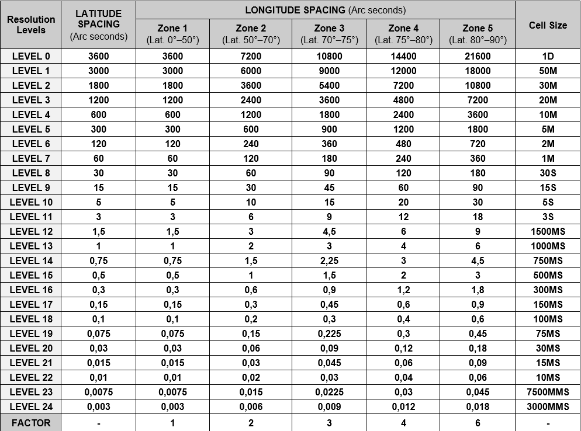
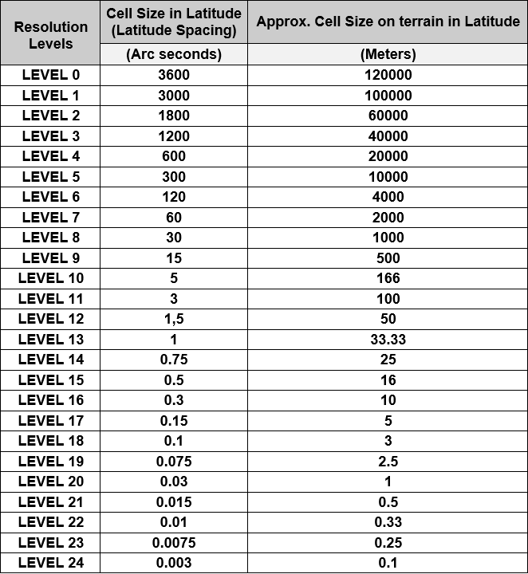

// Admonition icons:
// IR Requirement
:important-caption: 📕
// TG Requirement
:tip-caption: 📒
// Recommendation
:note-caption: 📘

// TOC placement using macro (manual)
:toc: macro

// Empty TOC title (the title is in the document)
:toc-title:

// TOC level depth
:toclevels: 3

// Section numbering level depth
:sectnumlevels: 8

// Line Break Doc Title
:hardbreaks-option:

:appendix-caption: Annex

// Document properties
:title: D2.8.I.2 Data Specification on Geographical Grid Systems – Technical Guidelines
:revdate: 2023-01-31
:keywords: INSPIRE Data Specification for the spatial data theme Geographical Grid Systems
:producer: INSPIRE Maintenance and Implementation Group (MIG)
:description: This document describes the INSPIRE Data Specification for the spatial data theme Geographical Grid Systems
:author: Temporary MIWP 2021-2024 sub-group 2.3.1
:copyright: Public
:revremark: https://github.com/INSPIRE-MIF/technical-guidelines/releases/tag/2023.1
:lang: en

image:./media/image2.jpeg[image,width=131,height=90, align=center]

image:./media/image3.png[image,width=93,height=93, align=center] **INSPIRE** *Infrastructure for Spatial Information in Europe*

[discrete]
= D2.8.I.2 Data Specification on _Geographical Grid Systems_ – Technical Guidelines

[width="100%",cols="17%,83%",]
|===
|*Title* |{doctitle}
|*Creator* |{author}
|*Date of publication* |{revdate}
|*Subject* |{keywords}
|*Publisher* |{producer}
|*Type* |Text
|*Description* |{description}
|*Format* |AsciiDoc
|*Licence* |https://creativecommons.org/licenses/by/4.0[Creative Commons Attribution (cc-by) 4.0]
|*Rights* |{copyright}
|*Identifier* |https://inspire.ec.europa.eu/id/document/tg/gg[D2.8.I.2_v3.2.0]
|*Changelog* |{revremark}
|*Language* |{lang}
|*Relation* |Directive 2007/2/EC of the European Parliament and of the Council of 14 March 2007 establishing an Infrastructure for Spatial Information in the European Community (INSPIRE)
|===
<<<
[discrete]
== Foreword

[discrete]
== How to read the document?

This document describes the _"INSPIRE data specification on Geographical Grid Systems – Technical Guidelines"_ version 3.1rc1 as developed by the Thematic Working Group (TWG) _Reference Systems_ using both natural and a conceptual schema language.

The data specification is based on a common templatefootnote:[The common document template is available in the "Framework documents" section of the data specifications web page at http://inspire.jrc.ec.europa.eu/index.cfm/pageid/2] used for all data specifications, which has been harmonised using the experience from the development of the Annex I, II and III data specifications.

This document provides guidelines for the implementation of the provisions laid down in the draft Implementing Rule for spatial data sets and services of the INSPIRE Directive. It also includes additional requirements and recommendations that, although not included in the Implementing Rule, are relevant to guarantee or to increase data interoperability.

Two executive summaries provide a quick overview of the INSPIRE data specification process in general, and the content of the data specification on _Geographical Grid Systems_ in particular. We highly recommend that managers, decision makers, and all those new to the INSPIRE process and/or information modelling should read these executive summaries first.

The UML diagrams (in Chapter 5) offer a rapid way to see the main elements of the specifications and their relationships. The definition of the spatial object types, attributes, and relationships are included in the Feature Catalogue (also in Chapter 5). People having thematic expertise but not familiar with UML can fully understand the content of the data model focusing on the Feature Catalogue. Users might also find the Feature Catalogue especially useful to check if it contains the data necessary for the applications that they run. The technical details are expected to be of prime interest to those organisations that are responsible for implementing INSPIRE within the field of _Geographical Grid Systems_, but also to other stakeholders and users of the spatial data infrastructure.

The technical provisions and the underlying concepts are often illustrated by examples. Smaller examples are within the text of the specification, while longer explanatory examples and descriptions of selected use cases are attached in the annexes.

In order to distinguish the INSPIRE spatial data themes from the spatial object types, the INSPIRE spatial data themes are written in _italics._

[cols="",]
|===
|The document will be publicly available as a 'non-paper'. It does not represent an official position of the European Commission, and as such cannot be invoked in the context of legal procedures.
|===

*Legal Notice*

Neither the European Commission nor any person acting on behalf of the Commission is responsible for the use which might be made of this publication.

[discrete]
== Interoperability of Spatial Data Sets and Services – General Executive Summary

The challenges regarding the lack of availability, quality, organisation, accessibility, and sharing of spatial information are common to a large number of policies and activities and are experienced across the various levels of public authority in Europe. In order to solve these problems it is necessary to take measures of coordination between the users and providers of spatial information. The Directive 2007/2/EC of the European Parliament and of the Council adopted on 14 March 2007 aims at establishing an Infrastructure for Spatial Information in the European Community (INSPIRE) for environmental policies, or policies and activities that have an impact on the environment.

INSPIRE is based on the infrastructures for spatial information that are created and maintained by the Member States. To support the establishment of a European infrastructure, Implementing Rules addressing the following components of the infrastructure have been specified: metadata, interoperability of spatial data sets (as described in Annexes I, II, III of the Directive) and spatial data services, network services, data and service sharing, and monitoring and reporting procedures.

INSPIRE does not require collection of new data. However, after the period specified in the Directivefootnote:[For all 34 Annex I,II and III data themes: within two years of the adoption of the corresponding Implementing Rules for newly collected and extensively restructured data and within 5 years for other data in electronic format still in use] Member States have to make their data available according to the Implementing Rules.

Interoperability in INSPIRE means the possibility to combine spatial data and services from different sources across the European Community in a consistent way without involving specific efforts of humans or machines. It is important to note that "interoperability" is understood as providing access to spatial data sets through network services, typically via Internet. Interoperability may be achieved by either changing (harmonising) and storing existing data sets or transforming them via services for publication in the INSPIRE infrastructure. It is expected that users will spend less time and efforts on understanding and integrating data when they build their applications based on data delivered in accordance with INSPIRE.

In order to benefit from the endeavours of international standardisation bodies and organisations established under international law their standards and technical means have been utilised and referenced, whenever possible.

To facilitate the implementation of INSPIRE, it is important that all stakeholders have the opportunity to participate in specification and development. For this reason, the Commission has put in place a consensus building process involving data users, and providers together with representatives of industry, research and government. These stakeholders, organised through Spatial Data Interest Communities (SDIC) and Legally Mandated Organisations (LMO)footnote:[The current status of registered SDICs/LMOs is available via INSPIRE website: http://inspire.jrc.ec.europa.eu/index.cfm/pageid/42], have provided reference materials, participated in the user requirement and technicalfootnote:[Surveys on unique identifiers and usage of the elements of the spatial and temporal schema,] surveys, proposed experts for the Data Specification Drafting Teamfootnote:[The Data Specification Drafting Team has been composed of experts from Austria, Belgium, Czech Republic, France, Germany, Greece, Italy, Netherlands, Norway, Poland, Switzerland, UK, and the European Environment Agency], the Thematic Working Groupsfootnote:[The Thematic Working Groups of Annex II and III themes have been composed of experts from Austria, Belgium, Bulgaria, Czech Republic, Denmark, Finland, France, Germany, Hungary, Ireland, Italy, Latvia, Netherlands, Norway, Poland, Romania, Slovakia, Spain, Sweden, Switzerland, Turkey, UK, the European Commission, and the European Environment Agency] and other ad-hoc cross-thematic technical groups and participated in the public stakeholder consultations on draft versions of the data specifications. These consultations covered expert reviews as well as feasibility and fitness-for-purpose testing of the data specificationsfootnote:[For Annex IIIII, the consultation and testing phase lasted from 20 June to 21 October 2011.].

This open and participatory approach was successfully used during the development of the data specifications on Annex I, II and III data themes as well as during the preparation of the Implementing Rule on Interoperability of Spatial Data Sets and Servicesfootnote:[Commission Regulation (EU) No 1089/2010 http://eur-lex.europa.eu/JOHtml.do?uri=OJ:L:2010:323:SOM:EN:HTML[implementing Directive 2007/2/EC of the European Parliament and of the Council as regards interoperability of spatial data sets and services,] published in the Official Journal of the European Union on 8^th^ of December 2010.] for Annex I spatial data themes and of its amendment regarding the themes of Annex II and III.

The development framework elaborated by the Data Specification Drafting Team aims at keeping the data specifications of the different themes coherent. It summarises the methodology to be used for the development of the data specifications, providing a coherent set of requirements and recommendations to achieve interoperability. The pillars of the framework are the following technical documentsfootnote:[The framework documents are available in the "Framework documents" section of the data specifications web page at http://inspire.jrc.ec.europa.eu/index.cfm/pageid/2]:

* The _Definition of Annex Themes and Scope_ describes in greater detail the spatial data themes defined in the Directive, and thus provides a sound starting point for the thematic aspects of the data specification development.
* The _Generic Conceptual Model_ defines the elements necessary for interoperability and data harmonisation including cross-theme issues. It specifies requirements and recommendations with regard to data specification elements of common use, like the spatial and temporal schema, unique identifier management, object referencing, some common code lists, etc. Those requirements of the Generic Conceptual Model that are directly implementable are included in the Implementing Rule on Interoperability of Spatial Data Sets and Services.
* The _Methodology for the Development of Data Specifications_ defines a repeatable methodology. It describes how to arrive from user requirements to a data specification through a number of steps including use-case development, initial specification development and analysis of analogies and gaps for further specification refinement.
* The _Guidelines for the Encoding of Spatial Data_ defines how geographic information can be encoded to enable transfer processes between the systems of the data providers in the Member States. Even though it does not specify a mandatory encoding rule it sets GML (ISO 19136) as the default encoding for INSPIRE.
* The _Guidelines for the use of Observations & Measurements and Sensor Web Enablement-related standards in INSPIRE Annex II and III data specification development_ provides guidelines on how the "Observations and Measurements" standard (ISO 19156) is to be used within INSPIRE.
* The _Common data models_ are a set of documents that specify data models that are referenced by a number of different data specifications. These documents include generic data models for networks, coverages and activity complexes.

The structure of the data specifications is based on the "ISO 19131 Geographic information - Data product specifications" standard. They include the technical documentation of the application schema, the spatial object types with their properties, and other specifics of the spatial data themes using natural language as well as a formal conceptual schema languagefootnote:[UML – Unified Modelling Language].

A consolidated model repository, feature concept dictionary, and glossary are being maintained to support the consistent specification development and potential further reuse of specification elements. The consolidated model consists of the harmonised models of the relevant standards from the ISO 19100 series, the INSPIRE Generic Conceptual Model, and the application schemasfootnote:[Conceptual models related to specific areas (e.g. INSPIRE themes)] developed for each spatial data theme. The multilingual INSPIRE Feature Concept Dictionary contains the definition and description of the INSPIRE themes together with the definition of the spatial object types present in the specification. The INSPIRE Glossary defines all the terms (beyond the spatial object types) necessary for understanding the INSPIRE documentation including the terminology of other components (metadata, network services, data sharing, and monitoring).

By listing a number of requirements and making the necessary recommendations, the data specifications enable full system interoperability across the Member States, within the scope of the application areas targeted by the Directive. The data specifications (in their version 3.0) are published as technical guidelines and provide the basis for the content of the Implementing Rule on Interoperability of Spatial Data Sets and Servicesfootnote:[In the case of the Annex IIIII data specifications, the extracted requirements are used to formulate an amendment to the existing Implementing Rule.]. The content of the Implementing Rule is extracted from the data specifications, considering short- and medium-term feasibility as well as cost-benefit considerations. The requirements included in the Implementing Rule are legally binding for the Member States according to the timeline specified in the INSPIRE Directive.

In addition to providing a basis for the interoperability of spatial data in INSPIRE, the data specification development framework and the thematic data specifications can be reused in other environments at local, regional, national and global level contributing to improvements in the coherence and interoperability of data in spatial data infrastructures.

<<<
[discrete]
== Geographical Grid Systems – Executive Summary

_Geographical grid systems_ are included in Annex I, which means that they are considered as reference data, i.e. data that constitute the spatial frame for linking and/or pointing to other information that belong to specific thematic fields as defined in the INSPIRE Annexes II and III.

The INSPIRE specification on _Geographical grid systems_ has been prepared following the participative principle of a consensus building process. The stakeholders, based on their registration as a Spatial Data Interest Community (SDIC) or a Legally Mandated Organisation (LMO) had the opportunity to bring forward user requirements and reference materials, propose experts for the specification development, and participate in the review of the data specifications. The Thematic Working Group responsible for the specification development was composed of geodetic and mapping experts coming from Portugal, Slovenia, France, Germany, Italy, Sweden and the UK, all of them for many years involved in activities aiming to establish uniform geo-referencing within Europe. Due to the close links between and the special technical nature of the two themes of _Coordinate reference systems_ and G__eographical grid systems__, the specifications of both themes were developed by one Thematic Working Group.

_Geographical grid systems_ (hereafter: _Grids_) play a specific role that is quite different from the other themes in the Directive's annexes. Contrary to the other themes the _Grids_ specification does not concern a downloadable or viewable thematic data set. Rather, it presents a basic functionality allowing the harmonised and interoperable geographic localisation of spatial objects defined by the other INSPIRE thematic data specifications. Therefore, the methodology developed by the Drafting Team on data specifications is only partly applicable to the work of this Thematic Working Group.

The specific task of the definition of the _Geographical grid systems_ theme therefore consists in taking the right decisions on the choice of a limited number of grid systems that will ensure a common basis for the geographical harmonisation between the other themes defined in the Annexes of the Directive.

The cornerstone of the specification development was the definition of the Directive on _Geographical grid systems:_ "Harmonised multi-resolution grid with a common point of origin and standardised location and size of grid cells". With this goal in mind, the Thematic Working Group agreed the scope of the theme "Geographical grid systems", covering quadrilateral grids used for indirect geo-referencing of themes with typically coarse resolution and wide (pan-European) geographical extent. As a result, this document specifies two Pan-European grids to be used within continental Europe in the INSPIRE context: The _Equal Area Grid_ and the _Zoned Geographic Grid_.

The _Equal Area Grid_, which was proposed as the multipurpose Pan-European standard during the Annex I data specification process, is two-dimensional and it is based on the ETRS89 Lambert Azimuthal Equal Area coordinate reference system. It is mainly intended for spatial analysis or reporting purposes (e.g. statistical information), but not for communities where the grids have to be optimised for data exchange, supercomputer processing and high volume archiving of new data each day. The requirements and recommendations associated to this grid are based on the results from the "European Reference Grids" workshopfootnote:[http://www.ec-gis.org/sdi/publist/pdfs/annoni-etal2003eur.pdf].

The _Zoned Geographic Grid_, which was proposed during the subsequent Annex II-III data specification process, is a two-dimensional multi-resolution geographic grid based on the ETRS89-GRS80 geodetic coordinate reference system. It follows a structure analogue to DTED (Digital Terrain Elevation Data), dividing the world into different zones in latitude, to mitigate the effect of convergence of meridians. The grid may be used as a geo-referencing framework when gridded data (raster data) is delivered using geodetic coordinates, mainly suited for reference data (such as elevation or orthoimagery), to achieve their interoperability for data provision and therefore serve crossborder purposes at global level.

Both grids are multi-resolution grids, associated with predefined resolution levels, and provided with a designator and a coding system for identifying individual cells at all these levels.

This document provided the basis for a number of requirements that have been included in the Implementing Rule on interoperability of spatial data sets and services. These elements are clearly indicated in the document as "IR Requirements". The other parts of the documents give clarification, background information and examples and are intended as part of the technical guidance documents accompanying the Implementing Rules.

<<<
[discrete]
== Acknowledgements

Many individuals and organisations have contributed to the development of these Guidelines.

The Thematic Working Group _Coordinate reference systems and Geographical grid systems_ (TWG RS) included: João Torres (TWG Facilitator), Vida Bitenc (TWG-RS Editor), Alessandro Caporali, Paul Crudace, Lars Engberg, Bruno Garayt, Heinz Habrich (TWG-RS members).

Gil Ross, Leendert Dorst participated in the original development phase as external experts.

Jordi Escriu, Vicenç Palà, Pierre-Yves Curtinot, Tony Vanderstraete, Pavel Milenov and Rogier Broekman provided expertise in updating the specification according to the requirements stemming from Annex II-III data themes.

Freddy Fierens and Katalin Tóth were the contact points of the European Commission.

Other contributors to the INSPIRE data specifications are the Drafting Team Data Specifications, the JRC Data Specifications Team and the INSPIRE stakeholders - Spatial Data Interested Communities (SDICs) and Legally Mandated Organisations (LMOs).

*Contact information*

Maria Vanda Nunes de Lima & Michael Lutz
European Commission Joint Research Centre (JRC)
Institute for Environment and Sustainability
Unit H06: Digital Earth and Reference Data
_http://inspire.ec.europa.eu/index.cfm/pageid/2_

<<<
[discrete]
== Table of Contents
toc::[]

<<<
:sectnums:

== Scope

This document specifies a harmonised data specification for the spatial data theme _Geographical Grid Systems_ as defined in Annex I of the INSPIRE Directive.

This data specification provides the basis for the drafting of Implementing Rules according to Article 7 (1) of the INSPIRE Directive [Directive 2007/2/EC]. The entire data specification is published as implementation guidelines accompanying these Implementing Rules.

<<<
== Overview

=== Name

INSPIRE data specification for the theme Geographical Grid Systems.

=== Informal description

*Definition:*

Harmonised multi-resolution grid with a common point of origin and standardised location and size of grid cells.

[Directive 2007/2/EC]

*Description:*

The scope of the theme "Geographical grid systems" covers quadrilateral grids used for the indirect geo-referencing of themes with typically coarse resolution and wide (pan-European) geographical extent.

The theme establishes two Pan-European grids to be used within continental Europe in the INSPIRE context: The _Equal Area Grid_ and the _Zoned Geographic Grid_.

Either of these grids, with fixed and unambiguously defined locations, shall be used as a geo-referencing framework to make gridded data available in INSPIRE, unless other grids are specified for specific INSPIRE spatial data themes for the purpose or in regions outside continental Europe.

The _Equal Area Grid_ is proposed as the multipurpose Pan-European standard for spatial analysis or reporting. It consists of a two-dimensional grid based on the ETRS89 Lambert Azimuthal Equal Area projected coordinate reference system.

The _Zoned Geographic Grid_ is proposed as an optional geo-referencing framework when gridded data (raster data) is delivered using geodetic coordinates, mainly suited for reference data (such as elevation or orthoimagery), to achieve their interoperability for data provision. It is aimed to serve cross-border purposes at global level. It consists of a two-dimensional multi-resolution geographic grid based on the ETRS89-GRS80 geodetic coordinate reference system, following a structure analogue to DTED (Digital Terrain Elevation Data) which divides the world into different zones in latitude.

Both geographical grids have multiple predefined resolution levels, and are provided with a designator and a coding system for identifying individual cells at all these levels.

It is recognised that there is a need to enable grid referencing for regions outside of continental Europe, for example for overseas Member States (MS) territories. For these regions, MS may define their own grid, although it must follow the same principles as laid down for the Pan-European Grids defined in this specification.

The requirements and recommendations regarding "Geographical grid systems" are harmonised with the requirements of the Coordinate Reference Systems data specification [INSPIRE-DS-CRS].

=== Normative References

[Directive 2007/2/EC] Directive 2007/2/EC of the European Parliament and of the Council of 14 March 2007 establishing an Infrastructure for Spatial Information in the European Community (INSPIRE)

[ISO 19111] EN ISO 19111:2007 Geographic information - Spatial referencing by coordinates (ISO 19111:2007)

[ISO 19111-2] EN ISO 19111-2:2009 Geographic information - Spatial referencing by coordinates – Part 2: Extension for parametric values

[ISO 19115] EN ISO 19115:2005, Geographic information – Metadata (ISO 19115:2003)

[ISO 19123] EN ISO 19123:2007, Geographic Information – Schema for coverage geometry and functions

[ISO 19129] ISO/TS 19129:2009, Geographic information – Imagery, gridded and coverage data framework (ISO 19129:2009)

[ISO 19135] EN ISO 19135:2007 Geographic information – Procedures for item registration (ISO 19135:2005)

[Regulation 1205/2008/EC] Regulation 1205/2008/EC implementing Directive 2007/2/EC of the European Parliament and of the Council as regards metadata

=== Terms and definitions

General terms and definitions helpful for understanding the INSPIRE data specification documents are defined in the INSPIRE Glossaryfootnote:[The INSPIRE Glossary is available from http://inspire-registry.jrc.ec.europa.eu/registers/GLOSSARY].

Specifically, for the theme Geographical Grid Systems, the following terms are defined:

*(1) grid*

A network composed of two or more sets of curves in which the members of each set intersect the members of the other sets in an algorithmic way.

*(2) grid cell*

A cell delineated by grid curves.

*(3) grid point*

A point located at the intersection of two or more curves in a grid.

*(4) gridded data*

Data made available as a coverage (or coverages) whose domain is a grid.

NOTE Gridded data are often also referred to as "raster data". A raster is defined in ISO 19123:2005 as a "usually rectangular pattern of parallel scanning lines forming or corresponding to the display on a cathode ray tube", i.e. as a specific type of grid.

=== Symbols and abbreviations

[width="100%",cols="14%,86%"]
|===
|CRS|Coordinate Reference System
|DTED|Digital Terrain Elevation Data
|EC|European Commission
|EEA|European Environment Agency
|EIONET|Environmental Information and Observation Network
|ETRS89|European Terrestrial Reference System 1989
|ETRS89-LAEA|Two-dimensional Lambert Azimuthal Equal Area Coordinate Reference System
|ETRS89-GRS80|Two-dimensional Geodetic Coordinate Reference System in ETRS89 on the GRS80 ellipsoid
|GCM|Generic Conceptual Model
|GRIB|WMO standard for gridded data exchange GRIdded Binary http://www.wmo.ch/pages/prog/www/WMOCodes/GRIB.html
|Grid_ETRS89-LAEA|Pan-European Equal Area Grid
|Grid_ETRS89-GRS80z__n__|Pan-European Zoned Geographic Grid
|GRS80|Geodetic Reference System 1980
|ICAO|International Civil Aviation Organisation
|IOC|Intergovernmental Oceanographic Commission
|ITRS|International Terrestrial Reference System
|MS|Member States
|NetCDF|Data Exchange Standard of the Climate and Forecasting Community Network Common Data Form http://www.unidata.ucar.edu/netcdf
|TWG|Thematic Working Group
|WMO|World Meteorological Organisation
|WMTS|Web Map Tile Service
|===

<<<
=== How the Technical Guidelines map to the Implementing Rules

The schematic diagram in Figure 1 gives an overview of the relationships between the INSPIRE legal acts (the INSPIRE Directive and Implementing Rules) and the INSPIRE Technical Guidelines. The INSPIRE Directive and Implementing Rules include legally binding requirements that describe, usually on an abstract level, _what_ Member States must implement.

In contrast, the Technical Guidelines define _how_ Member States might implement the requirements included in the INSPIRE Implementing Rules. As such, they may include non-binding technical requirements that must be satisfied if a Member State data provider chooses to conform to the Technical Guidelines. Implementing these Technical Guidelines will maximise the interoperability of INSPIRE spatial data sets.

image::./media/image4.png[image,width=603,height=375, align=center]

[.text-center]
*Figure 1 - Relationship between INSPIRE Implementing Rules and Technical Guidelines*

==== Requirements

The purpose of these Technical Guidelines (Data specifications on _Geographical Grid Systems_) is to provide practical guidance for implementation that is guided by, and satisfies, the (legally binding) requirements included for the spatial data theme Geographical Grid Systems in the Regulation (Implementing Rules) on interoperability of spatial data sets and services. These requirements are highlighted in this document as follows:

[IMPORTANT]
====
[.text-center]
*IR Requirement*
_Article / Annex / Section no._
*Title / Heading*

This style is used for requirements contained in the Implementing Rules on interoperability of spatial data sets and services (Commission Regulation (EU) No 1089/2010).
====

For each of these IR requirements, these Technical Guidelines contain additional explanations and examples.

NOTE The Abstract Test Suite (ATS) in Annex A contains conformance tests that directly check conformance with these IR requirements.

Furthermore, these Technical Guidelines may propose a specific technical implementation for satisfying an IR requirement. In such cases, these Technical Guidelines may contain additional technical requirements that need to be met in order to be conformant with the corresponding IR requirement _when using this proposed implementation_. These technical requirements are highlighted as follows:

[TIP]
====
*TG Requirement X*
This style is used for requirements for a specific technical solution proposed in these Technical Guidelines for an IR requirement.
====

NOTE 1 Conformance of a data set with the TG requirement(s) included in the ATS implies conformance with the corresponding IR requirement(s).

NOTE 2 In addition to the requirements included in the Implementing Rules on interoperability of spatial data sets and services, the INSPIRE Directive includes further legally binding obligations that put additional requirements on data providers. For example, Art. 10(2) requires that Member States shall, where appropriate, decide by mutual consent on the depiction and position of geographical features whose location spans the frontier between two or more Member States. General guidance for how to meet these obligations is provided in the INSPIRE framework documents.

==== Recommendations

In addition to IR and TG requirements, these Technical Guidelines may also include a number of recommendations for facilitating implementation or for further and coherent development of an interoperable infrastructure.

[NOTE]
====
*Recommendation X*
Recommendations are shown using this style.
====

NOTE The implementation of recommendations is not mandatory. Compliance with these Technical Guidelines or the legal obligation does not depend on the fulfilment of the recommendations.

==== Conformance

Annex A includes the abstract test suite for checking conformance with the requirements included in these Technical Guidelines and the corresponding parts of the Implementing Rules (Commission Regulation (EU) No 1089/2010).

<<<
== Specification scopes

This data specification does not distinguish different specification scopes, but just considers one general scope.

NOTE For more information on specification scopes, see [ISO 19131:2007], clause 8 and Annex D.

== Identification information

These Technical Guidelines are identified by the following URI:

http://inspire.ec.europa.eu/tg/gg/3.1

NOTE ISO 19131 suggests further identification information to be included in this section, e.g. the title, abstract or spatial representation type. The proposed items are already described in the document metadata, executive summary, overview description (section 2) and descriptions of the application schemas (section 5). In order to avoid redundancy, they are not repeated here.

<<<
== Geographical Grid Systems

=== Overview

One method of storing spatial information with indirect position is by using geographical grids. Grids omit direct spatial reference and average the qualitative properties of the subject. This makes them powerful tools for harmonisation and reduction of the complexity of spatial datasets. Geographical grids are also effective communication means for reporting spatial variability of features.

Technically, grids for geographical data are predefined spatial reference structures composed of cells regular in shape or area. Cells are usually squares based on a given coordinate reference system but, in rare cases, they can be shaped differently, e.g. as hexagons.

A grid typically uses a matrix of n x m cells spanned by 2 axes. As a result, a grid cell can be referenced by a sequence of integer values (one for each axis) that represent the position of the reference cell along each of the axes of the grid. See CV_GridCoordinate as specified in ISO 19123.

There are many types of grids available for different purposes. Ideally, one grid that is useful for all purposes ought to be created but it is not possible for one grid to cover uniformly the whole of Europe. Any type of grid will always have some disadvantages that disqualify it for certain use. The following grid examples are presented to describe the difficulties in selection of a multipurpose grid.

The _World Geographic Reference System_ (Georef) is made for aircraft navigation. It is also suitable for global grid mapping. Georef is based on geographical latitude and longitude. The globe is divided into 12 bands of latitude and 24 zones of longitude, each 15 degrees in extent. These 15-degree areas are further divided into one-degree units identified by 15 characters. Georef disadvantages are that the shape, area and distance of cells are distorted.

The _Common European chorological grid reference system_ (CGRS) is modified from the military grid reference system (MGRS). The MGRS itself is an alphanumeric version of a numerical UTM (Universal Transverse Mercator) or UPS (Universal Polar Stereographic) grid coordinate. MGRS has some serious disadvantages; cells do not cover the same area or have the same length of sides along latitude. This implies that cell statistics are difficult to calculate.

_National grid systems_. Most countries have defined grid systems covering their territory, based on the national plane coordinates. Belgium, Great Britain, Denmark, Finland, Ireland, Italy, the Netherlands and Sweden are examples of countries that have defined a national grid system. These systems employ conformal map projections which have some scale and area distortion.

_Equal area grids_ are suitable for generalising data, statistical mapping and analytical work where an equal area of cells is important. The first Workshop on European Reference Grids in Ispra, 27-29 October 2003, recommends the use of the multipurpose European grid based on Lambert Azimuthal Equal Area and ETRS89. Proceedings [EUR 21494 EN] are available from the EIONET GIS page (_http://www.eionet.eu.int/gis_).

_Weather and climate model grids_; The Meteorological, Atmospheric and Oceanographic modelling communities produce many new forecast and climatological data models every day in 4 dimensional grids and subsequent projection onto (any) 2 dimensions. These are used for operational weather and ocean forecasting and for climate change research. Here there are existing standards from the WMO (World Meteorological Organisation), ICAO (International Civil Aviation Organisation) and the IOC (Intergovernmental Oceanographic Commission). The high volume data exchange formats include GRIB and NetCDF which are exchanged globally. It is not proposed that the INSPIRE grid specification should be required for use by these communities, who need highly specialised grids. Whenever this data is exchanged, it is expected that the grid definition (usually a mathematical definition) is included as part of the community standard. Where the grid is even more specialised, it is expected that the grid specification will be provided in a reference to an appropriate scientific document. This is the normal procedure used by these communities and their data specification standards.

=== Geographic grids for INSPIRE

This data specification defines two Pan-European geographical grids for their use in the INSPIRE context within continental Europe:

* The _Equal Area Grid_, which is intended more for statistical reporting purposes. It is not intended for communities where the grids have to be optimised for data exchange, supercomputer processing and high volume archiving of new data each day.
+
This grid, designated as Grid_ETRS89-LAEA, is fully-specified in section 5.2.1.

* The _Zoned Geographic Grid_, which is intended for the provision of gridded spatial information (i.e. raster, coverage-based data) for reference data themes.
+
This grid, designated as Grid_ETRS89-GRS80z__n_res__, is fully-specified in section 5.2.2.

It is recognised that there is a need to enable grid referencing for regions outside of continental Europe, for example for overseas Member States (MS) territories. For these regions, MS may define their own grid, although it must follow the same principles as laid down for the Pan-European Grids (either the _Equal Area Grid_ or the _Zoned Geographic Grid_) and be documented according to ISO 19100 standards.

Such MS defined grids will be based on the International Terrestrial Reference System (ITRS), or other geodetic coordinate reference systems compliant with ITRS in areas that are outside the geographical scope of ETRS89. This follows the requirement in Annex II, Section 1.2 of the _Commission Regulation (EU) No 1089/2010_ for the Coordinate Reference Systems theme. Compliant with the ITRS means that the system definition is based on the definition of the ITRS and there is a well established and described relationship between both systems, according to ISO 19111:2007 Geographic Information – Spatial referencing by coordinates.

[IMPORTANT]
====
[.text-center]
*IR Requirement*
_Annex II, Section 2.2_
*Grids*

Either of the grids with fixed and unambiguously defined locations defined in Sections 2.2.1 and 2.2.2 shall be used as a geo-referencing framework to make gridded data available in INSPIRE, unless one of the following conditions holds:

(1) Other grids may be specified for specific spatial data themes in Annexes II-IV. In this case, data exchanged using such a theme-specific grid shall use standards in which the grid definition is either included with the data, or linked by reference.

(2) For grid referencing in regions outside of continental Europe Member States may define their own grid based on a geodetic coordinate reference system compliant with ITRS and a Lambert Azimuthal Equal Area projection, following the same principles as laid down for the grid specified in Section 2.2.1. In this case, an identifier for the coordinate reference system shall be created.
====

[IMPORTANT]
====
[.text-center]
*IR Requirement*
_Annex II, Section 2.2.2_
*Zoned Geographic Grid*

(...)
(6) For grid referencing in regions outside of continental Europe data providers may define their own grid based on a geodetic coordinate reference system compliant with ITRS, following the same principles as laid down for the Pan-European Grid_ETRS89-GRS80zn. In this case, an identifier for the coordinate reference system and the corresponding identifier for the grid shall be created.
(...)
====

NOTE 1 Sections 5.2.1 and 5.2.2 of this data specification identify respectively the characteristics of the geographic grids specified in Annex II, Sections 2.2.1 and 2.2.2 of the _Commission Regulation (EU) No 1089/2010, on interoperability of spatial data sets and services_.

NOTE 2 The term continental Europe means the area within the scope of ETRS89-GRS80-EVRS.

==== Equal Area Grid

This section specifies a geographic grid which is proposed as the multipurpose Pan-European standard, mainly intended for spatial analysis and reporting. It is based on the ETRS89 Lambert Azimuthal Equal Area coordinate reference system (CRS identifier in INSPIRE: ETRS89-LAEA).

===== Definition of the grid

The characteristics of the grid are specified below.

[IMPORTANT]
====
[.text-center]
*IR Requirement*
_Annex II, Section 2.2.1_
*Equal Area Grid*

The grid is based on the ETRS89 Lambert Azimuthal Equal Area (ETRS89-LAEA) coordinate reference system with the centre of the projection at the point 52^o^ N, 10^o^ E and false easting: x~0~ = 4321000 m, false northing: y~0~ = 3210000 m.

The origin of the grid coincides with the false origin of the ETRS89-LAEA coordinate reference system (x=0, y=0).

Grid points of grids based on ETRS89-LAEA shall coincide with grid points of the grid.

The grid is hierarchical, with resolutions of 1m, 10m, 100m, 1000m, 10000m and 100000m.

The grid orientation is south-north, west-east.

The grid is designated as Grid_ETRS89-LAEA. For identification of an individual resolution level the cell size in metres is appended.
(...)
====

[NOTE]
====
*Recomendation 1*
For expressing the cell size in metres, the following values should be used: 1, 10, 100, 1000, 10k, 100k, 1000k.
====

EXAMPLE The grid at a resolution level of 100km is designated as Grid_ETRS89-LAEA___100k__.

[NOTE]
====
*Recomendation 2*
Where applicable, the following URI pattern should be used to refer to the Grid_ETRS89-LAEA:

http://inspire.ec.europa.eu/grid/etrs89-laea/<resolution>
====

EXAMPLE For the grid at a resolution level of 100km the following URI should be used: http://inspire.ec.europa.eu/grid/etrs89-laea/100k

For the unambiguous referencing and identification of a grid cell, a coding system is needed to identify the cell size and the position of the lower left corner.

The coding system described hereafter follows the recommendations from the European Environmental Agency [EEA 2008].

[IMPORTANT]
====
[.text-center]
*IR Requirement*
_Annex II, Section 2.2.1_
*Equal Area Grid*

(...)
For the unambiguous referencing and identification of a grid cell, the cell code composed of the size of the cell and the coordinates of the lower left cell corner in ETRS89-LAEA shall be used. The cell size shall be denoted in metres ("m") for cell sizes up to 100m or kilometres ("km") for cell sizes of 1000m and above. Values for northing and easting shall be divided by 10^n^, where _n_ is the number of trailing zeros in the cell size value.
====

EXAMPLE 1 A cell size of 10000 metres is denoted as "10km".

NOTE 1 The values for northing and easting (in the ETRS89-LAEA they are named Y and X) are divided by 10^n^ ("n" is number of zeros in the cell size value) in order to reduce the length of the string. With the given resolutions this means that the zeros are trimmed.

EXAMPLE 2 If the cell size is 1000 metres, the number of zeros in end is 3 and thus the divider is 10^3^ = 1000.

EXAMPLE 3 The cell code "1kmN2599E4695" identifies the 1km grid cell with coordinates of the lower left corner: Y=2599000m, X=4695000m.

NOTE 2 There is the possibility that some grids based on ETRS89-LAEA do not comply with Grid_ETRS89-LAEA (e.g. 5 m grid resolution). For maximising compatibility, the origin of all grids based on ETRS89-LAEA shall coincide with the Grid_ETRS89-LAEA origin.

==== Zoned Geographic Grid

This section specifies a Pan-European geographic grid, aimed at global purposes, available for the provision of gridded spatial information (i.e. raster, coverage-based data), and explains the need to establish such geographic grid.

===== Justification for the grid

The amount of information made available to users will be enormous when INSPIRE services become operative. In order to combine all these data sets or make cross-reference analyses aimed at satisfying Pan-European cross-border needs, it would be highly desirable to make data available in the same coordinate reference system (with its associated datum) to obtain consistent data. This is supported by key use-cases like flood modelling and emergency response. Although they are not equally relevant for every INSPIRE theme dealing with gridded data, it would be highly desirable that all the themes with similar needs makes use of the same geographical grid system in order to maintain their coherence.

Conservation of original values is important when working with raster files, since interpolations directly affect the accuracy of those variables computed from them. As an example, in the case of the elevation property resampling diminishes height values associated to points on the Earth surface.

The different projections allowed by the _INSPIRE Data Specification on Coordinate Reference Systems v3.2_ for representation in plane coordinates are recommended in association to a certain range of scales and/or purposes, but problems arise when combining the data using these map projections (due to their inherent characteristics). As an example, ETRS-LAEA is suitable for spatial analysis and reporting, ETRS89-LCC is recommended for mapping at scales smaller than 1:500,000 and ETRS89-TMzn at scales larger than 1:500,000, with the additional inconvenience of using different zones for the whole Europe.

Hence, it would be recommendable to minimise coordinate reference system transformations of the data sets as possible, in order to preserve their quality.

Furthermore, even in the case where data is made available in the same coordinate reference system, when combining raster georeferenced data (coverages) from different sources, limits of pixels (coverage grid cells) usually do not match in x, y coordinates (i.e. maybe they are not aligned due to the fact they were generated by independent production lines). In order to get the proper alignment it is necessary to establish additional rules, such as the origin of a common geographic grid or its orientation.

The Pan-European Equal Area Grid (Grid_ETRS89-LAEA), based on the ETRS89 Lambert Azimuthal Equal Area coordinate reference system (ETRS89-LAEA), is not suited for gridded reference data (e.g. elevation or orthoimagery gridded data), because:

* The inherent properties of LAEA projection are inappropriate:

** The direction of the Geographic North varies as geographical longitude does;

** The scale gradually decreases from the centre of the projection;

** Directions are only true directions from this point;

** Shape distortions increases while moving away from this point.

** It makes difficult the use of hierarchical levels of grid cell sizes, since resolution varies depending on the position;

* The Grid_ETRS89-LAEA is defined in an equal area projection, suited for thematic spatial analysis and reporting, whereas for reference data the geometric aspects are important (e.g. conservation of angles, shapes and directions).

As a consequence of all the aspects above, it is recommended for reference data themes the use of a common geographic grid in Europe to achieve convergence of their gridded data sets in terms of datum (already fixed by the _Commission Regulation (EU) No 1089/2010_), coordinate reference system and data sets organization at different levels of detail for data provision.

The Zoned Geographic Grid proposed in section 5.2.2.2 is aimed to solve or minimize the previous issues. It is defined in geodetic coordinates and follows a structure analogue to DTED (Digital Terrain Elevation Data), which constitutes a valid solution to mitigate the effect of convergence of meridians. Due to this effect, if a geographic grid is defined in equiangular geodetic coordinates, the grid cell dimension on the ground becomes smaller in the longitude axis while the latitude increases, causing undesirable effects in areas with high latitude. This becomes especially problematic in areas near the Polar Regions.

===== Definition of the grid

Provision of data in ETRS89-GRS80 geodetic coordinates is aligned with the _Commission Regulation (EU) No 1089/2010, of 23 November 2010, on interoperability of spatial data sets and services_, while is a valid alternative to have continuous data regardless different levels of detail and purposes (as explained in 5.2.2.1).

This specification establishes the Zoned Geographic Grid, a multi-resolution geographic which may be used as a geo-referencing framework when gridded data is delivered using geodetic coordinates. The characteristics of this grid are specified below.

[IMPORTANT]
====
[.text-center]
*IR Requirement*
_Annex II, Section 2.2.2_
*Zoned Geographic Grid*

(1) When gridded data is delivered using geodetic coordinates the multi-resolution grid defined in this Section may be used as a geo-referencing framework.
(...)

(3) The grid shall be based on the ETRS89-GRS80 geodetic coordinate reference system.
	The origin of the grid shall coincide with the intersection point of the Equator with the Greenwich Meridian (GRS80 latitude φ=0; GRS80 longitude λ=0).
	The grid orientation shall be south-north and west-east according to the net defined by the meridians and parallels of the GRS80 ellipsoid.
(...)
====

The geographical grid establishes multiple levels of resolution and follows a structure analogue to DTED, dividing the world into different zones in latitude, as shown in the following table:

*Table 1 – Latitudinal zones for the common Grid_ETRS89-GRS80zn*

[cols="^,^,^",options="header",]
|===
|*Zone* |*Latitude* |*Factor*
|*1* |*0°–50°* |*1*
|*2* |*50°–70°* |*2*
|*3* |*70°–75°* |*3*
|*4* |*75°–80°* |*4*
|*5* |*80°–90°* |*6*
|===

It is recognized that a geographical grid with such structure may constitute additional efforts for Member States whose territories intersect the limit of adjoining zones. However, this is perceived as an acceptable solution to mitigate the meridian convergence. It is worth to mention here that most of territories in continental European are included in Zones 1 and 2 (Cape North in Norway is approximately at 71° latitude).

For a given level of resolution:

* The latitude spacing of cells of the geographic grid is the same in the different zones.

* Each zone has a specific longitude spacing for the cells of the geographic grid (equal or greater than the latitude spacing). Last column in the previous table shows the factor by which the latitude spacing is multiplied in each zone to obtain the longitude spacing.

When applying this factor, the cell sizes become approximately square on the ground (while they are rectangular in geodetic coordinates, i.e. 1x2, 1x3, 1x4, 1x6). Only grid cells included in Zone 1 preserve the square condition in geodetic coordinates (1x1).

[IMPORTANT]
====
[.text-center]
*IR Requirement*
_Annex II, Section 2.2.2_
*Zoned Geographic Grid*

(...)
(2) The resolution levels are defined in Table 1.
(...)
(7) This grid shall be subdivided in zones. The south-north resolution of the grid shall have equal angular spacing. The west-east resolution of the grid shall be established as the product of angular spacing multiplied by the factor of the zone as defined in Table 1.
(...)

====

NOTE Table 2 in this document.

The geographic grid is generically designated as Grid_ETRS89-GRS80z__n__. For identification of an individual resolution level the zone number (_n_) and the cell size (_res_) - in degrees (D), minutes (M), seconds (S), milliseconds (MS) or microseconds (MMS) - has to be included and appended (respectively) to this designator, resulting in the Grid_ETRS89-GRS80z__n_res__.

EXAMPLE The zoned geographic grid at a resolution level of 300 milliseconds in Zone 2 is designated as Grid_ETRS89-GRS80z__2_300MS__.

[IMPORTANT]
====
[.text-center]
*IR Requirement*
_Annex II, Section 2.2.2_
*Zoned Geographic Grid*

(...)
(8) The grid shall be designated Grid_ETRS89-GRS80z__n_res__, where _n_ represents the number of the zone and _res_ the cell size in angular units, as specified in Table 1.

====

NOTE Table 2 in this document.

*Table 2 - Common Grid_ETRS89-GRS80zn: Latitude spacing (resolution level) and longitude spacing for each zone*

The table above shows the latitude spacing (each resolution level), as well as the longitude spacing obtained by applying the factor parameter to each latitudinal zone.

The levels of resolution identified in Table 2 make up a hierarchical geographic grid (which constitute a pyramidal grid structure). Level 8, Level 11 and Level 13 in the previous table correspond to the levels of resolution of the Digital Terrain Elevation Data (DTED) L0, L1 and L2, respectively. Other levels in the table are derived from these taking into account the well-known scale set _GlobalCRS84Pixel_ included in the WMTS v1.0.0 specification.

Table 3 illustrates the approximate geographic grid cell size on terrain in latitude at each resolution level.

*Table 3 – Approximate Grid_ETRS89-GRS80zn cell size on terrain in latitude at each resolution level*

The geodetic coordinates of any cell of this Zoned Geographic Grid for a specific zone will always be a multiple of the grid cell size for a given resolution level, as a consequence of establishing a common origin for the geographic grid (φ=0; λ=0).

As a consequence, problems of alignment between raster files (coverages) based on the Grid_ETRS89-GRS80z__n_res__ at the same resolution level (grid coverage cell size) disappear. Remaining misalignments correspond only to the difference in absolute positioning and consistency of the data being combined. Especially in the case of very high resolution data, an inherent positional misalignment between coverages originated from two neighbour data providers may be observed, due to the different product specifications and (moreover) to the fact that the cells of the common geographic grid do not necessarily represent the same sampled features on the Earth in both datasets (e.g. because of the occlusions and/or the different angles of observation).

=== Modelling of grids

INSPIRE geographical grids themselves, with no values assigned to individual cells, are implemented and exchanged as vector data (lines or polygons). Thematic datasets based on geographical grids are exchanged as tables, lists or as gridded data.

Existing standards enable different modelling of gridded data products and exchanging data in not always compatible formats. The most confusing issue seems to be the relation of grid cell and grid points in discrete surface grids. When discrete surface grids are implemented as discrete point grids, this can cause location shifts of half of the cell size or unwanted cell value interpolations.

When surface grids are implemented as surfaces the above mentioned problems are avoided.

*Error! Reference source not found.* contains template application schema for Discrete Surface Grid Coverage (from [ISO 19129]).

This surface grid schema does not apply to 3 and 4 dimensional specialised grids of the weather, ocean and climate modelling communities, nor to the general parametric display projections taken from such models.

As stated in section 5.2, data exchanged using numerical modelling theme-specific grids shall use standards in which the grid definition is either included with the data, or linked by reference to an appropriate scientific document describing the grid.

=== Manipulation with grid values

Reference grids are mainly used for exchanging discrete values assigned to individual cells. When discrete values referred to one grid (e.g. sampling results) are converted to a different grid, there is no possibility to maintain the original thematic information. "Proceedings & Recommendations" from the European Reference Grids Workshop [EUR 21494 EN] provide an exhaustive source on descriptions of the methods used when such conversion is required. A more compact source of relevant instructions is the "Guide to Geographic Data and Maps" [EEA 2008]. A general rule is to select the most suitable methodology, to use the original (not already derived) data, and to describe in detail the applied processing steps.

Controlling and recording resampling steps provides the needed input for calculation of expected errors.

<<<
:sectnums!:
== Bibliography

[DS-D2.3] INSPIRE DS-D2.3, Definition of Annex Themes and Scope, v3.0, http://inspire.jrc.ec.europa.eu/reports/ImplementingRules/DataSpecifications/D2.3_Definition_of_Annex_Themes_and_scope_v3.0.pdf

[DS-D2.5] INSPIRE DS-D2.5, Generic Conceptual Model, v3.4rc2, _http://inspire.jrc.ec.europa.eu/documents/Data_Specifications/D2.5_v3.4rc2.pdf_

[DS-D2.6] INSPIRE DS-D2.6, Methodology for the development of data specifications, v3.0, http://inspire.jrc.ec.europa.eu/reports/ImplementingRules/DataSpecifications/D2.6_v3.0.pdf

[DS-D2.7] INSPIRE DS-D2.7, Guidelines for the encoding of spatial data, v3.3rc2, _http://inspire.jrc.ec.europa.eu/documents/Data_Specifications/D2.7_v3.3rc2.pdf_

[EEA 2008] Guide to geographic data and maps, version 3, December 2008, European Environmental Agency, _http://www.eionet.europa.eu/gis/docs/EEA_GISguide.doc_

[EUR 19575 EN] Spatial Reference Systems in Europe – EUR Report 19575 EN. Proceedings of the "Spatial Reference Systems in Europe" workshop, Marne-La Vallee, 29-30 November 1999

[EUR 20120 EN] Map Projections for Europe – EUR Report 20120 EN. Proceedings of the "Map Projections for Europe" workshop, Marne-La Vallee, 14-15 December 2000 footnote:[http://www.ec-gis.org/sdi/publist/pdfs/annoni-etal2003eur.pdf]

[EUR 21494 EN] European Reference Grids – EUR Report 21494 EN. Proceedings of the "European Reference Grids" workshop, Ispra, 27-29 October 2003 footnote:[http://www.ec-gis.org/sdi/publist/pdfs/annoni2005eurgrids.pdf]

[EUREF] _www.euref.eu_ or _www.euref-iag.net_ – EUREF website for information on the ETRS89 and the EVRS

[IERS] _www.iers.org_ – IERS website for information on the ITRS

[ICAO] _www.icao.int_ _http://www.wmo.int/_ – International Civil Aviation Organization

[IHO] _www.iho.int_ – IHO website for information on Hydrography

[IOC] _ioc-unesco.org_ _http://www.wmo.int/_ – Intergovernmental Oceanographic Commission

[ISO 19111] EN ISO 19111:2007 Geographic information - Spatial referencing by coordinates (ISO 19111:2007)

[ISO 19115] EN ISO 19115:2005, Geographic information – Metadata (ISO 19115:2003)

[ISO 19135] EN ISO 19135:2007 Geographic information – Procedures for item registration (ISO 19135:2005)

[GRIB] (GRIdded Binary) – WMO operational open data standard for multiple-dimensioned array data, exchanged daily by WMO, ICAO and IOC,

_http://www.wmo.ch/pages/prog/www/WMOCodes/OperationalCodes.html_

[NetCDF] (Network Common Data Form) - Data Exchange Standard of the Climate and Forecasting community, _http://www.unidata.ucar.edu/software/netcdf/_

[Snyder, 1987] Map Projections – A Working Manual – Snyder, John P., Professional Paper 1395, U.S. Geological Survey, 1987

[WMO] _www.wmo.int_ – World Meteorological Organization

<<<<
:sectnums:
[appendix]
== Abstract Test Suite - (normative) 
 

Tests for the requirements on Geographical Grid Systems included in Commission Regulation (EU) No 1089/2010 and discussed in these Technical Guidelines have been integrated in the ATS section of the common data specifications document template. All thematic data specifications therefore include the relevant test for the grid-related requirements in their respective ATS (in Annex A), and specifically in section A2.3.

The common document template contains the following test template for grids.

*A2.3 Grid test*

a) [underline]#Purpose#: Verify that gridded data related are available using the grid compatible with one of the coordinate reference systems defined in Commission Regulation No 1089/2010

b) [underline]#Reference#: Annex II Section 2.1 and 2.2 of Commission Regulation 1089/2010.

c) [underline]#Test Method#: Check whether the dataset is based on one of the following grids:

* Grid_ETRS89_GRS80 (based on two-dimensional geodetic coordinates using the parameters of the GRS80 ellipsoid).

* Grid_ETRS89_GRS80zn (based on two-dimensional geodetic coordinates with zoning)

* A grid compatible with plane coordinates using the Lambert Azimuthal Equal Area projection and the parameters of the GRS80 ellipsoid (ETRS89-LAEA).

* A grid compatible with plane coordinates using the Lambert Conformal Conic projection and the parameters of the GRS80 ellipsoid (ETRS89-LCC).

* A grid compatible with plane coordinates using the Transverse Mercator projection and the parameters of the GRS80 ellipsoid (ETRS89-TMzn).

NOTE Further technical information is given in Section 6 of this document.

NOTE In each data specification, those grids that are not applicable to the specific data theme should be deleted also in the ATS. Unless an exception is specified in the specific data specification, only the ETRS89_GRS80 and Grid_ETRS89_GRS80zn should be included.

In the following details are given on how to check conformance with the two grids defined in this specification.

=== Equal Area Grid test

a) [underline]#Purpose#: Verify that if a geographical grid based on the ETRS89-LAEA coordinate reference system is used for the provision of gridded data within the geographical scope of ETRS89, such grid corresponds to the Equal Area Grid (Grid_ETRS89-LAEA) as defined in Commission Regulation No 1089/2010.

b) [underline]#Reference#: Annex II Section 2.2 and 2.2.1 of Commission Regulation 1089/2010.

c) [underline]#Test Method#: Check whether the ETRS89-LAEA geographic grid complies with the characteristics specified for the Equal Area Grid (Grid_ETRS89-LAEA):

* The grid is based on the ETRS89 Lambert Azimuthal Equal Area (ETRS89-LAEA) coordinate reference system with the centre of the projection at the point 52^o^ N, 10^o^ E and false easting: x~0~ = 4321000 m, false northing: y~0~ = 3210000 m.

* The origin of the grid coincides with the false origin of the ETRS89-LAEA coordinate reference system (x=0, y=0).

* The grid orientation is south-north, west-east.

* The grid has one of the following resolution levels: 1m, 10m, 100m, 1000m, 10000m and 100000m.

* The grid is designated as 'Grid_ETRS89-LAEA__res_', where _res_ represents the resolution level (cell size) in metres (using the suffix 'k' to indicate 1000m for resolutions larger than 1000m, e.g. 100k for a resolution of 100 km) .

NOTE 1 Further technical information is given in Section 5.2.1 of this document.

=== Zoned Geographic Grid test

a) [underline]#Purpose#: Verify that if a geographical grid based on the ETRS89-GRS80 coordinate reference system is used for the provision of gridded data within the geographical scope of ETRS89, such grid corresponds to the Zoned Geographic Grid (Grid_ETRS89-GRS80z__n__) as defined in Commission Regulation No 1089/2010.

b) [underline]#Reference#: Annex II Section 2.2 and 2.2.2 of Commission Regulation 1089/2010.

c) [underline]#Test Method#: Check whether the ETRS89-GRS80 geographic grid complies with the characteristics specified for the Zoned Geographic Grid (Grid_ETRS89-GRS80z__n__):

* The grid is based on the ETRS89-GRS80 geodetic coordinate reference system.

* The origin of the grid coincides with the intersection point of the Equator with the Greenwich Meridian (GRS80 latitude φ=0; GRS80 longitude λ=0).

* The grid orientation is south-north and west-east, according to the net defined by the meridians and parallels of the GRS80 ellipsoid.

* The grid has one of the resolution levels specified in Table 2 of this document.

* This grid is subdivided in zones which depend on the latitude. The south-north resolution of the grid has equal angular spacing. The west-east resolution of the grid is established as the product of angular spacing multiplied by the factor of the zone as defined in Table 2 of this document.

* The grid is designated as 'Grid_ETRS89-GRS80z__n_res__', where _n_ represents the number of the zone (which depends on the latitude) and _res_ the cell size in angular units, as specified in Table 2 of this document.

NOTE 1 Further technical information is given in Section 5.2.2 of this document.
