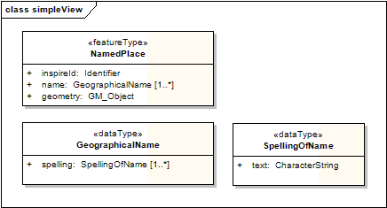
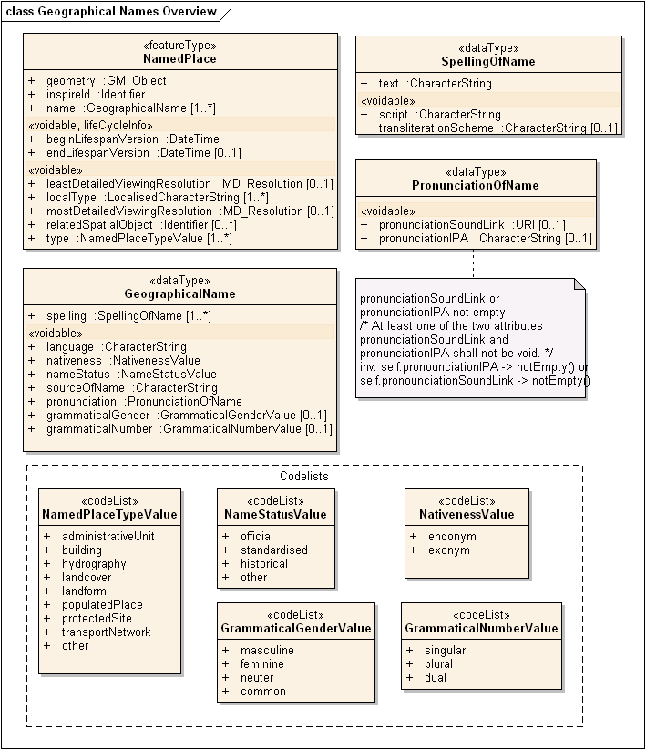
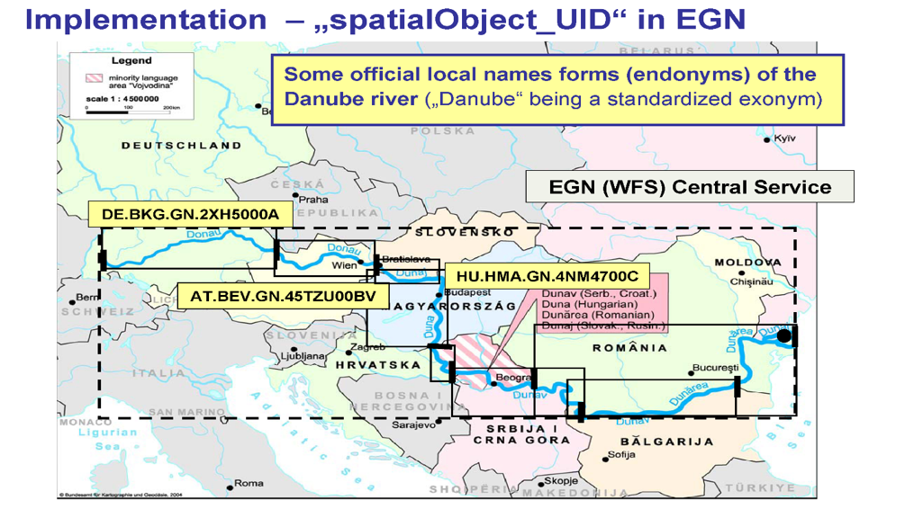
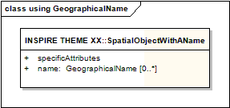
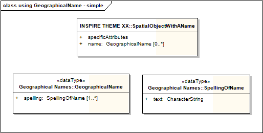
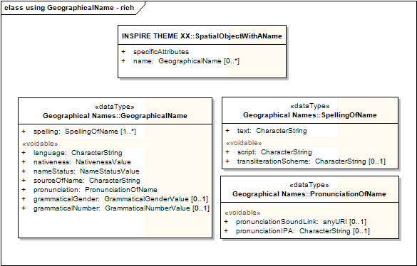
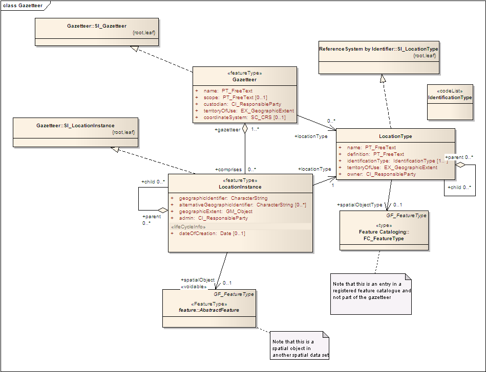

// Admonition icons:
// TG Requirement
:important-caption: 📕.wmf
// TG Recommendation
:tip-caption: 📒
// Conformance class
:note-caption: 📘

// TOC placement using macro (manual)
:toc: macro

// Empty TOC title (the title is in the document)
:toc-title:

// TOC level depth
:toclevels: 5

// Section numbering level depth
:sectnumlevels: 8

// Line Break Doc Title
:hardbreaks-option:

:appendix-caption: Annex

image::./media/image2.jpeg[logo_ce-en-rvb-lr,width=131,height=90]

image:./media/image3.png[ESEC,width=93,height=93] **INSPIRE** *Infrastructure for Spatial Information in Europe*

[discrete]
= D2.8.I.3 Data Specification on Geographical Names – Technical Guidelines

[width="100%",cols="17%,83%",]
|===
|*Title* |D2.8.I.3 Data Specification on _Geographical_ Names – Technical Guidelines
|*Creator* |INSPIRE Thematic Working Group _Geographical_ Names
|*Date* |2014-04-17
|*Subject* |INSPIRE Data Specification for the spatial data theme _Geographical_ Names
|*Publisher* |European Commission Joint Research Centre
|*Type* |Text
|*Description* |This document describes the INSPIRE Data Specification for the spatial data theme _Geographical_ Names
|*Contributor* |Members of the INSPIRE Thematic Working Group _Geographical_ Names
|*Format* |Portable Document Format (pdf)
|*Source* |
|*Rights* |Public
|*Identifier* |D2.8.I.3_v3.1
|*Language* |En
|*Relation* |Directive 2007/2/EC of the European Parliament and of the Council of 14 March 2007 establishing an Infrastructure for Spatial Information in the European Community (INSPIRE)
|*Coverage* |Project duration
|===

<<<
[discrete]
== Foreword
[discrete]
== How to read the document?

This document describes the _"INSPIRE data specification on Geographical Names – Technical Guidelines"_ version 3.1rc1 as developed by the Thematic Working Group (TWG) _Geographical Names_ using both natural and a conceptual schema language.

The data specification is based on a common templatefootnote:[The common document template is available in the "Framework documents" section of the data specifications web page at http://inspire.jrc.ec.europa.eu/index.cfm/pageid/2] used for all data specifications, which has been harmonised using the experience from the development of the Annex I, II and III data specifications.

This document provides guidelines for the implementation of the provisions laid down in the Implementing Rule for spatial data sets and services of the INSPIRE Directive. It also includes additional requirements and recommendations that, although not included in the Implementing Rule, are relevant to guarantee or to increase data interoperability.

Two executive summaries provide a quick overview of the INSPIRE data specification process in general, and the content of the data specification on _Geographical Names_ in particular. We highly recommend that managers, decision makers, and all those new to the INSPIRE process and/or information modelling should read these executive summaries first.

The UML diagrams (in Chapter 5) offer a rapid way to see the main elements of the specifications and their relationships. The definition of the spatial object types, attributes, and relationships are included in the Feature Catalogue (also in Chapter 5). People having thematic expertise but not familiar with UML can fully understand the content of the data model focusing on the Feature Catalogue. Users might also find the Feature Catalogue especially useful to check if it contains the data necessary for the applications that they run. The technical details are expected to be of prime interest to those organisations that are responsible for implementing INSPIRE within the field of _Geographical Names_, but also to other stakeholders and users of the spatial data infrastructure.

The technical provisions and the underlying concepts are often illustrated by examples. Smaller examples are within the text of the specification, while longer explanatory examples and descriptions of selected use cases are attached in the annexes.

In order to distinguish the INSPIRE spatial data themes from the spatial object types, the INSPIRE spatial data themes are written in _italics._

[width="100%",cols="100%"]
|===
|The document will be publicly available as a 'non-paper'. It does not represent an official position of the European Commission, and as such cannot be invoked in the context of legal procedures.
|===

*Legal Notice*

Neither the European Commission nor any person acting on behalf of the Commission is responsible for the use which might be made of this publication.

<<<
[discrete]
== Interoperability of Spatial Data Sets and Services – General Executive Summary

The challenges regarding the lack of availability, quality, organisation, accessibility, and sharing of spatial information are common to a large number of policies and activities and are experienced across the various levels of public authority in Europe. In order to solve these problems it is necessary to take measures of coordination between the users and providers of spatial information. The Directive 2007/2/EC of the European Parliament and of the Council adopted on 14 March 2007 aims at establishing an Infrastructure for Spatial Information in the European Community (INSPIRE) for environmental policies, or policies and activities that have an impact on the environment.

INSPIRE is based on the infrastructures for spatial information that are created and maintained by the Member States. To support the establishment of a European infrastructure, Implementing Rules addressing the following components of the infrastructure have been specified: metadata, interoperability of spatial data sets (as described in Annexes I, II, III of the Directive) and spatial data services, network services, data and service sharing, and monitoring and reporting procedures.

INSPIRE does not require collection of new data. However, after the period specified in the Directivefootnote:[For all 34 Annex I,II and III data themes: within two years of the adoption of the corresponding Implementing Rules for newly collected and extensively restructured data and within 5 years for other data in electronic format still in use] Member States have to make their data available according to the Implementing Rules.

Interoperability in INSPIRE means the possibility to combine spatial data and services from different sources across the European Community in a consistent way without involving specific efforts of humans or machines. It is important to note that "interoperability" is understood as providing access to spatial data sets through network services, typically via Internet. Interoperability may be achieved by either changing (harmonising) and storing existing data sets or transforming them via services for publication in the INSPIRE infrastructure. It is expected that users will spend less time and efforts on understanding and integrating data when they build their applications based on data delivered in accordance with INSPIRE.

In order to benefit from the endeavours of international standardisation bodies and organisations established under international law their standards and technical means have been utilised and referenced, whenever possible.

To facilitate the implementation of INSPIRE, it is important that all stakeholders have the opportunity to participate in specification and development. For this reason, the Commission has put in place a consensus building process involving data users, and providers together with representatives of industry, research and government. These stakeholders, organised through Spatial Data Interest Communities (SDIC) and Legally Mandated Organisations (LMO)footnote:[The current status of registered SDICs/LMOs is available via INSPIRE website: http://inspire.jrc.ec.europa.eu/index.cfm/pageid/42], have provided reference materials, participated in the user requirement and technicalfootnote:[Surveys on unique identifiers and usage of the elements of the spatial and temporal schema,] surveys, proposed experts for the Data Specification Drafting Teamfootnote:[The Data Specification Drafting Team has been composed of experts from Austria, Belgium, Czech Republic, France, Germany, Greece, Italy, Netherlands, Norway, Poland, Switzerland, UK, and the European Environment Agency], the Thematic Working Groupsfootnote:[The Thematic Working Groups have been composed of experts from Austria, Australia, Belgium, Bulgaria, Czech Republic, Denmark, Finland, France, Germany, Hungary, Ireland, Italy, Latvia, Netherlands, Norway, Poland, Romania, Slovakia, Spain, Slovenia, Sweden, Switzerland, Turkey, UK, the European Environment Agency and the European Commission.] and other ad-hoc cross-thematic technical groups and participated in the public stakeholder consultations on draft versions of the data specifications. These consultations covered expert reviews as well as feasibility and fitness-for-purpose testing of the data specificationsfootnote:[For Annex IIIII, the consultation and testing phase lasted from 20 June to 21 October 2011.].

This open and participatory approach was successfully used during the development of the data specifications on Annex I, II and III data themes as well as during the preparation of the Implementing Rule on Interoperability of Spatial Data Sets and Servicesfootnote:[Commission Regulation (EU) No 1089/2010 http://eur-lex.europa.eu/JOHtml.do?uri=OJ:L:2010:323:SOM:EN:HTML[implementing Directive 2007/2/EC of the European Parliament and of the Council as regards interoperability of spatial data sets and services&#44;] published in the Official Journal of the European Union on 8^th^ of December 2010.] for Annex I spatial data themes and of its amendment regarding the themes of Annex II and III.

The development framework elaborated by the Data Specification Drafting Team aims at keeping the data specifications of the different themes coherent. It summarises the methodology to be used for the development of the data specifications, providing a coherent set of requirements and recommendations to achieve interoperability. The pillars of the framework are the following technical documentsfootnote:[The framework documents are available in the "Framework documents" section of the data specifications web page at http://inspire.jrc.ec.europa.eu/index.cfm/pageid/2]:

* The _Definition of Annex Themes and Scope_ describes in greater detail the spatial data themes defined in the Directive, and thus provides a sound starting point for the thematic aspects of the data specification development.
* The _Generic Conceptual Model_ defines the elements necessary for interoperability and data harmonisation including cross-theme issues. It specifies requirements and recommendations with regard to data specification elements of common use, like the spatial and temporal schema, unique identifier management, object referencing, some common code lists, etc. Those requirements of the Generic Conceptual Model that are directly implementable are included in the Implementing Rule on Interoperability of Spatial Data Sets and Services.
* The _Methodology for the Development of Data Specifications_ defines a repeatable methodology. It describes how to arrive from user requirements to a data specification through a number of steps including use-case development, initial specification development and analysis of analogies and gaps for further specification refinement.
* The _Guidelines for the Encoding of Spatial Data_ defines how geographic information can be encoded to enable transfer processes between the systems of the data providers in the Member States. Even though it does not specify a mandatory encoding rule it sets GML (ISO 19136) as the default encoding for INSPIRE.
* The _Guidelines for the use of Observations & Measurements and Sensor Web Enablement-related standards in INSPIRE Annex II and III data specification development_ provides guidelines on how the "Observations and Measurements" standard (ISO 19156) is to be used within INSPIRE.
* The _Common data models_ are a set of documents that specify data models that are referenced by a number of different data specifications. These documents include generic data models for networks, coverages and activity complexes.

The structure of the data specifications is based on the "ISO 19131 Geographic information - Data product specifications" standard. They include the technical documentation of the application schema, the spatial object types with their properties, and other specifics of the spatial data themes using natural language as well as a formal conceptual schema languagefootnote:[UML – Unified Modelling Language].

A consolidated model repository, feature concept dictionary, and glossary are being maintained to support the consistent specification development and potential further reuse of specification elements. The consolidated model consists of the harmonised models of the relevant standards from the ISO 19100 series, the INSPIRE Generic Conceptual Model, and the application schemasfootnote:[Conceptual models related to specific areas (e.g. INSPIRE themes)] developed for each spatial data theme. The multilingual INSPIRE Feature Concept Dictionary contains the definition and description of the INSPIRE themes together with the definition of the spatial object types present in the specification. The INSPIRE Glossary defines all the terms (beyond the spatial object types) necessary for understanding the INSPIRE documentation including the terminology of other components (metadata, network services, data sharing, and monitoring).

By listing a number of requirements and making the necessary recommendations, the data specifications enable full system interoperability across the Member States, within the scope of the application areas targeted by the Directive. The data specifications (in their version 3.0) are published as technical guidelines and provide the basis for the content of the Implementing Rule on Interoperability of Spatial Data Sets and Servicesfootnote:[In the case of the Annex IIIII data specifications, the extracted requirements are used to formulate an amendment to the existing Implementing Rule.]. The content of the Implementing Rule is extracted from the data specifications, considering short- and medium-term feasibility as well as cost-benefit considerations. The requirements included in the Implementing Rule are legally binding for the Member States according to the timeline specified in the INSPIRE Directive.

In addition to providing a basis for the interoperability of spatial data in INSPIRE, the data specification development framework and the thematic data specifications can be reused in other environments at local, regional, national and global level contributing to improvements in the coherence and interoperability of data in spatial data infrastructures.

<<<
[discrete]
== Geographical Names – Executive Summary

Geographical names are included in Annex I of the Directive, which means that they are considered as reference data, i.e. data that constitute the spatial frame for recognising geographical location in general, as well as linking to and/or pointing at other information that belong to specific thematic fields such as environment, addresses, area management, human health and many others.

Geographical names are widely used in every-day communication for referring to various natural and man-made objects in the real world. Consequently they are interconnected with other themes in INSPIRE. Administrative units, addresses, elements of hydrography (lakes, rivers etc.), elements of transport networks (airports, bridges etc.) and protected sites are usually referred to by their names.

Geographical names are used extensively when searching for information in web-services (including geoportals), navigating, referencing thematic information to a location (geocoding), visualising geographic information on maps and screens, as well as when processing spatial data sets comprising historical data. Correct usage of geographical names is a principal aspect of everyday communication; consequently the status (official, historical...) linguistic properties (language, spelling, eventual transliteration, etc.) are a prime interest of many users, including press agencies, map publishers, spatial analysts, authorities, etc.

The INSPIRE data specification on geographical names has been prepared following the participative principle of a consensus building process. The stakeholders, based on their registration as a Spatial Data Interest Community (SDIC) or a Legally Mandated Organisation (LMO), had the opportunity to bring forward user requirements and reference materials, propose experts for the specification development, and to participate in reviewing and testing the data specifications. The Thematic Working Group responsible for the specification development of _Geographical names_ was composed of experts coming from Belgium, Finland, France, Germany, Norway, and Spain. The specification process took place according to the methodology elaborated for INSPIRE respecting the requirements and the recommendation of the INSPIRE Generic Conceptual Model.

In everyday life, the same place can be referred to by several names. In order to reflect this approach the central element of the INSPIRE geographical names data model is the spatial object "named place" that can carry one or more names. The specifications of geographical names can be used for modelling names in any other INSPIRE theme.

Each named place has a unique INSPIRE identifier. It is further characterised by the eventual name(s), geometrical representation and if available, typefootnote:[Characterisation of the kind of entity designated by the geographical names according to the code list of INSPIRE. Whenever possible, types are taken from the INSPIRE Feature Concept Dictionary (administrative units, buildings, hydrography, land cover, transport network, protected sites) that are complemented by other frequently used types like elements of landforms and populated places. The not categorised types belong to the Other category.], local typefootnote:[Characterisation of the kind of entity as defined by the data provider.], indicative scale of usage, and the possibly related spatial objects. The latter helps to preserve consistency between data at different levels of detail. In addition, life-cycle informationfootnote:[When the named place has been inserted / changed, or eventually superseded / retired in the spatial data set] should be given if available.

Geographical names are proper nouns applied to real world entities. All names related to the same real world entity have to be provided with correct spelling. If available, further properties on the names are given, such as the language, the source and the statusfootnote:[official, standardised, historical, other] of the name, the scriptfootnote:[Set of graphic symbols employed in writing a particular name, like Latin, Cyrillic, Greek, etc.] used, and (when relevant) the transliterationfootnote:[Method of conversion between different scripts] scheme. A specific attribute describes if the name is an endonymfootnote:["Name of a spatial object in an official or well established language occurring in that area where the feature is situated." (from [UNGEGN Glossary 2007])] or exonymfootnote:["Name used in a specific language for a geographical feature situated outside the area where that language is widely spoken, and differing in its form from the respective endonym(s) in the area where the geographical feature is situated." (from [UNGEGN Glossary 2007])]. As part of linguistic information, the pronunciation of the name can be given either using the International Phonetic Alphabet, or linking the URIfootnote:[Unique Resource Identifier] of a sound file.

Interoperability is also supported by a common reference systemfootnote:[ETRS89 or (when applicable) ITRS] and provisions for visualisation. For the latter simple rules for default portrayal are given. The typefaces and fonts used for the portrayal of geographical names shall fully and correctly reproduce all the letters and diacritics/accents present in the spellings of the geographical names to be visualised.

The main value of the INSPIRE geographical names model is a simple yet flexible structure that allows geographical names to be used as an attribute of a spatial object, either modelled within the geographical names theme or in any other theme of INSPIRE. The possibility of linking more names with the same named places gives the opportunity to integrate minority languages and exonyms, which are an important contribution to European multilingualism.

As the specification on INSPIRE geographical names is the result of a detailed analysis of user requirements and involves strong consideration of existing initiativesfootnote:[For example UNGEGN and EuroGeoNames project] that go beyond the strictly environmental scope, it is expected that it will also be a solid element of a multi-purpose European spatial data infrastructure.

<<<
[discrete]
== Acknowledgements

Many individuals and organisations have contributed to the development of these Guidelines.

The Thematic Working Group Geographical Names (TWG-GN) included:

Andreas Illert (TWG Facilitator), Sébastien Mustière (TWG Editor), Paloma Abad Power, Kathleen Van Doren, Kent-Jacob Jonsrud, Teemu Leskinen, Miquel Parella, Pier-Giorgio Zaccheddu, Katalin Tóth (European Commission contact point).

Other contributors to the INSPIRE data specifications are the Drafting Team Data Specifications, the JRC Data Specifications Team and the INSPIRE stakeholders - Spatial Data Interested Communities (SDICs) and Legally Mandated Organisations (LMOs).

*Contact information*

Maria Vanda Nunes de Lima & Michael Lutz
European Commission Joint Research Centre (JRC)
Institute for Environment and Sustainability
Unit H06: Digital Earth and Reference Data
_http://inspire.ec.europa.eu/index.cfm/pageid/2_

<<<
[discrete]
= Table of contents
toc::[]

:sectnums:

<<<
== Scope

This document specifies a harmonised data specification for the spatial data theme _Geographical Names_ as defined in Annex I of the INSPIRE Directive.

This data specification provides the basis for the drafting of Implementing Rules according to Article 7 (1) of the INSPIRE Directive [Directive 2007/2/EC]. The entire data specification is published as implementation guidelines accompanying these Implementing Rules.

<<<
== Overview

=== Name

INSPIRE data specification for the theme Geographical Names.

=== Informal description

*[.underline]#Definition:#*

Names of areas, regions, localities, cities, suburbs, towns or settlements, or any geographical or topographical feature of public or historical interest. [Directive 2007/2/EC]

*[.underline]#Description:#*

This data specification describes concepts related with geographical names, i.e. proper nouns applied to a natural, man-made or cultural real world entity. The data specification is guided by the multi-language and multi-scriptual situation in Europe: a geographic entity can have different names in one or several languages, and each name can have different spellings, i.e. spellings in different scripts.

Because of this multi-language and multi-scriptual context, this specification defines a product that is feature oriented in order to enable to express which different names are used to designate one given place. In other words, the spatial objects defined in this specification are the 'named places', and the 'geographical names' are seen as information related to a named place. However, the product focuses on the description of names rather than the description of spatial objects: it particularly describes characteristics of names like their language and spellings in different scripts.

In some cases names can be applied as attributes of appropriately modelled spatial objects in other themes defined by INSPIRE. However, often the definition, classification, geometry and other attributes of these objects do not necessary correspond with the respective named places as defined by this data specification, which focuses on the names aspects. Besides, commonly named geographic entities such as elevations, islands or coastal land formations are seldom modelled as spatial objects in other themes, while they are modelled as named places in this specification.

[NOTE]
====
*Recomendation 1*

Any data set with information on geographical names may be published according to the _Geographical names_ specification. This is recommended in particular for Member States if no names data set exists, or where the other data sets complement the information from the names data sets. In the latter case, the data provider should ensure consistency as the data is published and, if possible, undertake action to integrate the data sources.

====

Geographical names serve as a means to identify locations. They may be used, together with appropriate information on the named entity, in different products like maps and gazetteers as well as respective services. _Gazetteers_ and gazetteer services associate the names with corresponding features – or locations – by means of co-ordinates, feature types and/or other necessary information. Among other needs, this data specification aims at answering to the need of a multi-lingual pan-European gazetteer (service) that shall most probably be established as a part of INSPIRE.

=== Normative References

[Directive 2007/2/EC] Directive 2007/2/EC of the European Parliament and of the Council of 14 March 2007 establishing an Infrastructure for Spatial Information in the European Community (INSPIRE)

[ISO 15924] EN ISO 15924:2004, Codes for the representation of names of scripts

[ISO 19107] EN ISO 19107:2005, Geographic Information – Spatial Schema

[ISO 19108] EN ISO 19108:2005, Geographic Information – Temporal Schema

[ISO 19108-c] ISO 19108:2002/Cor 1:2006, Geographic Information – Temporal Schema, Technical Corrigendum 1

[ISO 19111] EN ISO 19111:2007 Geographic information - Spatial referencing by coordinates (ISO 19111:2007)

[ISO 19112] EN ISO 19112:2003, Geographic information – Spatial referencing by geographic identifiers

[ISO 19113] EN ISO 19113:2005, Geographic Information – Quality principles

[ISO 19115] EN ISO 19115:2005, Geographic information – Metadata (ISO 19115:2003)

[ISO 19118] EN ISO 19118:2006, Geographic information – Encoding (ISO 19118:2005)

[ISO 19123] EN ISO 19123:2007, Geographic Information – Schema for coverage geometry and functions

[ISO 19125-1] EN ISO 19125-1:2004, Geographic Information – Simple feature access – Part 1: Common architecture

[ISO 19135] EN ISO 19135:2007 Geographic information – Procedures for item registration (ISO 19135:2005)

[ISO 19136] EN ISO 19136:2007, Geographic information - Geography Markup Language (GML)

[ISO 19137] EN ISO 19137:2007, Geographic information -- Core profile of the spatial schema. [.mark]##

[ISO 19138] ISO/TS 19138:2006, Geographic Information – Data quality measures

[ISO 19139] ISO/TS 19139:2007, Geographic information – Metadata – XML schema implementation

[ISO 19157] ISO/DIS 19157, Geographic information – Data quality

[ISO 639-2] EN ISO 639-2:1998, Codes for the representation of names of languages - Part 2: Alpha-3 Code.

[ISO 639-3] EN ISO 639-3:2007, Codes for the representation of names of languages - Part 3: Alpha-3 code for comprehensive coverage of languages

[ISO 639-5] EN ISO 639-5:2008, Codes for the representation of names of languages - Part 5: Alpha-3 code for language families and groups

[OGC 06-103r4] Implementation Specification for Geographic Information - Simple feature access – Part 1: Common Architecture v1.2.1

NOTE This is an updated version of "EN ISO 19125-1:2004, Geographic information – Simple feature access – Part 1: Common architecture".

[Regulation 1205/2008/EC] Regulation 1205/2008/EC implementing Directive 2007/2/EC of the European Parliament and of the Council as regards metadata

=== Terms and definitions

General terms and definitions helpful for understanding the INSPIRE data specification documents are defined in the INSPIRE Glossaryfootnote:[The INSPIRE Glossary is available from http://inspire-registry.jrc.ec.europa.eu/registers/GLOSSARY].

=== Symbols and abbreviations
[cols=","]
|===
|EGN |EuroGeoNames
|ETRS |European Terrestrial Reference System
|ETRS-LAEA |ETRS - Lambert Azimuthal Equal Area
|ETRS-LCC |ETRS - Lambert Conformal Conic
|ETRS-TMzn |ETRS - Transverse Mercator
|EU |European Union
|EVN-DB |Exonyms and other Variant Names database (used by EuroGeoNames project)
|EVRS |European Vertical Reference System
|GML |Geography Markup Language
|INSPIRE |Infrastructure for Spatial Information in the European Community
|IPA |International Phonetic Alphabet
|ISO |International Organization for Standardization
|NMCA |National Mapping and Cadastral Agency
|OGC |Open Geospatial Consortium
|UID |Universal Identifier
|UML |Unified Modelling Language
|UN |United Nations
|UNGEGN |United Nations Group of Experts on Geographical Names
|UTC |Coordinated Universal Time
|UTF |UCS (Universal Multiple-Octet Coded Character Set) Transformation Format
|WFS |Web Feature Service
|===

=== How the Technical Guidelines map to the Implementing Rules

The schematic diagram in Figure 1 gives an overview of the relationships between the INSPIRE legal acts (the INSPIRE Directive and Implementing Rules) and the INSPIRE Technical Guidelines. The INSPIRE Directive and Implementing Rules include legally binding requirements that describe, usually on an abstract level, _what_ Member States must implement.

In contrast, the Technical Guidelines define _how_ Member States might implement the requirements included in the INSPIRE Implementing Rules. As such, they may include non-binding technical requirements that must be satisfied if a Member State data provider chooses to conform to the Technical Guidelines. Implementing these Technical Guidelines will maximise the interoperability of INSPIRE spatial data sets.

image::./media/image4.png[./media/image4,width=603,height=375]

[.text-center]
*Figure 1 - Relationship between INSPIRE Implementing Rules and Technical Guidelines*

==== Requirements

The purpose of these Technical Guidelines (Data specifications on _Geographical Names_) is to provide practical guidance for implementation that is guided by, and satisfies, the (legally binding) requirements included for the spatial data theme Geographical Names in the Regulation (Implementing Rules) on interoperability of spatial data sets and services. These requirements are highlighted in this document as follows:

[IMPORTANT]
====
[.text-center]
*IR Requirement*
_Article / Annex / Section no._
*Title / Heading*

This style is used for requirements contained in the Implementing Rules on interoperability of spatial data sets and services (Commission Regulation (EU) No 1089/2010).
====

For each of these IR requirements, these Technical Guidelines contain additional explanations and examples.

NOTE The Abstract Test Suite (ATS) in Annex A contains conformance tests that directly check conformance with these IR requirements.

Furthermore, these Technical Guidelines may propose a specific technical implementation for satisfying an IR requirement. In such cases, these Technical Guidelines may contain additional technical requirements that need to be met in order to be conformant with the corresponding IR requirement _when using this proposed implementation_. These technical requirements are highlighted as follows:

[TIP]
====
*TG Requirement X* 

This style is used for requirements for a specific technical solution proposed in these Technical Guidelines for an IR requirement.
====

NOTE 1 Conformance of a data set with the TG requirement(s) included in the ATS implies conformance with the corresponding IR requirement(s).

NOTE 2 In addition to the requirements included in the Implementing Rules on interoperability of spatial data sets and services, the INSPIRE Directive includes further legally binding obligations that put additional requirements on data providers. For example, Art. 10(2) requires that Member States shall, where appropriate, decide by mutual consent on the depiction and position of geographical features whose location spans the frontier between two or more Member States. General guidance for how to meet these obligations is provided in the INSPIRE framework documents.

==== Recommendations

In addition to IR and TG requirements, these Technical Guidelines may also include a number of recommendations for facilitating implementation or for further and coherent development of an interoperable infrastructure.

[NOTE]
====
*Recommendation X* 

Recommendations are shown using this style.
====

NOTE The implementation of recommendations is not mandatory. Compliance with these Technical Guidelines or the legal obligation does not depend on the fulfilment of the recommendations.

==== Conformance

Annex A includes the abstract test suite for checking conformance with the requirements included in these Technical Guidelines and the corresponding parts of the Implementing Rules (Commission Regulation (EU) No 1089/2010).

<<<
== Specification scopes

This data specification does not distinguish different specification scopes, but just considers one general scope.

NOTE For more information on specification scopes, see [ISO 19131:2007], clause 8 and Annex D.

<<<
== Identification information

These Technical Guidelines are identified by the following URI:

http://inspire.ec.europa.eu/tg/gn/3.1rc1

NOTE ISO 19131 suggests further identification information to be included in this section, e.g. the title, abstract or spatial representation type. The proposed items are already described in the document metadata, executive summary, overview description (section 2) and descriptions of the application schemas (section 5). In order to avoid redundancy, they are not repeated here.

<<<
== Data content and structure

=== Application schemas – Overview 

==== Application schemas included in the IRs

Articles 3, 4 and 5 of the Implementing Rules lay down the requirements for the content and structure of the data sets related to the INSPIRE Annex themes.

[IMPORTANT]
====
[.text-center]
*IR Requirement*
_Article 4_
*Types for the Exchange and Classification of Spatial Objects*

. For the exchange and classification of spatial objects from data sets meeting the conditions laid down in Article 4 of Directive 2007/2/EC, Member States shall use the spatial object types and associated data types, enumerations and code lists that are defined in Annexes II, III and IV for the themes the data sets relate to.

. Spatial object types and data types shall comply with the definitions and constraints and include the attributes and association roles set out in the Annexes.

. The enumerations and code lists used in attributes or association roles of spatial object types or data types shall comply with the definitions and include the values set out in Annex II. The enumeration and code list values are uniquely identified by language-neutral mnemonic codes for computers. The values may also include a language-specific name to be used for human interaction.

====

The types to be used for the exchange and classification of spatial objects from data sets related to the spatial data theme Geographical Names are defined in the following application schemas (see sections 5.3):

* Geographical Names application schema

The application schemas specify requirements on the properties of each spatial object including its multiplicity, domain of valid values, constraints, etc.

NOTE The application schemas presented in this section contain some additional information that is not included in the Implementing Rules, in particular multiplicities of attributes and association roles.

[TIP]
====
*TG Requirement 1*

Spatial object types and data types shall comply with the multiplicities defined for the attributes and association roles in this section.

====

An application schema may include references (e.g. in attributes or inheritance relationships) to common types or types defined in other spatial data themes. These types can be found in a sub-section called "Imported Types" at the end of each application schema section. The common types referred to from application schemas included in the IRs are addressed in Article 3.

[IMPORTANT]
====
[.text-center]
*IR Requirement*
_Article 3_
*Common Types*

Types that are common to several of the themes listed in Annexes I, II and III to Directive 2007/2/EC shall conform to the definitions and constraints and include the attributes and association roles set out in Annex I.

====

NOTE Since the IRs contain the types for all INSPIRE spatial data themes in one document, Article 3 does not explicitly refer to types defined in other spatial data themes, but only to types defined in external data models.

Common types are described in detail in the Generic Conceptual Model [DS-D2.7], in the relevant international standards (e.g. of the ISO 19100 series) or in the documents on the common INSPIRE models [DS-D2.10.x]. For detailed descriptions of types defined in other spatial data themes, see the corresponding Data Specification TG document [DS-D2.8.x].

=== Basic notions

This section explains some of the basic notions used in the INSPIRE application schemas. These explanations are based on the GCM [DS-D2.5].

==== Notation

===== Unified Modeling Language (UML)

The application schemas included in this section are specified in UML, version 2.1. The spatial object types, their properties and associated types are shown in UML class diagrams.

NOTE For an overview of the UML notation, see Annex D in [ISO 19103].

The use of a common conceptual schema language (i.e. UML) allows for an automated processing of application schemas and the encoding, querying and updating of data based on the application schema – across different themes and different levels of detail.

The following important rules related to class inheritance and abstract classes are included in the IRs.

[IMPORTANT]
====
[.text-center]
*IR Requirement*
_Article 5_
*Types*

(...)

[arabic, start=2]
. Types that are a sub-type of another type shall also include all this type's attributes and association roles.

. Abstract types shall not be instantiated.

====

The use of UML conforms to ISO 19109 8.3 and ISO/TS 19103 with the exception that UML 2.1 instead of ISO/IEC 19501 is being used. The use of UML also conforms to ISO 19136 E.2.1.1.1-E.2.1.1.4.

NOTE ISO/TS 19103 and ISO 19109 specify a profile of UML to be used in conjunction with the ISO 19100 series. This includes in particular a list of stereotypes and basic types to be used in application schemas. ISO 19136 specifies a more restricted UML profile that allows for a direct encoding in XML Schema for data transfer purposes.

To model constraints on the spatial object types and their properties, in particular to express data/data set consistency rules, OCL (Object Constraint Language) is used as described in ISO/TS 19103, whenever possible. In addition, all constraints are described in the feature catalogue in English, too.

NOTE Since "void" is not a concept supported by OCL, OCL constraints cannot include expressions to test whether a value is a _void_ value. Such constraints may only be expressed in natural language.

===== Stereotypes

In the application schemas in this section several stereotypes are used that have been defined as part of a UML profile for use in INSPIRE [DS-D2.5]. These are explained in Table 1 below.

[.text-center]
*Table 1 – Stereotypes (adapted from [DS-D2.5])*

[align=center,width="100%",cols="22%,14%,64%",options="header",]
|===
|*Stereotype* |*Model element* |*Description*
|applicationSchema |Package |An INSPIRE application schema according to ISO 19109 and the Generic Conceptual Model.
|leaf |Package |A package that is not an application schema and contains no packages.
|featureType |Class |A spatial object type.
|type |Class |A type that is not directly instantiable, but is used as an abstract collection of operation, attribute and relation signatures. This stereotype should usually not be used in INSPIRE application schemas as these are on a different conceptual level than classifiers with this stereotype.
|dataType |Class |A structured data type without identity.
|union |Class |A structured data type without identity where exactly one of the properties of the type is present in any instance.
|enumeration |Class |An enumeration.
|codeList |Class |A code list.
|import |Dependency |The model elements of the supplier package are imported.
|voidable |Attribute, association role |A voidable attribute or association role (see section 5.2.2).
|lifeCycleInfo |Attribute, association role |If in an application schema a property is considered to be part of the life-cycle information of a spatial object type, the property shall receive this stereotype.
|version |Association role |If in an application schema an association role ends at a spatial object type, this stereotype denotes that the value of the property is meant to be a specific version of the spatial object, not the spatial object in general.
|===

==== Voidable characteristics

The «voidable» stereotype is used to characterise those properties of a spatial object that may not be present in some spatial data sets, even though they may be present or applicable in the real world. This does _not_ mean that it is optional to provide a value for those properties.

For all properties defined for a spatial object, a value has to be provided – either the corresponding value (if available in the data set maintained by the data provider) or the value of _void._ A _void_ value shall imply that no corresponding value is contained in the source spatial data set maintained by the data provider or no corresponding value can be derived from existing values at reasonable costs.

[NOTE]
====
*Recomendation 2*

The reason for a _void_ value should be provided where possible using a listed value from the VoidReasonValue code list to indicate the reason for the missing value.

====

The VoidReasonValue type is a code list, which includes the following pre-defined values:

* _Unpopulated_: The property is not part of the dataset maintained by the data provider. However, the characteristic may exist in the real world. For example when the "elevation of the water body above the sea level" has not been included in a dataset containing lake spatial objects, then the reason for a void value of this property would be 'Unpopulated'. The property receives this value for all spatial objects in the spatial data set.
* _Unknown_: The correct value for the specific spatial object is not known to, and not computable by the data provider. However, a correct value may exist. For example when the "elevation of the water body above the sea level" _of a certain lake_ has not been measured, then the reason for a void value of this property would be 'Unknown'. This value is applied only to those spatial objects where the property in question is not known.
* _Withheld_: The characteristic may exist, but is confidential and not divulged by the data provider.

NOTE It is possible that additional reasons will be identified in the future, in particular to support reasons / special values in coverage ranges.

The «voidable» stereotype does not give any information on whether or not a characteristic exists in the real world. This is expressed using the multiplicity:

* If a characteristic may or may not exist in the real world, its minimum cardinality shall be defined as 0. For example, if an Address may or may not have a house number, the multiplicity of the corresponding property shall be 0..1.
* If at least one value for a certain characteristic exists in the real world, the minimum cardinality shall be defined as 1. For example, if an Administrative Unit always has at least one name, the multiplicity of the corresponding property shall be 1..*.

In both cases, the «voidable» stereotype can be applied. In cases where the minimum multiplicity is 0, the absence of a value indicates that it is known that no value exists, whereas a value of void indicates that it is not known whether a value exists or not.

EXAMPLE If an address does not have a house number, the corresponding Address object should not have any value for the «voidable» attribute house number. If the house number is simply not known or not populated in the data set, the Address object should receive a value of _void_ (with the corresponding void reason) for the house number attribute.

==== Enumerations

Enumerations are modelled as classes in the application schemas. Their values are modelled as attributes of the enumeration class using the following modelling style:

* No initial value, but only the attribute name part, is used.
* The attribute name conforms to the rules for attributes names, i.e. is a lowerCamelCase name. Exceptions are words that consist of all uppercase letters (acronyms).

[IMPORTANT]
====
[.text-center]
*IR Requirement*
_Article 6_
*Code Lists and Enumerations*

(...)

[arabic, start=5]
. Attributes or association roles of spatial object types or data types that have an enumeration type may only take values from the lists specified for the enumeration type."

====

==== Code lists

Code lists are modelled as classes in the application schemas. Their values, however, are managed outside of the application schema.

===== Code list types

The IRs distinguish the following types of code lists.

[IMPORTANT]
====
[.text-center]
*IR Requirement*
_Article 6_
*Code Lists and Enumerations*

. Code lists shall be of one of the following types, as specified in the Annexes:
[loweralpha]
.. code lists whose allowed values comprise only the values specified in this Regulation;
.. code lists whose allowed values comprise the values specified in this Regulation and narrower values defined by data providers;
.. code lists whose allowed values comprise the values specified in this Regulation and additional values at any level defined by data providers;
.. code lists, whose allowed values comprise any values defined by data providers.

For the purposes of points (b), (c) and (d), in addition to the allowed values, data providers may use the values specified in the relevant INSPIRE Technical Guidance document available on the INSPIRE web site of the Joint Research Centre.

====

The type of code list is represented in the UML model through the tagged value _extensibility_, which can take the following values:

* _none_, representing code lists whose allowed values comprise only the values specified in the IRs (type a);
* _narrower_, representing code lists whose allowed values comprise the values specified in the IRs and narrower values defined by data providers (type b);
* _open_, representing code lists whose allowed values comprise the values specified in the IRs and additional values at any level defined by data providers (type c); and
* _any_, representing code lists, for which the IRs do not specify any allowed values, i.e. whose allowed values comprise any values defined by data providers (type d).

[NOTE]
====
*Recomendation 3*

Additional values defined by data providers should not replace or redefine any value already specified in the IRs.

====

NOTE This data specification may specify recommended values for some of the code lists of type (b), (c) and (d) (see section 5.2.4.3). These recommended values are specified in a dedicated Annex.

In addition, code lists can be hierarchical, as explained in Article 6(2) of the IRs.

[IMPORTANT]
====
[.text-center]
*IR Requirement*
_Article 6_
*Code Lists and Enumerations*

(...)

[arabic, start=2]
. Code lists may be hierarchical. Values of hierarchical code lists may have a more generic parent value. Where the valid values of a hierarchical code list are specified in a table in this Regulation, the parent values are listed in the last column.

====

The type of code list and whether it is hierarchical or not is also indicated in the feature catalogues.

===== Obligations on data providers

[IMPORTANT]
====
[.text-center]
*IR Requirement*
_Article 6_
*Code Lists and Enumerations*

(....)

[arabic, start=3]
. Where, for an attribute whose type is a code list as referred to in points (b), (c) or (d) of paragraph 1, a data provider provides a value that is not specified in this Regulation, that value and its definition shall be made available in a register.

. Attributes or association roles of spatial object types or data types whose type is a code list may only take values that are allowed according to the specification of the code list.

====

Article 6(4) obliges data providers to use only values that are allowed according to the specification of the code list. The "allowed values according to the specification of the code list" are the values explicitly defined in the IRs plus (in the case of code lists of type (b), (c) and (d)) additional values defined by data providers.

For attributes whose type is a code list of type (b), (c) or (d) data providers may use additional values that are not defined in the IRs. Article 6(3) requires that such additional values and their definition be made available in a register. This enables users of the data to look up the meaning of the additional values used in a data set, and also facilitates the re-use of additional values by other data providers (potentially across Member States).

NOTE Guidelines for setting up registers for additional values and how to register additional values in these registers is still an open discussion point between Member States and the Commission.

===== Recommended code list values

For code lists of type (b), (c) and (d), this data specification may propose additional values as a recommendation (in a dedicated Annex). These values will be included in the INSPIRE code list register. This will facilitate and encourage the usage of the recommended values by data providers since the obligation to make additional values defined by data providers available in a register (see section 5.2.4.2) is already met.

[NOTE]
====
*Recomendation 4*

Where these Technical Guidelines recommend values for a code list in addition to those specified in the IRs, these values should be used.

====

NOTE For some code lists of type (d), no values may be specified in these Technical Guidelines. In these cases, any additional value defined by data providers may be used.

===== Governance

The following two types of code lists are distinguished in INSPIRE:

* _Code lists that are governed by INSPIRE (INSPIRE-governed code lists)._ These code lists will be managed centrally in the INSPIRE code list register. Change requests to these code lists (e.g. to add, deprecate or supersede values) are processed and decided upon using the INSPIRE code list register's maintenance workflows.
+
INSPIRE-governed code lists will be made available in the INSPIRE code list register at __http://inspire.ec.europa.eu/codeList/<CodeListName__>. They will be available in SKOS/RDF, XML and HTML. The maintenance will follow the procedures defined in ISO 19135. This means that the only allowed changes to a code list are the addition, deprecation or supersession of values, i.e. no value will ever be deleted, but only receive different statuses (valid, deprecated, superseded). Identifiers for values of INSPIRE-governed code lists are constructed using the pattern __http://inspire.ec.europa.eu/codeList/<CodeListName__>/<value>.

* _Code lists that are governed by an organisation outside of INSPIRE (externally governed code lists)._ These code lists are managed by an organisation outside of INSPIRE, e.g. the World Meteorological Organization (WMO) or the World Health Organization (WHO). Change requests to these code lists follow the maintenance workflows defined by the maintaining organisations. Note that in some cases, no such workflows may be formally defined.
+
Since the updates of externally governed code lists is outside the control of INSPIRE, the IRs and these Technical Guidelines reference a specific version for such code lists.
+
The tables describing externally governed code lists in this section contain the following columns:
+
** The _Governance_ column describes the external organisation that is responsible for maintaining the code list.
** The _Source_ column specifies a citation for the authoritative source for the values of the code list. For code lists, whose values are mandated in the IRs, this citation should include the version of the code list used in INSPIRE. The version can be specified using a version number or the publication date. For code list values recommended in these Technical Guidelines, the citation may refer to the "latest available version".
** In some cases, for INSPIRE only a subset of an externally governed code list is relevant. The subset is specified using the _Subset_ column.
** The _Availability_ column specifies from where (e.g. URL) the values of the externally governed code list are available, and in which formats. Formats can include machine-readable (e.g. SKOS/RDF, XML) or human-readable (e.g. HTML, PDF) ones.

+
Code list values are encoded using http URIs and labels. Rules for generating these URIs and labels are specified in a separate table.

[NOTE]
====
*Recomendation 5*

The http URIs and labels used for encoding code list values should be taken from the INSPIRE code list registry for INSPIRE-governed code lists and generated according to the relevant rules specified for externally governed code lists.

====

NOTE Where practicable, the INSPIRE code list register could also provide http URIs and labels for externally governed code lists.

===== Vocabulary

For each code list, a tagged value called "vocabulary" is specified to define a URI identifying the values of the code list. For INSPIRE-governed code lists and externally governed code lists that do not have a persistent identifier, the URI is constructed following the pattern _http://inspire.ec.europa.eu/codeList/<UpperCamelCaseName>_.

If the value is missing or empty, this indicates an empty code list. If no sub-classes are defined for this empty code list, this means that any code list may be used that meets the given definition.

An empty code list may also be used as a super-class for a number of specific code lists whose values may be used to specify the attribute value. If the sub-classes specified in the model represent all valid extensions to the empty code list, the subtyping relationship is qualified with the standard UML constraint "\{complete,disjoint}".

==== Identifier management

[IMPORTANT]
====
[.text-center]
*IR Requirement*
_Article 9_
*Identifier Management*

. The data type Identifier defined in Section 2.1 of Annex I shall be used as a type for the external object identifier of a spatial object.

. The external object identifier for the unique identification of spatial objects shall not be changed during the life-cycle of a spatial object.

====

NOTE 1 An external object identifier is a unique object identifier which is published by the responsible body, which may be used by external applications to reference the spatial object. [DS-D2.5]

NOTE 2 Article 9(1) is implemented in each application schema by including the attribute _inspireId_ of type Identifier.

NOTE 3 Article 9(2) is ensured if the _namespace_ and _localId_ attributes of the Identifier remains the same for different versions of a spatial object; the _version_ attribute can of course change.

==== Geometry representation

[IMPORTANT]
====
[.text-center]
*IR Requirement*
_Article 12_
*Other Requirements & Rules*

. The value domain of spatial properties defined in this Regulation shall be restricted to the Simple Feature spatial schema as defined in Herring, John R. (ed.), OpenGIS® Implementation Standard for Geographic information – Simple feature access – Part 1: Common architecture, version 1.2.1, Open Geospatial Consortium, 2011, unless specified otherwise for a specific spatial data theme or type.

====

NOTE 1 The specification restricts the spatial schema to 0-, 1-, 2-, and 2.5-dimensional geometries where all curve interpolations are linear and surface interpolations are performed by triangles.

NOTE 2 The topological relations of two spatial objects based on their specific geometry and topology properties can in principle be investigated by invoking the operations of the types defined in ISO 19107 (or the methods specified in EN ISO 19125-1).

====  Temporality representation

The application schema(s) use(s) the derived attributes "beginLifespanVersion" and "endLifespanVersion" to record the lifespan of a spatial object.

The attributes "beginLifespanVersion" specifies the date and time at which this version of the spatial object was inserted or changed in the spatial data set. The attribute "endLifespanVersion" specifies the date and time at which this version of the spatial object was superseded or retired in the spatial data set.

NOTE 1 The attributes specify the beginning of the lifespan of the version in the spatial data set itself, which is different from the temporal characteristics of the real-world phenomenon described by the spatial object. This lifespan information, if available, supports mainly two requirements: First, knowledge about the spatial data set content at a specific time; second, knowledge about changes to a data set in a specific time frame. The lifespan information should be as detailed as in the data set (i.e., if the lifespan information in the data set includes seconds, the seconds should be represented in data published in INSPIRE) and include time zone information.

NOTE 2 Changes to the attribute "endLifespanVersion" does not trigger a change in the attribute "beginLifespanVersion".

[IMPORTANT]
====
[.text-center]
*IR Requirement*
_Article 10_
*Life-cycle of Spatial Objects*

(...)

[arabic, start=3]
. Where the attributes beginLifespanVersion and endLifespanVersion are used, the value of endLifespanVersion shall not be before the value of beginLifespanVersion.

====

NOTE The requirement expressed in the IR Requirement above will be included as constraints in the UML data models of all themes.

[NOTE]
====
*Recomendation 6*

If life-cycle information is not maintained as part of the spatial data set, all spatial objects belonging to this data set should provide a void value with a reason of "unpopulated".

====

=== Application schema Geographical Names

==== Description

===== Narrative description and UML overview

[.underline]#Overview#:

The core of the _Geographical Names_ application schema is described in figure 1 that shows its non-voidable elements.

[.text-center]
*Figure 2 – UML class diagram: core of the _Geographical Names_ application schema*

The only feature type of the schema is the feature type _NamedPlace_, representing any real world entity referred to by one or several proper nouns.

Each _NamedPlace_ is associated with one or several geographical names, i.e. proper nouns applied to the spatial object, modelled with the data type _GeographicalName_. The different geographical names of one given spatial object may be for example the names in different languages or in different forms (e.g. complete and short forms of country and administrative unit names).

Each _GeographicalName_ may have one or several spellings, i.e. proper ways of writing it, in one or several scripts like the Latin/Roman, Greek and Cyrillic scripts, modelled with the data type _SpellingOfName._

For example:

* The city of Athens may be modelled in the schema as one NamedPlace.
* The endonym "Athína" (Greek language) and exonym "Athens" (English language) are two different GeographicalName of this unique NamedPlace.
* "Aθnνa" (Greek script) and its standard romanisation "Athína" (Latin script) are two different SpellingOfName of the same GeographicalName "Athína".

[.underline]#Narrative summary of individual classes:#

Figure 3 summarizes the _Geographical names_ application schema. More complete and precise definitions of the types and attributes are given in the following sections.

[.text-center]
*Figure 3 – UML class diagram: Overview of the _Geographical Names_ application schema*

* One NamedPlace, representing any real world entity referred to by one or several proper nouns, is described by the following attributes:
** One _inspireId (non voidable)_, identifier of the spatial object.
** One or several _name(s)_ (non voidable)_,_ referring to the _NamedPlace._
** One _geometry_ (non voidable)_,_ describing the footprint or a reference point of the _NamedPlace._ The geometry may be any of the geometries defined by the Simple Feature Specification, including compound geometries.
** One or several _type(s),_ characterising the kind of entity represented by the _NamedPlace,_ chosen from a harmonised and high-level list of values.
** One or several _localType(s)_, which is a characterisation of the kind of feature represented by the _NamedPlace_, as defined by the data provider.
** From zero to several _relatedSpatialObject(s)_, which are the identifiers of spatial objects representing the same entity than the _NamedPlace_ but appearing in other themes of INSPIRE.
** One or zero _leastDetailedViewingResolution_ and zero or one _mostDetailedViewingResolution_, representing at which viewing scale the names should be displayed, and holding some information about the importance of the _NamedPlace_.
** One _beginLifespanVersion_ and zero or one _endLifespanVersion,_ representing when this version of the spatial object was inserted / changed / deleted / superseded in the spatial data set.
* One GeographicalName, representing a proper noun of the NamedPlace, is described by the following attributes:
** One or several _spelling(s)_ (non voidable), representing proper ways of writing the _GeographicalName_.
** One _language_, representing the language of the _GeographicalName_.
** One _nativeness_ (values _'endonym'_ or _'exonym'_), enabling to acknowledge if the name is the one that is/was used in the area where the feature is situated at the instant when the name is/was in use.
** One _nameStatus (values 'official', 'standardised', 'historical' or_ _'other')_, enabling to discern which credit should be given to the _GeographicalName_ with respect to its standardisation and/or its topicality.
** One _sourceOfName_, representing the (original) data source from which the geographical name is taken from (e.g. gazetteer, geographical names data set).
** One _pronunciation_, representing the proper, correct or standard pronunciation of the _GeographicalName_ expressed by means of text in the International Phonetic Alphabet, or with a link to an audio file, or both.
** Zero or one _grammaticalGender (values 'masculine', feminine, 'neuter' or 'common')_.
** Zero or one _grammaticalNumber (values 'singular', 'plural',_ or _'dual'_).
* One SpellingOfName, representing the proper way of writing a GeographicalName, is described by the following attributes:
** One _text_ (non voidable), which is the textual spelling itself.
** One _script_, representing the script in which the _Spelling_ is rendered.
** Zero or one _transliterationScheme_ defining the method used for the conversion of the spelling from one script to another.
* One PronunciationOfName, representing the proper way of pronouncing a GeographicalName, is described by at least one of the following attributes:
** Zero or one _pronunciationIPA_, for expressing the pronunciation in the International Phonetic Alphabet
** Zero or one _pronunciationSoundLink_, for expressing the pronunciation as a link to a sound file.

===== Consistency between spatial data sets

====== Consistency across borders 

[.underline]#Explanation of context and example#

Each Member State may provide geographical names associated to spatial objects, while some of these spatial objects do cross borders. The linkage of border-crossing spatial objects will be dealt within each data specification for the respective INSPIRE themes. However, for geographical names a special situation appears: the Member States are mainly responsible for providing the endonyms, whereas language communities take care of the collection of exonyms. Moreover, the mutual consent between the data providers of the Member States and the custodians of language groups are not yet established on a multi-lateral level.

The Danube river example illustrates the complexity of related geographical names issues for border-crossing spatial objects: Danube is a spatial entity crossing borders and associated with several names, endonyms as well as exonyms (see more detail in Annex D.7 or in [EGN D4.2e]). The number of endonyms mainly depends on the languages spoken in that area where the spatial object is situated.

* Endonyms appearing in the respective countries (in Member States data sets): Donau (Germany, Austria), Dunaj (Slovakia), Duna (Hungary), Dunav (Croatia), Dunav (Serbia), Dunav (Bulgaria), Dunărea (Romania), Dunărea (Moldova), Dunaj (Ukraine)
* Exonyms appearing in the respective languages (in exonyms database): Danube (English), Dunava (Serbian.), etc.

Insights for managing this can be found within the EuroGeoNames project where it has been decided that the participating National Mapping and Cadastral Agencies (NMCAs) do provide one "compiled" spatial object for each national part of the Danube river. The respective endonyms are then associated to each national part of the Danube river and linked together within the EuroGeoNames pan-European gazetteer service. In addition, the existing exonyms, which are not part of the databases of the NMCAs, are linked to all related (national) "compiled" spatial objects across Europe through a centralised database of exonyms being a supplement database to the EGN gazetteer service.

[.underline]#Guidance for consistency across national borders#

The correct relation of geographical names (endonyms and exonyms) with border-crossing spatial objects requires a solid understanding and experience of multi-lingual issues. Therefore, a coordinated approach on a European level should be preferred.

[.underline]#Note for cross-borders issues within national data sets#

The same situation reported here for cross-international borders may appear within one Member State, and then within one single data set following this specification. Indeed, some spatial objects may cross different language areas within one state. It is thus let to the data providers to decide which more significant spatial objects should be delivered for holding names according to the situation in each state (e.g. only one spatial object for a full river in a country, or one spatial object for each part of the river in an administrative/linguistic area, or one spatial object for each river section...).

====== Consistency between different INSPIRE themes

Geometry is the only information that can be used to find out in which administrative units a named place is located. However, this is very important information when using names, for example as a search criterion. Queries on intersections between geometries of named places and administrative units should thus certainly be important in a lot of use cases. As a consequence, a special care should be made on the consistency of geometries between the _Administrative units_ and _Geographical names_ INSPIRE spatial data themes. For example, if the geometry of a spatial object (e.g. populated place) is a reference point, this point should lie inside the footprint of the administrative unit (e.g. municipality) containing it when this is applicable.

[NOTE]
====
*Recomendation 7*

The geometry of the named places should be consistent with the geometry of administrative units depicted in the INSPIRE theme _Administrative units_.

====

Besides, the same spatial entity may be represented by different spatial objects in different INSPIRE themes, which raises the following recommendation.

[NOTE]
====
*Recomendation 8*

If a spatial entity is modelled as a _NamedPlace_ but also as other feature types defined in other INSPIRE themes, this multiple representation should be made explicit by populating the attribute _relatedSpatialObject_ of _Geographical names_, which contains the identifier of the other themes' spatial objects in question. This is particularly recommended when data providers store data once (e.g. one river) but publish data according to several INSPIRE data specifications (e.g. _Hydrography_ and _Geographical names_), as the information is then easily available.

====

====== Consistency across levels of detail

One single real world entity may appear in different local/national names data sets with different levels of detail. In this case, data providers could decide to deliver one or several spatial objects corresponding to the same real world entity in one compiled data set, or in several data sets, each one representing a certain level of detail.

This specification does not put any requirement on this issue: avoiding multiplicity of occurrences is the best way to avoid redundancies and inconsistencies; however in some situations different representations of the same spatial object may be useful to reflect different points of views. In any case, whatever the solution chosen by data providers, a special attention should be paid on consistency between levels of detail.

===== Modelling of object references

See Recommendation 8 in section 5.3.1.2.2 about _Consistency between different INSPIRE themes_.

===== Geometry representation

This data specification does not restrict the geometry types of _NamedPlace_ objects. The most common geometry types for a _NamedPlace_ are a reference point (of ISO type GM_Point) or a more precise geometry of the footprint (typically GM_Curve or GM_Surface). In addition, bounding boxes are also a common type of geometry in many names databases. Products defined by this specification should model bounding boxes with the ISO type GM_Surface (this specification does not allow for ISO type GM_Envelope).

See also Recommendation 7 in section 5.3.1.2.2 about _Consistency between different INSPIRE themes_.

==== Feature catalogue

*Feature catalogue metadata*

[width="100%",cols="34%,66%"]
|===
|Application Schema |INSPIRE Application Schema Geographical Names
|Version number |3.0
|===

*Types defined in the feature catalogue*

[width="100%",cols="40%,40%,20%",options="header",]
|===
|*Type* |*Package* |*Stereotypes*
|_GeographicalName_ |Geographical Names |«dataType»
|_GrammaticalGenderValue_ |Geographical Names |«codeList»
|_GrammaticalNumberValue_ |Geographical Names |«codeList»
|_NameStatusValue_ |Geographical Names |«codeList»
|_NamedPlace_ |Geographical Names |«featureType»
|_NamedPlaceTypeValue_ |Geographical Names |«codeList»
|_NativenessValue_ |Geographical Names |«codeList»
|_PronunciationOfName_ |Geographical Names |«dataType»
|_SpellingOfName_ |Geographical Names |«dataType»
|===

===== Spatial object types

====== NamedPlace

[width="100%",cols="100%",options="header",]
|===
|*NamedPlace*
a|
[cols=","]
!===
!Definition: !Any real world entity referred to by one or several proper nouns.
!Stereotypes: !«featureType»
!===

a|
*Attribute: beginLifespanVersion*

[cols=","]
!===
!Value type: !DateTime
!Definition: !Date and time at which this version of the spatial object was inserted or changed in the spatial data set.
!Multiplicity: !1
!Stereotypes: !«voidable,lifeCycleInfo»
!===

a|
*Attribute: endLifespanVersion*

[cols=","]
!===
!Value type: !DateTime
!Definition: !Date and time at which this version of the spatial object was superseded or retired in the spatial data set.
!Multiplicity: !0..1
!Stereotypes: !«voidable,lifeCycleInfo»
!===

a|
*Attribute: geometry*

[cols=","]
!===
!Value type: !GM_Object
!Definition: !Geometry associated to the named place. This data specification does not restrict the geometry types.
!Description: !NOTE 1 The most common geometry types for a named place are a reference point (modelled as GM_Point), a more precise geometry of the footprint (typically modelled as GM_Curve or GM_Surface), or a bounding box (to be modelled as a GM_Surface). 
 
NOTE 2 If the geometry depicts the spatial footprint of the named place, a reference point and a bounding box could be derived from it. However, this specification does not require the explicit provision of any specific type of geometry such as bounding boxes or reference points. 
 
NOTE 3 To avoid any misunderstanding, note that null geometry is not allowed by this specification. 
 
NOTE 4 3D geometries are not really required for Geographical Names, but the model allows for it, so a data provider may publish it.
!Multiplicity: !1
!===

a|
*Attribute: inspireId*

[cols=","]
!===
!Value type: !Identifier
!Definition: !External object identifier of the spatial object.
!Description: !NOTE An external object identifier is a unique object identifier published by the responsible body, which may be used by external applications to reference the spatial object. The identifier is an identifier of the spatial object, not an identifier of the real-world phenomenon.
!Multiplicity: !1
!===

a|
*Attribute: leastDetailedViewingResolution*

[cols=","]
!===
!Value type: !MD_Resolution
!Description: a!NOTE 1This information may be used to determine if the names of the named place should be displayed at a given scale of display, only in the context of basic viewing services intending to show the content of the data set containing names. Even if this information is a valuable one for mapping in general, it is only approximate; cartographic services intending to produce high quality maps should certainly rely on other criteria and techniques for selecting names for the map. 
 
NOTE 2 Even if this attribute is "voidable" for practical reasons linked to its availability in data sources, this information may be of first importance for viewing services. There are great chances that viewing services will inefficiently manage named places having this attribute void. 
 
! a!EXAMPLES The following examples use the equivalentScale attribute of MD_Resolution to express the attribute value. 

* Names of important cities in Europe may be displayed at all viewing scales greater than 1/5,000,000. In this case, the value of the attribute is 5,000,000 
* Names of small hamlets may only be displayed from all viewing scale greater than 1/25,000. In this case, the value of the attribute is 25,000 
* Names of countries may be displayed at any small scale. In this case, this attribute is not filled. 
 
! a!NOTE 3 If the data set contain multiple representations of the same real world entity represented at different levels of detail, the scale ranges defined by the attributes leastDetailedViewingResolution and mostDetailedViewingResolution should not overlap, in order to avoid displaying the same names several times. 
 
! a!NOTE 4 The geometry of the named place should have a level of detail (i.e. resolution, granularity, precision, etc.) roughly compatible with its associated viewing scales.
!Multiplicity: !0..1
!Stereotypes: !«voidable»
!===

a|
*Attribute: localType*

[cols=","]
!===
!Value type: !LocalisedCharacterString
!Definition: !Characterisation of the kind of entity designated by geographical name(s), as defined by the data provider, given in at least in one official language of the European Union.
!Description: !SOURCE Adapted from [UNGEGN Manual 2007]. 
 
NOTE Local types may be defined in additional European languages, either EU official languages or other languages such as the language(s) of the geographical names provided.
!Multiplicity: !1..*
!Stereotypes: !«voidable»
!===

a|
*Attribute: mostDetailedViewingResolution*

[cols=","]
!===
!Value type: !MD_Resolution
!Definition: !Resolution, expressed as the inverse of an indicative scale or a ground distance, below which the named place and its associated name(s) should no longer be displayed in a basic viewing service.
!Description: a!NOTE See Description of leastDetailedViewingResolution 
 
EXAMPLES The following examples use the equivalentScale attribute of MD_Resolution to express the attribute value. 
* Names of wide areas like mountain ranges may not be displayed at all in viewing scales greater than 1/100,000. In this case, the value of the attribute is 100,000 
* Names of small hamlets may be displayed at any large scale. In this case, this attribute is not filled.
!Multiplicity: !0..1
!Stereotypes: !«voidable»
!===

a|
*Attribute: name*

[cols=","]
!===
!Value type: !GeographicalName
!Definition: !Name of the named place.
!Multiplicity: !1..*
!===

a|
*Attribute: relatedSpatialObject*

[cols=","]
!===
!Value type: !Identifier
!Definition: !Identifier of a spatial object representing the same entity but appearing in other themes of INSPIRE, if any.
!Description: !NOTE If no identifier is provided with features of other INSPIRE themes, those features can of course not be referred by the NamedPlace.
!Multiplicity: !0..*
!Stereotypes: !«voidable»
!===

a|
*Attribute: type*

[cols=","]
!===
!Value type: !NamedPlaceTypeValue
!Definition: !Characterisation of the kind of entity designated by geographical name(s).
!Description: !SOURCE Adapted from [UNGEGN Manual 2007]. 
 
NOTE 1 This attribute should be consistent with the attribute 'relatedSpatialObject'. More precisely, if the attribute 'relatedSpatialObject' is filled in, the attribute 'type' should be filled in, and its value(s) should be consistent with the spatial data theme(s) of the related object(s). 
 
NOTE 2 Even if this attribute may introduce some redundancy with the attribute 'relatedSpatialObject', it has to be filled in order to allow to use geographical names on their own without accessing to any other INSPIRE data set, which may be necessary in most cases.
!Multiplicity: !1..*
!Stereotypes: !«voidable»
!===

|===

===== Data types

====== GeographicalName

[width="100%",cols="100%",options="header",]
|===
|*GeographicalName*
a|
[cols=","]
!===
!Definition: !Proper noun applied to a real world entity.
!Stereotypes: !«dataType»
!===

a|
*Attribute: language*

[cols=","]
!===
!Value type: !CharacterString
!Definition: !Language of the name, given as a three letters code, in accordance with either ISO 639-3 or ISO 639-5.
!Description: !NOTE 1More precisely, this definition refers to the language used by the community that uses the name. 
 
NOTE 2 The code "mul" for "multilingual" should not be used in general. However it can be used in rare cases like official names composed of two names in different languages. For example, "Vitoria-Gasteiz" is such a multilingual official name in Spain. 
 
NOTE 3 Even if this attribute is "voidable" for pragmatic reasons, it is of first importance in several use cases in the multi-language context of Europe.
!Multiplicity: !1
!Stereotypes: !«voidable»
!===

a|
*Attribute: nativeness*

[cols=","]
!===
!Value type: !NativenessValue
!Definition: !Information enabling to acknowledge if the name is the one that is/was used in the area where the spatial object is situated at the instant when the name is/was in use.
!Multiplicity: !1
!Stereotypes: !«voidable»
!===

a|
*Attribute: nameStatus*

[cols=","]
!===
!Value type: !NameStatusValue
!Definition: !Qualitative information enabling to discern which credit should be given to the name with respect to its standardisation and/or its topicality.
!Description: !NOTE The Geographical Names application schema does not explicitly make a preference between different names (e.g. official endonyms) of a specific real world entity. The necessary information for making the preference (e.g. the linguistic status of the administrative or geographic area in question), for a certain use case, must be obtained from other data or information sources. For example, the status of the language of the name may be known through queries on the geometries of named places against the geometry of administrative units recorded in a certain source with the language statuses information.
!Multiplicity: !1
!Stereotypes: !«voidable»
!===

a|
*Attribute: sourceOfName*

[cols=","]
!===
!Value type: !CharacterString
!Definition: !Original data source from which the geographical name is taken from and integrated in the data set providing/publishing it. For some named spatial objects it might refer again to the publishing data set if no other information is available.
!Description: !EXAMPLES Gazetteer, geographical names data set.
!Multiplicity: !1
!Stereotypes: !«voidable»
!===

a|
*Attribute: pronunciation*

[cols=","]
!===
!Value type: !PronunciationOfName
!Definition: !Proper, correct or standard (standard within the linguistic community concerned) pronunciation of the geographical name.
!Description: !SOURCE Adapted from [UNGEGN Manual 2006].
!Multiplicity: !1
!Stereotypes: !«voidable»
!===

a|
*Attribute: spelling*

[cols=","]
!===
!Value type: !SpellingOfName
!Definition: !A proper way of writing the geographical name.
!Description: !NOTE 1 Different spellings should only be used for names rendered in different scripts. . 
 
NOTE 2 While a particular GeographicalName should only have one spelling in a given script, providing different spellings in the same script should be done through the provision of different geographical names associated with the same named place.
!Multiplicity: !1..*
!===

a|
*Attribute: grammaticalGender*

[cols=","]
!===
!Value type: !GrammaticalGenderValue
!Definition: !Class of nouns reflected in the behaviour of associated words.
!Description: !
!Multiplicity: !0..1
!Stereotypes: !«voidable»
!===

a|
*Attribute: grammaticalNumber*

[cols=","]
!===
!Value type: !GrammaticalNumberValue
!Definition: !Grammatical category of nouns that expresses count distinctions.
!Description: !
!Multiplicity: !0..1
!Stereotypes: !«voidable»
!===

|===

====== PronunciationOfName

[width="100%",cols="100%",options="header",]
|===
|*PronunciationOfName*
a|
[cols=","]
!===
!Definition: !Proper, correct or standard (standard within the linguistic community concerned) pronunciation of a name.
!Description: !SOURCE Adapted from [UNGEGN Manual 2006].
!Stereotypes: !«dataType»
!===

a|
*Attribute: pronunciationSoundLink*

[cols=","]
!===
!Value type: !URI
!Definition: !Proper, correct or standard (standard within the linguistic community concerned) pronunciation of a name, expressed by a link to any sound file.
!Description: !SOURCE Adapted from [UNGEGN Manual 2006].
!Multiplicity: !0..1
!Stereotypes: !«voidable»
!===

a|
*Attribute: pronunciationIPA*

[cols=","]
!===
!Value type: !CharacterString
!Definition: !Proper, correct or standard (standard within the linguistic community concerned) pronunciation of a name, expressed in International Phonetic Alphabet (IPA).
!Description: !SOURCE Adapted from [UNGEGN Manual 2006].
!Multiplicity: !0..1
!Stereotypes: !«voidable»
!===

a|
*Constraint: pronunciationSoundLink or pronunciationIPA not empty*

[cols=","]
!===
!Natural language: !At least one of the two attributes pronunciationSoundLink and pronunciationIPA shall not be void.
!OCL: !inv: self.pronounciationIPA -> notEmpty() or self.pronounciationSoundLink -> notEmpty()
!===

|===

====== SpellingOfName

[width="100%",cols="100%",options="header",]
|===
|*SpellingOfName*
a|
[cols=","]
!===
!Definition: !Proper way of writing a name.
!Description: !SOURCE Adapted from [UNGEGN Manual 2006]. 
 
NOTE Proper spelling means the writing of a name with the correct capitalisation and the correct letters and diacritics present in an accepted standard order.
!Stereotypes: !«dataType»
!===

a|
*Attribute: text*

[cols=","]
!===
!Value type: !CharacterString
!Definition: !Way the name is written.
!Multiplicity: !1
!===

a|
*Attribute: script*

[cols=","]
!===
!Value type: !CharacterString
!Definition: !Set of graphic symbols (for example an alphabet) employed in writing the name, expressed using the four letters codes defined in ISO 15924, where applicable.
!Description: !SOURCE Adapted from [UNGEGN Glossary 2007]. 
 
EXAMPLES Cyrillic, Greek, Roman/Latin scripts. 
 
NOTE 1The four letter codes for Latin (Roman), Cyrillic and Greek script are "Latn", "Cyrl" and "Grek", respectively. 
 
NOTE 2 In rare cases other codes could be used (for other scripts than Latin, Greek and Cyrillic). However, this should mainly apply for historical names in historical scripts. 
 
NOTE 3 This attribute is of first importance in the multi-scriptual context of Europe.
!Multiplicity: !1
!Stereotypes: !«voidable»
!===

a|
*Attribute: transliterationScheme*

[cols=","]
!===
!Value type: !CharacterString
!Definition: !Method used for the names conversion between different scripts.
!Description: !SOURCE Adapted from [UNGEGN Glossary 2007]. 
 
NOTE 1 This attribute should be filled for any transliterated spellings. If the transliteration scheme used is recorded in codelists maintained by ISO or UN, those codes should be preferred.
!Multiplicity: !0..1
!Stereotypes: !«voidable»
!===

|===

===== Code lists

====== GrammaticalGenderValue

[width="100%",cols="100%",options="header",]
|===
|*GrammaticalGenderValue*
a|
[cols=","]
!===
!Definition: !The grammatical gender of a geographical name.
!Extensibility: !none
!Identifier: !http://inspire.ec.europa.eu/codelist/GrammaticalGenderValue
!Values: !The allowed values for this code list comprise only the values specified in the INSPIRE Registry .
!===

|===

====== GrammaticalNumberValue

[width="100%",cols="100%",options="header",]
|===
|*GrammaticalNumberValue*
a|
[cols=","]
!===
!Definition: !The grammatical number of a geographical name.
!Extensibility: !none
!Identifier: !http://inspire.ec.europa.eu/codelist/GrammaticalNumberValue
!Values: !The allowed values for this code list comprise only the values specified in the INSPIRE Registry.
!===

|===

====== NamedPlaceTypeValue

[width="100%",cols="100%",options="header",]
|===
|*NamedPlaceTypeValue*
a|
[cols=","]
!===
!Definition: !The type of a named place.
!Extensibility: !none
!Identifier: !http://inspire.ec.europa.eu/codelist/NamedPlaceTypeValue
!Values: !The allowed values for this code list comprise only the values specified in the INSPIRE Registry.
!===

|===

====== NameStatusValue

[width="100%",cols="100%",options="header",]
|===
|*NameStatusValue*
a|
[cols=","]
!===
!Definition: !The status of a geographical name, that is the information enabling to discern which credit should be given to the name with respect to its standardisation and/or its topicality.
!Description: !NOTE The precise definition of the values 'Official', 'Standardised', 'Historical' and 'Other' can only be decided by Member States according to their legislation and practice.
!Extensibility: !none
!Identifier: !http://inspire.ec.europa.eu/codelist/NameStatusValue
!Values: !The allowed values for this code list comprise only the values specified in the INSPIRE Registry.
!===

|===

====== NativenessValue

[width="100%",cols="100%",options="header",]
|===
|*NativenessValue*
a|
[cols=","]
!===
!Definition: !The nativeness of a geographical name.
!Extensibility: !none
!Identifier: !http://inspire.ec.europa.eu/codelist/NativenessValue
!Values: !The allowed values for this code list comprise only the values specified in the INSPIRE Registry.
!===

|===

===== Imported types (informative)

This section lists definitions for feature types, data types and enumerations and code lists that are defined in other application schemas. The section is purely informative and should help the reader understand the feature catalogue presented in the previous sections. For the normative documentation of these types, see the given references.

====== CharacterString

[width="100%",cols="100%",options="header",]
|===
|*CharacterString*
a|
[cols=","]
!===
!Package: !Text
!Reference: !Geographic information -- Conceptual schema language [ISO/TS 19103:2005]
!===

|===

====== DateTime

[width="100%",cols="100%",options="header",]
|===
|*DateTime*
a|
[cols=","]
!===
!Package: !Date and Time
!Reference: !Geographic information -- Conceptual schema language [ISO/TS 19103:2005]
!===

|===

====== GM_Object

[width="100%",cols="100%",options="header",]
|===
|*GM_Object (abstract)*
a|
[cols=","]
!===
!Package: !Geometry root
!Reference: !Geographic information -- Spatial schema [ISO 19107:2003]
!===

|===

====== Identifier

[width="100%",cols="100%",options="header",]
|===
|*Identifier*
a|
[cols=","]
!===
!Package: !Base Types
!Reference: !INSPIRE Generic Conceptual Model, version 3.4 [DS-D2.5]
!Definition: !External unique object identifier published by the responsible body, which may be used by external applications to reference the spatial object.
!Description: !NOTE1 External object identifiers are distinct from thematic object identifiers. 
 
NOTE 2 The voidable version identifier attribute is not part of the unique identifier of a spatial object and may be used to distinguish two versions of the same spatial object. 
 
NOTE 3 The unique identifier will not change during the life-time of a spatial object.
!===

|===

====== LocalisedCharacterString

[width="100%",cols="100%",options="header",]
|===
|*LocalisedCharacterString*
a|
[cols=","]
!===
!Package: !Cultural and linguistic adapdability
!Reference: !Geographic information -- Metadata -- XML schema implementation [ISO/TS 19139:2007]
!===

|===

====== MD_Resolution

[width="100%",cols="100%",options="header",]
|===
|*MD_Resolution*
a|
[cols=","]
!===
!Package: !Identification information
!Reference: !Geographic information -- Metadata [ISO 19115:2003/Cor 1:2006]
!===

|===

====== URI

[width="100%",cols="100%",options="header",]
|===
|*URI*
a|
[cols=","]
!===
!Package: !basicTypes
!Reference: !Geographic information -- Geography Markup Language (GML) [ISO 19136:2007]
!===

|===

<<<
== Reference systems, units of measure and grids

=== Default reference systems, units of measure and grid

The reference systems, units of measure and geographic grid systems included in this sub-section are the defaults to be used for all INSPIRE data sets, unless theme-specific exceptions and/or additional requirements are defined in section 6.2.

==== Coordinate reference systems

===== Datum

[IMPORTANT]
====
[.text-center]
*IR Requirement*
_Annex II, Section 1.2_
*Datum for three-dimensional and two-dimensional coordinate reference systems*

For the three-dimensional and two-dimensional coordinate reference systems and the horizontal component of compound coordinate reference systems used for making spatial data sets available, the datum shall be the datum of the European Terrestrial Reference System 1989 (ETRS89) in areas within its geographical scope, or the datum of the International Terrestrial Reference System (ITRS) or other geodetic coordinate reference systems compliant with ITRS in areas that are outside the geographical scope of ETRS89. Compliant with the ITRS means that the system definition is based on the definition of the ITRS and there is a well documented relationship between both systems, according to EN ISO 19111.

====

===== Coordinate reference systems

[IMPORTANT]
====
[.text-center]
*IR Requirement*
_Annex II, Section 1.3_
*Coordinate Reference Systems*

Spatial data sets shall be made available using at least one of the coordinate reference systems specified in sections 1.3.1, 1.3.2 and 1.3.3, unless one of the conditions specified in section 1.3.4 holds.

*1.3.1. Three-dimensional Coordinate Reference Systems*

* Three-dimensional Cartesian coordinates based on a datum specified in 1.2 and using the parameters of the Geodetic Reference System 1980 (GRS80) ellipsoid.
* Three-dimensional geodetic coordinates (latitude, longitude and ellipsoidal height) based on a datum specified in 1.2 and using the parameters of the GRS80 ellipsoid.

*1.3.2. Two-dimensional Coordinate Reference Systems*

* Two-dimensional geodetic coordinates (latitude and longitude) based on a datum specified in 1.2 and using the parameters of the GRS80 ellipsoid.
* Plane coordinates using the ETRS89 Lambert Azimuthal Equal Area coordinate reference system.
* Plane coordinates using the ETRS89 Lambert Conformal Conic coordinate reference system.
* Plane coordinates using the ETRS89 Transverse Mercator coordinate reference system.

*1.3.3. Compound Coordinate Reference Systems*

--
. For the horizontal component of the compound coordinate reference system, one of the coordinate reference systems specified in section 1.3.2 shall be used.

. For the vertical component, one of the following coordinate reference systems shall be used:
--

* For the vertical component on land, the European Vertical Reference System (EVRS) shall be used to express gravity-related heights within its geographical scope. Other vertical reference systems related to the Earth gravity field shall be used to express gravity-related heights in areas that are outside the geographical scope of EVRS.
* For the vertical component in the free atmosphere, barometric pressure, converted to height using ISO 2533:1975 International Standard Atmosphere, or other linear or parametric reference systems shall be used. Where other parametric reference systems are used, these shall be described in an accessible reference using EN ISO 19111-2:2012.
* For the vertical component in marine areas where there is an appreciable tidal range (tidal waters), the Lowest Astronomical Tide (LAT) shall be used as the reference surface.
* For the vertical component in marine areas without an appreciable tidal range, in open oceans and effectively in waters that are deeper than 200 meters, the Mean Sea Level (MSL) or a well-defined reference level close to the MSL shall be used as the reference surface.

*1.3.4. Other Coordinate Reference Systems*

Exceptions, where other coordinate reference systems than those listed in 1.3.1, 1.3.2 or 1.3.3 may be used, are:

. Other coordinate reference systems may be specified for specific spatial data themes in this Annex.

. For regions outside of continental Europe, Member States may define suitable coordinate reference systems.

The geodetic codes and parameters needed to describe these coordinate reference systems and to allow conversion and transformation operations shall be documented and an identifier shall be created, according to EN ISO 19111 and ISO 19127.

====

===== Display

[IMPORTANT]
====
[.text-center]
*IR Requirement*
_Annex II, Section 1.4_
*Coordinate Reference Systems used in the View Network Service*

For the display of spatial data sets with the view network service as specified in Regulation No 976/2009, at least the coordinate reference systems for two-dimensional geodetic coordinates (latitude, longitude) shall be available.

====

===== Identifiers for coordinate reference systems

[IMPORTANT]
====
[.text-center]
*IR Requirement*
_Annex II, Section 1.5_
*Coordinate Reference System Identifiers*

. Coordinate reference system parameters and identifiers shall be managed in one or several common registers for coordinate reference systems.

. Only identifiers contained in a common register shall be used for referring to the coordinate reference systems listed in this Section.

====

These Technical Guidelines propose to use the http URIs provided by the Open Geospatial Consortium as coordinate reference system identifiers (see identifiers for the default CRSs below). These are based on and redirect to the definition in the EPSG Geodetic Parameter Registry (_http://www.epsg-registry.org/_).

[TIP]
====
*TG Requirement 2*

The identifiers listed in Table 1 shall be used for referring to the coordinate reference systems used in a data set.

====

NOTE CRS identifiers may be used e.g. in:

* data encoding,
* data set and service metadata, and
* requests to INSPIRE network services.

[.text-center]
*Table 2. http URIs for the default coordinate reference systems*

[align=center,width="100%",cols="37%,20%,43%",options="header",]
|===
|*Coordinate reference system* |*Short name* |*http URI identifier*
|3D Cartesian in ETRS89 |ETRS89-XYZ |_http://www.opengis.net/def/crs/EPSG/0/4936_
|3D geodetic in ETRS89 on GRS80 |ETRS89-GRS80h |_http://www.opengis.net/def/crs/EPSG/0/4937_
|2D geodetic in ETRS89 on GRS80 |ETRS89-GRS80 |_http://www.opengis.net/def/crs/EPSG/0/4258_
|2D LAEA projection in ETRS89 on GRS80 |ETRS89-LAEA |_http://www.opengis.net/def/crs/EPSG/0/3035_
|2D LCC projection in ETRS89 on GRS80 |ETRS89-LCC |_http://www.opengis.net/def/crs/EPSG/0/3034_
|2D TM projection in ETRS89 on GRS80, zone 26N (30°W to 24°W) |ETRS89-TM26N |_http://www.opengis.net/def/crs/EPSG/0/3038_
|2D TM projection in ETRS89 on GRS80, zone 27N (24°W to 18°W) |ETRS89-TM27N |_http://www.opengis.net/def/crs/EPSG/0/3039_
|2D TM projection in ETRS89 on GRS80, zone 28N (18°W to 12°W) |ETRS89-TM28N |_http://www.opengis.net/def/crs/EPSG/0/3040_
|2D TM projection in ETRS89 on GRS80, zone 29N (12°W to 6°W) |ETRS89-TM29N |_http://www.opengis.net/def/crs/EPSG/0/3041_
|2D TM projection in ETRS89 on GRS80, zone 30N (6°W to 0°) |ETRS89-TM30N |_http://www.opengis.net/def/crs/EPSG/0/3042_
|2D TM projection in ETRS89 on GRS80, zone 31N (0° to 6°E) |ETRS89-TM31N |_http://www.opengis.net/def/crs/EPSG/0/3043_
|2D TM projection in ETRS89 on GRS80, zone 32N (6°E to 12°E) |ETRS89-TM32N |_http://www.opengis.net/def/crs/EPSG/0/3044_
|2D TM projection in ETRS89 on GRS80, zone 33N (12°E to 18°E) |ETRS89-TM33N |_http://www.opengis.net/def/crs/EPSG/0/3045_
|2D TM projection in ETRS89 on GRS80, zone 34N (18°E to 24°E) |ETRS89-TM34N |_http://www.opengis.net/def/crs/EPSG/0/3046_
|2D TM projection in ETRS89 on GRS80, zone 35N (24°E to 30°E) |ETRS89-TM35N |_http://www.opengis.net/def/crs/EPSG/0/3047_
|2D TM projection in ETRS89 on GRS80, zone 36N (30°E to 36°E) |ETRS89-TM36N |_http://www.opengis.net/def/crs/EPSG/0/3048_
|2D TM projection in ETRS89 on GRS80, zone 37N (36°E to 42°E) |ETRS89-TM37N |_http://www.opengis.net/def/crs/EPSG/0/3049_
|2D TM projection in ETRS89 on GRS80, zone 38N (42°E to 48°E) |ETRS89-TM38N |_http://www.opengis.net/def/crs/EPSG/0/3050_
|2D TM projection in ETRS89 on GRS80, zone 39N (48°E to 54°E) |ETRS89-TM39N |_http://www.opengis.net/def/crs/EPSG/0/3051_
|Height in EVRS |EVRS |_http://www.opengis.net/def/crs/EPSG/0/5730_
|3D compound: 2D geodetic in ETRS89 on GRS80, and EVRS height |ETRS89-GRS80-EVRS |_http://www.opengis.net/def/crs/EPSG/0/7409_
|===

==== Temporal reference system

[IMPORTANT]
====
[.text-center]
*IR Requirement*
_Article 11_
*Temporal Reference Systems*

. The default temporal reference system referred to in point 5 of part B of the Annex to Commission Regulation (EC) No 1205/2008 (footnote:[OJ L 326, 4.12.2008, p. 12.]) shall be used, unless other temporal reference systems are specified for a specific spatial data theme in Annex II.

====

NOTE 1 Point 5 of part B of the Annex to Commission Regulation (EC) No 1205/2008 (the INSPIRE Metadata IRs) states that the default reference system shall be the Gregorian calendar, with dates expressed in accordance with ISO 8601.

NOTE 2 ISO 8601 _Data elements and interchange formats – Information interchange – Representation of dates and times_ is an international standard covering the exchange of date and time-related data. The purpose of this standard is to provide an unambiguous and well-defined method of representing dates and times, so as to avoid misinterpretation of numeric representations of dates and times, particularly when data is transferred between countries with different conventions for writing numeric dates and times. The standard organizes the data so the largest temporal term (the year) appears first in the data string and progresses to the smallest term (the second). It also provides for a standardized method of communicating time-based information across time zones by attaching an offset to Coordinated Universal Time (UTC).

EXAMPLE 1997 (the year 1997), 1997-07-16 (16^th^ July 1997), 1997-07-16T19:20:3001:00 (16^th^ July 1997, 19h 20' 30'', time zone: UTC1)

==== Units of measure

[IMPORTANT]
====
[.text-center]
*IR Requirement*
_Article 12_
*Other Requirements & Rules*

(...)

[arabic, start=2]
. All measurement values shall be expressed using SI units or non-SI units accepted for use with the International System of Units, unless specified otherwise for a specific spatial data theme or type.

====

=== Theme-specific requirements and recommendations

There are no theme-specific requirements or recommendations on reference systems and grids.

<<<
== Data quality

This chapter includes a description of the data quality elements and sub-elements as well as the corresponding data quality measures that should be used to evaluate and document data quality for data sets related to the spatial data theme _Geographical Names_ (section 7.1).

It may also define requirements or recommendations about the targeted data quality results applicable for data sets related to the spatial data theme _Geographical Names_ (sections 7.2 and 7.3).

In particular, the data quality elements, sub-elements and measures specified in section 7.1 should be used for

* evaluating and documenting data quality properties and constraints of spatial objects, where such properties or constraints are defined as part of the application schema(s) (see section 5);
* evaluating and documenting data quality metadata elements of spatial data sets (see section 8); and/or
* specifying requirements or recommendations about the targeted data quality results applicable for data sets related to the spatial data theme _Geographical Names_ (see sections 7.2 and 7.3).

The descriptions of the elements and measures are based on Annex D of ISO/DIS 19157 Geographic information – Data quality.

=== Data quality elements

Table 3 lists all data quality elements and sub-elements that are being used in this specification. Data quality information can be evaluated at level of spatial object, spatial object type, dataset or dataset series. The level at which the evaluation is performed is given in the "Evaluation Scope" column.

The measures to be used for each of the listed data quality sub-elements are defined in the following sub-sections.

[.text-center]
*Table 3 – Data quality elements used in the spatial data theme _Geographical Names_*

[align=center,width="100%",cols="11%,19%,15%,38%,17%",options="header",]
|===
|*Section* |*Data quality element* |*Data quality sub-element* |*Definition* |*Evaluation Scope*
|7.1.1 |Completeness |Omission |data absent from the dataset, as described by the scope |spatial object type
|7.1.2 |Logical consistency |Conceptual consistency |adherence to rules of the conceptual schema |spatial object type; spatial object
|7.1.3 |Logical consistency |Domain consistency |adherence of values to the value domains |spatial object type; spatial object
|7.1.4 |Positional accuracy |Absolute or external accuracy |closeness of reported coordinate values to values accepted as or being true |
|===

[NOTE]
====
*Recomendation 9*

Where it is impossible to express the evaluation of a data quality element in a quantitative way, the evaluation of the element should be expressed with a textual statement as a data quality descriptive result.

====

==== Completeness – Omission

[NOTE]
====
*Recomendation 10*

Omission should be evaluated and documented using Rate of missing items as specified in the tables below.

====

[width="100%",cols="34%,66%",]
|===
|*Name* |*Rate of missing items*
|Alternative name |
|Data quality element |Completeness
|Data quality sub-element |Omission
|Data quality basic measure |Error rate
|Definition |Number of missing items in the dataset in relation to the number of items that should have been present.
|Description |
|Evaluation scope |spatial object type / data set
|Reporting scope |data set
|Parameter |
|Data quality value type |Real, percentage, ratio (example: 0,0189 ; 98,11% ; 11:582)
|Data quality value structure |
|Source reference |ISO/DIS 19157 Geographic information – Data quality
|Example |
|Measure identifier |7
|===

==== Logical consistency – Conceptual consistency

The Application Schema conformance class of the Abstract Test Suite in Annex I defines a number of tests to evaluate the conceptual consistency (tests A.1.1-A.1.9) of a data set.

[NOTE]
====
*Recomendation 11*

For the tests on conceptual consistency, it is recommended to use the _Logical consistency – Conceptual consistency_ data quality sub-element and the measure _Number of items not compliant with the rules of the conceptual schema_ as specified in the table below.

====

[width="100%",cols="34%,66%",]
|===
|*Name* |
|Alternative name |-
|Data quality element |logical consistency
|Data quality sub-element |conceptual consistency
|Data quality basic measure |error count
|Definition |count of all items in the dataset that are not compliant with the rules of the conceptual schema
|Description |If the conceptual schema explicitly or implicitly describes rules, these rules shall be followed. Violations against such rules can be, for example, invalid placement of features within a defined tolerance, duplication of features and invalid overlap of features.
|Evaluation scope |spatial object / spatial object type
|Reporting scope |data set
|Parameter |-
|Data quality value type |integer
|Data quality value structure |-
|Source reference |ISO/DIS 19157 Geographic information – Data quality
|Example |
|Measure identifier |10
|===

==== Logical consistency – Domain consistency

The Application Schema conformance class of the Abstract Test Suite in Annex I defines a number of tests to evaluate the domain consistency (tests A1.10-A.1.12) of a data set.

[NOTE]
====
*Recomendation 12*

For the tests on domain consistency, it is recommended to use the _Logical consistency – Domain consistency_ data quality sub-element and the measure _Number of items not in conformance with their value domain_ as specified in the table below.

====

[width="100%",cols="34%,66%",]
|===
|*Name* |*Number of items not in conformance with their value domain*
|Alternative name |-
|Data quality element |logical consistency
|Data quality sub-element |domain consistency
|Data quality basic measure |error count
|Definition |count of all items in the dataset that are not in conformance with their value domain
|Description |
|Evaluation scope |spatial object / spatial object type
|Reporting scope |data set
|Parameter |-
|Data quality value type |integer
|===

==== Positional accuracy – Absolute or external accuracy

[NOTE]
====
*Recomendation 13*

Absolute or external accuracy should be evaluated and documented using mean value of positional uncertainties (1D, 2D and 3D) as specified in the tables below.

====

[width="100%",cols="34%,66%",]
|===
|*Name* |*mean value of positional uncertainties (1D, 2D and 3D)*
|Alternative name |
|Data quality element |DQ_PositionalAccuracy
|Data quality sub-element |DQ_AbsoluteExternalPositionalAccuracy
|Data quality basic measure |not applicable
|Definition |Mean value of the positional uncertainties for a set of positions where the positional uncertainties are defined as the distance between a measured position and what is considered as the corresponding true position
|Description |See ISO/DIS 19157
|Evaluation scope |spatial object type / data set
|Reporting scope |data set
|Parameter |
|Data quality value type |Measure
|Data quality value structure |
|Source reference |ISO/DIS 19157 Geographic information – Data quality
|Example |
|Measure identifier |28
|===

=== Minimum data quality requirements

No minimum data quality requirements are defined for the spatial data theme Geographical Names.

=== Recommendation on data quality

No minimum data quality recommendations are defined.

<<<
== Dataset-level metadata

This section specifies dataset-level metadata elements, which should be used for documenting metadata for a complete dataset or dataset series.

NOTE Metadata can also be reported for each individual spatial object (spatial object-level metadata). Spatial object-level metadata is fully described in the application schema(s) (section 5).

For some dataset-level metadata elements, in particular those for reporting data quality and maintenance, a more specific scope can be specified. This allows the definition of metadata at sub-dataset level, e.g. separately for each spatial object type (see instructions for the relevant metadata element).

=== Metadata elements defined in INSPIRE Metadata Regulation

Table 1 gives an overview of the metadata elements specified in Regulation 1205/2008/EC (implementing Directive 2007/2/EC of the European Parliament and of the Council as regards metadata).

The table contains the following information:

* The first column provides a reference to the relevant section in the Metadata Regulation, which contains a more detailed description.
* The second column specifies the name of the metadata element.
* The third column specifies the multiplicity.
* The fourth column specifies the condition, under which the given element becomes mandatory.

[.text-center]
*Table 4 – Metadata for spatial datasets and spatial dataset series specified in Regulation 1205/2008/EC*

[align=center,width="100%",cols="17%,28%,15%,40%",options="header",]
|===
|*Metadata Regulation Section* |*Metadata element* |*Multiplicity* |*Condition*
|1.1 |Resource title |1 |
|1.2 |Resource abstract |1 |
|1.3 |Resource type |1 |
|1.4 |Resource locator |0..* |Mandatory if a URL is available to obtain more information on the resource, and/or access related services.
|1.5 |Unique resource identifier |1..* |
|1.7 |Resource language |0..* |Mandatory if the resource includes textual information.
|2.1 |Topic category |1..* |
|3 |Keyword |1..* |
|4.1 |Geographic bounding box |1..* |
|5 |Temporal reference |1..* |
|6.1 |Lineage |1 |
|6.2 |Spatial resolution |0..* |Mandatory for data sets and data set series if an equivalent scale or a resolution distance can be specified.
|7 |Conformity |1..* |
|8.1 |Conditions for access and use |1..* |
|8.2 |Limitations on public access |1..* |
|9 |Responsible organisation |1..* |
|10.1 |Metadata point of contact |1..* |
|10.2 |Metadata date |1 |
|10.3 |Metadata language |1 |
|===

Generic guidelines for implementing these elements using ISO 19115 and 19119 are available at _http://inspire.jrc.ec.europa.eu/index.cfm/pageid/101_. The following sections describe additional theme-specific recommendations and requirements for implementing these elements.

==== Conformity

The _Conformity_ metadata element defined in Regulation 1205/2008/EC requires to report the conformance with the Implementing Rule for interoperability of spatial data sets and services. In addition, it may be used also to document the conformance to another specification.

[NOTE]
====
*Recomendation 14*

Dataset metadata should include a statement on the overall conformance of the dataset with this data specification (i.e. conformance with all requirements).

====

[NOTE]
====
*Recomendation 15*

The _Conformity_ metadata element should be used to document conformance with this data specification (as a whole), with a specific conformance class defined in the Abstract Test Suite in Annex A and/or with another specification.

====

The _Conformity_ element includes two sub-elements, the _Specification_ (a citation of the Implementing Rule for interoperability of spatial data sets and services or other specification), and the _Degree_ of conformity. The _Degree_ can be _Conformant_ (if the dataset is fully conformant with the cited specification), _Not Conformant_ (if the dataset does not conform to the cited specification) or _Not Evaluated_ (if the conformance has not been evaluated).

[NOTE]
====
*Recomendation 16*

If a dataset is not yet conformant with all requirements of this data specification, it is recommended to include information on the conformance with the individual conformance classes specified in the Abstract Test Suite in Annex A.

====

[NOTE]
====
*Recomendation 17*

If a dataset is produced or transformed according to an external specification that includes specific quality assurance procedures, the conformity with this specification should be documented using the _Conformity_ metadata element.

====

[NOTE]
====
*Recomendation 18*

If minimum data quality recommendations are defined then the statement on the conformity with these requirements should be included using the _Conformity_ metadata element and referring to the relevant data quality conformance class in the Abstract Test Suite.

====

NOTE Currently no minimum data quality requirements are included in the IRs. The recommendation above should be included as a requirement in the IRs if minimum data quality requirements are defined at some point in the future.

[NOTE]
====
*Recomendation 19*

When documenting conformance with this data specification or one of the conformance classes defined in the Abstract Test Suite, the _Specification_ sub-element should be given using the http URI identifier of the conformance class or using a citation including the following elements:

* title: "INSPIRE Data Specification on Geographical Names – Draft Guidelines – <name of the conformance class>"
* date:
** dateType: publication
** date: yyyy-mm-dd

====

EXAMPLE 1: The XML snippets below show how to fill the _Specification_ sub-element for documenting conformance with the whole data specification on Addresses v3.0.1.

[source, xml]
<gmd:DQ_ConformanceResult>
	<gmd:specification href="http://inspire.ec.europa.eu/conformanceClass/ad/3.0.1/tg" />
	<gmd:explanation> (...) </gmd:explanation>
	<gmd:pass> (...) </gmd:pass>
</gmd:DQ_ConformanceResult>

or (using a citation):

[source, xml]
<gmd:DQ_ConformanceResult>
	<gmd:specification>
		<gmd:CI_Citation>
			<gmd:title>
				<gco:CharacterString>INSPIRE Data Specification on Geographical Names – Draft Guidelines</gco:CharacterString>
			</gmd:title>
			<gmd:date>
				<gmd:date>
					<gco:Date>yyyy-mm-dd</gco:Date>
				</gmd:date>
				<gmd:dateType>
					<gmd:CI_DateTypeCode codeList="http://standards.iso.org/ittf/PubliclyAvailableStandards/ISO_19139_Schemas/resou
rces/Codelist/ML_gmxCodelists.xml#CI_DateTypeCode" codeListValue="publication">publication</gmd:CI_DateTypeCode>
				</gmd:dateType>
			</gmd:date>
		</gmd:CI_Citation>
	</gmd:specification>
	<gmd:explanation> (...) </gmd:explanation>
	<gmd:pass> (...) </gmd:pass>
</gmd:DQ_ConformanceResult>

EXAMPLE 2: The XML snippets below show how to fill the _Specification_ sub-element for documenting conformance with the CRS conformance class of the data specification on Addresses v3.0.1.

[source, xml]
<gmd:DQ_ConformanceResult>
	<gmd:specification href="http://inspire.ec.europa.eu/conformanceClass/ad/3.0.1/crs" />
	<gmd:explanation> (...) </gmd:explanation>
	<gmd:pass> (...) </gmd:pass>
</gmd:DQ_ConformanceResult>

or (using a citation):

[source, xml]
<gmd:DQ_ConformanceResult>
	<gmd:specification>
		<gmd:CI_Citation>
			<gmd:title>
				<gco:CharacterString>INSPIRE Data Specification on Geographical Names – Draft Guidelines – CRS</gco:CharacterString>
			</gmd:title>
			<gmd:date>
				<gmd:date>
					<gco:Date>yyyy-mm-dd</gco:Date>
				</gmd:date>
				<gmd:dateType>
					<gmd:CI_DateTypeCode codeList="http://standards.iso.org/ittf/PubliclyAvailableStandards/ISO_19139_Schemas/resou
rces/Codelist/ML_gmxCodelists.xml#CI_DateTypeCode" codeListValue="publication">publication</gmd:CI_DateTypeCode>
				</gmd:dateType>
			</gmd:date>
		</gmd:CI_Citation>
	</gmd:specification>
	<gmd:explanation> (...) </gmd:explanation>
	<gmd:pass> (...) </gmd:pass>
</gmd:DQ_ConformanceResult>

==== Lineage

[NOTE]
====
*Recomendation 20*

Following the ISO/DIS 19157 Quality principles, if a data provider has a procedure for the quality management of their spatial data sets then the appropriate data quality elements and measures defined in ISO/DIS 19157 should be used to evaluate and report (in the metadata) the results. If not, the _Lineage_ metadata element (defined in Regulation 1205/2008/EC) should be used to describe the overall quality of a spatial data set.

====

According to Regulation 1205/2008/EC, lineage "is a statement on process history and/or overall quality of the spatial data set. Where appropriate it may include a statement whether the data set has been validated or quality assured, whether it is the official version (if multiple versions exist), and whether it has legal validity. The value domain of this metadata element is free text".

The Metadata Technical Guidelines based on EN ISO 19115 and EN ISO 19119 specifies that the statement sub-element of LI_Lineage (EN ISO 19115) should be used to implement the lineage metadata element.

[NOTE]
====
*Recomendation 21*

To describe the transformation steps and related source data, it is recommended to use the following sub-elements of LI_Lineage:

* For the description of the transformation process of the local to the common INSPIRE data structures, the LI_ProcessStep sub-element should be used.

* For the description of the source data the LI_Source sub-element should be used.

====

NOTE 1 In order to improve the interoperability, domain templates and instructions for using these free text elements (descriptive statements) may be specified here and/or in an Annex of this data specification.

==== Temporal reference

According to Regulation 1205/2008/EC, at least one of the following temporal reference metadata sub-elements shall be provided: temporal extent, date of publication, date of last revision, date of creation.

[NOTE]
====
*Recomendation 22*

It is recommended that at least the date of the last revision of a spatial data set should be reported using the _Date of last revision_ metadata sub-element.

====

=== Metadata elements for interoperability

[IMPORTANT]
====
[.text-center]
*IR Requirement*
_Article 13_
*Metadata required for Interoperability*

The metadata describing a spatial data set shall include the following metadata elements required for interoperability:

. Coordinate Reference System: Description of the coordinate reference system(s) used in the data set.

. Temporal Reference System: Description of the temporal reference system(s) used in the data set.
+
This element is mandatory only if the spatial data set contains temporal information that does not refer to the default temporal reference system.

. Encoding: Description of the computer language construct(s) specifying the representation of data objects in a record, file, message, storage device or transmission channel.

. Topological Consistency: Correctness of the explicitly encoded topological characteristics of the data set as described by the scope.
+
This element is mandatory only if the data set includes types from the Generic Network Model and does not assure centreline topology (connectivity of centrelines) for the network.

. Character Encoding: The character encoding used in the data set.
+
This element is mandatory only if an encoding is used that is not based on UTF-8.

. Spatial Representation Type: The method used to spatially represent geographic information.

====

These Technical Guidelines propose to implement the required metadata elements based on ISO 19115 and ISO/TS 19139.

The following TG requirements need to be met in order to be conformant with the proposed encoding.

[TIP]
====
*TG Requirement 3*

Metadata instance (XML) documents shall validate without error against the used ISO 19139 XML schema.

====

NOTE Section 2.1.2 of the Metadata Technical Guidelines discusses the different ISO 19139 XML schemas that are currently available.

[TIP]
====
*TG Requirement 4*

Metadata instance (XML) documents shall contain the elements and meet the INSPIRE multiplicity specified in the sections below.

====

[TIP]
====
*TG Requirement 5*

The elements specified below shall be available in the specified ISO/TS 19139 path.

====

[NOTE]
====
*Recomendation 23*

The metadata elements for interoperability should be made available together with the metadata elements defined in the Metadata Regulation through an INSPIRE discovery service.

====

NOTE While this not explicitly required by any of the INSPIRE Implementing Rules, making all metadata of a data set available together and through one service simplifies implementation and usability.

==== Coordinate Reference System

[width="100%",cols="33%,67%",options="header",]
|===
|Metadata element name |*Coordinate Reference System*
|Definition |Description of the coordinate reference system used in the dataset.
|ISO 19115 number and name a|
[arabic, start=13]
. referenceSystemInfo
|ISO/TS 19139 path |referenceSystemInfo
|INSPIRE obligation / condition |mandatory
|INSPIRE multiplicity |1..*
|Data type(and ISO 19115 no.) a|
[arabic, start=186]
. MD_ReferenceSystem
|Domain a|
To identify the reference system, the referenceSystemIdentifier (RS_Identifier) shall be provided.

NOTE More specific instructions, in particular on pre-defined values for filling the referenceSystemIdentifier attribute should be agreed among Member States during the implementation phase to support interoperability.

|Implementing instructions |
|Example a|
referenceSystemIdentifier:
code: ETRS_89
codeSpace: INSPIRE RS registry

|Example XML encoding a|
[source, xml]
<gmd:referenceSystemInfo>
		<gmd:MD_ReferenceSystem>
			<gmd:referenceSystemIdentifier>
				<gmd:RS_Identifier>
					<gmd:code>
						<gco:CharacterString>ETRS89 </gco:CharacterString>
					</gmd:code>
					<gmd:codeSpace>
						<gco:CharacterString>INSPIRE RS registry</gco:CharacterString>
					</gmd:codeSpace>
				</gmd:RS_Identifier>
			</gmd:referenceSystemIdentifier>
		</gmd:MD_ReferenceSystem>
</gmd:referenceSystemInfo>

|Comments |
|===

==== Temporal Reference System

[width="100%",cols="33%,67%",options="header",]
|===
|Metadata element name |*Temporal Reference System*
|Definition |Description of the temporal reference systems used in the dataset.
|ISO 19115 number and name a|
[arabic, start=13]
. referenceSystemInfo
|ISO/TS 19139 path |referenceSystemInfo
|INSPIRE obligation / condition |Mandatory, if the spatial data set or one of its feature types contains temporal information that does not refer to the Gregorian Calendar or the Coordinated Universal Time.
|INSPIRE multiplicity |0..*
|Data type(and ISO 19115 no.) a|
[arabic, start=186]
. MD_ReferenceSystem
|Domain a|
No specific type is defined in ISO 19115 for temporal reference systems. Thus, the generic MD_ReferenceSystem element and its reference SystemIdentifier (RS_Identifier) property shall be provided.

NOTE More specific instructions, in particular on pre-defined values for filling the referenceSystemIdentifier attribute should be agreed among Member States during the implementation phase to support interoperability.

|Implementing instructions |
|Example a|
referenceSystemIdentifier:
code: GregorianCalendar
codeSpace: INSPIRE RS registry

|Example XML encoding a|
[source, xml]
<gmd:referenceSystemInfo>
	<gmd:MD_ReferenceSystem>
		<gmd:referenceSystemIdentifier>
			<gmd:RS_Identifier>
				<gmd:code>
			<gco:CharacterString>GregorianCalendar </gco:CharacterString>
				</gmd:code>
				<gmd:codeSpace>
					<gco:CharacterString>INSPIRE RS registry</gco:CharacterString>
				</gmd:codeSpace>
			</gmd:RS_Identifier>
		</gmd:referenceSystemIdentifier>
	</gmd:MD_ReferenceSystem>
</gmd:referenceSystemInfo>

|Comments |
|===

==== Encoding

[width="100%",cols="33%,67%",options="header",]
|===
|Metadata element name |*Encoding*
|Definition |Description of the computer language construct that specifies the representation of data objects in a record, file, message, storage device or transmission channel
|ISO 19115 number and name a|
[arabic, start=271]
. distributionFormat
|ISO/TS 19139 path |distributionInfo/MD_Distribution/distributionFormat
|INSPIRE obligation / condition |mandatory
|INSPIRE multiplicity |1..*
|Data type (and ISO 19115 no.) a|
[arabic, start=284]
. MD_Format
|Domain |See B.2.10.4. The property values (name, version, specification) specified in section 5 shall be used to document the default and alternative encodings.
|Implementing instructions |
|Example a|
name: <Application schema name> GML application schema
version: version 3.1rc1
specification: D2.8.I.3 Data Specification on Geographical Names – Technical Guidelines

|Example XML encoding a|
[source, xml]
<gmd:MD_Format>
	<gmd:name>
		<gco:CharacterString>SomeApplicationSchema GML application schema</gco:CharacterString>
	</gmd:name>
	<gmd:version>
		<gco:CharacterString>3.1rc1</gco:CharacterString>
	</gmd:version>
	<gmd:specification>
		<gco:CharacterString>D2.8.I.3 Data Specification on Geographical Names – Technical Guidelines</gco:CharacterString>
	</gmd:specification>
</gmd:MD_Format>

|Comments |
|===

==== Character Encoding

[width="100%",cols="33%,67%",options="header",]
|===
|Metadata element name |*Character Encoding*
|Definition |The character encoding used in the data set.
|ISO 19115 number and name |
|ISO/TS 19139 path |
|INSPIRE obligation / condition |Mandatory, if an encoding is used that is not based on UTF-8.
|INSPIRE multiplicity |0..*
|Data type (and ISO 19115 no.) |
|Domain |
|Implementing instructions |
|Example |-
|Example XML encoding a|
[source, xml]
<gmd:characterSet>
	<gmd:MD_CharacterSetCode codeListValue="8859part2" codeList="http://standards.iso.org/ittf/PubliclyAvailableStandards/ISO_19139_Schemas/resources/Codelist/ML_gmxCodelists.xml#CharacterSetCode">8859-2</gmd:MD_CharacterSetCode>
</gmd:characterSet>

|Comments |
|===

==== Spatial representation type

[width="100%",cols="33%,67%",options="header",]
|===
|Metadata element name |*Spatial representation type*
|Definition |The method used to spatially represent geographic information.
|ISO 19115 number and name a|
[arabic, start=37]
. spatialRepresentationType
|ISO/TS 19139 path |
|INSPIRE obligation / condition |Mandatory
|INSPIRE multiplicity |1..*
|Data type (and ISO 19115 no.) |B.5.26 MD_SpatialRepresentationTypeCode
|Domain |
|Implementing instructions a|
Of the values included in the code list in ISO 19115 (vector, grid, textTable, tin, stereoModel, video), only vector, grid and tin should be used.

NOTE Additional code list values may be defined based on feedback from implementation.

|Example |-
|Example XML encoding |
|Comments |
|===

==== Data Quality – Logical Consistency – Topological Consistency

See section 8.3.2 for instructions on how to implement metadata elements for reporting data quality.

=== Recommended theme-specific metadata elements

[NOTE]
====
*Recomendation 24*

The metadata describing a spatial data set or a spatial data set series related to the theme _Geographical Names_ should comprise the theme-specific metadata elements specified in Table 5.

====

The table contains the following information:

* The first column provides a reference to a more detailed description.
* The second column specifies the name of the metadata element.
* The third column specifies the multiplicity.

[.text-center]
*Table 5 – Optional theme-specific metadata elements for the theme _Geographical Names_*

[align=center,width="100%",cols="12%,73%,15%",options="header",]
|===
|*Section* |*Metadata element* |*Multiplicity*
|8.3.1 |Maintenance Information |0..1
|8.3.2 |Logical Consistency – Conceptual Consistency |0..*
|8.3.2 |Logical Consistency – Domain Consistency |0..*
|8.3.2 |Completeness – Omission |0..*
|8.3.2 |Positional Accuracy – Absolute or External Accuracy |0..*
|===

[NOTE]
====
*Recomendation 25*

For implementing the metadata elements included in this section using ISO 19115, ISO/DIS 19157 and ISO/TS 19139, the instructions included in the relevant sub-sections should be followed.

====

==== Maintenance Information

[width="100%",cols="33%,67%",options="header",]
|===
|Metadata element name |*Maintenance information*
|Definition |Information about the scope and frequency of updating
|ISO 19115 number and name a|
[arabic, start=30]
. resourceMaintenance
|ISO/TS 19139 path |identificationInfo/MD_Identification/resourceMaintenance
|INSPIRE obligation / condition |optional
|INSPIRE multiplicity |0..1
|Data type(and ISO 19115 no.) a|
[arabic, start=142]
. MD_MaintenanceInformation
|Domain a|
This is a complex type (lines 143-148 from ISO 19115).

At least the following elements should be used (the multiplicity according to ISO 19115 is shown in parentheses):

* maintenanceAndUpdateFrequency [1]: frequency with which changes and additions are made to the resource after the initial resource is completed / domain value: MD_MaintenanceFrequencyCode:
* updateScope [0..*]: scope of data to which maintenance is applied / domain value: MD_ScopeCode
* maintenanceNote [0..*]: information regarding specific requirements for maintaining the resource / domain value: free text

|Implementing instructions |
|Example |
|Example XML encoding |
|Comments |
|===

==== Metadata elements for reporting data quality

[NOTE]
====
*Recomendation 26*

For reporting the results of the data quality evaluation, the data quality elements, sub-elements and (for quantitative evaluation) measures defined in chapter 7 should be used.

====

[NOTE]
====
*Recomendation 27*

The metadata elements specified in the following sections should be used to report the results of the data quality evaluation. At least the information included in the row "Implementation instructions" should be provided.

====

The first section applies to reporting quantitative results (using the element DQ_QuantitativeResult), while the second section applies to reporting non-quantitative results (using the element DQ_DescriptiveResult).

[NOTE]
====
*Recomendation 28*

If a dataset does not pass the tests of the Application schema conformance class (defined in Annex A), the results of each test should be reported using one of the options described in sections 8.3.2.1 and 8.3.2.2.

====

NOTE 1 If using non-quantitative description, the results of several tests do not have to be reported separately, but may be combined into one descriptive statement.

NOTE 2 The sections 8.3.2.1 and 8.3.2.2 may need to be updated once the XML schemas for ISO 19157 have been finalised.

The scope for reporting may be different from the scope for evaluating data quality (see section 7). If data quality is reported at the data set or spatial object type level, the results are usually derived or aggregated.

[NOTE]
====
*Recomendation 29*

The scope element (of type DQ_Scope) of the DQ_DataQuality subtype should be used to encode the reporting scope.

Only the following values should be used for the level element of DQ_Scope: Series, Dataset, featureType.

If the level is featureType the levelDescription/MDScopeDescription/features element (of type Set< GF_FeatureType>) shall be used to list the feature type names.

====

NOTE In the level element of DQ_Scope, the value featureType is used to denote spatial object type.

===== Guidelines for reporting quantitative results of the data quality evaluation

[width="100%",cols="36%,64%",options="header",]
|===
|Metadata element name |*See chapter 7*
|Definition |See chapter 7
|ISO/DIS 19157 number and name a|
[arabic, start=3]
. report
|ISO/TS 19139 path |dataQualityInfo/*/report
|INSPIRE obligation / condition |optional
|INSPIRE multiplicity |0..*
|Data type (and ISO/DIS 19157 no.) |Corresponding DQ_xxx subelement from ISO/DIS 19157, e.g. 12. DQ_CompletenessCommission
|Domain a|
Lines 7-9 from ISO/DIS 19157

[arabic, start=7]
. DQ_MeasureReference (C.2.1.3)
. DQ_EvaluationMethod (C.2.1.4.)
. DQ_Result (C2.1.5.)

|Implementing instructions a|
[arabic, start=39]
. nameOfMeasure

NOTE This should be the name as defined in Chapter 7.

[arabic, start=42]
. evaluationMethodType
. evaluationMethodDescription

NOTE If the reported data quality results are derived or aggregated (i.e. the scope levels for evaluation and reporting are different), the derivation or aggregation should also be specified using this property.

[arabic, start=46]
. dateTime

NOTE This should be data or range of dates on which the data quality measure was applied.

[arabic, start=63]
. DQ_QuantitativeResult / 64. value

NOTE The DQ_Result type should be DQ_QuantitativeResult and the value(s) represent(s) the application of the data quality measure (39.) using the specified evaluation method (42-43.)

|Example |See Table E.12 — Reporting commission as metadata (ISO/DIS 19157)
|Example XML encoding |
|===

===== Guidelines for reporting descriptive results of the Data Quality evaluation

[width="100%",cols="36%,64%",options="header",]
|===
|Metadata element name |*See chapter 7*
|Definition |See chapter 7
|ISO/DIS 19157 number and name a|
[arabic, start=3]
. report
|ISO/TS 19139 path |dataQualityInfo/*/report
|INSPIRE obligation / condition |optional
|INSPIRE multiplicity |0..*
|Data type (and ISO/DIS 19157 no.) |Corresponding DQ_xxx subelement from ISO/DIS 19157, e.g. 12. DQ_CompletenessCommission
|Domain a|
Line 9 from ISO/DIS 19157

[arabic, start=9]
. DQ_Result (C2.1.5.)

|Implementing instructions a|
[arabic, start=67]
. DQ_DescripitveResult / 68. statement

NOTE The DQ_Result type should be DQ_DescriptiveResult and in the statement (68.) the evaluation of the selected DQ sub-element should be expressed in a narrative way.

|Example |See Table E.15 — Reporting descriptive result as metadata (ISO/DIS 19157)
|Example XML encoding |
|===

<<<
== Delivery

=== Updates

[IMPORTANT]
====
[.text-center]
*IR Requirement*
_Article 8_
*Updates*

. Member States shall make available updates of data on a regular basis.

. All updates shall be made available at the latest 6 months after the change was applied in the source data set, unless a different period is specified for a specific spatial data theme in Annex II.

====

NOTE In this data specification, no exception is specified, so all updates shall be made available at the latest 6 months after the change was applied in the source data set.

=== Delivery medium

According to Article 11(1) of the INSPIRE Directive, Member States shall establish and operate a network of services for INSPIRE spatial data sets and services. The relevant network service types for making spatial data available are:

* _view services_ making it possible, as a minimum, to display, navigate, zoom in/out, pan, or overlay viewable spatial data sets and to display legend information and any relevant content of metadata;
* _download services_, enabling copies of spatial data sets, or parts of such sets, to be downloaded and, where practicable, accessed directly;
* _transformation services_, enabling spatial data sets to be transformed with a view to achieving interoperability.

NOTE For the relevant requirements and recommendations for network services, see the relevant Implementing Rules and Technical Guidelinesfootnote:[The Implementing Rules and Technical Guidelines on INSPIRE Network Services are available at http://inspire.jrc.ec.europa.eu/index.cfm/pageid/5].

EXAMPLE 1 Through the Get Spatial Objects function, a download service can either download a pre-defined data set or pre-defined part of a data set (non-direct access download service), or give direct access to the spatial objects contained in the data set, and download selections of spatial objects based upon a query (direct access download service). To execute such a request, some of the following information might be required:

the list of spatial object types and/or predefined data sets that are offered by the download service (to be provided through the Get Download Service Metadata operation),

and the query capabilities section advertising the types of predicates that may be used to form a query expression (to be provided through the Get Download Service Metadata operation, where applicable),

a description of spatial object types offered by a download service instance (to be provided through the Describe Spatial Object Types operation).

EXAMPLE 2 Through the Transform function, a transformation service carries out data content transformations from native data forms to the INSPIRE-compliant form and vice versa. If this operation is directly called by an application to transform source data (e.g. obtained through a download service) that is not yet conformant with this data specification, the following parameters are required:

Input data (mandatory). The data set to be transformed.

Source model (mandatory, if cannot be determined from the input data). The model in which the input data is provided.

Target model (mandatory). The model in which the results are expected.

Model mapping (mandatory, unless a default exists). Detailed description of how the transformation is to be carried out.

=== Encodings

The IRs contain the following two requirements for the encoding to be used to make data available.

[IMPORTANT]
====
[.text-center]
*IR Requirement*
_Article 7_
*Encoding*

. Every encoding rule used to encode spatial data shall conform to EN ISO 19118. In particular, it shall specify schema conversion rules for all spatial object types and all attributes and association roles and the output data structure used.

. Every encoding rule used to encode spatial data shall be made available.

====

NOTE ISO 19118:2011 specifies the requirements for defining encoding rules used for interchange of geographic data within the set of International Standards known as the "ISO 19100 series". An encoding rule allows geographic information defined by application schemas and standardized schemas to be coded into a system-independent data structure suitable for transport and storage. The encoding rule specifies the types of data being coded and the syntax, structure and coding schemes used in the resulting data structure. Specifically, ISO 19118:2011 includes

* requirements for creating encoding rules based on UML schemas,
* requirements for creating encoding services, and
* requirements for XML-based encoding rules for neutral interchange of data.

While the IRs do not oblige the usage of a specific encoding, these Technical Guidelines propose to make data related to the spatial data theme Geographical Names available at least in the default encoding(s) specified in section 9.3.1. In this section, a number of TG requirements are listed that need to be met in order to be conformant with the default encoding(s).

The proposed default encoding(s) meet the requirements in Article 7 of the IRs, i.e. they are conformant with ISO 19118 and (since they are included in this specification) publicly available.

==== Default Encoding(s)

===== Specific requirements for GML encoding

This data specification proposes the use of GML as the default encoding, as recommended in sections 7.2 and 7.3 of [DS-D2.7]. GML is an XML encoding in compliance with ISO 19118, as required in Article 7(1). For details, see [ISO 19136], and in particular Annex E (UML-to-GML application schema encoding rules).

The following TG requirements need to be met in order to be conformant with GML encodings.

[TIP]
====
*TG Requirement 6*

Data instance (XML) documents shall validate without error against the provided XML schema.

====

NOTE 1 Not all constraints defined in the application schemas can be mapped to XML. Therefore, the following requirement is necessary.

NOTE 2 The obligation to use only the allowed code list values specified for attributes and most of the constraints defined in the application schemas [.underline]#cannot# be mapped to the XML sch. They can therefore [.underline]#not# be enforced through schema validation. It may be possible to express some of these constraints using other schema or rule languages (e.g. Schematron), in order to enable automatic validation.

===== Default encoding(s) for application schema Addresses

*Name: Addresses GML Application Schema*
Version: version 3.0
Specification: D2.8.I.3 Data Specification on Geographical Names – Technical Guidelines
Character set: UTF-8

The xml schema document is available from _http://inspire.ec.europa.eu/schemas/gn/3.0/GeographicalNames.xsd_

<<<
== Data Capture

There is no specific guidance required with respect to data capture.

<<<
== Portrayal

This clause defines the rules for layers and styles to be used for portrayal of the spatial object types defined for this theme. Portrayal is regulated in Article 14 of the IRs.

[IMPORTANT]
====
[.text-center]
*IR Requirement*
_Article 14_
*Portrayal*

. For the portrayal of spatial data sets using a view network service as specified in Commission Regulation No 976/2009 (footnote:[OJ L 274, 20.10.2009, p. 9.]), the following shall be available:
[loweralpha]
.. the layers specified in Annex II for the theme or themes the data set is related to;
.. for each layer at least a default portrayal style, with as a minimum an associated title and a unique identifier.

[arabic, start=2]
. For each layer, Annex II defines the following:
[loweralpha]
.. a human readable title of the layer to be used for display in user interface;
.. the spatial object type(s), or sub-set thereof, that constitute(s) the content of the layer.

====

In section 11.1, the _types_ of layers are defined that are to be used for the portrayal of the spatial object types defined in this specification. A view service may offer several layers of the same type, one for each dataset that it offers data on a specific topic.

NOTE The layer specification in the IRs only contains the name, a human readable title and the (subset(s) of) spatial object type(s), that constitute(s) the content of the layer. In addition, these Technical Guidelines suggest keywords for describing the layer.

[NOTE]
====
*Recomendation 30*

It is recommended to use the keywords specified in section 11.1 in the _Layers Metadata parameters_ of the INSPIRE View service (see Annex III, Part A, section 2.2.4 in Commission Regulation (EC) No 976/2009).

====

Section 11.2 specifies one style for each of these layers. It is proposed that INSPIRE view services support this style as the default style required by Article 14(1b).

[TIP]
====
*TG Requirement 7*

For each layer specified in this section, the styles defined in section 11.2 shall be available.

====

NOTE The default style should be used for portrayal by the view network service if no user-defined style is specified in a portrayal request for a specific layer.

In section *Errore. L'origine riferimento non è stata trovata.*, further styles can be specified that represent examples of styles typically used in a thematic domain. It is recommended that also these styles should be supported by INSPIRE view services, where applicable.

[NOTE]
====
*Recomendation 31*

In addition, it is recommended that, where applicable, INSPIRE view services also support the styles defined in section *Errore. L'origine riferimento non è stata trovata.*.

====

Where XML fragments are used in the following sections, the following namespace prefixes apply:

* sld="http://www.opengis.net/sld" (WMS/SLD 1.1)
* se="http://www.opengis.net/se" (SE 1.1)
* ogc="http://www.opengis.net/ogc" (FE 1.1)

=== Layers to be provided by INSPIRE view services

[width="100%",cols="25%,25%,25%,25%",options="header",]
|===
|*Layer Name* |*Layer Title* |*Spatial object type(s)* |*Keywords*
|GN.GeographicalNames |Geographical Names |NamedPlace a|
geographical name,
place name,
location name,
feature name,
spatial object name,
name,
toponym,
toponymy,
exonym,
endonym
|===

NOTE The table above contains several layers for the spatial object type(s) NamedPlace, which can be further classified using a code list-valued attribute. Such sets of layers are specified as described in Article 14(3) of the IRs.

[IMPORTANT]
====
[.text-center]
*IR Requirement*
_Article 14_
*Portrayal*

(...)

[arabic, start=3]
. For spatial object types whose objects can be further classified using a code list-valued attribute, several layers may be defined. Each of these layers shall include the spatial objects corresponding to one specific code list value. In the definition of such sets of layers in Annexes II-IV,
[loweralpha]
.. the placeholder <CodeListValue> shall represent the values of the relevant code list, with the first letter in upper case,
.. the placeholder <human-readable name> shall represent the human-readable name of the code list values;
.. the spatial object type shall include the relevant attribute and code list, in parentheses;
.. one example of a layer shall be given.

====

==== Layers organisation

None.

=== Styles required to be supported by INSPIRE view services

==== Styles for the layer GN.GeographicalNames

[width="100%",cols="18%,82%",options="header",]
|===
|*Style Name* |*GN.GeographicalNames.Default*
|*Default Style* |yes
|*Style Title* |Geographical Name Default Style
|*Style Abstract* a|
All names (i.e. all spellings of all names of the named place) are displayed in black, with font Arial 10pt, and located in order to touch the geometry of the named place, at its centre if possible.

If a named place is referred by different names or different spellings of the same name, all texts are displayed on the same line.

The order of displayed names does not indicate any preference order, as this is not possible to define precisely such an order without more information, e.g. on linguistic statuses in administrative units.

|*Symbology* |Displaying the full list of all spellings associated to the same NamedPlace seems to be an issue for the sld standard (style layer description). No sld description is thus provided.
|*Minimum & maximum scales* a|

Names should only be displayed at the viewing scale range defined by the attributes representing the least/most detailed viewing scale of the associated named place. If those attributes are not filled, then the names should be displayed at all viewing scales.

|===

[NOTE]
====
*Recomendation 32*

The typefaces and fonts used for the portrayal of geographical names should fully and correctly reproduce all the letters and diacritics present in the spellings of geographical names to be visualised.

====

:sectnums!:
<<<
== Bibliography

[DS-D2.3] INSPIRE DS-D2.3, Definition of Annex Themes and Scope, v3.0, http://inspire.jrc.ec.europa.eu/reports/ImplementingRules/DataSpecifications/D2.3_Definition_of_Annex_Themes_and_scope_v3.0.pdf

[DS-D2.5] INSPIRE DS-D2.5, Generic Conceptual Model, v3.4rc2, _http://inspire.jrc.ec.europa.eu/documents/Data_Specifications/D2.5_v3.4rc2.pdf_

[DS-D2.6] INSPIRE DS-D2.6, Methodology for the development of data specifications, v3.0, http://inspire.jrc.ec.europa.eu/reports/ImplementingRules/DataSpecifications/D2.6_v3.0.pdf

[DS-D2.7] INSPIRE DS-D2.7, Guidelines for the encoding of spatial data, v3.3rc2, _http://inspire.jrc.ec.europa.eu/documents/Data_Specifications/D2.7_v3.3rc2.pdf_

[EGN] EuroGeoNames (2006-2009). European project of the eContentplus program, project identifier ECP 2005 GEO 038026 EGN, http://www.eurogeonames.com

[EGN D4.2e] Deliverable D4.2e from the EuroGeoNames project: Conceptual schema and documentation.

[ISO 15924] EN ISO 15924:2004, Codes for the representation of names of scripts

[ISO 19101] EN ISO 19101:2005 Geographic information – Reference model (ISO 19101:2002)

[ISO 19103] ISO/TS 19103:2005, Geographic information – Conceptual schema language

[ISO 19107] EN ISO 19107:2005, Geographic information – Spatial schema (ISO 19107:2003)

[ISO 19108] EN ISO 19108:2005 Geographic information - Temporal schema (ISO 19108:2002)

[ISO 19111] EN ISO 19111:2007 Geographic information - Spatial referencing by coordinates (ISO 19111:2007)

[ISO 19112] EN ISO 19112:2003, Geographic information – Spatial referencing by geographic identifiers

[ISO 19115] EN ISO 19115:2005, Geographic information – Metadata (ISO 19115:2003)

[ISO 19118] EN ISO 19118:2006, Geographic information – Encoding (ISO 19118:2005)

[ISO 19135] EN ISO 19135:2007 Geographic information – Procedures for item registration (ISO 19135:2005)

[ISO 19136] EN ISO 19136:2007, Geographic information - Geography Markup Language (GML)

[ISO 19137] EN ISO 19137:2007, Geographic information -- Core profile of the spatial schema. [.mark]##

[ISO 19139] ISO/TS 19139:2007, Geographic information – Metadata – XML schema implementation

[ISO 19157] ISO/DIS 19157, Geographic information – Data quality

[ISO 639-2] EN ISO 639-2:1998, Codes for the representation of names of languages - Part 2: Alpha-3 Code.

[ISO 639-3] EN ISO 639-3:2007, Codes for the representation of names of languages - Part 3: Alpha-3 code for comprehensive coverage of languages

[ISO 639-5] EN ISO 639-5:2008, Codes for the representation of names of languages - Part 5: Alpha-3 code for language families and groups

[OGC 06-103r3] Implementation Specification for Geographic Information - Simple feature access – Part 1: Common Architecture v1.2.0

[Regulation 1205/2008/EC] Regulation 1205/2008/EC implementing Directive 2007/2/EC of the European Parliament and of the Council as regards metadata

[UNGEGN Manual 2006] Manual for the National Standardization of Geographical Names. United Nations Group of Experts on Geographical Names, 2006, ISBN: 92-1-161490-2

[UNGEGN Manual 2007] Technical reference manual for the standardization of geographical names, United Nations Group of Experts on Geographical Names, 2007, ISBN: 92-1-161500-5

[UNGEGN Glossary 2007] Glossary of Terms for the Standardization of Geographical Names & addendum, United Nations Group of Experts on Geographical Names, ref. ST/ESA/STAT/SER.M/85 and ST/ESA/STAT/SER.M/85/Add.1.

:sectnums:
<<<
[appendix]
== Abstract Test Suite - (normative)

[cols=""]
|===
a|*Disclaimer*

While this Annex refers to the Commission Regulation (EU) No 1089/2010 of 23 November 2010 implementing Directive 2007/2/EC of the European Parliament and of the Council as regards interoperability of spatial data sets and services, it does not replace the legal act or any part of it.
|===

The objective of the Abstract Test Suite (ATS) included in this Annex is to help the conformance testing process. It includes a set of tests to be applied on a data set to evaluate whether it fulfils the requirements included in this data specification and the corresponding parts of Commission Regulation No 1089/2010 (implementing rule as regards interoperability of spatial datasets and services, further referred to as ISDSS Regulation). This is to help data providers in declaring the conformity of a data set to the "degree of conformity, with implementing rules adopted under Article 7(1) of Directive 2007/2/EC", which is required to be provided in the data set metadata according to Commission Regulation (EC) No 2008/1205 (the Metadata Regulation).

*Part 1* of this ATS includes tests that provide *input for assessing conformity with the ISDSS regulation.* In order to make visible which requirements are addressed by a specific test, references to the corresponding articles of the legal act are given. The way how the cited requirements apply to gn specification is described under the testing method.

In addition to the requirements included in ISDSS Regulation this Technical guideline contains TG requirements too. TG requirements are technical provisions that need to be fulfilled in order to be conformant with the corresponding IR requirement when the specific technical implementation proposed in this document is used. Such requirements relate for example to the default encoding described in section 9. *Part 2* of the ATS presents tests necessary for assessing the *conformity with TG requirements*.

NOTE Conformance of a data set with the TG requirement(s) included in this ATS implies conformance with the corresponding IR requirement(s).

The *ATS is applicable to the data sets that* *have been transformed* to be made available through INSPIRE download services (i.e. the data returned as a response to the mandatory "Get Spatial Dataset" operation) rather than the original "source" data sets.

The requirements to be tested are grouped in several _conformance classes_. Each of these classes covers a specific aspect: one conformance class contains tests reflecting the requirements on the application schema, another on the reference systems, etc. *Each conformance class is identified by a URI* (uniform resource identifier) according to the following pattern:

http://inspire.ec.europa.eu/conformance-class/ir/gn/<conformance class identifier>

EXAMPLE 1 The URI _http://inspire.ec.europa.eu/conformance-class/ir/ef/rs_ identifies the Reference Systems ISDSS conformance class of the Environmental Monitoring Facilities (EF) data theme.

The results of the tests should be published referring to the relevant conformance class (using its URI).

When an INSPIRE data specification contains *more than one application schema,* the requirements tested in a conformance class may differ depending on the application schema used as a target for the transformation of the data set. This will always be the case for the application schema conformance class. However, also other conformance classes could have different requirements for different application schemas. In such cases, a separate conformance class is defined for each application schema, and they are distinguished by specific URIs according to the following pattern:

http://inspire.ec.europa.eu/conformance-class/ir/gn/<conformance class identifier>/ 
<application schema namespace prefix>

EXAMPLE 2 The URI _http://inspire.ec.europa.eu/conformance-class/ir/el/as/el-vec_ identifies the conformity with the application schema (_as_) conformance class for the Elevation Vector Elements (_el-vec_) application schema.

An overview of the conformance classes and the associated tests is given in the table below.

[.text-center]
*Table 6. Overview of the tests within this Abstract Test Suite.*

[cols=""]
|===
|Annex A (normative) Abstract Test Suite 53
|===

[cols=""]
|===
|A.1 Application Schema Conformance Class
a|[cols=""]
!===
!A.1.1 Schema element denomination test
!A.1.2 Value type test
!A.1.3 Value test
!A.1.4 Attributes/associations completeness test
!A.1.5 Abstract spatial object test
!A.1.6 Constraints test
!A.1.7 Geometry representation test
!===
|A.2 Reference Systems Conformance Class
a|[cols=""]
!===
!A.2.1 Datum test
!A.2.2 Coordinate reference system test
!A.2.3 View service coordinate reference system test
!A.2.4 Temporal reference system test
!A.2.5 Units of measurements test
!===
|A.3 Data Consistency Conformance Class
a|[cols=""]
!===
!A.3.1 Unique identifier persistency test
!A.3.2 Version consistency test
!A.3.3 Life cycle time sequence test
!A.3.4 Update frequency test
!===
|A.4 Metadata IR Conformance Class
a|[cols=""]
!===
!A.4.1 Metadata for interoperability test
!===
|A.5 Information Accessibility Conformance Class
a|[cols=""]
!===
!A.5.1 CRS publication test
!===
|A.6 Data Delivery Conformance Class
a|[cols=""]
!===
!A.6.1 Encoding compliance test
!===
|A.7 Portrayal Conformance Class
a|[cols=""]
!===
!A.7.1 Layer designation test
!===
|A.8 Technical Guideline Conformance Class
a|[cols=""]
!===
!A.8.1 Multiplicity test
!A.8.2 CRS http URI test
!A.8.3 Metadata encoding schema validation test
!A.8.4 Metadata occurrence test
!A.8.5 Metadata consistency test
!A.8.6 Encoding schema validation test
!A.8.7 Style test
!===
|===

In order to be conformant to a conformance class, a data set has to pass *all* tests defined for that conformance class.

In order to be conformant with the ISDSS regulation the inspected data set needs to be conformant to *all* conformance classes in Part 1. The conformance class for overall conformity with the ISDSS regulation is identified by the URI _http://inspire.ec.europa.eu/conformance-class/ir/gn/._

In order to be conformant with the Technical Guidelines, the dataset under inspection needs to be conformant to all conformance classes included both in Part 1 and 2. Chapter 8 describes in detail how to publish the result of testing regarding overall conformity and conformity with the conformance classes as metadata. The conformance class for overall conformity with the Technical Guidelines is identified by the URI _http://inspire.ec.europa.eu/conformance-class/tg/gn/3.1._

It should be noted that data providers are not obliged to integrate / decompose the original structure of the source data sets when they deliver them for INSPIRE. It means that a conformant dataset can contain less or more spatial object / data types than specified in the ISDSS Regulation.

*A dataset that contains less spatial object and/or data types* can be regarded conformant when the corresponding types of the source datasets after the necessary transformations fulfil the requirements set out in the ISDSS Regulation.

A *dataset that contain more spatial object and/or data types* may be regarded as conformant when

* all the spatial object / data types that have corresponding types in the source dataset after the necessary transformations fulfil the requirements set out in the ISDSS Regulation and
* all additional elements of the source model (spatial object types, data types, attributes, constraints, code lists and enumerations together with their values) do not conflict with any rule defined in the interoperability target specifications defined for any theme within INSPIRE.

[.red.backround]
====
*Open issue 1:* Even though the last condition can be derived from Art. 8(4) of the Directive, the ISDSS Regulation does not contain requirements concerning the above issue. Therefore, no specific tests have been included in this abstract suite for testing conformity of extended application schemas. Annex F of the Generic Conceptual Model (D2.5) provides an example how to extend INSPIRE application schemas in a compliant way.
====

The ATS contains a detailed list of abstract tests. It should be noted that some tests in the Application schema conformance class can be automated by utilising xml *schema validation tools.* It should be noted that failing such validation test does not necessary reflect non-compliance to the application schema; it may be the results of erroneous encoding.

Each test in this suite follows the same structure:

* Requirement: citation from the legal texts (ISDSS requirements) or the Technical Guidelines (TG requirements);
* Purpose: definition of the scope of the test;
* Reference: link to any material that may be useful during the test;
* Test method: description of the testing procedure.

According to ISO 19105:2000 all tests in this ATS are basic tests. Therefore, this statement is not repeated each time.

<<<
[discrete]
== Part 1 - (normative)

*Conformity with Commission Regulation No 1089/2010*

=== Application Schema Conformance Class

*Conformance class:*

http://inspire.ec.europa.eu/conformance-class/ir/gn/as

==== Schema element denomination test

[loweralpha]
. [.underline]#Purpose#: Verification whether each element of the dataset under inspection carries a name specified in the target application schema(s).

. [.underline]#Reference#: Art. 3 and Art.4 of Commission Regulation No 1089/2010

. [.underline]#Test Method#: Examine whether the corresponding elements of the source schema (spatial object types, data types, attributes, association roles, code lists, and enumerations) are mapped to the target schema with the correct designation of mnemonic names.

NOTE Further technical information is in the Feature catalogue and UML diagram of the application schema(s) in section 5.2.

==== Value type test

[loweralpha]
. [.underline]#Purpose#: Verification whether all attributes or association roles use the corresponding value types specified in the application schema(s).

. [.underline]#Reference#: Art. 3, Art.4, Art.6(1), Art.6(4), Art.6(5) and Art.9(1)of Commission Regulation No 1089/2010.

. [.underline]#Test Method#: Examine whether the value type of each provided attribute or association role adheres to the corresponding value type specified in the target specification.

NOTE 1 This test comprises testing the value types of INSPIRE identifiers, the value types of attributes and association roles that should be taken from enumeration and code lists, and the coverage domains.

NOTE 2 Further technical information is in the Feature catalogue and UML diagram of the application schema(s) in section 5.2.

==== Value test

[loweralpha]
. [.underline]#Purpose#: Verify whether all attributes or association roles whose value type is a code list or enumeration take the values set out therein.

. [.underline]#Reference#: Art.4 (3) of Commission Regulation No 1089/2010.

. [.underline]#Test Method#: When an attribute / association role has an enumeration or code list as its type, compare the values of each instance with those provided in the application schema. To pass this tests any instance of an attribute / association role
+
* shall take only values explicitly specified in the code list when the code list's extensibility is "none".

NOTE 1 This test is not applicable to code lists with extensibility "open" or "any".

NOTE 2 When a data provider only uses code lists with narrower (more specific values) this test can be fully performed based on internal information.

==== Attributes/associations completeness test

[loweralpha]
. [.underline]#Purpose#: Verification whether each instance of spatial object type and data types include all attributes and association roles as defined in the target application schema.

. [.underline]#Reference#: Art. 3, Art.4(1), Art.4(2), and Art.5(2) of Commission Regulation No 1089/2010.

. [.underline]#Test Method#: Examine whether all attributes and association roles defined for a spatial object type or data type are present for each instance in the dataset.

NOTE 1 Further technical information is in the Feature catalogue and UML diagram of the application schema(s) in section 5.2.

NOTE 2 For all properties defined for a spatial object, a value has to be provided if it exists in or applies to the real world entity – either the corresponding value (if available in the data set maintained by the data provider) or the value of _void._ If the characteristic described by the attribute or association role does not exist in or apply to the real world entity, the attribute or association role does not need to be present in the data set.

==== Abstract spatial object test

[loweralpha]
. [.underline]#Purpose#: Verification whether the dataset does NOT contain abstract spatial object / data types defined in the target application schema(s).

. [.underline]#Reference#: Art.5(3) of Commission Regulation No 1089/2010

. [.underline]#Test Method#: Examine that there are NO instances of abstract spatial object / data types in the dataset provided.

NOTE Further technical information is in the Feature catalogue and UML diagram of the application schema(s) in section 5.2.

==== Constraints test

[loweralpha]
. [.underline]#Purpose#: Verification whether the instances of spatial object and/or data types provided in the dataset adhere to the constraints specified in the target application schema(s).

. [.underline]#Reference#: Art. 3, Art.4(1), and Art.4(2) of Commission Regulation No 1089/2010.

. [.underline]#Test Method#: Examine all instances of data for the constraints specified for the corresponding spatial object / data type. Each instance shall adhere to all constraints specified in the target application schema(s).

NOTE Further technical information is in the Feature catalogue and UML diagram of the application schema(s) in section 5.2.

==== Geometry representation test

[loweralpha]
. [.underline]#Purpose#: Verification whether the value domain of spatial properties is restricted as specified in the Commission Regulation No 1089/2010.

. [.underline]#Reference#: Art.12(1) of Commission Regulation No 1089/2010

. [.underline]#Test Method#: Check whether all spatial properties only use 0, 1 and 2-dimensional geometric objects that exist in the right 2-, 3- or 4-dimensional coordinate space, and where all curve interpolations respect the rules specified in the reference documents.

NOTE Further technical information is in OGC Simple Feature spatial schema v1.2.1 [06-103r4].

=== Reference Systems Conformance Class

*Conformance class:*

http://inspire.ec.europa.eu/conformance-class/ir/gn/rs

==== Datum test

[loweralpha]
. [.underline]#Purpose#: Verify whether each instance of a spatial object type is given with reference to one of the (geodetic) datums specified in the target specification.

. [.underline]#Reference#: Annex II Section 1.2 of Commission Regulation No 1089/2010

. [.underline]#Test Method#: Check whether each instance of a spatial object type specified in the application schema(s) in section 5 has been expressed using:
+
* the European Terrestrial Reference System 1989 (ETRS89) within its geographical scope; or
* the International Terrestrial Reference System (ITRS) for areas beyond the ETRS89 geographical scope; or
* other geodetic coordinate reference systems compliant with the ITRS. Compliant with the ITRS means that the system definition is based on the definition of ITRS and there is a well-established and described relationship between both systems, according to the EN ISO 19111.

NOTE Further technical information is given in Section 6 of this document.

==== Coordinate reference system tes	t

[loweralpha]
. [.underline]#Purpose#: Verify whether the two- and three-dimensional coordinate reference systems are used as defined in section 6.

. [.underline]#Reference#: Section 6 of Commission Regulation 1089/2010.

. [.underline]#Test Method#: Inspect whether the horizontal and vertical components of coordinates one of the corresponding coordinate reference system has been:
+
* Three-dimensional Cartesian coordinates based on a datum specified in 1.2 and using the parameters of the Geodetic Reference System 1980 (GRS80) ellipsoid.
* Three-dimensional geodetic coordinates (latitude, longitude and ellipsoidal height) based on a datum specified in 1.2 and using the parameters of the GRS80 ellipsoid.
* Two-dimensional geodetic coordinates (latitude and longitude) based on a datum specified in 1.2 and using the parameters of the GRS80 ellipsoid.
* Plane coordinates using the ETRS89 Lambert Azimuthal Equal Area coordinate reference system.
* Plane coordinates using the ETRS89 Lambert Conformal Conic coordinate reference system.
* Plane coordinates using the ETRS89 Transverse Mercator coordinate reference system.
* For the vertical component on land, the European Vertical Reference System (EVRS) shall be used to express gravity-related heights within its geographical scope. Other vertical reference systems related to the Earth gravity field shall be used to express gravity-related heights in areas that are outside the geographical scope of EVRS.
* For the vertical component in marine areas where there is an appreciable tidal range (tidal waters), the Lowest Astronomical Tide (LAT) shall be used as the reference surface.
* For the vertical component in marine areas without an appreciable tidal range, in open oceans and effectively in waters that are deeper than 200 meters, the Mean Sea Level (MSL) or a well-defined reference level close to the MSL shall be used as the reference surface."
* For the vertical component in the free atmosphere, barometric pressure, converted to height using ISO 2533:1975 International Standard Atmosphere, or other linear or parametric reference systems shall be used. Where other parametric reference systems are used, these shall be described in an accessible reference using EN ISO 19111-2:2012.

NOTE Further technical information is given in Section 6 of this document.

==== View service coordinate reference system test

[loweralpha]
. [.underline]#Purpose#: Verify whether the spatial data set is available in the two dimensional geodetic coordinate system for their display with the INSPIRE View Service.

. [.underline]#Reference#: Annex II Section 1.4 of Commission Regulation 1089/2010

. [.underline]#Test Method#: Check that each instance of a spatial object types specified in the application schema(s) in section 5 is available in the two-dimensional geodetic coordinate system

NOTE Further technical information is given in Section 6 of this document.

==== Temporal reference system test

[loweralpha]
. [.underline]#Purpose#: Verify whether date and time values are given as specified in Commission Regulation No 1089/2010.

. [.underline]#Reference#: Art.11(1) of Commission Regulation 1089/2010

. [.underline]#Test Method#: Check whether:

* the Gregorian calendar is used as a reference system for date values;
* the Universal Time Coordinated (UTC) or the local time including the time zone as an offset from UTC are used as a reference system for time values.

NOTE Further technical information is given in Section 6 of this document.

==== Units of measurements test

[loweralpha]
. [.underline]#Purpose#: Verify whether all measurements are expressed as specified in Commission Regulation No 1089/2010.

. [.underline]#Reference#: Art.12(2) of Commission Regulation 1089/2010

. [.underline]#Test Method#: Check whether all measurements are expressed in SI units or non-SI units accepted for use with the International System of Units.

NOTE 1 Further technical information is given in ISO 80000-1:2009.

NOTE 2 Degrees, minutes and seconds are non-SI units accepted for use with the International System of Units for expressing measurements of angles.

=== Data Consistency Conformance Class

*Conformance class:*

http://inspire.ec.europa.eu/conformance-class/ir/gn/dc

==== Unique identifier persistency test

[loweralpha]
. [.underline]#Purpose#: Verify whether the namespace and localId attributes of the external object identifier remain the same for different versions of a spatial object.

. [.underline]#Reference#: Art. 9 of Commission Regulation 1089/2010.

. [.underline]#Test Method#: Compare the namespace and localId attributes of the external object identifiers in the previous version(s) of the dataset with the namespace and localId attributes of the external object identifiers of current version for the same instances of spatial object / data types; To pass the test, neither the namespace, nor the localId shall be changed during the life-cycle of a spatial object.

NOTE 1 This test can be performed exclusively on the basis of the information available in the database of the data providers.

NOTE 2 When using URI this test includes the verification whether no part of the construct has been changed during the life cycle of the instances of spatial object / data types.

NOTE 3 Further technical information is given in section 14.2 of the INSPIRE Generic Conceptual Model.

==== Version consistency test

[loweralpha]
. [.underline]#Purpose#: Verify whether different versions of the same spatial object / data type instance belong to the same type.

. [.underline]#Reference#: Art. 9 of Commission Regulation 1089/2010.

. [.underline]#Test Method#: Compare the types of different versions for each instance of spatial object / data type

NOTE 1 This test can be performed exclusively on the basis of the information available in the database of the data providers.

==== Life cycle time sequence test

[loweralpha]
. [.underline]#Purpose#: Verification whether the value of the attribute beginLifespanVersion refers to an earlier moment of time than the value of the attribute endLifespanVersion for every spatial object / object type where this property is specified.

. [.underline]#Reference#: Art.10(3) of Commission Regulation 1089/2010.

. [.underline]#Test Method#: Compare the value of the attribute beginLifespanVersion with attribute endLifespanVersion. The test is passed when the beginLifespanVersion value is before endLifespanVersion value for each instance of all spatial object/data types for which this attribute has been defined.

NOTE 1 This test can be performed exclusively on the basis of the information available in the database of the data providers.

==== Update frequency test

[loweralpha]
. [.underline]#Purpose#: Verify whether all the updates in the source dataset(s) have been transmitted to the dataset(s) which can be retrieved for the GN data theme using INSPIRE download services.

. [.underline]#Reference#: Art.8 (2) of Commission Regulation 1089/2010.

. [.underline]#Test Method#: Compare the values of beginning of life cycle information in the source and the target datasets for each instance of corresponding spatial object / object types. The test is passed when the difference between the corresponding values is less than 6 months.

NOTE 1 This test can be performed exclusively on the basis of the information available in the database of the data providers.

=== Metadata IR Conformance Class

*Conformance class:*

http://inspire.ec.europa.eu/conformance-class/ir/gn/md

==== Metadata for interoperability test

[loweralpha]
. [.underline]#Purpose#: Verify whether the metadata for interoperability of spatial data sets and services described in 1089/2010 Commission Regulation have been created and published for each dataset related to the GN data theme.

. [.underline]#Reference#: Art.13 of Commission Regulation 1089/2010

. [.underline]#Test Method#: Inspect whether metadata describing the coordinate reference systems, encoding and spatial representation type have been created and published. If the spatial data set contains temporal information that does not refer to the default temporal reference system, inspect whether metadata describing the temporal reference system have been created and published. If an encoding is used that is not based on UTF-8, inspect whether metadata describing the character encoding have been created.

NOTE Further technical information is given in section 8 of this document.

=== Information Accessibility Conformance Class

*Conformance class:*

http://inspire.ec.europa.eu/conformance-class/ir/gn/ia

==== CRS publication test

[loweralpha]
. [.underline]#Purpose#: Verify whether the identifiers and the parameters of coordinate reference system are published in common registers.

. [.underline]#Reference#: Annex II Section 1.5

. [.underline]#Test method#: Check whether the identifier and the parameter of the CRS used for the dataset are included in a register. .

NOTE Further technical information is given in section 6 of this document.

=== Data Delivery Conformance Class

*Conformance class:*

http://inspire.ec.europa.eu/conformance-class/ir/gn/de

==== Encoding compliance test

[loweralpha]
. [.underline]#Purpose#: Verify whether the encoding used to deliver the dataset comply with EN ISO 19118.

. [.underline]#Reference#: Art.7 (1) of Commission Regulation 1089/2010.

. [.underline]#Test Method#: Follow the steps of the Abstract Test Suit provided in EN ISO 19118.

NOTE 1 Datasets using the default encoding specified in Section 9 fulfil this requirement.

NOTE 2 Further technical information is given in Section 9 of this document.

=== Portrayal Conformance Class

*Conformance class:*

http://inspire.ec.europa.eu/conformance-class/ir/gn/po

==== Layer designation test

[loweralpha]
. [.underline]#Purpose#: verify whether each spatial object type has been assigned to the layer designated according to Commission Regulation 1089/2010.

. [.underline]#Reference#: Art. 14(1), Art14(2) and Annex II Section 3.4.

. [.underline]#Test Method#: Check whether data is made available for the view network service using the specified layers respectively:
+
GN.GeographicalNames

NOTE Further technical information is given in section 11 of this document.

<<<
[discrete]
== Part 2 - (informative)

*Conformity with the technical guideline (TG) Requirements*

=== Technical Guideline Conformance Class

*Conformance class:*

_http://inspire.ec.europa.eu/conformance-class/tg/gn/3.1_

==== Multiplicity test

[loweralpha]
. [.underline]#Purpose#: Verify whether each instance of an attribute or association role specified in the application schema(s) does not include fewer or more occurrences than specified in section 5.

. [.underline]#Reference#: Feature catalogue and UML diagram of the application schema(s) in section 5 of this guideline.

. [.underline]#Test Method#: Examine that the number of occurrences of each attribute and/or association role for each instance of a spatial object type or data type provided in the dataset corresponds to the number of occurrences of the attribute / association role that is specified in the application schema(s) in section 5.

==== CRS http URI test

[loweralpha]
. [.underline]#Purpose#: Verify whether the coordinate reference system used to deliver data for INSPIRE network services has been identified by URIs according to the EPSG register.

. [.underline]#Reference#: Table 2 in Section 6 of this technical guideline

. [.underline]#Test Method#: Compare the URI of the dataset with the URIs in the table.

NOTE 1 Passing this test implies the fulfilment of test A6.2

NOTE 2 Further reference please see _http://www.epsg.org/geodetic.html_

==== Metadata encoding schema validation test

[loweralpha]
. [.underline]#Purpose#: Verify whether the metadata follows an XML schema specified in ISO/TS 19139.

. [.underline]#Reference#: Section 8 of this technical guideline, ISO/TS 19139

. [.underline]#Test Method#: Inspect whether provided XML schema is conformant to the encoding specified in ISO 19139 for each metadata instance.

NOTE 1 Section 2.1.2 of the Metadata Technical Guidelines discusses the different ISO 19139 XML schemas that are currently available.

==== Metadata occurrence test

[loweralpha]
. [.underline]#Purpose#: Verify whether the occurrence of each metadata element corresponds to those specified in section 8.

. [.underline]#Reference#: Section 8 of this technical guideline

. [.underline]#Test Method#: Examine the number of occurrences for each metadata element. The number of occurrences shall be compared with its occurrence specified in Section 8:

NOTE 1 Section 2.1.2 of the Metadata Technical Guidelines discusses the different ISO 19139 XML schema

==== Metadata consistency test

[loweralpha]
. [.underline]#Purpose#: Verify whether the metadata elements follow the path specified in ISO/TS 19139.

. [.underline]#Reference#: Section 8 of this technical guideline, ISO/TS 19139

. [.underline]#Test Method#: Compare the XML schema of each metadata element with the path provide in ISO/TS 19137.

NOTE 1 This test does not apply to the metadata elements that are not included in ISO/TS 19139.

==== Encoding schema validation test

[loweralpha]
. [.underline]#Purpose#: Verify whether the provided dataset follows the rules of default encoding specified in section 9 of this document

. [.underline]#Reference#: section 9 of this technical guideline

. [.underline]#Test Method#: Inspect whether provided encoding(s) is conformant to the encoding(s) for the relevant application schema(s) as defined in section 9:

NOTE 1 Applying this test to the default encoding schema described in section 9 facilitates testing conformity with the application schema specified in section 5. In such cases running this test with positive result may replace tests from A1.1 to A1.4 provided in this abstract test suite.

NOTE 2 Using Schematron or other schema validation tool may significantly improve the validation process, because some some complex constraints of the schema cannot be validated using the simple XSD validation process. On the contrary to XSDs Schematron rules are not delivered together with the INSPIRE data specifications. Automating the process of validation (e.g. creation of Schematron rules) is therefore a task and an opportunity for data providers.

==== Style test

[loweralpha]
. [.underline]#Purpose#: Verify whether the styles defined in section 11.2 have been made available for each specified layer.

. [.underline]#Reference#: section 11.2.

. [.underline]#Test Method#: Check whether the styles defined in section 11.2 have been made available for each specified layer.

<<<
[appendix]
== Use cases - (informative)

This annex describes the use cases that were used as a basis for the development of this data specification.

<<<
[appendix]
== Code list values - (normative)

==== C 1 INSPIRE Application Schema 'Geographical Names'

[align=center,width="100%",cols="100%",options="header",]
|===
|*Code List*
|GrammaticalGenderValue
|GrammaticalNumberValue
|NameStatusValue
|NamedPlaceTypeValue
|NativenessValue
|===

*GrammaticalGenderValue*

[width="100%",cols="100%"]
|===
a|
[width="100%",cols="17%,83%"]
!===
!Definition: !The grammatical gender of a geographical name.
!Extensibility: !none
!Identifier: !http://inspire.ec.europa.eu/codelist/GrammaticalGenderValue
!Values: !The allowed values for this code list comprise only the values specified in the INSPIRE Registry.
!===

|===

*GrammaticalNumberValue*

[width="100%",cols="100%"]
|===
a|
[cols=","]
!===
!Definition: !The grammatical number of a geographical name.
!Extensibility: !none
!Identifier: !http://inspire.ec.europa.eu/codelist/GrammaticalNumberValue
!Values: !The allowed values for this code list comprise only the values specified in the INSPIRE Registry.
!===

|===

*NameStatusValue*

[width="100%",cols="100%"]
|===
a|
[cols=","]
!===
!Definition: !The status of a geographical name, that is the information enabling to discern which credit should be given to the name with respect to its standardisation and/or its topicality.
!Description: !NOTE The precise definition of the values 'Official', 'Standardised', 'Historical' and 'Other' can only be decided by Member States according to their legislation and practice.
!Extensibility: !none
!Identifier: !http://inspire.ec.europa.eu/codelist/NameStatusValue
!Values: !The allowed values for this code list comprise only the values specified in the INSPIRE Registry.
!===

|===

*NamedPlaceTypeValue*

[width="100%",cols="100%"]
|===
a|
[width="100%",cols="19%,81%"]
!===
!Definition: !The type of a named place.
!Extensibility: !none
!Identifier: !http://inspire.ec.europa.eu/codelist/NamedPlaceTypeValue
!Values: !The allowed values for this code list comprise only the values specified in the INSPIRE Registry.
!===

|===

*NativenessValue*

[width="100%",cols="100%"]
|===
a|
[cols=","]
!===
!Definition: !The nativeness of a geographical name.
!Extensibility: !none
!Identifier: !http://inspire.ec.europa.eu/codelist/NativenessValue
!Values: !The allowed values for this code list comprise only the values specified in the INSPIRE Registry.
!===

|===

<<<
[appendix]
== Examples - (informative)

This Annex contains informative examples of typical situations for names.

[.underline]#*NOTE*: these examples have been validated with Final Draft (2009-08-11) of the GML-Schemas v.3#

=== Estany de Banyoles – 'simple' name

==== Description

The Estany de Banyoles is one of the big natural lakes of Catalonia. This place name is the origin of the name of the 'comarca' (minor region) 'Pla de l'Estany'. The city of Banyoles is located near the lake and it is the capital of the Pla de l'Estany 'comarca'. The lake was the site of rowing competitions at the Olympic Games of 1992.

==== Data to be delivered

*[.underline]#NamedPlace#*
identifier: ICC.BTCv4.48701
geometry: UTMX47952582, UTMY466459166 (31-Zone) [referencePoint]
type: 'Lake'
typeLocal: 'hidrografia' [_Hydrography_]
relatedSpatialObject: <null>

*[.underline]#GeographicalName#*
language : cat [Catalan]
nativeValue: endonym
status: Official
sourceOfName: Official Gazetteer of Major Toponymy of Catalonia

*[.underline]#Spelling#*
text: Estany de Banyoles
script: Latin (Roman)
transliterationScheme: <null>

==== GML encoding

[source, xml]
----
<?xml version="1.0" encoding="UTF-8"?>
<wfs:FeatureCollection timeStamp="2009-07-13T07:00:00" numberMatched="1" numberReturned="1" gml:id="ES.ICC.BTCv4.0"
   xmlns="urn:x-inspire:specification:gmlas:GeographicalNames:3.0"
   xmlns:base="urn:x-inspire:specification:gmlas:BaseTypes:3.2"
   xmlns:gmd="http://www.isotc211.org/2005/gmd"
   xmlns:xlink="http://www.w3.org/1999/xlink" xmlns:wfs="http://www.opengis.net/wfs/2.0"
   xmlns:gml="http://www.opengis.net/gml/3.2" xmlns:xsi="http://www.w3.org/2001/XMLSchema-instance"
   xsi:schemaLocation="urn:x-inspire:specification:gmlas:GeographicalNames:3.0
	                                                                     ../XSD/GeographicalNames.xsd
                       http://www.opengis.net/wfs/2.0    ../wfs/2.0.0/wfs.xsd">
   <gml:boundedBy>
      <gml:Envelope srsName="urn:ogc:def:crs:EPSG::4258">
         <gml:lowerCorner>-20.0 30.0</gml:lowerCorner>
         <gml:upperCorner>10.0 45.0</gml:upperCorner>
      </gml:Envelope>
   </gml:boundedBy>
   <wfs:member>
      <NamedPlace gml:id="ES.ICC.BTCv4.48701">
         <beginLifespanVersion>2008-11-05T07:00:00</beginLifespanVersion>
         <geometry>
            <gml:Point gml:id="ES.ICC.BTCv4R.P01" srsName="urn:ogc:def:crs:EPSG::4258">
               <gml:pos>0.03 40.83</gml:pos>
            </gml:Point>
         </geometry>
         <inspireId>
            <base:Identifier>
               <base:localId>48701</base:localId>
               <base:namespace>ES.ICC.BTCv4R</base:namespace>
            </base:Identifier>
         </inspireId>
         <localType>
            <gmd:LocalisedCharacterString locale="es-ES">hidrografia</gmd:LocalisedCharacterString>
         </localType>
         <localType>
            <gmd:LocalisedCharacterString locale="en-GB">Hydrography</gmd:LocalisedCharacterString>
         </localType>
         <name>
            <GeographicalName>
               <language>cat</language>
               <nativeness>endonym</nativeness>
               <nameStatus>official</nameStatus>
               <sourceOfName>Official Gazetteer of Major Toponymy of Catalonia</sourceOfName>
               <pronunciation>
                  <PronunciationOfName/>
               </pronunciation>
               <spelling>
                  <SpellingOfName>
                     <text>Estany de Banyoles</text>
                     
                  </SpellingOfName>
               </spelling>
            </GeographicalName>
         </name>
         <type>hydrography</type>
      </NamedPlace>
   </wfs:member>
</wfs:FeatureCollection>
----

=== City of Athens - named only in the Greek language and Greek script

==== Description

English: Athens (IPA: [ˈæθənz]); Greek: Αθήνα, Athina, (IPA: [aˈθina]), the capital and largest city of Greece.

==== GML encoding

[source, xml]
----
<?xml version="1.0" encoding="UTF-8"?>
<wfs:FeatureCollection timeStamp="2008-11-05T07:00:00" numberMatched="1" numberReturned="1"  gml:id="GR.NN.PNR.0"
   xmlns="urn:x-inspire:specification:gmlas:GeographicalNames:3.0"
   xmlns:base="urn:x-inspire:specification:gmlas:BaseTypes:3.2"
   xmlns:gmd="http://www.isotc211.org/2005/gmd"
   xmlns:xlink="http://www.w3.org/1999/xlink"
   xmlns:wfs="http://www.opengis.net/wfs/2.0"
   xmlns:gml="http://www.opengis.net/gml/3.2"
   xmlns:xsi="http://www.w3.org/2001/XMLSchema-instance"
   xsi:schemaLocation="urn:x-inspire:specification:gmlas:GeographicalNames:3.0
	                                                    ../XSD/GeographicalNames.xsd
	                     http://www.opengis.net/wfs/2.0 ../wfs/2.0.0/wfs.xsd">
   <gml:boundedBy>
      <gml:Envelope srsName="urn:ogc:def:crs:EPSG::4258">
         <gml:lowerCorner>18.0 30.0</gml:lowerCorner>
         <gml:upperCorner>28.0 42.0</gml:upperCorner>
      </gml:Envelope>
   </gml:boundedBy>

   <wfs:member>
      <NamedPlace gml:id="GR.NN.PNR.329546">
         <beginLifespanVersion>2008-11-05T07:00:00</beginLifespanVersion>
         <geometry>
            <gml:Point gml:id="GR.NN.PNR.P329546" srsName="urn:ogc:def:crs:EPSG::4258">
               <gml:pos>23.66 37.96</gml:pos>
            </gml:Point>
         </geometry>
         <inspireId>
            <base:Identifier>
               <base:localId>329546</base:localId>
               <base:namespace>GR.NN.PNR</base:namespace>
            </base:Identifier>
         </inspireId>
         <localType/>
         <name>
            <GeographicalName>
               <language>gre</language>
               <nativeness>endonym</nativeness>
               <nameStatus>official</nameStatus>
               <sourceOfName/>
               <pronunciation>
                  <PronunciationOfName/>
               </pronunciation>
               <spelling>
                  <SpellingOfName>
                     <text>Aθήνa</text>
                     
                  </SpellingOfName>
               </spelling>
            </GeographicalName>
         </name>
         <type>populatedPlace</type>
      </NamedPlace>
   </wfs:member>

</wfs:FeatureCollection>
----

=== City of Athens – Greek endonym in two scripts, and English exonym

==== GML encoding

[source, xml]
----
<?xml version="1.0" encoding="UTF-8"?>
<wfs:FeatureCollection timeStamp="2008-11-05T07:00:00" numberMatched="1" numberReturned="1"  gml:id="GR.NN.PNR.0"
   xmlns="urn:x-inspire:specification:gmlas:GeographicalNames:3.0"
   xmlns:base="urn:x-inspire:specification:gmlas:BaseTypes:3.2"
   xmlns:gmd="http://www.isotc211.org/2005/gmd"
   xmlns:xlink="http://www.w3.org/1999/xlink"
   xmlns:wfs="http://www.opengis.net/wfs/2.0"
   xmlns:gml="http://www.opengis.net/gml/3.2"
   xmlns:xsi="http://www.w3.org/2001/XMLSchema-instance"
   xsi:schemaLocation="urn:x-inspire:specification:gmlas:GeographicalNames:3.0
	                                                    ../XSD/GeographicalNames.xsd
	                     http://www.opengis.net/wfs/2.0 ../wfs/2.0.0/wfs.xsd">
   <gml:boundedBy>
      <gml:Envelope srsName="urn:ogc:def:crs:EPSG::4258">
         <gml:lowerCorner>18.0 30.0</gml:lowerCorner>
         <gml:upperCorner>28.0 42.0</gml:upperCorner>
      </gml:Envelope>
   </gml:boundedBy>

   <wfs:member>
      <NamedPlace gml:id="GR.NN.PNR.329546">
         <beginLifespanVersion>2008-11-05T07:00:00</beginLifespanVersion>
         <geometry>
            <gml:Point gml:id="GR.NN.PNR.P329546" srsName="urn:ogc:def:crs:EPSG::4258">
               <gml:pos>23.66 37.96</gml:pos>
            </gml:Point>
         </geometry>
         <inspireId>
            <base:Identifier>
               <base:localId>329546</base:localId>
               <base:namespace>GR.NN.PNR</base:namespace>
            </base:Identifier>
         </inspireId>
         <localType/>
         <name>
            <GeographicalName>
               <language>gre</language>
               <nativeness>endonym</nativeness>
               <nameStatus>official</nameStatus>
               <sourceOfName/>
               <pronunciation>
                  <PronunciationOfName/>
               </pronunciation>
               <spelling>
                  <SpellingOfName>
                     <text>Aθήνa</text>
                     
                  </SpellingOfName>
               </spelling>
               <spelling>
                  <SpellingOfName>
                     <text>Athina</text>
                     
                     <transliterationScheme>standard Greek romanisation</transliterationScheme>
                  </SpellingOfName>
               </spelling>
            </GeographicalName>
         </name>
         <name>
            <GeographicalName>
               <language>eng</language>
               <nativeness>exonym</nativeness>
               <nameStatus>other</nameStatus>
               <sourceOfName/>
               <pronunciation>
                  <PronunciationOfName/>
               </pronunciation>
               <spelling>
                  <SpellingOfName>
                     <text>Athens</text>
                    
                  </SpellingOfName>
               </spelling>
            </GeographicalName>
         </name>
         <type>populatedPlace</type>
      </NamedPlace>
   </wfs:member>

</wfs:FeatureCollection>
----

=== Finland - several names in different languages (Helsinki, Helsingfors)

==== Description

Helsinki is the capital of Finland and officially bilingual (Finnish–Swedish) municipality with a Finnish-speaking majority. Since municipality names have official status in Finland, both Helsinki (Finnish) and Helsingfors (Swedish) are official names of the capital.

==== Data to be delivered

*[.underline]#NamedPlace#*
identifier: FI.NLS.GNR.10342733
geometry: N 60.16648, E 24.94344 [referencePoint]
type: 'Populated place'
typeLocal: 'Kaupunki' [_Populated place/City_]
relatedSpatialObject: <null>

*[.underline]#GeographicalName#*
language: fin [Finnish]
nativeValue: endonym
status: Official
sourceOfName: Geographical Names Register of the National Land Survey of Finland
beginLifespanVersion: 2001-01-01
endLifespanVersion: <null>

*[.underline]#Spelling#*
text: Helsinki
script: Latin (Roman)
transliterationScheme: <null>

*[.underline]#GeographicalName#*

language: swe [Swedish]
nativeValue: endonym
status: Official
sourceOfName: Geographical Names Register of the National Land Survey of Finland
beginLifespanVersion: 2001-01-01
endLifespanVersion: <null>

*[.underline]#Spelling#*
text: Helsingfors
script: Latin (Roman)
transliterationScheme: <null>

==== GML encoding

[source, xml]
----
<?xml version="1.0" encoding="UTF-8"?>
<wfs:FeatureCollection timeStamp="2008-11-05T07:00:00" numberMatched="1" numberReturned="1" gml:id="FI.NLS.GNR.0"
   xmlns="urn:x-inspire:specification:gmlas:GeographicalNames:3.0"
   xmlns:base="urn:x-inspire:specification:gmlas:BaseTypes:3.2"
   xmlns:gmd="http://www.isotc211.org/2005/gmd"
   xmlns:xlink="http://www.w3.org/1999/xlink" xmlns:wfs="http://www.opengis.net/wfs/2.0"
   xmlns:gml="http://www.opengis.net/gml/3.2" xmlns:xsi="http://www.w3.org/2001/XMLSchema-instance"
   xsi:schemaLocation="urn:x-inspire:specification:gmlas:GeographicalNames:3.0
	                                                     ../XSD/GeographicalNames.xsd
                       http://www.opengis.net/wfs/2.0 ../wfs/2.0.0/wfs.xsd">
   <gml:boundedBy>
      <gml:Envelope srsName="urn:ogc:def:crs:EPSG::4258">
         <gml:lowerCorner>20.0 55.0</gml:lowerCorner>
         <gml:upperCorner>35.0 75.0</gml:upperCorner>
      </gml:Envelope>
   </gml:boundedBy>

   <wfs:member>
      <NamedPlace gml:id="FI.NLS.GNR.10342733">
         <beginLifespanVersion>2001-01-01T12:00:00</beginLifespanVersion>
         <geometry>
            <gml:Point gml:id="FI.NLS.GNR.P10342733" srsName="urn:ogc:def:crs:EPSG::4258">
               <gml:pos>24.94344 60.16648</gml:pos>
            </gml:Point>
         </geometry>
         <inspireId>
            <base:Identifier>
               <base:localId>10342733</base:localId>
               <base:namespace>FI.NLS.GNR</base:namespace>
            </base:Identifier>
         </inspireId>
         <localType>
            <gmd:LocalisedCharacterString locale="fi-FI">Kaupunki</gmd:LocalisedCharacterString>
         </localType>
         <localType>
            <gmd:LocalisedCharacterString locale="en-GB">Populated place/City</gmd:LocalisedCharacterString>
         </localType>
         <name>
            <GeographicalName>
               <language>fin</language>
               <nativeness>endonym</nativeness>
               <nameStatus>standardised</nameStatus>
               <sourceOfName/>
               <pronunciation>
                  <PronunciationOfName/>
               </pronunciation>
               <spelling>
                  <SpellingOfName>
                     <text>Helsinki</text>
                     
                  </SpellingOfName>
               </spelling>
            </GeographicalName>
         </name>
         <name>
            <GeographicalName>
               <language>swe</language>
               <nativeness>endonym</nativeness>
               <nameStatus>standardised</nameStatus>
               <sourceOfName/>
               <pronunciation>
                  <PronunciationOfName/>
               </pronunciation>
               <spelling>
                  <SpellingOfName>
                     <text>Helsingfors</text>
                     
                  </SpellingOfName>
               </spelling>
            </GeographicalName>
         </name>
         <type>Administrative unit</type>
      </NamedPlace>
   </wfs:member>

</wfs:FeatureCollection>
----

=== Finland - several names in different languages (Ivalojoki, Avviljohka, Avveeljuuhâ)

==== Description

Ivalojoki (Finnish), Avviljohka (North Saami) and Avveeljuuhâ (Inari Saami) are the names of a major river in Inari municipality, Finnish Lapland. While Finnish and Swedish are the official state languages, North Saami, Inari Saami and Skolt Saami are officially recognized minority languages in Inari municipality. The names of rivers are not official in Finland but their spellings have been standardised by a national body assigned advisory function in matters of toponymy.

==== Data to be delivered

*[.underline]#NamedPlace#*
identifier: FI.NLS.GNR.10889831
geometry: N 68.704911, E 27.610181 [referencePoint]
type: 'Flowing water'/'River'
typeLocal: 'Joki' [_River_]
relatedSpatialObject: <null>

*[.underline]#GeographicalName#*
language: fin [Finnish]
nativeValue: endonym
status: Standardised
sourceOfName: Geographic Names Register of the National Land Survey of Finland
beginLifespanVersion: 2001-01-01
endLifespanVersion: <null>

*[.underline]#Spelling#*

text: Ivalojoki
script: Latin (Roman)
transliterationScheme: <null>

*[.underline]#GeographicalName#*

language: sme ['Northern Sami']
nativeValue: endonym
status: Standardised
sourceOfName: Geographical Names Register of the National Land Survey of Finland
beginLifespanVersion: 2001-01-01
endLifespanVersion: <null>

*[.underline]#Spelling#*
text: Avviljohka
script: Latin (Roman)
transliterationScheme: <null>

*[.underline]#GeographicalName#*
language: smn ['Inari Sami']
nativeValue: endonym
status: Standardised
sourceOfName: Geographical Names Register of the National Land Survey of Finland
beginLifespanVersion: 2001-01-01
endLifespanVersion: <null>

*[.underline]#Spelling#*
text: Avveeljuuhâ
script: Latin (Roman)
transliterationScheme: <null>

==== GML encoding

[source, xml]
----
<?xml version="1.0" encoding="UTF-8"?>
<wfs:FeatureCollection timeStamp="2008-11-05T07:00:00" numberMatched="1" numberReturned="1"  gml:id="FI.NLS.GNR.0"
   xmlns="urn:x-inspire:specification:gmlas:GeographicalNames:3.0"
   xmlns:base="urn:x-inspire:specification:gmlas:BaseTypes:3.2"
   xmlns:gmd="http://www.isotc211.org/2005/gmd"
   xmlns:gco="http://www.isotc211.org/2005/gco"
   xmlns:xlink="http://www.w3.org/1999/xlink" 
   xmlns:wfs="http://www.opengis.net/wfs/2.0"
   xmlns:gml="http://www.opengis.net/gml/3.2" 
   xmlns:xsi="http://www.w3.org/2001/XMLSchema-instance"
   xsi:schemaLocation="urn:x-inspire:specification:gmlas:GeographicalNames:3.0
	                                                    ../XSD/GeographicalNames.xsd
                       http://www.opengis.net/wfs/2.0 ../wfs/2.0.0/wfs.xsd">
   <gml:boundedBy>
      <gml:Envelope srsName="urn:ogc:def:crs:EPSG::4258">
         <gml:lowerCorner>20.0 55.0</gml:lowerCorner>
         <gml:upperCorner>35.0 75.0</gml:upperCorner>
      </gml:Envelope>
   </gml:boundedBy>

   <wfs:member>
      <NamedPlace gml:id="FI.NLS.GNR.10889831">
         <beginLifespanVersion>2008-11-05T07:00:00</beginLifespanVersion>
         <geometry>
            <gml:Point gml:id="FI.NLS.GNR.P10889831" srsName="urn:ogc:def:crs:EPSG::4258">
              <gml:pos>27.610181 68.704911</gml:pos>
            </gml:Point>
         </geometry>
         <inspireId>
            <base:Identifier>
               <base:localId>10889831</base:localId>
               <base:namespace>FI.NLS.GNR</base:namespace>
            </base:Identifier>
         </inspireId>
         <leastDetailedViewingResolution>
            <gmd:MD_Resolution>
               <gmd:equivalentScale>
               	  <gmd:MD_RepresentativeFraction>
               	  	  <gmd:denominator>
               	  	  	 <gco:Integer>50000</gco:Integer>
               	  	  </gmd:denominator>
               	  </gmd:MD_RepresentativeFraction>
               </gmd:equivalentScale>
            </gmd:MD_Resolution>
         </leastDetailedViewingResolution>
         <localType>
            <gmd:LocalisedCharacterString locale="en-GB">Flowing water/River</gmd:LocalisedCharacterString>
         </localType>
         <name>
            <GeographicalName>
               <language>fin</language>
               <nativeness>endonym</nativeness>
               <nameStatus>standardised</nameStatus>
               <sourceOfName/>
               <pronunciation>
                  <PronunciationOfName/>
               </pronunciation>
               <spelling>
                  <SpellingOfName>
                     <text>Ivalojoki</text>
                     
                  </SpellingOfName>
               </spelling>
            </GeographicalName>
         </name>
         <name>
            <GeographicalName>
               <language>sme</language>
               <nativeness>endonym</nativeness>
               <nameStatus>standardised</nameStatus>
               <sourceOfName/>
               <pronunciation>
                  <PronunciationOfName/>
               </pronunciation>
               <spelling>
                  <SpellingOfName>
                     <text>Avviljohka</text>
                     
                  </SpellingOfName>
               </spelling>
            </GeographicalName>
         </name>
         <name>
            <GeographicalName>
               <language>smn</language>
               <nativeness>endonym</nativeness>
               <nameStatus>standardised</nameStatus>
               <sourceOfName/>
               <pronunciation>
                  <PronunciationOfName/>
               </pronunciation>
               <spelling>
                  <SpellingOfName>
                     <text>Avveeljuuhâ</text>
                     
                  </SpellingOfName>
               </spelling>
            </GeographicalName>
         </name>
         <type>hydrography</type>
      </NamedPlace>
   </wfs:member>

</wfs:FeatureCollection>
----

=== Oslo - several names with different status, and with multipoint geometry

==== Description

Oslo (called *Christiania* from 1624 to 1878, and *Kristiania* from 1878 to 1924) is the capital and largest city of Norway.

==== GML encoding

[source, xml]
----
<?xml version="1.0" encoding="UTF-8"?>
<wfs:FeatureCollection timeStamp="2008-11-05T07:00:00" numberMatched="1" numberReturned="1" gml:id="NO.SK.SSR.FC000000"
   xmlns="urn:x-inspire:specification:gmlas:GeographicalNames:3.0"
   xmlns:base="urn:x-inspire:specification:gmlas:BaseTypes:3.2"
   xmlns:gmd="http://www.isotc211.org/2005/gmd"
   xmlns:xlink="http://www.w3.org/1999/xlink" xmlns:wfs="http://www.opengis.net/wfs/2.0"
   xmlns:gml="http://www.opengis.net/gml/3.2" xmlns:xsi="http://www.w3.org/2001/XMLSchema-instance"
   xsi:schemaLocation="urn:x-inspire:specification:gmlas:GeographicalNames:3.0
	                                                     ../XSD/GeographicalNames.xsd
	                     http://www.opengis.net/wfs/2.0 ../wfs/2.0.0/wfs.xsd">
   <gml:boundedBy>
      <gml:Envelope srsName="urn:ogc:def:crs:EPSG::4258">
         <gml:lowerCorner>5.0 58.0</gml:lowerCorner>
         <gml:upperCorner>35.0 85.0</gml:upperCorner>
      </gml:Envelope>
   </gml:boundedBy>

   <wfs:member>
      <NamedPlace gml:id="NO.SK.SSR.111111">
         <beginLifespanVersion>1989-01-01T11:00:00Z</beginLifespanVersion>
         <geometry>
            <gml:MultiPoint gml:id="NO.SK.SSR.P01" srsName="urn:ogc:def:crs:EPSG::4258">
               <gml:pointMember>
                  <gml:Point gml:id="NO.SK.SSR.P02">
                     <gml:pos>10.51 59.55</gml:pos>
                  </gml:Point>
               </gml:pointMember>
               <gml:pointMember>
                  <gml:Point gml:id="NO.SK.SSR.P03">
                     <gml:pos>10.52 59.54</gml:pos>
                  </gml:Point>
               </gml:pointMember>
               <gml:pointMember>
                  <gml:Point gml:id="NO.SK.SSR.P04">
                     <gml:pos>10.53 59.56</gml:pos>
                  </gml:Point>
               </gml:pointMember>
            </gml:MultiPoint>
         </geometry>
         <inspireId>
            <base:Identifier>
               <base:localId>111111</base:localId>
               <base:namespace>NO.SK.SSR</base:namespace>
            </base:Identifier>
         </inspireId>
         <localType>
            <gmd:LocalisedCharacterString locale="no-NO">Hovedstad</gmd:LocalisedCharacterString>
         </localType>
         <localType>
            <gmd:LocalisedCharacterString locale="en-GB">Capital</gmd:LocalisedCharacterString>
         </localType>
         <name>
            <GeographicalName>
               <language>nor</language>
               <nativeness>endonym</nativeness>
               <nameStatus>official</nameStatus>
               <sourceOfName>Town council decree 1925-01-01</sourceOfName>
               <pronunciation>
                  <PronunciationOfName/>
               </pronunciation>
               <spelling>
                  <SpellingOfName>
                     <text>Oslo</text>
                     
                  </SpellingOfName>
               </spelling>
               <grammaticalGender>masculine</grammaticalGender>
               <grammaticalNumber>singular</grammaticalNumber>
            </GeographicalName>
         </name>
         <name>
            <GeographicalName>
               <language>nor</language>
               <nativeness>endonym</nativeness>
               <nameStatus>historical</nameStatus>
               <sourceOfName/>
               <pronunciation>
                  <PronunciationOfName/>
               </pronunciation>
               <spelling>
                  <SpellingOfName>
                     <text>Kristiania</text>
                     
                  </SpellingOfName>
               </spelling>
            </GeographicalName>
         </name>
         <name>
            <GeographicalName>
               <language>nor</language>
               <nativeness>endonym</nativeness>
               <nameStatus>historical</nameStatus>
               <sourceOfName/>
               <pronunciation>
                  <PronunciationOfName/>
               </pronunciation>
               <spelling>
                  <SpellingOfName>
                     <text>Christiania</text>
                     
                  </SpellingOfName>
               </spelling>
            </GeographicalName>
         </name>
         <relatedSpatialObject>
            <base:Identifier>
               <base:localId>222222</base:localId>
               <base:namespace>NO.SK.CITY</base:namespace>
            </base:Identifier>
         </relatedSpatialObject>
         <type>populatedPlace</type>
      </NamedPlace>
   </wfs:member>

</wfs:FeatureCollection>
----

=== Management of Danube in EuroGeoNames, illustrating the benefit of establishing cross border capabilities 

==== Description

This example describe the EuroGeoNames solution for the Danube river, crossing several countries and with several names [EGN D4.2e], through a link between "EuroGeonames Central Service" (EGN Service) and "Exonyms and other Variant Names database" (EVN-DB)

. *Typical use case in EuroGeoNames*

Typical usage of the EGN service: a German user wants to get the information about the Danube river and starts his single inquiry with "Donau". He aims at getting information (all names and the geographic extent) about the complete spatial object (which may be a combination of 9 spatial objects from 9 national data sets).

[arabic, start=2]
. *EGN Local Services*

Assuming that all EGN Local Services needed are running, the EGN Local Services do provide the following information:

[width="100%",cols="14%,25%,12%,29%,20%",]
|===
|*Country* |*SpatialObject_UID* |*Endonyms* |*geographicIdentifier* |*GeographicExtent*
|Germany |DE.BKG.GN.2XH5000A |*Donau* |Donau;DE.98673ABC |BoundingBoxDE
|Austria |AT.BEV.GN.45TZU00BV |*Donau* |Donau;AT.786543C |BoundingBoxAT
|Slovakia |SK.SMA.GN.87958377 |*Dunaj* |Dunaj;SI.72468764 |BoundingBoxSI
|Hungary |HU.HMA.GN.4NM4700C |*Duna* |Duna;HU.21342315 |BoundingBoxHU
|Croatia |HR.HMA.GN.985463 |*Dunav* |Dunav;HR.564838 |BoundingBoxHR
|Serbia |SZ.SMA.GN.9945344 |*Dunav* |Dunav;SZ.ATRG778 |BoundingBoxSZ
|Bulgaria |BG.BMA.GN.33578788 |*Дунав* |Dunav;BG.4238745 |BoundingBoxBG
|Bulgaria |BG.BMA.GN.33578788 |*Dunav* |Dunav;BG.4238745 |BoundingBoxBG
|Romania |RO.RMA.GN.56TZHN8 |*Dunărea* |Dunărea;RO.6364287 |BoundingBoxRO
|Moldava |MD.MMA.GN.85867987 |*Dunărea* |Dunărea;MD.76ZZTH9 |BoundingBoxMD
|Ukraine |UA.xy |*Dunaj* |Dunay;UA.xy |BoundingBoxUA
|Ukraine |UA.xy |*Дунай* |Dunay;UA.xy |BoundingBoxUA
|===

One country/NMCA may provide more than one geographical name associated to the respective spatialObject_UID (which are unique identifiers for the respective spatial objects). The generic requirements from the Generic Conceptual Model [DS-D2.5] apply for these identifiers.

The linkage between the "national" pieces of the whole spatial object (border-crossing spatial objects) is done within the Exonyms and other Variant Names database (EVN-DB).

The EGN Central Service does provide the respective national pieces from the EGN Local Services together with the information stored and maintained in the EVN-DB.

[arabic, start=3]
. *Relation to the Exonyms and other variant names database – EVN-DB*

[width="100%",cols="27%,9%,9%,19%,9%,19%,8%",]
|===
|*SpatialObject_UID* |*Endon.* |*eng* |*geog.Identifier1* |*Fre* |*geog.Identifier2* |*[...]*
|DE.BKG.GN.2XH5000A |Donau |Danube |Danube;EU.567493 |Danube |Danube;EU.45637 |dito
|AT.BEV.GN.45TZU00BV |Donau |Danube |dito |Ditto |dito |dito
|SK.SMA.GN.87958377 |Dunaj |Danube |dito |Ditto |dito |dito
|HU.HMA.GN.4NM4700C |Duna |Danube |dito |Ditto |dito |dito
|HR.HMA.GN.985463 |Dunav |Danube |dito |Ditto |dito |dito
|SZ.SMA.GN.9945344 |Dunav |Danube |dito |Ditto |dito |dito
|BG.BMA.GN.33578788 |Dunav |Danube |dito |Ditto |dito |dito
|RO.RMA.GN.56TZHN8 |Dunărea |Danube |dito |Ditto |dito |dito
|MD.MMA.GN.85867987 |Dunărea |Danube |dito |Ditto |dito |dito
|UA.xy |Dunav |Danube |dito |Ditto |dito |dito
|===

The EVN_DB stores one set of exonyms and variant names [1..*] which will be associated to all (national) spatialObject_UIDs with cardinality [1..*].

As for the Danube river, one set of exonyms and variants are stored for 9 spatial objects – which will be linked together through the EVN-DB only.

The English exonym or variant name is always introduced if available.

Border-crossing spatial objects without associated exonyms are not linked within the EU-funded period of EuroGeoNames.

[arabic, start=4]
. *Results provided through the EGN Central Service in combination with the EGN Reference Application (according to the EGN data model):*

[width="100%",cols="14%,27%,59%",]
|===
|*Endonym* |*geographicIdentifier* |*alternativeGeographicIdentifier*
|Donau |Donau;DE.98673ABC a|
Donau;AT.786543C,

Dunaj;SK.72468764

Duna;HU.21342315

Dunav;HR.564838

Dunav;SZ.ATRG778

Dunav;BG.4238745

Dunărea;RO.6364287

Dunărea;MD.76ZZTH9

Dunaj; UA.xy

Danube;EU.567493

Dunava;EU.45637

[...] 

|===

The example may be extracted from a cascading WFS-server who has routed the WFS request to all participating nationally managed WFS-servers, and then gathered all the responses into the same feature collection in a combined GML data set.

==== GML encoding

[source, xml]
----
<?xml version="1.0" encoding="UTF-8"?>
<wfs:FeatureCollection timeStamp="2008-11-05T07:00:00" numberMatched="1" numberReturned="1" gml:id="EG.EGN.0"
   xmlns="urn:x-inspire:specification:gmlas:GeographicalNames:3.0"
   xmlns:base="urn:x-inspire:specification:gmlas:BaseTypes:3.2"
   xmlns:gmd="http://www.isotc211.org/2005/gmd"
   xmlns:xlink="http://www.w3.org/1999/xlink" 
   xmlns:wfs="http://www.opengis.net/wfs/2.0"
   xmlns:gml="http://www.opengis.net/gml/3.2" 
   xmlns:xsi="http://www.w3.org/2001/XMLSchema-instance"
   xsi:schemaLocation="urn:x-inspire:specification:gmlas:GeographicalNames:3.0
	                                                    ../XSD/GeographicalNames.xsd
                       http://www.opengis.net/wfs/2.0 ../wfs/2.0.0/wfs.xsd">
   <gml:boundedBy>
      <gml:Envelope srsName="urn:ogc:def:crs:EPSG::4258">
         <gml:lowerCorner>5.00008 40.001026</gml:lowerCorner>
         <gml:upperCorner>35.198694 55.099392</gml:upperCorner>
      </gml:Envelope>
   </gml:boundedBy>

   <wfs:member>
      <NamedPlace gml:id="DE.98673ABC">
         <beginLifespanVersion>2008-11-05T07:00:00</beginLifespanVersion>
         <geometry>
            <gml:Point gml:id="DE.P01" srsName="urn:ogc:def:crs:EPSG::4258">
               <gml:pos>13.4 48.5</gml:pos>
            </gml:Point>
         </geometry>
         <inspireId>
            <base:Identifier>
               <base:localId>98673ABC</base:localId>
               <base:namespace>DE</base:namespace>
            </base:Identifier>
         </inspireId>
         <localType>
            <gmd:LocalisedCharacterString locale="de-DE">Fluss</gmd:LocalisedCharacterString>
         </localType>
         <localType>
            <gmd:LocalisedCharacterString locale="en-GB">River</gmd:LocalisedCharacterString>
         </localType>
         <name>
            <GeographicalName>
               <language>deu</language>
               <nativeness>endonym</nativeness>
               <nameStatus>official</nameStatus>
               <sourceOfName/>
               <pronunciation>
                  <PronunciationOfName>
                     <pronunciationIPA>[ˈdoːnaʊ]</pronunciationIPA>
                  </PronunciationOfName>
               </pronunciation>
               <spelling>
                  <SpellingOfName>
                     <text>Donau</text>
                     
                  </SpellingOfName>
               </spelling>
            </GeographicalName>
         </name>
         <relatedSpatialObject>
            <base:Identifier>
               <base:localId>2XH5000A</base:localId>
               <base:namespace>DE.BKG.GN</base:namespace>
            </base:Identifier>
         </relatedSpatialObject>
         <type>hydrography</type>
      </NamedPlace>
   </wfs:member>

   <wfs:member>
      <NamedPlace gml:id="AT.786543C">
         <beginLifespanVersion>2008-11-05T07:00:00</beginLifespanVersion>
         <geometry>
            <gml:Point gml:id="AT.P01" srsName="urn:ogc:def:crs:EPSG::4258">
               <gml:pos>13.4 48.5</gml:pos>
            </gml:Point>
         </geometry>
         <inspireId>
            <base:Identifier>
               <base:localId>786543C</base:localId>
               <base:namespace>AT</base:namespace>
            </base:Identifier>
         </inspireId>
         <localType>
            <gmd:LocalisedCharacterString locale="de-AT">Fluss</gmd:LocalisedCharacterString>
         </localType>
         <localType>
            <gmd:LocalisedCharacterString locale="en-GB">River</gmd:LocalisedCharacterString>
         </localType>
         <name>
            <GeographicalName>
               <language>deu</language>
               <nativeness>endonym</nativeness>
               <nameStatus>official</nameStatus>
               <sourceOfName/>
               <pronunciation>
                  <PronunciationOfName/>
               </pronunciation>
               <spelling>
                  <SpellingOfName>
                     <text>Donau</text>
                     
                  </SpellingOfName>
               </spelling>
            </GeographicalName>
         </name>
         <relatedSpatialObject>
            <base:Identifier>
               <base:localId>45TZU00BV</base:localId>
               <base:namespace>AT.BEV.GN</base:namespace>
            </base:Identifier>
         </relatedSpatialObject>
         <type>hydrography</type>
      </NamedPlace>
   </wfs:member>

   <wfs:member>
      <NamedPlace gml:id="SI.72468764">
         <beginLifespanVersion>2008-11-05T07:00:00</beginLifespanVersion>
         <geometry>
            <gml:Point gml:id="SI.P01" srsName="urn:ogc:def:crs:EPSG::4258">
               <gml:pos>18.8 47.9</gml:pos>
            </gml:Point>
         </geometry>
         <inspireId>
            <base:Identifier>
               <base:localId>72468764</base:localId>
               <base:namespace>SI</base:namespace>
            </base:Identifier>
         </inspireId>
         <localType>
            <gmd:LocalisedCharacterString locale="en-GB">River</gmd:LocalisedCharacterString>
         </localType>
         <name>
            <GeographicalName>
               <language>slo</language>
               <nativeness>endonym</nativeness>
               <nameStatus>official</nameStatus>
               <sourceOfName/>
               <pronunciation>
                  <PronunciationOfName/>
               </pronunciation>
               <spelling>
                  <SpellingOfName>
                     <text>Dunaj</text>
                     
                  </SpellingOfName>
               </spelling>
            </GeographicalName>
         </name>
         <relatedSpatialObject>
            <base:Identifier>
               <base:localId>87958377</base:localId>
               <base:namespace>SK.SMA.GN</base:namespace>
            </base:Identifier>
         </relatedSpatialObject>
         <type>hydrography</type>
      </NamedPlace>
   </wfs:member>

   <wfs:member>
      <NamedPlace gml:id="HU.21342315">
         <beginLifespanVersion>2008-11-05T07:00:00</beginLifespanVersion>
         <geometry>
            <gml:Point gml:id="HU.P01" srsName="urn:ogc:def:crs:EPSG::4258">
               <gml:pos>18.8 45.9</gml:pos>
            </gml:Point>
         </geometry>
         <inspireId>
            <base:Identifier>
               <base:localId>21342315</base:localId>
               <base:namespace>HU</base:namespace>
            </base:Identifier>
         </inspireId>
         <localType>
            <gmd:LocalisedCharacterString locale="en-GB">River</gmd:LocalisedCharacterString>
         </localType>
         <name>
            <GeographicalName>
               <language>hun</language>
               <nativeness>endonym</nativeness>
               <nameStatus>official</nameStatus>
               <sourceOfName/>
               <pronunciation>
                  <PronunciationOfName/>
               </pronunciation>
               <spelling>
                  <SpellingOfName>
                     <text>Duna</text>
                     
                  </SpellingOfName>
               </spelling>
            </GeographicalName>
         </name>
         <relatedSpatialObject>
            <base:Identifier>
               <base:localId>4NM4700C</base:localId>
               <base:namespace>HU.HMA.GN</base:namespace>
            </base:Identifier>
         </relatedSpatialObject>
         <type>hydrography</type>
      </NamedPlace>
   </wfs:member>

   <wfs:member>
      <NamedPlace gml:id="HR.564838">
         <beginLifespanVersion>2008-11-05T07:00:00</beginLifespanVersion>
         <geometry>
            <gml:Point gml:id="HR.P01" srsName="urn:ogc:def:crs:EPSG::4258">
               <gml:pos>19.3 45.2</gml:pos>
            </gml:Point>
         </geometry>
         <inspireId>
            <base:Identifier>
               <base:localId>564838</base:localId>
               <base:namespace>HR</base:namespace>
            </base:Identifier>
         </inspireId>
         <localType>
            <gmd:LocalisedCharacterString locale="en-GB">River</gmd:LocalisedCharacterString>
         </localType>
         <name>
            <GeographicalName>
               <language>hrv</language>
               <nativeness>endonym</nativeness>
               <nameStatus>official</nameStatus>
               <sourceOfName/>
               <pronunciation>
                  <PronunciationOfName/>
               </pronunciation>
               <spelling>
                  <SpellingOfName>
                     <text>Dunav</text>
                     
                  </SpellingOfName>
               </spelling>
            </GeographicalName>
         </name>
         <relatedSpatialObject>
            <base:Identifier>
               <base:localId>985463</base:localId>
               <base:namespace>HR.HMA.GN</base:namespace>
            </base:Identifier>
         </relatedSpatialObject>
         <type>hydrography</type>
      </NamedPlace>
   </wfs:member>

   <wfs:member>
      <NamedPlace gml:id="SZ.ATRG778">
         <beginLifespanVersion>2008-11-05T07:00:00</beginLifespanVersion>
         <geometry>
            <gml:Point gml:id="SZ.P01" srsName="urn:ogc:def:crs:EPSG::4258">
               <gml:pos>22.7 44.2</gml:pos>
            </gml:Point>
         </geometry>
         <inspireId>
            <base:Identifier>
               <base:localId>ATRG778</base:localId>
               <base:namespace>SZ</base:namespace>
            </base:Identifier>
         </inspireId>
         <localType>
            <gmd:LocalisedCharacterString locale="en-GB">River</gmd:LocalisedCharacterString>
         </localType>
         <name>
            <GeographicalName>
               <language>srp</language>
               <nativeness>endonym</nativeness>
               <nameStatus>official</nameStatus>
               <sourceOfName/>
               <pronunciation>
                  <PronunciationOfName/>
               </pronunciation>
               <spelling>
                  <SpellingOfName>
                     <text>Dunav</text>
                     
                  </SpellingOfName>
               </spelling>
            </GeographicalName>
         </name>
         <relatedSpatialObject>
            <base:Identifier>
               <base:localId>9945344</base:localId>
               <base:namespace>SZ.SMA.GN</base:namespace>
            </base:Identifier>
         </relatedSpatialObject>
         <type>hydrography</type>
      </NamedPlace>
   </wfs:member>

   <wfs:member>
      <NamedPlace gml:id="BG.4238745">
         <beginLifespanVersion>2008-11-05T07:00:00</beginLifespanVersion>
         <geometry>
            <gml:Point gml:id="BG.P01" srsName="urn:ogc:def:crs:EPSG::4258">
               <gml:pos>23.7 44.1</gml:pos>
            </gml:Point>
         </geometry>
         <inspireId>
            <base:Identifier>
               <base:localId>4238745</base:localId>
               <base:namespace>BG</base:namespace>
            </base:Identifier>
         </inspireId>
         <localType>
            <gmd:LocalisedCharacterString locale="en-GB">River</gmd:LocalisedCharacterString>
         </localType>
         <name>
            <GeographicalName>
               <language>bul</language>
               <nativeness>endonym</nativeness>
               <nameStatus>official</nameStatus>
               <sourceOfName/>
               <pronunciation>
                  <PronunciationOfName/>
               </pronunciation>
               <spelling>
                  <SpellingOfName>
                     <text>Дунав</text>
                     
                  </SpellingOfName>
               </spelling>
               <spelling>
                  <SpellingOfName>
                     <text>Dunav</text>
                     
                     <transliterationScheme>standard romanisation ....?</transliterationScheme>
                  </SpellingOfName>
               </spelling>
            </GeographicalName>
         </name>
         <relatedSpatialObject>
            <base:Identifier>
               <base:localId>33578788</base:localId>
               <base:namespace>BG.BMA.GN</base:namespace>
            </base:Identifier>
         </relatedSpatialObject>
         <type>hydrography</type>
      </NamedPlace>
   </wfs:member>

   <wfs:member>
      <NamedPlace gml:id="RO.6364287">
         <beginLifespanVersion>2008-11-05T07:00:00</beginLifespanVersion>
         <geometry>
            <gml:Point gml:id="RO.P01" srsName="urn:ogc:def:crs:EPSG::4258">
               <gml:pos>29.7 45.2</gml:pos>
            </gml:Point>
         </geometry>
         <inspireId>
            <base:Identifier>
               <base:localId>6364287</base:localId>
               <base:namespace>RO</base:namespace>
            </base:Identifier>
         </inspireId>
         <localType>
            <gmd:LocalisedCharacterString locale="en-GB">River</gmd:LocalisedCharacterString>
         </localType>
         <name>
            <GeographicalName>
               <language>rom</language>
               <nativeness>endonym</nativeness>
               <nameStatus>official</nameStatus>
               <sourceOfName/>
               <pronunciation>
                  <PronunciationOfName/>
               </pronunciation>
               <spelling>
                  <SpellingOfName>
                     <text>Dunărea</text>
                     
                  </SpellingOfName>
               </spelling>
            </GeographicalName>
         </name>
         <relatedSpatialObject>
            <base:Identifier>
               <base:localId>56TZHN8</base:localId>
               <base:namespace>RO.RMA.GN</base:namespace>
            </base:Identifier>
         </relatedSpatialObject>
         <type>hydrography</type>
      </NamedPlace>
   </wfs:member>

   <wfs:member>
      <NamedPlace gml:id="MD.76ZZTH9">
         <beginLifespanVersion>2008-11-05T07:00:00</beginLifespanVersion>
         <geometry>
            <gml:Point gml:id="MD.P01" srsName="urn:ogc:def:crs:EPSG::4258">
               <gml:pos>28.2 45.5</gml:pos>
            </gml:Point>
         </geometry>
         <inspireId>
            <base:Identifier>
               <base:localId>76ZZTH9</base:localId>
               <base:namespace>MD</base:namespace>
            </base:Identifier>
         </inspireId>
         <localType>
            <gmd:LocalisedCharacterString locale="en-GB">River</gmd:LocalisedCharacterString>
         </localType>
         <name>
            <GeographicalName>
               <language>mol</language>
               <nativeness>endonym</nativeness>
               <nameStatus>official</nameStatus>
               <sourceOfName/>
               <pronunciation>
                  <PronunciationOfName/>
               </pronunciation>
               <spelling>
                  <SpellingOfName>
                     <text>Dunărea</text>
                     
                  </SpellingOfName>
               </spelling>
            </GeographicalName>
         </name>
         <relatedSpatialObject>
            <base:Identifier>
               <base:localId>85867987</base:localId>
               <base:namespace>MD.MMA.GN</base:namespace>
            </base:Identifier>
         </relatedSpatialObject>
         <type>hydrography</type>
      </NamedPlace>
   </wfs:member>

   <wfs:member>
      <NamedPlace gml:id="UA.xy">
         <beginLifespanVersion>2008-11-05T07:00:00</beginLifespanVersion>
         <geometry>
            <gml:Point gml:id="UA.P01" srsName="urn:ogc:def:crs:EPSG::4258">
               <gml:pos>29.7 45.2</gml:pos>
            </gml:Point>
         </geometry>
         <inspireId>
            <base:Identifier>
               <base:localId>xy</base:localId>
               <base:namespace>UA</base:namespace>
            </base:Identifier>
         </inspireId>
         <localType>
            <gmd:LocalisedCharacterString locale="en-GB">River</gmd:LocalisedCharacterString>
         </localType>
         <name>
            <GeographicalName>
               <language>ukr</language>
               <nativeness>endonym</nativeness>
               <nameStatus>official</nameStatus>
               <sourceOfName/>
               <pronunciation>
                  <PronunciationOfName/>
               </pronunciation>
               <spelling>
                  <SpellingOfName>
                     <text>Дунавб</text>
                     
                  </SpellingOfName>
               </spelling>
               <spelling>
                  <SpellingOfName>
                     <text>Dunaj</text>
                     
                     <transliterationScheme>standard romanisation ....?</transliterationScheme>
                  </SpellingOfName>
               </spelling>
            </GeographicalName>
         </name>
         <relatedSpatialObject>
            <base:Identifier>
               <base:localId>xy</base:localId>
               <base:namespace>UA</base:namespace>
            </base:Identifier>
         </relatedSpatialObject>
         <type>hydrography</type>
      </NamedPlace>
   </wfs:member>

   <wfs:member>
      <NamedPlace gml:id="UK.xy">
         <beginLifespanVersion>2008-11-05T07:00:00</beginLifespanVersion>
         <geometry>
            <gml:Point gml:id="UK.P01" srsName="urn:ogc:def:crs:EPSG::4258">
               <gml:pos>29.7 45.2</gml:pos>
            </gml:Point>
         </geometry>
         <inspireId>
            <base:Identifier>
               <base:localId>xy</base:localId>
               <base:namespace>UK</base:namespace>
            </base:Identifier>
         </inspireId>
         <localType/>
         <name>
            <GeographicalName>
               <language>eng</language>
               <nativeness>endonym</nativeness>
               <nameStatus>official</nameStatus>
               <sourceOfName/>
               <pronunciation>
                  <PronunciationOfName/>
               </pronunciation>
               <spelling>
                  <SpellingOfName>
                     <text>Danube</text>
                     
                  </SpellingOfName>
               </spelling>
            </GeographicalName>
         </name>
         <relatedSpatialObject>
            <base:Identifier>
               <base:localId>xy</base:localId>
               <base:namespace>UK</base:namespace>
            </base:Identifier>
         </relatedSpatialObject>
         <type>hydrography</type>
      </NamedPlace>
   </wfs:member>

</wfs:FeatureCollection>
----

=== Vitoria-Gasteiz - multilingual name 

==== Description

"Vitoria-Gasteiz" is a multilingual official name, Vitoria is in the Spanish language and Gasteiz is in the Basque language. The placenames like this example have two geographical names in different languages and these have the same importance, they are thus used together to build the official name. These geographic names are due to by politic agreements. It can be noticed that the signs "-" and "/" do not have the same meaning in all of the placenames of Spain: when a geographical name use the sign "/" like for example in "Arrasate/Mondragón", the place has two officials names and both can be used.

==== Data to be delivered

*[.underline]#NamedPlace#*
identifier: SPA.IGN.NG.EN.GE2TANRXGA3A
geometry: W2.6696057, N42.8421121 [referencePoint]
typeLocal: 'Capital de Provincia' [_Populated place/City_]
type: 'Administrative units'
relatedSpatialObject: <null>

*[.underline]#GeographicalName#*
language: mul [Multiple Languages]
nativeValue: endonym
status: Official
sourceOfName: Data Base of Geographical Names of National Geographic Institute (Spain)
beginLifespanVersion: 2000-01-01
endLifespanVersion: <null>

*[.underline]#Spelling#*
text: Vitoria-Gasteiz
script: Latin (Roman)
transliterationScheme: <null>

==== GML encoding

[source, xml]
----
<?xml version="1.0" encoding="UTF-8"?>
<wfs:FeatureCollection  timeStamp="2008-11-05T07:00:00" numberMatched="1" numberReturned="1"   gml:id="SPA.IGN.NG.EN.0"
   xmlns="urn:x-inspire:specification:gmlas:GeographicalNames:3.0"
   xmlns:base="urn:x-inspire:specification:gmlas:BaseTypes:3.2"
   xmlns:gmd="http://www.isotc211.org/2005/gmd"
   xmlns:xlink="http://www.w3.org/1999/xlink"
   xmlns:wfs="http://www.opengis.net/wfs/2.0"
   xmlns:gml="http://www.opengis.net/gml/3.2"
   xmlns:xsi="http://www.w3.org/2001/XMLSchema-instance"
   xsi:schemaLocation="urn:x-inspire:specification:gmlas:GeographicalNames:3.0
	                                                    ../XSD/GeographicalNames.xsd
	                     http://www.opengis.net/wfs/2.0 ../wfs/2.0.0/wfs.xsd">
   <gml:boundedBy>
      <gml:Envelope srsName="urn:ogc:def:crs:EPSG::4258">
         <gml:lowerCorner>-20.0 30.0</gml:lowerCorner>
         <gml:upperCorner>10.0 45.0</gml:upperCorner>
      </gml:Envelope>
   </gml:boundedBy>

   <wfs:member>
      <NamedPlace gml:id="SPA.IGN.NG.EN.GE2TANRXGA3A">
         <beginLifespanVersion>2008-11-05T07:00:00</beginLifespanVersion>
         <geometry>
            <gml:Point gml:id="P01" srsName="urn:ogc:def:crs:EPSG::4258">
               <gml:pos>2.6696057 42.8421121</gml:pos>
            </gml:Point>
         </geometry>
         <inspireId>
            <base:Identifier>
               <base:localId>GE2TANRXGA3A</base:localId>
               <base:namespace>SPA.IGN.NG.EN</base:namespace>
            </base:Identifier>
         </inspireId>
         <localType/>
         <name>
            <GeographicalName>
               <language>mul</language>
              <nativeness>endonym</nativeness>
               <nameStatus>official</nameStatus>
               <sourceOfName/>
               <pronunciation>
                  <PronunciationOfName/>
               </pronunciation>
               <spelling>
                  <SpellingOfName>
                     <text>Vitoria-Gasteiz</text>
                     
                  </SpellingOfName>
               </spelling>
            </GeographicalName>
         </name>
         <type>administrativeUnit</type>
      </NamedPlace>
   </wfs:member>

</wfs:FeatureCollection>
----

<<<
[appendix]
== Using the datatype GeographicalName in other INSPIRE themes - (informative) 

=== Importance of names and multilingual aspects in European products

This rationale is adapted from documents of the EuroGeoNames project [EGN]

Primary access to multilingual geographic information (GI) is frequently done via an indirect form of geographical reference such as a geographical name, e.g. 'Bruxelles' or 'Brussel' or 'Brüssel' or 'Brussels', rather than through more direct referencing such as co-ordinate information e.g. latitude/longitude. The significance of the distinction between direct and indirect geographical referencing ('geo-referencing') lies in that the latter approach is more popular amongst non GI professionals but is less precise and fraught with ambiguity.

Geographical names are much more than just 'names on a map' and are not only used for the search and overview of maps but in other spatially related products as well, such as administrative reports, statistical summary tables etc. Indeed, geographical names are arguably the primary geographic referencing system used throughout Europe and thus have vast potential to inter-relate and cross-reference disparate data sources. They are therefore a critical component for the indexing, discovery and use of a broad superset of information. Their clear, unambiguous and consistent use is thus important for a wide range of administrative and decision-making tasks not only in the European Union itself, but also in the administration of all member States as well as in more specialised domain of spatially based applications.

There is no doubt, that correctly spelled multilingual geographical names are indispensable for, _inter alia_, postal services, telecommunication, health and risk management, safety and rescue services, transportation and navigation, translation services, tourism, for the purpose of popular education or for use in the mass media. Additionally, geoportals and Location Based Services (LBS) do not only need multilingual geographical names as a means for access, but also for enhancing the attractiveness of their services in general. It is also worth noting that cartographic map producers, atlas and dictionary publishers, museums, archives and libraries would also benefit from the provision of consistent and comprehensive multilingual geographical names data.

Finally, multilingual data are important to allow services based on these data to be equally accessible by all languages officially spoken in the participating European countries, including the officially recognized minority languages. In doing so, the services will help to promote cultural diversity and multilingualism in Europe and will provide a means by which users can search for geographical names spelt in their native language.

=== Modelling principles for names in INSPIRE themes 

Within the context of INSPIRE, a data model for geographical names is of course defined in this _Geogrpahical names_ specification. In addition, many other INSPIRE themes did/will define spatial objects associated with names as attributes.

In this document, it is argued that a harmonised approach for modelling attributes related to names should be followed in all the INPSIRE themes. Globally, this is important to increase the readability of INSPIRE data specifications. From the data users' point of view, this is also important to increase the ease of use of INSPIRE data sets by various applications relying on data from different themes. From the data producers' point of view, this important to minimise the efforts for transforming data from their own data model of various INSPIRE data models. The latter argument is particularly true when data providers transform one single data set into several INSPIRE data sets (e.g. a single rivers database used to populate the models specified in the _Geographical names_, _Hydrography_ and _Transport networks_ themes).

In addition, it is argued that data models defined within the context of INSPIRE should offer the possibility to provide names of related spatial objects in different languages and in different scripts, as this diversity is doubtlessly the situation in Europe.

Therefore, as this specification defines a dataType 'GeographicalName'. It is recommended to use this dataType for modelling names associated to any spatial object defined in INSPIRE and holding names, as explained below and in Figure C.1:

* the spatial object should use one attribute to model names (named for example 'name');
* this attribute should be typed by the dataType 'GeographicalName';
* this attribute should have the cardinality of [0..*] or [1..*], because of the importance of multilingual issues as explained above.

[.text-center]
*Figure C.1 – UML class diagram: recommended use of the dataType GeographicalName in INSPIRE thematic specifications*

It should be noticed that the dataType 'GeographicalName' may look complex at first sight. However, when restricted to its non-voidable elements, this type is relatively simple in a context requiring managing names in multiple languages and in multiple scripts. More, this relative complexity is the necessary counterpart of harmonisation between all INSPIRE themes and thus should not prevent using this dataType. For the sake of simplicity, specifications of INSPIRE theme can however make some recommendations in their specification on how to fill the voidable elements of the dataType 'GeographicalName'. By this way, each specification may choose the adapted level of simplicity/richness of the model, between the ones proposed in figures C.2 and C.3.

[.text-center]
*Figure C.2 – UML class diagram: simplest use of the dataType GeographicalName*

[.text-center]
*Figure C.3 – UML class diagram: richest use of the dataType GeographicalName*

<<<
[appendix]
== Mapping INSPIRE _Geographical names_ and INSPIRE Gazetteer - (informative) 

The INSPIRE Generic Conceptual Model provides a schema for the INSPIRE Gazetteer shown in the following figure. This annex explains how geographical names modelled in this specification could be mapped to the main elements of the gazetteer. It does not put any requirement on geographical names, and is there for information only.

[.text-center]
*Figure D.5 – Schema for INSPIRE Gazetteer [INSPIRE DS-D2.5]*

[.text-center]
*Table D.7 – Mapping INSPIRE gazetteer to INSPIRE _Geographical names_*

[align=center,width="100%",cols="33%,28%,39%",options="header",]
|===
|*Element of the gazetteer schema* |*Element of the _Geographical names_ schema* |*Comment*
a|
<<FeatureType>>

Gazetteer

|_None_ |The full INSPIRE gazetteer will be build from the different data sets of INSPIRE _Geographical names_ and/or the data elements of spatial objects in different INSPIRE themes.
a|
<<FeatureType>>

LocationInstance

a|
<<DataType>>

Spelling

a|
Following ISO 19112 principles, if a multi-names and multi-lingual geographical names gazetteer shall be established, then for each Spelling, a LocationInstance is built, and the Spelling.text is the geographicIdentifier.

The links between the different spellings are not lost because they are related with each other via the same abstract feature / named place. All spellings can also be cross-related with each other through alternativeGeographicIdentifier.

a|
<<FeatureType>>

LocationInstance

a|
<<FeatureType>>

NamedPlace

or <<DataType>>

Spelling

a|
Different strategies can be followed, each one raising an issue:

* For each NamedPlace, one LocationInstance is built, and one among its multiple spellings is chosen as the geographicIdentifier, while the other spellings will be alternativeGeographicIdentifiers. In this case one spelling has to be chosen as a reference which may be problematic and theoretically incorrect.
* For each Spelling, a LocationInstance is built, and the Spelling.text is the geographicIdentifier. In this case, links between spellings is lost.
* For each Spelling, a LocationInstance is built, and the Spelling.text is the geographicIdentifier; while all other related spellings are its alternativeGeographicIdentifiers. In this case, the gazetteer is very redundant.

a|
LocationInstance.

geographicIdentifier

LocationInstance.

alternativeGeographicIdentifier

a|
Spelling.text

 other info (metadata, NamedPlace.geometry...)

|Building identifier will not be straightforward: geographicIdentifier should be unique, while spellings are not. The identifiers should then be build from the spelling plus other info, among which the country of the NamedPlace that can be derived from the data set metadata (at the country level) or through geometric queries.
a|
LocationInstance.

geographicExtent

|NamedPlace.geometry |Building a geographicExtent from referencePoint may only be very approximate as the size of the object is not known in this case.
a|
LocationInstance.

admin

|CI_ResponsibleParty in data set metadata |
a|
LocationInstance.

dateOfCreation

a|
NamedPlace.

beginLifespanVersion

|
a|
LocationInstance.

spatialObject

|NamedPlace or relatedSpatialObject |If the NamedPlace has a related spatial object in other INSPIRE themes, the gazetteer should refer to this object; otherwise the gazetteer can refer to the NamedPlace itself.
a|
LocationInstance.

locationType

|NamedPlace.type |Both the geographical names schema and the gazetteer will refer to the INSPIRE feature concept dictionary.
a|
LocationInstance.

parent/child

a|
NamedPlace.

relatedSpatialObject

|The hierarchical organisation of LocationInstance can only be derived from the hierarchical organisation of related objects in other INSPIRE themes, if any.
|===

<<<
[appendix]
== Code for languages and transliteration schemes - (informative) 

=== Rationale behind requiring ISO 639-3 and 639-5 language codes

[.underline]#Different lists of language codes exist#

[loweralpha]
. [ISO 639-1] indicates 2 letters codes for language families/groups and for individual languages. It does not go into sufficient detail to distinguish all the individual European languages.
. [ISO 639-2] indicates 3-letters codes for language families/groups and for individual languages (number of entries: 400). It still does not go into sufficient detail to distinguish all the individual European languages (even for languages recognised as official in some administrative units of Europe).
. [ISO 639-3] is the most comprehensive list (number of entries: 7000) with the aim to cover all known natural languages. It has the disadvantage of not providing codes for language families.
. [ISO 639-5] supplements the coding of language groups and language families in [ISO 639-3]. It introduces a hierarchical relationship between languages, but does not add more detail to [ISO 639-3].

[.underline]#Discussion#

It appears that most spatial data sets in Europe use [ISO 639-2] as a reference for language of geographical names. Prominent examples are EuroGeoNames and all EuroGeographics products (EuroRegionalMap, EuroGlobalMap and EuroBoundaryMap). In addition, [ISO 639-2] is mandated in the INSPIRE Implementing Rule on metadata ([Regulation 1205/2008/EC]).

However, [ISO 639-2] does not allow for sufficient detail to distinguish all existing European languages; even some official languages in use in parts of Europe are missing. An example is on Saami languages spoken in Northern Europe: [ISO 639-2] (updated list from 2007) encodes five Saami languages separately, while the other five are grouped as 'Other Saami languages' (code 'smi').

[ISO 639-3] has the advantage of providing codes for most if not all languages used in Europe. On the Saami example, [ISO 639-3] separates all Saami languages from each other.

However, [ISO 639-3] has the disadvantage of not providing codes for language families. That may cause problems, for instance in Germany where topographic data sets refer to 'Sorbian languages' as a minority language, while [ISO 639-3] only offers codes 'Lower Sorbian' and 'Upper Sorbian'. Therefore it would not be possible to map the current German data with [ISO 639-3], while this is possible for [ISO 639-5].

[.underline]#Conclusion#

Language is a major aspect of geographical names and the choice of most appropriate codes received much attention during the preparation of this specification. The only solution enabling to code languages with sufficient details, but also enabling to code languages family as existing in some actual data sets, appeared to be a combination of the non-conflicting codes of [ISO 639-3] and [ISO 639-5].

In addition, we strongly recommend to push ISO for a useful combination of the various versions of ISO 639 language codes.

===  Rationale behind codes for transliteration schemes

[.underline]#Different code lists for transliteration schemes exist#

It appears that there now exist no sufficiently comprehensive and widely accepted unique code list of transliteration schemes maintained by some organisation like ISO or United Nations.

More, some transliteration schemes not recorded in United Nations code list are in use in Europe. In particular, the Bulgarian current official system is different from the United Nations approved one. For example, different spellings exist for 'the city of Shumen' in Bulgaria:

* "Шумен" (endonym)
** language: Bulgarian
** script: Cyrillic
** transliterationScheme: _void_
* "Šumen"
** language: Bulgarian
** script: Roman/Latin
** transliterationScheme: UN 1977
* "Shumen"
** language: Bulgarian
** script: Roman/Latin
** transliterationScheme: national 2006

[.underline]#Conclusion#

For these reasons, this specification does not recommend one unique particular code list for coding transliteration schemes.
