// Admonition icons:
// TG Requirement
:important-caption: 📕
// TG Recommendation
:tip-caption: 📒
// Conformance class
:note-caption: 📘

// TOC placement using macro (manual)
:toc: macro

// Empty TOC title (the title is in the document)
:toc-title:

// TOC level depth
:toclevels: 5

// Section numbering level depth
:sectnumlevels: 8

// Line Break Doc Title
:hardbreaks-option:

:appendix-caption: Annex

// Document properties
:title: D2.8.III.18 Data Specification on Habitats and Biotopes – Technical Guidelines
:revdate: 2024-01-31
:keywords: INSPIRE Data Specification for the spatial data theme Habitats and Biotopes
:producer: INSPIRE Maintenance and Implementation Group (MIG)
:description: This document describes the INSPIRE Data Specification for the spatial data theme Habitats and Biotopes
:author: Temporary MIWP 2021-2024 sub-group 2.3.1
:copyright: Public
:revremark: https://github.com/INSPIRE-MIF/technical-guidelines/releases/tag/v2024.1
:lang: en

image::./media/image2.jpeg[image,width=131,height=90, align=center]

 **INSPIRE** *Infrastructure for Spatial Information in Europe*

[discrete]
= D2.8.III.18 Data Specification on _Habitats and Biotopes_ – Technical Guidelines

[width="100%",cols="17%,83%",]
|===
|*Title* |{doctitle}
|*Creator* |{author}
|*Date of publication* |{revdate}
|*Subject* |{keywords}
|*Publisher* |{producer}
|*Type* |Text
|*Description* |{description}
|*Format* |AsciiDoc
|*Licence* |https://creativecommons.org/licenses/by/4.0[Creative Commons Attribution (cc-by) 4.0]
|*Rights* |{copyright}
|*Identifier* |https://inspire.ec.europa.eu/id/document/tg/hb[D2.8.III.18_v4.0.0]
|*Changelog* |{revremark}
|*Language* |{lang}
|*Relation* |Directive 2007/2/EC of the European Parliament and of the Council of 14 March 2007 establishing an Infrastructure for Spatial Information in the European Community (INSPIRE)
|===

<<<
[discrete]
== Foreword
[discrete]
== How to read the document?

This document describes the _"INSPIRE data specification on Habitats and Biotopes – Technical Guidelines"_ version 3.0 as developed by the Thematic Working Group (TWG) _Thematic Working Group Habitats and Biotopes_ using both natural and a conceptual schema language.

The data specification is based on a common templatefootnote:[The common document template is available in the "Framework documents" section of the data specifications web page at http://inspire.jrc.ec.europa.eu/index.cfm/pageid/2] used for all data specifications, which has been harmonised using the experience from the development of the Annex I, II and III data specifications.

This document provides guidelines for the implementation of the provisions laid down in the Implementing Rule for spatial data sets and services of the INSPIRE Directive. It also includes additional requirements and recommendations that, although not included in the Implementing Rule, are relevant to guarantee or to increase data interoperability.

Two executive summaries provide a quick overview of the INSPIRE data specification process in general, and the content of the data specification on _Habitats and Biotopes_ in particular. We highly recommend that managers, decision makers, and all those new to the INSPIRE process and/or information modelling should read these executive summaries first.

The UML diagrams (in Chapter 5) offer a rapid way to see the main elements of the specifications and their relationships. The definition of the spatial object types, attributes, and relationships are included in the Feature Catalogue (also in Chapter 5). People having thematic expertise but not familiar with UML can fully understand the content of the data model focusing on the Feature Catalogue. Users might also find the Feature Catalogue especially useful to check if it contains the data necessary for the applications that they run. The technical details are expected to be of prime interest to those organisations that are responsible for implementing INSPIRE within the field of _Habitats and Biotopes_, but also to other stakeholders and users of the spatial data infrastructure.

The technical provisions and the underlying concepts are often illustrated by examples. Smaller examples are within the text of the specification, while longer explanatory examples and descriptions of selected use cases are attached in the annexes.

In order to distinguish the INSPIRE spatial data themes from the spatial object types, the INSPIRE spatial data themes are written in _italics._

[cols="",]
|===
|The document will be publicly available as a 'non-paper'. It does not represent an official position of the European Commission, and as such cannot be invoked in the context of legal procedures.
|===

*Legal Notice*

Neither the European Commission nor any person acting on behalf of the Commission is responsible for the use which might be made of this publication.

<<<
[discrete]
== Interoperability of Spatial Data Sets and Services – General Executive Summary

The challenges regarding the lack of availability, quality, organisation, accessibility, and sharing of spatial information are common to a large number of policies and activities and are experienced across the various levels of public authority in Europe. In order to solve these problems it is necessary to take measures of coordination between the users and providers of spatial information. The Directive 2007/2/EC of the European Parliament and of the Council adopted on 14 March 2007 aims at establishing an Infrastructure for Spatial Information in the European Community (INSPIRE) for environmental policies, or policies and activities that have an impact on the environment.

INSPIRE is based on the infrastructures for spatial information that are created and maintained by the Member States. To support the establishment of a European infrastructure, Implementing Rules addressing the following components of the infrastructure have been specified: metadata, interoperability of spatial data sets (as described in Annexes I, II, III of the Directive) and spatial data services, network services, data and service sharing, and monitoring and reporting procedures.

INSPIRE does not require collection of new data. However, after the period specified in the Directivefootnote:[For all 34 Annex I,II and III data themes: within two years of the adoption of the corresponding Implementing Rules for newly collected and extensively restructured data and within 5 years for other data in electronic format still in use] Member States have to make their data available according to the Implementing Rules.

Interoperability in INSPIRE means the possibility to combine spatial data and services from different sources across the European Community in a consistent way without involving specific efforts of humans or machines. It is important to note that "interoperability" is understood as providing access to spatial data sets through network services, typically via Internet. Interoperability may be achieved by either changing (harmonising) and storing existing data sets or transforming them via services for publication in the INSPIRE infrastructure. It is expected that users will spend less time and efforts on understanding and integrating data when they build their applications based on data delivered in accordance with INSPIRE.

In order to benefit from the endeavours of international standardisation bodies and organisations established under international law their standards and technical means have been utilised and referenced, whenever possible.

To facilitate the implementation of INSPIRE, it is important that all stakeholders have the opportunity to participate in specification and development. For this reason, the Commission has put in place a consensus building process involving data users, and providers together with representatives of industry, research and government. These stakeholders, organised through Spatial Data Interest Communities (SDIC) and Legally Mandated Organisations (LMO)footnote:[The current status of registered SDICs/LMOs is available via INSPIRE website: http://inspire.jrc.ec.europa.eu/index.cfm/pageid/42], have provided reference materials, participated in the user requirement and technicalfootnote:[Surveys on unique identifiers and usage of the elements of the spatial and temporal schema,] surveys, proposed experts for the Data Specification Drafting Teamfootnote:[The Data Specification Drafting Team has been composed of experts from Austria, Belgium, Czech Republic, France, Germany, Greece, Italy, Netherlands, Norway, Poland, Switzerland, UK, and the European Environment Agency], the Thematic Working Groupsfootnote:[The Thematic Working Groups have been composed of experts from Austria, Australia, Belgium, Bulgaria, Czech Republic, Denmark, Finland, France, Germany, Hungary, Ireland, Italy, Latvia, Netherlands, Norway, Poland, Romania, Slovakia, Spain, Slovenia, Sweden, Switzerland, Turkey, UK, the European Environment Agency and the European Commission.] and other ad-hoc cross-thematic technical groups and participated in the public stakeholder consultations on draft versions of the data specifications. These consultations covered expert reviews as well as feasibility and fitness-for-purpose testing of the data specificationsfootnote:[For Annex IIIII, the consultation and testing phase lasted from 20 June to 21 October 2011.].

This open and participatory approach was successfully used during the development of the data specifications on Annex I, II and III data themes as well as during the preparation of the Implementing Rule on Interoperability of Spatial Data Sets and Servicesfootnote:[Commission Regulation (EU) No 1089/2010 http://eur-lex.europa.eu/JOHtml.do?uri=OJ:L:2010:323:SOM:EN:HTML[implementing Directive 2007/2/EC of the European Parliament and of the Council as regards interoperability of spatial data sets and services,] published in the Official Journal of the European Union on 8^th^ of December 2010.] for Annex I spatial data themes and of its amendment regarding the themes of Annex II and III.

The development framework elaborated by the Data Specification Drafting Team aims at keeping the data specifications of the different themes coherent. It summarises the methodology to be used for the development of the data specifications, providing a coherent set of requirements and recommendations to achieve interoperability. The pillars of the framework are the following technical documentsfootnote:[The framework documents are available in the "Framework documents" section of the data specifications web page at http://inspire.jrc.ec.europa.eu/index.cfm/pageid/2]:

* The _Definition of Annex Themes and Scope_ describes in greater detail the spatial data themes defined in the Directive, and thus provides a sound starting point for the thematic aspects of the data specification development.
* The _Generic Conceptual Model_ defines the elements necessary for interoperability and data harmonisation including cross-theme issues. It specifies requirements and recommendations with regard to data specification elements of common use, like the spatial and temporal schema, unique identifier management, object referencing, some common code lists, etc. Those requirements of the Generic Conceptual Model that are directly implementable are included in the Implementing Rule on Interoperability of Spatial Data Sets and Services.
* The _Methodology for the Development of Data Specifications_ defines a repeatable methodology. It describes how to arrive from user requirements to a data specification through a number of steps including use-case development, initial specification development and analysis of analogies and gaps for further specification refinement.
* The _Guidelines for the Encoding of Spatial Data_ defines how geographic information can be encoded to enable transfer processes between the systems of the data providers in the Member States. Even though it does not specify a mandatory encoding rule it sets GML (ISO 19136) as the default encoding for INSPIRE.
* The _Guidelines for the use of Observations & Measurements and Sensor Web Enablement-related standards in INSPIRE Annex II and III data specification development_ provides guidelines on how the "Observations and Measurements" standard (ISO 19156) is to be used within INSPIRE.
* The _Common data models_ are a set of documents that specify data models that are referenced by a number of different data specifications. These documents include generic data models for networks, coverages and activity complexes.

The structure of the data specifications is based on the "ISO 19131 Geographic information - Data product specifications" standard. They include the technical documentation of the application schema, the spatial object types with their properties, and other specifics of the spatial data themes using natural language as well as a formal conceptual schema languagefootnote:[UML – Unified Modelling Language].

A consolidated model repository, feature concept dictionary, and glossary are being maintained to support the consistent specification development and potential further reuse of specification elements. The consolidated model consists of the harmonised models of the relevant standards from the ISO 19100 series, the INSPIRE Generic Conceptual Model, and the application schemasfootnote:[Conceptual models related to specific areas (e.g. INSPIRE themes)] developed for each spatial data theme. The multilingual INSPIRE Feature Concept Dictionary contains the definition and description of the INSPIRE themes together with the definition of the spatial object types present in the specification. The INSPIRE Glossary defines all the terms (beyond the spatial object types) necessary for understanding the INSPIRE documentation including the terminology of other components (metadata, network services, data sharing, and monitoring).

By listing a number of requirements and making the necessary recommendations, the data specifications enable full system interoperability across the Member States, within the scope of the application areas targeted by the Directive. The data specifications (in their version 3.0) are published as technical guidelines and provide the basis for the content of the Implementing Rule on Interoperability of Spatial Data Sets and Servicesfootnote:[In the case of the Annex IIIII data specifications, the extracted requirements are used to formulate an amendment to the existing Implementing Rule.]. The content of the Implementing Rule is extracted from the data specifications, considering short- and medium-term feasibility as well as cost-benefit considerations. The requirements included in the Implementing Rule are legally binding for the Member States according to the timeline specified in the INSPIRE Directive.

In addition to providing a basis for the interoperability of spatial data in INSPIRE, the data specification development framework and the thematic data specifications can be reused in other environments at local, regional, national and global level contributing to improvements in the coherence and interoperability of data in spatial data infrastructures.

<<<
[discrete]
== Habitats and Biotopes – Executive Summary

The Directive 2007/2/EC of the European Parliament and of the Council of 14 March 2007 (INSPIRE) sets generic rules for establishing an Infrastructure for Spatial Information in the European Union. As a building block of the infrastructure, provisions on the interoperability of spatial datasets and services are foreseen as being required. The thematic areas affected by the Directive are listed in the Annexes of the Directive.

The INSPIRE data specification on _Habitats and Biotopes_ has been prepared following the participative principle of a consensus building process. The stakeholders, based on their registration as a Spatial Data Interest Community (SDIC) or a Legally Mandated Organisation (LMO) had the opportunity to bring forward user requirements and reference materials, propose experts for the specification development, and to participate in the review of the data specifications. The Thematic Working Group responsible for the specification development was composed of experts coming from Austria, Belgium, Denmark, Germany, Latvia, Netherlands, Norway, Romania, Slovakia, United Kingdom and the European Topic Centre for Biodiversity. The specification process took place according to the methodology elaborated for INSPIRE respecting the requirements and the recommendation of the INSPIRE Generic Conceptual Model, which is one of the elements that ensures a coherent approach and cross theme consistency with other themes in the Directive.

_Definition and description_

The INSPIRE Directive defines _Habitats and Biotopes_ as geographical areas characterised by specific ecological conditions, processes, structure, and (life support) functions that physically support the organisms that live there. They include terrestrial, fresh water and marine areas distinguished by geographical, abiotic and biotic features, whether entirely natural or semi-natural. [Directive 2007/2/EC]

Theme _Habitats and Biotopes_ is included in Annex III. The "_Habitats and Biotopes_" category of spatial data defined in the INSPIRE Directive is one of several themes in a wider grouping of biological organisms and biological communities - biodiversity. It includes _Habitats and Biotopes_ as areas and their distinct boundaries. Common to all spatial data that fall under this category is a characterisation of the distribution of geographical areas being functional areas for living organisms: biotopes being the spatial environment of a biotic community (biocoenosis); habitats being the spatial environment of specific species. Although aware of the conceptual difference, for practical reasons, biotopes and habitats are dealt with similarly. Even if "_habitats_" will be used most frequently in wording (compare "Habitat Directive" and the EUNIS habitat classification"), it always includes _"biotopes"._

_Links with other themes_

_Habitats and Biotopes_ are linked to other information that belongs to other thematic fields. There are strong interdependencies between this and some themes listed in Annex III such as _Area Management/Restriction/Regulation Zones and Reporting Units,_ _Bio-geographical Regions, Environmental Monitoring Facilities, Land Cover_ and _Species Distribution._ Furthermore__, Habitats and Biotopes__ has strong links to the theme _Protected Sites_ from Annex I. All these links are on a domain, conceptual level and will not carry explicit links between those themes, data models or data set instances, because they normally use different classification systems that meet different requirements or purposes.

_Habitat classification systems_

Different countries or communities have different habitat classification systems. There may be difficulties in mapping accurately certain habitat classes between national nomenclatures and also between national and European nomenclatures. Harmonization needs to take into account local, national and international habitat classification systems. Harmonisation can be achieved, if there is one habitat classification system, which serves as "_primus inter pares_" to which all other classification systems can be mapped. The EUNIS habitat classification system serves this purpose. However, the "habitat types" from the Annex I of the Habitats Directive have gained an overall importance in Europe due to reporting obligations and the level of detail of these habitat types is in parts finer than those covered by the EUNIS habitats classification. In addition a set of habitat types is drawn up for the Marine Strategy Framework Directive. Therefore the latter two habitat classification systems are used as a reference as well on top of the EUNIS habitat classification, as long as they are applicable (the latter two classification habitat schemes do not cover all habitat of Europe). Translations between these three habitat typologies are available, so it won't be an extra burden on the Member States to provide this information. Local or national habitat classification can be used as well as long as a link is provided to these references. As a result all habitat features will have one or more habitat type encodings, obligatory one(s) from, most frequently, the "EUNIS habitat classification" code list and optional one(s) from a registered code list related to an international, national or local habitat classification system.

_Data requirements_

Data are needed on the geographic location and extent (area, length and/or volume) of habitats as well as the geographic distribution of habitats. The distribution of habitats and biotopes has been added as a separate feature because of the reporting obligation under article 17 of the Council Directive 92/43/EEC on the Conservation of natural habitats and of wild fauna and flora. As the boundaries of the distribution of the habitats and biotopes are not based on the habitat and biotope itself, but on the boundaries of other geographic features, two different application schemas are presented: one on habitats and biotopes and one on habitats and biotopes distribution.

Habitat feature descriptions usually carry lots of information: structural traits, lists of species, management proposals, to name just a few. However, Annex III themes should restrict to necessary information only. For that reason, this data specification restricts to some basic attributes related to biotic features, such as vegetation types and species. Attributes that are related to abiotic features (e.g. water chemistry for freshwater or marine habitats) are not included yet, but may be added later in an extended application schema.

_Application schemas_

The application schema of habitats and biotopes concerns habitats and biotopes being geographic areas with their own specific boundaries. Habitat maps fall under this application scheme. _Habitats and Biotopes_ are classified and mapped based on their specific characteristics e.g. species composition and vegetation structure. At the same time these characteristics are important for environmental impact assessments e.g. the effects of land use changes and climate change. Only the most basic characteristics have been considered in the present application schema. The assessments of e.g. conservation status of habitats are dealt with in the framework of other EU directives, so this type of information is not included in the application schema.

The application schema distribution of habitats and biotopes is similar to the application schema on the distribution of species and concerns the geographic distribution of habitats and biotopes. It is different from the application schema on habitats and biotopes as it does not contain the geographic boundaries of habitats and biotopes. The distribution of habitats and biotopes is depicted based on a reference dataset e.g. GRID data. Source information is added in order to include metadata about specific instances of habitats.

<<<
[discrete]
== Acknowledgements

Many individuals and organisations have contributed to the development of these Guidelines.

The Thematic Working Group Bio-geographical Regions  _Habitats and Biotopes_  Species Distribution (BR-HB-SD) included:

Dirk Hinterlang (TWG Facilitator), Anders Friis-Christensen (TWG Editor), Peteris Bruns, Margaret Carlisle, Simon Claus, Robert Jongman, Tomas Kliment, Brian Mac Sharry (BR contact point), Iurie Maxim, Rudolf May, Johannes Peterseil, Sabine Roscher, Anne Schmidt (HB contact point), Axel Ssymank, Diederik Tirry, Nils Valland (SD contact point), Mareike Vischer-Leopold, Steve Wilkinson, Martin Tuchyna (European Commission contact point).

Andrej Abramić also contributed to the final version of the document.

Other contributors to the INSPIRE data specifications are the Drafting Team Data Specifications, the JRC Data Specifications Team and the INSPIRE stakeholders - Spatial Data Interested Communities (SDICs) and Legally Mandated Organisations (LMOs).

*Contact information*

Maria Vanda Nunes de Lima & Michael Lutz
European Commission Joint Research Centre (JRC)
Institute for Environment and Sustainability
Unit H06: Digital Earth and Reference Data
_http://inspire.ec.europa.eu/index.cfm/pageid/2_

<<<
[discrete]
= Table of Contents
toc::[]

:sectnums:

<<<
== Scope

This document specifies a harmonised data specification for the spatial data theme _Habitats and Biotopes_ as defined in Annex III of the INSPIRE Directive.

This data specification provides the basis for the drafting of Implementing Rules according to Article 7 (1) of the INSPIRE Directive [Directive 2007/2/EC]. The entire data specification is published as implementation guidelines accompanying these Implementing Rules.

<<<
== Overview

=== Name

INSPIRE data specification for the theme _Habitats and Biotopes_.

=== Informal description

[.underline]#*Definition:*#

Geographical areas characterised by specific ecological conditions, processes, structure, and (life support) functions that physically support the organisms that live there. Includes terrestrial, fresh water and marine areas distinguished by geographical, abiotic and biotic features, whether entirely natural or semi-natural.

[Directive 2007/2/EC].

[.underline]#*Description:*#

The "_Habitats and Biotopes_" category of spatial data defined in the INSPIRE Directive is one of several themes in a wider grouping of biological organisms and biological communities - biodiversity. It includes habitats and biotopes as areas and their distinct boundaries. Common to all spatial data that fall under this category is a characterisation of the distribution of geographical areas being functional areas for living organisms: biotopes being the spatial environment of a biotic community (biocoenosis), while habitats being the spatial environment of specific species. Although aware of the conceptual difference, for the practical reason that this would not affect the data model, biotopes and habitats will be dealt with similarly. Even if "_habitats_" will be used most frequently in wording (compare "Habitat Directive" and the EUNIS "habitat classification"), it always includes _"biotopes"._

_Habitat classification systems_

Different countries or communities have different habitat classification systems. There may be difficulties in mapping accurately certain habitat classes between national nomenclatures and also between national and European nomenclatures. Harmonization needs to take into account local, national and international habitat classification systems. Harmonisation can be achieved, if there is one habitat classification system, which serves as "_primus inter pares_" to which all other classification systems can be mapped. The EUNIS habitat classification system serves this purpose. However, the "habitat types" from the Annex I of the Habitats Directive have gained an overall importance in Europe due to reporting obligations and the level of detail of these habitat types is in parts finer than those covered by the EUNIS habitats classification. In addition, a set of habitat types is drawn up for the Marine Strategy Framework Directive. Therefore, the latter two habitat classification systems are used as a reference as well on top of the EUNIS habitat classification, as long as they are applicable (the latter two classification habitat schemes do not cover all habitat types of Europe). Translations between these three habitat typologies are available, so it won't be an extra burden on the Member States to provide this information. Local or national habitat classification can be used as well, as long as a link is provided to these references. As a result all habitat features will have one or more habitat type encodings, obligatory one(s) from, most frequently, the "EUNIS habitat classification" code list and optional one(s) from a registered code list related to an international, national or local habitat classification system. Corine biotopes e.g. might be used as a national habitat classification systems, but considering its status (not being maintained), it is not considered as a proper reference system.

_Data requirements_

Data are needed on the geographic location and extent (area, length and/or volume) of habitats as well as the geographic distribution of habitats. The distribution of habitats and biotopes has been added as a separate feature because of the reporting obligation under article 17 of the Council Directive 92/43/EEC on the Conservation of natural habitats and of wild fauna and flora. As the boundaries of the distribution of the habitats and biotopes are not based on the habitat and biotope itself, but on the boundaries of other geographic features, which serve as analytical units,, two different application schemas are presented: one on habitats and biotopes and one on habitats and biotopes distribution.

Habitat feature descriptions usually carry lots of information: structural traits, lists of species, management proposals, to name just a few. However, Annex III themes should restrict to necessary information only. For that reason, this data specification restricts to some basic attributes related to biotic features, such as vegetation types and species. Attributes that are related to abiotic features (e.g. water chemistry for freshwater or marine habitats) are not included yet, but may be added later in an extended application schema.

_Data sources and data capturing process_

_Habitats and Biotopes_ have natural boundaries and are classified according to their ecological or geo-physical conditions. They have boundaries of their own rather than being defined relative to some other spatial object type. _Habitats and Biotopes_ are usually mapped based on fieldwork (most frequently) and/or remote sensing image interpretation (e.g. aerial photography interpretation) and sometimes also modelling. In some cases reference data (e.g. a geographic grid system) are used to collect, store and present information on habitats, for example the habitat distribution maps that are required for the reporting under article 17 of the Council Directive 92/43/EEC on the Conservation of natural habitats and of wild fauna and flora.

_Scope (purpose of habitat data collection)_

The general scope for the collection of data on habitats is nature conservation. Different policy instruments are being applied for nature conservation, namely legal instruments (e.g. EU directives and international conventions), financial instruments (e.g. LIFE plus), spatial planning and education. Based on international and national legislation (including spatial planning acts) protected sites are assigned and managed in order to preserve endangered species and habitats. They usually have linkages to habitat or species data collections.

_Users_

In INSPIRE users are primarily defined as providers and users of spatial data in public authorities across various levels, different countries and different sectors. However, the notion of "public authority" in INSPIRE includes not only the public administration _per se_, but also all persons or organisations providing public services, related to the environment (INSPIRE 2007, Art. 3 (9)). In conclusion, there is a wide range of stakeholders, who produce, hold and use spatial data relevant to nature conservation and/or biodiversity. These people and organisations work in different nature conservation application domains and operate at different scales – from the local to the EU-wide level. The focus here is on public authorities, but other stakeholders are not excluded.

_Use cases_

Data are needed on the distribution, the extent and the "quality" (according to the Habitat Directive: 'structure and function') of habitats (both status and trends) on different scale levels (European – local scale). The "quality" of habitats – depending on the habitat type - can be expressed in terms of typical flora and fauna species and vegetation structure and its floristic composition. These data are required for many different purposes including the assignment and management of protected sites, law enforcement (environmental impact assessments), questions of climate impacts and climate change and reporting of EU member states to the EC on the "conservation status" of habitats.

An important use case is the reporting under Article 17 of the Council Directive 92/43/EEC on the Conservation of natural habitats and of wild fauna and flora, but there are other national and regional use cases as well. Four use cases, including reporting under Article 17, are presented in Annex B.

[cols=""]
|===
[.underline]#*Definition:*#

Geographical areas characterised by specific ecological conditions, processes, structure, and (life support) functions that physically support the organisms that live there. Includes terrestrial, fresh water and marine areas distinguished by geographical, abiotic and biotic features, whether entirely natural or semi-natural.

[Directive 2007/2/EC].

[.underline]#*Description:*#

_Habitats and Biotopes_ is a biodiversity theme that deals with habitats and biotopes as areas and their distinct boundaries. Spatial data model provides characterisation of geographical areas being functional for living organisms: biotopes being the spatial environment of a biotic community; habitats being the spatial environment of specific species. To achieve harmonization on local, national and international level, habitat types should refer to the the European Nature Information System habitat classification in the first place, but could also use Habitats Directive 92/43/EEC and Marine Strategy Framework Directive 2008/56/EC as a reference.

Entry in the INSPIRE registry: _http://inspire.ec.europa.eu/theme/hb/_
|===

*References*

Council directive 92/43/EEC of 21 may 1992 on the conservation of natural habitats and of wild fauna and flora. _Official Journal of the European Communities, 206_(22), 7.

European Commission, 1995. Natura2000 Standard Data form. EUR 15 Version, European Commission, Brussels. _http://ec.europa.eu/environment/nature/legislation/habitatsdirective/docs/standarddataforms/form_en.pdf_

European Commission, 2006. Assessment, monitoring and reporting under Article 17 of the habitats Directive: explanatory notes & guidelines. Final draft 5, October 2006. European Commission, Brussels.

EUNIS Database: http://eunis.eea.europa.eu/

EUNIS Habitat types : http://eunis.eea.europa.eu/habitats.jsp

Habitats Committee. (2007). _Interpretation manual of European union habitats version EUR 27_ European Commission, DG XI Brussels.

Peterseil, J., Blankman, D., Gaigalas, G., Magagna, B., Schentz, H., Vanacker, S., Vanhercke, L., van der Werf, B. 2010. EBONE D7.1: Technical Specification. Deliverable report.

Synbiosys http://www.synbiosys.alterra.nl/synbiosyseu/

Wawer, R. and Tirry. D. (2010) NatureSDIplus D3.4 Data Exchange Models. Pilot application schemas for INSPIRE biodiversity themes. Deliverable report.

=== Normative References

[Directive 2007/2/EC] Directive 2007/2/EC of the European Parliament and of the Council of 14 March 2007 establishing an Infrastructure for Spatial Information in the European Union (INSPIRE)

[Directive92/43/EEC] Council Directive 92/43/EEC of 21 May 1992 on the conservation of natural habitats and of wild fauna and flora

[Directive 2008/56/EC] Directive 2008/56/EC of the European Parliament and of the Council of 17 June 2008 establishing a framework for community action in the field of marine environmental policy (Marine Strategy Framework Directive)

[ISO 19105] EN ISO 19105:2000, Geographic information -- Conformance and testing

[ISO 19107] EN ISO 19107:2005, Geographic Information – Spatial Schema

[ISO 19111] EN ISO 19111:2007 Geographic information - Spatial referencing by coordinates (ISO 19111:2007)

[ISO 19113] EN ISO 19113:2005, Geographic Information – Quality principles

[ISO 19115] EN ISO 19115:2005, Geographic information – Metadata (ISO 19115:2003)

[ISO 19118] EN ISO 19118:2006, Geographic information – Encoding (ISO 19118:2005)

[ISO 19123] EN ISO 19123:2007, Geographic Information – Schema for coverage geometry and functions

[ISO 19125-1] EN ISO 19125-1:2004, Geographic Information – Simple feature access – Part 1: Common architecture

[ISO 19135] EN ISO 19135:2007 Geographic information – Procedures for item registration (ISO 19135:2005)

[ISO 19139] ISO/TS 19139:2007, Geographic information – Metadata – XML schema implementation

[ISO 19157] ISO/DIS 19157, Geographic information – Data quality

[OGC 06-103r4] Implementation Specification for Geographic Information - Simple feature access – Part 1: Common Architecture v1.2.1

NOTE This is an updated version of "EN ISO 19125-1:2004, Geographic information – Simple feature access – Part 1: Common architecture".

[Regulation 1205/2008/EC] Regulation 1205/2008/EC implementing Directive 2007/2/EC of the European Parliament and of the Council as regards metadata

[Regulation 976/2009/EC] Commission Regulation (EC) No 976/2009 of 19 October 2009 implementing Directive 2007/2/EC of the European Parliament and of the Council as regards the Network Services

[Regulation 1089/2010/EC] Commission Regulation (EU) No 1089/2010 of 23 November 2010 implementing Directive 2007/2/EC of the European Parliament and of the Council as regards interoperability of spatial data sets and services

=== Terms and definitions

General terms and definitions helpful for understanding the INSPIRE data specification documents are defined in the INSPIRE Glossaryfootnote:[The INSPIRE Glossary is available from http://inspire-registry.jrc.ec.europa.eu/registers/GLOSSARY].

Specifically, for the theme _Habitats and Biotopes_, the following terms are defined:

*_(1)_ biocoenosis*

http://www.eionet.europa.eu/gemet/concept?cp=819&langcode=en&ns=1

"A community or natural assemblage of organisms; often used as an alternative to ecosystem but strictly is the fauna/flora association excluding physical aspects of the environment. (Source: LBC)"

NOTE In the context of this specification it is a group of species using the same habitat (biotope).

EXAMPLE A biocoenosis can be sub-classified in phytocoenosis (plant community) and zoocoenosis (animal community).

*_(2)_ biotope*

http://www.eionet.europa.eu/gemet/concept?cp=901&langcode=en&ns=1

"A region of relatively uniform environmental conditions, occupied by a given plant community and its associated animal community. (Source: PAENS)"

EXAMPLE The valley of the river Seine between Mantes-La-Jolie and Bonnières-sur-Seine is a biotope. This part of the river Seine will consist of many different habitat (biotope) types, which will often be described by listing not only its abiotic features – like "steep river banks" or "muddy river banks", but also its vegetation features like "Floating vegetation of _Ranunculus_" or "_Chenopodietum rubri_ of submountainous rivers".

NOTE Depending on the level of detail, a biotope may consist of many habitat types (habitat complex), as in the example above, or may only have one habitat type and thus will often be smaller in extent than habitat complexes.

*_(3)_ conservation status*

Under the Habitats Directive this term will be found as:

"The conservation status of a certain habitat type in a certain bio-geographical region."

According to the Habitats Directive the conservation status of a natural habitat is defined as the sum of the influences acting on a natural habitat and its typical species that may affect its long-term natural distribution, structure and functions as well as the long-term survival of its typical species.

NOTE The conservation status of a natural habitat will be taken as 'FAVOURABLE' when:

* its natural range and areas it covers within that range are stable or increasing, and

* the specific structure and functions which are necessary for its long-term maintenance exist and are likely to continue to exist for the foreseeable future, and

* the conservation status of its typical species is favourable.

This *conservations status of a given habitat type* refers to *the bio-geographical regions for the Emerald and Natura 2000 network* as modeled under the INSPIRE theme "_Bio-geographical Regions_" (Report from the Commission to the Council and the European Parliament, Composite Report on the Conservation Status of the Habitat types and Species as required under article 17 of the Habitats Directive, page 7,

_http://ec.europa.eu/environment/nature/knowledge/rep_habitats/docs/com_2009_358_en.pdf_ and to many other official documents from the Commission that are in relation with the conservation status).

The conservation status of a habitat type can be taken as 'favourable', 'unfavourable inadequate', 'unfavourable bad' or 'unknown'.

*_(4)_ habitat*

http://www.eionet.europa.eu/gemet/concept?cp=3808&langcode=en&ns=1

The locality in which a plant or animal naturally grows or lives. It can be either the geographical area over which it extends, or the particular station in which a specimen is found. A habitat is characterized by a relative uniformity of the physical environment and fairly close interaction of all the biological species involved.

NOTE In terms of region, a habitat may comprise a desert, a tropical forest, a prairie field, the Arctic Tundra or the Arctic Ocean. (Source: WRIGHT / GILP)

EXAMPLE The habitat of the European Eel will comprise the running fresh water biotopes on the continent and the breeding places in the Saragossa Sea in the Atlantic Ocean and the wandering corridors between.

*_(5)_ Habitats and Biotopes*

Name of the INSPIRE theme no. 18. of Annex III.

http://www.eionet.europa.eu/gemet/theme_concepts?langcode=en&th=31&ns=5

"Theme definition: Geographical areas characterized by specific ecological conditions, processes, structure, and (life support) functions that physically support the organisms that live there. Includes terrestrial and aquatic areas distinguished by geographical, abiotic and biotic features, whether entirely natural or semi-natural."

*_(6)_ habitat classification system*

_Habitats and Biotopes_ in principle are unique parts of the real world. However, they may be common in some characteristics on a certain level of detail and may thus be classified as abstract types: e.g. as woodland, pastures, heathland – referring to their vegetation structure - or as running waters, limestone rocks or sand dunes - referring to abiotic features - but also as wintering areas, nesting areas or wandering corridors etc. - referring to relevant compartments for the life-cycle of a certain species or guild. These classes are usually organised in classification systems, with more or less complete code lists. The "EUNIS habitat classification" currently is the most elaborated system in Europe.

*_(7)_ habitat complex*

A habitat feature that consists of more than one habitat type (a spatial complex of different habitat types).

EXAMPLE The valley of the river Seine between Mantes-La-Jolie and Bonnières-sur-Seine is a habitat complex. This part of the valley consists of many different habitat (biotope) types.

*_(8)_ habitat mapping*

_Habitats and Biotopes_ are mapped (delineated on a map and attributed with specific meta-information) based on fieldwork (most frequently), remote sensing image interpretation (e.g. aerial photography interpretation),and sometimes even by modelling. As a result you get an exact location and size (area and/or volume) of a habitat feature. Habitat feature descriptions usually carry lots of information: a list of the occurring habitat types, structural traits, lists of species, vegetation types, management proposals, to name just a few.

*_(9)_ habitat type (biotope type)*

An abstract type classified to describe habitats or biotopes that are common in some characteristics on a certain level of detail. Commonly used classification criteria may refer to vegetation structure (as woodland, pastures, heathland) or to abiotic features such as running waters, limestone rocks or sand dunes, but also to relevant phases or stages of the life-cycle of a certain species or ecological guild, like wintering areas, nesting areas or wandering corridors etc.

*_(10)_ distribution (of habitat types)*

A collection of spatial objects where the habitat type occurs, giving information on the occurrence of one specific habitat type in time or space across analytical units. It is usually depicted or modelled based on other spatial objects used as analytical units, for instance across grid-cells (very frequently), bio-geographical regions, nature conservation sites or administrative units.

NOTE In the context of this INSPIRE theme, the distribution of habitat types gives information on the occurrence of one specific habitat type in time and/or space across some kind of analytical units. It is usually depicted / modelled based on other geographical features used as analytical units, e.g. across grid-cells (very frequently), across bio-geographical regions (as for Article 17, Habitats Directive) or across nature conservation sites or across administrative units etc.

EXAMPLE A distribution (map) would show in which Member States the habitat type 8240 Limestone pavements (Habitats Directive) would currently occur. The features of this distribution map would be the administrative boundaries of the Member States.

Attributes are added to these features on relative and/or total area of the habitat type in the given analytical unit or - in case of a linear habitat feature - length of all instances of this habitat type within this specific analytical feature. The distribution of a habitat type in fact consists of a collection of geographical features (e.g. grid cells) where the habitat type occurs.

*_(11)_ habitat feature*

It means a habitat in terms of its exact location, size (area or volume) and its biological information (e.g. occurring habitat types, structural traits, lists of species, vegetation types).

*_(12) species_*

A taxonomic category ranking immediately below a genus and including closely-related and morphologically similar individuals which actually or potentially inbreed. In the context of the theme _Habitats and Biotopes_, "species" means all animal species, plant species or fungi species relevant to describe a habitat.

NOTE In the context of this theme "species" means all animal-, plant- or fungi-species relevant to describe a habitat.

*_(13)_ vegetation*

'The plants of an area considered in general or as communities, but not taxonomically. Vegetation can also be defined as the total plant cover in a particular area or on the Earth as a whole.

NOTE Very often the term "vegetation" is used for the sum of all vegetation types occurring.

*_(14)_ vegetation type*

A plants (or total mass of plant life) of a given area considered in general or as plant communities, but not taxonomically.

NOTE The cover of plants may be common in some characteristics on a certain level of detail and may thus be classified by vegetation science as abstract types.

EXAMPLE Vegetation may be classified as Tundra or Mediterranean Deciduous Forests – referring to their structure and their bio-geographic formations - or as Nordic vegetation type 5141 Koeleria glauca-Typ or Ranunculetum fluitantis - referring to their floristic composition - or as chamaephytes or hemi-cryptophytes - referring to structural traits etc.

Many vegetation type classification systems exist all over Europe. Some of these systems have a deep hierarchical structure.

=== Symbols and abbreviations

[width="100%",cols="14%,86%"]
|===
|ATS |Abstract Test Suite
|EBONE |European Biodiversity Observation Network
|EC |European Commission
|EEA |European Environmental Agency
|ETRS89 |European Terrestrial Reference System 1989
|ETRS89-LAEA |Lambert Azimuthal Equal Area
|EVRS |European Vertical Reference System
|GCM |General Conceptual Model
|GHC |General Habitat Categories
|GML |Geography Markup Language
|HB |_Habitats and Biotopes_
|IR |Implementing Rule
|ISDSS |Interoperability of Spatial Data Sets and Services
|ISO |International Organization for Standardization
|ITRS |International Terrestrial Reference System
|LAT |Lowest Astronomical Tide
|LIFE plus |Financial Instrument for the Environment, Regulation, Off. Journ. L149 of 9 June 2007
|LMO |Legally Mandated Organisation
|SCI |Site of Community Importance
|SDIC |Spatial Data Interest Community
|TG |Technical Guidance
|UML |Unified Modeling Language
|UTC |Coordinated Universal Time
|XML |EXtensible Markup Language
|===

=== How the Technical Guidelines map to the Implementing Rules

The schematic diagram in Figure 1 gives an overview of the relationships between the INSPIRE legal acts (the INSPIRE Directive and Implementing Rules) and the INSPIRE Technical Guidelines. The INSPIRE Directive and Implementing Rules include legally binding requirements that describe, usually on an abstract level, _what_ Member States must implement.

In contrast, the Technical Guidelines define _how_ Member States might implement the requirements included in the INSPIRE Implementing Rules. As such, they may include non-binding technical requirements that must be satisfied if a Member State data provider chooses to conform to the Technical Guidelines. Implementing these Technical Guidelines will maximise the interoperability of INSPIRE spatial data sets.

image::./media/image4.png[image,width=603,height=375, align=center]

[.text-center]
*Figure 1 - Relationship between INSPIRE Implementing Rules and Technical Guidelines*

==== Requirements

The purpose of these Technical Guidelines (Data specifications on _Habitats and Biotopes_) is to provide practical guidance for implementation that is guided by, and satisfies, the (legally binding) requirements included for the spatial data theme _Habitats and Biotopes_ in the Regulation (Implementing Rules) on interoperability of spatial data sets and services. These requirements are highlighted in this document as follows:

[IMPORTANT]
====
[.text-center]
*IR Requirement*
_Article / Annex / Section no._
*Title / Heading*

This style is used for requirements contained in the Implementing Rules on interoperability of spatial data sets and services (Commission Regulation (EU) No 1089/2010).

====

For each of these IR requirements, these Technical Guidelines contain additional explanations and examples.

NOTE The Abstract Test Suite (ATS) in Annex A contains conformance tests that directly check conformance with these IR requirements.

Furthermore, these Technical Guidelines may propose a specific technical implementation for satisfying an IR requirement. In such cases, these Technical Guidelines may contain additional technical requirements that need to be met in order to be conformant with the corresponding IR requirement _when using this proposed implementation_. These technical requirements are highlighted as follows:

[TIP]
====
*TG Requirement X*

This style is used for requirements for a specific technical solution proposed in these Technical Guidelines for an IR requirement.

====

NOTE 1 Conformance of a data set with the TG requirement(s) included in the ATS implies conformance with the corresponding IR requirement(s).

NOTE 2 In addition to the requirements included in the Implementing Rules on interoperability of spatial data sets and services, the INSPIRE Directive includes further legally binding obligations that put additional requirements on data providers. For example, Art. 10(2) requires that Member States shall, where appropriate, decide by mutual consent on the depiction and position of geographical features whose location spans the frontier between two or more Member States. General guidance for how to meet these obligations is provided in the INSPIRE framework documents.

==== Recommendations

In addition to IR and TG requirements, these Technical Guidelines may also include a number of recommendations for facilitating implementation or for further and coherent development of an interoperable infrastructure.

[NOTE]
====
*Recommendation X* 

Recommendations are shown using this style.

====

NOTE The implementation of recommendations is not mandatory. Compliance with these Technical Guidelines or the legal obligation does not depend on the fulfilment of the recommendations.

==== Conformance

Annex A includes the abstract test suite for checking conformance with the requirements included in these Technical Guidelines and the corresponding parts of the Implementing Rules (Commission Regulation (EU) No 1089/2010).

<<<
== Specification scopes

This data specification does not distinguish different specification scopes, but just considers one general scope.

NOTE For more information on specification scopes, see [ISO 19131:2007], clause 8 and Annex D.

<<<
== Identification information

These Technical Guidelines are identified by the following URI:

http://inspire.ec.europa.eu/tg/hb/3.0

NOTE ISO 19131 suggests further identification information to be included in this section, e.g. the title, abstract or spatial representation type. The proposed items are already described in the document metadata, executive summary, overview description (section 2) and descriptions of the application schemas (section 5). In order to avoid redundancy, they are not repeated here.

<<<
== Data content and structure

=== Application schemas – Overview 

==== Application schemas included in the IRs

Articles 3, 4 and 5 of the Implementing Rules lay down the requirements for the content and structure of the data sets related to the INSPIRE Annex themes.

[IMPORTANT]
====
[.text-center]
*IR Requirement*
_Article 4_
*Types for the Exchange and Classification of Spatial Objects*

. For the exchange and classification of spatial objects from data sets meeting the conditions laid down in Article 4 of Directive 2007/2/EC, Member States shall use the spatial object types and associated data types and code lists that are defined in Annexes II, III and IV for the themes the data sets relate to.

. When exchanging spatial objects, Member States shall comply with the definitions and constraints set out in the Annexes and provide values for all attributes and association roles set out for the relevant spatial object types and data types in the Annexes. For voidable attributes and association roles for which no value exists, Member States may omit the value.

====

The types to be used for the exchange and classification of spatial objects from data sets related to the spatial data theme _Habitats and Biotopes_ are defined in the following application schemas (see sections 5.3):

* HabitatsAndBiotopes application schema

The application schemas specify requirements on the properties of each spatial object including its multiplicity, domain of valid values, constraints, etc.

NOTE The application schemas presented in this section contain some additional information that is not included in the Implementing Rules, in particular multiplicities of attributes and association roles.

[TIP]
====
*TG Requirement 1*

Spatial object types and data types shall comply with the multiplicities defined for the attributes and association roles in this section.

====

An application schema may include references (e.g. in attributes or inheritance relationships) to common types or types defined in other spatial data themes. These types can be found in a sub-section called "Imported Types" at the end of each application schema section. The common types referred to from application schemas included in the IRs are addressed in Article 3.

[IMPORTANT]
====
[.text-center]
*IR Requirement*
_Article 3_
*Common Types*

Types that are common to several of the themes listed in Annexes I, II and III to Directive 2007/2/EC shall conform to the definitions and constraints and include the attributes and association roles set out in Annex I.

====

NOTE Since the IRs contain the types for all INSPIRE spatial data themes in one document, Article 3 does not explicitly refer to types defined in other spatial data themes, but only to types defined in external data models.

Common types are described in detail in the Generic Conceptual Model [DS-D2.7], in the relevant international standards (e.g. of the ISO 19100 series) or in the documents on the common INSPIRE models [DS-D2.10.x]. For detailed descriptions of types defined in other spatial data themes, see the corresponding Data Specification TG document [DS-D2.8.x].

==== Additional recommended application schemas 

In addition to the application schema listed above, the following additional application schema has been defined for the theme _Habitats and Biotopes_ (see section 5.4):

* HabitatsAndBiotopesDistribution application schema

These additional application schemas are not included in the IRs. They typically address requirements from specific (groups of) use cases and/or may be used to provide additional information. They are included in this specification in order to improve interoperability also for these additional aspects and to illustrate the extensibility of the application schemas included in the IRs.

[NOTE]
====
*Recomendation 1*

Additional and/or use case-specific information related to the theme _Habitats and Biotopes_ should be made available using the spatial object types and data types specified in the following application schema: SpeciesDistributionExtension.

These spatial object types and data types should comply with the definitions and constraints and include the attributes and association roles defined in this section.

The code lists used in attributes or association roles of spatial object types or data types should comply with the definitions and include the values defined in this section.

====

=== Basic notions

This section explains some of the basic notions used in the INSPIRE application schemas. These explanations are based on the GCM [DS-D2.5].

==== Notation

===== Unified Modeling Language (UML)

The application schemas included in this section are specified in UML, version 2.1. The spatial object types, their properties and associated types are shown in UML class diagrams.

NOTE For an overview of the UML notation, see Annex D in [ISO 19103].

The use of a common conceptual schema language (i.e. UML) allows for an automated processing of application schemas and the encoding, querying and updating of data based on the application schema – across different themes and different levels of detail.

The following important rules related to class inheritance and abstract classes are included in the IRs.

[IMPORTANT]
====
[.text-center]
*IR Requirement*
_Article 5_
*Types*

(...)

[arabic, start=2]
. Types that are a sub-type of another type shall also include all this type's attributes and association roles.

. Abstract types shall not be instantiated.

====

The use of UML conforms to ISO 19109 8.3 and ISO/TS 19103 with the exception that UML 2.1 instead of ISO/IEC 19501 is being used. The use of UML also conforms to ISO 19136 E.2.1.1.1-E.2.1.1.4.

NOTE ISO/TS 19103 and ISO 19109 specify a profile of UML to be used in conjunction with the ISO 19100 series. This includes in particular a list of stereotypes and basic types to be used in application schemas. ISO 19136 specifies a more restricted UML profile that allows for a direct encoding in XML Schema for data transfer purposes.

To model constraints on the spatial object types and their properties, in particular to express data/data set consistency rules, OCL (Object Constraint Language) is used as described in ISO/TS 19103, whenever possible. In addition, all constraints are described in the feature catalogue in English, too.

NOTE Since "void" is not a concept supported by OCL, OCL constraints cannot include expressions to test whether a value is a _void_ value. Such constraints may only be expressed in natural language.

===== Stereotypes

In the application schemas in this section several stereotypes are used that have been defined as part of a UML profile for use in INSPIRE [DS-D2.5]. These are explained in Table 1 below.

[.text-center]
*Table 1 – Stereotypes (adapted from [DS-D2.5])*

[cols=",,",]
|===
|*Stereotype* |*Model element* |*Description*
|applicationSchema |Package |An INSPIRE application schema according to ISO 19109 and the Generic Conceptual Model.
|leaf |Package |A package that is not an application schema and contains no packages.
|featureType |Class |A spatial object type.
|type |Class |A type that is not directly instantiable, but is used as an abstract collection of operation, attribute and relation signatures. This stereotype should usually not be used in INSPIRE application schemas as these are on a different conceptual level than classifiers with this stereotype.
|dataType |Class |A structured data type without identity.
|union |Class |A structured data type without identity where exactly one of the properties of the type is present in any instance.
|codeList |Class |A code list.
|import |Dependency |The model elements of the supplier package are imported.
|voidable |Attribute, association role |A voidable attribute or association role (see section 5.2.2).
|lifeCycleInfo |Attribute, association role |If in an application schema a property is considered to be part of the life-cycle information of a spatial object type, the property shall receive this stereotype.
|version |Association role |If in an application schema an association role ends at a spatial object type, this stereotype denotes that the value of the property is meant to be a specific version of the spatial object, not the spatial object in general.
|===

==== Voidable characteristics

The «voidable» stereotype is used to characterise those properties of a spatial object that may not be present in some spatial data sets, even though they may be present or applicable in the real world. This does _not_ mean that it is optional to provide a value for those properties.

For all properties defined for a spatial object, a value has to be provided – either the corresponding value (if available in the data set maintained by the data provider) or the value of _void._ A _void_ value shall imply that no corresponding value is contained in the source spatial data set maintained by the data provider or no corresponding value can be derived from existing values at reasonable costs.

[NOTE]
====
*Recomendation 2*

The reason for a _void_ value should be provided where possible using a listed value from the VoidReasonValue code list to indicate the reason for the missing value.

====

The VoidReasonValue type is a code list, which includes the following pre-defined values:

* _Unpopulated_: The property is not part of the dataset maintained by the data provider. However, the characteristic may exist in the real world. For example when the "elevation of the water body above the sea level" has not been included in a dataset containing lake spatial objects, then the reason for a void value of this property would be 'Unpopulated'. The property receives this value for all spatial objects in the spatial data set.
* _Unknown_: The correct value for the specific spatial object is not known to, and not computable by the data provider. However, a correct value may exist. For example when the "elevation of the water body above the sea level" _of a certain lake_ has not been measured, then the reason for a void value of this property would be 'Unknown'. This value is applied only to those spatial objects where the property in question is not known.
* _Withheld_: The characteristic may exist, but is confidential and not divulged by the data provider.

NOTE It is possible that additional reasons will be identified in the future, in particular to support reasons / special values in coverage ranges.

The «voidable» stereotype does not give any information on whether or not a characteristic exists in the real world. This is expressed using the multiplicity:

* If a characteristic may or may not exist in the real world, its minimum cardinality shall be defined as 0. For example, if an Address may or may not have a house number, the multiplicity of the corresponding property shall be 0..1.
* If at least one value for a certain characteristic exists in the real world, the minimum cardinality shall be defined as 1. For example, if an Administrative Unit always has at least one name, the multiplicity of the corresponding property shall be 1..*.

In both cases, the «voidable» stereotype can be applied. In cases where the minimum multiplicity is 0, the absence of a value indicates that it is known that no value exists, whereas a value of void indicates that it is not known whether a value exists or not.

EXAMPLE If an address does not have a house number, the corresponding Address object should not have any value for the «voidable» attribute house number. If the house number is simply not known or not populated in the data set, the Address object should receive a value of _void_ (with the corresponding void reason) for the house number attribute.

==== Code lists

Code lists are modelled as classes in the application schemas. Their values, however, are managed outside of the application schema.

===== Code list types

The IRs distinguish the following types of code lists.

[IMPORTANT]
====
[.text-center]
*IR Requirement*
_Article 6_
*Code Lists for Spatial Data Sets*

. The code lists included in this Regulation set out the multilingual thesauri to be used for the key attributes, in accordance with Article 8(2), point (c), of Directive 2007/2/EC.

. The Commission shall establish and operate an INSPIRE code list register at Union level for managing and making publicly available the values that are included in the code lists referred to in paragraph 1.

. The Commission shall be assisted by the INSPIRE Commission expert group in the maintenance and update of the code list values.

. Code lists shall be one of the following types:
[loweralpha]
.. code lists whose values comprise only the values specified in the INSPIRE code list register;
.. code lists whose values comprise the values specified in the INSPIRE code list register and narrower values defined by data providers;
.. code lists whose values comprise the values specified in the INSPIRE code list register and additional values at any level defined by data providers;
.. code lists, whose values comprise any values defined by data providers.

. Code lists may be hierarchical. Values of hierarchical code lists may have a more general parent value.
. Where, for an attribute whose type is a code list as referred to in paragraph 4, points (b), (c) or (d), a data provider provides a value that is not specified in the INSPIRE code list register, that value and its definition and label shall be made available in another register.

====

The type of code list is represented in the UML model through the tagged value _extensibility_, which can take the following values:

* _none_, representing code lists whose allowed values comprise only the values specified in the IRs (type a);
* _narrower_, representing code lists whose allowed values comprise the values specified in the IRs and narrower values defined by data providers (type b);
* _open_, representing code lists whose allowed values comprise the values specified in the IRs and additional values at any level defined by data providers (type c); and
* _any_, representing code lists, for which the IRs do not specify any allowed values, i.e. whose allowed values comprise any values defined by data providers (type d).

[NOTE]
====
*Recomendation 3*

Additional values defined by data providers should not replace or redefine any value already specified in the IRs.

====

NOTE This data specification may specify recommended values for some of the code lists of type (b), (c) and (d) (see section 5.2.4.3). These recommended values are specified in a dedicated Annex.

In addition, code lists can be hierarchical, as explained in Article 6(5) of the IRs.

[IMPORTANT]
====
[.text-center]
*IR Requirement*
_Article 6_
*Code Lists for Spatial Data Sets*

(...)

[arabic, start=5]
. Code lists may be hierarchical. Values of hierarchical code lists may have a more general parent value.

====

The type of code list and whether it is hierarchical or not is also indicated in the feature catalogues.

===== Obligations on data providers

[IMPORTANT]
====
[.text-center]
*IR Requirement*
_Article 6_
*Code Lists for Spatial Data Sets*

(....)

[arabic,start=6]
. Where, for an attribute whose type is a code list as referred to in paragraph 4, points (b), (c) or (d), a data provider provides a value that is not specified in the INSPIRE code list register, that value and its definition and label shall be made available in another register.

====

Article 6(6) obliges data providers to use only values that are allowed according to the specification of the code list. The "allowed values according to the specification of the code list" are the values explicitly defined in the IRs plus (in the case of code lists of type (b), (c) and (d)) additional values defined by data providers.

For attributes whose type is a code list of type (b), (c) or (d) data providers may use additional values that are not defined in the IRs. Article 6(6) requires that such additional values and their definition be made available in a register. This enables users of the data to look up the meaning of the additional values used in a data set, and also facilitates the re-use of additional values by other data providers (potentially across Member States).

NOTE Guidelines for setting up registers for additional values and how to register additional values in these registers is still an open discussion point between Member States and the Commission.

===== Recommended code list values

For code lists of type (b), (c) and (d), this data specification may propose additional values as a recommendation (in a dedicated Annex). These values will be included in the INSPIRE code list register. This will facilitate and encourage the usage of the recommended values by data providers since the obligation to make additional values defined by data providers available in a register (see section 5.2.4.2) is already met.

[NOTE]
====
*Recomendation 4*

Where these Technical Guidelines recommend values for a code list in addition to those specified in the IRs, these values should be used.

====

NOTE For some code lists of type (d), no values may be specified in these Technical Guidelines. In these cases, any additional value defined by data providers may be used.

===== Governance

The following two types of code lists are distinguished in INSPIRE:

* _Code lists that are governed by INSPIRE (INSPIRE-governed code lists)._ These code lists will be managed centrally in the INSPIRE code list register. Change requests to these code lists (e.g. to add, deprecate or supersede values) are processed and decided upon using the INSPIRE code list register's maintenance workflows.
+
INSPIRE-governed code lists will be made available in the INSPIRE code list register at __http://inspire.ec.europa.eu/codelist/<CodeListName__>. They will be available in SKOS/RDF, XML and HTML. The maintenance will follow the procedures defined in ISO 19135. This means that the only allowed changes to a code list are the addition, deprecation or supersession of values, i.e. no value will ever be deleted, but only receive different statuses (valid, deprecated, superseded). Identifiers for values of INSPIRE-governed code lists are constructed using the pattern __http://inspire.ec.europa.eu/codelist/<CodeListName__>/<value>.

* _Code lists that are governed by an organisation outside of INSPIRE (externally governed code lists)._ These code lists are managed by an organisation outside of INSPIRE, e.g. the World Meteorological Organization (WMO) or the World Health Organization (WHO). Change requests to these code lists follow the maintenance workflows defined by the maintaining organisations. Note that in some cases, no such workflows may be formally defined.
+
Since the updates of externally governed code lists is outside the control of INSPIRE, the IRs and these Technical Guidelines reference a specific version for such code lists.
+
The tables describing externally governed code lists in this section contain the following columns:

** The _Governance_ column describes the external organisation that is responsible for maintaining the code list.
** The _Source_ column specifies a citation for the authoritative source for the values of the code list. For code lists, whose values are mandated in the IRs, this citation should include the version of the code list used in INSPIRE. The version can be specified using a version number or the publication date. For code list values recommended in these Technical Guidelines, the citation may refer to the "latest available version".
** In some cases, for INSPIRE only a subset of an externally governed code list is relevant. The subset is specified using the _Subset_ column.
** The _Availability_ column specifies from where (e.g. URL) the values of the externally governed code list are available, and in which formats. Formats can include machine-readable (e.g. SKOS/RDF, XML) or human-readable (e.g. HTML, PDF) ones.

+
Code list values are encoded using http URIs and labels. Rules for generating these URIs and labels are specified in a separate table.

[NOTE]
====
*Recomendation 5*

The http URIs and labels used for encoding code list values should be taken from the INSPIRE code list registry for INSPIRE-governed code lists and generated according to the relevant rules specified for externally governed code lists.

====

NOTE Where practicable, the INSPIRE code list register could also provide http URIs and labels for externally governed code lists.

===== Vocabulary

For each code list, a tagged value called "vocabulary" is specified to define a URI identifying the values of the code list. For INSPIRE-governed code lists and externally governed code lists that do not have a persistent identifier, the URI is constructed following the pattern _http://inspire.ec.europa.eu/codelist/<UpperCamelCaseName>_.

If the value is missing or empty, this indicates an empty code list. If no sub-classes are defined for this empty code list, this means that any code list may be used that meets the given definition.

An empty code list may also be used as a super-class for a number of specific code lists whose values may be used to specify the attribute value. If the sub-classes specified in the model represent all valid extensions to the empty code list, the subtyping relationship is qualified with the standard UML constraint "\{complete,disjoint}".

==== Identifier management

[IMPORTANT]
====
[.text-center]
*IR Requirement*
_Article 9_
*Identifier Management*

. The data type Identifier defined in Section 2.1 of Annex I shall be used as a type for the external object identifier of a spatial object.

. The external object identifier for the unique identification of spatial objects shall not be changed during the life-cycle of a spatial object.

====

NOTE 1 An external object identifier is a unique object identifier which is published by the responsible body, which     may be used by external applications to reference the spatial object. [DS-D2.5]

NOTE 2 Article 9(1) is implemented in each application schema by including the attribute _inspireId_ of type Identifier.

NOTE 3 Article 9(2) is ensured if the _namespace_ and _localId_ attributes of the Identifier remains the same for different versions of a spatial object; the _version_ attribute can of course change.

==== Geometry representation

[IMPORTANT]
====
[.text-center]
*IR Requirement*
_Article 12_
*Other Requirements & Rules*

. The value domain of spatial properties defined in this Regulation shall be restricted to the Simple Feature spatial schema as defined in Herring, John R. (ed.), OpenGIS® Implementation Standard for Geographic information – Simple feature access – Part 1: Common architecture, version 1.2.1, Open Geospatial Consortium, 2011, unless specified otherwise for a specific spatial data theme or type.

====

NOTE 1 The specification restricts the spatial schema to 0-, 1-, 2-, and 2.5-dimensional geometries where all curve interpolations are linear and surface interpolations are performed by triangles.

NOTE 2 The topological relations of two spatial objects based on their specific geometry and topology properties can in principle be investigated by invoking the operations of the types defined in ISO 19107 (or the methods specified in EN ISO 19125-1).

====  Temporality representation

The application schema(s) use(s) the derived attributes "beginLifespanVersion" and "endLifespanVersion" to record the lifespan of a spatial object.

The attributes "beginLifespanVersion" specifies the date and time at which this version of the spatial object was inserted or changed in the spatial data set. The attribute "endLifespanVersion" specifies the date and time at which this version of the spatial object was superseded or retired in the spatial data set.

NOTE 1 The attributes specify the beginning of the lifespan of the version in the spatial data set itself, which is different from the temporal characteristics of the real-world phenomenon described by the spatial object. This lifespan information, if available, supports mainly two requirements: First, knowledge about the spatial data set content at a specific time; second, knowledge about changes to a data set in a specific time frame. The lifespan information should be as detailed as in the data set (i.e., if the lifespan information in the data set includes seconds, the seconds should be represented in data published in INSPIRE) and include time zone information.

NOTE 2 Changes to the attribute "endLifespanVersion" does not trigger a change in the attribute "beginLifespanVersion".

[IMPORTANT]
====
[.text-center]
*IR Requirement*
_Article 10_
*Life-cycle of Spatial Objects*

(...)

[arabic, start=3]
. Where the attributes beginLifespanVersion and endLifespanVersion are used, the value of endLifespanVersion shall not be before the value of beginLifespanVersion.

====

NOTE The requirement expressed in the IR Requirement above will be included as constraints in the UML data models of all themes.

[NOTE]
====
*Recomendation 6*

If life-cycle information is not maintained as part of the spatial data set, all spatial objects belonging to this data set should provide a void value with a reason of "unpopulated".

====

==== Coverages

Coverage functions are used to describe characteristics of real-world phenomena that vary over space and/or time. Typical examples are temperature, elevation, precipitation, imagery. A coverage contains a set of such values, each associated with one of the elements in a spatial, temporal or spatio-temporal domain. Typical spatial domains are point sets (e.g. sensor locations), curve sets (e.g. isolines), grids (e.g. orthoimages, elevation models), etc.

In INSPIRE application schemas, coverage functions are defined as properties of spatial object types where the type of the property value is a realisation of one of the types specified in ISO 19123.

To improve alignment with coverage standards on the implementation level (e.g. ISO 19136 and the OGC Web Coverage Service) and to improve the cross-theme harmonisation on the use of coverages in INSPIRE, an application schema for coverage types is included in the Generic Conceptual Model in 9.9.4. This application schema contains the following coverage types:

* _RectifiedGridCoverage_: coverage whose domain consists of a rectified grid – a grid for which there is an affine transformation between the grid coordinates and the coordinates of a coordinate reference system (see Figure 2, left).
* _ReferenceableGridCoverage_: coverage whose domain consists of a referenceable grid – a grid associated with a transformation that can be used to convert grid coordinate values to values of coordinates referenced to a coordinate reference system (see Figure 2, right).

In addition, some themes make reference to the types TimeValuePair and Timeseries defined in Taylor, Peter (ed.), _OGC^®^ WaterML 2.0: Part 1 – Timeseries, v2.0.0,_ Open Geospatial Consortium, 2012. These provide a representation of the time instant/value pairs, i.e. time series (see Figure 3).

Where possible, only these coverage types (or a subtype thereof) are used in INSPIRE application schemas.

[cols=","]
|===
a|image::./media/image5.png[image,width=222,height=207] a|image::./media/image6.png[image,width=309,height=209]
^|(Source: ISO 19136:2007) ^|(Source: GML 3.3.0)
|===

[.text-center]
*Figure 2 – Examples of a rectified grid (left) and a referenceable grid (right)*

image::./media/image28.png[image, align=center]

[.text-center]
*Figure 3 – Example of a time series*

=== Application schema HabitatsAndBiotopes

==== Description

===== Narrative description

This application schema concerns habitats and biotopes being geographic areas with their own specific boundaries. Habitat maps fall under this application scheme. _Habitats and Biotopes_ are classified and mapped based on their specific characteristics e.g. species composition and vegetation structure. At the same time these characteristics are important for environmental impact assessments e.g. the effects of land use changes and climate change. Only the most basic characteristics have been considered in the present application schema. The assessments of e.g. conservation status of habitats are dealt with in the framework of other EU directives, so this type of information (conservation status) is not included in the application schema.

===== UML Overview

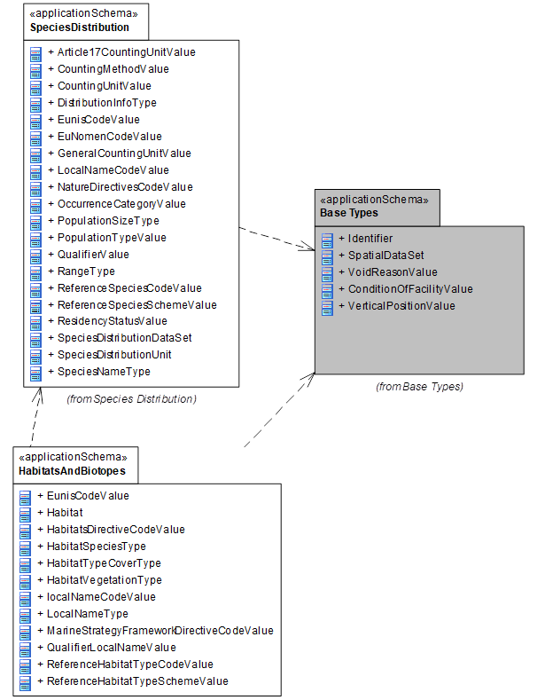

[.text-center]
*Figure 4 – UML class diagram: Overview of the HabitatsAndBiotopes application schema*

An overview of the HabitatAndBiotopes package and referenced packages is depicted in Figure 4. The diagram shows the relations between the HabitatsAndBiotopes application schema and Base Type package defined in the INSPIRE General Conceptual Model. It also depends on the SpeciesDistribution package (using the reference species code lists)

The complete application schema for HabitatsAndBiotopes is shown in Figure 5 and described in detail below.

image::./media/image8.png[image,width=604,height=359, align=center]

[.text-center]
*Figure 5 – UML class diagram: Overview of the HabitatsAndBiotopes application schema (without code lists)*

Several code lists are being referenced in the HabitatsAndBiotopes application schema. An overview of them is seen in Figure 6.

image::./media/image9.png[image,width=604,height=331, align=center]

[.text-center]
*Figure 6 – Code lists in the HabitatsAndBiotopes application schema*

The feature of interest is the habitat (see feature type *_Habitat_*). Habitats are classified into habitat types. A link to a reference habitat classification system shall be provided (see datatype: *_HabitatTypeCoverType_*). In addition local or national habitat typologies are included by means of the attribute "_localHabitatName_" (see datatype: *_HabitatTypeCoverType_*). This makes it possible for the users and providers to use their own habitat classification scheme apart from the reference schemes (EUNIS, HD and MSFD). By means of a qualifier (see Datatype: *_LocalnameType_*, attribute _qualifierLocalName_) the 'quality' of the translation from the local to the international reference habitat classification system can be indicated (see codelist: *_QualifierLocalNamevalue_*).

The habitat as a spatial object (e.g. indicated on a map) may consist of different habitat types, and will then be called habitat complex (see Figure 7). Therefore it is possible to include more than one habitat type within a habitat feature (see Datatype: *_HabitatTypeCoverType_*). In case of a habitat complex information can be added on respectively the area (attribute: _areaCovered_), the length (attribute: _lengthCovered_) or the volume (attribute: _volumeCovered_) that is covered by the different habitat types.

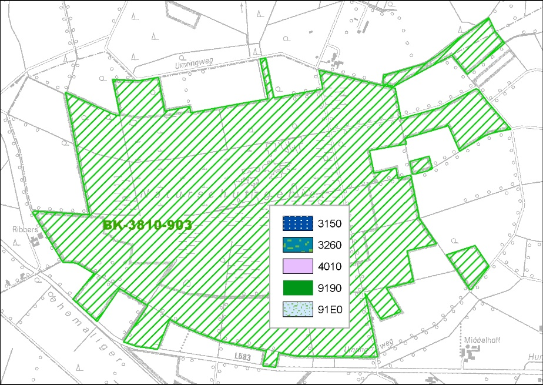

[.text-center]
*Figure 7 – Habitat map with one feature (habitat complex): this habitat feature contains 5 habitat types from the reference HabitatsDirectiveClassificationScheme; a list of these habitat types in the corresponding feature metadata will have further information on the total area, length, volume or percentage covered by each single habitat type.*

In many cases, however, habitat maps will present features that refer to only one habitat type as shown in the following figure (see Figure 8).

image::./media/image11.jpeg[pikto_FFH_LRT,width=343,height=244]

[.text-center]
*Figure 8 – Habitat map with n-habitat features: each single feature has only one habitat type from the reference HabitatsDirectiveClassificationScheme*

As habitats are often characterised by biotic features such as species (see _habitatSpecies_) and vegetation types (see _habitatVegetation_) these attributes are added to the application scheme, but voidable. Abiotic features, although of importance specifically for the marine habitats, have not been included as attributes in the application schema.

[IMPORTANT]
====
[.text-center]
*IR Requirement*
_Annex IV Section 17.5_

It is mandatory to make available at least one habitat type according to a (pan-european) referenceHabitatTypeScheme listed in the ReferenceHabitatTypeSchemeValue code list. This encoding is intended to allow for queries on habitat types on a pan-European harmonized level.

====

[NOTE]
====
*Recomendation 7*

It is strongly recommended to refer to the EUNIS habitat classification code list values in the first place. In addition, the habitat classification code list values of the habitat types of Annex I of the Habitat Directive and of the Marine Strategy Framework Directive can be added in case it meets their definitions

====

[NOTE]
====
*Recomendation 8*

Any local classification schemes for habitat types should be registered on national level (INSPIRE national focus point).

====

[NOTE]
====
*Recomendation 9*

It is recommended that, besides the ID (_localNameCode_), the full name of the vegetation type is provided. Any local classification scheme for vegetation types should be registered on national level.

====

===== Consistency between spatial data sets

There are no other consistency rules than those defined within the application schema. No consistency rules between HabitatsandBiotopes and other spatial datasets have been identified.

===== Identifier management

No spatial object has a mandatory identifier attribute specified. *_Habitat_* has an identifier with multiplicity 0..1. If the identifier is provided it shall consist of two parts: the namespace and a local id (see also the Generic Conceptual Model [DS-D2.5]).

===== Modelling of object references

No object references are included.

==== Feature catalogue

*Feature catalogue metadata*

[cols=","]
|===
|Application Schema |INSPIRE Application Schema HabitatsAndBiotopes
|Version number |3.0
|===

*Types defined in the feature catalogue*

[cols=",,",options="header",]
|===
|*Type* |*Package* |*Stereotypes*
|_EunisHabitatTypeCodeValue_ |HabitatsAndBiotopes |«codeList»
|_Habitat_ |HabitatsAndBiotopes |«featureType»
|_HabitatSpeciesType_ |HabitatsAndBiotopes |«dataType»
|_HabitatTypeCoverType_ |HabitatsAndBiotopes |«dataType»
|_HabitatVegetationType_ |HabitatsAndBiotopes |«dataType»
|_HabitatsDirectiveCodeValue_ |HabitatsAndBiotopes |«codeList»
|_LocalNameCodeValue_ |HabitatsAndBiotopes |«codeList»
|_LocalNameType_ |HabitatsAndBiotopes |«dataType»
|_MarineStrategyFrameworkDirectiveCodeValue_ |HabitatsAndBiotopes |«codeList»
|_QualifierLocalNameValue_ |HabitatsAndBiotopes |«codeList»
|_ReferenceHabitatTypeCodeValue_ |HabitatsAndBiotopes |«codeList»
|_ReferenceHabitatTypeSchemeValue_ |HabitatsAndBiotopes |«codeList»
|===

===== Spatial object types

====== Habitat

[cols="",options="header",]
|===
|*Habitat*
a|
[cols=","]
!===
!Name: !habitat
!Definition: !Geographical areas characterised by specific ecological conditions, processes, structure, and functions that physically support the organisms that live there.
!Description: !Includes terrestrial and aquatic areas distinguished by geographical, abiotic and biotic features, whether entirely natural or semi-natural [Directive 2007/2/EC]. 
 
A Habitat area, line or point may comprise one or more HabitatTypesCoverTypes according to one or more habitat classification schemes, often depending on the data capture process or related to the scale of a map. So a habitat feature might represent a complex of different HabitatTypesCoverTypes. 
 
NOTE Although habitats in principle are geographical areas, they may also be depicted as lines or points.
!Stereotypes: !«featureType»
!===

a|
*Attribute: inspireId*

[cols=","]
!===
!Name: !inspire id
!Value type: !Identifier
!Definition: !External object identifier of the spatial object.
!Description: !An external object identifier is a unique object identifier published by the responsible body, which may be used by external applications to reference the spatial object. The identifier is an identifier of the spatial object, not an identifier of the real-world phenomenon.
!Multiplicity: !0..1
!===

a|
*Attribute: geometry*

[cols=","]
!===
!Name: !geometry
!Value type: !GM_Object
!Definition: !The extent of the habitat based on natural boundaries.
!Description: !NOTE 1 Can be polygons, lines or points. 
NOTE 2 Can also support 3-dimensional features.
!Multiplicity: !1
!===

a|
*Attribute: habitat*

[cols=","]
!===
!Name: !habitat type
!Value type: !HabitatTypeCoverType
!Definition: !The identifier for a habitat class, defined and described in an international, national or local habitat classification scheme.
!Description: !Habitats and biotopes may be common in some characteristics on a certain level of detail and may thus be classified as abstract types: e.g. as woodland, pastures, heathland – referring to their vegetation structure - or as running waters, limestone rocks or sand dunes - referring to abiotic features - but also as wintering areas, nesting areas or wandering corridors etc. - referring to relevant phases for the life-cycle of a certain species or ecological guild. These typological classes are usually organised in classification systems (e.g. EUNIS habitat classification).
!Multiplicity: !1..*
!===

a|
*Attribute: habitatSpecies*

[cols=","]
!===
!Name: !habitat species
!Value type: !HabitatSpeciesType
!Definition: !List of species which occur in or constitute a certain habitat at the time of mapping.
!Multiplicity: !0..*
!Stereotypes: !«voidable»
!===

a|
*Attribute: habitatVegetation*

[cols=","]
!===
!Name: !habitat vegetation
!Value type: !HabitatVegetationType
!Definition: !List of vegetation types which constitute a certain habitat.
!Description: !The cover of plants may be common in some characteristics on a certain level of detail and may thus be classified by vegetation science as abstract types. 
 
E.g. vegetation may be classified as Tundra or Mediterranean Deciduous Forests – referring to their structure and their bio-geographic formations - or as Nordic vegetation type 5141 Koeleria glauca-Typ or Ranunculetum fluitantis - referring to their floristic composition - or as chamaephytes or hemi-cryptophytes - referring to structural traits etc. 
 
Many vegetation type classification systems exist all over Europe. Some of these systems have a deep hierarchical structure. Therefore it is recommended to register the vegetation type scheme which was used.
!Multiplicity: !0..*
!Stereotypes: !«voidable»
!===

|===

===== Data types

====== HabitatSpeciesType
[cols="",options="header",]
|===
|*HabitatSpeciesType*
a|
[cols=","]
!===
!Name: !habitat species type
!Definition: !Species which occurs in a certain habitat at the time of mapping.
!Stereotypes: !«dataType»
!===

a|
*Attribute: referenceSpeciesId*

[cols=","]
!===
!Name: !reference species id
!Value type: !ReferenceSpeciesCodeValue
!Definition: !Identifier of one of the reference lists given by the referenceSpeciesScheme.
!Multiplicity: !1
!===

a|
*Attribute: referenceSpeciesScheme*

[cols=","]
!===
!Name: !reference species scheme
!Value type: !ReferenceSpeciesSchemeValue
!Definition: !Reference list defining a nomenclatural and taxonomical standard to which all local species names and taxonomic concepts shall be mapped to.
!Description: !Closed codelist of accepted PAN-european taxonomical reference lists defining the nomenclature and taxonomical concept of a given species name. This must not be regarded as the ultimate taxonomic truth: this will always change. It serves as a definition of a taxonomic concept described by systematic and synonym relations where other names and there inherent taxonomic concepts can be mapped to. The code list comprises of Eu-Nomen, EUNIS and Natura2000. In these sources harmonized species GUIDs and names are maintained by institutions with an assignment outside INSPIRE and the species names are to be retrieved through webservices using GUIDs. Only one of these list must be used for one taxon. The priority is as follows: 1) EU-Nomen, 2) EUNIS, 3) NatureDirectives. This implies: if a taxon is listed in EU-Nomen, this reference must be used as first choice. If it is not listed in EU-Nomen, the second choice is EUNIS, if not in EUNIS, NatureDirectives can be used.
!Multiplicity: !1
!===

a|
*Attribute: localSpeciesName*

[cols=","]
!===
!Name: !local species name
!Value type: !LocalNameType
!Definition: !Scientific name plus author used in national nomenclature with its national taxonomic concept.
!Description: !The LocalSpeciesName provides nomenclatural and taxonomical information about the locally used species name and the taxonomic concepts implied by the use of this name according to a given reference. If omitted the name and concept given by the referenceSpeciesId according to the referenceSpeciesScheme has been used locally.
!Multiplicity: !0..1
!Stereotypes: !«voidable»
!===

|===

====== HabitatTypeCoverType

[cols="",options="header",]
|===
|*HabitatTypeCoverType*
a|
[cols=","]
!===
!Name: !habitat type cover type
!Definition: !Habitat type according to an international, national or local habitat classifications scheme.
!Description: !Includes additional information on covered area, covered length, or containing volume.
!Stereotypes: !«dataType»
!===

a|
*Attribute: referenceHabitatTypeId*

[cols=","]
!===
!Name: !reference habitat type id
!Value type: !ReferenceHabitatTypeCodeValue
!Definition: !Habitat type unique identifier (code) according to one Pan-European classification scheme.
!Description: !EXAMPLE "1110", "40C0", "95A0", etc., if the referenceHabitatScheme is "habitatsDirective", or "A1.111", "A1.1121", "G1.1111", "X34", etc., if the ReferenceHabitatScheme is "eunis".
!Multiplicity: !1
!===

a|
*Attribute: referenceHabitatTypeScheme*

[cols=","]
!===
!Name: !reference habitat type scheme
!Value type: !ReferenceHabitatTypeSchemeValue
!Definition: !One of the Pan-European classification schemes, that are widely used in Europe.
!Description: !The list includes at least the classification of the natural habitat types of community interest listed in Annex I of the Habitats Directive, as well as the hierarchic classification of the habitat types of interest for biodiversity and nature protection listed in the EUNIS database, which is maintained by the EEA.
!Multiplicity: !1
!===

a|
*Attribute: referenceHabitatTypeName*

[cols=","]
!===
!Name: !reference habitat type name
!Value type: !CharacterString
!Definition: !Name of a habitat type according to one Pan-European classification scheme.
!Description: !In the given Pan-European habitat classification systems, the habitat types can be identified by both: a short "identifier" (code) and a name in natural language, which is meant in this attribute. 
 
EXAMPLE Habitats Directive habitat type 3260 (code) "Floating vegetation of Ranunculus" or "Chenopodietum rubri of submountainous rivers" (name).
!Multiplicity: !1
!Stereotypes: !«voidable»
!===

a|
*Attribute: localHabitatName*

[cols=","]
!===
!Name: !local habitat name
!Value type: !LocalNameType
!Definition: !Habitat type according to a local habitat classification scheme.
!Description: !Habitat types used in a certain area (e.g. Mediterranean Sea), or in a certain country, or even more restricted in a certain region, county or any other local level. 
 
It is strongly recommended to register the local classification scheme from which the local habitat names are taken 
 
EXAMPLE Classification of Benthic Marine Habitat Types for the Mediterranean Region, Habitats of Romania, German Biotoptypen, Nordic Vegetation types, UK National Vegetation Classification, etc.
!Multiplicity: !0..1
!Stereotypes: !«voidable»
!===

a|
*Attribute: areaCovered*

[cols=","]
!===
!Name: !area covered
!Value type: !Area
!Definition: !The area covered by a certain habitat type within the provided geometry of the habitat spatial object.
!Description: !The surface area should be expressed in square meters. 
 
It can be used only in the case that the geometry provided in the Habitat feature represents an area in which more than one habitat type exists in other words a complex of different habitat types. In this case, for each habitat type the surface of the covered area can be provided within this attribute. 
 
Since the geometry provided in the Habitat feature can be larger than the total surface of the habitat types listed within that geometry, the total surface of the habitat types can be smaller than the surface of the provided geometry. On the other hand, since some habitat types may overlap (e.g. subterranean caves / habitat type on the surface) or may cover a steep inclination (cliff) the total area of the habitat types can be bigger than the area of the provided geometry. 
 
EXAMPLE Within a given habitat geometry of 30.2 hectares there are several habitat types, out of which two are natural habitat types of community interest, "91D0" covering 22.5 hectares and "7110" covering 5.3 hectares, thus in total are smaller than the total area.
!Multiplicity: !0..1
!Stereotypes: !«voidable»
!===

a|
*Attribute: lengthCovered*

[cols=","]
!===
!Name: !length covered
!Value type: !Length
!Definition: !The length covered by a certain habitat type within the provided geometry of the habitat spatial object.
!Description: !The length should be expressed in meters. 
 
EXAMPLE Within a given habitat geometry of 300 square meters there are several habitat types. Two natural habitat types of community interest, "91F0" and "9160" cover this total area. However, a third natural habitat types of community interest "3260" is listed, which is a linear feature and thus expressed in meters of its length (e.g. 120 m).
!Multiplicity: !0..1
!Stereotypes: !«voidable»
!===

a|
*Attribute: volumeCovered*

[cols=","]
!===
!Name: !volume covered
!Value type: !Volume
!Definition: !The volume covered by a certain habitat type within the provided geometry of the habitat spatial object.
!Description: !The volume should be expressed in cubic meters.
!Multiplicity: !0..1
!Stereotypes: !«voidable»
!===

|===

====== HabitatVegetationType

[cols="",options="header",]
|===
|*HabitatVegetationType*
a|
[cols=","]
!===
!Name: !habitat vegetation type
!Definition: !Vegetation type which occurs in a certain habitat.
!Stereotypes: !«dataType»
!===

a|
*Attribute: localVegetationName*

[cols=","]
!===
!Name: !local vegetation name
!Value type: !LocalNameType
!Definition: !Natural language name of a vegetation class (vegetation type) according to a local vegetation classification scheme.
!Description: !For better understanding it is strongly recommended to give the full name of the vegetation type rather than any abbreviation or code used in the local scheme. 
 
EXAMPLE "Stellario alsines – Montietum rivularis (Franzi 1984)".
!Multiplicity: !1
!===

|===

====== LocalNameType

[cols="",options="header",]
|===
|*LocalNameType*
a|
[cols=","]
!===
!Name: !local name type
!Definition: !Name according to a local classification scheme.
!Stereotypes: !«dataType»
!===

a|
*Attribute: localScheme*

[cols=","]
!===
!Name: !local scheme
!Value type: !CharacterString
!Definition: !Uniform resource identifier of a local classification scheme.
!Description: !Classification scheme, which is used locally and contains all classification types, their codes and/or very often their names in natural language. 
 
EXAMPLE "http://www.rac-spa.org/sites/default/files/doc_fsd/lchm_en.pdf", for the Classification of Benthic Marine Habitat Types for the Mediterranean Region or "http://www.lifenatura2000.ro/doc/Habitatele din Romania.pdf", for the Romanian habitats classification.
!Multiplicity: !1
!===

a|
*Attribute: localNameCode*

[cols=","]
!===
!Name: !local name code
!Value type: !LocalNameCodeValue
!Definition: !Natural language name according to a local classification scheme.
!Description: !EXAMPLE: "Comunitati vest-pontice cu Camphosma annua si Kochia laniflora" for the habitat „R1508" from the Romanian habitat classification or „Biocenosis of abyssal muds" for the habitat „VI.1.1." from the Classification of Benthic Marine Habitat Types for the Mediterranean Region or "Stellario alsines – Montietum rivularis (Franzi 1984)" for a vegetation type.
!Multiplicity: !1
!===

a|
*Attribute: localName*

[cols=","]
!===
!Name: !local name
!Value type: !CharacterString
!Definition: !Name according to a local classification scheme.
!Description: !Name according to local classification scheme. It is strongly recommended take all local names from a registered classification scheme.
!Multiplicity: !1
!Stereotypes: !«voidable»
!===

a|
*Attribute: qualifierLocalName*

[cols=","]
!===
!Name: !qualifier local name
!Value type: !QualifierLocalNameValue
!Definition: !The relation between the local name and the corresponding name in the Pan-European schema.
!Description: !EXAMPLE The local habitat type can be conceptually the same as the related Pan-European habitat type, the relationship then is called "congruent" or the local habitat type may be a subtype of the Pan-European habitat type, therefore the relationship should be "includedIn", etc.
!Multiplicity: !1
!Stereotypes: !«voidable»
!===

|===

===== Code lists

====== EunisHabitatTypeCodeValue

[cols="",options="header",]
|===
|*EunisHabitatTypeCodeValue*
a|
[cols=","]
!===
!Name: !eunis habitat type code value
!Definition: !EUNIS habitat types classification.
!Extensibility: !none
!Identifier: !http://inspire.ec.europa.eu/codelist/EunisHabitatTypeCodeValue
!Values: !The allowed values for this code list comprise only the values specified in "Classification of habitat types according to the EUNIS Biodiversity database, as specified in the EUNIS habitat types classification published on the web site of the European Environment Agency" .
!===

|===

====== HabitatsDirectiveCodeValue

[cols="",options="header",]
|===
|*HabitatsDirectiveCodeValue*
a|
[cols=","]
!===
!Name: !habitat directive code value
!Definition: !Habitats Directive Annex I habitats.
!Extensibility: !none
!Identifier: !http://inspire.ec.europa.eu/codelist/HabitatsDirectiveCodeValue
!Values: !The allowed values for this code list comprise only the values specified in "Classification of habitat types according to Annex I to Directive 92/43/EEC" .
!===

|===

====== LocalNameCodeValue

[cols="",options="header",]
|===
|*LocalNameCodeValue*
a|
[cols=","]
!===
!Name: !local name code value
!Definition: !Identifier taken from any local classification scheme.
!Extensibility: !any
!Identifier: !http://inspire.ec.europa.eu/codelist/LocalNameCodeValue
!Values: !The allowed values for this code list comprise any values defined by data providers.
!===

|===

====== MarineStrategyFrameworkDirectiveCodeValue

[cols="",options="header",]
|===
|*MarineStrategyFrameworkDirectiveCodeValue*
a|
[cols=","]
!===
!Name: !marine strategy framework directive code value
!Definition: !Marine Strategy Framework Directive.
!Extensibility: !none
!Identifier: !http://inspire.ec.europa.eu/codelist/MarineStrategyFrameworkDirectiveCodeValue
!Values: !The allowed values for this code list comprise only the values specified in "Classification of habitat types according to table 1 of Annex III to Directive 2008/56/EC" .
!===

|===

====== QualifierLocalNameValue

[cols="",options="header",]
|===
|*QualifierLocalNameValue*
a|
[cols=","]
!===
!Name: !qualifier local name value
!Definition: !List of values that specify the relation between a locally used name and a name used at the pan-European level.
!Extensibility: !none
!Identifier: !http://inspire.ec.europa.eu/codelist/QualifierLocalNameValue
!Values: !The allowed values for this code list comprise only the values specified in _Annex C_ .
!===

|===

====== ReferenceHabitatTypeCodeValue

[cols="",options="header",]
|===
|*ReferenceHabitatTypeCodeValue*
a|
[cols=","]
!===
!Name: !reference habitat type code value
!Definition: !Values used in the Pan-European habitat classification schemes.
!Extensibility: !none
!Identifier: !http://inspire.ec.europa.eu/codelist/ReferenceHabitatTypeCodeValue
!Values: !
!===

|===

====== ReferenceHabitatTypeSchemeValue

[cols="",options="header",]
|===
|*ReferenceHabitatTypeSchemeValue*
a|
[cols=","]
!===
!Name: !reference habitat type scheme value
!Definition: !This value defines which pan-european habitat classification scheme has been used.
!Description: !EXAMPLE Eunis
!Extensibility: !none
!Identifier: !http://inspire.ec.europa.eu/codelist/ReferenceHabitatTypeSchemeValue
!Values: !The allowed values for this code list comprise only the values specified in _Annex C_ .
!===

|===

===== Imported types (informative)

This section lists definitions for feature types, data types and code lists that are defined in other application schemas. The section is purely informative and should help the reader understand the feature catalogue presented in the previous sections. For the normative documentation of these types, see the given references.

====== Area

[cols="",options="header",]
|===
|*Area*
a|
[cols=","]
!===
!Package: !Units of Measure
!Reference: !Geographic information -- Conceptual schema language [ISO/TS 19103:2005]
!===

|===

====== CharacterString

[cols="",options="header",]
|===
|*CharacterString*
a|
[cols=","]
!===
!Package: !Text
!Reference: !Geographic information -- Conceptual schema language [ISO/TS 19103:2005]
!===

|===

====== GM_Object

[cols="",options="header",]
|===
|*GM_Object (abstract)*
a|
[cols=","]
!===
!Package: !Geometry root
!Reference: !Geographic information -- Spatial schema [ISO 19107:2003]
!===

|===

====== Identifier

[cols="",options="header",]
|===
|*Identifier*
a|
[cols=","]
!===
!Package: !Base Types
!Reference: !INSPIRE Generic Conceptual Model, version 3.4 [DS-D2.5]
!Definition: !External unique object identifier published by the responsible body, which may be used by external applications to reference the spatial object.
!Description: !NOTE1 External object identifiers are distinct from thematic object identifiers. 
 
NOTE 2 The voidable version identifier attribute is not part of the unique identifier of a spatial object and may be used to distinguish two versions of the same spatial object. 
 
NOTE 3 The unique identifier will not change during the life-time of a spatial object.
!===

|===

====== Length

[cols="",options="header",]
|===
|*Length*
a|
[cols=","]
!===
!Package: !Units of Measure
!Reference: !Geographic information -- Conceptual schema language [ISO/TS 19103:2005]
!===

|===

====== ReferenceSpeciesCodeValue

[cols="",options="header",]
|===
|*ReferenceSpeciesCodeValue*
a|
[cols=","]
!===
!Package: !SpeciesDistribution
!Reference: !INSPIRE Data specification on Species Distribution [DS-D2.8.III.19]
!Definition: !Reference lists containing species identifiers.
!Description: !The authorized ReferenceSpeciesScheme provides reference species list which defines the ReferenceSpeciesName with its scientific name plus author and ReferenceSpeciesId. In these ReferenceSpeciesSchemes harmonized species names are given GUIDs and the species names are to be retrieved through webservices using GUIDs. Only one of these list must be used for one taxon. The priority is as follows: 1) EU-Nomen, 2) EUNIS, 3) NatureDirectives. This implies: if a taxon is listed in EU-Nomen, this reference must be used as first choice. If it is not listed in EU-Nomen, the second choice is EUNIS, if not in EUNIS, NatureDirectives can be used.
!===

|===

====== ReferenceSpeciesSchemeValue

[cols="",options="header",]
|===
|*ReferenceSpeciesSchemeValue*
a|
[cols=","]
!===
!Package: !SpeciesDistribution
!Reference: !INSPIRE Data specification on Species Distribution [DS-D2.8.III.19]
!Definition: !Reference lists defining a nomenclatural and taxonomical standard to which local names and taxonomic concepts can be mapped.
!Description: !The authorized ReferenceSpeciesScheme provides reference species list which defines the ReferenceSpeciesName with its scientific name plus author and ReferenceSpeciesId. In these ReferenceSpeciesSchemes harmonized species names are given GUIDs and the species names are to be retrieved through webservices using GUIDs. Only one of these list must be used for one taxon. The priority is as follows: 1) EU-Nomen, 2) EUNIS, 3) NatureDirectives. This implies: if a taxon is listed in EU-Nomen, this reference must be used as first choice. If it is not listed in EU-Nomen, the second choice is EUNIS, if not in EUNIS, NatureDirectives can be used.
!===

|===

====== Volume

[cols="",options="header",]
|===
|*Volume*
a|
[cols=","]
!===
!Package: !Units of Measure
!Reference: !Geographic information -- Conceptual schema language [ISO/TS 19103:2005]
!===

|===

==== Externally governed code lists

The externally governed code lists included in this application schema are specified in the tables in this section.

===== Governance and authoritative source

[cols=",,",options="header",]
|===
|*Code list* |*Governance* |**Authoritative Source (incl. version**footnote:[If no version or publication date are specified, the "latest available version" shall be used.] *and relevant subset, where applicable)*
|EunisCodeValue |European Environment Agency |The European inventory of nationally designated areas,version of 04/10/2012, code lists.
|MarineStrategyFrameworkDirectiveCodeValue |DG Environment/European Environment Agency |-
|HabitatsDirectiveCodeValue |DG Environment/European Environment Agency a|The Reference Portal for NATURA 2000 - part of the Standard Data Form, Codelist of Annex I habitats (SDF field: 3.1).

|===

===== Availability

[cols=",,",options="header",]
|===
|*Code list* |*Availability* |*Format*
|EunisCodeValue |http://www.eea.europa.eu/data-and-maps/data/nationally-designated-areas-national-cdda-3/eunis-habitat-classification/eunis_habitats_level4.xls |XLS
|MarineStrategyFrameworkDirectiveCodeValue |Does not yet exist |
|HabitatsDirectiveCodeValue |http://bd.eionet.europa.eu/activities/Natura_2000/Folder_Reference_Portal/Habitat_Directive_habitats.xls |XLS
|===

===== Rules for code list values

[cols=",,",options="header",]
|===
|*Code list* |*Identifiers* |*Examples*
|EunisCodeValue |Append the codes from column A of the excel sheet to the URI: http://www.eea.europa.eu/data-and-maps/data/nationally-designated-areas-national-cdda-3/eunis-habitat-classification/eunis_habitats_level4/ 
NOTE The codes in the EUNIS web application are currently internal identifiers; In near future they will be provided as machine readable formats such as SKOS/RDF. a|
"B1.64"

Dune sclerophyllous scrubs and thickets

|MarineStrategyFrameworkDirectiveCodeValue |  |
|HabitatsDirectiveCodeValue |Append the codes from column A of the excel sheet to the URI: http://bd.eionet.europa.eu/activities/Natura_2000/Folder_Reference_Portal/Habitat_Directive_habitats/ 
NOTE In near future the codes will be provided as machine readable formats such as SKOS/RDF. a|
"1110"

Sandbanks which are slightly covered by sea water all the time

|===

[cols=",,",options="header",]
|===
|*Code list* |*Labels* |*Examples*
|EunisCodeValue |The name of the habitat type column C of the excel sheet. 
EXAMPLE "Dune sclerophyllous scrubs and thickets" a|
"B1.64"

Dune sclerophyllous scrubs and thickets

|MarineStrategyFrameworkDirectiveCodeValue |  | 
|HabitatsDirectiveCodeValue |The name of the habitat type in column C of the excel sheet. 
EXAMPLE "Sandbanks which are slightly covered by sea water all the time" a|
"1110"

Sandbanks which are slightly covered by sea water all the time

|===

=== Application schema HabitatsAndBiotopesDistribution

==== Description

===== Narrative description

This application schema concerns the geographic distribution of habitats and biotopes, similar to the geographic distribution of species. This application schema is added due to the reporting obligation under article 17 of the Habitats Directive. It is different from the application schema on habitats and biotopes as it does not contain the geographic boundaries of habitats and biotopes. The distribution of habitats and biotopes is depicted based on a reference dataset e.g. GRID data or other analytical units.

===== UML Overview

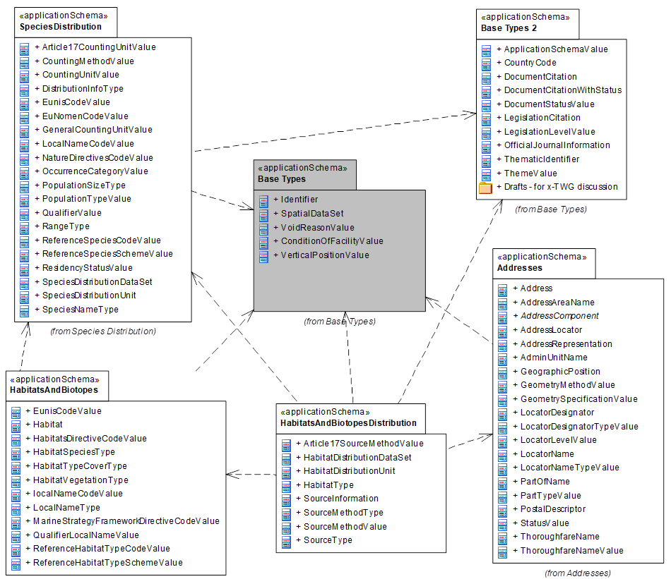

[.text-center]
*Figure 9 – UML class diagram: Overview of the HabitatsAndBiotopesDistribution application schema*

An overview of the HabitatAndBiotopesDistribution package and referenced packages is depicted in Figure 9. The diagram shows the relations between the HabitatsAndBiotopes application schema and Base Type packages defined in the INSPIRE General Conceptual Model. It also depends on the SpeciesDistribution (using the reference species code lists), the HabitatsAndDistribution (for classification), and the Addresses (for *_AddressRepresantion_* datatype) packages.

The complete application schema for HabitatsAndBiotopesDistribution is shown in Figure 10 and described in detail below.

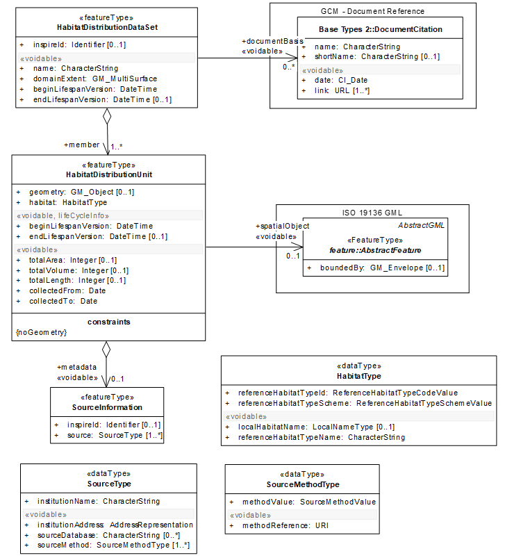

[.text-center]
*Figure 10 – UML class diagram: Overview of the HabitatsAndBiotopesDistribution application schema (without code lists)*

Several code lists are being referenced in the HabitatsAndBiotopesDistribution application schema. An overview of them is seen in Figure 11.

image::./media/image14.png[image,width=494,height=639, align=center]

[.text-center]
*Figure 11 – Code lists in the HabitatsAndBiotopesDistribution application schema (including imported code lists from HabitatsAndBiotopes)*

The main spatial object for the HabitatsAndBiotopesDistribution application schema is *_HabitatDistributionUnit_* (see Figure 10). Information on habitat types is aggregated within this spatial object type. The *_HabitatDistributionDataSet_* spatial object specifies a dataset containing several instances of _*HabitatDistributionUnit*._

NOTE The *_HabitatDistributionDataSet_* is a predefined data set which contains specific metadata about the extent (more detailed extent information than the discovery level metadata element on extent), name and documentation details e.g. for which legal purpose the data set has been generated.

As habitat distribution data is often used for reporting according to legal (or other) obligations, a possibility to include a link to legal documents or other documentation is provided via the association _documentBasis_ from the *_HabitatDistributionDataSet_* to the spatial object *_DocumentCitation_* defined in the "Base Type 2" application schema (Generic Conceptual Model). This spatial object type can provide information on document details

The geometry of the spatial object *_HabitatDistributionUnit_* may correspond to another geographical feature (see the link to Feature Type, *_abstractFeatureType_*) for example a grid, administrative units or Natura2000 sites (see Figure 12 - Figure 14), that can be specified/selected by the provider. The distribution of a habitat in fact exists of a collection of habitat distribution units.

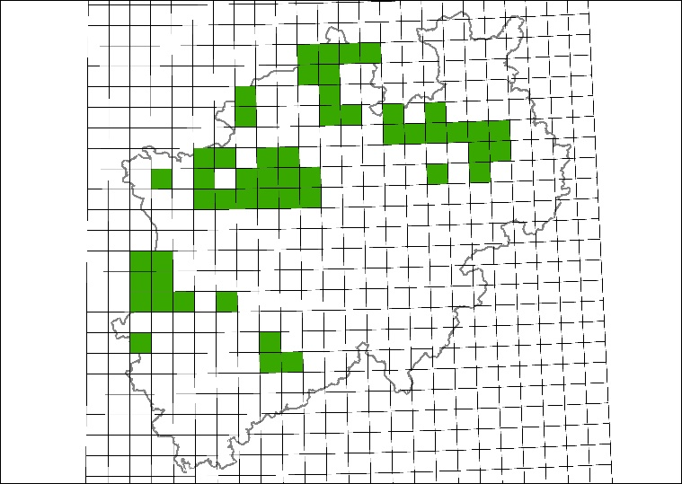

[.text-center]
*Figure 12 – Distribution of habitat type 3130 HabitatsDirectiveClassificationScheme referring to the analytical units of a Gauß-Krüger grid in North Rhine-Westphalia, Germany.*

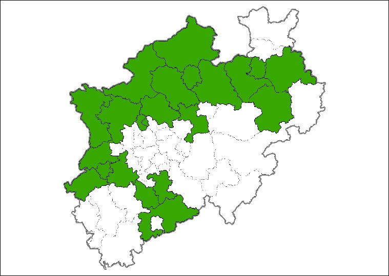

[.text-center]
*Figure 13 – Distribution of habitat type 3130 HabitatsDirectiveClassificationScheme referring to administrative units (districts) in North Rhine-Westphalia, Germany*

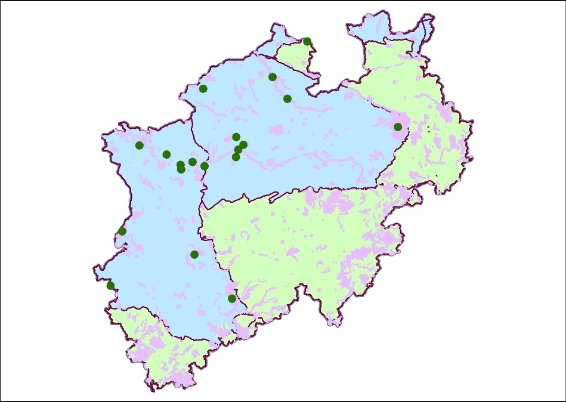

[.text-center]
*Figure 14 – Distribution of habitat type 3130 HabitatsDirectiveClassificationScheme referring to Natura2000 sites in North Rhine-Westphalia, Germany (pink areas=Natura2000 sites; green dots represent Natura2000 sites with habitat type 3130, blue area = Atlantic bio-geographical region, green area = Continental bio-geographical region.*

As the boundaries of the *_HabitatDistributionUnit_*(s) do not – necessarily - correspond to the boundaries of a Habitat feature the attributes _totalArea_, _totalLength_ and _totalVolume_ are added to be able to specify the total area, length or volume that is covered by the habitat within the HabitatDistributionUnit (see 6.1.4)

[IMPORTANT]
====
[.text-center]
*IR Requirement*
_Annex II Section 2.2.1_

The Grid_ETRS89-LAEA as defined in Regulation 1089/2010/EC shall be used when defining a rectified grid.

====

NOTE 1 The Grid_ETRS89-LAEA is hierarchical, with resolutions of 1m, 10m, 100m, 1 000m, 10 000m and 100 000m. The grid orientation is south-north, west-east.

NOTE 2 This requirement does not restrict distribution of datasets based on grids defined in other reference systems.

The *_HabitatDistributionUnit_* is linked to the *_SourceInformation_* spatial object type in order to describe metadata information about specific instances of distribution units. These metadata can be shared among several habitat distribution units.

The *_SourceInformation_* contains the following attribute (besides the inspire id):

* _source:_ Is of data type *_SourceType_* which provides information on the sources and their origins:
** _institutionName_ is a character string representing the name of the institution providing the source data.
** _institutionAddress_ represents the address using the data type *_AddressRepresentation_* from the Addresses application schema.
** _sourceDatabase_ is a character string indicating the name of the database where the habitat distribution data is retrieved from.
** _sourceMethod has the data type SourceMethodType and provides the methods used when collecting the source data (methodValue) either in the field, from analogue written texts and/or maps or other methods. The values are defined in code lists Article17SourceMethodValue. This code list can be extended if required. Additionally, the methodReference provides a reference to a description of the method by which the data on habitat distribution is collected._

===== Consistency between spatial data sets

There are no other consistency rules than those defined within the application schema. No consistency rules between HabitatsandBiotopesDistribution and other spatial datasets have been identified.

===== Identifier management

No spatial object has a mandatory identifier attribute specified. Three spatial object types have an identifier with multiplicity 0..1: *_HabitatDistributionDataSet_*, *_HabitatDistributionUnit,_* and *_SourceInformation_*. If the identifier is provided it shall consist of two parts: the namespace and a local id (see also the Generic Conceptual Model [DS-D2.5]).

===== Modelling of object references

Since each distribution unit may be spatially represented by another spatial object, e.g., an administrative unit or a protected site, there is a possibility to link to other spatial objects via an external object reference. This link can be encoded either as inline features or as object references (Xlinks). The external object references is made from the spatial object *_HabitatDistributionUnit_* to the *_AbstractFeature_* from ISO 19136 (GML). This feature can represent any kind of spatial object.

NOTE External references to other spatial objects are complicated to maintain and to ensure are up to date. Furthermore, there is a challenge in the resolving of the object references when downloading spatial objects.

[NOTE]
====
*Recommendation 1*

It is recommended to derive the geometry from another spatial object and represent it using the _geometry_ attribute of *_HabitatDistributionUnit._*

====

NOTE This means that the geometry attribute contains a "copy" of the geometry from another spatial object and, thus, would also have to be maintained.

Another object reference is for the document basis (_documentBasis_). This is used to document either a legal act or any kind of documentation of the reason for creating a data set. This link can be encoded either inline as object references (Xlinks).

Internal reference: Finally, an aggregation construct is modelled between *_HabitatDistributionUnit_* and *_SourceInformation_*. This basically means that many instances of *_HabitatDistributionUnit_* can share the same source information. An attribute (metadata) in *_HabitatDistributionUnit_* will contain a reference to the *_SourceInformation_* object. This way of handling object metadata is used to carry information about the aggregation of data into distribution units.

==== Feature catalogue

*Feature catalogue metadata*

[cols=","]
|===
|Application Schema |INSPIRE Application Schema HabitatsAndBiotopesDistribution
|Version number |3.0
|===

*Types defined in the feature catalogue*

[cols=",,",options="header",]
|===
|*Type* |*Package* |*Stereotypes*
|_HabitatDistributionDataSet_ |HabitatsAndBiotopesDistribution |«featureType»
|_HabitatDistributionUnit_ |HabitatsAndBiotopesDistribution |«featureType»
|_HabitatType_ |HabitatsAndBiotopesDistribution |«dataType»
|_SourceInformation_ |HabitatsAndBiotopesDistribution |«featureType»
|_SourceMethodType_ |HabitatsAndBiotopesDistribution |«dataType»
|_SourceType_ |HabitatsAndBiotopesDistribution |«dataType»
|===

===== Spatial object types

====== HabitatDistributionDataSet

[cols="",options="header",]
|===
|*HabitatDistributionDataSet*
a|
[cols=","]
!===
!Name: !habitat distribution data set
!Definition: !This data set is a collection of individual spatial objects (units) in a distribution of habitats.
!Description: !The geographic distribution of a habitat within a certain country, bio-geographical region or other geographical area, depicted based on other geographical features e.g. grids. 
 
NOTE Habitat distribution is one of the aspects to assess the conservation status of the habitat types of Annex I of the Habitat Directive. The member states are obliged to provide the EC with distribution maps (grids of 10*10 km) with information about the actual occurrences of the habitat types within a the bio-geographical regions within the member state based on the results of a comprehensive national mapping or inventory of the habitats wherever possible.
!Stereotypes: !«featureType»
!===

a|
*Attribute: inspireId*

[cols=","]
!===
!Name: !inspire id
!Value type: !Identifier
!Definition: !External object identifier of the spatial object.
!Description: !An external object identifier is a unique object identifier published by the responsible body, which may be used by external applications to reference the spatial object. The identifier is an identifier of the spatial object, not an identifier of the real-world phenomenon.
!Multiplicity: !0..1
!===

a|
*Attribute: name*

[cols=","]
!===
!Name: !name
!Value type: !CharacterString
!Definition: !Name of a habitat distribution data set.
!Description: !A short descriptive identification name for a specific dataset provided by an institution.
!Multiplicity: !1
!Stereotypes: !«voidable»
!===

a|
*Attribute: domainExtent*

[cols=","]
!===
!Name: !domain extent
!Value type: !GM_MultiSurface
!Definition: !The geographic extent of the coverage of the habitat distribution data set.
!Multiplicity: !1
!Stereotypes: !«voidable»
!===

a|
*Attribute: beginLifespanVersion*

[cols=","]
!===
!Name: !begin life span version
!Value type: !DateTime
!Definition: !Date and time at which this version of the spatial object was inserted or changed in the spatial data set.
!Description: !NOTE This date is recorded to enable the generation of change only update files.
!Multiplicity: !1
!Stereotypes: !«voidable»
!===

a|
*Attribute: endLifespanVersion*

[cols=","]
!===
!Name: !end life span version
!Value type: !DateTime
!Definition: !Date and time at which this version of the spatial object was superseded or retired in the spatial data set.
!Description: !NOTE This date is recorded primarily for those systems which "close" an entry in the spatial data set in the event of an attribute change.
!Multiplicity: !0..1
!Stereotypes: !«voidable»
!===

a|
*Association role: member*

[cols=","]
!===
!Name: !member
!Value type: !HabitatDistributionUnit
!Definition: !Individual spatial objects in a collection of spatial objects.
!Multiplicity: !1..*
!===

a|
*Association role: documentBasis*

[cols=","]
!===
!Name: !documentBasis
!Value type: !DocumentCitation
!Definition: !Reference to or citation of a document describing a campaign or a legal act which is the basis for the data set.
!Multiplicity: !0..*
!Stereotypes: !«voidable»
!===

|===

====== HabitatDistributionUnit

[cols="",options="header",]
|===
|*HabitatDistributionUnit*
a|
[cols=","]
!===
!Name: !habitat distribution unit
!Definition: !Represents individual features (units) in a distribution of habitats.
!Description: !The habitat distribution unit is part of the geographical distribution of a certain habitat (habitat type). It indicates the occurrence (presence or absence) of a habitat
!Stereotypes: !«featureType»
!===

a|
*Attribute: beginLifespanVersion*

[cols=","]
!===
!Name: !begin life span version
!Value type: !DateTime
!Definition: !Date and time at which this version of the spatial object was inserted or changed in the spatial data set.
!Description: !NOTE This date is recorded to enable the generation of change only update files.
!Multiplicity: !1
!Stereotypes: !«voidable,lifeCycleInfo»
!===

a|
*Attribute: geometry*

[cols=","]
!===
!Name: !geometry
!Value type: !GM_Object
!Definition: !The geometry of each unit in a collection.
!Multiplicity: !0..1
!===

a|
*Attribute: endLifespanVersion*

[cols=","]
!===
!Name: !end life span version
!Value type: !DateTime
!Definition: !Date and time at which this version of the spatial object was superseded or retired in the spatial data set.
!Description: !NOTE This date is recorded primarily for those systems which "close" an entry in the spatial data set in the event of an attribute change.
!Multiplicity: !0..1
!Stereotypes: !«voidable,lifeCycleInfo»
!===

a|
*Attribute: habitat*

[cols=","]
!===
!Name: !habitat
!Value type: !HabitatType
!Definition: !The identifier for a habitat class, defined and described in an international, national or local habitat classification scheme.
!Description: !Habitats and biotopes may be common in some characteristics on a certain level of detail and may thus be classified as abstract types: e.g. as woodland, pastures, heathland – referring to their vegetation structure - or as running waters, limestone rocks or sand dunes - referring to abiotic features - but also as wintering areas, nesting areas or wandering corridors etc. - referring to relevant phases for the life-cycle of a certain species or ecological guild. These typological classes are usually organised in classification systems (e.g. EUNIS habitat classification)
!Multiplicity: !1
!===

a|
*Attribute: totalArea*

[cols=","]
!===
!Name: !total area
!Value type: !Integer
!Definition: !The area of a habitat (expressed in square meters) within the spatial object that has been used to depict the distribution of the habitat (type) within a certain country, bio-geographical regions or other geographical area.
!Description: !NOTE This is only relevant if the habitat covers a certain area (e.g. within a grid) and not in case of a linear feature 
EXAMPLE Area of grid cell.
!Multiplicity: !0..1
!Stereotypes: !«voidable»
!===

a|
*Attribute: totalVolume*

[cols=","]
!===
!Name: !total volume
!Value type: !Integer
!Definition: !The volume (expressed in cubic meters) of a certain habitat type within the provided geometry of a specific habitat distribution unit.
!Multiplicity: !0..1
!Stereotypes: !«voidable»
!===

a|
*Attribute: totalLength*

[cols=","]
!===
!Name: !total length
!Value type: !Integer
!Definition: !The length of a habitat (expressed in meters) within spatial object that has been used to depict the distribution of the habitat (type) within a certain country, bio-geographical region or other geographical area.
!Description: !NOTE This is only relevant if the habitat is a linear feature that can be expressed by length (e.g within a grid) and not if the habitat covers a certain area.
!Multiplicity: !0..1
!Stereotypes: !«voidable»
!===

a|
*Attribute: collectedFrom*

[cols=","]
!===
!Name: !collected from
!Value type: !Date
!Definition: !The date when the collecting of the original habitat occurrence data started.
!Multiplicity: !1
!Stereotypes: !«voidable»
!===

a|
*Attribute: collectedTo*

[cols=","]
!===
!Name: !collected to
!Value type: !Date
!Definition: !The date when the collecting of the original habitat occurrence data stopped.
!Multiplicity: !1
!Stereotypes: !«voidable»
!===

a|
*Association role: metadata*

[cols=","]
!===
!Name: !metadata
!Value type: !SourceInformation
!Definition: !Contains metadata about specific instances of habitat distribution units.
!Multiplicity: !0..1
!Stereotypes: !«voidable»
!===

a|
*Association role: spatialObject*

[cols=","]
!===
!Name: !spatial object
!Value type: !AbstractFeature
!Definition: !A reference to a another spatial object defining the spatial extent of a distribution unit.
!Description: !EXAMPLE A specific administrative area.
!Multiplicity: !0..1
!Stereotypes: !«voidable,lifeCycleInfo»
!===

a|
*Constraint: noGeometry*

[cols=","]
!===
!Natural language: !If geometry has no value, a reference to a spatial object needs to be provided.
!OCL: !inv: self.geometry->isEmpty() implies self.spatialObject->notEmpty()
!===

|===

====== SourceInformation

[cols="",options="header",]
|===
|*SourceInformation*
a|
[cols=","]
!===
!Name: !source information
!Definition: !Contains metadata about specific instances of habitat distribution.
!Description: !May be shared among several habitat distributions units.
!Stereotypes: !«featureType»
!===

a|
*Attribute: inspireId*

[cols=","]
!===
!Name: !inspire id
!Value type: !Identifier
!Definition: !External object identifier of the spatial object.
!Description: !An external object identifier is a unique object identifier published by the responsible body, which may be used by external applications to reference the spatial object. The identifier is an identifier of the spatial object, not an identifier of the real-world phenomenon.
!Multiplicity: !0..1
!===

a|
*Attribute: source*

[cols=","]
!===
!Name: !source
!Value type: !SourceType
!Definition: !Information about institution compiling data from source databases to a complete dataset.
!Multiplicity: !1..*
!===

|===

===== Data types

====== HabitatType

[cols="",options="header"]
|===
|*HabitatType*
a|
[cols=","]
!===
!Name: !habitat type
!Definition: !Habitat type according to an international, national or local habitat classifications scheme.
!Description: a!Different habitat classification schemes exist throughout Europe. In many cases a local or national classification schema will be in daily use, however, references to international (European) classification schemas will already frequently be introduced (e.g. Habitat types of community interest, Habitat Directive). It is mandatory to encode the habitat type according to a (pan-European) referenceHabitatTypeScheme listed in the referenceHabitatSchemeValue code list. This encoding is intended to allow for queries on habitat types on a pan-European harmonized level. 
 
It is strongly recommended to refer to the EUNIS habitat classification code list values in the first place. The habitat types listed in Annex I of the Habitats Directive or the habitat types of the Marine Strategy Framework Directive, e.g. due to the reporting obligations of the member states and therefore preferable, might be added as well in case it meets the definition. Translations exist between these habitat classification schemes and the EUNIS habitat classification. 
The referenceHabitatSchemeValue code list may be extended over time, covering more pan-European habitat classification schemes which allow for this harmonization purpose. However, the purpose of harmonization by nature restricts this list to a reasonable number. 
 
Furthermore, it is possible (voidable) to encode the habitat type with a localHabitatName derived from a national, regional or local classification schema. This will (by nature) be the most frequent case. Any local classification schemes should (recommendation) be registered on national level (INSPIRE national focus point).
!Stereotypes: !«dataType»
!===

a|
*Attribute: localHabitatName*

[cols=","]
!===
!Name: !local habitat name
!Value type: !LocalNameType
!Definition: !Habitat type according to a local habitat classification scheme.
!Description: a!Habitat types used in a certain area (i.e: Mediterranean Sea), or in a certain country, or even more restricted in a certain region, county or any other local level. 
 
EXAMPLE Classification of Benthic Marine Habitat Types for the Mediterranean Region, Habitats of Romania, German Biotoptypen, Nordic Vegetation types, UK National Vegetation Classification, etc.
!Multiplicity: !0..1
!Stereotypes: !«voidable»
!===

a|
*Attribute: referenceHabitatTypeId*

[cols=","]
!===
!Name: !reference habitat type id
!Value type: !ReferenceHabitatTypeCodeValue
!Definition: !Habitat type unique identifier (code) according to one Pan-European classification scheme.
!Description: !EXAMPLE "1110", "40C0", "95A0", etc., if the referenceHabitatScheme is "habitatsDirective", or "A1.111", "A1.1121", "G1.1111", "X34", etc., if the ReferenceHabitatScheme is "eunis".
!Multiplicity: !1
!Values: !The allowed values for this code list comprise only the values specified in _Annex C_.
!===

a|
*Attribute: referenceHabitatTypeScheme*

[cols=","]
!===
!Name: !reference habitat type scheme
!Value type: !ReferenceHabitatTypeSchemeValue
!Definition: !One of the Pan-European classification schemes, that are widely used in Europe.
!Description: !The list includes at least the classification of the natural habitat types of community interest listed in Annex I of the Habitats Directive, as well as the hierarchic classification of the habitat types of interest for biodiversity and nature protection listed in the EUNIS database, which is maintained by the EEA.
!Multiplicity: !1
!Values: !The allowed values for this code list comprise only the values specified in _Annex C_.
!===

a|
*Attribute: referenceHabitatTypeName*

[cols=","]
!===
!Name: !reference habitat type name
!Value type: !CharacterString
!Definition: !Name of a habitat type according to one Pan-European classification scheme.
!Description: !In the given Pan-European habitat classification systems, the habitat types can be identified by both: a short "identifier" (code) and a name in natural language, which is meant in this attribute. 
 
EXAMPLE Habitats Directive habitat type 3260 (code) "Floating vegetation of Ranunculus" or "Chenopodietum rubri of submountainous rivers" (name).
!Multiplicity: !1
!Stereotypes: !«voidable»
!===

|===

====== SourceMethodType

[cols="",options="header",]
|===
|*SourceMethodType*
a|
[cols=","]
!===
!Name: !source method type
!Definition: !Contains metadata about specific instances of habitat distribution.
!Description: !May be shared among several habitat distribution units.
!Stereotypes: !«dataType»
!===

a|
*Attribute: methodValue*

[cols=","]
!===
!Name: !method value
!Value type: !SourceMethodValue
!Definition: !Method by which the data on habitat distribution is collected.
!Multiplicity: !1
!Values: !The allowed values for this code list comprise the values specified in "" and additional values at any level defined by data providers.
!===

a|
*Attribute: methodReference*

[cols=","]
!===
!Name: !method reference
!Value type: !URI
!Definition: !A reference to a description of the method by which the data on habitat distribution is collected.
!Multiplicity: !1
!Stereotypes: !«voidable»
!===

|===

====== SourceType

[cols="",options="header",]
|===
|*SourceType*
a|
[cols=","]
!===
!Name: !source type
!Definition: !Identifier of the source of data on habitat distribution.
!Stereotypes: !«dataType»
!===

a|
*Attribute: institutionName*

[cols=","]
!===
!Name: !institution name
!Value type: !CharacterString
!Definition: !Name of the owner or operator of the source database.
!Multiplicity: !1
!===

a|
*Attribute: institutionAddress*

[cols=","]
!===
!Name: !institution address
!Value type: !AddressRepresentation
!Definition: !Address of the owner or operator of the source database.
!Multiplicity: !1
!Stereotypes: !«voidable»
!===

a|
*Attribute: sourceDatabase*

[cols=","]
!===
!Name: !source database
!Value type: !CharacterString
!Definition: !Name of the database where the habitat distribution data is retrieved from.
!Multiplicity: !0..*
!Stereotypes: !«voidable»
!===

a|
*Attribute: sourceMethod*

[cols=","]
!===
!Name: !source method
!Value type: !SourceMethodType
!Definition: !Method by which the data on habitat distribution is collected.
!Description: !Refers to the methods on how observations have been made or recorded that are aggregated by using a given aggregationMethod assigned to the habitat distribution unit.
!Multiplicity: !1..*
!Stereotypes: !«voidable»
!===

|===

===== Code lists

====== Article17SourceMethodValue

[cols="",options="header",]
|===
|*Article17SourceMethodValue*
a|
[cols=","]
!===
!Name: !article 17 source method value
!Definition: !The methods that have been used in the sources for compiling the information about the occurrences of the habitats within an aggregation unit for article 17 purposes.
!Description: !Describes how the information about the occurrences of the habitats within a a unit has been compiled. 
NOTE The values of the list are found here: http://circa.europa.eu/Public/irc/env/monnat/library?l=/habitats_reporting/reporting_2007-2012/reporting_guidelines/reporting-formats_1/_EN_1.0_&a=d
!Extensibility: !any
!Identifier: !http://inspire.ec.europa.eu/codelist/Article17SourceMethodValue
!Values: !The allowed values for this code list comprise any values defined by data providers.
!===

|===

====== SourceMethodValue

[cols="",options="header",]
|===
|*SourceMethodValue*
a|
[cols=","]
!===
!Name: !source method value
!Definition: !Methods that have been used in the sources for compiling the information about the occurrences of the habitats within an aggregation unit.
!Description: !Subclasses for specific domains can be added by member states.
!Extensibility: !open
!Identifier: !
!Values: !The allowed values for this code list comprise the values specified in "" and additional values at any level defined by data providers.
!===

|===

===== Imported types (informative)

This section lists definitions for feature types, data types and code lists that are defined in other application schemas. The section is purely informative and should help the reader understand the feature catalogue presented in the previous sections. For the normative documentation of these types, see the given references.

====== AbstractFeature

[cols="",options="header",]
|===
|*AbstractFeature (abstract)*
a|
[cols=","]
!===
!Package: !feature
!Reference: !Geographic information - Geography Markup Language (GML) [ISO 19136:2007]
!===

|===

====== AddressRepresentation

[cols="",options="header",]
|===
|*AddressRepresentation*
a|
[cols=","]
!===
!Package: !Addresses
!Reference: !INSPIRE Data specification on Addresses [DS-D2.8.I.5]
!Definition: !Representation of an address spatial object for use in external application schemas that need to include the basic, address information in a readable way.
!Description: !NOTE 1 The data type includes the all necessary readable address components as well as the address locator(s), which allows the identification of the address spatial objects, e.g., country, region, municipality, address area, post code, street name and address number. It also includes an optional reference to the full address spatial object. 
 
NOTE 2 The datatype could be used in application schemas that wish to include address information e.g. in a dataset that registers buildings or properties.
!===

|===

====== CharacterString

[cols="",options="header",]
|===
|*CharacterString*
a|
[cols=","]
!===
!Package: !Text
!Reference: !Geographic information - Conceptual schema language [ISO/TS 19103:2005]
!===

|===

====== Date

[cols="",options="header",]
|===
|*Date*
a|
[cols=","]
!===
!Package: !Date and Time
!Reference: !Geographic information - Conceptual schema language [ISO/TS 19103:2005]
!===

|===

====== DateTime

[cols="",options="header",]
|===
|*DateTime*
a|
[cols=","]
!===
!Package: !Date and Time
!Reference: !Geographic information - Conceptual schema language [ISO/TS 19103:2005]
!===

|===

====== DocumentCitation

[cols="",options="header",]
|===
|*DocumentCitation*
a|
[cols=","]
!===
!Package: !Base Types 2
!Reference: !INSPIRE Generic Conceptual Model, version 3.4 [DS-D2.5]
!Definition: !Citation for the purposes of unambiguously referencing a document.
!===

|===

====== EunisCodeValue

[cols="",options="header",]
|===
|*EunisCodeValue*
a|
[cols=","]
!===
!Package: !HabitatsAndBiotopes
!Reference: !INSPIRE Data specification on _Habitats and Biotopes_ [DS-D2.8.III.18]
!Definition: !EUNIS habitat types classification.
!===

|===

====== GM_MultiSurface

[cols="",options="header",]
|===
|*GM_MultiSurface*
a|
[cols=","]
!===
!Package: !Geometric aggregates
!Reference: !Geographic information - Spatial schema [ISO 19107:2003]
!===

|===

====== GM_Object

[cols="",options="header",]
|===
|*GM_Object (abstract)*
a|
[cols=","]
!===
!Package: !Geometry root
!Reference: !Geographic information - Spatial schema [ISO 19107:2003]
!===

|===

====== HabitatsDirectiveCodeValue

[cols="",options="header",]
|===
|*HabitatsDirectiveCodeValue*
a|
[cols=","]
!===
!Package: !HabitatsAndBiotopes
!Reference: !INSPIRE Data specification on _Habitats and Biotopes_ [DS-D2.8.III.18]
!Definition: !Habitats Directive Annex I habitats.
!===

|===

====== Identifier

[cols="",options="header",]
|===
|*Identifier*
a|
[cols=","]
!===
!Package: !Base Types
!Reference: !INSPIRE Generic Conceptual Model, version 3.4 [DS-D2.5]
!Definition: !External unique object identifier published by the responsible body, which may be used by external applications to reference the spatial object.
!Description: !NOTE1 External object identifiers are distinct from thematic object identifiers. 
 
NOTE 2 The voidable version identifier attribute is not part of the unique identifier of a spatial object and may be used to distinguish two versions of the same spatial object. 
 
NOTE 3 The unique identifier will not change during the life-time of a spatial object.
!===

|===

====== Integer

[cols="",options="header",]
|===
|*Integer*
a|
[cols=","]
!===
!Package: !Numerics
!Reference: !Geographic information - Conceptual schema language [ISO/TS 19103:2005]
!===

|===

====== LocalNameType

[cols="",options="header",]
|===
|*LocalNameType*
a|
[cols=","]
!===
!Package: !HabitatsAndBiotopes
!Reference: !INSPIRE Data specification on _Habitats and Biotopes_ [DS-D2.8.III.18]
!Definition: !Name according to a local classification scheme.
!===

|===

====== MarineStrategyFrameworkDirectiveCodeValue

[cols="",options="header",]
|===
|*MarineStrategyFrameworkDirectiveCodeValue*
a|
[cols=","]
!===
!Package: !HabitatsAndBiotopes
!Reference: !INSPIRE Data specification on _Habitats and Biotopes_ [DS-D2.8.III.18]
!Definition: !Marine Strategy Framework Directive.
!===

|===

====== ReferenceHabitatTypeCodeValue

[cols="",options="header",]
|===
|*ReferenceHabitatTypeCodeValue*
a|
[cols=","]
!===
!Package: !HabitatsAndBiotopes
!Reference: !INSPIRE Data specification on _Habitats and Biotopes_ [DS-D2.8.III.18]
!Definition: !Values used in the Pan-European habitat classification schemes.
!===

|===

====== ReferenceHabitatTypeSchemeValue

[cols="",options="header",]
|===
|*ReferenceHabitatTypeSchemeValue*
a|
[cols=","]
!===
!Package: !HabitatsAndBiotopes
!Reference: !INSPIRE Data specification on _Habitats and Biotopes_ [DS-D2.8.III.18]
!Definition: !This value defines which pan-european habitat classification scheme has been used.
!Description: !EXAMPLE Eunis
!===

|===

====== URI

[cols="",options="header",]
|===
|*URI*
a|
[cols=","]
!===
!Package: !basicTypes
!Reference: !Geographic information - Geography Markup Language (GML) [ISO 19136:2007]
!===

|===

==== Externally governed code lists

The externally governed code lists included in this application schema are specified in the tables in this section.

===== Governance and authoritative source

[cols=",,",options="header",]
|===
|*Code list* |*Governance* |**Authoritative Source 
(incl. version**footnote:[If no version or publication date are specified, the "latest available version" shall be used.] *and relevant subset, where applicable)*
|Article17SourceMethodValue |European Environment Agency (EEA) |Reference Portal for Article 17 of the Habitats Directive/ Assessment and reporting under Article 17 of the Habitats Directive/Annex B/Section 1.1.2.
|===

===== Availability

[cols=",,",options="header",]
|===
|*Code list* |*Availability* |*Format*
|Article17SourceMethodValue |https://circabc.europa.eu/sd/d/2c12cea2-f827-4bdb-bb56-3731c9fd8b40/Art17%20-%20Guidelines-final.pdf |PDF
|===

The values of selected external code lists are included in Annex D for information.

===== Rules for code list values

[cols=",,",options="header",]
|===
|*Code list* |*Identifiers* |*Examples*
|Article17SourceMethodValue |Append the codes in the field '1.1.2 Method used-map' from page 4 of the Reporting Formats for Article 17 to the identifier URI. The codes to be used are 
3,2,1,0. Refer to the document for more detailed description. For the reporting under Article 12 of the Birds Directive the codes are the same. |http://inspire.ec.europa.eu/codelist/ Article17SourceMethodValue/3
|===

[cols=",,",options="header",]
|===
|*Code list* |*Labels* |*Examples*
|Article17SourceMethodValue |Use one of the categories that are in the chapter 2.3.2 Method used in document https://circabc.europa.eu/sd/d/2c12cea2-f827-4bdb-bb56-3731c9fd8b40/Art17%20-%20Guidelines-final.pdf a|
Complete survey (for the code 3)

Extrapolation and or modelling (for the code2) 
Expert opinion (for the code1)

Absent data (for the code0)

|===

<<<
== Reference systems, units of measure and grids

=== Default reference systems, units of measure and grid

The reference systems, units of measure and geographic grid systems included in this sub-section are the defaults to be used for all INSPIRE data sets, unless theme-specific exceptions and/or additional requirements are defined in section 6.2.

==== Coordinate reference systems

===== Datum

[IMPORTANT]
====
[.text-center]
*IR Requirement*
_Annex II, Section 1.2_
*Datum for three-dimensional and two-dimensional coordinate reference systems*

For the three-dimensional and two-dimensional coordinate reference systems and the horizontal component of compound coordinate reference systems used for making spatial data sets available, the datum shall be the datum of the European Terrestrial Reference System 1989 (ETRS89) in areas within its geographical scope, or the datum of the International Terrestrial Reference System (ITRS) or other geodetic coordinate reference systems compliant with ITRS in areas that are outside the geographical scope of ETRS89. Compliant with the ITRS means that the system definition is based on the definition of the ITRS and there is a well documented relationship between both systems, according to EN ISO 19111.

====

===== Coordinate reference systems

[IMPORTANT]
====
[.text-center]
*IR Requirement*
_Annex II, Section 1.3_
*Coordinate Reference Systems*

Spatial data sets shall be made available using at least one of the coordinate reference systems specified in sections 1.3.1, 1.3.2 and 1.3.3, unless one of the conditions specified in section 1.3.4 holds.

*1.3.1. Three-dimensional Coordinate Reference Systems*

* Three-dimensional Cartesian coordinates based on a datum specified in 1.2 and using the parameters of the Geodetic Reference System 1980 (GRS80) ellipsoid.

* Three-dimensional geodetic coordinates (latitude, longitude and ellipsoidal height) based on a datum specified in 1.2 and using the parameters of the GRS80 ellipsoid.

*1.3.2. Two-dimensional Coordinate Reference Systems*

* Two-dimensional geodetic coordinates (latitude and longitude) based on a datum specified in 1.2 and using the parameters of the GRS80 ellipsoid.

* Plane coordinates using the ETRS89 Lambert Azimuthal Equal Area coordinate reference system.

* Plane coordinates using the ETRS89 Lambert Conformal Conic coordinate reference system.

* Plane coordinates using the ETRS89 Transverse Mercator coordinate reference system.

*1.3.3. Compound Coordinate Reference Systems*

--
. For the horizontal component of the compound coordinate reference system, one of the coordinate reference systems specified in section 1.3.2 shall be used.

. For the vertical component, one of the following coordinate reference systems shall be used:

--

* For the vertical component on land, the European Vertical Reference System (EVRS) shall be used to express gravity-related heights within its geographical scope. Other vertical reference systems related to the Earth gravity field shall be used to express gravity-related heights in areas that are outside the geographical scope of EVRS.

* For the vertical component in the free atmosphere, barometric pressure, converted to height using ISO 2533:1975 International Standard Atmosphere, or other linear or parametric reference systems shall be used. Where other parametric reference systems are used, these shall be described in an accessible reference using EN ISO 19111-2:2012.

* For the vertical component in marine areas where there is an appreciable tidal range (tidal waters), the Lowest Astronomical Tide (LAT) shall be used as the reference surface.

* For the vertical component in marine areas without an appreciable tidal range, in open oceans and effectively in waters that are deeper than 200 meters, the Mean Sea Level (MSL) or a well-defined reference level close to the MSL shall be used as the reference surface.

*1.3.4. Other Coordinate Reference Systems*

Exceptions, where other coordinate reference systems than those listed in 1.3.1, 1.3.2 or 1.3.3 may be used, are:
. Other coordinate reference systems may be specified for specific spatial data themes.

.  For regions outside of continental Europe, Member States may define suitable coordinate reference systems.

The geodetic codes and parameters needed to describe these other coordinate reference systems and to allow conversion and transformation operations shall be documented and an identifier shall be created in a coordinate systems register established and operated by the Commission, according to EN ISO 19111 and ISO 19127.
The Commission shall be assisted by the INSPIRE Commission expert group in the maintenance and update of the coordinate systems register.

====

===== Display

[IMPORTANT]
====
[.text-center]
*IR Requirement*
_Annex II, Section 1.4_
*Coordinate Reference Systems used in the View Network Service*

For the display of spatial data sets with the view network service as specified in Regulation No 976/2009, at least the coordinate reference systems for two-dimensional geodetic coordinates (latitude, longitude) shall be available.

====

===== Identifiers for coordinate reference systems

[IMPORTANT]
====
[.text-center]
*IR Requirement*
_Annex II, Section 1.5_
*Coordinate Reference System Identifiers*

. Coordinate reference system parameters and identifiers shall be managed in one or several common registers for coordinate reference systems.

. Only identifiers contained in a common register shall be used for referring to the coordinate reference systems listed in this Section.

====

These Technical Guidelines propose to use the http URIs provided by the Open Geospatial Consortium as coordinate reference system identifiers (see identifiers for the default CRSs in the INSPIRE coordinate reference systems register). These are based on and redirect to the definition in the EPSG Geodetic Parameter Registry (_http://www.epsg-registry.org/_).

[TIP]
====
*TG Requirement 2*

The identifiers listed in the INSPIRE coordinate reference systems register (https://inspire.ec.europa.eu/crs) shall be used for referring to the coordinate reference systems used in a data set.

====

NOTE CRS identifiers may be used e.g. in:

* data encoding,
* data set and service metadata, and
* requests to INSPIRE network services.

==== Temporal reference system

[IMPORTANT]
====
[.text-center]
*IR Requirement*
_Article 11_
*Temporal Reference Systems*

. The default temporal reference system referred to in point 5 of part B of the Annex to Commission Regulation (EC) No 1205/2008 (footnote:[OJ L 326, 4.12.2008, p. 12.]) shall be used, unless other temporal reference systems are specified for a specific spatial data theme in Annex II.

====

NOTE 1 Point 5 of part B of the Annex to Commission Regulation (EC) No 1205/2008 (the INSPIRE Metadata IRs) states that the default reference system shall be the Gregorian calendar, with dates expressed in accordance with ISO 8601.

NOTE 2 ISO 8601 _Data elements and interchange formats – Information interchange – Representation of dates and times_ is an international standard covering the exchange of date and time-related data. The purpose of this standard is to provide an unambiguous and well-defined method of representing dates and times, so as to avoid misinterpretation of numeric representations of dates and times, particularly when data is transferred between countries with different conventions for writing numeric dates and times. The standard organizes the data so the largest temporal term (the year) appears first in the data string and progresses to the smallest term (the second). It also provides for a standardized method of communicating time-based information across time zones by attaching an offset to Coordinated Universal Time (UTC).

EXAMPLE 1997 (the year 1997), 1997-07-16 (16^th^ July 1997), 1997-07-16T19:20:3001:00 (16^th^ July 1997, 19h 20' 30'', time zone: UTC1)

==== Units of measure

[IMPORTANT]
====
[.text-center]
*IR Requirement*
_Article 12_
*Other Requirements & Rules*

(...)

[arabic, start=2]
. All measurement values shall be expressed using SI units or non-SI units accepted for use with the International System of Units, unless specified otherwise for a specific spatial data theme or type.

====

==== Grids

[IMPORTANT]
====
[.text-center]
*IR Requirement*
_Annex II, Section 2.2_
*Grids*

Either of the grids with fixed and unambiguously defined locations defined in Sections 2.2.1 and 2.2.2 shall be used as a geo-referencing framework to make gridded data available in INSPIRE, unless one of the following conditions holds:

. Other grids may be specified for specific spatial data themes in Annexes II-IV. In this case, data exchanged using such a theme-specific grid shall use standards in which the grid definition is either included with the data, or linked by reference.

. For grid referencing in regions outside of continental Europe Member States may define their own grid based on a geodetic coordinate reference system compliant with ITRS and a Lambert Azimuthal Equal Area projection, following the same principles as laid down for the grid specified in Section 2.2.1. In this case, an identifier for the coordinate reference system shall be created.

*2.2 Equal Area Grid*

The grid is based on the ETRS89 Lambert Azimuthal Equal Area (ETRS89-LAEA) coordinate reference system with the centre of the projection at the point 52^o^ N, 10^o^ E and false easting: x~0~ = 4321000 m, false northing: y~0~ = 3210000 m.

The origin of the grid coincides with the false origin of the ETRS89-LAEA coordinate reference system (x=0, y=0).

Grid points of grids based on ETRS89-LAEA shall coincide with grid points of the grid.

The grid is hierarchical, with resolutions of 1m, 10m, 100m, 1000m, 10000m and 100000m.

The grid orientation is south-north, west-east.

The grid is designated as Grid_ETRS89-LAEA. For identification of an individual resolution level the cell size in metres is appended.

For the unambiguous referencing and identification of a grid cell, the cell code composed of the size of the cell and the coordinates of the lower left cell corner in ETRS89-LAEA shall be used. The cell size shall be denoted in metres ("m") for cell sizes up to 100m or kilometres ("km") for cell sizes of 1000m and above. Values for northing and easting shall be divided by 10^n^, where _n_ is the number of trailing zeros in the cell size value.

====

=== Theme-specific requirements and recommendations

There are no theme-specific requirements or recommendations on reference systems and grids.

<<<
== Data quality

This chapter includes a description of the data quality elements and sub-elements as well as the corresponding data quality measures that should be used to evaluate and document data quality for data sets related to the spatial data theme _Habitats and Biotopes_ (section 7.1).

It may also define requirements or recommendations about the targeted data quality results applicable for data sets related to the spatial data theme _Habitats and Biotopes_ (sections 7.2 and 7.3).

In particular, the data quality elements, sub-elements and measures specified in section 7.1 should be used for

* evaluating and documenting data quality properties and constraints of spatial objects, where such properties or constraints are defined as part of the application schema(s) (see section 5);

* evaluating and documenting data quality metadata elements of spatial data sets (see section 8); and/or

* specifying requirements or recommendations about the targeted data quality results applicable for data sets related to the spatial data theme _Habitats and Biotopes_ (see sections 7.2 and 7.3).

The descriptions of the elements and measures are based on Annex D of ISO/DIS 19157 Geographic information – Data quality.

=== Data quality elements

Table 3 lists all data quality elements and sub-elements that are being used in this specification. Data quality information can be evaluated at level of spatial object, spatial object type, dataset or dataset series. The level at which the evaluation is performed is given in the "Evaluation Scope" column.

The measures to be used for each of the listed data quality sub-elements are defined in the following sub-sections.

[.text-center]
*Table 3 – Data quality elements used in the spatial data theme _Habitats and Biotopes_*

[cols=",,,,",]
|===
|*Section* |*Data quality element* |*Data quality sub-element* |*Definition* |*Evaluation Scope*
|7.1.1 |Logical consistency |Conceptual consistency |adherence to rules of the conceptual schema |dataset series; dataset; spatial object type; spatial object
|7.1.2 |Logical consistency |Domain consistency |adherence of values to the value domains |dataset series; dataset; spatial object type; spatial object
|===

[NOTE]
====
*Recomendation 2*

Where it is impossible to express the evaluation of a data quality element in a quantitative way, the evaluation of the element should be expressed with a textual statement as a data quality descriptive result.

====

==== Logical consistency – Conceptual consistency

The Application Schema conformance class of the Abstract Test Suite in Annex I defines a number of tests to evaluate the conceptual consistency (tests A.1.1, A.1.2 and A.1.4-A.1.7) of a data set.

[NOTE]
====
*Recomendation 3*

For the tests on conceptual consistency, it is recommended to use the _Logical consistency – Conceptual consistency_ data quality sub-element and the measure _Number of items not compliant with the rules of the conceptual schema_ as specified in the table below.

====

[cols=",",]
|===
|*Name* |
|Alternative name |-
|Data quality element |logical consistency
|Data quality sub-element |conceptual consistency
|Data quality basic measure |error count
|Definition |count of all items in the dataset that are not compliant with the rules of the conceptual schema
|Description |If the conceptual schema explicitly or implicitly describes rules, these rules shall be followed. Violations against such rules can be, for example, invalid placement of features within a defined tolerance, duplication of features and invalid overlap of features.
|Evaluation scope |spatial object / spatial object type
|Reporting scope |data set
|Parameter |-
|Data quality value type |integer
|Data quality value structure |-
|Source reference |ISO/DIS 19157 Geographic information – Data quality
|Example |
|Measure identifier |10
|===

==== Logical consistency – Domain consistency

The Application Schema conformance class of the Abstract Test Suite in Annex I defines a number of tests to evaluate the domain consistency (test A.1.3) of a data set.

[NOTE]
====
*Recomendation 4*

For the tests on domain consistency, it is recommended to use the _Logical consistency – Domain consistency_ data quality sub-element and the measure _Number of items not in conformance with their value domain_ as specified in the table below.

====

[cols=",",]
|===
|*Name* |*Number of items not in conformance with their value domain*
|Alternative name |-
|Data quality element |logical consistency
|Data quality sub-element |domain consistency
|Data quality basic measure |error count
|Definition |count of all items in the dataset that are not in conformance with their value domain
|Description |
|Evaluation scope |spatial object / spatial object type
|Reporting scope |data set
|Parameter |-
|Data quality value type |integer
|===

=== Minimum data quality requirements

No minimum data quality requirements are defined for the spatial data theme _Habitats and Biotopes_.

=== Recommendation on data quality

No minimum data quality recommendations are defined.

<<<
== Dataset-level metadata

This section specifies dataset-level metadata elements, which should be used for documenting metadata for a complete dataset or dataset series.

NOTE Metadata can also be reported for each individual spatial object (spatial object-level metadata). Spatial object-level metadata is fully described in the application schema(s) (section 5).

For some dataset-level metadata elements, in particular those for reporting data quality and maintenance, a more specific scope can be specified. This allows the definition of metadata at sub-dataset level, e.g. separately for each spatial object type (see instructions for the relevant metadata element).

=== Metadata elements defined in INSPIRE Metadata Regulation

Table 4 gives an overview of the metadata elements specified in Regulation 1205/2008/EC (implementing Directive 2007/2/EC of the European Parliament and of the Council as regards metadata).

The table contains the following information:

* The first column provides a reference to the relevant section in the Metadata Regulation, which contains a more detailed description.
* The second column specifies the name of the metadata element.
* The third column specifies the multiplicity.
* The fourth column specifies the condition, under which the given element becomes mandatory.

[.text-center]
*Table 4 – Metadata for spatial datasets and spatial dataset series specified in Regulation 1205/2008/EC*

[cols=",,,",]
|===
|*Metadata Regulation Section* |*Metadata element* |*Multiplicity* |*Condition*
|1.1 |Resource title |1 |
|1.2 |Resource abstract |1 |
|1.3 |Resource type |1 |
|1.4 |Resource locator |0..* |Mandatory if a URL is available to obtain more information on the resource, and/or access related services.
|1.5 |Unique resource identifier |1..* |
|1.7 |Resource language |0..* |Mandatory if the resource includes textual information.
|2.1 |Topic category |1..* |
|3 |Keyword |1..* |
|4.1 |Geographic bounding box |1..* |
|5 |Temporal reference |1..* |
|6.1 |Lineage |1 |
|6.2 |Spatial resolution |0..* |Mandatory for data sets and data set series if an equivalent scale or a resolution distance can be specified.
|7 |Conformity |1..* |
|8.1 |Conditions for access and use |1..* |
|8.2 |Limitations on public access |1..* |
|9 |Responsible organisation |1..* |
|10.1 |Metadata point of contact |1..* |
|10.2 |Metadata date |1 |
|10.3 |Metadata language |1 |
|===

Ge  neric guidelines for implementing these elements using ISO 19115 and 19119 are available at _http://inspire.jrc.ec.europa.eu/index.cfm/pageid/101_. The following sections describe additional theme-specific recommendations and requirements for implementing these elements.

==== Conformity

The _Conformity_ metadata element defined in Regulation 1205/2008/EC requires to report the conformance with the Implementing Rule for interoperability of spatial data sets and services. In addition, it may be used also to document the conformance to another specification.

[NOTE]
====
*Recomendation 5*

Dataset metadata should include a statement on the overall conformance of the dataset with this data specification (i.e. conformance with all requirements).

====

[NOTE]
====
*Recomendation 6*

The _Conformity_ metadata element should be used to document conformance with this data specification (as a whole), with a specific conformance class defined in the Abstract Test Suite in Annex A and/or with another specification.

====

The _Conformity_ element includes two sub-elements, the _Specification_ (a citation of the Implementing Rule for interoperability of spatial data sets and services or other specification), and the _Degree_ of conformity. The _Degree_ can be _Conformant_ (if the dataset is fully conformant with the cited specification), _Not Conformant_ (if the dataset does not conform to the cited specification) or _Not Evaluated_ (if the conformance has not been evaluated).

[NOTE]
====
*Recomendation 7*

If a dataset is not yet conformant with all requirements of this data specification, it is recommended to include information on the conformance with the individual conformance classes specified in the Abstract Test Suite in Annex A.

====

[NOTE]
====
*Recomendation 8*

If a dataset is produced or transformed according to an external specification that includes specific quality assurance procedures, the conformity with this specification should be documented using the _Conformity_ metadata element.

====

[NOTE]
====
*Recomendation 9*

If minimum data quality recommendations are defined then the statement on the conformity with these requirements should be included using the _Conformity_ metadata element and referring to the relevant data quality conformance class in the Abstract Test Suite.

====

NOTE Currently no minimum data quality requirements are included in the IRs. The recommendation above should be included as a requirement in the IRs if minimum data quality requirements are defined at some point in the future.

[NOTE]
====
*Recomendation 10*

When documenting conformance with this data specification or one of the conformance classes defined in the Abstract Test Suite, the _Specification_ sub-element should be given using the http URI identifier of the conformance class or using a citation including the following elements:

* title: "INSPIRE Data Specification on _Habitats and Biotopes_ – Technical Guidelines – <name of the conformance class>"
* date:
** dateType: publication
** date: 2013-02-04

====

EXAMPLE 1: The XML snippets below show how to fill the _Specification_ sub-element for documenting conformance with the whole data specification on Addresses v3.0.1.

[source, xml]
<gmd:DQ_ConformanceResult>
	<gmd:specification href="http://inspire.ec.europa.eu/conformanceClass/ad/3.0.1/tg" />
	<gmd:explanation> (...) </gmd:explanation>
	<gmd:pass> (...) </gmd:pass>
</gmd:DQ_ConformanceResult>

or (using a citation):

[source, xml]
<gmd:DQ_ConformanceResult>
	<gmd:specification>
		<gmd:CI_Citation>
			<gmd:title>
				<gco:CharacterString>INSPIRE Data Specification on Habitats and Biotopes – Technical  Guidelines</gco:CharacterString>
			</gmd:title>
			<gmd:date>
				<gmd:date>
					<gco:Date>2013-02-04</gco:Date>
				</gmd:date>
				<gmd:dateType>
					<gmd:CI_DateTypeCode codeList="http://standards.iso.org/ittf/PubliclyAvailableStandards/ISO_19139_Schemas/resou
rces/Codelist/ML_gmxCodelists.xml#CI_DateTypeCode" codeListValue="publication">publication</gmd:CI_DateTypeCode>
				</gmd:dateType>
			</gmd:date>
		</gmd:CI_Citation>
	</gmd:specification>
	<gmd:explanation> (...) </gmd:explanation>
	<gmd:pass> (...) </gmd:pass>
</gmd:DQ_ConformanceResult>

EXAMPLE 2: The XML snippets below show how to fill the _Specification_ sub-element for documenting conformance with the CRS conformance class of the data specification on Addresses v3.0.1.

[source, xml]
<gmd:DQ_ConformanceResult>
	<gmd:specification href="http://inspire.ec.europa.eu/conformanceClass/ad/3.0.1/crs" />
	<gmd:explanation> (...) </gmd:explanation>
	<gmd:pass> (...) </gmd:pass>
</gmd:DQ_ConformanceResult>

or (using a citation):

[source, xml]
<gmd:DQ_ConformanceResult>
	<gmd:specification>
		<gmd:CI_Citation>
			<gmd:title>
				<gco:CharacterString>INSPIRE Data Specification on Habitats and Biotopes – Technical  Guidelines – CRS</gco:CharacterString>
			</gmd:title>
			<gmd:date>
				<gmd:date>
					<gco:Date>2013-02-04</gco:Date>
				</gmd:date>
				<gmd:dateType>
					<gmd:CI_DateTypeCode codeList="http://standards.iso.org/ittf/PubliclyAvailableStandards/ISO_19139_Schemas/resou
rces/Codelist/ML_gmxCodelists.xml#CI_DateTypeCode" codeListValue="publication">publication</gmd:CI_DateTypeCode>
				</gmd:dateType>
			</gmd:date>
		</gmd:CI_Citation>
	</gmd:specification>
	<gmd:explanation> (...) </gmd:explanation>
	<gmd:pass> (...) </gmd:pass>
</gmd:DQ_ConformanceResult>

==== Lineage

[NOTE]
====
*Recomendation 11*

Following the ISO/DIS 19157 Quality principles, if a data provider has a procedure for the quality management of their spatial data sets then the appropriate data quality elements and measures defined in ISO/DIS 19157 should be used to evaluate and report (in the metadata) the results. If not, the _Lineage_ metadata element (defined in Regulation 1205/2008/EC) should be used to describe the overall quality of a spatial data set.

====

According to Regulation 1205/2008/EC, lineage "is a statement on process history and/or overall quality of the spatial data set. Where appropriate it may include a statement whether the data set has been validated or quality assured, whether it is the official version (if multiple versions exist), and whether it has legal validity. The value domain of this metadata element is free text".

The Metadata Technical Guidelines based on EN ISO 19115 and EN ISO 19119 specifies that the statement sub-element of LI_Lineage (EN ISO 19115) should be used to implement the lineage metadata element.

[NOTE]
====
*Recomendation 12*

To describe the transformation steps and related source data, it is recommended to use the following sub-elements of LI_Lineage:

* For the description of the transformation process of the local to the common INSPIRE data structures, the LI_ProcessStep sub-element should be used.

* For the description of the source data the LI_Source sub-element should be used.

====

NOTE 1 In order to improve the interoperability, domain templates and instructions for using these free text elements (descriptive statements) may be specified here and/or in an Annex of this data specification.

==== Temporal reference

According to Regulation 1205/2008/EC, at least one of the following temporal reference metadata sub-elements shall be provided: temporal extent, date of publication, date of last revision, date of creation.

[NOTE]
====
*Recomendation 13*

It is recommended that at least the date of the last revision of a spatial data set should be reported using the _Date of last revision_ metadata sub-element.

====

==== Resource abstract

[NOTE]
====
*Recomendation 14*

Summary of the intentions with which the resource(s) was developed is

recommended to describe in the Resource abstract metadata element.

Example: Dataset has been developed to fulfill INSPIRE requirements to

provide information about habitats distribution

====

=== Metadata elements for interoperability

[IMPORTANT]
====
[.text-center]
*IR Requirement*
_Article 13_
*Metadata required for Interoperability*

The metadata describing a spatial data set shall include the following metadata elements required for interoperability:

. Coordinate Reference System: Description of the coordinate reference system(s) used in the data set.

. Temporal Reference System: Description of the temporal reference system(s) used in the data set.
+
This element is mandatory only if the spatial data set contains temporal information that does not refer to the default temporal reference system.

. Encoding: Description of the computer language construct(s) specifying the representation of data objects in a record, file, message, storage device or transmission channel.

. Topological Consistency: Correctness of the explicitly encoded topological characteristics of the data set as described by the scope.
+
This element is mandatory only if the data set includes types from the Generic Network Model and does not assure centreline topology (connectivity of centrelines) for the network.

. Character Encoding: The character encoding used in the data set.
+
This element is mandatory only if an encoding is used that is not based on UTF-8.

. Spatial Representation Type: The method used to spatially represent geographic information.

====

These Technical Guidelines propose to implement the required metadata elements based on ISO 19115 and ISO/TS 19139.

The following TG requirements need to be met in order to be conformant with the proposed encoding.

[TIP]
====
*TG Requirement 3*

Metadata instance (XML) documents shall validate without error against the used ISO 19139 XML schema.

====

NOTE Section 2.1.2 of the Metadata Technical Guidelines discusses the different ISO 19139 XML schemas that are currently available.

[TIP]
====
*TG Requirement 4*

Metadata instance (XML) documents shall contain the elements and meet the INSPIRE multiplicity specified in the sections below.

====

[TIP]
====
*TG Requirement 5*

The elements specified below shall be available in the specified ISO/TS 19139 path.

====

[NOTE]
====
*Recomendation 15*

The metadata elements for interoperability should be made available together with the metadata elements defined in the Metadata Regulation through an INSPIRE discovery service.

====

NOTE While this not explicitly required by any of the INSPIRE Implementing Rules, making all metadata of a data set available together and through one service simplifies implementation and usability.

==== Coordinate Reference System

[%autowidth,options="header"]
|===
|Metadata element name |*Coordinate Reference System*
|Definition |Description of the coordinate reference system used in the dataset.
|ISO 19115 number and name a|
[arabic, start=13]
. referenceSystemInfo
|ISO/TS 19139 path |referenceSystemInfo
|INSPIRE obligation / condition |mandatory
|INSPIRE multiplicity |1..*
|Data type(and ISO 19115 no.) a|
[arabic, start=186]
. MD_ReferenceSystem
|Domain a|
To identify the reference system, the referenceSystemIdentifier (RS_Identifier) shall be provided.

NOTE More specific instructions, in particular on pre-defined values for filling the referenceSystemIdentifier attribute should be agreed among Member States during the implementation phase to support interoperability.

|Implementing instructions |
|Example a|
referenceSystemIdentifier:
code: ETRS_89
codeSpace: INSPIRE RS registry

|Example XML encoding a|
[source, xml]
<gmd:referenceSystemInfo>
		<gmd:MD_ReferenceSystem>
			<gmd:referenceSystemIdentifier>
				<gmd:RS_Identifier>
					<gmd:code>
						<gco:CharacterString>ETRS89 </gco:CharacterString>
					</gmd:code>
					<gmd:codeSpace>
						<gco:CharacterString>INSPIRE RS registry</gco:CharacterString>
					</gmd:codeSpace>
				</gmd:RS_Identifier>
			</gmd:referenceSystemIdentifier>
		</gmd:MD_ReferenceSystem>
</gmd:referenceSystemInfo>

|Comments |
|===

==== Temporal Reference System

[%autowidth,options="header"]
|===
|Metadata element name |*Temporal Reference System*
|Definition |Description of the temporal reference systems used in the dataset.
|ISO 19115 number and name a|
[arabic, start=13]
. referenceSystemInfo
|ISO/TS 19139 path |referenceSystemInfo
|INSPIRE obligation / condition |Mandatory, if the spatial data set or one of its feature types contains temporal information that does not refer to the Gregorian Calendar or the Coordinated Universal Time.
|INSPIRE multiplicity |0..*
|Data type(and ISO 19115 no.) a|
[arabic, start=186]
. MD_ReferenceSystem
|Domain a|
No specific type is defined in ISO 19115 for temporal reference systems. Thus, the generic MD_ReferenceSystem element and its reference SystemIdentifier (RS_Identifier) property shall be provided.

NOTE More specific instructions, in particular on pre-defined values for filling the referenceSystemIdentifier attribute should be agreed among Member States during the implementation phase to support interoperability.

|Implementing instructions |
|Example a|
referenceSystemIdentifier:
code: GregorianCalendar
codeSpace: INSPIRE RS registry

|Example XML encoding a|
[source, xml]
<gmd:referenceSystemInfo>
	<gmd:MD_ReferenceSystem>
		<gmd:referenceSystemIdentifier>
			<gmd:RS_Identifier>
				<gmd:code>
			<gco:CharacterString>GregorianCalendar </gco:CharacterString>
				</gmd:code>
				<gmd:codeSpace>
					<gco:CharacterString>INSPIRE RS registry</gco:CharacterString>
				</gmd:codeSpace>
			</gmd:RS_Identifier>
		</gmd:referenceSystemIdentifier>
	</gmd:MD_ReferenceSystem>
</gmd:referenceSystemInfo>

|Comments |
|===

==== Encoding

[%autowidth,options="header"]
|===
|Metadata element name |*Encoding*
|Definition |Description of the computer language construct that specifies the representation of data objects in a record, file, message, storage device or transmission channel
|ISO 19115 number and name a|
[arabic, start=271]
. distributionFormat
|ISO/TS 19139 path |distributionInfo/MD_Distribution/distributionFormat
|INSPIRE obligation / condition |mandatory
|INSPIRE multiplicity |1..*
|Data type (and ISO 19115 no.) a|
[arabic, start=284]
. MD_Format
|Domain |See B.2.10.4. The property values (name, version, specification) specified in section 5 shall be used to document the default and alternative encodings.
|Implementing instructions |
|Example a|
name: <Application schema name> GML application schema
version: version 3.0
specification: D2.8.III.18 Data Specification on _Habitats and Biotopes_ – Technical Guidelines

|Example XML encoding a|
[source, xml]
<gmd:MD_Format>
	<gmd:name>
		<gco:CharacterString>SomeApplicationSchema GML application schema</gco:CharacterString>
	</gmd:name>
	<gmd:version>
		<gco:CharacterString>3.0</gco:CharacterString>
	</gmd:version>
	<gmd:specification>
		<gco:CharacterString>D2.8.III.18 Data Specification on Habitats and Biotopes – Technical Guidelines</gco:CharacterString>
	</gmd:specification>
</gmd:MD_Format>

|Comments |
|===

==== Character Encoding

[%autowidth,options="header"]
|===
|Metadata element name |*Character Encoding*
|Definition |The character encoding used in the data set.
|ISO 19115 number and name |
|ISO/TS 19139 path |
|INSPIRE obligation / condition |Mandatory, if an encoding is used that is not based on UTF-8.
|INSPIRE multiplicity |0..*
|Data type (and ISO 19115 no.) |
|Domain |
|Implementing instructions |
|Example |-
|Example XML encoding a|
[source, xml]
<gmd:characterSet>
	<gmd:MD_CharacterSetCode codeListValue="8859part2" codeList="http://standards.iso.org/ittf/PubliclyAvailableStandards/ISO_19139_Schemas/resources/Codelist/ML_gmxCodelists.xml#CharacterSetCode">8859-2</gmd:MD_CharacterSetCode>
</gmd:characterSet>

|Comments |
|===

==== Spatial representation type

[%autowidth,options="header"]
|===
|Metadata element name |*Spatial representation type*
|Definition |The method used to spatially represent geographic information.
|ISO 19115 number and name a|
[arabic, start=37]
. spatialRepresentationType
|ISO/TS 19139 path |
|INSPIRE obligation / condition |Mandatory
|INSPIRE multiplicity |1..*
|Data type (and ISO 19115 no.) |B.5.26 MD_SpatialRepresentationTypeCode
|Domain |
|Implementing instructions a|
Of the values included in the code list in ISO 19115 (vector, grid, textTable, tin, stereoModel, video), only vector, grid and tin should be used.

NOTE Additional code list values may be defined based on feedback from implementation.

|Example |-
|Example XML encoding |
|Comments |
|===

==== Data Quality – Logical Consistency – Topological Consistency

See section 8.3.2 for instructions on how to implement metadata elements for reporting data quality.

=== Recommended theme-specific metadata elements

[NOTE]
====
*Recomendation 16*

The metadata describing a spatial data set or a spatial data set series related to the theme _Habitats and Biotopes_ should comprise the theme-specific metadata elements specified in Table 5.

====

The table contains the following information:

* The first column provides a reference to a more detailed description.
* The second column specifies the name of the metadata element.
* The third column specifies the multiplicity.

[.text-center]
*Table 5 – Optional theme-specific metadata elements for the theme _Habitats and Biotopes_*

[cols=",,",]
|===
|*Section* |*Metadata element* |*Multiplicity*
|8.3.1 |Maintenance Information |0..1
|8.3.2 |Logical Consistency – Conceptual Consistency |0..*
|8.3.2 |Logical Consistency – Domain Consistency |0..*
|===

[NOTE]
====
*Recomendation 17*

For implementing the metadata elements included in this section using ISO 19115, ISO/DIS 19157 and ISO/TS 19139, the instructions included in the relevant sub-sections should be followed.

====

==== Maintenance Information

[%autowidth,options="header"]
|===
|Metadata element name |*Maintenance information*
|Definition |Information about the scope and frequency of updating
|ISO 19115 number and name a|
[arabic, start=30]
. resourceMaintenance
|ISO/TS 19139 path |identificationInfo/MD_Identification/resourceMaintenance
|INSPIRE obligation / condition |optional
|INSPIRE multiplicity |0..1
|Data type(and ISO 19115 no.) a|
[arabic, start=142]
. MD_MaintenanceInformation
|Domain a|
This is a complex type (lines 143-148 from ISO 19115).

At least the following elements should be used (the multiplicity according to ISO 19115 is shown in parentheses):

* maintenanceAndUpdateFrequency [1]: frequency with which changes and additions are made to the resource after the initial resource is completed / domain value: MD_MaintenanceFrequencyCode:

* updateScope [0..*]: scope of data to which maintenance is applied / domain value: MD_ScopeCode

* maintenanceNote [0..*]: information regarding specific requirements for maintaining the resource / domain value: free text

|Implementing instructions |
|Example |
|Example XML encoding |
|Comments |
|===

==== Metadata elements for reporting data quality

[NOTE]
====
*Recomendation 18*

For reporting the results of the data quality evaluation, the data quality elements, sub-elements and (for quantitative evaluation) measures defined in chapter 7 should be used.

====

[NOTE]
====
*Recomendation 19*

The metadata elements specified in the following sections should be used to report the results of the data quality evaluation. At least the information included in the row "Implementation instructions" should be provided.

====

The first section applies to reporting quantitative results (using the element DQ_QuantitativeResult), while the second section applies to reporting non-quantitative results (using the element DQ_DescriptiveResult).

[NOTE]
====
*Recomendation 20*

If a dataset does not pass the tests of the Application schema conformance class (defined in Annex A), the results of each test should be reported using one of the options described in sections 8.3.2.1 and 8.3.2.2.

====

NOTE 1 If using non-quantitative description, the results of several tests do not have to be reported separately, but may be combined into one descriptive statement.

NOTE 2 The sections 8.3.2.1 and 8.3.2.2 may need to be updated once the XML schemas for ISO 19157 have been finalised.

The scope for reporting may be different from the scope for evaluating data quality (see section 7). If data quality is reported at the data set or spatial object type level, the results are usually derived or aggregated.

[NOTE]
====
*Recomendation 21*

The scope element (of type DQ_Scope) of the DQ_DataQuality subtype should be used to encode the reporting scope.

Only the following values should be used for the level element of DQ_Scope: Series, Dataset, featureType.

If the level is featureType the levelDescription/MDScopeDescription/features element (of type Set< GF_FeatureType>) shall be used to list the feature type names.

====

NOTE In the level element of DQ_Scope, the value featureType is used to denote spatial object type.

===== Guidelines for reporting quantitative results of the data quality evaluation

[%autowidth,options="header"]
|===
|Metadata element name |*See chapter 7*
|Definition |See chapter 7
|ISO/DIS 19157 number and name a|
[arabic, start=3]
. report
|ISO/TS 19139 path |dataQualityInfo/*/report
|INSPIRE obligation / condition |optional
|INSPIRE multiplicity |0..*
|Data type (and ISO/DIS 19157 no.) |Corresponding DQ_xxx subelement from ISO/DIS 19157, e.g. 12. DQ_CompletenessCommission
|Domain a|
Lines 7-9 from ISO/DIS 19157

[arabic, start=7]
. DQ_MeasureReference (C.2.1.3)
. DQ_EvaluationMethod (C.2.1.4.)
. DQ_Result (C2.1.5.)

|Implementing instructions a|
[arabic, start=39]
. nameOfMeasure

NOTE This should be the name as defined in Chapter 7.

[arabic, start=42]
. evaluationMethodType
. evaluationMethodDescription

NOTE If the reported data quality results are derived or aggregated (i.e. the scope levels for evaluation and reporting are different), the derivation or aggregation should also be specified using this property.

[arabic, start=46]
. dateTime

NOTE This should be data or range of dates on which the data quality measure was applied.

[arabic, start=63]
. DQ_QuantitativeResult / 64. value

NOTE The DQ_Result type should be DQ_QuantitativeResult and the value(s) represent(s) the application of the data quality measure (39.) using the specified evaluation method (42-43.)

|Example |See Table E.12 — Reporting commission as metadata (ISO/DIS 19157)
|Example XML encoding |
|===

===== Guidelines for reporting descriptive results of the Data Quality evaluation

[%autowidth,options="header"]
|===
|Metadata element name |*See chapter 7*
|Definition |See chapter 7
|ISO/DIS 19157 number and name a|
[arabic, start=3]
. report
|ISO/TS 19139 path |dataQualityInfo/*/report
|INSPIRE obligation / condition |optional
|INSPIRE multiplicity |0..*
|Data type (and ISO/DIS 19157 no.) |Corresponding DQ_xxx subelement from ISO/DIS 19157, e.g. 12. DQ_CompletenessCommission
|Domain a|
Line 9 from ISO/DIS 19157

[arabic, start=9]
. DQ_Result (C2.1.5.)

|Implementing instructions a|
[arabic, start=67]
. DQ_DescripitveResult / 68. statement

NOTE The DQ_Result type should be DQ_DescriptiveResult and in the statement (68.) the evaluation of the selected DQ sub-element should be expressed in a narrative way.

|Example |See Table E.15 — Reporting descriptive result as metadata (ISO/DIS 19157)
|Example XML encoding |
|===

<<<
== Delivery

=== Updates

[IMPORTANT]
====
[.text-center]
*IR Requirement*
_Article 8_
*Updates*

. Member States shall make available updates of data on a regular basis.

. All updates shall be made available at the latest 6 months after the change was applied in the source data set, unless a different period is specified for a specific spatial data theme in Annex II.

====

NOTE In this data specification, no exception is specified, so all updates shall be made available at the latest 6 months after the change was applied in the source data set.

=== Delivery medium

According to Article 11(1) of the INSPIRE Directive, Member States shall establish and operate a network of services for INSPIRE spatial data sets and services. The relevant network service types for making spatial data available are:

* _view services_ making it possible, as a minimum, to display, navigate, zoom in/out, pan, or overlay viewable spatial data sets and to display legend information and any relevant content of metadata;
* _download services_, enabling copies of spatial data sets, or parts of such sets, to be downloaded and, where practicable, accessed directly;
* _transformation services_, enabling spatial data sets to be transformed with a view to achieving interoperability.

NOTE For the relevant requirements and recommendations for network services, see the relevant Implementing Rules and Technical Guidelinesfootnote:[The Implementing Rules and Technical Guidelines on INSPIRE Network Services are available at http://inspire.jrc.ec.europa.eu/index.cfm/pageid/5].

EXAMPLE 1 Through the Get Spatial Objects function, a download service can either download a pre-defined data set or pre-defined part of a data set (non-direct access download service), or give direct access to the spatial objects contained in the data set, and download selections of spatial objects based upon a query (direct access download service). To execute such a request, some of the following information might be required:

* the list of spatial object types and/or predefined data sets that are offered by the download service (to be provided through the Get Download Service Metadata operation),
* and the query capabilities section advertising the types of predicates that may be used to form a query expression (to be provided through the Get Download Service Metadata operation, where applicable),
* a description of spatial object types offered by a download service instance (to be provided through the Describe Spatial Object Types operation).

EXAMPLE 2 Through the Transform function, a transformation service carries out data content transformations from native data forms to the INSPIRE-compliant form and vice versa. If this operation is directly called by an application to transform source data (e.g. obtained through a download service) that is not yet conformant with this data specification, the following parameters are required:

Input data (mandatory). The data set to be transformed.

* Source model (mandatory, if cannot be determined from the input data). The model in which the input data is provided.
* Target model (mandatory). The model in which the results are expected.
* Model mapping (mandatory, unless a default exists). Detailed description of how the transformation is to be carried out.

=== Encodings

The IRs contain the following two requirements for the encoding to be used to make data available.

[IMPORTANT]
====
[.text-center]
*IR Requirement*
_Article 7_
*Encoding*

{empty}1. Every encoding rule used to encode spatial data shall conform to EN ISO 19118. In particular, it shall specify schema conversion rules for all spatial object types and all attributes and association roles and the output data structure used.

{empty}2. Every encoding rule used to encode spatial data shall be made available.

{empty}2a. Every encoding rule used to encode spatial data shall also specify whether and how to represent attributes and association roles for which a corresponding value exists but is not contained in the spatial data sets maintained by a Member State, or cannot be derived from existing values at reasonable costs.

====

NOTE ISO 19118:2011 specifies the requirements for defining encoding rules used for interchange of geographic data within the set of International Standards known as the "ISO 19100 series". An encoding rule allows geographic information defined by application schemas and standardized schemas to be coded into a system-independent data structure suitable for transport and storage. The encoding rule specifies the types of data being coded and the syntax, structure and coding schemes used in the resulting data structure. Specifically, ISO 19118:2011 includes

* requirements for creating encoding rules based on UML schemas,
* requirements for creating encoding services, and
* requirements for XML-based encoding rules for neutral interchange of data.

While the IRs do not oblige the usage of a specific encoding, these Technical Guidelines propose to make data related to the spatial data theme _Habitats and Biotopes_ available at least in the default encoding(s) specified in section 0. In this section, a number of TG requirements are listed that need to be met in order to be conformant with the default encoding(s).

The proposed default encoding(s) meet the requirements in Article 7 of the IRs, i.e. they are conformant with ISO 19118 and (since they are included in this specification) publicly available.

==== Default Encoding(s)

===== Specific requirements for GML encoding

This data specification proposes the use of GML as the default encoding, as recommended in sections 7.2 and 7.3 of [DS-D2.7]. GML is an XML encoding in compliance with ISO 19118, as required in Article 7(1). For details, see [ISO 19136], and in particular Annex E (UML-to-GML application schema encoding rules).

The following TG requirements need to be met in order to be conformant with GML encodings.

[TIP]
====
*TG Requirement 6*

Data instance (XML) documents shall validate without error against the provided XML schema.

====

NOTE 1 Not all constraints defined in the application schemas can be mapped to XML. Therefore, the following requirement is necessary.

NOTE 2 The obligation to use only the allowed code list values specified for attributes and most of the constraints defined in the application schemas cannot be mapped to the XML sch. They can therefore not be enforced through schema validation. It may be possible to express some of these constraints using other schema or rule languages (e.g. Schematron), in order to enable automatic validation.

===== Default encoding(s) for application schema HabitatsAndBiotopes

*Name: HabitatsAndBiotopes GML Application Schema*

Version: version 3.0
Specification: D2.8.III.18 Data Specification on _Habitats and Biotopes_ – Technical Guidelines
Character set: UTF-8

The xml schema document is available from http://inspire.ec.europa.eu/ schemas/hb/3.0/HabitatsAndBiotopes.xsd.

===== Default encoding(s) for application schema HabitatsAndBiotopesDistribution

*Name: HabitatsAndBiotopesDistribution GML Application Schema*

Version: version 3.0
Specification: D2.8.III.18 Data Specification on _Habitats and Biotopes_ – Technical Guidelines
Character set: UTF-8

The xml schema document is available from
http://inspire.ec.europa.eu/draft-schemas/hb/3.0/HabitatsAndBiotopesDistribution.xsd.

NOTE The HabitatsAndBiotopesDistribution application schema could be encoded using a coverage model (ISO 19123). However, a feature based encoding is proposed, since there is a lack of mature implementations that support multi surface coverages. When implementations will exist, it is recommended that the proposed default encodings are revised within the framework of INSPIRE implementation and maintenancefootnote:[Proposal for INSPIRE Maintenance and Implementation (http://bit.ly/Jj4gQT)].

=== Options for delivering coverage data

For coverages, different encodings may be used for the domain and the range of the coverage. There are several options for packaging the domain and range encoding when delivering coverage data through a download service, as discussed belowfootnote:[Further details and examples will be included in a future version of the Guidelines for the encoding of spatial data [DS-D2.7].].

*Multipart representation*

For performance reasons, binary file formats are usually preferred to text-based formats such as XML for storing large amounts of coverage data. However, they cannot directly constitute an alternative to pure GML, since their own data structure might often not support all the ISO 19123 elements used to describe coverages in the conceptual model.

The OGC standard GML Application Schema for coverages [OGC 09-146r2] offers a format encoding which combines these two approaches. The first part consists of a GML document representing all coverage components except the range set, which is contained in the second part in some other encoding format such as 'well known' binary formats'. Some information in the second part may be redundant with the GML content of the first part. In this case, consistency must be necessarily ensured, for example by defining a GML mapping of the additional encoding format.

The advantage of this multipart representation is that coverage constituents are not handled individually but as a whole. This is not really the case with GML which also allows the encoding of the value side of the coverage in external binary files, but via references to remote locations.

[TIP]
====
*TG Requirement 7*

Coverage data encoded as multipart messages shall comply with the multipart representation conformance class defined in GML Application Schema for Coverages [OGC 09-146r2].

====

NOTE The GML Application Schema for Coverages establishes a one-to-one relationship between coverages and multipart document instances.

*Reference to an external file*

The range set can be encoded within the XML structure as an external binary file using the gml:File element. This has the benefit of efficiently storing the range set data within an external file that is of a well-known format type, for example TIFF or GeoTIFF. This method of encoding is of most use for the storage of large files.

*Encoding the range inline*

This option encodes the range set data within the XML inline. This is encoded as a DataBlock element. This encoding provides much greater visibility for the range set values, however, this comes at the cost of reduced efficiency. This method of encoding would therefore only be suitable for small datasets.

*Encoding the domain inside a JPEG 2000 file*

This option consists in packaging all the components of one or several coverages, including the domain expressed in GML, in a single JPEG 2000 file. It is based on the OGC standard GML in JPEG 2000 for Geographic Imagery [OGC 05-047r2], also known as GMLJP2, which specifies how to use GML within the XML boxes of JPEG 2000 files.

[TIP]
====
*TG Requirement 8*

Coverage data encoded in standalone JPEG 2000 files shall comply with the OGC standard GML in JPEG 2000 for Geographic Imagery [OGC 05-047r2].

====

TG Requirement 8 implies that all the encoding rules presented in GMLJP2 shall be strictly followed for including GML within JPEG 2000 data files correctly. For the sake of harmonization, the encoding rules adopted for the multipart message encoding should also apply to the GMLJP2 encoding.

The encoding of coverage components in GMLJP2 within a JPEG 2000 file should conform to the rules specified in the Guidelines for the encoding of spatial data [DS-D2.7].

<<<
== Data Capture

There is no specific guidance required with respect to data capture.

<<<
== Portrayal

This clause defines the rules for layers and styles to be used for portrayal of the spatial object types defined for this theme. Portrayal is regulated in Article 14 of the IRs.

[IMPORTANT]
====
[.text-center]
*IR Requirement*
_Article 14_
*Portrayal*

. For the portrayal of spatial data sets using a view network service as specified in Commission Regulation No 976/2009 (footnote:[OJ L 274, 20.10.2009, p. 9.]), the following shall be available:
[loweralpha]
.. the layers specified in Annex II for the theme or themes the data set is related to;
.. for each layer at least a default portrayal style, with as a minimum an associated title and a unique identifier.

[arabic, start=2]
. For each layer, Annex II defines the following:
[loweralpha]
.. a human readable title of the layer to be used for display in user interface;
.. the spatial object type(s), or sub-set thereof, that constitute(s) the content of the layer.

====

In section 11.1, the _types_ of layers are defined that are to be used for the portrayal of the spatial object types defined in this specification. A view service may offer several layers of the same type, one for each dataset that it offers data on a specific topic.

NOTE The layer specification in the IRs only contains the name, a human readable title and the (subset(s) of) spatial object type(s), that constitute(s) the content of the layer. In addition, these Technical Guidelines suggest keywords for describing the layer.

[NOTE]
====
*Recomendation 22*

It is recommended to use the keywords specified in section 11.1 in the _Layers Metadata parameters_ of the INSPIRE View service (see Annex III, Part A, section 2.2.4 in Commission Regulation (EC) No 976/2009).

====

Section 11.2 specifies one style for each of these layers. It is proposed that INSPIRE view services support this style as the default style required by Article 14(1b).

[TIP]
====
*TG Requirement 9*

For each layer specified in this section, the styles defined in section 11.2 shall be available.

====

NOTE The default style should be used for portrayal by the view network service if no user-defined style is specified in a portrayal request for a specific layer.

In section 11.3, further styles can be specified that represent examples of styles typically used in a thematic domain. It is recommended that also these styles should be supported by INSPIRE view services, where applicable.

[NOTE]
====
*Recomendation 23*

In addition, it is recommended that, where applicable, INSPIRE view services also support the styles defined in section 11.3.

====

Where XML fragments are used in the following sections, the following namespace prefixes apply:

* sld="http://www.opengis.net/sld" (WMS/SLD 1.1)
* se="http://www.opengis.net/se" (SE 1.1)
* ogc="http://www.opengis.net/ogc" (FE 1.1)

=== Layers to be provided by INSPIRE view services

[cols=",,,",options="header",]
|===
|*Layer Name* |*Layer Title* |*Spatial object type(s)* |*Keywords*
|HB.Habitat |Habitat |Habitat |Natura2000, habitat type,
|HB.HabitatDistribution |Habitat Distribution |HabitatDistributionUnit |Habitat, biotop, distribution
|===

[NOTE]
====
*Recomendation 1*

It is recommended that a layer is created for each habitat type.
====

NOTE The table above contains several layers for the spatial object types Habitat and HabitatDistributionUnit, which can be further classified using a code list-valued attribute. Such sets of layers are specified as described in Article 14(3) of the IRs.

[IMPORTANT]
====
[.text-center]
*IR Requirement*
_Article 14_
*Portrayal*

(...)

[arabic, start=3]
. For spatial object types whose objects can be further classified using a code list-valued attribute, several layers may be defined. Each of these layers shall include the spatial objects corresponding to one specific code list value. In the definition of such sets of layers in Annexes II-IV,
[loweralpha]
.. the placeholder <CodeListValue> shall represent the values of the relevant code list, with the first letter in upper case,
.. the placeholder <human-readable name> shall represent the human-readable name of the code list values;
.. the spatial object type shall include the relevant attribute and code list, in parentheses;
.. one example of a layer shall be given.

====

==== Layers organisation

None.

=== Styles required to be supported by INSPIRE view services

==== Styles for the layer HB.Habitat
    
[%autowidth,options="header"]
|===
|*Style Name* |*HB.Habitat.Default*
|*Default Style* |yes
|*Style Title* |Habitat Default Style
|*Style Abstract* |This layer type is for representation of habitats being geographic areas with distinct boundaries.
|*Symbology* a|
[.underline]#*For point geometry:*#

Fill colour: 50% GREY RGB 80,80,80

Outline colour: SOLID BLACK

Abstract: The geometry is rendered as a square with a size of 6 pixels, with a 50% grey (#808080) fill and a black outline.

Example:

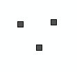

SLD:
[source, xml]
--
<sld:NamedLayer>
    <se:Name>HB.Habitat.Default</se:Name>
    <sld:UserStyle>
      <se:Name>INSPIRE_Default</se:Name>
      <sld:IsDefault>1</sld:IsDefault>
      <se:FeatureTypeStyle version="1.1.0">
        <se:Description>
          <se:Title>Habitat Default Style</se:Title>
          <se:Abstract>The geometry is rendered as a square with a size of 6 pixels, with a 50% grey (#808080) fill and a black outline.</se:Abstract>
        </se:Description>
        <se:FeatureTypeName>Habitat</se:FeatureTypeName>
        <se:Rule>
          <se:PointSymbolizer>
            <se:Geometry>
              <ogc:PropertyName>HB.habitat.geometry</ogc:PropertyName>
            </se:Geometry>
            <se:Graphic/>
          </se:PointSymbolizer>
--
| a|
[source, xml]
--
        </se:Rule>
      </se:FeatureTypeStyle>
    </sld:UserStyle>    
  </sld:NamedLayer>
--
[.underline]#*For curve geometry:*#
    
Colour: SOLID BLACK

Width: 1px

Abstract: The geometry is rendered as a solid black line with a stroke width of 1 pixel..

| a|

Example:

image::./media/image19.png[image,width=118,height=107, align=center]

SLD:
[source, xml]
--
<sld:NamedLayer>
    <se:Name>HB.Habitat.Default</se:Name>
    <sld:UserStyle>
      <se:Name>INSPIRE_Default</se:Name>
      <sld:IsDefault>1</sld :IsDefault>
      <se:FeatureTypeStyle version="1.1.0">
        <se:Description>
          <se:Title>Habitat Default Style</se:Title>
          <se:Abstract>The geometry is rendered as a solid black line with a stroke width of 1 pixel.</se:Abstract>
        </se:Description>
        <se:FeatureTypeN    ame>Habitat</se:FeatureTypeName>
        <se:Rule>
          <se:LineSymbolizer>
            <se:Geometry>
              <ogc:PropertyName>HB.habitat.geometry</ogc:PropertyName>
            </se:Geometry>
            <se:Stroke/>
          </se:LineSymbolizer>
        </se:Rule>
      </se:FeatureTypeStyle>
    </sld:UserStyle>    
  </sld:NamedLayer>
--

| a|[.underline]#*For surface geometry:*#

Fill Colour: 50% GREY RGB 80,80,80

Outline colour: SOLID BLACK

Width: 1px

Abstract: The geometry is rendered using a 50% grey (#808080) fill and a solid black outline with a stroke width of 1 pixel.

Example:

image::./media/image20.png[image,width=111,height=121, align=center]

SLD:
[source, xml]
--
<sld:NamedLayer>    
    <se:Name>HB.Habitat.Default</se:Name>
    <sld:UserStyle>
      <se:Name>INSPIRE_Default</se:Name>
      <sld:IsDefault>1</sld:IsDefault>
      <se:FeatureTypeStyle version="1.1.0">
        <se:Description>
          <se:Title>Habitat Default Style</se:Title>
          <se:Abstract>The geometry is rendered using a 50% grey (#808080) fill and a solid black outline with a stroke width of 1 pixel.</se:Abstract>
        </se:Description>
        <se:FeatureTypeName>Habitat</se:FeatureTypeName>
        <se:Rule>
--
| a|
[source, xml]
--
          <se:PolygonSymbolizer>
            <se:Geometry>
              <ogc:PropertyName>HB.habitat.geometry</ogc:PropertyName>
            </se:Geometry>
            <se:Fill/>
            <se:Stroke/>
          </se:PolygonSymbolizer>
        </se:Rule>
      </se:FeatureTypeStyle>
    </sld:UserStyle>
  </sld:NamedLayer>
--

Example2:

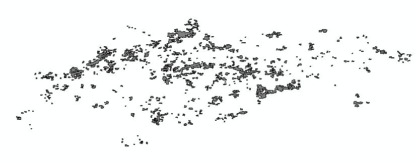

|*Minimum & maximum scales* |
|===

==== Styles for the layer HB.HabitatDistribution

[%autowidth,options="header"]
|===
|*Style Name* |*HB.HabitatDistribution.Default*
|*Default Style* |yes
|*Style Title* |Habitat Distribution
|*Style Abstract* |This layer type is for represents the collection of individual features (units) in a distribution of habitats.
|*Symbology* a|
The distribution of habitats and biotopes is depicted based on a reference dataset e.g. GRID data or other analytical units.
    
Example:

image::./media/image22.png[image,width=495,height=281, align=center]

Example of SLD:
[source, xml]
--
<?xml version="1.0" encoding="UTF-8"?>
<sld:StyledLayerDescriptor xmlns="http://www.opengis.net/sld" xmlns:sld="http://www.opengis.net/sld" xmlns:ogc="http://www.opengis.net/ogc" xm  lns:gml="http://www.opengis.net/gml" version="1.0.0">
    <sld:UserLayer>
        <sld:LayerFeatureConstraints>
            <sld:FeatureTypeConstraint/>
        </sld:LayerFeatureConstraints>
        <sld:UserStyle>
            <sld:Name>INSPIRE_Default</sld:Name>
            <sld:Title/>
            <sld:FeatureTypeStyle>
                <sld:Name>HB.HabitatDistribution</sld:Name>
                <sld:FeatureTypeName>HabitatDistribution</sld:FeatureTypeName>
                <sld:SemanticTypeIdentifier>generic:geometry</sld:SemanticTypeIdentifier>
                <sld:SemanticTypeIdentifier>simple</sld:SemanticTypeIdentifier>
                <sld:Rule>
--
| a|
[source, xml]
--
                    <sld:Name>default rule</sld:Name>
                    <sld:PolygonSymbolizer>
                        <sld:Fill>
                            <sld:GraphicFill>
                                <sld:Graphic>
                                    <sld:Mark>
--
| a|
[source, xml]
--
<sld:WellKnownName>shape://backslash</sld:WellKnownName>
                                        <sld:Fill/>
                                <sld:Stroke>
                                            <sld:CssParameter name="stroke">#808080</sld:CssParameter>
                                        </sld:Stroke>
                                    </sld:Mark>
                                    <sld:Size>
                                        <ogc:Literal>5.0</ogc:Literal>
                                    </sld:Size>
                                </sld:Graphic>
                            </sld:GraphicFill>
                            <sld:CssParameter name="fill">#FFFFFF</sld:CssParameter>
                            <sld:CssParameter name="fill-opacity">0.5</sld:CssParameter>
                        </sld:Fill>
                        <sld:Stroke>
                            <sld:CssParameter name="stroke">#808080</sld:CssParameter>
                        </sld:Stroke>
                    </sld:PolygonSymbolizer>
                </sld:Rule>
            </sld:FeatureTypeStyle>
        </sld:UserStyle>
    </sld:UserLayer>
</sld:StyledLayerDescriptor>
--
|*Minimum & maximum scales* |
|===

=== Styles recommended to be supported by INSPIRE view services 

==== Styles for the layer HB.Habitat

[%autowidth,options="header"]
|===
|*Style Name* |*HB.Habitat*
|*Style Title* |_Habitats and Biotopes_ (Features) Style
|*Style Abstract* a|
Natura2000 habitat types in North Rhine-Westphalia, Germany are presented in maps that have commonly used these styles for the app. 40 habitat types of the Habitat Directive that occur in North Rhine-Westphalia over the past ten years. Thus this style could serve as an EXAMPLE for a style for all habitat types under the Habitat Directive.

An SLD encoding is included.

|*Symbology* a|
An EXAMPLE is:

image::./media/image23.jpeg[Legende_LRT_A4hoch,width=519,height=733]

The corresponding SLD:

[source, xml]
--
<?xml version="1.0" encoding="ISO-8859-1" standalone="yes" ?> 
  <sld:StyledLayerDescriptor version="1.0.0" xmlns:sld="http://www.opengis.net/sld" xmlns:ogc="http://www.opengis.net/ogc" xmlns:xlink="http://www.w3.org/1999/xlink">
  <sld:NamedLayer>
  <sld:Name>HabitatType_point_HabitatTypeHabitatDirective</sld:Name> 
  <sld:UserStyle>
  <sld:Name>Style1</sld:Name> 
  <sld:FeatureTypeStyle>
  <sld:FeatureTypeName>HabitatType_point_HabitatTypeHabitatDirective</sld:FeatureTypeName> 
  <sld:Rule>
--
| a|
[source, xml]
--
  <sld:Name>6110 Lückige Kalkpionierrasen</sld:Name> 
  <sld:Title>6110 Lückige Kalkpionierrasen</sld:Title> 
  <ogc:Filter>
  <ogc:PropertyIsEqualTo>
  <ogc:PropertyName>HabitatTypeHabitatDirective</ogc:PropertyName> 
  <ogc:Literal>6110</ogc:Literal> 
  </ogc:PropertyIsEqualTo>
  </ogc:Filter>
  <sld:MinScaleDenominator>100</sld:MinScaleDenominator> 
  <sld:MaxScaleDenominator>3000000</sld:MaxScaleDenominator> 
  <sld:PointSymbolizer>
--
| a|
[source, xml]
--
  <sld:Graphic> 
  <sld:Mark>
  <sld:WellKnownName>circle</sld:WellKnownName> 
  <sld:Fill>
  <sld:CssParameter name="fill">#D7D79E</sld:CssParameter> 
  <sld:CssParameter name="fill-opacity">1.0</sld:CssParameter> 
  </sld:Fill>
  </sld:Mark>
  <sld:Size>18</sld:Size> 
  <sld:Rotation>0</sld:Rotation> 
  </sld:Graphic>
  </sld:PointSymbolizer>
  </sld:Rule>
  <sld:Rule>
  <sld:Name>6210 Trespen- Schwingel Kalktrockenrasen</sld:Name> 
  <sld:Title>6210 Trespen- Schwingel Kalktrockenrasen</sld:Title> 
  <ogc:Filter>
  <ogc:PropertyIsEqualTo>
  <ogc:PropertyName>HabitatTypeHabitatDirective</ogc:PropertyName> 
  <ogc:Literal>6210</ogc:Literal> 
  </ogc:PropertyIsEqualTo>
--
| a|
[source, xml]
--
  </ogc:Filter>
  <sld:MinScaleDenominator>100</sld:MinScaleDenominator> 
  <sld:MaxScaleDenominator>3000000</sld:MaxScaleDenominator> 
  <sld:PointSymbolizer>
  <sld:Graphic>
  <sld:Mark>
  <sld:WellKnownName    >circle</sld:WellKnownName> 
  <sld:Fill>
  <sld:CssParameter name="fill">#619669</sld:CssParameter> 
  <sld:CssParameter name="fill-opacity">1.0</sld:CssParameter> 
  </sld:Fill>
  </sld:Mark>
  <sld:Size>18</sld:Size> 
  <sld:Rotation>0</sld:Rotation> 
  </sld:Graphic>
  </sld:PointSymbolizer>
  </sld:Rule>
  <sld:Rule>
  <sld:Name>8160 Kalkschutthalden</sld:Name> 
  <sld:Title>8160 Kalkschutthalden</sld:Title> 
  <ogc:Filter>
  <ogc:PropertyIsEqualTo>
  <ogc:PropertyName>HabitatTypeHabitatDirective</ogc:PropertyName> 
--
| a|
[source, xml]
--
  <ogc:Literal>8160</ogc:Literal> 
  </ogc:PropertyIsEqualTo>
  </ogc:Filter>
  <sld:MinScaleDenominator>100</sld:MinScaleDenominator> 
  <sld:MaxScaleDenominator>3000000</sld:MaxScaleDenominator> 
  <sld:PointSymbolizer>
  <sld:Graphic>
  <sld:Mark>
  <sld:WellKnownName>circle</sld:WellKnownName> 
  <sld:Fill>
  <sld:CssParameter name="fill">#B2B2B2</sld:CssParameter> 
  <sld:CssParameter name="fill-opacity">1.0</sld:CssParameter> 
  </sld:Fill>
  </sld:Mark>
  <sld:Size>18</sld:Size> 
  <sld:Rotation>0</sld:Rotation> 
  </sld:Graphic>
  </sld:PointSymbolizer>
  </sld:Rule>
  <sld:Rule>
  <sld:Name>8210 Kalkfelsen mit Felsspaltenvegetation</sld:Name> 
  <sld:Title>8210 Kalkfelsen mit Felsspaltenvegetation</sld:Title> 
  <ogc:Filter>
--
| a|
[source, xml]
--
<ogc:PropertyIsEqualTo>
  <ogc:PropertyName>HabitatTypeHabitatDirective</ogc:PropertyName> 
  <ogc:Literal>8210</ogc:Literal> 
  </ogc:PropertyIsEqualTo>
  </ogc:Filter>
  <sld:MinScaleDenominator>100</sld:MinScaleDenominator> 
  <sld:MaxScaleDenominator>3000000</sld:MaxScaleDenominator> 
  <sld:PointSymbolizer>
  <sld:Graphic>
  <sld:Mark>
  <sld:WellKnownName>circle</sld:WellKnownName> 
  <sld:Stroke>
  <sld:CssParameter name="stroke">#000000</sld:CssParameter> 
  <sld:CssParameter name="stroke-width">1</sld:CssParameter> 
  <sld:CssParameter name="stroke-opacity">1.0</sld:CssParameter> 
  </sld:Stroke>
  </sld:Mark>
  <sld:Size>18</sld:Size> 
  <sld:Rotation>0</sld:Rotation> 
  </sld:Graphic>
  </sld:PointSymbolizer>
  <sld:PointSymbolizer>
  <sld:Graphic>
  <sld:Mark>
  <sld:WellKnownName>circle</sld:WellKnownName> 
  <sld:Fill>
  <sld:CssParameter name="fill">#FFFFFF</sld:CssParameter> 
  <sld:CssParameter name="fill-opacity">1.0</sld:CssParameter> 
  </sld:Fill>
  </sld:Mark>
  <sld:Size>18</sld:Size> 
  <sld:Rotation>0</sld:Rotation> 
  </sld:Graphic>
  --
| a| 
[source, xml]
--
</sld:PointSymbolizer>
  </sld:Rule>
  <sld:Rule>
  <sld:Name>8220 Silikatfelsen mit Felsspaltenvegetation</sld:Name> 

<sld:Title>8220 Silikatfelsen mit Felsspaltenvegetation</sld:Title> 
  <ogc:Filter>
  <ogc:PropertyIsEqualTo>
  <ogc:PropertyName>HabitatTypeHabitatDirective</ogc:PropertyName> 
  <ogc:Literal>8220</ogc:Literal> 
  </ogc:PropertyIsEqualTo>
  </ogc:Filter>
  <sld:MinScaleDenominator>100</sld:MinScaleDenominator> 
  <sld:MaxScaleDenominator>3000000</sld:MaxScaleDenominator> 
  <sld:PointSymbolizer>
  <sld:Graphic>
  <sld:Mark>
  <sld:WellKnownName>circle</sld:WellKnownName> 
  <sld:Stroke>
  <sld:CssParameter name="stroke">#00734C</sld:CssParameter> 
  <sld:CssParameter name="stroke-width">1</sld:CssParameter> 
  <sld:CssParameter name="stroke-opacity">1.0</sld:CssParameter> 
  </sld:Stroke>
  </sld:Mark>
  <sld:Size>18</sld:Size> 
  <sld:Rotation>0</sld:Rotation> 
  </sld:Graphic>
  </sld:PointSymbolizer>
  <sld:PointSymbolizer>
  <sld:Graphic>
  <sld:Mark>
  <sld:WellKnownName>circle</sld:WellKnownName>
--
| a|
[source, xml]
--
 <sld:Fill>
  <sld:CssParameter name="fill">#828282</sld:CssParameter> 
  <sld:CssParameter name="fill-opacity">1.0</sld:CssParameter> 
  </sld:Fill>
  </sld:Mark>
  <sld:Size>18</sld:Size> 
  <sld:Rotation>0</sld:Rotation> 
  </sld:Graphic>
  </sld:PointSymbolizer>
  </sld:Rule>
  <sld:Rule>
  <sld:Name>8230 Silikatfelskuppen mit Pioniervegetation</sld:Name> 
  <sld:Title>8230 Silikatfelskuppen mit Pioniervegetation</sld:Title> 
  <ogc:Filter>
  <ogc:PropertyIsEqualTo>
  <ogc:PropertyName>HabitatTypeHabitatDirective</ogc:PropertyName> 
  <ogc:Literal>8230</ogc:Literal> 
  </ogc:PropertyIsEqualTo>
  </ogc:Filter>
  <sld:MinScaleDenominator>100</sld:MinScaleDenominator> 
  <sld:MaxScaleDenominator>3000000</sld:MaxScaleDenominator> 
  <sld:PointSymbolizer>
  <sld:Graphic>
  <sld:Mark>
  <sld:WellKnownName>circle</sld:WellKnownName> 
  <sld:Fill>
  <sld:CssParameter name="fill">#828282</sld:CssParameter> 
  <sld:CssParameter name="fill-opacity">1.0</sld:CssParameter> 
  </sld:Fill>
  </sld:Mark>
  <sld:Size>18</sld:Size> 
  <sld:Rotation>0</sld:Rotation> 
--
| a|
[source, xml]
--
  </sld:Graphic>
  </sld:PointSymbolizer>
  </sld:Rule>
  <sld:Rule>
  <sld:Name>8310 Nicht touristich erschlossene Höhlen</sld:Name> 
  <sld:Title>8310 Nicht touristich erschlossene Höhlen</sld:Title> 
  <ogc:Filter>
  <ogc:PropertyIsEqualTo>
  <ogc:PropertyName>HabitatTypeHabitatDirective</ogc:PropertyName> 
  <ogc:Literal>8310</ogc:Literal> 
  </ogc:PropertyIsEqualTo>
  </ogc:Filter>
  <sld:MinScaleDenominator>100</sld:MinScaleDenominator> 
  <sld:MaxScaleDenominator>3000000</sld:MaxScaleDenominator> 
  <sld:PointSymbolizer>
  <sld:Graphic>
  <sld:Mark>
  <sld:WellKnownName>triangle</sld:WellKnownName> 
  <sld:Fill>
--
| a|
[source, xml]
--
  <sld:CssParameter name="fill">#000000</sld:CssParameter> 
  <sld:CssParameter name="fill-opacity">1.0</sld:CssParameter> 
  </sld:Fill>
  </sld:Mark>
  <sld:Size>18</sld:Size> 
  <sld:Rotation>0</sld:Rotation> 
  </sld:Graphic>
  </sld:PointSymbolizer>
  </sld:Rule>
  </sld:FeatureTypeStyle>
  </sld:UserStyle>
  </sld:NamedLayer>
  <sld:NamedLayer>
  <sld:Name>HabitatType_line_HabitatTypeHabitatDirective</sld:Name> 
  <sld:UserStyle>
  <sld:Name>Style1</sld:Name> 
  <sld:FeatureTypeStyle>
  <sld:FeatureTypeName>HabitatType_line_HabitatTypeHabitatDirective</sld:FeatureTypeName> 
  <sld:Rule>
  <sld:Name>HabitatType_line_HabitatTypeHabitatDirective</sld:Name> 
  <sld:Title>HabitatType_line_HabitatTypeHabitatDirective</sld:Title> 
  <sld:LineSymbolizer>
  <sld:Stroke>
  <sld:CssParameter name="stroke">#966E00</sld:CssParameter> 
  <sld:CssParameter name="stroke-width">1</sld:CssParameter> 
  <sld:CssParameter name="stroke-opacity">1</sld:CssParameter> 
  </sld:Stroke>
  </sld:LineSymbolizer>
  </sld:Rule>
  </sld:FeatureTypeStyle>
  </sld:UserStyle>
  </sld:NamedLayer>
--
| a|
[source, xml]
--
<sld:NamedLayer>
  <sld:Name>HabitatType_polygone_HabitatTypeHabitatDirective</s ld:Name> 
  <sld:UserStyle>
  <sld:Name>Style1</sld:Name> 
  <sld:FeatureTypeStyle>
  <sld:FeatureTypeName>HabitatType_polygone_HabitatTypeHabitatDirective</sld:FeatureTypeName> 
  <sld:Rule>
  <sld:Name>1340 Salzwiesen im Binnenland</sld:Name> 
  <sld:Title>1340 Salzwiesen im Binnenland</sld:Title> 
  <ogc:Filter>
  <ogc:PropertyIsEqualTo>
  <ogc:PropertyName>HabitatTypeHabitatDirective</ogc:PropertyName> 
  <ogc:Literal>1340</ogc:Literal> 
  </ogc:PropertyIsEqualTo>
  </ogc:Filter>
  <sld:MinScaleDenominator>100</sld:MinScaleDenominator> 
  <sld:MaxScaleDenominator>3000000</sld:MaxScaleDenominator> 
  </sld:Rule>
  <sld:Rule>
  <sld:Name>2310 Zwergstrauchheiden auf Binnendünen</sld:Name> 
  <sld:Title>2310 Zwergstrauchheiden auf Binnendünen</sld:Title> 
  <ogc:Filter>
  <ogc:PropertyIsEqualTo>
  <ogc:PropertyName>HabitatTypeHabitatDirective</ogc:PropertyName> 
  <ogc:Literal>2310</ogc:Literal> 
  </ogc:PropertyIsEqualTo>
  </ogc:Filter>
--
| a|
[source, xml]
--
 <sld:MinScaleDenominator>100</sld:MinScaleDenominator> 
  <sld:MaxScaleDenominator>3000000</sld:MaxScaleDenominator> 
  </sld:Rule>
  <sld:Rule>
  <sld:Name>2330 Sandtrockenrasen auf Binnendünen</sld:Name> 
  <sld:Title>2330 Sandtrockenrasen auf Binnendünen</sld:Title> 
  <ogc:Filter>
  <ogc:PropertyIsEqualTo>
  <ogc:PropertyName>HabitatTypeHabitatDirective</ogc:PropertyName> 
  <ogc:Literal>2330</ogc:Literal> 
  </ogc:PropertyIsEqualTo>
  </ogc:Filter>
  <sld:MinScaleDenominator>100</sld:MinScaleDenominator> 
  <sld:MaxScaleDenominator>3000000</sld:MaxScaleDenominator> 
  </sld:Rule>
  <sld:Rule>
  <sld:Name>3110 Oligotrophe Stillgewässer</sld:Name> 
  <sld:Title>3110 Oligotrophe Stillgewässer</sld:Title> 
  <ogc:Filter>
  <ogc:PropertyIsEqualTo>
  <ogc:PropertyName>HabitatTypeHabitatDirective</ogc:PropertyName> 
  <ogc:Literal>3110</ogc:Literal> 
  </ogc:PropertyIsEqualTo>
  </ogc:Filter>
  <sld:MinScaleDenominator>100</sld:MinScaleDenominator> 
  <sld:MaxScaleDenominator>3000000</sld:MaxScaleDenominator> 
  <sld:PolygonSymbolizer>
  <sld:Fill>
  <sld:GraphicFill>
--
| a|
[source, xml]
--
  <sld:Graphic>
  <sld:Mark>
  <sld:WellKnownName>x</sld:WellKnownName> 
  <sld:Fill>
  <sld:CssParameter name="fill">#004DA8</sld:CssParameter> 
  <sld:CssParameter name="fill-opacity">1.0</sld:CssParameter> 
  </sld:Fill>
  </sld:Mark>
  <sld:Size>10</sld:Size> 
  </sld:Graphic>
  </sld:GraphicFill>
  </sld:Fill>
  </sld:PolygonSymbolizer>
  <sld:PolygonSymbolizer>
  <sld:Fill>
  <sld:GraphicFill>
  <sld:Graphic>
  <sld:Mark>
  <sld:WellKnownName>x</sld:WellKnownName> 
  <sld:Fill>
  <sld:CssParameter name="fill">#004DA8</sld:CssParameter> 
  <sld:CssParameter name="fill-opacity">1.0</sld:CssParameter> 
  </sld:Fill>
  </sld:Mark>
  <sld:Size>10</sld:Size> 
  </sld:Graphic>
  </sld:GraphicFill>
  </sld:Fill>
--
| a|
[source, xml]
--
  <sld:Stroke>
  <sld:CssParameter name="stroke">#000000</sld:CssParameter> 
  <sld:CssParameter name="stroke-width">0.4</sld:CssParameter> 
  <sld:CssParameter name="stroke-opacity">1</sld:CssParameter> 
  </sld:Stroke>
  </sld:PolygonSymbolizer>
  </sld:Rule>
  <sld:Rule>
  <sld:Name>3130 Oligo- bis mesotrophe Stillgewässer</sld:Name> 
  <sld:Title>3130 Oligo- bis mesotrophe Stillgewässer</sld:Title> 
  <ogc:Filter>
  <ogc:PropertyIsEqualTo>
  <ogc:PropertyName>HabitatTypeHabitatDirective</ogc:PropertyName> 
  <ogc:Literal>3130</ogc:Literal> 
  </ogc:PropertyIsEqualTo>
  </ogc:Filter>
  <sld:MinScaleDenominator>100</sld:MinScaleDenominator> 
  <sld:MaxScaleDenominator>3000000</sld:MaxScaleDenominator> 
  <sld:PolygonSymbolizer>
  <sld:Fill>
  <sld:CssParameter name="fill">#3753A7</sld:CssParameter> 
  <sld:CssParameter name="fill-opacity">1</sld:CssParameter> 
  </sld:Fill>
  </sld:PolygonSymbolizer>
  </sld:Rule>
  <sld:Rule>
  <sld:Name>3140 Nährstoffärmere kalkhaltige Stillgewässer</sld:Name> 
  <sld:Title>3140 Nährstoffärmere kalkhaltige Stillgewässer</sld:Title> 
--
| a|
[source, xml]
--
<ogc:Filter>
  <ogc:PropertyIsEqualTo>
  <ogc:PropertyName>HabitatTypeHabitatDirective</ogc:PropertyName> 
  <ogc:Literal>3140</ogc:Literal> 
  </ogc:PropertyIsEqualTo>
  </ogc:Filter>
  <sld:MinScaleDenominator>100</sld:MinScaleDenominator> 
  <sld:MaxScaleDenominator>3000000</sld:MaxScaleDenominator> 
  <sld:PolygonSymbolizer>
  <sld:Fill>
  <sld:GraphicFill>
  <sld:Graphic>
  <sld:Mark>
  <sld:WellKnownName>x</sld:WellKnownName> 
  <sld:Fill>
  <sld:CssParameter name="fill">#004DA8</sld:CssParameter> 
  <sld:CssParameter name="fill-opacity">1.0</sld:CssParameter> 
  </sld:Fill>
  </sld:Mark>
  <sld:Size>10</sld:Size> 
  </sld:Graphic>
  </sld:GraphicFill>
  </sld:Fill>
  </sld:PolygonSymbolizer>
  <sld:PolygonSymbolizer>
  <sld:Fill>
  <sld:GraphicFill>
  <sld:Graphic>
  <sld:Mark>
  <sld:WellKnownName>x</sld:WellKnownName> 
  <sld:Fill>
  <sld:CssParameter name="fill">#004DA8</sld:CssParameter> 
  <sld:CssParameter name="fill-opacity">1.0</sld:CssParameter> 
  </sld:Fill>
  </sld:Mark>
--
| a|
[source, xml]
--
  <sld:Size>10</sld:Size> 
  </sld:Graphic>
  </sld:GraphicFill>
  </sld:Fill>
  <sld:Stroke>
  <sld:CssParameter name="stroke">#000000</sld:CssParameter> 
  <sld:CssParameter name="stroke-width">0.4</sld:CssParameter> 
  <sld:CssParameter name="stroke-opacity">1</sld:CssParameter> 
  </sld:Stroke>
  </sld:PolygonSymbolizer>
  </sld:Rule>
  <sld:Rule>
  <sld:Name>3150 Natürliche eutrophe Seen und Altarme</sld:Name> 
  <sld:Title>3150 Natürliche eutrophe Seen und Altarme</sld:Title> 
  <ogc:Filter>
  <ogc:PropertyIsEqualTo>
  <ogc:PropertyName>HabitatTypeHabitatDirective</ogc:PropertyName> 
  <ogc:Literal>3150</ogc:Literal> 
  </ogc:PropertyIsEqualTo>
  </ogc:Filter>
  <sld:MinScaleDenominator>100</sld:MinScaleDenominator> 
  <sld:MaxScaleDenominator>3000000</sld:MaxScaleDenominator> 
  </sld:Rule>
  <sld:Rule>
  <sld:Name>3160 Moorgewässer</sld:Name> 
  <sld:Title>3160 Moorgewässer</sld:Title> 
--
| a|
[source, xml]
--
  <ogc:Filter>
  <ogc:PropertyIsEqualTo>
  <ogc:PropertyName>HabitatTypeHabitatDirective</ogc:PropertyName> 
  <ogc:Literal>3160</ogc:Literal> 
  </ogc:PropertyIsEqualTo>
  </ogc:Filter>
  <sld:MinScaleDenominator>100</sld:MinScaleDenominator> 
  <sld:MaxScaleDenominator>3000000</sld:MaxScaleDenominator> 
  <sld:PolygonSymbolizer>
  <sld:Fill>
  <sld:CssParameter name="fill">#002673</sld:CssParameter> 
  <sld:CssParameter name="fill-opacity">1</sld:CssParameter> 
  </sld:Fill>
  </sld:PolygonSymbolizer>
  </sld:Rule>
  <sld:Rule>
  <sld:Name>3260 Fließgewässer mit Unterwasservegetation</sld:Name> 
  <sld:Title>3260 Fließgewässer mit Unterwasservegetation</sld:Title> 
  <ogc:Filter>
  <ogc:PropertyIsEqualTo>
  <ogc:PropertyName>HabitatTypeHabitatDirective</ogc:PropertyName> 
  <ogc:Literal>3260</ogc:Literal> 
  </ogc:PropertyIsEqualTo>
  </ogc:Filter>
  <sld:MinScaleDenominator>100</sld:MinScaleDenominator> 
  <sld:MaxScaleDenominator>3000000</sld:MaxScaleDenominator> 
  </sld:Rule>
-- 
| a|
[source, xml]
--
  <sld:Rule>
  <sld:Name>3270 Flüsse mit Schlammbänken und einjähriger Vegetation</sld:Name> 
  <sld:Title>3270 Flüsse mit Schlammbänken und einjähriger Vegetation</sld:Title> 
  <ogc:Filter>
  <ogc:PropertyIsEqualTo>
  <ogc:PropertyName>HabitatTypeHabitatDirective</ogc:PropertyName> 
  <ogc:Literal>3270</ogc:Literal> 
  </ogc:PropertyIsEqualTo>
  </ogc:Filter>
  <sld:MinScaleDenominator>100</sld:MinScaleDenominator> 
  <sld:MaxScaleDenominator>3000000</sld:MaxScaleDenominator> 
  </sld:Rule>
  <sld:Rule>
  <sld:Name>4010 Feuchte Heidegebiete mit Glockenheide</sld:Name> 
  <sld:Title>4010 Feuchte Heidegebiete mit Glockenheide</sld:Title> 
  <ogc:Filter>
  <ogc:PropertyIsEqualTo>
  <ogc:PropertyName>HabitatTypeHabitatDirective</ogc:PropertyName> 
  <ogc:Literal>4010</ogc:Literal> 
  </ogc:PropertyIsEqualTo>
  </ogc:Filter>
--
| a|
[source, xml]
--
  <sld:MinScaleDenominator>100</sld:MinScaleDenominator> 
  <sld:MaxScaleDenominator>3000000</sld:MaxScaleDenominator> 
  <sld:PolygonSymbolizer>
  <sld:Fill>
  <sld:CssParameter name="fill">#E8BEFF</sld:CssParameter> 
  <sld:CssParameter name="fill-opacity">1</sld:CssParameter> 
  </sld:Fill>
  <sld:Stroke>
  <sld:CssParameter name="stroke">#000000</sld:CssParameter> 
  <sld:CssParameter name="stroke- width">0.4</sld:CssParameter> 
  <sld:CssParameter name="stroke- opacity">1</sld:CssParameter> 
  </sld:Stroke>
  </sld:PolygonSymbolizer>
  </sld:Rule>
  <sld:Rule>
  <sld:Name>4030 Zwergstrauchheiden</sld:Name> 
  <sld:Title>4030 Zwergstrauchheiden</sld:Title> 
  <ogc:Filter>
  <ogc:PropertyIsEqualTo>
  <ogc:PropertyName>HabitatTypeHabitatDirective</ogc:PropertyName> 
  <ogc:Literal>4030</ogc:Literal> 
  </ogc:PropertyIsEqualTo>
  </ogc:Filter>
  <sld:MinScaleDenominator>100</sld:MinScaleDenominator> 
  <sld:MaxScaleDenominator>3000000</sld:MaxScaleDenominator> 
  <sld:PolygonSymbolizer>
  <sld:Fill>
  <sld:CssParameter name="fill">#8400A8</sld:CssParameter> 
  <sld:CssParameter name="fill- opacity">1</sld:CssParameter> 
  </sld:Fill>
--
| a|
[source, xml]
--
  <sld:Stroke>
  <sld:CssParameter name="stroke">#000000</sld:CssParameter> 
  <sld:CssParameter name="stroke- width">0.4</sld:CssParameter> 
  <sld:CssParameter name="stroke- opacity">1</sld:CssParameter> 
  </sld:Stroke>
  </sld:PolygonSymbolizer>
  </sld:Rule>
  <sld:Rule>
  <sld:Name>5130 Wacholderbestände auf Zwergstrauchheiden oder Kalkmagerrasen</sld:Name> 
  <sld:Title>5130 Wacholderbestände auf Zwergstrauchheiden oder Kalkmagerrasen</sld:Title> 
  <ogc:Filter>
  <ogc:PropertyIsEqualTo>
  <ogc:PropertyName>HabitatTypeHabitatDirective</ogc:PropertyName> 
  <ogc:Literal>5130</ogc:Literal> 
  </ogc:PropertyIsEqualTo>
  </ogc:Filter>
  <sld:MinScaleDenominator>100</sld:MinScaleDenominator> 
  <sld:MaxScaleDenominator>3000000</sld:MaxScaleDenominator> 
  </sld:Rule>
  <sld:Rule>
  <sld:Name>6110 Lückige Kalk- Pionierrasen</sld:Name> 
  <sld:Title>6110 Lückige Kalk- Pionierrasen</sld:Title> 
  <ogc:Filter>
  <ogc:PropertyIsEqualTo>
  <ogc:PropertyName>HabitatTypeHabitatDirective</ogc:PropertyName> 
--
| a|
[source, xml]
--
  <ogc:Literal>6110</ogc:Literal> 
  </ogc:PropertyIsEqualTo>
  </ogc:Filter>
  <sld:MinScaleDenominator>100</sld:MinScaleDenominator> 
  <sld:MaxScaleDenominator>3000000</sld:MaxScaleDenominator> 
  </sld:Rule>
  <sld:Rule>
  <sld:Name>6130 Schwermetallrasen</sld:Name> 
  <sld:Title>6130 Schwermetallrasen</sld:Title> 
  <ogc:Filter>
  <ogc:PropertyIsEqualTo>
  <ogc:PropertyName>HabitatTypeHabitatDirective</ogc:PropertyName> 
  <ogc:Literal>6130</ogc:Literal> 
  </ogc:PropertyIsEqualTo>
  </ogc:Filter>
  <sld:MinScaleDenominator>100</sld:MinScaleDenominator> 
  <sld:MaxScaleDenominator>3000000</sld:MaxScaleDenominator> 
  </sld:Rule>
  <sld:Rule>
  <sld:Name>6210 Trespen- Schwingel Kalktrockenrasen</sld:Name> 
  <sld:Title>6210 Trespen- Schwingel Kalktrockenrasen</sld:Title> 
  <ogc:Filter>
  <ogc:PropertyIsEqualTo>
  <ogc:PropertyName>HabitatTypeHabitatDirective</ogc:PropertyName> 
  <ogc:Literal>6210</ogc:Literal> 
  </ogc:PropertyIsEqualTo>
  </ogc:Filter>
  <sld:MinScaleDenominator>100</sld:MinScaleDenominator> 
--
| a|
[source, xml]
--
<sld:MaxScaleDenominator>3000000</sld:MaxScaleDenominator> 
  <sld:PolygonSymbolizer>
  <sld:Fill>
  <sld:CssParameter name="fill">#619669</sld:CssParameter> 
  <sld:CssParameter name="fill- opacity">1</sld:CssParameter> 
  </sld:Fill>
  <sld:Stroke>
  <sld:CssParameter name="stroke">#000000</sld:CssParameter> 
  <sld:CssParameter name="stroke- width">0.4</sld:CssParameter> 
  <sld:CssParameter name="stroke- opacity">1</sld:CssParameter> 
  </sld:Stroke>
  </sld:PolygonSymbolizer>
  </sld:Rule>
  <sld:Rule>
  <sld:Name>6230 Borstgrasrasen</sld:Name> 
  <sld:Title>6230 Borstgrasrasen</sld:Title> 
  <ogc:Filter>
  <ogc:PropertyIsEqualTo>
  <ogc:PropertyName>HabitatTypeHabitatDirective</ogc:PropertyName> 

--
| a|
[source, xml]
--
  <ogc:Literal>6230</ogc:Literal> 
  </ogc:PropertyIsEqualTo>
  </ogc:Filter>
  <sld:MinScaleDenominator>100</sld:MinScaleDenominator> 
  <sld:MaxScaleDenominator>3000000</sld:MaxScaleDenominator> 
  </sld:Rule>
  <sld:Rule>
  <sld:Name>6410 Pfeifengraswiesen auf lehmigen oder torfigen Böden</sld:Name> 
  <sld:Title>6410 Pfeifengraswiesen auf lehmigen oder torfigen Böden</sld:Title> 
  <ogc:Filter>
  <ogc:PropertyIsEqualTo>
  <ogc:PropertyName>HabitatTypeHabitatDirective</ogc:PropertyName> 
  <ogc:Literal>6410</ogc:Literal> 
  </ogc:PropertyIsEqualTo>
  </ogc:Filter>
  <sld:MinScaleDenominator>100</sld:MinScaleDenominator> 
  <sld:MaxScaleDenominator>3000000</sld:MaxScaleDenominator> 
  </sld:Rule>
  <sld:Rule>
  <sld:Name>6430 Feuchte Hochstaudenfluren</sld:Name> 
  <sld:Title>6430 Feuchte Hochstaudenfluren</sld:Title> 
  <ogc:Filter>
  <ogc:PropertyIsEqualTo>
  <ogc:PropertyName>HabitatTypeHabitatDirective</ogc:PropertyName> 
  <ogc:Literal>6430</ogc:Literal> 
  </ogc:PropertyIsEqualTo>
  </ogc:Filter>
  <sld:MinScaleDenominator>100</sld:MinScaleDenominator> 
--
| a|
[source, xml]
--
  <sld:MaxScaleDenominator>3000000</sld:MaxScaleDenominator> 
  <sld:PolygonSymbolizer>
  <sld:Fill>
  <sld:CssParameter name="fill">#F8EC00</sld:CssParameter> 
  <sld:CssParameter name="fill- opacity">1</sld:CssParameter> 
  </sld:Fill>
  <sld:Stroke>
  <sld:CssParameter name="stroke">#000000</sld:CssParameter> 
  <sld:CssParameter name="stroke- width">0.4</sld:CssParameter> 
  <sld:CssParameter name="stroke- opacity">1</sld:CssParameter> 
  </sld:Stroke>
  </sld:PolygonSymbolizer>
  </sld:Rule>
  <sld:Rule>
  <sld:Name>6510 Glatthafer-  und Wiesenknopf- Silgenwiesen</sld:Name> 
  <sld:Title>6510 Glatthafer-  und Wiesenknopf- Silgenwiesen</sld:Title> 
  <ogc:Filter>
  <ogc:PropertyIsEqualTo>
  <ogc:PropertyName>HabitatTypeHabitatDirective</ogc:PropertyName> 
  <ogc:Literal>6510</ogc:Literal> 
  </ogc:PropertyIsEqualTo>
  </ogc:Filter>
--
| a|
[source, xml]
--
  <sld:MinScaleDenominator>100</sld:MinScaleDenominator> 
  <sld:MaxScaleDenominator>3000000</sld:MaxScaleDenominator> 
  <sld:PolygonSymbolizer>
  <sld:Fill>
  <sld:GraphicFill>
  <sld:Graphic>
  <sld:Mark>
  <sld:WellKnownName>cross</sld:WellKnownName> 
  <sld:Fill>
  <sld:CssParameter name="fill">#AAFF00</sld:CssParameter> 
  <sld:CssParameter name="fill- opacity">1.0</sld:CssParameter> 
  </sld:Fill>
  </sld:Mark>
  <sld:Size>6</sld:Size> 
  </sld:Graphic>
  </sld:GraphicFill>
  </sld:Fill>
  </sld:PolygonSymbolizer>
  <sld:PolygonSymbolizer>
  <sld:Fill>
  <sld:GraphicFill>
  <sld:Graphic>
  <sld:Mark>
  <sld:WellKnownName>cross</sld:WellKnownName> 
  <sld:Fill>
  <sld:CssParameter name="fill">#004DA8</sld:CssParameter> 
  <sld:CssParameter name="fill- opacity">1.0</sld:CssParameter> 
  </sld:Fill>
  </sld:Mark>
  <sld:Size>8</sld:Size> 
  </sld:Graphic>
  </sld:GraphicFill>
  </sld:Fill>
--
| a|
[source, xml]
--
  <sld:Stroke>
  <sld:CssParameter name="stroke">#000000</sld:CssParameter> 
  <sld:CssParameter name="stroke- width">0.4</sld:CssParameter> 
  <sld:CssParameter name="stroke- opacity">1</sld:CssParameter> 
  </sld:Stroke>
  </sld:PolygonSymbolizer>
  </sld:Rule>
  <sld:Rule>
  <sld:Name>6520 Berg- Mähwiesen</sld:Name> 
  <sld:Title>6520 Berg- Mähwiesen</sld:Title> 
  <ogc:Filter>
  <ogc:PropertyIsEqualTo>
  <ogc:PropertyName>HabitatTypeHabitatDirective</ogc:PropertyName> 
  <ogc:Literal>6520</ogc:Literal> 
  </ogc:PropertyIsEqualTo>
  </ogc:Filter>
  <sld:MinScaleDenominator>100</sld:MinScaleDenominator> 
  <sld:MaxScaleDenominator>3000000</sld:MaxScaleDenominator> 
  </sld:Rule>
  <sld:Rule>
  <sld:Name>7110 Lebende Hochmoore</sld:Name> 
  <sld:Title>7110 Lebende Hochmoore</sld:Title> 
  <ogc:Filter>
  <ogc:PropertyIsEqualTo>
  <ogc:PropertyName>HabitatTypeHabitatDirective</ogc:PropertyName> 
--
| a|
[source, xml]
--
  <ogc:Literal>7110</ogc:Literal> 
  </ogc:PropertyIsEqualTo>
  </ogc:Filter>
  <sld:MinScaleDenominator>100</sld:MinScaleDenominator> 
  <sld:MaxScaleDenominator>3000000</sld:MaxScaleDenominator> 
  <sld:PolygonSymbolizer>
  <sld:Fill>
  <sld:CssParameter name="fill">#730000</sld:CssParameter> 
  <sld:CssParameter name="fill- opacity">1</sld:CssParameter> 
  </sld:Fill>
  <sld:Stroke>
  <sld:CssParameter name="stroke">#000000</sld:CssParameter> 
  <sld:CssParameter name="stroke- width">0.4</sld:CssParameter> 
  <sld:CssParameter name="stroke- opacity">1</sld:CssParameter> 
  </sld:Stroke>
  </sld:PolygonSymbolizer>
  </sld:Rule>
  <sld:Rule>
  <sld:Name>7120 Regenerierbare Hochmoore</sld:Name> 
  <sld:Title>7120 Regenerierbare Hochmoore</sld:Title> 
  <ogc:Filter>
  <ogc:PropertyIsEqualTo>
  <ogc:PropertyName>HabitatTypeHabitatDirective</ogc:PropertyName> 
  <ogc:Literal>7120</ogc:Literal> 
  </ogc:PropertyIsEqualTo>
  </ogc:Filter>
  <sld:MinScaleDenominator>100</sld:MinScaleDenominator> 
  <sld:MaxScaleDenominator>3000000</sld:MaxScaleDenominator> 
  <sld:PolygonSymbolizer>
--
| a|
[source, xml]
--
  <sld:Fill>
  <sld:CssParameter name="fill">#E0AA0F</sld:CssParameter> 
  <sld:CssParameter name="fill- opacity">1</sld:CssParameter> 
  </sld:Fill>
  <sld:Stroke>
  <sld:CssParameter name="stroke">#000000</sld:CssParameter> 
  <sld:CssParameter name="stroke- width">0.4</sld:CssParameter> 
  <sld:CssParameter name="stroke- opacity">1</sld:CssParameter> 
  </sld:Stroke>
  </sld:PolygonSymbolizer>
  </sld:Rule>
  <sld:Rule>
  <sld:Name>7140 Übergangs-  und Schwingrasenmoore</sld:Name> 
  <sld:Title>7140 Übergangs-  und Schwingrasenmoore</sld:Title> 
  <ogc:Filter>
  <ogc:PropertyIsEqualTo>
  <ogc:PropertyName>HabitatTypeHabitatDirective</ogc:PropertyName> 
  <ogc:Literal>7140</ogc:Literal> 
  </ogc:PropertyIsEqualTo>
  </ogc:Filter>
  <sld:MinScaleDenominator>100</sld:MinScaleDenominator> 
  <sld:MaxScaleDenominator>3000000</sld:MaxScaleDenominator> 
  </sld:Rule>
  <sld:Rule>
  <sld:Name>7150 Moorschlenken- Pioniergesellschaften</sld:Name> 
  <sld:Title>7150 Moorschlenken- Pioniergesellschaften</sld:Title> 
  <ogc:Filter>
  <ogc:PropertyIsEqualTo>
  <ogc:PropertyName>HabitatTypeHabitatDirective</ogc:PropertyName> 
  <ogc:Literal>7150</ogc:Literal> 
  </ogc:PropertyIsEqualTo>
--
| a|
[source, xml]
--
  </ogc:Filter>
  <sld:MinScaleDenominator>100</sld:MinScaleDenominator> 
  <sld:MaxScaleDenominator>3000000</sld:MaxScaleDenominator> 
  </sld:Rule>
  <sld:Rule>
  <sld:Name>7210 Schneiden- Röhricht</sld:Name> 
  <sld:Title>7210 Schneiden- Röhricht</sld:Title> 
  <ogc:Filter>
  <ogc:PropertyIsEqualTo>
  <ogc:PropertyName>HabitatTypeHabitatDirective</ogc:PropertyName> 
  <ogc:Literal>7210</ogc:Literal> 
  </ogc:PropertyIsEqualTo>
  </ogc:Filter>
  <sld:MinScaleDenominator>100</sld:MinScaleDenominator> 
  <sld:MaxScaleDenominator>3000000</sld:MaxScaleDenominator> 
  </sld:Rule>
  <sld:Rule>
  <sld:Name>7220 Kalktuffquellen</sld:Name> 
  <sld:Title>7220 Kalktuffquellen</sld:Title> 
  <ogc:Filter>
  <ogc:PropertyIsEqualTo>
  <ogc:PropertyName>HabitatTypeHabitatDirective</ogc:PropertyName> 
  <ogc:Literal>7220</ogc:Literal> 
  </ogc:PropertyIsEqualTo>
  </ogc:Filter>
  <sld:MinScaleDenominator>100</sld:MinScaleDenominator> 
  <sld:MaxScaleDenominator>3000000</sld:MaxScaleDenominator> 
  </sld:Rule>
--
| a|
[source, xml]
--
  <sld:Rule>
  <sld:Name>7230 Kalk-  und basenreiche Niedermoore</sld:Name> 
  <sld:Title>7230 Kalk-  und basenreiche Niedermoore</sld:Title> 
  <ogc:Filter>
  <ogc:PropertyIsEqualTo>
<ogc:PropertyName>HabitatTypeHabitatDirective</ogc:PropertyName> 
  <ogc:Literal>7230</ogc:Literal> 
  </ogc:PropertyIsEqualTo>
  </ogc:Filter>
  <sld:MinScaleDenominator>100</sld:MinScaleDenominator> 
  <sld:MaxScaleDenominator>3000000</sld:MaxScaleDenominator> 
  <sld:PolygonSymbolizer>
  <sld:Fill>
  <sld:CssParameter name="fill">#ECF593</sld:CssParameter> 
  <sld:CssParameter name="fill- opacity">1</sld:CssParameter> 
  </sld:Fill>
  <sld:Stroke>
  <sld:CssParameter name="stroke">#000000</sld:CssParameter> 
  <sld:CssParameter name="stroke- width">0.4</sld:CssParameter>
  <sld:CssParameter name="stroke- opacity">1</sld:CssParameter> 
  </sld:Stroke>
  </sld:PolygonSymbolizer>
  </sld:Rule>
  <sld:Rule>
  <sld:Name>8150 Silikatschutthalden</sld:Name> 
  <sld:Title>8150 Silikatschutthalden</sld:Title> 
  <ogc:Filter>
  <ogc:PropertyIsEqualTo>
  <ogc:PropertyName>HabitatTypeHabitatDirective</ogc:PropertyName>
--
| a|
[source, xml]
--
  <ogc:Literal>8150</ogc:Literal> 
  </ogc:PropertyIsEqualTo>
  </ogc:Filter>
  <sld:MinScaleDenominator>100</sld:MinScaleDenominator> 
  <sld:MaxScaleDenominator>3000000</sld:MaxScaleDenominator> 
  </sld:Rule>
  <sld:Rule>
  <sld:Name>8160 Kalkschutthalden</sld:Name> 
  <sld:Title>8160 Kalkschutthalden</sld:Title> 
  <ogc:Filter>
  <ogc:PropertyIsEqualTo>
  <ogc:PropertyName>HabitatTypeHabitatDirective</ogc:PropertyName> 
  <ogc:Literal>8160</ogc:Literal> 
  </ogc:PropertyIsEqualTo>
  </ogc:Filter>
  <sld:MinScaleDenominator>100</sld:MinScaleDenominator> 
  <sld:MaxScaleDenominator>3000000</sld:MaxScaleDenominator> 
  </sld:Rule>
  <sld:Rule>
  <sld:Name>8210 Kalkfelsen mit Felsspaltenvegetation</sld:Name> 
  <sld:Title>8210 Kalkfelsen mit Felsspaltenvegetation</sld:Title> 
  <ogc:Filter>
  <ogc:PropertyIsEqualTo>
  <ogc:PropertyName>HabitatTypeHabitatDirective</ogc:PropertyName> 
  <ogc:Literal>8210</ogc:Literal> 
  </ogc:PropertyIsEqualTo>
  </ogc:Filter>
--
| a|
[source, xml]
--
  <sld:MinScaleDenominator>100</sld:MinScaleDenominator> 
  <sld:MaxScaleDenominator>3000000</sld:MaxScaleDenominator> 
  <sld:PolygonSymbolizer>
  <sld:Fill>
  <sld:CssParameter name="fill">#E1E1E1</sld:CssParameter> 
  <sld:CssParameter name="fill- opacity">1</sld:CssParameter> 
  </sld:Fill>
  <sld:Stroke>
  <sld:CssParameter name="stroke">#000000</sld:CssParameter> 
  <sld:CssParameter name="stroke- width">0.4</sld:CssParameter>
  <sld:CssParameter name="stroke- opacity">1</sld:CssParameter> 
  </sld:Stroke>
  </sld:PolygonSymbolizer>
  </sld:Rule>
  <sld:Rule>
  <sld:Name>8220 Silikatfelsen mit Felsspaltenvegetation</sld:Name> 
  <sld:Title>8220 Silikatfelsen mit Felsspaltenvegetation</sld:Title> 
  <ogc:Filter>
  <ogc:PropertyIsEqualTo>
  <ogc:PropertyName>HabitatTypeHabitatDirective</ogc:PropertyName> 
  <ogc:Literal>8220</ogc:Literal> 
  </ogc:PropertyIsEqualTo>
  </ogc:Filter>
  <sld:MinScaleDenominator>100</sld:MinScaleDenominator> 
  <sld:MaxScaleDenominator>3000000</sld:MaxScaleDenominator> 
  </sld:Rule>
  <sld:Rule>
  <sld:Name>8230 Silikatfelskuppen mit Pioniervegetation</sld:Name> 
  <sld:Title>8230 Silikatfelskuppen mit Pioniervegetation</sld:Title> 
--
| a|
[source, xml]
--
  <ogc:Filter>
  <ogc:PropertyIsEqualTo>
  <ogc:PropertyName>HabitatTypeHabitatDirective</ogc:PropertyName> 
  <ogc:Literal>8230</ogc:Literal> 
  </ogc:PropertyIsEqualTo>
  </ogc:Filter>
  <sld:MinScaleDenominator>100</sld:MinScaleDenominator> 
  <sld:MaxScaleDenominator>3000000</sld:MaxScaleDenominator>
  <sld:PolygonSymbolizer>
  <sld:Fill>
  <sld:CssParameter name="fill">#686868</sld:CssParameter> 
  <sld:CssParameter name="fill- opacity">1</sld:CssParameter> 
  </sld:Fill>
  <sld:Stroke>
  <sld:CssParameter name="stroke">#000000</sld:CssParameter> 
  <sld:CssParameter name="stroke- width">0.4</sld:CssParameter> 
  <sld:CssParameter name="stroke- opacity">1</sld:CssParameter> 
  </sld:Stroke>
  </sld:PolygonSymbolizer>
  </sld:Rule>
  <sld:Rule>
  <sld:Name>8310 Nicht touristisch erschlossene Höhlen</sld:Name> 
  <sld:Title>8310 Nicht touristisch erschlossene Höhlen</sld:Title> 
  <ogc:Filter>
  <ogc:PropertyIsEqualTo>
  <ogc:PropertyName>HabitatTypeHabitatDirective</ogc:PropertyName> 
--
| a|
[source, xml]
--
  <ogc:Literal>8310</ogc:Literal> 
  </ogc:PropertyIsEqualTo>
  </ogc:Filter>
  <sld:MinScaleDenominator>100</sld:MinScaleDenominator> 
  <sld:MaxScaleDenominator>3000000</sld:MaxScaleDenominator> 
  <sld:PolygonSymbolizer>
  <sld:Fill>
  <sld:CssParameter name="fill">#000000</sld:CssParameter> 
  <sld:CssParameter name="fill- opacity">1</sld:CssParameter> 
  </sld:Fill>
  </sld:PolygonSymbolizer>
  </sld:Rule>
  <sld:Rule>
  <sld:Name>9110 Hainsimsen- Buchenwald</sld:Name> 
  <sld:Title>9110 Hainsimsen- Buchenwald</sld:Title> 
  <ogc:Filter>
  <ogc:PropertyIsEqualTo>
  <ogc:PropertyName>HabitatTypeHabitatDirective</ogc:PropertyName> 
  <ogc:Literal>9110</ogc:Literal> 
  </ogc:PropertyIsEqualTo>
  </ogc:Filter>
  <sld:MinScaleDenominator>100</sld:MinScaleDenominator> 
  <sld:MaxScaleDenominator>3000000</sld:MaxScaleDenominator> 
  </sld:Rule>
  <sld:Rule>
  <sld:Name>9130 Waldmeister- Buchenwald</sld:Name> 
  <sld:Title>9130 Waldmeister- Buchenwald</sld:Title> 
  <ogc:Filter>
--
| a|
[source, xml]
--
  <ogc:PropertyIsEqualTo>
  <ogc:PropertyName>HabitatTypeHabitatDirective</ogc:PropertyNa me> 
  <ogc:Literal>9130</ogc:Literal> 
  </ogc:PropertyIsEqualTo>
  </ogc:Filter>
  <sld:MinScaleDenominator>100</sld:MinScaleDenominator> 
  <sld:MaxScaleDenominator>3000000</sld:MaxScaleDenominator> 
  </sld:Rule>
  <sld:Rule>
  <sld:Name>9150 Orchideen- Kalk- Buchenwald</sld:Name> 
  <sld:Title>9150 Orchideen- Kalk- Buchenwald</sld:Title> 
  <ogc:Filter>
  <ogc:PropertyIsEqualTo>
  <ogc:PropertyName>HabitatTypeHabitatDirective</ogc:PropertyName> 
  <ogc:Literal>9150</ogc:Literal> 
  </ogc:PropertyIsEqualTo>
  </ogc:Filter>
  <sld:MinScaleDenominator>100</sld:MinScaleDenominator> 
  <sld:MaxScaleDenominator>3000000</sld:MaxScaleDenominator> 
  </sld:Rule>
  <sld:Rule>
--
| a|
[source, xml]
--
  <sld:Name>9160 Stieleichen- Hainbuchenwald</sld:Name> 
  <sld:Title>9160 Stieleichen- Hainbuchenwald</sld:Title> 
  <ogc:Filter>
  <ogc:PropertyIsEqualTo>
  <ogc:PropertyName>HabitatTypeHabitatDirective</ogc:PropertyName> 
  <ogc:Literal>9160</ogc:Literal> 
  </ogc:PropertyIsEqualTo>
  </ogc:Filter>
  <sld:MinScaleDenominator>100</sld:MinScaleDenominator> 
  <sld:MaxScaleDenominator>3000000</sld:MaxScaleDenominator> 
  <sld:PolygonSymbolizer>
  <sld:Fill>
  <sld:CssParameter name="fill">#38A800</sld:CssParameter> 
  <sld:CssParameter name="fill- opacity">1</sld:CssParameter> 
  </sld:Fill>
  <sld:Stroke>
  <sld:CssParameter name="stroke">#000000</sld:CssParameter> 
  <sld:CssParameter name="stroke- width">0.4</sld:CssParameter> 
  <sld:CssParameter name="stroke- opacity">1</sld:CssParameter> 
  </sld:Stroke>
  </sld:PolygonSymbolizer>
  </sld:Rule>
  <sld:Rule>
  <sld:Name>9170 Labkraut- Eichen- Hainbuchenwald</sld:Name> 
  <sld:Title>9170 Labkraut- Eichen- Hainbuchenwald</sld:Title> 
  <ogc:Filter>
  <ogc:PropertyIsEqualTo>
  <ogc:PropertyName>HabitatTypeHabitatDirective</ogc:PropertyName> 
  <ogc:Literal>9170</ogc:Literal> 
  </ogc:PropertyIsEqualTo>
  </ogc:Filter>
--
| a|
[source, xml]
--
  <sld:MinScaleDenominator>100</sld:MinScaleDenominator> 
  <sld:MaxScaleDenominator>3000000</sld:MaxScaleDenominator> 
  </sld:Rule>
  <sld:Rule>
  <sld:Name>9180 Schlucht-  und Hangmischwälder</sld:Name> 
  <sld:Title>9180 Schlucht-  und Hangmischwälder</sld:Title> 
  <ogc:Filter>
  <ogc:PropertyIsEqualTo>
  <ogc:PropertyName>HabitatTypeHabitatDirective</ogc:PropertyName> 
  <ogc:Literal>9180</ogc:Literal> 
  </ogc:PropertyIsEqualTo>
  </ogc:Filter>
  <sld:MinScaleDenominator>100</sld:MinScaleDenominator> 
  <sld:MaxScaleDenominator>3000000</sld:MaxScaleDenominator> 
  <sld:PolygonSymbolizer>
  <sld:Fill>
  <sld:CssParameter name="fill">#728944</sld:CssParameter> 
  <sld:CssParameter name="fill- opacity">1</sld:CssParameter> 
  </sld:Fill>
  </sld:PolygonSymbolizer>
  </sld:Rule>
--
| a|
[source, xml]
--  
  <sld:Rule>
  <sld:Name>9190 Alte bodensaure Eichenwälder auf Sandebenen</sld:Name> 
  <sld:Title>9190 Alte bodensaure Eichenwälder auf Sandebenen</sld:Title> 
  <ogc:Filter>
  <ogc:PropertyIsEqualTo>
  <ogc:PropertyName>HabitatTypeHabitatDirective</ogc:PropertyName> 
  <ogc:Literal>9190</ogc:Literal> 
  </ogc:PropertyIsEqualTo>
  </ogc:Filter>
  <sld:MinScaleDenominator>100</sld:MinScaleDenominator> 
  <sld:MaxScaleDenominator>3000000</sld:MaxScaleDenominator> 
  <sld:PolygonSymbolizer>
  <sld:Fill>
  <sld:CssParameter name="fill">#009617</sld:CssParameter> 
  <sld:CssParameter name="fill- opacity">1</sld:CssParameter> 
  </sld:Fill>
  </sld:PolygonSymbolizer>
  </sld:Rule>
--
| a|
[source, xml]
--  
  <sld:Rule>
  <sld:Name>91D0 Moorwälder</sld:Name> 
  <sld:Title>91D0 Moorwälder</sld:Title> 
  <ogc:Filter>
  <ogc:PropertyIsEqualTo>
  <ogc:PropertyName>HabitatTypeHabitatDirective</ogc:PropertyName> 
  <ogc:Literal>91D0</ogc:Literal> 
  </ogc:PropertyIsEqualTo>
  </ogc:Filter>
  <sld:MinScaleDenominator>100</sld:MinScaleDenominator> 
  <sld:MaxScaleDenominator>3000000</sld:MaxScaleDenominator> 
  </sld:Rule>
  <sld:Rule>
  <sld:Name>91E0 Erlen- Eschen-  und Weichholz- Auenwälder</sld:Name> 
  <sld:Title>91E0 Erlen- Eschen-  und Weichholz- Auenwälder</sld:Title> 
  <ogc:Filter>
  <ogc:PropertyIsEqualTo>
  <ogc:PropertyName>HabitatTypeHabitatDirective</ogc:PropertyName> 
--
| a|
[source, xml]
--
  <ogc:Literal>91E0</ogc:Literal> 
  </ogc:PropertyIsEqualTo>
  </ogc:Filter>
  <sld:MinScaleDenominator>100</sld:MinScaleDenominator> 
  <sld:MaxScaleDenominator>3000000</sld:MaxScaleDenominator> 
  </sld:Rule>
  <sld:Rule>
  <sld:Name>91F0 Hartholz- Auenwälder</sld:Name> 
  <sld:Title>91F0 Hartholz- Auenwälder</sld:Title> 
  <ogc:Filter>
  <ogc:PropertyIsEqualTo>
  <ogc:PropertyName>HabitatTypeHabitatDirective</ogc:PropertyName> 
  <ogc:Literal>91F0</ogc:Literal> 
  </ogc:PropertyIsEqualTo>
  </ogc:Filter>
  <sld:MinScaleDenominator>100</sld:MinScaleDenominator> 
  <sld:MaxScaleDenominator>3000000</sld:MaxScaleDenominator> 
  </sld:Rule>
  </sld:FeatureTypeStyle>
  </sld:UserStyle>
  </sld:NamedLayer>
  </sld:StyledLayerDescriptor>
--
|*Minimum & maximum scales* |1:1,000 – 1:50,000
|===

:sectnums!:
<<<
== Bibliography

[DS-D2.3] INSPIRE DS-D2.3, Definition of Annex Themes and Scope, v3.0, _http://inspire.jrc.ec.europa.eu/reports/ImplementingRules/DataSpecifications/D2.3_Definition_of_Annex_Themes_and_scope_v3.0.pdf_

[DS-D2.5] INSPIRE DS-D2.5, Generic Conceptual Model, v3.1, _http://inspire.jrc.ec.europa.eu/reports/ImplementingRules/DataSpecifications/D2.5_v3.1.pdf_

[DS-D2.6] INSPIRE DS-D2.6, Methodology for the development of data specifications, v3.0, _http://inspire.jrc.ec.europa.eu/reports/ImplementingRules/DataSpecifications/D2.6_v3.0.pdf_

[DS-D2.7] INSPIRE DS-D2.7, Guidelines for the encoding of spatial data, v3.0, _http://inspire.jrc.ec.europa.eu/reports/ImplementingRules/DataSpecifications/D2.7_v3.0.pdf_

[DS-Protected Sites] INSPIRE data specification on Protected Sites - guidelines http://inspire.jrc.ec.europa.eu/documents/Data_Specifications/INSPIRE_DataSpecification_PS_v3.1.pdf

[ISO 19101] EN ISO 19101:2005 Geographic information – Reference model (ISO 19101:2002)

[ISO 19103] ISO/TS 19103:2005, Geographic information – Conceptual schema language

[ISO 19107] EN ISO 19107:2005, Geographic information – Spatial schema (ISO 19107:2003)

[ISO 19111] EN ISO 19111:2007 Geographic information - Spatial referencing by coordinates (ISO 19111:2007)

[ISO 19115] EN ISO 19115:2005, Geographic information – Metadata (ISO 19115:2003)

[ISO 19118] EN ISO 19118:2006, Geographic information – Encoding (ISO 19118:2005)

[ISO 19135] EN ISO 19135:2007 Geographic information – Procedures for item registration (ISO 19135:2005)

[ISO 19139] ISO/TS 19139:2007, Geographic information – Metadata – XML schema implementation

[ISO 19157] ISO/DIS 19157, Geographic information – Data quality

[OGC 06-103r3] Implementation Specification for Geographic Information - Simple feature access – Part 1: Common Architecture v1.2.0

[Habitat Directive] Council directive 92/43/EEC of 21 may 1992 on the conservation of natural habitats and of wild fauna and flora. _Official Journal of the European Communities, 206_(22), 7.

[Interpretation Manual for European Habitats] Habitats Committee. (2007). _Interpretation manual of European union habitats version EUR 27_ European Commission, DG XI Brussels.

[Standard Data Form] European Commission, 1995. Natura2000 Standard Data form. EUR 15 Version, European Commission, Brussels. 
_http://ec.europa.eu/environment/nature/legislation/habitatsdirective/docs/standarddataforms/form_en.pdf_

[article 17 reporting] European Commission, 2006. Assessment, monitoring and reporting under Article 17 of the habitats Directive: explanatory notes & guidelines. Final draft 5, October 2006. European Commission, Brussels.

[EUNIS habitat classification] EUNIS Database: _http://eunis.eea.europa.eu/_; EUNIS Habitat types : http://eunis.eea.europa.eu/habitats.jsp

[EBONE] Peterseil, J., Blankman, D., Gaigalas, G., Magagna, B., Schentz, H., Vanacker, S., Vanhercke, L., van der Werf, B. 2010. EBONE D7.1: Technical Specification. Deliverable report.

[Vegetation of Europe] Rodwell, J., S., Schaminée, J., H., J., Mucina, L., Pignatti, S., Dring, J & Moss, D. (2002): The Diversity of European Vegetation. An overview of phytosociological alliances and their relationships to EUNIS habitats. Wageningen, NL. EC-LNV. Report EC-LNV nr. 2002/054. 167 S. ISBN: 90-75789-10-6 
Synbiosys http://www.synbiosys.alterra.nl/synbiosyseu/

[NatureSDIplus] Wawer, R. and Tirry. D. (2010) NatureSDIplus D3.4 Data Exchange Models. Pilot application schemas for INSPIRE biodiversity themes. Deliverable report.

[NDFF - Ecogrid logical Datamodel] NDFF - Ecogrid logical Datamodel, version 3. Lourens Veen -University of Amsterdam http://inspire.jrc.ec.europa.eu/index.cfm/pageid/6/init/1/list/2?category=ALL

[Floristic Mapping of Germany] Floristische Kartierung Deutschlands; http://netphyd.floraweb.de/

[Norwegian feature catalogue] Norwegian feature catalogue contain specification and UML model for biological diversity. URL: http://www.statkart.no/sosi/UMLfullmodell/Bioma/Bioma.htm

<<<
:sectnums:
[appendix]
== Abstract Test Suite - (normative)

[cols=""]
|===
a|*Disclaimer*

While this Annex refers to the Commission Regulation (EU) No 1089/2010 of 23 November 2010 implementing Directive 2007/2/EC of the European Parliament and of the Council as regards interoperability of spatial data sets and services, it does not replace the legal act or any part of it.
|===

The objective of the Abstract Test Suite (ATS) included in this Annex is to help the conformance testing process. It includes a set of tests to be applied on a data set to evaluate whether it fulfils the requirements included in this data specification and the corresponding parts of Commission Regulation No 1089/2010 (implementing rule as regards interoperability of spatial datasets and services, further referred to as ISDSS Regulation). This is to help data providers in declaring the conformity of a data set to the "degree of conformity, with implementing rules adopted under Article 7(1) of Directive 2007/2/EC", which is required to be provided in the data set metadata according to Commission Regulation (EC) No 2008/1205 (the Metadata Regulation).

*Part 1* of this ATS includes tests that provide *input for assessing conformity with the ISDSS regulation.* In order to make visible which requirements are addressed by a specific test, references to the corresponding articles of the legal act are given. The way how the cited requirements apply to _Habitats and Biotopes_ specification is described under the testing method.

In addition to the requirements included in ISDSS Regulation this Technical guideline contains TG requirements too. TG requirements are technical provisions that need to be fulfilled in order to be conformant with the corresponding IR requirement when the specific technical implementation proposed in this document is used. Such requirements relate for example to the default encoding described in section 9. *Part 2* of the ATS presents tests necessary for assessing the *conformity with TG requirements*.

NOTE Conformance of a data set with the TG requirement(s) included in this ATS implies conformance with the corresponding IR requirement(s).

The *ATS is applicable to the data sets that* *have been transformed* to be made available through INSPIRE download services (i.e. the data returned as a response to the mandatory "Get Spatial Dataset" operation) rather than the original "source" data sets.

The requirements to be tested are grouped in several _conformance classes_. Each of these classes covers a specific aspect: one conformance class contains tests reflecting the requirements on the application schema, another on the reference systems, etc. *Each conformance class is identified by a URI* (uniform resource identifier) according to the following pattern:

http://inspire.ec.europa.eu/conformance-class/ir/hb/<conformance class identifier>

EXAMPLE 1 The URI _http://inspire.ec.europa.eu/conformance-class/ir/ef/rs_ identifies the Reference Systems ISDSS conformance class of the Environmental Monitoring Facilities (EF) data theme.

The results of the tests should be published referring to the relevant conformance class (using its URI).

When an INSPIRE data specification contains *more than one application schema,* the requirements tested in a conformance class may differ depending on the application schema used as a target for the transformation of the data set. This will always be the case for the application schema conformance class. However, also other conformance classes could have different requirements for different application schemas. In such cases, a separate conformance class is defined for each application schema, and they are distinguished by specific URIs according to the following pattern:

http://inspire.ec.europa.eu/conformance-class/ir/hb/<conformance class identifier>/ 
<application schema namespace prefix>

EXAMPLE 2 The URI _http://inspire.ec.europa.eu/conformance-class/ir/el/as/el-vec_ identifies the conformity with the application schema (_as_) conformance class for the Elevation Vector Elements (_el-vec_) application schema.

An overview of the conformance classes and the associated tests is given in the table below.

[.text-center]
*Table 6. Overview of the tests within this Abstract Test Suite.*

[cols=""]
|===
|A.1 Application Schema Conformance Class
a|[cols=""]
!===
!A.1.1 Schema element denomination test
!A.1.2 Value type test
!A.1.3 Value test
!A.1.4 Attributes/associations completeness test
!A.1.5 Abstract spatial object test
!A.1.6 Constraints test
!A.1.7 Geometry representation test
!A.1.8 Habitat type test
!===
|A.2 Reference Systems Conformance Class
a|[cols=""]
!===
!A.2.1 Datum test
!A.2.2 Coordinate reference system test
!A.2.3 Grid test
!A.2.4 View service coordinate reference system test
!A.2.5 Temporal reference system test
!A.2.6 Units of measurements test
!===
|A.3 Data Consistency Conformance Class
a|[cols=""]
!===
!A.3.1 Unique identifier persistency test
!A.3.2 Version consistency test
!A.3.3 Life cycle time sequence test
!A.3.4 Validity time sequence test
!A.3.5 Update frequency test
!===
|A.4 Metadata IR Conformance Class
a|[cols=""]
!===
!A.4.1 Metadata for interoperability test
!===
|A.5 Information Accessibility Conformance Class
a|[cols=""]
!===
!A.5.1 Code list publication test
!A.5.2 CRS publication test
!A.5.3 CRS identification test
!A.5.4 Grid identification test
!===
|A.6 Data Delivery Conformance Class
a|[cols=""]
!===
!A.6.1 Encoding compliance test
!===
|A.7 Portrayal Conformance Class
a|[cols=""]
!===
!A.7.1 Layer designation test
!===
|A.8 Technical Guideline Conformance Class
a|[cols=""]
!===
!A.8.1 Multiplicity test
!A.8.2 CRS http URI test
!A.8.3 Metadata encoding schema validation test
!A.8.4 Metadata occurrence test
!A.8.5 Metadata consistency test
!A.8.6 Encoding schema validation test
!A.8.7 Style test
!===
|===

In order to be conformant to a conformance class, a data set has to pass *all* tests defined for that conformance class.

In order to be conformant with the ISDSS regulation the inspected data set needs to be conformant to *all* conformance classes in Part 1. The conformance class for overall conformity with the ISDSS regulation is identified by the URI _http://inspire.ec.europa.eu/conformance-class/ir/hb/._

In order to be conformant with the Technical Guidelines, the dataset under inspection needs to be conformant to all conformance classes included both in Part 1 and 2. Chapter 8 describes in detail how to publish the result of testing regarding overall conformity and conformity with the conformance classes as metadata. The conformance class for overall conformity with the Technical Guidelines is identified by the URI _http://inspire.ec.europa.eu/conformance-class/tg/hb/3.0._

It should be noted that data providers are not obliged to integrate / decompose the original structure of the source data sets when they deliver them for INSPIRE. It means that a conformant dataset can contain less or more spatial object / data types than specified in the ISDSS Regulation.

*A dataset that contains less spatial object and/or data types* can be regarded conformant when the corresponding types of the source datasets after the necessary transformations fulfil the requirements set out in the ISDSS Regulation.

A *dataset that contain more spatial object and/or data types* may be regarded as conformant when

* all the spatial object / data types that have corresponding types in the source dataset after the necessary transformations fulfil the requirements set out in the ISDSS Regulation and
* all additional elements of the source model (spatial object types, data types, attributes, constraints and code lists together with their values) do not conflict with any rule defined in the interoperability target specifications defined for any theme within INSPIRE.

[.red.background]
====
*Open issue 1:* Even though the last condition can be derived from Art. 8(4) of the Directive, the ISDSS Regulation does not contain requirements concerning the above issue. Therefore, no specific tests have been included in this abstract suite for testing conformity of extended application schemas. Annex F of the Generic Conceptual Model (D2.5) provides an example how to extend INSPIRE application schemas in a compliant way.
====

The ATS contains a detailed list of abstract tests. It should be noted that some tests in the Application schema conformance class can be automated by utilising xml *schema validation tools.* It should be noted that failing such validation test does not necessary reflect non-compliance to the application schema; it may be the results of erroneous encoding.

Each test in this suite follows the same structure:

* Requirement: citation from the legal texts (ISDSS requirements) or the Technical Guidelines (TG requirements);
* Purpose: definition of the scope of the test;
* Reference: link to any material that may be useful during the test;
* Test method: description of the testing procedure.

According to ISO 19105:2000 all tests in this ATS are basic tests. Therefore, this statement is not repeated each time.

<<<
[discrete]
== Part 1 - (normative)

*Conformity with Commission Regulation No 1089/2010*

=== Application Schema Conformance Class

*Conformance class:*

_http://inspire.ec.europa.eu/conformance-class/ir/hb/as/hb_

__http://inspire.ec.europa.eu/conformance-class/ir/hb/as/hbd__

==== Schema element denomination test

[loweralpha]
. [.underline]#Purpose#: Verification whether each element of the dataset under inspection carries a name specified in the target application schema(s).

. [.underline]#Reference#: Art. 3 and Art.4 of Commission Regulation No 1089/2010

. [.underline]#Test Method#: Examine whether the corresponding elements of the source schema (spatial object types, data types, attributes, association roles and code lists) are mapped to the target schema with the correct designation of mnemonic names.

NOTE Further technical information is in the Feature catalogue and UML diagram of the application schema(s) in section 5.2.

==== Value type test

[loweralpha]
. [.underline]#Purpose#: Verification whether all attributes or association roles use the corresponding value types specified in the application schema(s).

. [.underline]#Reference#: Art. 3, Art.4, Art.6(1), Art.6(4), Art.6(5) and Art.9(1)of Commission Regulation No 1089/2010.

. [.underline]#Test Method#: Examine whether the value type of each provided attribute or association role adheres to the corresponding value type specified in the target specification.

NOTE 1 This test comprises testing the value types of INSPIRE identifiers, the value types of attributes and association roles that should be taken from code lists, and the coverage domains.

NOTE 2 Further technical information is in the Feature catalogue and UML diagram of the application schema(s) in section 5.2.

==== Value test 

[loweralpha]
. [.underline]#Purpose#: Verify whether all attributes or association roles whose value type is a code list take the values set out therein.

. [.underline]#Reference#: Art.4 (3) of Commission Regulation No 1089/2010.

. [.underline]#Test Method#: When an attributes / association roles has "codeList" type compare the values of each instance with those provided in the application schema. To pass this tests any instance of an attribute / association role
+
* Shall take only values explicitly specified in the code list when its type is codeList with extensibility value is "none".

NOTE 1 This test is not applicable to code lists with extensibility "any".

NOTE 2 When a data provider only uses code lists with narrower (more specific values) this test can be fully performed based on internal information.

==== Attributes/associations completeness test

[loweralpha]
. [.underline]#Purpose#: Verification whether each instance of spatial object type and data types include all attributes and association roles as defined in the target application schema.

. [.underline]#Reference#: Art. 3, Art.4(1), Art.4(2), and Art.5(2) of Commission Regulation No 1089/2010.

. [.underline]#Test Method#: Examine whether all attributes and association roles defined for a spatial object type or data type are present for each instance in the dataset.

NOTE 1 Further technical information is in the Feature catalogue and UML diagram of the application schema(s) in section 5.2.

NOTE 2 If an attribute has the stereotype «voidable», then according to the INSPIRE Generic Conceptual Model (section 9.8.4.3) one of the three "void reason" values "unknown", "unpopulated" or "withheld" shall be provided instead of the real values.

NOTE 3 If the characteristic described by the attribute or association role does not apply to the real world entity, the attribute or association role does not need to be present in the data set.

==== Abstract spatial object test

[loweralpha]
. [.underline]#Purpose#: Verification whether the dataset does NOT contain abstract spatial object / data types defined in the target application schema(s).

. [.underline]#Reference#: Art.5(3) of Commission Regulation No 1089/2010

. [.underline]#Test Method#: examine that there are NO instances of abstract spatial object / data types in the dataset provided.

NOTE Further technical information is in the Feature catalogue and UML diagram of the application schema(s) in section 5.2.

==== Constraints test

[loweralpha]
. [.underline]#Purpose#: Verification whether the instances of spatial object and/or data types provided in the dataset adhere to the constraints specified in the target application schema(s).

. [.underline]#Reference#: Art. 3, Art.4(1), and Art.4(2) of Commission Regulation No 1089/2010.

. [.underline]#Test Method#: Examine all instances of data for the constraints specified for the corresponding spatial object / data type. Each instance shall adhere to all constraints specified in the target application schema(s).

NOTE Further technical information is in the Feature catalogue and UML diagram of the application schema(s) in section 5.2.

==== Geometry representation test

[loweralpha]
. [.underline]#Purpose#: Verification whether the value domain of spatial properties is restricted as specified in the Commission Regulation No 1089/2010.

. [.underline]#Reference#: Art.12(1), Annex IV Section 17 of Commission Regulation No 1089/2010

. [.underline]#Test Method#: Check whether all spatial properties only use 0, 1 and 2-dimensional geometric objects that exist in the right 2-, 3- or 4-dimensional coordinate space, and where all curve interpolations respect the rules specified in the reference documents.

NOTE Further technical information is in OGC Simple Feature spatial schema v1.2.1 [06-103r4].

==== Habitat type test

[loweralpha]
. [.underline]#Purpose#: It is mandatory to make available at least one habitat type according to a (pan-european) referenceHabitatTypeScheme listed in the ReferenceHabitatTypeSchemeValue code list. This encoding is intended to allow for queries on habitat types on a pan-European harmonized level as specified in the Commission Regulation No 1089/2010.

. [.underline]#Reference#: Annex IV, Section 17.5 (1) of Commission Regulation No 1089/2010

. [.underline]#Test Method#: Check whether at least one habitat type is available according pan-European harmonized level.

NOTE This test only applies to the HabitatsAndBiotopes application schema.

=== Reference Systems Conformance Class

*Conformance class:*

http://inspire.ec.europa.eu/conformance-class/ir/hb/rs

==== Datum test

[loweralpha]
. [.underline]#Purpose#: Verify whether each instance of a spatial object type is given with reference to one of the (geodetic) datums specified in the target specification.

. [.underline]#Reference#: Annex II Section 1.2 of Commission Regulation No 1089/2010

. [.underline]#Test Method#: Check whether each instance of a spatial object type specified in the application schema(s) in section 5 has been expressed using:
+
* the European Terrestrial Reference System 1989 (ETRS89) within its geographical scope; or
* the International Terrestrial Reference System (ITRS) for areas beyond the ETRS89 geographical scope; or
* other geodetic coordinate reference systems compliant with the ITRS. Compliant with the ITRS means that the system definition is based on the definition of ITRS and there is a well-established and described relationship between both systems, according to the EN ISO 19111.

NOTE Further technical information is given in Section 6 of this document.

==== Coordinate reference system test

[loweralpha]
. [.underline]#Purpose#: Verify whether the two- and three-dimensional coordinate reference systems are used as defined in section 6.

. [.underline]#Reference#: Section 6 of Commission Regulation 1089/2010.

. [.underline]#Test Method#: Inspect whether the horizontal and vertical components of coordinates one of the corresponding coordinate reference system has been:
+
* Three-dimensional Cartesian coordinates based on a datum specified in 1.2 and using the parameters of the Geodetic Reference System 1980 (GRS80) ellipsoid.
* Three-dimensional geodetic coordinates (latitude, longitude and ellipsoidal height) based on a datum specified in 1.2 and using the parameters of the GRS80 ellipsoid.
* Two-dimensional geodetic coordinates (latitude and longitude) based on a datum specified in 1.2 and using the parameters of the GRS80 ellipsoid.
* Plane coordinates using the ETRS89 Lambert Azimuthal Equal Area coordinate reference system.
* Plane coordinates using the ETRS89 Lambert Conformal Conic coordinate reference system.
* Plane coordinates using the ETRS89 Transverse Mercator coordinate reference system.
* For the vertical component on land, the European Vertical Reference System (EVRS) shall be used to express gravity-related heights within its geographical scope. Other vertical reference systems related to the Earth gravity field shall be used to express gravity-related heights in areas that are outside the geographical scope of EVRS.
* For the vertical component in marine areas where there is an appreciable tidal range (tidal waters), the Lowest Astronomical Tide (LAT) shall be used as the reference surface.
* For the vertical component in marine areas without an appreciable tidal range, in open oceans and effectively in waters that are deeper than 200 meters, the Mean Sea Level (MSL) or a well-defined reference level close to the MSL shall be used as the reference surface."
* For the vertical component in the free atmosphere, barometric pressure, converted to height using ISO 2533:1975 International Standard Atmosphere, or other linear or parametric reference systems shall be used. Where other parametric reference systems are used, these shall be described in an accessible reference using EN ISO 19111-2:2012.

NOTE Further technical information is given in Section 6 of this document.

==== Grid test

[loweralpha]
. [.underline]#Purpose#: Verify that gridded data related are available using the grid compatible with one of the coordinate reference systems defined in Commission Regulation No 1089/2010

. [.underline]#Reference#: Annex II Section 2.1 and 2.2 of Commission Regulation 1089/2010.

. [.underline]#Test Method#: Check whether the dataset defined as a grid is compatible with one of the coordinate reference.
+
* Grid_ETRS89_GRS80 based on two-dimensional geodetic coordinates using the parameters of the GRS80 ellipsoid
* Grid_ETRS89_GRS80zn based on two-dimensional geodetic coordinates with zoning,
* Plane coordinates using the Lambert Azimuthal Equal Area projection and the parameters of the GRS80 ellipsoid (ETRS89-LAEA)
* Plane coordinates using the Lambert Conformal Conic projection and the parameters of the GRS80 ellipsoid (ETRS89-LCC)
* Plane coordinates using the Transverse Mercator projection and the parameters of the GRS80 ellipsoid (ETRS89-TMzn)

NOTE Further technical information is given in Section 6 of this document.

==== View service coordinate reference system test

[loweralpha]
. [.underline]#Purpose#: Verify whether the spatial data set is available in the two dimensional geodetic coordinate system for their display with the INSPIRE View Service.

. [.underline]#Reference#: Annex II Section 1.4 of Commission Regulation 1089/2010

. [.underline]#Test Method#: Check that each instance of a spatial object types specified in the application schema(s) in section 5 is available in the two-dimensional geodetic coordinate system

NOTE Further technical information is given in Section 6 of this document.

==== Temporal reference system test

[loweralpha]
. [.underline]#Purpose#: Verify whether date and time values are given as specified in Commission Regulation No 1089/2010.

. [.underline]#Reference#: Art.11(1) of Commission Regulation 1089/2010

. [.underline]#Test Method#: Check whether:
+
* the Gregorian calendar is used as a reference system for date values;
* the Universal Time Coordinated (UTC) or the local time including the time zone as an offset from UTC are used as a reference system for time values.

NOTE Further technical information is given in Section 6 of this document.

==== Units of measurements test

[loweralpha]
. [.underline]#Purpose#: Verify whether all measurements are expressed as specified in Commission Regulation No 1089/2010.

. [.underline]#Reference#: Art.12(2) of Commission Regulation 1089/2010

. [.underline]#Test Method#: Check whether all measurements are expressed in SI units or non-SI units accepted for use with the International System of Units.

NOTE 1 Further technical information is given in ISO 80000-1:2009.

NOTE 2 Degrees, minutes and seconds are non-SI units accepted for use with the International System of Units for expressing measurements of angles.

=== Data Consistency Conformance Class

*Conformance class:*

_http://inspire.ec.europa.eu/conformance-class/ir/hb/dc_/hb

_http://inspire.ec.europa.eu/conformance-class/ir/hb/dc/hbd_

==== Unique identifier persistency test

[loweralpha]
. [.underline]#Purpose#: Verify whether the namespace and localId attributes of the external object identifier remain the same for different versions of a spatial object.

. [.underline]#Reference#: Art. 9 of Commission Regulation 1089/2010.

. [.underline]#Test Method#: Compare the namespace and localId attributes of the external object identifiers in the previous version(s) of the dataset with the namespace and localId attributes of the external object identifiers of current version for the same instances of spatial object / data types; To pass the test, neither the namespace, nor the localId shall be changed during the life-cycle of a spatial object.

NOTE 1 The localId test can be performed entirely on the basis of the information available in the database of the data providers.

NOTE 2 When using URI this test includes the verification whether no part of the construct has been changed during the life cycle of the instances of spatial object / data types.

NOTE 3 Further technical information is given in section 14.2 of the INSPIRE Generic Conceptual Model.

==== Version consistency test

[loweralpha]
. [.underline]#Purpose#: Verify whether different versions of the same spatial object / data type instance belong to the same type.

. [.underline]#Reference#: Art. 9 of Commission Regulation 1089/2010.

. [.underline]#Test Method#: Compare the types of different versions for each instance of spatial object / data type

NOTE 1 This can be performed entirely on the basis of the information available in the database of the data providers.

==== Life cycle time sequence test

[loweralpha]
. [.underline]#Purpose#: Verification whether the value of the attribute beginLifespanVersion refers to an earlier moment of time than the value of the attribute endLifespanVersion for every spatial object / object type where this property is specified.

. [.underline]#Reference#: Art.10(3) of Commission Regulation 1089/2010.

. [.underline]#Test Method#: Compare the value of the attribute beginLifespanVersion with attribute endLifespanVersion. The test is passed when the beginLifespanVersion value is before endLifespanVersion value for each instance of all spatial object/data types for which this attribute has been defined.

NOTE 1 this test can be performed entirely on the basis of the information available in the database of the data providers.

==== Validity time sequence test

[loweralpha]
. [.underline]#Purpose#: Verification whether the value of the attribute validFrom refers to an earlier moment of time than the value of the attribute validTo for every spatial object / object type where this property is specified.

. [.underline]#Reference#: Art.12(3) of Commission Regulation 1089/2010.

. [.underline]#Test Method#: Compare the value of the attribute validFrom with attribute validTo. The test is passed when the validFrom value is before validTo value for each instance of all spatial object/data types for which this attribute has been defined.

NOTE 1 this test can be performed entirely on the basis of the information available in the database of the data providers.

==== Update frequency test

[loweralpha]
. [.underline]#Purpose#: Verify whether all the updates in the source dataset(s) have been transmitted to the dataset(s) which can be retrieved for the hb using INSPIRE download services.

. [.underline]#Reference#: Art.8 (2) of Commission Regulation 1089/2010.

. [.underline]#Test Method#: Compare the values of beginning of life cycle information in the source and the target datasets for each instance of corresponding spatial object / object types. The test is passed when the difference between the corresponding values is less than 6 months.

NOTE 1 this test can be performed entirely on the basis of the information available in the database of the data providers.

=== Metadata IR Conformance Class

*Conformance class:*

_http://inspire.ec.europa.eu/conformance-class/ir/hb/md_

==== Metadata for interoperability test

[loweralpha]
. [.underline]#Purpose#: Verify whether the metadata for interoperability of spatial data sets and services described in 1089/2010 Commission Regulation have been created and published for each dataset related to the HB data theme.

. [.underline]#Reference#: Art.13 of Commission Regulation 1089/2010

. [.underline]#Test Method#: Inspect whether metadata describing the coordinate reference systems, temporal reference system, encoding, character encoding and when applicable topological consistency have been created and published.

NOTE Further technical information is given in section 8 of this document.

=== Information Accessibility Conformance Class

*Conformance class:*

http://inspire.ec.europa.eu/conformance-class/ir/hb/ia

http://inspire.ec.europa.eu/conformance-class/ir/hbd/ia

==== Code list publication test

[loweralpha]
. [.underline]#Purpose#: Verify whether the values of each code list that allow narrower values or any other value than specified in Commission Regulation 1089/2010 are published in a register.

. [.underline]#Reference#: Art.6(3)

. [.underline]#Reference#: Art.6(3) and Annex IV Section 17

NOTE Further technical information is given in section 5 of this document.

==== CRS publication test

[loweralpha]
. [.underline]#Purpose#: Verify whether the identifiers and the parameters of coordinate reference system are published in common registers.

. [.underline]#Reference#: Annex II Section 1.5

. [.underline]#Test Method#: Check whether the identifier and the parameter of the CRS used for the dataset are included in a register. .

NOTE Further technical information is given in section 6 of this document.

==== CRS identification test

[loweralpha]
. [.underline]#Purpose#: Verify whether identifiers for other coordinate reference systems than specified in Commission Regulation 1089/2010 have been created and their parameters have been described according to EN ISO 19111 and ISO 19127.

. [.underline]#Reference#: Annex II Section 1.3.4

. [.underline]#Test Method#: Check whether the register with the identifiers of the coordinate reference systems is accessible.

NOTE Further technical information is given in section 6 of this document.

==== Grid identification test

[loweralpha]
. [.underline]#Purpose#: Verify whether identifiers for other geographic grid systems than specified in Commission Regulation 1089/2010 have been created and their definitions have been either described with the data or referenced.

. [.underline]#Reference#: Annex II Section 2.1 and 2.2

. [.underline]#Test Method#: Check whether the identifiers for grids have been created. Inspect the dataset and/or the metadata for inclusion of grid definition.

NOTE Further technical information is given in section 6 of this document.

=== Data Delivery Conformance Class

*Conformance class:*

_http://inspire.ec.europa.eu/conformance-class/ir/hb/de_

==== Encoding compliance test

[loweralpha]
. [.underline]#Purpose#: Verify whether the encoding used to deliver the dataset comply with EN ISO 19118.

. [.underline]#Reference#: Art.7 (1) of Commission Regulation 1089/2010.

. [.underline]#Test Method#: Follow the steps of the Abstract Test Suit provided in EN ISO 19118.

NOTE 1 Datasets using the default encoding specified in Section 9 fulfil this requirement.

NOTE 2 Further technical information is given in Section 9 of this document.

=== Portrayal Conformance Class

*Conformance class:*

_http://inspire.ec.europa.eu/conformance-class/ir/hb/po_

==== Layer designation test

[loweralpha]
. [.underline]#Purpose#: verify whether each spatial object type has been assigned to the layer designated according to Commission Regulation 1089/2010.

. [.underline]#Reference#: Art. 14(1), Art14(2) and Annex IV Section 17.

. [.underline]#Test Method#: Check whether data is made available for the view network service using the specified layers respectively:
+
* HB.Habitat

NOTE Further technical information is given in section 11 of this document.

<<<
[discrete]
== Part 2 - (informative)

*Conformity with the technical guideline (TG) Requirements*

=== Technical Guideline Conformance Class

*Conformance class:*

_http://inspire.ec.europa.eu/conformance-class/tg/hb/3.0_

==== Multiplicity test

[loweralpha]
. [.underline]#Purpose#: Verify whether each instance of an attribute or association role specified in the application schema(s) does not include fewer or more occurrences than specified in section 5.

. [.underline]#Reference#: Feature catalogue and UML diagram of the application schema(s) in section 5 of this guideline.

. [.underline]#Test Method#: Examine that the number of occurrences of each attribute and/or association role for each instance of a spatial object type or data type provided in the dataset corresponds to the number of occurrences of the attribute / association role that is specified in the application schema(s) in section 5.

==== CRS http URI test

[loweralpha]
. [.underline]#Purpose#: Verify whether the coordinate reference system used to deliver data for INSPIRE network services has been identified by URIs according to the EPSG register.

. [.underline]#Reference#: Section 6 of this technical guideline

. [.underline]#Test Method#: Compare the URI of the dataset with the URIs in the table.

NOTE 1 Passing this test implies the fulfilment of test A6.2

NOTE 2 Further reference please see _http://www.epsg.org/geodetic.html_

==== Metadata encoding schema validation test

[loweralpha]
. [.underline]#Purpose#: Verify whether the metadata follows an XML schema specified in ISO/TS 19139.

. [.underline]#Reference#: Section 8 of this technical guideline, ISO/TS 19139

. [.underline]#Test Method#: Inspect whether provided XML schema is conformant to the encoding specified in ISO 19139 for each metadata instance.

NOTE 1 Section 2.1.2 of the Metadata Technical Guidelines discusses the different ISO 19139 XML schemas that are currently available.

==== Metadata occurrence test

[loweralpha]
. [.underline]#Purpose#: Verify whether the occurrence of each metadata element corresponds to those specified in section 8.

. [.underline]#Reference#: Section 8 of this technical guideline

. [.underline]#Test Method#: Examine the number of occurrences for each metadata element. The number of occurrences shall be compared with its occurrence specified in Section 8:

NOTE 1 Section 2.1.2 of the Metadata Technical Guidelines discusses the different ISO 19139 XML schema

==== Metadata consistency test

[loweralpha]
. [.underline]#Purpose#: Verify whether the metadata elements follow the path specified in ISO/TS 19139.

. [.underline]#Reference#: Section 8 of this technical guideline, ISO/TS 19139

. [.underline]#Test Method#: Compare the XML schema of each metadata element with the path provide in ISO/TS 19137.

NOTE 1 This test does not apply to the metadata elements that are not included in ISO/TS 19139.

==== Encoding schema validation test

[loweralpha]
. [.underline]#Purpose#: Verify whether the provided dataset follows the rules of default encoding specified in section 9 of this document

. [.underline]#Reference#: section 9 of this technical guideline

. [.underline]#Test Method#: Inspect whether provided encoding(s) is conformant to the encoding(s) for the relevant application schema(s) as defined in section 9:

NOTE 1 Applying this test to the default encoding schema described in section 9 facilitates testing conformity with the application schema specified in section 5. In such cases running this test with positive result may replace tests from A1.1 to A1.4 provided in this abstract test suite.

NOTE 2 Using Schematron or other schema validation tool may significantly improve the validation process, because some some complex constraints of the schema cannot be validated using the simple XSD validation process. On the contrary to XSDs Schematron rules are not delivered together with the INSPIRE data specifications. Automating the process of validation (e.g. creation of Schematron rules) is therefore a task and an opportunity for data providers.

==== Style test

[loweralpha]
. [.underline]#Purpose#: Verify whether the styles defined in section 11.2 have been made available for each specified layer.

. [.underline]#Reference#: section 11.2.

. [.underline]#Test Method#: Check whether the styles defined in section 11.2 have been made available for each specified layer.

<<<
[appendix]
== Use cases - (informative) 

This annex describes the use cases that were used as a basis for the development of this data specification.

=== Habitat directive (Reporting on Article 17 of Habitats Directive) 

The Habitat Directive (92/43/EEC) requires Member States to report on the implementation of the directive in the form of country reports submitted every six years.

The national reports consist of the general part (Annex A) and the specific part (Annex B and D), which includes information about the conservation status and main threats for all of the habitats and species listed in the Annexes of the Directive. The assessment of the conservation status of the habitats and species is the reported using descriptive data (e.g. status and trends) as well as maps of the range and distribution. The information that forms these reports should be based upon monitoring (as stated in Article 11), however most of the Member States do not have sufficiently developed biodiversity monitoring networks therefore the data is often collected from various sources.

The European Topic Centre on Biological Diversity in close cooperation with the Scientific Working Group (group of experts from the Member States) has developed a guidance document specifying the information that should be submitted within the Article 17 reporting. The guidance document specifies that; the spatial datasets provided by Member States should conform to the European 10kmx10km grid (ETRS 89 LAEA 5210) to achieve necessary data harmonization on the EU level.

The Article 17 report containing spatial datasets and descriptive information is uploaded by the Member States to the Reportnet's Central Data Repository and quality checked by the ETC/BD.

The national spatial data sets are harmonised and subsequently merged to form EU-wide datasets.

Based upon the information provided in the Member State reports the ETC/BD produces National Reports for each Member State and a Technical report summarizing the main results of the assessment of the conservation status at the EU biogeographical level. The resulting reports feed into the Composite report which is in accordance with Article 17 prepared by the Commission.

[cols=",",options="header"]
|===
2+|Use Case Description
|Name |Habitat directive (Reporting on Article 17 of Habitats Directive)
|Primary actor |Member states
|Goal |Achieve the overview about the progress of the implementation of the Habitats directive.
|System under 
consideration |Reportnet's CDR
|Importance |High
|Description |Article 17 of the Habitats Directive obliges MSs to report every six years about the progress of the implementation of the directive. It is applicable for habitat types and species listed in the Annexes of the Directive.
|Pre-condition |National datasets on habitat type and species distribution. Specifications for the data input.
|Post-condition |Published national and EU27 reports
2+h|*Flow of Events – Basic Path*
|Step 1 a|
MS produces 2 obligatory spatial datasets (distribution of habitat types and species) and one descriptive (tabular) dataset. MS follow the encodings given in the Article 17 Guidelines.

The same habitat types and their codings are also used in the Natura 2000 Standard Data Form. (Remark: All habitat types of the Habitats Directive are cross-referenced to EUNIS habitats classification).

|Step 2 |MS uploads the datasets as XML and GML into Reportnet's CDR.
|Step 3 |The ETC/BD downloads the national datasets from the CDR.
|Step 4 |The ETC/BD performs a series of quality assessment on the data.
|Step 5 |In case the report or data requires improvement, the ETC/BD notifies MS via Reportnet and provides a report on data suggesting improvements. Steps 2,3,4 are repeated then.
|Step 6 |The assessments for the conservation status of a habitat type are done at the biogeographical level. Therefore the ETC/BD split the MS data by biogeographical region. This is done in 2 steps, first off the regions a habitat type occurs in are selected from the tabular data (this list simply states that Habitat X occurs in bioregion Y), secondly based on the first step the grid cells of the habitat types that occur in a region are extracted from the MS submission by overlaying the distribution with the biogeographical regions (link: Annex III theme 17) and spatial selecting all those grids that occur within the region (see Figure 15 and Figure 16). All the datasets per region are merged into one dataset upon which the assessments are carried out. The end product will be merged boundaries for 9 biogeographical regions and 5 marine regions. This process does lead to those grid cells along the boundaries of regions which belonging to two regions being 'doubly represented' visually, where necessary one of the double sets will be removed.
|Step 7 |The assessment of the conservation status of the habitat types are calculated per biogeographical region, ideally, based on attributes from the tabular data. Where the tabular data is poor, or inconsistent or absent the spatial data is used as one of the parameters to calculate the conservation status.
|Step 8 |The ETC/BD merges the 9 biogeographical regions and 5 marine regions into a European dataset, which is disseminated to the public, used in the Natura 2000 viewer etc.
|Step 9 |ETC/BD produces National reports and a Technical report for DG ENVIRONMENT.
|Step 10 |DG ENVIRONMENT produces a Composite Report.
2+h|*Flow of Events – Alternative Paths*
|Step m. |None
2+h|*Data set: Habitat types distribution*
a|

Description

|Distribution of Habitat types listed in Annex I of the Habitats Directive.
a|

Type

|input
a|

Data provider

|National
a|

Geographic scope

|National
a|

Thematic scope

|Habitats
a|

Scale, resolution

|10kmx10km (ETRS 89 LAEA 5210 'European grid')
a|

Delivery

|
a|

Documentation

|http://ec.europa.eu/environment/nature/knowledge/rep_habitats/index_en.htm
2+h|*Data set: Biogeographical regions*
a|

Description

|Biogeographical regions according to Habitat Directive.
a|

Type

|input
a|

Data provider

|EEA
a|

Geographic scope

|EU27
a|

Thematic scope

|Biogeographical regions of Europe
a|

Scale, resolution

|1:1.000.000
a|

Delivery

|
a|

Documentation

|http://dataservice.eea.europa.eu/dataservice/metadetails.asp?id=1054
|===

image::./media/image24.jpeg[Inspire_habitat_example_1,width=367,height=263]

[.text-center]
*Figure 15 – Distribution of the wide spread habitat type 6430 in France*

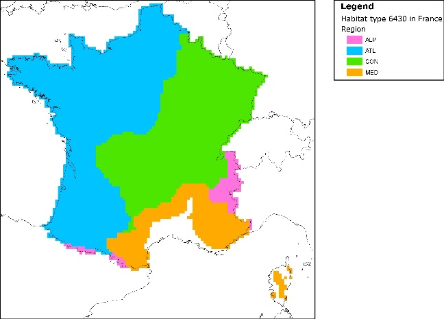
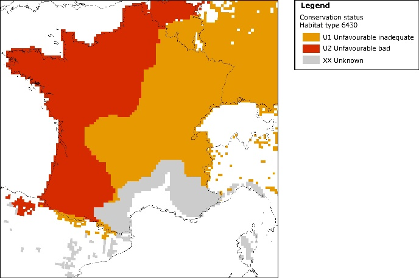

[.text-center]
*Figure 16 – Distribution of the wide spread habitat type 6430 in France as split by Biogeographical region, now 4 files upon which a Conservation status is calculated. The right figure shows the conservation status as calculated fro the entire region.*

*Reporting format on the 'main results of the surveillance under Article 11' for Annex I Habitats Types*

[%autowidth,options="header"]
|===
|*_Field definition_* |*_Brief explanations_*
|*0.1 Member State* |The MS for which the reported data apply; use 2 digit code according to list to be found in the reference portal.
|*0.2 Habitat code* |From checklist for reporting under nature directives, e.g. 1110 (do not use subtypes). Should subtypes be used, e.g. for marine habitat types, please ensure that there is also a format filled in for the habitat type as in the directive – Annex I).
2+^|*1 National level*
|*1.1. Maps* |Distribution and range within the country concerned
|*1.1.1. Distribution map* |Submit a map as a GIS file – together with relevant metadata. Standard for submission is 10x10km ETRS grid cells, projection ETRS LAEA 5210.
|*1.1.2. Method used - map* a|
3 = Complete survey

2 = Estimate based on partial data with some extrapolation and/or modelling

1 = Estimate based on expert opinion with no or minimal sampling

0 = Absent data

|*1.1.3. Year or period* |Year or period when distribution data was collected.
a|
*1.1.4. Additional distribution map*

Optional

|This is for cases if MS wishes to submit an additional map deviating from standard submission map under 1.1.1.
|*1.1.5. Range map* |Submit a map that was used for range evaluation following the same standard as under 1.1.1. or 1.1.4.
|===

[%autowidth,options="header"]
|===
2+^|*2. Biogeographical level*
Complete for each biogeographical region or marine region concerned
|*2.1. Biogeographical region or marine regions* |Choose one of the following: Alpine (ALP), Atlantic (ATL), Black Sea (BLS), Boreal (BOR), Continental (CON), Mediterranean (MED), Macaronesian (MAC), Pannonian (PAN), Steppic (STE) ), Marine Atlantic (MATL), Marine Mediterranean (MMED), Marine Black Sea (MBLS), Marine Macaronesian (MMAC) and Marine Baltic Sea (MBAL).
|*2.2. Published sources* |If data given below is from published sources give bibliographical references or link to Internet site(s). Give author, year, title of publication, source, volume, number of pages, web address.
|*2.3. Range* |Range within the biogeographical region concerned.
a|
*2.3.1. Surface area*

*Range*

|Total surface area of the range within biogeographical region concerned in km². The method described in the section IV.a.i 'Range' of the guidelines is recommended.
a|
*2.3.2 Method used*

*Range*

a|
3 = Complete survey

2 = Estimate based on partial data with some extrapolation and/or modelling

1 = Estimate based on expert opinion with no or minimal sampling

0 = Absent data
a|
*2.3.3. Short-term trend*

*Period*

|2001-2012 (rolling 12-year time window) or period as close as possible to it. Indicate the period used here. The short-term trend is to be used for the assessment.
a|
*2.3.4. Short-term trend*

*Trend direction*

a|
0 = stable

+ = increase

{empty}- = decrease

x = unknown
.2+|*2.3.5. Short-term trend Magnitude*
Optional
|*a) Minimum* - Percentage change over the period indicated in the field 2.3.2. - if a precise figure, to give same value under 'minimum' and 'maximum'
|*b) Maximum* - As for a)
a|
*2.3.6. Long-term trend Period*

Optional

|A trend calculated over 24 years. For 2013 reports it is optional (fields 2.3.6 -2.3.8 are optional). Indicate the period used here.
a|
*2.3.7 Long-term trend*

*Trend direction*

Optional

a|
0 = stable

+ = increase

{empty}- = decrease

x = unknown

.2+|
*2.3.8 Long-term trend Magnitude*

Optional

|*a) Minimum* Percentage change over the period indicated in the field 2.3.6. - if a precise figure, to give same value under 'minimum' and 'maximum'.
|*b) Maximum* As for b)
.4+|*2.3.9 Favourable reference range* 
|a) In km². Submit a map as a GIS file if available.
|b) Indicate if operators were used (using symbols ≈, >, >>).
|c) If Favourable Reference Range is unknown, indicate with "x".
|d) Indicate method used to set reference value (if other than operators) (free text).
.3+|*2.3.10 Reason for change*

Is the difference between the reported value in 2.3.1. and the previous reporting round mainly due to:

|a) genuine change? _YES/NO_
|b) improved knowledge/more accurate data? _YES/NO_ 
|c) use of different method (e.g. "Range tool") _YES/NO_
|*2.4 Area covered by habitat* |Area covered by habitat within the range in the biogeographical region concerned (km^2^)
|*2.4.1 Surface area* |In km²
|*2.4.2 Year or period* |Year or period when data for area surface was recorded.
a|
*2.4.3 Method used*

*Area covered by habitat*

a|
3 = Complete survey or a statistically robust estimate

2 = Estimate based on partial data with some extrapolation and/or modelling

1 = Estimate based on expert opinion with no or minimal sampling

0 = Absent data
a|
*2.4.4 Short-term trend*

*Period*

|2001-2012 (rolling 12-year time window) or period as close as possible to it. Indicate the period used here. The short-term trend is to be used for the assessment.
a|
*2.4.5 Short-term trend*

*Trend direction*

a|
0 = stable

+ = increase

{empty}- = decrease

x = unknown
.3+|
*2.4.6 Short-term trend Magnitude*

Optional

|*a) Minimum* Percentage change over the period indicated in the field 2.4.4 - if a precise figure, to give same value under 'minimum' and 'maximum'.
|*b) Maximum* As for a)
|*c) Confidence interval* Indicate confidence interval if a statistically reliable method is used.
|*2.4.7 Short-term trend Method used* a|
3 = Complete survey or a statistically robust estimate

2 = Estimate based on partial data with some extrapolation and/or modelling

1 = Estimate based on expert opinion with no or minimal sampling

0 = Absent data
a|
*2.4.8 Long-term trend Period*

Optional

|A trend calculated over 24 years. For 2013 reports it is optional (fields 2.4.8. – 2.4.10 are optional). Indicate the period used here.
a|
*2.4.9. Long-term trend*

*- Trend direction*

Optional

a|
0 = stable

+ = increase

{empty}- = decrease

x = unknown

.3+|
*2.4.10 Long-term trend Magnitude*

Optional

|*a) Minimum* Percentage change over the period indicated in the field 2.4.8 - if a precise figure, to give same value under 'minimum' and 'maximum'.
|*b) Maximum* As for a)
|*c) Confidence interval* Indicate confidence interval if a statistically reliable method is used.
a|
*2.4.11 Long-term trend Method used*

Optional

a|
3 = Complete survey or a statistically robust estimate

2 = Estimate based on partial data with some extrapolation and/or modelling

1 = Estimate based on expert opinion with no or minimal sampling

0 = Absent data
.4+|*2.4.12 Favourable reference area* 
|a) In km². Submit a map as a GIS file if available.
|b) Indicate if operators were used (≈, >, >>footnote:[Special case: symbol "<" can be used only in special cases like for the habitat type Degraded raised bog still capable of natural regeneration (7120)]) 
|c) If Favourable Reference Area is unknown indicate with "x" 
|d) Indicate method used to set reference value (if other than operators) (free text) 
.3+|
*2.4.13 Reason for change*

Is the difference between the reported value in 2.4.1. and the previous reporting round mainly due to:

|a) genuine change? _YES/NO_
|b) improved knowledge/more accurate data? _YES/NO_
|c) use of different method (e.g. "Range tool") _YES/NO_
3+|*2.5 Main pressures*
|*a) Pressure* |*b) Ranking* |*c) Pollution qualifier*
a|
List max 20 pressures.

Use codes from the list of threats and pressures to at least the 2^nd^ levelfootnote:[List of threats and pressures is available on the Art 17 Reference Portal]

a|
* H = high importance (max 5 entries)
* M = medium importance
* L = low importance

|_optional_
|*2.5.1 Method used – pressures* 2+|
3 = based exclusively or to a larger extent on real data from sites/occurrences or other data sources

2 = mainly based on expert judgement and other data

1 = based only on expert judgements

3+|*2.6. Main threats*
|*a) Threats* |*b) Ranking* |*c) Pollution qualifier*
|Same explanation as for the pressure |Same explanation as for the pressure |_optional_
|*2.6.1. Method used –threats* 2+|
2 = modelling

1 = expert opinion

|
|===

[%autowidth,options="header"]
|===
2+^|*2.7 Complementary information*
|*2.7.1 Typical species* |List the typical species used.
|*2.7.2 Typical species – method used* |Describe method(s) used to assess the status of typical species as part of the overall assessment of structure and functions.
|*2.7.3 Justification of % thresholds for trends* |In case a MS is not using the indicative suggested value of 1% per year when assessing trends, this should be duly justified in this free text field.
a|
*2.7.4 Structure and functions*

*- Methods used*

a|
3 = Complete survey or a statistically robust estimate

2 = Estimate based on partial data with some extrapolation and/or modelling

1 = Estimate based on expert opinion with no or minimal sampling

|*2.7.5 Other relevant information* |Free text
|===

[%autowidth,options="header"]
|===
2+^|
*2.8. Conclusions*

*_(assessment of conservation status at end of reporting period)_*

|*2.8.1. Range* |a) Favourable (FV) / Inadequate (U1) / Bad (U2) / Unknown (XX)
| |b) If CS is U1 or U2 it is recommended to use qualifiersfootnote:[If conservation status is inadequate or bad, it is recommended to indicate use '' (improving) or '-' (declining), '=' (stable) or 'x' (unknown).]
|*2.8.2. Area* |a) Favourable (FV) / Inadequate (U1) / Bad (U2) / Unknown (XX)
| |b) If CS is U1 or U2 it is recommended to use qualifiers^10^
|*2.8.3. Specific structures and functions (incl. typical species)* |a) Favourable (FV) / Inadequate (U1) / Bad (U2) / Unknown (XX)
| |b) If CS is U1 or U2 it is recommended to use qualifiers^10^
|*2.8.4. Future prospects* |a) Favourable (FV) / Inadequate (U1) / Bad (U2) / Unknown (XX)
| |b) If CS is U1 or U2 it is recommended to use qualifiers^10^
|*2.8.5. Overall assessment of Conservation Status* |Favourable (FV) / Inadequate (U1) / Bad (U2) / Unknown (XX)
|*2.8.6 Overall trend in Conservation Status* |If CS is inadequate or bad, use of qualifier '' (improving) or '-' (declining), '=' (stable) or 'x' (unknown) is obligatory.
|===

[cols="",options="header"]
|===
^|*3. Natura 2000 coverage & conservation measures - Annex I habitat types _on biogeographical level_*

|===

[cols=",,",options="header",]
|===
3+|*3.1 Area covered by habitat*
.2+|
*3.1.1 Surface area*

Estimation of habitat type surface area included in the network (of the same biogeographical region).

|*a) Minimum* |In km^2^
|*b) Maximum* |Same as above
|*3.1.2 Method used* 2+|
3 = Complete survey or a statistically robust estimate

2 = Estimate based on partial data with some extrapolation and/or modelling

1 = Estimate based on expert opinion with no or minimal sampling

0 = Absent data

a|
*3.1.3 Trend of surface area within the network*

Optional

2+|0 = stable 
+ = increase 
{empty}- = decrease 
x = unknown 
|===

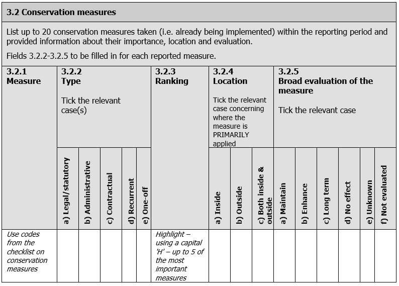

[.big]#*Assessing conservation status of a HABITAT type*#

*General evaluation matrix (per biogeographic region within a MS)*

[cols=",,,,",options="header",]
|===
|*Parameter Conservation Status* | | | |
| a|
*Favourable*

*('green')*  

a|
*Unfavourable – Inadequate*

*('amber')*

a|
*Unfavourable - Bad*

*('red')*

a|
*_Unknown_*

*_(insufficient information to make an assessment)_*

|**2.3 Range**footnote:[Range within the biogeographical region concerned (for definition, see Annex F, further guidance on how to define range (e.g. scale and method) will be given in a foreseen guidance document to be elaborated by ETC-BD.] |Stable (loss and expansion in balance) or increasing AND not smaller than the 'favourable reference range' |Any other combination a|
Large decrease: Equivalent to a loss of more than 1% per year within period specified by MS

OR

More than 10% below 'favourable reference range'

|_No or insufficient reliable information available_
|**2.4 Area covered by habitat type within range**footnote:[There may be situations where the habitat area, although above the 'Favourable Reference Area', has decreased as a result of management measures to restore another Annex I habitat or habitat of an Annex II species. The habitat could still be considered to be at 'Favourable Conservation Status' but in such cases please give details in the Complementary Information section ("Other relevant information") of Annex D.] |Stable (loss and expansion in balance) or increasing AND not smaller than the 'favourable reference area' AND without significant changes in distribution pattern within range (if data available) |Any other combination a|
Large decrease in surface area: Equivalent to a loss of more than 1% per year (indicative value MS may deviate from if duly justified) within period specified by MS

OR

With major losses in distribution pattern within range

OR

More than 10% below 'favourable reference area'

|_No or insufficient reliable information available_
|**Specific structures and functions (including typical species**footnote:[See definition of typical species in the guidance document.]*)* |Structures and functions (including typical species) in good condition and no significant deteriorations / pressures. |Any other combination |More than 25% of the area is unfavourable as regards its specific structures and functions (including typical species)footnote:[E.g. by discontinuation of former management, or is under pressure from significant adverse influences, e.g. critical loads of pollution exceeded.] |_No or insufficient reliable information available_
|*Future prospects* (as regards range, area covered and specific structures and functions) |The habitats prospects for its future are excellent / good, no significant impact from threats expected; long-term viability assured. |Any other combination |The habitats prospects are bad, severe impact from threats expected; long-term viability not assured. |_No or insufficient reliable information available_
|*Overall assessment of CS* footnote:[A specific symbol (/-/=/?) is recommended to be used in the unfavourable categories to indicate recovering habitats] a|
All 'green'

OR

three 'green' and one 'unknown'

|One or more 'amber' but no 'red' |One or more 'red' |Two or more 'unknown' combined with green or all "unknown'
|===

=== Provision of data on habitats (Provide data on habitats and biotopes to meet monitoring and reporting obligations of the Habitats Directive and regional obligations of the Government of NorthRhine-Westphalia, Germany) 

The scenario describes how data about the occurrence of habitats will be collected and provided. This process is of crucial relevance for preservation and development of a favourable conservation status of habitats by designating protected sites, for well-directed site management, for land purchase or contractual measures of nature conservation. Monitoring obligations of the Habitats Directive demand an updated report on all sites at least every six years.

This use case describes how data will be collated and evaluated and finally provided.

[cols=",",options="header"]
|===
2+|Use Case Description
|Name |Provision of data on habitats (Provide data on habitats and biotopes to meet monitoring and reporting obligations of the Habitats Directive and regional obligations of the Government of NorthRhine-Westphalia, Germany).
|Primary actor |Data provider (MS Germany or the nature conservation administration of the „Bundesländer").
|Goal |To identify the deficits and initiate closer examinations of habitats in the field.
|System under 
consideration |
|Importance |High
|Description |The user is the MS Germany or the nature conservation administration of the „Bundesländer", who provide data on habitats to meet reporting and monitoring obligations of the Habitats Directive. Habitat data have to be added to the Standard Data Form for Natura2000 sites and provided in compliance with „Explanatory Notes & Guidelines on Assessment, monitoring and reporting under Article 17 of the Habitats Directive" (1-2006).
|Pre-condition |harmonized standards for data collection and processing on all levels and for providing data from regional to federal level.
|Post-condition |The inventory results may show up deficits and initiate closer examinations of habitats in the field. Data processing may reveal gaps of the evaluation procedure. Since evaluation processes depend on comparable data, iterative processing may be necessary.
2+h|*Flow of Events – Basic Path*
|Step 1 |The regional administrative services responsible for habitat inventory and data provision identify the necessity of data collection from reporting obligations under the Habitats Directive and regional state government requirements.
|Step 2 a|
Biotope mapping paying regard to theme-specific, methodological and data-technical specifications of state or federal government.

Regular dataset comprises: Geometry, coding of habitat-type in compliance with standardized coding lists (e.g. habitat types of Habitats Directive), vegetation types (using regional coding systems), plant species (typical species), biotope structures, disturbance and conservation status (compl. to Hab.Dir.). Encoding is harmonized on a federal level using a common evaluation schema.

Data will be collated by the regional administrative services.

|Step 3 |Quality assessment of the collated data. (Inventory)Data transfer/transmission to theme-specific information systems.
|Step 4 a|
The data necessary for reporting under Art. 17 Hab.Dir. have to be processed by the regional administrative services to meet the obligations of the guidelines. Conclusions will comprise:

* habitat distribution (range, trends, reference distribution)
* total area (range, grid map, trend, reference range)
* structures and functions (incl. typical species)
* future prospects (main pressures)

The results (data) will be provided to the federal administration and collated there from all „Bundesländer". The federal government will finally provide the data to the EU-Commission.

The state services in charge with regional duties, on the other hand, will exploit the same data for their own purposes on regional level.

|Step 5 |These processed reporting data will also be published in specific information systems on the internet by state administrative services.
2+h|*Flow of Events – Alternative Paths*
|Step m. |None
2+h|*Data set: Member State Data Set*
a|

Description

|Geo-data collected complying to (EU)standards or harmonisation agreed upon between the Bundesländer. Geodata administration in GIS. Data publishing in theme-specific information systems on the internet, often IMS or WMS.
a|

Type

|output
a|

Data provider

|The regional administrative services of the Bundesländer.
a|

Geographic scope

|Germany, however, a similar process is obligatory in all EU-MS.
a|

Thematic scope

|Habitat types (within and outside of protected sites (incl. Natura2000).
a|

Scale, resolution

|The highest resolution that the member state can provide, usually better than 1:25.000, for most parts of DE 1:5.000.
a|

Delivery

a|
These data will be published in specific information systems on the internet by state administrative services including view services.

Data will be provided in proprietary format via the federal government towards EU-COM.

a|

Documentation

|EU-Guidance document „ Assessment, monitoring and reporting under Article 17 of the Habitats Directive: Explanatory Notes and Guidelines", Final (SWG 06-02/04).
|===

=== EBONE, provide data on European habitat stock and change (GHC habitat surveillance as a European pilot for harmonisation of habitat data (EBONE)) 

The scenario describes how data on the occurrence of habitats are being collected Europe wide. This process is of crucial relevance for harmonisation of habitat data to measure stock and change.

This use case describes how data are collected and summary statistics are made and provided.

[cols=",",options="header"]
|===
2+|Use Case Description
|Name |EBONE, provide data on European habitat stock and change (GHC habitat surveillance as a European pilot for harmonisation of habitat data (EBONE)) .
|Primary actor |Data collector
|Goal |Data collection of the habitats occurrence collected Europe wide.
|System under 
consideration |EBONE
|Importance |High
|Description |Data collection and integration from different European countries. The methodology is appropriate for coordinating information on habitats and vegetation in order to obtain statistically robust estimates of their extent and associated changes in biodiversity. It combines data from different countries in a common database.
|Pre-condition |Harmonized standards for data collection and processing for integrating field data in different countries collected in different schemes.
|Post-condition |The report may be used for assessing the usefulness of the method. GIS-analyses and resulting data have to be stored for later use and are available to be shared with EEA. The evaluation processes made possible to compare data.
2+h|*Flow of Events – User 1*
|Step 1 |The mapping and comparison of stock and change of habitats in Europe was not possible using EUNIS. The improvement of reporting at the European level required a habitat classification system that is based on strict rules and can be processed statistically. These are the General Habitat Categories (GHC).
|Step 2 |Habitat mapping has been done in a stratified random way in UK, Sweden, Field data have been collected Regular dataset comprises: Geometry, coding of habitat-type in compliance with standardized coding lists (GHCs), with additional information on dominant species and Annex I types of Habitats Directive/EUNIS, and environmental qualifiers. UK and Swedish data have been recoded to harmonise the dataset.
|Step 3 |Quality assessment of the collected data. Digitising of the data and transfer to the common database.
|Step 4 |Data in the database are field data collected in 2009-2010 in Spain, Portugal, Greece, Romania, Austria, Slovak Republic, Estonia, France, Israel, Norway, South Africa, Italy. Data from the Swedish NILS project and the UK Countryside survey and the Austrian SINUS project are being integrated and are being analysed jointly.
|Step 5 |EBONE provides a European data set on the share and diversity of the general habitat categories using the EBONE web viewer.
|Step 6 |EBONE produces a report on the status and trends of habitats based on the general habitat categories.
2+h|*Flow of Events – Alternative Paths*
|Step m. |None
2+h|*Data set: Member State Data Set*
a|

Description

|EBONE habitat database
a|

Type

|output
a|

Data provider

|EBONE
a|

Geographic scope

|Europe and Mediterranean countries: Israel, South Africa.
a|

Thematic scope

|Habitat surveillance
a|

Scale, resolution

|1 km^2^
a|

Delivery

|EBONE 2011
a|

Documentation

a|
Bunce, R.G.H., M.M.B. Bogers, P. Roche, M. Walczak, I.R. Geijzendorffer and R.H.G. Jongman, 2011. Manual for Habitat and Vegetation Surveillance and Monitoring, Temperate, Mediterranean and Desert Biomes

Bunce, R.G.H.; Bogers, M.M.B.; Evans, D.; Jongman, R.H.G. (2010). D 4.2: Rule based system for Annex I habitats : Version 3 Document date : 2010-01-24

Bunce, R.G.H.,  Bogers, M.M.B., Ortega, M., Morton, D., Allard, A., Prinz, M., Peterseil, J. and R. Elena-Rossello. 2010. D4.1: Protocol for converting field habitat data sources into common standards Deliverable report

_http://www.ebone.wur.nl/UK/Projectinformationandproducts/_

_http://www.ebone.wur.nl/UK/Publications/_

|===

image::./media/image27.png[jois_access3,width=415,height=304]

[.text-center]
*Figure 17 – Habitat mapping tool on a tablet computer using GHCs. The observed habitat is a vineyard (Wooded Crop (WOC) with grass undergrowth. The element is identified by code, GPS position and photograph.*

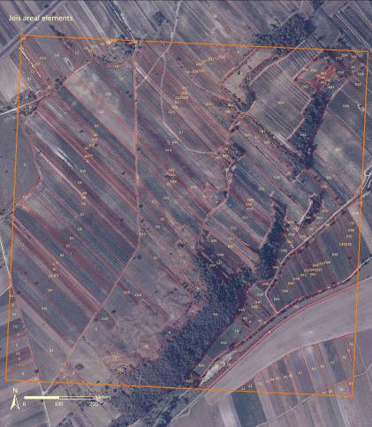

[.text-center]
*Figure 18 – Jois km square (Austria) with mapped areal features, both natural and agricultural*

=== Mapping of habitats and biotopes in Germany (Status quo compilation of habitats and biotopes in a site of community interest (SCI) in Germany) 

The compilation of the status quo of habitats and biotopes in protected sites is very important for the management of these sites and also necessary for _impact_ _regulation_ _under_ _nature_ _protection_ _law_.

The scenario describes how mapping of German habitats and biotopes works. Data on the occurrence of biotopes are collected in the field. A biotope is an abstract habitat typifying an entire class of similar natural habitats whose ecological conditions offer living communities largely uniform circumstances different from those offered by other types. Biotopes are defined with reference to abiotic factors and biotic factors. Some 690 biotopes can be distinguished in Germany. Data on the occurrence of phytosociological vegetation are also collected.

[cols=",",options="header"]
|===
2+|Use Case Description
|Name |Mapping of habitats and biotopes in Germany (Status quo compilation of habitats and biotopes in a site of community interest (SCI) in Germany).
|Primary actor |Data collector (mapper)
|Goal |Management of of habitats and biotopes in protected sites and also necessary for _impact_ _regulation_ _under_ _nature_ _protection_ _law_.
|System under 
consideration |
|Importance |High
|Description a|
The mapping of stock of biotopes in Germany is mostly harmonized in the 16 states. Each of it has its own mapping scheme (Biotopkartierung). There is also a German check list and red list of biotopes.

The data are collected e.g. in a site of community interest (SCI). A local code list of the state is used to identify the special biotopes. Phytosociological mapping is done too.

|Pre-condition |Harmonized standards for data collection.
|Post-condition |The map of the status quo of habitats and biotopes in the protected site may be used for the planning of the management to improve the conservation status. Because of the harmonized mapping method, the result can be compared with a mapping e.g. 6 years later.
2+h|*Flow of Events – User 1*
|Step 1 |Mapping of biotopes in the protected site (using a special mapping scheme) biotope-types.
|Step 2 |Mapping of phytosociological vegetation in the protected site (maybe in an other part of the site) vegetation association.
|Step 3 |Giving additional information about the conservation status of the biotope types.
|Step 4 |Information about position and size of the biotope types.
|Step 5 |Correlation of the vegetation associations to biotope types (biotope-mapping-scheme) and to habitat types of the Habitats Directive (Ssymank et al. 1998).
|Step 6 |For European comparison: correlation of the vegetation associations to alliances; after that correlation of the alliances and biotope-types to EUNIS Codes via Rodwell et al. 2002 and Riecken et al. 2006.
|Step 7 |Quality assessment of the collected data. Digitalisation of the data and transfer to common database.
2+h|*Flow of Events – Alternative Paths*
|Step m. |None
2+h|*Data set: local data set*
a|

Description

|Data set created by a local institution or agency.
a|

Type

|output
a|

Data provider

|Local institution / agency
a|

Geographic scope

|Germany
a|

Thematic scope

|Habitat mapping and surveillance
a|

Scale, resolution

|Different, 1:2500
a|

Delivery

|Several German institutions /agencies
a|

Documentation

a|
Riecken, U., Finck, P., Raths, U., Schröder, E. & Ssymank, S. (2006): Rote Liste der gefährdeten Biotoptypen Deutschlands. – Naturschutz und Biologische Vielfalt 34. 318 S.ISBN: 987-3-7843-3934-4

Ssymank, A., Hauke, U., Rückriem, C & Schröder, E. (1998): Das europäische Schutzgebietssystem Natura 2000. – Schriftenreihe für Landschaftspflege und Naturschutz 53. 558 S. ISBN: 3-89624-113-3

Rodwell, J., S., Schaminée, J., H., J., Mucina, L., Pignatti, S., Dring, J & Moss, D. (2002): The Diversity of European Vegetation. An overview of phytosociological alliances and their relationships to EUNIS habitats. Wageningen, NL. EC-LNV. Report EC-LNV nr. 2002/054. 167 S. ISBN: 90-75789-10-6

Biotope-mapping-schema example:

http://www.naturschutz-fachinformationssysteme-nrw.de

|===

Diagram: Mapping habitats and biotopes in a protected site in Germany.

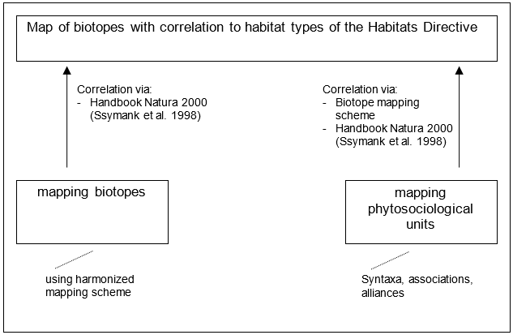

=== Remote Sensing based support of heathland-habitat monitoring in Germany 

For the fulfilment of Natura 2000 monitoring obligations in Germany the federal states update Natura 2000 data every six years by terrestrial mapping campaigns.

The uses case describes how mapping of German Natura 2000 heathland habitats can be supported by Remote Sensing. Data on the occurrence of habitats and biotopes are collected in the field. Remote Sensing data is used as basic information for terrestrial mapping of habitats to enhance the workflow efficiency.

[cols=",",options="header"]
|===
2+|*Use Case Description*
|Name |Remote Sensing based support of heathland-habitat monitoring in Germany.
|Primary actor |Analyst
|Goal |Remote sensing data usage in order to support mapping of German Natura 2000 heathland habitats.
|System under 
consideration |
|Importance |High
|Description a|
The monitoring of Natura 2000 habitats in Germany is mostly harmonized in the 16 federal states. Each of it has its own mapping scheme mostly based on biotope mapping (Biotopkartierung) and national guidelines for Natura 2000 monitoring defined by the German federal agency for nature protection (BfN). In the case of heathland habitats Remote Sensing can be used to detect vegetation structures (e.g. percentage of total plant cover, percentage of bare soil) which support the terrestrial mapping campaign (Frick 2006, Buck et al. 2011).

The data are collected e.g. in a Site of Community Interest (SCI). A local code list of the state is used to identify habitats and special biotopes.

|Pre-condition |Harmonized standards for data collection.
|Post-condition |The map of the status quo of habitats in the protected site may be used for planning and/or management to improve its conservation status. Because of the harmonized mapping method, the result can be re-iterated and compared with a mapping e.g. 6 years later.
2+h|*Flow of Events – User project planning/ implementation and appropriate assessment*
|Step 1 |Automatic detection of habitat structures by remote sensing analysis using satellite images and aerial images.
|Step 2 |Production of digital or analogue field maps including habitat structures form Step 1.
|Step 3 |Terrestrial mapping campaign using field maps from Step 2 and collecting additional information about the conservation status of the heathland habitats.
|Step 4 |If necessary, correction of Information about position and size of the habitat.
|Step 5 |Correlation of vegetation classification to biotope types (biotope-mapping-scheme) and to habitat types of the Habitats Directive (Ssymank et al. 1998).
|Step 6 |For European comparison: correlation of the vegetation classification on alliance level; followed by a correlation of the alliances and biotope-types to EUNIS Codes via Rodwell et al. 2002 and Riecken et al. 2006.
|Step 7 |Quality assessment of the collected data. Digitalisation of the data and transfer to a common database.
2+h|*Flow of Events – Alternative Paths*
|Step m. |None
2+h|*Data set: local data set*
a|

Description

|Data set created by a local institution or agency.
a|

Type

|output
a|

Data provider

|Local institution / agency
a|

Geographic scope

|Germany
a|

Thematic scope

|Natura 2000 Habitat mapping and surveillance.
a|

Scale, resolution

|Different, 1:2,500
a|

Delivery

|Several German institutions /agencies
a|

Documentation

a|
Buck, O., Peter, B., Völker, A., & Donning, A. (2011). Object based image analysis to support environmental monitoring under the European Habitat Directive: a case study from DECOVER. ISPRS Hannover Workshop 2011: High-Resolution Earth Imaging for Geospatial Information, Hannover, Germany, June 14 to June 17, 2011.

Frick, A. (2006): Beiträge höchstauflösender Satellitenfernerkundung zum FFH-Monitoring. Entwicklung eines wissensbasierten Klassifikationsverfahrens und Anwendung in Brandenburg. – Dissertation, TU

Berlin.

Riecken, U., Finck, P., Raths, U., Schröder, E. & Ssymank, S. (2006): Rote Liste der gefährdeten Biotoptypen Deutschlands. – Naturschutz und Biologische Vielfalt 34. 318 S.ISBN: 987-3-7843-3934-4

Ssymank, A., Hauke, U., Rückriem, C & Schröder, E. (1998): Das europäische Schutzgebietssystem Natura 2000. – Schriftenreihe für Landschaftspflege und Naturschutz 53. 558 S. ISBN: 3-89624-113-3

Rodwell, J., S., Schaminée, J., H., J., Mucina, L., Pignatti, S., Dring, J & Moss, D. (2002): The Diversity of European Vegetation. An overview of phytosociological alliances and their relationships to EUNIS habitats. Wageningen, NL. EC-LNV. Report EC-LNV nr. 2002/054. 167 S. ISBN: 90-75789-10-6

Biotope-mapping-schema example:

http://www.naturschutz-fachinformationssysteme-nrw.de

|===

<<<
[appendix]
== Code list values - (normative) 

*INSPIRE Application Schema 'HabitatsAndBiotopes'*

[cols="",options="header",]
|===
|*Code List*
|_QualifierLocalNameValue_
|_ReferenceHabitatTypeSchemeValue_
|===

*QualifierLocalNameValue*

[cols="",]
|===
a|
[cols=","]
!===
!Name: !qualifier local name value
!Definition: !List of values that specify the relation between a locally used name and a name used at the pan-European level.
!Extensibility: !none
!Identifier: !http://inspire.ec.europa.eu/codelist/QualifierLocalNameValue
!Values: !The allowed values for this code list comprise only the values specified in the table below.
!===

|===

[cols="",]
|===
a|
*congruent*

[cols=","]
!===
!Name: !congruent
!Definition: !The local type is conceptually the same as its related Pan-European type.
!===

a|
*excludes*

[cols=","]
!===
!Name: !excludes
!Definition: !The Pan-European habitat type is conceptually not a subtype of its related local type.
!===

a|
*includedIn*

[cols=","]
!===
!Name: !included in
!Definition: !The local type is conceptually a subtype of its related Pan-European type.
!===

a|
*includes*

[cols=","]
!===
!Name: !includes
!Definition: !The Pan-European habitat type is conceptually a subtype of its related local type.
!===

a|
*overlaps*

[cols=","]
!===
!Name: !overlaps
!Definition: !There is a certain overlap between the local type and its related Pan-European type according to their respective definitions, but none of the other specific relationships (congruent, excludes, included in, includes) holds.
!===

|===

*ReferenceHabitatTypeSchemeValue*

[cols="",]
|===
a|
[%autowidth,options="header"]
!===
!Name: !reference habitat type scheme value
!Definition: !This value defines which pan-european habitat classification scheme has been used.
!Description: !EXAMPLE Eunis
!Extensibility: !none
!Identifier: !http://inspire.ec.europa.eu/codelist/ReferenceHabitatTypeSchemeValue
!Values: !The allowed values for this code list comprise only the values specified in the table below.
!===

|===

[cols=""]
|===
a|
*eunis*

[cols=","]
!===
!Name: !Eunis
!Definition: !EUNIS habitat classification.
!===

a|
*habitatsDirective*

[cols=","]
!===
!Name: !Habitats directive
!Definition: !Classification of habitats according to Annex I to Directive 92/43/EEC.
!===

a|
*marineStrategyFrameworkDirective*

[cols=","]
!===
!Name: !Marine strategy framework directive
!Definition: !Classification of habitats according to table 1 of Annex III to Directive 2008/56/EC.
!===

|===

<<<
[appendix]
== Examples - (informative) 

This Annex provides examples of use metadata elements defined in Regulation 1205/2008/EC.

=== Examples on using metadata elements defined in Regulation 1205/2008/EC

==== Conformity 

This metadata element will also allow data producers to report that a specific dataset fulfils INSPIRE requirements as well as obligations from particular legal regulation.

*Conformity example:*

[source, xml]
--
	<gmd:report>
				<gmd:DQ_DomainConsistency>
					<gmd:result>
						<gmd:DQ_ConformanceResult>
							<gmd:specification>
								<gmd:CI_Citation>
									<gmd:title>
										<gco:CharacterString>COMMISSION REGULATION (EU) No 1089/2010 of 23 November 2010 implementing Directive 2007/2/EC of the European Parliament and of the Council as regards interoperability of spatial data sets and services</gco:CharacterString>
									</gmd:title>
									<gmd:date>
										<gmd:CI_Date>
											<gmd:date>
												<gco:Date>2010-12-08</gco:Date>
											</gmd:date>
											<gmd:dateType>
												<gmd:CI_DateTypeCode codeList="http://standards.iso.org/ittf/PubliclyAvailableStandards/ISO_19139_Schemas/resources/Codelist/ML_gmxCodelists.xml#CI_DateTypeCode" codeListValue="publication">publication</gmd:CI_DateTypeCode>
											</gmd:dateType>
										</gmd:CI_Date>
									</gmd:date>
								</gmd:CI_Citation>
							</gmd:specification>
							<gmd:explanation>
								<gco:CharacterString>See the referenced specification</gco:CharacterString>
							</gmd:explanation>
							<gmd:pass>
								<gco:Boolean>false</gco:Boolean>
							</gmd:pass>
						</gmd:DQ_ConformanceResult>
					</gmd:result>
				</gmd:DQ_DomainConsistency>
			</gmd:report>
			<gmd:report>
				<gmd:DQ_DomainConsistency>
					<gmd:result>
						<gmd:DQ_ConformanceResult>
							<gmd:specification>
								<gmd:CI_Citation>
									<gmd:title>
										<gco:CharacterString>Council Directive 92/43/EEC of 21 May 1992 on the conservation of natural habitats and of wild fauna and flora</gco:CharacterString>
									</gmd:title>
									<gmd:date>
										<gmd:CI_Date>
											<gmd:date>
												<gco:Date>1992-05-02</gco:Date>
											</gmd:date>
											<gmd:dateType>
												<gmd:CI_DateTypeCode codeListValue="creation" codeList="http://standards.iso.org/ittf/PubliclyAvailableStandards/ISO_19139_Schemas/resources/Codelist/ML_gmxCodelists.xml#CI_DateTypeCode">publication</gmd:CI_DateTypeCode>
											</gmd:dateType>
										</gmd:CI_Date>
									</gmd:date>
								</gmd:CI_Citation>
							</gmd:specification>
							<gmd:explanation>
								<gco:CharacterString>See the referenced specification</gco:CharacterString>
							</gmd:explanation>
							<gmd:pass>
								<gco:Boolean>false</gco:Boolean>
							</gmd:pass>
						</gmd:DQ_ConformanceResult>
					</gmd:result>
				</gmd:DQ_DomainConsistency>
			</gmd:report>
--

==== Lineage 

This metadata element will also allow data producers to report as well as data users to see what kind of transformation methodologies were used to transform local data to common INSPIRE structures, including description of the source data.

Example for Lineage element is available in Annex C

[source, xml]
--
            <gmd:lineage>
                <gmd:LI_Lineage>
                    <gmd:statement>
                        <gco:CharacterString>Source observation data has been aggregated to distribution data using spatial operators buffer and intersect.</gco:CharacterString>
                    </gmd:statement>
                    <gmd:processStep>
                        <gmd:LI_ProcessStep>
                            <gmd:description>
                                <gco:CharacterString>For the data transformation from local to the INSPIRE model, the following methodology has been used: 1. Harmonization between the source and target (INSPIRE) data model. 2. Semantic mapping of individual features and their attributes. 3. Additional rules for data conversion, as data type conversions, data grouping, data concatenate, constants definition. 4. Implementation of the transformation means completely automated crosswalk by means of the application of some type of tool (Geoserver - Application schema extension and XML MapForce)</gco:CharacterString>
                            </gmd:description>
                        </gmd:LI_ProcessStep>
                    </gmd:processStep>
                    <gmd:source>
                        <gmd:LI_Source>
                            <gmd:description>
                                <gco:CharacterString>Each sample within the source dataset was collected by selecting relevant areas of high biodiversity (selective biotope mapping) during the vegetation period (spring-autumn) reporting information on the habitat structure, the vegetation types and relevant plant species constituting the habitat. Animal species were added either as a result of observation during the mapping process or copied from specific species geo-data bases, if there was an observation within the past five years within the area (=occurrence).</gco:CharacterString>
                            </gmd:description>
                        </gmd:LI_Source>
                    </gmd:source>
                </gmd:LI_Lineage>
            </gmd:lineage>
--
