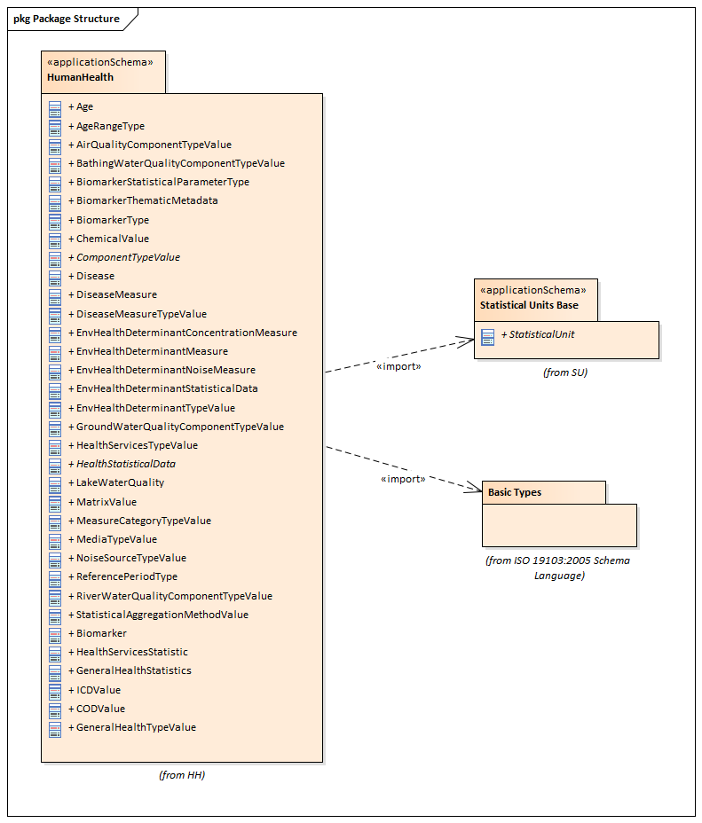

// Admonition icons:
// TG Requirement
:important-caption: 📕
// TG Recommendation
:tip-caption: 📒
// Conformance class
:note-caption: 📘

// TOC placement using macro (manual)
:toc: macro

// Empty TOC title (the title is in the document)
:toc-title:

// TOC level depth
:toclevels: 5

// Section numbering level depth
:sectnumlevels: 8

// Line Break Doc Title
:hardbreaks-option:

:appendix-caption: Annex

image::./media/image2.jpeg[image,width=131,height=90, align=center]

image:./media/image3.png[image,width=93,height=93, align=center] **INSPIRE** *Infrastructure for Spatial Information in Europe*

[discrete]
= D2.8.III.5 Data Specification on _Human Health and Safety_ – Technical Guidelines

[cols=",",]
|===
|*Title* |D2.8.III.5 INSPIRE Data Specification on _Human Health and Safety_ – Technical Guidelines
|*Creator* |INSPIRE Thematic Working Group _Human Health and Safety_
|*Date* |2013-12-10
|*Subject* |INSPIRE Data Specification for the spatial data theme _Human Health and Safety_
|*Publisher* |European Commission Joint Research Centre
|*Type* |Text
|*Description* |This document describes the INSPIRE Data Specification for the spatial data theme _Human Health and Safety_
|*Contributor* |Members of the INSPIRE Thematic Working Group _Human Health and Safety_
|*Format* |See file extension
|*Source* |
|*Rights* |Public
|*Identifier* |D2.8.III.5_v3.0
|*Language* |En
|*Relation* |Directive 2007/2/EC of the European Parliament and of the Council of 14 March 2007 establishing an Infrastructure for Spatial Information in the European Community (INSPIRE)
|*Coverage* |Project duration
|===

<<<
[discrete]
== Foreword
[discrete]
== How to read the document?

This document describes the _"INSPIRE data specification on Human Health and Safety – Technical Guidelines"_ version 3.0 as developed by the Thematic Working Group (TWG) _HH_ using both natural and a conceptual schema language.

The data specification is based on a common templatefootnote:[The common document template is available in the "Framework documents" section of the data specifications web page at http://inspire.jrc.ec.europa.eu/index.cfm/pageid/2] used for all data specifications, which has been harmonised using the experience from the development of the Annex I, II and III data specifications.

This document provides guidelines for the implementation of the provisions laid down in the draft Implementing Rule for spatial data sets and services of the INSPIRE Directive. It also includes additional requirements and recommendations that, although not included in the Implementing Rule, are relevant to guarantee or to increase data interoperability.

Two executive summaries provide a quick overview of the INSPIRE data specification process in general, and the content of the data specification on _Human Health and Safety_ in particular. We highly recommend that managers, decision makers, and all those new to the INSPIRE process and/or information modelling should read these executive summaries first.

The UML diagrams (in Chapter 5) offer a rapid way to see the main elements of the specifications and their relationships. The definition of the spatial object types, attributes, and relationships are included in the Feature Catalogue (also in Chapter 5). People having thematic expertise but not familiar with UML can fully understand the content of the data model focusing on the Feature Catalogue. Users might also find the Feature Catalogue especially useful to check if it contains the data necessary for the applications that they run. The technical details are expected to be of prime interest to those organisations that are responsible for implementing INSPIRE within the field of _Human Health and Safety_, but also to other stakeholders and users of the spatial data infrastructure.

The technical provisions and the underlying concepts are often illustrated by examples. Smaller examples are within the text of the specification, while longer explanatory examples and descriptions of selected use cases are attached in the annexes.

In order to distinguish the INSPIRE spatial data themes from the spatial object types, the INSPIRE spatial data themes are written in _italics._

[cols="",]
|===
|The document will be publicly available as a 'non-paper'. It does not represent an official position of the European Commission, and as such cannot be invoked in the context of legal procedures.
|===

*Legal Notice*

Neither the European Commission nor any person acting on behalf of the Commission is responsible for the use which might be made of this publication.

<<<
[discrete]
== Interoperability of Spatial Data Sets and Services – General Executive Summary

The challenges regarding the lack of availability, quality, organisation, accessibility, and sharing of spatial information are common to a large number of policies and activities and are experienced across the various levels of public authority in Europe. In order to solve these problems it is necessary to take measures of coordination between the users and providers of spatial information. The Directive 2007/2/EC of the European Parliament and of the Council adopted on 14 March 2007 aims at establishing an Infrastructure for Spatial Information in the European Community (INSPIRE) for environmental policies, or policies and activities that have an impact on the environment.

INSPIRE is based on the infrastructures for spatial information that are created and maintained by the Member States. To support the establishment of a European infrastructure, Implementing Rules addressing the following components of the infrastructure have been specified: metadata, interoperability of spatial data sets (as described in Annexes I, II, III of the Directive) and spatial data services, network services, data and service sharing, and monitoring and reporting procedures.

INSPIRE does not require collection of new data. However, after the period specified in the Directivefootnote:[For all 34 Annex I,II and III data themes: within two years of the adoption of the corresponding Implementing Rules for newly collected and extensively restructured data and within 5 years for other data in electronic format still in use] Member States have to make their data available according to the Implementing Rules.

Interoperability in INSPIRE means the possibility to combine spatial data and services from different sources across the European Community in a consistent way without involving specific efforts of humans or machines. It is important to note that "interoperability" is understood as providing access to spatial data sets through network services, typically via Internet. Interoperability may be achieved by either changing (harmonising) and storing existing data sets or transforming them via services for publication in the INSPIRE infrastructure. It is expected that users will spend less time and efforts on understanding and integrating data when they build their applications based on data delivered in accordance with INSPIRE.

In order to benefit from the endeavours of international standardisation bodies and organisations established under international law their standards and technical means have been utilised and referenced, whenever possible.

To facilitate the implementation of INSPIRE, it is important that all stakeholders have the opportunity to participate in specification and development. For this reason, the Commission has put in place a consensus building process involving data users, and providers together with representatives of industry, research and government. These stakeholders, organised through Spatial Data Interest Communities (SDIC) and Legally Mandated Organisations (LMO)footnote:[The current status of registered SDICs/LMOs is available via INSPIRE website: http://inspire.jrc.ec.europa.eu/index.cfm/pageid/42], have provided reference materials, participated in the user requirement and technicalfootnote:[Surveys on unique identifiers and usage of the elements of the spatial and temporal schema,] surveys, proposed experts for the Data Specification Drafting Teamfootnote:[The Data Specification Drafting Team has been composed of experts from Austria, Belgium, Czech Republic, France, Germany, Greece, Italy, Netherlands, Norway, Poland, Switzerland, UK, and the European Environment Agency], the Thematic Working Groupsfootnote:[The Thematic Working Groups of Annex II and III themes have been composed of experts from Austria, Belgium, Bulgaria, Czech Republic, Denmark, Finland, France, Germany, Hungary, Ireland, Italy, Latvia, Netherlands, Norway, Poland, Romania, Slovakia, Spain, Sweden, Switzerland, Turkey, UK, the European Commission, and the European Environment Agency] and other ad-hoc cross-thematic technical groups and participated in the public stakeholder consultations on draft versions of the data specifications. These consultations covered expert reviews as well as feasibility and fitness-for-purpose testing of the data specificationsfootnote:[For Annex IIIII, the consultation and testing phase lasted from 20 June to 21 October 2011.].

This open and participatory approach was successfully used during the development of the data specifications on Annex I, II and III data themes as well as during the preparation of the Implementing Rule on Interoperability of Spatial Data Sets and Servicesfootnote:[Commission Regulation (EU) No 1089/2010 http://eur-lex.europa.eu/JOHtml.do?uri=OJ:L:2010:323:SOM:EN:HTML[implementing Directive 2007/2/EC of the European Parliament and of the Council as regards interoperability of spatial data sets and services,] published in the Official Journal of the European Union on 8^th^ of December 2010.] for Annex I spatial data themes and of its amendment regarding the themes of Annex II and III.

The development framework elaborated by the Data Specification Drafting Team aims at keeping the data specifications of the different themes coherent. It summarises the methodology to be used for the development of the data specifications, providing a coherent set of requirements and recommendations to achieve interoperability. The pillars of the framework are the following technical documentsfootnote:[The framework documents are available in the "Framework documents" section of the data specifications web page at http://inspire.jrc.ec.europa.eu/index.cfm/pageid/2]:

* The _Definition of Annex Themes and Scope_ describes in greater detail the spatial data themes defined in the Directive, and thus provides a sound starting point for the thematic aspects of the data specification development.
* The _Generic Conceptual Model_ defines the elements necessary for interoperability and data harmonisation including cross-theme issues. It specifies requirements and recommendations with regard to data specification elements of common use, like the spatial and temporal schema, unique identifier management, object referencing, some common code lists, etc. Those requirements of the Generic Conceptual Model that are directly implementable are included in the Implementing Rule on Interoperability of Spatial Data Sets and Services.
* The _Methodology for the Development of Data Specifications_ defines a repeatable methodology. It describes how to arrive from user requirements to a data specification through a number of steps including use-case development, initial specification development and analysis of analogies and gaps for further specification refinement.
* The _Guidelines for the Encoding of Spatial Data_ defines how geographic information can be encoded to enable transfer processes between the systems of the data providers in the Member States. Even though it does not specify a mandatory encoding rule it sets GML (ISO 19136) as the default encoding for INSPIRE.
* The _Guidelines for the use of Observations & Measurements and Sensor Web Enablement-related standards in INSPIRE Annex II and III data specification development_ provides guidelines on how the "Observations and Measurements" standard (ISO 19156) is to be used within INSPIRE.
* The _Common data models_ are a set of documents that specify data models that are referenced by a number of different data specifications. These documents include generic data models for networks, coverages and activity complexes.

The structure of the data specifications is based on the "ISO 19131 Geographic information - Data product specifications" standard. They include the technical documentation of the application schema, the spatial object types with their properties, and other specifics of the spatial data themes using natural language as well as a formal conceptual schema languagefootnote:[UML – Unified Modelling Language].

A consolidated model repository, feature concept dictionary, and glossary are being maintained to support the consistent specification development and potential further reuse of specification elements. The consolidated model consists of the harmonised models of the relevant standards from the ISO 19100 series, the INSPIRE Generic Conceptual Model, and the application schemasfootnote:[Conceptual models related to specific areas (e.g. INSPIRE themes)] developed for each spatial data theme. The multilingual INSPIRE Feature Concept Dictionary contains the definition and description of the INSPIRE themes together with the definition of the spatial object types present in the specification. The INSPIRE Glossary defines all the terms (beyond the spatial object types) necessary for understanding the INSPIRE documentation including the terminology of other components (metadata, network services, data sharing, and monitoring).

By listing a number of requirements and making the necessary recommendations, the data specifications enable full system interoperability across the Member States, within the scope of the application areas targeted by the Directive. The data specifications (in their version 3.0) are published as technical guidelines and provide the basis for the content of the Implementing Rule on Interoperability of Spatial Data Sets and Servicesfootnote:[In the case of the Annex IIIII data specifications, the extracted requirements are used to formulate an amendment to the existing Implementing Rule.]. The content of the Implementing Rule is extracted from the data specifications, considering short- and medium-term feasibility as well as cost-benefit considerations. The requirements included in the Implementing Rule are legally binding for the Member States according to the timeline specified in the INSPIRE Directive.

In addition to providing a basis for the interoperability of spatial data in INSPIRE, the data specification development framework and the thematic data specifications can be reused in other environments at local, regional, national and global level contributing to improvements in the coherence and interoperability of data in spatial data infrastructures.

<<<
[discrete]
== _Human Health and Safety_ – Executive Summary

The INSPIRE _Human Health and Safety_ (HH) theme describes "_the geographical distribution of dominance of pathologies (allergies, cancers, respiratory diseases, etc.), information indicating the effect on health (biomarkers, decline of fertility, epidemics) or well-being of humans (fatigue, stress, etc.) linked directly (air pollution, chemicals, depletion of the ozone layer, noise, etc.) or indirectly (food, genetically modified organisms, etc.) to the quality of the environment_". Its components are: human health data (on diseases, poisoning, injuries, etc.), biomarkers, health care/health services data, health determinant measurement data and events related to safety. While the definition in the Inspire Directive refers to direct or indirect links between pathologies and the quality of the environment, the HH data model is able to accommodate all health data, while linkage of specific health issues and the environment is a matter of a user decision.

The statistical data in the scope of HH theme are primarily statistical data/indices expressed at different statistical unit levels. A generic model for environmental data relevant as health determinant is also provided. It concern raw measurement data, aggregations of these raw data, and coverages resulting from the interpolation of the raw data. Safety aspects are addressed with the descriptions of events that harm people, property and the environment.

This theme provides a generic data model applicable across statistical units (as presented in SU theme) available in the Member States. The human health theme contains mainly data attached to statistical units. Health data and biomarkers have no direct spatial features, and need to be linked to these features by the use of statistical units, for example NUTS-codes or grid coordinates.

The following themes are particularly important in their relationships to _Human Health and Safety_:

* Statistical Units (SU): spatial objects defined in SU data specification are re-used.
* Utility and Government Services (US): The use of spatial objects defined in US data specification is recommended to represent information about health care/health services.

Other themes relevant for HH include:

* Population Distribution – Demography (PD), as the theme HH addresses mainly aspects of health conditions of individuals and populations.
* Production and industrial facilities (PF)
* Agricultural and aquaculture facilities (AF)
* Natural risk zones (NR)
* Soil (SO)
* Atmospheric conditions/Meteorological geographical features (AC), for analysing potential links with the quality of the environment.

Some examples (use cases) are provided for environmental data in the context of human health; a case study (use case) focusing on human health, and possible linkages to other themes is considered for the next steps of DS development.

<<<
[discrete]
== Acknowledgements

Many individuals and organisations have contributed to the development of these Guidelines.

The Thematic Working Group _Human Health and Safety_ (TWG-HH) included:

Dorota Jarosinska (TWG Facilitator until 09/2011), Luciano Massetti (TWG Editor), Elisabeth Lipcsey, Arvid Lillethun, Georgios Giannopoulos, Julien Caudeville, Roel Smolders, Ute Dauert, Julien Gaffuri (European Commission contact point, TWG Facilitator from 09/2011).

Other contributors to the INSPIRE data specifications are the Drafting Team Data Specifications, the JRC Data Specifications Team and the INSPIRE stakeholders - Spatial Data Interested Communities (SDICs) and Legally Mandated Organisations (LMOs).

*Contact information*

Maria Vanda Nunes de Lima
European Commission Joint Research Centre
Institute for Environment and Sustainability
Unit H06: Digital Earth and Reference Data
TP262, Via Fermi 2749
I-21027 Ispra (VA)
ITALY
E-mail: vanda.lima@jrc.ec.europa.eu
Tel.: 39-0332-7865052
Fax: 39-0332-7866325
http://ies.jrc.ec.europa.eu/
http://ec.europa.eu/dgs/jrc/
http://inspire.jrc.ec.europa.eu/

<<<
[discrete]
= Table of Contents
toc::[]

:sectnums:

<<< 
== Scope

This document specifies a harmonised data specification for the spatial data theme _Human Health and Safety_ as defined in Annex III of the INSPIRE Directive.

This data specification provides the basis for the drafting of Implementing Rules according to Article 7 (1) of the INSPIRE Directive [Directive 2007/2/EC]. The entire data specification is published as implementation guidelines accompanying these Implementing Rules.

<<<
== Overview

=== Name

INSPIRE data specification for the theme _Human Health and Safety_.

=== Informal description

[.underline]#*Definition:*#

Geographical distribution of dominance of pathologies (allergies, cancers, respiratory diseases, etc.), information indicating the effect on health (biomarkers, decline of fertility, epidemics) or well-being of humans (fatigue, stress, etc.) linked directly (air pollution, chemicals, depletion of the ozone layer, noise, etc.) or indirectly (food, genetically modified organisms, etc.) to the quality of the environment [Directive 2007/2/EC].

[.underline]#*Description:*#

The theme "Human health and safety" (HH), as described in the INSPIRE Directive, covers a wide range of data on diseases and related health problems, as well as other indications of health effects that might be linked – directly or indirectly – with the quality of the environment. Given that definition, several components of the scope of the theme "Human health and safety" have been identified, including:

* Health statistical data on diseases, poisoning, injuries, etc., and data on general health status in a population, such as self-perceived health, people with health problems, smokers, etc.
* Biomarkers
* Determinants of health
* Health care / services data – for example on services provided by hospitals, health care workforce, etc
* Safety

The theme HH addresses mainly various aspects of health conditions of individuals and populations; in this sense it shares many features with the theme PD (Population Distribution – Demography), defined in the INSPIRE Directive as: _geographical distribution of people, including population characteristics and activity levels, aggregated by grid, region, administrative unit or other analytical unit_). From a user perspective, characteristics of population at relevant spatial units might be of key relevance for human health analyses.

Some data in the scope of the theme are statistical data/indices, expressed at different spatial units. Most of these data are defined in EUROSTAT datasets. The adoption of EUROSTAT code lists to facilitate harmonization is recommended. Meanwhile, some code lists recommended in this document (e.g. GeneralHealthTypeValue, HealthServicesTypeValue, see chapter 5) include only some EUROSTAT codes and data providers are allowed to extend these code lists with any other code, such as some already in use by EUROSTAT.

Depending on particular case, health data might be needed at different spatial and temporal scales (different frequency of reporting for different diseases), as well as specific health data with reference to population distribution and characteristics at different analytical units, such as urban/rural, in agglomeration, within a city; with respect to location of particular facilities (e.g. industry, technical installations); in coastal areas or flood-prone areas, etc.

With respect to *health statistical data*, an externally managed code list is used, so called International Statistical Classification of Diseases and Related Health Problems, 10th Revision (ICD-10). The ICD is the international standard to report and categorize diseases, health-related conditions and external causes of disease and injury, used to compile health information (mortality and morbidity) on deaths, illness and injury. It is the standard diagnostic classification, applied for epidemiological, health management purposes and clinical use.

Some quantitative data on diseases, injuries and accidents are available from different sources. The users of health data statistics have access to data on regional levels in the Eurostat databases. Eurostat is collecting mortality data, based on "Causes of Death" (COD), by gender, age and NUTS 2 regions. Causes of death are classified by the 65 causes of the "European shortlist" of causes of death based on the International Statistical Classification of Diseases and Related Health Problems (ICD). COD data are derived from death certificates. The medical certification of death is an obligation in all Member States. COD data refer to the underlying cause, which is "the disease or injury which initiated the train of morbid events leading directly to death, or the circumstances of the accident or violence which produced the fatal injury" (WHO). Incidence and prevalence data are available at European level only for cancer. National and sub-national sources of health data statistics may offer more morbidity data (e.g. incidence, prevalence data; numbers of emergency visits, etc.), though availability of data may differ from country to country. Diseases, injuries, and accidents data can be expressed as raw numbers, incidence, prevalence and mortality rates, stratified by gender, and age; for specific (study) purposes, health data might be stratified also by other factors (social, economic, ethnic, etc).

*General health data*, such as self-perceived health, people with health problems, smokers, etc., can be expressed as raw numbers, rates, percentage, stratified by gender, age, as well as by other socio-economic factors (such as education, employment, income, living in urban or rural; setting, etc.). Some data related to general health status may require (non-invasive or invasive) measurements, such a weight, height, concentration of some parameters in blood, urine, or in other biological material. Examples of such parameters include body mass index (BMI), concentration of cholesterol in blood, concentration of haemoglobin in blood, or concentration of various exogenous chemical substances in human body (biomarkers of exposure). These data can be expressed as average concentrations (arithmetic mean, median, geometric mean and 95% CI), percentiles (5th, 25th, 90th, 95th, etc.), proportion of persons with concentrations above or below „normal/acceptable/permissible‟ values, proportion of individuals with undetectable levels of tested parameter (below limit of detection, LOD), etc. For biomarkers, information is needed on the measured chemical (for example, cadmium, mercury, cotinine) or its metabolite, on biological matrix used to determine/quantify a biomarker (for example, urine, blood, hair); information is also needed on a population studied, sampling area, type of a study, analytical methods, etc. Effort to harmonise Human Biomonitoring protocols to increase the comparability of biomarker measurements in Europe are on-going within the COPHES (FP 7) and DEMOCOPHES (Life ) projects. Similar harmonisation efforts are currently on-going for health surveys (the European Health Examination Survey project, EHES) and food surveys (EFSA's EUMenu); however, it is now difficult to indicate availability of those data. This theme provides a generic data model applicable not only on the regional levels provided by Eurostat databases but across statistical units (as presented in the theme Statistical units) available in the member states. The human health theme contains attributes mainly to statistical units. Health data and biomarkers have no direct spatial features, and need to be linked to these features by the use of statistical units, for example NUTS-codes or grid coordinates.

Some statistical data on *health services* are available from different sources. Eurostat provides data on regional (NUTS2) levels, for example on the hospital profile, hospital beds, and other health care related facilities, some data on hospital discharges, diagnosis, length of stay in hospital, cancer screening, etc, as well as data on health care workforce – physicians, dentists, and nurses. Health care/health services are not included in HH data model; to represent them, TWG US data model can be used, and particularly the feature "Governmental Service" that is classified in type of services ('serviceType' attribute). ServiceType must be set to values among those provided for Health care/health services (e.g. health) and 'occupancyType' and 'resourceType' can be used to store information describing the service (e.g. number of beds, number of physicians).

HH data model contains a module to address *environmental health determinants* (envhealth). It offers a possibility to refer to:

* raw environmental health determinant measurement data. This model is based on ISO 19103 on measurements data. This model is extended for localised noise and concentration data, and may be extended in a similar way to other health determinants. EIONET code lists are recommended to describe these measurement data.
* aggregated environmental health determinant measurement data through linking with SU data model
* coverage data resulting from the interpolation of raw measurement data

In the context of links between human health and the quality of the environment, most widely discussed environmental conditions include: ambient air quality, indoor air quality, water (drinking, bathing) quality, chemicals (from different sources), pollens, radon, noise, and other physical factors. The INSPIRE Directive refers also to GMOs. Some quantitative data on the quality of environmental components are available, e.g. ambient air quality, noise, bathing water quality, drinking water quality, via thematic environmental legislations and reporting obligations. _Ambient air quality_ (Directive 2008/50/EC of the European Parliament and of the Council of 21 May 2008 on ambient air quality and cleaner air for Europe); INSPIRE Reference: D2.8.II/III.5_v1.9 TWG-HH Data Specification on _Human Health and Safety_ 2011-04-29 Page 4. _Noise data_ (Directive 2002/49/EC of the European Parliament and of the Council of 25 June 2002 relating to the assessment and management of environmental noise). _Water quality_ (drinking water, bathing water, surface water, groundwater) (Council Directive 98/83/EC of 3 November 1998 on the quality of water intended for human consumption; Directive 2000/60/EC of the European Parliament and of the Council establishing a framework for the Community action in the field of water policy; Directive 2008/105/EC of the European Parliament and of the Council of 16 December 2008 on environmental quality standards in the field of water policy). For other environmental data of interest, such as pollens, soil contamination, genetically modified organisms, indoor air quality, and radiation (ultraviolet, electromagnetic, radon), available data is limited and more heterogeneous. _Indoor air quality data_ (following WHO guidelines; voluntary reporting). _Pollens_ (Voluntary reporting). Genetically modified organisms (GMOs) are specified in the '_Human Health and Safety_' theme in the INSPIRE Directive. Detailed information is available on deliberate field trials involving GMO (see the JRC managed website: _http://gmoinfo.jrc.ec.europa.eu/,_ where 2352 such trials are described). Also, when GMOs authorised for cultivation are grown in the EU, geographical data are available, for instance in order to ensure provisions related to the co-existence between GMO cultivation, conventional and/or organic agriculture. In contrast, hardly any data are available with respect to exposure to GMOs in food. Although monitoring plans for GM food and feed exist, they do not provide any suitable dataset. Such information is of key importance for assessing potential impacts on human health. In conclusion, while information flows exist for environmental exposure, there are hardly any spatial data sets available for quantifying or qualifying exposure to GM food (information provided by Mr Guy Van den Eede, DG JRC). Anyway, the health determinant model may be extended in the future when such data will start being available.

The term "*Safety*" is ambiguous: partly because it is directly related to human health and in a broader context it means how the environment is affected. The latter sense affects human health indirectly. The increased availability of spatial data is of great importance both for emergency prevention and for preparatory work, and to enable a response to large-scale incidents to safeguard human health and safety.

Spatial statistical data for accidents and incidents is referred to in this document as "event". This ensures that the description of "safety" points both to societal safety and safety of the environment. Feedback of experience improves both the preventive work and preparedness for dealing with unplanned incidents that harm people, property and the environment.

An "Event" may be caused by several factors, but is always related to a specific geographic point or area or point along a linear spatial object. The description of the geographical item occurs with the aid of the models already described in AU, the SU and GN data-specifications, or by the generic geometry. The data model for "safety" distinguishes four types of events: "traffic related event", "fire or explosion related event", "natural hazard related event" and "hazardous materials related event".

[cols=""]
|===
[.underline]#*Definition:*#

Geographical distribution of dominance of pathologies (allergies, cancers, respiratory diseases, etc.), information indicating the effect on health (biomarkers, decline of fertility, epidemics) or well-being of humans (fatigue, stress, etc.) linked directly (air pollution, chemicals, depletion of the ozone layer, noise, etc.) or indirectly (food, genetically modified organisms, etc.) to the quality of the environment [Directive 2007/2/EC].

[.underline]#*Description:*#

The INSPIRE _Human Health and Safety_ (HH) theme describes the geographical distribution of dominance of pathologies, the effect on health or well-being of humans linked to the quality of the environment.

Thematic components are human health data, biomarkers, health care/health services data, health determinant measurement data and events related to safety.

Direct or indirect links between pathologies and the quality of the environment, the HH data model is able to accommodate all health data, while linkage of specific health issues and the environment is a matter of a user decision.

Entry in the INSPIRE registry: _http://inspire.ec.europa.eu/theme/hh/_
|===

=== Normative References

[Directive 2007/2/EC] Directive 2007/2/EC of the European Parliament and of the Council of 14 March 2007 establishing an Infrastructure for Spatial Information in the European Community (INSPIRE)

[ISO 19107] EN ISO 19107:2005, Geographic Information – Spatial Schema

[ISO 19108] EN ISO 19108:2005, Geographic Information – Temporal Schema

[ISO 19108-c] ISO 19108:2002/Cor 1:2006, Geographic Information – Temporal Schema, Technical Corrigendum 1

[ISO 19111] EN ISO 19111:2007 Geographic information - Spatial referencing by coordinates (ISO 19111:2007)

[ISO 19113] EN ISO 19113:2005, Geographic Information – Quality principles

[ISO 19115] EN ISO 19115:2005, Geographic information – Metadata (ISO 19115:2003)

[ISO 19118] EN ISO 19118:2006, Geographic information – Encoding (ISO 19118:2005)

[ISO 19123] EN ISO 19123:2007, Geographic Information – Schema for coverage geometry and functions

[ISO 19135] EN ISO 19135:2007 Geographic information – Procedures for item registration (ISO 19135:2005)

[ISO 19138] ISO/TS 19138:2006, Geographic Information – Data quality measures

[ISO 19139] ISO/TS 19139:2007, Geographic information – Metadata – XML schema implementation

[OGC 06-103r3] Implementation Specification for Geographic Information - Simple feature access – Part 1: Common Architecture v1.2.0

NOTE This is an updated version of "EN ISO 19125-1:2006, Geographic information – Simple feature access – Part 1: Common architecture". A revision of the EN ISO standard has been proposed.

[Regulation 1205/2008/EC] Regulation 1205/2008/EC implementing Directive 2007/2/EC of the European Parliament and of the Council as regards metadata

[ICD10 WHO] International Statistical Classification of Diseases and Related Health Problems 10th Revision: _http://apps.who.int/classifications/apps/icd/icd10online/_

=== Terms and definitions

General terms and definitions helpful for understanding the INSPIRE data specification documents are defined in the INSPIRE Glossaryfootnote:[The INSPIRE Glossary is available from http://inspire-registry.jrc.ec.europa.eu/registers/GLOSSARY].

=== Symbols and abbreviations
[cols=","]
|===
|AU |Administrative Units
|COD |European shortlist of causes of death
|EIONET |European Environment Information and Observation Network
|Eurostat |Statistical Office of the European Communities
|GMO |Genetically Modified Organisms
|GN |Geographical Names
|HH |_Human Health and Safety_
|ICD |International Classification of Diseases
|MS |Member State
|NUTS |Nomenclature of Territorial Units for Statistics
|PD |Population and Demography
|SU |Statistical Units
|TN |Transport Network
|UML |Unified Modelling Language
|US |Utility and Governmental Services
|WHO |World Health Organization
|===

=== How the Technical Guidelines map to the Implementing Rules

The schematic diagram in Figure 1 gives an overview of the relationships between the INSPIRE legal acts (the INSPIRE Directive and Implementing Rules) and the INSPIRE Technical Guidelines. The INSPIRE Directive and Implementing Rules include legally binding requirements that describe, usually on an abstract level, _what_ Member States must implement.

In contrast, the Technical Guidelines define _how_ Member States might implement the requirements included in the INSPIRE Implementing Rules. As such, they may include non-binding technical requirements that must be satisfied if a Member State data provider chooses to conform to the Technical Guidelines. Implementing these Technical Guidelines will maximise the interoperability of INSPIRE spatial data sets.

image::./media/image4.png[image,width=603,height=375, align=center]

[.text-center]
*Figure 1 - Relationship between INSPIRE Implementing Rules and Technical Guidelines*

==== Requirements

The purpose of these Technical Guidelines (Data specifications on _Human Health and Safety_) is to provide practical guidance for implementation that is guided by, and satisfies, the (legally binding) requirements included for the spatial data theme _Human Health and Safety_ in the Regulation (Implementing Rules) on interoperability of spatial data sets and services. These requirements are highlighted in this document as follows:

[IMPORTANT]
====
[.text-center]
*IR Requirement*
_Article / Annex / Section no._
*Title / Heading*

This style is used for requirements contained in the Implementing Rules on interoperability of spatial data sets and services (Commission Regulation (EU) No 1089/2010).

====

For each of these IR requirements, these Technical Guidelines contain additional explanations and examples.

NOTE The Abstract Test Suite (ATS) in Annex A contains conformance tests that directly check conformance with these IR requirements.

Furthermore, these Technical Guidelines may propose a specific technical implementation for satisfying an IR requirement. In such cases, these Technical Guidelines may contain additional technical requirements that need to be met in order to be conformant with the corresponding IR requirement _when using this proposed implementation_. These technical requirements are highlighted as follows:

[TIP]
====
*TG Requirement X* 

This style is used for requirements for a specific technical solution proposed in these Technical Guidelines for an IR requirement.

====

NOTE 1 Conformance of a data set with the TG requirement(s) included in the ATS implies conformance with the corresponding IR requirement(s).

NOTE 2 In addition to the requirements included in the Implementing Rules on interoperability of spatial data sets and services, the INSPIRE Directive includes further legally binding obligations that put additional requirements on data providers. For example, Art. 10(2) requires that Member States shall, where appropriate, decide by mutual consent on the depiction and position of geographical features whose location spans the frontier between two or more Member States. General guidance for how to meet these obligations is provided in the INSPIRE framework documents.

==== Recommendations

In addition to IR and TG requirements, these Technical Guidelines may also include a number of recommendations for facilitating implementation or for further and coherent development of an interoperable infrastructure.

[NOTE]
====
*Recommendation X* 

Recommendations are shown using this style.

====

NOTE The implementation of recommendations is not mandatory. Compliance with these Technical Guidelines or the legal obligation does not depend on the fulfilment of the recommendations.

==== Conformance

Annex A includes the abstract test suite for checking conformance with the requirements included in these Technical Guidelines and the corresponding parts of the Implementing Rules (Commission Regulation (EU) No 1089/2010).

<<<
== Specification scopes

This data specification does not distinguish different specification scopes, but just considers one general scope.

NOTE For more information on specification scopes, see [ISO 19131:2007], clause 8 and Annex D.

<<<
== Identification information

These Technical Guidelines are identified by the following URI:

http://inspire.ec.europa.eu/tg/HH/3.0

NOTE ISO 19131 suggests further identification information to be included in this section, e.g. the title, abstract or spatial representation type. The proposed items are already described in the document metadata, executive summary, overview description (section 2) and descriptions of the application schemas (section 5). In order to avoid redundancy, they are not repeated here.

<<<
== Data content and structure

=== Application schemas – Overview 

==== Application schemas included in the IRs

Articles 3, 4 and 5 of the Implementing Rules lay down the requirements for the content and structure of the data sets related to the INSPIRE Annex themes.

[IMPORTANT]
====
[.text-center]
*IR Requirement*
_Article 4_
*Types for the Exchange and Classification of Spatial Objects*

. For the exchange and classification of spatial objects from data sets meeting the conditions laid down in Article 4 of Directive 2007/2/EC, Member States shall use the spatial object types and associated data types, enumerations and code lists that are defined in Annexes II, III and IV for the themes the data sets relate to.

. Spatial object types and data types shall comply with the definitions and constraints and include the attributes and association roles set out in the Annexes.

. The enumerations and code lists used in attributes or association roles of spatial object types or data types shall comply with the definitions and include the values set out in Annex II. The enumeration and code list values are uniquely identified by language-neutral mnemonic codes for computers. The values may also include a language-specific name to be used for human interaction.

====

The types to be used for the exchange and classification of spatial objects from data sets related to the spatial data theme _Human Health and Safety_ are defined in the application schema _HumanHealth_.

The application schemas specify requirements on the properties of each spatial object including its multiplicity, domain of valid values, constraints, etc.

NOTE The application schemas presented in this section contain some additional information that is not included in the Implementing Rules, in particular multiplicities of attributes and association roles.

[TIP]
====
*TG Requirement 1*

Spatial object types and data types shall comply with the multiplicities defined for the attributes and association roles in this section.

====

An application schema may include references (e.g. in attributes or inheritance relationships) to common types or types defined in other spatial data themes. These types can be found in a sub-section called "Imported Types" at the end of each application schema section. The common types referred to from application schemas included in the IRs are addressed in Article 3.

[IMPORTANT]
====
[.text-center]
*IR Requirement*
_Article 3_
*Common Types*

Types that are common to several of the themes listed in Annexes I, II and III to Directive 2007/2/EC shall conform to the definitions and constraints and include the attributes and association roles set out in Annex I.

====

NOTE Since the IRs contain the types for all INSPIRE spatial data themes in one document, Article 3 does not explicitly refer to types defined in other spatial data themes, but only to types defined in external data models.

Common types are described in detail in the Generic Conceptual Model [DS-D2.7], in the relevant international standards (e.g. of the ISO 19100 series) or in the documents on the common INSPIRE models [DS-D2.10.x]. For detailed descriptions of types defined in other spatial data themes, see the corresponding Data Specification TG document [DS-D2.8.x].

==== Additional recommended application schemas 

In addition to the application schemas listed above, the following additional application schemas have been defined for the theme _Human Health and Safety_ (see sections 5.4):

* _Safety_ application schema ...

These additional application schemas are not included in the IRs. They typically address requirements from specific (groups of) use cases and/or may be used to provide additional information. They are included in this specification in order to improve interoperability also for these additional aspects and to illustrate the extensibility of the application schemas included in the IRs.

[NOTE]
====
*Recomendation 1*

Additional and/or use case-specific information related to the theme _Human Health and Safety_ should be made available using the spatial object types and data types specified in the following application schema(s): HumanHealth, Safety.

These spatial object types and data types should comply with the definitions and constraints and include the attributes and association roles defined in this section.

The enumerations and code lists used in attributes or association roles of spatial object types or data types should comply with the definitions and include the values defined in this section.

====

=== Basic notions

This section explains some of the basic notions used in the INSPIRE application schemas. These explanations are based on the GCM [DS-D2.5].

==== Notation

===== Unified Modeling Language (UML)

The application schemas included in this section are specified in UML, version 2.1. The spatial object types, their properties and associated types are shown in UML class diagrams.

NOTE For an overview of the UML notation, see Annex D in [ISO 19103].

The use of a common conceptual schema language (i.e. UML) allows for an automated processing of application schemas and the encoding, querying and updating of data based on the application schema – across different themes and different levels of detail.

The following important rules related to class inheritance and abstract classes are included in the IRs.

[IMPORTANT]
====
[.text-center]
*IR Requirement*
_Article 5_
*Types*

(...)

[arabic, start=2]
. Types that are a sub-type of another type shall also include all this type's attributes and association roles.

. Abstract types shall not be instantiated.

====

The use of UML conforms to ISO 19109 8.3 and ISO/TS 19103 with the exception that UML 2.1 instead of ISO/IEC 19501 is being used. The use of UML also conforms to ISO 19136 E.2.1.1.1-E.2.1.1.4.

NOTE ISO/TS 19103 and ISO 19109 specify a profile of UML to be used in conjunction with the ISO 19100 series. This includes in particular a list of stereotypes and basic types to be used in application schemas. ISO 19136 specifies a more restricted UML profile that allows for a direct encoding in XML Schema for data transfer purposes.

To model constraints on the spatial object types and their properties, in particular to express data/data set consistency rules, OCL (Object Constraint Language) is used as described in ISO/TS 19103, whenever possible. In addition, all constraints are described in the feature catalogue in English, too.

NOTE Since "void" is not a concept supported by OCL, OCL constraints cannot include expressions to test whether a value is a _void_ value. Such constraints may only be expressed in natural language.

===== Stereotypes

In the application schemas in this section several stereotypes are used that have been defined as part of a UML profile for use in INSPIRE [DS-D2.5]. These are explained in Table 1 below.

[.text-center]
*Table 1 – Stereotypes (adapted from [DS-D2.5])*

[cols=",,",]
|===
|*Stereotype* |*Model element* |*Description*
|applicationSchema |Package |An INSPIRE application schema according to ISO 19109 and the Generic Conceptual Model.
|leaf |Package |A package that is not an application schema and contains no packages.
|featureType |Class |A spatial object type.
|type |Class |A type that is not directly instantiable, but is used as an abstract collection of operation, attribute and relation signatures. This stereotype should usually not be used in INSPIRE application schemas as these are on a different conceptual level than classifiers with this stereotype.
|dataType |Class |A structured data type without identity.
|union |Class |A structured data type without identity where exactly one of the properties of the type is present in any instance.
|enumeration |Class |An enumeration.
|codeList |Class |A code list.
|import |Dependency |The model elements of the supplier package are imported.
|voidable |Attribute, association role |A voidable attribute or association role (see section 5.2.2).
|lifeCycleInfo |Attribute, association role |If in an application schema a property is considered to be part of the life-cycle information of a spatial object type, the property shall receive this stereotype.
|version |Association role |If in an application schema an association role ends at a spatial object type, this stereotype denotes that the value of the property is meant to be a specific version of the spatial object, not the spatial object in general.
|===

==== Voidable characteristics

The «voidable» stereotype is used to characterise those properties of a spatial object that may not be present in some spatial data sets, even though they may be present or applicable in the real world. This does _not_ mean that it is optional to provide a value for those properties.

For all properties defined for a spatial object, a value has to be provided – either the corresponding value (if available in the data set maintained by the data provider) or the value of _void._ A _void_ value shall imply that no corresponding value is contained in the source spatial data set maintained by the data provider or no corresponding value can be derived from existing values at reasonable costs.

[NOTE]
====
*Recomendation 2*

The reason for a _void_ value should be provided where possible using a listed value from the VoidReasonValue code list to indicate the reason for the missing value.

====

The VoidReasonValue type is a code list, which includes the following pre-defined values:

* _Unpopulated_: The property is not part of the dataset maintained by the data provider. However, the characteristic may exist in the real world. For example when the "elevation of the water body above the sea level" has not been included in a dataset containing lake spatial objects, then the reason for a void value of this property would be 'Unpopulated'. The property receives this value for all spatial objects in the spatial data set.
* _Unknown_: The correct value for the specific spatial object is not known to, and not computable by the data provider. However, a correct value may exist. For example when the "elevation of the water body above the sea level" _of a certain lake_ has not been measured, then the reason for a void value of this property would be 'Unknown'. This value is applied only to those spatial objects where the property in question is not known.
* _Withheld_: The characteristic may exist, but is confidential and not divulged by the data provider.

NOTE It is possible that additional reasons will be identified in the future, in particular to support reasons / special values in coverage ranges.

The «voidable» stereotype does not give any information on whether or not a characteristic exists in the real world. This is expressed using the multiplicity:

* If a characteristic may or may not exist in the real world, its minimum cardinality shall be defined as 0. For example, if an Address may or may not have a house number, the multiplicity of the corresponding property shall be 0..1.
* If at least one value for a certain characteristic exists in the real world, the minimum cardinality shall be defined as 1. For example, if an Administrative Unit always has at least one name, the multiplicity of the corresponding property shall be 1..*.

In both cases, the «voidable» stereotype can be applied. In cases where the minimum multiplicity is 0, the absence of a value indicates that it is known that no value exists, whereas a value of void indicates that it is not known whether a value exists or not.

EXAMPLE If an address does not have a house number, the corresponding Address object should not have any value for the «voidable» attribute house number. If the house number is simply not known or not populated in the data set, the Address object should receive a value of _void_ (with the corresponding void reason) for the house number attribute.

==== Enumerations

Enumerations are modelled as classes in the application schemas. Their values are modelled as attributes of the enumeration class using the following modelling style:

* No initial value, but only the attribute name part, is used.
* The attribute name conforms to the rules for attributes names, i.e. is a lowerCamelCase name. Exceptions are words that consist of all uppercase letters (acronyms).

[IMPORTANT]
====
[.text-center]
*IR Requirement*
_Article 6_
*Code Lists and Enumerations*

(...)

[arabic, start=5]
. Attributes or association roles of spatial object types or data types that have an enumeration type may only take values from the lists specified for the enumeration type."

====

==== Code lists

Code lists are modelled as classes in the application schemas. Their values, however, are managed outside of the application schema.

===== Code list types

The IRs distinguish the following types of code lists.

[IMPORTANT]
====
[.text-center]
*IR Requirement*
_Article 6_
*Code Lists and Enumerations*

. Code lists shall be of one of the following types, as specified in the Annexes:
[loweralpha]
.. code lists whose allowed values comprise only the values specified in this Regulation;
.. code lists whose allowed values comprise the values specified in this Regulation and narrower values defined by data providers;
.. code lists whose allowed values comprise the values specified in this Regulation and additional values at any level defined by data providers;
.. code lists, whose allowed values comprise any values defined by data providers.

For the purposes of points (b), (c) and (d), in addition to the allowed values, data providers may use the values specified in the relevant INSPIRE Technical Guidance document available on the INSPIRE web site of the Joint Research Centre.

====

The type of code list is represented in the UML model through the tagged value _extensibility_, which can take the following values:

* _none_, representing code lists whose allowed values comprise only the values specified in the IRs (type a);
* _narrower_, representing code lists whose allowed values comprise the values specified in the IRs and narrower values defined by data providers (type b);
* _open_, representing code lists whose allowed values comprise the values specified in the IRs and additional values at any level defined by data providers (type c); and
* _any_, representing code lists, for which the IRs do not specify any allowed values, i.e. whose allowed values comprise any values defined by data providers (type d).

[NOTE]
====
*Recomendation 3*

Additional values defined by data providers should not replace or redefine any value already specified in the IRs.

====

NOTE This data specification may specify recommended values for some of the code lists of type (b), (c) and (d) (see section 5.2.4.3). These recommended values are specified in a dedicated Annex.

In addition, code lists can be hierarchical, as explained in Article 6(2) of the IRs.

[IMPORTANT]
====
[.text-center]
*IR Requirement*
_Article 6_
*Code Lists and Enumerations*

(...)

[arabic, start=2]
. Code lists may be hierarchical. Values of hierarchical code lists may have a more generic parent value. Where the valid values of a hierarchical code list are specified in a table in this Regulation, the parent values are listed in the last column.

====

The type of code list and whether it is hierarchical or not is also indicated in the feature catalogues.

===== Obligations on data providers

[IMPORTANT]
====
[.text-center]
*IR Requirement*
_Article 6_
*Code Lists and Enumerations*

(....)

[arabic, start=3]
. Where, for an attribute whose type is a code list as referred to in points (b), (c) or (d) of paragraph 1, a data provider provides a value that is not specified in this Regulation, that value and its definition shall be made available in a register.

. Attributes or association roles of spatial object types or data types whose type is a code list may only take values that are allowed according to the specification of the code list.

====

Article 6(4) obliges data providers to use only values that are allowed according to the specification of the code list. The "allowed values according to the specification of the code list" are the values explicitly defined in the IRs plus (in the case of code lists of type (b), (c) and (d)) additional values defined by data providers.

For attributes whose type is a code list of type (b), (c) or (d) data providers may use additional values that are not defined in the IRs. Article 6(3) requires that such additional values and their definition be made available in a register. This enables users of the data to look up the meaning of the additional values used in a data set, and also facilitates the re-use of additional values by other data providers (potentially across Member States).

NOTE Guidelines for setting up registers for additional values and how to register additional values in these registers is still an open discussion point between Member States and the Commission.

===== Recommended code list values

For code lists of type (b), (c) and (d), this data specification may propose additional values as a recommendation (in a dedicated Annex). These values will be included in the INSPIRE code list register. This will facilitate and encourage the usage of the recommended values by data providers since the obligation to make additional values defined by data providers available in a register (see section 5.2.4.2) is already met.

[NOTE]
====
*Recomendation 4*

Where these Technical Guidelines recommend values for a code list in addition to those specified in the IRs, these values should be used.

====

NOTE For some code lists of type (d), no values may be specified in these Technical Guidelines. In these cases, any additional value defined by data providers may be used.

===== Governance

The following two types of code lists are distinguished in INSPIRE:

* _Code lists that are governed by INSPIRE (INSPIRE-governed code lists)._ These code lists will be managed centrally in the INSPIRE code list register. Change requests to these code lists (e.g. to add, deprecate or supersede values) are processed and decided upon using the INSPIRE code list register's maintenance workflows.
+
INSPIRE-governed code lists will be made available in the INSPIRE code list register at __http://inspire.ec.europa.eu/codelist/<CodeListName__>. They will be available in SKOS/RDF, XML and HTML. The maintenance will follow the procedures defined in ISO 19135. This means that the only allowed changes to a code list are the addition, deprecation or supersession of values, i.e. no value will ever be deleted, but only receive different statuses (valid, deprecated, superseded). Identifiers for values of INSPIRE-governed code lists are constructed using the pattern __http://inspire.ec.europa.eu/codelist/<CodeListName__>/<value>.

* _Code lists that are governed by an organisation outside of INSPIRE (externally governed code lists)._ These code lists are managed by an organisation outside of INSPIRE, e.g. the World Meteorological Organization (WMO) or the World Health Organization (WHO). Change requests to these code lists follow the maintenance workflows defined by the maintaining organisations. Note that in some cases, no such workflows may be formally defined.
+
Since the updates of externally governed code lists is outside the control of INSPIRE, the IRs and these Technical Guidelines reference a specific version for such code lists.
+
The tables describing externally governed code lists in this section contain the following columns:
+
** The _Governance_ column describes the external organisation that is responsible for maintaining the code list.
** The _Source_ column specifies a citation for the authoritative source for the values of the code list. For code lists, whose values are mandated in the IRs, this citation should include the version of the code list used in INSPIRE. The version can be specified using a version number or the publication date. For code list values recommended in these Technical Guidelines, the citation may refer to the "latest available version".
** In some cases, for INSPIRE only a subset of an externally governed code list is relevant. The subset is specified using the _Subset_ column.
** The _Availability_ column specifies from where (e.g. URL) the values of the externally governed code list are available, and in which formats. Formats can include machine-readable (e.g. SKOS/RDF, XML) or human-readable (e.g. HTML, PDF) ones.

+
Code list values are encoded using http URIs and labels. Rules for generating these URIs and labels are specified in a separate table.

[NOTE]
====
*Recomendation 5*

The http URIs and labels used for encoding code list values should be taken from the INSPIRE code list registry for INSPIRE-governed code lists and generated according to the relevant rules specified for externally governed code lists.

====

NOTE Where practicable, the INSPIRE code list register could also provide http URIs and labels for externally governed code lists.

===== Vocabulary

For each code list, a tagged value called "vocabulary" is specified to define a URI identifying the values of the code list. For INSPIRE-governed code lists and externally governed code lists that do not have a persistent identifier, the URI is constructed following the pattern _http://inspire.ec.europa.eu/codeList/<UpperCamelCaseName>_.

If the value is missing or empty, this indicates an empty code list. If no sub-classes are defined for this empty code list, this means that any code list may be used that meets the given definition.

An empty code list may also be used as a super-class for a number of specific code lists whose values may be used to specify the attribute value. If the sub-classes specified in the model represent all valid extensions to the empty code list, the subtyping relationship is qualified with the standard UML constraint "\{complete,disjoint}".

==== Identifier management

[IMPORTANT]
====
[.text-center]
*IR Requirement*
_Article 9_
*Identifier Management*

. The data type Identifier defined in Section 2.1 of Annex I shall be used as a type for the external object identifier of a spatial object.

. The external object identifier for the unique identification of spatial objects shall not be changed during the life-cycle of a spatial object.

====

NOTE 1 An external object identifier is a unique object identifier which is published by the responsible body, which may be used by external applications to reference the spatial object. [DS-D2.5]

NOTE 2 Article 9(1) is implemented in each application schema by including the attribute _inspireId_ of type Identifier.

NOTE 3 Article 9(2) is ensured if the _namespace_ and _localId_ attributes of the Identifier remains the same for different versions of a spatial object; the _version_ attribute can of course change.

==== Geometry representation

[IMPORTANT]
====
[.text-center]
*IR Requirement*
_Article 12_
*Other Requirements & Rules*

. The value domain of spatial properties defined in this Regulation shall be restricted to the Simple Feature spatial schema as defined in Herring, John R. (ed.), OpenGIS® Implementation Standard for Geographic information – Simple feature access – Part 1: Common architecture, version 1.2.1, Open Geospatial Consortium, 2011, unless specified otherwise for a specific spatial data theme or type.

====

NOTE 1 The specification restricts the spatial schema to 0-, 1-, 2-, and 2.5-dimensional geometries where all curve interpolations are linear and surface interpolations are performed by triangles.

NOTE 2 The topological relations of two spatial objects based on their specific geometry and topology properties can in principle be investigated by invoking the operations of the types defined in ISO 19107 (or the methods specified in EN ISO 19125-1).

====  Temporality representation

The application schema(s) use(s) the derived attributes "beginLifespanVersion" and "endLifespanVersion" to record the lifespan of a spatial object.

The attributes "beginLifespanVersion" specifies the date and time at which this version of the spatial object was inserted or changed in the spatial data set. The attribute "endLifespanVersion" specifies the date and time at which this version of the spatial object was superseded or retired in the spatial data set.

NOTE 1 The attributes specify the beginning of the lifespan of the version in the spatial data set itself, which is different from the temporal characteristics of the real-world phenomenon described by the spatial object. This lifespan information, if available, supports mainly two requirements: First, knowledge about the spatial data set content at a specific time; second, knowledge about changes to a data set in a specific time frame. The lifespan information should be as detailed as in the data set (i.e., if the lifespan information in the data set includes seconds, the seconds should be represented in data published in INSPIRE) and include time zone information.

NOTE 2 Changes to the attribute "endLifespanVersion" does not trigger a change in the attribute "beginLifespanVersion".

[IMPORTANT]
====
[.text-center]
*IR Requirement*
_Article 10_
*Life-cycle of Spatial Objects*

(...)

[arabic, start=3]
. Where the attributes beginLifespanVersion and endLifespanVersion are used, the value of endLifespanVersion shall not be before the value of beginLifespanVersion.

====

NOTE The requirement expressed in the IR Requirement above will be included as constraints in the UML data models of all themes.

[NOTE]
====
*Recomendation 6*

If life-cycle information is not maintained as part of the spatial data set, all spatial objects belonging to this data set should provide a void value with a reason of "unpopulated".

====

===== Validity of the real-world phenomena

The application schema(s) use(s) the attributes "validFrom" and "validTo" to record the validity of the real-world phenomenon represented by a spatial object.

The attributes "validFrom" specifies the date and time at which the real-world phenomenon became valid in the real world. The attribute "validTo" specifies the date and time at which the real-world phenomenon is no longer valid in the real world.

Specific application schemas may give examples what "being valid" means for a specific real-world phenomenon represented by a spatial object.

[IMPORTANT]
====
[.text-center]
*IR Requirement*
_Article 12_
*Other Requirements & Rules*

(...)

[arabic, start=3]
. Where the attributes validFrom and validTo are used, the value of validTo shall not be before the value of validFrom.

====

NOTE The requirement expressed in the IR Requirement above will be included as constraints in the UML data models of all themes.

=== Application schema HumanHealth

==== Description

===== Narrative description

The four components about "Human Health" (see section 2.2) are described in an application schema logically divided two subthemes. The first subtheme is modelled by three diagrams: "HealthStatisticalData - Core" and "HealthStatisticalData - Full" that respectively include an abstract definition of a HealthStatisticalData datatype and all subtypes describing statistical data on diseases and related health problems, and on biomarkers (health statistical data and biomarkers) and "HealthStatisticalData - CodelistEnumeration" including all the corresponding code lists.

The second subtheme is the "EnvHealthDeterminant" diagram that covers elements related to environmental data, relevant for human health. No model was provided for data describing specific health care/health services since they are covered by GovernmentalService featureType defined by US.

[NOTE]
====
*Recomendation 7*

To represent information about Health care/health services is recommended to use GovernmentalService feature as it is defined in the US Data Specification (see chapter 5.4 - Administrative and social governmental services").

====

As already stated in section 2.2, no specific HH spatial objects were identified since HH data are mainly statistical values/indices that are attached to spatial objects defined by other themes. Actually, all classes included in "HealthStatisticalData - Full" diagram, represent data attached to a statistical unit (in the scope of Statistical Unit theme - SU. In the EnvHealthDeterminant diagram, aggregated data are linked to StatisticalUnits and primary data/point measurement are derived by OM Observation class. Object referencing to the spatial objects defined by SU theme is used, according to the INSPIRE Directive that promotes the reuse of information.

Therefore, all kind of health statistical data are linked, through an association, to a StatisticalUnit as it is defined in SU data specification as well as aggregated data on health determinants, while access to primary data is defined subtyping the "OM Observation" featureType, in accordance with the O&M iso standard.

The following figure shows the structure of the Human Health application schema and the imported application schema: "Core" by SU application schema, ISO DIS 19156:2010 Observations and Measurements and Basic Types package from ISO 19103:2005 Schema Language.

[.text-center]
*Figure 2 – UML class diagram: Overview of the Human Health package*

===== UML Overview

====== HealthStatisticalData - Core Diagram

All data that are included in this diagram are statistical data on diseases, injuries, etc., data on general health status of a population, on some features of health services, as well as data resulting from studies on biomarkers, which are reported as aggregated data according to thematic, spatial and temporal attributes.

In the following figure all data of this kind are represented by an abstract featureType HealthStatisticalData that has an association to the abstract class StatisticalUnit of the application schema "Core", and so to one of its specializations (grid, urban audit, NUTs, region, etc.) that are defined in the SU data specification.

[IMPORTANT]
====
[.text-center]
*IR Requirement*
_Annex IV, Section 5.4_
*Theme-specific Requirements*

Statistical information on the spatial data theme _Human Health and Safety_ must refer to spatial objects as defined in the spatial data theme Statistical Units.

====

Reference material and user requirements analysis shows that this approach has already been applied, for example by Eurostat, to provide aggregated data at NUTS 2 level (e.g absolute number of death due to a certain cause). Detailed information on how to model any spatial object to be used to represent human health statistical data can be found in the SU data specification.

image::./media/image6.png[image,width=203,height=255, align=center]

[.text-center]
*Figure 3: UML class: HealthStatisticalData - Core diagram*

====== HealthStatisticalData - Full Diagram

This Diagram in Figure 4 describes four subtypes of the abstract HealthStatisticalData featuretype, each one representing a group defined in sec 2.2: Disease (health statistical data on disease and injuries), GeneralHealthStatistics (general health status in a population), HealthServiceStatistic (information on health services, like e.g. number of beds) and Biomarker (biomarker data collected and analysed in various types of studies). Figure 4 also includes other datatypes used in this application schema, while Figure 4 illustrates all code lists and enumerations used in this schema.

*Disease* is characterized by two mandatory attributes:

* "diseaseMeasure" that is a datatype composed by two mandatory attributes: "diseaseMeasureType" containing one of the indices of the "DiseaseMeasureTypeValue" codelist (incidence, prevalence, mortality and outbreak) that are used to measure disease or health related problem impacts on population and "value" containing the value itself."
* "referencePeriod" defined as the period between the startDate and endDate (ReferencePeriodType) the statistical information refers to.

The name of the disease is represented using the externally managed code list that is used by the HH user community (see section 2.2): "ICDValue" code list pointing to ICD10 "the International Statistical Classification of Diseases and Related Health Problems Revision Version for 2007" managed by WHO. This attribute is mandatory except the case of mortality data for which the CODValue code list, European Shortlist of Causes of Death used by Eurostat (externally managed code list) and available at _http://www.who.int/classifications/icd/en/_ for collection and reporting of this kind of information (see Figure 5) should be used.

[IMPORTANT]
====
[.text-center]
*IR Requirement*
_Annex IV, Section 5.4_
*Theme-specific Requirements*

Where possible, the ICDValue code list shall be used to identify the disease name.

====

This class includes also two voidable attributes that are commonly used to aggregate data: the ageRange (datatype that is composed by a startAge, and a range, both of type Age (expressed in one of the following format: years, months or weeks) and gender (enumeration) in a population.

image::./media/image7.png[image,width=566,height=844, align=center]

[.text-center]
*Figure 4: UML class: HealthStatisticalData - Full diagram*

*Biomarker* class is characterized by a similar structure apart from the "biomarkerName" that is defined by two pieces of information, chemical and matrix (both defined as empty codelists extensible by MS), and some common statistical parameters (BiomarkerstatisticalParameterType) that are used to describe the biomarker value and are necessary to compare results from different studies.

Also *GeneralHealthStatistics* class has a similar structure, characterized by a value that refers to a parameter (generalHealthName), listed in GeneralHealthTypeValue codelist, that is extensible by MS.

Finally, *HealthServiceStatistics* is characterized by a referencePeriod and a healthServiceValue that is referred to a specific parameter among those listed in HealthServicesTypeValue codelist.

This codelist includes some items and definitions taken from "Health care: resources and patients" used by Eurostat (http://epp.eurostat.ec.europa.eu/cache/ITY_SDDS/EN/hlth_care_esms.htm). This codelist is not exhaustive and can be extensible by MS.

image::./media/image8.png[image,width=599,height=566, align=center]

[.text-center]
*Figure 5: UML class CodelistEnumeration diagram*

====== EnvHealthDeterminant Diagram

Health determinant data are represented as:

* Raw measurement data located somewhere.
* Statistical aggregation of these raw measurement data reported on some statistical units.
* Coverages resulting from an interpolation of these raw measurement data.

*Raw measurement*

EXAMPLES Nitrate concentration in lake water, pollen concentration in ambient air, noise from road traffic.

The data structure proposed is based on ISO 19103 standard presented the Figure 6. A measure is characterized by a numerical value expressed in a unit of measure. Examples of measures and associated units are given for length, areas, velocity, etc. Of course, a measure has to be expressed in the corresponding unit of measure (For example, Length measures have to be expressed with UomLength).

[.text-center]
*Figure 6: Measure and units, as defined in ISO 19103*

Health determinant raw measurement data are described based on this standard following the diagram shown on the Figure 7. An environmental health determinant measure is characterized by a location, a type, and a measurement time. The measurement data are represented based on ISO 19103 measure class, which types are used by the measure attribute.

image::./media/image10.png[image,width=605,height=276, align=center]

[.text-center]
*Figure 7: Environmental health determinant measure, based on ISO 19103*

[IMPORTANT]
====
[.text-center]
*IR Requirement*
_Annex IV, Section 5.4_
*Theme-specific Requirements*

Raw measurement data shall be based on ISO/TS 19103:2005.

====

The following diagrams provide a specialisation of the EnvHealthDeterminantMeasure feature type for two specific cases of interest for human health: Noise and Concentration. Other similar specialization may be performed for other health determinants.

* [.underline]#Noise#: A noise measure is characterized by a source described in the EIONET code list.

image::./media/image11.png[image,width=522,height=407, align=center]

[.text-center]
*Figure 8: Noise measure*

[NOTE]
====
*Recomendation 8*

Noise measurements should be characterized by a source following the EIONET code list.

====

* [.underline]#Concentration#: A concentration measurement is characterised by the component whose concentration in a media is measured. List of components are available in EIONET code lists.

image::./media/image12.png[image,width=538,height=860, align=center]

[.text-center]
*Figure 9: Concentration measure*

[NOTE]
====
*Recomendation 9*

Concentration measurements should be characterized by a component and a media where the component concentration is measured. List of component should be described following the EIONET codelist.

====

The previous model is suitable raw data. The two following paragraphs describe other coarser representations of these data as aggregated statistical layers and interpolated coverages.

*Statistical aggregation*

Health determinant measurement data can be represented as aggregated values reported on statistical units (see figure below).

[.text-center]
*Figure 10: Statistical aggregation of measurements located within a statistical unit*

How envhealth statistical data could be presented is shown in the example taken from Eurostat Atlas about health statistics data at NUTS 2 level (Figure 11).

[.text-center]
*Figure 11: Health Statistics – Atlas on mortality in the European Union. Eurostat, 2009 edition*

The following UML diagram presents how such data are represented. An environmental health determinant statistical data is a health statistical data (it means it is reported on a specified statistical unit) with a measurement value. This value is obtained by the aggregation of some measurement raw data located within the statistical unit, and following a statistical aggregation method specified in the provided extensible code list (usually, the mean).

image::./media/image15.png[image,width=614,height=239, align=center]

[.text-center]
*Figure 12: Health determinant data aggregated as statistical data*

[IMPORTANT]
====
[.text-center]
*IR Requirement*
_Annex IV, Section 5.4_
*Theme-specific Requirements*

Health determinant statistical data shall be modelled as health statistical data characterized by a measurement value based on ISO/TS 19103:2005 and a statistical aggregation method.

====

*Coverage interpolation*

Health determinant measurement data can be represented as a coverage resulting from the interpolation of raw measurement data.

EXAMPLE 1 Particulate matter distribution coverage produced from raw measurement data.

image::./media/image16.png[image,width=603,height=450, align=center]

[.text-center]
*Figure 13: Particulate matter distribution coverage*

EXAMPLE 2 Pollen distribution coverage produced from raw measurement data on pollen concentration in ambient air (http://www.polleninfo.org).

image::./media/image17.png[image,width=350,height=400, align=center]

[.text-center]
*Figure 14: Oak pollen distribution coverage*

[IMPORTANT]
====
[.text-center]
*IR Requirement*
_Annex IV, Section 5.4_
*Theme-specific Requirements*

Health determinant coverages shall be represented using the spatial object types defined in Section 6 of Annex I. For continuous coverages, a subtype of the CoverageByDomainAndRange class shall be used whose domain is restricted to measurement values based on ISO/TS 19103:2005.

====

==== Feature catalogue

*Feature catalogue metadata*

[cols=","]
|===
|Application Schema |INSPIRE Application Schema HumanHealth
|Version number |4.0
|===

*Types defined in the feature catalogue*

[cols=",,",options="header",]
|===
|*Type* |*Package* |*Stereotypes*
|Age |HumanHealth |«union»
|AgeRangeType |HumanHealth |«dataType»
|AirQualityComponentTypeValue |HumanHealth |«codeList»
|BathingWaterQualityComponentTypeValue |HumanHealth |«codeList»
|Biomarker |HumanHealth |«featureType»
|BiomarkerStatisticalParameterType |HumanHealth |«dataType»
|BiomarkerThematicMetadata |HumanHealth |«dataType»
|BiomarkerType |HumanHealth |«dataType»
|CODValue |HumanHealth |«codeList»
|ChemicalValue |HumanHealth |«codeList»
|ComponentTypeValue |HumanHealth |«codeList»
|Disease |HumanHealth |«featureType»
|DiseaseMeasure |HumanHealth |«dataType»
|DiseaseMeasureTypeValue |HumanHealth |«codeList»
|EnvHealthDeterminantConcentrationMeasure |HumanHealth |«featureType»
|EnvHealthDeterminantMeasure |HumanHealth |«featureType»
|EnvHealthDeterminantNoiseMeasure |HumanHealth |«featureType»
|EnvHealthDeterminantStatisticalData |HumanHealth |«featureType»
|EnvHealthDeterminantTypeValue |HumanHealth |«codeList»
|GeneralHealthStatistics |HumanHealth |«featureType»
|GeneralHealthTypeValue |HumanHealth |«codeList»
|GroundWaterQualityComponentTypeValue |HumanHealth |«codeList»
|HealthServicesStatistic |HumanHealth |«featureType»
|HealthServicesTypeValue |HumanHealth |«codeList»
|HealthStatisticalData |HumanHealth |«featureType»
|ICDValue |HumanHealth |«codeList»
|LakeWaterQuality |HumanHealth |«codeList»
|MatrixValue |HumanHealth |«codeList»
|MeasureCategoryTypeValue |HumanHealth |«codeList»
|MediaTypeValue |HumanHealth |«codeList»
|NoiseSourceTypeValue |HumanHealth |«codeList»
|ReferencePeriodType |HumanHealth |«dataType»
|RiverWaterQualityComponentTypeValue |HumanHealth |«codeList»
|StatisticalAggregationMethodValue |HumanHealth |«codeList»
|===

===== Spatial object types

====== Disease

[cols="",options="header",]
|===
|*Disease*
a|
[cols=","]
!===
!Name: !Disease
!Subtype of: !HealthStatisticalData
!Definition: !Statistical information related to pathologies linked directly or indirectly to the quality of environment.
!Description: !Statistical information related to diseases, health-related conditions and external causes of disease and injury, as classified in the International Statistical Classification of Diseases and Related Health Problems, 10th Revision (ICD-10). For practical reasons, a short term 'disease' is used to label all conditions covered by this definition.
!Stereotypes: !«featureType»
!===

a|
*Attribute: ageRange*

[cols=","]
!===
!Name: !Age range
!Value type: !AgeRangeType
!Definition: !Age interval of a specific subpopulation expressed as starting age and an interval, both alternatively expressed in years, months or weeks.
!Multiplicity: !1
!Stereotypes: !«voidable»
!===

a|
*Attribute: diseaseMeasure*

[cols=","]
!===
!Name: !Disease measure
!Value type: !DiseaseMeasure
!Definition: !Different ways how data on diseases and related health problems in a population can be reported.
!Multiplicity: !1..*
!===

a|
*Attribute: gender*

[cols=","]
!===
!Name: !Gender
!Value type: !GenderValue
!Definition: !Gender of the population considered.
!Multiplicity: !1
!Stereotypes: !«voidable»
!===

a|
*Attribute: referencePeriod*

[cols=","]
!===
!Name: !Reference period
!Value type: !ReferencePeriodType
!Definition: !The time period to which data refers.
!Multiplicity: !1
!===

a|
*Attribute: pathology*

[cols=","]
!===
!Name: !International classification of diseases .
!Value type: !ICDValue
!Definition: !Disease as defined in the ICD-10 update 2007 "ICD (International Classification of Diseases, 10th revision)".
!Description: !As values in the INSPIRE data, the code could be used (e.g A00, A01, A01.1, ...).
!Multiplicity: !0..1
!===

a|
*Attribute: COD*

[cols=","]
!===
!Name: !Cause of death
!Value type: !CODValue
!Definition: !Data on causes of death (COD) that provide information on mortality patterns and form a major element of public health information.
!Multiplicity: !0..1
!===

a|
*Constraint: CODusability*

[cols=","]
!===
!Natural language: !The COD code list shall be used only if the diseaseMeasureType attribute of diseaseMeasure takes a value that represents mortality.
!OCL: !
!===

a|
*Constraint: pathologiOrCODnotempty*

[cols=","]
!===
!Natural language: !At least one of pathology and COD attributes must not be empty.
!OCL: !inv: self.COD->Empty implies self.pathology-> notEmpty inv: self.pathology->Empty implies self.COD -> notEmpty
!===

|===

====== EnvHealthDeterminantConcentrationMeasure

[cols="",options="header",]
|===
|*EnvHealthDeterminantConcentrationMeasure*
a|
[cols=","]
!===
!Name: !Environmental Health Determinant Concentration Measure
!Subtype of: !EnvHealthDeterminantMeasure
!Definition: !A concentration measurement that is of interest for human health determinant analysis.
!Stereotypes: !«featureType»
!===

a|
*Attribute: component*

[cols=","]
!===
!Name: !Component
!Value type: !ComponentTypeValue
!Definition: !The component whose concentration is measured.
!Multiplicity: !1
!===

a|
*Attribute: media*

[cols=","]
!===
!Name: !Media
!Value type: !MediaTypeValue
!Definition: !The media in which the concentration is measured.
!Multiplicity: !1
!===

|===

====== EnvHealthDeterminantMeasure

[cols="",options="header",]
|===
|*EnvHealthDeterminantMeasure*
a|
[cols=","]
!===
!Name: !environmental health determinant measure
!Definition: !A raw measurement performed at some place that is of interest for human health determinant analysis.
!Stereotypes: !«featureType»
!===

a|
*Attribute: location*

[cols=","]
!===
!Name: !Location
!Value type: !GM_Object
!Definition: !The location of the measurement.
!Description: !This location should be a point geometry in most cases.
!Multiplicity: !1
!===

a|
*Attribute: type*

[cols=","]
!===
!Name: !Type
!Value type: !EnvHealthDeterminantTypeValue
!Definition: !The type of environmental health determinant.
!Multiplicity: !1
!===

a|
*Attribute: measureTime*

[cols=","]
!===
!Name: !measure time
!Value type: !TM_Period
!Definition: !The time period when the measure has been performed.
!Multiplicity: !1
!===

a|
*Attribute: beginLifespanVersion*

[cols=","]
!===
!Name: !begin lifespan version
!Value type: !DateTime
!Definition: !Date and time at which this version of the spatial object was inserted or changed in the spatial data set.
!Multiplicity: !1
!Stereotypes: !«voidable,lifeCycleInfo»
!===

a|
*Attribute: endLifespanVersion*

[cols=","]
!===
!Name: !end lifespan version
!Value type: !DateTime
!Definition: !Date and time at which this version of the spatial object was superseded or retired in the spatial data set.
!Multiplicity: !0..1
!Stereotypes: !«voidable,lifeCycleInfo»
!===

a|
*Attribute: validFrom*

[cols=","]
!===
!Name: !valid from
!Value type: !DateTime
!Definition: !The time when the information will start being used.
!Multiplicity: !1
!Stereotypes: !«voidable»
!===

a|
*Attribute: validTo*

[cols=","]
!===
!Name: !valid to
!Value type: !DateTime
!Definition: !The time when the information will stop being used.
!Multiplicity: !1
!Stereotypes: !«voidable»
!===

a|
*Attribute: measure*

[cols=","]
!===
!Name: !measure
!Value type: !Measure
!Definition: !The measure of the environmental health determinant.
!Multiplicity: !0..1
!===

a|
*Attribute: category*

[cols=","]
!===
!Name: !category
!Value type: !MeasureCategoryTypeValue
!Definition: !The category of the environmental health determinant measure.
!Multiplicity: !0..1
!===

a|
*Constraint: measureOrCategory*

[cols=",]
!===
!Natural language: !Environmental health determinant measure shall be provided, either as measure (attribute ‘measure’) or category of measure (attribute ‘category’).
!OCL: !
!===

|===

====== EnvHealthDeterminantNoiseMeasure

[cols="",options="header",]
|===
|*EnvHealthDeterminantNoiseMeasure*
a|
[cols=","]
!===
!Name: !Environmental Health Determinant Noise Measure
!Subtype of: !EnvHealthDeterminantMeasure
!Definition: !A noise measurement that is of interest for human health determinant analysis.
!Stereotypes: !«featureType»
!===

a|
*Attribute: source*

[cols=","]
!===
!Name: !Source
!Value type: !NoiseSourceTypeValue
!Definition: !The noise source type.
!Multiplicity: !1
!===

|===

====== EnvHealthDeterminantStatisticalData

[cols="",options="header",]
|===
|*EnvHealthDeterminantStatisticalData*
a|
[cols=","]
!===
!Name: !environmental health determinant statistical data
!Subtype of: !HealthStatisticalData
!Definition: !A statistical data of interest for human health determinant analysis, resulting from the aggregation of raw measurements located within a statistical unit.
!Stereotypes: !«featureType»
!===

a|
*Attribute: statisticalMethod*

[cols=","]
!===
!Name: !statistical method
!Value type: !StatisticalAggregationMethodValue
!Definition: !The type of statistical method used to aggregate the raw measurement data on the statistical unit.
!Multiplicity: !1
!===

a|
*Attribute: type*

[cols=","]
!===
!Name: !Type
!Value type: !EnvHealthDeterminantTypeValue
!Definition: !The type of environmental health determinant.
!Multiplicity: !1
!===

a|
*Association role: measure*

[cols=","]
!===
!Name: !Measure
!Value type: !Measure
!Definition: !The measures
!Multiplicity: !1
!===

|===

====== HealthStatisticalData

[cols="",options="header",]
|===
|*HealthStatisticalData (abstract)*
a|
[cols=","]
!===
!Name: !Health statistical data
!Definition: !Human health related data, from recorded diseases and related health problems (according to internationally accepted code lists, such as ICD-10), expressed as morbidity and mortality, to data on general health status (BMI, self perceived health, etc.), data on health care services (health care expenditure, day cases, etc.), and data on biomarkers; these are statistical indices aggregated at different statistical units, collected/reported in different population groups. Inclusion of human biomonitoring data provides an opportunity to explore potential direct or indirect links between human health and the environment.
!Stereotypes: !«featureType»
!===

a|
*Association role: aggregationUnit*

[cols=","]
!===
!Value type: !StatisticalUnit
!Definition: !Statistical unit to which health statistical data refers.
!Multiplicity: !1
!Stereotypes: !«version»
!===

|===

====== Biomarker

[cols="",options="header",]
|===
|*Biomarker*
a|
[cols=","]
!===
!Name: !Biomarker
!Subtype of: !HealthStatisticalData
!Definition: !A biomarker (of exposure) is the concentration of a chemical, its metabolite or the product of an interaction between a chemical and some target molecule or cell that is measured in a compartment in an organism.
!Stereotypes: !«featureType»
!===

a|
*Attribute: biomarkerName*

[cols=","]
!===
!Name: !Biomarker name
!Value type: !BiomarkerType
!Definition: !It is the unique identifier for a biomarker, providing information on the chemical that is determined and the matrix in which the chemical was determined.
!Multiplicity: !1
!===

a|
*Attribute: biomarkerStatisticalParameter*

[cols=","]
!===
!Name: !Biomarker statistical parameter
!Value type: !BiomarkerStatisticalParameterType
!Definition: !The statistical summary of a human biomonitoring study, representing the most important statistical features of a biomarker measured in that particular study.
!Multiplicity: !1
!===

a|
*Attribute: referencePeriod*

[cols=","]
!===
!Name: !Reference period
!Value type: !ReferencePeriodType
!Definition: !The time period to which data is referred to.
!Multiplicity: !1
!===

a|
*Attribute: ageRange*

[cols=","]
!===
!Name: !Age range
!Value type: !AgeRangeType
!Definition: !Age interval of a specific subpopulation expressed as starting age and an interval, both alternatively expressed in years, months or weeks.
!Multiplicity: !1
!===

a|
*Attribute: gender*

[cols=","]
!===
!Name: !Gender
!Value type: !GenderValue
!Definition: !Gender of the population considered.
!Multiplicity: !1
!===

a|
*Association role: refersTo*

[cols=","]
!===
!Value type: !BiomarkerThematicMetadata
!Definition: !biomarker data described by metadata
!Multiplicity: !0..1
!===

|===

====== HealthServicesStatistic

[cols="",options="header",]
|===
|*HealthServicesStatistic*
a|
[cols=","]
!===
!Name: !Health services statistic
!Subtype of: !HealthStatisticalData
!Definition: !Type of health care indicator.
!Stereotypes: !«featureType»
!===

a|
*Attribute: healthServiceType*

[cols=","]
!===
!Name: !Health service type
!Value type: !HealthServicesTypeValue
!Definition: !Type of health services.
!Multiplicity: !1
!===

a|
*Attribute: healthServiceValue*

[cols=","]
!===
!Name: !health service value
!Value type: !Real
!Definition: !Number of the type considered.
!Multiplicity: !1
!===

a|
*Attribute: referencePeriod*

[cols=","]
!===
!Name: !Reference period
!Value type: !ReferencePeriodType
!Definition: !The time period to which data is referred to.
!Multiplicity: !1
!===

|===

====== GeneralHealthStatistics

[cols="",options="header",]
|===
|*GeneralHealthStatistics*
a|
[cols=","]
!===
!Name: !General health statistic
!Subtype of: !HealthStatisticalData
!Definition: !Numbers about some aspects of health related to a population or an area. For the purpose of this data model, 'general health' data include issues such as self-perceived health, demographic distribution of various health problems, smokers, etc., expressed as raw numbers, rates, percentage, stratified by gender, age, and/or socio-economic, cultural, ethnic or other factors.
!Stereotypes: !«featureType»
!===

a|
*Attribute: ageRange*

[cols=","]
!===
!Name: !Age range
!Value type: !AgeRangeType
!Definition: !Age interval of a specific subpopulation expressed as starting age and an interval, both alternatively expressed in years, months or weeks.
!Multiplicity: !1
!Stereotypes: !«voidable»
!===

a|
*Attribute: gender*

[cols=","]
!===
!Name: !Gender
!Value type: !GenderValue
!Definition: !Gender of the population considered.
!Multiplicity: !1
!Stereotypes: !«voidable»
!===

a|
*Attribute: generalHealthName*

[cols=","]
!===
!Name: !General health name
!Value type: !GeneralHealthTypeValue
!Definition: !Health status indicator.
!Multiplicity: !1
!===

a|
*Attribute: generalHealthValue*

[cols=","]
!===
!Name: !General health value
!Value type: !Real
!Definition: !A numerical expression of a health index/indicator.
!Multiplicity: !1
!===

a|
*Attribute: referencePeriod*

[cols=","]
!===
!Name: !Reference period
!Value type: !ReferencePeriodType
!Definition: !The time period to which data is referred to.
!Multiplicity: !1
!===

|===

===== Data types

====== Age

[cols="",options="header",]
|===
|*Age*
a|
[cols=","]
!===
!Name: !Age
!Definition: !Persons' age can be expressed in various ways (for instance years for adults, months or weeks for infants).
!Stereotypes: !«union»
!===

a|
*Attribute: month*

[cols=","]
!===
!Name: !month
!Value type: !Integer
!Definition: !Time period.
!Multiplicity: !1
!===

a|
*Attribute: week*

[cols=","]
!===
!Name: !week
!Value type: !Integer
!Definition: !Time period.
!Multiplicity: !1
!===

a|
*Attribute: year*

[cols=","]
!===
!Name: !year
!Value type: !Integer
!Definition: !Time period.
!Multiplicity: !1
!===

|===

====== AgeRangeType

[cols="",options="header",]
|===
|*AgeRangeType*
a|
[cols=","]
!===
!Name: !Age range
!Definition: !Age interval of a specific subpopulation expressed as starting age and an interval, both alternatively expressed in years, months or weeks.
!Stereotypes: !«dataType»
!===

a|
*Attribute: startAge*

[cols=","]
!===
!Name: !start age
!Value type: !Age
!Definition: !Beginning of age interval.
!Multiplicity: !1
!===

a|
*Attribute: range*

[cols=","]
!===
!Name: !range
!Value type: !Age
!Definition: !Duration of age interval.
!Multiplicity: !1
!===

|===

====== BiomarkerStatisticalParameterType

[cols="",options="header",]
|===
|*BiomarkerStatisticalParameterType*
a|
[cols=","]
!===
!Name: !Biomarker statistical parameter
!Definition: !A set of statistical features of a biomarker measured for one specific biomarker.
!Stereotypes: !«dataType»
!===

a|
*Attribute: geometricMean*

[cols=","]
!===
!Name: !Geometric mean
!Value type: !Measure
!Definition: !The geometric mean.
!Multiplicity: !0..1
!===

a|
*Attribute: CI95ofGM*

[cols=","]
!===
!Name: !CI95 geometric mean
!Value type: !Measure
!Definition: !95% confidence interval of the geometric mean.
!Multiplicity: !0..1
!===

a|
*Attribute: P50*

[cols=","]
!===
!Name: !Percentile 50
!Value type: !Measure
!Definition: !The 50th Percentile or median value. Value below which 50 percent of the observations may be found.
!Multiplicity: !0..1
!===

a|
*Attribute: P90*

[cols=","]
!===
!Name: !Percentile 90
!Value type: !Measure
!Definition: !The 90th Percentile. The value below which 90 percent of the observations may be found.
!Multiplicity: !0..1
!===

a|
*Attribute: P95*

[cols=","]
!===
!Name: !Percentile 95
!Value type: !Measure
!Definition: !The 95th Percentile. The value below which 95 percent of the observations may be found.
!Multiplicity: !0..1
!===

a|
*Attribute: CI95ofP95*

[cols=","]
!===
!Name: !CI95 percentile 95
!Value type: !Measure
!Definition: !95% confidence interval of the percentile 95.
!Multiplicity: !0..1
!===

a|
*Attribute: maximum*

[cols=","]
!===
!Name: !maximum value
!Value type: !Measure
!Definition: !The highest biomarker value determined in an individual participant in the biomonitoring survey.
!Multiplicity: !0..1
!===

a|
*Attribute: numberOfPartecipants*

[cols=","]
!===
!Name: !Number of partecipants
!Value type: !Integer
!Definition: !The number of participants that have provided samples that have contributed to the calculation of the biomarker statistical parameter.
!Multiplicity: !1
!===

a|
*Attribute: pinLOD*

[cols=","]
!===
!Name: !Limit of detection
!Value type: !Real
!Definition: !Proportion of individuals with undetectable levels of tested parameter (below limit of detection).
!Multiplicity: !0..1
!===

a|
*Attribute: LOQ*

[cols=","]
!===
!Name: !Limit of quantification
!Value type: !Real
!Definition: !Limit of quantification.
!Multiplicity: !0..1
!===

a|
*Constraint: CI95ofGMandGeometricMeanTogether*

[cols=","]
!===
!Natural language: !CI95ofGM should be provided when geometric mean is provided
!OCL: !
!===

|===

====== BiomarkerThematicMetadata

[cols="",options="header",]
|===
|*BiomarkerThematicMetadata*
a|
[cols=","]
!===
!Name: !Biomarker thematic metadata
!Definition: !Thematic Metadata describing the purpose of the study, target population and the characteristic of the studied areas.
!Stereotypes: !«dataType»
!===

a|
*Attribute: studyType*

[cols=","]
!===
!Name: !Study type
!Value type: !PT_FreeText
!Definition: !The aim of the study (hypothesis driven, general population survey, opportunistic) when these choices are predefined.
!Multiplicity: !0..1
!===

a|
*Attribute: areaType*

[cols=","]
!===
!Name: !Area type
!Value type: !PT_FreeText
!Definition: !The characteristics of the sampling area (urban, rural, semi-urban) when these choices are predefined in a human biomonitoring study.
!Multiplicity: !0..1
!===

a|
*Attribute: specificSubPopulation*

[cols=","]
!===
!Name: !Specific subpopulation
!Value type: !PT_FreeText
!Definition: !The characteristics of the sampled population with respect to age, gender, and other population characteristics when these choices are predefined in a human biomonitoring survey.
!Multiplicity: !0..1
!===

a|
*Attribute: meanAge*

[cols=","]
!===
!Name: !Mean age
!Value type: !Age
!Definition: !The mean age of the specific sub population.
!Multiplicity: !1
!===

a|
*Association role: describedBy*

[cols=","]
!===
!Value type: !Biomarker
!Definition: !Metadata that are linked to biomarker data
!Multiplicity: !1..*
!===

|===

====== BiomarkerType

[cols="",options="header",]
|===
|*BiomarkerType*
a|
[cols=","]
!===
!Name: !Biomarker type
!Definition: !A biomarker is defined both by a quantified or determined chemical (e.g. cadmium, lead) or its metabolite, and a matrix (e.g. blood, urine) that is used for quantification; for example - cadmium in urine, lead in blood.
!Stereotypes: !«dataType»
!===

a|
*Attribute: chemical*

[cols=","]
!===
!Name: !Chemical
!Value type: !ChemicalValue
!Definition: !Identification of the compound by name or abbreviation, chemical formula, CAS-PubChem or any other number that is quantified by the measurement.
!Multiplicity: !1
!===

a|
*Attribute: matrix*

[cols=","]
!===
!Name: !Matrix
!Value type: !MatrixValue
!Definition: !Type of biological material or body compartment that is sampled to determine or quantify a biomarker.
!Multiplicity: !1
!===

|===

====== DiseaseMeasure

[cols="",options="header",]
|===
|*DiseaseMeasure*
a|
[cols=","]
!===
!Name: !Disease measure
!Definition: !Different ways in which data on diseases and related health problems in a population can be reported.
!Description: !There is a strong agreement between the two codelists addressed in the Data Specifications Document; the "ICD10Value" and the "CODValue" codelist. Taking into account that the main source of harmonized data is Eurostat, the reporting formats of Eurostat should be promoted in the definition of DiseaseMeasureType: 
• Absolute numbers: the total prevalence of a disease or mortality cause, without any further weighing or processing; 
• Crude death rate: describes mortality in relation to the total population. Expressed in deaths per 100,000 inhabitants, it is calculated as the number of deaths recorded in the population for a given period divided by population in the same period and then multiplied by 100,000; 
• Standardised death rate: weighted average of age-specific mortality rates. The weighting factor is the age distribution of a standard reference population. Standardised death rates are calculated for the age group 0-64 ('premature death') and for the total of ages. As most causes of death vary significantly with people's age and sex, the use of standardised death rates improves comparability over time and between countries. 
The reporting formats as presented above are regulated through the European Parliament's " Regulation on Community statistics on public health and health and safety at work (EC) No 1338/2008".
!Stereotypes: !«dataType»
!===

a|
*Attribute: diseaseMeasureType*

[cols=","]
!===
!Name: !Disease measure type
!Value type: !DiseaseMeasureTypeValue
!Definition: !Different ways how data on diseases and related health problems in a population can be reported.
!Multiplicity: !1
!===

a|
*Attribute: value*

[cols=","]
!===
!Name: !Value
!Value type: !Real
!Definition: !Value of the measured disease indicator.
!Multiplicity: !1
!===

|===

====== ReferencePeriodType

[cols="",options="header",]
|===
|*ReferencePeriodType*
a|
[cols=","]
!===
!Name: !Reference period
!Definition: !The time period which the refer.
!Stereotypes: !«dataType»
!===

a|
*Attribute: startDate*

[cols=","]
!===
!Name: !Start date
!Value type: !Date
!Definition: !Start of reference period.
!Multiplicity: !1
!===

a|
*Attribute: endDate*

[cols=","]
!===
!Name: !End date
!Value type: !Date
!Definition: !End of reference period.
!Multiplicity: !1
!===

|===

===== Code lists

====== AirQualityComponentTypeValue

[cols="",options="header",]
|===
|*AirQualityComponentTypeValue*
a|
[cols=","]
!===
!Name: !air quality component type
!Definition: !Ambient air component type, as specified in the relevant INSPIRE Technical Guidance document.
!Description: !The EIONET codelist is recommended.
!Extensibility: !open
!Identifier: !http://www.eionet.europa.eu/aqportal/codelists
!Values: !The allowed values for this code list comprise the values specified in "Reference Portal for Natura 2000 as defined in Commission Implementing Decision 2011/484/EU" and additional values at any level defined by data providers. _Annex C_ includes recommended values that may be used by data providers.
!===

|===

====== BathingWaterQualityComponentTypeValue

[cols="",options="header",]
|===
|*BathingWaterQualityComponentTypeValue*
a|
[cols=","]
!===
!Name: !bathing water quality component type
!Definition: !Bathing water component type, as specified in the relevant INSPIRE Technical Guidance document.
!Description: !The EIONET codelist is recommended.
!Extensibility: !open
!Identifier: !http://dd.eionet.europa.eu/datasets/2943
!Values: !The allowed values for this code list comprise the values specified in "Reference Portal for Natura 2000 as defined in Commission Implementing Decision 2011/484/EU" and additional values at any level defined by data providers. _Annex C_ includes recommended values that may be used by data providers.
!===

|===

====== ChemicalValue

[cols="",options="header",]
|===
|*ChemicalValue*
a|
[cols=","]
!===
!Name: !Chemical
!Definition: !Name of the chemical substance.
!Extensibility: !any
!Identifier: !http://inspire.ec.europa.eu/codelist/ChemicalValue
!Values: !The allowed values for this code list comprise any values defined by data providers.
!===

|===

====== ComponentTypeValue

[cols="",options="header",]
|===
|*ComponentTypeValue*
a|
[cols=","]
!===
!Name: !Environment health component type
!Definition: !Particular component type (chemical substance, biological species, etc) whose concentration in an environmental media is measured.
!Extensibility: !any
!Identifier: !http://inspire.ec.europa.eu/codelist/ComponentTypeValue
!Values: !The allowed values for this code list comprise any values defined by data providers.
!===

|===

====== DiseaseMeasureTypeValue

[cols="",options="header",]
|===
|*DiseaseMeasureTypeValue*
a|
[cols=","]
!===
!Name: !Disease measure type
!Definition: !Different ways how data on diseases and related health problems in a population can be reported.
!Extensibility: !any
!Identifier: !http://inspire.ec.europa.eu/codelist/DiseaseMeasureTypeValue
!Values: !The allowed values for this code list comprise any values defined by data providers. _Annex C_ includes recommended values that may be used by data providers.
!===

|===

====== EnvHealthDeterminantTypeValue

[cols="",options="header",]
|===
|*EnvHealthDeterminantTypeValue*
a|
[cols=","]
!===
!Name: !Environment health determinant
!Definition: !Type of environmental health determinant.
!Extensibility: !any
!Identifier: !http://inspire.ec.europa.eu/codelist/EnvHealthDeterminantTypeValue
!Values: !The allowed values for this code list comprise any values defined by data providers. _Annex C_ includes recommended values that may be used by data providers.
!===

|===

====== GroundWaterQualityComponentTypeValue

[cols="",options="header",]
|===
|*GroundWaterQualityComponentTypeValue*
a|
[cols=","]
!===
!Name: !ground water quality component type
!Definition: !Ground water component type, as specified in the relevant INSPIRE Technical Guidance document.
!Description: !The EIONET codelist is recommended.
!Extensibility: !open
!Identifier: !http://dd.eionet.europa.eu/datasets/2916
!Values: !The allowed values for this code list comprise the values specified in "Reference Portal for Natura 2000 as defined in Commission Implementing Decision 2011/484/EU" and additional values at any level defined by data providers. _Annex C_ includes recommended values that may be used by data providers.
!===

|===

====== HealthServicesTypeValue

[cols="",options="header",]
|===
|*HealthServicesTypeValue*
a|
[cols=","]
!===
!Name: !Health services type
!Definition: !This codelist contains some items included and defined by Eurostat as "Non-expenditure health care data" (http://epp.eurostat.ec.europa.eu/cache/ITY_SDDS/EN/hlth_care_esms.htm).
!Extensibility: !any
!Identifier: !http://inspire.ec.europa.eu/codelist/HealthServicesTypeValue
!Values: !The allowed values for this code list comprise any values defined by data providers. _Annex C_ includes recommended values that may be used by data providers.
!===

|===

====== LakeWaterQuality

[cols="",options="header",]
|===
|*LakeWaterQuality*
a|
[cols=","]
!===
!Name: !lake water quality
!Definition: !Lake water component type, as specified in the relevant INSPIRE Technical Guidance document.
!Description: !The EIONET codelist is recommended.
!Extensibility: !any
!Identifier: !http://dd.eionet.europa.eu/datasets/2909
!Values: !The allowed values for this code list comprise any values defined by data providers. Annex _C_ includes recommended values that may be used by data providers.
!===

|===

====== MatrixValue

[cols="",options="header",]
|===
|*MatrixValue*
a|
[cols=","]
!===
!Name: !Matrix
!Definition: !Type of human tissue or compartment for biomarker measurement.
!Extensibility: !any
!Identifier: !http://inspire.ec.europa.eu/codelist/MatrixValue
!Values: !The allowed values for this code list comprise any values defined by data providers.
!===

|===

====== MeasureCategoryTypeValue

[cols="",options="header",]
|===
|*MatrixValue*
a|
[cols=","]
!===
!Name: !MeasureCategoryTypeValue
!Definition: !The measure categories.
!Description: !Empty code list to be used as a super-class for a number of specific code lists (e.g. for the Environmental Noise Directive purposes) whose values may be used to specify the attribute value.
!Extensibility: !any
!Identifier: !http://inspire.ec.europa.eu/codelist/MeasureCategoryTypeValue
!Values: !The allowed values for this code list comprise any values defined by data providers.
!===

|===

====== MediaTypeValue

[cols="",options="header",]
|===
|*MediaTypeValue*
a|
[cols=","]
!===
!Name: !Environmental health media type
!Definition: !The media in which the concentration of a health component is measured.
!Description: !EXAMPLE: Drinking water, indoor air, ambient air, etc.
!Extensibility: !any
!Identifier: !
!Values: !The allowed values for this code list comprise any values defined by data providers. _Annex C_ includes recommended values that may be used by data providers.
!===

|===

====== NoiseSourceTypeValue

[cols="",options="header",]
|===
|*NoiseSourceTypeValue*
a|
[cols=","]
!===
!Name: !Noise source type
!Definition: !The noise source type values.
!Description: !The EIONET codelist is recommended.
!Extensibility: !any
!Identifier: !http://dd.eionet.europa.eu/datasets/2827
!Values: !The allowed values for this code list comprise any values defined by data providers.
!===

|===

====== RiverWaterQualityComponentTypeValue

[cols="",options="header",]
|===
|*RiverWaterQualityComponentTypeValue*
a|
[cols=","]
!===
!Name: !river water quality component type
!Definition: !River water component type, as specified in the relevant INSPIRE Technical Guidance document.
!Description: !The EIONET codelist is recommended.
!Extensibility: !any
!Identifier: !http://dd.eionet.europa.eu/datasets/2908
!Values: !The allowed values for this code list comprise any values defined by data providers. Annex _C_ includes recommended values that may be used by data providers.
!===

|===

====== StatisticalAggregationMethodValue

[cols="",options="header",]
|===
|*StatisticalAggregationMethodValue*
a|
[cols=","]
!===
!Name: !Statistical aggregation method
!Definition: !The types of statistical methods used to aggregate raw measurement data on the statistical unit.
!Extensibility: !any
!Identifier: !http://inspire.ec.europa.eu/codelist/StatisticalAggregationMethodValue
!Values: !The allowed values for this code list comprise any values defined by data providers. _Annex C_ includes recommended values that may be used by data providers.
!===

|===

====== ICDValue

[cols="",options="header",]
|===
|*ICDValue*
a|
[cols=","]
!===
!Name: !International classification of diseases
!Definition: !Disease as defined in the ICD-10 update 2007 "ICD (International Classification of Diseases, 10th revision)".
!Description: !As values in the INSPIRE data, the code could be used (e.g A00, A01, A01.1, ...).
!Extensibility: !none
!Identifier: !http://inspire.ec.europa.eu/codeList/ICDvalue
!Values: !The allowed values for this code list comprise only the values specified in "10th Revision of the International Statistical Classification of Diseases and Related Health Problems, published by the World Health Organization" .
!===

|===

====== CODValue

[cols="",options="header",]
|===
|*CODValue*
a|
[cols=","]
!===
!Name: !Cause of death
!Definition: !Data on causes of death (COD) provide information on mortality patterns and form a major element of public health information.
!Description: !COD data refer to the underlying cause which - according to the World Health Organisation (WHO) - is "the disease or injury which initiated the train of morbid events leading directly to death, or the circumstances of the accident or violence which produced the fatal injury". Causes of death are classified by the 65 causes of the "European shortlist" of causes of death. This shortlist is based on the International Statistical Classification of Diseases and Related Health Problems (ICD). 
As values in the INSPIRE data, the numeric code could be used (e.g 01, 02, 03...).
!Extensibility: !none
!Identifier: !http://inspire.ec.europa.eu/codeList/CODvalue
!Values: !The allowed values for this code list comprise only the values specified in "European Shortlist for Causes of Death published by Eurostat" .
!===

|===

====== GeneralHealthTypeValue

[cols="",options="header",]
|===
|*GeneralHealthTypeValue*
a|
[cols=","]
!===
!Name: !General health type
!Definition: !Type of health status indicators.
!Extensibility: !open
!Identifier: !http://inspire.ec.europa.eu/codelist/GeneralHealthTypeValue
!Values: !The allowed values for this code list comprise the values specified in _Annex C_ and additional values at any level defined by data providers.
!===

|===

===== Imported types (informative)

[.blue.background]
[.small]#This section lists definitions for feature types, data types and enumerations and code lists that are defined in other application schemas. The section is purely informative and should help the reader understand the feature catalogue presented in the previous sections. For the normative documentation of these types, see the given references.#

====== Date

[cols="",options="header",]
|===
|*Date*
a|
[cols=","]
!===
!Package: !Date and Time
!Reference: !Geographic information -- Conceptual schema language [ISO/TS 19103:2005]
!===

|===

====== DateTime

[cols="",options="header",]
|===
|*DateTime*
a|
[cols=","]
!===
!Package: !Date and Time
!Reference: !Geographic information -- Conceptual schema language [ISO/TS 19103:2005]
!===

|===

====== GM_Object

[cols="",options="header",]
|===
|*GM_Object (abstract)*
a|
[cols=","]
!===
!Package: !Geometry root
!Reference: !Geographic information -- Spatial schema [ISO 19107:2003]
!===

|===

====== GenderValue

[cols="",options="header",]
|===
|*GenderValue*
a|
[cols=","]
!===
!Package: !Base Types 2
!Reference: !INSPIRE Generic Conceptual Model, version 3.4 [DS-D2.5]
!Definition: !Gender of a person or group of persons.
!===

|===

====== Integer

[cols="",options="header",]
|===
|*Integer*
a|
[cols=","]
!===
!Package: !Numerics
!Reference: !Geographic information -- Conceptual schema language [ISO/TS 19103:2005]
!===

|===

====== Measure

[cols="",options="header",]
|===
|*Measure*
a|
[cols=","]
!===
!Package: !ProductionAndIndustrialFacilitiesExtension
!Reference: !INSPIRE Data specification on Production and Industrial Facilities [DS-D2.8.III.8]
!Definition: !Declared or measured quantity of any kind of physical entity.
!===

|===

====== PT_FreeText

[cols="",options="header",]
|===
|*PT_FreeText*
a|
[cols=","]
!===
!Package: !Cultural and linguistic adapdability
!Reference: !Geographic information -- Metadata -- XML schema implementation [ISO/TS 19139:2007]
!===

|===

====== Real

[cols="",options="header",]
|===
|*Real*
a|
[cols=","]
!===
!Package: !Numerics
!Reference: !Geographic information -- Conceptual schema language [ISO/TS 19103:2005]
!===

|===

====== StatisticalUnit

[cols="",options="header",]
|===
|*StatisticalUnit (abstract)*
a|
[cols=","]
!===
!Package: !Statistical Units Base
!Reference: !INSPIRE Data specification on Statistical Units [DS-D2.8.III.1]
!Definition: !Unit for dissemination or use of statistical information.
!Description: !SOURCE [INSPIRE Directive:2007]. 
 
EXAMPLE grid cell, point, line, polygon. 
 
NOTE Spatial features of any INSPIRE application schema can be considered as a statistical unit, because all can be used as spatial reference. This class is provided to represent features that are used only to disseminate statistical information and that are not included in another INSPIRE application schema.
!===

|===

====== TM_Period

[cols="",options="header",]
|===
|*TM_Period*
a|
[cols=","]
!===
!Package: !Temporal Objects
!Reference: !Geographic information -- Temporal schema [ISO 19108:2002/Cor 1:2006]
!===

|===

====== UnitOfMeasure

[cols="",options="header",]
|===
|*UnitOfMeasure (abstract)*
a|
[cols=","]
!===
!Package: !Units of Measure
!Reference: !Geographic information -- Conceptual schema language [ISO/TS 19103:2005]
!===

|===

==== Externally governed code lists

The externally governed code lists included in this application schema are specified in the tables in this section.

===== Governance, availability and constraints

[cols=",,,,,",options="header",]
|===
|*Code list* |*Governance* |*Version* |*Availability* |*Formats* |*Subset*
|ICDValue |World Health Organization |Latest available version |_http://apps.who.int/classifications/apps/icd/icd10online/_ |HTML | 
|CODValue |Eurostat |Latest available version |_http://ec.europa.eu/eurostat/ramon/nomenclatures/index.cfm? TargetUrl=LST_NOM_DTL&StrNom=COD_1998&StrLanguageCode=EN 
&IntPcKey=&StrLayoutCode=HIERARCHIC&IntCurrentPage=1_ |HTML, CSV, XML |
|===

===== Rules for code list values

[cols=",,,",options="header",]
|===
|*Code list* |*Identifiers* |*Identifier examples* |*Labels*
|ICDValue |Append the upper-case alphanumeric code in the "Code" column of Annex A6 to the URI prefix http://inspire.ec.europa.eu/codeList/ICDValue/ |_http://inspire.ec.europa.eu/codeList/ICDValue/A00 for Cholera_ |The name after the code in the ICD10online website; e.g Cholera
|CODValue |Append the two numeric code in the "Code" column of Annex A6 to the URI prefix http://inspire.ec.europa.eu/codeList/CODValue/ |_http://inspire.ec.europa.eu/codeList/CODValue/29_ |The name after the code in the COD website; e.g Alcohol abuse
|===

=== Application schema Safety

==== Description

===== Narrative description

Safety is described in the application schema Safety. The structure of Safety is represented by two diagrams: Event core and Event extension.

The first diagram describes the characteristics of an Event (see chapter 2.2) and the spatial types that must be used to represent the location of the Event: a geometry, an administrative units (see AU Data Specification) or a geographical name (see GN data Specification).

The second diagram describes the subtypes of an event and their specific characteristics.

image::./media/image18.png[image,width=613,height=459, align=center]

[.text-center]
*Figure 15: UML class diagram: Overview of the Safety application schema*

Figure 15: UML class diagram: Overview of the Safety application schemashows the structure of the Safety application schema and the imported application schemas: GN, AU and Basic Types package from ISO 19103:2005 Schema Language.

===== UML Overview

====== Event core Diagram

An Event (see Figure 16: UML class: Event core diagram) is characterized by an inspire identifier, a duration, a citation and the reference to the location where the event happened. An event could be also classified as intentional (if it has been made on purpose) and as a major event (more than 4 fatalities or more than 10 injured or more than 2 million euro damage). The location of the event should be represented by a geometry, a geographical name or, for confidentiality reasons, by the involved administrative unit.
An event can be the result of the aggregation of two or more events close in time and location.

[NOTE]
====
*Recomendation 10*

Any unintentional or intentional event harming or damaging humans, property or the environment shall be modeled using the Event featuretype.

====

[NOTE]
====
*Recomendation 11*

Specify the reference source ensuring the reliability of information for the event.

====

[.text-center]
*Figure 16: UML class: Event core diagram*

Additional information can be associated to an event as well as the damage caused in terms of affected people or estimated cost for society.

====== Event extension Diagram

The four subtypes of an event are shown in Figure 17.

[NOTE]
====
*Recomendation 12*

Building use should be provided if the event occurs inside a building.

====

[.text-center]
*Figure 17: UML class: Event extension diagram*

The reference to the links or nodes of a transport network that are involved in a traffic related event (for instance a car accident in a road or a crossing) should be described following the mechanism proposed in the GCM (e.g. speed limit see Figure 16 of GCM).

In this case, instead of defining a new feature type, like in Figure 18, the reference to the elements that are affected by a traffic event are represented through an association between the event and a network reference (Figure 17).

image::./media/image21.png[image,width=604,height=335, align=center]

[.text-center]
*Figure 18: Network reference (from INSPIRE generic conceptual model)*

[NOTE]
====
*Recomendation 13*

The links of a transport network that are involved in an traffic related event should be represented following the mechanism described in the GCM to make reference to a network element.

====

==== Feature catalogue

*Feature catalogue metadata*

[cols=","]
|===
|Application Schema |INSPIRE Application Schema Safety
|Version number |3.0
|===

*Types defined in the feature catalogue*

[cols=",,",options="header",]
|===
|*Type* |*Package* |*Stereotypes*
|BuildingUseValue |Safety |«codeList»
|ConsequenceTypeValue |Safety |«codeList»
|Event |Safety |«featureType»
|EventConsequence |Safety |«dataType»
|EventInformation |Safety |«dataType»
|FireOrExplosionLocalityType |Safety |«dataType»
|FireOrExplosionRelatedEvent |Safety |«featureType»
|FireOrExplosionTypeValue |Safety |«codeList»
|HazardousMaterialRelatedEvent |Safety |«featureType»
|HazardousMaterialTypeValue |Safety |«codeList»
|LocationUnitType |Safety |«union»
|NaturalHazardRelatedEvent |Safety |«featureType»
|TrafficRelatedEvent |Safety |«featureType»
|TrafficTypeValue |Safety |«codeList»
|===

Spatial object types

===== Event

[cols="",options="header",]
|===
|Event
a|
[cols=","]
!===
!Name: !event
!Definition: !Unintentional or intentional accident or incident harming or damaging humans, properties or the environment.
!Stereotypes: !«featureType»
!===

a|
Attribute: inspireId

[cols=","]
!===
!Name: !INSPIRE identifier
!Value type: !Identifier
!Definition: !External unique object identifier published by the responsible body, which may be used by external applications to reference the spatial object.
!Description: !NOTE 1: External object identifiers are distinct from thematic object identifiers. 
NOTE 2: The voidable version identifier attribute is not part of the unique identifier of a spatial object and may be used to distinguish two versions of the same spatial object. 
NOTE 3: The unique identifier will not change during the life-time of a spatial object.
!Multiplicity: !1
!===

a|
Attribute: isIntentional

[cols=","]
!===
!Name: !is intentional
!Value type: !Boolean
!Definition: !If an intentional event is an incident instigated by a person purposely to harm other humans, property, or the environment or not.
!Multiplicity: !1
!Stereotypes: !«voidable»
!===

a|
Attribute: isMajor

[cols=","]
!===
!Name: !is major
!Value type: !Boolean
!Definition: !More than 4 fatalities or more than 10 injured or more than 2 million euro damage.
!Multiplicity: !1
!Stereotypes: !«voidable»
!===

a|
Attribute: startTime

[cols=","]
!===
!Name: !event start time
!Value type: !DateTime
!Definition: !Start time for the event.
!Multiplicity: !1
!===

a|
Attribute: endTime

[cols=","]
!===
!Name: !event end time
!Value type: !DateTime
!Definition: !Normally the end of the state of emergency.
!Multiplicity: !0..1
!===

a|
Attribute: causeOfEvent

[cols=","]
!===
!Name: !cause of event
!Value type: !PT_FreeText
!Definition: !A factor starting an event.
!Multiplicity: !0..*
!Stereotypes: !«voidable»
!===

a|
Attribute: eventDescription

[cols=","]
!===
!Name: !event description
!Value type: !PT_FreeText
!Definition: !Textual description on the most important attribute of the Event.
!Multiplicity: !1
!Stereotypes: !«voidable»
!===

a|
Attribute: sourceReference

[cols=","]
!===
!Name: !source reference
!Value type: !CI_Citation
!Definition: !Reference to source, document, report etc.
!Multiplicity: !0..*
!===

a|
Attribute: locationUnit

[cols=","]
!===
!Name: !location unit
!Value type: !LocationUnitType
!Definition: !Unit representing event location.
!Multiplicity: !1
!===

a|
Attribute: beginLifespanVersion

[cols=","]
!===
!Name: !begin lifespan version
!Value type: !DateTime
!Definition: !Date and time at which this version of the spatial object was inserted or changed in the spatial data set.
!Multiplicity: !1
!Stereotypes: !«voidable,lifeCycleInfo»
!===

a|
Attribute: endLifespanVersion

[cols=","]
!===
!Name: !end lifespan version
!Value type: !DateTime
!Definition: !Date and time at which this version of the spatial object was superseded or retired in the spatial data set.
!Multiplicity: !0..1
!Stereotypes: !«voidable,lifeCycleInfo»
!===

a|
Association role: consequence

[cols=","]
!===
!Value type: !EventConsequence
!Definition: !Consequences caused by an event
!Multiplicity: !0..*
!===

a|
Association role: aggregation

[cols=","]
!===
!Value type: !Event
!Definition: !The multi event composed by more than one event.
!Multiplicity: !0..1
!===

a|
Association role: additionalInformation

[cols=","]
!===
!Value type: !EventInformation
!Definition: !All available information associated to an event.
!Multiplicity: !0..1
!===

|===

NaturalHazardRelatedEvent

[cols="",options="header",]
|===
|NaturalHazardRelatedEvent
a|
[cols=","]
!===
!Name: !natural hazard related event
!Subtype of: !Event
!Definition: !A natural incident resulting in a negative effect on humans, property or the environment.
!Stereotypes: !«featureType»
!===

a|
Attribute: naturalHazardType

[cols=","]
!===
!Name: !Natural hazard type
!Value type: !NaturalHazardCategoryValue
!Definition: !Type of an event released by a natural hazard.
!Multiplicity: !1
!===

|===

===== FireOrExplosionRelatedEvent

[cols="",options="header",]
|===
|FireOrExplosionRelatedEvent
a|
[cols=","]
!===
!Name: !fire or explosion related event
!Subtype of: !Event
!Definition: !Incident in which fire or explosion harms humans, property or the environment.
!Stereotypes: !«featureType»
!===

a|
Attribute: fireOrExplosionType

[cols=","]
!===
!Name: !fire or explosion type
!Value type: !FireOrExplosionTypeValue
!Definition: !Type of fire or explosion related event.
!Multiplicity: !1
!===

a|
Attribute: fireOrExplosionLocality

[cols=","]
!===
!Name: !fire or explosion locality
!Value type: !FireOrExplosionLocalityType
!Definition: !The place where the fire or explosion occurs.
!Multiplicity: !1
!===

|===

===== HazardousMaterialRelatedEvent

[cols="",options="header",]
|===
|HazardousMaterialRelatedEvent
a|
[cols=","]
!===
!Name: !hazardous material related event
!Subtype of: !Event
!Definition: !An event resulted by substances that have the ability to harm humans, property, or the environment.
!Stereotypes: !«featureType»
!===

a|
Attribute: hazardousMaterialType

[cols=","]
!===
!Name: !hazardous material type
!Value type: !HazardousMaterialTypeValue
!Definition: !Type of an event caused by hazardous materials.
!Multiplicity: !1
!===

|===

===== TrafficRelatedEvent

[cols="",options="header",]
|===
|TrafficRelatedEvent
a|
[cols=","]
!===
!Name: !traffic related event
!Subtype of: !Event
!Definition: !An unintentional event arising by a traffic facility along a traffic network harming humans, property or the environment.
!Stereotypes: !«featureType»
!===

a|
Attribute: trafficType

[cols=","]
!===
!Name: !traffic type
!Value type: !TrafficTypeValue
!Definition: !Type of a traffic related event.
!Multiplicity: !1
!===

a|
Attribute: trafficRelatedEventInformation

[cols=","]
!===
!Name: !traffic related event information
!Value type: !PT_FreeText
!Definition: !Textual description of the traffic related event.
!Multiplicity: !1
!Stereotypes: !«voidable»
!===

|===

===== Data types

===== LocationUnitType

[cols="",options="header",]
|===
|LocationUnitType
a|
[cols=","]
!===
!Name: !location unit type
!Definition: !Type Unit that represents event location.
!Stereotypes: !«union»
!===

a|
Attribute: geometry

[cols=","]
!===
!Name: !geometry
!Value type: !GM_Object
!Definition: !geometry.
!Multiplicity: !1
!===

a|
Attribute: geographicalName

[cols=","]
!===
!Name: !geographical name
!Value type: !GeographicalName
!Definition: !Geographical name.
!Multiplicity: !1
!===

a|
Attribute: administrativeUnit

[cols=","]
!===
!Name: !administrative unit
!Value type: !AdministrativeUnit
!Definition: !Administrative unit.
!Multiplicity: !1
!===

|===

===== EventConsequence

[cols="",options="header",]
|===
|EventConsequence
a|
[cols=","]
!===
!Name: !event consequence
!Definition: !The harm an event caused for humans, propriety.
!Stereotypes: !«dataType»
!===

a|
Attribute: value

[cols=","]
!===
!Name: !value
!Value type: !Real
!Definition: !Value of the reported harm of event.
!Multiplicity: !1
!===

a|
Attribute: consequenceType

[cols=","]
!===
!Name: !consequence type
!Value type: !ConsequenceTypeValue
!Definition: !Type of consequence caused by an event.
!Multiplicity: !1
!===

|===

===== EventInformation

[cols="",options="header",]
|===
|EventInformation
a|
[cols=","]
!===
!Name: !event information
!Definition: !All available information about the event.
!Stereotypes: !«dataType»
!===

a|
Attribute: title

[cols=","]
!===
!Name: !title
!Value type: !PT_FreeText
!Definition: !The commonly known name of the event.
!Multiplicity: !1
!Stereotypes: !«voidable»
!===

a|
Attribute: preventionAndPreparedness

[cols=","]
!===
!Name: !prevention and preparedness
!Value type: !PT_FreeText
!Definition: !Textual description how the event can be avoid and/or how the society can be prepared for event.
!Multiplicity: !1
!Stereotypes: !«voidable»
!===

a|
Attribute: lessonsLearned

[cols=","]
!===
!Name: !lessons learned
!Value type: !PT_FreeText
!Definition: !Experiences learned from an event.
!Multiplicity: !1
!Stereotypes: !«voidable»
!===

a|
Attribute: eventSequences

[cols=","]
!===
!Name: !event sequence
!Value type: !PT_FreeText
!Definition: !Textual description of the event process.
!Multiplicity: !1
!Stereotypes: !«voidable»
!===

a|
Attribute: environmentalDamage

[cols=","]
!===
!Name: !environmental damage
!Value type: !PT_FreeText
!Definition: !Textual description of the damage on the environment the caused.
!Multiplicity: !1
!Stereotypes: !«voidable»
!===

|===

===== FireOrExplosionLocalityType

[cols="",options="header",]
|===
|FireOrExplosionLocalityType
a|
[cols=","]
!===
!Name: !fire or explosion locality type
!Definition: !Characteristics of the place where the fire or explosion occurs.
!Stereotypes: !«dataType»
!===

a|
Attribute: inBuilding

[cols=","]
!===
!Name: !in building
!Value type: !Boolean
!Definition: !If the fire or explosion event was released within a building.
!Multiplicity: !1
!===

a|
Attribute: buildingUse

[cols=","]
!===
!Name: !building use
!Value type: !BuildingUseValue
!Definition: !A value showing the type of use of the building.
!Multiplicity: !1
!===

|===

===== Code lists

===== ConsequenceTypeValue

[cols="",options="header",]
|===
|ConsequenceTypeValue
a|
[cols=","]
!===
!Name: !consequence type value
!Definition: !Types of consequence caused by an event.
!Extensibility: !open
!Identifier: !http://inspire.ec.europa.eu/codelist/ConsequenceTypeValue
!Values: !The allowed values for this code list comprise the values specified in _Annex C_ and additional values at any level defined by data providers. _Annex C_ includes recommended values that may be used by data providers.
!===

|===

===== BuildingUseValue

[cols="",options="header",]
|===
|BuildingUseValue
a|
[cols=","]
!===
!Name: !building use value.
!Definition: !List of values showing the type of use of the building.
!Extensibility: !open
!Identifier: !http://inspire.ec.europa.eu/codelist/BuildingUseValue
!Values: !The allowed values for this code list comprise the values specified in _Annex C_ and additional values at any level defined by data providers. _Annex C_ includes recommended values that may be used by data providers.
!===

|===

===== FireOrExplosionTypeValue

[cols="",options="header",]
|===
|FireOrExplosionTypeValue
a|
[cols=","]
!===
!Name: !fire or explosion type value
!Definition: !The value allowed for the fire or explosion related event type
!Extensibility: !open
!Identifier: !http://inspire.ec.europa.eu/codelist/FireOrExplosionTypeValue
!Values: !The allowed values for this code list comprise the values specified in _Annex C_ and additional values at any level defined by data providers. _Annex C_ includes recommended values that may be used by data providers.
!===

|===

===== HazardousMaterialTypeValue

[cols="",options="header",]
|===
|HazardousMaterialTypeValue
a|
[cols=","]
!===
!Name: !hazardous material related event type
!Definition: !Codes for hazardous materials.
!Extensibility: !open
!Identifier: !http://inspire.ec.europa.eu/codelist/HazardousMaterialTypeValue
!Values: !The allowed values for this code list comprise the values specified in _Annex C_ and additional values at any level defined by data providers. _Annex C_ includes recommended values that may be used by data providers.
!===

|===

===== TrafficTypeValue

[cols="",options="header",]
|===
|TrafficTypeValue
a|
[cols=","]
!===
!Name: !traffic type value
!Definition: !List of type of traffic related event.
!Extensibility: !open
!Identifier: !http://inspire.ec.europa.eu/codelist/TrafficTypeValue
!Values: !The allowed values for this code list comprise the values specified in _Annex C_ and additional values at any level defined by data providers. _Annex C_ includes recommended values that may be used by data providers.
!===

|===

===== Imported types (informative)

[.blue.background]
[.small]#This section lists definitions for feature types, data types and enumerations and code lists that are defined in other application schemas. The section is purely informative and should help the reader understand the feature catalogue presented in the previous sections. For the normative documentation of these types, see the given references.#

====== AdministrativeUnit

[cols="",options="header",]
|===
|*AdministrativeUnit*
a|
[cols=","]
!===
!Package: !AdministrativeUnits
!Reference: !INSPIRE Data specification on Administrative Units [DS-D2.8.I.4]
!Definition: !Unit of administration where a Member State has and/or exercises jurisdictional rights, for local, regional and national governance.
!===

|===

====== Boolean

[cols="",options="header",]
|===
|*Boolean*
a|
[cols=","]
!===
!Package: !Truth
!Reference: !Geographic information -- Conceptual schema language [ISO/TS 19103:2005]
!===

|===

====== CI_Citation

[cols="",options="header",]
|===
|*CI_Citation*
a|
[cols=","]
!===
!Package: !Citation and responsible party information
!Reference: !Geographic information -- Metadata [ISO 19115:2003/Cor 1:2006]
!===

|===

====== DateTime

[cols="",options="header",]
|===
|*DateTime*
a|
[cols=","]
!===
!Package: !Date and Time
!Reference: !Geographic information -- Conceptual schema language [ISO/TS 19103:2005]
!===

|===

====== GM_Object

[cols="",options="header",]
|===
|*GM_Object (abstract)*
a|
[cols=","]
!===
!Package: !Geometry root
!Reference: !Geographic information -- Spatial schema [ISO 19107:2003]
!===

|===

====== GeographicalName

[cols="",options="header",]
|===
|*GeographicalName*
a|
[cols=","]
!===
!Package: !Geographical Names
!Reference: !INSPIRE Data specification on Geographical Names [DS-D2.8.I.3]
!Definition: !Proper noun applied to a real world entity.
!===

|===

====== Identifier

[cols="",options="header",]
|===
|*Identifier*
a|
[cols=","]
!===
!Package: !Base Types
!Reference: !INSPIRE Generic Conceptual Model, version 3.4 [DS-D2.5]
!Definition: !External unique object identifier published by the responsible body, which may be used by external applications to reference the spatial object.
!Description: !NOTE1 External object identifiers are distinct from thematic object identifiers. 
 
NOTE 2 The voidable version identifier attribute is not part of the unique identifier of a spatial object and may be used to distinguish two versions of the same spatial object. 
 
NOTE 3 The unique identifier will not change during the life-time of a spatial object.
!===

|===

===== NaturalHazardCategoryValue

[cols="",options="header",]
|===
|*NaturalHazardCategoryValue*
a|
[cols=","]
!===
!Package: !NaturalRiskZones
!Reference: !INSPIRE Data specification on Natural Risk Zones [DS-D2.8.III.12]
!Definition: !A generic classification of types of natural hazards.
!===

|===

===== PT_FreeText

[cols="",options="header",]
|===
|*PT_FreeText*
a|
[cols=","]
!===
!Package: !Cultural and linguistic adapdability
!Reference: !Geographic information -- Metadata -- XML schema implementation [ISO/TS 19139:2007]
!===

|===

===== Real

[cols="",options="header",]
|===
|*Real*
a|
[cols=","]
!===
!Package: !Numerics
!Reference: !Geographic information -- Conceptual schema language [ISO/TS 19103:2005]
!===

|===

====== 

======  

<<<
== Reference systems, units of measure and grids

=== Default reference systems, units of measure and grid

The reference systems, units of measure and geographic grid systems included in this sub-section are the defaults to be used for all INSPIRE data sets, unless theme-specific exceptions and/or additional requirements are defined in section 6.2.

==== Coordinate reference systems

===== Datum

[IMPORTANT]
====
[.text-center]
*IR Requirement*
_Annex II, Section 1.2_
*Datum for three-dimensional and two-dimensional coordinate reference systems*

For the three-dimensional and two-dimensional coordinate reference systems and the horizontal component of compound coordinate reference systems used for making spatial data sets available, the datum shall be the datum of the European Terrestrial Reference System 1989 (ETRS89) in areas within its geographical scope, or the datum of the International Terrestrial Reference System (ITRS) or other geodetic coordinate reference systems compliant with ITRS in areas that are outside the geographical scope of ETRS89. Compliant with the ITRS means that the system definition is based on the definition of the ITRS and there is a well documented relationship between both systems, according to EN ISO 19111.

====

===== Coordinate reference systems

[IMPORTANT]
====
[.text-center]
*IR Requirement*
_Annex II, Section 1.3_
*Coordinate Reference Systems*

Spatial data sets shall be made available using at least one of the coordinate reference systems specified in sections 1.3.1, 1.3.2 and 1.3.3, unless one of the conditions specified in section 1.3.4 holds.

*1.3.1. Three-dimensional Coordinate Reference Systems*

* Three-dimensional Cartesian coordinates based on a datum specified in 1.2 and using the parameters of the Geodetic Reference System 1980 (GRS80) ellipsoid.

* Three-dimensional geodetic coordinates (latitude, longitude and ellipsoidal height) based on a datum specified in 1.2 and using the parameters of the GRS80 ellipsoid.

*1.3.2. Two-dimensional Coordinate Reference Systems*

* Two-dimensional geodetic coordinates (latitude and longitude) based on a datum specified in 1.2 and using the parameters of the GRS80 ellipsoid.

* Plane coordinates using the ETRS89 Lambert Azimuthal Equal Area coordinate reference system.

* Plane coordinates using the ETRS89 Lambert Conformal Conic coordinate reference system.

* Plane coordinates using the ETRS89 Transverse Mercator coordinate reference system.

*1.3.3. Compound Coordinate Reference Systems*

--
. For the horizontal component of the compound coordinate reference system, one of the coordinate reference systems specified in section 1.3.2 shall be used.

. For the vertical component, one of the following coordinate reference systems shall be used:
--

* For the vertical component on land, the European Vertical Reference System (EVRS) shall be used to express gravity-related heights within its geographical scope. Other vertical reference systems related to the Earth gravity field shall be used to express gravity-related heights in areas that are outside the geographical scope of EVRS.

* For the vertical component in the free atmosphere, barometric pressure, converted to height using ISO 2533:1975 International Standard Atmosphere, or other linear or parametric reference systems shall be used. Where other parametric reference systems are used, these shall be described in an accessible reference using EN ISO 19111-2:2012.

* For the vertical component in marine areas where there is an appreciable tidal range (tidal waters), the Lowest Astronomical Tide (LAT) shall be used as the reference surface.

* For the vertical component in marine areas without an appreciable tidal range, in open oceans and effectively in waters that are deeper than 200 meters, the Mean Sea Level (MSL) or a well-defined reference level close to the MSL shall be used as the reference surface.

*1.3.4. Other Coordinate Reference Systems*

Exceptions, where other coordinate reference systems than those listed in 1.3.1, 1.3.2 or 1.3.3 may be used, are:

. Other coordinate reference systems may be specified for specific spatial data themes in this Annex.

. For regions outside of continental Europe, Member States may define suitable coordinate reference systems.

The geodetic codes and parameters needed to describe these coordinate reference systems and to allow conversion and transformation operations shall be documented and an identifier shall be created, according to EN ISO 19111 and ISO 19127.

====

===== Display

[IMPORTANT]
====
[.text-center]
*IR Requirement*
_Annex II, Section 1.4_
*Coordinate Reference Systems used in the View Network Service*

For the display of spatial data sets with the view network service as specified in Regulation No 976/2009, at least the coordinate reference systems for two-dimensional geodetic coordinates (latitude, longitude) shall be available.

====

===== Identifiers for coordinate reference systems

[IMPORTANT]
====
[.text-center]
*IR Requirement*
_Annex II, Section 1.4_
*Coordinate Reference Systems used in the View Network Service*

. Coordinate reference system parameters and identifiers shall be managed in one or several common registers for coordinate reference systems.

. Only identifiers contained in a common register shall be used for referring to the coordinate reference systems listed in this Section.

====

These Technical Guidelines propose to use the http URIs provided by the Open Geospatial Consortium as coordinate reference system identifiers (see identifiers for the default CRSs below). These are based on and redirect to the definition in the EPSG Geodetic Parameter Registry (_http://www.epsg-registry.org/_).

[TIP]
====
*TG Requirement 2*

The identifiers listed in Table 2 shall be used for referring to the coordinate reference systems used in a data set.

====

NOTE CRS identifiers may be used e.g. in:

* data encoding,
* data set and service metadata, and
* requests to INSPIRE network services.

[.text-center]
*Table 2. http URIs for the default coordinate reference systems*

[cols=",,",options="header",]
|===
|*Coordinate reference system* |*Short name* |*http URI identifier*
|3D Cartesian in ETRS89 |ETRS89-XYZ |_http://www.opengis.net/def/crs/EPSG/0/4936_
|3D geodetic in ETRS89 on GRS80 |ETRS89-GRS80h |_http://www.opengis.net/def/crs/EPSG/0/4937_
|2D geodetic in ETRS89 on GRS80 |ETRS89-GRS80 |_http://www.opengis.net/def/crs/EPSG/0/4258_
|2D LAEA projection in ETRS89 on GRS80 |ETRS89-LAEA |_http://www.opengis.net/def/crs/EPSG/0/3035_
|2D LCC projection in ETRS89 on GRS80 |ETRS89-LCC |_http://www.opengis.net/def/crs/EPSG/0/3034_
|2D TM projection in ETRS89 on GRS80, zone 26N (30°W to 24°W) |ETRS89-TM26N |_http://www.opengis.net/def/crs/EPSG/0/3038_
|2D TM projection in ETRS89 on GRS80, zone 27N (24°W to 18°W) |ETRS89-TM27N |_http://www.opengis.net/def/crs/EPSG/0/3039_
|2D TM projection in ETRS89 on GRS80, zone 28N (18°W to 12°W) |ETRS89-TM28N |_http://www.opengis.net/def/crs/EPSG/0/3040_
|2D TM projection in ETRS89 on GRS80, zone 29N (12°W to 6°W) |ETRS89-TM29N |_http://www.opengis.net/def/crs/EPSG/0/3041_
|2D TM projection in ETRS89 on GRS80, zone 30N (6°W to 0°) |ETRS89-TM30N |_http://www.opengis.net/def/crs/EPSG/0/3042_
|2D TM projection in ETRS89 on GRS80, zone 31N (0° to 6°E) |ETRS89-TM31N |_http://www.opengis.net/def/crs/EPSG/0/3043_
|2D TM projection in ETRS89 on GRS80, zone 32N (6°E to 12°E) |ETRS89-TM32N |_http://www.opengis.net/def/crs/EPSG/0/3044_
|2D TM projection in ETRS89 on GRS80, zone 33N (12°E to 18°E) |ETRS89-TM33N |_http://www.opengis.net/def/crs/EPSG/0/3045_
|2D TM projection in ETRS89 on GRS80, zone 34N (18°E to 24°E) |ETRS89-TM34N |_http://www.opengis.net/def/crs/EPSG/0/3046_
|2D TM projection in ETRS89 on GRS80, zone 35N (24°E to 30°E) |ETRS89-TM35N |_http://www.opengis.net/def/crs/EPSG/0/3047_
|2D TM projection in ETRS89 on GRS80, zone 36N (30°E to 36°E) |ETRS89-TM36N |_http://www.opengis.net/def/crs/EPSG/0/3048_
|2D TM projection in ETRS89 on GRS80, zone 37N (36°E to 42°E) |ETRS89-TM37N |_http://www.opengis.net/def/crs/EPSG/0/3049_
|2D TM projection in ETRS89 on GRS80, zone 38N (42°E to 48°E) |ETRS89-TM38N |_http://www.opengis.net/def/crs/EPSG/0/3050_
|2D TM projection in ETRS89 on GRS80, zone 39N (48°E to 54°E) |ETRS89-TM39N |_http://www.opengis.net/def/crs/EPSG/0/3051_
|Height in EVRS |EVRS |_http://www.opengis.net/def/crs/EPSG/0/5730_
|3D compound: 2D geodetic in ETRS89 on GRS80, and EVRS height |ETRS89-GRS80-EVRS |_http://www.opengis.net/def/crs/EPSG/0/7409_
|===

==== Temporal reference system

[IMPORTANT]
====
[.text-center]
*IR Requirement*
_Article 11_
*Temporal Reference Systems*

. The default temporal reference system referred to in point 5 of part B of the Annex to Commission Regulation (EC) No 1205/2008 (footnote:[OJ L 326, 4.12.2008, p. 12.]) shall be used, unless other temporal reference systems are specified for a specific spatial data theme in Annex II.

====

NOTE 1 Point 5 of part B of the Annex to Commission Regulation (EC) No 1205/2008 (the INSPIRE Metadata IRs) states that the default reference system shall be the Gregorian calendar, with dates expressed in accordance with ISO 8601.

NOTE 2 ISO 8601 _Data elements and interchange formats – Information interchange – Representation of dates and times_ is an international standard covering the exchange of date and time-related data. The purpose of this standard is to provide an unambiguous and well-defined method of representing dates and times, so as to avoid misinterpretation of numeric representations of dates and times, particularly when data is transferred between countries with different conventions for writing numeric dates and times. The standard organizes the data so the largest temporal term (the year) appears first in the data string and progresses to the smallest term (the second). It also provides for a standardized method of communicating time-based information across time zones by attaching an offset to Coordinated Universal Time (UTC).

EXAMPLE 1997 (the year 1997), 1997-07-16 (16^th^ July 1997), 1997-07-16T19:20:3001:00 (16^th^ July 1997, 19h 20' 30'', time zone: UTC1)

==== Units of measure

[IMPORTANT]
====
[.text-center]
*IR Requirement*
_Article 12_
*Other Requirements & Rules*

(...)

[arabic, start=2]
. All measurement values shall be expressed using SI units or non-SI units accepted for use with the International System of Units, unless specified otherwise for a specific spatial data theme or type.

====

==== Grids

[IMPORTANT]
====
[.text-center]
*IR Requirement*
_Annex II, Section 2.2_
*Grids*

Either of the grids with fixed and unambiguously defined locations defined in Sections 2.2.1 and 2.2.2 shall be used as a geo-referencing framework to make gridded data available in INSPIRE, unless one of the following conditions holds:

. Other grids may be specified for specific spatial data themes in Annexes II-IV. In this case, data exchanged using such a theme-specific grid shall use standards in which the grid definition is either included with the data, or linked by reference.

. For grid referencing in regions outside of continental Europe Member States may define their own grid based on a geodetic coordinate reference system compliant with ITRS and a Lambert Azimuthal Equal Area projection, following the same principles as laid down for the grid specified in Section 2.2.1. In this case, an identifier for the coordinate reference system shall be created.

*2.2 Equal Area Grid*

The grid is based on the ETRS89 Lambert Azimuthal Equal Area (ETRS89-LAEA) coordinate reference system with the centre of the projection at the point 52^o^ N, 10^o^ E and false easting: x~0~ = 4321000 m, false northing: y~0~ = 3210000 m.

The origin of the grid coincides with the false origin of the ETRS89-LAEA coordinate reference system (x=0, y=0).

Grid points of grids based on ETRS89-LAEA shall coincide with grid points of the grid.

The grid is hierarchical, with resolutions of 1m, 10m, 100m, 1000m, 10000m and 100000m.

The grid orientation is south-north, west-east.

The grid is designated as Grid_ETRS89-LAEA. For identification of an individual resolution level the cell size in metres is appended.

For the unambiguous referencing and identification of a grid cell, the cell code composed of the size of the cell and the coordinates of the lower left cell corner in ETRS89-LAEA shall be used. The cell size shall be denoted in metres ("m") for cell sizes up to 100m or kilometres ("km") for cell sizes of 1000m and above. Values for northing and easting shall be divided by 10^n^, where _n_ is the number of trailing zeros in the cell size value.

====

=== Theme-specific requirements and recommendations

There are no theme-specific requirements or recommendations on reference systems and grids.

<<<
== Data quality

This chapter includes a description of the data quality elements and sub-elements as well as the corresponding data quality measures that should be used to evaluate and document data quality for data sets related to the spatial data theme _Human Health and Safety_ (section 7.1).

It may also define requirements or recommendations about the targeted data quality results applicable for data sets related to the spatial data theme _Human Health and Safety_ (sections 7.2 and 7.3).

In particular, the data quality elements, sub-elements and measures specified in section 7.1 should be used for

* evaluating and documenting data quality properties and constraints of spatial objects, where such properties or constraints are defined as part of the application schema(s) (see section 5);

* evaluating and documenting data quality metadata elements of spatial data sets (see section 8); and/or

* specifying requirements or recommendations about the targeted data quality results applicable for data sets related to the spatial data theme _Human Health and Safety_ (see sections 7.2 and 7.3).

The descriptions of the elements and measures are based on Annex D of ISO/DIS 19157 Geographic information – Data quality.

=== Data quality elements

Table 3 lists all data quality elements and sub-elements that are being used in this specification. Data quality information can be evaluated at level of spatial object, spatial object type, dataset or dataset series. The level at which the evaluation is performed is given in the "Evaluation Scope" column.

The measures to be used for each of the listed data quality sub-elements are defined in the following sub-sections.

[.text-center]
*Table 3 – Data quality elements used in the spatial data theme _Human Health and Safety_*

[cols=",,,,",]
|===
|*Section* |*Data quality element* |*Data quality sub-element* |*Definition* |*Evaluation Scope*
|7.1.1 |Positional accuracy |Absolute or external accuracy |closeness of reported coordinate values to values accepted as or being true |Dataset
|7.1.2 |Thematic accuracy |Quantitative attribute accuracy |accuracy of quantitative attributes |Dataset
|7.1.3 |Temporal quality |Temporal validity |validity of data specified by the scope with respect to time |Dataset
|===

[NOTE]
====
*Recomendation 14*

Where it is impossible to express the evaluation of a data quality element in a quantitative way, the evaluation of the element should be expressed with a textual statement as a data quality descriptive result.

====

==== Positional accuracy – Absolute or external accuracy

[NOTE]
====
*Recomendation 15*

Absolute or external accuracy should be evaluated and documented using *positional accuracy measure* as specified in the tables below.

====

[cols=",",]
|===
|*Name* |*<Name of the measure, from ISO/DIS 19157>*
|Alternative name |-
|Data quality element |Positional accuracy
|Data quality sub-element |Absolute or external accuracy
|Data quality basic measure |Not applicable
|Definition a|
Mean value of the positional uncertainties for a set of positions where the positional uncertainties are defined as the distance between a measured position and what is considered as the corresponding true position
|Description a|
For a number of points (_N_), the measured positions are given as _xmi_, _ymi_ and _zmi_ coordinates depending on the dimension in which the position of the point is measured. A corresponding set of coordinates, _xti_, _yti_ and _zti_, are considered to represent the true positions. The errors are calculated as:

image::./media/image22a.png[image, align=center]

The mean positional uncertainties of the horizontal absolute or External positions are then calculated as:

image::./media/image22b.png[image, align=center]

A criterion for the establishing of correspondence should also bestated (e.g. allowing for correspondence to the closest position, correspondence on vertices or along lines). The criterion/criteria for finding the corresponding points shall be reported with the data quality evaluation result. This data quality measure is different from the standard deviation.

|Evaluation scope |data set
|Reporting scope |data set
|Parameter |
|Data quality value type |
|Data quality value structure |Single value
|Source reference |ISO/DIS 19157 Geographic information – Data quality
|Example |
|Measure identifier |28
|===

==== Thematic accuracy – Quantitative attribute accuracy

[NOTE]
====
*Recomendation 16*

Quantitative attribute accuracy should be evaluated and documented using *error count measure* as specified in the tables below.

====

[cols=",",]
|===
|*Name* |*<Name of the measure, from ISO/DIS 19157>*
|Alternative name |-
|Data quality element |Thematic accuracy
|Data quality sub-element |Quantitative attribute accuracy
|Data quality basic measure |Error count
|Definition |Number of incorrect attribute values
|Description |-
|Evaluation scope |data set
|Reporting scope |data set
|Parameter |None.
|Data quality value type |Percentage
|Data quality value structure |Single value
|Source reference |ISO/DIS 19157 Geographic information – Data quality
|Example |-
|Measure identifier |67
|===

==== Temporal quality – Temporal validity

[NOTE]
====
*Recomendation 17*

Temporal validity should be evaluated and documented using *error count* *measure* as specified in the tables below.

====

[cols=",",]
|===
|*Name* |*<Name of the measure, from ISO/DIS 19157>*
|Alternative name |-
|Data quality element |Temporal quality
|Data quality sub-element |Temporal validity
|Data quality basic measure |Error count
|Definition |Number of items not in conformance with their value domain
|Description |-
|Evaluation scope |data set
|Reporting scope |data set
|Parameter |None.
|Data quality value type |Percentage
|Data quality value structure |Single value
|Source reference |ISO/DIS 19157 Geographic information – Data quality
|Example |-
|Measure identifier |17
|===

=== Minimum data quality requirements

No minimum data quality requirements are defined for the spatial data theme _Human Health and Safety_.

=== Recommendation on data quality

No minimum data quality recommendations are defined.

<<<
== Dataset-level metadata

This section specifies dataset-level metadata elements, which should be used for documenting metadata for a complete dataset or dataset series.

NOTE Metadata can also be reported for each individual spatial object (spatial object-level metadata). Spatial object-level metadata is fully described in the application schema(s) (section 5).

For some dataset-level metadata elements, in particular those for reporting data quality and maintenance, a more specific scope can be specified. This allows the definition of metadata at sub-dataset level, e.g. separately for each spatial object type (see instructions for the relevant metadata element).

=== Metadata elements defined in INSPIRE Metadata Regulation

Table 4 gives an overview of the metadata elements specified in Regulation 1205/2008/EC (implementing Directive 2007/2/EC of the European Parliament and of the Council as regards metadata).

The table contains the following information:

* The first column provides a reference to the relevant section in the Metadata Regulation, which contains a more detailed description.
* The second column specifies the name of the metadata element.
* The third column specifies the multiplicity.
* The fourth column specifies the condition, under which the given element becomes mandatory.

[.text-center]
*Table 4 – Metadata for spatial datasets and spatial dataset series specified in Regulation 1205/2008/EC*

[cols=",,,",]
|===
|*Metadata Regulation Section* |*Metadata element* |*Multiplicity* |*Condition*
|1.1 |Resource title |1 |
|1.2 |Resource abstract |1 |
|1.3 |Resource type |1 |
|1.4 |Resource locator |0..* |Mandatory if a URL is available to obtain more information on the resource, and/or access related services.
|1.5 |Unique resource identifier |1..* |
|1.7 |Resource language |0..* |Mandatory if the resource includes textual information.
|2.1 |Topic category |1..* |
|3 |Keyword |1..* |
|4.1 |Geographic bounding box |1..* |
|5 |Temporal reference |1..* |
|6.1 |Lineage |1 |
|6.2 |Spatial resolution |0..* |Mandatory for data sets and data set series if an equivalent scale or a resolution distance can be specified.
|7 |Conformity |1..* |
|8.1 |Conditions for access and use |1..* |
|8.2 |Limitations on public access |1..* |
|9 |Responsible organisation |1..* |
|10.1 |Metadata point of contact |1..* |
|10.2 |Metadata date |1 |
|10.3 |Metadata language |1 |
|===

Generic guidelines for implementing these elements using ISO 19115 and 19119 are available at _http://inspire.jrc.ec.europa.eu/index.cfm/pageid/101_. The following sections describe additional theme-specific recommendations and requirements for implementing these elements.

==== Conformity

The _Conformity_ metadata element defined in Regulation 1205/2008/EC requires to report the conformance with the Implementing Rule for interoperability of spatial data sets and services. In addition, it may be used also to document the conformance to another specification.

[NOTE]
====
*Recomendation 18*

Dataset metadata should include a statement on the overall conformance of the dataset with this data specification (i.e. conformance with all requirements).

====

[NOTE]
====
*Recomendation 19*

The _Conformity_ metadata element should be used to document conformance with this data specification (as a whole), with a specific conformance class defined in the Abstract Test Suite in Annex A and/or with another specification.

====

The _Conformity_ element includes two sub-elements, the _Specification_ (a citation of the Implementing Rule for interoperability of spatial data sets and services or other specification), and the _Degree_ of conformity. The _Degree_ can be _Conformant_ (if the dataset is fully conformant with the cited specification), _Not Conformant_ (if the dataset does not conform to the cited specification) or _Not Evaluated_ (if the conformance has not been evaluated).

[NOTE]
====
*Recomendation 20*

If a dataset is not yet conformant with all requirements of this data specification, it is recommended to include information on the conformance with the individual conformance classes specified in the Abstract Test Suite in Annex A.

====

[NOTE]
====
*Recomendation 21*

If a dataset is produced or transformed according to an external specification that includes specific quality assurance procedures, the conformity with this specification should be documented using the _Conformity_ metadata element.

====

[NOTE]
====
*Recomendation 22*

If minimum data quality recommendations are defined then the statement on the conformity with these requirements should be included using the _Conformity_ metadata element and referring to the relevant data quality conformance class in the Abstract Test Suite.

====

NOTE Currently no minimum data quality requirements are included in the IRs. The recommendation above should be included as a requirement in the IRs if minimum data quality requirements are defined at some point in the future.

[NOTE]
====
*Recomendation 23*

When documenting conformance with this data specification or one of the conformance classes defined in the Abstract Test Suite, the _Specification_ sub-element should be given using the http URI identifier of the conformance class or using a citation including the following elements:

* title: "INSPIRE Data Specification on _Human Health and Safety_ – Technical Guidelines – <name of the conformance class>"
* date:
** dateType: publication
** date: 2013-04-10

====

EXAMPLE 1: The XML snippets below show how to fill the _Specification_ sub-element for documenting conformance with the whole data specification on Addresses v3.0.1.

[source, xml]
<gmd:DQ_ConformanceResult>
	<gmd:specification href="http://inspire.ec.europa.eu/conformanceClass/ad/3.0.1/tg" />
	<gmd:explanation> (...) </gmd:explanation>
	<gmd:pass> (...) </gmd:pass>
</gmd:DQ_ConformanceResult>

or (using a citation):

[source, xml]
<gmd:DQ_ConformanceResult>
	<gmd:specification>
		<gmd:CI_Citation>
			<gmd:title>
				<gco:CharacterString>INSPIRE Data Specification on Human Health and Safety – Technical Guidelines</gco:CharacterString>
			</gmd:title>
			<gmd:date>
				<gmd:date>
					<gco:Date>2013-04-10</gco:Date>
				</gmd:date>
				<gmd:dateType>
					<gmd:CI_DateTypeCode codeList="http://standards.iso.org/ittf/PubliclyAvailableStandards/ISO_19139_Schemas/resou
rces/Codelist/ML_gmxCodelists.xml#CI_DateTypeCode" codeListValue="publication">publication</gmd:CI_DateTypeCode>
				</gmd:dateType>
			</gmd:date>
		</gmd:CI_Citation>
	</gmd:specification>
	<gmd:explanation> (...) </gmd:explanation>
	<gmd:pass> (...) </gmd:pass>
</gmd:DQ_ConformanceResult>

EXAMPLE 2: The XML snippets below show how to fill the _Specification_ sub-element for documenting conformance with the CRS conformance class of the data specification on Addresses v3.0.1.

[source, xml]
<gmd:DQ_ConformanceResult>
	<gmd:specification href="http://inspire.ec.europa.eu/conformanceClass/ad/3.0.1/crs" />
	<gmd:explanation> (...) </gmd:explanation>
	<gmd:pass> (...) </gmd:pass>
</gmd:DQ_ConformanceResult>

or (using a citation):

[source, xml]
<gmd:DQ_ConformanceResult>
	<gmd:specification>
		<gmd:CI_Citation>
			<gmd:title>
				<gco:CharacterString>INSPIRE Data Specification on Human Health and Safety – Technical Guidelines – CRS</gco:CharacterString>
			</gmd:title>
			<gmd:date>
				<gmd:date>
					<gco:Date>2013-04-10</gco:Date>
				</gmd:date>
				<gmd:dateType>
					<gmd:CI_DateTypeCode codeList="http://standards.iso.org/ittf/PubliclyAvailableStandards/ISO_19139_Schemas/resou
rces/Codelist/ML_gmxCodelists.xml#CI_DateTypeCode" codeListValue="publication">publication</gmd:CI_DateTypeCode>
				</gmd:dateType>
			</gmd:date>
		</gmd:CI_Citation>
	</gmd:specification>
	<gmd:explanation> (...) </gmd:explanation>
	<gmd:pass> (...) </gmd:pass>
</gmd:DQ_ConformanceResult>

==== Lineage

[NOTE]
====
*Recomendation 24*

Following the ISO/DIS 19157 Quality principles, if a data provider has a procedure for the quality management of their spatial data sets then the appropriate data quality elements and measures defined in ISO/DIS 19157 should be used to evaluate and report (in the metadata) the results. If not, the _Lineage_ metadata element (defined in Regulation 1205/2008/EC) should be used to describe the overall quality of a spatial data set.

====

According to Regulation 1205/2008/EC, lineage "is a statement on process history and/or overall quality of the spatial data set. Where appropriate it may include a statement whether the data set has been validated or quality assured, whether it is the official version (if multiple versions exist), and whether it has legal validity. The value domain of this metadata element is free text".

The Metadata Technical Guidelines based on EN ISO 19115 and EN ISO 19119 specifies that the statement sub-element of LI_Lineage (EN ISO 19115) should be used to implement the lineage metadata element.

[NOTE]
====
*Recomendation 25*

To describe the transformation steps and related source data, it is recommended to use the following sub-elements of LI_Lineage:

* For the description of the transformation process of the local to the common INSPIRE data structures, the LI_ProcessStep sub-element should be used.

* For the description of the source data the LI_Source sub-element should be used.

====

NOTE 1 In order to improve the interoperability, domain templates and instructions for using these free text elements (descriptive statements) may be specified here and/or in an Annex of this data specification.

==== Temporal reference

According to Regulation 1205/2008/EC, at least one of the following temporal reference metadata sub-elements shall be provided: temporal extent, date of publication, date of last revision, date of creation.

[NOTE]
====
*Recomendation 26*

It is recommended that at least the date of the last revision of a spatial data set should be reported using the _Date of last revision_ metadata sub-element.

====

=== Metadata elements for interoperability

[IMPORTANT]
====
[.text-center]
*IR Requirement*
_Article 13_
*Metadata required for Interoperability*

The metadata describing a spatial data set shall include the following metadata elements required for interoperability:

. Coordinate Reference System: Description of the coordinate reference system(s) used in the data set.

. Temporal Reference System: Description of the temporal reference system(s) used in the data set.
+
This element is mandatory only if the spatial data set contains temporal information that does not refer to the default temporal reference system.

. Encoding: Description of the computer language construct(s) specifying the representation of data objects in a record, file, message, storage device or transmission channel.

. Topological Consistency: Correctness of the explicitly encoded topological characteristics of the data set as described by the scope.
+
This element is mandatory only if the data set includes types from the Generic Network Model and does not assure centreline topology (connectivity of centrelines) for the network.

. Character Encoding: The character encoding used in the data set.
+
This element is mandatory only if an encoding is used that is not based on UTF-8.

. Spatial Representation Type: The method used to spatially represent geographic information.

====

These Technical Guidelines propose to implement the required metadata elements based on ISO 19115 and ISO/TS 19139.

The following TG requirements need to be met in order to be conformant with the proposed encoding.

[TIP]
====
*TG Requirement 3*

Metadata instance (XML) documents shall validate without error against the used ISO 19139 XML schema.

====

NOTE Section 2.1.2 of the Metadata Technical Guidelines discusses the different ISO 19139 XML schemas that are currently available.

[TIP]
====
*TG Requirement 4*

Metadata instance (XML) documents shall contain the elements and meet the INSPIRE multiplicity specified in the sections below.

====

[TIP]
====
*TG Requirement 5*

The elements specified below shall be available in the specified ISO/TS 19139 path.

====

[NOTE]
====
*Recomendation 27*

The metadata elements for interoperability should be made available together with the metadata elements defined in the Metadata Regulation through an INSPIRE discovery service.

====

NOTE While this not explicitly required by any of the INSPIRE Implementing Rules, making all metadata of a data set available together and through one service simplifies implementation and usability.

==== Coordinate Reference System

[cols=",",options="header",]
|===
|Metadata element name |*Coordinate Reference System*
|Definition |Description of the coordinate reference system used in the dataset.
|ISO 19115 number and name 
a|
[arabic, start=13]
. referenceSystemInfo
|ISO/TS 19139 path |referenceSystemInfo
|INSPIRE obligation / condition |mandatory
|INSPIRE multiplicity |1..*
|Data type(and ISO 19115 no.)
a|
[arabic, start=186]
.MD_ReferenceSystem
|Domain a|
To identify the reference system, the referenceSystemIdentifier (RS_Identifier) shall be provided.

NOTE More specific instructions, in particular on pre-defined values for filling the referenceSystemIdentifier attribute should be agreed among Member States during the implementation phase to support interoperability.

|Implementing instructions |
|Example a|
referenceSystemIdentifier:
code: ETRS_89
codeSpace: INSPIRE RS registry

|Example XML encoding a|
[source, xml]
<gmd:referenceSystemInfo>
		<gmd:MD_ReferenceSystem>
			<gmd:referenceSystemIdentifier>
				<gmd:RS_Identifier>
					<gmd:code>
						<gco:CharacterString>ETRS89 </gco:CharacterString>
					</gmd:code>
					<gmd:codeSpace>
						<gco:CharacterString>INSPIRE RS registry</gco:CharacterString>
					</gmd:codeSpace>
				</gmd:RS_Identifier>
			</gmd:referenceSystemIdentifier>
		</gmd:MD_ReferenceSystem>
</gmd:referenceSystemInfo>

|Comments |
|===

==== Temporal Reference System

[cols=",",options="header",]
|===
|Metadata element name |*Temporal Reference System*
|Definition |Description of the temporal reference systems used in the dataset.
|ISO 19115 number and name 
a|
[arabic, start=13]
. referenceSystemInfo
|ISO/TS 19139 path |referenceSystemInfo
|INSPIRE obligation / condition |Mandatory, if the spatial data set or one of its feature types contains temporal information that does not refer to the Gregorian Calendar or the Coordinated Universal Time.
|INSPIRE multiplicity |0..*
|Data type(and ISO 19115 no.)
a|
[arabic, start=186]
. MD_ReferenceSystem
|Domain a|
No specific type is defined in ISO 19115 for temporal reference systems. Thus, the generic MD_ReferenceSystem element and its reference SystemIdentifier (RS_Identifier) property shall be provided.

NOTE More specific instructions, in particular on pre-defined values for filling the referenceSystemIdentifier attribute should be agreed among Member States during the implementation phase to support interoperability.

|Implementing instructions |
|Example a|
referenceSystemIdentifier:
code: GregorianCalendar
codeSpace: INSPIRE RS registry

|Example XML encoding a|
[source, xml]
<gmd:referenceSystemInfo>
	<gmd:MD_ReferenceSystem>
		<gmd:referenceSystemIdentifier>
			<gmd:RS_Identifier>
				<gmd:code>
			<gco:CharacterString>GregorianCalendar </gco:CharacterString>
				</gmd:code>
				<gmd:codeSpace>
					<gco:CharacterString>INSPIRE RS registry</gco:CharacterString>
				</gmd:codeSpace>
			</gmd:RS_Identifier>
		</gmd:referenceSystemIdentifier>
	</gmd:MD_ReferenceSystem>
</gmd:referenceSystemInfo>

|Comments |
|===

==== Encoding

[cols=",",options="header",]
|===
|Metadata element name |*Encoding*
|Definition |Description of the computer language construct that specifies the representation of data objects in a record, file, message, storage device or transmission channel
|ISO 19115 number and name 
a|
[arabic, start=271]
. distributionFormat
|ISO/TS 19139 path |distributionInfo/MD_Distribution/distributionFormat
|INSPIRE obligation / condition |mandatory
|INSPIRE multiplicity |1
|Data type (and ISO 19115 no.) 
a|
[arabic, start=284]
. MD_Format
|Domain |See B.2.10.4. The property values (name, version, specification) specified in section 5 shall be used to document the default and alternative encodings.
|Implementing instructions |
|Example a|
name: <Application schema name> GML application schema
version: version 3.0
specification: D2.8.III.5 Data Specification on _Human Health and Safety_ – Technical Guidelines

|Example XML encoding a|
[source, xml]
<gmd:MD_Format>
	<gmd:name>
		<gco:CharacterString>SomeApplicationSchema GML application schema</gco:CharacterString>
	</gmd:name>
	<gmd:version>
		<gco:CharacterString>3.0</gco:CharacterString>
	</gmd:version>
	<gmd:specification>
		<gco:CharacterString>D2.8.III.5 Data Specification on Human Health and Safety – Technical Guidelines</gco:CharacterString>
	</gmd:specification>
</gmd:MD_Format>

|Comments |
|===

==== Character Encoding

[cols=",",options="header",]
|===
|Metadata element name |*Character Encoding*
|Definition |The character encoding used in the data set.
|ISO 19115 number and name |
|ISO/TS 19139 path |
|INSPIRE obligation / condition |Mandatory, if an encoding is used that is not based on UTF-8.
|INSPIRE multiplicity |0..*
|Data type (and ISO 19115 no.) |
|Domain |
|Implementing instructions |
|Example |-
|Example XML encoding a|
[source, xml]
<gmd:characterSet>
	<gmd:MD_CharacterSetCode codeListValue="8859part2" codeList="http://standards.iso.org/ittf/PubliclyAvailableStandards/ISO_19139_Schemas/resources/Codelist/ML_gmxCodelists.xml#CharacterSetCode">8859-2</gmd:MD_CharacterSetCode>
</gmd:characterSet>

|Comments |
|===

==== Spatial representation type

[cols=",",options="header",]
|===
|Metadata element name |*Spatial representation type*
|Definition |The method used to spatially represent geographic information.
|ISO 19115 number and name 
a|
[arabic, start=37]
. spatialRepresentationType
|ISO/TS 19139 path |
|INSPIRE obligation / condition |Mandatory
|INSPIRE multiplicity |1..*
|Data type (and ISO 19115 no.) |B.5.26 MD_SpatialRepresentationTypeCode
|Domain |
|Implementing instructions a|
Of the values included in the code list in ISO 19115 (vector, grid, textTable, tin, stereoModel, video), only vector, grid and tin should be used.

NOTE Additional code list values may be defined based on feedback from implementation.

|Example |-
|Example XML encoding |
|Comments |
|===

==== Data Quality – Logical Consistency – Topological Consistency

See section 8.3.2 for instructions on how to implement metadata elements for reporting data quality.

=== Recommended theme-specific metadata elements

[NOTE]
====
*Recomendation 28*

The metadata describing a spatial data set or a spatial data set series related to the theme _Human Health and Safety_ should comprise the theme-specific metadata elements specified in Table 5.

====

The table contains the following information:

* The first column provides a reference to a more detailed description.
* The second column specifies the name of the metadata element.
* The third column specifies the multiplicity.

[.text-center]
*Table 5 – Optional theme-specific metadata elements for the theme _Human Health and Safety_*

[cols=",,",]
|===
|*Section* |*Metadata element* |*Multiplicity*
|8.3.1 |Maintenance Information |0..1
|8.3.2 |Logical Consistency – Conceptual Consistency |0..*
|8.3.2 |Logical Consistency – Domain Consistency |0..*
|8.3.2 |Other DQ element from chapter 7 |0..1
|===

[NOTE]
====
*Recomendation 29*

For implementing the metadata elements included in this section using ISO 19115, ISO/DIS 19157 and ISO/TS 19139, the instructions included in the relevant sub-sections should be followed.

====

==== Maintenance Information

[cols=",",options="header",]
|===
|Metadata element name |*Maintenance information*
|Definition |Information about the scope and frequency of updating
|ISO 19115 number and name 
a|
[arabic, start=30]
. resourceMaintenance
|ISO/TS 19139 path |identificationInfo/MD_Identification/resourceMaintenance
|INSPIRE obligation / condition |optional
|INSPIRE multiplicity |0..1
|Data type(and ISO 19115 no.) 
a|
[arabic, start=142]
. MD_MaintenanceInformation
|Domain a|
This is a complex type (lines 143-148 from ISO 19115).

At least the following elements should be used (the multiplicity according to ISO 19115 is shown in parentheses):

* maintenanceAndUpdateFrequency [1]: frequency with which changes and additions are made to the resource after the initial resource is completed / domain value: MD_MaintenanceFrequencyCode:

* updateScope [0..*]: scope of data to which maintenance is applied / domain value: MD_ScopeCode

* maintenanceNote [0..*]: information regarding specific requirements for maintaining the resource / domain value: free text

|Implementing instructions |
|Example |
|Example XML encoding |
|Comments |
|===

==== Metadata elements for reporting data quality

[NOTE]
====
*Recomendation 30*

For reporting the results of the data quality evaluation, the data quality elements, sub-elements and (for quantitative evaluation) measures defined in chapter 7 should be used.

====

[NOTE]
====
*Recomendation 31*

The metadata elements specified in the following sections should be used to report the results of the data quality evaluation. At least the information included in the row "Implementation instructions" should be provided.

====

The first section applies to reporting quantitative results (using the element DQ_QuantitativeResult), while the second section applies to reporting non-quantitative results (using the element DQ_DescriptiveResult).

[NOTE]
====
*Recomendation 32*

If a dataset does not pass the tests of the Application schema conformance class (defined in Annex A), the results of each test should be reported using one of the options described in sections 8.3.2.1 and 8.3.2.2.

====

NOTE 1 If using non-quantitative description, the results of several tests do not have to be reported separately, but may be combined into one descriptive statement.

NOTE 2 The sections 8.3.2.1 and 8.3.2.2 may need to be updated once the XML schemas for ISO 19157 have been finalised.

The scope for reporting may be different from the scope for evaluating data quality (see section 7). If data quality is reported at the data set or spatial object type level, the results are usually derived or aggregated.

[NOTE]
====
*Recomendation 33*

The scope element (of type DQ_Scope) of the DQ_DataQuality subtype should be used to encode the reporting scope.

Only the following values should be used for the level element of DQ_Scope: Series, Dataset, featureType.

If the level is featureType the levelDescription/MDScopeDescription/features element (of type Set< GF_FeatureType>) shall be used to list the feature type names.

====

NOTE In the level element of DQ_Scope, the value featureType is used to denote spatial object type.

===== Guidelines for reporting quantitative results of the data quality evaluation

[cols=",",options="header",]
|===
|Metadata element name |*See chapter 7*
|Definition |See chapter 7
|ISO/DIS 19157 number and name 
a|
[arabic, start=3]
. report
|ISO/TS 19139 path |dataQualityInfo/*/report
|INSPIRE obligation / condition |optional
|INSPIRE multiplicity |0..*
|Data type (and ISO/DIS 19157 no.) |Corresponding DQ_xxx subelement from ISO/DIS 19157, e.g. 12. DQ_CompletenessCommission
|Domain a|
Lines 7-9 from ISO/DIS 19157

[arabic, start=7]
. DQ_MeasureReference (C.2.1.3)
. DQ_EvaluationMethod (C.2.1.4.)
. DQ_Result (C2.1.5.)

|Implementing instructions a|
[arabic, start=39]
. nameOfMeasure

NOTE This should be the name as defined in Chapter 7.

[arabic, start=42]
. evaluationMethodType
. evaluationMethodDescription

NOTE If the reported data quality results are derived or aggregated (i.e. the scope levels for evaluation and reporting are different), the derivation or aggregation should also be specified using this property.

[arabic, start=46]
. dateTime

NOTE This should be data or range of dates on which the data quality measure was applied.

[arabic, start=63]
. DQ_QuantitativeResult / 64. value

NOTE The DQ_Result type should be DQ_QuantitativeResult and the value(s) represent(s) the application of the data quality measure (39.) using the specified evaluation method (42-43.)

|Example |See Table E.12 — Reporting commission as metadata (ISO/DIS 19157)
|Example XML encoding |
|===

===== Guidelines for reporting descriptive results of the Data Quality evaluation

[cols=",",options="header",]
|===
|Metadata element name |*See chapter 7*
|Definition |See chapter 7
|ISO/DIS 19157 number and name 
a|
[arabic, start=3]
. report
|ISO/TS 19139 path |dataQualityInfo/*/report
|INSPIRE obligation / condition |optional
|INSPIRE multiplicity |0..*
|Data type (and ISO/DIS 19157 no.) |Corresponding DQ_xxx subelement from ISO/DIS 19157, e.g. 12. DQ_CompletenessCommission
|Domain a|
Line 9 from ISO/DIS 19157

[arabic, start=9]
. DQ_Result (C2.1.5.)

|Implementing instructions a|
[arabic, start=67]
. DQ_DescripitveResult / 68. statement

NOTE The DQ_Result type should be DQ_DescriptiveResult and in the statement (68.) the evaluation of the selected DQ sub-element should be expressed in a narrative way.

|Example |See Table E.15 — Reporting descriptive result as metadata (ISO/DIS 19157)
|Example XML encoding |
|===

<<<
== Delivery

=== Updates

[IMPORTANT]
====
[.text-center]
*IR Requirement*
_Article 8_
*Updates*

. Member States shall make available updates of data on a regular basis.

. All updates shall be made available at the latest 6 months after the change was applied in the source data set, unless a different period is specified for a specific spatial data theme in Annex II.

====

NOTE In this data specification, no exception is specified, so all updates shall be made available at the latest 6 months after the change was applied in the source data set.

=== Delivery medium

According to Article 11(1) of the INSPIRE Directive, Member States shall establish and operate a network of services for INSPIRE spatial data sets and services. The relevant network service types for making spatial data available are:
    
* _view services_ making it possible, as a minimum, to display, navigate, zoom in/out, pan, or overlay viewable spatial data sets and to display legend information and any relevant content of metadata;
* _download services_, enabling copies of spatial data sets, or parts of such sets, to be downloaded and, where practicable, accessed directly;
* _transformation services_, enabling spatial data sets to be transformed with a view to achieving interoperability.

NOTE For the relevant requirements and recommendations for network services, see the relevant Implementing Rules and Technical Guidelinesfootnote:[The Implementing Rules and Technical Guidelines on INSPIRE Network Services are available at http://inspire.jrc.ec.europa.eu/index.cfm/pageid/5].

EXAMPLE 1 Through the Get Spatial Objects function, a download service can either download a pre-defined data set or pre-defined part of a data set (non-direct access download service), or give direct access to the spatial objects contained in the data set, and download selections of spatial objects based upon a query (direct access download service). To execute such a request, some of the following information might be required:

* the list of spatial object types and/or predefined data sets that are offered by the download service (to be provided through the Get Download Service Metadata operation),
* and the query capabilities section advertising the types of predicates that may be used to form a query expression (to be provided through the Get Download Service Metadata operation, where applicable),
* a description of spatial object types offered by a download service instance (to be provided through the Describe Spatial Object Types operation).

EXAMPLE 2 Through the Transform function, a transformation service carries out data content transformations from native data forms to the INSPIRE-compliant form and vice versa. If this operation is directly called by an application to transform source data (e.g. obtained through a download service) that is not yet conformant with this data specification, the following parameters are required:

Input data (mandatory). The data set to be transformed.

* Source model (mandatory, if cannot be determined from the input data). The model in which the input data is provided.
* Target model (mandatory). The model in which the results are expected.
* Model mapping (mandatory, unless a default exists). Detailed description of how the transformation is to be carried out.

=== Encodings

The IRs contain the following two requirements for the encoding to be used to make data available.

[IMPORTANT]
====
[.text-center]
*IR Requirement*
_Article 7_
*Encoding*

. Every encoding rule used to encode spatial data shall conform to EN ISO 19118. In particular, it shall specify schema conversion rules for all spatial object types and all attributes and association roles and the output data structure used.

. Every encoding rule used to encode spatial data shall be made available.

====

NOTE ISO 19118:2011 specifies the requirements for defining encoding rules used for interchange of geographic data within the set of International Standards known as the "ISO 19100 series". An encoding rule allows geographic information defined by application schemas and standardized schemas to be coded into a system-independent data structure suitable for transport and storage. The encoding rule specifies the types of data being coded and the syntax, structure and coding schemes used in the resulting data structure. Specifically, ISO 19118:2011 includes

* requirements for creating encoding rules based on UML schemas,
* requirements for creating encoding services, and
* requirements for XML-based encoding rules for neutral interchange of data.

While the IRs do not oblige the usage of a specific encoding, these Technical Guidelines propose to make data related to the spatial data theme _Human Health and Safety_ available at least in the default encoding(s) specified in section 0. In this section, a number of TG requirements are listed that need to be met in order to be conformant with the default encoding(s).

The proposed default encoding(s) meet the requirements in Article 7 of the IRs, i.e. they are conformant with ISO 19118 and (since they are included in this specification) publicly available.

==== Default Encoding(s)

===== Specific requirements for GML encoding

This data specification proposes the use of GML as the default encoding, as recommended in sections 7.2 and 7.3 of [DS-D2.7]. GML is an XML encoding in compliance with ISO 19118, as required in Article 7(1). For details, see [ISO 19136], and in particular Annex E (UML-to-GML application schema encoding rules).

The following TG requirements need to be met in order to be conformant with GML encodings.

[TIP]
====
*TG Requirement 6*

Data instance (XML) documents shall validate without error against the provided XML schema.

====

NOTE 1 Not all constraints defined in the application schemas can be mapped to XML. Therefore, the following requirement is necessary.

NOTE 2 The obligation to use only the allowed code list values specified for attributes and most of the constraints defined in the application schemas cannot be mapped to the XML sch. They can therefore not be enforced through schema validation. It may be possible to express some of these constraints using other schema or rule languages (e.g. Schematron), in order to enable automatic validation.

===== Default encoding(s) for application schema HumanHealth

*Name: HumanHealth GML Application Schema*
Version: version 3.0
Specification: D2.8.III.5 Data Specification on _Human Health and Safety_ – Technical Guidelines
Character set: UTF-8

The xml schema document is available on INSPIRE website _http://inspire.jrc.ec.europa.eu/schemas/hh/3.0/HumanHealth.xsd._

*Name: Safety GML Application Schema*
Version: version 3.0
Specification: D2.8.III.5 Data Specification on _Human Health and Safety_ – Technical Guidelines
Character set: UTF-8

The xml schema document is available on INSPIRE website __http://inspire.jrc.ec.europa.eu/draft-schemas/__hh-sa/3.0/HumanHealthSafety.xsd.

<<<
== Data Capture

There is no specific guidance required with respect to data capture.

<<<
== Portrayal

This clause defines the rules for layers and styles to be used for     portrayal of the spatial object types defined for this theme. Portrayal is regulated in Article 14 of the IRs.

[IMPORTANT]
====
[.text-center]
*IR Requirement*
_Article 14_
*Portrayal*

. For the portrayal of spatial data sets using a view network service as specified in Commission Regulation No 976/2009 (footnote:[OJ L 274, 20.10.2009, p. 9.]), the following shall be available:
[loweralpha]
.. the layers specified in Annex II for the theme or themes the data set is related to;
.. for each layer at least a default portrayal style, with as a minimum an associated title and a unique identifier.

[arabic, start=2]
. For each layer, Annex II defines the following:
[loweralpha]
.. a human readable title of the layer to be used for display in user interface;
.. the spatial object type(s), or sub-set thereof, that constitute(s) the content of the layer.

====

In section 11.1, the _types_ of layers are defined that are to be used for the portrayal of the spatial object types defined in this specification. A view service may offer several layers of the same type, one for each dataset that it offers data on a specific topic.

NOTE The layer specification in the IRs only contains the name, a human readable title and the (subset(s) of) spatial object type(s), that constitute(s) the content of the layer. In addition, this TG documents suggests keywords for describing the layer.

[NOTE]
====
*Recomendation 34*

It is recommended to use the keywords specified in section 11.1 in the _Layers Metadata parameters_ of the INSPIRE View service (see Annex III, Part A, section 2.2.4 in Commission Regulation (EC) No 976/2009).

====

Section 11.2 specifies one style for each of these layers. It is proposed that INSPIRE view services support this style as the default style required by Article 14(1b).

[TIP]
====
*TG Requirement 7*

For each layer specified in this section, the styles defined in section 11.2 shall be available.

====

NOTE The default style should be used for portrayal by the view network service if no user-defined style is specified in a portrayal request for a specific layer.

In section 11.3, further styles can be specified that represent examples of styles typically used in a thematic domain. It is recommended that also these styles should be supported by INSPIRE view services, where applicable.

[NOTE]
====
*Recomendation 35*

In addition, it is recommended that, where applicable, INSPIRE view services also support the styles defined in section 11.3.

====

Where XML fragments are used in the following sections, the following namespace prefixes apply:

* sld="http://www.opengis.net/sld" (WMS/SLD 1.1)
* se="http://www.opengis.net/se" (SE 1.1)
* ogc="http://www.opengis.net/ogc" (FE 1.1)

=== Layers to be provided by INSPIRE view services

[cols=",,,",options="header",]
|===
|*Layer Name* |*Layer Title* |*Spatial object type(s)* |*Keywords*
|HH.HealthStatisticalData |Health statistical data |StatisticalUnit |Human health, statistical data, biomarker, disease, health service, hospital.
|HH.HealthDeterminantMeasure |Health determinant measure |EnvHealthDeterminantMeasure |Human health, measurement
|HH.Event |Safety event |Event |Safety, event, accident, incident.
|===

NOTE The table above contains several layers for some spatial object type(s), which can be further classified using a code list-valued attribute. Such sets of layers are specified as described in Article 14(3) of the IRs.

[IMPORTANT]
====
[.text-center]
*IR Requirement*
_Article 14_
*Portrayal*

(...)

[arabic, start=3]
. For spatial object types whose objects can be further classified using a code list-valued attribute, several layers may be defined. Each of these layers shall include the spatial objects corresponding to one specific code list value. In the definition of such sets of layers in Annexes II-IV,
[loweralpha]
.. the placeholder <CodeListValue> shall represent the values of the relevant code list, with the first letter in upper case,
.. the placeholder <human-readable name> shall represent the human-readable name of the code list values;
.. the spatial object type shall include the relevant attribute and code list, in parentheses;
.. one example of a layer shall be given.

====

==== Layers organisation

None.

=== Styles required to be supported by INSPIRE view services

==== Styles for the layer HH.HealthStatisticalData

[cols=",",options="header",]
|===
|*Style Name* |*HH.HealthStatisticalData.Default*
|*Default Style* |yes
|*Style Title* |Health statistical data default style
|*Style Abstract* |Human health application schema introduces some statistical data related to the theme to be reported on statistical units. For the portrayal of these statistical data on statistical units, typical thematic cartography rules should be followed. It may be relevant to provide a tool for the INSPIRE geoportal for simple online thematic mapping. Such tool already exists on Eurostat website (see figure below).
|*Symbology* |-
|*Minimum & maximum scales* |See statistical unit scale range.
|===

image::./media/image23.png[23,width=563,height=290]

[.text-center]
*Figure 19: Example of online thematic mapping interface for of human health and safety statistical data (Eurostat website)*

[NOTE]
====
*Recomendation 36*

Human health and safety statistical data portrayal rules should follow typical rules of thematic mapping. A simple online thematic mapping tool may be relevant to be provided.

====

==== Styles for the layer HH.HealthDeterminantMeasure

[cols=",",options="header",]
|===
|*Style Name* |*HH.HealthDeterminantMeasure.Default*
|*Default Style* |yes
|*Style Title* |Health determinant measure default style
|*Style Abstract* a|
Outline colour: solid, blue (RGB 0 0 255)

Outline width: 3pt

|*Symbology* a|
(Encoding to be checked)
[source, xml]
<sld:NamedLayer>
 <se:Name>HH.HealthDeterminantMeasure.Default</se:Name>
 <sld:UserStyle>
  <se:Name>HH.HealthDeterminantMeasure.Default</se:Name>
  <sld:IsDefault>1</sld:IsDefault>
  <se:FeatureTypeStyle version="1.1.0">
   <se:Description>
    <se:Title>Default Style</se:Title>
    <se:Abstract></se:Abstract>
   </se:Description> <se:FeatureTypeName>HH.HealthDeterminantMeasure</se:FeatureTypeName>
   <Rule>
    <se:PolygonSymbolizer>
     <se:Geometry>
      <ogc:PropertyName>location</ogc:PropertyName>
     </se:Geometry>
     <se:Stroke>
      <se:SvgParameter name="stroke">#0000ff</se:SvgParameter>
      <se:SvgParameter name="stroke-width">3</se:SvgParameter>
     </se:Stroke>
    </se:PolygonSymbolizer>
   </Rule>
   <Rule>
    <se:LineSymbolizer>
     <se:Geometry>
      <ogc:PropertyName>location</ogc:PropertyName>
     </se:Geometry>
     <se:Stroke>
      <se:SvgParameter name="stroke">#0000ff</se:SvgParameter>
      <se:SvgParameter name="stroke-width">3</se:SvgParameter>
     </se:Stroke>
    </se:LineSymbolizer>
   </Rule>
   <Rule>
    <se:PointSymbolizer>
     <se:Geometry>
      <ogc:PropertyName>location</ogc:PropertyName>
     </se:Geometry>
     <se:Graphic>
      <se:Mark>
       <se:WellKnownName>circle</se:WellKnownName>
       <se:Fill>
        <se:SvgParameter name="fill">#0000ff</se:SvgParameter>
       </se:Fill>
      </se:Mark>
      <se:Size>
       <se:SvgParameter name="size">3</se:SvgParameter>
      </se:Size>
     </se:Graphic>
    </se:PointSymbolizer>
   </Rule>
  </se:FeatureTypeStyle>
 </sld:UserStyle>
</sld:NamedLayer>

|*Minimum & maximum scales* |Depends on layer density.
|===

==== Styles for the layer HH.Event

[cols=",",options="header",]
|===
|*Style Name* |*HH.Event.Default*
|*Default Style* |yes
|*Style Title* |Event default style
|*Style Abstract* a|
Outline colour: solid, red (RGB 255 0 0)

Outline width: 3pt

|*Symbology* a|
(Encoding to be checked)

[source, xml]
<sld:NamedLayer>
 <se:Name>HH.Event.Default</se:Name>
 <sld:UserStyle>
  <se:Name>HH.Event.Default</se:Name>
  <sld:IsDefault>1</sld:IsDefault>
  <se:FeatureTypeStyle version="1.1.0">
   <se:Description>
    <se:Title>Default Style</se:Title>
    <se:Abstract></se:Abstract>
   </se:Description> <se:FeatureTypeName>HH.Event</se:FeatureTypeName>
   <Rule>
    <se:PolygonSymbolizer>
     <se:Geometry>
    <ogc:PropertyName>locationUnit.geometry</ogc:PropertyName>
     </se:Geometry>
     <se:Stroke>
      <se:SvgParameter name="stroke">#ff0000</se:SvgParameter>
      <se:SvgParameter name="stroke-width">3</se:SvgParameter>
     </se:Stroke>
    </se:PolygonSymbolizer>
   </Rule>
   <Rule>
    <se:LineSymbolizer>
     <se:Geometry>
      <ogc:PropertyName>locationUnit.geometry</ogc:PropertyName>
     </se:Geometry>
     <se:Stroke>
      <se:SvgParameter name="stroke">#ff0000</se:SvgParameter>
      <se:SvgParameter name="stroke-width">3</se:SvgParameter>
     </se:Stroke>
    </se:LineSymbolizer>
   </Rule>
   <Rule>
    <se:PointSymbolizer>
     <se:Geometry>
      <ogc:PropertyName>locationUnit.geometry</ogc:PropertyName>
     </se:Geometry>
     <se:Graphic>
      <se:Mark>
       <se:WellKnownName>circle</se:WellKnownName>
       <se:Fill>
        <se:SvgParameter name="fill">#ff0000</se:SvgParameter>
       </se:Fill>
      </se:Mark>
      <se:Size>
       <se:SvgParameter name="size">3</se:SvgParameter>
      </se:Size>
     </se:Graphic>
    </se:PointSymbolizer>
   </Rule>
  </se:FeatureTypeStyle>
 </sld:UserStyle>
</sld:NamedLayer>

|*Minimum & maximum scales* |Depends on layer density.
|===

=== Styles recommended to be supported by INSPIRE view services

None.

<<<
:sectnums!:
== Bibliography

[DS-D2.3] INSPIRE DS-D2.3, Definition of Annex Themes and Scope, v3.0, _http://inspire.jrc.ec.europa.eu/reports/ImplementingRules/DataSpecifications/D2.3_Definition_of_Annex_Themes_and_scope_v3.0.pdf_

[DS-D2.5] INSPIRE DS-D2.5, Generic Conceptual Model, v3.3, _http://inspire.jrc.ec.europa.eu/documents/Data_Specifications/D2.5_v3_3.pdf_

[DS-D2.6] INSPIRE DS-D2.6, Methodology for the development of data specifications, v3.0, _http://inspire.jrc.ec.europa.eu/reports/ImplementingRules/DataSpecifications/D2.6_v3.0.pdf_

[DS-D2.7] INSPIRE DS-D2.7, Guidelines for the encoding of spatial data, v3.2, _http://inspire.jrc.ec.europa.eu/documents/Data_Specifications/D2.7_v3.2.pdf_

[ISO 19101] EN ISO 19101:2005 Geographic information – Reference model (ISO 19101:2002)

[ISO 19103] ISO/TS 19103:2005, Geographic information – Conceptual schema language

[ISO 19107] EN ISO 19107:2005, Geographic information – Spatial schema (ISO 19107:2003)

[ISO 19108] EN ISO 19108:2005 Geographic information - Temporal schema (ISO 19108:2002)

[ISO 19111] EN ISO 19111:2007 Geographic information - Spatial referencing by coordinates (ISO 19111:2007)

[ISO 19115] EN ISO 19115:2005, Geographic information – Metadata (ISO 19115:2003)

[ISO 19118] EN ISO 19118:2006, Geographic information – Encoding (ISO 19118:2005)

[ISO 19135] EN ISO 19135:2007 Geographic information – Procedures for item registration (ISO 19135:2005)

[ISO 19139] ISO/TS 19139:2007, Geographic information – Metadata – XML schema implementation

[ISO 19157] ISO/DIS 19157, Geographic information – Data quality

[OGC 06-103r3] Implementation Specification for Geographic Information - Simple feature access – Part 1: Common Architecture v1.2.0

<<<
:sectnums:
[appendix]
== Abstract Test Suite - (normative) 
 
[cols=""]
|===
*Disclaimer*

While this Annex refers to the Commission Regulation (EU) No 1089/2010 of 23 November 2010 implementing Directive 2007/2/EC of the European Parliament and of the Council as regards interoperability of spatial data sets and services, it does not replace the legal act or any part of it.
|===

The objective of the Abstract Test Suite (ATS) included in this Annex is to help the conformance testing process. It includes a set of tests to be applied on a data set to evaluate whether it fulfils the requirements included in this data specification and the corresponding parts of Commission Regulation No 1089/2010 (implementing rule as regards interoperability of spatial datasets and services, further referred to as ISDSS Regulation). This is to help data providers in declaring the conformity of a data set to the "degree of conformity, with implementing rules adopted under Article 7(1) of Directive 2007/2/EC", which is required to be provided in the data set metadata according to Commission Regulation (EC) No 2008/1205 (the Metadata Regulation).

Part 1 of this ATS includes tests that provide input for assessing conformity with the ISDSS regulation. In order to make visible which requirements are addressed by a specific test, references to the corresponding articles of the legal act are given. The way how the cited requirements apply to hh specification is described under the testing method.

In addition to the requirements included in ISDSS Regulation this Technical guideline contains TG requirements too. TG requirements are technical provisions that need to be fulfilled in order to be conformant with the corresponding IR requirement when the specific technical implementation proposed in this document is used. Such requirements relate for example to the default encoding described in section 9. Part 2 of the ATS presents tests necessary for assessing the conformity with TG requirements.

NOTE Conformance of a data set with the TG requirement(s) included in this ATS implies conformance with the corresponding IR requirement(s).

The ATS is applicable to the data sets that have been transformed to be made available through INSPIRE download services (i.e. the data returned as a response to the mandatory "Get Spatial Dataset" operation) rather than the original "source" data sets.

The requirements to be tested are grouped in several conformance classes. Each of these classes covers a specific aspect: one conformance class contains tests reflecting the requirements on the application schema, another on the reference systems, etc. Each conformance class is identified by a URI (uniform resource identifier) according to the following pattern:

http://inspire.ec.europa.eu/conformance-class/ir/hh/<conformance class identifier>

EXAMPLE 1 The URI http://inspire.ec.europa.eu/conformance-class/ir/ef/rs identifies the Reference Systems ISDSS conformance class of the Environmental Monitoring Facilities (EF) data theme.

The results of the tests should be published referring to the relevant conformance class (using its URI).

When an INSPIRE data specification contains more than one application schema, the requirements tested in a conformance class may differ depending on the application schema used as a target for the transformation of the data set. This will always be the case for the application schema conformance class. However, also other conformance classes could have different requirements for different application schemas. In such cases, a separate conformance class is defined for each application schema, and they are distinguished by specific URIs according to the following pattern:

http://inspire.ec.europa.eu/conformance-class/ir/hh/<conformance class identifier>/ 
<application schema namespace prefix>

EXAMPLE 2 The URI http://inspire.ec.europa.eu/conformance-class/ir/el/as/el-vec identifies the conformity with the application schema (as) conformance class for the Elevation Vector Elements (el-vec) application schema.

An overview of the conformance classes and the associated tests is given in the table below.

[cols=""]
|===
|A.1 Application Schema Conformance Class
a|[cols=""]
!===
!A.1.1 Schema element denomination test
!A.1.2 Value type test
!A.1.3 Value test
!A.1.4 Attributes/associations completeness test
!A.1.5 Abstract spatial object test
!A.1.6 Constraints test
!A.1.7 Geometry representation test
!===
|A.2 Reference Systems Conformance Class
a|[cols=""]
!===
!A.2.1 Datum test
!A.2.2 Coordinate reference system test
!A.2.3 View service coordinate reference system test
!A.2.4 Temporal reference system test
!A.2.5 Units of measurements test
!===
|A.3 Data Consistency Conformance Class
a|[cols=""]
!===
!A.3.1 Unique identifier persistency test
!A.3.2 Version consistency test
!A.3.3 Life cycle time sequence test
!A.3.4 Validity time sequence test
!A.3.5 Update frequency test
!===
|A.4 Metadata IR Conformance Class
a|[cols=""]
!===
!A.4.1 Metadata for interoperability test
!===
|A.5 Information Accessibility Conformance Class
a|[cols=""]
!===
!A.5.1 Code list publication test
!A.5.2 CRS publication test
!A.5.3 CRS identification test
!===
|A.6 Data Delivery Conformance Class
a|[cols=""]
!===
!A.6.1 Encoding compliance test
!===
|A.7 Portrayal Conformance Class
a|[cols=""]
!===
!A.7.1 Layer designation test
!===
|A.8 Technical Guideline Conformance Class
a|[cols=""]
!===
!A.8.1 Multiplicity test
!A.8.2 CRS http URI test
!A.8.3 Metadata encoding schema validation test
!A.8.4 Metadata occurrence test
!A.8.5 Metadata consistency test
!A.8.6 Encoding schema validation test
!A.8.7 Style test
!===
|===

In order to be conformant to a conformance class, a data set has to pass *all* tests defined for that conformance class.

In order to be conformant with the ISDSS regulation the inspected data set needs to be conformant to *all* conformance classes in Part 1. The conformance class for overall conformity with the ISDSS regulation is identified by the URI _http://inspire.ec.europa.eu/conformance-class/ir/hh/._

In order to be conformant with the Technical Guidelines, the dataset under inspection needs to be conformant to all conformance classes included both in Part 1 and 2. Chapter 8 describes in detail how to publish the result of testing regarding overall conformity and conformity with the conformance classes as metadata. The conformance class for overall conformity with the Technical Guidelines is identified by the URI _http://inspire.ec.europa.eu/conformance-class/tg/hh/3.0._

It should be noted that data providers are not obliged to integrate / decompose the original structure of the source data sets when they deliver them for INSPIRE. It means that a conformant dataset can contain less or more spatial object / data types than specified in the ISDSS Regulation.

*A dataset that contains less spatial object and/or data types* can be regarded conformant when the corresponding types of the source datasets after the necessary transformations fulfil the requirements set out in the ISDSS Regulation.

A *dataset that contain more spatial object and/or data types* may be regarded as conformant when

* all the spatial object / data types that have corresponding types in the source dataset after the necessary transformations fulfil the requirements set out in the ISDSS Regulation and
* all additional elements of the source model (spatial object types, data types, attributes, constraints, code lists and enumerations together with their values) do not conflict with any rule defined in the interoperability target specifications defined for any theme within INSPIRE.

[.red.background]
====

*Open issue 1:* Even though the last condition can be derived from Art. 8(4) of the Directive, the ISDSS Regulation does not contain requirements concerning the above issue. Therefore, no specific tests have been included in this abstract suit for testing conformity of extended application schemas. Annex F of the Generic Conceptual Model (D2.5) provides an example how to extend INSPIRE application schemas in a compliant way.

====

The ATS contains a detailed list of abstract tests. It should be noted that some tests in the Application schema conformance class can be automated by utilising xml *schema validation tools.* It should be noted that failing such validation test does not necessary reflect non-compliance to the application schema; it may be the results of erroneous encoding.

Each test in this suit follows the same structure:

* Requirement: citation from the legal texts (ISDSS requirements) or the Technical Guidelines (TG requirements);
* Purpose: definition of the scope of the test;
* Reference: link to any material that may be useful during the test;
* Test method: description of the testing procedure.

According to ISO 19105:2000 all tests in this ATS are basic tests. Therefore, this statement is not repeated each time.

<<<
[discrete]
== Part 1 - (normative)

*Conformity with Commission Regulation No 1089/2010*

=== Application Schema Conformance Class

*Conformance class:*

http://inspire.ec.europa.eu/conformance-class/ir/hh/as/HumanHealth

==== Schema element denomination test

[loweralpha]
. [.underline]#Purpose#: Verification whether each element of the dataset under inspection carries a name specified in the target application schema(s).

. [.underline]#Reference#: Art. 3 and Art.4 of Commission Regulation No 1089/2010

. [.underline]#Test Method#: Examine whether the corresponding elements of the source schema (spatial object types, data types, attributes, association roles, code lists, and enumerations) are mapped to the target schema with the correct designation of mnemonic names.

NOTE Further technical information is in the Feature catalogue and UML diagram of the application schema(s) in section 5.2.

==== Value type test

[loweralpha]
. [.underline]#Purpose#: Verification whether all attributes or association roles use the corresponding value types specified in the application schema(s).

. [.underline]#Reference#: Art. 3, Art.4, Art.6(1), Art.6(4), Art.6(5) and Art.9(1)of Commission Regulation No 1089/2010.

. [.underline]#Test Method#: Examine whether the value type of each provided attribute or association role adheres to the corresponding value type specified in the target specification.

NOTE 1 This test comprises testing the value types of INSPIRE identifiers, the value types of attributes and association roles that should be taken from enumeration and code lists, and the coverage domains.

NOTE 2 Further technical information is in the Feature catalogue and UML diagram of the application schema(s) in section 5.2.

==== Value test

[loweralpha]
. [.underline]#Purpose#: Verify whether all attributes or association roles whose value type is a code list or enumeration take the values set out therein.

. [.underline]#Reference#: Art.4 (3) of Commission Regulation No 1089/2010.

. [.underline]#Test Method#: When an attribute / association role has an enumeration or code list as its type, compare the values of each instance with those provided in the application schema. To pass this tests any instance of an attribute / association role
+
* shall not take any other value than defined in the enumeration table when its type is an enumeration.
* shall take only values explicitly specified in the code list when the code list's extensibility is "none".
* shall take only a value explicitly specified in the code list or shall take a value that is narrower (i.e. more specific) than those explicitly specified in the application schema when the code list's extensibility is "narrower".

NOTE 1 This test is not applicable to code lists with extensibility "open" or "any".

NOTE 2 When a data provider only uses code lists with narrower (more specific values) this test can be fully performed based on internal information.

==== Attributes/associations completeness test

[loweralpha]
. [.underline]#Purpose#: Verification whether each instance of spatial object type and data types include all attributes and association roles as defined in the target application schema.

. [.underline]#Reference#: Art. 3, Art.4(1), Art.4(2), and Art.5(2) of Commission Regulation No 1089/2010.

. [.underline]#Test Method#: Examine whether all attributes and association roles defined for a spatial object type or data type are present for each instance in the dataset.

NOTE 1 Further technical information is in the Feature catalogue and UML diagram of the application schema(s) in section 5.2.

NOTE 2 For all properties defined for a spatial object, a value has to be provided if it exists in or applies to the real world entity – either the corresponding value (if available in the data set maintained by the data provider) or the value of _void._ If the characteristic described by the attribute or association role does not exist in or apply to the real world entity, the attribute or association role does not need to be present in the data set.

==== Abstract spatial object test

[loweralpha]
. [.underline]#Purpose#: Verification whether the dataset does NOT contain abstract spatial object / data types defined in the target application schema(s).

. [.underline]#Reference#: Art.5(3) of Commission Regulation No 1089/2010

. [.underline]#Test Method#: Examine that there are NO instances of abstract spatial object / data types in the dataset provided.

NOTE Further technical information is in the Feature catalogue and UML diagram of the application schema(s) in section 5.2.

==== Constraints test

[loweralpha]
. [.underline]#Purpose#: Verification whether the instances of spatial object and/or data types provided in the dataset adhere to the constraints specified in the target application schema(s).

. [.underline]#Reference#: Art. 3, Art.4(1), and Art.4(2) of Commission Regulation No 1089/2010.

. [.underline]#Test Method#: Examine all instances of data for the constraints specified for the corresponding spatial object / data type. Each instance shall adhere to all constraints specified in the target application schema(s).

NOTE Further technical information is in the Feature catalogue and UML diagram of the application schema(s) in section 5.2.

==== Geometry representation test

[loweralpha]
. [.underline]#Purpose#: Verification whether the value domain of spatial properties is restricted as specified in the Commission Regulation No 1089/2010.

. [.underline]#Reference#: Art.12(1), Annex IV Section 5 of Commission Regulation No 1089/2010

. [.underline]#Test Method#: Check whether all spatial properties only use 0, 1 and 2-dimensional geometric objects that exist in the right 2-, 3- or 4-dimensional coordinate space, and where all curve interpolations respect the rules specified in the reference documents.

NOTE Further technical information is in OGC Simple Feature spatial schema v1.2.1 [06-103r4].

=== Reference Systems Conformance Class

*Conformance class:*

http://inspire.ec.europa.eu/conformance-class/ir/hh/rs

==== Datum test

[loweralpha]
. [.underline]#Purpose#: Verify whether each instance of a spatial object type is given with reference to one of the (geodetic) datums specified in the target specification.

. [.underline]#Reference#: Annex II Section 1.2 of Commission Regulation No 1089/2010

. [.underline]#Test Method#: Check whether each instance of a spatial object type specified in the application schema(s) in section 5 has been expressed using:
+
* the European Terrestrial Reference System 1989 (ETRS89) within its geographical scope; or
* the International Terrestrial Reference System (ITRS) for areas beyond the ETRS89 geographical scope; or
* other geodetic coordinate reference systems compliant with the ITRS. Compliant with the ITRS means that the system definition is based on the definition of ITRS and there is a well-established and described relationship between both systems, according to the EN ISO 19111.

NOTE Further technical information is given in Section 6 of this document.

==== Coordinate reference system test

[loweralpha]
. [.underline]#Purpose#: Verify whether the two- and three-dimensional coordinate reference systems are used as defined in section 6.

. [.underline]#Reference#: Section 6 of Commission Regulation 1089/2010.

. [.underline]#Test Method#: Inspect whether the horizontal and vertical components of coordinates one of the corresponding coordinate reference system has been:
+
* Three-dimensional Cartesian coordinates based on a datum specified in 1.2 and using the parameters of the Geodetic Reference System 1980 (GRS80) ellipsoid.
* Three-dimensional geodetic coordinates (latitude, longitude and ellipsoidal height) based on a datum specified in 1.2 and using the parameters of the GRS80 ellipsoid.
* Two-dimensional geodetic coordinates (latitude and longitude) based on a datum specified in 1.2 and using the parameters of the GRS80 ellipsoid.
* Plane coordinates using the ETRS89 Lambert Azimuthal Equal Area coordinate reference system.
* Plane coordinates using the ETRS89 Lambert Conformal Conic coordinate reference system.
* Plane coordinates using the ETRS89 Transverse Mercator coordinate reference system.
* For the vertical component on land, the European Vertical Reference System (EVRS) shall be used to express gravity-related heights within its geographical scope. Other vertical reference systems related to the Earth gravity field shall be used to express gravity-related heights in areas that are outside the geographical scope of EVRS.
* For the vertical component in marine areas where there is an appreciable tidal range (tidal waters), the Lowest Astronomical Tide (LAT) shall be used as the reference surface.
* For the vertical component in marine areas without an appreciable tidal range, in open oceans and effectively in waters that are deeper than 200 meters, the Mean Sea Level (MSL) or a well-defined reference level close to the MSL shall be used as the reference surface."
* For the vertical component in the free atmosphere, barometric pressure, converted to height using ISO 2533:1975 International Standard Atmosphere, or other linear or parametric reference systems shall be used. Where other parametric reference systems are used, these shall be described in an accessible reference using EN ISO 19111-2:2012.

NOTE Further technical information is given in Section 6 of this document.

==== View service coordinate reference system test

[loweralpha]
. [.underline]#Purpose#: Verify whether the spatial data set is available in the two dimensional geodetic coordinate system for their display with the INSPIRE View Service.

. [.underline]#Reference#: Annex II Section 1.4 of Commission Regulation 1089/2010

. [.underline]#Test Method#: Check that each instance of a spatial object types specified in the application schema(s) in section 5 is available in the two-dimensional geodetic coordinate system

NOTE Further technical information is given in Section 6 of this document.

==== Temporal reference system test

[loweralpha]
. [.underline]#Purpose#: Verify whether date and time values are given as specified in Commission Regulation No 1089/2010.

. [.underline]#Reference#: Art.11(1) of Commission Regulation 1089/2010

. [.underline]#Test Method#: Check whether:
+
* the Gregorian calendar is used as a reference system for date values;
* the Universal Time Coordinated (UTC) or the local time including the time zone as an offset from UTC are used as a reference system for time values.

NOTE Further technical information is given in Section 6 of this document.

==== Units of measurements test

[loweralpha]
. [.underline]#Purpose#: Verify whether all measurements are expressed as specified in Commission Regulation No 1089/2010.

. [.underline]#Reference#: Art.12(2) of Commission Regulation 1089/2010

. [.underline]#Test Method#: Check whether all measurements are expressed in SI units or non-SI units accepted for use with the International System of Units.

NOTE 1 Further technical information is given in ISO 80000-1:2009.

NOTE 2 Degrees, minutes and seconds are non-SI units accepted for use with the International System of Units for expressing measurements of angles.

=== Data Consistency Conformance Class

*Conformance class:*

http://inspire.ec.europa.eu/conformance-class/ir/hh/dc

==== Unique identifier persistency test

[loweralpha]
. [.underline]#Purpose#: Verify whether the namespace and localId attributes of the external object identifier remain the same for different versions of a spatial object.

. [.underline]#Reference#: Art. 9 of Commission Regulation 1089/2010.

. [.underline]#Test Method#: Compare the namespace and localId attributes of the external object identifiers in the previous version(s) of the dataset with the namespace and localId attributes of the external object identifiers of current version for the same instances of spatial object / data types; To pass the test, neither the namespace, nor the localId shall be changed during the life-cycle of a spatial object.

NOTE 1 This test can be performed exclusively on the basis of the information available in the database of the data providers.

NOTE 2 When using URI this test includes the verification whether no part of the construct has been changed during the life cycle of the instances of spatial object / data types.

NOTE 3 Further technical information is given in section 14.2 of the INSPIRE Generic Conceptual Model.

==== Version consistency test

[loweralpha]
. [.underline]#Purpose#: Verify whether different versions of the same spatial object / data type instance belong to the same type.

. [.underline]#Reference#: Art. 9 of Commission Regulation 1089/2010.

. [.underline]#Test Method#: Compare the types of different versions for each instance of spatial object / data type

NOTE 1 This test can be performed exclusively on the basis of the information available in the database of the data providers.

==== Life cycle time sequence test

[loweralpha]
. [.underline]#Purpose#: Verification whether the value of the attribute beginLifespanVersion refers to an earlier moment of time than the value of the attribute endLifespanVersion for every spatial object / object type where this property is specified.

. [.underline]#Reference#: Art.10(3) of Commission Regulation 1089/2010.

. [.underline]#Test Method#: Compare the value of the attribute beginLifespanVersion with attribute endLifespanVersion. The test is passed when the beginLifespanVersion value is before endLifespanVersion value for each instance of all spatial object/data types for which this attribute has been defined.

NOTE 1 This test can be performed exclusively on the basis of the information available in the database of the data providers.

==== Validity time sequence test

[loweralpha]
. [.underline]#Purpose#: Verification whether the value of the attribute validFrom refers to an earlier moment of time than the value of the attribute validTo for every spatial object / object type where this property is specified.

. [.underline]#Reference#: Art.12(3) of Commission Regulation 1089/2010.

. [.underline]#Test Method#: Compare the value of the attribute validFrom with attribute validTo. The test is passed when the validFrom value is before validTo value for each instance of all spatial object/data types for which this attribute has been defined.

NOTE 1 This test can be performed exclusively on the basis of the information available in the database of the data providers.

==== Update frequency test

[loweralpha]
. [.underline]#Purpose#: Verify whether all the updates in the source dataset(s) have been transmitted to the dataset(s) which can be retrieved for the HH data theme using INSPIRE download services.

. [.underline]#Reference#: Art.8 (2) of Commission Regulation 1089/2010.

. [.underline]#Test Method#: Compare the values of beginning of life cycle information in the source and the target datasets for each instance of corresponding spatial object / object types. The test is passed when the difference between the corresponding values is less than 6 months.

NOTE 1 This test can be performed exclusively on the basis of the information available in the database of the data providers.

=== Metadata IR Conformance Class

*Conformance class:*

http://inspire.ec.europa.eu/conformance-class/ir/hh/md

==== Metadata for interoperability test

[loweralpha]
. [.underline]#Purpose#: Verify whether the metadata for interoperability of spatial data sets and services described in 1089/2010 Commission Regulation have been created and published for each dataset related to the HH data theme.

. [.underline]#Reference#: Art.13 of Commission Regulation 1089/2010

. [.underline]#Test Method#: Inspect whether metadata describing the coordinate reference systems, encoding, topological consistency and spatial representation type have been created and published. If the spatial data set contains temporal information that does not refer to the default temporal reference system, inspect whether metadata describing the temporal reference system have been created and published. If an encoding is used that is not based on UTF-8, inspect whether metadata describing the character encoding have been created.

NOTE Further technical information is given in section 8 of this document.

=== Information Accessibility Conformance Class

*Conformance class:*

http://inspire.ec.europa.eu/conformance-class/ir/hh/ia

==== Code list publication test

[loweralpha]
. [.underline]#Purpose#: Verify whether all additional values used in the data sets for attributes, for which narrower values or any other value than specified in Commission Regulation 1089/2010 are allowed, are published in a register.

. [.underline]#Reference#: Art.6(3) and Annex IV Section 5.

. [.underline]#Test Method#: For each additional value used in the data sets for code list-valued attributes, check whether it is published in a register.

NOTE Further technical information is given in section 5 of this document.

==== CRS publication test

[loweralpha]
. [.underline]#Purpose#: Verify whether the identifiers and the parameters of coordinate reference system are published in common registers.

. [.underline]#Reference#: Annex II Section 1.5

. [.underline]#Test Method#: Check whether the identifier and the parameter of the CRS used for the dataset are included in a register. .

NOTE Further technical information is given in section 6 of this document.

==== CRS identification test

[loweralpha]
. [.underline]#Purpose#: Verify whether identifiers for other coordinate reference systems than specified in Commission Regulation 1089/2010 have been created and their parameters have been described according to EN ISO 19111 and ISO 19127.

. [.underline]#Reference#: Annex II Section 1.3.4

. [.underline]#Test Method#: Check whether the register with the identifiers of the coordinate reference systems is accessible.

NOTE Further technical information is given in section 6 of this document.

=== Data Delivery Conformance Class

*Conformance class:*

http://inspire.ec.europa.eu/conformance-class/ir/hh/de

==== Encoding compliance test

[loweralpha]
. [.underline]#Purpose#: Verify whether the encoding used to deliver the dataset comply with EN ISO 19118.

. [.underline]#Reference#: Art.7 (1) of Commission Regulation 1089/2010.

. [.underline]#Test Method#: Follow the steps of the Abstract Test Suit provided in EN ISO 19118.

NOTE 1 Datasets using the default encoding specified in Section 9 fulfil this requirement.

NOTE 2 Further technical information is given in Section 9 of this document.

=== Portrayal Conformance Class

*Conformance class:*

http://inspire.ec.europa.eu/conformance-class/ir/hh/po

==== Layer designation test

[loweralpha]
. [.underline]#Purpose#: verify whether each spatial object type has been assigned to the layer designated according to Commission Regulation 1089/2010.

. [.underline]#Reference#: Art. 14(1), Art14(2) and Annex IV Section 5.

. [.underline]#Test Method#: Check whether data is made available for the view network service using the specified layers respectively:
+
* HH.HealthStatisticalData
* HH.HealthDeterminantMeasure

NOTE Further technical information is given in section 11 of this document.

<<<
[discrete]
== Part 2 - (informative)

*Conformity with the technical guideline (TG) Requirements*

=== Technical Guideline Conformance Class

*Conformance class:*

_http://inspire.ec.europa.eu/conformance-class/tg/hh/3.0_

==== Multiplicity test

[loweralpha]
. [.underline]#Purpose#: Verify whether each instance of an attribute or association role specified in the application schema(s) does not include fewer or more occurrences than specified in section 5.

. [.underline]#Reference#: Feature catalogue and UML diagram of the application schema(s) in section 5 of this guideline.

. [.underline]#Test Method#: Examine that the number of occurrences of each attribute and/or association role for each instance of a spatial object type or data type provided in the dataset corresponds to the number of occurrences of the attribute / association role that is specified in the application schema(s) in section 5.

==== CRS http URI test

[loweralpha]
. [.underline]#Purpose#: Verify whether the coordinate reference system used to deliver data for INSPIRE network services has been identified by URIs according to the EPSG register.

. [.underline]#Reference#: Table 2 in Section 6 of this technical guideline

. [.underline]#Test Method#: Compare the URI of the dataset with the URIs in the table.

NOTE 1 Passing this test implies the fulfilment of test A6.2

NOTE 2 Further reference please see _http://www.epsg.org/geodetic.html_

==== Metadata encoding schema validation test

[loweralpha]
. [.underline]#Purpose#: Verify whether the metadata follows an XML schema specified in ISO/TS 19139.

. [.underline]#Reference#: Section 8 of this technical guideline, ISO/TS 19139

. [.underline]#Test Method#: Inspect whether provided XML schema is conformant to the encoding specified in ISO 19139 for each metadata instance.

NOTE 1 Section 2.1.2 of the Metadata Technical Guidelines discusses the different ISO 19139 XML schemas that are currently available.

==== Metadata occurrence test

[loweralpha]
. [.underline]#Purpose#: Verify whether the occurrence of each metadata element corresponds to those specified in section 8.

. [.underline]#Reference#: Section 8 of this technical guideline

. [.underline]#Test Method#: Examine the number of occurrences for each metadata element. The number of occurrences shall be compared with its occurrence specified in Section 8:

NOTE 1 Section 2.1.2 of the Metadata Technical Guidelines discusses the different ISO 19139 XML schema.

==== Metadata consistency test

[loweralpha]
. [.underline]#Purpose#: Verify whether the metadata elements follow the path specified in ISO/TS 19139.

. [.underline]#Reference#: Section 8 of this technical guideline, ISO/TS 19139

. [.underline]#Test Method#: Compare the XML schema of each metadata element with the path provide in ISO/TS 19137.

NOTE 1 This test does not apply to the metadata elements that are not included in ISO/TS 19139.

==== Encoding schema validation test

[loweralpha]
. [.underline]#Purpose#: Verify whether the provided dataset follows the rules of default encoding specified in section 9 of this document

. [.underline]#Reference#: section 9 of this technical guideline

. [.underline]#Test Method#: Inspect whether provided encoding(s) is conformant to the encoding(s) for the relevant application schema(s) as defined in section 9:

NOTE 1 Applying this test to the default encoding schema described in section 9 facilitates testing conformity with the application schema specified in section 5. In such cases running this test with positive result may replace tests from A1.1 to A1.4 provided in this abstract test suite.

NOTE 2 Using Schematron or other schema validation tool may significantly improve the validation process, because some some complex constraints of the schema cannot be validated using the simple XSD validation process. On the contrary to XSDs Schematron rules are not delivered together with the INSPIRE data specifications. Automating the process of validation (e.g. creation of Schematron rules) is therefore a task and an opportunity for data providers.

==== Style test

[loweralpha]
. [.underline]#Purpose#: Verify whether the styles defined in section 11.2 have been made available for each specified layer.

. [.underline]#Reference#: section 11.2.

. [.underline]#Test Method#: Check whether the styles defined in section 11.2 have been made available for each specified layer.

<<<
[appendix]
== Use cases - (informative) 
 
This annex describes the use cases that were used as a basis for the development of this data specification.

=== Human health and soil

In the _Human Health and Safety_ TWG of Inspire directive, the mandate describes clearly that the data model should be developed in order to cope with various exposure elements that may cause adverse health effects. It is true however, that the link between geospatial aspects and health effects is rare, but use of the Inspire infrastructure may provide a unique opportunity to identify possible links between health effects and underlying environmental conditions/exposures that might be related to poor or good health. This kind of information can be crucial to design the appropriate health infrastructures that can cope with severe health problems and also take the necessary counteracting measures in order to mitigate such health effects.

The use case presented in this document describes the exposure of inhabitants to soil contamination. Human exposure to soil can take place through various exposure routes namely inhalation, dermal and ingestion. Inhalation exposure can take place through the respiration of air whose contamination is originating from soil contaminants. Dermal exposure obviously takes place through direct contact with contaminated soil. Ingestion exposure can be divided in two parts, namely direct and indirect. The direct exposure takes place through incidental soil ingestion while the indirect exposure takes place through crop consumption that grows in contaminated soil.

The importance of such a use case would be to provide geospatial distribution of exposure due to soil contamination based on specific scenarios that may include one or more of the previously mentioned exposure routes. This could help to establish potential links with health effects that are recorded in the same areas.

In the following schema, a generic presentation of the total exposure due to soil contamination is given. It is presented in a generic form in the sense that no contaminant has been identified but rather any contaminant could be examined.

image::./media/image33.png[image]

[cols=",",options="header"]
|===
2+|*Use Case Description*
|Name |Exposure to contaminated soil through dermal, ingestion and inhalation routes
|Primary actor |Analyst
|Goal |To assess the potential impact of soil contamination to human health
|System under 
consideration |
|Importance |Medium
|Description |Exposure assessments due to contaminated soil ingestion, inhalation and dermal contact
|Pre-condition |Measurements and observations on soil.
|Post-condition |Adoption of measures to reduce exposure to certain agents
2+h|*Flow of Events – Basic Path*
|Step 1 |Determine contaminants in soil (mostly through measurements). Data taken from Soil TWG data model
|Step 2 |Run model to calculate the concentration in air. Data on ingestion rates and dermal contact. (mostly fixed parameters)
|Step 3 |Retrieve relevant anthropometric data (e.g. body weight) from Population Distribution – Demography TWG
|Step 4 |Apply universal parameters such as "relative absorption factor" for soil ingestion
|Step 5 |Use results for creating exposure maps based on soil concentration, air exchange rate (data most probably retrieved from Buildings TWG)
2+h|*Flow of Events – Alternative Paths*
| |NONE
2+h|*Data set: Information on Contaminants*
|Description a|
* Soil information on contaminants
* Demographic data
* Exposure parameters

|Type |input
|Data provider |Soil bureaus
|Geographic scope |Regional
|Thematic scope |Exposure assessment based on data provided for soil contamination and subsequent use of models.
|Scale, resolution |1:10000
|Delivery |Online
|Documentation |
2+h|*Data set: Information on Demographic Data*
|Description |Exposure parameters
|Type |input
|Data provider |Research Institutes, Environmental Agencies, Health Authorities
|Geographic scope |None
|Thematic scope |Parameters for applying the necessary models in order to calculate population exposure to soil contamination
|Scale, resolution |None
|Delivery |Online
|Documentation |
2+h|*Data set: Population density map*
|Description |Demographic data - Population Density maps
|Type |input
|Data provider |Country's statistical office
|Geographic scope |Regional
|Thematic scope |Population density
|Scale, resolution |1:10000
|Delivery |DVD, Online
|Documentation |
2+h|*Data set: Exposure Maps*
|Description |Maps for population exposure to soil contamination
|Data provider |Health Authorities, Environmental Agencies
|Type |output
|Geographic scope |Regional
|Thematic scope |Population exposure to contamination of soil
|Scale, resolution |1:10000
|Delivery |online
|Documentation |
|===

=== Noise exposure

*Policy question*

Which European citizens are exposed to noise?

*Background*

Noise is ubiquitous but its role as a key form of pollution with serious human health consequences is still underestimated. Noise causes or contributes to not only annoyance and sleep disturbance but also heart attacks, learning disabilities and tinnitus.

[cols=",",options="header"]
|===
2+|*Use Case Description*
|*Name* |Exposure of the citizens to noise
|*Priority* |High
|*Desc  ription* |maps of noise exposure
|*Legal foundation(s)* |Directive 2002/49/EC
|*Pre-condition* |Inventory of assessment and management of environmental noise must be available in the MS – 2002/49/EG
2+h|*Flow of Events - Basic Path*
|*Step 1* |collection of emission data (e.g. traffic data of road, rail and air traffic, road surfaces, traffic speed)
|*Step 2* |collection of structural environment data (e.g. noise barriers, buildings) and digital terrain model
|*Step 3* |collection of the population data
|*Step 4* |calculation of the indicators (e.g. Lden, Lnight)
|*Step 5* |calculation of noise maps (e.g. noise bands of road traffic noise)
|*Post-condition* |adoption of measures to reduce exposure to noise
| |
2+h|*Actors*
|*End-users* a|
* European authorities
* National authorities
* Local authorities
* Environment and Health organizations
* Research Institutions
* Public

|*Information provider(s)* |Member states, EUROSTAT
|*Information processors(s)/Brokers* |EEA
2+h|*Information Source Input*
|*Description* a|
* emission data (MS)
* structural environment data (MS)
* digital terrain model (MS)
* population data (MS)

|*Thematic scope* |_Human Health and Safety_
|*Base datasets* |traffic data and industrial activities
|*Data provider* |local and national authorities
|*Scale, resolution* |calculation on regional and national level
|*Documentation* |
2+h|*Information Source Output*
|*Description* |noise maps (annual mean) including indicators
|*Thematic scope* |_Human Health and Safety_
|*Base dataset(s)* |noise maps (annual mean) including indicators
|*Data provider(s)* |EEA
|*Scale, resolution* |Europe
|*Documentation* |
|*External reference* |_http://www.eea.europa.eu/pressroom/newsreleases/eea-draws-the-first-map-of-europe2019s-noise-exposure_
|===

Examples:

image::./media/image25.png[image,width=600,height=375, align=center]

===  Human Health for drinking water

Analyzing the relationship between environment and health has become a major issue for public health as focused in the Environment and Health Action Plan 2004–2010 of the European Commission. Two priority areas have been selected: preventing health risks related to the quality of resources on the one hand and to chemicals on the other; developing environmental health through research, expertise, training and information.

Chronic exposure to pollutants can cause a variety of adverse effects on human health. Human exposures to pollutants released to the ambient environment result from contacts with contaminated air, water, soils, and food. Pollutants may enter the human body through direct ingestion of drinking water. For many polluants, drinking water are the main sources of exposure for the general population. The relevance of the protection of drinking water is directly related to the protection of human- and ecological health.

The use case proposed here combine monitoring network and spatial approach to increase effectiveness of produced maps to stakeholders interested in assuming decisions for safeguarding citizen health. A decision should be made on the need of management, possibilities to counteract excess of pollutant concentration. This is the responsibility for the local authorities in cooperation with drinking water companies.

A spatial database is assembled for a set of variables to characterize environmental and population data. Population exposure is assessing by combining spatial data on water supplies (pmping stations, treatement station, distribution unit), and drinking water habits. Studies integrate georeferenced measured monitoring to produce an estimation of the exposure dose or to build a proximity indicator to contaminant source as a surrogate for exposure. Environmental monitoring networks provide good quality data to characterize exposure pathways. This indicator integrates water, demographic and behavioral georeferenced data to construct population exposure doses and associated risks.

This use case is developed for many applications:

* map environmental disparities throughout Europe ;
* identify vulnerable population and determinants of exposure to manage and plan remedial actions in order to reduce environmental pollution by choosing options which minimize health risk ;
* provide exposure dataset to quantify spatial relationships between risk estimates and disease data in epidemiological study context.

[cols=",",options="header",]
|===
2+^|*Use Case Description*
|*Name* |Detection of hotspot exposure area and vulnerable population due to contaminated drinking water consumption
|*Priority* |Medium
|*Description* a|
Produce an estimation of the exposure dose due to contaminated drinking water consumption. This use case aims at spatializing an environmental indicator related to human health using risk assessment methods.
When threshold levels in water from distribution unit is exceeded the assessor demands that measures are taken to counteract the trend.

|*Legal foundation(s)* |EU Directive on the protection of groundwater against pollution and detoriation (2006 118/EC), Water Framework Directive (WFD, Directive 2000/60/EC), *_Drinking Water Directive (DWD), Council Directive 98/83/EC_*.
|*Pre-condition* |Measurements on water from pumping water stations, treatment stations or distribution unit. Potential extension: Demographical data, health data, inventory of polluted sites and knowledge on the pollution profiles of those sites.
2+^h|*Flow of Events - Basic Path*
|*Step 1* |Member states collect and store the harmonised raw data.
|*Step 2* |Assess population exposure**.** Combine exposure data with demographical data to assess health impact. Locate commune where hotspot exposures to substances present in water are suspected to generate a potential increasing risk to human health.
|*Step 3* |Characterize different types of source : recognise adverse contribution of polluted sites on water quality
|*Step 4* |If drinking water concentrations are found with passing thresholds levels, consider possible countermeasures on the site and/or on the path from the site.
| |
|*Post-condition* |Improved and protection of drinking water quality
| |
2+^h|*Actors*
|*End-users* a|
* Authorities EU-level --.risk assessor
* National : Drinking water companies, Water, Environment; regional water authorities

|*Information provider(s)* |Municipalities, provinces
|*Information processors(s)/Brokers* |Private and public data collection companies, Laboratories, consultancy companies
2+^h|
*Information Source Input*
Drinking     water pollutant concentrations

|*Description* |Drinking water concentrations in distribution unit for each commun
|*Thematic scope* |Protection of drinking water provision
|*Base datasets* |Drinking water concentrations are derived from national and European monitoring database which describe at a communal scale, water pollutants concentration measured in water supply systems. GIS is used to combine commune location information with the geographical concentration distributions. MS have to report the boundaries of their management zones. MS are allowed to provide either GIS files, or a set of administrative units that form the zones.
|*Data provider* |Provinces, municipalities, drinking water companies
|*Scale, resolution* |Regional (spatial extension), communal (spatial object)
|*Documentation* |Implementation of requirements on Priority substances within the Context of the Water Framework Directive
|*External reference* |_http://www.oieau.fr/WISE-end-user-tool/_
2+^h|
*Information Source Output*
Maps of health risks due to contaminated drinking water ingestion

|*Description* |Maps of health risks due to contaminated drinking water ingestion Selection of commun and distribution unit generating potential health risks to humans
|*Thematic scope* |Protection of drinking water provision
|*Base dataset(s)* a|
* public

|*Data provider(s)* |Provinces, municipalities, drinking water companies
|*Scale, resolution* |Regional, communal
|*Documentation* |
|*E xternal reference* |
|===

=== Ambient Air Quality and Human Health

==== Concentration of ambient air pollutants and progress in reducing them

*Policy question*

What progress is being made in reducing concentrations of air pollutants?

*Background*

The indicator (EEA: CSI004) of the potential exposure of urban populations to air pollution focuses on sulphur dioxide, particulate matter (PM10), nitrogen oxides and ground-level ozone. Sulphur dioxide (SO2) is directly toxic to humans, its main action being on the respiratory functions. Indirectly, it can affect human health as it is converted to sulphuric acid and sulphate in the form of fine particulate matter. Short-term exposure to nitrogen dioxide may result in airway and lung damage, decline in lung function, and increased responsiveness to allergens following acute exposure. Toxicology studies show that long-term exposure to nitrogen dioxide can induce irreversible changes in lung structure and function. Exposure to high ozone concentration for periods of a few days can have adve    rse health effects, in particular inflammatory responses and reduction in lung function. Exposure to moderate ozone concentrations for longer periods may lead to a reduction in lung function in young children. Epidemiological studies have reported statistical significant associations between short-term and especially long-term exposure to increased ambient PM concentrations and increased morbidity and (premature) mortality. PM levels that may be relevant to human health are commonly expressed in terms of PM10 meaning particulate matter (PM with an aerodynamic diameter of less than 10 µm). Health effect associations for the PM2.5 fraction are even more clearly evident. Although the body of evidence concerning the health effects of PM is increasing rapidly, it is not yet possible to identify a concentration threshold below which health effects are not detectable.

An additional indicator could be the Average Exposure Indicator (AEI). It describes the exposure of the population to fine particles PM2,5. The AEI is determined as a 3-year running annual mean PM2.5 concentration averaged over the selected monitoring stations in agglomerations and larger urban areas, set in urban background locations to best assess the PM2.5 exposure to the general population. The AQ directive (2008/50/EG) lays down an AEI-reduction target until 2020.

List of pollutants: Ozone, Particles PM10 and PM2,5, Nitrogen dioxide, Sulphur dioxide

[cols=",",options="header"]
|===
2+^|*Use Case Description*
|*Name* |Exposure of the population to ambient air pollutants – maps and indicators
|*Priority* |High
|*Description* |Concentration maps of ambient air pollutants and indicators that showing the progress in reducing the concentration of them
|*Legal foundation(s)* |AQ Directive 2008/50/EC
|*Pre-condition* a|
* Inventory of air pollution measurement results must be available in the MS (now in AIRBASE) – 2008/50/EG and former AQ Directives and Council Decision 97/101/EG require monitoring and reporting of these data
* Inventory of relevant monitoring stations and relevant metadata must be in place (in AIRBASE) - 2008/50/EG and former AQ Directives and Council Decision 97/101/EG require monitoring and reporting of these information
* Information on population must be available (EUROSTAT).
* For calculation of interpolated concentration maps additional information is needed on
** Altitude
** meteorological ECMWF data and
** EMEP concentration modeling data

2+^h|*Flow of Events - Basic Path*
|*Step 1* |collection of air quality data and station meta data
|*Step 2* |collection of the population data
|*Step 3* |calculation of the indicators
|*Step 4* |calculation of air pollution concentration maps (e.g. annual mean, days in exceedances...),
|*Step 5* |include information of indicators in to the maps (e.g. via zooming)
|*Post-condition* |Adoption of measures to reduce exposure to ambient air pollution
| |
2+^h|*Actors*
|*End-users* a|
* European authorities
* National authorities
* Environment and Health organizations
* Research Institutions
* Public

|*Information provider(s)* |Member states, EUROSTAT, ECMWF, EMEP
|*Information processors(s)/Brokers* |EEA
2+^h|*Information Source Input*
|*Description* a|
* measurement data of air pollutants (MS, AIRBASE)
* station meta data (MS, AIRBASE)
* population data (EUROSTAT)
* modelled data input (EMEP, ECMWF)

|*Thematic scope* |_Human Health and Safety_, Atmospheric conditions, Environmental Monitoring Facilities
|*Base datasets* |measured air pollutants
|*Data provider* |Member states, EUROSTAT, ECMWF, EMEP
|*Scale, resolution* |Measurement at stations (points) on regional/national level
|*Documentation* |
2+^h|*Information Source Output*
|*Description* |air pollution concentration maps (e.g. annual mean, days in exceedances...) including (e.g. via zoom) indicators
|*Thematic scope* |_Human Health and Safety_
|*Base dataset(s)* |air pollution concentration values (e.g. annual mean)
|*Data provider(s)* |EEA
|*Scale, resolution* |Europe
|*Documentation* |
|*External reference* a|
_http://www.eea.europa.eu/data-and-maps/data/interpolated-air-quality-data-1_

_http://www.eea.europa.eu/data-and-maps/indicators/exceedance-of-air-quality-limit-1/exceedance-of-air-quality-limit-2#toc-2_

_http://www.eea.europa.eu/themes/air/airbase/interpolated_

_http://www.eea.europa.eu/data-and-maps/figures/airbase-exchange-of-information-2_

|===

Examples:

Concentration map:

image::./media/image26.png[image,width=371,height=278]

Indicator:

Percentage of urban population resident in areas where pollutant concentrations are higher than selected limit/target values

==== _Ambient air quality assessment_

*Policy question*

To which extent do the MS comply with the EU air quality objectives?

*Background*

The EU air quality legislation (initially the Framework Directive 96/62/EC and now the air quality directive 2008/50/EC) requires the Member States (MS) to divide their territory into a number of air quality management zones and agglomerations. In these zones and agglomerations, the Member States should annually assess ambient air quality levels against the attainment of air quality objectives for the protection of human health and the environment. Delimitations of zones may differ between different pollutants in order to optimize management of air quality due to differences in sources and abatement strategies. Where levels exceed the limit value  margin of tolerance, the Member States have to prepare an air quality plan or programme to ensure compliance with the limit value before the date when the limit value formally enters into force. In addition, information on air quality should be disseminated to the public.

The complete lists of pollutants and air quality objectives are annexed.

[cols=",",options="header"]
|===
2+^|*Use Case Description*
|*Name* |Exposure of the population to ambient air pollutants – assessment of air quality in management zones
|*Priority* |High
|*Description* |Results of annually assessment of air quality shows in which agglomerations or zones air pollution levels exceed the limit/target values and measures to ensure compliance with the limit values are necessary in the MS
|*Legal foundation(s)* |AQ Directive 2008/50/EC
|*Pre-condition* a|
* The competent authority must be in place for running the management of air quality data (2008/EC/50 Art. 3)
* Inventory of relevant monitoring stations and relevant metadata must be in place
* Inventory of models if used must be in place.
* Information on population must be in place in order to establish whether the zone should be identified as an agglomeration.

2+^h|*Flow of Events - Basic Path*
|*Step 1* a|
delimitation of zones:

For the protection of human health the entire territory must be covered (no gaps allowed; lakes included, seas excluded) by zones

|*Step 2* a|
collection of the population data

MS should (voluntary information) provide population figures for each zone and have to mark a zone if it's an agglomeration (>250k inhabitants, or <250k inh. but with a given (high) population density, to be decided upon by the MS) or non-agglomeration.

|*Step 3* |Definition of the assessment regime within the zones (5-yearly cycle)
|*Step 4* a|
preliminary information made available to EC (draft Implementing Rules)

All information of steps 1 to 3 has to be transmitted to the EC, including the list of measurement stations. This has to be done before the actual monitoring starts.

|*Step 5* a|
monitoring starts

Measurement of air pollutants

|*Step 6* a|
validation of the monitored data (yearly basis)

MS have to validate their data according to the data quality objectives as set out by the directive. Statistics are to be calculated look at the annexed table (annex 1.B in the IR)

|*Step 7* a|
reporting

The accounting (assessment results) is reported to the EC, together with all the relevant primary data

|*Post-condition* |Adoption of measures to reduce exposure to these agents
| |
2+^h|*Actors*
|*End-users* a|
* European authorities
* National authorities
* Environment and Health organizations

|*Information provider(s)* |Member states
|*Information processors(s)/Brokers* |EEA
2+^h|*Information Source Input*
|*Description* a|
* Administrative boundaries (GISCO  MS-data)
* Localisation of the monitoring stations (fixed  mobile)
* Air quality assessment in each zone (lower, higher than limit or target value)
* Output units of the model

|*Thematic scope* |_Human Health and Safety_, Area management, Environmental Monitoring Facilities
|*Base datasets* |measured air pollutants
|*Data provider* |Member states
|*Scale, resolution* |Administrative units (LAU, smallest unit: commune)
|*Documentation* |
2+h|*Information Source Output*
|*Description* |Maps of zones in compliance and not compliance of limit/target values for the protection of health
|*Thematic scope* |_Human Health and Safety_, Area management
|*Base dataset(s)* |air quality in a management zone
|*Data provider(s)* |EEA
|*Scale, resolution* |Europe
|*Documentation* |
|*External reference* a|
_http://acm.eionet.europa.eu/reports/ETCACC_TP_2010_11_AQQ2008_

_http://www.eea.europa.eu/themes/air/airbase/zones-in-relation-to-eu-air-quality-thresholds_

_http://www.eea.europa.eu/data-and-maps/data/zones-in-relation-to-eu-air-quality-thresholds-1_

|===

Examples:

Assessment of air quality in management zones

image::./media/image28.png[image,width=437,height=363, align=center]

image::./media/image29.png[Gebiete_PM10_MST_2008.png]

==== _Near-real-time ozone (air pollutants) concentration_

*Policy question:*

How can I protect my health from ambient air pollutants?

*Background*

Exposure to high ozone concentration for periods of a few days can have adverse health effects, in particular inflammatory responses and reduction in lung function. It can also trigger asthma attacks. Exposure to moderate ozone concentrations for longer periods may lead to a reduction in lung function in young children. The MS are required to inform the public up-to-date – hourly or at least daily - about the ozone concentration (and about other pollutants, Annex XVI of directive 2008/50/EG) and the exceedances of information and alert threshold.

Information threshold: means a level beyond which there is a risk to human health from brief exposure for particularly sensitive sections of the population and for which immediate and appropriate information is necessary Exceedance of Information threshold: People with asthma or other respiratory diseases should reduce exposure by avoiding prolonged outdoor activities. Everyone should limit prolonged outdoor activities.

Alert threshold: means a level beyond which there is a risk to human health from brief exposure for the population as a whole and at which immediate steps are be taken by the MS Exceedance of alert threshold: People with asthma or other respiratory diseases, children and the elderly are recommended to stay indoors. Everyone should avoid prolonged outdoor activities.

List of pollutants: ozone (in place), PM10 and NO2 (in discussion)

[cols=",",]
|===
2+^h|*Use Case Description*
|*Name* |Exposure of the population to ambient air pollutants – near real time air pollution information
|*Priority* |Medium
|*Description* |Provide near real time air quality data to the public, maps and graphs, exceedances of information or alert thresholds
|*Legal foundation(s)* |Implementing Provisions under Art. 25/26 of the AQ Directive 2008/50/EC
|*Pre-condition* a|
* The competent authority must be in place for running the management of air quality data. 2008/EC/50 Art. 3
* Operational continuous monitoring instruments for relevant pollutants
* Inventory of relevant monitoring stations and relevant metadata must be in place

2+^h|*Flow of Events - Basic Path*
|*Step 1* |collection of provisional, primary air quality data in near real time
|*Step 2* |collection of station meta data
|*Step 3* |calculations (8-hourly values, daily mean values)
|*Step 4* |calculation of air pollution concentration maps, graphs etc.
|*Post-condition* |recommended precautions to reduce exposure to short time high ambient air pollution levels
| |
2+^h|*Actors*
|*End-users* a|
* European authorities
* National authorities
* Environment and Health organizations
* Research Institutions
* Public

|*Information provider(s)* |Member states
|*Information processors(s)/Brokers* |EEA
2+^h|*Information Source Input*
|*Description* a|
* measurement data of air pollutants in near real time (MS)
* modelled data input (EEA)

|*Thematic scope* |_Human Health and Safety_, Atmospheric conditions, Environmental Monitoring Facilities
|*Base datasets* |measured air pollutants
|*Data provider* |Member states
|*Scale, resolution* |Measurement stations (points) on regional/national level
|*Documentation* |
2+^h|*Information Source Output*
|*Description* |air pollution concentration maps
|*Thematic scope* |_Human Health and Safety_
|*Base dataset(s)* |Air pollution concentration values (e.g. daily, 1-hourly)
|*Data provider(s)* |EEA
|*Scale, resolution* |Europe
|*Documentation* |
|*External reference* |EEA: Near-real-time-ozone-web. _http://www.eea.europa.eu/maps/ozone/welcome_
|===

Example:

=== Safety

*Policy question*

How can a citizen be given the option to receive an assessment of the safety situation for the positioning of a spatial object? In this case, a citizen can be an authority representative an individual person, a politician or an insurance official. The "spatial object" may be a nursery school, a residence, a public service or an industry.

*Background*

During building construction environmental conditions have always been taken into account. Today, communities are much more complex and that makes it increasingly more difficult to take everything into account to achieve the best community possible. Climate change population increase mean that natural emergencies will have a greater effect on the lives and health of people and on the environment. Therefore, it ought to be easier for citizens to make this type of data that is needed to provide a clear foundation for decision making much more accessible.

[cols=",",]
|===
2+^h|*Use Case Description*
|*Name* |Finding the most suitable location for a nursery school in relation risks and safety.
|*Priority* |High
|*Description* |Use existing data to provide a clear foundation the risk and safety report or the positioning of the nursery school
|*Legal foundation(s)* |Civil Protection Act
|*Pre-condition* |Make an inventory of the risk and safety factors that should be taken into consideration For example: natural emergencies Seveso sites , occurrence of hazardous substances and major roads.
2+^h|*Flow of Events - Basic Path*
|*Step 1*
|Collation of data for: natural emergencies
|*Step 2* |Collation of data for: Seveso sites.
|*Step 3* |Collation of data for: the presence of hazardous substances.
|*Step 4* |Collation of data for: major roads
|*Step 5* |Weigh the input data amounts against each other to achieve a more detailed description of the situation _._
|*Step 6* |Conduct an n overlay analysis of the multicriteria type.
|*Post-condition* |The foundation for decision making in the form of thematic visualized data, whereby the risk and safety levels are graded from most to least suitable positioning, in accordance with the analysis information provided.
| |
2+^h|*Actors*
|*End-users* a|
* National authorities
* Local authorities
* Businesses, Individuals

|*Information provider(s)* a|
* Municipalities
* Public services
* National authorities

| |
2+^h|*Information Source Input*
|*Description* a|
* National emergencies
* Seveso sitesPresence hazardous substances
* Major roads

|*Thematic scope* |Human health and safety
|*Base datasets* a|
Production and industrial sites

Transport networks

|*Data provider* a|
* Public services
* National authorities

|*Scale, resolution* |Calculation on local level.
|*Documentation* |
2+^h|*Information Source Output*
|*Description* a|
The foundation for decision making in the form of thematic visualized data, whereby the risk and safety levels are graded from most to least suitable positioning, in accordance with the analysis information provided.

This information can be visualized digitally with a GIS program or by printed maps; depending on the users.

|*Thematic scope* |Human health and safety
|*Base dataset(s)* |Data results from the analysis
|*Data provider(s)* |Local authorities
|*Scale, resolution* |Municipalities
|*Documentation* |
|*External reference* |
|===

Example:

<<<
[appendix]
== Code list values - (normative) 

*INSPIRE Application Schema 'HumanHealth'*

[cols="",options="header",]
|===
|*Code List*
|_DiseaseMeasureTypeValue_
|_EnvHealthDeterminantTypeValue_
|_GeneralHealthTypeValue_
|_HealthServicesTypeValue_
|_MediaTypeValue_
|_StatisticalAggregationMethodValue_
|===

*DiseaseMeasureTypeValue*

[cols="",]
|===
a|
[cols=","]
!===
!Name: !Disease measure type
!Definition: !Different ways how data on diseases and related health problems in a population can be reported.
!Extensibility: !any
!Identifier: !http://inspire.ec.europa.eu/codelist/DiseaseMeasureTypeValue
!Values: !The allowed values for this code list comprise any values defined by data providers.
!===

|===

The table below includes recommended values that may be used by data providers. Before creating new terms, please check if one of them can be used.

[cols=""]
|===
a|
*incidence*

[cols=","]
!===
!Name: !Incidence
!Definition: !the number of new cases of a condition, symptom, death, or injury that develop during a specific time period, such as a year. The number is often expressed as a percentage of a population. (ref.: http://www.nlm.nih.gov/medlineplus/ency/article/002387.htm)
!===

a|
*prevalence*

[cols=","]
!===
!Name: !Prevalence
!Definition: !The proportion of individuals in a population having a disease. Prevalence is a statistical concept referring to the number of cases of a disease that are present in a particular population at a given time.\n(ref.: http://www.medterms.com/script/main/art.asp?articlekey=11697) .
!===

a|
*mortality*

[cols=","]
!===
!Name: !Mortality
!Definition: !Data on death; often expressed as mortality (death) rate, which is an estimate of the proportion of a population that dies during a specified period. Mortality (death) statistics usually show numbers of death ad/or rates by age, sex, cause, and sometimes other variables. Different types of mortality (death) rates are available, for example infant mortality rate (the number of children dying under a year of age divided by the number of live births that year).\nRef.: Porta M (Ed.). A Dictionary of Epidemiology. IEA, 2008. Oxford University Press.
!===

a|
*outbreak*

[cols=","]
!===
!Name: !Outbreak
!Definition: !An epidemic limited to localized increase in the incidence of a disease; e.g. in a village, town, or closed institution.\nRef.: Porta M (Ed.). A Dictionary of Epidemiology. IEA, 2008. Oxford University Press.
!===

|===

*EnvHealthDeterminantTypeValue*

[cols="",]
|===
a|
[cols=",",options="header",]
!===
!Name: !Environment health determinant
!Definition: !Type of environmental health determinant.
!Extensibility: !any
!Identifier: !http://inspire.ec.europa.eu/codelist/EnvHealthDeterminantTypeValue
!Values: !The allowed values for this code list comprise any values defined by data providers.
!===

|===

The table below includes recommended values that may be used by data providers. Before creating new terms, please check if one of them can be used.

[cols=""]
|===
a|
*air*

[cols=","]
!===
!Name: !air
!Definition: !Environmental health determinant related to air.
!===

a|
*indoorAir*

[cols=","]
!===
!Name: !indoor Air
!Definition: !Environmental health determinant related to indoor air.
!===

a|
*water*

[cols=","]
!===
!Name: !water
!Definition: !Environmental health determinant related to water.
!===

a|
*noise*

[cols=","]
!===
!Name: !noise
!Definition: !Environmental health determinant related to noise.
!===

a|
*pollen*

[cols=","]
!===
!Name: !pollen
!Definition: !Environmental health determinant related to pollen.
!===

|===

*GeneralHealthTypeValue*

[cols="",]
|===
a|
[cols=",",options="header",]
!===
!Name: !General health type
!Definition: !Type of health status indicators.
!Extensibility: !open
!Identifier: !http://inspire.ec.europa.eu/codelist/GeneralHealthTypeValue
!Values: !
!===

|===

The table below includes recommended values that may be used by data providers. Before creating new terms, please check if one of them can be used.

[cols=""]
|===
a|
*measuredBMI*

[cols=","]
!===
!Name: !measured BMI
!Definition: !Measured Body mass index.
!===

a|
*selfPerceivedBMI*

[cols=","]
!===
!Name: !self perceived BMI
!Definition: !Self Perceived Body mass index.
!===

a|
*selfPerceivedHealth*

[cols=","]
!===
!Name: !self perceived health
!Definition: !The data on self-perceived health refer to the auto-evaluation of the general health state (i.e. any temporary health problem is not considered) by respondents using a scale from """"very good"""" to """"very bad"""".
!===

a|
*smokers*

[cols=","]
!===
!Name: !smokers
!Definition: !smokers
!===

a|
*longStandingIllness*

[cols=","]
!===
!Name: !long standing illness
!Definition: !The data on chronic (longstanding) illnesses or conditions refer to the self-declaration by the respondents of whether they have or have not a chronic (longstanding) illness or condition.
!===

a|
*selfPerceivedLimitationDailyActivity*

[cols=","]
!===
!Name: !self perceived limitation of daily activity
!Definition: !The data on limitation in activities due to health problems refer to the auto-evaluation by the respondents of the extent of which they are limited in activities people usually do because of health problems for at least the last 6 months (strongly limited, limited, not limited).
!===

|===

*HealthServicesTypeValue*

[cols="",]
|===
a|
[cols=",",options="header",]
!===
!Name: !Health services type
!Definition: !This codelist contains some items included and defined by Eurostat as "Non-expenditure health care data" (http://epp.eurostat.ec.europa.eu/cache/ITY_SDDS/EN/hlth_care_esms.htm).
!Extensibility: !any
!Identifier: !http://inspire.ec.europa.eu/codelist/HealthServicesTypeValue
!Values: !The allowed values for this code list comprise any values defined by data providers.
!===

|===

The table below includes recommended values that may be used by data providers. Before creating new terms, please check if one of them can be used.

[cols=""]
|===
a|
*hospitalBed*

[cols=","]
!===
!Name: !Hospital bed
!Definition: !Total hospital beds are all hospital beds which are regularly maintained and staffed and immediately available for the care of admitted patients. Hospital beds provide information on health care capacities, i.e. on the maximum number of patients who can be treated by hospitals.
!===

a|
*physician*

[cols=","]
!===
!Name: !Physician
!Definition: !Physicians (medical doctors) as defined by ISCO 88 (code 2221) apply preventive and curative measures, improve or develop concepts, theories and operational methods and conduct research in the area of medicine and health care (http://epp.eurostat.ec.europa.eu/tgm/table.do?\ntab=table&init=1&language=en&pcode=tps00044&plugin=1).
!===

a|
*healthCareExpenditure*

[cols=","]
!===
!Name: !Health care expenditure
!Definition: !Health care expenditure data provide information on expenditure in the functionally defined area of health distinct by provider category (e.g. hospitals, general practitioners), function category (e.g. services of curative care, rehabilitative care, clinical laboratory, patient transport, prescribed medicines) and financing agent (e.g. social security, private insurance company, household).
!===

a|
*curativeHospitalBed*

[cols=","]
!===
!Name: !Curative hospital bed
!Definition: !Curative care (or acute care) beds in hospitals are beds that are available for curative care. These beds are a subgroup of total hospital beds; both occupied and unoccupied beds are covered.
!===

a|
*averageLengthOfStay*

[cols=","]
!===
!Name: !Average length of stay
!Definition: !Average length of stay (ALOS) is computed by dividing the number of hospital days (or bed-days or in-patient days) from the date of admission in an in-patient institution (date of discharge minus date of admission) by the number of discharges (including deaths) during the year.
!===

a|
*psychiatricCareBed*

[cols=","]
!===
!Name: !Psychiatric care bed
!Definition: !Psychiatric care beds in hospitals are beds accommodating patients with mental health problems. These beds are a subgroup of total hospital beds; both occupied and unoccupied beds are covered.
!===

a|
*discharge*

[cols=","]
!===
!Name: !Discharge
!Definition: !The total number of in-patient discharges (excluding day cases) with the above diagnosis for a given gender and age group.
!===

a|
*bedDays*

[cols=","]
!===
!Name: !Bed days
!Definition: !The total number of bed-days used by in-patients (excluding day cases) with the above diagnosis for given gender and age group.
!===

a|
*dayCases*

[cols=","]
!===
!Name: !Day cases
!Definition: !The total number of day case discharges with the above diagnosis for a given gender and age group.
!===

a|
*practisingPhysician*

[cols=","]
!===
!Name: !Practising physicians
!Definition: !Practising physicians as defined by ISCO 88 (code 2221) provide services directly to patients(http://epp.eurostat.ec.europa.eu/tgm/table.do?\ntab=table&init=1&language=en&pcode=tps00044&plugin=1).
!===

|===

*MediaTypeValue*

[cols="",]
|===
a|
[cols=",",options="header",]
!===
!Name: !Environmental health media type
!Definition: !The media in which the concentration of a health component is measured.
!Description: !EXAMPLE: Drinking water, indoor air, ambient air, etc.
!Extensibility: !any
!Identifier: !
!Values: !The allowed values for this code list comprise any values defined by data providers.
!===

|===

The table below includes recommended values that may be used by data providers. Before creating new terms, please check if one of them can be used.

[cols=""]
|===
a|
*ambientAir*

[cols=","]
!===
!Name: !ambient Air
!Definition: !Ambient air.
!===

a|
indoorAir

[cols=","]
!===
!Name: !indoor Air
!Definition: !Indoor air.
!===

a|
drinkingWater

[cols=","]
!===
!Name: !drinking Water
!Definition: !Drinking water.
!===

a|
riverWater

[cols=","]
!===
!Name: !river Water
!Definition: !River water.
!===

a|
lakeWater

[cols=","]
!===
!Name: !lake Water
!Definition: !Lake water.
!===

a|
bathingWater

[cols=","]
!===
!Name: !bathing Water
!Definition: !Bathing water.
!===

a|
groundWater

[cols=","]
!===
!Name: !ground Water
!Definition: !Ground water.
!===

a|
soil

[cols=","]
!===
!Name: !soil
!Definition: !Soil.
!===

|===

*StatisticalAggregationMethodValue*

[cols="",]
|===
a|
[cols=",",options="header",]
!===
!Name: !Statistical aggregation method
!Definition: !The types of statistical methods used to aggregate raw measurement data on the statistical unit.
!Extensibility: !any
!Identifier: !http://inspire.ec.europa.eu/codelist/StatisticalAggregationMethodValue
!Values: !The allowed values for this code list comprise any values defined by data providers.
!===

|===

The table below includes recommended values that may be used by data providers. Before creating new terms, please check if one of them can be used.

[cols="",]
|===
a|
*mean*

[cols=","]
!===
!Name: !mean
!Definition: !The mean.
!===

a|
sum

[cols=","]
!===
!Name: !sum
!Definition: !The sum.
!===

a|
maximum

[cols=","]
!===
!Name: !maximum
!Definition: !The maximum.
!===

a|
minimum

[cols=","]
!===
!Name: !minimum
!Definition: !The minimum.
!===

a|
median

[cols=","]
!===
!Name: !median
!Definition: !The median.
!===

a|
standardDeviation

[cols=","]
!===
!Name: !standard Deviation
!Definition: !The standard deviation.
!===

|===

*INSPIRE Application Schema 'Safety'*

[cols="",options="header",]
|===
|*Code List*
|_BuildingUseValue_
|_ConsequenceTypeValue_
|_FireOrExplosionTypeValue_
|_HazardousMaterialTypeValue_
|_TrafficTypeValue_
|===

*BuildingUseValue*

[cols="",]
|===
a|
[cols=",",options="header",]
!===
!Name: !building use value.
!Definition: !List of values showing the type of use of the building.
!Extensibility: !open
!Identifier: !http://inspire.ec.europa.eu/codelist/BuildingUseValue
!Values: !
!===

|===

The table below includes recommended values that may be used by data providers. Before creating new terms, please check if one of them can be used.

[cols=""]
|===
a|
residential

[cols=","]
!===
!Name: !residential
!Definition: !A building used more than half of the area for living in.
!===

a|
industrial

[cols=","]
!===
!Name: !industrial
!Definition: !A building used as industrial, agricultural object or for office.
!===

a|
office

[cols=","]
!===
!Name: !office
!Definition: !A building is defined as public if it serves educational, sport or cultural purposes.
!===

a|
healthService

[cols=","]
!===
!Name: !health service
!Definition: !A building serving health care purposes.
!===

|===

*ConsequenceTypeValue*

[cols="",]
|===
a|
[cols=",",options="header",]
!===
!Name: !consequence type value
!Definition: !Types of consequence caused by an event.
!Extensibility: !open
!Identifier: !http://inspire.ec.europa.eu/codelist/ConsequenceTypeValue
!Values: !
!===

|===

The table below includes recommended values that may be used by data providers. Before creating new terms, please check if one of them can be used.

[cols=""]
|===
a|
*fatalities*

[cols=","]
!===
!Name: !fatalities
!Definition: !Numerical expression for the amount of fatalities caused by the event.
!===

a|
injured

[cols=","]
!===
!Name: !injured
!Definition: !Numerical expression for the amount of injured persons caused by the event.
!===

a|
evacuated

[cols=","]
!===
!Name: !evacuated
!Definition: !Numerical expression for the amount of evacuated persons caused by the event.
!===

a|
isolated

[cols=","]
!===
!Name: !isolated
!Definition: !Numerical expression for the amount of isolated persons caused by the event.
!===

a|
estimatedCostForSociety

[cols=","]
!===
!Name: !estimated Cost For Society
!Definition: !Infrastructure, building repair and restoration costs.
!===

|===

*FireOrExplosionTypeValue*

[cols="",]
|===
a|
[cols=",",options="header",]
!===
!Name: !fire or explosion type value
!Definition: !The value allowed for the fire or explosion related event type
!Extensibility: !open
!Identifier: !http://inspire.ec.europa.eu/codelist/FireOrExplosionTypeValue
!Values: !
!===

|===

The table below includes recommended values that may be used by data providers. Before creating new terms, please check if one of them can be used.

[cols=""]
|===
a|
fire

[cols=","]
!===
!Name: !fire
!Definition: !Fire.
!===

a|
explosion

[cols=","]
!===
!Name: !explosion
!Definition: !Explosion.
!===

|===

*HazardousMaterialTypeValue*

[cols="",]
|===
a|
[cols=",",options="header",]
!===
!Name: !hazardous material related event type
!Definition: !Codes for hazardous materials.
!Extensibility: !open
!Identifier: !http://inspire.ec.europa.eu/codelist/HazardousMaterialTypeValue
!Values: !
!===

|===

The table below includes recommended values that may be used by data providers. Before creating new terms, please check if one of them can be used.

[cols=""]
|===
a|
*Chemical*

[cols=","]
!===
!Name: !chemical
!Definition: !An incident with hazardous chemicals that comprise a danger through, for example an accident during transport of hazardous substances.
!===

a|
Biological

[cols=","]
!===
!Name: !biological
!Definition: !An incident with pathogenic microorganisms/toxins that comprise a danger through for example natural dispersal.
!===

a|
Radiological

[cols=","]
!===
!Name: !radiological
!Definition: !Radioactive material means any material containing radionucleids where both the activity concentration and the total activity in the consignment exceed a level specified in rules.
!===

a|
Nuclear

[cols=","]
!===
!Name: !nuclear
!Definition: !An incident with ionizing radiation that comprises a danger through, for example an accident at a nuclear plant, other accidents involving radioactive substances or ionizing radiation.
!===

a|
Explosive

[cols=","]
!===
!Name: !explosive
!Definition: !An incident with explosive substances that comprise a danger through, for example an accident.
!===

|===

*TrafficTypeValue*

[cols="",]
|===
a|
[cols=",",options="header",]
!===
!Name: !traffic type value
!Definition: !List of type of traffic related event.
!Extensibility: !open
!Identifier: !http://inspire.ec.europa.eu/codelist/TrafficTypeValue
!Values: !
!===

|===

The table below includes recommended values that may be used by data providers. Before creating new terms, please check if one of them can be used.

[cols=""]
|===
a|
*road*

[cols=","]
!===
!Name: !road
!Definition: !Traffic way on land.
!===

a|
railroad

[cols=","]
!===
!Name: !railroad
!Definition: !Traffic way on rail.
!===

a|
maritime

[cols=","]
!===
!Name: !maritime
!Definition: !Traffic way on water.
!===

a|
air

[cols=","]
!===
!Name: !air
!Definition: !Traffic way in the air.
!===

|===
