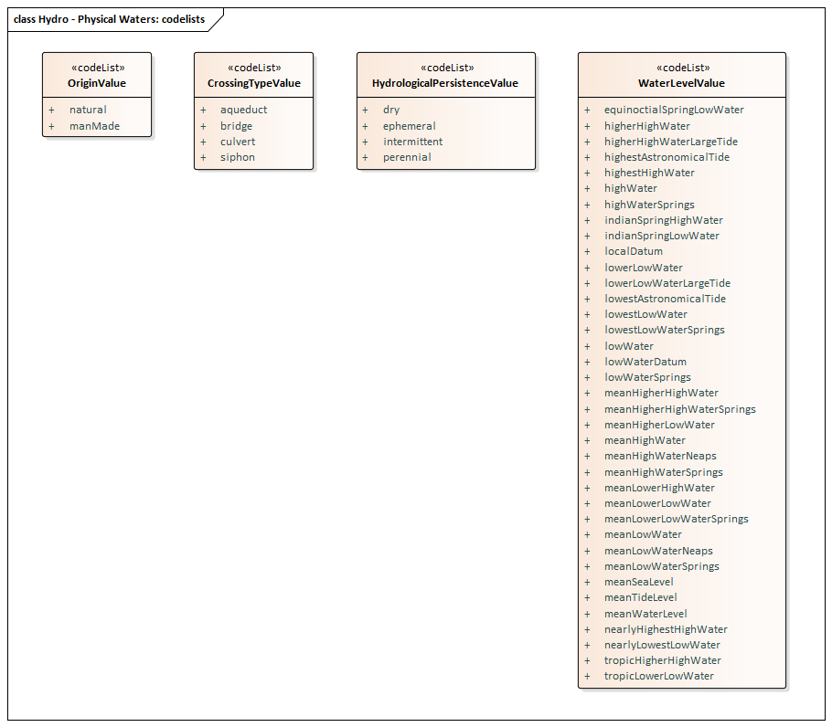
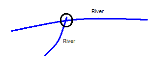

// Admonition icons:
// IR Requirement
:important-caption: 📕
// TG Requirement
:tip-caption: 📒
// Recommendation
:note-caption: 📘

// TOC placement using macro (manual)
:toc: macro

// Empty TOC title (the title is in the document)
:toc-title:

// TOC level depth
:toclevels: 5

// Section numbering level depth
:sectnumlevels: 8

// Line Break Doc Title
:hardbreaks-option:

:appendix-caption: Annex

// Document properties
:title: D2.8.I.8 Data Specification on Hydrography – Technical Guidelines
:revdate: 2023-07-31
:keywords: INSPIRE Data Specification for the spatial data theme Hydrography
:producer: INSPIRE Maintenance and Implementation Group (MIG)
:description: This document describes the INSPIRE Data Specification for the spatial data theme Hydrography
:author: Temporary MIWP 2021-2024 sub-group 2.3.1
:copyright: Public
:revremark: https://github.com/INSPIRE-MIF/technical-guidelines/releases/tag/v2023.2
:lang: en

image:./media/image2.jpeg[image,width=131,height=90, align=center]

image:./media/image3.png[image,width=93,height=93, align=center] **INSPIRE** *Infrastructure for Spatial Information in Europe*

[discrete]
= D2.8.I.8 Data Specification on _Hydrography_ – Technical Guidelines

[width="100%",cols="17%,83%",]
|===
|*Title* |{doctitle}
|*Creator* |{author}
|*Date of publication* |{revdate}
|*Subject* |{keywords}
|*Publisher* |{producer}
|*Type* |Text
|*Description* |{description}
|*Format* |AsciiDoc
|*Licence* |https://creativecommons.org/licenses/by/4.0[Creative Commons Attribution (cc-by) 4.0]
|*Rights* |{copyright}
|*Identifier* |https://inspire.ec.europa.eu/id/document/tg/hy[D2.8.I.8_v3.3.0]
|*Changelog* |{revremark}
|*Language* |{lang}
|*Relation* |Directive 2007/2/EC of the European Parliament and of the Council of 14 March 2007 establishing an Infrastructure for Spatial Information in the European Community (INSPIRE)
|===

[discrete]
== Foreword
[discrete]
== How to read the document?

This document describes the _"INSPIRE data specification on Hydrography – Technical Guidelines"_ version 3.1rc1 as developed by the Thematic Working Group (TWG) _Hydrography_ using both natural and a conceptual schema language.

The data specification is based on a common templatefootnote:[The common document template is available in the "Framework documents" section of the data specifications web page at http://inspire.jrc.ec.europa.eu/index.cfm/pageid/2] used for all data specifications, which has been harmonised using the experience from the development of the Annex I, II and III data specifications.

This document provides guidelines for the implementation of the provisions laid down in the Implementing Rule for spatial data sets and services of the INSPIRE Directive. It also includes additional requirements and recommendations that, although not included in the Implementing Rule, are relevant to guarantee or to increase data interoperability.

Two executive summaries provide a quick overview of the INSPIRE data specification process in general, and the content of the data specification on _Hydrography_ in particular. We highly recommend that managers, decision makers, and all those new to the INSPIRE process and/or information modelling should read these executive summaries first.

The UML diagrams (in Chapter 5) offer a rapid way to see the main elements of the specifications and their relationships. The definition of the spatial object types, attributes, and relationships are included in the Feature Catalogue (also in Chapter 5). People having thematic expertise but not familiar with UML can fully understand the content of the data model focusing on the Feature Catalogue. Users might also find the Feature Catalogue especially useful to check if it contains the data necessary for the applications that they run. The technical details are expected to be of prime interest to those organisations that are responsible for implementing INSPIRE within the field of _Hydrography_, but also to other stakeholders and users of the spatial data infrastructure.

The technical provisions and the underlying concepts are often illustrated by examples. Smaller examples are within the text of the specification, while longer explanatory examples and descriptions of selected use cases are attached in the annexes.

In order to distinguish the INSPIRE spatial data themes from the spatial object types, the INSPIRE spatial data themes are written in _italics._

[cols="",]
|===
|The document will be publicly available as a 'non-paper'. It does not represent an official position of the European Commission, and as such cannot be invoked in the context of legal procedures.
|===

*Legal Notice*

Neither the European Commission nor any person acting on behalf of the Commission is responsible for the use which might be made of this publication.

[discrete]
== Interoperability of Spatial Data Sets and Services – General Executive Summary*

The challenges regarding the lack of availability, quality, organisation, accessibility, and sharing of spatial information are common to a large number of policies and activities and are experienced across the various levels of public authority in Europe. In order to solve these problems it is necessary to take measures of coordination between the users and providers of spatial information. The Directive 2007/2/EC of the European Parliament and of the Council adopted on 14 March 2007 aims at establishing an Infrastructure for Spatial Information in the European Community (INSPIRE) for environmental policies, or policies and activities that have an impact on the environment.

INSPIRE is based on the infrastructures for spatial information that are created and maintained by the Member States. To support the establishment of a European infrastructure, Implementing Rules addressing the following components of the infrastructure have been specified: metadata, interoperability of spatial data sets (as described in Annexes I, II, III of the Directive) and spatial data services, network services, data and service sharing, and monitoring and reporting procedures.

INSPIRE does not require collection of new data. However, after the period specified in the Directivefootnote:[For all 34 Annex I,II and III data themes: within two years of the adoption of the corresponding Implementing Rules for newly collected and extensively restructured data and within 5 years for other data in electronic format still in use] Member States have to make their data available according to the Implementing Rules.

Interoperability in INSPIRE means the possibility to combine spatial data and services from different sources across the European Community in a consistent way without involving specific efforts of humans or machines. It is important to note that "interoperability" is understood as providing access to spatial data sets through network services, typically via Internet. Interoperability may be achieved by either changing (harmonising) and storing existing data sets or transforming them via services for publication in the INSPIRE infrastructure. It is expected that users will spend less time and efforts on understanding and integrating data when they build their applications based on data delivered in accordance with INSPIRE.

In order to benefit from the endeavours of international standardisation bodies and organisations established under international law their standards and technical means have been utilised and referenced, whenever possible.

To facilitate the implementation of INSPIRE, it is important that all stakeholders have the opportunity to participate in specification and development. For this reason, the Commission has put in place a consensus building process involving data users, and providers together with representatives of industry, research and government. These stakeholders, organised through Spatial Data Interest Communities (SDIC) and Legally Mandated Organisations (LMO)footnote:[The current status of registered SDICs/LMOs is available via INSPIRE website: http://inspire.jrc.ec.europa.eu/index.cfm/pageid/42], have provided reference materials, participated in the user requirement and technicalfootnote:[Surveys on unique identifiers and usage of the elements of the spatial and temporal schema,] surveys, proposed experts for the Data Specification Drafting Teamfootnote:[The Data Specification Drafting Team has been composed of experts from Austria, Belgium, Czech Republic, France, Germany, Greece, Italy, Netherlands, Norway, Poland, Switzerland, UK, and the European Environment Agency], the Thematic Working Groupsfootnote:[The Thematic Working Groups have been composed of experts from Austria, Australia, Belgium, Bulgaria, Czech Republic, Denmark, Finland, France, Germany, Hungary, Ireland, Italy, Latvia, Netherlands, Norway, Poland, Romania, Slovakia, Spain, Slovenia, Sweden, Switzerland, Turkey, UK, the European Environment Agency and the European Commission.] and other ad-hoc cross-thematic technical groups and participated in the public stakeholder consultations on draft versions of the data specifications. These consultations covered expert reviews as well as feasibility and fitness-for-purpose testing of the data specificationsfootnote:[For Annex IIIII, the consultation and testing phase lasted from 20 June to 21 October 2011.].

This open and participatory approach was successfully used during the development of the data specifications on Annex I, II and III data themes as well as during the preparation of the Implementing Rule on Interoperability of Spatial Data Sets and Servicesfootnote:[Commission Regulation (EU) No 1089/2010 http://eur-lex.europa.eu/JOHtml.do?uri=OJ:L:2010:323:SOM:EN:HTML[implementing Directive 2007/2/EC of the European Parliament and of the Council as regards interoperability of spatial data sets and services,] published in the Official Journal of the European Union on 8^th^ of December 2010.] for Annex I spatial data themes and of its amendment regarding the themes of Annex II and III.

The development framework elaborated by the Data Specification Drafting Team aims at keeping the data specifications of the different themes coherent. It summarises the methodology to be used for the development of the data specifications, providing a coherent set of requirements and recommendations to achieve interoperability. The pillars of the framework are the following technical documentsfootnote:[The framework documents are available in the "Framework documents" section of the data specifications web page at http://inspire.jrc.ec.europa.eu/index.cfm/pageid/2]:

* The _Definition of Annex Themes and Scope_ describes in greater detail the spatial data themes defined in the Directive, and thus provides a sound starting point for the thematic aspects of the data specification development.
* The _Generic Conceptual Model_ defines the elements necessary for interoperability and data harmonisation including cross-theme issues. It specifies requirements and recommendations with regard to data specification elements of common use, like the spatial and temporal schema, unique identifier management, object referencing, some common code lists, etc. Those requirements of the Generic Conceptual Model that are directly implementable are included in the Implementing Rule on Interoperability of Spatial Data Sets and Services.
* The _Methodology for the Development of Data Specifications_ defines a repeatable methodology. It describes how to arrive from user requirements to a data specification through a number of steps including use-case development, initial specification development and analysis of analogies and gaps for further specification refinement.
* The _Guidelines for the Encoding of Spatial Data_ defines how geographic information can be encoded to enable transfer processes between the systems of the data providers in the Member States. Even though it does not specify a mandatory encoding rule it sets GML (ISO 19136) as the default encoding for INSPIRE.
* The _Guidelines for the use of Observations & Measurements and Sensor Web Enablement-related standards in INSPIRE Annex II and III data specification development_ provides guidelines on how the "Observations and Measurements" standard (ISO 19156) is to be used within INSPIRE.
* The _Common data models_ are a set of documents that specify data models that are referenced by a number of different data specifications. These documents include generic data models for networks, coverages and activity complexes.

The structure of the data specifications is based on the "ISO 19131 Geographic information - Data product specifications" standard. They include the technical documentation of the application schema, the spatial object types with their properties, and other specifics of the spatial data themes using natural language as well as a formal conceptual schema languagefootnote:[UML – Unified Modelling Language].

A consolidated model repository, feature concept dictionary, and glossary are being maintained to support the consistent specification development and potential further reuse of specification elements. The consolidated model consists of the harmonised models of the relevant standards from the ISO 19100 series, the INSPIRE Generic Conceptual Model, and the application schemasfootnote:[Conceptual models related to specific areas (e.g. INSPIRE themes)] developed for each spatial data theme. The multilingual INSPIRE Feature Concept Dictionary contains the definition and description of the INSPIRE themes together with the definition of the spatial object types present in the specification. The INSPIRE Glossary defines all the terms (beyond the spatial object types) necessary for understanding the INSPIRE documentation including the terminology of other components (metadata, network services, data sharing, and monitoring).

By listing a number of requirements and making the necessary recommendations, the data specifications enable full system interoperability across the Member States, within the scope of the application areas targeted by the Directive. The data specifications (in their version 3.0) are published as technical guidelines and provide the basis for the content of the Implementing Rule on Interoperability of Spatial Data Sets and Servicesfootnote:[In the case of the Annex IIIII data specifications, the extracted requirements are used to formulate an amendment to the existing Implementing Rule.]. The content of the Implementing Rule is extracted from the data specifications, considering short- and medium-term feasibility as well as cost-benefit considerations. The requirements included in the Implementing Rule are legally binding for the Member States according to the timeline specified in the INSPIRE Directive.

In addition to providing a basis for the interoperability of spatial data in INSPIRE, the data specification development framework and the thematic data specifications can be reused in other environments at local, regional, national and global level contributing to improvements in the coherence and interoperability of data in spatial data infrastructures.

<<<
[discrete]
== Hydrography – Executive Summary

The data specification for _Hydrography_ is required to facilitate the interoperability of hydrographic information between member states. Hydrography in the context of this data specification is involved with the description of the sea, lakes, rivers and other waters, with their phenomena.

This data specification is limited in both thematic as well as geographic scope. Geographically, all inland surface waters are subject to this data specification. Coastal waters are also a subject of this specification as far as geographically defined in the context of the Water Framework Directive (2006/60/EC): "surface water on the landward side of a line, every point of which is at a distance of one nautical mile on the seaward side from the nearest point of the baseline from which the breadth of territorial waters is measured, extending where appropriate up to the outer limit of transitional waters". The remaining part of the waters will be subject to the appropriate Annex III themes _Sea regions_ and _Oceanographic geographical features_.

This data specification does not include information on navigation or navigability as this is handled by the Annex I theme _Transport Networks_ nor does it include depth information, as this will be handled by the Annex II theme _Elevation_. Groundwater is covered by Annex II theme _Geology_ with the exception of e.g. rivers running underground that form part of the hydrographic network; these are considered as within scope of this data specification since these are essential to forming a closed hydrographic network.

The thematic scope of this data specification is towards providing a solid framework for mapping, reporting and modelling purposes. This is necessary to improve policy formulation through better reporting and aid management of pan European initiatives, such as flood risk analyses, where hydrographic data fulfils a function in relating information to real world objects.

The _Hydrography_ theme is concerned with the network of bodies of water and relating structures and objects. It does not define attributes that should be reported upon and as a consequence it should not be considered in isolation from other INSPIRE themes or reporting obligations as described by other legislation. It is also acknowledged that the model may need to be extended should further user requirements be identified in the future.

Considering the importance of the Water Framework Directive, the thematic working group (TWG) has decided to include the geographic description of water bodies in this data specification in addition to the physical objects and structures. Although these are essentially part of the Annex III theme _Area Management / restriction / regulation zones and reporting units_; TWG _Hydrography_ deemed these to be of such importance that it has decided to include the geographical aspects and classification of water bodies as an integral part of this data specification. It is expected that relevant developments such as the European WISE and SEIS projects will use this specification as a base for further extension with reporting obligations within the EU. More information on this subject can be found in Annex B.

The data specification has been prepared by the thematic working group on _Hydrography_, a multi-national team of experts in the field drawn from all parts of the European Union (Germany, the Netherlands, Spain, Sweden, United Kingdom). Their brief has been to create a specification, which requires no additional data capture by member states, and is additionally, easily understood and as flexible as possible. In this way it is designed to minimise the effort required to supply conformant data.

The data specification has been based, as far as possible, on existing standards. Apart from ISO standards, the TWG has, amongst others, also used ideas from specifications published by DGIWG, EuroGeographics and the International Hydrographic Organisation. It is documented using "best of breed" ICT techniques such as the Unified Modeling Language (UML), Geographical Markup Language (GML) and Object Constraint Language (OCL).

Comments on earlier versions of this document delivered by SDICs and LMOs have been used to update those versions into this version after extensive discussion with stakeholders such as WISE and selected participants to the Comments Resolution Workshop where the previous version of this specification has been discussed.

<<<
[discrete]
== Acknowledgements

Many individuals and organisations have contributed to the development of these Guidelines.

The Thematic Working Group Hydrography (TWG-HY) included:

Huibert-Jan Lekkerkerk (TWG Facilitator), Andrew Woolf (TWG Editor), Dolors Barrot, Alexander

Coley, Helen Eriksson, Klaus Fretter, Anja Hopfstock, Peter Parslow, Vanda Nunes de Lima

(European Commission contact point).

Other contributors to the INSPIRE data specifications are the Drafting Team Data Specifications, the JRC Data Specifications Team and the INSPIRE stakeholders - Spatial Data Interested Communities (SDICs) and Legally Mandated Organisations (LMOs).

*Contact information*

Maria Vanda Nunes de Lima & Michael Lutz
European Commission Joint Research Centre (JRC)
Institute for Environment and Sustainability
Unit H06: Digital Earth and Reference Data
_http://inspire.ec.europa.eu/index.cfm/pageid/2_

<<<
== Table of Contents
toc::[]

<<<
:sectnums:
== Scope

This document specifies a harmonised data specification for the spatial data theme _Hydrography_ as defined in Annex I of the INSPIRE Directive.

This data specification provides the basis for the drafting of Implementing Rules according to Article 7 (1) of the INSPIRE Directive [Directive 2007/2/EC]. The entire data specification is published as implementation guidelines accompanying these Implementing Rules.

<<<
== Overview

=== Name

INSPIRE data specification for the theme Hydrography.

=== Informal description

*Definition:*

Hydrographic elements, including marine areas and all other water bodies and items related to them, including river basins and sub-basins. Where appropriate, according to the definitions set out in Directive 2000/60/EC of the European Parliament and of the Council of 23 October 2000 establishing a framework for Community action in the field of water policy *, and in the form of networks.

* OJ L 327,22.12.2000, p.1. Directive as amended by Decision No. 2455/2001/EC (OJ L 331, 15.12.2001, p.1.).

{empty}[Directive 2007/2/EC]

*Description:*

The theme "Hydrography" is a basic reference component and, therefore, of interest for many users and uses.

Hydrography in the context of this data specification is involved with the description of the sea, lakes, rivers and other waters, with their phenomena and all hydrographic-related elements.

For mapping purposes (to provide a map background for orientation and to understand place relationships), it includes the representation of all main hydrographic elements – both natural and artificial.

To fulfill reporting requirements of EC water-related directives it includes the river and channel network; surface water bodies within river basin districts are categorised as rivers, lakes, transitional waters or coastal waters, or as artificial surface water bodies or heavily modified surface water bodies. Furthermore, a topologically-sound river network is necessary for GIS-based spatial analysis and modelling.

Geographically, the theme "Hydrography" covers all inland water and marine areas covered by river basin districts as defined by WFD.

Further themes of annex I, II and III deal with additional hydrographic elements.

The main relations with other themes are found within:

* Annex I
** Geographical Names - names of water features
** Administrative Units - administrative borders defined by hydrographic elements
** Transportation - water navigation
* Annex II
** Elevation - concerning geometric consistency
** Land cover - wetlands, water bodies, snow, ice and glaciers
** Geology - ground water bodies and geomorphology
* Annex III
** Utility and governmental services - water supply and discharge points
** Environmental monitoring facilities - hydrometric stations (water level, discharge, etc.) plus monitoring of water quality
** Production and industrial facilities - water abstraction facilities
** Agricultural and aquaculture facilities - irrigation systems
** Area management/restriction/regulation zones and reporting units - WFD sub-units and River Basin Districts
** Natural risk zones - flood risk zones, erosion zones
** Sea regions - concerning the limit between land and sea
** Oceanographic geographical features - marine areas

*Geographic description*

This INSPIRE data specification covers spatial data sets which relate to an area where a Member State has and/or exercises jurisdictional rights.

This INSPIRE data specification covers all inland surface waters. Coastal waters are also a subject of this specification as far as geographically defined in the context of the Water Framework Directive (2006/60/EC): "surface water on the landward side of a line, every point of which is at a distance of one nautical mile on the seaward side from the nearest point of the baseline from which the breadth of territorial waters is measured, extending where appropriate up to the outer limit of transitional waters".

*Purpose*

The purpose of this document is to specify a harmonised data specification for the spatial data theme Hydrography as defined in Annex I of the INSPIRE Directive.

The thematic scope of this data specification is towards providing a solid framework for mapping, reporting and modelling purposes. It is concerned with the network of bodies of water and relating structures and objects.

However, each organisation will have different responsibilities from the next and this will influence the kind of data they collect and manage and use. In turn some organisations may use simple models, others by necessity will have complex data arrangements. This data specification is provided as a basic framework which users can adopt and if required – extend for themselves. The model is structured to maximise reuse and the sharing of organisational data.

_Spatial Objects (core – application specific)_

This specification is mainly focussed on the "widely reused – widely referenced" segment of spatial objects. *It does not attempt to try and incorporate every spatial object that might be used by any application*. Such objects may include buoys, piers and other constructions etc. These are all "application specific "– and will be used/referenced by at least one organisation.

_Associated "non-Geographic" data_

Any "non geographic data" (the majority of the data holdings in any organisation) – is also out of scope of this specification – such records may include "water quality", "water quantity", "state of the environment" and so on. While associated with the spatial objects defined here, all these examples are closer to the application end of the spectrum than generic use by a wide community, whether they represent a geographic entity or non-geographic data.

To maximise reuse, the linkage of such organisational data with the spatial objects should be "loose" in the sense that these are ideally defined as different data objects in a database. Configured correctly such data may then be reused in several different applications and any associated information shared and exchanged as desired.

_Extensibility_ 
Users can extend the schema and add their own spatial objects to support an application. Data architects should use the GCM as the basis for any such extension. To illustrate this, objects that are primarily of an application need (rather than generic) may be added to the specification for the network, e.g.:

* Linear – discharge rate
* Point – hydraulic resistance

*Spatial resolution*

The datasets in scope are used extensively at the Local level and extend to Regional, National and European levels. Usage can change with levels of operation or within an organisation.

_Alternative representations at the local level_

For example at the local level both area (topographic objects) may be used as well as centreline / point representations. In other domains lower resolution representations may be preferred. Where applicable this data specification supports alternative representation.

_Multiple representations at regional, national and European levels._

Ideally the data would be scalable for such purposes but technology and datasets are not yet sufficiently mature to support this and several "levels of detail" are usually stored for representation at different operational levels. Unfortunately today there is very little correspondence between each level. Ideally it would be easy to seamlessly move from the highest to the lowest resolution with corresponding scaling and aggregation of the associated information and application data e.g. for reporting purposes or trans European analysis, planning and policy making.

_Level of detail_

This data specification is suitable for all levels of detail but requires that, for certain features, an indication is given of the scale or resolution at which the feature was collected.

*Network*

The _Hydrography_ specification is extensive and has therefore been broken into three application schemas: base;Network; Physical Waters.

In turn, these are each based on the INSPIRE Generic Conceptual Model. The Network application schema is furthermore based on the Generic Network Model which is shared by any network theme (e.g. Transport Networks). The Generic Network Model (GNM) was developed to ensure a consistent approach across all network themes. It relies on several ISO standards and provides the basic structure for network nodes, links, aggregated links and areas and basic mechanisms for:

_Linear Referencing_

Linear referencing is incorporated in the specification. This uses an approach aligned with the current draft standard ISO 19148; which establishes linear referencing within a spatial environment (rather than a traditional standalone approach). The aim of this is to better support data sharing through referencing mechanisms, and to offer coordinates for any object referenced linearly, in the same national coordinate system.

_Logical networks_

Logical networks can be used within the model but their spatial value is very limited or in some cases may be non-existent. Therefore caution is required. Where these are in operation alongside the above forms of representation it is suggested that any corresponding nodes are reused or at least cross referenced to provide a relationship between the systems to preserve the potential for data sharing and exchange where that is both relevant and appropriate.

_Network Interconnections_

There are several cases where networks need to be joined up. For example at national, regional or dataset boundaries and at intermodal points within networks. This is provided by the Network Connection component which is defined in the Generic Network Model.

_Topology_

Topology is handled implicitly rather than explicitly; this is to keep the model as simple as possible. Generally systems will build topology in a form that best meets the user's application. *_It is expected that most applications will use the network data within a topological environment._*

There is therefore a prerequisite for "implicit topology". This means that the data provided must be sufficiently clean and capable of automated topological construction within a user's application. There are therefore specific data capture requirements and these are described in Chapter 7 on Data Quality and in Chapter 10 on Data Capture.

=== Normative References

[Directive 2007/2/EC] Directive 2007/2/EC of the European Parliament and of the Council of 14 March 2007 establishing an Infrastructure for Spatial Information in the European Community (INSPIRE)

[ISO 19107] EN ISO 19107:2005, Geographic Information – Spatial Schema

[ISO 19108] EN ISO 19108:2005, Geographic Information – Temporal Schema

[ISO 19108-c] ISO 19108:2002/Cor 1:2006, Geographic Information – Temporal Schema, Technical Corrigendum 1

[ISO 19111] EN ISO 19111:2007 Geographic information - Spatial referencing by coordinates (ISO 19111:2007)

[ISO 19113] EN ISO 19113:2005, Geographic Information – Quality principles

[ISO 19115] EN ISO 19115:2005, Geographic information – Metadata (ISO 19115:2003)

[ISO 19118] EN ISO 19118:2006, Geographic information – Encoding (ISO 19118:2005)

[ISO 19123] EN ISO 19123:2007, Geographic Information – Schema for coverage geometry and functions

[ISO 19125-1] EN ISO 19125-1:2004, Geographic Information – Simple feature access – Part 1: Common architecture

[ISO 19135] EN ISO 19135:2007 Geographic information – Procedures for item registration (ISO 19135:2005)

[ISO 19138] ISO/TS 19138:2006, Geographic Information – Data quality measures

[ISO 19139] ISO/TS 19139:2007, Geographic information – Metadata – XML schema implementation

[ISO 19157] ISO/DIS 19157, Geographic information – Data quality

[OGC 06-103r4] Implementation Specification for Geographic Information - Simple feature access – Part 1: Common Architecture v1.2.1

NOTE This is an updated version of "EN ISO 19125-1:2004, Geographic information – Simple feature access – Part 1: Common architecture".

[Regulation 1205/2008/EC] Regulation 1205/2008/EC implementing Directive 2007/2/EC of the European Parliament and of the Council as regards metadata

=== Terms and definitions

General terms and definitions helpful for understanding the INSPIRE data specification documents are defined in the INSPIRE Glossaryfootnote:[The INSPIRE Glossary is available from http://inspire-registry.jrc.ec.europa.eu/registers/GLOSSARY].

*(1) aquifer*

A subsurface layer or layers of rock or other geological strata of sufficient porosity and permeability to allow either a significant flow of groundwater or the abstraction of significant quantities of groundwater,

*(2) groundwater*

All water which is below the surface of the ground in the saturation zone and in direct contact with the ground or subsoil,

*(3) sub-basin*

An area of land from which all surface run-off flows through a series of streams, rivers and, possibly, lakes to a particular point in a water course,

=== Symbols and abbreviations

[cols=","]
|===
|EC |European Commission
|HY |Hydrography
|WFD |Water Framework Directive
|RISE |Reference Information System for Europe
|TWG |Thematic Working Group
|IHO |International Hydrographic Organization
|UNCLOS |United Nations Convention on the Law of the Sea
|EEZ |Exclusive Economic Zone
|SEIS |Shared Environmental Information System
|WISE |Water Information System for Europe
|EU |European Union
|GML |Geographic Markup Language
|INSPIRE |Infrastructure for Spatial Information in Europe
|SLD |Styled Layer Descriptor
|TWG |Thematic Working Group
|UML |Unified Modeling Language
|URI |Unified Resource Identifier
|===

=== How the Technical Guidelines map to the Implementing Rules

The schematic diagram in Figure 1 gives an overview of the relationships between the INSPIRE legal acts (the INSPIRE Directive and Implementing Rules) and the INSPIRE Technical Guidelines. The INSPIRE Directive and Implementing Rules include legally binding requirements that describe, usually on an abstract level, _what_ Member States must implement.

In contrast, the Technical Guidelines define _how_ Member States might implement the requirements included in the INSPIRE Implementing Rules. As such, they may include non-binding technical requirements that must be satisfied if a Member State data provider chooses to conform to the Technical Guidelines. Implementing these Technical Guidelines will maximise the interoperability of INSPIRE spatial data sets.

image::./media/image4.png[image,width=603,height=375, align=center]

[.text-center]
*Figure 1 - Relationship between INSPIRE Implementing Rules and Technical Guidelines*

==== Requirements

The purpose of these Technical Guidelines (Data specifications on _Hydrography_) is to provide practical guidance for implementation that is guided by, and satisfies, the (legally binding) requirements included for the spatial data theme Hydrography in the Regulation (Implementing Rules) on interoperability of spatial data sets and services. These requirements are highlighted in this document as follows:

[IMPORTANT]
====
[.text-center]
*IR Requirement*
_Article / Annex / Section no._
*Title / Heading*

This style is used for requirements contained in the Implementing Rules on interoperability of spatial data sets and services (Commission Regulation (EU) No 1089/2010).
====

For each of these IR requirements, these Technical Guidelines contain additional explanations and examples.

NOTE The Abstract Test Suite (ATS) in Annex A contains conformance tests that directly check conformance with these IR requirements.

Furthermore, these Technical Guidelines may propose a specific technical implementation for satisfying an IR requirement. In such cases, these Technical Guidelines may contain additional technical requirements that need to be met in order to be conformant with the corresponding IR requirement _when using this proposed implementation_. These technical requirements are highlighted as follows:

[TIP]
====
*TG Requirement X*
This style is used for requirements for a specific technical solution proposed in these Technical Guidelines for an IR requirement.
====

NOTE 1 Conformance of a data set with the TG requirement(s) included in the ATS implies conformance with the corresponding IR requirement(s).

NOTE 2 In addition to the requirements included in the Implementing Rules on interoperability of spatial data sets and services, the INSPIRE Directive includes further legally binding obligations that put additional requirements on data providers. For example, Art. 10(2) requires that Member States shall, where appropriate, decide by mutual consent on the depiction and position of geographical features whose location spans the frontier between two or more Member States. General guidance for how to meet these obligations is provided in the INSPIRE framework documents.

==== Recommendations

In addition to IR and TG requirements, these Technical Guidelines may also include a number of recommendations for facilitating implementation or for further and coherent development of an interoperable infrastructure.

[NOTE]
====
*Recommendation X*
Recommendations are shown using this style.
====

NOTE The implementation of recommendations is not mandatory. Compliance with these Technical Guidelines or the legal obligation does not depend on the fulfilment of the recommendations.

==== Conformance

Annex A includes the abstract test suite for checking conformance with the requirements included in these Technical Guidelines and the corresponding parts of the Implementing Rules (Commission Regulation (EU) No 1089/2010).

<<<
== Specification scopes

This data specification does not distinguish different specification scopes, but just considers one general scope.

NOTE For more information on specification scopes, see [ISO 19131:2007], clause 8 and Annex D.

<<<
== Identification information

These Technical Guidelines are identified by the following URI:

http://inspire.ec.europa.eu/tg/hy/3.1rc1

NOTE ISO 19131 suggests further identification information to be included in this section, e.g. the title, abstract or spatial representation type. The proposed items are already described in the document metadata, executive summary, overview description (section 2) and descriptions of the application schemas (section 5). In order to avoid redundancy, they are not repeated here.

<<<
== Data content and structure

The Hydrography application schema is divided into two separate application schemas (Figure 2), roughly corresponding to spatial objects needed to satisfy the two main Use Cases:

[arabic, start=1]
. Physical Waters (primarily for mapping purposes)

[arabic, start=2]
. Network model (primarily for spatial analysis and modelling)

Both the main application schemas depend on an abstract base hydrographic object type, contained in a separate 'base' application schema.

The Physical Waters application schema includes man-made objects and hydrographic points of interest. For more information on the structure and its intended use, see Annex B.

image::./media/image5.png[image,width=466,height=223, align=center]

[.text-center]
*Figure 2 - Package structure of the Hydrography application schemas*

The Hydrography application schemas are not self-contained – they have dependencies with spatial object types defined in other INSPIRE themes. These relationships are illustrated at package level in Figure 3:

* the Network model is based on the Generic Network Model defined in the INSPIRE Generic Conceptual Model
* the Physical Waters spatial object types are used by a number of Annex II and III themes
* The 'Base Types' application schema from the Generic Conceptual Model, and the Annex I theme 'Geographical Names' are used in various places

[.text-center]
*Figure 3 – Package relationships in the Hydrography application schemas*

=== Application schemas – Overview 

==== Application schemas included in the IRs

Articles 3, 4 and 5 of the Implementing Rules lay down the requirements for the content and structure of the data sets related to the INSPIRE Annex themes.

[IMPORTANT]
====
[.text-center]
*IR Requirement*
Article 4
*Types for the Exchange and Classification of Spatial Objects*

1. For the exchange and classification of spatial objects from data sets meeting the conditions laid down in Article 4 of Directive 2007/2/EC, Member States shall use the spatial object types and associated data types, enumerations and code lists that are defined in Annexes II, III and IV for the themes the data sets relate to.

2. Spatial object types and data types shall comply with the definitions and constraints and include the attributes and association roles set out in the Annexes.

3. The enumerations and code lists used in attributes or association roles of spatial object types or data types shall comply with the definitions and include the values set out in Annex II. The enumeration and code list values are uniquely identified by language-neutral mnemonic codes for computers. The values may also include a language-specific name to be used for human interaction.
====

The types to be used for the exchange and classification of spatial objects from data sets related to the spatial data theme Hydrography are defined in the following application schemas (see sections 5.3, 5.4, 5.5):

* Hydro - base application schema
* Hydro - Network application schema
* Hydro - Physical Waters application schema

The application schemas specify requirements on the properties of each spatial object including its multiplicity, domain of valid values, constraints, etc.

NOTE The application schemas presented in this section contain some additional information that is not included in the Implementing Rules, in particular multiplicities of attributes and association roles.

[TIP]
====
*TG Requirement 1*

Spatial object types and data types shall comply with the multiplicities defined for the attributes and association roles in this section.

====

An application schema may include references (e.g. in attributes or inheritance relationships) to common types or types defined in other spatial data themes. These types can be found in a sub-section called "Imported Types" at the end of each application schema section. The common types referred to from application schemas included in the IRs are addressed in Article 3.

[IMPORTANT]
====
[.text-center]
*IR Requirement*
_Article 3_
*Common Types*

Types that are common to several of the themes listed in Annexes I, II and III to Directive 2007/2/EC shall conform to the definitions and constraints and include the attributes and association roles set out in Annex I.

====

NOTE Since the IRs contain the types for all INSPIRE spatial data themes in one document, Article 3 does not explicitly refer to types defined in other spatial data themes, but only to types defined in external data models.

Common types are described in detail in the Generic Conceptual Model [DS-D2.7], in the relevant international standards (e.g. of the ISO 19100 series) or in the documents on the common INSPIRE models [DS-D2.10.x]. For detailed descriptions of types defined in other spatial data themes, see the corresponding Data Specification TG document [DS-D2.8.x].

=== Basic notions

This section explains some of the basic notions used in the INSPIRE application schemas. These explanations are based on the GCM [DS-D2.5].

==== Notation

===== Unified Modeling Language (UML)

The application schemas included in this section are specified in UML, version 2.1. The spatial object types, their properties and associated types are shown in UML class diagrams.

NOTE For an overview of the UML notation, see Annex D in [ISO 19103].

The use of a common conceptual schema language (i.e. UML) allows for an automated processing of application schemas and the encoding, querying and updating of data based on the application schema – across different themes and different levels of detail.

The following important rules related to class inheritance and abstract classes are included in the IRs.

[IMPORTANT]
====
[.text-center]
*IR Requirement*
Article 5
*Types*

(...)

2. Types that are a sub-type of another type shall also include all this type's attributes and association roles.

3. Abstract types shall not be instantiated.

====

The use of UML conforms to ISO 19109 8.3 and ISO/TS 19103 with the exception that UML 2.1 instead of ISO/IEC 19501 is being used. The use of UML also conforms to ISO 19136 E.2.1.1.1-E.2.1.1.4.

NOTE ISO/TS 19103 and ISO 19109 specify a profile of UML to be used in conjunction with the ISO 19100 series. This includes in particular a list of stereotypes and basic types to be used in application schemas. ISO 19136 specifies a more restricted UML profile that allows for a direct encoding in XML Schema for data transfer purposes.

To model constraints on the spatial object types and their properties, in particular to express data/data set consistency rules, OCL (Object Constraint Language) is used as described in ISO/TS 19103, whenever possible. In addition, all constraints are described in the feature catalogue in English, too.

NOTE Since "void" is not a concept supported by OCL, OCL constraints cannot include expressions to test whether a value is a _void_ value. Such constraints may only be expressed in natural language.

===== Stereotypes

In the application schemas in this section several stereotypes are used that have been defined as part of a UML profile for use in INSPIRE [DS-D2.5]. These are explained in Table 1 below.

*Table 1 – Stereotypes (adapted from [DS-D2.5])*

[cols=",,",]
|===
|*Stereotype* |*Model element* |*Description*
|applicationSchema |Package |An INSPIRE application schema according to ISO 19109 and the Generic Conceptual Model.
|leaf |Package |A package that is not an application schema and contains no packages.
|featureType |Class |A spatial object type.
|type |Class |A type that is not directly instantiable, but is used as an abstract collection of operation, attribute and relation signatures. This stereotype should usually not be used in INSPIRE application schemas as these are on a different conceptual level than classifiers with this stereotype.
|dataType |Class |A structured data type without identity.
|union |Class |A structured data type without identity where exactly one of the properties of the type is present in any instance.
|enumeration |Class |An enumeration.
|codeList |Class |A code list.
|import |Dependency |The model elements of the supplier package are imported.
|voidable |Attribute, association role |A voidable attribute or association role (see section 5.2.2).
|lifeCycleInfo |Attribute, association role |If in an application schema a property is considered to be part of the life-cycle information of a spatial object type, the property shall receive this stereotype.
|version |Association role |If in an application schema an association role ends at a spatial object type, this stereotype denotes that the value of the property is meant to be a specific version of the spatial object, not the spatial object in general.
|===

==== Voidable characteristics

The «voidable» stereotype is used to characterise those properties of a spatial object that may not be present in some spatial data sets, even though they may be present or applicable in the real world. This does _not_ mean that it is optional to provide a value for those properties.

For all properties defined for a spatial object, a value has to be provided – either the corresponding value (if available in the data set maintained by the data provider) or the value of _void._ A _void_ value shall imply that no corresponding value is contained in the source spatial data set maintained by the data provider or no corresponding value can be derived from existing values at reasonable costs.

[NOTE]
====
*Recomendation 1*

The reason for a _void_ value should be provided where possible using a listed value from the VoidReasonValue code list to indicate the reason for the missing value.

====

The VoidReasonValue type is a code list, which includes the following pre-defined values:

* _Unpopulated_: The property is not part of the dataset maintained by the data provider. However, the characteristic may exist in the real world. For example when the "elevation of the water body above the sea level" has not been included in a dataset containing lake spatial objects, then the reason for a void value of this property would be 'Unpopulated'. The property receives this value for all spatial objects in the spatial data set.
* _Unknown_: The correct value for the specific spatial object is not known to, and not computable by the data provider. However, a correct value may exist. For example when the "elevation of the water body above the sea level" _of a certain lake_ has not been measured, then the reason for a void value of this property would be 'Unknown'. This value is applied only to those spatial objects where the property in question is not known.
* _Withheld_: The characteristic may exist, but is confidential and not divulged by the data provider.

NOTE It is possible that additional reasons will be identified in the future, in particular to support reasons / special values in coverage ranges.

The «voidable» stereotype does not give any information on whether or not a characteristic exists in the real world. This is expressed using the multiplicity:

* If a characteristic may or may not exist in the real world, its minimum cardinality shall be defined as 0. For example, if an Address may or may not have a house number, the multiplicity of the corresponding property shall be 0..1.
* If at least one value for a certain characteristic exists in the real world, the minimum cardinality shall be defined as 1. For example, if an Administrative Unit always has at least one name, the multiplicity of the corresponding property shall be 1..*.

In both cases, the «voidable» stereotype can be applied. In cases where the minimum multiplicity is 0, the absence of a value indicates that it is known that no value exists, whereas a value of void indicates that it is not known whether a value exists or not.

EXAMPLE If an address does not have a house number, the corresponding Address object should not have any value for the «voidable» attribute house number. If the house number is simply not known or not populated in the data set, the Address object should receive a value of _void_ (with the corresponding void reason) for the house number attribute.

==== Enumerations

Enumerations are modelled as classes in the application schemas. Their values are modelled as attributes of the enumeration class using the following modelling style:

* No initial value, but only the attribute name part, is used.
* The attribute name conforms to the rules for attributes names, i.e. is a lowerCamelCase name. Exceptions are words that consist of all uppercase letters (acronyms).

[IMPORTANT]
====
[.text-center]
*IR Requirement*
Article 6
*Code Lists and Enumerations*

(...)

5) Attributes or association roles of spatial object types or data types that have an enumeration type may only take values from the lists specified for the enumeration type."

====

==== Code lists

Code lists are modelled as classes in the application schemas. Their values, however, are managed outside of the application schema.

===== Code list types

The IRs distinguish the following types of code lists.

[IMPORTANT]
====
[.text-center]
*IR Requirement*
Article 6
*Code Lists and Enumerations*

[arabic, start=1]
. Code lists shall be of one of the following types, as specified in the Annexes:
+
[loweralpha]
.. code lists whose allowed values comprise only the values specified in this Regulation;

.. code lists whose allowed values comprise the values specified in this Regulation and narrower values defined by data providers;

.. code lists whose allowed values comprise the values specified in this Regulation and additional values at any level defined by data providers;
+
... code lists, whose allowed values comprise any values defined by data providers.

For the purposes of points (b), (c) and (d), in addition to the allowed values, data providers may use the values specified in the relevant INSPIRE Technical Guidance document available on the INSPIRE web site of the Joint Research Centre.

====

The type of code list is represented in the UML model through the tagged value _extensibility_, which can take the following values:

* _none_, representing code lists whose allowed values comprise only the values specified in the IRs (type a);
* _narrower_, representing code lists whose allowed values comprise the values specified in the IRs and narrower values defined by data providers (type b);
* _open_, representing code lists whose allowed values comprise the values specified in the IRs and additional values at any level defined by data providers (type c); and
* _any_, representing code lists, for which the IRs do not specify any allowed values, i.e. whose allowed values comprise any values defined by data providers (type d).

[NOTE]
====
*Recomendation 2*

Additional values defined by data providers should not replace or redefine any value already specified in the IRs.

====

NOTE This data specification may specify recommended values for some of the code lists of type (b), (c) and (d) (see section 5.2.4.3). These recommended values are specified in a dedicated Annex.

In addition, code lists can be hierarchical, as explained in Article 6(2) of the IRs.

[IMPORTANT]
====
[.text-center]
*IR Requirement*
Article 6
*Code Lists and Enumerations*

(...)

2) Code lists may be hierarchical. Values of hierarchical code lists may have a more generic parent value. Where the valid values of a hierarchical code list are specified in a table in this Regulation, the parent values are listed in the last column.

====

The type of code list and whether it is hierarchical or not is also indicated in the feature catalogues.

===== Obligations on data providers

[IMPORTANT]
====
[.text-center]
*IR Requirement*
Article 6
*Code Lists and Enumerations*

(....)

3) Where, for an attribute whose type is a code list as referred to in points (b), (c) or (d) of paragraph 1, a data provider provides a value that is not specified in this Regulation, that value and its definition shall be made available in a register.

4) Attributes or association roles of spatial object types or data types whose type is a code list may only take values that are allowed according to the specification of the code list.

====

Article 6(4) obliges data providers to use only values that are allowed according to the specification of the code list. The "allowed values according to the specification of the code list" are the values explicitly defined in the IRs plus (in the case of code lists of type (b), (c) and (d)) additional values defined by data providers.

For attributes whose type is a code list of type (b), (c) or (d) data providers may use additional values that are not defined in the IRs. Article 6(3) requires that such additional values and their definition be made available in a register. This enables users of the data to look up the meaning of the additional values used in a data set, and also facilitates the re-use of additional values by other data providers (potentially across Member States).

NOTE Guidelines for setting up registers for additional values and how to register additional values in these registers is still an open discussion point between Member States and the Commission.

===== Recommended code list values

For code lists of type (b), (c) and (d), this data specification may propose additional values as a recommendation (in a dedicated Annex). These values will be included in the INSPIRE code list register. This will facilitate and encourage the usage of the recommended values by data providers since the obligation to make additional values defined by data providers available in a register (see section 5.2.4.2) is already met.

[NOTE]
====
*Recomendation 3*

Where these Technical Guidelines recommend values for a code list in addition to those specified in the IRs, these values should be used.

====

NOTE For some code lists of type (d), no values may be specified in these Technical Guidelines. In these cases, any additional value defined by data providers may be used.

===== Governance

The following two types of code lists are distinguished in INSPIRE:

* _Code lists that are governed by INSPIRE (INSPIRE-governed code lists)._ These code lists will be managed centrally in the INSPIRE code list register. Change requests to these code lists (e.g. to add, deprecate or supersede values) are processed and decided upon using the INSPIRE code list register's maintenance workflows.

INSPIRE-governed code lists will be made available in the INSPIRE code list register at __http://inspire.ec.europa.eu/codelist/<CodeListName__>. They will be available in SKOS/RDF, XML and HTML. The maintenance will follow the procedures defined in ISO 19135. This means that the only allowed changes to a code list are the addition, deprecation or supersession of values, i.e. no value will ever be deleted, but only receive different statuses (valid, deprecated, superseded). Identifiers for values of INSPIRE-governed code lists are constructed using the pattern __http://inspire.ec.europa.eu/codelist/<CodeListName__>/<value>.

* _Code lists that are governed by an organisation outside of INSPIRE (externally governed code lists)._ These code lists are managed by an organisation outside of INSPIRE, e.g. the World Meteorological Organization (WMO) or the World Health Organization (WHO). Change requests to these code lists follow the maintenance workflows defined by the maintaining organisations. Note that in some cases, no such workflows may be formally defined.
+
Since the updates of externally governed code lists is outside the control of INSPIRE, the IRs and these Technical Guidelines reference a specific version for such code lists.
+
The tables describing externally governed code lists in this section contain the following columns:

** The _Governance_ column describes the external organisation that is responsible for maintaining the code list.

** The _Source_ column specifies a citation for the authoritative source for the values of the code list. For code lists, whose values are mandated in the IRs, this citation should include the version of the code list used in INSPIRE. The version can be specified using a version number or the publication date. For code list values recommended in these Technical Guidelines, the citation may refer to the "latest available version".

** In some cases, for INSPIRE only a subset of an externally governed code list is relevant. The subset is specified using the _Subset_ column.

** The _Availability_ column specifies from where (e.g. URL) the values of the externally governed code list are available, and in which formats. Formats can include machine-readable (e.g. SKOS/RDF, XML) or human-readable (e.g. HTML, PDF) ones.

Code list values are encoded using http URIs and labels. Rules for generating these URIs and labels are specified in a separate table.

[NOTE]
====
*Recomendation 4*

The http URIs and labels used for encoding code list values should be taken from the INSPIRE code list registry for INSPIRE-governed code lists and generated according to the relevant rules specified for externally governed code lists.

====

NOTE Where practicable, the INSPIRE code list register could also provide http URIs and labels for externally governed code lists.

===== Vocabulary

For each code list, a tagged value called "vocabulary" is specified to define a URI identifying the values of the code list. For INSPIRE-governed code lists and externally governed code lists that do not have a persistent identifier, the URI is constructed following the pattern _http://inspire.ec.europa.eu/codelist/<UpperCamelCaseName>_.

If the value is missing or empty, this indicates an empty code list. If no sub-classes are defined for this empty code list, this means that any code list may be used that meets the given definition.

An empty code list may also be used as a super-class for a number of specific code lists whose values may be used to specify the attribute value. If the sub-classes specified in the model represent all valid extensions to the empty code list, the subtyping relationship is qualified with the standard UML constraint "\{complete,disjoint}".

==== Identifier management

[IMPORTANT]
====
[.text-center]
*IR Requirement*
_Article 9_
*Identifier Management*

1. The data type Identifier defined in Section 2.1 of Annex I shall be used as a type for the external object identifier of a spatial object.

2. The external object identifier for the unique identification of spatial objects shall not be changed during the life-cycle of a spatial object.

====

NOTE 1 An external object identifier is a unique object identifier which is published by the responsible body, which may be used by external applications to reference the spatial object. [DS-D2.5]

NOTE 2 Article 9(1) is implemented in each application schema by including the attribute _inspireId_ of type Identifier.

NOTE 3 Article 9(2) is ensured if the _namespace_ and _localId_ attributes of the Identifier remains the same for different versions of a spatial object; the _version_ attribute can of course change.

==== Geometry representation

[IMPORTANT]
====
[.text-center]
*IR Requirement*
_Article 12_
*Other Requirements & Rules*

1. The value domain of spatial properties defined in this Regulation shall be restricted to the Simple Feature spatial schema as defined in Herring, John R. (ed.), OpenGIS® Implementation Standard for Geographic information – Simple feature access – Part 1: Common architecture, version 1.2.1, Open Geospatial Consortium, 2011, unless specified otherwise for a specific spatial data theme or type.

====

NOTE 1 The specification restricts the spatial schema to 0-, 1-, 2-, and 2.5-dimensional geometries where all curve interpolations are linear and surface interpolations are performed by triangles.

NOTE 2 The topological relations of two spatial objects based on their specific geometry and topology properties can in principle be investigated by invoking the operations of the types defined in ISO 19107 (or the methods specified in EN ISO 19125-1).

====  Temporality representation

The application schema(s) use(s) the derived attributes "beginLifespanVersion" and "endLifespanVersion" to record the lifespan of a spatial object.

The attributes "beginLifespanVersion" specifies the date and time at which this version of the spatial object was inserted or changed in the spatial data set. The attribute "endLifespanVersion" specifies the date and time at which this version of the spatial object was superseded or retired in the spatial data set.

NOTE 1 The attributes specify the beginning of the lifespan of the version in the spatial data set itself, which is different from the temporal characteristics of the real-world phenomenon described by the spatial object. This lifespan information, if available, supports mainly two requirements: First, knowledge about the spatial data set content at a specific time; second, knowledge about changes to a data set in a specific time frame. The lifespan information should be as detailed as in the data set (i.e., if the lifespan information in the data set includes seconds, the seconds should be represented in data published in INSPIRE) and include time zone information.

NOTE 2 Changes to the attribute "endLifespanVersion" does not trigger a change in the attribute "beginLifespanVersion".

[IMPORTANT]
====
[.text-center]
*IR Requirement*
_Article 10_
*Life-cycle of Spatial Objects*

(...)

3. Where the attributes beginLifespanVersion and endLifespanVersion are used, the value of endLifespanVersion shall not be before the value of beginLifespanVersion.

====

NOTE The requirement expressed in the IR Requirement above will be included as constraints in the UML data models of all themes.

[NOTE]
====
*Recomendation 5*

If life-cycle information is not maintained as part of the spatial data set, all spatial objects belonging to this data set should provide a void value with a reason of "unpopulated".

====

===== Validity of the real-world phenomena

The application schema(s) use(s) the attributes "validFrom" and "validTo" to record the validity of the real-world phenomenon represented by a spatial object.

The attributes "validFrom" specifies the date and time at which the real-world phenomenon became valid in the real world. The attribute "validTo" specifies the date and time at which the real-world phenomenon is no longer valid in the real world.

Specific application schemas may give examples what "being valid" means for a specific real-world phenomenon represented by a spatial object.

[IMPORTANT]
====
[text-center]
*IR Requirement*
_Article 12_
*Other Requirements & Rules*

(...)

3. Where the attributes validFrom and validTo are used, the value of validTo shall not be before the value of validFrom.

====

NOTE The requirement expressed in the IR Requirement above will be included as constraints in the UML data models of all themes.

==== Requirements for reporting

|===
*Open issue 1*: In the previous version of the Data Specification on Hydrography the following requirements were included in Hydro - reporting application schema, that was removed in the current version. It should be clarified in a future update that the following requirements apply only to spatial HY objects that are used as reporting units, as defined in [DS-D2.8.III.11].
|===

Where spatial objects from the theme _Hydrography_ are used as reporting units (as defined in [DS-D2.8.III.11] INSPIRE Data Specification on Area management/restriction/regulation zones and reporting units) the following requirements shall apply.

[IMPORTANT]
====
[.text-center]
*IR Requirement*
_Annex II, Section 8.7.1_
*Theme-specific Requirements – Consistency between spatial data sets*

3. All attribution of objects in this schema shall be the same as the equivalent property of that object used for reporting obligations under Directive 2000/60/EC.

====

[IMPORTANT]
====
[.text_center]
*IR Requirement*
_Annex II, Section 8.7.2_
*Theme-specific Requirements – Identifier management*

2. The localId attribute of the external object identifier of a spatial object shall be the same as the ID used for reporting obligations under Directive 2000/60/EC.

====

[IMPORTANT]
====
[.text-center]
*IR Requirement*
_Annex II, Section 8.7.4_
*Theme-specific Requirements – Geometry representation*

4. The geometry shall be the same as the geometry used for reporting obligations under Directive 2000/60/EC.

====

=== Application schema Hydro - base

==== Description

===== Narrative description

The 'Hydro – base' application schema provides a foundation for defining different 'views' of hydrography. While there is only a single real world of hydrographic objects, it may have many representations. The INSPIRE Hydrography theme identifies 'mapping', 'network', and 'reporting' views as different representations of the real world, with three corresponding application schemas. In order to reconcile spatial objects in these different views, a common base class provides the ability for different views of a real-world feature to share a common name or identifier. These inherited attributes are provided by the abstract base HydroObject spatial object type, the sole element of the 'Hydro – base' application schema.

===== UML Overview

[.text-center]
*Figure 4 – UML class diagram: Overview of the 'Hydro – base' application schema*

This application schema contains just a single abstract class, HydroObject, the purpose of which is to provide a base for defining specialised 'views' of hydrographic features in other application schemas. The class provides properties that enable associations to be made between different spatial object instances representing the same real world feature. Three mechanisms are provided for this:

* a shared 'geographicalName' attribute allows an implicit association between spatial objects representing the same _named_ real-world feature
* a shared 'hydroId' attribute allows an implicit association between spatial objects representing the same _identifiable_ real-world feature
* the 'relatedHydroObject' association allows an explicit association between spatial objects representing the same real-world feature, but where a shared name or identifier is not applicable

As an example, a real-world named river may be represented by different spatial objects in both a 'mapping' view and a 'reporting' view e.g. through the 'Watercourse' and 'WFDRiver' spatial objects, respectively; by sharing the same value for the inherited 'geographicalName' attribute, an implicit association is established between the two spatial objects. Similarly a 'mapping' view and 'network' view of a real-world lock (i.e. the spatial object types 'Lock' and 'WatercourseNode' respectively) may be reconciled through sharing a common hydrographic identifier assigned by a national management authority.

===== Consistency between spatial data sets

As described in D2.6 A.18 there are three topic areas regarding consistency between spatial data sets, these are:

a) Coherence between spatial objects of the same theme at different levels of detail

b) Coherence between different spatial objects within the same area

c) Coherence at state boundaries.

[a]     For _Hydrography_ the specification incorporates two alternative forms of representation:

* Physical topographic area objects (usually surveyed to a high accuracy)
* Centreline representations (often an approximation of the centreline)

At any level of detail, data integrity demands that these two forms need to be consistent with each other both positionally and logically. For example, where both exist, a watercourse link or centreline will always fall within the limits of the corresponding watercourse area. Similarly, nodes representing constructions in the watercourse will always fall inside the watercourse area where the node occurs.

[IMPORTANT]
====
[.text-center]
*IR Requirement*
_Annex II, Section 8.7.1_
*Theme-specific Requirements – Consistency between spatial data sets*

1. Hydrography links, centrelines and nodes shall always be located within the extent of the area representation of the same object.

====

[b]     Both forms of representation will often be combined with other themes in a wide variety of applications. Again data integrity demands that these should be positionally consistent to ensure both a faithful representation of the real world and a professional appearance that will provide the user with confidence.

[NOTE]
====
*Recomendation 6*

The objects in the _Hydrography_ theme should be positionally consistent with spatial objects from other themes (e.g. with buildings and waterways)

====

[c]     It is essential that continuity of hydrographic network information is preserved positionally, logically and semantically across state borders and – where applicable – also across regional borders within member states. This is vital to interoperable pan-European spatial information. The methods to support this are outlined in D2.6 Annex B.

[NOTE]
====
*Recomendation 7*

In considering reconciliation across borders the respective authorities should seek to fully resolve the positional alignment that minimises positional deficiencies that would require repeated manual intervention in updates or detract from the use of the data in applications.

====

===== Identifier management

As is required by the GCM, all spatial objects must have a unique identifier. This must be persistent and will usually be supported by a defined lifecycle to ensure that users understand the conditions under which the identifier may be created, modified (in terms of its relationship with the spatial object) and deleted.

The unique object identifier will be modelled on the form described in D2.5 9.8.2 and 9.7, where a country code and namespace is applied as a prefix to the existing local identifier used by the authority responsible for the data. This will both ensure that the identifier is:

* Unique in the European spatial data infrastructure
* The object is traceable in that infrastructure

All spatial objects in Hydrography will have a unique object identifier – this includes those spatial objects that contain geometry and those that may not. The pragmatic approach to making it internationally unique is to add a prefix of the Member State identifier. How member states maintain their database is up to them, as INSPIRE is only concerned with data exchange, not its management.

All spatial objects in the Hydrography theme have a persistent unique identifier as defined in the INSPIRE documents D2.5 and D2.7.

Ideally, all objects should be supported by a defined lifecycle model and a method of versioning (see D2.5 9.7) that assists the user in distinguishing between current objects and previous versions.

[NOTE]
====
*Recomendation 1*

The spatial object unique identifier should be supported by a documented lifecycle to provide users with a defined behaviour pattern as conditions which affect the object change over time.

====

[NOTE]
====
*Recomendation 2*

The spatial object unique identifier should be supported by a defined form of versioning to ensure that users refer to the correct version in applications.

====

*Unique hydrographic identifier*

In addition all spatial object types are derived from a base object that can have either a unique geographical name or a hydrologic ID. This identifier is used to identify objects in (a) dataset(s) that refer to the same real world phenomenon, and acts as an implicit association between the objects.

This identifier can be a local ID as given in the hydrological database of the data provider, but should preferably be derived from the highest authoritative source available. The structure of this identifier is based on the ISO 3166 code of the country to which the spatial object belongs and on a national / hydrological ID.

[IMPORTANT]
====
[.text-center]
*IR Requirement*
_Annex II, Section 8.7.2_
*Theme-specific Requirements – Identifier management*

1. If a geographical name is used as a unique hydrologic ID for an object in this specification then it shall be derived, where possible, from a pan-European Gazetteer or another authoritative, pan-European source.

====

[NOTE]
====
*Recomendation 8*

The hydrologic ID should be derived from the highest level authority defining unique IDs for objects in this specification e.g. the use of European or National hydrologic identifiers is preferred above those of a regional nature.

====

===== Modelling of object references

The INSPIRE Directive promotes the reuse of information. Object referencing is designed to support that aim whereby an existing object e.g. a watercourse is used by several other objects, which may be collected by different organisations. Such objects would normally inherit geometry from underlying referenced objects.

[IMPORTANT]
====
[.text-center]
*IR Requirement*
_Annex II, Section 8.7.3_
*Theme-specific Requirements – Modelling of object references*

1. If the same real world object in a data set is exchanged using spatial objects from more than one of the Hydrography application schemas then these spatial objects shall carry either the same, unique, geographical name or the same hydrographic thematic identifier.

====

|===
*Open issue 2:* NOTE The IR Requirement above has been included by mistake as a _requirement_ in the Regulation on spatial data sets and services; in was originally a _recommendation_. It is planned to correct this mistake in a future update (amendment or corrigendum) of the Regulation.
|===

===== Geometry representation

The following types of geometry are included in this specification:

[loweralpha]
. (topographic) Area objects in physical waters and reporting
. (topographic) Linear objects in physical waters
. Centreline objects in hydrographic networks
. (topographic) Point objects in physical waters
. Point objects in hydrographic networks

Various types may be alternative representations of the same real world phenomena (e.g. (a) and (c)) about which the user can associate their own information (objects) – See Annex B for more background.

Type (d) is only used for nodes. However users may wish to collect such data and associate it with the network (e.g. monitoring points, specific obstructions etc).

*Levels of detail:* The specification addresses the highest resolution of data capture in hydrography and is also applicable to any derived lower resolution levels of detail where the number of coordinates is reduced and the geometry simplified to support viewing and reporting at regional, national and European levels.

This specification cannot advise on the form of representation at the highest resolution nor the accuracy since this will be driven by member state needs. Ideally, derived lower resolution datasets will use the approach outlined in D2.6 A.19 where all the objects are related from lowest to highest resolution and any user information collected about the network can be simply aggregated at the lower resolution level or disaggregated as the user increases the resolution.

[NOTE]
====
*Recomendation 9*

All spatial objects should be provided at the source accuracy where possible

====

[NOTE]
====
*Recomendation 10*

Where more than one geometry is available at the source, the provided geometry should be that with the highest spatial detail; i.e. a surface geometry is provided where both surface and point geometry is available or where both surface and linear geometry is available.

====

[NOTE]
====
*Recomendation 11*

If associated objects are exchanged then the geometry of the source object should be referenced by the associated objects in the encoding (for example, using a GML 'by-reference' xlink) rather than duplicate the geometry.

====

==== Feature catalogue

*Feature catalogue metadata*

[cols=","]
|===
|Application Schema |INSPIRE Application Schema Hydro - base
|Version number |3.0
|===

*Types defined in the feature catalogue*

[cols=",,",options="header",]
|===
|*Type* |*Package* |*Stereotypes*
|_HydroIdentifier_ |Hydro - base |«dataType»
|_HydroObject_ |Hydro - base |«featureType»
|===

===== Spatial object types

====== _HydroObject_

[cols="",options="header",]
|===
|*HydroObject (abstract)*
a|
[cols=","]
!===
!Definition: !An identity base for hydrographic (including man-made) objects in the real world.
!Description: !NOTE Derived 'views' of real-world hydrographic objects are represented through specialisations in other application schemas; all representations of the same real-world object share a common geographic name or hydrographic identifier.
!Stereotypes: !«featureType»
!===

a|
*Attribute: geographicalName*

[cols=","]
!===
!Value type: !GeographicalName
!Definition: !A geographical name that is used to identify a hydrographic object in the real world. It provides a 'key' for implicitly associating different representations of the object.
!Description: !EXAMPLE A standing water in a mapping view may share the same geographical name as a WFD lake in a reporting view, implying they are both representations of the same real world object.
!Multiplicity: !0..*
!Stereotypes: !«voidable»
!===

a|
*Attribute: hydroId*

[cols=","]
!===
!Value type: !HydroIdentifier
!Definition: !An identifier that is used to identify a hydrographic object in the real world. It provides a 'key' for implicitly associating different representations of the object.
!Description: !NOTE 1 The identifier may be a national hydrological identification code. 
 
NOTE 2 More than one identifier may be required, for instance a watercourse may be assigned different identifying codes under national and European schemes. 
 
EXAMPLE A lock in a mapping view may share the same identifier as a hydro node in a network view, implying they are both representations of the same real world object.
!Multiplicity: !0..*
!Stereotypes: !«voidable»
!===

a|
*Association role: relatedHydroObject*

[cols=","]
!===
!Value type: !HydroObject
!Definition: !A related hydrographic object representing the same real-world entity.
!Multiplicity: !0..*
!===

|===

===== Data types

====== _HydroIdentifier_

[cols="",options="header",]
|===
|*HydroIdentifier*
a|
[cols=","]
!===
!Definition: !A hydrographic thematic identifier.
!Description: !NOTE May be used to hold a national hydrological identification code.
!Stereotypes: !«dataType»
!===

a|
*Attribute: classificationScheme*

[cols=","]
!===
!Value type: !CharacterString
!Definition: !A description of the identification scheme (National, European, etc.) being used.
!Multiplicity: !0..1
!===

a|
*Attribute: localId*

[cols=","]
!===
!Value type: !CharacterString
!Definition: !A local identifier, assigned by some authority.
!Description: !NOTE It will often be a national hydrographic identifier.
!Multiplicity: !1
!===

a|
*Attribute: namespace*

[cols=","]
!===
!Value type: !CharacterString
!Definition: !An indicator of the scope for the local identifier.
!Description: !NOTE In the case of a national hydrographic identifier it should be a two-letter country code as per ISO 3166-1-Alpha-2.
!Multiplicity: !1
!===

|===

===== Imported types (informative)

This section lists definitions for feature types, data types and enumerations and code lists that are defined in other application schemas. The section is purely informative and should help the reader understand the feature catalogue presented in the previous sections. For the normative documentation of these types, see the given references.

====== _CharacterString_

[cols="",options="header",]
|===
|*CharacterString*
a|
[cols=","]
!===
!Package: !Text
!Reference: !Geographic information -- Conceptual schema language [ISO/TS 19103:2005]
!===

|===

====== _GeographicalName_

[cols="",options="header",]
|===
|*GeographicalName*
a|
[cols=","]
!===
!Package: !Geographical Names
!Reference: !INSPIRE Data specification on Geographical Names [DS-D2.8.I.3]
!Definition: !Proper noun applied to a real world entity.
!===

|===

=== Application schema Hydro - Network

==== Description

===== Narrative description

For modelling, additional information (e.g. closed network, certain attributes) is needed that is not necessarily needed for a background map. This additional information, as well as the network model itself, is therefore contained in a separate application schema that can be regarded as an extension to the physical waters. If only a network model is available at the data provider, it is possible to describe the network without directly referring to physical objects. For this reason, spatial objects in both the network model and the physical waters application schemas contain their own geometries.

image::./media/image8.jpeg[3,width=604,height=422]

[.text-center]
*Figure 5 - Elements of the network model*

===== UML Overview

image::./media/image9.png[image,width=605,height=241, align=center]

[.text-center]
*Figure 6 – UML class diagram: Overview of the 'Hydro – Network' application schema*

The Network application schema presents a network view of hydrographic elements, with real-world features modelled as links and nodes. It is based on the Generic Network Model (GNM) defined in the INSPIRE Generic Conceptual Model. The 'Hydro – Network' application schema specialises the GNM by providing four hydrography-specific spatial object types:

* WatercourseLink and HydroNode: these provide the core links and nodes in a network view
* WatercourseLinkSequence: for identifying an aggregated sequence of connected links
* WatercourseSeparatedCrossing: for non-interacting link crossings (e.g. an aqueduct passing over a canal)

In addition to these specialised hydrography spatial objects, a number of concrete classes from the Generic Network Model are imported and available to be used (Figure 9):

* Network: a collection of network elements
* CrossReference: for cross-referencing elements in the same network
* NetworkConnection: a logical connection between elements in different networks

Hydrographic network elements have minimal attribution, and it is for user applications to extend the model as necessary. Attribution in the GNM is based on linear referencing, with the following types available to facilitate this (Figure 9):

* SimplePointReference: a datatype indicating a specific location along a network link or link sequence
* SimpleLinearReference: a datatype indicating a segment of the network between two locations along a network link or link sequence
* NetworkProperty: an abstract spatial object type representing a real-world phenomena located at or along a network element

image::./media/image10.png[image,width=694,height=468, align=center]

[.text-center]
*Figure 7 – UML class diagram: 'Hydro – Network' spatial object types*

image::./media/image11.png[image,width=146,height=147, align=center]

[.text-center]
*Figure 8 – UML class diagram: 'Hydro – Network' enumerations and code lists*

[.text-center]
*Figure 9 – UML class diagram: 'Generic Network Model'*

===== Consistency between spatial data sets

Besides the requirements and / or recommendations stated for the base application scheme the following applies to this application schema.

The GNM provides a simple cross-referencing system to establish cross-border connections between hydrographic networks. In practice, this is done by linking a hydrographic network element in a data set on one side of the border and the connected or corresponding network element in a data set on the other side of the border to a Network Connection object which has been qualified as cross-border connected (when the linked network elements connect to each other) or as cross-border identical (when the linked network elements are representations in each data set of the same real world object). The Network Connection class is defined in the GNM.

For _Hydrography_ the use of a Network Connection to establish cross-border connectivity is mandatory. Furthermore, it is recommended that the respective authorities seek to fully resolve the positional alignment of *all* connected elements of hydrographic networks in accordance to the rules for network connectivity outlined in section 7.1.5 (Topological consistency).

[IMPORTANT]
====
[.text-center]
*IR Requirement*
_Annex II, Section 8.7.1_
*Theme-specific Requirements – Consistency between spatial data sets*

2. Connectivity between hydrographic networks across state borders and – where applicable – also across regional borders (and data sets) within Member States shall be established and maintained by the respective authorities, using the cross-border connectivity mechanisms provided by the NetworkConnection type.

====

===== Modelling of object references

Besides the requirements and / or recommendations stated for the base application schema the following applies to this application schema.

Linear referencing should be adopted to support the location of changes in condition or other phenomena along a link or link sequence where there is no requirement to disturb the link and node structure.

Linear referencing is used to position phenomena along a linear object, using a distance from the beginning of the linear object. Some systems disconnect the linear reference from the geometry of the linear object in the dataset, adding a calibrated linear coordinate to the object, corresponding to the distance measured along the real world object or interpolated between fixed marker posts (which themselves may not be exactly located at the distance they indicate).

For hydrographic Networks, all supplied linear references will use the distance along the geometry of the linear object in the database.

[IMPORTANT]
====
[.text-center]
*IR Requirement*
_Annex II, Section 8.7.3_
*Theme-specific Requirements – Modelling of object references*

2. When linear referencing is used in hydrographic Network data, the position of referenced properties on links and link sequences shall be expressed as distances measured along the supplied geometry of the underlying link object(s).

====

===== Geometry representation

Besides the requirements and / or recommendations stated for the base application scheme the following applies to this application schema.

The geometric basis of a hydrographic network consists of a number of *connected* linear elements (Watercourse Links) with optional point elements (Watercourse Nodes) at the ends of the lines (at sources, boundaries, etc).

Section 7.1.5 (Topological consistency) contains the necessary rules for ensuring connectivity within hydrographic networks. Connections between hydrographic networks are established by using the cross-border connection mechanisms present in the GNM and further explained in sections 5.4.1.3 and 5.4.1.5.

[IMPORTANT]
====
[.text-center]
*IR Requirement*
_Annex II, Section 8.7.4_
*Theme-specific Requirements – Geometry representation*

2. Watercourse links shall intersect wherever a connection exists between the real world phenomena they represent. No intersections shall be created at crossing network elements when it is not possible for water to pass from one element to another.

====

NOTE Grade separated crossings can be modelled using the WatercourseSeparatedCrossing (derived from the GNM GradeSeparatedCrossing class). This class enables the ordered linking of two (Watercourse) Links. In this ordered relationship, the first Link is always the lower of the two.

[NOTE]
====
*Recomendation 12*

In hydrographic network data, Watercourse Nodes should be present wherever Watercourse Links connect or end with the potential exception of discharges / abstractions from the network – See Annex B for more background.

====

If a hydrographic network data set contains nodes, they can only occur where a connection exists between two Watercourse Links or where a Watercourse Link ends (end or dangle node). Nodes shall not occur where two links cross but not intersect, for instance at grade separated crossings.

[IMPORTANT]
====
[.text-center]
*IR Requirement*
_Annex II, Section 8.7.4_
*Theme-specific Requirements – Geometry representation*

3. In a hydrographic network data set which contains nodes, these nodes shall only be present where Watercourse Links connect or end.

====

The individual Watercourse Links can be combined to form Watercourse Link Sequences, derived from the mechanism provided by the GNM. As an ordered sequence of Watercourse Links, Watercourse Link Sequences have no geometry of their own. Their position is defined by the comprised Watercourse Links.

==== Feature catalogue

*Feature catalogue metadata*

[cols=","]
|===
|Application Schema |INSPIRE Application Schema Hydro - Network
|Version number |3.0
|===

*Types defined in the feature catalogue*

[cols=",,",options="header",]
|===
|*Type* |*Package* |*Stereotypes*
|_HydroNode_ |Hydro - Network |«featureType»
|_HydroNodeCategoryValue_ |Hydro - Network |«codeList»
|_WatercourseLink_ |Hydro - Network |«featureType»
|_WatercourseLinkSequence_ |Hydro - Network |«featureType»
|_WatercourseSeparatedCrossing_ |Hydro - Network |«featureType»
|===

===== Spatial object types

====== _HydroNode_

[cols="",options="header",]
|===
|*HydroNode*
a|
[cols=","]
!===
!Subtype of: !HydroObjectNode
!Definition: !A node within the hydrographic network.
!Description: !NOTE May represent a physical confluence, bifurcation/confluence/vanishing point etc, or it may be associated with a hydrographic point of interest or facility.
!Stereotypes: !«featureType»
!===

a|
*Attribute: hydroNodeCategory*

[cols=","]
!===
!Value type: !HydroNodeCategoryValue
!Definition: !Nature of the hydro node.
!Multiplicity: !1
!Stereotypes: !«voidable»
!===

|===

====== _WatercourseLink_

[cols="",options="header",]
|===
|*WatercourseLink*
a|
[cols=","]
!===
!Subtype of: !HydroObjectLink
!Definition: !A segment of a watercourse within a hydrographic network.
!Description: !NOTE A watercourse link may be fictitious, with no direct correspondence to a real-world object and included only to ensure a closed network. 
 
EXAMPLE Fictitious examples: 
* virtual network segment in coastal water area 
* virtual network segment in lake area 
* virtual network segment in river to connect tributary 
* virtual network segment in transitional water area
!Stereotypes: !«featureType»
!===

a|
*Attribute: flowDirection*

[cols=","]
!===
!Value type: !LinkDirectionValue
!Definition: !Direction of water flow in the segment relative to digitisation of segment geometry.
!Multiplicity: !1
!Stereotypes: !«voidable»
!===

a|
*Attribute: length*

[cols=","]
!===
!Value type: !Length
!Definition: !Length of network segment.
!Multiplicity: !1
!Stereotypes: !«voidable»
!===

|===

====== _WatercourseLinkSequence_

[cols="",options="header",]
|===
|*WatercourseLinkSequence*
a|
[cols=","]
!===
!Subtype of: !LinkSequenceHydroObject
!Definition: !A sequence of watercourse links representing a non-branching path through a hydrographic network.
!Stereotypes: !«featureType»
!===

|===

====== _WatercourseSeparatedCrossing_

[cols="",options="header",]
|===
|*WatercourseSeparatedCrossing*
a|
[cols=","]
!===
!Subtype of: !GradeSeparatedCrossingHydroObject
!Definition: !An element in the hydrographic network used to indicate non-interacting crossing of watercourse links separated by level.
!Description: !NOTE The crossing may legitimately break a no-intersection quality rule.
!  !Stereotypes: !«featureType»
!===

|===

===== Code lists

====== _HydroNodeCategoryValue_

[cols="",options="header",]
|===
|*HydroNodeCategoryValue*
a|
[cols=","]
!===
!Definition: !Defines categories for different types of hydrographic network nodes.
!Extensibility: !none
!Identifier: !http://inspire.ec.europa.eu/codelist/HydroNodeCategoryValue
!Values: !The allowed values for this code list comprise only the values specified in _Annex C_ .
!===

|===

===== Imported types (informative)

This section lists definitions for feature types, data types and enumerations and code lists that are defined in other application schemas. The section is purely informative and should help the reader understand the feature catalogue presented in the previous sections. For the normative documentation of these types, see the given references.

====== _GradeSeparatedCrossing_

[cols="",options="header",]
|===
|*GradeSeparatedCrossing*
a|
[cols=","]
!===
!Package: !Network
!Reference: !INSPIRE Data Specifications – Base Models – Generic Network Model, version 1.0 [DS-D2.10.1]
!Definition: !Indicator which of two or more intersecting elements is/are below and which is/are above, to be used if elevation coordinates are not present or cannot be trusted.
!Description: !NOTE 1 In most cases, the number of elements will be two. 
 
NOTE 2 In the normal case this is when elements intersect in the x/y-plane when the z coordinate is not present or is not accurate enough.
!===

|===

====== _HydroObject_

[cols="",options="header",]
|===
|*HydroObject (abstract)*
a|
[cols=","]
!===
!Package: !Hydro - base
!Reference: !INSPIRE Data specification on Hydrography [DS-D2.8.I.8]
!Definition: !An identity base for hydrographic (including man-made) objects in the real world.
!Description: !NOTE Derived 'views' of real-world hydrographic objects are represented through specialisations in other application schemas; all representations of the same real-world object share a common geographic name or hydrographic identifier.
!===

|===

====== _Length_

[cols="",options="header",]
|===
|*Length*
a|
[cols=","]
!===
!Package: !Units of Measure
!Reference: !Geographic information -- Conceptual schema language [ISO/TS 19103:2005]
!===

|===

====== _Link_

[cols="",options="header",]
|===
|*Link (abstract)*
a|
[cols=","]
!===
!Package: !Network
!Reference: !INSPIRE Data Specifications – Base Models – Generic Network Model, version 1.0 [DS-D2.10.1]
!Definition: !Curvilinear network element that connects two positions and represents a homogeneous path in the network. The connected positions may be represented as nodes.
!===

|===

====== _LinkDirectionValue_

[cols="",options="header",]
|===
|*LinkDirectionValue*
a|
[cols=","]
!===
!Package: !Network
!Reference: !INSPIRE Data Specifications – Base Models – Generic Network Model, version 1.0 [DS-D2.10.1]
!Definition: !List of values for directions relative to a link
!===

|===

====== _LinkSequence_

[cols="",options="header",]
|===
|*LinkSequence (abstract)*
a|
[cols=","]
!===
!Package: !Network
!Reference: !INSPIRE Data Specifications – Base Models – Generic Network Model, version 1.0 [DS-D2.10.1]
!Definition: !A network element which represents a continuous path in the network without any branches. The element has a defined beginning and end and every position on the link sequence is identifiable with one single parameter such as length.
!Description: !EXAMPLE A link sequence may represent a route.
!===

|===

====== _Node_

[cols="",options="header",]
|===
|*Node (abstract)*
a|
[cols=","]
!===
!Package: !Network
!Reference: !INSPIRE Data Specifications – Base Models – Generic Network Model, version 1.0 [DS-D2.10.1]
!Definition: !Represents a significant position in the network that always occurs at the beginning or the end of a link.
!Description: !NOTE if a topological representation of the network is used the road node is either a topological connection between two or more links or the termination of a ink. If a geometric representation of the network is used road nodes are represented by points or alternatively another geometric shape. [EuroRoadS]
!===

|===

===  Application schema Hydro - Physical Waters

==== Description

===== Narrative description

The Physical Waters application schema primarily is for creating base maps relating to hydrography. The selection of feature classes in this package is based on both the requirements for mapping specific objects as well as the need for distinction between certain objects from a modelling point of view. As a result certain 'real world' features are combined in a single class when there was found to be no need of distinction from either a mapping or modelling point of view.

The following groups of objects can be distinguished:

* Physical water objects that form part of the hydrological network such as watercourses, standing water, wetlands etc.
* Objects delineating the physical water objects (shore, land-water boundary)
* Areas where the water is collected (River Basin / Drainage Basin)
* Hydrographic points of interest. Points that influence the flow of water in the network and appear on maps but are not artificial objects (e.g. falls, springs and seeps etc).
* Manmade objects. All objects that are important to specify on the map and have a relation to the water network (e.g. embankment, locks, sluices, dams and weirs).

image::./media/image13.jpeg[1,width=604,height=428]

[.text-center]
*Figure 10 – Some elements of the physical waters and related objects (1)*

image::./media/image14.jpeg[2,width=604,height=407]

[.text-center]
*Figure 11 – River Basin and Drainage Basins*

The UML diagrams below (Figure 13 - Figure 15) include each of these categories separately.

===== UML Overview

image::./media/image15.png[Hydro - Physical Waters base,width=605,height=420]

[.text-center]
*Figure 12 – UML class diagram: Overview of the 'Hydro – Physical Waters' application schema*

The Physical Waters application schema defines spatial object types for a range of real-world physical feature classes having a strong relationship to hydrography, and provides a base for some spatial object types in other themes:

* physical SurfaceWaters: Watercourse, StandingWater
* landcover types (from the Annex II theme 'Land cover') having a significant hydrographic influence: Wetland, GlacierSnowfield, Shore
* catchment areas: DrainageBasin and RiverBasin
* LandWaterBoundary
* ManMadeObject types: Embankment, Ford, Lock, Sluice, DamOrWeir, ShorelineConstruction, Crossing
* HydroPointOfInterest types: SpringOrSeep, VanishingPoint, Rapids, Falls

The abstract spatial object HydroObject is used as a base for all Physical Waters classes except LandWaterBoundary (it does not normally have a name or identifier, nor is related to reporting or a network view).

[.text-center]
*Figure 13 – UML class diagram: 'Physical Waters' spatial object types (including related classes from other themes)*

[IMPORTANT]
====
[.text-center]
*IR Requirement*
_Annex II, Section 8.7.5_
*Theme-specific Requirements – Use of the DelineationKnown Attribute*

1. The attribute delineationKnown shall not be used to indicate that the accuracy / precision of a certain geometry is low; this indication should be given using the appropriate data quality element(s).

====

[.text-center]
*Figure 14 – UML class diagram: 'Physical Waters (HydroPointOfInterest)' spatial object types (including related classes from other themes)*

image::./media/image18.png[Hydro - Physical Waters spatial object types (ManMadeObject),width=570,height=484]

[.text-center]
*Figure 15 – UML class diagram: 'Physical Waters (ManMadeObject)' spatial object types (including related classes from other themes)*

image::./media/image19.png[image,width=341,height=138, align=center]

[.text-center]
*Figure 16 – UML class diagram: 'Physical Waters' data types*

[.text-center]
*Figure 17 – UML class diagram: 'Physical Waters' enumerations and code lists*

[.text-center]
*Figure 18 – UML class diagram: 'Physical Waters' additional imported types*

===== Consistency between spatial data sets

No additional requirements and / or recommendations are required beyond those stated for the base application schema.

===== Geometry representation

Besides the requirements and / or recommendations stated for the base application schema the following applies to this application schema.

[IMPORTANT]
====
[.text-center]
*IR Requirement*
_Annex II, Section 8.7.4_
*Theme-specific Requirements – Geometry representation*

1. If spatial objects are provided at different spatial resolutions, the spatial resolution must be specified for each spatial object using the levelOfDetail attribute where applicable.

====

==== Feature catalogue

*Feature catalogue metadata*

[cols=","]
|===
|Application Schema |INSPIRE Application Schema Hydro - Physical Waters
|Version number |3.0
|===

*Types defined in the feature catalogue*

[cols=",,",options="header",]
|===
|*Type* |*Package* |*Stereotypes*
|_Crossing_ |Hydro - Physical Waters |«featureType»
|_CrossingTypeValue_ |Hydro - Physical Waters |«codeList»
|_DamOrWeir_ |Hydro - Physical Waters |«featureType»
|_DrainageBasin_ |Hydro - Physical Waters |«featureType»
|_Embankment_ |Hydro - Physical Waters |«featureType»
|_Falls_ |Hydro - Physical Waters |«featureType»
|_FluvialPoint_ |Hydro - Physical Waters |«featureType»
|_Ford_ |Hydro - Physical Waters |«featureType»
|_HydroOrderCode_ |Hydro - Physical Waters |«dataType»
|_HydroPointOfInterest_ |Hydro - Physical Waters |«featureType»
|_HydrologicalPersistenceValue_ |Hydro - Physical Waters |«codeList»
|_LandWaterBoundary_ |Hydro - Physical Waters |«featureType»
|_Lock_ |Hydro - Physical Waters |«featureType»
|_ManMadeObject_ |Hydro - Physical Waters |«featureType»
|_Rapids_ |Hydro - Physical Waters |«featureType»
|_RiverBasin_ |Hydro - Physical Waters |«featureType»
|_Shore_ |Hydro - Physical Waters |«featureType»
|_ShoreTypeValue_ |Hydro - Physical Waters |«codeList»
|_ShorelineConstruction_ |Hydro - Physical Waters |«featureType»
|_Sluice_ |Hydro - Physical Waters |«featureType»
|_StandingWater_ |Hydro - Physical Waters |«featureType»
|_SurfaceWater_ |Hydro - Physical Waters |«featureType»
|_WaterLevelValue_ |Hydro - Physical Waters |«codeList»
|_Watercourse_ |Hydro - Physical Waters |«featureType»
|_Wetland_ |Hydro - Physical Waters |«featureType»
|_WidthRange_ |Hydro - Physical Waters |«dataType»
|===

===== Spatial object types

====== _Crossing_

[cols="",options="header",]
|===
|*Crossing*
a|
[cols=","]
!===
!Subtype of: !ManMadeObject
!Definition: !A man-made object allowing the passage of water above or below an obstacle.
!Description: !EXAMPLE Aqueduct, bridge, culvert, siphon.
!Stereotypes: !«featureType»
!===

a|
*Attribute: type*

[cols=","]
!===
!Value type: !CrossingTypeValue
!Definition: !The type of physical crossing.
!Multiplicity: !1
!Stereotypes: !«voidable»
!===

|===

====== _DamOrWeir_

[cols="",options="header",]
|===
|*DamOrWeir*
a|
[cols=","]
!===
!Subtype of: !ManMadeObject
!Definition: !A permanent barrier across a watercourse used to impound water or to control its flow.
!Description: !SOURCE [EuroRegionalMap].
!Stereotypes: !«featureType»
!===

|===

====== _DrainageBasin_

[cols="",options="header",]
|===
|*DrainageBasin*
a|
[cols=","]
!===
!Subtype of: !HydroObject
!Definition: !Area having a common outlet for its surface runoff.
!Description: !SOURCE [UNESCO/WMO International Glossary of Hydrology]. 
 
NOTE 1 Regarding the different classifications of drainage basins, no distinction is made between drainage basins / sub-basins since this will vary with application. It is possible to build basins from other basins. 
 
NOTE 2 The outlet of a drainage basin may be a canal or a lake. 
 
NOTE 3 Synonyms for drainage basin include: catchment; catchment area; drainage area; river basin; watershed.
!Stereotypes: !«featureType»
!===

a|
*Attribute: area*

[cols=","]
!===
!Value type: !Area
!Definition: !Size of the drainage basin area.
!Multiplicity: !1
!Stereotypes: !«voidable»
!===

a|
*Attribute: basinOrder*

[cols=","]
!===
!Value type: !HydroOrderCode
!Definition: !Number (or code) expressing the degree of branching/dividing in a drainage basin system.
!Multiplicity: !0..1
!Stereotypes: !«voidable»
!===

a|
*Attribute: beginLifespanVersion*

[cols=","]
!===
!Value type: !DateTime
!Definition: !Date and time at which this version of the spatial object was inserted or changed in the spatial data set.
!Multiplicity: !1
!Stereotypes: !«voidable,lifeCycleInfo»
!===

a|
*Attribute: endLifespanVersion*

[cols=","]
!===
!Value type: !DateTime
!Definition: !Date and time at which this version of the spatial object was superseded or retired in the spatial data set.
!Multiplicity: !0..1
!Stereotypes: !«voidable,lifeCycleInfo»
!===

a|
*Attribute: geometry*

[cols=","]
!===
!Value type: !GM_Object
!Definition: !The geometry of the drainage basin, as a surface.
!Multiplicity: !1
!===

a|
*Attribute: inspireId*

[cols=","]
!===
!Value type: !Identifier
!Definition: !External object identifier of the spatial object.
!Description: !NOTE An external object identifier is a unique object identifier published by the responsible body, which may be used by external applications to reference the spatial object. The identifier is an identifier of the spatial object, not an identifier of the real-world phenomenon.
!Multiplicity: !1
!===

a|
*Attribute: origin*

[cols=","]
!===
!Value type: !OriginValue
!Definition: !Origin of the drainage basin.
!Description: !EXAMPLE Natural, man-made, etc. 
 
NOTE A polder is a drainage basin of man-made origin.
!Multiplicity: !1
!Stereotypes: !«voidable»
!===

a|
*Association role: containsBasin*

[cols=","]
!===
!Value type: !DrainageBasin
!Definition: !A smaller sub-basin contained within a larger basin.
!Multiplicity: !0..*
!Stereotypes: !«voidable»
!===

a|
*Association role: outlet*

[cols=","]
!===
!Value type: !SurfaceWater
!Definition: !The surface water outlet(s) of a drainage basin.
!Multiplicity: !1..*
!Stereotypes: !«voidable»
!===

a|
*Constraint: largestBasinIsRiverBasin*

[cols=","]
!===
!Natural language: !A river basin may not be contained in any other basin
!OCL: !inv: self.containsBasin->forall(c \| not c.oclIsTypeOf(RiverBasin))
!===

a|
*Constraint: geometryType*

[cols=","]
!===
!Natural language: !The geometry attribute has to be of type GM_Surface or GM_MultiSurface.
!OCL: !inv: geometry.oclIsKindOf(GM_Surface) or geometry.oclIsKindOf(GM_MultiSurface)
!===

|===

====== _Embankment_

[cols="",options="header",]
|===
|*Embankment*
a|
[cols=","]
!===
!Subtype of: !ManMadeObject
!Definition: !A man-made raised long mound of earth or other material.
!Description: !SOURCE [DFDD]. 
 
NOTE 1 Includes retaining walls, harbours, dikes. 
 
NOTE 2 Regarded as a candidate spatial object in Annex III theme 'Natural risk zones' due to its role in limiting flooding.
!Stereotypes: !«featureType»
!===

|===

====== _Falls_

[cols="",options="header",]
|===
|*Falls*
a|
[cols=","]
!===
!Subtype of: !FluvialPoint
!Definition: !A vertically descending part of a watercourse where it falls from a height.
!Description: !SOURCE [Based on DFDD]. 
 
EXAMPLE Waterfalls over a rock or a precipice.
!Stereotypes: !«featureType»
!===

a|
*Attribute: height*

[cols=","]
!===
!Value type: !Length
!Definition: !Distance measured from the lowest point of the base at ground or water level (downhill side/downstream side) to the tallest point of the spatial object.
!Description: !SOURCE [DFDD].
!Multiplicity: !1
!Stereotypes: !«voidable»
!===

|===

====== _FluvialPoint_

[cols="",options="header",]
|===
|*FluvialPoint (abstract)*
a|
[cols=","]
!===
!Subtype of: !HydroPointOfInterest
!Definition: !A hydro point of interest that affects the flow of a watercourse.
!Stereotypes: !«featureType»
!===

|===

====== _Ford_

[cols="",options="header",]
|===
|*Ford*
a|
[cols=","]
!===
!Subtype of: !ManMadeObject
!Definition: !A shallow part of a watercourse used as a road crossing.
!Description: !SOURCE [DFDD].
!Stereotypes: !«featureType»
!===

|===

====== _HydroPointOfInterest_

[cols="",options="header",]
|===
|*HydroPointOfInterest (abstract)*
a|
[cols=","]
!===
!Subtype of: !HydroObject
!Definition: !A natural place where water appears, disappears or changes its flow.
!Description: !EXAMPLE Fluvial points (waterfall, cascade, rapids, breaker), spring/water hole (spring, source, geyser, thermal spring, natural fountain, well, also fumarole, artesian), sinkhole (sinkhole, drainage loss). 
 
NOTE A hydro point of interest may create a flow constriction in the network.
!Stereotypes: !«featureType»
!===

a|
*Attribute: beginLifespanVersion*

[cols=","]
!===
!Value type: !DateTime
!Definition: !Date and time at which this version of the spatial object was inserted or changed in the spatial data set.
!Multiplicity: !1
!Stereotypes: !«voidable,lifeCycleInfo»
!===

a|
*Attribute: endLifespanVersion*

[cols=","]
!===
!Value type: !DateTime
!Definition: !Date and time at which this version of the spatial object was superseded or retired in the spatial data set.
!Multiplicity: !0..1
!Stereotypes: !«voidable,lifeCycleInfo»
!===

a|
*Attribute: geometry*

[cols=","]
!===
!Value type: !GM_Primitive
!Definition: !The geometry of the hydro point of interest, as a point, curve or surface.
!Multiplicity: !1
!Stereotypes: !«voidable»
!===

a|
*Attribute: inspireId*

[cols=","]
!===
!Value type: !Identifier
!Definition: !External object identifier of the spatial object.
!Description: !NOTE An external object identifier is a unique object identifier published by the responsible body, which may be used by external applications to reference the spatial object. The identifier is an identifier of the spatial object, not an identifier of the real-world phenomenon.
!Multiplicity: !1
!===

a|
*Attribute: levelOfDetail*

[cols=","]
!===
!Value type: !MD_Resolution
!Definition: !Resolution, expressed as the inverse of an indicative scale or a ground distance.
!Description: !NOTE The object is captured at a scale of this level of detail; rules apply for portrayal and visualisation.
!Multiplicity: !0..1
!===

|===

====== _LandWaterBoundary_

[cols="",options="header",]
|===
|*LandWaterBoundary*
a|
[cols=","]
!===
!Definition: !The line where a land mass is in contact with a body of water.
!Description: !SOURCE [DFDD]. 
 
NOTE The plane of reference for the land-water boundary should be a high water datum, such as 'Mean High Water Springs', 'High Water' or 'Mean Higher High Water'. Where there is little appreciable change in waterlevels / tide at the adjacent shore, then 'Mean Sea Level' or 'Local Datum' may be used.
!Stereotypes: !«featureType»
!===

a|
*Attribute: beginLifespanVersion*

[cols=","]
!===
!Value type: !DateTime
!Definition: !Date and time at which this version of the spatial object was inserted or changed in the spatial data set.
!Multiplicity: !1
!Stereotypes: !«voidable,lifeCycleInfo»
!===

a|
*Attribute: endLifespanVersion*

[cols=","]
!===
!Value type: !DateTime
!Definition: !Date and time at which this version of the spatial object was superseded or retired in the spatial data set.
!Multiplicity: !0..1
!Stereotypes: !«voidable,lifeCycleInfo»
!===

a|
*Attribute: geometry*

[cols=","]
!===
!Value type: !GM_Curve
!Definition: !The geometry of the land-water boundary, as a curve.
!Multiplicity: !1
!===

a|
*Attribute: inspireId*

[cols=","]
!===
!Value type: !Identifier
!Definition: !External object identifier of the spatial object.
!Description: !NOTE An external object identifier is a unique object identifier published by the responsible body, which may be used by external applications to reference the spatial object. The identifier is an identifier of the spatial object, not an identifier of the real-world phenomenon.
!Multiplicity: !1
!===

a|
*Attribute: origin*

[cols=","]
!===
!Value type: !OriginValue
!Definition: !Origin of the land-water boundary.
!Description: !EXAMPLE Natural, man-made, etc.; a sea defence is a land-water boundary of man-made origin.
!Multiplicity: !1
!Stereotypes: !«voidable»
!===

a|
*Attribute: waterLevelCategory*

[cols=","]
!===
!Value type: !WaterLevelValue
!Definition: !Water-level defining the land-water boundary.
!Description: !EXAMPLE High water, low water, etc.
!Multiplicity: !1
!Stereotypes: !«voidable»
!===

|===

====== _Lock_

[cols="",options="header",]
|===
|*Lock*
a|
[cols=","]
!===
!Subtype of: !ManMadeObject
!Definition: !An enclosure with a pair or series of gates used for raising or lowering vessels as they pass from one water level to another.
!Description: !SOURCE [DFDD].
!Stereotypes: !«featureType»
!===

|===

====== _ManMadeObject_

[cols="",options="header",]
|===
|*ManMadeObject (abstract)*
a|
[cols=","]
!===
!Subtype of: !HydroObject
!Definition: !An artificial object which lies inside a body of water and has one of the following types of function: - Retains the water; - Regulates the quantity of water; - Alters the course of the water; - Allows watercourses to cross each other.
!Stereotypes: !«featureType»
!===

a|
*Attribute: beginLifespanVersion*

[cols=","]
!===
!Value type: !DateTime
!Definition: !Date and time at which this version of the spatial object was inserted or changed in the spatial data set.
!Multiplicity: !1
!Stereotypes: !«voidable,lifeCycleInfo»
!===

a|
*Attribute: condition*

[cols=","]
!===
!Value type: !ConditionOfFacilityValue
!Definition: !The state of planning, construction, repair, and/or maintenance of the structures and/or equipment comprising a facility and/or located at a site, as a whole.
!Description: !SOURCE [DFDD].
!Multiplicity: !1
!Stereotypes: !«voidable»
!===

a|
*Attribute: endLifespanVersion*

[cols=","]
!===
!Value type: !DateTime
!Definition: !Date and time at which this version of the spatial object was superseded or retired in the spatial data set.
!Multiplicity: !0..1
!Stereotypes: !«voidable,lifeCycleInfo»
!===

a|
*Attribute: geometry*

[cols=","]
!===
!Value type: !GM_Primitive
!Definition: !The geometry of the man-made object, as a point, curve or surface.
!Multiplicity: !1
!Stereotypes: !«voidable»
!===

a|
*Attribute: inspireId*

[cols=","]
!===
!Value type: !Identifier
!Definition: !External object identifier of the spatial object.
!Description: !NOTE An external object identifier is a unique object identifier published by the responsible body, which may be used by external applications to reference the spatial object. The identifier is an identifier of the spatial object, not an identifier of the real-world phenomenon.
!Multiplicity: !1
!===

a|
*Attribute: levelOfDetail*

[cols=","]
!===
!Value type: !MD_Resolution
!Definition: !Resolution, expressed as the inverse of an indicative scale or a ground distance.
!Description: !NOTE The object is captured at a scale of this level of detail; rules apply for portrayal and visualisation.
!Multiplicity: !0..1
!===

|===

====== _Rapids_

[cols="",options="header",]
|===
|*Rapids*
a|
[cols=","]
!===
!Subtype of: !FluvialPoint
!Definition: !Portions of a stream with accelerated current where it descends rapidly but without a break in the slope of the bed sufficient to form a waterfall.
!Description: !SOURCE [DFDD].
!Stereotypes: !«featureType»
!===

|===

====== _RiverBasin_

[cols="",options="header",]
|===
|*RiverBasin*
a|
[cols=","]
!===
!Subtype of: !DrainageBasin
!Definition: !The area of land from which all surface run-off flows through a sequence of streams, rivers and, possibly, lakes into the sea at a single river mouth, estuary or delta.
!Description: !SOURCE [2000/60/EC Art. 2(13)].
!Stereotypes: !«featureType»
!===

|===

====== _Shore_

[cols="",options="header",]
|===
|*Shore*
a|
[cols=","]
!===
!Subtype of: !HydroObject
!Definition: !The narrow strip of land in immediate contact with any body of water including the area between high and low water lines.
!Description: !SOURCE [IHO S-32]. 
 
NOTE Regarded as a candidate spatial object in Annex II theme 'Land cover' due to unconsolidated shore inclusion in coastal land-cover classificaction schemes.
!Stereotypes: !«featureType»
!===

a|
*Attribute: inspireId*

[cols=","]
!===
!Value type: !Identifier
!Definition: !External object identifier of the spatial object.
!Description: !NOTE An external object identifier is a unique object identifier published by the responsible body, which may be used by external applications to reference the spatial object. The identifier is an identifier of the spatial object, not an identifier of the real-world phenomenon.
!Multiplicity: !1
!===

a|
*Attribute: geometry*

[cols=","]
!===
!Value type: !GM_MultiSurface
!Definition: !The geometry of the shore.
!Multiplicity: !1
!===

a|
*Attribute: composition*

[cols=","]
!===
!Value type: !ShoreTypeValue
!Definition: !The primary type(s) of material composing a spatial object, exclusive of the surface.
!Description: !SOURCE [Based on DFDD]. 
 
NOTE The basis for 'primary' may be, for example, compositional dominance or structural organization.
!Multiplicity: !1
!Stereotypes: !«voidable»
!===

a|
*Attribute: delineationKnown*

[cols=","]
!===
!Value type: !Boolean
!Definition: !An indication that the delineation (for example: limits and information) of a spatial object is known.
!Description: !SOURCE [Based on DFDD].
!Multiplicity: !1
!Stereotypes: !«voidable»
!===

a|
*Attribute: beginLifespanVersion*

[cols=","]
!===
!Value type: !DateTime
!Definition: !Date and time at which this version of the spatial object was inserted or changed in the spatial data set.
!Multiplicity: !1
!Stereotypes: !«voidable,lifeCycleInfo»
!===

a|
*Attribute: endLifespanVersion*

[cols=","]
!===
!Value type: !DateTime
!Definition: !Date and time at which this version of the spatial object was superseded or retired in the spatial data set.
!Multiplicity: !0..1
!Stereotypes: !«voidable,lifeCycleInfo»
!===

|===

====== _ShorelineConstruction_

[cols="",options="header",]
|===
|*ShorelineConstruction*
a|
[cols=","]
!===
!Subtype of: !ManMadeObject
!Definition: !An artificial structure attached to land bordering a body of water and fixed in position.
!Description: !SOURCE [DFDD]. 
 
NOTE 1 It is usually fixed to the waterbody bottom (for example: a mole) but may occasionally be fixed in position (for example: attached to the shore at one end and held between pilings at the other) but floating. Shoreline constructions are normally used for berthing and/or protection. 
 
NOTE 2 Includes breakwater/groyne/wharf; but has more flexibility - also applies to inland waters.
!Stereotypes: !«featureType»
!===

|===

====== _Sluice_

[cols="",options="header",]
|===
|*Sluice*
a|
[cols=","]
!===
!Subtype of: !ManMadeObject
!Definition: !An open, inclined conduit fitted with a gate for regulating water flow.
!Description: !SOURCE [DFDD].
!Stereotypes: !«featureType»
!===

|===

====== _StandingWater_

[cols="",options="header",]
|===
|*StandingWater*
a|
[cols=","]
!===
!Subtype of: !SurfaceWater
!Definition: !A body of water that is entirely surrounded by land.
!Description: !SOURCE [DFDD]. 
 
NOTE It may occur in a natural terrain depression in which water collects, or may be impounded by a dam, or formed by its bed being hollowed out of the soil, or formed by embanking and/or damming up a natural hollow (for example: by a beaver dam). It may be connected to inflowing / outflowing watercourses or other standing waters.
!Stereotypes: !«featureType»
!===

a|
*Attribute: elevation*

[cols=","]
!===
!Value type: !Length
!Definition: !Elevation above mean sea level.
!Description: !SOURCE [Based on EuroRegionalMap].
!Multiplicity: !1
!Stereotypes: !«voidable»
!===

a|
*Attribute: meanDepth*

[cols=","]
!===
!Value type: !Length
!Definition: !Average depth of the body of water.
!Multiplicity: !1
!Stereotypes: !«voidable»
!===

a|
*Attribute: surfaceArea*

[cols=","]
!===
!Value type: !Area
!Definition: !Surface area of the body of water.
!Multiplicity: !1
!Stereotypes: !«voidable»
!===

a|
*Constraint: geometryIsSurfaceOrPoint*

[cols=","]
!===
!Natural language: !Standing water geometry may be a surface or point
!OCL: !inv: self.geometry.oclIsTypeOf(GM_Surface) or self.geometry.oclIsTypeOf(GM_Point)
!===

|===

====== _SurfaceWater_

[cols="",options="header",]
|===
|*SurfaceWater (abstract)*
a|
[cols=","]
!===
!Subtype of: !HydroObject
!Definition: !Any known inland waterway body.
!Description: !SOURCE [Based on DFDD]. 
 
EXAMPLE Lake/pond, reservoir, river/stream, etc. 
 
NOTE May include islands, represented as 'holes' in its geometry. Islands may be surrounded by a shore and / or land-ware boundary.
!Stereotypes: !«featureType»
!===

a|
*Attribute: beginLifespanVersion*

[cols=","]
!===
!Value type: !DateTime
!Definition: !Date and time at which this version of the spatial object was inserted or changed in the spatial data set.
!Multiplicity: !1
!Stereotypes: !«voidable,lifeCycleInfo»
!===

a|
*Attribute: endLifespanVersion*

[cols=","]
!===
!Value type: !DateTime
!Definition: !Date and time at which this version of the spatial object was superseded or retired in the spatial data set.
!Multiplicity: !0..1
!Stereotypes: !«voidable,lifeCycleInfo»
!===

a|
*Attribute: geometry*

[cols=","]
!===
!Value type: !GM_Primitive
!Definition: !The geometry of the surface water: - either a curve or surface for a watercourse; - either a point or surface for a standing water.
!Multiplicity: !1
!===

a|
*Attribute: inspireId*

[cols=","]
!===
!Value type: !Identifier
!Definition: !External object identifier of the spatial object.
!Description: !NOTE An external object identifier is a unique object identifier published by the responsible body, which may be used by external applications to reference the spatial object. The identifier is an identifier of the spatial object, not an identifier of the real-world phenomenon.
!Multiplicity: !1
!===

a|
*Attribute: levelOfDetail*

[cols=","]
!===
!Value type: !MD_Resolution
!Definition: !Resolution, expressed as the inverse of an indicative scale or a ground distance.
!Description: !NOTE The object is captured at a scale of this level of detail; rules apply for portrayal and visualisation.
!Multiplicity: !0..1
!===

a|
*Attribute: localType*

[cols=","]
!===
!Value type: !LocalisedCharacterString
!Definition: !Provides 'local' name for the type of surface water.
!Description: !EXAMPLE Canal, channel, ditch, etc.
!Multiplicity: !0..1
!Stereotypes: !«voidable»
!===

a|
*Attribute: origin*

[cols=","]
!===
!Value type: !OriginValue
!Definition: !Origin of the surface water.
!Description: !SOURCE [Based on EuroRegionalMap]. 
 
EXAMPLE Natural, man-made, etc. 
 
NOTE 1 Natural surface waters are natural watercourses (e.g. rivers, streams) and standing waters (e.g. pools, lakes) naturally preserved and that have been canalised and / or dammed either for navigation or for preventing flood disaster. 
 
NOTE 2 A man-made surface water is a surface water entirely created by man for drainage, storage or transportation purpose, this includes canals, ditches and reservoirs.
!Multiplicity: !1
!Stereotypes: !«voidable»
!===

a|
*Attribute: persistence*

[cols=","]
!===
!Value type: !HydrologicalPersistenceValue
!Definition: !The degree of persistence of water.
!Description: !SOURCE [Based on DFDD].
!Multiplicity: !1
!Stereotypes: !«voidable»
!===

a|
*Attribute: tidal*

[cols=","]
!===
!Value type: !Boolean
!Definition: !Identifies whether the surface water is affected by tidal water.
!Multiplicity: !1
!Stereotypes: !«voidable»
!===

a|
*Association role: drainsBasin*

[cols=","]
!===
!Value type: !DrainageBasin
!Definition: !The basin(s) drained by a surface water.
!Multiplicity: !1..*
!Stereotypes: !«voidable»
!===

a|
*Association role: neighbour*

[cols=","]
!===
!Value type: !SurfaceWater
!Definition: !An association to another instance of the same real-world surface water in another data set.
!Multiplicity: !0..*
!Stereotypes: !«voidable»
!===

a|
*Association role: bank*

[cols=","]
!===
!Value type: !Shore
!Definition: !The bank(s) associated to a surface water.
!Multiplicity: !0..*
!Stereotypes: !«voidable»
!===

|===

====== _Watercourse_

[cols="",options="header",]
|===
|*Watercourse*
a|
[cols=","]
!===
!Subtype of: !SurfaceWater
!Definition: !A natural or man-made flowing watercourse or stream.
!Description: !SOURCE [EuroRegionalMap].
!Stereotypes: !«featureType»
!===

a|
*Attribute: condition*

[cols=","]
!===
!Value type: !ConditionOfFacilityValue
!Definition: !The state of planning, construction, repair, and/or maintenance of a watercourse.
!Description: !SOURCE [Based on DFDD]. 
 
NOTE Only relevant for a man-made watercourse.
!Multiplicity: !0..1
!Stereotypes: !«voidable»
!===

a|
*Attribute: delineationKnown*

[cols=","]
!===
!Value type: !Boolean
!Definition: !An indication that the delineation (for example: limits and information) of a spatial object is known.
!Description: !SOURCE [DFDD]. 
 
EXAMPLE The delineation may not be known in the following situations: 
- an underground watercourse 
- real underground network segment (pipeline or natural network section) 
- transition area between a broad river and a smaller tributary
!Multiplicity: !1
!Stereotypes: !«voidable»
!===

a|
*Attribute: length*

[cols=","]
!===
!Value type: !Length
!Definition: !Length of the watercourse.
!Multiplicity: !1
!Stereotypes: !«voidable»
!===

a|
*Attribute: level*

[cols=","]
!===
!Value type: !VerticalPositionValue
!Definition: !Vertical location of watercourse relative to ground.
!Multiplicity: !1
!Stereotypes: !«voidable»
!===

a|
*Attribute: streamOrder*

[cols=","]
!===
!Value type: !HydroOrderCode
!Definition: !Number (or code) expressing the degree of branching in a stream system.
!Description: !SOURCE [Based on UNESCO/WMO International Glossary of Hydrology].
!Multiplicity: !0..1
!Stereotypes: !«voidable»
!===

a|
*Attribute: width*

[cols=","]
!===
!Value type: !WidthRange
!Definition: !Width of watercourse (as a range) along its length.
!Multiplicity: !1
!Stereotypes: !«voidable»
!===

a|
*Constraint: banksShallBeDifferentShoreObjects*

[cols=","]
!===
!Natural language: !The shores on either side of a watercourse shall be provided (using the bank property) as two separate Shore objects.
!OCL: !
!===

a|
*Constraint: geometryIsCurveOrSurface*

[cols=","]
!===
!Natural language: !Watercourse geometry may be a curve or surface
!OCL: !inv: self.geometry.oclIsTypeOf(GM_Curve) or self.geometry.oclIsTypeOf(GM_Surface)
!===

a|
*Constraint: onlyManmadeHasConditionAttr*

[cols=","]
!===
!Natural language: !A condition attribute may be specified only for a man-made watercourse
!OCL: !inv: (self->count(condition)=1) implies (self.origin=OriginType::manMade)
!===

|===

====== _Wetland_

[cols="",options="header",]
|===
|*Wetland*
a|
[cols=","]
!===
!Subtype of: !HydroObject
!Definition: !A poorly drained or periodically flooded area where the soil is saturated with water, and vegetation is supported.
!Description: !SOURCE [EuroRegionalMap]. 
 
EXAMPLE Marsh/swamp, bog/moor. 
 
NOTE Regarded as a candidate spatial object in Annex II theme 'Land cover' due to explicit mention in 2007/2/EC Ann. II 2.
!Stereotypes: !«featureType»
!===

a|
*Attribute: inspireId*

[cols=","]
!===
!Value type: !Identifier
!Definition: !External object identifier of the spatial object.
!Description: !NOTE An external object identifier is a unique object identifier published by the responsible body, which may be used by external applications to reference the spatial object. The identifier is an identifier of the spatial object, not an identifier of the real-world phenomenon.
!Multiplicity: !1
!===

a|
*Attribute: geometry*

[cols=","]
!===
!Value type: !GM_Surface
!Definition: !The geometry of the wetland, as a surface.
!Multiplicity: !1
!===

a|
*Attribute: localType*

[cols=","]
!===
!Value type: !LocalisedCharacterString
!Definition: !Provides 'local' name for the type of wetland.
!Description: !EXAMPLE Bog, swamp.
!Multiplicity: !0..1
!Stereotypes: !«voidable»
!===

a|
*Attribute: tidal*

[cols=","]
!===
!Value type: !Boolean
!Definition: !Identifies whether the wetland is affected by tidal water.
!Multiplicity: !1
!Stereotypes: !«voidable»
!===

a|
*Attribute: beginLifespanVersion*

[cols=","]
!===
!Value type: !DateTime
!Definition: !Date and time at which this version of the spatial object was inserted or changed in the spatial data set.
!Multiplicity: !1
!Stereotypes: !«voidable,lifeCycleInfo»
!===

a|
*Attribute: endLifespanVersion*

[cols=","]
!===
!Value type: !DateTime
!Definition: !Date and time at which this version of the spatial object was superseded or retired in the spatial data set.
!Multiplicity: !0..1
!Stereotypes: !«voidable,lifeCycleInfo»
!===

|===

===== Data types

====== _HydroOrderCode_

[cols="",options="header",]
|===
|*HydroOrderCode*
a|
[cols=","]
!===
!Definition: !A hydrologically meaningful 'order code' for ordering hierarchies of watercourses and drainage basins.
!Stereotypes: !«dataType»
!===

a|
*Attribute: order*

[cols=","]
!===
!Value type: !CharacterString
!Definition: !Number (or code) expressing the degree of branching or dividing in a stream or drainage basin system.
!Description: !SOURCE [Based on UNESCO/WMO International Glossary of Hydrology].
!Multiplicity: !1
!===

a|
*Attribute: orderScheme*

[cols=","]
!===
!Value type: !CharacterString
!Definition: !A description of the concept for ordering.
!Description: !EXAMPLE Strahler, Horton, Pfaffstetter etc.
!Multiplicity: !1
!===

a|
*Attribute: scope*

[cols=","]
!===
!Value type: !CharacterString
!Definition: !An indicator of the scope or origin for an order code (including whether it is national, supranational or European).
!Description: !NOTE In the case of a national hydrographic identifier it may start with a two-letter country code as per ISO 3166-1-Alpha-2.
!Multiplicity: !1
!===

|===

====== _WidthRange_

[cols="",options="header",]
|===
|*WidthRange*
a|
[cols=","]
!===
!Definition: !The range of a watercourse's horizontal width along its length.
!Stereotypes: !«dataType»
!===

a|
*Attribute: lower*

[cols=","]
!===
!Value type: !Length
!Definition: !Lower bound of width.
!Multiplicity: !1
!===

a|
*Attribute: upper*

[cols=","]
!===
!Value type: !Length
!Definition: !Upper bound of width.
!Multiplicity: !1
!===

|===

===== Enumerations

====== _OriginValue_

[cols="",options="header",]
|===
|*OriginValue*
a|
[cols=","]
!===
!Definition: !An enumeration type specifying a set of hydrographic 'origin' categories (natural, man-made) for various hydrographic objects.
!URI: !
!===

a|
[cols=","]
!===
!Value: !*natural*
!Definition: !An indication that a spatial object is natural.
!===

a|
[cols=","]
!===
!Value: !*manMade*
!Definition: !An indication that a spatial object is man-made.
!Description: !SOURCE [DFDD].
!===

|===

===== Code lists

====== _CrossingTypeValue_

[cols="",options="header",]
|===
|*CrossingTypeValue*
a|
[cols=","]
!===
!Definition: !Man-made physical watercourse crossing types.
!Extensibility: !none
!Identifier: !http://inspire.ec.europa.eu/codelist/CrossingTypeValue
!Values: !The allowed values for this code list comprise only the values specified in _Annex C_ .
!===

|===

====== _HydrologicalPersistenceValue_

[cols="",options="header",]
|===
|*HydrologicalPersistenceValue*
a|
[cols=","]
!===
!Definition: !Categories of hydrological persistence of a body of water.
!Description: !SOURCE [Codelist values based on DFDD].
!Extensibility: !none
!Identifier: !http://inspire.ec.europa.eu/codelist/HydrologicalPersistenceValue
!Values: !The allowed values for this code list comprise only the values specified in _Annex C_ .
!===

|===

====== _ShoreTypeValue_

[cols="",options="header",]
|===
|*ShoreTypeValue*
a|
[cols=","]
!===
!Definition: !Categories of shore area composition.
!Description: !SOURCE [Codelist items based on DFDD].
!Extensibility: !none
!Identifier: !http://inspire.ec.europa.eu/codelist/ShoreTypeValue
!Values: !The allowed values for this code list comprise only the values specified in _Annex C_ .
!===

|===

====== _WaterLevelValue_

[cols="",options="header",]
|===
|*WaterLevelValue*
a|
[cols=","]
!===
!Definition: !The tidal datum / waterlevel to which depths and heights are referenced.
!Description: !SOURCE [Codelist values based on DFDD].
!Extensibility: !none
!Identifier: !http://inspire.ec.europa.eu/codelist/WaterLevelValue
!Values: !The allowed values for this code list comprise only the values specified in _Annex C_ .
!===

|===

===== Imported types (informative)

This section lists definitions for feature types, data types and enumerations and code lists that are defined in other application schemas. The section is purely informative and should help the reader understand the feature catalogue presented in the previous sections. For the normative documentation of these types, see the given references.

====== _Area_

[cols="",options="header",]
|===
|*Area*
a|
[cols=","]
!===
!Package: !Units of Measure
!Reference: !Geographic information -- Conceptual schema language [ISO/TS 19103:2005]
!===

|===

====== _Boolean_

[cols="",options="header",]
|===
|*Boolean*
a|
[cols=","]
!===
!Package: !Truth
!Reference: !Geographic information -- Conceptual schema language [ISO/TS 19103:2005]
!===

|===

====== _CharacterString_

[cols="",options="header",]
|===
|*CharacterString*
a|
[cols=","]
!===
!Package: !Text
!Reference: !Geographic information -- Conceptual schema language [ISO/TS 19103:2005]
!===

|===

====== _ConditionOfFacilityValue_

[cols="",options="header",]
|===
|*ConditionOfFacilityValue*
a|
[cols=","]
!===
!Package: !Base Types
!Reference: !INSPIRE Generic Conceptual Model, version 3.4 [DS-D2.5]
!Definition: !The status of a facility with regards to its completion and use.
!===

|===

====== _DateTime_

[cols="",options="header",]
|===
|*DateTime*
a|
[cols=","]
!===
!Package: !Date and Time
!Reference: !Geographic information -- Conceptual schema language [ISO/TS 19103:2005]
!===

|===

====== _GM_Curve_

[cols="",options="header",]
|===
|*GM_Curve*
a|
[cols=","]
!===
!Package: !Geometric primitive
!Reference: !Geographic information -- Spatial schema [ISO 19107:2003]
!===

|===

====== _GM_MultiSurface_

[cols="",options="header",]
|===
|*GM_MultiSurface*
a|
[cols=","]
!===
!Package: !Geometric aggregates
!Reference: !Geographic information -- Spatial schema [ISO 19107:2003]
!===

|===

====== _GM_Primitive_

[cols="",options="header",]
|===
|*GM_Primitive (abstract)*
a|
[cols=","]
!===
!Package: !Geometric primitive
!Reference: !Geographic information -- Spatial schema [ISO 19107:2003]
!===

|===

====== _GM_Surface_

[cols="",options="header",]
|===
|*GM_Surface*
a|
[cols=","]
!===
!Package: !Geometric primitive
!Reference: !Geographic information -- Spatial schema [ISO 19107:2003]
!===

|===

====== _HydroObject_

[cols="",options="header",]
|===
|*HydroObject (abstract)*
a|
[cols=","]
!===
!Package: !Hydro - base
!Reference: !INSPIRE Data specification on Hydrography [DS-D2.8.I.8]
!Definition: !An identity base for hydrographic (including man-made) objects in the real world.
!Description: !NOTE Derived 'views' of real-world hydrographic objects are represented through specialisations in other application schemas; all representations of the same real-world object share a common geographic name or hydrographic identifier.
!===

|===

====== _Identifier_

[cols="",options="header",]
|===
|*Identifier*
a|
[cols=","]
!===
!Package: !Base Types
!Reference: !INSPIRE Generic Conceptual Model, version 3.4 [DS-D2.5]
!Definition: !External unique object identifier published by the responsible body, which may be used by external applications to reference the spatial object.
!Description: !NOTE1 External object identifiers are distinct from thematic object identifiers. 
 
NOTE 2 The voidable version identifier attribute is not part of the unique identifier of a spatial object and may be used to distinguish two versions of the same spatial object. 
 
NOTE 3 The unique identifier will not change during the life-time of a spatial object.
!===

|===

====== _Length_

[cols="",options="header",]
|===
|*Length*
a|
[cols=","]
!===
!Package: !Units of Measure
!Reference: !Geographic information -- Conceptual schema language [ISO/TS 19103:2005]
!===

|===

====== _LocalisedCharacterString_

[cols="",options="header",]
|===
|*LocalisedCharacterString*
a|
[cols=","]
!===
!Package: !Cultural and linguistic adapdability
!Reference: !Geographic information -- Metadata -- XML schema implementation [ISO/TS 19139:2007]
!===

|===

====== _MD_Resolution_

[cols="",options="header",]
|===
|*MD_Resolution*
a|
[cols=","]
!===
!Package: !Identification information
!Reference: !Geographic information -- Metadata [ISO 19115:2003/Cor 1:2006]
!===

|===

====== _VerticalPositionValue_

[cols="",options="header",]
|===
|*VerticalPositionValue*
a|
[cols=","]
!===
!Package: !Base Types
!Reference: !INSPIRE Generic Conceptual Model, version 3.4 [DS-D2.5]
!Definition: !The relative vertical position of a spatial object.
!===

|===

<<<
== Reference systems, units of measure and grids

=== Default reference systems, units of measure and grid

The reference systems, units of measure and geographic grid systems included in this sub-section are the defaults to be used for all INSPIRE data sets, unless theme-specific exceptions and/or additional requirements are defined in section 6.2.

==== Coordinate reference systems

===== Datum

[IMPORTANT]
====
[.text-center]
*IR Requirement*
_Annex II, Section 1.2_
*Datum for three-dimensional and two-dimensional coordinate reference systems*

For the three-dimensional and two-dimensional coordinate reference systems and the horizontal component of compound coordinate reference systems used for making spatial data sets available, the datum shall be the datum of the European Terrestrial Reference System 1989 (ETRS89) in areas within its geographical scope, or the datum of the International Terrestrial Reference System (ITRS) or other geodetic coordinate reference systems compliant with ITRS in areas that are outside the geographical scope of ETRS89. Compliant with the ITRS means that the system definition is based on the definition of the ITRS and there is a well documented relationship between both systems, according to EN ISO 19111.

====

===== Coordinate reference systems

[IMPORTANT]
====
[.text-center]
*IR Requirement*
_Annex II, Section 1.3_
*Coordinate Reference Systems*

Spatial data sets shall be made available using at least one of the coordinate reference systems specified in sections 1.3.1, 1.3.2 and 1.3.3, unless one of the conditions specified in section 1.3.4 holds.

*1.3.1. Three-dimensional Coordinate Reference Systems*

* Three-dimensional Cartesian coordinates based on a datum specified in 1.2 and using the parameters of the Geodetic Reference System 1980 (GRS80) ellipsoid.

* Three-dimensional geodetic coordinates (latitude, longitude and ellipsoidal height) based on a datum specified in 1.2 and using the parameters of the GRS80 ellipsoid.

*1.3.2. Two-dimensional Coordinate Reference Systems*

* Two-dimensional geodetic coordinates (latitude and longitude) based on a datum specified in 1.2 and using the parameters of the GRS80 ellipsoid.

* Plane coordinates using the ETRS89 Lambert Azimuthal Equal Area coordinate reference system.

* Plane coordinates using the ETRS89 Lambert Conformal Conic coordinate reference system.

* Plane coordinates using the ETRS89 Transverse Mercator coordinate reference system.

*1.3.3. Compound Coordinate Reference Systems*

1. For the horizontal component of the compound coordinate reference system, one of the coordinate reference systems specified in section 1.3.2 shall be used.

2. For the vertical component, one of the following coordinate reference systems shall be used:

* For the vertical component on land, the European Vertical Reference System (EVRS) shall be used to express gravity-related heights within its geographical scope. Other vertical reference systems related to the Earth gravity field shall be used to express gravity-related heights in areas that are outside the geographical scope of EVRS.

* For the vertical component in the free atmosphere, barometric pressure, converted to height using ISO 2533:1975 International Standard Atmosphere, or other linear or parametric reference systems shall be used. Where other parametric reference systems are used, these shall be described in an accessible reference using EN ISO 19111-2:2012.

* For the vertical component in marine areas where there is an appreciable tidal range (tidal waters), the Lowest Astronomical Tide (LAT) shall be used as the reference surface.

* For the vertical component in marine areas without an appreciable tidal range, in open oceans and effectively in waters that are deeper than 200 meters, the Mean Sea Level (MSL) or a well-defined reference level close to the MSL shall be used as the reference surface.

*1.3.4. Other Coordinate Reference Systems*

Exceptions, where other coordinate reference systems than those listed in 1.3.1, 1.3.2 or 1.3.3 may be used, are:

1. Other coordinate reference systems may be specified for specific spatial data themes in this Annex.

2. For regions outside of continental Europe, Member States may define suitable coordinate reference systems.

The geodetic codes and parameters needed to describe these coordinate reference systems and to allow conversion and transformation operations shall be documented and an identifier shall be created, according to EN ISO 19111 and ISO 19127.

====

===== Display

[IMPORTANT]
====
[.text-center]
*IR Requirement*
_Annex II, Section 1.4_
*Coordinate Reference Systems used in the View Network Service*

For the display of spatial data sets with the view network service as specified in Regulation No 976/2009, at least the coordinate reference systems for two-dimensional geodetic coordinates (latitude, longitude) shall be available.

====

===== Identifiers for coordinate reference systems

[IMPORTANT]
====
[.text-center]
*IR Requirement*
_Annex II, Section 1.5_
*Coordinate Reference System Identifiers*

1. Coordinate reference system parameters and identifiers shall be managed in one or several common registers for coordinate reference systems.

2. Only identifiers contained in a common register shall be used for referring to the coordinate reference systems listed in this Section.

====

These Technical Guidelines propose to use the http URIs provided by the Open Geospatial Consortium as coordinate reference system identifiers (see identifiers for the default CRSs below). These are based on and redirect to the definition in the EPSG Geodetic Parameter Registry (_http://www.epsg-registry.org/_).

[TIP]
====
*TG Requirement 2*

The identifiers listed in Table 2 shall be used for referring to the coordinate reference systems used in a data set.

====

NOTE CRS identifiers may be used e.g. in:

* data encoding,
* data set and service metadata, and
* requests to INSPIRE network services.

*Table 2. http URIs for the default coordinate reference systems*

[cols=",,",options="header",]
|===
|*Coordinate reference system* |*Short name* |*http URI identifier*
|3D Cartesian in ETRS89 |ETRS89-XYZ |_http://www.opengis.net/def/crs/EPSG/0/4936_
|3D geodetic in ETRS89 on GRS80 |ETRS89-GRS80h |_http://www.opengis.net/def/crs/EPSG/0/4937_
|2D geodetic in ETRS89 on GRS80 |ETRS89-GRS80 |_http://www.opengis.net/def/crs/EPSG/0/4258_
|2D LAEA projection in ETRS89 on GRS80 |ETRS89-LAEA |_http://www.opengis.net/def/crs/EPSG/0/3035_
|2D LCC projection in ETRS89 on GRS80 |ETRS89-LCC |_http://www.opengis.net/def/crs/EPSG/0/3034_
|2D TM projection in ETRS89 on GRS80, zone 26N (30°W to 24°W) |ETRS89-TM26N |_http://www.opengis.net/def/crs/EPSG/0/3038_
|2D TM projection in ETRS89 on GRS80, zone 27N (24°W to 18°W) |ETRS89-TM27N |_http://www.opengis.net/def/crs/EPSG/0/3039_
|2D TM projection in ETRS89 on GRS80, zone 28N (18°W to 12°W) |ETRS89-TM28N |_http://www.opengis.net/def/crs/EPSG/0/3040_
|2D TM projection in ETRS89 on GRS80, zone 29N (12°W to 6°W) |ETRS89-TM29N |_http://www.opengis.net/def/crs/EPSG/0/3041_
|2D TM projection in ETRS89 on GRS80, zone 30N (6°W to 0°) |ETRS89-TM30N |_http://www.opengis.net/def/crs/EPSG/0/3042_
|2D TM projection in ETRS89 on GRS80, zone 31N (0° to 6°E) |ETRS89-TM31N |_http://www.opengis.net/def/crs/EPSG/0/3043_
|2D TM projection in ETRS89 on GRS80, zone 32N (6°E to 12°E) |ETRS89-TM32N |_http://www.opengis.net/def/crs/EPSG/0/3044_
|2D TM projection in ETRS89 on GRS80, zone 33N (12°E to 18°E) |ETRS89-TM33N |_http://www.opengis.net/def/crs/EPSG/0/3045_
|2D TM projection in ETRS89 on GRS80, zone 34N (18°E to 24°E) |ETRS89-TM34N |_http://www.opengis.net/def/crs/EPSG/0/3046_
|2D TM projection in ETRS89 on GRS80, zone 35N (24°E to 30°E) |ETRS89-TM35N |_http://www.opengis.net/def/crs/EPSG/0/3047_
|2D TM projection in ETRS89 on GRS80, zone 36N (30°E to 36°E) |ETRS89-TM36N |_http://www.opengis.net/def/crs/EPSG/0/3048_
|2D TM projection in ETRS89 on GRS80, zone 37N (36°E to 42°E) |ETRS89-TM37N |_http://www.opengis.net/def/crs/EPSG/0/3049_
|2D TM projection in ETRS89 on GRS80, zone 38N (42°E to 48°E) |ETRS89-TM38N |_http://www.opengis.net/def/crs/EPSG/0/3050_
|2D TM projection in ETRS89 on GRS80, zone 39N (48°E to 54°E) |ETRS89-TM39N |_http://www.opengis.net/def/crs/EPSG/0/3051_
|Height in EVRS |EVRS |_http://www.opengis.net/def/crs/EPSG/0/5730_
|3D compound: 2D geodetic in ETRS89 on GRS80, and EVRS height |ETRS89-GRS80-EVRS |_http://www.opengis.net/def/crs/EPSG/0/7409_
|===

==== Temporal reference system

[IMPORTANT]
====
[.text-center]
*IR Requirement*
_Article 11_
*Temporal Reference Systems*

1. The default temporal reference system referred to in point 5 of part B of the Annex to Commission Regulation (EC) No 1205/2008 (footnote:[OJ L 326, 4.12.2008, p. 12.]) shall be used, unless other temporal reference systems are specified for a specific spatial data theme in Annex II.

====

NOTE 1 Point 5 of part B of the Annex to Commission Regulation (EC) No 1205/2008 (the INSPIRE Metadata IRs) states that the default reference system shall be the Gregorian calendar, with dates expressed in accordance with ISO 8601.

NOTE 2 ISO 8601 _Data elements and interchange formats – Information interchange – Representation of dates and times_ is an international standard covering the exchange of date and time-related data. The purpose of this standard is to provide an unambiguous and well-defined method of representing dates and times, so as to avoid misinterpretation of numeric representations of dates and times, particularly when data is transferred between countries with different conventions for writing numeric dates and times. The standard organizes the data so the largest temporal term (the year) appears first in the data string and progresses to the smallest term (the second). It also provides for a standardized method of communicating time-based information across time zones by attaching an offset to Coordinated Universal Time (UTC).

EXAMPLE 1997 (the year 1997), 1997-07-16 (16^th^ July 1997), 1997-07-16T19:20:3001:00 (16^th^ July 1997, 19h 20' 30'', time zone: UTC1)

==== Units of measure

[IMPORTANT]
====
[.text-center]
*IR Requirement*
_Article 12_
*Other Requirements & Rules*

(...)

2. All measurement values shall be expressed using SI units or non-SI units accepted for use with the International System of Units, unless specified otherwise for a specific spatial data theme or type.

====

=== Theme-specific requirements and recommendations

There are no theme-specific requirements or recommendations on reference systems and grids.

<<<
== Data quality

This chapter includes a description of the data quality elements and sub-elements as well as the corresponding data quality measures that should be used to evaluate and document data quality for data sets related to the spatial data theme _Hydrography_ (section 7.1).

It may also define requirements or recommendations about the targeted data quality results applicable for data sets related to the spatial data theme _Hydrography_ (sections 7.2 and 7.3).

In particular, the data quality elements, sub-elements and measures specified in section 7.1 should be used for

* evaluating and documenting data quality properties and constraints of spatial objects, where such properties or constraints are defined as part of the application schema(s) (see section 5);

* evaluating and documenting data quality metadata elements of spatial data sets (see section 8); and/or

* specifying requirements or recommendations about the targeted data quality results applicable for data sets related to the spatial data theme _Hydrography_ (see sections 7.2 and 7.3).

The descriptions of the elements and measures are based on Annex D of ISO/DIS 19157 Geographic information – Data quality.

=== Data quality elements

Table 3 lists all data quality elements and sub-elements that are being used in this specification. Data quality information can be evaluated at level of spatial object, spatial object type, dataset or dataset series. The level at which the evaluation is performed is given in the "Evaluation Scope" column.

The measures to be used for each of the listed data quality sub-elements are defined in the following sub-sections.

*Table 3 – Data quality elements used in the spatial data theme _Hydrography_*

[cols=",,,,",]
|===
|*Section* |*Data quality element* |*Data quality sub-element* |*Definition* |*Evaluation Scope*
|7.1.1 |Completeness |Commission |excess data present in the dataset, as described by the scope |dataset series; dataset; spatial object type
|7.1.2 |Completeness |Omission |data absent from the dataset, as described by the scope |dataset series; dataset; spatial object type
|7.1.3 |Logical consistency |Conceptual consistency |adherence to rules of the conceptual schema |spatial object type; spatial object
|7.1.4 |Logical consistency |Domain consistency |adherence of values to the value domains |spatial object type; spatial object
|7.1.5 |Logical consistency |Topological consistency |correctness of the explicitly encoded topological characteristics of the dataset, as described by the scope |dataset series; dataset; spatial object type
|7.1.6 |Positional accuracy |Absolute or external accuracy |closeness of reported coordinate values to values accepted as or being true |spatial object
|7.1.7 |Positional accuracy |Relative or internal accuracy |closeness of the relative positions of features in the scope to their respective relative positions accepted as or being true |dataset series; dataset; spatial object type; spatial object
|7.1.8 |Thematic accuracy |Non-quantitative attribute correctness |correctness of non-quantitative attributes |dataset series; dataset; spatial object type
|7.1.9 |Thematic accuracy |Quantitative attribute accuracy |accuracy of quantitative attributes |dataset series; dataset; spatial object type
|===

[NOTE]
====
*Recomendation 13*

Where it is impossible to express the evaluation of a data quality element in a quantitative way, the evaluation of the element should be expressed with a textual statement as a data quality descriptive result.

====

==== Completeness – Commission

[NOTE]
====
*Recomendation 14*

Commission should be evaluated and documented using _Rate of excess items_ as specified in the tables below.

====

[cols=",",]
|===
|*Name* |*Rate of excess items*
|Alternative name |–
|Data quality element |Completeness
|Data quality sub-element |Commission
|Data quality basic measure |Error rate
|Definition |Number of excess items in the dataset in relation to the number of items that should have been present.
|Description |–
|Evaluation scope |spatial object
|Reporting scope a|
spatial object type
data set
|Parameter |–
|Data quality value type |Real, percentage, ratio
|Data quality value structure |–
|Source reference |ISO/DIS 19157 Geographic information – Data quality
|Example |0,0189 ; 98,11% ; 11:582
|Measure identifier |3
|===

==== Completeness – Omission

[NOTE]
====
*Recomendation 15*

Omission should be evaluated and documented using _Rate of missing items_ as specified in the tables below.

====

[cols=",",]
|===
|*Name* |*Rate of missing items*
|Alternative name |–
|Data quality element |Completeness
|Data quality sub-element |Omission
|Data quality basic measure |Error rate
|Definition |Number of missing items in the dataset in relation to the number of items that should have been present.
|Description |–
|Evaluation scope |spatial object
|Reporting scope a|
spatial object type
data set
|Parameter |–
|Data quality value type |Real, percentage, ratio
|Data quality value structure |–
|Source reference |ISO/DIS 19157 Geographic information – Data quality
|Example |0,0189 ; 98,11% ; 11:582
|Measure identifier |7
|===

==== Logical consistency – Conceptual consistency

The Application Schema conformance class of the Abstract Test Suite in Annex I defines a number of tests to evaluate the conceptual consistency (tests A.1.1-A.1.9) of a data set.

[NOTE]
====
*Recomendation 16*

For the tests on conceptual consistency, it is recommended to use the _Logical consistency – Conceptual consistency_ data quality sub-element and the measures _Number of items not compliant with the rules of the conceptual schema_ and _Number of invalid overlaps of surfaces_ as specified in the table below.

====

[cols=",",]
|===
|*Name* |*Number of items not compliant with the rules of the conceptual schema*
|Alternative name |-
|Data quality element |logical consistency
|Data quality sub-element |conceptual consistency
|Data quality basic measure |error count
|Definition |count of all items in the dataset that are not compliant with the rules of the conceptual schema
|Description |If the conceptual schema explicitly or implicitly describes rules, these rules shall be followed. Violations against such rules can be, for example, invalid placement of features within a defined tolerance, duplication of features and invalid overlap of features.
|Evaluation scope |spatial object / spatial object type
|Reporting scope |data set
|Parameter |-
|Data quality value type |integer
|Data quality value structure |-
|Source reference |ISO/DIS 19157 Geographic information – Data quality
|Example |
|Measure identifier |10
|===

[cols=",",]
|===
|*Name* |*number of invalid overlaps of surfaces*
|Alternative name |overlapping surfaces
|Data quality element |logical consistency
|Data quality sub-element |conceptual consistency
|Data quality basic measure |error count
|Definition |total number of erroneous overlaps within the data
|Description a|
Which surfaces may overlap and which shall not is application dependent. Not all overlapping surfaces are necessarily erroneous.

When reporting this data quality measure, the types of feature classes corresponding to the illegal overlapping surfaces shall be reported as well.

The following rules on how surfaces may not overlap applies to the INSPIRE Hydrography theme:

* DamOrWeir must not overlap between them and with SpringOrSeep, Rapids or Falls
* SurfaceWater must not overlap between them and with OceanRegion, Watercourse or GlacierSnowfield.
* GlacierSnowfield must not overlap between themselves and with OceanRegion, Watercourse or SurfaceWater
* Wetland must not overlap between them and with OceanRegion, Watercourse, SurfaceWater,or GlacierSnowfield
* Watercourse must not overlap between themselves and with OceanRegion, GlacierSnowfield or SurfaceWater.

|Evaluation scope |spatial object
|Reporting scope a|
spatial object type
data set
|Parameter |-
|Data quality value type |integer
|Data quality value structure |-
|Source reference |ISO/DIS 19157 Geographic information – Data quality
|Example a|
image::./media/image22.png[image,width=217,height=129, align=center]

*Key*
1 Surface 1
2 Surface 2
3 Overlapping Area

|Measure identifier |11
|===

==== Logical consistency – Domain consistency

The Application Schema conformance class of the Abstract Test Suite in Annex I defines a number of tests to evaluate the domain consistency (tests A1.10-A.1.12) of a data set.

[NOTE]
====
*Recomendation 17*

For the tests on domain consistency, it is recommended to use the _Logical consistency – Domain consistency_ data quality sub-element and the measures _Number of items not in conformance with their value domain_ and _Value domain conformance rate_ as specified in the table below.

====

[cols=",",]
|===
|*Name* |*Number of items not in conformance with their value domain*
|Alternative name |-
|Data quality element |logical consistency
|Data quality sub-element |domain consistency
|Data quality basic measure |error count
|Definition |count of all items in the dataset that are not in conformance with their value domain
|Description |
|Evaluation scope |spatial object / spatial object type
|Reporting scope |data set
|Parameter |-
|Data quality value type |integer
|===

[cols=",",]
|===
|*Name* |*value domain conformance rate*
|Alternative name |-
|Data quality element |logical consistency
|Data quality subelement |domain consistency
|Data quality basic measure |correct items rate
|Definition |number of items in the dataset that are in conformance with their value domain in relation to the total number of items in the dataset
|Description |-
|Evaluation scope |spatial object
|Reporting scope a|
spatial object type
data set
|Parameter |-
|Data quality value type |real, percentage, ratio
|Data quality value structure |-
|Source reference |ISO/DIS 19157 Geographic information – Data quality
|Example |-
|Measure identifier |17
|===

==== Logical Consistency – Topological consistency

[NOTE]
====
*Recomendation 18*

Topological consistency should be evaluated and documented using _Number of faulty point-curve connections_, _Number of missing connections due to undershoots_, _Number of missing connections due to crossing of bridge/road_, _Number of missing connections due to overshoots_, _Number of invalid self-intersect errors_, _Number of invalid self-overlap errors_, _Number of watercourse links below threshold length_, _Number of closed watercourse links_, _Number of multi-part watercourse links_ as specified in the tables below.

====

These topological consistency quality sub-elements are recommended in order to build a "clean" and closed hydrological network.

[cols=",",]
|===
|*Name* |*number of faulty point-curve connections*
|Alternative name |extraneous nodes
|Data quality element |logical consistency
|Data quality subelement |topological consistency
|Data quality basic measure |error count
|Definition |number of faulty point-curve connections in the dataset
|Description |A point-curve connection exists where different curves touch. These curves have an intrinsic topological relationship that shall reflect the true constellation. If the point-curve connection contradicts the universe of discourse, the point-curve connection is faulty with respect to this data quality measure. The data quality measure counts the number of errors of this kind.
|Evaluation scope |spatial object
|Reporting scope a|
spatial object type
data set
|Parameter |-
|Data quality value type |integer
|Data quality value structure |-
|Source reference |ISO/DIS 19157 Geographic information – Data quality
|Example a|
*Example*: System automatically places point-curve based on vertices limitation built into software code where no spatial justification for point-curve exists

image::./media/image23.png[image,width=313,height=88, align=center]

*Key*
1 Link-node
2 500 vertices limit

|Measure identifier |21
|===

[cols=","]
|===
|*Name* |*number of missing connections due to undershoots*
|Alternative name |undershoots
|Data quality element |logical consistency
|Data quality subelement |topological consistency
|Data quality basic measure |error count
|Definition |Count of items in the dataset that are mismatched due to undershoots, given the parameter _Connectivity tolerance_.
|Description |Lacks of connectivity exceeding the _Connectivity tolerance_ are considered as errors if the real features are connected in the hydrographic network.
|Evaluation scope |spatial object
|Reporting scope a|
spatial object type
data set
|Parameter a|
* Name: _Connectivity tolerance_

* Definition: Search distance from the end of a dangling line.

* Description:
+
This parameter is specific for each data provider's dataset and must be reported as metadata in order to ensure automatic and unambiguous creation of centreline topology – connectivity - for the hydrographic network.
+
Connectivity tolerance must be specified by the data provider using the following elements of the DQ_TopologicalConsistency metadata element for the current measure:
+
** 102. measureDescription (type: free text):
+
Defined as "_Description of the measure_".

** 107. Result (type DQ_Result):
+
Defined as "_Value (or set of values) obtained from applying a data quality measure or the outcome of evaluating the obtained value (or set of values) against a specified acceptable conformance quality level_".
+
Specifically, the tolerance must be defined within the two elements:

*** 130. specification

*** 131. explanation

+
from DQ_Result class.

Note: Metadata elements defined in ISO 19115.

|Data quality value type |integer
|Data quality value structure |-
|Source reference |ISO/DIS 19157 Geographic information – Data quality
|Example 1 a|
image::./media/image24.png[image,width=329,height=172, align=center]

*Key*
1 Connectivity tolerance = 3 m
|Example 2 a|
Watercourse links should be digitised so that nodes are snapped to nodes:

image::./media/image25.png[image,width=347,height=76, align=center]

Watercourse links should not be disconnected but always meet another watercourse at a node. A common digitising error is to snap the end of a link to another link, but not to the node. These links are intersecting but they do not participate in the topology of the network.

|Measure identifier |23
|===

[cols=",",]
|===
|*Name* |*number of missing connections due to crossing of bridge/road*
|Alternative name |
|Data quality element |logical consistency
|Data quality subelement |topological consistency
|Data quality basic measure |error count
|Definition |count of all river network items in the data that breaks due to the crossing of a road or a bridge
|Description |-
|Evaluation scope |spatial object
|Reporting scope a|
spatial object type
data set
|Parameter |-
|Data quality value type |integer
|Data quality value structure |-
|Source reference |-
|Example |There should not be any gaps/breaks in the network where bridges or roads cartographically 'break' the river. Where necessary these can be described as man-made objects and assigned to a node.
|Measure identifier |-
|===

[cols=",",]
|===
|*Name* |*number of missing connections due to overshoots*
|Alternative name |overshoots
|Data quality element |logical consistency
|Data quality subelement |topological consistency
|Data quality basic measure |error count
|Definition |Count of items in the dataset that are mismatched due to overshoots, given the parameter _Connectivity tolerance_.
|Description |Lacks of connectivity exceeding the _Connectivity tolerance_ are considered as errors if the real features are connected in the hydrographic network.
|Evaluation scope |spatial object
|Reporting scope a|
spatial object type
data set
|Parameter a|
* Name: _Connectivity tolerance_

* Definition: Search distance from the end of a dangling line.

* Description:
+
This parameter is specific for each data provider's dataset and must be reported as metadata in order to ensure automatic and unambiguous creation of centreline topology – connectivity - for the hydrographic network.
+
Connectivity tolerance must be specified by the data provider using the following elements of the DQ_TopologicalConsistency metadata element for the current measure:

** 102. measureDescription (type: free text):
+
Defined as "_Description of the measure_".

** 107. Result (type DQ_Result):
+
Defined as "_Value (or set of values) obtained from applying a data quality measure or the outcome of evaluating the obtained value (or set of values) against a specified acceptable conformance quality level_".
+
Specifically, the tolerance must be defined within the two elements:

*** 130. specification

*** 131. explanation

+
from DQ_Result class.

Note: Metadata elements defined in ISO 19115.

|Data quality value type |integer
|Data quality value structure |-
|Source reference |ISO/DIS 19157 Geographic information – Data quality
|Example a|

*Key*
1 Connectivity tolerance = 3 m

|Measure identifier |24
|===

[cols=",",]
|===
|*Name* |*number of invalid self-intersect errors*
|Alternative name |loops
|Data quality element |logical consistency
|Data quality subelement |topological consistency
|Data quality basic measure |error count
|Definition |count of all items in the data that illegally intersect with themselves
|Description |-
|Evaluation scope |spatial object
|Reporting scope a|
spatial object type
data set
|Parameter |-
|Data quality value type |integer
|Data quality value structure |-
|Source reference |ISO/DIS 19157 Geographic information – Data quality
|Example a|
image::./media/image27.png[image,width=391,height=111, align=center]

*Key*
1 Watercourse
2 Illegal intersection (loop)
|Measure identifier |26
|===

[cols=",",]
|===
|*Name* |*number of invalid self-overlap errors*
|Alternative name |kickbacks
|Data quality element |logical consistency
|Data quality subelement |topological consistency
|Data quality basic measure |error count
|Definition |count of all items in the data that illegally self overlap
|Description |-
|Evaluation scope |spatial object
|Reporting scope a|
spatial object type
data set
|Parameter |-
|Data quality value type |integer
|Data quality value structure |-
|Source reference |ISO/DIS 19157 Geographic information – Data quality
|Example 1 a|
image::./media/image28.png[image,width=271,height=139, align=center]

^a^ Vertices.

|Example 2 |Links should not cross or occupy the same space of another link with the exception of the very rare occasion that a transfer channel crosses another channel and does not join.
|Measure identifier |27
|===

[cols=",",]
|===
|*Name* |*number of watercourse links below threshold length*
|Alternative name |-
|Data quality element |logical consistency
|Data quality subelement |topological consistency
|Data quality basic measure |error count
|Definition a|
Count of all watercourse link items in the data that are below the threshold length.

The threshold length will vary depending on the level of detail:

* Local – 1 m
* Regional – 10 m
* National – 100 m

|Description |-
|Evaluation scope |spatial object
|Reporting scope a|
spatial object type
data set
|Parameter |-
|Data quality value type |integer
|Data quality value structure |-
|Source reference |-
|Example |Links can occur as entries in the spatial dataset (FeatureClass) as a row in the table. An entry may have attributes associated to it but the polyline can be of zero length. To avoid this, Watercourse links must not be of zero length.
|Measure identifier |-
|===

[cols=",",]
|===
|*Name* |*number of closed watercourse links*
|Alternative name |-
|Data quality element |logical consistency
|Data quality subelement |topological consistency
|Data quality basic measure |error count
|Definition |count of all watercourse link items in the data that are closed
|Description |-
|Evaluation scope |spatial object
|Reporting scope a|
spatial object type
data set
|Parameter |-
|Data quality value type |integer
|Data quality value structure |-
|Source reference |-
|Example |Watercourse links cannot be closed since a river flows from the source to the mouth. It may divide due to braiding or artificial side channels but a single link of channel does not loop. A line must not end where it started.
|Measure identifier |-
|===

[cols=",",]
|===
|*Name* |*number of multi-part watercourse links*
|Alternative name |-
|Data quality element |logical consistency
|Data quality subelement |topological consistency
|Data quality basic measure |error count
|Definition |count of all watercourse link items in the data that are composed of multi-parts
|Description |-
|Evaluation scope |spatial object
|Reporting scope a|
spatial object type
data set
|Parameter |-
|Data quality value type |integer
|Data quality value structure |-
|Source reference |-
|Example |Links should be composed of single parts (must not be multi-part). Multi-part links are links composed of more than one link. They can appear to be connected but are invalid network elements
|Measure identifier |-
|===

==== Positional accuracy – Absolute or external accuracy

[NOTE]
====
*Recomendation 19*

Absolute or external accuracy should be evaluated and documented using _Mean value of positional uncertainties (1D, 2D)_ as specified in the tables below.

====

[cols=",",]
|===
|*Name* |*mean value of positional uncertainties (1D, 2D)*
|Alternative name |-
|Data quality element |positional accuracy
|Data quality subelement |absolute or external accuracy
|Data quality basic measure |not applicable
|Definition |mean value of the positional uncertainties for a set of positions where the positional uncertainties are defined as the distance between a measured position and what is considered as the corresponding true position
|Description |See ISO/DIS 19157 Geographic information – Data quality
|Evaluation scope |spatial object
|Reporting scope a|
spatial object type
data set
|Parameter |-
|Data quality value type |measure
|Data quality value structure |-
|Source reference |ISO/DIS 19157 Geographic information – Data quality
|Example |-
|Measure identifier |28
|===

==== Positional accuracy – Relative or internal accuracy

[NOTE]
====
*Recomendation 20*

Relative or internal accuracy should be evaluated and documented using _Relative horizontal error_ as specified in the tables below.

====

[cols=",",]
|===
|*Name* |*relative horizontal error*
|Alternative name |Rel CE90
|Data quality element |positional accuracy
|Data quality subelement |relative or internal accuracy
|Data quality basic measure |not applicable
|Definition |evaluation of the random errors in the horizontal position of one feature to another in the same dataset or on the same map/chart
|Description |see ISO/DIS 19157 Geographic information – Data quality
|Evaluation scope |spatial object
|Reporting scope a|
spatial object type
data set
|Parameter |_n_ = sample size
|Data quality value type |measure
|Data quality value structure |-
|Source reference |ISO/DIS 19157 Geographic information – Data quality
|Example |-
|Measure identifier |53
|===

==== Thematic accuracy – Non-quantitative attribute correctness

[NOTE]
====
*Recomendation 21*

Non-quantitative attribute correctness should be evaluated and documented using _Number of incorrect attribute values_ as specified in the tables below.

====

[cols=",",]
|===
|*Name* |*number of incorrect attribute values*
|Alternative name |-
|Data quality element |thematic accuracy
|Data quality subelement |non-quantitative attribute correctness
|Data quality basic measure |error count
|Definition |total number of erroneous attribute values within the relevant part of the dataset
|Description |count of all attribute values where the value is incorrect
|Evaluation scope |spatial object
|Reporting scope a|
spatial object type
data set
|Parameter |_-_
|Data quality value type |Integer
|Data quality value structure |_-_
|Source reference |ISO/DIS 19157 Geographic information – Data quality
|Example |-
|Measure identifier |65
|===

==== Thematic accuracy – Quantitative attribute accuracy

[NOTE]
====
*Recomendation 22*

Quantitative attribute accuracy should be evaluated and documented using _Attribute value uncertainty at 95 % significance level_ as specified in the tables below.

====

[cols=",",]
|===
|*Name* |*attribute value uncertainty at 95 % significance level*
|Alternative name |-
|Data quality element |thematic accuracy
|Data quality subelement |quantitative attribute correctness
|Data quality basic measure |LE95 or LE95(r), depending on the evaluation procedure
|Definition |half length of the interval defined by an upper and a lower limit, in which the true value for the quantitative attribute lies with probability 95 %
|Description |count of all attribute values where the value is incorrect
|Evaluation scope |spatial object
|Reporting scope a|
spatial object type
data set
|Parameter |_-_
|Data quality value type |measure
|Data quality value structure |_-_
|Source reference |ISO/DIS 19157 Geographic information – Data quality
|Example |-
|Measure identifier |71
|===

=== Minimum data quality requirements

No minimum data quality requirements are defined for the spatial data theme Hydrography.

=== Recommendation on data quality

No minimum data quality recommendations are defined.

<<<
== Dataset-level metadata

This section specifies dataset-level metadata elements, which should be used for documenting metadata for a complete dataset or dataset series.

NOTE Metadata can also be reported for each individual spatial object (spatial object-level metadata). Spatial object-level metadata is fully described in the application schema(s) (section 5).

For some dataset-level metadata elements, in particular those for reporting data quality and maintenance, a more specific scope can be specified. This allows the definition of metadata at sub-dataset level, e.g. separately for each spatial object type (see instructions for the relevant metadata element).

=== Metadata elements defined in INSPIRE Metadata Regulation

Table 4 gives an overview of the metadata elements specified in Regulation 1205/2008/EC (implementing Directive 2007/2/EC of the European Parliament and of the Council as regards metadata).

The table contains the following information:

* The first column provides a reference to the relevant section in the Metadata Regulation, which contains a more detailed description.
* The second column specifies the name of the metadata element.
* The third column specifies the multiplicity.
* The fourth column specifies the condition, under which the given element becomes mandatory.

*Table 4 – Metadata for spatial datasets and spatial dataset series specified in Regulation 1205/2008/EC*

[cols=",,,",]
|===
|*Metadata Regulation Section* |*Metadata element* |*Multiplicity* |*Condition*
|1.1 |Resource title |1 |
|1.2 |Resource abstract |1 |
|1.3 |Resource type |1 |
|1.4 |Resource locator |0..* |Mandatory if a URL is available to obtain more information on the resource, and/or access related services.
|1.5 |Unique resource identifier |1..* |
|1.7 |Resource language |0..* |Mandatory if the resource includes textual information.
|2.1 |Topic category |1..* |
|3 |Keyword |1..* |
|4.1 |Geographic bounding box |1..* |
|5 |Temporal reference |1..* |
|6.1 |Lineage |1 |
|6.2 |Spatial resolution |0..* |Mandatory for data sets and data set series if an equivalent scale or a resolution distance can be specified.
|7 |Conformity |1..* |
|8.1 |Conditions for access and use |1..* |
|8.2 |Limitations on public access |1..* |
|9 |Responsible organisation |1..* |
|10.1 |Metadata point of contact |1..* |
|10.2 |Metadata date |1 |
|10.3 |Metadata language |1 |
|===

Generic guidelines for implementing these elements using ISO 19115 and 19119 are available at _http://inspire.jrc.ec.europa.eu/index.cfm/pageid/101_. The following sections describe additional theme-specific recommendations and requirements for implementing these elements.

==== Conformity

The _Conformity_ metadata element defined in Regulation 1205/2008/EC requires to report the conformance with the Implementing Rule for interoperability of spatial data sets and services. In addition, it may be used also to document the conformance to another specification.

[NOTE]
====
*Recomendation 23*

Dataset metadata should include a statement on the overall conformance of the dataset with this data specification (i.e. conformance with all requirements).

====

[NOTE]
====
*Recomendation 24*

The _Conformity_ metadata element should be used to document conformance with this data specification (as a whole), with a specific conformance class defined in the Abstract Test Suite in Annex A and/or with another specification.

====

The _Conformity_ element includes two sub-elements, the _Specification_ (a citation of the Implementing Rule for interoperability of spatial data sets and services or other specification), and the _Degree_ of conformity. The _Degree_ can be _Conformant_ (if the dataset is fully conformant with the cited specification), _Not Conformant_ (if the dataset does not conform to the cited specification) or _Not Evaluated_ (if the conformance has not been evaluated).

[NOTE]
====
*Recomendation 25*

If a dataset is not yet conformant with all requirements of this data specification, it is recommended to include information on the conformance with the individual conformance classes specified in the Abstract Test Suite in Annex A.

====

[NOTE]
====
*Recomendation 26*

If a dataset is produced or transformed according to an external specification that includes specific quality assurance procedures, the conformity with this specification should be documented using the _Conformity_ metadata element.

====

[NOTE]
====
*Recomendation 27*

If minimum data quality recommendations are defined then the statement on the conformity with these requirements should be included using the _Conformity_ metadata element and referring to the relevant data quality conformance class in the Abstract Test Suite.

====

NOTE Currently no minimum data quality requirements are included in the IRs. The recommendation above should be included as a requirement in the IRs if minimum data quality requirements are defined at some point in the future.

[NOTE]
====
*Recomendation 28*

When documenting conformance with this data specification or one of the conformance classes defined in the Abstract Test Suite, the _Specification_ sub-element should be given using the http URI identifier of the conformance class or using a citation including the following elements:

* title: "INSPIRE Data Specification on Hydrography – Technical Guidelines 

* <name of the conformance class>"

* date:

** dateType: publication

** date: yyyy-mm-dd

====

EXAMPLE 1: The XML snippets below show how to fill the _Specification_ sub-element for documenting conformance with the whole data specification on Addresses v3.0.1.

[source, xml]
<gmd:DQ_ConformanceResult>
	<gmd:specification href="http://inspire.ec.europa.eu/conformanceClass/ad/3.0.1/tg" />
	<gmd:explanation> (...) </gmd:explanation>
	<gmd:pass> (...) </gmd:pass>
</gmd:DQ_ConformanceResult>

or (using a citation):

[source, xml]
<gmd:DQ_ConformanceResult>
	<gmd:specification>
		<gmd:CI_Citation>
			<gmd:title>
				<gco:CharacterString>INSPIRE Data Specification on Hydrography – Guidelines</gco:CharacterString>
			</gmd:title>
			<gmd:date>
				<gmd:date>
					<gco:Date>yyyy-mm-dd</gco:Date>
				</gmd:date>
				<gmd:dateType>
					<gmd:CI_DateTypeCode codeList="http://standards.iso.org/ittf/PubliclyAvailableStandards/ISO_19139_Schemas/resou
rces/Codelist/ML_gmxCodelists.xml#CI_DateTypeCode" codeListValue="publication">publication</gmd:CI_DateTypeCode>
				</gmd:dateType>
			</gmd:date>
		</gmd:CI_Citation>
	</gmd:specification>
	<gmd:explanation> (...) </gmd:explanation>
	<gmd:pass> (...) </gmd:pass>
</gmd:DQ_ConformanceResult>

EXAMPLE 2: The XML snippets below show how to fill the _Specification_ sub-element for documenting conformance with the CRS conformance class of the data specification on Addresses v3.0.1.

[source, xml]
<gmd:DQ_ConformanceResult>
	<gmd:specification href="http://inspire.ec.europa.eu/conformanceClass/ad/3.0.1/crs" />
	<gmd:explanation> (...) </gmd:explanation>
	<gmd:pass> (...) </gmd:pass>
</gmd:DQ_ConformanceResult>

or (using a citation):

[source, xml]
<gmd:DQ_ConformanceResult>
	<gmd:specification>
		<gmd:CI_Citation>
			<gmd:title>
				<gco:CharacterString>INSPIRE Data Specification on Hydrography – Guidelines – CRS</gco:CharacterString>
			</gmd:title>
			<gmd:date>
				<gmd:date>
					<gco:Date>yyyy-mm-dd</gco:Date>
				</gmd:date>
				<gmd:dateType>
					<gmd:CI_DateTypeCode codeList="http://standards.iso.org/ittf/PubliclyAvailableStandards/ISO_19139_Schemas/resou
rces/Codelist/ML_gmxCodelists.xml#CI_DateTypeCode" codeListValue="publication">publication</gmd:CI_DateTypeCode>
				</gmd:dateType>
			</gmd:date>
		</gmd:CI_Citation>
	</gmd:specification>
	<gmd:explanation> (...) </gmd:explanation>
	<gmd:pass> (...) </gmd:pass>
</gmd:DQ_ConformanceResult>

==== Lineage

[NOTE]
====
*Recomendation 29*

Following the ISO/DIS 19157 Quality principles, if a data provider has a procedure for the quality management of their spatial data sets then the appropriate data quality elements and measures defined in ISO/DIS 19157 should be used to evaluate and report (in the metadata) the results. If not, the _Lineage_ metadata element (defined in Regulation 1205/2008/EC) should be used to describe the overall quality of a spatial data set.

====

According to Regulation 1205/2008/EC, lineage "is a statement on process history and/or overall quality of the spatial data set. Where appropriate it may include a statement whether the data set has been validated or quality assured, whether it is the official version (if multiple versions exist), and whether it has legal validity. The value domain of this metadata element is free text".

The Metadata Technical Guidelines based on EN ISO 19115 and EN ISO 19119 specifies that the statement sub-element of LI_Lineage (EN ISO 19115) should be used to implement the lineage metadata element.

[NOTE]
====
*Recomendation 30*

To describe the transformation steps and related source data, it is recommended to use the following sub-elements of LI_Lineage:

====

- For the description of the transformation process of the local to the common INSPIRE data structures, the LI_ProcessStep sub-element should be used.

- For the description of the source data the LI_Source sub-element should be used.

NOTE 1 In order to improve the interoperability, domain templates and instructions for using these free text elements (descriptive statements) may be specified here and/or in an Annex of this data specification.

==== Temporal reference

According to Regulation 1205/2008/EC, at least one of the following temporal reference metadata sub-elements shall be provided: temporal extent, date of publication, date of last revision, date of creation.

[NOTE]
====
*Recomendation 31*

It is recommended that at least the date of the last revision of a spatial data set should be reported using the _Date of last revision_ metadata sub-element.

====

==== <MD Element from MD Regulation>

=== Metadata elements for interoperability

[IMPORTANT]
====
[.text-center]
*IR Requirement*
Article 13
*Metadata required for Interoperability*

The metadata describing a spatial data set shall include the following metadata elements required for interoperability:

1. Coordinate Reference System: Description of the coordinate reference system(s) used in the data set.

2. Temporal Reference System: Description of the temporal reference system(s) used in the data set.

This element is mandatory only if the spatial data set contains temporal information that does not refer to the default temporal reference system.

3. Encoding: Description of the computer language construct(s) specifying the representation of data objects in a record, file, message, storage device or transmission channel.

4. Topological Consistency: Correctness of the explicitly encoded topological characteristics of the data set as described by the scope.

This element is mandatory only if the data set includes types from the Generic Network Model and does not assure centreline topology (connectivity of centrelines) for the network.

5. Character Encoding: The character encoding used in the data set.

This element is mandatory only if an encoding is used that is not based on UTF-8.

6. Spatial Representation Type: The method used to spatially represent geographic information.

====

These Technical Guidelines propose to implement the required metadata elements based on ISO 19115 and ISO/TS 19139.

The following TG requirements need to be met in order to be conformant with the proposed encoding.

[TIP]
====
*TG Requirement 3*

Metadata instance (XML) documents shall validate without error against the used ISO 19139 XML schema.

====

NOTE Section 2.1.2 of the Metadata Technical Guidelines discusses the different ISO 19139 XML schemas that are currently available.

[TIP]
====
*TG Requirement 4*

Metadata instance (XML) documents shall contain the elements and meet the INSPIRE multiplicity specified in the sections below.

====

[TIP]
====
*TG Requirement 5*

The elements specified below shall be available in the specified ISO/TS 19139 path.

====

[NOTE]
====
*Recomendation 32*

The metadata elements for interoperability should be made available together with the metadata elements defined in the Metadata Regulation through an INSPIRE discovery service.

====

NOTE While this not explicitly required by any of the INSPIRE Implementing Rules, making all metadata of a data set available together and through one service simplifies implementation and usability.

==== Coordinate Reference System

[cols=",",options="header",]
|===
|*Metadata element name* |*Coordinate Reference System*
|Definition |Description of the coordinate reference system used in the dataset.
|ISO 19115 number and name |13. referenceSystemInfo
|ISO/TS 19139 path |referenceSystemInfo
|INSPIRE obligation / condition |mandatory
|INSPIRE multiplicity |1..*
|Data type(and ISO 19115 no.) |186. MD_ReferenceSystem
|Domain a|
To identify the reference system, the referenceSystemIdentifier (RS_Identifier) shall be provided.

NOTE More specific instructions, in particular on pre-defined values for filling the referenceSystemIdentifier attribute should be agreed among Member States during the implementation phase to support interoperability.

|Implementing instructions |
|Example a|
referenceSystemIdentifier: ::
code: ETRS_89
codeSpace: INSPIRE RS registry
|Example XML encoding a|
[source, xml]
<gmd:referenceSystemInfo>
		<gmd:MD_ReferenceSystem>
			<gmd:referenceSystemIdentifier>
				<gmd:RS_Identifier>
					<gmd:code>
						<gco:CharacterString>ETRS89 </gco:CharacterString>
					</gmd:code>
					<gmd:codeSpace>
						<gco:CharacterString>INSPIRE RS registry</gco:CharacterString>
					</gmd:codeSpace>
				</gmd:RS_Identifier>
			</gmd:referenceSystemIdentifier>
		</gmd:MD_ReferenceSystem>
</gmd:referenceSystemInfo>

|Comments |
|===

==== Temporal Reference System

[cols=",",options="header",]
|===
|*Metadata element name* |*Temporal Reference System*
|Definition |Description of the temporal reference systems used in the dataset.
|ISO 19115 number and name |13. referenceSystemInfo
|ISO/TS 19139 path |referenceSystemInfo
|INSPIRE obligation / condition |Mandatory, if the spatial data set or one of its feature types contains temporal information that does not refer to the Gregorian Calendar or the Coordinated Universal Time.
|INSPIRE multiplicity |0..*
|Data type(and ISO 19115 no.) |186. MD_ReferenceSystem
|Domain a|
No specific type is defined in ISO 19115 for temporal reference systems. Thus, the generic MD_ReferenceSystem element and its reference SystemIdentifier (RS_Identifier) property shall be provided.

NOTE More specific instructions, in particular on pre-defined values for filling the referenceSystemIdentifier attribute should be agreed among Member States during the implementation phase to support interoperability.

|Implementing instructions |
|Example a|
referenceSystemIdentifier{empty}: ::
code: GregorianCalendar
codeSpace: INSPIRE RS registry
|Example XML encoding a|
[source, xml]
<gmd:referenceSystemInfo>
	<gmd:MD_ReferenceSystem>
		<gmd:referenceSystemIdentifier>
			<gmd:RS_Identifier>
				<gmd:code>
			<gco:CharacterString>GregorianCalendar </gco:CharacterString>
				</gmd:code>
				<gmd:codeSpace>
					<gco:CharacterString>INSPIRE RS registry</gco:CharacterString>
				</gmd:codeSpace>
			</gmd:RS_Identifier>
		</gmd:referenceSystemIdentifier>
	</gmd:MD_ReferenceSystem>
</gmd:referenceSystemInfo>

|Comments |
|===

==== Encoding

[cols=",",options="header",]
|===
|*Metadata element name* |*Encoding*
|Definition |Description of the computer language construct that specifies the representation of data objects in a record, file, message, storage device or transmission channel
|ISO 19115 number and name |271. distributionFormat
|ISO/TS 19139 path |distributionInfo/MD_Distribution/distributionFormat
|INSPIRE obligation / condition |mandatory
|INSPIRE multiplicity |1..*
|Data type (and ISO 19115 no.) |284. MD_Format
|Domain |See B.2.10.4. The property values (name, version, specification) specified in section 5 shall be used to document the default and alternative encodings.
|Implementing instructions |
|Example a|
name: <Application schema name> GML application schema
version: version 3.1rc1
specification: D2.8.I.8 Data Specification on Hydrography – Technical Guidelines
|Example XML encoding a|
[source, xml]
<gmd:MD_Format>
	<gmd:name>
		<gco:CharacterString>SomeApplicationSchema GML application schema</gco:CharacterString>
	</gmd:name>
	<gmd:version>
		<gco:CharacterString>3.1rc1</gco:CharacterString>
	</gmd:version>
	<gmd:specification>
		<gco:CharacterString>D2.8.I.8 Data Specification on Hydrography – Technical Guidelines</gco:CharacterString>
	</gmd:specification>
</gmd:MD_Format>

|Comments |
|===

==== Character Encoding

[cols=",",options="header",]
|===
|*Metadata element name* |*Character Encoding*
|Definition |The character encoding used in the data set.
|ISO 19115 number and name |
|ISO/TS 19139 path |
|INSPIRE obligation / condition |Mandatory, if an encoding is used that is not based on UTF-8.
|INSPIRE multiplicity |0..*
|Data type (and ISO 19115 no.) |
|Domain |
|Implementing instructions |
|Example |-
|Example XML encoding a|
[source, xml]
<gmd:characterSet>
	<gmd:MD_CharacterSetCode codeListValue="8859part2" codeList="http://standards.iso.org/ittf/PubliclyAvailableStandards/ISO_19139_Schemas/resources/Codelist/ML_gmxCodelists.xml#CharacterSetCode">8859-2</gmd:MD_CharacterSetCode>
</gmd:characterSet>

|Comments |
|===

==== Spatial representation type

[cols=",",options="header",]
|===
|*Metadata element name* |*Spatial representation type*
|Definition |The method used to spatially represent geographic information.
|ISO 19115 number and name |37. spatialRepresentationType
|ISO/TS 19139 path |
|INSPIRE obligation / condition |Mandatory
|INSPIRE multiplicity |1..*
|Data type (and ISO 19115 no.) |B.5.26 MD_SpatialRepresentationTypeCode
|Domain |
|Implementing instructions a|
Of the values included in the code list in ISO 19115 (vector, grid, textTable, tin, stereoModel, video), only vector, grid and tin should be used.

NOTE Additional code list values may be defined based on feedback from implementation.

|Example |-
|Example XML encoding |
|Comments |
|===

==== Data Quality – Logical Consistency – Topological Consistency

See section 8.3.2 for instructions on how to implement metadata elements for reporting data quality.

=== Recommended theme-specific metadata elements

[NOTE]
====
*Recomendation 33*

The metadata describing a spatial data set or a spatial data set series related to the theme _Hydrography_ should comprise the theme-specific metadata elements specified in Table 5.

====

The table contains the following information:

* The first column provides a reference to a more detailed description.
* The second column specifies the name of the metadata element.
* The third column specifies the multiplicity.

*Table 5 – Optional theme-specific metadata elements for the theme _Hydrography_*

[cols=",,",]
|===
|*Section* |*Metadata element* |*Multiplicity*
|8.3.1 |Maintenance Information |0..1
|8.3.2 |Data Quality – Completeness – Commission |0..*
|8.3.2 |Data Quality – Completeness – Omission |0..*
|8.3.2 |Logical Consistency – Conceptual Consistency |0..*
|8.3.2 |Logical Consistency – Domain Consistency |0..*
|8.3.2 |Data Quality – Logical consistency – Topological Consistency |0..*
|8.3.2 |Data Quality – Positional accuracy – Absolute or external accuracy |0..*
|8.3.2 |Data Quality – Thematic accuracy – Non-quantitative attribute correctness |0..*
|8.3.2 |Data Quality – Thematic accuracy – Quantitative attribute correctness |0..*
|8.3.3 |Identification – Extent |0..*
|8.3.4 |Distribution – Digital Transfer Options |0..1
|===

[NOTE]
====
*Recomendation 34*

For implementing the metadata elements included in this section using ISO 19115, ISO/DIS 19157 and ISO/TS 19139, the instructions included in the relevant sub-sections should be followed.

====

==== Maintenance Information

[cols=",",options="header",]
|===
|*Metadata element name* |*Maintenance information*
|Definition |Information about the scope and frequency of updating
|ISO 19115 number and name |30. resourceMaintenance
|ISO/TS 19139 path |identificationInfo/MD_Identification/resourceMaintenance
|INSPIRE obligation / condition |optional
|INSPIRE multiplicity |0..1
|Data type(and ISO 19115 no.) |142. MD_MaintenanceInformation
|Domain a|
This is a complex type (lines 143-148 from ISO 19115).
At least the following elements should be used (the multiplicity according to ISO 19115 is shown in parentheses):

* maintenanceAndUpdateFrequency [1]: frequency with which changes and additions are made to the resource after the initial resource is completed / domain value: MD_MaintenanceFrequencyCode:

* updateScope [0..*]: scope of data to which maintenance is applied / domain value: MD_ScopeCode

* maintenanceNote [0..*]: information regarding specific requirements for maintaining the resource / domain value: free text
|Implementing instructions |
|Example |
|Example XML encoding |
|Comments |
|===

==== Metadata elements for reporting data quality

[NOTE]
====
*Recomendation 35*

For reporting the results of the data quality evaluation, the data quality elements, sub-elements and (for quantitative evaluation) measures defined in chapter 7 should be used.

====

[NOTE]
====
*Recomendation 36*

The metadata elements specified in the following sections should be used to report the results of the data quality evaluation. At least the information included in the row "Implementation instructions" should be provided.

====

The first section applies to reporting quantitative results (using the element DQ_QuantitativeResult), while the second section applies to reporting non-quantitative results (using the element DQ_DescriptiveResult).

[NOTE]
====
*Recomendation 37*

If a dataset does not pass the tests of the Application schema conformance class (defined in Annex A), the results of each test should be reported using one of the options described in sections 8.3.2.1 and 8.3.2.2.

====

NOTE 1 If using non-quantitative description, the results of several tests do not have to be reported separately, but may be combined into one descriptive statement.

NOTE 2 The sections 8.3.2.1 and 8.3.2.2 may need to be updated once the XML schemas for ISO 19157 have been finalised.

The scope for reporting may be different from the scope for evaluating data quality (see section 7). If data quality is reported at the data set or spatial object type level, the results are usually derived or aggregated.

[NOTE]
====
*Recomendation 38*

The scope element (of type DQ_Scope) of the DQ_DataQuality subtype should be used to encode the reporting scope.

Only the following values should be used for the level element of DQ_Scope: Series, Dataset, featureType.

If the level is featureType the levelDescription/MDScopeDescription/features element (of type Set< GF_FeatureType>) shall be used to list the feature type names.

====

NOTE In the level element of DQ_Scope, the value featureType is used to denote spatial object type.

===== Guidelines for reporting quantitative results of the data quality evaluation

[cols=",",options="header",]
|===
|*Metadata element name* |*See chapter 7*
|Definition |See chapter 7
|ISO/DIS 19157 number and name |3. report
|ISO/TS 19139 path |dataQualityInfo/*/report
|INSPIRE obligation / condition |optional
|INSPIRE multiplicity |0..*
|Data type (and ISO/DIS 19157 no.) |Corresponding DQ_xxx subelement from ISO/DIS 19157, e.g. 12. DQ_CompletenessCommission
|Domain a|
Lines 7-9 from ISO/DIS 19157

[arabic, start=7]
. DQ_MeasureReference (C.2.1.3)
. DQ_EvaluationMethod (C.2.1.4.)
. DQ_Result (C2.1.5.)

|Implementing instructions a|
[arabic, start=39]
. nameOfMeasure

NOTE This should be the name as defined in Chapter 7.

[arabic, start=42]
. evaluationMethodType
. evaluationMethodDescription

NOTE If the reported data quality results are derived or aggregated (i.e. the scope levels for evaluation and reporting are different), the derivation or aggregation should also be specified using this property.

[arabic, start=46]
. dateTime

NOTE This should be data or range of dates on which the data quality measure was applied.

[arabic, start=63]
. DQ_QuantitativeResult / 64. value

NOTE The DQ_Result type should be DQ_QuantitativeResult and the value(s) represent(s) the application of the data quality measure (39.) using the specified evaluation method (42-43.)

|Example |See Table E.12 — Reporting commission as metadata (ISO/DIS 19157)
|Example XML encoding |
|===

===== Guidelines for reporting descriptive results of the Data Quality evaluation

[cols=",",options="header",]
|===
|*Metadata element name* |*See chapter 7*
|Definition |See chapter 7
|ISO/DIS 19157 number and name |3. report
|ISO/TS 19139 path |dataQualityInfo/*/report
|INSPIRE obligation / condition |optional
|INSPIRE multiplicity |0..*
|Data type (and ISO/DIS 19157 no.) |Corresponding DQ_xxx subelement from ISO/DIS 19157, e.g. 12. DQ_CompletenessCommission
|Domain a|
Line 9 from ISO/DIS 19157
[arabic, start=9]
. DQ_Result (C2.1.5.)
|Implementing instructions a|
[arabic, start=67]
. DQ_DescripitveResult / 68. statement

NOTE The DQ_Result type should be DQ_DescriptiveResult and in the statement (68.) the evaluation of the selected DQ sub-element should be expressed in a narrative way.

|Example |See Table E.15 — Reporting descriptive result as metadata (ISO/DIS 19157)
|Example XML encoding |
|===

[NOTE]
====
*Recomendation 39*

For evaluation purpose the Data quality measure and Metadata element _Rate of missing items_ (Completeness Omission – see 7.1.2) should be included for all spatial object types apart from the following list of types: HydroPointOfInterest and ManMadeObjects.

====

==== Identification – Extent

[cols=",",options="header",]
|===
|*Metadata element name* |*Extent*
|Definition |Extent information including the bounding box, bounding polygon, vertical, and temporal extent of the dataset
|ISO 19115 number and name |45. extent
|ISO/TS 19139 path |identificationInfo/MD_DataIdentification/extent
|INSPIRE obligation / condition |Optional
|INSPIRE multiplicity |0..*
|Data type(and ISO 19115 no.) |334. EX_Extent
|Domain a|
This is a complex type (lines 335-338 from ISO 19115).

In addition to the Geographic bounding box the following element should be used to provide a common "name" for the extent (the multiplicity according to ISO 19115 is shown in parentheses):

- description [0..1]: spatial and temporal extent for the referring object/ domain value: free text

|Implementing instructions a|
Use e.g. WISE River basin districts (RBDs)
Use the terms provided here:
<http://dataservice.eea.europa.eu/dataservice/metadetails.asp?id=1041>
Last visited: 2009-07-21
|Example a|
Use e.g. NAME_ENGL and EUCD_RBD values like
description: "East Estonia, A6018" or
description: "Rhine, A5001"
|Example XML encoding |–
|Comments |In future the use of a common register (gazetteer) of e.g. river names is expected to be useful
|===

==== Distribution – Digital Transfer Options

[cols=",",options="header",]
|===
|*Metadata element name* |*Digital Transfer options*
|Definition |Provides information about technical means and media by which a resource is obtained from the distributor
|ISO 19115 number and name |273. transferOptions
|ISO/TS 19139 path |distributionInfo/MD_Distribution/transferOptions
|INSPIRE obligation / condition |Optional
|INSPIRE multiplicity |0..*
|Data type(and ISO 19115 no.) |274. MD_DigitalTransferOptions
|Domain a|
This is a complex type (lines 275-278 from ISO 19115).
At least the following element should be used (the multiplicity according to ISO 19115 is shown in parentheses):

- transferSize [0..1]: estimated size of a unit in the specified transfer format, expressed in megabytes. The transfer size is > 0.0/ domain value: Real

|Implementing instructions |–
|Example |–
|Example XML encoding |–
|Comments |–
|===

<<<
== Delivery

=== Updates

[IMPORTANT]
====
[.text-center]
*IR Requirement*
_Article 8_
*Updates*

1. Member States shall make available updates of data on a regular basis.

2. All updates shall be made available at the latest 6 months after the change was applied in the source data set, unless a different period is specified for a specific spatial data theme in Annex II.

====

NOTE In this data specification, no exception is specified, so all updates shall be made available at the latest 6 months after the change was applied in the source data set.

=== Delivery medium

According to Article 11(1) of the INSPIRE Directive, Member States shall establish and operate a network of services for INSPIRE spatial data sets and services. The relevant network service types for making spatial data available are:

* _view services_ making it possible, as a minimum, to display, navigate, zoom in/out, pan, or overlay viewable spatial data sets and to display legend information and any relevant content of metadata;
* _download services_, enabling copies of spatial data sets, or parts of such sets, to be downloaded and, where practicable, accessed directly;
* _transformation services_, enabling spatial data sets to be transformed with a view to achieving interoperability.

NOTE For the relevant requirements and recommendations for network services, see the relevant Implementing Rules and Technical Guidelinesfootnote:[The Implementing Rules and Technical Guidelines on INSPIRE Network Services are available at http://inspire.jrc.ec.europa.eu/index.cfm/pageid/5].

EXAMPLE 1 Through the Get Spatial Objects function, a download service can either download a pre-defined data set or pre-defined part of a data set (non-direct access download service), or give direct access to the spatial objects contained in the data set, and download selections of spatial objects based upon a query (direct access download service). To execute such a request, some of the following information might be required:

* the list of spatial object types and/or predefined data sets that are offered by the download service (to be provided through the Get Download Service Metadata operation),

* and the query capabilities section advertising the types of predicates that may be used to form a query expression (to be provided through the Get Download Service Metadata operation, where applicable),

* a description of spatial object types offered by a download service instance (to be provided through the Describe Spatial Object Types operation).

EXAMPLE 2 Through the Transform function, a transformation service carries out data content transformations from native data forms to the INSPIRE-compliant form and vice versa. If this operation is directly called by an application to transform source data (e.g. obtained through a download service) that is not yet conformant with this data specification, the following parameters are required:

Input data (mandatory). The data set to be transformed.

* Source model (mandatory, if cannot be determined from the input data). The model in which the input data is provided.

* Target model (mandatory). The model in which the results are expected.

* Model mapping (mandatory, unless a default exists). Detailed description of how the transformation is to be carried out.

=== Encodings

The IRs contain the following two requirements for the encoding to be used to make data available.

[IMPORTANT]
====
[.text-center]
*IR Requirement*
_Article 7_
*Encoding*

{empty}1. Every encoding rule used to encode spatial data shall conform to EN ISO 19118. In particular, it shall specify schema conversion rules for all spatial object types and all attributes and association roles and the output data structure used.

{empty}2. Every encoding rule used to encode spatial data shall be made available.

{empty}2a. Every encoding rule used to encode spatial data shall also specify whether and how to represent attributes and association roles for which a corresponding value exists but is not contained in the spatial data sets maintained by a Member State, or cannot be derived from existing values at reasonable costs.

====

NOTE ISO 19118:2011 specifies the requirements for defining encoding rules used for interchange of geographic data within the set of International Standards known as the "ISO 19100 series". An encoding rule allows geographic information defined by application schemas and standardized schemas to be coded into a system-independent data structure suitable for transport and storage. The encoding rule specifies the types of data being coded and the syntax, structure and coding schemes used in the resulting data structure. Specifically, ISO 19118:2011 includes

* requirements for creating encoding rules based on UML schemas,
* requirements for creating encoding services, and
* requirements for XML-based encoding rules for neutral interchange of data.

While the IRs do not oblige the usage of a specific encoding, these Technical Guidelines propose to make data related to the spatial data theme Hydrography available at least in the default encoding(s) specified in section 9.3.1. In this section, a number of TG requirements are listed that need to be met in order to be conformant with the default encoding(s).

The proposed default encoding(s) meet the requirements in Article 7 of the IRs, i.e. they are conformant with ISO 19118 and (since they are included in this specification) publicly available.

==== Default Encoding(s)

===== Specific requirements for GML encoding

This data specification proposes the use of GML as the default encoding, as recommended in sections 7.2 and 7.3 of [DS-D2.7]. GML is an XML encoding in compliance with ISO 19118, as required in Article 7(1). For details, see [ISO 19136], and in particular Annex E (UML-to-GML application schema encoding rules).

The following TG requirements need to be met in order to be conformant with GML encodings.

[TIP]
====
*TG Requirement 6*

Data instance (XML) documents shall validate without error against the provided XML schema.

====

NOTE 1 Not all constraints defined in the application schemas can be mapped to XML. Therefore, the following requirement is necessary.

NOTE 2 The obligation to use only the allowed code list values specified for attributes and most of the constraints defined in the application schemas cannot be mapped to the XML sch. They can therefore not be enforced through schema validation. It may be possible to express some of these constraints using other schema or rule languages (e.g. Schematron), in order to enable automatic validation.

===== Default encoding(s) for application schema Hydro - base

*Name: Hydro - base Application Schema*
Version: version 3.0,
Specification: D2.8.I.8 Data Specification on Hydrography – Technical Guidelines
Character set: UTF-8

The xml schema document is available from _http://inspire.ec.europa.eu/schemas/hy/3.0/HydroBase.xsd_.

|===
*Open issue 3:* In the amendment of the Implementing Rules, a number of changes have been introduced to the Annex I data models.

In the Hydro - base data model, additional <import> statement for Sea Regions is necessary for the the choice construct of HydroObjectPropertyType. The HydroObjectPropertyType is currently not referred to in any of the other schemas.

The namespace changed for Shore and Wetland, they are included in PhysicalWaters.xsd

As a consequence, the HydroBase xml schema needs to be updated to reflect these changes. These changes and the overall process for xml schema maintenance in INSPIRE are currently being discussed in the INSPIRE maintenance and implementation group (MIG). For further information on the status of these discussions, see https://ies-svn.jrc.ec.europa.eu/projects/mig-inspire

|===

====== _Encoding rules used_

The encoding rule used for this encoding is specified in Annex B of [DS-D2.7].

NOTE Annex B of [DS-D2.7], version 3.3, requires that the "encoding rule specified in ISO 19136 Annex E with the extensions in GML 3.3 shall be applied with the additional rules stated in this Annex. For types within the scope of the ISO/TS 19139 encoding rule, the encoding rule of ISO/TS 19139 shall be applied."

===== Default encoding(s) for application schema Hydro – Physical Waters

*Name: Hydro – Physical Waters Application Schema*
Version: version 3.0,
Specification: D2.8.I.8 Data Specification on Hydrography – Technical Guidelines
Character set: UTF-8

The xml schema document is available from

_http://inspire.ec.europa.eu/schemas/hy-p/3.0/PhysicalWaters.xsd_.

|===
*Open issue 4*:In the amendment of the Implementing Rules, a number of changes have been introduced to the Annex I data models.

In the Hydro Physical Waters data model, the <import> statement to the LandCover schema is replace by changing the namespace for the element shore and wetland. The GlacierSnowfield type has been removed by the IR amendment. It should not be included in the new version.

As a consequence, the HydroPhysicalWaters xml schema needs to be updated to reflect these changes. These changes and the overall process for xml schema maintenance in INSPIRE are currently being discussed in the INSPIRE maintenance and implementation group (MIG). For further information on the status of these discussions, see https://ies-svn.jrc.ec.europa.eu/projects/mig-inspire
|===

====== _Encoding rules used_

The encoding rule used for this encoding is specified in Annex B of [DS-D2.7].

NOTE Annex B of [DS-D2.7], version 3.3, requires that the "encoding rule specified in ISO 19136 Annex E with the extensions in GML 3.3 shall be applied with the additional rules stated in this Annex. For types within the scope of the ISO/TS 19139 encoding rule, the encoding rule of ISO/TS 19139 shall be applied."

===== Default encoding(s) for application schema Hydro - Network

*Name: Hydro – Network Application Schema*
Version: version 3.0
Specification: D2.8.I.8 Data Specification on Hydrography – Technical Guidelines
Character set: UTF-8

The xml schema document is available from

_http://inspire.ec.europa.eu/schemas/hy-n/3.1/HydroNetwork.xsd_.

====== Encoding rules used

The encoding rule used for this encoding is specified in Annex B of [DS-D2.7].

NOTE Annex B of [DS-D2.7], version 3.3, requires that the "encoding rule specified in ISO 19136 Annex E with the extensions in GML 3.3 shall be applied with the additional rules stated in this Annex. For types within the scope of the ISO/TS 19139 encoding rule, the encoding rule of ISO/TS 19139 shall be applied."

<<<
== Data Capture

Objects are considered as under the INSPIRE scope if:

[arabic, start=1]
. They are part of, or form the basis thereof, government water-related reporting obligations such as the Water Framework Directive (2000/60/EC) or they are needed to form a complete, clean hydrographic network (see recommendation 19)

[arabic, start=2]
. They are used for mapping purposes in the context of (1)

[arabic, start=3]
. They are needed for a correct topographic understanding of the relation to (1) and its surroundings.

[arabic, start=4]
. They are available as vector data.

[NOTE]
====
*Recomendation 40*

The selection rules for INSPIRE hydrographic objects should be decided by each Member State, based on the guidelines given in this document and then documented as metadata, under lineage element.

====

=== Data capture for Physical Waters

==== Inundated land

Excluded from inundated land are irrigated lands as these are not a normal part of the hydrological network. Included are areas that under normal circumstances do not form part of the network but will form part of it under extreme hydrological conditions. Examples of inundated land can be so-called 'green rivers' and areas lying below parts of an embankment that have been lowered with the specific purpose of flooding during high water situations. Lands bordering a watercourse that always overflow at high water (water level not reached for < 95% of the time) are considered part of the shore.

image::./media/image29.jpeg[13,width=604,height=399]

[.text-center]
*Figure 19 _-_ watercourse, shore and inundated land; in the right situtation the overflowed bank is not considered inundated land.*

==== Objects potentially falling into different categories

In some situations objects could be classified into different spatial object groups in the Hydrography model. For example, small weirs and sluices can behave (and look) in a similar way; e.g. if the waterlevel rises a sluice will start to act like a weir with water flowing over its gates. The classification of an object shall be done based on the normal function. i.e. a weir is different in construction than a sluice and should be classified based upon its normal operation.

 

[.text-center]
*Figure 20 - Small weir (left) and sluice (right)*

[NOTE]
====
*Recommendation 41*

The classification of an object shall be done based on the normal function.
====

==== Delineation known

===== Watercourse

A watercourse can have a geometry that is not very well defined; this signifies a watercourse that cannot always be found where it is displayed on the map because it only holds water during a certain time of the year. When the flow increases to a certain level, the water finds a natural outlet through a not specifically-defined riverbed segment. In some situations a river may branch into various smaller branches that later reconnect but are not shown on the map. In these case the watercourse is said to have a not well defined geometry since it cannot be found on exactly the location shown on the map.

image::./media/image32.jpeg[11,width=604,height=238]

[.text-center]
*Figure 21 - The watercourse vanishes meaning it is impossible to position it. (Arrow indicates water flow direction)*

===== Shore

The DelineationKnown attribute can be used in one of the following cases:

* Fluctuated, changeable shoreline. Shoreline that is changed due to currents and winds e.g. sandbars.
* Indistinct shoreline, which is difficult to determine. E.g. Indistinct transition towards marshes.; Areas with reeds.

image::./media/image33.jpeg[12,width=604,height=296]

[.text-center]
*Figure 22 - examples of the use of DelineationKnown on Shore (dashed line is 'False'; continuous line is 'True'. Situation with sandbars left; indistinct shoreline right.*

===== Changes in geometry over time

This is not the same case as that mentioned above; in this case the geometry is known but it is also known to change over time. If the change over time is relevant than the lifecycle attributes can be used to end a certain 'version' of the object with an endtime and start a new version at the same start time. This would allow the modelling / exchange of changes of the same geometry over time (temporal changes).

[IMPORTANT]
====
[.text-center]
*IR Requirement*
_Annex II, Section 8.7.5_
*Theme-specific Requirements – Use of the DelineationKnown Attribute*

2. The attribute delineationKnown shall not be used to indicate a change of geometry over time where this change of geometry is known.

====

[NOTE]
====
*Recomendation 42*

Changes in geometry over time should be exchanged using the various geometries over time of the spatial object using the same unique identifier with the correct version information.

====

==== Alternative representations

Where network centreline, reporting units and physical waters objects coexist it is important that users holding information in one of these forms can share information with another. It is important therefore that these alternative representations are well synchronised and follow the requirement in 10.2. Cross referencing using the unique identification on the Hydro base objects will support easy and unambiguous data exchange and support synchronised maintenance – whichever organisation is responsible for the alternative forms.

[NOTE]
====
*Recomendation 43*

Alternative representations should be cross referenced using unique identification to support data sharing and synchronised maintenance.

====

==== Width range

Watercourses are commonly described and classified by their width. However, it is difficult to indicate an actual width over a certain length of a watercourse. Therefore, the width is given as a range value, indicating a lower and upper bound of width.

[NOTE]
====
*Recomendation 44*

The Width range shall be populated as such to allow a consistent classification of watercourses according to their width throughout one data set.

====

[NOTE]
====
*Recomendation 45*

In case the actual width is known, the following lower and upper bound of width are recommended to apply: 
1 to 5m 
5 to 20m 
20 to 50m 
50 to 125m.
====

[NOTE]
====
*Recomendation 46*

If the lower bound of width of a watercourse is unknown the value should be 1m.

====

[NOTE]
====
*Recomendation 47*

If the upper bound of width of a watercourse is unknown the value should be set to the width criterion between linear and areal representation of the watercourses in the data set. Otherwise, it should be set to unknown.

====

=== _Data capture for Network_

The topics in this paragraph highlight specific cases that require specific attention in collecting and assembling data and information that constitutes the components of the network model. In order to create a usable network model (e.g. for discharge modelling; flood heights etc) there are requirements imposed on the network (see also chapter 7: Data quality).

Only a network model that adheres both to the recommendations described in section 7 (Data quality) of this document and to the recommendations described in this section will be fully useful for modelling studies.

==== Generalization and the network

[NOTE]
====
*Recomendation 48*

Where possible the geometry used in the network model or for reporting should be derived from the physical waters geometry.

====

In certain situations, it may not be necessary to have links (centerlines) available for every single watercourse in the model even though all the watercourses may be shown on the map. The follow examples serve as indication when and how to generalize:

* a watercourse that branches into several different branches that later rejoin. This branching can be represented by a single (fictitious) link with the correct amount of flow for the entire system of branches.
* a watercourse with a number of harbours / docks lying on it where no additional inflow / outflow is generated. In this situation, a single link represent the entire system.
* The network is a 'topologic' network with nodes representing real-world phenomena and the links connecting the nodes represented as straight lines.
* Links representing abstractions / discharges or water transfer (e.g. pumping station) in the network. These are represented with a length of 'zero'.

If a link is generalized then this will be indicated with the attribute 'fictitious' set to 'True'.

==== Centrelines

The primary way to represent a network geometry is using a centreline (i.e. a line that approximates the centre of the real world object). It would be prohibitively expensive and impracticable to faithfully record the true centreline since this would result in an irregular line and far too many data points. Therefore a pragmatic approach is often taken which results in a much smoother line requiring the minimum number of data points to represent the object.

However problems can arise when too few points are used and the line will no longer be smooth or useful in most applications. Equally the centreline may often be combined with the topographic (area) objects e.g. watercourse. It is therefore important that the centreline falls within the physical boundary of the object it represents with the exceptions of the cases described in 10.2.1

[IMPORTANT]
====
[.text-center]
*IR Requirement*
_Annex II, Section 8.7.6_
*Theme-specific Requirements – Centrelines*

The centrelines of watercourse objects shall fall within the extent of the physical real world object that they represent if the Watercourse Link is indicated as not being 'fictitious'.

====

[cols=","]
|===
a|image::./media/image34a.png[image,width=261,height=78] 
a|
Not acceptable; link is 'fictitious'

The centreline falls outside the real world object

a|image::./media/image34b.jpg[image,width=276,height=35] a|
Acceptable

The centreline falls inside the real world object

a|image::./media/image35a.jpg[image,width=196,height=111] a|
Not acceptable; link is 'fictitious'

The centreline falls outside the real world object

a|image::./media/image35b.jpg[image,width=173,height=97] a|
Not acceptable; link is 'fictitious'

The centreline falls inside the real world object but does not follow the shape faithfully.

a|image::./media/image35c.jpg[image,width=168,height=100] a|
Acceptable

The centreline falls inside the real world object and while it does not follow the exact centreline it is acceptable

|===

[.text-center]
*Figure 23 – Acceptable and non acceptable forms of centreline representation that are not 'fictitious*

==== Area shaped features and the network

In order to create a closed network it is necessary to include standing waters; glacier/snowfields as well as wetlands into the model. Since these are surface-based features (area shaped) it is necessary to add a link (or multiple links) to these. The following situations can occur:

* An area with a single inlet or a single outlet (but not both). This can be represented as a single node on the network.
* The area lies in a single watercourse. In this case the area is represented by a (fictitious) link with a single node at the inlet and a single node at the outlet of the area.

[.text-center]
*Figure 24 - Link through a lake with one inlet and one outlet*

* Multiple watercourses end / start at the area. In this case one or more nodes are used to represent the area feature. Each link is then connected to a node within the area.

[.text-center]
*Figure 25 - Links through a lake with multiple inlets / outlets*

==== Connecting watercourses

Links can only join at nodes (see section 7). Where a watercourse flows into another watercourse and one or both are represented as an area shape on the map there are two options for connecting both watercourses:

[arabic, start=1]
. The link of the watercourse is extended at the edge in such a way that it is connected on the link of the other watercourse.

[arabic, start=2]
. An additional node is inserted on the edge of the watercourse from where a small, fictitious, link connects it to the link of the other watercourse.

image::./media/image38.jpeg[6,width=303,height=302]

[.text-center]
*Figure 26 _- Insertion of an additional node and small link where two watercourses meet._*

[NOTE]
====
*Recomendation 49*

It is recommended to use method 2 for this type of connection

====

==== Closed network – topology recommendations

In order to create a closed network, the following recommendations should be observed:

* The network must be digitised in the direction of flow (upstream to downstream) with the following exceptions:
** When flow is not determinable from the source
** When flow is variable in direction
* Sections where flow is not as digitised should be attributed as such.
* Start node is either the most upstream point (Source), or the point at which two rivers meet.
* End Point is either the most downstream point (Outlet) if the feature has not changed, or the point at which two rivers meet

[NOTE]
====
*Recomendation 50*

Digitization of the network should adhere to the rules set out in this paragraph

====

==== Ensuring Network Connectivity

This data specification does not incorporate a topological model for the reasons given in Chapters 4 and 5.1.1.1. Since a users system will build the topology for an application it is essential that the data is captured in such a way that this topology build can be undertaken automatically, repeatedly and faultlessly each time.

Therefore the data has to be supplied to the user with topology "implicit" in the structure (i.e. it must be "clean"). This implicit topology is based on coincidence which does not have to be absolute but relies on a connectivity tolerance. This connectivity tolerance will be supplied as metadata with the hydrographic network data. (see Section 8.2.6)

When automatically constructing topological relationships:

* All points, nodes, vertices and link ends that are located at a distance of less than the connectivity tolerance of each other are considered to coincide,
* All points, nodes, vertices and link ends that are located at a distance of more than the connectivity tolerance of each other are considered not to coincide.

To ensure automatic and unambiguous creation of centreline topology:

* All link ends and the optional node that take part in a connection have to be positioned at a distance of less than the connectivity tolerance from each other,
* A distance that is greater than the connectivity tolerance shall always separate link ends and nodes that are not connected.

This will ensure the correct connectivity between links and the nodes in the system. Supporting quality criteria will be found in Section 7.

[IMPORTANT]
====
[.text-center]
*IR Requirement*
_Annex II, Section 8.7.7_
*Theme-specific Requirements – Ensuring Network Connectivity*

1. Wherever a connection exists in a hydrographic network, all connected link ends and the optional node that take part in this connection have to be positioned at a distance of less than the connectivity tolerance from each other.

====

[IMPORTANT]
====
[.text-center]
*IR Requirement*
_Annex II, Section 8.7.7_
*Theme-specific Requirements – Ensuring Network Connectivity*

2. Link ends and nodes that are not connected shall always be separated by a distance that is greater than the connectivity tolerance.

====

[IMPORTANT]
====
[.text-center]
*IR Requirement*
_Annex II, Section 8.7.7_
*Theme-specific Requirements – Ensuring Network Connectivity*

3. In data sets where both transport links and nodes are present, the relative position of nodes and link ends in relation to the specified connectivity tolerance shall correspond to the associations that exist between them in the data set.

====

[cols=","]
|===
a|image::./media/image39.png[TopologyOK_3,width=125,height=110] a|
Acceptable

The perfect case where the node and all link ends share the same coordinates.

a|image::./media/image40.png[TopologyOK_1,width=147,height=131] a|
Acceptable

The three link ends (a, b and c) and the node are all within a distance of less than the connectivity tolerance (indicated by the blue circle).

All of these elements will be assumed connected during an automatic topology build.

a|image::./media/image41.png[TopologyNA_1,width=191,height=131] a|
Not acceptable

The three link ends (a, b and c) and the node are all within a distance of less than the connectivity tolerance.

Link end (d) lies within a distance of less than the connectivity tolerance from link end (c), but at a distance greater than the tolerance from link ends (a) and (b) and the network node.

The connectivity is ambiguous and the topology building would fail.

a|image::./media/image42.png[TopologyOK_2,width=201,height=131] a|
Acceptable (but possible error)

The three link ends (a, b and c) and the node are all within a distance of less than the connectivity tolerance and will be assumed connected during an automatic topology build.

Link end (d) is at a distance greater than the tolerance from all three link ends and the node. It will be considered not connected (dangle).

Note: while this is an acceptable situation for automatic topology build, it can constitute an error in the data: if, in reality, (d) is connected to (a), (b) and (c) it should be moved to within the tolerance distance from all three link ends and the node.

|===

[.text-center]
*Figure 27 – Acceptable and unacceptable positioning of link ends and nodes.*

==== Cross border issues

Wherever a watercourse crosses a border, the dataset holders must agree upon a common node so that the network connects across the border. Border nodes are identified by the HydroNodeCategory type 'boundary' and should have the same unique identification attribution in the datasets that connect.

Whenever the watercourse forms the border, it must be included by both member states with the same unique identification attribution in order to ensure integrity of the model.

==== Linear Referencing

[NOTE]
====
*Recomendation 51*

The use of linear referencing is recommended.

====

Linear referencing as defined in the ISO 19148:2012 will be adopted and aligned with the GNM (and hence this data specification) with after it reaches DIS status, The adoption in the _Hydrographic_ data specification is limited to a simple model at this stage and not mandatory.

In general it is expected that linear referencing will be used to model the relationships of objects that are associated with a network, but where the position of those associated objects is not known (or required) to a very high level of absolute accuracy ~ better than 1-3m at local level (e.g. changes in discharge, hydraulic resistance).

The position of centrelines and nodes in a network in many cases will vary from the "true position" (since the centreline is rarely that and the node is not a tangible physical feature or location (see 10.1 above).

Where absolute accuracy is required such objects should be reused, and referenced, if they already exist as related objects.

==== Abstraction / discharge from the network

Water that is inserted or extracted from the network, or that moves from one (sub) network needs to be modelled in a specific way. In case of the following situations, the following model is recommended.

[NOTE]
====
*Recomendation 52*

Abstractions / discharges and water that is moved between (sub) networks should be modelled conform the capture rules in this paragraph

====

[cols=",,,,,"]
|===
|Type of regulation |Node category |Link to node |Link from node | |
| | |fictitious |length |fictitious |length
|Abstraction from the network (water disappears from the network) |Regulation |- |- |Y |0
|Discharge into the network (water is inserted into the network) |Regulation |Y |0 |- |-
|Transfer of water between (sub)networks at a single location |Regulation |Y |0 |Y |0
|Transfer of water between (sub)networks using a pipe |Regulation |N |Actual length |N |Actual length
|===

image::./media/image43.jpeg[30,width=433,height=256]

[.text-center]
*Figure 28 – Modelling of abstraction, discharge and water transfer.*

<<<
== Portrayal

This clause defines the rules for layers and styles to be used for portrayal of the spatial object types defined for this theme. Portrayal is regulated in Article 14 of the IRs.

[IMPORTANT]
====
[.text-center]
*IR Requirement*
_Article 14_
*Portrayal*

[arabic, start=1]
. For the portrayal of spatial data sets using a view network service as specified in Commission Regulation No 976/2009 (footnote:[OJ L 274, 20.10.2009, p. 9.]), the following shall be available:
+
[loweralpha]
.. the layers specified in Annex II for the theme or themes the data set is related to;
+
.. for each layer at least a default portrayal style, with as a minimum an associated title and a unique identifier.

[arabic, start=2]
. For each layer, Annex II defines the following:
+
[loweralpha]
.. a human readable title of the layer to be used for display in user interface;
+
.. the spatial object type(s), or sub-set thereof, that constitute(s) the content of the layer.

====

In section 11.1, the _types_ of layers are defined that are to be used for the portrayal of the spatial object types defined in this specification. A view service may offer several layers of the same type, one for each dataset that it offers data on a specific topic.

NOTE The layer specification in the IRs only contains the name, a human readable title and the (subset(s) of) spatial object type(s), that constitute(s) the content of the layer. In addition, these Technical Guidelines suggest keywords for describing the layer.

[NOTE]
====
*Recomendation 53*

It is recommended to use the keywords specified in section 11.1 in the _Layers Metadata parameters_ of the INSPIRE View service (see Annex III, Part A, section 2.2.4 in Commission Regulation (EC) No 976/2009).

====

Section 11.2 specifies one style for each of these layers. It is proposed that INSPIRE view services support this style as the default style required by Article 14(1b).

[TIP]
====
*TG Requirement 7*

For each layer specified in this section, the styles defined in section 11.2 shall be available.

====

NOTE The default style should be used for portrayal by the view network service if no user-defined style is specified in a portrayal request for a specific layer.

In section 11.3, further styles can be specified that represent examples of styles typically used in a thematic domain. It is recommended that also these styles should be supported by INSPIRE view services, where applicable.

[NOTE]
====
*Recomendation 54*

In addition, it is recommended that, where applicable, INSPIRE view services also support the styles defined in section 11.3.

====

Where XML fragments are used in the following sections, the following namespace prefixes apply:

* sld="http://www.opengis.net/sld" (WMS/SLD 1.1)
* se="http://www.opengis.net/se" (SE 1.1)
* ogc="http://www.opengis.net/ogc" (FE 1.1)

=== Layers to be provided by INSPIRE view services

[cols=",,,"]
|===
|*Layer Name* |*Layer Title* |*Spatial object type(s)* |*Keywords*
|HY.PhysicalWaters.Waterbodies |Waterbody |­Water­course, StandingWater |Watercourse, River, Stream, Lake, Reservoir
|HY.PhysicalWaters.LandWaterBoundary |Land water boundary |LandWaterBoundary |Coastline, Shoreline
|HY.PhysicalWaters.Catchments |Catchment |DrainageBasin, RiverBasin |Basin, Catchment area, Drainage basin
|HY.Network |Hydrographic network a|
HydroNode,
WatercourseLink
|Hydrographic network,
|HY.PhysicalWaters.HydroPointOfInterest |Hydro Point of Interest |Rapids, Falls |Rapids, Falls, Cascade
|HY.PhysicalWaters.ManMadeObject |Man-made Object |Crossing, DamOrWeir, Embankment, Sluice, Lock, Ford, ShorelineConstruction |Bridge, Aqueduct, Dam, Weir, Lock, Ford, Dyke
|HY.PhysicalWaters.Wetland |Wetlands |Wetland |
|HY.PhysicalWaters.Shore |Shores |Shore |
|===

==== Layers organisation

None.

=== Styles required to be supported by INSPIRE view services

==== Styles for the layer HY.PhysicalWaters.Waterbodies

[cols=",",options="header",]
|===
|*Style Name* |*HY.PhysicalWaters.Waterbodies.Default*
|*Default Style* |yes
|*Style Title* |Water bodies default style
|*Style Abstract* |Physical waters as watercourses or standing water can be portrayed with different geometries depending on its dimensions and the level of detail or resolution. Lineal watercourses are depicted by solid blue (#33CCFF) lines with stroke width of 1 pixel and the superficial ones are depicted by filled blue light polygons (#CCFFFF) without border. Punctual standing waters are depicted by dark blue (#0066FF) circles with size of 6 pixel and the superficial ones are depicted by filled blue light polygons (#CCFFFF) without border.
|*Symbology* a|
[source, xml]
<sld:NamedLayer>
    <se:Name>HY.PhysicalWaters.Waterbodies</se:Name>
    <sld:UserStyle>
      <se:Name> HY.PhysicalWaters.Waterbodies.Default</se:Name>
      <sld:IsDefault>1</sld:IsDefault>
      <se:FeatureTypeStyle version="1.1.0">
        <se:Description>
          <se:Title>Water bodies default style</se:Title>
          <se:Abstract>Physical waters as watercourses or standing water can be portrayed with different geometries depending on its dimensions and the level of detail or resolution. Lineal watercourses are depicted by solid blue (#33CCFF) lines with stroke width of 1 pixel and the superficial ones are depicted by filled blue light polygons (#CCFFFF) without border. Punctual standing waters are depicted by dark blue (#0066FF) circles with size of 6 pixel and the superficial ones are depicted by filled blue light polygons (#CCFFFF) without border.</se:Abstract>
        </se:Description>
        <se:FeatureTypeName>PhysicalWaters.Watercourse</se:FeatureTypeName>
        <se:Rule>
          <ogc:Filter>
            <!-Delineation is known->
            <se:PropertyIsEqualTo>
           <ogc:PropertyName>delineationKnown</ogc:PropertyName>
              <ogc:Literal>true</ogc:Literal>
            </se:PropertyIsEqualTo>
          </ogc:Filter>
          <se:LineSymbolizer>
            <se:Geometry>
          <ogc:PropertyName>geometry</ogc:PropertyName>
            </se:Geometry>
            <se:Stroke>
					<se:SvgParameter name="stroke">#33CCFF</se:SvgParameter>
					<se:SvgParameter name="stroke-width">1</se:SvgParameter>
            </se:Stroke>
          </se:LineSymbolizer>
          <se:PolygonSymbolizer>
            <se:Geometry>
             <ogc:PropertyName>geometry</ogc:PropertyName>
            </se:Geometry>
            <se:Fill>
					<se:SvgParameter name="fill">#CCFFFF</se:SvgParameter>
            </se:Fill>
          </se:PolygonSymbolizer>
        </se:Rule>
        <se:FeatureTypeName>PhysicalWaters.StandingWater</se:FeatureTypeName>
        <se:Rule>
          <se:PointSymbolizer>
            <se:Geometry>
             <ogc:PropertyName>geometry</ogc:PropertyName>
            </se:Geometry>
            <se:Graphic>
              <se:Mark>
            <se:WellKnownName>circle</se:WellKnownName>
                <se:Fill>
				     <se:SvgParameter name="fill">#0066FF</se:SvgParameter>
                </se:Fill>
              </se:Mark>
              <se:Size>
			       <se:SvgParameter name="size">6</se:SvgParameter>
              </se:Size>
            </se:Graphic>
          </se:PointSymbolizer>
          <se:PolygonSymbolizer>
            <se:Geometry>
             <ogc:PropertyName>geometry</ogc:PropertyName>
            </se:Geometry>
            <se:Fill>
					<se:SvgParameter name="fill">#CCFFFF</se:SvgParameter>
            </se:Fill>
          </se:PolygonSymbolizer>
        </se:Rule>
      </se:FeatureTypeStyle>
    </sld:UserStyle>
  </sld:NamedLayer>

|*Minimum & maximum scales* |No scale limits
|*Example* a|
Watercourse
StandingWaters

image::./media/image63.png[image]
|===

==== Styles for the layer HY.PhysicalWaters.LandWaterBoundary

[cols=",",options="header",]
|===
|*Style Name* |*HY.PhysicalWaters.LandWaterBoundary.Default*
|*Default Style* |yes
|*Style Title* |Land water boundary default style
|*Style Abstract* |The contact line between a land mass and a water body is portrayed by a solid blue (#33CCFF) line with stroke width of 1 pixel.
|*Symbology* a|
[source, xml]
  <sld:NamedLayer>
    <se:Name>HY.PhysicalWaters.Waterbodies</se:Name>
    <sld:UserStyle>
      <se:Name> HY.PhysicalWaters.LandWaterBoundary.Default</se:Name>
      <sld:IsDefault>1</sld:IsDefault>
      <se:FeatureTypeStyle version="1.1.0">
        <se:Description>
          <se:Title>Land water boundary default style</se:Title>
          <se:Abstract>The contact line between a land mass and a water body is portrayed by a solid blue (#33CCFF) line with stroke width of 1 pixel.</se:Abstract>
        </se:Description>
        <se:FeatureTypeName>PhysicalWaters.LandWaterBoundary</se:FeatureTypeName>
        <se:Rule>
          <se:LineSymbolizer>
            <se:Geometry>
             <ogc:PropertyName>geometry</ogc:PropertyName>
            </se:Geometry>
            <se:Stroke>
					<se:SvgParameter name="stroke">#33CCFF</se:SvgParameter>
					<se:SvgParameter name="stroke-width">1</se:SvgParameter>
            </se:Stroke>
          </se:LineSymbolizer>
        </se:Rule>
      </se:FeatureTypeStyle>
    </sld:UserStyle>
  </sld:NamedLayer>

|*Minimum & maximum scales* |No scale limits
|*Example* a| image::./media/image64.png[image]
|===

==== Styles for the layer HY.PhysicalWaters.Catchments

[cols=",",options="header",]
|===
|*Style Name* |*HY.PhysicalWaters.Catchments.Default*
|*Default Style* |Yes
|*Style Title* |Drainage Basin default style
|*Style Abstract* |Drainage basins are portrayed by no filled polygons with a solid blue (#0066FF) border with stroke width of 4 pixel the RiverBasin features and with stroke width of 2 pixel the DrainageBasin ones.
|*Symbology* a|
[source, xml]
<sld:NamedLayer>
    <se:Name>HY.PhysicalWaters.Catchments</se:Name>
    <sld:UserStyle>
      <se:Name> HY.PhysicalWaters.Catchments.Default</se:Name>
      <sld:IsDefault>1</sld:IsDefault>
      <se:FeatureTypeStyle version="1.1.0">
        <se:Description>
          <se:Title>Catchments default style</se:Title>
          <se:Abstract>Drainage Basin areas are portrayed by no filled polygons with a solid blue (#0066FF) border with stroke width of 4 pixel the RiverBasin features and with stroke width of 2 pixel the DrainageBasin ones.</se:Abstract>
        </se:Description>
        <se:FeatureTypeName>PhysicalWaters.DrainageBasin</se:FeatureTypeName>
        <se:Rule>
          <se:PolygonSymbolizer>
            <se:Geometry>
             <ogc:PropertyName>geometry</ogc:PropertyName>
            </se:Geometry>
            <se:Stroke>
					<se:SvgParameter name="stroke">#0066FF</se:SvgParameter>
               <se:SvgParameter name="stroke-width">2</se:SvgParameter>
            </se:Stroke>
          </se:PolygonSymbolizer>
        </se:Rule>
        <se:FeatureTypeName>PhysicalWaters.RiverBasin</se:FeatureTypeName>
        <se:Rule>
          <se:PolygonSymbolizer>
            <se:Geometry>
             <ogc:PropertyName>geometry</ogc:PropertyName>
            </se:Geometry>
            <se:Stroke>
					<se:SvgParameter name="stroke">#0066FF</se:SvgParameter>
               <se:SvgParameter name="stroke-width">4</se:SvgParameter>
            </se:Stroke>
          </se:PolygonSymbolizer>
        </se:Rule>
      </se:FeatureTypeStyle>
    </sld:UserStyle>
  </sld:NamedLayer>

|*Minimum & maximum scales* |No scale limits
|*Example* a|
[cols=","]
!===
!DrainageBasin a!image::./media/image65.png[image]
!RiverBasin a!image::./media/image66.png[image]
!===
|===

==== Styles for the layer HY.Network

[cols=",,",options="header",]
|===
|*Style Name* |*HY.Network.Default* |
|*Default Style* |Yes |
|*Style Title* |Hydrographic network default style |
|*Style Abstract* |Hydrographic network is rendered by solid blue (#33CCFF) lines with stroke width of 1 pixel and 3 pixel size filled circles with black (#000000) border. |
|*Symbology* a|
[source, xml]
  <sld:NamedLayer>
    <se:Name>HY.Network</se:Name>
    <sld:UserStyle>
      <se:Name> HY.Network.Default</se:Name>
      <sld:IsDefault>1</sld:IsDefault>
      <se:FeatureTypeStyle version="1.1.0">
        <se:Description>
          <se:Title>Hydrographic network default style</se:Title>
          <se:Abstract>Hydrographic network is rendered by solid blue (#33CCFF) lines with stroke width of 1 pixel and 3 pixel size filled circles with black (#000000) border.</se:Abstract>
        </se:Description>
        <se:FeatureTypeName>Network.WatercourseLink</se:FeatureTypeName>
        <se:Rule>
          <se:LineSymbolizer>
            <se:Geometry>
              <ogc:PropertyName>geometry</ogc:PropertyName>
            </se:Geometry>
            <se:Stroke>
					<se:SvgParameter name="stroke">#33CCFF</se:SvgParameter>
					<se:SvgParameter name="stroke-width">1</se:SvgParameter>
            </se:Stroke>
          </se:LineSymbolizer>
        </se:Rule>
        <se:FeatureTypeName>Network.HydroNode</se:FeatureTypeName>
        <se:Rule>
          <ogc:Filter>
            <ogc:Or>
              <ogc:PropertyIsEqualTo>
                 <ogc:PropertyName>hydroNodeCategory</ogc:PropertyName>
                    <ogc:Literal>outlet</ogc:Literal>
              </ogc:PropertyIsEqualTo>
              <ogc:PropertyIsEqualTo>
             <ogc:PropertyName>hydroNodeCategory</ogc:PropertyName>
                <ogc:Literal>junction</ogc:Literal>
              </ogc:PropertyIsEqualTo>
              <ogc:PropertyIsEqualTo>
             <ogc:PropertyName>hydroNodeCategory</ogc:PropertyName>
                <ogc:Literal>source</ogc:Literal>
              </ogc:PropertyIsEqualTo>
            </ogc:Or>
           </ogc:Filter>
          <se:PointSymbolizer>
            <se:Geometry>
              <ogc:PropertyName>geometry</ogc:PropertyName>
            </se:Geometry>
            <se:Graphic>
              <se:Mark>
            <se:WellKnownName>circle</se:WellKnownName>
                <se:Fill>
				     <se:SvgParameter name="fill">#CCFFFF</se:SvgParameter>
                </se:Fill>
                <se:Stroke>
					<se:SvgParameter name="stroke">#000000</se:SvgParameter>
                </se:Stroke>
              </se:Mark>
              <se:Size>
			       <se:SvgParameter name="size">3</se:SvgParameter>
              </se:Size>
            </se:Graphic>
          </se:PointSymbolizer>
          <ogc:Filter>
            <ogc:Or>
              <ogc:PropertyIsEqualTo>
            <ogc:PropertyName>hydroNodeCategory</ogc:PropertyName>                <ogc:Literal>flowConstriction</ogc:Literal>
              </ogc:PropertyIsEqualTo>
              <ogc:PropertyIsEqualTo>
              <ogc:PropertyName>hydroNodeCategory</ogc:PropertyName>
             <ogc:Literal>regulation</ogc:Literal>
              </ogc:PropertyIsEqualTo>
            </ogc:Or>
           </ogc:Filter>
          <se:PointSymbolizer>
            <se:Geometry>
              <ogc:PropertyName>geometry</ogc:PropertyName>
            </se:Geometry>
            <se:Graphic>
              <se:Mark>                <se:WellKnownName>circle</se:WellKnownName>
                <se:Fill>
				     <se:SvgParameter name="fill">#000000</se:SvgParameter>
                </se:Fill>
              </se:Mark>
              <se:Size>
			       <se:SvgParameter name="size">3</se:SvgParameter>
              </se:Size>
            </se:Graphic>
          </se:PointSymbolizer>
          <ogc:Filter>
            <ogc:PropertyIsEqualTo>
              <ogc:PropertyName>hydroNodeCategory</ogc:PropertyName>
                 <ogc:Literal>boundary</ogc:Literal>
              </ogc:PropertyIsEqualTo>
           </ogc:Filter>
          <se:PointSymbolizer>
            <se:Geometry>
              <ogc:PropertyName>geometry</ogc:PropertyName>
            </se:Geometry>
            <se:Graphic>
              <se:Mark>
           <se:WellKnownName>circle</se:WellKnownName>
                <se:Fill>
				     <se:SvgParameter name="fill">#FF0000</se:SvgParameter>
                </se:Fill>
                <se:Stroke>
					<se:SvgParameter name="stroke">#000000</se:SvgParameter>
                </se:Stroke>
              </se:Mark>
              <se:Size>
			       <se:SvgParameter name="size">3</se:SvgParameter>
              </se:Size>
            </se:Graphic>
          </se:PointSymbolizer>
        </se:Rule>
      </se:FeatureTypeStyle>
    </sld:UserStyle>
  </sld:NamedLayer>

|
|*Minimum & maximum scales* |No scale limits |
|*Example* a| image::./media/image67.png[image]
|===

==== Styles for the layer HY.PhysicalWaters.HydroPointOfInterest

[cols=",",options="header",]
|===
|*Style Name* |*HY.PhysicalWaters.HydroPointOfInterest.Default*
|*Default Style* |yes
|*Style Title* |Hydrographic points of interest default style
|*Style Abstract* |Fluvial points as rapids or falls are depicted with symbols; if the geometry is a curve they are depicted in aligned blue (#0066FF) marks (stars for Falls and crosses for Rapids); if the geometry is a surface it will be an area with blue (#0066FF) marks (stars for Falls and crosses for Rapids).
|*Symbology* a|
[source, xml]
    <se:Name>HY.HydroPointOfInterest</se:Name>
    <sld:UserStyle>
      <se:Name> HY.PhysicalWaters.HydroPointOfInterest.Default</se:Name>
      <sld:IsDefault>1</sld:IsDefault>
      <se:FeatureTypeStyle version="1.1.0">
        <se:Description>
          <se:Title> Hydrographic points of interest default style</se:Title>
          <se:Abstract> Fluvial points as rapids or falls are depicted with symbols; if the geometry is a curve they are depicted in aligned blue (#0066FF) marks (stars for Falls and crosses for Rapids); if the geometry is a surface it will be an area with blue (#0066FF) marks (stars for Falls and crosses for Rapids).</se:Abstract>
        </se:Description>
        <se:FeatureTypeName>Rapids</se:FeatureTypeName>
        <se:Rule>
          <se:PointSymbolizer>
            <se:Geometry>
              <ogc:PropertyName>geometry</ogc:PropertyName>
            </se:Geometry>
                 <se:Graphic>
                    <se:ExternalGraphic>
                      <OnlineResource xmlns:xlink="http://www.w3.org/1999/xlink"     xlink:type="simple" 
                        xlink:href="http://.../rapids.png"/> 
                      <Format>image/png</Format> 
                    </ExternalGraphic> 
                    <se:Size>
			             <se:SvgParameter name="size">10.0</se:SvgParameter>
                    </se:Size>
                 </se:Graphic>
          </se:PointSymbolizer>
          <se:LineSymbolizer>
            <se:Geometry>
              <ogc:PropertyName>geometry</ogc:PropertyName>
            </se:Geometry>
            <se:Stroke>
              <se:GraphicStroke>
               <se:Graphic>
                 <se:Mark>
                   <se:WellKnownName>cross</se:WellKnownName>
                   <se:Fill>
		      		    <se:SvgParameter name="fill">#0066FF</se:SvgParameter>
                   </se:Fill>
                 </se:Mark>
                <se:Size>
	              <se:SvgParameter name="size">5.0</se:SvgParameter>
                </se:Size>
               </se:Graphic>
              </se:GraphicStroke>
            </se:Stroke>
          </se:LineSymbolizer>
          <se:PolygonSymbolizer>
            <se:Geometry>
              <ogc:PropertyName>geometry</ogc:PropertyName>
            </se:Geometry>
            <se:Fill>
              <se:GraphicFill>
               <se:Graphic>
                 <se:Mark>
                   <se:WellKnownName>cross</se:WellKnownName>
                   <se:Fill>
				         <se:SvgParameter name="fill">#0066FF</se:SvgParameter>
                   </se:Fill>
                 </se:Mark>
                <se:Size>
	              <se:SvgParameter name="size">5.0</se:SvgParameter>
                </se:Size>
               </se:Graphic>
              </se:GraphicFill>
            </se:Fill>
          </se:PolygonSymbolizer>
        </se:Rule>
        <se:FeatureTypeName>Falls</se:FeatureTypeName>
        <se:Rule>
          <se:PointSymbolizer>
            <se:Geometry>
              <ogc:PropertyName>geometry</ogc:PropertyName>
            </se:Geometry>
                 <se:Graphic>
                    <se:ExternalGraphic>
                      <OnlineResource xmlns:xlink="http://www.w3.org/1999/xlink"     xlink:type="simple" 
                        xlink:href="http://.../falls.png"/> 
                      <Format>image/png</Format> 
                    </ExternalGraphic> 
                    <se:Size>
			             <se:SvgParameter name="size">10.0</se:SvgParameter>
                    </se:Size>
                 </se:Graphic>
          </se:PointSymbolizer>
          <se:LineSymbolizer>
            <se:Geometry>
              <ogc:PropertyName>geometry</ogc:PropertyName>
            </se:Geometry>
            <se:Stroke>
              <se:GraphicStroke>
               <se:Graphic>
                 <se:Mark>
                   <se:WellKnownName>star</se:WellKnownName>
                   <se:Fill>
				         <se:SvgParameter name="fill">#0066FF</se:SvgParameter>
                   </se:Fill>
                 </se:Mark>
                <se:Size>
	              <se:SvgParameter name="size">5.0</se:SvgParameter>
                </se:Size>
               </se:Graphic>
              </se:GraphicStroke>
            </se:Stroke>
          </se:LineSymbolizer>
          <se:PolygonSymbolizer>
            <se:Geometry>
              <ogc:PropertyName>geometry</ogc:PropertyName>
            </se:Geometry>
            <se:Fill>
               <se:GraphicFill>
                <se:Graphic>
                 <se:Mark>
                   <se:WellKnownName>star</se:WellKnownName>
                   <se:Fill>
				         <se:SvgParameter name="fill">#0066FF</se:SvgParameter>
                   </se:Fill>
                 </se:Mark>
                <se:Size>
	              <se:SvgParameter name="size">5.0</se:SvgParameter>
                </se:Size>
               </se:Graphic>
              </se:GraphicFill>
            </se:Fill>
          </se:PolygonSymbolizer>
        </se:Rule>
      </se:FeatureTypeStyle>
    </sld:UserStyle>
  </sld:NamedLayer>

|*Minimum & maximum scales* |No scale limits
|*Example* a|
Rapids 

| a|Falls

image::./media/image45.png[image,width=13,height=17]

|===

==== Styles for the layer HY.PhysicalWaters.ManMadeObject

[cols=",,",options="header",]
|===
|*Style Name* |*HY.PhysicalWaters.ManMadeObject.Default* |
|*Default Style* |yes |
|*Style Title* |Man-made objects default style |
|*Style Abstract* |There are only depicted the fully functional objects. Punctual objects are depicted with symbols; if the geometry is a curve they are depicted in solid or dashed lines with different stroke width and different colours depending on the feature type; if the geometry is a surface it will be a filled polygon of solid colour, depending on the feature type. |
|*Symbology* a|
[source, xml]
  <sld:NamedLayer>
    <se:Name>HY.ManMadeObject</se:Name>
    <sld:UserStyle>
      <se:Name> HY.PhysicalWaters.ManMadeObject.Default</se:Name>
      <sld:IsDefault>1</sld:IsDefault>
      <se:FeatureTypeStyle version="1.1.0">
        <se:Description>
          <se:Title> Man-made objects default style</se:Title>
          <se:Abstract> There are only depicted the fully functional objects. Punctual objects are depicted with symbols; if the geometry is a curve they are depicted in solid or dashed lines with different stroke width and different colours depending on the feature type; if the geometry is a surface it will be a filled polygon of solid colour adding or not some marks, depending on the feature type.</se:Abstract>
        </se:Description>
        <se:FeatureTypeName>Crossing</se:FeatureTypeName>
        <se:Rule>
          <ogc:Filter>
            <!-FULLY FUNCTIONAL Bridge->
            <ogc:and>
             <se:PropertyIsEqualTo>
               <ogc:PropertyName>condition</ogc:PropertyName>
               <ogc:Literal>functional</ogc:Literal>
             </se:PropertyIsEqualTo>
             <se:PropertyIsEqualTo>
               <ogc:PropertyName>type</ogc:PropertyName>
               <ogc:Literal>bridge</ogc:Literal>
             </se:PropertyIsEqualTo>
            </ogc:and>
          </ogc:Filter>
          <se:PointSymbolizer>
            <se:Geometry>
              <ogc:PropertyName>geometry</ogc:PropertyName>
            </se:Geometry>
            <se:Graphic>
              <se:ExternalGraphic>
                 <OnlineResource xmlns:xlink="http://www.w3.org/1999/xlink"     xlink:type="simple" 
                        xlink:href="http://.../bridge.png"/>
                 <Format>image/png</Format> 
              </ExternalGraphic> 
              <se:Size>
		          <se:SvgParameter name="size">10.0</se:SvgParameter>
              </se:Size>
            </se:Graphic>
          </se:PointSymbolizer>
          <se:LineSymbolizer>
            <se:Geometry>
              <ogc:PropertyName>geometry</ogc:PropertyName>
            </se:Geometry>
            <se:Stroke>
					<se:SvgParameter name="stroke">#999999</se:SvgParameter>
					<se:SvgParameter name="stroke-width">2</se:SvgParameter>
            </se:Stroke>
          </se:LineSymbolizer>
          <se:PolygonSymbolizer>
            <se:Geometry>
              <ogc:PropertyName>geometry</ogc:PropertyName>
            </se:Geometry>
            <se:Fill>
				     <se:SvgParameter name="fill">#CCCCCC</se:SvgParameter>
            </se:Fill>
            <se:Stroke>
					<se:SvgParameter name="stroke">#999999</se:SvgParameter>
               <se:SvgParameter name="stroke-width">2</se:SvgParameter>
            </se:Stroke>
          </se:PolygonSymbolizer>
        </se:Rule>
        <se:FeatureTypeName>DamOrWeir</se:FeatureTypeName>
        <se:Rule>
          <ogc:Filter>
            <!-FULLY FUNCTIONAL->
             <se:PropertyIsEqualTo>
               <ogc:PropertyName>condition</ogc:PropertyName>
               <ogc:Literal>functional</ogc:Literal>
             </se:PropertyIsEqualTo>
          </ogc:Filter>
          <se:PointSymbolizer>
            <se:Geometry>
              <ogc:PropertyName>geometry</ogc:PropertyName>
            </se:Geometry>
            <se:Graphic>
              <se:Mark>
                <se:WellKnownName>X</se:WellKnownName>
                <se:Fill>
			         <se:SvgParameter name="fill">#666666</se:SvgParameter>
                </se:Fill>           
              </se:Mark>
              <se:Size>
	             <se:SvgParameter name="size">12.0</se:SvgParameter>
              </se:Size>
            </se:Graphic>
          </se:PointSymbolizer>
          <se:LineSymbolizer>
            <se:Geometry>
              <ogc:PropertyName>geometry</ogc:PropertyName>
            </se:Geometry>
            <se:Stroke>
					<se:SvgParameter name="stroke">#666666</se:SvgParameter>
					<se:SvgParameter name="stroke-width">3</se:SvgParameter>
            </se:Stroke>
          </se:LineSymbolizer>
          <se:PolygonSymbolizer>
            <se:Geometry>
              <ogc:PropertyName>geometry</ogc:PropertyName>
            </se:Geometry>
            <se:Fill>
				     <se:SvgParameter name="fill">#999999</se:SvgParameter>
            </se:Fill>
            <se:Stroke>
					<se:SvgParameter name="stroke">#666666</se:SvgParameter>
               <se:SvgParameter name="stroke-width">3</se:SvgParameter>
            </se:Stroke>
          </se:PolygonSymbolizer>
        </se:Rule>
        <se:FeatureTypeName>ShorelineConstruction</se:FeatureTypeName>
        <se:Rule>
          <ogc:Filter>
            <!-FULLY FUNCTIONAL->
             <se:PropertyIsEqualTo>
               <ogc:PropertyName>condition</ogc:PropertyName>
               <ogc:Literal>functional</ogc:Literal>
             </se:PropertyIsEqualTo>
          </ogc:Filter>
          <se:PointSymbolizer>
            <se:Geometry>
              <ogc:PropertyName>geometry</ogc:PropertyName>
            </se:Geometry>
            <se:Graphic>
              <se:Mark>
                <se:WellKnownName>triangle</se:WellKnownName>
                  <se:Fill>
      			    <se:SvgParameter name="fill">#666666</se:SvgParameter>
                  </se:Fill>
              </se:Mark>
              <se:Size>
			         <se:SvgParameter name="size">10</se:SvgParameter>
              </se:Size>
            </se:Graphic>
          </se:PointSymbolizer>
          <se:LineSymbolizer>
            <se:Geometry>
              <ogc:PropertyName>geometry</ogc:PropertyName>
            </se:Geometry>
            <se:Stroke>
					<se:SvgParameter name="stroke">#666666</se:SvgParameter>
					<se:SvgParameter name="stroke-width">2</se:SvgParameter>
            </se:Stroke>
          </se:LineSymbolizer>
          <se:PolygonSymbolizer>
            <se:Geometry>
              <ogc:PropertyName>geometry</ogc:PropertyName>
            </se:Geometry>
            <se:Fill>
				     <se:SvgParameter name="fill">#999999</se:SvgParameter>
            </se:Fill>
            <se:Stroke>
					<se:SvgParameter name="stroke">#666666</se:SvgParameter>
               <se:SvgParameter name="stroke-width">2</se:SvgParameter>
            </se:Stroke>
          </se:PolygonSymbolizer>
        </se:Rule>
        <se:FeatureTypeName>Lock</se:FeatureTypeName>
        <se:Rule>
          <ogc:Filter>
            <!-FULLY FUNCTIONAL->
             <se:PropertyIsEqualTo>
               <ogc:PropertyName>condition</ogc:PropertyName>
               <ogc:Literal>functional</ogc:Literal>
             </se:PropertyIsEqualTo>
          </ogc:Filter>
          <se:PointSymbolizer>
            <se:Geometry>
              <ogc:PropertyName>geometry</ogc:PropertyName>
            </se:Geometry>
                 <se:Graphic>
                   <se:Mark>
                    <se:WellKnownName>X</se:WellKnownName>
                     <se:Fill>
	  			          <se:SvgParameter name="fill">#666666</se:SvgParameter>
                     </se:Fill>
                   </se:Mark>
                   <se:Size>
	                 <se:SvgParameter name="size">8.0</se:SvgParameter>
                   </se:Size>
                 </se:Graphic>
          </se:PointSymbolizer>
          <se:LineSymbolizer>
            <se:Geometry>
              <ogc:PropertyName>geometry</ogc:PropertyName>
            </se:Geometry>
            <se:Stroke>
					<se:SvgParameter name="stroke">#666666</se:SvgParameter>
					<se:SvgParameter name="stroke-width">1</se:SvgParameter>
            </se:Stroke>
          </se:LineSymbolizer>
          <se:PolygonSymbolizer>
            <se:Geometry>
              <ogc:PropertyName>geometry</ogc:PropertyName>
            </se:Geometry>
            <se:Fill>
				     <se:SvgParameter name="fill">#999999</se:SvgParameter>
            </se:Fill>
            <se:Stroke>
					<se:SvgParameter name="stroke">#666666</se:SvgParameter>
               <se:SvgParameter name="stroke-width">1</se:SvgParameter>
            </se:Stroke>
          </se:PolygonSymbolizer>
        </se:Rule>
        <se:FeatureTypeName>Ford</se:FeatureTypeName>
        <se:Rule>
          <ogc:Filter>
            <!-FULLY FUNCTIONAL->
             <se:PropertyIsEqualTo>
               <ogc:PropertyName>condition</ogc:PropertyName>
               <ogc:Literal>functional</ogc:Literal>
             </se:PropertyIsEqualTo>
          </ogc:Filter>
          <se:PointSymbolizer>
            <se:Geometry>
              <ogc:PropertyName>geometry</ogc:PropertyName>
            </se:Geometry>
            <se:Graphic>
              <se:Mark>
                <se:WellKnownName>square</se:WellKnownName>
                <se:Fill>
				     <se:SvgParameter name="fill">#FFCCCC</se:SvgParameter>
                </se:Fill>
               <se:Stroke>
					<se:SvgParameter name="stroke">#CCFFFF</se:SvgParameter>
                </se:Stroke>
              </se:Mark>
              <se:Opacity>
                <se:SvgParameter name="opacity">0.5</se:SvgParameter>
              </se:Opacity>
              <se:Size>
			       <se:SvgParameter name="size">3</se:SvgParameter>
              </se:Size>
            </se:Graphic>
          </se:PointSymbolizer>
          <se:LineSymbolizer>
            <se:Geometry>
              <ogc:PropertyName>geometry</ogc:PropertyName>
            </se:Geometry>
            <se:Stroke>
					<se:SvgParameter name="stroke">#FFCCCC</se:SvgParameter>
					<se:SvgParameter name="stroke-width">1</se:SvgParameter>
            </se:Stroke>
          </se:LineSymbolizer>
          <se:PolygonSymbolizer>
            <se:Geometry>
              <ogc:PropertyName>geometry</ogc:PropertyName>
            </se:Geometry>
            <se:Fill>
					<se:SvgParameter name="fill">#FFCCCC</se:SvgParameter>
               <se:SvgParameter name="fill-opacity">0.5</se:SvgParameter>
            </se:Fill>
          </se:PolygonSymbolizer>
        </se:Rule>
      </se:FeatureTypeStyle>
    </sld:UserStyle>
  </sld:NamedLayer>

|*Minimum & maximum scales* |No scale limits |
|*Example* a|

|===

==== HY.PhysicalWaters.Wetland

[cols=",",options="header",]
|===
|*Style Name* |*HY.PhysicalWaters.Wetland.Default*
|*Default Style* |yes
|*Style Title* |Wetlands default style
|*Style Abstract* |Wetlands are depicted with blue-green (#00CCCC).
|*Symbology* a|
[source, xml]
  <sld:NamedLayer>
    <se:Name>HY.Wetland</se:Name>
    <sld:UserStyle>
      <se:Name> HY.PhysicalWaters.Wetland.Default </se:Name>
      <sld:IsDefault>1</sld:IsDefault>
      <se:FeatureTypeStyle version="1.1.0">
        <se:Description>
          <se:Title>Wetlands default style</se:Title>
          <se:Abstract>Wetlands are depicted with blue-green (#00CCCC).</se:Abstract>
        </se:Description>
        <se:FeatureTypeName>Wetland</se:FeatureTypeName>
        <se:Rule>
          <se:PolygonSymbolizer>
            <se:Geometry>
              <ogc:PropertyName>geometry</ogc:PropertyName>
            </se:Geometry>
            <se:Fill>
					<se:SvgParameter name="fill">#00CCCC</se:SvgParameter>
            </se:Fill>
          </se:PolygonSymbolizer>
        </se:Rule>
      </se:FeatureTypeStyle>
    </sld:UserStyle>
  </sld:NamedLayer>

|*Minimum & maximum scales* |No scale limits
|*Example* a|
image::./media/image69.png[image]
|===

==== HY.PhysicalWaters.Shore

[cols=",",options="header",]
|===
|*Style Name* |*HY.PhysicalWaters.Shore.Default*
|*Default Style* |yes
|*Style Title* |Shores default style
|*Style Abstract* |Shore areas are portrayed as pale yellow (#FFFFCC) surfaces.
|*Symbology* a|
[source, xml]
  <sld:NamedLayer>
    <se:Name>HY.Shore</se:Name>
    <sld:UserStyle>
      <se:Name>HY.PhysicalWaters.Shore.Default</se:Name>
      <sld:IsDefault>1</sld:IsDefault>
      <se:FeatureTypeStyle version="1.1.0">
        <se:Description>
          <se:Title>Shore default style</se:Title>
          <se:Abstract>Shore areas are portrayed as pale yellow (#FFFFCC) surfaces.</se:Abstract>
        </se:Description>
        <se:FeatureTypeName>Shore</se:FeatureTypeName>
        <se:Rule>
          <se:PolygonSymbolizer>
            <se:Geometry>
              <ogc:PropertyName>geometry</ogc:PropertyName>
            </se:Geometry>
            <se:Fill>
					<se:SvgParameter name="fill">#FFFFCC</se:SvgParameter>
            </se:Fill>
          </se:PolygonSymbolizer>
        </se:Rule>
      </se:FeatureTypeStyle>
    </sld:UserStyle>
  </sld:NamedLayer>

|*Minimum & maximum scales* |No scale limits
|*Example* a|

|===

[NOTE]
====
*Recomendation 55*

It is necessary to decide which LandWaterBoundary.waterLevelValue should be depicted by default

====

[NOTE]
====
*Recomendation 56*

The recommended water level is HW level in tidal areas or MSL / Local datum in areas without significant tide in agreement with the IHO specifications.

====

[NOTE]
====
*Recomendation 57*

It is recommended that toponyms are added according to thde portrayal rules of geographical names.

====

=== Styles recommended to be supported by INSPIRE view services 

==== Styles for the layer HY.PhysicalWaters.Waterbodies

[cols=",,",options="header",]
|===
|*Style Name* |*HY.PhysicalWaters.Waterbodies.Persistence* |
|*Style Title* |Water bodies persistence style |
|*Style Abstract* |Physical waters as watercourses or standing water are depicted taking into account their water persistence. Perennial water bodies are depicted using the INSPIRE default style and non-perennial are depicted with dashed lines or dashed border areas. |
|*Symbology* a|
[source, xml]
  <sld:NamedLayer>
    <se:Name>HY.PhysicalWaters.Waterbodies</se:Name>
    <sld:UserStyle>
      <se:Name>HY.PhysicalWaters.Waterbodies.Persistence</se:Name>
      <sld:IsDefault>1</sld:IsDefault>
      <se:FeatureTypeStyle version="1.1.0">
        <se:Description>
          <se:Title>Water bodies persistence style</se:Title>
          <se:Abstract>Physical waters as watercourses or standing water are depicted taking into account their water persistence. Perennial water bodies are depicted using the INSPIRE default style and non-perennial are depicted with dashed lines or dashed border areas.</se:Abstract>
        </se:Description>
        <se:FeatureTypeName>PhysicalWaters.Watercourse</se:FeatureTypeName>
        <se:Rule>
          <ogc:Filter>
            <!-Delineation is known and PERENNIAL->
             <ogc:and>
              <se:PropertyIsEqualTo>
               <ogc:PropertyName>delineationKnown</ogc:PropertyName>
              <ogc:Literal>true</ogc:Literal>
            </se:PropertyIsEqualTo>
              <se:PropertyIsEqualTo>
                <ogc:PropertyName>persistence</ogc:PropertyName> 
                <ogc:Literal>perennial</ogc:Literal> 
              </se:PropertyIsEqualTo>
             </ogc:and>
          </ogc:Filter>
          <se:LineSymbolizer>
            <se:Geometry>
              <ogc:PropertyName>geometry</ogc:PropertyName>
            </se:Geometry>
            <se:Stroke>
					<se:SvgParameter name="stroke">#33CCFF</se:SvgParameter>
					<se:SvgParameter name="stroke-width">1</se:SvgParameter>
            </se:Stroke>
          </se:LineSymbolizer>
          <se:PolygonSymbolizer>
            <se:Geometry>
              <ogc:PropertyName>geometry</ogc:PropertyName>
            </se:Geometry>
            <se:Fill>
					<se:SvgParameter name="fill">#CCFFFF</se:SvgParameter>
            </se:Fill>
          </se:PolygonSymbolizer>
        </se:Rule>
        <se:Rule>
          <ogc:Filter>
            <!-Delineation is known and INTERMITTENT->
             <ogc:and>
            <se:PropertyIsEqualTo>
               <ogc:PropertyName>delineationKnown</ogc:PropertyName>
              <ogc:Literal>true</ogc:Literal>
            </se:PropertyIsEqualTo>
              <se:PropertyIsEqualTo>
                <ogc:PropertyName>persistence</ogc:PropertyName> 
                <ogc:Literal>intermittent</ogc:Literal> 
              </se:PropertyIsEqualTo>
             </ogc:and>
          </ogc:Filter>
          <se:LineSymbolizer>
            <se:Geometry>
              <ogc:PropertyName>geometry</ogc:PropertyName>
            </se:Geometry>
            <se:Stroke>
					<se:SvgParameter name="stroke">#33CCFF</se:SvgParameter>
					<se:SvgParameter name="stroke-width">1</se:SvgParameter>
            </se:Stroke>
			      <se:SvgParameter name="stroke-dasharray">10 5 10 5</se:SvgParameter>
          </se:LineSymbolizer>
          <se:PolygonSymbolizer>
            <se:Geometry>
              <ogc:PropertyName>geometry</ogc:PropertyName>
            </se:Geometry>
            <se:Stroke>
					<se:SvgParameter name="stroke">#33CCFF</se:SvgParameter>
					<se:SvgParameter name="stroke-width">1</se:SvgParameter>
			      <se:SvgParameter name="stroke-dasharray">10 5 10 5</se:SvgParameter>
            </se:Stroke>
          </se:PolygonSymbolizer>
        </se:Rule>
        <se:Rule>
          <ogc:Filter>
            <!-Delineation is know, and DRY or EPHEMERAL->
            <ogc:and>
             <se:PropertyIsEqualTo>
               <ogc:PropertyName>delineationKnown</ogc:PropertyName>
              <ogc:Literal>true</ogc:Literal>
             </se:PropertyIsEqualTo>
             <ogc:or>
              <se:PropertyIsEqualTo>
                <ogc:PropertyName>persistence</ogc:PropertyName> 
                <ogc:Literal>ephemeral</ogc:Literal>
              </se:PropertyIsEqualTo>
              <se:PropertyIsEqualTo>
                <ogc:PropertyName>persistence</ogc:PropertyName> 
                <ogc:Literal>dry</ogc:Literal>
              </se:PropertyIsEqualTo>
             </ogc:or>
            </ogc:and>
          </ogc:Filter>
          <se:LineSymbolizer>
            <se:Geometry>
              <ogc:PropertyName>geometry</ogc:PropertyName>
            </se:Geometry>
            <se:Stroke>
					<se:SvgParameter name="stroke">#33CCFF</se:SvgParameter>
					<se:SvgParameter name="stroke-width">1</se:SvgParameter>
            </se:Stroke>
			      <se:SvgParameter name="stroke-dasharray">5 5 5 5</se:SvgParameter>
          </se:LineSymbolizer>
          <se:PolygonSymbolizer>
            <se:Geometry>
              <ogc:PropertyName>geometry</ogc:PropertyName>
            </se:Geometry>
            <se:Stroke>
					<se:SvgParameter name="stroke">#33CCFF</se:SvgParameter>
					<se:SvgParameter name="stroke-width">1</se:SvgParameter>
			      <se:SvgParameter name="stroke-dasharray">5 5 5 5</se:SvgParameter>
            </se:Stroke>
          </se:PolygonSymbolizer>
        </se:Rule>
        <se:FeatureTypeName>PhysicalWaters.StandingWater</se:FeatureTypeName>
        <se:Rule>
          <ogc:Filter>
            <!-PERENNIAL->
              <se:PropertyIsEqualTo>
                <ogc:PropertyName>persistence</ogc:PropertyName> 
                <ogc:Literal>perennial</ogc:Literal> 
              </se:PropertyIsEqualTo>
          </ogc:Filter>
           <se:PointSymbolizer>
            <se:Geometry>
              <ogc:PropertyName>geometry</ogc:PropertyName>
            </se:Geometry>
            <se:Graphic>
              <se:Mark>
                <se:WellKnownName>circle</se:WellKnownName>
                <se:Fill>
				     <se:SvgParameter name="fill">#0066FF</se:SvgParameter>
                </se:Fill>
              </se:Mark>
              <se:Size>
			       <se:SvgParameter name="size">6</se:SvgParameter>
              </se:Size>
            </se:Graphic>
          </se:PointSymbolizer>
          <se:PolygonSymbolizer>
            <se:Geometry>
              <ogc:PropertyName>geometry</ogc:PropertyName>
            </se:Geometry>
            <se:Fill>
					<se:SvgParameter name="fill">#CCFFFF</se:SvgParameter>
            </se:Fill>
          </se:PolygonSymbolizer>
        </se:Rule>
        <se:Rule>
          <ogc:Filter>
             <!-INTERMITTENT, only polygons--> 
               <se:PropertyIsEqualTo>
                 <ogc:PropertyName>persistence</ogc:PropertyName> 
                 <ogc:Literal>intermittent</ogc:Literal>
               </se:PropertyIsEqualTo>
             </ogc:and>
          </ogc:Filter>
           <se:PolygonSymbolizer>
            <se:Geometry>
              <ogc:PropertyName>geometry</ogc:PropertyName>
            </se:Geometry>
            <se:Stroke>
					<se:SvgParameter name="stroke">#33CCFF</se:SvgParameter>
					<se:SvgParameter name="stroke-width">1</se:SvgParameter>
			      <se:SvgParameter name="stroke-dasharray">10 5 10 5</se:SvgParameter>
            </se:Stroke>
          </se:PolygonSymbolizer>
        </se:Rule>
         <se:Rule>
          <ogc:Filter>
             <!-DRY or EPHEMERAL, only polygons--> 
              <ogc:or>
               <se:PropertyIsEqualTo>
                 <ogc:PropertyName>persistence</ogc:PropertyName> 
                 <ogc:Literal>ephemeral</ogc:Literal>
               </se:PropertyIsEqualTo>
               <se:PropertyIsEqualTo>
                 <ogc:PropertyName>persistence</ogc:PropertyName> 
                 <ogc:Literal>dry</ogc:Literal>
               </se:PropertyIsEqualTo>
              </ogc:or>
          </ogc:Filter>
          <se:PolygonSymbolizer>
            <se:Geometry>
              <ogc:PropertyName>geometry</ogc:PropertyName>
            </se:Geometry>
            <se:Stroke>
					<se:SvgParameter name="stroke">#33CCFF</se:SvgParameter>
					<se:SvgParameter name="stroke-width">1</se:SvgParameter>
			      <se:SvgParameter name="stroke-dasharray">5 5 5 5</se:SvgParameter>
            </se:Stroke>
          </se:PolygonSymbolizer>
        </se:Rule>
      </se:FeatureTypeStyle>
    </sld:UserStyle>
  </sld:NamedLayer>

|
|*Minimum & maximum scales* |No scale limits |
|*Example* a| image::./media/image71.png[image]

|===

==== Styles for the layer HY.PhysicalWaters.Waterbodies

[cols=",,",options="header",]
|===
|*Style Name* |*HY.PhysicalWaters.Waterbodies.Man.Made* |
|*Style Title* |Water bodies man-made style |
|*Style Abstract* |Physical waters as watercourses or standing water are depicted taking into account if they are natural or man-made. Natural water bodies are depicted using the INSPIRE default style and man-made are depicted if they are curves with dark blue (#0066FF) colour; if they are surfaces or points are depicted with black (#000000) borders. |
|*Symbology* a|
[source, xml]
 <sld:NamedLayer>
    <se:Name>HY.PhysicalWaters.Waterbodies</se:Name>
    <sld:UserStyle>
      <se:Name> HY.PhysicalWaters.Waterbodies.Man.Made </se:Name>
      <sld:IsDefault>1</sld:IsDefault>
      <se:FeatureTypeStyle version="1.1.0">
        <se:Description>
          <se:Title>Water bodies man-made style</se:Title>
          <se:Abstract> Physical waters as watercourses or standing water are depicted taking into account if they are natural or man-made. Natural water bodies are depicted using the INSPIRE default style and man-made are depicted if they are curves with dark blue colours; if they are surfaces or points are depicted with black (#000000) borders.</se:Abstract>
        </se:Description>
        <se:FeatureTypeName>PhysicalWaters.Watercourse</se:FeatureTypeName>
        <se:Rule>
          <ogc:Filter>
            <!-Delineation is known, NATURAL ->
             <ogc:and>
            <se:PropertyIsEqualTo>
               <ogc:PropertyName>delineationKnown</ogc:PropertyName>
              <ogc:Literal>true</ogc:Literal>
            </se:PropertyIsEqualTo>
              <se:PropertyIsEqualTo>
                <ogc:PropertyName>origin</ogc:PropertyName> 
                <ogc:Literal>natural</ogc:Literal>
              </se:PropertyIsEqualTo>
             </ogc:and>
          </ogc:Filter>
          <se:LineSymbolizer>
            <se:Geometry>
              <ogc:PropertyName>geometry</ogc:PropertyName>
            </se:Geometry>
            <se:Stroke>
					<se:SvgParameter name="stroke">#33CCFF</se:SvgParameter>
					<se:SvgParameter name="stroke-width">1</se:SvgParameter>
            </se:Stroke>
          </se:LineSymbolizer>
          <se:PolygonSymbolizer>
            <se:Geometry>
              <ogc:PropertyName>geometry</ogc:PropertyName>
            </se:Geometry>
            <se:Fill>
					<se:SvgParameter name="fill">#CCFFFF</se:SvgParameter>
            </se:Fill>
          </se:PolygonSymbolizer>
        </se:Rule>
        <se:Rule>
          <ogc:Filter>
            <!-Delineation is known, MANMADE ->
             <ogc:and>
            <se:PropertyIsEqualTo>
               <ogc:PropertyName>delineationKnown</ogc:PropertyName>
              <ogc:Literal>true</ogc:Literal>
            </se:PropertyIsEqualTo>
              <se:PropertyIsEqualTo>
                <ogc:PropertyName>origin</ogc:PropertyName> 
                <ogc:Literal>manMade</ogc:Literal>
              </se:PropertyIsEqualTo>
             </ogc:and>
          </ogc:Filter>
          <se:LineSymbolizer>
            <se:Geometry>
              <ogc:PropertyName>geometry</ogc:PropertyName>
            </se:Geometry>
            <se:Stroke>
					<se:SvgParameter name="stroke">#0066FF</se:SvgParameter>
					<se:SvgParameter name="stroke-width">1</se:SvgParameter>
            </se:Stroke>
          </se:LineSymbolizer>
          <se:PolygonSymbolizer>
            <se:Geometry>
              <ogc:PropertyName>geometry</ogc:PropertyName>
            </se:Geometry>
            <se:Fill>
					<se:SvgParameter name="fill">#CCFFFF</se:SvgParameter>
            </se:Fill>
          </se:PolygonSymbolizer>
        </se:Rule>
        <se:FeatureTypeName>PhysicalWaters.StandingWater</se:FeatureTypeName>
        <se:Rule>
           <ogc:Filter>
             <!-NATURAL-> 
              <se:PropertyIsEqualTo>
                <ogc:PropertyName>origin</ogc:PropertyName> 
                <ogc:Literal>natural</ogc:Literal>
              </se:PropertyIsEqualTo>
           </ogc:Filter>
           <se:PointSymbolizer>
            <se:Geometry>
              <ogc:PropertyName>geometry</ogc:PropertyName>
            </se:Geometry>
            <se:Graphic>
              <se:Mark>
                <se:WellKnownName>circle</se:WellKnownName>
                <se:Fill>
				     <se:SvgParameter name="fill">#0066FF</se:SvgParameter>
                </se:Fill>
              </se:Mark>
              <se:Size>
			       <se:SvgParameter name="size">6</se:SvgParameter>
              </se:Size>
            </se:Graphic>
          </se:PointSymbolizer>
          <se:PolygonSymbolizer>
            <se:Geometry>
              <ogc:PropertyName>geometry</ogc:PropertyName>
            </se:Geometry>
            <se:Fill>
					<se:SvgParameter name="fill">#CCFFFF</se:SvgParameter>
            </se:Fill>
          </se:PolygonSymbolizer>
        </se:Rule>
        <se:Rule>
          <ogc:Filter>
             <!-MAN-MADE-> 
               <se:PropertyIsEqualTo>
                 <ogc:PropertyName>origin</ogc:PropertyName> 
                 <ogc:Literal>manMade</ogc:Literal>
               </se:PropertyIsEqualTo>
          </ogc:Filter>
           <se:PointSymbolizer>
            <se:Geometry>
              <ogc:PropertyName>geometry</ogc:PropertyName>
            </se:Geometry>
            <se:Graphic>
              <se:Mark>
                <se:WellKnownName>circle</se:WellKnownName>
                <se:Fill>
				     <se:SvgParameter name="fill">#0066FF</se:SvgParameter>
                </se:Fill>
                <se:Stroke>
	   				<se:SvgParameter name="stroke">#0000</se:SvgParameter>
                </se:Stroke>
              </se:Mark>
              <se:Size>
			       <se:SvgParameter name="size">6</se:SvgParameter>
              </se:Size>
            </se:Graphic>
          </se:PointSymbolizer>
           <se:PolygonSymbolizer>
            <se:Geometry>
              <ogc:PropertyName>geometry</ogc:PropertyName>
            </se:Geometry>
            <se:Fill>
					<se:SvgParameter name="fill">#CCFFFF</se:SvgParameter>
            </se:Fill>
            <se:Stroke>
					<se:SvgParameter name="stroke">#0000</se:SvgParameter>
					<se:SvgParameter name="stroke-width">1</se:SvgParameter>
            </se:Stroke>
          </se:PolygonSymbolizer>
        </se:Rule>
      </se:FeatureTypeStyle>
    </sld:UserStyle>
  </sld:NamedLayer>

|*Minimum & maximum scales* |No scale limits |
|*Example* a|

|===

==== Styles for the layer HY.PhysicalWaters.LandWaterBoundary

[cols=",",options="header",]
|===
|*Style Name* |*HY.PhysicalWaters.LandWaterBoundary*
|*Style Title* |Land water boundary well defined style
|*Style Abstract* |The contact line between a land mass and a water body is portrayed by a solid blue (#33CCFF) if its origin is natural if not will be a solid black (#000000) line with stroke width of 1 pixel.
|*Symbology* a|
[source, xml]
  <sld:NamedLayer>
    <se:Name>HY.PhysicalWaters.Waterbodies</se:Name>
    <sld:UserStyle>
      <se:Name> HY.PhysicalWaters.LandWaterBoundary </se:Name>
      <sld:IsDefault>1</sld:IsDefault>
      <se:FeatureTypeStyle version="1.1.0">
        <se:Description>
          <se:Title>Land water boundary well defined style</se:Title>
          <se:Abstract>The contact line between a land mass and a water body is portrayed by a solid blue (#33CCFF) if its origin is natural if not will be a solid black (#000000) line with stroke width of 1 pixel.</se:Abstract>
        </se:Description>
        <se:FeatureTypeName>PhysicalWaters.LandWaterBoundary</se:FeatureTypeName>
        <se:Rule>
           <ogc:Filter>
              <se:PropertyIsEqualTo>
                <ogc:PropertyName>origin</ogc:PropertyName> 
                  <ogc:Literal>natural</ogc:Literal>
              </se:PropertyIsEqualTo>
          </ogc:Filter>
          <se:LineSymbolizer>
            <se:Geometry>
              <ogc:PropertyName>geometry</ogc:PropertyName>
            </se:Geometry>
            <se:Stroke>
					<se:SvgParameter name="stroke">#33CCFF</se:SvgParameter>
					<se:SvgParameter name="stroke-width">1</se:SvgParameter>
            </se:Stroke>
          </se:LineSymbolizer>
        </se:Rule>
        <se:Rule>
          <se:ElseFilter/>
          <se:LineSymbolizer>
            <se:Geometry>
              <ogc:PropertyName>geometry</ogc:PropertyName>
            </se:Geometry>
            <se:Stroke>
					<se:SvgParameter name="stroke">#000000</se:SvgParameter>
					<se:SvgParameter name="stroke-width">1</se:SvgParameter>
            </se:Stroke>
          </se:LineSymbolizer>
        </se:Rule>
      </se:FeatureTypeStyle>
    </sld:UserStyle>
  </sld:NamedLayer>

|*Minimum & maximum scales* |> 1:500.000
|*Example* a|
image::./media/image73.png[image]
|===

<<<
:sectnums!:
== Bibliography

[DS-D2.3] INSPIRE DS-D2.3, Definition of Annex Themes and Scope, v3.0, http://inspire..ec.europa.eu/reports/ImplementingRules/DataSpecifications/D2.3_Definition_of_Annex_Themes_and_scope_v3.0.pdf

[DS-D2.5] INSPIRE DS-D2.5, Generic Conceptual Model, v3.4rc3, _http://inspire. ec.europa.eu/documents/Data_Specifications/D2.5_v3.4rc3.pdf_

[DS-D2.6] INSPIRE DS-D2.6, Methodology for the development of data specifications, v3.0, http://inspire. ec.europa.eu/reports/ImplementingRules/DataSpecifications/D2.6_v3.0.pdf

[DS-D2.7] INSPIRE DS-D2.7, Guidelines for the encoding of spatial data, v3.3, _http://inspire. ec.europa.eu/documents/Data_Specifications/D2.7_v3.3.pdf_

[DS-D2.8.I.3] INSPIRE DS-D2.8.I.3, INSPIRE Data Specifiications on Geographical Names – Guidelines, v3.0

[DS-D2.8.III.11] INSPIRE DS-D2.8.III.11 INSPIRE Data Specification on Area management/restriction/regulation zones and reporting units – Technical Guidelines

[ISO 19101] EN ISO 19101:2005 Geographic information – Reference model (ISO 19101:2002)

[ISO 19103] ISO/TS 19103:2005, Geographic information – Conceptual schema language

[ISO 19107] EN ISO 19107:2005, Geographic information – Spatial schema (ISO 19107:2003)

[ISO 19108] EN ISO 19108:2005 Geographic information - Temporal schema (ISO 19108:2002)

[ISO 19111] EN ISO 19111:2007 Geographic information - Spatial referencing by coordinates (ISO 19111:2007)

[ISO 19115] EN ISO 19115:2005, Geographic information – Metadata (ISO 19115:2003)

[ISO 19118] EN ISO 19118:2006, Geographic information – Encoding (ISO 19118:2005)

[ISO 19135] EN ISO 19135:2007 Geographic information – Procedures for item registration (ISO 19135:2005)

[ISO 19139] ISO/TS 19139:2007, Geographic information – Metadata – XML schema implementation

[ISO 19157] ISO/DIS 19157, Geographic information – Data quality

[OGC 06-103r3] Implementation Specification for Geographic Information - Simple feature access – Part 1: Common Architecture v1.2.0

<<<
== Reference material used in the creation of this specification

ATKIS, DLM Feature catalogue

CCM, River and Catchment database

CNIG, Document de doctrine sur la notion de référentiel

CNIG, Evaluation des produits publics d'information géographique en regard des critères definissant

un référentiel

CNIG, Spécifications des données de réference et Avis du CNIG

Danish common object types specification

EEA, WFD GIS Guidance document

EEA, WISE GIS Guidance document, version 2

Environmental Agency, Detailed river network

ESRI, ArcHydro

ESRI, ArcMarine

Eurogeographics, EuroGlobalMap Specifications

Eurogeographics, EuroRegionalMap Specification and Data Catalogue

Eurogeographics, Eurospec draft feature cataloque hydrography

Eurogeographics, GiMoDig Global Schema specification

IDsW, IMWA; UMA-WFD and UMA-Monitoring

IGN, BD Carto, Uni, Topo, Carthage

IHO, Transfer Standard for digital Hydrographic Data (Publication S-57)

INSPIRE DS-D2.5, Generic Conceptual Model, v3.0.

INSPIRE DS-D2.6, Methodology for the development of data specifications, v3.0.

INSPIRE DS-D2.7, Guidelines for the encoding of spatial data, v2.0.

Institut Cartogràfic de Catalunya , Especificaciones técnicas de la Base topográfica - BT50M / BT25M / BT5M

Intesa, 01n1005 ; 01n1007 - Specifiche per la realizzazione dei Database Topografici di interesse

generale

National Geographic High Council, Especificaciones de la Base Topográfica Armonizada

National Hydro Network of Canada

National Survey and Cadastre, Denmark, Specifikation for fælles objekt typer (Common object types specification)

Nato, Additional Military Layers 

Ordnance Survey, OS MasterMap Topography Layer - user guide and technical specification

Ravi; NCGI, NEN3610 - Basic scheme for geo-information

Reference dataset / feature types Eurogeographics

Regione Emilia-Romagna, Data Base Topografico alle grandi scale (1:1.000 - 1:2.000 - 1:5.000)

SeaZone Solutions Ltd, Seazone Hydrospatial

Sitad SP, Progetto evoluzione del SIRI Glossario

Stanli, SS 63 70 08 Geographic information - Surface water systems - Conceptual model and

Application schema

US Naval Oceanographic Office (USNOO), Generic Sensor Format library

USGS, NHD; National Map Fact Sheet - Hydrography

<<<
:sectnums:
[appendix]
== Abstract Test Suite - (normative) 

|===
*Disclaimer*

While this Annex refers to the Commission Regulation (EU) No 1089/2010 of 23 November 2010 implementing Directive 2007/2/EC of the European Parliament and of the Council as regards interoperability of spatial data sets and services, it does not replace the legal act or any part of it.
|===

The objective of the Abstract Test Suite (ATS) included in this Annex is to help the conformance testing process. It includes a set of tests to be applied on a data set to evaluate whether it fulfils the requirements included in this data specification and the corresponding parts of Commission Regulation No 1089/2010 (implementing rule as regards interoperability of spatial datasets and services, further referred to as ISDSS Regulation). This is to help data providers in declaring the conformity of a data set to the "degree of conformity, with implementing rules adopted under Article 7(1) of Directive 2007/2/EC", which is required to be provided in the data set metadata according to Commission Regulation (EC) No 2008/1205 (the Metadata Regulation).

*Part 1* of this ATS includes tests that provide *input for assessing conformity with the ISDSS regulation.* In order to make visible which requirements are addressed by a specific test, references to the corresponding articles of the legal act are given. The way how the cited requirements apply to hy specification is described under the testing method.

In addition to the requirements included in ISDSS Regulation this Technical guideline contains TG requirements too. TG requirements are technical provisions that need to be fulfilled in order to be conformant with the corresponding IR requirement when the specific technical implementation proposed in this document is used. Such requirements relate for example to the default encoding described in section 9. *Part 2* of the ATS presents tests necessary for assessing the *conformity with TG requirements*.

NOTE Conformance of a data set with the TG requirement(s) included in this ATS implies conformance with the corresponding IR requirement(s).

The *ATS is applicable to the data sets that* *have been transformed* to be made available through INSPIRE download services (i.e. the data returned as a response to the mandatory "Get Spatial Dataset" operation) rather than the original "source" data sets.

The requirements to be tested are grouped in several _conformance classes_. Each of these classes covers a specific aspect: one conformance class contains tests reflecting the requirements on the application schema, another on the reference systems, etc. *Each conformance class is identified by a URI* (uniform resource identifier) according to the following pattern:

http://inspire.ec.europa.eu/conformance-class/ir/hy/<conformance class identifier>

EXAMPLE 1 The URI _http://inspire.ec.europa.eu/conformance-class/ir/ef/rs_ identifies the Reference Systems ISDSS conformance class of the Environmental Monitoring Facilities (EF) data theme.

The results of the tests should be published referring to the relevant conformance class (using its URI).

When an INSPIRE data specification contains *more than one application schema,* the requirements tested in a conformance class may differ depending on the application schema used as a target for the transformation of the data set. This will always be the case for the application schema conformance class. However, also other conformance classes could have different requirements for different application schemas. In such cases, a separate conformance class is defined for each application schema, and they are distinguished by specific URIs according to the following pattern:

http://inspire.ec.europa.eu/conformance-class/ir/hy/<conformance class identifier>/ 
<application schema namespace prefix>

EXAMPLE 2 The URI _http://inspire.ec.europa.eu/conformance-class/ir/el/as/el-vec_ identifies the conformity with the application schema (_as_) conformance class for the Elevation Vector Elements (_el-vec_) application schema.

An overview of the conformance classes and the associated tests is given in the table below.

*Table 6. Overview of the tests within this Abstract Test Suite.*

[cols="", option="header"]
|===
|Annex A (normative) Abstract Test Suite
a|
[cols=""]
!===
!A.1 Application Schema Conformance Class
!A.1.1 Schema element denomination test
!A.1.2 Value type test
!A.1.3 Value test
!A.1.4 Attributes/associations completeness test
!A.1.5 Abstract spatial object test
!A.1.6 Constraints test
!A.1.7 Geometry representation test
!A.1.8 Object references modelling test
!A.1.9 DelineationKnown Attribute test
!A.1.10 Centrelines test
!A.1.11 Network Connectivity test
!===
|A.2 Reference Systems Conformance Class
a|
[cols=""]
!===
!A.2.1 Datum test
!A.2.2 Coordinate reference system test
!A.2.3 Grid test
!A.2.4 View service coordinate reference system test
!A.2.5 Temporal reference system test
!A.2.6 Units of measurements test
!===
|A.3 Data Consistency Conformance Class
a|
[cols=""]
!===
!A.3.1 Unique identifier persistency test
!A.3.2 Version consistency test
!A.3.3 Life cycle time sequence test
!A.3.4 Validity time sequence test
!A.3.5 Update frequency test
!A.3.6 Spatial consistency test
!A.3.7 Identifier management test
!===
|A.4 Metadata IR Conformance Class
a|
[cols=""]
!===
!A.4.1 Metadata for interoperability test
!===
|A.5 Information Accessibility Conformance Class
a|
[cols=""]
!===
!A.5.1 Code list publication test
!A.5.2 CRS publication test
!A.5.3 CRS identification test
!A.5.4 Grid identification test
!===
|A.6 Data Delivery Conformance Class
a|
[cols=""]
!===
!A.6.1 Encoding compliance test
!===
|A.7 Portrayal Conformance Class
a|
[cols=""]
!===
!A.8.1 Layer designation test
!===
|A.8 Technical Guideline Conformance Class
a|
[cols=""]
!===
!A.8.1 Multiplicity test
!A.9.1 CRS http URI test
!A.9.2 Metadata encoding schema validation test
!A.9.3 Metadata occurrence test
!A.9.4 Metadata consistency test
!A.9.5 Encoding schema validation test
!A.9.6 Coverage multipart representation test
!A.9.7 Coverage domain consistency test
!A.9.8 Style test
!===
|===
In order to be conformant to a conformance class, a data set has to pass *all* tests defined for that conformance class.

In order to be conformant with the ISDSS regulation the inspected data set needs to be conformant to *all* conformance classes in Part 1. The conformance class for overall conformity with the ISDSS regulation is identified by the URI _http://inspire.ec.europa.eu/conformance-class/ir/hy/._

In order to be conformant with the Technical Guidelines, the dataset under inspection needs to be conformant to all conformance classes included both in Part 1 and 2. Chapter 8 describes in detail how to publish the result of testing regarding overall conformity and conformity with the conformance classes as metadata. The conformance class for overall conformity with the Technical Guidelines is identified by the URI _http://inspire.ec.europa.eu/conformance-class/tg/hy/3.1._

It should be noted that data providers are not obliged to integrate / decompose the original structure of the source data sets when they deliver them for INSPIRE. It means that a conformant dataset can contain less or more spatial object / data types than specified in the ISDSS Regulation.

*A dataset that contains less spatial object and/or data types* can be regarded conformant when the corresponding types of the source datasets after the necessary transformations fulfil the requirements set out in the ISDSS Regulation.

A *dataset that contain more spatial object and/or data types* may be regarded as conformant when

* all the spatial object / data types that have corresponding types in the source dataset after the necessary transformations fulfil the requirements set out in the ISDSS Regulation and
* all additional elements of the source model (spatial object types, data types, attributes, constraints, code lists and enumerations together with their values) do not conflict with any rule defined in the interoperability target specifications defined for any theme within INSPIRE.

|===
*Open issue 5:* Even though the last condition can be derived from Art. 8(4) of the Directive, the ISDSS Regulation does not contain requirements concerning the above issue. Therefore, no specific tests have been included in this abstract suite for testing conformity of extended application schemas. Annex F of the Generic Conceptual Model (D2.5) provides an example how to extend INSPIRE application schemas in a compliant way.
|===

The ATS contains a detailed list of abstract tests. It should be noted that some tests in the Application schema conformance class can be automated by utilising xml *schema validation tools.* It should be noted that failing such validation test does not necessary reflect non-compliance to the application schema; it may be the results of erroneous encoding.

Each test in this suite follows the same structure:

* Requirement: citation from the legal texts (ISDSS requirements) or the Technical Guidelines (TG requirements);
* Purpose: definition of the scope of the test;
* Reference: link to any material that may be useful during the test;
* Test method: description of the testing procedure.

According to ISO 19105:2000 all tests in this ATS are basic tests. Therefore, this statement is not repeated each time.

<<<
[.text-center]
[discrete]
=== Part 1 - (normative)

*Conformity with Commission Regulation No 1089/2010*

=== Application Schema Conformance Class

*Conformance classes:*

http://inspire.ec.europa.eu/conformance-class/ir/hy/as/hy

http://inspire.ec.europa.eu/conformance-class/ir/hy/as/hy-n

http://inspire.ec.europa.eu/conformance-class/ir/hy/as/hy-p

==== Schema element denomination test

a) [.underline]#Purpose#: Verification whether each element of the dataset under inspection carries a name specified in the target application schema(s).

b) [.underline]#Reference#: Art. 3 and Art.4 of Commission Regulation No 1089/2010

c) [.underline]#Test Method#: Examine whether the corresponding elements of the source schema (spatial object types, data types, attributes, association roles, code lists, and enumerations) are mapped to the target schema with the correct designation of mnemonic names.

NOTE Further technical information is in the Feature catalogue and UML diagram of the application schema(s) in section 5.2.

==== Value type test

a) [.underline]#Purpose#: Verification whether all attributes or association roles use the corresponding value types specified in the application schema(s).

b) [.underline]#Reference#: Art. 3, Art.4, Art.6(1), Art.6(4), Art.6(5) and Art.9(1)of Commission Regulation No 1089/2010.

c) [.underline]#Test Method#: Examine whether the value type of each provided attribute or association role adheres to the corresponding value type specified in the target specification.

NOTE 1 This test comprises testing the value types of INSPIRE identifiers, the value types of attributes and association roles that should be taken from enumeration and code lists, and the coverage domains.

NOTE 2 Further technical information is in the Feature catalogue and UML diagram of the application schema(s) in section 5.2.

==== Value test

a) [.underline]#Purpose#: Verify whether all attributes or association roles whose value type is a code list or enumeration take the values set out therein.

b) [.underline]#Reference#: Art.4 (3) of Commission Regulation No 1089/2010.

c) [.underline]#Test Method#: When an attribute / association role has an enumeration or code list as its type, compare the values of each instance with those provided in the application schema. To pass this tests any instance of an attribute / association role

* shall not take any other value than defined in the enumeration table when its type is an enumeration.

* shall take only values explicitly specified in the code list when the code list's extensibility is "none".

* shall take only a value explicitly specified in the code list or shall take a value that is narrower (i.e. more specific) than those explicitly specified in the application schema when the code list's extensibility is "narrower".

NOTE 1 This test is not applicable to code lists with extensibility "open" or "any".

NOTE 2 When a data provider only uses code lists with narrower (more specific values) this test can be fully performed based on internal information.

==== Attributes/associations completeness test

a) [.underline]#Purpose#: Verification whether each instance of spatial object type and data types include all attributes and association roles as defined in the target application schema.

b) [.underline]#Reference#: Art. 3, Art.4(1), Art.4(2), and Art.5(2) of Commission Regulation No 1089/2010.

c) [.underline]#Test Method#: Examine whether all attributes and association roles defined for a spatial object type or data type are present for each instance in the dataset.

NOTE 1 Further technical information is in the Feature catalogue and UML diagram of the application schema(s) in section 5.2.

NOTE 2 For all properties defined for a spatial object, a value has to be provided if it exists in or applies to the real world entity – either the corresponding value (if available in the data set maintained by the data provider) or the value of _void._ If the characteristic described by the attribute or association role does not exist in or apply to the real world entity, the attribute or association role does not need to be present in the data set.

==== Abstract spatial object test

a) [.underline]#Purpose#: Verification whether the dataset does NOT contain abstract spatial object / data types defined in the target application schema(s).

b) [.underline]#Reference#: Art.5(3) of Commission Regulation No 1089/2010

c) [.underline]#Test Method#: Examine that there are NO instances of abstract spatial object / data types in the dataset provided.

NOTE Further technical information is in the Feature catalogue and UML diagram of the application schema(s) in section 5.2.

==== Constraints test

a) [.underline]#Purpose#: Verification whether the instances of spatial object and/or data types provided in the dataset adhere to the constraints specified in the target application schema(s).

b) [.underline]#Reference#: Art. 3, Art.4(1), and Art.4(2) of Commission Regulation No 1089/2010.

c) [.underline]#Test Method#: Examine all instances of data for the constraints specified for the corresponding spatial object / data type. Each instance shall adhere to all constraints specified in the target application schema(s).

NOTE Further technical information is in the Feature catalogue and UML diagram of the application schema(s) in section 5.2.

==== Geometry representation test

a) [.underline]#Purpose#:

Verification whether the value domain of spatial properties is restricted as specified in the Commission Regulation No 1089/2010.

Verificiation that if spatial objects are provided at different spatial resolutions, the spatial resolution is specified for each spatial object using the levelOfDetail attribute where applicable.

Verification that Watercourse links intersect wherever a connection exists between the real world phenomena they represent. When it is not possible for water to pass from one element to another verify that there is no intersection created at crossing network elements.

Verify that if in a hydrographic network is data set which contains nodes that these nodes are only present where Watercourse Links connect or end.

Verify that the geometry of HY spatial objects used as reporting units is the same as the geometry used for reporting obligations under Directive 2000/60/EC.

b) [.underline]#Reference#: Art.12(1), Annex II Section 8 of Commission Regulation No 1089/2010

c) [.underline]#Test Method#:

Check whether all spatial properties only use 0, 1 and 2-dimensional geometric objects that exist in the right 2-, 3- or 4-dimensional coordinate space, and where all curve interpolations respect the rules specified in the reference documents.

Check that the spatial resolution is specified for each spatial object using the levelOfDetail attribute where applicable if spatial objects are provided at different spatial resolutions.

Check that Watercourse links intersect wherever a connection exists between the real world phenomena they represent. Check that there is no intersect when it is not possible for water to pass from one element to another.

Check that nodes presented in hydrographic network are only present where Watercourse Links connect or end.

Check if the geometry of HY spatial objects used as reporting units is the same as the geometry used for reporting obligations under Directive 2000/60/EC.

NOTE Further technical information is in OGC Simple Feature spatial schema v1.2.1 [06-103r4].

==== Object references modelling test

a) [.underline]#Purpose#:

Verification that when same real world object in a data set is exchanged using spatial objects from more than one of the Hydrography application schemas then these spatial objects carry either the same, unique, geographical name or the same hydrographic thematic identifier.

Verificiation that when linear referencing is used in hydrographic Network data, the position of referenced properties on links and link sequences is expressed as distances measured along the supplied geometry of the underlying link object(s).

b) [.underline]#Reference#: Annex II Section 8.7.3 of Commission Regulation No 1089/2010

c) [.underline]#Test Method#:

Check when same real world object in a data set is exchanged using spatial objects from more than one of the Hydrography application schemas that these objects objects carry either the same, unique, geographical name or the same hydrographic thematic identifier.

Check that the position of referenced properties on links and link sequences is expressed as distances measured along the supplied geometry of the underlying link object(s) when linear referencing is used in hydrographic Network data.

==== DelineationKnown Attribute test

a) [.underline]#Purpose#:

Verification that the attribute delineationKnown is not used to indicate the low accuracy / precision of a certain geometry.

Verification that the attribute delineationKnown is not used to indicate a change of geometry over time where this change of geometry is known.

b) [.underline]#Reference#: Annex II Section 8.7.5 of Commission Regulation No 1089/2010

c) [.underline]#Test Method#:

Check that attribute delineationKnown is not used to indicate the low accuracy / precision of a certain geometry.

Check that the attribute delineationKnown is not used to indicate a change of geometry over time where this change of geometry is known.

==== Centrelines test

a) Purpose: Verification that the centrelines of watercourse objects fall within the extent of the physical real world object that they represent if the Watercourse Link is indicated as not being 'fictitious'.

b) Reference: Annex II Section 8.7.6 of Commission Regulation No 1089/2010

c) Test Method: Check that the centrelines of watercourse objects fall within the extent of the physical real world object that they represent if the Watercourse Link is indicated as not being 'fictitious'.

==== Network Connectivity test

a) [.underline]#Purpose#:

Verification that wherever a connection exists in a hydrographic network, all connected link ends and the optional node that take part in this connection are positioned at a distance of less than the connectivity tolerance from each other.

Verification that link ends and nodes that are not connected are always separated by a distance that is greater than the connectivity tolerance.

Verification that in data sets where both transport links and nodes are presented, the relative position of nodes and link ends in relation to the specified connectivity tolerance corresponds to the associations that exist between them in the data set.

b) [.underline]#Reference#: Annex II Section 8.7.7 of Commission Regulation No 1089/2010

c) [.underline]#Test Method#:

Check that wherever a connection exists in a hydrographic network, all connected link ends and the optional node that take part in this connection are positioned at a distance of less than the connectivity tolerance from each other.

Check that link ends and nodes that are not connected are always separated by a distance that is greater than the connectivity tolerance.

Check if in data sets where both transport links and nodes are presented, the relative position of nodes and link ends in relation to the specified connectivity tolerance corresponds to the associations that exist between them in the data set.

=== Reference Systems Conformance Class

*Conformance class:*

http://inspire.ec.europa.eu/conformance-class/ir/hy/rs

==== Datum test

a) [.underline]#Purpose#: Verify whether each instance of a spatial object type is given with reference to one of the (geodetic) datums specified in the target specification.

c) [.underline]#Reference#: Annex II Section 1.2 of Commission Regulation No 1089/2010

b) [.underline]#Test Method#: Check whether each instance of a spatial object type specified in the application schema(s) in section 5 has been expressed using:

* the European Terrestrial Reference System 1989 (ETRS89) within its geographical scope; or
* the International Terrestrial Reference System (ITRS) for areas beyond the ETRS89 geographical scope; or
* other geodetic coordinate reference systems compliant with the ITRS. Compliant with the ITRS means that the system definition is based on the definition of ITRS and there is a well-established and described relationship between both systems, according to the EN ISO 19111.

NOTE Further technical information is given in Section 6 of this document.

==== Coordinate reference system test

a) [.underline]#Purpose#: Verify whether the two- and three-dimensional coordinate reference systems are used as defined in section 6.

b) [.underline]#Reference#: Section 6 of Commission Regulation 1089/2010.

c) [.underline]#Test Method#: Inspect whether the horizontal and vertical components of coordinates one of the corresponding coordinate reference system has been:

* Three-dimensional Cartesian coordinates based on a datum specified in 1.2 and using the parameters of the Geodetic Reference System 1980 (GRS80) ellipsoid.

* Three-dimensional geodetic coordinates (latitude, longitude and ellipsoidal height) based on a datum specified in 1.2 and using the parameters of the GRS80 ellipsoid.

* Two-dimensional geodetic coordinates (latitude and longitude) based on a datum specified in 1.2 and using the parameters of the GRS80 ellipsoid.

* Plane coordinates using the ETRS89 Lambert Azimuthal Equal Area coordinate reference system.

* Plane coordinates using the ETRS89 Lambert Conformal Conic coordinate reference system.

* Plane coordinates using the ETRS89 Transverse Mercator coordinate reference system.

* For the vertical component on land, the European Vertical Reference System (EVRS) shall be used to express gravity-related heights within its geographical scope. Other vertical reference systems related to the Earth gravity field shall be used to express gravity-related heights in areas that are outside the geographical scope of EVRS.

* For the vertical component in marine areas where there is an appreciable tidal range (tidal waters), the Lowest Astronomical Tide (LAT) shall be used as the reference surface.

* For the vertical component in marine areas without an appreciable tidal range, in open oceans and effectively in waters that are deeper than 200 meters, the Mean Sea Level (MSL) or a well-defined reference level close to the MSL shall be used as the reference surface."

* For the vertical component in the free atmosphere, barometric pressure, converted to height using ISO 2533:1975 International Standard Atmosphere, or other linear or parametric reference systems shall be used. Where other parametric reference systems are used, these shall be described in an accessible reference using EN ISO 19111-2:2012.

NOTE Further technical information is given in Section 6 of this document.

==== Grid test

a) [.underline]#Purpose#: Verify that gridded data related are available using the grid compatible with one of the coordinate reference systems defined in Commission Regulation No 1089/2010

b) [.underline]#Reference#: Annex II Section 2.1 and 2.2 of Commission Regulation 1089/2010.

c) [.underline]#Test Method#: Check whether the dataset defined as a grid is compatible with one of the coordinate reference.

* Grid_ETRS89_GRS80 based on two-dimensional geodetic coordinates using the parameters of the GRS80 ellipsoid

* Grid_ETRS89_GRS80zn based on two-dimensional geodetic coordinates with zoning,

* Plane coordinates using the Lambert Azimuthal Equal Area projection and the parameters of the GRS80 ellipsoid (ETRS89-LAEA)

* Plane coordinates using the Lambert Conformal Conic projection and the parameters of the GRS80 ellipsoid (ETRS89-LCC)

* Plane coordinates using the Transverse Mercator projection and the parameters of the GRS80 ellipsoid (ETRS89-TMzn)

NOTE Further technical information is given in Section 6 of this document.

==== View service coordinate reference system test

a) [.underline]#Purpose#: Verify whether the spatial data set is available in the two dimensional geodetic coordinate system for their display with the INSPIRE View Service.

b) [.underline]#Reference#: Annex II Section 1.4 of Commission Regulation 1089/2010

c) [.underline]#Test Method#: Check that each instance of a spatial object types specified in the application schema(s) in section 5 is available in the two-dimensional geodetic coordinate system

NOTE Further technical information is given in Section 6 of this document.

==== Temporal reference system test

a) [.underline]#Purpose#: Verify whether date and time values are given as specified in Commission Regulation No 1089/2010.

b) [.underline]#Reference#: Art.11(1) of Commission Regulation 1089/2010

c) [.underline]#Test Method#: Check whether:

* the Gregorian calendar is used as a reference system for date values;
* the Universal Time Coordinated (UTC) or the local time including the time zone as an offset from UTC are used as a reference system for time values.

NOTE Further technical information is given in Section 6 of this document.

==== Units of measurements test

a) [.underline]#Purpose#: Verify whether all measurements are expressed as specified in Commission Regulation No 1089/2010.

b) [.underline]#Reference#: Art.12(2) of Commission Regulation 1089/2010

c) [.underline]#Test Method#: Check whether all measurements are expressed in SI units or non-SI units accepted for use with the International System of Units.

NOTE 1 Further technical information is given in ISO 80000-1:2009.

NOTE 2 Degrees, minutes and seconds are non-SI units accepted for use with the International System of Units for expressing measurements of angles.

=== Data Consistency Conformance Class

*Conformance class:*

http://inspire.ec.europa.eu/conformance-class/ir/hy/dc/hy

http://inspire.ec.europa.eu/conformance-class/ir/hy/dc/hy-n

http://inspire.ec.europa.eu/conformance-class/ir/hy/dc/hy-p

==== Unique identifier persistency test

a) [.underline]#Purpose#: Verify whether the namespace and localId attributes of the external object identifier remain the same for different versions of a spatial object.

b) [.underline]#Reference#: Art. 9 of Commission Regulation 1089/2010.

c) [.underline]#Test Method#: Compare the namespace and localId attributes of the external object identifiers in the previous version(s) of the dataset with the namespace and localId attributes of the external object identifiers of current version for the same instances of spatial object / data types; To pass the test, neither the namespace, nor the localId shall be changed during the life-cycle of a spatial object.

NOTE 1 This test can be performed exclusively on the basis of the information available in the database of the data providers.

NOTE 2 When using URI this test includes the verification whether no part of the construct has been changed during the life cycle of the instances of spatial object / data types.

NOTE 3 Further technical information is given in section 14.2 of the INSPIRE Generic Conceptual Model.

==== Version consistency test

a) [.underline]#Purpose#: Verify whether different versions of the same spatial object / data type instance belong to the same type.

b) [.underline]#Reference#: Art. 9 of Commission Regulation 1089/2010.

c) [.underline]#Test Method#: Compare the types of different versions for each instance of spatial object / data type

NOTE 1 This test can be performed exclusively on the basis of the information available in the database of the data providers.

==== Life cycle time sequence test

a) [.underline]#Purpose#: Verification whether the value of the attribute beginLifespanVersion refers to an earlier moment of time than the value of the attribute endLifespanVersion for every spatial object / object type where this property is specified.

b) [.underline]#Reference#: Art.10(3) of Commission Regulation 1089/2010.

c) [.underline]#Test Method#: Compare the value of the attribute beginLifespanVersion with attribute endLifespanVersion. The test is passed when the beginLifespanVersion value is before endLifespanVersion value for each instance of all spatial object/data types for which this attribute has been defined.

NOTE 1 This test can be performed exclusively on the basis of the information available in the database of the data providers.

==== Validity time sequence test

a) [.underline]#Purpose#: Verification whether the value of the attribute validFrom refers to an earlier moment of time than the value of the attribute validTo for every spatial object / object type where this property is specified.

b) [.underline]#Reference#: Art.12(3) of Commission Regulation 1089/2010.

c) [.underline]#Test Method#: Compare the value of the attribute validFrom with attribute validTo. The test is passed when the validFrom value is before validTo value for each instance of all spatial object/data types for which this attribute has been defined.

NOTE 1 This test can be performed exclusively on the basis of the information available in the database of the data providers.

==== Update frequency test

a) [.underline]#Purpose#: Verify whether all the updates in the source dataset(s) have been transmitted to the dataset(s) which can be retrieved for the HY data theme using INSPIRE download services.

b) [.underline]#Reference#: Art.8 (2) of Commission Regulation 1089/2010.

c) [.underline]#Test Method#: Compare the values of beginning of life cycle information in the source and the target datasets for each instance of corresponding spatial object / object types. The test is passed when the difference between the corresponding values is less than 6 months.

NOTE 1 This test can be performed exclusively on the basis of the information available in the database of the data providers.

==== Spatial consistency test

a) [.underline]#Purpose#:

Verification whether the Hydrography links, centrelines and nodes are located within the extent of the area representation of the same object.

Verification whether the connectivity between hydrographic networks across state borders and – where applicable – also across regional borders (and data sets) within Member States is made using the cross-border connectivity mechanisms provided by the NetworkConnection type

Verification whether all attribution of spatial HY objects used as reporting units are the same as the equivalent property of that objects used for reporting obligations under Directive 2000/60/EC.

b) [.underline]#Reference#: Annex II Section 8.7.1 of Commission Regulation No 1089/2010

c) [.underline]#Test Method#:

Check that hydrography links, centrelines and nodes are always located within the extent of the area representation of the same object.

Check that NetworkConnection type is used for connectivity between hydrographic networks

Check that attribution of spatial HY objects used as reporting units are the same as the equivalent property of that objects used for reporting obligations under Directive 2000/60/EC.

==== Identifier management test

a) [.underline]#Purpose#:

Verification whether pan-European Gazetteer or another authoritative pan-European source is used, where possible, if a geographical name is used as a unique hydrologic ID for an object.

Verification whether the loclId attribute of the external object identifier of a HY spatial object used as reporting units is the same as the ID used for reporting obligations under Directive 2000/60/EC.

b) [.underline]#Reference#: Annex II Section 8.7.2 of Commission Regulation No 1089/2010

c) [.underline]#Test Method#:

Check that pan-European Gazetteer or another authoritative pan-European source is used for geographical name, if a geographical name is used as a unique hydrologic ID for an object.

Check if the loclId attribute of the external object identifier of a HY spatial object used as reporting units is the same as the ID used for reporting obligations under Directive 2000/60/EC.

=== Metadata IR Conformance Class

*Conformance class:*

http://inspire.ec.europa.eu/conformance-class/ir/hy/md

==== Metadata for interoperability test

a) [.underline]#Purpose#: Verify whether the metadata for interoperability of spatial data sets and services described in 1089/2010 Commission Regulation have been created and published for each dataset related to the HY data theme.

b) [.underline]#Reference#: Art.13 of Commission Regulation 1089/2010

c) [.underline]#Test Method#: Inspect whether metadata describing the coordinate reference systems, encoding, topological consistency and spatial representation type have been created and published. If the spatial data set contains temporal information that does not refer to the default temporal reference system, inspect whether metadata describing the temporal reference system have been created and published. If an encoding is used that is not based on UTF-8, inspect whether metadata describing the character encoding have been created.

NOTE Further technical information is given in section 8 of this document.

=== Information Accessibility Conformance Class

*Conformance class:*

http://inspire.ec.europa.eu/conformance-class/ir/hy/ia

==== Code list publication test

a) [.underline]#Purpose#: Verify whether all additional values used in the data sets for attributes, for which narrower values or any other value than specified in Commission Regulation 1089/2010 are allowed, are published in a register.

b) [.underline]#Reference#: Art.6(3) and Annex II Section 8.

c) Test method: For each additional value used in the data sets for code list-valued attributes, check whether it is published in a register.

NOTE Further technical information is given in section 5 of this document.

==== CRS publication test

a) [.underline]#Purpose#: Verify whether the identifiers and the parameters of coordinate reference system are published in common registers.

b) [.underline]#Reference#: Annex II Section 1.5

c) Test method: Check whether the identifier and the parameter of the CRS used for the dataset are included in a register. .

NOTE Further technical information is given in section 6 of this document.

==== CRS identification test

a) [.underline]#Purpose#: Verify whether identifiers for other coordinate reference systems than specified in Commission Regulation 1089/2010 have been created and their parameters have been described according to EN ISO 19111 and ISO 19127.

b) [.underline]#Reference#: Annex II Section 1.3.4

c) Test method: Check whether the register with the identifiers of the coordinate reference systems is accessible.

NOTE Further technical information is given in section 6 of this document.

==== Grid identification test

a) [.underline]#Purpose#: Verify whether identifiers for other geographic grid systems than specified in Commission Regulation 1089/2010 have been created and their definitions have been either described with the data or referenced.

b) [.underline]#Reference#: Annex II Section 2.1 and 2.2

c) [.underline]#Test Method#: Check whether the identifiers for grids have been created. Inspect the dataset and/or the metadata for inclusion of grid definition.

NOTE Further technical information is given in section 6 of this document.

=== Data Delivery Conformance Class

*Conformance class:*

http://inspire.ec.europa.eu/conformance-class/ir/hy/de

==== Encoding compliance test

a) [.underline]#Purpose#: Verify whether the encoding used to deliver the dataset comply with EN ISO 19118.

b) [.underline]#Reference#: Art.7 (1) of Commission Regulation 1089/2010.

c) [.underline]#Test Method#: Follow the steps of the Abstract Test Suit provided in EN ISO 19118.

NOTE 1 Datasets using the default encoding specified in Section 9 fulfil this requirement.

NOTE 2 Further technical information is given in Section 9 of this document.

=== Portrayal Conformance Class

*Conformance class:*

http://inspire.ec.europa.eu/conformance-class/ir/hy/po

==== Layer designation test

a) [.underline]#Purpose#: verify whether each spatial object type has been assigned to the layer designated according to Commission Regulation 1089/2010.

b) [.underline]#Reference#: Art. 14(1), Art14(2) and Annex II Section 8.

c) [.underline]#Test Method#: Check whether data is made available for the view network service using the specified layers respectively:

HY.Network

HY.PhysicalWaters.Waterbodies

HY.PhysicalWaters.LandWaterBoundary

HY.PhysicalWaters.Catchments

HY.PhysicalWaters.HydroPointOfInterest

HY.PhysicalWaters.ManMadeObject

HY.PhysicalWaters.Wetland

HY.PhysicalWaters.Shore

NOTE Further technical information is given in section 11 of this document.

[.text-center]
[discrete]
=== Part 2 - (informative)

*Conformity with the technical guideline (TG) Requirements*

=== Technical Guideline Conformance Class

*Conformance class:*

http://inspire.ec.europa.eu/conformance-class/tg/hy/3.1

http://inspire.ec.europa.eu/conformance-class/tg/hy-n/3.1

http://inspire.ec.europa.eu/conformance-class/tg/hy-p/3.1

==== Multiplicity test

a) [.underline]#Purpose#: Verify whether each instance of an attribute or association role specified in the application schema(s) does not include fewer or more occurrences than specified in section 5.

c) [.underline]#Reference#: Feature catalogue and UML diagram of the application schema(s) in section 5 of this guideline.

b) [.underline]#Test Method#: Examine that the number of occurrences of each attribute and/or association role for each instance of a spatial object type or data type provided in the dataset corresponds to the number of occurrences of the attribute / association role that is specified in the application schema(s) in section 5.

==== CRS http URI test

a) [.underline]#Purpose#: Verify whether the coordinate reference system used to deliver data for INSPIRE network services has been identified by URIs according to the EPSG register.

c) [.underline]#Reference#: Table 2 in Section 6 of this technical guideline

b) [.underline]#Test Method#: Compare the URI of the dataset with the URIs in the table.

NOTE 1 Passing this test implies the fulfilment of test A6.2

NOTE 2 Further reference please see _http://www.epsg.org/geodetic.html_

==== Metadata encoding schema validation test

a) [.underline]#Purpose#: Verify whether the metadata follows an XML schema specified in ISO/TS 19139.

c) [.underline]#Reference#: Section 8 of this technical guideline, ISO/TS 19139

b) [.underline]#Test Method#: Inspect whether provided XML schema is conformant to the encoding specified in ISO 19139 for each metadata instance.

NOTE 1 Section 2.1.2 of the Metadata Technical Guidelines discusses the different ISO 19139 XML schemas that are currently available.

==== Metadata occurrence test

a) [.underline]#Purpose#: Verify whether the occurrence of each metadata element corresponds to those specified in section 8.

c) [.underline]#Reference#: Section 8 of this technical guideline

b) [.underline]#Test Method#: Examine the number of occurrences for each metadata element. The number of occurrences shall be compared with its occurrence specified in Section 8:

NOTE 1 Section 2.1.2 of the Metadata Technical Guidelines discusses the different ISO 19139 XML schema

==== Metadata consistency test

a) [.underline]#Purpose#: Verify whether the metadata elements follow the path specified in ISO/TS 19139.

c) [.underline]#Reference#: Section 8 of this technical guideline, ISO/TS 19139

b) [.underline]#Test Method#: Compare the XML schema of each metadata element with the path provide in ISO/TS 19137.

NOTE 1 This test does not apply to the metadata elements that are not included in ISO/TS 19139.

==== Encoding schema validation test

a) [.underline]#Purpose#: Verify whether the provided dataset follows the rules of default encoding specified in section 9 of this document

c) [.underline]#Reference#: section 9 of this technical guideline

b) [.underline]#Test Method#: Inspect whether provided encoding(s) is conformant to the encoding(s) for the relevant application schema(s) as defined in section 9:

NOTE 1 Applying this test to the default encoding schema described in section 9 facilitates testing conformity with the application schema specified in section 5. In such cases running this test with positive result may replace tests from A1.1 to A1.4 provided in this abstract test suite.

NOTE 2 Using Schematron or other schema validation tool may significantly improve the validation process, because some some complex constraints of the schema cannot be validated using the simple XSD validation process. On the contrary to XSDs Schematron rules are not delivered together with the INSPIRE data specifications. Automating the process of validation (e.g. creation of Schematron rules) is therefore a task and an opportunity for data providers.

==== Coverage multipart representation test

a) [.underline]#Purpose#: Verify whether coverage data encoded as multipart messages comply with the multipart representation conformance class defined in GML Application Schema for Coverages [OGC 09-146r2].

b) [.underline]#Reference#: OGC standard GML Application Schema for Coverages [OGC 09-146r2].

c) [.underline]#Test Method#: Inspect whether coverage data encoded as multipart messages comply with the multipart representation conformance class defined in GML Application Schema for Coverages [OGC 09-146r2].

NOTE further information is provided in section 9.4 of this technical guideline.

==== Coverage domain consistency test

a) [.underline]#Purpose#: Verify whether the encoded coverage domain is consistent with the information provided in the GML application schema.

b) [.underline]#Reference#: Section 9.4.1.2 of this technical guideline.

c) [.underline]#Test Method#: For multipart coverage messages compare the encoded coverage domain with the description of the coverage component in the GML application schema

NOTE 1 This test applies only to those multipart messages, where the coverage range is encoded together with the coverage domain (some binary formats).

NOTE 2 .This test does not apply to multipart messages where the coverage range is embedded without describing the data structure (e.g. text based formats).

==== Style test

a) [.underline]#Purpose#: Verify whether the styles defined in section 11.2 have been made available for each specified layer.

b) [.underline]#Reference#: section 11.2.

c) [.underline]#Test Method#: Check whether the styles defined in section 11.2 have been made available for each specified layer.

<<<
[appendix]
== Background and use - (informative) 

=== Introduction

During the development of this data specification, the members of the Thematic Working Group (TWG) involved have had many discussions that have led to the current data specification. The previous chapters do clearly indicate how the data has to be structured but do not give this additional background information. This chapter attempts to give additional information on specific subjects encountered during the creation of this data specification that may be useful when creating a data set that is compliant with this specification.

=== Use cases

During the development of this data specification, the TWG has gone through a number of steps. During these steps the user requirements as well as existing reference, documentation was analyzed. Another important step was the development of use cases. This data specification is a direct result of these use cases and some knowledge of the use cases may lead to a better understanding of modelling decisions taken during the development of the data specification.

The TWG developed three major use cases for hydrographic data; these are:

* Mapping
* Reporting
* Modelling & spatial analyses

These use cases are generic and require more information than just the hydrographic information. The following paragraphs give a short overview of the data requirements and background that the TWG has considered when developing the data specification. It gives more insight into the distribution of attributes in the current data specification.

For all use cases TWG Hydrography found that similar backgrounds were needed; many of them coming from EU directives / legislation. Amongst these are:

* 2000/60/EC (Water Framework Directive)
* Flood risk management COM(2004)472 final
* Directive 2006/7 (Bathing waters)
* Directive 92/43/EEC (Habitats)
* Directive 79/409/EEC (Birds)
* Directive 91/676/EEC (Nitrate)
* Directive 96/61/EC concerning integrated pollution prevention and control
* WISE GIS Guidance
* Eurostat GISCO

==== Use case: Mapping of physical objects

The representation of all main hydrographic elements, both natural and artificial, is needed to provide a map background for orientation and to understand place relationship. One of the main purposes of maps is to inform the public (understandable form, effective communication). An example is the overlaying of flood risk information on a background map as displayed in the following Use Case diagram.

image::./media/image48.jpeg[7,width=493,height=319]

[.text-center]
*Figure 29 – Use case mapping.*

[cols=",",options="header",]
|===
|Data requirements a|
* Main hydrographic elements, both natural and artificial; Facilities and constructions;
* Other topographic reference data, like transportation network and settlements
* Name and position of the hydrographic element that enable users to plot and symbolize features
* Identification of river basin, the hydrographic element belongs to

|Dimension |European, cross-border and national
|Cross-thematic |to provide background information together with themes Administrative Units, Transport Networks, Geographical Names and Protected Sites.
|===

==== Use case: Reporting

It is neither intended nor a goal of the INSPIRE directive to take over and organize the reporting duties of Member States on EU directives. INSPIRE intends to build an infrastructure that helps to organize and implement reporting structures for decentralized European data structures. Reports are however always given in relation to existing geographical structures; even though the reporting units themselves may differ from these due to specific legislation.

[cols=",",options="header",]
|===
|Data requirements a|
Depend on the specific directive / reporting requirement. Examples of identified data requirements:

2000/60/EC (Water Framework Directive)

* main rivers (names)
* river basin districts
* competent authority (name & address)
* surface water bodies (name, ID, category, artificial / heavily modified, status)
* ground water bodies (ID, status)
* water abstraction points
* ecoregions
* protected areas
* monitoring networks

COM/2004/474 – final (Flood risk Management):

* flood risk zones
* river basin

|Dimension |European, cross-border (and national)
|Cross-thematic |Create a framework to report information from other Annex Themes (risk zones, environmental monitoring etc.)
|===

==== Use case: Spatial Analyses & Modelling

To enable GIS-based analysis and modelling for the following applications (list is exemplary):

[loweralpha]
. Hydrology, water supply / drought

. Morphology

. Flood control / risk assessment

. Environmental Impact Analysis

. Spatial planning

[cols=","]
|===
|Data requirements a|
* Connectivity between other applications / themes
* Closed and complete river network (from spring to mouth; without any gaps for lakes, transitional waters and e.g. glaciers)
* Water flow direction. Information about the direction of waterflow, when combined with other data, enables users to model the transport of materials in hydrographic networks, such as contaminants.
* Stream addresses. Linear reference information helps to link observed phenomena samples to hydrographic features.
* Certain attributes that can vary depending on the modelling

|Dimension |Cross-border and national, hydrological units
|Cross-thematic a|
Input information from

* other INSPIRE themes
* user specific data

|===

The following diagram shows the interaction between the modelling process for flood risk management and the subsequent reporting. There is also an interaction with the mapping process as described before.

[.text-center]
*Figure 30 – Use case reporting.*

=== Data model background

This chapter describes specific issues and the way they have been addressed during the modelling phase by the Thematic Working Group. The issues described here are mainly for informative purposes; the exact way of modelling etc can be found in the normative chapters.

==== Physical waters / related objects

===== Selection of features

Before starting to model the physical waters and related objects, several maps at different scales and from different countries have been reviewed to get an idea what kind of hydrographic elements are represented. Note: Quite often map legends do not include all features present on the map. Map features, like sea, river and lake are not explained in the map legends as they seem to be "commonly known features".

Another input into the selection of features was a brainstorm held with the members of the TWG that led to a selection of features that have (potential) importance in the water network.

===== Level of detail

One of the major problems to be dealt with when portraying information from different sources is resolution, which means the model should be useful at a certain level of detail. Similarly; depending on the level of detail of a certain source dataset it may or may not include a specific feature or will display the geometry differently (e.g. a small lake may be represented as a point on a small scale or as a surface at a large scale).

Reference material provided to the TWG has information at several resolutions, from 1:1000 till 1:1,000,000 scale. However, it is not possible to take into account such a wide range of scales as multiple-representation and generalization are research fields. Instead the TWG has chosen to document the level of detail / scale rather than prescribe a scale. This attribute is only available for those objects that can have multiple representation (e.g. can have different geometries). For all other objects, the generic metadata element can be used to describe the scale / resolution level of the dataset as a whole.

===== Physical waters

====== Watercourse / standing water / sea

The physical surface waters can be classified in different ways; e.g. according to:

* Feature type (e.g. river, canal, ditch)
* Tidal regime
* Salinity
* Artificial / natural
* Streaming / non streaming
* Geometric shape (linear / surface)
* Navigability
* ...

A first approach of the TWG was to create a classification of different feature types. In practice this proved difficult since what in one Member State is classified as canal can well be a ditch in others. As a result it was decided to use a two-fold approach. The first is to classify the water type according to a few specific parameters:

* Geometry type: Linear (Watercourse) and Surface (Standing Water).
* Origin: Natural or man-made.
* Persistence: e.g. tidal, seasonal, dry etc

Using this approach (together with the tidal type attribute for a watercourse) it is felt by TWG Hydrography that all watercourses can be classified for mapping purposes. The second part of the approach is to allow for a localized water type. The localized type represents the type given by the member state / data supplier to that type of water and is exchanged in the original language or alternatively in an exact translation into English. The TWG uses this approach to ensure similar mapping of the same feature across borders while still allowing local differences needed for local water management to be usable.

In this sense a lake would be identified by the localtype "lake" and would be of the subtype StandingWater with the attributes Origin: natural and the appropriate persistence. A reservoir would be coded similarly but with origin: man-made. A similar approach can be followed for watercourses, resulting in e.g.:

* natural: river, stream, brook, creek

* artificial: canal, ditch, moat, flume

The seas are not modelled using the approach above; the main reason for this is that the sea (OceanRegion) belongs in Annex III and as such is only a placeholder for the hydrography model. The more generic name of OceanRegion was chosen to include all the other surface waters other than groundwater; watercourses / standing waters; wetlands and glaciers / snowfields. Transitional waters are identified as watercourses with a specific persistence and tidal regime. The point where a transitional water becomes an OceanRegion is usually not clearly defined, but overlap between these should be avoided (i.e. the OceanRegion begins where the watercourse ends).

There are no rules in this specification on how a watercourse should be broken into smaller pieces. This will of course vary with data suppliers but will also depend on the relation with the network and reporting units. It is possible to build a reporting unit e.g. from sections of watercourse and / or standing water, through a common identification in the base HydroObject. A number of these sections would then form e.g. a WFDRiver or WFDLake. In a similar manner the watercourse geometry can be reused for the watercourselinks in the network part of the model. Such geometry re-use must be implemented by the data provider, it is not explicitly modelled.

====== LandWaterBoundary, Shore and Embankment

TWG Hydrography identified early in the modelling process that there are two different types of line identified where land goes into sea. The first is the natural boundary; the other is a socio-political boundary. Where adjoining the sea the boundary is usually called coastline; when adjoining an inland water it is called the shoreline.

Hydrography is only involved with the natural coastline / riverbank whereas administrative units is concerned with the socio-political boundary. As both are referred to as coastline but have different definitions and geographic locations; TWG Hydrography decided to use the more generic term LandWaterBoundary for this feature.

The model makes it possible to indicate whether the LandWaterBoundary was captured relative to a specific waterlevel. This is not so much for identification as it is for cross border matching of these boundaries. Especially where the beach is relatively flat the geographic distance between the two lines can be very large (hundreds of meters) and in these circumstances such a high water boundary should not be joined to a low water boundary.

[.text-center]
*Figure 31 – Shore, LandWaterBoundary and levels in a tidal situation (adapted from IHO H20)*

image::./media/image51.jpeg[10,width=604,height=263]

[.text-center]
*Figure 32 – Shore, LandWaterBoundary and embankment in an inland situation*

Sandbanks are not part of the shore; the shore is considered a continuous surface between the high water line and low water line and not interrupted by water areas. Areas such as the Waddensea to the North of the Netherlands, Germany and Denmark can be considered to be part of the foreshore but also of OceanRegion since it is normally covered with water.

If an adequate elevation / depth model of an area exists as well as a model of the various tidal levels for that area, then it is also possible to generate the shore automatically from this information. This option was not chosen since that information is not always available and will change on a frequent basis.

====== Harbours / Islands

The Hydrography model does not contain a feature class for harbours or islands. This was discussed within the TWG but it was decided that both were not essential to the use cases identified. From a hydrographic point of view an island is hole in a physical water (StandingWater) potentially surrounded by a LandWaterBoundary and a shore.

Similarly a harbour is physical water with a specific function in terms of e.g. navigation or industry but not from a hydrographic point of view. Harbours are included in their navigation function in the Transport Network theme.

From the above it cannot be concluded that harbours and islands are not part of INSPIRE or even of the Hydrography theme; the conclusion is that they require a specific type of modelling in the light of the hydrographic network and potentially a different type of modelling for other purposes.

====== Wetland / Glacier / Snowfield / Inundated land

These features are included in the model to create a complete hydrographic network even though they could also be considered as part of the Annex II/III themes concerned with land cover and natural risk zones. As such no distinction is made between various types of wetlands / glaciers / snowfield as they are only included because water potentially flows into such an area on one side and flows out of it on the other side.

For the same reason saltpans were identified as a important for mapping but not for the hydrographic network and as such do not form part of the theme Hydrography.

Inundated land is different from a wetland; where a wetland is normally 'wet', inundated land is only wet for certain periods of time.

====== Polders

Polders and other low-lying areas within dikes or subunits of polders are also considered catchments in this data specification. There is however one major difference between 'regular' catchments and polders; i.e. the polder is a type of catchment where the water cannot flow out of it by gravity but needs to be pumped whilst other catchments can be determined based on elevation differences and have a single flow direction within the catchment.

image::./media/image52.jpeg[14,width=604,height=273]

[.text-center]
*Figure 33 –Modelling of a polder and associated physical waters / related objects*

It was decided not to model 'inflow' points into polders because this inflow would be artificial (opening of sluice gates etc). The outflow point of a polder is / are one or more pumping stations.

====== River Basin versus River Basin District and Subunits

In this data specification the terms drainage basins and catchment or catchment area are used as synonyms. The drainage basin and river basin in this data specification pertain to the physical catchment area and not to the RiverBasinDistrict or SubUnit as defined in the Water Framework Directive. These last two are administrative units that have no direct relation to the physical catchment and basin; this is therefore not modelled by Annex I theme but is deemed to be part of Annex III theme management and reporting units. This decision is a result from the inclusion of non-basin land that is assigned to a basin boundary as well as the extension of the RBD boundary to include groundwater bodies and coastal water bodies.

image::./media/image53.jpeg[31,width=543,height=351]

[.text-center]
*Figure 34 – River basin district boundary versus catchment / basin*

The resulting difference between the river basin and the river basin district (RBD) makes the RBD more a reporting unit then a physical feature which should be handled by the appropriate Annex III theme or other EU project (e.g. WISE / SEIS).

====== Hierarchy of basins

In discussions within the TWG no clear hierarchy in catchments / sub catchments etc could be made since this will vary with application. The current modelling reflects this and allows the building of larger drainage basins from smaller drainage basins (aggregation).

One special type of drainage basin was identified however; the river basin, which always has an outflow point in sea whilst drainage basin may outflow into e.g. a larger river, lake or other drainage basin.

[.text-center]
*Figure 35 – example of drainage basin vs. river basin*

The example above shows how the situation looks in reality. The river basin is the top of the hierarchy and can be split into a number of (sub) drainage basins (CM3, 4 and 5). Drainage basin 3 in turn can be split into even smaller drainage basins (CM 1 and 2) and so on.

====== Ordering of streams and basins: Horton-Strahler, Pfaffstetter, etc.

There are various ways of putting a stream order on a physical water and / or basin. Some text on various methods is given here, see hydrology literature for more extensive backgrounds.

[.underline]#Horton-Strahler#

"In mathematics, the Strahler number or Horton–Strahler number of a mathematical tree is a numerical measure of its branching complexity. These numbers were first developed in hydrology by Robert E. Horton (1945) and Arthur Newell Strahler (1952, 1957); in this application, they are referred to as the Strahler stream order and are used to define stream size based on a hierarchy of tributaries.

In the application of the Strahler stream order to hydrology, each segment of a stream or river within a river network is treated as a node in a tree, with the next segment downstream as its parent. When two first-order streams come together, they form a second-order stream. When two second-order streams come together, they form a third-order stream. Streams of lower order joining a higher order stream do not change the order of the higher stream. Thus, if a first-order stream joins a second-order stream, it remains a second-order stream. It is not until a second-order stream combines with another second-order stream that it becomes a third-order stream. As with mathematical trees, a segment with index i must be fed by at least 2i − 1 different tributaries of index 1.

To qualify as a stream a hydrological feature must be either recurring or perennial. Recurring streams have water in the channel for at least part of the year. The index of a stream or river may range from 1 (a stream with no tributaries) to 12 (the most powerful, river, the Amazon, at its mouth). The Ohio River is of order eight and the Mississippi River is of order 10. 80% of the streams and rivers on the planet are first or second order." [Extracted from Wikipedia].

[.underline]#Pfafstetter code#

"The Pfafstetter approach is recommended for providing a structured hydrological code segment, identifying river basins and river sub basins. The Pfafstetter system follows a systematic approach as it is derived from topological relationships of the underlying drainage system. The numbering schema is self-replicating from the largest to the smallest drainage system. With Pfafstetter codes it is possible to identify all nested sub-basins within the larger basin and the "parent" basin from a sub-basin. All upstream sub-basins or river segments as well as all downstream segments are identifiable at each location of the river network

image::./media/image55.png[image,width=408,height=277, align=center]

[.text-center]
*Figure 36 – The Pfafstetter principle of coding drainage-basins and interbasins, illustrated for a hypothetical river basin with code 2. Code 2 indicates the north-eastern primary catchment system within a sea region.*

After the recognition of the longest flow path in a given river basin, the four most important tributaries (and drainage-basins) are identified according to their drainage area size. They receive numbers 2, 4, 6, an 8 in upstream order. Interbasins receive odd numbers from 1 to 9, also in upstream order. Drainage-basins and interbasins are then further subdivided according to the same principle It is important to remind that there is a one to one relationship between a river segment and its catchment. This approach requires the existence of a consistent dataset of catchment areas at European level.

Lakes should be included in the Pfafstetter coding system. If they are connected to the river network, they should receive the Pfafstetter code of the river segment to which they drain (the outlet). If they are not connected to the river network, they should receive the code of the lowest level river (drainage-) basin or interbasin in which they are located. In case that more than one isolated lake is located within one drainage- or interbasin, lakes should be distinguished by a specific identifier.

For the implementation of a Pfafstetter system, the river network must be fully connected also within the lakes (fictitious links)." [Adapted from WISE GIS Guidance]

===== Related Objects

TWG Hydrography has identified a number of objects that are important in either visualization on the map or that have an impact on the flow of water through the hydrographic network.

====== Hydrographic points of interest

Special features in this group are the Spring/Seep and the Sinkhole/Vanishing point that identify both the start and the end of the hydrographic network. Quite often the starting point of a watercourse cannot be easily identified; in this case a feature spring/seep is inserted into the network to act as starting point; even when the exact location of the source cannot be identified.

The vanishing point / sinkhole are used to identify the point where a watercourse ends / disappears; for example at the end of a river. It marks the endpoint of the network and as such the vanishing point can be lying in a sea area (end of e.g. a river). Another use of sinkhole / vanishing points is when a watercourse goes underground; the point where it disappears is then identified as the sinkhole / vanishing point whilst the point where it reappears is identified as a spring / seep.

====== Man-made objects

This category holds all the objects that are not falling into the category of hydrographic points of interest. These objects have a specific function in relation to the hydrographic network or are important to map. They also serve a function in the network where they define a critical change in the network that needs to be taken into account. Man-made objects are geographically located in or along the network and have an impact on that network.

In general, man-made objects can have the following type of functions:

* Retain the water (objects parallel to the watercourse such as embankments).
* Regulate the quantity of water (dam / weir)
* Alter the course of the water (lock ; sluice)
* Allow watercourses to cross each other or another object (crossing)

====== Crossing

Currently, for mapping purposed the level of the watercourse will define whether it is on ground level or above ground level and allows; together with the man-made object crossing (type: Aqueduct) the correct drawing. In the network, with the grade-separated watercourse crossing there is the option to exactly define how watercourses cross each other at certain points.

image::./media/image56.jpeg[18,width=604,height=177]

[.text-center]
*Figure 37 – Aquaduct with two watercourses crossing each other (source: _www.leestrainer.nl_) and aquaduct crossing a road (water still on ground level)*

====== Network relation

The related objects describe the feature itself but are not directly used to describe the effect these features have on the network model (and therefore e.g. the actual flow). The fact that the features form a constriction in the network is defined through the fact that the related objects can be put into the network with a specific function (hydroNodeCategory) thus defining the actual effect upon the network.

==== Network model

===== Network model types

A quite extensive discussion has been held on the type of network model needed; with the following options available:

[arabic, start=1]
. Schematic or simple network: this provides connectivity (links) but holds no geometry. The nodes are at geographic locations. The links in this type of network are 'fictitious'

. Centreline geometry representation of the network (sometimes referred to as a geometric network). Except for connecting links through e.g. StandingWaters, all the links are 'real – not fictitious'.

. Detailed representation – polygons of wetted area of river. This specific situation is handled by the physical waters application scheme (no connectivity is used)

[.text-center]
*Figure 38 – Network terminology*

The current model reflects the second option; the geometric network where the centreline is an "alternative representation" of the watercourse and so it is a spatial object in itself. The various centrelines are connected by 'nodes' that signify a special point. In the case of the hydrographic network the nodes do not only connect the various centrelines but can also represent 'constrictions' in the network such as hydrographic points of interest or man-made objects (see B.3).

The relation between the centrelines, nodes and detailed representations in the model is as follows:

image::./media/image58.jpeg[20,width=604,height=416]

[.text-center]
*Figure 39 – relation between representation, physical waters / related objects*

===== Specific network elements

====== WatercourseLinkSequence

There is no possibility to build an entire watercourse from sections using the watercourse class in the physical waters. This can however be done using the WatercourseLinkSequence in the Network part of the model. Of course if sections belong to the same watercourse they should have the same GeographicName indicating them as part of a larger watercourse / surfacewater.

In a similar manner if two watercourses are exchanged that have first a confluence and then a bifurcation, then the central section should only be exchanged once since it is the same physical watercourse. In the network model the central section would be represented by a single watercourseLink. However, that single link could be part of two WatercourseLinkSequences.

====== Polder

There is no 'inflow' points into polders in a network model because this inflow would be artificial (opening of sluice gates etc). The outflow point of a polder is a fictitious WatercourseLink connected to a WatercourseNodes with the hydroCategoryType "pump".

image::./media/image59.jpeg[21,width=604,height=275]

[.text-center]
*Figure 40 – Network elements in a polder situation*

===== Network attributes and types

====== Attributes

There are not many attributes on the network features. The reason for this is that attributes are considered to be very application specific, i.e. depending on what is going to be modelled, different attributes will be needed. Therefore, the WatercourseNode has no additional attributes. WatercourseLink has only two attributes; flowDirection and length. Two other attributes are inherited from Network::Link; centerlineGeometry and fictitious. Fictitious should be used to create e.g. lines through a standing water in order to complete the network.

====== HydroNodeCategory

Nodes in a network can have different purposes; this is described using the hydroNodeCategory attribute. The table below describes the purpose of the different node categories and to which HydroNodeCategoryType the feature types of HydroPointOfInterest and ManMadeObjects should be mapped into the network.

[cols=",",options="header",]
|===
|*Purpose or Feature type* |*HydroNodeCategoryType*
|SpringOrSeep (Start node) |Source
|VanishingPoint (End node) |Outlet
|FluvialPoint (Rapids, Falls) |FlowConstriction
|Division of watercourse |Junction
|Merging of many watercourses into one |Junction
|Change of attribute values on a watercourse |n.a.; linear referencing
|Embankment, ShorelineConstruction, Ford |FlowConstriction
|Lock, Sluice, DamOrWeir |FlowRegulation
|PumpingStation, HydroPowerPlant |FlowRegulation
|Crossing |n.a.; grade separated crossing
|Wetland, InundatedLand, GlacierSnowfield |FlowConstriction
|Watercourse crosses a border |Boundary
|===

===== Data quality elements

In order to build a topologically-sound and closed hydrological network (that can be used for e.g. modelling and network analyses), certain topological consistency rules need to be followed. The Data quality section of this data specification includes eight data quality measures that, if followed, will ensure that the network is topologically-sound and closed.

=== Reporting

==== Waterbodies

One of the discussions held in TWG Hydrography pertained to the way of modelling / classifying waterbodies. The starting point for this has been the Water Framework Directive itself, but some modelling options remained open. The TWG has opted for a classification based upon the physical water types (river, lake, transitional, coastal, groundwater) where each type - except groundwater - has two attributes, heavily modified and artificial. Some other models combine the two attributes into a single one; TWG Hydrography decided against this to follow the WFD as closely as possible. A restriction has been placed on the two attributes stating that a waterbody cannot be natural as well as heavily modified.

==== Main rivers / lakes

For reporting under WISE a separation has been made between large and main rivers and lakes. This separation is reflected in the model with the main and large attributes. For canals no such separation is currently available; as such the attributes do not have to be filled when the waterbody is artificial.

==== Waterbody versus physical waters / surfacewater

Where the WFD is concerned, the waterbody is directly related to a physical body of water. The term 'waterbody' was for some member states introduced by the WFD. From a data perspective different approaches have been used to build/create WFD waterbodies by member states. One key element in most approaches is that although waterbodies will follow the geometry of the surface waters; they can begin / end at different locations. The nodes of WFD waterbodies can differ from the nodes of the physical watercourse segments. Another potential issue is that a number of watercourses form a single waterbody for the WFD. The following figure illustrates the relation of physical waters and WFD waterbodies.

[.text-center]
*Figure 41 -* *The relation of physical waters (here: rivers) and WFDRiver waterbodies*

In some member states the solution has been to keep on using the original geometries and use a relational database approach to create the waterbody geometry from these; this is supported in this data specification by referencing the geometry of the watercourse / standing water in the waterbody in the encoding (i.e. the GML 'by-reference' pattern). The other solution is that the waterbody has its own geometry which is then managed independently from the geometries of the waters that the waterbody is derived from. This is supported in the specification by giving the waterbody its own geometry.

Another option could be the use of linear referencing. TWG Hydrography has identified that this can be a good solution but that this method is, as far as reference material shows, not a common approach in member states. Furthermore the current state of standardisation within e.g. ISO on linear referencing is not sufficiently mature to be considered as a viable solution. When, in the future, user requirements change, this needs to be reconsidered.

==== Extension of INSPIRE reporting units

This data specification only specifies the geometry of the waterbody in addition to some generic attributes. As such it is the framework for reporting. The actual value (e.g. the WFD status or potential of the waterbody) that needs to be reported on is not included in this specification. It is envisioned by the TWG that whenever there is the need for a digital reporting obligation within the EU or member state, that the organization requesting this information will start with this specification as a base model and extend it in such a way that the information to be reported on is included. This can potentially lead to a number of reporting formats that all reference the same definition of waterbody and can as such be related to each other even though reported on independently.

image::./media/image61.jpeg[23,width=604,height=241]

[.text-center]
*Figure 42 – Combining the current WISE Specification with the INSPIRE IR and data specification*

The example below shows how e.g. WFD status or potential can be linked (in UML modelling) to the existing model.

[.text-center]
*Figure 43 – Detail from the draft WISE UML / INSPIRE integrated model showing a.o. Impact and pressures related to the INSPIRE WFDWaterbody*

==== Placeholders

Since all INSPIRE themes are interconnected, themes will have overlap with other themes. There are two cases of types being specified that thematically belong to an Annex II or III theme:

[loweralpha]
. Types with a "preliminary specification" (including a proper definition and attributes). These types are essential components of Annex I themes, but thematically belong to an Annex II or III theme (example: Habitat). 
+
These shall not receive a stereotype. 
+
In the UML model they shall be included in a package for the Annex II/III theme, where they thematically belong. They shall be included in the Annex I data specification for the theme that does the preliminary specification (in a section for the Annex II/III package). This section of the Application Schema can be generated by JRC. 
+
In the IR, the types shall be included in the section of the Annex I theme that does the preliminary specification.

. Types that serve as a "reminder" for the groups doing the Annex II or III specifications to include some such type (along the lines of the definition given in the Annex I spec), to which there is a (loose) relationship from an Annex I type. 
+
These shall receive the stereotype <<placeholder>>. 
+
They shall have proper definition in order to give the Annex II/III group a good idea of the intention that the Annex I TWG had for that type. 
+
In the UML model and the data specification they shall be included in the package/application schema of the Annex I theme that creates the placeholder type (in a section dedicated to placeholders). 
+
In the IR, these types (and attributes or association roles pointing to them) shall not be included.

For the _Hydrography_ the following placeholders were identified. Furthermore a number of featuretypes were identified that thematically belong to _Hydrography_ but that could be of use (as a 'category A' placeholder from Hydrography for themes in Annex II / III.

[cols=",,,,,",]
|===
|*FeatureType* |*HY* |*Placeholder 'A'* |*Placeholder 'B'* |*RelatedThemes not A/B* |*Remarks*
|Basin |X | | |Elevation 
Energy Resources |
|CatchmentArea |X | | |Elevation 
Energy Resources |
|GlacierSnowfield | | |LandCover | |Combined featuretype that may be split by _Land Cover_ theme into two separate classes
|InundatedLand | |NaturalRiskZones | | |From the _Hydrography_ point of view fully specified but may require additional attributes
|LandWaterBoundary |X | | |Elevation |
|Shore |X | | |Sea Regions |
|StandingWater |X | | |Land Cover 
Land Use 
Elevation 
Environmental Monitoring 
Energy Resources |
|Watercourse |X | | |Land Cover 
Land Use 
Elevation 
Environmental Monitoring |
|SurfaceWater |X | | |Land Cover 
Land Use 
Elevation 
Environmental Monitoring |
|OceanRegion | |SeaRegions | |Oceanographic Geographical Ftrs 
LandCover |From the _Hydrography_ point of view fully specified but may require additional attributes
|Wetland | |LandCover | | |From the _Hydrography_ point of view fully specified but may require additional attributes
|Falls |X | | | |
|FluvialPoint |X | | | |
|HydroPointOfInterest |X | | | |
|Rapids |X | | | |
|SpringOrSeep | | |Geology | a|
Defines the boundary between the two themes and has therefore relations with both.

If included further attributes / changes to definition are expected. Can be pushed back to _Hydrography_ by _Geology_.

|VanishingPoint | | |Geology | |
|Crossing |X | | | |
|DamOrWeir |X | | |Energy Resources 
Natural Risk Zones |
|Embankment | |NaturalRiskZones | |Elevation |Whether this is part of this theme is uncertain, but if included further attributes are expected. Kept as placeholder to prevent inclusion in the IR when changes may still occur. Can be pushed back to _Hydrography_ by _Natural Risk Zones_.
|Ford |X | | | |
|Lock |X | | |Natural Risk Zones |
|ManMadeObject |X | | | |
|Pipe | |Utility and Governmental Services | | |Definition in _Hydrography_ is wider than needed but includes all use cases described for the theme _Utility and Governmental Services_; further attributes are expected to be added.
|PumpingStation | |Utility and Governmental Services | |Buildings |Whether this is part of this theme is uncertain, but if included further attributes are expected. Kept as placeholder to prevent inclusion in the IR when changes may still occur. Can be pushed back to _Hydrography_ by _Utility and Governmental Services_.
|ShorelineConstruction |X | | | |
|HydroPowerPlant | |EnergyResources | |Buildings 
Utility and Governmental Services |Whether this is part of this theme is uncertain, but if included further attributes are expected. Kept as placeholder to prevent inclusion in the IR when changes may still occur. Can be pushed back to _Hydrography_ by _Energy Resources_.
|Sluice |X | | |Natural Risk Zones |
|WFDGroundWaterBody | |AreaMgmt / ReportingUnits | |Geology |Whether this is part of this theme is uncertain, but if included further attributes are expected. Kept as placeholder to prevent inclusion in the IR when changes may still occur. Can be pushed to _Area Management and Reporting Units_ from _Geology_ if required.
|WFDCoastalWater | |AreaMgmt / ReportingUnits | |Environmental Monitoring |Part of _Area Management and Reporting Units_ but deemed to be important for _Hydrography_ considering the linkage with Physical Waters that _Hydrography_ decided to model these. No changes or additional attribution expected.
|WFDLake | |AreaMgmt / ReportingUnits | |Environmental Monitoring |
|WFDRiver | |AreaMgmt / ReportingUnits | |Environmental Monitoring |
|WFDRiverOrLake | |AreaMgmt / ReportingUnits | |Environmental Monitoring |
|WFDSurfaceWaterBody | |AreaMgmt / ReportingUnits | |Environmental Monitoring |
|WFDTransitionalWater | |AreaMgmt / ReportingUnits | |Environmental Monitoring |
|WFDWaterbody | |AreaMgmt / ReportingUnits | |Environmental Monitoring |
|WatercourseNode |X | | |Utility and Governmental Services |
|WatercorseLink |X | | |Utility and Governmental Services |
|Watercourse SeparatedCrossing |X | | |Utility and Governmental Services |
|Watercourse LinkSequence |X | | |Utility and Governmental Services |
|===

<<<
[appendix]
== Code list values - (normative) 

=== INSPIRE Application Schema 'Hydro - Network'

[cols="",options="header",]
|===
|*Code List*
|HydroNodeCategoryValue
|===

*HydroNodeCategoryValue*

[cols="",]
|===
a|
[cols=","]
!===
!Definition: !Defines categories for different types of hydrographic network nodes.
!Extensibility: !none
!Identifier: !http://inspire.ec.europa.eu/codelist/HydroNodeCategoryValue
!Values: !The allowed values for this code list comprise only the values specified in the table below.
!===

|===

[cols=""]
|===
a|
boundary
[cols=","]
!===
!Name: !boundary
!Definition: !Node used to connect different networks.
!===

a|
flowConstriction

[cols=","]
!===
!Name: !flow constriction
!Definition: !A network node unrelated to the network topology per se, but associated with a hydrographic point of interest or facility, or a man-made object, that affects the network flow.
!===

a|
flowRegulation

[cols=","]
!===
!Name: !flow regulation
!Definition: !A network node unrelated to the network topology per se, but associated with a hydrographic point of interest or facility, or a man-made object, that regulates the network flow.
!===

a|
junction

[cols=","]
!===
!Name: !junction
!Definition: !Node where three or more links connect.
!===

a|
outlet

[cols=","]
!===
!Name: !outlet
!Definition: !Ending node of a series of interconnected links.
!===

a|
source

[cols=","]
!===
!Name: !source
!Definition: !Starting node of a series of interconnected links.
!===

|===

_ 
_

=== INSPIRE Application Schema 'Hydro - Physical Waters'

[cols="",options="header",]
|===
|*Code List*
|CrossingTypeValue
|HydrologicalPersistenceValue
|ShoreTypeValue
|WaterLevelValue
|===

*CrossingTypeValue*

[cols="",]
|===
a|
[cols=","]
!===
!Definition: !Man-made physical watercourse crossing types.
!Extensibility: !none
!Identifier: !http://inspire.ec.europa.eu/codelist/CrossingTypeValue
!Values: !The allowed values for this code list comprise only the values specified in the table below.
!===

|===

[cols=""]
|===
a|
aqueduct

[cols=","]
!===
!Name: !aqueduct
!Definition: !A pipe or artificial channel that is designed to transport water from a remote source, usually by gravity, for freshwater supply, agricultural, and/or industrial use.
!===

a|
bridge

[cols=","]
!===
!Name: !bridge
!Definition: !A structure that connects two locations and provides for the passage of a transportation route over a terrain obstacle.
!===

a|
culvert

[cols=","]
!===
!Name: !culvert
!Definition: !An enclosed channel for carrying a watercourse under a route.
!===

a|
siphon

[cols=","]
!===
!Name: !siphon
!Definition: !A pipe used for conveying liquid from one level to a lower level, using the liquid pressure differential to force a column of the liquid up to a higher level before it falls to the outlet.
!===

|===

*HydrologicalPersistenceValue*

[cols="",]
|===
a|
[cols=","]
!===
!Definition: !Categories of hydrological persistence of a body of water.
!Description: !SOURCE [Codelist values based on DFDD].
!Extensibility: !none
!Identifier: !http://inspire.ec.europa.eu/codelist/HydrologicalPersistenceValue
!Values: !The allowed values for this code list comprise only the values specified in the table below.
!===

|===

[cols=""]
|===
a|
dry

[cols=","]
!===
!Name: !dry
!Definition: !Filled and/or flowing infrequently, generally only during and/or immediately after heavy precipitation.
!===

a|
ephemeral

[cols=","]
!===
!Name: !ephemeral
!Definition: !Filled and/or flowing during and immediately after precipitation.
!===

a|
intermittent

[cols=","]
!===
!Name: !intermittent
!Definition: !Filled and/or flowing for part of the year.
!===

a|
perennial

[cols=","]
!===
!Name: !perennial
!Definition: !Filled and/or flowing continuously throughout the year.
!===

|===

*ShoreTypeValue*

[cols="",]
|===
a|
[cols=","]
!===
!Definition: !Categories of shore area composition.
!Description: !SOURCE [Codelist items based on DFDD].
!Extensibility: !none
!Identifier: !http://inspire.ec.europa.eu/codelist/ShoreTypeValue
!Values: !The allowed values for this code list comprise only the values specified in the table below.
!===

|===

[cols=""]
|===
a|
boulders

[cols=","]
!===
!Name: !boulders
!Definition: !Large water- or weather-worn stones.
!===

a|
clay

[cols=","]
!===
!Name: !clay
!Definition: !A stiff tenacious fine-grained earth consisting mainly of hydrated aluminosilicates, which become more plastic when water is added and can be moulded and dried.
!===

a|
gravel

[cols=","]
!===
!Name: !gravel
!Definition: !Small water-worn or pounded stones.
!===

a|
mud

[cols=","]
!===
!Name: !mud
!Definition: !Soft wet soil, sand, dust, and/or other earthy matter.
!===

a|
rock

[cols=","]
!===
!Name: !rock
!Definition: !Stones of any size.
!===

a|
sand

[cols=","]
!===
!Name: !sand
!Definition: !Granular material consisting of small eroded fragments of (mainly siliceous) rocks, finer than gravel and larger than a coarse silt grain.
!===

a|
shingle

[cols=","]
!===
!Name: !shingle
!Definition: !Small, loose, rounded water-worn pebbles, especially as accumulated on a seashore.
!===

a|
stone

[cols=","]
!===
!Name: !stone
!Definition: !Pieces of rock or mineral substance (other than metal) of definite form and size, usually artificially shaped, and used for some special purpose.
!===

|===

*WaterLevelValue*

[cols="",]
|===
a|
[cols=","]
!===
!Definition: !The tidal datum / waterlevel to which depths and heights are referenced.
!Description: !SOURCE [Codelist values based on DFDD].
!Extensibility: !none
!Identifier: !http://inspire.ec.europa.eu/codelist/WaterLevelValue
!Values: !The allowed values for this code list comprise only the values specified in the table below.
!===

|===

[cols=""]
|===
a|
equinoctialSpringLowWater

[cols=","]
!===
!Name: !equinoctial spring low water
!Definition: !The level of low water springs near the time of an equinox.
!===

a|
higherHighWater

[cols=","]
!===
!Name: !higher high water
!Definition: !The highest of the high waters (or single high water) of any specified tidal day due to the declination A1 effects of the moon and sun.
!===

a|
higherHighWaterLargeTide

[cols=","]
!===
!Name: !higher high water large tide
!Definition: !The average of the highest high waters, one from each of 19 years of observations.
!===

a|
highestAstronomicalTide

[cols=","]
!===
!Name: !highest astronomical tide
!Definition: !The highest tidal level, which can be predicted to occur under average meteorological conditions and under any combination of astronomical conditions.
!===

a|
highestHighWater

[cols=","]
!===
!Name: !highest high water
!Definition: !The highest water level observed at a location.
!===

a|
highWater

[cols=","]
!===
!Name: !high water
!Definition: !The highest level reached at a location by the water surface in one tidal cycle.
!===

a|
highWaterSprings

[cols=","]
!===
!Name: !high water springs
!Definition: !An arbitrary level, approximating that of mean high water springs.
!===

a|
indianSpringHighWater

[cols=","]
!===
!Name: !indian spring high water
!Definition: !A tidal surface datum approximating the level of the mean of the higher high water at spring tides.
!===

a|
indianSpringLowWater

[cols=","]
!===
!Name: !indian spring low water
!Definition: !A tidal surface datum approximating the level of the mean of the lower low water at spring tides.
!===

a|
localDatum

[cols=","]
!===
!Name: !local datum
!Definition: !An arbitrary datum defined by an authority of a local harbour, from which levels and tidal heights are measured by that authority.
!===

a|
lowerLowWater

[cols=","]
!===
!Name: !lower low water
!Definition: !The lowest of the low waters (or single low water) of any specified tidal day due to the declination A1 effects of the moon and sun.
!===

a|
lowerLowWaterLargeTide

[cols=","]
!===
!Name: !lower low water large tide
!Definition: !The average of the lowest low waters, one from each of 19 years of observations.
!===

a|
lowestAstronomicalTide

[cols=","]
!===
!Name: !lowest astronomical tide
!Definition: !The lowest tide level that can be predicted to occur under average meteorological conditions and under any combination of astronomical conditions.
!===

a|
lowestLowWater

[cols=","]
!===
!Name: !lowest low water
!Definition: !An arbitrary level conforming to the lowest tide observed at a location, or somewhat lower.
!===

a|
lowestLowWaterSprings

[cols=","]
!===
!Name: !lowest low water springs
!Definition: !An arbitrary level conforming to the lowest water level observed at a location at spring tides during a period shorter than 19 years.
!===

a|
lowWater

[cols=","]
!===
!Name: !low water
!Definition: !An approximation of mean low water adopted as the reference level for a limited region, irrespective of better determinations later.
!===

a|
lowWaterDatum

[cols=","]
!===
!Name: !low water datum
!Definition: !An approximation of mean low water that has been adopted as a standard reference for a limited area.
!===

a|
lowWaterSprings

[cols=","]
!===
!Name: !low water springs
!Definition: !A level approximating that of mean low water springs.
!===

a|
meanHigherHighWater

[cols=","]
!===
!Name: !mean higher high water
!Definition: !The average height of higher high waters at a location over a 19-year period.
!===

a|
meanHigherHighWaterSprings

[cols=","]
!===
!Name: !mean higher high water springs
!Definition: !The average height of higher high water at spring tides at a location.
!===

a|
meanHigherLowWater

[cols=","]
!===
!Name: !mean higher low water
!Definition: !The average of the higher low water height of each tidal day observed over a National Tidal Datum Epoch.
!===

a|
meanHighWater

[cols=","]
!===
!Name: !mean high water
!Definition: !The average height of all high waters at a location over a 19-year period.
!===

a|
meanHighWaterNeaps

[cols=","]
!===
!Name: !mean high water neaps
!Definition: !The average height of the high waters of the neap tide.
!===

a|
meanHighWaterSprings

[cols=","]
!===
!Name: !mean high water springs
!Definition: !The average height of the high waters of spring tides.
!===

a|
meanLowerHighWater

[cols=","]
!===
!Name: !mean lower high water
!Definition: !The average of the lower high water height of each tidal day observed over a National Tidal Datum Epoch.
!===

a|
meanLowerLowWater

[cols=","]
!===
!Name: !mean lower low water
!Definition: !The average height of the lower low waters at a location over a 19-year period.
!===

a|
meanLowerLowWaterSprings

[cols=","]
!===
!Name: !mean lower low water springs
!Definition: !The average height of lower low water at spring tides at a location.
!===

a|
meanLowWater

[cols=","]
!===
!Name: !mean low water
!Definition: !The average height of all low waters at a location over a 19-year period.
!===

a|
meanLowWaterNeaps

[cols=","]
!===
!Name: !mean low water neaps
!Definition: !The average height of the low waters of the neap tide.
!===

a|
meanLowWaterSprings

[cols=","]
!===
!Name: !mean low water springs
!Definition: !The average height of the low waters of spring tides.
!===

a|
meanSeaLevel

[cols=","]
!===
!Name: !mean sea level
!Definition: !The average height of the sea at a tide station measured from a fixed predetermined reference level.
!===

a|
meanTideLevel

[cols=","]
!===
!Name: !mean tide level
!Definition: !The arithmetic mean of mean high water and mean low water.
!===

a|
meanWaterLevel

[cols=","]
!===
!Name: !mean water level
!Definition: !The average of all hourly water levels over the available period of record.
!===

a|
nearlyHighestHighWater

[cols=","]
!===
!Name: !nearly highest high water
!Definition: !An arbitrary level approximating the highest water level observed at a location, usually equivalent to the high water springs.
!===

a|
nearlyLowestLowWater

[cols=","]
!===
!Name: !nearly lowest low water
!Definition: !A level approximating the lowest water level observed at a location, usually equivalent to Indian spring low water.
!===

a|
tropicHigherHighWater

[cols=","]
!===
!Name: !tropic higher high water
!Definition: !The highest of the high waters (or single high water) of the tides occurring semimonthly when the effect of the Moon's maximum declination is greatest.
!===

a|
tropicLowerLowWater

[cols=","]
!===
!Name: !tropic lower low water
!Definition: !The lowest of the low waters (or single low water) of the tides occurring semimonthly when the effect of the Moon's maximum declination is greatest.
!===

|===

<<<
[appendix]
== Examples of metadata elements specified in INSPIRE Metadata Regulation - (informative) 

The following are examples of the INSPIRE Implementing Rule on Metadata customized to hydrography topic. This annex describes how to fill the mandatory metadata elements from the Implementing Rule when publishing the metadata for datasets conforming to this data specification.

=== Topic category

[cols=",,",options="header",]
|===
|ISO 19115 |Number |41
| |Name |topicCategory
| |Definition |Main theme(s) of the dataset
| |XPath |identificationInfo[1]/*/topicCategory
| |Data type |MD_TopicCategory
| |Domain |Enumeration (See B.5.27 of ISO 19115)
| |Example |*lnland waters*
|Implementing instructions |The topic categories defined in B.2 of the INSPIRE Implementing rules for metadata are derived directly from the topic categories defined in B.5.27 of ISO 19115. INSPIRE Implementing rules for metadata define the INSPIRE data themes to which each topic category is applicable, i.e., Hydrography (I.8) is the INSPIRE theme for which the *lnland waters* topic category is applicable. The value of the ISO 19115/ISO 19119 metadata element is the value appearing in the "name" column of the table in B.5.27 of ISO 19115. |
|===

=== Keyword

An INSPIRE Keyword is defined by:

* a keyword value (see 0);
* and an optional originating controlled vocabulary (see 0).

There may be multiple keywords for a single resource, but the multiplicity of the keyword value and of the originating controlled vocabulary is expressed relative to a single keyword.

The INSPIRE Implementing rules for metadata mandate the presence of at least one keyword:

* for spatial dataset or spatial dataset series, it shall describe the relevant INSPIRE spatial data theme (as defined in Annex I, II and III of the Directive) originating from the general environmental multilingual thesaurus (GEMET) (_http://www.eionet.europa.eu/gemet_);
* for spatial data services, it shall at least define the category or subcategory of the service using its language neutral name as defined in B.4 of the Metadata Implementing Rules.

==== Keyword value

[cols=",,",options="header",]
|===
|ISO 19115 |Number |53
| |Name |keyword
| |Definition |Commonly used word(s) or formalised word(s) or phrase(s) used to describe the subject.
| |XPath |identificationInfo[1]/*/descriptiveKeywords/*/keyword
| |Data type |CharacterString
| |Domain |Free text
| |Example |*hydrography*, *flood, freshwater, inland water*
|Implementing instructions |Each instance of ISO 19115 keyword may originate from a controlled vocabulary described through the thesaurusName property of the instance of descriptiveKeywords to which the keyword pertains. |
|===

==== Originating controlled vocabulary

[cols=",,",options="header",]
|===
|ISO 19115 |Number |55
| |Name |ThesaurusName
| |Definition |Name of the formally registered thesaurus or a similar authoritative source of keywords.
| |XPath |identificationInfo[1]/*/descriptiveKeywords/*/thesaurusName
| |Data type |CI_Citation
| |Domain a|
The following properties are expected:

* title of type CharacterString (Free text)
* reference date defined as:
** a date type : creation, revision or publication

** an effective date

| |Example a|
* title: "*GEMET Thesaurus version 1.0*"
* date:
** dateType: *publication*

** date: *2009-06-30*

|Implementing instructions |In order to be consistent with ISO 19115, all the keyword values originating from a single version of a single controlled vocabulary shall be grouped in a single instance of the ISO 19115 descriptiveKeywords property. |
|===
