// Admonition icons:
// IR Requirement
:important-caption: 📕
// TG Requirement
:tip-caption: 📒
// Recommendation
:note-caption: 📘

// TOC placement using macro (manual)
:toc: macro

// Empty TOC title (the title is in the document)
:toc-title:

// TOC level depth
:toclevels: 5

// Section numbering level depth
:sectnumlevels: 8

// Line Break Doc Title
:hardbreaks-option:

:appendix-caption: Annex

// Document properties
:title: D2.8.II.2 Data Specification on Land Cover – Technical Guidelines
:revdate: 2024-01-31
:keywords: INSPIRE Data Specification for the spatial data theme Land Cover
:producer: INSPIRE Maintenance and Implementation Group (MIG)
:description: This document describes the INSPIRE Data Specification for the spatial data theme Land Cover
:author: Temporary MIWP 2021-2024 sub-group 2.3.1
:copyright: Public
:revremark: https://github.com/INSPIRE-MIF/technical-guidelines/releases/tag/v2024.1
:lang: en

image:./media/image2.jpeg[image,width=131,height=90, align=center]

image:./media/image3.png[image,width=93,height=93, align=center] **INSPIRE** *Infrastructure for Spatial Information in Europe*

[discrete]
= D2.8.II.2 Data Specification on _Land Cover_ – Technical Guidelines

[width="100%",cols="17%,83%",]
|===
|*Title* |{doctitle}
|*Creator* |{author}
|*Date of publication* |{revdate}
|*Subject* |{keywords}
|*Publisher* |{producer}
|*Type* |Text
|*Description* |{description}
|*Format* |AsciiDoc
|*Licence* |https://creativecommons.org/licenses/by/4.0[Creative Commons Attribution (cc-by) 4.0]
|*Rights* |{copyright}
|*Identifier* |https://inspire.ec.europa.eu/id/document/tg/lc[D2.8.II.2_v3.1.0]
|*Changelog* |{revremark}
|*Language* |{lang}
|*Relation* |Directive 2007/2/EC of the European Parliament and of the Council of 14 March 2007 establishing an Infrastructure for Spatial Information in the European Community (INSPIRE)
|===

<<<
[discrete]
== Foreword

[discrete]
== How to read the document?

This document describes the _"INSPIRE data specification on Land Cover – Technical Guidelines"_ version 3.0 as developed by the Thematic Working Group (TWG) _LC_ using both natural and a conceptual schema language.

The data specification is based on a common templatefootnote:[The common document template is available in the "Framework documents" section of the data specifications web page at http://inspire.jrc.ec.europa.eu/index.cfm/pageid/2] used for all data specifications, which has been harmonised using the experience from the development of the Annex I, II and III data specifications.

This document provides guidelines for the implementation of the provisions laid down in the draft Implementing Rule for spatial data sets and services of the INSPIRE Directive. It also includes additional requirements and recommendations that, although not included in the Implementing Rule, are relevant to guarantee or to increase data interoperability.

Two executive summaries provide a quick overview of the INSPIRE data specification process in general, and the content of the data specification on _Land Cover_ in particular. We highly recommend that managers, decision makers, and all those new to the INSPIRE process and/or information modelling should read these executive summaries first.

The UML diagrams (in Chapter 5) offer a rapid way to see the main elements of the specifications and their relationships. The definition of the spatial object types, attributes, and relationships are included in the Feature Catalogue (also in Chapter 5). People having thematic expertise but not familiar with UML can fully understand the content of the data model focusing on the Feature Catalogue. Users might also find the Feature Catalogue especially useful to check if it contains the data necessary for the applications that they run. The technical details are expected to be of prime interest to those organisations that are responsible for implementing INSPIRE within the field of _Land Cover_, but also to other stakeholders and users of the spatial data infrastructure.

The technical provisions and the underlying concepts are often illustrated by examples. Smaller examples are within the text of the specification, while longer explanatory examples and descriptions of selected use cases are attached in the annexes.

In order to distinguish the INSPIRE spatial data themes from the spatial object types, the INSPIRE spatial data themes are written in _italics._

[cols="",]
|===
|The document will be publicly available as a 'non-paper'. It does not represent an official position of the European Commission, and as such cannot be invoked in the context of legal procedures.
|===

*Legal Notice*

Neither the European Commission nor any person acting on behalf of the Commission is responsible for the use which might be made of this publication.

<<<
[discrete]
== Interoperability of Spatial Data Sets and Services – General Executive Summary

The challenges regarding the lack of availability, quality, organisation, accessibility, and sharing of spatial information are common to a large number of policies and activities and are experienced across the various levels of public authority in Europe. In order to solve these problems it is necessary to take measures of coordination between the users and providers of spatial information. The Directive 2007/2/EC of the European Parliament and of the Council adopted on 14 March 2007 aims at establishing an Infrastructure for Spatial Information in the European Community (INSPIRE) for environmental policies, or policies and activities that have an impact on the environment.

INSPIRE is based on the infrastructures for spatial information that are created and maintained by the Member States. To support the establishment of a European infrastructure, Implementing Rules addressing the following components of the infrastructure have been specified: metadata, interoperability of spatial data sets (as described in Annexes I, II, III of the Directive) and spatial data services, network services, data and service sharing, and monitoring and reporting procedures.

INSPIRE does not require collection of new data. However, after the period specified in the Directivefootnote:[For all 34 Annex I,II and III data themes: within two years of the adoption of the corresponding Implementing Rules for newly collected and extensively restructured data and within 5 years for other data in electronic format still in use] Member States have to make their data available according to the Implementing Rules.

Interoperability in INSPIRE means the possibility to combine spatial data and services from different sources across the European Community in a consistent way without involving specific efforts of humans or machines. It is important to note that "interoperability" is understood as providing access to spatial data sets through network services, typically via Internet. Interoperability may be achieved by either changing (harmonising) and storing existing data sets or transforming them via services for publication in the INSPIRE infrastructure. It is expected that users will spend less time and efforts on understanding and integrating data when they build their applications based on data delivered in accordance with INSPIRE.

In order to benefit from the endeavours of international standardisation bodies and organisations established under international law their standards and technical means have been utilised and referenced, whenever possible.

To facilitate the implementation of INSPIRE, it is important that all stakeholders have the opportunity to participate in specification and development. For this reason, the Commission has put in place a consensus building process involving data users, and providers together with representatives of industry, research and government. These stakeholders, organised through Spatial Data Interest Communities (SDIC) and Legally Mandated Organisations (LMO)footnote:[The current status of registered SDICs/LMOs is available via INSPIRE website: http://inspire.jrc.ec.europa.eu/index.cfm/pageid/42], have provided reference materials, participated in the user requirement and technicalfootnote:[Surveys on unique identifiers and usage of the elements of the spatial and temporal schema,] surveys, proposed experts for the Data Specification Drafting Teamfootnote:[The Data Specification Drafting Team has been composed of experts from Austria, Belgium, Czech Republic, France, Germany, Greece, Italy, Netherlands, Norway, Poland, Switzerland, UK, and the European Environment Agency], the Thematic Working Groupsfootnote:[The Thematic Working Groups of Annex II and III themes have been composed of experts from Austria, Belgium, Bulgaria, Czech Republic, Denmark, Finland, France, Germany, Hungary, Ireland, Italy, Latvia, Netherlands, Norway, Poland, Romania, Slovakia, Spain, Sweden, Switzerland, Turkey, UK, the European Commission, and the European Environment Agency] and other ad-hoc cross-thematic technical groups and participated in the public stakeholder consultations on draft versions of the data specifications. These consultations covered expert reviews as well as feasibility and fitness-for-purpose testing of the data specificationsfootnote:[For Annex IIIII, the consultation and testing phase lasted from 20 June to 21 October 2011.].

This open and participatory approach was successfully used during the development of the data specifications on Annex I, II and III data themes as well as during the preparation of the Implementing Rule on Interoperability of Spatial Data Sets and Servicesfootnote:[Commission Regulation (EU) No 1089/2010 http://eur-lex.europa.eu/JOHtml.do?uri=OJ:L:2010:323:SOM:EN:HTML[implementing Directive 2007/2/EC of the European Parliament and of the Council as regards interoperability of spatial data sets and services,] published in the Official Journal of the European Union on 8^th^ of December 2010.] for Annex I spatial data themes and of its amendment regarding the themes of Annex II and III.

The development framework elaborated by the Data Specification Drafting Team aims at keeping the data specifications of the different themes coherent. It summarises the methodology to be used for the development of the data specifications, providing a coherent set of requirements and recommendations to achieve interoperability. The pillars of the framework are the following technical documentsfootnote:[The framework documents are available in the "Framework documents" section of the data specifications web page at http://inspire.jrc.ec.europa.eu/index.cfm/pageid/2]:

* The _Definition of Annex Themes and Scope_ describes in greater detail the spatial data themes defined in the Directive, and thus provides a sound starting point for the thematic aspects of the data specification development.
* The _Generic Conceptual Model_ defines the elements necessary for interoperability and data harmonisation including cross-theme issues. It specifies requirements and recommendations with regard to data specification elements of common use, like the spatial and temporal schema, unique identifier management, object referencing, some common code lists, etc. Those requirements of the Generic Conceptual Model that are directly implementable are included in the Implementing Rule on Interoperability of Spatial Data Sets and Services.
* The _Methodology for the Development of Data Specifications_ defines a repeatable methodology. It describes how to arrive from user requirements to a data specification through a number of steps including use-case development, initial specification development and analysis of analogies and gaps for further specification refinement.
* The _Guidelines for the Encoding of Spatial Data_ defines how geographic information can be encoded to enable transfer processes between the systems of the data providers in the Member States. Even though it does not specify a mandatory encoding rule it sets GML (ISO 19136) as the default encoding for INSPIRE.
* The _Guidelines for the use of Observations & Measurements and Sensor Web Enablement-related standards in INSPIRE Annex II and III data specification development_ provides guidelines on how the "Observations and Measurements" standard (ISO 19156) is to be used within INSPIRE.
* The _Common data models_ are a set of documents that specify data models that are referenced by a number of different data specifications. These documents include generic data models for networks, coverages and activity complexes.

The structure of the data specifications is based on the "ISO 19131 Geographic information - Data product specifications" standard. They include the technical documentation of the application schema, the spatial object types with their properties, and other specifics of the spatial data themes using natural language as well as a formal conceptual schema languagefootnote:[UML – Unified Modelling Language].

A consolidated model repository, feature concept dictionary, and glossary are being maintained to support the consistent specification development and potential further reuse of specification elements. The consolidated model consists of the harmonised models of the relevant standards from the ISO 19100 series, the INSPIRE Generic Conceptual Model, and the application schemasfootnote:[Conceptual models related to specific areas (e.g. INSPIRE themes)] developed for each spatial data theme. The multilingual INSPIRE Feature Concept Dictionary contains the definition and description of the INSPIRE themes together with the definition of the spatial object types present in the specification. The INSPIRE Glossary defines all the terms (beyond the spatial object types) necessary for understanding the INSPIRE documentation including the terminology of other components (metadata, network services, data sharing, and monitoring).

By listing a number of requirements and making the necessary recommendations, the data specifications enable full system interoperability across the Member States, within the scope of the application areas targeted by the Directive. The data specifications (in their version 3.0) are published as technical guidelines and provide the basis for the content of the Implementing Rule on Interoperability of Spatial Data Sets and Servicesfootnote:[In the case of the Annex IIIII data specifications, the extracted requirements are used to formulate an amendment to the existing Implementing Rule.]. The content of the Implementing Rule is extracted from the data specifications, considering short- and medium-term feasibility as well as cost-benefit considerations. The requirements included in the Implementing Rule are legally binding for the Member States according to the timeline specified in the INSPIRE Directive.

In addition to providing a basis for the interoperability of spatial data in INSPIRE, the data specification development framework and the thematic data specifications can be reused in other environments at local, regional, national and global level contributing to improvements in the coherence and interoperability of data in spatial data infrastructures.

<<<
[discrete]
== Land Cover – Executive Summary

This data specification for the theme _Land Cover_ in the framework of Directive 2007/2/EC of the European Parliament and of the Council of 14 March 2007 (INSPIRE) is separated into two core models and an extended model. The two core models are conceptually similar, but for technical reasons separated into one core model for vector data and one (somewhat simplified) core model for raster data. The two core models are proposed as part of the INSPIRE implementing rules. CORINE Land Cover as well as most regional and national land cover data sets, can be represented using one of the core models. Land cover data involving multiple classifications or land cover parameters other than traditional classifications (such as soil sealing) can be represented using the extended model. Since the two core models are subsets of the extended model, data providers implementing the extended model are also implicitly INSPIRE compliant.

The data specification development was based on the analysis of submitted reference material, use cases submitted by the European Environmental Agency as well as use cases developed by the TWG itself. The latter, found in an Annex to this data specification, were

. Land cover information used in monitoring linked to EU agricultural policy (IACS)

. Land cover information used in carbon monitoring (LULUCF)

. Land cover information in land and ecosystem accounting based on CORINE Land Cover (LEAC)

The core models described in this data specification are appropriate for handling data required by these use cases, as well as for the use cases provided by EEA. The Data Specification particularly ensured that the two core models are compatible with the pan-European CORINE Land Cover data because CORINE Land Cover is the pan-European land cover mapping and monitoring program. Other data sources considered during the development of the data specification were the Eurostat LUCAS survey, the Urban Atlas, the GMES High Resolution Layers and a number of national and sub-national land cover classification and measurement systems known to the members of the TWG.

The common, conceptual core model for land cover data has the following structure: A land cover data set consists of a collection of land cover units. These units may be points, polygons or raster cells (resulting in two core models, one for vector data and one for raster data). The land cover data set is also linked to a code list (e.g. the CORINE Land Cover code list). The code list is a nomenclature of land cover classes where each class is represented by a code and a name. At each land cover unit, the land cover has been observed on one or more observation dates. The multiplicity of observation dates is introduced in order to be able to describe land cover change. For each observation date attached to a land cover unit, the observation is represented by one or more codes from the code list (representing land cover classes). Several codes are allowed in order to allow the use of mosaics. It is also possible to add a percentage showing the relative presence of each class within the land cover unit.

The raster version of the core model is simply a subset where the observation date and covered percentage are removed and only one land cover code is allowed for each land cover unit (raster cell).

Land cover is conceptually a _partition_ of the surface of the earth. The appropriate geometrical model of a partition is a _coverage_. Experience has, however, shown that many European data providers are unable to handle coverages. The data specification does therefore, for purely pragmatic reasons, model land cover using simple feature polygons and point collections in addition to raster. Polygons, points and raster data correspond to the common methods of observation used in both pan-European and national land cover mapping and monitoring, as found in e.g. the EEA CORINE Land Cover program, the Eurostat LUCAS survey and the GMES HRL products.

The data specification does not prescribe or recommend any particular land cover nomenclature for use in INSPIRE. There is a multitude of different ways to describe land cover. This is partly due to the wide range of aspects of the environment embraced by land cover, but also due to the many different uses of land cover data. There is only one "real world" but many different descriptions of this world depending on the aims, methodology and terminology of the observer.

The approach taken by this data specification is instead to allow many different land cover nomenclatures to coexist in the context of INSPIRE. The owners of the various code lists are, however, encouraged to document their code lists by using ISO 19144-2 Standard - Land Cover Meta Language (LCML) and/or by using a feature catalogue and provide access to the feature catalogue through a web link in order to provide a basis for interoperability. This kind of documentation can constitute a basis for harmonization through semantic translation between nomenclatures, and thus induce future harmonization of data sets, provided that the data also are comparable in terms of scale and detail.

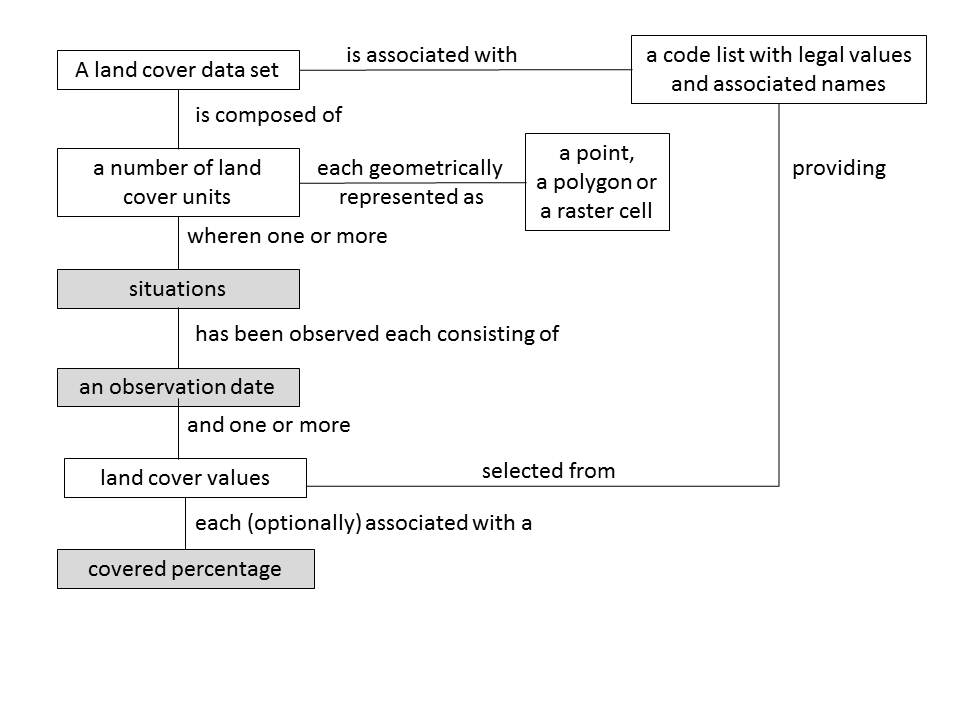

[.text-center]
*Figure 1 : Land cover conceptual core model (informal representation).*

Grey boxes represent voidable items and are not used in the raster version of the model

<<<
[discrete]
== Acknowledgements

Many individuals and organisations have contributed to the development of these Guidelines.

The Thematic Working Group Land Cover (TWG-LC) included:

Geir Harald  Strand (TWG Facilitator), Dimitri Sarafinof (TWG Editor), Stephan Arnold, Elzbieta Bielecka, Gergely Maucha, Åsa Sehlstedt, Steffen  Kuntz, Nuria Valcarcel Sanz, Marjo Kasanko, Wim Devos and Vanda Lima (European Commission contact point).

Other contributors to the INSPIRE data specifications are the Drafting Team Data Specifications, the JRC Data Specifications Team and the INSPIRE stakeholders - Spatial Data Interested Communities (SDICs) and Legally Mandated Organisations (LMOs).

*Contact information*

Maria Vanda Nunes de Lima
European Commission Joint Research Centre
Institute for Environment and Sustainability
Unit H06: Digital Earth and Reference Data
TP262, Via Fermi 2749
I-21027 Ispra (VA)
ITALY
E-mail: vanda.lima@jrc.ec.europa.eu
Tel.: 39-0332-7865052
Fax: 39-0332-7866325
http://ies.jrc.ec.europa.eu/
http://ec.europa.eu/dgs/jrc/
http://inspire.jrc.ec.europa.eu/

<<<
[discrete]
= Table of Contents
toc::[]

:sectnums:
<<<
== Scope

This document specifies a harmonised data specification for the spatial data theme _Land Cover_ as defined in Annex II of the INSPIRE Directive.

This data specification provides the basis for the drafting of Implementing Rules according to Article 7 (1) of the INSPIRE Directive [Directive 2007/2/EC]. The entire data specification is published as implementation guidelines accompanying these Implementing Rules.

<<<
== Overview

=== Name

INSPIRE data specification for the theme Land Cover.

=== Informal description

*Definition:*

Physical and biological cover of the earth's surface including artificial surfaces, agricultural areas, forests, (semi-)natural areas, wetlands, water bodies [Directive 2007/2/EC]

*Description:*

Land cover is an abstraction of the physical and biophysical cover on the earth's surface.

Land cover data provides a description of the surface of the earth by its (bio-) physical characteristics. Land cover mapping and surveying of land cover is done through land cover survey initiatives. The EEA CORINE Land Cover program, the LUCAS survey carried out by Eurostat and many national and regional land cover mapping programs are examples of such land cover survey initiatives. The variety of survey initiatives show that land cover can be described, classified and mapped in many different ways, justified by a multitude of applications and user requirements.

Land cover is an abstraction. The surface described as land cover is in reality populated with landscape elements. The landscape elements are physical features like buildings, roads, trees, plants, water bodies etc. Inside a unit of land, the (bio-)physical characteristics of these landscape elements combine to form the land cover of that unit. Mapping and description of land cover is, however, different from the mapping of the individual landscape elements and concerned with the portrayal of a continuous surface and not with the individual elements that comprise this surface. In this sense, land cover is to be understood as an abstraction of the surface.

Land cover is different from land use (INSPIRE Annex III, theme number 4), which is dedicated to the description of the use of the earth's surface. Land cover and land use are, however, related to each other and often combined in practical applications. Data combining land use and land cover information often emphasize land use aspects in intensively used areas (e.g. built-up or industrial areas, artificial land) and land cover aspects in extensively used areas (e.g. natural vegetation, forest areas). A detailed discussion of the relationship between land cover and land use is found in an annex to the INSPIRE data specification for land use.

Harmonized, homogenous and comparable land cover information for Europe is available as the result of the EEA CORINE Land Cover program and the Eurostat LUCAS survey. Land cover data created and maintained by many member states, together with initiatives within the framework of the GMES, can provide further input to a European infrastructure of land cover information.

*Definition:*

Physical and biological cover of the earth's surface including artificial surfaces, agricultural areas, forests, (semi-)natural areas, wetlands, water bodies.

*Description*

Land cover data is a physical or biological description of the earth surface. In this way it is different from the land use data (Annex III, theme number 4), dedicated to the description of the use of the Earth surface.

Land cover information has to be homogenous and comparable between different locations in Europe, based on the infrastructures for Land Cover information created by the Member States (if existing), and made available and maintained at the most appropriate level.

A land cover data set consists of a collection of land cover units. These units may be points, polygons or raster cells (resulting in two core models, one for vector data and one for raster data). The land cover data set is also linked to a code list (e.g. the CORINE Land Cover code list). CORINE Land Cover as well as most regional and national land cover data sets, can be represented using one of the core models.

Land cover information used in monitoring linked to EU agricultural policy (IACS), in carbon monitoring (LULUCF) and used in land and ecosystem accounting based on CORINE Land Cover (LEAC)

Entry in the INSPIRE registry: _http://inspire.ec.europa.eu/theme/lc/_

=== Normative References

[Directive 2007/2/EC] Directive 2007/2/EC of the European Parliament and of the Council of 14 March 2007 establishing an Infrastructure for Spatial Information in the European Community (INSPIRE)

[ISO 19105] EN ISO 19105:2000, Geographic information - Conformance and testing

[ISO 19107] EN ISO 19107:2005, Geographic Information – Spatial Schema

[ISO 19111] EN ISO 19111:2007 Geographic information - Spatial referencing by coordinates (ISO 19111:2007)

[ISO 19113] EN ISO 19113:2005, Geographic Information – Quality principles

[ISO 19115] EN ISO 19115:2005, Geographic information – Metadata (ISO 19115:2003)

[ISO 19118] EN ISO 19118:2006, Geographic information – Encoding (ISO 19118:2005)

[ISO 19123] EN ISO 19123:2007, Geographic Information – Schema for coverage geometry and functions

[ISO 19125-1] EN ISO 19125-1:2004, Geographic Information – Simple feature access – Part 1: Common architecture

[ISO 19135] EN ISO 19135:2007 Geographic information – Procedures for item registration (ISO 19135:2005)

[ISO 19138] ISO/TS 19138:2006, Geographic Information – Data quality measures

[ISO 19139] ISO/TS 19139:2007, Geographic information – Metadata – XML schema implementation

[ISO 19144-1] ISO 19144-1:2009, Geographic information – Part 1: Classification system structure

[ISO 19144-2] ISO/FDIS 19144-2:2012, Geographic information - Classification systems - Part 2 : Land Cover Meta Language (LCML)

[ISO 19157] ISO/DIS 19157, Geographic information – Data quality

[OGC 06-103r4] Implementation Specification for Geographic Information - Simple feature access – Part 1: Common Architecture v1.2.1

NOTE This is an updated version of "EN ISO 19125-1:2004, Geographic information – Simple feature access – Part 1: Common architecture".

[Regulation 1205/2008/EC] Regulation 1205/2008/EC implementing Directive 2007/2/EC of the European Parliament and of the Council as regards metadata

[Regulation 976/2009/EC] Commission Regulation (EC) No 976/2009 of 19 October 2009 implementing Directive 2007/2/EC of the European Parliament and of the Council as regards the Network Services

[Regulation 1089/2010/EC] Commission Regulation (EU) No 1089/2010 of 23 November 2010 implementing Directive 2007/2/EC of the European Parliament and of the Council as regards interoperability of spatial data sets and services

=== Terms and definitions

General terms and definitions helpful for understanding the INSPIRE data specification documents are defined in the INSPIRE Glossaryfootnote:[The INSPIRE Glossary is available from http://inspire-registry.jrc.ec.europa.eu/registers/GLOSSARY].

Specifically, for the theme Land Cover, the following terms are defined:

*(1) Classification System*

System for assigning objects to classes, in accordance with ISO 19144-1:2012.

Classification is an abstract representation of real world phenomena (i.e. the situation in the field) using classifiers. A classification is a systematic framework with the names of the classes and the definitions used to distinguish them, and the relation between classes. Classification thus necessarily involves definition of class boundaries that must be clear and based upon objective criteria.

*(2) Discrete Coverage*

Coverage that returns the same feature attribute values for every direct position within any single spatial object, temporal object or spatiotemporal object in its domain, in accordance with EN ISO 19123:2007.

NOTE The domain of a discrete coverage consists of a finite set of spatial, temporal, or spatiotemporal objects

*(3) Land Cover Object*

Spatial object (point, pixel or polygon) where the land cover has been observed.

*(4) Legend*

Application of a classification in a specific area using a defined mapping scale and specific data set [UNFAO LCCS 2:2005].

A _legend_ is the application of a classification in a specific area using a defined mapping scale and specific

data set. Therefore, a legend may contain only a proportion, or subset, of all possible classes of the classification.A legend shall be

* _scale dependent_, and
* _source dependent_.

{empty}[ISO 19144-1]

*(5) Minimal Mapping Unit*

Smallest area size of a polygon allowed to be represented in a particular land cover data set.

*(6) Mosaic*

Group of land cover classes assigned to the same land cover object at a same time. A covered percentage may be affected to each LC class.

*(7) Nomenclature*

A list of codes and corresponding names and definitions for all the valid classes resulting from a classification system.

*(8) Situation*

State of a particular land cover object at a particular point in time.

NOTE Any particular polygon may then support more than one classification class, each corresponding to a specific observation at a particular point in time.

*(9) Tessellation*

Partitioning of a space into a set of conterminous subspaces having the same dimension as the space being partitioned [ISO 19123].

NOTE A tessellation in a 2D space consist of a set of non-overlapping polygons that entirely cover a region of interest.

=== Symbols and abbreviations

[width="100%",cols="14%,86%"]
|===
|ATS|Abstract Test Suite
|CLC|CORINE Land Cover
|CORINE|Coordination of information on the environment
|EC|European Commission
|EEA|European Environmental Agency
|ETRS89|European Terrestrial Reference System 1989
|ETRS89-LAEA|Lambert Azimuthal Equal Area
|EVRS|European Vertical Reference System
|FAO|Food and Agricultural Organization
|GCM|General Conceptual Model
|GMES|Global Monitoring for Environment and Security
|GML|Geography Markup Language
|IACS|Integrated Administration and Control System
|IGBP|International Geosphere-Biosphere Programme
|IR|Implementing Rule
|ISDSS|Interoperability of Spatial Data Sets and Services
|ISO|International Organization for Standardization
|ISO|International Standard Organization
|ITRS|International Terrestrial Reference System
|LAT|Lowest Astronomical Tide
|LC|Land Cover
|LCCS|Land Cover Classification System
|LCML|Land Cover Meta Language
|LEAC|Land and Ecosystem Accounting
|LMO|Legally Mandated Organisation
|LPIS|Land Parcel Identification System
|LU|Land Use
|LUCAS|Land Use/Cover Area Frame Survey by EUROSTAT
|LULUCF|Land Use, Land Use Change and Forestry
|MMU|Minimal Mapping Unit
|OCL|Object Constraint Language
|SDI|Spatial Data Infrastructure
|SDIC|Spatial Data Interest Community
|TG|Technical Guidance
|TWG|Thematic Working Group
|UML|Unified Modeling Language
|UTC|Coordinated Universal Time
|XML|EXtensible Markup Language
|===

=== How the Technical Guidelines map to the Implementing Rules

The schematic diagram in Figure 2 gives an overview of the relationships between the INSPIRE legal acts (the INSPIRE Directive and Implementing Rules) and the INSPIRE Technical Guidelines. The INSPIRE Directive and Implementing Rules include legally binding requirements that describe, usually on an abstract level, _what_ Member States must implement.

In contrast, the Technical Guidelines define _how_ Member States might implement the requirements included in the INSPIRE Implementing Rules. As such, they may include non-binding technical requirements that must be satisfied if a Member State data provider chooses to conform to the Technical Guidelines. Implementing these Technical Guidelines will maximise the interoperability of INSPIRE spatial data sets.

image::./media/image5.png[image,width=603,height=375, align=center]

[.text-center]
*Figure 2 - Relationship between INSPIRE Implementing Rules and Technical Guidelines*

==== Requirements

The purpose of these Technical Guidelines (Data specifications on _Land Cover_) is to provide practical guidance for implementation that is guided by, and satisfies, the (legally binding) requirements included for the spatial data theme Land Cover in the Regulation (Implementing Rules) on interoperability of spatial data sets and services. These requirements are highlighted in this document as follows:

[IMPORTANT]
====
[.text-center]
*IR Requirement*
_Article / Annex / Section no._
*Title / Heading*

This style is used for requirements contained in the Implementing Rules on interoperability of spatial data sets and services (Commission Regulation (EU) No 1089/2010).
====

For each of these IR requirements, these Technical Guidelines contain additional explanations and examples.

NOTE The Abstract Test Suite (ATS) in Annex A contains conformance tests that directly check conformance with these IR requirements.

Furthermore, these Technical Guidelines may propose a specific technical implementation for satisfying an IR requirement. In such cases, these Technical Guidelines may contain additional technical requirements that need to be met in order to be conformant with the corresponding IR requirement _when using this proposed implementation_. These technical requirements are highlighted as follows:

[TIP]
====
*TG Requirement X* This style is used for requirements for a specific technical solution proposed in these Technical Guidelines for an IR requirement.
====

NOTE 1 Conformance of a data set with the TG requirement(s) included in the ATS implies conformance with the corresponding IR requirement(s).

NOTE 2 In addition to the requirements included in the Implementing Rules on interoperability of spatial data sets and services, the INSPIRE Directive includes further legally binding obligations that put additional requirements on data providers. For example, Art. 10(2) requires that Member States shall, where appropriate, decide by mutual consent on the depiction and position of geographical features whose location spans the frontier between two or more Member States. General guidance for how to meet these obligations is provided in the INSPIRE framework documents.

==== Recommendations

In addition to IR and TG requirements, these Technical Guidelines may also include a number of recommendations for facilitating implementation or for further and coherent development of an interoperable infrastructure.

[NOTE]
====
*Recommendation X* Recommendations are shown using this style.
====

NOTE The implementation of recommendations is not mandatory. Compliance with these Technical Guidelines or the legal obligation does not depend on the fulfilment of the recommendations.

==== Conformance

Annex A includes the abstract test suite for checking conformance with the requirements included in these Technical Guidelines and the corresponding parts of the Implementing Rules (Commission Regulation (EU) No 1089/2010).

<<<
== Specification scopes

This data specification does not distinguish different specification scopes, but just considers one general scope.

NOTE For more information on specification scopes, see [ISO 19131:2007], clause 8 and Annex D.

<<<
== Identification information

These Technical Guidelines are identified by the following URI:

http://inspire.ec.europa.eu/tg/LC/3.0

NOTE ISO 19131 suggests further identification information to be included in this section, e.g. the title, abstract or spatial representation type. The proposed items are already described in the document metadata, executive summary, overview description (section 2) and descriptions of the application schemas (section 5). In order to avoid redundancy, they are not repeated here.

<<<
== Data content and structure

=== Application schemas – Overview 

==== Application schemas included in the IRs

Articles 3, 4 and 5 of the Implementing Rules lay down the requirements for the content and structure of the data sets related to the INSPIRE Annex themes.

[IMPORTANT]
====
[.text-center]
*IR Requirement*
_Article 4_
*Types for the Exchange and Classification of Spatial Objects*

. For the exchange and classification of spatial objects from data sets meeting the conditions laid down in Article 4 of Directive 2007/2/EC, Member States shall use the spatial object types and associated data types and code lists that are defined in Annexes II, III and IV for the themes the data sets relate to.

. When exchanging spatial objects, Member States shall comply with the definitions and constraints set out in the Annexes and provide values for all attributes and association roles set out for the relevant spatial object types and data types in the Annexes. For voidable attributes and association roles for which no value exists, Member States may omit the value.

====

The types to be used for the exchange and classification of spatial objects from data sets related to the spatial data theme Land Cover are defined in the following application schemas:

* LandCoverNomenclature application schema
* LandCoverVector application schema
* LandCoverRaster application schema

The application schemas specify requirements on the properties of each spatial object including its multiplicity, domain of valid values, constraints, etc.

NOTE The application schemas presented in this section contain some additional information that is not included in the Implementing Rules, in particular multiplicities of attributes and association roles.

[TIP]
====
*TG Requirement 1*

Spatial object types and data types shall comply with the multiplicities defined for the attributes and association roles in this section.

====

An application schema may include references (e.g. in attributes or inheritance relationships) to common types or types defined in other spatial data themes. These types can be found in a sub-section called "Imported Types" at the end of each application schema section. The common types referred to from application schemas included in the IRs are addressed in Article 3.

[IMPORTANT]
====
[.text-center]
*IR Requirement*
_Article 3_
*Common Types*

Types that are common to several of the themes listed in Annexes I, II and III to Directive 2007/2/EC shall conform to the definitions and constraints and include the attributes and association roles set out in Annex I.

====

NOTE Since the IRs contain the types for all INSPIRE spatial data themes in one document, Article 3 does not explicitly refer to types defined in other spatial data themes, but only to types defined in external data models.

Common types are described in detail in the Generic Conceptual Model [DS-D2.7], in the relevant international standards (e.g. of the ISO 19100 series) or in the documents on the common INSPIRE models [DS-D2.10.x]. For detailed descriptions of types defined in other spatial data themes, see the corresponding Data Specification TG document [DS-D2.8.x].

==== Additional recommended application schemas 

In addition to the application schemas listed above, the following additional application schemas have been defined for the theme _Land Cover_:

* LandCoverExtension application schema.

These additional application schemas are not included in the IRs. They typically address requirements from specific (groups of) use cases and/or may be used to provide additional information. They are included in this specification in order to improve interoperability also for these additional aspects and to illustrate the extensibility of the application schemas included in the IRs.

[NOTE]
====
*Recommendation 1*

Additional and/or use case-specific information related to the theme _Land Cover_ should be made available using the spatial object types and data types specified in the application schema LandCoverExtension.

These spatial object types and data types should comply with the definitions and constraints and include the attributes and association roles defined in this section.

The code lists used in attributes or association roles of spatial object types or data types should comply with the definitions and include the values defined in this section.

====

=== Basic notions

This section explains some of the basic notions used in the INSPIRE application schemas. These explanations are based on the GCM [DS-D2.5].

==== Notation

===== Unified Modeling Language (UML)

The application schemas included in this section are specified in UML, version 2.1. The spatial object types, their properties and associated types are shown in UML class diagrams.

NOTE For an overview of the UML notation, see Annex D in [ISO 19103].

The use of a common conceptual schema language (i.e. UML) allows for an automated processing of application schemas and the encoding, querying and updating of data based on the application schema – across different themes and different levels of detail.

The following important rules related to class inheritance and abstract classes are included in the IRs.

[IMPORTANT]
====
[.text-center]
*IR Requirement*
_Article 5_
*Types*

(...)

[arabic, start=2]
. Types that are a sub-type of another type shall also include all this type's attributes and association roles.

. Abstract types shall not be instantiated.

====

The use of UML conforms to ISO 19109 8.3 and ISO/TS 19103 with the exception that UML 2.1 instead of ISO/IEC 19501 is being used. The use of UML also conforms to ISO 19136 E.2.1.1.1-E.2.1.1.4.

NOTE ISO/TS 19103 and ISO 19109 specify a profile of UML to be used in conjunction with the ISO 19100 series. This includes in particular a list of stereotypes and basic types to be used in application schemas. ISO 19136 specifies a more restricted UML profile that allows for a direct encoding in XML Schema for data transfer purposes.

To model constraints on the spatial object types and their properties, in particular to express data/data set consistency rules, OCL (Object Constraint Language) is used as described in ISO/TS 19103, whenever possible. In addition, all constraints are described in the feature catalogue in English, too.

NOTE Since "void" is not a concept supported by OCL, OCL constraints cannot include expressions to test whether a value is a _void_ value. Such constraints may only be expressed in natural language.

===== Stereotypes

In the application schemas in this section several stereotypes are used that have been defined as part of a UML profile for use in INSPIRE [DS-D2.5]. These are explained in Table 1 below.

[.text-center]
*Table 1 – Stereotypes (adapted from [DS-D2.5])*

[cols=",,",]
|===
|*Stereotype* |*Model element* |*Description*
|applicationSchema |Package |An INSPIRE application schema according to ISO 19109 and the Generic Conceptual Model.
|leaf |Package |A package that is not an application schema and contains no packages.
|featureType |Class |A spatial object type.
|type |Class |A type that is not directly instantiable, but is used as an abstract collection of operation, attribute and relation signatures. This stereotype should usually not be used in INSPIRE application schemas as these are on a different conceptual level than classifiers with this stereotype.
|dataType |Class |A structured data type without identity.
|union |Class |A structured data type without identity where exactly one of the properties of the type is present in any instance.
|codeList |Class |A code list.
|import |Dependency |The model elements of the supplier package are imported.
|voidable |Attribute, association role |A voidable attribute or association role (see section 5.2.2).
|lifeCycleInfo |Attribute, association role |If in an application schema a property is considered to be part of the life-cycle information of a spatial object type, the property shall receive this stereotype.
|version |Association role |If in an application schema an association role ends at a spatial object type, this stereotype denotes that the value of the property is meant to be a specific version of the spatial object, not the spatial object in general.
|===

==== Voidable characteristics

The «voidable» stereotype is used to characterise those properties of a spatial object that may not be present in some spatial data sets, even though they may be present or applicable in the real world. This does _not_ mean that it is optional to provide a value for those properties.

For all properties defined for a spatial object, a value has to be provided – either the corresponding value (if available in the data set maintained by the data provider) or the value of _void._ A _void_ value shall imply that no corresponding value is contained in the source spatial data set maintained by the data provider or no corresponding value can be derived from existing values at reasonable costs.

[NOTE]
====
*Recommendation 2*

The reason for a _void_ value should be provided where possible using a listed value from the VoidReasonValue code list to indicate the reason for the missing value.

====

The VoidReasonValue type is a code list, which includes the following pre-defined values:

* _Unpopulated_: The property is not part of the dataset maintained by the data provider. However, the characteristic may exist in the real world. For example when the "elevation of the water body above the sea level" has not been included in a dataset containing lake spatial objects, then the reason for a void value of this property would be 'Unpopulated'. The property receives this value for all spatial objects in the spatial data set.
* _Unknown_: The correct value for the specific spatial object is not known to, and not computable by the data provider. However, a correct value may exist. For example when the "elevation of the water body above the sea level" _of a certain lake_ has not been measured, then the reason for a void value of this property would be 'Unknown'. This value is applied only to those spatial objects where the property in question is not known.
* _Withheld_: The characteristic may exist, but is confidential and not divulged by the data provider.

NOTE It is possible that additional reasons will be identified in the future, in particular to support reasons / special values in coverage ranges.

The «voidable» stereotype does not give any information on whether or not a characteristic exists in the real world. This is expressed using the multiplicity:

* If a characteristic may or may not exist in the real world, its minimum cardinality shall be defined as 0. For example, if an Address may or may not have a house number, the multiplicity of the corresponding property shall be 0..1.
* If at least one value for a certain characteristic exists in the real world, the minimum cardinality shall be defined as 1. For example, if an Administrative Unit always has at least one name, the multiplicity of the corresponding property shall be 1..*.

In both cases, the «voidable» stereotype can be applied. In cases where the minimum multiplicity is 0, the absence of a value indicates that it is known that no value exists, whereas a value of void indicates that it is not known whether a value exists or not.

EXAMPLE If an address does not have a house number, the corresponding Address object should not have any value for the «voidable» attribute house number. If the house number is simply not known or not populated in the data set, the Address object should receive a value of _void_ (with the corresponding void reason) for the house number attribute.

==== Code lists

Code lists are modelled as classes in the application schemas. Their values, however, are managed outside of the application schema.

===== Code list types

The IRs distinguish the following types of code lists.

[IMPORTANT]
====
[.text-center]
*IR Requirement*
_Article 6_
*Code Lists for Spatial Data Sets*

. The code lists included in this Regulation set out the multilingual thesauri to be used for the key attributes, in accordance with Article 8(2), point (c), of Directive 2007/2/EC.

. The Commission shall establish and operate an INSPIRE code list register at Union level for managing and making publicly available the values that are included in the code lists referred to in paragraph 1.

. The Commission shall be assisted by the INSPIRE Commission expert group in the maintenance and update of the code list values.

. Code lists shall be one of the following types:
[loweralpha]
.. code lists whose values comprise only the values specified in the INSPIRE code list register;
.. code lists whose values comprise the values specified in the INSPIRE code list register and narrower values defined by data providers;
.. code lists whose values comprise the values specified in the INSPIRE code list register and additional values at any level defined by data providers;
.. code lists, whose values comprise any values defined by data providers.

. Code lists may be hierarchical. Values of hierarchical code lists may have a more general parent value.
. Where, for an attribute whose type is a code list as referred to in paragraph 4, points (b), (c) or (d), a data provider provides a value that is not specified in the INSPIRE code list register, that value and its definition and label shall be made available in another register.

====

The type of code list is represented in the UML model through the tagged value _extensibility_, which can take the following values:

* _none_, representing code lists whose allowed values comprise only the values specified in the IRs (type a);
* _narrower_, representing code lists whose allowed values comprise the values specified in the IRs and narrower values defined by data providers (type b);
* _open_, representing code lists whose allowed values comprise the values specified in the IRs and additional values at any level defined by data providers (type c); and
* _any_, representing code lists, for which the IRs do not specify any allowed values, i.e. whose allowed values comprise any values defined by data providers (type d).

[NOTE]
====
*Recommendation 3*

Additional values defined by data providers should not replace or redefine any value already specified in the IRs.

====

NOTE This data specification may specify recommended values for some of the code lists of type (b), (c) and (d) (see section 5.2.4.3). These recommended values are specified in a dedicated Annex.

In addition, code lists can be hierarchical, as explained in Article 6(2) of the IRs.

[IMPORTANT]
====
[.text-center]
*IR Requirement*
_Article 6_
*Code Lists for Spatial Data Sets*

(...)

[arabic, start=5]
. Code lists may be hierarchical. Values of hierarchical code lists may have a more general parent value.

====

The type of code list and whether it is hierarchical or not is also indicated in the feature catalogues.

===== Obligations on data providers

[IMPORTANT]
====
[.text-center]
*IR Requirement*
_Article 6_
*Code Lists for Spatial Data Sets*

(...)

[arabic, start=6]
. Where, for an attribute whose type is a code list as referred to in paragraph 4, points (b), (c) or (d), a data provider provides a value that is not specified in the INSPIRE code list register, that value and its definition and label shall be made available in another register.

====

Article 6(6) obliges data providers to use only values that are allowed according to the specification of the code list. The "allowed values according to the specification of the code list" are the values explicitly defined in the IRs plus (in the case of code lists of type (b), (c) and (d)) additional values defined by data providers.

For attributes whose type is a code list of type (b), (c) or (d) data providers may use additional values that are not defined in the IRs. Article 6(6) requires that such additional values and their definition be made available in a register. This enables users of the data to look up the meaning of the additional values used in a data set, and also facilitates the re-use of additional values by other data providers (potentially across Member States).

NOTE Guidelines for setting up registers for additional values and how to register additional values in these registers is still an open discussion point between Member States and the Commission.

===== Recommended code list values

For code lists of type (b), (c) and (d), this data specification may propose additional values as a recommendation (in a dedicated Annex). These values will be included in the INSPIRE code list register. This will facilitate and encourage the usage of the recommended values by data providers since the obligation to make additional values defined by data providers available in a register (see section 5.2.4.2) is already met.

[NOTE]
====
*Recommendation 4*

Where these Technical Guidelines recommend values for a code list in addition to those specified in the IRs, these values should be used.

====

NOTE For some code lists of type (d), no values may be specified in these Technical Guidelines. In these cases, any additional value defined by data providers may be used.

===== Governance

The following two types of code lists are distinguished in INSPIRE:

* _Code lists that are governed by INSPIRE (INSPIRE-governed code lists)._ These code lists will be managed centrally in the INSPIRE code list register. Change requests to these code lists (e.g. to add, deprecate or supersede values) are processed and decided upon using the INSPIRE code list register's maintenance workflows.

INSPIRE-governed code lists will be made available in the INSPIRE code list register at __http://inspire.ec.europa.eu/codelist/<CodeListName__>. They will be available in SKOS/RDF, XML and HTML. The maintenance will follow the procedures defined in ISO 19135. This means that the only allowed changes to a code list are the addition, deprecation or supersession of values, i.e. no value will ever be deleted, but only receive different statuses (valid, deprecated, superseded). Identifiers for values of INSPIRE-governed code lists are constructed using the pattern __http://inspire.ec.europa.eu/codelist/<CodeListName__>/<value>.

* _Code lists that are governed by an organisation outside of INSPIRE (externally governed code lists)._ These code lists are managed by an organisation outside of INSPIRE, e.g. the World Meteorological Organization (WMO) or the World Health Organization (WHO). Change requests to these code lists follow the maintenance workflows defined by the maintaining organisations. Note that in some cases, no such workflows may be formally defined.

Since the updates of externally governed code lists is outside the control of INSPIRE, the IRs and these Technical Guidelines reference a specific version for such code lists.

The tables describing externally governed code lists in this section contain the following columns:

* The _Governance_ column describes the external organisation that is responsible for maintaining the code list.

* The _Source_ column specifies a citation for the authoritative source for the values of the code list. For code lists, whose values are mandated in the IRs, this citation should include the version of the code list used in INSPIRE. The version can be specified using a version number or the publication date. For code list values recommended in these Technical Guidelines, the citation may refer to the "latest available version".

* In some cases, for INSPIRE only a subset of an externally governed code list is relevant. The subset is specified using the _Subset_ column.

* The _Availability_ column specifies from where (e.g. URL) the values of the externally governed code list are available, and in which formats. Formats can include machine-readable (e.g. SKOS/RDF, XML) or human-readable (e.g. HTML, PDF) ones.

Code list values are encoded using http URIs and labels. Rules for generating these URIs and labels are specified in a separate table.

[NOTE]
====
*Recommendation 5*

The http URIs and labels used for encoding code list values should be taken from the INSPIRE code list registry for INSPIRE-governed code lists and generated according to the relevant rules specified for externally governed code lists.

====

NOTE Where practicable, the INSPIRE code list register could also provide http URIs and labels for externally governed code lists.

===== Vocabulary

For each code list, a tagged value called "vocabulary" is specified to define a URI identifying the values of the code list. For INSPIRE-governed code lists and externally governed code lists that do not have a persistent identifier, the URI is constructed following the pattern _http://inspire.ec.europa.eu/codelist/<UpperCamelCaseName>_.

If the value is missing or empty, this indicates an empty code list. If no sub-classes are defined for this empty code list, this means that any code list may be used that meets the given definition.

An empty code list may also be used as a super-class for a number of specific code lists whose values may be used to specify the attribute value. If the sub-classes specified in the model represent all valid extensions to the empty code list, the subtyping relationship is qualified with the standard UML constraint "\{complete,disjoint}".

==== Identifier management

[IMPORTANT]
====
[.text-center]
*IR Requirement*
_Article 9_
*Identifier Management*

. The data type Identifier defined in Section 2.1 of Annex I shall be used as a type for the external object identifier of a spatial object.

. The external object identifier for the unique identification of spatial objects shall not be changed during the life-cycle of a spatial object.

====

NOTE 1 An external object identifier is a unique object identifier which is published by the responsible body, which may be used by external applications to reference the spatial object. [DS-D2.5]

NOTE 2 Article 9(1) is implemented in each application schema by including the attribute _inspireId_ of type Identifier.

NOTE 3 Article 9(2) is ensured if the _namespace_ and _localId_ attributes of the Identifier remains the same for different versions of a spatial object; the _version_ attribute can of course change.

==== Geometry representation

[IMPORTANT]
====
[.text-center]
*IR Requirement*
_Article 12_
*Other Requirements & Rules*

. The value domain of spatial properties defined in this Regulation shall be restricted to the Simple Feature spatial schema as defined in Herring, John R. (ed.), OpenGIS® Implementation Standard for Geographic information – Simple feature access – Part 1: Common architecture, version 1.2.1, Open Geospatial Consortium, 2011, unless specified otherwise for a specific spatial data theme or type.

====

NOTE 1 The specification restricts the spatial schema to 0-, 1-, 2-, and 2.5-dimensional geometries where all curve interpolations are linear and surface interpolations are performed by triangles.

NOTE 2 The topological relations of two spatial objects based on their specific geometry and topology properties can in principle be investigated by invoking the operations of the types defined in ISO 19107 (or the methods specified in EN ISO 19125-1).

====  Temporality representation

The application schema(s) use(s) the derived attributes "beginLifespanVersion" and "endLifespanVersion" to record the lifespan of a spatial object.

The attributes "beginLifespanVersion" specifies the date and time at which this version of the spatial object was inserted or changed in the spatial data set. The attribute "endLifespanVersion" specifies the date and time at which this version of the spatial object was superseded or retired in the spatial data set.

NOTE 1 The attributes specify the beginning of the lifespan of the version in the spatial data set itself, which is different from the temporal characteristics of the real-world phenomenon described by the spatial object. This lifespan information, if available, supports mainly two requirements: First, knowledge about the spatial data set content at a specific time; second, knowledge about changes to a data set in a specific time frame. The lifespan information should be as detailed as in the data set (i.e., if the lifespan information in the data set includes seconds, the seconds should be represented in data published in INSPIRE) and include time zone information.

NOTE 2 Changes to the attribute "endLifespanVersion" does not trigger a change in the attribute "beginLifespanVersion".

[IMPORTANT]
====
[.text-center]
*IR Requirement*
_Article 10_
*Life-cycle of Spatial Objects*

(...)

[arabic, start=3]
. Where the attributes beginLifespanVersion and endLifespanVersion are used, the value of endLifespanVersion shall not be before the value of beginLifespanVersion.

====

NOTE The requirement expressed in the IR Requirement above will be included as constraints in the UML data models of all themes.

[NOTE]
====
*Recommendation 6*

If life-cycle information is not maintained as part of the spatial data set, all spatial objects belonging to this data set should provide a void value with a reason of "unpopulated".

====

===== Validity of the real-world phenomena

The application schema(s) use(s) the attributes "validFrom" and "validTo" to record the validity of the real-world phenomenon represented by a spatial object.

The attributes "validFrom" specifies the date and time at which the real-world phenomenon became valid in the real world. The attribute "validTo" specifies the date and time at which the real-world phenomenon is no longer valid in the real world.

Specific application schemas may give examples what "being valid" means for a specific real-world phenomenon represented by a spatial object.

[IMPORTANT]
====
[.text-center]
*IR Requirement*
_Article 12_
*Other Requirements & Rules*

(...)

[arabic, start=3]
. Where the attributes validFrom and validTo are used, the value of validTo shall not be before the value of validFrom.

====

NOTE The requirement expressed in the IR Requirement above will be included as constraints in the UML data models of all themes.

==== Coverages

Coverage functions are used to describe characteristics of real-world phenomena that vary over space and/or time. Typical examples are temperature, elevation, precipitation, imagery. A coverage contains a set of such values, each associated with one of the elements in a spatial, temporal or spatio-temporal domain. Typical spatial domains are point sets (e.g. sensor locations), curve sets (e.g. isolines), grids (e.g. orthoimages, elevation models), etc.

In INSPIRE application schemas, coverage functions are defined as properties of spatial object types where the type of the property value is a realisation of one of the types specified in ISO 19123.

To improve alignment with coverage standards on the implementation level (e.g. ISO 19136 and the OGC Web Coverage Service) and to improve the cross-theme harmonisation on the use of coverages in INSPIRE, an application schema for coverage types is included in the Generic Conceptual Model in 9.9.4. This application schema contains the following coverage types:

* _RectifiedGridCoverage_: coverage whose domain consists of a rectified grid – a grid for which there is an affine transformation between the grid coordinates and the coordinates of a coordinate reference system (see Figure 3, left).
* _ReferenceableGridCoverage_: coverage whose domain consists of a referenceable grid – a grid associated with a transformation that can be used to convert grid coordinate values to values of coordinates referenced to a coordinate reference system (see Figure 3, right).

In addition, some themes make reference to the types TimeValuePair and Timeseries defined in Taylor, Peter (ed.), _OGC^®^ WaterML 2.0: Part 1 – Timeseries, v2.0.0,_ Open Geospatial Consortium, 2012. These provide a representation of the time instant/value pairs, i.e. time series (see Figure 4).

Where possible, only these coverage types (or a subtype thereof) are used in INSPIRE application schemas.

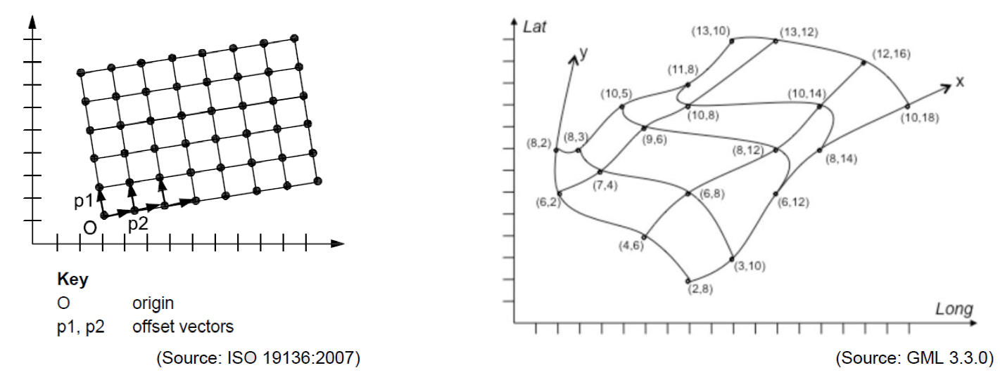
[.text-center]
*Figure 3 – Examples of a rectified grid (up) and a referenceable grid (down)*

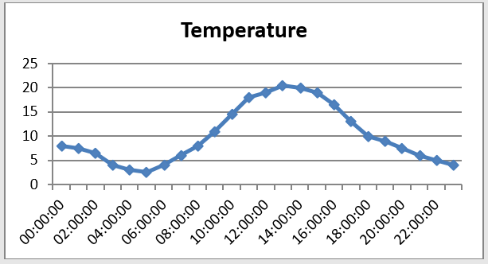

[.text-center]
*Figure 4 – Example of a time series*

=== Application schemas for Land Cover

==== Description

===== Narrative description

====== Background

The following section is a narrative description of the INSPIRE Land Cover Data Model using ordinary language and simple diagrammatic illustrations instead of UML. These illustrations and the accompanying text are informal. The purpose is partly to explain the model, partly to assist readers who find UML diagrams difficult to interpret.

Land cover data provides a description of the surface of the earth by its (bio-) physical characteristics.

In the real world, this surface is populated with physical landscape elements (e.g. buildings, roads, trees, plants, water bodies etc.). Many of these elements are themselves spatial features and represented as such by other INSPIRE themes. The physical characteristics of the landscape elements combine to form the land cover of an area. Land cover is in this sense an abstraction and should be perceived as a surface characteristic rather than a collection of features. Mapping and description of land cover is therefore also different from the mapping of the individual landscape elements.

The conceptual starting point of the INSPIRE land cover data model is the "real world" and its (bio-) physical surface of the earth. The surveying, mapping and monitoring of this surface is organized through land cover survey initiatives. A land cover survey initiative is an activity, usually a long-lasting program, carried out by a mandated organization. Examples of land cover survey initiatives are the CORINE Land Cover program (CLC) implemented by the European Environmental Agency (EEA) and the LUCAS area frame survey implemented by Eurostat. Many Member States and regional authorities also conduct land cover survey initiatives serving national and regional needs for land cover information and land monitoring. The assortment of survey initiatives show that land cover can be described, classified and mapped in many different ways, justified by a multitude of applications and user requirements.

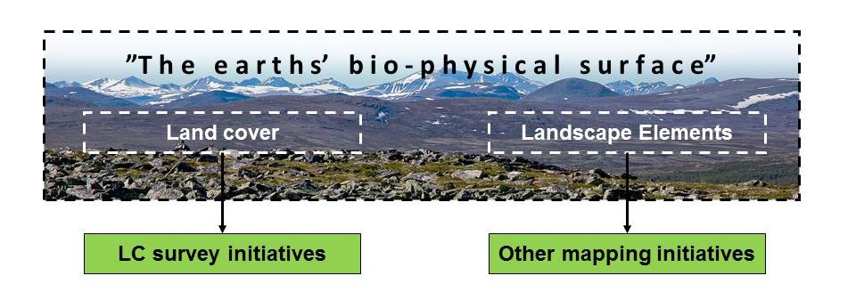

[.text-center]
*Figure 5 : Mapping and surveying of land cover is done through land cover survey initiatives. This is different from the mapping of the individual landscape elements.*

Land cover survey initiatives provide a link between other aspects of the model: The real world, users, documentation and data. The "users" are the institutions, agencies, organizations or people requesting information about the land cover, thereby justifying the effort of carrying out a land cover survey.

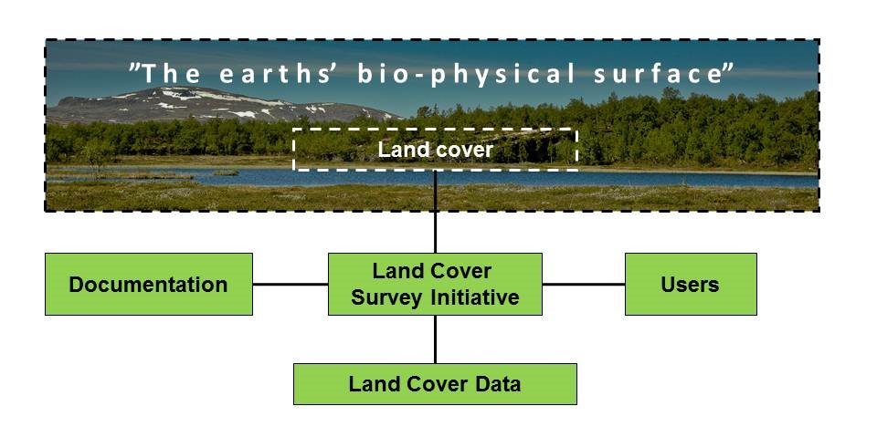

[.text-center]
*Figure 6 : A _land cover survey initiative_ is the framework for land cover mapping, linking the activity to users, documentation and the actual data that are produced.*

====== Mapping strategies

By far, the most common mapping strategy employed by land cover mapping initiatives is classification. The earth's surface is subdivided into a set of land cover units, presumably uniform in terms of land cover, and a land cover class (or several if mosaics are allowed) is assigned to each unit.

An alternative strategy is attribution. The land cover unit is in this case described by various attributes providing relevant information about the land cover situation. Examples are the number of buildings or length of paved roads. Attribution is not often used in combination with classification.

The third strategy is parameterization. This strategy emphasizes one particular aspect of the land cover (e.g. soil sealing or grass coverage), describing this aspect as a parameter. The land cover units for parameterization are usually, but not necessarily, raster cells. The pan-European GMES High Resolution Layers have been created as a result of this strategy.

The current development in land cover mapping and monitoring, at least at the pan-European level, is a movement towards integration of these three strategies. Land cover units created by classification are populated with auxiliary information drawn from secondary data sources, which in turn may be created as a result of the parametric approach. The GMES High Resolution Layers are examples of parametric data sources used to populate (by attribution) the units of the CORINE Land Cover dataset, itself a product of classification.

====== Land cover documentation and code lists

Documentation is the collection of technical documents that describe the data collection methods, definitions, rules for measurement and classification, and other relevant issues explaining the content of the land cover survey. An example is the technical documentation of CORINE Land Cover. The documentation is usually available as text documents, containing indispensable background information required for proper use of the data.

One particularly important part of the documentation is a code list of the land cover nomenclature. This code list is included in the core model and therefore mandatory in INSPIRE. The code list can have any format found appropriate by the data provider. The primary use of a code list is to check that a code found in a land cover data set is valid, and to use the code list as a lookup table to find the textual legend associated with a code. Multi-lingual code lists are recommended in order to support the reuse of data across Europe. Introducing portrayal rules (eg RGB codes) in the code list will promote visual harmonization.

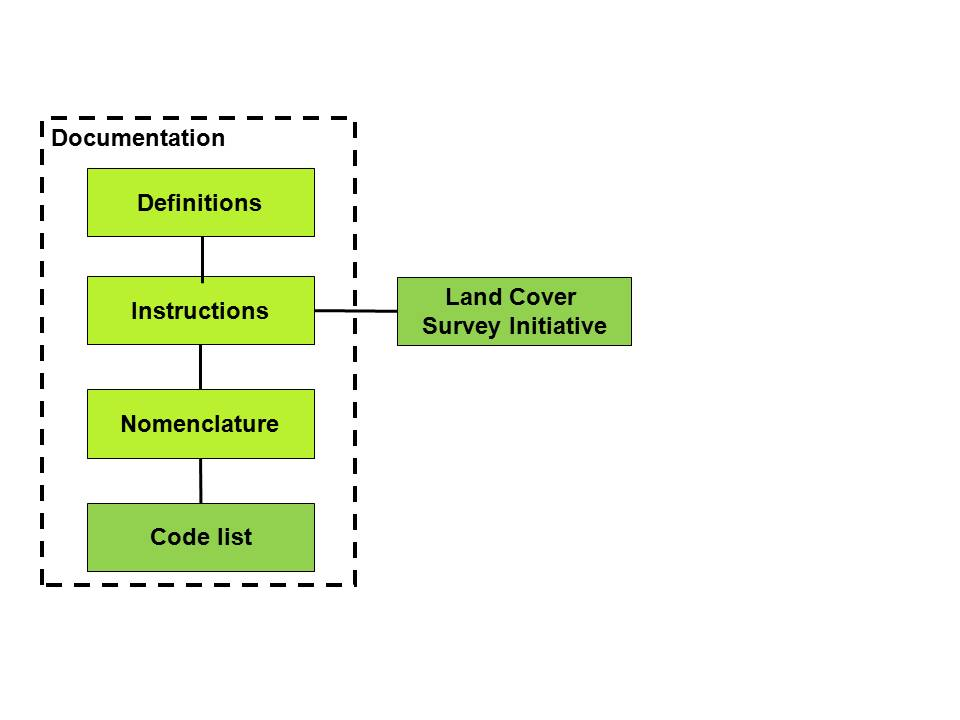

[.text-center]
*Figure 7 : The documentation of a land cover survey initiative consists of definitions (possibly including a classification system), survey instructions and a nomenclature. The nomenclature should be expressed as a code list and made available in INSPIRE.*

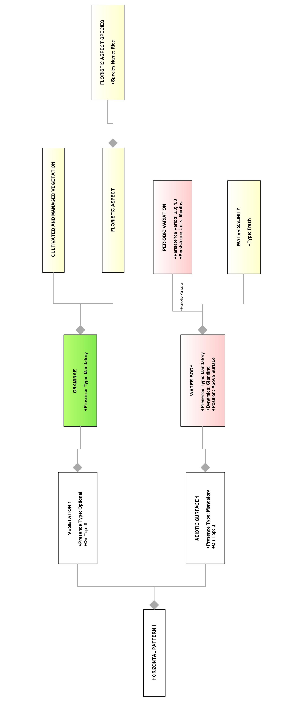

[.text-center]
*Figure 8 : Description of CORINE Land Cover class 213 _Rice field_ using ISO 19144-2 Land Cover Meta Language (LCML).*

Documentation interpretable by computers, allowing applications to convert data between different classification systems automatically help to improve interoperability. This level of harmonization is outside the scope of INSPIRE. Consequently, the data specification does not require machine-readable code lists. It is still recommended to establish machine-readable documentation. It is also recommended to include portrayal rules and a formal definition of the codes. The formal description can either be done by using the Land Cover Meta Language (LCML) defined by ISO standard (ISO 19144-2) or by using a Feature Catalogue as described in ISO 19109 and 19110 (Geographic information - Rules for application schema & Methodology for feature cataloguing).

====== Geometry

The data produced by a land cover survey initiative consists of one or more land cover datasets. A land cover dataset is simply a collection of observation units where the land cover has been observed and measured. These observation units are called land cover units in the data specification.

Conceptually, the geometry of a land cover dataset is a partition (in a mathematical sense) of the earth surface and should therefore be represented as a coverage (ISO 19123). The experience is, however, that the land cover mapping community is unable to handle coverage structures. Simple feature points and polygons together with raster structures are therefore, as a pragmatic alternative, used as the geometrical representation of land cover units in this data specification.

The land cover unit is the "geometry of a land cover observation". When a CORINE Land Cover polygon is classified, it implies that a land cover observation is carried out, and the geometry of this observation is the polygon which the observation is attached to. When the field surveyors determine the land cover at a LUCAS survey point they make an observation, and the geometry of this observation is the point. Land cover units are thus the geometrical building blocks of the land cover data specification.

Polygons are included in the model because many land cover mapping initiatives are using this representation. Most notable is the pan-European CORINE Land Cover program. Points are included in the model because this is an observation method used in statistical surveys of land cover. An example is the LUCAS area frame survey conducted by Eurostat. Finally, the data model includes raster as geometry in order to allow representation of the GMES High Resolution Layers at the pan-European level and land cover data developed from satellite imagery at the national level.

Due to the use of simple feature polygons in the data model, the specification also introduces certain geometrical restrictions: Polygons are not allowed to overlap and gaps must be controlled. Controlled gaps imply that the user must be able to distinguish between areas where information is unavailable (eg due to cloud cover in aerial photographs) and areas not covered by the mapping initiative.

The land cover of a land cover unit is observed on a particular observation date. The observation date is the acquisition date of the aerial photo or satellite image in cases where remote sensing is the observation method. For field surveys, the observation date is the date of the visit in the field. Each land cover unit can be observed several times (e.g. sample points visited every year). This is represented in the core data model by allowing several _observed situations_ to be assigned to each land cover unit. There is no limit to how many temporal situations that can be attached to each land cover unit in order to represent a sequence of changes.

The geometry of a particular land cover dataset is static. It does not change. A change in the geometry, created because a polygon is split or because two polygons are merged, must be represented by a new land cover dataset. Spatial data management, and therefore also the business model for management of changes in data set geometry, is the responsibility of the data owner.

The recommended strategies for representing land cover change are (a) to use a fixed geometry and change only the land cover code from one observation date to another; (b) to delineate land cover change features (which are valid only between two reference dates) ; or (c) to use sample points.

*The data model*

The core model (see also figure above) proposed for the INSPIRE implementing rules represents a land cover data set consisting of a collection of land cover units. The land cover unit can be a point, a polygon or a raster cell. The land cover data set is also associated with a code list with legal land cover codes and their names (e.g. the CORINE Land Cover code list). A land cover code from the code list is assigned to each land cover unit.

The core model furthermore allows several codes to be assigned to each land cover unit (in order to represent mosaics). It is also, in this case, possible to attach a "Covered percentage" to each code in the mosaic. Finally, the core model allows the observation to be attached to an observation date, and several observation dates to be attached to each land cover unit. The observation date is included because it provides important metadata at the observation level and also because it allows representation of land cover change.

The data specification does not prescribe or recommend any particular land cover nomenclature for use in INSPIRE. There is a multitude of different ways to describe land cover. This is partly due to the wide range of aspects of the environment embraced by land cover, but also due to the many different uses of land cover data. There is only one "real world" but many different descriptions of this world depending on the aims, methodology and terminology of the observer. It is therefore a misguided approach to enforce a single classification system as the common classification system for Europe.

The approach taken by this data specification is instead to allow several different land cover nomenclatures to coexist in the context of INSPIRE. The owners of the various code lists are, however, encouraged to document their code lists by using the upcoming ISO standard 19144-2 Land Cover Meta Language or by using a feature catalogue (ISO 19109 and 19110) and provide access to this documentation through a web link for interoperability.

The extended data model, included in the data specification as an informative annex, provides mechanisms for attribution of the land cover units, parameterization and for use of multiple nomenclatures. Since the core model is a subset of the extended model, data providers implementing the extended model are also implicitly INSPIRE compliant.

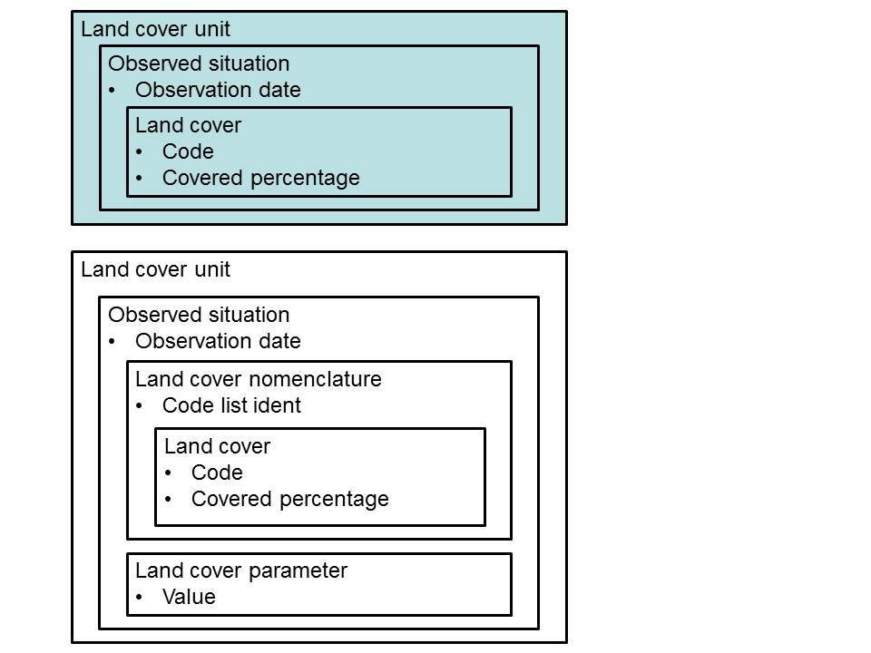

[.text-center]
*Figure 9 : Land cover description. Core model (top) and extended model (bottom)*

===== UML Overview

To represent all the information presented in the narrative description above, Land Cover data shall be modeled through one of the two core applications schemas presented in Figure 10:

* *_LandCoverVector_* defines a vector representation (i.e. points or surfaces) to support Land Cover data.
* *_LandCoverRaster_* defines a raster representation to support Land Cover data.

These two application schemas build the Core of the LC model. They are separated for technical reason but support bacically the same needs and use cases. Only two differences are made for technical reasons (for implementation) :

* only one classification code is allowed per raster cell for the raster representation (multiple codes are allowed in the vector representation in order to follow LC changes).
* no mosaic description allowed for the raster representation.

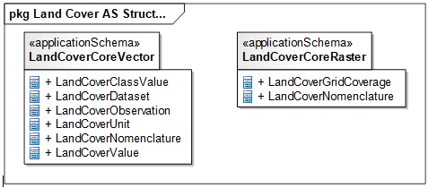

[.text-center]
*Figure 10 – UML package diagram: Overview of the structure defined for mandatory Land Cover Application Schemas*

As described before, these two models are independent and support two different Land Cover data representations. To implement INSPIRE LC specification, one of those shall be chosen:

[TIP]
====
*TG Requirement 2*
Data compliant with this data specification shall implement *_LandCoverVector_* or *_LandCoverRaster_* application schema.
====

Land Cover data are covered by an ISO Standard (ISO 19144-1 – Classification Systems) which is based on ISO 19123 - Coverages. In ISO 19144-1, Land Cover data are represented by a set of non-overlapping polygons modeled by the class CL_ClassifiedSurface (subtype of a CV_DiscreteSurfaceCoverage). This approach was initially recommended by the Thematic Working Group but due to technical difficulties to implement coverages, it was decided to represent Land Cover data in INSPIRE with separate vector and raster representations, closer to CORINE and other available datasets. From a conceptual point of view, the _LandCoverVector_ application schema (with geometries restricted to surfaces) supports the same information as provided by a coverage model based on ISO 19144-1.

A third application schema is also included in this specification: LandCoverExtended. This application schema defines extensions on the LandCoverVector model to support additional use cases. This application schema makes it possible to support more than one nomenclature and also to use parameters to describe Land Cover.

image::./media/image14.png[image,width=285,height=224, align=center]

[.text-center]
*Figure 11 – UML package diagram: Overview of the Extended Land Cover Application Schemas*

=== Application schema LandCoverNomenclature

==== Description

===== Narrative description

This application schema defines common components used by _LandCoverVector_ and _LandCoverRaster_ applciations schemas.

===== UML Overview

This application is based on ISO standards and the Generic Conceptual Model developed by INSPIRE to share common concepts:

* ISO 19144-2 for defining nomenclature with the LCML language.
* General Conceptual Model – Base Types for INSPIRE identifier and other common shared concepts.

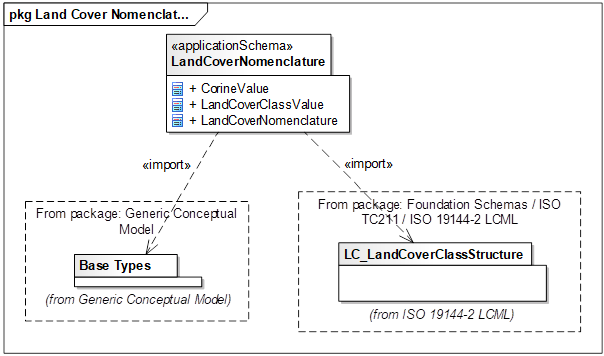

[.text-center]
*Figure 12 – UML package diagram: LandCoverVector dependencies*

This application schema contains five UML classes:

* LandCoverClassValue
* LandCoverNomenclature

NOTE : CorineValue represents Corine nomenclature as an example of LandCoverClassValue codelist.

====== LandCoverNomenclature

A _LandCoverNomenclature_ specifies information provided for correct understanding and interpretation of the classification codes contained in the data set.

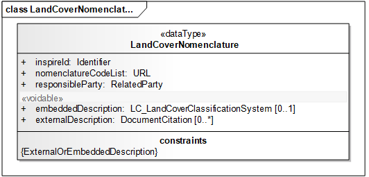

[.text-center]
*Figure 13 – UML class diagram: LandCoverNomenclature*

*nomenclatureCodeList*

this attribute references the code list attached to the nomenclature. This code list makes links between codes and values (the code being "112" and the value "discontinuous-urban-fabric" if the nomenclature is CORINE).

*responsibleParty*

this attribute specifies which party (or organisation) defines and is responsible for the nomenclature. It allows giving contact and/or organisation name.

*embeddedDescription*

it allows using ISO 19144-2 (LCML metalanguage) to provide a description of the classification system with this common metalanguage. LC_LandCoverClassificationSystem is the root class from ISO 19144-2 to instantiate a definition of a nomenclature with LCML.

*externalDescription*

this attribute allows to provide a set of URL pointing to the documentation (specification or other document) describing the classification system used and the nomenclature used. These URL can be used to point multiple documents, for example in different languages.

[TIP]
====
*TG Requirement 3*

Each nomenclature used by a Land Cover Data set shall be described by at least one of the two attribute _externalDescription_ or _embeddedDescription_.
====

[IMPORTANT]
====
[.text-center]
*IR Requirement*
_Annex III, Section 2.6_
*Theme-specific Requirements*

If an an externalDescription attribute is provided for a LandCoverNomenclature data type, the referenced online description shall define, for each class, at least a code, a name, a definition and a RGB value to be used for portrayal. If the online description describes the nomenclature for a LandCoverGridCoverage object, an integer grid code shall also be provided for each class. This code shall be used in the range of the LandCoverGridCoverage to represent the corresponding class.
====

NOTE the grid code is the value used to effectively store classifications in raster formats. Values are consecutive (1, 2, 3), each representing a LC class. For more details, see CORINE Table in Annex E. The following table is an extract with class definitions.

[.text-center]
*Table 6 : Example of CORINE Nomenclature description*

[cols=",,,,",]
|===
a|
GRID_CODE
a|
CLC_CODE
|LABEL/Name |DEFINITION |RGB
|1 |111 |Continuous urban fabric |Most of the land is covered by structures. Buildings, roads and artificially surfaced area cover almost all the ground. Non-linear areas of vegetation and bare soil are exceptional. |230-000-077
|2 |112 |Discontinuous urban fabric |Most of the land is covered by structures. Buildings, roads and artificially surfaced areas associated with vegetated areas and bare soil, which occupy discontinuous but significant surfaces. |255-000-000
|===

For interoperability purposes, it is recommended to provide documentation about the nomenclature in English. Documentation is useful to the widest community of users if it is written in English.

[NOTE]
====
*Recommendation 1*

The documentation of the particular national land cover nomenclature should be documented in English, if available (through attribute "externalDescription"). If this is not yet the case, an effort should be made to provide this information.

====

====== LandCoverClassValue

This is an empty code list allowing each data provider to define its own code list for classifying Land Cover objects (points or surfaces). This is done by putting "any" value for the extensibility tag and leaving the vocabulary tag empty.

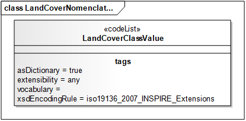

[.text-center]
*Figure 14 – UML class diagram: LandCoverClassValue*

This code list defines a mapping between codes and values and allows retrieval of Land Cover classification values through their code. CORINE Land Cover code list is an example for this code list.

image::./media/image18.png[image,width=604,height=270, align=center]

[.text-center]
*Figure 15 – UML class diagram: CORINEValue*

For example, the following code list for CORINE LC data set would begin with:

[.text-center]
*Table 7 : example of LandCoverClassValue code list*

[cols=",",]
|===
|111 |Continuous urban fabric
|112 |Discontinuous urban fabric
|121 |Industrial or commercial units
|122 |Road and rail networks and associated land
|123 |Port areas
|...|...
|===

NOTE The complete code list for CORINE 2000 and CORINE 2006 can be found in Annex E.

==== Feature catalogue

*Feature catalogue metadata*

[cols=","]
|===
|Application Schema |INSPIRE Application Schema LandCoverNomenclature
|Version number |3.0
|===

*Types defined in the feature catalogue*

[cols=",,",options="header",]
|===
|*Type* |*Package* |*Stereotypes*
|_CorineValue_ |LandCoverNomenclature |«codeList»
|_LandCoverClassValue_ |LandCoverNomenclature |«codeList»
|_LandCoverNomenclature_ |LandCoverNomenclature |«dataType»
|===

===== Data types

====== _LandCoverNomenclature_

[cols="",options="header",]
|===
|*LandCoverNomenclature*
a|
[cols=",]
!===
!Name: !Land Cover Nomenclature
!Definition: !Information about reference national, institutional or local Land Cover nomenclature.
!Description: !Land Cover Nomenclature allows to reference nomenclatures documentation and associated code list, and to define them through an external reference or included within the data according 19144-2.
!Stereotypes: !«dataType»
!===

a|
*Attribute: embeddedDescription*

[cols=",]
!===
!Name: !embedded Description
!Value type: !LC_LandCoverClassificationSystem
!Definition: !An embedded encoding of the classification system according to ISO 19144-2.
!Multiplicity: !0..1
!Stereotypes: !«voidable»
!===

a|
*Attribute: inspireId*

[cols=",]
!===
!Name: !inspireId
!Value type: !Identifier
!Definition: !External object identifier of the spatial object.
!Description: !NOTE An external object identifier is a unique object identifier published by the responsible body, which may be used by external applications to reference the spatial object. The identifier is an identifier of the spatial object, not an identifier of the real-world phenomenon.
!Multiplicity: !1
!===

a|
*Attribute: nomenclatureCodeList*

[cols=",]
!===
!Name: !nomenclatureCodeList
!Value type: !URI
!Definition: !An http URI pointing to the code list attached to the nomenclature used.
!Multiplicity: !1
!===

a|
*Attribute: externalDescription*

[cols=",]
!===
!Name: !externalDescription
!Value type: !DocumentCitation
!Definition: !Document describing the nomenclature used in this data set.
!Multiplicity: !0..*
!Stereotypes: !«voidable»
!===

a|
*Attribute: responsibleParty*

[cols=",]
!===
!Name: !responsible party
!Value type: !RelatedParty
!Definition: !Party responsible for the development and/or maintenance of the nomenclature.
!Description: !The responsible party could be EEA, a national or local mapping agency, ...
!Multiplicity: !1
!===

a|
*Constraint: ExternalOrEmbeddedDescription*

[cols=",]
!===
!Natural language: !The embedded description or the external desciption shall be provided.
!OCL: !
!===

|===

===== Code lists

====== _CorineValue_

[cols="",options="header",]
|===
|*CorineValue*
a|
[cols=",]
!===
!Name: !Corine Land Cover code list
!Definition: !Corine Land Cover code list governed by EEA.
!Extensibility: !any
!Identifier: !http://www.eea.europa.eu/data-and-maps/data/corine-land-cover-2006-raster-1/corine-land-cover-classes-and/clc_legend.csv/at_download/file
!Values: !The allowed values for this code list comprise any values defined by data providers. _Annex C_ includes recommended values that may be used by data providers.
!===

|===

====== _LandCoverClassValue_

[cols="",options="header",]
|===
|*LandCoverClassValue*
a|
[cols=",]
!===
!Name: !Land Cover Class Value
!Definition: !Land cover code list or classification.
!Description: !An empty code list that act as a container for Corine, other european, national or local code list for LC nomenclature.
!Extensibility: !any
!Identifier: !http://inspire.ec.europa.eu/codelist/LandCoverClassValue
!Values: !The allowed values for this code list comprise any values defined by data providers.
!===

|===

===== Imported types (informative)

This section lists definitions for feature types, data types and code lists that are defined in other application schemas. The section is purely informative and should help the reader understand the feature catalogue presented in the previous sections. For the normative documentation of these types, see the given references.

====== _DocumentCitation_

[cols="",options="header",]
|===
|*DocumentCitation*
a|
[cols=",]
!===
!Package: !Base Types 2
!Reference: !INSPIRE Generic Conceptual Model, version 3.4 [DS-D2.5]
!Definition: !Citation for the purposes of unambiguously referencing a document.
!===

|===

====== _Identifier_

[cols="",options="header",]
|===
|*Identifier*
a|
[cols=",]
!===
!Package: !Base Types
!Reference: !INSPIRE Generic Conceptual Model, version 3.4 [DS-D2.5]
!Definition: !External unique object identifier published by the responsible body, which may be used by external applications to reference the spatial object.
!Description: !NOTE1 External object identifiers are distinct from thematic object identifiers. 
 
NOTE 2 The voidable version identifier attribute is not part of the unique identifier of a spatial object and may be used to distinguish two versions of the same spatial object. 
 
NOTE 3 The unique identifier will not change during the life-time of a spatial object.
!===

|===

====== _LC_LandCoverClassificationSystem_

[cols="",options="header",]
|===
|*LC_LandCoverClassificationSystem*
a|
[cols=",]
!===
!Package: !LC_LandCoverClassStructure
!Reference: !Geographic information - Classification systems - Part 2: Land Cover Meta Language (LCML) [ISO 19144-2:2012]
!===

|===

====== _RelatedParty_

[cols="",options="header",]
|===
|*RelatedParty*
a|
[cols=",]
!===
!Package: !Base Types 2
!Reference: !INSPIRE Generic Conceptual Model, version 3.4 [DS-D2.5]
!Definition: !An organisation or a person with a role related to a resource.
!Description: !NOTE 1 A party, typically an individual person, acting as a general point of contact for a resource can be specified without providing any particular role.
!===

|===

====== _URI_

[cols="",options="header",]
|===
|*URI*
a|
[cols=",]
!===
!Package: !basicTypes
!Reference: !Geographic information - Geography Markup Language (GML) [ISO 19136:2007]
!===

|===

==== Externally governed code lists

The externally governed code lists included in this application schema are specified in the tables in this section.

===== Governance, availability and constraints

[cols=",,,,,",options="header",]
|===
|*Code list* |*Governance* |*Version* |*Availability* |*Formats* |*Subset*
|LandCoverClassValue |N/A |N/A |Empty code list |N/A |
|CORINEValue |EEA |version 2006 |_http://www.eea.europa.eu/data-and-maps/data/CORINE-land-cover-2006-raster-1/CORINE-land-cover-classes-and/clc_legend.csv/at_download/file_ |CSV |
|===

The values of CORINEValue external code lists are included in Annex E for information.

===== Rules for code list values

[cols=",,,",options="header",]
|===
|*Code list* |*Identifiers* |*Identifier examples* |*Labels*
|CORINEValue |code 111 could be referenced as |_http://www.eea.europa.eu/data-and-maps/data/CORINE-land-cover-2006-raster-1/CORINE-land-cover-classes-and/clc_legend/111_ |Continuous urban fabric (Label 3 of CSV file)
|===

=== Application schema LandCoverVector

==== Description

===== Narrative description

This application schema defines how Land Cover data can be supported by a vector representation. All requirements of this section apply therefore in the case of Land Cover data being supported by points or polygons.

===== UML Overview

This application is based on ISO standards and the Generic Conceptual Model developed by INSPIRE to share common concepts:

* ISO 19103 for base types as date and time, numerics.
* ISO 19017 for the geometry (points and surfaces).
* ISO 19115 for some metadata elements (extents).
* LandCoverNomencature application schema.

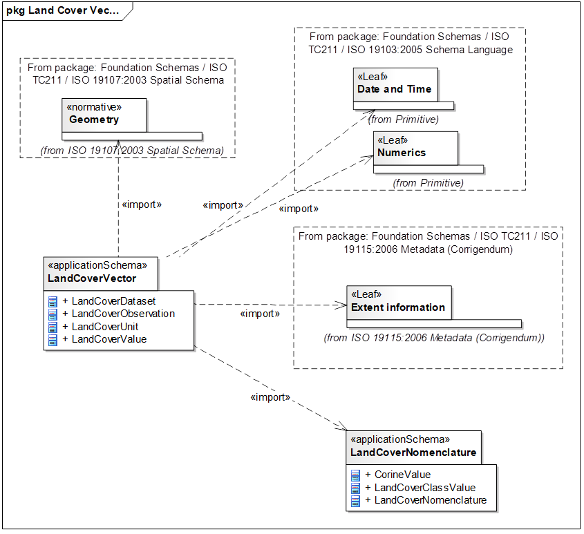

[.text-center]
*Figure 16 – UML package diagram: LandCoverVector dependencies*

This application schema contains four UML classes:

* LandCoverData set
* LandCoverUnit
* LandCoverObservation
* LandCoverValue

====== LandCoverData set

The _LandCoverVector_ application schema models LC data sets (_LandCoverData set_ in the schema) as collections of _LandCoverUnit_. A _LandCoverUnit_ has a geometry (restricted to point or surface) and supports the Land Cover information through the attribute _landCoverObservation_.

NOTE The term "surface" is used instead of "polygon" for conformity with ISO 19107 standard. A GM_Polygon can not exist on its own and shall be part of a GM_Surface. The generic 2D geometry object for 2D is a surface (GM_Surface), according to ISO Standard. Conceptually, the difference is that a surface can be an aggregation of patches.

[TIP]
====
*TG Requirement 4*
A Land Cover data set shall have only one type of geometry (i.e. points or surfaces). It is not allowed to mix both within the same data set.
====

The attribute _geometry_ of a _LandCoverUnit_ is a _GM_Object_, which is the ISO 19107 supertype for all geometry objects. It is restricted to _GM_Point_ or _GM_Surfaces_ for LC needs.

Additionally, in this core, only one nomenclature (_nomenclatureDocumentation_) is allowed for each data set.

image::./media/image20.png[image,width=427,height=564, align=center]

[.text-center]
*Figure 17 – UML class diagram: Land Cover Data set for vector representations*

*name*

the name of the data set. This name can be the name of the region, a geographic identifier. There is no constraint about its structure.

*inspireId*

the inspire identifier. It allows to reference spatial objects (features) if needed and follow their lifecycle.

*extent*

The extent allows describing the temporal, vertical and geographic extent of the data set.

[NOTE]
====
*Recommendation 2*

Each LandCoverData set should at least provide a realization of EX_GeographicExtent through the _extent_ attribute. This EX_Geographic Extent should be consistent with the all the geometries provided by the _LandCoverUnit_ instances (i.e. _LandCoverUnit_ shall be included in the EX_Geographic Extent).

====

According [ISO 19115], EX_GeographicExtent can be realized through a bounding polygon, a geographic boundingbox or a geographic description (e.g. name of a region ...).

*nomenclatureDocumentation*

this attribute allows to provide documentation on the nomenclature used in the data set. Please note that the core model supports only one nomenclature per data set. This nomenclature can be CORINE, another european nomenclature, a national one or any other LC nomenclature. It is modelled with the UML class _LandCoverNomenclature_ described in a following section.

====== _LandCoverUnit_

The LandCoverUnit represents a section of space which is classified. It can correspond for example to a CORINE polygon.

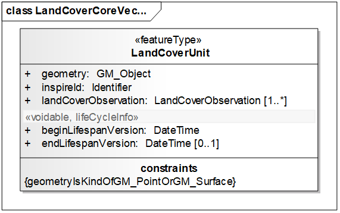

[.text-center]
*Figure 18 – UML class diagram: LandCoverUnit*

Each LandCoverUnit is defined by:

* a _geometry_ which is restricted to Points (for example LUCAS sample points) or Surfaces (for example a CORINE LC polygon), through the OCL constraint "geometryIsKindOfGM_PointOrGM_Surface".
* one or more _landCoverObservation_ which allows description of the unit from a Land Cover point of view. This attribute then supports the semantic information.

The capacity of a LandCoverUnit to support multiple observations allows changes on the same LandCoverUnit and then to make temporal analysis.

====== _LandCoverObservation_

The landCoverObservation is described by the class _LandCoverObservation_:

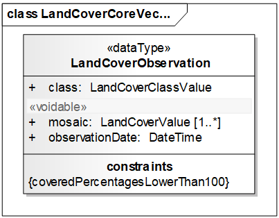

[.text-center]
*Figure 19 – UML class diagram: LandCoverObservation*

The _LandCoverObservation_ class defines following attributes:

* _class_ attribute allows one classification code resulting from a classification process. It can be CORINE code (111, 112, 223, ...), IGBP code or other code corresponding to a national, institutional or local nomenclature. Values are defined in the code list defined by the class LandCoverClassValue.
* _observationDate_ allows to provide temporal information about when the data was acquired.
* _mosaic_ allows more precise description of the Land Cover through a collection of classification values, each associated to a percentage (each being expressed with integers between 0 and 100). The sum of all these percentages shall be lower than 100. This is checked by the OCL constraint "coveredPercentagesLowerThan100".

The _observationDate_ and the _mosaic_ are voidable; it means that they shall be provided if they exist or are easily computable.

All Land Cover information (class and mosaic) are defined according the nomenclature described and referenced by nomenclatureDocumentation attribute provided at the data set level.

===== Consistency between spatial data sets

Land cover data are described as an abstraction of the physical and biophysical cover of the earth's surface. Despite the fact that Land Cover is a transverse theme it has no real connections with other INSPIRE models, so there is no specific consistency rule with other spatial data sets.

===== Geometry representation

[IMPORTANT]
====
[.text-center]
*IR Requirement*
_Annex III, Section 2_
*Theme-specific Requirements*

The value domain of spatial properties used in this specification shall be restricted to the Simple Feature spatial schema as defined by EN ISO 19125-1.
====

NOTE The specification restricts the spatial schema to 0-, 1-, 2-, and 2.5-dimensional geometries where all curve interpolations are linear.

NOTE The topological relations of two spatial objects based on their specific geometry and topology properties can in principle be investigated by invoking the operations of the types defined in ISO 19107 (or the methods specified in EN ISO 19125-1).

[TIP]
====
*TG Requirement 5*
The spatial representation of a LandCoverData set shall be a set of non-overlapping geometry objects (points or surfaces).
====

Comment: Land cover information can also be attached to lines (transects) as part of sampling schema but then mostly by registration of points where the land cover is changing (eg LUCAS). Lines are therefore considered to be out of scope.

===== Temporality representation

The application schema(s) use(s) the derived attributes "beginLifespanVersion" and "endLifespanVersion" to record the lifespan of a spatial object.

The attributes "beginLifespanVersion" specifies the date and time at which this version of the spatial object was inserted or changed in the spatial data set. The attribute "endLifespanVersion" specifies the date and time at which this version of the spatial object was superseded or retired in the spatial data set.

NOTE 1 The attributes specify the beginning of the lifespan of the version in the spatial data set itself, which is different from the temporal characteristics of the real-world phenomenon described by the spatial object. This lifespan information, if available, supports mainly two requirements: First, knowledge about the spatial data set content at a specific time; second, knowledge about changes to a data set in a specific time frame. The lifespan information should be as detailed as in the data set (i.e., if the lifespan information in the data set includes seconds, the seconds should be represented in data published in INSPIRE) and include time zone information.

NOTE 2 Changes to the attribute "endLifespanVersion" does not trigger a change in the attribute "beginLifespanVersion".

[NOTE]
====
*Recommendation 7*

If life-cycle information is not maintained as part of the spatial data set, all spatial objects belonging to this data set should provide a void value with a reason of "unpopulated".

====

====== Different types of dates

One important aspect on Land Cover information is its changing quality over time. Therefore, it refers to a particular situation. A second aspect specific to Land Cover is that it may have a different appearance within one year subject to seasonal or other variations. This dependence can affect the accurate thematic interpretation and classification of particular classes in a given data set and in consequence, also the detection of real land cover change.

Having in mind the two above-mentioned issues, there are several date types to be considered in describing the landscape from the _Land Cover_ point of view. Some of these date types are important when it comes to the comparison of two or more different situations of land cover. On the basis of diverse available date types, the data user is able to extract and assess land cover change information from imagery or other data sources. The following shows a list of date types along the process of land cover data capture and delivery.

[loweralpha]
. *event date:*

The point of time or short period, when a certain type of land cover occurs in reality, is seen as the event date, e.g. storm damage or clear cut in forest areas, beginning of a construction site, finishing of a construction site, creation of a new coastline by enclosing former salt marshes with a dike. The event date would be the most exact information about the point of time when a certain land cover change appears in reality. The monitoring of land cover aims more at different timelines. Also it is rather unlikely to have such information on the event date available for the majority of land cover objects. The storage of the event date for every single case may appear as not feasible and therefore is considered as not mandatory but voidable.

If nevertheless required, the event date can be modelled as voidable attribute

* validFrom: The point of time when the phenomenon started to exist in the real world

* validTo: The point of time from when on the phenomenon no longer exists in the real world.

[loweralpha, start=2]
. *observation date:*

The observation date is considered as the point of time or situation when the land cover information source, which is used for land cover data capture, is recorded. Usually the observation date is equal to the acquisition date of the aerial or satellite image (remote sensing data) used for mapping a particular spatial unit (polygon). Because many images are used in each survey, the actual date can vary from one polygon to another within the same data set. The acquisition date of the recorded imagery would then be attached to every single spatial unit (point/polygon) e.g. according to the geographic extend of the imagery scenes ("footprints"). The observation date can also be the point of time when the land cover information is captured on the ground by a field surveyor. The land cover object in a particular data set can have different observation dates if several information sources were combined to capture the land cover information (e.g. multi-temporal satellite imagery). The observation date is usually different from the event date. This information is recorded by the observationDate attribute (on classes LandCoverClass, LandCoverMosaic and ParameterType).

[loweralpha, start=3]
. *reference date:* 

A reference year or reference date is a (more or less exact) moment, a period of time or a certain time window when the information in a complete data set is assumed to be valid. The time window for the acquisition of a number of satellite scenes or aerial images within a reference period can range between a few days to several months or even years. For example, CLC2006 has the reference year 2006. However, the satellite imagery collection "IMAGE2006", which was used as the information source, was recorded in the time interval between the years 2005 - 2007. Reference dates come into play, when data sets of greater dimension (regional, country or pan-european level) on land cover shall be compared to derive the land cover changes, which occurred during a certain time interval, e.g. between the two reference years of CLC2006 and CLC2012.

[loweralpha, start=4]
. *edit date:*

The point of time when a spatial unit is edited in the data set can be modelled as

* _beginLifespanVersion_: Date and time at which the version of the spatial object was inserted or changed in the spatial data set.
* _endLifespanVersion_: Date and time at which the version of the spatial object was superseded or retired in the spatial data set.

[loweralpha, start=5]
. *release date/date of last revision*:

Point of time, when data set (collection of obtained land cover information) is completed and finished. The release date can be considered as the closure of the last data set editing or revision before making the data available to the customers or to the public through online services such as a web map service (WMS).It can also follow after a publishing date and represent the updating or correction of a data set, which then again is published afterwards.

[loweralpha, start=6]
. *publishing date*:

The Point of time when a data set is made available to the public through a data provider and/or declared as valid and put into force for the first time. After a publishing date several release dates may follow, which can represent an updated version of the beforehand published data set.

[TIP]
====
*TG Requirement 6*
"Temporality information on Land Cover data" shall be provided by the followings date types if available: the observation date (b), the edit date (d).
====

The observation date (b) shall be provided at the coverage level (=data set) through external metadata with lineage information (dateTime of the observation/acquisition processStep) or at the feature level (through the dedicated attribute observationDate in class _LandCoverObservation_.

The edit date (d) shall be provided through the temporal attributes _beginLifespanVersion_ and _endLifespanVersion_ at the data set level (_LandCoverData set_) and object level (_LandCoverUnit_).

[NOTE]
====
*Recommendation 8*

Temporality information on Land Cover (reference date (c), and the release date (e)) should be provided through metadata elements at the coverage level.

====

For temporal reference, the Metadata Inspire Regulation requires to provide at least one of the metadata elements "temporal extent", "date of publication", "date of last revision", "date of creation".

The Land Cover specification recommends to provide the reference date (c) at coverage level (=data set) through the external metadata element Temporal reference / date of creation (see Chapter 8) and the release date (e) at the coverage level (=data set) through the external metadata element Temporal reference / date of publication (see Chapter 8).

====== _Land cover changes_

The current model embodies coverages, which themselves contain one to many spatial units. Over time these spatial units may change their geometry compared to each other from data set to data set, or they may be fixed and keep their geometric extend (regular grid) and only change their thematic land cover information. To represent land cover changes, there are two ways.

One is analytical: The user makes a differentiating overlay between two coverages of different reference dates, he creates the land cover change himself as a result of this overlay.

Second is historical: For each fixed spatial unit the land cover information is obtained according to one to many observation dates over time and assigned to the spatial unit. LUCAS points or grid cells in general are examples of fixed spatial units where land cover data can be "observed" or "measured" at different points in time on the same spot.

A special case is a data set which contains changing information, e.g. the CORINE Land Cover Change data set 2000 - 2006. It does not have a reference year. It rather can be seen as a coverage with "short time" fixed spatial units and two separate situations (observation dates), one referring to the first and the second to the later observation date, which is represented at the polygon level.

==== Feature catalogue

*Feature catalogue metadata*

[%autowidth,options="header"]
|===
|Application Schema |INSPIRE Application Schema LandCoverVector
|Version number |3.0
|===

*Types defined in the feature catalogue*

[cols=",,",options="header",]
|===
|*Type* |*Package* |*Stereotypes*
|_LandCoverDataset_ |LandCoverVector |«featureType»
|_LandCoverObservation_ |LandCoverVector |«dataType»
|_LandCoverUnit_ |LandCoverVector |«featureType»
|_LandCoverValue_ |LandCoverVector |«dataType»
|===

===== Spatial object types

====== _LandCoverDataset_

[cols="",options="header",]
|===
|*LandCoverDataset*
a|
[cols=",]
!===
!Name: !Land Cover Data set
!Definition: !A vector representation for Land Cover data.
!Description: !This representation allows Land Cover data being supported by a vector geometry.
!Stereotypes: !«featureType»
!===

a|
*Attribute: inspireId*

[cols=",]
!===
!Name: !inspireId
!Value type: !Identifier
!Definition: !External object identifier of the spatial object.
!Description: !NOTE An external object identifier is a unique object identifier published by the responsible body, which may be used by external applications to reference the spatial object. The identifier is an identifier of the spatial object, not an identifier of the real-world phenomenon.
!Multiplicity: !1
!===

a|
*Attribute: beginLifespanVersion*

[cols=",]
!===
!Name: !beginLifespanVersion
!Value type: !DateTime
!Definition: !Date and time at which this version of the spatial object was inserted or changed in the spatial data set.
!Multiplicity: !1
!Stereotypes: !«voidable,lifeCycleInfo»
!===

a|
*Attribute: endLifespanVersion*

[cols=",]
!===
!Name: !endLifespanVersion
!Value type: !DateTime
!Definition: !Date and time at which this version of the spatial object was superseded or retired in the spatial data set.
!Multiplicity: !0..1
!Stereotypes: !«voidable,lifeCycleInfo»
!===

a|
*Attribute: extent*

[cols=",]
!===
!Name: !extent
!Value type: !EX_Extent
!Definition: !Contains the extent of the data set.
!Description: !NOTE Extents may be specified in space, time or space-time.
!Multiplicity: !1
!===

a|
*Attribute: name*

[cols=",]
!===
!Name: !name
!Value type: !CharacterString
!Definition: !Name of the Land Cover data set.
!Multiplicity: !1
!===

a|
*Attribute: nomenclatureDocumentation*

[cols=",]
!===
!Name: !nomenclatureDocumentation
!Value type: !LandCoverNomenclature
!Definition: !Information about the nomenclature used in this data set.
!Multiplicity: !1
!===

a|
*Attribute: validFrom*

[cols=",]
!===
!Name: !validFrom
!Value type: !Date
!Definition: !The time when the phenomenon started to exist in the real world.
!Multiplicity: !1
!Stereotypes: !«voidable»
!===

a|
*Attribute: validTo*

[cols=",]
!===
!Name: !validTo
!Value type: !Date
!Definition: !The time from which the phenomenon no longer exists in the real world.
!Multiplicity: !1
!Stereotypes: !«voidable»
!===

a|
*Association role: member*

[cols=",]
!===
!Name: !member
!Value type: !LandCoverUnit
!Definition: !A Land Cover Unit being part of the data set.
!Description: !A Land Cover dataset is a collection of LandCover units, each one being called an element.
!Multiplicity: !1..*
!===

|===

====== _LandCoverUnit_

[cols="",options="header",]
|===
|*LandCoverUnit*
a|
[cols=",]
!===
!Name: !Land Cover Unit
!Definition: !An individual element of the LC dataset represented by a point or polygon.
!Description: !Every unit support Land Cover information.
!Stereotypes: !«featureType»
!===

a|
*Attribute: inspireId*

[cols=",]
!===
!Name: !inspireId
!Value type: !Identifier
!Definition: !External object identifier of the spatial object.
!Description: !NOTE An external object identifier is a unique object identifier published by the responsible body, which may be used by external applications to reference the spatial object. The identifier is an identifier of the spatial object, not an identifier of the real-world phenomenon.
!Multiplicity: !1
!===

a|
*Attribute: beginLifespanVersion*

[cols=",]
!===
!Name: !beginLifespanVersion
!Value type: !DateTime
!Definition: !Date and time at which this version of the spatial object was inserted or changed in the spatial data set.
!Multiplicity: !1
!Stereotypes: !«voidable,lifeCycleInfo»
!===

a|
*Attribute: endLifespanVersion*

[cols=",]
!===
!Name: !endLifespanVersion
!Value type: !DateTime
!Definition: !Date and time at which this version of the spatial object was superseded or retired in the spatial data set.
!Multiplicity: !0..1
!Stereotypes: !«voidable,lifeCycleInfo»
!===

a|
*Attribute: geometry*

[cols=",]
!===
!Name: !geometry
!Value type: !GM_Object
!Definition: !Spatial representation of the Land Cover unit.
!Description: !NOTE Restricted to point or surface.
!Multiplicity: !1
!===

a|
*Attribute: landCoverObservation*

[cols=",]
!===
!Name: !landCoverObservation
!Value type: !LandCoverObservation
!Definition: !Land cover information at a specific time and place.
!Multiplicity: !1..*
!===

a|
*Association role: dataset*

[cols=",]
!===
!Name: !dataset
!Value type: !LandCoverDataset
!Definition: !Land Cover data set to which this Land Cover object belongs.
!Multiplicity: !1
!===

a|
*Constraint: geometryIsKindOfGM_PointOrGM_Surface*

[cols=",]
!===
!Natural language: !geometries shall be points or surfaces
!OCL: !inv: self.geometry->forAll(l | l.oclIsKindOf(GM_Surface) or l.oclIsKindOf(GM_Point))
!===

|===

===== Data types

====== _LandCoverObservation_

[cols="",options="header",]
|===
|*LandCoverObservation*
a|
[cols=",]
!===
!Name: !Land Cover Observation
!Definition: !Land Cover information interpreted at a specific time and place.
!Stereotypes: !«dataType»
!===

a|
*Attribute: class*

[cols=",]
!===
!Name: !class
!Value type: !LandCoverClassValue
!Definition: !The assignment of a land cover class to a land cover unit through a classification code identifier
!Description: !The identifier, eg 1.1.1, 1.1.2, ... (for CORINE LC classes) allow to access to the value and the definition or narrative description of the corresponding class.
!Multiplicity: !1
!===

a|
*Attribute: mosaic*

[cols=",]
!===
!Name: !mosaic
!Value type: !LandCoverValue
!Definition: !List of classification values describing into details a land cover unit, associated with percentages.
!Multiplicity: !1..*
!Stereotypes: !«voidable»
!===

a|
*Attribute: observationDate*

[cols=",]
!===
!Name: !observationDate
!Value type: !DateTime
!Definition: !The observation date associated of an observation.
!Description: !Defines the observation date of the classification value. It could be the date of an aerial/satellital acquisition or of an update on the field. The observation date allows the user to have accurate date of when each value was observed in the real word. In a database, not all polygon informations are necessarily updated at the same time.
!Multiplicity: !1
!Stereotypes: !«voidable»
!===

a|
*Constraint: coveredPercentagesLowerThan100*

[cols=",]
!===
!Natural language: !The sum of all coveredPercentage attributes attached to each LandCoverObservation shall be lower or equal to 100
!OCL: !inv:mosaic.coveredPercentage.sum() <= 100
!===

|===

====== _LandCoverValue_

[cols="",options="header",]
|===
|*LandCoverValue*
a|
[cols=",]
!===
!Name: !Land Cover Value
!Definition: !Generic class supporting Land Cover value and percentage.
!Stereotypes: !«dataType»
!===

a|
*Attribute: class*

[cols=",]
!===
!Name: !class
!Value type: !LandCoverClassValue
!Definition: !Assignment of a land cover spatial object to a land cover class through a classification code identifier.
!Description: !The identifier, eg 1, 1.1.2, ... (for CORINE LC classes) allow to access to the value and the definition or narrative description of the corresponding class.
!Multiplicity: !1
!===

a|
*Attribute: coveredPercentage*

[cols=",]
!===
!Name: !Covered percentage
!Value type: !Integer
!Definition: !Fraction of the LandCoverUnit being concerned with the classification value.
!Multiplicity: !1
!Stereotypes: !«voidable»
!===

|===

===== Imported types (informative)

This section lists definitions for feature types, data types and code lists that are defined in other application schemas. The section is purely informative and should help the reader understand the feature catalogue presented in the previous sections. For the normative documentation of these types, see the given references.

====== _CharacterString_

[cols="",options="header",]
|===
|*CharacterString*
a|
[cols=",]
!===
!Package: !Text
!Reference: !Geographic information - Conceptual schema language [ISO/TS 19103:2005]
!===

|===

====== _Date_

[cols="",options="header",]
|===
|*Date*
a|
[cols=",]
!===
!Package: !Date and Time
!Reference: !Geographic information - Conceptual schema language [ISO/TS 19103:2005]
!===

|===

====== _DateTime_

[cols="",options="header",]
|===
|*DateTime*
a|
[cols=",]
!===
!Package: !Date and Time
!Reference: !Geographic information - Conceptual schema language [ISO/TS 19103:2005]
!===

|===

====== _EX_Extent_

[cols="",options="header",]
|===
|*EX_Extent*
a|
[cols=",]
!===
!Package: !Extent information
!Reference: !Geographic information - Metadata [ISO 19115:2003/Cor 1:2006]
!===

|===

====== _GM_Object_

[cols="",options="header",]
|===
|*GM_Object (abstract)*
a|
[cols=",]
!===
!Package: !Geometry root
!Reference: !Geographic information - Spatial schema [ISO 19107:2003]
!===

|===

====== _Identifier_

[cols="",options="header",]
|===
|*Identifier*
a|
[cols=",]
!===
!Package: !Base Types
!Reference: !INSPIRE Generic Conceptual Model, version 3.4 [DS-D2.5]
!Definition: !External unique object identifier published by the responsible body, which may be used by external applications to reference the spatial object.
!Description: !NOTE1 External object identifiers are distinct from thematic object identifiers. 
 
NOTE 2 The voidable version identifier attribute is not part of the unique identifier of a spatial object and may be used to distinguish two versions of the same spatial object. 
 
NOTE 3 The unique identifier will not change during the life-time of a spatial object.
!===

|===

====== _Integer_

[cols="",options="header",]
|===
|*Integer*
a|
[cols=",]
!===
!Package: !Numerics
!Reference: !Geographic information - Conceptual schema language [ISO/TS 19103:2005]
!===

|===

====== _LandCoverClassValue_

[cols="",options="header",]
|===
|*LandCoverClassValue*
a|
[cols=",]
!===
!Package: !LandCoverNomenclature
!Reference: !INSPIRE Data specification on Land Cover [DS-D2.8.II.2]
!Definition: !Land cover code list or classification.
!Description: !An empty code list that act as a container for Corine, other european, national or local code list for LC nomenclature.
!===

|===

====== _LandCoverNomenclature_

[cols="",options="header",]
|===
|*LandCoverNomenclature*
a|
[cols=",]
!===
!Package: !LandCoverNomenclature
!Reference: !INSPIRE Data specification on Land Cover [DS-D2.8.II.2]
!Definition: !Information about reference national, institutional or local Land Cover nomenclature.
!Description: !Land Cover Nomenclature allows to reference nomenclatures documentation and associated code list, and to define them through an external reference or included within the data according 19144-2.
!===

|===

==== Externally governed code lists

The externally governed code lists included in this application schema are specified in the tables in this section.

===== Governance, availability and constraints

[cols=",,,,,",options="header",]
|===
|*Code list* |*Governance* |*Version* |*Availability* |*Formats* |*Subset*
|LandCoverClassValue |N/A |N/A |Empty code list |N/A |
|CORINEValue |EEA |version 2006 |_http://www.eea.europa.eu/data-and-maps/data/CORINE-land-cover-2006-raster-1/CORINE-land-cover-classes-and/clc_legend.csv/at_download/file_ |CSV |
|===

The values of CORINEValue external code lists are included in Annex E for information.

===== Rules for code list values

[cols=",,,",options="header",]
|===
|*Code list* |*Identifiers* |*Identifier examples* |*Labels*
|CORINEValue |code 111 could be referenced as |_http://www.eea.europa.eu/data-and-maps/data/CORINE-land-cover-2006-raster-1/CORINE-land-cover-classes-and/clc_legend/111_ |Continuous urban fabric (Label 3 of CSV file)
|===

=== Application schema LandCoverRaster

==== Description

===== Narrative description

This application schema defines how Land Cover data can be supported by a raster representation. All requirements of this section apply therefore in the case of Land Cover data being supported by rectified grid coverage as defined by ISO 19123 standard.

===== UML Overview

This application schema is based on ISO standards and the Generic Conceptual Model developed by INSPIRE to share common concepts:

* ISO 19103 for base types as Integer.
* ISO 19115 for some metadata elements (extents, citations ...).
* General Conceptual Model – Base Types for coverages.

_Note : Coverages are also used by other INSPIRE themes (Orthoimagery, Land Use, Elevation ,...)_

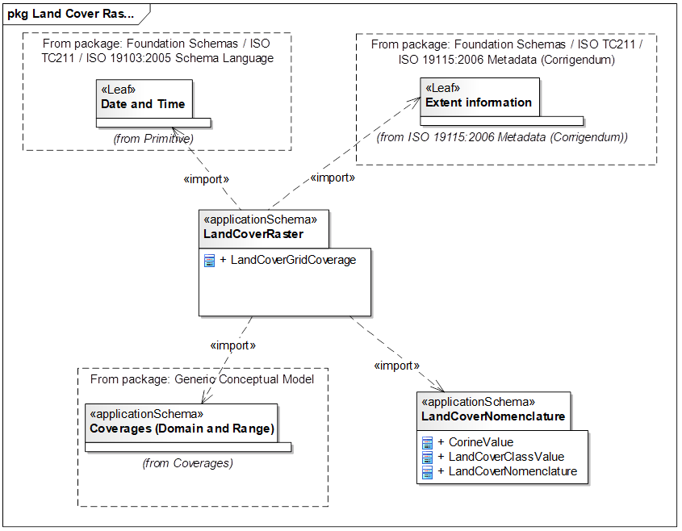

[.text-center]
*Figure 20 – UML package diagram: Overview of the LandCoverRaster application schema*

The application schema LandCoverRaster contains one classe:

* _LandCoverGridCoverage_ which defines how a grid coverage can support Land Cover information.

This class are detailed in the next subsection.

NOTE _CorineValue gives an example of an instantiated code list_.

====== _LandCoverGridCoverage_

The LandCoverRaster application schema models LC data as rectified grid coverages (in the sense of ISO 19123). This coverage supports the same set of attributes as the LandCoverData set (Land Cover Vector application schema) but has some restrictions compared to the vector model: It does not support all the semantic information provided by the LandCoverInformation:

[arabic, start=1]
. There is no observation date.

[arabic, start=2]
. There is no mosaic.

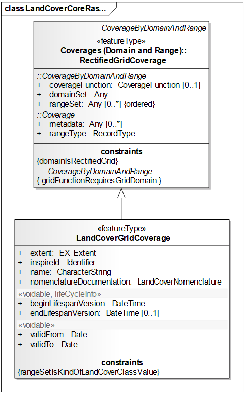

[.text-center]
*Figure 21 – UML class diagram: LandCoverRaster / LandCoverGridCoverage*

Only the equivalent of the information _classValue_ found in the Vector representation _(i.e. the reference to a code list through the type LandCoverClassValue)_ is then supported by the raster representation of LC data (see figure above, with "rangeSetIsKindOfLandCoverClassValue" constraint). The rangeSet of the raster allows attaching a single classification code, resulting from a classification process, to each raster cell. These can be Corine codes, IGBP codes or other codes corresponding to a national, institutional or local nomenclature.

These restrictions are linked to the formats used to encode rectified grid coverages (as Geotiff) which only support one value per pixel.

===== Consistency between spatial data sets

Land cover data are described as an abstraction of the physical and biophysical cover of the earth's surface. Despite the fact that Land Cover is a transverse theme it has no real connections with other INSPIRE models, so there is no specific consistency rule with other spatial data sets.

===== Geometry representation

[IMPORTANT]
====
[.text-center]
*IR Requirement*
_Annex III, Section 2_
*Theme-specific Requirements*

The value domain of spatial properties used in this specification shall be restricted to the Simple Feature spatial schema as defined by EN ISO 19125-1.
====

NOTE The specification restricts the spatial schema to 0-, 1-, 2-, and 2.5-dimensional geometries where all curve interpolations are linear.

NOTE The topological relations of two spatial objects based on their specific geometry and topology properties can in principle be investigated by invoking the operations of the types defined in ISO 19107 (or the methods specified in EN ISO 19125-1).

===== Temporality representation

The application schema(s) use(s) the derived attributes "beginLifespanVersion" and "endLifespanVersion" to record the lifespan of a spatial object.

The attributes "beginLifespanVersion" specifies the date and time at which this version of the spatial object was inserted or changed in the spatial data set. The attribute "endLifespanVersion" specifies the date and time at which this version of the spatial object was superseded or retired in the spatial data set.

NOTE 1 The attributes specify the beginning of the lifespan of the version in the spatial data set itself, which is different from the temporal characteristics of the real-world phenomenon described by the spatial object. This lifespan information, if available, supports mainly two requirements: First, knowledge about the spatial data set content at a specific time; second, knowledge about changes to a data set in a specific time frame. The lifespan information should be as detailed as in the data set (i.e., if the lifespan information in the data set includes seconds, the seconds should be represented in data published in INSPIRE) and include time zone information.

NOTE 2 Changes to the attribute "endLifespanVersion" does not trigger a change in the attribute "beginLifespanVersion".

[NOTE]
====
*Recommendation 9*

If life-cycle information is not maintained as part of the spatial data set, all spatial objects belonging to this data set should provide a void value with a reason of "unpopulated".

====

====== Different types of dates

Different types of dates are described in section 5.3.1.6.1 above. The following requirement and recommendation using concepts from section 5.3.1.6.1 applies to the LandCoverRaster model.

NOTE 5.3.1.6 applies to raster as well. The only difference is that observation date is removed from LCUnit, but this is anyways voidable

[TIP]
====
*TG Requirement 7*
"Temporality information on _Land Cover"_ data shall be provided by the followings date types: the observation date (b), the edit date (d).
====

The observation date (b) shall be provided at the coverage level (=data set) through metadata with lineage information (dateTime of the observation/acquisition processStep).

The edit date (d) shall be provided through the temporal attributes _beginLifespanVersion_ and _endLifespanVersion_ at the data set level (_LandCoverData set_).

[NOTE]
====
*Recommendation 10*

Temporality information on Land Cover (reference date (c), and the release date (e)) should be provided through metadata elements at the coverage level.

====

For temporal reference, the Metadata Inspire Regulation requires to provide at least one of the metadata elements "temporal extent", "date of publication", "date of last revision", "date of creation".

The Land Cover specification recommends to provide the reference date (c) at coverage level (=data set) through the external metadata element Temporal reference / date of creation (see Chapter 8) and the release date (e) at the coverage level (=data set) through the external metadata element Temporal reference / date of publication (see Chapter 8).

==== Feature catalogue

*Feature catalogue metadata*

[%autowidth,options="header"]
|===
|Application Schema |INSPIRE Application Schema LandCoverRaster
|Version number |3.0
|===

*Types defined in the feature catalogue*

[cols=",,",options="header",]
|===
|*Type* |*Package* |*Stereotypes*
|_LandCoverGridCoverage_ |LandCoverRaster |«featureType»
|===

===== Spatial object types

====== _LandCoverGridCoverage_

[cols="",options="header",]
|===
|*LandCoverGridCoverage*
a|
[cols=",]
!===
!Name: !Land Cover Grid Coverage
!Subtype of: !RectifiedGridCoverage
!Definition: !A raster representation for Land Cover data.
!Description: !This representation allows Land Cover data being supported by rectified grid coverage (ISO 19123).
!Stereotypes: !«featureType»
!===

a|
*Attribute: inspireId*

[cols=",]
!===
!Name: !inspireId
!Value type: !Identifier
!Definition: !External object identifier of the spatial object.
!Description: !NOTE An external object identifier is a unique object identifier published by the responsible body, which may be used by external applications to reference the spatial object. The identifier is an identifier of the spatial object, not an identifier of the real-world phenomenon.
!Multiplicity: !1
!===

a|
*Attribute: beginLifespanVersion*

[cols=",]
!===
!Name: !beginLifespanVersion
!Value type: !DateTime
!Definition: !Date and time at which this version of the spatial object was inserted or changed in the spatial data set.
!Multiplicity: !1
!Stereotypes: !«voidable,lifeCycleInfo»
!===

a|
*Attribute: endLifespanVersion*

[cols=",]
!===
!Name: !endLifespanVersion
!Value type: !DateTime
!Definition: !Date and time at which this version of the spatial object was superseded or retired in the spatial data set.
!Multiplicity: !0..1
!Stereotypes: !«voidable,lifeCycleInfo»
!===

a|
*Attribute: extent*

[cols=",]
!===
!Name: !extent
!Value type: !EX_Extent
!Definition: !Contains the extent of the data set.
!Description: !NOTE Extents may be specified in space, time or space-time.
!Multiplicity: !1
!===

a|
*Attribute: name*

[cols=",]
!===
!Name: !name
!Value type: !CharacterString
!Definition: !Name of the Land Cover coverage.
!Multiplicity: !1
!===

a|
*Attribute: nomenclatureDocumentation*

[cols=",]
!===
!Name: !nomenclatureDocumentation
!Value type: !LandCoverNomenclature
!Definition: !Information about the nomenclature used in this coverage.
!Multiplicity: !1
!===

a|
*Attribute: validFrom*

[cols=",]
!===
!Name: !validFrom
!Value type: !Date
!Definition: !The time when the phenomenon started to exist in the real world.
!Multiplicity: !1
!Stereotypes: !«voidable»
!===

a|
*Attribute: validTo*

[cols=",]
!===
!Name: !validTo
!Value type: !Date
!Definition: !The time from which the phenomenon no longer exists in the real world.
!Multiplicity: !1
!Stereotypes: !«voidable»
!===

a|
*Constraint: rangeSetIsKindOfLandCoverClassValue*

[cols=",]
!===
!Natural language: !The values in the range set are restricted to Integer
!OCL: !inv: rangeSet->forAll(v \| v.oclIsKindOf(LandCoverNomenclature::LandCoverClassValue))

!===

|===

===== Imported types (informative)

This section lists definitions for feature types, data types and code lists that are defined in other application schemas. The section is purely informative and should help the reader understand the feature catalogue presented in the previous sections. For the normative documentation of these types, see the given references.

====== _CharacterString_

[cols="",options="header",]
|===
|*CharacterString*
a|
[cols=",]
!===
!Package: !Text
!Reference: !Geographic information - Conceptual schema language [ISO/TS 19103:2005]
!===

|===

====== _Date_

[cols="",options="header",]
|===
|*Date*
a|
[cols=",]
!===
!Package: !Date and Time
!Reference: !Geographic information - Conceptual schema language [ISO/TS 19103:2005]
!===

|===

====== _DateTime_

[cols="",options="header",]
|===
|*DateTime*
a|
[cols=",]
!===
!Package: !Date and Time
!Reference: !Geographic information - Conceptual schema language [ISO/TS 19103:2005]
!===

|===

====== _EX_Extent_

[cols="",options="header",]
|===
|*EX_Extent*
a|
[cols=",]
!===
!Package: !Extent information
!Reference: !Geographic information - Metadata [ISO 19115:2003/Cor 1:2006]
!===

|===

====== _Identifier_

[cols="",options="header",]
|===
|*Identifier*
a|
[cols=",]
!===
!Package: !Base Types
!Reference: !INSPIRE Generic Conceptual Model, version 3.4 [DS-D2.5]
!Definition: !External unique object identifier published by the responsible body, which may be used by external applications to reference the spatial object.
!Description: !NOTE1 External object identifiers are distinct from thematic object identifiers. 
 
NOTE 2 The voidable version identifier attribute is not part of the unique identifier of a spatial object and may be used to distinguish two versions of the same spatial object. 
 
NOTE 3 The unique identifier will not change during the life-time of a spatial object.
!===

|===

[[landcovernomenclature-2]]
====== _LandCoverNomenclature_

[cols="",options="header",]
|===
|*LandCoverNomenclature*
a|
[cols=",]
!===
!Package: !LandCoverNomenclature
!Reference: !INSPIRE Data specification on Land Cover [DS-D2.8.II.2]
!Definition: !Information about reference national, institutional or local Land Cover nomenclature.
!Description: !Land Cover Nomenclature allows to reference nomenclatures documentation and associated code list, and to define them through an external reference or included within the data according 19144-2.
!===

|===

====== _RectifiedGridCoverage_

[cols="",options="header",]
|===
|*RectifiedGridCoverage*
a|
[cols=",]
!===
!Package: !Coverages (Domain and Range)
!Reference: !INSPIRE Data Specifications – Base Models – Coverage Types, version 1.0 [DS-D2.10.2]
!Definition: !Coverage whose domain consists of a rectified grid
!Description: !A rectified grid is a grid for which there is an affine transformation between the grid coordinates and the coordinates of a coordinate reference system. 
 
NOTE This type can be used for both discrete and continuous coverages.
!===

|===

==== Externally governed code lists

The externally governed code lists included in this application schema are specified in the tables in this section.

===== Governance, availability and constraints

[cols=",,,,,",options="header",]
|===
|*Code list* |*Governance* |*Version* |*Availability* |*Formats* |*Subset*
|LandCoverClassValue |N/A |N/A |Empty code list |N/A |
|CorineValue |EEA |version 2006 |_http://www.eea.europa.eu/data-and-maps/data/corine-land-cover-2006-raster-1/corine-land-cover-classes-and/clc_legend.csv/at_download/file_ |CSV |
|===

The values of CorineValue external code lists are included in Annex E for information.

===== Rules for code list values

[cols=",,,",options="header",]
|===
|*Code list* |*Identifiers* |*Identifier examples* |*Labels*
|CorineValue |code 111 could be referenced as |_http://www.eea.europa.eu/data-and-maps/data/corine-land-cover-2006-raster-1/corine-land-cover-classes-and/clc_legend/111_ |Continuous urban fabric (Label 3 of CSV file)
|===

=== Application schema LandCoverExtension

==== Description

===== Narrative description

This application schema extends "LandCoverVector" models and allows:

* multiple nomenclatures, each described at the data set level.
* description of LandCoverUnits with different types of parameters.

Please note that this application schema is not normative and gives an example on how the Vector model can be extended for more complex Land Cover data.

===== UML Overview

The following diagram shows the extended data set "LandCoverData set" and the extend LC units "LandCoverUnits":

* "LandCoverData set" extends LandCoverData set (from LandCoverVector AS) by adding the attribute nomenclatureDocumentationExtended, allowing to describe extra nomenclatures

* LandCoverUnits extends LandCoverUnit (from LandCoverVector AS), by adding
** landCoverObservationExtended which support the same semantic as landCoverObservation but having a reference to a LandCoverNomenclature (as there are more than one nomenclature used).
** parametricDescription which allows describing Land Cover Units with parameters. Three types of parameters are proposed here: presence (Yes/No), percentage and count. These categories are just examples and each data provider can define its own extended model and its own types of parameters.

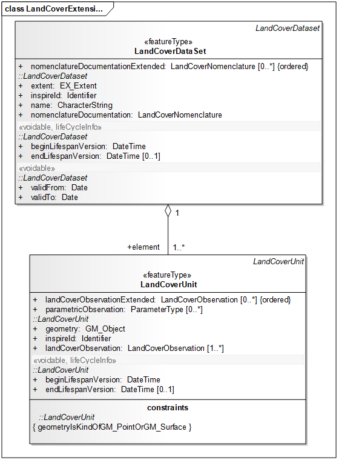

[.text-center]
*Figure 22 – UML class diagram: Overview of the LandCoverExtension application schema*

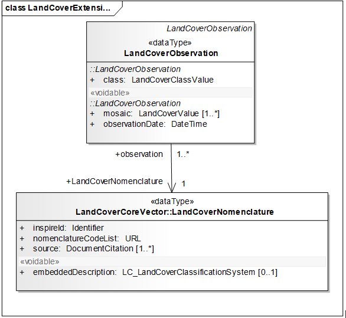

[.text-center]
*Figure 23 – UML class diagram: LandCoverExtension - LandCoverObservation*

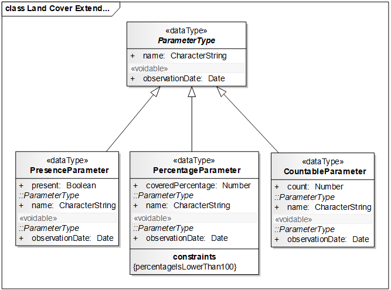

[.text-center]
*Figure 24 – UML class diagram: LandCoverExtension – ParameterType*

When extending LandCoverVector application schema, same requirements apply, in particular sections 5.3.1.3 to 5.3.1.6. These sections are not repeated here.

==== Feature catalogue

*Feature catalogue metadata*

[%autowidth,options="header"]
|===
|Application Schema |INSPIRE Application Schema LandCoverExtension
|Version number |3.0
|===

*Types defined in the feature catalogue*

[cols=",,",options="header",]
|===
|*Type* |*Package* |*Stereotypes*
|_CountableParameter_ |LandCoverExtension |«dataType»
|_LandCoverDataSet_ |LandCoverExtension |«featureType»
|_LandCoverObservation_ |LandCoverExtension |«dataType»
|_LandCoverUnit_ |LandCoverExtension |«featureType»
|_ParameterType_ |LandCoverExtension |«dataType»
|_PercentageParameter_ |LandCoverExtension |«dataType»
|_PresenceParameter_ |LandCoverExtension |«dataType»
|===

===== Spatial object types

====== _LandCoverDataSet_

[cols="",options="header",]
|===
|*LandCoverDataSet*
a|
[cols=",]
!===
!Name: !Land Cover Extended Dataset
!Subtype of: !LandCoverDataset
!Definition: !A vector representation for Land Cover data which extends the Core Vector model.
!Description: !This representation allows Land Cover data being supported by a vector geometry. It adds support for parameter description and multiple nomenclatures within the same dataset.
!Stereotypes: !«featureType»
!===

a|
*Attribute: nomenclatureDocumentationExtended*

[cols=",]
!===
!Name: !nomenclatureDocumentationExtended
!Value type: !LandCoverNomenclature
!Definition: !Information about extra nomenclatures used in this dataset.
!Multiplicity: !0..*
!===

a|
*Association role: element*

[cols=",]
!===
!Name: !Element
!Value type: !LandCoverUnit
!Definition: !Elements of the data set.
!Multiplicity: !1..*
!===

|===

[[landcoverunit]]
====== _LandCoverUnit_

[cols="",options="header",]
|===
|*LandCoverUnit*
a|
[cols=",]
!===
!Name: !Land Cover Extended Unit.
!Subtype of: !LandCoverUnit
!Definition: !An individual element of the LC dataset represented by a point or polygon.
!Description: !Every unit support Land Cover information.
!Stereotypes: !«featureType»
!===

a|
*Attribute: landCoverObservationExtended*

[cols=",]
!===
!Name: !landCoverObservationExtended
!Value type: !LandCoverObservation
!Definition: !Land cover information at a specific time and place and linked to additional nomenclatures.
!Multiplicity: !0..*
!===

a|
*Attribute: parametricObservation*

[cols=",]
!===
!Name: !parametricObservation
!Value type: !ParameterType
!Definition: !A description of Land Cover Units trough specific parameters.
!Multiplicity: !0..*
!===

|===

===== Data types

====== _CountableParameter_

[cols="",options="header",]
|===
|*CountableParameter*
a|
[cols=",]
!===
!Name: !CountableParameter
!Subtype of: !ParameterType
!Definition: !Parameter describing a Land Cover Object aspect that can be counted.
!Description: !A countable parameter could be a number (a number of landscape elements covering the land cover object for example. ie number of trees, buildings, ...), a distance (average height of buildings, ...), ..
!Stereotypes: !«dataType»
!===

a|
*Attribute: count*

[cols=",]
!===
!Name: !count
!Value type: !Number
!Definition: !The number associated to the parameter used to describe a Land Cover Object.
!Multiplicity: !1
!===

|===

[[landcoverobservation]]
====== _LandCoverObservation_

[cols="",options="header",]
|===
|*LandCoverObservation*
a|
[cols=",]
!===
!Name: !Land Cover Extended Observation.
!Subtype of: !LandCoverObservation
!Definition: !Land Cover extended information interpreted at a specific time and place, according a nomenclature.
!Stereotypes: !«dataType»
!===

a|
*Association role: LandCoverNomenclature*

[cols=",]
!===
!Name: !Land Cover Nomenclature
!Value type: !LandCoverNomenclature
!Definition: !Land Cover Nomenclature referenced by an extended observation.
!Multiplicity: !1
!===

|===

====== _ParameterType_

[cols="",options="header",]
|===
|*ParameterType (abstract)*
a|
[cols=",]
!===
!Name: !ParameterType
!Definition: !Parameter describing a Land Cover Object with landscape elements.
!Description: !A parameter could be the presence of landscape elements (trees, buildings, sand, ...), their number or the percentage of a parameter describing the Land Cover Object (i.e; percentage of soil sealing).
!Stereotypes: !«dataType»
!===

a|
*Attribute: name*

[cols=",]
!===
!Name: !name
!Value type: !CharacterString
!Definition: !The name of the parameter used to describe a Land Cover Object.
!Multiplicity: !1
!===

a|
*Attribute: observationDate*

[cols=",]
!===
!Name: !observationDate
!Value type: !Date
!Definition: !The observation date associated to a description.
!Multiplicity: !1
!Stereotypes: !«voidable»
!===

|===

====== _PercentageParameter_

[cols="",options="header",]
|===
|*PercentageParameter*
a|
[cols=",]
!===
!Name: !PercentageParameter
!Subtype of: !ParameterType
!Definition: !Parameter describing a Land Cover Object which is described according a percent coverage.
!Description: !A parameter describing the Land Cover Object (i.e; percentage of soil sealing).
!Stereotypes: !«dataType»
!===

a|
*Attribute: coveredPercentage*

[cols=",]
!===
!Name: !coveredPercentage
!Value type: !Number
!Definition: !The percent value used to describe the area covered and associated to the parameter used to describe a Land Cover Object.
!Multiplicity: !1
!===

a|
*Constraint: percentageIsLowerThan100*

[cols=",]
!===
!Natural language: !the coveredPercentage is lower or equal to 100
!OCL: !inv: coveredPercentage <= 1000
!===

|===

====== _PresenceParameter_

[cols="",options="header",]
|===
|*PresenceParameter*
a|
[cols=",]
!===
!Name: !PresenceParameter
!Subtype of: !ParameterType
!Definition: !Presence or absence of a parameter describing a Land Cover Object.
!Description: !A parameter could be the presence of landscape elements (trees, buildings, sand, ...).
!Stereotypes: !«dataType»
!===

a|
*Attribute: present*

[cols=",]
!===
!Name: !present
!Value type: !Boolean
!Definition: !The boolean value indicating the presence/absence of a specific characteristic / landscape element within a Land Cover Object.
!Multiplicity: !1
!===

|===

===== Imported types (informative)

This section lists definitions for feature types, data types and code lists that are defined in other application schemas. The section is purely informative and should help the reader understand the feature catalogue presented in the previous sections. For the normative documentation of these types, see the given references.

====== _Boolean_

[cols="",options="header",]
|===
|*Boolean*
a|
[cols=",]
!===
!Package: !Truth
!Reference: !Geographic information - Conceptual schema language [ISO/TS 19103:2005]
!===

|===

====== _CharacterString_

[cols="",options="header",]
|===
|*CharacterString*
a|
[cols=",]
!===
!Package: !Text
!Reference: !Geographic information - Conceptual schema language [ISO/TS 19103:2005]
!===

|===

====== _Date_

[cols="",options="header",]
|===
|*Date*
a|
[cols=",]
!===
!Package: !Date and Time
!Reference: !Geographic information - Conceptual schema language [ISO/TS 19103:2005]
!===

|===

====== _LandCoverDataset_

[cols="",options="header",]
|===
|*LandCoverDataset*
a|
[cols=",]
!===
!Package: !LandCoverExtension
!Reference: !INSPIRE Data specification on Land Cover [DS-D2.8.II.2]
!Definition: !A vector representation for Land Cover data.
!Description: !This representation allows Land Cover data being supported by a vector geometry.
!===

|===

[[landcovernomenclature-3]]
====== _LandCoverNomenclature_

[cols="",options="header",]
|===
|*LandCoverNomenclature*
a|
[cols=",]
!===
!Package: !LandCoverNomenclature
!Reference: !INSPIRE Data specification on Land Cover [DS-D2.8.II.2]
!Definition: !Information about reference national, institutional or local Land Cover nomenclature.
!Description: !Land Cover Nomenclature allows to reference nomenclatures documentation and associated code list, and to define them through an external reference or included within the data according 19144-2.
!===

|===

====== _Number_

[cols="",options="header",]
|===
|*Number (abstract)*
a|
[cols=",]
!===
!Package: !Numerics
!Reference: !Geographic information - Conceptual schema language [ISO/TS 19103:2005]
!===

|===

<<<
== Reference systems, units of measure and grids

=== Default reference systems, units of measure and grid

The reference systems, units of measure and geographic grid systems included in this sub-section are the defaults to be used for all INSPIRE data sets, unless theme-specific exceptions and/or additional requirements are defined in section 6.2.

==== Coordinate reference systems

===== Datum

[IMPORTANT]
====
[.text-center]
*IR Requirement*
_Annex II, Section 1.2_
*Datum for three-dimensional and two-dimensional coordinate reference systems*

For the three-dimensional and two-dimensional coordinate reference systems and the horizontal component of compound coordinate reference systems used for making spatial data sets available, the datum shall be the datum of the European Terrestrial Reference System 1989 (ETRS89) in areas within its geographical scope, or the datum of the International Terrestrial Reference System (ITRS) or other geodetic coordinate reference systems compliant with ITRS in areas that are outside the geographical scope of ETRS89. Compliant with the ITRS means that the system definition is based on the definition of the ITRS and there is a well documented relationship between both systems, according to EN ISO 19111.

====

===== Coordinate reference systems

[IMPORTANT]
====
[.text-center]
*IR Requirement*
_Annex II, Section 1.3_
*Coordinate Reference Systems*

Spatial data sets shall be made available using at least one of the coordinate reference systems specified in sections 1.3.1, 1.3.2 and 1.3.3, unless one of the conditions specified in section 1.3.4 holds.

*1.3.1. Three-dimensional Coordinate Reference Systems*

* Three-dimensional Cartesian coordinates based on a datum specified in 1.2 and using the parameters of the Geodetic Reference System 1980 (GRS80) ellipsoid.

* Three-dimensional geodetic coordinates (latitude, longitude and ellipsoidal height) based on a datum specified in 1.2 and using the parameters of the GRS80 ellipsoid.

*1.3.2. Two-dimensional Coordinate Reference Systems*

* Two-dimensional geodetic coordinates (latitude and longitude) based on a datum specified in 1.2 and using the parameters of the GRS80 ellipsoid.

* Plane coordinates using the ETRS89 Lambert Azimuthal Equal Area coordinate reference system.

* Plane coordinates using the ETRS89 Lambert Conformal Conic coordinate reference system.

* Plane coordinates using the ETRS89 Transverse Mercator coordinate reference system.

*1.3.3. Compound Coordinate Reference Systems*

. For the horizontal component of the compound coordinate reference system, one of the coordinate reference systems specified in section 1.3.2 shall be used.

. For the vertical component, one of the following coordinate reference systems shall be used:

--

* For the vertical component on land, the European Vertical Reference System (EVRS) shall be used to express gravity-related heights within its geographical scope. Other vertical reference systems related to the Earth gravity field shall be used to express gravity-related heights in areas that are outside the geographical scope of EVRS.

* For the vertical component in the free atmosphere, barometric pressure, converted to height using ISO 2533:1975 International Standard Atmosphere, or other linear or parametric reference systems shall be used. Where other parametric reference systems are used, these shall be described in an accessible reference using EN ISO 19111-2:2012.

* For the vertical component in marine areas where there is an appreciable tidal range (tidal waters), the Lowest Astronomical Tide (LAT) shall be used as the reference surface.

* For the vertical component in marine areas without an appreciable tidal range, in open oceans and effectively in waters that are deeper than 200 meters, the Mean Sea Level (MSL) or a well-defined reference level close to the MSL shall be used as the reference surface.

*1.3.4. Other Coordinate Reference Systems*

Exceptions, where other coordinate reference systems than those listed in 1.3.1, 1.3.2 or 1.3.3 may be used, are:

. Other coordinate reference systems may be specified for specific spatial data themes.

. For regions outside of continental Europe, Member States may define suitable coordinate reference systems.

The geodetic codes and parameters needed to describe these other coordinate reference systems and to allow conversion and transformation operations shall be documented and an identifier shall be created in a coordinate systems register established and operated by the Commission, according to EN ISO 19111 and ISO 19127.
The Commission shall be assisted by the INSPIRE Commission expert group in the maintenance and update of the coordinate systems register.

====

===== Display

[IMPORTANT]
====
[.text-center]
*IR Requirement*
_Annex II, Section 1.4_
*Coordinate Reference Systems used in the View Network Service*

For the display of spatial data sets with the view network service as specified in Regulation No 976/2009, at least the coordinate reference systems for two-dimensional geodetic coordinates (latitude, longitude) shall be available.

====

===== Identifiers for coordinate reference systems

[IMPORTANT]
====
[.text-center]
*IR Requirement*
_Annex II, Section 1.5_
*Coordinate Reference Systems used in the View Network Service*

. Coordinate reference system parameters and identifiers shall be managed in one or several common registers for coordinate reference systems.

. Only identifiers contained in a common register shall be used for referring to the coordinate reference systems listed in this Section.

====

These Technical Guidelines propose to use the http URIs provided by the Open Geospatial Consortium as coordinate reference system identifiers (see identifiers for the default CRSs in the INSPIRE coordinate reference systems register). These are based on and redirect to the definition in the EPSG Geodetic Parameter Registry (_http://www.epsg-registry.org/_).

[TIP]
====
*TG Requirement 8*

The identifiers listed in the INSPIRE coordinate reference systems register (https://inspire.ec.europa.eu/crs) shall be used for referring to the coordinate reference systems used in a data set.

====

NOTE CRS identifiers may be used e.g. in:

* data encoding,
* data set and service metadata, and
* requests to INSPIRE network services.

==== Temporal reference system

[IMPORTANT]
====
[.text-center]
*IR Requirement*
_Article 11_
*Temporal Reference Systems*

. The default temporal reference system referred to in point 5 of part B of the Annex to Commission Regulation (EC) No 1205/2008 (footnote:[OJ L 326, 4.12.2008, p. 12.]) shall be used, unless other temporal reference systems are specified for a specific spatial data theme in Annex II.

====

NOTE 1 Point 5 of part B of the Annex to Commission Regulation (EC) No 1205/2008 (the INSPIRE Metadata IRs) states that the default reference system shall be the Gregorian calendar, with dates expressed in accordance with ISO 8601.

NOTE 2 ISO 8601 _Data elements and interchange formats – Information interchange – Representation of dates and times_ is an international standard covering the exchange of date and time-related data. The purpose of this standard is to provide an unambiguous and well-defined method of representing dates and times, so as to avoid misinterpretation of numeric representations of dates and times, particularly when data is transferred between countries with different conventions for writing numeric dates and times. The standard organizes the data so the largest temporal term (the year) appears first in the data string and progresses to the smallest term (the second). It also provides for a standardized method of communicating time-based information across time zones by attaching an offset to Coordinated Universal Time (UTC).

EXAMPLE 1997 (the year 1997), 1997-07-16 (16^th^ July 1997), 1997-07-16T19:20:3001:00 (16^th^ July 1997, 19h 20' 30'', time zone: UTC1)

==== Units of measure

[IMPORTANT]
====
[.text-center]
*IR Requirement*
_Article 12_
*Other Requirements & Rules*

(...)

[arabic, start=2]
. All measurement values shall be expressed using SI units or non-SI units accepted for use with the International System of Units, unless specified otherwise for a specific spatial data theme or type.

====

==== Grids

[IMPORTANT]
====
[.text-center]
*IR Requirement*
_Annex II, Section 2.2_
*Grids*

Either of the grids with fixed and unambiguously defined locations defined in Sections 2.2.1 and 2.2.2 shall be used as a geo-referencing framework to make gridded data available in INSPIRE, unless one of the following conditions holds:

. Other grids may be specified for specific spatial data themes in Annexes II-IV. In this case, data exchanged using such a theme-specific grid shall use standards in which the grid definition is either included with the data, or linked by reference.

. For grid referencing in regions outside of continental Europe Member States may define their own grid based on a geodetic coordinate reference system compliant with ITRS and a Lambert Azimuthal Equal Area projection, following the same principles as laid down for the grid specified in Section 2.2.1. In this case, an identifier for the coordinate reference system shall be created.

*2.2 Equal Area Grid*

The grid is based on the ETRS89 Lambert Azimuthal Equal Area (ETRS89-LAEA) coordinate reference system with the centre of the projection at the point 52^o^ N, 10^o^ E and false easting: x~0~ = 4321000 m, false northing: y~0~ = 3210000 m.

The origin of the grid coincides with the false origin of the ETRS89-LAEA coordinate reference system (x=0, y=0).

Grid points of grids based on ETRS89-LAEA shall coincide with grid points of the grid.

The grid is hierarchical, with resolutions of 1m, 10m, 100m, 1000m, 10000m and 100000m.

The grid orientation is south-north, west-east.

The grid is designated as Grid_ETRS89-LAEA. For identification of an individual resolution level the cell size in metres is appended.

For the unambiguous referencing and identification of a grid cell, the cell code composed of the size of the cell and the coordinates of the lower left cell corner in ETRS89-LAEA shall be used. The cell size shall be denoted in metres ("m") for cell sizes up to 100m or kilometres ("km") for cell sizes of 1000m and above. Values for northing and easting shall be divided by 10^n^, where _n_ is the number of trailing zeros in the cell size value.

====

=== Theme-specific requirements and recommendations

There are no theme-specific requirements or recommendations on reference systems and grids.

<<<
== Data quality

This chapter includes a description of the data quality elements and sub-elements as well as the corresponding data quality measures that should be used to evaluate and document data quality for data sets related to the spatial data theme _Land Cover_ (section 7.1).

It may also define requirements or recommendations about the targeted data quality results applicable for data sets related to the spatial data theme _Land Cover_ (sections 7.2 and 7.3).

In particular, the data quality elements, sub-elements and measures specified in section 7.1 should be used for

* evaluating and documenting data quality properties and constraints of spatial objects, where such properties or constraints are defined as part of the application schema(s) (see section 5);

* evaluating and documenting data quality metadata elements of spatial data sets (see section 8); and/or

* specifying requirements or recommendations about the targeted data quality results applicable for data sets related to the spatial data theme _Land Cover_ (see sections 7.2 and 7.3).

The descriptions of the elements and measures are based on Annex D of ISO/DIS 19157 Geographic information – Data quality.

=== Data quality elements

Table 9 lists all data quality elements and sub-elements that are being used in this specification. Data quality information can be evaluated at level of spatial object, spatial object type, dataset or dataset series. The level at which the evaluation is performed is given in the "Evaluation Scope" column.

The measures to be used for each of the listed data quality sub-elements are defined in the following sub-sections.

[.text-center]
*Table 9 – Data quality elements used in the spatial data theme _Land Cover_*

[cols=",,,,",]
|===
|*Section* |*Data quality element* |*Data quality sub-element* |*Definition* |*Evaluation Scope*
|7.1.1 |Completeness |Commission |excess data present in the dataset, as described by the scope |spatial object type
|7.1.2 |Completeness |Omission |data absent from the dataset, as described by the scope |spatial object type
|7.1.3 |Logical consistency |Conceptual consistency |adherence to rules of the conceptual schema |dataset series; dataset; spatial object type; spatial object
|7.1.4 |Logical consistency |Domain consistency |adherence of values to the value domains |spatial object
|7.1.5 |Logical consistency |Format consistency |degree to which data is stored in accordance with the physical structure of the dataset, as described by the scope |dataset; spatial object type;
|7.1.6 |Logical consistency |Topological consistency |correctness of the explicitly encoded topological characteristics of the dataset, as described by the scope |spatial object
|7.1.7 |Positional accuracy |Absolute or external accuracy |closeness of reported coordinate values to values accepted as or being true |spatial object
|7.1.8 |Positional accuracy |Relative or internal accuracy |closeness of the relative positions of features in the scope to their respective relative positions accepted as or being true |spatial object
|7.1.9 |Thematic accuracy |Classification correctness |comparison of the classes assigned to features or their attributes to a universe of discourse |spatial object
|7.1.10 |Thematic accuracy |Non-quantitative attribute correctness |correctness of non-quantitative attributes |spatial object
|7.1.11 |Thematic accuracy |Quantitative attribute accuracy |accuracy of quantitative attributes |spatial object
|===

[NOTE]
====
*Recommendation 11*

Where it is impossible to express the evaluation of a data quality element in a quantitative way, the evaluation of the element should be expressed with a textual statement as a data quality descriptive result.

====

==== Completeness – Commission

[NOTE]
====
*Recommendation 12*

Commission should be evaluated and documented using *excess item* as specified in the tables below.

====

[cols=",",]
|===
|*Name* |*excess item*
|Alternative name |-
|Data quality element |completeness
|Data quality sub-element |commission
|Data quality basic measure |error indicator
|Definition |indication that an item is incorrectly present in the data
|Description |-
|Evaluation scope |spatial object: LandCoverUnit
|Reporting scope |data set: LandCoverDataSet
|Parameter |-
|Data quality value type |Boolean (true indicates that the item is in excess)
|Data quality value structure |-
|Source reference |ISO/DIS 19157 Geographic information – Data quality
|Example a|
Presence of excess items in a dataset:

- Two or more points collected on top of each other

- Two or more surfaces collected on top of each other

|Measure identifier |1
|===

==== Completeness – Omission

[NOTE]
====
*Recommendation 13*

Omission should be evaluated and documented using *missing item* as specified in the tables below.

====

[cols=",",]
|===
|*Name* |*missing item*
|Alternative name |-
|Data quality element |completeness
|Data quality sub-element |omission
|Data quality basic measure |error indicator
|Definition |indicator that shows that a specific item is missing in the data
|Description |-
|Evaluation scope |spatial object: LandCoverUnit
|Reporting scope |data set: LandCoverDataSet
|Parameter |-
|Data quality value type |Boolean (true indicates that an item is missing)
|Data quality value structure |-
|Source reference |ISO/DIS 19157 Geographic information – Data quality
|Example a|
Missing item found:

- Uncontrolled gap in the dataset

|Measure identifier |5
|===

==== Logical consistency – Conceptual consistency

[NOTE]
====
*Recommendation 14*

Conceptual consistency should be evaluated and documented using *conceptual schema non-compliance* as specified in the tables below.

====

[cols=",",]
|===
|*Name* |*conceptual schema non-compliance*
|Alternative name |-
|Data quality element |logical consistency
|Data quality sub-element |conceptual consistency
|Data quality basic measure |error indicator
|Definition |indication that an item is not compliant to the rules of the relevant conceptual schema
|Description |-
|Evaluation scope a|
spatial object: LandCoverUnit

spatial object type: LandCoverUnit

data set: LandCoverDataSet, LandCoverGridCoverage

|Reporting scope |data set: LandCoverDataSet, LandCoverGridCoverage
|Parameter |-
|Data quality value type |Boolean (true indicates that an item is not compliant with the rules of the conceptual schema)
|Data quality value structure |-
|Source reference |ISO/DIS 19157 Geographic information – Data quality
|Example a|
Presence of items in the coverage violating conceptual consistency:

- The coverage contains line / point features instead of polygons

- Overlapping polygons are found in the coverage, while the concept does not allow overlaps

- Polygons smaller, than the pre-defined Minimum Mapping Unit are present in the coverage

|Measure identifier |8
|===

==== Logical consistency – Domain consistency

[NOTE]
====
*Recommendation 15*

Domain consistency should be evaluated and documented using *value domain non-conformance* as specified in the tables below.

====

[cols=",",]
|===
|*Name* |*value domain non-conformance*
|Alternative name |-
|Data quality element |logical consistency
|Data quality sub-element |domain consistency
|Data quality basic measure |error indicator
|Definition |indication of if an item is not in conformance with its value domain
|Description |-
|Evaluation scope |spatial object: LandCoverUnit
|Reporting scope |data set : LandCoverDataSet, LandCoverGridCoverage
|Parameter |-
|Data quality value type |Boolean (true indicates that an item is not in conformance with its value domain)
|Data quality value structure |-
|Source reference |ISO/DIS 19157 Geographic information – Data quality
|Example a|
Presence of items in the coverage violating domain consistency:

- The coverage contains points / polygons with attributes out of attribute domain (e.g. non existing class codes)

|Measure identifier |14
|===

==== Logical Consistency – Format consistency

[NOTE]
====
*Recommendation 16*

Format consistency should be evaluated and documented using *physical structure conflicts* as specified in the tables below.

====

[cols=",",]
|===
|*Name* |*physical structure conflicts*
|Alternative name |-
|Data quality element |logical consistency
|Data quality sub-element |format consistency
|Data quality basic measure |error indicator
|Definition |indication that items are stored in conflict with the physical structure of the dataset
|Description |-
|Evaluation scope |data set : LandCoverDataSet, LandCoverGridCoverage
|Reporting scope |data set : LandCoverDataSet, LandCoverGridCoverage
|Parameter |-
|Data quality value type |Boolean (true indicates physical structure conflict)
|Data quality value structure |-
|Source reference |ISO/DIS 19157 Geographic information – Data quality
|Example a|
Presence of items in the coverage violating format consistency:

- File format, file or attribute names or attribute types do not correspond to the specifications

|Measure identifier |119
|===

==== Logical Consistency – Topological consistency

[NOTE]
====
*Recommendation 17*

Topological consistency should be evaluated and documented using *number of invalid self-intersect errors* as specified in the tables below.

====

[cols=",",]
|===
|*Name* |*number of invalid self-intersect errors*
|Alternative name |loops
|Data quality element |logical consistency
|Data quality sub-element |topological consistency
|Data quality basic measure |error count
|Definition |count of all items in the data that illegally intersect with themselves
|Description |-
|Evaluation scope |spatial object: LandCoverUnit
|Reporting scope |data set : LandCoverDataSet
|Parameter |-
|Data quality value type |Integer
|Data quality value structure |-
|Source reference |ISO/DIS 19157 Geographic information – Data quality
|Example |Number of loops („figure eight" forming land cover polygons) present
|Measure identifier |26
|===

==== Data Quality – Positional accuracy – Absolute or external accuracy

[NOTE]
====
*Recommendation 18*

Absolute or external accuracy should be evaluated and documented using *root mean square error of planimetry* as specified in the tables below.

====

[cols=",",]
|===
|*Name* |*root mean square error of planimetry*
|Alternative name |*RMSEP*
|Data quality element |positional accuracy
|Data quality sub-element |absolute or external accuracy
|Data quality basic measure |-
|Definition |radius of a circle around the given point, in which the true value lies with probability P
|Description |-
|Evaluation scope |spatial object: LandCoverUnit
|Reporting scope |data set : LandCoverDataSet
|Parameter |-
|Data quality value type |Real
|Data quality value structure |-
|Source reference |ISO/DIS 19157 Geographic information – Data quality
|Example |Absolute or external positional accuracy of land cover data is usually determined by the absolute positional accuracy of the Earth Observation imagery which serves as basis for derivation of the LC data.
|Measure identifier |47
|===

==== Data Quality – Positional accuracy – Relative or internal accuracy

[NOTE]
====
*Recommendation 19*

Relative or internal accuracy should be evaluated and documented using *root mean square error of planimetry* as specified in the tables below.

====

[cols=",",]
|===
|*Name* |*root mean square error of planimetry*
|Alternative name |*RMSEP*
|Data quality element |positional accuracy
|Data quality sub-element |relative or internal accuracy
|Data quality basic measure |-
|Definition |radius of a circle around the given point, in which the true value lies with probability P
|Description |-
|Evaluation scope |spatial object: LandCoverUnit
|Reporting scope |data set : LandCoverDataSet
|Parameter |-
|Data quality value type |Real
|Data quality value structure |-
|Source reference |ISO/DIS 19157 Geographic information – Data quality
|Example |Relative or internal accuracy of land cover data is usually determined as the accuracy of delineation of land cover unit boundaries relative to the underlying Earth Observation imagery which serves as basis for derivation of the LC data.
|Measure identifier |47
|===

==== Data Quality – Thematic accuracy – Classification correctness

[NOTE]
====
*Recommendation 20*

Classification correctness should be evaluated and documented using *misclassification rate or misclassification matrix* as specified in the tables below.

====

[cols=",",]
|===
|*Name* |*misclassification rate*
|Alternative name |*-*
|Data quality element |thematic accuracy
|Data quality sub-element |classification correctness
|Data quality basic measure |error rate
|Definition |incorrectly classified area relative to the true area of the target land cover class
|Description |-
|Evaluation scope |spatial object: LandCoverUnit
|Reporting scope |data set : LandCoverDataSet
|Parameter |-
|Data quality value type |Real
|Data quality value structure |-
|Source reference |ISO/DIS 19157 Geographic information – Data quality
|Example a|
Misclassification rate is usually estimated by sampling and reported relative to a land cover class area. Quantitative accuracy parameters are to be published together with the estimation of the uncertainty on a pre-defined significance level:

- class commission error rate is 12,1% ± 2,8%

- class omission error rate is 16,4% % ± 3,5%

Significance level: 68,3%

|Measure identifier |61
|===

[cols=",",]
|===
|*Name* |*misclassification matrix*
|Alternative name |confusion matrix
|Data quality element |thematic accuracy
|Data quality sub-element |classification correctness
|Data quality basic measure |-
|Definition |matrix that indicates the area class (i) classified as class (j). In the practice these areas are estimated by the number of random samples falling on class(i) and class (j)
|Description a|
The misclassification matrix (MCM) is a quadratic matrix with n columns and _n_ rows. _n_ denotes the number of classes under consideration.

MCM (_i,j_) = [# items of class (_i_) classified as class (_j_)]

The diagonal elements of the misclassification matrix contain the correctly classified items, and the off diagonal elements contain the number of misclassification errors.

|Evaluation scope |spatial object: LandCoverUnit
|Reporting scope |data set : LandCoverDataSet
|Parameter a|
Name: n

Definition: number of classes under consideration

Value Type: Integer

|Data quality value type |Integer
|Data quality value structure |Matrix (n × n)
|Source reference a|
ISO/DIS 19157 Geographic information – Data quality;

Congalton, R. (1991) A Review of Assessing the Accuracy of Classifications of Remotely Sensed Data. Remote Sensing of Environment, 37:35-46.

|Example a|
The assignment of an item to a certain class can either be correct or incorrect. As appropriate reference land cover data are rarely available, land cover classification is usually compared at sample locations with reference interpretation based on EO imagery or a field check.

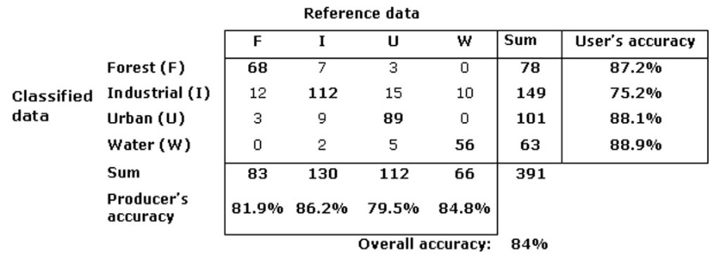

|Measure identifier |62
|===

==== Data Quality – Thematic accuracy – Non-quantitative attribute accuracy

[NOTE]
====
*Recommendation 21*

Non-quantitative attribute accuracy should be evaluated and documented using *rate of incorrect attribute values* as specified in the tables below.

====

[cols=",",]
|===
|*Name* |*rate of incorrect attribute values*
|Alternative name |*-*
|Data quality element |thematic accuracy
|Data quality sub-element |non-quantitative attribute accuracy
|Data quality basic measure |error rate
|Definition |number of attribute values where incorrect values are assigned in relation to the total number of attribute values
|Description |-
|Evaluation scope |spatial object: LandCoverUnit
|Reporting scope |data set : LandCoverDataSet
|Parameter |-
|Data quality value type |Real
|Data quality value structure |-
|Source reference |ISO/DIS 19157 Geographic information – Data quality
|Example |
|Measure identifier |67
|===

==== Data Quality – Thematic accuracy – Quantitative attribute accuracy

[NOTE]
====
*Recommendation 22*

Quantitative attribute accuracy should be evaluated and documented using a *scatter-plot* as specified in the tables below.

====

[cols=",",]
|===
|*Name* |*scatter plot*
|Alternative name |*-*
|Data quality element |thematic accuracy
|Data quality sub-element |quantitative attribute accuracy
|Data quality basic measure |-
|Definition |graphical comparison of reference land cover density values with density values provided by the product
|Description |-
|Evaluation scope |spatial object: LandCoverUnit
|Reporting scope |data set : LandCoverDataSet
|Parameter |-
|Data quality value type |graphical
|Data quality value structure |-
|Source reference a|
_http://sia.eionet.europa.eu/EAGLE/EAGLE_5rdMeeting_g2_MONINA_FFM/EL__

Validation_of_HR_layers_finaldraft.pdf

|Example a|image::./media/image29.jpeg[crossplot,width=378,height=245]
|Measure identifier |-
|===

=== Minimum data quality requirements

No minimum data quality requirements are defined for the spatial data theme Land Cover.

=== Recommendation on data quality

[NOTE]
====
*Recommendation 23*

For the data quality elements listed in the table below, all data sets related to the spatial data theme _Land Cover_ should meet the specified target results.

====

[.text-center]
*Table 10 – Recommended minimum data quality results for spatial data theme Land Cover*

[cols=",,,,",]
|===
|*Section* |*Data quality element and sub-element* |*Measure name(s)* |*Target result(s)* |*Condition*
|7.1.1 |Completeness - Commission |excess item |false |Mandatory, if the recognition of commission errors requires only automatic procedures (e.g. filtering out overlapping polygons or duplicate points for an area frame sampling).
|7.1.2 |Completeness - Omission |missing item |false |Mandatory, if the recognition of omission errors requires only automatic procedures (e.g. finding uncontrolled gaps).
|7.1.3 |Logical consistency - Conceptual consistency |conceptual schema non-compliance |False (zero violations in dataset) |Mandatory
|7.1.4 |Logical consistency – Domain consistency |value domain non-conformance |False (zero violations in dataset) |Mandatory -
|7.1.5 |Logical consistency – Format consistency |physical structure conflicts |False (zero violations in dataset) |Mandatory
|7.1.6 |Logical consistency - Topological consistency |number of invalid self-intersect errors |0 (zero violations in dataset) |Mandatory, if the dataset is a polygon coverage
|7.1.7 |Positional accuracy - Absolute or external accuracy |RMSE |Not more than the pixel size of the Earth Observation imagery, which serves as basis for derivation of the LC data. |
|7.1.9 |Thematic accuracy – Classification correctness |misclassification rate / misclassification matrix a|
Max 15% misclassification rate is a widely used criteria, but can not used as a general target, because the misclassification rate strongly depends on the level of details (number of classes, geometric resolution).

The minimum recommendation is to measure classification correctness and tell the results in a form of misclassification rate and/or misclassification matrix.

|
|===

<<<
== Dataset-level metadata

This section specifies dataset-level metadata elements, which should be used for documenting metadata for a complete dataset or dataset series.

NOTE Metadata can also be reported for each individual spatial object (spatial object-level metadata). Spatial object-level metadata is fully described in the application schema(s) (section 5).

For some dataset-level metadata elements, in particular those for reporting data quality and maintenance, a more specific scope can be specified. This allows the definition of metadata at sub-dataset level, e.g. separately for each spatial object type (see instructions for the relevant metadata element).

=== Metadata elements defined in INSPIRE Metadata Regulation

Table 11 gives an overview of the metadata elements specified in Regulation 1205/2008/EC (implementing Directive 2007/2/EC of the European Parliament and of the Council as regards metadata).

The table contains the following information:

* The first column provides a reference to the relevant section in the Metadata Regulation, which contains a more detailed description.
* The second column specifies the name of the metadata element.
* The third column specifies the multiplicity.
* The fourth column specifies the condition, under which the given element becomes mandatory.

[.text-center]
*Table 11 – Metadata for spatial datasets and spatial dataset series specified in Regulation 1205/2008/EC*

[cols=",,,",]
|===
|*Metadata Regulation Section* |*Metadata element* |*Multiplicity* |*Condition*
|1.1 |Resource title |1 |
|1.2 |Resource abstract |1 |
|1.3 |Resource type |1 |
|1.4 |Resource locator |0..* |Mandatory if a URL is available to obtain more information on the resource, and/or access related services.
|1.5 |Unique resource identifier |1..* |
|1.7 |Resource language |0..* |Mandatory if the resource includes textual information.
|2.1 |Topic category |1..* |
|3 |Keyword |1..* |
|4.1 |Geographic bounding box |1..* |
|5 |Temporal reference |1..* |
|6.1 |Lineage |1 |
|6.2 |Spatial resolution |0..* |Mandatory for data sets and data set series if an equivalent scale or a resolution distance can be specified.
|7 |Conformity |1..* |
|8.1 |Conditions for access and use |1..* |
|8.2 |Limitations on public access |1..* |
|9 |Responsible organisation |1..* |
|10.1 |Metadata point of contact |1..* |
|10.2 |Metadata date |1 |
|10.3 |Metadata language |1 |
|===

Generic guidelines for implementing these elements using ISO 19115 and 19119 are available at _http://inspire.jrc.ec.europa.eu/index.cfm/pageid/101_. The following sections describe additional theme-specific recommendations and requirements for implementing these elements.

==== Conformity

The _Conformity_ metadata element defined in Regulation 1205/2008/EC requires to report the conformance with the Implementing Rule for interoperability of spatial data sets and services. In addition, it may be used also to document the conformance to another specification.

[NOTE]
====
*Recommendation 24*

Dataset metadata should include a statement on the overall conformance of the dataset with this data specification (i.e. conformance with all requirements).

====

[NOTE]
====
*Recommendation 25*

The _Conformity_ metadata element should be used to document conformance with this data specification (as a whole), with a specific conformance class defined in the Abstract Test Suite in Annex A and/or with another specification.

====

The _Conformity_ element includes two sub-elements, the _Specification_ (a citation of the Implementing Rule for interoperability of spatial data sets and services or other specification), and the _Degree_ of conformity. The _Degree_ can be _Conformant_ (if the dataset is fully conformant with the cited specification), _Not Conformant_ (if the dataset does not conform to the cited specification) or _Not Evaluated_ (if the conformance has not been evaluated).

[NOTE]
====
*Recommendation 26*

If a dataset is not yet conformant with all requirements of this data specification, it is recommended to include information on the conformance with the individual conformance classes specified in the Abstract Test Suite in Annex A.

====

[NOTE]
====
*Recommendation 27*

If a dataset is produced or transformed according to an external specification that includes specific quality assurance procedures, the conformity with this specification should be documented using the _Conformity_ metadata element.

====

[NOTE]
====
*Recommendation 28*

If minimum data quality recommendations are defined then the statement on the conformity with these requirements should be included using the _Conformity_ metadata element and referring to the relevant data quality conformance class in the Abstract Test Suite.

====

NOTE Currently no minimum data quality requirements are included in the IRs. The recommendation above should be included as a requirement in the IRs if minimum data quality requirements are defined at some point in the future.

[NOTE]
====
*Recommendation 29*

When documenting conformance with this data specification or one of the conformance classes defined in the Abstract Test Suite, the _Specification_ sub-element should be given using the http URI identifier of the conformance class or using a citation including the following elements:

- title: "INSPIRE Data Specification on Land Cover – Technical Guidelines – <name of the conformance class>"

- date:

- dateType: publication

- date: 2013-04-10

====

EXAMPLE 1: The XML snippets below show how to fill the _Specification_ sub-element for documenting conformance with the whole data specification on Addresses v3.0.1.

[source, xml]
----
<gmd:DQ_ConformanceResult>
	<gmd:specification href="http://inspire.ec.europa.eu/conformanceClass/ad/3.0.1/tg" />
	<gmd:explanation> (...) </gmd:explanation>
	<gmd:pass> (...) </gmd:pass>
</gmd:DQ_ConformanceResult>
----

or (using a citation):

[source, xml]
----
<gmd:DQ_ConformanceResult>
	<gmd:specification>
		<gmd:CI_Citation>
			<gmd:title>
				<gco:CharacterString>INSPIRE Data Specification on Land Cover – Technical Guidelines</gco:CharacterString>
			</gmd:title>
			<gmd:date>
				<gmd:date>
					<gco:Date>2013-04-10</gco:Date>
				</gmd:date>
				<gmd:dateType>
					<gmd:CI_DateTypeCode codeList="http://standards.iso.org/ittf/PubliclyAvailableStandards/ISO_19139_Schemas/resou
rces/Codelist/ML_gmxCodelists.xml#CI_DateTypeCode" codeListValue="publication">publication</gmd:CI_DateTypeCode>
				</gmd:dateType>
			</gmd:date>
		</gmd:CI_Citation>
	</gmd:specification>
	<gmd:explanation> (...) </gmd:explanation>
	<gmd:pass> (...) </gmd:pass>
</gmd:DQ_ConformanceResult>
----

EXAMPLE 2: The XML snippets below show how to fill the _Specification_ sub-element for documenting conformance with the CRS conformance class of the data specification on Addresses v3.0.1.

[source, xml]
----
<gmd:DQ_ConformanceResult>
	<gmd:specification href="http://inspire.ec.europa.eu/conformanceClass/ad/3.0.1/crs" />
	<gmd:explanation> (...) </gmd:explanation>
	<gmd:pass> (...) </gmd:pass>
</gmd:DQ_ConformanceResult>

----

or (using a citation):

[source, xml]
----
<gmd:DQ_ConformanceResult>
	<gmd:specification>
		<gmd:CI_Citation>
			<gmd:title>
				<gco:CharacterString>INSPIRE Data Specification on Land Cover – Technical Guidelines – CRS</gco:CharacterString>
			</gmd:title>
			<gmd:date>
				<gmd:date>
					<gco:Date>2013-04-10</gco:Date>
				</gmd:date>
				<gmd:dateType>
					<gmd:CI_DateTypeCode codeList="http://standards.iso.org/ittf/PubliclyAvailableStandards/ISO_19139_Schemas/resou
rces/Codelist/ML_gmxCodelists.xml#CI_DateTypeCode" codeListValue="publication">publication</gmd:CI_DateTypeCode>
				</gmd:dateType>
			</gmd:date>
		</gmd:CI_Citation>
	</gmd:specification>
	<gmd:explanation> (...) </gmd:explanation>
	<gmd:pass> (...) </gmd:pass>
</gmd:DQ_ConformanceResult>

----

==== Lineage

[NOTE]
====
*Recommendation 30*

Following the ISO/DIS 19157 Quality principles, if a data provider has a procedure for the quality management of their spatial data sets then the appropriate data quality elements and measures defined in ISO/DIS 19157 should be used to evaluate and report (in the metadata) the results. If not, the _Lineage_ metadata element (defined in Regulation 1205/2008/EC) should be used to describe the overall quality of a spatial data set.

====

According to Regulation 1205/2008/EC, lineage "is a statement on process history and/or overall quality of the spatial data set. Where appropriate it may include a statement whether the data set has been validated or quality assured, whether it is the official version (if multiple versions exist), and whether it has legal validity. The value domain of this metadata element is free text".

The Metadata Technical Guidelines based on EN ISO 19115 and EN ISO 19119 specifies that the statement sub-element of LI_Lineage (EN ISO 19115) should be used to implement the lineage metadata element.

[NOTE]
====
*Recommendation 31*

To describe the transformation steps and related source data, it is recommended to use the following sub-elements of LI_Lineage:

====

- For the description of the transformation process of the local to the common INSPIRE data structures, the LI_ProcessStep sub-element should be used.

- For the description of the source data the LI_Source sub-element should be used.

NOTE 1 In order to improve the interoperability, domain templates and instructions for using these free text elements (descriptive statements) may be specified here and/or in an Annex of this data specification.

==== Temporal reference

According to Regulation 1205/2008/EC, at least one of the following temporal reference metadata sub-elements shall be provided: temporal extent, date of publication, date of last revision, date of creation.

[NOTE]
====
*Recommendation 32*

It is recommended that at least the date of the last revision of a spatial data set should be reported using the _Date of last revision_ metadata sub-element.

====

=== Metadata elements for interoperability

[IMPORTANT]
====
[.text-center]
*IR Requirement*
_Article 13_
*Metadata required for Interoperability*

The metadata describing a spatial data set shall include the following metadata elements required for interoperability:

. Coordinate Reference System: Description of the coordinate reference system(s) used in the data set.

. Temporal Reference System: Description of the temporal reference system(s) used in the data set.
+
This element is mandatory only if the spatial data set contains temporal information that does not refer to the default temporal reference system.

. Encoding: Description of the computer language construct(s) specifying the representation of data objects in a record, file, message, storage device or transmission channel.

. Topological Consistency: Correctness of the explicitly encoded topological characteristics of the data set as described by the scope.
+
This element is mandatory only if the data set includes types from the Generic Network Model and does not assure centreline topology (connectivity of centrelines) for the network.

. Character Encoding: The character encoding used in the data set.
+
This element is mandatory only if an encoding is used that is not based on UTF-8.

. Spatial Representation Type: The method used to spatially represent geographic information.

====

These Technical Guidelines propose to implement the required metadata elements based on ISO 19115 and ISO/TS 19139.

The following TG requirements need to be met in order to be conformant with the proposed encoding.

[TIP]
====
*TG Requirement 9*

Metadata instance (XML) documents shall validate without error against the used ISO 19139 XML schema.

====

NOTE Section 2.1.2 of the Metadata Technical Guidelines discusses the different ISO 19139 XML schemas that are currently available.

[TIP]
====
*TG Requirement 10*

Metadata instance (XML) documents shall contain the elements and meet the INSPIRE multiplicity specified in the sections below.

====

[TIP]
====
*TG Requirement 11*

The elements specified below shall be available in the specified ISO/TS 19139 path.

====

[NOTE]
====
*Recommendation 33*

The metadata elements for interoperability should be made available together with the metadata elements defined in the Metadata Regulation through an INSPIRE discovery service.

====

NOTE While this not explicitly required by any of the INSPIRE Implementing Rules, making all metadata of a data set available together and through one service simplifies implementation and usability.

==== Coordinate Reference System

[%autowidth,options="header"]
|===
|*Metadata element name* |*Coordinate Reference System*
|Definition |Description of the coordinate reference system used in the dataset.
|ISO 19115 number and name |13. referenceSystemInfo
|ISO/TS 19139 path |referenceSystemInfo
|INSPIRE obligation / condition |mandatory
|INSPIRE multiplicity |1..*
|Data type(and ISO 19115 no.) |186. MD_ReferenceSystem
|Domain a|
To identify the reference system, the referenceSystemIdentifier (RS_Identifier) shall be provided.

NOTE More specific instructions, in particular on pre-defined values for filling the referenceSystemIdentifier attribute should be agreed among Member States during the implementation phase to support interoperability.

|Implementing instructions |
|Example a|
referenceSystemIdentifier:

code: ETRS_89

codeSpace: INSPIRE RS registry

|Example XML encoding a|
[source, xml]
----
Example XML encoding	<gmd:referenceSystemInfo>
		<gmd:MD_ReferenceSystem>
			<gmd:referenceSystemIdentifier>
				<gmd:RS_Identifier>
					<gmd:code>
						<gco:CharacterString>ETRS89 </gco:CharacterString>
					</gmd:code>
					<gmd:codeSpace>
						<gco:CharacterString>INSPIRE RS registry</gco:CharacterString>
					</gmd:codeSpace>
				</gmd:RS_Identifier>
			</gmd:referenceSystemIdentifier>
		</gmd:MD_ReferenceSystem>
</gmd:referenceSystemInfo>
----
|Comments |
|===

==== Temporal Reference System

[%autowidth,options="header"]
|===
|*Metadata element name* |*Temporal Reference System*
|Definition |Description of the temporal reference systems used in the dataset.
|ISO 19115 number and name |13. referenceSystemInfo
|ISO/TS 19139 path |referenceSystemInfo
|INSPIRE obligation / condition |Mandatory, if the spatial data set or one of its feature types contains temporal information that does not refer to the Gregorian Calendar or the Coordinated Universal Time.
|INSPIRE multiplicity |0..*
|Data type(and ISO 19115 no.) |186. MD_ReferenceSystem
|Domain a|
No specific type is defined in ISO 19115 for temporal reference systems. Thus, the generic MD_ReferenceSystem element and its reference SystemIdentifier (RS_Identifier) property shall be provided.

NOTE More specific instructions, in particular on pre-defined values for filling the referenceSystemIdentifier attribute should be agreed among Member States during the implementation phase to support interoperability.

|Implementing instructions |
|Example a|
referenceSystemIdentifier:

code: GregorianCalendar

codeSpace: INSPIRE RS registry

|Example XML encoding a|
[source, xml]
----
<gmd:referenceSystemInfo>
	<gmd:MD_ReferenceSystem>
		<gmd:referenceSystemIdentifier>
			<gmd:RS_Identifier>
				<gmd:code>
			<gco:CharacterString>GregorianCalendar </gco:CharacterString>
				</gmd:code>
				<gmd:codeSpace>
					<gco:CharacterString>INSPIRE RS registry</gco:CharacterString>
				</gmd:codeSpace>
			</gmd:RS_Identifier>
		</gmd:referenceSystemIdentifier>
	</gmd:MD_ReferenceSystem>
</gmd:referenceSystemInfo>
----
|Comments |
|===

==== Encoding

[%autowidth,options="header"]
|===
|*Metadata element name* |*Encoding*
|Definition |Description of the computer language construct that specifies the representation of data objects in a record, file, message, storage device or transmission channel
|ISO 19115 number and name |271. distributionFormat
|ISO/TS 19139 path |distributionInfo/MD_Distribution/distributionFormat
|INSPIRE obligation / condition |mandatory
|INSPIRE multiplicity |1
|Data type (and ISO 19115 no.) |284. MD_Format
|Domain |See B.2.10.4. The property values (name, version, specification) specified in section 5 shall be used to document the default and alternative encodings.
|Implementing instructions |
|Example a|
name: <Application schema name> GML application schema

version: version 3.0

specification: D2.8.II.2 Data Specification on Land Cover – Technical Guidelines

|Example XML encoding a|
[source, xml]
----
<gmd:MD_Format>
	<gmd:name>
		<gco:CharacterString>SomeApplicationSchema GML application schema</gco:CharacterString>
	</gmd:name>
	<gmd:version>
		<gco:CharacterString>3.0</gco:CharacterString>
	</gmd:version>
	<gmd:specification>
		<gco:CharacterString>D2.8.II.2 Data Specification on Land Cover – Technical Guidelines</gco:CharacterString>
	</gmd:specification>
</gmd:MD_Format>

----
|Comments |
|===

==== Character Encoding

[%autowidth,options="header"]
|===
|*Metadata element name* |*Character Encoding*
|Definition |The character encoding used in the data set.
|ISO 19115 number and name |
|ISO/TS 19139 path |
|INSPIRE obligation / condition |Mandatory, if an encoding is used that is not based on UTF-8.
|INSPIRE multiplicity |0..*
|Data type (and ISO 19115 no.) |
|Domain |
|Implementing instructions |
|Example |-
|Example XML encoding a|
[source, xml]
----
<gmd:characterSet>
	<gmd:MD_CharacterSetCode codeListValue="8859part2" codeList="http://standards.iso.org/ittf/PubliclyAvailableStandards/ISO_19139_Schemas/resources/Codelist/ML_gmxCodelists.xml#CharacterSetCode">8859-2</gmd:MD_CharacterSetCode>
</gmd:characterSet>

----
|Comments |
|===

==== Spatial representation type

[%autowidth,options="header"]
|===
|*Metadata element name* |*Spatial representation type*
|Definition |The method used to spatially represent geographic information.
|ISO 19115 number and name |37. spatialRepresentationType
|ISO/TS 19139 path |
|INSPIRE obligation / condition |Mandatory
|INSPIRE multiplicity |1..*
|Data type (and ISO 19115 no.) |B.5.26 MD_SpatialRepresentationTypeCode
|Domain |
|Implementing instructions a|
Of the values included in the code list in ISO 19115 (vector, grid, textTable, tin, stereoModel, video), only vector, grid and tin should be used.

NOTE Additional code list values may be defined based on feedback from implementation.

|Example |-
|Example XML encoding |
|Comments |
|===

==== Data Quality – Logical Consistency – Topological Consistency

See section 8.3.2 for instructions on how to implement metadata elements for reporting data quality.

=== Recommended theme-specific metadata elements

[NOTE]
====
*Recommendation 34*

The metadata describing a spatial data set or a spatial data set series related to the theme _Land Cover_ should comprise the theme-specific metadata elements specified in the table below.

====

The table contains the following information:

* The first column provides a reference to a more detailed description.
* The second column specifies the name of the metadata element.
* The third column specifies the multiplicity.

[.text-center]
*Table 12 – Optional theme-specific metadata elements for the theme _Land Cover_*

[cols=",,",]
|===
|*Section* |*Metadata element* |*Multiplicity*
|8.3.1 |Maintenance Information |0..1
|8.3.2 |Completeness – Commission |0..*
|8.3.2 |Completeness - Omission |0..*
|8.3.2 |Logical Consistency – Conceptual Consistency |0..*
|8.3.2 |Logical Consistency – Domain Consistency |0..*
|8.3.2 |Logical consistency – Format Consistency |0..1
|8.3.2 |Logical consistency – Topological consistency |0..*
|8.3.2 |Positional accuracy – Absolute or External Accuracy |0..*
|8.3.2 |Thematic accuracy – Classification Correctness |0..*
|8.3.2 |Positional accuracy – Relative or Internal Accuracy |0..*
|8.3.2 |Temporal accuracy – Temporal Consistency |0..*
|8.3.2 |Temporal accuracy – Temporal Validity |0..*
|8.3.2 |Thematic accuracy – Non-quantitative Attribute Accuracy |0..*
|8.3.2 |Thematic accuracy – Quantitative Attribute Accuracy |0..*
|===

[NOTE]
====
*Recommendation 35*

For implementing the metadata elements included in this section using ISO 19115, ISO/DIS 19157 and ISO/TS 19139, the instructions included in the relevant sub-sections should be followed.

====

==== Maintenance Information

[%autowidth,options="header"]
|===
|*Metadata element name* |*Maintenance information*
|Definition |Information about the scope and frequency of updating
|ISO 19115 number and name |30. resourceMaintenance
|ISO/TS 19139 path |identificationInfo/MD_Identification/resourceMaintenance
|INSPIRE obligation / condition |optional
|INSPIRE multiplicity |0..1
|Data type(and ISO 19115 no.) |142. MD_MaintenanceInformation
|Domain a|
This is a complex type (lines 143-148 from ISO 19115).

At least the following elements should be used (the multiplicity according to ISO 19115 is shown in parentheses):

* maintenanceAndUpdateFrequency [1]: frequency with which changes and additions are made to the resource after the initial resource is completed / domain value: MD_MaintenanceFrequencyCode:

* updateScope [0..*]: scope of data to which maintenance is applied / domain value: MD_ScopeCode

* maintenanceNote [0..*]: information regarding specific requirements for maintaining the resource / domain value: free text

|Implementing instructions |
|Example |
|Example XML encoding |
|Comments |
|===

==== Metadata elements for reporting data quality

[NOTE]
====
*Recommendation 36*

For reporting the results of the data quality evaluation, the data quality elements, sub-elements and (for quantitative evaluation) measures defined in chapter 7 should be used.

====

[NOTE]
====
*Recommendation 37*

The metadata elements specified in the following sections should be used to report the results of the data quality evaluation. At least the information included in the row "Implementation instructions" should be provided.

====

The first section applies to reporting quantitative results (using the element DQ_QuantitativeResult), while the second section applies to reporting non-quantitative results (using the element DQ_DescriptiveResult).

[NOTE]
====
*Recommendation 38*

If a dataset does not pass the tests of the Application schema conformance class (defined in Annex A), the results of each test should be reported using one of the options described in sections 8.3.2.1 and 8.3.2.2.

====

NOTE 1 If using non-quantitative description, the results of several tests do not have to be reported separately, but may be combined into one descriptive statement.

NOTE 2 The sections 8.3.2.1 and 8.3.2.2 may need to be updated once the XML schemas for ISO 19157 have been finalised.

The scope for reporting may be different from the scope for evaluating data quality (see section 7). If data quality is reported at the data set or spatial object type level, the results are usually derived or aggregated.

[NOTE]
====
*Recommendation 39*

The scope element (of type DQ_Scope) of the DQ_DataQuality subtype should be used to encode the reporting scope.

Only the following values should be used for the level element of DQ_Scope: Series, Dataset, featureType.

If the level is featureType the levelDescription/MDScopeDescription/features element (of type Set< GF_FeatureType>) shall be used to list the feature type names.

====

NOTE In the level element of DQ_Scope, the value featureType is used to denote spatial object type.

===== Guidelines for reporting quantitative results of the data quality evaluation

[%autowidth,options="header"]
|===
|*Metadata element name* |*See chapter 7*
|Definition |See chapter 7
|ISO/DIS 19157 number and name |3. report
|ISO/TS 19139 path |dataQualityInfo/*/report
|INSPIRE obligation / condition |optional
|INSPIRE multiplicity |0..*
|Data type (and ISO/DIS 19157 no.) |Corresponding DQ_xxx subelement from ISO/DIS 19157, e.g. 12. DQ_CompletenessCommission
|Domain a|
Lines 7-9 from ISO/DIS 19157

[arabic, start=7]
. DQ_MeasureReference (C.2.1.3)

. DQ_EvaluationMethod (C.2.1.4.)

. DQ_Result (C2.1.5.)

|Implementing instructions a|
[arabic, start=39]
. nameOfMeasure

NOTE This should be the name as defined in Chapter 7.

[arabic, start=42]
. evaluationMethodType

. evaluationMethodDescription

NOTE If the reported data quality results are derived or aggregated (i.e. the scope levels for evaluation and reporting are different), the derivation or aggregation should also be specified using this property.

[arabic, start=46]
. dateTime

NOTE This should be data or range of dates on which the data quality measure was applied.

[arabic, start=63]
. DQ_QuantitativeResult / 64. value

NOTE The DQ_Result type should be DQ_QuantitativeResult and the value(s) represent(s) the application of the data quality measure (39.) using the specified evaluation method (42-43.)

|Example |See Table E.12 — Reporting commission as metadata (ISO/DIS 19157)
|Example XML encoding |
|===

===== Guidelines for reporting descriptive results of the Data Quality evaluation

[%autowidth,options="header"]
|===
|*Metadata element name* |*See chapter 7*
|Definition |See chapter 7
|ISO/DIS 19157 number and name |3. report
|ISO/TS 19139 path |dataQualityInfo/*/report
|INSPIRE obligation / condition |optional
|INSPIRE multiplicity |0..*
|Data type (and ISO/DIS 19157 no.) |Corresponding DQ_xxx subelement from ISO/DIS 19157, e.g. 12. DQ_CompletenessCommission
|Domain a|
Line 9 from ISO/DIS 19157

[arabic, start=9]
. DQ_Result (C2.1.5.)

|Implementing instructions a|

[arabic, start=67]
. DQ_DescripitveResult / 68. statement

NOTE The DQ_Result type should be DQ_DescriptiveResult and in the statement (68.) the evaluation of the selected DQ sub-element should be expressed in a narrative way.

|Example |See Table E.15 — Reporting descriptive result as metadata (ISO/DIS 19157)
|Example XML encoding |
|===

<<<
== Delivery

=== Updates

[IMPORTANT]
====
[.text-center]
*IR Requirement*
_Article 8_
*Updates*

. Member States shall make available updates of data on a regular basis.

. All updates shall be made available at the latest 6 months after the change was applied in the source data set, unless a different period is specified for a specific spatial data theme in Annex II.

====

NOTE In this data specification, no exception is specified, so all updates shall be made available at the latest 6 months after the change was applied in the source data set.

=== Delivery medium

According to Article 11(1) of the INSPIRE Directive, Member States shall establish and operate a network of services for INSPIRE spatial data sets and services. The relevant network service types for making spatial data available are:

* _view services_ making it possible, as a minimum, to display, navigate, zoom in/out, pan, or overlay viewable spatial data sets and to display legend information and any relevant content of metadata;
* _download services_, enabling copies of spatial data sets, or parts of such sets, to be downloaded and, where practicable, accessed directly;
* _transformation services_, enabling spatial data sets to be transformed with a view to achieving interoperability.

NOTE For the relevant requirements and recommendations for network services, see the relevant Implementing Rules and Technical Guidelinesfootnote:[The Implementing Rules and Technical Guidelines on INSPIRE Network Services are available at http://inspire.jrc.ec.europa.eu/index.cfm/pageid/5].

EXAMPLE 1 Through the Get Spatial Objects function, a download service can either download a pre-defined data set or pre-defined part of a data set (non-direct access download service), or give direct access to the spatial objects contained in the data set, and download selections of spatial objects based upon a query (direct access download service). To execute such a request, some of the following information might be required:

* the list of spatial object types and/or predefined data sets that are offered by the download service (to be provided through the Get Download Service Metadata operation),
* and the query capabilities section advertising the types of predicates that may be used to form a query expression (to be provided through the Get Download Service Metadata operation, where applicable),
* a description of spatial object types offered by a download service instance (to be provided through the Describe Spatial Object Types operation).

EXAMPLE 2 Through the Transform function, a transformation service carries out data content transformations from native data forms to the INSPIRE-compliant form and vice versa. If this operation is directly called by an application to transform source data (e.g. obtained through a download service) that is not yet conformant with this data specification, the following parameters are required:

Input data (mandatory). The data set to be transformed.

* Source model (mandatory, if cannot be determined from the input data). The model in which the input data is provided.
* Target model (mandatory). The model in which the results are expected.
* Model mapping (mandatory, unless a default exists). Detailed description of how the transformation is to be carried out.

=== Encodings

The IRs contain the following two requirements for the encoding to be used to make data available.

[IMPORTANT]
====
[.text-center]
*IR Requirement*
_Article 7_
*Encoding*

{empty}1. Every encoding rule used to encode spatial data shall conform to EN ISO 19118. In particular, it shall specify schema conversion rules for all spatial object types and all attributes and association roles and the output data structure used.

{empty}2. Every encoding rule used to encode spatial data shall be made available.

{empty}2a. Every encoding rule used to encode spatial data shall also specify whether and how to represent attributes and association roles for which a corresponding value exists but is not contained in the spatial data sets maintained by a Member State, or cannot be derived from existing values at reasonable costs.

====

NOTE ISO 19118:2011 specifies the requirements for defining encoding rules used for interchange of geographic data within the set of International Standards known as the "ISO 19100 series". An encoding rule allows geographic information defined by application schemas and standardized schemas to be coded into a system-independent data structure suitable for transport and storage. The encoding rule specifies the types of data being coded and the syntax, structure and coding schemes used in the resulting data structure. Specifically, ISO 19118:2011 includes

* requirements for creating encoding rules based on UML schemas,
* requirements for creating encoding services, and
* requirements for XML-based encoding rules for neutral interchange of data.

While the IRs do not oblige the usage of a specific encoding, these Technical Guidelines propose to make data related to the spatial data theme Land Cover available at least in the default encoding(s) specified in section 0. In this section, a number of TG requirements are listed that need to be met in order to be conformant with the default encoding(s).

The proposed default encoding(s) meet the requirements in Article 7 of the IRs, i.e. they are conformant with ISO 19118 and (since they are included in this specification) publicly available.

==== Default Encoding(s)

===== Specific requirements for GML encoding

This data specification proposes the use of GML as the default encoding, as recommended in sections 7.2 and 7.3 of [DS-D2.7]. GML is an XML encoding in compliance with ISO 19118, as required in Article 7(1). For details, see [ISO 19136], and in particular Annex E (UML-to-GML application schema encoding rules).

The following TG requirements need to be met in order to be conformant with GML encodings.

[TIP]
====
*TG Requirement 12*

Data instance (XML) documents shall validate without error against the provided XML schema.

====

NOTE 1 Not all constraints defined in the application schemas can be mapped to XML. Therefore, the following requirement is necessary.

NOTE 2 The obligation to use only the allowed code list values specified for attributes and most of the constraints defined in the application schemas cannot be mapped to the XML sch. They can therefore not be enforced through schema validation. It may be possible to express some of these constraints using other schema or rule languages (e.g. Schematron), in order to enable automatic validation.

===== Default encoding(s) for application schema LandCoverVector

*Name: LandCoverVector GML Application Schema*

Version: version 3.0,

Specification: D2.8.II.2 Data Specification on Land Cover – Technical Guidelines

Character set: UTF-8

The xml schema document is available from:

http://inspire.ec.europa.eu/schemas/lcr/3.0/LandCoverVector.xsd

===== Default encoding(s) for application schema LandCoverRaster

*Name: LandCoverRaster GML Application Schema (for the coverage domain)*

Version: version 3.0

Specification: D2.8.II.2 Data Specification on Land Cover – Technical Guidelines

Character set: UTF-8

The xml schema document is available from:

http://inspire.ec.europa.eu/schemas/lcr/3.0/LandCoverRaster.xsd.

*Name: TIFF (for the coverage range)*

Version: 6.0

Specification: TIFF Specification

Character set: UTF-8

NOTE The Geographic Tagged Image File Format (GeoTiff), associates geo-referencing information with TIFF imagery and gridded data by supplying metadata as TIFF tags. Since it fully complies with the TIFF 6.0 specifications, it may be implemented in place of TIFF format to meet this requirement.

[TIP]
====
*TG Requirement 13*

If the format used for encoding the coverage range also includes information about the coverage domain, this information shall be consistent with the information encoded using the GML Application Schema for Coverages.
====

====== Encoding rules used

Introducing encoding formats other than GML for representing coverage elements requires the definition of encoding rules to map the _Land Cover_ application schema to the resulting specific data structure unambiguously.

[TIP]
====
*TG Requirement 14*

The encoding of coverage components in the file formats specified above shall conform to the rules specified in Annex I.

====

NOTE The GeoTiff format, as a specific extension of the Baseline TIFF Format, is also affected by this recommendation.

====== Specific mappings from UML classes to GML/XML Schema types and elements

In addition to the mappings between conceptual UML classes and the associated GML object element, XML Schema type and GML property type provided in Table D.2 of ISO 19136 (GML), the mappings included in have been used to generate the GML application schema.

[.text-center]
*Table 13. Mappings between conceptual UML classes and the associated GML object elements, XML Schema types and GML property types*

[cols=",,,",options="header",]
|===
|*UML class* |*GML object element* |*GML type* |*GML property type*
|RectifiedGridCoverage |gmlcov:RectifiedGridCoverage |gmlcov:AbstractDiscreteCoverageType |n/a
|===

==== Recommended Encoding(s)

[NOTE]
====
*Recommendation 40*

It is recommended that also the encodings specified in this section be provided for the relevant application schemas.

====

===== Alternative encoding for application schema LandCoverRaster

*Name: LandCoverRaster GML Application Schema (for the coverage domain)*

Version: version 3.0,

Specification: D2.8.II.2 Data Specification on Land Cover – Technical Guidelines

Character set: UTF-8

The xml schema document is available from:

http://inspire.ec.europa.eu/schemas/lcr/3.0/LandCoverRaster.xsd.

*Name: JPEG2000 (for the coverage range)*

Version: 1.0

Specification: GMLJP2 [OGC 05-047r2]

Character set: UTF-8

NOTE The encoding of data in JPEG2000 requires to be conformant to OGC GMLJP2 standard 1.0 GMLJP2 allows to encode georeference in GML. Georeference can be duplicated with Geotiff tags, conformant to GeoJP2 specification.

[TIP]
====
*TG Requirement 15*

If the format used for encoding the coverage range also includes information about the coverage domain, this information shall be consistent with the information encoded using the GML Application Schema for Coverages.

====

====== Encoding rules used

Introducing encoding formats other than GML for representing coverage elements requires the definition of encoding rules to map the _Land Cover_ application schema to the resulting specific data structure unambiguously.

[TIP]
====
*TG Requirement 16* 
The encoding of coverage components in the file formats specified above should conform to the rules specified in Annex I.

====

=== Options for delivering coverage data

For coverages, different encodings may be used for the domain and the range of the coverage. There are several options for packaging the domain and range encoding when delivering coverage data through a download service, as discussed belowfootnote:[Further details and examples will be included in a future version of the Guidelines for the encoding of spatial data [DS-D2.7].].

*Multipart representation*

For performance reasons, binary file formats are usually preferred to text-based formats such as XML for storing large amounts of coverage data. However, they cannot directly constitute an alternative to pure GML, since their own data structure might often not support all the ISO 19123 elements used to describe coverages in the conceptual model.

The OGC standard GML Application Schema for coverages [OGC 09-146r2] offers a format encoding which combines these two approaches. The first part consists of a GML document representing all coverage components except the range set, which is contained in the second part in some other encoding format such as 'well known' binary formats'. Some information in the second part may be redundant with the GML content of the first part. In this case, consistency must be necessarily ensured, for example by defining a GML mapping of the additional encoding format.

The advantage of this multipart representation is that coverage constituents are not handled individually but as a whole. This is not really the case with GML which also allows the encoding of the value side of the coverage in external binary files, but via references to remote locations.

[TIP]
====
*TG Requirement 17*

Coverage data encoded as multipart messages shall comply with the multipart representation conformance class defined in GML Application Schema for Coverages [OGC 09-146r2].

====

NOTE The GML Application Schema for Coverages establishes a one-to-one relationship between coverages and multipart document instances.

*Reference to an external file*

The range set can be encoded within the XML structure as an external binary file using the gml:File element. This has the benefit of efficiently storing the range set data within an external file that is of a well-known format type, for example TIFF or GeoTIFF. This method of encoding is of most use for the storage of large files.

*Encoding the range inline*

This option encodes the range set data within the XML inline. This is encoded as a DataBlock element. This encoding provides much greater visibility for the range set values, however, this comes at the cost of reduced efficiency. This method of encoding would therefore only be suitable for small datasets.

*Encoding the domain inside a JPEG 2000 file*

This option consists in packaging all the components of one or several coverages, including the domain expressed in GML, in a single JPEG 2000 file. It is based on the OGC standard GML in JPEG 2000 for Geographic Imagery [OGC 05-047r2], also known as GMLJP2, which specifies how to use GML within the XML boxes of JPEG 2000 files.

[TIP]
====
*TG Requirement 18*

Coverage data encoded in standalone JPEG 2000 files shall comply with the OGC standard GML in JPEG 2000 for Geographic Imagery [OGC 05-047r2].

====

TG Requirement 18 implies that all the encoding rules presented in GMLJP2 shall be strictly followed for including GML within JPEG 2000 data files correctly. For the sake of harmonization, the encoding rules adopted for the multipart message encoding should also apply to the GMLJP2 encoding.

[NOTE]
====
*Recommendation 41*

The encoding of coverage components in GMLJP2 within a JPEG 2000 file should conform to the rules specified in the Guidelines for the encoding of spatial data [DS-D2.7].

====

<<<
== Data Capture

There is no specific guidance required with respect to data capture.

<<<
== Portrayal

This clause defines the rules for layers and styles to be used for portrayal of the spatial object types defined for this theme. Portrayal is regulated in Article 14 of the IRs.

[IMPORTANT]
====
[.text-center]
*IR Requirement*
_Article 14_
*Portrayal*

[arabic, start=1]
. For the portrayal of spatial data sets using a view network service as specified in Commission Regulation No 976/2009 (footnote:[OJ L 274, 20.10.2009, p. 9.]), the following shall be available:
+
[loweralpha]
.. the layers specified in Annex II for the theme or themes the data set is related to;
+
.. for each layer at least a default portrayal style, with as a minimum an associated title and a unique identifier.

[arabic, start=2]
. For each layer, Annex II defines the following:
+
[loweralpha]
.. a human readable title of the layer to be used for display in user interface;
+
.. the spatial object type(s), or sub-set thereof, that constitute(s) the content of the layer.

====

In section 11.1, the _types_ of layers are defined that are to be used for the portrayal of the spatial object types defined in this specification. A view service may offer several layers of the same type, one for each dataset that it offers data on a specific topic.

NOTE The layer specification in the IRs only contains the name, a human readable title and the (subset(s) of) spatial object type(s), that constitute(s) the content of the layer. In addition, this TG documents suggests keywords for describing the layer.

[NOTE]
====
*Recommendation 42*

It is recommended to use the keywords specified in section 11.1 in the _Layers Metadata parameters_ of the INSPIRE View service (see Annex III, Part A, section 2.2.4 in Commission Regulation (EC) No 976/2009).

====

Section 11.2 specifies one style for each of these layers. It is proposed that INSPIRE view services support this style as the default style required by Article 14(1b).

[TIP]
====
*TG Requirement 19*

For each layer specified in this section, the styles defined in section 11.2 shall be available.

====

NOTE The default style should be used for portrayal by the view network service if no user-defined style is specified in a portrayal request for a specific layer.

In section 11.2, further styles can be specified that represent examples of styles typically used in a thematic domain. It is recommended that also these styles should be supported by INSPIRE view services, where applicable.

[NOTE]
====
*Recommendation 43*

In addition, it is recommended that, where applicable, INSPIRE view services also support the styles defined in section 11.2.

====

Where XML fragments are used in the following sections, the following namespace prefixes apply:

* sld="http://www.opengis.net/sld" (WMS/SLD 1.1)
* se="http://www.opengis.net/se" (SE 1.1)
* ogc="http://www.opengis.net/ogc" (FE 1.1)

=== Layers to be provided by INSPIRE view services

[cols=",,,",options="header",]
|===
|*Layer Name* |*Layer Title* |*Spatial object type(s)* |*Keywords*
|LC.LandCoverPoints |LandCoverPoints |LandCoverUnit |Land Cover, Points
|LC.LandCoverSurfaces |LandCoverSurfaces |LandCoverUnit |Land Cover, Surfaces, Polygons
|LC.LandCoverRaster |LandCoverRaster |LandCoverGridCoverage |Land Cover, Raster, Rectified Grid
|===

_Note :_

* _LandCoverPoints is a LandCoverDataset for which all LandCoverUnit.geometry = GM_Point._
* _LandCoverSurfaces is a LandCoverDataset for which all LandCoverUnit.geometry = GM_Surface_.

NOTE The table above contains several layers for some spatial object types, which can be further classified using a code list-valued attribute. Such sets of layers are specified as described in Article 14(3) of the IRs.

[IMPORTANT]
====
[.text-center]
*IR Requirement*
_Article 14_
*Portrayal*

(...)

[arabic, start=3]
. For spatial object types whose objects can be further classified using a code list-valued attribute, several layers may be defined. Each of these layers shall include the spatial objects corresponding to one specific code list value. In the definition of such sets of layers in Annexes II-IV,
+
[loweralpha]
.. the placeholder <CodeListValue> shall represent the values of the relevant code list, with the first letter in upper case,
+
.. the placeholder <human-readable name> shall represent the human-readable name of the code list values;
+
.. the spatial object type shall include the relevant attribute and code list, in parentheses;
+
.. one example of a layer shall be given.

====

==== Layers organisation

None.

=== Styles required to be supported by INSPIRE view services

==== Styles for the layer LC.LandCoverPoints

[%autowidth,options="header"]
|===
|*Style Name* |*LC.LandCoverPoints.Default*
|*Default Style* |yes
|*Style Title* |LC.LandCoverPoints Default Style
|*Style Abstract* |This Style defined the default INSPIRE style for Land Cover data supported by a set of points. As there is no required nomenclature, only the geometry is represented, ie as a circle with a size of 3 pixels, with a black (#000000) fill and a black outline (#000000).
|*Symbology* a|
[source, xml]
----
 <sld:NamedLayer>
    <se:Name>LC.LandCoverPoints</se:Name>
    <sld:UserStyle>
      <se:Name>LC.LandCoverPoints.Default</se:Name>
      <sld:IsDefault>1</sld:IsDefault>
      <se:FeatureTypeStyle version="1.1.0">
        <se:Description>
          <se:Title>LC.LandCoverPoints Default Style</se:Title>
          <se:Abstract>This Style defined the default INSPIRE style for Land Cover data supported by a set of points. As there is no required nomenclature, only the geometry is repre-sented, ie as a circle with a size of 3 pixels, with a black (#000000) fill and a black outline (#000000).  
          </se:Abstract>
        </se:Description>
        <se:FeatureTypeName>LandCoverUnit</se:FeatureTypeName>
        <se:Rule>
          <se:PointSymbolizer>
            <se:Geometry>
              <ogc:PropertyName>geometry</ogc:PropertyName>
            </se:Geometry>
            <se:Graphic/>
          </se:PointSymbolizer>
        </se:Rule>
      </se: FeatureTypeStyle>
    </sld:UserStyle>
  </sld:NamedLayer>

----

|*Minimum & maximum scales* a|

No scale limit

|===

==== Style for the layer LC.LandCoverSurfaces

[%autowidth,options="header"]
|===
|*Style Name* |*LC.LandCoverSurfaces.Default*
|*Default Style* |yes
|*Style Title* |LC.LandCoverSurfaces Default Style
|*Style Abstract* |This Style defined the default INSPIRE style for Land Cover data supported by a set of non overlapping of polygons. As there is no required nomenclature, only the geometry is represented, ie only polygons with a white (#FFFFFF) fill and a black outline (#000000) of 3 pixels width.
|*Symbology* a|
[source, xml]
----
<sld:NamedLayer>
    <se:Name>LC.LandCoverSurfaces</se:Name>
    <sld:UserStyle>
      <se:Name>INSPIRE_Default</se:Name>
      <sld:IsDefault>1</sld:IsDefault>
      <se:FeatureTypeStyle version="1.1.0">
        <se:Description>
          <se:Title>LC.LandCoverSurfaces Default Style</se:Title>
          <se:Abstract> This Style defined the default INSPIRE style for Land Cover data supported by a set of non overlapping of polygons. As there is no required nomenclature, only the geometry is represented, ie only polygons with a white (#FFFFFF) fill and a black outline (#000000) of 3 pixels width.
          </se:Abstract>
        </se:Description>
        <se:FeatureTypeName>LandCoverUnit</se:FeatureTypeName>
        <se:Rule>
          <se:PolygonSymbolizer>
            <se:Geometry>
              <ogc:PropertyName>geometry</ogc:PropertyName>
            </se:Geometry>
            <se:Graphic/>
          </se:PolygonSymbolizer>
        </se:Rule>
      </se:FeatureTypeStyle>
    </sld:UserStyle>
  </sld:NamedLayer>

----
|*Minimum & maximum scales* a|

No scale limit

|===

==== Style for the layer LC.LandCoverRaster

[%autowidth,options="header"]
|===
|*Style Name* |*LC.LandCoverRaster.Default*
|*Default Style* |yes
|*Style Title* |LC.LandCoverRaster Default Style
|*Style Abstract* |This Style defined the default INSPIRE style for Land Cover data supported by a raster. As there is no required nomenclature, only the geometry is represented, ie only polygons with a white (#FFFFFF) fill and a black outline (#000000) of 3 pixels width.
|*Symbology* a|
[source, xml]
----
<sld:NamedLayer>
  <se:Name>LC.LandCoverRaster</se:Name>
    <sld:UserStyle>
      <se:Name>LC.LandCoverRaster.Default</se:Name>
      <sld:IsDefault>1</sld:IsDefault>
      <se:CoverageStyle version="1.1.0">
        <se:Description>
          <se:Title>LC.LandCoverRaster Default Style</se:Title>
          <se:Abstract> Orthoimage coverages are rendered as opaque raster
data. When coverages overlap in a same layer, the coverage the acquisition
time of which is the latest is placed on top. </se:Abstract>
        </se:Description>
        <se:CoverageName>LandCoverGrodCoverage</se:CoverageName>
        <se:Rule>
          <se:RasterSymbolizer>
            <se:Geometry>
              <ogc:PropertyName>domainSet</ogc:PropertyName>
            </se:Geometry>
            <se:Opacity>1.0</se:Opacity>
          </se:RasterSymbolizer>
        </se:Rule>
      </se:CoverageStyle>
    </sld:UserStyle>
</sld:NamedLayer>

----

NOTE When necessary, the se:ChannelSelection element shall be used to specify the mapping of the Land Cover Data (i.e. nomenclature codes) on the red, green and blue channels used for portrayal.

|*Minimum & maximum scales* a|

No scale limit

|===

=== Styles recommended to be supported by INSPIRE view services

As this specification is generic and does not require the usage of a specific nomenclature, the previous default styles only represent the geometries supporting Land Cover information and not the information itself. It is however recommended that WMS servers implement styles that allow :

[NOTE]
====
*Recommendation 1*

For Land Cover data supported by surfaces/polygons (and modelled in this specification through a collection of LandCoverUnit), it is recommended that surfaces are represented by polygons with a color (corresponding to the legend) fill and a black outline (#000000) of 3 pixels width.

====

Example : for CORINE Land Cover (Cf. Annex C.3.1 for CORINE Land Cover colors), polygons are filled with RGB colors corresponding to the code from the attribute valueId associated to each surface geometry in the GeometryValuePair.

[NOTE]
====
*Recommendation 2*

For Land Cover data supported by points (and modelled in this specification through a collection of LandCoverUnit), it is recommended that points are represented by circles with a size of 3 pixels, with a color (corresponding to the legend) fill and a black outline (#000000).

====

:sectnums!:
<<<
== Bibliography

[DS-D2.3] INSPIRE DS-D2.3, Definition of Annex Themes and Scope, v3.0, _http://inspire.jrc.ec.europa.eu/reports/ImplementingRules/DataSpecifications/D2.3_Definition_of_Annex_Themes_and_scope_v3.0.pdf_

[DS-D2.5] INSPIRE DS-D2.5, Generic Conceptual Model, v3.1, _http://inspire.jrc.ec.europa.eu/reports/ImplementingRules/DataSpecifications/D2.5_v3.1.pdf_

[DS-D2.6] INSPIRE DS-D2.6, Methodology for the development of data specifications, v3.0, _http://inspire.jrc.ec.europa.eu/reports/ImplementingRules/DataSpecifications/D2.6_v3.0.pdf_

[DS-D2.7] INSPIRE DS-D2.7, Guidelines for the encoding of spatial data, v3.0, _http://inspire.jrc.ec.europa.eu/reports/ImplementingRules/DataSpecifications/D2.7_v3.0.pdf_

[ISO 19101] EN ISO 19101:2005 Geographic information – Reference model (ISO 19101:2002)

[ISO 19103] ISO/TS 19103:2005, Geographic information – Conceptual schema language

[ISO 19107] EN ISO 19107:2005, Geographic information – Spatial schema (ISO 19107:2003)

[ISO 19108] EN ISO 19108:2005 Geographic information - Temporal schema (ISO 19108:2002)

[ISO 19111] EN ISO 19111:2007 Geographic information - Spatial referencing by coordinates (ISO 19111:2007)

[ISO 19115] EN ISO 19115:2005, Geographic information – Metadata (ISO 19115:2003)

[ISO 19118] EN ISO 19118:2006, Geographic information – Encoding (ISO 19118:2005)

[ISO 19135] EN ISO 19135:2007 Geographic information – Procedures for item registration (ISO 19135:2005)

[ISO 19139] ISO/TS 19139:2007, Geographic information – Metadata – XML schema implementation

[ISO 19144-1] ISO 19144-1:2009, Geographic information – Part 1: Classification system structure

[ISO 19144-2] ISO/DIS 19144-1:2010, Geographic information - Classification systems - Part 2 : Land Cover Meta Language (LCML)

[ISO 19157] ISO/DIS 19157, Geographic information – Data quality

[OGC 06-103r3] Implementation Specification for Geographic Information - Simple feature access – Part 1: Common Architecture v1.2.0

<<<
:sectnums:
[appendix]
== Abstract Test Suite - (normative)

*Disclaimer*

While this Annex refers to the Commission Regulation (EU) No 1089/2010 of 23 November 2010 implementing Directive 2007/2/EC of the European Parliament and of the Council as regards interoperability of spatial data sets and services, it does not replace the legal act or any part of it.

The objective of the Abstract Test Suite (ATS) included in this Annex is to help the conformance testing process. It includes a set of tests to be applied on a data set to evaluate whether it fulfils the requirements included in this data specification and the corresponding parts of Commission Regulation No 1089/2010 (implementing rule as regards interoperability of spatial datasets and services, further referred to as ISDSS Regulation). This is to help data providers in declaring the conformity of a data set to the "degree of conformity, with implementing rules adopted under Article 7(1) of Directive 2007/2/EC", which is required to be provided in the data set metadata according to Commission Regulation (EC) No 2008/1205 (the Metadata Regulation).

*Part 1* of this ATS includes tests that provide *input for assessing conformity with the ISDSS regulation.* In order to make visible which requirements are addressed by a specific test, references to the corresponding articles of the legal act are given. The way how the cited requirements apply to lc specification is described under the testing method.

In addition to the requirements included in ISDSS Regulation this Technical guideline contains TG requirements too. TG requirements are technical provisions that need to be fulfilled in order to be conformant with the corresponding IR requirement when the specific technical implementation proposed in this document is used. Such requirements relate for example to the default encoding described in section 9. *Part 2* of the ATS presents tests necessary for assessing the *conformity with TG requirements*.

NOTE Conformance of a data set with the TG requirement(s) included in this ATS implies conformance with the corresponding IR requirement(s).

The *ATS is applicable to the data sets that* *have been transformed* to be made available through INSPIRE download services (i.e. the data returned as a response to the mandatory "Get Spatial Dataset" operation) rather than the original "source" data sets.

The requirements to be tested are grouped in several _conformance classes_. Each of these classes covers a specific aspect: one conformance class contains tests reflecting the requirements on the application schema, another on the reference systems, etc. *Each conformance class is identified by a URI* (uniform resource identifier) according to the following pattern:

http://inspire.ec.europa.eu/conformance-class/ir/lc/<conformance class identifier>

EXAMPLE 1 The URI _http://inspire.ec.europa.eu/conformance-class/ir/ef/rs_ identifies the Reference Systems ISDSS conformance class of the Environmental Monitoring Facilities (EF) data theme.

The results of the tests should be published referring to the relevant conformance class (using its URI).

When an INSPIRE data specification contains *more than one application schema,* the requirements tested in a conformance class may differ depending on the application schema used as a target for the transformation of the data set. This will always be the case for the application schema conformance class. However, also other conformance classes could have different requirements for different application schemas. In such cases, a separate conformance class is defined for each application schema, and they are distinguished by specific URIs according to the following pattern:

http://inspire.ec.europa.eu/conformance-class/ir/lc/<conformance class identifier>/ 
<application schema namespace prefix>

EXAMPLE 2 The URI _http://inspire.ec.europa.eu/conformance-class/ir/el/as/el-vec_ identifies the conformity with the application schema (_as_) conformance class for the Elevation Vector Elements (_el-vec_) application schema.

An overview of the conformance classes and the associated tests is given in the table below.

[cols=""]
|===
|A.1 Application Schema Conformance Class
a|
!===
!A.1.1 Schema element denomination test
!A.1.2 Value type test
!A.1.3 Value test
!A.1.4 Attributes/associations completeness test
!A.1.5 Abstract spatial object test
!A.1.6 Constraints test
!A.1.7 Geometry representation test
!===
|A.2 Reference Systems Conformance Class
a|
!===
!A.2.1 Datum test
!A.2.2 Coordinate reference system test
!A.2.3 Grid test
!A.2.4 View service coordinate reference system test
!A.2.5 Temporal reference system test
!A.2.6 Units of measurements test
!===
|A.3 Data Consistency Conformance Class
a|
!===
!A.3.1 Unique identifier persistency test
!A.3.2 Version consistency test
!A.3.3 Life cycle time sequence test
!A.3.4 Validity time sequence test
!A.3.5 Update frequency test
!===
|A.4 Metadata IR Conformance Class
a|
!===
!A.4.1 Metadata for interoperability test
!===
|A.5 Information Accessibility Conformance Class
a|
!===
!A.5.1 Code list publication test
!A.5.2 CRS publication test
!A.5.3 CRS identification test
!A.5.4 Grid identification test
!===
|A.6 Data Delivery Conformance Class
a|
!===
!A.6.1 Encoding compliance test
!===
|A.7 Portrayal Conformance Class
a|
!===
!A.7.1 Layer designation test
!===
|A.8 Technical Guideline Conformance Class
a|
!===
!A.8.1 Multiplicity test
!A.8.2 CRS http URI test
!A.8.3 Metadata encoding schema validation test
!A.8.4 Metadata occurrence test
!A.8.5 Metadata consistency test
!A.8.6 Encoding schema validation test
!A.8.7 Coverage multipart representation test
!A.8.8 Coverage domain consistency test
!A.8.9 Style test
!===
|===

In order to be conformant to a conformance class, a data set has to pass *all* tests defined for that conformance class.

In order to be conformant with the ISDSS regulation the inspected data set needs to be conformant to *all* conformance classes in Part 1. The conformance class for overall conformity with the ISDSS regulation is identified by the URI _http://inspire.ec.europa.eu/conformance-class/ir/lc/._

In order to be conformant with the Technical Guidelines, the dataset under inspection needs to be conformant to all conformance classes included both in Part 1 and 2. Chapter 8 describes in detail how to publish the result of testing regarding overall conformity and conformity with the conformance classes as metadata. The conformance class for overall conformity with the Technical Guidelines is identified by the URI _http://inspire.ec.europa.eu/conformance-class/tg/lc/3.0._

It should be noted that data providers are not obliged to integrate / decompose the original structure of the source data sets when they deliver them for INSPIRE. It means that a conformant dataset can contain less or more spatial object / data types than specified in the ISDSS Regulation.

*A dataset that contains less spatial object and/or data types* can be regarded conformant when the corresponding types of the source datasets after the necessary transformations fulfil the requirements set out in the ISDSS Regulation.

A *dataset that contain more spatial object and/or data types* may be regarded as conformant when

* all the spatial object / data types that have corresponding types in the source dataset after the necessary transformations fulfil the requirements set out in the ISDSS Regulation and
* all additional elements of the source model (spatial object types, data types, attributes, constraints and code lists together with their values) do not conflict with any rule defined in the interoperability target specifications defined for any theme within INSPIRE.

====
*Open issue 1:* Even though the last condition can be derived from Art. 8(4) of the Directive, the ISDSS Regulation does not contain requirements concerning the above issue. Therefore, no specific tests have been included in this abstract suit for testing conformity of extended application schemas. Annex F of the Generic Conceptual Model (D2.5) provides an example how to extend     INSPIRE application schemas in a compliant way.
====

The ATS contains a detailed list of abstract tests. It should be noted that some tests in the Application schema conformance class can be automated by utilising xml *schema validation tools.* It should be noted that failing such validation test does not necessary reflect non-compliance to the application schema; it may be the results of erroneous encoding.

Each test in this suit follows the same structure:

* Requirement: citation from the legal texts (ISDSS requirements) or the Technical Guidelines (TG requirements);
* Purpose: definition of the scope of the test;
* Reference: link to any material that may be useful during the test;
* Test method: description of the testing procedure.

According to ISO 19105:2000 all tests in this ATS are basic tests. Therefore, this statement is not repeated each time.

<<<
[discrete]
== Part 1 - (normative)

*Conformity with Commission Regulation No 1089/2010*

=== Application Schema Conformance Class

*Conformance classes:*

http://inspire.ec.europa.eu/conformance-class/ir/lc/as/LandCoverNomenclature

http://inspire.ec.europa.eu/conformance-class/ir/lc/as/LandCoverVector

http://inspire.ec.europa.eu/conformance-class/ir/lc/as/LandCoverRaster

==== Schema element denomination test

a) [.underline]#Purpose#: Verification whether each element of the dataset under inspection carries a name specified in the target application schema(s).

b) [.underline]#Reference#: Art. 3 and Art.4 of Commission Regulation No 1089/2010

c) [.underline]#Test method#: Examine whether the corresponding elements of the source schema (spatial object types, data types, attributes, association roles and code lists) are mapped to the target schema with the correct designation of mnemonic names.

NOTE Further technical information is in the Feature catalogue and UML diagram of the application schema(s) in section 5.2.

==== Value type test

a) [.underline]#Purpose#: Verification whether all attributes or association roles use the corresponding value types specified in the application schema(s).

b) [.underline]#Reference#: Art. 3, Art.4, Art.6(1), Art.6(4), Art.6(5) and Art.9(1)of Commission Regulation No 1089/2010.

c) [.underline]#Test method#: Examine whether the value type of each provided attribute or association role adheres to the corresponding value type specified in the target specification.

NOTE 1 This test comprises testing the value types of INSPIRE identifiers, the value types of attributes and association roles that should be taken from code lists, and the coverage domains.

NOTE 2 Further technical information is in the Feature catalogue and UML diagram of the application schema(s) in section 5.2.

==== Value test

a) [.underline]#Purpose#: Verify whether all attributes or association roles whose value type is a code list take the values set out therein.

b) [.underline]#Reference#: Art.4 (3) of Commission Regulation No 1089/2010.

c) [.underline]#Test method#: When an attribute / association role has a code list as its type, compare the values of each instance with those provided in the application schema. To pass this tests any instance of an attribute / association role

* shall take only values explicitly specified in the code list when the code list's extensibility is "none".

* shall take only a value explicitly specified in the code list or shall take a value that is narrower (i.e. more specific) than those explicitly specified in the application schema when the code list's extensibility is "narrower".

NOTE 1 This test is not applicable to code lists with extensibility "open" or "any".

NOTE 2 When a data provider only uses code lists with narrower (more specific values) this test can be fully performed based on internal information.

==== Attributes/associations completeness test

a) [.underline]#Purpose#: Verification whether each instance of spatial object type and data types include all attributes and association roles as defined in the target application schema.

b) [.underline]#Reference#: Art. 3, Art.4(1), Art.4(2), and Art.5(2) of Commission Regulation No 1089/2010.

c) [.underline]#Test method#: Examine whether all attributes and association roles defined for a spatial object type or data type are present for each instance in the dataset.

NOTE 1 Further technical information is in the Feature catalogue and UML diagram of the application schema(s) in section 5.2.

NOTE 2 For all properties defined for a spatial object, a value has to be provided if it exists in or applies to the real world entity – either the corresponding value (if available in the data set maintained by the data provider) or the value of _void._ If the characteristic described by the attribute or association role does not exist in or apply to the real world entity, the attribute or association role does not need to be present in the data set.

==== Abstract spatial object test

a) [.underline]#Purpose#: Verification whether the dataset does NOT contain abstract spatial object / data types defined in the target application schema(s).

b) [.underline]#Reference#: Art.5(3) of Commission Regulation No 1089/2010

c) [.underline]#Test method#: Examine that there are NO instances of abstract spatial object / data types in the dataset provided.

NOTE Further technical information is in the Feature catalogue and UML diagram of the application schema(s) in section 5.2.

==== Constraints test

a) [.underline]#Purpose#: Verification whether the instances of spatial object and/or data types provided in the dataset adhere to the constraints specified in the target application schema(s).

b) [.underline]#Reference#: Art. 3, Art.4(1), and Art.4(2) of Commission Regulation No 1089/2010.

c) [.underline]#Test method#: Examine all instances of data for the constraints specified for the corresponding spatial object / data type. Each instance shall adhere to all constraints specified in the target application schema(s).

NOTE Further technical information is in the Feature catalogue and UML diagram of the application schema(s) in section 5.2.

==== Geometry representation test

a) [.underline]#Purpose#: Verification whether the value domain of spatial properties is restricted as specified in the Commission Regulation No 1089/2010.

b) [.underline]#Reference#: Art.12(1), Annex III Section 2 of Commission Regulation No 1089/2010

c) Test Method: Check whether all spatial properties only use 0, 1 and 2-dimensional geometric objects that exist in the right 2-, 3- or 4-dimensional coordinate space, and where all curve interpolations respect the rules specified in the reference documents.

NOTE Further technical information is in OGC Simple Feature spatial schema v1.2.1 [06-103r4].

=== Reference Systems Conformance Class

*Conformance class:*

http://inspire.ec.europa.eu/conformance-class/ir/lc/rs

==== Datum test

a) [.underline]#Purpose#: Verify whether each instance of a spatial object type is given with reference to one of the (geodetic) datums specified in the target specification.

b) [.underline]#Reference#: Annex II Section 1.2 of Commission Regulation No 1089/2010

c) [.underline]#Test method#: Check whether each instance of a spatial object type specified in the application schema(s) in section 5 has been expressed using:

* the European Terrestrial Reference System 1989 (ETRS89) within its geographical scope; or
* the International Terrestrial Reference System (ITRS) for areas beyond the ETRS89 geographical scope; or
* other geodetic coordinate reference systems compliant with the ITRS. Compliant with the ITRS means that the system definition is based on the definition of ITRS and there is a well-established and described relationship between both systems, according to the EN ISO 19111.

NOTE Further technical information is given in Section 6 of this document.

==== Coordinate reference system test

a) [.underline]#Purpose#: Verify whether the two- and three-dimensional coordinate reference systems are used as defined in section 6.

b) [.underline]#Reference#: Section 6 of Commission Regulation 1089/2010.

c) [.underline]#Test method#: Inspect whether the horizontal and vertical components of coordinates one of the corresponding coordinate reference system has been:

* Three-dimensional Cartesian coordinates based on a datum specified in 1.2 and using the parameters of the Geodetic Reference System 1980 (GRS80) ellipsoid.

* Three-dimensional geodetic coordinates (latitude, longitude and ellipsoidal height) based on a datum specified in 1.2 and using the parameters of the GRS80 ellipsoid.

* Two-dimensional geodetic coordinates (latitude and longitude) based on a datum specified in 1.2 and using the parameters of the GRS80 ellipsoid.

* Plane coordinates using the ETRS89 Lambert Azimuthal Equal Area coordinate reference system.

* Plane coordinates using the ETRS89 Lambert Conformal Conic coordinate reference system.

* Plane coordinates using the ETRS89 Transverse Mercator coordinate reference system.

* For the vertical component on land, the European Vertical Reference System (EVRS) shall be used to express gravity-related heights within its geographical scope. Other vertical reference systems related to the Earth gravity field shall be used to express gravity-related heights in areas that are outside the geographical scope of EVRS.

* For the vertical component in marine areas where there is an appreciable tidal range (tidal waters), the Lowest Astronomical Tide (LAT) shall be used as the reference surface.

* For the vertical component in marine areas without an appreciable tidal range, in open oceans and effectively in waters that are deeper than 200 meters, the Mean Sea Level (MSL) or a well-defined reference level close to the MSL shall be used as the reference surface."

* For the vertical component in the free atmosphere, barometric pressure, converted to height using ISO 2533:1975 International Standard Atmosphere, or other linear or parametric reference systems shall be used. Where other parametric reference systems are used, these shall be described in an accessible reference using EN ISO 19111-2:2012.

NOTE Further technical information is given in Section 6 of this document.

==== Grid test

a) [.underline]#Purpose#: Verify that gridded data related are available using the grid compatible with one of the coordinate reference systems defined in Commission Regulation No 1089/2010

b) [.underline]#Reference#: Annex II Section 2.1 and 2.2 of Commission Regulation 1089/2010.

c) [.underline]#Test method#: Check whether the dataset defined as a grid is compatible with one of the coordinate reference.

* Grid_ETRS89_GRS80 based on two-dimensional geodetic coordinates using the parameters of the GRS80 ellipsoid

* Grid_ETRS89_GRS80zn based on two-dimensional geodetic coordinates with zoning,

* Plane coordinates using the Lambert Azimuthal Equal Area projection and the parameters of the GRS80 ellipsoid (ETRS89-LAEA)

* Plane coordinates using the Lambert Conformal Conic projection and the parameters of the GRS80 ellipsoid (ETRS89-LCC)

* Plane coordinates using the Transverse Mercator projection and the parameters of the GRS80 ellipsoid (ETRS89-TMzn)

NOTE Further technical information is given in Section 6 of this document.

==== View service coordinate reference system test

a) [.underline]#Purpose#: Verify whether the spatial data set is available in the two dimensional geodetic coordinate system for their display with the INSPIRE View Service.

b) [.underline]#Reference#: Annex II Section 1.4 of Commission Regulation 1089/2010

c) [.underline]#Test method#: Check that each instance of a spatial object types specified in the application schema(s) in section 5 is available in the two-dimensional geodetic coordinate system

NOTE Further technical information is given in Section 6 of this document.

==== Temporal reference system test

a) [.underline]#Purpose#: Verify whether date and time values are given as specified in Commission Regulation No 1089/2010.

b) [.underline]#Reference#: Art.11(1) of Commission Regulation 1089/2010

c) [.underline]#Test method#: Check whether:

* the Gregorian calendar is used as a reference system for date values;
* the Universal Time Coordinated (UTC) or the local time including the time zone as an offset from UTC are used as a reference system for time values.

NOTE Further technical information is given in Section 6 of this document.

==== Units of measurements test

a) [.underline]#Purpose#: Verify whether all measurements are expressed as specified in Commission Regulation No 1089/2010.

b) [.underline]#Reference#: Art.12(2) of Commission Regulation 1089/2010

c) [.underline]#Test method#: Check whether all measurements are expressed in SI units or non-SI units accepted for use with the International System of Units.

NOTE 1 Further technical information is given in ISO 80000-1:2009.

NOTE 2 Degrees, minutes and seconds are non-SI units accepted for use with the International System of Units for expressing measurements of angles.

=== Data Consistency Conformance Class

*Conformance class:*

http://inspire.ec.europa.eu/conformance-class/ir/lc/dc

==== Unique identifier persistency test

a) [.underline]#Purpose#: Verify whether the namespace and localId attributes of the external object identifier remain the same for different versions of a spatial object.

b) [.underline]#Reference#: Art. 9 of Commission Regulation 1089/2010.

c) [.underline]#Test method#: Compare the namespace and localId attributes of the external object identifiers in the previous version(s) of the dataset with the namespace and localId attributes of the external object identifiers of current version for the same instances of spatial object / data types; To pass the test, neither the namespace, nor the localId shall be changed during the life-cycle of a spatial object.

NOTE 1 This test can be performed exclusively on the basis of the information available in the database of the data providers.

NOTE 2 When using URI this test includes the verification whether no part of the construct has been changed during the life cycle of the instances of spatial object / data types.

NOTE 3 Further technical information is given in section 14.2 of the INSPIRE Generic Conceptual Model.

==== Version consistency test

a) [.underline]#Purpose#: Verify whether different versions of the same spatial object / data type instance belong to the same type.

b) [.underline]#Reference#: Art. 9 of Commission Regulation 1089/2010.

c) [.underline]#Test method#: Compare the types of different versions for each instance of spatial object / data type

NOTE 1 This test can be performed exclusively on the basis of the information available in the database of the data providers.

==== Life cycle time sequence test

a) [.underline]#Purpose#: Verification whether the value of the attribute beginLifespanVersion refers to an earlier moment of time than the value of the attribute endLifespanVersion for every spatial object / object type where this property is specified.

b) [.underline]#Reference#: Art.10(3) of Commission Regulation 1089/2010.

c) [.underline]#Test method#: Compare the value of the attribute beginLifespanVersion with attribute endLifespanVersion. The test is passed when the beginLifespanVersion value is before endLifespanVersion value for each instance of all spatial object/data types for which this attribute has been defined.

NOTE 1 This test can be performed exclusively on the basis of the information available in the database of the data providers.

==== Validity time sequence test

a) [.underline]#Purpose#: Verification whether the value of the attribute validFrom refers to an earlier moment of time than the value of the attribute validTo for every spatial object / object type where this property is specified.

b) [.underline]#Reference#: Art.12(3) of Commission Regulation 1089/2010.

c) [.underline]#Test method#: Compare the value of the attribute validFrom with attribute validTo. The test is passed when the validFrom value is before validTo value for each instance of all spatial object/data types for which this attribute has been defined.

NOTE 1 This test can be performed exclusively on the basis of the information available in the database of the data providers.

==== Update frequency test

a) [.underline]#Purpose#: Verify whether all the updates in the source dataset(s) have been transmitted to the dataset(s) which can be retrieved for the LC data theme using INSPIRE download services.

b) [.underline]#Reference#: Art.8 (2) of Commission Regulation 1089/2010.

c) [.underline]#Test method#: Compare the values of beginning of life cycle information in the source and the target datasets for each instance of corresponding spatial object / object types. The test is passed when the difference between the corresponding values is less than 6 months.

NOTE 1 This test can be performed exclusively on the basis of the information available in the database of the data providers.

=== Metadata IR Conformance Class

*Conformance class:*

http://inspire.ec.europa.eu/conformance-class/ir/lc/md

==== Metadata for interoperability test

a) [.underline]#Purpose#: Verify whether the metadata for interoperability of spatial data sets and services described in 1089/2010 Commission Regulation have been created and published for each dataset related to the LC data theme.

b) [.underline]#Reference#: Art.13 of Commission Regulation 1089/2010

c) [.underline]#Test method#: Inspect whether metadata describing the coordinate reference systems, encoding, topological consistency and spatial representation type have been created and published. If the spatial data set contains temporal information that does not refer to the default temporal reference system, inspect whether metadata describing the temporal reference system have been created and published. If an encoding is used that is not based on UTF-8, inspect whether metadata describing the character encoding have been created.

NOTE Further technical information is given in section 8 of this document.

=== Information Accessibility Conformance Class

*Conformance class:*

http://inspire.ec.europa.eu/conformance-class/ir/lc/ia

==== Code list publication test

a) [.underline]#Purpose#: Verify whether all additional values used in the data sets for attributes, for which narrower values or any other value than specified in Commission Regulation 1089/2010 are allowed, are published in a register.

b) [.underline]#Reference#: Art.6(3) and Annex III Section 2.

c) [.underline]#Test method#: For each additional value used in the data sets for code list-valued attributes, check whether it is published in a register.

NOTE Further technical information is given in section 5 of this document.

==== CRS publication test

a) [.underline]#Purpose#: Verify whether the identifiers and the parameters of coordinate reference system are published in common registers.

b) [.underline]#Reference#: Annex II Section 1.5

c) [.underline]#Test method#: Check whether the identifier and the parameter of the CRS used for the dataset are included in a register. .

NOTE Further technical information is given in section 6 of this document.

==== CRS identification test

a) [.underline]#Purpose#: Verify whether identifiers for other coordinate reference systems than specified in Commission Regulation 1089/2010 have been created and their parameters have been described according to EN ISO 19111 and ISO 19127.

b) [.underline]#Reference#: Annex II Section 1.3.4

c) [.underline]#Test method#: Check whether the register with the identifiers of the coordinate reference systems is accessible.

NOTE Further technical information is given in section 6 of this document.

==== Grid identification test

a) [.underline]#Purpose#: Verify whether identifiers for other geographic grid systems than specified in Commission Regulation 1089/2010 have been created and their definitions have been either described with the data or referenced.

b) [.underline]#Reference#: Annex II Section 2.1 and 2.2

c) [.underline]#Test method#: Check whether the identifiers for grids have been created. Inspect the dataset and/or the metadata for inclusion of grid definition.

NOTE Further technical information is given in section 6 of this document.

=== Data Delivery Conformance Class

*Conformance class:*

http://inspire.ec.europa.eu/conformance-class/ir/lc/de

==== Encoding compliance test

a) [.underline]#Purpose#: Verify whether the encoding used to deliver the dataset comply with EN ISO 19118.

b) [.underline]#Reference#: Art.7 (1) of Commission Regulation 1089/2010.

c) [.underline]#Test method#: Follow the steps of the Abstract Test Suit provided in EN ISO 19118.

NOTE 1 Datasets using the default encoding specified in Section 9 fulfil this requirement.

NOTE 2 Further technical information is given in Section 9 of this document.

=== Portrayal Conformance Class

*Conformance class:*

http://inspire.ec.europa.eu/conformance-class/ir/lc/po

==== Layer designation test

a) [.underline]#Purpose#: verify whether each spatial object type has been assigned to the layer designated according to Commission Regulation 1089/2010.

b) [.underline]#Reference#: Art. 14(1), Art14(2) and Annex III Section 2.

c) [.underline]#Test Method#: Check whether data is made available for the view network service using the specified layers respectively:

* LC.LandCoverPoints
* LC.LandCoverSurfaces
* LC.LandCoverRaster

NOTE Further technical information is given in section 11 of this document.

<<<
[discrete] 
== Part 2 - (informative)

*Conformity with the technical guideline (TG) Requirements*

=== Technical Guideline Conformance Class

*Conformance class:*

_http://inspire.ec.europa.eu/conformance-class/tg/lc/3.0_

==== Multiplicity test

a) [.underline]#Purpose#: Verify whether each instance of an attribute or association role specified in the application schema(s) does not include fewer or more occurrences than specified in section 5.

b) [.underline]#Reference#: Feature catalogue and UML diagram of the application schema(s) in section 5 of this guideline.

c) [.underline]# Test method#: Examine that the number of occurrences of each attribute and/or association role for each instance of a spatial object type or data type provided in the dataset corresponds to the number of occurrences of the attribute / association role that is specified in the application schema(s) in section 5.

==== CRS http URI test

a) [.underline]#Purpose#: Verify whether the coordinate reference system used to deliver data for INSPIRE network services has been identified by URIs according to the EPSG register.

b) [.underline]#Reference#: Section 6 of this technical guideline

c) [.underline]# Test method#: Compare the URI of the dataset with the URIs in the table.

NOTE 1 Passing this test implies the fulfilment of test A6.2

NOTE 2 Further reference please see _http://www.epsg.org/geodetic.html_

==== Metadata encoding schema validation test

a) [.underline]#Purpose#: Verify whether the metadata follows an XML schema specified in ISO/TS 19139.

b) [.underline]#Reference#: Section 8 of this technical guideline, ISO/TS 19139

c) [.underline]# Test method#: Inspect whether provided XML schema is conformant to the encoding specified in ISO 19139 for each metadata instance.

NOTE 1 Section 2.1.2 of the Metadata Technical Guidelines discusses the different ISO 19139 XML schemas that are currently available.

==== Metadata occurrence test

a) [.underline]#Purpose#: Verify whether the occurrence of each metadata element corresponds to those specified in section 8.

b) [.underline]#Reference#: Section 8 of this technical guideline

c) [.underline]# Test method#: Examine the number of occurrences for each metadata element. The number of occurrences shall be compared with its occurrence specified in Section 8:

NOTE 1 Section 2.1.2 of the Metadata Technical Guidelines discusses the different ISO 19139 XML schema.

==== Metadata consistency test

a) [.underline]#Purpose#: Verify whether the metadata elements follow the path specified in ISO/TS 19139.

b) [.underline]#Reference#: Section 8 of this technical guideline, ISO/TS 19139

c) [.underline]# Test method#: Compare the XML schema of each metadata element with the path provide in ISO/TS 19137.

NOTE 1 This test does not apply to the metadata elements that are not included in ISO/TS 19139.

==== Encoding schema validation test

a) [.underline]#Purpose#: Verify whether the provided dataset follows the rules of default encoding specified in section 9 of this document

b) [.underline]#Reference#: section 9 of this technical guideline

c) [.underline]# Test method#: Inspect whether provided encoding(s) is conformant to the encoding(s) for the relevant application schema(s) as defined in section 9:

NOTE 1 Applying this test to the default encoding schema described in section 9 facilitates testing conformity with the application schema specified in section 5. In such cases running this test with positive result may replace tests from A1.1 to A1.4 provided in this abstract test suite.

NOTE 2 Using Schematron or other schema validation tool may significantly improve the validation process, because some some complex constraints of the schema cannot be validated using the simple XSD validation process. On the contrary to XSDs Schematron rules are not delivered together with the INSPIRE data specifications. Automating the process of validation (e.g. creation of Schematron rules) is therefore a task and an opportunity for data providers.

==== Coverage multipart representation test

a) [.underline]#Purpose#: Verify whether coverage data encoded as multipart messages comply with the multipart representation conformance class defined in GML Application Schema for Coverages [OGC 09-146r2].

b) [.underline]#Reference#: OGC standard GML Application Schema for Coverages [OGC 09-146r2].

c) [.underline]# Test method#: Inspect whether coverage data encoded as multipart messages comply with the multipart representation conformance class defined in GML Application Schema for Coverages [OGC 09-146r2].

NOTE further information is provided in section 9.4 of this technical guideline.

==== Coverage domain consistency test

a) [.underline]#Purpose#: Verify whether the encoded coverage domain is consistent with the information provided in the GML application schema.

b) [.underline]#Reference#: Section 9.4.1.2 of this technical guideline.

c) [.underline]# Test method#: For multipart coverage messages compare the encoded coverage domain with the description of the coverage component in the GML application schema

NOTE 1 This test applies only to those multipart messages, where the coverage range is encoded together with the coverage domain (some binary formats).

NOTE 2 .This test does not apply to multipart messages where the coverage range is embedded without describing the data structure (e.g. text based formats).

==== Style test

a) [.underline]#Purpose#: Verify whether the styles defined in section 11.2 have been made available for each specified layer.

b) [.underline]#Reference#: section 11.2.

c) [.underline]# Test method#: Check whether the styles defined in section 11.2 have been made available for each specified layer.

<<<
[appendix]
== Use cases - (informative) 

This annex describes the use cases that were used as a basis for the development of this data specification. TWG Land Cover did consider three use cases developed by members of the expert group (UC 1 – 3 below). During the process, EEA provided additional use cases. One of these use cases were already covered by the group, and another six (UC 4 – 9 below) also mention land cover data. These use cases are:

[arabic, start=1]
. Land cover information used in monitoring linked to EU agricultural policy (IACS)
. Use of LC and LCC (Land Cover Change) data for Greenhouse Gas Inventory Reporting obligations (UNFCCC& Kyoto Protocol)
. Land cover information in land and ecosystem accounting (LEAC)
. Air quality: Air pollutant emissions
. Land take by transport infrastructure
. Fragmentation of land and forest
. Regional accessibility of markets and cohesion
. Drinking water quality
. Water accounts

Use case 1 requires a data model supporting the exchange of land cover polygon data using a number of different nomenclatures, where each nomenclature is well-documented and comparison of the data is possible. The proposed data model fully supports the requirements in this use case.

Use case 2 requires a data model supporting the exchange of land cover polygon data using a number of different nomenclatures, where each nomenclature is well-documented. Comparison of the data is not required since analysis is carried out at the national level. The proposed data model fully supports the requirements in this use case.

Use case 3 requires a data model supporting the exchange of land cover polygon data encoded using the CORINE Land Cover nomenclature. Gridded data are mentioned in the use case, but gridding is part of the analysis – not of the data exchange. The proposed data model fully supports the requirements in this use case.

Use cases 4, 5 and 6 require a data model supporting the exchange of gridded land cover data encoded using the CORINE Land Cover nomenclature. The proposed data model fully supports the requirements in these use cases.

Use cases 7, 8 and 9 probably require a data model supporting the exchange of high resolution land cover polygon or grid data showing imperviousness, greenery and open water (the use case is not specific). The data may be similar to the High Resolution Layers (HRL) produced in the context of GMES. The use cases may also require exchange of land cover polygon data using various nomenclatures. The proposed data model does, in any case, fully support the anticipated requirements in these use cases.

=== Land cover information used in monitoring linked to EU agricultural policy (IACS)

==== Detailed, structured description

[cols=",",options="header"]
|===
2+|*Use Case Description*
|Name |Determination of maximum eligible hectare
|Priority |High
|Description a|
Delineating (masking) eligible (=agricultural) land (arable/permanent crops/permanent grassland/household gardens) at a scale better than 1/10,000.

Minimum mapping unit 0.1 ha.

|Pre-condition |n/a
2+|*Flow of Events – Basic Path*
|1 |Acquire suitable imagery and/or topographic documents
|2 |Make a national inventory of agricultural land
|3 |Quantify the maximum eligible hectares inside by delineation at 1/5000
|4 annual |Present this information to the farmer (=Pre-printed form, including maps)
|5 annual |Collect farmer declaration regarding lands used
|6 annual |Perform administrative control (crosscheck) with LPIS (including MEA)
|7 annual |Perform an on the spot check for a sample of >= 5% 1% of the farmers
|8 annual |Determine area for payment and pay
|9 continuous a|
Update your LPIS in time for the next year, using:

* OTSC results
* Newly available imagery
* Any available third party land cover / land use changes

2+|*Flow of Events – Alternative Paths*
|Step m. |n/a
|Step m1. |
|Post-condition |Annual monitoring required
2+|*Data source: LPIS*
a|
Description
|LPIS – eligible layer: for quality reporting coded under LCCS
a|
Data provider
|Every MS
a|
Geographic scope
|All land on the "agricultural holding" of the farmers requesting EU aid (regardless of the land itself is benefitting of aid or not)
a|
Thematic scope
|Agriculture, land administration, land cover, land use, orthoimagery et al
a|
Scale, resolution
|Better than 1/10,000 (from 2014: better than 1/5,000)
a|
Delivery
|Not applicable
a|
Documentation
a|
Council Regulation 2009R73 (art 17)
LPIS core model (LCM).
2004 discussion document

Each MS has its own LPIS specifications.

|===

==== UML use case diagram

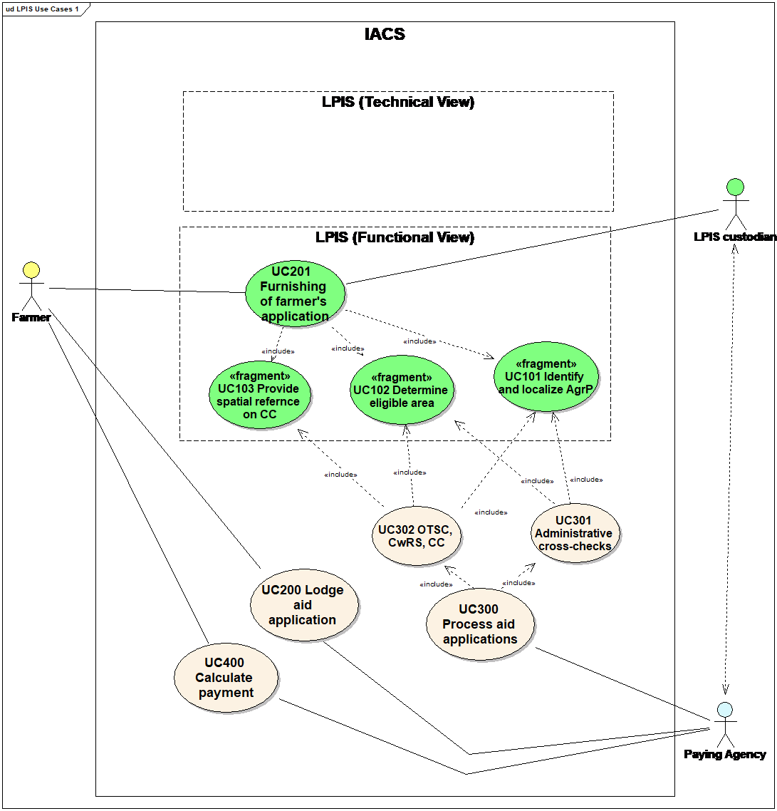

==== Narrative explanation

*Introduction*

The primary goal of the common agricultural policy (CAP) is to provide an income support to farmers. Under the WTO green box conditions, the support is de-coupled from production and based solely on agricultural areas. Support is further subject to cross-compliance, the respect of basic standards concerning the environment, food safety, animal and plant health and animal welfare, as well as the requirement of maintaining land in good agricultural and environmental condition. This requires as system to administrate agricultural land.

In contrast to e.g. environmental Directives, which need transposition into national law, a common policy Regulation lays down common rules to be directly applied by all Member States. The key CAP support rules are specified Council Regulation 2009/73.

*Defining land*

Most Member States implement the single payment scheme (SPS) where support is granted to farmers upon activation of a payment entitlement per eligible hectare to the amounts fixed therein. "Eligible hectare" is specified as _any agricultural area of the holding and any area planted with short rotation coppice that is (predominantly) used for an agricultural activity_(art 34.a) and defines "agricultural area" as _any area taken up by arable land, permanent pasture or permanent crops_. (art 2.h). Permanent pasture' means _land used to grow grasses or other herbaceous forage naturally (self-seeded) or through cultivation (sown) and that has not been included in the crop rotation of the holding for five years or longer_. To this end, 'grasses or other herbaceous forage' means _all herbaceous plants traditionally found in natural pastures or normally included in mixtures of seeds for pastures or meadows in the Member State (whether or not used for grazing animals_ (1120R2009 art 2.c).

The Member States that joined the EU in 2004 and 2007 could implement a transitional single area payments scheme (SAPS) without entitlements which links eligibility of payments to 'utilised agricultural area' or _the total area taken up by arable land, permanent grassland, permanent crops and kitchen gardens_ (art 124)

This set of definitions of eligible hectares relates to land cover concepts. Even in "pasture" the pastural use is explicitly stated as irrelevant, only the grass/herbaceous cover matters. A land use dimension is introduced whenever a farmer declares land in his annual support application.

*Managing agricultural land through LPIS*

It is obvious that determining the eligible hectares is a key element as this quantifies the potential for payment. The agricultural area registered in the LPIS acts as a reference to help the farmer correctly activate his entitlements via cartographic documents and must allow the administration to detect double declaration of any given agricultural parcel (via the so called administrative cross-check).

Areas recorded in the LPIS should be precise up to 1000 m2; however, areas are declared by the farmer and controlled by inspectors with a precision of 100m2. In practice, MS start from 25cm to 50cm GSD imagery to operate and maintain their LPIS mapping.

The full functionality of the resulting spatial database called LPIS is 3-fold:

[arabic, start=1]
. Identify land (unambiguous geo-location) (similar to cadastral application)
. Quantify eligible hectares therein (i.e. a land cover delineation)

* as supportive information for the farmer's declaration

* as financial safety feature for the administrative controls

. Administrate declarations on land (i.e. land use recording).

"Production block" LPIS systems combine the functions of identification and delineation of agricultural land into a single layer where the blocks are defined either by their visible physical boundaries or as the continuous agricultural land declared by one farmer. Alternatively, Member States can recover their cadastral or topographic map to identify the land management units and must then determine the potential eligibility with the help of a separate land cover mask.

It makes good sense to approach the delineated mask from a land cover perspective rather than from eligibility viewpoint as eligibility rules change frequently. Since the start of LPIS, olive groves, vineyards and landscape features were introduced to the payment schemes. In the near future, the "greening of the CAP" may require the separate accounting of permanent grassland and these landscape features.

The pan-european dimension comes from the common requirements and procedures to guarantee equal treatment of all European farmers. Each Member State is accountable for the proper implementation of the rules but must demonstrate this to the European Institutions. The transfer of know-how and sharing of tools between the Member States is an added bonus.

*Illustrations*

Permanent crops: Vite - Olivo - Agrumi - Mandorlo - Serre stabili

Permanent grassland:Pascoli - Pascolo magro 50% - Pascolo magro 20% - Arboreto  erbacee

Arable land: Seminative

Other: Manufatti - Boschi - Piu specie arboree - Acque - Aree non-coltivabili - Tare

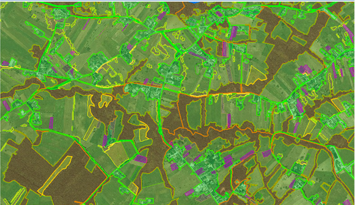

[.text-center]
*Figure 25 - : 1/2,000 Land cover delineation for assessing eligibility (by AGEA, Italy, 2009)*

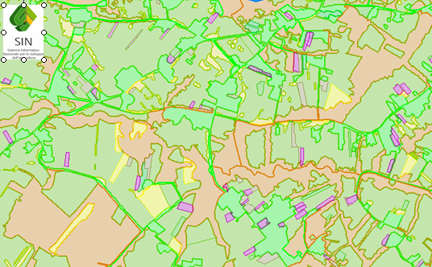

[.text-center]
*Figure 26: "farmer's" production blocks; units of continuous pure agricultural land declared by a single farmer.*

From Figure 25 to Figure 30, the background images are not those used for the land cover delineation, evidencing some unprocessed land cover changes that have occurred.

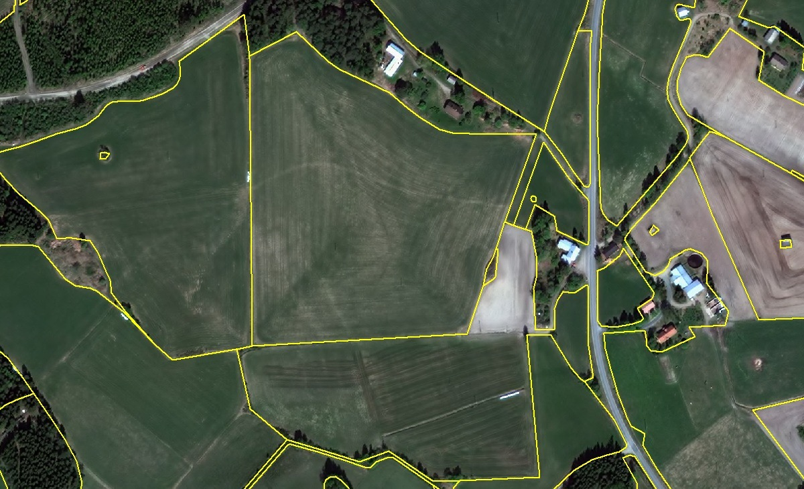

[.text-center]
*Figure 27: "physical" production blocks; units of pure agricultural land delineated by permanent visible physical boundaries (hedges, fences, roads,,...) and permanent cultivation patterns.*

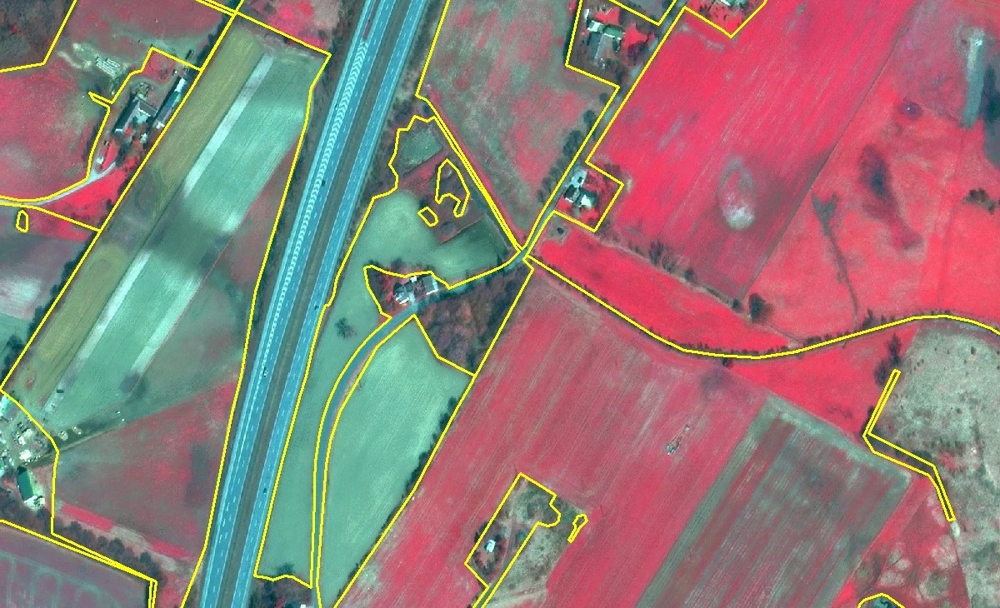

[.text-center]
*Figure 28: "physical" production blocks; units of pure agricultural land delineated by permanent visible physical boundaries (hedges, fences, roads,,...) and permanent cultivation patterns.*

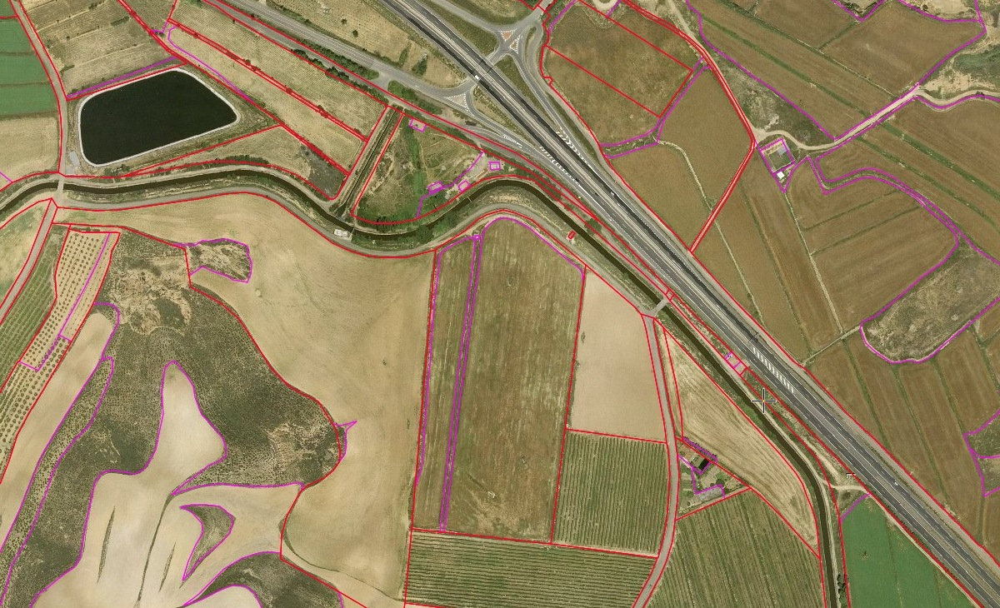

[.text-center]
*Figure 29: "cadastral" reference parcels; cadastral parcels (red lines) with delineation of agricultural land therein (magenta lines).*

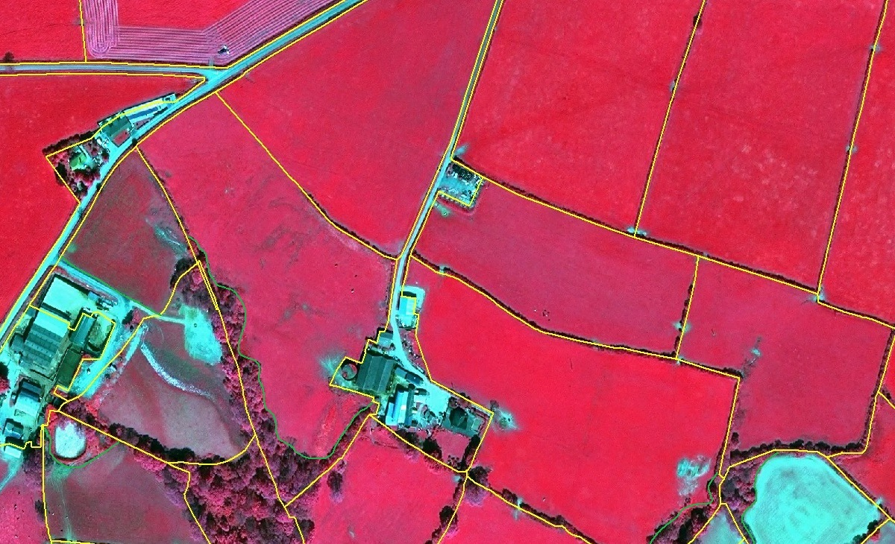

[.text-center]
*Figure 30:"topographical" reference parcels; units of land derived from selected topographical map features (yellow line) with delineation of agricultural land (green line) therein.*

=== Use of Land Cover and Land Cover Change data for Greenhouse Gas Inventory Reporting obligations (UNFCCC& Kyoto Protocol)

==== Detailed, structured description

[cols=",", option="header"]
|===
2+|*Use Case Description*
|Name |Use of LC and LCC data for Greenhouse Gas Inventory Reporting obligations (UNFCCC& Kyoto Protocol)
|Priority |High
|Description |This Use Case describes shortly the use of National and International Land Cover and Land Cover Changes databases in National GI according to the obligations of UN's FCCC and Kyoto protocol. Land use, land-use change and forestry (LULUCF) is defined by the UN Climate Change Secretariat as "A greenhouse gas inventory sector that covers emissions and removals of greenhouse gases resulting from direct human-induced land use, land-use change and forestry activities".
|Pre-condition |
|*Flow of Events – Basic Path*|
|Step 1. |Choice of estimation method
|Step 2 |Elaboration of the LULUFC inventory
|Step 3 |Quality ensurance and control
|Step 4 |Documentation
|Step 5 |Quantification of incertainties
|*Data source: <Name> _[repeat per data source]_ *|
a|
Description
|National Land Cover & Use, Forest, Crops Inventories; Agricultural and Forest Surveys
a|
Data provider
|Mapping agencies, National Forest & Agriculture Institutions, NRC on Land Cover, NCR on Land Use & Spatial Planning.
a|
Geographic scope
|Global, National
a|
Thematic scope
|Land Cover, Land Use
a|
Scale, resolution
|1:100.000 to 1:10.000; MMU from 0,1 to 1 ha
a|
Delivery
|
a|
Documentation
a|
Good Practice Guidance for Land Use,Land-Use Change and Forestry

http://www.ipcc-nggip.iges.or.jp/public/gpglulucf/gpglulucf.html

|===

==== UML use case diagram

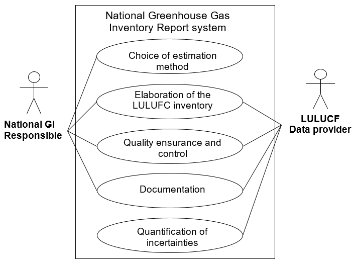

==== Narrative explanation

This Use Case describes shortly the use of National and International Land Cover and Land Cover Changes databases in National GI according to the obligations of UN's FCCC and Kyoto protocol. Land use, land-use change and forestry (LULUCF) is defined by the UN Climate Change Secretariat as "A greenhouse gas inventory sector that covers emissions and removals of greenhouse gases resulting from direct human-induced land use, land-use change and forestry activities".

The term 'Land Use' can be considered as relating to the two Inspire themes Land Cover and Land Use, because there is a mixture of land cover and land use concepts and terms, especially when considering land 'use' changes categories.

Considering the different categories in land use and land use changes for GI according to IPCC, for each country is necessary to select the most appropriate method for identifying and representing land areas as consistently as possible in inventory calculations. These categories and subcategories (not considering specific categories, according to these general ones which can be defined for an specific country), as described in the Good practices guidelines for Land Use, Land-Use Change and Forestry, are:

* Forest land (FL)
* Cropland Grassland (CL)
* Wetlands (WL)
* Settlements (SL)
* Other land (OL)

And the subsequent subcategories in Land Use Changes:

[cols=",,,,,",]
|===
|FF |= |forest land remaining forest land |LF |= |lands converted to forest land
|GG |= |grassland remaining grassland |LG |= |lands converted to grassland
|CC |= |cropland remaining cropland |LC |= |lands converted to cropland
|WW |= |wetlands remaining wetlands |LW |= |lands converted to wetlands
|SS |= |settlements remaining settlements |LS |= |lands converted to settlements
|OO |= |other land remaining other land |LO |= |lands converted to other land
|===

The six Land Use categories are considered by IPCC as top level categories, able to be applied in most countries, accommodating differences in different land classification systems based on land cover characteristics, land use characteristics, or a combination of both. Land management is a key criterion for discriminating subcategories, but the disparity of land management national practices make it in practice impossible to discriminate the land cover concepts from the land use concepts in the definitions of these five main categories. According to IPCC Guidelines, each country should establish and apply specific definitions, indicating explicitly those land cover and/or land use concepts used in their accounting systems.

The way to proceed in each country will be (step by step)

* Choice of estimation method within the context of the _IPCC Guidelines_;. There are three possibilities:
** Use of Basic Land Use data, which can or can not cover the whole territory. It is recommended to have an account of the land data for the different Land Use categories, one for each reference year, but without further explanation of land use changes from one category to another.

** Survey of Land Use and Land Use change: provides a national or regional-scale assessment of not only the losses or gains in the area of specific land categories but what these changes represent. Tracking land-use changes in this explicit manner will normally require estimation of initial and final land-use categories, as well as of total area of unchanged land by category. The final result of this approach can be presented as a non-spatially explicit land-use change matrix.

** Use of geographically explicit land use data. Approach 3 is comprehensive and relatively simple conceptually but data intensive to implement. The target area is subdivided into spatial units such as grid cells or polygons appropriate to the scale of land-use variation and the unit size required for sampling or complete enumeration. The spatial units must be used consistently over time or bias will be introduced into the sampling. The spatial units should be sampled using pre-existing map data (usually within a Geographic Information System (GIS)) and/or in the field and the land uses should be observed or inferred and recorded at the time intervals required. Observations may be from remote sensing, site visits, oral interviews, or questionnaires. Sampling units may be points, or areas from 0.1 ha to a square kilometre or more, depending on the sample design. Units can be sampled statistically on a sparser interval than would be used for the complete coverage, chosen at regular or irregular intervals, and can be concentrated in areas where land-use change is expected. Recorded data could be of land use at a point or within a sampling unit on each occasion but could also include land-use change data within a sampling unit between the sampling years.

* LULUCF inventory, according to the selected approach for each country.
* Quality assurance and quality control procedures to provide cross-checks during the inventory compilation;
* Data and information to be documented, archived and reported to facilitate review and assessment of inventory estimates;
* Quantification of uncertainties at the source or sink category level and for the inventory as a whole, so that resources available can be directed toward reducing uncertainties over time, and the improvement can be tracked.

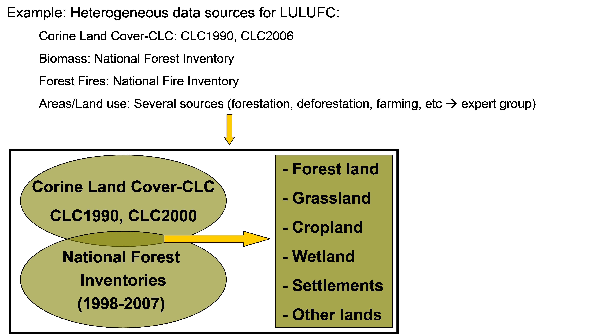

[.text-center]
*Figure 31: LULUFC Inventory under the Convention. Example of estimation method using option 3 - geographically explicit land use data (CORINE Land Cover, National Forest Inventory and other national sources)*

image::./media/image38.png[image,width=540,height=357, align=center]

[.text-center]
*Figure 32: LULUFC Inventory under the Convention. Example of estimation method using option 3 - geographically explicit land use data. Combination of CORINE Land Cover and National Forest Inventory for obtaining land use changes from Forest Land (FL) areas to Cro*

In addition, _GPG-LULUCF_ provides guidance related to the specific features of the LULUCF sector on consistent representation of land areas, sampling for area estimates and for estimating emissions and removals, verification, and guidance on how to complement the Convention reporting for the LULUCF sector to meet the supplementary requirements under the Kyoto Protocol.

=== Land cover information in land and ecosystem accounting (LEAC)

==== Detailed, structured description

[%autowidth,options="header"]
|===
2+|*Use Case Description*
|Name |Land and Ecosystem Accounting (LEAC) - support revision and implementation of UNSD-SEEA (System of Economic and Environmental Accounting) Handbook
|Priority |high
|Description a|
Implementation land and ecosystem related issues into the system of statistical accounting.

LEAC is based on voluntary contributions of Member States to UNSD (UN Statistical

Devision) Reporting

|Pre-condition a|
Land accounting requires regular mapping of land-cover in a pre-defined classification system (e.g. CORINE classification) and a system to detect the changes in land-cover classes per spatial unit. E.g. CORINE and CORINE updates are used to detect land-cover changes in Europe (LEAC). Ecosystem accounting can either directly use land-cover change and attribute relevant information (e.g. change in carbon stock due to change in landcover class)

or use land-use information attributed to certain land-cover classes (e.g. arable land) for further detailed analysis.

| |
|*Flow of Events – Basic Path* |
|Step 1. |Collection of input LC change data, identification of territorial reference units
|Step 2. |Classification of LC changes into land Cover Flows
|Step 3. |Rasterization of reference units according to the standard European 1km x 1km reference grid
|Step 4. |Intersection of LC change data with the reference grid
|Step 5. |Establishing of a relational database between Land Analytical and Reporting Units (LARU-s) and Land Cover changes / flows. The relate item is the Reference Grid Code
|Step 6. |Results from land and ecosystem accounting are normally delivered as matrix tables, published in reports and on websites. In principle accounts can also be published as spatial explicit maps.
| |
|*Data sources:* |
|Description |CORINE Land Cover change data
|Data provider |EEA
|Geographic scope |Countries involved into CLC change mapping ("Europe")
|Thematic scope |Risk exposure
|Scale, resolution |5ha MMU vector data
|Delivery |EEA dataservice
|Documentation |Meta data and product description
| |
|Description |Territorial units
|Data provider |various
|Geographic scope |Europe
|Thematic scope |Administrative / physical boundaries, statistical units
|Scale, resolution |Vector data, different scales
|Delivery |various
|Documentation |Meta data and product description
| |
|===

==== UML use case diagram

[cols=""]
|===
a|image::./media/image39.jpeg[leac_methodological_guidebook-2_22_0001,width=604,height=504]
|Extended LEAC data modelfootnote:[Environmental Accounting - Methodological guidebook. 2005. ETC-LUSI report. http://www.eea.europa.eu/themes/landuse/interactive/land-and-ecosystem-accounting-leac] - potential development of the method for LEAC Core module
|===

==== Narrative explanation

Objectivesfootnote:[http://etc-lusi.eionet.europa.eu/LEAC]

[.underline]#Why ecosystem accounts?#

Ecosystem Accounts are tools that we can use to describe systematically how the quantity and quality of ecosystems, and the ecological structures and processes that underpin them, change over time. Ultimately they can help us understand the costs of such change to people, either in monetary terms or in terms of risks to their health or livelihood. The goal is to supply scientific support with proper tools to policy-makers.

[.underline]#What is land and ecosystem accounting?#

Since 2002, ETC-LUSI, together with EEA, is working on an accounting methodology for land use and ecosystem, the LEAC method (Weber, 2007). The accounts aim to reflect on critical stock and flows of natural capital (ecosystem functions). EEA/ETC-LUSI views an ecosystem as a "life-support system", visually shaped by land-cover and strongly conditioned by land-use. Land in spatial terms is viewed as multifunctional unit providing space and supporting a range of benefits to humans and biodiversity. Four ecosystem subjects are considered: Land-use, water-use, primary productivity and biodiversity.

[.underline]#How are these stock and flows produced?#

Land cover accounts (1990-2000-2006) are derived from CORINE Land Cover change data. The EEA (No 11/2006) report ¨Land accounts for Europe 1990-2000¨ presents the first application of the LEAC method, demonstrating detailed characterisation (including quantitative estimations) of major land-use patterns and changes in EU – the urban, agricultural, forest and semi-natural land-cover classes.

[.underline]#How are the accounts explored?#

ETC-LUSI has developed different tools to query land cover data and land cover changes information among other datasets in two different years (1990 and 2000; 2000 and 2006). These tools work with an on line Analytical Processing (OLAP) database, accessible through the Internet. The database is structured in accordance to a multi-dimensional approach for retrieving land cover using different analytical reporting units (LARU), however the system it is not closed for other kind of data (population, nature protection, transportation, water assets,...).

[.underline]#Why is the LEAC tool useful?#

It allows an efficient processing and retrieval of data on continental scale and to perform spatial-based queries without Geographical Information Systems (GIS) tools. At this stage LEAC includes Land cover data types, but with theoretically unlimited possibility to include other subjects as areas of different rates of primary productivity and areas with different degree of habitat richness among others.

Process

LEAC methodology is divided in two main parts:

* Transformation of spatial data into classic Entity-Relationship database (LEAC database) which allows the quick exploitaition of such volume of information.
* Land Cover changes classification into hierarchical Land Cover Flows and its nomencalture.

[.underline]#From spatial domain to database#

The aim of this step is to convert GIS data to a database, which is accessible for classic database management systems without the need of GIS processing facilites. The integration of spatial data is implemented through Reference Grids.

*Input data:* Land Cover Change products from CLC2000/CLC2006 project (polygon vector data, 5ha MMU) have been taken as main input for building LEAC database. Combining Land Cover Codes from initial year and final year layers creates a Change Code. For example, a change from coniferous forest (311) to continous urban fabric (111) will be coded as 311111.

*Territorial (statistical) units:* Administrative (NUTS3, NUTS2, NUTS1, NUTS0) and physical boundaries (Watersheds, Sea Catchments, Biogeographic regions, ...) have been used as territorial units. These data are available mainly as polygon vector data with different precision.

*Reference grid:* A standard European 1km x 1km LAEA Reference Grid has been used as common reference, to integrate *input data* with *territorial units.* Each grid cell has a unique GRIDCODE and a unique LARU code (Land Analytical and Reporting Units, derived by rasterizing the territorial units to a 1 km x 1 km grid.

The reference grid is intersected with CLC change data, so one grid cell may be linked to different Land Cover change processes. Different change types referring to the same grid cell are stored in separate records and characterised by their Change Code and Change area (1 ha units).

Summary statistics for different territorial units ("zones") are calculated by establishing links between LARU codes and Change codes via the GRIDCODE.

[.underline]#Classification of changes: Land Cover Flows#

Land Cover Accounts summarize and interpret the 44x43=1892 possible one-to-one changes between the 44 CORINE land cover classes. The changes are grouped to so called flows of land cover and are classified according to major land use processes:

* lcf1 Urban land management
* lcf2 Urban residential sprawl
* lcf3 Sprawl of economic sites and infrastructures
* lcf4 Agriculture internal conversions
* lcf5 Conversion from forested & natural land to agriculture
* lcf6 Withdrawal of farming
* lcf7 Forests creation and management
* lcf8 Water bodies creation and management
* lcf9 Changes of Land Cover due to natural and multiple causes

The nomenclature of flows is organized on 3 levels. Flows are described in details in the Reference Documents.

References

Environmental Accounting - Methodological guidebook. 2005. ETC-LUSI report. _http://www.eea.europa.eu/themes/landuse/interactive/land-and-ecosystem-accounting-leac_

_Land accounts for Europe 1990-2000 – Towards integrated land and ecosystem accounting. 2006. EEA Report No 11/2006._ http://www.eea.europa.eu/publications/eea_report_2006_11

<<<
[appendix]
== Code list values - (informative) 

*INSPIRE Application Schema 'LandCoverNomenclature'*

[cols="",options="header",]
|===
|*Code List*
|CorineValue
a|
[cols=","]
!===
!Name: !Corine Land Cover code list
!Definition: !Corine Land Cover code list governed by EEA.
!Extensibility: !any
!Identifier: !http://www.eea.europa.eu/data-and-maps/data/corine-land-cover-2006-raster-1/corine-land-cover-classes-and/clc_legend.csv/at_download/file
!Values: !The allowed values for this code list comprise any values defined by data providers.
!===
a|The table below includes recommended values that may be used by data providers. Before creating new terms, please check if one of them can be used.
|*111*
a|
[cols=","]
!===
!Name: !Continuous urban fabric
!Definition: !Most of the land is covered by . Buildings, roads and artificially surfaced area cover almost all the ground.\nNon-linear areas of vegetation and bare soil are exceptional.
!===
|
*112*
a|
[cols=","]
!===
!Name: !Discontinuous urban fabric
!Definition: !Most of the land is covered by structures. Buildings, roads and artificially surfaced areas associated with\nvegetated areas and bare soil, which occupy discontinuous but significant surfaces.
!===
|*121*
a|
[cols=","]
!===
!Name: !Industrial or commercial units
!Definition: !Artificially surfaced areas (with concrete, asphalt, tamacadam, or stabilised, e.g. beaten earth) devoid of\nvegetation, occupy most of the area in question, which also contains buildings and/or vegetated areas.
!===
|*122*
a|
[cols=","]
!===
!Name: !Road and rail networks and associated land
!Definition: !Motorways, railways, including associated installations (stations, platforms, embankments). Minimum width\nto include: I 00 m.
!===
|*123*
a|
[cols=","]
!===
!Name: !Port areas
!Definition: !Infrastructure of port areas, including quays, dockyards and marinas.
!===
|*124*
a|
[cols=","]
!===
!Name: !Airports
!Definition: !Airport installations: runways, buildings and associated land.
!===
|*131*
a|
[cols=","]
!===
!Name: !Mineral extraction sites
!Definition: !Areas with open-pit extraction of industrial minerals (sandpits, quarries) or other minerals (opencast mines).\nIncludes flooded gravel pits, except for river-bed extraction.
!===
|*132*
a|
[cols=","]
!===
!Name: !Dump sites
!Definition: !Landfill or mine dump sites, industrial or public.
!===
|*133*
a|
[cols=","]
!===
!Name: !Construction sites
!Definition: !Spaces under construction development, soil or bedrock excavations, earthworks.
!===
|*141*
a|
[cols=","]
!===
!Name: !Green urban areas
!Definition: !Areas with vegetation within urban fabric. Includes parks and cemeteries with vegetation.
!===
|*142*
a|
[cols=","]
!===
!Name: !Sport and leisure facilities
!Definition: !Camping grounds, sports grounds, leisure parks, golf courses, racecourses, etc. Includes formal parks not\nsurrounded by urban zones.
!===
|*211*
a|
[cols=","]
!===
!Name: !Non-irrigated arable land
!Definition: !Cereals, legumes, fodder crops, root crops and fallow land. Includes flower and tree (nurseries) cultivation\nand vegetables, whether open field, under plastic or glass (includes market gardening). Includes aromatic,\nmedicinal and culinary plants. Excludes permanent pastures.
!===
|*212*
a|
[cols=","]
!===
!Name: !Permanently irrigated land
!Definition: !Crops irrigated permanently and periodically, using a permanent infrastructure (irrigation channels,\ndrainage network). Most of these crops could not be cultivated without an artificial water supply. Does not\ninclude sporadically irrigated land.
!===
|*213*
a|
[cols=","]
!===
!Name: !Rice fields
!Definition: !Land developed for rice cultivation. Flat surfaces with irrigation channels. Surfaces regularly flooded.
!===
|*221*
a|
[cols=","]
!===
!Name: !Vineyards
!Definition: !Areas planted with vines.
!===
|*222*
a|
[cols=","]
!===
!Name: !Fruit trees and berry plantations
!Definition: !Parcels planted with fruit trees or shrubs: single or mixed fruit species, fruit trees associated with\npermanently grassed surfaces. Includes chestnut and walnut groves.
!===
|*223*
a|
[cols=","]
!===
!Name: !Olive groves
!Definition: !Areas planted with olive trees, including mixed occurrence of olive trees and vines on the same parcel.
!===
|*231*
a|
[cols=","]
!===
!Name: !Pastures
!Definition: !Dense, predominantly graminoid grass cover, of floral composition, not under a rotation system. Mainly\nused for grazing, but the fodder may be harvested mechanically. Includes areas with hedges (bocage).
!===
|*241*
a|
[cols=","]
!===
!Name: !Annual crops associated with permanent crops
!Definition: !Non-permanent crops (arable lands or pasture) associated with permanent crops on the same parcel.
!===
|*242*
a|
[cols=","]
!===
!Name: !Complex cultivation patterns
!Definition: !Juxtaposition of small parcels of diverse annual crops, pasture and/or permanent crops.
!===
|*243*
a|
[cols=","]
!===
!Name: !"Land principally occupied by agriculture, with significant areas of natural vegetation."
!Definition: !Areas principally occupied by agriculture, interspersed with significant natural areas.
!===
|*244*
a|
[cols=","]
!===
!Name: !Agro-forestry areas
!Definition: !Annual crops or grazing land under the wooded cover of forestry species.
!===
|*311*
a|
[cols=","]
!===
!Name: !Broad-leaved forest
!Definition: !Vegetation formation composed principally of trees, including shrub and bush understories, where broadleaved\nspecies predominate.
!===
|*312*
a|
[cols=","]
!===
!Name: !Coniferous forest
!Definition: !Vegetation formation composed principally of trees, including shrub and bush understories, where\nconiferous species predominate.
!===
|*313*
a|
[cols=","]
!===
!Name: !Mixed forest
!Definition: !Vegetation formation composed principally of trees, including shrub and bush understories, where broadleaved\nand coniferous species co~dominate.
!===
|*321*
a|
[cols=","]
!===
!Name: !Natural grasslands
!Definition: !Low productivity grassland. Often situated in areas of rough uneven ground. Frequently includes rocky\nareas, briars, and heathland.
!===
|*322*
a|
[cols=","]
!===
!Name: !Moors and heathland
!Definition: !Vegetation with low and closed cover, dominated by bushes, shrubs and herbaceous plants (heath, briars,\nbroom, gorse, laburnum, etc.).
!===
|*323*
a|
[cols=","]
!===
!Name: !Sclerophyllous vegetation
!Definition: !Bushy sclerophyllous vegetation. Includes maquis and garrige.\nMaquis: a dense vegetation association composed of numerous shrubs associated with siliceous soils in\nthe Mediterranean environment.\nGarrigue: discontinuous bushy associations of Mediterranean calcareous plateaus. Generally composed of\nkermes oak, arbutus, lavender, thyme, cistus, etc. May include a few isolated trees.
!===
|*324*
a|
[cols=","]
!===
!Name: !Transitional woodland-shrub
!Definition: !Bushy or herbaceous vegetation with scattered trees. Can represent either woodland degradation or forest\nregeneration/colonisation.
!===
|*331*
a|
[cols=","]
!===
!Name: !"Beaches, dunes, sands"
!Definition: !Beaches, dunes and expanses of sand or pebbles in coastal or continental , including beds of stream\nchannels with torrential regime.
!===
|*332*
a|
[cols=","]
!===
!Name: !Bare rocks
!Definition: !Scree, cliffs, rocks and outcrops.
!===
|*333*
a|
[cols=","]
!===
!Name: !Sparsely vegetated areas
!Definition: !Includes steppes, tundra and badlands. Scattered high-attitude vegetation.
!===
|*334*
a|
[cols=","]
!===
!Name: !Burnt areas
!Definition: !Areas affected by recent fires, still mainly black.
!===
|*335*
a|
[cols=","]
!===
!Name: !Glaciers and perpetual snow
!Definition: !Land covered by glaciers or permanent snowfields.
!===
|*411*
a|
[cols=","]
!===
!Name: !Inland marshes
!Definition: !Low-lying land usually flooded in winter, and more or less saturated by water all year round.
!===
|*412*
a|
[cols=","]
!===
!Name: !Peat bogs
!Definition: !Peatland consisting mainly of decomposed moss and vegetable matter. May or may not be exploited.
!===
|*421*
a|
[cols=","]
!===
!Name: !Salt marshes
!Definition: !Vegetated low-lying areas, above the high-tide line, susceptible to flooding by sea water. Often in the\nprocess of filling in, gradually being colonised by halophilic plants.
!===
|*422*
a|
[cols=","]
!===
!Name: !Salines
!Definition: !Salt-pans, active or in process of . Sections of salt marsh exploited for the production of salt by\nevaporation. They are clearly distinguishable from the rest of the marsh by their segmentation and\nembankment systems.
!===
|*423*
a|
[cols=","]
!===
!Name: !Intertidal flats
!Definition: !Generally unvegetated expanses of mud, sand or rock lying between high and low water-marks. On contour\non maps.
!===
|*511*
a|
[cols=","]
!===
!Name: !Water courses
!Definition: !Natural or artificial water-courses serving as water drainage channels. Includes canals. Minimum width to\ninclude: 100 m.
!===
|*512*
a|
[cols=","]
!===
!Name: !Water bodies
!Definition: !Natural or artificial stretches of water.
!===
|*521*
a|
[cols=","]
!===
!Name: !Coastal lagoons
!Definition: !Unvegetated stretches of salt or brackish waters separated from the sea by a tongue of land or other similar\ntopography. These water bodies can be connected with the sea at limited points, either permanently or for\nparts of the year only.
!===
|*522*
a|
[cols=","]
!===
!Name: !Estuaries
!Definition: !The mouth of a river within which the tide ebbs and flows.
!===
|*523*
a|
[cols=","]
!===
!Name: !Sea and ocean
!Definition: !Zone seaward of the lowest tide limit.
!===

|===

<<<
[appendix]
== Example of data quality measure for CORINE land Cover Survey initiative - (normative)

Developed in compliance with the guidelines and templates given in ISO 19114 ISO 19113 and ISO 19138.

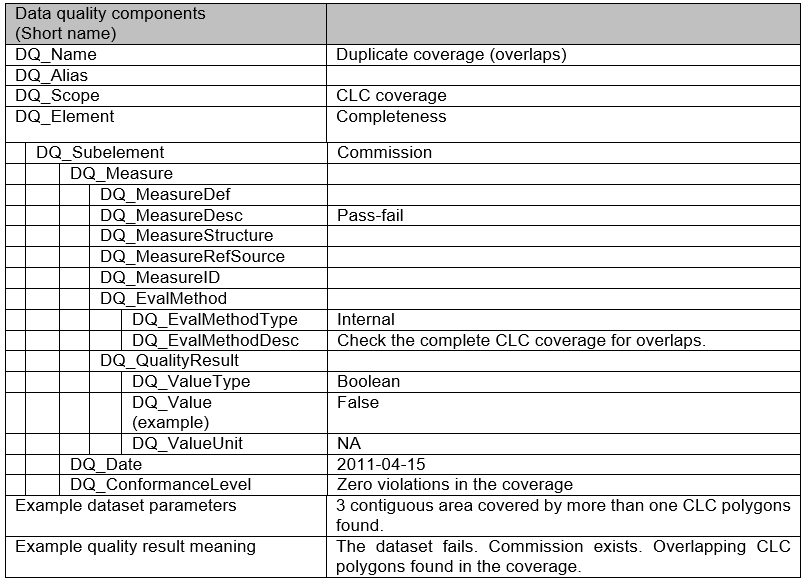

[.text-center]
*Table 18 : Example for Completeness - commission: Duplicate coverage (overlaps)*

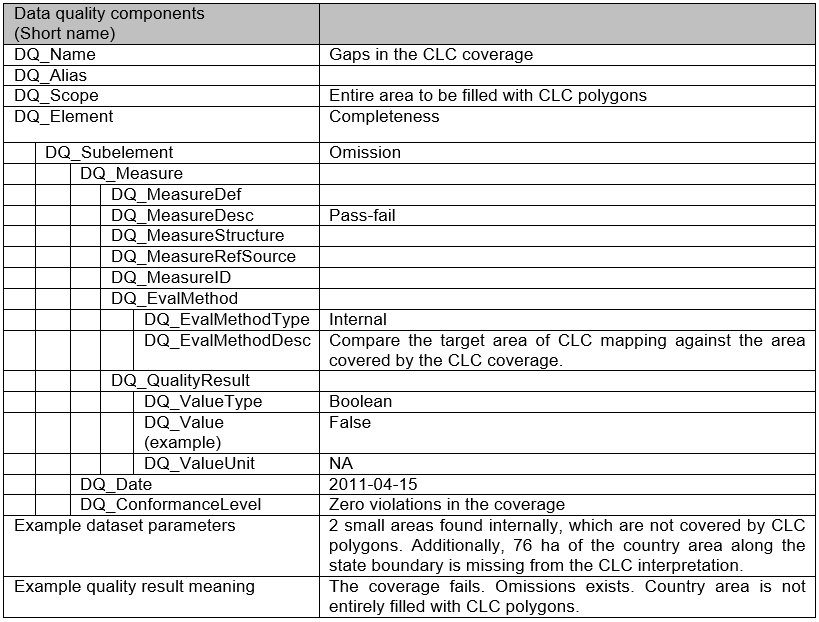

[.text-center]
*Table 19 : Example for Completeness - omission: Gaps in the CLC coverage*

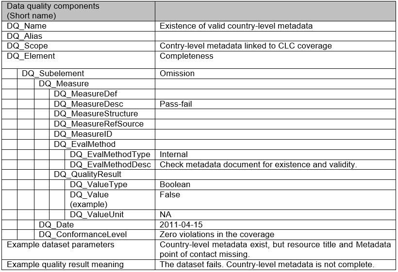

[.text-center]
*Table 20 : Example for Completeness - omission: Existence of valid country-level metadata*

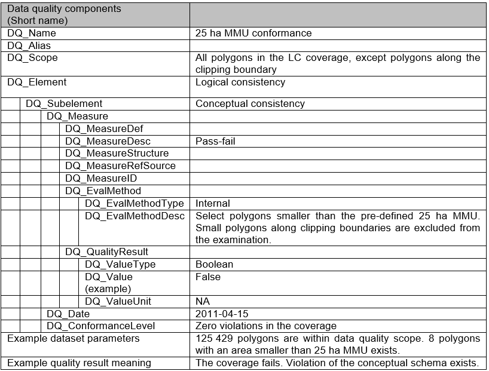

[.text-center]
*Table 21 : Example for Logical consistency – conceptual consistency: 25 ha MMu conformance*

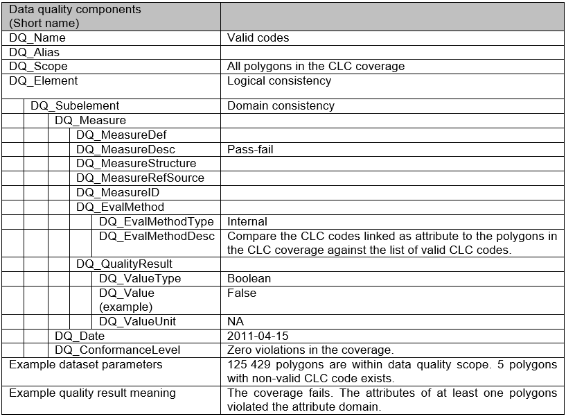

[.text-center]
*Table 22 : Example for Logical consistency – domain consistency: Valid codes*

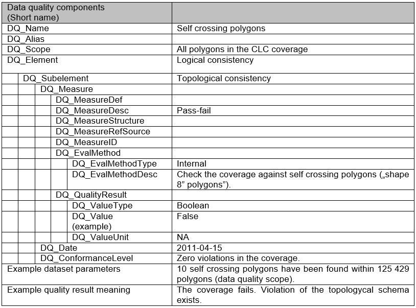

[.text-center]
*Table 23 : Example for Logical consistency – topological consistency: Self-crossing polygons*

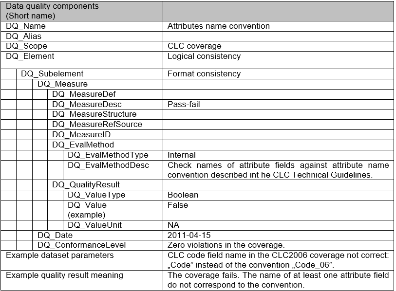

[.text-center]
*Table 24 : Example for Logical consistency – format consistency: Attributes name convention*

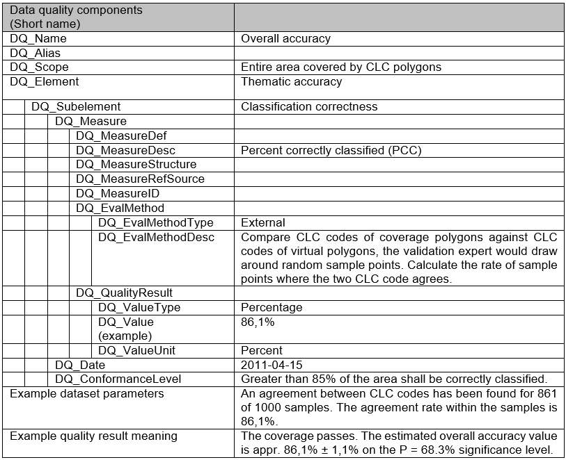

[.text-center]
*Table 25 : Example for Thematic accuracy – classification correctness: Overall accuracy*

<<<
[appendix]
== Examples of Land Cover Parameters - (informative) 

As explained before in the narrative description, the earth's bio-physical surface is populated with landscape elements which combine to form the land cover, and these elements very frequently are collected by other mapping initiatives than the land cover surveys. Parameterization is essential not only for describing the way these landscape elements compound the different land cover situations, but also for adding land cover attributes to these situations (irrigation in crops, cutting of trees in forest areas, urban areas under construction or abandoned, etc.).

The next set of examples intends to show how a data model with land cover parameters allows presenting both the characteristics of land cover, and the relationship between each occurrence of land cover with the different landscape elements on it (trees, buildings, etc.). These examples are based both on the experience of some Members States who are already using object-oriented data models (according to ISO 19107), such as the German DLM (Digital Landscape Model), or Spanish SIOSE (Spanish Land Cover Information System), and the various exercises made by European Working Groups of land cover experts, with the aim to improve current European land cover data models, such us EEA's CORINE Land Cover (CLC), or Eurostat's LUCAS, by adding detailed information that already exist in many national inventories, in a harmonized and interoperable way.

The 'ParameterType' classes are designed to respond these needs for adding and exchange parameterized information within Inspire Land Cover Data Specifications. The 'ParameterType' abstract class can take shape in three specific classes, whom inherit attributes from it, that describe the different typology of considered parameters, according criteria of accountability and measurability of the phenomenon taken in account. These classes are:

* CountableParameter
* PresenceParameter
* PercentageParameter

So each example has a description of the thematic requirement which is addressing, with some visual examples, and a brief explanation of how the 'ParameterType' classes could be used to solve each case.

*Example 1:* Percentage Parameter

One of the key factors when producing CLC polygons in natural areas is precisely the determination of the density of tree crown cover in forests. In the CLC nomenclature, the class definition for '31 Forests' indicates that '31X' must be used ' with a canopy closure of 30 % at least '. So determining if there is a mass of forest trees with crown cover density of above or less than 30% is fundamental to assign 31X classes. Moreover, tree crown cover threshold is one of the main points in any forest nomenclature definition.

However, it is precisely this 30% minimum threshold one of the problems encountered when trying to compare CLC databases with other land cover inventories with different tree crown cover threshold. So, adding this parameter or descriptor to CLC polygons is a major improvement to move on comparability and thematic interoperability. In many cases, this parameter can be added to the CLC database from more detailed forest inventories (national or regional) or may be obtained by incorporating new technologies for detecting tree cover (e.g. detection and classification of LIDAR data or very high resolution remote or aerial imagery).

The current LC data model allows providing the CLC labels for a polygon dataset, but also, when existing, provides parametric information related to the percentage of tree crown cover in a forest area. In this context the data type ParameterType/Percentage Parameter is used, with the name 'TreeCrownCover', as shown in the following example, with labelled CLC polygons.

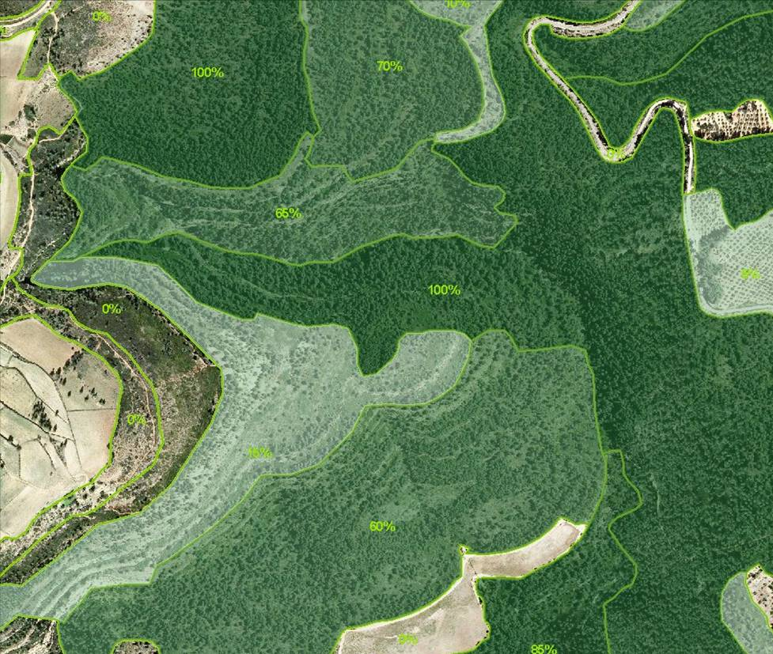

[.text-center]
*Figure 33: CLC polygons, adding tree crown cover information*

*Using this capability in the data model, it is possible to maintain the backward comparability between two CLC databases (e.g. CLC 1990 or 2000 with the future CLC databases), but also compare a CLC inventory with another land cover database, which is using a different definition for 'forest'.*

*Example 2:* Presence Parameter

In this example, it can be seen how several land cover polygons with crops, from SIOSE, are being characterized by adding parametric information directly related with the land cover class in the polygon.

The data type ParameterType/PresenceParameter (name:'Irrigation'), is used here to characterize if the crop is being irrigated or not, at the observation time. SIOSE class 'crops' is a land cover parent class, grouping information related to general agricultural terms, such as 'Irrigation'. There are several land cover classes which inherit properties and attributes from the parent land cover class 'crops' (in the following example, 'herbaceous crops', 'non citrus fruit trees', and 'pastures'). It is possible to use the parameter 'Irrigation' both for analyze general crop data, and also when more specific information is needed, for example, when asking about the area covered by irrigated herbaceous crops in the Spanish territory.

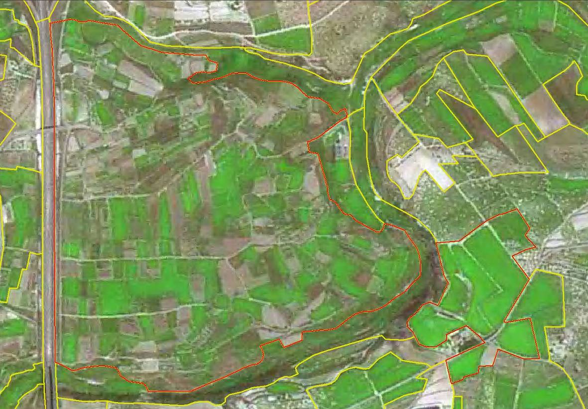

[.text-center]
*Figure 34: SIOSE polygons of an agricultural area, parameter ‘Irrigation’*

*Example 3:* Percentage Parameter

As explained in the informal description, there is a strong correlation between the existence of a certain class of land cover in the land and landscape elements that exist in the field. Some of these elements are also key elements to discriminate one category from another. For example, in the CLC database, according to a greater or lesser percentage of buildings that cover a given urban area (plus other artificial elements), it is possible to determine the corresponding CLC class (111 or 112 for example). Also the type of buildings (individual buildings, industrial buildings, etc.) determines the resulting CLC class in some cases.

Several National Land Cover databases are produced using more detailed mapped information from other topographic or thematic inventories (agricultural, forest, urban). The following figure shows how the German ATKIS Basis -DLM is used for deriving the Land Cover component in DLM (with CORINE Land Cover nomenclature) with a scale of 1:25.000, which will be used later for producing the German CLC for Europe (scale 1:100.000).

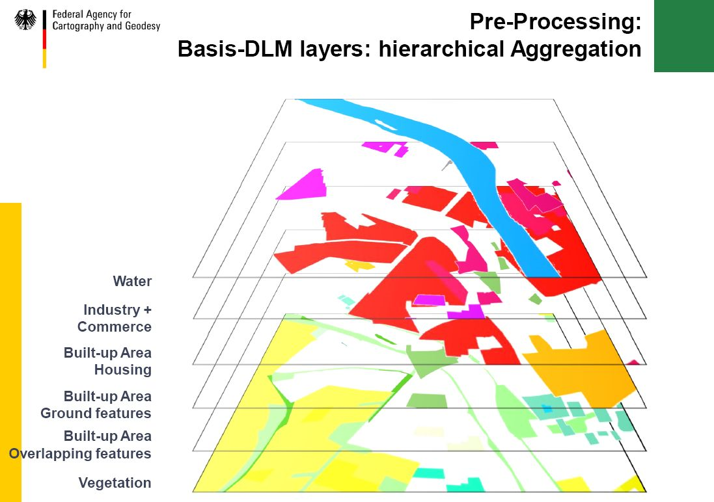

[.text-center]
*Figure 35: Hierarchical aggregation of DLM layer for producing Land Cover, courtesy of Stephan Arnold, BKG.*

In the Spanish SIOSE database, buildings are also considered when describing the information in each SIOSE polygon, therefore the % of surface covered by buildings is stored in the database (with other parameters also related with buildings). So it is possible not only to use this parameter for deriving CLC labels for the SIOSE polygons (using the thresholds considered in the artificial CLC classes, for example), but also for more advanced queries to the database, such as, for example, generating thematic cloropleth maps of settlement in urban areas, using the percentage of area covered by buildings as the discrimination parameter.

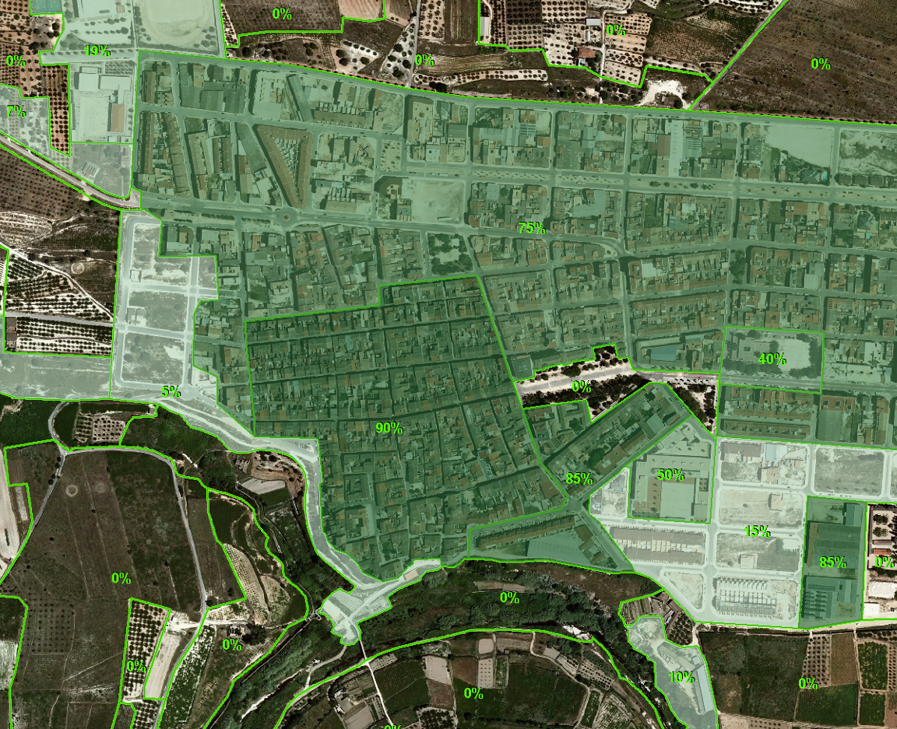

[.text-center]
*Figure 36: SIOSE polygons of an urban area, indicating the percentage of area covered by buildings*

To model this essential part of the information on land cover and frame it in different INSPIRE datasets, the data type ParameterType / PercentageParameter is used. The attribute with the *name '% Buildings'* indicates the percentage of area covered by buildings in each SIOSE polygon, and can be used to produce the consequent SIOSE cloropleth map with this variable.

*Example 4:* Countable Parameter

When analyzing the need for water and nutrients in a plantation of tree crops, such as olive groves, is essential to consider the spacing of trees (and therefore the number of trees for a particular crop area). It is therefore a key parameter when characterizing an olive grove, both in terms of water needs, and in terms of agricultural production.

To provide this information, the data type ParameterType/CountableParameter can be used, with the name 'SpacingOfTrees', indicating the spacing of trees, as can be seen in the following SIOSE example.

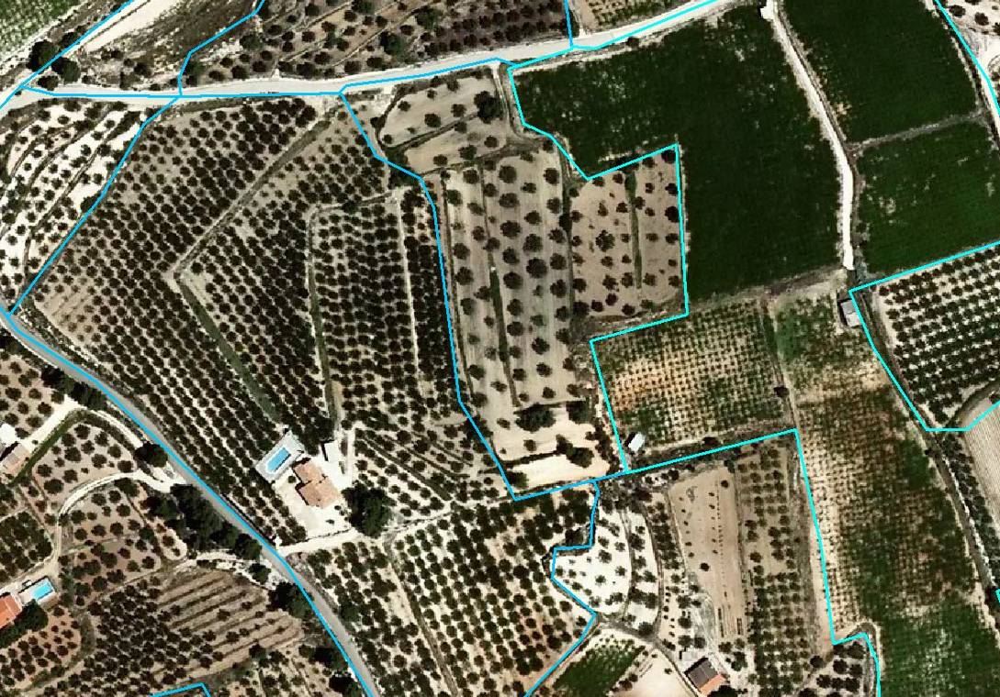

[.text-center]
*Figure 37: SIOSE polygons of an agricultural area, with the parameter related to the spacing of trees*

*Example 5:* Percentage Parameter

According the examples of DLM-DE German or Spanish SIOSE, it is possible to obtain information on the density of a biophysical parameter, such as soil sealing, analyzing the contributions of the artificial landscape elements (buildings and structures, roads , etc.) for each occurrence of a specific geographical land cover. This possibility, as shown in the next examples, is a consequence of producing land cover information from more detailed geographical information that already exists in other geographic databases.

It is also possible to access such information with high biophysical component, and therefore obtainable from remote sensing data, from semi-automatic classification of satellite images. This is the case of High Resolution Layers proposed for GMES Land Services. These services, in fact, are considered efficient and homogeneous information to improve European databases, such as CORINE Land Cover, when there is no possibility to use detailed National inventories, according to the European requirements. Therefore, CORINE polygons for example, in addition to its class label, may have additional parametric information such as soil sealing, water content in the ground at a certain date, etc. Other very important advantage of using this density layers is monitoring the land cover change dynamics, which enable to focus on the changing area when updating land cover databases.

In this context the data type ParameterType/PercentageParameter is used again. In the next SIOSE example, this percentage parameter (*name: '% Soil Sealing'*) is used for describing and labelling the soil sealing density in each SIOSE polygon:

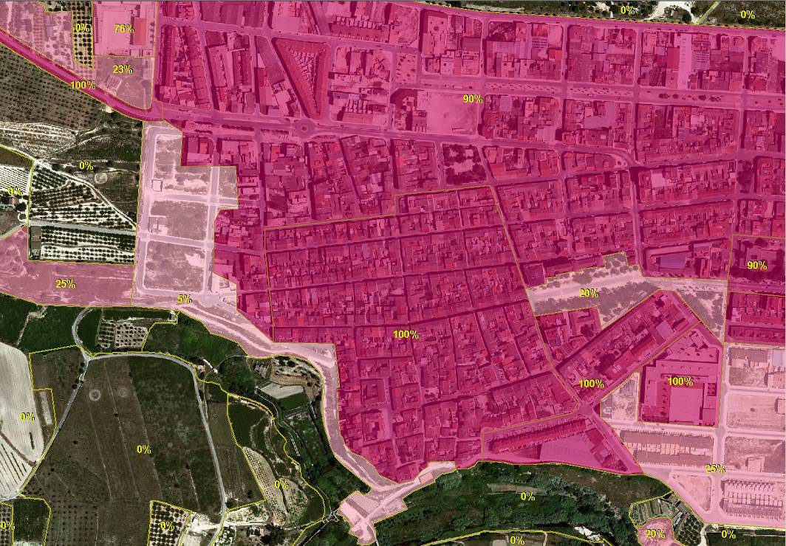

[.text-center]
*Figure 38:  SIOSE polygons of an urban area, indicating the percentage of soil sealed*

<<<
[appendix]
== Example of legends for portrayal rules - (informative) 

=== CORINE Land Cover 2000 legend

The following table is extract from http://www.eea.europa.eu/data-and-maps/data/corine-land-cover-2000-clc2000-100-m-version-9-2007/.

[.text-center]
*Table 26 : CLC 2000 legend*

[cols=",,,,,,,,",]
|===
a|

GRID_CODE

a|

LEVEL1

a|

LEVEL2

a|

LEVEL3

a|

CLC_CODE

|LABEL1 |LABEL2 |LABEL3 |RGB
|1 |1 |1 |1 |111 |Artificial surfaces |Urban fabric |Continuous urban fabric |230-000-077
|2 |1 |1 |2 |112 |Artificial surfaces |Urban fabric |Discontinuous urban fabric |255-000-000
|3 |1 |2 |1 |121 |Artificial surfaces |Industrial, commercial and transport units |Industrial or commercial units |204-077-242
|4 |1 |2 |2 |122 |Artificial surfaces |Industrial, commercial and transport units |Road and rail networks and associated land |204-000-000
|5 |1 |2 |3 |123 |Artificial surfaces |Industrial, commercial and transport units |Port areas |230-204-204
|6 |1 |2 |4 |124 |Artificial surfaces |Industrial, commercial and transport units |Airports |230-204-230
|7 |1 |3 |1 |131 |Artificial surfaces |Mine, dump and construction sites |Mineral extraction sites |166-000-204
|8 |1 |3 |2 |132 |Artificial surfaces |Mine, dump and construction sites |Dump sites |166-077-000
|9 |1 |3 |3 |133 |Artificial surfaces |Mine, dump and construction sites |Construction sites |255-077-255
|10 |1 |4 |1 |141 |Artificial surfaces |Artificial, non-agricultural vegetated areas |Green urban areas |255-166-255
|11 |1 |4 |2 |142 |Artificial surfaces |Artificial, non-agricultural vegetated areas |Sport and leisure facilities |255-230-255
|12 |2 |1 |1 |211 |Agricultural areas |Arable land |Non-irrigated arable land |255-255-168
|13 |2 |1 |2 |212 |Agricultural areas |Arable land |Permanently irrigated land |255-255-000
|14 |2 |1 |3 |213 |Agricultural areas |Arable land |Rice fields |230-230-000
|15 |2 |2 |1 |221 |Agricultural areas |Permanent crops |Vineyards |230-128-000
|16 |2 |2 |2 |222 |Agricultural areas |Permanent crops |Fruit trees and berry plantations |242-166-077
|17 |2 |2 |3 |223 |Agricultural areas |Permanent crops |Olive groves |230-166-000
|18 |2 |3 |1 |231 |Agricultural areas |Pastures |Pastures |230-230-077
|19 |2 |4 |1 |241 |Agricultural areas |Heterogeneous agricultural areas |Annual crops associated with permanent crops |255-230-166
|20 |2 |4 |2 |242 |Agricultural areas |Heterogeneous agricultural areas |Complex cultivation patterns |255-230-077
|21 |2 |4 |3 |243 |Agricultural areas |Heterogeneous agricultural areas |Land principally occupied by agriculture, with significant areas of natural vegetation |230-204-077
|22 |2 |4 |4 |244 |Agricultural areas |Heterogeneous agricultural areas |Agro-forestry areas |242-204-166
|23 |3 |1 |1 |311 |Forest and semi natural areas |Forests |Broad-leaved forest |128-255-000
|24 |3 |1 |2 |312 |Forest and semi natural areas |Forests |Coniferous forest |000-166-000
|25 |3 |1 |3 |313 |Forest and semi natural areas |Forests |Mixed forest |077-255-000
|26 |3 |2 |1 |321 |Forest and semi natural areas |Scrub and/or herbaceous vegetation associations |Natural grasslands |204-242-077
|27 |3 |2 |2 |322 |Forest and semi natural areas |Scrub and/or herbaceous vegetation associations |Moors and heathland |166-255-128
|28 |3 |2 |3 |323 |Forest and semi natural areas |Scrub and/or herbaceous vegetation associations |Sclerophyllous vegetation |166-230-077
|29 |3 |2 |4 |324 |Forest and semi natural areas |Scrub and/or herbaceous vegetation associations |Transitional woodland-shrub |166-242-000
|30 |3 |3 |1 |331 |Forest and semi natural areas |Open spaces with little or no vegetation |Beaches, dunes, sands |230-230-230
|31 |3 |3 |2 |332 |Forest and semi natural areas |Open spaces with little or no vegetation |Bare rocks |204-204-204
|32 |3 |3 |3 |333 |Forest and semi natural areas |Open spaces with little or no vegetation |Sparsely vegetated areas |204-255-204
|33 |3 |3 |4 |334 |Forest and semi natural areas |Open spaces with little or no vegetation |Burnt areas |000-000-000
|34 |3 |3 |5 |335 |Forest and semi natural areas |Open spaces with little or no vegetation |Glaciers and perpetual snow |166-230-204
|35 |4 |1 |1 |411 |Wetlands |Inland wetlands |Inland marshes |166-166-255
|36 |4 |1 |2 |412 |Wetlands |Inland wetlands |Peat bogs |077-077-255
|37 |4 |2 |1 |421 |Wetlands |Maritime wetlands |Salt marshes |204-204-255
|38 |4 |2 |2 |422 |Wetlands |Maritime wetlands |Salines |230-230-255
|39 |4 |2 |3 |423 |Wetlands |Maritime wetlands |Intertidal flats |166-166-230
|40 |5 |1 |1 |511 |Water bodies |Inland waters |Water courses |000-204-242
|41 |5 |1 |2 |512 |Water bodies |Inland waters |Water bodies |128-242-230
|42 |5 |2 |1 |521 |Water bodies |Marine waters |Coastal lagoons |000-255-166
|43 |5 |2 |2 |522 |Water bodies |Marine waters |Estuaries |166-255-230
|44 |5 |2 |3 |523 |Water bodies |Marine waters |Sea and ocean |230-242-255
|48 |9 |9 |9 |999 |NODATA |NODATA |NODATA |
|49 |9 |9 |0 |990 |UNCLASSIFIED |UNCLASSIFIED LAND SURFACE |UNCLASSIFIED LAND SURFACE |
|50 |9 |9 |5 |995 |UNCLASSIFIED |UNCLASSIFIED WATER BODIES |UNCLASSIFIED WATER BODIES |230-242-255
|===

=== CORINE Land Cover 2006 legend

The following table is extract from _http://www.eea.europa.eu/data-and-maps/data/clc-2006-vector-data-version_.

[.text-center]
*Table 27 : CLC 2006 legend*

[cols=",,,,,",]
|===
a|

GRID_CODE

a|

CLC_CODE

|LABEL1 |LABEL2 |LABEL3 |RGB
|1 |111 |Artificial surfaces |Urban fabric |Continuous urban fabric |230-000-077
|2 |112 |Artificial surfaces |Urban fabric |Discontinuous urban fabric |255-000-000
|3 |121 |Artificial surfaces |Industrial, commercial and transport units |Industrial or commercial units |204-077-242
|4 |122 |Artificial surfaces |Industrial, commercial and transport units |Road and rail networks and associated land |204-000-000
|5 |123 |Artificial surfaces |Industrial, commercial and transport units |Port areas |230-204-204
|6 |124 |Artificial surfaces |Industrial, commercial and transport units |Airports |230-204-230
|7 |131 |Artificial surfaces |Mine, dump and construction sites |Mineral extraction sites |166-000-204
|8 |132 |Artificial surfaces |Mine, dump and construction sites |Dump sites |166-077-000
|9 |133 |Artificial surfaces |Mine, dump and construction sites |Construction sites |255-077-255
|10 |141 |Artificial surfaces |Artificial, non-agricultural vegetated areas |Green urban areas |255-166-255
|11 |142 |Artificial surfaces |Artificial, non-agricultural vegetated areas |Sport and leisure facilities |255-230-255
|12 |211 |Agricultural areas |Arable land |Non-irrigated arable land |255-255-168
|13 |212 |Agricultural areas |Arable land |Permanently irrigated land |255-255-000
|14 |213 |Agricultural areas |Arable land |Rice fields |230-230-000
|15 |221 |Agricultural areas |Permanent crops |Vineyards |230-128-000
|16 |222 |Agricultural areas |Permanent crops |Fruit trees and berry plantations |242-166-077
|17 |223 |Agricultural areas |Permanent crops |Olive groves |230-166-000
|18 |231 |Agricultural areas |Pastures |Pastures |230-230-077
|19 |241 |Agricultural areas |Heterogeneous agricultural areas |Annual crops associated with permanent crops |255-230-166
|20 |242 |Agricultural areas |Heterogeneous agricultural areas |Complex cultivation patterns |255-230-077
|21 |243 |Agricultural areas |Heterogeneous agricultural areas |Land principally occupied by agriculture, with significant areas of natural vegetation |230-204-077
|22 |244 |Agricultural areas |Heterogeneous agricultural areas |Agro-forestry areas |242-204-166
|23 |311 |Forest and semi natural areas |Forests |Broad-leaved forest |128-255-000
|24 |312 |Forest and semi natural areas |Forests |Coniferous forest |000-166-000
|25 |313 |Forest and semi natural areas |Forests |Mixed forest |077-255-000
|26 |321 |Forest and semi natural areas |Scrub and/or herbaceous vegetation associations |Natural grasslands |204-242-077
|27 |322 |Forest and semi natural areas |Scrub and/or herbaceous vegetation associations |Moors and heathland |166-255-128
|28 |323 |Forest and semi natural areas |Scrub and/or herbaceous vegetation associations |Sclerophyllous vegetation |166-230-077
|29 |324 |Forest and semi natural areas |Scrub and/or herbaceous vegetation associations |Transitional woodland-shrub |166-242-000
|30 |331 |Forest and semi natural areas |Open spaces with little or no vegetation |Beaches, dunes, sands |230-230-230
|31 |332 |Forest and semi natural areas |Open spaces with little or no vegetation |Bare rocks |204-204-204
|32 |333 |Forest and semi natural areas |Open spaces with little or no vegetation |Sparsely vegetated areas |204-255-204
|33 |334 |Forest and semi natural areas |Open spaces with little or no vegetation |Burnt areas |000-000-000
|34 |335 |Forest and semi natural areas |Open spaces with little or no vegetation |Glaciers and perpetual snow |166-230-204
|35 |411 |Wetlands |Inland wetlands |Inland marshes |166-166-255
|36 |412 |Wetlands |Inland wetlands |Peat bogs |077-077-255
|37 |421 |Wetlands |Maritime wetlands |Salt marshes |204-204-255
|38 |422 |Wetlands |Maritime wetlands |Salines |230-230-255
|39 |423 |Wetlands |Maritime wetlands |Intertidal flats |166-166-230
|40 |511 |Water bodies |Inland waters |Water courses |000-204-242
|41 |512 |Water bodies |Inland waters |Water bodies |128-242-230
|42 |521 |Water bodies |Marine waters |Coastal lagoons |000-255-166
|43 |522 |Water bodies |Marine waters |Estuaries |166-255-230
|44 |523 |Water bodies |Marine waters |Sea and ocean |230-242-255
|===

<<<
[appendix]
== Existing land cover classification systems and LCML - (informative) 

=== LCML

ISO 19144-2 specifies a Land Cover Meta Language (LCML) expressed as a UML metamodel that allows different land cover classification systems to be described based on physiognomic-structural aspects and so defines a common reference structure for the comparison and integration of data from any generic land cover classification system (lccs). It also improves the harmonization and integration of spatial data sets with legends or nomenclatures developed from different land cover classification systems. Indeed, such systems are well established in ongoing mapping projects and cannot be easily changed.

This LCML approach provides a rigorous logical framework for the description of any land cover class. The key to describe any international, national or multi-national lccs in terms of the LCML is to use a compliant parametric approach, circumventing the traditional obstacles such as complex definitions, prefixed ranges of values and specific classification rules.

The main drawback of the LCML harmonization approach is that non physiognomic classification aspects of a lccs –such as land use- are not fully recognized by the LCML and that information will be partially lost in translation. Considering that the INSPIRE land cover theme is defined only by "physical and biological cover of the earth's surface", the resulting LCML translation can be considered as filtering the "pure" land cover information from an existing data set.

=== Translating a lccs database into its LCML version

The LCML provides a general framework of rules using independent diagnostic criteria. These lead to land cover metalanguage descriptor objects that are defined by a combination of a pre-defined set of land cover metalanguage elements, divided in two categories

* "basic metalanguage-elements" constitute the main physiognomic aspects of biotic and abiotic cover features organized in layers, for instance for biotic features trees, shrubs, herbaceous vegetation etc., and
* "metalanguage-element properties" further define the physiognomic aspect of each basic type metalanguage-element.

In the LCML model, further detail of the resulting land cover classes may be achieved by adding *optional* descriptive metalanguage-element characteristics not directly related to the physiognomic/structural characterization of the land cover but which assist in better describing the land cover class:

* LC_ElementCharacteristics" may be applied to a single basic metalanguage-element
* LC_ClassCharacteristics" relate to a whole Land Cover class, defined as the combination of single or multiple strata of single or multiple basic meta-elements

Figures 39 and 40 illustrate these basic elements, properties and characteristics through a practical example.

The metalanguage generates mutually exclusive land cover classes, with specific rules to deal with the all functional elements of the language (basic metalanguage-elements ,-properties and their relationships) and the different strata.

The process of translating an existing dataset for a given lccs into a dataset expressed in LCML involves 4 activities:

[arabic, start=1]
. Perform a semantic analysis on the lccs class to understand its physiognomy and structure.
. Design the appropriate LCML class for each lccs class, combining the applicable basic metalanguage-elements, metalanguage-element properties and optional metalanguage-element characteristics
. Repeat activity 1 and 2 for each class in the original lccs
. Apply class codes and parameter values at feature or polygon level.

=== Examples for CORINE LAND COVER

The above process can be illustrated with two examples of the CORINE Land Cover Classes.

*CLC 213: Rice fields*

The semantic analysis starts from the original CLC Description: "Land prepared for rice cultivation. Flat surfaces with irrigation channels. Surfaces periodically flooded."

The LCML translation logic of this description would consider two separate layers; one biotic and one abiotic. The biotic layer consist of the LCML element " herbaceous growth forms" "cultivated" with specific floristic name "rice". The second layer is composed by the element "natural water" "fresh" with a "persistence period" extend to the whole cultivation time.

The concept of this class CLC 213 allows for an unambiguous translation into LCML without loss of information. "Graminae", "Water Body" and "Periodic variation" are its basic elements, each with properties; "Cultivated and managed vegetation" and "Floristic aspect" are the optional characteristics of the "Graminae". ; "Water Salinity" is a characteristic of "Water Body" (Figure 40).

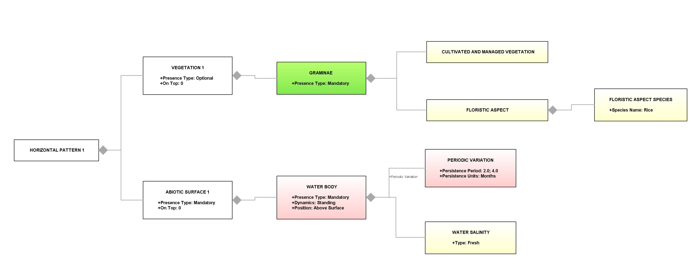

[.text-center]
*Figure 39: UML representation of the selection of LCML elements for translating CLC 213 Rice fields.*

[source, xml]
----
 <?xml version="1.0" encoding="UTF-8" standalone="no" ?> 
- <LC_Legend xmlns:xsi="http://www.w3.org/2001/XMLSchema-instance" id="1" lccs_sort="0" uuid="be10d990-5660-11e1-ab66-001999808c3f" xsi:noNamespaceSchemaLocation="INSPIRE_Annex_LCML.xsd" xsi:type="LC_Legend">
  <name>New Legend</name> 
  <description>Describe the legend</description> 
- <elements>
- <LC_LandCoverClass id="2" uuid="c98596d0-5660-11e1-ab66-001999808c3f" xsi:type="LC_LandCoverClass">
  <name>Rice Fields</name> 
  <description>Describe the land cover class</description> 
  <map_code>lcc1</map_code> 
- <elements>
- <LC_HorizontalPattern id="3" uuid="cd9b9440-5660-11e1-ab66-001999808c3f" xsi:type="LC_HorizontalPattern">
  <name>Horizontal Pattern 1</name> 
  <description>Describe the horizontal pattern</description> 
- <elements>
- <LC_Stratum id="4" ontop="0" uuid="1d273cc0-5662-11e1-ab66-001999808c3f" xsi:type="LC_Stratum">
  <name>Vegetation 1</name> 
  <description>Vegetation 1</description> 
- <elements>
- <LC_LandCoverElement id="5" uuid="233d9e10-5662-11e1-ab66-001999808c3f" xsi:type="LC_Graminae">
  <name>Graminae</name> 
  <description>Describe a vegetation element of graminae type</description> 
- <elements>
- <LC_Characteristic id="6" uuid="27a47287-43af-11de-bbd4-000cf147c442" xsi:type="LC_CultivatedAndManagedVegetation">
  <name>Cultivated And Managed Vegetation</name> 
  <description>Describe the cultivated and managed vegetation</description> 
   </LC_Characteristic>
- <LC_Characteristic id="7" uuid="27a47295-43af-11de-bbd4-000cf147c442" xsi:type="LC_FloristicAspect">
  <name>Floristic Aspect</name> 
  <description>Describe the floristic aspect</description> 
- <elements>
- <LC_Characteristic id="8" uuid="2c121880-5663-11e1-ab66-001999808c3f" xsi:type="LC_FloristicAspectSpecies">
  <name>Floristic Aspect Species</name> 
  <description>Describe the floristic aspect species</description> 
  <species_name>Rice</species_name> 
……. /
 …….
- <LC_Stratum id="9" ontop="0" uuid="6ceae530-5663-11e1-ab66-001999808c3f" xsi:type="LC_Stratum">
  <name>Abiotic Surface 1</name> 
  <description>Stratum 1</description> 
- <elements>
- <LC_LandCoverElement id="A" uuid="8293f070-5663-11e1-ab66-001999808c3f" xsi:type="LC_WaterBody">
  <name>Water Body</name> 
  <description>Describe a water body surface element</description> 
- <elements>
- <LC_Characteristic id="B" uuid="27a2ebe2-43af-11de-bbd4-000cf147c442" xsi:type="LC_WaterSalinity">
  <name>Water Salinity</name> 
  <description>Describe the water salinity characteristic</description> 
  <type>Fresh</type> 
</LC_Characteristic>
  </elements>
  <presence_type>Mandatory</presence_type> 
- <periodic_variation id="C" uuid="860747b0-a39a-11e0-bd59-000cf147c442" xsi:type="LC_PeriodicVariations">
  <name>Periodic Variations</name> 
  <description>Contains the elements of Periodic Variation</description> 
- <elements>
- <LC_PeriodicVariation id="D" uuid="e3d58d80-5663-11e1-ab66-001999808c3f" xsi:type="LC_PeriodicVariation">
  <name>Periodic Variation</name> 
  <description>Describe a periodic variation element</description> 
  <persistence_units>Months</persistence_units> 
  <persistence_period max="4.0" min="2.0" /> 
  </LC_PeriodicVariation>
  </elements>
  </periodic_variation>
  <dynamics>Standing</dynamics> 
  <position>Above Surface</position> 
  </LC_LandCoverElement>
…../…..
----

[.text-center]
*Figure 40: Extracts of the XML created by FAO LCCS3 software after translating "CLC 213 Rice fields"*

*CLC class 243: Land principally occupied by agriculture, with significant areas of natural vegetation*

The semantic analysis starts from the original CLC Description: "Areas principally occupied by agriculture, interspersed with significant natural areas". This description, as is, could represent either of two spatial concepts: the CLC class reflects either a functional (occupation) unit or a "spatial heterogeneity" due to the scale of interpretation. As the rigorous LCML syntax separates between the two cases, a translator's choice is needed. Here, the first case has been considered and the class has been translated as "functional unit". Still, a minimum percentage of allowed proportion between the different features composing this class should be considered. We acknowledge that such translation information on the land cover types and the correspondent percentage can often be derived from CLC4/CLC5 classes or the national mapping documentation

The LCML translation approach considers three horizontal patterns for CLC243. The first one composed by "herbaceous' or "woody" crops, the second by natural vegetation, the third one by "water bodies". However more horizontal patterns could have been added if wetlands and urban settlements must be considered. Considering class 243 as a "functional unit", foresees clear and fixed ranges of proportional percentage between the different patterns.

The concept of this class CLC 243 carries some inherent vagueness that reflects in the LCML translation. Better ancillary information would allow a better translation, but "off the shelf", the class would be translated into three layers with arbitrary proportions.

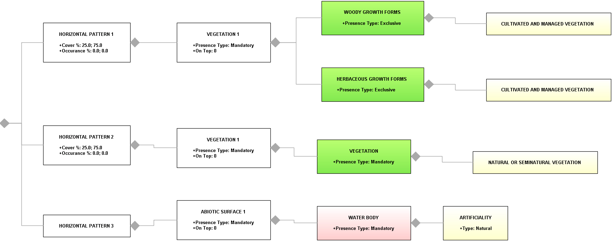

[.text-center]
*Figure 41: Selection of LCML elements for translating "CLC 243 Land principally occupied by agriculture, with significant areas of natural vegetation"*

The above CLC examples are given only for illustrating this INSPIRE data specification on land cover. It is the responsibility of each owner of a regional Land Cover classification (e.g. CLC4 – CLC5) or the European Environment Agency (CLC3) to describe the classes in LCML terms.

=== Schema transformation by "semantic translation" 

When the original lccs, the CLC legend or the optional INSPIRE land cover nomenclature are described in LCML terms, then the linguistically concise nature of LCML could support highly automated translation of the datasets from one classification into the other.

This would involve a schema transformation service to map the local implementation in a target schema. Such a service transforms data from the local schema towards the target schema according to appropriate schema mapping rules compliant with INSPIRE-level specifications. What follows focuses on the semantic aspects: i.e. the translation of the classification codes of the data set.

Such semantic schema transformation process from a local model to the LCML can be performed following a two-fold approach (Figure 42).

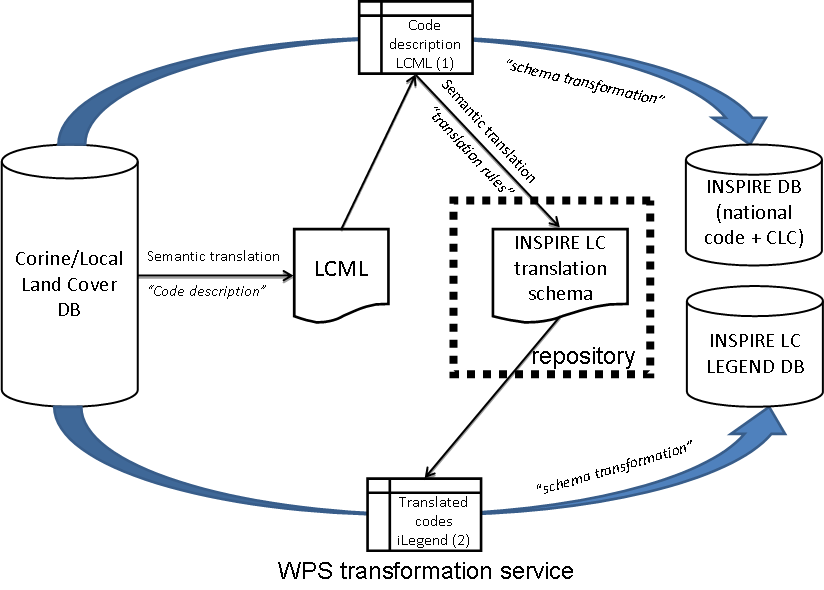

[.text-center]
*Figure 42: Schema transformation by semantic translation towards an INSPIRE compliant Land Cover Meta Language.*

Any schema mapping between the MS application schema expressed in LCML and target schema (= INSPIRE LCML) should be performed at the semantic level first. As seen previously, this requires a good knowledge of the two schemas and requires decisions in order to split more general classes defined at the MS level into more detailed LCML classes, or on the contrary to aggregate or generalize classes (not polygons) where needed - all decisions are based on the appropriate classifiers or properties. The schema mapping expresses relations between source and target schema to be used for the data transformation itself. That mapping can be prepared manually, half-automatically or fully automatically as long as it is precise, unambiguous and complete and no data loss or inaccuracies occurs. The mapping rules between local and target schema are stored in the mapping repository, accessible for further data transformation requests.

Second, a transformation service needs to be set up to execute the data transformation based on that appropriate schema mapping available in the repository. The Commission Regulation for INSPIRE Transformation Services describes the Web Service interface on the abstract level and recommends to make an accessible (transformation) service available wrapped in an OCG Web Processing Service (WPS). From the software point of view, such service-based transformation could be implemented using any number of proprietary tools.

Such future automation remains challenging. Critical elements include the precise comprehension of the local land cover classification, its correct LCML description, the correct description of a target schema and a tool for the LCML schema mapping service for schema and data transformation. Still, each of these challenges has already been individually addressed during scientific projects.

<<<
[appendix]
== INSPIRE "Pure Land Cover Components" - (informative)

As a proposal for a European harmonized description of land cover information, the TWG LC suggests a collection of _Pure Land Cover Components_ (PLCC) in the form of a code list. The purpose of this code list is not to provoke any extra mapping activities, but rather to give the data providers the opportunity to describe their data from the pure land cover point of view in a harmonized way and thus streamline comparison of outputs from various land monitoring initiatives. The concept behind that code list is the attempt to leave out any land use aspects as far as possible in describing the landscape. Together with the Land Use information which is stored in the HILUCS classes (developed by the TWG LU), a complete and complementary abstraction of landscape can be modeled.

Behind setting up the PLCC code list there has been going on a process of developing a modified land cover data model, which aims at suiting the future requirements of European land cover monitoring on continental as well as on national and regional level.

It also turned out that during the development of the data model behind the PLCC code list there is a strong comparability with the approach used in the ISO standard 19144-2 (Land Cover Meta Language LCML).

The PLCC code list is not meant to be applied as a mandatory way to describe land cover but as a recommendation which aims more at a good practice to increase interoperability and applicability. Furthermore, the forming of PLCC is open for future modifications, after incoming contributions of a broader user feedback and after data providers have collected experiences with it.

*Minimum mapping unit* (MMU):

The PLCC code list is meant to be scale and MMU-independent. The TWG LC is aware of the fact, that for the interest of the end user it might be of advantage to implement a certain minimum mapping unit, which could ensure a better geometrical comparability between neighboring countries, especially across borders, but also between different databases or nomenclatures. However, by introducing a certain MMU this could be a limiting factor to the philosophy of INSPIRE to give access to all relevant spatial data sets without limitations of scale. Similar to a requirement regarding data quality, also a required MMU could complicate the providing of land cover information or even exclude certain LC data from the INSPIRE community. Therefore it is not considered to demand a commonly defined MMU while applying the PLCC code list. Instead, each data provider is asked to enter his data as is, according to the MMU which result from his own mapping rules and technical guidelines.

*Usage* of the code list:

[loweralpha]
. It can be used simply as a kind of nomenclature, and the LC data is entered into the model by application of the code list like a categorization and attaching only one single code from the code list to a certain land cover unit.
. The code list can be used in a descriptive way, which gives room for attaching more than one land cover component from the code list to a single land cover unit, expressing that on a particular spot in landscape there exists more than one land cover component. This application of the code list would go in-line with the idea of the descriptive approach of the ISO standard 19144-2 (LCML).
. Use the code list like mentioned in b), in a more elaborated way by not only mentioning more than one land cover component to be attached to a certain land cover unit, but also to enter a percentage value and structure description (like in LCML horizontal pattern/vertical stratum), which indicates the relative fraction and spatial composition of the considered land cover component inside the area extent of a definite land cover unit.

* Attribution* of land cover components:

The TWG has also discussed the issue of the possibility to open up the land cover component for further characterization through attribution (e.g. giving information about the water regime of an inland water course: perennial, periodic, episodic). However, it was decided to not go into the level of attribution. Hence, attribution would then be in the hands of the land monitoring community to bring forward the future process of data model development, but which is supposed to take place outside the INSPIRE legislative process.

*Seasonality/Time Variability*:

The PLCC code list in some cases may seem to be not suitable for tackling seasonality. This might be solved in a later stage of development with attributes and properties. If the data provider wants to describe seasonal variability in a proper way, he should then use LCML or any other classification system or nomenclature which suits better for that issue. Alternatively the data provider could enter a second observation date (e.g. during rainy season and dry season) connected to a second land cover component to express a high variability of land cover characteristic in the landscape due to seasonal effects (e.g. PLCC 003 and 009).

The harmonized characterization of seasonality aspects of land cover features, for example in vegetation or water bodies is being actually addressed within the works of the EAGLE Group, considering the past and present activities within GMES Land services (CLC & High Resolution Layers), and new initiatives for land cover monitoring (such as the descriptive approach of seasonality in ISO standard 19144-2 or seasonal attributes in object-oriented land cover databases).

*Development* of the Pure Land Cover Components:

The EAGLE Group has supported the TWG LC in developing a harmonized way to describe land cover through intensive and interactive contributions, which finally resulted in this proposed code list of PLCC. Since INSPIRE is a kind of "milestone" or a step wise approach in this process, it is expected that further developments of an enhanced way to describe and model land cover information are stimulated (be it a classification system or an object-oriented approach) and carried out by initiatives like EAGLE or HELM (Harmonised European Land Monitoring).

*Owner* and *Home* of the PLCC code list:

The PLCC Code List will be made available as a proposal on the EAGLE-website [http://sia.eionet.europa.eu/EAGLE].

It is still to be worked out who in the future will take over the ownership of the PLCC code list. 

[.text-center]
*Table 28: Pure Land Cover Component (PLCC) – code list*

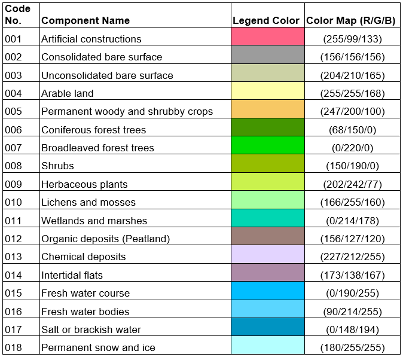

*Explanation* of the Code List and *Examples*:

Land Cover represents the biophysical state of the real landscape, which means that it consists of natural, modified and artificial objects with their physiognomic properties and their spatial relationships. The main principle of the approach that has been applied in creating this list of PLCCs has been guided by the background questions "What do I interprete as land cover in the landscape from the view above (e.g. on satellite imagery)? How is the earth´s surface covered on a single specific spot of land? How can I order the landscape elements and form them into pure land cover components, regardless of its land use aspects as far as possible.

[.underline]#001_Artificial constructions:#

All types of artificial man-made constructions with a sealed surface. It includes

* roof covered buildings (residential, commercial, industrial, transportation (train stations and airport terminals) etc.)
* other artificial constructions (e.g. dams, water sewage plants, power plants, dump sites)
* linear constructions (e.g. railway network, road networks).

It would exclude surfaces formed by bare surfaces (rock, sand, soil) under anthropogenous influence (e.g. quarries) or other man-made artificial vegetation covers (parks/gardens).

[.underline]#002_Consolidated bare surface:#

Any type bare surface, formed by natural material and with a solid surface. It also may have been modified through man-made processes like on extraction sites.

It includes

* solid rock surface or hard pan without any further coverage of loose material
* quarries, extraction sites of rock formations.

It would exclude artificial solid surfaces like concrete or asphalt areas as part of any man-made infrastructures, which ought to be placed under _001_Artificial constructions_. Consolidated surface neither does contain salt surface due to water evaporation, which instead is placed under _013_Chemical deposits_ (see below).

[.underline]#003_Unconsolidated bare surface:#

Any type of bare unvegetated surface, formed by natural loose materials resulting from physical sedimentary processes (fluviatile, littoral, glacial/periglacial, aeolian, gravitative slope processes etc.)

It includes

* boulders, scree, pebbles, sand, silt, clay
* any kind of mixture of the above mentioned compartments (e.g. glacial moraines)
* also semi-natural areas, with a character of fallow land apparently out of use and lacking vegetation cover.

It may also contain very sparse vegetation spots; however, sparse vegetation cover should generally be modeled as a combination of one or more vegetated components (PLCC _006 - 012_) and bare surfaces (PLCC _002,_ _003 or 013)_.

It would exclude Bare soil in agricultural areas, which would be part of _004_Arable Land_ (see below).

[.underline]#004_Arable land:#

Land Cover Component strongly characterized by the aspect of land use. Agriculture has always been a category difficult to describe only from a pure land cover point of view as it is characterized by regular alternation of bare soil and crop cover.

It includes

* herbaceous crops (e.g. gramineae, different types of cereals, corn, wheat, barley, etc.)
* forbs (e.g. potatoes, tomatoes, strawberries, hop etc.)
* also bare soil in arable land, which is only temporarily uncovered with crop plants.

[.underline]#005_Permanent woody and shrubby crops:#

Any type of multi-annual or permanent crop with woody or shrubby character. Usually a kind of planting pattern can be recognised.

It includes

* any type of fruit trees plantation (apple, cherry, nuts, oranges etc.)
* mixed fruit tree growing in an orchard pattern
* olive trees
* vineyards
* berry plantations and shrubs
* tree nurseries

It would exclude hop plantation, because only the structure of the planting is permanent, but not the crop itself, which belongs to 004_Arable Land.

[.underline]#006_Coniferous forest trees:#

It includes coniferous trees, both deciduous (e.g. the larch) and evergreen species. Dwarf trees along the tree line (where habitat climate conditions have restricting influence on the growth form of trees) in mountainous or polar regions are considered here also as trees, not as shrub.

[.underline]#007_Broadleaved forest trees:#

Any type of broadleaved trees. It may include also palm trees or other non-coniferous tree species. Dwarf trees along the tree line (where habitat climate conditions have restricting influence on the growth form of trees) in mountainous or polar regions are considered here also as trees, not as shrub.

[.underline]#008_Shrubs:#

Any type of vegetation with woody character (ligneous stem) and with a growth form and height between herbaceous and trees. This class also includes dwarf shrubs (e.g. Erica spp.) making up heath vegetation.

[.underline]#009_Herbaceous plants:#

All types of gramineous and forb vegetation.

It would exclude annual gramineous vegetation as crop type (cereals, corn, grains, etc.), which is placed under _004_Arable Land_.

[.underline]#010_Lichens and mosses:#

All types of Lichens and Mosses. Mainly they would appear in habitats with restricted growing conditions for other plant species like low temperature, lacking of sunlight, very high soil moisture, or very dry conditions etc.

Mostly they would grow in association with other vegetation types. Applying this code list, it is therefore most likely to combine them with other PLCC, other than in polar or alpine regions where it can make up homogenous land cover.

[.underline]#011_Wetlands and marshes:#

All types of wetland, which is under the influence of very high soil moisture due to high ground water level, high precipitation rates, due to frequent flooding and/or presence of surface water, which is shallow enough to allow vegetation cover over ground. This LC component makes no difference regarding the geographic location of the marshland.

It includes

* inland marshes (fresh or salt water)
* coastal salt marshes

Marshland is wet by definition and can stand alone. However, it does not give precise information by itself about the kind of present vegetation cover but describes instead the growing condition. Therefore is should be combined with some other LC components, e.g. Herbaceous. Also it is possible to add explicitly water as a contributing layer, which indicates that the marsh contain not only water-saturated soil but is also most of the time or regularly covered with surface water (either salty, brackish, or fresh). Most marshes are covered with herbaceous plants, but it is also possible to include shrubs or trees as part of the vegetation cover by using the referring PLCC _006 - 010_.

It would exclude occasionally flooded land, which by its character belongs to other landscape types and besides the temporal presence of surface water it cannot be classified as marshland.

[.underline]#012_Organic deposits (peatland):#

Peat is a type of organic soil composed of incomplete decayed organic material because of lack of oxygen due to water saturated ground, which leads to stepwise accumulation of biomass. The frequency of peatland is greatest in regions with very humid climate, where the precipitation is much higher than the evaporation. Mire vegetation is adapted to the harsh conditions, for example with low content of oxygen in water and often rather acid soil.

Peatland is likely to be covered on its surface with vegetation,. In most cases the peat surface itself is not visible on the imagery, but instead the typical vegetation cover which is adapted to the habitat conditions of peatland. Similar to Marshes it describes the growing conditions of vegetation on the spot. Therefore it is considered to be a separate PLCC, which is best to be used in combination with other vegetation PLCCs.

It includes

* bogs (ombrotrophic) and fens (minerotrophic),
* bare peat with no vegetation cover on surface.

This PLC component can also be combined with _011_Wetland and marshes_ (to express the water saturation) or with other vegetations PLC components _006 - 010_.

[.underline]#013_Chemical deposits:#

Complementary to the organic deposit this is the category that contains all kinds of deposits/sediments, which result from chemical processes like evaporation of salt water with residuals due to mineral crystallization processes. No differentiation is made between natural and man-made chemical deposits.

It includes

* naturally occurring salt surface
* salines (for oceanic salt extraction)
* other crystalline loose chemical residuals (e.g. lime, gypsum, soda etc.) not yet having the character of solid geolocial stone formation.

[.underline]#014_Intertidal flats:#

Typical transitional zone between the average high tide and low tide sea water line. It is under tidal influence and mostly covered with sand or fine alluvial mud/sea ooze on the ground, being twice a day covered and uncovered with water.

It includes

* coastal intertidal mud flats (salt water)
* intertidal zone along river estuaries.

It would exclude areas with occasionally exposed sea bottoms, caused by other conditions than tide (air pressure or water level variation due to heavy winds, e.g. in the Baltic Sea). They belong to the area of open sea water.

[.underline]#015_Fresh water course:#

Any type of inland fresh water courses with linear character and/or principally flowing water. It includes

* Rivers and Streams; under different water regimes: perennial, periodic/seasonal, episodic/irregular; under low or high seasonal variation of water level; with various water course shapes like natural/braided river, controlled/regulated/channeled rivers
* Channels (purely artificial) for navigation or irrigation purpose.

[.underline]#016_Fresh water bodies:#

Any type of inland water bodies, which have a still character. It includes

* natural lakes and ponds,
* water reservoirs (e.g. for drinking water supply, energy production, irrigation, fire extinction etc.)

No distinction is made between natural lakes and man-made retaining water bodies.

[.underline]#017_Salt or brackish water:#

Any kind of salty or brackish water surface, regardless of geographical location or distribution.

It includes

* open sea water,
* coastal lagoons (salt or brackish),
* salty or brackish estuary zones of river mouths,
* inland salt or brackish water (e.g. in areas of geothermal activities or salty steppe lakes where evaporation is higher than water inflow.)

[.underline]#018_Permanent snow and ice:#

It includes

* glaciers

* snow fields, which do not melt during warm summer period in between two winter seasons.

*OAQ – Occasionally asked Questions/ Comments:*

Why there is no Pure Land Cover Component like mixed forest?

Answer: it can be modeled with the two components _006_TConiferous forest trees_ and _007_ Broadleaved forest trees_ and entering a relative percentage value for area coverage of both components referring to the total area extend of a single geometric land cover unit.

How to describe something like Sparsely Vegetated Areas?

Answer: Use for example _002_Consolidated bare surface_ in combination with another vegetation PLCC like _009_Herbaceous plants_ and _010_Lichens and mosses_ by also giving area percentage values.

*Portrayal* for code list:

This Color Map contains a legend color for each Pure Land Cover Component. When using several components of this code list to describe landscape, it is up to the data provider or end data user how to combine the colors. It can be done either in striped or dotted patterns, or only give color to the geometric unit according to the dominant component. In the last case, the information about a secondary or tertiary component can then still be entered in the model numerically with area percentages.

The R/G/B-Color Values of the PLCCs have been selected following good distinction on screen. When printed out on hard copy the colors may appear differently and not show good contrast anymore to each other. To avoid such effects it could be helpful to transform the R/G/B color values into CYMK.

*Coherence* between PLCC – CLC – LMCL

Expressing the two CORINE Land Cover (CLC) classes CLC 213 and CLC 243 translated into Land Cover Meta Language (LCML) in section F.3 into Pure Land Cover Component (PLCC) terms starts from their LCML translation.

[.underline]#CLC 213: Rice fields#

The LCML translation of CLC 213 indicated that "Graminae", "Water Body" and "Periodic variation" are its basic elements, each with specific properties. "Cultivated and managed vegetation" and "Floristic aspect" are the optional characteristics of the "Graminae", while "Water Salinity" is a characteristic of "Water Body".

The first basic element is "graminae" which is translated 100% to the PLCC "009_Hherbaceous plants". Other basic elements, properties and optional characteristics are ignored. The second element water body goes easily to PLCC "016_Fresh water body".

[%autowidth,options="header"]
|===
|*Basic Element* |*PLC component*
|graminae |009_Herbaceous plants
|water body |016_Fresh water body
|periodic variation |n/a
|===

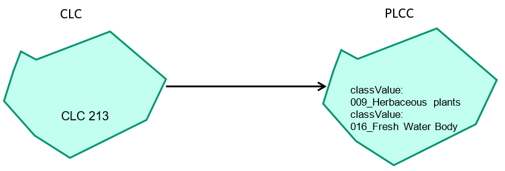

[.underline]#CLC class 243: Land principally occupied by agriculture, with significant areas of natural vegetation#

The semantic analysis identified three horizontal patterns for CLC243; "herbaceous or woody crops", "natural vegetation" and "water bodies", considered as integral elements of a single "functional unit". Such complex semantic interpretation requires clear and fixed ranges of proportional percentages between the three patterns. These patterns in turn represent one or more PLC components.

[%autowidth,options="header"]
|===
|*Horizontal Pattern* |*Contributing PLC components*
|herbaceous or woody crops |004_Arable_land, 009_Herbaceous_plants, 005_Permanent_woody_and_shrub_crops
|natural vegetation |008_Shrubs, 006_ Coniferous_trees, 007_Broadleaved_trees
|water bodies |016_Freshwater_bodies
|===

image::./media/image70.png[image, align=center]

The national CLC-based nomenclatures (using the 4^th^ and 5^th^ level of CLC hierarchy) and knowledge of the local conditions offer more information than is implied in the generic level 3 CLC class 243 illustrated above. This could obviously result in another set of classValues and better-known percentages. Absence of such information inevitably makes the determination of percentage for each horizontal pattern and its respective components arbitrary. However, the application of at least a minimum percentage of allowed proportion for each of the horizontal pattern is conditioned by the LCML translation.

<<<
[appendix]
== Frequently Asked - (informative) 

[arabic, start=1]
. Can CORINE Land Cover (CLC) be represented using the INSPIRE land cover data model?
+
Answer: Yes, CLC is covered by the core model

. Why is CORINE Land Cover accepted in INSPIRE although it is violating the INSPIRE principle of clear separation between land cover and land use
+
Answer: CLC is a de facto harmonized pan-European land cover mapping initiative used by the environmental sector. Decisions about keeping, changing, modifying or abandoning CLC are up to the European Environmental Agency (EEA). The role of INSPIRE is to provide a tool for sharing existing data. Although CLC exceeds the boundary of the land cover theme, it is an existing data set that needs to be accommodated for by INSPIRE and this is done through the land cover data specification.

. Why is not the CORINE Land Cover nomenclature made mandatory by the INSPIRE land cover data specification?
+
Answer: INSPIRE applies to all spatial land cover data in Europe. CORINE Land Cover is scale dependent and it is not a pure and exhaustive land cover nomenclature. CLC responds to specific needs linked to European land monitoring requirements in the 1980's and does not cover all current needs. Other nomenclatures exist for other uses.

. Why does not INSPIRE enforce a single, standardized nomenclature for Europe?
+
Answer: Land cover mapping initiatives are developed for a multitude of different objectives. This is reflected in the broad range of nomenclatures and classification systems available. No single nomenclature or classification system covers all the different requirements by different users. The purpose of INSPIRE is to provide an infrastructure for exchanging data. INSPIRE must therefore provide a framework for exchanging land cover data using all different nomenclatures and provide mechanisms to compare and understand them. LCML is an example of such a mechanism (see Annex F).

. Can the data specification be applied to the bottom of the ocean?
+
Answer: Yes. A mapping initiative implementing a mapping system and a nomenclature describing the bottom of oceans as a kind of land cover can use the INSPIRE Land Cover data specification.

. Does the land cover data specification support 3D land cover units?
+
Answer: No.

. Why are points allowed in the land cover data specification?
+
Answer: One way to observe land cover is to conduct a sampling survey where the observation units are conveniently represented as points. This allows the survey to use a detailed nomenclature, not attainable in a broad wall-to-wall survey. An example is the LUCAS survey carried out by Eurostat.

<<<
[appendix]
== Encoding rules for TIFF and JPEG 2000 file formats - (normative) 

=== Introduction

This annex specifies how to use the TIFF or JPEG 2000 file formats for encoding the range set of grid coverages. Because pixel payload is not sufficient to construct a readable standalone image, additional descriptive information has to be packaged together in the same file, even if it is already provided somewhere else in GML. For this purpose, this part establishes schema conversion rules for all the coverage components of INSPIRE Application Schemas that have a corresponding element in the output TIFF or JPEG 2000 data structures. These conversion rules play an essential role in maintaining consistency between the different representations (i.e. GML, TIFF or JPEG 2000) of the same coverage information.

On the other hand, TIFF specifications and JPEG 2000 Standard offer many options and let some variables open for encoding image data. If this flexibility allows covering most applications, it leads, in turn, to a situation where disparate implementation platforms exist while being potentially incompatible. As a result, interoperability is often unlikely. In order to fill in this gap and to enable a controlled exchange of data across Europe, this annex draws up an implementation profile of TIFF and JPEG 2000 to constraint their usage within the scope of INSPIRE. It amounts to impose external format-dependent restrictions to the applicable values of the properties described in the INSPIRE application schemasThis annex specifies how to use the TIFF or JPEG 2000 file formats for encoding the range set of grid coverages. Because pixel payload is not sufficient to construct a readable standalone image, additional descriptive information has to be packaged together in the same file, even if it is already provided some-where else in GML. For this purpose, this part establishes schema conversion rules for all the coverage components of INSPIRE Application Schemas that have a corresponding element in the output TIFF or JPEG 2000 data structures. These conversion rules play an essential role in maintaining consistency between the different representations (i.e. GML, TIFF or JPEG 2000) of the same coverage information.

On the other hand, TIFF specifications and JPEG 2000 Standard offer many options and let some varia-bles open for encoding image data. If this flexibility allows covering most applications, it leads, in turn, to a situation where disparate implementation platforms exist while being potentially incompatible. As a result, interoperability is often unlikely. In order to fill in this gap and to enable a controlled exchange of data across Europe, this annex draws up an implementation profile of TIFF and JPEG 2000 to constraint their usage within the scope of INSPIRE. It amounts to impose external format-dependent restrictions to the applicable values of the properties described in the INSPIRE application schemas.

=== TIFF format

==== Format overview

The Tagged Image File Format (TIFF) is a binary file format for storing and interchanging raster images. Originally developed by the company Aldus (Adobe Systems), it is in the public domain since 1992, the year of the latest release of the specifications (revision 6.0 [TIFF]). TIFF has become a popular "de facto standard" for high color-depth digital images. It is widely used in image handling applications, covering various themes such as Land Cover.

TIFF specifications are divided into two parts. Part 1: Baseline TIFF defines all the features that every reader must support, while Part 2: TIFF Extensions provides additional format structures designed for specialized applications, that are not necessarily taken into account by all TIFF readers (e.g. JPEG or LZW compression, tiling, CMYK images).

As highlighted in the format name, the TIFF data structure is based on the definition of tags for describing the characteristics of images. To be more precise, a TIFF file contains an image file header pointing to one or several image file directory (IFD). The image file header fixes the technical properties of the file, such as the byte order (e.g. little-endian or big-endian) or the offset of the first byte. An image file directory holds the complete description of an image by means of fields or entries. Each IFD entry consists of a tag identifying the field, the field type (e.g. byte, ASCII, short int), the number of values and the values themselves or an offset to the values. The location of the actual image data within the file is given by the combination of information elements expressed in some fields.

==== INSPIRE TIFF profile for grid coverage data

This section lists the requirements and the constraints to be applied to the TIFF format when encoding INSPIRE Land Cover data sets in this format. It should be read in conjunction with the table in section 0 which provides more detailed information. Some of the rules presented here are directly inspired by the GeoTIFF Profile for Georeferenced Imagery [DGIWG-108] edited by DGIWG for the military community.

===== General rules

[TIP]
====
*TG Requirement 20*

Encoding of INSPIRE Land Cover data sets by using TIFF format shall conform to Baseline TIFF extended to LZW Compression.
====

NOTE Baseline TIFF is described in the part 1 of the TIFF specification 6.0 [TIFF], while the TIFF extension on LZW Compression is addressed in part 2.

TIFF files must be identified as such by network services by using a predefined Internet media type or MIME type.

[TIP]
====
*TG Requirement 21*

A file claiming to encode coverage elements in TIFF shall receive the _image/tiff_ MIME type registered in RFC 3302.
====

NOTE The absence of the optional application parameter here does not necessarily imply that the encoded TIFF image is Baseline TIFF.

===== Data structure

Even though TIFF specifications allow describing multiple related images in a single file by using more than one Image File Directory (IFD), Baseline TIFF readers are not required to decode any IFD beyond the first one. In order to ensure alignment with Baseline TIFF, all indispensable information has to be included in the first IFD.

[TIP]
====
*TG Requirement 22*

The range set of the grid coverage shall be carried by only one Image File Directory (IFD), which is the first one in the TIFF file.
====

NOTE As a consequence, the different bands of a same image can not be split in separate IFDs.

[TIP]
====
*TG Requirement 23*

A TIFF file shall not contain more than two image file directories (IFD), the second being used to support a transparency mask.
====

The use of a second IFD is admitted for encoding an optional transparency mask, which is common for geographic raster data. This kind of ancillary information is useful at least for portrayal considerations. A transparency mask is a bi-level image matching pixel by pixel the image depicted in the first IFD. The pixel value 1 in the transparency mask means that the corresponding pixel in the image itself is significant. Conversely, the value 0 means that the corresponding pixel in the image holds a no data value (e.g. unknown, withheld). Typically, it must be made transparent when displaying the image.

The image file directory assigned to a transparency mask must receive the following TIFF tag values:

* BitsPerSample = 1
* Colormap: not used
* ImageDescription = 'transparency mask'
* ImageLength = ImageLength of the first IFD
* ImageWidth = ImageWidth of the first IFD
* NewSubFileType: all bits equal 0, except bit 2 = 1
* PhotometricInterpretation = 4
* SamplesPerPixel = 1

===== Grid coordinate system

Baseline TIFF supports only one type of orientation for grid coverages, that is, one type of grid coordinate system.

[TIP]
====
*TG Requirement 24*

The origin of the grid coordinate system shall be the upper left corner of the grid coverage. The axis 'row' and 'column' shall be oriented downward and to the right.
====

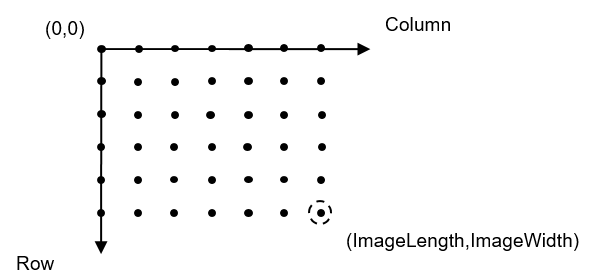

[.text-center]
*Figure 43: referenced grid as defined by Baseline TIFF*

===== Range values

The Baseline TIFF specifications cover four image types: bi-level, greyscale, palette-colour and full-colour images. Multi-band images are allowed but not fully addressed: baseline TIFF readers are intended to skip over the extra components gracefully, using the values of the SamplesPerPixel and BitsPerSample fields.

[NOTE]
====
*Recommendation 3*

The image data of a TIFF file should contain either 1 (bi-level, greyscale and palette-colour) or 3 bands (RGB).
====

NOTE Encoding multispectral images in TIFF is running the risk of losing a part of the coverage range set, since many software applications are not able to support more than three colours.

====
*Open issue 2:* The lack of a part of the coverage range set is a well-identified problem for the orthoimage delivery in the frame of the Control with Remote Sensing (CwRS) program of the MARS Unit of JRC. When data is delivered in TIFF, we occasionally receive only 3 out of the initial 4 four channels of the VHR satellite data (usually the colour infrared is the missing one). The lack of this information might be crucial for certain applications. In that respect we might think (in case of availability of multispectral data) to encourage the data producers to provide more than one RGB files, holding different band combinations – natural; colour infrared; false colour composite. It is a common practice in the frame of the CwRS, although it required additional efforts. Same delivery approach can be valid for JPEG2000 as well.
====

For better performances, it is preferable to encode the range values as arrays of type SHORT, BYTE or LONG, depending on the type of data.

[TIP]
====
*TG Requirement 25*

For imagery, the range values shall be expressed as unsigned integers coded on 8 or 16 bits, except for bi-level images which are 1-bit data. For other gridded data (e.g. elevation data, measured data), they shall be stored as 8 or 16-bits integers, signed or unsigned, or as 32-bits floating points.
====

NOTE If the original data do not satisfy this requirement, they will be converted in a representation using the next higher power of 2.

[TIP]
====
*TG Requirement 26*

In the case of multi-band images, the number of bits per component shall be the same for all the bands.
====

[TIP]
====
*TG Requirement 27*

In the case of multi-band images, the planar configuration shall be _Chunky_ format, i.e. the bands are interleaved.
====

NOTE The range values of a same grid point in its different bands are stored contiguously. For instance, RGB data is stored as RGBRGBRGBRGB...

===== Compression

Data compression can be used within this profile to reduce the size of a file, provided that it does not distort the original range values after an encoding-decoding cycle. This condition allows, for example, ensuring the preservation of nil values.

[TIP]
====
*TG Requirement 28*

The range value data shall be either uncompressed or lossless compressed with packbit or LZW compression schemes.
====

NOTE As a TIFF extension, LZW compression is not supported by Baseline TIFF. However, it is included in this profile since its use is widespread, essentially for both its simplicity and its efficiency.

===== Internal tiling

The TIFF extension defined in section 15 of the specifications focuses on the way of laying out the image content into roughly square tiles. This method, as an alternative to the standard repartition of the range within separate strips, increases the access to data. However, it may cause some interoperability problems in the same time. It is therefore better not to use it and to restrict oneself to Baseline TIFF.

====
*Open issue 3:* Is there a strong requirement to allow internal tiling for TIFF files?
====

==== Mapping between TIFF and GML data structures

The following table indicates how to fill the content of TIFF tags for grid coverages in the context of INSPIRE. On the other hand, it gives the rules to be applied for ensuring the consistency of TIFF files with the Land Cover GML Application(s) Schema(s). It does not address the encoding of the possible transparency mask.

The columns _Tag name_, _Code_, _Type_, _Card._ and _Description_ remind respectively the name, the code, the type, the maximum number of occurrences and the description of each Baseline TIFF tag within the meaning of the TIFF specification. The column _Obligation_ informs if the tag is considered to be mandatory (M), conditional &#169;, optional (O) or inadequate (I). The column _Restricted values_ specifies the values allowed for the tag in the context of INSPIRE. The column _Mapping to GML elements_ establishes a correspondence between the tag values and the corresponding GML elements of the coverage whose type is one of those specified in the Generic Conceptual Model (e.g. RectifiedGridCoverage). N/A means not applicable.

[.text-center]
*Table 30. Baseline TIFF implementation profile and Mapping between TIFF tags and the associated object elements from the Land Cover GML Application Schema*

[cols=",,,,,,,",]
|===
|*Tag name* |*Code* |*Type* |*Card.* |*Description* |*Obligation* |*Restricted values* |*Mapping to GML elements (including restrictions)*
|Artist |315 |ASCII |1 |Person who created the image |O |- |N/A
|BitsPerSample |258 |Short |SamplesPerPixel |Number of bits per component |M a|
1 for bi-level images

For imagery, constrained to *8* or *16* bits-per-pixel-per-band (e.g. 8 8 8 or 16 16 16 for RGB images).

For other gridded data, 8, 16 and 32 bits-per-pixel-per-band

|For each band _i_, rangeType.field[_i_].constraint.interval = "0 _2^BitsPerSample[i]-1_"
|CellLength |265 |Short |1 |The length of the dithering or halftoning matrix used to create a dithered or halftoned bilevel file. |I |This field should be never used |N/A
|CellWidth |264 |Short |1 |The width of the dithering or halftoning matrix used to create a dithered or halftoned bilevel file. |I |This field should be never used |N/A
|ColorMap |320 |Short |3*(2**BitsPerSample) |A colour map for palette colour images |C |Only for palette color images |N/A
|Compression |259 |Short |1 |Compression scheme used on the image data |M a|
*1* for uncompressed data

*5* for LZW compression

*32773* for PackBits compression of greyscale and palette-colour data

|N/A
|Copyright |33432 |ASCII |1..* |Copyright notice |O |- |N/A
|DateTime |306 |ASCII |20 |Date and time of image creation |O |- a|
N/A

NOTE the field DateTime should not be confused with the properties _phenomenonTime_ and _beginLifespanVersion_ that report other types of temporal information.

|ExtraSample |338 |Short |1..* |Description of extra components |C |Only when extra samples are present |N/A
|FillOrder |266 |Short |1 |The logical order of bits within a byte. |O |*1* (default) |N/A
|FreeByteCounts |289 |Long |1 |For each string of contiguous unused bytes in a TIFF file, the number of bytes in the string. |I |This field should be never used |N/A
|FreeOffsets |288 |Long |1 |For each string of contiguous unused bytes in a TIFF file, the byte offset of the string. |I |This field should be never used |N/A
|GrayResponseCurve |291 |Short |2**BitsPerSample |For greyscale data, the optical density of each possible pixel value. |I |This field should be never used |N/A
|GrayResponseUnit |290 |Short |1 |The precision of the information contained in the GrayResponseCurve |I |This field should be never used |N/A
|HostComputer |316 |ASCII |1..* |The computer and/or operating system in use at the time of image creation. |O |*-* |N/A
|ImageDescription |270 |ASCII |1..* |Description of the image subject. |O |- |N/A
|ImageLength |257 |Short or Long |1 |The number of rows in the image. |M |- a|
domainSet.extent.high.coordValues[_0_]-

domainSet.extent.low.coordValues[_0_]=ImageLength

|ImageWidth |256 |Short or Long |1 |The number of columns in the image, i.e. the number of pixels per row. |M |- a|
domainSet.extent.high.coordValues[_1_]-

domainSet.extent.low.coordValues[_1_]=ImageWidth

|Make |271 |ASCII |1 |The scanner manufacturer. |O |- |N/A
|MaxSampleValue |281 |Short |SamplesPerPixel |The maximum component value used. |O |This field should be used only for statistical purposes |N/A
|MinSampleValue |280 |Short |SamplesPerPixel |The minimum component value used. |O |This field should be used only for statistical purposes |N/A
|Model |272 |ASCII |1 |The scanner model name or number. |O |- |N/A
|NewSubfileType |254 |Long |1 |A general indication of the kind of data contained in this subfile. |O |*0* |N/A
|Orientation |274 |Short |1 |The orientation of the image with respect to the rows and columns. |M |*1* (default) |domainSet.extent.low.coordValues="0 0"
|PhotometricInterpretation |262 |Short |1 |Colour space of the image data. |M a|
*1* for bi-level and greyscale images (0 is black)

*2* for RGB images

*3* for palette-colour images

|N/A
|PlanarConfiguration |284 |Short |1 |How the components of each pixel are stored. |M |*1* which means, for RGB data, that the data is stored as RGBRGBRGB... |rangeSet.fileStructure="Record Interleaved"
|ResolutionUnit |296 |Short |1 |Unit of measurement for XResolution and YResolution. |M |*2* which means dpi (dot per inch) |N/A
|RowsPerStrip |278 |Short or Long |1 |Number of rows per strip. a|
C

Not used if tiling

|It is recommended to choose this value such that each strip is about 8K bytes. |N/A
|SampleFormat |399 |Short |SamplesPerPixel |This field specifies how to interpret each data sample in a pixel. |M a|
*1* for imagery (unsigned integer data)

1 or 3 for gridded data

|For imagery, for each band _i_, rangeType.field[_i_].constraint.interval[0] = "0"
|SamplesPerPixel |277 |Short |1 |Number of components per pixel. |M a|
*1* usually for bi-level, greyscale and palette-colour images

*3* usually for RGB images

|rangeType.field.size()=SamplesPerPixel
|SmaxSampleValue |341 |Field type that best matches the sample data |SamplesPerPixel |The maximum value for each sample. This tag is used in lieu of MaxSampleValue when the sample type is other than integer. |I |This field should be never used |N/A
|SminSampleValue | |Field type that best matches the sample data |SamplesPerPixel |The minimum value for each sample. This tag is used in lieu of MaxSampleValue when the sample type is other than integer. |I |This field should be never used |N/A
|Software |305 |ASCII |1..* |Name and version number of the software package(s) used to create the image. |O |- |N/A
|StripByteCounts |279 |Short or Long |StripPerImage |For each strip, number of bytes in the strip after compression. a|
C

Not used if tiling

|*-* |N/A
|StripOffsets |273 |Long |StripPerImage |For each strip, the byte offset of that strip a|
C

Not used if tiling

|- |N/A
|Thresholding |263 |Short |1 |For black and white TIFF files that represent shades of gray, the technique used to convert gray to black and white pixels. |I |This field should be never used |N/A
|TileWidth |322 |Short or Long | |The tile width in pixels. This is the number of columns in each tile. a|
C

if tiling

|- |N/A
|TileLength |323 |Short or Long | |The tile length (height) in pixels. This is the number of rows in each tile. a|
C

if tiling

|- |N/A
|TileOffsets |324 |Long | |For each tile, the byte offset of that tile, as compressed and stored on disk. a|
C

if tiling

|- |N/A
|TileByteCount |325 |Short or Long | |For each tile, the number of (compressed) bytes in that tile. a|
C

if tiling

|- |N/A
|Xresolution |282 |Rational | |The number of pixels per ResolutionUnit in the ImageWidth direction. |M |*254* |N/A
|Yresolution |283 |Rational | |The number of pixels per ResolutionUnit in the ImageLength direction. |M |*254* |N/A
|===

In addition, the description of the coverage grid function must reflect the baseline ordering used by TIFF format to store the range values within a file. The following mapping must be applied:

coverageFunction.gridFunction.sequenceRule.type = "linear" AND coverageFunction.gridFunction.sequenceRule.scanDirection = "2 1"

==== Theme-specific requirements and recommendations

No further requirements or recommendations are defined for this theme.

=== JPEG 2000 format

==== Format overview

JPEG 2000 is a wavelet compression for storing and interchanging raster. Other wavelet compressions exist like ECW or MrSid. JPEG 2000 was prepared by Joint Technical Committee ISO/IEC JTC 1, _Information technology_, Subcommittee SC 29, _Coding of audio, picture, multimedia and hypermedia information_ in collaboration with ITU-T. The identical text is published as ITU-T Rec. T.800. First version was was published in 2000. JPEG 2000 is known as a very efficient format to distribute and access large imagery data.

JPEG 2000 Standard is defined by ISO 15444 serie (from 15444-1 to 15444-12). The two parts dealing with 2D still imagery and then interesting for INSPIRE are:

* ISO 15444-1: Core Coding System, defining how coders and decoders shall behave and how shall be structured a JPEG 2000 codestream. This part also defines JP2 format, the simpler wrapper for JPEG 2000 encoded data.
* ISO 15444-2: Extensions, defining extensions for JPEG 2000 codestream (new makers) and JPX format. This part deals with extended capabilities which are not useful for INSPIRE themes. That's the reason why this part is not used within INSPIRE.

JPEG 2000 is complex

* The JPEG 2000 codestream, which directly contains compressed data. This stream contains markers and segment markers which allow decoding and accessing data.
* The format which is the wrapper of the JPEG 2000 codestream. It is possible to only distribute the codestream (extension file .j2c), but to have a more comprehensive file, it's recommended to wrap this stream inside a format, whose the most common is JP2, described by Annex I of ISO 15444-1 (extension file .jp2) which adds some boxes describing encoded data.

The figure below shows the JP2 file structure :

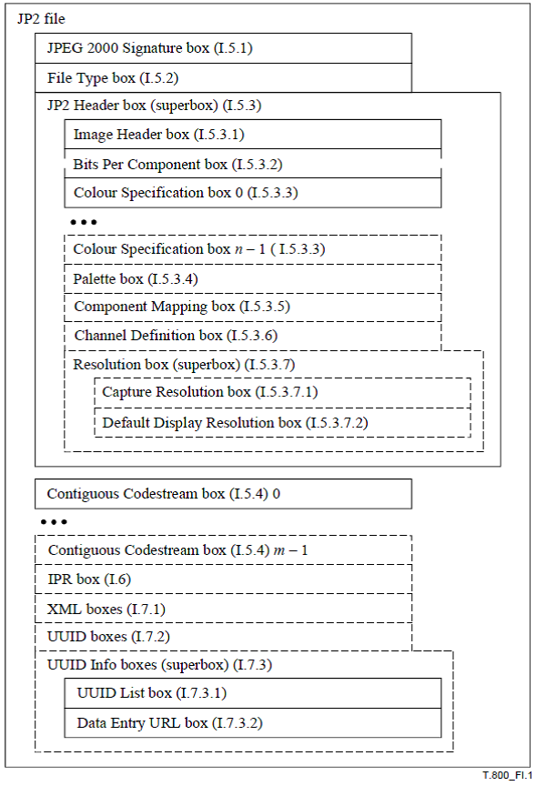

[.text-center]
*Figure 44 : JP2 file structure*

==== JPEG 2000 profile for INSPIRE Land Cover data

This section lists the requirements and the constraints to be applied to JPEG 2000 when encoding INSPIRE Land Cover data sets in this format. It should be read in conjunction with the table in section 0 which provides more detailed information.

===== General rules

[TIP]
====
*TG Requirement 29*

Encoding of INSPIRE Land Cover data sets by using JPEG 2000 shall conform to profile 1 of ISO 15444-1, extended by the use of boxes "association" and "label" (defined by JPX format in ISO 15444-2) necessary for GMLJP2 encoding (see GMLJP2 standard for more details).
====

JPEG 2000 files must be identified as such by network services by using a predefined Internet media type or MIME type

[TIP]
====
*TG Requirement 30*

A file claiming to encode coverage elements in JPEG 2000 shall receive the _image/jp2_ MIME type registered in RFC 3745.
====

NOTE GMLJP2 uses extended boxes from JPX format, so it would suggest a _image/jpx_ MIME type but GMLJP2 standard ask for image/jp2 as well because "association" and "label" boxes are just a very small part of JPX. Claiming conformance to JP2 allows GMLJP2 data to be supported by more visualisation softwares (some tools could stop reading JPEG 2000 files when seeing image/jpx MIME type). In the case of a software only compliant with ISO 15444-1 (reading strict JP2 files), the image and the GML (in the XML box) will be read and just the association between the two will be not interpreted.

So in both cases, pure JPEG2000 or GML embedded in JPEG2000 (GMLJP2), _image/jp2_ MIME type shall be used.

===== Data structure

Even though JPEG 2000 Standard (and more precisely JP2 format) allows describing multiple codestreams in a single file by using more than one jp2c, only one is required to encode range sets of gridded coverages.

[TIP]
====
*TG Requirement 31*
The range set of the grid coverage shall be carried by only one jp2c box (one codestream per JPEG 200 file).
====

NOTE As a consequence, the different components of a same image can not be split in separate codestreams.

===== Grid coordinate system

JPEG 2000 Standard defines the origin of the grid coordinate system as being the upper left corner of the grid coverage. The axis 'X' and 'Y are oriented to the right and downward.

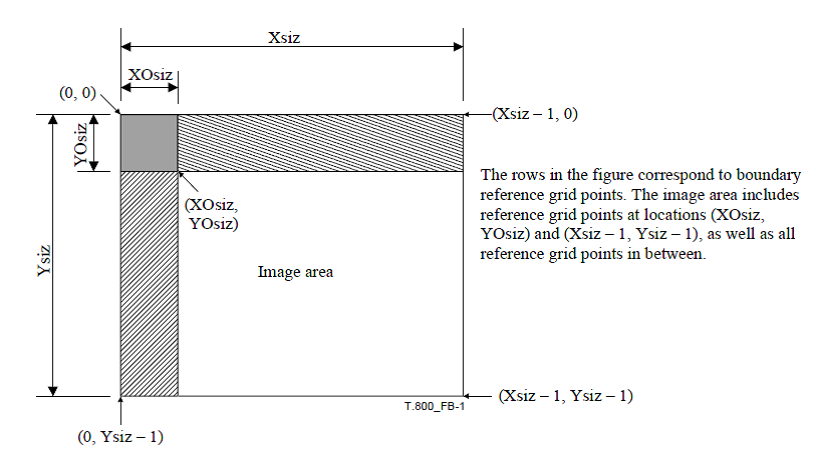

[.text-center]
*Figure 45 : referenced grid as defined by JPEG 2000*

*_Source : ISO 15444-1_*

===== Range values

ISO 15444-1 allows a lot of image types with multiband composition. Within the scope of INSPIRE, following types are addressed: bilevel, grayscale, palette-color and full-color images (known as RGB images).

[NOTE]
====
*Recommendation 4:* The image data of a JPEG 2000 file should contain either 1 (bilevel, greyscale and palette-colour) or 3 bands (RGB). An additional band for opacity could also be used.
====

The use of palette-colour in JPEG 2000 is restricted to a mapping to one component to RGB data.

====
*Open issue 4:* Is the use of palette-colour needed. It allows to compress RGB data on 1 band and provide a mapping table.
====

These components are described trough markers in the JPEG 2000 codestream (see Table 32) and boxes in the JP2 format (see Table 33).

[TIP]
====
*TG Requirement 32*

For imagery, the range values shall be expressed as unsigned integers coded on 8 or 16 bits, except for bi-level images which are 1-bit data. For other gridded data (e.g. elevation data, measured data), they shall be stored as 8 or 16-bits integers, signed or unsigned, or as 32-bits.
====

JPEG2000 (ISO 15444-1) does not allow to encode data as floats (only integers), but in general you can choose a Unit of measure for which your results are integers. For elevation, use centimeters (cm) instead of meters (m).

NOTE If the original data do not satisfy this requirement, they will be converted in a representation using the next higher power of 2.

[TIP]
====
*TG Requirement 33* 

In the case of multi-band images, the number of bits per component shall be the same for all the bands.
====

===== Opacity channel

JP2 format allows to describe opacity channel (trough Channel Definition Box or CDEF) and then to display multiple files without overlapping issues. Opacity channel can be defined for RGB or greyscales images. The following table give example of an RGB image with alpha channel. CDF defines the 3 RGB components and then the alpha channel which applies to the all 3 RGB ones.

[.text-center]
*Table 31. Definition of opacity channel with CDEF box*

[cols=",,,,",options="header",]
|===
|CDEF box | | | |
|Hexadecimal |Numeric conversion (2 bits) |interprétation | |
a|
00 04

00 00 00 00 00 01 |

00 01 00 00 00 02

00 02 | 00 00 00 03

00 03 00 01 | 00 00

|4 |4 components | |
| |0 |0 |1 |component 0 is red R
| |1 |0 |2 |component 1 is green G
| |2 |0 |3 |component 2 is blue B
| |3 |1 |0 |component 3 is an opacity channel related to all other component
| |Component number |signification |Color of the component |
|===

NOTE In this case, bit depth shall be defined for each of the four components trough the bpcc boxes in the JP2 Header Box.

JPEG 2000 allows defining opacity channel on more than 1 bit to have a scale of transparency. In pur case, we're just interested in full transparency and full opacity. So, within the scope of INSPIRE, it is recommended to code it on only 1 bit (0= transparent , 1=opaque)

[NOTE]
====
*Recommendation 5* 
In the case of an opacity channel, the bit depth should be 1-bit.
====

===== Compression

JPEG 2000 codestream allows both lossless and lossy compression. Lossless compression is important for some themes because you can't allow any loss of information. For example in Land Cover, or Land Use, you encode a code which represents a class. For other themes, a lossy compression without visual effect can be also interesting. JPEG 2000 lossy compression is very powerful with which you can compress imagery data by 1:10 or more without visual effect.

====
*Open issue 5:* Some TWGs may use lossy compression. If there is a need for requirement/recommendation, you can add it in the theme specific section
====

===== Internal tiling

JPEG 2000 allows internal tiling within the codestream. Profile 1 of ISO 15444-1 already requires no tiling (i.e. the image = 1 tile) or tiles size bigger than1024x1024 pixels. There is no further requirement.

====
*Open issue 6:* That means there is either 1 tile or more tiles bigger that 1024x1024? Maybe a clarification is needed.
====

===== Resolutions

JPEG 2000 codestream encode the full resolution image but has mechanisms to directly access (without any computation) particular sub-resolutions. So the JPEG 2000 file contains a pyramid of resolution. The number of decomposition Nd defines the smallest image you can access whose size is reduced by 2^Nd^ (compared to the full image). Profile 1 of ISO 15444-1 requires that the number of decomposition shall be such as: Height/2^Nd^ ≤128 pixels and Width/2^Nd^ ≤128 pixels (height and width of the full resolution image).

For example for a 2048x1024 image, the number of decomposition is 4, and the smallest thumbnail image is 128x64 pixels.

There is no further requirement.

===== Region of interest

When encoding in a lossy mode, JPEG 2000 allows to encode some image regions with better quality and then deteriorate the quality of other areas. This capability shall not be used.

[TIP]
====
*TG Requirement 34*

JPEG 2000 codestream shall not encode Region Of Interest (RGN marker segment).
====

===== Other options

JPEG 2000 allows more options:

* Quality layers, i.e. the capability to different levels of compressions within the same JPEG 200 file.
* Presence of markers, some allowing fast data access (TLM, PLT), other allowing error resiliency, ..
* Presence of precints and their size.
* Encoding order ; the codestream can be arranged in different ways depending the order you want the data to be decompressed.
* Color transformation, from RGB to three other decorrelated components (ICT or RCT transformations).

These choices depend on data size, data access (trough network services, via FTP, via USB stick, ...) and then can't be made here.

==== Mapping between JPEG 2000 and GML data structures

The following table indicates how to fill the content of TIFF tags for grid coverages in the context of INSPIRE. On the other hand, it gives the rules to be applied for ensuring the consistency of JPEG 2000 files with the Land Cover GML Application(s) Schema(s). It does not address the encoding of the possible transparency mask.

As described by the Format overview section, the JP2 format contains the JPEG 2000 codestream. Both have elements that need to be consistent with GML. The first table deals with mappings between the JPEG 2000 codestream and GML, whereas the second table deals with mappings between JP2 boxes and GML elements.

The columns _marker/box_, _description_, _Type_, _Card._ and Conditions/_Values_ remind respectively the marker code/box name, its description, its obligation/maximum number of occurrences allowed by JPEG 2000 standard (ISO 15444-1). The column _values_ specifies the values allowed for the marker in the context of INSPIRE. The column _Mapping to GML elements_ establishes a correspondence between these makers values and the corresponding GML elements of the coverage whose type is one of those specified in the Generic Conceptual Model (e.g. RectifiedGridCoverage). N/A means not applicable.

[.text-center]
*Table 32. mapping between markers in JPEG 2000 codestream and GML elements*

[cols=",,,,",options="header",]
|===
|*Marker* |*Description* |*Card.* |*Values* |*Mapping GML*
|SIZ |Marker code (Image and tile size) |1 | |N/A
|Lsiz |Length of marker segment |1 | |N/A
|Rsiz |Denotes capabilities that a decoder needs to properly decode the codestream |1 a|
0000 0000 0000 0010

Codestream restricted as described for Profile 0 from Table A.45

|N/A
|Xsiz |Width of the reference grid |1 | |= domainSet.RectifiedGrid.limits.GridEnvelope.high[0]
|Ysiz |Height of the reference grid |1 | |= domainSet.RectifiedGrid.limits.GridEnvelope.high[1]
|X0siz |Horizontal offset from the origin of the reference grid to the left side of the image area |1 | |= domainSet.RectifiedGrid.limits.GridEnvelope.low[0]
|YOsiz |Vertical offset from the origin of the reference grid to the top side of the image area. |1 | |= domainSet.RectifiedGrid.limits.GridEnvelope.low[1]
|XTsiz |Width of one reference tile with respect to the reference grid. |1 | |N/A
|YTsiz |Height of one reference tile with respect to the reference grid |1 | |N/A
|XTOsiz |Horizontal offset from the origin of the reference grid to the left side of the first tile |1 | |N/A
|YTOsiz |Vertical offset from the origin of the reference grid to the top side of the first tile |1 | |N/A
|Csiz |Number of components in the image |1 a|
1 for greyscale imagery

3 for RGB data

...

|rangeType.field.size()
|Ssiz^i^ |Precision (depth) in bits and sign of the ith component samples |1/component a|
x000 0000 to x010 101 Component sample bit depth = value  1.

x=0 (unsigned values)

x=1 (signed values)

|For each band i, rangeType.field[i].constraint.interval = "0 2^[Ssiz^i^1]-1"
|XRsiz^i^ |Horizontal separation of a sample of ith component with respect to the reference grid |1/component |In most case XRsiz^i^ =1 for all components |N/A
|YRsiz^i^ |Vertical separation of a sample of ith component with respect to the reference grid |1/component |In most case YRsiz^i^ =1 for all components |N/A
|===

For each component i of the image, its size is defined by :

Width^i^ = (Xsiz – X0siz)/XRsiz^i^

Height^i^ = (Ysiz – Y0siz)/YRsiz^i^

[.text-center]
*Table 33. Mapping between boxes in JP2 format and GML elements*

[cols=",,,,,,,",options="header",]
|===
|*Box name* |*Type* |*Description* |*Card.* |*Conditions/Values* |*Mapping GML* | |
|JPEG 2000 Signature box |'jP\040\040' |The combination of the particular type and contents for this box enable an application to detect a common set of file transmission errors. |1 |'<CR><LF><0x87><LF>' |N/A | |
|File Type box |'ftyp' | |1 | |N/A | |
| |BR | |Brand. This field specifies the Recommendation | International Standard which completely defines this file. | a|
'jp2\040'

meaning is 15444-1, Annex I

|N/A |
| |MinV | |Minor version. This parameter defines the minor version number of this JP2 specification for which the file complies. |1 | |N/A |
| |CL | a|
Compatibility list. This field specifies a code representing this Recommendation | International

Standard, another standard, or a profile of another standard, to which the file conforms.

|1..* |At least 'jp2\040' |N/A |
|JP2 Header box |'jp2h' | |1 | |N/A | |
| |ihdr |'ihdr' |Image Header box |1 | |N/A |
| | |HEIGHT | |Image area height |1 |Ysiz – Y0siz |domainSet.RectifiedGrid.limits.GridEnvelope.high[1]- domainSet.RectifiedGrid.limits.GridEnvelope.low[1]
| | |WIDTH | |Image area width |1 |Xsiz – X0siz |domainSet.RectifiedGrid.limits.GridEnvelope.high[0]- domainSet.RectifiedGrid.limits.GridEnvelope.low[0]
| | |NC | |Number of components |1 a|

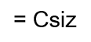 a|
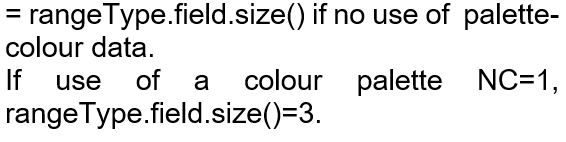
If use of a colour palette NC=1, rangeType.field.size()=3.

| | |BPC | |Bits per component |1 
a|
If the bit depth of all components in the codesteam is the same (sign an precision)

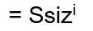

a|
For each band i, rangeType.field[i].constraint.interval = "0 2^[Ssiz^i^1]-1" if no use of palette-colour data.

If use of a palette colour, there is no relation.

| | |C | |Compression type | a|
7 (Other

values are reserved for ISO use)

|N/A
| | |UnkC | |Colourspace Unknown. |1 a|
0 (colourspace of the image is known and correctly specified in the Colourspace

Specification boxes within the file)

1 (if the colourspace of the image is not known)

|N/A
| | |IPR | |Intellectual Property |1 | |N/A
| |bpc^i^ |'bpcc' |Bits per component a|
Optional

Required if component have different bit depth

a|
x000 0000 to x010 101 Component sample bit depth = value  1.

x=0 (unsigned values)

x=1 (signed values)

|For each band i, rangeType.field[i].constraint.interval = "0 2^[Ssiz^i^1]-1" |
| |colr^i^ |'colr' a|
Each Colour Specification box defines one method by which an application can interpret the colourspace of the

decompressed image data

|1 | |N/A |
| | |METH | |Specification method |1 a|
1 (Enumerated Colourspace)

2 (Restricted ICC profile)

other values (Reserved for other ISO use)

|N/A
| | |PREC | |Precedence |1 |0 (field reserved for ISO use) |
| | |APPROX | |Colourspace approximation. |1 |0 |N/A
| | |EnumCS | |Enumerated colourspace |1 a|
16 (sRGB as defined by IEC 61966-2-1)

17 (greyscale)

18 (sYCC as defined by IEC 61966-2-1 Amd. 1)

other values (Reserved for other ISO uses)

|N/A
| |pclr |'pclr' a|
Palette box.

This box specifies a palette that can be used to create channels from components.

|0..1 | |N/A |
| |cmap |'cmap' a|
Component Mapping box.

The Component Mapping box defines how image channels are identified from the actual components decoded from the codestream.

|0..1 | |N/A |
| |cdef |'cdef' |Channel Definition box |Optional | |The description provided shall be consistent with the rangeType description |
| | |N | |Number of channel descriptions |1 | |= rangeType.field.size()
| | |Cni | |Channel index |1/channel | |N/A
| | |Typi | |Channel type |1/channel a|
0 This channel is the colour image data for the associated colour.

1 (Opacity)

2 (Premultiplied opacity)

|N/A
| | |Asoci | |Channel association |1/channel a|
0 (This channel is associated as the image as a whole)

1 to (216– 2) This channel is associated with a particular colour as indicated by this value)

216– 1 This channel is not associated with any particular colour.

|N/A
| |res |'resd' | |Optional | |N/A |
| | |resc | |Capture Resolution box. |Optional | |N/A
| | |resd | |Default Display Resolution box. |Optional | |N/A
|Contiguou Codestream box |'jp2c' |This box contains the codestream as defined by Annex A of ISO 15444-1. |1 |Contains the encoded data in JPEG 2000. | | |
| | | | | | | |
|Intellectual property box |'jp2i' a|
This box contains intellectual property

information about the image.

|Optional | |N/A | |
| | | | | | | |
|XML Box |'xml\040' a|
Box for XML formatted information to a

JP2 file.

|Optional | |The place to provide GML within JPEG 2000 (see OGC standard for more details). | |
| | | | | | | |
|UUID box |'uuid' a|
Box for additional information to a file

without risking conflict with other vendors

|Optional | a|
The place to provide GeoJP2 georeference. Shall be consistent with georeference given by :

The origine of the grid : domainSet.RectifiedGrid.origin

domainSet.RectifiedGrid.offsetVector

| |
|UUID info box |'uinf' a|
Box for providing access to additional

information associated with a UUID.

|Optional | |N/A | |
| |UUID list box |'ulst' |This box specifies a list of UUIDs. |Optional | |N/A |
| |URL box |'url\040' |This box specifies a URL. |Optional | |N/A |
|===

==== Theme-specific requirements and recommendations

No further requirements or recommendations are defined for this theme.

Example for Land Cover data:

For Land Cover data, as range values represent classification codes, compression shall be lossless.

JPEG 2000 codestream shall be compressed in a lossless mode.

For Land Cover, only a grid code is stored within the JPEG 2000 stream on one component.

JPEG 2000 codestream shall contain only one component with a bit depth of 8-bits and a greyscale colour space.
