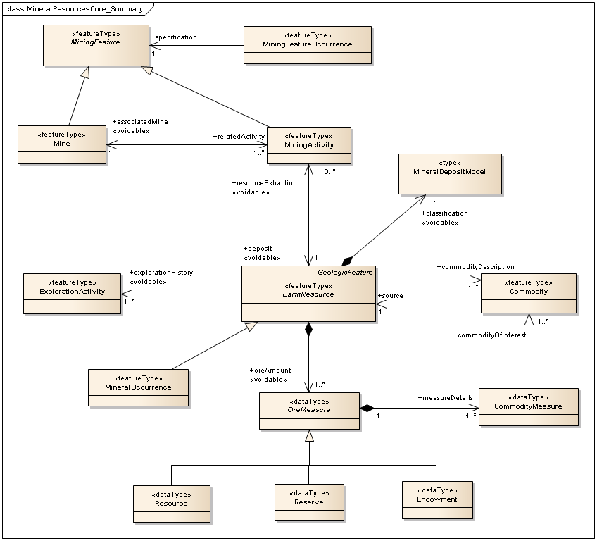
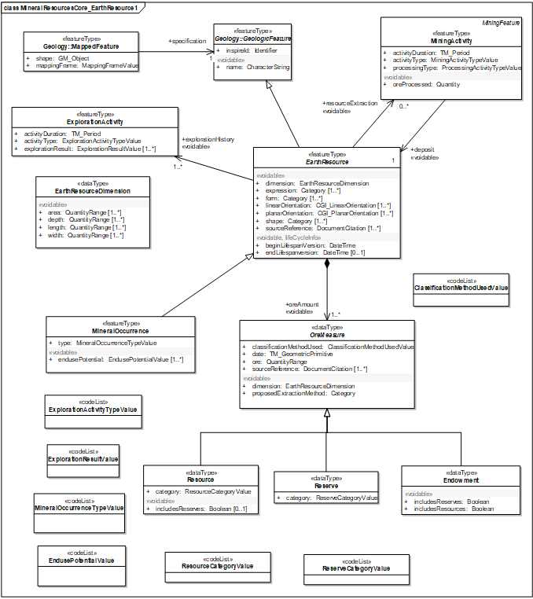
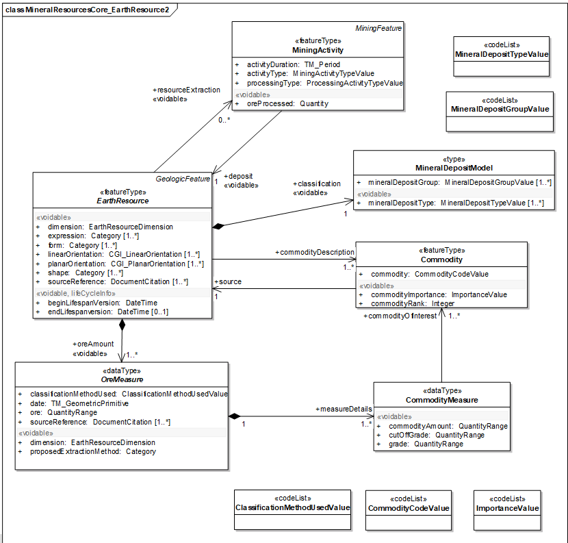
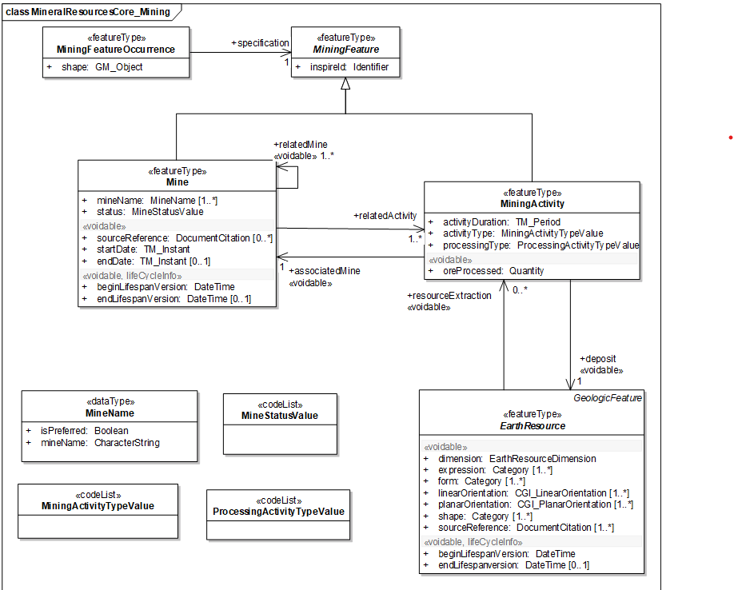
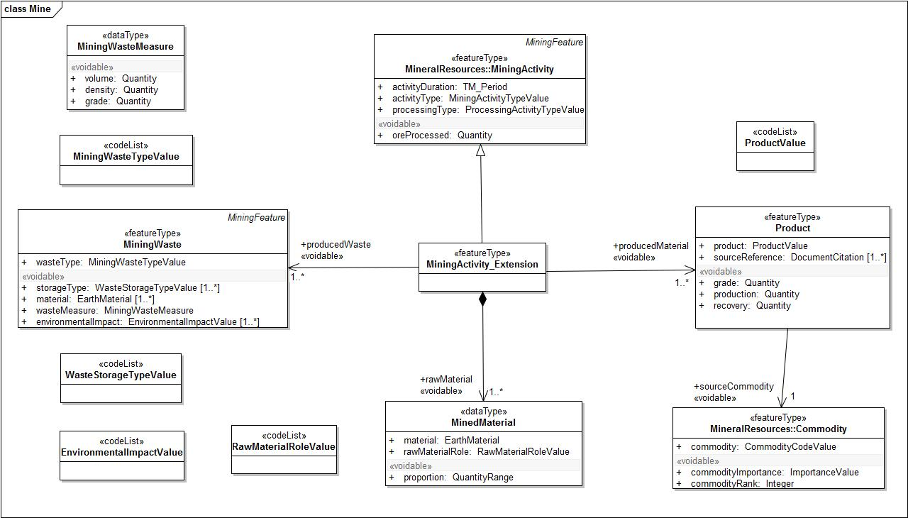
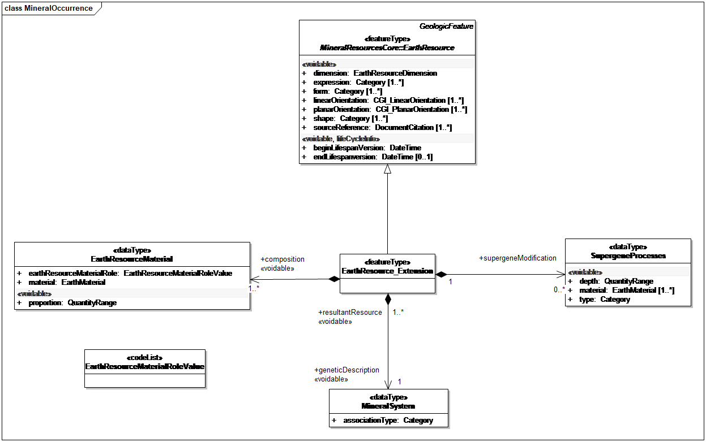
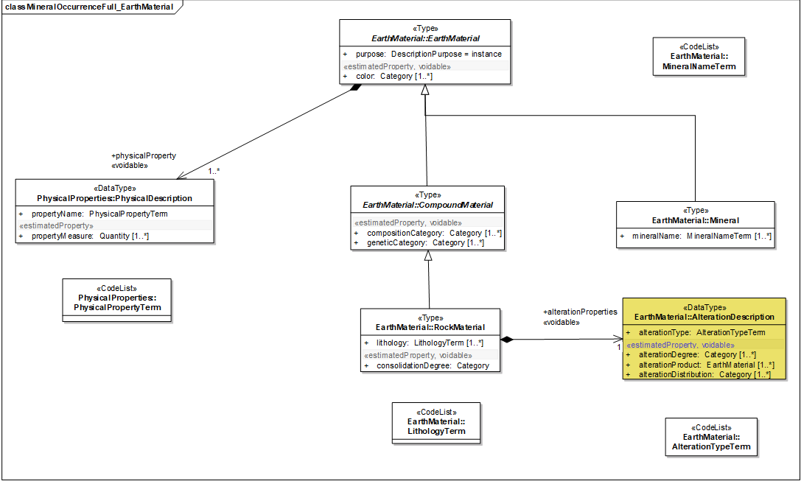

// Admonition icons:
// TG Requirement
:important-caption: 📕
// TG Recommendation
:tip-caption: 📒
// Conformance class
:note-caption: 📘

// TOC placement using macro (manual)
:toc: macro

// Empty TOC title (the title is in the document)
:toc-title:

// TOC level depth
:toclevels: 5

// Section numbering level depth
:sectnumlevels: 8

// Line Break Doc Title
:hardbreaks-option:

:appendix-caption: Annex

// Document properties
:title: D2.8.III.21 Data Specification on Mineral Resources – Technical Guidelines
:revdate: 2024-07-31
:keywords: INSPIRE Data Specification for the spatial data theme Mineral Resources
:producer: INSPIRE Maintenance and Implementation Group (MIG)
:description: This document describes the INSPIRE Data Specification for the spatial data theme Mineral Resources
:author: Temporary MIWP 2021-2024 sub-group 2.3.1
:copyright: Public
:revremark: https://github.com/INSPIRE-MIF/technical-guidelines/releases/tag/v2024.2
:lang: en

image::./media/image2.jpeg[logo_ce-en-rvb-lr,width=131,height=90]

image:./media/image3.png[ESEC,width=93,height=93] **INSPIRE***Infrastructure for Spatial Information in Europe*

[discrete]
= D2.8.III.21 Data Specification on _Mineral Resources_ – Technical Guidelines

[width="100%",cols="17%,83%",]
|===
|*Title* |{doctitle}
|*Creator* |{author}
|*Date of publication* |{revdate}
|*Subject* |{keywords}
|*Publisher* |{producer}
|*Type* |Text
|*Description* |{description}
|*Format* |AsciiDoc
|*Licence* |https://creativecommons.org/licenses/by/4.0[Creative Commons Attribution (cc-by) 4.0]
|*Rights* |{copyright}
|*Identifier* |https://inspire.ec.europa.eu/id/document/tg/mr[D2.8.III.21_v3.0.0]
|*Language* |{lang}
|*Relation* |Directive 2007/2/EC of the European Parliament and of the Council of 14 March 2007 establishing an Infrastructure for Spatial Information in the European Community (INSPIRE)
|===

<<<
[discrete]
== Foreword
[discrete]
== How to read the document?

This document describes the _"INSPIRE data specification on Mineral Resources – Technical Guidelines"_ version 3.0 rc3 as developed by the Thematic Working Group (TWG) _Mineral Resources_ using both natural and a conceptual schema language.

The data specification is based on a common templatefootnote:[The common document template is available in the "Framework documents" section of the data specifications web page at http://inspire.jrc.ec.europa.eu/index.cfm/pageid/2] used for all data specifications, which has been harmonised using the experience from the development of the Annex I, II and III data specifications.

This document provides guidelines for the implementation of the provisions laid down in the Implementing Rule for spatial data sets and services of the INSPIRE Directive. It also includes additional requirements and recommendations that, although not included in the Implementing Rule, are relevant to guarantee or to increase data interoperability.

Two executive summaries provide a quick overview of the INSPIRE data specification process in general, and the content of the data specification on _Mineral Resources_ in particular. We highly recommend that managers, decision makers, and all those new to the INSPIRE process and/or information modelling should read these executive summaries first.

The UML diagrams (in Chapter 5) offer a rapid way to see the main elements of the specifications and their relationships. The definition of the spatial object types, attributes, and relationships are included in the Feature Catalogue (also in Chapter 5). People having thematic expertise but not familiar with UML can fully understand the content of the data model focusing on the Feature Catalogue. Users might also find the Feature Catalogue especially useful to check if it contains the data necessary for the applications that they run. The technical details are expected to be of prime interest to those organisations that are responsible for implementing INSPIRE within the field of _Mineral Resources_, but also to other stakeholders and users of the spatial data infrastructure.

The technical provisions and the underlying concepts are often illustrated by examples. Smaller examples are within the text of the specification, while longer explanatory examples and descriptions of selected use cases are attached in the annexes.

In order to distinguish the INSPIRE spatial data themes from the spatial object types, the INSPIRE spatial data themes are written in _italics._

[width="100%",cols="100%",options="header",]
|===
|The document will be publicly available as a 'non-paper'. It does not represent an official position of the European Commission, and as such cannot be invoked in the context of legal procedures.
|===

*Legal Notice*

Neither the European Commission nor any person acting on behalf of the Commission is responsible for the use which might be made of this publication.

<<<
[discrete]
== Interoperability of Spatial Data Sets and Services – General Executive Summary

The challenges regarding the lack of availability, quality, organisation, accessibility, and sharing of spatial information are common to a large number of policies and activities and are experienced across the various levels of public authority in Europe. In order to solve these problems it is necessary to take measures of coordination between the users and providers of spatial information. The Directive 2007/2/EC of the European Parliament and of the Council adopted on 14 March 2007 aims at establishing an Infrastructure for Spatial Information in the European Community (INSPIRE) for environmental policies, or policies and activities that have an impact on the environment.

INSPIRE is based on the infrastructures for spatial information that are created and maintained by the Member States. To support the establishment of a European infrastructure, Implementing Rules addressing the following components of the infrastructure have been specified: metadata, interoperability of spatial data sets (as described in Annexes I, II, III of the Directive) and spatial data services, network services, data and service sharing, and monitoring and reporting procedures.

INSPIRE does not require collection of new data. However, after the period specified in the Directivefootnote:[For all 34 Annex I,II and III data themes: within two years of the adoption of the corresponding Implementing Rules for newly collected and extensively restructured data and within 5 years for other data in electronic format still in use] Member States have to make their data available according to the Implementing Rules.

Interoperability in INSPIRE means the possibility to combine spatial data and services from different sources across the European Community in a consistent way without involving specific efforts of humans or machines. It is important to note that "interoperability" is understood as providing access to spatial data sets through network services, typically via Internet. Interoperability may be achieved by either changing (harmonising) and storing existing data sets or transforming them via services for publication in the INSPIRE infrastructure. It is expected that users will spend less time and efforts on understanding and integrating data when they build their applications based on data delivered in accordance with INSPIRE.

In order to benefit from the endeavours of international standardisation bodies and organisations established under international law their standards and technical means have been utilised and referenced, whenever possible.

To facilitate the implementation of INSPIRE, it is important that all stakeholders have the opportunity to participate in specification and development. For this reason, the Commission has put in place a consensus building process involving data users, and providers together with representatives of industry, research and government. These stakeholders, organised through Spatial Data Interest Communities (SDIC) and Legally Mandated Organisations (LMO)footnote:[The current status of registered SDICs/LMOs is available via INSPIRE website: http://inspire.jrc.ec.europa.eu/index.cfm/pageid/42], have provided reference materials, participated in the user requirement and technicalfootnote:[Surveys on unique identifiers and usage of the elements of the spatial and temporal schema,] surveys, proposed experts for the Data Specification Drafting Teamfootnote:[The Data Specification Drafting Team has been composed of experts from Austria, Belgium, Czech Republic, France, Germany, Greece, Italy, Netherlands, Norway, Poland, Switzerland, UK, and the European Environment Agency], the Thematic Working Groupsfootnote:[The Thematic Working Groups have been composed of experts from Austria, Australia, Belgium, Bulgaria, Czech Republic, Denmark, Finland, France, Germany, Hungary, Ireland, Italy, Latvia, Netherlands, Norway, Poland, Romania, Slovakia, Spain, Slovenia, Sweden, Switzerland, Turkey, UK, the European Environment Agency and the European Commission.] and other ad-hoc cross-thematic technical groups and participated in the public stakeholder consultations on draft versions of the data specifications. These consultations covered expert reviews as well as feasibility and fitness-for-purpose testing of the data specificationsfootnote:[For Annex IIIII, the consultation and testing phase lasted from 20 June to 21 October 2011.].

This open and participatory approach was successfully used during the development of the data specifications on Annex I, II and III data themes as well as during the preparation of the Implementing Rule on Interoperability of Spatial Data Sets and Servicesfootnote:[Commission Regulation (EU) No 1089/2010 http://eur-lex.europa.eu/JOHtml.do?uri=OJ:L:2010:323:SOM:EN:HTML[implementing Directive 2007/2/EC of the European Parliament and of the Council as regards interoperability of spatial data sets and services&#44;] published in the Official Journal of the European Union on 8^th^ of December 2010.] for Annex I spatial data themes and of its amendment regarding the themes of Annex II and III.

The development framework elaborated by the Data Specification Drafting Team aims at keeping the data specifications of the different themes coherent. It summarises the methodology to be used for the development of the data specifications, providing a coherent set of requirements and recommendations to achieve interoperability. The pillars of the framework are the following technical documentsfootnote:[The framework documents are available in the "Framework documents" section of the data specifications web page at http://inspire.jrc.ec.europa.eu/index.cfm/pageid/2]:

* The _Definition of Annex Themes and Scope_ describes in greater detail the spatial data themes defined in the Directive, and thus provides a sound starting point for the thematic aspects of the data specification development.
* The _Generic Conceptual Model_ defines the elements necessary for interoperability and data harmonisation including cross-theme issues. It specifies requirements and recommendations with regard to data specification elements of common use, like the spatial and temporal schema, unique identifier management, object referencing, some common code lists, etc. Those requirements of the Generic Conceptual Model that are directly implementable are included in the Implementing Rule on Interoperability of Spatial Data Sets and Services.
* The _Methodology for the Development of Data Specifications_ defines a repeatable methodology. It describes how to arrive from user requirements to a data specification through a number of steps including use-case development, initial specification development and analysis of analogies and gaps for further specification refinement.
* The _Guidelines for the Encoding of Spatial Data_ defines how geographic information can be encoded to enable transfer processes between the systems of the data providers in the Member States. Even though it does not specify a mandatory encoding rule it sets GML (ISO 19136) as the default encoding for INSPIRE.
* The _Guidelines for the use of Observations & Measurements and Sensor Web Enablement-related standards in INSPIRE Annex II and III data specification development_ provides guidelines on how the "Observations and Measurements" standard (ISO 19156) is to be used within INSPIRE.
* The _Common data models_ are a set of documents that specify data models that are referenced by a number of different data specifications. These documents include generic data models for networks, coverages and activity complexes.

The structure of the data specifications is based on the "ISO 19131 Geographic information - Data product specifications" standard. They include the technical documentation of the application schema, the spatial object types with their properties, and other specifics of the spatial data themes using natural language as well as a formal conceptual schema languagefootnote:[UML – Unified Modelling Language].

A consolidated model repository, feature concept dictionary, and glossary are being maintained to support the consistent specification development and potential further reuse of specification elements. The consolidated model consists of the harmonised models of the relevant standards from the ISO 19100 series, the INSPIRE Generic Conceptual Model, and the application schemasfootnote:[Conceptual models related to specific areas (e.g. INSPIRE themes)] developed for each spatial data theme. The multilingual INSPIRE Feature Concept Dictionary contains the definition and description of the INSPIRE themes together with the definition of the spatial object types present in the specification. The INSPIRE Glossary defines all the terms (beyond the spatial object types) necessary for understanding the INSPIRE documentation including the terminology of other components (metadata, network services, data sharing, and monitoring).

By listing a number of requirements and making the necessary recommendations, the data specifications enable full system interoperability across the Member States, within the scope of the application areas targeted by the Directive. The data specifications (in their version 3.0) are published as technical guidelines and provide the basis for the content of the Implementing Rule on Interoperability of Spatial Data Sets and Servicesfootnote:[In the case of the Annex IIIII data specifications, the extracted requirements are used to formulate an amendment to the existing Implementing Rule.]. The content of the Implementing Rule is extracted from the data specifications, considering short- and medium-term feasibility as well as cost-benefit considerations. The requirements included in the Implementing Rule are legally binding for the Member States according to the timeline specified in the INSPIRE Directive.

In addition to providing a basis for the interoperability of spatial data in INSPIRE, the data specification development framework and the thematic data specifications can be reused in other environments at local, regional, national and global level contributing to improvements in the coherence and interoperability of data in spatial data infrastructures.

<<<
[discrete]
== _Mineral Resources_ – Executive Summary

In the INSPIRE Directive, _Mineral Resources_ theme is defined as "Mineral resources including metal ores, industrial minerals, etc., where relevant including depth/height information on the extent of the resource".

To specify the scope of _Mineral Resources_ for INSPIRE, the terms contained in the definition have been clearly explained in the informal description section. Reference material has been analysed, and particularly:

* two legal texts providing requirements for the data specification:
** The EU Raw Materials Initiative;
** The Management of waste from extractive industries;
* the standard data model EarthResourceML for Mineral resources;
* the work currently done in raw materials related to European projects.

*The EU Raw Materials Initiative (2008)*

In this document, the Commission notices that there has been no integrated policy response at EU level up to now to ensure that it has sufficient access to raw materials at fair and undistorted prices. It is proposed that the EU should agree on an integrated raw materials strategy. Such a strategy should be based on the following 3 pillars:

* ensure *access to raw materials* from international markets under the same conditions as other industrial competitors;
* set the right *framework conditions* within the EU in order to foster sustainable supply of raw materials from European sources;
* boost overall resource efficiency and promote recycling to *reduce the EU's consumption of primary raw materials* and decrease the relative import dependence.

Two points are of particular interest for INSPIRE:

* The sustainable supply of raw materials based in the EU requires that *the knowledge base* of mineral deposits within the EU will be improved. In addition, the long term access to these deposits should be taken into account in land use planning.
* The Commission recommends better networking between the national geological surveys to facilitate the exchange of information and improve the interoperability of data and their dissemination, with particular attention to the needs of SMEs.

Any *land use policy for minerals* must utilise a robust digital geological knowledge base ensuring fair and equal consideration of all potential uses of land including the eventual extraction of raw materials.

To *improve the knowledge base* of mineral deposits in the EU the need for harmonised EU level data sets stands out.

*The Management of waste from extractive industries (Directive 2006/21/EC)*

One of the properties the waste characterisation shall include, where appropriate and in accordance with the category of the waste facility, is the description of expected physical and chemical characteristics of the waste to be deposited in the short and the long term, with particular reference to its stability under surface atmospheric/meteorological conditions, taking account of the type of mineral or minerals to be extracted and the nature of any overburden and/or gangue minerals that will be displaced in the course of the extractive operations.

A communication of the European Commission (COM(2011) 25 final) entitled 'TACKLING THE CHALLENGES IN COMMODITY MARKETS AND ON RAW MATERIALS**'** presents an overview of what has been achieved in each of these areas and of the steps which are planned to take the work forward. This document sets out targeted measures to secure and improve access to raw materials for the EU, and it also confirms that the needs expressed above are more than never of actuality.

*Examples of use of mineral resources*

The initial analysis of reference material and related activities has been completed by the description of the most relevant examples of use of mineral resources in various domains:

* Management of resources and exploitation activities: Providing information on inventoried mineral resources.
* Environmental impact assessments: mapping and measuring environmental geological parameters at desk, in the field and in laboratory, for assessing geological material to be used for construction and rehabilitation at the mine site.
* Mineral exploration: the quantitative assessment of undiscovered mineral resources, the modelling of mineral deposits, the mapping of lithological areas and units potentially hosting mineral deposits, the use of by-products from natural stone quarrying as "secondary aggregates" or as raw material for other industries.
* Promotion of private sector investment: providing geodata and services for mining and exploration companies.

From these examples, *four use cases are detailed:*

* Where to find germanium in Europe?
* What is the gold potential of Central and Southeastern Europe?
* Looking for the closest producers of Ground Calcium Carbonate (GCC), allowing elaborating filler for the paper industry.
* Environmental uncertainties related to mining wastes.

This overview shows the wide range of use with various sets of mineral resources properties according to the use: the management of resources and exploitation activities does not request (most of the time) the same type of information about mineral resources than the assessment of the impact on environment, but some parameters may strongly interact on both domains.

The information about the location of the mine or mineral occurrence and some key attributes like the type of rocks or minerals mined (e.g. silicate – sulphide – radioactive) of _Mineral Resources_ can have a significant impact on the environment. This impact can be more or less strong depending on several other factors/parameters, and an appropriate knowledge about the _Mineral Resources_ can thus play an important role, as for example:

* The type of exploitation: the environmental impact of an open-pit in terms of surface area used/land use problems / visual pollution is not the same as for an underground exploitation (which also sometimes can store wastes depending on the exploitation method).
* The geometry of the deposit (extent, shape, dip, width) – and also the grades of reserves and resources– which will strongly influence the type of exploitation.
* The type of ore, which will determine the type of mineral processing and therefore the type and quantity of wastes.

The *core data model for Mineral Resources,* which is based on the GeoSciML and EarthResourceML developed by the international geosciences community, in particular Geological Survey Organisations (http://www.geosciml.org/), provides the main object types and properties requested by all examples of use: the location of mineral resources (Mines and Earth Resources), the main commodities, and the exploitation type.

The TWG has also elaborated the first draft of a data model that conceptually extends the data scope of the INSPIRE Mineral Resource core data model to address the requirements from the Raw Materials Initiative and the Mining Waste Directive utilizing the GeoSciML and Earth ResourceML community data models (see the Annex D of this document).

<<<
[discrete]
== Acknowledgements

Many individuals and organisations have contributed to the development of these Guidelines.

The Thematic Working Group Geology and Mineral Resources (TWG-GE-MR) included:

Jean-Jacques Serrano (TWG Facilitator), John Laxton (TWG Editor), Kristine Ash, Xavier Berástegui Batalla, Stefan Bergman, Daniel Cassard, Bjørn Follestad, Andrew Hughes, Uffe Larsen, Tomasz Nałęcz, Simon Pen, László Sőrés, Jouni Vuollo, Robert Tomas (European Commission contact point).

Also contributed:

Invited external expert for geoscience interoperability: Francois Robida.

For the final version of the document: Chris Schubert

Other contributors to the INSPIRE data specifications are the Drafting Team Data Specifications, the JRC Data Specifications Team and the INSPIRE stakeholders - Spatial Data Interested Communities (SDICs) and Legally Mandated Organisations (LMOs).

*Contact information*

Maria Vanda Nunes de Lima & Michael Lutz
European Commission Joint Research Centre (JRC)
Institute for Environment and Sustainability
Unit H06: Digital Earth and Reference Data
_http://inspire.ec.europa.eu/index.cfm/pageid/2_

<<<
[discrete]
= Table of contents
toc::[]

:sectnums:
<<<
== Scope

This document specifies a harmonised data specification for the spatial data theme _Mineral Resources_ as defined in Annex III of the INSPIRE Directive.

This data specification provides the basis for the drafting of Implementing Rules according to Article 7 (1) of the INSPIRE Directive [Directive 2007/2/EC]. The entire data specification is published as implementation guidelines accompanying these Implementing Rules.

<<<
== Overview

=== Name

INSPIRE data specification for the theme _Mineral Resources_.

=== Informal description

*[.underline]#Definition:#*

Mineral resources including metal ores, industrial minerals, etc., where relevant including depth/height information on the extent of the resource. [Directive 2007/2/EC]

*[.underline]#Description:#*

From the definition, we detail each word.

*Mineral resource* means a naturally occurring concentration/accumulation of organic or inorganic material of intrinsic economic interest in or on the Earth's crust such as energy fuels, metal ores, industrial minerals and construction minerals, but excluding water, in such form and quality that there are reasonable prospects for eventual economic extraction

*Mineral raw material* (not in the definition) is a natural inorganic or organic substance, such as metallic ores, industrial minerals, construction materials or energy fuels, but excluding water.

**Metal ores t**he usage favors the wording "*Metallic ores*" instead of "Metal ores".

*Ore* (sensu lato): Any naturally occurring (raw) material from which a mineral or aggregate can be extracted at a profit.

Although more than 4,400 mineral species are known, only about 100 are considered ore minerals. The term 'ore' originally applied only to metallic minerals but now includes such non-metallic substances as sulphur, calcium fluoride (fluorite), and barium sulfate (barite). Ore is always mixed with unwanted rocks and minerals, known collectively as gangue. The ore and the gangue are mined together and then separated. The desired element (often a metal which is usually contained in chemical combination with some other element in addition to various impurities) is then extracted from the ore. It may be still further refined (purified) or alloyed with other metals.

*A Metal (metallic) ore* is thus a type of rock (mineral raw material) from which metal can be extracted at a profit.

Metals may be present in ores in the native form (such as native copper), or as noble metals (not usually forming compounds, such as gold), but more commonly they occur combined as oxides, sulphides, sulphates, silicates, etc. Actually, the generic wording 'metals' covers 'true' metals (see Periodic Table of Elements) but also includes semi-metallic substances or metalloids such as 'As' and 'Ge' which are often intimately associated with metals.

*Industrial minerals* and rocks are minerals which are neither metallic nor used as fuels, but which are mined and processed for their economic use. A broader definition describes an industrial mineral as any rock, mineral, or naturally occurring substance of economic value, exclusive of metallic ores and mineral fuels, and gemstones. In essence, they are the raw materials used in many industrial, agricultural and construction products. However, *for convenience*, gemstones are frequently grouped together with industrial minerals under one umbrella.

*Depth/height information:* This information, if provided alone, is of limited interest. It should be linked with information related to the type and the morphology of the deposit (e.g., vein, massive deposit, layer, etc.) and its geometry, in particular the dip. The depth/height of the deposit, combined with information related to the morphology and the geometry, will contribute to define the operating method (e.g., open pit vs. underground mining) and notably the thickness of overburden to remove in case of open pit mining.

==== The main spatial object / data types of _Mineral Resources_ data specification

The main spatial object / data types are Mineral Occurrence, the Commodity, the Mine and the Exploration activity, and the Mining activity.

*The MineralResources data model:*

The *Mining Feature* class represents a conceptual feature that exists coherently in the world and corresponds with a "*Mine*" or a "*Mining Activity*", locatable and identifiable features in time and/or space. The *Mining Feature Occurrence* is an occurrence of a Mining Feature, it carries some properties and the geometry and/or location.

* A *Mine* is an excavation for the extraction of mineral deposits. 'True' mines are underground workings and open-pit workings (also called open-sky mines) generally for the extraction of metallic commodities. The Mine spatial object type also includes open workings generally for the extraction of industrial minerals, commonly referred to as quarries.
* The *Mining Activity*, related to a Mine, describes the process of extracting metallic or non-metallic mineral deposits from the Earth.

The *Earth Resource* identifies the kinds of observable or inferred phenomena required to classify economic and sub-economic earth resources:

* The *Mineral Occurrence* could be a prospect, an occurrence, a mineral deposit, an ore deposit, etc. (but not a lode, a field, a district, or a province).
* The *Commodity* describes the material of economic interest in the Earth Resource.
* The *Ore Measure* is an estimated or calculated amount of ore and grade that exist within an Earth Resource, in terms of its resource, reserve and endowment.
* The *Mineral Deposit Model* describes the essential attributes of a class of mineral deposits used to classify the Earth Resource.
* An Earth Resource has an associated *Exploration Activity* to describe the process leading to the discovery and assessment of the resource.

The MineralResources data model uses classes from the INSPIRE Geology Data Model: an Earth Resource is a Geologic Feature, which has a geometry (a MappedFeature) and an age (GeologicEvent).

Exploration history is needed for quantitative assessment of possibly existing, yet undiscovered mineral resources of an area (e.g. USGS predictivity approach). Such information can also help to evaluate the potential of an occurrence (e.g. sampling survey; drilling survey).

The notion of metallogenic district is particularly useful and is present in several databases. It allows a deposit to be placed in a more general frame and to tackle the concept of mining potential at a regional scale. In the MineralResources model this can be described using the MineralOccurrence type property.

*Mineral resource anomalies*

Anomalies are defined in the D2.3 Document D2.3 Definition of Annex Themes and Scope:

*"Anomalies*: locations where background concentrations of potentially valuable elements in soils, stream sediments or rocks onshore or offshore exceed the normal background values expected given the local geological context. Such maps are widely used in mineral exploration. Attributes are location, chemical elements, nature of the sampled element (s), analytical value(s)"

Anomalies are not only of geochemical nature, but can also be geophysical. An anomaly has no intrinsic value until it has been properly characterized through (i) a detailed geological survey, (ii) a more detailed geophysical/geochemical survey ("tactical" grids with a smaller cell size for measurement/sampling) and (iii) if the interest is confirmed, a reconnaissance drilling survey.

A majority of anomalies never open onto the discovery of a deposit, being often related to lithological heterogeneities in the crust. In some cases, they may indicate that a mineralizing process started but rapidly aborted, leading to no mineral concentration. On the other hand, many deposits are not (or never) marked by geophysical/geochemical anomalies for several reasons: depth, overburden screen, lack of contrast between the host rock and the ore body, etc..

Even if geochemical/geophysical surveys are useful for "predictivity" mapping, most of the time, only large-scale surveys published by public bodies are available. Their interest is generally very limited. Detailed surveys made by private companies are rarely accessible because of their strategic importance.

All these reasons together do not invite to include "Anomalies" in the scope of _Mineral Resources_. An "Anomaly" database would be a huge collection of objects for which nobody would have a clear idea of the meaning. Most of the Geological Surveys do not maintain such a database.

[cols=""]
|===
*[.underline]#Definition:#*

Mineral resources including metal ores, industrial minerals, etc., where relevant including depth/height information on the extent of the resource. [Directive 2007/2/EC]

*[.underline]#Description:#*

The Mineral resources data theme refers to the description of natural concentrations of very diverse mineral resources of potential or proven economic interest. The important attributes such as the nature, genesis, location, extent, mining and distribution of resources reflect the two main identified categories of potential use. These are:

* Management of resources and their exploitation and exploration activities: provision of information on inventoried mineral resources as well as on the quantitative assessment of undiscovered mineral resources and the modelling of mineral deposits.

* Environmental impact assessments: mapping and measuring environmental geological parameters for assessing geological material to be used for construction and rehabilitation at the mine site.

The Mineral resources data model is organised around two major categories of information: description and location of mines and mining activities; the description and location of "earth resources" including their classification, estimates of amount, as well as a description of the main market commodities. The energy resources such as coal, oil and gas are excluded in this theme, as they are found in theme "energy resources".

Entry in the INSPIRE registry: _http://inspire.ec.europa.eu/theme/mr/_
|===

=== Normative References

[Directive 2007/2/EC] Directive 2007/2/EC of the European Parliament and of the Council of 14 March 2007 establishing an Infrastructure for Spatial Information in the European Community (INSPIRE)

[ISO 19107] EN ISO 19107:2005, Geographic Information – Spatial Schema

[ISO 19108] EN ISO 19108:2005, Geographic Information – Temporal Schema

[ISO 19108-c] ISO 19108:2002/Cor 1:2006, Geographic Information – Temporal Schema, Technical Corrigendum 1

[ISO 19111] EN ISO 19111:2007 Geographic information - Spatial referencing by coordinates (ISO 19111:2007)

[ISO 19113] EN ISO 19113:2005, Geographic Information – Quality principles

[ISO 19115] EN ISO 19115:2005, Geographic information – Metadata (ISO 19115:2003)

[ISO 19118] EN ISO 19118:2006, Geographic information – Encoding (ISO 19118:2005)

[ISO 19123] EN ISO 19123:2007, Geographic Information – Schema for coverage geometry and functions

[ISO 19125-1] EN ISO 19125-1:2004, Geographic Information – Simple feature access – Part 1: Common architecture

[ISO 19135] EN ISO 19135:2007 Geographic information – Procedures for item registration (ISO 19135:2005)

[ISO 19138] ISO/TS 19138:2006, Geographic Information – Data quality measures

[ISO 19139] ISO/TS 19139:2007, Geographic information – Metadata – XML schema implementation

[ISO 19157] ISO/DIS 19157, Geographic information – Data quality

[OGC 06-103r4] Implementation Specification for Geographic Information - Simple feature access – Part 1: Common Architecture v1.2.1

NOTE This is an updated version of "EN ISO 19125-1:2004, Geographic information – Simple feature access – Part 1: Common architecture".

[Regulation 1205/2008/EC] Regulation 1205/2008/EC implementing Directive 2007/2/EC of the European Parliament and of the Council as regards metadata

[Regulation 976/2009/EC] Commission Regulation (EC) No 976/2009 of 19 October 2009 implementing Directive 2007/2/EC of the European Parliament and of the Council as regards the Network Services

[Regulation 1089/2010/EC] Commission Regulation (EU) No 1089/2010 of 23 November 2010 implementing Directive 2007/2/EC of the European Parliament and of the Council as regards interoperability of spatial data sets and services

*Raw Materials Initiative*:[Communication 2008/699/EC] The raw materials initiative — Meeting our critical needs for growth and jobs in Europe \{SEC(2008) 2741}. Communication COM(2008) 699

*Mining Waste Directive:* [Regulation 2006/21/EC] DIRECTIVE 2006/21/EC OF THE EUROPEAN PARLIAMENT AND OF THE COUNCIL of 15 March 2006 on the management of waste from extractive industries and amending Directive 2004/35/EC

Web sites describing the two data models standards used to provide the INSPIRE data model for _Mineral Resources_:

* *EarthResourceML:* _www.earthresourceml.org_
* *GeoSciML:* _www.geosciml.org_

=== Terms and definitions

General terms and definitions helpful for understanding the INSPIRE data specification documents are defined in the INSPIRE Glossaryfootnote:[The INSPIRE Glossary is available from http://inspire-registry.jrc.ec.europa.eu/registers/GLOSSARY].

Specifically, for the theme _Mineral Resources_, the following terms are defined:

. *Commodity*

A material of economic interest in an earth resource.

[arabic, start=2]
. *Mine*

An excavation for the extraction of mineral deposits, including underground workings and open-pit workings (also called open-sky mines) for the extraction of metallic commodities, as well as open workings for the extraction of industrial minerals, (which are commonly referred to as quarries).

[arabic, start=3]
. *Mining activity*

The process of extracting metallic or non-metallic mineral deposits from the Earth.

=== Symbols and abbreviations

[width="100%",cols="14%,86%"]
|===
|AMD |Acid Mine Drainage
|ARD |Acid Rock Drainage
|ATS |Abstract Test Suite
|BMD |Basic Mine Drainage
|CCGC |Australian Chief Government Geologists Committee
|CGI |Commission for Geoscience Information (IUGS Commission)
|CRIRSCO |Committee for Mineral Reserves International Reporting Standards
|EC |European Commission
|EEA |European Environmental Agency
|ERML |EarthResource Markup Language
|ETRS89 |European Terrestrial Reference System 1989
|ETRS89-LAEA |Lambert Azimuthal Equal Area
|EVRS |European Vertical Reference System
|GCC |Ground Calcium Carbonate
|GCM |General Conceptual Model
|GeoSciML |GeoScience Markup Language
|GML |Geography Markup Language
|IR |Implementing Rule
|ISDSS |Interoperability of Spatial Data Sets and Services
|ISO |International Organization for Standardization
|ITRS |International Terrestrial Reference System
|IUGS |International Union of Geological Sciences
|LAT |Lowest Astronomical Tide
|LMO |Legally Mandated Organisation
|MR |Mineral Resources
|NMD |Neutral Mine Drainage
|PERC |Pan European Reserves and Resources Reporting Committee
|PGE |Platinum group elements
|RAW |RUN-OF-MINE
|SDIC |Spatial Data Interest Community
|SEDEX |Sedimentary Exhalative Deposits
|TG |Technical Guidance
|UML |Unified Modeling Language
|UTC |Coordinated Universal Time
|VMS |Volcanogenic Massive Sulphides
|XML |EXtensible Markup Language
|===

=== How the Technical Guidelines map to the Implementing Rules

The schematic diagram in Figure 1 gives an overview of the relationships between the INSPIRE legal acts (the INSPIRE Directive and Implementing Rules) and the INSPIRE Technical Guidelines. The INSPIRE Directive and Implementing Rules include legally binding requirements that describe, usually on an abstract level, _what_ Member States must implement.

In contrast, the Technical Guidelines define _how_ Member States might implement the requirements included in the INSPIRE Implementing Rules. As such, they may include non-binding technical requirements that must be satisfied if a Member State data provider chooses to conform to the Technical Guidelines. Implementing these Technical Guidelines will maximise the interoperability of INSPIRE spatial data sets.

image::./media/image4.png[./media/image4,width=603,height=375]

[.text-center]
*Figure 1 - Relationship between INSPIRE Implementing Rules and Technical Guidelines*

==== Requirements

The purpose of these Technical Guidelines (Data specifications on _Mineral Resources_) is to provide practical guidance for implementation that is guided by, and satisfies, the (legally binding) requirements included for the spatial data theme _Mineral Resources_ in the Regulation (Implementing Rules) on interoperability of spatial data sets and services. These requirements are highlighted in this document as follows:

[IMPORTANT]
====
[.text-center]
*IR Requirement*
_Article / Annex / Section no._
*Title / Heading*

This style is used for requirements contained in the Implementing Rules on interoperability of spatial data sets and services (Commission Regulation (EU) No 1089/2010).

====

For each of these IR requirements, these Technical Guidelines contain additional explanations and examples.

NOTE The Abstract Test Suite (ATS) in Annex A contains conformance tests that directly check conformance with these IR requirements.

Furthermore, these Technical Guidelines may propose a specific technical implementation for satisfying an IR requirement. In such cases, these Technical Guidelines may contain additional technical requirements that need to be met in order to be conformant with the corresponding IR requirement _when using this proposed implementation_. These technical requirements are highlighted as follows:

[TIP]
====
*TG Requirement X* 

This style is used for requirements for a specific technical solution proposed in these Technical Guidelines for an IR requirement.

====

NOTE 1 Conformance of a data set with the TG requirement(s) included in the ATS implies conformance with the corresponding IR requirement(s).

NOTE 2 In addition to the requirements included in the Implementing Rules on interoperability of spatial data sets and services, the INSPIRE Directive includes further legally binding obligations that put additional requirements on data providers. For example, Art. 10(2) requires that Member States shall, where appropriate, decide by mutual consent on the depiction and position of geographical features whose location spans the frontier between two or more Member States. General guidance for how to meet these obligations is provided in the INSPIRE framework documents.

==== Recommendations

In addition to IR and TG requirements, these Technical Guidelines may also include a number of recommendations for facilitating implementation or for further and coherent development of an interoperable infrastructure.

[NOTE]
====
*Recommendation X* 

Recommendations are shown using this style.
====

NOTE The implementation of recommendations is not mandatory. Compliance with these Technical Guidelines or the legal obligation does not depend on the fulfilment of the recommendations.

==== Conformance

Annex A includes the abstract test suite for checking conformance with the requirements included in these Technical Guidelines and the corresponding parts of the Implementing Rules (Commission Regulation (EU) No 1089/2010).

<<<
== Specification scopes

This data specification does not distinguish different specification scopes, but just considers one general scope.

NOTE For more information on specification scopes, see [ISO 19131:2007], clause 8 and Annex D.

<<<
== Identification information

These Technical Guidelines are identified by the following URI:

http://inspire.ec.europa.eu/tg/mr/3.0 rc3

NOTE ISO 19131 suggests further identification information to be included in this section, e.g. the title, abstract or spatial representation type. The proposed items are already described in the document metadata, executive summary, overview description (section 2) and descriptions of the application schemas (section 5). In order to avoid redundancy, they are not repeated here.

<<<
== Data content and structure

=== Application schemas – Overview 

==== Application schemas included in the IRs

Articles 3, 4 and 5 of the Implementing Rules lay down the requirements for the content and structure of the data sets related to the INSPIRE Annex themes.

[IMPORTANT]
====
[.text-center]
*IR Requirement*
_Article 4_
*Types for the Exchange and Classification of Spatial Objects*

. For the exchange and classification of spatial objects from data sets meeting the conditions laid down in Article 4 of Directive 2007/2/EC, Member States shall use the spatial object types and associated data types, enumerations and code lists that are defined in Annexes II, III and IV for the themes the data sets relate to.

. Spatial object types and data types shall comply with the definitions and constraints and include the attributes and association roles set out in the Annexes.

. The enumerations and code lists used in attributes or association roles of spatial object types or data types shall comply with the definitions and include the values set out in Annex II. The enumeration and code list values are uniquely identified by language-neutral mnemonic codes for computers. The values may also include a language-specific name to be used for human interaction.

====

The types to be used for the exchange and classification of spatial objects from data sets related to the spatial data theme _Mineral Resources_ are defined in the following application schemas (see section 5.3) ):

* MineralResources application schema describes the core normative concepts that build up the INSPIRE Mineral resources data theme

The application schemas specify requirements on the properties of each spatial object including its multiplicity, domain of valid values, constraints, etc.

NOTE The application schemas presented in this section contain some additional information that is not included in the Implementing Rules, in particular multiplicities of attributes and association roles.

[TIP]
====
*TG Requirement 1*

Spatial object types and data types shall comply with the multiplicities defined for the attributes and association roles in this section.

====

An application schema may include references (e.g. in attributes or inheritance relationships) to common types or types defined in other spatial data themes. These types can be found in a sub-section called "Imported Types" at the end of each application schema section. The common types referred to from application schemas included in the IRs are addressed in Article 3.

[IMPORTANT]
====
[.text-center]
*IR Requirement*
_Article 3_
*Common Types*

Types that are common to several of the themes listed in Annexes I, II and III to Directive 2007/2/EC shall conform to the definitions and constraints and include the attributes and association roles set out in Annex I.

====

NOTE Since the IRs contain the types for all INSPIRE spatial data themes in one document, Article 3 does not explicitly refer to types defined in other spatial data themes, but only to types defined in external data models.

Common types are described in detail in the Generic Conceptual Model [DS-D2.7], in the relevant international standards (e.g. of the ISO 19100 series) or in the documents on the common INSPIRE models [DS-D2.10.x]. For detailed descriptions of types defined in other spatial data themes, see the corresponding Data Specification TG document [DS-D2.8.x].

==== Additional recommended application schemas 

In addition to the application schema listed above, the following additional application schema have been defined for the theme _Mineral Resources_ (see Annex D):

* *_MineralResourcesExtension_* application schema represents a conceptual extension of the data scope of the core MR data model. However this extension is using the GeoSciML and EarthResourceML classes to address additional requirements of EU Raw Materials Initiative and the Mining Waste Directive.

These additional application schemas are not included in the IRs. They typically address requirements from specific (groups of) use cases and/or may be used to provide additional information. They are included in this specification in order to improve interoperability also for these additional aspects and to illustrate the extensibility of the application schemas included in the IRs.

=== Basic notions

This section explains some of the basic notions used in the INSPIRE application schemas. These explanations are based on the GCM [DS-D2.5].

==== Notation

===== Unified Modeling Language (UML)

The application schemas included in this section are specified in UML, version 2.1. The spatial object types, their properties and associated types are shown in UML class diagrams.

NOTE For an overview of the UML notation, see Annex D in [ISO 19103].

The use of a common conceptual schema language (i.e. UML) allows for an automated processing of application schemas and the encoding, querying and updating of data based on the application schema – across different themes and different levels of detail.

The following important rules related to class inheritance and abstract classes are included in the IRs.

[IMPORTANT]
====
[.text-center]
*IR Requirement*
_Article 5_
*Types*

(...)

[arabic, start=2]
. Types that are a sub-type of another type shall also include all this type's attributes and association roles.
. Abstract types shall not be instantiated.

====

The use of UML conforms to ISO 19109 8.3 and ISO/TS 19103 with the exception that UML 2.1 instead of ISO/IEC 19501 is being used. The use of UML also conforms to ISO 19136 E.2.1.1.1-E.2.1.1.4.

NOTE ISO/TS 19103 and ISO 19109 specify a profile of UML to be used in conjunction with the ISO 19100 series. This includes in particular a list of stereotypes and basic types to be used in application schemas. ISO 19136 specifies a more restricted UML profile that allows for a direct encoding in XML Schema for data transfer purposes.

To model constraints on the spatial object types and their properties, in particular to express data/data set consistency rules, OCL (Object Constraint Language) is used as described in ISO/TS 19103, whenever possible. In addition, all constraints are described in the feature catalogue in English, too.

NOTE Since "void" is not a concept supported by OCL, OCL constraints cannot include expressions to test whether a value is a _void_ value. Such constraints may only be expressed in natural language.

===== Stereotypes

In the application schemas in this section several stereotypes are used that have been defined as part of a UML profile for use in INSPIRE [DS-D2.5]. These are explained in Table 1 below.

[.text-center]
*Table 1 – Stereotypes (adapted from [DS-D2.5])*

[align=center,width="100%",cols="22%,14%,64%",options="header",]
|===
|*Stereotype* |*Model element* |*Description*
|applicationSchema |Package |An INSPIRE application schema according to ISO 19109 and the Generic Conceptual Model.
|leaf |Package |A package that is not an application schema and contains no packages.
|featureType |Class |A spatial object type.
|type |Class |A type that is not directly instantiable, but is used as an abstract collection of operation, attribute and relation signatures. This stereotype should usually not be used in INSPIRE application schemas as these are on a different conceptual level than classifiers with this stereotype.
|dataType |Class |A structured data type without identity.
|union |Class |A structured data type without identity where exactly one of the properties of the type is present in any instance.
|enumeration |Class |An enumeration.
|codeList |Class |A code list.
|import |Dependency |The model elements of the supplier package are imported.
|voidable |Attribute, association role |A voidable attribute or association role (see section 5.2.2).
|lifeCycleInfo |Attribute, association role |If in an application schema a property is considered to be part of the life-cycle information of a spatial object type, the property shall receive this stereotype.
|version |Association role |If in an application schema an association role ends at a spatial object type, this stereotype denotes that the value of the property is meant to be a specific version of the spatial object, not the spatial object in general.
|===

==== Voidable characteristics

The «voidable» stereotype is used to characterise those properties of a spatial object that may not be present in some spatial data sets, even though they may be present or applicable in the real world. This does _not_ mean that it is optional to provide a value for those properties.

For all properties defined for a spatial object, a value has to be provided – either the corresponding value (if available in the data set maintained by the data provider) or the value of _void._ A _void_ value shall imply that no corresponding value is contained in the source spatial data set maintained by the data provider or no corresponding value can be derived from existing values at reasonable costs.

[NOTE]
====
*Recomendation 1*

The reason for a _void_ value should be provided where possible using a listed value from the VoidReasonValue code list to indicate the reason for the missing value.

====

The VoidReasonValue type is a code list, which includes the following pre-defined values:

* _Unpopulated_: The property is not part of the dataset maintained by the data provider. However, the characteristic may exist in the real world. For example when the "elevation of the water body above the sea level" has not been included in a dataset containing lake spatial objects, then the reason for a void value of this property would be 'Unpopulated'. The property receives this value for all spatial objects in the spatial data set.
* _Unknown_: The correct value for the specific spatial object is not known to, and not computable by the data provider. However, a correct value may exist. For example when the "elevation of the water body above the sea level" _of a certain lake_ has not been measured, then the reason for a void value of this property would be 'Unknown'. This value is applied only to those spatial objects where the property in question is not known.
* _Withheld_: The characteristic may exist, but is confidential and not divulged by the data provider.

NOTE It is possible that additional reasons will be identified in the future, in particular to support reasons / special values in coverage ranges.

The «voidable» stereotype does not give any information on whether or not a characteristic exists in the real world. This is expressed using the multiplicity:

* If a characteristic may or may not exist in the real world, its minimum cardinality shall be defined as 0. For example, if an Address may or may not have a house number, the multiplicity of the corresponding property shall be 0..1.
* If at least one value for a certain characteristic exists in the real world, the minimum cardinality shall be defined as 1. For example, if an Administrative Unit always has at least one name, the multiplicity of the corresponding property shall be 1..*.

In both cases, the «voidable» stereotype can be applied. In cases where the minimum multiplicity is 0, the absence of a value indicates that it is known that no value exists, whereas a value of void indicates that it is not known whether a value exists or not.

EXAMPLE If an address does not have a house number, the corresponding Address object should not have any value for the «voidable» attribute house number. If the house number is simply not known or not populated in the data set, the Address object should receive a value of _void_ (with the corresponding void reason) for the house number attribute.

==== Enumerations

Enumerations are modelled as classes in the application schemas. Their values are modelled as attributes of the enumeration class using the following modelling style:

* No initial value, but only the attribute name part, is used.
* The attribute name conforms to the rules for attributes names, i.e. is a lowerCamelCase name. Exceptions are words that consist of all uppercase letters (acronyms).

[IMPORTANT]
====
[.text-center]
*IR Requirement*
_Article 6_
*Code Lists and Enumerations*

(...)

[arabic, start=5]
. Attributes or association roles of spatial object types or data types that have an enumeration type may only take values from the lists specified for the enumeration type."

====

==== Code lists

Code lists are modelled as classes in the application schemas. Their values, however, are managed outside of the application schema.

===== Code list types

The IRs distinguish the following types of code lists.

[IMPORTANT]
====
[.text-center]
*IR Requirement*
_Article 6_
*Code Lists and Enumerations*

. Code lists shall be of one of the following types, as specified in the Annexes:
[loweralpha]
.. code lists whose allowed values comprise only the values specified in this Regulation;
.. code lists whose allowed values comprise the values specified in this Regulation and narrower values defined by data providers;
.. code lists whose allowed values comprise the values specified in this Regulation and additional values at any level defined by data providers;
.. code lists, whose allowed values comprise any values defined by data providers.

For the purposes of points (b), (c) and (d), in addition to the allowed values, data providers may use the values specified in the relevant INSPIRE Technical Guidance document available on the INSPIRE web site of the Joint Research Centre.

====

The type of code list is represented in the UML model through the tagged value _extensibility_, which can take the following values:

* _none_, representing code lists whose allowed values comprise only the values specified in the IRs (type a);
* _narrower_, representing code lists whose allowed values comprise the values specified in the IRs and narrower values defined by data providers (type b);
* _open_, representing code lists whose allowed values comprise the values specified in the IRs and additional values at any level defined by data providers (type c); and
* _any_, representing code lists, for which the IRs do not specify any allowed values, i.e. whose allowed values comprise any values defined by data providers (type d).

[NOTE]
====
*Recomendation 2*

Additional values defined by data providers should not replace or redefine any value already specified in the IRs.

====

NOTE This data specification may specify recommended values for some of the code lists of type (b), (c) and (d) (see section 5.2.4.3). These recommended values are specified in a dedicated Annex.

In addition, code lists can be hierarchical, as explained in Article 6(2) of the IRs.

[IMPORTANT]
====
[.text-center]
*IR Requirement*
_Article 6_
*Code Lists and Enumerations*

(...)

[arabic, start=2]
. Code lists may be hierarchical. Values of hierarchical code lists may have a more generic parent value. Where the valid values of a hierarchical code list are specified in a table in this Regulation, the parent values are listed in the last column.

====

The type of code list and whether it is hierarchical or not is also indicated in the feature catalogues.

===== Obligations on data providers

[IMPORTANT]
====
[.text-center]
*IR Requirement*
_Article 6_
*Code Lists and Enumerations*

(....)

[arabic, start=3]
. Where, for an attribute whose type is a code list as referred to in points (b), (c) or (d) of paragraph 1, a data provider provides a value that is not specified in this Regulation, that value and its definition shall be made available in a register.
. Attributes or association roles of spatial object types or data types whose type is a code list may only take values that are allowed according to the specification of the code list.

====

Article 6(4) obliges data providers to use only values that are allowed according to the specification of the code list. The "allowed values according to the specification of the code list" are the values explicitly defined in the IRs plus (in the case of code lists of type (b), (c) and (d)) additional values defined by data providers.

For attributes whose type is a code list of type (b), (c) or (d) data providers may use additional values that are not defined in the IRs. Article 6(3) requires that such additional values and their definition be made available in a register. This enables users of the data to look up the meaning of the additional values used in a data set, and also facilitates the re-use of additional values by other data providers (potentially across Member States).

NOTE Guidelines for setting up registers for additional values and how to register additional values in these registers is still an open discussion point between Member States and the Commission.

===== Recommended code list values

For code lists of type (b), (c) and (d), this data specification may propose additional values as a recommendation (in a dedicated Annex). These values will be included in the INSPIRE code list register. This will facilitate and encourage the usage of the recommended values by data providers since the obligation to make additional values defined by data providers available in a register (see section 5.2.4.2) is already met.

[NOTE]
====
*Recomendation 3*

Where these Technical Guidelines recommend values for a code list in addition to those specified in the IRs, these values should be used.

====

NOTE For some code lists of type (d), no values may be specified in these Technical Guidelines. In these cases, any additional value defined by data providers may be used.

===== Governance

The following two types of code lists are distinguished in INSPIRE:

* _Code lists that are governed by INSPIRE (INSPIRE-governed code lists)._ These code lists will be managed centrally in the INSPIRE code list register. Change requests to these code lists (e.g. to add, deprecate or supersede values) are processed and decided upon using the INSPIRE code list register's maintenance workflows.
+
INSPIRE-governed code lists will be made available in the INSPIRE code list register at __http://inspire.ec.europa.eu/codelist/<CodeListName__>. They will be available in SKOS/RDF, XML and HTML. The maintenance will follow the procedures defined in ISO 19135. This means that the only allowed changes to a code list are the addition, deprecation or supersession of values, i.e. no value will ever be deleted, but only receive different statuses (valid, deprecated, superseded). Identifiers for values of INSPIRE-governed code lists are constructed using the pattern __http://inspire.ec.europa.eu/codelist/<CodeListName__>/<value>.

* _Code lists that are governed by an organisation outside of INSPIRE (externally governed code lists)._ These code lists are managed by an organisation outside of INSPIRE, e.g. the World Meteorological Organization (WMO) or the World Health Organization (WHO). Change requests to these code lists follow the maintenance workflows defined by the maintaining organisations. Note that in some cases, no such workflows may be formally defined.
+
Since the updates of externally governed code lists is outside the control of INSPIRE, the IRs and these Technical Guidelines reference a specific version for such code lists.
+
The tables describing externally governed code lists in this section contain the following columns:
+
** The _Governance_ column describes the external organisation that is responsible for maintaining the code list.
** The _Source_ column specifies a citation for the authoritative source for the values of the code list. For code lists, whose values are mandated in the IRs, this citation should include the version of the code list used in INSPIRE. The version can be specified using a version number or the publication date. For code list values recommended in these Technical Guidelines, the citation may refer to the "latest available version".
** In some cases, for INSPIRE only a subset of an externally governed code list is relevant. The subset is specified using the _Subset_ column.
** The _Availability_ column specifies from where (e.g. URL) the values of the externally governed code list are available, and in which formats. Formats can include machine-readable (e.g. SKOS/RDF, XML) or human-readable (e.g. HTML, PDF) ones.

+
Code list values are encoded using http URIs and labels. Rules for generating these URIs and labels are specified in a separate table.

[NOTE]
====
*Recomendation 4*

The http URIs and labels used for encoding code list values should be taken from the INSPIRE code list registry for INSPIRE-governed code lists and generated according to the relevant rules specified for externally governed code lists.

====

NOTE Where practicable, the INSPIRE code list register could also provide http URIs and labels for externally governed code lists.

===== Vocabulary

For each code list, a tagged value called "vocabulary" is specified to define a URI identifying the values of the code list. For INSPIRE-governed code lists and externally governed code lists that do not have a persistent identifier, the URI is constructed following the pattern _http://inspire.ec.europa.eu/codelist/<UpperCamelCaseName>_.

If the value is missing or empty, this indicates an empty code list. If no sub-classes are defined for this empty code list, this means that any code list may be used that meets the given definition.

An empty code list may also be used as a super-class for a number of specific code lists whose values may be used to specify the attribute value. If the sub-classes specified in the model represent all valid extensions to the empty code list, the subtyping relationship is qualified with the standard UML constraint "\{complete,disjoint}".

==== Identifier management

[IMPORTANT]
====
[.text-center]
*IR Requirement*
_Article 9_
*Identifier Management*

. The data type Identifier defined in Section 2.1 of Annex I shall be used as a type for the external object identifier of a spatial object.

. The external object identifier for the unique identification of spatial objects shall not be changed during the life-cycle of a spatial object.

====

NOTE 1 An external object identifier is a unique object identifier which is published by the responsible body, which may be used by external applications to reference the spatial object. [DS-D2.5]

NOTE 2 Article 9(1) is implemented in each application schema by including the attribute _inspireId_ of type Identifier.

NOTE 3 Article 9(2) is ensured if the _namespace_ and _localId_ attributes of the Identifier remains the same for different versions of a spatial object; the _version_ attribute can of course change.

==== Geometry representation

[IMPORTANT]
====
[.text-center]
*IR Requirement*
_Article 12_
*Other Requirements & Rules*

. The value domain of spatial properties defined in this Regulation shall be restricted to the Simple Feature spatial schema as defined in Herring, John R. (ed.), OpenGIS® Implementation Standard for Geographic information – Simple feature access – Part 1: Common architecture, version 1.2.1, Open Geospatial Consortium, 2011, unless specified otherwise for a specific spatial data theme or type.

====

NOTE 1 The specification restricts the spatial schema to 0-, 1-, 2-, and 2.5-dimensional geometries where all curve interpolations are linear and surface interpolations are performed by triangles.

NOTE 2 The topological relations of two spatial objects based on their specific geometry and topology properties can in principle be investigated by invoking the operations of the types defined in ISO 19107 (or the methods specified in EN ISO 19125-1).

====  Temporality representation

The application schema(s) use(s) the derived attributes "beginLifespanVersion" and "endLifespanVersion" to record the lifespan of a spatial object.

The attributes "beginLifespanVersion" specifies the date and time at which this version of the spatial object was inserted or changed in the spatial data set. The attribute "endLifespanVersion" specifies the date and time at which this version of the spatial object was superseded or retired in the spatial data set.

NOTE 1 The attributes specify the beginning of the lifespan of the version in the spatial data set itself, which is different from the temporal characteristics of the real-world phenomenon described by the spatial object. This lifespan information, if available, supports mainly two requirements: First, knowledge about the spatial data set content at a specific time; second, knowledge about changes to a data set in a specific time frame. The lifespan information should be as detailed as in the data set (i.e., if the lifespan information in the data set includes seconds, the seconds should be represented in data published in INSPIRE) and include time zone information.

NOTE 2 Changes to the attribute "endLifespanVersion" does not trigger a change in the attribute "beginLifespanVersion".

[IMPORTANT]
====
[.text-center]
*IR Requirement*
_Article 10_
*Life-cycle of Spatial Objects*

(...)

[arabic, start=3]
. Where the attributes beginLifespanVersion and endLifespanVersion are used, the value of endLifespanVersion shall not be before the value of beginLifespanVersion.

====

NOTE The requirement expressed in the IR Requirement above will be included as constraints in the UML data models of all themes.

[NOTE]
====
*Recomendation 5*

If life-cycle information is not maintained as part of the spatial data set, all spatial objects belonging to this data set should provide a void value with a reason of "unpopulated".

====

=== Application schema Mineral Resources

==== Description

===== Narrative description and UML Overview

An overview of the MineralResourcesCore application schema is given in Figure 2. This figure shows only the spatial object types, data types and their relationships. The properties are not visible at this stage but are described in following figures.

As can be seen the data model has two principal components: one, centred on EarthResource, de-scribes the natural material of potential economic value (Figure 3 and Figure 4), and the other, centred on MiningFeature (Figure 5), describes the working of the EarthResource.

[.text-center]
*Figure 2 – UML class diagram: Overview of the MineralResources application schema*

The Earth Resource identifies the kinds of observable or inferred phenomena required to classify economic and sub-economic earth resources:

* The MineralOccurrence could be a prospect, an occurrence, a mineral deposit, an ore deposit (but not a lode, a field, a district or a province)
* The Commodity describes the material of economic interest in the EarthResource
* CommodityMeasure provides a measure of the amount of the commodity (as opposed to the amount of ore) based on a Reserve, Resource or Endowment calculation
* The OreMeasure is an estimated or calculated amount of ore and grade that exist within an EarthResource, in terms of its resource, reserve and endowment
* The MineralDepositModel describes the essential attributes of a class of mineral deposits used to classify the EarthResource
* An EarthResource has an associated ExplorationActivity to describe the process leading to the discovery and assessment of the resource.

The abstract MiningFeature class represents a conceptual feature that exists coherently in the world. This corresponds with a Mine or a Mining Activity, locatable and identifiable features in time and/or space.

The resourceExtraction association from EarthResource to MiningActivity enables the Mining Activity which extracts the Earth Resource to be described.

*[.underline]#EarthResource:#*

The diagram for EarthResource is split in two figures for better readability (Figure 3 and Figure 4).

[.text-center]
*Figure 3 – UML class diagram: MineralResources (EarthResource) – part I*

[.text-center]
*Figure 4 – UML class diagram: MineralResources (EarthResource) – part II*

A MineralOccurrence is a type of EarthResource, and the explorationHistory association from EarthResource to ExplorationActivity describes which kinds of works were carried out to find, and evaluate the MineralOccurrence.

The MineralResources data model uses the INSPIRE Geology Data Model to describe geological components. The EarthResource class inherits the super class GeologicFeature from Geology. Geometry is provided by the occurrence association between GeologicFeature and MappedFeature shown in the Geology data specification.

The commodityDescription association from EarthResource to Commodity describes the material of economic interest in the Earth Resource.

The oreAmount association from EarthResource to OreMeasure provides the estimate of the amount and dimension of the Earth Resource.

The OreMeasure can be a Resource, Reserve or Endowment. The category for Resource indicates if the resource is measured, indicated, proved, probable, or inferred, and for Reserve identifies the level of confidence of the estimate. An indicator ("includes reserves and/or resources") states what is included or not in the estimate.

The measureDetails association from OreMeasure to CommodityMeasure provides a measure of the amount of the commodity (as opposed to the amount of ore) based on a Reserve, Resource or Endowment calculation. This measure is obtained by multiplying the ore tonnage by the average grade of the commodity within the ore (generally expressed in tons of metal).

The commodityOfInterest association from CommodityMeasure to Commodity states which commodity may be of interest inside a deposit. A deposit may be a very large deposit for one commodity (this commodity is the main one) and only a medium-sized deposit for some other commodities. Such a ranking necessitates a (statistical) comparison with a large set of deposits throughout the world to ensure that it is valid.

The classification association from EarthResource to MineralDepositModel provides the systematically arranged information describing the essential attributes of a class of mineral deposits. This may be empirical (descriptive) or theoretical (genetic).

The resourceExtraction association from EarthResource to MiningActivity enables the Mining Activity which extracts the Earth Resource to be described. Figure 3 illustrates the part of the core data specification that describes the working of the Earth Resource.

[.text-center]
*Figure 5 – UML class diagram: MineralResources (Mining)*

The abstract MiningFeature class represents a conceptual feature that exists coherently in the world. This corresponds with a Mine or a Mining Activity, locatable and identifiable features in time and/or space.

* A Mine is an excavation for the extraction of mineral deposits. 'True' mines are underground workings and open-pit workings (also called open-sky mines) generally for the extraction of metallic commodities. The Mine feature also includes open workings generally for the extraction of industrial minerals, commonly referred to as quarries.
* The Mining Activity, related to a Mine, describes the process of extracting metallic or non-metallic mineral deposits from the Earth.

The MiningFeatureOccurrence carries the geometry of a MiningFeature.

The relatedActivity association from Mine to MiningActivity describes one or more periods of activity of the Mine. The reverse association, associatedMine, describes the Mine associated with a particular period of activity.

The deposit association from MiningActivity to EarthResource allows the detailed description of the deposit worked during the Mining Activity.

===== Consistency between spatial data sets

The observation location is specified by its coordinates.

==== Feature catalogue

*Feature catalogue metadata*

[width="100%",cols="33%,67%"]
|===
|Application Schema |INSPIRE Application Schema MineralResources
|Version number |3.0
|===

*Types defined in the feature catalogue*

[width="100%",cols="42%,39%,19%",options="header",]
|===
|*Type* |*Package* |*Stereotypes*
|_ClassificationMethodUsedValue_ |MineralResources |«codeList»
|_Commodity_ |MineralResources |«featureType»
|_CommodityCodeValue_ |MineralResources |«codeList»
|_CommodityMeasure_ |MineralResources |«dataType»
|_EarthResource_ |MineralResources |«featureType»
|_EarthResourceDimension_ |MineralResources |«dataType»
|_Endowment_ |MineralResources |«dataType»
|_EndusePotentialValue_ |MineralResources |«codeList»
|_ExplorationActivity_ |MineralResources |«featureType»
|_ExplorationActivityTypeValue_ |MineralResources |«codeList»
|_ExplorationResultValue_ |MineralResources |«codeList»
|_ImportanceValue_ |MineralResources |«codeList»
|_Mine_ |MineralResources |«featureType»[%autowidth]
|_MineName_ |MineralResources |«dataType»
|_MineStatusValue_ |MineralResources |«codeList»
|_MineralDepositGroupValue_ |MineralResources |«codeList»
|_MineralDepositTypeValue_ |MineralResources |«codeList»
|_MineralOccurrence_ |MineralResources |«featureType»
|_MineralOccurrenceTypeValue_ |MineralResources |«codeList»
|_MiningActivity_ |MineralResources |«featureType»
|_MiningActivityTypeValue_ |MineralResources |«codeList»
|_MiningFeature_ |MineralResources |«featureType»
|_MiningFeatureOccurrence_ |MineralResources |«featureType»
|_OreMeasure_ |MineralResources |«dataType»
|_ProcessingActivityTypeValue_ |MineralResources |«codeList»
|_Reserve_ |MineralResources |«dataType»
|_ReserveCategoryValue_ |MineralResources |«codeList»
|_Resource_ |MineralResources |«dataType»
|_ResourceCategoryValue_ |MineralResources |«codeList»
|===

===== Spatial object types

====== Commodity

[width="100%",cols="100%",options="header",]
|===
|*Commodity*
a|

!===
!Definition: !The material of economic interest in the EarthResource
!Stereotypes: !«featureType»
!===

a|
*Attribute: commodityImportance*

[%autowidth]
!===
!Value type: !ImportanceValue
!Definition: !The importance of the deposit for the commodity.
!Description: !Several commodities may be of interest inside a deposit. A deposit may be a very large deposit for one commodity (this commodity is the main one) and only a medium-sized deposit for some other commodities. Such a ranking is based on a statistical study of a large set of deposits throughout the world to ensure that it is valid. It is made using histograms allowing for each commodity to define class boundaries and what is a super large, a large, a medium-sized etc deposit for this commodity. This classification is based on the potential or endowment: reserves  resources.
!Multiplicity: !1
!Stereotypes: !«voidable»
!===

a|
*Attribute: commodity*

[%autowidth]
!===
!Value type: !CommodityCodeValue
!Definition: !The earth resource commodity.
!Description: !EXAMPLE: Cu, Au, Dimension Stone etc.
!Multiplicity: !1
!===

a|
*Attribute: commodityRank*

[%autowidth]
!===
!Value type: !Integer
!Definition: !The rank of the commodity.
!Description: !Commodity rank is based on endowment, i.e. (cumulated) past production  reserves (not including past production)  resources, or if the deposit has never been exploited, reserves  resources. A statistical comparison with a large set of deposits throughout the world enables the determination of the deposit as class A (very large), B (large), or C (medium-sized) for a particular commodity, and also which commodity is the main one, the 2nd one, etc. The rank of a commodity is thus not based on political or economic considerations.
!Multiplicity: !1
!Stereotypes: !«voidable»
!===

a|
*Association role: source*

[%autowidth]
!===
!Value type: !EarthResource
!Definition: !The deposit/resource from which the commodity comes.
!Multiplicity: !1
!===

|===

====== EarthResource

[width="100%",cols="100%",options="header",]
|===
|*EarthResource (abstract)*
a|
[%autowidth]
!===
!Subtype of: !GeologicFeature
!Definition: !The kinds of observable or inferred phenomena required to classify economic and non-economic earth resources.
!Stereotypes: !«featureType»
!===

a|
*Attribute: dimension*

[%autowidth]
!===
!Value type: !EarthResourceDimension
!Definition: !The size/volume of the earth resource.
!Multiplicity: !1
!Stereotypes: !«voidable»
!===

a|
*Attribute: expression*

[%autowidth]
!===
!Value type: !Category
!Definition: !An indicator of whether an EarthResource appears on the surface or has been detected under cover rocks.
!Multiplicity: !1..*
!Stereotypes: !«voidable»
!===

a|
*Attribute: form*

[%autowidth]
!===
!Value type: !Category
!Definition: !The orebody's typical physical and structural relationship to wallrocks and associated rocks.
!Description: !EXAMPLE: stratiform, stratabound, cross-cutting, vein, intrusive contact etc.
!Multiplicity: !1..*
!Stereotypes: !«voidable»
!===

a|
*Attribute: linearOrientation*

[%autowidth]
!===
!Value type: !CGI_LinearOrientation
!Definition: !The linear orientation of the Earth Resource.
!Description: !EXAMPLE: Plunge etc.
!Multiplicity: !1..*
!Stereotypes: !«voidable»
!===

a|
*Attribute: planarOrientation*

[%autowidth]
!===
!Value type: !CGI_PlanarOrientation
!Definition: !The planar orientation of the Earth Resource.
!Description: !EXAMPLE: Dip/Dip Direction etc.
!Multiplicity: !1..*
!Stereotypes: !«voidable»
!===

a|
*Attribute: shape*

[%autowidth]
!===
!Value type: !Category
!Definition: !The typical geometrical shape of the Earth Resource.
!Description: !EXAMPLE: lenticular, pipelike, irregular etc.
!Multiplicity: !1..*
!Stereotypes: !«voidable»
!===

a|
*Attribute: sourceReference*

[%autowidth]
!===
!Value type: !DocumentCitation
!Definition: !The source or reference for the Earth Resource.
!Multiplicity: !1..*
!Stereotypes: !«voidable»
!===

a|
*Attribute: beginLifespanVersion*

[%autowidth]
!===
!Value type: !DateTime
!Definition: !Date and time at which this version of the spatial object was inserted or changed in the spatial data set.
!Multiplicity: !1
!Stereotypes: !«voidable,lifeCycleInfo»
!===

a|
*Attribute: endLifespanversion*

[%autowidth]
!===
!Value type: !DateTime
!Definition: !Date and time at which this version of the spatial object was superseded or retired in the spatial data set.
!Multiplicity: !0..1
!Stereotypes: !«voidable,lifeCycleInfo»
!===

a|
*Association role: oreAmount*

[%autowidth]
!===
!Value type: !OreMeasure
!Definition: !The estimated or calculated amount of ore with the identification of the commodities contained and their grade.
!Multiplicity: !1..*
!Stereotypes: !«voidable»
!===

a|
*Association role: commodityDescription*

[%autowidth]
!===
!Value type: !Commodity
!Definition: !The commodities present in the resource ranked by importance order.
!Description: !Determining the rank of a commodity is not as simple as it may look: not only the tonnage (expressed in tons of metal) has to be taken into account, but also the scarcity and thus the price of the commodity. A deposit containing 500,000 t Cu and only 50 t Au will be classified as an Au-(Cu) deposit.
!Multiplicity: !1..*
!===

a|
*Association role: explorationHistory*

[%autowidth]
!===
!Value type: !ExplorationActivity
!Definition: !Chronological list of surveys undertaken to better define the potential of a mineral occurrence.
!Description: !Recaps the work which has been done from regional reconnaissance, surface detailed prospecting, subsurface prospecting, assessment of the resource, to evaluation of the ore deposit. Depending on the work done on occurrences and prospects, allows an estimate of the 'still to be discovered' potential of an area. A detailed assessment with no result would lead to a pessimistic opinion.
!Multiplicity: !1..*
!Stereotypes: !«voidable»
!===

a|
*Association role: classification*

[%autowidth]
!===
!Value type: !MineralDepositModel
!Definition: !Classification of the EarthResource.
!Description: !Systematically arranged information describing the essential attributes of a class of mineral deposits. May be empirical (descriptive) or theoretical (genetic).
!Multiplicity: !1
!Stereotypes: !«voidable»
!===

a|
*Association role: resourceExtraction*

[%autowidth]
!===
!Value type: !MiningActivity
!Definition: !One or more periods of mining activity of the earth resource.
!Description: !Indicates if this resource is the subject of exploitation, and if so of which type. Depending on several factors (type of mineralization, size, grade, shape, depth, etc.) one or several (combined) methods may be used, including off site methods, surface mining (among which methods related to the exploitation of alluvial/elluvial deposits), underground mining. Knowledge about these methods is important as it may be strongly related to the quantity and type of wastes and environmental impacts generated by the extraction.
!Multiplicity: !0..*
!Stereotypes: !«voidable»
!===

|===

====== ExplorationActivity

[width="100%",cols="100%",options="header",]
|===
|*ExplorationActivity*
a|
[%autowidth]
!===
!Definition: !A period of exploration activity.
!Stereotypes: !«featureType»
!===

a|
*Attribute: activityDuration*

[%autowidth]
!===
!Value type: !TM_Period
!Definition: !Period, or extent in time, of the exploration activity.
!Description: !The beginning of the activity links the TM_Period to the TM_Instant at which it starts. The ending links the TM_Period to the TM_Instant at which it ends. For a variety of reasons, the position of the TM_Instant designated by 'begin' or 'end' may be inderterminate.
!Multiplicity: !1
!===

a|
*Attribute: activityType*

[%autowidth]
!===
!Value type: !ExplorationActivityTypeValue
!Definition: !The type of exploration activity.
!Description: !EXAMPLE: geological mapping, drilling, geophysical surveys, geochemical mapping, etc.
!Multiplicity: !1
!===

a|
*Attribute: explorationResult*

[%autowidth]
!===
!Value type: !ExplorationResultValue
!Definition: !The result of the exploration activity.
!Multiplicity: !1..*
!===

|===

====== Mine

[width="100%",cols="100%",options="header",]
|===
|*Mine*
a|
[%autowidth]
!===
!Subtype of: !MiningFeature
!Definition: !An excavation carried out for the extraction of mineral deposits.
!Description: !'True' mines are underground workings and open-pit workings (also called open-sky mines) generally for the extraction of metallic commodities. The Mine feature also includes open workings generally for the extraction of industrial minerals, commonly referred to as quarries.
!Stereotypes: !«featureType»
!===

a|
*Attribute: mineName*

[%autowidth]
!===
!Value type: !MineName
!Definition: !Data type indicating the Mine Name and whether it is the preferred name.
!Multiplicity: !1..*
!===

a|
*Attribute: status*

[%autowidth]
!===
!Value type: !MineStatusValue
!Definition: !Operational status value of the mine.
!Description: !EXAMPLE: Care & Maintenance; Pending Approval; Operating continually.
!Multiplicity: !1
!===

a|
*Attribute: sourceReference*

[%autowidth]
!===
!Value type: !DocumentCitation
!Definition: !The source reference for the mine.
!Description: !Allows citing mine plans etc.
!Multiplicity: !0..*
!Stereotypes: !«voidable»
!===

a|
*Attribute: startDate*

[%autowidth]
!===
!Value type: !TM_Instant
!Definition: !Date on which the mine commenced operation.
!Multiplicity: !1
!Stereotypes: !«voidable»
!===

a|
*Attribute: endDate*

[%autowidth]
!===
!Value type: !TM_Instant
!Definition: !Date on which the mine ceased operation.
!Multiplicity: !0..1
!Stereotypes: !«voidable»
!===

a|
*Attribute: beginLifespanVersion*

[%autowidth]
!===
!Value type: !DateTime
!Definition: !Date and time at which this version of the spatial object was inserted or changed in the spatial data set.
!Multiplicity: !1
!Stereotypes: !«voidable,lifeCycleInfo»
!===

a|
*Attribute: endLifespanVersion*

[%autowidth]
!===
!Value type: !DateTime
!Definition: !Date and time at which this version of the spatial object was superseded or retired in the spatial data set.
!Multiplicity: !0..1
!Stereotypes: !«voidable,lifeCycleInfo»
!===

a|
*Association role: relatedMine*

[%autowidth]
!===
!Value type: !Mine
!Definition: !A related mine.
!Description: !A mine currently exploited may result from the resumption and the extension of a – or several – former or older (abandoned) mine(s). Mines need not aggregate to form other mines, they may just be associated in some way or another (eg the Kalgoorlie SuperPit is associated with its preceding mines).
!Multiplicity: !1..*
!Stereotypes: !«voidable»
!===

a|
*Association role: relatedActivity*

[%autowidth]
!===
!Value type: !MiningActivity
!Definition: !The MiningActivity associated with the Mine.
!Multiplicity: !1..*
!===

|===

====== MineralOccurrence

[width="100%",cols="100%",options="header",]
|===
|*MineralOccurrence*
a|
[%autowidth]
!===
!Subtype of: !EarthResource
!Definition: !A mineral accumulation in the lithosphere.
!Stereotypes: !«featureType»
!===

a|
*Attribute: type*

[%autowidth]
!===
!Value type: !MineralOccurrenceTypeValue
!Definition: !The type of mineral occurrence.
!Description: !EXAMPLE: prospect, occurrence, mineral deposit, ore deposit.
!Multiplicity: !1
!===

a|
*Attribute: endusePotential*

[%autowidth]
!===
!Value type: !EndusePotentialValue
!Definition: !The end-use potential of the mineral.
!Description: !EXAMPLE: for energy, fertilizer, building raw material.
!Multiplicity: !1..*
!Stereotypes: !«voidable»
!===

|===

====== MiningActivity

[width="100%",cols="100%",options="header",]
|===
|*MiningActivity*
a|
[%autowidth]
!===
!Subtype of: !MiningFeature
!Definition: !The process of extracting metallic, non-metallic mineral, or industrial rock deposits from the Earth.
!Description: !The term may also include preliminary treatment eg. cleaning or sizing.
!Stereotypes: !«featureType»
!===

a|
*Attribute: activityDuration*

[%autowidth]
!===
!Value type: !TM_Period
!Definition: !Period, or extent in time, of the mining activity.
!Description: !The beginning of the activity links the TM_Period to the TM_Instant at which it starts. The ending links the TM_Period to the TM_Instant at which it ends. For a variety of reasons, the position of the TM_Instant designated by 'begin' or 'end' may be inderterminate.
!Multiplicity: !1
!===

a|
*Attribute: activityType*

[%autowidth]
!===
!Value type: !MiningActivityTypeValue
!Definition: !The type of mining activity.
!Description: !EXAMPLE: Open Pit, Underground Mine, multiple, unspecified) or processing activity (eg Ore Processing) or production. 
Using activity to distinguish between the extraction, processing and production activities allows distinguishing between ore mined/grade/recovery, ore treated/grade/recovery and produced payable/plant recovery.
!Multiplicity: !1
!===

a|
*Attribute: oreProcessed*

[%autowidth]
!===
!Value type: !Quantity
!Definition: !The amount of ore processed by the activity.
!Multiplicity: !1
!Stereotypes: !«voidable»
!===

a|
*Attribute: processingType*

[%autowidth]
!===
!Value type: !ProcessingActivityTypeValue
!Definition: !The type of processing carried out during the mining activity.
!Multiplicity: !1
!===

a|
*Association role: associatedMine*

[%autowidth]
!===
!Value type: !Mine
!Definition: !The mine where the mining activity takes, or took, place.
!Multiplicity: !1
!Stereotypes: !«voidable»
!===

a|
*Association role: deposit*

[%autowidth]
!===
!Value type: !EarthResource
!Definition: !The deposit to which the mining activity is associated.
!Multiplicity: !1
!Stereotypes: !«voidable»
!===

|===

====== MiningFeature

[width="100%",cols="100%",options="header",]
|===
|*MiningFeature (abstract)*
a|
[%autowidth]
!===
!Definition: !Spatial object type grouping the common properties of mines and mining activities.
!Stereotypes: !«featureType»
!===

a|
*Attribute: inspireId*

[%autowidth]
!===
!Value type: !Identifier
!Definition: !External object identifier of the spatial object.
!Multiplicity: !1
!===

|===

====== MiningFeatureOccurrence

[width="100%",cols="100%",options="header",]
|===
|*MiningFeatureOccurrence*
a|
[%autowidth]
!===
!Definition: !A spatial representation of a MiningFeature.
!Description: !A MiningFeatureOccurrence provides a link between a notional feature (description package) and one spatial representation of it, or part of it. The MiningFeatureOccurrence carries a geometry and the association with a Mining Feature provides specification of all the other descriptors.
!Stereotypes: !«featureType»
!===

a|
*Attribute: shape*

[%autowidth]
!===
!Value type: !GM_Object
!Definition: !The geometry of the MiningFeature.
!Multiplicity: !1
!===

a|
*Association role: specification*

[%autowidth]
!===
!Value type: !MiningFeature
!Definition: !Indicates the MiningFeature that the MiningFeatureOccurrence specifies.
!Multiplicity: !1
!===

|===

===== Data types

====== CommodityMeasure

[width="100%",cols="100%",options="header",]
|===
|*CommodityMeasure*
a|
[%autowidth]
!===
!Definition: !A measure of the amount of the commodity based on a Reserve, Resource or Endowment calculation.
!Description: !Where OreMeasure is Resource or Reserve CommodityMeasure is mandatory
!Stereotypes: !«dataType»
!===

a|
*Attribute: commodityAmount*

[%autowidth]
!===
!Value type: !QuantityRange
!Definition: !The amount of the commodity.
!Multiplicity: !1
!Stereotypes: !«voidable»
!===

a|
*Attribute: cutOffGrade*

[%autowidth]
!===
!Value type: !QuantityRange
!Definition: !The cut off grade used for calculating the commodity measure.
!Description: !The lowest concentration of a mineralized material that qualifies as ore in a given deposit (adapted from Neuendorf, 2005).
!Multiplicity: !1
!Stereotypes: !«voidable»
!===

a|
*Attribute: grade*

[%autowidth]
!===
!Value type: !QuantityRange
!Definition: !The grade of the commodity.
!Multiplicity: !1
!Stereotypes: !«voidable»
!===

a|
*Association role: commodityOfInterest*

[%autowidth]
!===
!Value type: !Commodity
!Definition: !The commodity to which the CommodityMeasure refers.
!Multiplicity: !1..*
!===

|===

====== EarthResourceDimension

[width="100%",cols="100%",options="header",]
|===
|*EarthResourceDimension*
a|
[%autowidth]
!===
!Definition: !The size and volume of the earth resource.
!Stereotypes: !«dataType»
!===

a|
*Attribute: area*

[%autowidth]
!===
!Value type: !QuantityRange
!Definition: !The area of the Earth Resource.
!Multiplicity: !1..*
!Stereotypes: !«voidable»
!===

a|
*Attribute: depth*

[%autowidth]
!===
!Value type: !QuantityRange
!Definition: !The depth of the Earth Resource.
!Multiplicity: !1..*
!Stereotypes: !«voidable»
!===

a|
*Attribute: length*

[%autowidth]
!===
!Value type: !QuantityRange
!Definition: !The length of the Earth Resource.
!Multiplicity: !1..*
!Stereotypes: !«voidable»
!===

a|
*Attribute: width*

[%autowidth]
!===
!Value type: !QuantityRange
!Definition: !The width of the Earth Resource.
!Multiplicity: !1..*
!Stereotypes: !«voidable»
!===

|===

====== Endowment

[width="100%",cols="100%",options="header",]
|===
|*Endowment*
a|
[%autowidth]
!===
!Subtype of: !OreMeasure
!Definition: !The quantity of a mineral (or a group of minerals for industrial rocks) in accumulations (deposits) meeting specified physical characteristics such as quality, size and depth.
!Description: !Usually includes Resources, as unlike the latter, it does not have to have prospects for "eventual economic extraction". It often includes the total amount of a commodity originally introduced to a particular location during the deposit forming processes - and thus can include resources, reserves, past production and mining and metallurgical losses.
!Stereotypes: !«dataType»
!===

a|
*Attribute: includesReserves*

[%autowidth]
!===
!Value type: !Boolean
!Definition: !A flag indicating if the estimate includes the reserves value.
!Multiplicity: !1
!Stereotypes: !«voidable»
!===

a|
*Attribute: includesResources*

[%autowidth]
!===
!Value type: !Boolean
!Definition: !A flag indicating if the estimate includes the resources value.
!Multiplicity: !1
!Stereotypes: !«voidable»
!===

|===

====== MineName

[width="100%",cols="100%",options="header",]
|===
|*MineName*
a|
[%autowidth]
!===
!Definition: !A data type indicating the Mine Name and whether it is the preferred name.
!Stereotypes: !«dataType»
!===

a|
*Attribute: isPreferred*

[%autowidth]
!===
!Value type: !Boolean
!Definition: !A boolean operator indicating if the value in mineName is the preferred name of the mine.
!Multiplicity: !1
!===

a|
*Attribute: mineName*

[%autowidth]
!===
!Value type: !CharacterString
!Definition: !The name of the mine.
!Multiplicity: !1
!===

|===

====== MineralDepositModel

[width="100%",cols="100%",options="header",]
|===
|*MineralDepositModel*
a|
[%autowidth]
!===
!Definition: !Systematically arranged information describing the essential attributes of a class of mineral deposits. It may be empirical (descriptive) or theoretical (genetic).
!Stereotypes: !«type»
!===

a|
*Attribute: mineralDepositGroup*

[%autowidth]
!===
!Value type: !MineralDepositGroupValue
!Definition: !A grouping of mineral deposits defined by generic characteristics
!Description: !EXAMPLE: host rock, host structure, commodity, association with similar mineral processes e.g. porphyry. Regional, national and more universal lists e.g. Cox and Singer 1986.
!Multiplicity: !1..*
!===

a|
*Attribute: mineralDepositType*

[%autowidth]
!===
!Value type: !MineralDepositTypeValue
!Definition: !Style of mineral occurrence or deposit.
!Description: !Generally a local or regional term. Should be referenced for definitions and descriptions. Single deposit terms may form member of a Mineral Deposit Group in local and regional schemas.
!Multiplicity: !1..*
!Stereotypes: !«voidable»
!===

|===

====== OreMeasure

[width="100%",cols="100%",options="header",]
|===
|*OreMeasure (abstract)*
a|
[%autowidth]
!===
!Definition: !The estimate of the Reserve, Resource or Endowment ore amount.
!Stereotypes: !«dataType»
!===

a|
*Attribute: classificationMethodUsed*

[%autowidth]
!===
!Value type: !ClassificationMethodUsedValue
!Definition: !Means of calculating the measurement.
!Description: !EXAMPLE: JORC, PERC, Unspecified, UNESCO/World Bank and the Canadian CIM.
!Multiplicity: !1
!===

a|
*Attribute: date*

[%autowidth]
!===
!Value type: !TM_GeometricPrimitive
!Definition: !Date of calculated or estimated value.
!Description: !This may be a single date or a range.
!Multiplicity: !1
!===

a|
*Attribute: dimension*

[%autowidth]
!===
!Value type: !EarthResourceDimension
!Definition: !Size of the body used in the calculation.
!Multiplicity: !1
!Stereotypes: !«voidable»
!===

a|
*Attribute: ore*

[%autowidth]
!===
!Value type: !QuantityRange
!Definition: !Amount of ore.
!Multiplicity: !1
!===

a|
*Attribute: proposedExtractionMethod*

[%autowidth]
!===
!Value type: !Category
!Definition: !The method proposed to extract the commodity.
!Multiplicity: !1
!Stereotypes: !«voidable»
!===

a|
*Attribute: sourceReference*

[%autowidth]
!===
!Value type: !DocumentCitation
!Definition: !The reference for the OreMeasure values.
!Multiplicity: !1..*
!===

a|
*Association role: measureDetails*

[%autowidth]
!===
!Value type: !CommodityMeasure
!Definition: !A measure of the amount of each commodity, based on a reserve, resource or endowment calculation.
!Description: !This measure is obtained by multiplying the ore tonnage by the average grade of the commodity within the ore (generally expressed in tons of metal).
!Multiplicity: !1..*
!===

|===

====== Reserve

[width="100%",cols="100%",options="header",]
|===
|*Reserve*
a|
[%autowidth]
!===
!Subtype of: !OreMeasure
!Definition: !The economically mineable part of a Measured and/or Indicated Mineral Resource.
!Description: !It includes diluting materials and allowances for losses, which may occur when the material is mined. 'Marketable Coal Reserves' maybe reported in conjunction with, but not instead of, reports of Ore (Coal) Reserves. 'Saleable product' (e.g. for industrial minerals) can be reported in conjunction with ore reserve. 
Synonyms: Ore Reserve; Coal Reserve (s); Diamond (or gemstone) Ore Reserve; Mineral Reserves (not preferred, should be stated that used to mean the same as JORC's Ore Reserve); Mineable production estimates
!Stereotypes: !«dataType»
!===

a|
*Attribute: category*

[%autowidth]
!===
!Value type: !ReserveCategoryValue
!Definition: !The level of confidence of the estimate (proved, probable).
!Multiplicity: !1
!===

|===

====== Resource

[width="100%",cols="100%",options="header",]
|===
|*Resource*
a|
[%autowidth]
!===
!Subtype of: !OreMeasure
!Definition: !An accumulation of material of intrinsic economic interest in or on the Earth's crust in such form, quality and quantity that there are reasonable prospects for economic extraction.
!Description: !Synonyms: Mineral Resource; Coal Resource (s); Diamond (Gemstone) Resource; Potentially Mineable Mineralisation.
!Stereotypes: !«dataType»
!===

a|
*Attribute: category*

[%autowidth]
!===
!Value type: !ResourceCategoryValue
!Definition: !Indication of whether the resource is measured, indicated, or inferred.
!Multiplicity: !1
!===

a|
*Attribute: includesReserves*

[%autowidth]
!===
!Value type: !Boolean
!Definition: !A flag indicating whether the estimate of resources includes reserve values.
!Multiplicity: !0..1
!Stereotypes: !«voidable»
!===

|===

===== Code lists

====== ClassificationMethodUsedValue

[width="100%",cols="100%",options="header",]
|===
|*ClassificationMethodUsedValue*
a|
[%autowidth]
!===
!Definition: !Codes indicating the means used to calculate the ore measurement.
!Description: !EXAMPLE: JORC, PERC, Unspecified, UNESCO/World Bank and the Canadian CIM.
!Extensibility: !open
!Identifier: !http://inspire.ec.europa.eu/codelist/ClassificationMethodUsedValue
!Values: !The allowed values for this code list comprise the values specified in _Annex C_ and additional values at any level defined by data providers.
!===

|===

====== CommodityCodeValue

[width="100%",cols="100%",options="header",]
|===
|*CommodityCodeValue*
a|
[%autowidth]
!===
!Definition: !Values indicating the type of commodity.
!Description: !EXAMPLE: Cu, Au, Dimension Stone etc.
!Extensibility: !any
!Identifier: !http://inspire.ec.europa.eu/codelist/CommodityCodeValue
!Values: !The allowed values for this code list comprise any values defined by data providers. _Annex C_ includes recommended values that may be used by data providers.
!===

|===

====== EndusePotentialValue

[width="100%",cols="100%",options="header",]
|===
|*EndusePotentialValue*
a|
[%autowidth]
!===
!Definition: !Values indicating the end-use potential of the mineral.
!Description: !EXAMPLE: for energy, fertilizer, building raw material etc.
!Extensibility: !open
!Identifier: !http://inspire.ec.europa.eu/codelist/EndusePotentialValue
!Values: !The allowed values for this code list comprise the values specified in _Annex C_ and additional values at any level defined by data providers.
!===

|===

====== ExplorationActivityTypeValue

[width="100%",cols="100%",options="header",]
|===
|*ExplorationActivityTypeValue*
a|
[%autowidth]
!===
!Definition: !Types of exploration activity carried out.
!Extensibility: !open
!Identifier: !http://inspire.ec.europa.eu/codelist/ExplorationActivityTypeValue
!Values: !The allowed values for this code list comprise the values specified in _Annex C_ and additional values at any level defined by data providers.
!===

|===

====== ExplorationResultValue

[width="100%",cols="100%",options="header",]
|===
|*ExplorationResultValue*
a|
[%autowidth]
!===
!Definition: !Values indicating the result of the exploration activity.
!Extensibility: !open
!Identifier: !http://inspire.ec.europa.eu/codelist/ExplorationResultValue
!Values: !The allowed values for this code list comprise the values specified in _Annex C_ and additional values at any level defined by data providers.
!===

|===

====== ImportanceValue

[width="100%",cols="100%",options="header",]
|===
|*ImportanceValue*
a|
[%autowidth]
!===
!Definition: !Values indicating the importance of the commodity for the Earth Resource.
!Description: !Such a ranking is based on a statistical study of a large set of deposits throughout the world to ensure that it is valid. It is made using histograms allowing for each commodity to define class boundaries and what is a very large, a large, a medium-sized etc deposit for this commodity.. This classification is based on the potential or endowment: reserves  resources.
!Extensibility: !any
!Identifier: !http://inspire.ec.europa.eu/codelist/ImportanceValue
!Values: !The allowed values for this code list comprise any values defined by data providers. _Annex C_ includes recommended values that may be used by data providers.
!===

|===

====== MineralDepositGroupValue

[width="100%",cols="100%",options="header",]
|===
|*MineralDepositGroupValue*
a|
[%autowidth]
!===
!Definition: !Values indicating the grouping of mineral deposits on the basis of their generic characteristics.
!Description: !EXAMPLE: host rock, host structure, commodity, association with similar mineral processes e.g. porphyry.
!Extensibility: !open
!Identifier: !http://inspire.ec.europa.eu/codelist/MineralDepositGroupValue
!Values: !The allowed values for this code list comprise the values specified in _Annex C_ and additional values at any level defined by data providers.
!===

|===

====== MineralDepositTypeValue

[width="100%",cols="100%",options="header",]
|===
|*MineralDepositTypeValue*
a|
[%autowidth]
!===
!Definition: !Values indicating the style of mineral occurrence or deposit.
!Description: !Generally a local or regional term. Should be referenced for definitions and descriptions. Single deposit terms may form member of a Mineral Deposit Group in local and regional schemas.
!Extensibility: !any
!Identifier: !http://inspire.ec.europa.eu/codelist/MineralDepositTypeValue
!Values: !The allowed values for this code list comprise any values defined by data providers. More information about the use of MineralDepositTypeValue will be available at: http://www.earthresourceml.org
!===

|===

====== MineralOccurrenceTypeValue

[width="100%",cols="100%",options="header",]
|===
|*MineralOccurrenceTypeValue*
a|
[%autowidth]
!===
!Definition: !The type of mineral occurrence.
!Extensibility: !any
!Identifier: !http://inspire.ec.europa.eu/codelist/MineralOccurrenceTypeValue
!Values: !The allowed values for this code list comprise any values defined by data providers. _Annex C_ includes recommended values that may be used by data providers.
!===

|===

====== MineStatusValue

[width="100%",cols="100%",options="header",]
|===
|*MineStatusValue*
a|
[%autowidth]
!===
!Definition: !Values indicating the operational status of the mine.
!Extensibility: !open
!Identifier: !http://inspire.ec.europa.eu/codelist/MineStatusValue
!Values: !The allowed values for this code list comprise the values specified in _Annex C_ and additional values at any level defined by data providers.
!===

|===

====== MiningActivityTypeValue

[width="100%",cols="100%",options="header",]
|===
|*MiningActivityTypeValue*
a|
[%autowidth]
!===
!Definition: !The type of mining activity, processing activity, or production.
!Extensibility: !open
!Identifier: !http://inspire.ec.europa.eu/codelist/MiningActivityTypeValue
!Values: !The allowed values for this code list comprise the values specified in _Annex C_ and additional values at any level defined by data providers.
!===

|===

====== ProcessingActivityTypeValue

[width="100%",cols="100%",options="header",]
|===
|*ProcessingActivityTypeValue*
a|
[%autowidth]
!===
!Definition: !Values indicating the type of processing carried out during a mining activity.
!Extensibility: !open
!Identifier: !http://inspire.ec.europa.eu/codelist/ProcessingActivityTypeValue
!Values: !The allowed values for this code list comprise the values specified in _Annex C_ and additional values at any level defined by data providers. _Annex C_ includes recommended values that may be used by data providers.
!===

|===

====== ReserveCategoryValue

[width="100%",cols="100%",options="header",]
|===
|*ReserveCategoryValue*
a|
[%autowidth]
!===
!Definition: !The level of confidence of the estimate of the reserve.
!Extensibility: !open
!Identifier: !http://inspire.ec.europa.eu/codelist/ReserveCategoryValue
!Values: !The allowed values for this code list comprise the values specified in _Annex C_ and additional values at any level defined by data providers.
!===

|===

====== ResourceCategoryValue

[width="100%",cols="100%",options="header",]
|===
|*ResourceCategoryValue*
a|
[%autowidth]
!===
!Definition: !Indication whether the resource is measured, indicated, or inferred.
!Extensibility: !open
!Identifier: !http://inspire.ec.europa.eu/codelist/ResourceCategoryValue
!Values: !The allowed values for this code list comprise the values specified in _Annex C_ and additional values at any level defined by data providers.
!===

|===

===== Imported types (informative)

This section lists definitions for feature types, data types and enumerations and code lists that are defined in other application schemas. The section is purely informative and should help the reader understand the feature catalogue presented in the previous sections. For the normative documentation of these types, see the given references.

====== Boolean

[width="100%",cols="100%",options="header",]
|===
|*Boolean*
a|
[%autowidth]
!===
!Package: !Truth
!Reference: !Geographic information -- Conceptual schema language [ISO/TS 19103:2005]
!===

|===

====== CGI_LinearOrientation

[width="100%",cols="100%",options="header",]
|===
|*CGI_LinearOrientation*
a|
[%autowidth]
!===
!Package: !CGI_Value
!Reference: !CGI Interoperability Working Group, Geoscience Markup Language (GeoSciML), version 3.0.0, Commission for the Management and Application of Geoscience Information (CGI) of the International Union of Geological Sciences, 2011 [GeoSciML2]
!===

|===

====== CGI_PlanarOrientation

[width="100%",cols="100%",options="header",]
|===
|*CGI_PlanarOrientation*
a|
[%autowidth]
!===
!Package: !CGI_Value
!Reference: !CGI Interoperability Working Group, Geoscience Markup Language (GeoSciML), version 3.0.0, Commission for the Management and Application of Geoscience Information (CGI) of the International Union of Geological Sciences, 2011 [GeoSciML2]
!===

|===

====== Category

[width="100%",cols="100%",options="header",]
|===
|*Category*
a|
[%autowidth]
!===
!Package: !valueObjects
!Reference: !Geographic information -- Geography Markup Language (GML) [ISO 19136:2007]
!===

|===

====== CharacterString

[width="100%",cols="100%",options="header",]
|===
|*CharacterString*
a|
[%autowidth]
!===
!Package: !Text
!Reference: !Geographic information -- Conceptual schema language [ISO/TS 19103:2005]
!===

|===

====== DateTime

[width="100%",cols="100%",options="header",]
|===
|*DateTime*
a|
[%autowidth]
!===
!Package: !Date and Time
!Reference: !Geographic information -- Conceptual schema language [ISO/TS 19103:2005]
!===

|===

====== DocumentCitation

[width="100%",cols="100%",options="header",]
|===
|*DocumentCitation*
a|
[%autowidth]
!===
!Package: !Base Types 2
!Reference: !INSPIRE Generic Conceptual Model, version 3.4 [DS-D2.5]
!Definition: !Citation for the purposes of unambiguously referencing a document.
!===

|===

====== GM_Object

[width="100%",cols="100%",options="header",]
|===
|*GM_Object (abstract)*
a|
[%autowidth]
!===
!Package: !Geometry root
!Reference: !Geographic information -- Spatial schema [ISO 19107:2003]
!===

|===

====== GeologicFeature

[width="100%",cols="100%",options="header",]
|===
|*GeologicFeature (abstract)*
a|
[%autowidth]
!===
!Package: !Geology
!Reference: !INSPIRE Data specification on Geology [DS-D2.8.II.4]
!Definition: !A conceptual geological feature that is hypothesized to exist coherently in the world.
!Description: !This corresponds with a "legend item" from a traditional geologic map. While the bounding coordinates of a Geologic Feature may be described, its shape is not. 
The implemented Geologic Feature instance acts as the "description package"
!===

|===

====== Identifier

[width="100%",cols="100%",options="header",]
|===
|*Identifier*
a|
[%autowidth]
!===
!Package: !Base Types
!Reference: !INSPIRE Generic Conceptual Model, version 3.4 [DS-D2.5]
!Definition: !External unique object identifier published by the responsible body, which may be used by external applications to reference the spatial object.
!Description: !NOTE1 External object identifiers are distinct from thematic object identifiers. 
 
NOTE 2 The voidable version identifier attribute is not part of the unique identifier of a spatial object and may be used to distinguish two versions of the same spatial object. 
 
NOTE 3 The unique identifier will not change during the life-time of a spatial object.
!===

|===

====== Integer

[width="100%",cols="100%",options="header",]
|===
|*Integer*
a|
[%autowidth]
!===
!Package: !Numerics
!Reference: !Geographic information -- Conceptual schema language [ISO/TS 19103:2005]
!===

|===

====== Quantity

[width="100%",cols="100%",options="header",]
|===
|*Quantity*
a|
[%autowidth]
!===
!Package: !valueObjects
!Reference: !Geographic information -- Geography Markup Language (GML) [ISO 19136:2007]
!===

|===

====== QuantityRange

[width="100%",cols="100%",options="header",]
|===
|*QuantityRange*
a|
[%autowidth]
!===
!Package: !Simple Components
!Reference: !Robin, Alexandre (ed.), OGC®SWE Common Data Model Encoding Standard, version 2.0.0, Open Geospatial Consortium, 2011 [OGC 08-094r1]
!===

|===

====== TM_GeometricPrimitive

[width="100%",cols="100%",options="header",]
|===
|*TM_GeometricPrimitive*
a|
[%autowidth]
!===
!Package: !Temporal Objects
!Reference: !Geographic information -- Temporal schema [ISO 19108:2002/Cor 1:2006]
!===

|===

====== TM_Instant

[width="100%",cols="100%",options="header",]
|===
|*TM_Instant*
a|
[%autowidth]
!===
!Package: !Temporal Objects
!Reference: !Geographic information -- Temporal schema [ISO 19108:2002/Cor 1:2006]
!===

|===

====== TM_Period

[width="100%",cols="100%",options="header",]
|===
|*TM_Period*
a|
[%autowidth]
!===
!Package: !Temporal Objects
!Reference: !Geographic information -- Temporal schema [ISO 19108:2002/Cor 1:2006]
!===

|===

==== Externally governed code lists

The _Mineral Resources_ application schema does not contain externally governed code lists.

<<<
== Reference systems, units of measure and grids

=== Default reference systems, units of measure and grid

The reference systems, units of measure and geographic grid systems included in this sub-section are the defaults to be used for all INSPIRE data sets, unless theme-specific exceptions and/or additional requirements are defined in section 6.2.

==== Coordinate reference systems

===== Datum

[IMPORTANT]
====
[.text-center]
*IR Requirement*
_Annex II, Section 1.2_
*Datum for three-dimensional and two-dimensional coordinate reference systems*

For the three-dimensional and two-dimensional coordinate reference systems and the horizontal component of compound coordinate reference systems used for making spatial data sets available, the datum shall be the datum of the European Terrestrial Reference System 1989 (ETRS89) in areas within its geographical scope, or the datum of the International Terrestrial Reference System (ITRS) or other geodetic coordinate reference systems compliant with ITRS in areas that are outside the geographical scope of ETRS89. Compliant with the ITRS means that the system definition is based on the definition of the ITRS and there is a well documented relationship between both systems, according to EN ISO 19111.

====

===== Coordinate reference systems

[IMPORTANT]
====
[.text-center]
*IR Requirement*
_Annex II, Section 1.3_
*Coordinate Reference Systems*

Spatial data sets shall be made available using at least one of the coordinate reference systems specified in sections 1.3.1, 1.3.2 and 1.3.3, unless one of the conditions specified in section 1.3.4 holds.

*1.3.1. Three-dimensional Coordinate Reference Systems*

* Three-dimensional Cartesian coordinates based on a datum specified in 1.2 and using the parameters of the Geodetic Reference System 1980 (GRS80) ellipsoid.
* Three-dimensional geodetic coordinates (latitude, longitude and ellipsoidal height) based on a datum specified in 1.2 and using the parameters of the GRS80 ellipsoid.

*1.3.2. Two-dimensional Coordinate Reference Systems*

* Two-dimensional geodetic coordinates (latitude and longitude) based on a datum specified in 1.2 and using the parameters of the GRS80 ellipsoid.
* Plane coordinates using the ETRS89 Lambert Azimuthal Equal Area coordinate reference system.
* Plane coordinates using the ETRS89 Lambert Conformal Conic coordinate reference system.
* Plane coordinates using the ETRS89 Transverse Mercator coordinate reference system.

*1.3.3. Compound Coordinate Reference Systems*

--
. For the horizontal component of the compound coordinate reference system, one of the coordinate reference systems specified in section 1.3.2 shall be used.

. For the vertical component, one of the following coordinate reference systems shall be used:
--

* For the vertical component on land, the European Vertical Reference System (EVRS) shall be used to express gravity-related heights within its geographical scope. Other vertical reference systems related to the Earth gravity field shall be used to express gravity-related heights in areas that are outside the geographical scope of EVRS.
* For the vertical component in the free atmosphere, barometric pressure, converted to height using ISO 2533:1975 International Standard Atmosphere, or other linear or parametric reference systems shall be used. Where other parametric reference systems are used, these shall be described in an accessible reference using EN ISO 19111-2:2012.
* For the vertical component in marine areas where there is an appreciable tidal range (tidal waters), the Lowest Astronomical Tide (LAT) shall be used as the reference surface.
* For the vertical component in marine areas without an appreciable tidal range, in open oceans and effectively in waters that are deeper than 200 meters, the Mean Sea Level (MSL) or a well-defined reference level close to the MSL shall be used as the reference surface.

*1.3.4. Other Coordinate Reference Systems*

Exceptions, where other coordinate reference systems than those listed in 1.3.1, 1.3.2 or 1.3.3 may be used, are:

. Other coordinate reference systems may be specified for specific spatial data themes in this Annex.

. For regions outside of continental Europe, Member States may define suitable coordinate reference systems.

The geodetic codes and parameters needed to describe these coordinate reference systems and to allow conversion and transformation operations shall be documented and an identifier shall be created, according to EN ISO 19111 and ISO 19127.

====

===== Display

[IMPORTANT]
====
[.text-center]
*IR Requirement*
_Annex II, Section 1.4_
*Coordinate Reference Systems used in the View Network Service*

For the display of spatial data sets with the view network service as specified in Regulation No 976/2009, at least the coordinate reference systems for two-dimensional geodetic coordinates (latitude, longitude) shall be available.

====

===== Identifiers for coordinate reference systems

[IMPORTANT]
====
[.text-center]
*IR Requirement*
_Annex II, Section 1.5_
*Coordinate Reference System Identifiers*

. Coordinate reference system parameters and identifiers shall be managed in one or several common registers for coordinate reference systems.

. Only identifiers contained in a common register shall be used for referring to the coordinate reference systems listed in this Section.

====

These Technical Guidelines propose to use the http URIs provided by the Open Geospatial Consortium as coordinate reference system identifiers (see identifiers for the default CRSs below). These are based on and redirect to the definition in the EPSG Geodetic Parameter Registry (_http://www.epsg-registry.org/_).

[TIP]
====
*TG Requirement 2*

The identifiers listed in Table 2 shall be used for referring to the coordinate reference systems used in a data set.

====

NOTE CRS identifiers may be used e.g. in:

* data encoding,
* data set and service metadata, and
* requests to INSPIRE network services.

[.text-center]
*Table 2. http URIs for the default coordinate reference systems*

[align=center,width="100%",cols="37%,20%,43%",options="header",]
|===
|*Coordinate reference system* |*Short name* |*http URI identifier*
|3D Cartesian in ETRS89 |ETRS89-XYZ |_http://www.opengis.net/def/crs/EPSG/0/4936_
|3D geodetic in ETRS89 on GRS80 |ETRS89-GRS80h |_http://www.opengis.net/def/crs/EPSG/0/4937_
|2D geodetic in ETRS89 on GRS80 |ETRS89-GRS80 |_http://www.opengis.net/def/crs/EPSG/0/4258_
|2D LAEA projection in ETRS89 on GRS80 |ETRS89-LAEA |_http://www.opengis.net/def/crs/EPSG/0/3035_
|2D LCC projection in ETRS89 on GRS80 |ETRS89-LCC |_http://www.opengis.net/def/crs/EPSG/0/3034_
|2D TM projection in ETRS89 on GRS80, zone 26N (30°W to 24°W) |ETRS89-TM26N |_http://www.opengis.net/def/crs/EPSG/0/3038_
|2D TM projection in ETRS89 on GRS80, zone 27N (24°W to 18°W) |ETRS89-TM27N |_http://www.opengis.net/def/crs/EPSG/0/3039_
|2D TM projection in ETRS89 on GRS80, zone 28N (18°W to 12°W) |ETRS89-TM28N |_http://www.opengis.net/def/crs/EPSG/0/3040_
|2D TM projection in ETRS89 on GRS80, zone 29N (12°W to 6°W) |ETRS89-TM29N |_http://www.opengis.net/def/crs/EPSG/0/3041_
|2D TM projection in ETRS89 on GRS80, zone 30N (6°W to 0°) |ETRS89-TM30N |_http://www.opengis.net/def/crs/EPSG/0/3042_
|2D TM projection in ETRS89 on GRS80, zone 31N (0° to 6°E) |ETRS89-TM31N |_http://www.opengis.net/def/crs/EPSG/0/3043_
|2D TM projection in ETRS89 on GRS80, zone 32N (6°E to 12°E) |ETRS89-TM32N |_http://www.opengis.net/def/crs/EPSG/0/3044_
|2D TM projection in ETRS89 on GRS80, zone 33N (12°E to 18°E) |ETRS89-TM33N |_http://www.opengis.net/def/crs/EPSG/0/3045_
|2D TM projection in ETRS89 on GRS80, zone 34N (18°E to 24°E) |ETRS89-TM34N |_http://www.opengis.net/def/crs/EPSG/0/3046_
|2D TM projection in ETRS89 on GRS80, zone 35N (24°E to 30°E) |ETRS89-TM35N |_http://www.opengis.net/def/crs/EPSG/0/3047_
|2D TM projection in ETRS89 on GRS80, zone 36N (30°E to 36°E) |ETRS89-TM36N |_http://www.opengis.net/def/crs/EPSG/0/3048_
|2D TM projection in ETRS89 on GRS80, zone 37N (36°E to 42°E) |ETRS89-TM37N |_http://www.opengis.net/def/crs/EPSG/0/3049_
|2D TM projection in ETRS89 on GRS80, zone 38N (42°E to 48°E) |ETRS89-TM38N |_http://www.opengis.net/def/crs/EPSG/0/3050_
|2D TM projection in ETRS89 on GRS80, zone 39N (48°E to 54°E) |ETRS89-TM39N |_http://www.opengis.net/def/crs/EPSG/0/3051_
|Height in EVRS |EVRS |_http://www.opengis.net/def/crs/EPSG/0/5730_
|3D compound: 2D geodetic in ETRS89 on GRS80, and EVRS height |ETRS89-GRS80-EVRS |_http://www.opengis.net/def/crs/EPSG/0/7409_
|===

==== Temporal reference system

[IMPORTANT]
====
[.text-center]
*IR Requirement*
_Article 11_
*Temporal Reference Systems*

. The default temporal reference system referred to in point 5 of part B of the Annex to Commission Regulation (EC) No 1205/2008 (footnote:[OJ L 326, 4.12.2008, p. 12.]) shall be used, unless other temporal reference systems are specified for a specific spatial data theme in Annex II.

====

NOTE 1 Point 5 of part B of the Annex to Commission Regulation (EC) No 1205/2008 (the INSPIRE Metadata IRs) states that the default reference system shall be the Gregorian calendar, with dates expressed in accordance with ISO 8601.

NOTE 2 ISO 8601 _Data elements and interchange formats – Information interchange – Representation of dates and times_ is an international standard covering the exchange of date and time-related data. The purpose of this standard is to provide an unambiguous and well-defined method of representing dates and times, so as to avoid misinterpretation of numeric representations of dates and times, particularly when data is transferred between countries with different conventions for writing numeric dates and times. The standard organizes the data so the largest temporal term (the year) appears first in the data string and progresses to the smallest term (the second). It also provides for a standardized method of communicating time-based information across time zones by attaching an offset to Coordinated Universal Time (UTC).

EXAMPLE 1997 (the year 1997), 1997-07-16 (16^th^ July 1997), 1997-07-16T19:20:3001:00 (16^th^ July 1997, 19h 20' 30'', time zone: UTC1)

==== Units of measure

[IMPORTANT]
====
[.text-center]
*IR Requirement*
_Article 12_
*Other Requirements & Rules*

(...)

[arabic, start=2]
. All measurement values shall be expressed using SI units or non-SI units accepted for use with the International System of Units, unless specified otherwise for a specific spatial data theme or type.

====

==== Grids

[IMPORTANT]
====
[.text-center]
*IR Requirement*
_Annex II, Section 2.2_
*Grids*

Either of the grids with fixed and unambiguously defined locations defined in Sections 2.2.1 and 2.2.2 shall be used as a geo-referencing framework to make gridded data available in INSPIRE, unless one of the following conditions holds:

. Other grids may be specified for specific spatial data themes in Annexes II-IV. In this case, data exchanged using such a theme-specific grid shall use standards in which the grid definition is either included with the data, or linked by reference.
. For grid referencing in regions outside of continental Europe Member States may define their own grid based on a geodetic coordinate reference system compliant with ITRS and a Lambert Azimuthal Equal Area projection, following the same principles as laid down for the grid specified in Section 2.2.1. In this case, an identifier for the coordinate reference system shall be created.

*2.2 Equal Area Grid*

The grid is based on the ETRS89 Lambert Azimuthal Equal Area (ETRS89-LAEA) coordinate reference system with the centre of the projection at the point 52^o^ N, 10^o^ E and false easting: x~0~ = 4321000 m, false northing: y~0~ = 3210000 m.

The origin of the grid coincides with the false origin of the ETRS89-LAEA coordinate reference system (x=0, y=0).

Grid points of grids based on ETRS89-LAEA shall coincide with grid points of the grid.

The grid is hierarchical, with resolutions of 1m, 10m, 100m, 1000m, 10000m and 100000m.

The grid orientation is south-north, west-east.

The grid is designated as Grid_ETRS89-LAEA. For identification of an individual resolution level the cell size in metres is appended.

For the unambiguous referencing and identification of a grid cell, the cell code composed of the size of the cell and the coordinates of the lower left cell corner in ETRS89-LAEA shall be used. The cell size shall be denoted in metres ("m") for cell sizes up to 100m or kilometres ("km") for cell sizes of 1000m and above. Values for northing and easting shall be divided by 10^n^, where _n_ is the number of trailing zeros in the cell size value.

====

=== Theme-specific requirements and recommendations

There are no theme-specific requirements or recommendations on reference systems and grids.

<<<
== Data quality

This chapter includes a description of the data quality elements and sub-elements as well as the corresponding data quality measures that should be used to evaluate and document data quality for data sets related to the spatial data theme _Mineral Resources_ (section 7.1).

It may also define requirements or recommendations about the targeted data quality results applicable for data sets related to the spatial data theme _Mineral Resources_ (sections 7.2 and 7.3).

In particular, the data quality elements, sub-elements and measures specified in section 7.1 should be used for

* evaluating and documenting data quality properties and constraints of spatial objects, where such properties or constraints are defined as part of the application schema(s) (see section 5);
* evaluating and documenting data quality metadata elements of spatial data sets (see section 8); and/or
* specifying requirements or recommendations about the targeted data quality results applicable for data sets related to the spatial data theme _Mineral Resources_ (see sections 7.2 and 7.3).

The descriptions of the elements and measures are based on Annex D of ISO/DIS 19157 Geographic information – Data quality.

=== Data quality elements

Table 3 lists all data quality elements and sub-elements that are being used in this specification. Data quality information can be evaluated at level of spatial object, spatial object type, dataset or dataset series. The level at which the evaluation is performed is given in the "Evaluation Scope" column.

The measures to be used for each of the listed data quality sub-elements are defined in the following sub-sections.

[.text-center]
*Table 3 – Data quality elements used in the spatial data theme _Mineral Resources_*

[align=center,width="100%",cols="12%,18%,15%,38%,17%",options="header",]
|===
|*Section* |*Data quality element* |*Data quality sub-element* |*Definition* |*Evaluation Scope*
|7.1.1 |Logical consistency |Conceptual consistency |adherence to rules of the conceptual schema |dataset series; dataset; spatial object type; spatial object
|7.1.2 |Logical consistency |Domain consistency |adherence of values to the value domains |dataset series; dataset; spatial object type; spatial object
|===

==== Logical consistency – Conceptual consistency

The Application Schema conformance class of the Abstract Test Suite in Annex I defines a number of tests to evaluate the conceptual consistency (tests A.1.1-A.1.8) of a data set including the theme specific test (A1.8).

[NOTE]
====
*Recomendation 6*

For the tests on conceptual consistency, it is recommended to use the _Logical consistency – Conceptual consistency_ data quality sub-element and the measure _Number of items not compliant with the rules of the conceptual schema_ as specified in the table below.

====

[width="100%",cols="34%,66%",]
|===
|*Name* |
|Alternative name |-
|Data quality element |logical consistency
|Data quality sub-element |conceptual consistency
|Data quality basic measure |error count
|Definition |count of all items in the dataset that are not compliant with the rules of the conceptual schema
|Description |If the conceptual schema explicitly or implicitly describes rules, these rules shall be followed. Violations against such rules can be, for example, invalid placement of features within a defined tolerance, duplication of features and invalid overlap of features.
|Evaluation scope |spatial object / spatial object type
|Reporting scope |data set
|Parameter |-
|Data quality value type |integer
|Data quality value structure |-
|Source reference |ISO/DIS 19157 Geographic information – Data quality
|Example |
|Measure identifier |10
|===

==== Logical consistency – Domain consistency

The Application Schema conformance class of the Abstract Test Suite in Annex I defines a number of tests to evaluate the domain consistency (tests A1.1-A.1.8) of a data set.

[NOTE]
====
*Recomendation 7*

For the tests on domain consistency, it is recommended to use the _Logical consistency – Domain consistency_ data quality sub-element and the measure _Number of items not in conformance with their value domain_ as specified in the table below.

====

[width="100%",cols="34%,66%",]
|===
|*Name* |*Number of items not in conformance with their value domain*
|Alternative name |-
|Data quality element |logical consistency
|Data quality sub-element |domain consistency
|Data quality basic measure |error count
|Definition |count of all items in the dataset that are not in conformance with their value domain
|Description |
|Evaluation scope |spatial object / spatial object type
|Reporting scope |data set
|Parameter |-
|Data quality value type |integer
|===

=== Minimum data quality requirements

No minimum data quality requirements are defined for the spatial data theme _Mineral Resources_.

=== Minimum data quality recommendations

No minimum data quality recommendations are defined for the spatial data theme _Mineral Resources_.

<<<
== Dataset-level metadata

This section specifies dataset-level metadata elements, which should be used for documenting metadata for a complete dataset or dataset series.

NOTE Metadata can also be reported for each individual spatial object (spatial object-level metadata). Spatial object-level metadata is fully described in the application schema(s) (section 5).

For some dataset-level metadata elements, in particular those for reporting data quality and maintenance, a more specific scope can be specified. This allows the definition of metadata at sub-dataset level, e.g. separately for each spatial object type (see instructions for the relevant metadata element).

=== Metadata elements defined in INSPIRE Metadata Regulation

Table 4 gives an overview of the metadata elements specified in Regulation 1205/2008/EC (implementing Directive 2007/2/EC of the European Parliament and of the Council as regards metadata).

The table contains the following information:

* The first column provides a reference to the relevant section in the Metadata Regulation, which contains a more detailed description.
* The second column specifies the name of the metadata element.
* The third column specifies the multiplicity.
* The fourth column specifies the condition, under which the given element becomes mandatory.

[.text-center]
*Table 4 – Metadata for spatial datasets and spatial dataset series specified in Regulation 1205/2008/EC*

[align=center,width="100%",cols="17%,28%,15%,40%",options="header",]
|===
|*Metadata Regulation Section* |*Metadata element* |*Multiplicity* |*Condition*
|1.1 |Resource title |1 |
|1.2 |Resource abstract |1 |
|1.3 |Resource type |1 |
|1.4 |Resource locator |0..* |Mandatory if a URL is available to obtain more information on the resource, and/or access related services.
|1.5 |Unique resource identifier |1..* |
|1.7 |Resource language |0..* |Mandatory if the resource includes textual information.
|2.1 |Topic category |1..* |
|3 |Keyword |1..* |
|4.1 |Geographic bounding box |1..* |
|5 |Temporal reference |1..* |
|6.1 |Lineage |1 |
|6.2 |Spatial resolution |0..* |Mandatory for data sets and data set series if an equivalent scale or a resolution distance can be specified.
|7 |Conformity |1..* |
|8.1 |Conditions for access and use |1..* |
|8.2 |Limitations on public access |1..* |
|9 |Responsible organisation |1..* |
|10.1 |Metadata point of contact |1..* |
|10.2 |Metadata date |1 |
|10.3 |Metadata language |1 |
|===

Generic guidelines for implementing these elements using ISO 19115 and 19119 are available at _http://inspire.jrc.ec.europa.eu/index.cfm/pageid/101_. The following sections describe additional theme-specific recommendations and requirements for implementing these elements.

==== Conformity

The _Conformity_ metadata element defined in Regulation 1205/2008/EC requires to report the conformance with the Implementing Rule for interoperability of spatial data sets and services. In addition, it may be used also to document the conformance to another specification.

[NOTE]
====
*Recomendation 8*

Dataset metadata should include a statement on the overall conformance of the dataset with this data specification (i.e. conformance with all requirements).

====

[NOTE]
====
*Recomendation 9*

The _Conformity_ metadata element should be used to document conformance with this data specification (as a whole), with a specific conformance class defined in the Abstract Test Suite in Annex A and/or with another specification.

====

The _Conformity_ element includes two sub-elements, the _Specification_ (a citation of the Implementing Rule for interoperability of spatial data sets and services or other specification), and the _Degree_ of conformity. The _Degree_ can be _Conformant_ (if the dataset is fully conformant with the cited specification), _Not Conformant_ (if the dataset does not conform to the cited specification) or _Not Evaluated_ (if the conformance has not been evaluated).

[NOTE]
====
*Recomendation 10*

If a dataset is not yet conformant with all requirements of this data specification, it is recommended to include information on the conformance with the individual conformance classes specified in the Abstract Test Suite in Annex A.

====

[NOTE]
====
*Recomendation 11*

If a dataset is produced or transformed according to an external specification that includes specific quality assurance procedures, the conformity with this specification should be documented using the _Conformity_ metadata element.

====

[NOTE]
====
*Recomendation 12*

If minimum data quality recommendations are defined then the statement on the conformity with these requirements should be included using the _Conformity_ metadata element and referring to the relevant data quality conformance class in the Abstract Test Suite.

====

NOTE Currently no minimum data quality requirements are included in the IRs. The recommendation above should be included as a requirement in the IRs if minimum data quality requirements are defined at some point in the future.

[NOTE]
====
*Recomendation 13*

When documenting conformance with this data specification or one of the conformance classes defined in the Abstract Test Suite, the _Specification_ sub-element should be given using the http URI identifier of the conformance class or using a citation including the following elements:

* title: "INSPIRE Data Specification on _Mineral Resources_ – Draft Guidelines – <name of the conformance class>"
* date:
** dateType: publication
** date: 2013-02-05

====

EXAMPLE 1: The XML snippets below show how to fill the _Specification_ sub-element for documenting conformance with the whole data specification on Addresses v3.0.1.

[source, xml]
<gmd:DQ_ConformanceResult>
	<gmd:specification href="http://inspire.ec.europa.eu/conformanceClass/ad/3.0.1/tg" />
	<gmd:explanation> (...) </gmd:explanation>
	<gmd:pass> (...) </gmd:pass>
</gmd:DQ_ConformanceResult>

or (using a citation):

[source, xml]
<gmd:DQ_ConformanceResult>
	<gmd:specification>
		<gmd:CI_Citation>
			<gmd:title>
				<gco:CharacterString>INSPIRE Data Specification on Mineral Resources – Draft Guidelines</gco:CharacterString>
			</gmd:title>
			<gmd:date>
				<gmd:date>
					<gco:Date>2013-02-05</gco:Date>
				</gmd:date>
				<gmd:dateType>
					<gmd:CI_DateTypeCode codeList="http://standards.iso.org/ittf/PubliclyAvailableStandards/ISO_19139_Schemas/resou
rces/Codelist/ML_gmxCodelists.xml#CI_DateTypeCode" codeListValue="publication">publication</gmd:CI_DateTypeCode>
				</gmd:dateType>
			</gmd:date>
		</gmd:CI_Citation>
	</gmd:specification>
	<gmd:explanation> (...) </gmd:explanation>
	<gmd:pass> (...) </gmd:pass>
</gmd:DQ_ConformanceResult>

EXAMPLE 2: The XML snippets below show how to fill the _Specification_ sub-element for documenting conformance with the CRS conformance class of the data specification on Addresses v3.0.1.

[source, xml]
<gmd:DQ_ConformanceResult>
	<gmd:specification href="http://inspire.ec.europa.eu/conformanceClass/ad/3.0.1/crs" />
	<gmd:explanation> (...) </gmd:explanation>
	<gmd:pass> (...) </gmd:pass>
</gmd:DQ_ConformanceResult>

or (using a citation):

[source, xml]
<gmd:DQ_ConformanceResult>
	<gmd:specification>
		<gmd:CI_Citation>
			<gmd:title>
				<gco:CharacterString>INSPIRE Data Specification on Mineral Resources – Draft Guidelines – CRS</gco:CharacterString>
			</gmd:title>
			<gmd:date>
				<gmd:date>
					<gco:Date>2013-02-05</gco:Date>
				</gmd:date>
				<gmd:dateType>
					<gmd:CI_DateTypeCode codeList="http://standards.iso.org/ittf/PubliclyAvailableStandards/ISO_19139_Schemas/resou
rces/Codelist/ML_gmxCodelists.xml#CI_DateTypeCode" codeListValue="publication">publication</gmd:CI_DateTypeCode>
				</gmd:dateType>
			</gmd:date>
		</gmd:CI_Citation>
	</gmd:specification>
	<gmd:explanation> (...) </gmd:explanation>
	<gmd:pass> (...) </gmd:pass>
</gmd:DQ_ConformanceResult>

==== Lineage

[NOTE]
====
*Recomendation 14*

Following the ISO/DIS 19157 Quality principles, if a data provider has a procedure for the quality management of their spatial data sets then the appropriate data quality elements and measures defined in ISO/DIS 19157 should be used to evaluate and report (in the metadata) the results. If not, the _Lineage_ metadata element (defined in Regulation 1205/2008/EC) should be used to describe the overall quality of a spatial data set.

====

According to Regulation 1205/2008/EC, lineage "is a statement on process history and/or overall quality of the spatial data set. Where appropriate it may include a statement whether the data set has been validated or quality assured, whether it is the official version (if multiple versions exist), and whether it has legal validity. The value domain of this metadata element is free text".

The Metadata Technical Guidelines based on EN ISO 19115 and EN ISO 19119 specifies that the statement sub-element of LI_Lineage (EN ISO 19115) should be used to implement the lineage metadata element.

[NOTE]
====
*Recomendation 15*

To describe the transformation steps and related source data, it is recommended to use the following sub-elements of LI_Lineage:

* For the description of the transformation process of the local to the common INSPIRE data structures, the LI_ProcessStep sub-element should be used.

* For the description of the source data the LI_Source sub-element should be used.

====

NOTE 1 In order to improve the interoperability, domain templates and instructions for using these free text elements (descriptive statements) may be specified here and/or in an Annex of this data specification.

==== Temporal reference

According to Regulation 1205/2008/EC, at least one of the following temporal reference metadata sub-elements shall be provided: temporal extent, date of publication, date of last revision, date of creation.

[NOTE]
====
*Recomendation 16*

It is recommended that at least the date of the last revision of a spatial data set should be reported using the _Date of last revision_ metadata sub-element.

====

=== Metadata elements for interoperability

[IMPORTANT]
====
[.text-center]
*IR Requirement*
_Article 13_
*Metadata required for Interoperability*

The metadata describing a spatial data set shall include the following metadata elements required for interoperability:

. Coordinate Reference System: Description of the coordinate reference system(s) used in the data set.

. Temporal Reference System: Description of the temporal reference system(s) used in the data set.
+
This element is mandatory only if the spatial data set contains temporal information that does not refer to the default temporal reference system.

. Encoding: Description of the computer language construct(s) specifying the representation of data objects in a record, file, message, storage device or transmission channel.

. Topological Consistency: Correctness of the explicitly encoded topological characteristics of the data set as described by the scope.
+
This element is mandatory only if the data set includes types from the Generic Network Model and does not assure centreline topology (connectivity of centrelines) for the network.

. Character Encoding: The character encoding used in the data set.
+
This element is mandatory only if an encoding is used that is not based on UTF-8.

. Spatial Representation Type: The method used to spatially represent geographic information.

====

These Technical Guidelines propose to implement the required metadata elements based on ISO 19115 and ISO/TS 19139.

The following TG requirements need to be met in order to be conformant with the proposed encoding.

[TIP]
====
*TG Requirement 3*

Metadata instance (XML) documents shall validate without error against the used ISO 19139 XML schema.

====

NOTE Section 2.1.2 of the Metadata Technical Guidelines discusses the different ISO 19139 XML schemas that are currently available.

[TIP]
====
*TG Requirement 4*

Metadata instance (XML) documents shall contain the elements and meet the INSPIRE multiplicity specified in the sections below.

====

[TIP]
====
*TG Requirement 5*

The elements specified below shall be available in the specified ISO/TS 19139 path.

====

[NOTE]
====
*Recomendation 17*

The metadata elements for interoperability should be made available together with the metadata elements defined in the Metadata Regulation through an INSPIRE discovery service.

====

NOTE While this not explicitly required by any of the INSPIRE Implementing Rules, making all metadata of a data set available together and through one service simplifies implementation and usability.

==== Coordinate Reference System

[width="100%",cols="33%,67%",options="header",]
|===
|Metadata element name |*Coordinate Reference System*
|Definition |Description of the coordinate reference system used in the dataset.
|ISO 19115 number and name |13. referenceSystemInfo
|ISO/TS 19139 path |referenceSystemInfo
|INSPIRE obligation / condition |mandatory
|INSPIRE multiplicity |1..*
|Data type(and ISO 19115 no.) |186. MD_ReferenceSystem
|Domain a|
To identify the reference system, the referenceSystemIdentifier (RS_Identifier) shall be provided.

NOTE More specific instructions, in particular on pre-defined values for filling the referenceSystemIdentifier attribute should be agreed among Member States during the implementation phase to support interoperability.

|Implementing instructions |
|Example a|
referenceSystemIdentifier:
code: ETRS_89
codeSpace: INSPIRE RS registry

|Example XML encoding a|
[source, xml]
<gmd:referenceSystemInfo>
		<gmd:MD_ReferenceSystem>
			<gmd:referenceSystemIdentifier>
				<gmd:RS_Identifier>
					<gmd:code>
						<gco:CharacterString>ETRS89 </gco:CharacterString>
					</gmd:code>
					<gmd:codeSpace>
						<gco:CharacterString>INSPIRE RS registry</gco:CharacterString>
					</gmd:codeSpace>
				</gmd:RS_Identifier>
			</gmd:referenceSystemIdentifier>
		</gmd:MD_ReferenceSystem>
</gmd:referenceSystemInfo>

|Comments |
|===

==== Temporal Reference System

[width="100%",cols="33%,67%",options="header",]
|===
|Metadata element name |*Temporal Reference System*
|Definition |Description of the temporal reference systems used in the dataset.
|ISO 19115 number and name |13. referenceSystemInfo
|ISO/TS 19139 path |referenceSystemInfo
|INSPIRE obligation / condition |Mandatory, if the spatial data set or one of its feature types contains temporal information that does not refer to the Gregorian Calendar or the Coordinated Universal Time.
|INSPIRE multiplicity |0..*
|Data type(and ISO 19115 no.) |186. MD_ReferenceSystem
|Domain a|
No specific type is defined in ISO 19115 for temporal reference systems. Thus, the generic MD_ReferenceSystem element and its reference SystemIdentifier (RS_Identifier) property shall be provided.

NOTE More specific instructions, in particular on pre-defined values for filling the referenceSystemIdentifier attribute should be agreed among Member States during the implementation phase to support interoperability.

|Implementing instructions |
|Example a|
referenceSystemIdentifier:
code: GregorianCalendar
codeSpace: INSPIRE RS registry

|Example XML encoding a|
[source, xml]
<gmd:referenceSystemInfo>
	<gmd:MD_ReferenceSystem>
		<gmd:referenceSystemIdentifier>
			<gmd:RS_Identifier>
				<gmd:code>
			<gco:CharacterString>GregorianCalendar </gco:CharacterString>
				</gmd:code>
				<gmd:codeSpace>
					<gco:CharacterString>INSPIRE RS registry</gco:CharacterString>
				</gmd:codeSpace>
			</gmd:RS_Identifier>
		</gmd:referenceSystemIdentifier>
	</gmd:MD_ReferenceSystem>
</gmd:referenceSystemInfo>

|Comments |
|===

==== Encoding

[width="100%",cols="33%,67%",options="header",]
|===
|Metadata element name |*Encoding*
|Definition |Description of the computer language construct that specifies the representation of data objects in a record, file, message, storage device or transmission channel
|ISO 19115 number and name |271. distributionFormat
|ISO/TS 19139 path |distributionInfo/MD_Distribution/distributionFormat
|INSPIRE obligation / condition |mandatory
|INSPIRE multiplicity |1..*
|Data type (and ISO 19115 no.) |284. MD_Format
|Domain |See B.2.10.4. The property values (name, version, specification) specified in section 5 shall be used to document the default and alternative encodings.
|Implementing instructions |
|Example a|
name: <Application schema name> GML application schema
version: version 3.0 rc3
specification: D2.8.III.21 Data Specification on _Mineral Resources_ – Technical Guidelines

|Example XML encoding a|
[source, xml]
<gmd:MD_Format>
	<gmd:name>
		<gco:CharacterString>SomeApplicationSchema GML application schema</gco:CharacterString>
	</gmd:name>
	<gmd:version>
		<gco:CharacterString>3.0 rc3</gco:CharacterString>
	</gmd:version>
	<gmd:specification>
		<gco:CharacterString>D2.8.III.21 Data Specification on Mineral Resources – Technical Guidelines</gco:CharacterString>
	</gmd:specification>
</gmd:MD_Format>
|Comments |
|===

==== Character Encoding

[width="100%",cols="33%,67%",options="header",]
|===
|Metadata element name |*Character Encoding*
|Definition |The character encoding used in the data set.
|ISO 19115 number and name |
|ISO/TS 19139 path |
|INSPIRE obligation / condition |Mandatory, if an encoding is used that is not based on UTF-8.
|INSPIRE multiplicity |0..*
|Data type (and ISO 19115 no.) |
|Domain |
|Implementing instructions |
|Example |-
|Example XML encoding a|
[source, xml]
<gmd:characterSet>
	<gmd:MD_CharacterSetCode codeListValue="8859part2" codeList="http://standards.iso.org/ittf/PubliclyAvailableStandards/ISO_19139_Schemas/resources/Codelist/ML_gmxCodelists.xml#CharacterSetCode">8859-2</gmd:MD_CharacterSetCode>
</gmd:characterSet>

|Comments |
|===

==== Spatial representation type

[width="100%",cols="33%,67%",options="header",]
|===
|Metadata element name |*Spatial representation type*
|Definition |The method used to spatially represent geographic information.
|ISO 19115 number and name |37. spatialRepresentationType
|ISO/TS 19139 path |
|INSPIRE obligation / condition |Mandatory
|INSPIRE multiplicity |1..*
|Data type (and ISO 19115 no.) |B.5.26 MD_SpatialRepresentationTypeCode
|Domain |
|Implementing instructions a|
Of the values included in the code list in ISO 19115 (vector, grid, textTable, tin, stereoModel, video), only vector, grid and tin should be used.

NOTE Additional code list values may be defined based on feedback from implementation.

|Example |-
|Example XML encoding |
|Comments |
|===

==== Data Quality – Logical Consistency – Topological Consistency

See section 8.3.2 for instructions on how to implement metadata elements for reporting data quality.

=== Recommended theme-specific metadata elements

[NOTE]
====
*Recomendation 18*

The metadata describing a spatial data set or a spatial data set series related to the theme _Mineral Resources_ should comprise the theme-specific metadata elements specified in Table 5.

====

The table contains the following information:

* The first column provides a reference to a more detailed description.
* The second column specifies the name of the metadata element.
* The third column specifies the multiplicity.

[.text-center]
*Table 5 – Optional theme-specific metadata elements for the theme _Mineral Resources_*

[align=center,width="100%",cols="12%,73%,15%",options="header",]
|===
|*Section* |*Metadata element* |*Multiplicity*
|8.3.1 |Maintenance Information |0..1
|8.3.2 |Logical Consistency – Conceptual Consistency |0..*
|8.3.2 |Logical Consistency – Domain Consistency |0..*
|===

[NOTE]
====
*Recomendation 19*

For implementing the metadata elements included in this section using ISO 19115, ISO/DIS 19157 and ISO/TS 19139, the instructions included in the relevant sub-sections should be followed.

====

==== Maintenance Information

[width="100%",cols="33%,67%",options="header",]
|===
|Metadata element name |*Maintenance information*
|Definition |Information about the scope and frequency of updating
|ISO 19115 number and name |30. resourceMaintenance
|ISO/TS 19139 path |identificationInfo/MD_Identification/resourceMaintenance
|INSPIRE obligation / condition |optional
|INSPIRE multiplicity |0..1
|Data type(and ISO 19115 no.) |142. MD_MaintenanceInformation
|Domain a|
This is a complex type (lines 143-148 from ISO 19115).

At least the following elements should be used (the multiplicity according to ISO 19115 is shown in parentheses):

* maintenanceAndUpdateFrequency [1]: frequency with which changes and additions are made to the resource after the initial resource is completed / domain value: MD_MaintenanceFrequencyCode:
* updateScope [0..*]: scope of data to which maintenance is applied / domain value: MD_ScopeCode
* maintenanceNote [0..*]: information regarding specific requirements for maintaining the resource / domain value: free text

|Implementing instructions |
|Example |
|Example XML encoding |
|Comments |
|===

==== Metadata elements for reporting data quality

[NOTE]
====
*Recomendation 20*

For reporting the results of the data quality evaluation, the data quality elements, sub-elements and (for quantitative evaluation) measures defined in chapter 7 should be used.

====

[NOTE]
====
*Recomendation 21*

The metadata elements specified in the following sections should be used to report the results of the data quality evaluation. At least the information included in the row "Implementation instructions" should be provided.

====

The first section applies to reporting quantitative results (using the element DQ_QuantitativeResult), while the second section applies to reporting non-quantitative results (using the element DQ_DescriptiveResult).

[NOTE]
====
*Recomendation 22*

If a dataset does not pass the tests of the Application schema conformance class (defined in Annex A), the results of each test should be reported using one of the options described in sections 8.3.2.1 and 8.3.2.2.

====

NOTE 1 If using non-quantitative description, the results of several tests do not have to be reported separately, but may be combined into one descriptive statement.

NOTE 2 The sections 8.3.2.1 and 8.3.2.2 may need to be updated once the XML schemas for ISO 19157 have been finalised.

The scope for reporting may be different from the scope for evaluating data quality (see section 7). If data quality is reported at the data set or spatial object type level, the results are usually derived or aggregated.

[NOTE]
====
*Recomendation 23*

The scope element (of type DQ_Scope) of the DQ_DataQuality subtype should be used to encode the reporting scope.

Only the following values should be used for the level element of DQ_Scope: Series, Dataset, featureType.

If the level is featureType the levelDescription/MDScopeDescription/features element (of type Set< GF_FeatureType>) shall be used to list the feature type names.

====

NOTE In the level element of DQ_Scope, the value featureType is used to denote spatial object type.

===== Guidelines for reporting quantitative results of the data quality evaluation

[width="100%",cols="36%,64%",options="header",]
|===
|Metadata element name |*See chapter 7*
|Definition |See chapter 7
|ISO/DIS 19157 number and name |3. report
|ISO/TS 19139 path |dataQualityInfo/*/report
|INSPIRE obligation / condition |optional
|INSPIRE multiplicity |0..*
|Data type (and ISO/DIS 19157 no.) |Corresponding DQ_xxx subelement from ISO/DIS 19157, e.g. 12. DQ_CompletenessCommission
|Domain a|
Lines 7-9 from ISO/DIS 19157

[arabic, start=7]
. DQ_MeasureReference (C.2.1.3)
. DQ_EvaluationMethod (C.2.1.4.)
. DQ_Result (C2.1.5.)

|Implementing instructions a|
[arabic, start=39]
. nameOfMeasure

NOTE This should be the name as defined in Chapter 7.

[arabic, start=42]
. evaluationMethodType
. evaluationMethodDescription

NOTE If the reported data quality results are derived or aggregated (i.e. the scope levels for evaluation and reporting are different), the derivation or aggregation should also be specified using this property.

[arabic, start=46]
. dateTime

NOTE This should be data or range of dates on which the data quality measure was applied.

[arabic, start=63]
. DQ_QuantitativeResult / 64. value

NOTE The DQ_Result type should be DQ_QuantitativeResult and the value(s) represent(s) the application of the data quality measure (39.) using the specified evaluation method (42-43.)

|Example |See Table E.12 — Reporting commission as metadata (ISO/DIS 19157)
|Example XML encoding |
|===

===== Guidelines for reporting descriptive results of the Data Quality evaluation

[width="100%",cols="36%,64%",options="header",]
|===
|Metadata element name |*See chapter 7*
|Definition |See chapter 7
|ISO/DIS 19157 number and name |3. report
|ISO/TS 19139 path |dataQualityInfo/*/report
|INSPIRE obligation / condition |optional
|INSPIRE multiplicity |0..*
|Data type (and ISO/DIS 19157 no.) |Corresponding DQ_xxx subelement from ISO/DIS 19157, e.g. 12. DQ_CompletenessCommission
|Domain a|
Line 9 from ISO/DIS 19157

[arabic, start=9]
. DQ_Result (C2.1.5.)

|Implementing instructions a|
[arabic, start=67]
. DQ_DescripitveResult / 68. statement

NOTE The DQ_Result type should be DQ_DescriptiveResult and in the statement (68.) the evaluation of the selected DQ sub-element should be expressed in a narrative way.

|Example |See Table E.15 — Reporting descriptive result as metadata (ISO/DIS 19157)
|Example XML encoding |
|===

<<<
== Delivery

=== Updates

[IMPORTANT]
====
[.text-center]
*IR Requirement*
_Article 8_
*Updates*

. Member States shall make available updates of data on a regular basis.

. All updates shall be made available at the latest 6 months after the change was applied in the source data set, unless a different period is specified for a specific spatial data theme in Annex II.

====

NOTE In this data specification, no exception is specified, so all updates shall be made available at the latest 6 months after the change was applied in the source data set.

=== Delivery medium

According to Article 11(1) of the INSPIRE Directive, Member States shall establish and operate a network of services for INSPIRE spatial data sets and services. The relevant network service types for making spatial data available are:

* _view services_ making it possible, as a minimum, to display, navigate, zoom in/out, pan, or overlay viewable spatial data sets and to display legend information and any relevant content of metadata;
* _download services_, enabling copies of spatial data sets, or parts of such sets, to be downloaded and, where practicable, accessed directly;
* _transformation services_, enabling spatial data sets to be transformed with a view to achieving interoperability.

NOTE For the relevant requirements and recommendations for network services, see the relevant Implementing Rules and Technical Guidelinesfootnote:[The Implementing Rules and Technical Guidelines on INSPIRE Network Services are available at http://inspire.jrc.ec.europa.eu/index.cfm/pageid/5].

EXAMPLE 1 Through the Get Spatial Objects function, a download service can either download a pre-defined data set or pre-defined part of a data set (non-direct access download service), or give direct access to the spatial objects contained in the data set, and download selections of spatial objects based upon a query (direct access download service). To execute such a request, some of the following information might be required:

* the list of spatial object types and/or predefined data sets that are offered by the download service (to be provided through the Get Download Service Metadata operation),
* and the query capabilities section advertising the types of predicates that may be used to form a query expression (to be provided through the Get Download Service Metadata operation, where applicable),
* a description of spatial object types offered by a download service instance (to be provided through the Describe Spatial Object Types operation).

EXAMPLE 2 Through the Transform function, a transformation service carries out data content transformations from native data forms to the INSPIRE-compliant form and vice versa. If this operation is directly called by an application to transform source data (e.g. obtained through a download service) that is not yet conformant with this data specification, the following parameters are required:

Input data (mandatory). The data set to be transformed.

* Source model (mandatory, if cannot be determined from the input data). The model in which the input data is provided.
* Target model (mandatory). The model in which the results are expected.
* Model mapping (mandatory, unless a default exists). Detailed description of how the transformation is to be carried out.

=== Encodings

The IRs contain the following two requirements for the encoding to be used to make data available.

[IMPORTANT]
====
[.text-center]
*IR Requirement*
_Article 7_
*Encoding*

. Every encoding rule used to encode spatial data shall conform to EN ISO 19118. In particular, it shall specify schema conversion rules for all spatial object types and all attributes and association roles and the output data structure used.

. Every encoding rule used to encode spatial data shall be made available.

====

NOTE ISO 19118:2011 specifies the requirements for defining encoding rules used for interchange of geographic data within the set of International Standards known as the "ISO 19100 series". An encoding rule allows geographic information defined by application schemas and standardized schemas to be coded into a system-independent data structure suitable for transport and storage. The encoding rule specifies the types of data being coded and the syntax, structure and coding schemes used in the resulting data structure. Specifically, ISO 19118:2011 includes

* requirements for creating encoding rules based on UML schemas,
* requirements for creating encoding services, and
* requirements for XML-based encoding rules for neutral interchange of data.

While the IRs do not oblige the usage of a specific encoding, these Technical Guidelines propose to make data related to the spatial data theme _Mineral Resources_ available at least in the default encoding(s) specified in section 0. In this section, a number of TG requirements are listed that need to be met in order to be conformant with the default encoding(s).

The proposed default encoding(s) meet the requirements in Article 7 of the IRs, i.e. they are conformant with ISO 19118 and (since they are included in this specification) publicly available.

==== Default Encoding(s)

===== Specific requirements for GML encoding

This data specification proposes the use of GML as the default encoding, as recommended in sections 7.2 and 7.3 of [DS-D2.7]. GML is an XML encoding in compliance with ISO 19118, as required in Article 7(1). For details, see [ISO 19136], and in particular Annex E (UML-to-GML application schema encoding rules).

The following TG requirements need to be met in order to be conformant with GML encodings.

[TIP]
====
*TG Requirement 6*

Data instance (XML) documents shall validate without error against the provided XML schema.

====

NOTE 1 Not all constraints defined in the application schemas can be mapped to XML. Therefore, the following requirement is necessary.

NOTE 2 The obligation to use only the allowed code list values specified for attributes and most of the constraints defined in the application schemas [.underline]#cannot# be mapped to the XML sch. They can therefore [.underline]#not# be enforced through schema validation. It may be possible to express some of these constraints using other schema or rule languages (e.g. Schematron), in order to enable automatic validation.

===== Default encoding(s) for application schema MineralResources

*Name: MineralResources GML Application Schema*
Version: version 3.0
Specification: D2.8.III.21 Data Specification on _Mineral Resources_ – Technical Guidelines
Character set: UTF-8

The xml schema document is available on the INSPIRE website
_http://inspire.ec.europa.eu/schemas/mr/3.0/MineralResources.xsd._

==== Recommended Encoding(s)

[NOTE]
====
*Recomendation 24*

It is recommended that also the encodings specified in this section be provided for the relevant application schemas.

====

===== The use of EarthResourceML encoding 

*Name: EarthResourceML*
Version: 2.0
Specification: http://_www.earthresourceml.org_
Character set: UTF-8
EarthResourceML v 2.0 is the community developed exchange format for providing detailed information on earth resources including waste as a secondary resource. It also served as the basis for both the more simplified INSPIRE Mineral Resource core data model and the Mineral Resource extension model. More information about the use of EarthResourceML for INSPIRE will be available at: http://_www.earthresourceml.org_

NOTE *_The difference between the INSPIRE core data model and EarthResourceML is very small since version 2.0 of EarthResourceML was influenced by the INSPIRE development. However the unique encoding solution to fully address both INSPIRE and EarthResourceML requirements still needs to be tested by the wider stakeholder community as part of the INSPIRE Maintenance and Implementation Framework. Based on the results, it should be discussed whether the current default INSPIRE encoding (see Section 9.3.1. ) can be replaced by the EarthResourceML encoding._*

<<<
== Data Capture

There is no specific guidance required with respect to data capture.

== Portrayal

This clause defines the rules for layers and styles to be used for portrayal of the spatial object types defined for this theme. Portrayal is regulated in Article 14 of the IRs.

[IMPORTANT]
====
[.text-center]
*IR Requirement*
_Article 14_
*Portrayal*

. For the portrayal of spatial data sets using a view network service as specified in Commission Regulation No 976/2009 (footnote:[OJ L 274, 20.10.2009, p. 9.]), the following shall be available:
[loweralpha]
.. the layers specified in Annex II for the theme or themes the data set is related to;
.. for each layer at least a default portrayal style, with as a minimum an associated title and a unique identifier.

[arabic, start=2]
. For each layer, Annex II defines the following:
[loweralpha]
.. a human readable title of the layer to be used for display in user interface;
.. the spatial object type(s), or sub-set thereof, that constitute(s) the content of the layer.

====

In section 11.1, the _types_ of layers are defined that are to be used for the portrayal of the spatial object types defined in this specification. A view service may offer several layers of the same type, one for each dataset that it offers data on a specific topic.

NOTE The layer specification in the IRs only contains the name, a human readable title and the (subset(s) of) spatial object type(s), that constitute(s) the content of the layer. In addition, these Technical Guidelines suggest keywords for describing the layer.

[NOTE]
====
*Recomendation 25*

It is recommended to use the keywords specified in section 11.1 in the _Layers Metadata parameters_ of the INSPIRE View service (see Annex III, Part A, section 2.2.4 in Commission Regulation (EC) No 976/2009).

====

Section 11.2 specifies one style for each of these layers. It is proposed that INSPIRE view services support this style as the default style required by Article 14(1b).

[TIP]
====
*TG Requirement 7*

For each layer specified in this section, the styles defined in section 11.2 shall be available.

====

NOTE The default style should be used for portrayal by the view network service if no user-defined style is specified in a portrayal request for a specific layer.

In section 11.3, further styles can be specified that represent examples of styles typically used in a thematic domain. It is recommended that also these styles should be supported by INSPIRE view services, where applicable.

[NOTE]
====
*Recomendation 26*

In addition, it is recommended that, where applicable, INSPIRE view services also support the styles defined in section 11.3.

====

Where XML fragments are used in the following sections, the following namespace prefixes apply:

* sld="http://www.opengis.net/sld" (WMS/SLD 1.1)
* se="http://www.opengis.net/se" (SE 1.1)
* ogc="http://www.opengis.net/ogc" (FE 1.1)

=== Layers to be provided by INSPIRE view services

[width="100%",cols="26%,25%,29%,20%",options="header",]
|===
|*Layer Name* |*Layer Title* |*Spatial object type(s)* |*Keywords*
|MR.Mine |Mines |MiningFeatureOccurrence |Mineral resources, Mine, Ore Measure
|MR.MineralOccurrence |Mineral Occurrences |MappedFeature (spatial objects whose specification property is of type MineralOccurrence) |Mineral resources, Mineral occurrence, Commodity
|===

NOTE The table above contains several layers for the spatial object type(s) <spatial object type names>, which can be further classified using a code list-valued attribute. Such sets of layers are specified as described in Article 14(3) of the IRs.

[IMPORTANT]
====
[.text-center]
*IR Requirement*
_Article 14_
*Portrayal*

(...)

[arabic, start=3]
. For spatial object types whose objects can be further classified using a code list-valued attribute, several layers may be defined. Each of these layers shall include the spatial objects corresponding to one specific code list value. In the definition of such sets of layers in Annexes II-IV,
[loweralpha]
.. the placeholder <CodeListValue> shall represent the values of the relevant code list, with the first letter in upper case,
.. the placeholder <human-readable name> shall represent the human-readable name of the code list values;
.. the spatial object type shall include the relevant attribute and code list, in parentheses;
.. one example of a layer shall be given.

====

==== Layers organisation

None.

=== Styles required to be supported by INSPIRE view services

None.

=== Styles recommended to be supported by INSPIRE view services 

==== Styles for the layer MR.Mine

To be provided.

==== Styles for the layer MR. Mineral Occurrence

[.text-center]
*Table 6: Listed Layers for MR Commodity*

[align=center,width="100%",cols="35%,38%,27%",options="header",]
|===
|*Layer Type* |*Layer Title* |*Spatial Object types*
|MR.CommodityBaseMetals |Base Metals |Commodity where CommodityName= see legend below
| | |
|MR.CommodityIronMetals |Iron and ferro-alloy metals |Idem
|MR.CommodityRareMetals |Speciality and Rare metals |Idem
|MR.CommodityEnergy |EnergeticMetalsOrMinerals |Idem
|MR.CommodityPreciousMetals |Precious Metals |Idem
|MR.CommodityPreciousGemstones |Precious and semi-precious gemstones |Idem
|MR.CommodityChemicalUse |Mineral for chemical use |Idem
|MR.CommodityCeramic |Ceramic and refractory minerals |Idem
|MR.CommodityFertilizerMinerals |Fertilizer minerals |Idem
|[.mark]#MR.CommodityBuildingMaterials# |[.mark]#Building raw materials, dimension stones# |[.mark]#Idem#
|MR.CommodityIndustrialMinerals |Speciality and other industrial rocks and minerals |Idem
|===

===== Styles for the layer MR. Mineral Occurrence – Commodity Base Metals

[width="100%",cols="18%,82%",options="header",]
|===
|*Style Name* |*MR*.*MineralOccurrence.CommodityBaseMetals*
|*Default Style* |no
|*Style Title* |Commodity Base Metals
|*Style Abstract* |The size of each symbol is related to the classification defined for each commodity (or group of commodities). The classification (A, B, C, D: A=very large B=large C=Medium D = small) is defined with the commodities code-list (see Annex F).
|*Symbology* |See the symbol and colour schema below.
|*Minimum & maximum scales* a|

None

|===

[width="99%",cols="29%,19%,16%,13%,11%,12%",options="header",]
|===
|*Base Metals* | | | | |
| | | | | |
a|
Lead/Zinc

(A-B-C-D Class)

|Copper |Copper |Zinc only |Lead only |Aluminium
|===

===== Styles for the layer MR. Mineral Occurrence – Commodity Iron and ferro – alloys metals

[width="100%",cols="18%,82%",options="header",]
|===
|*Style Name* |*MR.* *MineralOccurrence.Commodity*.*IronAndFerroAlloysMetals*
|*Default Style* |no
|*Style Title* |Commodity Iron and ferro – alloys metals
|*Style Abstract* |The size of each symbol is related to the classification defined for each commodity (or group of commodities). The classification (A, B, C, D: A=very large B=large C=Medium D = small) is defined with the commodities code-list (see Annex F).
|*Symbology* |See the symbol and colour schema below.
|*Minimum & maximum scales* a|

None

|===

[width="99%",cols="29%,19%,16%,13%,11%,12%",options="header",]
|===
|*Iron and ferro-alloys metals* | | | | |
| | | | | |
a|
Fe, Cr, Mn, V

(A-B-C-D Class)

|W, Mo |Nickel/Cobalt |Nb | |
|===

===== Styles for the layer MR. Mineral Occurrence – Commodity Special and rare metals

[width="100%",cols="18%,82%",options="header",]
|===
|*Style Name* |*MR.* *MineralOccurrence.Commodity*.*SpecialAndRareMetals*
|*Default Style* |no
|*Style Title* |Commodity Special and rare metals
|*Style Abstract* |The size of each symbol is related to the classification defined for each commodity (or group of commodities). The classification (A, B, C, D: A=very large B=large C=Medium D = small) is defined with the commodities code-list (see Annex F).
|*Symbology* |See the symbol and colour schema below.
|*Minimum & maximum scales* a|

None

|===

[width="99%",cols="29%,19%,16%,13%,11%,12%",options="header",]
|===
|*Special and rare metals* | | | | |
| | | | | |
a|
Li, Be, Ta, REE, Cs, Rb, Sc, Zr, Hf

(A-B-C-D Class)

|Ge, Ga, In, Cd, Se, Re |Bi, Te, Hg |Sb |Ti |
|===

===== Styles for the layer MR. Mineral Occurrence – Commodity Energetic metals or minerals

[width="100%",cols="18%,82%",options="header",]
|===
|*Style Name* |*MR.* *MineralOccurrence.Commodity*.*EnergeticMetalsOrMinerals*
|*Default Style* |no
|*Style Title* |Commodity Energetic metals or minerals
|*Style Abstract* |The size of each symbol is related to the classification defined for each commodity (or group of commodities). The classification (A, B, C, D: A=very large B=large C=Medium D = small) is defined with the commodities code-list (see Annex F).
|*Symbology* |See the symbol and colour schema below.
|*Minimum & maximum scales* a|

None

|===

[width="99%",cols="29%,19%,16%,13%,11%,12%",options="header",]
|===
|*Special and rare metals* | | | | |
| | | | | |
a|
Uranium/Thorium

(A-B-C-D Class)

|Coal, lignite, peat |Oil shale | | |
|===

===== Styles for the layer MR. Mineral Occurrence – Commodity Precious Metals

[width="100%",cols="18%,82%",options="header",]
|===
|*Style Name* |*MR.* *MineralOccurrence.Commodity*.*PreciousMetals*
|*Default Style* |no
|*Style Title* |Commodity Precious Metals
| |The size of each symbol is related to the classification defined for each commodity (or group of commodities). The classification (A, B, C, D: A=very large B=large C=Medium D = small) is defined with the commodities code-list (see Annex F).
|*Symbology* |See the symbol and colour schema below.
|*Minimum & maximum scales* a|

None

|===

[width="99%",cols="29%,19%,16%,13%,11%,12%",options="header",]
|===
|*Precious Metals* | | | | |
| | | | | |
a|
Gold

(A-B-C-D Class)

|Silver |PGE | | |
|===

===== Styles for the layer MR. Mineral Occurrence – Commodity Precious and Semi-precious Gemstones

[width="100%",cols="18%,82%",options="header",]
|===
|*Style Name* |*MR.* *MineralOccurrence.Commodity*.*PreciousAndSemi-preciousGemstones*
|*Default Style* |no
|*Style Title* |Commodity Precious and Semi-precious Gemstones
|*Style Abstract* |The symbol is related to the classification defined for each commodity (or group of commodities). The classification (A, B, C, D: A=very large B=large C=Medium D = small) is defined with the commodities code-list (see Annex F).
|*Symbology* |See the symbol and colour schema below.
|*Minimum & maximum scales* a|

None

|===

[width="99%",cols="32%,16%,16%,13%,11%,12%",options="header",]
|===
|*Precious and Semi-precious Gemstones* | | | | |
| | | | | |
|Precious gemstones |semi-precious gemstones | | | |
|===

===== Styles for the layer MR. Mineral Occurrence – Commodity Minerals for chemical use

[width="100%",cols="18%,82%",options="header",]
|===
|*Style Name* |*MR.* *MineralOccurrence.Commodity*.*MineralsForChemicalUse*
|*Default Style* |no
|*Style Title* |Commodity Minerals for chemical use
|*Style Abstract* |The symbol is related to the classification defined for each commodity (or group of commodities). The classification (A, B, C, D: A=very large B=large C=Medium D = small) is defined with the commodities code-list (see Annex F).
|*Symbology* |See the symbol and colour schema below.
|*Minimum & maximum scales* a|

None

|===

[width="99%",cols="32%,16%,16%,13%,11%,12%",options="header",]
|===
|*Minerals for chemical use* | | | | |
| | | | | |
|===

===== Styles for the layer MR. Mineral Occurrence – Commodity Ceramic and refractory minerals

[width="100%",cols="18%,82%",options="header",]
|===
|*Style Name* |*MR.* *MineralOccurrence.Commodity*.*CeramicAndRefractoryMinerals*
|*Default Style* |no
|*Style Title* |Commodity Ceramic and refractory minerals
|*Style Abstract* |The symbol is related to the classification defined for each commodity (or group of commodities). The classification (A, B, C, D: A=very large B=large C=Medium D = small) is defined with the commodities code-list (see Annex F).
|*Symbology* |See the symbol and colour schema below.
|*Minimum & maximum scales* a|

None

|===

[width="99%",cols="32%,16%,16%,13%,11%,12%",options="header",]
|===
|*Ceramic and refractory minerals* | | | | |
| | | | | |
|===

===== Styles for the layer MR. Mineral Occurrence – Commodity Fertilizer minerals

[width="100%",cols="18%,82%",options="header",]
|===
|*Style Name* |*MR.* *MineralOccurrence.Commodity*.*FertilizerMinerals*
|*Default Style* |no
|*Style Title* |Commodity Fertilizer minerals
|*Style Abstract* |The symbol is related to the classification defined for each commodity (or group of commodities). The classification (A, B, C, D: A=very large B=large C=Medium D = small) is defined with the commodities code-list (see Annex F).
|*Symbology* |See the symbol and colour schema below.
|*Minimum & maximum scales* a|

None

|===

[width="99%",cols="32%,16%,16%,13%,11%,12%",options="header",]
|===
|*Fertilizer minerals* | | | | |
| | | | | |
|===

===== Styles for the layer MR Mineral Occurrence – Building raw materials, dimension stones

To be provided.

===== Styles for the layer MR. Mineral Occurrence – Commodity Specialty and other industrial rocks and minerals

[width="100%",cols="17%,83%",options="header",]
|===
|*Style Name* |*MR.* *MineralOccurrence.Commodity*.*SpecialtyAndOtherIndustrialRocksAndMinerals*
|*Default Style* |no
|*Style Title* |Commodity Specialty and other industrial rocks and minerals
|*Style Abstract* |The symbol is related to the classification defined for each commodity (or group of commodities). The classification (A, B, C, D: A=very large B=large C=Medium D = small) is defined with the commodities code-list (see Annex F).
|*Symbology* |See the symbol and colour schema below.
|*Minimum & maximum scales* a|

None

|===

[width="99%",cols="32%,16%,16%,13%,11%,12%",options="header",]
|===
|*Specialty and other industrial rocks and minerals* | | | | |
| | | | | |
|===

:sectnums!:

<<<
== Bibliography

[DS-D2.3] INSPIRE DS-D2.3, Definition of Annex Themes and Scope, v3.0, http://inspire.jrc.ec.europa.eu/reports/ImplementingRules/DataSpecifications/D2.3_Definition_of_Annex_Themes_and_scope_v3.0.pdf

[DS-D2.5] INSPIRE DS-D2.5, Generic Conceptual Model, v3.4rc2, _http://inspire.jrc.ec.europa.eu/documents/Data_Specifications/D2.5_v3.4rc2.pdf_

[DS-D2.6] INSPIRE DS-D2.6, Methodology for the development of data specifications, v3.0, http://inspire.jrc.ec.europa.eu/reports/ImplementingRules/DataSpecifications/D2.6_v3.0.pdf

[DS-D2.7] INSPIRE DS-D2.7, Guidelines for the encoding of spatial data, v3.3rc2, _http://inspire.jrc.ec.europa.eu/documents/Data_Specifications/D2.7_v3.3rc2.pdf_

[ISO 19101] EN ISO 19101:2005 Geographic information – Reference model (ISO 19101:2002)

[ISO 19103] ISO/TS 19103:2005, Geographic information – Conceptual schema language

[ISO 19107] EN ISO 19107:2005, Geographic information – Spatial schema (ISO 19107:2003)

[ISO 19108] EN ISO 19108:2005 Geographic information - Temporal schema (ISO 19108:2002)

[ISO 19111] EN ISO 19111:2007 Geographic information - Spatial referencing by coordinates (ISO 19111:2007)

[ISO 19115] EN ISO 19115:2005, Geographic information – Metadata (ISO 19115:2003)

[ISO 19118] EN ISO 19118:2006, Geographic information – Encoding (ISO 19118:2005)

[ISO 19135] EN ISO 19135:2007 Geographic information – Procedures for item registration (ISO 19135:2005)

[ISO 19139] ISO/TS 19139:2007, Geographic information – Metadata – XML schema implementation

[ISO 19157] ISO/DIS 19157, Geographic information – Data quality

[OGC 06-103r3] Implementation Specification for Geographic Information - Simple feature access – Part 1: Common Architecture v1.2.0

:sectnums:
<<<
[appendix]
== Abstract Test Suite - (normative) 

[cols="", options="header"]
|===
*Disclaimer*

While this Annex refers to the Commission Regulation (EU) No 1089/2010 of 23 November 2010 implementing Directive 2007/2/EC of the European Parliament and of the Council as regards interoperability of spatial data sets and services, it does not replace the legal act or any part of it.
|===

The objective of the Abstract Test Suite (ATS) included in this Annex is to help the conformance testing process. It includes a set of tests to be applied on a data set to evaluate whether it fulfils the requirements included in this data specification and the corresponding parts of Commission Regulation No 1089/2010 (implementing rule as regards interoperability of spatial datasets and services, further referred to as ISDSS Regulation). This is to help data providers in declaring the conformity of a data set to the "degree of conformity, with implementing rules adopted under Article 7(1) of Directive 2007/2/EC", which is required to be provided in the data set metadata according to Commission Regulation (EC) No 2008/1205 (the Metadata Regulation).

*Part 1* of this ATS includes tests that provide *input for assessing conformity with the ISDSS regulation.* In order to make visible which requirements are addressed by a specific test, references to the corresponding articles of the legal act are given. The way how the cited requirements apply to mr specification is described under the testing method.

In addition to the requirements included in ISDSS Regulation this Technical guideline contains TG requirements too. TG requirements are technical provisions that need to be fulfilled in order to be conformant with the corresponding IR requirement when the specific technical implementation proposed in this document is used. Such requirements relate for example to the default encoding described in section 9. *Part 2* of the ATS presents tests necessary for assessing the *conformity with TG requirements*.

NOTE Conformance of a data set with the TG requirement(s) included in this ATS implies conformance with the corresponding IR requirement(s).

The *ATS is applicable to the data sets that* *have been transformed* to be made available through INSPIRE download services (i.e. the data returned as a response to the mandatory "Get Spatial Dataset" operation) rather than the original "source" data sets.

The requirements to be tested are grouped in several _conformance classes_. Each of these classes covers a specific aspect: one conformance class contains tests reflecting the requirements on the application schema, another on the reference systems, etc. *Each conformance class is identified by a URI* (uniform resource identifier) according to the following pattern:

http://inspire.ec.europa.eu/conformance-class/ir/mr/<conformance class identifier>

EXAMPLE 1 The URI _http://inspire.ec.europa.eu/conformance-class/ir/ef/rs_ identifies the Reference Systems ISDSS conformance class of the Environmental Monitoring Facilities (EF) data theme.

The results of the tests should be published referring to the relevant conformance class (using its URI).

When an INSPIRE data specification contains *more than one application schema,* the requirements tested in a conformance class may differ depending on the application schema used as a target for the transformation of the data set. This will always be the case for the application schema conformance class. However, also other conformance classes could have different requirements for different application schemas. In such cases, a separate conformance class is defined for each application schema, and they are distinguished by specific URIs according to the following pattern:

http://inspire.ec.europa.eu/conformance-class/ir/mr/<conformance class identifier>/ 
<application schema namespace prefix>

EXAMPLE 2 The URI _http://inspire.ec.europa.eu/conformance-class/ir/el/as/el-vec_ identifies the conformity with the application schema (_as_) conformance class for the Elevation Vector Elements (_el-vec_) application schema.

An overview of the conformance classes and the associated tests is given in the table below.

[.text-center]
*Table 7. Overview of the tests within this Abstract Test Suite.*

[cols=""]
|===
|A.1 Application Schema Conformance Class
a|[cols=""]
!===
!A.1.1 Schema element denomination test
!A.1.2 Value type test
!A.1.3 Value test
!A.1.4 Attributes/associations completeness test
!A.1.5 Abstract spatial object test
!A.1.6 Constraints test
!A.1.7 Geometry representation test
!A.1.8 MappedFeature geometry test
!===
|A.2 Reference Systems Conformance Class
a|[cols=""]
!===
!A.2.1 Datum test
!A.2.2 Coordinate reference system test
!A.2.3 View service coordinate reference system test
!A.2.4 Temporal reference system test
!A.2.5 Units of measurements test
!===
|A.3 Data Consistency Conformance Class
a|[cols=""]
!===
!A.3.1 Unique identifier persistency test
!A.3.2 Version consistency test
!A.3.3 Life cycle time sequence test
!A.3.4 Validity time sequence test
!A.3.5 Update frequency test
!===
|A.4 Metadata IR Conformance Class
a|[cols=""]
!===
!A.4.1 Metadata for interoperability test
!===
|A.5 Information Accessibility Conformance Class
a|[cols=""]
!===
!A.5.1 Code list publication test
!A.5.2 CRS publication test
!A.5.3 CRS identification test
!===
|A.6 Data Delivery Conformance Class
a|[cols=""]
!===
!A.6.1 Encoding compliance test
!===
|A.7 Portrayal Conformance Class
a|[cols=""]
!===
!A.7.1 Layer designation test
!===
|A.8 Technical Guideline Conformance Class
a|[cols=""]
!===
!A.8.1 Multiplicity test
!A.8.2 CRS http URI test
!A.8.3 Metadata encoding schema validation test
!A.8.4 Metadata occurrence test
!A.8.5 Metadata consistency test
!A.8.6 Encoding schema validation test
!A.8.7 Style test
!===
|===

In order to be conformant to a conformance class, a data set has to pass *all* tests defined for that conformance class.

In order to be conformant with the ISDSS regulation the inspected data set needs to be conformant to *all* conformance classes in Part 1. The conformance class for overall conformity with the ISDSS regulation is identified by the URI _http://inspire.ec.europa.eu/conformance-class/ir/mr/._

In order to be conformant with the Technical Guidelines, the dataset under inspection needs to be conformant to all conformance classes included both in Part 1 and 2. Chapter 8 describes in detail how to publish the result of testing regarding overall conformity and conformity with the conformance classes as metadata. The conformance class for overall conformity with the Technical Guidelines is identified by the URI _http://inspire.ec.europa.eu/conformance-class/tg/mr/3.0 rc3._

It should be noted that data providers are not obliged to integrate / decompose the original structure of the source data sets when they deliver them for INSPIRE. It means that a conformant dataset can contain less or more spatial object / data types than specified in the ISDSS Regulation.

*A dataset that contains less spatial object and/or data types* can be regarded conformant when the corresponding types of the source datasets after the necessary transformations fulfil the requirements set out in the ISDSS Regulation.

A *dataset that contain more spatial object and/or data types* may be regarded as conformant when

* all the spatial object / data types that have corresponding types in the source dataset after the necessary transformations fulfil the requirements set out in the ISDSS Regulation and
* all additional elements of the source model (spatial object types, data types, attributes, constraints, code lists and enumerations together with their values) do not conflict with any rule defined in the interoperability target specifications defined for any theme within INSPIRE.

====
*Open issue 1:* Even though the last condition can be derived from Art. 8(4) of the Directive, the ISDSS Regulation does not contain requirements concerning the above issue. Therefore, no specific tests have been included in this abstract suite for testing conformity of extended application schemas. Annex F of the Generic Conceptual Model (D2.5) provides an example how to extend INSPIRE application schemas in a compliant way.
====

The ATS contains a detailed list of abstract tests. It should be noted that some tests in the Application schema conformance class can be automated by utilising xml *schema validation tools.* It should be noted that failing such validation test does not necessary reflect non-compliance to the application schema; it may be the results of erroneous encoding.

Each test in this suite follows the same structure:

* Requirement: citation from the legal texts (ISDSS requirements) or the Technical Guidelines (TG requirements);
* Purpose: definition of the scope of the test;
* Reference: link to any material that may be useful during the test;
* Test method: description of the testing procedure.

According to ISO 19105:2000 all tests in this ATS are basic tests. Therefore, this statement is not repeated each time.

<<<
[discrete]
== Part 1 - (normative)

*Conformity with Commission Regulation No 1089/2010*

=== Application Schema Conformance Class

*Conformance class:*

http://inspire.ec.europa.eu/conformance-class/ir/mr/as/MineralResources

==== Schema element denomination test

[loweralpha]
. [.underline]#Purpose#: Verification whether each element of the dataset under inspection carries a name specified in the target application schema(s).

. [.underline]#Reference#: Art. 3 and Art.4 of Commission Regulation No 1089/2010

. [.underline]#Test Method#: Examine whether the corresponding elements of the source schema (spatial object types, data types, attributes, association roles, code lists, and enumerations) are mapped to the target schema with the correct designation of mnemonic names.

NOTE Further technical information is in the Feature catalogue and UML diagram of the application schema(s) in section 5.2.

==== Value type test

[loweralpha]
. [.underline]#Purpose#: Verification whether all attributes or association roles use the corresponding value types specified in the application schema(s).

. [.underline]#Reference#: Art. 3, Art.4, Art.6(1), Art.6(4), Art.6(5) and Art.9(1)of Commission Regulation No 1089/2010.

. [.underline]#Test Method#: Examine whether the value type of each provided attribute or association role adheres to the corresponding value type specified in the target specification.

NOTE 1 This test comprises testing the value types of INSPIRE identifiers, the value types of attributes and association roles that should be taken from enumeration and code lists, and the coverage domains.

NOTE 2 Further technical information is in the Feature catalogue and UML diagram of the application schema(s) in section 5.2.

==== Value test

[loweralpha]
. [.underline]#Purpose#: Verify whether all attributes or association roles whose value type is a code list or enumeration take the values set out therein.

. [.underline]#Reference#: Art.4 (3) of Commission Regulation No 1089/2010.

. [.underline]#Test Method#: When an attribute / association role has an enumeration or code list as its type, compare the values of each instance with those provided in the application schema. To pass this tests any instance of an attribute / association role
+
[arabic, start=1]
.. shall not take any other value than defined in the enumeration table when its type is an enumeration.
.. shall take only values explicitly specified in the code list when the code list's extensibility is "none".
.. shall take only a value explicitly specified in the code list or shall take a value that is narrower (i.e. more specific) than those explicitly specified in the application schema when the code list's extensibility is "narrower".

NOTE 1 This test is not applicable to code lists with extensibility "open" or "any".

NOTE 2 When a data provider only uses code lists with narrower (more specific values) this test can be fully performed based on internal information.

==== Attributes/associations completeness test

[loweralpha]
. [.underline]#Purpose#: Verification whether each instance of spatial object type and data types include all attributes and association roles as defined in the target application schema.

. [.underline]#Reference#: Art. 3, Art.4(1), Art.4(2), and Art.5(2) of Commission Regulation No 1089/2010.

. [.underline]#Test Method#: Examine whether all attributes and association roles defined for a spatial object type or data type are present for each instance in the dataset.

NOTE 1 Further technical information is in the Feature catalogue and UML diagram of the application schema(s) in section 5.2.

NOTE 2 For all properties defined for a spatial object, a value has to be provided if it exists in or applies to the real world entity – either the corresponding value (if available in the data set maintained by the data provider) or the value of _void._ If the characteristic described by the attribute or association role does not exist in or apply to the real world entity, the attribute or association role does not need to be present in the data set.

==== Abstract spatial object test

[loweralpha]
. [.underline]#Purpose#: Verification whether the dataset does NOT contain abstract spatial object / data types defined in the target application schema(s).

. [.underline]#Reference#: Art.5(3) of Commission Regulation No 1089/2010

. [.underline]#Test Method#: Examine that there are NO instances of abstract spatial object / data types in the dataset provided.

NOTE Further technical information is in the Feature catalogue and UML diagram of the application schema(s) in section 5.2.

==== Constraints test

[loweralpha]
. [.underline]#Purpose#: Verification whether the instances of spatial object and/or data types provided in the dataset adhere to the constraints specified in the target application schema(s).

. [.underline]#Reference#: Art. 3, Art.4(1), and Art.4(2) of Commission Regulation No 1089/2010.

. [.underline]#Test Method#: Examine all instances of data for the constraints specified for the corresponding spatial object / data type. Each instance shall adhere to all constraints specified in the target application schema(s).

NOTE Further technical information is in the Feature catalogue and UML diagram of the application schema(s) in section 5.2.

==== Geometry representation test

[loweralpha]
. [.underline]#Purpose#: Verification whether the value domain of spatial properties is restricted as specified in the Commission Regulation No 1089/2010.

. [.underline]#Reference#: Art.12(1) of Commission Regulation No 1089/2010

. [.underline]#Test Method#: Check whether all spatial properties only use 0, 1 and 2-dimensional geometric objects that exist in the right 2-, 3- or 4-dimensional coordinate space, and where all curve interpolations respect the rules specified in the reference documents.

NOTE Further technical information is in OGC Simple Feature spatial schema v1.2.1 [06-103r4].

==== MappedFeature geometry test

[loweralpha]
. [.underline]#Purpose#: Verification whether the MappedFeature type specified in Section 5.3.1 and 11.3 of Annex III (geology) is used to describe the geometric properties of MineralOccurrence spatial object type.

. [.underline]#Reference#: Annex IV. Section 20.4. of Commission Regulation No 1089/2010

. [.underline]#Test Method#: Check whether all instances of MineralOccurrence spatial object type use for providing geometric properties the attribute Shape (GM_Object) defined by MappedFeature spatial object type (in Geology Data Specification)

=== Reference Systems Conformance Class

*Conformance class:*

http://inspire.ec.europa.eu/conformance-class/ir/mr/rs

==== Datum test

[loweralpha]
. [.underline]#Purpose#: Verify whether each instance of a spatial object type is given with reference to one of the (geodetic) datums specified in the target specification.

. [.underline]#Reference#: Annex II Section 1.2 of Commission Regulation No 1089/2010

. [.underline]#Test Method#: Check whether each instance of a spatial object type specified in the application schema(s) in section 5 has been expressed using:
+
** the European Terrestrial Reference System 1989 (ETRS89) within its geographical scope; or
** the International Terrestrial Reference System (ITRS) for areas beyond the ETRS89 geographical scope; or
** other geodetic coordinate reference systems compliant with the ITRS. Compliant with the ITRS means that the system definition is based on the definition of ITRS and there is a well-established and described relationship between both systems, according to the EN ISO 19111.

NOTE Further technical information is given in Section 6 of this document.

==== Coordinate reference system test

[loweralpha]
. [.underline]#Purpose#: Verify whether the two- and three-dimensional coordinate reference systems are used as defined in section 6.

. [.underline]#Reference#: Section 6 of Commission Regulation 1089/2010.

. [.underline]#Test Method#: Inspect whether the horizontal and vertical components of coordinates one of the corresponding coordinate reference system has been:
+
** Three-dimensional Cartesian coordinates based on a datum specified in 1.2 and using the parameters of the Geodetic Reference System 1980 (GRS80) ellipsoid.
** Three-dimensional geodetic coordinates (latitude, longitude and ellipsoidal height) based on a datum specified in 1.2 and using the parameters of the GRS80 ellipsoid.
** Two-dimensional geodetic coordinates (latitude and longitude) based on a datum specified in 1.2 and using the parameters of the GRS80 ellipsoid.
** Plane coordinates using the ETRS89 Lambert Azimuthal Equal Area coordinate reference system.
** Plane coordinates using the ETRS89 Lambert Conformal Conic coordinate reference system.
** Plane coordinates using the ETRS89 Transverse Mercator coordinate reference system.
** For the vertical component on land, the European Vertical Reference System (EVRS) shall be used to express gravity-related heights within its geographical scope. Other vertical reference systems related to the Earth gravity field shall be used to express gravity-related heights in areas that are outside the geographical scope of EVRS.
** For the vertical component in marine areas where there is an appreciable tidal range (tidal waters), the Lowest Astronomical Tide (LAT) shall be used as the reference surface.
** For the vertical component in marine areas without an appreciable tidal range, in open oceans and effectively in waters that are deeper than 200 meters, the Mean Sea Level (MSL) or a well-defined reference level close to the MSL shall be used as the reference surface."
** For the vertical component in the free atmosphere, barometric pressure, converted to height using ISO 2533:1975 International Standard Atmosphere, or other linear or parametric reference systems shall be used. Where other parametric reference systems are used, these shall be described in an accessible reference using EN ISO 19111-2:2012.

NOTE Further technical information is given in Section 6 of this document.

==== View service coordinate reference system test

[loweralpha]
. [.underline]#Purpose#: Verify whether the spatial data set is available in the two dimensional geodetic coordinate system for their display with the INSPIRE View Service.

. [.underline]#Reference#: Annex II Section 1.4 of Commission Regulation 1089/2010

. [.underline]#Test Method#: Check that each instance of a spatial object types specified in the application schema(s) in section 5 is available in the two-dimensional geodetic coordinate system

NOTE Further technical information is given in Section 6 of this document.

==== Temporal reference system test

[loweralpha]
. [.underline]#Purpose#: Verify whether date and time values are given as specified in Commission Regulation No 1089/2010.

. [.underline]#Reference#: Art.11(1) of Commission Regulation 1089/2010

. [.underline]#Test Method#: Check whether:
+
[arabic, start=4]
.. the Gregorian calendar is used as a reference system for date values;
.. the Universal Time Coordinated (UTC) or the local time including the time zone as an offset from UTC are used as a reference system for time values.

NOTE Further technical information is given in Section 6 of this document.

==== Units of measurements test

[loweralpha]
. [.underline]#Purpose#: Verify whether all measurements are expressed as specified in Commission Regulation No 1089/2010.

. [.underline]#Reference#: Art.12(2) of Commission Regulation 1089/2010

. [.underline]#Test Method#: Check whether all measurements are expressed in SI units or non-SI units accepted for use with the International System of Units.

NOTE 1 Further technical information is given in ISO 80000-1:2009.

NOTE 2 Degrees, minutes and seconds are non-SI units accepted for use with the International System of Units for expressing measurements of angles.

=== Data Consistency Conformance Class

*Conformance class:*

http://inspire.ec.europa.eu/conformance-class/ir/mr/dc

==== Unique identifier persistency test

[loweralpha]
. [.underline]#Purpose#: Verify whether the namespace and localId attributes of the external object identifier remain the same for different versions of a spatial object.

. [.underline]#Reference#: Art. 9 of Commission Regulation 1089/2010.

. [.underline]#Test Method#: Compare the namespace and localId attributes of the external object identifiers in the previous version(s) of the dataset with the namespace and localId attributes of the external object identifiers of current version for the same instances of spatial object / data types; To pass the test, neither the namespace, nor the localId shall be changed during the life-cycle of a spatial object.

NOTE 1 This test can be performed exclusively on the basis of the information available in the database of the data providers.

NOTE 2 When using URI this test includes the verification whether no part of the construct has been changed during the life cycle of the instances of spatial object / data types.

NOTE 3 Further technical information is given in section 14.2 of the INSPIRE Generic Conceptual Model.

==== Version consistency test

[loweralpha]
. [.underline]#Purpose#: Verify whether different versions of the same spatial object / data type instance belong to the same type.

. [.underline]#Reference#: Art. 9 of Commission Regulation 1089/2010.

. [.underline]#Test Method#: Compare the types of different versions for each instance of spatial object / data type

NOTE 1 This test can be performed exclusively on the basis of the information available in the database of the data providers.

==== Life cycle time sequence test

[loweralpha]
. [.underline]#Purpose#: Verification whether the value of the attribute beginLifespanVersion refers to an earlier moment of time than the value of the attribute endLifespanVersion for every spatial object / object type where this property is specified.

. [.underline]#Reference#: Art.10(3) of Commission Regulation 1089/2010.

. [.underline]#Test Method#: Compare the value of the attribute beginLifespanVersion with attribute endLifespanVersion. The test is passed when the beginLifespanVersion value is before endLifespanVersion value for each instance of all spatial object/data types for which this attribute has been defined.

NOTE 1 This test can be performed exclusively on the basis of the information available in the database of the data providers.

==== Validity time sequence test

[loweralpha]
. [.underline]#Purpose#: Verification whether the value of the attribute validFrom refers to an earlier moment of time than the value of the attribute validTo for every spatial object / object type where this property is specified.

. [.underline]#Reference#: Art.12(3) of Commission Regulation 1089/2010.

. [.underline]#Test Method#: Compare the value of the attribute validFrom with attribute validTo. The test is passed when the validFrom value is before validTo value for each instance of all spatial object/data types for which this attribute has been defined.

NOTE 1 This test can be performed exclusively on the basis of the information available in the database of the data providers.

NOTE 2 In case of the MineralResources application schema the attributes validFrom and validTo are replaced by startDate and endDate, but the definitions are the same.

==== Update frequency test

[loweralpha]
. [.underline]#Purpose#: Verify whether all the updates in the source dataset(s) have been transmitted to the dataset(s) which can be retrieved for the MR data theme using INSPIRE download services.

. [.underline]#Reference#: Art.8 (2) of Commission Regulation 1089/2010.

. [.underline]#Test Method#: Compare the values of beginning of life cycle information in the source and the target datasets for each instance of corresponding spatial object / object types. The test is passed when the difference between the corresponding values is less than 6 months.

NOTE 1 This test can be performed exclusively on the basis of the information available in the database of the data providers.

=== Metadata IR Conformance Class

*Conformance class:*

http://inspire.ec.europa.eu/conformance-class/ir/mr/md

==== Metadata for interoperability test

[loweralpha]
. [.underline]#Purpose#: Verify whether the metadata for interoperability of spatial data sets and services described in 1089/2010 Commission Regulation have been created and published for each dataset related to the MR data theme.

. [.underline]#Reference#: Art.13 of Commission Regulation 1089/2010

. [.underline]#Test Method#: Inspect whether metadata describing the coordinate reference systems, encoding, and spatial representation type have been created and published. If the spatial data set contains temporal information that does not refer to the default temporal reference system, inspect whether metadata describing the temporal reference system have been created and published. If an encoding is used that is not based on UTF-8, inspect whether metadata describing the character encoding have been created.

NOTE Further technical information is given in section 8 of this document.

=== Information Accessibility Conformance Class

*Conformance class:*

http://inspire.ec.europa.eu/conformance-class/ir/mr/ia

==== Code list publication test

[loweralpha]
. [.underline]#Purpose#: Verify whether all additional values used in the data sets for attributes, for which narrower values or any other value than specified in Commission Regulation 1089/2010 are allowed, are published in a register.

. [.underline]#Reference#: Art.6(3) and Annex IV Section 20.3.3.

. [.underline]#Test method#: For each additional value used in the data sets for code list-valued attributes, check whether it is published in a register.

NOTE Further technical information is given in section 5 of this document.

==== CRS publication test

[loweralpha]
. [.underline]#Purpose#: Verify whether the identifiers and the parameters of coordinate reference system are published in common registers.

. [.underline]#Reference#: Annex II Section 1.5

. [.underline]#Test method#: Check whether the identifier and the parameter of the CRS used for the dataset are included in a register. .

NOTE Further technical information is given in section 6 of this document.

==== CRS identification test

[loweralpha]
. [.underline]#Purpose#: Verify whether identifiers for other coordinate reference systems than specified in Commission Regulation 1089/2010 have been created and their parameters have been described according to EN ISO 19111 and ISO 19127.

. [.underline]#Reference#: Annex II Section 1.3.4

. [.underline]#Test method#: Check whether the register with the identifiers of the coordinate reference systems is accessible.

NOTE Further technical information is given in section 6 of this document.

=== Data Delivery Conformance Class

*Conformance class:*

http://inspire.ec.europa.eu/conformance-class/ir/mr/de

==== Encoding compliance test

[loweralpha]
. [.underline]#Purpose#: Verify whether the encoding used to deliver the dataset comply with EN ISO 19118.

. [.underline]#Reference#: Art.7 (1) of Commission Regulation 1089/2010.

. [.underline]#Test Method#: Follow the steps of the Abstract Test Suit provided in EN ISO 19118.

NOTE 1 Datasets using the default encoding specified in Section 9 fulfil this requirement.

NOTE 2 Further technical information is given in Section 9 of this document.

=== Portrayal Conformance Class

*Conformance class:*

http://inspire.ec.europa.eu/conformance-class/ir/mr/po

==== Layer designation test

[loweralpha]
. [.underline]#Purpose#: verify whether each spatial object type has been assigned to the layer designated according to Commission Regulation 1089/2010.

. [.underline]#Reference#: Art. 14(1), Art14(2) and Annex IV Section 20.5 .

. [.underline]#Test Method#: Check whether data is made available for the view network service using the specified layers respectively:

[width="100%",cols="100%",options="header",]
|===
|*Layer Name*
|MR.Mine
|MR.MineralOccurrence
|===

NOTE Further technical information is given in section 11 of this document.

<<<
[discrete]
== Part 2 - (informative)

*Conformity with the technical guideline (TG) Requirements*

=== Technical Guideline Conformance Class

*Conformance class:*

_http://inspire.ec.europa.eu/conformance-class/tg/mr/3.0 rc3_

==== Multiplicity test

[loweralpha]
. [.underline]#Purpose#: Verify whether each instance of an attribute or association role specified in the application schema(s) does not include fewer or more occurrences than specified in section 5.

. [.underline]#Reference#: Feature catalogue and UML diagram of the application schema(s) in section 5 of this guideline.

. [.underline]#Test Method#: Examine that the number of occurrences of each attribute and/or association role for each instance of a spatial object type or data type provided in the dataset corresponds to the number of occurrences of the attribute / association role that is specified in the application schema(s) in section 5.

==== CRS http URI test

[loweralpha]
. [.underline]#Purpose#: Verify whether the coordinate reference system used to deliver data for INSPIRE network services has been identified by URIs according to the EPSG register.

. [.underline]#Reference#: Table 2 in Section 6 of this technical guideline

. [.underline]#Test Method#: Compare the URI of the dataset with the URIs in the table.

NOTE 1 Passing this test implies the fulfilment of test A6.2

NOTE 2 Further reference please see _http://www.epsg.org/geodetic.html_

==== Metadata encoding schema validation test

[loweralpha]
. [.underline]#Purpose#: Verify whether the metadata follows an XML schema specified in ISO/TS 19139.

. [.underline]#Reference#: Section 8 of this technical guideline, ISO/TS 19139

. [.underline]#Test Method#: Inspect whether provided XML schema is conformant to the encoding specified in ISO 19139 for each metadata instance.

NOTE 1 Section 2.1.2 of the Metadata Technical Guidelines discusses the different ISO 19139 XML schemas that are currently available.

==== Metadata occurrence test

[loweralpha]
. [.underline]#Purpose#: Verify whether the occurrence of each metadata element corresponds to those specified in section 8.

. [.underline]#Reference#: Section 8 of this technical guideline

. [.underline]#Test Method#: Examine the number of occurrences for each metadata element. The number of occurrences shall be compared with its occurrence specified in Section 8:

NOTE 1 Section 2.1.2 of the Metadata Technical Guidelines discusses the different ISO 19139 XML schema

==== Metadata consistency test

[loweralpha]
. [.underline]#Purpose#: Verify whether the metadata elements follow the path specified in ISO/TS 19139.

. [.underline]#Reference#: Section 8 of this technical guideline, ISO/TS 19139

. [.underline]#Test Method#: Compare the XML schema of each metadata element with the path provide in ISO/TS 19137.

NOTE 1 This test does not apply to the metadata elements that are not included in ISO/TS 19139.

==== Encoding schema validation test

[loweralpha]
. [.underline]#Purpose#: Verify whether the provided dataset follows the rules of default encoding specified in section 9 of this document

. [.underline]#Reference#: section 9 of this technical guideline

. [.underline]#Test Method#: Inspect whether provided encoding(s) is conformant to the encoding(s) for the relevant application schema(s) as defined in section 9:

NOTE 1 Applying this test to the default encoding schema described in section 9 facilitates testing conformity with the application schema specified in section 5. In such cases running this test with positive result may replace tests from A1.1 to A1.4 provided in this abstract test suite.

NOTE 2 Using Schematron or other schema validation tool may significantly improve the validation process, because some some complex constraints of the schema cannot be validated using the simple XSD validation process. On the contrary to XSDs Schematron rules are not delivered together with the INSPIRE data specifications. Automating the process of validation (e.g. creation of Schematron rules) is therefore a task and an opportunity for data providers.

==== Style test

[loweralpha]
. [.underline]#Purpose#: Verify whether the styles defined in section 11.2 have been made available for each specified layer.

. [.underline]#Reference#: section 11.2.

. [.underline]#Test Method#: Check whether the styles defined in section 11.2 have been made available for each specified layer.

<<<
[appendix]
== Use cases - (informative) 

This annex describes the use cases that were used as a basis for the development of this data specification. These are following:

*B.1 - What is the gold potential of Central and Southeastern Europe?*
*B.2 - Ge in Europe: where to find it?*
*B.3 - A manufacturer looking for GCC?*
*B.4 - Environmental uncertainties related to mining wastes*

=== What is the gold potential of Central and Southeastern Europe?

This use case is related to example of use:

* MR-01: Mineral exploration.

*Overview and involved actors*

This is one of the typical questions which can be asked for several commodities, and for any part of Europe. The user can be a technical manager from a mining company which wants to operate in EU, a PHD student comparing the potential of various geological/geodynamical settings, a geoscientist, a scientific journalist for a magazine, a politician technical adviser, ...

*Narrative description*

[width="100%",cols="23%,77%",options="header",]
|===
2+|Use Case Description
|Name |What is the gold potential of Central and South-Eastern Europe?
|Primary actor |Public - economic sector, a politician technical/scientific adviser, geoscientist, scientific journalist
|Goal |The user views a map (background can be a DEM with political boundaries, or a geographic map or a geological map) with all mineral deposits containing gold within the selected area. The information should deliver a detailed estimation of gold potential, with required parameters such as: Entry date; Revision date; Exploration history (essentially for occurrences); Standard according which the resources and reserves are calculated; Source of resources and reserves data. This information uses a vocabulary, which fits to the user's requirements.
|System under 
consideration |The (computer) system that the actor interacts with for executing the use case, a stand-alone or a web-based GIS or CAD system.
|Importance |low
|Description |For a comparative study, a user wants to get a precise idea of the gold potential of Central and Southeastern Europe. All deposits containing gold, either as a main commodity or as a secondary one are concerned. In order to properly evaluate the potential of the region and understand to which geological/geodynamic event(s) gold is related, the user will need to obtain information on (i) past production, reserves and resources, (ii) the metallogenic type of the deposit, (iii) its age, (iv) the host rock formation name, (v) the host rock type, and (vi) the host rock age. These last three data have to be extracted from the "Mineral deposit" database and not from the geological map used as background. The reason is that the host rock may cover a very small surface and thus not be represented on the geological background, depending of the scale/accuracy of this one. It is also possible that the host rock does not outcrop, and thus is not mapped.
|Pre-condition |Mineral resources data are available in line with INSPIRE specifications. A specific vocabulary related to the user requirements is available with a "mapping" between geological /metallogenic/mining terms and user's terms done by the data provider.
|Post-condition a|
The output should be detailed mineral resources data sets, exploration history, source of calculation methods, etc.. All given information should be delivered in an acceptable quality standard and multilingual.

The user has a listing and a map of selected deposits

2+h|*Flow of Events – Basic Path*
|Step 1. |Selection of the area (by adding countries, or graphically)
|Step 2. |Selection of the commodity, main  secondary (i.e. selection of deposits containing gold as the main commodity or as a secondary commodity)
|Step 3. |Selection of the class of deposit to visualize: class A (the largest) only, class AB, class ABC, all (including occurrences)
|Step 4. |Selection of the other parameters to be displayed when clicking on a deposit: Name, country, past production, reserves and resources, metallogenic type of the deposit, its age, the host rock formation name, the host rock type, and the host rock age
|Step 5. |The user checks the quality of information for some interesting deposits (clicking on the point)
|Step 6. |The user downloads the selected deposits with the selected parameters.
2+h|*Flow of Events – Alternative Paths*
|Step 4. |For a very detailed estimation of gold potential, some other parameters may be required such as: Entry date, Revision date, Exploration history (essentially for occurrences), Standard according which the resources and reserves are calculated, Source of resources and reserves data.
|Step m1. |...
|... |
2+h|*Data set: precious metals*
|Description |Mineral deposit data from national sources.
|Type |input\|output\|intermediate
|Data provider |Each Member State
|Geographic scope
|All EU Member States, with appropriate cross border cooperation where necessary
|Thematic scope
|Mineral resources
|Scale, resolution
|Scale relevant to the application
|Delivery
|FTP download, WFS, or WCS according to "INSPIRE Mineral resources GML Application schema"
|Documentation
|Metadata about source, quality and source of archived historical exploration documents.
|===

*Requirements from the use case*

Analysing the use case, there is a need to provide the following objects and attributes:

Mineral deposits with:

* ID
* (Entry date)
* (Revision date)
* Name
* Country
* (Exploration history)
* Main commodity
* Secondary commodity
* Past production, reserves and resources
* (Standard according which the resources and reserves are calculated)
* (Source of resources and reserves data)
* Metallogenic type of the deposit
* Age of the deposit
* Host rock formation name
* Host rock type
* Host rock age

*Relationship with other INSPIRE Themes*

This use case has some relationships with the following INSPIRE data themes:

* Protected sites: to open or to expand a quarry to extract building material it is mandatory to take into account Protected Sites
* Population distribution - demography: to know the future needs for building material a simple rule is to know the number of inhabitants
* Transport networks: the distance between production and consumption areas, and the road network capacity and constraints are very important to know.

=== Ge in Europe: where to find it?

This use case is related to example of use:

* MR-01: Mineral exploration.

*Overview and involved actors*

Ge (Germanium) is one of the 14 commodities listed by EU as critical (*The raw materials initiative - Critical raw materials for the EU.* Report of the Ad-hoc Working Group on defining critical raw materials). Answering the question "Where is Ge in Europe?" and the combined question "Is there any potential for Ge in Europe?" is of interest for several actors, including EU authorities, geological surveys and mining agencies, academics, and also the general public.

The same question can be asked for several other strategic, critical, high-tech, or green commodities.

*Narrative description*

Answering the question "Where is Ge in Europe?",implies to get information on both ancient mines for their wastes and on deposits currently exploited. Information on mineralogy (e.g., presence of Ge minerals, presence of low-iron sphalerite and other sulphur minerals known to be significant Ge sources in some deposits [enargite, bornite, tennantite-tetrahedrite, luzonite, sulvanite and colusite]) can also be important as it can help to identify deposits/occurrences where Ge, not yet identified, could be present.

Ge is most of the time a by-product or a secondary commodity (exception: Noailhac Saint-Salvy, France, where Ge is one of the two main commodities with Zn). For answering the question, the user will need to obtain information on (1) deposits: (i) status, (ii) past production, reserves and resources, (iii) the metallogenic type of the deposit, (iv) the mineralogy of the ore, (v) the host rock formation name, (vi) the host rock type, and (2) on mining wastes (mainly for ancient/abandoned mines) with: (i) the type of processing, (ii) the type of waste, (iii) the mineralogy of waste and (iv) the characterization of waste (volume, tonnage, grade).

[width="100%",cols="23%,77%",options="header",]
|===
2+|Use Case Description |
|Name |Ge in Europe: where to find it?
|Primary actor |Public - economic sector, a politician technical/scientific adviser, geoscientist, scientific journalist
|Goal |The user will need to obtain information on (1) deposits: (i) status, (ii) past production, reserves and resources, (iii) the metallogenic type of the deposit, (iv) the mineralogy of the ore, (v) the host rock formation name, (vi) the host rock type, and (2) on mining wastes (mainly for ancient/abandoned mines) with: (i) the type of processing, (ii) the type of waste, (iii) the mineralogy of waste and (iv) the characterization of waste (volume, tonnage, grade).
|System under 
consideration |The (computer) system that the actor interacts with for executing the use case, a stand-alone or a web-based GIS or CAD system.
|Importance |High
|Description |Answering the question "Where is Ge in Europe?",implies to get information on both ancient mines for their wastes and on deposits currently exploited. Information on mineralogy (e.g., presence of Ge minerals, presence of low-iron sphalerite and other sulphur minerals known to be significant Ge sources in some deposits [enargite, bornite, tennantite-tetrahedrite, luzonite, sulvanite and colusite]) can also be important as it can help to identify deposits/occurrences where Ge, not yet identified, could be present.
|Pre-condition |Mineral resources data are available in line with INSPIRE specifications. A specific vocabulary related to the user requirements is available with a "mapping" between geological /metallogenic/mining terms and user's terms done by the data provider.
|Post-condition |The user has a listing and a map of selected deposits/wastes
2+h|*Flow of Events – Basic Path*
|Step 1. |Selection of the area (by adding countries, or graphically)
|Step 2. |Selection of the commodity (main / secondary)
|Step 3. |Selection of the class of deposit to visualize: class A (the largest) only, class AB, class ABC, all (including occurrences)
|Step 4. |Selection of the other parameters to be displayed when clicking on a deposit/waste: Name, Country, Status, Past production, reserves and resources, Metallogenic type of the deposit, Mineralogy of the ore, Host rock formation name (from the Mineral deposit database), Host rock type (from the Mineral deposit database), Type of processing, Type of waste, Mineralogy of waste, Characterization of waste
|Step 5. |The user checks the quality of information for some interesting deposit/waste (clicking on the point)
|Step 6. |The user wants (1) to plot deposits and wastes which could contain Ge, using mineralogy (from deposit AND from waste): selection of deposits and wastes based on the presence of certain minerals and (2) to add this new selection to the former one
|Step 7. |The user checks the quality and the nature of information for some deposit/waste newly added (clicking on the point)
|Step 8. |The user downloads the selected deposits/wastes with the selected parameters.
2+h|*Flow of Events – Alternative Paths*
|... |
2+h|*Data set: precious metals*
|Description |Mineral deposit and waste data from national sources.
|Type |input\|output\|intermediate
|Data provider |Each Member State
|Geographic scope
|All EU Member States, with appropriate cross border cooperation where necessary
|Thematic scope
|Mineral resources
|Scale, resolution
|Scale relevant to the application
|Delivery
|FTP download, WFS, or WCS according to "INSPIRE Mineral resources GML Application schema"
|Documentation
|Metadata about source, quality and source of archived historical exploration documents.
|===

*Requirements from the use case*

Analysing the use case, there is a need to provide the following objects and attributes:

Mineral deposits with:

* ID
* Name
* Country
* Status
* Main Commodity
* Secondary commodity
* Past production, reserves and resources
* Metallogenic type of the deposit
* Mineralogy of the ore
* Host rock formation name (from the Mineral deposit database)
* Host rock type (from the Mineral deposit database)

Mining wastes (object "Mine") with:

* Type of processing
* Type of waste
* Mineralogy of waste
* Characterization of waste (for each commodity: Volume, Tonnage, Grade)

*Relationship with other INSPIRE Themes*

This use case has some relationships with the following INSPIRE data themes:

* Protected sites: to open or to expand a quarry to extract building material it is mandatory to take into account Protected Sites
* Population distribution - demography: to know the future needs for building material a simple rule is to know the number of inhabitants
* Transport networks: the distance between production and consumption areas, and the road network capacity and constraints are very important to know.

=== A manufacturer looking for GCC?

This use case is related to example of use:

* MR-01: Mineral exploration.

*Overview and involved actors*

This use case is dealing with Industrial Minerals and Rocks. A manufacturer is looking for the closest producers of Ground Calcium Carbonate (GCC), allowing elaborating filler for the paper industry.

*Narrative description*

Ground Calcium Carbonate is used as filler mainly in the paper industry. More precisely, the user is looking for specific quality of GCC allowing elaborating coating. Geologically speaking, GCC correspond to white limestones. Such limestones have very distinct properties compared to all other limestones used in the industry (aggregates, lime, fertilizer, fluxing agent, etc.). Required physical properties are very precise:

* Whiteness: 88 to 96 %;
* Yellowness: 1.5 to 3 (no unit, it's a ratio);
* Aspect ratio: 10 m^2^/g;

Abrasivity: 4 mg.

[width="100%",cols="23%,77%",options="header",]
|===
2+|Use Case Description
|Name |A manufacturer looking for GCC.
|Primary actor |Public - economic sector, a politician technical/scientific adviser, geoscientist, scientific journalist
|Goal |The user will need to obtain information on (1) deposits: (i) status, (ii) past production, reserves and resources, (iii) the metallogenic type of the deposit, (iv) the mineralogy of the ore, (v) the host rock formation name, (vi) the host rock type, and (2) on mining wastes (mainly for ancient/abandoned mines) with: (i) the type of processing, (ii) the type of waste, (iii) the mineralogy of waste and (iv) the characterization of waste (volume, tonnage, grade).
|System under 
consideration |The (computer) system that the actor interacts with for executing the use case, a stand-alone or a web-based GIS or CAD system.
|Importance |High
|Description |The user views a map (background can be a DEM with political boundaries, or a geographic map or a geological map) with all white limestone deposits having the required properties. This information uses a vocabulary which fits to the user's requirements.
|Pre-condition |Mineral resources data are available in line with INSPIRE specifications. A specific vocabulary related to the user requirements is available with a "mapping" between geological /metallogenic (including Industrial Minerals & Rocks)/mining terms and user's terms done by the data provider (notably in this use case between GCC and limestone).
|Post-condition |The user has a listing and a map of selected deposits
2+h|*Flow of Events – Basic Path*
|Step 1. |Selection of the area (by adding countries, or graphically)
|Step 2. |Selection of the commodity
|Step 3. |Selection of the status (operating mine/quarry)
|Step 4. |Selection of the properties (at least, at this stage, a use)
|Step 5. |Selection of the other parameters to be displayed when clicking on a deposit/waste: Entry date, Revision date, Name, Country, Status, Owner, Properties (physical properties including Color, Whiteness, Yellowness, Aspect ratio, Abrasivity), Production per year and reserves
|Step 6. |The user checks the quality of information for closest deposits (clicking on the point)
|Step 7. |The user downloads the selected deposits with the selected parameters.
2+h|*Flow of Events – Alternative Paths*
|... |
2+h|*Data set: precious metals*
|Description |Mineral deposit and waste data from national sources.
|Type |input\|output\|intermediate
|Data provider |Each Member State
|Geographic scope
|All EU Member States, with appropriate cross border cooperation where necessary
|Thematic scope
|Mineral resources
|Scale, resolution
|Scale relevant to the application
|Delivery
|FTP download, WFS, or WCS according to "INSPIRE Mineral resources GML Application schema"
|Documentation
|Metadata about source, quality and source of archived historical exploration documents.
|===

*Requirements from the use case*

Analysing the use case, there is a need to provide the following objects and attributes:

Mineral deposits with:

* ID
* Entry date (to ensure that information is still valid)
* Revision date (to ensure that information is still valid)
* Name
* Country
* Status
* Owner
* Main commodity
* Properties (Use, physical properties including Color, Whiteness, Yellowness, Aspect ratio, Abrasivity)
* Production per year* / reserves / resources

_*This is an example for which the production per year is required. In most of the cases, this is the cumulated past production which is required in order to be able to re-actualize the reserves figures._

*Relationship with other INSPIRE Themes*

This use case has some relationships with the following INSPIRE data themes:

* Protected sites: to open or to expand a quarry to extract building material it is mandatory to take into account Protected Sites.
* Transport networks: the distance between production and consumption areas, and the road network capacity and constraints are very important to know.

=== Environmental uncertainties related to mining wastes

This use case is related to example of use:

* MR-01: Mineral exploration.

*Overview and involved actors*

This use case is strongly linked with the *DIRECTIVE 2006/21/EC OF THE EUROPEAN PARLIAMENT AND OF THE COUNCIL of 15 March 2006 on the management of waste from extractive industries and amending Directive 2004/35/EC.* The document gives a clear definition of wastes from the extractives industries: tailings (i.e. the waste solids or slurries that remain after the treatment of minerals by a number of techniques), waste rock and overburden (i.e. the material that extractive operations move during the process of accessing an ore or mineral body, including during the pre-production development stage), and topsoil (i.e. the upper layer of the ground) provided that they constitute waste as defined in Council Directive 75/442/EEC of 15 July 1975 on waste.

In order to prevent major accidents, it is particularly important to get a precise idea both of the mineralogical composition of the ore and the presence of potentially harmful elements (e.g., As, Hg, Cd, Se, Ni, etc.) and of the type of processing and thus the products which were used. The mineralogical composition of the ore is important because the wastes may contain low grade mineralization.

Getting this information is of interest for several actors, including Regional authorities, environmental agencies, and also the general public.

*Narrative description*

In several mining countries and regions, mining wastes from ancient exploitations are more or less abandoned, without any real or efficient protection perimeter. Most of the time they were located in the countryside, surrounded by acres of grassland. However, population increase and the development of urban zones may seriously modify land use and strongly reduce the distance between the wastes and centers of human activity. In such cases, it becomes urgent to evaluate 'the risk' for the population to live close to these anthropogenic concentrations.

For answering the question, the user will need to obtain information on (1) deposits: (i) name, (ii) main commodity, (iii) secondary commodities, (iv) the mineralogy of the ore, (v) harmful constituents, (2) on mining wastes with: (i) name, (ii) the type of processing, (iii) the type of waste, (iv) the mineralogy of waste and (v) the characterization of waste (volume, tonnage, grade – *per element/commodity*), and (3) environmental impacts already noticed (with - ideally - *per environmental impact*: a) pathways: type of environmental pathways, b) receptors: type of environmental receptors, c) water treatment: management and treatment processes and structures of water and d) restoration: description of restoration used).

[width="100%",cols="23%,77%",options="header",]
|===
2+|Use Case Description
|Name |Environmental uncertainties related to mining wastes.
|Primary actor |Public - economic sector, a politician technical/scientific adviser, geoscientist, scientific journalist
|Goal |The user will need to obtain information on (1) deposits: (i) status, (ii) past production, reserves and resources, (iii) the metallogenic type of the deposit, (iv) the mineralogy of the ore, (v) the host rock formation name, (vi) the host rock type, and (2) on mining wastes (mainly for ancient/abandoned mines) with: (i) the type of processing, (ii) the type of waste, (iii) the mineralogy of waste and (iv) the characterization of waste (volume, tonnage, grade).
|System under 
consideration |The (computer) system that the actor interacts with for executing the use case, a stand-alone or a web-based GIS or CAD system.
|Importance |High
|Description |The user views a map (background can be a DEM with political boundaries, or a geographic map or a geological map) with all mining wastes at the region scale or on a more limited area, select the parameters to be displayed when clicking, check information, select wastes sites of interest (multi-criteria selection) [.underline]#and related mineral deposits#. This information uses a vocabulary which fits to the user's requirements.
|Pre-condition |Mineral resources data are available in line with INSPIRE specifications. A specific vocabulary related to the user requirements is available with a "mapping" between geological /metallogenic/mining terms and user's terms done by the data provider.
|Post-condition |The user has a listing and a map of selected deposits/wastes
2+h|*Flow of Events – Basic Path*
|Step 1. |Selection of the area (graphically) and display of mining wastes sites
|Step 2. |Selection of parameters to be displayed when clicking waste site: Name, Type of processing, Type of waste, Mineralogy of waste, Characterization of waste (volume, tonnage, grade), and Environmental impacts
|Step 3. |The user checks the information for waste sites (clicking on the point)
|Step 4. |Selection of waste sites based on Mineralogy and on Element/commodity contained  ... (multi-criteria selection)
|Step 5. |Selection of deposits related to this waste sites selection
|Step 6. |Selection of parameters to be displayed when clicking mineral deposit: Name, Main commodity, Secondary commodities, Mineralogy of the ore, Harmful constituents
|Step 7. |The user checks that information on both mineral deposits and related mining wastes sites is coherent (clicking on the point)
|Step 8. |The user downloads the selected deposits/wastes with the selected parameters
2+h|*Flow of Events – Alternative Paths*
|... |
2+h|*Data set: precious metals*
|Description |Mineral deposit and waste data from national sources.
|Type |input\|output\|intermediate
|Data provider |Each Member State
|Geographic scope
|All EU Member States, with appropriate cross border cooperation where necessary
|Thematic scope
|Mineral resources
|Scale, resolution
|Scale relevant to the application
|Delivery
|FTP download, WFS, or WCS according to "INSPIRE Mineral resources GML Application schema"
|Documentation
|Metadata about source, quality and source of archived historical exploration documents.
|===

*Requirements from the use case*

Analysing the use case, there is a need to provide the following objects and attributes:

Mineral deposits with:

* ID
* Name
* Main Commodity
* Secondary commodity
* Mineralogy of the ore
* Harmful constituants

Mining wastes (object "Mine") with:

* ID
* Name
* Type of processing
* Type of waste
* Mineralogy of waste
* Characterization of waste (for each commodity: Volume, Tonnage, Grade)
* Environmental impact

*Relationship with other INSPIRE Themes*

This use case has some relationships with the following INSPIRE data themes:

* Population distribution - demography: to estimate spreading of urban zones and possible juxtaposition to potentially dangerous sites
* Land use change in land use from agricultural to urban area

<<<
[appendix]
== Code list values - (normative)

*INSPIRE Application Schema 'MineralResources'*

[width="100%",cols="100%",options="header",]
|===
|*Code List*
|_ClassificationMethodUsedValue_
|_CommodityCodeValue_
|_EndusePotentialValue_
|_ExplorationActivityTypeValue_
|_ExplorationResultValue_
|_ImportanceValue_
|_MineStatusValue_
|_MineralDepositGroupValue_
|_MineralOccurrenceTypeValue_
|_MiningActivityTypeValue_
|_ProcessingActivityTypeValue_
|_ReserveCategoryValue_
|_ResourceCategoryValue_
|===

*ClassificationMethodUsedValue*

[width="100%",cols="100%"]
|===
a|
[width="100%",cols="17%,83%"]
!===
!Definition: !Codes indicating the means used to calculate the ore measurement.
!Description: !EXAMPLE: JORC, PERC, Unspecified, UNESCO/World Bank and the Canadian CIM.
!Extensibility: !open
!Identifier: !http://inspire.ec.europa.eu/codelist/ClassificationMethodUsedValue
!Values: !The allowed values for this code list comprise the values specified in the table below and additional values at any level defined by data providers.
!===

|===

[width="100%",cols="100%"]
|===
a|
*JORCcode*

[%autowidth]
!===
!Name: !JORC code
!Definition: !The Australasian Code for Reporting of Exploration Results, Mineral Resources and Ore Reserves.
!===

a|
*NI43-101*

[%autowidth]
!===
!Name: !NI 43-101
!Definition: !National Instrument 43-101 (the NI 43-101 or the NI) is a mineral resource classification scheme used for the public disclosure of information relating to mineral properties in Canada.
!===

a|
*CIMstandards*

[%autowidth]
!===
!Name: !CIM standards
!Definition: !The CIM Definition Standards on Mineral Resources and Reserves (CIM Definition Standards) establish definitions and guidelines for the reporting of exploration information, mineral resources and mineral reserves in Canada
!===

a|
*SAMRECcode*

[%autowidth]
!===
!Name: !SAMREC code
!Definition: !The South African Code for Reporting of Exploration Results, Mineral Resources and Mineral Reserves.
!===

a|
*IMMReportingCode*

[%autowidth]
!===
!Name: !IMM Reporting Code
!Definition: !The Code for Reporting of Mineral Resources and Mineral Reserves sets out minimum standards, recommendations and guidelines for Public Reporting of Mineral Exploration Results, Mineral Resources and Mineral Reserves in the United Kingdom, Ireland and Europe.
!===

a|
*SMEGuide*

[%autowidth]
!===
!Name: !SME Guide
!Definition: !A guide for reporting exploration information, mineral resources, and mineral reserves - USA.
!===

a|
*IIMChCode*

[%autowidth]
!===
!Name: !IIMCh Code
!Definition: !Certification Code for Exploration Prospects, Mineral Resources & Ore Reserves. This Codeßis the result of a Collaboration Agreement between the Institution of Mining Engineers of Chile (IIMCh) and the Ministry of Mining.
!===

a|
*peruvianCode*

[%autowidth]
!===
!Name: !Peruvian Code
!Definition: !This Code was prepared by a Joint Committee formed by members of the Lima Stock Exchange and by professionals dedicated to the exploration and evaluation of mineral resources.
!===

a|
*CRIRSCOCode*

[%autowidth]
!===
!Name: !CRIRSCO Code
!Definition: !The International Template for Reporting of Exploration Results, Mineral Resources and Mineral Reserves of the Committee for Mineral Reserves International Reporting Standards (CRIRSCO) integrates the minimum standards being adopted in national reporting codes worldwide with recommendations and interpretive guidelines for the public reporting of exploration results, mineral resources and mineral reserves.
!===

a|
*UNFCCode*

[%autowidth]
!===
!Name: !UNFC Code
!Definition: !The United Nations Framework Classification for Fossil Energy and Mineral Reserves and Resources 2009 (UNFC-2009) is a universally applicable scheme for classifying/evaluating energy and mineral reserves and resources - it is the successor to UNFC-2004.
!===

a|
*SECGuide*

[%autowidth]
!===
!Name: !SEC Guide
!Definition: !Description of Property by Issuers Engaged or to be Engaged in Significant Mining Operations. Developed by the United States Securities and Exchange Commission.
!===

a|
*PERCCode*

[%autowidth]
!===
!Name: !PERC Code
!Definition: !The Pan European Reserves and Resources Reporting Committee (PERC) Code for Reporting of Exploration Results, Mineral Resources and Mineral Reserves (further referred to as µthe Code?) sets out minimum standards, recommendations and guidelines for Public Reporting of Exploration Results, Mineral Resources and Mineral Reserves in the United Kingdom, Ireland and Europe.
!===

a|
*russianCode*

[%autowidth]
!===
!Name: !Russian Code
!Definition: !Currently effective in Russia is the Code approved by the Decree of the Ministry of Natural Resources, RF No 278 of 11 December, 2006. Full title of the Document: Classification of resources/reserves and prognostic resources of solid minerals.
!===

a|
*historicResourceEstimate*

[%autowidth]
!===
!Name: !Historic resource estimate
!Definition: !Term for resource estimation before standard codes (e.g. JORC etc.)
!===

|===

*CommodityCodeValue*

[width="100%",cols="100%"]
|===
a|
[width="100%",cols="17%,83%"]
!===
!Definition: !Values indicating the type of commodity.
!Description: !EXAMPLE: Cu, Au, Dimension Stone etc.
!Extensibility: !any
!Identifier: !http://inspire.ec.europa.eu/codelist/CommodityCodeValue
!Values: !The allowed values for this code list comprise any values defined by data providers.
!===

|===

The table below includes recommended values that may be used by data providers. Before creating new terms, please check if one of them can be used.

[width="100%",cols="100%"]
|===
a|
*"abrasiveMinerals;garnet, staurolite"*

[%autowidth]
!===
!Name: !"Abrasive minerals: garnet, staurolite (substance)"
!Definition: !Abrasive minerals: garnet, staurolite (substance)
!===

a|
*SilverMetal*

[%autowidth]
!===
!Name: !Silver (metal)
!Definition: !Silver (metal)
!===

a|
*aggregateSubstance*

[%autowidth]
!===
!Name: !Aggregate (substance)
!Definition: !Aggregate (substance)
!===

a|
*alluvialAggregateSubstance*

[%autowidth]
!===
!Name: !Alluvial aggregate (substance)
!Definition: !Alluvial aggregate (substance)
!===

a|
*chertSiliceousConcretionSubstance*

[%autowidth]
!===
!Name: !"Chert, siliceous concretion (substance)"
!Definition: !Chert, siliceous concretion (substance)
!===

a|
*crushedAggregateSubstance*

[%autowidth]
!===
!Name: !Crushed aggregate (substance)
!Definition: !Crushed aggregate (substance)
!===

a|
*crushedAggregateFromCarbonateSubstance*

[%autowidth]
!===
!Name: !Crushed aggregate from carbonate (substance)
!Definition: !Crushed aggregate from carbonate (substance)
!===

a|
*crushedAggregateFromMagmaticRockSubstance*

[%autowidth]
!===
!Name: !Crushed aggregate from magmatic rock (substance)
!Definition: !Crushed aggregate from magmatic rock (substance)
!===

a|
*crushedAggregateFromSandstoneQuartziteSubstance*

[%autowidth]
!===
!Name: !"Crushed aggregate from sandstone, quartzite (substance)"
!Definition: !Crushed aggregate from sandstone, quartzite (substance)
!===

a|
*sandSandAndGravelSubstance*

[%autowidth]
!===
!Name: !"Sand, sand and gravel (substance)"
!Definition: !Sand, sand and gravel (substance)
!===

a|
*veryFineSandSubstance*

[%autowidth]
!===
!Name: !Very fine sand (substance)
!Definition: !Very fine sand (substance)
!===

a|
*aquamarineSubstance*

[%autowidth]
!===
!Name: !Aquamarine (substance)
!Definition: !Aquamarine (substance)
!===

a|
*agataChalcedonyJasperSubstance*

[%autowidth]
!===
!Name: !"Agata, chalcedony, jasper (substance)"
!Definition: !Agata, chalcedony, jasper (substance)
!===

a|
*aluminiumBauxiteOre*

[%autowidth]
!===
!Name: !Aluminium (Bauxite ore)
!Definition: !Aluminium (Bauxite ore)
!===

a|
*alunite*

[%autowidth]
!===
!Name: !Alunite
!Definition: !Alunite
!===

a|
*amber*

[%autowidth]
!===
!Name: !Amber
!Definition: !Amber
!===

a|
*amethysQuartzCitrineAventurineSubstance*

[%autowidth]
!===
!Name: !"Amethyst, quartz, citrine, aventurine (substance)"
!Definition: !Amethyst, quartz, citrine, aventurine (substance)
!===

a|
*amazoniteGemstoneSubstance*

[%autowidth]
!===
!Name: !"Amazonite, gemstone (substance)"
!Definition: !Amazonite, gemstone (substance)
!===

a|
*andalusiteKyaniteGroupSubstance*

[%autowidth]
!===
!Name: !Andalusite-kyanite group (substance)
!Definition: !Andalusite-kyanite group (substance)
!===

a|
*andalusiteSubstance*

[%autowidth]
!===
!Name: !Andalusite (substance)
!Definition: !Andalusite (substance)
!===

a|
*antophylliteAsbestosSubstance*

[%autowidth]
!===
!Name: !Antophyllite (Asbestos) (substance)
!Definition: !Antophyllite (Asbestos) (substance)
!===

a|
*apatiteGemstoneCatsEyeSubstance*

[%autowidth]
!===
!Name: !"Apatite, gemstone (cat's eye), (substance)"
!Definition: !Apatite, gemstone (cat's eye), (substance)
!===

a|
*arsenicMetal*

[%autowidth]
!===
!Name: !Arsenic (metal)
!Definition: !Arsenic (metal)
!===

a|
*asbestosSubstance*

[%autowidth]
!===
!Name: !Asbestos (substance)
!Definition: !Asbestos (substance)
!===

a|
*attapulgiteSepioliteSubstance*

[%autowidth]
!===
!Name: !"Attapulgite, sepiolite (substance)"
!Definition: !Attapulgite, sepiolite (substance)
!===

a|
*goldMmetal*

[%autowidth]
!===
!Name: !Gold (metal)
!Definition: !Gold (metal)
!===

a|
*berylliumBeO*

[%autowidth]
!===
!Name: !Beryllium (BeO)
!Definition: !Beryllium (BeO)
!===

a|
*bismuthMetal*

[%autowidth]
!===
!Name: !Bismuth (metal)
!Definition: !Bismuth (metal)
!===

a|
*bituminousRocksTonsOfOil*

[%autowidth]
!===
!Name: !Bituminous rocks (tons of oil)
!Definition: !Bituminous rocks (tons of oil)
!===

a|
*bentoniteSubstance*

[%autowidth]
!===
!Name: !Bentonite (substance)
!Definition: !Bentonite (substance)
!===

a|
*boratesB2O3*

[%autowidth]
!===
!Name: !Borates (B2O3)
!Definition: !Borates (B2O3)
!===

a|
*bromineSubstance*

[%autowidth]
!===
!Name: !Bromine (substance)
!Definition: !Bromine (substance)
!===

a|
*berylGemstoneSubstance*

[%autowidth]
!===
!Name: !"Beryl, gemstone (substance)"
!Definition: !Beryl, gemstone (substance)
!===

a|
*bariteBaSO4*

[%autowidth]
!===
!Name: !Barite (BaSO4)
!Definition: !Barite (BaSO4)
!===

a|
*CalciteFilleForPaperCaCO3*

[%autowidth]
!===
!Name: !"Calcite, filler for paper (CaCO3)"
!Definition: !Calcite, filler for paper (CaCO3)
!===

a|
*calciteOpticalUseCaCO3*

[%autowidth]
!===
!Name: !"Calcite, optical use (CaCO3)"
!Definition: !Calcite, optical use (CaCO3)
!===

a|
*chrysoberylGemstoneSubstance*

[%autowidth]
!===
!Name: !"Chrysoberyl, gemstone (substance)"
!Definition: !Chrysoberyl, gemstone (substance)
!===

a|
*cadmiumMetal*

[%autowidth]
!===
!Name: !Cadmium (metal)
!Definition: !Cadmium (metal)
!===

a|
*ceriumCe2O3*

[%autowidth]
!===
!Name: !Cerium (Ce2O3)
!Definition: !Cerium (Ce2O3)
!===

a|
*chrysotileAsbestosSubstance*

[%autowidth]
!===
!Name: !Chrysotile (Asbestos) (substance)
!Definition: !Chrysotile (Asbestos) (substance)
!===

a|
*chrysopraseGreenOpalSubstance*

[%autowidth]
!===
!Name: !"Chrysoprase, green opal (substance)"
!Definition: !Chrysoprase, green opal (substance)
!===

a|
*claysUnknownUseSubstance*

[%autowidth]
!===
!Name: !"Clays, unknown use (substance)"
!Definition: !Clays, unknown use (substance)
!===

a|
*commonClaysForBrickTileSubstance*

[%autowidth]
!===
!Name: !"Common clays for brick, tile (substance)"
!Definition: !Common clays for brick, tile (substance)
!===

a|
*claysForCementWorksSubstance*

[%autowidth]
!===
!Name: !Clays for cement works (substance)
!Definition: !Clays for cement works (substance)
!===

a|
*whiteFiringClaysRrefractoryCeramicSubstance*

[%autowidth]
!===
!Name: !White-firing clays (refractory & ceramic) (subst.)
!Definition: !White-firing clays (refractory & ceramic) (subst.)
!===

a|
*cobaltMetal*

[%autowidth]
!===
!Name: !Cobalt (metal)
!Definition: !Cobalt (metal)
!===

a|
*coalLigniteSubstance*

[%autowidth]
!===
!Name: !"Coal, lignite (substance)"
!Definition: !Coal, lignite (substance)
!===

a|
*ioliteGemstoneSubstance*

[%autowidth]
!===
!Name: !"Iolite, gemstone (substance)"
!Definition: !Iolite, gemstone (substance)
!===

a|
*corundumGemstoneSubstance*

[%autowidth]
!===
!Name: !"Corundum, gemstone (substance)"
!Definition: !Corundum, gemstone (substance)
!===

a|
*chromeCr2O3*

[%autowidth]
!===
!Name: !Chrome (Cr2O3)
!Definition: !Chrome (Cr2O3)
!===

a|
*corundumSubstance*

[%autowidth]
!===
!Name: !Corundum (substance)
!Definition: !Corundum (substance)
!===

a|
*CrocidoliteAsbestosSubstance*

[%autowidth]
!===
!Name: !Crocidolite (Asbestos) (substance)
!Definition: !Crocidolite (Asbestos) (substance)
!===

a|
*cesiumCs2O*

[%autowidth]
!===
!Name: !Cesium (Cs2O)
!Definition: !Cesium (Cs2O)
!===

a|
*copperMetal*

[%autowidth]
!===
!Name: !Copper (metal)
!Definition: !Copper (metal)
!===

a|
*diamondIndustrialAndGemstoneSubstance*

[%autowidth]
!===
!Name: !"Diamond, industrial and gemstone (substance)"
!Definition: !Diamond, industrial and gemstone (substance)
!===

a|
*dioptaseGemstoneSubstance*

[%autowidth]
!===
!Name: !"Dioptase, gemstone (substance)"
!Definition: !Dioptase, gemstone (substance)
!===

a|
*dolomiteSubstance*

[%autowidth]
!===
!Name: !Dolomite (substance)
!Definition: !Dolomite (substance)
!===

a|
*DiatomiteKieselguhrSubstance*

[%autowidth]
!===
!Name: !Diatomite (kieselguhr) (substance)
!Definition: !Diatomite (kieselguhr) (substance)
!===

a|
*dumortieriteGemstoneSubstance*

[%autowidth]
!===
!Name: !"Dumortierite, gemstone (substance)"
!Definition: !Dumortierite, gemstone (substance)
!===

a|
*emeraldSubstance*

[%autowidth]
!===
!Name: !Emerald (substance)
!Definition: !Emerald (substance)
!===

a|
*diopsideEnstatiteGemstoneSubstance*

[%autowidth]
!===
!Name: !"Diopside-enstatite, gemstone (substance)"
!Definition: !Diopside-enstatite, gemstone (substance)
!===

a|
*euclaseGemstoneSubstance*

[%autowidth]
!===
!Name: !"Euclase, gemstone (substance)"
!Definition: !Euclase, gemstone (substance)
!===

a|
*ironMetal*

[%autowidth]
!===
!Name: !Iron (metal)
!Definition: !Iron (metal)
!===

a|
*feldsparNephelineSubstance*

[%autowidth]
!===
!Name: !"Feldspar, nepheline (substance)"
!Definition: !Feldspar, nepheline (substance)
!===

a|
*fluoriteOrFluosparCaF2*

[%autowidth]
!===
!Name: !Fluorite or Fluospar (CaF2)
!Definition: !Fluorite or Fluospar (CaF2)
!===

a|
*galliumMetal*

[%autowidth]
!===
!Name: !Gallium (metal)
!Definition: !Gallium (metal)
!===

a|
*gabbroDoleriteEtcOrnamentalSubstance*

[%autowidth]
!===
!Name: !"Gabbro, dolerite, etc., ornamental (substance)"
!Definition: !Gabbro, dolerite, etc., ornamental (substance)
!===

a|
*germaniumMetal*

[%autowidth]
!===
!Name: !Germanium (metal)
!Definition: !Germanium (metal)
!===

a|
*gemstonesGeneralSubstance*

[%autowidth]
!===
!Name: !"Gemstones, general (substance)"
!Definition: !Gemstones, general (substance)
!===

a|
*semipreciousStoneGeneralSubstance*

[%autowidth]
!===
!Name: !"Semiprecious stone, general (substance)"
!Definition: !Semiprecious stone, general (substance)
!===

a|
*gypsumAnhydriteSubstance*

[%autowidth]
!===
!Name: !"Gypsum, anhydrite (substance)"
!Definition: !Gypsum, anhydrite (substance)
!===

a|
*graphiteSubstance*

[%autowidth]
!===
!Name: !Graphite (substance)
!Definition: !Graphite (substance)
!===

a|
*graniteSyeniteEtcOrnamentalSubstance*

[%autowidth]
!===
!Name: !"Granite, syenite, etc., ornamental (substance)"
!Definition: !Granite, syenite, etc., ornamental (substance)
!===

a|
*sandstoneQuartziteSubstance*

[%autowidth]
!===
!Name: !"Sandstone, quartzite (substance)"
!Definition: !Sandstone, quartzite (substance)
!===

a|
*garnetGemstoneSubstance*

[%autowidth]
!===
!Name: !"Garnet, gemstone (substance)"
!Definition: !Garnet, gemstone (substance)
!===

a|
*hafniumMetal*

[%autowidth]
!===
!Name: !Hafnium (metal)
!Definition: !Hafnium (metal)
!===

a|
*mercuryMetal*

[%autowidth]
!===
!Name: !Mercury (metal)
!Definition: !Mercury (metal)
!===

a|
*heavyMineralsGeneralSubstance*

[%autowidth]
!===
!Name: !"Heavy minerals, general (substance)"
!Definition: !Heavy minerals, general (substance)
!===

a|
*iodineSubstance*

[%autowidth]
!===
!Name: !Iodine (substance)
!Definition: !Iodine (substance)
!===

a|
*indiumMetal*

[%autowidth]
!===
!Name: !Indium (metal)
!Definition: !Indium (metal)
!===

a|
*kimberliteMineralMarkers*

[%autowidth]
!===
!Name: !Kimberlite mineral markers
!Definition: !Kimberlite mineral markers
!===

a|
*kaolinSubstance*

[%autowidth]
!===
!Name: !Kaolin (substance)
!Definition: !Kaolin (substance)
!===

a|
*kornerupineGemstoneSubstance*

[%autowidth]
!===
!Name: !"Kornerupine, gemstone (substance)"
!Definition: !Kornerupine, gemstone (substance)
!===

a|
*kyaniteGemstoneSubstance*

[%autowidth]
!===
!Name: !"Kyanite, gemstone (substance)"
!Definition: !Kyanite, gemstone (substance)
!===

a|
*kyaniteSubstance*

[%autowidth]
!===
!Name: !Kyanite (substance)
!Definition: !Kyanite (substance)
!===

a|
*lithiumLi2O*

[%autowidth]
!===
!Name: !Lithium (Li2O)
!Definition: !Lithium (Li2O)
!===

a|
*limestoneOrnementalSubstance*

[%autowidth]
!===
!Name: !"Limestone, ornemental (substance)"
!Definition: !Limestone, ornemental (substance)
!===

a|
*cementLimestoneSubstance*

[%autowidth]
!===
!Name: !Cement limestone (substance)
!Definition: !Cement limestone (substance)
!===

a|
*chalkSubstance*

[%autowidth]
!===
!Name: !Chalk (substance)
!Definition: !Chalk (substance)
!===

a|
*limestoneForLimeSubstance*

[%autowidth]
!===
!Name: !Limestone for lime (substance)
!Definition: !Limestone for lime (substance)
!===

a|
*lazuliteOornamentalSubstance*

[%autowidth]
!===
!Name: !"Lazulite, ornamental (substance)"
!Definition: !Lazulite, ornamental (substance)
!===

a|
*malachiteSubstance*

[%autowidth]
!===
!Name: !Malachite (substance)
!Definition: !Malachite (substance)
!===

a|
*magnesiumMagnesiteMgCO3*

[%autowidth]
!===
!Name: !"Magnesium, magnesite (MgCO3)"
!Definition: !Magnesium, magnesite (MgCO3)
!===

a|
*magnesiumSaltsAndBrinesMgO*

[%autowidth]
!===
!Name: !"Magnesium, salts and brines (MgO)"
!Definition: !Magnesium, salts and brines (MgO)
!===

a|
*micaSheetSubstance*

[%autowidth]
!===
!Name: !"Mica, sheet (substance)"
!Definition: !Mica, sheet (substance)
!===

a|
*manganeseMetal*

[%autowidth]
!===
!Name: !Manganese (metal)
!Definition: !Manganese (metal)
!===

a|
*molybdenumMetal*

[%autowidth]
!===
!Name: !Molybdenum (metal)
!Definition: !Molybdenum (metal)
!===

a|
*moonstoneAdulariaGemstoneSubstance*

[%autowidth]
!===
!Name: !"Moonstone (adularia), gemstone (substance)"
!Definition: !Moonstone (adularia), gemstone (substance)
!===

a|
*marbleOrnementalSubstance*

[%autowidth]
!===
!Name: !"Marble, ornemental (substance)"
!Definition: !Marble, ornemental (substance)
!===

a|
*commodityNotAvailable*

[%autowidth]
!===
!Name: !Commodity not available
!Definition: !Commodity not available
!===

a|
*sodiumSulphateNa2SO4*

[%autowidth]
!===
!Name: !Sodium sulphate (Na2SO4)
!Definition: !Sodium sulphate (Na2SO4)
!===

a|
*sodiumCarbonateNatronNa2CO3*

[%autowidth]
!===
!Name: !Sodium carbonate (natron) (Na2CO3)
!Definition: !Sodium carbonate (natron) (Na2CO3)
!===

a|
*niobiumColumbiumNb2O5*

[%autowidth]
!===
!Name: !Niobium - columbium (Nb2O5)
!Definition: !Niobium - columbium (Nb2O5)
!===

a|
*nickelMetal*

[%autowidth]
!===
!Name: !Nickel (metal)
!Definition: !Nickel (metal)
!===

a|
*nitratesNO3*

[%autowidth]
!===
!Name: !Nitrates (NO3)
!Definition: !Nitrates (NO3)
!===

a|
*peridotGemstoneSubstance*

[%autowidth]
!===
!Name: !"Peridot, gemstone (substance)"
!Definition: !Peridot, gemstone (substance)
!===

a|
*opalGemstoneSubstance*

[%autowidth]
!===
!Name: !"Opal, gemstone (substance)"
!Definition: !Opal, gemstone (substance)
!===

a|
*osmiridiumMetal*

[%autowidth]
!===
!Name: !Osmiridium (metal)
!Definition: !Osmiridium (metal)
!===

a|
*otherOrnamentalStoneExceptGabbGranSubstance*

[%autowidth]
!===
!Name: !"Other ornamental stone, except Gabb-Gran (subst.)"
!Definition: !Other ornamental stone, except Gabb-Gran (subst.)
!===

a|
*leadMetal*

[%autowidth]
!===
!Name: !Lead (metal)
!Definition: !Lead (metal)
!===

a|
*leadZincMetal*

[%autowidth]
!===
!Name: !Lead  Zinc (metal)
!Definition: !Lead  Zinc (metal)
!===

a|
*palladiumMetal*

[%autowidth]
!===
!Name: !Palladium (metal)
!Definition: !Palladium (metal)
!===

a|
*peatSubstance*

[%autowidth]
!===
!Name: !Peat (substance)
!Definition: !Peat (substance)
!===

a|
*perliteSubstance*

[%autowidth]
!===
!Name: !Perlite (substance)
!Definition: !Perlite (substance)
!===

a|
*phenakiteGemstoneSubstance*

[%autowidth]
!===
!Name: !"Phenakite, gemstone (substance)"
!Definition: !Phenakite, gemstone (substance)
!===

a|
*phosphateP2O5*

[%autowidth]
!===
!Name: !Phosphate (P2O5)
!Definition: !Phosphate (P2O5)
!===

a|
*mineralPigmentSubstance*

[%autowidth]
!===
!Name: !Mineral pigment (substance)
!Definition: !Mineral pigment (substance)
!===

a|
*platinumGroupElementsPGEGroupMmetal*

[%autowidth]
!===
!Name: !"Platinum group elements (PGE), group (metal)"
!Definition: !Platinum group elements (PGE), group (metal)
!===

a|
*pumicePozzolanSubstance*

[%autowidth]
!===
!Name: !"Pumice, pozzolan (substance)"
!Definition: !Pumice, pozzolan (substance)
!===

a|
*pyrophylliteSubstance*

[%autowidth]
!===
!Name: !Pyrophyllite (substance)
!Definition: !Pyrophyllite (substance)
!===

a|
*platinumMetal*

[%autowidth]
!===
!Name: !Platinum (metal)
!Definition: !Platinum (metal)
!===

a|
*potashSylviteCarnalliteK20*

[%autowidth]
!===
!Name: !"Potash (sylvite, carnallite) (K20)"
!Definition: !Potash (sylvite, carnallite) (K20)
!===

a|
*pyriteFeS2*

[%autowidth]
!===
!Name: !Pyrite (FeS2)
!Definition: !Pyrite (FeS2)
!===

a|
*massiveQuartzBlocksForFerrosiliconSiO2*

[%autowidth]
!===
!Name: !"Massive quartz, blocks for ferrosilicon (SiO2)"
!Definition: !Massive quartz, blocks for ferrosilicon (SiO2)
!===

a|
*quartzOpticalPiezoelectricalUseSiO2*

[%autowidth]
!===
!Name: !"Quartz, optical & piezoelectrical use (SiO2)"
!Definition: !Quartz, optical & piezoelectrical use (SiO2)
!===

a|
*roseQuartzGgemstone*

[%autowidth]
!===
!Name: !Rose quartz (gemstone)
!Definition: !Rose quartz (gemstone)
!===

a|
*rubidiumRb2O*

[%autowidth]
!===
!Name: !Rubidium (Rb2O)
!Definition: !Rubidium (Rb2O)
!===

a|
*rheniumMetal*

[%autowidth]
!===
!Name: !Rhenium (metal)
!Definition: !Rhenium (metal)
!===

a|
*rareEarthsRE2O3*

[%autowidth]
!===
!Name: !Rare Earths (RE2O3)
!Definition: !Rare Earths (RE2O3)
!===

a|
*rhodiumMetal*

[%autowidth]
!===
!Name: !Rhodium (metal)
!Definition: !Rhodium (metal)
!===

a|
*rhodoniteGemstoneSubstance*

[%autowidth]
!===
!Name: !"Rhodonite, gemstone (substance)"
!Definition: !Rhodonite, gemstone (substance)
!===

a|
*rubySubstance*

[%autowidth]
!===
!Name: !Ruby (substance)
!Definition: !Ruby (substance)
!===

a|
*sulphurSubstance*

[%autowidth]
!===
!Name: !Sulphur (substance)
!Definition: !Sulphur (substance)
!===

a|
*rockSaltNaCl*

[%autowidth]
!===
!Name: !Rock salt (NaCl)
!Definition: !Rock salt (NaCl)
!===

a|
*sapphireSubstance*

[%autowidth]
!===
!Name: !Sapphire (substance)
!Definition: !Sapphire (substance)
!===

a|
*antimonyMetal*

[%autowidth]
!===
!Name: !Antimony (metal)
!Definition: !Antimony (metal)
!===

a|
*scandiumMetal*

[%autowidth]
!===
!Name: !Scandium (metal)
!Definition: !Scandium (metal)
!===

a|
*scapoliteGemstoneSubstance*

[%autowidth]
!===
!Name: !"Scapolite, gemstone (substance)"
!Definition: !Scapolite, gemstone (substance)
!===

a|
*seleniumSubstance*

[%autowidth]
!===
!Name: !Selenium (substance)
!Definition: !Selenium (substance)
!===

a|
*silicaSilicaSandSubstance*

[%autowidth]
!===
!Name: !"Silica, silica sand (substance)"
!Definition: !Silica, silica sand (substance)
!===

a|
*sillimaniteSubstance*

[%autowidth]
!===
!Name: !Sillimanite (substance)
!Definition: !Sillimanite (substance)
!===

a|
*sinhaliteGemstoneSubstance*

[%autowidth]
!===
!Name: !"Sinhalite, gemstone (substance)"
!Definition: !Sinhalite, gemstone (substance)
!===

a|
*slateSubstance*

[%autowidth]
!===
!Name: !Slate (substance)
!Definition: !Slate (substance)
!===

a|
*tinMetal*

[%autowidth]
!===
!Name: !Tin (metal)
!Definition: !Tin (metal)
!===

a|
*sodaliteGemstoneSubstance*

[%autowidth]
!===
!Name: !"Sodalite, gemstone (substance)"
!Definition: !Sodalite, gemstone (substance)
!===

a|
*spinelGemstoneSubstance*

[%autowidth]
!===
!Name: !"Spinel, gemstone (substance)"
!Definition: !Spinel, gemstone (substance)
!===

a|
*strontiumSrCO3OrSrSO4*

[%autowidth]
!===
!Name: !Strontium (SrCO3 or SrSO4)
!Definition: !Strontium (SrCO3 or SrSO4)
!===

a|
*sunstoneAventurineTigersEyeGemstone*

[%autowidth]
!===
!Name: !"Sunstone, aventurine (Tiger's eye), gemstone"
!Definition: !Sunstone, aventurine (Tiger's eye), gemstone
!===

a|
*tantalumTa2O5*

[%autowidth]
!===
!Name: !Tantalum (Ta2O5)
!Definition: !Tantalum (Ta2O5)
!===

a|
*tanzaniteGemstoneSubstance*

[%autowidth]
!===
!Name: !"Tanzanite, gemstone (substance)"
!Definition: !Tanzanite, gemstone (substance)
!===

a|
*telluriumMetal*

[%autowidth]
!===
!Name: !Tellurium (metal)
!Definition: !Tellurium (metal)
!===

a|
*thoriumMetal*

[%autowidth]
!===
!Name: !Thorium (metal)
!Definition: !Thorium (metal)
!===

a|
*titaniumGeneralTiO2*

[%autowidth]
!===
!Name: !"Titanium, general (TiO2)"
!Definition: !Titanium, general (TiO2)
!===

a|
*titaniumIlmeniteTiO2*

[%autowidth]
!===
!Name: !"Titanium, ilmenite (TiO2)"
!Definition: !Titanium, ilmenite (TiO2)
!===

a|
*titaniumRutileTiO2*

[%autowidth]
!===
!Name: !"Titanium, rutile (TiO2)"
!Definition: !Titanium, rutile (TiO2)
!===

a|
*thalliumMetal*

[%autowidth]
!===
!Name: !Thallium (metal)
!Definition: !Thallium (metal)
!===

a|
*talcSubstance*

[%autowidth]
!===
!Name: !Talc (substance)
!Definition: !Talc (substance)
!===

a|
*tourmalineGemstoneSubstance*

[%autowidth]
!===
!Name: !"Tourmaline, gemstone (substance)"
!Definition: !Tourmaline, gemstone (substance)
!===

a|
*topazSubstance*

[%autowidth]
!===
!Name: !Topaz (substance)
!Definition: !Topaz (substance)
!===

a|
*travertineSubstance*

[%autowidth]
!===
!Name: !Travertine (substance)
!Definition: !Travertine (substance)
!===

a|
*tremoliteActinoliteGemstoneSubstance*

[%autowidth]
!===
!Name: !"Tremolite-actinolite, gemstone (substance)"
!Definition: !Tremolite-actinolite, gemstone (substance)
!===

a|
*tsavoriteGreenGrossularGemstoneSubstance*

[%autowidth]
!===
!Name: !"Tsavorite (green grossular), gemstone (substance)"
!Definition: !Tsavorite (green grossular), gemstone (substance)
!===

a|
*turquoiseSubstance*

[%autowidth]
!===
!Name: !Turquoise (substance)
!Definition: !Turquoise (substance)
!===

a|
*uraniumMetal*

[%autowidth]
!===
!Name: !Uranium (metal)
!Definition: !Uranium (metal)
!===

a|
*vanadiumMetal*

[%autowidth]
!===
!Name: !Vanadium (metal)
!Definition: !Vanadium (metal)
!===

a|
*vesuvianiteGemstoneSubstance*

[%autowidth]
!===
!Name: !"Vesuvianite, gemstone (substance)"
!Definition: !Vesuvianite, gemstone (substance)
!===

a|
*vermiculiteSubstance*

[%autowidth]
!===
!Name: !Vermiculite (substance)
!Definition: !Vermiculite (substance)
!===

a|
*wolframWO3*

[%autowidth]
!===
!Name: !Wolfram (WO3)
!Definition: !Wolfram (WO3)
!===

a|
*wollastoniteSubstance*

[%autowidth]
!===
!Name: !Wollastonite (substance)
!Definition: !Wollastonite (substance)
!===

a|
*yttriumY2O3*

[%autowidth]
!===
!Name: !Yttrium (Y2O3)
!Definition: !Yttrium (Y2O3)
!===

a|
*zeolitesSubstance*

[%autowidth]
!===
!Name: !Zeolites (substance)
!Definition: !Zeolites (substance)
!===

a|
*zincMetal*

[%autowidth]
!===
!Name: !Zinc (metal)
!Definition: !Zinc (metal)
!===

a|
*zirconiumZrO2*

[%autowidth]
!===
!Name: !Zirconium (ZrO2)
!Definition: !Zirconium (ZrO2)
!===

a|
*zirconGemstoneSubstance*

[%autowidth]
!===
!Name: !"Zircon, gemstone (substance)"
!Definition: !Zircon, gemstone (substance)
!===

|===

*EndusePotentialValue*

[width="100%",cols="100%"]
|===
a|
[width="100%",cols="17%,83%"]
!===
!Definition: !Values indicating the end-use potential of the mineral.
!Description: !EXAMPLE: for energy, fertilizer, building raw material etc.
!Extensibility: !open
!Identifier: !http://inspire.ec.europa.eu/codelist/EndusePotentialValue
!Values: !The allowed values for this code list comprise the values specified in the table below and additional values at any level defined by data providers.
!===

|===

[width="100%",cols="100%"]
|===
a|
*metallicMinerals*

[%autowidth]
!===
!Name: !metallic minerals
!Definition: !Mineral occurrences including any type of metallic mineral.
!===

a|
*preciousMetals*

[%autowidth]
!===
!Name: !precious metals
!Definition: !Mineral occurrences including Silver; Gold; Platinoids in general.
!Parent: !metallicMinerals
!===

a|
*baseMetals*

[%autowidth]
!===
!Name: !base metals
!Definition: !Mineral occurrences including Aluminium; Copper; Lead; Lead  Zinc; Tin; Zinc
!Parent: !metallicMinerals
!===

a|
*ironFerroalloyMetals*

[%autowidth]
!===
!Name: !iron and ferro-alloy metals
!Definition: !Mineral occurrences including Cobalt; Chromium; Iron; Manganese; Molybdenum; Niobium; Nickel; Vanadium; Tungsten.
!Parent: !metallicMinerals
!===

a|
*specialityAndRareMetals*

[%autowidth]
!===
!Name: !speciality and rare metals
!Definition: !Mineral occurrences including Beryllium; Bismuth; Cadmium; Germanium, Gallium; Hafnium; Mercury; Indium; Lithium; Rubidium, Cesium; Rhenium; Rare Earths (undifferentiated); Antimony; Selenium; Tantalum; Tellurium; Titanium (ilmenite, rutile); Zirconium (zircon, baddeleyite).
!Parent: !metallicMinerals
!===

a|
*nonMetallicMinerals*

[%autowidth]
!===
!Name: !non-metallic minerals
!Definition: !Mineral occurrences including any type of non-metallic mineral.
!===

a|
*buildingRawMaterial*

[%autowidth]
!===
!Name: !building raw material
!Definition: !Mineral occurrences including Aggregate; Dimension & ornamental stones (granite, gabbro, travertine,etc.); Gypsum, anhydrite; Cement limestone; Limestone for lime; Marble.
!Parent: !nonMetallicMinerals
!===

a|
*ceramicAndRefractory*

[%autowidth]
!===
!Name: !ceramic and refractory
!Definition: !Mineral occurrences including common clays (brick, tile); White-firing clays (refractory and ceramic clays); Dolomite; Feldspar, nepheline; Kaolin; Andalusite group (andalusite, kyanite, sillimanite).
!Parent: !nonMetallicMinerals
!===

a|
*chemicalMinerals*

[%autowidth]
!===
!Name: !chemical minerals
!Definition: !Mineral occurrences including Borates; Barite; Fluorite; Magnesium (magnesite); Sodium sulphate; Sodium carbonate (trona); Pyrite; Sulphur; Rock salt; Strontium; Zeolites.
!Parent: !nonMetallicMinerals
!===

a|
*energyCoverMinerals*

[%autowidth]
!===
!Name: !energy cover minerals
!Definition: !Mineral occurrences including Bituminous sandstone/limestone, oil shale; Coal; Lignite; Peat; Thorium; Uranium.
!Parent: !nonMetallicMinerals
!===

a|
*fertilizer*

[%autowidth]
!===
!Name: !fertilizer
!Definition: !Mineral occurrences including Phosphate; Potash (sylvite, carnalite).
!Parent: !nonMetallicMinerals
!===

a|
*preciousAndSemiPreciousStones*

[%autowidth]
!===
!Name: !precious and semi-precious stones
!Definition: !Mineral occurrences including Diamond (industrial and gemstone); Emerald; Ruby, Sapphire, Corundum (gemstone); Beryls, quartz, tourmalines, garnets, topaz, peridot, zircon, etc. (gemstones).
!Parent: !nonMetallicMinerals
!===

a|
*SpecialityAndOtherIndustrialMinerals*

[%autowidth]
!===
!Name: !speciality and other industrial rocks and minerals
!Definition: !Mineral occurrences including Abrasives: garnet, staurolite, corundum; Asbestos (antophyllite, chrysotile, crocidolite); Attapulgite, sepiolite (clay); Bentonite (clay); Limestone, calcite (filler); Diatomite (kieselguhr); Graphite; Mica; Perlite; Quartz (massive / block for ferrosilicon); Quartz, optical & piezoelectrical use; Silica sand; Talc, pyrophyllite; Vermiculite; Wollastonite.
!Parent: !nonMetallicMinerals
!===

a|
*recycledWaste*

[%autowidth]
!===
!Name: !recycled waste
!Definition: !Mineral occurrences including metals or minerals coming from mining waste treatment.
!===

|===

The table below includes additional recommended values that may also be used by data providers. Before creating new terms, please check if one of them can be used.

[width="100%",cols="100%"]
|===
a|
*Other*

[%autowidth]
!===
!Name: !Other
!Definition: !Other
!===

|===

*ExplorationActivityTypeValue*

[width="100%",cols="100%"]
|===
a|
[width="100%",cols="17%,83%"]
!===
!Definition: !Types of exploration activity carried out.
!Extensibility: !open
!Identifier: !http://inspire.ec.europa.eu/codelist/ExplorationActivityTypeValue
!Values: !The allowed values for this code list comprise the values specified in the table below and additional values at any level defined by data providers.
!===

|===

[width="100%",cols="100%"]
|===
a|
*regionalReconnaissance*

[%autowidth]
!===
!Name: !regional reconnaissance
!Definition: !Regional investigation to identify anomalies (geochemical, geophysical, mineralogical) and discover occurrences.
!===

a|
*hammerProspectingAndGeologicalReconnaissance*

[%autowidth]
!===
!Name: !hammer prospecting and geological reconnaissance
!Definition: !Drafting of a very preliminary geological map with the main formations and the main structures, including the location of discovered mineral showings.
!Parent: !regionalReconnaissance
!===

a|
*regionalGeochemistry*

[%autowidth]
!===
!Name: !regional geochemistry
!Definition: !The detection of abnormal concentrations of chemical elements in superficial water, soils or organisms, usually accomplished by instrumental, spot-test, or rapid techniques which are applicable in the field.
!Parent: !regionalReconnaissance
!===

a|
*airborneGeophysics*

[%autowidth]
!===
!Name: !airborne geophysics
!Definition: !Exploration technique based on the detection of anomalous physical characteristics of a ground.
!Parent: !regionalReconnaissance
!===

a|
*regionalHeavy mineralSampling*

[%autowidth]
!===
!Name: !regional heavy mineral sampling
!Definition: !Prospecting with a hand-held washing tool, usually shaped like a plate or a flat cone, at the bottom of which the densest fractions of a soil, a stream sediment are collected.
!Parent: !regionalReconnaissance
!===

a|
*detailedSurfaceExploration*

[%autowidth]
!===
!Name: !detailed surface exploration
!Definition: !Detailed surface exploration to delineate anomalies and describe occurrences in their refined geological context.
!===

a|
*geologicalMappingAndSampling*

[%autowidth]
!===
!Name: !geological mapping and sampling
!Definition: !Detailed geological mapping of the area(s) of interest.
!Parent: !detailedSurfaceExploration
!===

a|
*detailedGeochemistry*

[%autowidth]
!===
!Name: !detailed geochemistry
!Definition: !Detailed surveys (often on a grid) with the most appropriate method, in order to confirm and better delineate and characterize geochemical anomalies identified during the previous phase.
!Parent: !detailedSurfaceExploration
!===

a|
*detailedGeophysics*

[%autowidth]
!===
!Name: !detailed geophysics
!Definition: !Detailed surveys (often on a grid) with the most appropriate method, in order to confirm and better delineate and characterize geophysical anomalies identified during the previous phase.
!Parent: !detailedSurfaceExploration
!===

a|
*detailedHeavy mineralSampling*

[%autowidth]
!===
!Name: !detailed heavy mineral sampling
!Definition: !Detail prospecting in a local scale with a hand-held washing tool, usually shaped like a plate or a flat cone, at the bottom of which the densest fractions of a soil, a stream sediment are collected.
!Parent: !detailedSurfaceExploration
!===

a|
*subsurfaceExploration*

[%autowidth]
!===
!Name: !subsurface exploration
!Definition: !Subsurface exploration using the low costs techniques (trenching, destructive drilling, etc.), of resources appraisal.
!===

a|
*trenchingChannelSampling*

[%autowidth]
!===
!Name: !"removal of overburden, trenching, channel sampling"
!Definition: !Shallow ditch from which a sample can be taken and a geological observation made.
!Parent: !subsurfaceExploration
!===

a|
*augerDrilling*

[%autowidth]
!===
!Name: !auger drilling
!Definition: !Drilling of a cylindrical hole with an ad hoc tool in order to collect a rock sample, or to carry out a physical measurement or a geological observation. By extension, designates also the drill hole, whatever the latter's purpose. In this case drilling is performed by means of an auger, i.e. with a helical screw which is driven into the ground with rotation.
!Parent: !subsurfaceExploration
!===

a|
*percussionDrilling*

[%autowidth]
!===
!Name: !percussion drilling
!Definition: !Drilling of a cylindrical hole with an ad hoc tool in order to collect a rock sample, or to carry out a physical measurement or a geological observation. By extension, designates also the drill hole, whatever the latter's purpose. In this case, drilling is performed with a percussion tool.
!Parent: !subsurfaceExploration
!===

a|
*assesmentOfResource*

[%autowidth]
!===
!Name: !assesmantof the resource
!Definition: !The aim of this phase is the (still rough) delineation of the envelope of an orebody. Logging of cores, sampling of mineralized sections to better understand the distinctive features of the deposit, the physical properties of the ore, and finally to lead to a first (still approximate) calculation of the resource.
!===

a|
*reconnaissancePercussionDrilling*

[%autowidth]
!===
!Name: !reconnaissance percussion drilling
!Definition: !The assessment of the resource using percussion drilling, sometimes on a grid with a wide mesh. The aim of this phase is the (still rough) delineation of the envelope of an orebody. Logging of cores, sampling of mineralized sections to better understand the distinctive features of the deposit, the physical properties of the ore, and finally to lead to a first (still approximate) calculation of the resource
!Parent: !assesmentOfResource
!===

a|
*reconnaissanceCoreDrilling*

[%autowidth]
!===
!Name: !reconnaissance core drilling
!Definition: !Drilling of a cylindrical hole with an ad hoc tool in order to collect a rock sample, or to carry out a physical measurement or a geological observation. By extension, designates also the drill hole, whatever the latter's purpose. Boreholes are drilled by coring. This technique is used to collect undisturbed rock cylinders and allows to confirm/to precise results from percussion drilling.
!Parent: !assesmentOfResource
!===

a|
*geologicalInterpretation*

[%autowidth]
!===
!Name: !geological interpretation
!Definition: !Compilation and synthesis of all the available geological information in order to get an as precise as possible model of the mineral resource.
!Parent: !assesmentOfResource
!===

a|
*oreBeneficiation Test*

[%autowidth]
!===
!Name: !ore beneficiation tests
!Definition: !Technique designed to treat run of mine material.
!Parent: !assesmentOfResource
!===

a|
*approximateResourceCalculation*

[%autowidth]
!===
!Name: !approximate calculation of the resource
!Definition: !Rough evaluation of the tonnage and grade essentially based on drill holes information, by correlation and interpolation of intersected mineralized sections.
!Parent: !assesmentOfResource
!===

a|
*evaluationOfOreDeposit*

[%autowidth]
!===
!Name: !evaluation of the ore deposit
!Definition: !This the final phase of evaluation leading to the final yes/no mining decision.
!===

a|
*systematicReconnaissanceCoreDrilling*

[%autowidth]
!===
!Name: !systematic reconnaissance core drilling
!Definition: !The evaluation of the ore deposit with the aim of getting very detailed information on the whole deposit and best quality samples. This the final phase of evaluation leading to the final yes/no mining decision
!Parent: !evaluationOfOreDeposit
!===

a|
*miningWorkings*

[%autowidth]
!===
!Name: !mining workings
!Definition: !Reconnaissance workings aimed at getting a better understanding of the deposit, and allowing to get large ore samples for detailed beneficiation tests.
!Parent: !evaluationOfOreDeposit
!===

a|
*geostatisticalEstimates*

[%autowidth]
!===
!Name: !geostatistical estimates
!Definition: !Technique based on probability theory that is used to compute regionalized variables, the values of which depend on their position in space, such as the metal content or grade in a deposit.
!Parent: !evaluationOfOreDeposit
!===

a|
*feasibilityStudyReport*

[%autowidth]
!===
!Name: !feasibility study and report
!Definition: !Technical economic study aimed at assessing the possibility to launching a mine venture.
!Parent: !evaluationOfOreDeposit
!===

a|
*miningPilot*

[%autowidth]
!===
!Name: !mining pilot
!Definition: !Intermediate phase between laboratory tests and actual plant.
!Parent: !evaluationOfOreDeposit
!===

|===

*ExplorationResultValue*

[width="100%",cols="100%"]
|===
a|
[width="100%",cols="17%,83%"]
!===
!Definition: !Values indicating the result of the exploration activity.
!Extensibility: !open
!Identifier: !http://inspire.ec.europa.eu/codelist/ExplorationResultValue
!Values: !The allowed values for this code list comprise the values specified in the table below and additional values at any level defined by data providers.
!===

|===

[width="100%",cols="100%"]
|===
a|
*isolatedMineralizedStones*

[%autowidth]
!===
!Name: !"isolated mineralized stones, showings, occurrences, altered areas"
!Definition: !Identification of possible markers of a mineralized area.
!===

a|
*anomalies*

[%autowidth]
!===
!Name: !anomalies
!Definition: !Anomaly or anomalous area which geophysical or geochemical properties are different from areas around and which might indicate the presence of a mineralizing process in the vicinity.
!===

a|
*keyMineralsIdentification*

[%autowidth]
!===
!Name: !identification of key minerals
!Definition: !Identification of particular minerals which may indicate a possible mineralized area or accompany a mineralizing process.
!===

a|
*detailedProspect Map*

[%autowidth]
!===
!Name: !detailed prospect map with location of mineralized areas
!Definition: !A detailed map with location of all the mineralized occurrences whatever their size and representation of their relationships with lithology, structures, alteration zones, anomalous areas, sampling analysis results.
!===

a|
*structuredAnomalies*

[%autowidth]
!===
!Name: !structured anomalies
!Definition: !Narrowing of the area under mineral prospection, and a more detailed internal structure
!===

a|
*prospectBoundariesRefinement*

[%autowidth]
!===
!Name: !prospect boundaries refinement
!Definition: !Progressively reducing the surface area until the discovery of a mineral deposit.
!===

a|
*primaryReconnaissanceMineralization*

[%autowidth]
!===
!Name: !mineralization primary reconnaissance
!Definition: !The first attempts to see (removal of overburdens, trenching) or to intercept (auger, subsurface percussion drilling), and to sample primary mineralization.
!===

a|
*indicatedMineralization*

[%autowidth]
!===
!Name: !mineralization indicated
!Definition: !The first attempts to roughly delineate the ore body, using reconnaissance drilling (percussion and then core drilling), to sample it in detail, and to approximately evaluate the resource using geological interpretation, beneficiation tests.
!===

a|
*indicatedOreDeposit*

[%autowidth]
!===
!Name: !ore deposit indicated
!Definition: !The presence of an ore body has been demonstrated using systematic core drilling and sometimes some preliminary mining workings. The external geometry of the ore body and its internal structure (including ore grade distribution) starts to be well-known.
!===

a|
*indicatedAndEstimatedOreDeposit*

[%autowidth]
!===
!Name: !ore deposit indicated and estimated
!Definition: !Refinement of previous knowledge using statistical tools allowing for example interpolations between drill holes, and definition of enriched areas.
!===

a|
*feasibilityStudy ForMiningDecision*

[%autowidth]
!===
!Name: !feasibility study report available for mining decision
!Definition: !Technical economic study aimed at assessing the possibility to launching a mine venture.
!===

a|
*industrialTest*

[%autowidth]
!===
!Name: !industrial test
!Definition: !Intermediate phase between laboratory tests and actual plant.
!===

|===

*ImportanceValue*

[width="100%",cols="100%"]
|===
a|
[width="100%",cols="17%,83%"]
!===
!Definition: !Values indicating the importance of the commodity for the Earth Resource.
!Description: !Such a ranking is based on a statistical study of a large set of deposits throughout the world to ensure that it is valid. It is made using histograms allowing for each commodity to define class boundaries and what is a very large, a large, a medium-sized etc. deposit for this commodity.. This classification is based on the potential or endowment: reserves  resources.
!Extensibility: !any
!Identifier: !http://inspire.ec.europa.eu/codelist/ImportanceValue
!Values: !The allowed values for this code list comprise any values defined by data providers.
!===

|===

The table below includes recommended values that may be used by data providers. Before creating new terms, please check if one of them can be used.

[width="100%",cols="100%"]
|===
a|
*veryLargeDeposit*

[%autowidth]
!===
!Name: !Very large deposit
!Definition: !Several commodities may be of interest inside a deposit. A deposit may be a very large deposit for one commodity (this commodity is the main one) and only a medium-sized deposit for some other commodities. Such a ranking is based on a statistical study of a large set of deposits throughout the world to ensure that it is valid. It is made using histograms allowing for each commodity to define class boundaries. This classification is based on the potential or endowment: reserves  resources.
!===

a|
*largeDeposit*

[%autowidth]
!===
!Name: !Large deposit
!Definition: !Ditto
!===

a|
*mediumSizedDeposit*

[%autowidth]
!===
!Name: !Medium sized deposit
!Definition: !Ditto
!===

a|
*smallDeposit*

[%autowidth]
!===
!Name: !Small deposit
!Definition: !Ditto
!===

a|
*occurrence*

[%autowidth]
!===
!Name: !Occurrence
!Definition: !Any ore or economic mineral in any concentration found in bedrock or as float; esp. a valuable mineral in sufficient concentration to suggest further exploration.
!===

|===

*MineStatusValue*

[width="100%",cols="100%"]
|===
a|
[width="100%",cols="17%,83%"]
!===
!Definition: !Values indicating the operational status of the mine.
!Extensibility: !open
!Identifier: !http://inspire.ec.europa.eu/codelist/MineStatusValue
!Values: !The allowed values for this code list comprise the values specified in the table below and additional values at any level defined by data providers.
!===

|===

[width="100%",cols="100%"]
|===
a|
*operating*

[%autowidth]
!===
!Name: !operating
!Definition: !A mine is operating.
!===

a|
*operatingContinuously*

[%autowidth]
!===
!Name: !operating continuously
!Definition: !A mine is operating continuously.
!Parent: !operating
!===

a|
*operatingIntermittently*

[%autowidth]
!===
!Name: !operating intermittently
!Definition: !A mine is operating intermittently.
!Parent: !operating
!===

a|
*notOperating*

[%autowidth]
!===
!Name: !not operating
!Definition: !A mine is not operating.
!===

a|
*closed*

[%autowidth]
!===
!Name: !closed
!Definition: !A mine can be closed for technical, economical or technico-economical reasons.
!Parent: !notOperating
!===

a|
*abandoned*

[%autowidth]
!===
!Name: !abandoned
!Definition: !A mine is abandoned.
!Parent: !notOperating
!===

a|
*careAndMaintenance*

[%autowidth]
!===
!Name: !care and maintenance
!Definition: !A mine is under care and maintenance.
!Parent: !notOperating
!===

a|
*retention*

[%autowidth]
!===
!Name: !retention
!Definition: !A mine can be kept unexploited until the price of contained commodity(ies) makes it economical.
!Parent: !notOperating
!===

a|
*historic*

[%autowidth]
!===
!Name: !historic
!Definition: !An 'old' mine which has been exploited before 1900.
!Parent: !notOperating
!===

a|
*underDevelopment*

[%autowidth]
!===
!Name: !under development
!Definition: !Under development.
!===

a|
*construction*

[%autowidth]
!===
!Name: !under construction
!Definition: !Under construction.
!Parent: !underDevelopment
!===

a|
*pendingApproval*

[%autowidth]
!===
!Name: !pending approval
!Definition: !A mine waiting for the exploitation authorization, generally given by a State Mining Engineering Department.
!Parent: !underDevelopment
!===

a|
*feasibility*

[%autowidth]
!===
!Name: !feasibility
!Definition: !Technical economic study aimed at assessing the possibility to launching a mine venture.
!Parent: !underDevelopment
!===

|===

*MineralDepositGroupValue*

[width="100%",cols="100%"]
|===
a|
[width="100%",cols="17%,83%"]
!===
!Definition: !Values indicating the grouping of mineral deposits on the basis of their generic characteristics.
!Description: !EXAMPLE: host rock, host structure, commodity, association with similar mineral processes e.g. porphyry.
!Extensibility: !open
!Identifier: !http://inspire.ec.europa.eu/codelist/MineralDepositGroupValue
!Values: !The allowed values for this code list comprise the values specified in the table below and additional values at any level defined by data providers.
!===

|===

[width="100%",cols="100%"]
|===
a|
*organic*

[%autowidth]
!===
!Name: !organic
!Definition: !Organic deposits result from the concentration of organic matter on, or close to the surface, by sedimentation and early diagenesis.
!===

a|
*residualOrSurficial*

[%autowidth]
!===
!Name: !residual/surficial
!Definition: !Surficial processes are the physical and chemical phenomena which cause concentration of ore material within the regolith, generally by removal of chemical constituents by aqueous leaching. This includes laterite deposits and residual or eluvial deposits.
!===

a|
*placer*

[%autowidth]
!===
!Name: !placer
!Definition: !Placer deposits represent concentrations of heavy minerals of certain elements, particularly of Au, U, and PGE, by sedimentary processes.
!===

a|
*continetalSedimentAndVolcanics*

[%autowidth]
!===
!Name: !continental sediments and volcanics
!Definition: !Mineral deposits associated with sediments or volcanic material on continental crust. They form where volcanic rocks and ash layers react with alkaline groundwater, and may also crystallize in post-depositional environments over periods ranging from thousands to millions of years in shallow marine basins.
!===

a|
*sedimentHosted*

[%autowidth]
!===
!Name: !sediment-hosted
!Definition: !Sediment-hosted deposits can be divided into two major subtypes. The first subtype is clastic-dominated lead-zinc ores, which are hosted in shale, sandstone, siltstone, or mixed clastic rocks, or occur as carbonate replacement, within a clastic-dominated sedimentary rock sequence. This subtype includes deposits that have been traditionally referred to as sedimentary exhalative (SEDEX) deposits. The second subtype of sediment-hosted Pb-Zn deposits is the Mississippi Valley-type that occurs in platform carbonate sequences, typically in passive-margin tectonic settings.
!===

a|
*chemicalSediment*

[%autowidth]
!===
!Name: !chemical sediment
!Definition: !Mineral deposits, mainly Fe or Mn, of sedimentary origin which originated as chemical precipitates from ancient ocean water. The process of accumulating these sedimentary deposits is controlled by the physicochemical properties inherent in iron and manganese.
!===

a|
*marineVolcanicAssociation*

[%autowidth]
!===
!Name: !marine volcanic association
!Definition: !Mineral deposits formed in a marine volcanic environment. Magmatic and hydrothermal fluids react with sea water for giving volcanogenic massive sulphides (VMS), which are at the origin stratiform deposits of Cu, Zn, Pb, Ag, Au.
!===

a|
*epithermal*

[%autowidth]
!===
!Name: !epithermal
!Definition: !Epithermal deposits occur largely in volcano-plutonic arcs associated with subduction zones, with ages similar to those of volcanism. The deposits form at shallow depth, less than 1 km, in the temperature range of 50?-200?C, are hosted mainly by volcanic rocks, and occur mainly as veins.
!===

a|
*veinBrecciaStockwork*

[%autowidth]
!===
!Name: !"vein, breccia and stockwork"
!Definition: !It is a systematic group with special occurrence of mineral deposits in a finite volume within a rock. Vein: Fracture filling deposits which often have great lateral and/or depth extent but which are usually very narrow. Breccia: A fissure containing numerous wall-rock fragments, with mineral deposits in the interstices. Stockwork: a complex system of structurally controlled or randomly oriented veins.
!===

a|
*manto*

[%autowidth]
!===
!Name: !manto
!Definition: !Manto ore deposits are defined by a strict stratigraphic control on their distribution, generally within a porous formation within a structural trap site. The source of ore within manto deposits is considered to be interformational, from a sedimentary source within an adjacent sedimentary basin, or from ore fluids driven off from intrusive rocks.
!===

a|
*skarn*

[%autowidth]
!===
!Name: !skarn
!Definition: !Mineral deposits formed by replacement of limestone by ore and calc-silicate minerals, usually adjacent to a felsic or granitic intrusive body.
!===

a|
*porphyry*

[%autowidth]
!===
!Name: !porphyry
!Definition: !Porphyry deposits are intrusion-related, large tonnage low grade mineral deposits with metal assemblages that may include all or some of copper, molybdenum, gold and silver. The genesis of these deposits is related to the emplacement of intermediate to felsic, hypabyssal, generally porphyritic intrusions that are commonly formed at convergent plate margins.
!===

a|
*ultramficOrMafic*

[%autowidth]
!===
!Name: !ultramafic / mafic
!Definition: !Mineral deposits related to mafic and ultramafic plutonism and resulting from magmatic processes such as fractional crystallisation. The main types of deposits are chromite and platinoids in ophiolitic peridotites, titanum within anorthosites, nickel, copper and platino?ds in ultramafic complexes.
!===

a|
*carbonatite*

[%autowidth]
!===
!Name: !carbonatites
!Definition: !Carbonatites are intrusive carbonate-mineral-rich igneous rocks, many of which contain distinctive abundances of apatite, magnetite, barite, and fluorite, that may contain economic or anomalous concentrations of rare earth elements, phosphorus, niobium, uranium, thorium, copper, iron, titanium, barium, fluorine, zirconium, and other rare or incompatible elements. They may also be sources of mica or vermiculite. Carbonatites may form central plugs within zoned alkalic intrusive complexes, or as dikes, sills, breccias, and veins.
!===

a|
*pegmatite*

[%autowidth]
!===
!Name: !pegmatite
!Definition: !Pegmatites tend to occur in the aureoles of granites in most cases, and are usually granitic in character, often closely matching the compositions of nearby granites. Pegmatites should thus represent exsolved granitic material which crystallises in the country rocks. However, an origin of pegmatite fluids by devolatilisation (dewatering) of metamorphic rocks is also envisaged. Pegmatites are coarse-grained rocks, mainly composed of quartz, feldspar and mica and are important because they often contain rare earth minerals and gemstones, such as aquamarine, tourmaline, topaz, fluorite, apatite and corundum, often along with tin and tungsten minerals, among others.
!===

a|
*metamorphicHosted*

[%autowidth]
!===
!Name: !metamorphic-hosted
!Definition: !Mineral deposits associated to deep metamorphism, more than ten km, in a context in which carbonic and aqueous fluids may give birth to gold veins.
!===

a|
*gemsOrSemipreciousStones*

[%autowidth]
!===
!Name: !gems and semi-precious stones
!Definition: !A piece of mineral, which, in cut and polished form, is used to make jewelry or other adornments.
!===

a|
*industrialRocks*

[%autowidth]
!===
!Name: !industrial rocks
!Definition: !Industrial minerals are geological materials which are mined for their commercial value, which are not fuel minerals and are not sources of metallic minerals. They are used in their natural state or after beneficiation either as raw materials or as additives in a wide range of applications.
!===

|===

*MineralOccurrenceTypeValue*

[width="100%",cols="100%"]
|===
a|
[width="100%",cols="17%,83%"]
!===
!Definition: !The type of mineral occurrence.
!Extensibility: !any
!Identifier: !http://inspire.ec.europa.eu/codelist/MineralOccurrenceTypeValue
!Values: !
!===

|===

[width="100%",cols="100%"]
|===
a|
*mineralDeposit*

[%autowidth]
!===
!Name: !mineral deposit
!Definition: !A mass of naturally occurring mineral material, e.g. metal ores or non-metallic minerals, usually of economic value, without regard to mode of origin. Accumulations of coal and petroleum may or may not be included.
!===

a|
*oreDeposit*

[%autowidth]
!===
!Name: !ore deposit
!Definition: !The naturally occurring material from which a mineral or minerals of economic value can be extracted at a reasonable profit.
!===

a|
*occurrence*

[%autowidth]
!===
!Name: !occurrence
!Definition: !Any ore or economic mineral in any concentration found in bedrock or as float.
!===

a|
*prospect*

[%autowidth]
!===
!Name: !prospect
!Definition: !An area that is a potential site of mineral deposits, based on preliminary exploration, previous exploration. A geologic or geophysical anomaly, especially one recommended for additional exploration.
!===

a|
*province*

[%autowidth]
!===
!Name: !province
!Definition: !Geologic provinces classified by mineral resources.
!===

a|
*district*

[%autowidth]
!===
!Name: !district
!Definition: !Geologic districts classified by mineral resources.
!===

a|
*field*

[%autowidth]
!===
!Name: !field
!Definition: !A region or area that possesses or is characterized by a particular mineral resource.
!===

a|
*lode*

[%autowidth]
!===
!Name: !lode
!Definition: !A mineral deposit consisting of a zone of veins, veinlets, disseminations, or planar breccias.
!===

|===

*MiningActivityTypeValue*

[width="100%",cols="100%"]
|===
a|
[width="100%",cols="17%,83%"]
!===
!Definition: !The type of mining activity, processing activity, or production.
!Extensibility: !open
!Identifier: !http://inspire.ec.europa.eu/codelist/MiningActivityTypeValue
!Values: !The allowed values for this code list comprise the values specified in the table below and additional values at any level defined by data providers.
!===

|===

[width="100%",cols="100%"]
|===
a|
*adit*

[%autowidth]
!===
!Name: !adit
!Definition: !A horizontal passage from the surface into a mine.
!===

a|
*alluvial*

[%autowidth]
!===
!Name: !alluvial
!Definition: !Said of a placer formed by the action of running water, as in a stream channel or alluvial fan; also, said of the valuable mineral, e.g. gold or diamond, associated with an alluvial placer.
!===

a|
*decline*

[%autowidth]
!===
!Name: !decline
!Definition: !Passage or adit driven on a decline from the surface to provide access to a mine.
!===

a|
*diggings*

[%autowidth]
!===
!Name: !diggings
!Definition: !A term applied in the western U.S. to diggings for gold or other precious minerals located on a bar or in the shallows of a stream, and worked when the water is low.
!===

a|
*dredging*

[%autowidth]
!===
!Name: !dredging
!Definition: !A form of open pit mining in which the digging machinery and processing plant are situated on a floating barge or hull.
!===

a|
*multiple*

[%autowidth]
!===
!Name: !multiple
!Definition: !A multiple activity.
!===

a|
*openPit*

[%autowidth]
!===
!Name: !open pit
!Definition: !An open-sky excavation (also open-sky mine) for the extraction of metallic ores and /or commodities.
!===

a|
*openPitAndUnderground*

[%autowidth]
!===
!Name: !open pit and underground
!Definition: !Covers both the open pit and underground mining activity.
!===

a|
*quarry*

[%autowidth]
!===
!Name: !quarry
!Definition: !Open workings, usually for the extraction of stone.
!===

a|
*reworking*

[%autowidth]
!===
!Name: !reworking
!Definition: !New mining activities carried out on already explored mines.
!===

a|
*shaft*

[%autowidth]
!===
!Name: !shaft
!Definition: !A vertical or inclined excavation through which a mine is worked.
!===

a|
*sluicing*

[%autowidth]
!===
!Name: !sluicing
!Definition: !Concentrating heavy minerals, e.g., gold or cassiterite, by washing unconsolidated material through boxes (sluices) equipped with riffles that trap the heavier minerals on the floor of the box.
!===

a|
*solutionMining*

[%autowidth]
!===
!Name: !solution mining
!Definition: !(a) The in-place dissolution of water-soluble mineral components of an ore deposit by permitting a leaching solution, usually aqueous, to trickle downward through the fractured ore to collection galleries at depth. b) The mining of soluble rock material, esp. salt, from underground deposits by pumping water down wells into contact with the deposit and removing the artificial brine thus created.
!===

a|
*surfaceMining*

[%autowidth]
!===
!Name: !surface mining
!Definition: !Broad category of mining in which soil and rock overlying the mineral deposit (the overburden) are removed.
!===

a|
*surfaceMining AndUnderground*

[%autowidth]
!===
!Name: !surface mining and underground
!Definition: !Covers both surface and underground mining.
!===

a|
*underground*

[%autowidth]
!===
!Name: !underground
!Definition: !An underground excavation for the extraction of mineral deposits, in contrast to surface excavations
!===

|===

*ProcessingActivityTypeValue*

[width="100%",cols="100%"]
|===
a|
[width="100%",cols="17%,83%"]
!===
!Definition: !Values indicating the type of processing carried out during a mining activity.
!Extensibility: !open
!Identifier: !http://inspire.ec.europa.eu/codelist/ProcessingActivityTypeValue
!Values: !The allowed values for this code list comprise the values specified in the table below and additional values at any level defined by data providers.
!===

|===

[width="100%",cols="100%"]
|===
a|
*physicalTreatment*

[%autowidth]
!===
!Name: !physical treatment
!Definition: !Sorting process using physical separation methods.
!===

a|
*physicalChemicalTreatment*

[%autowidth]
!===
!Name: !physical chemical treatment
!Definition: !Sorting process combining physical and chemical separation methods.
!===

a|
*chemicalTreatment*

[%autowidth]
!===
!Name: !chemical treatment
!Definition: !Sorting process using chemical separation methods.
!===

a|
*unknownTreatment*

[%autowidth]
!===
!Name: !unknown treatment
!Definition: !Sorting process - treatment is unknown.
!===

|===

The table below includes additional recommended values that may also be used by data providers. Before creating new terms, please check if one of them can be used.

[width="100%",cols="100%"]
|===
a|
*opticalMethodsColourShapeLustre*

[%autowidth]
!===
!Name: !"Optical methods (colour, shape, lustre)"
!Definition: !Ore sorting refers to the process of separating an ore into separate constituent parts. Today, ore sorters are widely used in industrial mineral mines, diamond mines and base and precious metal mines. Ores are typically sorted to increase the efficiency of other ore dressing and refining processes, by reducing the amount of material to be processed while simultaneously increasing its purity. Modern, automated sorting applies optical sensors (visible spectrum, near infrared, X-ray, ultraviolet), that can be coupled with electrical conductivity and magnetic susceptibility sensors, to control the mechanical separation of ore into two or more categories.
!Parent: !physicalTreatment
!===

a|
*manualSortingHandpicking*

[%autowidth]
!===
!Name: !Manual sorting (handpicking)
!Definition: !Sorting a coarse material into two or more classes on the basis of physical characteristics: appearance, colour, conductivity, fluorescence, etc., manually.
!Parent: !physicalTreatment
!===

a|
*automaticSorting*

[%autowidth]
!===
!Name: !Automatic sorting
!Definition: !Sorting a coarse material into two or more classes on the basis of physical characteristics: appearance, colour, conductivity, fluorescence, etc. This process may take place automatically by machines.
!Parent: !physicalTreatment
!===

a|
*gravimetricMethodsDensityShape*

[%autowidth]
!===
!Name: !"Gravimetric methods (density, shape)"
!Definition: !Process in which the valuable particles are separated from the gangue by virtue of the difference between their specific volumes. This causes their settling rates within a medium - air or water - to be different. This process is therefore affected by particle size.
!Parent: !physicalTreatment
!===

a|
*stratificationJig*

[%autowidth]
!===
!Name: !Stratification (jig)
!Definition: !Jig: Gravity separation concentrator in which the pulp is subjected to an alternating vertical motion that is imparted: (1) either by an alternating liquid stream moved by a piston, a diaphragm, or any other device, through a fixed perforated plate. There are two compartments: one housing the piston, the diaphragm, or the compressed air, and the other where the actual concentration takes place; (2) or by altering vertical or inclined motion of the grate on which the feed is resting (e.g. Hancock jig).
!Parent: !physicalTreatment
!===

a|
*lamellarLayeringSluiceConeSpiral*

[%autowidth]
!===
!Name: !"Lamellar layering (sluice, cone, spiral)"
!Definition: !Sluice: Gravity concentration units consisting of a slanting trough fitted with riffles or with moquette to trap the denser particles. Cone classifier: Hydraulic classifier consisting of pyramidal hopper with bottom apex. Spiral concentrator: Concentration device consisting of a spiral-shaped trough, along which the pulp flows. The finer and lighter particles are carried towards the outer edge, whereas the denser particles move towards the helix axis, where they are removed.
!Parent: !physicalTreatment
!===

a|
*shakingTable*

[%autowidth]
!===
!Name: !Shaking (table)
!Definition: !Gravity concentration consisting of an inclined desk fitted with riffles. Its shaking promotes the segregation of different dense particles and keeps them moving across the deck in different angles down to the discharge end. A transverse water stream helps to separate the particles.
!Parent: !physicalTreatment
!===

a|
*centrifugalForceRadialAccelerationKnelsonFalcon*

[%autowidth]
!===
!Name: !"Centrifugal force (radial acceleration: Knelson, Falcon)"
!Definition: !Classifying or thickening machine in which centrifugal force is of the essence: it causes the particles in the pulp movement against the sides of a bowl or basket.
!Parent: !physicalTreatment
!===

a|
*densitySeparationHeavyMedium*

[%autowidth]
!===
!Name: !Density separation (heavy medium)
!Definition: !Concentration process based on the ability of denser particles to float to the surface and lighter particles to sink to the bottom of a medium when the specific gravity of the medium is between those of the denser and lighter particles.. The medium may be a dense liquid, a solution, or a finely ground material in suspension in water (heavy media). The process may static. It takes place in a drum or a tank. It may be dynamic. It is then effected in a cyclone. The lighter product is sometimes referred to as float, the heavier as sink. This is a gravity separation process.
!Parent: !physicalTreatment
!===

a|
*magneticElecromagneticSeparationHighOrLowIntensity*

[%autowidth]
!===
!Name: !Magnetic /elecromagnetic separation (high or low intensity)
!Definition: !Separation process based on the difference in magnetic susceptibility between minerals. The intensity may be low, medium or high. Sometimes a high-gradient magnetic field is used. The magnetic field may be produced either by a series of permanent magnets or by electromagnets. The magnetic field is used either to deviate the magnetic particles from their course, or to lift the magnetic particles.
!Parent: !physicalTreatment
!===

a|
*electrostaticSeparation*

[%autowidth]
!===
!Name: !Electrostatic separation
!Definition: !Separation process based on the difference in electrical conductivity between the various minerals.
!Parent: !physicalTreatment
!===

a|
*foucaultCurrents*

[%autowidth]
!===
!Name: !Foucault currents
!Definition: !Eddy (or Foucault) currents: The principle is that an electric charge is induced into a conductor by changes in magnetic flux cutting through it. Such changes in magnetic flux can be achieved by rotating permanent magnets past an electrical conductor. The effect of such currents is to induce a secondary magnetic field around the non-ferrous particle. This field reacts with the magnetic field of the rotor, resulting in a combined driving and repelling force which literally ejects the conducted particle from the stream of mixed materials. This repulsion force in combination with the product belt speed and the optimization of the product splitter plate provides the means for an effective separation.
!Parent: !physicalTreatment
!===

a|
*liquidSolidSeparation*

[%autowidth]
!===
!Name: !Liquid-solid separation
!Definition: !Includes: Thickening: Process in which a portion of the liquid of a pulp is removed to thicken the latter. Mostly achieved by decantation, but sometimes by filtration or cycloning. Decantation (clarification, dewatering): (1) Spontaneous separation by gravity of a solid phase in suspension within a liquid (settling), or of non-miscible liquids. (2) When solids are settling out they always retain some trapped liquid. But, as the settled phase has a higher solids percentage than the initial pulp, the end result is a thickening. Filtration: Process of separating solid particles in suspension in a fluid by forcing the latter to pass through some porous material (fabric, diatom layer, ...) that retains the solid particles.
!Parent: !physicalTreatment
!===

a|
*comminutionCrushingGrindingPulverising*

[%autowidth]
!===
!Name: !Comminution (crushing-grinding-pulverising)
!Definition: !Breaking solid particles to reduce their sizes; general term encompassing crushing and grinding (there is no clearcut boundary between these processes). Synonymous with fragmentation.
!Parent: !physicalTreatment
!===

a|
*particleSizingScreeningSievingCycloning*

[%autowidth]
!===
!Name: !Particle sizing (screening-sieving-cycloning)
!Definition: !Classification: separation of the pieces of a fragmented material into several classes, according to a particular criterion: size, density, equivalence, shape, etc. It is used more specifically with size separation. Screening/sieving: sizing by means of screens or sieves: particle with a size larger than the screen or sieve opening are said to form the oversize fraction, the others form the undersize fraction.
!Parent: !physicalTreatment
!===

a|
*flotation*

[%autowidth]
!===
!Name: !Flotation
!Definition: !Process in which particles are separated according to their tendency to adhere more or less to air bubbles to form a mineralized froth: this feature is linked to the natural or designed hydrophobic property of the particle surface.
!Parent: !physicalChemicalTreatment
!===

a|
*agglomerationOrPelletization*

[%autowidth]
!===
!Name: !Agglomeration or pelletization
!Definition: !Agglomeration: process designed to bind together finely ground particles. The result is an agglomerate or a sinter. Pelletization: process designed to produce spherical agglomerates of a few mm diameter, called pellets, through a rotating device (balling drum, balling disc) after the addition of some binding material (swelling clay, lime, cement, etc.) and water.
!Parent: !physicalChemicalTreatment
!===

a|
*coagulation*

[%autowidth]
!===
!Name: !Coagulation
!Definition: !In a dispersed system, particles of all species can be aggregated into larger structures by several mechanisms. Aggregation, based on reducing inter-particle repulsion forces, is known as coagulation and the aggregates are called coagula. If coagulation is induced by a polymer-bridging action, the process is called flocculation and the aggregates are called flocs. When aggregation is achieved as a result of the action of an immersible bridging liquid, such as oil, the process is called agglomeration and the aggregates are referred to as agglomerates. The mechanisms include both those in coagulation (i.e. action of electrolytes) and bridging flocculation by either inorganic polymers or by precipitating metal hydroxides. The latter is known as sweep flocculation.
!Parent: !physicalChemicalTreatment
!===

a|
*flocculation*

[%autowidth]
!===
!Name: !Flocculation
!Definition: !Flocculation is the coagulation between particles induced by the bridging action of long-chain organic polymers.
!Parent: !physicalChemicalTreatment
!===

a|
*hydrometallurgy*

[%autowidth]
!===
!Name: !Hydrometallurgy
!Definition: !Hydrometallurgy is part of the field of extractive metallurgy involving the use of aqueous chemistry for the recovery of metals from ores, concentrates, and recycled or residual materials. Hydrometallurgy is typically divided into three general areas: leaching, solution concentration and purification, and metal recovery.
!Parent: !chemicalTreatment
!===

a|
*leachingBacterialOxidativeReductiveComplexationGasScrubbing*

[%autowidth]
!===
!Name: !"Leaching (bacterial, oxidative, reductive, complexation, gas scrubbing)"
!Definition: !Action of chemical reagents on a material resulting in the dissolution of some of its elements.
!Parent: !chemicalTreatment
!===

a|
*solventExtraction*

[%autowidth]
!===
!Name: !Solvent extraction
!Definition: !Extraction with a solvent. This may be achieved on: (1) the soluble part of a solid matter (solid/liquid extraction), (2) the elements within a liquid phase (liquid/liquid extraction).
!Parent: !chemicalTreatment
!===

a|
*cementation*

[%autowidth]
!===
!Name: !Cementation
!Definition: !In metallurgy, cementation is a process in which ions are reduced to zero valence at a solid metallic interface
!Parent: !chemicalTreatment
!===

a|
*electrolysis*

[%autowidth]
!===
!Name: !Electrolysis
!Definition: !Electrolysis: Electrowinning and electrorefining respectively involve the recovery and purification of metals using electrodeposition of metals at the cathode, and either metal dissolution or a competing oxidation reaction at the anode.
!Parent: !chemicalTreatment
!===

a|
*adsorption*

[%autowidth]
!===
!Name: !Adsorption
!Definition: !Taking up of ions, molecules or colloids on the surface of a material.
!Parent: !chemicalTreatment
!===

a|
*distillation*

[%autowidth]
!===
!Name: !Distillation
!Definition: !Distillation is a method of separating mixtures based on differences in volatilities of components in a boiling liquid mixture. Distillation is a unit operation, or a physical separation process, and not a chemical reaction.
!Parent: !chemicalTreatment
!===

a|
*crystallization*

[%autowidth]
!===
!Name: !Crystallization
!Definition: !Crystallization is the (natural or artificial) process of formation of solid crystals precipitating from a solution, melt or more rarely deposited directly from a gas. Crystallization is also a chemical solid-liquid separation technique, in which mass transfer of a solute from the liquid solution to a pure solid crystalline phase occurs. In chemical engineering crystallization occurs in a crystallizer. Crystallization is therefore an aspect of precipitation, obtained through a variation of the solubility conditions of the solute in the solvent, as compared to precipitation due to chemical reaction.
!Parent: !chemicalTreatment
!===

a|
*precipitation*

[%autowidth]
!===
!Name: !Precipitation
!Definition: !Precipitation in hydrometallurgy involves the chemical precipitation of either metals and their compounds or of the contaminants from aqueous solutions. Precipitation will proceed when, through reagent addition, evaporation, pH change or temperature manipulation, any given species exceeds its limit of solubility. In order to improve efficiency in downstream processes, seeding to initiate crystallization is often used.
!Parent: !chemicalTreatment
!===

a|
*evaporationDrying*

[%autowidth]
!===
!Name: !Evaporation - drying
!Definition: !Drying is thermal removal of liquid moisture (not chemically bound) from a material. Drying is usually accomplished by contacting the moist solids with hot combustion gases generated by burning fossil fuels. In some cases, heat for drying can be provided by hot air or inert gas that has been indirectly heated. The amount of heat required for a given drying operation corresponds to the heat required to vaporize the liquid moisture, the heat required to raise the temperature of the products (dry solids and water vapor) to the final drying temperature, and heat required to offset radiant heat losses. Usually the drying temperature is set at a nominal value above the boiling point of water, often about 120?C. In special cases, such as in the drying of certain water-soluble salts, higher drying temperatures are required. In salt drying, the feed moisture is saturated with dissolved salts, which alters the boiling point and requires higher drying temperatures. Drying of moist solids is carried out in several types of industrial dryers, including rotary dryers, fluidized bed dryers, and flash dryers. Another type of drying, called spray drying, is carried out when the material to be dried is completely dissolved in aqueous solution. The solution is sprayed (usually through a specially designed nozzle) into a heated chamber and as the water is evaporated, solids crystallize. The water vapor is exhausted from the dryer, and dry solids are collected, usually in a conical section of the dryer. Solid material produced from a spray dryer often has special particle size and shape characteristics, which may be controlled by the concentration of dissolved material in the solution, and the design of the atomizing spray nozzle.
!Parent: !chemicalTreatment
!===

a|
*pyrometallurgy*

[%autowidth]
!===
!Name: !Pyrometallurgy
!Definition: !Pyrometallurgy is a branch of extractive metallurgy. It consists of the thermal treatment of minerals and metallurgical ores and concentrates to bring about physical and chemical transformations in the materials to enable recovery of valuable metals. Pyrometallurgical treatment may produce saleable products such as pure metals, or intermediate compounds or alloys, suitable as feed for further processing. Examples of elements extracted by pyrometallurgical processes include the oxides of less reactive elements like Fe, Cu, Zn, Chromium, Tin, Manganese.
!Parent: !chemicalTreatment
!===

a|
*roastingOxidizingReducingChlorizingSulphating*

[%autowidth]
!===
!Name: !"Roasting (oxidizing, reducing, chlorizing, sulphating)"
!Definition: !Roasting is a step in the processing of certain ores. More specifically, roasting is a metallurgical process involving gas?solid reactions at elevated temperatures with the goal of purifying the metal component(s). Roasting consists of thermal gas?solid reactions, which can include oxidation, reduction, chlorination, sulfation, and pyrohydrolysis. In roasting, the ore or ore concentrate is treated with very hot air.÷ http://en.wikipedia.org/wiki/Roasting_(metallurgy)
!Parent: !chemicalTreatment
!===

a|
*smelting*

[%autowidth]
!===
!Name: !Smelting
!Definition: !Smelting is a form of extractive metallurgy; its main use is to produce a metal from its ore. Smelting involves thermal reactions in which at least one product is a molten phase. Metal oxides can then be smelted by heating with coke or charcoal (forms of carbon), a reducing agent that liberates the oxygen as carbon dioxide leaving a refined mineral. Carbonate ores are also smelted with charcoal, but are sometimes need to be calcined first. Other materials may need to be added as flux, aiding the melting of the oxide ores and assisting in the formation of a slag, as the flux reacts with impurities, such as silicon compounds. Smelting usually takes place at a temperature above the melting point of the metal, but processes vary considerably according to the ore involved and other matters.
!Parent: !chemicalTreatment
!===

a|
*burning*

[%autowidth]
!===
!Name: !Burning
!Definition: !The utilization of coal-oil agglomerates in the recovery of gold is based on the natural hydrophobicity/oleophilicity of gold, a property which according to the consensus of most surface chemistry experts is brought about by the ease by which gold surface becomes contaminated, though is possible to recover gold by agglomerating them with oil, the amount of gold in the ore is usually small that there is insufficient gold particles to form agglomerates. Thus, the need to use other hydrophobic materials (e.g. coal) to either form agglomerates together with gold or act as a carrier of gold particles. Agglomerates are prepared in a previous step and then added to the ore pulp in a second step. The gold particles, being oilfilic, penetrate into the agglomerates. In a continuous operation the agglomerates would be maintained in contacting tanks until they reach a pre-determined gold content. The tailings are discarded by means of a screen situated at the upper part of the tanks. The recovery of gold from agglomerates is obtained in a later step by burning the agglomerates and then separating the gold from the ashes.
!Parent: !chemicalTreatment
!===

a|
*calcining*

[%autowidth]
!===
!Name: !Calcining
!Definition: !A more general definition is ?Calcination (also referred to as calcining) is a thermal treatment process in presence of air applied to ores and other solid materials to bring about a thermal decomposition, phase transition, or removal of a volatile fraction. The calcination process normally takes place at temperatures below the melting point of the product materials. Calcination is to be distinguished from roasting, in which more complex gas?solid reactions take place between the furnace atmosphere and the solids.
!Parent: !chemicalTreatment
!===

a|
*incineration*

[%autowidth]
!===
!Name: !Incineration
!Definition: !A method used for drying and reducing sludge volume and weight. Since incineration requires auxiliary fuel to obtain and maintain high temperature and to evaporate the water contained in the incoming sludge, concentration techniques should be applied before incineration. Sludge incineration is a two-step process involving drying and combustion after a preceding dewatering process, such as filters, drying beds, or centrifuges.
!Parent: !chemicalTreatment
!===

|===

*ReserveCategoryValue*

[width="100%",cols="100%"]
|===
a|
[width="100%",cols="17%,83%"]
!===
!Definition: !The level of confidence of the estimate of the reserve.
!Extensibility: !open
!Identifier: !http://inspire.ec.europa.eu/codelist/ReserveCategoryValue
!Values: !The allowed values for this code list comprise the values specified in the table below and additional values at any level defined by data providers.
!===

|===

[width="100%",cols="100%"]
|===
a|
*provedOreReserves*

[%autowidth]
!===
!Name: !proved ore reserves
!Definition: !A µProved Ore Reserve? is the economically mineable part of a Measured Mineral Resource. It includes diluting materials and allowances for losses which may occur when the material is mined.
!===

a|
*probableOreReserves*

[%autowidth]
!===
!Name: !probable ore reserves
!Definition: !A µProbable Ore Reserve? is the economically mineable part of an Indicated, and in some circumstances, a measured mineral resource. It includes diluting materials and allowances for losses which may occur when the material is mined.
!===

a|
*provedAnd ProbableOreReserves*

[%autowidth]
!===
!Name: !proved and probable ore reserves
!Definition: !Covers both the Proved Ore Reserves and Probable Ore Reserves.
!===

a|
*inaccessibleDocumentation*

[%autowidth]
!===
!Name: !inaccessible documentation
!Definition: !Ore reserve without any accessible documentation.
!===

|===

*ResourceCategoryValue*

[width="100%",cols="100%"]
|===
a|
[width="100%",cols="17%,83%"]
!===
!Definition: !Indication whether the resource is measured, indicated, or inferred.
!Extensibility: !open
!Identifier: !http://inspire.ec.europa.eu/codelist/ResourceCategoryValue
!Values: !The allowed values for this code list comprise the values specified in the table below and additional values at any level defined by data providers.
!===

|===

[width="100%",cols="100%"]
|===
a|
*measuredMineralResource*

[%autowidth]
!===
!Name: !measured mineral resource
!Definition: !The part of a Mineral Resource for which tonnage, densities, shape, physical characteristics, grade and mineral content can be estimated with a high level of confidence.
!===

a|
*indicatedMineralResource*

[%autowidth]
!===
!Name: !indicated mineral resource
!Definition: !The part of a Mineral Resource for which tonnage, densities, shape, physical characteristics, grade and mineral content can be estimated with a reasonable level of confidence.
!===

a|
*inferredMineralResource*

[%autowidth]
!===
!Name: !inferred mineral resource
!Definition: !The part of a Mineral Resource for which tonnage, grade and mineral content can be estimated with a low level of confidence. It is inferred from geological evidence and assumed but not verified geological and/or grade continuity.
!===

a|
*measuredAndIndicatedMineralRresource*

[%autowidth]
!===
!Name: !measured and indicated mineral resource
!Definition: !A combination of measured mineral resource and indicated mineral resource.
!===

a|
*measuredIndicatedAndInferredMineralResource*

[%autowidth]
!===
!Name: !"measured, indicated and inferred mineral resource"
!Definition: !A combination of measured mineral resource, indicated mineral resource and inferred mineral resource.
!===

a|
*indicatedandInferredMineralResource*

[%autowidth]
!===
!Name: !indicated and inferred mineral resource
!Definition: !A combination of indicated mineral resource and inferred mineral resource.
!===

a|
*poorlyDocumented*

[%autowidth]
!===
!Name: !poorly documented
!Definition: !Poorly estimated or documented mineral resource.
!===

|===

<<<
[appendix]
== Data model extensions - (informative)

=== Introduction

The INSPIRE _Mineral Resources_ data model provides the main object types and properties requested by all examples of use: the location of mineral resources (Mines and Earth Resources), the main commodities, and the exploitation type to be provided via INSPIRE services. However for many use cases a wider range of more detailed earth resource related information might be required.

=== Use of EarthResourceML 

The data specification for _Mineral Resources_ (MR) is based closely on the EarthResourceML v2 (_http://www.earthresourceml.org/_) model that describes Earth Resources independent of associated human activities, permitting description using mineral deposit models encompassing internationally recognised deposit classifications, mineral systems and processes. EarthResourceML v1 was developed by the Australian Chief Government Geologists Committee (CCGC) but is now under the governance of the Commission for Geoscience Information (CGI), a commission of the International Union of Geological Sciences (IUGS), which has developed EarthResourceML v2.

The current version of the EarthResourceML – v 2.0 integrates all the classes of the INSPIRE MR core data model. However the unique encoding solution to fully address both INSPIRE and EarthResourceML requirements still needs to be tested by the wider stakeholder community as part of the INSPIRE Maintenance and Implementation Framework. Based on the results, it should be discussed whether the current default INSPIRE encoding (see Section 9.3.1.) can be replaced by the EarthResourceML encoding. More information on the use of EarthResourceML for INSPIRE is at:

_http://www.earthresourceml.org_.

=== Mineral Resources Extension 

In this Section the conceptual extension of the scope of the INSPIRE MR core data model is described. This model demonstrates the extensibility of the MR core data model (MineralResources) to meet additional requirements e.g. the Raw Materials Initiative and the Mining Waste Directive, both of which are described in Annex E.

NOTE *_For this conceptual extension the use of GeoSciML v3.2 is required. In order to make this extension fully INSPIRE-based further work as well as testing by the wider stakeholder community in the framework of the INSPIRE Maintenance and Implementation is needed._*

The following types/attributes describe *Mining Waste* and Mining Waste Measure:

* Waste type;
* Material;
* Storage type;
* Waste measures (density, grade per commodity, volume);
* Environmental Impact.

The following types/attributes describe *Products:*

* Product;
* Grade;
* Production;
* Recovery.

The following types/attributes describe *Mined Material:*

* Material;
* Raw Material Role;
* Proportion.

The following types/attributes describe the *composition* of the Earth Resource with Earth Resource

Material:

* Material as Earth Material utilizing the GeoSciML v3.2 definition.
* Proportion of the material in the earth resource
* Role of the material described (host rock, alteration product, ...)

The MineralResourcesExtension model uses classes from the GeoSciML v3.2 EarthMaterial and PhysicalProperties packages.

* Inventory and *characterization of mining wastes*. Mining wastes and tailings represent a considerable potential source for strategic (high-tech, green, critical) commodities. Such commodities have not been taken into consideration by former exploitations for several reasons such as the lack of use of these commodities at that time, the lack of efficient industrial process for their recovery, or their cost. Locating and characterizing (industrial process used, grade, volume, etc.) these wastes is important and addresses EC questions about their recycling.
* Industrial minerals and rocks: besides the need for particular parameters for a proper description such as geological properties, mechanical behaviour, quality aspects, usage, some other parameters are required like commercial varieties and names.
* Importance of mineralogy for properly describing the ore, the gangue and hydrothermal alterations. Mineralogy data are for example of primordial importance when querying a database on the high-tech metal potential of certain deposits where they have not yet been identified.

==== Summary

In the MineralResourcesExtension schema there are additional Earth Resource classes: _MiningWaste and MiningWasteMeasure, MinedMaterial and Product and MineralSystem, SupergeneProcesses,_ and _EarthResourceMaterial._

==== Mine Extension: Mining Waste, Product and Mined material

[.text-center]
*Figure 6 – UML class diagram: Mine Extension (Mining Waste, Product and Mined material)*

_MiningWaste_ is added as another type of _MiningFeature._ Mining waste can be defined as a part of the materials that result from the exploration, mining and processing of substances governed by legislation on mines and quarries.

The _producedMaterial_ association from _MiningActivity_ to _Product_ allows the type and amount of end-use products associated with a Mining Activity to be described.

The _sourceCommodity_ association from _Product_ to _Commodity_ describes the Commodity that was used to create the end-use Product.

The _rawMaterial_ association from _MiningActivity_ to _MinedMaterial_ allows the description of the raw materials of a Mining Activity. The Raw Material can be composed of one or more Mined Materials.

==== EarthResource material, mineral system, and supergene process

[.text-center]
*Figure 7 – UML class diagram: Earth Resource material*

The _geneticDescription_ association from _EarthResource_ to _MineralSystem_ allows all geological features that control the generation and preservation of the mineral deposits associated with the Earth Resource to be described.

The _supergeneModification_ association from _EarthResource_ to _SupergeneProcesses_ allows the description of the metal enrichment produced by the chemical remobilisation of elements in an oxidised or transitional environment, if this has occurred.

The _composition_ association from _EarthResource_ to _EarthResourceMaterial_ allows the material of economic interest found in the earth, or produced from the earth, to be described. The Earth Resource can be composed of one or more Earth Resource Materials.

[.text-center]
*Figure 8 – UML class diagram: Earth Material*

The MineralResourcesExtension application schema uses _EarthMaterial_ from GeoSciML to allow a full description of rock and mineral materials. The figure illustrates the use of _EarthMaterial_ in the application schema.

_EarthMaterial_ is an abstract class which holds a description of a naturally occurring substance in the Earth. Earth Material represents material composition or substance, and is thus independent of quantity or location. Ideally, Earth Materials are defined strictly based on physical properties, but because of standard geological usage, genetic interpretations may enter into the description as well. _EarthMaterial_ has two properties:

* Purpose: Specification of the intended purpose/level of abstraction for the given EarthMaterial.
* Color: Terms to specify color of the earth material. Color schemes such as the Munsell rock and soil color schemes could be used

The _physicalProperty_ association from _EarthMaterial_ to _PhysicalDescription_ allows the description of any of the numeric physical properties of the Earth Material (eg; density, porosity, magnetic susceptibility, remanent magnetism). _PhysicalDescription_ has two properties:

* Property Name: A term from a controlled vocabulary of physical properties of Earth Materials (eg; density, porosity, magnetic susceptibility, remanent magnetism, permeability, seismic velocity)
* Property Measure: A scalar or vector measurement of the physical property of an Earth Material

_EarthMaterial_ has two sub-types which are relevant to _Mineral Resources_, _CompoundMaterial_ and _Mineral_.

_Mineral_ is defined as any naturally occurring inorganic element or compound having a periodically repeating arrangement of atoms and a characteristic chemical composition or range of compositions, resulting in distinctive physical properties. Includes mercury as a general exception to the requirement of crystallinity. Also includes crypto-crystalline materials such as chalcedony and amorphous silica. Mineral has one property:

* Mineral Name: Name of the mineral (eg: orthoclase) or mineral family (eg: feldspar), approved by the International Mineralogical Association. (eg: http://www.mindat.org/mineralindex.php)

_CompoundMaterial_ is an Earth Material composed of particles composed of other Earth Materials, possibly including other Compound Materials. _CompoundMaterial_ has two properties:

* Composition Category: Term to specify the gross compositional character of a compound material. Composition as used here is loosely construed to include both chemical composition and petrograpic composition, thus multiple values may be applied to a single rock, e.g. metaluminous and alkalic, undersaturated and basic, etc. Terms would typically include broad chemical classifications such as silicate, carbonate, ferromagnesian, oxide. However, this attribute may have different terminology for different kinds of rocks - for example sandstone petrographic classification terms
* Genetic Category: A term that represents a summary geologic history of the material (ie, a genetic process classifier term). Examples include igneous, sedimentary, metamorphic, shock metamorphic, volcanic, pyroclastic

In the _Mineral Resources_ data model the only type of _CompoundMaterial_ included is _RockMaterial_, and it is expected that most Earth Material descriptions will be given in terms of _RockMaterial_. _RockMaterial_ is a specialized _CompoundMaterial_ that includes consolidated and unconsolidated materials as well as mixtures of consolidated and unconsolidated materials. It has two properties:

* Consolidation Degree: A property that specifies the degree to which an aggregation of EarthMaterial particles is a distinct solid material. Consolidation and induration are related concepts specified by this property. They define a continuum from unconsolidated material to very hard rock. Induration is the degree to which a consolidated material is made hard, operationally determined by how difficult it is to break a piece of the material. Consolidated materials may have varying degrees of induration
* Lithology: A controlled concept indicating the name of the RockMaterial type (eg, quartz sandstone, basalt, muscovite schist, sand, mud, soil, saprolite)

The _alterationProperties_ association from _RockMaterial_ to _AlterationDescription_ allows the description of any alteration that the Rock Material has undergone. _AlterationDescription_ has four properties:

* Alteration Type: a general description of the dominant alteration mineralogy or alteration type, in common usage. Examples include: argillic, phyllic, potassic, propylitic, calc-silicate, skarn, deuteric, greisen, serpenitisation, weathering, etc
* Alteration Degree: a term to specify degree of modification from original material, (eg: weak, moderate, strong, intense)
* Alteration Product: the material result of alteration processes, e.g. alteration minerals, saprolite, ferricrete, clay, calcrete, skarn, etc. Materials observed in a soil profile could be identified using this property.
* Alteration Distribution: the spatial distribution or geometry of alteration zones, eg: patchy, spotted, banded, veins, vein breccia, pervasive, disseminated, etc

<<<
[appendix]
== Analysis of related legislation - (informative)

Several directives, communications or documents published by the European Commission are concerned with or refer to mineral resources:

=== The raw materials initiative (2008)

*The raw materials initiative — Meeting our critical needs for growth and jobs in Europe* \{SEC(2008) 2741}. Communication COM(2008) 699. (text underlined in grey is of particular interest for INSPIRE)

In this document, the Commission notices that there has been no integrated policy response at EU level up to now to ensure that it has sufficient access to raw materials at fair and undistorted prices. It is proposed that the EU should agree on an integrated raw materials strategy. Such a strategy should be based on the following 3 pillars:

. ensure *access to raw materials* from international markets under the same conditions as other industrial competitors;
. set the right *framework conditions* within the EU in order to foster sustainable supply of raw materials from European sources;
. boost overall resource efficiency and promote recycling to *reduce the EU's consumption of primary raw materials* and decrease the relative import dependence.

Two points are of particular interest for INSPIRE:

. The sustainable supply of raw materials based in the EU requires that *the knowledge base* of mineral deposits within the EU will be improved. In addition, the long term access to these deposits should be taken into account in land use planning. Therefore the Commission recommends that the national *geological surveys* become more actively involved in land use planning within the Member States.
. The Commission recommends better networking between the national geological surveys to facilitate the exchange of information and improve the interoperability of data and their dissemination, with particular attention to the needs of SMEs.

The document also stresses on the fact that the EU is highly dependent on imports of _"high-tech" metals_ such as cobalt, platinum, rare earths, and titanium. Though often needed only in tiny quantities, these metals are increasingly essential to the development of technologically sophisticated products in view of the growing number of their functionalities. These metals play a critical role in the development of innovative "environmental technologies" for boosting energy efficiency and reducing greenhouse gas emissions. *It is worth knowing that these _"high-tech" metals_ generally appear as secondary commodities in a deposit and that they may be present in mining wastes, tailings, smelter residues, etc., i.e. anthropogenic concentrations s.l.*

Furthermore, the Commission recommends that an integrated European strategy should, as a priority action, define critical raw materials for the EU.

*The raw materials initiative - Critical raw materials for the EU.* Report of the Ad-hoc Working Group on defining critical raw materials.

Although raw materials are essential for the EU economy, their availability is increasingly under pressure. Within the framework of the EU Raw Materials Initiative, it was decided to identify a list of critical raw materials at EU level, in close cooperation with Member States and stakeholders.

This report analyses a selection of 41 minerals and metals. In line with other studies, the report puts forward a *relative concept of criticality*. This means that raw material is labelled "critical" when the risks for supply shortage and their impacts on the economy are higher compared with most of the other raw materials. *Two types of risks* are considered: a) the *"supply risk"* taking into account the political-economic stability of the producing countries, the level of concentration of production, the potential for substitution and the recycling rate; and b) the *"environmental country risk"* assessing the risks that measures might be taken by countries with weak environmental performance in order to protect the environment and, in doing so, jeopardise the supply of raw materials to the EU. Building on existing approaches, this report sets out an innovative and pragmatic approach to determining criticality. In particular,

* It takes into *account the substitutability between materials*, i.e. the potential for substitution of a restricted raw material by another that does not face similar restrictions.
* It deals with *primary and secondary raw materials*, the latter being considered as similar to an indigenous European resource.
* It introduces a logical way to aggregate indicators and makes use of widely recognised indexes.
* It presents a transparent methodology.

Due to their high relative economic importance and to high relative supply risk, the Group has established a *list of 14 critical raw materials at EU level* (in alphabetical order):

[width="100%",cols="51%,49%"]
|===
|Antimony |Indium
|Beryllium |Magnesium
|Cobalt |Niobium
|Fluorspar |PGMs (Platinum Group Metals)
|Gallium |Rare earths
|Germanium |Tantalum
|Graphite |Tungsten
|===

Among the various recommendations made by the Group, one shall retain more particularly the following points:

* improving the availability of reliable, *consistent statistical information* in relation to raw materials;
* promoting the dissemination of this information, notably by preparing a *European Raw Materials Yearbook* with the involvement of national geological surveys and mining/processing industries. It should in particular aim at improving the knowledge on the availability of resources and on their flow into products through the value-added chains of the EU economies;
* establishing indicators of *competition to land* in the Member States.

The Group recommends *policy actions* to improve *access to primary resources* aiming at:

* supporting the findings and recommendations resulting from the work carried out by the ad hoc working group on "Best practices in the area of land use planning and permitting" with the view to *securing better access to land*, fair treatment of extraction with other competing land uses and more streamlined permitting processes;
* *promoting exploration*, and ensuring that exploration by companies is regarded as research activities;
* *promoting research on mineral processing*, extraction from old mine dumps, mineral extraction from deep deposits, and mineral exploration in general, notably under EU RTD Framework Programmes.

*The raw materials initiative - Actions 6 & 7. Improving framework conditions for extracting minerals from the EU. Exchanging best practice on land use planning, permitting and geological knowledge sharing*

The work detailed in this report has been undertaken with regards to actions 6 and 7 of the Raw Materials Initiative, linked to the second pillar of the Initiative (Set the right *framework conditions* within the EU in order to foster sustainable supply of raw materials from European sources). Action 6 involves identifying actions to promote the exchange of best practices in the area of land use planning and administrative conditions for exploration and extraction. Action 7 involves better networking between national Geological Surveys with the aim of increasing the EU's know ledge base, and looking into the need to develop a medium to long term strategy for integrating sub-surface components into land services of the GMES Land Monitoring Core Service.

*Recommendations of the working group* (text underlined in grey is of particular interest for INSPIRE)

The group recommends a *National Minerals Policy* to ensure that the mineral resources are provided to society in an economically viable way, harmonised with other national policies, based on sustainable developments principles and including a commitment to provide a legal and information framework.

The *Minerals Planning Policy* is seen as key component of the national minerals policy. It should describe in detail the ways that future minerals supply will be secured and demonstrate a strong link to broader land use planning policy and regulation.

A *Sustainable Minerals Policy* shall be based on the principles of sustainable development and incorporate economic, environmental and social requirements.

Any land use policy for minerals must utilise a robust digital geological knowledge base ensuring fair and equal consideration of all potential uses of land including the eventual extraction of raw materials. Alongside information on the resource of local importance, a method for estimating the long term demand for these materials, and a means by which this can be translated into a spatial plan while recognising the contribution of recycled materials a needed.

The most important elements of the minerals exploration and extraction application process are: *clarity, understanding* and *certainty* of what needs to be provided in order to get authorisation for minerals exploration or extraction.

This can take the shape of a standardised application form or could be set out in legislation or guidance.

Speeding up the authorisation processes may be achieved through integrating the different permits required so that they are issued by one competent authority (a one -stop-shop) and with only one environmental impact assessment or by parallel assessment.

Codes of practice are important instruments to achieve *technical, social and environmental excellence*. Use of codes of practice, guidelines or equivalent by industry helps to ensure protection of the environment from adverse impacts of mineral extraction.

To improve the knowledge base of mineral deposits in the EU the need harmonised EU level data sets stands out. Better networking between the national Geological Surveys of Member States is the basis for cooperation between relevant institutions and the Geological Survey and driven by the need to:

* achieve synergies between the Geological Surveys;
* provide public data for policy making;
* facilitate investment in exploration and extraction;
* provide minerals intelligence;
* the networking must be structured, organised, long -term oriented and consensus based.

*Standardised and accurate statistical data* on world wide minerals production, imports and exports, and publication of this data on an annual basis. This would serve to analyse trends and help decision makers to better understand and monitor the EU's supply and demand situation and related risks.

GMES will provide parts of the needed satellite data for e.g. ground stability monitoring which could be processed into directly useful information for RMI by national institutes or value-adding industry in the Member States. Alternatively, GMES could also potentially directly provide such services while requiring an assessment of whether respecting the principle of subsidiarity, of costs, benefits, political priorities etc.

Medium to long term projects should base on experience gained (e.g. ProMine project) to develop future '3D-Europe' projects while focussing at first on the areas with known mineral potential.

The development of a pan-European programme of deep scientific boreholes data acquisition, processing and modelling should be considered as an important component of Europe's scientific infrastructure.

=== The Mining Waste Directive

*DIRECTIVE 2006/21/EC OF THE EUROPEAN PARLIAMENT AND OF THE COUNCIL of 15 March 2006 on the management of waste from extractive industries and amending Directive 2004/35/EC*

The document reminds of decision No 1600/2002/EC of the European Parliament and of the Council of 22 July 2002 laying down the Sixth Community Environment Action Programme that sets as the objective for wastes that are still generated that the level of their hazardousness should be reduced and that they should present as little risk as possible, that preference should be given to recovery and especially to recycling, that the quantity of waste for disposal should be minimised and should be safely disposed of, and that waste intended for disposal should be treated as closely as possible to the place of its generation ... Decision No 1600/2002/EC also sets as a priority action the promotion of sustainable management of extractive industries with a view to reducing their environmental impact.

The document also gives a clear definition of wastes from the extractives industries: tailings (i.e. the waste solids or slurries that remain after the treatment of minerals by a number of techniques), waste rock and overburden (i.e. the material that extractive operations move during the process of accessing an ore or mineral body, including during the pre-production development stage), and topsoil (i.e. the upper layer of the ground) provided that they constitute waste as defined in Council Directive 75/442/EEC of 15 July 1975 on waste.

In article 5 "Waste management plan", it is clearly said that the objectives of the waste management plan shall be (among other) to encourage the recovery of extractive waste by means of recycling, reusing or reclaiming such waste, where this is environmentally sound in accordance with existing environmental standards at Community level and with the requirements of this Directive where relevant. *This point is particularly important because such wastes may contain _"high-tech / strategic metals"_. These wastes may represent under certain favourable conditions (volume, grade, ...) not insignificant resources and thus might contribute to reduce the European deficit in these commodities.*

Annex II of the document deals with waste characterisation, and brings useful indications on how a "Mining waste" database should be structured:

The waste to be deposited in a facility shall be characterised in such a way as to guarantee the long‑term physical and chemical stability of the structure of the facility and to prevent major accidents. The waste characterisation shall include, where appropriate and in accordance with the category of the waste facility, the following aspects:

. *description of expected physical and chemical characteristics of the waste to be deposited in the short and the long term*, with particular reference to its stability under surface atmospheric/meteorological conditions, *taking account of the type of mineral or minerals to be extracted and the nature of any overburden and/or gangue minerals that will be displaced in the course of the extractive operations*;
. classification of the waste according to the relevant entry in Decision 2000/532/EC, with particular regard to its hazardous characteristics;
. description of the chemical substances to be used during treatment of the mineral resource and their stability;
. description of the method of deposition;
. waste transport system to be employed.

<<<
[appendix]
== Classification of Commodities - (informative)

The following table shows the combined CommodityValue and ImportanceValue code lists that is used for the Mineral resources layers styles recommended to be supported by INSPIRE view services (see Section 11.3).

[width="100%",cols="11%,24%,14%,14%,14%,12%,11%",options="header",]
|===
|*Value* |*Name* |Very large deposit |Large deposit |Medium sized deposit |Small deposit |PM_UNIT
|Abr |Abrasive minerals: garnet, staurolite (substance) |500 000 |100 000 |20 000 |5 000 |t (1,000 kg)
|Ag |Silver (metal) |10 000 |2 500 |500 |100 |t (1,000 kg)
|Aggr |Aggregate (substance) |250 000 000 |50 000 000 |10 000 000 |2 000 000 |t (1,000 kg)
|AggrA |Alluvial aggregate (substance) |250 000 000 |50 000 000 |10 000 000 |2 000 000 |t (1,000 kg)
|AggrC |Chert, siliceous concretion (substance) |250 000 000 |50 000 000 |10 000 000 |2 000 000 |t (1,000 kg)
|AggrM |Crushed aggregate (substance) |250 000 000 |50 000 000 |10 000 000 |2 000 000 |t (1,000 kg)
|AggrMLst |Crushed aggregate from carbonate (substance) |250 000 000 |50 000 000 |10 000 000 |2 000 000 |t (1,000 kg)
|AggrMMg |Crushed aggregate from magmatic rock (substance) |250 000 000 |50 000 000 |10 000 000 |2 000 000 |t (1,000 kg)
|AggrMSil |Crushed aggregate from sandstone, quartzite (substance) |250 000 000 |50 000 000 |10 000 000 |2 000 000 |t (1,000 kg)
|AggrSa |Sand, sand and gravel (substance) |250 000 000 |50 000 000 |10 000 000 |2 000 000 |t (1,000 kg)
|AggrSo |Very fine sand (substance) |250 000 000 |50 000 000 |10 000 000 |2 000 000 |t (1,000 kg)
|AgM |Aquamarine (substance) |10 |5 |0,5 |0,1 |t (1,000 kg)
|Agt |Agata, chalcedony, jasper (substance) |1 000 |100 |10 |1 |t (1,000 kg)
|Al |Aluminium (Bauxite ore) |1 000 000 000 |100 000 000 |10 000 000 |1 000 000 |t (1,000 kg)
|Alu |Alunite |5 000 000 |1 000 000 |200 000 |10 000 |t (1,000 kg)
|Amb |Amber |10 |5 |0,5 |0,1 |t (1,000 kg)
|Amt |Amethyst, quartz, citrine, aventurine (substance) |50 |5 |0,5 |0,1 |t (1,000 kg)
|Amz |Amazonite, gemstone (substance) |10 |1 |0,1 |0,01 |t (1,000 kg)
|And |Andalusite-kyanite group (substance) |5 000 000 |2 000 000 |500 000 |100 000 |t (1,000 kg)
|Anda |Andalusite (substance) |5 000 000 |2 000 000 |500 000 |100 000 |t (1,000 kg)
|Ant |Antophyllite (Asbestos) (substance) |10 000 000 |1 000 000 |100 000 |10 000 |t (1,000 kg)
|Apat |Apatite, gemstone ("cat's eye"), (substance) |10 000 000 |1 000 000 |100 000 |10 000 |ct
|As |Arsenic (metal) |200 000 |20 000 |2 000 |200 |t (1,000 kg)
|Asb |Asbestos (substance) |10 000 000 |1 000 000 |100 000 |10 000 |t (1,000 kg)
|Attp |Attapulgite, sepiolite (substance) |5 000 000 |2 000 000 |500 000 |100 000 |t (1,000 kg)
|Au |Gold (metal) |500 |100 |10 |1 |t (1,000 kg)
|Be |Beryllium (BeO) |20 000 |2 000 |200 |50 |t (1,000 kg)
|Bi |Bismuth (metal) |20 000 |2 000 |200 |2 |t (1,000 kg)
|Bitum |Bituminous rocks (tons of oil) |1 000 000 000 |100 000 000 |10 000 000 |1 000 000 |t (1,000 kg)
|Bnt |Bentonite (substance) |5 000 000 |2 000 000 |500 000 |100 000 |t (1,000 kg)
|Bor |Borates (B2O3) |25 000 000 |2 000 000 |100 000 |10 000 |t (1,000 kg)
|Br |Bromine (substance) |1 000 000 |100 000 |10 000 |1 000 |t (1,000 kg)
|Brl |Beryl, gemstone (substance) |10 |1 |0,1 |0,01 |t (1,000 kg)
|Brt |Barite (BaSO4) |5 000 000 |1 000 000 |200 000 |50 000 |t (1,000 kg)
|Cal |Calcite, filler for paper (CaCO3) |100 000 000 |10 000 000 |1 000 000 |100 000 |t (1,000 kg)
|Caopt |Calcite, optical use (CaCO3) |100 |10 |1 |0,1 |t (1,000 kg)
|CBrl |Chrysoberyl, gemstone (substance) |10 |5 |0,5 |0,1 |t (1,000 kg)
|Cd |Cadmium (metal) |10 000 |2 000 |500 |100 |t (1,000 kg)
|Ce |Cerium (Ce2O3) |250 000 |25 000 |2 500 |250 |t (1,000 kg)
|Chr |Chrysotile (Asbestos) (substance) |10 000 000 |1 000 000 |100 000 |10 000 |t (1,000 kg)
|Chrys |Chrysoprase, green opal (substance) |10 |1 |0,1 |0,01 |t (1,000 kg)
|Cly |Clays, unknown use (substance) |10 000 000 |2 000 000 |500 000 |100 000 |t (1,000 kg)
|ClyC |Common clays for brick, tile (substance) |10 000 000 |2 000 000 |500 000 |100 000 |t (1,000 kg)
|ClyCim |Clays for cement works (substance) |10 000 000 |2 000 000 |500 000 |100 000 |t (1,000 kg)
|ClyR |White-firing clays (refractory & ceramic) (subst.) |5 000 000 |1 000 000 |200 000 |50 000 |t (1,000 kg)
|Co |Cobalt (metal) |500 000 |50 000 |2 000 |200 |t (1,000 kg)
|Coal |Coal, lignite (substance) |10 000 000 000 |1 000 000 000 |100 000 000 |5 000 000 |t (1,000 kg)
|Cord |Iolite, gemstone (substance) |10 000 000 |1 000 000 |100 000 |10 000 |ct
|CorG |Corundum, gemstone (substance) |10 000 000 |1 000 000 |100 000 |10 000 |ct
|Cr |Chrome (Cr2O3) |25 000 000 |5 000 000 |1 000 000 |200 000 |t (1,000 kg)
|Crn |Corundum (substance) |500 000 |100 000 |20 000 |5 000 |t (1,000 kg)
|Cro |Crocidolite (Asbestos) (substance) |10 000 000 |1 000 000 |100 000 |10 000 |t (1,000 kg)
|Cs |Cesium (Cs2O) |1 000 |100 |10 |1 |t (1,000 kg)
|Cu |Copper (metal) |10 000 000 |1 000 000 |100 000 |10 000 |t (1,000 kg)
|Diam |Diamond, industrial and gemstone (substance) |100 000 000 |10 000 000 |1 000 000 |100 000 |ct
|Diop |Dioptase, gemstone (substance) |10 000 000 |1 000 000 |100 000 |10 000 |ct
|Dol |Dolomite (substance) |500 000 000 |50 000 000 |5 000 000 |500 000 |t (1,000 kg)
|Dtm |Diatomite (kieselguhr) (substance) |10 000 000 |1 000 000 |100 000 |10 000 |t (1,000 kg)
|Dum |Dumortierite, gemstone (substance) |10 |5 |0,5 |0,1 |t (1,000 kg)
|Em |Emerald (substance) |10 000 000 |1 000 000 |100 000 |10 000 |ct
|Enst |Diopside-enstatite, gemstone (substance) |10 |1 |0,1 |0,01 |t (1,000 kg)
|Eucl |Euclase, gemstone (substance) |10 000 000 |1 000 000 |100 000 |10 000 |ct
|Fe |Iron (metal) |1 000 000 000 |100 000 000 |10 000 000 |1 000 000 |t (1,000 kg)
|Feld |Feldspar, nepheline (substance) |100 000 000 |10 000 000 |1 000 000 |100 000 |t (1,000 kg)
|Fl |Fluorite or Fluospar (CaF2) |5 000 000 |1 000 000 |200 000 |50 000 |t (1,000 kg)
|Ga |Gallium (metal) |100 |50 |10 |1 |t (1,000 kg)
|Gabb |Gabbro, dolerite, etc., ornamental (substance) |100 000 000 |20 000 000 |5 000 000 |1 000 000 |t (1,000 kg)
|Ge |Germanium (metal) |500 |100 |20 |5 |t (1,000 kg)
|GemP |Gemstones, general (substance) |10 000 000 |1 000 000 |100 000 |10 000 |ct
|GemS |Semiprecious stone, general (substance) |10 |5 |0,5 |0,1 |t (1,000 kg)
|Gp |Gypsum, anhydrite (substance) |500 000 000 |50 000 000 |5 000 000 |500 000 |t (1,000 kg)
|Gr |Graphite (substance) |10 000 000 |1 000 000 |100 000 |10 000 |t (1,000 kg)
|Gran |Granite, syenite, etc., ornamental (substance) |100 000 000 |20 000 000 |5 000 000 |1 000 000 |t (1,000 kg)
|Gres |Sandstone, quartzite (substance) |250 000 000 |50 000 000 |10 000 000 |2 000 000 |t (1,000 kg)
|Gt |Garnet, gemstone (substance) |10 |5 |0,5 |0,1 |t (1,000 kg)
|Hf |Hafnium (metal) |10 000 |1 000 |100 |10 |t (1,000 kg)
|Hg |Mercury (metal) |50 000 |5 000 |500 |100 |t (1,000 kg)
|HM |Heavy minerals, general (substance) |10 000 000 |1 000 000 |100 000 |10 000 |t (1,000 kg)
|I |Iodine (substance) |10 000 |1 000 |100 |10 |t (1,000 kg)
|In |Indium (metal) |500 |100 |25 |5 |t (1,000 kg)
|Kimb |Kimberlite mineral markers |4 |3 |2 |1 |ct
|Kln |Kaolin (substance) |50 000 000 |10 000 000 |2 000 000 |500 000 |t (1,000 kg)
|Korn |Kornerupine, gemstone (substance) |10 000 000 |1 000 000 |100 000 |10 000 |ct
|Ky |Kyanite, gemstone (substance) |10 |5 |0,5 |0,1 |t (1,000 kg)
|Kya |Kyanite (substance) |5 000 000 |2 000 000 |500 000 |100 000 |t (1,000 kg)
|Li |Lithium (Li2O) |1 000 000 |100 000 |50 000 |5 000 |t (1,000 kg)
|Lst |Limestone, ornemental (substance) |250 000 000 |50 000 000 |10 000 000 |2 000 000 |t (1,000 kg)
|LstC |Cement limestone (substance) |250 000 000 |50 000 000 |10 000 000 |2 000 000 |t (1,000 kg)
|LstCr |Chalk (substance) |250 000 000 |50 000 000 |10 000 000 |2 000 000 |t (1,000 kg)
|LstL |Limestone for lime (substance) |50 000 000 |10 000 000 |2 000 000 |500 000 |t (1,000 kg)
|Lz |Lazulite, ornamental (substance) |500 000 |200 000 |50 000 |10 000 |t (1,000 kg)
|Mal |Malachite (substance) |5 000 |2 000 |500 |100 |t (1,000 kg)
|Mg |Magnesium, magnesite (MgCO3) |100 000 000 |10 000 000 |1 000 000 |100 000 |t (1,000 kg)
|MgCl |Magnesium, salts and brines (MgO) |100 000 000 |20 000 000 |5 000 000 |500 000 |t (1,000 kg)
|Mica |Mica, sheet (substance) |100 000 |20 000 |5 000 |500 |t (1,000 kg)
|Mn |Manganese (metal) |100 000 000 |10 000 000 |1 000 000 |100 000 |t (1,000 kg)
|Mo |Molybdenum (metal) |500 000 |100 000 |5 000 |1 000 |t (1,000 kg)
|Most |Moonstone (adularia), gemstone (substance) |10 |1 |0,1 |0,01 |t (1,000 kg)
|Mrbl |Marble, ornemental (substance) |50 000 000 |10 000 000 |2 000 000 |500 000 |t (1,000 kg)
|N/A |Commodity not available |0 |0 |0 |0 |t (1,000 kg)
|Nasulf |Sodium sulphate (Na2SO4) |1 000 000 |100 000 |10 000 |1 000 |t (1,000 kg)
|Natr |Sodium carbonate (natron) (Na2CO3) |100 000 000 |10 000 000 |1 000 000 |100 000 |t (1,000 kg)
|Nb |Niobium - columbium (Nb2O5) |1 000 000 |100 000 |10 000 |2 000 |t (1,000 kg)
|Ni |Nickel (metal) |2 000 000 |500 000 |20 000 |2 000 |t (1,000 kg)
|Nitr |Nitrates (NO3) |100 000 000 |10 000 000 |1 000 000 |100 000 |t (1,000 kg)
|Olv |Peridot, gemstone (substance) |10 |5 |0,5 |0,1 |t (1,000 kg)
|Opal |Opal, gemstone (substance) |10 000 000 |1 000 000 |100 000 |10 000 |ct
|Osir |Osmiridium (metal) |25 |5 |1 |0,1 |t (1,000 kg)
|Ost |Other ornamental stone, except Gabb-Gran (subst.) |100 000 000 |20 000 000 |5 000 000 |1 000 000 |t (1,000 kg)
|Pb |Lead (metal) |5 000 000 |500 000 |50 000 |5 000 |t (1,000 kg)
|PbZn |Lead  Zinc (metal) |10 000 000 |1 000 000 |100 000 |10 000 |t (1,000 kg)
|Pd |Palladium (metal) |1000 |100 |10 |1 |t (1,000 kg)
|Peat |Peat (substance) |500000000 |50000000 |5000000 |500000 |t (1000 kg)
|Perl |Perlite (substance) |20 000 000 |10 000 000 |5 000 000 |1 000 000 |t (1,000 kg)
|Phen |Phenakite, gemstone (substance) |10 000 000 |1 000 000 |100 000 |10 000 |ct
|Phos |Phosphate (P2O5) |200 000 000 |20 000 000 |2 000 000 |200 000 |t (1,000 kg)
|Pigmt |Mineral pigment (substance) |1 000 000 |100 000 |10 000 |1 000 |t (1,000 kg)
|Pltd |Platinum group elements (PGE), group (metal) |1 000 |100 |10 |1 |t (1,000 kg)
|Pozz |Pumice, pozzolan (substance) |100 000 000 |50 000 000 |10 000 000 |2 000 000 |t (1,000 kg)
|Pphy |Pyrophyllite (substance) |20 000 000 |5 000 000 |1 000 000 |100 000 |t (1,000 kg)
|Pt |Platinum (metal) |1 000 |100 |10 |1 |t (1,000 kg)
|Ptsh |Potash (sylvite, carnallite) (K20) |500 000 000 |50 000 000 |5 000 000 |500 000 |t (1,000 kg)
|Py |Pyrite (FeS2) |100 000 000 |20 000 000 |5 000 000 |200 000 |t (1,000 kg)
|Qtz |Massive quartz, blocks for ferrosilicon (SiO2) |10 000 000 |1 000 000 |100 000 |10 000 |t (1,000 kg)
|Qtzopt |Quartz, optical & piezoelectrical use (SiO2) |100 |10 |1 |0,1 |t (1,000 kg)
|QtzPk |Rose quartz (gemstone) |100 |10 |1 |0,1 |t (1,000 kg)
|Rb |Rubidium (Rb2O) |1 000 |100 |10 |1 |t (1,000 kg)
|Re |Rhenium (metal) |5 000 |500 |50 |5 |t (1,000 kg)
|REE |Rare Earths (RE2O3) |1 000 000 |100 000 |10 000 |1 000 |t (1,000 kg)
|Rh |Rhodium (metal) |25 |5 |1 |0,1 |t (1,000 kg)
|Rhod |Rhodonite, gemstone (substance) |10 000 000 |1 000 000 |100 000 |10 000 |ct
|Rub |Ruby (substance) |10 000 000 |1 000 000 |100 000 |10 000 |ct
|S |Sulphur (substance) |20 000 000 |2 000 000 |200 000 |20 000 |t (1,000 kg)
|Salt |Rock salt (NaCl) |2 000 000 000 |200 000 000 |20 000 000 |2 000 000 |t (1,000 kg)
|Saph |Sapphire (substance) |10 000 000 |1 000 000 |100 000 |10 000 |ct
|Sb |Antimony (metal) |100 000 |25 000 |2 000 |1 000 |t (1,000 kg)
|Sc |Scandium (metal) |1 000 |100 |10 |1 |t (1,000 kg)
|Scap |Scapolite, gemstone (substance) |10 000 000 |1 000 000 |100 000 |10 000 |ct
|Se |Selenium (substance) |5 000 |1 000 |250 |50 |t (1,000 kg)
|Silc |Silica, silica sand (substance) |10 000 000 |2 500 000 |500 000 |100 000 |t (1,000 kg)
|Sill |Sillimanite (substance) |5 000 000 |2 000 000 |500 000 |100 000 |t (1,000 kg)
|Sinh |Sinhalite, gemstone (substance) |10 000 000 |1 000 000 |100 000 |10 000 |ct
|Slt |Slate (substance) |5 000 000 |2 000 000 |500 000 |100 000 |t (1,000 kg)
|Sn |Tin (metal) |200 000 |25 000 |1 000 |100 |t (1,000 kg)
|Sod |Sodalite, gemstone (substance) |10 |5 |0,5 |0,1 |t (1,000 kg)
|Spl |Spinel, gemstone (substance) |10 000 000 |1 000 000 |100 000 |10 000 |ct
|Sr |Strontium (SrCO3 or SrSO4) |1 000 000 |100 000 |10 000 |1 000 |t (1,000 kg)
|Suns |Sunstone, aventurine (Tiger's eye), gemstone |10 |1 |0,1 |0,01 |t (1,000 kg)
|Ta |Tantalum (Ta2O5) |25 000 |2 000 |1 000 |200 |t (1,000 kg)
|Tanz |Tanzanite, gemstone (substance) |10 |5 |0,5 |0,1 |t (1,000 kg)
|Te |Tellurium (metal) |500 |100 |20 |5 |t (1,000 kg)
|Th |Thorium (metal) |100 000 |10 000 |1 000 |100 |t (1,000 kg)
|Ti |Titanium, general (TiO2) |20 000 000 |2 000 000 |200 000 |20 000 |t (1,000 kg)
|TiIlm |Titanium, ilmenite (TiO2) |20 000 000 |2 000 000 |200 000 |20 000 |t (1,000 kg)
|TiRt |Titanium, rutile (TiO2) |2 000 000 |200 000 |20 000 |2 000 |t (1,000 kg)
|Tl |Thallium (metal) |5 000 |500 |50 |5 |t (1,000 kg)
|Tlc |Talc (substance) |20 000 000 |2 000 000 |200 000 |20 000 |t (1,000 kg)
|To |Tourmaline, gemstone (substance) |10 |5 |0,5 |0,1 |t (1,000 kg)
|Tpz |Topaz (substance) |10 |5 |0,5 |0,1 |t (1,000 kg)
|Trav |Travertine (substance) |10 000 000 |1 000 000 |100 000 |10 000 |t (1,000 kg)
|Trem |Tremolite-actinolite, gemstone (substance) |10 000 000 |1 000 000 |100 000 |10 000 |ct
|Tsav |Tsavorite (green grossular), gemstone (substance) |10 000 000 |1 000 000 |100 000 |10 000 |ct
|Turq |Turquoise (substance) |10 |5 |0,5 |0,1 |t (1,000 kg)
|U |Uranium (metal) |100 000 |20 000 |5 000 |500 |t (1,000 kg)
|V |Vanadium (metal) |2 000 000 |200 000 |20 000 |2 000 |t (1,000 kg)
|Vesu |Vesuvianite, gemstone (substance) |10 000 000 |1 000 000 |100 000 |10 000 |ct
|Vrm |Vermiculite (substance) |10 000 000 |1 000 000 |100 000 |10 000 |t (1,000 kg)
|W |Wolfram (WO3) |200 000 |50 000 |5 000 |500 |t (1,000 kg)
|Wol |Wollastonite (substance) |5 000 000 |500 000 |50 000 |5 000 |t (1,000 kg)
|Y |Yttrium (Y2O3) |250 000 |25 000 |2 500 |250 |t (1,000 kg)
|Zlt |Zeolites (substance) |1 000 000 |200 000 |50 000 |10 000 |t (1,000 kg)
|Zn |Zinc (metal) |10 000 000 |1 000 000 |100 000 |10 000 |t (1,000 kg)
|Zr |Zirconium (ZrO2) |1 000 000 |100 000 |10 000 |1 000 |t (1,000 kg)
|ZrGm |Zircon, gemstone (substance) |10 |5 |0,5 |0,1 |t (1,000 kg)
|===
