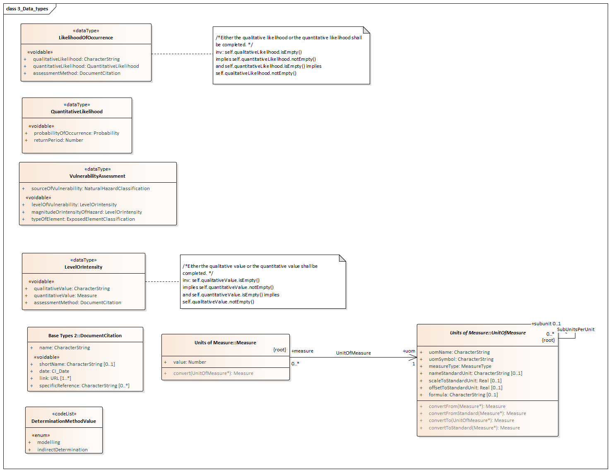
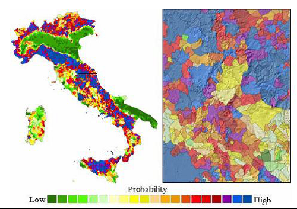

// Admonition icons:
// IR Requirement
:important-caption: 📕
// TG Requirement
:tip-caption: 📒
// Recommendation
:note-caption: 📘

// TOC placement using macro (manual)
:toc: macro

// Empty TOC title (the title is in the document)
:toc-title:

// TOC level depth
:toclevels: 5

// Section numbering level depth
:sectnumlevels: 8

// Line Break Doc Title
:hardbreaks-option:

:appendix-caption: Annex

image::./media/image1.jpeg[image,width=131,height=90, align=center]

image:./media/image2.png[image,width=93,height=93, align=center] **INSPIRE** *Infrastructure for Spatial Information in Europe*

[discrete]
= D2.8.III.12 Data Specification on _Natural Risk Zones_ – Technical Guidelines

[cols=",",]
|===
|*Title* |D2.8.III.12 INSPIRE Data Specification on _Natural Risk Zones_ – Technical Guidelines
|*Creator* |INSPIRE Thematic Working Group _Natural Risk Zones_
|*Date* |2013-12-10
|*Subject* |INSPIRE Data Specification for the spatial data theme _Natural_ Risk Zones
|*Publisher* |European Commission Joint Research Centre
|*Type* |Text
|*Description* |This document describes the INSPIRE Data Specification for the spatial data theme _Natural Risk Zones_
|*Contributor* |Members of the INSPIRE Thematic Working Group _Natural Risk Zones_
|*Format* |Portable Document Format (pdf)
|*Source* |
|*Rights* |Public
|*Identifier* |D2.8.III.12_v3.0
|*Language* |En
|*Relation* |Directive 2007/2/EC of the European Parliament and of the Council of 14 March 2007 establishing an Infrastructure for Spatial Information in the European Community (INSPIRE)
|*Coverage* |Project duration
|===

<<<
[discrete]
== Foreword
[discrete]
== How to read the document?

This document describes the _"INSPIRE data specification on Natural Risk Zones – Technical Guidelines"_ version 3.0 as developed by the Thematic Working Group (TWG) _Natural Risk Zones_ using both natural and a conceptual schema language.

The data specification is based on a common templatefootnote:[The common document template is available in the "Framework documents" section of the data specifications web page at http://inspire.jrc.ec.europa.eu/index.cfm/pageid/2] used for all data specifications, which has been harmonised using the experience from the development of the Annex I, II and III data specifications.

This document provides guidelines for the implementation of the provisions laid down in the Implementing Rule for spatial data sets and services of the INSPIRE Directive. It also includes additional requirements and recommendations that, although not included in the Implementing Rule, are relevant to guarantee or to increase data interoperability.

Two executive summaries provide a quick overview of the INSPIRE data specification process in general, and the content of the data specification on _Natural Risk Zones_ in particular. We highly recommend that managers, decision makers, and all those new to the INSPIRE process and/or information modelling should read these executive summaries first.

The UML diagrams (in Chapter 5) offer a rapid way to see the main elements of the specifications and their relationships. The definition of the spatial object types, attributes, and relationships are included in the Feature Catalogue (also in Chapter 5). People having thematic expertise but not familiar with UML can fully understand the content of the data model focusing on the Feature Catalogue. Users might also find the Feature Catalogue especially useful to check if it contains the data necessary for the applications that they run. The technical details are expected to be of prime interest to those organisations that are responsible for implementing INSPIRE within the field of _Natural Risk Zones_, but also to other stakeholders and users of the spatial data infrastructure.

The technical provisions and the underlying concepts are often illustrated by examples. Smaller examples are within the text of the specification, while longer explanatory examples and descriptions of selected use cases are attached in the annexes.

In order to distinguish the INSPIRE spatial data themes from the spatial object types, the INSPIRE spatial data themes are written in _italics._

[cols="",]
|===
|The document will be publicly available as a 'non-paper'. It does not represent an official position of the European Commission, and as such cannot be invoked in the context of legal procedures.
|===

*Legal Notice*

Neither the European Commission nor any person acting on behalf of the Commission is responsible for the use which might be made of this publication.

<<<
[discrete]
== Interoperability of Spatial Data Sets and Services – General Executive Summary

The challenges regarding the lack of availability, quality, organisation, accessibility, and sharing of spatial information are common to a large number of policies and activities and are experienced across the various levels of public authority in Europe. In order to solve these problems it is necessary to take measures of coordination between the users and providers of spatial information. The Directive 2007/2/EC of the European Parliament and of the Council adopted on 14 March 2007 aims at establishing an Infrastructure for Spatial Information in the European Community (INSPIRE) for environmental policies, or policies and activities that have an impact on the environment.

INSPIRE is based on the infrastructures for spatial information that are created and maintained by the Member States. To support the establishment of a European infrastructure, Implementing Rules addressing the following components of the infrastructure have been specified: metadata, interoperability of spatial data sets (as described in Annexes I, II, III of the Directive) and spatial data services, network services, data and service sharing, and monitoring and reporting procedures.

INSPIRE does not require collection of new data. However, after the period specified in the Directivefootnote:[For all 34 Annex I,II and III data themes: within two years of the adoption of the corresponding Implementing Rules for newly collected and extensively restructured data and within 5 years for other data in electronic format still in use] Member States have to make their data available according to the Implementing Rules.

Interoperability in INSPIRE means the possibility to combine spatial data and services from different sources across the European Community in a consistent way without involving specific efforts of humans or machines. It is important to note that "interoperability" is understood as providing access to spatial data sets through network services, typically via Internet. Interoperability may be achieved by either changing (harmonising) and storing existing data sets or transforming them via services for publication in the INSPIRE infrastructure. It is expected that users will spend less time and efforts on understanding and integrating data when they build their applications based on data delivered in accordance with INSPIRE.

In order to benefit from the endeavours of international standardisation bodies and organisations established under international law their standards and technical means have been utilised and referenced, whenever possible.

To facilitate the implementation of INSPIRE, it is important that all stakeholders have the opportunity to participate in specification and development. For this reason, the Commission has put in place a consensus building process involving data users, and providers together with representatives of industry, research and government. These stakeholders, organised through Spatial Data Interest Communities (SDIC) and Legally Mandated Organisations (LMO)footnote:[The current status of registered SDICs/LMOs is available via INSPIRE website: http://inspire.jrc.ec.europa.eu/index.cfm/pageid/42], have provided reference materials, participated in the user requirement and technicalfootnote:[Surveys on unique identifiers and usage of the elements of the spatial and temporal schema,] surveys, proposed experts for the Data Specification Drafting Teamfootnote:[The Data Specification Drafting Team has been composed of experts from Austria, Belgium, Czech Republic, France, Germany, Greece, Italy, Netherlands, Norway, Poland, Switzerland, UK, and the European Environment Agency], the Thematic Working Groupsfootnote:[The Thematic Working Groups have been composed of experts from Austria, Australia, Belgium, Bulgaria, Czech Republic, Denmark, Finland, France, Germany, Hungary, Ireland, Italy, Latvia, Netherlands, Norway, Poland, Romania, Slovakia, Spain, Slovenia, Sweden, Switzerland, Turkey, UK, the European Environment Agency and the European Commission.] and other ad-hoc cross-thematic technical groups and participated in the public stakeholder consultations on draft versions of the data specifications. These consultations covered expert reviews as well as feasibility and fitness-for-purpose testing of the data specificationsfootnote:[For Annex IIIII, the consultation and testing phase lasted from 20 June to 21 October 2011.].

This open and participatory approach was successfully used during the development of the data specifications on Annex I, II and III data themes as well as during the preparation of the Implementing Rule on Interoperability of Spatial Data Sets and Servicesfootnote:[Commission Regulation (EU) No 1089/2010 http://eur-lex.europa.eu/JOHtml.do?uri=OJ:L:2010:323:SOM:EN:HTML[implementing Directive 2007/2/EC of the European Parliament and of the Council as regards interoperability of spatial data sets and services,] published in the Official Journal of the European Union on 8^th^ of December 2010.] for Annex I spatial data themes and of its amendment regarding the themes of Annex II and III.

The development framework elaborated by the Data Specification Drafting Team aims at keeping the data specifications of the different themes coherent. It summarises the methodology to be used for the development of the data specifications, providing a coherent set of requirements and recommendations to achieve interoperability. The pillars of the framework are the following technical documentsfootnote:[The framework documents are available in the "Framework documents" section of the data specifications web page at http://inspire.jrc.ec.europa.eu/index.cfm/pageid/2]:

* The _Definition of Annex Themes and Scope_ describes in greater detail the spatial data themes defined in the Directive, and thus provides a sound starting point for the thematic aspects of the data specification development.
* The _Generic Conceptual Model_ defines the elements necessary for interoperability and data harmonisation including cross-theme issues. It specifies requirements and recommendations with regard to data specification elements of common use, like the spatial and temporal schema, unique identifier management, object referencing, some common code lists, etc. Those requirements of the Generic Conceptual Model that are directly implementable are included in the Implementing Rule on Interoperability of Spatial Data Sets and Services.
* The _Methodology for the Development of Data Specifications_ defines a repeatable methodology. It describes how to arrive from user requirements to a data specification through a number of steps including use-case development, initial specification development and analysis of analogies and gaps for further specification refinement.
* The _Guidelines for the Encoding of Spatial Data_ defines how geographic information can be encoded to enable transfer processes between the systems of the data providers in the Member States. Even though it does not specify a mandatory encoding rule it sets GML (ISO 19136) as the default encoding for INSPIRE.
* The _Guidelines for the use of Observations & Measurements and Sensor Web Enablement-related standards in INSPIRE Annex II and III data specification development_ provides guidelines on how the "Observations and Measurements" standard (ISO 19156) is to be used within INSPIRE.
* The _Common data models_ are a set of documents that specify data models that are referenced by a number of different data specifications. These documents include generic data models for networks, coverages and activity complexes.

The structure of the data specifications is based on the "ISO 19131 Geographic information - Data product specifications" standard. They include the technical documentation of the application schema, the spatial object types with their properties, and other specifics of the spatial data themes using natural language as well as a formal conceptual schema languagefootnote:[UML – Unified Modelling Language].

A consolidated model repository, feature concept dictionary, and glossary are being maintained to support the consistent specification development and potential further reuse of specification elements. The consolidated model consists of the harmonised models of the relevant standards from the ISO 19100 series, the INSPIRE Generic Conceptual Model, and the application schemasfootnote:[Conceptual models related to specific areas (e.g. INSPIRE themes)] developed for each spatial data theme. The multilingual INSPIRE Feature Concept Dictionary contains the definition and description of the INSPIRE themes together with the definition of the spatial object types present in the specification. The INSPIRE Glossary defines all the terms (beyond the spatial object types) necessary for understanding the INSPIRE documentation including the terminology of other components (metadata, network services, data sharing, and monitoring).

By listing a number of requirements and making the necessary recommendations, the data specifications enable full system interoperability across the Member States, within the scope of the application areas targeted by the Directive. The data specifications (in their version 3.0) are published as technical guidelines and provide the basis for the content of the Implementing Rule on Interoperability of Spatial Data Sets and Servicesfootnote:[In the case of the Annex IIIII data specifications, the extracted requirements are used to formulate an amendment to the existing Implementing Rule.]. The content of the Implementing Rule is extracted from the data specifications, considering short- and medium-term feasibility as well as cost-benefit considerations. The requirements included in the Implementing Rule are legally binding for the Member States according to the timeline specified in the INSPIRE Directive.

In addition to providing a basis for the interoperability of spatial data in INSPIRE, the data specification development framework and the thematic data specifications can be reused in other environments at local, regional, national and global level contributing to improvements in the coherence and interoperability of data in spatial data infrastructures.

<<<
[discrete]
== Natural Risk Zones – Executive Summary

This document contains the data specification on INSPIRE Annex III spatial data theme 12, _Natural Risk Zones_. This specification is the work of the _Natural Risk Zones_ thematic working group (TWG-NZ)- a multinational team of experts volunteered from the community of SDICs (Spatial Data Interest Communities) and LMOs (Legally Mandated Organisations) of INSPIRE.

Using the latest research and experience available, TWG-NZ has defined _Natural Risk Zones_ as areas where natural hazards are coincident with populated areas and/or areas of particular environmental/ cultural or economic value. Risk in this context is defined as:

[.text-center]
[.big]#*Risk = Hazard x Exposure x Vulnerability*#

_of human health, the environmental, cultural and economic assets in the zone considered._

Precise definitions of these widely used terms (see Chapter 2.1) as well as a clear distinction between "hazard" and "risk" is essential for understanding of this data specification.

The domain of the _Natural Risk Zones_ data specification is potentially very large, it encompasses hazards from floods to geomagnetic storms, and exposed elements from buildings to designated environmental features this is described further in Chapter 2 of this report.

The data and information that is included in this data specification take as a starting point the existence of the delineation of a hazard area. For some hazards, for example meteorological hazards it is not straight forward to delineate concrete hazard areas as occurrence depends on complex, respectively chaotic meteorological conditions. Source data for each hazard are mostly in the domain of other INSPIRE Annex I, II and III themes for example fault lines as a source for earthquakes, in the Geology theme. As a consequence, this data specification does not include the modelling of the processes and scientific methods that were used in the delineation of hazard areas.

The approach taken to model _Natural Risk Zones_ is generic in its treatment of each of hazard, exposure, vulnerability and risk, but five use cases have been created to demonstrate the fit of the model with specific examples for different types of hazard:

* Floods (calculation of flood impact, reporting and flood hazard/risk mapping)
* Risk Management Scenario (an example from a national perspective)
* Landslides (hazard mapping, vulnerability assessment and risk assessment)
* Forest fires (danger, vulnerability and risk mapping)
* Earthquake insurance

These use cases are listed in Annex B.

The case of flood hazard has also been used to demonstrate the capacity for extension of the model where a requirement to be more specific exists (see Annex D). Flood risk is significantly more precisely defined than other hazards, due in part to the development of the Floods Directive (2007/60/EC - FD) and collaboration with the relevant (FD) expert group.

The data specification includes modelling of risk zones caused by natural phenomena – primarily. Nevertheless, it is anticipated that the core of the model may be valid for the modelling of other types of hazards beyond the immediate domain of the _Natural Risk Zones_ specification.

In the real world, hazards can be single, sequential or combined in their origin and effects. There are complexities in adequately modelling these circumstances that complicate the communication of good practice in modelling more simple hazard and risk relationships. At this time the _Natural Risk Zones_ data model has not been designed so that it could also operate in multi-risk circumstances.

The model includes measured past events and modelled future events. It does not deal with real-time data and respectively events as they are happening. This is the domain of monitoring and emergency response which is largely out of the domain of _Natural Risk Zones_.

_Natural Risk Zones_ also involve significant engagement with other thematic areas from INSPIRE. This involvement stems from the nature of hazard, exposure, vulnerability and risk as defined in this document. Several other thematic areas will input attributes vital to understanding the nature of hazard, yet others are vital in the understanding of exposure while others model the monitoring of hazard areas.

The concepts included in the model are abstract and can be specialised using either vector or coverage spatial representation. This is done in order to create a framework which enables exchange of data that are either vector or coverage, considering that any of the spatial objects can be modelled in either way.

There are 4 key spatial object types that are modelled;

* Hazard area
* Observed event
* Risk zone
* Exposed element

While preparing the data specification, three primary categories of natural risk zone data provider have been identified:

* Natural hazards data providers (past event registers and/or modelled hazards)
* Vulnerability data providers (including exposure information)
* Risk data providers

It is important for all potential users of natural risk zones information to know which hazard is causing a particular risk zone. It is crucial for the mitigation and management of the risk. For that reason, any provider should identify which type of natural hazard their data is related to; and for vulnerability data providers, which kind of exposed element is at risk.

In order to facilitate semantic interoperability, this data specification includes a simple, high level classification through two code lists providing type of natural hazards and type of exposed element categorizations. These code lists are not meant to be exhaustive, but can be extended with narrower terms by Member States. Moreover, data providers can add a more specific classification for both concepts.

One of the main purposes of hazard and risk maps is to inform clearly thus supporting effective communication between modellers, data providers, policy makers and the citizen. We hope that this data specification can play a part in improving this communication.

<<<
[discrete]
== Acknowledgements

Many individuals and organisations have contributed to the development of these Guidelines.

Building this model has not been a trivial undertaking, Thematic Working Group _Natural Risk Zones_ (TWG-NZ) has received significant contributions from the community of SDICs and LMOs related to the _Natural Risk Zones_ domain. We have also benefited from the expertise of many individuals and the continued support of each of our employers. We would like to thank all of these for their generosity and support in completing this piece of work.

For the final version of the Technical Guidelines document the TWG-NZ included:

*Matthew Harrison (TWG Facilitator), Florian Thomas (TWG Editor), José I. Barredo, Venco Bojilov, Raquel Canet Castella, Otakar Cerba, George Exadaktylos, Miguel Llorente Isidro, Manuela Pfeiffer, Robert Tomas (European Commission contact point).*

Cristiano Giovando and Andrea Camia also contributed to earlier drafts.

Other contributors to the INSPIRE data specifications are the Drafting Team Data Specifications, the JRC Data Specifications Team and the INSPIRE stakeholders - Spatial Data Interested Communities (SDICs) and Legally Mandated Organisations (LMOs).

*Contact information*

Maria Vanda Nunes de Lima & Michael Lutz
European Commission Joint Research Centre (JRC)
Institute for Environment and Sustainability
Unit H06: Digital Earth and Reference Data
_http://inspire.ec.europa.eu/index.cfm/pageid/2_

<<<
[discrete]
== Table of contents
toc::[]

:sectnums:

<<<
== Scope

This document specifies a harmonised data specification for the spatial data theme _Natural Risk Zones_ as defined in Annex III of the INSPIRE Directive.

This data specification provides the basis for the drafting of Implementing Rules according to Article 7 (1) of the INSPIRE Directive [Directive 2007/2/EC]. The entire data specification is published as implementation guidelines accompanying these Implementing Rules.

<<<
== Overview

=== Name

INSPIRE data specification for the theme _Natural Risk Zones_.

=== Informal description

[.underline]#*Definition:*#

Vulnerable areas characterised according to natural hazards (all atmospheric, hydrologic, seismic, volcanic and wildfire phenomena that, because of their location, severity, and frequency, have the potential to seriously affect society) e.g. floods, landslides and subsidence, avalanches, forest fires, earthquakes, volcanic eruptions. [Directive 2007/2/EC]

[.underline]#*Description:*#

_Natural Risk Zones_ are zones where natural hazard areas are coincident with highly populated areas and/or areas of particular environmental, cultural, or economic value. Risk in this context is defined as:

--
[.text-center]
[big]*Risk = Hazard x Exposure x Vulnerability*

[.text-center]
_of human health, the environmental, cultural and economic assets in the zone considered._

[.text-center]
[big]*R = H * E * V*
--

This leads to the expression of risk in terms such as:

_"For example this leads to a hazard of flood with a return period of 100 years with and exposed element of 100 houses and those houses are 100% vulnerable to floods: Every year there is a 1% chance of having 100 houses destroyed due to floods of a given magnitude"._

Or

_"For example this leads to a hazard of forest fire with a return period of 5 years with 25 houses exposed leading to: On average, five houses are destroyed every year due to forest fire of a given magnitude"._

The definition of each of these terms in the risk function almost has a discipline of their own. For the purposes of the TWG-NZ it was decided to adopt the existing, yet specific definitions below.

[.underline]#*Risk \(R)*#

Risk is the combination of the consequences of an event (hazard) and the associated likelihood/probability of its occurrence, (ISO 31010).

_Comment: This definition closely follows the definition of the ISO/IEC Guide 73. The word "risk" has two distinctive connotations: in popular usage the emphasis is usually placed on the concept of chance or possibility, such as in "the risk of an accident"; whereas in technical settings the emphasis is usually placed on the consequences, in terms of "potential losses" for some particular cause, place and period. It can be noted that people do not necessarily share the same perceptions of the significance and underlying causes of different risks, (UNISDR 2009)._

[.underline]#*Hazard (H)*#

A dangerous phenomenon, substance, human activity or condition that may cause loss of life, injury or other health impacts, property damage, loss of livelihoods and services, social and economic disruption, or environmental damage, (UNISDR 2009).

_Comment: The hazards of concern to disaster risk reduction as stated in footnote 3 of the Hyogo Framework are "... hazards of natural origin and related environmental and technological hazards and risks." Such hazards arise from a variety of geological, meteorological, hydrological, oceanic, biological, and technological sources, sometimes acting in combination. In technical settings, hazards are described quantitatively by the likely frequency of occurrence of different intensities for different areas, as determined from historical data or scientific analysis (UNISDR2009)._

_Remark: Technological hazards were not considered for this data specification (cf. page 16)._

[.underline]#*Exposure (E)*#

People, property, systems, or other elements present in hazard zones that are thereby subject to potential losses, (UNISDR 2009).

[.underline]#*Vulnerability (V)*#

The characteristics and circumstances of a community, system or asset, that makes it susceptible to the damaging effects of a hazard, (UNISDR 2009).

_Comment: There are many aspects of vulnerability, arising from various physical, social, economic, and environmental factors. Examples may include poor design and construction of buildings, inadequate protection of assets, lack of public information and awareness, limited official recognition of risks and preparedness measures, and disregard for wise environmental management. Vulnerability varies significantly within a community and over time. This definition identifies vulnerability as a characteristic of the element of interest (community, system or asset) which is independent of its exposure. However, in common use the word is often used more broadly to include the element's exposure UNISDR (2009)._

One of the reasons for the difficulty in terminology is that the language of risk has developed across a broad range of disciplines, including those beyond the scope of this thematic working group, including financial risk, disaster management etc. *Figure 1 demonstrates* the relationship between the various concepts defined above in a spatial context. *Figure 2 shows* this as a more abstract conceptual model.

Some of the confusion arises from the differing use of language when both specialists and non-specialists are talking about the concept of risk. Vulnerability and exposure are the terms most frequently interchanged. The terms used in the model follow the UNISDR2009 definitions and more recently the *_"Risk Assessment and Mapping Guidelines for Disaster Management"_* document of the Council of the European Union.

In the insurance industry risks are referred to using the term "Perils". This sector are large users of Public Sector hazard, risk and vulnerability information and are a significant part of an international risk management framework that will benefit from this data specification whilst bearing in mind that INSPIRE Directive first applies to data-holding public authorities or those acting on their behalf. This data specification outlines spatial information which could be the subject of public private partnerships between data-holding public authorities and the insurance industry.

image::./media/image3.png[Flooding_zones_003.png,width=520,height=557]

[.text-center]
*Figure 1: Main concepts in the Natural Risk Zones model.*

As another example of the wider use of natural risk zones information, the EU Structural Eurocodes or Eurocodes are the current building standards for Europe, published by the European Committee for Standardization. Eurocode 1, for example, considers fire action on building structures, whereas Eurocode 8 refers to earthquake resistant buildings. So it is important always to associate "vulnerability" assessment of building structures with the application or not of Eurocodes. In order to make an assessment as of whether an "exposed" engineering structure (exposed element) is also "vulnerable" and "how vulnerable it is" (i.e. a specific assessment) to a given hazard (e.g. flood, fire, landslide etc) one should know the design and construction (or retrofitting) characteristics of this particular structure as well as if a design is based on a standard or code of practice. For example if a building or retaining wall is made from fire resistant materials, then it is less vulnerable to a fire, or if a building is earthquake resistant, it is not expected to suffer serious damages in an earthquake of a given magnitude, unlike another building that has been constructed without special consideration to earthquakes.

image::./media/image4.png[Natural_Hazard_area_circles_002.png,width=618,height=435]

[.text-center]
*Figure 2: Alternative diagram to show the main concepts in the Natural Risk Zones model*

[.underline]#*Natural Risk Zones thematic area*#

This data specification is meant to be as useful and usable as possible for the purposes of data interoperability. As such the data model has been developed to be relevant to the public data and information that is already available. In many cases this is only susceptibility or hazard or vulnerability. It is foreseen that even in the absence of a full risk model it is still possible to share data and information to a common specification about hazards that have the potential to affect people, property and services and the environment across Europe.

It is important for all potential users of natural risk zones information to know what hazard is causing a particular risk zone. It is crucial especially for the mitigation and management of the risk. Therefore, the data and information that are included in this data specification conceptually considers the existence of the delineation of a hazard area as the most important object providing the backbone of the data model. Exposed elements, risk zones and observed past events are also conceptually joined through the hazard and risk delineation process. Source data for the delineation of each hazard are mostly in within the remit of other INSPIRE thematic areas, e.g. fault lines as a source for earthquakes (Annex II Geology). As a consequence, this data specification does not include those nor the modelling of the processes and scientific methods that were used in the identification of hazard areas.

The data specification includes modelling of natural hazards caused by natural phenomena - primarily. It is anticipated that for instance some types of technological hazards could precipitate natural hazards (and vice versa), in which case the model is likely to remain valid as causative factors are not modelled. It is also true that the core of the model may be valid for the modelling of other hazards beyond the _Natural Risk Zones_ specification. The model has not been designed with these in mind but may be useful in these circumstances.

Many hazards are sudden in their nature. However, several categories of natural hazards with major impacts on civil contingency and on environmental/cultural and economic assets are not sudden in nature. They may be permanent phenomena going unnoticed by the population (e.g. radon gas emissions or the deficit or excess of elements in soil, or slow phenomena such as slow ground motion). These hazardous processes are considered within the model. All other natural processes that have no negative potential impact in a human activity are not considered.

In the real world, past hazardous events can been seen as single natural processes, sequential or combined in their origin and effects. Modelling these circumstances complicates the communication of good scientific practice in modelling hazard and risk relationships. The current data model is not designed so that it could also operate in multi-risk or multi-hazard circumstances.

Even though the data model includes measured past events relevant for the understanding of future events, it does not deal with real-time events as they are happening, which is in the domain of monitoring and emergency response, nor does it include disaster databases.

The core data model is extensible in many directions, to cover many domain specific requirements. Based on the expertise in the TWG–NZ and collaboration with relevant Floods Directive (FD) group a Floods extension example was developed to demonstrate how the domain specific requirements can be modelled using the INSPIRE NZ core data model. In Annex D there is also a mapping of feature types between the _Natural Risk Zones_ data specification and the draft Flood hazard/risk mapping feature types (FD).

Given that there are so many approaches, models and means of the delineation of natural risk zones, and provided that a common practice is using both coverage and vector data types, both coverage and vector data are addressed in this data specification.

There are no definitive- widely accepted - sources of pan-European natural hazard classification; however there are several classifications dealing with disasters. The Munich Re and CRED (Centre of Research on the Epidemiology of Disasters) disaster database classification has been identified as a commonly used classification, but has not been used here as it deals with the collection of disaster information. As a result the thematic working group has agreed on a very high level simple and extensible hazard type classification, that in the model is supplemented with a possibility to provide an additional classification term that addresses e.g. more detailed or local specifics of a hazard type. Whilst the proposed hazard classification is by no means exhaustive, the group feels that this approach is representative and by considering the hazards identified there, much of the range of hazards considered to be in the thematic area will have been covered. However the provision of more detailed hazard types is highly recommended.

In summary, TWG-NZ has considered:

* A generic approach to all natural hazards
* A generic approach to all natural risk zones
* Only the most relevant associated data
* Modelled hazards
* Observed events
* Data that can be of coverage or vector type

TWG-NZ has not primarily considered:

* Real time data
* Technological hazards
* Multi-hazard/risks
* Modelling of the processes and scientific methods or data used to define hazard areas, exposed elements and risk zones
* Disaster management

[.underline]#*Links to other thematic working groups*#

[.underline]#Exposed elements#

Knowledge about elements exposed to a specific hazard is also of utmost importance. So assessment of the level of threat that a certain hazard (flood, landslide, forest fire, etc.) poses to life, health, property or environment should be conducted. Here, data and services about settlements, infrastructure, land use and many others will be needed and provided by the other Annex I, II and III data themes. Examples of these would include but not be limited to: Buildings, Transport networks, Land use, Industrial and production facilities, Agricultural and Aqua-cultural facilities, Utility and Governmental Services. The list is not and cannot be exhaustive, as it has been decided to have a generic approach. In order to define this, the model uses a link between "Exposed element" and the abstract GML feature type. The abstract GML feature type encompasses all feature types that can be provided under INSPIRE.

[.underline]#Environmental monitoring program#

Because in some cases monitoring natural phenomena is key to the process of managing the risk zones, a link with the Environmental Monitoring Facilities data model is made.

[.underline]#*Examples of Use*#

This section describes identified users of spatial information about natural hazards and risks as requested by the interest groups that responded through the User Requirement Survey. The NZ Core-data model covers a generic approach with the option to extend the model for specific hazards/risks. Further, more detailed examples - Use cases are given in Annex B. The most elaborated example – mapping is described in a form of an Data model Extension in Annex D.

The different kinds of users and uses may be grouped;

* Risk analysts, for the assessment of natural risks and mapping of areas prone to be hit by hazards;
* Public safety planners, for the long term regulation and management of land and activities;
* Disaster managers, for disaster response and emergency operations as preliminary hazard or risk input;
* Policy makers for overall policy development, reporting and trend analysis, commonly at national and international level;
* Insurance and reinsurance for disaster preparedness;
* The general public for citizen awareness.

[cols=""]
|===
*Definition:*

Vulnerable areas characterised according to natural hazards (all atmospheric, hydrologic, seismic, volcanic and wildfire phenomena that, because of their location, severity, and frequency, have the potential to seriously affect society) e.g. floods, landslides and subsidence, avalanches, forest fires, earthquakes, volcanic eruptions. [Directive 2007/2/EC]

*Description:*

_Natural Risk Zones_ are zones where natural hazards areas intersect with highly populated areas and/or areas of particular environmental/ cultural/ economic value.

To d    efine or pre-estimate a Risk following parameter are necessary: potential hazard, probability of its occurrence and vulnerability of the exposed populations and of the environmental, cultural and economic assets in a specific zone.

Natural hazards can be classified by origin namely: geological, hydro-meteorological or biological. Hazardous events can vary in magnitude or intensity, frequency, duration, area of extent, speed of onset, spatial dispersion and temporal spacing. Specific examples for different types of hazard were identified: Floods (calculation of flood impact, reporting and flood hazard/risk mapping), Risk Management Scenario (an example from a national perspective), Landslides (hazard mapping, vulnerability assessment and risk assessment), Forest fires (danger, vulnerability and risk mapping) and Earthquake insurance.

Following four key spatial object types that are modelled, Hazard area, Observed event, Risk zone and Exposed element.

Entry in the INSPIRE registry: _http://inspire.ec.europa.eu/theme/nz/_
|===

=== Normative References

[Directive 2007/2/EC] Directive 2007/2/EC of the European Parliament and of the Council of 14 March 2007 establishing an Infrastructure for Spatial Information in the European Community (INSPIRE)

[Directive 2007/60/EC] Directive of the European Parliament and of the Council of 23 October 2007 on the assessment and management of flood risks

[ISO 19107] EN ISO 19107:2005, Geographic Information – Spatial Schema

[ISO 19108] EN ISO 19108:2005, Geographic Information – Temporal Schema

[ISO 19108-c] ISO 19108:2002/Cor 1:2006, Geographic Information – Temporal Schema, Technical Corrigendum 1

[ISO 19111] EN ISO 19111:2007 Geographic information - Spatial referencing by coordinates (ISO 19111:2007)

[ISO 19113] EN ISO 19113:2005, Geographic Information – Quality principles

[ISO 19115] EN ISO 19115:2005, Geographic information – Metadata (ISO 19115:2003)

[ISO 19118] EN ISO 19118:2006, Geographic information – Encoding (ISO 19118:2005)

[ISO 19123] EN ISO 19123:2007, Geographic Information – Schema for coverage geometry and functions

[ISO 19125-1] EN ISO 19125-1:2004, Geographic Information – Simple feature access – Part 1: Common architecture

[ISO 19135] EN ISO 19135:2007 Geographic information – Procedures for item registration (ISO 19135:2005)

[ISO 19138] ISO/TS 19138:2006, Geographic Information – Data quality measures

[ISO 19139] ISO/TS 19139:2007, Geographic information – Metadata – XML schema implementation

[ISO 19157] ISO/DIS 19157, Geographic information – Data quality

[OGC 06-103r4] Implementation Specification for Geographic Information - Simple feature access – Part 1: Common Architecture v1.2.1

NOTE This is an updated version of "EN ISO 19125-1:2004, Geographic information – Simple feature access – Part 1: Common architecture".

[Regulation 1205/2008/EC] Regulation 1205/2008/EC implementing Directive 2007/2/EC of the European Parliament and of the Council as regards metadata

[Regulation 976/2009/EC] Commission Regulation (EC) No 976/2009 of 19 October 2009 implementing Directive 2007/2/EC of the European Parliament and of the Council as regards the Network Services

[Regulation 1089/2010/EC] Commission Regulation (EU) No 1089/2010 of 23 November 2010 implementing Directive 2007/2/EC of the European Parliament and of the Council as regards interoperability of spatial data sets and services

=== Terms and definitions

General terms and definitions helpful for understanding the INSPIRE data specification documents are defined in the INSPIRE Glossaryfootnote:[The INSPIRE Glossary is available from http://inspire-registry.jrc.ec.europa.eu/registers/GLOSSARY].

Specifically, for the theme _Natural Risk Zones_, the following terms are defined:

*(1) Risk*

Risk is the combination of the consequences of an event (hazard) and the associated likelihood/probability of its occurrence (ISO 31010).

EXAMPLE: 10000 People will lose their potable water supply due to earthquakes of magnitude 6 or above with a percentage likelihood.

*(2) Hazard*

A dangerous phenomenon, substance, human activity or condition that may cause loss of life, injury or other health impacts, property damage, loss of livelihoods and services, social and economic disruption, or environmental damage (UNISDR 2009).

EXAMPLE: Earthquake hazard.

*(3) Exposure*

People, property, systems, or other elements present in hazard zones that are thereby subject to potential losses (UNISDR 2009).

EXAMPLE: A hospital is in the affected area

*(4) Vulnerability*

The characteristics and circumstances of a community, system or asset that make it susceptible to the damaging effects of a hazard (UNISDR 2009).

EXAMPLE: Elderly residents

=== Symbols and abbreviations

[cols=","]
|===
|ATS |Abstract Test Suite
|CRED |Centre of Research on the Epidemiology of Disasters)
|EC |European Commission
|EEA |European Environmental Agency
|EFFIS |European Forest Fire Information System
|ETRS89 |European Terrestrial Reference System 1989
|ETRS89-LAEA |Lambert Azimuthal Equal Area
|EVRS |European Vertical Reference System
|FD |EU Floods Directive (2007/60/EC)
|FWI |Fire Weather Index
|GCM |General Conceptual Model
|GML |Geography Markup Language
|IAEG |International Association for Engineering Geology
|IR |Implementing Rule
|ISDSS |Interoperability of Spatial Data Sets and Services
|ISO |International Organization for Standardization
|ITRS |International Terrestrial Reference System
|LAT |Lowest Astronomical Tide
|LMO |Legally Mandated Organisation
|Munich Re |Münchener Rückversicherungs-Gesellschaft
|SDIC |Spatial Data Interest Community
|SLD |Styled Layer Descriptor
|TG |Technical Guidance
|ULSE |Universal Soil Loss Equation
|UML |Unified Modeling Language
|UNISDR |The United Nations Office for Disaster Reduction
|UTC |Coordinated Universal Time
|XML |EXtensible Markup Language
|===

=== How the Technical Guidelines map to the Implementing Rules

The schematic diagram in Figure 3 gives an overview of the relationships between the INSPIRE legal acts (the INSPIRE Directive and Implementing Rules) and the INSPIRE Technical Guidelines. The INSPIRE Directive and Implementing Rules include legally binding requirements that describe, usually on an abstract level, _what_ Member States must implement.

In contrast, the Technical Guidelines define _how_ Member States might implement the requirements included in the INSPIRE Implementing Rules. As such, they may include non-binding technical requirements that must be satisfied if a Member State data provider chooses to conform to the Technical Guidelines. Implementing these Technical Guidelines will maximise the interoperability of INSPIRE spatial data sets.

image::./media/image5.png[image,width=603,height=375, align=center]

[.text-center]
*Figure 3 - Relationship between INSPIRE Implementing Rules and Technical Guidelines*

==== Requirements

The purpose of these Technical Guidelines (Data specifications on _Natural Risk Zones_) is to provide practical guidance for implementation that is guided by, and satisfies, the (legally binding) requirements included for the spatial data theme _Natural Risk Zones_ in the Regulation (Implementing Rules) on interoperability of spatial data sets and services. These requirements are highlighted in this document as follows:

[IMPORTANT]
====
[.text-center]
*IR Requirement*
_Article / Annex / Section no._
*Title / Heading*

This style is used for requirements contained in the Implementing Rules on interoperability of spatial data sets and services (Commission Regulation (EU) No 1089/2010).

====

For each of these IR requirements, these Technical Guidelines contain additional explanations and examples.

NOTE The Abstract Test Suite (ATS) in Annex A contains conformance tests that directly check conformance with these IR requirements.

Furthermore, these Technical Guidelines may propose a specific technical implementation for satisfying an IR requirement. In such cases, these Technical Guidelines may contain additional technical requirements that need to be met in order to be conformant with the corresponding IR requirement _when using this proposed implementation_. These technical requirements are highlighted as follows:

[TIP]
====
*TG Requirement X* 

This style is used for requirements for a specific technical solution proposed in these Technical Guidelines for an IR requirement.

====

NOTE 1 Conformance of a data set with the TG requirement(s) included in the ATS implies conformance with the corresponding IR requirement(s).

NOTE 2 In addition to the requirements included in the Implementing Rules on interoperability of spatial data sets and services, the INSPIRE Directive includes further legally binding obligations that put additional requirements on data providers. For example, Art. 10(2) requires that Member States shall, where appropriate, decide by mutual consent on the depiction and position of geographical features whose location spans the frontier between two or more Member States. General guidance for how to meet these obligations is provided in the INSPIRE framework documents.

==== Recommendations

In addition to IR and TG requirements, these Technical Guidelines may also include a number of recommendations for facilitating implementation or for further and coherent development of an interoperable infrastructure.

[NOTE]
====
*Recommendation X* 

Recommendations are shown using this style.

====

NOTE The implementation of recommendations is not mandatory. Compliance with these Technical Guidelines or the legal obligation does not depend on the fulfilment of the recommendations.

==== Conformance

Annex A includes the abstract test suite for checking conformance with the requirements included in these Technical Guidelines and the corresponding parts of the Implementing Rules (Commission Regulation (EU) No 1089/2010).

<<<
== Specification scopes

This data specification does not distinguish different specification scopes, but just considers one general scope.

NOTE For more information on specification scopes, see [ISO 19131:2007], clause 8 and Annex D.

<<<
== Identification information

These Technical Guidelines are identified by the following URI:

http://inspire.ec.europa.eu/tg/nz/3.0

NOTE ISO 19131 suggests further identification information to be included in this section, e.g. the title, abstract or spatial representation type. The proposed items are already described in the document metadata, executive summary, overview description (section 2) and descriptions of the application schemas (section 5). In order to avoid redundancy, they are not repeated here.

<<<
== Data content and structure

=== Application schemas – Overview 

==== Application schemas included in the IRs

Articles 3, 4 and 5 of the Implementing Rules lay down the requirements for the content and structure of the data sets related to the INSPIRE Annex themes.

[IMPORTANT]
====
[.text-center]
*IR Requirement*
_Article 4_
*Types for the Exchange and Classification of Spatial Objects*

. For the exchange and classification of spatial objects from data sets meeting the conditions laid down in Article 4 of Directive 2007/2/EC, Member States shall use the spatial object types and associated data types, enumerations and code lists that are defined in Annexes II, III and IV for the themes the data sets relate to.

. Spatial object types and data types shall comply with the definitions and constraints and include the attributes and association roles set out in the Annexes.

. The enumerations and code lists used in attributes or association roles of spatial object types or data types shall comply with the definitions and include the values set out in Annex II. The enumeration and code list values are uniquely identified by language-neutral mnemonic codes for computers. The values may also include a language-specific name to be used for human interaction.

====

The types to be used for the exchange and classification of spatial objects from data sets related to the spatial data theme Natural Risk Zones are defined in the following application schema: (see section 5.3)

* *NaturalRiskZones application schema* describes the core normative concepts that build up the INSPIRE _Natural Risk Zones_ data theme

The application schemas specify requirements on the properties of each spatial object including its multiplicity, domain of valid values, constraints, etc.

NOTE The application schemas presented in this section contain some additional information that is not included in the Implementing Rules, in particular multiplicities of attributes and association roles.

[TIP]
====
*TG Requirement 1*

Spatial object types and data types shall comply with the multiplicities defined for the attributes and association roles in this section.

====

An application schema may include references (e.g. in attributes or inheritance relationships) to common types or types defined in other spatial data themes. These types can be found in a sub-section called "Imported Types" at the end of each application schema section. The common types referred to from application schemas included in the IRs are addressed in Article 3.

[IMPORTANT]
====
[.text-center]
*IR Requirement*
_Article 3_
*Common Types*

Types that are common to several of the themes listed in Annexes I, II and III to Directive 2007/2/EC shall conform to the definitions and constraints and include the attributes and association roles set out in Annex I.

====

NOTE Since the IRs contain the types for all INSPIRE spatial data themes in one document, Article 3 does not explicitly refer to types defined in other spatial data themes, but only to types defined in external data models.

Common types are described in detail in the Generic Conceptual Model [DS-D2.7], in the relevant international standards (e.g. of the ISO 19100 series) or in the documents on the common INSPIRE models [DS-D2.10.x]. For detailed descriptions of types defined in other spatial data themes, see the corresponding Data Specification TG document [DS-D2.8.x].

==== Additional recommended application schemas 

* In addition to the application schemas listed above, the following additional application schema has been defined for the theme _Natural Risk Zones_ (see Annex D):

*The Floods_Example_Model* application schema represents the extension of the core NZ application schema (NaturalRiskZones) as one possible example of how Floods Directive requirements could be addressed.

These additional application schemas are not included in the IRs. They typically address requirements from specific (groups of) use cases and/or may be used to provide additional information. They are included in this specification in order to improve interoperability also for these additional aspects and to illustrate the extensibility of the application schemas included in the IRs.

[NOTE]
====
*Recomendation 1*

Additional and/or use case-specific information related to the theme Natural Risk Zones should be made available using the spatial object types and data types specified in the following application schema(s): Floods_Example_Model

====

=== Basic notions

This section explains some of the basic notions used in the INSPIRE application schemas. These explanations are based on the GCM [DS-D2.5].

==== Notation

===== Unified Modeling Language (UML)

The application schemas included in this section are specified in UML, version 2.1. The spatial object types, their properties and associated types are shown in UML class diagrams.

NOTE For an overview of the UML notation, see Annex D in [ISO 19103].

The use of a common conceptual schema language (i.e. UML) allows for an automated processing of application schemas and the encoding, querying and updating of data based on the application schema – across different themes and different levels of detail.

The following important rules related to class inheritance and abstract classes are included in the IRs.

[IMPORTANT]
====
*IR Requirement*
_Article 5_
*Types*

(...)

[arabic, start=2]
. Types that are a sub-type of another type shall also include all this type's attributes and association roles.
. Abstract types shall not be instantiated.

====

The use of UML conforms to ISO 19109 8.3 and ISO/TS 19103 with the exception that UML 2.1 instead of ISO/IEC 19501 is being used. The use of UML also conforms to ISO 19136 E.2.1.1.1-E.2.1.1.4.

NOTE ISO/TS 19103 and ISO 19109 specify a profile of UML to be used in conjunction with the ISO 19100 series. This includes in particular a list of stereotypes and basic types to be used in application schemas. ISO 19136 specifies a more restricted UML profile that allows for a direct encoding in XML Schema for data transfer purposes.

To model constraints on the spatial object types and their properties, in particular to express data/data set consistency rules, OCL (Object Constraint Language) is used as described in ISO/TS 19103, whenever possible. In addition, all constraints are described in the feature catalogue in English, too.

NOTE Since "void" is not a concept supported by OCL, OCL constraints cannot include expressions to test whether a value is a _void_ value. Such constraints may only be expressed in natural language.

===== Stereotypes

In the application schemas in this section several stereotypes are used that have been defined as part of a UML profile for use in INSPIRE [DS-D2.5]. These are explained in Table 1 below.

[.text-center]
*Table 1 – Stereotypes (adapted from [DS-D2.5])*

[cols=",,",]
|===
|*Stereotype* |*Model element* |*Description*
|applicationSchema |Package |An INSPIRE application schema according to ISO 19109 and the Generic Conceptual Model.
|leaf |Package |A package that is not an application schema and contains no packages.
|featureType |Class |A spatial object type.
|type |Class |A type that is not directly instantiable, but is used as an abstract collection of operation, attribute and relation signatures. This stereotype should usually not be used in INSPIRE application schemas as these are on a different conceptual level than classifiers with this stereotype.
|dataType |Class |A structured data type without identity.
|union |Class |A structured data type without identity where exactly one of the properties of the type is present in any instance.
|enumeration |Class |An enumeration.
|codeList |Class |A code list.
|import |Dependency |The model elements of the supplier package are imported.
|voidable |Attribute, association role |A voidable attribute or association role (see section 5.2.2).
|lifeCycleInfo |Attribute, association role |If in an application schema a property is considered to be part of the life-cycle information of a spatial object type, the property shall receive this stereotype.
|version |Association role |If in an application schema an association role ends at a spatial object type, this stereotype denotes that the value of the property is meant to be a specific version of the spatial object, not the spatial object in general.
|===

==== Voidable characteristics

The «voidable» stereotype is used to characterise those properties of a spatial object that may not be present in some spatial data sets, even though they may be present or applicable in the real world. This does _not_ mean that it is optional to provide a value for those properties.

For all properties defined for a spatial object, a value has to be provided – either the corresponding value (if available in the data set maintained by the data provider) or the value of _void._ A _void_ value shall imply that no corresponding value is contained in the source spatial data set maintained by the data provider or no corresponding value can be derived from existing values at reasonable costs.

[NOTE]
====
*Recomendation 2*

The reason for a _void_ value should be provided where possible using a listed value from the VoidReasonValue code list to indicate the reason for the missing value.

====

The VoidReasonValue type is a code list, which includes the following pre-defined values:

* _Unpopulated_: The property is not part of the dataset maintained by the data provider. However, the characteristic may exist in the real world. For example when the "elevation of the water body above the sea level" has not been included in a dataset containing lake spatial objects, then the reason for a void value of this property would be 'Unpopulated'. The property receives this value for all spatial objects in the spatial data set.
* _Unknown_: The correct value for the specific spatial object is not known to, and not computable by the data provider. However, a correct value may exist. For example when the "elevation of the water body above the sea level" _of a certain lake_ has not been measured, then the reason for a void value of this property would be 'Unknown'. This value is applied only to those spatial objects where the property in question is not known.
* _Withheld_: The characteristic may exist, but is confidential and not divulged by the data provider.

NOTE It is possible that additional reasons will be identified in the future, in particular to support reasons / special values in coverage ranges.

The «voidable» stereotype does not give any information on whether or not a characteristic exists in the real world. This is expressed using the multiplicity:

* If a characteristic may or may not exist in the real world, its minimum cardinality shall be defined as 0. For example, if an Address may or may not have a house number, the multiplicity of the corresponding property shall be 0..1.
* If at least one value for a certain characteristic exists in the real world, the minimum cardinality shall be defined as 1. For example, if an Administrative Unit always has at least one name, the multiplicity of the corresponding property shall be 1..*.

In both cases, the «voidable» stereotype can be applied. In cases where the minimum multiplicity is 0, the absence of a value indicates that it is known that no value exists, whereas a value of void indicates that it is not known whether a value exists or not.

EXAMPLE If an address does not have a house number, the corresponding Address object should not have any value for the «voidable» attribute house number. If the house number is simply not known or not populated in the data set, the Address object should receive a value of _void_ (with the corresponding void reason) for the house number attribute.

==== Enumerations

Enumerations are modelled as classes in the application schemas. Their values are modelled as attributes of the enumeration class using the following modelling style:

* No initial value, but only the attribute name part, is used.
* The attribute name conforms to the rules for attributes names, i.e. is a lowerCamelCase name. Exceptions are words that consist of all uppercase letters (acronyms).

[IMPORTANT]
====
[.text-center]
*IR Requirement*
_Article 6_
*Code Lists and Enumerations*

(...)

[arabic, start=5]
. Attributes or association roles of spatial object types or data types that have an enumeration type may only take values from the lists specified for the enumeration type."

====

==== Code lists

Code lists are modelled as classes in the application schemas. Their values, however, are managed outside of the application schema.

===== Code list types

The IRs distinguish the following types of code lists.

[IMPORTANT]
====
[.text-center]
*IR Requirement*
_Article 6_
*Code Lists and Enumerations*

. Code lists shall be of one of the following types, as specified in the Annexes:
[loweralpha]
.. code lists whose allowed values comprise only the values specified in this Regulation;
.. code lists whose allowed values comprise the values specified in this Regulation and narrower values defined by data providers;
.. code lists whose allowed values comprise the values specified in this Regulation and additional values at any level defined by data providers;
.. code lists, whose allowed values comprise any values defined by data providers.

For the purposes of points (b), (c) and (d), in addition to the allowed values, data providers may use the values specified in the relevant INSPIRE Technical Guidance document available on the INSPIRE web site of the Joint Research Centre.

====

The type of code list is represented in the UML model through the tagged value _extensibility_, which can take the following values:

* _none_, representing code lists whose allowed values comprise only the values specified in the IRs (type a);
* _narrower_, representing code lists whose allowed values comprise the values specified in the IRs and narrower values defined by data providers (type b);
* _open_, representing code lists whose allowed values comprise the values specified in the IRs and additional values at any level defined by data providers (type c); and
* _any_, representing code lists, for which the IRs do not specify any allowed values, i.e. whose allowed values comprise any values defined by data providers (type d).

[NOTE]
====
*Recomendation 3*

Additional values defined by data providers should not replace or redefine any value already specified in the IRs.

====

NOTE This data specification may specify recommended values for some of the code lists of type (b), (c) and (d) (see section 5.2.4.3). These recommended values are specified in a dedicated Annex.

In addition, code lists can be hierarchical, as explained in Article 6(2) of the IRs.

[IMPORTANT]
====
[.text-center]
*IR Requirement*
_Article 6_
*Code Lists and Enumerations*

(...)

[arabic, start=2]
. Code lists may be hierarchical. Values of hierarchical code lists may have a more generic parent value. Where the valid values of a hierarchical code list are specified in a table in this Regulation, the parent values are listed in the last column.

====

The type of code list and whether it is hierarchical or not is also indicated in the feature catalogues.

===== Obligations on data providers

[IMPORTANT]
====
[.text-center]
*IR Requirement*
_Article 6_
*Code Lists and Enumerations*

(....)

[arabic, start=3]
. Where, for an attribute whose type is a code list as referred to in points (b), (c) or (d) of paragraph 1, a data provider provides a value that is not specified in this Regulation, that value and its definition shall be made available in a register.

. Attributes or association roles of spatial object types or data types whose type is a code list may only take values that are allowed according to the specification of the code list.

====

Article 6(4) obliges data providers to use only values that are allowed according to the specification of the code list. The "allowed values according to the specification of the code list" are the values explicitly defined in the IRs plus (in the case of code lists of type (b), (c) and (d)) additional values defined by data providers.

For attributes whose type is a code list of type (b), (c) or (d) data providers may use additional values that are not defined in the IRs. Article 6(3) requires that such additional values and their definition be made available in a register. This enables users of the data to look up the meaning of the additional values used in a data set, and also facilitates the re-use of additional values by other data providers (potentially across Member States).

NOTE Guidelines for setting up registers for additional values and how to register additional values in these registers is still an open discussion point between Member States and the Commission.

===== Recommended code list values

For code lists of type (b), (c) and (d), this data specification may propose additional values as a recommendation (in a dedicated Annex). These values will be included in the INSPIRE code list register. This will facilitate and encourage the usage of the recommended values by data providers since the obligation to make additional values defined by data providers available in a register (see section 5.2.4.2) is already met.

[NOTE]
====
*Recomendation 4*

Where these Technical Guidelines recommend values for a code list in addition to those specified in the IRs, these values should be used.

====

NOTE For some code lists of type (d), no values may be specified in these Technical Guidelines. In these cases, any additional value defined by data providers may be used.

===== Governance

The following two types of code lists are distinguished in INSPIRE:

* _Code lists that are governed by INSPIRE (INSPIRE-governed code lists)._ These code lists will be managed centrally in the INSPIRE code list register. Change requests to these code lists (e.g. to add, deprecate or supersede values) are processed and decided upon using the INSPIRE code list register's maintenance workflows.
+
INSPIRE-governed code lists will be made available in the INSPIRE code list register at __http://inspire.ec.europa.eu/codelist/<CodeListName__>. They will be available in SKOS/RDF, XML and HTML. The maintenance will follow the procedures defined in ISO 19135. This means that the only allowed changes to a code list are the addition, deprecation or supersession of values, i.e. no value will ever be deleted, but only receive different statuses (valid, deprecated, superseded). Identifiers for values of INSPIRE-governed code lists are constructed using the pattern __http://inspire.ec.europa.eu/codelist/<CodeListName__>/<value>.

* _Code lists that are governed by an organisation outside of INSPIRE (externally governed code lists)._ These code lists are managed by an organisation outside of INSPIRE, e.g. the World Meteorological Organization (WMO) or the World Health Organization (WHO). Change requests to these code lists follow the maintenance workflows defined by the maintaining organisations. Note that in some cases, no such workflows may be formally defined.
+
Since the updates of externally governed code lists is outside the control of INSPIRE, the IRs and these Technical Guidelines reference a specific version for such code lists.
+
The tables describing externally governed code lists in this section contain the following columns:
+
** The _Governance_ column describes the external organisation that is responsible for maintaining the code list.

** The _Source_ column specifies a citation for the authoritative source for the values of the code list. For code lists, whose values are mandated in the IRs, this citation should include the version of the code list used in INSPIRE. The version can be specified using a version number or the publication date. For code list values recommended in these Technical Guidelines, the citation may refer to the "latest available version".

** In some cases, for INSPIRE only a subset of an externally governed code list is relevant. The subset is specified using the _Subset_ column.

** The _Availability_ column specifies from where (e.g. URL) the values of the externally governed code list are available, and in which formats. Formats can include machine-readable (e.g. SKOS/RDF, XML) or human-readable (e.g. HTML, PDF) ones.

+
Code list values are encoded using http URIs and labels. Rules for generating these URIs and labels are specified in a separate table.

[NOTE]
====
*Recomendation 5*

The http URIs and labels used for encoding code list values should be taken from the INSPIRE code list registry for INSPIRE-governed code lists and generated according to the relevant rules specified for externally governed code lists.

====

NOTE Where practicable, the INSPIRE code list register could also provide http URIs and labels for externally governed code lists.

===== Vocabulary

For each code list, a tagged value called "vocabulary" is specified to define a URI identifying the values of the code list. For INSPIRE-governed code lists and externally governed code lists that do not have a persistent identifier, the URI is constructed following the pattern _http://inspire.ec.europa.eu/codelist/<UpperCamelCaseName>_.

If the value is missing or empty, this indicates an empty code list. If no sub-classes are defined for this empty code list, this means that any code list may be used that meets the given definition.

An empty code list may also be used as a super-class for a number of specific code lists whose values may be used to specify the attribute value. If the sub-classes specified in the model represent all valid extensions to the empty code list, the subtyping relationship is qualified with the standard UML constraint "\{complete,disjoint}".

==== Identifier management

[IMPORTANT]
====
[.text-center]
*IR Requirement*
_Article 9_
*Identifier Management*

. The data type Identifier defined in Section 2.1 of Annex I shall be used as a type for the external object identifier of a spatial object.

. The external object identifier for the unique identification of spatial objects shall not be changed during the life-cycle of a spatial object.

====

NOTE 1 An external object identifier is a unique object identifier which is published by the responsible body, which may be used by external applications to reference the spatial object. [DS-D2.5]

NOTE 2 Article 9(1) is implemented in each application schema by including the attribute _inspireId_ of type Identifier.

NOTE 3 Article 9(2) is ensured if the _namespace_ and _localId_ attributes of the Identifier remains the same for different versions of a spatial object; the _version_ attribute can of course change.

==== Geometry representation

[IMPORTANT]
====
[.text-center]
*IR Requirement*
_Article 12_
*Other Requirements & Rules*

. The value domain of spatial properties defined in this Regulation shall be restricted to the Simple Feature spatial schema as defined in Herring, John R. (ed.), OpenGIS® Implementation Standard for Geographic information – Simple feature access – Part 1: Common architecture, version 1.2.1, Open Geospatial Consortium, 2011, unless specified otherwise for a specific spatial data theme or type.

====

NOTE 1 The specification restricts the spatial schema to 0-, 1-, 2-, and 2.5-dimensional geometries where all curve interpolations are linear and surface interpolations are performed by triangles.

NOTE 2 The topological relations of two spatial objects based on their specific geometry and topology properties can in principle be investigated by invoking the operations of the types defined in ISO 19107 (or the methods specified in EN ISO 19125-1).

====  Temporality representation

The application schema(s) use(s) the derived attributes "beginLifespanVersion" and "endLifespanVersion" to record the lifespan of a spatial object.

The attributes "beginLifespanVersion" specifies the date and time at which this version of the spatial object was inserted or changed in the spatial data set. The attribute "endLifespanVersion" specifies the date and time at which this version of the spatial object was superseded or retired in the spatial data set.

NOTE 1 The attributes specify the beginning of the lifespan of the version in the spatial data set itself, which is different from the temporal characteristics of the real-world phenomenon described by the spatial object. This lifespan information, if available, supports mainly two requirements: First, knowledge about the spatial data set content at a specific time; second, knowledge about changes to a data set in a specific time frame. The lifespan information should be as detailed as in the data set (i.e., if the lifespan information in the data set includes seconds, the seconds should be represented in data published in INSPIRE) and include time zone information.

NOTE 2 Changes to the attribute "endLifespanVersion" does not trigger a change in the attribute "beginLifespanVersion".

[IMPORTANT]
====
[.text-center]
*IR Requirement*
_Article 10_
*Life-cycle of Spatial Objects*

(...)

[arabic, start=3]
. Where the attributes beginLifespanVersion and endLifespanVersion are used, the value of endLifespanVersion shall not be before the value of beginLifespanVersion.

====

NOTE The requirement expressed in the IR Requirement above will be included as constraints in the UML data models of all themes.

[NOTE]
====
*Recomendation 6*

If life-cycle information is not maintained as part of the spatial data set, all spatial objects belonging to this data set should provide a void value with a reason of "unpopulated".

====

===== Validity of the real-world phenomena

The application schema(s) use(s) the attributes "validFrom" and "validTo" to record the validity of the real-world phenomenon represented by a spatial object.

The attributes "validFrom" specifies the date and time at which the real-world phenomenon became valid in the real world. The attribute "validTo" specifies the date and time at which the real-world phenomenon is no longer valid in the real world.

Specific application schemas may give examples what "being valid" means for a specific real-world phenomenon represented by a spatial object.

[IMPORTANT]
====
[.text-center]
*IR Requirement*
_Article 12_
*Other Requirements & Rules*

(...)

[arabic, start=3]
. Where the attributes validFrom and validTo are used, the value of validTo shall not be before the value of validFrom.

====

NOTE The requirement expressed in the IR Requirement above will be included as constraints in the UML data models of all themes.

==== Coverages

Coverage functions are used to describe characteristics of real-world phenomena that vary over space and/or time. Typical examples are temperature, elevation, precipitation, imagery. A coverage contains a set of such values, each associated with one of the elements in a spatial, temporal or spatio-temporal domain. Typical spatial domains are point sets (e.g. sensor locations), curve sets (e.g. isolines), grids (e.g. orthoimages, elevation models), etc.

In INSPIRE application schemas, coverage functions are defined as properties of spatial object types where the type of the property value is a realisation of one of the types specified in ISO 19123.

To improve alignment with coverage standards on the implementation level (e.g. ISO 19136 and the OGC Web Coverage Service) and to improve the cross-theme harmonisation on the use of coverages in INSPIRE, an application schema for coverage types is included in the Generic Conceptual Model in 9.9.4. This application schema contains the following coverage types:

* _RectifiedGridCoverage_: coverage whose domain consists of a rectified grid – a grid for which there is an affine transformation between the grid coordinates and the coordinates of a coordinate reference system (see Figure 4, left).
* _ReferenceableGridCoverage_: coverage whose domain consists of a referenceable grid – a grid associated with a transformation that can be used to convert grid coordinate values to values of coordinates referenced to a coordinate reference system (see Figure 4, right).

In addition, some themes make reference to the types TimeValuePair and Timeseries defined in Taylor, Peter (ed.), _OGC^®^ WaterML 2.0: Part 1 – Timeseries, v2.0.0,_ Open Geospatial Consortium, 2012. These provide a representation of the time instant/value pairs, i.e. time series (see Figure 5).

Where possible, only these coverage types (or a subtype thereof) are used in INSPIRE application schemas.

[cols=","]
|===
a|image::./media/image6.png[image,width=222,height=207] a|image::./media/image7.png[image,width=308,height=208, align=center]
^|(Source: ISO 19136:2007) 
^|(Source: GML 3.3.0)
|===

[.text-center]
*Figure 4 – Examples of a rectified grid (left) and a referenceable grid (right)*

image::./media/image26.png[image]

[.text-center]
*Figure 5 – Example of a time series*

=== Application schema NaturalRiskZones

==== Description

===== Narrative description

The application schema covers elements that are seen as necessary to describe INSPIRE _Natural Risk Zones_. This common model schema allows users to model the main concepts as defined in Chapter 2 (hazard, vulnerability, exposure, risk and observed event).

We present in these data specifications a model in which the concepts are abstract and can be specialized both in vectors (and therefore based upon EN-ISO 19107 standard) and in coverages (and therefore based upon EN-ISO 19123 Standard).

This is done in order to create a framework which enables exchanges of data that are either vectors or coverages, considering that any of the 4 spatial objects can be modelled in one of those 2 ways.

There are 4 kinds of spatial objects that are modelled both as vectors and as coverages:

* *Hazard area*
* *Exposed element*
* *Risk zone*
* *Observed event*

For each of them, 3 spatial object types are created:

* An abstract spatial object type that contains the properties (attributes, or constraints) of the spatial object that are common both to its vector representation and to its coverage representation. These abstract spatial object types have their names prefixed by "Abstract".

* A vector spatial object type that is generated from the abstract spatial object. It has the properties that are specific to the vector representation, such as the definition of the geometry.
* A coverage spatial object type that is generated both from the abstract spatial object and a generic coverage spatial object type (detailed later in the chapter). It has the properties that are specific to coverage representation, such as the definition of the domain and the definition of the range. These coverage spatial object types have their names suffixed by "Coverage".

NOTE If a data provider has data in a vector form, then he will make use of the vector spatial object types. If a data provider has data in a coverage form, then he will make use of the coverage spatial object types.

===== UML Overview

[.text-center]
*Figure 6 – UML class diagram: Overview of the NaturalRiskZones application schema*

[.text-center]
*Figure 7: UML class diagram: Overview of the NaturalRiskZones data types*

[.text-center]
*Figure 8: UML class diagram: Overview of the NaturalRiskZones code lists*

image::./media/image11.png[image,width=600,height=492, align=center]

[.text-center]
*Figure 9: UML class diagram: Overview of the External links*

Detailed description of major types:

*HAZARD AREAS*

Hereunder are detailed the following spatial object types:

* _"AbstractHazardArea"_
* _"HazardAreaVector"_
* _"HazardCoverage"_

The following data types are also detailed:

* _"DeterminationMethod"_
* _"NaturalHazardClassification"_
* _"LikelihoodOfOccurrence"_
* _"LevelOrIntensity"_

*Common properties of "_AbstractHazardArea_"*

The objects of the "HazardArea" spatial object type have following properties:

* An identifier
* [.underline]#*A method of determination*#: There are several ways to delineate the perimeter of a hazard: to compute it according to a model, or to define it by interpretation of available data and/or information. This is modelled using the "_DeterminationMethod_" data type. This data type, (enumeration) has 2 possible values :
** "modelling"
** "indirect determination"

* [.underline]#*A type of hazard*#: this property is modelled with a "_NaturalHazardClassification_" data type
+
Natural hazards classifications from the scientific literature focus in the nature of the processes or in the origin of the process itself, the physics, chemistry or biology involved (or all together) in causing damage with little regard (if any) for damage itself. They deal with finite systems or finite processes with finite variables and finite expectable results.
+
Due to the fact that in natural hazard community there is not a widely accepted and used classification of types of natural hazards, the TWG NZ team, in order to facilitate interoperability of hazard data, has defined a list of generic types of hazards.
+
A data type "_NaturalHazardClassification_" containts:
+
** An attribute that refers to the code list: "_NaturalHazardCategoryValue"_.
+
This hierarchical code list has been elaborated to facilitate high level interoperability. It is already populated with a dozen of natural hazard types (see Annex C). However this code list can be extended by hazard data providers with narrower terms.
+
** An attribute that refers to the empty code list: "_SpecificHazardTypeValue"_. This code is a placeholder to enable a hazard data provider to enter a specific denomination of a hazard type.

* The date the object was entered in the dataset, and the date the object was removed or superseded from the dataset. Those attributes are "_beginLifeSpanVersion_" and "_endLifeSpanVersion_"
* The period of validity ("_validityPeriod_"):
+
The period of validity is the future finite time frame where the hazard applies. The same hazard assessment can be valid for a specific period, or even for several specific periods: the hazard assessment of forest fires may actually be valid only in summer, or maybe in summer or in winter (but not all year long). This attribute can also be used for multi-temporal hazard analysis.

* An association link to the "_Observed events_"
+
It is possible to use the location of an observed event as an input for the hazard area modeling. A hazard area may therefore have an observed event as a "source". An association link between the "hazard area" spatial object type and the "observed event" spatial object type is set to express this. A hazard area may have 0 (if no observed event was used during the process of hazard area modelling) or 1 observed event. This association link can only be navigated from the hazard area to the observed event.

*Specific properties of "HazardArea"*

The discrete representation of a hazard area has also the geometry as mandatory, which is modeled as a "_GM_Surface_". All hazard areas are therefore modeled as polygons.

It has also the following two attributes:

* *The likelihood of occurrence*
+
The likelihood of occurrence is a general concept relating to the chance of an event occurring. This is modeled by the "_LikelihoodOfOccurrence_" data type.
+
It is assumed that a likelihood of occurrence can be expressed either qualitatively, or quantitatively. Moreover, a value without any further explanation is of very little interest.
+
The data type "_Likelihood of occurrence_" is a set of 3 attributes:
+
** An "assessmentMethod", which refers to the method used to express the likelihood of a hazard event
** A "__qualitative__Likelihood", which enables to describe in narrative form the assessment of the likelihood of occurrence of a hazard.event.
** A "__quantitative__Likelihood, which is either a probability of occurrence, or a return period.

+
A return period is a long-term average interval of time or number of years within which an event will be equaled or exceeded. The probability of occurrence is the inverse value of the return period. Therefore 2 attributes are modeled: a "_returnPeriod_" attribute and a "_probabilityOfOccurrence_" attribute.

* *The magnitude, or intensity*
+
A magnitude, or intensity, can be expressed either qualitatively, or quantitatively. Moreover, a value without any further explanation is of very little interest.
+
The data type _"LevelOrIntensity_" is a set of 3 attributes:
+
** A qualitative value, which is a character string
** A quantitative value, which is modeled as a measure (that is to say a number and a unit)
*** *A reference to the method* in which further information can be taken. This is modeled using the INSPIRE common data type "_DocumentCitation_".that is described in the INSPIRE Generic Conceptual Model.

*Specific properties of "HazardAreaCoverage"*

In the related coverage representation, the values that vary over space (and therefore declared as the range of the coverage) are either the *magnitude or intensity* of a hazard, or the *likelihood of occurrence* of a hazard.

*EXPOSED ELEMENTS*

Hereunder are detailed the following spatial object types:

* "AbstractExposedElement"
* "ExposedElement"
* "ExposedElementCoverage"

The following types are also detailed:

* "VulnerabilityAssessment"
* "ExposedElementClassification",
* "RiskOrHazardCategoryValue".

*Common properties of "_AbstractExposedElement_"*

The "_ExposedElement_" spatial object type refers to the spatial representation of people, property, systems, or other elements present in hazard zones that are thereby subject to potential losses. The assessment or calculation of vulnerability may be conducted over those spatial objects.

The "_AbstractExposedElement_" is linked to the "_AbstractFeature_" GML type.

NOTE Potentially, any kind of any object of the real world can be considered as being exposed to a natural hazard, and therefore could fit in this spatial object type. Some of them may also be provided under another INSPIRE spatial object type.

To properly model exposed elements two scenarios are taken into account:

* The spatial representation of an exposed element is defined and provided by another INSPIRE theme. In this case, the exposed element object shall reference the object. The reference is made by instantiating the association link between "_ExposedElement_" and the abstract GML "_AbstractFeature_". This "_AbstractFeature_" encompasses any spatial object type of any INSPIRE data specifications. Object referencing is used to avoid any duplication of geometry between INSPIRE spatial objects.
* An exposed element is not defined in another INSPIRE theme. In this case, the spatial representation of the object shall be provided using the INSPIRE NZ "_ExposedElement_" spatial object type, and the object does not have to be linked to any other spatial object defined in another INSPIRE theme.

The "*_ExposedElement_"* spatial object type has also following properties:

* An identifier
* The date the object was entered in the dataset, and the date the object was removed or superseded from the dataset. Those attributes are "_beginLifeSpanVersion_" and "_endLifeSpanVersion_"
* The date the object started to exist in the real world, and the date from which the object no longer exist in the real world (if so). Those attributes are "_validFrom_" and "_validTo_".

*Specific properties of the "_ExposedElement_"*

The geometry of a discrete representation of an exposed element is modelled as "_GM_Object_", and basically allows any kind of geometric primitives. The multiplicity of this attribute is "0 or 1", due to the fact that an exposed element can reference another object defined in another INSPIRE data theme.

In addition to this, any spatial object of the "_ExposedElementVector_" spatial object type has the "[.underline]#*assessmentOfVulnerability*#" as a voidable attribute.

The same exposed element may have one or several vulnerability assessments, as the assessment depends both on the type of natural hazard it is exposed to and on the level or intensity of the hazard.

Any "VulnerabilityAssessment" has following properties:

* the "_sourceOfVulnerability_"
+
This refers to the type of hazard to which the vulnerability of the exposed element is assessed (or calculated) using the "_NaturalHazardClassification_".

* The "levelOfVulnerability"
+
This is the result of the assessment of the vulnerability. This property is modeled as a "LevelOrIntensity" data type.

* The magnitude, or intensity, of the hazard according to which the vulnerability of the exposed element is assessed (or calculated). This property is modeled as a "LevelOrIntensity" data type.

* The "_typeOfElement_"
+
As there is currently not a widely used list or classification of types of exposed elements, a data type called "ExposedElementClassification" was defined to facilitate data interoperability.
+
It contains:
+
** A mandatory attribute that refers to an existing code list: the "ExposedElementCategoryValue". This hierarchical code list has been elaborated to facilitate high level interoperability. It is already populated with generic types of exposed elements (see Annex C). However this code list can be extended by exposed data providers with narrower terms.
** An attribute that refers to the empty code list: "SpecificExposedElementTypeValue__"__. This code is a placeholder to enable exposed data providers to enter a specific denomination of a exposed element type.

*Specific properties of "_ExposedElementCoverage_"*

The exposed element coverage has the attribute, which is the "typeOfElement". This is modelled by the ""_ExposedElementClassification_" data type.

In the related coverage representation, the values that vary over space (and therefore declared as the range of the coverage) *level or intensity of the vulnerability of assessment.*

*RISK ZONES*

Hereunder are detailed the following spatial object types:

* "AbstractRiskZone"
* "RiskZone"
* "RiskZoneCoverage"

*Common properties of "_AbstractRiskZone_"*

A risk zone is defined as the spatial extent of a combination of the consequences of an event (hazard) and the associated probability/likelihood of its occurrence.

It has following properties:

* An identifier
* A "_sourceOfRisk_"
+
The source of risk refers to the type of hazard that engenders the risk. In the model, the "_sourceOfRisk_" refers to the "_NaturalHazardClassification_" data type.

* The date the object was entered in the dataset, and the date the object was removed or superseded from the dataset. Those attributes are "_beginLifeSpanVersion"_ and "_endLifeSpanVersion_"

* A period of validity ("_validityPeriod_"). – see Hazard Zones section above.

* An association to the "_HazardArea_"
+
The delineation of a risk zone results from the co-occurrence over the same place of a natural hazard with elements that are vulnerable to this hazard type. As a consequence, a risk zone is potentially linked to a hazard area (and vice-versa as the creation of a hazard area spatial object may have preceded the creation of a risk zone object).
+
An association link between the "_HazardArea"_ spatial object type and the "_RiskZone_" spatial object type is set to express this. Each risk zone should have 1 hazard area as a source.
+
This association link is voidable, and can only be navigated from the risk zone to the hazard area.

* An association to the "_ExposedEelement_"
+
In the same way as there is a link between hazard area and risk zone, there is also a link between risk zone and exposed elements. A risk zone is potentially linked to exposed elements in so far as an exposed element should have been identified as such within the process of production of a risk zone.
+
An association link between the "ExposedElement" spatial object type and the "RiskZone" spatial object type is set to express this. There is at least one exposed element for each risk zone.
+
This association link is voidable, and can only be navigated from the risk zone to the exposed element.

*Specific properties of "RiskZone"*

The vector representation of a risk zone is modelled as a "_GM_Surface_". All risk zones are therefore modelled as polygons.

It has also the following attribute:

* The _"levelOfRisk"_.
+
It is an assessment of the combination of the consequences of an event (hazard) and the associated probability/likelihood of the occurrence of the event. This property is modelled as a "_LevelOrIntensity"_ data type.

*Specific properties of "RiskZoneCoverage"*

In the related coverage representation, the values that vary over space (and therefore declared as the range of the coverage) is the level of risk. As the level of risk is modelled by the "_LevelOrIntensity_" data type, the constraint on the range set of the coverage addresses the "_LevelOrIntensity_" data type.

*OBSERVED EVENTS*

Hereunder are detailed the following spatial object types:

* _"AbstractObservedEvent"_
* _"ObservedEvent"_
* _"ObservedEventCoverage"_

*Common properties of "_AbstractObservedEvent_"*

An observed event refers to the spatial representation of a natural phenomenon relevant to the study of natural hazards which occurred, or is currently occurring, and which have been observed.

The abstract observed event spatial object type has following properties:

* An identifier
* A "_typeOfHazard_": this property is modelled using the "_NaturalHazardClassification_" data type
* The "nameOfEvent": an observed event can have a commonly known name (such as the "Xynthia" tempest that stroke part of the Atlantic coast-line of France in early 2010).

* "_ValidFrom_": which provides piece of information about the date of appearance of the event ("February 26^th^ 2010" for the "Xynthia" tempest)
* "_ValidTo_" : which provides piece of information about the ending date of the event ("March 1^st^ 2010" for the "Xynthia" tempest)
* The date the object was entered in the dataset, and the date the object was removed or superseded from the dataset. Those attributes are "_beginLifeSpanVersion"_ and "_endLifeSpanVersion_"
* An association to the "EnvironmentalMonitoringProgram"

As it is a spatial object that may exist in the real world, an observed event can be monitored. To express this, an voidable association link is set between the "_AbstractObservedEvent_" spatial object type, and the "_EnvironmentalMonitoringProgram_" spatial object type designed by TWG EF. An observed event can be monitored by 0, 1 or several environmental monitoring programs.

*Specific properties of "_ObservedEvent_"*

The vector representation is modelled as a "_GM_Object_". This basically encompasses all types of geometric primitives.

It has also following attribute:

"_magnitudeOrIntensity"_ which is modelled using the data type "_LevelOrIntensity_".

*Specific properties of "_ObservedEventCoverage_"*

In the related coverage representation, the values that vary over space (and therefore declared as the range of the coverage) are either the magnitude or intensity, or the likelihood of occurrence.

===== Consistency between spatial data sets

[IMPORTANT]
====
[.text-center]
*IR Requirement*
_Annex IV / Section 12.6._
*Theme-specific Requirements*

. Where a RiskZone is associated with a HazardArea, the RiskZone and the HazardArea shall overlap. 
. Where a RiskZone is associated with an ExposedElement, the ExposedElement shall overlap with the RiskZone.

====

===== Identifier management

All key spatial object types (HazardArea, RiskZone, ExposedElement and ObservedEvent) shall be assigned an inspireID in accordance with the rules for Identifier Management defined in section 14 of D2.5 Generic Conceptual Model. The requirement for an inspireID follows Recommendation 27 from section 14 of D2.5:

[cols="",]
|===
|*From Section 14 of D2.5 Generic Conceptual Model*
a|image::./media/image12.png[image,width=597,height=68, align=center]

|===

The inspireID is required for those spatial objects to enable references from non-spatial resources to be established. The inspireID shall be a persistent, external object identifier. This means that the inspireID shall provide a consistent identifier enabling multiple non-spatial resources to be linked to the same object.

The identifier assigned as the inspireID shall follow the four requirements for external object identifiers:

[arabic, start=1]
. *Uniqueness*: the identifier shall not be assigned to any other INSPIRE spatial object.
+
NOTE 1: Different versions of the spatial object shall have the same identifier
+
NOTE 2: Identifiers must not be re-used

[arabic, start=2]
. *Persistence:* once assigned the identifier shall remain unchanged during the life-time of a spatial object

. *Traceability:* a spatial object (or specific version) can be accessed based on its identifier

. *Feasibility:* the system for defining identifiers has been designed to allow existing identifiers to be used

The inspireID contains three properties: localID, namespace and a «voidable» version. Where an INSPIRE Download Service provides access to multiple versions of spatial objects, the version parameter should be included to enable third parties to include the version of the spatial object when the referencing.

[NOTE]
====
*Recomendation 7*

It is strongly recommended that a version is included in the inspireId to allow different versions of a spatial object to be distinguished.

====

===== Modelling of object references

In case that the spatial representation of an exposed element is defined and provided by another INSPIRE theme, the exposed element object shall reference that external object. The reference is made by instantiating the association link between "ExposedElement" and the abstract GML "AbstractFeature". This "AbstractFeature" encompasses any spatial object type of any INSPIRE data specifications. Object referencing is used to avoid any duplication of geometry between INSPIRE spatial objects.

[NOTE]
====
*Recomendation 8*

Member States and/or National Spatial Data Infrastructures should agree on the external information systems to share spatial objects that fulfill the definition of "ExposedElement" spatial object type.

====

==== Feature catalogue

*Feature catalogue metadata*

[cols=","]
|===
|Application Schema |INSPIRE Application Schema NaturalRiskZones
|Version number |3.0
|===

*Types defined in the feature catalogue*

[cols=",,",options="header",]
|===
|*Type* |*Package* |*Stereotypes*
|_AbstractExposedElement_ |NaturalRiskZones |«featureType»
|_AbstractHazardArea_ |NaturalRiskZones |«featureType»
|_AbstractObservedEvent_ |NaturalRiskZones |«featureType»
|_AbstractRiskZone_ |NaturalRiskZones |«featureType»
|_ExposedElement_ |NaturalRiskZones |«featureType»
|_ExposedElementCategoryValue_ |NaturalRiskZones |«codeList»
|_ExposedElementClassification_ |NaturalRiskZones |«dataType»
|_ExposedElementCoverage_ |NaturalRiskZones |«featureType»
|_HazardArea_ |NaturalRiskZones |«featureType»
|_HazardCoverage_ |NaturalRiskZones |«featureType»
|_LevelOrIntensity_ |NaturalRiskZones |«dataType»
|_LikelihoodOfOccurrence_ |NaturalRiskZones |«dataType»
|_NaturalHazardCategoryValue_ |NaturalRiskZones |«codeList»
|_NaturalHazardClassification_ |NaturalRiskZones |«dataType»
|_ObservedEvent_ |NaturalRiskZones |«featureType»
|_ObservedEventCoverage_ |NaturalRiskZones |«featureType»
|_QuantitativeLikelihood_ |NaturalRiskZones |«dataType»
|_RiskCoverage_ |NaturalRiskZones |«featureType»
|_RiskZone_ |NaturalRiskZones |«featureType»
|_SpecificExposedElementTypeValue_ |NaturalRiskZones |«codeList»
|_SpecificHazardTypeValue_ |NaturalRiskZones |«codeList»
|_VulnerabilityAssessment_ |NaturalRiskZones |«dataType»
|===

===== Spatial object types

====== AbstractExposedElement

[cols="",options="header",]
|===
|*AbstractExposedElement (abstract)*
a|
[cols=","]
!===
!Definition: !SOURCE : [UNISDR, 2009] People, property, systems, or other elements present in hazard zones that are thereby subject to potential losses.
!Stereotypes: !«featureType»
!===

a|
*Attribute: inspireId*

[cols=","]
!===
!Value type: !Identifier
!Definition: !External object identifier of the exposed element.
!Multiplicity: !1
!===

a|
*Attribute: beginLifeSpanVersion*

[cols=","]
!===
!Value type: !DateTime
!Definition: !Date and time at which this version of the spatial object was inserted or changed in the spatial data set.
!Multiplicity: !1
!Stereotypes: !«voidable,lifeCycleInfo»
!===

a|
*Attribute: endLifeSpanVersion*

[cols=","]
!===
!Value type: !DateTime
!Definition: !Date and time at which this version of the spatial object was superseded or retired in the spatial data set.
!Multiplicity: !0..1
!Stereotypes: !«voidable,lifeCycleInfo»
!===

a|
*Attribute: validFrom*

[cols=","]
!===
!Value type: !DateTime
!Definition: !The time when the exposed element started to exist in the real world.
!Multiplicity: !1
!Stereotypes: !«voidable,lifeCycleInfo»
!===

a|
*Attribute: validTo*

[cols=","]
!===
!Value type: !DateTime
!Definition: !The time from which the exposed element no longer exists in the real world.
!Multiplicity: !0..1
!Stereotypes: !«voidable,lifeCycleInfo»
!===

a|
*Association role: sourceOfSpatialRepresentation*

[cols=","]
!===
!Value type: !AbstractFeature
!Definition: !The source object which is used to represent the exposed element.
!Multiplicity: !0..1
!Stereotypes: !«voidable»
!===

a|
*Constraint: If the "source of spatial representation" is empty, the geometry AbstractExposedElement spatial object shall be provided.*

[cols=","]
!===
!Natural language: !If the "source of spatial representation" is empty, the geometry AbstractExposedElement spatial object shall be provided.
!OCL: !inv: AbstractExposedElement.sourceOfSpatialRepresentation. isEmpty() implies ExposedElement.geometry.notEmpty()
!===

|===

====== AbstractHazardArea

[cols="",options="header",]
|===
|*AbstractHazardArea (abstract)*
a|
[cols=","]
!===
!Definition: !An area affected by a natural hazard.
!Description: !A natural hazard is a natural process or phenomenon that may cause loss of life, injury or other impacts, property damage, loss livelihoods and services, social and economic disruption, or environmental damage. [Council of The European Union - Commission Staff Working Paper - Risk Assessment and Mapping Guidelines for Disaster Management].
!Stereotypes: !«featureType»
!===

a|
*Attribute: beginLifeSpanVersion*

[cols=","]
!===
!Value type: !DateTime
!Definition: !Date and time at which this version of the spatial object was inserted or changed in the spatial data set.
!Multiplicity: !1
!Stereotypes: !«voidable,lifeCycleInfo»
!===

a|
*Attribute: determinationMethod*

[cols=","]
!===
!Value type: !DeterminationMethodValue
!Definition: !Specifies if the hazard area result is delineated after modelling or determined after interpretation.
!Multiplicity: !1
!===

a|
*Attribute: endLifeSpanVersion*

[cols=","]
!===
!Value type: !DateTime
!Definition: !Date and time at which this version of the spatial object was superseded or retired in the spatial data set.
!Multiplicity: !0..1
!Stereotypes: !«voidable,lifeCycleInfo»
!===

a|
*Attribute: inspireId*

[cols=","]
!===
!Value type: !Identifier
!Definition: !External object identifier of the hazard area.
!Multiplicity: !1
!===

a|
*Attribute: typeOfHazard*

[cols=","]
!===
!Value type: !NaturalHazardClassification
!Definition: !A generic classification and a specific classification of the type of natural hazard.
!Multiplicity: !1
!===

a|
*Attribute: validityPeriod*

[cols=","]
!===
!Value type: !TM_Period
!Definition: !Future finite time frame where the hazard applies.
!Description: !It is an interval of dates, or the expression of a time frame for which the estimates are meant (eg: until 2090; summer of 2011; winter seasons until 2015).
!Multiplicity: !0..1
!Stereotypes: !«voidable»
!===

a|
*Association role: source*

[cols=","]
!===
!Value type: !AbstractObservedEvent
!Definition: !The observed event that triggered the modelling of a hazard area.
!Multiplicity: !0..*
!Stereotypes: !«voidable»
!===

|===

====== AbstractObservedEvent

[cols="",options="header",]
|===
|*AbstractObservedEvent (abstract)*
a|
[cols=","]
!===
!Definition: !A natural phenomenon relevant to the study of natural hazards which occurred and which has been observed.
!Stereotypes: !«featureType»
!===

a|
*Attribute: beginLifeSpanVersion*

[cols=","]
!===
!Value type: !DateTime
!Definition: !Date and time at which this version of the spatial object was inserted or changed in the spatial data set.
!Multiplicity: !1
!Stereotypes: !«voidable,lifeCycleInfo»
!===

a|
*Attribute: endLifeSpanVersion*

[cols=","]
!===
!Value type: !DateTime
!Definition: !Date and time at which this version of the spatial object was superseded or retired in the spatial data set.
!Multiplicity: !0..1
!Stereotypes: !«voidable,lifeCycleInfo»
!===

a|
*Attribute: inspireId*

[cols=","]
!===
!Value type: !Identifier
!Definition: !External object identifier of the spatial object.
!Multiplicity: !1
!===

a|
*Attribute: nameOfEvent*

[cols=","]
!===
!Value type: !CharacterString
!Definition: !common name of the observed event.
!Multiplicity: !1
!Stereotypes: !«voidable»
!===

a|
*Attribute: typeOfHazard*

[cols=","]
!===
!Value type: !NaturalHazardClassification
!Definition: !A generic classification and a specific classification of the type of hazard.
!Multiplicity: !1
!===

a|
*Attribute: validFrom*

[cols=","]
!===
!Value type: !DateTime
!Definition: !The time when the observed event started to exist in the real world.
!Multiplicity: !1
!Stereotypes: !«voidable»
!===

a|
*Attribute: validTo*

[cols=","]
!===
!Value type: !DateTime
!Definition: !The time from which the observed event no longer exists in the real world.
!Multiplicity: !0..1
!Stereotypes: !«voidable»
!===

a|
*Association role: isMonitoredBy*

[cols=","]
!===
!Value type: !EnvironmentalMonitoringProgramme
!Definition: !The program that monitors the observed event.
!Multiplicity: !0..*
!Stereotypes: !«voidable»
!===

|===

====== AbstractRiskZone

[cols="",options="header",]
|===
|*AbstractRiskZone (abstract)*
a|
[cols=","]
!===
!Definition: !A risk zone is the spatial extent of a combination of the consequences of an event (hazard) and the associated probability/likelihood of its occurrence.
!Stereotypes: !«featureType»
!===

a|
*Attribute: beginLifeSpanVersion*

[cols=","]
!===
!Value type: !DateTime
!Definition: !Date and time at which this version of the spatial object was inserted or changed in the spatial data set.
!Multiplicity: !1
!Stereotypes: !«voidable,lifeCycleInfo»
!===

a|
*Attribute: endLifeSpanVersion*

[cols=","]
!===
!Value type: !DateTime
!Definition: !Date and time at which this version of the spatial object was superseded or retired in the spatial data set.
!Multiplicity: !0..1
!Stereotypes: !«voidable,lifeCycleInfo»
!===

a|
*Attribute: inspireId*

[cols=","]
!===
!Value type: !Identifier
!Definition: !External object identifier of the spatial object.
!Multiplicity: !1
!===

a|
*Attribute: sourceOfRisk*

[cols=","]
!===
!Value type: !NaturalHazardClassification
!Definition: !A generic classification and a specific classification of the type of hazard which is the source of risk.
!Multiplicity: !1
!===

a|
*Attribute: validityPeriod*

[cols=","]
!===
!Value type: !TM_Period
!Definition: !Future finite time frame where the model applies.
!Description: !It is an interval of dates, or the expression of a time frame for which the estimates are meant (eg: until 2090; summer of 2011; winter seasons until 2015).
!Multiplicity: !0..*
!Stereotypes: !«voidable»
!===

a|
*Association role: source*

[cols=","]
!===
!Value type: !AbstractHazardArea
!Definition: !The hazard which is considered for the creation of the risk zone object.
!Multiplicity: !1
!Stereotypes: !«voidable»
!===

a|
*Association role: exposedElement*

[cols=","]
!===
!Value type: !AbstractExposedElement
!Definition: !The element that is within a hazardous area.
!Multiplicity: !1..*
!Stereotypes: !«voidable»
!===

|===

====== ExposedElementCoverage

[cols="",options="header",]
|===
|*ExposedElementCoverage*
a|
[cols=","]
!===
!Subtype of: !AbstractExposedElementCoverageByDomainAndRange
!Definition: !A coverage representating continuous information about exposed elements.
!Stereotypes: !«featureType»
!===

a|
*Attribute: typeOfElement*

[cols=","]
!===
!Value type: !ExposedElementClassification
!Definition: !A classification of the exposed element.
!Multiplicity: !1
!Stereotypes: !«voidable»
!===

a|
*Constraint: DomainisrectifedGridOrReferenceableGrid*

[cols=","]
!===
!Natural language: !A domain is a rectified grid or referenceable grid
!OCL: !inv: domainSet.oclIsKindOf(CV_RectifiedGrid) or domainSet.oclIsKindOf(CV_ReferenceableGrid)
!===

a|
*Constraint: Range set is the levelOfVulnerability of VulnerabilityAssessment*

[cols=","]
!===
!Natural language: !Range set is the level, or intensity, of the vulnerability assessment
!OCL: !inv: rangeSet.oclIsKindOf(VulnerabilityAssessment.levelOfVulnerability)
!===

|===

====== HazardCoverage

[cols="",options="header",]
|===
|*HazardCoverage*
a|
[cols=","]
!===
!Subtype of: !CoverageByDomainAndRangeAbstractHazardArea
!Definition: !A coverage representing continuous information about a type of natural hazard.
!Stereotypes: !«featureType»
!===

a|
*Constraint: DomainIsRectifiedGridOrReferenceableGrid*

[cols=","]
!===
!Natural language: !A domain is a rectified grid or referenceable grid
!OCL: !inv: domainSet.oclIsKindOf(CV_RectifiedGrid) or domainSet.oclIsKindOf(CV_ReferenceableGrid)
!===

a|
*Constraint: RangeSet is levelOrIntensity, or likelihoodOfOccurrence*

[cols=","]
!===
!Natural language: !A range set is described by magnitude or intensity, or by the likelihood of occurence. As "magnitude or intensity" is modelled by the "LevelOrIntensity" data type, the constraint refers to this data type
!OCL: !inv: rangeSet.oclIsKindOf(levelOrIntensity) or rangeSet.oclIsKindOf(LikelihoodOfOccurrence)
!===

|===

====== ObservedEventCoverage

[cols="",options="header",]
|===
|*ObservedEventCoverage*
a|
[cols=","]
!===
!Subtype of: !CoverageByDomainAndRangeAbstractObservedEvent
!Definition: !A coverage representing continuous information about observed events.
!Stereotypes: !«featureType»
!===

a|
*Constraint: DomainIsRectifiedGridOrReferenceableGrid*

[cols=","]
!===
!Natural language: !A domain is a rectified grid or referenceable grid
!OCL: !inv: domainSet.oclIsKindOf(CV_RectifiedGrid) or domainSet.oclIsKindOf(CV_ReferenceableGrid)
!===

a|
*Constraint: RangeSet is levelOrIntensityOr LikelihoodOfOccurrence*

[cols=","]
!===
!Natural language: !range set is described by magnitude or intensity, or by the likelihood of occurence. As "magnitude or intensity is modeled by the "LevelOrIntensity" data type, the constraint refers to this data type
!OCL: !inv: rangeSet.oclIsKindOf(levelOrIntensity) or rangeSet.oclIsKindOf(LikelihoodOfOccurrence)
!===

|===

====== RiskCoverage

[cols="",options="header",]
|===
|*RiskCoverage*
a|
[cols=","]
!===
!Subtype of: !CoverageByDomainAndRangeAbstractRiskZone
!Definition: !A coverage representation of natural risks.
!Stereotypes: !«featureType»
!===

a|
*Constraint: DomainIsRectifedGridOrReferenceableGrid*

[cols=","]
!===
!Natural language: !A domain is a rectified grid or referenceable grid
!OCL: !inv: domainSet.oclIsKindOf(CV_RectifiedGrid) or domainSet.oclIsKindOf(CV_ReferenceableGrid)
!===

a|
*Constraint: Range set is levelOrIntensity*

[cols=","]
!===
!Natural language: !A range set is described by level, or intensity
!OCL: !inv: rangeSet.oclIsKindOf(LevelOrIntensity)
!===

|===

====== ObservedEvent

[cols="",options="header",]
|===
|*ObservedEvent*
a|
[cols=","]
!===
!Subtype of: !AbstractObservedEvent
!Definition: !Discrete spatial objects representing natural phenomenon relevant to the study of natural hazards which occurred, or is currently occuring, and which has been observed.
!Stereotypes: !«featureType»
!===

a|
*Attribute: geometry*

[cols=","]
!===
!Value type: !GM_Object
!Definition: !Geometric representation of the spatial extent covered by the observed event.
!Multiplicity: !1
!===

a|
*Attribute: magnitudeOrIntensity*

[cols=","]
!===
!Value type: !LevelOrIntensity
!Definition: !An expression of the magnitude or the intensity of a phenomenon.
!Multiplicity: !1..*
!Stereotypes: !«voidable»
!===

|===

====== HazardArea

[cols="",options="header",]
|===
|*HazardArea*
a|
[cols=","]
!===
!Subtype of: !AbstractHazardArea
!Definition: !Discrete spatial objects representing a natural hazard.
!Stereotypes: !«featureType»
!===

a|
*Attribute: geometry*

[cols=","]
!===
!Value type: !GM_Surface
!Definition: !Geometric representation of spatial extent covered by the hazard area.
!Multiplicity: !1
!===

a|
*Attribute: likelihoodOfOccurrence*

[cols=","]
!===
!Value type: !LikelihoodOfOccurrence
!Definition: !Likelihood is a general concept relating to the chance of an event occuring.
!Multiplicity: !1
!Stereotypes: !«voidable»
!===

a|
*Attribute: magnitudeOrIntensity*

[cols=","]
!===
!Value type: !LevelOrIntensity
!Definition: !An expression of the magnitude or the intensity of a phenomenon.
!Description: !It may address a value within the Richter scale, or a description of the european macro-seismic scale, or a flood flow, etc...
!Multiplicity: !1..*
!Stereotypes: !«voidable»
!===

|===

====== RiskZone

[cols="",options="header",]
|===
|*RiskZone*
a|
[cols=","]
!===
!Subtype of: !AbstractRiskZone
!Definition: !Discrete spatial objects representing the spatial extent of a combination of the consequences of an event (hazard) and the associated probability/likelihood of its occurrence.
!Stereotypes: !«featureType»
!===

a|
*Attribute: geometry*

[cols=","]
!===
!Value type: !GM_Surface
!Definition: !Geometric representation of spatial extent covered by this risk zone.
!Multiplicity: !1
!===

a|
*Attribute: levelOfRisk*

[cols=","]
!===
!Value type: !LevelOrIntensity
!Definition: !The level of risk is an assessment of the combination of the consequences of an event (hazard) and the associated probability/likelihood of the occurrence of the event.
!Multiplicity: !1
!Stereotypes: !«voidable»
!===

|===

====== ExposedElement

[cols="",options="header",]
|===
|*ExposedElement*
a|
[cols=","]
!===
!Subtype of: !AbstractExposedElement
!Definition: !Discrete spatial objects representing exposed element.
!Stereotypes: !«featureType»
!===

a|
*Attribute: geometry*

[cols=","]
!===
!Value type: !GM_Object
!Definition: !Geometric representation of the exposed element.
!Description: !If the feature is linked to a spatially referenced INSPIRE feature, then it has no geometry. If not, then it has a geometry.
!Multiplicity: !0..1
!===

a|
*Attribute: assessmentOfVulnerability*

[cols=","]
!===
!Value type: !VulnerabilityAssessment
!Definition: !Assessment of the vulnerability of the exposed element.
!Multiplicity: !1..*
!Stereotypes: !«voidable»
!===

|===

===== Data types

====== VulnerabilityAssessment

[cols="",options="header",]
|===
|*VulnerabilityAssessment*
a|
[cols=","]
!===
!Definition: !Assessment of the vulnerability.
!Description: !It contains piece of information about the source the vulnerability, about the level of vulnerability and about the magnitude or intensity of the hazard for which vulnerability is assessed.
!Stereotypes: !«dataType»
!===

a|
*Attribute: sourceOfVulnerability*

[cols=","]
!===
!Value type: !NaturalHazardClassification
!Definition: !The type of hazard for which the vulnerability is assessed.
!Multiplicity: !1
!===

a|
*Attribute: levelOfVulnerability*

[cols=","]
!===
!Value type: !LevelOrIntensity
!Definition: !Level of vulnerability.
!Description: !When assessed quantitatively, it is a percentage.
!Multiplicity: !1
!Stereotypes: !«voidable»
!===

a|
*Attribute: magnitudeOrIntensityOfHazard*

[cols=","]
!===
!Value type: !LevelOrIntensity
!Definition: !An expression of the magnitude or the intensity of a phenomenon.
!Description: !It may address a value within the Richter scale, or a description of the european macro-seismic scale, or a flood flow, etc...
!Multiplicity: !1
!Stereotypes: !«voidable»
!===

a|
*Attribute: typeOfElement*

[cols=","]
!===
!Value type: !ExposedElementClassification
!Definition: !A classification of the exposed element.
!Multiplicity: !1
!Stereotypes: !«voidable»
!===

|===

====== NaturalHazardClassification

[cols="",options="header",]
|===
|*NaturalHazardClassification*
a|
[cols=","]
!===
!Definition: !This class provides piece of information about the nature of the natural hazard as well as the type of hazard which is the source of risk.
!Stereotypes: !«dataType»
!===

a|
*Attribute: hazardCategory*

[cols=","]
!===
!Value type: !NaturalHazardCategoryValue
!Definition: !A generic classification of types of natural hazards or risks.
!Multiplicity: !1
!===

a|
*Attribute: specificHazardType*

[cols=","]
!===
!Value type: !SpecificHazardTypeValue
!Definition: !Additional classification of the natural hazard that further specifies the hazard type according to a nomenclature that is specific to this dataset.
!Multiplicity: !1
!Stereotypes: !«voidable»
!===

|===

====== LevelOrIntensity

[cols="",options="header",]
|===
|*LevelOrIntensity*
a|
[cols=","]
!===
!Definition: !Quantitative or qualitative assessment of either risk, hazard or vulnerability.
!Description: !Common concept for assessing the level of risk, or the level of hazard, or the level of vulnerability.
!Stereotypes: !«dataType»
!===

a|
*Attribute: qualitativeValue*

[cols=","]
!===
!Value type: !CharacterString
!Definition: !A qualitative assessment of the level or intensity.
!Multiplicity: !1
!Stereotypes: !«voidable»
!===

a|
*Attribute: quantitativeValue*

[cols=","]
!===
!Value type: !Measure
!Definition: !A quantitative assessment of the level or intensity.
!Multiplicity: !1
!Stereotypes: !«voidable»
!===

a|
*Attribute: assessmentMethod*

[cols=","]
!===
!Value type: !DocumentCitation
!Definition: !A citation to the method used to express the level or intensity.
!Multiplicity: !1
!Stereotypes: !«voidable»
!===

a|
*Constraint: either the quantitative value or the qualitative value must be completed.*

[cols=","]
!===
!Natural language: !either the qualitative value or the quantitative value must be completed.
!OCL: !inv: self.qualitativeValue.isEmpty() implies self.quantitativeValue.notEmpty() and self.quantitativeValue.isEmpty() implies self.qualitativeValue.notEmpty()
!===

|===

====== LikelihoodOfOccurrence

[cols="",options="header",]
|===
|*LikelihoodOfOccurrence*
a|
[cols=","]
!===
!Definition: !Likelihood is a general concept relating to the chance of an event occurring.
!Description: !Likelihood is generally expressed as a probability or a frequency. [EXCIFF].
!Stereotypes: !«dataType»
!===

a|
*Attribute: qualitativeLikelihood*

[cols=","]
!===
!Value type: !CharacterString
!Definition: !A qualitative assessment of the likelihood of occurrence of a hazard.
!Description: !Sometimes, this is known as susceptibility.
!Multiplicity: !1
!Stereotypes: !«voidable»
!===

a|
*Attribute: quantitativeLikelihood*

[cols=","]
!===
!Value type: !QuantitativeLikelihood
!Definition: !A frequency of occurence or return period of a hazard phenomenon.
!Description: !Sometimes, this is known as susceptibility.
!Multiplicity: !1
!Stereotypes: !«voidable»
!===

a|
*Attribute: assessmentMethod*

[cols=","]
!===
!Value type: !DocumentCitation
!Definition: !A citation to the method used to express the likelihood.
!Multiplicity: !1
!Stereotypes: !«voidable»
!===

a|
*Constraint: Either the qualitative likelihood or the quantitative likelihood must be completed.*

[cols=","]
!===
!Natural language: !either the qualitative likelihood or the quantitative likelihood must be completed.
!OCL: !inv: self.qualitativeLikelihood.isEmpty() implies self.quantitativeLikelihood.notEmpty() and self.quantitativeLikelihood.isEmpty() implies self.qualitativeLikelihood.notEmpty()
!===

|===

====== QuantitativeLikelihood

[cols="",options="header",]
|===
|*QuantitativeLikelihood*
a|
[cols=","]
!===
!Definition: !A frequency of occurrence or return period of a hazard phenomenon.
!Stereotypes: !«dataType»
!===

a|
*Attribute: probabilityOfOccurrence*

[cols=","]
!===
!Value type: !Probability
!Definition: !The probability of occurrence of a hazard event, expressed as a value between 0 and 1.
!Description: !This is the inverse value of the return period.
!Multiplicity: !1
!Stereotypes: !«voidable»
!===

a|
*Attribute: returnPeriod*

[cols=","]
!===
!Value type: !Number
!Definition: !Long-term average interval of time or number of years within which an event will be equalled or exceeded [UNESCO].
!Multiplicity: !1
!Stereotypes: !«voidable»
!===

|===

====== ExposedElementClassification

[cols="",options="header",]
|===
|*ExposedElementClassification*
a|
[cols=","]
!===
!Definition: !This class provides piece of information about the nature of the exposed element which is relevant to risk analysis.
!Stereotypes: !«dataType»
!===

a|
*Attribute: exposedElementCategory*

[cols=","]
!===
!Value type: !ExposedElementCategoryValue
!Definition: !A generic classification of the types of elements that are exposed to a risk.
!Multiplicity: !1
!===

a|
*Attribute: specificExposedElementType*

[cols=","]
!===
!Value type: !SpecificExposedElementTypeValue
!Definition: !An additional denomination of exposed element according to a nomenclature that is specific to this dataset.
!Multiplicity: !1
!Stereotypes: !«voidable»
!===

|===

===== Enumerations

====== DeterminationMethodValue

[cols="",options="header",]
|===
|*DeterminationMethodValue*
a|
[cols=","]
!===
!Definition: !An enumeration to describe the method used to define the area of hazard or risk.
!Description: !There are several ways to delineate the perimeter of a hazard or a risk : to model it, or to assess it indirectly
!URI: !
!===

a|
[cols=","]
!===
!Value: !*modelling*
!Definition: !The area has been computed according to a model.
!===

a|
[cols=","]
!===
!Value: !*indirectDetermination*
!Definition: !The area has been defined by interpretation of available data and/or information.
!===

|===

===== Code lists

====== SpecificExposedElementTypeValue

[cols="",options="header",]
|===
|*SpecificExposedElementTypeValue*
a|
[cols=","]
!===
!Definition: !An additional denomination of exposed elements.
!Description: !The allowed values for this coded list comprise the values defined by data providers.
!Extensibility: !any
!Identifier: !http://inspire.ec.europa.eu/codelist/SpecificExposedElementTypeValue
!Values: !The allowed values for this code list comprise any values defined by data providers.
!===

|===

====== SpecificHazardTypeValue

[cols="",options="header",]
|===
|*SpecificHazardTypeValue*
a|
[cols=","]
!===
!Definition: !An additional classification of the natural hazard.
!Description: !The allowed values for this coded list comprise the values defined by data providers.
!Extensibility: !any
!Identifier: !http://inspire.ec.europa.eu/codelist/SpecificHazardTypeValue
!Values: !The allowed values for this code list comprise any values defined by data providers.
!===

|===

====== NaturalHazardCategoryValue

[cols="",options="header",]
|===
|*NaturalHazardCategoryValue*
a|
[cols=","]
!===
!Definition: !A generic classification of types of natural hazards.
!Extensibility: !narrower
!Identifier: !http://inspire.ec.europa.eu/codelist/RiskOrHazardCategoryValue
!Values: !The allowed values for this code list comprise the values specified in the INSPIRE Registry and narrower values defined by data providers.
!===

|===

====== ExposedElementCategoryValue

[cols="",options="header",]
|===
|*ExposedElementCategoryValue*
a|
[cols=","]
!===
!Definition: !A classification of the exposed element.
!Extensibility: !open
!Identifier: !http://inspire.ec.europa.eu/codelist/ExposedElementCategoryValue
!Values: !The allowed values for this code list comprise the values specified in INSPIRE Registry and additional values at any level defined by data providers.
!===

|===

===== Imported types (informative)

This section lists definitions for feature types, data types and enumerations and code lists that are defined in other application schemas. The section is purely informative and should help the reader understand the feature catalogue presented in the previous sections. For the normative documentation of these types, see the given references.

====== AbstractFeature

[cols="",options="header",]
|===
|*AbstractFeature (abstract)*
a|
[cols=","]
!===
!Package: !feature
!Reference: !Geographic information -- Geography Markup Language (GML) [ISO 19136:2007]
!===

|===

====== CharacterString

[cols="",options="header",]
|===
|*CharacterString*
a|
[cols=","]
!===
!Package: !Text
!Reference: !Geographic information -- Conceptual schema language [ISO/TS 19103:2005]
!===

|===

====== CoverageByDomainAndRange

[cols="",options="header",]
|===
|*CoverageByDomainAndRange (abstract)*
a|
[cols=","]
!===
!Package: !Coverages (Domain and Range)
!Reference: !INSPIRE Data Specifications – Base Models – Coverage Types, version 1.0 [DS-D2.10.2]
!Definition: !Coverage which provide the domain and range as separate properties.
!===

|===

====== DateTime

[cols="",options="header",]
|===
|*DateTime*
a|
[cols=","]
!===
!Package: !Date and Time
!Reference: !Geographic information -- Conceptual schema language [ISO/TS 19103:2005]
!===

|===

====== DocumentCitation

[cols="",options="header",]
|===
|*DocumentCitation*
a|
[cols=","]
!===
!Package: !Base Types 2
!Reference: !INSPIRE Generic Conceptual Model, version 3.4 [DS-D2.5]
!Definition: !Citation for the purposes of unambiguously referencing a document.
!===

|===

====== EnvironmentalMonitoringProgramme

[cols="",options="header",]
|===
|*EnvironmentalMonitoringProgramme*
a|
[cols=","]
!===
!Package: !EnvironmentalMonitoringFacilities
!Reference: !INSPIRE Data specification on Environmental Monitoring Facilities [DS-D2.8.III.7]
!Definition: !Framework based on policy relevant documents defining the target of a collection of observations and/or the deployment of AbstractMonitoringFeatures on the field. Usually an Environmental Monitoring Programme has a long term perspective over at least a few years.
!===

|===

====== GM_Object

[cols="",options="header",]
|===
|*GM_Object (abstract)*
a|
[cols=","]
!===
!Package: !Geometry root
!Reference: !Geographic information -- Spatial schema [ISO 19107:2003]
!===

|===

====== GM_Surface

[cols="",options="header",]
|===
|*GM_Surface*
a|
[cols=","]
!===
!Package: !Geometric primitive
!Reference: !Geographic information -- Spatial schema [ISO 19107:2003]
!===

|===

====== Identifier

[cols="",options="header",]
|===
|*Identifier*
a|
[cols=","]
!===
!Package: !Base Types
!Reference: !INSPIRE Generic Conceptual Model, version 3.4 [DS-D2.5]
!Definition: !External unique object identifier published by the responsible body, which may be used by external applications to reference the spatial object.
!Description: !NOTE1 External object identifiers are distinct from thematic object identifiers. 
 
NOTE 2 The voidable version identifier attribute is not part of the unique identifier of a spatial object and may be used to distinguish two versions of the same spatial object. 
 
NOTE 3 The unique identifier will not change during the life-time of a spatial object.
!===

|===

====== Measure

[cols="",options="header",]
|===
|*Measure*
a|
[cols=","]
!===
!Package: !ProductionAndIndustrialFacilitiesExtension
!Reference: !INSPIRE Data specification on Production and Industrial Facilities [DS-D2.8.III.8]
!Definition: !Declared or measured quantity of any kind of physical entity.
!===

|===

====== Number

[cols="",options="header",]
|===
|*Number (abstract)*
a|
[cols=","]
!===
!Package: !Numerics
!Reference: !Geographic information -- Conceptual schema language [ISO/TS 19103:2005]
!===

|===

====== Probability

[cols="",options="header",]
|===
|*Probability*
a|
[cols=","]
!===
!Package: !Truth
!Reference: !Geographic information -- Conceptual schema language [ISO/TS 19103:2005]
!===

|===

====== TM_Period

[cols="",options="header",]
|===
|*TM_Period*
a|
[cols=","]
!===
!Package: !Temporal Objects
!Reference: !Geographic information -- Temporal schema [ISO 19108:2002/Cor 1:2006]
!===

|===

<<<
== Reference systems, units of measure and grids

=== Default reference systems, units of measure and grid

The reference systems, units of measure and geographic grid systems included in this sub-section are the defaults to be used for all INSPIRE data sets, unless theme-specific exceptions and/or additional requirements are defined in section 6.2.

==== Coordinate reference systems

===== Datum

[IMPORTANT]
====
[.text-center]
*IR Requirement*
_Annex II, Section 1.2_
*Datum for three-dimensional and two-dimensional coordinate reference systems*

For the three-dimensional and two-dimensional coordinate reference systems and the horizontal component of compound coordinate reference systems used for making spatial data sets available, the datum shall be the datum of the European Terrestrial Reference System 1989 (ETRS89) in areas within its geographical scope, or the datum of the International Terrestrial Reference System (ITRS) or other geodetic coordinate reference systems compliant with ITRS in areas that are outside the geographical scope of ETRS89. Compliant with the ITRS means that the system definition is based on the definition of the ITRS and there is a well documented relationship between both systems, according to EN ISO 19111.

====

===== Coordinate reference systems

[IMPORTANT]
====
[.text-center]
*IR Requirement*
_Annex II, Section 1.3_
*Coordinate Reference Systems*

Spatial data sets shall be made available using at least one of the coordinate reference systems specified in sections 1.3.1, 1.3.2 and 1.3.3, unless one of the conditions specified in section 1.3.4 holds.

*1.3.1. Three-dimensional Coordinate Reference Systems*

* Three-dimensional Cartesian coordinates based on a datum specified in 1.2 and using the parameters of the Geodetic Reference System 1980 (GRS80) ellipsoid.

* Three-dimensional geodetic coordinates (latitude, longitude and ellipsoidal height) based on a datum specified in 1.2 and using the parameters of the GRS80 ellipsoid.

*1.3.2. Two-dimensional Coordinate Reference Systems*

* Two-dimensional geodetic coordinates (latitude and longitude) based on a datum specified in 1.2 and using the parameters of the GRS80 ellipsoid.

* Plane coordinates using the ETRS89 Lambert Azimuthal Equal Area coordinate reference system.

* Plane coordinates using the ETRS89 Lambert Conformal Conic coordinate reference system.

* Plane coordinates using the ETRS89 Transverse Mercator coordinate reference system.

*1.3.3. Compound Coordinate Reference Systems*

--
. For the horizontal component of the compound coordinate reference system, one of the coordinate reference systems specified in section 1.3.2 shall be used.

. For the vertical component, one of the following coordinate reference systems shall be used:

--

* For the vertical component on land, the European Vertical Reference System (EVRS) shall be used to express gravity-related heights within its geographical scope. Other vertical reference systems related to the Earth gravity field shall be used to express gravity-related heights in areas that are outside the geographical scope of EVRS.

* For the vertical component in the free atmosphere, barometric pressure, converted to height using ISO 2533:1975 International Standard Atmosphere, or other linear or parametric reference systems shall be used. Where other parametric reference systems are used, these shall be described in an accessible reference using EN ISO 19111-2:2012.

* For the vertical component in marine areas where there is an appreciable tidal range (tidal waters), the Lowest Astronomical Tide (LAT) shall be used as the reference surface.

* For the vertical component in marine areas without an appreciable tidal range, in open oceans and effectively in waters that are deeper than 200 meters, the Mean Sea Level (MSL) or a well-defined reference level close to the MSL shall be used as the reference surface.

*1.3.4. Other Coordinate Reference Systems*

Exceptions, where other coordinate reference systems than those listed in 1.3.1, 1.3.2 or 1.3.3 may be used, are:

. Other coordinate reference systems may be specified for specific spatial data themes in this Annex.

. For regions outside of continental Europe, Member States may define suitable coordinate reference systems.

The geodetic codes and parameters needed to describe these coordinate reference systems and to allow conversion and transformation operations shall be documented and an identifier shall be created, according to EN ISO 19111 and ISO 19127.

====

===== Display

[IMPORTANT]
====
[.text-center]
*IR Requirement*
_Annex II, Section 1.4_
*Coordinate Reference Systems used in the View Network Service*

For the display of spatial data sets with the view network service as specified in Regulation No 976/2009, at least the coordinate reference systems for two-dimensional geodetic coordinates (latitude, longitude) shall be available.

====

===== Identifiers for coordinate reference systems

[IMPORTANT]
====
[.text-center]
*IR Requirement*
_Annex II, Section 1.5_
*Coordinate Reference System Identifiers*

. Coordinate reference system parameters and identifiers shall be managed in one or several common registers for coordinate reference systems.

. Only identifiers contained in a common register shall be used for referring to the coordinate reference systems listed in this Section.

====

These Technical Guidelines propose to use the http URIs provided by the Open Geospatial Consortium as coordinate reference system identifiers (see identifiers for the default CRSs below). These are based on and redirect to the definition in the EPSG Geodetic Parameter Registry (_http://www.epsg-registry.org/_).

[TIP]
====
*TG Requirement 2*

The identifiers listed in Table 2 shall be used for referring to the coordinate reference systems used in a data set.

====

NOTE CRS identifiers may be used e.g. in:

* data encoding,
* data set and service metadata, and
* requests to INSPIRE network services.

[.text-center]
*Table 2. http URIs for the default coordinate reference systems*

[cols=",,",options="header",]
|===
|*Coordinate reference system* |*Short name* |*http URI identifier*
|3D Cartesian in ETRS89 |ETRS89-XYZ |_http://www.opengis.net/def/crs/EPSG/0/4936_
|3D geodetic in ETRS89 on GRS80 |ETRS89-GRS80h |_http://www.opengis.net/def/crs/EPSG/0/4937_
|2D geodetic in ETRS89 on GRS80 |ETRS89-GRS80 |_http://www.opengis.net/def/crs/EPSG/0/4258_
|2D LAEA projection in ETRS89 on GRS80 |ETRS89-LAEA |_http://www.opengis.net/def/crs/EPSG/0/3035_
|2D LCC projection in ETRS89 on GRS80 |ETRS89-LCC |_http://www.opengis.net/def/crs/EPSG/0/3034_
|2D TM projection in ETRS89 on GRS80, zone 26N (30°W to 24°W) |ETRS89-TM26N |_http://www.opengis.net/def/crs/EPSG/0/3038_
|2D TM projection in ETRS89 on GRS80, zone 27N (24°W to 18°W) |ETRS89-TM27N |_http://www.opengis.net/def/crs/EPSG/0/3039_
|2D TM projection in ETRS89 on GRS80, zone 28N (18°W to 12°W) |ETRS89-TM28N |_http://www.opengis.net/def/crs/EPSG/0/3040_
|2D TM projection in ETRS89 on GRS80, zone 29N (12°W to 6°W) |ETRS89-TM29N |_http://www.opengis.net/def/crs/EPSG/0/3041_
|2D TM projection in ETRS89 on GRS80, zone 30N (6°W to 0°) |ETRS89-TM30N |_http://www.opengis.net/def/crs/EPSG/0/3042_
|2D TM projection in ETRS89 on GRS80, zone 31N (0° to 6°E) |ETRS89-TM31N |_http://www.opengis.net/def/crs/EPSG/0/3043_
|2D TM projection in ETRS89 on GRS80, zone 32N (6°E to 12°E) |ETRS89-TM32N |_http://www.opengis.net/def/crs/EPSG/0/3044_
|2D TM projection in ETRS89 on GRS80, zone 33N (12°E to 18°E) |ETRS89-TM33N |_http://www.opengis.net/def/crs/EPSG/0/3045_
|2D TM projection in ETRS89 on GRS80, zone 34N (18°E to 24°E) |ETRS89-TM34N |_http://www.opengis.net/def/crs/EPSG/0/3046_
|2D TM projection in ETRS89 on GRS80, zone 35N (24°E to 30°E) |ETRS89-TM35N |_http://www.opengis.net/def/crs/EPSG/0/3047_
|2D TM projection in ETRS89 on GRS80, zone 36N (30°E to 36°E) |ETRS89-TM36N |_http://www.opengis.net/def/crs/EPSG/0/3048_
|2D TM projection in ETRS89 on GRS80, zone 37N (36°E to 42°E) |ETRS89-TM37N |_http://www.opengis.net/def/crs/EPSG/0/3049_
|2D TM projection in ETRS89 on GRS80, zone 38N (42°E to 48°E) |ETRS89-TM38N |_http://www.opengis.net/def/crs/EPSG/0/3050_
|2D TM projection in ETRS89 on GRS80, zone 39N (48°E to 54°E) |ETRS89-TM39N |_http://www.opengis.net/def/crs/EPSG/0/3051_
|Height in EVRS |EVRS |_http://www.opengis.net/def/crs/EPSG/0/5730_
|3D compound: 2D geodetic in ETRS89 on GRS80, and EVRS height |ETRS89-GRS80-EVRS |_http://www.opengis.net/def/crs/EPSG/0/7409_
|===

==== Temporal reference system

[IMPORTANT]
====
[.text-center]
*IR Requirement*
_Article 11_
*Temporal Reference Systems*

. The default temporal reference system referred to in point 5 of part B of the Annex to Commission Regulation (EC) No 1205/2008 (footnote:[OJ L 326, 4.12.2008, p. 12.]) shall be used, unless other temporal reference systems are specified for a specific spatial data theme in Annex II.

====

NOTE 1 Point 5 of part B of the Annex to Commission Regulation (EC) No 1205/2008 (the INSPIRE Metadata IRs) states that the default reference system shall be the Gregorian calendar, with dates expressed in accordance with ISO 8601.

NOTE 2 ISO 8601 _Data elements and interchange formats – Information interchange – Representation of dates and times_ is an international standard covering the exchange of date and time-related data. The purpose of this standard is to provide an unambiguous and well-defined method of representing dates and times, so as to avoid misinterpretation of numeric representations of dates and times, particularly when data is transferred between countries with different conventions for writing numeric dates and times. The standard organizes the data so the largest temporal term (the year) appears first in the data string and progresses to the smallest term (the second). It also provides for a standardized method of communicating time-based information across time zones by attaching an offset to Coordinated Universal Time (UTC).

EXAMPLE 1997 (the year 1997), 1997-07-16 (16^th^ July 1997), 1997-07-16T19:20:3001:00 (16^th^ July 1997, 19h 20' 30'', time zone: UTC1)

==== Units of measure

[IMPORTANT]
====
[.text-center]
*IR Requirement*
_Article 12_
*Other Requirements & Rules*

(...)

[arabic, start=2]
. All measurement values shall be expressed using SI units or non-SI units accepted for use with the International System of Units, unless specified otherwise for a specific spatial data theme or type.

====

==== Grids

[IMPORTANT]
====
[.text-center]
*IR Requirement*
_Annex II, Section 2.2_
*Grids*

Either of the grids with fixed and unambiguously defined locations defined in Sections 2.2.1 and 2.2.2 shall be used as a geo-referencing framework to make gridded data available in INSPIRE, unless one of the following conditions holds:

. Other grids may be specified for specific spatial data themes in Annexes II-IV. In this case, data exchanged using such a theme-specific grid shall use standards in which the grid definition is either included with the data, or linked by reference.

. For grid referencing in regions outside of continental Europe Member States may define their own grid based on a geodetic coordinate reference system compliant with ITRS and a Lambert Azimuthal Equal Area projection, following the same principles as laid down for the grid specified in Section 2.2.1. In this case, an identifier for the coordinate reference system shall be created.

*2.2 Equal Area Grid*

The grid is based on the ETRS89 Lambert Azimuthal Equal Area (ETRS89-LAEA) coordinate reference system with the centre of the projection at the point 52^o^ N, 10^o^ E and false easting: x~0~ = 4321000 m, false northing: y~0~ = 3210000 m.

The origin of the grid coincides with the false origin of the ETRS89-LAEA coordinate reference system (x=0, y=0).

Grid points of grids based on ETRS89-LAEA shall coincide with grid points of the grid.

The grid is hierarchical, with resolutions of 1m, 10m, 100m, 1000m, 10000m and 100000m.

The grid orientation is south-north, west-east.

The grid is designated as Grid_ETRS89-LAEA. For identification of an individual resolution level the cell size in metres is appended.

For the unambiguous referencing and identification of a grid cell, the cell code composed of the size of the cell and the coordinates of the lower left cell corner in ETRS89-LAEA shall be used. The cell size shall be denoted in metres ("m") for cell sizes up to 100m or kilometres ("km") for cell sizes of 1000m and above. Values for northing and easting shall be divided by 10^n^, where _n_ is the number of trailing zeros in the cell size value.

====

=== Theme-specific requirements and recommendations

There are no theme-specific requirements or recommendations on reference systems and grids.

<<<
== Data quality

This chapter includes a description of the data quality elements and sub-elements as well as the corresponding data quality measures that should be used to evaluate and document data quality for data sets related to the spatial data theme _Natural Risk Zones_ (section 7.1).

It may also define requirements or recommendations about the targeted data quality results applicable for data sets related to the spatial data theme _Natural Risk Zones_ (section 7.2).

In particular, the data quality elements, sub-elements and measures specified in section 7.1 should be used for

* evaluating and documenting data quality properties and constraints of spatial objects, where such properties or constraints are defined as part of the application schema(s) (see section 5);

* evaluating and documenting data quality metadata elements of spatial data sets (see section 8); and/or

* specifying requirements or recommendations about the targeted data quality results applicable for data sets related to the spatial data theme _Natural Risk Zones_ (see section 7.2).

The descriptions of the elements and measures are based on Annex D of ISO/DIS 19157 Geographic information – Data quality.

=== Data quality elements

Table 3 lists all data quality elements and sub-elements that are being used in this specification. Data quality information can be evaluated at level of spatial object, spatial object type, dataset or dataset series. The level at which the evaluation is performed is given in the "Evaluation Scope" column.

The measures to be used for each of the listed data quality sub-elements are defined in the following sub-sections.

[.text-center]
*Table 3 – Data quality elements used in the spatial data theme _Natural Risk Zones_*

[cols=",,,,",]
|===
|*Section* |*Data quality element* |*Data quality sub-element* |*Definition* |*Evaluation Scope*
|7.1.1 |Logical consistency |Conceptual consistency |adherence to rules of the conceptual schema |spatial object type; spatial object
|7.1.2 |Logical consistency |Domain consistency |adherence of values to the value domains |spatial object type; spatial object
|===

==== Logical consistency – Conceptual consistency

The Application Schema conformance class of the Abstract Test Suite in Annex I defines a number of tests to evaluate the conceptual consistency (tests A.1.1-A.1.9) of a data set The tests of the IR Theme-specific Requirements related to risk zones are also A.1.8 and A.1.9

[NOTE]
====
*Recomendation 9*

For the tests on conceptual consistency, it is recommended to use the _Logical consistency – Conceptual consistency_ data quality sub-element and the measure _Number of items not compliant with the rules of the conceptual schema_ as specified in the table below.

====

[cols=",",]
|===
|*Name* |
|Alternative name |-
|Data quality element |logical consistency
|Data quality sub-element |conceptual consistency
|Data quality basic measure |error count
|Definition |count of all items in the dataset that are not compliant with the rules of the conceptual schema
|Description |If the conceptual schema explicitly or implicitly describes rules, these rules shall be followed. Violations against such rules can be, for example, invalid placement of features within a defined tolerance, duplication of features and invalid overlap of features.
|Evaluation scope |spatial object / spatial object type
|Reporting scope |data set
|Parameter |-
|Data quality value type |integer
|Data quality value structure |-
|Source reference |ISO/DIS 19157 Geographic information – Data quality
|Example |
|Measure identifier |10
|===

==== Logical consistency – Domain consistency

The Application Schema conformance class of the Abstract Test Suite in Annex I defines a number of tests to evaluate the domain consistency (tests A1.10-A.1.12) of a data set.

[NOTE]
====
*Recomendation 10*

For the tests on domain consistency, it is recommended to use the _Logical consistency – Domain consistency_ data quality sub-element and the measure _Number of items not in conformance with their value domain_ as specified in the table below.

====

[cols=",",]
|===
|*Name* |*Number of items not in conformance with their value domain*
|Alternative name |-
|Data quality element |logical consistency
|Data quality sub-element |domain consistency
|Data quality basic measure |error count
|Definition |count of all items in the dataset that are not in conformance with their value domain
|Description |
|Evaluation scope |spatial object / spatial object type
|Reporting scope |data set
|Parameter |-
|Data quality value type |integer
|===

=== Minimum data quality requirements

No minimum data quality requirements are defined.

<<<
== Dataset-level metadata

This section specifies dataset-level metadata elements, which should be used for documenting metadata for a complete dataset or dataset series.

NOTE Metadata can also be reported for each individual spatial object (spatial object-level metadata). Spatial object-level metadata is fully described in the application schema(s) (section 5).

For some dataset-level metadata elements, in particular those for reporting data quality and maintenance, a more specific scope can be specified. This allows the definition of metadata at sub-dataset level, e.g. separately for each spatial object type (see instructions for the relevant metadata element).

=== Metadata elements defined in INSPIRE Metadata Regulation

Table 4 gives an overview of the metadata elements specified in Regulation 1205/2008/EC (implementing Directive 2007/2/EC of the European Parliament and of the Council as regards metadata).

The table contains the following information:

* The first column provides a reference to the relevant section in the Metadata Regulation, which contains a more detailed description.
* The second column specifies the name of the metadata element.
* The third column specifies the multiplicity.
* The fourth column specifies the condition, under which the given element becomes mandatory.

[.text-center]
*Table 4 – Metadata for spatial datasets and spatial dataset series specified in Regulation 1205/2008/EC*

[cols=",,,",]
|===
|*Metadata Regulation Section* |*Metadata element* |*Multiplicity* |*Condition*
|1.1 |Resource title |1 |
|1.2 |Resource abstract |1 |
|1.3 |Resource type |1 |
|1.4 |Resource locator |0..* |Mandatory if a URL is available to obtain more information on the resource, and/or access related services.
|1.5 |Unique resource identifier |1..* |
|1.7 |Resource language |0..* |Mandatory if the resource includes textual information.
|2.1 |Topic category |1..* |
|3 |Keyword |1..* |
|4.1 |Geographic bounding box |1..* |
|5 |Temporal reference |1..* |
|6.1 |Lineage |1 |
|6.2 |Spatial resolution |0..* |Mandatory for data sets and data set series if an equivalent scale or a resolution distance can be specified.
|7 |Conformity |1..* |
|8.1 |Conditions for access and use |1..* |
|8.2 |Limitations on public access |1..* |
|9 |Responsible organisation |1..* |
|10.1 |Metadata point of contact |1..* |
|10.2 |Metadata date |1 |
|10.3 |Metadata language |1 |
|===

Generic guidelines for implementing these elements using ISO 19115 and 19119 are available at _http://inspire.jrc.ec.europa.eu/index.cfm/pageid/101_. The following sections describe additional theme-specific recommendations and requirements for implementing these elements.

==== Conformity

The _Conformity_ metadata element defined in Regulation 1205/2008/EC requires to report the conformance with the Implementing Rule for interoperability of spatial data sets and services. In addition, it may be used also to document the conformance to another specification.

[NOTE]
====
*Recomendation 11*

Dataset metadata should include a statement on the overall conformance of the dataset with this data specification (i.e. conformance with all requirements).

====

[NOTE]
====
*Recomendation 12*

The _Conformity_ metadata element should be used to document conformance with this data specification (as a whole), with a specific conformance class defined in the Abstract Test Suite in Annex A and/or with another specification.

====

The _Conformity_ element includes two sub-elements, the _Specification_ (a citation of the Implementing Rule for interoperability of spatial data sets and services or other specification), and the _Degree_ of conformity. The _Degree_ can be _Conformant_ (if the dataset is fully conformant with the cited specification), _Not Conformant_ (if the dataset does not conform to the cited specification) or _Not Evaluated_ (if the conformance has not been evaluated).

[NOTE]
====
*Recomendation 13*

If a dataset is not yet conformant with all requirements of this data specification, it is recommended to include information on the conformance with the individual conformance classes specified in the Abstract Test Suite in Annex A.

====

[NOTE]
====
*Recomendation 14*

If a dataset is produced or transformed according to an external specification that includes specific quality assurance procedures, the conformity with this specification should be documented using the _Conformity_ metadata element.

====

[NOTE]
====
*Recomendation 15*

If minimum data quality recommendations are defined then the statement on the conformity with these requirements should be included using the _Conformity_ metadata element and referring to the relevant data quality conformance class in the Abstract Test Suite.

====

NOTE Currently no minimum data quality requirements are included in the IRs. The recommendation above should be included as a requirement in the IRs if minimum data quality requirements are defined at some point in the future.

[NOTE]
====
*Recomendation 16*

When documenting conformance with this data specification or one of the conformance classes defined in the Abstract Test Suite, the _Specification_ sub-element should be given using the http URI identifier of the conformance class or using a citation including the following elements:

* title: "INSPIRE Data Specification on _Natural Risk Zones_ – Technical Guidelines – <name of the conformance class>"
* date:
** dateType: publication
** date: 2013-01-29

====

EXAMPLE 1: The XML snippets below show how to fill the _Specification_ sub-element for documenting conformance with the whole data specification on Addresses v3.0.1.

[source, xml]
<gmd:DQ_ConformanceResult>
	<gmd:specification href="http://inspire.ec.europa.eu/conformanceClass/ad/3.0.1/tg" />
	<gmd:explanation> (...) </gmd:explanation>
	<gmd:pass> (...) </gmd:pass>
</gmd:DQ_ConformanceResult>

or (using a citation):

[source, xml]
<gmd:DQ_ConformanceResult>
	<gmd:specification>
		<gmd:CI_Citation>
			<gmd:title>
				<gco:CharacterString>INSPIRE Data Specification on Natural Risk Zones – Technical Guidelines</gco:CharacterString>
			</gmd:title>
			<gmd:date>
				<gmd:date>
					<gco:Date>2013-01-29</gco:Date>
				</gmd:date>
				<gmd:dateType>
					<gmd:CI_DateTypeCode codeList="http://standards.iso.org/ittf/PubliclyAvailableStandards/ISO_19139_Schemas/resou
rces/Codelist/ML_gmxCodelists.xml#CI_DateTypeCode" codeListValue="publication">publication</gmd:CI_DateTypeCode>
				</gmd:dateType>
			</gmd:date>
		</gmd:CI_Citation>
	</gmd:specification>
	<gmd:explanation> (...) </gmd:explanation>
	<gmd:pass> (...) </gmd:pass>
</gmd:DQ_ConformanceResult>

EXAMPLE 2: The XML snippets below show how to fill the _Specification_ sub-element for documenting conformance with the CRS conformance class of the data specification on Addresses v3.0.1.

[source, xml]
<gmd:DQ_ConformanceResult>
	<gmd:specification href="http://inspire.ec.europa.eu/conformanceClass/ad/3.0.1/crs" />
	<gmd:explanation> (...) </gmd:explanation>
	<gmd:pass> (...) </gmd:pass>
</gmd:DQ_ConformanceResult>

or (using a citation):

[source, xml]
<gmd:DQ_ConformanceResult>
	<gmd:specification>
		<gmd:CI_Citation>
			<gmd:title>
				<gco:CharacterString>INSPIRE Data Specification on Natural Risk Zones – Technical Guidelines – CRS</gco:CharacterString>
			</gmd:title>
			<gmd:date>
				<gmd:date>
					<gco:Date>2013-01-29</gco:Date>
				</gmd:date>
				<gmd:dateType>
					<gmd:CI_DateTypeCode codeList="http://standards.iso.org/ittf/PubliclyAvailableStandards/ISO_19139_Schemas/resou
rces/Codelist/ML_gmxCodelists.xml#CI_DateTypeCode" codeListValue="publication">publication</gmd:CI_DateTypeCode>
				</gmd:dateType>
			</gmd:date>
		</gmd:CI_Citation>
	</gmd:specification>
	<gmd:explanation> (...) </gmd:explanation>
	<gmd:pass> (...) </gmd:pass>
</gmd:DQ_ConformanceResult>

==== Lineage

[NOTE]
====
*Recomendation 17*

Following the ISO/DIS 19157 Quality principles, if a data provider has a procedure for the quality management of their spatial data sets then the appropriate data quality elements and measures defined in ISO/DIS 19157 should be used to evaluate and report (in the metadata) the results. If not, the _Lineage_ metadata element (defined in Regulation 1205/2008/EC) should be used to describe the overall quality of a spatial data set.

====

According to Regulation 1205/2008/EC, lineage "is a statement on process history and/or overall quality of the spatial data set. Where appropriate it may include a statement whether the data set has been validated or quality assured, whether it is the official version (if multiple versions exist), and whether it has legal validity. The value domain of this metadata element is free text".

The Metadata Technical Guidelines based on EN ISO 19115 and EN ISO 19119 specifies that the statement sub-element of LI_Lineage (EN ISO 19115) should be used to implement the lineage metadata element.

[NOTE]
====
*Recomendation 18*

To describe the transformation steps and related source data, it is recommended to use the following sub-elements of LI_Lineage:

* For the description of the transformation process of the local to the common INSPIRE data structures, the LI_ProcessStep sub-element should be used.

* For the description of the source data the LI_Source sub-element should be used.

====

NOTE 1 In order to improve the interoperability, domain templates and instructions for using these free text elements (descriptive statements) may be specified here and/or in an Annex of this data specification.

[NOTE]
====
*Recomendation 19*

If the geometries of the exposed elements data set are derived from the geometries of spatial objects in another data set, then this source data set (including its version) shall be described as part (LI_Source) of the lineage metadata element.

====

==== Temporal reference

According to Regulation 1205/2008/EC, at least one of the following temporal reference metadata sub-elements shall be provided: temporal extent, date of publication, date of last revision, date of creation.

[NOTE]
====
*Recomendation 20*

It is recommended that at least the date of the last revision of a spatial data set should be reported using the _Date of last revision_ metadata sub-element.

====

=== Metadata elements for interoperability

[IMPORTANT]
====
[.text-center]
*IR Requirement*
_Article 13_
*Metadata required for Interoperability*

The metadata describing a spatial data set shall include the following metadata elements required for interoperability:

. Coordinate Reference System: Description of the coordinate reference system(s) used in the data set.

. Temporal Reference System: Description of the temporal reference system(s) used in the data set.
+
This element is mandatory only if the spatial data set contains temporal information that does not refer to the default temporal reference system.

. Encoding: Description of the computer language construct(s) specifying the representation of data objects in a record, file, message, storage device or transmission channel.

. Topological Consistency: Correctness of the explicitly encoded topological characteristics of the data set as described by the scope.
+
This element is mandatory only if the data set includes types from the Generic Network Model and does not assure centreline topology (connectivity of centrelines) for the network.

. Character Encoding: The character encoding used in the data set.
+
This element is mandatory only if an encoding is used that is not based on UTF-8.

. Spatial Representation Type: The method used to spatially represent geographic information.

====

These Technical Guidelines propose to implement the required metadata elements based on ISO 19115 and ISO/TS 19139.

The following TG requirements need to be met in order to be conformant with the proposed encoding.

[TIP]
====
*TG Requirement 3*

Metadata instance (XML) documents shall validate without error against the used ISO 19139 XML schema.

====

NOTE Section 2.1.2 of the Metadata Technical Guidelines discusses the different ISO 19139 XML schemas that are currently available.

[TIP]
====
*TG Requirement 4*

Metadata instance (XML) documents shall contain the elements and meet the INSPIRE multiplicity specified in the sections below.

====

[TIP]
====
*TG Requirement 5*

The elements specified below shall be available in the specified ISO/TS 19139 path.

====

[NOTE]
====
*Recomendation 21*

The metadata elements for interoperability should be made available together with the metadata elements defined in the Metadata Regulation through an INSPIRE discovery service.

====

NOTE While this not explicitly required by any of the INSPIRE Implementing Rules, making all metadata of a data set available together and through one service simplifies implementation and usability.

==== Coordinate Reference System

[cols=","]
|===
|*Metadata element name* |*Coordinate Reference System*
|Definition |Description of the coordinate reference system used in the dataset.
|ISO 19115 number and name |13. referenceSystemInfo
|ISO/TS 19139 path |referenceSystemInfo
|INSPIRE obligation / condition |mandatory
|INSPIRE multiplicity |1..*
|Data type(and ISO 19115 no.) |186. MD_ReferenceSystem
|Domain a|
To identify the reference system, the referenceSystemIdentifier (RS_Identifier) shall be provided.

NOTE More specific instructions, in particular on pre-defined values for filling the referenceSystemIdentifier attribute should be agreed among Member States during the implementation phase to support interoperability.

|Implementing instructions |
|Example a|
referenceSystemIdentifier:
code: ETRS_89
codeSpace: INSPIRE RS registry

|Example XML encoding a|
[source, xml]
<gmd:referenceSystemInfo>
		<gmd:MD_ReferenceSystem>
			<gmd:referenceSystemIdentifier>
				<gmd:RS_Identifier>
					<gmd:code>
						<gco:CharacterString>ETRS89 </gco:CharacterString>
					</gmd:code>
					<gmd:codeSpace>
						<gco:CharacterString>INSPIRE RS registry</gco:CharacterString>
					</gmd:codeSpace>
				</gmd:RS_Identifier>
			</gmd:referenceSystemIdentifier>
		</gmd:MD_ReferenceSystem>
</gmd:referenceSystemInfo>

|Comments |
|===

==== Temporal Reference System

[cols=","]
|===
|*Metadata element name* |*Temporal Reference System*
|Definition |Description of the temporal reference systems used in the dataset.
|ISO 19115 number and name |13. referenceSystemInfo
|ISO/TS 19139 path |referenceSystemInfo
|INSPIRE obligation / condition |Mandatory, if the spatial data set or one of its feature types contains temporal information that does not refer to the Gregorian Calendar or the Coordinated Universal Time.
|INSPIRE multiplicity |0..*
|Data type(and ISO 19115 no.) |186. MD_ReferenceSystem
|Domain a|
No specific type is defined in ISO 19115 for temporal reference systems. Thus, the generic MD_ReferenceSystem element and its reference SystemIdentifier (RS_Identifier) property shall be provided.

NOTE More specific instructions, in particular on pre-defined values for filling the referenceSystemIdentifier attribute should be agreed among Member States during the implementation phase to support interoperability.

|Implementing instructions |
|Example a|
referenceSystemIdentifier:
code: GregorianCalendar
codeSpace: INSPIRE RS registry

|Example XML encoding a|
[source, xml]
<gmd:referenceSystemInfo>
	<gmd:MD_ReferenceSystem>
		<gmd:referenceSystemIdentifier>
			<gmd:RS_Identifier>
				<gmd:code>
			<gco:CharacterString>GregorianCalendar </gco:CharacterString>
				</gmd:code>
				<gmd:codeSpace>
					<gco:CharacterString>INSPIRE RS registry</gco:CharacterString>
				</gmd:codeSpace>
			</gmd:RS_Identifier>
		</gmd:referenceSystemIdentifier>
	</gmd:MD_ReferenceSystem>
</gmd:referenceSystemInfo>

|Comments |
|===

==== Encoding

[cols=","]
|===
|*Metadata element name* |*Encoding*
|Definition |Description of the computer language construct that specifies the representation of data objects in a record, file, message, storage device or transmission channel
|ISO 19115 number and name |271. distributionFormat
|ISO/TS 19139 path |distributionInfo/MD_Distribution/distributionFormat
|INSPIRE obligation / condition |mandatory
|INSPIRE multiplicity |1..*
|Data type (and ISO 19115 no.) |284. MD_Format
|Domain |See B.2.10.4. The property values (name, version, specification) specified in section 5 shall be used to document the default and alternative encodings.
|Implementing instructions |
|Example a|
name: <Application schema name> GML application schema
version: version 3.0
specification: D2.8.III.12 Data Specification on _Natural Risk Zones_ – Technical Guidelines

|Example XML encoding a|
[source, xml]
<gmd:MD_Format>
	<gmd:name>
		<gco:CharacterString>SomeApplicationSchema GML application schema</gco:CharacterString>
	</gmd:name>
	<gmd:version>
		<gco:CharacterString>3.0rc3</gco:CharacterString>
	</gmd:version>
	<gmd:specification>
		<gco:CharacterString>D2.8.III.12 Data Specification on Natural Risk Zones – Technical Guidelines</gco:CharacterString>
	</gmd:specification>
</gmd:MD_Format>

|Comments |
|===

==== Character Encoding

[cols=","]
|===
|*Metadata element name* |*Character Encoding*
|Definition |The character encoding used in the data set.
|ISO 19115 number and name |
|ISO/TS 19139 path |
|INSPIRE obligation / condition |Mandatory, if an encoding is used that is not based on UTF-8.
|INSPIRE multiplicity |0..*
|Data type (and ISO 19115 no.) |
|Domain |
|Implementing instructions |
|Example |-
|Example XML encoding a|
[source, xml]
<gmd:characterSet>
	<gmd:MD_CharacterSetCode codeListValue="8859part2" codeList="http://standards.iso.org/ittf/PubliclyAvailableStandards/ISO_19139_Schemas/resources/Codelist/ML_gmxCodelists.xml#CharacterSetCode">8859-2</gmd:MD_CharacterSetCode>
</gmd:characterSet>

|Comments |
|===

==== Spatial representation type

[cols=","]
|===
|*Metadata element name* |*Spatial representation type*
|Definition |The method used to spatially represent geographic information.
|ISO 19115 number and name |37. spatialRepresentationType
|ISO/TS 19139 path |
|INSPIRE obligation / condition |Mandatory
|INSPIRE multiplicity |1..*
|Data type (and ISO 19115 no.) |B.5.26 MD_SpatialRepresentationTypeCode
|Domain |
|Implementing instructions a|
Of the values included in the code list in ISO 19115 (vector, grid, textTable, tin, stereoModel, video), only vector, grid and tin should be used.

NOTE Additional code list values may be defined based on feedback from implementation.

|Example |-
|Example XML encoding |
|Comments |
|===

==== Data Quality – Logical Consistency – Topological Consistency

See section 8.3.2 for instructions on how to implement metadata elements for reporting data quality.

=== Recommended theme-specific metadata elements

[NOTE]
====
*Recomendation 22*

The metadata describing a spatial data set or a spatial data set series related to the theme _Natural Risk Zones_ should comprise the theme-specific metadata elements specified in Table 5.

====

The table contains the following information:

* The first column provides a reference to a more detailed description.
* The second column specifies the name of the metadata element.
* The third column specifies the multiplicity.

[.text-center]
*Table 5 – Optional theme-specific metadata elements for the theme _Natural Risk Zones_*

[cols=",,",options="header"]
|===
|*Section* |*Metadata element* |*Multiplicity*
|8.3.1 |Maintenance Information |0..1
|8.3.2 |Logical Consistency – Conceptual Consistency |0..*
|8.3.2 |Logical Consistency – Domain Consistency |0..*
|===

[NOTE]
====
*Recomendation 23*

For implementing the metadata elements included in this section using ISO 19115, ISO/DIS 19157 and ISO/TS 19139, the instructions included in the relevant sub-sections should be followed.

====

==== Maintenance Information

[cols=","]
|===
|*Metadata element name* |*Maintenance information*
|Definition |Information about the scope and frequency of updating
|ISO 19115 number and name |30. resourceMaintenance
|ISO/TS 19139 path |identificationInfo/MD_Identification/resourceMaintenance
|INSPIRE obligation / condition |optional
|INSPIRE multiplicity |0..1
|Data type(and ISO 19115 no.) |142. MD_MaintenanceInformation
|Domain a|
This is a complex type (lines 143-148 from ISO 19115).

At least the following elements should be used (the multiplicity according to ISO 19115 is shown in parentheses):

* maintenanceAndUpdateFrequency [1]: frequency with which changes and additions are made to the resource after the initial resource is completed / domain value: MD_MaintenanceFrequencyCode:

* updateScope [0..*]: scope of data to which maintenance is applied / domain value: MD_ScopeCode

* maintenanceNote [0..*]: information regarding specific requirements for maintaining the resource / domain value: free text

|Implementing instructions |
|Example |
|Example XML encoding |
|Comments |
|===

==== Metadata elements for reporting data quality

[NOTE]
====
*Recomendation 24*

For reporting the results of the data quality evaluation, the data quality elements, sub-elements and (for quantitative evaluation) measures defined in chapter 7 should be used.

====

[NOTE]
====
*Recomendation 25*

The metadata elements specified in the following sections should be used to report the results of the data quality evaluation. At least the information included in the row "Implementation instructions" should be provided.

====

The first section applies to reporting quantitative results (using the element DQ_QuantitativeResult), while the second section applies to reporting non-quantitative results (using the element DQ_DescriptiveResult).

[NOTE]
====
*Recomendation 26*

If a dataset does not pass the tests of the Application schema conformance class (defined in Annex A), the results of each test should be reported using one of the options described in sections 8.3.2.1 and 8.3.2.2.

====

NOTE 1 If using non-quantitative description, the results of several tests do not have to be reported separately, but may be combined into one descriptive statement.

NOTE 2 The sections 8.3.2.1 and 8.3.2.2 may need to be updated once the XML schemas for ISO 19157 have been finalised.

The scope for reporting may be different from the scope for evaluating data quality (see section 7). If data quality is reported at the data set or spatial object type level, the results are usually derived or aggregated.

[NOTE]
====
*Recomendation 27*

The scope element (of type DQ_Scope) of the DQ_DataQuality subtype should be used to encode the reporting scope.

Only the following values should be used for the level element of DQ_Scope: Series, Dataset, featureType.

If the level is featureType the levelDescription/MDScopeDescription/features element (of type Set< GF_FeatureType>) shall be used to list the feature type names.

====

NOTE In the level element of DQ_Scope, the value featureType is used to denote spatial object type.

===== Guidelines for reporting quantitative results of the data quality evaluation

[cols=","]
|===
|*Metadata element name* |*See chapter 7*
|Definition |See chapter 7
|ISO/DIS 19157 number and name |3. report
|ISO/TS 19139 path |dataQualityInfo/*/report
|INSPIRE obligation / condition |optional
|INSPIRE multiplicity |0..*
|Data type (and ISO/DIS 19157 no.) |Corresponding DQ_xxx subelement from ISO/DIS 19157, e.g. 12. DQ_CompletenessCommission
|Domain a|
Lines 7-9 from ISO/DIS 19157

[arabic, start=7]
. DQ_MeasureReference (C.2.1.3)
. DQ_EvaluationMethod (C.2.1.4.)
. DQ_Result (C2.1.5.)

|Implementing instructions a|
[arabic, start=39]
. nameOfMeasure

NOTE This should be the name as defined in Chapter 7.

[arabic, start=42]
. evaluationMethodType
. evaluationMethodDescription

NOTE If the reported data quality results are derived or aggregated (i.e. the scope levels for evaluation and reporting are different), the derivation or aggregation should also be specified using this property.

[arabic, start=46]
. dateTime

NOTE This should be data or range of dates on which the data quality measure was applied.

[arabic, start=63]
. DQ_QuantitativeResult / 64. value

NOTE The DQ_Result type should be DQ_QuantitativeResult and the value(s) represent(s) the application of the data quality measure (39.) using the specified evaluation method (42-43.)

|Example |See Table E.12 — Reporting commission as metadata (ISO/DIS 19157)
|Example XML encoding |
|===

===== Guidelines for reporting descriptive results of the Data Quality evaluation

[cols=","]
|===
|*Metadata element name* |*See chapter 7*
|Definition |See chapter 7
|ISO/DIS 19157 number and name |3. report
|ISO/TS 19139 path |dataQualityInfo/*/report
|INSPIRE obligation / condition |optional
|INSPIRE multiplicity |0..*
|Data type (and ISO/DIS 19157 no.) |Corresponding DQ_xxx subelement from ISO/DIS 19157, e.g. 12. DQ_CompletenessCommission
|Domain a|
Line 9 from ISO/DIS 19157

[arabic, start=9]
. DQ_Result (C2.1.5.)

|Implementing instructions a|
[arabic, start=67]
. DQ_DescripitveResult / 68. statement

NOTE The DQ_Result type should be DQ_DescriptiveResult and in the statement (68.) the evaluation of the selected DQ sub-element should be expressed in a narrative way.

|Example |See Table E.15 — Reporting descriptive result as metadata (ISO/DIS 19157)
|Example XML encoding |
|===

<<<
== Delivery

=== Updates

[IMPORTANT]
====
[.text-center]
*IR Requirement*
_Article 8_
*Updates*

. Member States shall make available updates of data on a regular basis.

. All updates shall be made available at the latest 6 months after the change was applied in the source data set, unless a different period is specified for a specific spatial data theme in Annex II.

====

NOTE In this data specification, no exception is specified, so all updates shall be made available at the latest 6 months after the change was applied in the source data set.

=== Delivery medium

According to Article 11(1) of the INSPIRE Directive, Member States shall establish and operate a network of services for INSPIRE spatial data sets and services. The relevant network service types for making spatial data available are:

* _view services_ making it possible, as a minimum, to display, navigate, zoom in/out, pan, or overlay viewable spatial data sets and to display legend information and any relevant content of metadata;
* _download services_, enabling copies of spatial data sets, or parts of such sets, to be downloaded and, where practicable, accessed directly;
* _transformation services_, enabling spatial data sets to be transformed with a view to achieving interoperability.

NOTE For the relevant requirements and recommendations for network services, see the relevant Implementing Rules and Technical Guidelinesfootnote:[The Implementing Rules and Technical Guidelines on INSPIRE Network Services are available at http://inspire.jrc.ec.europa.eu/index.cfm/pageid/5].

EXAMPLE 1 Through the Get Spatial Objects function, a download service can either download a pre-defined data set or pre-defined part of a data set (non-direct access download service), or give direct access to the spatial objects contained in the data set, and download selections of spatial objects based upon a query (direct access download service). To execute such a request, some of the following information might be required:

* the list of spatial object types and/or predefined data sets that are offered by the download service (to be provided through the Get Download Service Metadata operation),
* and the query capabilities section advertising the types of predicates that may be used to form a query expression (to be provided through the Get Download Service Metadata operation, where applicable),
* a description of spatial object types offered by a download service instance (to be provided through the Describe Spatial Object Types operation).

EXAMPLE 2 Through the Transform function, a transformation service carries out data content transformations from native data forms to the INSPIRE-compliant form and vice versa. If this operation is directly called by an application to transform source data (e.g. obtained through a download service) that is not yet conformant with this data specification, the following parameters are required:

Input data (mandatory). The data set to be transformed.

* Source model (mandatory, if cannot be determined from the input data). The model in which the input data is provided.
* Target model (mandatory). The model in which the results are expected.
* Model mapping (mandatory, unless a default exists). Detailed description of how the transformation is to be carried out.

=== Encodings

The IRs contain the following two requirements for the encoding to be used to make data available.

[IMPORTANT]
====
[.text-center]
*IR Requirement*
_Article 7_
*Encoding*

. Every encoding rule used to encode spatial data shall conform to EN ISO 19118. In particular, it shall specify schema conversion rules for all spatial object types and all attributes and association roles and the output data structure used.

. Every encoding rule used to encode spatial data shall be made available.

====

NOTE ISO 19118:2011 specifies the requirements for defining encoding rules used for interchange of geographic data within the set of International Standards known as the "ISO 19100 series". An encoding rule allows geographic information defined by application schemas and standardized schemas to be coded into a system-independent data structure suitable for transport and storage. The encoding rule specifies the types of data being coded and the syntax, structure and coding schemes used in the resulting data structure. Specifically, ISO 19118:2011 includes

* requirements for creating encoding rules based on UML schemas,
* requirements for creating encoding services, and
* requirements for XML-based encoding rules for neutral interchange of data.

While the IRs do not oblige the usage of a specific encoding, these Technical Guidelines propose to make data related to the spatial data theme _Natural Risk Zones_ available at least in the default encoding(s) specified in section 0. In this section, a number of TG requirements are listed that need to be met in order to be conformant with the default encoding(s).

The proposed default encoding(s) meet the requirements in Article 7 of the IRs, i.e. they are conformant with ISO 19118 and (since they are included in this specification) publicly available.

==== Default Encoding(s)

===== Specific requirements for GML encoding

This data specification proposes the use of GML as the default encoding, as recommended in sections 7.2 and 7.3 of [DS-D2.7]. GML is an XML encoding in compliance with ISO 19118, as required in Article 7(1). For details, see [ISO 19136], and in particular Annex E (UML-to-GML application schema encoding rules).

The following TG requirements need to be met in order to be conformant with GML encodings.

[TIP]
====
*TG Requirement 6*

Data instance (XML) documents shall validate without error against the provided XML schema.

====

NOTE 1 Not all constraints defined in the application schemas can be mapped to XML. Therefore, the following requirement is necessary.

NOTE 2 The obligation to use only the allowed code list values specified for attributes and most of the constraints defined in the application schemas cannot be mapped to the XML sch. They can therefore not be enforced through schema validation. It may be possible to express some of these constraints using other schema or rule languages (e.g. Schematron), in order to enable automatic validation.

===== Default encoding(s) for application schema NaturalRiskZones 

*Name: NaturalRiskZones GML Application Schema*
Version: version 3.0
Specification: D2.8.III.12 Data Specification on _Natural Risk Zones_ - Technical Guidelines
Character set: UTF-8
The xml schema document is available on the INSPIRE website _http://inspire.ec.europa.eu/schemas/nz/3.0r/NaturalRiskZones.xsd_

=== Options for delivering coverage data

For coverages, different encodings may be used for the domain and the range of the coverage. There are several options for packaging the domain and range encoding when delivering coverage data through a download service, as discussed belowfootnote:[Further details and examples will be included in a future version of the Guidelines for the encoding of spatial data [DS-D2.7].].

*Multipart representation*

For performance reasons, binary file formats are usually preferred to text-based formats such as XML for storing large amounts of coverage data. However, they cannot directly constitute an alternative to pure GML, since their own data structure might often not support all the ISO 19123 elements used to describe coverages in the conceptual model.

The OGC standard GML Application Schema for coverages [OGC 09-146r2] offers a format encoding which combines these two approaches. The first part consists of a GML document representing all coverage components except the range set, which is contained in the second part in some other encoding format such as 'well known' binary formats'. Some information in the second part may be redundant with the GML content of the first part. In this case, consistency must be necessarily ensured, for example by defining a GML mapping of the additional encoding format.

The advantage of this multipart representation is that coverage constituents are not handled individually but as a whole. This is not really the case with GML which also allows the encoding of the value side of the coverage in external binary files, but via references to remote locations.

[TIP]
====
*TG Requirement 7*

Coverage data encoded as multipart messages shall comply with the multipart representation conformance class defined in GML Application Schema for Coverages [OGC 09-146r2].

====

NOTE The GML Application Schema for Coverages establishes a one-to-one relationship between coverages and multipart document instances.

*Reference to an external file*

The range set can be encoded within the XML structure as an external binary file using the gml:File element. This has the benefit of efficiently storing the range set data within an external file that is of a well-known format type, for example TIFF or GeoTIFF. This method of encoding is of most use for the storage of large files.

*Encoding the range inline*

This option encodes the range set data within the XML inline. This is encoded as a DataBlock element. This encoding provides much greater visibility for the range set values, however, this comes at the cost of reduced efficiency. This method of encoding would therefore only be suitable for small datasets.

*Encoding the domain inside a JPEG 2000 file*

This option consists in packaging all the components of one or several coverages, including the domain expressed in GML, in a single JPEG 2000 file. It is based on the OGC standard GML in JPEG 2000 for Geographic Imagery [OGC 05-047r2], also known as GMLJP2, which specifies how to use GML within the XML boxes of JPEG 2000 files.

[TIP]
====
*TG Requirement 8*

Coverage data encoded in standalone JPEG 2000 files shall comply with the OGC standard GML in JPEG 2000 for Geographic Imagery [OGC 05-047r2].

====

TG Requirement 8 implies that all the encoding rules presented in GMLJP2 shall be strictly followed for including GML within JPEG 2000 data files correctly. For the sake of harmonization, the encoding rules adopted for the multipart message encoding should also apply to the GMLJP2 encoding.

The encoding of coverage components in GMLJP2 within a JPEG 2000 file should conform to the rules specified in the Guidelines for the encoding of spatial data [DS-D2.7].

==== Optional encoding for the coverage part of the application schema NaturalRiskZones. 

For Hazard Areas, Risk Zones, Exposed Elements and Observed Events spatial object types that are presented as coverages the following encodings are recommended:

[NOTE]
====
*Recomendation 1*

The recommended coverage encodings for HazardAreaCoverage, RiskZoneCoverage, ExposedElementCoverage and ObservedEventCoverage spatial object types are: GeoTIFF and JPEG2000.

====

The encoding of coverage components in GMLJP2 within a JPEG 2000 file should conform to the rules specified in the Guidelines for the encoding of spatial data [DS-D2.7]

<<<
== Data Capture

There is no specific guidance required with respect to data capture.

<<<
== Portrayal

This clause defines the rules for layers and styles to be used for portrayal of the spatial object types defined for this theme. Portrayal is regulated in Article 14 of the IRs.

[IMPORTANT]
====
[.text-center]
*IR Requirement*
_Article 14_
*Portrayal*

. For the portrayal of spatial data sets using a view network service as specified in Commission Regulation No 976/2009 (footnote:[OJ L 274, 20.10.2009, p. 9.]), the following shall be available:
[loweralpha]
.. the layers specified in Annex II for the theme or themes the data set is related to;
.. for each layer at least a default portrayal style, with as a minimum an associated title and a unique identifier.

[arabic, start=2]
. For each layer, Annex II defines the following:
[loweralpha]
.. a human readable title of the layer to be used for display in user interface;
.. the spatial object type(s), or sub-set thereof, that constitute(s) the content of the layer.

====

In section , the _types_ of layers are defined that are to be used for the portrayal of the spatial object types defined in this specification. A view service may offer several layers of the same type, one for each dataset that it offers data on a specific topic.

NOTE The layer specification in the IRs only contains the name, a human readable title and the (subset(s) of) spatial object type(s), that constitute(s) the content of the layer. In addition, these Technical Guidelines suggest keywords for describing the layer.

[NOTE]
====
*Recomendation 28*

It is recommended to use the keywords specified in section  in the _Layers Metadata parameters_ of the INSPIRE View service (see Annex III, Part A, section 2.2.4 in Commission Regulation (EC) No 976/2009).

====

Section 11.1.1 specifies one style for each of these layers. It is proposed that INSPIRE view services support this style as the default style required by Article 14(1b).

[TIP]
====
*TG Requirement 9*

For each layer specified in this section, the styles defined in section 11.1 shall be available.

====

NOTE The default style should be used for portrayal by the view network service if no user-defined style is specified in a portrayal request for a specific layer.

In section 11.2, further styles can be specified that represent examples of styles typically used in a thematic domain. It is recommended that also these styles should be supported by INSPIRE view services, where applicable.

[NOTE]
====
*Recomendation 29*

In addition, it is recommended that, where applicable, INSPIRE view services also support the styles defined in section 11.2.

====

Where XML fragments are used in the following sections, the following namespace prefixes apply:

* sld="http://www.opengis.net/sld" (WMS/SLD 1.1)
* se="http://www.opengis.net/se" (SE 1.1)
* ogc="http://www.opengis.net/ogc" (FE 1.1)

=== Layers to be provided by INSPIRE view services

[cols=",,,",options="header",]
|===
|*Layer Name* |*Layer Title* |*Spatial object type(s)* |*Keywords*
|NZ.RiskZone |Risk Zones |RiskZone |Flood, forest fire, earthquake, landslide, etc.
|NZ.RiskZoneCoverage |Risk Zones Coverage |RiskZoneCoverage |
a|
NZ. <CodeListValue>footnote:[One layer shall be made available for each code list value, in accordance with Art. 14(3).]

Example: NZ.Landslide

|<human readable name> Example: Landslides |HazardArea, HazardAreaCoverage (typeOfHazard: NaturalHazardCategoryValue) |
a|
NZ. <CodeListValue>footnote:[One layer shall be made available for each code list value, in accordance with Art. 14(3).]

Example: NZ.Flood

|<human readable name> Example: Floods |ObservedEvent, ObservedEventCoverage (typeOfHazard: NaturalHazardCategoryValue) |
|NZ.ExposedElement |Exposed Elements |ExposedElement |Buildings, people, urban areas, hospitals, roads, etc. etc
|NZ.ExposedElementCoverage |Exposed Element Coverage |ExposedElementCoverage |
|===

NOTE The table above contains several layers for the spatial object type(s), which can be further classified using a code list-valued attribute. Such sets of layers are specified as described in Article 14(3) of the IRs.

[IMPORTANT]
====
[.text-center]
*IR Requirement*
_Article 14_
*Portrayal*

(...)

[arabic, start=3]
. For spatial object types whose objects can be further classified using a code list-valued attribute, several layers may be defined. Each of these layers shall include the spatial objects corresponding to one specific code list value. In the definition of such sets of layers in Annexes II-IV,
[loweralpha]
.. the placeholder <CodeListValue> shall represent the values of the relevant code list, with the first letter in upper case,
.. the placeholder <human-readable name> shall represent the human-readable name of the code list values;
.. the spatial object type shall include the relevant attribute and code list, in parentheses;
.. one example of a layer shall be given.

====

==== Layers organisation

None.

=== Styles recommended to be supported by INSPIRE view services 

The _Natural Risk Zones_ Theme includes definitions of layers (see section 11.1.) that represent all major spatial object types (concepts) including vector and coverage forms defined in this Technical Guidelines. They also cover major data provider categories (Risk data providers, Natural hazard type providers etc.) the current practise of data provision in this domain. However since the scope of this data specification is very large covering several natural hazard domains (e.g. floods, forest fires, landslides, etc.) it is impossible to define required – mandatory styles for displaying the data for each domain. Figure 10 shows an example of representation schema used in France for flood risk and hazard mapping. It is noticeable that the figure is one example for one hazard type and for one country. Hence a large number of options emerge when considering all the natural hazard and country approaches used in Europe. The aim of this chapter is therefore provide portrayal recommendations for all defined Layers that should be simple and applicable and represent the best practices in the different natural hazard/risk domains. Nevertheless, the chapter describes, by means of examples, best practices followed in several natural hazard domains.

[.text-center]
*Figure 10: Representation styles for flood risk and hazard mapping*

*_The Representation styles in Figure 10 from the Environmental Ministry of France17_* (source: Elaboration d'une base de données géographique pour la cartographie des zones inondables / guide de numérisation des objets géographiques. Direction de la Prévention des pollutions et des risques, February, 2002).

==== Styles for the layer NZ.RiskZone and NZ.HazardArea 

This chapter is applicable both for risk zones and hazard areas. The risk zones and the hazard areas are either polygons or grid cells in the case of coverages. Risk zones should be portrayed according to the values taken for the attributes "sourceOfRisk" and "levelOfRisk". And Hazard areas according to "typeOfHazard" and "magnitudeOrIntensity".

When using a dataset that details the level of risk or magnitude of hazard over a certain area for one type of risk or hazard the attribute "levelOfRisk" ("magnitudeOrIntensity" in the case of hazards) has the information to be represented. It is either a qualitative or a quantitative concept. It is recommended that risk zones and hazard areas are portrayed with a classification: this requires no work when the level of risk or magnitude of hazard is assessed qualitatively (when the "QualitativeValue" attribute is completed). When the level of risk or magnitude of hazard is assessed quantitatively (when the "QuantitativeValue" attribute is completed), the user must set some classes depending upon a range of values. For this latter case, it is recommended to set no more than 5 classes. The classes should be portrayed using shaded tones of colours.

==== Styles for the layer NZ.RiskZone 

[cols="15%,85%",options="header",]
|===
|*Style Name* |NZ.RiskZone
|*Style Title* |Level of Risk
|*Style Abstract* |This style is for the representation of risk levels data as polygons or grid cells (coverage). The risk categories are usually represented using a colour ramp from clear to darker (low risk to high risk) depending on the attribute included in "levelOfRisk". The example below shows a coastal flood risk map from The Netherlands.
|*Symbology* a|
Example of portrayal layer of the "sourceOfRisk" floods: coastal flood risk map (source: Safecoast Action 3A, Trends in Flood Risk, July 2008:

http://www.safecoast.org/editor/databank/File/rapport_SAFECOAST_final%2017-07-2008%281%29.pdf

_http://www.safecoast.org/cohesion/risk_assessment.php_)

Example of portrayal layer of the "sourceOfRisk" landslides (source: Lekkas, E. (2009) Landslide hazard and risk in geologically active areas. The case of the caldera of Santorini (Thera) volcano island complex (Greece). International Association for Engineering Geology (IAEG), 7th Asian Regional Conference for IAEG, pp. 417-423, Chengdu.

_http://www.elekkas.gr/attachments/226_214.pdf_
    

image::./media/image16.png[image,width=20%,height=20%, align=center]

|*Symbology SLD* a|
The symbology is specified in the file:

UserStyle_NZ_RiskZone.xml

|*Minimum & maximum scales* |_No scale limits_
|===

==== Styles for the layer NZ.HazardArea 

[cols="15%,85%",options="header",]
|===
|*Style Name* |NZ.HazardArea
|*Style Title* |"magnitudeOrIntensity" of the type of hazard
|*Style Abstract* |This style is for the representation of hazard levels data as polygons or grid cells (coverage). The hazard categories are usually represented using a colour ramp from clear to darker (low to high hazard) depending on the attribute included in "magnitudeOrIntensity". The example below shows a forest fire hazard map (coverage) and a flood hazard map (feature).
|*Symbology* a|
Example of portrayal of layer for the "typeOfHazard" forest fire (source: European Forest Fire Information System: Forest danger forecast. _http://effis.jrc.ec.europa.eu/current-situation_)

image::./media/image17.png[image,width=40%,height=40%, align=center]

Example of portrayal of layer for the "typeOfHazard" flood: water depth and velocity (source: LAWA, 2010, Recommendations for the Establishment of Flood Hazard Maps and Flood Risk Maps. German Working Group on Water Issues of the Federal States and the Federal Government, Dresden)

image::./media/image18.png[image,width=40%,height=40%, align=center]

Example of portrayal of layer for the "typeOfHazard" landslide (source: Guzzetti, F. (2005) Landslide Hazard and Risk Assessment. PhD Thesis, Naturwissenschaftlichen Fakultät der Rheinischen Friedrich-Wilhelms-Universität,

University of Bonn.http://geomorphology.irpi.cnr.it/Members/fausto/ph.d.-dissertation)

a|
*Symbology*

*SLD*

a|
The symbology is specified in the file:

UserStyle_NZ_HazardArea.xml

|*Minimum & maximum scales* a|

No scale limits

|===

==== Styles for the layer NZ.ObservedEvent - type of hazard

This style is for the representation of observed events as polygons or grid cells (coverage). Observed events are usually represented using a single colour schema depending on the values taken from the attribute "typeOfHazard". There are different portrayal schemas depending on hazard types. Therefore in this section we propose generic recommendations for the portrayal of observed events. The example in the table below shows a Styled Layer Descriptor (SLD) Symbology for observed floods.

[cols=",",options="header",]
|===
|*Style Name* |NZ.ObservedEvent - type of hazard
|*Style Title* |Observed Event
|*Style Abstract* |This style is for the representation of observed events as polygons or grid cells (coverage). Observed events are usually represented using a single colour scheme depending on the "typeOfHazard". The example below shows a Styled Layer Descriptor (SLD) symbology for floods.
|*Symbology SLD* a|
This example of symbology applies to floods feature Observed Event according to the scheme in Figure 10.

The symbology is specified in the file:

UserStyle_NZ_ObservedEvent.xml

|*Minimum & maximum scales* a|

No scale limits

|===

==== Styles for the layer NZ.ExposedElement 

[cols=",",options="header",]
|===
|*Style Name* |NZ.ExposedElement
|*Style Title* |Exposed element
|*Style Abstract* |This style is for the representation of exposed elements data as points, lines, polygons or grid cells (coverage). Exposed elements are usually represented using a single colour coding. The example of exposed buildings in the figure of LAWA (2010: Recommendations for the Establishment of Flood Hazard Maps and Flood Risk Maps. German Working Group on Water Issues of the Federal States and the Federal Government, Dresden) shows buildings exposed to floods in grey fill and bold blue contour line. Buildings not exposed follow the same filling without the bold contour line.
|*Symbology SLD* a|
The symbology is specified in the file:

UserStyle_NZ_ExposedElement.xml

|*Minimum & maximum scales* a|

No scale limits

|===

:sectnums!:
<<<
== Bibliography

[DS-D2.3] INSPIRE DS-D2.3, Definition of Annex Themes and Scope, v3.0, http://inspire.jrc.ec.europa.eu/reports/ImplementingRules/DataSpecifications/D2.3_Definition_of_Annex_Themes_and_scope_v3.0.pdf

[DS-D2.5] INSPIRE DS-D2.5, Generic Conceptual Model, v3.4rc2, _http://inspire.jrc.ec.europa.eu/documents/Data_Specifications/D2.5_v3.4rc2.pdf_

[DS-D2.6] INSPIRE DS-D2.6, Methodology for the development of data specifications, v3.0, http://inspire.jrc.ec.europa.eu/reports/ImplementingRules/DataSpecifications/D2.6_v3.0.pdf

[DS-D2.7] INSPIRE DS-D2.7, Guidelines for the encoding of spatial data, v3.3rc2, _http://inspire.jrc.ec.europa.eu/documents/Data_Specifications/D2.7_v3.3rc2.pdf_

[ISO 19101] EN ISO 19101:2005 Geographic information – Reference model (ISO 19101:2002)

[ISO 19103] ISO/TS 19103:2005, Geographic information – Conceptual schema language

[ISO 19107] EN ISO 19107:2005, Geographic information – Spatial schema (ISO 19107:2003)

[ISO 19108] EN ISO 19108:2005 Geographic information - Temporal schema (ISO 19108:2002)

[ISO 19111] EN ISO 19111:2007 Geographic information - Spatial referencing by coordinates (ISO 19111:2007)

[ISO 19115] EN ISO 19115:2005, Geographic information – Metadata (ISO 19115:2003)

[ISO 19118] EN ISO 19118:2006, Geographic information – Encoding (ISO 19118:2005)

[ISO 19135] EN ISO 19135:2007 Geographic information – Procedures for item registration (ISO 19135:2005)

[ISO 19139] ISO/TS 19139:2007, Geographic information – Metadata – XML schema implementation

[ISO 19157] ISO/DIS 19157, Geographic information – Data quality

[OGC 06-103r3] Implementation Specification for Geographic Information - Simple feature access – Part 1: Common Architecture v1.2.0

<<<
:sectnums:
[appendix]
== Abstract Test Suite - (normative) 

[cols=""]
|===
*Disclaimer*

While this Annex refers to the Commission Regulation (EU) No 1089/2010 of 23 November 2010 implementing Directive 2007/2/EC of the European Parliament and of the Council as regards interoperability of spatial data sets and services, it does not replace the legal act or any part of it.
|===

The objective of the Abstract Test Suite (ATS) included in this Annex is to help the conformance testing process. It includes a set of tests to be applied on a data set to evaluate whether it fulfils the requirements included in this data specification and the corresponding parts of Commission Regulation No 1089/2010 (implementing rule as regards interoperability of spatial datasets and services, further referred to as ISDSS Regulation). This is to help data providers in declaring the conformity of a data set to the "degree of conformity, with implementing rules adopted under Article 7(1) of Directive 2007/2/EC", which is required to be provided in the data set metadata according to Commission Regulation (EC) No 2008/1205 (the Metadata Regulation).

*Part 1* of this ATS includes tests that provide *input for assessing conformity with the ISDSS regulation.* In order to make visible which requirements are addressed by a specific test, references to the corresponding articles of the legal act are given. The way how the cited requirements apply to nz specification is described under the testing method.

In addition to the requirements included in ISDSS Regulation this Technical guideline contains TG requirements too. TG requirements are technical provisions that need to be fulfilled in order to be conformant with the corresponding IR requirement when the specific technical implementation proposed in this document is used. Such requirements relate for example to the default encoding described in section 9. *Part 2* of the ATS presents tests necessary for assessing the *conformity with TG requirements*.

NOTE Conformance of a data set with the TG requirement(s) included in this ATS implies conformance with the corresponding IR requirement(s).

The *ATS is applicable to the data sets that* *have been transformed* to be made available through INSPIRE download services (i.e. the data returned as a response to the mandatory "Get Spatial Dataset" operation) rather than the original "source" data sets.

The requirements to be tested are grouped in several _conformance classes_. Each of these classes covers a specific aspect: one conformance class contains tests reflecting the requirements on the application schema, another on the reference systems, etc. *Each conformance class is identified by a URI* (uniform resource identifier) according to the following pattern:

http://inspire.ec.europa.eu/conformance-class/ir/nz/<conformance class identifier>

EXAMPLE 1 The URI _http://inspire.ec.europa.eu/conformance-class/ir/ef/rs_ identifies the Reference Systems ISDSS conformance class of the Environmental Monitoring Facilities (EF) data theme.

The results of the tests should be published referring to the relevant conformance class (using its URI).

When an INSPIRE data specification contains *more than one application schema,* the requirements tested in a conformance class may differ depending on the application schema used as a target for the transformation of the data set. This will always be the case for the application schema conformance class. However, also other conformance classes could have different requirements for different application schemas. In such cases, a separate conformance class is defined for each application schema, and they are distinguished by specific URIs according to the following pattern:

http://inspire.ec.europa.eu/conformance-class/ir/nz/<conformance class identifier>/ 
<application schema namespace prefix>

EXAMPLE 2 The URI _http://inspire.ec.europa.eu/conformance-class/ir/el/as/el-vec_ identifies the conformity with the application schema (_as_) conformance class for the Elevation Vector Elements (_el-vec_) application schema.

An overview of the conformance classes and the associated tests is given in the table below.

[.text-center]
*Table 6. Overview of the tests within this Abstract Test Suite.*

[cols=""]
|===
|_A.1_ _Application Schema Conformance Class_
a|[cols=""]
!===
!_A.1.1_ _Schema element denomination test_
!_A.1.2_ _Value type test_
!_A.1.3_ _Value test_
!_A.1.4_ _Attributes/associations completeness test_
!_A.1.5_ _Abstract spatial object test_
!_A.1.6_ _Constraints test_
!_A.1.7_ _Geometry representation test_
!_A.1.8_ _Risk zone – theme specific test 1_
!_A.1.9_ _Risk zone – theme specific test 2_
!===
|_A.2_ _Reference Systems Conformance Class_
a|[cols=""]
!===
!_A.2.1_ _Datum test_
!_A.2.2_ _Coordinate reference system test_
!_A.2.3_ _Grid test_
!_A.2.4_ _View service coordinate reference system test_
!_A.2.5_ _Temporal reference system test_
!_A.2.6_ _Units of measurements test_
!===
|_A.3_ _Data Consistency Conformance Class_
a|[cols=""]
!===
!_A.3.1_ _Unique identifier persistency test_
!_A.3.2_ _Version consistency test_
!_A.3.3_ _Life cycle time sequence test_
!_A.3.4_ _Validity time sequence test_
!_A.3.5_ _Update frequency test_
!===
|_A.4_ _Metadata IR Conformance Class_
a|[cols=""]
!===
!_A.4.1_ _Metadata for interoperability test_
!===
|_A.5_ _Information Accessibility Conformance Class_
a|[cols=""]
!===
!_A.5.1_ _Code list publication test_
!_A.5.2_ _CRS publication test_
!_A.5.3_ _CRS identification test_
!_A.5.4_ _Grid identification test_
!===
|_A.6_ _Data Delivery Conformance Class_
a|[cols=""]
!===
!_A.6.1_ _Encoding compliance test_
!===
|_A.7_ _Portrayal Conformance Class_
a|[cols=""]
!===
!_A.7.1_ _Layer designation test_
!===
|_A.8_ _Technical Guideline Conformance Class_
a|[cols=""]
!===
!_A.8.1_ _Multiplicity test_
!_A.8.2_ _CRS http URI test_
!_A.8.3_ _Metadata encoding schema validation test_
!_A.8.4_ _Metadata occurrence test_
!_A.8.5_ _Metadata consistency test_
!_A.8.6_ _Encoding schema validation test_
!_A.8.7_ _Coverage multipart representation test_
!_A.8.8_ _Coverage domain consistency test_
!_A.8.9_ _Style test_
!===
|===

In order to be conformant to a conformance class, a data set has to pass *all* tests defined for that conformance class.

In order to be conformant with the ISDSS regulation the inspected data set needs to be conformant to *all* conformance classes in Part 1. The conformance class for overall conformity with the ISDSS regulation is identified by the URI _http://inspire.ec.europa.eu/conformance-class/ir/nz/._

In order to be conformant with the Technical Guidelines, the dataset under inspection needs to be conformant to all conformance classes included both in Part 1 and 2. Chapter 8 describes in detail how to publish the result of testing regarding overall conformity and conformity with the conformance classes as metadata. The conformance class for overall conformity with the Technical Guidelines is identified by the URI _http://inspire.ec.europa.eu/conformance-class/tg/nz/3.0._

It should be noted that data providers are not obliged to integrate / decompose the original structure of the source data sets when they deliver them for INSPIRE. It means that a conformant dataset can contain less or more spatial object / data types than specified in the ISDSS Regulation.

*A dataset that contains less spatial object and/or data types* can be regarded conformant when the corresponding types of the source datasets after the necessary transformations fulfil the requirements set out in the ISDSS Regulation.

A *dataset that contain more spatial object and/or data types* may be regarded as conformant when

* all the spatial object / data types that have corresponding types in the source dataset after the necessary transformations fulfil the requirements set out in the ISDSS Regulation and
* all additional elements of the source model (spatial object types, data types, attributes, constraints, code lists and enumerations together with their values) do not conflict with any rule defined in the interoperability target specifications defined for any theme within INSPIRE.

[.red.background]
====
*Open issue 1:* Even though the last condition can be derived from Art. 8(4) of the Directive, the ISDSS Regulation does not contain requirements concerning the above issue. Therefore, no specific tests have been included in this abstract suite for testing conformity of extended application schemas. Annex F of the Generic Conceptual Model (D2.5) provides an example how to extend INSPIRE application schemas in a compliant way.
====

The ATS contains a detailed list of abstract tests. It should be noted that some tests in the Application schema conformance class can be automated by utilising xml *schema validation tools.* It should be noted that failing such validation test does not necessary reflect non-compliance to the application schema; it may be the results of erroneous encoding.

Each test in this suite follows the same structure:

* Requirement: citation from the legal texts (ISDSS requirements) or the Technical Guidelines (TG requirements);
* Purpose: definition of the scope of the test;
* Reference: link to any material that may be useful during the test;
* Test method: description of the testing procedure.

According to ISO 19105:2000 all tests in this ATS are basic tests. Therefore, this statement is not repeated each time.

<<<
[discrete]
== Part 1 - (normative)

*Conformity with Commission Regulation No 1089/2010*

=== Application Schema Conformance Class

*Conformance class:*

http://inspire.ec.europa.eu/conformance-class/ir/nz/as/nz

==== Schema element denomination test

[loweralpha]
. [.underline]#Purpose#: Verification whether each element of the dataset under inspection carries a name specified in the target application schema(s).

. [.underline]#Reference#: Art. 3 and Art.4 of Commission Regulation No 1089/2010

. [.underline]#Test Method#: Examine whether the corresponding elements of the source schema (spatial object types, data types, attributes, association roles, code lists, and enumerations) are mapped to the target schema with the correct designation of mnemonic names.

NOTE Further technical information is in the Feature catalogue and UML diagram of the application schema(s) in section 5.2.

==== Value type test

[loweralpha]
. [.underline]#Purpose#: Verification whether all attributes or association roles use the corresponding value types specified in the application schema(s).

. [.underline]#Reference#: Art. 3, Art.4, Art.6(1), Art.6(4), Art.6(5) and Art.9(1)of Commission Regulation No 1089/2010.

. [.underline]#Test Method#: Examine whether the value type of each provided attribute or association role adheres to the corresponding value type specified in the target specification.

NOTE 1 This test comprises testing the value types of INSPIRE identifiers, the value types of attributes and association roles that should be taken from enumeration and code lists, and the coverage domains.

NOTE 2 Further technical information is in the Feature catalogue and UML diagram of the application schema(s) in section 5.2.

==== Value test

[loweralpha]
. [.underline]#Purpose#: Verify whether all attributes or association roles whose value type is a code list or enumeration take the values set out therein.

. [.underline]#Reference#: Art.4 (3) of Commission Regulation No 1089/2010.

. [.underline]#Test Method#: When an attribute / association role has an enumeration or code list as its type, compare the values of each instance with those provided in the application schema. To pass this tests any instance of an attribute / association role

* shall not take any other value than defined in the enumeration table when its type is an enumeration.

* shall take only a value explicitly specified in the code list or shall take a value that is narrower (i.e. more specific) than those explicitly specified in the application schema when the code list's extensibility is "narrower".

NOTE 1 This test is not applicable to code lists with extensibility "open" or "any".

NOTE 2 When a data provider only uses code lists with narrower (more specific values) this test can be fully performed based on internal information.

NOTE 3 The code list *ExposedElementCategoryValue* is defined with the extensibility "open". Before using a new or more detailed term the definitions of all values of a relevant code list should be checked (see Recommendation 4)

==== Attributes/associations completeness test

[loweralpha]
. [.underline]#Purpose#: Verification whether each instance of spatial object type and data types include all attributes and association roles as defined in the target application schema.

. [.underline]#Reference#: Art. 3, Art.4(1), Art.4(2), and Art.5(2) of Commission Regulation No 1089/2010.

. [.underline]#Test Method#: Examine whether all attributes and association roles defined for a spatial object type or data type are present for each instance in the dataset.

NOTE 1 Further technical information is in the Feature catalogue and UML diagram of the application schema(s) in section 5.2.

NOTE 2 For all properties defined for a spatial object, a value has to be provided if it exists in or applies to the real world entity – either the corresponding value (if available in the data set maintained by the data provider) or the value of _void._ If the characteristic described by the attribute or association role does not exist in or apply to the real world entity, the attribute or association role does not need to be present in the data set.

==== Abstract spatial object test

[loweralpha]
. [.underline]#Purpose#: Verification whether the dataset does NOT contain abstract spatial object / data types defined in the target application schema(s).

. [.underline]#Reference#: Art.5(3) of Commission Regulation No 1089/2010

. [.underline]#Test Method#: Examine that there are NO instances of abstract spatial object / data types in the dataset provided.

NOTE Further technical information is in the Feature catalogue and UML diagram of the application schema(s) in section 5.2.

==== Constraints test

[loweralpha]
. [.underline]#Purpose#: Verification whether the instances of spatial object and/or data types provided in the dataset adhere to the constraints specified in the target application schema(s).

. [.underline]#Reference#: Art. 3, Art.4(1), and Art.4(2) of Commission Regulation No 1089/2010.

. [.underline]#Test Method#: Examine all instances of data for the constraints specified for the corresponding spatial object / data type. Each instance shall adhere to all constraints specified in the target application schema(s).

NOTE Further technical information is in the Feature catalogue and UML diagram of the application schema(s) in section 5.2.

==== Geometry representation test

[loweralpha]
. [.underline]#Purpose#: Verification whether the value domain of spatial properties is restricted as specified in the Commission Regulation No 1089/2010.

. [.underline]#Reference#: Art.12(1) of Commission Regulation No 1089/2010

. [.underline]#Test Method#: Check whether all spatial properties only use 0, 1 and 2-dimensional geometric objects that exist in the right 2-, 3- or 4-dimensional coordinate space, and where all curve interpolations respect the rules specified in the reference documents.

NOTE Further technical information is in OGC Simple Feature spatial schema v1.2.1 [06-103r4].

==== Risk zone – theme specific test 1

[loweralpha]
. [.underline]#Purpose#: Verification whether each Risk Zone and/or Risk Zone Coverage are spatially associated – overlap - with a spatial extent of a Hazard Area.

. [.underline]#Reference#: Annex IV. Section 12.6. (1) of Commission Regulation No 1089/2010

. [.underline]#Test Method#: Check whether all instances of the RiskZone and/or RiskZoneCoverage spatial object types overlap with an instance of the HazardArea spatial object type.

==== Risk zone – theme specific test 2

[loweralpha]
. [.underline]#Purpose#: Verification whether each Risk Zone and/or Risk Zone Coverage are spatially associated – overlap - with at least one Exposed Element.

. [.underline]#Reference#: Annex IV. Section 12.6. (2) of Commission Regulation No 1089/2010

. [.underline]#Test Method#: Check whether all instances of the RiskZone and/or RiskZoneCoverage spatial object types overlap with at least one instance of the ExposedElement spatial object type.

=== Reference Systems Conformance Class

*Conformance class:*

http://inspire.ec.europa.eu/conformance-class/ir/nz/rs

==== Datum test

[loweralpha]
. [.underline]#Purpose#: Verify whether each instance of a spatial object type is given with reference to one of the (geodetic) datums specified in the target specification.

. [.underline]#Reference#: Annex II Section 1.2 of Commission Regulation No 1089/2010

. [.underline]#Test Method#: Check whether each instance of a spatial object type specified in the application schema(s) in section 5 has been expressed using:

* the European Terrestrial Reference System 1989 (ETRS89) within its geographical scope; or
* the International Terrestrial Reference System (ITRS) for areas beyond the ETRS89 geographical scope; or
* other geodetic coordinate reference systems compliant with the ITRS. Compliant with the ITRS means that the system definition is based on the definition of ITRS and there is a well-established and described relationship between both systems, according to the EN ISO 19111.

NOTE Further technical information is given in Section 6 of this document.

==== Coordinate reference system test

[loweralpha]
. [.underline]#Purpose#: Verify whether the two- and three-dimensional coordinate reference systems are used as defined in section 6.

. [.underline]#Reference#: Section 6 of Commission Regulation 1089/2010.

. [.underline]#Test Method#: Inspect whether the horizontal and vertical components of coordinates one of the corresponding coordinate reference system has been:

* Three-dimensional Cartesian coordinates based on a datum specified in 1.2 and using the parameters of the Geodetic Reference System 1980 (GRS80) ellipsoid.

* Three-dimensional geodetic coordinates (latitude, longitude and ellipsoidal height) based on a datum specified in 1.2 and using the parameters of the GRS80 ellipsoid.

* Two-dimensional geodetic coordinates (latitude and longitude) based on a datum specified in 1.2 and using the parameters of the GRS80 ellipsoid.

* Plane coordinates using the ETRS89 Lambert Azimuthal Equal Area coordinate reference system.

* Plane coordinates using the ETRS89 Lambert Conformal Conic coordinate reference system.

* Plane coordinates using the ETRS89 Transverse Mercator coordinate reference system.

* For the vertical component on land, the European Vertical Reference System (EVRS) shall be used to express gravity-related heights within its geographical scope. Other vertical reference systems related to the Earth gravity field shall be used to express gravity-related heights in areas that are outside the geographical scope of EVRS.

* For the vertical component in marine areas where there is an appreciable tidal range (tidal waters), the Lowest Astronomical Tide (LAT) shall be used as the reference surface.

* For the vertical component in marine areas without an appreciable tidal range, in open oceans and effectively in waters that are deeper than 200 meters, the Mean Sea Level (MSL) or a well-defined reference level close to the MSL shall be used as the reference surface."

* For the vertical component in the free atmosphere, barometric pressure, converted to height using ISO 2533:1975 International Standard Atmosphere, or other linear or parametric reference systems shall be used. Where other parametric reference systems are used, these shall be described in an accessible reference using EN ISO 19111-2:2012.

NOTE Further technical information is given in Section 6 of this document.

==== Grid test

[loweralpha]
. [.underline]#Purpose#: Verify that gridded data related are available using the grid compatible with one of the coordinate reference systems defined in Commission Regulation No 1089/2010

. [.underline]#Reference#: Annex II Section 2.1 and 2.2 of Commission Regulation 1089/2010.

. [.underline]#Test Method#: Check whether the dataset defined as a grid is compatible with one of the coordinate reference.

* Grid_ETRS89_GRS80 based on two-dimensional geodetic coordinates using the parameters of the GRS80 ellipsoid

* Grid_ETRS89_GRS80zn based on two-dimensional geodetic coordinates with zoning,

* Plane coordinates using the Lambert Azimuthal Equal Area projection and the parameters of the GRS80 ellipsoid (ETRS89-LAEA)

* Plane coordinates using the Lambert Conformal Conic projection and the parameters of the GRS80 ellipsoid (ETRS89-LCC)

* Plane coordinates using the Transverse Mercator projection and the parameters of the GRS80 ellipsoid (ETRS89-TMzn)

NOTE Further technical information is given in Section 6 of this document.

NOTE 2 This test applies to Hazard Areas, Risk Zones, Exposed Elements and Observed Events spatial object types presented as coverages

==== View service coordinate reference system test

[loweralpha]
. [.underline]#Purpose#: Verify whether the spatial data set is available in the two dimensional geodetic coordinate system for their display with the INSPIRE View Service.

. [.underline]#Reference#: Annex II Section 1.4 of Commission Regulation 1089/2010

. [.underline]#Test Method#: Check that each instance of a spatial object types specified in the application schema(s) in section 5 is available in the two-dimensional geodetic coordinate system

NOTE Further technical information is given in Section 6 of this document.

==== Temporal reference system test

[loweralpha]
. [.underline]#Purpose#: Verify whether date and time values are given as specified in Commission Regulation No 1089/2010.

. [.underline]#Reference#: Art.11(1) of Commission Regulation 1089/2010

. [.underline]#Test Method#: Check whether:

* the Gregorian calendar is used as a reference system for date values;
* the Universal Time Coordinated (UTC) or the local time including the time zone as an offset from UTC are used as a reference system for time values.

NOTE Further technical information is given in Section 6 of this document.

==== Units of measurements test

[loweralpha]
. [.underline]#Purpose#: Verify whether all measurements are expressed as specified in Commission Regulation No 1089/2010.

. [.underline]#Reference#: Art.12(2) of Commission Regulation 1089/2010

. [.underline]#Test Method#: Check whether all measurements are expressed in SI units or non-SI units accepted for use with the International System of Units.

NOTE 1 Further technical information is given in ISO 80000-1:2009.

NOTE 2 Degrees, minutes and seconds are non-SI units accepted for use with the International System of Units for expressing measurements of angles.

=== Data Consistency Conformance Class

*Conformance class:*

http://inspire.ec.europa.eu/conformance-class/ir/nz/dc

==== Unique identifier persistency test

[loweralpha]
. [.underline]#Purpose#: Verify whether the namespace and localId attributes of the external object identifier remain the same for different versions of a spatial object.

. [.underline]#Reference#: Art. 9 of Commission Regulation 1089/2010.

. [.underline]#Test Method#: Compare the namespace and localId attributes of the external object identifiers in the previous version(s) of the dataset with the namespace and localId attributes of the external object identifiers of current version for the same instances of spatial object / data types; To pass the test, neither the namespace, nor the localId shall be changed during the life-cycle of a spatial object.

NOTE 1 This test can be performed exclusively on the basis of the information available in the database of the data providers.

NOTE 2 When using URI this test includes the verification whether no part of the construct has been changed during the life cycle of the instances of spatial object / data types.

NOTE 3 Further technical information is given in section 14.2 of the INSPIRE Generic Conceptual Model.

==== Version consistency test

[loweralpha]
. [.underline]#Purpose#: Verify whether different versions of the same spatial object / data type instance belong to the same type.

. [.underline]#Reference#: Art. 9 of Commission Regulation 1089/2010.

. [.underline]#Test Method#: Compare the types of different versions for each instance of spatial object / data type

NOTE 1 This test can be performed exclusively on the basis of the information available in the database of the data providers.

==== Life cycle time sequence test

[loweralpha]
. [.underline]#Purpose#: Verification whether the value of the attribute beginLifespanVersion refers to an earlier moment of time than the value of the attribute endLifespanVersion for every spatial object / object type where this property is specified.

. [.underline]#Reference#: Art.10(3) of Commission Regulation 1089/2010.

. [.underline]#Test Method#: Compare the value of the attribute beginLifespanVersion with attribute endLifespanVersion. The test is passed when the beginLifespanVersion value is before endLifespanVersion value for each instance of all spatial object/data types for which this attribute has been defined.

NOTE 1 This test can be performed exclusively on the basis of the information available in the database of the data providers.

==== Validity time sequence test

[loweralpha]
. [.underline]#Purpose#: Verification whether the value of the attribute validFrom refers to an earlier moment of time than the value of the attribute validTo for every spatial object / object type where this property is specified.

. [.underline]#Reference#: Art.12(3) of Commission Regulation 1089/2010.

. [.underline]#Test Method#: Compare the value of the attribute validFrom with attribute validTo. The test is passed when the validFrom value is before validTo value for each instance of all spatial object/data types for which this attribute has been defined.

NOTE 1 This test can be performed exclusively on the basis of the information available in the database of the data providers.

==== Update frequency test

[loweralpha]
. [.underline]#Purpose#: Verify whether all the updates in the source dataset(s) have been transmitted to the dataset(s) which can be retrieved for the NZ data theme using INSPIRE download services.

. [.underline]#Reference#: Art.8 (2) of Commission Regulation 1089/2010.

. [.underline]#Test Method#: Compare the values of beginning of life cycle information in the source and the target datasets for each instance of corresponding spatial object / object types. The test is passed when the difference between the corresponding values is less than 6 months.

NOTE 1 This test can be performed exclusively on the basis of the information available in the database of the data providers.

=== Metadata IR Conformance Class

*Conformance class:*

http://inspire.ec.europa.eu/conformance-class/ir/nz/md

==== Metadata for interoperability test

[loweralpha]
. [.underline]#Purpose#: Verify whether the metadata for interoperability of spatial data sets and services described in 1089/2010 Commission Regulation have been created and published for each dataset related to the NZ data theme.

. [.underline]#Reference#: Art.13 of Commission Regulation 1089/2010

. [.underline]#Test Method#: Inspect whether metadata describing the coordinate reference systems, encoding, and spatial representation type have been created and published. If the spatial data set contains temporal information that does not refer to the default temporal reference system, inspect whether metadata describing the temporal reference system have been created and published. If an encoding is used that is not based on UTF-8, inspect whether metadata describing the character encoding have been created.

NOTE Further technical information is given in section 8 of this document.

=== Information Accessibility Conformance Class

*Conformance class:*

http://inspire.ec.europa.eu/conformance-class/ir/nz/ia

==== Code list publication test

[loweralpha]
. [.underline]#Purpose#: Verify whether all additional values used in the data sets for attributes, for which narrower values or any other value than specified in Commission Regulation 1089/2010 are allowed, are published in a register.

. [.underline]#Reference#: Art.6(3) and Annex IV Section 12.5

. [.underline]#Test Method#: For each additional value used in the data sets for code list-valued attributes, check whether it is published in a register.

NOTE Further technical information is given in section 5 of this document.

==== CRS publication test

[loweralpha]
. [.underline]#Purpose#: Verify whether the identifiers and the parameters of coordinate reference system are published in common registers.

. [.underline]#Reference#: Annex II Section 1.5

. [.underline]#Test Method#: Check whether the identifier and the parameter of the CRS used for the dataset are included in a register. .

NOTE Further technical information is given in section 6 of this document.

==== CRS identification test

[loweralpha]
. [.underline]#Purpose#: Verify whether identifiers for other coordinate reference systems than specified in Commission Regulation 1089/2010 have been created and their parameters have been described according to EN ISO 19111 and ISO 19127.

. [.underline]#Reference#: Annex II Section 1.3.4

. [.underline]#Test Method#: Check whether the register with the identifiers of the coordinate reference systems is accessible.

NOTE Further technical information is given in section 6 of this document.

==== Grid identification test

[loweralpha]
. [.underline]#Purpose#: Verify whether identifiers for other geographic grid systems than specified in Commission Regulation 1089/2010 have been created and their definitions have been either described with the data or referenced.

. [.underline]#Reference#: Annex II Section 2.1 and 2.2

. [.underline]#Test Method#: Check whether the identifiers for grids have been created. Inspect the dataset and/or the metadata for inclusion of grid definition.

NOTE Further technical information is given in section 6 of this document.

=== Data Delivery Conformance Class

*Conformance class:*

http://inspire.ec.europa.eu/conformance-class/ir/nz/de

==== Encoding compliance test

[loweralpha]
. [.underline]#Purpose#: Verify whether the encoding used to deliver the dataset comply with EN ISO 19118.

. [.underline]#Reference#: Art.7 (1) of Commission Regulation 1089/2010.

. [.underline]#Test Method#: Follow the steps of the Abstract Test Suit provided in EN ISO 19118.

NOTE 1 Datasets using the default encoding specified in Section 9 fulfil this requirement.

NOTE 2 Further technical information is given in Section 9 of this document.

=== Portrayal Conformance Class

*Conformance class:*

http://inspire.ec.europa.eu/conformance-class/ir/nz/po

==== Layer designation test

[loweralpha]
. [.underline]#Purpose#: verify whether each spatial object type has been assigned to the layer designated according to Commission Regulation 1089/2010.

. [.underline]#Reference#: Art. 14(1), Art14(2) and Annex IV Section 12.7.

. [.underline]#Test Method#: Check whether data is made available for the view network service using the specified layers respectively:

[cols="",]
|===
|*Layer Name*
|NZ.RiskZone
|NZ.RiskZoneCoverage
a|
NZ. <CodeListValue>footnote:[One layer shall be made available for each code list value, in accordance with Art. 14(3).]

Example: NZ.Landslide

a|
NZ. <CodeListValue>footnote:[One layer shall be made available for each code list value, in accordance with Art. 14(3).]

Example: NZ.Flood

|NZ.ExposedElement
|NZ.ExposedElementCoverage
|===

NOTE Further technical information is given in section 11 of this document.

<<<
[discrete]
== Part 2 - (informative)

*Conformity with the technical guideline (TG) Requirements*

=== Technical Guideline Conformance Class

*Conformance class:*

_http://inspire.ec.europa.eu/conformance-class/tg/nz/3.0_

==== Multiplicity test

[loweralpha]
. [.underline]#Purpose#: Verify whether each instance of an attribute or association role specified in the application schema(s) does not include fewer or more occurrences than specified in section 5.

. [.underline]#Reference#: Feature catalogue and UML diagram of the application schema(s) in section 5 of this guideline.

. [.underline]#Test Method#: Examine that the number of occurrences of each attribute and/or association role for each instance of a spatial object type or data type provided in the dataset corresponds to the number of occurrences of the attribute / association role that is specified in the application schema(s) in section 5.

==== CRS http URI test

[loweralpha]
. [.underline]#Purpose#: Verify whether the coordinate reference system used to deliver data for INSPIRE network services has been identified by URIs according to the EPSG register.

. [.underline]#Reference#: Table 2 in Section 6 of this technical guideline

. [.underline]#Test Method#: Compare the URI of the dataset with the URIs in the table.

NOTE 1 Passing this test implies the fulfilment of test A6.2

NOTE 2 Further reference please see _http://www.epsg.org/geodetic.html_

==== Metadata encoding schema validation test

[loweralpha]
. [.underline]#Purpose#: Verify whether the metadata follows an XML schema specified in ISO/TS 19139.

. [.underline]#Reference#: Section 8 of this technical guideline, ISO/TS 19139

. [.underline]#Test Method#: Inspect whether provided XML schema is conformant to the encoding specified in ISO 19139 for each metadata instance.

NOTE 1 Section 2.1.2 of the Metadata Technical Guidelines discusses the different ISO 19139 XML schemas that are currently available.

==== Metadata occurrence test

[loweralpha]
. [.underline]#Purpose#: Verify whether the occurrence of each metadata element corresponds to those specified in section 8.

. [.underline]#Reference#: Section 8 of this technical guideline

. [.underline]#Test Method#: Examine the number of occurrences for each metadata element. The number of occurrences shall be compared with its occurrence specified in Section 8:

NOTE 1 Section 2.1.2 of the Metadata Technical Guidelines discusses the different ISO 19139 XML schema

==== Metadata consistency test

[loweralpha]
. [.underline]#Purpose#: Verify whether the metadata elements follow the path specified in ISO/TS 19139.

. [.underline]#Reference#: Section 8 of this technical guideline, ISO/TS 19139

. [.underline]#Test Method#: Compare the XML schema of each metadata element with the path provide in ISO/TS 19137.

NOTE 1 This test does not apply to the metadata elements that are not included in ISO/TS 19139.

==== Encoding schema validation test

[loweralpha]
. [.underline]#Purpose#: Verify whether the provided dataset follows the rules of default encoding specified in section 9 of this document

. [.underline]#Reference#: section 9 of this technical guideline

. [.underline]#Test Method#: Inspect whether provided encoding(s) is conformant to the encoding(s) for the relevant application schema(s) as defined in section 9:

NOTE 1 Applying this test to the default encoding schema described in section 9 facilitates testing conformity with the application schema specified in section 5. In such cases running this test with positive result may replace tests from A1.1 to A1.4 provided in this abstract test suite.

NOTE 2 Using Schematron or other schema validation tool may significantly improve the validation process, because some some complex constraints of the schema cannot be validated using the simple XSD validation process. On the contrary to XSDs Schematron rules are not delivered together with the INSPIRE data specifications. Automating the process of validation (e.g. creation of Schematron rules) is therefore a task and an opportunity for data providers.

==== Coverage multipart representation test

[loweralpha]
. [.underline]#Purpose#: Verify whether coverage data encoded as multipart messages comply with the multipart representation conformance class defined in GML Application Schema for Coverages [OGC 09-146r2].

. [.underline]#Reference#: OGC standard GML Application Schema for Coverages [OGC 09-146r2].

. [.underline]#Test Method#: Inspect whether coverage data encoded as multipart messages comply with the multipart representation conformance class defined in GML Application Schema for Coverages [OGC 09-146r2].

NOTE further information is provided in section 9.4 of this technical guideline.

NOTE 2 This test applies to Hazard Areas, Risk Zones, Exposed Elements and Observed Events spatial object types presented as coverages

==== Coverage domain consistency test

[loweralpha]
. [.underline]#Purpose#: Verify whether the encoded coverage domain is consistent with the information provided in the GML application schema.

. [.underline]#Reference#: Section 9.4.1.2 of this technical guideline.

. [.underline]#Test Method#: For multipart coverage messages compare the encoded coverage domain with the description of the coverage component in the GML application schema

NOTE 1 This test applies only to those multipart messages, where the coverage range is encoded together with the coverage domain (some binary formats).

NOTE 2 .This test does not apply to multipart messages where the coverage range is embedded without describing the data structure (e.g. text based formats).

==== Style test

[loweralpha]
. [.underline]#Purpose#: Verify whether the styles defined in section 11.2 have been made available for each specified layer.

. [.underline]#Reference#: section 11.2.

. [.underline]#Test Method#: Check whether the styles defined in section 11.2 have been made available for each specified layer.

<<<
[appendix]
== Use cases - (informative) 

This annex describes the use cases that were used as a basis for the development of this data specification.

*Table of use cases:*

[cols=","]
|===
|B.1 |Calculation of Flood impact
|B.2 |Reporting - Flood Risk Maps for 2007/60/EC
|B.3 |Risk Management scenario in France
|B.4 |Forest Fires
|B.4.1 |Forest fires danger mapping
|B.4.2 |Forest fire vulnerability mapping
|B.4.3 |Forest fire risk mapping
|B.5 |Landslides
|B.5.1 |Landslide hazard mapping
|B.5.2 |Landslide vulnerability assessment
|B.5.3 |Landslide Risk assessment
|B.6 |Earthquake insurance
|===

=== Calculation of Flood impact

[cols=",",options="header"]
|===
2+|Use Case Description
|Name |Calculation of Flood impact
|Primary actor |Analyst
|Goal |Assessing of the presumed impact of a specific flood
|System under 
consideration |Flood Information System
|Importance |medium - high
|Description |The analyst calculates for a given flood extent a set of maps that shows the affected area, number of people and type of land use that are affected by administrative unit (NUTS3)
|Pre-condition |Flood extent has been calculated (if the analysis is based on a simulated event) or delineated on basis of orthophotos (if extent is based on a past event)
|Post-condition |Flood impact dataset
2+h|*Flow of Events – Basic Path*
|Step 1. |The analyst imports the flood extent
|Step 2. |The analyst identifies the administrative units (NUTS3) affected by the flood
|Step 3. |For each administrative unit the analyst calculates the area that the flood extent covers (in ha)
|Step 4. |For each administrative unit the analyst calculates the number of people living in the flooded area, based on a population density map
|Step 5. |For each administrative unit the analyst calculates the affected land cover type (in ha) based on land cover information
|Step 6. |The analyst combines all three thematic layers in a single flood impact dataset
2+h|*Flow of Events – Alternative Paths*
| |NONE
2+h|*Data set: Flood extent*
|Description |Flood extent showing the total extent of the flood
|Type |input
|Data provider |Flood monitoring centre
|Geographic scope |Country XYZ
|Thematic scope |Flood extent. Either based on historic observation or on flood simulation.
|Scale, resolution |1:25.000
|Delivery |Online
|Documentation |http://floods.country.xyz
2+h|*Data set: NUTS3*
|Description |Administrative boundaries
|Type |input
|Data provider |EUROSTAT
|Geographic scope |European
|Thematic scope |Administrative boundaries
|Scale, resolution |1:250.000
|Delivery |Online
|Documentation |http://epp.eurostat.ec.europa.eu/portal/page/portal/gisco_Geographical_information_maps/popups/references/administrative_units_statistical_units_1
2+h|*Data set: Population density map*
|Description |Population density map
|Type |input
|Data provider |Country's statistical office
|Geographic scope |Country XYZ
|Thematic scope |Population density per grid cell for a 250 x 250 m grid
|Scale, resolution |250m
|Delivery |DVD
|Documentation |http://statistitics.country.xyz/populationDensity
2+h|*Data set: CORINE Land Cover*
|Description |Corine Land Cover 2006 raster data – version 13 (02/2010)
|Type |input
|Data provider |EEA
|Geographic scope |Country XYZ
|Thematic scope |Raster data on land cover for the CLC2006 inventory
|Scale, resolution |250m
|Delivery |online
|Documentation |http://www.eea.europa.eu/data-and-maps/data/corine-land-cover-2006-raster
2+h|*Data set: Flood impact*
|Description |The output of the flood impact analysis
|Type |output
|Data provider |The analysts organisation
|Geographic scope |Country XYZ
|Thematic scope |Flood impact indicator (scale 1-5) by NUTS3 administrative unit
|Scale, resolution |1:250.000
|Delivery |online
|Documentation |http://www.flooding.xyz/flood-impact.html
|===

Use case "Calculation of Floods Impact" describes how an analyst could carry out the level of flood impacts for human population at overview scale (at Country or at European wide level). This example shows that even when flood extents are available on local or regional level the meaningful output scale (here: flood impact dataset = 1:250.000) depends on the lowest scale of input datasets.

=== Reporting - Flood Risk Maps for 2007/60/EC 

[cols=",",options="header"]
|===
2+|Use Case Description
|Name |Production of Flood Risk Maps
|Primary actor |Analyst
|Goal |Informing about potential adverse consequences (= impacts) for specific "exposed elements" for each area with potential significant flood risk
|System under 
consideration |GIS
|Importance |high
|Description a|
The analyst prepares for given flood extents maps that show potential affected areas and potential adverse consequences - expressed in terms of the indicative number of inhabitants, the type of economic activities, location of installations which might cause accidental pollution in the case of flooding and potentially affected protected areas (according to WFD Annex IV (1) (i) (iii) and (v)) under different flood scenarios. The flood maps must be prepared for the following flooding scenarios:

floods with low probability, or extreme event scenarios;

flood with a medium probability (likely return period ≥ 100 years);

floods with a high probability, where appropriate.

Remark: cf. Reporting Sheet "Flood Hazard and Risk Maps".

|Pre-condition a|
Calculated flood extents for each applicable type of flood and for each of the different scenarios. Flood extents are usually carried out by modelling. Preprocessed datasets about "exposed elements".

Remark: Process of coordination in shared River Basins Districts and/or Units of Management for flow of events and data sets assumed.

|Post-condition |Datasets with potential adverse consequences for different types of flood under different scenarios
2+h|*Flow of Events – Basic Path*
|Step 1. |The analyst imports the areas with potential significant flood risk and flood extent datasets for the different types of flood and different scenarios (flood defence infrastructure is already considered in case of flood extent for floods with high and medium probability, no consideration of flood defence infrastructure for floods with low probability).
|Step 2. |The analyst imports datasets with information about indicative number of inhabitants, types of economic activities, locations of installations which might cause accidental pollution in the case of flooding and potentially affected protected areas
|Step 3. |For each area with potential significant flood risk the analyst identifies the indicative number of inhabitants, the type of economic activities, location of installations which might cause accidental pollution in the case of flooding and potentially affected protected areas (according to WFD Annex IV (1) (i) (iii) and (v) under different flood scenarios.
|Step 4. a|
The analyst decides about map contents, the number of maps to be provided for each area with potential significant flood risk and in this context about the most appropriate map scale and the adequate way to provide information carried out by step 3 and 5. In dependence of scale and assessed adverse consequences for the different types of flood and scenarios it is feasible to provide more than one map respectively separate maps for the same area.

For groundwater flooding and coastal floods where an adequate level of protection is in place the analyst decides to prepare flood risk maps for all scenarios or to limit scenarios to low probability or extreme event scenario.

|Step 5. |Grouping/combining of thematic layers for map/separate maps
|Step 6. |Reporting to WISE (Water Information System for Europe)
2+h|*Flow of Events – Alternative Paths*
|Step 1. |The analyst imports the areas with potential significant flood risk and flood extent datasets for the different types of flood and different scenarios
|Step 2. |The analyst imports datasets with information about indicative number of inhabitants, types of economic activities, locations of installations which might cause accidental pollution in the case of flooding and potentially affected protected areas
|Step 3. |For each area with potential significant flood risk the analyst identifies the indicative number of inhabitants, the type of economic activities, location of installations which might cause accidental pollution in the case of flooding and potentially affected protected areas (according to WFD Annex IV (1) (i) (iii) and (v) under different flood scenarios.
|Step 4. |The analyst imports datasets with flood defence infrastructure
|Step 5. |For each area with potential significant flood risk the analyst identifies where an adequate level of protection is in place
|Step 6. |For groundwater flooding and coastal floods where an adequate level of protection is in place the analyst decides to prepare flood risk maps for all scenarios or to limit scenarios to low probability or extreme event scenario.
|Step 7. |The analyst decides about map contents, the number of maps to be provided for each area with potential significant flood risk and in this context about the most appropriate map scale and the adequate way to provide information carried out by step 3 and 5. In dependence of scale and assessed adverse consequences for the different types of flood and scenarios it is feasible to provide more than one map respectively separate maps for the same area.
|Step 8. |Grouping/combining of thematic layers for map/separate maps
|Step 9. |Reporting to WISE (Water Information System for Europe)
2+h|*Data set: Flood Extent*
|Description |Flood extent for different types of flood and for each type of flood for different scenarios
|Type |input
|Data provider |Analyst of competent authority
|Geographic scope |Country/State
|Thematic scope |Flood extent (usually basing on documented extents of past flood events and flood modelling for different scenarios)
|Scale, resolution |1: 2.500 – 1:25.000
|Delivery |WFS
|Documentation |http://floods.country.xzy
2+h|*Data set: Population*
|Description |Population on municipality level (number of inhabitants in each municipality)
|Type |input
|Data provider |Statistical office on country/state level
|Geographic scope |Country/State
|Thematic scope |Population per municipality
|Scale, resolution |1: 2.500 – 1:25.000
|Delivery |EXCEL-Table with number of inhabitants for each municipality
|Documentation |http://statistical-office.country.xzy
2+h|*Data set: Land Use*
|Description |Land Use
|Type |input
|Data provider |Map Agency on country/state level
|Geographic scope |Country/State
|Thematic scope |Vector data on land use, to be pre-processed for "economic activities" by aggregating/classifying
|Scale, resolution |1: 2.000 – 1:25.000
|Delivery |Fixed hard disk
|Documentation |http://map-agency.country.xzy
2+h|*Data set: Industrial plants (as an example for "locations of installations")*
|Description |plants falling under 2010/70/EC on industrial emissions (formerly 2008/1/EC respectively Directive 96/61/EC Annex I, known as IPPC Directive, concerning integrated pollution prevention and control)
|Type |input
|Data provider |State Agency
|Geographic scope |Country/State
|Thematic scope |Vector data
|Scale, resolution |1: 2.500 – 1:25.000
|Delivery |GIS-file
|Documentation |http://state-agency.country.xzy
2+h|*Data set: Protected Sites - Habitats (as an example for protected areas )*
|Description |Protected sites falling under Habitats Directive
|Type |input
|Data provider |Agency for protection of the Environment
|Geographic scope |Country/State
|Thematic scope |Vector data
|Scale, resolution |1: 5.000 – 1:25.000
|Delivery |Online
|Documentation |http://agency-environment.country.xzy
|===

Use Case "Reporting – Flood Risk Maps for 2007/60/EC" describes using examples, how steps for preparation of flood risk maps could look like in Member States. Therefore this example has no binding character (reporting requirements are layed down in Floods Directive Reporting Sheets and documents like Floods Directive GIS Guidance, which is in progress). The mentioned examples for input data sets point out existing linkages to other INSPIRE-relevant themes (for example Annex I theme Protected Sites, Annex III theme Production and Industrial Facilities).

Please note that domain specific terms of 2007/60/EC (flood directive) and of Data Specification _Natural Risk Zones_ are not necessarily identical because TWG NZ has to cover many categories of hazards and respectively risks.

To illustrate how the terms/contents that are used in Floods Directive (2007/60/EC) are addressed in the core feature types model for NZ or related with other INSPIRE themes TWG NZ provides following overview.

[cols=",,",options="header",]
|===
|*_FD terminology_* |*_NZ terminology_* |*_Other Inspire theme(s) / TWG(s)_*
a|
UoM – Unit of Management

Units of management may be individual river basins and/or certain coastal areas, and may be entirely within national borders or may be part of an international unit of management or international river basin district.

|- |Area management, Hydrography
a|
Flood Location

Location of past significant floods or where potential future significant floods could occur, could be a town or other area that was flooded, or stretches of rivers /coastal areas

|HazardArea and/orRiskZone |Hydrography, Administrative Units etc.
a|
SpecificArea

locality, river basin, sub-basin and/or coastal area or other areas  associated with article 4

|- |Hydrography, Administrative Units, Area Management
a|
AreasOfFloodRisk

Areas with potential significant flood risk (APSFR), can be indicated as entire or stretches of river/coastal areas, areas, polygons, entire river basins.

|HazardArea and/orRiskZone |Hydrography
|TypeOfFlood |SpecificRiskOrHazardType |
|TypeOfPotentialConsequences |TypeOfExposedElements |Production and Industrial Facilities, Protected Sites, Hydrography, Land Use, Human Health and Safety, Transport Networks, Buildings etc
|Recurrence |LikelihoodOfOccurence |
|Frequency |LikelihoodOfOccurence |
|Fatalities |LevelOfHazard |
|Degree_TotalDamageHumanHealth |LevelOfHazard |
|Degree_TotalDamageXYZ |LevelOfHazard |
|===

=== Risk Management scenario in France

[.text-center]
*Figure 1: Actors for risk management in France*

*Narrative description*

This case is provided as an example to contribute to the understanding of the hazard and risk area definition process.

In France, the Ministry of Environment is in charge of making the natural risks analysis (including hazard area definition). Usually, a natural risk zone analysis for a certain type of natural hazard over a certain territory is done at most once every 10 years.

The central level defines the methodology as well as the territories for which risk analysis must be made. Then, the risk analysis itself is made in each region, still by the Ministry.

Once the risk analysis is done, the Ministry of Environment makes their official release.

The vulnerability calculation is seldom carried out by the Ministry of Equipment. When it is done, it is done most of the time at a low-scale level. The risk modeler calculates the vulnerability of a territory (a city, or a block) to a specific hazard. For some very high-risk areas (such as the earthquake risk over the city of Grenoble, or earthquake / volcano risks in the West Indies), the Ministry triggers a high-precision vulnerability assessment of infrastructure and buildings. In this case, the assessment of the vulnerability is done by an expert (with architectural background), after a field investigation.

Once released, risk zones and hazard areas can then be used and analyzed at a local level. Local planners will then use those risk zones to define their policies for risk mitigation and disaster management. It is these risks that have a legal basis.

Due to the fact that local planners may have more accurate and / or more up-to-date data (if hazard areas may not change in 10 years -the natural environment and the methodology do not change that often-, the exposed elements, that are a representation of human activities evolve much faster), they overlay the risk zones and hazard areas with topographical databases that might be other than those used by the central level of Ministry of Equipment.

The local planners finally calculate the vulnerability of what they consider as exposed elements to the natural hazard that is considered.

Local planners may also link those risks zones into their land-use management plans. They also may plan to set natural hazards monitoring facilities.

*Detailed and structured description*

* Color code for detailed description:
* Hazard modeler
* Topographical data provider
* Risk modeler
* Technical vulnerability expert
* Local planner

[cols=",",options="header"]
|===
2+|Use case description
|Name |Life cycle of natural risk analysis in France
|Priority |High
|Description |An example based upon how it is understood by TWG NZ. National Risk Modelling is carried out.
|Pre-condition |
h|*Flow of events – Basic path* h|Hazard area definition
|Step 1 |The topographical, environmental and other data providers spread all kind of data
|Step 2 |The hazard modeler uses a methodology to define hazard areas
|Step 3 |The hazard modeler discovers and gets external data, and uses them as a source for hazard area definition
|Step 4 |The hazard modeler applies the methodology, and produces hazard areas
|Data source: name |BDTOPO (Elevation model), Meteorological data, Geologic data, soil data, etc.
|Delivery |Hazard areas
| |
h|*Flow of events – Basic path* h|Exposed elements analysis
|Step 5 |The topographical, environmental and other data providers provide all kinds of data
|Step 6 |The risk modeler uses a methodology to define risk zones
|Step 7 |The risk modeler gets the hazard areas produced
|Step 8 |According to the types of hazard areas he is working on, the risk modeler selects low-scale environmental data or topographical data that he considers as being exposed elements to the hazard area (the methodology previously given details the general types of elements of interest to be analysed)
|Data source: name |BDTOPO (buildings, road networks, industrial facilities, census data, forests, monuments...
|Delivery |Exposed elements
| |
h|*Flow of events – Alternative path* h|The risk modeler makes a vulnerability calculation
|Step 8 -a |The risk modeler uses a methodology to calculate vulnerability
|Step 8 – b |The risk modeler calculates the vulnerability for exposed territories.
|Step 8 -c |The risk modeler can also ask for a technical expert to make an assessment of vulnerability of buildings, infrastructures, communities, people, etc, to a given hazard.
|Step 8 - d |The risk modeler produces the vulnerability values
|Data source: name |Exposed territories, Exposed elements, Hazard areas
|Delivery |Vulnerability values
| |
h|*Flow of events – Basic path* h|Risk zones definition
|Step 9 |The risk modeler produces the risk zones
|Step 10 |The risk modeler completes the metadata of risk zones with the name of databases he used as sources (hazard areas, environment low-scale data, topographical data, etc)
|Step 11 |The risk modeler produces the risk zones
|Delivery |Risk zones
| |
h|*Flow of events – Alternative path* h|The risk modeler monitors the hazard area
|Step 11 –a |The risk modeler monitors the hazard area with environmental monitoring facilities
| |
h|*Flow of events – Basic path* h|Risk analysis at local level
|Step 12 |The local land-use planner obtains the risk zones
|Step 13 |The local land-use planner overlays the risk zones with the source databases quoted in the Metadata
|Step 14 |The local land-use planner overlays the risk zones with his database of topographical data. These data may be more accurate than the ones used by the risk manager, and are likely to be more up-to-date.
|Delivery |Exposed elements
| |
h|*Flow of events – Alternative path* h|The land-use planner calculates vulnerability at a local level
|Step 14 – a |The local land-use planner sharpens the vulnerability of his territory with high-scale topographical data to the hazard area.
|Delivery |Vulnerability values
| |
h|*Flow of events – Basic path* h|Use of risk zones analysis at the local level
|Step 15 |The local decision-makers use these analyses as input for risk mitigation (consolidation of buildings, construction of embankments, public awareness, reforestation, implementing local development plans, implementing deterrent measures, implementing insurance/reassurance measures).
|Step 16 |The local decision-makers use these analyses as input for risk disaster management (creation of crisis management plans)
|Data source: name |Environmental facilities, Land-Use data, risk zones
| |
h|*Flow of events – Alternative path* h|The land-use planner monitors the hazard
|Step 17 |The local land-use planner monitors the hazard area with environmental monitoring facilities
|===

=== Forest Fires

*Introduction*

Forest fires are a major concern especially for southern Member States of the EU. As reported by the European Forest Fire Information System (EFFIS) an average of 70 000 fires take place every year burning more than half a million hectares in Europe. Although no clear trend regarding the areas burnt by forest fires could be detected in the last decades, fire events show increased intensity and impacts with a high number of fatalities and large economic losses. To address the increasing risks of forest fires, forest fire management has been improved in an integrated way. Thereby, a particular focus is being placed on forest fire prevention measures.

Specific forest fire policies exist in most EU Member States, but a harmonisation of these policies at the European level has not yet been achieved. At EU level a first regulation on forest fire prevention was issued in 1992. Since then several European initiatives have taken place. The European Commission has developed since 1998 the European Forest Fire Information System (EFFIS) which includes a module for forecasting and assessing the risks of forest fire at European level. The EFFISfootnote:[http://effis.jrc.ec.europa.eu/] established by the Joint Research Centre and the Directorate General for Environment, is the EU focal point for information on forest fires addressing fire prevention, fire fighting and post fire evaluations. The wide range of available data and models covers among others fire danger forecast, fire emission and fire damage assessment, post-fire vegetation recovery.

*In the last years* the Commission put forest fires higher on the political agenda, focusing not only on fire fighting but also on prevention and adapting forest management to climate change. In these fields, preparatory work on two Council conclusions was carried out, the Commission adopted the Green Paper on forest protection and information and the European Parliament took initiatives in forest fire prevention. Furthermore the Commission supported the setting-up of the EU Forest Fires Tactical Reserve (EUFFTR), which aims at stepping up Member States cooperation to reinforce the overall EU fire-fighting capacity.

Overview and involved actors
There is lack of consensus in the literature on the meaning of the term "forest fire risk". Allgöwer et al. (2003) identified two main approaches to this term. First, the "wildland fire community" has defined fire risk by looking at the chances of having a fire event. For instance, FAOfootnote:[http://www.fao.org/forestry/firemanagement/13530/en/] defines forest fire risk as "the probability of fire initiation due to the presence and activity of a causative agent". This approach neglect the outcome (damage potential) of a possible fire event (Allgöwer et al., 2003; Chuvieco et al., 2010). Second, the "structural fire community" has implemented a fire risk approach that is more in line with the approach followed in other natural hazards, where risk is a function of probability of occurrence and consequence. In this document we follow the second approach because of its comprehensiveness and the inclusion of the two main components of forest fire risk: fire danger and vulnerability. Within this approach fire risk is the probability of a fire to happen and its consequences, fire danger considers the potential that a fire ignites and propagates, and vulnerability relates to the potential damage caused by the fire. It is noteworthy that the term exposure is not common in the forest fire literature. Being not exhaustive the table below illustrates the terminology used in the Forest Fires Use Case and compares it with the terminology adopted in Chapter 2 by TWG NZ. Figure 2 shows the framework adopted in this document and the interlinks between the factors of forest fire risk.

[cols=",",options="header",]
|===
|Data Specification *on Natural Risk Zones* |Forest Fires Use Case
|Hazard: A dangerous phenomenon, substance, human activity or condition that may cause loss of life, injury or other health impacts, property damage, loss of livelihoods and services, social and economic disruption, or environmental damage. |Forest fire danger can be defined as the probability that a fire with a given intensity ignites and propagates.
|Exposure: People, property, systems, or other elements present in hazard zones that are thereby subject to potential losses. |Forest fire vulnerability is a notion referring to potential fire damage and impact. Hence, within the approach adopted in this Use Case, the vulnerability factor assesses potential damage and impact caused by the fire.
|Vulnerability: The characteristics and circumstances of a community, system or asset that make it susceptible to the damaging effects of a hazard. |
|Risk: the combination of the consequences of an event (hazard) and the associated likelihood/probability of its occurrence. |Forest fire risk is a function of probability of occurrence and consequence.
|===

*In addition* to the general conceptual framework, there are several perspectives from which forest fire risk assessments can be addressed. From the time-scale of the factors included in the assessment, fire risk can be classified into long-term and short term (San-Miguel-Ayanz et al., 2003). Long-term indices are based on variables that change relatively little in the short to medium term (e.g. topography, fuel). This type of assessment is useful for supporting management procedures such as long-term sustainable land management, rural planning, fire prevention and preparation of fire fighting strategies. Short term fire risk indices are based on variables that change nearly continuously over time, such as weather conditions. They are usually operationally implemented for early warning and preparedness support.

This use case describes the process for setting up the geographic data relevant for assessing forest fires risk (Figure 2). The modelling aspects behind fire danger, vulnerability or risk are out of the scope of the use cases in this document.

image::./media/image21.png[image,width=336,height=336, align=center]

[.text-center]
*Figure 2: Forest fire risk analysis framework. Source: Allgöwer et al. (2003).*

[.text-center]
*Figure 3: Forest fires use case diagram.*

==== Forest fires danger mapping

*Narrative description*

Forest fire danger can be defined as the probability that a fire with a given intensity ignites and propagates. Hence fire danger is a function of ignition danger and propagation danger. The two main causes of ignition i.e. human and natural, and the moisture content of plants are considered for assessing ignition danger. Propagation danger is dealt with assessing fire spread potential, which is the result of fuel properties and amount, terrain characteristics and weather conditions, including strong winds that may exacerbate fire propagation.

The approach is well addressed for short-term systems. Long-term risk assessments would need to incorporate climatic data for assessing the long-term spatial-temporal setting that facilitates ignition and propagation.

Most short-term fire early warning systems assess fire danger using numerical indices not producing a probability per se. An example of this approach is the Fire Weather Index (FWI) system from the Canadian Forest Servicefootnote:[http://cwfis.cfs.nrcan.gc.ca/background/summary/fwi]. The Canadian FWI consists of six components that account for the effects of fuel moisture and wind on fire behaviour. This is the approach adopted in EFFIS fire danger module. Short term fire danger rating systems are included in Figure 2 under the "Fire Danger Rating" box. These indices are commonly used by forest services and civil protection services in charge of fire prevention and fighting.

For assessing ignition danger several georreferenced datasets can be used (depending on the model):

* Forest fire occurrence (human and natural) georreferenced time-series
* Fuel moisture content - moisture content of vegetation (live and dead components): usually from remotely sensed imagery
* Infrastructure (transport networks, electric lines, hotels, camp sites, etc)
* Land use/land cover, urban/wildland interface
* Population density and/or other relevant census data
* Lighting occurrence
* Climate or bio-climate datasets
* Terrain (DEM)
* Meteorological datasets (temperature, relative humidity, wind, rain)

For assessing propagation danger several georreferenced datasets can be used (depending on the model):

* Fuel types
* Fuel moisture content (live and dead component)
* Meteorological datasets (temperature, relative humidity, wind, rain)
* Terrain (DEM)
* Forest fire mitigative measures (e.g. fire breaks)

This use case describes the main data needed for preparing forest fire danger maps either for short-term or long-term assessments. Notice that this is a live document resulting from a wide literature review and attempts to be as comprehensive as possible. However it could be the case that some specific approaches or methods are not included here.

*Detailed description*

[cols=",",options="header",]
|===
2+|Use case description 
|Name |Accessing data to assess forest fire danger
|Priority |
|Description |The user selects a geographic area and a search for relevant forest fire danger data is conducted
|Pre-condition |Relevant forest fire danger data is available for the selected area
2+h|*Flow of events – Basic path*
|Step 1 |The user selects the area of interest and searches in a metadata catalogue for relevant data (topography, meteorological, climatic, fuel, vegetation...)
|Step 2 |The user accesses the requested data and downloads it
|Step 3 |When needed, downloaded data is processed to obtain derived information (fuel type from vegetation or aspect from DEM, for instance)
|Step 4 |The user matches original and derived data to produce danger zones
2+h|*Flow of events – Alternative path*
| |
| |
| |
|Post-conditions |
|Post-condition |Forest fire danger zones map is achieved
| |
|Description |
|Data provider |Each Member State
|Geographic scope |All EU Member States, with appropriate cross border cooperation where necessary
|Thematic scope |_Natural Risk Zones_ (Forest fires)
|Scale, resolution |Scale relevant to the application: from local/regional to continental (tbd)
|Delivery |
|Documentation |
|===

*Requirements from the use case*

The analysis of the use case indicates that it would be necessary to provide, at least, the following objects and attributes:

* Forest fires occurrence (georreferenced time-series) and causes (human and natural)
* Number of fires
* Burnt area
* Fuel data
* Fuel moisture content - moisture content of vegetation (live and dead components)
* Fuel types
* Topographic data from DEM
* Slope and aspect
* Infrastructure and land use/cover
* Transport networks, electric lines, hotels, camp sites, etc
* Land use/land cover, urban/wildland interface
* Population density and census data
* Climate and meteorological datasets
* Lighting occurrence
* Climate datasets (temperature, relative humidity, wind, rain) or bio-climate dataset
* Meteorological datasets (temperature, relative humidity, wind, rain)

==== Forest fire vulnerability mapping

*Narrative description*

Forest fire vulnerability is a notion referring to potential fire damage and impact. Hence, within the approach adopted in this use case, the vulnerability factor assesses potential damage and impact caused by the fire. For example, negative effects of fire have been classified in Chuvieco et al. (2010) in three main aspects:

* Socio-economic values (properties, wood resources, recreational value, carbon stocks, etc)
* Environmental degradation potential (soil erosion, vegetation conditions/vulnerability), and
* Landscape value (uniqueness, conservation status, legal protection, etc).

This use case describes how these datasets can be accessed so that a vulnerability map could be derived from them.

*Detailed description*

[cols=",",options="header",]
|===
2+|Use case description
|Name |Accessing data to assess vulnerability to forest fires
|Priority |
|Description |The user selects a geographic area and a search for relevant vulnerability data is conducted
|Pre-condition |Relevant vulnerability data is available for the selected area
2+h|*Flow of events – Basic path*
|Step 1 |The user selects the area of interest and searches in a metadata catalogue for relevant data
|Step 2 |The user accesses the requested data and downloads it
|Step 3 |When needed, downloaded data is reclassified to obtain derived information
|Step 4 |The user matches original and derived data to produce a vulnerability zones map
|Post-conditions |
|Post-condition |Forest fires vulnerability map is achieved
| |
|Description |
|Data provider |Each Member State
|Geographic scope |All EU Member States, with appropriate cross border cooperation where necessary
|Thematic scope |_Natural Risk Zones_ (forest fires)
|Scale, resolution |Scale relevant to the application: from local/regional to continental (tbd)
|Delivery |
|Documentation |
|===

*Requirements from the use case*

The analysis of this use case shows that many datasets used for vulnerability mapping are the result of external models to the forest fire risk assessment. For instance, soil erosion potential is usually implemented using the Universal Soil Loss Equation (ULSE) approach. Tangible resources are usually evaluated using direct methods such as market price (e.g. wood resources). And intangible resources (recreational value) are usually evaluated using indirect methods such as travel-cost methods or contingency value methods. Therefore, considering the large number of methods and models usually involved in the implementation of forest fire vulnerability maps, in this section we provide a non-comprehensive general overview of the main datasets used in some operational systems (e.g. Chuvieco et al., 2010):

* Economic values
* Properties (value of properties)
* Infrastructures and its value (buildings, housing, transport networks, distribution networks, utilities, land use, other infrastructures)
* Wood resources (market value per ha)
* Recreational value of forested areas (economic value per ha/year)
* Carbon stocks (market value)
* Environmental degradation potential (index)
* Soil erosion (e.g. ULSE approach)
* Vegetation conditions/vulnerability
* Landscape value (economic value e.g. Euro/ha/year from indirect valuation methods)
* Uniqueness
* Conservation status
* Legal protection
* Etc.

==== Forest fire risk mapping 

*Narrative description*

Forest fire *risk is a function of probability of occurrence and consequence. Hence fire risk is the outcome of the assessment as shown in Figure 3*. The integration of the fire danger factor (ignition and propagation potential) and the vulnerability factor (potential damage) may follow different approaches/methods and thus the resulting risk map can be represented using different configurations. The ideal model would follow a probabilistic approach in which for each place the probability of occurrence and severity of the fire is related with the potential consequence of fire. However, the large amount of data and techniques needed for implementing a probabilistic approach limits their operational implementation. Therefore often forest fire risk is represented in a qualitative scale from low or very low to high or very high fire risk.

The implementation of this use case follows the results of the previous use cases on fire danger and vulnerability. Hence we show briefly how fire danger and vulnerability data is accessed for implementing forest fires risk.

*Detailed description*

[cols=",",options="header",]
|===
2+|Use case description
|Name |Accessing data to assess forest fires risk
|Priority |
|Description |The user selects a geographic area and searches for fire danger and fire vulnerability maps, then integrates the maps in an forest fire risk map
|Pre-condition |Danger and vulnerability maps are available for the selected area
2+h|*Flow of events – Basic path*
|Step 1 |The user selects the area of interest and searches in a metadata catalogue fire danger and fire vulnerability maps
|Step 2 |The user defines methods for integrating danger and vulnerability maps into a forest fire risk map
|Step 3 |The user produces a forest fires risk map (short or long-term)
|Post-conditions |
|Post-condition |A forest fires risk map is produced
| |
|Description |
|Data provider |Each Member State
|Geographic scope |All EU Member States, with appropriate cross border cooperation where necessary
|Thematic scope |_Natural Risk Zones_ (forest fires)
|Scale, resolution |Scale relevant to the application: from local/regional to continental (tbd)
|Delivery |
|Documentation |
|===

*Requirements from the use case*

The analysis of the use case shows that there is a need to provide the following objects and attributes for forest fire risk assessment:

* Forest fire danger
* Forest fires vulnerability

*References*

* Allgöwer, B., Carlson, J.D. and van Wagtendonk, J.W., 2003. Introduction to Fire Danger Rating and Remote Sensing — Will Remote Sensing Enhance Wildland Fire Danger Rating? In: E. Chuvieco (Editor), Wildland fire danger estimation and mapping - The Role of Remote Sensing Data. Series in Remote Sensing. World Scientific Publishing, Singapore, pp. 1-19.
* Chuvieco, E. et al., 2010. Development of a framework for fire risk assessment using remote sensing and geographic information system technologies. Ecological Modelling, 221(1): 46-58.
* FAO, 1986. Wildland Fire Management Terminology. FAO Forestry Paper n. 70, p. 257.
* San-Miguel-Ayanz, J. et al., 2003. Current methods to assess fire danger potential. In: E. Chuvieco (Editor), Wildland fire danger estimation and mapping - The Role of Remote Sensing Data. Series in Remote Sensing. World Scientific Publishing, Singapore, pp. 22-61.

===  Landslides

Currently a number of different landslide inventories exist in various databases and each uniquely addresses a specific purpose (for example we refer here to CSIRO https://www.seegrid.csiro.au/ twiki/bin/view/Geohazards/LandSlides, or http://www.landslides.usgs.gov among others). These databases range in scale and detail, and although some similarities and a number of common themes are apparent between databases, the method in which information is organised and described varies considerably. This means information cannot readily be compared or aggregated with other sources. Furthermore, these inventories are generally only accessible to a small number of individuals and subsequently, it is possible there is significant duplication of effort among landslide researchers independently attempting to fill information gaps. Landslide inventories are fundamental for developing rigorous hazard and risk assessments.

*This* is only an example of use case description, to show what it is, the link with examples of use, and what the impact is on the data model

==== Landslide hazard mapping

*The hazard is often defined as the probability of occurrence of a potentially damaging phenomenon of a given intensity within* a given area and a given period of time. To define this probability the geologist or engineer has to access datasets of observed past events, climate, lithology, earthquake activity, and topography, physical, chemical, mechanical properties of rocks or soils, hydrological, hydrogeological data etc.

*Among* various landslide types (i.e. slides, rockfalls, rock flows, debris flows, earth flows, etc), the rapid, and long run-out landslides, especially those that occur in urbanizing areas often cause catastrophic damage to the community.

The goal of this use case is to deliver historical and possible future occurrence of a landslide in a given area for the creation of appropriate landslide risk preparedness plans. Interoperability will enable landslide information to be accessed in real time by all levels of government, geotechnical professionals, emergency managers, land use planners, academics and the general public regardless of where it is hosted. It provides direct access to spatial-enabled data and allows users to simultaneously search and query the most up-to-date information available in geographically distributed databases through a single website. The search results can be displayed as reports, graphs, maps, statistics or tables, and data can be queried against background datasets, such as topography, geology and geomorphology.

Actors:

* Geological surveys to provide geological information (Geological Surveys represent the Member States)
* Engineers responsible for establishing hazard and risk area maps using the geological information in combination with other data.
* Authorities for managing appropriate landslide risk preparedness plans.
* geotechnical professionals,
* emergency managers,
* land use planners,
* academics, and
* the general public.

*Narrative description*

Landslides are various types of gravitational mass movements of the Earth's surface that pose the Earth-system at risk. A classification of landslides according to material type (i.e. rock, soil, debris) and type of movement (i.e. rock falls, topples, slides, spreads, rock flows, debris flows, earth flows and combinatorial or complex slides) is schematically shown in Fig. 4.

[.text-center]
**Figure 4: Classification of type of landslides occurring in rocks, debris or soil masses (**__http://www.geonet.org.nz/landslide/glossary.html__).

"Landslides" are a complex-disaster phenomenon triggered by earthquakes, heavy rainfall (typhoons, hurricanes), sustained rainfall, volcanic eruptions and heavy snowmelt, unregulated anthropogenic development, mining, tunnelling and others. Landslides cause many deaths and injuries and great economic loss to society by destroying buildings, roads, life lines and other infrastructures; they also pose irrecoverable damage to our cultural and natural heritage. Large and small landslides occur almost every year in nearly all regions of the world. Large-scale coastal or marine landslides are known to cause tsunami waves that kill many people. Also large-scale landslides on volcanoes can dislocate the mountain tops and trigger volcanic eruptions. Landslides also may occur without earthquakes, heavy rains, volcanic eruptions, or human activities due to progress of natural weathering; therefore, they occur almost everywhere in the world. Landslides most commonly impact residents living on and around slopes.

Landslides are a natural phenomenon which can only be effectively studied in an integrated, multidisciplinary fashion, including contribution from different natural and engineering sciences (earth and water sciences), and different social sciences. This is also the case because landslides are strongly related to cultural heritage and the environment.

Landslides should be jointly managed by cooperation of different ministries and departments of government including some representing education, science and technology, construction and transportation, agriculture, forestry, and the environment, culture and vulnerable groups (the poor, aged, handicapped, or children). As landslides are highly localized phenomena it is crucial to seek the contribution of local governments or autonomous communities.

The disasters caused by landslides are of a very complex nature wherever they occur around the world. Landslide risk preparedness is to be managed by multi-ministries.

The socio-economic impact of landslides is underestimated because landslides are usually not separated from other natural hazard triggers, such as extreme precipitation, earthquakes or floods. This underestimation contributes to reducing the awareness and concern of both authorities and general public about landslide risk.

Landslide inventories are fundamental for developing rigorous hazard, vulnerability and risk assessments. However, an agreed, systematic way of developing these inventories is presently not available, neither is there an example of 'best practise' that could be used as a guideline in EU.

*Detailed description*

[cols=",",options="header",]
|===
2+|Use case description
|Name |Landslides
|Priority |High
|Description |The user selects the relevant geographic area and searches for historical landslide data (time of occurence, type, triggering factor, intensity or level (velocity, spread, deposition height, runout extent etc), geomorphological (e.g. terrain gradient, deep channels), geological (including problematic soils also such as quick clay or other), geotechnical, vegetation coverage, precipitation, earthquake, monitoring data etc as well as existing data for future landslide occurrences and likelihood of occurence.
|Pre-condition |Landslide data are available in line with INSPIRE specifications. A specific vocabulary related to the user requirements is available with a "mapping" between all relevant landslide description terms and user's terms.
h|*Flow of events – Basic path* h|Hazard area definition
|Step 1a |The user selects the area of interest and searches in a metadata catalogue for past landslide maps, as well as hazard area maps.
|Step 2a |The user displays the landslides historical and future hazard area map and accesses detailed information.
|Step 3a |
|Deliverable |Hazard area map
h|*Flow of events – Alternative path* h|Hazard area map creation
|Step 1b |The user may use his/her own models to create a landslide hazard area map based on accessed information as above and compare model results with possible already available hazard area maps.
|Step 2b |The hazard modeler selects the most appropriate methodology to delineate hazard areas. For example according to type of landslide i.e. rock slope, or topples or flows in contrast to debris flows etc, and according to the approach i.e. empirical, semi-empirical, analytical or numerical methods. It is noted that the hazard area includes the possible runout spread of the landslide based on appropriate tools for dynamic analysis of landslides.
|Step 3b a|
The user sets the appropriate criteria for delineation of hazard areas. For example, for "debris flows" sets criteria as follows:

* Deposition height of sediments
* Depth of erosion tracks
* Energy line of the dynamic flow
* Dynamic load due to transported solids
* Static load due to depositioned sediments and static flood

|Step 4b |The hazard modeler searches and gets external data and relevant thematic maps according to the criteria set above, such as 1) geomorphological, 2) geological, 3) structural geological, 4) geotechnical & monitoring data, 4) drainage, 5) catchment areas, 6) precipitation, 7) nearby activities that may trigger landslides such as tunneling, mining or large excavations, 8) earthquake activity with characteristic accelerations, 9) land-use, and subsequently use them as a source for hazard area delineation.
|Step 5b |The hazard modeler applies the chosen methodology, and produces hazard areas.
|Deliverable |A landslide hazard area map which identifies areas of differing landslide potential (probability of occurence) may be generated. Hazard area map (line for trajectories of rock-falls, polygons, vectors for landslide flow displays, or Digital Terrain Model DTM hazard zone maps).
h|*Post-conditions* h|
|Post-condition |The user has a set of data and predictions related to the landslide occurrence potential of the selected area.
| |
|Description |Landslide historical data from national sources.
|Data provider |Each Member State
|Geographic scope |All EU Member States, with appropriate cross border cooperation where necessary
|Thematic scope |_Natural Risk Zones_ (Landslides)
|Scale, resolution |Scale relevant to the application (tbd)
|Delivery |Relevant INSPIRE compliant service
|Documentation |Document reference for Landslide hazard definition.
|===

*Requirements from the use case*

Analyzing the use case, there is a need to provide the following objects and attributes:

* Geological units with:
* their related polygons
* lithological descpription of each geological unit

Geological faults with:

* their surfaces in 3D space
* type of fault: normal, thrust, strike-slip
* attribute: active or non-active

Borehole data with:

* geologic unit thickness and depth
* water level
* any other properties (physical and chemical) measured

Geotechnical data with:

* physical, chemical and engineering data related to the geological units (from measurements: porosity, grain size, permeability, compressibility etc)

Monitoring data:

* Type of monitoring instrumentation
* Location of sampling measurements
* Type and record of measurements

Landslide past record:

* Activity State
* Last Recorded Occurrence Time
* Recurrences
* Representative Location
* Shape
* Total Volume
* Typical Movement Type

Landslip Event:

* Volume
* Causative Factor
* Movement Type
* Triggering Factor

Damage Assesment Report:

* Reported Cost
* Affected Entity Type
* Number Affected
* Report Date
* Damage Type
* Severity Code

==== Landslide vulnerability assessment

*Narrative description*

The aim is the vulnerability (damage) assessment against landslides, considering human life, land resources, structures, infrastructure, and cultural heritage.

[cols=",",options="header",]
|===
2+|Use case description
|Name |Landslides
|Priority |High
|Description |The user selects the relevant geographic area and searches for historical landslide data, terrain, geological, geotechnical and monitoring data as well as hazard and risk analysis data for future landslide occurrences.
|Pre-condition |Landslide data are available in line with INSPIRE specifications. A specific vocabulary related to the user requirements is available with a "mapping" between all relevant landslide description terms and user's terms.
2+h|*Flow of events – Basic path*
|Step 1 |The risk modeler gets data on population (number or density, sex, age etc), utility networks (type, capacity), transportation networks (roads, railroads, tunnels, bridges), industrial facilities, buildings (type of structure and occupation), forests, monuments, industrial infrastructure, tourism facilities, services facilties (number and types of health, educational, cultural and sport facilities) that he/she considers as being exposed elements to the given landslide hazard area.
h|*Deliverable* h|Exposed elements
|Step 2 |The risk modeler selects a robust methodology to calculate vulnerability of a given exposed element under a given landslide intensity. Intensity of a landslide expresses the destructiveness of the landslide and may be described by velocity, kinetic energy, momentum, flow discharge, total displacement.
|Step 3 |The risk modeler calculates the vulnerability for exposed elements under a given landslide intensity.
|Deliverable |Vulnerability or damage calculations for each exposed element at each given landslide scenario (intensity).
2+h|*Flow of events – Alternative path*
| |
| |
| |
|Post-conditions |
|Post-condition |The user has a set of data and predictions related to the landslide occurrence potential of the selected area.
| |
|Description |Landslide historical data from national sources.
|Data provider |Each Member State
|Geographic scope |All EU Member States, with appropriate cross border cooperation where necessary
|Thematic scope |_Natural Risk Zones_ (Landslides)
|Scale, resolution |Scale relevant to the application (tbd)
|Delivery |Relevant INSPIRE compliant service
|Documentation |Document reference for Landslide hazard definition.
|===

==== Landslide Risk assessment

*Narrative description*

As a consequence of climate change and increase in exposure in many parts of the world, the risk associated with landslides is growing. In areas with high demographic density, protection works often cannot be built because of economic or environmental constraints, and is it not always possible to evacuate people because of societal reasons. One needs to forecast the occurrence of landslide and the hazard and risk associated with them. Climate change, increased susceptibility of surface soil to instability, anthropogenic activities, growing urbanization, uncontrolled land-use and increased vulnerability of population and infrastructure as a result, contribute to the growing landslide risk. According to the European Union Strategy for Soil Protection (COM232/2006), landslides are one of the main eight threats to European soils. Also, as a consequence of climatic changes and potential global warming, an increase of landslide activity is expected in the future, due to increased rainfalls, changes of hydrological cycles, more extreme weather, concentrated rain within shorter periods of time, meteorological events followed by sea storms causing coastal erosion and melting of snow and of frozen soils in the Alpine regions. The growing hazard and risk, the need to protect people and property, the expected climate change and the reality for society to live with hazard and risk and the need to manage risk to set the agenda for the profession to assessing and mitigating landslide risk.

Risk assessment and communicating risk should be performed in an easily understood manner.

*Detailed description*

[cols=",",options="header",]
|===
2+|Use case description
|Name |Landslides
|Priority |High
|Description |The user selects the relevant geographic area and searches for hazard zone and vulnerability data for future potential landslide occurrences.
|Pre-condition |Hazard zone and vulnerability data are available in line with INSPIRE specifications. A specific vocabulary related to the user requirements is available with a "mapping" between all relevant landslide description terms and user's terms.
h|*Flow of events – Basic path* h|Risk zone delineation (e.g. Fig. 2)
|Step 1 |The user selects the area of interest and searches in a metadata catalogue for hazard area maps and vulnerability data.
|Step 2 |The user sets the criteria for risk mapping.
|Step 3 |The user defines methods for integrating hazard area and vulnerability assessments into a landslide risk map
|Step 4 |The user accesses detailed information.
|Step 5 |The user may use his/her own models to create risk maps based on accessed information as above and compares model results with possible available risk maps.
|Deliverable |The user produces a landslide risk zone map (short or long-term)
|Post-conditions |
|Post-condition |The user has a set of data and predictions related to the landslide risk zone map of the selected area.
| |
|Description |Landslide historical data from national sources.
|Data provider |Each Member State
|Geographic scope |All EU Member States, with appropriate cross border cooperation where necessary
|Thematic scope |_Natural Risk Zones_ (Landslides)
|Scale, resolution |Scale relevant to the application (tbd)
|Delivery |Relevant INSPIRE compliant service
|Documentation |Document reference for Landslide hazard definition.
|===

image::./media/image24.jpeg[http://www.zki.dlr.de/system/files/media/filefield/map/low/EUSC_20100222_Portugal_Madeira_lanslide_risk_a_low.jpg,width=575,height=395]

[.text-center]
*Figure 5: Landslide risk zone map of Madeira, Portugal, http://www.zki.dlr.de/system/files/media/filefield/map/low/EUSC_20100222_Portugal_Madeira_lanslide_risk_a_low.jpg*

*References:*

http://www.ukgeohazards.info/pages/eng_geol/landslide_geohazard/eng_geol_landslides_classification.htm

http://geology.com/usgs/landslides/

https://www.seegrid.csiro.au/twiki/bin/view/Geohazards/LandSlides

Blaikie, P., Cannon, T., Davis, I., Wisner, B., 1994. At Risk: Natural Hazards, People's Vulnerability, and Disasters. Routledge, New York.

Lee, E.M., Jones, K.C., 2004. Landslide Risk Assessment. Thomas Telford, London.

Phoon, K.-K., 2004. Risk and vulnerability for geohazards — vulnerability in relation to risk management of natural hazards. ICG Report 2004-2-3, Oslo.

Rashed, T., Weeks, J., 2003. Assessing vulnerability to earthquake hazards through spatial multi criteria analysis of urban areas. International Journal of Geographic

Information Science 17 (6), 547–576.

Fell, R., 1994. Landslide risk assessment and acceptable risk. Canadian Geotechnical Journal 31, 261 - 272.

=== Earthquake insurance

*Narrative description*

The building Code of European countries prepared a special earthquake Hazard map for the purpose of seismically resilient civil engineering and construction. An extensive study could be found in http://eurocodes.jrc.ec.europa.eu/doc/EUR23563EN.pdf:

"A review of the seismic hazard zone in national building codes in the context of Eurocode 8"

*In this map, places with the key parameter- awaited maximal level of earthquake– peak ground acceleration in a given interval - is projected as* an area of equal seismic hazard. The territory (of Bulgaria) is presented as set of multi-polygons, where each multi-polygon corresponds to some specific interval of peak ground acceleration/ awaited level of seismic reaction.

*The* Insurance implementation of this earthquake risk map is based on the following:

The reality is that a substantial number of existing dwellings (in some areas – more than 50%) are "pre code", i.e. are not resistant to potential maximal local seismic impact

Less than 20% of dwellings comply with the latest building code i.e. is constructed to be resistant to maximal awaited seismic phenomena for their territory.

The general insurance practice uses different tariffs for insurance premium calculation depending on the location of the insured building/property in the different zones of the earthquake hazard map from the building Code. The more strong seismic motion is expected – higher insurance premium is calculated. In addition, other key parameters, related to seismic resilience, such as Building material and Building height are also considered.

There is an unofficial exception for new buildings of less than 20 years (the new building code) for which the smallest seismic level tariff is applied indifferently of their location

*Detailed description*

[cols=",",]
|===
2+|Use case description
|Name |Accessing data to assess potential earthquake damage
|Priority |Medium
|Description |The user selects a geographic area and search for relevant data on earthquake hazard. After that the user searches for relevant construction related data on buildings, Installations or any assets to be insured
|Pre-condition |Relevant earthquake hazard data is available for the selected area, et least in the volume available from (doc 1)
2+h|*Flow of events - Basic path*
|Step 1 |The user selects the area of interest and searches in metadata catalogues for the relevant data (Hazard , assets specific parameters)
|Step 2 |The user accesses the relevant data and downloads the necessary portion on the target object of interest
|Step 3 |The user calculates the risk coefficient and determines the risk premium for the requested risk cover
|Description |
|Data provider |Each member State
|Geographic scope |All EU Member States
|Thematic scope |
|Scale, resolution |Scale relevant to the application, requiring at least any village position in the earthquake hazard map
|Delivery |
|Documentation |
|===

*Requirements from the use case*

Analysing the use case, there is a need to provide the following objects and attributes:

* Earthquake hazard map
* Hazard repeating period (50, 475, 1000 years) eg.
* anticipated peak ground acceleration
* Information on geological faults if any (for utility infrastructure, transport infrastructure)
* Buildings, Production and industrial facilities
* Type of construction (material)
* Year of construction (applied anti-seismic Code)
* height of construction
* Utility infrastructure
* Type of infrastructure (e.g. pipeline, underground cable etc)
* Type of construction (material)
* Year of construction (applied anti-seismic Code)
* height of construction

<<<
[appendix]
== Code list value - (normative) 

*INSPIRE Application Schema 'NaturalRiskZones'*

[cols="",options="header",]
|===
|*Code List*
|_ExposedElementCategoryValue_
|_NaturalHazardCategoryValue_
|===

*ExposedElementCategoryValue*

[cols="",]
|===
a|
[cols=","]
!===
!Definition: !A classification of the exposed element.
!Extensibility: !open
!Identifier: !http://inspire.ec.europa.eu/codelist/ExposedElementCategoryValue
!Values: !The allowed values for this code list comprise the values specified in the INSPIRE Registry and additional values at any level defined by data providers.
!===

|===

*NaturalHazardCategoryValue*

[cols="",]
|===
a|
[cols=","]
!===
!Definition: !A generic classification of types of natural hazards.
!Extensibility: !narrower
!Identifier: !http://inspire.ec.europa.eu/codelist/RiskOrHazardCategoryValue
!Values: !The allowed values for this code list comprise the values specified in the INSPIRE Registry and narrower values defined by data providers. The INSPIRE Registry includes additional recommended values that may also be used by data providers. Before creating new terms, please check if one of them can be used.

!===

|===

<<<
[appendix]
== The Natural Risk Zones extension for Floods Directive - (informative) 

Based on the relevant expertise in the _Natural Risk Zones_ thematic working group (TWG NZ) and valid collaboration with relevant Floods Directive (FD) group the team decided to elaborate, as a example, an extension of the NaturalRiskZones data model to address the Floods Directive specific requirements.

*Description and explanation:*

The model for Floods ("Floods_Example_Model" – figure 1) is an illustrative example demonstrating how the core _Natural Risk Zones_ data model could be extended for a specific hazard category – in this case "Flood" - by a data provider.

At this time, Flood is the only hazard category with a Directive (2007/60/EC, so called "Floods Directive", subsequently abbreviated to "FD") which requires Member States to provide information about past flood events and their adverse consequences for specific objects, flood hazard and flood risk with associated spatial data. The development of reporting interfaces for FD-reporting requirements was/is part of a process which proceeded in parallel to the development of this data specification and is still on-going. The team is in collaboration with the Working Group Floods Drafting Group to ensure consistency between FD reporting requirements and the Natural Risk Zone Data Specification. The constraints shown in the Flood_Example_Model reflect requirements which are agreed between MS and EU-Commission and therefore are mentioned in Reporting Sheets of the Floods Directive. Please note that this extension of the NRZ Core model is not a premature fixing in terms of FD-reporting but TWG NZ have been careful to integrate the contents of the requirements of FD and also candidate types from the INSPIRE Annex I theme Hydrography as far as possible.

TWG NZ believes that the NZ core spatial object types definitions give enough flexibility to data providers for the purposes of modelling FD spatial information to support flood data providers with a floods specific extension which can be re-used and modified.

It is important to recognise that it has not been possible to provide the generally accepted "flood types" (with regard to definition nor description). Therefore, further specification of this example model may be necessary by data providers for example by using the "list of flood types" which was developed for Floods Directive-reporting. It was recognised that data providers, other than those reporting for the "Floods_Example_Model", the team considered all spatial object components which are relevant for different steps of implementing FD but modelled the links between single components of the model voidable.

For the first stage of the FD reporting cycle (left-hand side in model: "PreliminaryFRAssessment") the team assumes that a Preliminary Flood Risk Assessment could be carried out in areas for which it is known are prone to inundation (as feature type "InundatedLand" and InundationValue were modelled in Annex I by TWG Hydrography). Due to this "PreliminaryFRAssessment" as a data type contains the feature type "InundatedLand" or to view it another way around "InundatedLand" could be one component of a "PreliminaryFRAssessment". The team also assumes that knowledge about inundation prone areas is derived from (documented) observation of flood events ("ObservedEvent") that have happened in the recent past (in FD terminology = "past flood events"). An observed event that is worthy of being documented with an extent is commonly named (e.g. _fictionally_ "flood of Paris 1998") but not necessarily ("nameOfEvent" therefore is voidable). When an event is observed, it is usually known when its occurrence starts ("validFrom") and ends ("validTo"); "validFrom" matches with the FD-requirement to provide information about "DateOfCommencement" while the time gap between "validFrom" and "validTo" matches with FD-requirement "duration". To reflect FD-requirements with regard to different scenarios addressed by "Recurrence" respectively "Frequency" (remark: in other context, terms like "return period" or "probability" are used), the team included additionally "likelihoodOfOccurrence" and for the expression of related measurable/quantifiable characteristics "magnitudeOrIntensity" as voidable attributes. It was further noted that an "ObservedEvent" is not always an area (a polygon); therefore, the geometry is "GM_Object" which allows a user to provide any kind of geometry type. This enables data providers to deliver spatial information about historical (flood) events (for which precise extents are not available) by providing the most suitable geometry to represent the affected area (e. g. in some cases historical storm surges modified the shape of a coastal area substantially, therefore it is difficult to provide spatial information about the flood extent).

Another spatial object type for "PreliminaryFRAssessment" is "PotentialFloodedArea" as the result of the PreliminaryFloodRiskAssessment ("PotentialFloodedArea" represents FD-"Areas with potential significant flood risk") with its respective delineation of the spatial object type "AbstractHazardArea".

Using the spatial object type "PotentialFloodedAreaElement" the object is considered a component of "PotentialFloodedArea" as different flood scenarios (as mentioned in FD art. 6) are generally related to different flood extents and corresponding measurable/quantifiable characteristics and are essentially input for the preparation of FD_FloodHazardMap. This is additionally addressed by setting the constraints in the two upper NOTE-boxes in the diagram. Furthermore, "PotentialFloodedAreaElement" is required in considering that a potential flooded area as a result of modeling could be provided as vector geometry or coverage.

The second step in terms of FD-implementation also requires the preparation of Flood Risk Maps for the specific flood extents of each scenario as FD_Flood Hazard Maps are the basis for FD_FloodRiskMaps.

On the Flood Hazard Map "PotentialFloodedAreaElement" objects

The "PotentialFloodedArea" objects that are represented nn the Flood Risk Map, are the same that are represented on a flood hazard map. Upon the flood hazard map, the "PotentialFloodedAreaElements" that are associated to the potential flooded area are also represented.

The constraints in the upper NOTE-box belonging to "FD_FloodHazardMap" reflect the given possibility to limit scenarios for flooding due to groundwater or seawater to extreme event scenarios with a low probability).

The NOTE-box belonging to "FD_FloodRiskMap" reflects the FD-requirement to show "potential adverse consequences" for different subjects of protection which could occur in the case of flooding - and this for each flood scenario. FD requests that other factors are indicated, for example the "indicative number of inhabitants potentially affected", "type of economic activity of the area potentially affected" etc.

Because the NZ data specification has to represent all hazard/risk categories TWG NZ used "Exposed element" as a more neutral term. "Potential Adverse Consequences" and also "Adverse Consequences" (see below) respectively subjects of protection are represented in the _Natural Risk Zones_ Core by the spatial object type "AbstractExposedElement" which could be specified in terms of floods by using the FD-list "adverse consequences". Specific "Exposed elements" are components of other INSPIRE data specifications.

