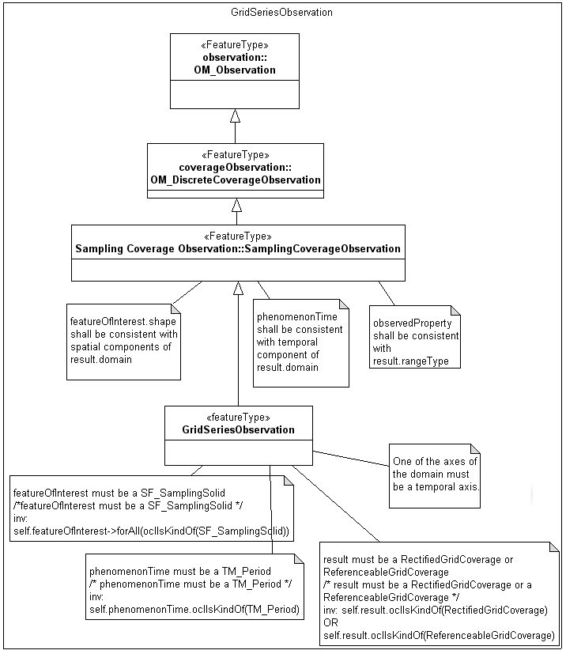

// Admonition icons:
// TG Requirement
:important-caption: 📕
// TG Recommendation
:tip-caption: 📒
// Conformance class
:note-caption: 📘

// TOC placement using macro (manual)
:toc: macro

// Empty TOC title (the title is in the document)
:toc-title:

// TOC level depth
:toclevels: 5

// Section numbering level depth
:sectnumlevels: 8

// Line Break Doc Title
:hardbreaks-option:

:appendix-caption: Annex

image::./media/image2.jpeg[image,width=131,height=90, align=center]

image:./media/image3.png[image,width=93,height=93, align=center] **INSPIRE** *Infrastructure for Spatial Information in Europe*

[discrete]
= D2.8.III.15 Data Specification on _Oceanographic geographical features_ – Technical Guidelines

[cols=",",]
|===
|*Title* |D2.8.III.15 INSPIRE Data Specification on _Oceanographic geographical features_ –Technical Guidelines
|*Creator* |INSPIRE Thematic Working Group _Oceanographic geographical features and Sea regions_
|*Date* |2013-12-10
|*Subject* |INSPIRE Data Specification for the spatial data theme _Oceanographic geographical features_
|*Publisher* |European Commission Joint Research Centre
|*Type* |Text
|*Description* |This document describes the INSPIRE Data Specification for the spatial data theme _Oceanographic geographical features_
|*Contributor* |Members of the INSPIRE Thematic Working Group _Oceanographic geographical features_
|*Format* |Portable Document Format (pdf)
|*Source* |
|*Rights* |Public
|*Identifier* |D2.8.III.15_v3.0
|*Language* |En
|*Relation* |Directive 2007/2/EC of the European Parliament and of the Council of 14 March 2007 establishing an Infrastructure for Spatial Information in the European Community (INSPIRE)
|*Coverage* |Project duration
|===

<<<
[discrete]
== Foreword
[discrete]
== How to read the document?

This document describes the _"INSPIRE data specification on Oceanographic geographical features – Technical Guidelines"_ version 3.0 as developed by the Thematic Working Group (TWG) _OF-SR_ using both natural and a conceptual schema language.

The data specification is based on a common templatefootnote:[The common document template is available in the "Framework documents" section of the data specifications web page at http://inspire.jrc.ec.europa.eu/index.cfm/pageid/2] used for all data specifications, which has been harmonised using the experience from the development of the Annex I, II and III data specifications.

This document provides guidelines for the implementation of the provisions laid down in the Implementing Rule for spatial data sets and services of the INSPIRE Directive. It also includes additional requirements and recommendations that, although not included in the Implementing Rule, are relevant to guarantee or to increase data interoperability.

Two executive summaries provide a quick overview of the INSPIRE data specification process in general, and the content of the data specification on _Oceanographic geographical features_ in particular. We highly recommend that managers, decision makers, and all those new to the INSPIRE process and/or information modelling should read these executive summaries first.

The UML diagrams (in Chapter 5) offer a rapid way to see the main elements of the specifications and their relationships. The definition of the spatial object types, attributes, and relationships are included in the Feature Catalogue (also in Chapter 5). People having thematic expertise but not familiar with UML can fully understand the content of the data model focusing on the Feature Catalogue. Users might also find the Feature Catalogue especially useful to check if it contains the data necessary for the applications that they run. The technical details are expected to be of prime interest to those organisations that are responsible for implementing INSPIRE within the field of _Oceanographic geographical features_, but also to other stakeholders and users of the spatial data infrastructure.

The technical provisions and the underlying concepts are often illustrated by examples. Smaller examples are within the text of the specification, while longer explanatory examples and descriptions of selected use cases are attached in the annexes.

In order to distinguish the INSPIRE spatial data themes from the spatial object types, the INSPIRE spatial data themes are written in _italics._

[cols="",]
|===
|The document will be publicly available as a 'non-paper'. It does not represent an official position of the European Commission, and as such cannot be invoked in the context of legal procedures.
|===

*Legal Notice*

Neither the European Commission nor any person acting on behalf of the Commission is responsible for the use which might be made of this publication.

<<<
[discrete]
== Interoperability of Spatial Data Sets and Services – General Executive Summary

The challenges regarding the lack of availability, quality, organisation, accessibility, and sharing of spatial information are common to a large number of policies and activities and are experienced across the various levels of public authority in Europe. In order to solve these problems it is necessary to take measures of coordination between the users and providers of spatial information. The Directive 2007/2/EC of the European Parliament and of the Council adopted on 14 March 2007 aims at establishing an Infrastructure for Spatial Information in the European Community (INSPIRE) for environmental policies, or policies and activities that have an impact on the environment.

INSPIRE is based on the infrastructures for spatial information that are created and maintained by the Member States. To support the establishment of a European infrastructure, Implementing Rules addressing the following components of the infrastructure have been specified: metadata, interoperability of spatial data sets (as described in Annexes I, II, III of the Directive) and spatial data services, network services, data and service sharing, and monitoring and reporting procedures.

INSPIRE does not require collection of new data. However, after the period specified in the Directivefootnote:[For all 34 Annex I,II and III data themes: within two years of the adoption of the corresponding Implementing Rules for newly collected and extensively restructured data and within 5 years for other data in electronic format still in use] Member States have to make their data available according to the Implementing Rules.

Interoperability in INSPIRE means the possibility to combine spatial data and services from different sources across the European Community in a consistent way without involving specific efforts of humans or machines. It is important to note that "interoperability" is understood as providing access to spatial data sets through network services, typically via Internet. Interoperability may be achieved by either changing (harmonising) and storing existing data sets or transforming them via services for publication in the INSPIRE infrastructure. It is expected that users will spend less time and efforts on understanding and integrating data when they build their applications based on data delivered in accordance with INSPIRE.

In order to benefit from the endeavours of international standardisation bodies and organisations established under international law their standards and technical means have been utilised and referenced, whenever possible.

To facilitate the implementation of INSPIRE, it is important that all stakeholders have the opportunity to participate in specification and development. For this reason, the Commission has put in place a consensus building process involving data users, and providers together with representatives of industry, research and government. These stakeholders, organised through Spatial Data Interest Communities (SDIC) and Legally Mandated Organisations (LMO)footnote:[The current status of registered SDICs/LMOs is available via INSPIRE website: http://inspire.jrc.ec.europa.eu/index.cfm/pageid/42], have provided reference materials, participated in the user requirement and technicalfootnote:[Surveys on unique identifiers and usage of the elements of the spatial and temporal schema,] surveys, proposed experts for the Data Specification Drafting Teamfootnote:[The Data Specification Drafting Team has been composed of experts from Austria, Belgium, Czech Republic, France, Germany, Greece, Italy, Netherlands, Norway, Poland, Switzerland, UK, and the European Environment Agency], the Thematic Working Groupsfootnote:[The Thematic Working Groups have been composed of experts from Austria, Australia, Belgium, Bulgaria, Czech Republic, Denmark, Finland, France, Germany, Hungary, Ireland, Italy, Latvia, Netherlands, Norway, Poland, Romania, Slovakia, Spain, Slovenia, Sweden, Switzerland, Turkey, UK, the European Environment Agency and the European Commission.] and other ad-hoc cross-thematic technical groups and participated in the public stakeholder consultations on draft versions of the data specifications. These consultations covered expert reviews as well as feasibility and fitness-for-purpose testing of the data specificationsfootnote:[For Annex IIIII, the consultation and testing phase lasted from 20 June to 21 October 2011.].

This open and participatory approach was successfully used during the development of the data specifications on Annex I, II and III data themes as well as during the preparation of the Implementing Rule on Interoperability of Spatial Data Sets and Servicesfootnote:[Commission Regulation (EU) No 1089/2010 http://eur-lex.europa.eu/JOHtml.do?uri=OJ:L:2010:323:SOM:EN:HTML[implementing Directive 2007/2/EC of the European Parliament and of the Council as regards interoperability of spatial data sets and services,] published in the Official Journal of the European Union on 8^th^ of December 2010.] for Annex I spatial data themes and of its amendment regarding the themes of Annex II and III.

The development framework elaborated by the Data Specification Drafting Team aims at keeping the data specifications of the different themes coherent. It summarises the methodology to be used for the development of the data specifications, providing a coherent set of requirements and recommendations to achieve interoperability. The pillars of the framework are the following technical documentsfootnote:[The framework documents are available in the "Framework documents" section of the data specifications web page at http://inspire.jrc.ec.europa.eu/index.cfm/pageid/2]:

* The _Definition of Annex Themes and Scope_ describes in greater detail the spatial data themes defined in the Directive, and thus provides a sound starting point for the thematic aspects of the data specification development.
* The _Generic Conceptual Model_ defines the elements necessary for interoperability and data harmonisation including cross-theme issues. It specifies requirements and recommendations with regard to data specification elements of common use, like the spatial and temporal schema, unique identifier management, object referencing, some common code lists, etc. Those requirements of the Generic Conceptual Model that are directly implementable are included in the Implementing Rule on Interoperability of Spatial Data Sets and Services.
* The _Methodology for the Development of Data Specifications_ defines a repeatable methodology. It describes how to arrive from user requirements to a data specification through a number of steps including use-case development, initial specification development and analysis of analogies and gaps for further specification refinement.
* The _Guidelines for the Encoding of Spatial Data_ defines how geographic information can be encoded to enable transfer processes between the systems of the data providers in the Member States. Even though it does not specify a mandatory encoding rule it sets GML (ISO 19136) as the default encoding for INSPIRE.
* The _Guidelines for the use of Observations & Measurements and Sensor Web Enablement-related standards in INSPIRE Annex II and III data specification development_ provides guidelines on how the "Observations and Measurements" standard (ISO 19156) is to be used within INSPIRE.
* The _Common data models_ are a set of documents that specify data models that are referenced by a number of different data specifications. These documents include generic data models for networks, coverages and activity complexes.

The structure of the data specifications is based on the "ISO 19131 Geographic information - Data product specifications" standard. They include the technical documentation of the application schema, the spatial object types with their properties, and other specifics of the spatial data themes using natural language as well as a formal conceptual schema languagefootnote:[UML – Unified Modelling Language].

A consolidated model repository, feature concept dictionary, and glossary are being maintained to support the consistent specification development and potential further reuse of specification elements. The consolidated model consists of the harmonised models of the relevant standards from the ISO 19100 series, the INSPIRE Generic Conceptual Model, and the application schemasfootnote:[Conceptual models related to specific areas (e.g. INSPIRE themes)] developed for each spatial data theme. The multilingual INSPIRE Feature Concept Dictionary contains the definition and description of the INSPIRE themes together with the definition of the spatial object types present in the specification. The INSPIRE Glossary defines all the terms (beyond the spatial object types) necessary for understanding the INSPIRE documentation including the terminology of other components (metadata, network services, data sharing, and monitoring).

By listing a number of requirements and making the necessary recommendations, the data specifications enable full system interoperability across the Member States, within the scope of the application areas targeted by the Directive. The data specifications (in their version 3.0) are published as technical guidelines and provide the basis for the content of the Implementing Rule on Interoperability of Spatial Data Sets and Servicesfootnote:[In the case of the Annex IIIII data specifications, the extracted requirements are used to formulate an amendment to the existing Implementing Rule.]. The content of the Implementing Rule is extracted from the data specifications, considering short- and medium-term feasibility as well as cost-benefit considerations. The requirements included in the Implementing Rule are legally binding for the Member States according to the timeline specified in the INSPIRE Directive.

In addition to providing a basis for the interoperability of spatial data in INSPIRE, the data specification development framework and the thematic data specifications can be reused in other environments at local, regional, national and global level contributing to improvements in the coherence and interoperability of data in spatial data infrastructures.

<<<
[discrete]
== Oceanographic Geographical Features – Executive Summary

The INSPIRE _Oceanographic Geographical Features_ theme (abbreviated to "Ocean Features" or "OF") describes the physical and chemical characteristics of the sea i.e. properties such as 'sea surface temperature' or 'salinity'. For reporting purposes this type of information is typically presented as a set of point data, e.g. temperature observations from a fixed monitoring station, or as gridded data e.g. sea wave height observations from a satellite.

Besides point and gridded data, other more complex observations are extremely common in oceanography, such as vertical profiles through the ocean depths or trajectories along the ocean surface. While these types of observation are not likely to be used in a legislative reporting context they are key oceanographic data types therefore they are included in this specification on an informative basis.

The OF theme is closely related to the INSPIRE Sea Regions theme, which describes what describes what most people would refer to as "the sea" i.e. the actual water bodies. To further clarify the distinction between the OF and SR themes the following definition is used:

[.text-right]
"Sea Region is a defined area of common (physical) characteristics. An Ocean Feature represents the (physical or chemical) properties of the Sea Region. A Sea Region may have other properties that are not Ocean Features, for example bathymetry (Elevation theme) and properties of the sea bed. A Sea Region will typically be represented as a vector dataset whereas an Ocean Feature will be a grid dataset or other coverage type".

So an Oceanographic Geographical Feature will typically be used to describe some physical or chemical property of a Sea Region. E.g. "Mean wave height of the North Sea", where "North Sea" is a defined Sea Region feature type. Similarly, whereas a Sea Region defines the extent of the sea for a given tidal state (e.g. Mean High Water), the Oceanographic Geographical Feature would define the changes in tidal level over time, e.g. observations from a tide gauge.

The Ocean Features theme employs the ISO 19156 Observations and Measurements standard for consistent encoding of observation-related metadata.

There are three other INSPIRE themes that are particularly important in their relationships to Oceanographic Geographic Features and these are:

* _Sea Regions (SR):_ Oceanographic Geographic Features always contain information about a Sea Region, or some part of a Sea Region.
* _Environmental Monitoring Facilities (EF):_ The process used to derive Oceanographic Geographical Features will involve one or more Environmental Monitoring Facilities (e.g. a ship).
* _Atmospheric Conditions and Meteorological Geographical Features (AC-MF):_ On a data level there is a great deal of similarity between measurements made in the seas and oceans and measurements made in the atmosphere so the OF and AC-MF data models have been harmonised as far as possible. Both are based on the same underlying Observations & Measurements model.

_Note: It is recommended that this specification is read in conjunction with document D2.9 INSPIRE Observations & Measurements Guidelines, which contains many details of the underlying model used in Oceanographic Geographical Features._

<<<
[discrete]
== Acknowledgements

Many individuals and organisations have contributed to the development of these Guidelines.

The Thematic Working Group Oceanographic geographical features and Sea regions (TWG OF-SR) included:

Keiran Millard (TWG Facilitator), Dominic Lowe (TWG Editor), Hans Mose Jensen, Marc Roesbeke, Carlo Brandini, Nuria Hermida, Maria Olvido Tello, Alessandro Sarretta (European Commission contact point till May 2012), Tomáš Řezník (European Commission contact point from May till August 2012), Michael Lutz (European Commission contact point from August 2012), Vlado Cetl (European Commission contact point from August 2012).

Other contributors to the INSPIRE data specifications are the Drafting Team Data Specifications, the JRC Data Specifications Team and the INSPIRE stakeholders - Spatial Data Interested Communities (SDICs) and Legally Mandated Organisations (LMOs).

*Contact information*

Maria Vanda Nunes de Lima
European Commission Joint Research Centre
Institute for Environment and Sustainability
Unit H06: Digital Earth and Reference Data
TP262, Via Fermi 2749
I-21027 Ispra (VA)
ITALY
E-mail: vanda.lima@jrc.ec.europa.eu
Tel.: 39-0332-7865052
Fax: 39-0332-7866325
http://ies.jrc.ec.europa.eu/
http://ec.europa.eu/dgs/jrc/

http://inspire.jrc.ec.europa.eu/

<<<
[discrete]
= Table of Contents
toc::[]

:sectnums:

<<<
== Scope

This document specifies a harmonised data specification for the spatial data theme _Oceanographic geographical features_ as defined in Annex III of the INSPIRE Directive.

This data specification provides the basis for the drafting of Implementing Rules according to Article 7 (1) of the INSPIRE Directive [Directive 2007/2/EC]. The entire data specification is published as implementation guidelines accompanying these Implementing Rules.

<<<
== Overview

=== Name

INSPIRE data specification for the theme Oceanographic geographical features.

=== Informal description

[.underline]#*Definition:*#

An Oceanographic Geographical Feature (Ocean Feature) is defined as "Physical conditions of oceans (currents, salinity, wave heights, etc.)." [Directive 2007/2/EC]

[.underline]#*Description:*#

Historical versions of the theme definition are found in the INSPIRE IMS and Scoping papers which define an Ocean Feature as:

* The measurable physical conditions of oceans e.g. salinity, oxygen, other chemical components, currents. Representation e.g. as grids or other spatial organisation. Based on measurements directly or combined with models. (INSPIRE IMS, 2003)
* Physical conditions of oceans (e.g. currents, salinity, etc) represented as lines, grids or points. Includes spatial data sets based on measurements, on models or on a combination thereof and includes measurement locations (INSPIRE Scoping, 2004)
* Although the scope of the Directive says 'physical conditions of the oceans', the intent is for both physical and chemical conditions of the ocean. This is consistent with the Directive text that considers 'salinity' to be within scope and the INSPIRE scoping papers.

From these descriptions we expand the definition as follows:

* An OF is essentially a coverage (ISO 19126) describing the ocean. Examples in common use are
** 1D Points / PointTimeSeries such as the results of an instrument at a fixed location measuring parameters over time

** 2D Grids / GridSeries such as data from a numerical model or satellite over a gridded field and (optionally) repeated over time

Oceanographic Geographical Features are usually represented as Point and Grid observations. Although other representations are possible, Points and Grids are most commonly used and other representations are primarily for scientific investigation rather than providing a statement on the conditions of the ocean. Implementing other representations would be unduly complex and provide higher burdens on MS with limited benefit at this stage.

* The data can be an observation or simulation. As a simulation, forecasts of OF are allowed.
* The OF specification does not prescribe the property or phenomena of the ocean, only its representation. This is covered in more detail in the section on Data Capture.
* A OF is application or intent agnostic, i.e. it is not bound to any particular domain of application. For example suspended sediments measured for water quality reporting are treated in the same way as suspended sediments measured for coastal erosion management. The user may however choose to process the data in different ways.

*Examples of Ocean Features*

Based on the above scope, the following are examples of Ocean Features.

* Measurements of water temperature and salinity recorded by a buoy or fixed instrument at sea for the purpose of water quality reporting
* Measurements of ocean waves recorded by a buoy for the purpose of understanding a coastal flood hazards
* Gridded measurements of ocean colour from an earth observation satellite for the purpose of defining regions for water quality reporting.
* Monitoring of contaminants e.g. sampling for trace metals.
* Aggregated summary data e.g. climatic means.

*What an Ocean Feature is not*

* Direct measurements of biological phenomena such as phytoplanktonfootnote:[Measurements of ocean colour can be used to determine parameters such as Chl-a and these are within the scope of Sea Regions.], zooplankton or any marine species counts, although proxy measurements of such phenomena such as Ocean Colour may be represented as Ocean Features.
* Derived products based on underlying observation and measurementsfootnote:[Such analysis is subjective to a particular purpose. Summary data e.g. 'mean wave height' is in scope.]
** E.g. exceedance plot, wave rose, isolines
* An Atmospheric Geographical Feature (AF – Annex III)
** Winds for example are part of Atmosphere
* Elevation (EL – AnnexII)
** Bathymetric measurements of the ocean depths
* A Sea Region (SR – Annex III)
** Contours or areas of the Sea classified by their physical or chemical conditions

[cols=""]
|===
a|[.underline]#*Definition:*#

An Oceanographic Geographical Feature (Ocean Feature) is defined as "Physical conditions of oceans (currents, salinity, wave heights, etc.)." [Directive 2007/2/EC]

[.underline]#*Description:*#

An Ocean Geographical Feature (OF) represents the (physical or chemical) properties of a Sea Region. This type of information is essentially a coverage describing the ocean and could be presented as a set of point data, gridded data, but also as vertical profiles through ocean depths and trajectories along the ocean surface. The Ocean Geographical Features theme employs the ISO 19156 Observations and Measurements standard for consistent encoding of measured, modelled or simulated data.

Entry in the INSPIRE registry: _http://inspire.ec.europa.eu/theme/of/_
|===

=== Normative References

[Directive 2007/2/EC] Directive 2007/2/EC of the European Parliament and of the Council of 14 March 2007 establishing an Infrastructure for Spatial Information in the European Community (INSPIRE)

[ISO 19107] EN ISO 19107:2005, Geographic Information – Spatial Schema

[ISO 19108] EN ISO 19108:2005, Geographic Information – Temporal Schema

[ISO 19108-c] ISO 19108:2002/Cor 1:2006, Geographic Information – Temporal Schema, Technical Corrigendum 1

[ISO 19111] EN ISO 19111:2007 Geographic information - Spatial referencing by coordinates (ISO 19111:2007)

[ISO 19113] EN ISO 19113:2005, Geographic Information – Quality principles

[ISO 19115] EN ISO 19115:2005, Geographic information – Metadata (ISO 19115:2003)

[ISO 19118] EN ISO 19118:2006, Geographic information – Encoding (ISO 19118:2005)

[ISO 19123] EN ISO 19123:2007, Geographic Information – Schema for coverage geometry and functions

[ISO 19125-1] EN ISO 19125-1:2004, Geographic Information – Simple feature access – Part 1: Common architecture

[ISO 19135] EN ISO 19135:2007 Geographic information – Procedures for item registration (ISO 19135:2005)

[ISO 19138] ISO/TS 19138:2006, Geographic Information – Data quality measures

[ISO 19139] ISO/TS 19139:2007, Geographic information – Metadata – XML schema implementation

[ISO 19157] ISO/DIS 19157, Geographic information – Data quality

[OGC 06-103r4] Implementation Specification for Geographic Information - Simple feature access – Part 1: Common Architecture v1.2.1

NOTE This is an updated version of "EN ISO 19125-1:2004, Geographic information – Simple feature access – Part 1: Common architecture".

[Regulation 1205/2008/EC] Regulation 1205/2008/EC implementing Directive 2007/2/EC of the European Parliament and of the Council as regards metadata

[Regulation 976/2009/EC] Commission Regulation (EC) No 976/2009 of 19 October 2009 implementing Directive 2007/2/EC of the European Parliament and of the Council as regards the Network Services

[Regulation 1089/2010/EC] Commission Regulation (EU) No 1089/2010 of 23 November 2010 implementing Directive 2007/2/EC of the European Parliament and of the Council as regards interoperability of spatial data sets and services

[ISO 19156] ISO 19156: 2011, Geographic information - Observations and measurements

=== Terms and definitions

General terms and definitions helpful for understanding the INSPIRE data specification documents are defined in the INSPIRE Glossaryfootnote:[The INSPIRE Glossary is available from http://inspire-registry.jrc.ec.europa.eu/registers/GLOSSARY].

=== Symbols and abbreviations

[cols=","]
|===
|AC-MF a|
Atmospheric Conditions & Meteorological Geographical Features
(INSPIRE Data Specification)
|ATS |Abstract Test Suite
|CSML |Climate Science Modelling Language
|EC |European Commission
|EC |European Commission
|EEA |European Environmental Agency
|EF |Environmental Monitoring Facilities (INSPIRE Data Specification)
|ETRS89 |European Terrestrial Reference System 1989
|ETRS89-LAEA |Lambert Azimuthal Equal Area
|EU |European Union
|EVRS |European Vertical Reference System
|GCM |General Conceptual Model
|GML |Geography Markup Language
|INSPIRE |Infrastructure for Spatial Information in Europe
|IR |Implementing Rule
|ISDSS |Interoperability of Spatial Data Sets and Services
|ISO |International Organization for Standardization
|ITRS |International Terrestrial Reference System
|LAT |Lowest Astronomical Tide
|LMO |Legally Mandated Organization
|O&M |ISO 19156 Observations and Measurements
|OF |Oceanographic Geographical Feature
|SDIC |Spatial Data Interest Community
|SLD |Styled Layer Descriptor
|SOS |OGC Sensor Observation Service
|SR |Sea Regions (INSPIRE Data Specification)
|TG |Technical Guidance
|TWG |Thematic Working Group
|UML |Unified Modeling Language
|URI |Uniform Resource Identifier
|UTC |Coordinated Universal Time
|WCS |OGC Web Coverage Service
|WFS |OGC Web Feature Service
|WMS |OGC Web Map Service
|XML |EXtensible Markup Language
|===

=== How the Technical Guidelines map to the Implementing Rules

The schematic diagram in Figure 1 gives an overview of the relationships between the INSPIRE legal acts (the INSPIRE Directive and Implementing Rules) and the INSPIRE Technical Guidelines. The INSPIRE Directive and Implementing Rules include legally binding requirements that describe, usually on an abstract level, _what_ Member States must implement.

In contrast, the Technical Guidelines define _how_ Member States might implement the requirements included in the INSPIRE Implementing Rules. As such, they may include non-binding technical requirements that must be satisfied if a Member State data provider chooses to conform to the Technical Guidelines. Implementing these Technical Guidelines will maximise the interoperability of INSPIRE spatial data sets.

image::./media/image4.png[image,width=603,height=375, align=center]

[.text-center]
*Figure 1 - Relationship between INSPIRE Implementing Rules and Technical Guidelines*

==== Requirements

The purpose of these Technical Guidelines (Data specifications on _Oceanographic geographical features_) is to provide practical guidance for implementation that is guided by, and satisfies, the (legally binding) requirements included for the spatial data theme Oceanographic geographical features in the Regulation (Implementing Rules) on interoperability of spatial data sets and services. These requirements are highlighted in this document as follows:

[IMPORTANT]
====
[.text-center]
*IR Requirement*
_Article / Annex / Section no._
*Title / Heading*

This style is used for requirements contained in the Implementing Rules on interoperability of spatial data sets and services (Commission Regulation (EU) No 1089/2010).

====

For each of these IR requirements, these Technical Guidelines contain additional explanations and examples.

NOTE The Abstract Test Suite (ATS) in Annex A contains conformance tests that directly check conformance with these IR requirements.

Furthermore, these Technical Guidelines may propose a specific technical implementation for satisfying an IR requirement. In such cases, these Technical Guidelines may contain additional technical requirements that need to be met in order to be conformant with the corresponding IR requirement _when using this proposed implementation_. These technical requirements are highlighted as follows:

[TIP]
====
*TG Requirement X* 

This style is used for requirements for a specific technical solution proposed in these Technical Guidelines for an IR requirement.

====

NOTE 1 Conformance of a data set with the TG requirement(s) included in the ATS implies conformance with the corresponding IR requirement(s).

NOTE 2 In addition to the requirements included in the Implementing Rules on interoperability of spatial data sets and services, the INSPIRE Directive includes further legally binding obligations that put additional requirements on data providers. For example, Art. 10(2) requires that Member States shall, where appropriate, decide by mutual consent on the depiction and position of geographical features whose location spans the frontier between two or more Member States. General guidance for how to meet these obligations is provided in the INSPIRE framework documents.

==== Recommendations

In addition to IR and TG requirements, these Technical Guidelines may also include a number of recommendations for facilitating implementation or for further and coherent development of an interoperable infrastructure.

[NOTE]
====
*Recommendation X* 

Recommendations are shown using this style.

====

NOTE The implementation of recommendations is not mandatory. Compliance with these Technical Guidelines or the legal obligation does not depend on the fulfilment of the recommendations.

==== Conformance

Annex A includes the abstract test suite for checking conformance with the requirements included in these Technical Guidelines and the corresponding parts of the Implementing Rules (Commission Regulation (EU) No 1089/2010).

<<<
== Specification scopes

This data specification does not distinguish different specification scopes, but just considers one general scope.

NOTE For more information on specification scopes, see [ISO 19131:2007], clause 8 and Annex D.

<<<
== Identification information

These Technical Guidelines are identified by the following URI:

http://inspire.ec.europa.eu/tg/of/3.0

NOTE ISO 19131 suggests further identification information to be included in this section, e.g. the title, abstract or spatial representation type. The proposed items are already described in the document metadata, executive summary, overview description (section 2) and descriptions of the application schemas (section 5). In order to avoid redundancy, they are not repeated here.

<<<
== Data content and structure

This data specification defines the following application schemas:

* The Oceanographic Geographical Features application schema.

=== Application schemas – Overview 

==== Application schemas included in the IRs

Articles 3, 4 and 5 of the Implementing Rules lay down the requirements for the content and structure of the data sets related to the INSPIRE Annex themes.

[IMPORTANT]
====
[.text-center]
*IR Requirement*
_Article 4_
*Types for the Exchange and Classification of Spatial Objects*

. For the exchange and classification of spatial objects from data sets meeting the conditions laid down in Article 4 of Directive 2007/2/EC, Member States shall use the spatial object types and associated data types, enumerations and code lists that are defined in Annexes II, III and IV for the themes the data sets relate to.

. Spatial object types and data types shall comply with the definitions and constraints and include the attributes and association roles set out in the Annexes.

. The enumerations and code lists used in attributes or association roles of spatial object types or data types shall comply with the definitions and include the values set out in Annex II. The enumeration and code list values are uniquely identified by language-neutral mnemonic codes for computers. The values may also include a language-specific name to be used for human interaction.

====

The types to be used for the exchange and classification of spatial objects from data sets related to the spatial data theme Oceanographic geographical features are defined in the following application schemas (see sections 5.3):

* The Oceanographic Geographical Features application schema (section 5.3).

The application schemas specify requirements on the properties of each spatial object including its multiplicity, domain of valid values, constraints, etc.

NOTE The application schemas presented in this section contain some additional information that is not included in the Implementing Rules, in particular multiplicities of attributes and association roles.

[TIP]
====
*TG Requirement 1*

Spatial object types and data types shall comply with the multiplicities defined for the attributes and association roles in this section.

====

An application schema may include references (e.g. in attributes or inheritance relationships) to common types or types defined in other spatial data themes. These types can be found in a sub-section called "Imported Types" at the end of each application schema section. The common types referred to from application schemas included in the IRs are addressed in Article 3.

[IMPORTANT]
====
[.text-center]
*IR Requirement*
_Article 3_
*Common Types*

Types that are common to several of the themes listed in Annexes I, II and III to Directive 2007/2/EC shall conform to the definitions and constraints and include the attributes and association roles set out in Annex I.

====

NOTE Since the IRs contain the types for all INSPIRE spatial data themes in one document, Article 3 does not explicitly refer to types defined in other spatial data themes, but only to types defined in external data models.

Common types are described in detail in the Generic Conceptual Model [DS-D2.7], in the relevant international standards (e.g. of the ISO 19100 series) or in the documents on the common INSPIRE models [DS-D2.10.x]. For detailed descriptions of types defined in other spatial data themes, see the corresponding Data Specification TG document [DS-D2.8.x].

==== Additional recommended application schemas 

There is no additional application schemas defined for the theme _Oceanographic geographical features._

=== Basic notions

This section explains some of the basic notions used in the INSPIRE application schemas. These explanations are based on the GCM [DS-D2.5].

==== Notation

===== Unified Modeling Language (UML)

The application schemas included in this section are specified in UML, version 2.1. The spatial object types, their properties and associated types are shown in UML class diagrams.

NOTE For an overview of the UML notation, see Annex D in [ISO 19103].

The use of a common conceptual schema language (i.e. UML) allows for an automated processing of application schemas and the encoding, querying and updating of data based on the application schema – across different themes and different levels of detail.

The following important rules related to class inheritance and abstract classes are included in the IRs.

[IMPORTANT]
====
[.text-center]
*IR Requirement*
_Article 5_
*Types*

(...)

[arabic, start=2]
. Types that are a sub-type of another type shall also include all this type's attributes and association roles.

. Abstract types shall not be instantiated.

====

The use of UML conforms to ISO 19109 8.3 and ISO/TS 19103 with the exception that UML 2.1 instead of ISO/IEC 19501 is being used. The use of UML also conforms to ISO 19136 E.2.1.1.1-E.2.1.1.4.

NOTE ISO/TS 19103 and ISO 19109 specify a profile of UML to be used in conjunction with the ISO 19100 series. This includes in particular a list of stereotypes and basic types to be used in application schemas. ISO 19136 specifies a more restricted UML profile that allows for a direct encoding in XML Schema for data transfer purposes.

To model constraints on the spatial object types and their properties, in particular to express data/data set consistency rules, OCL (Object Constraint Language) is used as described in ISO/TS 19103, whenever possible. In addition, all constraints are described in the feature catalogue in English, too.

NOTE Since "void" is not a concept supported by OCL, OCL constraints cannot include expressions to test whether a value is a _void_ value. Such constraints may only be expressed in natural language.

===== Stereotypes

In the application schemas in this section several stereotypes are used that have been defined as part of a UML profile for use in INSPIRE [DS-D2.5]. These are explained in Table 1 below.

[.text-center]
*Table 1 – Stereotypes (adapted from [DS-D2.5])*

[cols=",,",]
|===
|*Stereotype* |*Model element* |*Description*
|applicationSchema |Package |An INSPIRE application schema according to ISO 19109 and the Generic Conceptual Model.
|leaf |Package |A package that is not an application schema and contains no packages.
|featureType |Class |A spatial object type.
|type |Class |A type that is not directly instantiable, but is used as an abstract collection of operation, attribute and relation signatures. This stereotype should usually not be used in INSPIRE application schemas as these are on a different conceptual level than classifiers with this stereotype.
|dataType |Class |A structured data type without identity.
|union |Class |A structured data type without identity where exactly one of the properties of the type is present in any instance.
|enumeration |Class |An enumeration.
|codeList |Class |A code list.
|import |Dependency |The model elements of the supplier package are imported.
|voidable |Attribute, association role |A voidable attribute or association role (see section 5.2.2).
|lifeCycleInfo |Attribute, association role |If in an application schema a property is considered to be part of the life-cycle information of a spatial object type, the property shall receive this stereotype.
|version |Association role |If in an application schema an association role ends at a spatial object type, this stereotype denotes that the value of the property is meant to be a specific version of the spatial object, not the spatial object in general.
|===

==== Voidable characteristics

The «voidable» stereotype is used to characterise those properties of a spatial object that may not be present in some spatial data sets, even though they may be present or applicable in the real world. This does _not_ mean that it is optional to provide a value for those properties.

For all properties defined for a spatial object, a value has to be provided – either the corresponding value (if available in the data set maintained by the data provider) or the value of _void._ A _void_ value shall imply that no corresponding value is contained in the source spatial data set maintained by the data provider or no corresponding value can be derived from existing values at reasonable costs.

[NOTE]
====
*Recomendation 1*

The reason for a _void_ value should be provided where possible using a listed value from the VoidReasonValue code list to indicate the reason for the missing value.

====

The VoidReasonValue type is a code list, which includes the following pre-defined values:

* _Unpopulated_: The property is not part of the dataset maintained by the data provider. However, the characteristic may exist in the real world. For example when the "elevation of the water body above the sea level" has not been included in a dataset containing lake spatial objects, then the reason for a void value of this property would be 'Unpopulated'. The property receives this value for all spatial objects in the spatial data set.
* _Unknown_: The correct value for the specific spatial object is not known to, and not computable by the data provider. However, a correct value may exist. For example when the "elevation of the water body above the sea level" _of a certain lake_ has not been measured, then the reason for a void value of this property would be 'Unknown'. This value is applied only to those spatial objects where the property in question is not known.
* _Withheld_: The characteristic may exist, but is confidential and not divulged by the data provider.

NOTE It is possible that additional reasons will be identified in the future, in particular to support reasons / special values in coverage ranges.

The «voidable» stereotype does not give any information on whether or not a characteristic exists in the real world. This is expressed using the multiplicity:

* If a characteristic may or may not exist in the real world, its minimum cardinality shall be defined as 0. For example, if an Address may or may not have a house number, the multiplicity of the corresponding property shall be 0..1.
* If at least one value for a certain characteristic exists in the real world, the minimum cardinality shall be defined as 1. For example, if an Administrative Unit always has at least one name, the multiplicity of the corresponding property shall be 1..*.

In both cases, the «voidable» stereotype can be applied. In cases where the minimum multiplicity is 0, the absence of a value indicates that it is known that no value exists, whereas a value of void indicates that it is not known whether a value exists or not.

EXAMPLE If an address does not have a house number, the corresponding Address object should not have any value for the «voidable» attribute house number. If the house number is simply not known or not populated in the data set, the Address object should receive a value of _void_ (with the corresponding void reason) for the house number attribute.

==== Enumerations

Enumerations are modelled as classes in the application schemas. Their values are modelled as attributes of the enumeration class using the following modelling style:

* No initial value, but only the attribute name part, is used.
* The attribute name conforms to the rules for attributes names, i.e. is a lowerCamelCase name. Exceptions are words that consist of all uppercase letters (acronyms).

[IMPORTANT]
====
[.text-center]
*IR Requirement*
_Article 6_
*Code Lists and Enumerations*

(...)

[arabic, start=5]
. Attributes or association roles of spatial object types or data types that have an enumeration type may only take values from the lists specified for the enumeration type."

====

==== Code lists

Code lists are modelled as classes in the application schemas. Their values, however, are managed outside of the application schema.

===== Code list types

The IRs distinguish the following types of code lists.

[IMPORTANT]
====
[.text-center]
*IR Requirement*
_Article 6_
*Code Lists and Enumerations*

. Code lists shall be of one of the following types, as specified in the Annexes:
[loweralpha]
.. code lists whose allowed values comprise only the values specified in this Regulation;
.. code lists whose allowed values comprise the values specified in this Regulation and narrower values defined by data providers;
.. code lists whose allowed values comprise the values specified in this Regulation and additional values at any level defined by data providers;
.. code lists, whose allowed values comprise any values defined by data providers.

For the purposes of points (b), (c) and (d), in addition to the allowed values, data providers may use the values specified in the relevant INSPIRE Technical Guidance document available on the INSPIRE web site of the Joint Research Centre.

====

The type of code list is represented in the UML model through the tagged value _extensibility_, which can take the following values:

* _none_, representing code lists whose allowed values comprise only the values specified in the IRs (type a);
* _narrower_, representing code lists whose allowed values comprise the values specified in the IRs and narrower values defined by data providers (type b);
* _open_, representing code lists whose allowed values comprise the values specified in the IRs and additional values at any level defined by data providers (type c); and
* _any_, representing code lists, for which the IRs do not specify any allowed values, i.e. whose allowed values comprise any values defined by data providers (type d).

[NOTE]
====
*Recomendation 2*

Additional values defined by data providers should not replace or redefine any value already specified in the IRs.

====

NOTE This data specification may specify recommended values for some of the code lists of type (b), (c) and (d) (see section 5.2.4.3). These recommended values are specified in a dedicated Annex.

In addition, code lists can be hierarchical, as explained in Article 6(2) of the IRs.

[IMPORTANT]
====
[.text-center]
*IR Requirement*
_Article 6_
*Code Lists and Enumerations*

(...)

[arabic, start=2]
. Code lists may be hierarchical. Values of hierarchical code lists may have a more generic parent value. Where the valid values of a hierarchical code list are specified in a table in this Regulation, the parent values are listed in the last column.

====

The type of code list and whether it is hierarchical or not is also indicated in the feature catalogues.

===== Obligations on data providers

[IMPORTANT]
====
[.text-center]
*IR Requirement*
_Article 6_
*Code Lists and Enumerations*

(....)

[arabic, start=3]
. Where, for an attribute whose type is a code list as referred to in points (b), (c) or (d) of paragraph 1, a data provider provides a value that is not specified in this Regulation, that value and its definition shall be made available in a register.

. Attributes or association roles of spatial object types or data types whose type is a code list may only take values that are allowed according to the specification of the code list.

====

Article 6(4) obliges data providers to use only values that are allowed according to the specification of the code list. The "allowed values according to the specification of the code list" are the values explicitly defined in the IRs plus (in the case of code lists of type (b), (c) and (d)) additional values defined by data providers.

For attributes whose type is a code list of type (b), (c) or (d) data providers may use additional values that are not defined in the IRs. Article 6(3) requires that such additional values and their definition be made available in a register. This enables users of the data to look up the meaning of the additional values used in a data set, and also facilitates the re-use of additional values by other data providers (potentially across Member States).

NOTE Guidelines for setting up registers for additional values and how to register additional values in these registers is still an open discussion point between Member States and the Commission.

===== Recommended code list values

For code lists of type (b), (c) and (d), this data specification may propose additional values as a recommendation (in a dedicated Annex). These values will be included in the INSPIRE code list register. This will facilitate and encourage the usage of the recommended values by data providers since the obligation to make additional values defined by data providers available in a register (see section 5.2.4.2) is already met.

[NOTE]
====
*Recomendation 3*

Where these Technical Guidelines recommend values for a code list in addition to those specified in the IRs, these values should be used.

====

NOTE For some code lists of type (d), no values may be specified in these Technical Guidelines. In these cases, any additional value defined by data providers may be used.

===== Governance

The following two types of code lists are distinguished in INSPIRE:

* _Code lists that are governed by INSPIRE (INSPIRE-governed code lists)._ These code lists will be managed centrally in the INSPIRE code list register. Change requests to these code lists (e.g. to add, deprecate or supersede values) are processed and decided upon using the INSPIRE code list register's maintenance workflows.
+
INSPIRE-governed code lists will be made available in the INSPIRE code list register at __http://inspire.ec.europa.eu/codelist/<CodeListName__>. They will be available in SKOS/RDF, XML and HTML. The maintenance will follow the procedures defined in ISO 19135. This means that the only allowed changes to a code list are the addition, deprecation or supersession of values, i.e. no value will ever be deleted, but only receive different statuses (valid, deprecated, superseded). Identifiers for values of INSPIRE-governed code lists are constructed using the pattern __http://inspire.ec.europa.eu/codelist/<CodeListName__>/<value>.

* _Code lists that are governed by an organisation outside of INSPIRE (externally governed code lists)._ These code lists are managed by an organisation outside of INSPIRE, e.g. the World Meteorological Organization (WMO) or the World Health Organization (WHO). Change requests to these code lists follow the maintenance workflows defined by the maintaining organisations. Note that in some cases, no such workflows may be formally defined.
+
Since the updates of externally governed code lists is outside the control of INSPIRE, the IRs and these Technical Guidelines reference a specific version for such code lists.
+   
The tables describing externally governed code lists in this section contain the following columns:
+
** The _Governance_ column describes the external organisation that is responsible for maintaining the code list.
** The _Source_ column specifies a citation for the authoritative source for the values of the code list. For code lists, whose values are mandated in the IRs, this citation should include the version of the code list used in INSPIRE. The version can be specified using a version number or the publication date. For code list values recommended in these Technical Guidelines, the citation may refer to the "latest available version".
** In some cases, for INSPIRE only a subset of an externally governed code list is relevant. The subset is specified using the _Subset_ column.
** The _Availability_ column specifies from where (e.g. URL) the values of the externally governed code list are available, and in which formats. Formats can include machine-readable (e.g. SKOS/RDF, XML) or human-readable (e.g. HTML, PDF) ones.

+
Code list values are encoded using http URIs and labels. Rules for generating these URIs and labels are specified in a separate table.

[NOTE]
====
*Recomendation 4*

The http URIs and labels used for encoding code list values should be taken from the INSPIRE code list registry for INSPIRE-governed code lists and generated according to the relevant rules specified for externally governed code lists.

====

NOTE Where practicable, the INSPIRE code list register could also provide http URIs and labels for externally governed code lists.

===== Vocabulary

For each code list, a tagged value called "vocabulary" is specified to define a URI identifying the values of the code list. For INSPIRE-governed code lists and externally governed code lists that do not have a persistent identifier, the URI is constructed following the pattern _http://inspire.ec.europa.eu/codelist/<UpperCamelCaseName>_.

If the value is missing or empty, this indicates an empty code list. If no sub-classes are defined for this empty code list, this means that any code list may be used that meets the given definition.

An empty code list may also be used as a super-class for a number of specific code lists whose values may be used to specify the attribute value. If the sub-classes specified in the model represent all valid extensions to the empty code list, the subtyping relationship is qualified with the standard UML constraint "\{complete,disjoint}".

==== Identifier management

[IMPORTANT]
====
[.text-center]
*IR Requirement*
_Article 9_
*Identifier Management*

. The data type Identifier defined in Section 2.1 of Annex I shall be used as a type for the external object identifier of a spatial object.

. The external object identifier for the unique identification of spatial objects shall not be changed during the life-cycle of a spatial object.

====

NOTE 1 An external object identifier is a unique object identifier which is published by the responsible body, which may be used by external applications to reference the spatial object. [DS-D2.5]

NOTE 2 Article 9(1) is implemented in each application schema by including the attribute _inspireId_ of type Identifier.

NOTE 3 Article 9(2) is ensured if the _namespace_ and _localId_ attributes of the Identifier remains the same for different versions of a spatial object; the _version_ attribute can of course change.

==== Geometry representation

[IMPORTANT]
====
[.text-center]
*IR Requirement*
_Article 12_
*Other Requirements & Rules*

. The value domain of spatial properties defined in this Regulation shall be restricted to the Simple Feature spatial schema as defined in Herring, John R. (ed.), OpenGIS® Implementation Standard for Geographic information – Simple feature access – Part 1: Common architecture, version 1.2.1, Open Geospatial Consortium, 2011, unless specified otherwise for a specific spatial data theme or type.

====

NOTE 1 The specification restricts the spatial schema to 0-, 1-, 2-, and 2.5-dimensional geometries where all curve interpolations are linear and surface interpolations are performed by triangles.

NOTE 2 The topological relations of two spatial objects based on their specific geometry and topology properties can in principle be investigated by invoking the operations of the types defined in ISO 19107 (or the methods specified in EN ISO 19125-1).

====  Temporality representation

The application schema(s) use(s) the derived attributes "beginLifespanVersion" and "endLifespanVersion" to record the lifespan of a spatial object.

The attributes "beginLifespanVersion" specifies the date and time at which this version of the spatial object was inserted or changed in the spatial data set. The attribute "endLifespanVersion" specifies the date and time at which this version of the spatial object was superseded or retired in the spatial data set.

NOTE 1 The attributes specify the beginning of the lifespan of the version in the spatial data set itself, which is different from the temporal characteristics of the real-world phenomenon described by the spatial object. This lifespan information, if available, supports mainly two requirements: First, knowledge about the spatial data set content at a specific time; second, knowledge about changes to a data set in a specific time frame. The lifespan information should be as detailed as in the data set (i.e., if the lifespan information in the data set includes seconds, the seconds should be represented in data published in INSPIRE) and include time zone information.

NOTE 2 Changes to the attribute "endLifespanVersion" does not trigger a change in the attribute "beginLifespanVersion".

[IMPORTANT]
====
[.text-center]
*IR Requirement*
_Article 10_
*Life-cycle of Spatial Objects*

(...)

[arabic, start=3]
. Where the attributes beginLifespanVersion and endLifespanVersion are used, the value of endLifespanVersion shall not be before the value of beginLifespanVersion.

====

NOTE The requirement expressed in the IR Requirement above will be included as constraints in the UML data models of all themes.

[NOTE]
====
*Recomendation 5*

If life-cycle information is not maintained as part of the spatial data set, all spatial objects belonging to this data set should provide a void value with a reason of "unpopulated".

====

===== Validity of the real-world phenomena

The application schema(s) use(s) the attributes "validFrom" and "validTo" to record the validity of the real-world phenomenon represented by a spatial object.

The attributes "validFrom" specifies the date and time at which the real-world phenomenon became valid in the real world. The attribute "validTo" specifies the date and time at which the real-world phenomenon is no longer valid in the real world.

Specific application schemas may give examples what "being valid" means for a specific real-world phenomenon represented by a spatial object.

[IMPORTANT]
====
[.text-center]
*IR Requirement*
_Article 12_
*Other Requirements & Rules*

(...)

[arabic, start=3]
. Where the attributes validFrom and validTo are used, the value of validTo shall not be before the value of validFrom.

====

NOTE The requirement expressed in the IR Requirement above will be included as constraints in the UML data models of all themes.

==== Coverages

Coverage functions are used to describe characteristics of real-world phenomena that vary over space and/or time. Typical examples are temperature, elevation, precipitation, imagery. A coverage contains a set of such values, each associated with one of the elements in a spatial, temporal or spatio-temporal domain. Typical spatial domains are point sets (e.g. sensor locations), curve sets (e.g. isolines), grids (e.g. orthoimages, elevation models), etc.

In INSPIRE application schemas, coverage functions are defined as properties of spatial object types where the type of the property value is a realisation of one of the types specified in ISO 19123.

To improve alignment with coverage standards on the implementation level (e.g. ISO 19136 and the OGC Web Coverage Service) and to improve the cross-theme harmonisation on the use of coverages in INSPIRE, an application schema for coverage types is included in the Generic Conceptual Model in 9.9.4. This application schema contains the following coverage types:

* _RectifiedGridCoverage_: coverage whose domain consists of a rectified grid – a grid for which there is an affine transformation between the grid coordinates and the coordinates of a coordinate reference system (see Figure 2, left).
* _ReferenceableGridCoverage_: coverage whose domain consists of a referenceable grid – a grid associated with a transformation that can be used to convert grid coordinate values to values of coordinates referenced to a coordinate reference system (see Figure 2, right).

In addition, some themes make reference to the types TimeValuePair and Timeseries defined in Taylor, Peter (ed.), _OGC^®^ WaterML 2.0: Part 1 – Timeseries, v2.0.0,_ Open Geospatial Consortium, 2012. These provide a representation of the time instant/value pairs, i.e. time series (see Figure 3).

Where possible, only these coverage types (or a subtype thereof) are used in INSPIRE application schemas.

[cols=","]
|===
a|image::./media/image5.png[image,width=222,height=207, align=center] a|image::./media/image6.png[image, align=center]
^|(Source: ISO 19136:2007) 
^|(Source: GML 3.3.0)
|===
[.text-center]
*Figure 2 – Examples of a rectified grid (left) and a referenceable grid (right)*

[.text-center]
*Figure 3 – Example of a time series*

=== Application schema Oceanographic Geographical Features

==== Description

===== Narrative description

An Oceanographic Geographical Feature (abbreviated to "Ocean Feature" or "OF") describes the physical and chemical phenomena of a sea region (known as '_SeaArea_' in the Inspire Sea Regions model).

===== UML Overview

Some examples of Ocean Features are:

* A time series of measurements of water level from a tide gauge
* A satellite gridded field of ocean colour
* A one off sea surface temperature measurement made by hand with a thermometer
* An ocean climate model predicting future changes of salinity over time on a model grid.
* Ex-situ measurement of suspended sediment concentration
* In situ measurements or ex situ analysed collected samples gathered from vessels visiting a specified location

In each of these cases some estimation of the value of a property (water level, ocean colour, temperature, salinity) is made using some procedure. For the OF theme we directly build upon the ISO 19156 Observations and Measurements (O&M) specification which provides a framework to describe the relationships between the observation (or simulation) event, the observed property, the procedure used, the observation result and the feature of interest.

ISO 19156 states that:

_An observation is an act associated with a discrete time instant or period through which a number, term or other symbol is assigned to a phenomenon. It involves application of a specified *procedure*, such as a sensor, instrument, algorithm or process chain. The procedure may be applied in-situ, remotely, or ex-situ with respect to *the sampling location*. The *result* of an observation is an estimate of the *value* of a *property* of some *feature*. [ISO 19156]_

Furthermore:

_The key idea is that the observation result is an estimate of the value of some property of the feature of interest, and the other observation properties provide context or metadata to support evaluation, interpretation and use of the result. [ISO 19156]_

By building on the ISO 19156 standard model it is expected that interoperability between domains will be increased. Non-specialist software which understands ISO 19156 will be able to interrogate Ocean Features and at least identify the feature of interest, the observation time, the location etc.

image::./media/image7.png[image,width=584,height=453, align=center]

[.text-center]
*Figure 4 Overview of ISO 19156 OM_Observation*

ISO 19156 is a very generic model which may be applied in many different thematic domains. For the purposes of interoperability in INSPIRE we have profiled the O&M model to add further precision about the types of processes, observable properties and features of interest that are used.

It is recognised that the types of data structure that are common means of capturing and presenting information about the oceans such as point observations, profiles, gridded data etc are also common when monitoring weather or climate in the atmosphere. Therefore the OF and AC/MF themes have jointly developed a set of core spatial object types in INSPIRE, which can be found in the Generic Conceptual Model and are more fully documented in document D2.9 (O&M in INSPIRE).

The key aspects of the shared model documented in D2.9 that are relevant to OF are:

* Specialised Observation types – GridObservations, PointObservations etc.
* An ObservationSet type, plus one specialisation PointObservationCollection
* An Process type
* A model for describing Observable Properties (temperature, salinity etc).
* A mechanism for linking between Environmental Monitoring Facilities and Observations

The OF model and schema itself is therefore minimal (since most of the feature types are in the shared Observations model). The OF schema itself only contains information about particular vocabularies (codelists) which must be used when describing OF data.

====== Specialised Observations, as used in OF; Overview

The 'Specialised Observations' package in the Generic Conceptual Model contains seven specialisations of OM_Observation, (along with a specialisation of ObservationSet discussed in section 5.3.1.2.2).

[.text-center]
*Figure 5 - Specialised Observation Types from Generic Conceptual Model (see also document D2.9)*

For OF, the 'core' types used are:

* PointObservation
* PointTimeSeriesObservation
* MultiPointObservation
* GridObservation
* GridSeriesObservation
* PointObservationCollection

[IMPORTANT]
====
[.text-center]
*IR Requirement*
_Annex IV, Section 14.3_
*Theme-specific Requirements*

Data related to the theme Oceanographic Geographical Features shall be made available using the following types defined in the Specialised Observations package in Annex I: PointObservation, PointTimeSeriesObservation, MultiPointObservation, GridObservation, GridSeriesObservation, PointObservationCollection.
====

The other types may be used to represent oceanographic data and are provided for convenience and consistency with the core types but these types are not viewed as being central to the INSPIRE OF theme. These types are:

* ProfileObservation
* TrajectoryObservation

[NOTE]
====
*Recomendation 6*

The following types from the GCM may be used to describe OF data: ProfileObservation, TrajectoryObservation

====

image::./media/image9.png[screenshot_003,width=604,height=381, align=center]

[.text-center]
*Figure 6 - Distinction between normative and informative feature types used in OF*

All the specialised Observation types essentially add 'constraints' to the underlying O&M model which characterise the result of the observation and the sampling regime usedfootnote:[This pattern was modelled on the approach taken in Climate Science Modelling Language version 3 (OGC Pending Docs 11_021) which extends ISO 19156.]. For example, a PointTimeSeriesObservation is a timeseries at a single point in space (e.g. at a fixed station), so the 'Spatial Sampling Feature' in 19156 must be a spatial sampling point, and the 'phenomenonTime' must be a time period i.e. the observation must be taken over a period of time. The type of the result must be a set of time, value pairs. Illustrated examples and further descriptions of these types are given in D2.9.

In actual fact, the specialised Observation types do not specialise OM_Observation directly but specialise the informative O&M class _SpecialisedCoverageObservation_, which in turn specialises _DiscreteCoverageObservation_. These two classes between them ensure that the result of the observation is a Coverage, and the feature of interest is a 'Spatial Sampling Feature' e.g. a point, an area, a line.

This pattern is consistent with the acquisition of ocean measurements; when taking ocean measurements, we are interested in some property of the ocean, therefore the ultimate feature of interest is the ocean or sea but it is impossible to measure the entire ocean. Therefore measurements are always made against some sampling proxy, such as a set of points, or a grid. O&M refers to this proxy feature as a Spatial Sampling Feature. The result of the measurement is a coverage – a set of values for locations within in the sampling proxy. This is why all OF observations are logically specialisms of _SamplingCoverageObservation_.

image::./media/image10.png[samplingcov -white,width=604,height=425, align=center]

[.text-center]
*Figure 7 - Overview of SamplingCoverageObservation*

Note that since these _SamplingCoverageObservation_ and _DiscreteCoverageObservation_ classes are not realised in the O&M XML Schema, direct specialisations of OM_Observation are used in the INSPIRE application schemas, however the constraints introduced in the conceptual inheritance model should be observed (and could be validated using schematron or similar).

The feature catalogue for these feature types can be found in the O&M document, D2.9. However, for completeness each feature type is also discussed below, with an emphasis on usage in OF.

====== PointObservation (From Generic Conceptual Model)

[.text-center]
*Figure 8 - PointObservation*

The PointObservation represents a single value measurement at a single point in time e.g. a manual one-off measurement of sea surface temperature.

[cols=",,",options="header",]
|===
3+|*PointObservation*
a|
*O&M*

*Attribute/association*

|*Is constrained to be* |*Example: Single measurement of Sea Surface Temperature*
|processUsed a|
Process

(Section 5.3.1.2.10)

|Process instance links to information about the responsible party, documented process etc.
|featureOfInterest |SF_SamplingPoint |A SF_SamplingPoint at the geographic location of the measurement
|phenomenonTime |TM_TimeInstant |A time instant (in ISO 8601 including time zone) e.g. 2012-01-30T10:30:00.00Z
|observedProperty |ObservableProperty |The observed property should link to a vocabulary defining sea surface temperature, and should also indicate the units used in the result (e.g. Celsius).
|Result |CV_DiscretePointCoverage |The result should be a single valued coverage recording an estimate of the observed property e.g. 22.2 (Celsius)
|resultTime |TM_TimeInstant |The time the result was made available (e.g. published)
|===

[.text-center]
*Table 2 - Illustrated PointObservation*

====== PointTimeSeriesObservation (From Generic Conceptual Model)

[.text-center]
*Figure 9 - PointTimeSeriesObservation*

The PointTimeSeriesObservation represents a series of measurements at the same point – a classic timeseries – e.g. regular measurements from a fixed station

[cols=",,",options="header",]
|===
3+|*PointTimeSeriesObservation*
a|
*O&M*

*Attribute/association*

|*Is constrained to be* |*Example: Repeated measurements of Sea  Surface Temperature at the same location.*
|processUsed |Process |Process instance links to information about the responsible party, documented process etc.
|featureOfInterest |SF_SamplingPoint a|
A SF_SamplingPoint at the geographic location of the measurement. It must be the same location for the entire time series.

Note that in the case of fixed monitoring stations, the SF_SamplingPoint _could_ be specialised in an extension schema to be a station feature type (or similar) to provide further information about the fixed station (e.g. a name). Although this is _not required_. Only the SF_SamplingPoint (with it's geometry) is required for OF. [See D2.9]

|phenomenonTime |TM_TimePeriod |A time period (in ISO 8601) representing the start and end date/times of the time series.
|observedProperty |ObservableProperty |The observed property should link to a vocabulary defining sea surface temperature, and should also indicate the units used in the result (e.g. Celsius).
|result |TimeSeries |The result should be a set of time,value pairs encoded according to the Generic Conceptual Model (the WaterML XML encoding is used).
|resultTime |TM_TimeInstant |The time the result was made available (e.g. published)
|===

[.text-center]
*Table 3 - Illustrated PointTimeSeriesObservation*

Note that it may be convenient to have sampling features that are identifiable fixed stations rather than simple points. In this case, the mechanism to implement this would be to create a 'station' type (or similar) that is a specialism of SF_SamplingPoint. This station class could carry additional identification attributes and any other domain-specific information that is required.

====== MultiPointObservation (From Generic Conceptual Model)

image::./media/image13.png[screenshot_006,width=479,height=524, align=center]

[.text-center]
*Figure 10 - MultiPointObservation*

The MultiPointObservation is a very specific type of Point-based observation. It is intended for the case where identical measurements are made at a set of discrete points _at the same time_. For example a sensor network reporting temperature at 10am. The points themselves are not on a grid but may be distributed in any manner – for example unevenly spaced around a coastline.

In this case the result of the observation is a GML MultiPointCoverage, which consists of a set of points (the domain) and a set of values (the rangeSet). (see GML 3.3.3).

[cols=",,",options="header",]
|===
3+|*MultiPointObservation*
a|
*O&M*

*Attribute/association*

|*Is constrained to be* |*Example: Repeated measurements of Sea Surface Temperature at the same location.*
|processUsed |Process |Process instance links to information about the responsible party, documented process etc.
|featureOfInterest |SF_SamplingSurface or SF_SamplingSolid |A SF_SamplingSurface with a geometry that defines the _total extent_ of the MultiPointObservation. (i.e. a bounding box or polygon that includes all the measurement locations).
|phenomenonTime |TM_TimeInstant |A time instant (in ISO 8601) when the observations were taken (all measurements must be taken at the same time instant).
|observedProperty |ObservableProperty |The observed property should link to a vocabulary defining sea surface temperature, and should also indicate the units used in the result (e.g. Celsius).
|result |MultiPointCoverage |The result should be a GML MultiPointCoverage. For large result sets an out-of-band result (e.g. in binary) may be provided.
|resultTime |TM_TimeInstant |The time the result was made available (e.g. published)
|===

====== GridObservation (From Generic Conceptual Model)

[.text-center]
*Figure 11 - GridObservation*

A GridObservation is a single grid of data – e.g. measurements taken by a satellite processed to be on a rectified geo-referenced grid (e.g. Level 3 processed data), or output from a numerical model.

The GridObservation is taken at a single snapshot in time. e.g. 10am, 30 January 2012.

[cols=",,",options="header",]
|===
3+|*GridObservation*
a|
*O&M*

*Attribute/association*

|*Is constrained to be* |*Example: Grid of Ocean Colour*
|processUsed |Process |Process instance links to information about the responsible party, documented process etc.
|featureOfInterest |SF_SamplingSurface or SF_SamplingSolid (if there is a vertical dimension to the grid) |A SF_SamplingSurface that defines the _extent_ of the Grid of data.
|phenomenonTime |TM_TimeInstant |A time instant (in ISO 8601 including time zone) e.g. 2012-01-30T10:30:00.00Z which the Grid represents.
|observedProperty |ObservableProperty |The observed property should link to a vocabulary defining Ocean Colour, and should also indicate the units used in the result (e.g the index type).
|result |RectifiedGridCoverage or ReferenceableGridCoverage a|
The result should be a GML RectifiedGridCoverage or GML ReferenceableGridCoverage containing the grid points (as the domain of the coverage) and the observed ocean colour values (as the rangeSet of the coverage.

For large grids an out-of-band result (e.g. in binary) may be provided.

|resultTime |TM_TimeInstant |The time the result was made available (e.g. published)
|===

[.text-center]
*Table 4 - Illustrated GridObservation*

====== GridSeriesObservation (From Generic Conceptual Model)

[.text-center]
*Figure 12 - GridSeriesObservation*

A GridSeriesObservation is similar to a GridObservation except it contains a series of grids for multiple, successive timesteps (e.g. a simulation/model run)

[cols=",,",options="header",]
|===
3+|*GridSeriesObservation*
a|
*O&M*

*Attribute/association*

|*Is constrained to be* |*Example: Gridded model output showing predicted Sea Surface Temperature*
|processUsed |Process |Process instance links to information about the responsible party, documented process etc.
|featureOfInterest |SF_SamplingSurface or SF_SamplingSolid (if there is a vertical dimension to the grid) |A SF_SamplingSurface that defines the _extent_ of the Grid of data.
|phenomenonTime |TM_TimePeriod |A time period (in ISO 8601) representing the start and end date/times of the model run.
|observedProperty |ObservableProperty |The observed property should link to a vocabulary defining Sea Surface Temperature, and should also indicate the units used in the result.
|result |RectifiedGridCoverage or ReferenceableGridCoverage a|
The result should be a GML RectifiedGridCoverage or GML ReferenceableGridCoverage containing the grid points (as the spatio-temporal domain of the coverage) and the observed sea surface temperature values (as the rangeSet of the coverage.

Note that one of the axes of the grid coverage domain must be a temporal axis as GridSeriesObservation is a type of time series.

For detailed encoding of GML coverage types see GML 3.3.3.

For large grids an out-of-band result (e.g. in binary) may be provided.

|resultTime |TM_TimeInstant |The time the result was made available (e.g. published)
|===

[.text-center]
*Table 5 - Illustrated GridSeriesObservation*

====== ProfileObservation (Informative in OF, from Generic Conceptual Model)

[.text-center]
*Figure 13 - ProfileObservation*

The ProfileObservation is informative only. A ProfileObservation represents a set of points along a vertical axis with a measurement value at each point on the profile. The measurements are all nominally made at the same time for the entire profile. The profile is encoded as a one dimensional grid coverage, again using the GML coverage models.

[cols=",,",options="header",]
|===
3+|*ProfileObservation*
a|
*O&M*

*Attribute/association*

|*Is constrained to be* |*Example: Salinty depth profile.*
|processUsed |Process |Process instance links to information about the responsible party, documented process etc.
|featureOfInterest |SF_SamplingCurve |A SF_SamplingCurve with a geometry that defines the geometry of the profile.
|phenomenonTime |TM_TimeInstant |A time instant (in ISO 8601) when the observations were taken (all measurements must be taken at the same time instant).
|observedProperty |ObservableProperty |The observed property should link to a vocabulary defining sea surface temperature, and should also indicate the units used in the result (e.g. Celsius).
|result |RectifiedGridCoverage or ReferenceableGridCoverage |The result should be a GML RectifiedGridCoverage or ReferenceableGridCoverage with a single spatial dimension (which should be vertical). For large result sets an out-of-band result (e.g. in binary) may be provided.
|resultTime |TM_TimeInstant |The time the result was made available (e.g. published)
|===

[.text-center]
*Table 6 - Illustrated ProfileObservation*

====== TrajectoryObservation(Informative in OF, from Generic Conceptual Model)

[.text-center]
*Figure 14 - TrajectoryObservation*

A TrajectoryObservation represents a series of measurements along a trajectory. For example along a ship's track. Each measurement is made at a separate point along the trajectory and at a separate time. The result is therefore a set of time, location, value triples.

[cols=",,",options="header",]
|===
3+|*TrajectoryObservation*
a|
*O&M*

*Attribute/association*

|*Is constrained to be* |*Example: Sea Surface Temperature along a ship's track.*
|processUsed |Process |Process instance links to information about the responsible party, documented process etc.
|featureOfInterest |SF_SamplingCurve |A SF_SamplingCurve with a geometry that defines the geometry of the trajectory
|phenomenonTime |TM_TimePeriod |A time period (in ISO 8601) representing the start and end date/times of the trajectory.
|observedProperty |ObservableProperty |The observed property should link to a vocabulary defining sea surface temperature, and should also indicate the units used in the result (e.g. Celsius).
|result |TimeSeries, with triple values |The result should be a set of Location, Time, Value triples encoded according to the conceptual model and application schema (an extension of the WaterML time,value pair encoding is used to model time,location, value triples).
|resultTime |TM_TimeInstant |The time the result was made available (e.g. published).
|===

[.text-center]
*Table 7 - Illustrated Trajectory Observation*

====== ObservationSet, PointObservationCollection

The GenericConceptual model contains an _ObservationSet_ type which is simply a set of _OM_Observations_ (or specialisations thereof).

A specialised type of collection _PointObservationCollection_ is also present in this model. This is to satisfy the common use case where a set of otherwise independent _PointObservations_ should be logically grouped together. An example of this in OF would be a set of _PointObservations_ taken by the same vessel on a cruise around a coastline.

[NOTE]
====
*Recomendation 7*

The PointObservationCollection shall be used in OF when a set of PointObservation features form a coherent set

====

image::./media/image18.png[screenshot_012,width=604,height=378, align=center]

[.text-center]
*Figure 15 - PointObservationCollection*

====== Process

Observations and Measurements provides an abstract class '_OM_Process_' which describes the process used to acquire a measurement value. INSPIRE specialises this into _Process_ which provides a structured way to describe the process, in particular to point to external documentation (online or offline) that describes the process and to refer to parameters used in the process.

image::./media/image19.png[screenshot_013,width=604,height=463, align=center]

[.text-center]
*Figure 16 - INSPIRE specialisation of OM_Process*

The _ProcessParameter_ type may be used to extend _Process_ descriptions where it is necessary to capture event-specific parameters or settings that need recording each time the _Process_ is used.

These parameters shall be identified using HTTP URIs.

This is really a generic extension mechanism to allow key aspects of any type of process to be exposed while still using the basic, generic INSPIRE _Process_ type__.__

For example, say it's vitally important to know the ambient air temperature every time a particular type of observation is made with a certain instrument. You could add 'ambient temperature' as a parameter in the generic Process description, and then when you have a particular Observation you add in an om:parameter saying the ambient temperature was 20 degrees celsius when this particular observation was made.

e.g.

Process.processParameter = ProcessParameter(name=__http://some.authority/ambientTemp__, description="the ambient air temperature around the instrument")

The Observation itself shall indicate what the ambient temperature was for a particular observation via the om:parameter NamedValue mechanism:

OM_Observation.om:parameter = NamedValue(name="http://some.authority/ambientTemp", value=22.3)

This example is purely illustrative, the use of _ProcessParameters_ is entirely discretionary but the mechanism is made available so that there is a way to capture essential process information in the generic INSPIRE _Process_ type without having to extend the data model for each process.

[NOTE]
====
*Recomendation 8*

Parameters of a process that are fundamental to understanding the observation but are not explicitly defined may be described using the ProcessParameter class

====

[TIP]
====
*TG Requirement 2*

For every ProcessParameter a process has, a corresponding om:parameter shall be included in the observation. The om:parameter.name shall mirror the name of the ProcessParameter.

====

====== References to Environmental Monitoring Features.

Environmental monitoring features (facilities, networks etc) are described by the Environmental Monitoring Facilities (EF) specification. However it is often important to be able to identify the environmental monitoring facility used in a particular observation. To ensure consistent referencing between Observations and Environmental Monitoring Features there is a procedure described in [DS-D2.9].

In the case where the Environmental Monitoring Facility used is co-incident with the spatial sampling feature then efforts shall be made to ensure that the coordinate geometries of these spatial object types are consistent with each other.

Where differences in location/geometry do occur (either actual differences, or differences of accuracy), the spatial sampling feature geometry described in the Observation shall take precedence and can be assumed to be the correct sampling location of the Observation.

====== Observed properties and OF Vocabularies.

This INSPIRE OF data specification does not specify which phenomena of the ocean (e.g. temperature, salinity) are being observed. The phenomena are described by the 'observedProperty' attribute of the Observation.

In addition the OF theme does not specify what phenomena should be fall within scope of the theme, it simply states that where there is a mandate to measure or observe a parameter in accordance with European Legislation is should be exchanged according to this specification.

However it is essential to enable unambiguous identification of the property that is being observed (e.g. temperature, salinity). Definitions of such terms are subject to strict governance by external organisations and these definitions are recognised by INSPIRE.

Two external vocabularies are recognised as suitable for identifying the observed property of an OF observation. These are:

* BODC (British Oceanographic Data Centre) P01 Parameter Usage vocabulary
* CF (Climate and Forecast) Standard Names

Both vocabularies are in widespread used throughout the EU and are subject to strict governance procedures.

[IMPORTANT]
====
[.text-center]
*IR Requirement*
_Annex IV, Section 14.3_
*Theme-specific Requirements*

The observed property of an OM_Observation shall be identified by an identifier from the BODC P01 Parameter Usage or Climate and Forecast Standard Names vocabularies.
====

[.text-center]
*Figure 17 - Codelists prescribed in OF*

In addition, the GCM provides a framework for adding additional information to the observable property, for example, a statistical measure e.g. 'Daily Mean' temperature, or a value-based constraint e.g. radiance within a particular wavelength band. Further detailed discussion of this model is given in D2.9.

[NOTE]
====
*Recomendation 9*

The ObservableProperty model in D2.9 should be used to provide qualified descriptions of the observed property with reference to the external vocabularies mandated in this document.

====

===== Consistency between spatial data sets

The O&M SamplingCoverageObservation consistency constraints are used to ensure that:

* the rangeType of the observation result is consistent with the phenomenon measured
* the phenomenon time of the observation is consistent with the temporal aspect of the coverage result
* the spatial components of the sampling feature shall be consistent with the observation result.

In addition, the Specialised Observation consistency constraints are used to ensure that:

* the feature of interest of the observation is an appropriate spatial sampling feature
* the phenomenonTime of the observation is either a time instant or period, as appropriate
* the result of the observation is the appropriate coverage type

For the individual classes, the consistency rules for the Specialised Observations in the Generic Conceptual Model are as follows:

_PointObservation_

* The feature of interest must be a sampling point, SF_SamplingPoint
* The phenomenon time must be a single time instant, TM_Instant
* The result must be a CV_DiscretePointCoverage –a MultiPointCoverage with a single point in the domain.
* This is consistent with a _single_ measurements at a single point in time and space

_PointTimeSeriesObservation_

* The feature of interest must be a sampling point, SF_SamplingPoint
* The phenomenon time must be a time period, corresponding to the start and end times of the observation event, TM_Period
* The result must be a TimeSeries (from WaterML).
* This is consistent with a _time series_ of measurements at a single point in space

_MultiPointObservation_

* The feature of interest must be an area, SF_SamplingSurface
* The phenomenon time must be a single time instant, TM_Instant - values at all points are measured at the same time.
* The result must be a MultiPointCoverage.
* This is consistent with _multiple_ observations at the _same time_.

_GridObservation_

* The feature of interest must be a surface or solid, SF_SamplingSurface or SF_SamplingSolid
* The phenomenon time must be a single time instant, TM_Instant
* The result must be a RectifiedGridCoverage or ReferenceableGridCoverage.
* This is consistent with a _single_ grid of data at an instant in time.

_GridSeriesObservation_

* The feature of interest must be a surface or solid, SF_SamplingSurface or SF_SamplingSolid
* The phenomenon time must be a time period, corresponding to the start and end times of the observation event, TM_Period.
* The result must be a RectifiedGridCoverage, or ReferenceableGridCoverage, with multiple timesteps in the domain.
* This is consistent with _multiple_ timesteps of data on the same spatial grid.

_ProfileObservation_

* The feature of interest must be a line, SF_SamplingCurve
* The phenomenon time must be a single time instant, TM_Instant
* The result must be a RectifiedGridCoverage, or ReferenceableGridCoverage, with a single point in the temporal domain and one vertical dimension.
* This is consistent with a _vertical profile_ of data at an instant in time.

_TrajectoryObservation_

* The feature of interest must be a curve, a SF_SamplingCurve
* The phenomenon time must be a time period, TM_Period.
* The result must be a TimeSeries where each point in the TimeSeries is a TimeLocationValueTriple..
* This is consistent with measurements following a _trajectory_ along a ship's track.

===== Modelling of object references

The phenomena types (e.g. Temperature, Salinity) referenced by the 'observedProperty' attribute of the Specialised Observations are governed in external vocabularies as described in Section 5.3.1.2.12 and described according to the Observable Property model in the GCM.

===== Geometry representation

Art. 12(1) of Regulation 1089/2010 restricts the value domain of spatial properties to the Simple Feature spatial schema as defined in the _OpenGIS® Implementation Standard for Geographic information – Simple feature access – Part 1: Common architecture, version 1.2.1_, unless specified otherwise for a specific spatial data theme or type.

The geometry of an OF Observation is a key attribute (shape) of the sampling feature. The sampling feature is the feature of interest (such as an SF_SamplingSurface).

Spatial elements are also an intrinsic part of the _result_ of OF Observations – i.e. the 'domain' of the coverage – e.g. the point or points for which measurements exist. So for example, a PointTimeSeriesObservation represents a timeseries of data at a specific spatial location, and a GridObservation represents measurements at a number of discrete spatial locations. The geometry of the grid in is not necessarily simple.

===== Temporality representation

There is an important temporal aspect to the Specialised Observations used in OF. The 'phenomenonTime' of the Observation represents the bounding time envelope or instant for any observation event. For time series features (PointTimeSeriesObservation, GridSeriesObservation, TrajectoryObservation) the temporal element of the domain of the coverage result will describe the full temporal detail of the observation (exactly when each measurement was made).

==== Feature catalogue

Feature catalogue metadata

[cols=","]
|===
|Application Schema |INSPIRE Application Schema Oceanographic Geographical Features
|Version number |3.0
|===

*Types defined in the feature catalogue*

[cols=",,",options="header",]
|===
|Type |Package |*Stereotypes*
|_BODC_P01ParameterUsageValue_ |Oceanographic Geographical Features |**«**codeList»
|===

Code lists

===== BODC_P01ParameterUsageValue

[cols="",options="header",]
|===
|BODC_P01ParameterUsageValue
a|
[cols=","]
!===
!Name: !BODC P01 Parameter Usage
!Definition: !Definitions of phenomena observed in oceanography.
!Extensibility: !open
!Identifier: !http://vocab.nerc.ac.uk/collection/P01/current
!Values: !The allowed values for this code list comprise the values specified in "British Oceanographic Data Centre (BODC) Parameter Usage Vocabulary" and additional values at any level defined by data providers.
!===

|===

INSPIRE governed code lists are given in Annex C.

==== Externally governed code lists

The externally governed code lists included in this application schema are specified in the tables in this section.

===== Governance and authoritative source

[cols=",,",options="header",]
|===
|*Code list* |*Governance* |**Authoritative Source 
(incl. version**footnote:[If no version or publication date are specified, the "latest available version" shall be used.] *and relevant subset, where applicable)*
|CF_StandardNamesValue |CF Govern-ance Com-mittee and CF Standard Names Committe (representa-tives from multiple data centres) |British Oceanographic Data Centre
|BODC_P01ParameterUsageValue a|
British Oceanographic Data Centre in association with

SeaVox vocabulary governance (a cross-organisational governance mailing list)

|British Oceanographic Data Centre
|===

===== Availability

[cols=",,",options="header",]
|===
|*Code list* |*Availability* |*Format*
|CF_StandardNamesValue |_http://vocab.nerc.ac.uk/collection/P07/current/_ 
_http://cf-pcmdi.llnl.gov/documents/cf-standard-names_ |SKOS/RDF, XML, HTML
|BODC_P01ParameterUsageValue a|
_http://vocab.nerc.ac.uk/list/P01/current/_

_http://vocab.nerc.ac.uk/collection/P01/current_

|SKOS
|===

===== Rules for code list values

[cols=",,",options="header",]
|===
|*Code list* |*Identifiers* |*Examples*
|CF_StandardNamesValue |n/a |_http://vocab.nerc.ac.uk/collection/P07/current/CFSN0413_
|BODC_P01ParameterUsageValue a|
Add unique code to _http://vocab.nerc.ac.uk/collection/P01/current/_

Unique codes can be found in rdf:about tags in SKOS version of the list.

|http://vocab.nerc.ac.uk/collection/P01/current/ASLTZZ01
|===

[cols=",,",options="header",]
|===
|*Code list* |*Labels* |*Examples*
|CF_StandardNamesValue a|The string contained in SKOS preflabel e.g 

[source, xml]
<skos:prefLabel>relative_humidity</skos:prefLabel> |relative_humidity used for relative humidity
|BODC_P01ParameterUsageValue a|
The string contained in SKOS prefLabel

e.g. from:

[source, xml]
<skos:prefLabel xml:lang="en">Absolute salinity of the water body</skos:prefLabe>

The label is:

"Absolute salinity of the water body"

|absolute salinity of the water body
|===

<<<
== Reference systems, units of measure and grids

=== Default reference systems, units of measure and grid

The reference systems, units of measure and geographic grid systems included in this sub-section are the defaults to be used for all INSPIRE data sets, unless theme-specific exceptions and/or additional requirements are defined in section 6.2.

==== Coordinate reference systems

===== Datum

[IMPORTANT]
====
[.text-center]
*IR Requirement*
_Annex II, Section 1.2_
*Datum for three-dimensional and two-dimensional coordinate reference systems*

For the three-dimensional and two-dimensional coordinate reference systems and the horizontal component of compound coordinate reference systems used for making spatial data sets available, the datum shall be the datum of the European Terrestrial Reference System 1989 (ETRS89) in areas within its geographical scope, or the datum of the International Terrestrial Reference System (ITRS) or other geodetic coordinate reference systems compliant with ITRS in areas that are outside the geographical scope of ETRS89. Compliant with the ITRS means that the system definition is based on the definition of the ITRS and there is a well documented relationship between both systems, according to EN ISO 19111.

====

===== Coordinate reference systems

[IMPORTANT]
====
[.text-center]
*IR Requirement*
_Annex II, Section 1.3_
*Coordinate Reference Systems*

Spatial data sets shall be made available using at least one of the coordinate reference systems specified in sections 1.3.1, 1.3.2 and 1.3.3, unless one of the conditions specified in section 1.3.4 holds.

*1.3.1. Three-dimensional Coordinate Reference Systems*

* Three-dimensional Cartesian coordinates based on a datum specified in 1.2 and using the parameters of the Geodetic Reference System 1980 (GRS80) ellipsoid.

* Three-dimensional geodetic coordinates (latitude, longitude and ellipsoidal height) based on a datum specified in 1.2 and using the parameters of the GRS80 ellipsoid.

*1.3.2. Two-dimensional Coordinate Reference Systems*

* Two-dimensional geodetic coordinates (latitude and longitude) based on a datum specified in 1.2 and using the parameters of the GRS80 ellipsoid.

* Plane coordinates using the ETRS89 Lambert Azimuthal Equal Area coordinate reference system.

* Plane coordinates using the ETRS89 Lambert Conformal Conic coordinate reference system.

* Plane coordinates using the ETRS89 Transverse Mercator coordinate reference system.

*1.3.3. Compound Coordinate Reference Systems*

--
. For the horizontal component of the compound coordinate reference system, one of the coordinate reference systems specified in section 1.3.2 shall be used.

. For the vertical component, one of the following coordinate reference systems shall be used:
--

* For the vertical component on land, the European Vertical Reference System (EVRS) shall be used to express gravity-related heights within its geographical scope. Other vertical reference systems related to the Earth gravity field shall be used to express gravity-related heights in areas that are outside the geographical scope of EVRS.

* For the vertical component in the free atmosphere, barometric pressure, converted to height using ISO 2533:1975 International Standard Atmosphere, or other linear or parametric reference systems shall be used. Where other parametric reference systems are used, these shall be described in an accessible reference using EN ISO 19111-2:2012.

* For the vertical component in marine areas where there is an appreciable tidal range (tidal waters), the Lowest Astronomical Tide (LAT) shall be used as the reference surface.

* For the vertical component in marine areas without an appreciable tidal range, in open oceans and effectively in waters that are deeper than 200 meters, the Mean Sea Level (MSL) or a well-defined reference level close to the MSL shall be used as the reference surface.

*1.3.4. Other Coordinate Reference Systems*

Exceptions, where other coordinate reference systems than those listed in 1.3.1, 1.3.2 or 1.3.3 may be used, are:

. Other coordinate reference systems may be specified for specific spatial data themes in this Annex.

. For regions outside of continental Europe, Member States may define suitable coordinate reference systems.

The geodetic codes and parameters needed to describe these coordinate reference systems and to allow conversion and transformation operations shall be documented and an identifier shall be created, according to EN ISO 19111 and ISO 19127.

====

===== Display

[IMPORTANT]
====
[.text-center]
*IR Requirement*
_Annex II, Section 1.4_
*Coordinate Reference Systems used in the View Network Service*

For the display of spatial data sets with the view network service as specified in Regulation No 976/2009, at least the coordinate reference systems for two-dimensional geodetic coordinates (latitude, longitude) shall be available.

====

===== Identifiers for coordinate reference systems

[IMPORTANT]
====
[.text-center]
*IR Requirement*
_Annex II, Section 1.4_
*Coordinate Reference Systems used in the View Network Service*

. Coordinate reference system parameters and identifiers shall be managed in one or several common registers for coordinate reference systems.

. Only identifiers contained in a common register shall be used for referring to the coordinate reference systems listed in this Section.

====

These Technical Guidelines propose to use the http URIs provided by the Open Geospatial Consortium as coordinate reference system identifiers (see identifiers for the default CRSs below). These are based on and redirect to the definition in the EPSG Geodetic Parameter Registry (_http://www.epsg-registry.org/_).

[TIP]
====
*TG Requirement 3*

The identifiers listed in Table 8 shall be used for referring to the coordinate reference systems used in a data set.

====

NOTE CRS identifiers may be used e.g. in:

* data encoding,
* data set and service metadata, and
* requests to INSPIRE network services.

[.text-center]
*Table 8. http URIs for the default coordinate reference systems*

[cols=",,",options="header",]
|===
|*Coordinate reference system* |*Short name* |*http URI identifier*
|3D Cartesian in ETRS89 |ETRS89-XYZ |_http://www.opengis.net/def/crs/EPSG/0/4936_
|3D geodetic in ETRS89 on GRS80 |ETRS89-GRS80h |_http://www.opengis.net/def/crs/EPSG/0/4937_
|2D geodetic in ETRS89 on GRS80 |ETRS89-GRS80 |_http://www.opengis.net/def/crs/EPSG/0/4258_
|2D LAEA projection in ETRS89 on GRS80 |ETRS89-LAEA |_http://www.opengis.net/def/crs/EPSG/0/3035_
|2D LCC projection in ETRS89 on GRS80 |ETRS89-LCC |_http://www.opengis.net/def/crs/EPSG/0/3034_
|2D TM projection in ETRS89 on GRS80, zone 26N (30°W to 24°W) |ETRS89-TM26N |_http://www.opengis.net/def/crs/EPSG/0/3038_
|2D TM projection in ETRS89 on GRS80, zone 27N (24°W to 18°W) |ETRS89-TM27N |_http://www.opengis.net/def/crs/EPSG/0/3039_
|2D TM projection in ETRS89 on GRS80, zone 28N (18°W to 12°W) |ETRS89-TM28N |_http://www.opengis.net/def/crs/EPSG/0/3040_
|2D TM projection in ETRS89 on GRS80, zone 29N (12°W to 6°W) |ETRS89-TM29N |_http://www.opengis.net/def/crs/EPSG/0/3041_
|2D TM projection in ETRS89 on GRS80, zone 30N (6°W to 0°) |ETRS89-TM30N |_http://www.opengis.net/def/crs/EPSG/0/3042_
|2D TM projection in ETRS89 on GRS80, zone 31N (0° to 6°E) |ETRS89-TM31N |_http://www.opengis.net/def/crs/EPSG/0/3043_
|2D TM projection in ETRS89 on GRS80, zone 32N (6°E to 12°E) |ETRS89-TM32N |_http://www.opengis.net/def/crs/EPSG/0/3044_
|2D TM projection in ETRS89 on GRS80, zone 33N (12°E to 18°E) |ETRS89-TM33N |_http://www.opengis.net/def/crs/EPSG/0/3045_
|2D TM projection in ETRS89 on GRS80, zone 34N (18°E to 24°E) |ETRS89-TM34N |_http://www.opengis.net/def/crs/EPSG/0/3046_
|2D TM projection in ETRS89 on GRS80, zone 35N (24°E to 30°E) |ETRS89-TM35N |_http://www.opengis.net/def/crs/EPSG/0/3047_
|2D TM projection in ETRS89 on GRS80, zone 36N (30°E to 36°E) |ETRS89-TM36N |_http://www.opengis.net/def/crs/EPSG/0/3048_
|2D TM projection in ETRS89 on GRS80, zone 37N (36°E to 42°E) |ETRS89-TM37N |_http://www.opengis.net/def/crs/EPSG/0/3049_
|2D TM projection in ETRS89 on GRS80, zone 38N (42°E to 48°E) |ETRS89-TM38N |_http://www.opengis.net/def/crs/EPSG/0/3050_
|2D TM projection in ETRS89 on GRS80, zone 39N (48°E to 54°E) |ETRS89-TM39N |_http://www.opengis.net/def/crs/EPSG/0/3051_
|Height in EVRS |EVRS |_http://www.opengis.net/def/crs/EPSG/0/5730_
|3D compound: 2D geodetic in ETRS89 on GRS80, and EVRS height |ETRS89-GRS80-EVRS |_http://www.opengis.net/def/crs/EPSG/0/7409_
|===

==== Temporal reference system

[IMPORTANT]
====
[.text-center]
*IR Requirement*
_Article 11_
*Temporal Reference Systems*

. The default temporal reference system referred to in point 5 of part B of the Annex to Commission Regulation (EC) No 1205/2008 (footnote:[OJ L 326, 4.12.2008, p. 12.]) shall be used, unless other temporal reference systems are specified for a specific spatial data theme in Annex II.

====

NOTE 1 Point 5 of part B of the Annex to Commission Regulation (EC) No 1205/2008 (the INSPIRE Metadata IRs) states that the default reference system shall be the Gregorian calendar, with dates expressed in accordance with ISO 8601.

NOTE 2 ISO 8601 _Data elements and interchange formats – Information interchange – Representation of dates and times_ is an international standard covering the exchange of date and time-related data. The purpose of this standard is to provide an unambiguous and well-defined method of representing dates and times, so as to avoid misinterpretation of numeric representations of dates and times, particularly when data is transferred between countries with different conventions for writing numeric dates and times. The standard organizes the data so the largest temporal term (the year) appears first in the data string and progresses to the smallest term (the second). It also provides for a standardized method of communicating time-based information across time zones by attaching an offset to Coordinated Universal Time (UTC).

EXAMPLE 1997 (the year 1997), 1997-07-16 (16^th^ July 1997), 1997-07-16T19:20:3001:00 (16^th^ July 1997, 19h 20' 30'', time zone: UTC1)

==== Units of measure

[IMPORTANT]
====
[.text-center]
*IR Requirement*
_Article 12_
*Other Requirements & Rules*

(...)

[arabic, start=2]
. All measurement values shall be expressed using SI units or non-SI units accepted for use with the International System of Units, unless specified otherwise for a specific spatial data theme or type.

====

==== Grids

[IMPORTANT]
====
[.text-center]
*IR Requirement*
_Annex II, Section 2.2_
*Grids*

Either of the grids with fixed and unambiguously defined locations defined in Sections 2.2.1 and 2.2.2 shall be used as a geo-referencing framework to make gridded data available in INSPIRE, unless one of the following conditions holds:

. Other grids may be specified for specific spatial data themes in Annexes II-IV. In this case, data exchanged using such a theme-specific grid shall use standards in which the grid definition is either included with the data, or linked by reference.

. For grid referencing in regions outside of continental Europe Member States may define their own grid based on a geodetic coordinate reference system compliant with ITRS and a Lambert Azimuthal Equal Area projection, following the same principles as laid down for the grid specified in Section 2.2.1. In this case, an identifier for the coordinate reference system shall be created.

*2.2 Equal Area Grid*

The grid is based on the ETRS89 Lambert Azimuthal Equal Area (ETRS89-LAEA) coordinate reference system with the centre of the projection at the point 52^o^ N, 10^o^ E and false easting: x~0~ = 4321000 m, false northing: y~0~ = 3210000 m.

The origin of the grid coincides with the false origin of the ETRS89-LAEA coordinate reference system (x=0, y=0).

Grid points of grids based on ETRS89-LAEA shall coincide with grid points of the grid.

The grid is hierarchical, with resolutions of 1m, 10m, 100m, 1000m, 10000m and 100000m.

The grid orientation is south-north, west-east.

The grid is designated as Grid_ETRS89-LAEA. For identification of an individual resolution level the cell size in metres is appended.

For the unambiguous referencing and identification of a grid cell, the cell code composed of the size of the cell and the coordinates of the lower left cell corner in ETRS89-LAEA shall be used. The cell size shall be denoted in metres ("m") for cell sizes up to 100m or kilometres ("km") for cell sizes of 1000m and above. Values for northing and easting shall be divided by 10^n^, where _n_ is the number of trailing zeros in the cell size value.

====

=== Theme-specific requirements and recommendations

==== Grids

[IMPORTANT]
====
[.text-center]
*IR Requirement*
_Annex IV, Section 14.3_
*Theme-specific Requirements*

. By way of derogation from the requirements of Section 2.2 of Annex II, gridded data related to the themes Oceanographic Geographical Features may be made available using any appropriate grid.

====

<<<
== Data quality

This chapter includes a description of the data quality elements and sub-elements as well as the corresponding data quality measures that should be used to evaluate and document data quality for data sets related to the spatial data theme _Oceanographic geographical features_ (section 7.1).

It may also define requirements or recommendations about the targeted data quality results applicable for data sets related to the spatial data theme _Oceanographic geographical features_ (sections 7.2 and 7.3).

In particular, the data quality elements, sub-elements and measures specified in section 7.1 should be used for

* evaluating and documenting data quality properties and constraints of spatial objects, where such properties or constraints are defined as part of the application schema(s) (see section 5);

* evaluating and documenting data quality metadata elements of spatial data sets (see section 8); and/or

* specifying requirements or recommendations about the targeted data quality results applicable for data sets related to the spatial data theme _Oceanographic geographical features_ (see sections 7.2 and 7.3).

The descriptions of the elements and measures are based on Annex D of ISO/DIS 19157 Geographic information – Data quality.

=== Data quality elements

Table 9 lists all data quality elements and sub-elements that are being used in this specification. Data quality information can be evaluated at level of spatial object, spatial object type, dataset or dataset series. The level at which the evaluation is performed is given in the "Evaluation Scope" column.

The measures to be used for each of the listed data quality sub-elements are defined in the following sub-sections.

[.text-center]
*Table 9 – Data quality elements used in the spatial data theme _Oceanographic geographical features_*

[cols=",,,,",]
|===
|*Section* |*Data quality element* |*Data quality sub-element* |*Definition* |*Evaluation Scope*
|7.1.1 |Completeness |Omission |data absent from the dataset, as described by the scope |spatial object type
|7.1.2 |Logical consistency |Conceptual consistency |adherence to rules of the conceptual schema |dataset series; dataset; spatial object type; spatial object
|7.1.3 |Logical consistency |Domain consistency |adherence of values to the value domains |dataset series; dataset; spatial object type; spatial object
|7.1.4 |Positional accuracy |Absolute or external accuracy |closeness of reported coordinate values to values accepted as or being true |spatial object type
|7.1.5 |Usability |-- |degree of adherence of a dataset to a specific set of requirements |dataset
|===

[NOTE]
====
*Recomendation 10*

Where it is impossible to express the evaluation of a data quality element in a quantitative way, the evaluation of the element should be expressed with a textual statement as a data quality descriptive result.

====

==== Completeness – Omission

[NOTE]
====
*Recomendation 11*

Omission should be evaluated and documented using error rate from ISO/DIS 19157 as specified in the tables below.

====

[cols=",",]
|===
|*Name* |*Rate of missing items*
|Alternative name |
|Data quality element |completeness
|Data quality sub-element |omission
|Data quality basic measure |error rate
|Definition |
|Description |number of missing items in the dataset in relation to the number of items that should have been present
|Evaluation scope |spatial object types: PointObservation, PointTimeSeriesObservation, PointCollection, MultiPointObservation, GridObservation, GridSeriesObservation
|Reporting scope |spatial object types: PointObservation, PointTimeSeriesObservation, PointCollection, MultiPointObservation, GridObservation, GridSeriesObservation
|Parameter |
|Data quality value type |Real, percentage, ratio (example: 0,0189 ; 98,11% ; 11:582)
|Data quality value structure |Single value
|Source reference |ISO/DIS 19157 Geographic information – Data quality
|Example |For example, for a PointTimeSeriesObservation, a data value should be present for every time instant declared. If one in ten values are missing then the omission error rate is 10%
|Measure identifier |7
|===

==== Logical consistency – Conceptual consistency

The Application Schema conformance class of the Abstract Test Suite in Annex I defines a number of tests to evaluate the conceptual consistency (tests A.1.1-A.1.9) of a data set.

[NOTE]
====
*Recomendation 12*

For the tests on conceptual consistency, it is recommended to use the _Logical consistency – Conceptual consistency_ data quality sub-element and the measure _Number of items not compliant with the rules of the conceptual schema_ as specified in the table below.

====

[cols=",",]
|===
|*Name* |
|Alternative name |-
|Data quality element |logical consistency
|Data quality sub-element |conceptual consistency
|Data quality basic measure |error count
|Definition |count of all items in the dataset that are not compliant with the rules of the conceptual schema
|Description |If the conceptual schema explicitly or implicitly describes rules, these rules shall be followed. Violations against such rules can be, for example, invalid placement of features within a defined tolerance, duplication of features and invalid overlap of features.
|Evaluation scope |spatial object / spatial object type
|Reporting scope |data set
|Parameter |-
|Data quality value type |integer
|Data quality value structure |-
|Source reference |ISO/DIS 19157 Geographic information – Data quality
|Example |
|Measure identifier |10
|===

==== Logical consistency – Domain consistency

The Application Schema conformance class of the Abstract Test Suite in Annex I defines a number of tests to evaluate the domain consistency (tests A1.10-A.1.12) of a data set.

[NOTE]
====
*Recomendation 13*

For the tests on domain consistency, it is recommended to use the _Logical consistency – Domain consistency_ data quality sub-element and the measure _Number of items not in conformance with their value domain_ as specified in the table below.

====

[cols=",",]
|===
|*Name* |*Number of items not in conformance with their value domain*
|Alternative name |-
|Data quality element |logical consistency
|Data quality sub-element |domain consistency
|Data quality basic measure |error count
|Definition |count of all items in the dataset that are not in conformance with their value domain
|Description |
|Evaluation scope |spatial object / spatial object type
|Reporting scope |data set
|Parameter |-
|Data quality value type |integer
|===

==== Positional accuracy – Absolute or external accuracy

[NOTE]
====
*Recomendation 14*

Absolute or external accuracy should be evaluated and documented using Two-dimensional random variable Χ and Υ and One-dimensional random variable Z, from ISO/DIS 19157 as specified in the tables below.

====

NOTE It is common practice in the _Oceanographic geographical features_ domain to explicitly distinguish between horizontal positional accuracy and vertical positional accuracy. Therefore, two separate measures on positional accuracy according to the ISO/DIS 19157 should be provided.

Positional uncertainty should be provided for horizontal uncertainty as follows:

[cols=",",]
|===
|*Name* |*Mean value of positional uncertainties – horizontal component*
|Alternative name |
|Data quality element |Positional accuracy
|Data quality sub-element |Absolute or external accuracy
|Data quality basic measure |Two-dimensional random variable Χ and Υ
|Definition |Mean value of the positional uncertainties for a set of positions where the positional uncertainties are defined as the distance between a measured position and what is considered as the corresponding true position.
|Description a|
For a number of points (_N_), the measured positions are given as _xmi_, _ymi_ and _zmi_ coordinates depending on the dimension in which the position of the point is measured. A corresponding set of coordinates, _xti_, _yti_ and _zti_, are considered to represent the true positions. The errors are calculated as

image::./media/image21.png[form1,width=322,height=112]

The mean positional uncertainties of the horizontal absolute or external positions are

then calculated as

image::./media/image22.png[form2,width=126,height=63]

This data quality measure is different from the standard deviation.

|Evaluation scope |spatial object types: PointObservation, PointTimeSeriesObservation, PointCollection, MultiPointObservation, GridObservation, GridSeriesObservation
|Reporting scope |spatial object types: PointObservation, PointTimeSeriesObservation, PointCollection, MultiPointObservation, GridObservation, GridSeriesObservation
|Parameter |
|Data quality value type |Measure
|Data quality value structure |Single value; an expression of positional accuracy for the horizontal component only is expected here.
|Source reference |ISO/DIS 19157 Geographic information – Data quality
|Example |10 metres
|Measure identifier |28
|===

Positional uncertainty should be provided for vertical uncertainty (i.e. accuracy of any depth or height measurments) as follows:

[cols=",",]
|===
|*Name* |*Mean value of positional uncertainties – vertical component*
|Alternative name |
|Data quality element |Positional accuracy
|Data quality sub-element |Absolute or external accuracy
|Data quality basic measure |One-dimensional random variable, Z
|Definition |Mean value of the positional uncertainties for a set of positions where the positional uncertainties are defined as the distance between a measured position and what is considered as the corresponding true position.
|Description a|
For a number of points (_N_), the measured positions are given as _xmi_, _ymi_ and _zmi_ coordinates depending on the dimension in which the position of the point is measured. A corresponding set of coordinates, _xti_, _yti_ and _zti_, are considered to represent the true positions. The errors are calculated as

image::./media/image21.png[form1,width=322,height=112]

The mean positional uncertainties of the horizontal absolute or external positions are then calculated as

image::./media/image22.png[form2,width=126,height=63]

This data quality measure is different from the standard deviation.

|Evaluation scope |spatial object type: spatial object types: PointObservation, PointTimeSeriesObservation, PointCollection, MultiPointObservation, GridObservation, GridSeriesObservation
|Reporting scope |spatial object types: PointObservation, PointTimeSeriesObservation, PointCollection, MultiPointObservation, GridObservation, GridSeriesObservation
|Parameter |
|Data quality value type |Measure
|Data quality value structure |Single value; an expression of positional accuracy for the vertical component only is expected here.
|Source reference |ISO/DIS 19157 Geographic information – Data quality
|Example |0.65 metres
|Measure identifier |28
|===

==== Usability

[NOTE]
====
*Recomendation 15*

Usability should be evaluated and documented using Correctness indicator, from ISO/DIS 19157 as specified in the tables below.

====

[cols=",",]
|===
|*Name* |*Usability*
|Alternative name |
|Data quality element |Usability
|Data quality sub-element |
|Data quality basic measure |Correctness indicator
|Definition |A statement of the general quality of the data including any important information that may affect the purposes for which the data is used.
|Description |This is a descriptive measure which should provide any additional important information about the general data quality of the data set.
|Evaluation scope |data set
|Reporting scope |data set
|Parameter |
|Data quality value type |DQ_DescriptiveResult
|Data quality value structure |Single value: a text string
|Source reference |ISO/DIS 19157 Geographic information – Data quality
|Example |"This data set has been certified according to X validation procedure"
|Example |"It is known that there is some data missing in region X due to instrument failure"
|Measure identifier |
|===

=== Minimum data quality requirements

No minimum data quality requirements are defined for the spatial data theme Oceanographic geographical features.

=== Recommendation on data quality

No minimum data quality recommendations are defined.

<<<
== Dataset-level metadata

This section specifies dataset-level metadata elements, which should be used for documenting metadata for a complete dataset or dataset series.

NOTE Metadata can also be reported for each individual spatial object (spatial object-level metadata). Spatial object-level metadata is fully described in the application schema(s) (section 5).

For some dataset-level metadata elements, in particular those for reporting data quality and maintenance, a more specific scope can be specified. This allows the definition of metadata at sub-dataset level, e.g. separately for each spatial object type (see instructions for the relevant metadata element).

=== Metadata elements defined in INSPIRE Metadata Regulation

Table 10 gives an overview of the metadata elements specified in Regulation 1205/2008/EC (implementing Directive 2007/2/EC of the European Parliament and of the Council as regards metadata).

The table contains the following information:

* The first column provides a reference to the relevant section in the Metadata Regulation, which contains a more detailed description.
* The second column specifies the name of the metadata element.
* The third column specifies the multiplicity.
* The fourth column specifies the condition, under which the given element becomes mandatory.

[.text-center]
*Table 10 – Metadata for spatial datasets and spatial dataset series specified in Regulation 1205/2008/EC*

[cols=",,,",]
|===
|*Metadata Regulation Section* |*Metadata element* |*Multiplicity* |*Condition*
|1.1 |Resource title |1 |
|1.2 |Resource abstract |1 |
|1.3 |Resource type |1 |
|1.4 |Resource locator |0..* |Mandatory if a URL is available to obtain more information on the resource, and/or access related services.
|1.5 |Unique resource identifier |1..* |
|1.7 |Resource language |0..* |Mandatory if the resource includes textual information.
|2.1 |Topic category |1..* |
|3 |Keyword |1..* |
|4.1 |Geographic bounding box |1..* |
|5 |Temporal reference |1..* |
|6.1 |Lineage |1 |
|6.2 |Spatial resolution |0..* |Mandatory for data sets and data set series if an equivalent scale or a resolution distance can be specified.
|7 |Conformity |1..* |
|8.1 |Conditions for access and use |1..* |
|8.2 |Limitations on public access |1..* |
|9 |Responsible organisation |1..* |
|10.1 |Metadata point of contact |1..* |
|10.2 |Metadata date |1 |
|10.3 |Metadata language |1 |
|===

Generic guidelines for implementing these elements using ISO 19115 and 19119 are available at _http://inspire.jrc.ec.europa.eu/index.cfm/pageid/101_. The following sections describe additional theme-specific recommendations and requirements for implementing these elements.

==== Conformity

The _Conformity_ metadata element defined in Regulation 1205/2008/EC requires to report the conformance with the Implementing Rule for interoperability of spatial data sets and services. In addition, it may be used also to document the conformance to another specification.

[NOTE]
====
*Recomendation 16*

Dataset metadata should include a statement on the overall conformance of the dataset with this data specification (i.e. conformance with all requirements).

====

[NOTE]
====
*Recomendation 17*

The _Conformity_ metadata element should be used to document conformance with this data specification (as a whole), with a specific conformance class defined in the Abstract Test Suite in Annex A and/or with another specification.

====

The _Conformity_ element includes two sub-elements, the _Specification_ (a citation of the Implementing Rule for interoperability of spatial data sets and services or other specification), and the _Degree_ of conformity. The _Degree_ can be _Conformant_ (if the dataset is fully conformant with the cited specification), _Not Conformant_ (if the dataset does not conform to the cited specification) or _Not Evaluated_ (if the conformance has not been evaluated).

[NOTE]
====
*Recomendation 18*

If a dataset is not yet conformant with all requirements of this data specification, it is recommended to include information on the conformance with the individual conformance classes specified in the Abstract Test Suite in Annex A.

====

[NOTE]
====
*Recomendation 19*

If a dataset is produced or transformed according to an external specification that includes specific quality assurance procedures, the conformity with this specification should be documented using the _Conformity_ metadata element.

====

[NOTE]
====
*Recomendation 20*

If minimum data quality recommendations are defined then the statement on the conformity with these requirements should be included using the _Conformity_ metadata element and referring to the relevant data quality conformance class in the Abstract Test Suite.

====

NOTE Currently no minimum data quality requirements are included in the IRs. The recommendation above should be included as a requirement in the IRs if minimum data quality requirements are defined at some point in the future.

[NOTE]
====
*Recomendation 21*

When documenting conformance with this data specification or one of the conformance classes defined in the Abstract Test Suite, the _Specification_ sub-element should be given using the http URI identifier of the conformance class or using a citation including the following elements:

* title: "INSPIRE Data Specification on Oceanographic geographical features – Technical Guidelines – <name of the conformance class>"
* date:
** dateType: publication
** date: 2012-12-17

====

EXAMPLE 1: The XML snippets below show how to fill the _Specification_ sub-element for documenting conformance with the whole data specification on Addresses v3.0.1.

[source, xml]
<gmd:DQ_ConformanceResult>
	<gmd:specification href="http://inspire.ec.europa.eu/conformanceClass/ad/3.0.1/tg" />
	<gmd:explanation> (...) </gmd:explanation>
	<gmd:pass> (...) </gmd:pass>
</gmd:DQ_ConformanceResult>

or (using a citation):

[source, xml]
<gmd:DQ_ConformanceResult>
	<gmd:specification>
		<gmd:CI_Citation>
			<gmd:title>
				<gco:CharacterString>INSPIRE Data Specification on Oceanographic geographical features – Technical Guidelines</gco:CharacterString>
			</gmd:title>
			<gmd:date>
				<gmd:date>
					<gco:Date>2012-12-17</gco:Date>
				</gmd:date>
				<gmd:dateType>
					<gmd:CI_DateTypeCode codeList="http://standards.iso.org/ittf/PubliclyAvailableStandards/ISO_19139_Schemas/resou
rces/Codelist/ML_gmxCodelists.xml#CI_DateTypeCode" codeListValue="publication">publication</gmd:CI_DateTypeCode>
				</gmd:dateType>
			</gmd:date>
		</gmd:CI_Citation>
	</gmd:specification>
	<gmd:explanation> (...) </gmd:explanation>
	<gmd:pass> (...) </gmd:pass>
</gmd:DQ_ConformanceResult>

EXAMPLE 2: The XML snippets below show how to fill the _Specification_ sub-element for documenting conformance with the CRS conformance class of the data specification on Addresses v3.0.1.

[source, xml]
<gmd:DQ_ConformanceResult>
	<gmd:specification href="http://inspire.ec.europa.eu/conformanceClass/ad/3.0.1/crs" />
	<gmd:explanation> (...) </gmd:explanation>
	<gmd:pass> (...) </gmd:pass>
</gmd:DQ_ConformanceResult>

or (using a citation):

[source, xml]
<gmd:DQ_ConformanceResult>
	<gmd:specification>
		<gmd:CI_Citation>
			<gmd:title>
				<gco:CharacterString>INSPIRE Data Specification on Oceanographic geographical features – Technical Guidelines – CRS</gco:CharacterString>
			</gmd:title>
			<gmd:date>
				<gmd:date>
					<gco:Date>2012-12-17</gco:Date>
				</gmd:date>
				<gmd:dateType>
					<gmd:CI_DateTypeCode codeList="http://standards.iso.org/ittf/PubliclyAvailableStandards/ISO_19139_Schemas/resou
rces/Codelist/ML_gmxCodelists.xml#CI_DateTypeCode" codeListValue="publication">publication</gmd:CI_DateTypeCode>
				</gmd:dateType>
			</gmd:date>
		</gmd:CI_Citation>
	</gmd:specification>
	<gmd:explanation> (...) </gmd:explanation>
	<gmd:pass> (...) </gmd:pass>
</gmd:DQ_ConformanceResult>

==== Lineage

[NOTE]
====
*Recomendation 22*

Following the ISO/DIS 19157 Quality principles, if a data provider has a procedure for the quality management of their spatial data sets then the appropriate data quality elements and measures defined in ISO/DIS 19157 should be used to evaluate and report (in the metadata) the results. If not, the _Lineage_ metadata element (defined in Regulation 1205/2008/EC) should be used to describe the overall quality of a spatial data set.

====

According to Regulation 1205/2008/EC, lineage "is a statement on process history and/or overall quality of the spatial data set. Where appropriate it may include a statement whether the data set has been validated or quality assured, whether it is the official version (if multiple versions exist), and whether it has legal validity. The value domain of this metadata element is free text".

The Metadata Technical Guidelines based on EN ISO 19115 and EN ISO 19119 specifies that the statement sub-element of LI_Lineage (EN ISO 19115) should be used to implement the lineage metadata element.

[NOTE]
====
*Recomendation 23*

To describe the transformation steps and related source data, it is recommended to use the following sub-elements of LI_Lineage:

* For the description of the transformation process of the local to the common INSPIRE data structures, the LI_ProcessStep sub-element should be used.

* For the description of the source data the LI_Source sub-element should be used.

====

NOTE 1 In order to improve the interoperability, domain templates and instructions for using these free text elements (descriptive statements) may be specified here and/or in an Annex of this data specification.

==== Temporal reference

According to Regulation 1205/2008/EC, at least one of the following temporal reference metadata sub-elements shall be provided: temporal extent, date of publication, date of last revision, date of creation.

[NOTE]
====
*Recomendation 24*

It is recommended that at least the date of the last revision of a spatial data set should be reported using the _Date of last revision_ metadata sub-element.

====

=== Metadata elements for interoperability

[IMPORTANT]
====
[.text-center]
*IR Requirement*
_Article 13_
*Metadata required for Interoperability*

The metadata describing a spatial data set shall include the following metadata elements required for interoperability:

. Coordinate Reference System: Description of the coordinate reference system(s) used in the data set.

. Temporal Reference System: Description of the temporal reference system(s) used in the data set.
+
This element is mandatory only if the spatial data set contains temporal information that does not refer to the default temporal reference system.

. Encoding: Description of the computer language construct(s) specifying the representation of data objects in a record, file, message, storage device or transmission channel.

. Topological Consistency: Correctness of the explicitly encoded topological characteristics of the data set as described by the scope.
+
This element is mandatory only if the data set includes types from the Generic Network Model and does not assure centreline topology (connectivity of centrelines) for the network.

. Character Encoding: The character encoding used in the data set.
+
This element is mandatory only if an encoding is used that is not based on UTF-8.

. Spatial Representation Type: The method used to spatially represent geographic information.

====

These Technical Guidelines propose to implement the required metadata elements based on ISO 19115 and ISO/TS 19139.

The following TG requirements need to be met in order to be conformant with the proposed encoding.

[TIP]
====
*TG Requirement 4*

Metadata instance (XML) documents shall validate without error against the used ISO 19139 XML schema.

====

NOTE Section 2.1.2 of the Metadata Technical Guidelines discusses the different ISO 19139 XML schemas that are currently available.

[TIP]
====
*TG Requirement 5*

Metadata instance (XML) documents shall contain the elements and meet the INSPIRE multiplicity specified in the sections below.

====

[TIP]
====
*TG Requirement 6*

The elements specified below shall be available in the specified ISO/TS 19139 path.

====

[NOTE]
====
*Recomendation 25*

The metadata elements for interoperability should be made available together with the metadata elements defined in the Metadata Regulation through an INSPIRE discovery service.

====

NOTE While this not explicitly required by any of the INSPIRE Implementing Rules, making all metadata of a data set available together and through one service simplifies implementation and usability.

==== Coordinate Reference System

[cols=",",options="header",]
|===
|Metadata element name |*Coordinate Reference System*
|Definition |Description of the coordinate reference system used in the dataset.
|ISO 19115 number and name |13. referenceSystemInfo
|ISO/TS 19139 path |referenceSystemInfo
|INSPIRE obligation / condition |mandatory
|INSPIRE multiplicity |1..*
|Data type(and ISO 19115 no.) |186. MD_ReferenceSystem
|Domain a|
To identify the reference system, the referenceSystemIdentifier (RS_Identifier) shall be provided.

NOTE More specific instructions, in particular on pre-defined values for filling the referenceSystemIdentifier attribute should be agreed among Member States during the implementation phase to support interoperability.

|Implementing instructions |
|Example a|
referenceSystemIdentifier:
code: ETRS_89
codeSpace: INSPIRE RS registry

|Example XML encoding a|
[source, xml]
<gmd:referenceSystemInfo>
		<gmd:MD_ReferenceSystem>
			<gmd:referenceSystemIdentifier>
				<gmd:RS_Identifier>
					<gmd:code>
						<gco:CharacterString>ETRS89 </gco:CharacterString>
					</gmd:code>
					<gmd:codeSpace>
						<gco:CharacterString>INSPIRE RS registry</gco:CharacterString>
					</gmd:codeSpace>
				</gmd:RS_Identifier>
			</gmd:referenceSystemIdentifier>
		</gmd:MD_ReferenceSystem>
</gmd:referenceSystemInfo>

|Comments |
|===

==== Temporal Reference System

[cols=",",options="header",]
|===
|Metadata element name |*Temporal Reference System*
|Definition |Description of the temporal reference systems used in the dataset.
|ISO 19115 number and name |13. referenceSystemInfo
|ISO/TS 19139 path |referenceSystemInfo
|INSPIRE obligation / condition |Mandatory, if the spatial data set or one of its feature types contains temporal information that does not refer to the Gregorian Calendar or the Coordinated Universal Time.
|INSPIRE multiplicity |0..*
|Data type(and ISO 19115 no.) |186. MD_ReferenceSystem
|Domain a|
No specific type is defined in ISO 19115 for temporal reference systems. Thus, the generic MD_ReferenceSystem element and its reference SystemIdentifier (RS_Identifier) property shall be provided.

NOTE More specific instructions, in particular on pre-defined values for filling the referenceSystemIdentifier attribute should be agreed among Member States during the implementation phase to support interoperability.

|Implementing instructions |
|Example a|
referenceSystemIdentifier:
code: GregorianCalendar
codeSpace: INSPIRE RS registry

|Example XML encoding a|
[source, xml]
<gmd:referenceSystemInfo>
	<gmd:MD_ReferenceSystem>
		<gmd:referenceSystemIdentifier>
			<gmd:RS_Identifier>
				<gmd:code>
					<gco:CharacterString>GregorianCalendar</gco:CharacterString>
				</gmd:code>
				<gmd:codeSpace>
					<gco:CharacterString>INSPIRE RS registry</gco:CharacterString>
				</gmd:codeSpace>
			</gmd:RS_Identifier>
		</gmd:referenceSystemIdentifier>
	</gmd:MD_ReferenceSystem>
</gmd:referenceSystemInfo>

|Comments |
|===

==== Encoding

[cols=",",options="header",]
|===
|Metadata element name |*Encoding*
|Definition |Description of the computer language construct that specifies the representation of data objects in a record, file, message, storage device or transmission channel
|ISO 19115 number and name |271. distributionFormat
|ISO/TS 19139 path |distributionInfo/MD_Distribution/distributionFormat
|INSPIRE obligation / condition |mandatory
|INSPIRE multiplicity |1
|Data type (and ISO 19115 no.) |284. MD_Format
|Domain |See B.2.10.4. The property values (name, version, specification) specified in section 5 shall be used to document the default and alternative encodings.
|Implementing instructions |
|Example a|
name: Oceanographic geographical features GML application schema
version: version 3.0, GML, version 3.2.1
specification: D2.8.III.15 Data Specification on Oceanographic geographical features – Technical Guidelines

|Example XML encoding a|
[source, xml]
<gmd:MD_Format>
					<gmd:name>
						<gco:CharacterString> Oceanographic geographical features GML application schema </gco:CharacterString>
					</gmd:name>
					<gmd:version>
						<gco:CharacterString>3.0, GML, version 3.2.1</gco:CharacterString>
					</gmd:version>
					<gmd:specification>
						<gco:CharacterString>D2.8.III.15 Data Specification on Oceanographic geographical features –
Technical Guidelines</gco:CharacterString>
					</gmd:specification>
</gmd:MD_Format>

|Comments |
|===

==== Character Encoding

[cols=",",options="header",]
|===
|Metadata element name |*Character Encoding*
|Definition |The character encoding used in the data set.
|ISO 19115 number and name |
|ISO/TS 19139 path |
|INSPIRE obligation / condition |Mandatory, if an encoding is used that is not based on UTF-8.
|INSPIRE multiplicity |0..*
|Data type (and ISO 19115 no.) |
|Domain |
|Implementing instructions |
|Example |-
|Example XML encoding a|
[source, xml]
<gmd:characterSet>
				<gmd:MD_CharacterSetCode codeListValue="8859part2" codeList="http://standards.iso.org/ittf/PubliclyAvailableStandards/ISO_19139_Schemas/resources/Codelist/ML_gmxCodelists.xml#CharacterSetCode">8859-2</gmd:MD_CharacterSetCode>
</gmd:characterSet>

|Comments |
|===

==== Spatial representation type

[cols=",",options="header",]
|===
|Metadata element name |*Spatial representation type*
|Definition |The method used to spatially represent geographic information.
|ISO 19115 number and name |37. spatialRepresentationType
|ISO/TS 19139 path |
|INSPIRE obligation / condition |Mandatory
|INSPIRE multiplicity |1..*
|Data type (and ISO 19115 no.) |B.5.26 MD_SpatialRepresentationTypeCode
|Domain |
|Implementing instructions a|
Of the values included in the code list in ISO 19115 (vector, grid, textTable, tin, stereoModel, video), only vector, grid and tin should be used.

NOTE Additional code list values may be defined based on feedback from implementation.

|Example |-
|Example XML encoding |
|Comments |
|===

==== Data Quality – Logical Consistency – Topological Consistency

See section 8.3.2 for instructions on how to implement metadata elements for reporting data quality.

=== Recommended theme-specific metadata elements

[NOTE]
====
*Recomendation 26*

The metadata describing a spatial data set or a spatial data set series related to the theme _Oceanographic geographical features_ should comprise the theme-specific metadata elements specified in Table 11.

====

The table contains the following information:

* The first column provides a reference to a more detailed description.
* The second column specifies the name of the metadata element.
* The third column specifies the multiplicity.

[.text-center]
*Table 11 – Optional theme-specific metadata elements for the theme _Oceanographic geographical features_*

[cols=",,",]
|===
|*Section* |*Metadata element* |*Multiplicity*
|8.3.1 |Maintenance Information |0..1
|8.3.2 |Completeness – Omission |0..*
|8.3.2 |Logical Consistency – Conceptual Consistency |0..*
|8.3.2 |Logical Consistency – Domain Consistency |0..*
|8.3.2 |Positional accuracy – Absolute or external accuracy |0..*
|===

[NOTE]
====
*Recomendation 27*

For implementing the metadata elements included in this section using ISO 19115, ISO/DIS 19157 and ISO/TS 19139, the instructions included in the relevant sub-sections should be followed.

====

==== Maintenance Information

[cols=",",options="header",]
|===
|Metadata element name |*Maintenance information*
|Definition |Information about the scope and frequency of updating
|ISO 19115 number and name |30. resourceMaintenance
|ISO/TS 19139 path |identificationInfo/MD_Identification/resourceMaintenance
|INSPIRE obligation / condition |optional
|INSPIRE multiplicity |0..1
|Data type(and ISO 19115 no.) |142. MD_MaintenanceInformation
|Domain a|
This is a complex type (lines 143-148 from ISO 19115).

At least the following elements should be used (the multiplicity according to ISO 19115 is shown in parentheses):

* maintenanceAndUpdateFrequency [1]: frequency with which changes and additions are made to the resource after the initial resource is completed / domain value: MD_MaintenanceFrequencyCode:

* updateScope [0..*]: scope of data to which maintenance is applied / domain value: MD_ScopeCode

* maintenanceNote [0..*]: information regarding specific requirements for maintaining the resource / domain value: free text

|Implementing instructions |
|Example |
|Example XML encoding |
|Comments |
|===

==== Metadata elements for reporting data quality

[NOTE]
====
*Recomendation 28*

For reporting the results of the data quality evaluation, the data quality elements, sub-elements and (for quantitative evaluation) measures defined in chapter 7 should be used.

====

[NOTE]
====
*Recomendation 29*

The metadata elements specified in the following sections should be used to report the results of the data quality evaluation. At least the information included in the row "Implementation instructions" should be provided.

====

The first section applies to reporting quantitative results (using the element DQ_QuantitativeResult), while the second section applies to reporting non-quantitative results (using the element DQ_DescriptiveResult).

[NOTE]
====
*Recomendation 30*

If a dataset does not pass the tests of the Application schema conformance class (defined in Annex A), the results of each test should be reported using one of the options described in sections 8.3.2.1 and 8.3.2.2.

====

NOTE 1 If using non-quantitative description, the results of several tests do not have to be reported separately, but may be combined into one descriptive statement.

NOTE 2 The sections 8.3.2.1 and 8.3.2.2 may need to be updated once the XML schemas for ISO 19157 have been finalised.

The scope for reporting may be different from the scope for evaluating data quality (see section 7). If data quality is reported at the data set or spatial object type level, the results are usually derived or aggregated.

[NOTE]
====
*Recomendation 31*

The scope element (of type DQ_Scope) of the DQ_DataQuality subtype should be used to encode the reporting scope.

Only the following values should be used for the level element of DQ_Scope: Series, Dataset, featureType.

If the level is featureType the levelDescription/MDScopeDescription/features element (of type Set< GF_FeatureType>) shall be used to list the feature type names.

====

NOTE In the level element of DQ_Scope, the value featureType is used to denote spatial object type.

===== Guidelines for reporting quantitative results of the data quality evaluation

[cols=",",options="header",]
|===
|Metadata element name |*See chapter 7*
|Definition |See chapter 7
|ISO/DIS 19157 number and name |3. report
|ISO/TS 19139 path |dataQualityInfo/*/report
|INSPIRE obligation / condition |optional
|INSPIRE multiplicity |0..*
|Data type (and ISO/DIS 19157 no.) |Corresponding DQ_xxx subelement from ISO/DIS 19157, e.g. 12. DQ_CompletenessCommission
|Domain a|
Lines 7-9 from ISO/DIS 19157

[arabic, start=7]
. DQ_MeasureReference (C.2.1.3)
. DQ_EvaluationMethod (C.2.1.4.)
. DQ_Result (C2.1.5.)

|Implementing instructions a|
[arabic, start=39]
. nameOfMeasure

NOTE This should be the name as defined in Chapter 7.

[arabic, start=42]
. evaluationMethodType
. evaluationMethodDescription

NOTE If the reported data quality results are derived or aggregated (i.e. the scope levels for evaluation and reporting are different), the derivation or aggregation should also be specified using this property.

[arabic, start=46]
. dateTime

NOTE This should be data or range of dates on which the data quality measure was applied.

[arabic, start=63]
. DQ_QuantitativeResult / 64. value

NOTE The DQ_Result type should be DQ_QuantitativeResult and the value(s) represent(s) the application of the data quality measure (39.) using the specified evaluation method (42-43.)

|Example |See Table E.12 — Reporting commission as metadata (ISO/DIS 19157)
|Example XML encoding |
|===

===== Guidelines for reporting descriptive results of the Data Quality evaluation

[cols=",",options="header",]
|===
|Metadata element name |*See chapter 7*
|Definition |See chapter 7
|ISO/DIS 19157 number and name |3. report
|ISO/TS 19139 path |dataQualityInfo/*/report
|INSPIRE obligation / condition |optional
|INSPIRE multiplicity |0..*
|Data type (and ISO/DIS 19157 no.) |Corresponding DQ_xxx subelement from ISO/DIS 19157, e.g. 12. DQ_CompletenessCommission
|Domain a|
Line 9 from ISO/DIS 19157

[arabic, start=9]
. DQ_Result (C2.1.5.)

|Implementing instructions a|
[arabic, start=67]
. DQ_DescripitveResult / 68. statement

NOTE The DQ_Result type should be DQ_DescriptiveResult and in the statement (68.) the evaluation of the selected DQ sub-element should be expressed in a narrative way.

|Example |See Table E.15 — Reporting descriptive result as metadata (ISO/DIS 19157)
|Example XML encoding |
|===

<<<
== Delivery

=== Updates

[IMPORTANT]
====
[.text-center]
*IR Requirement*
_Article 8_
*Updates*

. Member States shall make available updates of data on a regular basis.

. All updates shall be made available at the latest 6 months after the change was applied in the source data set, unless a different period is specified for a specific spatial data theme in Annex II.

====

NOTE In this data specification, no exception is specified, so all updates shall be made available at the latest 6 months after the change was applied in the source data set.

=== Delivery medium

According to Article 11(1) of the INSPIRE Directive, Member States shall establish and operate a network of services for INSPIRE spatial data sets and services. The relevant network service types for making spatial data available are:

* _view services_ making it possible, as a minimum, to display, navigate, zoom in/out, pan, or overlay viewable spatial data sets and to display legend information and any relevant content of metadata;
* _download services_, enabling copies of spatial data sets, or parts of such sets, to be downloaded and, where practicable, accessed directly;
* _transformation services_, enabling spatial data sets to be transformed with a view to achieving interoperability.

NOTE For the relevant requirements and recommendations for network services, see the relevant Implementing Rules and Technical Guidelinesfootnote:[The Implementing Rules and Technical Guidelines on INSPIRE Network Services are available at http://inspire.jrc.ec.europa.eu/index.cfm/pageid/5].

EXAMPLE 1 Through the Get Spatial Objects function, a download service can either download a pre-defined data set or pre-defined part of a data set (non-direct access download service), or give direct access to the spatial objects contained in the data set, and download selections of spatial objects based upon a query (direct access download service). To execute such a request, some of the following information might be required:

* the list of spatial object types and/or predefined data sets that are offered by the download service (to be provided through the Get Download Service Metadata operation),
* and the query capabilities section advertising the types of predicates that may be used to form a query expression (to be provided through the Get Download Service Metadata operation, where applicable),
* a description of spatial object types offered by a download service instance (to be provided through the Describe Spatial Object Types operation).

EXAMPLE 2 Through the Transform function, a transformation service carries out data content transformations from native data forms to the INSPIRE-compliant form and vice versa. If this operation is directly called by an application to transform source data (e.g. obtained through a download service) that is not yet conformant with this data specification, the following parameters are required:

Input data (mandatory). The data set to be transformed.

* Source model (mandatory, if cannot be determined from the input data). The model in which the input data is provided.
* Target model (mandatory). The model in which the results are expected.
* Model mapping (mandatory, unless a default exists). Detailed description of how the transformation is to be carried out.

=== Encodings

The IRs contain the following two requirements for the encoding to be used to make data available.

[IMPORTANT]
====
[.text-center]
*IR Requirement*
_Article 7_
*Encoding*

. Every encoding rule used to encode spatial data shall conform to EN ISO 19118. In particular, it shall specify schema conversion rules for all spatial object types and all attributes and association roles and the output data structure used.

. Every encoding rule used to encode spatial data shall be made available.

====

NOTE ISO 19118:2011 specifies the requirements for defining encoding rules used for interchange of geographic data within the set of International Standards known as the "ISO 19100 series". An encoding rule allows geographic information defined by application schemas and standardized schemas to be coded into a system-independent data structure suitable for transport and storage. The encoding rule specifies the types of data being coded and the syntax, structure and coding schemes used in the resulting data structure. Specifically, ISO 19118:2011 includes

* requirements for creating encoding rules based on UML schemas,
* requirements for creating encoding services, and
* requirements for XML-based encoding rules for neutral interchange of data.

While the IRs do not oblige the usage of a specific encoding, these Technical Guidelines propose to make data related to the spatial data theme Oceanographic geographical features available at least in the default encoding(s) specified in section 0. In this section, a number of TG requirements are listed that need to be met in order to be conformant with the default encoding(s).

The proposed default encoding(s) meet the requirements in Article 7 of the IRs, i.e. they are conformant with ISO 19118 and (since they are included in this specification) publicly available.

==== Default Encoding(s)

===== Specific requirements for GML encoding

This data specification proposes the use of GML as the default encoding, as recommended in sections 7.2 and 7.3 of [DS-D2.7]. GML is an XML encoding in compliance with ISO 19118, as required in Article 7(1). For details, see [ISO 19136], and in particular Annex E (UML-to-GML application schema encoding rules).

The following TG requirements need to be met in order to be conformant with GML encodings.

[TIP]
====
*TG Requirement 7*

Data instance (XML) documents shall validate without error against the provided XML schema.

====

NOTE 1 Not all constraints defined in the application schemas can be mapped to XML. Therefore, the following requirement is necessary.

NOTE 2 The obligation to use only the allowed code list values specified for attributes and most of the constraints defined in the application schemas cannot be mapped to the XML sch. They can therefore not be enforced through schema validation. It may be possible to express some of these constraints using other schema or rule languages (e.g. Schematron), in order to enable automatic validation.

===== Default encoding(s) for application schema Oceanographic Geographical Features

*Name: Specialised Observations GML Application Schema*
Version: version 3.0,
Specification: D2.8.III.15 Data Specification on Oceanographic geographical features – Technical Guidelines
Character set: UTF-8

The xml schema document is available on the INSPIRE website _http://inspire.ec.europa.eu_

*Name: GML Application Schema for Coverages (for the coverage domain)*
Version: version 1.0.0
Specification: OGC GML Application Schema – Coverages [OGC 09-146r2]
Character set: UTF-8

The xml schema document is available from _http://schemas.opengis.net/gmlcov/1.0/_

*Name: NetCDF (for the coverage range)*
Version: 3.0
Specification: http://www.opengeospatial.org/standards/netcdf

[TIP]
====
*TG Requirement 8*

If the format used for encoding the coverage range also includes information about the coverage domain, this information shall be consistent with the information encoded using the GML Application Schema for Coverages.

====

====== Encoding rules used

Introducing encoding formats other than GML for representing coverage elements requires the definition of encoding rules to map the _Oceanographic geographical features_ application schema to the resulting specific data structure unambiguously.

The encoding rule used for this encoding is specified in Annex B of [DS-D2.7].

NOTE Annex B of [DS-D2.7], version 3.3rc2, requires that the "encoding rule specified in ISO 19136 Annex E with the extensions in GML 3.3 shall be applied with the additional rules stated in this Annex. For types within the scope of the ISO/TS 19139 encoding rule, the encoding rule of ISO/TS 19139 shall be applied."

====== Specific mappings from UML classes to GML/XML Schema types and elements

In addition to the mappings between conceptual UML classes and the associated GML object element, XML Schema type and GML property type provided in Table D.2 of ISO 19136 (GML), the mappings included in have been used to generate the GML application schema.

[.text-center]
*Table 12. Mappings between conceptual UML classes and the associated GML object elements, XML Schema types and GML property types*

[cols=",,,",options="header",]
|===
|*UML class* |*GML object element* |*GML type* |*GML property type*
|RectifiedGridCoverage |gmlcov:RectifiedGridCoverage |gmlcov:AbstractDiscreteCoverageType |n/a
|ReferenceableGridCoverage |gmlcov:ReferenceableGridCoverage |gmlcov:AbstractDiscreteCoverageType |n/a
|===

==== Recommended Encoding(s)

[NOTE]
====
*Recomendation 32*

It is recommended that also the encodings specified in this section be provided for the relevant application schemas.

====

There are many binary and ASCII encodings used for oceanographic data such as NetCDF, HDF, ODV, Grib, BUFR, along with specific profiles of these formats, such as OceanSITES NetCDF, CF-NetCDF.

This data specification does not dictate what the most appropriate alternative format is for the result of a particular Observation, however it is vitally important that other organisations are able to read the data. Therefore if an alternative encoding is used, some form of public API to the encoding format must be available.

Where an alternative encoding is used for all or part of the Observation result it is expected that the public API will be available to read the encoded file. This API should be capable of exposing the information needed to realise INSPIRE spatial objects.

===== Alternative encoding NetCDF 4 for application schema Oceanographic Geographical Features

*Name: NetCDF (for the coverage range)*
Version: 4.0
Specification: _http://www.unidata.ucar.edu/software/netcdf/_
Character set: <character set>

===== Alternative encoding HDF for application schema Oceanographic Geographical Features

*Name: HDF (for the coverage range)*
Version: 4
Specification: _http://www.hdfgroup.org/products/hdf4/_
Character set: n/a

===== Alternative encoding HDF for application schema Oceanographic Geographical Features

*Name: HDF*
Version: 5
Specification: _http://www.hdfgroup.org/HDF5/_
Character set: n/a

===== Alternative encoding ODV for application schema Oceanographic Geographical Features

*Name: ODV*
Version: 4
Specification: _http://odv.awi.de/en/documentation_/
Character set: n/a

===== Alternative encoding Grib 1 for application schema Oceanographic Geographical Features

*Name: Grib*
Version: 1
Specification: _http://www.wmo.int/pages/prog/www/WMOCodes.html_
Character set: n/a

===== Alternative encoding Grib 2 for application schema Oceanographic Geographical Features

*Name: Grib*
Version: 2
Specification: _http://www.wmo.int/pages/prog/www/WMOCodes.html_
Character set: n/a

<<<
== Data Capture

The Oceanographic Geographic Features specification provides a framework for spatial data interoperability for data sets that represent ocean phenomena such as 'temperature' or 'currents'. To mandate this framework for all and every oceanographic data set would not be practical and is not the intent of INSPIRE. Accordingly the Data Capture criteria are particularly important for this theme.

=== Phenomena and Data Collection Method

INSPIRE does not mandate which ocean phenomena should be made available under the INSPIRE legislation. The Oceanographic Geographic Feature specification recommends codelists that can be used to identify the phenomena in the dataset.

The following list is an indication of the type of phenomena that should be considered for inclusion (note this list is non-exhaustive).

* Current Velocity
* Salinity
* Sea Temperature
* Water Level
* Wave Direction
* Wave Height
* Wave Period

Similarly INSPIRE regulations are not intended to apply to oceanographic data collected for the purpose of scientific investigation only. It applies only to data that is required to be routinely reported for sustained monitoring and environmental compliance, this includes national scale reporting such as in accordance with the Water Framework Directive, but also data required to be collected at a more local scale in accordance with the requirements of the Environmental Impact Assessment Directive.

[TIP]
====
*TG Requirement 9*

The specification for how an Oceanographic Geographical Feature should be created in terms of which phenomena should be in the dataset and the data collection and processing methods shall be specified in legislation which relate to reporting of environmental conditions.

====

[NOTE]
====
*Recomendation 33*

Any observations included in an Oceanographic Geographical Feature dataset should be linked to a corresponding Environmental Monitoring Facility dataset describing how the phenomena was collected. This link should be made according to the recommendations in document D2.9.

====

[NOTE]
====
*Recomendation 34*

Ocean Features are an inherent property of a Sea Region (SR – Annex III). A useful test as to whether an Ocean Feature falls under the scope of the Inspire Directive is that it can be used to define a particular Sea Region. For example ocean currents or may be useful for defining a Sea Region, but fluorescence is not.

====

As an example of the interrelation of Sea Regions and Ocean Features - a Sea Region may be classified according to its environmental status. Hence if the objective is that a Sea Region must obtain 'good environmental status' then clearly all (physical and chemical) parameters required to be measured to demonstrate good environmental status will fall within the scope of the INSPIRE Oceanographic Geographical Feature theme.

=== Data transformations

It is not expected that data should be fundamentally changed to create new spatial objects. For example there is no requirement to aggregated point-based datasets into gridded datasets.

=== Spatial and Temporal Range of a Data set

INSPIRE does not mandate a minimum or maximum temporal or spatial range of a dataset.

[NOTE]
====
*Recomendation 35*

Even where legislation does not mandate the maximum temporal or spatial range of a dataset it would good practice to extend and maintain the range of the dataset "going forward" such that longer term datasets are created.

====

=== Spatial and Temporal Resolution of a Data set

INSPIRE does not mandate a minimum or maximum temporal or spatial resolution of a dataset.

=== Aggregation Levels

Datasets of oceanographic data will be generated by a processing chain comprising several production levels. INSPIRE Legislation does not apply at all levels of this processing chain, it should only applies at the level it is used as input to the management of the environment to underpin decision making, not at the level of scientific investigation

[NOTE]
====
*Recomendation 36*

The Oceanographic Geographical Feature specification does not apply to instrument level data, sample level data or raw, unprocessed data. It will apply at processed and corrected data corresponding to geophysical parameters.

====

[NOTE]
====
*Recomendation 37*

Data used to support data generation such as calibration and validation data is excluded from the scope of INSPIRE (ProcessParameters that provide context to a particular Observation are acceptable).

====

=== Numerically Generated Data

Some Oceanographic Geographical Features will be generated by numerical models, namely forecasts, hindcasts and nowcasts. Such data will fall within the scope of INSPIRE, however where this data is generated by statistical methods to assess uncertainty or spread in the data (e.g. ensemble forecasting) it will not be necessary to publish such supporting data, only the aggregated data (see Recommendation 3 and 4).

[NOTE]
====
*Recomendation 38*

Numerically generated data should be limited to aggregated data or, where appropriate, 'best available' result of the simulation and not every simulation scenario.

====

<<<
== Portrayal

This clause defines the rules for layers and styles to be used for portrayal of the spatial object types defined for this theme. Portrayal is regulated in Article 14 of the IRs.

[IMPORTANT]
====
[.text-center]
*IR Requirement*
_Article 14_
*Portrayal*

. For the portrayal of spatial data sets using a view network service as specified in Commission Regulation No 976/2009 (footnote:[OJ L 274, 20.10.2009, p. 9.]), the following shall be available:
[loweralpha]
.. the layers specified in Annex II for the theme or themes the data set is related to;
.. for each layer at least a default portrayal style, with as a minimum an associated title and a unique identifier.

[arabic, start=2]
. For each layer, Annex II defines the following:
[loweralpha]
.. a human readable title of the layer to be used for display in user interface;
.. the spatial object type(s), or sub-set thereof, that constitute(s) the content of the layer.

====

In section 11.1, the _types_ of layers are defined that are to be used for the portrayal of the spatial object types defined in this specification. A view service may offer several layers of the same type, one for each dataset that it offers data on a specific topic.

NOTE The layer specification in the IRs only contains the name, a human readable title and the (subset(s) of) spatial object type(s), that constitute(s) the content of the layer. In addition, these Technical Guidelines suggest keywords for describing the layer.

[NOTE]
====
*Recomendation 39*

It is recommended to use the keywords specified in section 11.1 in the _Layers Metadata parameters_ of the INSPIRE View service (see Annex III, Part A, section 2.2.4 in Commission Regulation (EC) No 976/2009).

====

Section 11.2 specifies one style for each of these layers. It is proposed that INSPIRE view services support this style as the default style required by Article 14(1b).

[TIP]
====
*TG Requirement 10*

For each layer specified in this section, the styles defined in section 11.2 shall be available.

====

NOTE The default style should be used for portrayal by the view network service if no user-defined style is specified in a portrayal request for a specific layer.

In section 11.2, further styles can be specified that represent examples of styles typically used in a thematic domain. It is recommended that also these styles should be supported by INSPIRE view services, where applicable.

[NOTE]
====
*Recomendation 40*

In addition, it is recommended that, where applicable, INSPIRE view services also support the styles defined in section 11.2.

====

Where XML fragments are used in the following sections, the following namespace prefixes apply:

* sld="http://www.opengis.net/sld" (WMS/SLD 1.1)
* se="http://www.opengis.net/se" (SE 1.1)
* ogc="http://www.opengis.net/ogc" (FE 1.1)

=== Layers to be provided by INSPIRE view services

[cols=",,,",options="header",]
|===
|*Layer Name* |*Layer Title* |*Spatial object type(s)* |*Keywords*
|OF.PointObservation |Oceanographic Point Observation |PointObservation |
|OF.PointTimeSeriesObservation |Oceanographic Point Timeseries Observation |PointTimeSeriesObservation |
|OF.MultiPointObservation |Oceanographic Multipoint Observation |MultiPointObservation |
|OF.GridObservation |Oceanographic Grid Observation |GridObservation |
|OF.GridSeriesObservation |Oceanographic Grid Series Observation |GridSeriesObservation |
|===

An important point to note is that it is not the Observation results that are portrayed, but the geometry of the spatial sampling features. i.e. _where_ the Observations were made.

NOTE The table above contains several layers for the spatial object type(s) PointObservation, PointTimeSeriesObservation, MultiPointObservation, GridObservation and GridSeriesObservation which can be further classified using a code list-valued attribute. Such sets of layers are specified as described in Article 14(3) of the IRs.

[IMPORTANT]
====
[.text-center]
*IR Requirement*
_Article 14_
*Portrayal*

(...)

[arabic, start=3]
. For spatial object types whose objects can be further classified using a code list-valued attribute, several layers may be defined. Each of these layers shall include the spatial objects corresponding to one specific code list value. In the definition of such sets of layers in Annexes II-IV,
[loweralpha]
.. the placeholder <CodeListValue> shall represent the values of the relevant code list, with the first letter in upper case,
.. the placeholder <human-readable name> shall represent the human-readable name of the code list values;
.. the spatial object type shall include the relevant attribute and code list, in parentheses;
.. one example of a layer shall be given.

====

==== Layers organisation

None.

=== Styles required to be supported by INSPIRE view services

image::./media/image23.png[ofsymbols,width=603,height=789]

:sectnums!:
<<<
== Bibliography

[DS-D2.3] INSPIRE DS-D2.3, Definition of Annex Themes and Scope, v3.0, http://inspire.jrc.ec.europa.eu/reports/ImplementingRules/DataSpecifications/D2.3_Definition_of_Annex_Themes_and_scope_v3.0.pdf

[DS-D2.5] INSPIRE DS-D2.5, Generic Conceptual Model, v3.3, http://inspire.jrc.ec.europa.eu/documents/Data_Specifications/D2.5_v3_3.pdf

[DS-D2.6] INSPIRE DS-D2.6, Methodology for the development of data specifications, v3.0, http://inspire.jrc.ec.europa.eu/reports/ImplementingRules/DataSpecifications/D2.6_v3.0.pdf

[DS-D2.7] INSPIRE DS-D2.7, Guidelines for the encoding of spatial data, v3.2, _http://inspire.jrc.ec.europa.eu/documents/Data_Specifications/D2.7_v3.2.pdf_

[DS-D2.9] INSPIRE DS-D2.9, Guidelines for the use of Observations & Measurements and Sensor Web Enablement-related standards in INSPIRE Annex II and III data specification development, v2.0, http://inspire.jrc.ec.europa.eu/documents/Data_Specifications/D2.9_v2.0.pdf

[ISO 19101] EN ISO 19101:2005 Geographic information – Reference model (ISO 19101:2002)

[ISO 19103] ISO/TS 19103:2005, Geographic information – Conceptual schema language

[ISO 19107] EN ISO 19107:2005, Geographic information – Spatial schema (ISO 19107:2003)

[ISO 19108] EN ISO 19108:2005 Geographic information - Temporal schema (ISO 19108:2002)

[ISO 19111] EN ISO 19111:2007 Geographic information - Spatial referencing by coordinates (ISO 19111:2007)

[ISO 19115] EN ISO 19115:2005, Geographic information – Metadata (ISO 19115:2003)

[ISO 19118] EN ISO 19118:2006, Geographic information – Encoding (ISO 19118:2005)

[ISO 19135] EN ISO 19135:2007 Geographic information – Procedures for item registration (ISO 19135:2005)

[ISO 19139] ISO/TS 19139:2007, Geographic information – Metadata – XML schema implementation

[ISO 19157] ISO/DIS 19157, Geographic information – Data quality

[OGC 06-103r3] Implementation Specification for Geographic Information - Simple feature access – Part 1: Common Architecture v1.2.0

[OGC 09-146r1] OGC GML Application Schema – Coverages (1.0).

[CSML] Climate Science Modelling Language version 3: http://presentations.copernicus.org/EGU2011-6013_presentation.pdf

:sectnums:
<<<
[appendix]
== Abstract Test Suite - (normative)

[cols=""]
|===
a|*Disclaimer*

While this Annex refers to the Commission Regulation (EU) No 1089/2010 of 23 November 2010 implementing Directive 2007/2/EC of the European Parliament and of the Council as regards interoperability of spatial data sets and services, it does not replace the legal act or any part of it.
|===

The objective of the Abstract Test Suite (ATS) included in this Annex is to help the conformance testing process. It includes a set of tests to be applied on a data set to evaluate whether it fulfils the requirements included in this data specification and the corresponding parts of Commission Regulation No 1089/2010 (implementing rule as regards interoperability of spatial datasets and services, further referred to as ISDSS Regulation). This is to help data providers in declaring the conformity of a data set to the "degree of conformity, with implementing rules adopted under Article 7(1) of Directive 2007/2/EC", which is required to be provided in the data set metadata according to Commission Regulation (EC) No 2008/1205 (the Metadata Regulation).

*Part 1* of this ATS includes tests that provide *input for assessing conformity with the ISDSS regulation.* In order to make visible which requirements are addressed by a specific test, references to the corresponding articles of the legal act are given. The way how the cited requirements apply to of specification is described under the testing method.

In addition to the requirements included in ISDSS Regulation this Technical guideline contains TG requirements too. TG requirements are technical provisions that need to be fulfilled in order to be conformant with the corresponding IR requirement when the specific technical implementation proposed in this document is used. Such requirements relate for example to the default encoding described in section 9. *Part 2* of the ATS presents tests necessary for assessing the *conformity with TG requirements*.

NOTE Conformance of a data set with the TG requirement(s) included in this ATS implies conformance with the corresponding IR requirement(s).

The *ATS is applicable to the data sets that* *have been transformed* to be made available through INSPIRE download services (i.e. the data returned as a response to the mandatory "Get Spatial Dataset" operation) rather than the original "source" data sets.

The requirements to be tested are grouped in several _conformance classes_. Each of these classes covers a specific aspect: one conformance class contains tests reflecting the requirements on the application schema, another on the reference systems, etc. *Each conformance class is identified by a URI* (uniform resource identifier) according to the following pattern:

http://inspire.ec.europa.eu/conformance-class/ir/of/<conformance class identifier>

EXAMPLE 1 The URI _http://inspire.ec.europa.eu/conformance-class/ir/ef/rs_ identifies the Reference Systems ISDSS conformance class of the Environmental Monitoring Facilities (EF) data theme.

The results of the tests should be published referring to the relevant conformance class (using its URI).

When an INSPIRE data specification contains *more than one application schema,* the requirements tested in a conformance class may differ depending on the application schema used as a target for the transformation of the data set. This will always be the case for the application schema conformance class. However, also other conformance classes could have different requirements for different application schemas. In such cases, a separate conformance class is defined for each application schema, and they are distinguished by specific URIs according to the following pattern:

http://inspire.ec.europa.eu/conformance-class/ir/of/<conformance class identifier>/ 
<application schema namespace prefix>

EXAMPLE 2 The URI _http://inspire.ec.europa.eu/conformance-class/ir/el/as/el-vec_ identifies the conformity with the application schema (_as_) conformance class for the Elevation Vector Elements (_el-vec_) application schema.

An overview of the conformance classes and the associated tests is given in the table below.

[.text-center]
*Table 13. Overview of the tests within this Abstract Test Suite.*

[cols=""]
|===
Annex A (normative) Abstract Test Suite 78
|===

[cols=""]
|===
|A.1 Application Schema Conformance Class
a|[cols=""]
!===
!A.1.1 Schema element denomination test
!A.1.2 Value type test
!A.1.3 Value test
!A.1.4 Attributes/associations completeness test
!A.1.5 Abstract spatial object test
!A.1.6 Constraints test
!A.1.7 Geometry representation test
!A.1.8 Specialised Observations types test
!===
|A.2 Reference Systems Conformance Class
a|[cols=""]
!===
!A.2.1 Datum test
!A.2.2 Coordinate reference system test
!A.2.3 Grid test
!A.2.4 View service coordinate reference system test
!A.2.5 Temporal reference system test
!A.2.6 Units of measurements test
!===
|A.3 Data Consistency Conformance Class
a|[cols=""]
!===
!A.3.1 Unique identifier persistency test
!A.3.2 Version consistency test
!A.3.3 Life cycle time sequence test
!A.3.4 Validity time sequence test
!A.3.5 Update frequency test
!A.3.6 OM_Observation identifier test
!===
|A.4 Metadata IR Conformance Class
a|[cols=""]
!===
!A.4.1 Metadata for interoperability test
!===
|A.5 Information Accessibility Conformance Class
a|[cols=""]
!===
!A.5.1 Code list publication test
!A.5.2 CRS publication test
!A.5.3 CRS identification test
!A.5.4 Grid identification test
!===
|A.6 Data Delivery Conformance Class
a|[cols=""]
!===
!A.6.1 Encoding compliance test
!===
|A.7 Portrayal Conformance Class
a|[cols=""]
!===
!A.7.1 Layer designation test
!===
|A.8 Technical Guideline Conformance Class
a|[cols=""]
!===
!A.8.1 Multiplicity test
!A.8.2 CRS http URI test
!A.8.3 Metadata encoding schema validation test
!A.8.4 Metadata occurrence test
!A.8.5 Metadata consistency test
!A.8.6 Encoding schema validation test
!A.8.7 Coverage multipart representation test
!A.8.8 Coverage domain consistency test
!A.8.9 Style test
!===
|===

In order to be conformant to a conformance class, a data set has to pass *all* tests defined for that conformance class.

In order to be conformant with the ISDSS regulation the inspected data set needs to be conformant to *all* conformance classes in Part 1. The conformance class for overall conformity with the ISDSS regulation is identified by the URI _http://inspire.ec.europa.eu/conformance-class/ir/of/._

In order to be conformant with the Technical Guidelines, the dataset under inspection needs to be conformant to all conformance classes included both in Part 1 and 2. Chapter 8 describes in detail how to publish the result of testing regarding overall conformity and conformity with the conformance classes as metadata. The conformance class for overall conformity with the Technical Guidelines is identified by the URI _http://inspire.ec.europa.eu/conformance-class/tg/of/3.0._

It should be noted that data providers are not obliged to integrate / decompose the original structure of the source data sets when they deliver them for INSPIRE. It means that a conformant dataset can contain less or more spatial object / data types than specified in the ISDSS Regulation.

*A dataset that contains less spatial object and/or data types* can be regarded conformant when the corresponding types of the source datasets after the necessary transformations fulfil the requirements set out in the ISDSS Regulation.

A *dataset that contain more spatial object and/or data types* may be regarded as conformant when

* all the spatial object / data types that have corresponding types in the source dataset after the necessary transformations fulfil the requirements set out in the ISDSS Regulation and
* all additional elements of the source model (spatial object types, data types, attributes, constraints, code lists and enumerations together with their values) do not conflict with any rule defined in the interoperability target specifications defined for any theme within INSPIRE.

====
[.red.background]
*Open issue 1:* Even though the last condition can be derived from Art. 8(4) of the Directive, the ISDSS Regulation does not contain requirements concerning the above issue. Therefore, no specific tests have been included in this abstract suite for testing conformity of extended application schemas. Annex F of the Generic Conceptual Model (D2.5) provides an example how to extend INSPIRE application schemas in a compliant way.
====

The ATS contains a detailed list of abstract tests. It should be noted that some tests in the Application schema conformance class can be automated by utilising xml *schema validation tools.* It should be noted that failing such validation test does not necessary reflect non-compliance to the application schema; it may be the results of erroneous encoding.

Each test in this suite follows the same structure:

* Requirement: citation from the legal texts (ISDSS requirements) or the Technical Guidelines (TG requirements);
* Purpose: definition of the scope of the test;
* Reference: link to any material that may be useful during the test;
* Test method: description of the testing procedure.

According to ISO 19105:2000 all tests in this ATS are basic tests. Therefore, this statement is not repeated each time.

<<<
[discrete]
== Part 1 - (normative)

*Conformity with Commission Regulation No 1089/2010*

=== Application Schema Conformance Class

*Conformance class:*

http://inspire.ec.europa.eu/conformance-class/ir/of/as/of

==== Schema element denomination test

[loweralpha]
. [.underline]#Purpose#: Verification whether each element of the dataset under inspection carries a name specified in the target application schema(s).

. [.underline]#Reference#: Art. 3 and Art.4 of Commission Regulation No 1089/2010

. [.underline]#Test Method#: Examine whether the corresponding elements of the source schema (spatial object types, data types, attributes, association roles, code lists, and enumerations) are mapped to the target schema with the correct designation of mnemonic names.

NOTE Further technical information is in the Feature catalogue and UML diagram of the application schema(s) in section 5.2.

==== Value type test

[loweralpha]
. [.underline]#Purpose#: Verification whether all attributes or association roles use the corresponding value types specified in the application schema(s).

. [.underline]#Reference#: Art. 3, Art.4, Art.6(1), Art.6(4), Art.6(5) and Art.9(1)of Commission Regulation No 1089/2010.

. [.underline]#Test Method#: Examine whether the value type of each provided attribute or association role adheres to the corresponding value type specified in the target specification.

NOTE 1 This test comprises testing the value types of INSPIRE identifiers, the value types of attributes and association roles that should be taken from enumeration and code lists, and the coverage domains.

NOTE 2 Further technical information is in the Feature catalogue and UML diagram of the application schema(s) in section 5.2.

==== Value test

[loweralpha]
. [.underline]#Purpose#: Verify whether all attributes or association roles whose value type is a code list or enumeration take the values set out therein.

. [.underline]#Reference#: Art.4 (3) of Commission Regulation No 1089/2010.

. [.underline]#Test Method#: When an attribute / association role has an enumeration or code list as its type, compare the values of each instance with those provided in the application schema. To pass this tests any instance of an attribute / association role
+
* shall not take any other value than defined in the enumeration table when its type is an enumeration.
* shall take only values explicitly specified in the code list when the code list's extensibility is "none".
* shall take only a value explicitly specified in the code list or shall take a value that is narrower (i.e. more specific) than those explicitly specified in the application schema when the code list's extensibility is "narrower".

NOTE 1 This test is not applicable to code lists with extensibility "open" or "any".

NOTE 2 When a data provider only uses code lists with narrower (more specific values) this test can be fully performed based on internal information.

==== Attributes/associations completeness test

[loweralpha]
. [.underline]#Purpose#: Verification whether each instance of spatial object type and data types include all attributes and association roles as defined in the target application schema.

. [.underline]#Reference#: Art. 3, Art.4(1), Art.4(2), and Art.5(2) of Commission Regulation No 1089/2010.

. [.underline]#Test Method#: Examine whether all attributes and association roles defined for a spatial object type or data type are present for each instance in the dataset.

NOTE 1 Further technical information is in the Feature catalogue and UML diagram of the application schema(s) in section 5.2.

NOTE 2 For all properties defined for a spatial object, a value has to be provided if it exists in or applies to the real world entity – either the corresponding value (if available in the data set maintained by the data provider) or the value of _void._ If the characteristic described by the attribute or association role does not exist in or apply to the real world entity, the attribute or association role does not need to be present in the data set.

==== Abstract spatial object test

[loweralpha]
. [.underline]#Purpose#: Verification whether the dataset does NOT contain abstract spatial object / data types defined in the target application schema(s).

. [.underline]#Reference#: Art.5(3) of Commission Regulation No 1089/2010

. [.underline]#Test Method#: Examine that there are NO instances of abstract spatial object / data types in the dataset provided.

NOTE Further technical information is in the Feature catalogue and UML diagram of the application schema(s) in section 5.2.

==== Constraints test

[loweralpha]
. [.underline]#Purpose#: Verification whether the instances of spatial object and/or data types provided in the dataset adhere to the constraints specified in the target application schema(s).

. [.underline]#Reference#: Art. 3, Art.4(1), and Art.4(2) of Commission Regulation No 1089/2010.

. [.underline]#Test Method#: Examine all instances of data for the constraints specified for the corresponding spatial object / data type. Each instance shall adhere to all constraints specified in the target application schema(s).

NOTE Further technical information is in the Feature catalogue and UML diagram of the application schema(s) in section 5.2.

==== Geometry representation test

[loweralpha]
. [.underline]#Purpose#: Verification whether the value domain of spatial properties is restricted as specified in the Commission Regulation No 1089/2010.

. [.underline]#Reference#: Art.12(1) of Commission Regulation No 1089/2010

. [.underline]#Test Method#: Check whether all spatial properties only use 0, 1 and 2-dimensional geometric objects that exist in the right 2-, 3- or 4-dimensional coordinate space, and where all curve interpolations respect the rules specified in the reference documents.

NOTE Further technical information is in OGC Simple Feature spatial schema v1.2.1 [06-103r4].

==== Specialised Observations types test

[loweralpha]
. [.underline]#Purpose#: Verification whether the data related to the theme Oceanographic Geographical Features are made available using the following types defined in the Specialised Observations package in Annex I: PointObservation, PointTimeSeriesObservation, MultiPointObservation, GridObservation, GridSeriesObservation, PointObservationCollection.

. [.underline]#Reference#: Annex IV Section 14.3 of Commission Regulation 1089/2010.

. [.underline]#Test Method#: Check whether the data related to the theme Oceanographic Geographical Features are made available using the following types defined in the Specialised Observations package in Annex I: PointObservation, PointTimeSeriesObservation, MultiPointObservation, GridObservation, GridSeriesObservation, PointObservationCollection.

=== Reference Systems Conformance Class

*Conformance class:*

http://inspire.ec.europa.eu/conformance-class/ir/of/rs

==== Datum test

[loweralpha]
. [.underline]#Purpose#: Verify whether each instance of a spatial object type is given with reference to one of the (geodetic) datums specified in the target specification.

. [.underline]#Reference#: Annex II Section 1.2 of Commission Regulation No 1089/2010

. [.underline]#Test Method#: Check whether each instance of a spatial object type specified in the application schema(s) in section 5 has been expressed using:
+
* the European Terrestrial Reference System 1989 (ETRS89) within its geographical scope; or
* the International Terrestrial Reference System (ITRS) for areas beyond the ETRS89 geographical scope; or
* other geodetic coordinate reference systems compliant with the ITRS. Compliant with the ITRS means that the system definition is based on the definition of ITRS and there is a well-established and described relationship between both systems, according to the EN ISO 19111.

NOTE Further technical information is given in Section 6 of this document.

==== Coordinate reference system test

[loweralpha]
. [.underline]#Purpose#: Verify whether the two- and three-dimensional coordinate reference systems are used as defined in section 6.

. [.underline]#Reference#: Section 6 of Commission Regulation 1089/2010.

. [.underline]#Test Method#: Inspect whether the horizontal and vertical components of coordinates one of the corresponding coordinate reference system has been:
+
* Three-dimensional Cartesian coordinates based on a datum specified in 1.2 and using the parameters of the Geodetic Reference System 1980 (GRS80) ellipsoid.
* Three-dimensional geodetic coordinates (latitude, longitude and ellipsoidal height) based on a datum specified in 1.2 and using the parameters of the GRS80 ellipsoid.
* Two-dimensional geodetic coordinates (latitude and longitude) based on a datum specified in 1.2 and using the parameters of the GRS80 ellipsoid.
* Plane coordinates using the ETRS89 Lambert Azimuthal Equal Area coordinate reference system.
* Plane coordinates using the ETRS89 Lambert Conformal Conic coordinate reference system.
* Plane coordinates using the ETRS89 Transverse Mercator coordinate reference system.
* For the vertical component on land, the European Vertical Reference System (EVRS) shall be used to express gravity-related heights within its geographical scope. Other vertical reference systems related to the Earth gravity field shall be used to express gravity-related heights in areas that are outside the geographical scope of EVRS.
* For the vertical component in marine areas where there is an appreciable tidal range (tidal waters), the Lowest Astronomical Tide (LAT) shall be used as the reference surface.
* For the vertical component in marine areas without an appreciable tidal range, in open oceans and effectively in waters that are deeper than 200 meters, the Mean Sea Level (MSL) or a well-defined reference level close to the MSL shall be used as the reference surface."
* For the vertical component in the free atmosphere, barometric pressure, converted to height using ISO 2533:1975 International Standard Atmosphere, or other linear or parametric reference systems shall be used. Where other parametric reference systems are used, these shall be described in an accessible reference using EN ISO 19111-2:2012.

NOTE Further technical information is given in Section 6 of this document.

==== Grid test

[loweralpha]
. [.underline]#Purpose#: Verify that gridded data related are available using the grid compatible with one of the coordinate reference systems defined in Commission Regulation No 1089/2010

. [.underline]#Reference#: Annex II Section 2.1 and 2.2, Annex IV Section 14.3 of Commission Regulation 1089/2010.

. [.underline]#Test Method#: Check whether the dataset defined as a grid is compatible with one of the coordinate reference.
+
* Grid_ETRS89_GRS80 based on two-dimensional geodetic coordinates using the parameters of the GRS80 ellipsoid
* Grid_ETRS89_GRS80zn based on two-dimensional geodetic coordinates with zoning,
* Plane coordinates using the Lambert Azimuthal Equal Area projection and the parameters of the GRS80 ellipsoid (ETRS89-LAEA)
* Plane coordinates using the Lambert Conformal Conic projection and the parameters of the GRS80 ellipsoid (ETRS89-LCC)
* Plane coordinates using the Transverse Mercator projection and the parameters of the GRS80 ellipsoid (ETRS89-TMzn)

NOTE 1 By way of derogation from the requirements of Section 2.2. of Annex II, gridded data related to the theme Oceanographic Geographical Features may be made available using any appropriate grid.

NOTE 2 Further technical information is given in Section 6 of this document.

==== View service coordinate reference system test

[loweralpha]
. [.underline]#Purpose#: Verify whether the spatial data set is available in the two dimensional geodetic coordinate system for their display with the INSPIRE View Service.

. [.underline]#Reference#: Annex II Section 1.4 of Commission Regulation 1089/2010

. [.underline]#Test Method#: Check that each instance of a spatial object types specified in the application schema(s) in section 5 is available in the two-dimensional geodetic coordinate system

NOTE Further technical information is given in Section 6 of this document.

==== Temporal reference system test

[loweralpha]
. [.underline]#Purpose#: Verify whether date and time values are given as specified in Commission Regulation No 1089/2010.

. [.underline]#Reference#: Art.11(1) of Commission Regulation 1089/2010

. [.underline]#Test Method#: Check whether:
+
* the Gregorian calendar is used as a reference system for date values;
* the Universal Time Coordinated (UTC) or the local time including the time zone as an offset from UTC are used as a reference system for time values.

NOTE Further technical information is given in Section 6 of this document.

==== Units of measurements test

[loweralpha]
. [.underline]#Purpose#: Verify whether all measurements are expressed as specified in Commission Regulation No 1089/2010.

. [.underline]#Reference#: Art.12(2) of Commission Regulation 1089/2010

. [.underline]#Test Method#: Check whether all measurements are expressed in SI units or non-SI units accepted for use with the International System of Units.

NOTE 1 Further technical information is given in ISO 80000-1:2009.

NOTE 2 Degrees, minutes and seconds are non-SI units accepted for use with the International System of Units for expressing measurements of angles.

=== Data Consistency Conformance Class

*Conformance class:*

http://inspire.ec.europa.eu/conformance-class/ir/of/dc

==== Unique identifier persistency test

[loweralpha]
. [.underline]#Purpose#: Verify whether the namespace and localId attributes of the external object identifier remain the same for different versions of a spatial object.

. [.underline]#Reference#: Art. 9 of Commission Regulation 1089/2010.

. [.underline]#Test Method#: Compare the namespace and localId attributes of the external object identifiers in the previous version(s) of the dataset with the namespace and localId attributes of the external object identifiers of current version for the same instances of spatial object / data types; To pass the test, neither the namespace, nor the localId shall be changed during the life-cycle of a spatial object.

NOTE 1 This test can be performed exclusively on the basis of the information available in the database of the data providers.

NOTE 2 When using URI this test includes the verification whether no part of the construct has been changed during the life cycle of the instances of spatial object / data types.

NOTE 3 Further technical information is given in section 14.2 of the INSPIRE Generic Conceptual Model.

==== Version consistency test

[loweralpha]
. [.underline]#Purpose#: Verify whether different versions of the same spatial object / data type instance belong to the same type.

. [.underline]#Reference#: Art. 9 of Commission Regulation 1089/2010.

. [.underline]#Test Method#: Compare the types of different versions for each instance of spatial object / data type

NOTE 1 This test can be performed exclusively on the basis of the information available in the database of the data providers.

==== Life cycle time sequence test

[loweralpha]
. [.underline]#Purpose#: Verification whether the value of the attribute beginLifespanVersion refers to an earlier moment of time than the value of the attribute endLifespanVersion for every spatial object / object type where this property is specified.

. [.underline]#Reference#: Art.10(3) of Commission Regulation 1089/2010.

. [.underline]#Test Method#: Compare the value of the attribute beginLifespanVersion with attribute endLifespanVersion. The test is passed when the beginLifespanVersion value is before endLifespanVersion value for each instance of all spatial object/data types for which this attribute has been defined.

NOTE 1 This test can be performed exclusively on the basis of the information available in the database of the data providers.

==== Validity time sequence test

[loweralpha]
. [.underline]#Purpose#: Verification whether the value of the attribute validFrom refers to an earlier moment of time than the value of the attribute validTo for every spatial object / object type where this property is specified.

. [.underline]#Reference#: Art.12(3) of Commission Regulation 1089/2010.

. [.underline]#Test Method#: Compare the value of the attribute validFrom with attribute validTo. The test is passed when the validFrom value is before validTo value for each instance of all spatial object/data types for which this attribute has been defined.

NOTE 1 This test can be performed exclusively on the basis of the information available in the database of the data providers.

==== Update frequency test

[loweralpha]
. [.underline]#Purpose#: Verify whether all the updates in the source dataset(s) have been transmitted to the dataset(s) which can be retrieved for the OF data theme using INSPIRE download services.

. [.underline]#Reference#: Art.8 (2) of Commission Regulation 1089/2010.

. [.underline]#Test Method#: Compare the values of beginning of life cycle information in the source and the target datasets for each instance of corresponding spatial object / object types. The test is passed when the difference between the corresponding values is less than 6 months.

NOTE 1 This test can be performed exclusively on the basis of the information available in the database of the data providers.

==== OM_Observation identifier test

[loweralpha]
. [.underline]#Purpose#: Verify whether the observed property of an OM_Observation is identified by an identifier from the BODC P01 Parameter Usage or Climate and Forecast Standard Names vocabularies.

. [.underline]#Reference#: Annex IV Section 14.3 of Commission Regulation 1089/2010.

. [.underline]#Test Method#: Check that the observed property of an OM_Observation is identified by an identifier from the BODC P01 Parameter Usage or Climate and Forecast Standard Names vocabularies.

=== Metadata IR Conformance Class

*Conformance class:*

http://inspire.ec.europa.eu/conformance-class/ir/of/md

==== Metadata for interoperability test

[loweralpha]
. [.underline]#Purpose#: Verify whether the metadata for interoperability of spatial data sets and services described in 1089/2010 Commission Regulation have been created and published for each dataset related to the OF data theme.

. [.underline]#Reference#: Art.13 of Commission Regulation 1089/2010

. [.underline]#Test Method#: Inspect whether metadata describing the coordinate reference systems, encoding and spatial representation type have been created and published. If the spatial data set contains temporal information that does not refer to the default temporal reference system, inspect whether metadata describing the temporal reference system have been created and published. If an encoding is used that is not based on UTF-8, inspect whether metadata describing the character encoding have been created.

NOTE Further technical information is given in section 8 of this document.

=== Information Accessibility Conformance Class

*Conformance class:*

http://inspire.ec.europa.eu/conformance-class/ir/of/ia

==== Code list publication test

[loweralpha]
. [.underline]#Purpose#: Verify whether all additional values used in the data sets for attributes, for which narrower values or any other value than specified in Commission Regulation 1089/2010 are allowed, are published in a register.

. [.underline]#Reference#: Art.6(3) and Annex IV Section 14.2.1

. [.underline]#Test Method#: For each additional value used in the data sets for code list-valued attributes, check whether it is published in a register.

NOTE Further technical information is given in section 5 of this document.

==== CRS publication test

[loweralpha]
. [.underline]#Purpose#: Verify whether the identifiers and the parameters of coordinate reference system are published in common registers.

. [.underline]#Reference#: Annex II Section 1.5

. [.underline]#Test Method#: Check whether the identifier and the parameter of the CRS used for the dataset are included in a register. .

NOTE Further technical information is given in section 6 of this document.

==== CRS identification test

[loweralpha]
. [.underline]#Purpose#: Verify whether identifiers for other coordinate reference systems than specified in Commission Regulation 1089/2010 have been created and their parameters have been described according to EN ISO 19111 and ISO 19127.

. [.underline]#Reference#: Annex II Section 1.3.4

. [.underline]#Test Method#: Check whether the register with the identifiers of the coordinate reference systems is accessible.

NOTE Further technical information is given in section 6 of this document.

==== Grid identification test

[loweralpha]
. [.underline]#Purpose#: Verify whether identifiers for other geographic grid systems than specified in Commission Regulation 1089/2010 have been created and their definitions have been either described with the data or referenced.

. [.underline]#Reference#: Annex II Section 2.1 and 2.2

. [.underline]#Test Method#: Check whether the identifiers for grids have been created. Inspect the dataset and/or the metadata for inclusion of grid definition.

NOTE Further technical information is given in section 6 of this document.

=== Data Delivery Conformance Class

*Conformance class:*

http://inspire.ec.europa.eu/conformance-class/ir/of/de

==== Encoding compliance test

[loweralpha]
. [.underline]#Purpose#: Verify whether the encoding used to deliver the dataset comply with EN ISO 19118.

. [.underline]#Reference#: Art.7 (1) of Commission Regulation 1089/2010.

. [.underline]#Test Method#: Follow the steps of the Abstract Test Suit provided in EN ISO 19118.

NOTE 1 Datasets using the default encoding specified in Section 9 fulfil this requirement.

NOTE 2 Further technical information is given in Section 9 of this document.

=== Portrayal Conformance Class

*Conformance class:*

http://inspire.ec.europa.eu/conformance-class/ir/of/po

==== Layer designation test

[loweralpha]
. [.underline]#Purpose#: verify whether each spatial object type has been assigned to the layer designated according to Commission Regulation 1089/2010.

. [.underline]#Reference#: Art. 14(1), Art14(2) and Annex IV Section 14.4.

. [.underline]#Test Method#: Check whether data is made available for the view network service using the specified layers respectively:

* OF.PointObservation
* OF.PointTimeSeriesObservation
* OF.MultiPointObservation
* OF.GridObservation
* OF.GridSeriesObservation

NOTE Further technical information is given in section 11 of this document.

<<<
[discrete]
== Part 2 - (informative)

*Conformity with the technical guideline (TG) Requirements*

=== Technical Guideline Conformance Class

*Conformance class:*

_http://inspire.ec.europa.eu/conformance-class/tg/of/3.0_

==== Multiplicity test

[loweralpha]
. [.underline]#Purpose#: Verify whether each instance of an attribute or association role specified in the application schema(s) does not include fewer or more occurrences than specified in section 5.

. [.underline]#Reference#: Feature catalogue and UML diagram of the application schema(s) in section 5 of this guideline.

. [.underline]#Test Method#: Examine that the number of occurrences of each attribute and/or association role for each instance of a spatial object type or data type provided in the dataset corresponds to the number of occurrences of the attribute / association role that is specified in the application schema(s) in section 5.

==== CRS http URI test

[loweralpha]
. [.underline]#Purpose#: Verify whether the coordinate reference system used to deliver data for INSPIRE network services has been identified by URIs according to the EPSG register.

. [.underline]#Reference#: Table 2 in Section 6 of this technical guideline

. [.underline]#Test Method#: Compare the URI of the dataset with the URIs in the table.

NOTE 1 Passing this test implies the fulfilment of test A6.2

NOTE 2 Further reference please see _http://www.epsg.org/geodetic.html_

==== Metadata encoding schema validation test

[loweralpha]
. [.underline]#Purpose#: Verify whether the metadata follows an XML schema specified in ISO/TS 19139.

. [.underline]#Reference#: Section 8 of this technical guideline, ISO/TS 19139

. [.underline]#Test Method#: Inspect whether provided XML schema is conformant to the encoding specified in ISO 19139 for each metadata instance.

NOTE 1 Section 2.1.2 of the Metadata Technical Guidelines discusses the different ISO 19139 XML schemas that are currently available.

==== Metadata occurrence test

[loweralpha]
. [.underline]#Purpose#: Verify whether the occurrence of each metadata element corresponds to those specified in section 8.

. [.underline]#Reference#: Section 8 of this technical guideline

. [.underline]#Test Method#: Examine the number of occurrences for each metadata element. The number of occurrences shall be compared with its occurrence specified in Section 8:

NOTE 1 Section 2.1.2 of the Metadata Technical Guidelines discusses the different ISO 19139 XML schema

==== Metadata consistency test

[loweralpha]
. [.underline]#Purpose#: Verify whether the metadata elements follow the path specified in ISO/TS 19139.

. [.underline]#Reference#: Section 8 of this technical guideline, ISO/TS 19139

. [.underline]#Test Method#: Compare the XML schema of each metadata element with the path provide in ISO/TS 19137.

NOTE 1 This test does not apply to the metadata elements that are not included in ISO/TS 19139.

==== Encoding schema validation test

[loweralpha]
. [.underline]#Purpose#: Verify whether the provided dataset follows the rules of default encoding specified in section 9 of this document

. [.underline]#Reference#: section 9 of this technical guideline

. [.underline]#Test Method#: Inspect whether provided encoding(s) is conformant to the encoding(s) for the relevant application schema(s) as defined in section 9:

NOTE 1 Applying this test to the default encoding schema described in section 9 facilitates testing conformity with the application schema specified in section 5. In such cases running this test with positive result may replace tests from A1.1 to A1.4 provided in this abstract test suite.

NOTE 2 Using Schematron or other schema validation tool may significantly improve the validation process, because some some complex constraints of the schema cannot be validated using the simple XSD validation process. On the contrary to XSDs Schematron rules are not delivered together with the INSPIRE data specifications. Automating the process of validation (e.g. creation of Schematron rules) is therefore a task and an opportunity for data providers.

==== Coverage multipart representation test

[loweralpha]
. [.underline]#Purpose#: Verify whether coverage data encoded as multipart messages comply with the multipart representation conformance class defined in GML Application Schema for Coverages [OGC 09-146r2].

. [.underline]#Reference#: OGC standard GML Application Schema for Coverages [OGC 09-146r2].

. [.underline]#Test Method#: Inspect whether coverage data encoded as multipart messages comply with the multipart representation conformance class defined in GML Application Schema for Coverages [OGC 09-146r2].

NOTE further information is provided in section 9.4 of this technical guideline.

==== Coverage domain consistency test

[loweralpha]
. [.underline]#Purpose#: Verify whether the encoded coverage domain is consistent with the information provided in the GML application schema.

. [.underline]#Reference#: Section 9.4.1.2 of this technical guideline.

. [.underline]#Test Method#: For multipart coverage messages compare the encoded coverage domain with the description of the coverage component in the GML application schema

NOTE 1 This test applies only to those multipart messages, where the coverage range is encoded together with the coverage domain (some binary formats).

NOTE 2 .This test does not apply to multipart messages where the coverage range is embedded without describing the data structure (e.g. text based formats).

==== Style test

[loweralpha]
. [.underline]#Purpose#: Verify whether the styles defined in section 11.2 have been made available for each specified layer.

. [.underline]#Reference#: section 11.2.

. [.underline]#Test Method#: Check whether the styles defined in section 11.2 have been made available for each specified layer.

<<<
[appendix]
== Use cases - (informative) 

This annex describes the use cases that were used as a basis for the development of this data specification.

=== Measuring Salinity for Water Quality Purposes.

[cols=",",]
|===
2+h|Use Case Description |
|Name |Water salinity reporting.
|Primary actor |Water Information Analyst
|Goal |To create maps/plots of water salinity over time for a network of fixed monitoring stations at sea.
|System under 
consideration |Fixed monitoring instruments at sea.
|Importance |medium
|Description |To take daily measurements from a network of fixed instruments measuring water salinity. Encode this data using the Ocean Features application schema and create maps or plots of the information showing the change in salinity over time.
|Pre-condition |Salinity measurements recorded at known times for a network of monitoring stations for which the location of the stations is known.
|Post-condition |Water salinity data set and maps.
2+h|*Flow of Events – Basic Path*
|Step 1. |Acquire daily values for water salinity data.
|Step 2. |Encode as a set of Ocean Features PointTimeSeriesObservations.
|Step 3. |Publish *Water Salinity Time Series Dataset*
|Step 4. |Expose Water Salinity Time Series through Sensor Observation Service
|Step 5. |Plot individual observations in plotting service.
2+h|*Flow of Events – Alternative Paths*
|None |
2+h|*Data set: Daily measurements from individual monitoring stations*
a|

Description

|Data streamed from individual monitoring stations
a|

Type

|input
a|

Data provider

|Instrument operator
a|

Geographic scope

|Area of interest
a|

Thematic scope

|-
a|

Scale, resolution

|Daily temporal resolution
a|

Delivery

|adhoc
a|

Documentation

|-
2+h|*Data set: Water Salinity Time Series Dataset*
a|

Description

|Water salinity time series for coastal region.
a|

Type

|output
a|

Data provider

|Water analyst
a|

Geographic scope

|Area of interest
a|

Thematic scope

|PointTimeSeriesObservation types. Observed property is salinity.
a|

Scale, resolution

|n/a
a|

Delivery

|WFS, SOS
a|

Documentation

|-
|===

=== Coastal Flood Hazard Map

[cols=",",]
|===
2+h|Use Case Description
|Name |Coastal Flood Hazard Mapping
|Primary actor |Hydraulic Engineer
|Goal |To construct a map of the hazard faced by coastal communities from flooding form the sea from extreme waves
|System under 
consideration |Hydraulic Model
|Importance |High
|Description |Establish a map that shows the extreme of waves predicted at a given coastal location. The map shows the wave extreme wave height (m). This task negates the affect of surge effects and is based on a hindcast of measured wave data.
|Pre-condition |Hydraulic model for waves and suitable offshore measured wave data.
|Post-condition |Dataset of wave heights along the shoreline at HAT
2+h|*Flow of Events – Basic Path*
|Step 1. |For the area of interest Intersect *seaArea at HAT (SR)* with bathymetry (EL) to create a dataset of sea depth.
|Step 2. |Use sea depth data set to build a hydraulic wave model for transforming offshore wave conditions inshore.
a|

Step 3.

|Generate a wave climate from a pointObservationSeries of wave height and wave direction.
|Step 4. |Use the hydraulic model to transform the wave climate from its observed location to the shoreline.
|Step 5 |Repeat process to establish nearshore wave climate at a number of locations along the shoreline.
2+h|*Flow of Events – Alternative Paths*
|None |
2+h|*Data set: SeaArea*
a|

Description

|Vector data set of Sea Area at HAT
a|

Type

|Input
a|

Data provider

|National Hydrographic or marine mapping Agency
a|

Geographic scope

|Local
a|

Thematic scope

|SeaArea (SR Theme)
a|

Scale, resolution

|1:10,000
a|

Delivery

|FTP download or WFS
a|

Documentation

|-
2+h|*Data set: Bathymetry*
a|

Description

|Coverage data set of bathymetry
a|

Type

|Input
a|

Data provider

|National Hydrographic or marine mapping Agency
a|

Geographic scope

|Local
a|

Thematic scope

|Bathymetry (EL theme)
a|

Scale, resolution

|1:10,000
a|

Delivery

|FTP download or WFS
a|

Documentation

|-
2+h|*Data set: Offshore Wave Data*
a|

Description

|Wave height and direction observed for a period of ideally 10 years or more
a|

Type

|Input
a|

Data provider

|National or European Environment Agency
a|

Geographic scope

|Regional
a|

Thematic scope

|Point Time Observation Series (OF Theme)
a|

Scale, resolution

|1:10,000
a|

Delivery

|SOS
a|

Documentation

|-
2+h|*Data set: <Extreme Wave Data>*
a|

Description

|Extreme Wave height predicted at locations along a shoreline
a|

Type

|Output
a|

Data provider

|National or European Environment Agency
a|

Geographic scope

|Local
a|

Thematic scope

|Point Observation Collection (OF Theme/GCM)
a|

Scale, resolution

|1:10,000
a|

Delivery

|WFS
a|

Documentation

|-
|===

=== Water quality reporting based on satellite data

[cols=",",]
|===
2+h|Use Case Description
|Name |Satellite based water quality reporting
|Primary actor |Water Information Analyst
|Goal |Create a dataset containing chlorophyll concentration grids for a series of times.
|System under 
consideration |GIS
|Importance |medium
|Description |To create a gridded time series dataset of chlorophyll concentration.
|Pre-condition |Satellite data with chlorophyll concentration indexed.
|Post-condition |Dataset created with a time series of coverages showing chlorophyll concentrations. Published via WMS and SOS.
2+h|*Flow of Events – Basic Path*
|Step 1. |Begin with NetCDF data for individual satellite observations
|Step 2. |Create *GridSeriesObservation chlorophyll concentration dataset* describing the individual data files as a time series
|Step 3. |Publish GridSeriesObservation via Sensor Observation Service
|Step 4. |Publish images of chlorophyll concentration via INSPIRE View Service (WMS)
|Step 5. |Publish images of chlorophyll concentration via WCS.
2+h|*Flow of Events – Alternative Paths*
| |NONE
| |
2+h|*Data set: Satellite data binary files showing chlorophyll concentration*
a|

Description

|Satellite observations showing chlorophyll index
a|

Type

|input
a|

Data provider

|Downstream satellite data provider
a|

Geographic scope

|Global
a|

Thematic scope

|-
a|

Scale, resolution

|10km grid
a|

Delivery

|Adhoc
a|

Documentation

|-
2+h|*Data set: Observation time series of chlorophyll concentration*
a|

Description

|Chlorophylll concentration time series dataset
a|

Type

|output
a|

Data provider

|Anaylst
a|

Geographic scope

|European Seas
a|

Thematic scope

|GridSeriesObservation with chlorophyll concentration as observed property
a|

Scale, resolution

|10km grid
a|

Delivery

|WMS, WCS, SOS
a|

Documentation

|-
|===

=== Comparing numerical model predictions (forecasts) with actual observations

[cols=",",]
|===
2+h|Use Case Description
|Name |Prediction model evaluation.
|Primary actor |Environmental Analyst
|Goal |To determine whether a prediction model is functioning accurately.
|System under 
consideration |Numerical model, ocean-based sensors.
|Importance |high
|Description |An environmental analyst needs to compare measured values (say of temperature) at several locations against numerical model predictions. This is crucial to determine the suitability and accuracy of the model predictions.
|Pre-condition |Data measurements recorded at known times for several monitoring stations and a numerical model for the same time period.
|Post-condition |Plots showing trends and comparisons between actual measurements and predicted values.
2+h|*Flow of Events – Basic Path*
|Step 1. |Acquire observed measurement data as a set of OF PointTimeSeriesObservations.
|Step 2. |Acquire numerical model predictions as a OF GridSeriesObservation.
|Step 3. |For each location where there is a OF PointTimeSeriesObservation, plot the trend against the same location in the GridSeriesObservation.
|Step 4. |Analyse results to assess accuracy of prediction model.
|Step 5. |Recalibrate model, or adjust future predictions according to analysis as appropriate.
2+h|*Flow of Events – Alternative Paths*
| |NONE
2+h|*Data set: Daily measurements from individual monitoring stations as OF PointSeriesObservation*
a|

Description

|Data streamed from individual monitoring stations
a|

Type

|input
a|

Data provider

|Instrument operator
a|

Geographic scope

|Area of interest
a|

Thematic scope

|PointTimeSeriesObservation types.
a|

Scale, resolution

|As appropriate
a|

Delivery

|SOS, WFS
a|

Documentation

|-
2+h|*Data set: Numerical model outputs as OF GridSeriesObservation*
a|

Description

|Numerical model data
a|

Type

|input
a|

Data provider

|Modelling group.
a|

Geographic scope

|Area of interest
a|

Thematic scope

|GridSeriesObservation types.
a|

Scale, resolution

|n/a
a|

Delivery

|SOS, WCS
a|

Documentation

|-
2+h|*Data set: Comparison trend plots*
a|

Description

|Comparison of actual measurements with numerical model data
a|

Type

|output
a|

Data provider

|Environmental Analyst
a|

Geographic scope

|Area of interest
a|

Thematic scope

|-
a|

Scale, resolution

|As appropriate
a|

Delivery

|-
a|

Documentation

|-
|===

<<<
[appendix]
== Code list values - (normative)

[cols="",options="header",]
|===
|*Code List*
|_BODC_P01ParameterUsageValue_
|===

INSPIRE Application Schema 'Oceanographic Geographical Features'

*BODC_P01ParameterUsageValue*

[cols=",",]
|===
|Name: |BODC P01 Parameter Usage
|Definition: |Definitions of phenomena observed in oceanography.
|Extensibility: |any
|Identifier: |http://vocab.nerc.ac.uk/collection/P01/current
|Parent: |PhenomenonTypeValue
|Values: |
|===
