// Admonition icons:
// IR Requirement
:important-caption: 📕
// TG Requirement
:tip-caption: 📒
// Recommendation
:note-caption: 📘

// TOC placement using macro (manual)
:toc: macro

// Empty TOC title 
:toc-title:

// TOC level depth
:toclevels: 3

// Section numbering level depth
:sectnumlevels: 8

// Line Break Doc Title
:hardbreaks-option:

:appendix-caption: Annex

// Document properties
:title: D2.8.II.3 Data Specification on Orthoimagery – Technical Guidelines
:revdate: 2024-01-31
:keywords: INSPIRE Data Specification for the spatial data theme Orthoimagery
:producer: INSPIRE Maintenance and Implementation Group (MIG)
:description: This document describes the INSPIRE Data Specification for the spatial data theme Orthoimagery
:author: Temporary MIWP 2021-2024 sub-group 2.3.1
:copyright: Public
:revremark: https://github.com/INSPIRE-MIF/technical-guidelines/releases/tag/v2024.1
:lang: en

image:./media/image2.jpeg[image,width=131,height=90, align=center]

image:./media/image3.png[image,width=93,height=93, align=center] **INSPIRE** *Infrastructure for Spatial Information in Europe*

[discrete]
= D2.8.II.3 Data Specification on _Orthoimagery_ – Technical Guidelines

[width="100%",cols="17%,83%",]
|===
|*Title* |{doctitle}
|*Creator* |{author}
|*Date of publication* |{revdate}
|*Subject* |{keywords}
|*Publisher* |{producer}
|*Type* |Text
|*Description* |{description}
|*Format* |AsciiDoc
|*Licence* |https://creativecommons.org/licenses/by/4.0[Creative Commons Attribution (cc-by) 4.0]
|*Rights* |{copyright}
|*Identifier* |https://inspire.ec.europa.eu/id/document/tg/oi[D2.8.II.3_v3.1.0]
|*Changelog* |{revremark}
|*Language* |{lang}
|*Relation* |Directive 2007/2/EC of the European Parliament and of the Council of 14 March 2007 establishing an Infrastructure for Spatial Information in the European Community (INSPIRE)
|===

<<<
[discrete]
== Foreword
[discrete]
== How to read the document?

This document describes the _"INSPIRE data specification on Orthoimagery – Technical Guidelines"_ version 3.0 as developed by the Thematic Working Group (TWG) _twg-oi_ using both natural and a conceptual schema language.

The data specification is based on a common templatefootnote:[The common document template is available in the "Framework documents" section of the data specifications web page at http://inspire.jrc.ec.europa.eu/index.cfm/pageid/2] used for all data specifications, which has been harmonised using the experience from the development of the Annex I, II and III data specifications.

This document provides guidelines for the implementation of the provisions laid down in the Implementing Rule for spatial data sets and services of the INSPIRE Directive. It also includes additional requirements and recommendations that, although not included in the Implementing Rule, are relevant to guarantee or to increase data interoperability.

Two executive summaries provide a quick overview of the INSPIRE data specification process in general, and the content of the data specification on _Orthoimagery_ in particular. We highly recommend that managers, decision makers, and all those new to the INSPIRE process and/or information modelling should read these executive summaries first.

The UML diagrams (in Chapter 5) offer a rapid way to see the main elements of the specifications and their relationships. The definition of the spatial object types, attributes, and relationships are included in the Feature Catalogue (also in Chapter 5). People having thematic expertise but not familiar with UML can fully understand the content of the data model focusing on the Feature Catalogue. Users might also find the Feature Catalogue especially useful to check if it contains the data necessary for the applications that they run. The technical details are expected to be of prime interest to those organisations that are responsible for implementing INSPIRE within the field of _Orthoimagery_, but also to other stakeholders and users of the spatial data infrastructure.

The technical provisions and the underlying concepts are often illustrated by examples. Smaller examples are within the text of the specification, while longer explanatory examples and descriptions of selected use cases are attached in the annexes.

In order to distinguish the INSPIRE spatial data themes from the spatial object types, the INSPIRE spatial data themes are written in _italics._

[cols="",]
|===
|The document will be publicly available as a 'non-paper'. It does not represent an official position of the European Commission, and as such cannot be invoked in the context of legal procedures.
|===

*Legal Notice*

Neither the European Commission nor any person acting on behalf of the Commission is responsible for the use which might be made of this publication.

<<<
[discrete]
== Interoperability of Spatial Data Sets and Services – General Executive Summary

The challenges regarding the lack of availability, quality, organisation, accessibility, and sharing of spatial information are common to a large number of policies and activities and are experienced across the various levels of public authority in Europe. In order to solve these problems it is necessary to take measures of coordination between the users and providers of spatial information. The Directive 2007/2/EC of the European Parliament and of the Council adopted on 14 March 2007 aims at establishing an Infrastructure for Spatial Information in the European Community (INSPIRE) for environmental policies, or policies and activities that have an impact on the environment.

INSPIRE is based on the infrastructures for spatial information that are created and maintained by the Member States. To support the establishment of a European infrastructure, Implementing Rules addressing the following components of the infrastructure have been specified: metadata, interoperability of spatial data sets (as described in Annexes I, II, III of the Directive) and spatial data services, network services, data and service sharing, and monitoring and reporting procedures.

INSPIRE does not require collection of new data. However, after the period specified in the Directivefootnote:[For all 34 Annex I,II and III data themes: within two years of the adoption of the corresponding Implementing Rules for newly collected and extensively restructured data and within 5 years for other data in electronic format still in use] Member States have to make their data available according to the Implementing Rules.

Interoperability in INSPIRE means the possibility to combine spatial data and services from different sources across the European Community in a consistent way without involving specific efforts of humans or machines. It is important to note that "interoperability" is understood as providing access to spatial data sets through network services, typically via Internet. Interoperability may be achieved by either changing (harmonising) and storing existing data sets or transforming them via services for publication in the INSPIRE infrastructure. It is expected that users will spend less time and efforts on understanding and integrating data when they build their applications based on data delivered in accordance with INSPIRE.

In order to benefit from the endeavours of international standardisation bodies and organisations established under international law their standards and technical means have been utilised and referenced, whenever possible.

To facilitate the implementation of INSPIRE, it is important that all stakeholders have the opportunity to participate in specification and development. For this reason, the Commission has put in place a consensus building process involving data users, and providers together with representatives of industry, research and government. These stakeholders, organised through Spatial Data Interest Communities (SDIC) and Legally Mandated Organisations (LMO)footnote:[The current status of registered SDICs/LMOs is available via INSPIRE website: http://inspire.jrc.ec.europa.eu/index.cfm/pageid/42], have provided reference materials, participated in the user requirement and technicalfootnote:[Surveys on unique identifiers and usage of the elements of the spatial and temporal schema,] surveys, proposed experts for the Data Specification Drafting Teamfootnote:[The Data Specification Drafting Team has been composed of experts from Austria, Belgium, Czech Republic, France, Germany, Greece, Italy, Netherlands, Norway, Poland, Switzerland, UK, and the European Environment Agency], the Thematic Working Groupsfootnote:[The Thematic Working Groups have been composed of experts from Austria, Australia, Belgium, Bulgaria, Czech Republic, Denmark, Finland, France, Germany, Hungary, Ireland, Italy, Latvia, Netherlands, Norway, Poland, Romania, Slovakia, Spain, Slovenia, Sweden, Switzerland, Turkey, UK, the European Environment Agency and the European Commission.] and other ad-hoc cross-thematic technical groups and participated in the public stakeholder consultations on draft versions of the data specifications. These consultations covered expert reviews as well as feasibility and fitness-for-purpose testing of the data specificationsfootnote:[For Annex IIIII, the consultation and testing phase lasted from 20 June to 21 October 2011.].

This open and participatory approach was successfully used during the development of the data specifications on Annex I, II and III data themes as well as during the preparation of the Implementing Rule on Interoperability of Spatial Data Sets and Servicesfootnote:[Commission Regulation (EU) No 1089/2010 http://eur-lex.europa.eu/JOHtml.do?uri=OJ:L:2010:323:SOM:EN:HTML[implementing Directive 2007/2/EC of the European Parliament and of the Council as regards interoperability of spatial data sets and services,] published in the Official Journal of the European Union on 8^th^ of December 2010.] for Annex I spatial data themes and of its amendment regarding the themes of Annex II and III.

The development framework elaborated by the Data Specification Drafting Team aims at keeping the data specifications of the different themes coherent. It summarises the methodology to be used for the development of the data specifications, providing a coherent set of requirements and recommendations to achieve interoperability. The pillars of the framework are the following technical documentsfootnote:[The framework documents are available in the "Framework documents" section of the data specifications web page at http://inspire.jrc.ec.europa.eu/index.cfm/pageid/2]:

* The _Definition of Annex Themes and Scope_ describes in greater detail the spatial data themes defined in the Directive, and thus provides a sound starting point for the thematic aspects of the data specification development.
* The _Generic Conceptual Model_ defines the elements necessary for interoperability and data harmonisation including cross-theme issues. It specifies requirements and recommendations with regard to data specification elements of common use, like the spatial and temporal schema, unique identifier management, object referencing, some common code lists, etc. Those requirements of the Generic Conceptual Model that are directly implementable are included in the Implementing Rule on Interoperability of Spatial Data Sets and Services.
* The _Methodology for the Development of Data Specifications_ defines a repeatable methodology. It describes how to arrive from user requirements to a data specification through a number of steps including use-case development, initial specification development and analysis of analogies and gaps for further specification refinement.
* The _Guidelines for the Encoding of Spatial Data_ defines how geographic information can be encoded to enable transfer processes between the systems of the data providers in the Member States. Even though it does not specify a mandatory encoding rule it sets GML (ISO 19136) as the default encoding for INSPIRE.
* The _Guidelines for the use of Observations & Measurements and Sensor Web Enablement-related standards in INSPIRE Annex II and III data specification development_ provides guidelines on how the "Observations and Measurements" standard (ISO 19156) is to be used within INSPIRE.
* The _Common data models_ are a set of documents that specify data models that are referenced by a number of different data specifications. These documents include generic data models for networks, coverages and activity complexes.

The structure of the data specifications is based on the "ISO 19131 Geographic information - Data product specifications" standard. They include the technical documentation of the application schema, the spatial object types with their properties, and other specifics of the spatial data themes using natural language as well as a formal conceptual schema languagefootnote:[UML – Unified Modelling Language].

A consolidated model repository, feature concept dictionary, and glossary are being maintained to support the consistent specification development and potential further reuse of specification elements. The consolidated model consists of the harmonised models of the relevant standards from the ISO 19100 series, the INSPIRE Generic Conceptual Model, and the application schemasfootnote:[Conceptual models related to specific areas (e.g. INSPIRE themes)] developed for each spatial data theme. The multilingual INSPIRE Feature Concept Dictionary contains the definition and description of the INSPIRE themes together with the definition of the spatial object types present in the specification. The INSPIRE Glossary defines all the terms (beyond the spatial object types) necessary for understanding the INSPIRE documentation including the terminology of other components (metadata, network services, data sharing, and monitoring).

By listing a number of requirements and making the necessary recommendations, the data specifications enable full system interoperability across the Member States, within the scope of the application areas targeted by the Directive. The data specifications (in their version 3.0) are published as technical guidelines and provide the basis for the content of the Implementing Rule on Interoperability of Spatial Data Sets and Servicesfootnote:[In the case of the Annex IIIII data specifications, the extracted requirements are used to formulate an amendment to the existing Implementing Rule.]. The content of the Implementing Rule is extracted from the data specifications, considering short- and medium-term feasibility as well as cost-benefit considerations. The requirements included in the Implementing Rule are legally binding for the Member States according to the timeline specified in the INSPIRE Directive.

In addition to providing a basis for the interoperability of spatial data in INSPIRE, the data specification development framework and the thematic data specifications can be reused in other environments at local, regional, national and global level contributing to improvements in the coherence and interoperability of data in spatial data infrastructures.

<<<
[discrete]
== Orthoimagery – Executive Summary

Photographs and other images taken from airborne or satellite platforms are important means for documenting the surface of the Earth and the state of the environment. However these images have geometrical distortions caused by the optics and the camera/sensor tilt, as well as the differences of the elevations of the Earth's surface. Orthorectification is the process of removing these distortions resulting in a specific product: orthoimagery.

Recognising the specific role that orthoimagery may have in extracting thematic information, mapping, and monitoring the environment, the related data theme has been included in Annex II of INSPIRE. The _Orthoimagery_ data theme includes imagery from the infrared to ultraviolet region of the electromagnetic spectrum, derived by scanning film positives and negatives, digital airborne and satellite imagery.

The INSPIRE data specification on orthoimagery has been prepared following the participative principle of a consensus building process. The stakeholders, based on their registration as a Spatial Data Interest Community (SDIC) or a Legally Mandated Organisation (LMO) have the opportunity to bring forward user requirements and reference materials, propose experts for the specification's development, and to participate in reviewing and testing the data specifications. The Thematic Working Group responsible for the specification development was composed of experts from Belgium, Finland, France, Germany, Norway, Spain, UK, and the European Space Agency. The specification process took place according to the methodology elaborated for INSPIRE respecting the requirements and the recommendation of the INSPIRE Generic Conceptual Model.

Since orthoimagery can be defined as a regular sampling of radiation values continuously varying in space, grid coverage, as defined in ISO 19123 has been selected for spatial representation form. The orthoimage coverage is the key concept of the data model that may refer to a single orthoimage or a mosaic of orthoimages. Moreover, an orthoimage coverage itself can be composed (aggregated) from other orthoimage coverages. The properties describing the geometric basis (i.e. the grid) are inherited from the Generic Conceptual Model and ISO 19123. This allows the inclusion of such technical properties as the range and the allowed values of the coverage, the interpolation method, and how the records are assigned to the grid points. Fulfilling the requirement of the Directive each orthoimage coverage carries a unique identifier enabling its unambiguous identification within INSPIRE. In addition, other information can be attached to each orthoimage coverage, comprising name, footprint, and temporal characteristics.

An orthoimage coverage may consist of orthoimages that are based on images captured at different times. By including the mosaic elements, the _Orthoimagery_ data model provides the possibility to spatially represent the data acquisition time of the images that are part of the coverage.

Aggregated orthoimage coverages have to be aligned; i.e. fit to a common grid. In addition, alignment is also necessary when orthoimage coverages are integrated at European level. In order to do so, a pan-European grid is necessary. The Thematic Working Group recommends the usage of the Grid_ETRS89-GRS80, which is based on geographical coordinates. Storing orthoimagery data in geographical coordinates also helps to bridge the difficulties caused by the diverse projection systems in use within Europe. Whenever projections are needed, they can be obtained by on the fly transformation for the area of interest.

Interoperability is further supported by harmonised metadata elements and agreed encoding.

The INSPIRE specification for _Orthoimagery_ provides a compact, purely conceptual presentation of the data theme; therefore it does not deal with file-based tiling, which is considered as a practical implementation for data storage and delivery.

Being decoupled from particular production methods and platforms the INSPIRE orthoimagery data specification provides a presentation that constitute value not only in European, but also in local, regional and global contexts.

<<<
[discrete]
== Acknowledgements

Many individuals and organisations have contributed to the development of these Guidelines.

The Thematic Working Group Orthoimagery (TWG-OI) included:

Markus Seifert (TWG Facilitator), Pierre-Yves Curtinot (TWG Editor), Miklós Forner, David Holland, Risto Ilves, Hervé Kerdiles, Pier Giorgio Marchetti, Pavel Milenov, Vicenç Palà Comellas, J. José Peces Morera, Dario Romano, Antonio Romeo, Jon Arne Trollvik, Joost Van Bemmelen, Tony Vanderstraete, Katalin Tóth (European Commission contact point).

Other contributors to the INSPIRE data specifications are the Drafting Team Data Specifications, the JRC Data Specifications Team and the INSPIRE stakeholders - Spatial Data Interested Communities (SDICs) and Legally Mandated Organisations (LMOs).

*Contact information*

Maria Vanda Nunes de Lima
European Commission Joint Research Centre
Institute for Environment and Sustainability
Unit H06: Digital Earth and Reference Data
TP262, Via Fermi 2749
I-21027 Ispra (VA)
ITALY
E-mail: vanda.lima@jrc.ec.europa.eu
Tel.: 39-0332-7865052
Fax: 39-0332-7866325
http://ies.jrc.ec.europa.eu/
http://ec.europa.eu/dgs/jrc/
http://inspire.jrc.ec.europa.eu/

<<<
[discrete]
= Table of Contents
toc::[]

:sectnums:
<<<
== Scope

This document specifies a harmonised data specification for the spatial data theme _Orthoimagery_ as defined in Annex II of the INSPIRE Directive.

This data specification provides the basis for the drafting of Implementing Rules according to Article 7 (1) of the INSPIRE Directive [Directive 2007/2/EC]. The entire data specification is published as implementation guidelines accompanying these Implementing Rules.

== Overview

=== Name

INSPIRE data specification for the theme _Orthoimagery_.

=== Informal description

*Definition:*

Geo-referenced image data of the earth's surface, from either satellite or airborne sensors [Directive 2007/2/EC]

*Description:*

Airborne or spaceborne orthoimagery can be considered:

* For the extraction, mapping and updating of specific features on the surface of the Earth (e.g. Transport network, Hydrography, Land cover, Geology)

* For the production of thematic information (e.g. Land use, Production and industrial facilities, Agricultural and aquacultural facilities)

* To provide a synoptic view of a given territory.

* For display as a backdrop to other data

Other applications include:

* The localisation of other thematic data

* The localisation of Earth observation image data itself

* The quick georeferencing and delivery of recently acquired images (e.g. dedicated to natural or industrial hazards) to be co-localised with other thematic interest data (geology, soil, old maps...)

* The continuous updating of rapidly evolving Reference Data layers

Some real use cases for orthoimagery products are detailed in Annex B.

For the purposes of this specification, orthoimagery shall include orthorectified imagery from the radio, through the visible, to the ultraviolet region of the electromagnetic spectrum derived from:

* scanned film positives or negatives

* digital airborne sensors (such as frame cameras or push-broom sensors)
* satellite imagery of the Earth
* radar imaging systems
* LiDAR (Light Detection And Ranging) intensity images generated from point clouds

The scope of the _Orthoimagery_ data specification does not include:

* Data from the X-ray and gamma ray areas of the electromagnetic spectrum.

* Oblique imagery (since this is not orthorectified). Note that orthorectified imagery produced from oblique photography - e.g. as a mosaic - *is* included.
* Terrestrial imagery (e.g. from cameras based on the ground or on road or rail vehicles).
* Aerial video imagery. Note that orthorectified images created from video frames *is* included.
* Imagery of the sea bed from underwater sensors (only air-borne and satellite sensors are covered by the specification).
* Imagery from satellite observations of oceanographic parameters (e.g. sea surface temperature, ocean colour, wave height, etc.)
* Meteorological satellite imagery (such data is not primarily concerned with imagery of the Earth's surface).
* Products derived from orthoimagery (e.g. land cover, land use, etc.). Such products may be the subject of other data specifications from annexes II and III.

This does not prevent data providers from delivering such datasets in conformity with this INSPIRE data specification if they feel the need to do so.

Note that the original source data, from which orthoimages are derived, is not covered by the specification.

This INSPIRE data specification does not place restrictions on the spatial resolution given the heterogeneity of data sources and the wide range of use cases across Europe. All levels of resolution are affected: the European level, the National level, the Regional level and the Local level.

|===
*Definition:*

Geo-referenced image data of the earth's surface, from either satellite or airborne sensors [Directive 2007/2/EC]

*Description:*

The _Orthoimagery_ data theme includes orthorectified image data of the earth's surface, from either satellite or airborne sensors. An orthoimage is a raster image that has been geometrically corrected ("orthorectified") to remove distortion caused by differences in elevation, sensor tilt and, optionally, by sensor optics. Data is orthorectified to achieve an accuracy commensurate with a given topographic map equivalent. The data theme includes orthorectified imagery from the radio, through the visible, to the ultraviolet region of the electromagnetic spectrum.
|===

Entry in the INSPIRE registry: _http://inspire.ec.europa.eu/theme/oi/_

=== Normative References

[Directive 2007/2/EC] Directive 2007/2/EC of the European Parliament and of the Council of 14 March 2007 establishing an Infrastructure for Spatial Information in the European Community (INSPIRE)

[ISO 19103] ISO/TS 19103:2005, Geographic information – Conceptual schema language

[ISO 19107] EN ISO 19107:2005, Geographic Information – Spatial Schema

[ISO 19108] EN ISO 19108:2005, Geographic Information – Temporal Schema

[ISO 19108-c] ISO 19108:2002/Cor 1:2006, Geographic Information – Temporal Schema, Technical Corrigendum 1

[ISO 19109] EN ISO 19109:2005, Geographic information – Rules for application schema

[ISO 19111] EN ISO 19111:2007, Geographic information - Spatial referencing by coordinates (ISO 19111:2007)

[ISO 19113] EN ISO 19113:2005, Geographic Information – Quality principles

[ISO 19115] EN ISO 19115:2005, Geographic information – Metadata (ISO 19115:2003)

[ISO 19123] EN ISO 19123:2007, Geographic Information – Schema for coverage geometry and functions

[ISO 19127] ISO/TS 19127:2005, Geographic information – Geodetic codes and parameters

[ISO 19131] EN ISO 19131:2007, Geographic Information – Data product specifications

[ISO 19138] ISO/TS 19138:2006, Geographic Information – Data quality measures

[ISO 19139] ISO/TS 19139:2007, Geographic information – Metadata – XML schema implementation

[ISO 19156] ISO/DIS 19156, Geographic information – Observations and measurements

[ISO 19157] ISO/DIS 19157, Geographic information – Data quality

[OGC 06-103r3] Implementation Specification for Geographic Information - Simple feature access – Part 1: Common Architecture v1.2.0

NOTE This is an updated version of "EN ISO 19125-1:2006, Geographic information – Simple feature access – Part 1: Common architecture". A revision of the EN ISO standard has been proposed.

[Regulation 1205/2008/EC] Regulation 1205/2008/EC implementing Directive 2007/2/EC of the European Parliament and of the Council as regards metadata

[Regulation 976/2009/EC] Commission Regulation (EC) No 976/2009 of 19 October 2009 implementing Directive 2007/2/EC of the European Parliament and of the Council as regards the Network Services

[Regulation 1089/2010/EC] Commission Regulation (EU) No 1089/2010 of 23 November 2010 implementing Directive 2007/2/EC of the European Parliament and of the Council as regards interoperability of spatial data sets and services

=== Terms and definitions

General terms and definitions helpful for understanding the INSPIRE data specification documents are defined in the INSPIRE Glossaryfootnote:[The INSPIRE Glossary is available from http://inspire-registry.jrc.ec.europa.eu/registers/GLOSSARY].

Specifically, for the theme _Orthoimagery_, the following terms are defined:

*(1) band*

Range of wavelengths of electromagnetic radiation that produce a single response by a sensing device.

SOURCE ISO/TS 19101-2:2008

*(2) mosaic*

Image composed of multiple overlapping or adjoining photographs or images merged together.

NOTE A mosaic is often used to aim at a geometrical and radiometrical continuity. A single mosaic may be made from images taken at different dates and even from different sensors.

*(3) orthoimage aggregation*

Combination of subsets from several homogeneous orthoimage coverages forming a new orthoimage coverage.

NOTE Although their concepts are close, orthoimage aggregation and mosaicking differ: the

former is not an extensive production process already achieved but a dynamic view to structure

datasets.

*(4) raster*

Usually rectangular pattern of parallel scanning lines forming or corresponding to the display on a cathode ray tube.

SOURCE ISO 19123

NOTE The resulting term "raster data" is often used colloquially in the field of geographic information to identify the whole class of data where the spatial geometry is organized into a, usually rectangular, grid.

*(5) seamline*

Line used in the process of mosaicking to delineate the areas of the contributing input images.

NOTE These lines usually pass through areas where radiometric image differences are minimum or alternatively follow natural borders to minimize the observation of borders between images.

*(6) tiling*

Process of cutting out an image into smaller images (tiles).

NOTE The resulting tiles usually form a mathematical partition of the original image. A set of tiles may be created from a single image or from a mosaic.

=== Symbols and abbreviations

[width="100%",cols="14%,86%"]
|===
|ATS |Abstract Test Suite
|ASCII |American Standard Code for Information Interchange
|EC |European Commission
|EEA |European Environmental Agency
|ETRS89 |European Terrestrial Reference System 1989
|ETRS89-LAEA |Lambert Azimuthal Equal Area
|EVRS |European Vertical Reference System
|GCM |General Conceptual Model
|GeoTIFF |Geographic Tagged Image File Format
|GML |Geographic Markup Language
|GMLJP2 |GML in JPEG 2000 for Geographic Imagery
|IR |Implementing Rule
|ISDSS |Interoperability of Spatial Data Sets and Services
|ISO |International Organization for Standardization
|ITRS |International Terrestrial Reference System
|JPEG |Joint Photographic Experts Group
|LAT |Lowest Astronomical Tide
|LMO |Legally Mandated Organisation
|LZW |Lempel-Ziv-Welch compression algorithm
|OCL |Object Constraint Language
|OGC |Open Geospatial Consortium
|RGB |Red Green Blue
|SDIC |Spatial Data Interest Community
|SWE |Sensor Web Enablement
|TG |Technical Guidance
|TIFF |Tagged Image File Format
|TWG-OI |Thematic Working Group Orthoimagery
|UK |United Kingdom
|UML |Unified Modelling Language
|URI |Uniform Resource Identifier
|UTC |Coordinated Universal Time
|XML |EXtensible Markup Language
|===

=== How the Technical Guidance maps to the Implementing Rules

The schematic diagram in Figure 1 gives an overview of the relationships between the INSPIRE legal acts (the INSPIRE Directive and Implementing Rules) and the INSPIRE Technical Guidance document. The INSPIRE Directive and Implementing Rules include legally binding requirements that describe, usually on an abstract level, _what_ Member States must implement.

In contrast, the Technical Guidance documents define _how_ Member States might implement the requirements included in the INSPIRE Implementing Rules. As such, they may include non-binding technical requirements that must be satisfied if a Member State data provider chooses to conform to the Technical Guidance. Implementing this technical guidance will maximise the interoperability of INSPIRE spatial data sets.

image::./media/image4.png[image,width=603,height=375, align=center]

[.text-center]
*Figure 1 - Relationship between INSPIRE Implementing Rules and Technical Guidance*

==== Requirements

The purpose of this Technical Guidance (Data specifications on _Orthoimagery_) is to provide practical guidance for implementation that is guided by, and satisfies, the (legally binding) requirements included for the spatial data theme _Orthoimagery_ in the Regulation (Implementing Rules) on interoperability of spatial data sets and services. These requirements are highlighted in this document as follows:

[IMPORTANT]
====
[.text-center]
*IR Requirement*
_Article / Annex / Section no._
*Title / Heading*

This style is used for requirements contained in the Implementing Rules on interoperability of spatial data sets and services (Commission Regulation (EU) No 1089/2010).
====

For each of these IR requirements, this Technical Guidance contains additional explanations and examples.

NOTE The Abstract Test Suite (ATS) in Annex A contains conformance tests that directly check conformance with these IR requirements.

Furthermore, this Technical Guidance may propose a specific technical implementation for satisfying an IR requirement. In such cases, this Technical Guidance may contain additional technical requirements that need to be met in order to be conformant with the corresponding IR requirement _when using this proposed implementation_. These technical requirements are highlighted as follows:

[TIP]
====
*TG Requirement X* 
This style is used for requirements for a specific technical solution proposed in this Technical Guidance for an IR requirement.
====

NOTE 1 Conformance of a data set with the TG requirement(s) included in the ATS implies conformance with the corresponding IR requirement(s).

NOTE 2 In addition to the requirements included in the Implementing Rules on interoperability of spatial data sets and services, the INSPIRE Directive includes further legally binding obligations that put additional requirements on data providers. For example, Art. 10(2) requires that Member States shall, where appropriate, decide by mutual consent on the depiction and position of geographical features whose location spans the frontier between two or more Member States. General guidance for how to meet these obligations is provided in the INSPIRE framework documents.

==== Recommendations

In addition to IR and TG requirements, this Technical Guidance may also include a number of recommendations for facilitating implementation or for further and coherent development of an interoperable infrastructure.

[NOTE]
====
*Recommendation X* 
Recommendations are shown using this style.
====

NOTE The implementation of recommendations is not mandatory. Compliance with this Technical Guidance or the legal obligation does not depend on the fulfilment of the recommendations.

==== Conformance

Annex A includes the abstract test suite for checking conformance with the requirements included in this Technical Guidance and the corresponding parts of the Implementing Rules (Commission Regulation (EU) No 1089/2010).

<<<
== Specification scopes

This data specification does not distinguish different specification scopes, but just considers one general scope.

NOTE For more information on specification scopes, see [ISO 19131:2007], clause 8 and Annex D.

<<<
== Identification information

These Technical Guidelines are identified by the following URI:

http://inspire.ec.europa.eu/tg/oi/3.0

NOTE ISO 19131 suggests further identification information to be included in this section, e.g. the title, abstract or spatial representation type. The proposed items are already described in the document metadata, executive summary, overview description (section 2) and descriptions of the application schemas (section 5). In order to avoid redundancy, they are not repeated here.

<<<
== Data content and structure

=== Application schemas – Overview 

==== Application schemas included in the IRs

Articles 3, 4 and 5 of the Implementing Rules lay down the requirements for the content and structure of the data sets related to the INSPIRE Annex themes.

[IMPORTANT]
====
[.text-center]
*IR Requirement*
_Article 4_
*Types for the Exchange and Classification of Spatial Objects*

. For the exchange and classification of spatial objects from data sets meeting the conditions laid down in Article 4 of Directive 2007/2/EC, Member States shall use the spatial object types and associated data types and code lists that are defined in Annexes II, III and IV for the themes the data sets relate to.

. When exchanging spatial objects, Member States shall comply with the definitions and constraints set out in the Annexes and provide values for all attributes and association roles set out for the relevant spatial object types and data types in the Annexes. For voidable attributes and association roles for which no value exists, Member States may omit the value.

====

The types to be used for the exchange and classification of spatial objects from data sets related to the spatial data theme _Orthoimagery_ are defined in the following application schemas (see sections ):

* Orthoimagery application schema

The application schemas specify requirements on the properties of each spatial object including its multiplicity, domain of valid values, constraints, etc.

NOTE The application schemas presented in this section contain some additional information that is not included in the Implementing Rules, in particular multiplicities of attributes and association roles.

[TIP]
====
*TG Requirement 1*

Spatial object types and data types shall comply with the multiplicities defined for the attributes and association roles in this section.

====

An application schema may include references (e.g. in attributes or inheritance relationships) to common types or types defined in other spatial data themes. These types can be found in a sub-section called "Imported Types" at the end of each application schema section. The common types referred to from application schemas included in the IRs are addressed in Article 3.

[IMPORTANT]
====
[.text-center]
*IR Requirement*
_Article 3_
*Common Types*

Types that are common to several of the themes listed in Annexes I, II and III to Directive 2007/2/EC shall conform to the definitions and constraints and include the attributes and association roles set out in Annex I.

====

NOTE Since the IRs contain the types for all INSPIRE spatial data themes in one document, Article 3 does not explicitly refer to types defined in other spatial data themes, but only to types defined in external data models.

Common types are described in detail in the Generic Conceptual Model [DS-D2.7], in the relevant international standards (e.g. of the ISO 19100 series) or in the documents on the common INSPIRE models [DS-D2.10.x]. For detailed descriptions of types defined in other spatial data themes, see the corresponding Data Specification TG document [DS-D2.8.x].

=== Basic notions

This section explains some of the basic notions used in the INSPIRE application schemas. These explanations are based on the GCM [DS-D2.5].

==== Notation

===== Unified Modeling Language (UML)

The application schemas included in this section are specified in UML, version 2.1. The spatial object types, their properties and associated types are shown in UML class diagrams.

NOTE For an overview of the UML notation, see Annex D in [ISO 19103].

The use of a common conceptual schema language (i.e. UML) allows for an automated processing of application schemas and the encoding, querying and updating of data based on the application schema – across different themes and different levels of detail.

The following important rules related to class inheritance and abstract classes are included in the IRs.

[IMPORTANT]
====
[.text-center]
*IR Requirement*
_Article 5_
*Types*

(...)

[arabic, start=2]
. Types that are a sub-type of another type shall also include all this type's attributes and association roles.

. Abstract types shall not be instantiated.

====

The use of UML conforms to ISO 19109 8.3 and ISO/TS 19103 with the exception that UML 2.1 instead of ISO/IEC 19501 is being used. The use of UML also conforms to ISO 19136 E.2.1.1.1-E.2.1.1.4.

NOTE ISO/TS 19103 and ISO 19109 specify a profile of UML to be used in conjunction with the ISO 19100 series. This includes in particular a list of stereotypes and basic types to be used in application schemas. ISO 19136 specifies a more restricted UML profile that allows for a direct encoding in XML Schema for data transfer purposes.

To model constraints on the spatial object types and their properties, in particular to express data/data set consistency rules, OCL (Object Constraint Language) is used as described in ISO/TS 19103, whenever possible. In addition, all constraints are described in the feature catalogue in English, too.

NOTE Since "void" is not a concept supported by OCL, OCL constraints cannot include expressions to test whether a value is a _void_ value. Such constraints may only be expressed in natural language.

===== Stereotypes

In the application schemas in this section several stereotypes are used that have been defined as part of a UML profile for use in INSPIRE [DS-D2.5]. These are explained in Table 1 below.

[.text-center]
*Table 1 – Stereotypes (adapted from [DS-D2.5])*

[cols=",,",]
|===
|*Stereotype* |*Model element* |*Description*
|applicationSchema |Package |An INSPIRE application schema according to ISO 19109 and the Generic Conceptual Model.
|leaf |Package |A package that is not an application schema and contains no packages.
|featureType |Class |A spatial object type.
|type |Class |A type that is not directly instantiable, but is used as an abstract collection of operation, attribute and relation signatures. This stereotype should usually not be used in INSPIRE application schemas as these are on a different conceptual level than classifiers with this stereotype.
|dataType |Class |A structured data type without identity.
|union |Class |A structured data type without identity where exactly one of the properties of the type is present in any instance.
|codeList |Class |A code list.
|import |Dependency |The model elements of the supplier package are imported.
|voidable |Attribute, association role |A voidable attribute or association role (see section 5.2.2).
|lifeCycleInfo |Attribute, association role |If in an application schema a property is considered to be part of the life-cycle information of a spatial object type, the property shall receive this stereotype.
|version |Association role |If in an application schema an association role ends at a spatial object type, this stereotype denotes that the value of the property is meant to be a specific version of the spatial object, not the spatial object in general.
|===

==== Voidable characteristics

The «voidable» stereotype is used to characterise those properties of a spatial object that may not be present in some spatial data sets, even though they may be present or applicable in the real world. This does _not_ mean that it is optional to provide a value for those properties.

For all properties defined for a spatial object, a value has to be provided – either the corresponding value (if available in the data set maintained by the data provider) or the value of _void._ A _void_ value shall imply that no corresponding value is contained in the source spatial data set maintained by the data provider or no corresponding value can be derived from existing values at reasonable costs.

[NOTE]
====
*Recomendation 1*

The reason for a _void_ value should be provided where possible using a listed value from the VoidReasonValue code list to indicate the reason for the missing value.

====

The VoidReasonValue type is a code list, which includes the following pre-defined values:

* _Unpopulated_: The property is not part of the dataset maintained by the data provider. However, the characteristic may exist in the real world. For example when the "elevation of the water body above the sea level" has not been included in a dataset containing lake spatial objects, then the reason for a void value of this property would be 'Unpopulated'. The property receives this value for all spatial objects in the spatial data set.
* _Unknown_: The correct value for the specific spatial object is not known to, and not computable by the data provider. However, a correct value may exist. For example when the "elevation of the water body above the sea level" _of a certain lake_ has not been measured, then the reason for a void value of this property would be 'Unknown'. This value is applied only to those spatial objects where the property in question is not known.
* _Withheld_: The characteristic may exist, but is confidential and not divulged by the data provider.

NOTE It is possible that additional reasons will be identified in the future, in particular to support reasons / special values in coverage ranges.

The «voidable» stereotype does not give any information on whether or not a characteristic exists in the real world. This is expressed using the multiplicity:

* If a characteristic may or may not exist in the real world, its minimum cardinality shall be defined as 0. For example, if an Address may or may not have a house number, the multiplicity of the corresponding property shall be 0..1.
* If at least one value for a certain characteristic exists in the real world, the minimum cardinality shall be defined as 1. For example, if an Administrative Unit always has at least one name, the multiplicity of the corresponding property shall be 1..*.

In both cases, the «voidable» stereotype can be applied. In cases where the minimum multiplicity is 0, the absence of a value indicates that it is known that no value exists, whereas a value of void indicates that it is not known whether a value exists or not.

EXAMPLE If an address does not have a house number, the corresponding Address object should not have any value for the «voidable» attribute house number. If the house number is simply not known or not populated in the data set, the Address object should receive a value of _void_ (with the corresponding void reason) for the house number attribute.

==== Code lists

Code lists are modelled as classes in the application schemas. Their values, however, are managed outside of the application schema.

===== Code list types

The IRs distinguish the following types of code lists.

[IMPORTANT]
====
[.text-center]
*IR Requirement*
_Article 6_
*Code Lists for Spatial Data Sets*

. The code lists included in this Regulation set out the multilingual thesauri to be used for the key attributes, in accordance with Article 8(2), point (c), of Directive 2007/2/EC.

. The Commission shall establish and operate an INSPIRE code list register at Union level for managing and making publicly available the values that are included in the code lists referred to in paragraph 1.

. The Commission shall be assisted by the INSPIRE Commission expert group in the maintenance and update of the code list values.

. Code lists shall be one of the following types:
[loweralpha]
.. code lists whose values comprise only the values specified in the INSPIRE code list register;
.. code lists whose values comprise the values specified in the INSPIRE code list register and narrower values defined by data providers;
.. code lists whose values comprise the values specified in the INSPIRE code list register and additional values at any level defined by data providers;
.. code lists, whose values comprise any values defined by data providers.

. Code lists may be hierarchical. Values of hierarchical code lists may have a more general parent value.
. Where, for an attribute whose type is a code list as referred to in paragraph 4, points (b), (c) or (d), a data provider provides a value that is not specified in the INSPIRE code list register, that value and its definition and label shall be made available in another register.

====

The type of code list is represented in the UML model through the tagged value _extensibility_, which can take the following values:

* _none_, representing code lists whose allowed values comprise only the values specified in the IRs (type a);
* _narrower_, representing code lists whose allowed values comprise the values specified in the IRs and narrower values defined by data providers (type b);
* _open_, representing code lists whose allowed values comprise the values specified in the IRs and additional values at any level defined by data providers (type c); and
* _any_, representing code lists, for which the IRs do not specify any allowed values, i.e. whose allowed values comprise any values defined by data providers (type d).

[NOTE]
====
*Recomendation 2*

Additional values defined by data providers should not replace or redefine any value already specified in the IRs.

====

NOTE This data specification may specify recommended values for some of the code lists of type (b), (c) and (d) (see section 5.2.4.3). These recommended values are specified in a dedicated Annex.

In addition, code lists can be hierarchical, as explained in Article 6(5) of the IRs.

[IMPORTANT]
====
[.text-center]
*IR Requirement*
_Article 6_
*Code Lists for Spatial Data Sets*

(...)

[arabic, start=5]
. Code lists may be hierarchical. Values of hierarchical code lists may have a more general parent value.

====

The type of code list and whether it is hierarchical or not is also indicated in the feature catalogues.

===== Obligations on data providers

[IMPORTANT]
====
[.text-center]
*IR Requirement*
_Article 6_
*Code Lists for Spatial Data Sets*
(....)

[arabic, start=6]
. Where, for an attribute whose type is a code list as referred to in paragraph 4, points (b), (c) or (d), a data provider provides a value that is not specified in the INSPIRE code list register, that value and its definition and label shall be made available in another register.

====

Article 6(6) obliges data providers to use only values that are allowed according to the specification of the code list. The "allowed values according to the specification of the code list" are the values explicitly defined in the IRs plus (in the case of code lists of type (b), (c) and (d)) additional values defined by data providers.

For attributes whose type is a code list of type (b), (c) or (d) data providers may use additional values that are not defined in the IRs. Article 6(6) requires that such additional values and their definition be made available in a register. This enables users of the data to look up the meaning of the additional values used in a data set, and also facilitates the re-use of additional values by other data providers (potentially across Member States).

NOTE Guidelines for setting up registers for additional values and how to register additional values in these registers is still an open discussion point between Member States and the Commission.

===== Recommended code list values

For code lists of type (b), (c) and (d), this data specification may propose additional values as a recommendation (in a dedicated Annex). These values will be included in the INSPIRE code list register. This will facilitate and encourage the usage of the recommended values by data providers since the obligation to make additional values defined by data providers available in a register (see section 5.2.4.2) is already met.

[NOTE]
====
*Recomendation 3*

Where these Technical Guidelines recommend values for a code list in addition to those specified in the IRs, these values should be used.

====

NOTE For some code lists of type (d), no values may be specified in these Technical Guidelines. In these cases, any additional value defined by data providers may be used.

===== Governance

The following two types of code lists are distinguished in INSPIRE:

* _Code lists that are governed by INSPIRE (INSPIRE-governed code lists)._ These code lists will be managed centrally in the INSPIRE code list register. Change requests to these code lists (e.g. to add, deprecate or supersede values) are processed and decided upon using the INSPIRE code list register's maintenance workflows.

INSPIRE-governed code lists will be made available in the INSPIRE code list register at __http://inspire.ec.europa.eu/codelist/<CodeListName__>. They will be available in SKOS/RDF, XML and HTML. The maintenance will follow the procedures defined in ISO 19135. This means that the only allowed changes to a code list are the addition, deprecation or supersession of values, i.e. no value will ever be deleted, but only receive different statuses (valid, deprecated, superseded). Identifiers for values of INSPIRE-governed code lists are constructed using the pattern __http://inspire.ec.europa.eu/codelist/<CodeListName__>/<value>.

* _Code lists that are governed by an organisation outside of INSPIRE (externally governed code lists)._ These code lists are managed by an organisation outside of INSPIRE, e.g. the World Meteorological Organization (WMO) or the World Health Organization (WHO). Change requests to these code lists follow the maintenance workflows defined by the maintaining organisations. Note that in some cases, no such workflows may be formally defined.

Since the updates of externally governed code lists is outside the control of INSPIRE, the IRs and these Technical Guidelines reference a specific version for such code lists.

The tables describing externally governed code lists in this section contain the following columns:

* The _Governance_ column describes the external organisation that is responsible for maintaining the code list.

* The _Source_ column specifies a citation for the authoritative source for the values of the code list. For code lists, whose values are mandated in the IRs, this citation should include the version of the code list used in INSPIRE. The version can be specified using a version number or the publication date. For code list values recommended in these Technical Guidelines, the citation may refer to the "latest available version".

* In some cases, for INSPIRE only a subset of an externally governed code list is relevant. The subset is specified using the _Subset_ column.

* The _Availability_ column specifies from where (e.g. URL) the values of the externally governed code list are available, and in which formats. Formats can include machine-readable (e.g. SKOS/RDF, XML) or human-readable (e.g. HTML, PDF) ones.

Code list values are encoded using http URIs and labels. Rules for generating these URIs and labels are specified in a separate table.

[NOTE]
====
*Recomendation 4*

The http URIs and labels used for encoding code list values should be taken from the INSPIRE code list registry for INSPIRE-governed code lists and generated according to the relevant rules specified for externally governed code lists.

====

NOTE Where practicable, the INSPIRE code list register could also provide http URIs and labels for externally governed code lists.

===== Vocabulary

For each code list, a tagged value called "vocabulary" is specified to define a URI identifying the values of the code list. For INSPIRE-governed code lists and externally governed code lists that do not have a persistent identifier, the URI is constructed following the pattern _http://inspire.ec.europa.eu/codelist/<UpperCamelCaseName>_.

If the value is missing or empty, this indicates an empty code list. If no sub-classes are defined for this empty code list, this means that any code list may be used that meets the given definition.

An empty code list may also be used as a super-class for a number of specific code lists whose values may be used to specify the attribute value. If the sub-classes specified in the model represent all valid extensions to the empty code list, the subtyping relationship is qualified with the standard UML constraint "\{complete,disjoint}".

==== Identifier management

[IMPORTANT]
====
[.text-center]
*IR Requirement*
_Article 9_
*Identifier Management*

. The data type Identifier defined in Section 2.1 of Annex I shall be used as a type for the external object identifier of a spatial object.

. The external object identifier for the unique identification of spatial objects shall not be changed during the life-cycle of a spatial object.

====

NOTE 1 An external object identifier is a unique object identifier which is published by the responsible body, which may be used by external applications to reference the spatial object. [DS-D2.5]

NOTE 2 Article 9(1) is implemented in each application schema by including the attribute _inspireId_ of type Identifier.

NOTE 3 Article 9(2) is ensured if the _namespace_ and _localId_ attributes of the Identifier remains the same for different versions of a spatial object; the _version_ attribute can of course change.

==== Geometry representation

[IMPORTANT]
====
[.text-center]
*IR Requirement*
_Article 12_
*Other Requirements & Rules*

. The value domain of spatial properties defined in this Regulation shall be restricted to the Simple Feature spatial schema as defined in Herring, John R. (ed.), OpenGIS® Implementation Standard for Geographic information – Simple feature access – Part 1: Common architecture, version 1.2.1, Open Geospatial Consortium, 2011, unless specified otherwise for a specific spatial data theme or type.

====

NOTE 1 The specification restricts the spatial schema to 0-, 1-, 2-, and 2.5-dimensional geometries where all curve interpolations are linear and surface interpolations are performed by triangles.

NOTE 2 The topological relations of two spatial objects based on their specific geometry and topology properties can in principle be investigated by invoking the operations of the types defined in ISO 19107 (or the methods specified in EN ISO 19125-1).

====  Temporality representation

The application schema(s) use(s) the derived attributes "beginLifespanVersion" and "endLifespanVersion" to record the lifespan of a spatial object.

The attributes "beginLifespanVersion" specifies the date and time at which this version of the spatial object was inserted or changed in the spatial data set. The attribute "endLifespanVersion" specifies the date and time at which this version of the spatial object was superseded or retired in the spatial data set.

NOTE 1 The attributes specify the beginning of the lifespan of the version in the spatial data set itself, which is different from the temporal characteristics of the real-world phenomenon described by the spatial object. This lifespan information, if available, supports mainly two requirements: First, knowledge about the spatial data set content at a specific time; second, knowledge about changes to a data set in a specific time frame. The lifespan information should be as detailed as in the data set (i.e., if the lifespan information in the data set includes seconds, the seconds should be represented in data published in INSPIRE) and include time zone information.

NOTE 2 Changes to the attribute "endLifespanVersion" does not trigger a change in the attribute "beginLifespanVersion".

[IMPORTANT]
====
[.text-center]
*IR Requirement*
_Article 10_
*Life-cycle of Spatial Objects*

(...)

[arabic, start=3]
. Where the attributes beginLifespanVersion and endLifespanVersion are used, the value of endLifespanVersion shall not be before the value of beginLifespanVersion.

====

NOTE The requirement expressed in the IR Requirement above will be included as constraints in the UML data models of all themes.

[NOTE]
====
*Recomendation 5*

If life-cycle information is not maintained as part of the spatial data set, all spatial objects belonging to this data set should provide a void value with a reason of "unpopulated".

====

==== Coverages

Coverage functions are used to describe characteristics of real-world phenomena that vary over space and/or time. Typical examples are temperature, elevation, precipitation, imagery. A coverage contains a set of such values, each associated with one of the elements in a spatial, temporal or spatio-temporal domain. Typical spatial domains are point sets (e.g. sensor locations), curve sets (e.g. isolines), grids (e.g. orthoimages, elevation models), etc.

In INSPIRE application schemas, coverage functions are defined as properties of spatial object types where the type of the property value is a realisation of one of the types specified in ISO 19123.

To improve alignment with coverage standards on the implementation level (e.g. ISO 19136 and the OGC Web Coverage Service) and to improve the cross-theme harmonisation on the use of coverages in INSPIRE, an application schema for coverage types is included in the Generic Conceptual Model in 9.9.4. This application schema contains the following coverage types:

* _RectifiedGridCoverage_: coverage whose domain consists of a rectified grid – a grid for which there is an affine transformation between the grid coordinates and the coordinates of a coordinate reference system (see Figure 2, left).
* _ReferenceableGridCoverage_: coverage whose domain consists of a referenceable grid – a grid associated with a transformation that can be used to convert grid coordinate values to values of coordinates referenced to a coordinate reference system (see Figure 2, right).

In addition, some themes make reference to the types TimeValuePair and Timeseries defined in Taylor, Peter (ed.), _OGC^®^ WaterML 2.0: Part 1 – Timeseries, v2.0.0,_ Open Geospatial Consortium, 2012. These provide a representation of the time instant/value pairs, i.e. time series (see Figure 3).

Where possible, only these coverage types (or a subtype thereof) are used in INSPIRE application schemas.

image::./media/image5.png[image]

[.text-center]
*Figure 2 – Examples of a rectified grid (left) and a referenceable grid (right)*

image::./media/image53.png[image]

[.text-center]
*Figure 3 – Example of a time series*

=== Application schema Orthoimagery

Description
Narrative description

==== Coverage representation for orthoimagery

Orthoimagery data, which is a kind of raster data, is a simple form of geographic information. It consists of a set of values measuring a radiant energy, organized in a regular array of points together with associated metadata and georeferencing. The coverage approach introduced in 5.1.6 is particularly well-suited for modelling such a data structure.

The attribute values of an orthoimage are arranged using the geometry of a regular quadrilateral grid in two dimensions. Such a grid is a network composed of two sets of equally spaced parallel lines that intersect at right angles. The intersection points are called grid points or sample points. They carry the range values of the coverage, even if the physical quantity is actually measured within a sample space (e.g. image pixel) surrounding them. The areas delimited by the grid lines are called grid cells and support the evaluation of the coverage by interpolation. They are not necessarily square but rectangular. Note that grid cells and sample spaces are two distinct notions. Sample spaces form a network shifted from the one of grid cells, so that each sample space has a corresponding grid point at its centre.

A grid coordinate system is defined by means of the origin and the axes of the grid. Grid coordinates are measured along the axis away from the origin.

image::./media/image54.png[image]

[.text-center]
*Figure 4 – example of rectified quadrilateral grid*

Furthermore, the grid of an orthoimagery coverage is geo-rectified in the sense of ISO 19123. It is related to the Earth through an affine relationship that makes a simple transformation between the grid coordinates and the coordinates in the associated Earth-based reference system. The transform parameters are determined by the location of the grid origin, the orientation of the axis and the grid spacing in each direction within the external coordinate reference system.

Since it depicts continuously-varying phenomena, an orthoimage is inherently a continuous coverage. An associated interpolation method enables the evaluation of the coverage at direct any position between the elements of its domain (e.g. points).

===== Concept of mosaicking

In this specification, mosaicking is defined as the production process that allows the creation of a single orthoimage from several original orthorectified images. It usually involves thorough radiometric processing to give a homogeneous seamless polish to the resulting mosaicked orthoimage.

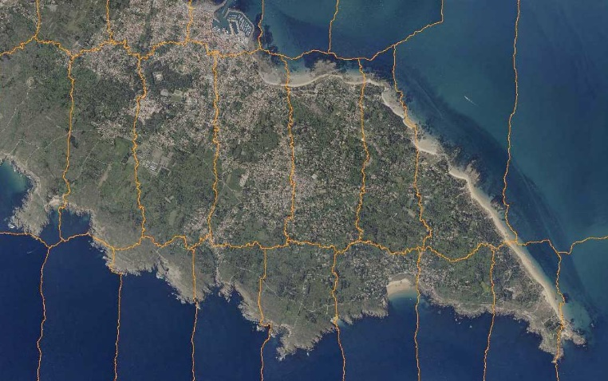

[.text-center]
*Figure 5 – mosaicked orthoimage with seamlines*

The temporal extent of a mosaic cannot be more accurate than a time interval since the images that constitute the sources are almost always acquired at different dates and times. However, a clear requirement from some users to access the exact date of each pixel within a mosaic has been identified in the use case survey. That is the reason why the orthoimagery application schema provides an approach to spatially indicate acquisition times through linking orthoimage pixels to the temporal attributes of the image sources. In practical terms, it is based on the use of the seamlines that have been created to perform mosaicking process (see 5.3.1.4.6).

===== Concept of tiling

Different motivations can lead data producers to break orthoimagery data into smaller parts. This process is usually known as "tiling". However, in fact, this term may encompass different meanings depending on the abstraction level of the description. Three main levels of tiling need to be distinguished:

Firstly, tiling may be internally implemented in file formats (e.g. tiled tiff). By rearranging image content into roughly square tiles instead of horizontally-wide strips, this method improves performances for accessing and processing high-resolution images. Since it basically reflects the storage structure of data, it does not appear in the application schema which is restricted to the conceptual level.

Secondly, high-resolution orthoimages covering broad territories represent large volumes of data that can often not be stored reasonably in a single image file. Data producers usually cut them out into separate individual files to facilitate their storage, distribution and use. The most common tiling scheme used in orthoimagery for this purpose is a simple rectangular grid where tiles edge-match without image overlaps or gaps (*Figure 6* a). However, it is sometimes required that the individual tiles overlap with their neighbours to ensure a certain spatial continuity when handling them (*Figure 6* b). The tiling scheme may also have a less regular geometry with a varying density of tiles (*Figure 6* c).

This file-based data structure is artificial and has no real logical meaning on its own even though it is usually based on grid elements. Therefore it is addressed in the encoding part of this data specification (see section 9.3).

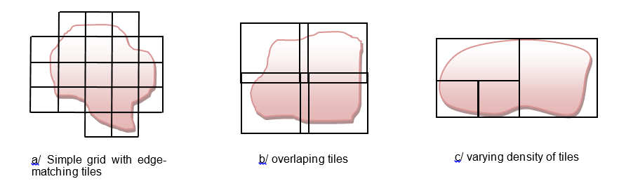

[.text/center]
*Figure 6 – various configurations of tiling scheme*

Third, large orthoimages can also be divided into subsets that make sense on their own as they describe logical structures (e.g. mapsheets, administrative units like regions or districts, etc.). Unlike the previous case, this type of file-independent tiling is fully in the scope of the conceptual model.

But pragmatically, a reverse view on tiling offers more possibilities and increase data harmonization: indeed, tiling can be seen as well as an aggregation process instead of a split process. So, a collection of orthoimage coverages can be aggregated to make up a larger single coverage. This has the advantages that:

* The input orthoimages may just partially contribute to the aggregated coverage.
* Consequently, the input orthoimages may spatially overlap whenever necessary.

This mechanism called "orthoimage aggregation" later in the document is described in more details below.

===== Data structure

A first data structure level is provided through the concept of coverage. In addition, the orthoimagery application schema offers a second level that consists in grouping coverages themselves in another logical structure. In other words, subsets from several homogeneous orthoimage coverages can be combined so that they build a new orthoimage coverage. The aggregated coverage does not hold directly its own pixel values. It just makes reference to its input coverages, thereby avoiding data duplication. The range set of the coverage is computed on the fly by a service or an application when requested by users.

For applicability, input and aggregated orthoimage coverages shall be part of the same orthoimagery dataset.

image::./media/image38.png[image]

[.text-center]
*Figure 7 – Orthoimage aggregation principle: overlapping orthoimage coverages A B and C compose the aggregated orthoimage coverage D, the bounding box of which is dotted.*

This mechanism is fully recursive so that an orthoimage coverage can itself be a composition of already-aggregated orthoimage coverages.

Note here that although their concepts are close, orthoimage aggregation and mosaicking differ: the former is not an extensive production process already achieved but a dynamic view to structure datasets.

<<<
===== UML Overview

image::./media/image8.png[image,width=604,height=703, align=center]

[.text-center]
*Figure 8 – UML class diagram: Overview of the <application schema name> application schema*

====== Feature type OrthoimageCoverage

The feature type _OrthoimageCoverage_ is the core element of the _Orthoimagery_ application schema. It is defined by the INSPIRE Directive as "geo-referenced image data of the earth's surface, from either satellite or airborne sensors". It may be derived from one single input image acquired by a sensor or from different input images that have been mosaicked together.

The class _OrthoimageCoverage_ specializes the imported type _RectifiedGridCoverage_ which is specified in the INSPIRE Generic Conceptual Model, _RectifiedGridCoverage_ being itself an implementation of continuous quadrilateral grid coverages defined by ISO 19123. It inherits five properties necessary to process the coverage:

* _domainSet_ defines the spatial domain of the orthoimage coverage, i.e. its geometry (See 5.3.1.4.2).

* _rangeType_ describes the characteristics of the range values (See 5.3.1.4.3).

* _rangeSet_ contains the feature attribute values associated with the grid points of the domain. All range values shall be of type _Integer_ and shall conform to the description provided by the attribute _rangetype_.

* _CoverageFunction_, whose value type is defined in the GCM [DS-D2.5], identifies the rules to be followed in assigning the range values to the grid points. These rules can be externally referenced through an URI (_CoverageFunction::ruleReference_) or directly detailed in the data set as free text (_CoverageFunction::ruleDefinition_) or as configurable elements (_CoverageFunction::gridFunction_). In the last option, the dataType _GridFunction_ identifies both the grid coordinates of the point associated with the first value in the rangeSet (_GridFunction::startPoint_) and the method for scanning grid points in the same order as the following range values (_GridFunction::sequenceRule_). The sequencing method, modeled with the ISO 19123 data type _CV_SequenceRule,_ is simply determined by its category, e.g. "linear", and a list of signed axis names indicating the order in which to jump to the next grid point.

* _metadata_ consists in a placeholder for additional metadata information a data provider decides to provide at a spatial object level (See 5.3.1.4.4).

For a more detailed description of these inherited attributes, see the section 9.9.4 of the Generic Conceptual Model [DS-D2.5].

The attributes _domainExtent_ and _interpolationType_ stemming from ISO 19123 complete the description of the coverage characteristics. They represent respectively the spatiotemporal extent of the coverage and the interpolation method recommended by the data provider for evaluating the coverage. The _domainExtent_ attribute of every _OrthoimageCoverage_ instance shall be at least populated with a subtype of the EX_GeographicExtent type, i.e. EX_BoundingPolygon, EX_GeographicBoundingBox or EX_GeographicDescription classes specified in ISO 19115.

Other attributes provide additional information about identification (_inspireId, name_), temporal aspects (_phenomenonTime, beginLifespanVersion,endLifespanVersion)_ and refined extent _(footprint_). The property _footprint_ of type GM_MultiSurface precisely delineates the geographic areas where the coverage range is of interest (e.g. no nil values).

image::./media/image9.png[image,width=240,height=163, align=center]

[.text-center]
*Figure 9 – footprint and bounding box of an orthoimage (respectively in blue and red)*

[IMPORTANT]
====
[.text-center]
*IR Requirement*
_Annex III, Section 3.5.2_
*Requirements for Orthoimage Coverages*

(...)

[arabic, start=2]
. The footprint of an OrthoimageCoverage instance shall be spatially included in its geographic extent that is described through the domainExtent property.

====

NOTE The inclusion is not necessarily strict, i.e. the footprint may be equal to the geographic extent.

====== Attribute OrthoimageCoverage::domainSet

The property _domainSet_ determines the spatial structure on which the coverage function applies, that is, for orthoimage coverages, a set of grid points, including their convex hull.

By inheritance from _RectifiedGridCoverage_, the value type is restricted to _CV_RectifiedGrid_. This ISO 19123 element allows defining the characteristics of the internal grid structure: the grid dimension, which is obviously constrained to two for orthoimagery (_CV_RectifiedGrid::dimension_), the extent which reports the extreme grid coordinates of the image (_CV_RectifiedGrid::extent_) and the names of the grid axes (_CV_RectifiedGrid::axisNames_).

In addition, _CV_RectifiedGrid_ carries the georeference of the orthoimage that consists of the location of the origin of the rectified grid (_CV_RectifiedGrid::origin_), the orientation and direction of the grid axes as well as the spacing between grid lines (_CV_RectifiedGrid::offsetVectors_), all expressed in an external coordinate reference system.

The identification of the coordinate reference system is ensured through the attribute _origin_ whose value type, Direct Position (specified in ISO 19107), offers an association to the class SC_CRS from ISO 19111. This association is mandatory in this specification.

By allowing different settings, ISO 19123 leaves it up to implementers to define their own grid coordinates systems. But, although providing plenty of flexibility, this possibility may lead to misinterpretations and consequently to non-interoperability. To prevent this, this data specification promotes the use of a common grid coordinate system for describing the domain of orthoimage coverages within INSPIRE.

[NOTE]
====
*Recomendation 6*

The grid origin, which is located at grid coordinates (0, 0), should be the upper left point of the orthoimage coverage.

====

[NOTE]
====
*Recomendation 7*

The grid axes should be called "x" and "y", considering that x axis extends to the right and y axis extends downwards.

====

NOTE These recommendations are based on the most widespread convention in orthoimagery.

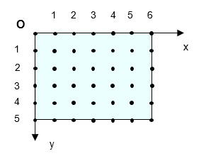

[.text-center]
*Figure 10 – recommended grid coordinate system*

====== Attribute OrthoimageCoverage::rangeType

The property _rangeType_ is devoted to the description of the range value structure of the coverage. It can be considered as technical metadata making easier the interpretation of the orthoimage content. RangeType is described in the Generic Conceptual Model with the basic type RecordType specified in ISO 19103. But it is encoded with the element DataRecord defined in the SWE Common [OGC 08-094r1], provided that the value attribute of the fields listed by the DataRecord is not used. Indeed, DataRecord must behave in this context like a descriptor without containing the actual data values themselves.

DataRecord is defined in [OGC 08-094r1] as "a composite data type composed of one to many fields, each of which having its own name and type definition".

In orthoimagery, DataRecord should correspond to the collection of bands or "channels" of the image. Each field specifying a given band should hold an instance of the data type Count, since the property measured by sensors is represented as digital numbers (DN) without explicit units of measure.

This rangeType representation allows a clear description of many usual orthoimage characteristics such as the number of bands (instance multiplicity of the attribute DataRecord::field), the bands identification (attribute Count::definition), the bands description (attribute Count::description), the number of bits per sample (attribute Count::constraint) or the list of no data values that are present in the coverage (Count::nilValues). NIL value elements identify the reserved values that are used to stand in for missing actual values, and indicate, for each one, the corresponding reason precisely (e.g. detection limit, security, etc.).

The data type Quantity can also be used instead of Count to describe integer values. But in this case, the unit of measure (Quantity::uom attribute) shall be specified. If the unit is not an integer multiple of a typical unit, a GML description that expresses for example a linear relationship with a basic unit (e.g. genus 1.536895 Wm 2.Sr-1  23) must be provided by reference through an URI.

EXAMPLE 1 The following XML extract shows how the rangeType of a 8-bits per band RGB image with a nil value of 255 can be encoded:

[source, xml]
<gmlcov:rangeType>
  <swe:DataRecord>
    <swe:field		name="red">
        <swe:Count	definition="http://inspire.jrc.ec.europa.eu/definition/Radiance">
            <swe:description>Radiance measured on red Channel</swe:description>
            <swe:nilValues>
                <swe:NilValues gml:id="NIL_VALUES">
                    <swe:nilValue reason="="http://inspire.jrc.ec.europa.eu/definition/nilValue">
                        255
                    </swe:nilValue>
                </swe:NilValues>
            </swe:nilValues>
            <swe:constraint>
                <swe:AllowedValues gml:id="VALUE_SPACE">
                    <swe:interval>0 255</swe:interval>
                </swe:AllowedValues>
            </swe:constraint>
        </swe:Count>
    </swe:field>
    <swe:field name="green">
         <swe:Count definition=" http://inspire.jrc.ec.europa.eu/definition/Radiance ">
             <swe:description> Radiance measured on green Channel</swel:description>
             <swe:nilValues xlink:href="#NIL_VALUES"/>
             <swe:constraint xlink:href="#VALUE_SPACE"/>
         </swe:Count>
    </swe:field>
    <swe:field name="blue">
        <swe:Count definition=" http://inspire.jrc.ec.europa.eu/definition/Radiance ">
            <swe:description> Radiance measured on blue Channel</swe:description>
            <swe:nilValues xlink:href="#NIL_VALUES"/>
            <swe:constraint xlink:href="#VALUE_SPACE"/>
        </swe:Count>
    </swe:field>
  </swe:DataRecord>
</gmlcov:rangeType>

EXAMPLE 2 This additional example illustrates how to describe the values of a 16-bits monochromatic image with the provision of a link to the associated physical measure:

[source, xml]
<gmlcov:rangeType>
  <swe:DataRecord>
    <swe:field		name="near-infrared">
        <swe:Quantity	definition="http://inspire.jrc.ec.europa.eu/definition/Radiance">
            <gml:description>Radiance measured on red Channel</gml:description>
            <swe:uom code=" http://inspire.jrc.ec.europa.eu/uom/NIR"/>
            <swe:constraint>
                <swe:AllowedValues>
                    <swe:interval>0 65535</swe:interval>
                    <swe:significantFigures>5</swe:significantFigures>
                </swe:AllowedValues>
            </swe:constraint>
        </swe:Quantity>
    </swe:field>
  </swe:DataRecord>
</gmlcov:rangeType>

====== Attribute OrthoimageCoverage::metadata

The property metadata can be used to provide additional information on an orthoimage coverage at spatial object level. The value type has been set to _any_ as default, to allow data providers to choose freely which metadata model to use. For proper use, however, the value type must be restricted, in extensions or application profiles, to any kind of data type defining an application-specific metadata structure.

As specified in _Guidelines for the use of Observations & Measurements and Sensor Web Enablement-related standards in INSPIRE Annex II and III data specification development_ [DS-D2.9] there are three classes that are suitable to provide metadata information within a coverage:

* MI_Metadata: acquisition source
* OM_Observation
* ObservingCapability

In this regard, it is worth to apply the OM_Observation class defined in ISO 19156 on which is based the metadata model used in another European Interoperability infrastructure, the GMES Space Component Data Access (GSCDA). In particular the model used is the Earth Observation application profile developed by OGC for satellite data defined in [OGC 10-157r3].

This application profile is specifically intended to provide detailed information on data acquisition (payload, sensor, acquisition time, illumination, elevation, or incidence), quality measurements (degradation, histograms, snow, cloud and quality mask) and processing procedure (product type, processors and algorithm used).

Should a data provider be willing to provide metadata information at spatial object level using the Observations and Measurements model, he has to follow the requirement below.

[IMPORTANT]
====
[.text-center]
*IR Requirement*
_Annex III, Section 3.5.2_
*Requirements for Orthoimage Coverages*

(...)

[arabic, start=3]
. The value type of the metadata property carried by the spatial object type OrthoimageCoverage shall be set to OM_Observation when using the Observation and Measurement metadata model defined in ISO 19156:2011.

====

Note OM_Observation is the root class for the Observations and Measurements model. Naturally this class can be substituted by any of the derived classes specified in the application profiles of Observations and Measurements, for instance the Earth Observation Metadata profile of Observations and Measurements [OGC 10-157r3].

Other application profile of OM_Observation model can be developed for domain specific purpose (e.g airborne Orthoimagery) starting from the specialised observation types defined in [DS-D2.9]. In particular, being the orthoimageCoverage class a subclass of RectifiedGridCoverage, the GridObservation specialisation should be used as it represent an observation having as result either a RectifiedGridCoverage or a ReferenceableGridCoverage. It is important to note that the specialisations provided in [DS-D2.9] are intended for the representation of data and not metadata, so they have to be properly adapted for this purpose. In particular the _result_ element of the GridObservation class should be omitted or modified in order to not impose the repletion of the coverage information already represented by the OrthoimageCoverage class in this data specification.

Under no circumstances the use of this property may exempt from reporting (mandatory) dataset-level metadata addressed in section 8.

====== OrthoimageCoverage aggregation

As stated in 5.3.1.3, an _OrthoimageCoverage_ instance can be an aggregation of other _OrthoimageCoverage_ instances. However certain conditions are required:

[IMPORTANT]
====
[.text-center]
*IR Requirement*
_Annex III, Section 3.5.2_
*Requirements for Orthoimage Coverages*

(...)

[arabic, start=4]
. All the OrthoimageCoverage instances to which an aggregated OrthoimageCoverage instance refers, shall be consistent. This means that they shall share the same range type, Coordinate Reference System and resolution. They shall also support grid alignment, i.e. the grid points in one OrthoimageCoverage instance line up with grid points of the other OrthoimageCoverage instances, so that grid cells do not partially overlap.

====

The data structure is implemented by the recursive UML aggregation linking the _OrthoimageCoverage_ class to itself. The _OrthoimageAggregation_ association class indicates through the _contributingFootprint_ attribute which geographic data areas of an input coverage are reused in the composed coverage.

[IMPORTANT]
====
[.text-center]
*IR Requirement*
_Annex III, Section 3.5.2_
*Requirements for Orthoimage Coverages*

(...)

[arabic, start=5]
. The contributing footprint of an OrthoimageCoverage instance referred by an aggregated OrthoimageCoverage instance shall be spatially included in its own footprint.

====

NOTE In other words, contributing footprints shall contain valid data areas.

image::./media/image9.jpeg[image,width=237,height=160, align=center]

[.text-center]
*Figure 11 – footprint and contributing footprint of an orthoimage referred by an aggregated orthoimage (respectively in blue and orange)*

[IMPORTANT]
====
[.text-center]
*IR Requirement*
_Annex III, Section 3.5.2_
*Requirements for Orthoimage Coverages*

(...)

[arabic, start=6]
. The contributing footprints of any two OrthoimageCoverage instances referred by the same aggregated OrthoimageCoverage instance shall be either adjacent or disjoint.

====

NOTE Two polygons are adjacent if they share one or more sides or portions of sides, without any interior point in common.

[IMPORTANT]
====
[.text-center]
*IR Requirement*
_Annex III, Section 3.5.2_
*Requirements for Orthoimage Coverages*

(...)

[arabic, start=7]
. The union of the contributing footprints of the OrthoimageCoverage instances referred to by the same aggregated OrthoimageCoverage instance shall determine the footprint of the aggregated OrthoimageCoverage instance.

====

The range set of an aggregated orthoimage coverage is directly determined by the range sets of the orthoimage coverages it refers to. Each grid point of the aggregated orthoimage coverage receives the range value of the orthoimage coverage the contributing footprint of which contains the given position. If the grid point is not located within the contributing footprint of any orthoimage coverage, it receives a nil value specified in the range type of the aggregated orthoimage coverage.

image::./media/image41.png[image]

[.text-center]
*Figure 12 – construction of the aggregated orthoimage coverage (footprint in blue) from subsets of the contributing orthoimage coverages (contributing footprints in orange)*

====== Feature types MosaicElement, SingleMosaicElement and AggregatedMosaicElement

The abstract feature type _MosaicElement_ provides users with the acquisition time of a part of a mosaiced orthoimage. It consists of an association between a time period (attribute _phenomenonTime)_ and a multi-surface (attribute _geometry_). As a spatial object type whose indirect instances may be referenced by other spatial objects, it also carries a unique object identifier (_inspireId_ attribute).

Acquisition time is usually supplied for each individual original image that contributes to a mosaic, since there is a natural relationship between the two notions. But it can refers as well to sets of input images sharing the same temporal extent. For example, input images may be grouped by dates of capture if hours, minutes and seconds are not specified. In order to distinguish between these two cases, _MosaicElement_ must be implemented through one of its subtypes, namely _SingleMosaicElement_ and _AggregatedMosaicElement_, depending on the mode selected.

_SingleMosaicElement_ links the acquisition date and time of a single input image to the contributing area, in the mosaic, of this same input image. Data providers may possibly give the reference of the image source through the attribute _imageSourceReference_. Whereas _AggregatedMosaicElement_ links the common capture time of several input images to the unified contributing area, in the mosaic, of these input images. In both cases, the geometry of the spatial object is constructed from the seamlines used to assemble the original images.

To maintain the clarity of the concepts, it is important not to mix objects of type _SingleMosaicElement_ and _AggregatedMosaicElement_ to describe a same mosaic of orthoimages.

[IMPORTANT]
====
[.text-center]
*IR Requirement*
_Annex III, Section 3.5.3_
*Requirements for mosaic elements*

. All the mosaic elements related to an OrthoimageCoverage instance shall be of the same type i.e. either _SingleMosaicElement_ or _AggregatedMosaicElement_.

====

NOTE An _AggregatedMosaicElement_ instance may refer to only one input image if at least one other _AggregatedMosaicElement_ instance associated to the same mosaic affects several input images.

image::./media/image42.png[image]

[.text-center]
*Figure 13 – two different representations of the temporal aspects of a same orthoimage mosaic. The footprint and the spatial extent of the orthoimage coverage are respectively drawn in blue and dashed red.*

[IMPORTANT]
====
[.text-center]
*IR Requirement*
_Annex III, Section 3.5.3_
*Requirements for mosaic elements*

(...)

[arabic, start=2]
. The geometries delineating any two _MosaicElement_ instances related to the same _OrthoimageCoverage_ instance shall be either adjacent or disjoint.

====

[IMPORTANT]
====
[.text-center]
*IR Requirement*
_Annex III, Section 3.5.3_
*Requirements for mosaic elements*

(...)

[arabic, start=3]
. The union of the geometries delineating all _MosaicElement_ instances related to the same _OrthoimageCoverage_ instance shall include its footprint and be contained in its geographic domain extent.

====

NOTE Mosaic elements form an exhaustive partition of the footprint of the related orthoimage coverage when their union is strictly equal to this footprint.

The use of the feature type _MosaicElement_ and its subtypes only makes sense for mosaiced orthoimage coverages. In the case where the orthoimage coverage derives from a single image, the _OrthoimageCoverage::phenomenonTime_ attribute should be sufficient to satisfy the user requirement.

[NOTE]
====
*Recomendation 8*

The use of the feature type _MosaicElement_ and its subtypes _SingleMosaicElement_ and _AggregatedMosaicElement_ should be restricted to the precise description of the temporal characteristics of mosaiced orthoimage coverages.

====

_MosaicElement_ instances may refer as well to aggregated orthoimage coverages if they are composed of mosaiced orthoimage coverages. In this particular case, mosaic elements are the result of a combination between the contributing footprints and the mosaic elements of the contributing orthoimage coverages. Typically, such mosaic elements will be pre-calculated and linked to the aggregated orthoimage coverage.

Data providers are free to choose the appropriate level(s) where to provide mosaic elements.

===== Consistency between spatial data sets

Consistency between data sets:

While an actual need to combine orthoimagery datasets exists, in practice, achieving geometrical consistency is complicated for at least three reasons:

* Spatial resolutions (i.e. Ground Sample Distances) must be strictly identical.

* Grid points (i.e. pixels) must be aligned.

* Edge-matching between orthoimagery datasets along local or national boundaries is mostly impossible to realize: the rectangular extent of orthoimages usually covers a territory larger than the real, rarely regular, area of interest and the superfluous area is often filled with radiometric information.

The technical characteristics mentioned above are defined in the existing data products specifications which are not harmonised across Europe. That is why the present INSPIRE data specification does not set out specific requirements to ensure consistency between orthoimagery data sets.

However, it comes up with a solution for pan-European and cross-border use cases by establishing a common European grid for raster data (see Annex C). Note that the issue of edge-matching along boundaries is not addressed given its complexity due to the wide variety of use cases.

Consistency with other themes at the same level of detail:

Orthoimagery data implicitly contain rich semantic information making it reference data for most of other INSPIRE themes. Besides, orthoimages are very often used as background for extracting or displaying spatial objects from other themes (e.g. hydrography, cadastral parcels, land cover, geology etc.).

This requires a certain level of geometrical consistency so that thematic spatial objects and expected semantic content of the orthoimage may match within the limits of the sum of their respective accuracy. In particular, one must keep in mind that the characteristics of the Digital Elevation Model used for the rectification process (e.g. surface type or resolution) directly determine the consistency or inconsistency between this theme and the others. For example, above-ground objects like buildings may appear geometrically shifted from the orthoimage if a Digital Terrain Model, that only represents the topographic surface of the land floor, was used. However, as the thematic content of orthoimages is implicit and not interpreted, it is not possible to identify relevant consistency rules.

===== Identifier management

Each OrthoimageCoverage object shall receive a unique external identifier as specified in the Generic Conceptual Model [DS-D2.5]. This identifier is carried by the inspireId attribute.

The version identifier property of the INSPIRE base type _Identifier_ allows to distinguish between the different versions of the orthoimages. In this data specification, the concept of 'version' is restricted to the reprocessing of orthoimages using the same input images in order to correct the former data (see 5.3.1.9).

Note that national agencies often use the term 'version' in a different meaning than above:

* As a code to describe what production process has been used to create the orthoimage (e.g. a reference to the product specification).

* As an edition/revision code to describe how many times an orthoimagery product has been made on a specific area with different sets of images acquired at different dates.

These codes are not a part of life-cycle information as understood by INSPIRE. But they may be introduced in the local identifier included in the INSPIRE identifier or in the discovery metadata as lineage elements.

[IMPORTANT]
====
[.text-center]
*IR Requirement*
_Annex III, Section 3.5.1_
*Requirements on external object identifiers*

. If an orthoimage is updated based on new source data, the updated objects shall receive a new external object identifier.

====

===== Modelling of object references

Object referencing, as described in the Generic conceptual Model [DS-D2.5] clause 13, is not applied in the _Orthoimagery_ Application Schema.

However, the device of orthoimages aggregation takes a similar approach within a single dataset in the sense that it prevents data duplication by sharing common feature attributes: aggregated orthoimages reference their contributing orthoimages using the unique INSPIRE identifier provided.

===== Geometry representation

Given the nature of orthoimagery data, only two-dimensional geometries can be supported by orthoimagery spatial objects.

[IMPORTANT]
====
[.text-center]
*IR Requirement*
_Annex III, Section 3.5.4_
*Requirements on reference systems*

. Data theme _Orthoimagery_ shall be restricted to two-dimensional geometries.

====

===== Temporality representation

A change of version should occur only when the orthoimage is reprocessed using the same input images from the same dates, for example to correct geometrical or radiometrical defects, to take into account an improved or modified Digital Elevation Model or when an enhanced processing algorithm is available.

This data specification does not attach the notion of version to the real world objects or the geographic areas depicted in orthoimages. For example, the same region can appear on different orthoimage coverages that do not constitute, however, the successive versions of a same coverage. Even though an orthoimage contains an infinity of features that can potentially be extracted, it is simpler to consider it as a single feature that is the result of the observation of real world phenomena by a sensor, at a specific time. Thus, a new acquisition campaign over a given area is rather a new observation than an update (i.e. a new version) and it is difficult to see an orthoimage resulting from this new capture as being the same spatial object as the previous orthoimage on the same area, especially if extents or footprints do not match. Therefore, an orthoimage that has been derived from new input image data will be a new spatial object, with a new external object identifier.

In addition, the application schema includes the time of data capture. Such information is very useful to the users as it provides the temporal characteristics of the depicted scene, which is a fundamental component for understanding the content of orthoimages. Moreover, in the context of data maintenance, this temporal element provides a simple distinction between the different revisions of an orthoimage coverage over a same area.

For these reasons, information about the acquisition time of the data contained in orthoimages is required through a constraint, at least in one of the following ways:

* By filling in the attribute _phenomenonTime_ of the feature type _OrthoimageCoverage_.
* By filling in the attributes _phenomenonTime_ of the feature type _MosaicElement_.

[NOTE]
====
*Recomendation 9*

Whenever used, the attributes phenomenonTime carried by the feature types _OrthoimageCoverage_ and _MosaicElement_ should at least be filled with the year(s), the month(s) and the date(s) of the data acquisition.

====

==== Feature catalogue

*Feature catalogue metadata*

[cols=","]
|===
|Application Schema |INSPIRE Application Schema Orthoimagery
|Version number |3.0
|===

*Types defined in the feature catalogue*

[cols=",,",options="header",]
|===
|*Type* |*Package* |*Stereotypes*
|_AggregatedMosaicElement_ |Orthoimagery |«featureType»
|_InterpolationMethodValue_ |Orthoimagery |«codeList»
|_MosaicElement_ |Orthoimagery |«featureType»
|_OrthoimageAggregation_ |Orthoimagery |«dataType»
|_OrthoimageCoverage_ |Orthoimagery |«featureType»
|_SingleMosaicElement_ |Orthoimagery |«featureType»
|===

===== Spatial object types

====== AggregatedMosaicElement

[cols="",options="header",]
|===
|*AggregatedMosaicElement*
a|
[cols=","]
!===
!Name: !aggregated mosaic element
!Subtype of: !MosaicElement
!Definition: !Mosaic element relating to several input images that share the same acquisition time at a given level of definition (e.g. day, month).
!Description: !NOTE The geometry of an aggregated mosaic element corresponds to the union of the contributing areas, in the mosaic, of several input images.
!Stereotypes: !«featureType»
!===

|===

====== MosaicElement

[cols="",options="header",]
|===
|*MosaicElement (abstract)*
a|
[cols=","]
!===
!Name: !mosaic element
!Definition: !Abstract type identifying both the contributing area and the acquisition time of one or several input images used to generate a mosaicked orthoimage coverage.
!Description: !NOTE The main purpose of this feature type is the provision of a mechanism for describing the spatial distribution of the acquisition dates and times over a mosaicked orthoimage. The acquisition time can be supplied either for each individual input image, or for sets of input images grouped together according to temporal criteria.
!Stereotypes: !«featureType»
!===

a|
*Attribute: inspireId*

[cols=","]
!===
!Name: !inspire identifier
!Value type: !Identifier
!Definition: !External object identifier of the spatial object.
!Description: !NOTE 1 An external object identifier is a unique object identifier published by the responsible body, which may be used by external applications to reference the spatial object. The identifier is an identifier of the spatial object, not an identifier of the real-world phenomenon. 
 
NOTE 2 This property should be used to reference indirect MosaicElement instances from Orthoimage instances unambiguously.
!Multiplicity: !0..1
!===

a|
*Attribute: geometry*

[cols=","]
!===
!Name: !geometry
!Value type: !GM_MultiSurface
!Definition: !Geometric representation spatially delineating the date and time of acquisition of the several input images that contribute to the final mosaic.
!Description: !NOTE The boundaries of the geometries are commonly based on the seamlines used for the mosaicking process.
!Multiplicity: !1
!===

a|
*Attribute: phenomenonTime*

[cols=","]
!===
!Name: !phenomenon time
!Value type: !TM_Period
!Definition: !Description of the observation/acquisition extent in time of the input image(s).
!Description: !NOTE 1 This temporal extent refers to the interval of time in wich the input image(s) was/were acquired by the sensor. 
 
NOTE 2 When the acquisition is considered as instantaneous, despite the exposure time, the end date and time can be identical to the begin date and time. 
 
EXAMPLE 1 begin: 2011-10-30 end: 2011-10-30 
 
EXAMPLE 2 begin: 2011-06-07T14:31:02Z end: 2011-06-07T16:10:54Z.
!Multiplicity: !1
!===

|===

====== OrthoimageCoverage

[cols="",options="header",]
|===
|*OrthoimageCoverage*
a|
[cols=","]
!===
!Name: !orthoimage coverage
!Subtype of: !RectifiedGridCoverage
!Definition: !Raster image of the Earth surface that has been geometrically corrected ("orthorectified") to remove distortion caused by differences in elevation, sensor tilt and, optionally, by sensor optics.
!Description: !NOTE 1 An orthoimage coverage is a continuous coverage based on a rectified quadrilateral grid. It is provided with an interpolation method to evaluate value records at any direct position within its domain. 
 
NOTE 2 An orthoimage coverage can be derived from one single input image or from different input images which have been mosaicked and merged together. 
 
NOTE 3 An orthoimage coverage may be an aggregation of subsets extracted from other orthoimage coverages. For the avoidance of data duplication, this kind of aggregated orthoimage is dynamically constructed thanks to references to the contributing orthoimage coverages .
!Stereotypes: !«featureType»
!===

a|
*Attribute: inspireId*

[cols=","]
!===
!Name: !inspire identifier
!Value type: !Identifier
!Definition: !External object identifier of the spatial object.
!Description: !NOTE An external object identifier is a unique object identifier published by the responsible body, which may be used by external applications to reference the spatial object. The identifier is an identifier of the spatial object, not an identifier of the real-world phenomenon.
!Multiplicity: !1
!===

a|
*Attribute: domainExtent*

[cols=","]
!===
!Name: !domain extent
!Value type: !EX_Extent
!Definition: !Extent of the spatiotemporal domain of the coverage.
!Description: !SOURCE [ISO 19123] 
 
NOTE 1 The data type EX_Extent is defined in ISO 19103. Extents may be specified in both space and time. 
 
NOTE 2 The domain extent shall be specified in space at least by using a subtype of EX_GeographicExtent (EX_BoundingPolygon, EX_GeographicBoundingBox or EX_GeographicDescription). The whole geographic extent of the orthoimage coverage is affected, including areas where grid points hold nil reason values.
!Multiplicity: !1..*
!===

a|
*Attribute: footprint*

[cols=","]
!===
!Name: !footprint
!Value type: !GM_MultiSurface
!Definition: !Geographic area enclosing valid data of the orthoimage coverage.
!Description: !NOTE 1 The footprint shall be enclosed in the geographic domain extent that it refines. 
 
NOTE 2 This property is mandatory if the OrthoimageCoverage instance is an aggregation of other OrthoimageCoverage instances or if mosaic elements are provided.
!Multiplicity: !1
!Stereotypes: !«voidable»
!===

a|
*Attribute: interpolationType*

[cols=","]
!===
!Name: !interpolation type
!Value type: !InterpolationMethodValue
!Definition: !Mathematical method which shall be used to evaluate a continuous coverage, i.e. determine the values of the coverage at any direct position within the domain of the coverage.
!Description: !NOTE 1 Nearestneighbor is set as a default value in case where this information is omitted by data producers. 
 
NOTE 2 A continuous grid coverage that uses nearest neighbour interpolation acts as a discrete surface coverage.
!Multiplicity: !1
!===

a|
*Attribute: name*

[cols=","]
!===
!Name: !name
!Value type: !CharacterString
!Definition: !Free text name of the orthoimage coverage.
!Description: !NOTE This field is intended to hold a name that a data provider may use in addition to the inspire identifier 
 
EXAMPLE 1 "Orthofoto's, middenschalig, kleur, provincie Limburg, opname 2011" is the name used by the Flemish Geographic Information Agency (AGIV) to indicate the OrthoImageCoverage Instance holding the orthophotomosaic covering the administrative unit 'provincie Limburg' at a resolution of 25 cm 'middenschalig' acquired in the year 2011 'opname 2011' 
 
EXAMPLE 2 "BDOrtho coverage on Savoie at 50 cm - 2011" could be the name of an OrthoimageCoverage instance corresponding to a subset of the BDOrtho product of IGN France, the orthophoto of the "department" Savoie (an administrative unit) at a resolution of 50 cm.
!Multiplicity: !0..1
!Stereotypes: !«voidable»
!===

a|
*Attribute: phenomenonTime*

[cols=","]
!===
!Name: !phenomenon time
!Value type: !TM_Period
!Definition: !Description of the observation/acquisition extent in time.
!Description: !NOTE 1 This temporal extent refers to the range in time in which the image(s) contributing to the orthoImage coverage has/have been acquired. 
 
NOTE 2 When the acquisition is considered as instantaneous, despite the exposure time, the end date and time can be identical to the begin date and time. 
 
EXAMPLE 1 begin: 2011-10-30 end: 2011-10-30 
 
EXAMPLE 2 begin: 2011-06-07T14:31:02Z end: 2011-06-07T16:10:54Z.
!Multiplicity: !0..1
!Stereotypes: !«voidable»
!===

a|
*Attribute: beginLifespanVersion*

[cols=","]
!===
!Name: !begin lifespan version
!Value type: !TM_Position
!Definition: !Temporal position at which this version of the spatial object was inserted or changed in the spatial data set.
!Description: !NOTE Since this information is not always automatically recorded by a system, but can be captured manually, the provision of the time is not required here. That is the reason why TM_Position was chosen as value type instead of DateTime, which is, however, commonly used in other INSPIRE data specifications.
!Multiplicity: !1
!Stereotypes: !«voidable,lifeCycleInfo»
!===

a|
*Attribute: endLifespanVersion*

[cols=","]
!===
!Name: !end lifespan version
!Value type: !TM_Position
!Definition: !Temporal position at which this version of the spatial object was superseded or retired from the spatial data set.
!Description: !NOTE Since this information is not always automatically recorded by a system, but can be captured manually, the provision of the time is not required here. That is the reason why TM_Position was chosen as value type instead of DateTime, which is, however, commonly used in other INSPIRE data specifications.
!Multiplicity: !0..1
!Stereotypes: !«voidable,lifeCycleInfo»
!===

a|
*Association role: contributingOrthoimageCoverage [the association has additional attributes - see association class OrthoimageAggregation]*

[cols=","]
!===
!Value type: !OrthoimageCoverage
!Definition: !Reference to the orthoimage coverages that compose an aggregated orthoimage coverage.
!Multiplicity: !0..*
!===

a|
*Association role: mosaicElement*

[cols=","]
!===
!Value type: !MosaicElement
!Definition: !Spatial representation of the acquisition time of a mosaicked orthoimage coverage.
!Description: !NOTE This association shall be used only when the orthoimage coverage is a mosaic.
!Multiplicity: !0..*
!Stereotypes: !«voidable»
!===

a|
*Constraint: acquisitionTimeRequired*

[cols=","]
!===
!Natural language: !The acquisition time of the orthoimage coverage shall be provided through the phenomenonTime attribute or the mosaicElement association
!OCL: !inv: phenomenonTime->notEmpty() or mosaicElement->notEmpty()
!===

a|
*Constraint: domainDimensionIs2*

[cols=","]
!===
!Natural language: !The dimension of the grid used shall always be 2
!OCL: !inv: domainSet.dimension=2
!===

a|
*Constraint: domainExtentContainsGeographicElement*

[cols=","]
!===
!Natural language: !The domainExtent attribute shall be at least populated with a subtype of EX_GeographicExtent
!OCL: !inv: domainExtent.geographicElement->size()>=1
!===

a|
*Constraint: domainRequiresCRS*

[cols=","]
!===
!Natural language: !The coordinate reference system used to reference the grid shall be provided
!OCL: !inv: domainSet.origin.coordinateReferenceSystem->notEmpty()
!===

a|
*Constraint: identicalOffsetVectorsWithinOrthoimageAggregation*

[cols=","]
!===
!Natural language: !All the OrthoimageCoverage instances to which an aggregated OrthoimageCoverage instance refers shall share the same orientation of grid axes and the same grid spacing in each direction
!OCL: !Inv: contributingOrthoimageCoverage->forAll(v \| v.domainSet.offsetVectors = self.domainSet.offsetVectors)
!===

a|
*Constraint: originDimensionIs2*

[cols=","]
!===
!Natural language: !The origin of the grid shall be described in two dimensions
!OCL: !inv: domainSet.origin.dimension=2
!===

a|
*Constraint: rangeSetValuesAreOfTypeInteger*

[cols=","]
!===
!Natural language: !The values in the range set shall be described by the Integer type
!OCL: !inv: rangeSet->forAll(v \| v.oclIsKindOf(Integer))
!===

|===

====== SingleMosaicElement

[cols="",options="header",]
|===
|*SingleMosaicElement*
a|
[cols=","]
!===
!Name: !single mosaic element
!Subtype of: !MosaicElement
!Definition: !Mosaic element relating to a single input image.
!Description: !NOTE The geometry of a single mosaic element corresponds exactly to the contributing area, in the mosaic, of the single input image.
!Stereotypes: !«featureType»
!===

a|
*Attribute: imageSourceReference*

[cols=","]
!===
!Name: !image source reference
!Value type: !CharacterString
!Definition: !Reference to the input image.
!Description: !NOTE 1 There is no restriction on the nature of the input image. It can be raw or pre-processed or orthorectified, for instance. 
 
NOTE 2 modelling and delivery of input images lie outside the scope of the present specification. 
 
NOTE 3 Identifiers of the input images should be URIs in the "http" scheme (See D2.7) though full national or local codes are allowed. 
 
EXAMPLE: http://land.data.gov.uk/id/imagery/2011-5864726.
!Multiplicity: !0..1
!Stereotypes: !«voidable»
!===

|===

===== Data types

====== OrthoimageAggregation

[cols="",options="header",]
|===
|*OrthoimageAggregation (association class)*
a|
[cols=","]
!===
!Name: !orthoimage aggregation
!Definition: !Geometrical characteristics of the orthoimage aggregation.
!Stereotypes: !«dataType»
!===

a|
*Attribute: contributingFootprint*

[cols=","]
!===
!Name: !contributing footprint
!Value type: !GM_MultiSurface
!Definition: !Geometric representation delineating the geographic area of an orthoimage coverage that contributes to the aggregated orthoimage coverage.
!Multiplicity: !1
!===

|===

====== OrthoimageAggregation

[cols="",options="header",]
|===
|*OrthoimageAggregation (association class)*
a|
[cols=","]
!===
!Name: !orthoimage aggregation
!Definition: !Geometrical characteristics of the orthoimage aggregation.
!Stereotypes: !«dataType»
!===

a|
*Attribute: contributingFootprint*

[cols=","]
!===
!Name: !contributing footprint
!Value type: !GM_MultiSurface
!Definition: !Geometric representation delineating the geographic area of an orthoimage coverage that contributes to the aggregated orthoimage coverage.
!Multiplicity: !1
!===

|===

===== Code lists

====== InterpolationMethodValue

[cols="",options="header",]
|===
|*InterpolationMethodValue*
a|
[cols=","]
!===
!Name: !interpolation method value
!Definition: !List of codes that identify the interpolation methods which may be used for evaluating orthoimage coverages.
!Description: !NOTE 1 This INSPIRE-governed code list is derived from the code list CV_InterpolationMethod specified in ISO 19123. CV_InterpolationMethod is not used as such because not actually implemented. 
 
NOTE 2 Example values: nearestneighbor, bilinear, biquadratic, bicubic, etc...
!Extensibility: !none
!Identifier: !http://inspire.ec.europa.eu/codelist/InterpolationMethodValue
!Values: !The allowed values for this code list comprise only the values specified in the INSPIRE Registry.
!===

|===

===== Imported types (informative)

This section lists definitions for feature types, data types and code lists that are defined in other application schemas. The section is purely informative and should help the reader understand the feature catalogue presented in the previous sections. For the normative documentation of these types, see the given references.

====== CharacterString

[cols="",options="header",]
|===
|*CharacterString*
a|
[cols=","]
!===
!Package: !Text
!Reference: !Geographic information -- Conceptual schema language [ISO/TS 19103:2005]
!===

|===

====== EX_Extent

[cols="",options="header",]
|===
|*EX_Extent*
a|
[cols=","]
!===
!Package: !Extent information
!Reference: !Geographic information -- Metadata [ISO 19115:2003/Cor 1:2006]
!===

|===

====== GM_MultiSurface

[cols="",options="header",]
|===
|*GM_MultiSurface*
a|
[cols=","]
!===
!Package: !Geometric aggregates
!Reference: !Geographic information -- Spatial schema [ISO 19107:2003]
!===

|===

====== Identifier

[cols="",options="header",]
|===
|*Identifier*
a|
[cols=","]
!===
!Package: !Base Types
!Reference: !INSPIRE Generic Conceptual Model, version 3.4 [DS-D2.5]
!Definition: !External unique object identifier published by the responsible body, which may be used by external applications to reference the spatial object.
!Description: !NOTE1 External object identifiers are distinct from thematic object identifiers. 
 
NOTE 2 The voidable version identifier attribute is not part of the unique identifier of a spatial object and may be used to distinguish two versions of the same spatial object. 
 
NOTE 3 The unique identifier will not change during the life-time of a spatial object.
!===

|===

====== RectifiedGridCoverage

[cols="",options="header",]
|===
|*RectifiedGridCoverage*
a|
[cols=","]
!===
!Package: !Coverages (Domain and Range)
!Reference: !INSPIRE Data Specifications – Base Models – Coverage Types, version 1.0 [DS-D2.10.2]
!Definition: !Coverage whose domain consists of a rectified grid
!Description: !A rectified grid is a grid for which there is an affine transformation between the grid coordinates and the coordinates of a coordinate reference system. 
 
NOTE This type can be used for both discrete and continuous coverages.
!===

|===

====== TM_Period

[cols="",options="header",]
|===
|*TM_Period*
a|
[cols=","]
!===
!Package: !Temporal Objects
!Reference: !Geographic information -- Temporal schema [ISO 19108:2002/Cor 1:2006]
!===

|===

====== TM_Position

[cols="",options="header",]
|===
|*TM_Position*
a|
[cols=","]
!===
!Package: !Temporal Reference System
!Reference: !Geographic information -- Temporal schema [ISO 19108:2002/Cor 1:2006]
!===

|===

INSPIRE governed code lists are given in Annex C.

==== Externally governed code lists

The externally governed code lists included in this application schema are specified in the tables in this section.

<<<
== Reference systems, units of measure and grids

=== Default reference systems, units of measure and grid

The reference systems, units of measure and geographic grid systems included in this sub-section are the defaults to be used for all INSPIRE data sets, unless theme-specific exceptions and/or additional requirements are defined in section 6.2.

==== Coordinate reference systems

===== Datum

[IMPORTANT]
====
[.text-center]
*IR Requirement*
_Annex II, Section 1.2_
*Datum for three-dimensional and two-dimensional coordinate reference systems*

For the three-dimensional and two-dimensional coordinate reference systems and the horizontal component of compound coordinate reference systems used for making spatial data sets available, the datum shall be the datum of the European Terrestrial Reference System 1989 (ETRS89) in areas within its geographical scope, or the datum of the International Terrestrial Reference System (ITRS) or other geodetic coordinate reference systems compliant with ITRS in areas that are outside the geographical scope of ETRS89. Compliant with the ITRS means that the system definition is based on the definition of the ITRS and there is a well documented relationship between both systems, according to EN ISO 19111.

====

===== Coordinate reference systems

[IMPORTANT]
====
[.text-center]
*IR Requirement*
_Annex II, Section 1.3_
*Coordinate Reference Systems*

Spatial data sets shall be made available using at least one of the coordinate reference systems specified in sections 1.3.1, 1.3.2 and 1.3.3, unless one of the conditions specified in section 1.3.4 holds.

*1.3.1. Three-dimensional Coordinate Reference Systems*

* Three-dimensional Cartesian coordinates based on a datum specified in 1.2 and using the parameters of the Geodetic Reference System 1980 (GRS80) ellipsoid.

* Three-dimensional geodetic coordinates (latitude, longitude and ellipsoidal height) based on a datum specified in 1.2 and using the parameters of the GRS80 ellipsoid.

*1.3.2. Two-dimensional Coordinate Reference Systems*

* Two-dimensional geodetic coordinates (latitude and longitude) based on a datum specified in 1.2 and using the parameters of the GRS80 ellipsoid.

* Plane coordinates using the ETRS89 Lambert Azimuthal Equal Area coordinate reference system.

* Plane coordinates using the ETRS89 Lambert Conformal Conic coordinate reference system.

* Plane coordinates using the ETRS89 Transverse Mercator coordinate reference system.

*1.3.3. Compound Coordinate Reference Systems*

--
. For the horizontal component of the compound coordinate reference system, one of the coordinate reference systems specified in section 1.3.2 shall be used.

. For the vertical component, one of the following coordinate reference systems shall be used:
--

* For the vertical component on land, the European Vertical Reference System (EVRS) shall be used to express gravity-related heights within its geographical scope. Other vertical reference systems related to the Earth gravity field shall be used to express gravity-related heights in areas that are outside the geographical scope of EVRS.

* For the vertical component in the free atmosphere, barometric pressure, converted to height using ISO 2533:1975 International Standard Atmosphere, or other linear or parametric reference systems shall be used. Where other parametric reference systems are used, these shall be described in an accessible reference using EN ISO 19111-2:2012.

* For the vertical component in marine areas where there is an appreciable tidal range (tidal waters), the Lowest Astronomical Tide (LAT) shall be used as the reference surface.

* For the vertical component in marine areas without an appreciable tidal range, in open oceans and effectively in waters that are deeper than 200 meters, the Mean Sea Level (MSL) or a well-defined reference level close to the MSL shall be used as the reference surface.

*1.3.4. Other Coordinate Reference Systems*

Exceptions, where other coordinate reference systems than those listed in 1.3.1, 1.3.2 or 1.3.3 may be used, are:
. Other coordinate reference systems may be specified for specific spatial data themes.

.  For regions outside of continental Europe, Member States may define suitable coordinate reference systems.

The geodetic codes and parameters needed to describe these other coordinate reference systems and to allow conversion and transformation operations shall be documented and an identifier shall be created in a coordinate systems register established and operated by the Commission, according to EN ISO 19111 and ISO 19127.
The Commission shall be assisted by the INSPIRE Commission expert group in the maintenance and update of the coordinate systems register.

====

The geodetic codes and parameters needed to describe these coordinate reference systems and to allow conversion and transformation operations shall be documented and an identifier shall be created, according to EN ISO 19111 and ISO 19127.

===== Display

[IMPORTANT]
====
[.text-center]
*IR Requirement*
_Annex II, Section 1.4_
*Coordinate Reference Systems used in the View Network Service*

For the display of spatial data sets with the view network service as specified in Regulation No 976/2009, at least the coordinate reference systems for two-dimensional geodetic coordinates (latitude, longitude) shall be available.

====

===== Identifiers for coordinate reference systems

[IMPORTANT]
====
[.text-center]
*IR Requirement*
_Annex II, Section 1.5_
*Coordinate Reference Systems used in the View Network Service*

. Coordinate reference system parameters and identifiers shall be managed in one or several common registers for coordinate reference systems.

. Only identifiers contained in a common register shall be used for referring to the coordinate reference systems listed in this Section.

====

This Technical Guidance proposes to use the http URIs provided by the Open Geospatial Consortium as coordinate reference system identifiers (see identifiers for the default CRSs in the INSPIRE coordinate reference systems register). These are based on and redirect to the definition in the EPSG Geodetic Parameter Registry (_http://www.epsg-registry.org/_).

[TIP]
====
*TG Requirement 2*

The identifiers listed in the INSPIRE coordinate reference systems register (https://inspire.ec.europa.eu/crs) shall be used for referring to the coordinate reference systems used in a data set.

====

NOTE CRS identifiers may be used e.g. in:

* data encoding,
* data set and service metadata, and
* requests to INSPIRE network services.

==== Temporal reference system

[IMPORTANT]
====
[.text-center]
*IR Requirement*
_Article 11_
*Temporal Reference Systems*

. The default temporal reference system referred to in point 5 of part B of the Annex to Commission Regulation (EC) No 1205/2008 (footnote:[OJ L 326, 4.12.2008, p. 12.]) shall be used, unless other temporal reference systems are specified for a specific spatial data theme in Annex II.

====

NOTE 1 Point 5 of part B of the Annex to Commission Regulation (EC) No 1205/2008 (the INSPIRE Metadata IRs) states that the default reference system shall be the Gregorian calendar, with dates expressed in accordance with ISO 8601.

NOTE 2 ISO 8601 _Data elements and interchange formats – Information interchange – Representation of dates and times_ is an international standard covering the exchange of date and time-related data. The purpose of this standard is to provide an unambiguous and well-defined method of representing dates and times, so as to avoid misinterpretation of numeric representations of dates and times, particularly when data is transferred between countries with different conventions for writing numeric dates and times. The standard organizes the data so the largest temporal term (the year) appears first in the data string and progresses to the smallest term (the second). It also provides for a standardized method of communicating time-based information across time zones by attaching an offset to Coordinated Universal Time (UTC).

EXAMPLE 1997 (the year 1997), 1997-07-16 (16^th^ July 1997), 1997-07-16T19:20:3001:00 (16^th^ July 1997, 19h 20' 30'', time zone: UTC1)

==== Units of measure

[IMPORTANT]
====
[.text-center]
*IR Requirement*
_Article 12_
*Other Requirements & Rules*

(...)

[arabic, start=2]
. All measurement values shall be expressed using SI units or non-SI units accepted for use with the International System of Units, unless specified otherwise for a specific spatial data theme or type.

====

==== Grids

[IMPORTANT]
====
[.tetx-center]
*IR Requirement*
_Annex II, Section 2.2_
*Grids*

Either of the grids with fixed and unambiguously defined locations defined in Sections 2.2.1 and 2.2.2 shall be used as a geo-referencing framework to make gridded data available in INSPIRE, unless one of the following conditions holds:

. Other grids may be specified for specific spatial data themes in Annexes II-IV. In this case, data exchanged using such a theme-specific grid shall use standards in which the grid definition is either included with the data, or linked by reference.

. For grid referencing in regions outside of continental Europe Member States may define their own grid based on a geodetic coordinate reference system compliant with ITRS and a Lambert Azimuthal Equal Area projection, following the same principles as laid down for the grid specified in Section 2.2.1. In this case, an identifier for the coordinate reference system shall be created.

*2.2 Equal Area Grid*

The grid is based on the ETRS89 Lambert Azimuthal Equal Area (ETRS89-LAEA) coordinate reference system with the centre of the projection at the point 52^o^ N, 10^o^ E and false easting: x~0~ = 4321000 m, false northing: y~0~ = 3210000 m.

The origin of the grid coincides with the false origin of the ETRS89-LAEA coordinate reference system (x=0, y=0).

Grid points of grids based on ETRS89-LAEA shall coincide with grid points of the grid.

The grid is hierarchical, with resolutions of 1m, 10m, 100m, 1000m, 10000m and 100000m.

The grid orientation is south-north, west-east.

The grid is designated as Grid_ETRS89-LAEA. For identification of an individual resolution level the cell size in metres is appended.

For the unambiguous referencing and identification of a grid cell, the cell code composed of the size of the cell and the coordinates of the lower left cell corner in ETRS89-LAEA shall be used. The cell size shall be denoted in metres ("m") for cell sizes up to 100m or kilometres ("km") for cell sizes of 1000m and above. Values for northing and easting shall be divided by 10^n^, where _n_ is the number of trailing zeros in the cell size value.

====

=== Theme-specific requirements and recommendations

==== Coordinate reference systems

To avoid any doubts, it is clearly stated here that all the spatial objects of a same INSPIRE _Orthoimagery_ dataset shall be made available in the same coordinate reference system, regardless of their type.

The two-dimensional nature of orthoimagery logically reduces the number of applicable coordinate reference systems in the list above.

[IMPORTANT]
====
[.text-center]
*IR Requirement*
_Annex III, Section 3.5.4_
*Requirements on reference systems*

(...)

[arabic, start=2]
. Only two-dimensional coordinate reference systems shall be used to represent INSPIRE orthoimagery data sets.

====

==== Grids

===== Geo-referencing of gridded data (coverages) into geographical grids

The geographic grids defined in the amendment of the _Commission Regulation (EU) No 1089/2010, of 23 November 2010, implementing Directive 2007/2/CE of the European Parliament and of the Council as regards interoperability of spatial data sets and services_, are modelled as a collection of surfaces (geographic grid cells) which are mutually exclusive and constitute an exhaustive partition of the full extent of the grid. This modelling approach has mainly three advantages:

* It provides an harmonised framework for the definition of geographical grids in INSPIRE, which is consistent with the Equal Area Grid (Grid_ETRS89-LAEA) already proposed during the INSPIRE Annex I process.

* It is suited for this purpose, since the geographic grid cells are widely used to organize geographic data set series as a partition of map units (e.g. map sheets) covering a specific geographic area.

* Do not prevent widening the potential usages of the geographic grid in the future, since the geographic grid is independent from theme-specific data structures (such as the grid coverages used in _Orthoimagery_).

Despite those geographic grids are not formally defined as coverages according ISO 19123:2005 (_Geographic information – Schema for coverage geometry and functions_), the concept utilized for their definition is consistent with the domain of a discrete surface coverage (CV_DiscreteSurfaceCoverage) as defined in such a standard.

In contrast, gridded data files (from now on, coverages) are defined in INSPIRE as a network composed of two sets of equally spaced parallel lines that intersect at right angles, where the intersection points (to which the range values of the coverage are assigned) are designated grid points, i.e. a mesh of points.

This situation makes necessary to explicit the rules governing geo-referencing or alignment of grid coverages to those geographic grids.

[IMPORTANT]
====
[.text-center]
*IR Requirement*
_Annex I, Section 6.2.1.2_
*Rectified Grid Coverage (RectifiedGridCoverage)*

(...)

Grid points of a RectifiedGridCoverage shall coincide with the centres of cells of the geographical grids defined in Section 2.2 of Annex II of the IR at any resolution level.

====

image::./media/image17.jpeg[GridCoverage_GeoGrid_Alignment_example,width=623,height=444]

[.text-center]
*Figure 14 – Example: Detail showing the alignment of Orthoimagery grid coverages to a geographic grid*

NOTE As for the geographical grid defined in Annex C.2 of this specification (Zoned Geographic Grid), the previous alignment rule implicitly clarifies the _Orthoimagery_ gridded data values (included in grid coverages) that belong to each zone of the geographic grid. In other words, the rule avoids duplicity of values in the borders of the geographic grid zones.

===== Geographical grids for Gridded Orthoimagery data

[IMPORTANT]
====
[.text-center]
*IR Requirement*
_Annex III, Section 3.5.2_
*Requirements for Orthoimage Coverages*

. By way of derogation from the requirement in Section 2.2 of Annex II, any grid compatible with one of the following coordinate reference systems may be used for making gridded _Orthoimagery_ data available:

* two-dimensional geodetic coordinates (latitude and longitude) based on a datum specified in Section 1.2 of Annex II and using the parameters of the GRS80 ellipsoid;

* plane coordinates using the ETRS89 Lambert Conformal Conic coordinate reference system;

* plane coordinates using the ETRS89 Transverse Mercator coordinate reference system.

The grid specified in Section 2.2.1 of Annex II shall not be used
====

Whereas most _Orthoimagery_ applications may be solved using datasets based on existing national grids compliant with the requirement above, there is a need to properly combine gridded data in order to satisfy cross-border use-cases (e.g. flooding management and emergency response). This implies the utilization of a common grid which avoids the problems caused by the fact of using different map projections and geographic grid properties which affect the proper alignment of grid coverage cells. Making available this kind of data using ETRS89-GRS80 geodetic coordinates according to a common geographic grid is a possible solution to the problem. Annex C.1 in this document further explains the need to establish such a common geographic grid.

The geographic grid defined in Annex C.2 (Grid_ETRS89-GRS80zn) is designed for this specific purpose. This grid is recommended as a geo-referencing framework for the provision of Pan-European gridded Orthoimagery data sets within the continental part of Europe (geographical scope of ETRS89) in order to obtain continuous-seamless data.

[NOTE]
====
*Recommendation 10* 

Gridded data related to the _Orthoimagery_ theme in areas within the scope of ETRS89 should be at least made available using geodetic coordinates based on the Zoned Geographic Grid (specified in Annex C.2). This geographic grid may be used as a geo-referencing framework for the _Orthoimagery_ theme data sets in order to avoid interoperability problems in cross-border areas.
====

The use of map projections may be needed in order to properly visualize the data in a specific geographical area. However, this can be performed in a subsequent process whereas data is geometrically continuous and provided in geodetic coordinates at pan-European level. Therefore it will be necessary to perform on-the-fly re-projections to transform from the source coordinate reference system (in which data is stored) to the one chosen for display.

It is worth mentioning here that the most direct way to provide raster data sets through a download service according the previous recommendation would be to store them at data sources using geodetic coordinates based on the Grid_ETRS89-GRS80_zn. This would make possible downloading the original harmonised data free of any additional transformation.

In the future, production of _Orthoimagery_ data sets could be based on the common Grid_ETRS89-GRS80_zn instead of national grids, since the unavoidable transformation between the grids has an inherent loss of quality.

The planar representation of geodetic coordinates introduces unusual distortions as the latitude parameter increases in each zone, as a result of the convergence of meridians. Particularly, the longitude axis is rescaled causing a stretching of the grid in the WE direction when it is represented in geodetic coordinates (visually this is perceived as if the grid was flattened in the NS direction).

EXAMPLE While 1 arcsecond in longitude corresponds approximately to 31 meters at the Equator, it corresponds to 25 meters in Gibraltar (southern part of Spain - latitude 35 degrees) and only to 10 meters in North Cape (North Scandinavia - latitude 71 degrees).

Therefore, for the visualization of such data sets it is recommended the use of any map projection which is suitable to the specific geographical area to be rendered as it is allowed by the _Regulation (EU) No 1089/2010, of 23 November 2010, on interoperability of spatial data sets and services_.

Consequently, _on-the-fly_ projection transformations are needed for view services serving these data sets.

[NOTE]
====
*Recommendation 11*

Real time re-projection is recommended for the view services serving gridded Orthoimagery data sets aimed at satisfying global purposes and based on any grid compatible with this specification__.__
====

<<<
== Data quality

This chapter includes a description of the data quality elements and sub-elements as well as the corresponding data quality measures that should be used to evaluate and document data quality for data sets related to the spatial data theme _Orthoimagery_ (section 7.1).

It may also define requirements or recommendations about the targeted data quality results applicable for data sets related to the spatial data theme _Orthoimagery_ (sections 7.2 and 7.3).

In particular, the data quality elements, sub-elements and measures specified in section 7.1 should be used for

* evaluating and documenting data quality properties and constraints of spatial objects, where such properties or constraints are defined as part of the application schema(s) (see section 5);

* evaluating and documenting data quality metadata elements of spatial data sets (see section 8); and/or

* specifying requirements or recommendations about the targeted data quality results applicable for data sets related to the spatial data theme _Orthoimagery_ (see sections 7.2 and 7.3).

The descriptions of the elements and measures are based on Annex D of ISO/DIS 19157 Geographic information – Data quality.

=== Data quality elements

Table 3 lists all data quality elements and sub-elements that are being used in this specification. Data quality information can be evaluated at level of spatial object, spatial object type, dataset or dataset series. The level at which the evaluation is performed is given in the "Evaluation Scope" column.

The measures to be used for each of the listed data quality sub-elements are defined in the following sub-sections.

[.text-center]
*Table 3 – Data quality elements used in the spatial data theme _Orthoimagery_*

[cols=",,,,",]
|===
|*Section* |*Data quality element* |*Data quality sub-element* |*Definition* |*Evaluation Scope*
|7.1.1 |Completeness |Omission |data absent from the dataset, as described by the scope |spatial object type
|7.1.2 |Positional accuracy |Gridded data position accuracy |closeness of gridded data position values to values accepted as or being true |dataset series; dataset; spatial object type;
|===

[NOTE]
====
*Recomendation 12*

Where it is impossible to express the evaluation of a data quality element in a quantitative way, the evaluation of the element should be expressed with a textual statement as a data quality descriptive result.

====

==== Completeness – Omission

[NOTE]
====
*Recomendation 13*

Omission should be evaluated and documented using Rate of missing items as specified in the tables below.

====

[cols=",",]
|===
|*Name* |*Rate of missing items*
|Alternative name |–
|Data quality element |Completeness
|Data quality sub-element |Omission
|Data quality basic measure |Error rate
|Definition |Number of missing items in the dataset in relation to the number of items that should have been present.
|Description |This data quality measure provides an assessment of the rate of pixels with at least a nil value in one band of the orthoimage. It should apply only on the areas of interest of the orthoimage, i.e. within the boundary of the footprint of the orthoimage. 
The data provider is expected to describe the nillvalue reason (e.g. cloud coverage, military restriction, ...) within the attribute rangeType.
|Evaluation scope |spatial object type: OrthoimageCoverage
|Reporting scope |data set
|Parameter |–
|Data quality value type |Real, percentage, ratio (example: 0,0189 ; 98,11% ; 11:582)
|Data quality value structure |Single value
|Source reference |ISO/DIS 19157 Geographic information – Data quality
|Example |–
|Measure identifier |7 (ISO/DIS 19157)
|===

==== Positional accuracy – Gridded data position accuracy

[NOTE]
====
*Recomendation 14*

Gridded data position accuracy should be evaluated and documented using root mean square error of planimetry or root mean square error in X or Y as specified in the tables below.

====

Gridded data position accuracy should be documented using root mean square error of planimetry and/or root mean square error in X or Y.

[cols=",",]
|===
|*Name* |*Root mean square error of planimetry*
|Alternative name |RMSEP
|Data quality element |Positional accuracy
|Data quality sub-element |Absolute or external accuracy
|Data quality basic measure |Not applicable
|Definition |radius of a circle around the given point, in which the true value lies with probability P
|Description a|
The true values of the observed coordinates _X_ and _Y_ are known as _xt_ and _yt._ From this the estimator

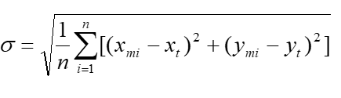

yields the linear root mean square error of planimetry RMSEP = σ

|Evaluation scope a|
Spatial object type: OrthoimageCoverage

data set

data set series

|Reporting scope a|
Spatial object type: OrthoimageCoverage

data set

data set series

|Parameter |–
|Data quality value type |measure
|Data quality value structure |Single value
|Source reference |ISO/DIS 19157 Geographic information – Data quality
|Example |–
|Measure identifier |47 (ISO/DIS 19157)
|===

[cols=",",]
|===
|*Name* |*Root mean square error in X or Y*
|Alternative name |RMSE-x or RMSE-y
|Data quality element |Positional accuracy
|Data quality sub-element |Absolute or external accuracy
|Data quality basic measure |One-dimensional random variable, Z
|Definition a|
Standard deviation where the true value is not estimated from the observations but known _a priori_.

X and Y are the two grid axis of the orthoimage.

|Evaluation scope a|
Spatial object type: OrthoimageCoverage

data set

data set series

|Reporting scope a|
Spatial object type: OrthoimageCoverage

data set

data set series

|Description a|
The true value of an observed coordinate _X_ or _Y_ are known as _xt_ or _yt._ From this the estimator

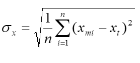

yields the linear root mean square error RMSE-x = σ__x__

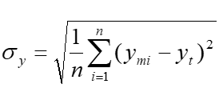

yields the linear root mean square error RMSE-y = σ__y__

|Parameter |–
|Data quality value type |measure
|Data quality value structure |Single value
|Source reference |ISO/DIS 19157 Geographic information – Data quality
|Example |–
|Measure identifier |Adapted from 39 (ISO/DIS 19157)
|===

NOTE

[IMPORTANT]
====
[.text-center]
*IR Requirement*
_Annex III, Section 3.5.5_
*Requirements on data quality*

. The measures "root mean square error in X" (RMSE-x) and "root mean square error in Y" (RMSE-y) shall be provided jointly when used to assess the gridded data position of orthoimagery data.

====

=== Minimum data quality requirements

No minimum data quality requirements are defined for the spatial data theme _Orthoimagery_.

=== Recommendation on data quality

[NOTE]
====
*Recomendation 15*

For the data quality elements listed in Table 4, all data sets related to the spatial data theme _Orthoimagery_ should meet the specified target results.

====

[.text-center]
*Table 4 – Recommended minimum data quality results for spatial data theme Orthoimagery*

[cols=",,,,",]
|===
|*Section* |*Data quality element and sub-element* |*Measure name(s* |*Target result(s* |*Condition*
|7.1.1 |Completeness – Omission |Rate of missing items |0% |The target result shall be met on the areas defined by the orthoimage footprints.
|===

<<<
== Dataset-level metadata

This section specifies dataset-level metadata elements, which should be used for documenting metadata for a complete dataset or dataset series.

NOTE Metadata can also be reported for each individual spatial object (spatial object-level metadata). Spatial object-level metadata is fully described in the application schema(s) (section 5).

For some dataset-level metadata elements, in particular those for reporting data quality and maintenance, a more specific scope can be specified. This allows the definition of metadata at sub-dataset level, e.g. separately for each spatial object type (see instructions for the relevant metadata element).

=== Metadata elements defined in INSPIRE Metadata Regulation

Table 5 gives an overview of the metadata elements specified in Regulation 1205/2008/EC (implementing Directive 2007/2/EC of the European Parliament and of the Council as regards metadata).

The table contains the following information:

* The first column provides a reference to the relevant section in the Metadata Regulation, which contains a more detailed description.
* The second column specifies the name of the metadata element.
* The third column specifies the multiplicity.
* The fourth column specifies the condition, under which the given element becomes mandatory.

[.text-center]
*Table 5 – Metadata for spatial datasets and spatial dataset series specified in Regulation 1205/2008/EC*

[cols=",,,",]
|===
|*Metadata Regulation Section* |*Metadata element* |*Multiplicity* |*Condition*
|1.1 |Resource title |1 |
|1.2 |Resource abstract |1 |
|1.3 |Resource type |1 |
|1.4 |Resource locator |0..* |Mandatory if a URL is available to obtain more information on the resource, and/or access related services.
|1.5 |Unique resource identifier |1..* |
|1.7 |Resource language |0..* |Mandatory if the resource includes textual information.
|2.1 |Topic category |1..* |
|3 |Keyword |1..* |
|4.1 |Geographic bounding box |1..* |
|5 |Temporal reference |1..* |
|6.1 |Lineage |1 |
|6.2 |Spatial resolution |0..* |Mandatory for data sets and data set series if an equivalent scale or a resolution distance can be specified.
|7 |Conformity |1..* |
|8.1 |Conditions for access and use |1..* |
|8.2 |Limitations on public access |1..* |
|9 |Responsible organisation |1..* |
|10.1 |Metadata point of contact |1..* |
|10.2 |Metadata date |1 |
|10.3 |Metadata language |1 |
|===

Generic guidelines for implementing these elements using ISO 19115 and 19119 are available at _http://inspire.jrc.ec.europa.eu/index.cfm/pageid/101_. The following sections describe additional theme-specific recommendations and requirements for implementing these elements.

==== Conformity

The _Conformity_ metadata element defined in Regulation 1205/2008/EC requires to report the conformance with the Implementing Rule for interoperability of spatial data sets and services. In addition, it may be used also to document the conformance to another specification.

[NOTE]
====
*Recomendation 16*

Dataset metadata should include a statement on the overall conformance of the dataset with this data specification (i.e. conformance with all requirements).

====

[NOTE]
====
*Recomendation 17*

The _Conformity_ metadata element should be used to document conformance with this data specification (as a whole), with a specific conformance class defined in the Abstract Test Suite in Annex A and/or with another specification.

====

The _Conformity_ element includes two sub-elements, the _Specification_ (a citation of the Implementing Rule for interoperability of spatial data sets and services or other specification), and the _Degree_ of conformity. The _Degree_ can be _Conformant_ (if the dataset is fully conformant with the cited specification), _Not Conformant_ (if the dataset does not conform to the cited specification) or _Not Evaluated_ (if the conformance has not been evaluated).

[NOTE]
====
*Recomendation 18*

If a dataset is not yet conformant with all requirements of this data specification, it is recommended to include information on the conformance with the individual conformance classes specified in the Abstract Test Suite in Annex A.

====

[NOTE]
====
*Recomendation 19*

If a dataset is produced or transformed according to an external specification that includes specific quality assurance procedures, the conformity with this specification should be documented using the _Conformity_ metadata element.

====

[NOTE]
====
*Recomendation 20*

If minimum data quality recommendations are defined then the statement on the conformity with these requirements should be included using the _Conformity_ metadata element and referring to the relevant data quality conformance class in the Abstract Test Suite.

====

NOTE Currently no minimum data quality requirements are included in the IRs. The recommendation above should be included as a requirement in the IRs if minimum data quality requirements are defined at some point in the future.

[NOTE]
====
*Recomendation 21*

When documenting conformance with this data specification or one of the conformance classes defined in the Abstract Test Suite, the _Specification_ sub-element should be given using the http URI identifier of the conformance class or using a citation including the following elements:

* title: "INSPIRE Data Specification on _Orthoimagery_ – Technical Guidelines – <name of the conformance class>"
* date:
** dateType: publication
** date: 2012-12-17

====

EXAMPLE 1: The XML snippets below show how to fill the _Specification_ sub-element for documenting conformance with the whole data specification on Addresses v3.0.1.

[source, xml]
<gmd:DQ_ConformanceResult>
	<gmd:specification href="http://inspire.ec.europa.eu/conformanceClass/ad/3.0.1/tg" />
	<gmd:explanation> (...) </gmd:explanation>
	<gmd:pass> (...) </gmd:pass>
</gmd:DQ_ConformanceResult>

or (using a citation):

[source, xml]
<gmd:DQ_ConformanceResult>
	<gmd:specification>
		<gmd:CI_Citation>
			<gmd:title>
				<gco:CharacterString>INSPIRE Data Specification on Orthoimagery – Technical Guidelines</gco:CharacterString>
			</gmd:title>
			<gmd:date>
				<gmd:date>
					<gco:Date>2012-12-17</gco:Date>
				</gmd:date>
				<gmd:dateType>
					<gmd:CI_DateTypeCode codeList="http://standards.iso.org/ittf/PubliclyAvailableStandards/ISO_19139_Schemas/resou
rces/Codelist/ML_gmxCodelists.xml#CI_DateTypeCode" codeListValue="publication">publication</gmd:CI_DateTypeCode>
				</gmd:dateType>
			</gmd:date>
		</gmd:CI_Citation>
	</gmd:specification>
	<gmd:explanation> (...) </gmd:explanation>
	<gmd:pass> (...) </gmd:pass>
</gmd:DQ_ConformanceResult>

EXAMPLE 2: The XML snippets below show how to fill the _Specification_ sub-element for documenting conformance with the CRS conformance class of the data specification on Addresses v3.0.1.

[source, xml]
<gmd:DQ_ConformanceResult>
	<gmd:specification href="http://inspire.ec.europa.eu/conformanceClass/ad/3.0.1/crs" />
	<gmd:explanation> (...) </gmd:explanation>
	<gmd:pass> (...) </gmd:pass>
</gmd:DQ_ConformanceResult>

or (using a citation):

[source, xml]
<gmd:DQ_ConformanceResult>
	<gmd:specification>
		<gmd:CI_Citation>
			<gmd:title>
				<gco:CharacterString>INSPIRE Data Specification on Orthoimagery – Technical Guidelines – CRS</gco:CharacterString>
			</gmd:title>
			<gmd:date>
				<gmd:date>
					<gco:Date>2012-12-17</gco:Date>
				</gmd:date>
				<gmd:dateType>
					<gmd:CI_DateTypeCode codeList="http://standards.iso.org/ittf/PubliclyAvailableStandards/ISO_19139_Schemas/resou
rces/Codelist/ML_gmxCodelists.xml#CI_DateTypeCode" codeListValue="publication">publication</gmd:CI_DateTypeCode>
				</gmd:dateType>
			</gmd:date>
		</gmd:CI_Citation>
	</gmd:specification>
	<gmd:explanation> (...) </gmd:explanation>
	<gmd:pass> (...) </gmd:pass>
</gmd:DQ_ConformanceResult>

==== Lineage

[NOTE]
====
*Recomendation 22*

Following the ISO/DIS 19157 Quality principles, if a data provider has a procedure for the quality management of their spatial data sets then the appropriate data quality elements and measures defined in ISO/DIS 19157 should be used to evaluate and report (in the metadata) the results. If not, the _Lineage_ metadata element (defined in Regulation 1205/2008/EC) should be used to describe the overall quality of a spatial data set.

====

According to Regulation 1205/2008/EC, lineage "is a statement on process history and/or overall quality of the spatial data set. Where appropriate it may include a statement whether the data set has been validated or quality assured, whether it is the official version (if multiple versions exist), and whether it has legal validity. The value domain of this metadata element is free text".

The Metadata Technical Guidelines based on EN ISO 19115 and EN ISO 19119 specifies that the statement sub-element of LI_Lineage (EN ISO 19115) should be used to implement the lineage metadata element.

[NOTE]
====
*Recomendation 23*

To describe the transformation steps and related source data, it is recommended to use the following sub-elements of LI_Lineage:

* For the description of the transformation process of the local to the common INSPIRE data structures, the LI_ProcessStep sub-element should be used.

* For the description of the source data the LI_Source sub-element should be used.
====

NOTE 1 In order to improve the interoperability, domain templates and instructions for using these free text elements (descriptive statements) may be specified here and/or in an Annex of this data specification.

Section 8.3 gives more details on how to complete the LI_ProcessStep and LI_Source sub-elements for the theme _Orthoimagery_.

==== Temporal reference

According to Regulation 1205/2008/EC, at least one of the following temporal reference metadata sub-elements shall be provided: temporal extent, date of publication, date of last revision, date of creation.

[NOTE]
====
*Recomendation 24*

It is recommended that at least the date of the last revision of a spatial data set should be reported using the _Date of last revision_ metadata sub-element.

====

=== Metadata elements for interoperability

[IMPORTANT]
====
[.text-center]
*IR Requirement*
_Article 13_
*Metadata required for Interoperability*

The metadata describing a spatial data set shall include the following metadata elements required for interoperability:

. Coordinate Reference System: Description of the coordinate reference system(s) used in the data set.

. Temporal Reference System: Description of the temporal reference system(s) used in the data set.
+
This element is mandatory only if the spatial data set contains temporal information that does not refer to the default temporal reference system.

. Encoding: Description of the computer language construct(s) specifying the representation of data objects in a record, file, message, storage device or transmission channel.

. Topological Consistency: Correctness of the explicitly encoded topological characteristics of the data set as described by the scope.
+
This element is mandatory only if the data set includes types from the Generic Network Model and does not assure centreline topology (connectivity of centrelines) for the network.

. Character Encoding: The character encoding used in the data set.
+
This element is mandatory only if an encoding is used that is not based on UTF-8.

. Spatial Representation Type: The method used to spatially represent geographic information.

====

This Technical Guidance proposes to implement the required metadata elements based on ISO 19115 and ISO/TS 19139.

The following TG requirements need to be met in order to be conformant with the proposed encoding.

[TIP]
====
*TG Requirement 3*

Metadata instance (XML) documents shall validate without error against the used ISO 19139 XML schema.

====

NOTE Section 2.1.2 of the Metadata Technical Guidelines discusses the different ISO 19139 XML schemas that are currently available.

[TIP]
====
*TG Requirement 4*

Metadata instance (XML) documents shall contain the elements and meet the INSPIRE multiplicity specified in the sections below.

====

[TIP]
====
*TG Requirement 5*

The elements specified below shall be available in the specified ISO/TS 19139 path.

====

[NOTE]
====
*Recomendation 25*

The metadata elements for interoperability should be made available together with the metadata elements defined in the Metadata Regulation through an INSPIRE discovery service.

====

NOTE While this not explicitly required by any of the INSPIRE Implementing Rules, making all metadata of a data set available together and through one service simplifies implementation and usability.

==== Coordinate Reference System

[%autowidth,options="header"]
|===
|*Metadata element name* |*Coordinate Reference System*
|Definition |Description of the coordinate reference system used in the dataset.
|ISO 19115 number and name |13. referenceSystemInfo
|ISO/TS 19139 path |referenceSystemInfo
|INSPIRE obligation / condition |mandatory
|INSPIRE multiplicity |1..*
|Data type(and ISO 19115 no.) |186. MD_ReferenceSystem
|Domain a|
To identify the reference system, the referenceSystemIdentifier (RS_Identifier) shall be provided.

NOTE More specific instructions, in particular on pre-defined values for filling the referenceSystemIdentifier attribute should be agreed among Member States during the implementation phase to support interoperability.

|Implementing instructions |
|Example a|
referenceSystemIdentifier:
 code: ETRS_89
 codeSpace: INSPIRE RS registry

|Example XML encoding a|
[source, xml]
<gmd:referenceSystemInfo>
		<gmd:MD_ReferenceSystem>
			<gmd:referenceSystemIdentifier>
				<gmd:RS_Identifier>
					<gmd:code>
						<gco:CharacterString>ETRS89 </gco:CharacterString>
					</gmd:code>
					<gmd:codeSpace>
						<gco:CharacterString>INSPIRE RS registry</gco:CharacterString>
					</gmd:codeSpace>
				</gmd:RS_Identifier>
			</gmd:referenceSystemIdentifier>
		</gmd:MD_ReferenceSystem>
</gmd:referenceSystemInfo>

|Comments |
|===

==== Temporal Reference System

[%autowidth,options="header"]
|===
|*Metadata element name* |*Temporal Reference System*
|Definition |Description of the temporal reference systems used in the dataset.
|ISO 19115 number and name |13. referenceSystemInfo
|ISO/TS 19139 path |referenceSystemInfo
|INSPIRE obligation / condition |Mandatory, if the spatial data set or one of its feature types contains temporal information that does not refer to the Gregorian Calendar or the Coordinated Universal Time.
|INSPIRE multiplicity |0..*
|Data type(and ISO 19115 no.) |186. MD_ReferenceSystem
|Domain a|
No specific type is defined in ISO 19115 for temporal reference systems. Thus, the generic MD_ReferenceSystem element and its reference SystemIdentifier (RS_Identifier) property shall be provided.

NOTE More specific instructions, in particular on pre-defined values for filling the referenceSystemIdentifier attribute should be agreed among Member States during the implementation phase to support interoperability.

|Implementing instructions |
|Example a|
referenceSystemIdentifier:
 code: GregorianCalendar
 codeSpace: INSPIRE RS registry
|Example XML encoding a|
[source, xml]
<gmd:referenceSystemInfo>
	<gmd:MD_ReferenceSystem>
		<gmd:referenceSystemIdentifier>
			<gmd:RS_Identifier>
				<gmd:code>
					<gco:CharacterString>GregorianCalendar</gco:CharacterString>
				</gmd:code>
				<gmd:codeSpace>
					<gco:CharacterString>INSPIRE RS registry</gco:CharacterString>
				</gmd:codeSpace>
			</gmd:RS_Identifier>
		</gmd:referenceSystemIdentifier>
	</gmd:MD_ReferenceSystem>
</gmd:referenceSystemInfo>

|Comments |
|===

==== Encoding

[%autowidth,options="header"]
|===
|*Metadata element name* |*Encoding*
|Definition |Description of the computer language construct that specifies the representation of data objects in a record, file, message, storage device or transmission channel
|ISO 19115 number and name |271. distributionFormat
|ISO/TS 19139 path |distributionInfo/MD_Distribution/distributionFormat
|INSPIRE obligation / condition |mandatory
|INSPIRE multiplicity |1
|Data type (and ISO 19115 no.) |284. MD_Format
|Domain |See B.2.10.4. The property values (name, version, specification) specified in section 5 shall be used to document the default and alternative encodings.
|Implementing instructions |
|Example a|
name: Orthoimagery GML application schema
version: version 3.0, GML, version 3.2.1
specification: D2.8.II.3 Data Specification on _Orthoimagery_ –
Technical Guidelines
|Example XML encoding a|
[source, xml]
<gmd:MD_Format>
					<gmd:name>
						<gco:CharacterString> Orthoimagery GML application schema </gco:CharacterString>
					</gmd:name>
					<gmd:version>
						<gco:CharacterString>3.0, GML, version 3.2.1</gco:CharacterString>
					</gmd:version>
					<gmd:specification>
						<gco:CharacterString>D2.8.II.3 Data Specification on Orthoimagery –
Technical Guidelines</gco:CharacterString>
					</gmd:specification>
</gmd:MD_Format>

|Comments |
|===

==== Character Encoding

[%autowidth,options="header"]
|===
|*Metadata element name* |*Character Encoding*
|Definition |The character encoding used in the data set.
|ISO 19115 number and name |
|ISO/TS 19139 path |
|INSPIRE obligation / condition |Mandatory, if an encoding is used that is not based on UTF-8.
|INSPIRE multiplicity |0..*
|Data type (and ISO 19115 no.) |
|Domain |
|Implementing instructions |
|Example |-
|Example XML encoding a|
[source, xml]
<gmd:characterSet>
				<gmd:MD_CharacterSetCode codeListValue="8859part2" codeList="http://standards.iso.org/ittf/PubliclyAvailableStandards/ISO_19139_Schemas/resources/Codelist/ML_gmxCodelists.xml#CharacterSetCode">8859-2</gmd:MD_CharacterSetCode>
</gmd:characterSet>

|Comments |
|===

==== Spatial representation type

[%autowidth,options="header"]
|===
|*Metadata element name* |*Spatial representation type*
|Definition |The method used to spatially represent geographic information.
|ISO 19115 number and name |37. spatialRepresentationType
|ISO/TS 19139 path |
|INSPIRE obligation / condition |Mandatory
|INSPIRE multiplicity |1..*
|Data type (and ISO 19115 no.) |B.5.26 MD_SpatialRepresentationTypeCode
|Domain |
|Implementing instructions a|
Of the values included in the code list in ISO 19115 (vector, grid, textTable, tin, stereoModel, video), only vector, grid and tin should be used.

NOTE Additional code list values may be defined based on feedback from implementation.

|Example |-
|Example XML encoding |
|Comments |
|===

==== Data Quality – Logical Consistency – Topological Consistency

See section 8.3.2 for instructions on how to implement metadata elements for reporting data quality.

=== Recommended theme-specific metadata elements

[NOTE]
====
*Recomendation 26*

The metadata describing a spatial data set or a spatial data set series related to the theme _Orthoimagery_ should comprise the theme-specific metadata elements specified in Table 6.

====

The table contains the following information:

* The first column provides a reference to a more detailed description.
* The second column specifies the name of the metadata element.
* The third column specifies the multiplicity.

[.text-center]
*Table 6 – Optional theme-specific metadata elements for the theme _Orthoimagery_*

[cols=",,",options="header"]
|===
|*Section* |*Metadata element* |*Multiplicity*
|8.3.1 |Maintenance Information |0..1
|8.3.3 |Data Quality – Completeness – Omission |0..*
|8.3.4 |Data Quality – Positional Accuracy – Gridded data position accuracy |0..*
|8.3.5 |Process step |0..*
|8.3.6 |Data source |0..*
|8.3.7 |Image description |0..*
|8.3.8 |Browse graphic information |0..*
|8.3.9 |Digital transfer options information |0..*
|===

[NOTE]
====
*Recomendation 27*

For implementing the metadata elements included in this section using ISO 19115, ISO/DIS 19157 and ISO/TS 19139, the instructions included in the relevant sub-sections should be followed.

====

==== Maintenance Information

[%autowidth,options="header"]
|===
|*Metadata element name* |*Maintenance information*
|Definition |Information about the scope and frequency of updating
|ISO 19115 number and name |30. resourceMaintenance
|ISO/TS 19139 path |identificationInfo/MD_Identification/resourceMaintenance
|INSPIRE obligation / condition |optional
|INSPIRE multiplicity |0..1
|Data type(and ISO 19115 no.) |142. MD_MaintenanceInformation
|Domain a|
This is a complex type (lines 143-148 from ISO 19115).

At least the following elements should be used (the multiplicity according to ISO 19115 is shown in parentheses):

* maintenanceAndUpdateFrequency [1]: frequency with which changes and additions are made to the resource after the initial resource is completed / domain value: MD_MaintenanceFrequencyCode:

* updateScope [0..*]: scope of data to which maintenance is applied / domain value: MD_ScopeCode

* maintenanceNote [0..*]: information regarding specific requirements for maintaining the resource / domain value: free text

|Implementing instructions |
|Example |
|Example XML encoding |
|Comments |
|===

==== Metadata elements for reporting data quality

[NOTE]
====
*Recomendation 28*

For reporting the results of the data quality evaluation, the data quality elements, sub-elements and (for quantitative evaluation) measures defined in chapter 7 should be used.

====

[NOTE]
====
*Recomendation 29*

The metadata elements specified in the following sections should be used to report the results of the data quality evaluation. At least the information included in the row "Implementation instructions" should be provided.

====

The first section applies to reporting quantitative results (using the element DQ_QuantitativeResult), while the second section applies to reporting non-quantitative results (using the element DQ_DescriptiveResult).

[NOTE]
====
*Recomendation 30*

If a dataset does not pass the tests of the Application schema conformance class (defined in Annex A), the results of each test should be reported using one of the options described in sections 8.3.2.1 and 8.3.2.2.

====

NOTE 1 If using non-quantitative description, the results of several tests do not have to be reported separately, but may be combined into one descriptive statement.

NOTE 2 The sections 8.3.2.1 and 8.3.2.2 may need to be updated once the XML schemas for ISO 19157 have been finalised.

The scope for reporting may be different from the scope for evaluating data quality (see section 7). If data quality is reported at the data set or spatial object type level, the results are usually derived or aggregated.

[NOTE]
====
*Recomendation 31*

The scope element (of type DQ_Scope) of the DQ_DataQuality subtype should be used to encode the reporting scope.

Only the following values should be used for the level element of DQ_Scope: Series, Dataset, featureType.

If the level is featureType the levelDescription/MDScopeDescription/features element (of type Set< GF_FeatureType>) shall be used to list the feature type names.

====

NOTE In the level element of DQ_Scope, the value featureType is used to denote spatial object type.

===== Guidelines for reporting quantitative results of the data quality evaluation

[%autowidth,options="header"]
|===
|*Metadata element name* |*See chapter 7*
|Definition |See chapter 7
|ISO/DIS 19157 number and name |3. report
|ISO/TS 19139 path |dataQualityInfo/*/report
|INSPIRE obligation / condition |optional
|INSPIRE multiplicity |0..*
|Data type (and ISO/DIS 19157 no.) |Corresponding DQ_xxx subelement from ISO/DIS 19157, e.g. 12. DQ_CompletenessCommission
|Domain a|
Lines 7-9 from ISO/DIS 19157

[arabic, start=7]
. DQ_MeasureReference (C.2.1.3)
. DQ_EvaluationMethod (C.2.1.4.)
. DQ_Result (C2.1.5.)

|Implementing instructions a|
[arabic, start=39]
. nameOfMeasure

NOTE This should be the name as defined in Chapter 7.

[arabic, start=42]
. evaluationMethodType
. evaluationMethodDescription

NOTE If the reported data quality results are derived or aggregated (i.e. the scope levels for evaluation and reporting are different), the derivation or aggregation should also be specified using this property.

[arabic, start=46]
. dateTime

NOTE This should be data or range of dates on which the data quality measure was applied.

[arabic, start=63]
. DQ_QuantitativeResult / 64. value

NOTE The DQ_Result type should be DQ_QuantitativeResult and the value(s) represent(s) the application of the data quality measure (39.) using the specified evaluation method (42-43.)

|Example |See Table E.12 — Reporting commission as metadata (ISO/DIS 19157)
|Example XML encoding |
|===

===== Guidelines for reporting descriptive results of the Data Quality evaluation

[%autowidth,options="header"]
|===
|*Metadata element name* |*See chapter 7*
|Definition |See chapter 7
|ISO/DIS 19157 number and name |3. report
|ISO/TS 19139 path |dataQualityInfo/*/report
|INSPIRE obligation / condition |optional
|INSPIRE multiplicity |0..*
|Data type (and ISO/DIS 19157 no.) |Corresponding DQ_xxx subelement from ISO/DIS 19157, e.g. 12. DQ_CompletenessCommission
|Domain a|
Line 9 from ISO/DIS 19157

[arabic, start=9]
. DQ_Result (C2.1.5.)

|Implementing instructions a|
[arabic, start=67]
. DQ_DescripitveResult / 68. statement

NOTE The DQ_Result type should be DQ_DescriptiveResult and in the statement (68.) the evaluation of the selected DQ sub-element should be expressed in a narrative way.

|Example |See Table E.15 — Reporting descriptive result as metadata (ISO/DIS 19157)
|Example XML encoding |
|===

==== Data Quality – Completeness – Omission

[%autowidth,options="header"]
|===
|*Metadata element name* |*Data Quality – Completeness – Omission*
|Definition |Data absent from the dataset, as described by the scope
|ISO 19115 number and name |18. dataQualityInfo
|ISO/TS 19139 path |dataQualityInfo
|INSPIRE obligation / condition |optional
|INSPIRE multiplicity |0..*
|Data type (and ISO 19115 no.) |110. DQ_CompletenessOmission
|Domain |Lines 100-107 from ISO 19115
|Implementing instructions |
|Example |
|Example XML encoding |
|Comments |See clause *7.1.1* in Chapter 7 for detailed information.
|===

==== Data Quality – Positional Accuracy – Gridded data position accuracy

[%autowidth,options="header"]
|===
|*Metadata element name* |*Data Quality - Positional accuracy – Gridded data position accuracy*
|Definition |closeness of gridded data position values to values accepted as or being true
|ISO 19115 number and name |18. dataQualityInfo
|ISO/TS 19139 path |dataQualityInfo
|INSPIRE obligation / condition |optional
|INSPIRE multiplicity |0..*
|Data type (and ISO 19115 no.) |118. DQ_GriddedDataPositionalAccuracy
|Domain |Lines 100-107 from ISO 19115
|Implementing instructions |
|Example |
|Example XML encoding |
|Comments |See clause 7.1.2 in Chapter 7 for detailed information.
|===

==== Process step

[%autowidth,options="header"]
|===
|*Metadata element name* |*Process step*
|Definition |Information about an event or transformation in the life of a dataset including the process used to maintain the dataset
|ISO 19115 number and name |84. processStep
|ISO/TS 19139 path |dataQualityInfo/lineage/LI_Lineage/processStep
|INSPIRE obligation / condition |optional
|INSPIRE multiplicity |0..*
|Data type (and ISO 19115 no.) |86. LI_ProcessStep
|Domain a|
See B.2.4.2.2. This is a complex type (lines 87-91 from ISO 19115).

The description (free text) property shall be provided.

|Implementing instructions |
|Example |
|Example XML encoding |
|Comments a|
This metadata element aims to supplement the _Lineage_ metadata element defined in Regulation 1205/2008/EC with a precise description of a process or operation that has been applied to the orthoimagery dataset.

For example, the following processing steps, which are common in orthoimagery, may be traced here:

* data acquisition
* aero/spatio-triangulation
* orthorectification
* mosaicking
* radiometric correction

Note that such information may convey, most often implicitly, supplementary indications of the expected quality of a dataset (e.g. the radiometric aspect of a mosaic), which often depends on the nature of the production process.

|===

==== Data source

[%autowidth,options="header"]
|===
|*Metadata element name* |*Data source*
|Definition |Information about the source data used in creating the data specified by the scope
|ISO 19115 number and name |85. source
|ISO/TS 19139 path |dataQualityInfo/lineage/LI_Lineage/source
|INSPIRE obligation / condition |optional
|INSPIRE multiplicity |0..*
|Data type (and ISO 19115 no.) |92.LI_Source
|Domain a|
See B.2.4.2.3. This is a complex type (lines 93-98 from ISO 19115).

Either the description (free text) or the sourceExtent (EX_Extent) properties shall be provided.

|Implementing instructions |
|Example |
|Example XML encoding |
|Comments a|
This metadata element aims to supplement the _Lineage_ metadata element defined in Regulation 1205/2008/EC with a precise description of data sources that have been used as input to generate the orthoimagery dataset.

For example, the following data sources may be described and referenced here:

* image sources
* calibration data
* control data (e.g. control points)
* image positions and orientations
* elevation data
* seamlines used to build the mosaic elements

Metadata on image sources may as well include the specifications and the conditions of data acquisition (e.g. sensors characteristics, image overlap, solar elevation, et.).

Concerning elevation data, it is recommended to provide information about the following basic characteristics of the Digital Elevation Models (DEM) used to rectify images:

* structure (grid or TIN data)
* for grid data: surface type (Digital Terrain Model or Digital Surface Model)
* for grid data: DTM/DSM spacing (distance)
* for grid data: water bodies flattened (yes/no)
* for DSM: modelling of buildings (yes/no)
* for DSM: modelling of trees (yes/no)
* additional breaklines (yes/no)
* vertical datum information
* vertical accuracy (rmse)
* positional accuracy (rmse)

Information relative to the seamlines carrying the geometry of the mosaic elements can be particularly helpful to assess the accuracy and the reliability of the acquisition times provided through these mosaic elements. Seamlines may have been slightly generalized, so that the exact race between adjoining pixels from neighbouring images is lost. Or feathering may have been applied to mosaick images, so that some range values in the mosaic can be defined as a combination of values stemming from several input images with different capture time.

|===

==== Image description

[%autowidth,options="header"]
|===
|*Metadata element name* |*Image description*
|Definition |Information about an image's suitability for use
|ISO 19115 number and name |16. contentInfo
|ISO/TS 19139 path |contentInfo
|INSPIRE obligation / condition |optional
|INSPIRE multiplicity |0..*
|Data type (and ISO 19115 no.) |243. MD_ImageDescription
|Domain a|
See B.2.2.2. This is a complex type (lines 244-255 and 240-242 from ISO 19115).

At least the following element should be used:

* cloudCoverPercentage [1]: area of the dataset obscured by clouds, expressed as a percentage of the spatial extent/ domain value: Real

|Implementing instructions |
|Example |
|Example XML encoding |
|Comments |
|===

==== Browse graphic information

[%autowidth,options="header"]
|===
|*Metadata element name* |*Browse graphic information*
|Definition a|
Graphic that provides an illustration
of the dataset (should include a
legend for the graphic)
|ISO 19115 number and name |31. graphicOverview
|ISO/TS 19139 path |identificationInfo/MD_Identification/graphicOverview
|INSPIRE obligation / condition |optional
|INSPIRE multiplicity |0..*
|Data type (and ISO 19115 no.) |48. MD_BrowseGraphic
|Domain a|
See B.2.2.2. This is a complex type (lines 49-51 from ISO 19115).
The following element is mandatory:

* filename [1]: name of the file that contains a graphic that provides an illustration of the dataset / domain value: free text

|Implementing instructions |
|Example |
|Example XML encoding |
|Comments |
|===

==== Digital transfer options information

[%autowidth,options="header"]
|===
|*Metadata element name* |*Digital transfer options information*
|Definition a|
Technical means and media by
which a resource is obtained from
the distributor

|ISO 19115 number and name |273. transferOptions
|ISO/TS 19139 path |distributionInfo/MD_Distribution/transferOptions
|INSPIRE obligation / condition |optional
|INSPIRE multiplicity |0..*
|Data type (and ISO 19115 no.) |MD_DigitalTransferOptions
|Domain a|
See B.2.10.2. This is a complex type (lines 275-278 from ISO 19115).

At least the following elements should be used (the multiplicity according to ISO 19115 is shown in brackets):

* unitsOfDistribution [0..1]: tiles, layers, geographic areas, etc., in which data is available / domain value: free text
* offline [0..1]: information about offline media on which the resource can be obtained / domain value: MD_Medium

|Implementing instructions |
|Example |
|Example XML encoding |
|Comments |
|===

<<<
== Delivery

=== Updates

[IMPORTANT]
====
[.text-center]
*IR Requirement*
_Article 8_
*Updates*

. Member States shall make available updates of data on a regular basis.

. All updates shall be made available at the latest 6 months after the change was applied in the source data set, unless a different period is specified for a specific spatial data theme in Annex II.

====

NOTE In this data specification, no exception is specified, so all updates shall be made available at the latest 6 months after the change was applied in the source data set.

=== Delivery medium

According to Article 11(1) of the INSPIRE Directive, Member States shall establish and operate a network of services for INSPIRE spatial data sets and services. The relevant network service types for making spatial data available are:

* _view services_ making it possible, as a minimum, to display, navigate, zoom in/out, pan, or overlay viewable spatial data sets and to display legend information and any relevant content of metadata;
* _download services_, enabling copies of spatial data sets, or parts of such sets, to be downloaded and, where practicable, accessed directly;
* _transformation services_, enabling spatial data sets to be transformed with a view to achieving interoperability.

NOTE For the relevant requirements and recommendations for network services, see the relevant Implementing Rules and Technical Guidelinesfootnote:[The Implementing Rules and Technical Guidelines on INSPIRE Network Services are available at http://inspire.jrc.ec.europa.eu/index.cfm/pageid/5].

EXAMPLE 1 Through the Get Spatial Objects function, a download service can either download a pre-defined data set or pre-defined part of a data set (non-direct access download service), or give direct access to the spatial objects contained in the data set, and download selections of spatial objects based upon a query (direct access download service). To execute such a request, some of the following information might be required:

* the list of spatial object types and/or predefined data sets that are offered by the download service (to be provided through the Get Download Service Metadata operation),
* and the query capabilities section advertising the types of predicates that may be used to form a query expression (to be provided through the Get Download Service Metadata operation, where applicable),
* a description of spatial object types offered by a download service instance (to be provided through the Describe Spatial Object Types operation).

EXAMPLE 2 Through the Transform function, a transformation service carries out data content transformations from native data forms to the INSPIRE-compliant form and vice versa. If this operation is directly called by an application to transform source data (e.g. obtained through a download service) that is not yet conformant with this data specification, the following parameters are required:

Input data (mandatory). The data set to be transformed.

* Source model (mandatory, if cannot be determined from the input data). The model in which the input data is provided.
* Target model (mandatory). The model in which the results are expected.
* Model mapping (mandatory, unless a default exists). Detailed description of how the transformation is to be carried out.

=== Encodings

The IRs contain the following two requirements for the encoding to be used to make data available.

[IMPORTANT]
====
[.text-center]
*IR Requirement*
_Article 7_
*Encoding*

{empty}1. Every encoding rule used to encode spatial data shall conform to EN ISO 19118. In particular, it shall specify schema conversion rules for all spatial object types and all attributes and association roles and the output data structure used.

{empty}2. Every encoding rule used to encode spatial data shall be made available.

{empty}2a. Every encoding rule used to encode spatial data shall also specify whether and how to represent attributes and association roles for which a corresponding value exists but is not contained in the spatial data sets maintained by a Member State, or cannot be derived from existing values at reasonable costs.

====

NOTE ISO 19118:2011 specifies the requirements for defining encoding rules used for interchange of geographic data within the set of International Standards known as the "ISO 19100 series". An encoding rule allows geographic information defined by application schemas and standardized schemas to be coded into a system-independent data structure suitable for transport and storage. The encoding rule specifies the types of data being coded and the syntax, structure and coding schemes used in the resulting data structure. Specifically, ISO 19118:2011 includes

* requirements for creating encoding rules based on UML schemas,
* requirements for creating encoding services, and
* requirements for XML-based encoding rules for neutral interchange of data.

While the IRs do not oblige the usage of a specific encoding, this Technical Guidance proposes to make data related to the spatial data theme _Orthoimagery_ available at least in the default encoding(s) specified in section 9.3.1. In this section, a number of TG requirements are listed that need to be met in order to be conformant with the default encoding(s).

The proposed default encoding(s) meet the requirements in Article 7 of the IRs, i.e. they are conformant with ISO 19118 and (since they are included in this specification) publicly available.

==== Default Encodings

===== Default encodings for application schema Orthoimagery

*Name: Orthoimagery GML Application Schema*
Version: version 3.0
Specification: D2.8.II.3 Data Specification on _Orthoimagery_ – Technical Guidelines
Character set: UTF-8

The xml schema document is available on the INSPIRE website http://inspire.ec.europa.eu.

*Name: GML Application Schema for Coverages (for the coverage domain)*
Version: version 1.0.0
Specification: OGC GML Application Schema – Coverages [OGC 09-146r2]
Character set: UTF-8

The xml schema documents are available from _http://schemas.opengis.net/gmlcov/1.0/_.

Two formats are described below for the range set. At least one of the following shall be provided (not necessarily both).

*Name: TIFF (for the coverage range)*
Version: 6.0
Specification: TIFF Baseline
Character set: UTF-8

NOTE The Geographic Tagged Image File Format (GeoTiff), associates geo-referencing information with TIFF imagery and gridded data by supplying metadata as TIFF tags. Since it fully complies with the TIFF 6.0 specifications, it may be implemented in place of TIFF format to meet this requirement.

*Name: jpeg2000 (for the coverage range)*
Version: -
Specification: ISO 15444-1
Character set: UTF-8

[TIP]
====

*TG Requirement 6*
If the format used for encoding the coverage range also includes information about the coverage domain, this information shall be consistent with the information encoded using the GML Application Schema for Coverages.
====

*Name: GML Application Schema for Coverages (for the coverage domain and range)*
Version: version 1.0.0
Specification: OGC GML Application Schema – Coverages [OGC 09-146r2]
Character set: UTF-8

The xml schema documents are available from _http://schemas.opengis.net/gmlcov/1.0/_.

NOTE The GML Application Schema – Coverages is to be used to encode both the domain and the range of the coverage.

EXAMPLE The following is a complete RectifiedGridCoverage instance (taken from [OGC 09-146r2]), using the base type RectifiedGridCoverage defined in the OGC GML Application Schema – Coverages available from _http://schemas.opengis.net/gmlcov/1.0/_.

[source, xml]
<?xml version="1.0" encoding="UTF-8" ?> 
<gmlcov:RectifiedGridCoverage 
    xmlns="http://www.w3.org/2001/XMLSchema" 
    xmlns:xsi="http://www.w3.org/2001/XMLSchema-instance" 
    xmlns:xlink="http://www.w3.org/1999/xlink" 
    xmlns:gmlcov=”http://www.opengis.net/gmlcov/1.0”
    xmlns:gml=”http://www.opengis.net/gml/3.2”
    xsi:schemaLocation=
        ”http://www.opengis.net/gmlcov/1.0 http://schemas.opengis.net/gmlcov/1.0/gmlcovAll.xsd"
    gml:id="C001">
    <gml:boundedBy>
        <gml:Envelope srsName="http://www.opengis.net/def/crs/EPSG/0/4326" axisLabels="Lat Long"
            uomLabels="deg deg" srsDimension="2">
            <gml:lowerCorner>1 1</gml:lowerCorner>
            <gml:upperCorner>3 3</gml:upperCorner> 
        </gml:Envelope>
    </gml:boundedBy>
    <gml:domainSet>
        <gml:RectifiedGrid gml:id="RG001_C001"
            srsName="http://www.opengis.net/def/crs/EPSG/0/4326" axisLabels="Lat Long"
           uomLabels="deg deg" dimension="2">
            <gml:limits>
                <gml:GridEnvelope>
                    <gml:low>0 0</gml:low> 
                    <gml:high>9999 9999</gml:high> 
                </gml:GridEnvelope>
            </gml:limits>
            <gml:axisLabels>Lat Long</gml:axisLabels> 
            <gml:origin>
                <gml:Point gml:id="P001_C001" srsName="http://www.opengis.net/def/crs/EPSG/0/4326">
                    <gml:pos>99. 99.9</gml:pos> 
                </gml:Point>
            </gml:origin>
            <gml:offsetVector>1 0</gml:offsetVector> 
            <gml:offsetVector>0 1</gml:offsetVector> 
        </gml:RectifiedGrid>
    </gml:domainSet>
    <rangeType>
       <swe:DataRecord>
            <swe:field name="white">
               <swe:Quantity definition="http://opengis.net/def/property/OGC/0/Radiance">
                   <gml:description>Panchromatic</gml:description>
                   <gml:name>White</gml:name>
                   <swe:nilValues>
                       <swe:nilValue reason="http://www.opengis.net/def/nil/OGC/0/BelowDetectionRange">
                           0
                       </swe:nilValue>
                       <swe:nilValue reason="http://www.opengis.net/def/nil/OGC/0/AboveDetectionRange">
                           255
                       </swe:nilValue>
                   </swe:nilValues>    
                   <swe:uom code="W/cm2"/>
                   <swe:constraint>
                       <swe:AllowedValues>
                           <swe:interval>0 255</swe:interval>
                           <swe:significantFigures>3</swe:significantFigures>
                       </swe:AllowedValues>
                   </swe:constraint>
               </swe:Quantity>
            </swe:field>
       </swe:DataRecord>
    </rangeType>
    <gml:coverageFunction>
        <gml:GridFunction>
            <gml:sequenceRule axisOrder="+1 +2">Linear</gml:sequenceRule> 
            <gml:startPoint>0 0</gml:startPoint> 
        </gml:GridFunction>
    </gml:coverageFunction>
    <gml:rangeSet>
        <DataBlock>
            <rangeParameters/>
            <tupleList>
                1  2  3  4  5
                6  7  8  9  10
                11 12 13 14 15
            </tupleList>
        </DataBlock>
    </gml:rangeSet>
</gmlcov:RectifiedGridCoverage>

====== Encoding rules used

Introducing encoding formats other than GML for representing coverage elements requires the definition of encoding rules to map the _Orthoimagery_ application schema to the resulting specific data structure unambiguously.

[NOTE]
====
*Recomendation 32*

The encoding of coverage components in the file formats specified above should conform to the rules specified in Annex E.

====

NOTE The GeoTiff format, as a specific extension of the Baseline TIFF Format, is also affected by this recommendation.

====== Specific mappings from UML classes to GML/XML Schema types and elements

In addition to the mappings between conceptual UML classes and the associated GML object element, XML Schema type and GML property type provided in Table D.2 of ISO 19136 (GML), the mappings included in have been used to generate the GML application schema.

[.text-center]
*Table 7. Mappings between conceptual UML classes and the associated GML object elements, XML Schema types and GML property types*

[cols=",,,",options="header",]
|===
|*UML class* |*GML object element* |*GML type* |*GML property type*
|RectifiedGridCoverage |gmlcov:RectifiedGridCoverage |gmlcov:AbstractDiscreteCoverageType |n/a
|===

====== External tiling

External tiling is a common practice to facilitate data management when the physical size of the range set carried by a coverage is too large. It consists in spreading the range values across multiple tiles, each tile being stored in a separate file.

Such a mechanism is routinely implemented by network services, but as an invisible internal optimization. Users just see the concept of one object, i.e. the coverage, without being aware of how the range set is actually stored on servers to meet randomly imposed access constraints. To respond to a request, the range values are directly picked up in the corresponding data files. For the data provider, this has the advantage that such structures can be reorganized dynamically when access patterns or data properties change, without users knowing it.

This method is sufficient when users need to extract only subparts in a large coverage. However, it does not resolve the case where users try to download the whole coverage in a single step, as the volume of the result becomes too important to be properly managed. The range set of the delivered coverage has to be split again, but on the user side this time.

Since current encoding standards such as GML, TIFF or jpeg 2000 have no means to fully describe external tiling, this will be supported by dividing the requested coverage into "sub-coverages" whose range set can be embedded in a single file. For simplicity, all "sub-coverages" will be provided in the same data set. The tiling scheme will be determined manually by the user or automatically by applications or processing services. This data specification places no constraints on how to set up tiling schemes.

Although this approach is not entirely satisfactory from a conceptual standpoint, it allows exceeding the limits of technology that is still not mature enough on this aspect.

====== Range values geolocalisation

Display devices often render the range values of grid coverages as small usually square or rectangular surfaces, also called pixels, and many encoding formats, which are oriented towards portrayal, stick to this approach. But the representation as surfaces has the disadvantage of offering different ways to localize the range values. For instance, some conventions consider the coordinates of the pixel centre whereas others take the coordinates of the upper left corner into account. Such discrepancies might be the source of offsets leading to misalignments.

Data providers should particularly pay attention to this issue when using an encoding format in addition to GML to georeference a coverage (e.g. GeoTiff). They must make sure that the georeferencing information provided in the external encoding format is consistent with the one expressed in GML according to ISO 19123. Adding or subtracting ½ pixel to the coordinates of the tie points in the two dimensions is often sufficient to ensure consistency.

Consider the example of an orthoimage represented as a grid coverage. The origin O has the geographic coordinates (4°20'00'', 50°50'00''), while the row and column spacing are both 20''. GeoTiff defines two raster coordinates systems which differ in the choice of the origin. The "PixelIsPoint" raster grid space sets its origin at the centre of the first pixel (the point O in the figure below), whereas the "PixelIsArea" raster grid space, has its origin at the upper left corner of the image (the point C in the figure below). In the former case, the origin will hold the coordinates (0, 0) in the grid reference system and (4°20'00'', 50°50'00'') in the coordinate reference system. In the latter case, the origin will have the coordinates (0, 0) in the grid reference system and (4°19'50'', 50°49'50'') in the coordinate reference system.

image::./media/image44.png[image]

[.text-center]
*Figure 15 : Pixel representation as grid points or as areas*

=== Options for delivering coverage data

For coverages, different encodings may be used for the domain and the range of the coverage. There are several options for packaging the domain and range encoding when delivering coverage data through a download service, as discussed belowfootnote:[Further details and examples will be included in a future version of the Guidelines for the encoding of spatial data [DS-D2.7].].

*Multipart representation*

For performance reasons, binary file formats are usually preferred to text-based formats such as XML for storing large amounts of coverage data. However, they cannot directly constitute an alternative to pure GML, since their own data structure might often not support all the ISO 19123 elements used to describe coverages in the conceptual model.

The OGC standard GML Application Schema for coverages [OGC 09-146r2] offers a format encoding which combines these two approaches. The first part consists of a GML document representing all coverage components except the range set, which is contained in the second part in some other encoding format such as 'well known' binary formats'. Some information in the second part may be redundant with the GML content of the first part. In this case, consistency must be necessarily ensured, for example by defining a GML mapping of the additional encoding format.

The advantage of this multipart representation is that coverage constituents are not handled individually but as a whole. This is not really the case with GML which also allows the encoding of the value side of the coverage in external binary files, but via references to remote locations.

[TIP]
====
*TG Requirement 7*

Coverage data encoded as multipart messages shall comply with the multipart representation conformance class defined in GML Application Schema for Coverages [OGC 09-146r2].

====

NOTE The GML Application Schema for Coverages establishes a one-to-one relationship between coverages and multipart document instances.

*Reference to an external file*

The range set can be encoded within the XML structure as an external binary file using the gml:File element. This has the benefit of efficiently storing the range set data within an external file that is of a well-known format type, for example TIFF or GeoTIFF. This method of encoding is of most use for the storage of large files.

*Encoding the range inline*

This option encodes the range set data within the XML inline. This is encoded as a DataBlock element. This encoding provides much greater visibility for the range set values, however, this comes at the cost of reduced efficiency. This method of encoding would therefore only be suitable for small datasets.

*Encoding the domain inside a JPEG 2000 file*

This option consists in packaging all the components of one or several coverages, including the domain expressed in GML, in a single JPEG 2000 file. It is based on the OGC standard GML in JPEG 2000 for Geographic Imagery [OGC 05-047r2], also known as GMLJP2, which specifies how to use GML within the XML boxes of JPEG 2000 files.

[TIP]
====
*TG Requirement 8*

Coverage data encoded in standalone JPEG 2000 files shall comply with the OGC standard GML in JPEG 2000 for Geographic Imagery [OGC 05-047r2].

====

TG Requirement 8 implies that all the encoding rules presented in GMLJP2 shall be strictly followed for including GML within JPEG 2000 data files correctly. For the sake of harmonization, the encoding rules adopted for the multipart message encoding should also apply to the GMLJP2 encoding.

[NOTE]
====
*Recomendation 33*

The encoding of coverage components in GMLJP2 within a JPEG 2000 file should conform to the rules specified in the Guidelines for the encoding of spatial data [DS-D2.7].

====

<<<
== Data Capture

There is no specific guidance required with respect to data capture.

<<<
== Portrayal

This clause defines the rules for layers and styles to be used for portrayal of the spatial object types defined for this theme. Portrayal is regulated in Article 14 of the IRs.

[IMPORTANT]
====
[.text-center]
*IR Requirement*
_Article 14_
*Portrayal*

. For the portrayal of spatial data sets using a view network service as specified in Commission Regulation No 976/2009 (footnote:[OJ L 274, 20.10.2009, p. 9.]), the following shall be available:
[loweralpha]
.. the layers specified in Annex II for the theme or themes the data set is related to;
.. for each layer at least a default portrayal style, with as a minimum an associated title and a unique identifier.

[arabic, start=2]
. For each layer, Annex II defines the following:
.. a human readable title of the layer to be used for display in user interface;
.. the spatial object type(s), or sub-set thereof, that constitute(s) the content of the layer.

====

In section 11.1, the _types_ of layers are defined that are to be used for the portrayal of the spatial object types defined in this specification. A view service may offer several layers of the same type, one for each dataset that it offers data on a specific topic.

NOTE The layer specification in the IRs only contains the name, a human readable title and the (subset(s) of) spatial object type(s), that constitute(s) the content of the layer. In addition, this TG documents suggests keywords for describing the layer.

[NOTE]
====
*Recomendation 34*

It is recommended to use the keywords specified in section 11.1 in the _Layers Metadata parameters_ of the INSPIRE View service (see Annex III, Part A, section 2.2.4 in Commission Regulation (EC) No 976/2009).

====

Section 11.2 specifies one style for each of these layers. It is proposed that INSPIRE view services support this style as the default style required by Article 14(1b).

[TIP]
====
*TG Requirement 9*

For each layer specified in this section, the styles defined in section 11.2 shall be available.

====

NOTE The default style should be used for portrayal by the view network service if no user-defined style is specified in a portrayal request for a specific layer.

In section 11.3, further styles can be specified that represent examples of styles typically used in a thematic domain. It is recommended that also these styles should be supported by INSPIRE view services, where applicable.

[NOTE]
====
*Recomendation 35*

In addition, it is recommended that, where applicable, INSPIRE view services also support the styles defined in section 11.3.

====

Where XML fragments are used in the following sections, the following namespace prefixes apply:

* sld="http://www.opengis.net/sld" (WMS/SLD 1.1)
* se="http://www.opengis.net/se" (SE 1.1)
* ogc="http://www.opengis.net/ogc" (FE 1.1)

[IMPORTANT]
====
[.text-center]
*IR Requirement*
_Article 14_
*Portrayal*

(...)

[arabic, start=3]
. For spatial object types whose objects can be further classified using a code list-valued attribute, several layers may be defined. Each of these layers shall include the spatial objects corresponding to one specific code list value. In the definition of such sets of layers in Annexes II-IV,
[loweralpha]
.. the placeholder <CodeListValue> shall represent the values of the relevant code list, with the first letter in upper case,
.. the placeholder <human-readable name> shall represent the human-readable name of the code list values;
.. the spatial object type shall include the relevant attribute and code list, in parentheses;
.. one example of a layer shall be given.

====

=== Layers to be provided by INSPIRE view services

[cols=",,,",options="header",]
|===
|*Layer Name* |*Layer Title* |*Spatial object type(s)* |*Keywords*
|OI.OrthoimageCoverage |orthoimage coverage |OrthoimageCoverage |
|OI.MosaicElement |mosaic element |MosaicElement |
|===

==== Layers organisation

None.

=== Styles required to be supported by INSPIRE view services

==== Styles for the layer OI.OrthoimageCoverage

[%autowidth,options="header"]
|===
|*Style Name* |OI. OrthoimageCoverage.Default
|*Default Style* |yes
|*Style Title* |Orthoimage coverage Default Style
|*Style Abstract* |Orthoimage coverages are rendered as opaque raster data. When coverages overlap in a same layer, the coverage the acquisition time of which is the latest is placed on top.
|*Symbology* a|
[source, xml] 
  <sld:NamedLayer>
    <se:Name>OI.OrthoimageCoverage</se:Name>
    <sld:UserStyle>
      <se:Name>OI.OrthoimageCoverage.Default</se:Name>
      <sld:IsDefault>1</sld:IsDefault>
      <se:CoverageStyle version="1.1.0">
        <se:Description>
          <se:Title> Orthoimage coverage Default Style </se:Title>
          <se:Abstract> Orthoimage coverages are rendered as opaque raster data. When coverages overlap in a same layer, the coverage the acquisition time of which is the latest is placed on top.
          </se:Abstract>
        </se:Description>
        <se:CoverageName>OrthoimageCoverage</se:CoverageName>
        <se:Rule>
          <se:RasterSymbolizer>
            <se:Geometry>
              <ogc:PropertyName>domainSet</ogc:PropertyName>
            </se:Geometry>
            <se:Opacity> 1.0 </se:Opacity>
            <se:OverlapBehavior> LATEST_ON_TOP </se:OverlapBehavior>
          </se:RasterSymbolizer>
        </se:Rule>
      </se:CoverageStyle>
    </sld:UserStyle>
  </sld:NamedLayer>
 
|*Comment* a|
The other parameters supplied by the raster symbolizer are data-dependent. For instance, the se:ColorMap element, which defines how to allocate the range values of the coverage to colours, is built on the interval of allowed values that can vary from one orthoimage coverage to another (e.g. 8 bits vs. 16 bits rasters). Similarly, the se:ChannelSelection element, which determines the mapping of the orthoimage bands on the red, green and blue channels, or on the single gray channel of the output device, depends obviously on the number of bands in the orthoimage and their characteristics.

In consequence, this data specification cannot be expected to set default values for such parameters, that must be specified for each INSPIRE view service instead.

Note that transparency, whose use is strongly recommended when combining orthoimage coverages with no-data values, cannot be properly managed through styles. When possible, it will be supported by encoding formats by means of transparency masks.

|*Minimum & maximum scales* |No scale limit
|===

==== Styles for the layer OI.MosaicElement

[cols=","]
|===
|*Style Name* |OI.MosaicElement.Default
|*Default Style* |yes
|*Style Title* |Mosaic element Default Style
|*Style Abstract* a|
Mosaic elements are outlined using solid magenta (#ff00ff) lines with a width of 1 pixel. No fill is rendered.

Attribute phenomenonTime is carried by the geometry as a text label in Arial 10 magenta (#ff00ff).

|*Symbology* a|
[source, xml]
  <sld:NamedLayer>
    <se:Name>OI.MosaicElement</se:Name>
    <sld:UserStyle>
      <se:Name>OI.MosaicElement.Default</se:Name>
      <sld:IsDefault>1</sld:IsDefault>
      <se:FeatureTypeStyle version="1.1.0">
        <se:Description>
          <se:Title> Mosaic element Default Style </se:Title>
          <se:Abstract> Mosaic elements are outlined using solid magenta (#ff00ff) lines with a width of 1 pixel. No fill is rendered. Attribute phenomenonTime is carried by the geometry as a text label in Arial 10 magenta (#ff00ff).
          </se:Abstract>
        </se:Description>
        <se:FeatureTypeName>MosaicElement</se:FeatureTypeName>
        <se:Rule>
          <se:PolygonSymbolizer>
            <se:Geometry>
              <ogc:PropertyName>geometry</ogc:PropertyName>
            </se:Geometry>
            <se:Stroke>
               <se:SvgParameter name="stroke">#ff00ff</se:SvgParameter>
               <se:SvgParameter name="stroke-width">1</se:SvgParameter>
            </se:Stroke>
          </se:PolygonSymbolizer>
        </se:Rule>
        <se:Rule>
          <se:TextSymbolizer>
            <se:Label>
              <ogc:PropertyName>phenomenonTime</ogc:PropertyName>
            </se:Label>
            <se:Font>
               <se:SvgParameter name="font-family">Arial</se:SvgParameter>
               <se:SvgParameter name="font-size">10</se:SvgParameter>
            </se:Font>
            <se:Fill>
               <se:SvgParameter name="fill">#ff00ff</se:SvgParameter>
            </se:Fill>
          </se:TextSymbolizer>
        </se:Rule>
      </se:FeatureTypeStyle>
    </sld:UserStyle>
  </sld:NamedLayer>

|*Minimum & maximum scales* |No scale limit
|===

=== Styles recommended to be supported by INSPIRE view services 

No other recommended style.

:sectnums!:
<<<
== Bibliography

[DGIWG-108] DGIWG-108, GeoTIFF Profile for Georeferenced Imagery, edition 1.1.1

[DS-D2.3] INSPIRE DS-D2.3, Definition of Annex Themes and Scope, v3.0, _http://inspire.jrc.ec.europa.eu/reports/ImplementingRules/DataSpecifications/D2.3_Definition_of_Annex_Themes_and_scope_v3.0.pdf_

[DS-D2.5] INSPIRE DS-D2.5, Generic Conceptual Model, v3.3, _http://inspire.jrc.ec.europa.eu/reports/ImplementingRules/DataSpecifications/D2.5_v3.3.pdf_

[DS-D2.6] INSPIRE DS-D2.6, Methodology for the development of data specifications, v3.0, _http://inspire.jrc.ec.europa.eu/reports/ImplementingRules/DataSpecifications/D2.6_v3.0.pdf_

[DS-D2.7] INSPIRE DS-D2.7, Guidelines for the encoding of spatial data, v3.2, _http://inspire.jrc.ec.europa.eu/reports/ImplementingRules/DataSpecifications/D2.7_v3.2.pdf_

[DS-D2.9] INSPIRE DS-D2.9, Guidelines for the use of Observations & Measurements and Sensor Web Enablement-related standards in INSPIRE Annex II and III data specification development, v3.2, _http://inspire.jrc.ec.europa.eu/reports/ImplementingRules/DataSpecifications/D2.9_v1.6.pdf_

[GEOTIFF] GeoTIFF format specification, Revision 1.0, version 1.8.2, last modified: 28 December 2000

[ISO 15444-1] ISO/IEC 15444-1:2004, Information technology – JPEG 2000 image coding system – Part 1:Core coding system

[ISO 15444-2] ISO/IEC 15444-2:2004, Information technology – JPEG 2000 image coding system – Part 1:Extensions

[ISO 19101] EN ISO 19101:2005, Geographic information – Reference model (ISO 19101:2002)

[ISO 19103] ISO/TS 19103:2005, Geographic information – Conceptual schema language

[ISO 19107] EN ISO 19107:2005, Geographic information – Spatial schema (ISO 19107:2003)

[ISO 19108] EN ISO 19108:2005, Geographic information - Temporal schema (ISO 19108:2002)

[ISO 19108-c] ISO 19108:2002/Cor 1:2006, Geographic information - Temporal schema, Technical Corrigendum 1

[ISO 19109] EN ISO 19109:2005, Geographic information – Rules for application schema

[ISO 19111] EN ISO 19111:2007, Geographic information - Spatial referencing by coordinates (ISO 19111:2007)

[ISO 19115] EN ISO 19115:2005, Geographic information – Metadata (ISO 19115:2003)

[ISO 19118] EN ISO 19118:2006, Geographic information – Encoding (ISO 19118:2005)

[ISO 19127] ISO/TS 19127:2005, Geographic information – Geodetic codes and parameters

[ISO 19131] EN ISO 19131:2007, Geographic information – Data product specifications

[ISO 19138] ISO/TS 19138:2006, Geographic information – Data quality measures

[ISO 19139] ISO/TS 19139:2007, Geographic information – Metadata – XML schema implementation

[ISO 19156] ISO/DIS 19156, Geographic information – Observations and measurements

[ISO 19157] ISO/DIS 19157, Geographic information – Data quality

[OGC 05-047r2] GML in JPEG2000 for Geospatial Imagery, version 1.0.0

[OGC 06-103r3] Implementation Specification for Geographic Information - Simple feature access – Part 1: Common Architecture v1.2.0

[OGC 08-094r1] OGC^®^ SWE Common Data Model Encoding Standard, version 2.0

[OGC 09-110r3] Web Coverage Service 2.0 Interface Standard: Core

[OGC 09-146r2] OGC^®^ GML Application Schema - Coverages, version 1.0.1

[OGC 10-157r3] Earth Observation Metadata profile of Observations & Measurements, version 1.0.0

[TIFF] TIFF format specification, Revision 6.0, Final June 1992

:sectnums:
<<<
[appendix]
== Abstract Test Suite - (normative)

*Disclaimer*

While this Annex refers to the Commission Regulation (EU) No 1089/2010 of 23 November 2010 implementing Directive 2007/2/EC of the European Parliament and of the Council as regards interoperability of spatial data sets and services, it does not replace the legal act or any part of it.

The objective of the Abstract Test Suite (ATS) included in this Annex is to help the conformance testing process. It includes a set of tests to be applied on a data set to evaluate whether it fulfils the requirements included in this data specification and the corresponding parts of Commission Regulation No 1089/2010 (implementing rule as regards interoperability of spatial datasets and services, further referred to as ISDSS Regulation). This is to help data providers in declaring the conformity of a data set to the "degree of conformity, with implementing rules adopted under Article 7(1) of Directive 2007/2/EC", which is required to be provided in the data set metadata according to Commission Regulation (EC) No 2008/1205 (the Metadata Regulation).

*Part 1* of this ATS includes tests that provide *input for assessing conformity with the ISDSS regulation.* In order to make visible which requirements are addressed by a specific test, references to the corresponding articles of the legal act are given. The way how the cited requirements apply to oi specification is described under the testing method.

In addition to the requirements included in ISDSS Regulation this Technical guideline contains TG requirements too. TG requirements are technical provisions that need to be fulfilled in order to be conformant with the corresponding IR requirement when the specific technical implementation proposed in this document is used. Such requirements relate for example to the default encoding described in section 9. *Part 2* of the ATS presents tests necessary for assessing the *conformity with TG requirements*.

NOTE Conformance of a data set with the TG requirement(s) included in this ATS implies conformance with the corresponding IR requirement(s).

The *ATS is applicable to the data sets that* *have been transformed* to be made available through INSPIRE download services (i.e. the data returned as a response to the mandatory "Get Spatial Dataset" operation) rather than the original "source" data sets.

The requirements to be tested are grouped in several _conformance classes_. Each of these classes covers a specific aspect: one conformance class contains tests reflecting the requirements on the application schema, another on the reference systems, etc. *Each conformance class is identified by a URI* (uniform resource identifier) according to the following pattern:

http://inspire.ec.europa.eu/conformance-class/ir/oi/<conformance class identifier>

EXAMPLE 1 The URI _http://inspire.ec.europa.eu/conformance-class/ir/ef/rs_ identifies the Reference Systems ISDSS conformance class of the Environmental Monitoring Facilities (EF) data theme.

The results of the tests should be published referring to the relevant conformance class (using its URI).

When an INSPIRE data specification contains *more than one application schema,* the requirements tested in a conformance class may differ depending on the application schema used as a target for the transformation of the data set. This will always be the case for the application schema conformance class. However, also other conformance classes could have different requirements for different application schemas. In such cases, a separate conformance class is defined for each application schema, and they are distinguished by specific URIs according to the following pattern:

http://inspire.ec.europa.eu/conformance-class/ir/oi/<conformance class identifier>/ 
<application schema namespace prefix>

EXAMPLE 2 The URI _http://inspire.ec.europa.eu/conformance-class/ir/el/as/el-vec_ identifies the conformity with the application schema (_as_) conformance class for the Elevation Vector Elements (_el-vec_) application schema.

An overview of the conformance classes and the associated tests is given in the table below.

[.text-center]
*Table 8. Overview of the tests within this Abstract Test Suite.*
[cols=""]
|===
|A.1 Application Schema Conformance Class
a|[cols=""]
!===
!A.1.1 Schema element denomination test
!A.1.2 Value type test
!A.1.3 Value test
!A.1.4 Attributes/associations completeness test
!A.1.5 Abstract spatial object test
!A.1.6 Constraints test
!A.1.7 Geometry representation test
!===
|A.2 Reference Systems Conformance Class
a|[cols=""]
!===
!A.2.1 Datum test
!A.2.2 Coordinate reference system test
!A.2.3 Grid test
!A.2.4 View service coordinate reference system test
!A.2.5 Temporal reference system test
!A.2.6 Units of measurements test
!===
|A.3 Data Consistency Conformance Class
a|[cols=""]
!===
!A.3.1 Unique identifier persistency test
!A.3.2 Version consistency test
!A.3.3 Life cycle time sequence test
!A.3.4 Update frequency test
!A.3.5 Mosaic test
!A.3.6 Coverage aggregation test
!===
|A.4 Metadata IR Conformance Class
a|[cols=""]
!===
!A.4.1 Metadata for interoperability test
!A.4.2 Metadata completeness test
!===
|A.5 Information Accessibility Conformance Class
a|[cols=""]
!===
!A.5.1 CRS publication test
!A.5.2 CRS identification test
!A.5.3 Grid identification test
!===
|A.6 Data Delivery Conformance Class
a|[cols=""]
!===
!A.6.1 Encoding compliance test
!===
|A.7 Portrayal Conformance Class
a|[cols=""]
!===
!A.7.1 Layer designation test
!===
|A.8 Technical Guideline Conformance Class
a|[cols=""]
!===
!A.8.1 Multiplicity test
!A.8.2 CRS http URI test
!A.8.3 Metadata encoding schema validation test
!A.8.4 Metadata occurrence test
!A.8.5 Metadata consistency test
!A.8.6 Encoding schema validation test
!A.8.7 Coverage multipart representation test
!A.8.8 Coverage domain consistency test
!A.8.9 Coverage range coding test
!A.8.10 TIFF conformity test
!A.8.11 TIFF data structure test
!A.8.12 TIFF range compression test
!A.8.13 TIFF grid coordinate system test
!A.8.14 JPEG 2000 conformity test
!A.8.15 JPEG 2000 data structure test
!A.8.16 JPEG 2000 range compression test
!A.8.17 Style test
!===
|===

In order to be conformant to a conformance class, a data set has to pass *all* tests defined for that conformance class.

In order to be conformant with the ISDSS regulation the inspected data set needs to be conformant to *all* conformance classes in Part 1. The conformance class for overall conformity with the ISDSS regulation is identified by the URI _http://inspire.ec.europa.eu/conformance-class/ir/oi/._

In order to be conformant with the Technical Guidelines, the dataset under inspection needs to be conformant to all conformance classes included both in Part 1 and 2. Chapter 8 describes in detail how to publish the result of testing regarding overall conformity and conformity with the conformance classes as metadata. The conformance class for overall conformity with the Technical Guidelines is identified by the URI _http://inspire.ec.europa.eu/conformance-class/tg/<theme short name>/x.y.(z)._

It should be noted that data providers are not obliged to integrate / decompose the original structure of the source data sets when they deliver them for INSPIRE. It means that a conformant dataset can contain less or more spatial object / data types than specified in the ISDSS Regulation.

*A dataset that contains less spatial object and/or data types* can be regarded conformant when the corresponding types of the source datasets after the necessary transformations fulfil the requirements set out in the ISDSS Regulation.

A *dataset that contain more spatial object and/or data types* may be regarded as conformant when

* all the spatial object / data types that have corresponding types in the source dataset after the necessary transformations fulfil the requirements set out in the ISDSS Regulation and
* all additional elements of the source model (spatial object types, data types, attributes, constraints and code lists together with their values) do not conflict with any rule defined in the interoperability target specifications defined for any theme within INSPIRE.

====
*Open issue 1:* Even though the last condition can be derived from Art. 8(4) of the Directive, the ISDSS Regulation does not contain requirements concerning the above issue. Therefore, no specific tests have been included in this abstract suit for testing conformity of extended application schemas. Annex F of the Generic Conceptual Model (D2.5) provides an example how to extend INSPIRE application schemas in a compliant way.
====

The ATS contains a detailed list of abstract tests. It should be noted that some tests in the Application schema conformance class can be automated by utilising xml *schema validation tools.* It should be noted that failing such validation test does not necessary reflect non-compliance to the application schema; it may be the results of erroneous encoding.

Each test in this suit follows the same structure:

* Requirement: citation from the legal texts (ISDSS requirements) or the Technical Guidelines (TG requirements);
* Purpose: definition of the scope of the test;
* Reference: link to any material that may be useful during the test;
* Test method: description of the testing procedure.

According to ISO 19105:2000 all tests in this ATS are basic tests. Therefore, this statement is not repeated each time.

 
<<<
[discrete]
== Part 1 - (normative)

*Conformity with Commission Regulation No 1089/2010*

=== Application Schema Conformance Class

*Conformance class:*

_http://inspire.ec.europa.eu/conformance-class/ir/oi/as_

==== Schema element denomination test

a) [.underline]#Purpose#: Verification whether each element of the dataset under inspection carries a name specified in the target application schema(s).

b) [.underline]#Reference#: Art. 3 and Art.4 of Commission Regulation No 1089/2010

c) [.underline]#Test method#: Examine whether the corresponding elements of the source schema (spatial object types, data types, attributes, association roles and code lists) are mapped to the target schema with the correct designation of mnemonic names.

NOTE Further technical information is in the Feature catalogue and UML diagram of the application schema(s) in section 5.2.

==== Value type test

a) [.underline]#Purpose#: Verification whether all attributes or association roles use the corresponding value types specified in the application schema(s).

b) [.underline]#Reference#: Art. 3, Art.4, Art.6(1), Art.6(4), Art.6(5) and Art.9(1)of Commission Regulation No 1089/2010.

c) [.underline]#Test method#: Examine whether the value type of each provided attribute or association role adheres to the corresponding value type specified in the target specification.

NOTE 1 This test comprises testing the value types of INSPIRE identifiers, the value types of attributes and association roles that should be taken from code lists, and the coverage domains.

NOTE 2 The value type of the metadata carried by the OrthoimageCoverage shall be restricted to OM_Observation when using the observation model defined in ISO 19156:2011

NOTE 3 Further technical information is in the Feature catalogue and UML diagram of the application schema(s) in section 5.2.

==== Value test

a) [.underline]#Purpose#: Verify whether all attributes whose value type is a code list take the values set out therein.

b) [.underline]#Reference#: Art.4 (3) of Commission Regulation No 1089/2010 and ISO 19123.

c) [.underline]#Test method#: Examine the values of the QuadrilateralGrid::CV_SequenceType and interpolationType attributes. To pass this test any instance of these attributes shall take only values explicitly specified in the corresponding code lists.

==== Attributes/associations completeness test

a) [.underline]#Purpose#: Verification whether each instance of spatial object type and data types include all attributes and association roles as defined in the target application schema.

b) [.underline]#Reference#: Art. 3, Art.4(1), Art.4(2), and Art.5(2) of Commission Regulation No 1089/2010.

c) [.underline]#Test method#: Examine whether all attributes and association roles defined for a spatial object type or data type are present for each instance in the dataset.

NOTE 1 Further technical information is in the Feature catalogue and UML diagram of the application schema(s) in section 5.1.

NOTE 2 For all properties defined for a spatial object, a value has to be provided if it exists in or applies to the real world entity – either the corresponding value (if available in the data set maintained by the data provider) or the value of _void._ If the characteristic described by the attribute or association role does not exist in or apply to the real world entity, the attribute or association role does not need to be present in the data set.

==== Abstract spatial object test

a) [.underline]#Purpose#: Verification whether the dataset does NOT contain abstract spatial object / data types defined in the target application schema(s).

b) [.underline]#Reference#: Art.5(3) of Commission Regulation No 1089/2010

c) [.underline]#Test method#: Examine that there are NO instances of abstract spatial object / data types in the dataset provided.

NOTE 1 Further technical information is in the Feature catalogue and UML diagram of the application schema(s) in section 5.2.

NOTE 2 This test is applicable to the MosaicElement abstract class.

==== Constraints test

a) [.underline]#Purpose#: Verification whether the instances of spatial object and/or data types provided in the dataset adhere to the constraints specified in the target application schema(s).

b) [.underline]#Reference#: Art. 3, Art.4(1), and Art.4(2) of Commission Regulation No 1089/2010.

c) [.underline]#Test method#: Examine all instances of data for the constraints specified for the corresponding spatial object / data type. Each instance shall adhere to all constraints specified in the target application schema(s).

NOTE 1 Further technical information is in the Feature catalogue and UML diagram of the application schema(s) in section 5.2.

==== Geometry representation test

a) [.underline]#Purpose#: Verification whether the value domain of spatial properties is restricted as specified in the Commission Regulation No 1089/2010.

b) [.underline]#Reference#: Art.12(1), Annex III 3.5.4(1) of Commission Regulation No 1089/2010

c) [.underline]#Test Method#: Check whether all spatial properties only use 0 dimensional geometric objects (grid points) that exist in the 2-dimensional coordinate space..

NOTE Further technical information is in ISO 19125-1:2004.

=== Reference Systems Conformance Class

*Conformance class:*

_http://inspire.ec.europa.eu/conformance-class/ir/oi/rs_

==== Datum test

a) [.underline]#Purpose#: Verify whether each instance of a spatial object type is given with reference to one of the (geodetic) datums specified in the target specification.

b) [.underline]#Reference#: Annex III Section 1.2 of Commission Regulation No 1089/2010

c) [.underline]#Test method#: Check whether each instance of a spatial object type specified in the application schema(s) in section 5 has been expressed using:

* the European Terrestrial Reference System 1989 (ETRS89) within its geographical scope; or
* the International Terrestrial Reference System (ITRS) for areas beyond the ETRS89 geographical scope; or
* other geodetic coordinate reference systems compliant with the ITRS. Compliant with the ITRS means that the system definition is based on the definition of ITRS and there is a well-established and described relationship between both systems, according to the EN ISO 19111.

NOTE Further technical information is given in Section 6 of this document.

==== Coordinate reference system test

a) [.underline]#Purpose#: Verify whether the two- and three-dimensional coordinate reference systems are used as defined in section 6.

b) [.underline]#Reference#: Section 6, of Commission Regulation 1089/2010.

c) [.underline]#Test method#: Inspect whether the horizontal and vertical components of coordinates one of the corresponding coordinate reference system has been:

* Two-dimensional geodetic coordinates (latitude and longitude) based on a datum specified in 1.2 and using the parameters of the GRS80 ellipsoid.

* Plane coordinates using the ETRS89 Lambert Conformal Conic coordinate reference system.

* Plane coordinates using the ETRS89 Transverse Mercator coordinate reference system.

NOTE Further technical information is given in Section 6 of this document.

==== Grid test

a) [.underline]#Purpose#: Verify that gridded data related are available using the grid compatible with one of the coordinate reference systems defined in Commission Regulation No 1089/2010

b) [.underline]#Reference#: Annex III Section 3.5.2(1) of Commission Regulation 1089/2010.

c) [.underline]#Test method#: Check whether the dataset defined as a grid is compatible with one of the coordinate reference.

* Grid_ETRS89_GRS80 based on two-dimensional geodetic coordinates using the parameters of the GRS80 ellipsoid

* Grid_ETRS89_GRS80zn based on two-dimensional geodetic coordinates with zoning,

* Plane coordinates using the Lambert Conformal Conic projection and the parameters of the GRS80 ellipsoid (ETRS89-LCC)

* Plane coordinates using the Transverse Mercator projection and the parameters of the GRS80 ellipsoid (ETRS89-TMzn)

NOTE Further technical information is given in Section 6 of this document.

==== View service coordinate reference system test

a) [.underline]#Purpose#: Verify whether the spatial data set is available in the two dimensional geodetic coordinate system for their display with the INSPIRE View Service.

b) [.underline]#Reference#: Annex III Section 1.4 of Commission Regulation 1089/2010

c) [.underline]#Test method#: Check that each instance of a spatial object types specified in the application schema(s) in section 5 is available in the two-dimensional geodetic coordinate system

NOTE Further technical information is given in Section 6 of this document.

==== Temporal reference system test

a) [.underline]#Purpose#: Verify whether date and time values are given as specified in Commission Regulation No 1089/2010.

b) [.underline]#Reference#: Art.11(1) of Commission Regulation 1089/2010

c) [.underline]#Test method#: Check whether:

* the Gregorian calendar is used as a reference system for date values;
* the Universal Time Coordinated (UTC) or the local time including the time zone as an offset from UTC are used as a reference system for time values.

NOTE Further technical information is given in Section 6 of this document.

==== Units of measurements test

a) [.underline]#Purpose#: Verify whether all measurements are expressed as specified in Commission Regulation No 1089/2010.

b) [.underline]#Reference#: Art.12(2) of Commission Regulation 1089/2010

c) [.underline]#Test method#: Check whether all measurements are expressed in SI units or non-SI units accepted for use with the International System of Units.

NOTE 1 Further technical information is given in ISO 80000-1:2009.

NOTE 2 Degrees, minutes and seconds are non-SI units accepted for use with the International System of Units for expressing measurements of angles.

=== Data Consistency Conformance Class

*Conformance class:*

_http://inspire.ec.europa.eu/conformance-class/ir/oi/dc_

==== Unique identifier persistency test

a) [.underline]#Purpose#: Verify whether the namespace and localId attributes of the external object identifier remain the same for different versions of a spatial object.

b) [.underline]#Reference#: Art. 9 of Commission Regulation 1089/2010.

c) [.underline]#Test method#: Compare the namespace and localId attributes of the external object identifiers in the previous version(s) of the dataset with the namespace and localId attributes of the external object identifiers of current version for the same instances of spatial object / data types; To pass the test, neither the namespace, nor the localId shall be changed during the life-cycle of a spatial object.

NOTE 1 This test can be performed exclusively on the basis of the information available in the database of the data providers.

NOTE 2 When using URI this test includes the verification whether no part of the construct has been changed during the life cycle of the instances of spatial object / data types.

NOTE 3 Further technical information is given in section 14.2 of the INSPIRE Generic Conceptual Model.

==== Version consistency test

a) [.underline]#Purpose#: Verify whether different versions of the same spatial object / data type instance belong to the same type.

b) [.underline]#Reference#: Art. 9 of Commission Regulation 1089/2010.

c) [.underline]#Test method#: Compare the types of different versions for each instance of spatial object / data type

NOTE 1 This can be performed entirely on the basis of the information available in the database of the data providers.

==== Life cycle time sequence test

a) [.underline]#Purpose#: Verification whether the value of the attribute beginLifespanVersion refers to an earlier moment of time than the value of the attribute endLifespanVersion for every spatial object / object type where this property is specified.

b) [.underline]#Reference#: Art.10(3) of Commission Regulation 1089/2010.

c) [.underline]#Test method#: Compare the value of the attribute beginLifespanVersion with attribute endLifespanVersion. The test is passed when the beginLifespanVersion value is before endLifespanVersion value for each instance of all spatial object/data types for which this attribute has been defined.

NOTE 1 This test can be performed exclusively on the basis of the information available in the database of the data providers.

==== Update frequency test

a) [.underline]#Purpose#: Verify whether all the updates in the source dataset(s) have been transmitted to the dataset(s) which can be retrieved for the <theme short name> using INSPIRE download services.

b) [.underline]#Reference#: Art.8 (2) of Commission Regulation 1089/2010.

c) [.underline]#Test method#: Compare the values of beginning of life cycle information in the source and the target datasets for each instance of corresponding spatial object / object types. The test is passed when the difference between the corresponding values is less than 6 months.

NOTE 1 this test can be performed entirely on the basis of the information available in the database of the data providers.

==== Mosaic test

a) [.underline]#Purpose#: Verify whether the mosaic elements used for producing an orthoimage coverage are consistent.

b) [.underline]#Reference#: Annex III Section 3.5.3(1), (2), and (3) of Commission Regulation 1089/2010.

c) [.underline]#Test method#: Verify whether the mosaic elements related to an OrthoimageCoverage instance

* are of the same type (either SingleMosaicElement or AggregatedMosaicElement),
* have adjacent or disjoint geometries,
* have geometries whose union includes the footprint of the orthoimage coverage
* have geometries whose union is within the geographic extent (domainExtent) of the orthoimage coverage.

NOTE 1 this test can be performed exclusively on the basis of the information available in the database of the data providers.

==== Coverage aggregation test

a) [.underline]#Purpose#: Verify whether the contributing orthoimage coverages are consistent when they are aggregated in one coverage.

b) [.underline]#Reference#: Annex III Section 3.5.2(4), (5), (6), and (7) of Commission Regulation 1089/2010.

c) [.underline]#Test method#: Verify whether the contributing coverage instances

* share the same range type, coordinate reference system, and resolution,
* are aligned,
* have adjacent or disjoint footprints,
* determine the geographic extent (domainExtent) of the aggregated coverage by the union of their contributing footprints.

NOTE 1 this test can be performed exclusively on the basis of the information available in the database of the data providers.

=== Metadata IR Conformance Class

*Conformance class:*

_http://inspire.ec.europa.eu/conformance-class/ir/oi/md_

==== Metadata for interoperability test

a) [.underline]#Purpose#: Verify whether the metadata for interoperability of spatial data sets and services described in 1089/2010 Commission Regulation have been created.

b) [.underline]#Reference#: Art.13 of Commission Regulation 1089/2010

c) [.underline]#Test method#: Inspect whether metadata describing the coordinate reference systems, encoding, and spatial representation type have been created and published. If the spatial data set contains temporal information that does not refer to the default temporal reference system, inspect whether metadata describing the temporal reference system have been created and published. If an encoding is used that is not based on UTF-8, inspect whether metadata describing the character encoding have been created.

NOTE Further technical information is given in section 8 of this document.

==== Metadata completeness test

a) [.underline]#Purpose#: Verify whether the theme specific metadata has been created as required in 1089/2010 Commission Regulation.

b) [.underline]#Reference#: Annex III Section 3.5.5(1) of Commission Regulation 1089/2010

c) [.underline]#Test method#: Inspect whether "root mean square error in X" (RMSE-X) and "root mean square error Y' (RMSE-Y) are jointly provided when the RMSE data quality element is used to assess the accuracy of gridded data.

NOTE Further technical information is given in section 7 of this document.

=== Information Accessibility Conformance Class

*Conformance class:*

_http://inspire.ec.europa.eu/conformance-class/ir/oi/ia_

==== CRS publication test

a) [.underline]#Purpose#: Verify whether the identifiers and the parameters of coordinate reference system are published in common registers.

b) [.underline]#Reference#: Annex II Section 1.5

c) [.underline]#Test method#: Check whether the identifier and the parameter of the CRS used for the dataset are included in a register.

NOTE Further technical information is given in section 6 of this document.

==== CRS identification test

a) [.underline]#Purpose#: Verify whether identifiers for other coordinate reference systems than specified in Commission Regulation 1089/2010 have been created and their parameters have been described according to EN ISO 19111 and ISO 19127.

b) [.underline]#Reference#: Annex II Section 1.3.4

c) [.underline]#Test method#: Check whether the register with the identifiers of the coordinate reference systems is accessible.

NOTE Further technical information is given in section 6 of this document.

==== Grid identification test

a) [.underline]#Purpose#: Verify whether identifiers for other geographic grid systems than specified in Commission Regulation 1089/2010 have been created and their definitions have been either described with the data or referenced.

b) [.underline]#Reference#: Annex II Section 2.1 and 2.2

c) [.underline]#Test method#: Check whether the identifiers for grids have been created. Inspect the dataset and/or the metadata for inclusion of grid definition.

NOTE Further technical information is given in section 6 of this document.

=== Data Delivery Conformance Class

*Conformance class:*

_http://inspire.ec.europa.eu/conformance-class/ir/oi/de_

==== Encoding compliance test

a) [.underline]#Purpose#: Verify whether the encoding used to deliver the dataset comply with EN ISO 19118.

b) [.underline]#Reference#: Art.7 (1) of Commission Regulation 1089/2010.

c) [.underline]#Test method#: Follow the steps of the Abstract Test Suit provided in EN ISO 19118.

NOTE 1 Datasets using the default encoding specified in Section 9 fulfil this requirement.

NOTE 2 Further technical information is given in Section 9 of this document.

=== Portrayal Conformance Class

_http://inspire.ec.europa.eu/conformance-class/ir/oi/po_

==== Layer designation test

a) [.underline]#Purpose#: verify whether each spatial object type has been assigned to the layer designated according to Commission Regulation 1089/2010.

b) [.underline]#Reference#: Art. 14(1), Art14(2) and Annex III Section 1.8.

c) [.underline]#Test method#: Check whether data is made available for the view network service using the specified layers respectively:

* OI.OrthoimageCoverage
* OI.MosaicElement

NOTE Further technical information is given in section 11 of this document.

<<<
[discrete]
== Part 2 - (informative)

*Conformity with the technical guideline (TG) Requirements*

=== Technical Guideline Conformance Class

*Conformance class:*

_http://inspire.ec.europa.eu/conformance-class/tg/oi/3.0_

==== Multiplicity test

a) [.underline]#Purpose#: Verification whether each instance of an attribute or association role specified in the application schema(s) does not include fewer or more occurrences than specified in section 5.

b) [.underline]#Reference#: Feature catalogue and UML diagram of the application schema(s) in section 5 of this guideline.

c) [.underline]#Test method#: Examine that the number of occurrences of each attribute and/or association role for each instance of a spatial object type or data type provided in the dataset corresponds to the number of occurrences of the attribute / association role that is specified in the application schema(s) in section 5.

==== CRS http URI test

a) [.underline]#Purpose#: Verify whether the coordinate reference system used to deliver data for INSPIRE network services has been identified by URIs according to the EPSG register.

b) [.underline]#Reference#: Section 6 of this technical guideline

c) [.underline]#Test method#: Compare the URI of the dataset with the URIs in the table.

NOTE 1 Passing this test implies the fulfilment of test A6.2

NOTE 2 For further reference please see _http://www.epsg.org/geodetic.html_

==== Metadata encoding schema validation test

a) [.underline]#Purpose#: Verify whether the metadata follows an XML schema specified in ISO/TS 19139.

b) [.underline]#Reference#: Section 8 of this technical guideline, ISO/TS 19139

c) [.underline]#Test method#: Inspect whether provided XML schema is conformant to the encoding specified in ISO 19139 for each metadata instance.

NOTE 1 Section 2.1.2 of the Metadata Technical Guidelines discusses the different ISO 19139 XML schemas that are currently available.

==== Metadata occurrence test

a) [.underline]#Purpose#: Verify whether the occurrence of each metadata element corresponds to those specified in section 8.

b) [.underline]#Reference#: Section 8 of this technical guideline

c) [.underline]#Test method#: Examine the number of occurrences for each metadata element. The number of occurrences shall be compared with its occurrence specified in Section 8:

NOTE 1 Section 2.1.2 of the Metadata Technical Guidelines discusses the different ISO 19139 XML schema

==== Metadata consistency test

a) [.underline]#Purpose#: Verify whether the metadata elements follow the path specified in ISO/TS 19139.

b) [.underline]#Reference#: Section 8 of this technical guideline, ISO/TS 19139

c) [.underline]#Test method#: Compare the XML schema of each metadata element with the path provide in ISO/TS 19137.

NOTE 1 This test does not apply to the metadata elements that are not included in ISO/TS 19139.

==== Encoding schema validation test

a) [.underline]#Purpose#: Verify whether the provided dataset follows the rules of default encoding specified in section 9 of this document

b) [.underline]#Reference#: section 9 of this technical guideline

c) [.underline]#Test method#: Inspect whether provided encoding(s) is conformant to the encoding(s) for the relevant application schema(s) as defined in section 9:

NOTE 1 Applying this test to the default encoding schema described in section 9 facilitates testing conformity with the application schema specified in section 5. In such cases running this test with positive result may replace tests from A1.1 to A1.4 provided in this abstract test suite.

NOTE 2 Using Schematron or other schema validation tool may significantly improve the validation process, because some some complex constraints of the schema cannot be validated using the simple XSD validation process. On the contrary to XSDs Schematron rules are not delivered together with the INSPIRE data specifications. Automating the process of validation (e.g. creation of Schematron rules) is therefore a task and an opportunity for data providers.

==== Coverage multipart representation test

a) [.underline]#Purpose#: Verify whether coverage data encoded as multipart messages comply with the multipart representation conformance class defined in GML Application Schema for Coverages [OGC 09-146r2].

b) [.underline]#Reference#: OGC standard GML Application Schema for Coverages [OGC 09-146r2].

c) [.underline]#Test method#: Inspect whether coverage data encoded as multipart messages comply with the multipart representation conformance class defined in GML Application Schema for Coverages [OGC 09-146r2].

NOTE further information is provided in section 9.4 of this technical guideline.

==== Coverage domain consistency test

a) [.underline]#Purpose#: Verify whether the encoded coverage domain is consistent with the information provided in the GML application schema.

b) [.underline]#Reference#: TG requirement 6.

c) [.underline]#Test method#: Compare the encoded coverage domain with the description of the coverage component in the GML application schema.

NOTE 1 This test applies only when the coverage range is not encoded inside the XML inline.

==== Coverage range coding test

a) [.underline]#Purpose#: Verify whether the coding method used for the coverage range corresponds to the specification in this guideline.

b) [.underline]#Reference#: TG Requirement 16, 17, 18, 24, 25.

c) [.underline]#Test method#: Check whether the bands (if any) are interleaved, the number of bits used for coding the range values of multi-band images is the same for each component, and whether the range is expressed as unsigned integers coded on

* 8 or 16 bits for imagery
* 1 bit for transparency mask.

NOTE 1 This test provides input for test A.1.6 Constraint test for testing the constraints on the range set values.

NOTE 2 This test is applicable when the coverage range is encoded in TIFF and JPEG 2000 formats.

==== TIFF conformity test

a) [.underline]#Purpose#: Verify whether coverage data whose range is encoded in TIFF files comply with the TIFF 6.0 specification and receive the _image/tiff_ MIME type registered in RFC 3302.

b) [.underline]#Reference#: TG Requirement 11 and 12

c) [.underline]#Test method#: Inspect whether coverage range encoded in TIFF files comply with Baseline TIFF extended to LZW compression and the image/tiff MIME type has been assigned.

NOTE 1 Test A.8.10 does not replace test A.8.7. The Coverage multipart representation test applies to TIFF encoding too.

NOTE 2 The GeoTiff format, as a specific extension of the Baseline TIFF Format, is also affected by this recommendation.

NOTE 3 For further technical reference please see DGIWG-108 standard of the Defence Geospatial Working Group

_https://www.dgiwg.org/dgiwg/htm/documents/standards_implementation_profiles.htm_

==== TIFF data structure test

a) [.underline]#Purpose#: Verify whether coverage data encoded in TIFF files does not contain more than two image file directories (IFD) where the first contains the range set of the grid coverage, while the second the transparency mask, if any.

b) [.underline]#Reference#: TG Requirement 13 and 14.

c) [.underline]#Test method#: Check the number and the designation of each TIFF image files directory

delivered for INSPIRE. The test is passed if the condition described in a) fulfils.

==== TIFF range compression test

a) [.underline]#Purpose#: Verify whether the compression method used for the coverage range in TIFF files follows the specification.

b) [.underline]#Reference#: TG Requirement 19.

c) [.underline]#Test method#: Check the compression (if any) used to deliver TIFF files for INSPIRE. The test is passed when the file is:

* uncompressed
* lossless compressed with packbit or LZW compression schemes.

==== TIFF grid coordinate system test

a) [.underline]#Purpose#: Verify whether the origin and the orientation of the grid coordinate system follows the specification.

b) [.underline]#Reference#: TG Requirement 15.

c) [.underline]#Test method#: Check the origin and the orientation of the image coordinate system. The test is passed when:

* The origin of the grid coordinate system is fixed at the upper left corner of the grid coverage,
* Axis 'row' is directed downwards,
* Axis 'column' is directed to the right.

====  JPEG 2000 conformity test

a) [.underline]#Purpose#: Verify whether coverage data encoded in JPEG 2000 files comply with the the profile 1 of ISO 15444-1 in general case or OGC 05-047r3 standard when imagery is delivered as GMLJP2 files and that it received the _image/jp2_ MIME tupe registered in RFC 3745.

b) [.underline]#Reference#: TG Requirement 21 and 22

c) [.underline]#Test method#: Inspect whether coverage range encoded in JPEG 200 files comply the standards stated in a).

NOTE Test A.8.14 does not replace test A.8.7. The Coverage multipart representation test applies to JPEG 2000 encoding too.

====  JPEG 2000 data structure test

a) [.underline]#Purpose#: Verify whether coverage data encoded in JPEG 2000 files is carried by only one jp2c box (one codestream per JPEG 2000 file).

b) [.underline]#Reference#: TG Requirement 23.

c) [.underline]#Test method#: Check the number of codestreams for each JPEG 2000 files delivered for INSPIRE. The test is passed if the condition described in a) fulfils.

==== JPEG 2000 range compression test

a) [.underline]#Purpose#: Verify whether the compression method used for the coverage range in JPEG 2000 files follows the specification.

b) [.underline]#Reference#: TG Requirement 26.

c) [.underline]#Test method#: Check the JPEG 2000 codestream for the Region Of Interest (RGN marker segment) capability. The test is passes when this capability is not used for orthoimagery delivered for INSPIRE.

====  Style test

a) [.underline]#Purpose#: Verify whether the styles defined in section 11.2 have been made available for each specified layer.

b) [.underline]#Reference#: section 11.2.

c) [.underline]#Test method#: Check whether the styles defined in section 11.2 have been made available for each specified layer.

<<<
[appendix]
== Use cases - (informative) 

It would be unrealistic to expect to identify exhaustively all existing use cases for the INSPIRE _Orthoimagery_ theme. As reference data, orthoimagery is handled by many actors in various ways, at different scales and for different purposes.

Therefore, this annex presents a selection of use cases representative of the range of level of details, from the European level to the Regional level.

These use cases that have been used as a basis for the development of this data specification are:

[arabic, start=1]
. Acces to orthorectified imagery for Global Monitoring for Environment and Security
. Access to orthorectified imagery via WCS
. Use of orthoimagery in the frame of the Integrated Administrative Control System for managing the EU CAP funds
. Updating Geographic Database at 25K from PNOA orthoimages in the National Geographic Institute of Spain
. Agriculture water needs estimation for achieving an efficient and sustainable use of water

[discrete]
==== _Use Case 1: Access to Orthorectified Imagery for Global Monitoring for Environment and Security_

GMES _(Global Monitoring for Environment and Security)_ is a joint initiative of the European Commission (EC) and the European Space Agency (ESA) with the aim to develop a range of services in the field of Earth Observation (EO) by using mainly Space data from a constellation of the Sentinel missions, developed by the ESA and other third party missions under specific arrangements. Amongst other, access to orthoimagery is required by various services. The GMES requirements today for orthoimagery come from the GMES Services representatives, including the core services Geoland-2 and SAFER, the GMES Service Element (GSE) funded projects like Land and Forest Monitoring as well as the EC-funded Urban Atlas Project. Before the Sentinels are launched, data will be provided from missions identified as GMES Contributing Missions (GCMs). Missions of interest today for orthoimagery include for example ALOS, SPOT-4/-5, IRS-P6, Landsat-5, EROS-A/-B, MERIS and MODIS. GMES Services requirements for orthoimagery refer to:

* Area of interest
* Geo-location accuracy
* Map scale
* Optical bands (e.g., VNIR/SWIR)
* Optical resolution (e.g., HR/MR Resolution – 10m – 300m)
* Optical processing level

The latter corresponds with the level corresponding with the orthorectified product. On top of this information, as well references to the following information is included:

* Reference year
* Reference for orthorectification
* Digital Elevation Model (e.g., use of one specific DEM < 60 deg and national DEMs > 60 deg)
* Projections used (e.g., data supplied in European and national projection)
* Data Product Format
* File naming and organisation requirements

Users as well often put constraints on the cloud coverage (e.g., < 5%), sun illumination (e.g., sun elevation angle has to be higher than 23 degree) and incident angle (e.g., instrument incidence angle has to be less than 25 degree). Other requirements relate to haze (e.g., without) and snow coverage (e.g., only glaciers and perennial snow).

[cols=",", options="header"]
|===
2+|Use Case Description
|Name |Access to Orthorectified Imagery for Global Monitoring for Environment and Security
|Priority |high
|Description |The user, an eligible GMES Service, requires access to orthorectified via the GMES Space Component (GSC).
|Pre-condition |User is an eligible GMES Service authorised to access data from the GMES Space Component,
2+|*Flow of Events – Basic Path*
a|
Step 1.
|Consolidated GMES Services' requirements, in particular for orthoimagery are provided.
a|
Step 2.
|Data offer is defined in response to the requirements and agreed with GMES Contributing Missions (GCMs).
a|
Step 3.
|Datasets are implemented by GCMs, i.e. action is taken to prepare for data delivery to users.
a|
Step 4.
|Once implemented, orthorectified products are made available to the GMES Services by the GCM(s) or Coordinated Data Access System. Orthorectification can be done by the GCM itself, or by a third party.
a|
Step 5
|GMES Service accesses the data.
|Post-condition |
2+|*Data source: INSPIRE-Conformant Orthoimagery Provided by Member States*
a|
Description
|Orthorectified data from satellite sensors (in some cases this is called Level 3 data, in other Level 1C).
|Data provider
|GMES Contributing Missions
|Geographic scope
|World wide, although smaller areas may be selected.
|Thematic scope
|INSPIRE Annex II. _Orthoimagery_.
|Scale, resolution
|From LR (>300m) to VHR (<= 1m)
|Delivery
|Normal delivery. Data supplied in European and National Projection.
|Documentation
|INSPIRE _Orthoimagery_ Data Product Specification
|===

[discrete]
==== _Use Case 2: Access to orthorectified imagery via WCS_

In the frame of the ESA Research and Service Support, online access to satellite products is going to be provided through a system integrating EO-WCS 2.0 (Earth Observation application profile of WCS, see OGC 10-140) and WMS. At the moment of writing a pilot project under finalization will grant access to ortho-rectified images from the IMAGE 2009 European cloud free coverage and to an orthorectified mosaic with IKONOS images collected in the last three years. The same use case is applicable to all satellite orthorectified images distributed by WCS.

[cols=",", options="header"]
|===
2+|Use Case Description
|Name |Ortho-rectified Imagery access via WCS
|Priority |High
|Description |The user access to orthorectified satellite images using a WCS
|Pre-condition a|
User is eligible.

Metadata are provided using Earth Observation application profile of Observation and Measurement (OGC 10-157r3).
|Post-condition |The user downloads the product
2+|*Flow of Events – Basic Path*
|Step 1
|User logs into the WCS
|Step 2
|User invokes _getCapabilities_ operation to obtain the list of Dataset, Dataset Series and Stiched Mosaics provided by the WCS
|Step 3
|User invokes _decribeEOCoverageSet_ operation specifying a spatio-temporal interval on a set of Dataset, DatasetSeries or Stiched Mosaic.
|Step 4
|The WCS returns a description of the Dataset, Dataset Series or Stiched moraic in the spatio-temporal interval. The description is made by the Earth Observation application profile of Observation and Measurement metadata
|Step 5
|User invokes _getCoverage_ operation on a Dataset or a Stiched Mosaic optionally specifying trimming information
|Step 6
|The WCS returns the item requested suitably trimmed.
2+|*Data sources: INSPIRE-Conformant Orthoimagery Provided by Member States*
|Description
|Ortho-rectified data from satellite sensors (in some cases this is called Level 3 data, in other Level 1C).
|Data provider
|Member states or international space agencies
|Geographic scope
|Worldwide, although smaller areas may be selected.
|Thematic scope
|INSPIRE Annex II. _Orthoimagery_.
|Scale, resolution
|from HR (4m) to MR (300m)
|Delivery
|WCS
|Documentation
|INSPIRE _Orthoimagery_ Data Product Specification, OGC 10-140
|===

[discrete]
==== _Use Case 3: Use of orthoimagery in the frame of the Integrated Administrative Control System for managing the EU CAP funds_

The use of orthoimage is a fundamental (and soon required) element in the framework of the implementation of the EU Common Agriculture Policy. Orthorimagery drives various core administrative processes and services, such as:

* Basis for the establishment of reference Land Parcels data (LPIS) for the administration and automated controls of aid, and for the upkeep of these references.
* Up to date source for the inspection of the above reference data (LPIS Quality Assessment)
* Provision of the up-to-date source data to the farmers during the aid application phase
* Tool for the measurement of agriculture parcel area by the inspectors during the on-the-spot controls (OTSC)
* Provision of source data for the verification of the cross-compliance related issues (good agriculture and environmental conditions) at farm level, in particular the verification of the retention of landscape features; CC inspections may be delegated to specialized agencies.
* Data source for the auditing of OTSC and LPISQA inspection records
* In near future: Provision of detailed information on the environmental status of rural area in the EU and to check the 'greening' measures of the new CAP.

The use cases from these IACS activities could be considered in the scope of INSPIRE due to the following reasons.

* It deals with environmental data and refers to environment–related queries and analysis (for example the cross–compliance checks), and this will be reinforced with the entry of the new "green" CAP after 2013
* It involves national datasets and relies on the role of the MS Administration, due to fine scale of the data (1:5 000) and high update frequencies; cost-sharing partnerships between public stakeholders are frequent
* It applies indeed at a Pan-European dimension.

As an example, is given hereafter the use case of data extraction for managing the LPIS.

[cols=",",options="header"]
|===
2+|*Use Case Description*
|Name |Managing the Land Parcel Identification Systems (LPIS)
|Primary actor |EU Member State Administration (LPIS custodians)
|Goal a|
Member States have to systematically update the LPIS on the entire territory in order to reflect the actual situation on the ground.

To benefit from reduced control rates, this must be done within a period of maximum three years and covering yearly at least 25% of the hectares eligible for CAP direct aid, with imagery not older than 15 months.

|System under 
consideration |Land Parcel Identification System (LPIS)
|Importance |High
|Description |The inspector checks the correctness of the LPIS reference parcel and updates, if necessary, the associated spatial and alphanumeric information (on the base of up-to-date information derived from orthoimagery of very-high resolution (VHR).
|Pre-condition |Availability and completeness of up-to-date orthoimagery on the area under update. The orthoimages used for the update shall not be older than 15 months from the date of inspection.
|Post-condition |Set of reference parcels that are updated and corrected before making them available to the farmers for the preparation of their annual aid applications.
2+|*Flow of Events – Basic Path*
|Step 1
|Collect and display the newly acquired and processed orthoimagery for the area of interest
|Step 2
|Import the LPIS data and the orthoimage datasets (vector, raster and alphanumeric data) into a pre-defined GIS environment
|Step 3
|Check for spatial consistency and completeness
|Step 4
|Perform visual inspection of the reference parcels under update using the information delivered from the orthoimage data. If needed, perform visits on the field to further verify the computer assisted photointerpretation (CAPI) made in the office.
|Step 5
|If necessary, perform an update of the reference parcel on the base of the observations made, using a pre-designed validated update procedure.
|Step 6
|Check the consistency and topology of the updated LPIS dataset, and approve the new version
|Step 7
|Generate an final report with relevant findings and statistics
2+|*Data set:* Orthorectified imagery
|Description
|Newly acquired airborne or spaceborne orthoimagery (often being part of a 3 year orthophoto update cycle established for the entire country)
|Type
|input
|Data provider
|MS Administration (LPIS custodian, Paying Agency or third party)
|Geographic scope
|Country extent (National boundaries)
|Thematic scope
|Natural colour and/or colour infrared orthoimagery of spatial resolution ranging from 0.25 to 0.8 meters, radiometric resolution of 8 bits at minimum and positional accuracy of 2.5 meters (RMSE1-d)
|Scale, resolution
|1:5 000 (Preferably spatial resolution of 50 cm)
|Delivery
|INSPIRE compliant WMS
|Documentation
|_http://marswiki.jrc.ec.europa.eu/wikicap/index.php/Orthoimage_technical_specifications_for_the_purpose_of_LPIS_
|*Data set:* Observations from the update process |
|Description
|Raw observations (mapped features, measurements and observed values) for all defined quality measures per inspected reference parcel
|Type
|intermediate
|Data provider
|MS Administration (LPIS custodian)
|Geographic scope
|Country extent (National boundaries)
|Thematic scope
|Structured XML and GML files containing all observations collected per inspected reference parcel
|Scale, resolution
|1:5 000 – 1: 10 000
|Delivery
|Online
|Documentation
|http://marswiki.jrc.ec.europa.eu/wikicap/index.php/LPISQA2011_2.c
|===

[discrete]
==== _Use Case 4: Updating Geographic Database at 25K from PNOA orthoimages in the National Geographic Institute of Spain_

The Spanish National Program of Aerial Orthophotography (PNOA) provides Orthophotos between 25 and 50 cm of spatial resolution of all Spain. According to INSPRE, data are collected once and shared between all Spanish users. These images are used, among other things, to keep update the Spanish Geodata Base at 25K scale, called BTN25. That is the most accurate scale and BTN25 it´s used to produce maps, support the Spanish SDI or to explore with GIS tools.

[cols=",",]
|===
2+|*Use Case Description*
|Name |BTN25: Geographic Database at 25K updated from PNOA orthoimages
|Priority |High
|Description |The user, to update the geodatabase BTN25, uses orthoimages from PNOA. With GIS tools compares the vector information store in the data base with the raster image.
|Pre-condition a|
Quality controlled geodata base is available to the user in line with INSPIRE. The database BTN25 has a schema composed of themes: hydrography, buildings, transport network, supplies and facilities. Transport network and hydrography according to INSPIRE specifications (transport network). The images used to generate the orthoimagery must have been acquired during a period consistent for the updating task, at least every two years and a date of acquisition no more than four months ago.

Another orthoimage requirements:

* Orthoimages with Red, Green, Blue and near infrared.
* Orthoimages must be free of clouds, snow, fog, smoke, flooded zones or any artefact.
* Solar elevation ≥ 40^o^*.*
* Ground Sample Distance (GSD) at least 0.5 m.
* Radiometric resolution at least 8 bits per band.
* Geodetic Reference System in ETRS89.
* Cartographic projection UTM in the corresponding UTM zone.
* Positional accuracy, RMSE ≤ GSD
* Maximum error at any point ≤ 2xGSD in 95% of the cases.
* Orthoimages will be available at least in tiff and Jpeg 2000 format (with compression of 1:10).
* Pixels at different resolutions must be aligned (It is recommended to use the WMTS standard)

2+|*Flow of Events – Basic Path* 
|Step 1.
|The updater may connect with the PNOA raster store using GIS soft, SDI´s, etc.
|Step 2.
|The updater may connect with the BTN25 vector database using GIS soft.
|Step 3.
|The updater selects the theme to update (transport network or building) entering the legends in the GIS map.
|Step 4.
|The updater may enter in the legend the orthoimage that covers the same area of the vector information to update.
|Step 5
|The updater detects the differences between the vector data and the image. Also may change manually the differences detected: deleting, modifying or inserting features.
|Post-condition |The metadata of the database must be also updated indicating the date of update.
2+|*Data source: INSPIRE-Conformant Geodata base updated at 25K and orthoimages Provided by Member State (PNOA)*
|Description
|Orthoimages used and Geodatabase updated is available to extract information to be incorporated into other European databases on the same scale or smaller.
|Data provider
|Each member state.
|Geographic scope
|Europe wide, although a smaller area may be selected.
|Thematic scope
|INSPIRE Annex II. _Orthoimagery_.
|Scale, resolution
|1:25.000 (resolution of 5 m) or smaller with generalization
|Delivery
|Geometry information and orhoimage mosaics with the next requirements:

* Geodetic Reference System in ETRS89.
* Cartographic projection UTM in the corresponding UTM zone.
* Mosaics will be available at least in tiff and Jpeg 2000 format (with compression of 1:10).
* Polygons defining the area each Orthoimage contributes to the final mosaic.

|Documentation
|INSPIRE _Orthoimagery_ Data Product Specification
|===

[discrete]
==== _Use Case 5: Agriculture water needs estimation for achieving an efficient and sustainable use of water._

The scenario for the Agriculture water needs estimation for achieving an efficient and sustainable use of water is that different regional persons in charge could have necessary information about water needs in their influence areas in order to improve the irrigation procedure, improve natural resources management, make better and quickly decisions and reduce environmental impacts. The Spanish National Program of Remote Sensing (PNT) provides satellite imagery of all Spain between 2 and 30 meters of resolutions, these images are used, among other things, to water needs estimation.

[cols=",",]
|===
2+|*Use Case Description*
|Name |Agriculture water needs estimation for achieving an efficient and sustainable use of water.
|Priority |High
|Description |The user unload different satellite images from National Program of Remote Sensing (PNT) in order to obtain some information about types of crops and their evolution in time to calculate water needs for his influence areas.
|Pre-condition a|
Quality-controlled orthoimagery and agricultural data, are available to the user according to INSPIRE provides all the necessary information for standardised access to data. The images used to generate the orthoimagery must have been acquired during a period consistent for this task, weekly or be-weekly at least and a date of acquisition no more than two days ago.

Another orthoimage requirements:

* Orthoimages with Green, Blue and near infrared at least.
* With clouds, snow, fog, smoke under 10%.
* Tilt Angle under 30 degrees.
* Ground Sample Distance (GSD) 30 m at least.
* Radiometric resolution at least 8 bits per band.
* Geodetic Reference System in ETRS89.
* Cartographic projection UTM in the corresponding UTM zone
* Positional accuracy, RMSE ≤ GSD
* Maximum error at any point ≤ 2 x GSD in 95% of the cases.
* Digital Terrain Model used with a distance between points similar to GSD.
* Bicubic interpolation at least.
* Orthoimages will be available at least in tiff and Jpeg 2000 format (with compression of 1:10).
* Pixels at different resolutions must be aligned (It is recommended to use the WMTS standard)

2+|*Flow of Events – Basic Path*
|Step 1.
|IGN provide by FTP Spanish Public Administration with orthoimagery and other derivative products. (It is recommended to obtain cloudless composites weekly, in Spain is being developed this process).
|Step 2.
|The user may calculate crops areas and display their boundaries over the most recent available orthoimages with enough resolution for the application purposes.
|Step 3.
|User has estimated each crop evolution from multi-temporal imagery of the same place.
|Step 4.
|From information obtained in steps two and three, user identifies the irrigated crops and the amount of water the land have.
|Step 5
|Combining imagery information obtained with other data set, the user can obtain environmental variables to calculate cubic meters of water needed for crops.
|Post-condition |The information obtained can help user to make decisions.
2+|*Data source: INSPIRE-Conformant Orthoimagery Provided by National Program of Remote Sensing (PNT) and water need parameters by Member State*
|Description
|User can access orthoimagery, in official map projection ETRS-89, by File Transfer Protocol (FTP). Report data generated for agriculture water needs to provide summary details across Europe.
|Data provider
|Each member state or other national, regional or local providers.
|Geographic scope
|Europe wide, although a smaller area may be selected.
|Thematic scope
|INSPIRE Annex II. _Orthoimagery_.
|Scale, resolution
|A Minimum resolution threshold is required, which crops areas can be defined. About 30 metres of pixel size at least.
|Delivery
|Data set, water need parameters and textual reports.
|Documentation
|INSPIRE _Orthoimagery_ Data Product Specification
|===

<<<
[appendix]
== Code list values - (normative) 

*INSPIRE Application Schema '_Orthoimagery_'*

[cols="",options="header",]
|===
|*Code List*
|_InterpolationMethodValue_
|===

[cols=","]
|===
|Name: |interpolation method value
|Definition: |List of codes that identify the interpolation methods which may be used for evaluating orthoimage coverages.
|Description: |NOTE 1 This INSPIRE-governed code list is derived from the code list CV_InterpolationMethod specified in ISO 19123. CV_InterpolationMethod is not used as such because not actually implemented. 
 
NOTE 2 Example values: nearestneighbor, bilinear, biquadratic, bicubic, etc...
|Extensibility: |none
|Identifier: |http://inspire.ec.europa.eu/codelist/InterpolationMethodValue
|Values: |The allowed values for this code list comprise only the values specified in the INSPIRE Registry.
|===

<<<
[appendix]
== Pan-European Geographic Grid for gridded _Orthoimagery_ data - (informative) 

This annex explains the need to establish a Pan-European geographic grid for the provision of gridded _Orthoimagery_ spatial information (i.e. raster, coverage-based data) aimed at global purposes within the INSPIRE context and defines the characteristics of this grid.

Section 2.2.1 of the _Commission Regulation (EU) No 1089/2010, of 23 November 2010, implementing Directive 2007/2/CE of the European Parliament and of the Council as regards interoperability of spatial data sets and services_, establishes a common grid for Pan-European spatial analysis and reporting.

As stated in Section 2.2.2 of the mentioned regulation, other grids may be specified for specific spatial data themes of the INSPIRE Annexes.

The reasons justifying the recommendation to use a specific geographic grid for gridded European _Orthoimagery_ data aimed at global purposes are summarized in 0 of this annex.

=== Introduction

The amount of information made available to users will be enormous when INSPIRE services become operative. In order to combine all these data sets or make cross-reference analyses aimed at satisfying Pan-European cross-border needs, it would be highly desirable to make data available in the same coordinate reference system (with its associated datum) to obtain consistent data. This is supported by key use-cases like flood modelling and emergency response. Although they are not equally relevant for every INSPIRE theme dealing with gridded data, it would be highly desirable that all the themes with similar needs makes use of the same geographical grid system in order to maintain their coherence.

Conservation of original values is important when working with raster files, since interpolations directly affect the accuracy of those variables computed from them. As an example, in the case of the elevation property resampling diminishes height values associated to points on the Earth surface.

The different projections allowed by the _INSPIRE Data Specification on Coordinate Reference Systems v3.1_ for representation in plane coordinates are recommended in association to a certain range of scales and/or purposes, but problems arise when combining the data using these map projections (due to their inherent characteristics). As an example, ETRS-LAEA is suitable for spatial analysis and reporting, ETRS89-LCC is recommended for mapping at scales smaller than 1:500,000 and ETRS89-TMzn at scales larger than 1:500,000, with the additional inconvenience of using different zones for the whole Europe.

Hence, it would be recommendable to minimise coordinate reference system transformations of the data sets as possible, in order to preserve their quality.

Furthermore, even in the case where data is made available in the same coordinate reference system, when combining raster georeferenced data (coverages) from different sources, limits of pixels (coverage grid cells) usually do not match in x, y coordinates (i.e. maybe they are not aligned due to the fact they were generated by independent production lines). In order to get the proper alignment it is necessary to establish additional rules, such as the origin of a common geographic grid or its orientation.

Section 2.2.1 of the _Commission Regulation (EU) No 1089/2010, on interoperability of spatial data sets and services_, establishes a common grid for Pan-European spatial analysis and reporting (Equal Area Grid). This geographical grid (identified as Grid_ETRS89-LAEA) is based on the ETRS89 Lambert Azimuthal Equal Area coordinate reference system (ETRS89-LAEA) and is proposed as the multipurpose Pan-European standard. However, the Grid_ETRS89-LAEA is not suited for _Orthoimagery_ data, because:

* The inherent properties of LAEA projection are inappropriate:
** The direction of the Geographic North varies as geographical longitude does;
** The scale gradually decreases from the centre of the projection;
** Directions are only true directions from this point;
** Shape distortions increases while moving away from this point.
** It makes difficult the use of hierarchical levels of grid cell sizes, since resolution varies depending on the position;

* The Grid_ETRS89-LAEA is defined in an equal area projection, suited for thematic spatial analysis and reporting, whereas for _Orthoimagery_ data the geometric aspects are important (e.g. conservation of angles, shapes and directions), as it is desirable for reference data.

In prevision of this type of issues, Section 2.2.2 of the mentioned regulation, states that other grids than the Grid_ETRS89-LAEA may be specified for specific spatial data themes of the INSPIRE Annexes. Therefore there is the possibility to solve these issues or minimize them as possible.

As a consequence of all the aspects above, this specification recommends the use of a common geographic grid in Europe to achieve convergence of gridded _Orthoimagery_ data sets in terms of datum (already fixed by the _Commission Regulation (EU) No 1089/2010_), coordinate reference system and data sets organization at different levels of detail for data provision.

The Zoned Geographic Grid proposed in D.2 of this annex is aimed at minimize the previous issues. It is defined in geodetic coordinates and follows a structure analogue to DTED (Digital Terrain Elevation Data), which constitutes a valid solution to mitigate the effect of convergence of meridians. Due to this effect, if a geographic grid is defined in equiangular geodetic coordinates, the grid cell dimension on the ground becomes smaller in the longitude axis while the latitude increases, causing undesirable effects in areas with high latitude. This becomes especially problematic in areas near the Polar Regions.

=== Zoned Geographic Grid for gridded _Orthoimagery_ data

Provision of data in ETRS89-GRS80 geodetic coordinates is aligned with the _Commission Regulation (EU) No 1089/2010, of 23 November 2010, on interoperability of spatial data sets and services_, while is a valid alternative to have continuous data regardless different levels of detail and purposes (as explained in D.1).

The amendment of this Regulation presented as a result of the INSPIRE Annex II and III process establishes the Zoned Geographic Grid, a multi-resolution geographic which may be used as a geo-referencing framework when gridded data is delivered using geodetic coordinates. The characteristics of this grid are defined below.

[IMPORTANT]
====
[.text-center]
*IR Requirement*
_Annex II, Section 2.2.2_
*Zoned Geographic Grid*

. When gridded data is delivered using geodetic coordinates the multi-resolution Zoned Geographic Grid defined in this annex may be used as a geo-referencing framework.

====

As recommended in Section 6.2.2 of this specification, Pan-European gridded Orthoimagery data in areas within the scope of ETRS89 should be at least made available using geodetic coordinates based on the Zoned Geographic Grid.

[IMPORTANT]
====
[.text-center]
*IR Requirement*
_Annex II, Section 2.2.2_
*Zoned Geographic Grid*

(...)

[arabic, start=3]
. The grid shall be based on the ETRS89-GRS80 geodetic coordinate reference system.

====

[IMPORTANT]
====
[.text-center]
*IR Requirement*
_Annex II, Section 2.2.2_
*Zoned Geographic Grid*

(...)

[arabic, start=4]
. The origin of the grid shall coincide with the intersection point of the Equator with the Greenwich Meridian (GRS80 latitude φ=0; GRS80 longitude λ=0).

====

[IMPORTANT]
====
[.text-center]
*IR Requirement*
_Annex II, Section 2.2.2_
*Zoned Geographic Grid*

(...)

[arabic, start=5]
. The grid orientation shall be south-north and west-east according to the net defined by the meridians and parallels of the GRS80 ellipsoid.

====

The geographical grid establishes multiple levels of resolution and follows a structure analogue to DTED, dividing the world into different zones in latitude, as shown in the following table:

[.text-center]
*Table 19 – Latitudinal zones for the common Grid_ETRS89-GRS80zn*

[cols=",,",options="header",]
|===
|*Zone* |*Latitude* |*Factor*
|*1* |*0°–50°* |*1*
|*2* |*50°–70°* |*2*
|*3* |*70°–75°* |*3*
|*4* |*75°–80°* |*4*
|*5* |*80°–90°* |*6*
|===

It is recognized that a geographical grid with such structure may constitute additional efforts for Member States whose territories intersect the limit of adjoining zones. However, this is perceived as an acceptable solution to mitigate the meridian convergence. It is worth to mention here that most of territories in continental European are included in Zones 1 and 2 (Cape North in Norway is approximately at 71° latitude).

For a given level of resolution:

* The latitude spacing of cells of the geographic grid is the same in the different zones.

* Each zone has a specific longitude spacing for the cells of the geographic grid (equal or greater than the latitude spacing). Last column in the previous table shows the factor by which the latitude spacing is multiplied in each zone to obtain the longitude spacing.

When applying this factor, the cell sizes become approximately square on the ground (while they are rectangular in geodetic coordinates, i.e. 1x2, 1x3, 1x4, 1x6). Only grid cells included in Zone 1 preserve the square condition in geodetic coordinates (1x1).

[IMPORTANT]
====
[.text-center]
*IR Requirement*
_Annex II, Section 2.2.2_
*Zoned Geographic Grid*

(...)

[arabic, start=2]
. The resolution levels are defined in Table 1.

====

NOTE Table 20 in this document

[IMPORTANT]
====
[.text-center]
*IR Requirement*
_Annex II, Section 2.2.2_
*Zoned Geographic Grid*

(...)

[arabic, start=7]
. This grid shall be subdivided in zones. The south-north resolution of the grid shall have equal angular spacing. The west-east resolution of the grid shall be established as the product of angular spacing multiplied by the factor of the zone as defined in Table 1.

====

NOTE Table 20 in this document

The geographic grid is generically designated as Grid_ETRS89-GRS80zn. For identification of an individual resolution level the zone number (_n_) and the cell size (_res_) - in degrees (D), minutes (M), seconds (S), milliseconds (MS) or microseconds (MMS) - has to be included and appended (respectively) to this designator, resulting in the Grid_ETRS89-GRS80z__n_res__.

EXAMPLE The zoned geographical grid at a resolution level of 300 milliseconds in Zone 2 is designated as Grid_ETRS89-GRS80z__2_300MS__.

[IMPORTANT]
====
[.text-center]
*IR Requirement*
_Annex II, Section 2.2.2_
*Zoned Geographic Grid*

(...)

[arabic, start=8]
. The grid shall be designated Grid_ETRS89-GRS80z__n_res__, where _n_ represents the number of the zone and _res_ the cell size in angular units, as specified in Table 1.

====

NOTE Table 20 in this document

[.text-center]
*Table 20 – Common Grid_ETRS89-GRS80zn: Latitude spacing (resolution level) and longitude spacing for each zone*

[cols=",,,,,,,",options="header",]
|===
|*Resolution Levels*
|*LATITUDE SPACING*
(Arc seconds)

5+|*LONGITUDE SPACING* (Arc seconds)
|*Cell Size*
|||*Zone 1*
(Lat. 0°–50°)

|*Zone 2*
(Lat. 50°–70°)

|*Zone 3*
(Lat. 70°–75°)

|*Zone 4*
(Lat. 75°–80°)

|*Zone 5*
(Lat. 80°–90°)
|
|*LEVEL 0* |*3600* |*3600* |*7200* |*10800* |*14400* |*21600* |*1D*
|*LEVEL 1* |*3000* |*3000* |*6000* |*9000* |*12000* |*18000* |*50M*
|*LEVEL 2* |*1800* |*1800* |*3600* |*5400* |*7200* |*10800* |*30M*
|*LEVEL 3* |*1200* |*1200* |*2400* |*3600* |*4800* |*7200* |*20M*
|*LEVEL 4* |*600* |*600* |*1200* |*1800* |*2400* |*3600* |*10M*
|*LEVEL 5* |*300* |*300* |*600* |*900* |*1200* |*1800* |*5M*
|*LEVEL 6* |*120* |*120* |*240* |*360* |*480* |*720* |*2M*
|*LEVEL 7* |*60* |*60* |*120* |*180* |*240* |*360* |*1M*
|*LEVEL 8* |*30* |*30* |*60* |*90* |*120* |*180* |*30S*
|*LEVEL 9* |*15* |*15* |*30* |*45* |*60* |*90* |*15S*
|*LEVEL 10* |*5* |*5* |*10* |*15* |*20* |*30* |*5S*
|*LEVEL 11* |*3* |*3* |*6* |*9* |*12* |*18* |*3S*
|*LEVEL 12* |*1,5* |*1,5* |*3* |*4,5* |*6* |*9* |*1500MS*
|*LEVEL 13* |*1* |*1* |*2* |*3* |*4* |*6* |*1000MS*
|*LEVEL 14* |*0,75* |*0,75* |*1,5* |*2,25* |*3* |*4,5* |*750MS*
|*LEVEL 15* |*0,5* |*0,5* |*1* |*1,5* |*2* |*3* |*500MS*
|*LEVEL 16* |*0,3* |*0,3* |*0,6* |*0,9* |*1,2* |*1,8* |*300MS*
|*LEVEL 17* |*0,15* |*0,15* |*0,3* |*0,45* |*0,6* |*0,9* |*150MS*
|*LEVEL 18* |*0,1* |*0,1* |*0,2* |*0,3* |*0,4* |*0,6* |*100MS*
|*LEVEL 19* |*0,075* |*0,075* |*0,15* |*0,225* |*0,3* |*0,45* |*75MS*
|*LEVEL 20* |*0,03* |*0,03* |*0,06* |*0,09* |*0,12* |*0,18* |*30MS*
|*LEVEL 21* |*0,015* |*0,015* |*0,03* |*0,045* |*0,06* |*0,09* |*15MS*
|*LEVEL 22* |*0,01* |*0,01* |*0,02* |*0,03* |*0,04* |*0,06* |*10MS*
|*LEVEL 23* |*0,0075* |*0,0075* |*0,015* |*0,0225* |*0,03* |*0,045* |*7500MMS*
|*LEVEL 24* |*0,003* |*0,003* |*0,006* |*0,009* |*0,012* |*0,018* |*3000MMS*
|*FACTOR* |*-* |*1* |*2* |*3* |*4* |*6* |*-*
|===

The table above shows the latitude spacing (each resolution level), as well as the longitude spacing obtained by applying the factor parameter to each latitudinal zone.

The levels of resolution identified in Table 20 make up a hierarchical geographic grid (which constitute a pyramidal grid structure). Level 8, Level 11 and Level 13 in the previous table correspond to the levels of resolution of the Digital Terrain Elevation Data (DTED) L0, L1 and L2, respectively. Other levels in the table are derived from these taking into account the well-known scale set _GlobalCRS84Pixel_ included in the WMTS v1.0.0 specification.

Table 21 illustrates the approximate geographic grid cell size on terrain in latitude at each resolution level.

[.text-center]
*Table 21 – Approximate Grid_ETRS89-GRS80zn cell size on terrain in latitude at each resolution level*

[cols=",,",options="header",]
|===
|*Resolution Levels* a|
*Cell Size in Latitude*

*(Latitude Spacing)*

|*Approx. Cell Size on terrain in Latitude*
| |(Arc seconds) |(Meters)
|*LEVEL 0* |*3600* |*120000*
|*LEVEL 1* |*3000* |*100000*
|*LEVEL 2* |*1800* |*60000*
|*LEVEL 3* |*1200* |*40000*
|*LEVEL 4* |*600* |*20000*
|*LEVEL 5* |*300* |*10000*
|*LEVEL 6* |*120* |*4000*
|*LEVEL 7* |*60* |*2000*
|*LEVEL 8* |*30* |*1000*
|*LEVEL 9* |*15* |*500*
|*LEVEL 10* |*5* |*166*
|*LEVEL 11* |*3* |*100*
|*LEVEL 12* |*1,5* |*50*
|*LEVEL 13* |*1* |*33.33*
|*LEVEL 14* |*0,75* |*25*
|*LEVEL 15* |*0,5* |*16*
|*LEVEL 16* |*0,3* |*10*
|*LEVEL 17* |*0,15* |*5*
|*LEVEL 18* |*0,1* |*3*
|*LEVEL 19* |*0,075* |*2.5*
|*LEVEL 20* |*0,03* |*1*
|*LEVEL 21* |*0,015* |*0.5*
|*LEVEL 22* |*0,01* |*0.33*
|*LEVEL 23* |*0,0075* |*0.25*
|*LEVEL 24* |*0,003* |*0.1*
|===

[TIP]
====
*TG Requirement 10*

The coordinates of the top left corner of cells of the Grid_ETRS89-GRS80zn shall be used for cell identification purposes.
====

The geodetic coordinates of any cell of this Zoned Geographic Grid for a specific zone will always be a multiple of the grid cell size for a given resolution level, as a consequence of establishing a common origin for the geographic grid (φ=0; λ=0).

As a consequence, problems of alignment between raster files (coverages) based on the Grid_ETRS89-GRS80z__n_res__ at the same resolution level (grid coverage cell size) disappear. Remaining misalignments correspond only to the difference in absolute positioning and consistency of the data being combined. Especially in the case of very high resolution data, an inherent positional misalignment between coverages originated from two neighbour data providers may be observed, due to the different product specifications and (moreover) to the fact that the cells of the common geographic grid do not necessarily represent the same sampled features on the Earth in both datasets (e.g. because of the occlusions and/or the different angles of observation).

It is recognised that there is a need to enable grid referencing for regions outside of continental Europe, for example for overseas Member States (MS) territories. For these regions, MS are able to define their own geographic grid, although it must follow the same principles as laid down for the Pan-European Grid_ETRS89-GRS80zn and be documented according to ISO 19100 standards.

Such MS defined grids will be based on the International Terrestrial Reference System (ITRS), or other geodetic coordinate reference systems compliant with ITRS in areas that are outside the geographical scope of ETRS89. This follows the Requirement 2 of the Implementing Rule on Coordinate reference systems [INSPIRE-DS-CRS], i.e. compliant with the ITRS means that the system definition is based on the definition of the ITRS and there is a well established and described relationship between both systems, according to ISO 19111:2007 Geographic Information – Spatial referencing by coordinates.

[IMPORTANT]
====
[.text-center]
*IR Requirement*
_Annex II, Section 2.2.2_
*Zoned Geographic Grid*

(...)

[arabic, start=6]
. For grid referencing in regions outside of continental Europe data providers may define their own grid based on a geodetic coordinate reference system compliant with ITRS, following the same principles as laid down for the Pan-European Grid_ETRS89-GRS80zn. In this case, an identifier for the CRS and the corresponding identifier for the grid shall be created.

====

NOTE The term _continental Europe_ means the area within the scope of ETRS89/EVRS.

<<<
[appendix]
== Data structure examples - (informative) 

=== Introduction

This annex provides several examples illustrating how common orthoimagery products could be mapped, in terms of data structure, to the _orthoimagery_ application schema described in section 5. It is intended to help the reader to clearly understand this INSPIRE data specification and in particular, to show data providers the simplest way of making their data INSPIRE compliant.

Please be aware that the term "tiling" used below refers to the file-based cut out of orthorectified images which is performed by data providers for data storage and delivery. This part aims to show that external tiling has no bearing on how to organize data within a data set on a web server, as tiling have to stay invisible to users.

=== Examples

==== Orthoimages derived from single input images (no tiling)

In this first example, the orthoimagery data set contains four orthoimages derived from single images (e.g. non-rectified satellite scenes). The orthoimages have no direct connections between them, while three of them overlap. The range set of each orthoimage is embedded in a single image file (e.g. tiff or jpeg2000 file).

image::./media/image45.png[image]

[.text-center]
*Figure 16 – orthoimages derived from single input images*

Each orthoimage should be modelled as an instance of the feature type _OrthoimageCoverage_.

[cols=",,",options="header",]
|===
|*Component* |*Number of instances* |*Comment*
|OrthoimageCoverage |4 |
|MosaicElement |0 |Not applicable
|OrthoimageAggregation |0 |Not applicable
|===

==== Orthoimages derived from single input images (with tiling)

This case is similar to the previous, except that every orthoimage is divided into two tiles, so that the range set of each tile is stored in only one image file.

image::./media/image46.png[image]

[.text-center]
*Figure 17 – orthoimages derived from single input images with tiling (tile extents in green)*

Tiling does not affect the structure of the data set. As above, each orthoimage should be modelled as an instance of the feature type _OrthoimageCoverage_, without additional instantiations.

[cols=",,",options="header",]
|===
|*Component* |*Number of instances* |*Comment*
|OrthoimageCoverage |4 |
|MosaicElement |0 |Not applicable
|OrthoimageAggregation |0 |Not applicable
|===

==== Mosaic of several input images without mosaic elements associated (no tiling)

The orthoimagery data set contains a seamless orthoimage resulting from the mosaicking of several input images. However, the data producer was not in position to provide the delineation of the mosaic elements at lower cost. The range set of the full mosaic is embedded in a single image file.

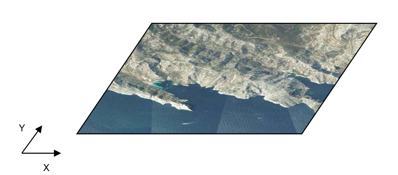

[.text-center]
*Figure 18 – mosaic without mosaic elements*

The mosaic should be represented as a single _OrthoimageCoverage_ instance, without additional instantiations.

[cols=",,",options="header",]
|===
|*Component* |*Number of instances* |*Comment*
|OrthoimageCoverage |1 |
|MosaicElement |0 |Not populated
|OrthoimageAggregation |0 |Not applicable
|===

==== Mosaic of several input images without mosaic elements associated (with tiling)

This case is similar to the previous, except that the mosaic of several input images is divided into six tiles, so that the range set of each tile is stored in only one image file.

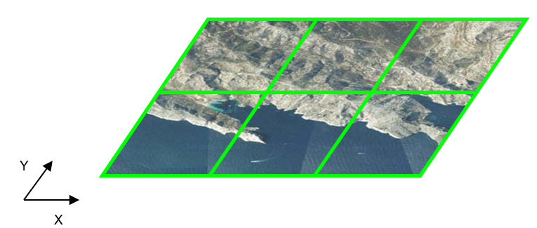

[.text-center]
*Figure 19 – mosaic without mosaic elements but with tiling (tile extents in green)*

Tiling does not affect the structure of the data set. Indeed, the mosaic should be represented as a single _OrthoimageCoverage_ instance.

[cols=",,",options="header",]
|===
|*Component* |*Number of instances* |*Comment*
|OrthoimageCoverage |1 |
|MosaicElement |0 |Not populated
|OrthoimageAggregation |0 |Not applicable
|===

==== Mosaic of several input images with mosaic elements associated (no tiling)

The orthoimagery data set consists in a seamless orthoimage resulting from the mosaicking of several input images. The delineation of the mosaic elements with the acquisition dates of the input images are available. The range set of the full mosaic is embedded in a single image file.

image::./media/image49.png[image]

[.text-center]
*Figure 20 – mosaic with mosaic elements*

The mosaic should be modelled as an _OrthoimageCoverage_ instance linked to seven indirect instances of the feature type _MosaicElement_.

[cols=",,",options="header",]
|===
|*Component* |*Number of instances* |*Comment*
|OrthoimageCoverage |1 |
|MosaicElement |7 |One _MosaicElement_ indirect instance by contributing input image
|OrthoimageAggregation |0 |Not applicable
|===

==== Mosaic of several input images with with mosaic elements associated (with tiling)

This case is similar to the previous, except that the mosaic of several input images is divided into six tiles, so that the range set of each tile is stored in only one image file.

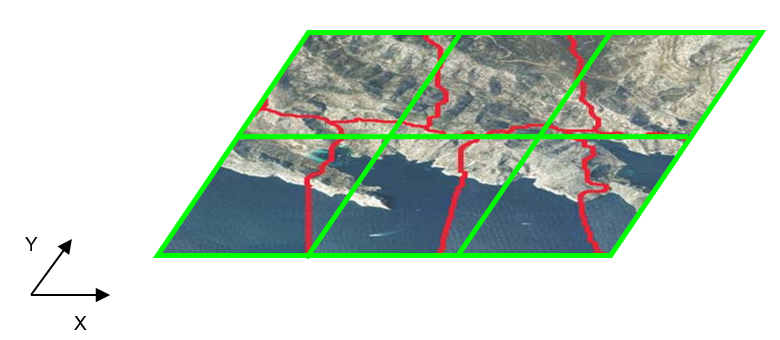

[.text-center]
*Figure 21 – mosaic with mosaic elements and tiling (tile extents in green)*

As above, the mosaic should be modelled as an _OrthoimageCoverage_ instance linked to seven indirect instances of the feature type _MosaicElement_.

[cols=",,",options="header",]
|===
|*Component* |*Number of instances* |*Comment*
|OrthoimageCoverage |1 |
|MosaicElement |7 |One _MosaicElement_ indirect instance by contributing input image
|OrthoimageAggregation |0 |Not applicable
|===

==== Aggregated orthoimage (no tiling)

The orthoimagery data set is composed of five orthoimages. Four of them are derived from single input images. The last one "dynamically" aggregates three of the first orthoimages by referencing them.

This data organization allows users to access data either through the single orthoimages or through the aggregated orthoimage.

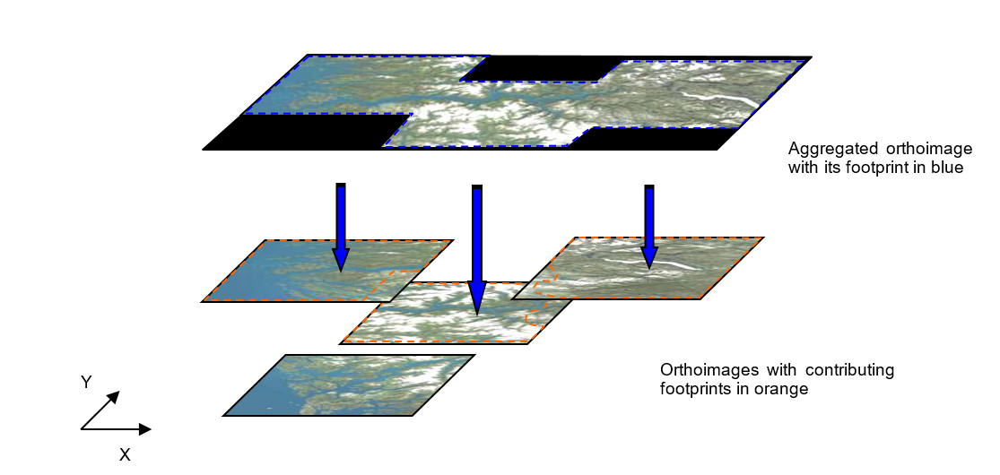

[.text-center]
*Figure 22 – aggregated orthoimage referring to orthoimages derived from single input images*

The four orthoimages calculated from single input images are modelled as _OrthoimageCoverage_ instances. The aggregated orthoimage is also implemented as an instance of this feature type, but in addition, it points to its three composing orthoimages by specifying their contributing area thanks to the association class _OrhoimageAggregation_.

[cols=",,",options="header",]
|===
|*Component* |*Number of instances* |*Comment*
|OrthoimageCoverage |5 |
|MosaicElement |0 |Not applicable
|OrthoimageAggregation |3 |Link between the aggregated orthoimage and its three composing orthoimages
|===

=== Conclusion

One could multiply examples by combining mosaicking, tiling and aggregation within data sets. However, it is not in the interest of data producers to increase the complexity of the data structure. Foremost, they should keep in mind the use cases attached to their products when choosing a data organization.

<<<
[appendix]
== Encoding rules for TIFF and JPEG 2000 file formats - (normative) 

=== Introduction

This annex specifies how to use the TIFF or JPEG 2000 file formats for encoding the range set of grid coverages. Because pixel payload is not sufficient to construct a readable standalone image, additional descriptive information has to be packaged together in the same file, even if it is already provided somewhere else in GML. For this purpose, this part establishes schema conversion rules for all the coverage components of INSPIRE Application Schemas that have a corresponding element in the output TIFF or JPEG 2000 data structures. These conversion rules play an essential role in maintaining consistency between the different representations (i.e. GML, TIFF or JPEG 2000) of the same coverage information.

On the other hand, TIFF specifications and JPEG 2000 Standard offer many options and let some variables open for encoding image data. If this flexibility allows covering most applications, it leads, in turn, to a situation where disparate implementation platforms exist while being potentially incompatible. As a result, interoperability is often unlikely. In order to fill in this gap and to enable a controlled exchange of data across Europe, this annex draws up an implementation profile of TIFF and JPEG 2000 to constraint their usage within the scope of INSPIRE. It amounts to impose external format-dependent restrictions to the applicable values of the properties described in the INSPIRE application schemas.

=== TIFF format

==== Format overview

The Tagged Image File Format (TIFF) is a binary file format for storing and interchanging raster images. Originally developed by the company Aldus (Adobe Systems), it is in the public domain since 1992, the year of the latest release of the specifications (revision 6.0 [TIFF]). TIFF has become a popular "de facto standard" for high colour-depth digital images. It is widely used in image handling applications, covering various themes such as _Orthoimagery_.

TIFF specifications are divided into two parts. Part 1: Baseline TIFF defines all the features that every reader must support, while Part 2: TIFF Extensions provides additional format structures designed for specialized applications, that are not necessarily taken into account by all TIFF readers (e.g. JPEG or LZW compression, tiling, CMYK images).

As highlighted in the format name, the TIFF data structure is based on the definition of tags for describing the characteristics of images. To be more precise, a TIFF file contains an image file header pointing to one or several image file directory (IFD). The image file header fixes the technical properties of the file, such as the byte order (e.g. little-endian or big-endian) or the offset of the first byte. An image file directory holds the complete description of an image by means of fields or entries. Each IFD entry consists of a tag identifying the field, the field type (e.g. byte, ASCII, short int), the number of values and the values themselves or an offset to the values. The location of the actual image data within the file is given by the combination of information elements expressed in some fields.

==== INSPIRE TIFF profile for grid coverage data

This section lists the requirements and the constraints to be applied to the TIFF format when encoding INSPIRE _Orthoimagery_ data sets in this format. It should be read in conjunction with the table in section E.2.3 which provides more detailed information. Some of the rules presented here are directly inspired by the GeoTIFF Profile for Georeferenced Imagery [DGIWG-108] edited by DGIWG for the military community.

===== General rules

[TIP]
====
*TG Requirement 11*

Encoding of INSPIRE _Orthoimagery_ data sets by using TIFF format shall conform to Baseline TIFF extended to LZW Compression.
====

NOTE Baseline TIFF is described in the part 1 of the TIFF specification 6.0 [TIFF], while the TIFF extension on LZW Compression is addressed in part 2.

TIFF files must be identified as such by network services by using a predefined Internet media type or MIME type.

[TIP]
====
*TG Requirement 12*

A file claiming to encode coverage elements in TIFF shall receive the _image/tiff_ MIME type registered in RFC 3302.
====

NOTE The absence of the optional application parameter here does not necessarily imply that the encoded TIFF image is Baseline TIFF.

===== Data structure

Even though TIFF specifications allow describing multiple related images in a single file by using more than one Image File Directory (IFD), Baseline TIFF readers are not required to decode any IFD beyond the first one. In order to ensure alignment with Baseline TIFF, all indispensable information has to be included in the first IFD.

[TIP]
====
*TG Requirement 13*

A TIFF file shall not contain more than two image file directories (IFD).
====

[TIP]
====
*TG Requirement 14* 

The first IFD shall carry the range set of the grid coverage. In the case of two IFD, the second shall be used to support a transparency mask.
====

NOTE As a consequence, the different bands of a same image cannot be split in separate IFDs.

The use of a second IFD is admitted for encoding an optional transparency mask, which is common for geographic raster data. This kind of ancillary information describes precisely the meaningful area of the image in the first IFD. It is useful at least for portrayal considerations. A transparency mask is a bi-level image matching pixel by pixel the image depicted in the first IFD. The pixel value 1 in the transparency mask means that the corresponding pixel in the image itself is significant. Conversely, the value 0 means that the corresponding pixel in the image holds a no data value (e.g. unknown, withheld). Typically, it must be made transparent when displaying the image.

The image file directory assigned to a transparency mask must receive the following TIFF tag values:

* BitsPerSample = 1
* Colormap: not used
* ImageDescription = 'transparency mask'
* ImageLength = ImageLength of the first IFD
* ImageWidth = ImageWidth of the first IFD
* NewSubFileType: all bits equal 0, except bit 2 = 1
* PhotometricInterpretation = 4
* SamplesPerPixel = 1

===== Grid coordinate system

Baseline TIFF supports only one type of orientation for grid coverages, that is, one type of grid coordinate system.

[TIP]
====
*TG Requirement 15* 

The origin of the grid coordinate system shall be the upper left corner of the grid coverage. The axis 'row' and 'column' shall be oriented downward and to the right.
====

image::./media/image52.png[image]

[.text-center]
*Figure 9. referenced grid as defined by Baseline TIFF*

===== Range values

The Baseline TIFF specifications cover four image types: bi-level, greyscale, palette-colour and full-colour images. Multi-band images are allowed but not fully addressed: baseline TIFF readers are intended to skip over the extra components gracefully, using the values of the SamplesPerPixel and BitsPerSample fields.

[NOTE]
====
*Recomendation 36*

The image data of a TIFF file should contain either 1 (bi-level, greyscale and palette-colour), 3 (RGB) or 4 bands (RGB with associated alpha data).

====

NOTE 1 Alpha data, which provides opacity information, is stored as an additional component per pixel. A 4-bands RGB image must have the following TIFF tag values: SamplesPerPixel = 4, PhotometricInterpretation = 2 (RGB) and ExtraSamples = 1 (associated alpha data).

NOTE 2 Encoding multispectral images in TIFF is running the risk of losing a part of the coverage range set, since many software applications are not able to support more than three colours.

[NOTE]
====
*Recomendation 37*

To encode multispectral images, the use of other more appropriated formats, such as JPEG 2000, is recommended.

====

====
*Open issue 2:* The lack of a part of the coverage range set is a well-identified problem for the orthoimage delivery in the frame of the Control with Remote Sensing (CwRS) program of the MARS Unit of JRC. When data is delivered in TIFF, we occasionally receive only 3 out of the initial 4 four channels of the VHR satellite data (usually the colour infrared is the missing one). The lack of this information might be crucial for certain applications. In that respect we might think (in case of availability of multispectral data) to encourage the data producers to provide more than one RGB files, holding different band combinations – natural; colour infrared; false colour composite. It is a common practice in the frame of the CwRS, although it required additional efforts. Same delivery approach can be valid for JPEG2000 as well.
====

For better performances, it is preferable to encode the range values as arrays of type SHORT, BYTE or LONG, depending on the type of data.

[TIP]
====
*TG Requirement 16* 

For imagery, the range values shall be expressed as unsigned integers coded on 8 or 16 bits, except for bi-level images which are 1-bit data. For other gridded data (e.g. elevation data, measured data), they shall be stored as 8 or 16-bits integers, signed or unsigned, or as 32-bits floating points.
====

NOTE If the original data do not satisfy this requirement, they will be converted in a representation using the next higher power of 2.

[TIP]
====
*TG Requirement 17* 

In the case of multi-band images, the number of bits per component shall be the same for all the bands.
====

[TIP]
====
*TG Requirement 18*

In the case of multi-band images, the planar configuration shall be _Chunky_ format, i.e. the bands are interleaved.
====

NOTE The range values of a same grid point in its different bands are stored contiguously. For instance, RGB data is stored as RGBRGBRGBRGB...

===== Compression

Data compression can be used within this profile to reduce the size of a file, provided that it does not distort the original range values after an encoding-decoding cycle. This condition allows, for example, ensuring the preservation of nil values.

[TIP]
====
*TG Requirement 19* 

The range value data shall be either uncompressed or lossless compressed with packbit or LZW compression schemes.
====
NOTE As a TIFF extension, LZW compression is not supported by Baseline TIFF. However, it is included in this profile since its use is widespread, essentially for both its simplicity and its efficiency.

===== Internal tiling

The TIFF extension defined in section 15 of the specifications focuses on the way of laying out the image content into roughly square tiles. This method, as an alternative to the standard repartition of the range within separate strips, improves the access to data. However, it may cause some interoperability problems too. It is therefore better not to use it and to restrict oneself to Baseline TIFF.

==== Mapping between TIFF and GML data structures

The following table indicates how to fill the content of TIFF tags for grid coverages in the context of INSPIRE. On the other hand, it gives the rules to be applied for ensuring the consistency of TIFF files with the _Orthoimagery_ GML Application(s) Schema(s). It does not address the encoding of the possible transparency mask (See 0).

The columns _Tag name_, _Code_, _Type_, _Card._ and _Description_ remind respectively the name, the code, the type, the maximum number of occurrences and the description of each Baseline TIFF tag within the meaning of the TIFF specification. The column _Obligation_ informs if the tag is considered to be mandatory (M), conditional (C), optional (O) or inadequate (I). The column _Restricted values_ specifies the values allowed for the tag in the context of INSPIRE. The column _Mapping to GML elements_ establishes a correspondence between the tag values and the corresponding GML elements of the coverage whose type is one of those specified in the Generic Conceptual Model (e.g. RectifiedGridCoverage). N/A means not applicable.

[.text-center]
*Table 10. Baseline TIFF implementation profile and Mapping between TIFF tags and the associated object elements from the Orthoimagery GML Application Schema*

[%autowidth]
|===
|*Tag name* |*Code* |*Type* |*Card.* |*Description* |*Obligation* |*Restricted values* |*Mapping to GML elements (including restrictions)*
|Artist |315 |ASCII |1 |Person who created the image |O |- |N/A
|BitsPerSample |258 |Short |SamplesPerPixel |Number of bits per component |M a|
1 for bi-level images

For imagery, constrained to *8* or *16* bits-per-pixel-per-band (e.g. 8 8 8 or 16 16 16 for RGB images).

For other gridded data, 8, 16 and 32 bits-per-pixel-per-band

|For each band _i_, rangeType.field[_i_].constraint.interval = "0 _2^BitsPerSample[i]-1_"
|CellLength |265 |Short |1 |The length of the dithering or halftoning matrix used to create a dithered or halftoned bilevel file. |I |This field should be never used |N/A
|CellWidth |264 |Short |1 |The width of the dithering or halftoning matrix used to create a dithered or halftoned bilevel file. |I |This field should be never used |N/A
|ColorMap |320 |Short |3*(2**BitsPerSample) |A colour map for palette colour images |C |Only for palette colour images |N/A
|Compression |259 |Short |1 |Compression scheme used on the image data |M a|
*1* for uncompressed data

*5* for LZW compression

*32773* for PackBits compression of greyscale and palette-colour data

|N/A
|Copyright |33432 |ASCII |1..* |Copyright notice |O |- |N/A
|DateTime |306 |ASCII |20 |Date and time of image creation |O |The Gregorian calendar should be used as a reference system for date values, and the Universal Time Coordinated (UTC) as a reference system for time values (local time is not recommended because offset from UTC can not be expressed in TIFF). a|
N/A

NOTE the field DateTime should not be confused with the properties _phenomenonTime_ and _beginLifespanVersion_ that report other types of temporal information.

|ExtraSample |338 |Short |1..* |Description of extra components |C a|
Only when extra samples are present

*1* for 4-bands RGB images with alpha channel

|N/A
|FillOrder |266 |Short |1 |The logical order of bits within a byte. |O |*1* (default) |N/A
|FreeByteCounts |289 |Long |1 |For each string of contiguous unused bytes in a TIFF file, the number of bytes in the string. |I |This field should be never used |N/A
|FreeOffsets |288 |Long |1 |For each string of contiguous unused bytes in a TIFF file, the byte offset of the string. |I |This field should be never used |N/A
|GrayResponseCurve |291 |Short |2**BitsPerSample |For greyscale data, the optical density of each possible pixel value. |I |This field should be never used |N/A
|GrayResponseUnit |290 |Short |1 |The precision of the information contained in the GrayResponseCurve |I |This field should be never used |N/A
|HostComputer |316 |ASCII |1..* |The computer and/or operating system in use at the time of image creation. |O |*-* |N/A
|ImageDescription |270 |ASCII |1..* |Description of the image subject. |O |- |N/A
|ImageLength |257 |Short or Long |1 |The number of rows in the image. |M |- a|
domainSet.extent.high.coordValues[_0_]-

domainSet.extent.low.coordValues[_0_]=ImageLength

|ImageWidth |256 |Short or Long |1 |The number of columns in the image, i.e. the number of pixels per row. |M |- a|
domainSet.extent.high.coordValues[_1_]-

domainSet.extent.low.coordValues[_1_]=ImageWidth

|Make |271 |ASCII |1 |The scanner manufacturer. |O |- |N/A
|MaxSampleValue |281 |Short |SamplesPerPixel |The maximum component value used. |O |This field should be used only for statistical purposes |N/A
|MinSampleValue |280 |Short |SamplesPerPixel |The minimum component value used. |O |This field should be used only for statistical purposes |N/A
|Model |272 |ASCII |1 |The scanner model name or number. |O |- |N/A
|NewSubfileType |254 |Long |1 |A general indication of the kind of data contained in this subfile. |O |*0* |N/A
|Orientation |274 |Short |1 |The orientation of the image with respect to the rows and columns. |M |*1* (default) |domainSet.extent.low.coordValues="0 0"
|PhotometricInterpretation |262 |Short |1 |Colour space of the image data. |M a|
*1* for bi-level and greyscale images (0 is black)

*2* for RGB images

*3* for palette-colour images

|N/A
|PlanarConfiguration |284 |Short |1 |How the components of each pixel are stored. |M |*1* which means, for RGB data, that the data is stored as RGBRGBRGB... |rangeSet.fileStructure="Record Interleaved"
|ResolutionUnit |296 |Short |1 |Unit of measurement for XResolution and YResolution. |M |*2* which means dpi (dot per inch) |N/A
|RowsPerStrip |278 |Short or Long |1 |Number of rows per strip. a|
C

Not used if tiling

|It is recommended to choose this value such that each strip is about 8K bytes. |N/A
|SampleFormat |399 |Short |SamplesPerPixel |This field specifies how to interpret each data sample in a pixel. |M a|
*1* for imagery (unsigned integer data)

1, 2 or 3 for gridded data

|For imagery, for each band _i_, rangeType.field[_i_].constraint.interval[0] = "0"
|SamplesPerPixel |277 |Short |1 |Number of components per pixel. |M a|
*1* usually for bi-level, greyscale and palette-colour images

*3* or *4* usually for RGB images (the 4^th^ component being used for alpha channel)

|rangeType.field.size()=SamplesPerPixel
|SmaxSampleValue |341 |Field type that best matches the sample data |SamplesPerPixel |The maximum value for each sample. This tag is used in lieu of MaxSampleValue when the sample type is other than integer. |I |This field should be never used |N/A
|SminSampleValue | |Field type that best matches the sample data |SamplesPerPixel |The minimum value for each sample. This tag is used in lieu of MaxSampleValue when the sample type is other than integer. |I |This field should be never used |N/A
|Software |305 |ASCII |1..* |Name and version number of the software package(s) used to create the image. |O |- |N/A
|StripByteCounts |279 |Short or Long |StripPerImage |For each strip, number of bytes in the strip after compression. a|
C

Not used if tiling

|*-* |N/A
|StripOffsets |273 |Long |StripPerImage |For each strip, the byte offset of that strip a|
C

Not used if tiling

|- |N/A
|Thresholding |263 |Short |1 |For black and white TIFF files that represent shades of gray, the technique used to convert gray to black and white pixels. |I |This field should be never used |N/A
|TileWidth |322 |Short or Long | |The tile width in pixels. This is the number of columns in each tile. a|
C

if tiling

|- |N/A
|TileLength |323 |Short or Long | |The tile length (height) in pixels. This is the number of rows in each tile. a|
C

if tiling

|- |N/A
|TileOffsets |324 |Long | |For each tile, the byte offset of that tile, as compressed and stored on disk. a|
C

if tiling

|- |N/A
|TileByteCount |325 |Short or Long | |For each tile, the number of (compressed) bytes in that tile. a|
C

if tiling

|- |N/A
|Xresolution |282 |Rational | |The number of pixels per ResolutionUnit in the ImageWidth direction. |M |*-* |N/A
|Yresolution |283 |Rational | |The number of pixels per ResolutionUnit in the ImageLength direction. |M |*-* |N/A
|===

In addition, the description of the coverage grid function must reflect the baseline ordering used by TIFF format to store the range values within a file. The following mapping must be applied:

coverageFunction.gridFunction.sequenceRule.type = "linear" AND coverageFunction.gridFunction.sequenceRule.scanDirection = "2 1"

==== Theme-specific requirements and recommendations

[TIP]
====
*TG Requirement 20*

For orthoimagery, the range values shall be expressed as unsigned integers coded on 8 or 16 bits, except for bi-level images which are 1-bit data.
====

=== JPEG 2000 format

==== Format overview

JPEG 2000 is a wavelet compression for storing and interchanging raster. Other wavelet compressions exist like ECW or MrSid. JPEG 2000 was prepared by Joint Technical Committee ISO/IEC JTC 1, _Information technology_, Subcommittee SC 29, _Coding of audio, picture, multimedia and hypermedia information_ in collaboration with ITU-T. The identical text is published as ITU-T Rec. T.800. First version was published in 2000. JPEG 2000 is known as a very efficient format to distribute and access large imagery data.

JPEG 2000 Standard is defined by ISO 15444 serie (from 15444-1 to 15444-12). The two parts dealing with 2D still imagery encoding and then interesting for INSPIRE raster and gridded coverages are:

* ISO 15444-1: Core Coding System, defining how coders and decoders shall behave and how shall be structured a JPEG 2000 codestream. This part also defines JP2 format, the simpler wrapper for JPEG 2000 encoded data.
* ISO 15444-2: Extensions, defining extensions for JPEG 2000 codestream (new makers) and JPX format. This part deals with extended capabilities; only a minor part (2 extra boxes) are useful for GMLJP2, and then for INSPIRE (see TG Requirement 21).

JPEG 2000 is complex

* The JPEG 2000 codestream, which directly contains compressed data. This stream contains markers and segment markers which allow decoding and accessing data.
* The format which is the wrapper of the JPEG 2000 codestream. It is possible to only distribute the codestream (extension file .j2c), but to have a more comprehensive file, it's recommended to wrap this stream inside a format, whose the most common is JP2, described by Annex I of ISO 15444-1 (extension file .jp2) which adds some boxes describing encoded data.

The figure below shows the JP2 file structure. n is the number of Colour Specification Boxes (n=1 for INSPIRE). m is the number of JPEG 2000 codestreams (in our case as there is only one codestream m=1). :

image::./media/image35.png[image,width=418,height=604, align=center]

[.text-center]
*Figure 23 : JP2 file structure*

==== JPEG 2000 profile for INSPIRE Orthoimagery data

This section lists the requirements and the constraints to be applied to JPEG 2000 when encoding INSPIRE _Orthoimagery_ data sets in this format. It should be read in conjunction with the table in section 0 which provides more detailed information.

===== General rules

[TIP]
====
*TG Requirement 21* 

Encoding of INSPIRE _Orthoimagery_ data sets by using JPEG 2000 shall conform to profile 1 of ISO 15444-1 in general case. In the case of delivering GMLJP2 files, GMLJP2 standard [OGC 05-047r3] shall apply.
====

NOTE GMLJP2 Standard is based on ISO 15444-1, extended by the use of boxes "association" and "label" defined by JPX format in ISO 15444-2 (see GMLJP2 standard for more details).

JPEG 2000 files must be identified as such by network services by using a predefined Internet media type or MIME type

[TIP]
====
*TG Requirement 22*

A file claiming to encode coverage elements in JPEG 2000 shall receive the _image/jp2_ MIME type registered in RFC 3745.
====

NOTE GMLJP2 uses extended boxes from JPX format, so it would suggest a _image/jpx_ MIME type but GMLJP2 Standard Working Group recommends the use of _image/jp2_ MIME Type because "association" and "label" boxes are just minor extensions of JP2 (defined in JPX format by Annex M of ISO 15444-2). Claiming conformance to JP2 allows GMLJP2 data to be supported by more visualisation software (some tools could stop reading JPEG 2000 files when seeing image/jpx MIME type). In the case of a software only compliant with ISO 15444-1 (reading strict JP2 files), the image and the GML (in the XML box) will be read and only the association between the two will be not interpreted.

So in both cases, pure JPEG 2000 or GML embedded in JPEG2000 (GMLJP2), _image/jp2_ MIME type shall be used.

===== Data structure

Even though JPEG 2000 Standard (and more precisely JP2 format) allows describing multiple codestreams in a single file by using more than one jp2c, only one is required to encode range sets of gridded coverages.

[TIP]
====
*TG Requirement 23* 

The range set of the grid coverage shall be carried by only one jp2c box (one codestream per JPEG 200 file).
====

NOTE As a consequence, the different components of a same image can not be split in separate codestreams.

===== Grid coordinate system

JPEG 2000 Standard defines the origin of the grid coordinate system as being the upper left corner of the grid coverage. The axis 'X' and 'Y are oriented to the right and downward.

image::./media/image36.png[image,width=623,height=348, align=center]

[.text-center]
*Figure 24 : referenced grid as defined by JPEG 2000*
*_Source : ISO 15444-1_*

===== Range values

ISO 15444-1 allows a lot of image types with multiband composition. Within the scope of INSPIRE, following types are addressed: bilevel, greyscale, palette-colour, full-colour images (known as RGB images) and multispectral images. So the image data of a JPEG 2000 file can contain either 1 (bilevel, greyscale and palette-colour), 3 bands (RGB) or more bands (multispectral images). An additional band for opacity may also be used.

The use of palette-colour in JPEG 2000 is restricted to a mapping from one component to RGB data.

These components are described trough markers in the JPEG 2000 codestream (see Table 12) and boxes in the JP2 format (see Table 13).

[TIP]
====
*TG Requirement 24* 

For imagery, the range values shall be expressed as unsigned integers coded on 8 or 16 bits, except for bi-level images which are 1-bit data. For other gridded data (e.g. elevation data, measured data), they shall be stored as 8 or 16-bits integers, signed or unsigned, or as 32-bits.
====

JPEG2000 (ISO 15444-1) does not allow to encode data as floats (only integers), but in general you can choose a Unit of measure for which your results are integers. For elevation, use centimetres (cm) instead of metres (m).

NOTE If the original data do not satisfy this requirement, they will be converted in a representation using the next higher power of 2.

[TIP]
====
*TG Requirement 25* 

In the case of multi-band images, the number of bits per component shall be the same for all the bands.
====

===== Opacity channel

JP2 format allows to describe opacity channel (trough Channel Definition Box or CDEF) and then to display multiple files without overlapping issues. Opacity channel can be defined for RGB or greyscales images. The following table gives example of an RGB image with alpha channel. CDF defines the 3 RGB components and then the alpha channel which applies to the all 3 RGB ones.

[.text-center]
*Table 11. Definition of opacity channel with CDEF box*

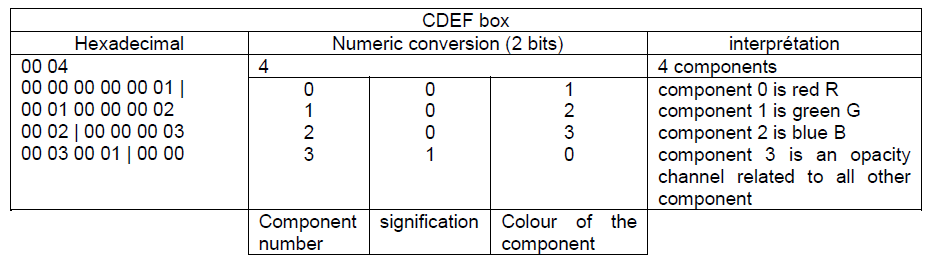

NOTE In this case, bit depth shall be defined for each of the four components trough the bpcc boxes in the JP2 Header Box.

JPEG 2000 allows defining opacity channel on more than 1 bit to have a scale of transparency. In pur case, we're just interested in full transparency and full opacity. So, within the scope of INSPIRE, it is recommended to code it on only 1 bit (0= transparent, 1=opaque)

[NOTE]
====
*Recomendation 38*

In the case of an opacity channel, the bit depth should be 1-bit.

====

===== Compression

JPEG 2000 codestream allows both lossless and lossy compression. Lossless compression is important for some themes because you can't allow any loss of information. For example in Land Cover, or Land Use, you encode a code which represents a class. For other themes, a lossy compression without visual effect can be also interesting. JPEG 2000 lossy compression is very powerful with which you can compress imagery data by 1:10 or more without visual effect. For example, 1:30 is commonly used for RGB data compression.

===== Internal tiling

JPEG 2000 allows internal tiling within the codestream. Profile 1 of ISO 15444-1 already requires no tiling (i.e. the image = 1 tile) or tiling with tiles size bigger than 1024x1024 pixels. There is no further requirement.

===== Resolutions

JPEG 2000 codestream encode the full resolution image but has mechanisms to directly access (without any computation) particular sub-resolutions. So the JPEG 2000 file contains a pyramid of resolution. The number of decomposition Nd defines the smallest image you can access whose size is reduced by 2^Nd^ (compared to the full image). Profile 1 of ISO 15444-1 requires that the number of decomposition shall be such as: Height/2^Nd^ ≤128 pixels and Width/2^Nd^ ≤128 pixels (height and width of the full resolution image).

For example for a 2048x1024 image, the number of decomposition is 4, and the smallest thumbnail image is 128x64 pixels.

There is no further requirement.

===== Region of interest

When encoding in a lossy mode, JPEG 2000 allows to encode some image regions with better quality and then deteriorate the quality of other areas. This capability shall not be used.

[TIP]
====
*TG Requirement 26* 

JPEG 2000 codestream shall not encode Region Of Interest (RGN marker segment).
====

===== Precincts

A precinct is a sub-division of a tile-component, within a each resolution, used for limiting the size of packets. It improves a lot data decompression time and then visualisation.

[NOTE]
====
*Recomendation 39*

It is recommended to use precincts in JPEG 2000 files to enable fast decompression and visualisation.

====

NOTE Precincts size needs to be specified too, but this will be defined according to the tile size, image size and other JPEG 2000 parameters.

===== Other options

JPEG 2000 allows more options:

* Quality layers, i.e. the capability to different levels of compressions within the same JPEG 200 file.
* Presence of markers, some allowing fast data access (TLM, PLT), other allowing error resiliency, ..
* Encoding order; the codestream can be arranged in different ways depending the order you want the data to be decompressed.
* Colour transformation, from RGB to three other decorrelated components (ICT or RCT transformations).

These choices depend on data size, data access (through network services, via FTP, via USB stick, ...) and then can't be made here.

===== Georeferencing

Georeference information can be provided by different mechanisms directly within the JPEG 2000 file:

* Case of pure JPEG 2000, georeference is provided through the 'uuid' box (GeoJP2 mechanism uses Geotiff tags to reference the image, see _http://www.lizardtech.com/support/kb/docs/geotiff_box.txt_ ).
* Case of GMLJP2 , georeference is provided through GML data.

==== Mapping between JPEG 2000 and GML data structures

The following table indicates how to fill the content of TIFF tags for grid coverages in the context of INSPIRE. On the other hand, it gives the rules to be applied for ensuring the consistency of JPEG 2000 files with the _Orthoimagery_ GML Application(s) Schema(s). It does not address the encoding of the possible transparency mask.

As described by the Format overview section, the JP2 format contains the JPEG 2000 codestream. Both have elements that need to be consistent with GML. The first table deals with mappings between the JPEG 2000 codestream and GML, whereas the second table deals with mappings between JP2 boxes and GML elements.

The columns _marker/box_, _description_, _Type_, _Card._ and Conditions/_Values_ remind respectively the marker code/box name, its description, its obligation/maximum number of occurrences allowed by JPEG 2000 standard (ISO 15444-1). The column _values_ specifies the values allowed for the marker in the context of INSPIRE. The column _Mapping to GML elements_ establishes a correspondence between these makers values and the corresponding GML elements of the coverage whose type is one of those specified in the Generic Conceptual Model (e.g. RectifiedGridCoverage). N/A means not applicable.

[.text-center]
*Table 12. mapping between markers in JPEG 2000 codestream and GML elements*

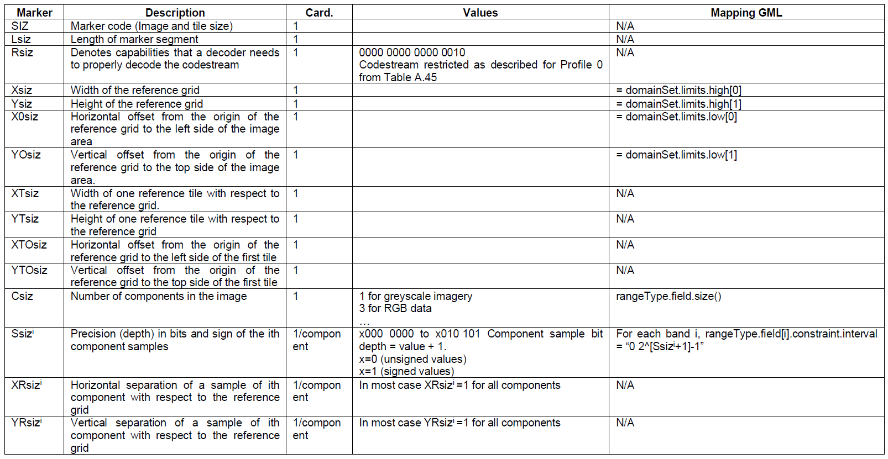

For each component i of the image, its size is defined by :

Width^i^ = (Xsiz – X0siz)/XRsiz^i^

Height^i^ = (Ysiz – Y0siz)/YRsiz^i^

[.text-center]
*Table 13. Mapping between boxes in JP2 format and GML elements*

image::./media/table13a.png[image, align=center]
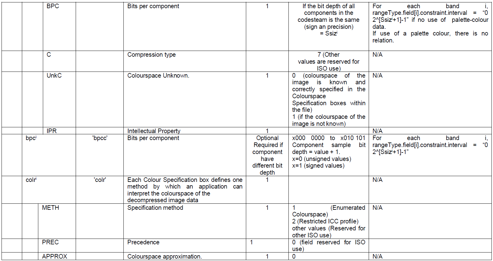
image::./media/table13c.png[image, align=center]
image::./media/table13d.png[image, align=center]

==== Theme-specific requirements and recommendations

[TIP]
====
*TG Requirement 27* 

For orthoimagery, the range values shall be expressed as unsigned integers coded on 8 or 16 bits, except for bi-level images which are 1-bit data.
====
