// Admonition icons:
// TG Requirement
:important-caption: 📕
// TG Recommendation
:tip-caption: 📒
// Conformance class
:note-caption: 📘

// TOC placement using macro (manual)
:toc: macro

// Empty TOC title (the title is in the document)
:toc-title:

// TOC level depth
:toclevels: 5

// Section numbering level depth
:sectnumlevels: 8

// Line Break Doc Title
:hardbreaks-option:

:appendix-caption: Annex

// Document properties
:title: D2.8.III.10 Data Specification on Population Distribution – Technical Guidelines
:revdate: 2024-07-31
:keywords: INSPIRE Data Specification for the spatial data theme Population Distribution
:producer: INSPIRE Maintenance and Implementation Group (MIG)
:description: This document describes the INSPIRE Data Specification for the spatial data theme Population Distribution
:author: Temporary MIWP 2021-2024 sub-group 2.3.1
:copyright: Public
:revremark: https://github.com/INSPIRE-MIF/technical-guidelines/releases/tag/v2024.2
:lang: en

image::./media/image2.jpeg[logo_ce-en-rvb-lr,width=131,height=90]
 **INSPIRE** *Infrastructure for Spatial Information in Europe*

[discrete]
= D2.8.III.10 Data Specification on _Population Distribution_ – Technical Guidelines

[width="100%",cols="17%,83%",]
|===
|*Title* |{doctitle}
|*Creator* |{author}
|*Date of publication* |{revdate}
|*Subject* |{keywords}
|*Publisher* |{producer}
|*Type* |Text
|*Description* |{description}
|*Format* |AsciiDoc
|*Licence* |https://creativecommons.org/licenses/by/4.0[Creative Commons Attribution (cc-by) 4.0]
|*Rights* |{copyright}
|*Identifier* |https://inspire.ec.europa.eu/id/document/tg/pd[D2.8.III.10_v3.0.0]
|*Changelog* |{revremark}
|*Language* |{lang}
|*Relation* |Directive 2007/2/EC of the European Parliament and of the Council of 14 March 2007 establishing an Infrastructure for Spatial Information in the European Community (INSPIRE)
|===

<<<
[discrete]
== Foreword
[discrete]
== How to read the document?

This document describes the _"INSPIRE data specification on Population Distribution – Technical Guidelines"_ version 3.0 as developed by the Thematic Working Group (TWG) _SU-PD_ using both natural and a conceptual schema language.

The data specification is based on a common templatefootnote:[The common document template is available in the "Framework documents" section of the data specifications web page at http://inspire.jrc.ec.europa.eu/index.cfm/pageid/2] used for all data specifications, which has been harmonised using the experience from the development of the Annex I, II and III data specifications.

This document provides guidelines for the implementation of the provisions laid down in the draft Implementing Rule for spatial data sets and services of the INSPIRE Directive. It also includes additional requirements and recommendations that, although not included in the Implementing Rule, are relevant to guarantee or to increase data interoperability.

Two executive summaries provide a quick overview of the INSPIRE data specification process in general, and the content of the data specification on _Population Distribution_ in particular. We highly recommend that managers, decision makers, and all those new to the INSPIRE process and/or information modelling should read these executive summaries first.

The UML diagrams (in Chapter 5) offer a rapid way to see the main elements of the specifications and their relationships. The definition of the spatial object types, attributes, and relationships are included in the Feature Catalogue (also in Chapter 5). People having thematic expertise but not familiar with UML can fully understand the content of the data model focusing on the Feature Catalogue. Users might also find the Feature Catalogue especially useful to check if it contains the data necessary for the applications that they run. The technical details are expected to be of prime interest to those organisations that are responsible for implementing INSPIRE within the field of _Population Distribution_, but also to other stakeholders and users of the spatial data infrastructure.

The technical provisions and the underlying concepts are often illustrated by examples. Smaller examples are within the text of the specification, while longer explanatory examples and descriptions of selected use cases are attached in the annexes.

In order to distinguish the INSPIRE spatial data themes from the spatial object types, the INSPIRE spatial data themes are written in _italics._

[width="100%",cols="100%",options="header",]
|===
|The document will be publicly available as a 'non-paper'. It does not represent an official position of the European Commission, and as such cannot be invoked in the context of legal procedures.
|===

*Legal Notice*

Neither the European Commission nor any person acting on behalf of the Commission is responsible for the use which might be made of this publication.

<<<
[discrete]
== Interoperability of Spatial Data Sets and Services – General Executive Summary

The challenges regarding the lack of availability, quality, organisation, accessibility, and sharing of spatial information are common to a large number of policies and activities and are experienced across the various levels of public authority in Europe. In order to solve these problems it is necessary to take measures of coordination between the users and providers of spatial information. The Directive 2007/2/EC of the European Parliament and of the Council adopted on 14 March 2007 aims at establishing an Infrastructure for Spatial Information in the European Community (INSPIRE) for environmental policies, or policies and activities that have an impact on the environment.

INSPIRE is based on the infrastructures for spatial information that are created and maintained by the Member States. To support the establishment of a European infrastructure, Implementing Rules addressing the following components of the infrastructure have been specified: metadata, interoperability of spatial data sets (as described in Annexes I, II, III of the Directive) and spatial data services, network services, data and service sharing, and monitoring and reporting procedures.

INSPIRE does not require collection of new data. However, after the period specified in the Directivefootnote:[For all 34 Annex I,II and III data themes: within two years of the adoption of the corresponding Implementing Rules for newly collected and extensively restructured data and within 5 years for other data in electronic format still in use] Member States have to make their data available according to the Implementing Rules.

Interoperability in INSPIRE means the possibility to combine spatial data and services from different sources across the European Community in a consistent way without involving specific efforts of humans or machines. It is important to note that "interoperability" is understood as providing access to spatial data sets through network services, typically via Internet. Interoperability may be achieved by either changing (harmonising) and storing existing data sets or transforming them via services for publication in the INSPIRE infrastructure. It is expected that users will spend less time and efforts on understanding and integrating data when they build their applications based on data delivered in accordance with INSPIRE.

In order to benefit from the endeavours of international standardisation bodies and organisations established under international law their standards and technical means have been utilised and referenced, whenever possible.

To facilitate the implementation of INSPIRE, it is important that all stakeholders have the opportunity to participate in specification and development. For this reason, the Commission has put in place a consensus building process involving data users, and providers together with representatives of industry, research and government. These stakeholders, organised through Spatial Data Interest Communities (SDIC) and Legally Mandated Organisations (LMO)footnote:[The current status of registered SDICs/LMOs is available via INSPIRE website: http://inspire.jrc.ec.europa.eu/index.cfm/pageid/42], have provided reference materials, participated in the user requirement and technicalfootnote:[Surveys on unique identifiers and usage of the elements of the spatial and temporal schema,] surveys, proposed experts for the Data Specification Drafting Teamfootnote:[The Data Specification Drafting Team has been composed of experts from Austria, Belgium, Czech Republic, France, Germany, Greece, Italy, Netherlands, Norway, Poland, Switzerland, UK, and the European Environment Agency], the Thematic Working Groupsfootnote:[The Thematic Working Groups of Annex II and III themes have been composed of experts from Austria, Belgium, Bulgaria, Czech Republic, Denmark, Finland, France, Germany, Hungary, Ireland, Italy, Latvia, Netherlands, Norway, Poland, Romania, Slovakia, Spain, Sweden, Switzerland, Turkey, UK, the European Commission, and the European Environment Agency] and other ad-hoc cross-thematic technical groups and participated in the public stakeholder consultations on draft versions of the data specifications. These consultations covered expert reviews as well as feasibility and fitness-for-purpose testing of the data specificationsfootnote:[For Annex IIIII, the consultation and testing phase lasted from 20 June to 21 October 2011.].

This open and participatory approach was successfully used during the development of the data specifications on Annex I, II and III data themes as well as during the preparation of the Implementing Rule on Interoperability of Spatial Data Sets and Servicesfootnote:[Commission Regulation (EU) No 1089/2010 http://eur-lex.europa.eu/JOHtml.do?uri=OJ:L:2010:323:SOM:EN:HTML[implementing Directive 2007/2/EC of the European Parliament and of the Council as regards interoperability of spatial data sets and services&#44;] published in the Official Journal of the European Union on 8^th^ of December 2010.] for Annex I spatial data themes and of its amendment regarding the themes of Annex II and III.

The development framework elaborated by the Data Specification Drafting Team aims at keeping the data specifications of the different themes coherent. It summarises the methodology to be used for the development of the data specifications, providing a coherent set of requirements and recommendations to achieve interoperability. The pillars of the framework are the following technical documentsfootnote:[The framework documents are available in the "Framework documents" section of the data specifications web page at http://inspire.jrc.ec.europa.eu/index.cfm/pageid/2]:

* The _Definition of Annex Themes and Scope_ describes in greater detail the spatial data themes defined in the Directive, and thus provides a sound starting point for the thematic aspects of the data specification development.
* The _Generic Conceptual Model_ defines the elements necessary for interoperability and data harmonisation including cross-theme issues. It specifies requirements and recommendations with regard to data specification elements of common use, like the spatial and temporal schema, unique identifier management, object referencing, some common code lists, etc. Those requirements of the Generic Conceptual Model that are directly implementable are included in the Implementing Rule on Interoperability of Spatial Data Sets and Services.
* The _Methodology for the Development of Data Specifications_ defines a repeatable methodology. It describes how to arrive from user requirements to a data specification through a number of steps including use-case development, initial specification development and analysis of analogies and gaps for further specification refinement.
* The _Guidelines for the Encoding of Spatial Data_ defines how geographic information can be encoded to enable transfer processes between the systems of the data providers in the Member States. Even though it does not specify a mandatory encoding rule it sets GML (ISO 19136) as the default encoding for INSPIRE.
* The _Guidelines for the use of Observations & Measurements and Sensor Web Enablement-related standards in INSPIRE Annex II and III data specification development_ provides guidelines on how the "Observations and Measurements" standard (ISO 19156) is to be used within INSPIRE.
* The _Common data models_ are a set of documents that specify data models that are referenced by a number of different data specifications. These documents include generic data models for networks, coverages and activity complexes.

The structure of the data specifications is based on the "ISO 19131 Geographic information - Data product specifications" standard. They include the technical documentation of the application schema, the spatial object types with their properties, and other specifics of the spatial data themes using natural language as well as a formal conceptual schema languagefootnote:[UML – Unified Modelling Language].

A consolidated model repository, feature concept dictionary, and glossary are being maintained to support the consistent specification development and potential further reuse of specification elements. The consolidated model consists of the harmonised models of the relevant standards from the ISO 19100 series, the INSPIRE Generic Conceptual Model, and the application schemasfootnote:[Conceptual models related to specific areas (e.g. INSPIRE themes)] developed for each spatial data theme. The multilingual INSPIRE Feature Concept Dictionary contains the definition and description of the INSPIRE themes together with the definition of the spatial object types present in the specification. The INSPIRE Glossary defines all the terms (beyond the spatial object types) necessary for understanding the INSPIRE documentation including the terminology of other components (metadata, network services, data sharing, and monitoring).

By listing a number of requirements and making the necessary recommendations, the data specifications enable full system interoperability across the Member States, within the scope of the application areas targeted by the Directive. The data specifications (in their version 3.0) are published as technical guidelines and provide the basis for the content of the Implementing Rule on Interoperability of Spatial Data Sets and Servicesfootnote:[In the case of the Annex IIIII data specifications, the extracted requirements are used to formulate an amendment to the existing Implementing Rule.]. The content of the Implementing Rule is extracted from the data specifications, considering short- and medium-term feasibility as well as cost-benefit considerations. The requirements included in the Implementing Rule are legally binding for the Member States according to the timeline specified in the INSPIRE Directive.

In addition to providing a basis for the interoperability of spatial data in INSPIRE, the data specification development framework and the thematic data specifications can be reused in other environments at local, regional, national and global level contributing to improvements in the coherence and interoperability of data in spatial data infrastructures.

<<<
[discrete]
== _Population Distribution_ – Executive Summary

Population distributions are defined as "datasets of statistical information describing how some phenomenon regarding human population is spread within some part of the 2D space". This document presents data specifications for population distributions. It is based on the following principles:

*Separation between statistical data and statistical units*

A statistical data is defined as "any numerical representation of a phenomenon". A statistical unit informs on the statistical data location. This document addresses only the statistical data specification: The specification of statistical unit is out of the scope of this document. Statistical data refers to statistical units through their common identifier, e.g. NUTS codes. Linking statistical data to spatial object is not only linking a database object to another one. The challenge is to improve the interaction between the statistics and the GIS worlds. This document recommendations aims at improving the integration of spatial and statistic analyses. The result of the integration makes the treasure of statistical data available for the GIS world in context of a spatial data infrastructure of the administration.

*Genericity*

There are many different kinds of statistical data about human population: about people, dwellings, people at their work place, etc. This document does not intend to provide specifications for all these. Common characteristics have been extracted and represented into a generic data model. Using the data model described in this specification, all statistical data regularly organized in tables or data cubes can be provided in the INSPIRE framework.

<<<
[discrete]
== Acknowledgements

Many individuals and organisations have contributed to the development of these Guidelines.

The Thematic Working Group on Statistical Units and _Population Distribution_ (TWG-SU-PD) included:

Alina Kmiecik (TWG Facilitator until 15/12/2010) and Udo Maack (TWG Facilitator from 15/12/2010, TWG co-editor from 09/2011), Pieter Bresters, Ian Coady, Marie Haldorson, Jean-Luc Lipatz (TWG Editor until 09/2011), Miroslaw Migacz, Susanne Schnorr-Baecker, Julien Gaffuri (European Commission contact point, TWG co-editor from 09/2011).

Contributors:

From Eurostat: Beatrice Eiselt, Ekkehard Petri and Daniele Rizzi
From CBS (NL): Niek van Leeuwen, Olav ten Bosch

Participants on GISCO / Geostat meetings:

Hugo Poelmann (DG Regio) – Requirements for Change Information
Ingrid Kaminger (Statistic Austria) – User Survey according Grids
Marjan van Herwijnen (ESPON-Coordination Unit) - Requirements for Change Information

Other contributors to the INSPIRE data specifications are the Drafting Team Data Specifications, the JRC Data Specifications Team and the INSPIRE stakeholders - Spatial Data Interested Communities (SDICs) and Legally Mandated Organisations (LMOs).

*Contact information*

Maria Vanda Nunes de Lima
European Commission Joint Research Centre
Institute for Environment and Sustainability
Unit H06: Digital Earth and Reference Data
TP262, Via Fermi 2749
I-21027 Ispra (VA)
ITALY
E-mail: vanda.lima@jrc.ec.europa.eu
Tel.: 39-0332-7865052
Fax: 39-0332-7866325
http://ies.jrc.ec.europa.eu/
http://ec.europa.eu/dgs/jrc/
http://inspire.jrc.ec.europa.eu/

<<<
[discrete]
== Table of contents
toc::[]

:sectnums:

<<<
== Scope

This document specifies a harmonised data specification for the spatial data theme _Population Distribution_ as defined in Annex III of the INSPIRE Directive.

This data specification provides the basis for the drafting of Implementing Rules according to Article 7 (1) of the INSPIRE Directive [Directive 2007/2/EC]. The entire data specification is published as implementation guidelines accompanying these Implementing Rules.

<<<
== Overview

=== Name

INSPIRE data specification for the theme _Population Distribution_.

=== Informal description

*[.underline]#Definition:#*

Geographical distribution of people, including population characteristics and activity levels, aggregated by grid, region, administrative unit or other analytical unit [Directive 2007/2/EC].

*[.underline]#Description:#*

*Population = human population*

A population is any entire collection of people, animals, plants or things about which we may collect data. It is the entire group we are interested in, which we wish to describe or draw conclusions about. In this data specification population is referring to human beings, i.e. (1) people such as individuals or (2) people living together in households for instance. Information on people where and how they live or stay are crucial for nearly all other themes of the INSPIRE Directive, in particular to Human Health and Safety, Buildings and Natural Risk Zones.

The theme may thematically be divided into several components. The directive text points at broad groups of sub-themes:

* Human population by individual characteristics (sex, age, marital status, nationality).
* Human population activity levels (education, profession)
* Human beings living together in groups for different reasons (households, institutions such as retirement homes)

*Wide ranges of statistics on population are available*

Concerning population information, this may include total population, age, gender, nationality or place of birth in terms of stocks, or mortality, life expectancy and migration in terms of flows. Of interest could be the population with reference to a time period and activities. Use cases point to the need for a distinction between night time and daytime population for a given regional unit such as a city or a sub-city. It might be difficult to determine how many people are in a specific place (settlement, apartment or house) and to which groups they belong. According to people's activities, they can be at work or enjoy leisure time activities (such as watching a movie in the cinema) or they can spend their time in transport facilities. For people at work, it can be shown to which economic sector in terms of NACE they belong in a specific place, region or part of it or where people of a given socio demographic group live for instance in towns or at the border. All such information could be useful in the context of other thematic themes such as agriculture or the usage of natural resources.

To minimize the overlap with additional powerful harmonized European sources like Eurostat's Regional database, only a few population distribution data are mandatory. It is recommended that Eurostat provide additional statistical data by INSPIRE services.

*No spatial features*

The theme Population distribution/demography contains attributes related to statistical units. This means that this theme has no direct spatial features such as many other INSPIRE Annex III themes like buildings, health care institutions etc., it needs to be linked to these features by the use of statistical units for example NUTS-codes or grid identifier.

*Aggregated data and confidentiality issues*

The definition in the Directive 2007/2/EC specifies all kinds of features relevant to demography. It includes the term "aggregated" which means that non-aggregated data about population is excluded because of confidentiality. The data provision on different regional levels depends on the national situation regarding availability and privacy. There is a correlation between size of statistical units and differentiation of the attribute values. The smaller the size of the statistical units, the more undifferentiated the attributes can be to meet the data privacy rules. The data model covers all the possibilities but legal restrictions may prohibit the provision.

*Population distribution/Demography in the INSPIRE context*

Population distribution/Demography is a very wide phenomenon that may be described by quantitative data from different sources - both on national and European level. This data specification provides a generic data model which covers various statistical domains. Use-cases show that statistics on total population on grids or other small areas could be widely used together with other INSPIRES themes. Due to the complexity and large amount of statistics describing population, the requirement 3 stated in 5.2 is to provide total population and population by age groups on municipalities and 1km2 grid level.

The benefits from this theme in the context of INSPIRE should primarily be the access to existing statistics which are *not* already published in regional databases provided by Eurostat or the member states. The statistics provided according to this INSPIRE theme should rather be a complement to statistics already being published based on legislation and gentlemen's agreements. Statistics in national or European regional databases are often multidimensional in a way that the INSPIRE services could never match, and existing databases should therefore be considered as the best source of information on demography.

The genericity of the model is expressed in using different code lists for classification of each statistical value provided. This approach includes the flexibility to react to further requirements coming from new legislations or other reasons.

[cols=""]
|===
a|*[.underline]#Definition:#*

Geographical distribution of people, including population characteristics and activity levels, aggregated by grid, region, administrative unit or other analytical unit [Directive 2007/2/EC].

*[.underline]#Description:#*

_Population Distribution_ deals with datasets of statistical information describing how some phenomenon regarding human population is spread within some part of the 2D space. The theme has no direct spatial features, only contains attributes allowing to describe population phenomenon related to statistical units. Population data is linked to spatial object (statistical units) through their common identifier, e.g. NUTS codes.

Entry in the INSPIRE registry: _http://inspire.ec.europa.eu/theme/pd/_
|===

=== Normative References

[Directive 2007/2/EC] Directive 2007/2/EC of the European Parliament and of the Council of 14 March 2007 establishing an Infrastructure for Spatial Information in the European Community (INSPIRE)

REGULATION (EC) No 177/2008 OF THE EUROPEAN PARLIAMENT AND OF THE COUNCIL of 20 February 2008 establishing a common framework for business registers for statistical purposes and repealing Council Regulation (EEC) No 2186/93

REGULATION (EC) No 1893/2006 OF THE EUROPEAN PARLIAMENT AND OF THE COUNCIL of 20 December 2006 establishing the statistical classification of economic activities NACE Revision 2 and amending Council Regulation (EEC) No 3037/90 as well as certain EC Regulations on specific statistical domains

REGULATION (EC) No 763/2008 OF THE EUROPEAN PARLIAMENT AND OF THE COUNCIL of 9 July 2008 on population and housing censuses

COMMISSION REGULATION (EC) No 1201/2009 of 30 November 2009 implementing Regulation (EC) No 763/2008 as regards the technical specifications of the topics and of their breakdowns

COMMISSION REGULATION (EU) No 519/2010 of 16 June 2010 adopting the programme of the statistical data and of the metadata for population and housing censuses provided for by Regulation (EC) No 763/2008

REGULATION (EU) No 1151/2010 of 08 December 2010 implementing Regulation (EC) No 763/2008, as regards the modalities and structure of the quality reports and the technical format for data transmission

REGULATION (EC) No 1177/2003 OF THE EUROPEAN PARLIAMENT AND OF THE COUNCIL of 16 June 2003concerning Community statistics on income and living conditions (EU-SILC)

REGULATION (EC) No 295/2008 OF THE EUROPEAN PARLIAMENT AND OF THE COUNCIL of 11 March 2008 concerning structural business statistics

COUNCIL REGULATION (EC) No 577/98 of 9 March 1998 COUNCIL REGULATION (EC) No 577/98 of 9 March 1998 on the organisation of a labour force sample survey in the Community

REGULATION (EC) No. 1059/2003 on the establishment of a common classification of territorial units for statistics (NUTS2003)

REGULATION (EC) No. 105/2007 Amending the Annexes to Regulation 1059/2007 (NUTS2006)

REGULATION (EC) No. 31/2011 Amending the Annexes to Regulation 1059/2007 (NUTS2010)

REGULATION (EC) No 862/2007 OF THE EUROPEAN PARLIAMENT AND OF THE COUNCIL of 11 July 2007 on Community statistics on migration and international protection and repealing Council Regulation (EEC) No 311/76 on the compilation of statistics on foreign workers

[ISO 19107] EN ISO 19107:2005, Geographic Information – Spatial Schema

[ISO 19108-c] ISO 19108:2002/Cor 1:2006, Geographic Information – Temporal Schema, Technical Corrigendum 1

[ISO 19113] EN ISO 19113:2005, Geographic Information – Quality principles

[ISO 19115] EN ISO 19115:2005, Geographic information – Metadata (ISO 19115:2003)

[ISO 19138] ISO/TS 19138:2006, Geographic Information – Data quality measures

[Regulation 1205/2008/EC] Regulation 1205/2008/EC implementing Directive 2007/2/EC of the European Parliament and of the Council as regards metadata

[Regulation 976/2009/EC] Commission Regulation (EC) No 976/2009 of 19 October 2009 implementing Directive 2007/2/EC of the European Parliament and of the Council as regards the Network Services

[Regulation 1089/2010/EC] Commission Regulation (EU) No 1089/2010 of 23 November 2010 implementing Directive 2007/2/EC of the European Parliament and of the Council as regards interoperability of spatial data sets and services

=== Terms and definitions

General terms and definitions helpful for understanding the INSPIRE data specification documents are defined in the INSPIRE Glossaryfootnote:[The INSPIRE Glossary is available from http://inspire-registry.jrc.ec.europa.eu/registers/GLOSSARY].

=== Symbols and abbreviations

[width="100%",cols="14%,86%"]
|===
|ATS |Abstract Test Suite
|EC |European Commission
|EEA |European Environmental Agency
|ETRS89 |European Terrestrial Reference System 1989
|ETRS89-LAEA |Lambert Azimuthal Equal Area
|Eurostat |Statistical Office of the European Communities
|EVRS |European Vertical Reference System
|GCM |General Conceptual Model
|GML |Geography Markup Language
|IR |Implementing Rule
|ISDSS |Interoperability of Spatial Data Sets and Services
|ISO |International Organization for Standardization
|ITRS |International Terrestrial Reference System
|LAT |Lowest Astronomical Tide
|LMO |Legally Mandated Organisation
|NACE |Statistical classification of economic activities in the European Community
|NUTS |Nomenclature of Territorial Units for Statistics
|SDIC |Spatial Data Interest Community
|TG |Technical Guidance
|UML |Unified Modeling Language
|UTC |Coordinated Universal Time
|XML |EXtensible Markup Language
|===

=== How the Technical Guidelines map to the Implementing Rules

The schematic diagram in Figure 1 gives an overview of the relationships between the INSPIRE legal acts (the INSPIRE Directive and Implementing Rules) and the INSPIRE Technical Guidelines. The INSPIRE Directive and Implementing Rules include legally binding requirements that describe, usually on an abstract level, _what_ Member States must implement.

In contrast, the Technical Guidelines define _how_ Member States might implement the requirements included in the INSPIRE Implementing Rules. As such, they may include non-binding technical requirements that must be satisfied if a Member State data provider chooses to conform to the Technical Guidelines. Implementing these Technical Guidelines will maximise the interoperability of INSPIRE spatial data sets.

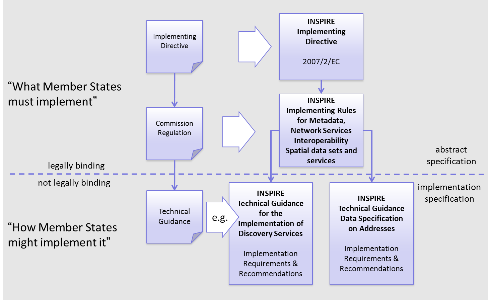
[.text-center]
*Figure 1 - Relationship between INSPIRE Implementing Rules and Technical Guidelines*

==== Requirements

The purpose of these Technical Guidelines (Data specifications on _Population Distribution_) is to provide practical guidance for implementation that is guided by, and satisfies, the (legally binding) requirements included for the spatial data theme _Population Distribution_ in the Regulation (Implementing Rules) on interoperability of spatial data sets and services. These requirements are highlighted in this document as follows:

[IMPORTANT]
====
[.text-center]
*IR Requirement*
_Article / Annex / Section no._
*Title / Heading*

This style is used for requirements contained in the Implementing Rules on interoperability of spatial data sets and services (Commission Regulation (EU) No 1089/2010).

====

For each of these IR requirements, these Technical Guidelines contain additional explanations and examples.

NOTE The Abstract Test Suite (ATS) in Annex A contains conformance tests that directly check conformance with these IR requirements.

Furthermore, these Technical Guidelines may propose a specific technical implementation for satisfying an IR requirement. In such cases, these Technical Guidelines may contain additional technical requirements that need to be met in order to be conformant with the corresponding IR requirement _when using this proposed implementation_. These technical requirements are highlighted as follows:

[TIP]
====
*TG Requirement X*

This style is used for requirements for a specific technical solution proposed in these Technical Guidelines for an IR requirement.
====

NOTE 1 Conformance of a data set with the TG requirement(s) included in the ATS implies conformance with the corresponding IR requirement(s).

NOTE 2 In addition to the requirements included in the Implementing Rules on interoperability of spatial data sets and services, the INSPIRE Directive includes further legally binding obligations that put additional requirements on data providers. For example, Art. 10(2) requires that Member States shall, where appropriate, decide by mutual consent on the depiction and position of geographical features whose location spans the frontier between two or more Member States. General guidance for how to meet these obligations is provided in the INSPIRE framework documents.

==== Recommendations

In addition to IR and TG requirements, these Technical Guidelines may also include a number of recommendations for facilitating implementation or for further and coherent development of an interoperable infrastructure.

[NOTE]
====
*Recommendation X*

Recommendations are shown using this style.
====

NOTE The implementation of recommendations is not mandatory. Compliance with these Technical Guidelines or the legal obligation does not depend on the fulfilment of the recommendations.

==== Conformance

Annex A includes the abstract test suite for checking conformance with the requirements included in these Technical Guidelines and the corresponding parts of the Implementing Rules (Commission Regulation (EU) No 1089/2010).

<<<
== Specification scopes

This data specification does not distinguish different specification scopes, but just considers one general scope.

NOTE For more information on specification scopes, see [ISO 19131:2007], clause 8 and Annex D.

<<<
== Identification information

These Technical Guidelines are identified by the following URI:

http://inspire.ec.europa.eu/tg/PD/3.0

NOTE ISO 19131 suggests further identification information to be included in this section, e.g. the title, abstract or spatial representation type. The proposed items are already described in the document metadata, executive summary, overview description (section 2) and descriptions of the application schemas (section 5). In order to avoid redundancy, they are not repeated here.

<<<
== Data content and structure

=== Application schemas – Overview 

==== Application schemas included in the IRs

Articles 3, 4 and 5 of the Implementing Rules lay down the requirements for the content and structure of the data sets related to the INSPIRE Annex themes.

[IMPORTANT]
====
[.text-center]
*IR Requirement*
_Article 4_
*Types for the Exchange and Classification of Spatial Objects*

. For the exchange and classification of spatial objects from data sets meeting the conditions laid down in Article 4 of Directive 2007/2/EC, Member States shall use the spatial object types and associated data types, enumerations and code lists that are defined in Annexes II, III and IV for the themes the data sets relate to.

. Spatial object types and data types shall comply with the definitions and constraints and include the attributes and association roles set out in the Annexes.

. The enumerations and code lists used in attributes or association roles of spatial object types or data types shall comply with the definitions and include the values set out in Annex II. The enumeration and code list values are uniquely identified by language-neutral mnemonic codes for computers. The values may also include a language-specific name to be used for human interaction.

====

The types to be used for the exchange and classification of spatial objects from data sets related to the spatial data theme _Population Distribution_ are defined in the following application schema _Population distribution – demography_.

The application schemas specify requirements on the properties of each spatial object including its multiplicity, domain of valid values, constraints, etc.

NOTE The application schemas presented in this section contain some additional information that is not included in the Implementing Rules, in particular multiplicities of attributes and association roles.

[TIP]
====
*TG Requirement 1*

Spatial object types and data types shall comply with the multiplicities defined for the attributes and association roles in this section.

====

An application schema may include references (e.g. in attributes or inheritance relationships) to common types or types defined in other spatial data themes. These types can be found in a sub-section called "Imported Types" at the end of each application schema section. The common types referred to from application schemas included in the IRs are addressed in Article 3.

[IMPORTANT]
====
[.text-center]
*IR Requirement*
_Article 3_
*Common Types*

Types that are common to several of the themes listed in Annexes I, II and III to Directive 2007/2/EC shall conform to the definitions and constraints and include the attributes and association roles set out in Annex I.

====

NOTE Since the IRs contain the types for all INSPIRE spatial data themes in one document, Article 3 does not explicitly refer to types defined in other spatial data themes, but only to types defined in external data models.

Common types are described in detail in the Generic Conceptual Model [DS-D2.7], in the relevant international standards (e.g. of the ISO 19100 series) or in the documents on the common INSPIRE models [DS-D2.10.x]. For detailed descriptions of types defined in other spatial data themes, see the corresponding Data Specification TG document [DS-D2.8.x].

=== Basic notions

This section explains some of the basic notions used in the INSPIRE application schemas. These explanations are based on the GCM [DS-D2.5].

==== Notation

===== Unified Modeling Language (UML)

The application schemas included in this section are specified in UML, version 2.1. The spatial object types, their properties and associated types are shown in UML class diagrams.

NOTE For an overview of the UML notation, see Annex D in [ISO 19103].

The use of a common conceptual schema language (i.e. UML) allows for an automated processing of application schemas and the encoding, querying and updating of data based on the application schema – across different themes and different levels of detail.

The following important rules related to class inheritance and abstract classes are included in the IRs.

[IMPORTANT]
====
[.text-center]
*IR Requirement*
_Article 5_
*Types*

(...)

[arabic, start=2]
. Types that are a sub-type of another type shall also include all this type's attributes and association roles.

. Abstract types shall not be instantiated.

====

The use of UML conforms to ISO 19109 8.3 and ISO/TS 19103 with the exception that UML 2.1 instead of ISO/IEC 19501 is being used. The use of UML also conforms to ISO 19136 E.2.1.1.1-E.2.1.1.4.

NOTE ISO/TS 19103 and ISO 19109 specify a profile of UML to be used in conjunction with the ISO 19100 series. This includes in particular a list of stereotypes and basic types to be used in application schemas. ISO 19136 specifies a more restricted UML profile that allows for a direct encoding in XML Schema for data transfer purposes.

To model constraints on the spatial object types and their properties, in particular to express data/data set consistency rules, OCL (Object Constraint Language) is used as described in ISO/TS 19103, whenever possible. In addition, all constraints are described in the feature catalogue in English, too.

NOTE Since "void" is not a concept supported by OCL, OCL constraints cannot include expressions to test whether a value is a _void_ value. Such constraints may only be expressed in natural language.

===== Stereotypes

In the application schemas in this section several stereotypes are used that have been defined as part of a UML profile for use in INSPIRE [DS-D2.5]. These are explained in Table 1 below.

[.text-center]
*Table 1 – Stereotypes (adapted from [DS-D2.5])*

[align=center,width="100%",cols="22%,14%,64%",options="header",]
|===
|*Stereotype* |*Model element* |*Description*
|applicationSchema |Package |An INSPIRE application schema according to ISO 19109 and the Generic Conceptual Model.
|leaf |Package |A package that is not an application schema and contains no packages.
|featureType |Class |A spatial object type.
|type |Class |A type that is not directly instantiable, but is used as an abstract collection of operation, attribute and relation signatures. This stereotype should usually not be used in INSPIRE application schemas as these are on a different conceptual level than classifiers with this stereotype.
|dataType |Class |A structured data type without identity.
|union |Class |A structured data type without identity where exactly one of the properties of the type is present in any instance.
|enumeration |Class |An enumeration.
|codeList |Class |A code list.
|import |Dependency |The model elements of the supplier package are imported.
|voidable |Attribute, association role |A voidable attribute or association role (see section 5.2.2).
|lifeCycleInfo |Attribute, association role |If in an application schema a property is considered to be part of the life-cycle information of a spatial object type, the property shall receive this stereotype.
|version |Association role |If in an application schema an association role ends at a spatial object type, this stereotype denotes that the value of the property is meant to be a specific version of the spatial object, not the spatial object in general.
|===

==== Voidable characteristics

The «voidable» stereotype is used to characterise those properties of a spatial object that may not be present in some spatial data sets, even though they may be present or applicable in the real world. This does _not_ mean that it is optional to provide a value for those properties.

For all properties defined for a spatial object, a value has to be provided – either the corresponding value (if available in the data set maintained by the data provider) or the value of _void._ A _void_ value shall imply that no corresponding value is contained in the source spatial data set maintained by the data provider or no corresponding value can be derived from existing values at reasonable costs.

[NOTE]
====
*Recomendation 1*

The reason for a _void_ value should be provided where possible using a listed value from the VoidReasonValue code list to indicate the reason for the missing value.

====

The VoidReasonValue type is a code list, which includes the following pre-defined values:

* _Unpopulated_: The property is not part of the dataset maintained by the data provider. However, the characteristic may exist in the real world. For example when the "elevation of the water body above the sea level" has not been included in a dataset containing lake spatial objects, then the reason for a void value of this property would be 'Unpopulated'. The property receives this value for all spatial objects in the spatial data set.
* _Unknown_: The correct value for the specific spatial object is not known to, and not computable by the data provider. However, a correct value may exist. For example when the "elevation of the water body above the sea level" _of a certain lake_ has not been measured, then the reason for a void value of this property would be 'Unknown'. This value is applied only to those spatial objects where the property in question is not known.
* _Withheld_: The characteristic may exist, but is confidential and not divulged by the data provider.

NOTE It is possible that additional reasons will be identified in the future, in particular to support reasons / special values in coverage ranges.

The «voidable» stereotype does not give any information on whether or not a characteristic exists in the real world. This is expressed using the multiplicity:

* If a characteristic may or may not exist in the real world, its minimum cardinality shall be defined as 0. For example, if an Address may or may not have a house number, the multiplicity of the corresponding property shall be 0..1.
* If at least one value for a certain characteristic exists in the real world, the minimum cardinality shall be defined as 1. For example, if an Administrative Unit always has at least one name, the multiplicity of the corresponding property shall be 1..*.

In both cases, the «voidable» stereotype can be applied. In cases where the minimum multiplicity is 0, the absence of a value indicates that it is known that no value exists, whereas a value of void indicates that it is not known whether a value exists or not.

EXAMPLE If an address does not have a house number, the corresponding Address object should not have any value for the «voidable» attribute house number. If the house number is simply not known or not populated in the data set, the Address object should receive a value of _void_ (with the corresponding void reason) for the house number attribute.

==== Enumerations

Enumerations are modelled as classes in the application schemas. Their values are modelled as attributes of the enumeration class using the following modelling style:

* No initial value, but only the attribute name part, is used.
* The attribute name conforms to the rules for attributes names, i.e. is a lowerCamelCase name. Exceptions are words that consist of all uppercase letters (acronyms).

[IMPORTANT]
====
[.text-center]
*IR Requirement*
_Article 6_
*Code Lists and Enumerations*

(...)

[arabic, start=5]
. Attributes or association roles of spatial object types or data types that have an enumeration type may only take values from the lists specified for the enumeration type."

====

==== Code lists

Code lists are modelled as classes in the application schemas. Their values, however, are managed outside of the application schema.

===== Code list types

The IRs distinguish the following types of code lists.

[IMPORTANT]
====
[.text-center]
*IR Requirement*
_Article 6_
*Code Lists and Enumerations*

. Code lists shall be of one of the following types, as specified in the Annexes:
[loweralpha]
.. code lists whose allowed values comprise only the values specified in this Regulation;

.. code lists whose allowed values comprise the values specified in this Regulation and narrower values defined by data providers;

.. code lists whose allowed values comprise the values specified in this Regulation and additional values at any level defined by data providers;

.. code lists, whose allowed values comprise any values defined by data providers.

For the purposes of points (b), (c) and (d), in addition to the allowed values, data providers may use the values specified in the relevant INSPIRE Technical Guidance document available on the INSPIRE web site of the Joint Research Centre.

====

The type of code list is represented in the UML model through the tagged value _extensibility_, which can take the following values:

* _none_, representing code lists whose allowed values comprise only the values specified in the IRs (type a);
* _narrower_, representing code lists whose allowed values comprise the values specified in the IRs and narrower values defined by data providers (type b);
* _open_, representing code lists whose allowed values comprise the values specified in the IRs and additional values at any level defined by data providers (type c); and
* _any_, representing code lists, for which the IRs do not specify any allowed values, i.e. whose allowed values comprise any values defined by data providers (type d).

[NOTE]
====
*Recomendation 2*

Additional values defined by data providers should not replace or redefine any value already specified in the IRs.

====

NOTE This data specification may specify recommended values for some of the code lists of type (b), (c) and (d) (see section 5.2.4.3). These recommended values are specified in a dedicated Annex.

In addition, code lists can be hierarchical, as explained in Article 6(2) of the IRs.

[IMPORTANT]
====
[.text-center]
*IR Requirement*
_Article 6_
*Code Lists and Enumerations*

(...)

[arabic, start=2]
. Code lists may be hierarchical. Values of hierarchical code lists may have a more generic parent value. Where the valid values of a hierarchical code list are specified in a table in this Regulation, the parent values are listed in the last column.

====

The type of code list and whether it is hierarchical or not is also indicated in the feature catalogues.

===== Obligations on data providers

[IMPORTANT]
====
[.text-center]
*IR Requirement*
_Article 6_
*Code Lists and Enumerations*

(....)

[arabic, start=3]
. Where, for an attribute whose type is a code list as referred to in points (b), (c) or (d) of paragraph 1, a data provider provides a value that is not specified in this Regulation, that value and its definition shall be made available in a register.

. Attributes or association roles of spatial object types or data types whose type is a code list may only take values that are allowed according to the specification of the code list.

====

Article 6(4) obliges data providers to use only values that are allowed according to the specification of the code list. The "allowed values according to the specification of the code list" are the values explicitly defined in the IRs plus (in the case of code lists of type (b), (c) and (d)) additional values defined by data providers.

For attributes whose type is a code list of type (b), (c) or (d) data providers may use additional values that are not defined in the IRs. Article 6(3) requires that such additional values and their definition be made available in a register. This enables users of the data to look up the meaning of the additional values used in a data set, and also facilitates the re-use of additional values by other data providers (potentially across Member States).

NOTE Guidelines for setting up registers for additional values and how to register additional values in these registers is still an open discussion point between Member States and the Commission.

===== Recommended code list values

For code lists of type (b), (c) and (d), this data specification may propose additional values as a recommendation (in a dedicated Annex). These values will be included in the INSPIRE code list register. This will facilitate and encourage the usage of the recommended values by data providers since the obligation to make additional values defined by data providers available in a register (see section 5.2.4.2) is already met.

[NOTE]
====
*Recomendation 3*

Where these Technical Guidelines recommend values for a code list in addition to those specified in the IRs, these values should be used.

====

NOTE For some code lists of type (d), no values may be specified in these Technical Guidelines. In these cases, any additional value defined by data providers may be used.

===== Governance

The following two types of code lists are distinguished in INSPIRE:

* _Code lists that are governed by INSPIRE (INSPIRE-governed code lists)._ These code lists will be managed centrally in the INSPIRE code list register. Change requests to these code lists (e.g. to add, deprecate or supersede values) are processed and decided upon using the INSPIRE code list register's maintenance workflows.
+
INSPIRE-governed code lists will be made available in the INSPIRE code list register at __http://inspire.ec.europa.eu/codelist/<CodeListName__>. They will be available in SKOS/RDF, XML and HTML. The maintenance will follow the procedures defined in ISO 19135. This means that the only allowed changes to a code list are the addition, deprecation or supersession of values, i.e. no value will ever be deleted, but only receive different statuses (valid, deprecated, superseded). Identifiers for values of INSPIRE-governed code lists are constructed using the pattern __http://inspire.ec.europa.eu/codelist/<CodeListName__>/<value>.

* _Code lists that are governed by an organisation outside of INSPIRE (externally governed code lists)._ These code lists are managed by an organisation outside of INSPIRE, e.g. the World Meteorological Organization (WMO) or the World Health Organization (WHO). Change requests to these code lists follow the maintenance workflows defined by the maintaining organisations. Note that in some cases, no such workflows may be formally defined.
+
Since the updates of externally governed code lists is outside the control of INSPIRE, the IRs and these Technical Guidelines reference a specific version for such code lists.
+
The tables describing externally governed code lists in this section contain the following columns:
** The _Governance_ column describes the external organisation that is responsible for maintaining the code list.
** The _Source_ column specifies a citation for the authoritative source for the values of the code list. For code lists, whose values are mandated in the IRs, this citation should include the version of the code list used in INSPIRE. The version can be specified using a version number or the publication date. For code list values recommended in these Technical Guidelines, the citation may refer to the "latest available version".
** In some cases, for INSPIRE only a subset of an externally governed code list is relevant. The subset is specified using the _Subset_ column.
** The _Availability_ column specifies from where (e.g. URL) the values of the externally governed code list are available, and in which formats. Formats can include machine-readable (e.g. SKOS/RDF, XML) or human-readable (e.g. HTML, PDF) ones.

+
Code list values are encoded using http URIs and labels. Rules for generating these URIs and labels are specified in a separate table.

[NOTE]
====
*Recomendation 4*

The http URIs and labels used for encoding code list values should be taken from the INSPIRE code list registry for INSPIRE-governed code lists and generated according to the relevant rules specified for externally governed code lists.

====

NOTE Where practicable, the INSPIRE code list register could also provide http URIs and labels for externally governed code lists.

===== Vocabulary

For each code list, a tagged value called "vocabulary" is specified to define a URI identifying the values of the code list. For INSPIRE-governed code lists and externally governed code lists that do not have a persistent identifier, the URI is constructed following the pattern _http://inspire.ec.europa.eu/codelist/<UpperCamelCaseName>_.

If the value is missing or empty, this indicates an empty code list. If no sub-classes are defined for this empty code list, this means that any code list may be used that meets the given definition.

An empty code list may also be used as a super-class for a number of specific code lists whose values may be used to specify the attribute value. If the sub-classes specified in the model represent all valid extensions to the empty code list, the subtyping relationship is qualified with the standard UML constraint "\{complete,disjoint}".

==== Identifier management

[IMPORTANT]
====
[.text-center]
*IR Requirement*
_Article 9_
*Identifier Management*

. The data type Identifier defined in Section 2.1 of Annex I shall be used as a type for the external object identifier of a spatial object.

. The external object identifier for the unique identification of spatial objects shall not be changed during the life-cycle of a spatial object.

====

NOTE 1 An external object identifier is a unique object identifier which is published by the responsible body, which may be used by external applications to reference the spatial object. [DS-D2.5]

NOTE 2 Article 9(1) is implemented in each application schema by including the attribute _inspireId_ of type Identifier.

NOTE 3 Article 9(2) is ensured if the _namespace_ and _localId_ attributes of the Identifier remains the same for different versions of a spatial object; the _version_ attribute can of course change.

==== Geometry representation

[IMPORTANT]
====
[.text-center]
*IR Requirement*
_Article 12_
*Other Requirements & Rules*

. The value domain of spatial properties defined in this Regulation shall be restricted to the Simple Feature spatial schema as defined in Herring, John R. (ed.), OpenGIS® Implementation Standard for Geographic information – Simple feature access – Part 1: Common architecture, version 1.2.1, Open Geospatial Consortium, 2011, unless specified otherwise for a specific spatial data theme or type.

====

NOTE 1 The specification restricts the spatial schema to 0-, 1-, 2-, and 2.5-dimensional geometries where all curve interpolations are linear and surface interpolations are performed by triangles.

NOTE 2 The topological relations of two spatial objects based on their specific geometry and topology properties can in principle be investigated by invoking the operations of the types defined in ISO 19107 (or the methods specified in EN ISO 19125-1).

====  Temporality representation

The application schema(s) use(s) the derived attributes "beginLifespanVersion" and "endLifespanVersion" to record the lifespan of a spatial object.

The attributes "beginLifespanVersion" specifies the date and time at which this version of the spatial object was inserted or changed in the spatial data set. The attribute "endLifespanVersion" specifies the date and time at which this version of the spatial object was superseded or retired in the spatial data set.

NOTE 1 The attributes specify the beginning of the lifespan of the version in the spatial data set itself, which is different from the temporal characteristics of the real-world phenomenon described by the spatial object. This lifespan information, if available, supports mainly two requirements: First, knowledge about the spatial data set content at a specific time; second, knowledge about changes to a data set in a specific time frame. The lifespan information should be as detailed as in the data set (i.e., if the lifespan information in the data set includes seconds, the seconds should be represented in data published in INSPIRE) and include time zone information.

NOTE 2 Changes to the attribute "endLifespanVersion" does not trigger a change in the attribute "beginLifespanVersion".

[IMPORTANT]
====
[.text-center]
*IR Requirement*
_Article 10_
*Life-cycle of Spatial Objects*

(...)

[arabic, start=3]
. Where the attributes beginLifespanVersion and endLifespanVersion are used, the value of endLifespanVersion shall not be before the value of beginLifespanVersion.

====

NOTE The requirement expressed in the IR Requirement above will be included as constraints in the UML data models of all themes.

[NOTE]
====
*Recomendation 5*

If life-cycle information is not maintained as part of the spatial data set, all spatial objects belonging to this data set should provide a void value with a reason of "unpopulated".

====

===== Validity of the real-world phenomena

The application schema(s) use(s) the attributes "validFrom" and "validTo" to record the validity of the real-world phenomenon represented by a spatial object.

The attributes "validFrom" specifies the date and time at which the real-world phenomenon became valid in the real world. The attribute "validTo" specifies the date and time at which the real-world phenomenon is no longer valid in the real world.

Specific application schemas may give examples what "being valid" means for a specific real-world phenomenon represented by a spatial object.

[IMPORTANT]
====
[.text-center]
*IR Requirement*
_Article 12_
*Other Requirements & Rules*

(...)

[arabic, start=3]
. Where the attributes validFrom and validTo are used, the value of validTo shall not be before the value of validFrom.

====

NOTE The requirement expressed in the IR Requirement above will be included as constraints in the UML data models of all themes.

=== Application schema Population distribution - demography

==== Description

===== Narrative description

A statistical data distribution describes the structure of a "dissemination area" based on a set of measures of a phenomenon of interest. The notion of "_population distribution_" can be best understood with the following example. The picture represents the way the population is distributed within the surroundings of Bordeaux, here defined as a geographical rectangle. The surroundings of Bordeaux are our "*area of Dissemination*". This area is pictured with a set of red or white pixels which are actually small 200 m wide grid cells.

For each cell population counts were produced: the "*value*" is just a number of people. The pixels are white when population is zero and darken when the population count gets higher. But the whole set of pixels - the whole set of grid cells - provide a complete picture of the area.

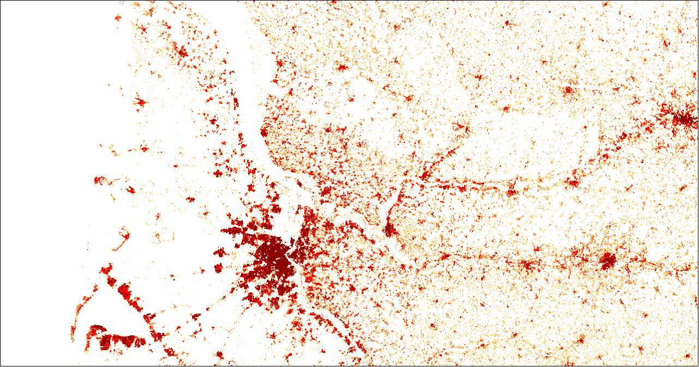

[.text-center]
*Figure 2: Example of population distribution*

The aim of the proposed data model is to provide capabilities of exchanging the data that is behind such pictures. In this example: the whole set of figures that are associated to each pixel that are necessary to build the global picture that will represent the area of dissemination. The model is not restricted just to one form of area of dissemination, it is not restricted to grid cells as elementary components of the area of dissemination - statistical units described vectorial (census blocks, admin units) are also supported - and it is not restricted to simple population counts. The model is a generic one to allow almost any statistical data to be exchanged.

One part of the model is a kind of description of metadata that is not covered by the ISO 19115 / 9 metadata standards and that should be added as a header in the dataset.

An example:

[width="100%",cols="43%,57%",options="header",]
|===
|*Attribute* |*Value*
|Domain |"demography"
|Measure |"populationAtResidencePlace"
|Classifications |"gender"
|measurementUnit |"person"
|areaOfDissemination |"surroundings of Bordeaux"
|===

The *domain* describes the domain of statistical knowledge the value belongs to and the *measure* contains the short term of the phenomenon which is counted. The *classifications* describe the type of classification used to calculate or aggregate the values. The *area of Dissemination* describes the area for which the statistical data are available and / or the area selected by the user.

Temporal dimension of population distribution is considered in the three aspects: the actual period of measurement and the theoretical reference period of the measurement and the period the data remain valid.

The second part of the model contains the elementary data values and the description by dimensions. Each value is characterised by a certain combination of thematical and a spatial dimensions. This part applies as often as values are available in the area disseminated / requested.

[width="100%",cols="52%,48%",options="header",]
|===
|*Attribute* |*Value*
|Value |<number>
|classificationItem |"male"
|geoReference |<Statistical Unit>
|===

NOTE This example is simplified and does not represent all attributes of the model.

The Population distribution – demography data model is defined in a very generic way, and nearly any statistical value describing a statistical measured phenomenon e.g. human population, can be considered a part of it. Use cases show the need for statistical variables as _population at residence place, population at work place and population density_. These statistics need to be provided on a more detailed territorial level than what is possible to access already through the Eurostat databases, preferable on statistical units like grids or census districts.

The requirements reflect the role of this theme in the INSPIRE context. The National Statistical Institutes should not be forced to provide INSPIRE services for all statistics covering human population, as building two parallel systems (regional statistics already provided by Eurostat and regional statistics provided by the member states through INSPIRE) will both be costly and time consuming.

===== UML Overview

An overview of the Population distribution - demography package and referenced packages is provided in Figure 1 below. The _Population Distribution_ - Demography package refers to the Base Types package for Identifier data type and some general base types to be used in accordance with the GCM. In addition the StatisticalUnit feature type of Annex III theme Statistical units is referenced to support the indirect positioning of statistical data with respect to the location on the Earth.

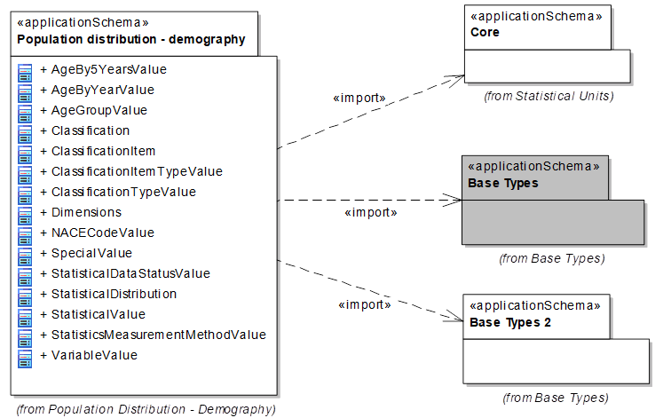

[.text-center]
*Figure 3: Package overview*

The application schema for Population distribution - demography is shown in Figure 2 and described below.

The schema is structured with three types of classes: "StatisticalDistribution", "StatisticalValue" and "StatisticalValue.Dimensions" and two groups of code lists.

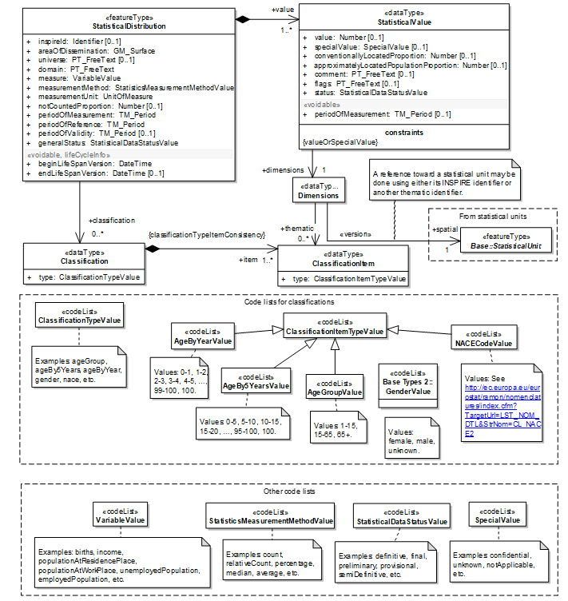

[.text-center]
*Figure 4: Class diagram _Population Distribution_ – Demography*

*[.underline]#Feature Type: StatisticalDistribution#*

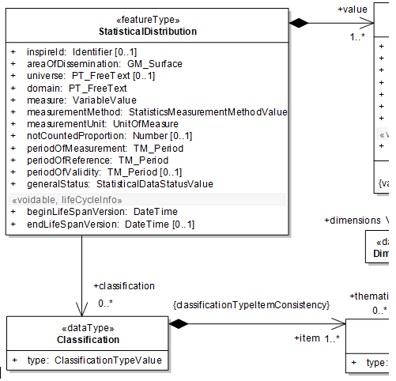

[.text-center]
*Figure 5: Feature type StatisticalDistribution*

The *StatisticalDistribution* is defined as a feature type for practical reasons, to be able to generate the according GML. This type mainly acts as a header to keep general (meta-) information about the distribution and contains common properties of each component of the distribution.

To provide the *INSPIREId* is not mandatory. It may be useful for internal organisational reasons of the provider, if the query or result will be stored for use at a later time.

*areaOfDissemination*: The areas of dissemination is the part of the 2D world the StatisticalDataDistribution describes, represented as a surface.

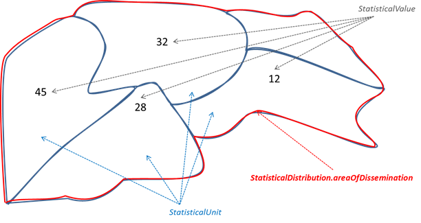

[.text-center]
*Figure 6: Statistical units, values and area of dissemination*

The *domain* attribute provides information about the domain of statistical knowledge.

The naming of the domains is not harmonised over Europe. Each provider should use the naming according his existing structure.

[.text-center]
*Example: List of domains from Eurostat's database:*

* Population and social conditions
* Economy and finance
* Agriculture, forestry and fisheries
* Industry, trade and services
* External Trade
* Transport
* Environment and energy
* Science and technology

The *universe* attribute provides information if the statistics cannot be assigned to domain and measure. This is the case if statistics are produced for a certain use case on user request and must be documented here.

Example: "Agriculture employment" may be calculated by dividing the persons employed in agriculture by the number of total persons aged 18 to 64 in employment

The attribute *measure* contains the value of the code list variable, which describes in short- term the phenomena for which data provided.

The attributes *measurementUnit* and *MeasurementMethod* support description of the kind of measurements provided by the distribution. The possible values are taken from the corresponding code lists UnitOfMeasure and statisticsMeasurementMethod.

According the common approach in INSPIRE to describe the quality of the content of a dataset, some data quality considerations appear through the *notCountedProportion* attribute that reports the relative amount of population known to be in the area of interest but not delivered in any of its spatial elements.

According to Regulation 1205/2008/EC and because the time dimension is an important component of statistical information, the model includes three attributes to address this issue:

[NOTE]
====
*Recomendation 6*

It is recommended that time attributes periodOfReference, periodOfValidity and periodOfMeasurement are provided.

====

*periodOfReference*

is the period when the data is supposed to give a picture of the area of interest..

In PD the reference period can be a period or a fixed date. In the last case one should use the same date for the beginning and the end.

*periodOfValidity*

In SU and PD the Validity is the period in which data remain relevant.

For PD in most cases this is forever. In that case the 2nd date is left empty.

*periodOfMeasurement*

This attribute is only useful in PD. The date / period the observation has been taken, the data was collected.

[.text-center]
*Examples*

[width="100%",cols="34%,33%,33%",options="header",]
|===
| |NUTS units |Census variables in Poland
|periodOfReference |1.1.2006 - 1.1.2006 |31.3.2011 – 31.3.2011
|periodOfValidity |1.1.2008 - 31.12.2011 |1.1.2012 - open
|PeriodOfMeasurement 
|{empty}- -|1.4.2011 - 30.6.2011
|===

To facilitate a user driven selection of data sets / values for a differential update the attributes *beginLifeSpanVersion* and *endLifeSpanVersion* are provided. These attributes are used by a user who is searching regularly but expecting only those values which are changed since his last query, not all data values. (What has changed since my last enquiry?)

The attribute *generalStatus* is used to describe the status of the values for the complete dataset, like definitive, semi-definitive or provisional and preliminary or final (Examples from Eurostat publications).

The *classification* attribute can be used to represent a set of distributions with respect to the way of splitting the statistical values into different groups using one or several classifications of the individuals according to their characteristics. No classification may happen for the "Total" values.

The \{ClassificationItemTypeConsistency} rule defines that all ClassificationItemTypes used to classify the value should be included into this list.

[.text-center]
*Example:*

[cols=""]
|===
^|statisticalDistribution.classification
|(1) gender
|(2) ageBy5years
|===

[width="100%",cols=",,"]
|===
3+^|statisticalValue.dimensions.
|classificationItem(1) |classificationItem(2) |Value
|female |0-5 |134
|male |0-5 |141
|female |5-10 |128
|male |5-10 |111
|female |10-15 |89
|: |: |:
|===

*[.underline]#Data Type: StatisticalValue#*

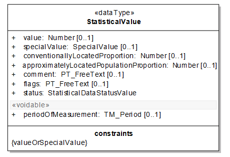
[.text-center]
*Figure 7: Data type StatisticalValue*

The data type *StatisticalValue* supports the description of the individual values of the distributions: This description contains the reference to understand to which spatial element and to which classification items the value refers to. The elementary datum can be seen as something that can be located in an n-dimensional space comprising the classical two dimensional one, but also the dimensions relative to the classifications used. For example, a simple population count on each municipality or on one country will only need a reference to the two dimensional space viewed through the municipalities or country list. But the same population divided by gender will need an additional third dimension.

In the centre of this item is the *value* attribute, which contains the number statistically calculated.

In case the value cannot be provided (e.g. privacy, error, confidentiality) the reason for value absence should be expressed using the *specialValue* attribute. It is required that either a value or a special value is provided.

Values can be accompanied with *flags* and footnotes (*comment* attribute) as usual in the statistics community, giving any kind of information useful to describe particular situations.

Two additional attributes related to data quality gives hints about the accuracy of the measure: *conventionallyLocatedProportion* and *approximatelyLocatedProportion*. They are discussed in the quality section.

The attribute *status* is used for exceptions of a certain value to what was specified in the generalStatus information of the statisticalDistribution.

Because there is no harmonised concept how to use the correct codes of the attributes "specialValue" and "flags", the corresponding code list must be provided by the data provider. It is recommended to the statistical community to develop a harmonised concept of using special values, flags and status.

Additionally, for each StatisticalValue a time stamp (*periodOfMeasurement*) can be provided, to allow exceptions to what was specified in the general information.

[.underline]#*Data Type StatisticalValue.Dimensions*:#

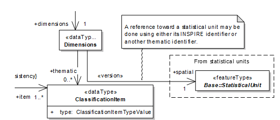
[.text-center]
*Figure 8: Data type StatisticalValue.Dimensions*

NOTE The association between Dimensions and the Core::StatisticalUnit will be established using the attribute "thematicallyID" instead of the "INSPIREID" (see below: Referencing data to statistical units").

According to the SDMX view on dimensions, all dimensions of the value (thematical and spatial) are summarized in a unique data type *dimensions*.

Note: The cardinality of the attribute dimensions is 1, because at least the geographical reference has to be provided.

In case an additional splitting / grouping of the statistical values are needed according to one or more classifications, the attribute *classificationItem* will be used.

Example: To describe a value representing residential population by gender, nationality and 5 year age classes three thematical classificationItems are used "male", "French", and "25-30", out of the domains of the code lists "Gender", "Nationality" and "age5Years".

*Referencing data to statistical units:*

All statistical data are spatially referenced (indirectly linked to a statistical unit), which is expressed by an common identifier, in SDMX called geographical dimension. In the geographical word (in GIS) these identifiers are used to identify the corresponding geometry and to join the tabulated data. These ID build the bridge (link) between the statistical and geographical world. Difficulties rise because different rules are used, when and how these identifiers have to change during an evolution.

A strong general requirement of the GCM in INSPIRE is, that an ID should be capable of uniquely and permanently identifying that with which it is associated [ISO 19135]. This is a rule which do not apply for geo-attributes (identifiers) used in the statistical community.

Therefore beside the INSPIRE ID an additional thematical identifier attribute is provided in the VectorStatisticalUnit feature type. This thematical ID can be used for linking PD and SU data following the recommendation of statistical unit data specification.

In the case the update rules for the identifier of a certain statistical unit follow the rules of the GCM resp. ISO [ISO 19135] without any exceptions, the INSPIRE identifier can be copied as thematical identifier.

Because the spatial object to which a thematical ID is linked (e.g. a municipality) can change without changing the thematical ID, some version information is requested. Typically and easy to use this is the reference year. This is necessary to avoid linking statistical with geometrical data of different reference years.

[NOTE]
====
*Recomendation 7*

To avoid matching the wrong thematical statistical data with SU the versioning of the thematical identifier is required.

====

The update rules for the identifier should describe clearly the use of the version identifier. There are several reasons to create a new version of an ID but not a new statistical unit (e.g. the area has changed less than 3% or the name has changed.

[NOTE]
====
*Recomendation 8*

Versioning of thematical identifiers should be defined and has to be distinguished from creating a new thematical identifier very clearly.

====

EXAMPLE:

The German State of Brandenburg was classified in the NUTS 2003 regulation as one level 1 unit divided in 18 level 3 units; level2 was equal to level 1. In the regulation 2007 the level 2 was divided in 2 units and the level 3 units have been reassigned. In the NUTS regulation 2010 the two level 2 units are aggregated to one level 2 unit and the level 3 units reassigned again. To distinguish the definition until 2003 from those of 2011 which have the same thematical identifier, the version ID (eg. 1999 and 2010 has to be added.

[width="99%",cols="13%,14%,10%,14%,10%,14%,25%",options="header",]
|===
2+a|
Gentlemens Agreement    

until 2003

(NUTS1999)

2+a|
Regulation 1059/2003 and 105 / 2007

(NUTS2003, NUTS2006)

2+a|
Regulation 31/2011

(NUTS2010)

| 
|NUTS1 |NUTS2/3 |NUTS1 |NUTS2/3 |NUTS1 |NUTS2/3 |Name
|DE4.1999 |DE40.1999 |DE4.2003 | |DE4.2010 |DE40.2010 |BRANDENBURG
|--- |--- |  |DE41.2003 |--- |--- |Brandenburg - Nordost
|  |DE403.1999 |  |DE411.2003 |  |DE403.2010 |Frankfurt (Oder)
|  |DE405.1999 |  |DE412.2003 |  |DE405.2010 |Barnim
|  |DE409.1999 |  |DE413.2003 |  |DE409.2010 |Märkisch-Oderland
|  |DE40A.1999 |  |DE414.2003 |  |DE40A.2010 |Oberhavel
|  |DE40C.1999 |  |DE415.2003 |  |DE40C.2010 |Oder-Spree
|  |DE40D.1999 |  |DE416.2003 |  |DE40D.2010 |Ostprignitz-Ruppin
|  |DE40F.1999 |  |DE417.2003 |  |DE40F.2010 |Prignitz
|  |DE40I.1999 |  |DE418.2003 |  |DE40I.2010 |Uckermark
|--- |--- |  |DE42.2003 |--- |--- |Brandenburg - Südwest
|  |DE401.1999 |  |DE421.2003 |  |DE401.2010 |Brandenburg an der Havel
|  |DE402.1999 |  |DE422.2003 |  |DE402.2010 |Cottbus, Kreisfreie Stadt
|  |DE404.1999 |  |DE423.2003 |  |DE404.2010 |Potsdam, Kreisfreie Stadt
|  |DE406.1999 |  |DE424.2003 |  |DE406.2010 |Dahme-Spreewald
|  |DE407.1999 |  |DE425.2003 |  |DE407.2010 |Elbe-Elster
|  |DE408.1999 |  |DE426.2003 |  |DE408.2010 |Havelland
|  |DE40B.1999 |  |DE427.2003 |  |DE40B.2010 |Oberspreewald-Lausitz
|  |DE40E.1999 |  |DE428.2003 |  |DE40E.2010 |Potsdam-Mittelmark
|  |DE40G.1999 |  |DE429.2003 |  |DE40G.2010 |Spree-Neiße
|  |DE40H.1999 |  |DE42A.2003 |  |DE40H.2010 |Teltow-Fläming
|===

The spatial reference of the data type StatisticalValue is the thematical Identifier of the Statistical Unit referenced. It is the value of a specific instance of the StatisticalUnit feature type.

The requirements and recommendations given in the INSPIRE data specification Statistical Units should be taken in consideration when aggregating statistical data to spatial units.

*[.underline]#Class Code lists:#*

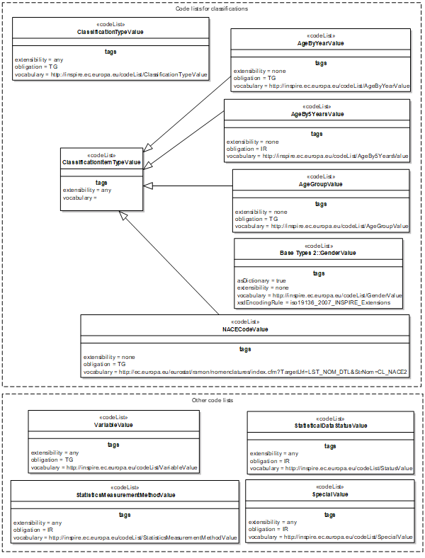
[.text-center]
*Figure 9: Code lists*

The feature type StatisticalDistribution uses two groups of code lists, the one for classifying the statistical value and others for the description of the variable, the measurement and the status.

Universe, Domain and Variable are used to identify the object, statistical measurement method describes how data are carried out and status explains the maturity of the dataset in the production chain. All attributes of this feature type are valid for the complete dataset.

Exceptions from the description above on value level can be described using attributes assigned to the data type "StatisticalValue". Code lists should be used for the attributes special value, flags and status.

The code list group classifications contain the classificationItems used to identify each value thematically. The numbers of classificationItems depend on the granularity needed and used to describe the phenomenon according the statistic provided. If no classificationItem is provided the value of the variables in the statistical units represents the total. All classifications used have to be shown in the attribute Classification of the feature type StatisticalDistribution.

===== Consistency between spatial data sets

There is no specific recommendation regarding consistency between spatial data sets. There should be a consistency between PD and SU objects. For each statistical unit referenced in the statistical data the geometry of the statistical unit has to be provided. It is recommended to use an identification of the statistical unit version which is used to aggregate the surveyed data.

===== Identifier management

The feature type StatisticalDataDistribution has an identifier attribute. Following the general INSPIRE rules (GCM) each object has an ID, but exceptions are possible for themes of Annex III. From the point of using the data interoperable, no identifier is needed for the theme _Population Distribution_. The ID may be used for disseminating statistical data, if the provider will save the data selection or query for a later additional use. In this case the user should be able to find the statistical data (or probably an updated version) using the INSPIREID.

The identifier shall consist of two parts: the namespace and a local id. The namespace is to uniquely identify a national registry wherein the identifier is registered, whereas the local id is to unique identifying an object within this namespace. The pragmatic approach to making it internationally unique is to add a prefix of the Member State identifier along with a theme specific identifier for the namespace.

Since INSPIRE objectives refer to data exchange only, the maintenance and management of unique

INSPIRE identifiers is out of INSPIRE scope, and is in the responsibility of the Member States.

If no ID is included some other data about the provider and base has to be provided. This should be the providing institution and if applicable the legislation.

==== Feature catalogue

*Feature catalogue metadata*

[width="100%",cols="34%,66%"]
|===
|Application Schema |INSPIRE Application Schema Population distribution - demography
|Version number |3.0
|===

*Types defined in the feature catalogue*

[width="100%",cols="41%,41%,18%",options="header",]
|===
|*Type* |*Package* |*Stereotypes*
|AgeBy5YearsValue |Population distribution - demography |«codelist»
|AgeByYearValue |Population distribution - demography |«codelist»
|AgeGroupValue |Population distribution - demography |«codelist»
|Classification |Population distribution - demography |«dataType»
|ClassificationItem |Population distribution - demography |«dataType»
|ClassificationItemTypeValue |Population distribution - demography |«codelist»
|ClassificationTypeValue |Population distribution - demography |«codelist»
|Dimensions |Population distribution - demography |«dataType»
|NACECodeValue |Population distribution - demography |«codelist»
|SpecialValue |Population distribution - demography |«codelist»
|StatisticalDataStatusValue |Population distribution - demography |«codelist»
|StatisticalDistribution |Population distribution - demography |«featureType»
|StatisticalValue |Population distribution - demography |«dataType»
|StatisticsMeasurementMethodValue |Population distribution - demography |«codelist»
|VariableValue |Population distribution - demography |«codelist»
|===

===== Spatial object types

====== StatisticalDistribution

[width="100%",cols="100%",options="header",]
|===
|*StatisticalDistribution*
a|
[%autowidth]
!===
!Name: !Statistical distribution
!Definition: !Set of measures describing how a phenomenon is spread within some part of the 2D world.
!Stereotypes: !«featureType»
!===

a|
*Attribute: inspireId*

[%autowidth]
!===
!Name: !INSPIRE identifier
!Value type: !Identifier
!Definition: !External object identifier of the spatial object.
!Description: !An external object identifier is a unique object identifier published by the responsible body, which may be used by external applications to reference the spatial object. The identifier is an identifier of the spatial object, not an identifier of the real-world phenomenon.
!Multiplicity: !0..1
!===

a|
*Attribute: areaOfDissemination*

[%autowidth]
!===
!Name: !Area of dissemination
!Value type: !GM_Surface
!Definition: !The part of the 2D world the StatisticalDataDistribution describes.
!Multiplicity: !1
!===

a|
*Attribute: universe*

[%autowidth]
!===
!Name: !Universe
!Value type: !PT_FreeText
!Definition: !When distribution is related to a subset of the population and not the population in its whole, the literal description of the way this subset was defined. EXAMPLE : A dataset can give the population distribution of the unemployed persons under 25. The variable will be "unemployedPopulation", the measure a "count " and the measurementUnit "person". The only way to express that the distribution doesn't cover the whole unemployed population would be to describe that situation in the Unviverse attribute.
!Multiplicity: !0..1
!===

a|
*Attribute: domain*

[%autowidth]
!===
!Name: !Domain
!Value type: !PT_FreeText
!Definition: !The part of statistical knowledge the data refers to.
!Description: !EXAMPLES: Demography, activity, etc.
!Multiplicity: !1
!===

a|
*Attribute: measure*

[%autowidth]
!===
!Name: !Measure
!Value type: !VariableValue
!Definition: !The measure concerned by the distribution.
!Description: !EXAMPLE: Population by age and gender, households by size, etc.
!Multiplicity: !1
!===

a|
*Attribute: measurementMethod*

[%autowidth]
!===
!Name: !Measurement method
!Value type: !StatisticsMeasurementMethodValue
!Definition: !The description of the statistic measurement method.
!Multiplicity: !1
!===

a|
*Attribute: measurementUnit*

[%autowidth]
!===
!Name: !Measurement unit
!Value type: !UnitOfMeasure
!Definition: !The unit of the measurement.
!Multiplicity: !1
!===

a|
*Attribute: notCountedProportion*

[%autowidth]
!===
!Name: !Not counted proportion
!Value type: !Number
!Definition: !The proportion of population of the area of interest that is not counted in any of its spatial components.
!Description: !EXAMPLE: This situation can occur when the total population of the area of interest is collected by some process (e.g. administrative register) but population in the spatial components of the area of interest by another process (e.g. estimation).
!Multiplicity: !0..1
!===

a|
*Attribute: periodOfMeasurement*

[%autowidth]
!===
!Name: !Period of measurement
!Value type: !TM_Period
!Definition: !The date or period the observation has been taken, the data was collected.
!Multiplicity: !1
!===

a|
*Attribute: periodOfReference*

[%autowidth]
!===
!Name: !Period of reference
!Value type: !TM_Period
!Definition: !The period when the data is supposed to give a picture of the area of interest.
!Multiplicity: !1
!===

a|
*Attribute: periodOfValidity*

[%autowidth]
!===
!Name: !Period of validity
!Value type: !TM_Period
!Definition: !The period in which the data remains relevant.
!Description: !Outside this period the data will not be used and must be replaced by new data. In most cases this is forever and the 2nd date is left empty.
!Multiplicity: !0..1
!===

a|
*Attribute: beginLifeSpanVersion*

[%autowidth]
!===
!Name: !Begin life span version
!Value type: !DateTime
!Definition: !Date and time at which this version of the spatial object was inserted or changed in the spatial data set.
!Multiplicity: !1
!Stereotypes: !«voidable,lifeCycleInfo»
!===

a|
*Attribute: endLifeSpanVersion*

[%autowidth]
!===
!Name: !End life span version
!Value type: !DateTime
!Definition: !Date and time at which this version of the spatial object was superseded or retired in the spatial data set.
!Multiplicity: !0..1
!Stereotypes: !«voidable,lifeCycleInfo»
!===

a|
*Attribute: generalStatus*

[%autowidth]
!===
!Name: !general status
!Value type: !StatisticalDataStatusValue
!Definition: !The status of the statistical data distribution.
!Multiplicity: !1
!===

a|
*Association role: value*

[%autowidth]
!===
!Name: !Value
!Value type: !StatisticalValue
!Definition: !The statistical values composing the distribution.
!Multiplicity: !1..*
!===

a|
*Association role: classification*

[%autowidth]
!===
!Name: !Classification
!Value type: !Classification
!Definition: !Additional classifications used to split a total value of the described phenomenon. The StatisticalDistribution object will provide actually several distributions, one for each item of the used classification. NB: When no classification is provided, the statistical value is the total population.
!Multiplicity: !0..*
!===

|===

===== Data types

====== Classification

[width="100%",cols="100%",options="header",]
|===
|*Classification*
a|
[%autowidth]
!===
!Name: !Classification
!Definition: !A classification used for a statistical distribution.
!Description: !This code list describes the classification of the provided statistical values. It is the composition of the classification items.
!Stereotypes: !«dataType»
!===

a|
*Attribute: type*

[%autowidth]
!===
!Name: !Type
!Value type: !ClassificationTypeValue
!Definition: !The classification type.
!Multiplicity: !1
!===

a|
*Association role: item*

[%autowidth]
!===
!Name: !Item
!Value type: !ClassificationItem
!Definition: !The items composing the classification.
!Description: !EXAMPLE: The classification with a type "gender" is composed of the items "female", "male" and "unknown".
!Multiplicity: !1..*
!===

|===

====== ClassificationItem

[width="100%",cols="100%",options="header",]
|===
|*ClassificationItem*
a|
[%autowidth]
!===
!Name: !Classification item
!Definition: !An item composing a classification.
!Description: !EXAMPLE: The classification with a type "gender" is composed of the items "female", "male" and "unknown".
!Stereotypes: !«dataType»
!===

a|
*Attribute: type*

[%autowidth]
!===
!Name: !Type
!Value type: !ClassificationItemTypeValue
!Definition: !The classification item type.
!Multiplicity: !1
!===

|===

====== Dimensions

[width="100%",cols="100%",options="header",]
|===
|*Dimensions*
a|
[%autowidth]
!===
!Name: !Dimensions
!Definition: !The identification of what the piece of datum refers to in terms of geographic location or individual characteristics.
!Stereotypes: !«dataType»
!===

a|
*Association role: spatial*

[%autowidth]
!===
!Name: !Spatial
!Value type: !StatisticalUnit
!Definition: !The spatial dimension of the statistical value.
!Multiplicity: !1
!===

a|
*Association role: thematic*

[%autowidth]
!===
!Name: !Thematic
!Value type: !ClassificationItem
!Definition: !The thematic dimensions of the statistical value.
!Multiplicity: !0..*
!===

|===

====== StatisticalValue

[width="100%",cols="100%",options="header",]
|===
|*StatisticalValue*
a|
[%autowidth]
!===
!Name: !Statistical value
!Definition: !The pieces of datum of the distribution.
!Stereotypes: !«dataType»
!===

a|
*Attribute: value*

[%autowidth]
!===
!Name: !Value
!Value type: !Number
!Definition: !The value for the piece of datum.
!Multiplicity: !0..1
!===

a|
*Attribute: specialValue*

[%autowidth]
!===
!Name: !Special value
!Value type: !SpecialValue
!Definition: !Some conventional string when value for the piece of datum cannot be provided: missing value, value hidden because of confidentiality.
!Multiplicity: !0..1
!===

a|
*Attribute: conventionallyLocatedProportion*

[%autowidth]
!===
!Name: !Conventionally located proportion
!Value type: !Number
!Definition: !The proportion of population counted in the piece of datum but that cannot actually be physically located anywhere within the area of interest. EXAMPLE: This proportion will include homeless people who where given the address of the organisation that distributes social benefis to them.
!Multiplicity: !0..1
!===

a|
*Attribute: approximatelyLocatedPopulationProportion*

[%autowidth]
!===
!Name: !Approximately located proportion
!Value type: !Number
!Definition: !The proportion of population count that doesn't follow the common rule for location. "Population" can be persons if persons are counted, dwellings if the StatisticalDatadistribution is about dwellings, etc. EXAMPLE : A statistical distribution of the people is supposed to have been produced after the people were located in the cadastral parcel they live in. For some incorrectness in the registers used, the actual location of the cadastral parcel was not found fro some of them and an estimated location was computed. The number of people in this case must be reported in the attribute.
!Multiplicity: !0..1
!===

a|
*Attribute: comment*

[%autowidth]
!===
!Name: !Comment
!Value type: !PT_FreeText
!Definition: !Free style comment about the value.
!Multiplicity: !0..1
!===

a|
*Attribute: flags*

[%autowidth]
!===
!Name: !Flags
!Value type: !PT_FreeText
!Definition: !A set of one-character encoded comments about the data.
!Multiplicity: !0..1
!===

a|
*Attribute: periodOfMeasurement*

[%autowidth]
!===
!Name: !Period of measurement
!Value type: !TM_Period
!Definition: !The collection period of the statistical value. This period overrides the period specified in the associated statistical distribution.
!Multiplicity: !0..1
!Stereotypes: !«voidable»
!===

a|
*Attribute: status*

[%autowidth]
!===
!Name: !Status
!Value type: !StatisticalDataStatusValue
!Definition: !The status of the statistical data.
!Multiplicity: !1
!===

a|
*Association role: dimensions*

[%autowidth]
!===
!Name: !Dimensions
!Value type: !Dimensions
!Definition: !The part of the world the piece of datum refers to. Dimensions contains a description of the geographic location (2D dimension) together with possible additional dimensions when population counts are produced simultaneously for different individual characteristics. EXAMPLE: A simple population count for each part of the area of Dissemination will need only identification of these parts, while population count by gender will require and additional dimension (gender) to make a difference between the male and the female.
!Multiplicity: !1
!===

a|
*Constraint: valueOrSpecialValue*

[%autowidth]
!===
!Natural language: !Either the value or the specialValue attribute shall be provided.
!OCL: !
!===

|===

===== Code lists

====== AgeBy5YearsValue

[width="100%",cols="100%",options="header",]
|===
|*AgeBy5YearsValue*
a|
[%autowidth]
!===
!Name: !Age by 5 years value
!Definition: !Code values for age by 5 years classification items.
!Extensibility: !none
!Identifier: !http://inspire.ec.europa.eu/codelist/AgeBy5YearsValue
!Values: !The allowed values for this code list comprise only the values specified in _Annex C_ .
!===

|===

====== AgeByYearValue

[width="100%",cols="100%",options="header",]
|===
|*AgeByYearValue*
a|
[%autowidth]
!===
!Name: !Age by year value
!Definition: !Code values for age by year classification items.
!Extensibility: !none
!Identifier: !http://inspire.ec.europa.eu/codelist/AgeByYearValue
!Values: !The allowed values for this code list comprise only the values specified in "AgeByYearValue" .
!===

|===

====== AgeGroupValue

[width="100%",cols="100%",options="header",]
|===
|*AgeGroupValue*
a|
[%autowidth]
!===
!Name: !Age group value
!Definition: !Code values for age group classification items.
!Extensibility: !open
!Identifier: !http://inspire.ec.europa.eu/codelist/AgeGroupValue
!Values: !The allowed values for this code list comprise the values specified in Annex _C_ and additional values at any level defined by data providers. _Annex C_ includes recommended values that may be used by data providers.
!===

|===

====== ClassificationItemTypeValue

[width="100%",cols="100%",options="header",]
|===
|*ClassificationItemTypeValue*
a|
[%autowidth]
!===
!Name: !Classification item type value
!Definition: !Code values for classification items.
!Extensibility: !open
!Identifier: !http://inspire.ec.europa.eu/codelist/ClassificationItemTypeValue
!Values: !The allowed values for this code list comprise the values specified in Annex _C_ and additional values at any level defined by data providers.
!===

|===

====== ClassificationTypeValue

[width="100%",cols="100%",options="header",]
|===
|*ClassificationTypeValue*
a|
[%autowidth]
!===
!Name: !Classification type value
!Definition: !Code values for classification types.
!Extensibility: !open
!Identifier: !http://inspire.ec.europa.eu/codelist/ClassificationTypeValue
!Values: !The allowed values for this code list comprise the values specified in Annex _C_ and additional values at any level defined by data providers.
!===

|===

====== NACECodeValue

[width="100%",cols="100%",options="header",]
|===
|*NACECodeValue*
a|
[%autowidth]
!===
!NACE code value
!Code values for NACE classification items.
!none
!http://ec.europa.eu/eurostat/ramon/nomenclatures/index.cfm?TargetUrl=LST_NOM_DTL&StrNom=CL_NACE2
!The allowed values for this code list comprise only the values specified in "Regulation (EC) No 1893/2006 of the European Parliament and of the Council" . _Annex C_ includes recommended values that may be used by data providers.
!===

|===

====== SpecialValue

[width="100%",cols="100%",options="header",]
|===
|*SpecialValue*
a|
[%autowidth]
!===
!Name: !Special value
!Definition: !Code values for special values.
!Extensibility: !open
!Identifier: !http://inspire.ec.europa.eu/codelist/SpecialValue
!Values: !The allowed values for this code list comprise the values specified in Annex _C_ and additional values at any level defined by data providers.
!===

|===

====== StatisticalDataStatusValue

[width="100%",cols="100%",options="header",]
|===
|*StatisticalDataStatusValue*
a|
[%autowidth]
!===
!Name: !Statistical data status value
!Definition: !Code values for statistical data status.
!Extensibility: !open
!Identifier: !http://inspire.ec.europa.eu/codelist/StatusValue
!Values: !The allowed values for this code list comprise the values specified in Annex _C_ and additional values at any level defined by data providers.
!===

|===

====== StatisticsMeasurementMethodValue

[width="100%",cols="100%",options="header",]
|===
|*StatisticsMeasurementMethodValue*
a|
[%autowidth]
!===
!Name: !Statistics measurement method value
!Definition: !Code values for statistics measurement method.
!Extensibility: !open
!Identifier: !http://inspire.ec.europa.eu/codelist/StatisticsMeasurementMethodValue
!Values: !The allowed values for this code list comprise the values specified in Annex _C_ and additional values at any level defined by data providers.
!===

|===

====== VariableValue

[width="100%",cols="100%",options="header",]
|===
|*VariableValue*
a|
[%autowidth]
!===
!Name: !Variable value
!Definition: !Code values for variable names.
!Extensibility: !any
!Identifier: !http://inspire.ec.europa.eu/codelist/VariableValue
!Values: !The allowed values for this code list comprise any values defined by data providers. _Annex C_ includes recommended values that may be used by data providers.
!===

|===

===== Imported types (informative)

This section lists definitions for feature types, data types and enumerations and code lists that are defined in other application schemas. The section is purely informative and should help the reader understand the feature catalogue presented in the previous sections. For the normative documentation of these types, see the given references.

====== DateTime

[width="100%",cols="100%",options="header",]
|===
|*DateTime*
a|
[%autowidth]
!===
!Package: !Date and Time
!Reference: !Geographic information -- Conceptual schema language [ISO/TS 19103:2005]
!===

|===

====== GM_Surface

[width="100%",cols="100%",options="header",]
|===
|*GM_Surface*
a|
[%autowidth]
!===
!Package: !Geometric primitive
!Reference: !Geographic information -- Spatial schema [ISO 19107:2003]
!===

|===

====== Identifier

[width="100%",cols="100%",options="header",]
|===
|*Identifier*
a|
[%autowidth]
!===
!Package: !Base Types
!Reference: !INSPIRE Generic Conceptual Model, version 3.4 [DS-D2.5]
!Definition: !External unique object identifier published by the responsible body, which may be used by external applications to reference the spatial object.
!Description: !NOTE1 External object identifiers are distinct from thematic object identifiers. 
 
NOTE 2 The voidable version identifier attribute is not part of the unique identifier of a spatial object and may be used to distinguish two versions of the same spatial object. 
 
NOTE 3 The unique identifier will not change during the life-time of a spatial object.
!===

|===

====== Number

[width="100%",cols="100%",options="header",]
|===
|*Number (abstract)*
a|
[%autowidth]
!===
!Package: !Numerics
!Reference: !Geographic information -- Conceptual schema language [ISO/TS 19103:2005]
!===

|===

====== PT_FreeText

[width="100%",cols="100%",options="header",]
|===
|*PT_FreeText*
a|
[%autowidth]
!===
!Package: !Cultural and linguistic adapdability
!Reference: !Geographic information -- Metadata -- XML schema implementation [ISO/TS 19139:2007]
!===

|===

====== StatisticalUnit

[width="100%",cols="100%",options="header",]
|===
|*StatisticalUnit (abstract)*
a|
[%autowidth]
!===
!Package: !Statistical Units Base
!Reference: !INSPIRE Data specification on Statistical Units [DS-D2.8.III.1]
!Definition: !Unit for dissemination or use of statistical information.
!Description: !SOURCE [INSPIRE Directive:2007]. 
 
EXAMPLE grid cell, point, line, polygon. 
 
NOTE Spatial features of any INSPIRE application schema can be considered as a statistical unit, because all can be used as spatial reference. This class is provided to represent features that are used only to disseminate statistical information and that are not included in another INSPIRE application schema.
!===

|===

====== TM_Period

[width="100%",cols="100%",options="header",]
|===
|*TM_Period*
a|
[%autowidth]
!===
!Package: !Temporal Objects
!Reference: !Geographic information -- Temporal schema [ISO 19108:2002/Cor 1:2006]
!===

|===

====== UnitOfMeasure

[width="100%",cols="100%",options="header",]
|===
|*UnitOfMeasure (abstract)*
a|
[%autowidth]
!===
!Package: !Units of Measure
!Reference: !Geographic information -- Conceptual schema language [ISO/TS 19103:2005]
!===

|===

==== Externally governed code lists

The externally governed code lists included in this application schema are specified in the tables in this section.

[width="100%",cols="21%,14%,10%,25%,15%,15%",options="header",]
|===
|*Code list* |*Governance* |*Version* |*Availability* |*Formats* |*Subset*
|NACE |ESTAT |Latest available version |_[.underline]#http://ec.europa.eu/eurostat/ramon/nomenclatures/index.cfm?TargetUrl=LST_NOM_DTL&StrNom=NACE_REV2&StrLanguageCode=EN&IntPcKey=&StrLayoutCode=HIERARCHIC#_ |HTML, CSV, XML | 
|===

<<<
== Reference systems, units of measure and grids

=== Default reference systems, units of measure and grid

The reference systems, units of measure and geographic grid systems included in this sub-section are the defaults to be used for all INSPIRE data sets, unless theme-specific exceptions and/or additional requirements are defined in section 6.2.

==== Coordinate reference systems

===== Datum

[IMPORTANT]
====
[.text-center]
*IR Requirement*
_Annex II, Section 1.2_
*Datum for three-dimensional and two-dimensional coordinate reference systems*

For the three-dimensional and two-dimensional coordinate reference systems and the horizontal component of compound coordinate reference systems used for making spatial data sets available, the datum shall be the datum of the European Terrestrial Reference System 1989 (ETRS89) in areas within its geographical scope, or the datum of the International Terrestrial Reference System (ITRS) or other geodetic coordinate reference systems compliant with ITRS in areas that are outside the geographical scope of ETRS89. Compliant with the ITRS means that the system definition is based on the definition of the ITRS and there is a well documented relationship between both systems, according to EN ISO 19111.

====

===== Coordinate reference systems

[IMPORTANT]
====
[.text-center]
*IR Requirement*
_Annex II, Section 1.3_
*Coordinate Reference Systems*

Spatial data sets shall be made available using at least one of the coordinate reference systems specified in sections 1.3.1, 1.3.2 and 1.3.3, unless one of the conditions specified in section 1.3.4 holds.

*1.3.1. Three-dimensional Coordinate Reference Systems*

* Three-dimensional Cartesian coordinates based on a datum specified in 1.2 and using the parameters of the Geodetic Reference System 1980 (GRS80) ellipsoid.
* Three-dimensional geodetic coordinates (latitude, longitude and ellipsoidal height) based on a datum specified in 1.2 and using the parameters of the GRS80 ellipsoid.

*1.3.2. Two-dimensional Coordinate Reference Systems*

* Two-dimensional geodetic coordinates (latitude and longitude) based on a datum specified in 1.2 and using the parameters of the GRS80 ellipsoid.
* Plane coordinates using the ETRS89 Lambert Azimuthal Equal Area coordinate reference system.
* Plane coordinates using the ETRS89 Lambert Conformal Conic coordinate reference system.
* Plane coordinates using the ETRS89 Transverse Mercator coordinate reference system.

*1.3.3. Compound Coordinate Reference Systems*

--
. For the horizontal component of the compound coordinate reference system, one of the coordinate reference systems specified in section 1.3.2 shall be used.

. For the vertical component, one of the following coordinate reference systems shall be used:
--

* For the vertical component on land, the European Vertical Reference System (EVRS) shall be used to express gravity-related heights within its geographical scope. Other vertical reference systems related to the Earth gravity field shall be used to express gravity-related heights in areas that are outside the geographical scope of EVRS.
* For the vertical component in the free atmosphere, barometric pressure, converted to height using ISO 2533:1975 International Standard Atmosphere, or other linear or parametric reference systems shall be used. Where other parametric reference systems are used, these shall be described in an accessible reference using EN ISO 19111-2:2012.
* For the vertical component in marine areas where there is an appreciable tidal range (tidal waters), the Lowest Astronomical Tide (LAT) shall be used as the reference surface.
* For the vertical component in marine areas without an appreciable tidal range, in open oceans and effectively in waters that are deeper than 200 meters, the Mean Sea Level (MSL) or a well-defined reference level close to the MSL shall be used as the reference surface.

*1.3.4. Other Coordinate Reference Systems*

Exceptions, where other coordinate reference systems than those listed in 1.3.1, 1.3.2 or 1.3.3 may be used, are:

. Other coordinate reference systems may be specified for specific spatial data themes in this Annex.

. For regions outside of continental Europe, Member States may define suitable coordinate reference systems.

The geodetic codes and parameters needed to describe these coordinate reference systems and to allow conversion and transformation operations shall be documented and an identifier shall be created, according to EN ISO 19111 and ISO 19127.

====

===== Display

[IMPORTANT]
====
[.text-center]
*IR Requirement*
_Annex II, Section 1.4_
*Coordinate Reference Systems used in the View Network Service*

For the display of spatial data sets with the view network service as specified in Regulation No 976/2009, at least the coordinate reference systems for two-dimensional geodetic coordinates (latitude, longitude) shall be available.

====

===== Identifiers for coordinate reference systems

[IMPORTANT]
====
[.text-center]
*IR Requirement*
_Annex II, Section 1.4_
*Coordinate Reference Systems used in the View Network Service*

. Coordinate reference system parameters and identifiers shall be managed in one or several common registers for coordinate reference systems.

. Only identifiers contained in a common register shall be used for referring to the coordinate reference systems listed in this Section.

====

These Technical Guidelines propose to use the http URIs provided by the Open Geospatial Consortium as coordinate reference system identifiers (see identifiers for the default CRSs below). These are based on and redirect to the definition in the EPSG Geodetic Parameter Registry (_http://www.epsg-registry.org/_).

[TIP]
====
*TG Requirement 2*

The identifiers listed in Table 2 shall be used for referring to the coordinate reference systems used in a data set.

====

NOTE CRS identifiers may be used e.g. in:

* data encoding,
* data set and service metadata, and
* requests to INSPIRE network services.

[.text-center]
*Table 2. http URIs for the default coordinate reference systems*

[align=center,width="100%",cols="37%,20%,43%",options="header",]
|===
|*Coordinate reference system* |*Short name* |*http URI identifier*
|3D Cartesian in ETRS89 |ETRS89-XYZ |_http://www.opengis.net/def/crs/EPSG/0/4936_
|3D geodetic in ETRS89 on GRS80 |ETRS89-GRS80h |_http://www.opengis.net/def/crs/EPSG/0/4937_
|2D geodetic in ETRS89 on GRS80 |ETRS89-GRS80 |_http://www.opengis.net/def/crs/EPSG/0/4258_
|2D LAEA projection in ETRS89 on GRS80 |ETRS89-LAEA |_http://www.opengis.net/def/crs/EPSG/0/3035_
|2D LCC projection in ETRS89 on GRS80 |ETRS89-LCC |_http://www.opengis.net/def/crs/EPSG/0/3034_
|2D TM projection in ETRS89 on GRS80, zone 26N (30°W to 24°W) |ETRS89-TM26N |_http://www.opengis.net/def/crs/EPSG/0/3038_
|2D TM projection in ETRS89 on GRS80, zone 27N (24°W to 18°W) |ETRS89-TM27N |_http://www.opengis.net/def/crs/EPSG/0/3039_
|2D TM projection in ETRS89 on GRS80, zone 28N (18°W to 12°W) |ETRS89-TM28N |_http://www.opengis.net/def/crs/EPSG/0/3040_
|2D TM projection in ETRS89 on GRS80, zone 29N (12°W to 6°W) |ETRS89-TM29N |_http://www.opengis.net/def/crs/EPSG/0/3041_
|2D TM projection in ETRS89 on GRS80, zone 30N (6°W to 0°) |ETRS89-TM30N |_http://www.opengis.net/def/crs/EPSG/0/3042_
|2D TM projection in ETRS89 on GRS80, zone 31N (0° to 6°E) |ETRS89-TM31N |_http://www.opengis.net/def/crs/EPSG/0/3043_
|2D TM projection in ETRS89 on GRS80, zone 32N (6°E to 12°E) |ETRS89-TM32N |_http://www.opengis.net/def/crs/EPSG/0/3044_
|2D TM projection in ETRS89 on GRS80, zone 33N (12°E to 18°E) |ETRS89-TM33N |_http://www.opengis.net/def/crs/EPSG/0/3045_
|2D TM projection in ETRS89 on GRS80, zone 34N (18°E to 24°E) |ETRS89-TM34N |_http://www.opengis.net/def/crs/EPSG/0/3046_
|2D TM projection in ETRS89 on GRS80, zone 35N (24°E to 30°E) |ETRS89-TM35N |_http://www.opengis.net/def/crs/EPSG/0/3047_
|2D TM projection in ETRS89 on GRS80, zone 36N (30°E to 36°E) |ETRS89-TM36N |_http://www.opengis.net/def/crs/EPSG/0/3048_
|2D TM projection in ETRS89 on GRS80, zone 37N (36°E to 42°E) |ETRS89-TM37N |_http://www.opengis.net/def/crs/EPSG/0/3049_
|2D TM projection in ETRS89 on GRS80, zone 38N (42°E to 48°E) |ETRS89-TM38N |_http://www.opengis.net/def/crs/EPSG/0/3050_
|2D TM projection in ETRS89 on GRS80, zone 39N (48°E to 54°E) |ETRS89-TM39N |_http://www.opengis.net/def/crs/EPSG/0/3051_
|Height in EVRS |EVRS |_http://www.opengis.net/def/crs/EPSG/0/5730_
|3D compound: 2D geodetic in ETRS89 on GRS80, and EVRS height |ETRS89-GRS80-EVRS |_http://www.opengis.net/def/crs/EPSG/0/7409_
|===

==== Temporal reference system

[IMPORTANT]
====
[.text-center]
*IR Requirement*
_Article 11_
*Temporal Reference Systems*

. The default temporal reference system referred to in point 5 of part B of the Annex to Commission Regulation (EC) No 1205/2008 (footnote:[OJ L 326, 4.12.2008, p. 12.]) shall be used, unless other temporal reference systems are specified for a specific spatial data theme in Annex II.

====

NOTE 1 Point 5 of part B of the Annex to Commission Regulation (EC) No 1205/2008 (the INSPIRE Metadata IRs) states that the default reference system shall be the Gregorian calendar, with dates expressed in accordance with ISO 8601.

NOTE 2 ISO 8601 _Data elements and interchange formats – Information interchange – Representation of dates and times_ is an international standard covering the exchange of date and time-related data. The purpose of this standard is to provide an unambiguous and well-defined method of representing dates and times, so as to avoid misinterpretation of numeric representations of dates and times, particularly when data is transferred between countries with different conventions for writing numeric dates and times. The standard organizes the data so the largest temporal term (the year) appears first in the data string and progresses to the smallest term (the second). It also provides for a standardized method of communicating time-based information across time zones by attaching an offset to Coordinated Universal Time (UTC).

EXAMPLE 1997 (the year 1997), 1997-07-16 (16^th^ July 1997), 1997-07-16T19:20:3001:00 (16^th^ July 1997, 19h 20' 30'', time zone: UTC1)

==== Units of measure

[IMPORTANT]
====
[.text-center]
*IR Requirement*
_Article 12_
*Other Requirements & Rules*

(...)

[arabic, start=2]
. All measurement values shall be expressed using SI units or non-SI units accepted for use with the International System of Units, unless specified otherwise for a specific spatial data theme or type.

====

==== Grids

[IMPORTANT]
====
[.text-center]
*IR Requirement*
_Annex II, Section 2.2_
*Grids*

Either of the grids with fixed and unambiguously defined locations defined in Sections 2.2.1 and 2.2.2 shall be used as a geo-referencing framework to make gridded data available in INSPIRE, unless one of the following conditions holds:

. Other grids may be specified for specific spatial data themes in Annexes II-IV. In this case, data exchanged using such a theme-specific grid shall use standards in which the grid definition is either included with the data, or linked by reference.

. For grid referencing in regions outside of continental Europe Member States may define their own grid based on a geodetic coordinate reference system compliant with ITRS and a Lambert Azimuthal Equal Area projection, following the same principles as laid down for the grid specified in Section 2.2.1. In this case, an identifier for the coordinate reference system shall be created.

*2.2 Equal Area Grid*

The grid is based on the ETRS89 Lambert Azimuthal Equal Area (ETRS89-LAEA) coordinate reference system with the centre of the projection at the point 52^o^ N, 10^o^ E and false easting: x~0~ = 4321000 m, false northing: y~0~ = 3210000 m.
The origin of the grid coincides with the false origin of the ETRS89-LAEA coordinate reference system (x=0, y=0).
Grid points of grids based on ETRS89-LAEA shall coincide with grid points of the grid.
The grid is hierarchical, with resolutions of 1m, 10m, 100m, 1000m, 10000m and 100000m.
The grid orientation is south-north, west-east.
The grid is designated as Grid_ETRS89-LAEA. For identification of an individual resolution level the cell size in metres is appended.
For the unambiguous referencing and identification of a grid cell, the cell code composed of the size of the cell and the coordinates of the lower left cell corner in ETRS89-LAEA shall be used. The cell size shall be denoted in metres ("m") for cell sizes up to 100m or kilometres ("km") for cell sizes of 1000m and above. Values for northing and easting shall be divided by 10^n^, where _n_ is the number of trailing zeros in the cell size value.

====

=== Theme-specific requirements and recommendations

There are no theme-specific requirements or recommendations on reference systems and grids.

<<<
== Data quality

The data quality elements mentioned in "ISO/DIS 19157 Geographic Information Data quality" is mostly irrelevant to _Population Distribution_ / Demography Data.

The statistical quality measurement has to be harmonised with the ESMS the Euro SDMX Metadata Structure resp. the quality reporting (ESQR) which are used in national statistical offices and at Eurostat. It aims at documenting methodologies, quality and the statistical production processes in general. It uses 21 high-level concepts, with a limited breakdown of sub-items, strictly derived from the list of cross domain concepts in the SDMX Content Oriented Guidelines (2009).

EXAMPLE: _http://epp.eurostat.ec.europa.eu/portal/page/portal/statistics/metadata/metadata_structure_

Harmonising ISO/DIS 19157 with SDMX is beyond the scope of this document. It is part of the future mission to converge the geographical and statistical world.

<<<
== Dataset-level metadata

In the statistical community harmonised dataset-level metadata are covered by an international standard called SDMX (Statistical Data- and Metadata exchange). Due to the complexity of the geographical and the statistical systems a synopsis of the approaches is beyond the scope of this document. It is part of the future mission to converge the geographical and statistical world.

<<<
== Delivery

=== Updates

[IMPORTANT]
====
[.text-center]
*IR Requirement*
_Article 8_
*Updates*

. Member States shall make available updates of data on a regular basis.

. All updates shall be made available at the latest 6 months after the change was applied in the source data set, unless a different period is specified for a specific spatial data theme in Annex II.

====

NOTE In this data specification, no exception is specified, so all updates shall be made available at the latest 6 months after the change was applied in the source data set.

=== Delivery medium

According to Article 11(1) of the INSPIRE Directive, Member States shall establish and operate a network of services for INSPIRE spatial data sets and services. The relevant network service types for making spatial data available are:

* _view services_ making it possible, as a minimum, to display, navigate, zoom in/out, pan, or overlay viewable spatial data sets and to display legend information and any relevant content of metadata;
* _download services_, enabling copies of spatial data sets, or parts of such sets, to be downloaded and, where practicable, accessed directly;
* _transformation services_, enabling spatial data sets to be transformed with a view to achieving interoperability.

NOTE For the relevant requirements and recommendations for network services, see the relevant Implementing Rules and Technical Guidelinesfootnote:[The Implementing Rules and Technical Guidelines on INSPIRE Network Services are available at http://inspire.jrc.ec.europa.eu/index.cfm/pageid/5].

EXAMPLE 1 Through the Get Spatial Objects function, a download service can either download a pre-defined data set or pre-defined part of a data set (non-direct access download service), or give direct access to the spatial objects contained in the data set, and download selections of spatial objects based upon a query (direct access download service). To execute such a request, some of the following information might be required:

* the list of spatial object types and/or predefined data sets that are offered by the download service (to be provided through the Get Download Service Metadata operation),
* and the query capabilities section advertising the types of predicates that may be used to form a query expression (to be provided through the Get Download Service Metadata operation, where applicable),
* a description of spatial object types offered by a download service instance (to be provided through the Describe Spatial Object Types operation).

EXAMPLE 2 Through the Transform function, a transformation service carries out data content transformations from native data forms to the INSPIRE-compliant form and vice versa. If this operation is directly called by an application to transform source data (e.g. obtained through a download service) that is not yet conformant with this data specification, the following parameters are required:

Input data (mandatory). The data set to be transformed.

* Source model (mandatory, if cannot be determined from the input data). The model in which the input data is provided.
* Target model (mandatory). The model in which the results are expected.
* Model mapping (mandatory, unless a default exists). Detailed description of how the transformation is to be carried out.

=== Encodings

The IRs contain the following two requirements for the encoding to be used to make data available.

[IMPORTANT]
====
[.text-center]
*IR Requirement*
_Article 7_
*Encoding*

. Every encoding rule used to encode spatial data shall conform to EN ISO 19118. In particular, it shall specify schema conversion rules for all spatial object types and all attributes and association roles and the output data structure used.

. Every encoding rule used to encode spatial data shall be made available.

====

NOTE ISO 19118:2011 specifies the requirements for defining encoding rules used for interchange of geographic data within the set of International Standards known as the "ISO 19100 series". An encoding rule allows geographic information defined by application schemas and standardized schemas to be coded into a system-independent data structure suitable for transport and storage. The encoding rule specifies the types of data being coded and the syntax, structure and coding schemes used in the resulting data structure. Specifically, ISO 19118:2011 includes

* requirements for creating encoding rules based on UML schemas,
* requirements for creating encoding services, and
* requirements for XML-based encoding rules for neutral interchange of data.

While the IRs do not oblige the usage of a specific encoding, these Technical Guidelines propose to make data related to the spatial data theme _Population Distribution_ available at least in the default encoding(s) specified in section 0. In this section, a number of TG requirements are listed that need to be met in order to be conformant with the default encoding(s).

The proposed default encoding(s) meet the requirements in Article 7 of the IRs, i.e. they are conformant with ISO 19118 and (since they are included in this specification) publicly available.

==== Default Encoding(s)

===== Specific requirements for GML encoding

This data specification proposes the use of GML as the default encoding, as recommended in sections 7.2 and 7.3 of [DS-D2.7]. GML is an XML encoding in compliance with ISO 19118, as required in Article 7(1). For details, see [ISO 19136], and in particular Annex E (UML-to-GML application schema encoding rules).

The following TG requirements need to be met in order to be conformant with GML encodings.

[TIP]
====
*TG Requirement 3*

Data instance (XML) documents shall validate without error against the provided XML schema.

====

NOTE 1 Not all constraints defined in the application schemas can be mapped to XML. Therefore, the following requirement is necessary.

NOTE 2 The obligation to use only the allowed code list values specified for attributes and most of the constraints defined in the application schemas [.underline]#cannot# be mapped to the XML sch. They can therefore [.underline]#not# be enforced through schema validation. It may be possible to express some of these constraints using other schema or rule languages (e.g. Schematron), in order to enable automatic validation.

===== Default encoding(s) for application schema Population distribution - demography

*Name: Population distribution - demography GML Application Schema*
Version: version 3.0,
Specification: D2.8.III.10 Data Specification on _Population Distribution_ – Technical Guidelines
Character set: UTF-8

The xml schema document is available from INSPIRE website: __http://inspire.jrc.ec.europa.eu/schemas/pd/3.0/PopulationDistributionDemography.__xsd.

==== Recommended Encoding(s)

[NOTE]
====
*Recomendation 9*

It is recommended that also the encodings specified in this section be provided for the relevant application schemas.

====

===== Alternative encoding for application schema Population distribution

There is no specific requirement about the encoding of the data in general. However, the target of the whole INSPIRE specifications is to allow GIS-like application to use the data. As it was written before population distribution objects are not spatial objects and will primarily come from production processes that are not very close to the world of GIS.
In the case of pure PD data, this data will be made available through a translation. It is strongly expected that the data will be first available using standards that are today in use in the world of statistics, such as SDMX. SDMX dataset structure is not very different from the GML one, so a general XSL tool will be provided to make the bridge between the two formats.
SU and PD data can be provided in the same OGC geowebservice.
In the case of mapping (WMS) or transmitting data in combination with geometry (WFS) the standard INSPIRE network service should be used.
Special Encoding is required to transmit gridded data. In that case, typically grid data formats like TIFF, GeoTIFF, JPEG2000 or GMLJP2 should be used in combination with necessary additional metadata dataset (GML/XML combination of Metadata in XML and the data file embedded). More information the reader can find in the INSPIRE document D2.7 Guidelines for Encoding 7.5.
For transmitting gridded data, an alternative may be the WCS Service.
Some National Statistical Institutes are testing the new offered OGC based Service GDAS/TJS the Table join service based on a standardized table format.

<<<
== Data Capture

There is no specific guidance required with respect to data capture.

<<<
== Portrayal

The unique object defined in the "__Population Distribution__s – Demography" guidelines, StatisticlaDataDistribution is not a spatial object so there is no direct portrayal of it. However, as distributions of statistical data intend to give a description of how some phenomena spread within an area of dissemination, viewing the contents of a distribution as an additional layer is a very common task. Two different techniques can be used:

* Changing the aspect of the elementary spatial elements of the distribution.
* Adding symbols

This section does not contain any portrayal requirement but is a remainder of some common sense considerations.

*Changing the aspect of the elementary spatial elements*

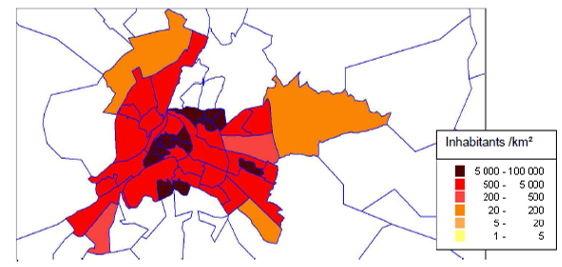
[.text-center]
*Figure 10: Population density distribution for the city of Poitiers*

EXAMPLE 1: Viewing population density distribution for the city of Poitiers. Elementary spatial elements are neighborhoods. Their shapes are outlined in blue and they are filled with different colors, as darker as the density is high. Neighborhoods outside the city are left blank. Some rules must be followed when using this kind of viewing:

* Always provide the correspondence between the color and the range of values they represent
* Don't use more than seven colors
* Bear in mind that colors can be associated with feelings. like the extra attention that the colour "red" can give or the calming effect of green
* Bare in mind that the size of the elementary spatial elements will influence the reading of the picture, giving more importance to the larger elements. So, with conventional statistical units, this kind of portrayal must not be used with absolute quantitative measures like population counts. This restriction does not apply to grids.

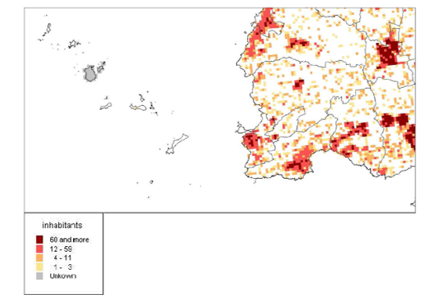
[.text-center]
*Figure 11: Population distribution in Brittainy*

EXAMPLE 2: Viewing population distribution in Brittainy, using 200m wide grid cells (partial view). Dark outlines (municipalities) are drawn only for improving the readability of the map and are not related to the population distribution object.

Since cells have the same size everywhere, the grid cells show actual population counts. But the threshold values for the colors are chosen to meet standard density thresholds in use to define the degree of urbanization: 1500 inhabitants per km² and 300 inhabitants per km² (respectively dark red and red). Colored grid cells are more useful than proportional symbols because they better show the extent of urbanized areas.

In this example, there are grid cells whose population is strictly zero and grid cells where actual population is not known. It is important to make a distinction between the two cases: first ones are left blanks; second ones are painted in grey.

*Adding symbols*

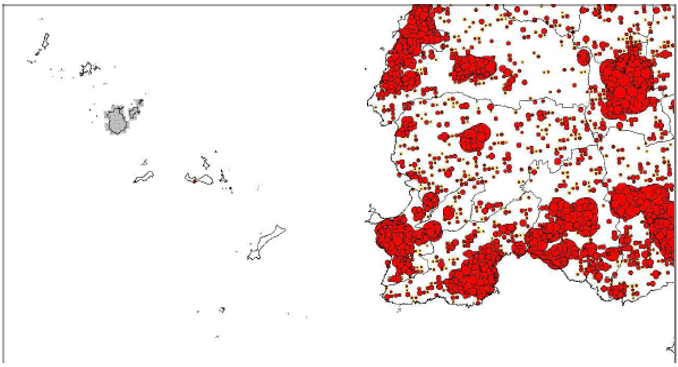
[.text-center]
*Figure 12: Population distribution using symbols*

EXAMPLE 3: Viewing population distribution using symbols whose size is proportional to the population. The population is shown with variable size discs, each one giving the population of one elementary spatial element (they are 200m wide grid cells as in example 2). In this case, the population distribution is an additional layer of a map containing something else: here a map of the boundaries of the municipalities. This kind of presentation is useful when different information have to be represented separately:

* Size and color can be chosen to represent different things: for example size for population and color for the intensity of young people in it.
* In addition, there could be different sets of symbols: there could be symbols for population at residence place and symbols for population at work place.
* One could also use one layer with colored vector statistical units and one layer with symbols. This is also a good solution to depict absolute quantitative data when using conventional statistical units. Since this kind of presentation doesn't directly refer to the actual shape of the statistical units the reader is much less influenced by the differences in area of the underlying statistical units. One should notice that using symbols doesn't remove the question of the presentation of unknown data. In the example it was represented as cells painted in grey like in the previous example.

:sectnums!:
<<<
== Bibliography

[DS-D2.3] INSPIRE DS-D2.3, Definition of Annex Themes and Scope, v3.0, http://INSPIRE.jrc.ec.europa.eu/reports/ImplementingRules/DataSpecifications/D2.3_Definition_of_Annex_Themes_and_scope_v3.0.pdf

[DS-D2.5] INSPIRE DS-D2.5, Generic Conceptual Model, v3.1, http://INSPIRE.jrc.ec.europa.eu/reports/ImplementingRules/DataSpecifications/D2.5_v3.1.pdf

[DS-D2.6] INSPIRE DS-D2.6, Methodology for the development of data specifications, v3.0, http://INSPIRE.jrc.ec.europa.eu/reports/ImplementingRules/DataSpecifications/D2.6_v3.0.pdf

[DS-D2.7] INSPIRE DS-D2.7, Guidelines for the encoding of spatial data, v3.0, http://INSPIRE.jrc.ec.europa.eu/reports/ImplementingRules/DataSpecifications/D2.7_v3.0.pdf

[ISO 19101] EN ISO 19101:2005 Geographic information – Reference model (ISO 19101:2002)

[ISO 19103] ISO/TS 19103:2005, Geographic information – Conceptual schema language

[ISO 19107] EN ISO 19107:2005, Geographic information – Spatial schema (ISO 19107:2003)

[ISO 19115] EN ISO 19115:2005, Geographic information – Metadata (ISO 19115:2003)

[ISO 19118] EN ISO 19118:2006, Geographic information – Encoding (ISO 19118:2005)

[ISO 19139] ISO/TS 19139:2007, Geographic information – Metadata – XML schema implementation

Eurostat Regional Yearbook 2009

(_http://epp.eurostat.ec.europa.eu/portal/page/portal/publications/regional_yearbook_)

:sectnums:
<<<
[appendix]
== Abstract Test Suite - (normative)

[cols=""]
|===
a|*Disclaimer*

While this Annex refers to the Commission Regulation (EU) No 1089/2010 of 23 November 2010 implementing Directive 2007/2/EC of the European Parliament and of the Council as regards interoperability of spatial data sets and services, it does not replace the legal act or any part of it.
|===

The objective of the Abstract Test Suite (ATS) included in this Annex is to help the conformance testing process. It includes a set of tests to be applied on a data set to evaluate whether it fulfils the requirements included in this data specification and the corresponding parts of Commission Regulation No 1089/2010 (implementing rule as regards interoperability of spatial datasets and services, further referred to as ISDSS Regulation). This is to help data providers in declaring the conformity of a data set to the "degree of conformity, with implementing rules adopted under Article 7(1) of Directive 2007/2/EC", which is required to be provided in the data set metadata according to Commission Regulation (EC) No 2008/1205 (the Metadata Regulation).

*Part 1* of this ATS includes tests that provide *input for assessing conformity with the ISDSS regulation.* In order to make visible which requirements are addressed by a specific test, references to the corresponding articles of the legal act are given. The way how the cited requirements apply to pd specification is described under the testing method.

In addition to the requirements included in ISDSS Regulation this Technical guideline contains TG requirements too. TG requirements are technical provisions that need to be fulfilled in order to be conformant with the corresponding IR requirement when the specific technical implementation proposed in this document is used. Such requirements relate for example to the default encoding described in section 9. *Part 2* of the ATS presents tests necessary for assessing the *conformity with TG requirements*.

NOTE Conformance of a data set with the TG requirement(s) included in this ATS implies conformance with the corresponding IR requirement(s).

The *ATS is applicable to the data sets that* *have been transformed* to be made available through INSPIRE download services (i.e. the data returned as a response to the mandatory "Get Spatial Dataset" operation) rather than the original "source" data sets.

The requirements to be tested are grouped in several _conformance classes_. Each of these classes covers a specific aspect: one conformance class contains tests reflecting the requirements on the application schema, another on the reference systems, etc. *Each conformance class is identified by a URI* (uniform resource identifier) according to the following pattern:

http://inspire.ec.europa.eu/conformance-class/ir/pd/<conformance class identifier>

EXAMPLE 1 The URI _http://inspire.ec.europa.eu/conformance-class/ir/ef/rs_ identifies the Reference Systems ISDSS conformance class of the Environmental Monitoring Facilities (EF) data theme.

The results of the tests should be published referring to the relevant conformance class (using its URI).

When an INSPIRE data specification contains *more than one application schema,* the requirements tested in a conformance class may differ depending on the application schema used as a target for the transformation of the data set. This will always be the case for the application schema conformance class. However, also other conformance classes could have different requirements for different application schemas. In such cases, a separate conformance class is defined for each application schema, and they are distinguished by specific URIs according to the following pattern:

http://inspire.ec.europa.eu/conformance-class/ir/pd/<conformance class identifier>/ 
<application schema namespace prefix>

EXAMPLE 2 The URI _http://inspire.ec.europa.eu/conformance-class/ir/el/as/el-vec_ identifies the conformity with the application schema (_as_) conformance class for the Elevation Vector Elements (_el-vec_) application schema.

An overview of the conformance classes and the associated tests is given in the table below.

[cols=""]
|===
|A.1 Application Schema Conformance Class
a|[cols=""]
!===
!A.1.1 Schema element denomination test
!A.1.2 Value type test
!A.1.3 Value test
!A.1.4 Attributes/associations completeness test
!A.1.5 Abstract spatial object test
!A.1.6 Constraints test
!A.1.7 Geometry representation test
!===
|A.2 Reference Systems Conformance Class
a|[cols=""]
!===
!A.2.1 Datum test
!A.2.2 Coordinate reference system test
!A.2.3 View service coordinate reference system test
!A.2.4 Temporal reference system test
!A.2.5 Units of measurements test
!===
|A.3 Data Consistency Conformance Class
a|[cols=""]
!===
!A.3.1 Unique identifier persistency test
!A.3.2 Version consistency test
!A.3.3 Life cycle time sequence test
!A.3.4 Validity time sequence test
!A.3.5 Update frequency test
!===
|A.4 Metadata IR Conformance Class
a|[cols=""]
!===
!A.4.1 Metadata for interoperability test
!===
A.5 Information Accessibility Conformance Class 60
a|[cols=""]
!===
!A.5.1 Code list publication test
!A.5.2 CRS publication test
!A.5.3 CRS identification test
!A.5.4 Grid identification test
!===
|A.6 Data Delivery Conformance Class
a|[cols=""]
!===
!A.6.1 Encoding compliance test
!===
|A.7 Technical Guideline Conformance Class
a|[cols=""]
!===
!A.7.1 Multiplicity test
!A.7.2 CRS http URI test
!A.7.3 Metadata encoding schema validation test
!A.7.4 Metadata occurrence test
!A.7.5 Metadata consistency test
!A.7.6 Encoding schema validation test
!A.7.7 Style test
!===
|===

In order to be conformant to a conformance class, a data set has to pass *all* tests defined for that conformance class.

In order to be conformant with the ISDSS regulation the inspected data set needs to be conformant to *all* conformance classes in Part 1. The conformance class for overall conformity with the ISDSS regulation is identified by the URI _http://inspire.ec.europa.eu/conformance-class/ir/pd/._

In order to be conformant with the Technical Guidelines, the dataset under inspection needs to be conformant to all conformance classes included both in Part 1 and 2. Chapter 8 describes in detail how to publish the result of testing regarding overall conformity and conformity with the conformance classes as metadata. The conformance class for overall conformity with the Technical Guidelines is identified by the URI _http://inspire.ec.europa.eu/conformance-class/tg/pd/3.0._

It should be noted that data providers are not obliged to integrate / decompose the original structure of the source data sets when they deliver them for INSPIRE. It means that a conformant dataset can contain less or more spatial object / data types than specified in the ISDSS Regulation.

*A dataset that contains less spatial object and/or data types* can be regarded conformant when the corresponding types of the source datasets after the necessary transformations fulfil the requirements set out in the ISDSS Regulation.

A *dataset that contain more spatial object and/or data types* may be regarded as conformant when

* all the spatial object / data types that have corresponding types in the source dataset after the necessary transformations fulfil the requirements set out in the ISDSS Regulation and
* all additional elements of the source model (spatial object types, data types, attributes, constraints, code lists and enumerations together with their values) do not conflict with any rule defined in the interoperability target specifications defined for any theme within INSPIRE.

[.red.background]
====
*Open issue 1:* Even though the last condition can be derived from Art. 8(4) of the Directive, the ISDSS Regulation does not contain requirements concerning the above issue. Therefore, no specific tests have been included in this abstract suit for testing conformity of extended application schemas. Annex F of the Generic Conceptual Model (D2.5) provides an example how to extend INSPIRE application schemas in a compliant way.
====

The ATS contains a detailed list of abstract tests. It should be noted that some tests in the Application schema conformance class can be automated by utilising xml *schema validation tools.* It should be noted that failing such validation test does not necessary reflect non-compliance to the application schema; it may be the results of erroneous encoding.

Each test in this suit follows the same structure:

* Requirement: citation from the legal texts (ISDSS requirements) or the Technical Guidelines (TG requirements);
* Purpose: definition of the scope of the test;
* Reference: link to any material that may be useful during the test;
* Test method: description of the testing procedure.

According to ISO 19105:2000 all tests in this ATS are basic tests. Therefore, this statement is not repeated each time.

<<<
[discrete]
== Part 1 - (normative)

*Conformity with Commission Regulation No 1089/2010*

=== Application Schema Conformance Class

*Conformance class:*

http://inspire.ec.europa.eu/conformance-class/ir/pd/as/Population distribution-demography

==== Schema element denomination test

[loweralpha]
. [.underline]#Purpose#: Verification whether each element of the dataset under inspection carries a name specified in the target application schema(s).

. [.underline]#Reference#: Art. 3 and Art.4 of Commission Regulation No 1089/2010

. [.underline]#Test Method#: Examine whether the corresponding elements of the source schema (spatial object types, data types, attributes, association roles, code lists, and enumerations) are mapped to the target schema with the correct designation of mnemonic names.

NOTE Further technical information is in the Feature catalogue and UML diagram of the application schema(s) in section 5.2.

==== Value type test

[loweralpha]
. [.underline]#Purpose#: Verification whether all attributes or association roles use the corresponding value types specified in the application schema(s).

. [.underline]#Reference#: Art. 3, Art.4, Art.6(1), Art.6(4), Art.6(5) and Art.9(1)of Commission Regulation No 1089/2010.

. [.underline]#Test Method#: Examine whether the value type of each provided attribute or association role adheres to the corresponding value type specified in the target specification.

NOTE 1 This test comprises testing the value types of INSPIRE identifiers, the value types of attributes and association roles that should be taken from enumeration and code lists, and the coverage domains.

NOTE 2 Further technical information is in the Feature catalogue and UML diagram of the application schema(s) in section 5.2.

==== Value test

[loweralpha]
. [.underline]#Purpose#: Verify whether all attributes or association roles whose value type is a code list or enumeration take the values set out therein.

. [.underline]#Reference#: Art.4 (3) of Commission Regulation No 1089/2010.

. [.underline]#Test Method#: When an attribute / association role has an enumeration or code list as its type, compare the values of each instance with those provided in the application schema. To pass this tests any instance of an attribute / association role
+
* shall not take any other value than defined in the enumeration table when its type is an enumeration.
* shall take only values explicitly specified in the code list when the code list's extensibility is "none".
* shall take only a value explicitly specified in the code list or shall take a value that is narrower (i.e. more specific) than those explicitly specified in the application schema when the code list's extensibility is "narrower".

NOTE 1 This test is not applicable to code lists with extensibility "open" or "any".

NOTE 2 When a data provider only uses code lists with narrower (more specific values) this test can be fully performed based on internal information.

==== Attributes/associations completeness test

[loweralpha]
. [.underline]#Purpose#: Verification whether each instance of spatial object type and data types include all attributes and association roles as defined in the target application schema.

. [.underline]#Reference#: Art. 3, Art.4(1), Art.4(2), and Art.5(2) of Commission Regulation No 1089/2010.

. [.underline]#Test Method#: Examine whether all attributes and association roles defined for a spatial object type or data type are present for each instance in the dataset.

NOTE 1 Further technical information is in the Feature catalogue and UML diagram of the application schema(s) in section 5.2.

NOTE 2 For all properties defined for a spatial object, a value has to be provided if it exists in or applies to the real world entity – either the corresponding value (if available in the data set maintained by the data provider) or the value of _void._ If the characteristic described by the attribute or association role does not exist in or apply to the real world entity, the attribute or association role does not need to be present in the data set.

==== Abstract spatial object test

[loweralpha]
. [.underline]#Purpose#: Verification whether the dataset does NOT contain abstract spatial object / data types defined in the target application schema(s).

. [.underline]#Reference#: Art.5(3) of Commission Regulation No 1089/2010

. [.underline]#Test Method#: examine that there are NO instances of abstract spatial object / data types in the dataset provided.

NOTE Further technical information is in the Feature catalogue and UML diagram of the application schema(s) in section 5.2.

==== Constraints test

[loweralpha]
. [.underline]#Purpose#: Verification whether the instances of spatial object and/or data types provided in the dataset adhere to the constraints specified in the target application schema(s).

. [.underline]#Reference#: Art. 3, Art.4(1), and Art.4(2) of Commission Regulation No 1089/2010.

. [.underline]#Test Method#: Examine all instances of data for the constraints specified for the corresponding spatial object / data type. Each instance shall adhere to all constraints specified in the target application schema(s).

NOTE Further technical information is in the Feature catalogue and UML diagram of the application schema(s) in section 5.2.

==== Geometry representation test

[loweralpha]
. [.underline]#Purpose#: Verification whether the value domain of spatial properties is restricted as specified in the Commission Regulation No 1089/2010.

. [.underline]#Reference#: Art.12(1), Annex IV Section 10 of Commission Regulation No 1089/2010

. [.underline]#Test Method#: Check whether all spatial properties only use 0, 1 and 2-dimensional geometric objects that exist in the right 2-, 3- or 4-dimensional coordinate space, and where all curve interpolations respect the rules specified in the reference documents.

NOTE Further technical information is in OGC Simple Feature spatial schema v1.2.1 [06-103r4].

=== Reference Systems Conformance Class

*Conformance class:*

http://inspire.ec.europa.eu/conformance-class/ir/pd/rs

==== Datum test

[loweralpha]
. [.underline]#Purpose#: Verify whether each instance of a spatial object type is given with reference to one of the (geodetic) datums specified in the target specification.

. [.underline]#Reference#: Annex II Section 1.2 of Commission Regulation No 1089/2010

. [.underline]#Test Method#: Check whether each instance of a spatial object type specified in the application schema(s) in section 5 has been expressed using:
+
* the European Terrestrial Reference System 1989 (ETRS89) within its geographical scope; or
* the International Terrestrial Reference System (ITRS) for areas beyond the ETRS89 geographical scope; or
* other geodetic coordinate reference systems compliant with the ITRS. Compliant with the ITRS means that the system definition is based on the definition of ITRS and there is a well-established and described relationship between both systems, according to the EN ISO 19111.

NOTE Further technical information is given in Section 6 of this document.

==== Coordinate reference system test

[loweralpha]
. [.underline]#Purpose#: Verify whether the two- and three-dimensional coordinate reference systems are used as defined in section 6.

. [.underline]#Reference#: Section 6 of Commission Regulation 1089/2010.

. [.underline]#Test Method#: Inspect whether the horizontal and vertical components of coordinates one of the corresponding coordinate reference system has been:
+
* Three-dimensional Cartesian coordinates based on a datum specified in 1.2 and using the parameters of the Geodetic Reference System 1980 (GRS80) ellipsoid.
* Three-dimensional geodetic coordinates (latitude, longitude and ellipsoidal height) based on a datum specified in 1.2 and using the parameters of the GRS80 ellipsoid.
* Two-dimensional geodetic coordinates (latitude and longitude) based on a datum specified in 1.2 and using the parameters of the GRS80 ellipsoid.
* Plane coordinates using the ETRS89 Lambert Azimuthal Equal Area coordinate reference system.
* Plane coordinates using the ETRS89 Lambert Conformal Conic coordinate reference system.
* Plane coordinates using the ETRS89 Transverse Mercator coordinate reference system.
* For the vertical component on land, the European Vertical Reference System (EVRS) shall be used to express gravity-related heights within its geographical scope. Other vertical reference systems related to the Earth gravity field shall be used to express gravity-related heights in areas that are outside the geographical scope of EVRS.
* For the vertical component in marine areas where there is an appreciable tidal range (tidal waters), the Lowest Astronomical Tide (LAT) shall be used as the reference surface.
* For the vertical component in marine areas without an appreciable tidal range, in open oceans and effectively in waters that are deeper than 200 meters, the Mean Sea Level (MSL) or a well-defined reference level close to the MSL shall be used as the reference surface."
* For the vertical component in the free atmosphere, barometric pressure, converted to height using ISO 2533:1975 International Standard Atmosphere, or other linear or parametric reference systems shall be used. Where other parametric reference systems are used, these shall be described in an accessible reference using EN ISO 19111-2:2012.

NOTE Further technical information is given in Section 6 of this document.

==== View service coordinate reference system test

[loweralpha]
. [.underline]#Purpose#: Verify whether the spatial data set is available in the two dimensional geodetic coordinate system for their display with the INSPIRE View Service.

. [.underline]#Reference#: Annex II Section 1.4 of Commission Regulation 1089/2010

. [.underline]#Test Method#: Check that each instance of a spatial object types specified in the application schema(s) in section 5 is available in the two-dimensional geodetic coordinate system

NOTE Further technical information is given in Section 6 of this document.

==== Temporal reference system test

[loweralpha]
. [.underline]#Purpose#: Verify whether date and time values are given as specified in Commission Regulation No 1089/2010.

. [.underline]#Reference#: Art.11(1) of Commission Regulation 1089/2010

. [.underline]#Test Method#: Check whether:

* the Gregorian calendar is used as a reference system for date values;
* the Universal Time Coordinated (UTC) or the local time including the time zone as an offset from UTC are used as a reference system for time values.

NOTE Further technical information is given in Section 6 of this document.

==== Units of measurements test

[loweralpha]
. [.underline]#Purpose#: Verify whether all measurements are expressed as specified in Commission Regulation No 1089/2010.

. [.underline]#Reference#: Art.12(2) of Commission Regulation 1089/2010

. [.underline]#Test Method#: Check whether all measurements are expressed in SI units or non-SI units accepted for use with the International System of Units.

NOTE 1 Further technical information is given in ISO 80000-1:2009.

NOTE 2 Degrees, minutes and seconds are non-SI units accepted for use with the International System of Units for expressing measurements of angles.

=== Data Consistency Conformance Class

*Conformance class:*

http://inspire.ec.europa.eu/conformance-class/ir/pd/dc

==== Unique identifier persistency test

[loweralpha]
. [.underline]#Purpose#: Verify whether the namespace and localId attributes of the external object identifier remain the same for different versions of a spatial object.

. [.underline]#Reference#: Art. 9 of Commission Regulation 1089/2010.

. [.underline]#Test Method#: Compare the namespace and localId attributes of the external object identifiers in the previous version(s) of the dataset with the namespace and localId attributes of the external object identifiers of current version for the same instances of spatial object / data types; To pass the test, neither the namespace, nor the localId shall be changed during the life-cycle of a spatial object.

NOTE 1 This test can be performed exclusively on the basis of the information available in the database of the data providers.

NOTE 2 When using URI this test includes the verification whether no part of the construct has been changed during the life cycle of the instances of spatial object / data types.

NOTE 3 Further technical information is given in section 14.2 of the INSPIRE Generic Conceptual Model.

==== Version consistency test

[loweralpha]
. [.underline]#Purpose#: Verify whether different versions of the same spatial object / data type instance belong to the same type.

. [.underline]#Reference#: Art. 9 of Commission Regulation 1089/2010.

. [.underline]#Test Method#: Compare the types of different versions for each instance of spatial object / data type

NOTE 1 This test can be performed exclusively on the basis of the information available in the database of the data providers.

==== Life cycle time sequence test

[loweralpha]
. [.underline]#Purpose#: Verification whether the value of the attribute beginLifespanVersion refers to an earlier moment of time than the value of the attribute endLifespanVersion for every spatial object / object type where this property is specified.

. [.underline]#Reference#: Art.10(3) of Commission Regulation 1089/2010.

. [.underline]#Test Method#: Compare the value of the attribute beginLifespanVersion with attribute endLifespanVersion. The test is passed when the beginLifespanVersion value is before endLifespanVersion value for each instance of all spatial object/data types for which this attribute has been defined.

NOTE 1 This test can be performed exclusively on the basis of the information available in the database of the data providers.

==== Validity time sequence test

[loweralpha]
. [.underline]#Purpose#: Verification whether the value of the attribute validFrom refers to an earlier moment of time than the value of the attribute validTo for every spatial object / object type where this property is specified.

. [.underline]#Reference#: Art.12(3) of Commission Regulation 1089/2010.

. [.underline]#Test Method#: Compare the value of the attribute validFrom with attribute validTo. The test is passed when the validFrom value is before validTo value for each instance of all spatial object/data types for which this attribute has been defined.

NOTE 1 This test can be performed exclusively on the basis of the information available in the database of the data providers.

==== Update frequency test

[loweralpha]
. [.underline]#Purpose#: Verify whether all the updates in the source dataset(s) have been transmitted to the dataset(s) which can be retrieved for the PD data theme using INSPIRE download services.

. [.underline]#Reference#: Art.8 (2) of Commission Regulation 1089/2010.

. [.underline]#Test Method#: Compare the values of beginning of life cycle information in the source and the target datasets for each instance of corresponding spatial object / object types. The test is passed when the difference between the corresponding values is less than 6 months.

NOTE 1 This test can be performed exclusively on the basis of the information available in the database of the data providers.

=== Metadata IR Conformance Class

*Conformance class:*

http://inspire.ec.europa.eu/conformance-class/ir/pd/md

==== Metadata for interoperability test

[loweralpha]
. [.underline]#Purpose#: Verify whether the metadata for interoperability of spatial data sets and services described in 1089/2010 Commission Regulation have been created and published for each dataset related to the PD data theme.

. [.underline]#Reference#: Art.13 of Commission Regulation 1089/2010

. [.underline]#Test Method#: Inspect whether metadata describing the coordinate reference systems, encoding, topological consistency and spatial representation type have been created and published. If the spatial data set contains temporal information that does not refer to the default temporal reference system, inspect whether metadata describing the temporal reference system have been created and published. If an encoding is used that is not based on UTF-8, inspect whether metadata describing the character encoding have been created.

NOTE Further technical information is given in section 8 of this document.

=== Information Accessibility Conformance Class

*Conformance class:*

http://inspire.ec.europa.eu/*conformance*-class/ir/pd/ia

==== Code list publication test

[loweralpha]
. [.underline]#Purpose#: Verify whether all additional values used in the data sets for attributes, for which narrower values or any other value than specified in Commission Regulation 1089/2010 are allowed, are published in a register.

. [.underline]#Reference#: Art.6(3) and Annex IV Section 10.

. [.underline]#Test method#: For each additional value used in the data sets for code list-valued attributes, check whether it is published in a register.

NOTE Further technical information is given in section 5 of this document.

==== CRS publication test

[loweralpha]
. [.underline]#Purpose#: Verify whether the identifiers and the parameters of coordinate reference system are published in common registers.

. [.underline]#Reference#: Annex II Section 1.5

. [.underline]#Test method#: Check whether the identifier and the parameter of the CRS used for the dataset are included in a register. .

NOTE Further technical information is given in section 6 of this document.

==== CRS identification test

[loweralpha]
. [.underline]#Purpose#: Verify whether identifiers for other coordinate reference systems than specified in Commission Regulation 1089/2010 have been created and their parameters have been described according to EN ISO 19111 and ISO 19127.

. [.underline]#Reference#: Annex II Section 1.3.4

. [.underline]#Test method#: Check whether the register with the identifiers of the coordinate reference systems is accessible.

NOTE Further technical information is given in section 6 of this document.

==== Grid identification test

[loweralpha]
. [.underline]#Purpose#: Verify whether identifiers for other geographic grid systems than specified in Commission Regulation 1089/2010 have been created and their definitions have been either described with the data or referenced.

. [.underline]#Reference#: Annex II Section 2.1 and 2.2

. [.underline]#Test Method#: Check whether the identifiers for grids have been created. Inspect the dataset and/or the metadata for inclusion of grid definition.

NOTE Further technical information is given in section 6 of this document.

=== Data Delivery Conformance Class

*Conformance class:*

http://inspire.ec.europa.eu/conformance-class/ir/pd/de

==== Encoding compliance test

[loweralpha]
. [.underline]#Purpose#: Verify whether the encoding used to deliver the dataset comply with EN ISO 19118.

. [.underline]#Reference#: Art.7 (1) of Commission Regulation 1089/2010.

. [.underline]#Test Method#: Follow the steps of the Abstract Test Suit provided in EN ISO 19118.

NOTE 1 Datasets using the default encoding specified in Section 9 fulfil this requirement.

NOTE 2 Further technical information is given in Section 9 of this document.

<<<
[discrete]
== Part 2 - (informative)

*Conformity with the technical guideline (TG) Requirements*

=== Technical Guideline Conformance Class

*Conformance class:*

_http://inspire.ec.europa.eu/conformance-class/tg/pd/3.0_

==== Multiplicity test

[loweralpha]
. [.underline]#Purpose#: Verify whether each instance of an attribute or association role specified in the application schema(s) does not include fewer or more occurrences than specified in section 5.

. [.underline]#Reference#: Feature catalogue and UML diagram of the application schema(s) in section 5 of this guideline.

. [.underline]#Test Method#: Examine that the number of occurrences of each attribute and/or association role for each instance of a spatial object type or data type provided in the dataset corresponds to the number of occurrences of the attribute / association role that is specified in the application schema(s) in section 5.

==== CRS http URI test

[loweralpha]
. [.underline]#Purpose#: Verify whether the coordinate reference system used to deliver data for INSPIRE network services has been identified by URIs according to the EPSG register.

. [.underline]#Reference#: Table 2 in Section 6 of this technical guideline

. [.underline]#Test Method#: Compare the URI of the dataset with the URIs in the table.

NOTE 1 Passing this test implies the fulfilment of test A6.2

NOTE 2 Further reference please see _http://www.epsg.org/geodetic.html_

==== Metadata encoding schema validation test

[loweralpha]
. [.underline]#Purpose#: Verify whether the metadata follows an XML schema specified in ISO/TS 19139.

. [.underline]#Reference#: Section 8 of this technical guideline, ISO/TS 19139

. [.underline]#Test Method#: Inspect whether provided XML schema is conformant to the encoding specified in ISO 19139 for each metadata instance.

NOTE 1 Section 2.1.2 of the Metadata Technical Guidelines discusses the different ISO 19139 XML schemas that are currently available.

==== Metadata occurrence test

[loweralpha]
. [.underline]#Purpose#: Verify whether the occurrence of each metadata element corresponds to those specified in section 8.

. [.underline]#Reference#: Section 8 of this technical guideline

. [.underline]#Test Method#: Examine the number of occurrences for each metadata element. The number of occurrences shall be compared with its occurrence specified in Section 8:

NOTE 1 Section 2.1.2 of the Metadata Technical Guidelines discusses the different ISO 19139 XML schema.

==== Metadata consistency test

[loweralpha]
. [.underline]#Purpose#: Verify whether the metadata elements follow the path specified in ISO/TS 19139.

. [.underline]#Reference#: Section 8 of this technical guideline, ISO/TS 19139

. [.underline]#Test Method#: Compare the XML schema of each metadata element with the path provide in ISO/TS 19137.

NOTE 1 This test does not apply to the metadata elements that are not included in ISO/TS 19139.

==== Encoding schema validation test

[loweralpha]
. [.underline]#Purpose#: Verify whether the provided dataset follows the rules of default encoding specified in section 9 of this document

. [.underline]#Reference#: section 9 of this technical guideline

. [.underline]#Test Method#: Inspect whether provided encoding(s) is conformant to the encoding(s) for the relevant application schema(s) as defined in section 9:

NOTE 1 Applying this test to the default encoding schema described in section 9 facilitates testing conformity with the application schema specified in section 5. In such cases running this test with positive result may replace tests from A1.1 to A1.4 provided in this abstract test suite.

NOTE 2 Using Schematron or other schema validation tool may significantly improve the validation process, because some some complex constraints of the schema cannot be validated using the simple XSD validation process. On the contrary to XSDs Schematron rules are not delivered together with the INSPIRE data specifications. Automating the process of validation (e.g. creation of Schematron rules) is therefore a task and an opportunity for data providers.

==== Style test

[loweralpha]
. [.underline]#Purpose#: Verify whether the styles defined in section 11.2 have been made available for each specified layer.

. [.underline]#Reference#: section 11.2.

. [.underline]#Test Method#: Check whether the styles defined in section 11.2 have been made available for each specified layer.

<<<
[appendix]
== Use cases - (informative) 

No special use cases have been formalised for _Population Distribution_ theme. The basic use case is to answer to the questions:

* Where are human populations located?
* How a place is populated?

Many other INSPIRE themes include formalised use cases on population distribution. Statistically oriented use cases can be found in DS- D2.8.III.1 Statistical Units.

<<<
[appendix]
== Code list values - (normative) 

*INSPIRE Application Schema 'Population distribution - demography'*

[width="100%",cols="100%",options="header",]
|===
|*Code List*
|_AgeBy5YearsValue_
|_AgeByYearValue_
|_AgeGroupValue_
|_ClassificationItemTypeValue_
|_ClassificationTypeValue_
|_SpecialValue_
|_StatisticalDataStatusValue_
|_StatisticsMeasurementMethodValue_
|_VariableValue_
|===

*AgeBy5YearsValue*

[width="100%",cols="100%"]
|===
a|
[width="100%",cols="17%,83%"]
!===
!Name: !Age by 5 years value
!Definition: !Code values for age by 5 years classification items.
!Extensibility: !none
!Identifier: !http://inspire.ec.europa.eu/codelist/AgeBy5YearsValue
!Values: !
!===

|===

The table below includes recommended values that may be used by data providers. Before creating new terms, please check if one of them can be used.

[width="100%",cols="100%"]
|===
a|
*0-5*

[%autowidth]
!===
!Name: !0-5
!Definition: !0 to less than 5
!===

a|
*10-May*

[%autowidth]
!===
!Name: !10-May
!Definition: !5 to less than 10
!===

a|
*15-Oct*

[%autowidth]
!===
!Name: !15-Oct
!Definition: !10 to less than 15
!===

a|
*15-20*

[%autowidth]
!===
!Name: !15-20
!Definition: !15 to less than 20
!===

a|
*20-25*

[%autowidth]
!===
!Name: !20-25
!Definition: !20 to less than 25
!===

a|
*25-30*

[%autowidth]
!===
!Name: !25-30
!Definition: !25 to less than 30
!===

a|
*30-35*

[%autowidth]
!===
!Name: !30-35
!Definition: !30 to less than 35
!===

a|
*35-40*

[%autowidth]
!===
!Name: !35-40
!Definition: !35 to less than 40
!===

a|
*40-45*

[%autowidth]
!===
!Name: !40-45
!Definition: !40 to less than 45
!===

a|
*45-50*

[%autowidth]
!===
!Name: !45-50
!Definition: !45 to less than 50
!===

a|
*50-55*

[%autowidth]
!===
!Name: !50-55
!Definition: !50 to less than 55
!===

a|
*55-60*

[%autowidth]
!===
!Name: !55-60
!Definition: !55 to less than 60
!===

a|
*60-65*

[%autowidth]
!===
!Name: !60-65
!Definition: !60 to less than 65
!===

a|
*65-70*

[%autowidth]
!===
!Name: !65-70
!Definition: !65 to less than 70
!===

a|
*70-75*

[%autowidth]
!===
!Name: !70-75
!Definition: !70 to less than 75
!===

a|
*75-80*

[%autowidth]
!===
!Name: !75-80
!Definition: !75 to less than 80
!===

a|
*80-85*

[%autowidth]
!===
!Name: !80-85
!Definition: !80 to less than 85
!===

a|
*85-90*

[%autowidth]
!===
!Name: !85-90
!Definition: !85 to less than 90
!===

a|
*90*

[%autowidth]
!===
!Name: !90
!Definition: !90 and more
!===

a|
*90-95*

[%autowidth]
!===
!Name: !90-95
!Definition: !90 to less than 95
!===

a|
*95*

[%autowidth]
!===
!Name: !95
!Definition: !95 and more
!===

a|
*95-100*

[%autowidth]
!===
!Name: !95-100
!Definition: !95 to less than 100
!===

a|
*100*

[%autowidth]
!===
!Name: !100
!Definition: !100 and more
!===

|===

AgeByYearValue

[width="100%",cols="100%"]
|===
a|
[width="100%",cols="17%,83%"]
!===
!Name: !Age by year value
!Definition: !Code values for age by year classification items.
!Extensibility: !none
!Identifier: !http://inspire.ec.europa.eu/codelist/AgeByYearValue
!Values: !
!===

|===

The table below includes recommended values that may be used by data providers. Before creating new terms, please check if one of them can be used.

[width="100%",cols="100%"]
|===
a|
*0_1*

[%autowidth]
!===
!Name: !0_1
!Definition: !0 to less than 1
!===

a|
*1_2*

[%autowidth]
!===
!Name: !1_2
!Definition: !1 to less than 2
!===

a|
*2_3*

[%autowidth]
!===
!Name: !2_3
!Definition: !2 to less than 3
!===

a|
*3_4*

[%autowidth]
!===
!Name: !3_4
!Definition: !3 to less than 4
!===

a|
*4_5*

[%autowidth]
!===
!Name: !4_5
!Definition: !4 to less than 5
!===

a|
*5_6*

[%autowidth]
!===
!Name: !5_6
!Definition: !5 to less than 6
!===

a|
*6_7*

[%autowidth]
!===
!Name: !6_7
!Definition: !6 to less than 7
!===

a|
*7_8*

[%autowidth]
!===
!Name: !7_8
!Definition: !7 to less than 8
!===

a|
*8_9*

[%autowidth]
!===
!Name: !8_9
!Definition: !8 to less than 9
!===

a|
*9_10*

[%autowidth]
!===
!Name: !9_10
!Definition: !9 to less than 10
!===

a|
*10_11*

[%autowidth]
!===
!Name: !10_11
!Definition: !10 to less than 11
!===

a|
*11_12*

[%autowidth]
!===
!Name: !11_12
!Definition: !11 to less than 12
!===

a|
*12_13*

[%autowidth]
!===
!Name: !12_13
!Definition: !12 to less than 13
!===

a|
*13_14*

[%autowidth]
!===
!Name: !13_14
!Definition: !13 to less than 14
!===

a|
*14_15*

[%autowidth]
!===
!Name: !14_15
!Definition: !14 to less than 15
!===

a|
*15_16*

[%autowidth]
!===
!Name: !15_16
!Definition: !15 to less than 16
!===

a|
*16_17*

[%autowidth]
!===
!Name: !16_17
!Definition: !16 to less than 17
!===

a|
*17_18*

[%autowidth]
!===
!Name: !17_18
!Definition: !17 to less than 18
!===

a|
*18_19*

[%autowidth]
!===
!Name: !18_19
!Definition: !18 to less than 19
!===

a|
*19_20*

[%autowidth]
!===
!Name: !19_20
!Definition: !19 to less than 20
!===

a|
*20_21*

[%autowidth]
!===
!Name: !20_21
!Definition: !20 to less than 21
!===

a|
*21_22*

[%autowidth]
!===
!Name: !21_22
!Definition: !21 to less than 22
!===

a|
*22_23*

[%autowidth]
!===
!Name: !22_23
!Definition: !22 to less than 23
!===

a|
*23_24*

[%autowidth]
!===
!Name: !23_24
!Definition: !23 to less than 24
!===

a|
*24_25*

[%autowidth]
!===
!Name: !24_25
!Definition: !24 to less than 25
!===

a|
*25_26*

[%autowidth]
!===
!Name: !25_26
!Definition: !25 to less than 26
!===

a|
*26_27*

[%autowidth]
!===
!Name: !26_27
!Definition: !26 to less than 27
!===

a|
*27_28*

[%autowidth]
!===
!Name: !27_28
!Definition: !27 to less than 28
!===

a|
*28_29*

[%autowidth]
!===
!Name: !28_29
!Definition: !28 to less than 29
!===

a|
*29_30*

[%autowidth]
!===
!Name: !29_30
!Definition: !29 to less than 30
!===

a|
*30_31*

[%autowidth]
!===
!Name: !30_31
!Definition: !30 to less than 31
!===

a|
*31_32*

[%autowidth]
!===
!Name: !31_32
!Definition: !31 to less than 32
!===

a|
*32_33*

[%autowidth]
!===
!Name: !32_33
!Definition: !32 to less than 33
!===

a|
*33_34*

[%autowidth]
!===
!Name: !33_34
!Definition: !33 to less than 34
!===

a|
*34_35*

[%autowidth]
!===
!Name: !34_35
!Definition: !34 to less than 35
!===

a|
*35_36*

[%autowidth]
!===
!Name: !35_36
!Definition: !35 to less than 36
!===

a|
*36_37*

[%autowidth]
!===
!Name: !36_37
!Definition: !36 to less than 37
!===

a|
*37_38*

[%autowidth]
!===
!Name: !37_38
!Definition: !37 to less than 38
!===

a|
*38_39*

[%autowidth]
!===
!Name: !38_39
!Definition: !38 to less than 39
!===

a|
*39_40*

[%autowidth]
!===
!Name: !39_40
!Definition: !39 to less than 40
!===

a|
*40_41*

[%autowidth]
!===
!Name: !40_41
!Definition: !40 to less than 41
!===

a|
*41_42*

[%autowidth]
!===
!Name: !41_42
!Definition: !41 to less than 42
!===

a|
*42_43*

[%autowidth]
!===
!Name: !42_43
!Definition: !42 to less than 43
!===

a|
*43_44*

[%autowidth]
!===
!Name: !43_44
!Definition: !43 to less than 44
!===

a|
*44_45*

[%autowidth]
!===
!Name: !44_45
!Definition: !44 to less than 45
!===

a|
*45_46*

[%autowidth]
!===
!Name: !45_46
!Definition: !45 to less than 46
!===

a|
*46_47*

[%autowidth]
!===
!Name: !46_47
!Definition: !46 to less than 47
!===

a|
*47_48*

[%autowidth]
!===
!Name: !47_48
!Definition: !47 to less than 48
!===

a|
*48_49*

[%autowidth]
!===
!Name: !48_49
!Definition: !48 to less than 49
!===

a|
*49_50*

[%autowidth]
!===
!Name: !49_50
!Definition: !49 to less than 50
!===

a|
*50_51*

[%autowidth]
!===
!Name: !50_51
!Definition: !50 to less than 51
!===

a|
*51_52*

[%autowidth]
!===
!Name: !51_52
!Definition: !51 to less than 52
!===

a|
*52_53*

[%autowidth]
!===
!Name: !52_53
!Definition: !52 to less than 53
!===

a|
*53_54*

[%autowidth]
!===
!Name: !53_54
!Definition: !53 to less than 54
!===

a|
*54_55*

[%autowidth]
!===
!Name: !54_55
!Definition: !54 to less than 55
!===

a|
*55_56*

[%autowidth]
!===
!Name: !55_56
!Definition: !55 to less than 56
!===

a|
*56_57*

[%autowidth]
!===
!Name: !56_57
!Definition: !56 to less than 57
!===

a|
*57_58*

[%autowidth]
!===
!Name: !57_58
!Definition: !57 to less than 58
!===

a|
*58_59*

[%autowidth]
!===
!Name: !58_59
!Definition: !58 to less than 59
!===

a|
*59_60*

[%autowidth]
!===
!Name: !59_60
!Definition: !59 to less than 60
!===

a|
*60_61*

[%autowidth]
!===
!Name: !60_61
!Definition: !60 to less than 61
!===

a|
*61_62*

[%autowidth]
!===
!Name: !61_62
!Definition: !61 to less than 62
!===

a|
*62_63*

[%autowidth]
!===
!Name: !62_63
!Definition: !62 to less than 63
!===

a|
*63_64*

[%autowidth]
!===
!Name: !63_64
!Definition: !63 to less than 64
!===

a|
*64_65*

[%autowidth]
!===
!Name: !64_65
!Definition: !64 to less than 65
!===

a|
*65_66*

[%autowidth]
!===
!Name: !65_66
!Definition: !65 to less than 66
!===

a|
*66_67*

[%autowidth]
!===
!Name: !66_67
!Definition: !66 to less than 67
!===

a|
*67_68*

[%autowidth]
!===
!Name: !67_68
!Definition: !67 to less than 68
!===

a|
*68_69*

[%autowidth]
!===
!Name: !68_69
!Definition: !68 to less than 69
!===

a|
*69_70*

[%autowidth]
!===
!Name: !69_70
!Definition: !69 to less than 70
!===

a|
*70_71*

[%autowidth]
!===
!Name: !70_71
!Definition: !70 to less than 71
!===

a|
*71_72*

[%autowidth]
!===
!Name: !71_72
!Definition: !71 to less than 72
!===

a|
*72_73*

[%autowidth]
!===
!Name: !72_73
!Definition: !72 to less than 73
!===

a|
*73_74*

[%autowidth]
!===
!Name: !73_74
!Definition: !73 to less than 74
!===

a|
*74_75*

[%autowidth]
!===
!Name: !74_75
!Definition: !74 to less than 75
!===

a|
*75_76*

[%autowidth]
!===
!Name: !75_76
!Definition: !75 to less than 76
!===

a|
*76_77*

[%autowidth]
!===
!Name: !76_77
!Definition: !76 to less than 77
!===

a|
*77_78*

[%autowidth]
!===
!Name: !77_78
!Definition: !77 to less than 78
!===

a|
*78_79*

[%autowidth]
!===
!Name: !78_79
!Definition: !78 to less than 79
!===

a|
*79_80*

[%autowidth]
!===
!Name: !79_80
!Definition: !79 to less than 80
!===

a|
*80_81*

[%autowidth]
!===
!Name: !80_81
!Definition: !80 to less than 81
!===

a|
*81_82*

[%autowidth]
!===
!Name: !81_82
!Definition: !81 to less than 82
!===

a|
*82_83*

[%autowidth]
!===
!Name: !82_83
!Definition: !82 to less than 83
!===

a|
*83_84*

[%autowidth]
!===
!Name: !83_84
!Definition: !83 to less than 84
!===

a|
*84_85*

[%autowidth]
!===
!Name: !84_85
!Definition: !84 to less than 85
!===

a|
*85_86*

[%autowidth]
!===
!Name: !85_86
!Definition: !85 to less than 86
!===

a|
*86_87*

[%autowidth]
!===
!Name: !86_87
!Definition: !86 to less than 87
!===

a|
*87_88*

[%autowidth]
!===
!Name: !87_88
!Definition: !87 to less than 88
!===

a|
*88_89*

[%autowidth]
!===
!Name: !88_89
!Definition: !88 to less than 89
!===

a|
*89_90*

[%autowidth]
!===
!Name: !89_90
!Definition: !89 to less than 90
!===

a|
*90_91*

[%autowidth]
!===
!Name: !90_91
!Definition: !90 to less than 91
!===

a|
*91_92*

[%autowidth]
!===
!Name: !91_92
!Definition: !91 to less than 92
!===

a|
*92_93*

[%autowidth]
!===
!Name: !92_93
!Definition: !92 to less than 93
!===

a|
*93_94*

[%autowidth]
!===
!Name: !93_94
!Definition: !93 to less than 94
!===

a|
*94_95*

[%autowidth]
!===
!Name: !94_95
!Definition: !94 to less than 95
!===

a|
*95_96*

[%autowidth]
!===
!Name: !95_96
!Definition: !95 to less than 96
!===

a|
*96_97*

[%autowidth]
!===
!Name: !96_97
!Definition: !96 to less than 97
!===

a|
*97_98*

[%autowidth]
!===
!Name: !97_98
!Definition: !97 to less than 98
!===

a|
*98_99*

[%autowidth]
!===
!Name: !98_99
!Definition: !98 to less than 99
!===

a|
*99_100*

[%autowidth]
!===
!Name: !99_100
!Definition: !99 to less than 100
!===

a|
*100*

[%autowidth]
!===
!Name: !100
!Definition: !100 and more
!===

|===

*AgeGroupValue*

[width="100%",cols="100%"]
|===
a|
[width="100%",cols="17%,83%"]
!===
!Name: !Age group value
!Definition: !Code values for age group classification items.
!Extensibility: !open
!Identifier: !http://inspire.ec.europa.eu/codelist/AgeGroupValue
!Values: !
!===

|===

The table below includes recommended values that may be used by data providers. Before creating new terms, please check if one of them can be used.

[width="100%",cols="100%"]
|===
a|
*0_15*

[cols=""]
!===
!Name: !0_15
!Definition: !0 to less than 15
!===

a|
*15_65*

[cols=""]
!===
!Name: !15_65
!Definition: !15 to less than 65
!===

a|
*65*

[cols=""]
!===
!Name: !65
!Definition: !65 and more
!===

|===

*ClassificationItemTypeValue*

[width="100%",cols="100%"]
|===
a|
[width="100%",cols="17%,83%"]
!===
!Name: !Classification item type value
!Definition: !Code values for classification items.
!Extensibility: !open
!Identifier: !http://inspire.ec.europa.eu/codelist/ClassificationItemTypeValue
!Values: !The allowed values for this code list comprise the values specified in the table below and additional values at any level defined by data providers.
!===

|===

[width="100%",cols="100%]
|===
a|
*0-5*

[%autowidth]
!===
!Name: !0-5
!Definition: !0 to less than 5
!===

a|
*10-May*

[%autowidth]
!===
!Name: !10-May
!Definition: !5 to less than 10
!===

a|
*15-Oct*

[%autowidth]
!===
!Name: !15-Oct
!Definition: !10 to less than 15
!===

a|
*15-20*

[%autowidth]
!===
!Name: !15-20
!Definition: !15 to less than 20
!===

a|
*20-25*

[%autowidth]
!===
!Name: !20-25
!Definition: !20 to less than 25
!===

a|
*25-30*

[%autowidth]
!===
!Name: !25-30
!Definition: !25 to less than 30
!===

a|
*30-35*

[%autowidth]
!===
!Name: !30-35
!Definition: !30 to less than 35
!===

a|
*35-40*

[%autowidth]
!===
!Name: !35-40
!Definition: !35 to less than 40
!===

a|
*40-45*

[%autowidth]
!===
!Name: !40-45
!Definition: !40 to less than 45
!===

a|
*45-50*

[%autowidth]
!===
!Name: !45-50
!Definition: !45 to less than 50
!===

a|
*50-55*

[%autowidth]
!===
!Name: !50-55
!Definition: !50 to less than 55
!===

a|
*55-60*

[%autowidth]
!===
!Name: !55-60
!Definition: !55 to less than 60
!===

a|
*60-65*

[%autowidth]
!===
!Name: !60-65
!Definition: !60 to less than 65
!===

a|
*65-70*

[%autowidth]
!===
!Name: !65-70
!Definition: !65 to less than 70
!===

a|
*70-75*

[%autowidth]
!===
!Name: !70-75
!Definition: !70 to less than 75
!===

a|
*75-80*

[%autowidth]
!===
!Name: !75-80
!Definition: !75 to less than 80
!===

a|
*80-85*

[%autowidth]
!===
!Name: !80-85
!Definition: !80 to less than 85
!===

a|
*85-90*

[%autowidth]
!===
!Name: !85-90
!Definition: !85 to less than 90
!===

a|
*90*

[%autowidth]
!===
!Name: !90
!Definition: !90 and more
!===

a|
*90-95*

[%autowidth]
!===
!Name: !90-95
!Definition: !90 to less than 95
!===

a|
*95*

[%autowidth]
!===
!Name: !95
!Definition: !95 and more
!===

a|
*95-100*

[%autowidth]
!===
!Name: !95-100
!Definition: !95 to less than 100
!===

a|
*100*

[%autowidth]
!===
!Name: !100
!Definition: !100 and more
!===

|===

*ClassificationTypeValue*

[width="100%",cols="100%"]
|===
a|
[width="100%",cols="17%,83%"]
!===
!Name: !Classification type value
!Definition: !Code values for classification types.
!Extensibility: !open
!Identifier: !http://inspire.ec.europa.eu/codelist/ClassificationTypeValue
!Values: !
!===

|===

The table below includes recommended values that may be used by data providers. Before creating new terms, please check if one of them can be used.

[width="100%",cols="100%"]
|===
a|
*ageBy5Years*

[%autowidth]
!===
!Name: !age by 5 years
!Definition: !Age by 5 years periods.
!===

a|
*ageGroup*

[%autowidth]
!===
!Name: !age by group
!Definition: !Age by group
!===

a|
*ageByYear*

[%autowidth]
!===
!Name: !age by year
!Definition: !Age by year.
!===

a|
*gender*

[%autowidth]
!===
!Name: !gender
!Definition: !Female, male or unknown
!===

a|
*Nace2*

[%autowidth]
!===
!Name: !NACE
!Definition: !The economic activity classification NACE Version 2 (Classification of Economic Activities in the European Community).
!===

|===

*SpecialValue*

[width="100%",cols="100%"]
|===
a|
[width="100%",cols="17%,83%"]
!===
!Name: !Special value
!Definition: !Code values for special values.
!Extensibility: !open
!Identifier: !http://inspire.ec.europa.eu/codelist/SpecialValue
!Values: !The allowed values for this code list comprise the values specified in the table below and additional values at any level defined by data providers.
!===

|===

[width="100%",cols="100%"]
|===
a|
*confidential*

[%autowidth]
!===
!Name: !confidential
!Definition: !The value is not provided for confidentiality reasons.
!===

a|
*unknown*

[%autowidth]
!===
!Name: !unknown
!Definition: !The value could have been measured but was not.
!===

a|
*notApplicable*

[%autowidth]
!===
!Name: !not applicable
!Definition: !The value would not have any sense.
!===

|===

*StatisticalDataStatusValue*

[width="100%",cols="100%"]
|===
a|
[width="100%",cols="17%,83%"]
!===
!Name: !Statistical data status value
!Definition: !Code values for statistical data status.
!Extensibility: !open
!Identifier: !http://inspire.ec.europa.eu/codelist/StatusValue
!Values: !The allowed values for this code list comprise the values specified in the table below and additional values at any level defined by data providers.
!===

|===

[width="100%",cols="100%"]
|===
a|
*definitive*

[%autowidth]
!===
!Name: !definitive
!Definition: !A definitive statistical data value.
!===

a|
*final*

[%autowidth]
!===
!Name: !final
!Definition: !A final statistical data value.
!===

a|
*preliminary*

[%autowidth]
!===
!Name: !preliminary
!Definition: !A preliminary statistical data value.
!===

a|
*provisional*

[%autowidth]
!===
!Name: !provisional
!Definition: !A provisional statistical data value.
!===

a|
*semiDefinitive*

[%autowidth]
!===
!Name: !semi-definitive
!Definition: !A semi-definitive statistical data value.
!===

|===

*StatisticsMeasurementMethodValue*

[width="100%",cols="100%"]
|===
a|
[width="100%",cols="17%,83%"]
!===
!Name: !Statistics measurement method value
!Definition: !Code values for statistics measurement method.
!Extensibility: !open
!Identifier: !http://inspire.ec.europa.eu/codelist/StatisticsMeasurementMethodValue
!Values: !The allowed values for this code list comprise the values specified in the table below and additional values at any level defined by data providers.
!===

|===

[width="100%",cols="100%"]
|===
a|
*count*

[%autowidth]
!===
!Name: !count
!Definition: !A simple count.
!Description: !EXAMPLE: The number of persons.
!===

a|
*relativeCount*

[%autowidth]
!===
!Name: !relative count
!Definition: !A ratio combining two different kinds of statistical population.
!Description: !EXAMPLE: The mean number of cars per dwelling.
!===

a|
*percentage*

[%autowidth]
!===
!Name: !percentage
!Definition: !A proportion expressed as a ratio whose denominator is 100.
!Description: !EXAMPLE 1: The percentage of unemployed people.
!===

a|
*median*

[%autowidth]
!===
!Name: !median
!Definition: !The median.
!Description: !EXAMPLE 2: The population growth rate.
!===

|===

*VariableValue*

[width="100%",cols="100%"]
|===
a|
[width="100%",cols="17%,83%"]
!===
!Name: !Variable value
!Definition: !Code values for variable names.
!Extensibility: !any
!Identifier: !http://inspire.ec.europa.eu/codelist/VariableValue
!Values: !The allowed values for this code list comprise any values defined by data providers.
!===

|===

The table below includes recommended values that may be used by data providers. Before creating new terms, please check if one of them can be used.

[width="100%",cols="100%"]
|===
a|
*births*

[%autowidth]
!===
!Name: !births
!Definition: !The number of births.
!===

a|
*income*

[%autowidth]
!===
!Name: !income
!Definition: !The income.
!===

a|
*populationAtResidencePlace*

[%autowidth]
!===
!Name: !population at residence place
!Definition: !The number of people measured in the place where they sleep.
!===

a|
*populationAtWorkPlace*

[%autowidth]
!===
!Name: !population at work place
!Definition: !The number of people measured in the place they where they work.
!===

a|
*unemployedPopulation*

[%autowidth]
!===
!Name: !unemployed population
!Definition: !The unemployed population.
!===

a|
*employedPopulation*

[%autowidth]
!===
!Name: !employed population
!Definition: !The employed population.
!===

|===

<<<
[appendix]
== Background model - (informative) 

This section presents the background model used for _Population Distribution_ data model described in this document. Statistical data on the entities represented in this model are aggregated on statistical units.

The background model is presented in the following class diagram:

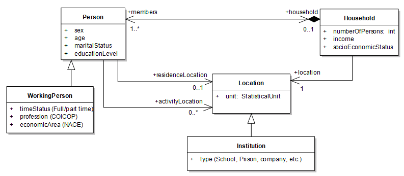

[.text-center]
*Figure 13: Background model for the theme _Population Distribution_*

The class _Person_ represents real world individual persons characterised by their sex, age, marital status and education level. Working persons are described by a specialised class _WorkingPerson_. Persons compose _Households_ characterised by a number of persons, an income and a socio economic status. Persons and households are located at one or several location, persons having two kinds of locations: a unique residence location, and potentially several activity locations. Locations are provided as statistical units. If the location is an institution, this is specified.
