// Admonition icons:
// TG Requirement
:important-caption: 📕
// TG Recommendation
:tip-caption: 📒
// Conformance class
:note-caption: 📘

// TOC placement using macro (manual)
:toc: macro

// Empty TOC title (the title is in the document)
:toc-title:

// TOC level depth
:toclevels: 5

// Section numbering level depth
:sectnumlevels: 8

// Line Break Doc Title
:hardbreaks-option:

:appendix-caption: Annex

image::./media/image2.jpeg[image,width=131,height=90, align=center]

image:./media/image3.png[image,width=93,height=93, align=center] **INSPIRE** *Infrastructure for Spatial Information in Europe*

[discrete]
= D2.8.III.8 Data Specification on _Production and Industrial Facilities_ – Technical Guidelines

[cols=",",]
|===
|*Title* |D2.8.III.8 INSPIRE Data Specification on _Production and Industrial Facilities_ – Technical Guidelines
|*Creator* |INSPIRE Thematic Working Group _Production and Industrial Facilities_
|*Date* |2013-12-10
|*Subject* |INSPIRE Data Specification for the spatial data theme _Production and Industrial Facilities_
|*Publisher* |European Commission Joint Research Centre
|*Type* |Text
|*Description* |This document describes the INSPIRE Data Specification for the spatial data theme _Production and Industrial Facilities_
|*Contributor* |Members of the INSPIRE Thematic Working Group _Production and Industrial Facilities_
|*Format* |Portable Document Format (pdf)
|*Source* |
|*Rights* |Public
|*Identifier* |D2.8.III.8_v3.0
|*Language* |En
|*Relation* |Directive 2007/2/EC of the European Parliament and of the Council of 14 March 2007 establishing an Infrastructure for Spatial Information in the European Community (INSPIRE)
|*Coverage* |Project duration
|===

<<<
[discrete]
== Foreword
[discrete]
== How to read the document?

This document describes the _"INSPIRE data specification on Production and Industrial Facilities – Technical Guidelines"_ version 3.0 as developed by the Thematic Working Group (TWG) _Production and Industrial Facilities_ using both natural and a conceptual schema language.

The data specification is based on a common templatefootnote:[The common document template is available in the "Framework documents" section of the data specifications web page at http://inspire.jrc.ec.europa.eu/index.cfm/pageid/2] used for all data specifications, which has been harmonised using the experience from the development of the Annex I, II and III data specifications.

This document provides guidelines for the implementation of the provisions laid down in the Implementing Rule for spatial data sets and services of the INSPIRE Directive. It also includes additional requirements and recommendations that, although not included in the Implementing Rule, are relevant to guarantee or to increase data interoperability.

Two executive summaries provide a quick overview of the INSPIRE data specification process in general, and the content of the data specification on _Production and Industrial Facilities_ in particular. We highly recommend that managers, decision makers, and all those new to the INSPIRE process and/or information modelling should read these executive summaries first.

The UML diagrams (in Chapter 5) offer a rapid way to see the main elements of the specifications and their relationships. The definition of the spatial object types, attributes, and relationships are included in the Feature Catalogue (also in Chapter 5). People having thematic expertise but not familiar with UML can fully understand the content of the data model focusing on the Feature Catalogue. Users might also find the Feature Catalogue especially useful to check if it contains the data necessary for the applications that they run. The technical details are expected to be of prime interest to those organisations that are responsible for implementing INSPIRE within the field of _Production and Industrial Facilities_, but also to other stakeholders and users of the spatial data infrastructure.

The technical provisions and the underlying concepts are often illustrated by examples. Smaller examples are within the text of the specification, while longer explanatory examples and descriptions of selected use cases are attached in the annexes.

In order to distinguish the INSPIRE spatial data themes from the spatial object types, the INSPIRE spatial data themes are written in _italics._

[cols="",]
|===
|The document will be publicly available as a 'non-paper'. It does not represent an official position of the European Commission, and as such cannot be invoked in the context of legal procedures.
|===

*Legal Notice*

Neither the European Commission nor any person acting on behalf of the Commission is responsible for the use which might be made of this publication.

<<<
[discrete]
== Interoperability of Spatial Data Sets and Services – General Executive Summary

The challenges regarding the lack of availability, quality, organisation, accessibility, and sharing of spatial information are common to a large number of policies and activities and are experienced across the various levels of public authority in Europe. In order to solve these problems it is necessary to take measures of coordination between the users and providers of spatial information. The Directive 2007/2/EC of the European Parliament and of the Council adopted on 14 March 2007 aims at establishing an Infrastructure for Spatial Information in the European Community (INSPIRE) for environmental policies, or policies and activities that have an impact on the environment.

INSPIRE is based on the infrastructures for spatial information that are created and maintained by the Member States. To support the establishment of a European infrastructure, Implementing Rules addressing the following components of the infrastructure have been specified: metadata, interoperability of spatial data sets (as described in Annexes I, II, III of the Directive) and spatial data services, network services, data and service sharing, and monitoring and reporting procedures.

INSPIRE does not require collection of new data. However, after the period specified in the Directivefootnote:[For all 34 Annex I,II and III data themes: within two years of the adoption of the corresponding Implementing Rules for newly collected and extensively restructured data and within 5 years for other data in electronic format still in use] Member States have to make their data available according to the Implementing Rules.

Interoperability in INSPIRE means the possibility to combine spatial data and services from different sources across the European Community in a consistent way without involving specific efforts of humans or machines. It is important to note that "interoperability" is understood as providing access to spatial data sets through network services, typically via Internet. Interoperability may be achieved by either changing (harmonising) and storing existing data sets or transforming them via services for publication in the INSPIRE infrastructure. It is expected that users will spend less time and efforts on understanding and integrating data when they build their applications based on data delivered in accordance with INSPIRE.

In order to benefit from the endeavours of international standardisation bodies and organisations established under international law their standards and technical means have been utilised and referenced, whenever possible.

To facilitate the implementation of INSPIRE, it is important that all stakeholders have the opportunity to participate in specification and development. For this reason, the Commission has put in place a consensus building process involving data users, and providers together with representatives of industry, research and government. These stakeholders, organised through Spatial Data Interest Communities (SDIC) and Legally Mandated Organisations (LMO)footnote:[The current status of registered SDICs/LMOs is available via INSPIRE website: http://inspire.jrc.ec.europa.eu/index.cfm/pageid/42], have provided reference materials, participated in the user requirement and technicalfootnote:[Surveys on unique identifiers and usage of the elements of the spatial and temporal schema,] surveys, proposed experts for the Data Specification Drafting Teamfootnote:[The Data Specification Drafting Team has been composed of experts from Austria, Belgium, Czech Republic, France, Germany, Greece, Italy, Netherlands, Norway, Poland, Switzerland, UK, and the European Environment Agency], the Thematic Working Groupsfootnote:[The Thematic Working Groups have been composed of experts from Austria, Australia, Belgium, Bulgaria, Czech Republic, Denmark, Finland, France, Germany, Hungary, Ireland, Italy, Latvia, Netherlands, Norway, Poland, Romania, Slovakia, Spain, Slovenia, Sweden, Switzerland, Turkey, UK, the European Environment Agency and the European Commission.] and other ad-hoc cross-thematic technical groups and participated in the public stakeholder consultations on draft versions of the data specifications. These consultations covered expert reviews as well as feasibility and fitness-for-purpose testing of the data specificationsfootnote:[For Annex IIIII, the consultation and testing phase lasted from 20 June to 21 October 2011.].

This open and participatory approach was successfully used during the development of the data specifications on Annex I, II and III data themes as well as during the preparation of the Implementing Rule on Interoperability of Spatial Data Sets and Servicesfootnote:[Commission Regulation (EU) No 1089/2010 http://eur-lex.europa.eu/JOHtml.do?uri=OJ:L:2010:323:SOM:EN:HTML[implementing Directive 2007/2/EC of the European Parliament and of the Council as regards interoperability of spatial data sets and services,] published in the Official Journal of the European Union on 8^th^ of December 2010.] for Annex I spatial data themes and of its amendment regarding the themes of Annex II and III.

The development framework elaborated by the Data Specification Drafting Team aims at keeping the data specifications of the different themes coherent. It summarises the methodology to be used for the development of the data specifications, providing a coherent set of requirements and recommendations to achieve interoperability. The pillars of the framework are the following technical documentsfootnote:[The framework documents are available in the "Framework documents" section of the data specifications web page at http://inspire.jrc.ec.europa.eu/index.cfm/pageid/2]:

* The _Definition of Annex Themes and Scope_ describes in greater detail the spatial data themes defined in the Directive, and thus provides a sound starting point for the thematic aspects of the data specification development.
* The _Generic Conceptual Model_ defines the elements necessary for interoperability and data harmonisation including cross-theme issues. It specifies requirements and recommendations with regard to data specification elements of common use, like the spatial and temporal schema, unique identifier management, object referencing, some common code lists, etc. Those requirements of the Generic Conceptual Model that are directly implementable are included in the Implementing Rule on Interoperability of Spatial Data Sets and Services.
* The _Methodology for the Development of Data Specifications_ defines a repeatable methodology. It describes how to arrive from user requirements to a data specification through a number of steps including use-case development, initial specification development and analysis of analogies and gaps for further specification refinement.
* The _Guidelines for the Encoding of Spatial Data_ defines how geographic information can be encoded to enable transfer processes between the systems of the data providers in the Member States. Even though it does not specify a mandatory encoding rule it sets GML (ISO 19136) as the default encoding for INSPIRE.
* The _Guidelines for the use of Observations & Measurements and Sensor Web Enablement-related standards in INSPIRE Annex II and III data specification development_ provides guidelines on how the "Observations and Measurements" standard (ISO 19156) is to be used within INSPIRE.
* The _Common data models_ are a set of documents that specify data models that are referenced by a number of different data specifications. These documents include generic data models for networks, coverages and activity complexes.

The structure of the data specifications is based on the "ISO 19131 Geographic information - Data product specifications" standard. They include the technical documentation of the application schema, the spatial object types with their properties, and other specifics of the spatial data themes using natural language as well as a formal conceptual schema languagefootnote:[UML – Unified Modelling Language].

A consolidated model repository, feature concept dictionary, and glossary are being maintained to support the consistent specification development and potential further reuse of specification elements. The consolidated model consists of the harmonised models of the relevant standards from the ISO 19100 series, the INSPIRE Generic Conceptual Model, and the application schemasfootnote:[Conceptual models related to specific areas (e.g. INSPIRE themes)] developed for each spatial data theme. The multilingual INSPIRE Feature Concept Dictionary contains the definition and description of the INSPIRE themes together with the definition of the spatial object types present in the specification. The INSPIRE Glossary defines all the terms (beyond the spatial object types) necessary for understanding the INSPIRE documentation including the terminology of other components (metadata, network services, data sharing, and monitoring).

By listing a number of requirements and making the necessary recommendations, the data specifications enable full system interoperability across the Member States, within the scope of the application areas targeted by the Directive. The data specifications (in their version 3.0) are published as technical guidelines and provide the basis for the content of the Implementing Rule on Interoperability of Spatial Data Sets and Servicesfootnote:[In the case of the Annex IIIII data specifications, the extracted requirements are used to formulate an amendment to the existing Implementing Rule.]. The content of the Implementing Rule is extracted from the data specifications, considering short- and medium-term feasibility as well as cost-benefit considerations. The requirements included in the Implementing Rule are legally binding for the Member States according to the timeline specified in the INSPIRE Directive.

In addition to providing a basis for the interoperability of spatial data in INSPIRE, the data specification development framework and the thematic data specifications can be reused in other environments at local, regional, national and global level contributing to improvements in the coherence and interoperability of data in spatial data infrastructures.

<<<
[discrete]
== _Production and Industrial Facilities_ – Executive Summary

INSPIRE Directive (2007/2/EC, 14.03.2007) defines the spatial data theme _Production and Industrial Facilities_ as: "features related to production and industry, as well as entities related to describing summary information about the activities taking place in production and industrial facilities, and the main environmental issues related to them (pollution prevention, waste management, risk)".

This version of the data specification on _Production and Industrial Facilities_ provides:

* The basis for the development of the part of the Implementing Rules, defined in the Article 7(1) of the INSPIRE Directive, related to the spatial data theme _Production and Industrial Facilities_ and;
* The implementation guidelines that will accompany the Implementing Rule on the Interoperability of Spatial Data Sets and Services according to Article 7(1) of the INSPIRE Directive.

The data specification has been prepared by the INSPIRE Thematic Working Group _Production and Industrial Facilities_ (TWG-PF), a multinational team of experts in the field drawn from different parts of the European Union, in the frame of the common and transparent development process.

This version of the INSPIRE data specification for _Production and Industrial Facilities_ has been compiled from reference material submitted by the Spatial Data Interest Communities (SDICs) and Legally Mandated Organisation (LMOs) of INSPIRE, plus the responses to the User Requirements Survey and a set of agreed use cases - some of which have been specifically prepared by the TWG-PF based on their knowledge and experience.

[.underline]#*Scope and description*#

There are relationships with other spatial data themes, in particular with:

* Agricultural Facilities
* Utilities and Governmental Services
* Buildings
* Addresses
* Administrative Units
* Cadastral Parcels

Details on these relationships will be provided in Chapter 5, Data content and structure.

The PF data specification accounts for in-depth harmonisation with the two other themes involving facilities, i.e. Agricultural Facilities and Utilities and Governmental Services, with the adoption of a common facility model (so called Activity Complex), described in the document "DS 2.10.3 – Activity Complex".

<<<
[discrete]
== Acknowledgements

Many individuals and organisations have contributed to the development of these Guidelines.

The Thematic Working Group Production and Industrial Facilities (TWG-PF) included:

Andrea Giacomelli (TWG Facilitator), Claudia Pegoraro (TWG Editor from Jan.2011 to Sep.2012), Heinrich Geerling, Antonello Navarretta, Angel López (European Commission contact point).

Other contributors to the INSPIRE data specifications are the Drafting Team Data Specifications, the JRC Data Specifications Team and the INSPIRE stakeholders - Spatial Data Interested Communities (SDICs) and Legally Mandated Organisations (LMOs).

*Contact information*

Maria Vanda Nunes de Lima & Michael Lutz
European Commission Joint Research Centre (JRC)
Institute for Environment and Sustainability
Unit H06: Digital Earth and Reference Data
_http://inspire.ec.europa.eu/index.cfm/pageid/2_

<<<
[discrete]
== Table of contents
toc::[]

:sectnums:
<<<
== Scope

This document specifies a harmonised data specification for the spatial data theme _Production and Industrial Facilities_ as defined in Annex III of the INSPIRE Directive.

This data specification provides the basis for the drafting of Implementing Rules according to Article 7 (1) of the INSPIRE Directive [Directive 2007/2/EC]. The entire data specification is published as implementation guidelines accompanying these Implementing Rules.

<<<
== Overview

=== Name
INSPIRE data specification for the theme _Production and     Industrial Facilities_.
    

=== Informal description

[.underline]#*Definition:*#

This theme comprises features related to production and industry, as well as entities related to describing summary information about the activities taking place in _Production and Industrial Facilities_, and the main environmental issues related to them (pollution prevention, waste management, risk). [Directive 2007/2/EC]

[.underline]#*Description:*#

The overall set of activities considered within the _Production and Industrial Facilities_ theme spans from extraction of resources, to their transformation in products or by-products, and their storage.

* [.underline]#Extraction of resources# includes the following: non-energy extractive industry (mining of construction materials, industrial minerals, and metallic minerals), energy extractive industry, and water.
* [.underline]#Transformation of resources# should be seen both as transformation of one resource or product into another, or as transformation into energy, thus including power generation plants within the scope of this theme.
* [.underline]#Storage# includes structures for warehousing, depositing in safe custody, or keeping in stock any substance involved in the production process. Considering also waste as a component of the production process, landfills and other facilities for permanent or temporary waste storage are also to be included within the scope of this theme.

Large installations for communication (communication stations) are considered within the scope of this theme.

The definition of the types of industrial activities to be considered can be related primarily to Annex I of the IPPC Directive [Directive 2008/1/EC] and the E-PRTR Regulation [Regulation 166/2006/EC]. Important references used in the definition of the data specification are also found in the SEVESO Directive and its amendments [Directive 96/82/EC-A].

The NACE rev. 2 classification [Regulation 1893/2006/EC] is also considered in the definition of the activities. Activities considered for _Production and Industrial Facilities_ fall under the first-level NACE rev. 2 categories B, C, D, E, F and H. This translates to considering:

* mining and quarrying,
* manufacturing,
* electricity,
* gas,
* steam and air conditioning supply,
* water supply;
* construction,
* Transport and storage (excluding postal and courier activities).

Another more recent directive which allows describing in a comprehensive way _Production and Industrial Facilities_ is the Directive on Industrial Emissions [Directive 2010/75/EU]. Annex I of this Directive lists the types of production considered in its scope and may be used as a reference to identify industrial activities.

_Production and Industrial Facilities_ are also related to an operator, i.e. the natural or legal person who operates or controls the facility or, where this is provided in national legislation, to which decisive economic power over the technical functioning of the facility has been delegated.

The _Production and Industrial Facilities_ theme is not concerned with the description of the actual flow of materials occurring from one facility to another, or to distribution of a final product to the market.

A production and industrial facility is typically composed by an extremely variable layout of buildings, plots and other technical units, represented by machinery, piping, private railway sidings, docks, unloading quays, jetties, etc. Such units are grouped in installations, related to the execution of a specific production process.

Key feature types with spatial properties considered within the _Production and Industrial Facilities_ theme include: Site, Facility, Installation and Installation Part. These allow a breakdown of the elements composing a production and industrial facility, with a focus on processes related to activities taking place within the facility itself.

Two accessory spatial feature types have been considered: Production and Industrial Building and Production Plot.

* A [.underline]#Production Plot# is a piece of land part of a facility destined to functional purposes (even though no "artifacts" are in it). This may be required for examples for temporary storage inside the facility.
* A [.underline]#Production and industrial building# is an artificial construction, part of the production facility that is useful to host or provide shelter to activity development.

Concerning spatial aspects, the minimum level of detail for spatial representation provides the request of capturing facilities as point features, while point features such as installations and installation parts allow a more accurate description, in cases where such level of detail is available. Moreover a facility may present a higher level of detail representation on a map if its areal shape is provided; the same occurs for the site and for the installation and the parcel and the building.

Concerning temporal aspects, a production facility is seen as such as long as the activity hosted by it is ongoing. Should this activity terminate, the facility may maintain an industrial characterisation from an environmental standpoint (such as the case of a contaminated site). Numerous cases of more or less historical facilities which have been converted to interesting historical landmarks, or to cultural and educational/recreational venues may also be observed. These facilities, while retaining the layout and construction characteristics of a production/industrial site, will lose their industrial status, and should be typically reclassified as Buildings, Governmental Services. The data model accounts for the possibility of tracking the status of the facility and the other spatial objects with the use of temporal properties indicating the time period during which the status of the spatial object is active falls into another of the possible categories (the code list on status described in Chapter 5 provides a full list for these).

As an extension to the core model, this data specification also provides a basic model to describe production and industrial processes, as well as operators and addresses. The production process extension allows recording information on quantities of materials and substances which are reaching a facility, which are stored on it, or which are leaving it, in order to describe its state. However, it is not within the scope of the theme to track where a given stock of material is coming from, or where it is going to.

The operators and addresses extension allows capturing business-related information such as the identity of the subjects related to a facility, and can hold information on addresses.

[cols=""]
|===

[.underline]#*Definition:*#

This theme comprises features related to production and industry, as well as entities related to describing summary information about the activities taking place in _Production and Industrial Facilities_, and the main environmental issues related to them (pollution prevention, waste management, risk). [Directive 2007/2/EC]

[.underline]#*Description:*#    

The theme _Production and Industrial Facilities_ comprises information about industrial facilities and activities of production (focusing on extraction, transformation or storage of resources, including energy production) and the main related environmental issues.

The description of production and industrial facilities, e.g. types or activities, in INSPIRE is based on the Integrated pollution prevention and control Directive (2008/1/EC), as recently amended by Industrial Emissions Directive (2010/75/EU), the European pollution and transfer register regulation (166/2006/EC), the SEVESO Directive, its amendments (96/82/EC-A), the NACE regulation (1893/2006/EC) and other relevant legislation and industrial standards.

Entry in the INSPIRE registry: _http://inspire.ec.europa.eu/theme/pf/_

|===

=== Normative References

[Directive 2007/2/EC] Directive 2007/2/EC of the European Parliament and of the Council of 14 March2007 establishing an Infrastructure for Spatial Information in the European Community (INSPIRE)

[ISO 19107] EN ISO 19107:2005, Geographic Information – Spatial Schema

[ISO 19108] EN ISO 19108:2005, Geographic Information – Temporal Schema

[ISO 19108-c] ISO 19108:2002/Cor 1:2006, Geographic Information – Temporal Schema, Technical Corrigendum 1

[ISO 19111] EN ISO 19111:2007 Geographic information - Spatial referencing by coordinates (ISO 19111:2007)

[ISO 19113] EN ISO 19113:2005, Geographic Information – Quality principles

[ISO 19115] EN ISO 19115:2005, Geographic information – Metadata (ISO 19115:2003)

[ISO 19118] EN ISO 19118:2006, Geographic information – Encoding (ISO 19118:2005)

[ISO 19123] EN ISO 19123:2007, Geographic Information – Schema for coverage geometry and functions

[ISO 19125-1] EN ISO 19125-1:2004, Geographic Information – Simple feature access – Part 1: Common architecture

[ISO 19135] EN ISO 19135:2007 Geographic information – Procedures for item registration (ISO 19135:2005)

[ISO 19138] ISO/TS 19138:2006, Geographic Information – Data quality measures

[ISO 19139] ISO/TS 19139:2007, Geographic information – Metadata – XML schema implementation

[ISO 19157] ISO/DIS 19157, Geographic information – Data quality

[OGC 06-103r4] Implementation Specification for Geographic Information - Simple feature access – Part 1: Common Architecture v1.2.1

NOTE This is an updated version of "EN ISO 19125-1:2004, Geographic information – Simple feature access – Part 1: Common architecture".

[Regulation 1205/2008/EC] Regulation 1205/2008/EC implementing Directive 2007/2/EC of the European Parliament and of the Council as regards metadata

[Regulation 976/2009/EC] Commission Regulation (EC) No 976/2009 of 19 October 2009 implementing Directive 2007/2/EC of the European Parliament and of the Council as regards the Network Services

[Regulation 1089/2010/EC] Commission Regulation (EU) No 1089/2010 of 23 November 2010 implementing Directive 2007/2/EC of the European Parliament and of the Council as regards interoperability of spatial data sets and services

[Directive 2008/1/EC] Directive 2008/1/EC of the European Parliament and of the council of 15 January 2008 concerning integrated pollution prevention and control

[Directive 96/82/EC-A] Council Directive 96/82/EC on the control of major-accident hazards involving dangerous substances Amended by Regulation (EC) No 1882/2003 of the European Parliament and of the Council of 29 September 2003 and by Directive 2003/105/EC of the European Parliament and of the Council of 16 December 2003

[Directive 2010/75/EU] Directive 2010/75/EU of the European Parliament and of the Council of 24 November 2010 on industrial emissions (integrated pollution prevention and control)

[Regulation 1893/2006] Regulation (EC) No 1893/2006 of the European Parliament and of the Council of 20 December 2006 establishing the statistical classification of economic activities NACE Revision 2 and amending Council Regulation (EEC) No 3037/90 as well as certain EC Regulations on specific statistical domains.

=== Terms and definitions

General terms and definitions helpful for understanding the INSPIRE data specification documents are defined in the INSPIRE Glossaryfootnote:[The INSPIRE Glossary is available from http://inspire-registry.jrc.ec.europa.eu/registers/GLOSSARY].

Specifically, for the theme _Production and Industrial Facilities_, the following terms are defined:

*(1) Production*

An activity consisting of a series of actions or operations in a productive context.

*(2) Emission*

The direct or indirect release of substances, vibrations, heat or noise from individual or diffuse sources in the facility into the air, water or soil.

*(3) Operator*

A person or company that runs a business or enterprise and which is legally responsible for the facility. This means any natural or legal person who operates to manage and control the facility or, where this is provided by the national legislation, to whom decisive economic power over the technical functioning of the facility has been delegated.

=== Symbols and abbreviations

[cols=","]
|===
|ATS |Abstract Test Suite
|CLP |Classification, labelling and packaging of substances and mixtures
|EC |European Commission
|EEA |European Environmental Agency
|E-PRTR |European - Pollutant Release and Transfer Register
|ETRS89 |European Terrestrial Reference System 1989
|ETRS89-LAEA |Lambert Azimuthal Equal Area
|EVRS |European Vertical Reference System
|EWC |European Waste Catalogue
|GCM |General Conceptual Model
|GML |Geography Markup Language
|IPPC |Integrated pollution prevention and control
|IR |Implementing Rule
|ISDSS |Interoperability of Spatial Data Sets and Services
|ISO |International Organization for Standardization
|ITRS |International Terrestrial Reference System
|LAT |Lowest Astronomical Tide
|LMO |Legally Mandated Organisation
|NACE |Statistical Classification of Economical Activities in Europe.
|SDIC |Spatial Data Interest Community
|TG |Technical Guidance
|UML |Unified Modeling Language
|UTC |Coordinated Universal Time
|XML |EXtensible Markup Language
|===

=== How the Technical Guidelines map to the Implementing Rules

The schematic diagram in Figure 1 gives an overview of the relationships between the INSPIRE legal acts (the INSPIRE Directive and Implementing Rules) and the INSPIRE Technical Guidelines. The INSPIRE Directive and Implementing Rules include legally binding requirements that describe, usually on an abstract level, _what_ Member States must implement.

In contrast, the Technical Guidelines define _how_ Member States might implement the requirements included in the INSPIRE Implementing Rules. As such, they may include non-binding technical requirements that must be satisfied if a Member State data provider chooses to conform to the Technical Guidelines. Implementing these Technical Guidelines will maximise the interoperability of INSPIRE spatial data sets.

image::./media/image4.png[image,width=603,height=375, align=center]

[.text-center]
*Figure 1 - Relationship between INSPIRE Implementing Rules and Technical Guidelines*

==== Requirements

The purpose of these Technical Guidelines (Data specifications on _Production and Industrial Facilities_) is to provide practical guidance for implementation that is guided by, and satisfies, the (legally binding) requirements included for the spatial data theme _Production and Industrial Facilities_ in the Regulation (Implementing Rules) on interoperability of spatial data sets and services. These requirements are highlighted in this document as follows:

[IMPORTANT]
====
[.text-center]
*IR Requirement*
_Article / Annex / Section no._
*Title / Heading*

This style is used for requirements contained in the Implementing Rules on interoperability of spatial data sets and services (Commission Regulation (EU) No 1089/2010).

====

For each of these IR requirements, these Technical Guidelines contain additional explanations and examples.

NOTE The Abstract Test Suite (ATS) in Annex A contains conformance tests that directly check conformance with these IR requirements.

Furthermore, these Technical Guidelines may propose a specific technical implementation for satisfying an IR requirement. In such cases, these Technical Guidelines may contain additional technical requirements that need to be met in order to be conformant with the corresponding IR requirement _when using this proposed implementation_. These technical requirements are highlighted as follows:

[TIP]
====
*TG Requirement X* 

This style is used for requirements for a specific technical solution proposed in these Technical Guidelines for an IR requirement.

====

NOTE 1 Conformance of a data set with the TG requirement(s) included in the ATS implies conformance with the corresponding IR requirement(s).

NOTE 2 In addition to the requirements included in the Implementing Rules on interoperability of spatial data sets and services, the INSPIRE Directive includes further legally binding obligations that put additional requirements on data providers. For example, Art. 10(2) requires that Member States shall, where appropriate, decide by mutual consent on the depiction and position of geographical features whose location spans the frontier between two or more Member States. General guidance for how to meet these obligations is provided in the INSPIRE framework documents.

==== Recommendations

In addition to IR and TG requirements, these Technical Guidelines may also include a number of recommendations for facilitating implementation or for further and coherent development of an interoperable infrastructure.

[NOTE]
====
*Recommendation X* 

Recommendations are shown using this style.

====

NOTE The implementation of recommendations is not mandatory. Compliance with these Technical Guidelines or the legal obligation does not depend on the fulfilment of the recommendations.

==== Conformance

Annex A includes the abstract test suite for checking conformance with the requirements included in these Technical Guidelines and the corresponding parts of the Implementing Rules (Commission Regulation (EU) No 1089/2010).

<<<
== Specification scopes

This data specification does not distinguish different specification scopes, but just considers one general scope.

NOTE For more information on specification scopes, see [ISO 19131:2007], clause 8 and Annex D.

<<<
== Identification information

These Technical Guidelines are identified by the following URI:

http://inspire.ec.europa.eu/tg/pf/3.0

NOTE ISO 19131 suggests further identification information to be included in this section, e.g. the title, abstract or spatial representation type. The proposed items are already described in the document metadata, executive summary, overview description (section 2) and descriptions of the application schemas (section 5). In order to avoid redundancy, they are not repeated here.

<<<
== Data content and structure

=== Application schemas – Overview 

==== Application schemas included in the IRs

Articles 3, 4 and 5 of the Implementing Rules lay down the requirements for the content and structure of the data sets related to the INSPIRE Annex themes.

[IMPORTANT]
====
[.text-center]
*IR Requirement*
_Article 4_
*Types for the Exchange and Classification of Spatial Objects*

. For the exchange and classification of spatial objects from data sets meeting the conditions laid down in Article 4 of Directive 2007/2/EC, Member States shall use the spatial object types and associated data types, enumerations and code lists that are defined in Annexes II, III and IV for the themes the data sets relate to.

. Spatial object types and data types shall comply with the definitions and constraints and include the attributes and association roles set out in the Annexes.

. The enumerations and code lists used in attributes or association roles of spatial object types or data types shall comply with the definitions and include the values set out in Annex II. The enumeration and code list values are uniquely identified by language-neutral mnemonic codes for computers. The values may also include a language-specific name to be used for human interaction.

====

The types to be used for the exchange and classification of spatial objects from data sets related to the spatial data theme _Production and Industrial Facilities_ are defined in the following application schemas (see sections 5.3):

* _Production and Industrial Facilities_ application schema.

The application schemas specify requirements on the properties of each spatial object including its multiplicity, domain of valid values, constraints, etc.

NOTE The application schemas presented in this section contain some additional information that is not included in the Implementing Rules, in particular multiplicities of attributes and association roles.

[TIP]
====
*TG Requirement 1*

Spatial object types and data types shall comply with the multiplicities defined for the attributes and association roles in this section.

====

An application schema may include references (e.g. in attributes or inheritance relationships) to common types or types defined in other spatial data themes. These types can be found in a sub-section called "Imported Types" at the end of each application schema section. The common types referred to from application schemas included in the IRs are addressed in Article 3.

[IMPORTANT]
====
[.text-center]
*IR Requirement*
_Article 3_
*Common Types*

Types that are common to several of the themes listed in Annexes I, II and III to Directive 2007/2/EC shall conform to the definitions and constraints and include the attributes and association roles set out in Annex I.

====

NOTE Since the IRs contain the types for all INSPIRE spatial data themes in one document, Article 3 does not explicitly refer to types defined in other spatial data themes, but only to types defined in external data models.

Common types are described in detail in the Generic Conceptual Model [DS-D2.7], in the relevant international standards (e.g. of the ISO 19100 series) or in the documents on the common INSPIRE models [DS-D2.10.x]. For detailed descriptions of types defined in other spatial data themes, see the corresponding Data Specification TG document [DS-D2.8.x].

==== Additional recommended application schemas 

In addition to the application schemas listed above, the following additional application schemas have been defined for the theme _Production and Industrial Facilities_ (see sections 5.4):

* _Production and Industrial Facilities Extension_ application schema.

These additional application schemas are not included in the IRs. They typically address requirements from specific (groups of) use cases and/or may be used to provide additional information. They are included in this specification in order to improve interoperability also for these additional aspects and to illustrate the extensibility of the application schemas included in the IRs.

[NOTE]
====
*Recomendation 1*

Additional and/or use case-specific information related to the theme _Production and Industrial Facilities_ should be made available using the spatial object types and data types specified in the following application schema(s): _Production and Industrial Facilities Extension_.

These spatial object types and data types should comply with the definitions and constraints and include the attributes and association roles defined in this section.

The enumerations and code lists used in attributes or association roles of spatial object types or data types should comply with the definitions and include the values defined in this section.

====

=== Basic notions

This section explains some of the basic notions used in the INSPIRE application schemas. These explanations are based on the GCM [DS-D2.5].

==== Notation

===== Unified Modeling Language (UML)

The application schemas included in this section are specified in UML, version 2.1. The spatial object types, their properties and associated types are shown in UML class diagrams.

NOTE For an overview of the UML notation, see Annex D in [ISO 19103].

The use of a common conceptual schema language (i.e. UML) allows for an automated processing of application schemas and the encoding, querying and updating of data based on the application schema – across different themes and different levels of detail.

The following important rules related to class inheritance and abstract classes are included in the IRs.

[IMPORTANT]
====
[.text-center]
*IR Requirement*
_Article 5_
*Types*

(...)

[arabic, start=2]
. Types that are a sub-type of another type shall also include all this type's attributes and association roles.

. Abstract types shall not be instantiated.

====

The use of UML conforms to ISO 19109 8.3 and ISO/TS 19103 with the exception that UML 2.1 instead of ISO/IEC 19501 is being used. The use of UML also conforms to ISO 19136 E.2.1.1.1-E.2.1.1.4.

NOTE ISO/TS 19103 and ISO 19109 specify a profile of UML to be used in conjunction with the ISO 19100 series. This includes in particular a list of stereotypes and basic types to be used in application schemas. ISO 19136 specifies a more restricted UML profile that allows for a direct encoding in XML Schema for data transfer purposes.

To model constraints on the spatial object types and their properties, in particular to express data/data set consistency rules, OCL (Object Constraint Language) is used as described in ISO/TS 19103, whenever possible. In addition, all constraints are described in the feature catalogue in English, too.

NOTE Since "void" is not a concept supported by OCL, OCL constraints cannot include expressions to test whether a value is a _void_ value. Such constraints may only be expressed in natural language.

===== Stereotypes

In the application schemas in this section several stereotypes are used that have been defined as part of a UML profile for use in INSPIRE [DS-D2.5]. These are explained in Table 1 below.

[.text-center]
*Table 1 – Stereotypes (adapted from [DS-D2.5])*

[cols=",,",]
|===
|*Stereotype* |*Model element* |*Description*
|applicationSchema |Package |An INSPIRE application schema according to ISO 19109 and the Generic Conceptual Model.
|leaf |Package |A package that is not an application schema and contains no packages.
|featureType |Class |A spatial object type.
|type |Class |A type that is not directly instantiable, but is used as an abstract collection of operation, attribute and relation signatures. This stereotype should usually not be used in INSPIRE application schemas as these are on a different conceptual level than classifiers with this stereotype.
|dataType |Class |A structured data type without identity.
|union |Class |A structured data type without identity where exactly one of the properties of the type is present in any instance.
|enumeration |Class |An enumeration.
|codeList |Class |A code list.
|import |Dependency |The model elements of the supplier package are imported.
|voidable |Attribute, association role |A voidable attribute or association role (see section 5.2.2).
|lifeCycleInfo |Attribute, association role |If in an application schema a property is considered to be part of the life-cycle information of a spatial object type, the property shall receive this stereotype.
|version |Association role |If in an application schema an association role ends at a spatial object type, this stereotype denotes that the value of the property is meant to be a specific version of the spatial object, not the spatial object in general.
|===

==== Voidable characteristics

The «voidable» stereotype is used to characterise those properties of a spatial object that may not be present in some spatial data sets, even though they may be present or applicable in the real world. This does _not_ mean that it is optional to provide a value for those properties.

For all properties defined for a spatial object, a value has to be provided – either the corresponding value (if available in the data set maintained by the data provider) or the value of _void._ A _void_ value shall imply that no corresponding value is contained in the source spatial data set maintained by the data provider or no corresponding value can be derived from existing values at reasonable costs.

[NOTE]
====
*Recomendation 2*

The reason for a _void_ value should be provided where possible using a listed value from the VoidReasonValue code list to indicate the reason for the missing value.

====

The VoidReasonValue type is a code list, which includes the following pre-defined values:

* _Unpopulated_: The property is not part of the dataset maintained by the data provider. However, the characteristic may exist in the real world. For example when the "elevation of the water body above the sea level" has not been included in a dataset containing lake spatial objects, then the reason for a void value of this property would be 'Unpopulated'. The property receives this value for all spatial objects in the spatial data set.
* _Unknown_: The correct value for the specific spatial object is not known to, and not computable by the data provider. However, a correct value may exist. For example when the "elevation of the water body above the sea level" _of a certain lake_ has not been measured, then the reason for a void value of this property would be 'Unknown'. This value is applied only to those spatial objects where the property in question is not known.
* _Withheld_: The characteristic may exist, but is confidential and not divulged by the data provider.

NOTE It is possible that additional reasons will be identified in the future, in particular to support reasons / special values in coverage ranges.

The «voidable» stereotype does not give any information on whether or not a characteristic exists in the real world. This is expressed using the multiplicity:

* If a characteristic may or may not exist in the real world, its minimum cardinality shall be defined as 0. For example, if an Address may or may not have a house number, the multiplicity of the corresponding property shall be 0..1.
* If at least one value for a certain characteristic exists in the real world, the minimum cardinality shall be defined as 1. For example, if an Administrative Unit always has at least one name, the multiplicity of the corresponding property shall be 1..*.

In both cases, the «voidable» stereotype can be applied. In cases where the minimum multiplicity is 0, the absence of a value indicates that it is known that no value exists, whereas a value of void indicates that it is not known whether a value exists or not.

EXAMPLE If an address does not have a house number, the corresponding Address object should not have any value for the «voidable» attribute house number. If the house number is simply not known or not populated in the data set, the Address object should receive a value of _void_ (with the corresponding void reason) for the house number attribute.

==== Enumerations

Enumerations are modelled as classes in the application schemas. Their values are modelled as attributes of the enumeration class using the following modelling style:

* No initial value, but only the attribute name part, is used.
* The attribute name conforms to the rules for attributes names, i.e. is a lowerCamelCase name. Exceptions are words that consist of all uppercase letters (acronyms).

[IMPORTANT]
====
[.text-center]
*IR Requirement*
_Article 6_
*Code Lists and Enumerations*

(...)

[arabic, start=5]
. Attributes or association roles of spatial object types or data types that have an enumeration type may only take values from the lists specified for the enumeration type."

====

==== Code lists

Code lists are modelled as classes in the application schemas. Their values, however, are managed outside of the application schema.

===== Code list types

The IRs distinguish the following types of code lists.

[IMPORTANT]
====
[.text-center]
*IR Requirement*
_Article 6_
*Code Lists and Enumerations*

. Code lists shall be of one of the following types, as specified in the Annexes:
[loweralpha]
.. code lists whose allowed values comprise only the values specified in this Regulation;
.. code lists whose allowed values comprise the values specified in this Regulation and narrower values defined by data providers;
.. code lists whose allowed values comprise the values specified in this Regulation and additional values at any level defined by data providers;
.. code lists, whose allowed values comprise any values defined by data providers.

For the purposes of points (b), (c) and (d), in addition to the allowed values, data providers may use the values specified in the relevant INSPIRE Technical Guidance document available on the INSPIRE web site of the Joint Research Centre.

====

The type of code list is represented in the UML model through the tagged value _extensibility_, which can take the following values:

* _none_, representing code lists whose allowed values comprise only the values specified in the IRs (type a);
* _narrower_, representing code lists whose allowed values comprise the values specified in the IRs and narrower values defined by data providers (type b);
* _open_, representing code lists whose allowed values comprise the values specified in the IRs and additional values at any level defined by data providers (type c); and
* _any_, representing code lists, for which the IRs do not specify any allowed values, i.e. whose allowed values comprise any values defined by data providers (type d).

[NOTE]
====
*Recomendation 3*

Additional values defined by data providers should not replace or redefine any value already specified in the IRs.

====

NOTE This data specification may specify recommended values for some of the code lists of type (b), (c) and (d) (see section 5.2.4.3). These recommended values are specified in a dedicated Annex.

In addition, code lists can be hierarchical, as explained in Article 6(2) of the IRs.

[IMPORTANT]
====
[.text-center]
*IR Requirement*
_Article 6_
*Code Lists and Enumerations*

(...)

[arabic, start=2]
. Code lists may be hierarchical. Values of hierarchical code lists may have a more generic parent value. Where the valid values of a hierarchical code list are specified in a table in this Regulation, the parent values are listed in the last column.

====

The type of code list and whether it is hierarchical or not is also indicated in the feature catalogues.

===== Obligations on data providers

[IMPORTANT]
====
[.text-center]
*IR Requirement*
_Article 6_
*Code Lists and Enumerations*

(....)

[arabic, start=3]
. Where, for an attribute whose type is a code list as referred to in points (b), (c) or (d) of paragraph 1, a data provider provides a value that is not specified in this Regulation, that value and its definition shall be made available in a register.

. Attributes or association roles of spatial object types or data types whose type is a code list may only take values that are allowed according to the specification of the code list.

====

Article 6(4) obliges data providers to use only values that are allowed according to the specification of the code list. The "allowed values according to the specification of the code list" are the values explicitly defined in the IRs plus (in the case of code lists of type (b), (c) and (d)) additional values defined by data providers.

For attributes whose type is a code list of type (b), (c) or (d) data providers may use additional values that are not defined in the IRs. Article 6(3) requires that such additional values and their definition be made available in a register. This enables users of the data to look up the meaning of the additional values used in a data set, and also facilitates the re-use of additional values by other data providers (potentially across Member States).

NOTE Guidelines for setting up registers for additional values and how to register additional values in these registers is still an open discussion point between Member States and the Commission.

===== Recommended code list values

For code lists of type (b), (c) and (d), this data specification may propose additional values as a recommendation (in a dedicated Annex). These values will be included in the INSPIRE code list register. This will facilitate and encourage the usage of the recommended values by data providers since the obligation to make additional values defined by data providers available in a register (see section 5.2.4.2) is already met.

[NOTE]
====
*Recomendation 4*

Where these Technical Guidelines recommend values for a code list in addition to those specified in the IRs, these values should be used.

====

NOTE For some code lists of type (d), no values may be specified in these Technical Guidelines. In these cases, any additional value defined by data providers may be used.

===== Governance

The following two types of code lists are distinguished in INSPIRE:

* _Code lists that are governed by INSPIRE (INSPIRE-governed code lists)._ These code lists will be managed centrally in the INSPIRE code list register. Change requests to these code lists (e.g. to add, deprecate or supersede values) are processed and decided upon using the INSPIRE code list register's maintenance workflows.
+
INSPIRE-governed code lists will be made available in the INSPIRE code list register at __http://inspire.ec.europa.eu/codelist/<CodeListName__>. They will be available in SKOS/RDF, XML and HTML. The maintenance will follow the procedures defined in ISO 19135. This means that the only allowed changes to a code list are the addition, deprecation or supersession of values, i.e. no value will ever be deleted, but only receive different statuses (valid, deprecated, superseded). Identifiers for values of INSPIRE-governed code lists are constructed using the pattern __http://inspire.ec.europa.eu/codelist/<CodeListName__>/<value>.

* _Code lists that are governed by an organisation outside of INSPIRE (externally governed code lists)._ These code lists are managed by an organisation outside of INSPIRE, e.g. the World Meteorological Organization (WMO) or the World Health Organization (WHO). Change requests to these code lists follow the maintenance workflows defined by the maintaining organisations. Note that in some cases, no such workflows may be formally defined.
+
Since the updates of externally governed code lists is outside the control of INSPIRE, the IRs and these Technical Guidelines reference a specific version for such code lists.
+
The tables describing externally governed code lists in this section contain the following columns:

** The _Governance_ column describes the external organisation that is responsible for maintaining the code list.

** The _Source_ column specifies a citation for the authoritative source for the values of the code list. For code lists, whose values are mandated in the IRs, this citation should include the version of the code list used in INSPIRE. The version can be specified using a version number or the publication date. For code list values recommended in these Technical Guidelines, the citation may refer to the "latest available version".

** In some cases, for INSPIRE only a subset of an externally governed code list is relevant. The subset is specified using the _Subset_ column.

** The _Availability_ column specifies from where (e.g. URL) the values of the externally governed code list are available, and in which formats. Formats can include machine-readable (e.g. SKOS/RDF, XML) or human-readable (e.g. HTML, PDF) ones.

+
Code list values are encoded using http URIs and labels. Rules for generating these URIs and labels are specified in a separate table.

[NOTE]
====
*Recomendation 5*

The http URIs and labels used for encoding code list values should be taken from the INSPIRE code list registry for INSPIRE-governed code lists and generated according to the relevant rules specified for externally governed code lists.

====

NOTE Where practicable, the INSPIRE code list register could also provide http URIs and labels for externally governed code lists.

===== Vocabulary

For each code list, a tagged value called "vocabulary" is specified to define a URI identifying the values of the code list. For INSPIRE-governed code lists and externally governed code lists that do not have a persistent identifier, the URI is constructed following the pattern _http://inspire.ec.europa.eu/codelist/<UpperCamelCaseName>_.

If the value is missing or empty, this indicates an empty code list. If no sub-classes are defined for this empty code list, this means that any code list may be used that meets the given definition.

An empty code list may also be used as a super-class for a number of specific code lists whose values may be used to specify the attribute value. If the sub-classes specified in the model represent all valid extensions to the empty code list, the subtyping relationship is qualified with the standard UML constraint "{complete,disjoint}".

==== Identifier management

[IMPORTANT]
====
[.text-center]
*IR Requirement*
_Article 9_
*Identifier Management*

. The data type Identifier defined in Section 2.1 of Annex I shall be used as a type for the external object identifier of a spatial object.

. The external object identifier for the unique identification of spatial objects shall not be changed during the life-cycle of a spatial object.

====

NOTE 1 An external object identifier is a unique object identifier which is published by the responsible body, which may be used by external applications to reference the spatial object. [DS-D2.5]

NOTE 2 Article 9(1) is implemented in each application schema by including the attribute _inspireId_ of type Identifier.

NOTE 3 Article 9(2) is ensured if the _namespace_ and _localId_ attributes of the Identifier remains the same for different versions of a spatial object; the _version_ attribute can of course change.

==== Geometry representation

[IMPORTANT]
====
[.text-center]
*IR Requirement*
_Article 12_
*Other Requirements & Rules*

. The value domain of spatial properties defined in this Regulation shall be restricted to the Simple Feature spatial schema as defined in Herring, John R. (ed.), OpenGIS® Implementation Standard for Geographic information – Simple feature access – Part 1: Common architecture, version 1.2.1, Open Geospatial Consortium, 2011, unless specified otherwise for a specific spatial data theme or type.

====

NOTE 1 The specification restricts the spatial schema to 0-, 1-, 2-, and 2.5-dimensional geometries where all curve interpolations are linear and surface interpolations are performed by triangles.

NOTE 2 The topological relations of two spatial objects based on their specific geometry and topology properties can in principle be investigated by invoking the operations of the types defined in ISO 19107 (or the methods specified in EN ISO 19125-1).

====  Temporality representation

The application schema(s) use(s) the derived attributes "beginLifespanVersion" and "endLifespanVersion" to record the lifespan of a spatial object.

The attributes "beginLifespanVersion" specifies the date and time at which this version of the spatial object was inserted or changed in the spatial data set. The attribute "endLifespanVersion" specifies the date and time at which this version of the spatial object was superseded or retired in the spatial data set.

NOTE 1 The attributes specify the beginning of the lifespan of the version in the spatial data set itself, which is different from the temporal characteristics of the real-world phenomenon described by the spatial object. This lifespan information, if available, supports mainly two requirements: First, knowledge about the spatial data set content at a specific time; second, knowledge about changes to a data set in a specific time frame. The lifespan information should be as detailed as in the data set (i.e., if the lifespan information in the data set includes seconds, the seconds should be represented in data published in INSPIRE) and include time zone information.

NOTE 2 Changes to the attribute "endLifespanVersion" does not trigger a change in the attribute "beginLifespanVersion".

[IMPORTANT]
====
[.text-center]
*IR Requirement*
_Article 10_
*Life-cycle of Spatial Objects*

(...)

[arabic, start=3]
. Where the attributes beginLifespanVersion and endLifespanVersion are used, the value of endLifespanVersion shall not be before the value of beginLifespanVersion.

====

NOTE The requirement expressed in the IR Requirement above will be included as constraints in the UML data models of all themes.

[NOTE]
====
*Recomendation 6*

If life-cycle information is not maintained as part of the spatial data set, all spatial objects belonging to this data set should provide a void value with a reason of "unpopulated".

====

===== Validity of the real-world phenomena

The application schema(s) use(s) the attributes "validFrom" and "validTo" to record the validity of the real-world phenomenon represented by a spatial object.

The attributes "validFrom" specifies the date and time at which the real-world phenomenon became valid in the real world. The attribute "validTo" specifies the date and time at which the real-world phenomenon is no longer valid in the real world.

Specific application schemas may give examples what "being valid" means for a specific real-world phenomenon represented by a spatial object.

[IMPORTANT]
====
[.text-center]
*IR Requirement*
_Article 12_
*Other Requirements & Rules*

(...)

[arabic, start=3]
. Where the attributes validFrom and validTo are used, the value of validTo shall not be before the value of validFrom.

====

NOTE The requirement expressed in the IR Requirement above will be included as constraints in the UML data models of all themes.

=== Application schema Production and Industrial Facilities 

==== Description

===== Narrative description

The application schema for _Production and Industrial Facilities_ provides the common pan-European information related with the acknowledgment of all Facilities under the scope of Production and Industrial classification, moreover focussing on the key feature types corresponding to the spatial objects in the Production and Industrial (PF) context.

The overall schema takes into account three information frames as technical points of view respondent to distinct class diagrams, harmonised parts of a unique data model, called: Production Framework, Production Unit and Cross Theme Relationships.

The Production Framework view maps the core of the PF data model, focusing on the key feature types corresponding to the spatial objects in the PF context: Production Facility, Production Installation, Production Installation Part, and Production Site.

The Production Facility feature type is the model's main pivot to represent _Production and Industrial Facilities_ spatial entities. It is the only spatial object type within the PF Theme requested to provide a mandated geometry property as point location. The complementary geometry property is the surface, mapping the extension location for the Facility.

A Facility represents something designed, built, installed to serve a specific function, comprehending the complete equipment or apparatus for a particular process or operation. A facility groups together one or more installations that are operated on the same site by the same natural or legal person and, where present, the land, buildings, and equipment used in carrying on an industrial, business, or other undertaking or service.

Based on the description provided by the legislation, hierarchically below a Facility there are Installations. The spatial object type may declare a geometry property as point location. The alternative or complementary geometry property is the surface, mapping the extension location for the Installation.

A Production Installation represents something installed, such as machinery, an apparatus, a device, a system, or a piece of equipment placed in position or connected for use. It is the stationary technical unit part of a facility where one or more activities are carried out, and any other directly associated activities which have a technical connection to the activities carried out on that site and which could have an effect on emissions and pollution are found. An installation may be a technical unit within an establishment in which dangerous substances are produced, used, handled or stored.

The lowest level of entities in the model is the Installation Part. The spatial object type may declare a geometry property as point location. The alternative or complementary geometry property is the surface, mapping the extension location for the Installation Part.

A Production Installation Part represents a specific technical part of the installation, developing a representative functionality that should be registered under the legislation. Installation parts are considered in the core application schema, since the explicit location of several of these features is required by legislation. An example in this respect is represented by chimneys, for which the explicit location is required in permitting applications. Another example is given by storage tanks for hazardous substances, which need to be identified as sources of major accident risks under the SEVESO directive.

A Production Site represents the geographical location of the facility or a piece of land where the facility was, is, or is intended to be located. Activities under the control of an organization may be carried out on it. The location should be provided with defined geographical boundaries, thus the spatial object type may declare a geometry property as surface, mapping the extension location for the Site. The geographical boundaries may be on land and in water, and include above and below surface structures, both natural and man-made.

Subsidiary spatial objects in the PF context and potentially grouped by a Facility are Production Building and Production Plot.

* A Production Building represents an artificial construction, part of the production facility, required to host or to provide shelter to activity development. Inside a facility, and in relation with the definition of building, this entity should represent a construction under responsibility of the facility, either as an independent unit or as a functional infrastructure for an installation. It should be considered from the functional perspective. This entity is very closely related with a similar entity under the scope of the Buildings Theme, from which it is related: a Production Building can be linked with an _AbstractBuilding_, which is a special kind of Abstract Building (please refer to the Buildings Theme for a more in-depth description). This extension allows complement the definition of entities with physical / architectonical information.
* A Production Plot represents a piece of land part of a facility serving a functional purpose within the facility. It is a potential sub-division of a major site as delimited extension of land in which extensive operations related with the activity or one of the activities managed by a facility are performed. The spatial object type may declare a geometry property as surface, mapping the extension location for the Plot.

The Cross Theme Relationships view maps and summarises all the key links recognised between the application schema for _Production and Industrial Facilities_ and other INSPIRE Themes. Most relevant is Production Facility as a special kind of Activity Complex.

While spatial object referencing is potentially allowed between any spatial object types from the PF Theme with any other spatial object from other INSPIRE Themes, the Cross Theme Relationship view intends to expose the links which have been recognised as the most important ones in relation to the use cases and to the other material considered in the specification definition. The most frequently used spatial object referencing cases involve the PF core element, the Production Facility, and the Administrative Unit (Administrative Units Theme), the Cadastral Parcel (Cadastral Parcels Theme), the Existing Land Use Object (Land Use Theme), the Management Regulation Or Restriction Zone (Area Management/Restriction/Regulation Zones And Reporting Units Theme).

The present view recalls also the relationship of the Production Facility with the common level of the Facility data Model, through the dependence of the Production Facility from the Activity Complex.

The data model overview is completed by accessory application schema views showing the Data Types, the Code Lists and Enumerations.

===== UML Overview

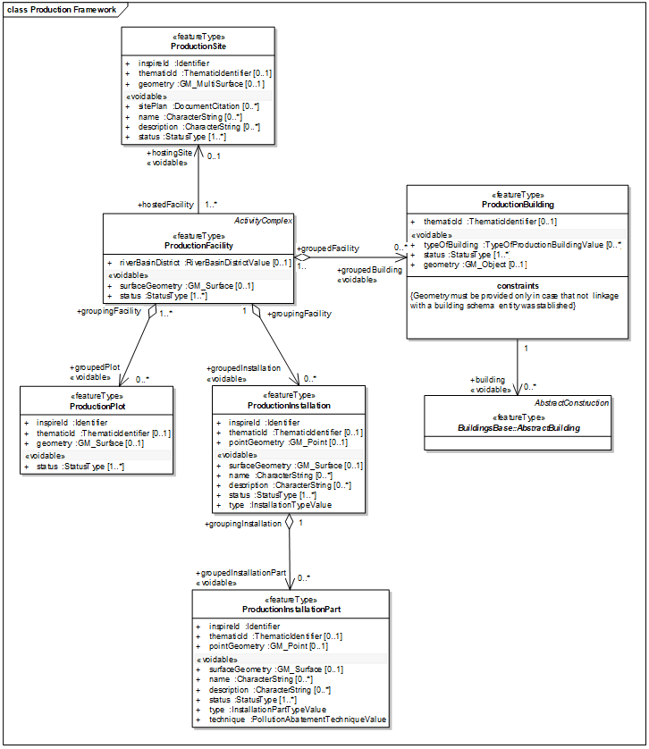

[.text-center]
*Figure 2 – UML class diagram: Overview of the Production and Industrial Facilities application schema*

The _Production Framework_ view corresponds to the UML class diagram with the following natural language description:

* A _ProductionFacility_ may be located on one _ProductionSite_. A _ProductionSite_ hosts one or more _ProductionFacilities_.
* A _ProductionInstallation_ is grouped by one _ProductionFacility_. A _ProductionFacility_ may group one or more _ProductionInstallations_.
* A _ProductionInstallationPart_ is grouped by one _ProductionInstallation_. A _ProductionInstallation_ may group one or more _ProductionInstallationParts_.
* A Production Plot is grouped by one or more _ProductionFacilities_, this means a Plot may be shared by different _ProductionFacilities_. A _ProductionFacility_ may group one or more Plots.
* A ProductionBuilding may be grouped by one or more ProductionFacilities, this means an ProductionBuilding may be shared by different ProductionFacilities. A ProductionFacility may group one or more ProductionBuilding. A ProductionBuilding can be related with an AbstractBuilding (BU).

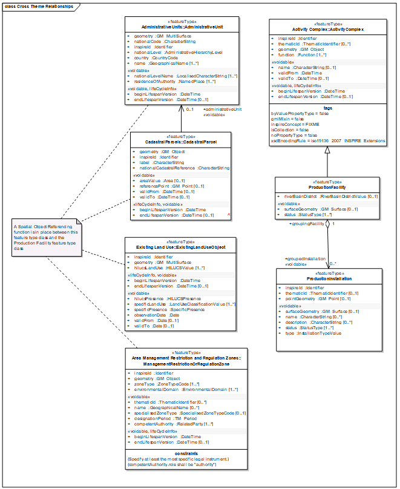

[.text-center]
*Figure 4 - UML class diagram: Overview of the _ProductionAndIndustrialFacilities_ application schema – Cross Theme Relationships view*

The _Cross Theme Relationships_ view corresponds to the UML class diagram with the following natural language description:

The following part was reported to document the link with the Activity Complex (the Common Facility Model) from Base Models of the INSPIRE Generic Conceptual Model - Overview:

A ProductionFacility is a special kind of ActivityComplex.

The following part documents the spatial object referencing with the Administrative Units, Cadastral Parcels, Land Use, Area Management Restriction Regulation Zones and Reporting Units Themes:

Spatial object referencing potentially involves the ProductionFacility and the Administrative Unit, the Cadastral Parcel, the ExistingLandUseObject, the ManagementRestrictionOrRegulationZone.

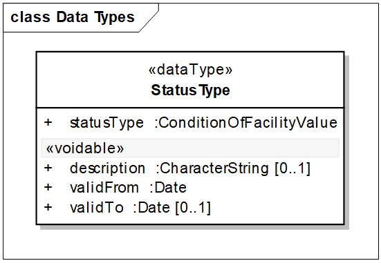

[.text-center]
*Figure 5 UML class diagram: Overview of the _ProductionAndIndustrialFacilities_ application schema – Data Types view*

The _Data Types_ view corresponds to the UML class diagram with the following natural language description:

The StatusType describes the state or condition of a technical component, with respect to the functional and operational order in which it is arranged for a limited or extended time period.

It applies equally to ProductionFacility or ProductionInstallation or ProductionInstallationPart, to the ProductionSite, to the ProductionPlot and to the ProductionBuilding.

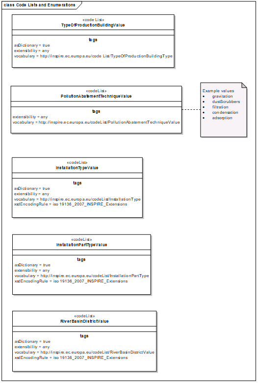

[.text-center]
*Figure 6 UML class diagram: Overview of the ProductionAndIndustrialFacilities application schema – Code Lists and Enumerations view*

The _Code Lists and Enumerations_ view corresponds to the UML class diagram with the following natural language description:

_The PollutionAbatementTechniqueValue_ code list contains the reference values for the attribute technique in the _ProductionInstallationPart_ class.

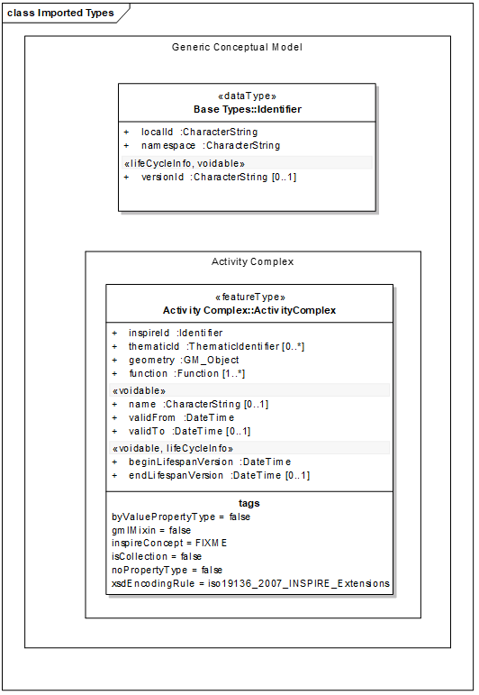

[.text-center]
*Figure 7 UML class diagram: Overview of the ProductionAndIndustrialFacilities application schema – Imported Types view*

The _Imported Types_ view corresponds to the UML class diagram with the following natural language description:

* The Identifier data type was imported from the Generic Conceptual Model.
* The ActivityComplex feature type was imported from the Generic Conceptual Model – Base Models – Activity Complex.

===== Consistency between spatial data sets

_Production and Industrial Facilities_ data are in very close relation with data coming from other INSPIRE Themes, such as Agricultural and Aquaculture Facilities, Mineral Resources or Energy Resources among others.

Furthermore, the part of Utility and Governmental Services related with Waste treatment and the Utility Network also has a significant relationship with _Production and Industrial Facilities_.

The main links among all these groups are implemented within the INSPIRE data model by sharing the Facility and Activity concepts across these themes. This harmonisation effort is represented by the definition of a common class for facilities, named ActivityComplex, from which the key ProductionFacility class was specialized.

===== Identifier management

Identifiers are provided for key entities: the _inspireId_ is provided for all PF spatial object types and the _thematicId_ is provided for object types where an alternative unique identification is requested, in presence or not of the _inspireId_. The definition of these two identifiers can be found in the INSPIRE Generic Conceptual Model guidelines (D2.5).

===== Modelling of object references

Identifiers are provided for key entities: the _inspireId_ is provided for all PF spatial object types and the ThematicId is provided for object types where an alternative unique identification is requested, in presence or not of the inspireId. The definition of these two identifiers can be found in the INSPIRE Generic Conceptual Model guidelines (D2.5).

==== Feature catalogue

*Feature catalogue metadata*

[cols=","]
|===
|Application Schema |INSPIRE Application Schema ProductionAndIndustrialFacilities
|Version number |3.0
|===

*Types defined in the feature catalogue*

[cols=",,",options="header",]
|===
|*Type* |*Package* |*Stereotypes*
|_InstallationPartTypeValue_ |ProductionAndIndustrialFacilities |«codeList»
|_InstallationTypeValue_ |ProductionAndIndustrialFacilities |«codeList»
|_PollutionAbatementTechniqueValue_ |ProductionAndIndustrialFacilities |«codeList»
|_ProductionBuilding_ |ProductionAndIndustrialFacilities |«featureType»
|_ProductionFacility_ |ProductionAndIndustrialFacilities |«featureType»
|_ProductionInstallation_ |ProductionAndIndustrialFacilities |«featureType»
|_ProductionInstallationPart_ |ProductionAndIndustrialFacilities |«featureType»
|_ProductionPlot_ |ProductionAndIndustrialFacilities |«featureType»
|_ProductionSite_ |ProductionAndIndustrialFacilities |«featureType»
|_RiverBasinDistrictValue_ |ProductionAndIndustrialFacilities |«codeList»
|_StatusType_ |ProductionAndIndustrialFacilities |«dataType»
|_TechnicalUnit_ |ProductionAndIndustrialFacilities |«featureType»
|===

===== Spatial object types

====== ProductionBuilding

[cols="",options="header",]
|===
|*ProductionBuilding*
a|
[cols=","]
!===
!Name: !production building
!Definition: !Artificial construction, part of the production facility that are useful to host or provide shelter to activity development.
!Description: !Inside a facility, and in relation with the definition of building, this entity should represent a construction under responsibility of the facility, either as an independent unit or as a functional infrastructure for an installation.
!Stereotypes: !«featureType»
!===

a|
*Attribute: thematicId*

[cols=","]
!===
!Value type: !ThematicIdentifier
!Definition: !Thematic object identifier (e.g. ICAO location identifiers for airports or NUTS codes for administrative areas).
!Description: !It may be the identification code provided by the Member States to identify the object on their own databases.
!Multiplicity: !0..1
!===

a|
*Attribute: typeOfBuilding*

[cols=","]
!===
!Value type: !TypeOfProductionBuildingValue
!Definition: !Descriptive classification about the production and industrial building.
!Multiplicity: !0..*
!Stereotypes: !«voidable»
!===

a|
*Attribute: status*

[cols=","]
!===
!Value type: !StatusType
!Definition: !The state or condition of the production and industrial building, with regard to the functional and operational order, in which it is arranged for a limited or extended time period.
!Multiplicity: !1..*
!Stereotypes: !«voidable»
!===

a|
*Attribute: geometry*

[cols=","]
!===
!Value type: !GM_Object
!Multiplicity: !0..1
!Stereotypes: !«voidable»
!===

a|
*Association role: building*

[cols=","]
!===
!Value type: !AbstractBuilding
!Multiplicity: !0..*
!Stereotypes: !«voidable»
!===

a|
*Constraint: Geometry must be provided only in case that not linkage with a building schema entity was stablished*

[cols=","]
!===
!Natural language: !
!OCL: !
!===

|===

====== ProductionFacility

[cols="",options="header",]
|===
|*ProductionFacility*
a|
[cols=","]
!===
!Name: !production facility
!Subtype of: !ActivityComplex
!Definition: !One or more installations on the same site operated by the same natural or legal person, designed, built or installed to serve specific production or industrial purposes, comprehending all infrastructure, equipment and materials.
!Description: !A production facility groups together a single installation, set of installations or production processes (stationary or mobile), which can be defined within a single geographical boundary, organizational unit or production process. A production facility can also be identified as one or more installations located on the same site that are operated by the same natural or legal person and in which production activities are being carried out. Such a facility groups potentially the land, buildings, and equipment used in carrying on an industrial business or other undertaking or service.
!Stereotypes: !«featureType»
!===

a|
*Attribute: surfaceGeometry*

[cols=","]
!===
!Value type: !GM_Surface
!Definition: !Spatial property of the spatial object with a value that is a vector geometry type from ISO 19107.
!Description: !This is the secondary geometry property for the Production Facility and it is set as an optional property to identify the location area for the Facility. It is intended, if available, to furnish a more detailed spatial information in addition to the basic mandatory geometry.
!Multiplicity: !0..1
!Stereotypes: !«voidable»
!===

a|
*Attribute: riverBasinDistrict*

[cols=","]
!===
!Value type: !RiverBasinDistrictValue
!Definition: !Code identifier and/or name assigned to the basin district of a watercourse.
!Description: !NOTE Information required (not registered in the Hydrography Theme) according to Article 3(1) of Directive 2000/60/EC of the European Parliament and of the Council of 23 October 2000 establishing 
a framework for Community action in the field of water policy (OJ L 327, 22.12.2000, p. 1). Directive as amended by Decision 
No 2455/2001/EC (OJ L 331, 15.12.2001, p. 1).
!Multiplicity: !0..1
!===

a|
*Attribute: status*

[cols=","]
!===
!Value type: !StatusType
!Definition: !The state or condition of the facility, with regard to the functional and operational order, in which it is arranged for a limited or extended time period.
!Multiplicity: !1..*
!Stereotypes: !«voidable»
!===

a|
*Association role: groupedPlot*

[cols=","]
!===
!Name: !A Plot is grouped by one or more Facilities (this means a Plot may be shared by different Facilities)
!Value type: !ProductionPlot
!Multiplicity: !0..*
!Stereotypes: !«voidable»
!===

a|
*Association role: hostingSite*

[cols=","]
!===
!Name: !A Site hosts one or more Facilities
!Value type: !ProductionSite
!Multiplicity: !0..1
!Stereotypes: !«voidable»
!===

a|
*Association role: groupedInstallation*

[cols=","]
!===
!Name: !An Installation is grouped by one Facility
!Value type: !ProductionInstallation
!Multiplicity: !0..*
!Stereotypes: !«voidable»
!===

a|
*Association role: groupedBuilding*

[cols=","]
!===
!Value type: !ProductionBuilding
!Multiplicity: !0..*
!Stereotypes: !«voidable»
!===

|===

====== ProductionInstallation

[cols="",options="header",]
|===
|*ProductionInstallation*
a|
[cols=","]
!===
!Name: !production installation
!Definition: !A stationary technical unit, such as machinery, apparatus, devices or equipment placed in position or connected for use, within which one or more activities listed in Annex I to Regulation (EC) No 166/2006 of the European Parliament and of the Council (^1^) and in Annex I or in Part 1 of Annex VII to Directive 2010/75/EU of the European Parliament and of the Council (^2^) are carried out, and any other directly associated activities which have a technical connection with the activities listed and which could have an effect on emissions and pollution.

(^1^) Commission Regulation (EC) No 166/2006 of 18 January 2006 concerning the establishment of a European Pollutant Release and Transfer Register and amending Council Directives 91/689/EEC and 96/61/EC (OJ L 33, 4.2.2006, p. 1).
(^2^) Directive 2010/75/EU of the European Parliament and of the Council of 24 November 2010 on industrial emissions (integrated pollution prevention and control) (OJ L 334, 17.12.2010, p. 17).
!Description: !Stationary technical unit part of a facility where one or more activities are carried out, and any other directly associated activities which have a technical connection to the activities carried out on that site and which could have an effect on the environment. 
May be a technical unit within an establishment in which dangerous substances are produced, used, handled or stored.
!Stereotypes: !«featureType»
!===

a|
*Attribute: inspireId*

[cols=","]
!===
!Value type: !Identifier
!Definition: !External object identifier of the spatial object.
!Description: !NOTE An external object identifier is a unique object identifier published by the responsible body, which may be used by external applications to reference the spatial object. The identifier is an identifier of the spatial object, not an identifier of the real-world phenomenon.
!Multiplicity: !1
!===

a|
*Attribute: thematicId*

[cols=","]
!===
!Value type: !ThematicIdentifier
!Definition: !Thematic object identifier (e.g. ICAO location identifiers for airports or NUTS codes for administrative areas).
!Description: !It may be the identification code provided by the Member States to identify the object on their own databases.
!Multiplicity: !0..1
!===

a|
*Attribute: pointGeometry*

[cols=","]
!===
!Value type: !GM_Point
!Definition: !Spatial property of the spatial object with a value that is a vector geometry type from ISO 19107.
!Description: !This is the basic geometry property for the Production Installation and it is set as an optional property to identify the location point for the Installation. It is intended, if available, to furnish an additional spatial information beside the basic mandatory geometry fixed for the Production Facility.
!Multiplicity: !0..1
!===

a|
*Attribute: surfaceGeometry*

[cols=","]
!===
!Value type: !GM_Surface
!Definition: !Spatial property of the spatial object with a value that is a vector geometry type from ISO 19107.
!Description: !This is the secondary geometry property for the Production Installation and it is set as an optional property to identify the location area for the Installation. It is intended, if available, to furnish a detailed spatial information beside the basic mandatory geometry fixed for the Production Facility.
!Multiplicity: !0..1
!Stereotypes: !«voidable»
!===

a|
*Attribute: name*

[cols=","]
!===
!Value type: !CharacterString
!Definition: !Official denomination or proper or conventional name of the installation.
!Multiplicity: !0..*
!Stereotypes: !«voidable»
!===

a|
*Attribute: description*

[cols=","]
!===
!Value type: !CharacterString
!Definition: !Descriptive statement about the installation.
!Multiplicity: !0..*
!Stereotypes: !«voidable»
!===

a|
*Attribute: status*

[cols=","]
!===
!Value type: !StatusType
!Definition: !The state or condition of the installation, with regard to its functional and operational order, in which it is arranged for a limited or extended time period.
!Multiplicity: !1..*
!Stereotypes: !«voidable»
!===

a|
*Attribute: type*

[cols=","]
!===
!Value type: !InstallationTypeValue
!Definition: !Special kind of an installation, denoting the operative function which has to be performed.
!Description: !EXAMPLE Radiological installation, containing radiological equipment.
!Multiplicity: !1
!Stereotypes: !«voidable»
!===

a|
*Association role: groupedInstallationPart*

[cols=","]
!===
!Name: !An InstallationPart is grouped by one Installation
!Value type: !ProductionInstallationPart
!Multiplicity: !0..*
!Stereotypes: !«voidable»
!===

|===

====== ProductionInstallationPart

[cols="",options="header",]
|===
|*ProductionInstallationPart*
a|
[cols=","]
!===
!Name: !production installation part
!Definition: !A single engineered facility that performs specific functionalities related with a production activity.
!Description: !This level of description covers specific parts of the Production Installation which must be registered by the legal mandate of the competent authorities. Points of emission as chimneys (for pollutants) or tanks (for special products), will be included in this definition.
!Stereotypes: !«featureType»
!===

a|
*Attribute: inspireId*

[cols=","]
!===
!Value type: !Identifier
!Definition: !External object identifier of the spatial object.
!Description: !NOTE An external object identifier is a unique object identifier published by the responsible body, which may be used by external applications to reference the spatial object. The identifier is an identifier of the spatial object, not an identifier of the real-world phenomenon.
!Multiplicity: !1
!===

a|
*Attribute: thematicId*

[cols=","]
!===
!Value type: !ThematicIdentifier
!Definition: !Thematic object identifier (e.g. ICAO location identifiers for airports or NUTS codes for administrative areas).
!Description: !It may be the identification code provided by the Member States to identify the object on their own databases.
!Multiplicity: !0..1
!===

a|
*Attribute: pointGeometry*

[cols=","]
!===
!Value type: !GM_Point
!Definition: !Spatial property of the spatial object with a value that is a vector geometry type from ISO 19107.
!Description: !This is the basic geometry property for the Production Installation Part and it is set as an optional property to identify the location point for the Installation Part. It is intended, if available, to furnish an additional spatial information beside the basic mandatory geometry fixed for the Production Facility.
!Multiplicity: !0..1
!===

a|
*Attribute: surfaceGeometry*

[cols=","]
!===
!Value type: !GM_Surface
!Definition: !Spatial property of the spatial object with a value that is a vector geometry type from ISO 19107.
!Description: !This is the secondary geometry property for the Production Installation Part and it is set as an optional property to identify the location area for the Installation Part. It is intended, if available, to furnish a detailed spatial information beside the basic mandatory geometry fixed for the Production Facility.
!Multiplicity: !0..1
!Stereotypes: !«voidable»
!===

a|
*Attribute: name*

[cols=","]
!===
!Value type: !CharacterString
!Definition: !Official denomination or proper or conventional name of the installation part.
!Multiplicity: !0..*
!Stereotypes: !«voidable»
!===

a|
*Attribute: description*

[cols=","]
!===
!Value type: !CharacterString
!Definition: !Descriptive statement about the installation part.
!Multiplicity: !0..*
!Stereotypes: !«voidable»
!===

a|
*Attribute: status*

[cols=","]
!===
!Value type: !StatusType
!Definition: !The state or condition of the installation part, with regard to the functional and operational order, in which it is arranged for a limited or extended time period.
!Multiplicity: !1..*
!Stereotypes: !«voidable»
!===

a|
*Attribute: type*

[cols=","]
!===
!Value type: !InstallationPartTypeValue
!Definition: !Special kind of an installation part, denoting the operative function which has to be performed.
!Description: !EXAMPLE Chimney, pump.
!Multiplicity: !1
!Stereotypes: !«voidable»
!===

a|
*Attribute: technique*

[cols=","]
!===
!Value type: !PollutionAbatementTechniqueValue
!Definition: !Method to reduce pollutant concentration due to the emissions of a technical component, tipically a chimney.
!Description: !This information is referring to a list of predefined potential values. 
The reference values are holded in the PollutionAbatementTechnique code list.
!Multiplicity: !1
!Stereotypes: !«voidable»
!===

|===

====== ProductionPlot

[cols="",options="header",]
|===
|*ProductionPlot*
a|
[cols=","]
!===
!Name: !Production Plot
!Definition: !A portion of land or water part of a production facility destined to functional purposes.
!Description: !A potential sub-division of a major site as delimited extension of land in which are performed extensive operations related with the activity or one of the activities performed by a facility.
!Stereotypes: !«featureType»
!===

a|
*Attribute: inspireId*

[cols=","]
!===
!Value type: !Identifier
!Definition: !External object identifier of the spatial object.
!Description: !NOTE An external object identifier is a unique object identifier published by the responsible body, which may be used by external applications to reference the spatial object. The identifier is an identifier of the spatial object, not an identifier of the real-world phenomenon.
!Multiplicity: !1
!===

a|
*Attribute: thematicId*

[cols=","]
!===
!Value type: !ThematicIdentifier
!Definition: !Thematic object identifier (e.g. ICAO location identifiers for airports or NUTS codes for administrative areas).
!Description: !It may be the identification code provided by the Member States to identify the object on their own databases.
!Multiplicity: !0..1
!===

a|
*Attribute: geometry*

[cols=","]
!===
!Value type: !GM_Surface
!Definition: !Spatial property of the spatial object with a value that is a vector geometry type from ISO 19107.
!Description: !This is the geometry property for the Parcel and it is set as a optional property to identify the location area for the Parcel. It is intended, if available, to furnish a detailed spatial information beside the basic mandatory geometry fixed for the Production Facility.
!Multiplicity: !0..1
!===

a|
*Attribute: status*

[cols=","]
!===
!Value type: !StatusType
!Definition: !The state or condition of the plot, with regard to the functional and operational order, in which it is arranged for a limited or extended time period.
!Multiplicity: !1..*
!Stereotypes: !«voidable»
!===

|===

====== ProductionSite

[cols="",options="header",]
|===
|*ProductionSite*
a|
[cols=","]
!===
!Name: !production site
!Definition: !All land at a distinct geographic location where the production facility was, is, or is intended to be located. This includes all infrastructure, equipment and materials;
!Description: !An area of land or water that one or more process plants is or may be situated on, or else a single location, in which, if there is more than one manufacturer of (a) substance(s), certain infrastructure and facilities are shared. 
A continuous surface, maritime or terrestrial in which production facilities have been already implanted or urban and/or engineering activities have been developed for production purposes. The location will be defined by means of geographical boundaries within which activities under the control of an organization may be carried out. The geographical boundaries may be on land and in water, and include above and below surface structures, both natural and man-made.
!Stereotypes: !«featureType»
!===

a|
*Attribute: inspireId*

[cols=","]
!===
!Value type: !Identifier
!Definition: !External object identifier of the spatial object.
!Description: !NOTE An external object identifier is a unique object identifier published by the responsible body, which may be used by external applications to reference the spatial object. The identifier is an identifier of the spatial object, not an identifier of the real-world phenomenon.
!Multiplicity: !1
!===

a|
*Attribute: thematicId*

[cols=","]
!===
!Value type: !ThematicIdentifier
!Definition: !Thematic object identifier (e.g. ICAO location identifiers for airports or NUTS codes for administrative areas).
!Description: !It may be the identification code provided by the Member States to identify the object on their own databases.
!Multiplicity: !0..1
!===

a|
*Attribute: geometry*

[cols=","]
!===
!Value type: !GM_MultiSurface
!Definition: !Spatial property of the spatial object with a value that is a vector geometry type from ISO 19107.
!Description: !This is the geometry property for the Production Site and it is set as an optional property to identify the location area for the Site. It is intended, if available, to furnish a detailed spatial information beside the basic mandatory geometry fixed for the Production Facility.
!Multiplicity: !0..1
!===

a|
*Attribute: sitePlan*

[cols=","]
!===
!Value type: !DocumentCitation
!Definition: !External reference to documentation concerning the configuration and organisation of the site ((Site Plans, technical descriptions, ...).
!Multiplicity: !0..*
!Stereotypes: !«voidable»
!===

a|
*Attribute: name*

[cols=","]
!===
!Value type: !CharacterString
!Definition: !Official denomination or proper or conventional name of the site.
!Multiplicity: !0..*
!Stereotypes: !«voidable»
!===

a|
*Attribute: description*

[cols=","]
!===
!Value type: !CharacterString
!Definition: !Descriptive statement about the site.
!Multiplicity: !0..*
!Stereotypes: !«voidable»
!===

a|
*Attribute: status*

[cols=","]
!===
!Value type: !StatusType
!Definition: !The state or condition of the site, with regard to the functional and operational order, in which it is arranged for a limited or extended time period.
!Multiplicity: !1..*
!Stereotypes: !«voidable»
!===

|===

====== TechnicalUnit

[cols="",options="header",]
|===
|*TechnicalUnit (abstract)*
a|
[cols=","]
!===
!Name: !technical unit
!Definition: !Represents the common "abstract level" for production infrastructures: facilities, installations, installation parts.
!Description: !It applies since the production infrastructures (facility, installation, installation part) may have an UML "equivalent behaviour": this means they have properties in common and the same associations to be reused.
!Stereotypes: !«featureType»
!===

|===

===== Data types

====== StatusType

[cols="",options="header",]
|===
|*StatusType*
a|
[cols=","]
!===
!Definition: !The state or condition of a technical component, with regard to the functional and operational order, in which it is arranged for a limited or extended time period.
!Description: !It applies equally to the technical unit (facility, installation or installation part), to the production site, to the parcel and to the production building.
!Stereotypes: !«dataType»
!===

a|
*Attribute: statusType*

[cols=","]
!===
!Value type: !ConditionOfFacilityValue
!Definition: !The state or condition of a technical component referring to a list of predefined potential values.
!Description: !The reference values are holded in the ConditionOfFacilityValue code list.
!Multiplicity: !1
!===

a|
*Attribute: description*

[cols=","]
!===
!Value type: !CharacterString
!Definition: !Descriptive statement about the declared status.
!Multiplicity: !0..1
!Stereotypes: !«voidable»
!===

a|
*Attribute: validFrom*

[cols=","]
!===
!Value type: !Date
!Definition: !The starting time of validity for a status type.
!Description: !A date gives values for year, month and day.
!Multiplicity: !1
!Stereotypes: !«voidable»
!===

a|
*Attribute: validTo*

[cols=","]
!===
!Value type: !Date
!Definition: !The ending time of validity for a status type.
!Description: !A date gives values for year, month and day.
!Multiplicity: !0..1
!Stereotypes: !«voidable»
!===

|===

===== Code lists

====== InstallationPartTypeValue

[cols="",options="header",]
|===
|*InstallationPartTypeValue*
a|
[cols=","]
!===
!Name: !Installation Part Type
!Definition: !Coded values describing the typology of the Installation Part
!Extensibility: !any
!Identifier: !http://inspire.ec.europa.eu/codeList/InstallationPartType
!Values: !The allowed values for this code list comprise any values defined by data providers.
!===

|===

====== InstallationTypeValue

[cols="",options="header",]
|===
|*InstallationTypeValue*
a|
[cols=","]
!===
!Name: !Installation Type
!Definition: !Coded values describing the typology of the Installation
!Extensibility: !any
!Identifier: !http://inspire.ec.europa.eu/codeList/InstallationType
!Values: !The allowed values for this code list comprise any values defined by data providers.
!===

|===

====== PollutionAbatementTechniqueValue

[cols="",options="header",]
|===
|*PollutionAbatementTechniqueValue*
a|
[cols=","]
!===
!Name: !pollution abatement technique value
!Definition: !The PollutionAbatementTechniqueValue code list hosts the reference values for the attribute technique in the ProductionInstallationPart class.
!Extensibility: !open
!Identifier: !http://inspire.ec.europa.eu/codeList/PollutionAbatementTechniqueValue
!Values: !The allowed values for this code list comprise the values specified in _Annex C_ and additional values at any level defined by data providers.
!===

|===

====== RiverBasinDistrictValue

[cols="",options="header",]
|===
|*RiverBasinDistrictValue*
a|
[cols=","]
!===
!Name: !River Basin District
!Definition: !Code identifiers and/or names assigned to river basin districts.The allowed values for this code list comprise any values defined by data providers.
!Extensibility: !any
!Identifier: !http://inspire.ec.europa.eu/codeList/RiverBasinDistrictValue
!Values: !The allowed values for this code list comprise any values defined by data providers.
!===

|===

===== Imported types (informative)

[.blue.background]
[.small]#This section lists definitions for feature types, data types and enumerations and code lists that are defined in other application schemas. The section is purely informative and should help the reader understand the feature catalogue presented in the previous sections. For the normative documentation of these types, see the given references.#

====== AbstractBuilding

[cols="",options="header",]
|===
|*AbstractBuilding (abstract)*
a|
[cols=","]
!===
!Package: !BuildingsBase
!Reference: !INSPIRE Data specification on Buildings [DS-D2.8.III.2]
!Definition: !Abstract spatial object type grouping the common semantic properties of the spatial object types Building and BuildingPart.
!===

|===

====== ActivityComplex

[cols="",options="header",]
|===
|*ActivityComplex*
a|
[cols=","]
!===
!Package: !Activity Complex
!Reference: !INSPIRE Data Specifications – Base Models – Activity Complex, version 1.0 [DS-D2.10.3]
!Definition: !A "single unit", both technically and economically, under the management control of the same legal entity (operator), covering activities as those listed in the Eurostat NACE classification, products and services. Activity Complex includes all infrastructure, equipment and materials. It must represent the whole area, at the same or different geographical location, managed by a "single unit".
!Description: !NOTE 1 This class describes the minimal set of elements necessary to describe and identify geographically a legal entity and the activities taken place on it under the context of a Environmental purposes. 
 
NOTE 2 "Activity Complex" could be assimilated to terms described on the legislation as Facility, Establishment, Plant, Holding, Organization ,Farm, Extractive Industries or Aquaculture Production Business among others 
 
EXAMPLE i.e. an Agro-business that is legally registered under the Emissions Directive.
!===

|===

====== CharacterString

[cols="",options="header",]
|===
|*CharacterString*
a|
[cols=","]
!===
!Package: !Text
!Reference: !Geographic information -- Conceptual schema language [ISO/TS 19103:2005]
!===

|===

====== ConditionOfFacilityValue

[cols="",options="header",]
|===
|*ConditionOfFacilityValue*
a|
[cols=","]
!===
!Package: !Base Types
!Reference: !INSPIRE Generic Conceptual Model, version 3.4 [DS-D2.5]
!Definition: !The status of a facility with regards to its completion and use.
!===

|===

====== Date

[cols="",options="header",]
|===
|*Date*
a|
[cols=","]
!===
!Package: !Date and Time
!Reference: !Geographic information -- Conceptual schema language [ISO/TS 19103:2005]
!===

|===

====== DocumentCitation

[cols="",options="header",]
|===
|*DocumentCitation*
a|
[cols=","]
!===
!Package: !Base Types 2
!Reference: !INSPIRE Generic Conceptual Model, version 3.4 [DS-D2.5]
!Definition: !Citation for the purposes of unambiguously referencing a document.
!===

|===

====== GM_MultiSurface

[cols="",options="header",]
|===
|*GM_MultiSurface*
a|
[cols=","]
!===
!Package: !Geometric aggregates
!Reference: !Geographic information -- Spatial schema [ISO 19107:2003]
!===

|===

====== GM_Object

[cols="",options="header",]
|===
|*GM_Object (abstract)*
a|
[cols=","]
!===
!Package: !Geometry root
!Reference: !Geographic information -- Spatial schema [ISO 19107:2003]
!===

|===

====== GM_Point

[cols="",options="header",]
|===
|*GM_Point*
a|
[cols=","]
!===
!Package: !Geometric primitive
!Reference: !Geographic information -- Spatial schema [ISO 19107:2003]
!===

|===

====== GM_Surface

[cols="",options="header",]
|===
|*GM_Surface*
a|
[cols=","]
!===
!Package: !Geometric primitive
!Reference: !Geographic information -- Spatial schema [ISO 19107:2003]
!===

|===

====== Identifier

[cols="",options="header",]
|===
|*Identifier*
a|
[cols=","]
!===
!Package: !Base Types
!Reference: !INSPIRE Generic Conceptual Model, version 3.4 [DS-D2.5]
!Definition: !External unique object identifier published by the responsible body, which may be used by external applications to reference the spatial object.
!Description: !NOTE1 External object identifiers are distinct from thematic object identifiers. 
 
NOTE 2 The voidable version identifier attribute is not part of the unique identifier of a spatial object and may be used to distinguish two versions of the same spatial object. 
 
NOTE 3 The unique identifier will not change during the life-time of a spatial object.
!===

|===

====== ThematicIdentifier

[cols="",options="header",]
|===
|*ThematicIdentifier*
a|
[cols=","]
!===
!Package: !Base Types 2
!Reference: !INSPIRE Generic Conceptual Model, version 3.4 [DS-D2.5]
!Definition: !Thematic identifier to uniquely identify the spatial object.
!Description: !Some spatial objects may be assigned multiple unique identifiers. 
These may have been established to meet data exchange requirements of different reporting obligations at International, European or national levels and/or internal data maintenance requirements.
!===

|===

====== TypeOfProductionBuildingValue

[cols="",options="header",]
|===
|*TypeOfProductionBuildingValue*
a|
[cols=","]
!===
!Package: !ProductionAndIndustrialFacilities
!Reference: !INSPIRE Data specification on _Production and Industrial Facilities_ [DS-D2.8.III.8]
!===

|===

==== Externally governed code lists

There are no externally governed code lists included in this application schema.

=== Application schema Production and Industrial Facilities Extension

==== Description

===== Narrative description

The application schema for _Production and Industrial Facilities_ Extension provides the subsidiary common pan-European information related with Facilities under the scope of the Production and Industrial context, following the Community legislation and apart the spatial aspects. The present application schema shall be considered as integration for the application schema for _Production and Industrial Facilities_: this means that only additional elements, in respect of the basic ones included in clause 5.2, will be documented here.

The extended model is based on Technical Units which represent an abstract class (extensible by Production Facility, Production Installation or Production Installation Part) with the capacity of performing Activities as those described listed in the Eurostat NACE classification established by Regulation (EC) No 1893/2006 of the European Parliament.

The Production Process view maps the Activities performed by the Technical Unit, and the related Production Process.

In the production context, an Activity represents the individual or organised set of processes for the production of consumer goods (or by-products required by other production or industrial activities). In this case processing typically describes the act of taking some substance or material through an established and usually routine set of procedures to convert it from one form to another, such as a manufacturing. One or more activities may be performed in the Technical Unit, covering the facility or smaller unit of the facility (i.e. an installation or an installation part). The Production Process is information mapped on the couple of a certain Activity associated with a specific Technical Unit. Formally a Production Process is consisting of a series of actions or operations in a productive context: in this sense a Production Process is a procedure grouping a sequence of phases or steps, considering that all the sequence has to be initiated from Process Input and to result in Process Output. The latter aspect is the main information we are interested in.

The Process Input for a certain Process is represented in a simplified way by any kind of substance (material), energy, waste, product entering a production cycle.

The Process Output is represented by any kind of substance, energy, waste, product or emission originating from a production cycle. More precisely an Emission is a special kind of Process Output.

The data model overview is completed by accessory application schema views showing the Data Types, the Code Lists and Enumerations, and the Imported Types (from other INSPIRE Themes).

===== UML Overview

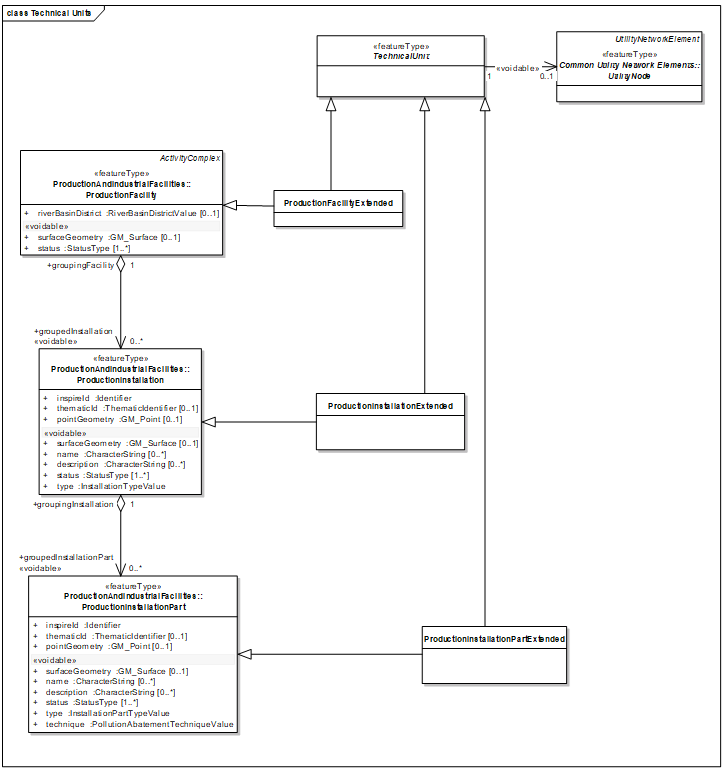

[.text-center]
*Figure 8 – UML class diagram: Overview of the ProductionAndIndustrialFacilitiesExtension application schema – Technical Units View*

The _Technical Units_ view corresponds to the UML class diagram with the following natural language description:

* A Technical Units with is an abstract class extensible to Production Facility, Production Installation and Production Installation Part. Technical Units can be considered as a Node on the context of a Utility Network.
* A ProductionFacilityExtended as extension of Production Facility with is an extension of the abstract class Technical Unit.
* A ProductionInstallationExtended as extension of Production Installation with is an extension of the abstract class Technical Unit.
* A ProductionInstallationPartExtended as extension of Production Installation Part with is an extension of the abstract class Technical Unit.

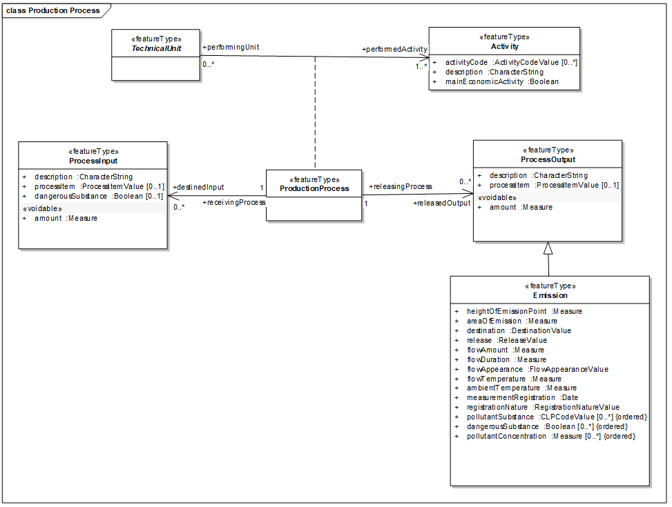

[.text-center]
*Figure 9 - UML class diagram: Overview of the ProductionAndIndustrialFacilitiesExtension application schema – Production Process view*

The _Production Process_ view corresponds to the UML class diagram with the following natural language description:

A TechnicalUnit attends to one to many Activities. An Activity may be performed by one or more TechnicalUnits, this means an Activity may be shared by different TechnicalUnits.

A ProductionProcess is associated to the couple "TechnicalUnit – Activity", this means each couple "TechnicalUnit – Activity" may characterise its own ProductionProcess, with information on specific ProcessInput and ProcessOutput items.

A ProcessInput feeds a ProductionProcess. Vice versa, a ProductionProcess may receive one or more ProcessInput items. Substance, energy, waste, product are different kinds of ProcessInput items.

A ProcessOutput item derives from a ProductionProcess. Vice versa, a ProductionProcess may release one or more ProcessOutput items. Substance, energy, waste, product, are different kinds of ProcessOutput items. Emission is a special kind of ProcessOutput item.

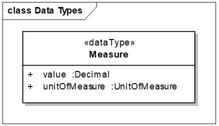

[.text-center]
*Figure 10 - UML class diagram: Overview of the ProductionAndIndustrialFacilitiesExtension application schema – Data Types view*

The _Data Types_ view corresponds to the UML class diagram with the following natural language decription:

The Measure represents the declared or measured quantity of any kind of physical entity.

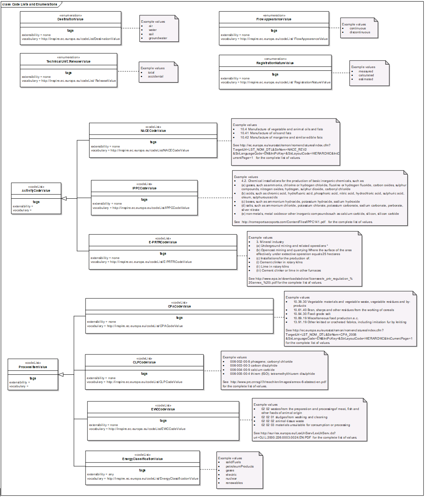

[.text-center]
*Figure 11 - UML class diagram: Overview of the ProductionAndIndustrialFacilitiesExtension application schema – Code Lists and Enumerations view*

The _Code Lists and Enumerations_ view corresponds to the UML class diagram with the following natural language description:

* The DestinationValue enumeration hosts the reference values for the attribute destination in the Emission class.
* The ReleaseValue enumeration contains the reference values for the attribute release in the Emission class.
* The FlowAppearanceValue enumeration contains the reference values for the attribute flowAppearance in the Emission class.
* The RegistrationNatureValue enumeration contains the reference values for the attribute registrationNature in the Emission class.
* The NACECodeValue code list hosts a family of reference values for the attribute activityCode in the Activity class. The list hosts the classification for the activities according to the Council Regulation 3037/90/EEC.
* The IPPCCodeValue code list hosts a family of reference values for the attribute activityCode in the Activity class. The list hosts the classification for the activities according to the Council Regulation 96/61/EC.
* The E-PRTRCodeValue code list hosts a family of reference values for the attribute activityCode in the Activity class. The list hosts the classification for the activities according to the E-PRTR register.
* The CPACodeValue code list hosts the family of reference values for the "product" item referred to the attribute processItem in the ProcessInput or ProcessOutput classes. A product means something that is produced, result of manufacturing, a result of an action or a process.
* The CLPCodeValue code list hosts the family of reference values for the "substance" item referred to the attribute processItem in the ProcessInput or ProcessOutput classes and to the attribute pollutantSubstance in the Emission class. Substance means any chemical element and its compounds, with the exception of some specific substances.
* The EWCCodeValue code list hosts the family of reference values for the "waste" item referred to the attribute processItem in the ProcessInput or ProcessOutput classes. Waste means any substance or object which the holder discards or intends or is required to discard.
* The EnergyClassificationValue code list hosts the family of reference values for the "energy" item referred to the attribute processItem in the ProcessInput or ProcessOutput classes. Energy means power derived from physical or chemical resources able to provide light and heat to work machines.

==== Feature catalogue

*Feature catalogue metadata*

[cols=","]
|===
|Application Schema |INSPIRE Application Schema ProductionAndIndustrialFacilitiesExtension
|Version number |3.0
|===

*Types defined in the feature catalogue*

[cols=",,",options="header",]
|===
|*Type* |*Package* |*Stereotypes*
|_Activity_ |ProductionAndIndustrialFacilitiesExtension |«featureType»
|_Emission_ |ProductionAndIndustrialFacilitiesExtension |«featureType»
|_Measure_ |ProductionAndIndustrialFacilitiesExtension |«dataType»
|_ProcessInput_ |ProductionAndIndustrialFacilitiesExtension |«featureType»
|_ProcessOutput_ |ProductionAndIndustrialFacilitiesExtension |«featureType»
|_ProductionFacility_ |ProductionAndIndustrialFacilitiesExtension |«featureType»
|_ProductionProcess_ |ProductionAndIndustrialFacilitiesExtension |«featureType»
|_TechnicalUnit_ |ProductionAndIndustrialFacilitiesExtension |«featureType»
|===

===== Spatial object types

====== Activity

[cols="",options="header",]
|===
|*Activity*
a|
[cols=","]
!===
!Name: !activity
!Definition: !In the production context the individual or organized set of processes finalized with the production of consuming goods.
!Description: !Processing typically describes the act of taking something through an established and usually routine set of procedures to convert it from one form to another, such as a manufacturing. One or more activities may be performed in the facility or smaller unit of the facility (that is an installation or an installation part).
!Stereotypes: !«featureType»
!===

a|
*Attribute: activityCode*

[cols=","]
!===
!Value type: !ActivityCodeValue
!Definition: !Classification of the activity according to European legislation.
!Multiplicity: !0..*
!Values: !The allowed values for this code list comprise any values defined by data providers. _Annex C_ includes recommended values that may be used by data providers.
!===

a|
*Attribute: description*

[cols=","]
!===
!Value type: !CharacterString
!Definition: !Descriptive statement about the activity in line with the declared classification from legislation.
!Description: !It may be also a descriptive value from a local code list.
!Multiplicity: !1
!===

a|
*Attribute: mainEconomicActivity*

[cols=","]
!===
!Value type: !boolean
!Definition: !Primary activity in terms of significance and production volume.
!Multiplicity: !1
!===

|===

====== Emission

[cols="",options="header",]
|===
|*Emission*
a|
[cols=","]
!===
!Name: !emission
!Subtype of: !ProcessOutput
!Definition: !The direct or indirect release of substances, vibrations, heat or noise from individual or diffuse sources in the plant into the air, water or soil.
!Description: !Referring to emission events from a source the release total amount in a year and each meaningful accidental release shall be recorded.
!Stereotypes: !«featureType»
!===

a|
*Attribute: heightOfEmissionPoint*

[cols=","]
!===
!Value type: !Measure
!Definition: !The spatial location of the emission point, fixed as the vertical distance from the ground level.
!Multiplicity: !1
!===

a|
*Attribute: areaOfEmission*

[cols=","]
!===
!Value type: !Measure
!Definition: !The surface extension related to the emission point, fixed as the area of the mouth (for instance the smokestack mouth) from where the emission comes out.
!Multiplicity: !1
!===

a|
*Attribute: destination*

[cols=","]
!===
!Value type: !DestinationValue
!Definition: !Final destination to which the emission released into the environment is devoted.
!Multiplicity: !1
!Values: !The allowed values for this code list comprise the values specified in _Annex C_ and additional values at any level defined by data providers.
!===

a|
*Attribute: release*

[cols=","]
!===
!Value type: !ReleaseValue
!Definition: !The release nature related to the emissive amount for emission events: the release total amount in a year and each meaningful accidental release shall be distinguished.
!Multiplicity: !1
!Values: !The allowed values for this code list comprise the values specified in _Annex C_ and additional values at any level defined by data providers.
!===

a|
*Attribute: flowAmount*

[cols=","]
!===
!Value type: !Measure
!Definition: !The flood content related to the emission point, fixed as the flow amount coming out from the mouth (for instance the smokestack mouth).
!Description: !The unit of measure normally used is m3 /h and the reference parameters 0°C for temperature and 0,101MPa for pressure.
!Multiplicity: !1
!===

a|
*Attribute: flowDuration*

[cols=","]
!===
!Value type: !Measure
!Definition: !The flood period of time related to the emission point, fixed as the duration of the flow coming out from the mouth (for instance the smokestack mouth).
!Description: !The unit of measure normally used is hour/day.
!Multiplicity: !1
!===

a|
*Attribute: flowAppearance*

[cols=","]
!===
!Value type: !FlowAppearanceValue
!Definition: !The flood property related to the emission point, fixed as the flow appearance in time coming out from the mouth (for instance the smokestack mouth).
!Multiplicity: !1
!Values: !The allowed values for this code list comprise the values specified in _Annex C_ and additional values at any level defined by data providers.
!===

a|
*Attribute: flowTemperature*

[cols=","]
!===
!Value type: !Measure
!Definition: !The warmth related to the emission point, fixed as the temperature of the flow coming out from the mouth (for instance the smokestack mouth).
!Description: !The unit of measure normally used is °C.
!Multiplicity: !1
!===

a|
*Attribute: ambientTemperature*

[cols=","]
!===
!Value type: !Measure
!Definition: !The external temperature in the surroundings of the emission point.
!Description: !The unit of measure normally used is °C.
!Multiplicity: !1
!===

a|
*Attribute: measurementRegistration*

[cols=","]
!===
!Value type: !Date
!Definition: !The temporal reference related to the emission event, fixed as the time the measurements (flow and temperature and concentrations) were registered together.
!Multiplicity: !1
!===

a|
*Attribute: registrationNature*

[cols=","]
!===
!Value type: !RegistrationNatureValue
!Definition: !The way the registration event was accomplished, fixed as the procedure such as the registered parameters were picked up in a definite time.
!Multiplicity: !1
!Values: !The allowed values for this code list comprise the values specified in _Annex C_ and additional values at any level defined by data providers.
!===

a|
*Attribute: pollutantSubstance*

[cols=","]
!===
!Value type: !CLPCodeValue
!Definition: !The pollution content related to the emission point, fixed as the declaration of each pollutant substance coming out from the mouth (for instance the smokestack mouth).
!Description: !The classification of pollutant substances is made according to the Council Directive 67/548/EEC and the Council Directive 1999/45/EC. Each substance consists of any chemical element and its compounds, with the exception of some specific substances. The exception deals with the following substances: radioactive substances as defined in Article 1 of Council Directive 96/29/Euratom of 13 May 1996 laying down basic safety standards for the protection of the health of workers and the general public against the dangers arising from ionising radiation(2); genetically modified micro-organisms as defined in Article 2(b) of Directive 2009/41/EC of the European Parliament and the Council of 6 May 2009 on the contained use of genetically modified micro-organisms; genetically modified organisms as defined in point 2 of Article 2 of Directive 2001/18/EC of the European Parliament and of the Council of 12 March 2001 on the deliberate release into the environment of genetically modified organisms.
!Multiplicity: !0..*
!Values: !The allowed values for this code list comprise any values defined by data providers. _Annex C_ includes recommended values that may be used by data providers.
!===

a|
*Attribute: dangerousSubstance*

[cols=","]
!===
!Value type: !Boolean
!Definition: !A substance, mixture or preparation present as a raw material, product, by-product, residue or intermediate, including those substances which it is reasonable to suppose may be generated in the event of accident, with a potential for creating damage to human health and/or the environment.
!Multiplicity: !0..*
!===

a|
*Attribute: pollutantConcentration*

[cols=","]
!===
!Value type: !Measure
!Definition: !The pollution content related to the emission point, fixed as the pollutant concentration for each pollutant substance coming out from the mouth (for instance the smokestack mouth).
!Description: !The unit of measure normally used is mg/m3.
!Multiplicity: !0..*
!===

|===

====== ProcessInput

[cols="",options="header",]
|===
|*ProcessInput*
a|
[cols=","]
!===
!Name: !process input
!Definition: !Declares any kind of process item as substance, energy, waste, product entering a production cycle and possibly the corresponding amount.
!Stereotypes: !«featureType»
!===

a|
*Attribute: description*

[cols=","]
!===
!Value type: !CharacterString
!Definition: !Descriptive statement about the substance, energy, waste or product in line with the declared classification.
!Multiplicity: !1
!===

a|
*Attribute: amount*

[cols=","]
!===
!Value type: !Measure
!Definition: !Declared or measured quantity of any kind of material, energy, waste, product entering a production cycle.
!Multiplicity: !1
!Stereotypes: !«voidable»
!===

a|
*Attribute: processItem*

[cols=","]
!===
!Value type: !ProcessItemValue
!Definition: !States the special kind of the process item listed in one of the families of substances, energies, wastes, products, where these lists are following, as far as possible, official classifications.
!Multiplicity: !0..1
!Values: !The allowed values for this code list comprise any values defined by data providers. _Annex C_ includes recommended values that may be used by data providers.
!===

a|
*Attribute: dangerousSubstance*

[cols=","]
!===
!Value type: !Boolean
!Definition: !A substance, mixture or preparation present as a raw material, product, by-product, residue or intermediate, including those substances which it is reasonable to suppose may be generated in the event of accident, with a potential for creating damage to human health and/or the environment.
!Multiplicity: !0..1
!===

|===

====== ProcessOutput

[cols="",options="header",]
|===
|*ProcessOutput*
a|
[cols=","]
!===
!Name: !process output
!Definition: !Declares any kind of process item as substance, energy, waste, product, emission resulting from a production cycle and possibly the corresponding amount.
!Stereotypes: !«featureType»
!===

a|
*Attribute: description*

[cols=","]
!===
!Value type: !CharacterString
!Definition: !Descriptive statement about the energy, waste, product or emission in line with the declared classification.
!Multiplicity: !1
!===

a|
*Attribute: processItem*

[cols=","]
!===
!Value type: !ProcessItemValue
!Definition: !States the special kind of the process item listed in one of the families of substances, energies, wastes, products, where these lists are following, as far as possible, official classifications.
!Multiplicity: !0..1
!Values: !The allowed values for this code list comprise any values defined by data providers. _Annex C_ includes recommended values that may be used by data providers.
!===

a|
*Attribute: amount*

[cols=","]
!===
!Value type: !Measure
!Definition: !Declared or measured quantity of any kind of energy, waste, product, emission springing from a production cycle.
!Multiplicity: !1
!Stereotypes: !«voidable»
!===

|===

====== ProductionFacility

[cols="",options="header",]
|===
|*ProductionFacility*
a|
[cols=","]
!===
!Name: !production facility
!Subtype of: !ProductionFacility
!Definition: !Something designed, built, installed to serve a specific function with production purposes, comprehending the complete equipment or apparatus for a particular process or operation.
!Description: !A production facility groups together a single installation, set of installations or production processes (stationary or mobile), which can be defined within a single geographical boundary, organizational unit or production process. A production facility can also be identified as one or more installations located on the same site that are operated by the same natural or legal person and in which production activities are being carried out. Such a facility groups potentially the land, buildings, and equipment used in carrying on an industrial business or other undertaking or service.
!Stereotypes: !«featureType»
!===

|===

====== ProductionProcess

[cols="",options="header",]
|===
|*ProductionProcess (association class)*
a|
[cols=","]
!===
!Definition: !Production processes performed by the facility
!Stereotypes: !«featureType»
!===

a|
*Association role: destinedInput*

[cols=","]
!===
!Name: !A ProcessInput is destined to a ProductionProcess
!Value type: !ProcessInput
!Multiplicity: !0..*
!===

a|
*Association role: releasedOutput*

[cols=","]
!===
!Name: !A ProcessOutput is released by a ProductionProcess
!Value type: !ProcessOutput
!Multiplicity: !0..*
!===

|===

====== TechnicalUnit

[cols="",options="header",]
|===
|*TechnicalUnit (abstract)*
a|
[cols=","]
!===
!Name: !technical unit
!Definition: !Represents the common "abstract level" for production infrastructures: facilities, installations, installation parts.
!Description: !It applies since the production infrastructures (facility, installation, installation part) may have an UML "equivalent behaviour": this means they have properties in common and the same associations to be reused.
!Stereotypes: !«featureType»
!===

a|
*Association role: performedActivity [the association has additional attributes - see association class ProductionProcess]*

[cols=","]
!===
!Value type: !Activity
!Multiplicity: !1..*
!===

a|
*Association role:*

[cols=","]
!===
!Value type: !UtilityNode
!Multiplicity: !0..1
!===

|===

===== Data types

====== ProductionProcess

[cols="",options="header",]
|===
|*ProductionProcess (association class)*
a|
[cols=","]
!===
!Definition: !Production processes performed by the facility
!Stereotypes: !«featureType»
!===

a|
*Association role: destinedInput*

[cols=","]
!===
!Name: !A ProcessInput is destined to a ProductionProcess
!Value type: !ProcessInput
!Multiplicity: !0..*
!===

a|
*Association role: releasedOutput*

[cols=","]
!===
!Name: !A ProcessOutput is released by a ProductionProcess
!Value type: !ProcessOutput
!Multiplicity: !0..*
!===

|===

====== Measure

[cols="",options="header",]
|===
|*Measure*
a|
[cols=","]
!===
!Definition: !Declared or measured quantity of any kind of physical entity.
!Stereotypes: !«dataType»
!===

a|
*Attribute: value*

[cols=","]
!===
!Value type: !Decimal
!Definition: !Declared or measured physical size expressed as a numerical quantity.
!Description: !The data format is decimal. Decimal is a data type in which the number represents an exact value, as a finite representation of a decimal number.
!Multiplicity: !1
!===

a|
*Attribute: unitOfMeasure*

[cols=","]
!===
!Value type: !UnitOfMeasure
!Definition: !Unit of measure accompanying the numerical quantity declared or measured for a physical entity.
!Multiplicity: !1
!===

|===

===== Enumerations

====== DestinationValue

[cols="",options="header",]
|===
|*DestinationValue*
a|
[cols=","]
!===
!Name: !destination value
!Definition: !The DestinationValue enumeration hosts the reference values for the attribute destination in the Emission class.
!URI: !http://inspire.ec.europa.eu/codeList/DestinationValue
!===

|===

====== FlowAppearanceValue

[cols="",options="header",]
|===
|*FlowAppearanceValue*
a|
[cols=","]
!===
!Name: !flow appearance value
!Definition: !The FlowAppearanceValue enumeration hosts the reference values for the attribute flowAppearance in the Emission class.
!URI: !http://inspire.ec.europa.eu/codeList/ FlowAppearanceValue
!===

a|
*Value: continuous*

[cols="",]
!===
!
!===

a|
*Value: discontinuous*

[cols="",]
!===
!
!===

|===

====== RegistrationNatureValue

[cols="",options="header",]
|===
|*RegistrationNatureValue*
a|
[cols=","]
!===
!Name: !registration nature value
!Definition: !The RegistrationNatureValue enumeration hosts the reference values for the attribute registrationNature in the Emission class.
!URI: !http://inspire.ec.europa.eu/codeList/ RegistrationNatureValue
!===

a|
*Value: measured*

[cols="",]
!===
!
!===

a|
*Value: calculated*

[cols="",]
!===
!
!===

a|
*Value: estimated*

[cols="",]
!===
!
!===

|===

===== Code lists

====== ActivityCodeValue

[cols="",options="header",]
|===
|*ActivityCodeValue*
a|
[cols=","]
!===
!Name: !activity code value
!Definition: !The ActivityCodeValue code list hosts all the potential reference values for the attribute activityCode in the Activity class.
!Extensibility: !any
!Identifier: !
!Values: !The allowed values for this code list comprise any values defined by data providers. _Annex C_ includes recommended values that may be used by data providers.
!===

|===

====== CLPCodeValue

[cols="",options="header",]
|===
|*CLPCodeValue*
a|
[cols=","]
!===
!Name: !CLP code value
!Definition: !The CLPCodeValue code list hosts the family of reference values for the "substance" item referred to the attribute processItem in the ProcessInput or ProcessOutput classes and to the attribute pollutantSubstance in the Emission class. Substance means any chemical element and its compounds, with the exception of some specific substances.
!Description: !The exception deals with the following substances: radioactive substances as defined in Article 1 of Council Directive 96/29/Euratom of 13 May 1996 laying down basic safety standards for the protection of the health of workers and the general public against the dangers arising from ionising radiation(2); genetically modified micro-organisms as defined in Article 2(b) of Directive 2009/41/EC of the European Parliament and the Council of 6 May 2009 on the contained use of genetically modified micro-organisms; genetically modified organisms as defined in point 2 of Article 2 of Directive 2001/18/EC of the European Parliament and of the Council of 12 March 2001 on the deliberate release into the environment of genetically modified organisms.
!Extensibility: !any
!Identifier: !http://inspire.ec.europa.eu/codeList/CLPCodeValue
!Values: !The allowed values for this code list comprise any values defined by data providers. _Annex C_ includes recommended values that may be used by data providers.
!===

|===

====== CPACodeValue

[cols="",options="header",]
|===
|*CPACodeValue*
a|
[cols=","]
!===
!Name: !CPA code value
!Definition: !The CPACodeValue code list hosts the family of reference values for the "product" item referred to the attribute processItem in the ProcessInput or ProcessOutput classes. A product means something that is produced, result of manufacturing, a result of an action or a process.
!Description: !CPA is the Standard Classification of Economic Products from Annex Regulation (EC) n. 451/2008. It has a hierarchical structure funded on different levels embedded in the activity code referring to the product. The activity code is accompanied by the activity denomination.
!Extensibility: !any
!Identifier: !http://inspire.ec.europa.eu/codeList/CPACodeValue
!Values: !The allowed values for this code list comprise any values defined by data providers. _Annex C_ includes recommended values that may be used by data providers.
!===

|===

====== E-PRTRCodeValue

[cols="",options="header",]
|===
|*E-PRTRCodeValue*
a|
[cols=","]
!===
!Name: !E-PRTR code value
!Definition: !The E-PRTRCodeValue code list hosts a family of reference values for the attribute activityCode in the Activity class. The list hosts the classification for the activities according to the E-PRTR register.
!Description: !E-PRTR classification has a hierarchical structure funded on different levels embedded in the activity code. The activity code is accompanied by the activity denomination.
!Extensibility: !any
!Identifier: !http://inspire.ec.europa.eu/codeList/E-PRTRCodeValue
!Values: !The allowed values for this code list comprise any values defined by data providers. _Annex C_ includes recommended values that may be used by data providers.
!===

|===

====== EnergyClassificationValue

[cols="",options="header",]
|===
|*EnergyClassificationValue*
a|
[cols=","]
!===
!Name: !energy classification value
!Definition: !The EnergyClassificationValue code list hosts the family of reference values for the "energy" item referred to the attribute processItem in the ProcessInput or ProcessOutput classes. Energy means power derived from physical or chemical resources able to provide light and heat to work machines.
!Description: !The present classification has been derived from the Country factsheets which provide an overview of the most recent and pertinent annual energy related statistics in Europe, covering the European Union with its Member States. The content of this collection is based on a range of sources, including EUROSTAT, DG ECFIN, and EEA.
!Extensibility: !open
!Identifier: !http://inspire.ec.europa.eu/codeList/EnergyClassificationValue
!Values: !The allowed values for this code list comprise the values specified in _Annex C_ and additional values at any level defined by data providers.
!===

|===

====== EWCCodeValue

[cols="",options="header",]
|===
|*EWCCodeValue*
a|
[cols=","]
!===
!Name: !EWC code value
!Definition: !The EWCCodeValue code list hosts the family of reference values for the "waste" item referred to the attribute processItem in the ProcessInput or ProcessOutput classes. Waste means any substance or object which the holder discards or intends or is required to discard.
!Description: !EWC classification has a hierarchical structure funded on different levels embedded in the waste code. The waste code is accompanied by the waste denomination.
!Extensibility: !any
!Identifier: !http://inspire.ec.europa.eu/codeList/EWCCodeValue
!Values: !The allowed values for this code list comprise any values defined by data providers. _Annex C_ includes recommended values that may be used by data providers.
!===

|===

====== IPPCCodeValue

[cols="",options="header",]
|===
|*IPPCCodeValue*
a|
[cols=","]
!===
!Name: !IPPC code value
!Definition: !The IPPCCodeValue code list hosts a family of reference values for the attribute activityCode in the Activity class. The list hosts the classification for the activities according to the Council Regulation 96/61/EC.
!Description: !IPPC classification has a hierarchical structure funded on different levels embedded in the activity code. The activity code is accompanied by the activity denomination.
!Extensibility: !any
!Identifier: !http://inspire.ec.europa.eu/codeList/IPPCCodeValue
!Values: !The allowed values for this code list comprise any values defined by data providers. _Annex C_ includes recommended values that may be used by data providers.
!===

|===

====== NACECodeValue

[cols="",options="header",]
|===
|*NACECodeValue*
a|
[cols=","]
!===
!Name: !NACE code value
!Definition: !The NACECodeValue code list hosts a family of reference values for the attribute activityCode in the Activity class. The list hosts the classification for the activities according to the Council Regulation 3037/90/EEC.
!Description: !NACE classification has a hierarchical structure founded on different levels embedded in the activity code. The activity code is accompanied by the activity denomination.
!Extensibility: !none
!Identifier: !http://inspire.ec.europa.eu/codeList/NACECodeValue
!Parent: !ClassificationItemTypeValue
!Values: !The allowed values for this code list comprise only the values specified in "Regulation (EC) No 1893/2006 of the European Parliament and of the Council"
!===

|===

====== ProcessItemValue

[cols="",options="header",]
|===
|*ProcessItemValue*
a|
[cols=","]
!===
!Name: !process item value
!Definition: !The ProcessItemValue code list hosts all the potential reference values for the attribute processItem in the ProcessInput or ProcessOutput classes.
!Extensibility: !any
!Identifier: !
!Values: !The allowed values for this code list comprise any values defined by data providers. _Annex C_ includes recommended values that may be used by data providers.
!===

|===

===== Imported types (informative)

[.blue.background]
[.small]#This section lists definitions for feature types, data types and enumerations and code lists that are defined in other application schemas. The section is purely informative and should help the reader understand the feature catalogue presented in the previous sections. For the normative documentation of these types, see the given references.#

====== Boolean

[cols="",options="header",]
|===
|*Boolean*
a|
[cols=","]
!===
!Package: !Truth
!Reference: !Geographic information -- Conceptual schema language [ISO/TS 19103:2005]
!===

|===

====== CharacterString

[cols="",options="header",]
|===
|*CharacterString*
a|
[cols=","]
!===
!Package: !Text
!Reference: !Geographic information -- Conceptual schema language [ISO/TS 19103:2005]
!===

|===

====== Date

[cols="",options="header",]
|===
|*Date*
a|
[cols=","]
!===
!Package: !Date and Time
!Reference: !Geographic information -- Conceptual schema language [ISO/TS 19103:2005]
!===

|===

====== Decimal

[cols="",options="header",]
|===
|*Decimal*
a|
[cols=","]
!===
!Package: !Numerics
!Reference: !Geographic information -- Conceptual schema language [ISO/TS 19103:2005]
!===

|===

====== ReleaseValue

[cols="",options="header",]
|===
|*ReleaseValue*
a|
[cols=","]
!===
!Package: !ProductionAndIndustrialFacilitiesExtension
!Reference: !INSPIRE Data specification on Production and Industrial Facilities [DS-D2.8.III.8]
!Definition: !The ReleaseValue enumeration hosts the reference values for the attribute release in the Emission class.
!===

|===

====== UnitOfMeasure

[cols="",options="header",]
|===
|*UnitOfMeasure (abstract)*
a|
[cols=","]
!===
!Package: !Units of Measure
!Reference: !Geographic information -- Conceptual schema language [ISO/TS 19103:2005]
!===

|===

====== UtilityNode

[cols="",options="header",]
|===
|*UtilityNode (abstract)*
a|
[cols=","]
!===
!Package: !Common Utility Network Elements
!Reference: !INSPIRE Data specification on Utility and Governmental Services [DS-D2.8.III.6]
!Definition: !A point spatial object which is used for connectivity.
!Description: !Nodes are found at both ends of the UtilityLink.
!===

|===

====== Boolean

[cols="",options="header",]
|===
|*Boolean*
a|
[cols=","]
!===
!Package: !Truth
!Reference: !Geographic information -- Conceptual schema language [ISO/TS 19103:2005]
!===

|===

==== Externally governed code lists

The externally governed code lists included in this application schema are specified in the tables in this section.

===== Governance and authoritative source

[cols=",,,,,",]
|===
|*Code list* |*Governance* |*Version* |*Availability* |*Formats* |**Authoritative Source (incl. version**footnote:[If no version or publication date are specified, the "latest available version" shall be used.] *and relevant subset, where applicable)*
|NACECodeValue |European Union (EU legislation) | |_http://ec.europa.eu/eurostat/ramon/nomenclatures/index.cfm?TargetUrl=LST_NOM_DTL&StrNom=NACE_REV2&StrLanguageCode=EN&IntPcKey=&StrLayoutCode=HIERARCHIC&IntCurrentPage=1_ |HTML a|
Latest available version.

The considered activities fall under the first-level NACE rev.2 categories B, C, D, E, F and H (excluding H53).

|IPPCCodeValue |European Union (EU legislation) |Latest available version |_http://nomeports.ecoports.com/ContentFiles/IPPC141.pdf_ |PDF |Latest available version
|E-PRTRCodeValue |European Union (EU legislation) |Latest available version |_http://www.epa.ie/downloads/advice/licensee/e_prtr_regulation_%20annex_%20i.pdf_ |PDF |Latest available version
|CPACodeValue |Eurostat |Latest available version |_http://ec.europa.eu/eurostat/ramon/nomenclatures/index.cfm?TargetUrl=LST_NOM_DTL&StrNom=CPA_2008&StrLanguageCode=EN&IntPcKey=&StrLayoutCode=HIERARCHIC&IntCurrentPage=1_ |HTML | Latest available version
|CLPCodeValue |European Union |Latest available version |http://www.prc.cnrs-gif.fr/reach/en/images/annex-6-abstract-en.pdf |PDF |Latest available version
|EWCCodeValue |European Envinronmental Agency |Latest available version |_http://eur-lex.europa.eu/LexUriServ/LexUriServ.do?uri=OJ:L:2000:226:0003:0024:EN:PDF_ |PDF |Latest available version
|===

===== Availability

[cols=",,",]
|===
|*Code list* |*Availability* |*Formats*
|NACECodeValue |_http://ec.europa.eu/eurostat/ramon/nomenclatures/index.cfm?TargetUrl=LST_NOM_DTL&StrNom=NACE_REV2&StrLanguageCode=EN&IntPcKey=&StrLayoutCode=HIERARCHIC&IntCurrentPage=1_ |HTML
|IPPCCodeValue |_http://nomeports.ecoports.com/ContentFiles/IPPC141.pdf_ |PDF
|E-PRTRCodeValue |_http://www.epa.ie/downloads/advice/licensee/e_prtr_regulation_%20annex_%20i.pdf_ |PDF
|CPACodeValue |_http://ec.europa.eu/eurostat/ramon/nomenclatures/index.cfm?TargetUrl=LST_NOM_DTL&StrNom=CPA_2008&StrLanguageCode=EN&IntPcKey=&StrLayoutCode=HIERARCHIC&IntCurrentPage=1_ |HTML
|CLPCodeValue |http://www.prc.cnrs-gif.fr/reach/en/images/annex-6-abstract-en.pdf |PDF
|EWCCodeValue |_http://eur-lex.europa.eu/LexUriServ/LexUriServ.do?uri=OJ:L:2000:226:0003:0024:EN:PDF_ |PDF
|===

The values of selected external code lists are included in Annex C for information.

===== Rules for code list values

[cols=",,",]
|===
|*Code list* |*Identifiers* |*Examples*
|NACECodeValue |Append the upper-case alphanumeric "Code" to the URI prefix http://inspire.ec.europa.eu/codeList/ NACECodeValue / |http://ec.europa.eu/competition/mergers/cases/index/nace_all.html
|IPPCCodeValue |Append the upper-case alphanumeric "Code" to the URI prefix http://inspire.ec.europa.eu/codeList/ IPPCCodeValue/ a|
http://nomeports.ecoports.com/ContentFiles/IPPC141.pdf

_Annex V, Table I._

IPPC Code

|E-PRTRCodeValue |Append the upper-case alphanumeric "Code" to the URI prefix http://inspire.ec.europa.eu/codeList/ E-PRTRCodeValue/ a|

http://www.epa.ie/downloads/advice/licensee/e_prtr_regulation_%20annex_%20i.pdf

Annex I.

|CPACodeValue |Append the upper-case alphanumeric "Code" to the URI prefix http://inspire.ec.europa.eu/codeList/CPACodeValue/ |http://ec.europa.eu/eurostat/ramon/nomenclatures/index.cfm?TargetUrl=LST_NOM_DTL&StrNom=CPA_2008&StrLanguageCode=EN&IntPcKey=&StrLayoutCode=HIERARCHIC&IntCurrentPage=1
|CLPCodeValue |Append the upper-case alphanumeric "Code" to the URI prefix http://inspire.ec.europa.eu/codeList/CLPCodeValue/ a|
http://www.prc.cnrs-gif.fr/reach/en/images/annex-6-abstract-en.pdf

Column: Index Num.

|EWCCodeValue |Append the upper-case alphanumeric "Code" to the URI prefix http://inspire.ec.europa.eu/codeList/EWCCodeValue/ a|
http://eur-lex.europa.eu/LexUriServ/LexUriServ.do?uri=OJ:L:2000:226:0003:0024:EN:PDF

_Chapter: INDEX_

|===

[cols=",,",]
|===
|*Code list* |*Labels* |*Examples*
|NACECodeValue |Use the descriptive code plus le name in any official EU language as the label. |A1.1.1 - Growing of cereals (except rice), leguminous crops and oil seeds
|IPPCCodeValue |Use the descriptive code plus le name in any official EU language as the label. |1.1 Combustion installations
|E-PRTRCodeValue |Use the descriptive name in in the column "Activity" in any official EU language as the label. |Installations for gasification and liquefaction
|CPACodeValue |Use the descriptive code plus le name in any official EU language as the label. a|
[cols=",,",]
!===
!05 !  !Coal and lignite
!===

|CLPCodeValue |Use the descriptive name in in the column "International Chemical Identification" in any official EU language as the label. |"calcium carbide"
|EWCCodeValue |Use the descriptive code plus le name in any official EU language as the label. |"07 Wastes from organic chemical processes"
|===

<<<
== Reference systems, units of measure and grids

=== Default reference systems, units of measure and grid

The reference systems, units of measure and geographic grid systems included in this sub-section are the defaults to be used for all INSPIRE data sets, unless theme-specific exceptions and/or additional requirements are defined in section 6.2.

==== Coordinate reference systems

===== Datum

[IMPORTANT]
====
[.text-center]
*IR Requirement*
_Annex II, Section 1.2_
*Datum for three-dimensional and two-dimensional coordinate reference systems*

For the three-dimensional and two-dimensional coordinate reference systems and the horizontal component of compound coordinate reference systems used for making spatial data sets available, the datum shall be the datum of the European Terrestrial Reference System 1989 (ETRS89) in areas within its geographical scope, or the datum of the International Terrestrial Reference System (ITRS) or other geodetic coordinate reference systems compliant with ITRS in areas that are outside the geographical scope of ETRS89. Compliant with the ITRS means that the system definition is based on the definition of the ITRS and there is a well documented relationship between both systems, according to EN ISO 19111.

====

===== Coordinate reference systems

[IMPORTANT]
====
[.text-center]
*IR Requirement*
_Annex II, Section 1.3_
*Coordinate Reference Systems*

Spatial data sets shall be made available using at least one of the coordinate reference systems specified in sections 1.3.1, 1.3.2 and 1.3.3, unless one of the conditions specified in section 1.3.4 holds.

*1.3.1. Three-dimensional Coordinate Reference Systems*

* Three-dimensional Cartesian coordinates based on a datum specified in 1.2 and using the parameters of the Geodetic Reference System 1980 (GRS80) ellipsoid.

* Three-dimensional geodetic coordinates (latitude, longitude and ellipsoidal height) based on a datum specified in 1.2 and using the parameters of the GRS80 ellipsoid.

*1.3.2. Two-dimensional Coordinate Reference Systems*

* Two-dimensional geodetic coordinates (latitude and longitude) based on a datum specified in 1.2 and using the parameters of the GRS80 ellipsoid.

* Plane coordinates using the ETRS89 Lambert Azimuthal Equal Area coordinate reference system.

* Plane coordinates using the ETRS89 Lambert Conformal Conic coordinate reference system.

* Plane coordinates using the ETRS89 Transverse Mercator coordinate reference system.

*1.3.3. Compound Coordinate Reference Systems*

--
. For the horizontal component of the compound coordinate reference system, one of the coordinate reference systems specified in section 1.3.2 shall be used.

. For the vertical component, one of the following coordinate reference systems shall be used:
--

* For the vertical component on land, the European Vertical Reference System (EVRS) shall be used to express gravity-related heights within its geographical scope. Other vertical reference systems related to the Earth gravity field shall be used to express gravity-related heights in areas that are outside the geographical scope of EVRS.

* For the vertical component in the free atmosphere, barometric pressure, converted to height using ISO 2533:1975 International Standard Atmosphere, or other linear or parametric reference systems shall be used. Where other parametric reference systems are used, these shall be described in an accessible reference using EN ISO 19111-2:2012.

* For the vertical component in marine areas where there is an appreciable tidal range (tidal waters), the Lowest Astronomical Tide (LAT) shall be used as the reference surface.

* For the vertical component in marine areas without an appreciable tidal range, in open oceans and effectively in waters that are deeper than 200 meters, the Mean Sea Level (MSL) or a well-defined reference level close to the MSL shall be used as the reference surface.

*1.3.4. Other Coordinate Reference Systems*

Exceptions, where other coordinate reference systems than those listed in 1.3.1, 1.3.2 or 1.3.3 may be used, are:

. Other coordinate reference systems may be specified for specific spatial data themes in this Annex.

. For regions outside of continental Europe, Member States may define suitable coordinate reference systems.

The geodetic codes and parameters needed to describe these coordinate reference systems and to allow conversion and transformation operations shall be documented and an identifier shall be created, according to EN ISO 19111 and ISO 19127.

====

===== Display

[IMPORTANT]
====
[.text-center]
*IR Requirement*
_Annex II, Section 1.4_
*Coordinate Reference Systems used in the View Network Service*

For the display of spatial data sets with the view network service as specified in Regulation No 976/2009, at least the coordinate reference systems for two-dimensional geodetic coordinates (latitude, longitude) shall be available.

====

===== Identifiers for coordinate reference systems

[IMPORTANT]
====
[.text-center]
*IR Requirement*
_Annex II, Section 1.5_
*Coordinate Reference System Identifiers*

. Coordinate reference system parameters and identifiers shall be managed in one or several common registers for coordinate reference systems.

. Only identifiers contained in a common register shall be used for referring to the coordinate reference systems listed in this Section.

====

These Technical Guidelines propose to use the http URIs provided by the Open Geospatial Consortium as coordinate reference system identifiers (see identifiers for the default CRSs below). These are based on and redirect to the definition in the EPSG Geodetic Parameter Registry (_http://www.epsg-registry.org/_).

[TIP]
====
*TG Requirement 2*

The identifiers listed in Table 2 shall be used for referring to the coordinate reference systems used in a data set.

====

NOTE CRS identifiers may be used e.g. in:

* data encoding,
* data set and service metadata, and
* requests to INSPIRE network services.

[.text-center]
*Table 2. http URIs for the default coordinate reference systems*

[cols=",,",options="header",]
|===
|*Coordinate reference system* |*Short name* |*http URI identifier*
|3D Cartesian in ETRS89 |ETRS89-XYZ |_http://www.opengis.net/def/crs/EPSG/0/4936_
|3D geodetic in ETRS89 on GRS80 |ETRS89-GRS80h |_http://www.opengis.net/def/crs/EPSG/0/4937_
|2D geodetic in ETRS89 on GRS80 |ETRS89-GRS80 |_http://www.opengis.net/def/crs/EPSG/0/4258_
|2D LAEA projection in ETRS89 on GRS80 |ETRS89-LAEA |_http://www.opengis.net/def/crs/EPSG/0/3035_
|2D LCC projection in ETRS89 on GRS80 |ETRS89-LCC |_http://www.opengis.net/def/crs/EPSG/0/3034_
|2D TM projection in ETRS89 on GRS80, zone 26N (30°W to 24°W) |ETRS89-TM26N |_http://www.opengis.net/def/crs/EPSG/0/3038_
|2D TM projection in ETRS89 on GRS80, zone 27N (24°W to 18°W) |ETRS89-TM27N |_http://www.opengis.net/def/crs/EPSG/0/3039_
|2D TM projection in ETRS89 on GRS80, zone 28N (18°W to 12°W) |ETRS89-TM28N |_http://www.opengis.net/def/crs/EPSG/0/3040_
|2D TM projection in ETRS89 on GRS80, zone 29N (12°W to 6°W) |ETRS89-TM29N |_http://www.opengis.net/def/crs/EPSG/0/3041_
|2D TM projection in ETRS89 on GRS80, zone 30N (6°W to 0°) |ETRS89-TM30N |_http://www.opengis.net/def/crs/EPSG/0/3042_
|2D TM projection in ETRS89 on GRS80, zone 31N (0° to 6°E) |ETRS89-TM31N |_http://www.opengis.net/def/crs/EPSG/0/3043_
|2D TM projection in ETRS89 on GRS80, zone 32N (6°E to 12°E) |ETRS89-TM32N |_http://www.opengis.net/def/crs/EPSG/0/3044_
|2D TM projection in ETRS89 on GRS80, zone 33N (12°E to 18°E) |ETRS89-TM33N |_http://www.opengis.net/def/crs/EPSG/0/3045_
|2D TM projection in ETRS89 on GRS80, zone 34N (18°E to 24°E) |ETRS89-TM34N |_http://www.opengis.net/def/crs/EPSG/0/3046_
|2D TM projection in ETRS89 on GRS80, zone 35N (24°E to 30°E) |ETRS89-TM35N |_http://www.opengis.net/def/crs/EPSG/0/3047_
|2D TM projection in ETRS89 on GRS80, zone 36N (30°E to 36°E) |ETRS89-TM36N |_http://www.opengis.net/def/crs/EPSG/0/3048_
|2D TM projection in ETRS89 on GRS80, zone 37N (36°E to 42°E) |ETRS89-TM37N |_http://www.opengis.net/def/crs/EPSG/0/3049_
|2D TM projection in ETRS89 on GRS80, zone 38N (42°E to 48°E) |ETRS89-TM38N |_http://www.opengis.net/def/crs/EPSG/0/3050_
|2D TM projection in ETRS89 on GRS80, zone 39N (48°E to 54°E) |ETRS89-TM39N |_http://www.opengis.net/def/crs/EPSG/0/3051_
|Height in EVRS |EVRS |_http://www.opengis.net/def/crs/EPSG/0/5730_
|3D compound: 2D geodetic in ETRS89 on GRS80, and EVRS height |ETRS89-GRS80-EVRS |_http://www.opengis.net/def/crs/EPSG/0/7409_
|===

==== Temporal reference system

[IMPORTANT]
====
[.text-center]
*IR Requirement*
_Article 11_
*Temporal Reference Systems*

. The default temporal reference system referred to in point 5 of part B of the Annex to Commission Regulation (EC) No 1205/2008 (footnote:[OJ L 326, 4.12.2008, p. 12.]) shall be used, unless other temporal reference systems are specified for a specific spatial data theme in Annex II.

====

NOTE 1 Point 5 of part B of the Annex to Commission Regulation (EC) No 1205/2008 (the INSPIRE Metadata IRs) states that the default reference system shall be the Gregorian calendar, with dates expressed in accordance with ISO 8601.

NOTE 2 ISO 8601 _Data elements and interchange formats – Information interchange – Representation of dates and times_ is an international standard covering the exchange of date and time-related data. The purpose of this standard is to provide an unambiguous and well-defined method of representing dates and times, so as to avoid misinterpretation of numeric representations of dates and times, particularly when data is transferred between countries with different conventions for writing numeric dates and times. The standard organizes the data so the largest temporal term (the year) appears first in the data string and progresses to the smallest term (the second). It also provides for a standardized method of communicating time-based information across time zones by attaching an offset to Coordinated Universal Time (UTC).

EXAMPLE 1997 (the year 1997), 1997-07-16 (16^th^ July 1997), 1997-07-16T19:20:3001:00 (16^th^ July 1997, 19h 20' 30'', time zone: UTC1)

==== Units of measure

[IMPORTANT]
====
[.text-center]
*IR Requirement*
_Article 12_
*Other Requirements & Rules*

(...)

[arabic, start=2]
. All measurement values shall be expressed using SI units or non-SI units accepted for use with the International System of Units, unless specified otherwise for a specific spatial data theme or type.

====

=== Theme-specific requirements and recommendations

There are no theme-specific requirements or recommendations on reference systems and grids.

<<<
== Data quality

This chapter includes a description of the data quality elements and sub-elements as well as the corresponding data quality measures that should be used to evaluate and document data quality for data sets related to the spatial data theme _Production and Industrial Facilities_ (section 7.1).

It may also define requirements or recommendations about the targeted data quality results applicable for data sets related to the spatial data theme _Production and Industrial Facilities_ (sections 7.2).

In particular, the data quality elements, sub-elements and measures specified in section 7.1 should be used for

* evaluating and documenting data quality properties and constraints of spatial objects, where such properties or constraints are defined as part of the application schema(s) (see section 5);

* evaluating and documenting data quality metadata elements of spatial data sets (see section 8); and/or

* specifying requirements or recommendations about the targeted data quality results applicable for data sets related to the spatial data theme _Production and Industrial Facilities_ (see sections 7.2).

The descriptions of the elements and measures are based on Annex D of ISO/DIS 19157 Geographic information – Data quality.

=== Data quality elements

Table 3 lists all data quality elements and sub-elements that are being used in this specification. Data quality information can be evaluated at level of spatial object, spatial object type, dataset or dataset series. The level at which the evaluation is performed is given in the "Evaluation Scope" column.

The measures to be used for each of the listed data quality sub-elements are defined in the following sub-sections.

[.text-center]
*Table 3 – Data quality elements used in the spatial data theme _Production and Industrial Facilities_*

[cols=",,,,",]
|===
|*Section* |*Data quality element* |*Data quality sub-element* |*Definition* |*Evaluation Scope*
|7.1.1 |Completeness |Omission |data absent from the dataset, as described by the scope |dataset
|7.1.2 |Logical consistency |Conceptual consistency |adherence to rules of the conceptual schema |dataset
|7.1.3 |Logical consistency |Domain consistency |adherence of values to the value domains |dataset
|7.1.4 |Positional accuracy |Absolute or external accuracy |closeness of reported coordinate values to values accepted as or being true |spatial object type
|7.1.5 |Thematic accuracy |Classification correctness |comparison of the classes assigned to features or their attributes to a universe of discourse |dataset series; dataset; spatial object type; spatial object
|7.1.6 |Temporal quality |Temporal validity |validity of data specified by the scope with respect to time |dataset series; dataset; spatial object type; spatial object
|===

==== Completeness – Omission

[NOTE]
====
*Recomendation 7*

Omission should be evaluated and documented using _Rate of missing items_ as specified in the tables below.

====

[cols=",",]
|===
|*Name* |*Rate of missing items*
|Alternative name |-
|Data quality element |Completeness
|Data quality sub-element |Omission
|Data quality basic measure |Error rate
|Definition |number of missing items in the dataset in relation to the number of items that should have been present
|Description |Information contained on provided datasets could only show a constrained set of elements because of different causes as Geo-reference issues, Thematic Scope Constraints or Data Quality and Accuracy.
|Evaluation scope |data set
|Reporting scope |data set
|Parameter |Calculation Method: Real, Estimated.
|Data quality value type |_Value type for reporting a data quality result. A data quality value type shall be provided for a data quality result. Examples include_ Boolean, Real, Integer, Ratio (numerator of type integer : denominator of type integer), Percentage, Measure(s) (value(s)  unit(s)), Ratio
|Data quality value structure |Single value
|Source reference |ISO/DIS 19157 Geographic information – Data quality
|Example a|
Legislation requirements establish limits (e.g Combustion Capacity) to the Entities to be registered on Thematic Data Sets.

Limits and conditions on the Accuracy requested by the legislation (e.g. REGULATION (EC) No 1166/2008 )

|Measure identifier |7
|===

==== Logical consistency – Conceptual consistency

The Application Schema conformance class of the Abstract Test Suite in Annex I defines a number of tests to evaluate the conceptual consistency (tests A.1.1, A.1.2 and A.1.4-A.1.7) of a data set.

[NOTE]
====
*Recomendation 8*

For the tests on conceptual consistency, it is recommended to use the _Logical consistency – Conceptual consistency_ data quality sub-element and the measure _Number of items not compliant with the rules of the conceptual schema_ as specified in the table below.

====

[cols=",",]
|===
|*Name* |
|Alternative name |-
|Data quality element |logical consistency
|Data quality sub-element |conceptual consistency
|Data quality basic measure |error count
|Definition |count of all items in the dataset that are not compliant with the rules of the conceptual schema
|Description |If the conceptual schema explicitly or implicitly describes rules, these rules shall be followed. Violations against such rules can be, for example, invalid placement of features within a defined tolerance, duplication of features and invalid overlap of features.
|Evaluation scope |spatial object / spatial object type
|Reporting scope |data set
|Parameter |-
|Data quality value type |integer
|Data quality value structure |-
|Source reference |ISO/DIS 19157 Geographic information – Data quality
|Example |
|Measure identifier |10
|===

==== Logical consistency – Domain consistency

The Application Schema conformance class of the Abstract Test Suite in Annex I defines a number of tests to evaluate the domain consistency (test A.1.3) of a data set.

[NOTE]
====
*Recomendation 9*

For the tests on domain consistency, it is recommended to use the _Logical consistency – Domain consistency_ data quality sub-element and the measure _Number of items not in conformance with their value domain_ as specified in the table below.

====

[cols=",",]
|===
|*Name* |*Number of items not in conformance with their value domain*
|Alternative name |-
|Data quality element |logical consistency
|Data quality sub-element |domain consistency
|Data quality basic measure |error count
|Definition |count of all items in the dataset that are not in conformance with their value domain
|Description |
|Evaluation scope |spatial object / spatial object type
|Reporting scope |data set
|Parameter |-
|Data quality value type |integer
|===

==== Positional accuracy – Absolute or external accuracy

[NOTE]
====
*Recomendation 10*

Absolute or external accuracy should be evaluated and documented using _Mean value of positional uncertainties_ as specified in the tables below.

====

[cols=",",]
|===
|*Name* |*Mean value of positional uncertainties*
|Alternative name |_-_
|Data quality element |Positional Accuracy
|Data quality sub-element |Absolute or external accuracy
|Data quality basic measure |-
|Definition a|
mean value of the positional uncertainties for a set of positions where the

positional uncertainties are defined as the distance between a measured

position and what is considered as the corresponding true position

|Description a|
For a number of points (_N_), the measured positions are given as _x~mi~_, _y~mi~_ and _z~mi~_ coordinates depending on the dimension in which the position of the point is measured. A corresponding set of coordinates, _x~ti~_, _y~ti~_ and _z~ti~_, are considered

to represent the true positions. The errors are calculated as

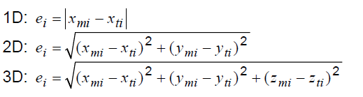

The mean positional uncertainties of the horizontal absolute or external positions are then calculated as

image::./media/image15.png[image,width=119,height=82, align=center]

A criterion for the establishing of correspondence should also be stated (e.g. allowing for correspondence to the closest position, correspondence on

vertices or along lines). The criterion/criteria for finding the corresponding

points shall be reported with the data quality evaluation result.

This data quality measure is different from the standard deviation.

|Evaluation scope |Spatial object : Activity Complex/ProductionFacility
|Reporting scope |data set
|Parameter |-
|Data quality value type |Measure
|Data quality value structure |
|Source reference |ISO/DIS 19157 Geographic information – Data quality
|Example a|
*E-PRTR User Manual:*

_http://www.eionet.europa.eu/schemas/eprtr/EPRTRUserManual.pdf_

" ... 3.1.4 Facility Report elements

GeographicalCoordinate:

The coordinates of the location of the facility should be expressed in longitude and latitude coordinates giving a precision of the order of at least ± 500 meters and referring to the geographical centre of the site of the facility.
Required. ..."

|Measure identifier |28
|===

==== Thematic accuracy – Classification correctness

[NOTE]
====
*Recomendation 11*

Classification correctness should be evaluated and documented using _Misclassification rate_ as specified in the tables below.

====

[cols=",",]
|===
|*Name* |*Misclassification rate*
|Alternative name |-
|Data quality element |Thematic accuracy
|Data quality sub-element |Classification correctness
|Data quality basic measure |Error rate
|Definition |number of incorrectly classified features in relation to the number of features that are supposed to be there
|Description |-
|Evaluation scope |data set
|Reporting scope |data set
|Parameter |-
|Data quality value type |Real, Percentage, Ratio
|Data quality value structure |Single value
|Source reference |ISO/DIS 19157 Geographic information – Data quality
|Example |Similarity in terms and scopes can derive in incorrect categorizations (E.g A Combustion plant could be consider as "Installation" or Facility- Activity Complex depending on the capacity and size and its emplacement , isolated or as part of a wider Facility).
|Measure identifier |61
|===

==== Temporal quality – Temporal validity

[NOTE]
====
*Recomendation 12*

Temporal validity should be evaluated and documented using _Value Domain Conformance Rate_ as specified in the tables below.

====

[cols=",",]
|===
|*Name* |*Value Domain Conformance Rate*
|Alternative name |-
|Data quality element |Temporal quality
|Data quality sub-element |Temporal validity
|Data quality basic measure |Error rate
|Definition a|
number of items in the dataset that are in conformance with their value

domain in relation to the total number of items in the dataset

|Description |-
|Evaluation scope |spatial object type: Activity Complex
|Reporting scope |data set
|Parameter |-
|Data quality value type |-
|Data quality value structure |Single value
|Source reference |-
|Example |Changes in the legal and real world entities through the time line derive in different classifications and registries in different thematic Datasets. This can derive in duplications and updates of entities in datasets. Temporal validity and refresh of data is an important issue.
|Measure identifier |28
|===

=== Minimum data quality requirements

No minimum data quality requirements are defined for the spatial data theme _Production and Industrial Facilities_.

=== Recommendation on data quality

No minimum data quality recommendations are defined.

<<<
== Dataset-level metadata

This section specifies dataset-level metadata elements, which should be used for documenting metadata for a complete dataset or dataset series.

NOTE Metadata can also be reported for each individual spatial object (spatial object-level metadata). Spatial object-level metadata is fully described in the application schema(s) (section 5).

For some dataset-level metadata elements, in particular those for reporting data quality and maintenance, a more specific scope can be specified. This allows the definition of metadata at sub-dataset level, e.g. separately for each spatial object type (see instructions for the relevant metadata element).

=== Metadata elements defined in INSPIRE Metadata Regulation

Table 4 gives an overview of the metadata elements specified in Regulation 1205/2008/EC (implementing Directive 2007/2/EC of the European Parliament and of the Council as regards metadata).

The table contains the following information:

* The first column provides a reference to the relevant section in the Metadata Regulation, which contains a more detailed description.
* The second column specifies the name of the metadata element.
* The third column specifies the multiplicity.
* The fourth column specifies the condition, under which the given element becomes mandatory.

[.text-center]
*Table 4 – Metadata for spatial datasets and spatial dataset series specified in Regulation 1205/2008/EC*

[cols=",,,",]
|===
|*Metadata Regulation Section* |*Metadata element* |*Multiplicity* |*Condition*
|1.1 |Resource title |1 |
|1.2 |Resource abstract |1 |
|1.3 |Resource type |1 |
|1.4 |Resource locator |0..* |Mandatory if a URL is available to obtain more information on the resource, and/or access related services.
|1.5 |Unique resource identifier |1..* |
|1.7 |Resource language |0..* |Mandatory if the resource includes textual information.
|2.1 |Topic category |1..* |
|3 |Keyword |1..* |
|4.1 |Geographic bounding box |1..* |
|5 |Temporal reference |1..* |
|6.1 |Lineage |1 |
|6.2 |Spatial resolution |0..* |Mandatory for data sets and data set series if an equivalent scale or a resolution distance can be specified.
|7 |Conformity |1..* |
|8.1 |Conditions for access and use |1..* |
|8.2 |Limitations on public access |1..* |
|9 |Responsible organisation |1..* |
|10.1 |Metadata point of contact |1..* |
|10.2 |Metadata date |1 |
|10.3 |Metadata language |1 |
|===

Generic guidelines for implementing these elements using ISO 19115 and 19119 are available at _http://inspire.jrc.ec.europa.eu/index.cfm/pageid/101_. The following sections describe additional theme-specific recommendations and requirements for implementing these elements.

==== Conformity

The _Conformity_ metadata element defined in Regulation 1205/2008/EC requires to report the conformance with the Implementing Rule for interoperability of spatial data sets and services. In addition, it may be used also to document the conformance to another specification.

[NOTE]
====
*Recomendation 13*

Dataset metadata should include a statement on the overall conformance of the dataset with this data specification (i.e. conformance with all requirements).

====

[NOTE]
====
*Recomendation 14*

The _Conformity_ metadata element should be used to document conformance with this data specification (as a whole), with a specific conformance class defined in the Abstract Test Suite in Annex A and/or with another specification.

====

The _Conformity_ element includes two sub-elements, the _Specification_ (a citation of the Implementing Rule for interoperability of spatial data sets and services or other specification), and the _Degree_ of conformity. The _Degree_ can be _Conformant_ (if the dataset is fully conformant with the cited specification), _Not Conformant_ (if the dataset does not conform to the cited specification) or _Not Evaluated_ (if the conformance has not been evaluated).

[NOTE]
====
*Recomendation 15*

If a dataset is not yet conformant with all requirements of this data specification, it is recommended to include information on the conformance with the individual conformance classes specified in the Abstract Test Suite in Annex A.

====

[NOTE]
====
*Recomendation 16*

If a dataset is produced or transformed according to an external specification that includes specific quality assurance procedures, the conformity with this specification should be documented using the _Conformity_ metadata element.

====

[NOTE]
====
*Recomendation 17*

If minimum data quality recommendations are defined then the statement on the conformity with these requirements should be included using the _Conformity_ metadata element and referring to the relevant data quality conformance class in the Abstract Test Suite.

====

NOTE Currently no minimum data quality requirements are included in the IRs. The recommendation above should be included as a requirement in the IRs if minimum data quality requirements are defined at some point in the future.

[NOTE]
====
*Recomendation 18*

When documenting conformance with this data specification or one of the conformance classes defined in the Abstract Test Suite, the _Specification_ sub-element should be given using the http URI identifier of the conformance class or using a citation including the following elements:

* title: "INSPIRE Data Specification on _Production and Industrial Facilities_ – Technical Guidelines – <name of the conformance class>"
* date:
** dateType: publication
** date: 2013-12-10

====

EXAMPLE 1: The XML snippets below show how to fill the _Specification_ sub-element for documenting conformance with the whole data specification on Addresses v3.0.1.

[source, xml]
<gmd:DQ_ConformanceResult>
	<gmd:specification href="http://inspire.ec.europa.eu/conformanceClass/ad/3.0.1/tg" />
	<gmd:explanation> (...) </gmd:explanation>
	<gmd:pass> (...) </gmd:pass>
</gmd:DQ_ConformanceResult>

or (using a citation):

[source, xml]
<gmd:DQ_ConformanceResult>
	<gmd:specification>
		<gmd:CI_Citation>
			<gmd:title>
				<gco:CharacterString>INSPIRE Data Specification on Production and Industrial Facilities – Technical Guidelines</gco:CharacterString>
			</gmd:title>
			<gmd:date>
				<gmd:date>
					<gco:Date>2013-12-10</gco:Date>
				</gmd:date>
				<gmd:dateType>
					<gmd:CI_DateTypeCode codeList="http://standards.iso.org/ittf/PubliclyAvailableStandards/ISO_19139_Schemas/resou
rces/Codelist/ML_gmxCodelists.xml#CI_DateTypeCode" codeListValue="publication">publication</gmd:CI_DateTypeCode>
				</gmd:dateType>
			</gmd:date>
		</gmd:CI_Citation>
	</gmd:specification>
	<gmd:explanation> (...) </gmd:explanation>
	<gmd:pass> (...) </gmd:pass>
</gmd:DQ_ConformanceResult>

EXAMPLE 2: The XML snippets below show how to fill the _Specification_ sub-element for documenting conformance with the CRS conformance class of the data specification on Addresses v3.0.1.

[source, xml]
<gmd:DQ_ConformanceResult>
	<gmd:specification href="http://inspire.ec.europa.eu/conformanceClass/ad/3.0.1/crs" />
	<gmd:explanation> (...) </gmd:explanation>
	<gmd:pass> (...) </gmd:pass>
</gmd:DQ_ConformanceResult>

or (using a citation):

[source, xml]
<gmd:DQ_ConformanceResult>
	<gmd:specification>
		<gmd:CI_Citation>
			<gmd:title>
				<gco:CharacterString>INSPIRE Data Specification on Production and Industrial Facilities – Technical Guidelines – CRS</gco:CharacterString>
			</gmd:title>
			<gmd:date>
				<gmd:date>
					<gco:Date>2013-12-10</gco:Date>
				</gmd:date>
				<gmd:dateType>
					<gmd:CI_DateTypeCode codeList="http://standards.iso.org/ittf/PubliclyAvailableStandards/ISO_19139_Schemas/resou
rces/Codelist/ML_gmxCodelists.xml#CI_DateTypeCode" codeListValue="publication">publication</gmd:CI_DateTypeCode>
				</gmd:dateType>
			</gmd:date>
		</gmd:CI_Citation>
	</gmd:specification>
	<gmd:explanation> (...) </gmd:explanation>
	<gmd:pass> (...) </gmd:pass>
</gmd:DQ_ConformanceResult>

==== Lineage

[NOTE]
====
*Recomendation 19*

Following the ISO/DIS 19157 Quality principles, if a data provider has a procedure for the quality management of their spatial data sets then the appropriate data quality elements and measures defined in ISO/DIS 19157 should be used to evaluate and report (in the metadata) the results. If not, the _Lineage_ metadata element (defined in Regulation 1205/2008/EC) should be used to describe the overall quality of a spatial data set.

====

According to Regulation 1205/2008/EC, lineage "is a statement on process history and/or overall quality of the spatial data set. Where appropriate it may include a statement whether the data set has been validated or quality assured, whether it is the official version (if multiple versions exist), and whether it has legal validity. The value domain of this metadata element is free text".

The Metadata Technical Guidelines based on EN ISO 19115 and EN ISO 19119 specifies that the statement sub-element of LI_Lineage (EN ISO 19115) should be used to implement the lineage metadata element.

[NOTE]
====
*Recomendation 20*

To describe the transformation steps and related source data, it is recommended to use the following sub-elements of LI_Lineage:

* For the description of the transformation process of the local to the common INSPIRE data structures, the LI_ProcessStep sub-element should be used.

* For the description of the source data the LI_Source sub-element should be used.

====

NOTE 1 In order to improve the interoperability, domain templates and instructions for using these free text elements (descriptive statements) may be specified here and/or in an Annex of this data specification.

==== Temporal reference

According to Regulation 1205/2008/EC, at least one of the following temporal reference metadata sub-elements shall be provided: temporal extent, date of publication, date of last revision, date of creation.

[NOTE]
====
*Recomendation 21*

It is recommended that at least the date of the last revision of a spatial data set should be reported using the _Date of last revision_ metadata sub-element.

====

=== Metadata elements for interoperability

[IMPORTANT]
====
[.text-center]
*IR Requirement*
_Article 13_
*Metadata required for Interoperability*

The metadata describing a spatial data set shall include the following metadata elements required for interoperability:

. Coordinate Reference System: Description of the coordinate reference system(s) used in the data set.

. Temporal Reference System: Description of the temporal reference system(s) used in the data set.
+
This element is mandatory only if the spatial data set contains temporal information that does not refer to the default temporal reference system.

. Encoding: Description of the computer language construct(s) specifying the representation of data objects in a record, file, message, storage device or transmission channel.

. Topological Consistency: Correctness of the explicitly encoded topological characteristics of the data set as described by the scope.
+
This element is mandatory only if the data set includes types from the Generic Network Model and does not assure centreline topology (connectivity of centrelines) for the network.

. Character Encoding: The character encoding used in the data set.
+
This element is mandatory only if an encoding is used that is not based on UTF-8.

. Spatial Representation Type: The method used to spatially represent geographic information.

====

These Technical Guidelines propose to implement the required metadata elements based on ISO 19115 and ISO/TS 19139.

The following TG requirements need to be met in order to be conformant with the proposed encoding.

[TIP]
====
*TG Requirement 3*

Metadata instance (XML) documents shall validate without error against the used ISO 19139 XML schema.

====

NOTE Section 2.1.2 of the Metadata Technical Guidelines discusses the different ISO 19139 XML schemas that are currently available.

[TIP]
====
*TG Requirement 4*

Metadata instance (XML) documents shall contain the elements and meet the INSPIRE multiplicity specified in the sections below.

====

[TIP]
====
*TG Requirement 5*

The elements specified below shall be available in the specified ISO/TS 19139 path.

====

[NOTE]
====
*Recomendation 22*

The metadata elements for interoperability should be made available together with the metadata elements defined in the Metadata Regulation through an INSPIRE discovery service.

====

NOTE While this not explicitly required by any of the INSPIRE Implementing Rules, making all metadata of a data set available together and through one service simplifies implementation and usability.

==== Coordinate Reference System

[cols=",",options="header",]
|===
|Metadata element name |*Coordinate Reference System*
|Definition |Description of the coordinate reference system used in the dataset.
|ISO 19115 number and name 
a|
[arabic, start=13]
. referenceSystemInfo
|ISO/TS 19139 path |referenceSystemInfo
|INSPIRE obligation / condition |mandatory
|INSPIRE multiplicity |1..*
|Data type(and ISO 19115 no.) 
a|
[arabic, start=186]
. MD_ReferenceSystem
|Domain a|
To identify the reference system, the referenceSystemIdentifier (RS_Identifier) shall be provided.

NOTE More specific instructions, in particular on pre-defined values for filling the referenceSystemIdentifier attribute should be agreed among Member States during the implementation phase to support interoperability.

|Implementing instructions |
|Example a|
referenceSystemIdentifier:
code: ETRS_89
codeSpace: INSPIRE RS registry

|Example XML encoding a|
[source, xml]
<gmd:referenceSystemInfo>
		<gmd:MD_ReferenceSystem>
			<gmd:referenceSystemIdentifier>
				<gmd:RS_Identifier>
					<gmd:code>
						<gco:CharacterString>ETRS89 </gco:CharacterString>
					</gmd:code>
					<gmd:codeSpace>
						<gco:CharacterString>INSPIRE RS registry</gco:CharacterString>
					</gmd:codeSpace>
				</gmd:RS_Identifier>
			</gmd:referenceSystemIdentifier>
		</gmd:MD_ReferenceSystem>
</gmd:referenceSystemInfo>

|Comments |
|===

==== Temporal Reference System

[cols=",",options="header",]
|===
|Metadata element name |*Temporal Reference System*
|Definition |Description of the temporal reference systems used in the dataset.
|ISO 19115 number and name 
a|
[arabic, start=13]
. referenceSystemInfo
|ISO/TS 19139 path |referenceSystemInfo
|INSPIRE obligation / condition |Mandatory, if the spatial data set or one of its feature types contains temporal information that does not refer to the Gregorian Calendar or the Coordinated Universal Time.
|INSPIRE multiplicity |0..*
|Data type(and ISO 19115 no.) 
a|
[arabic, start=186]
. MD_ReferenceSystem
|Domain a|
No specific type is defined in ISO 19115 for temporal reference systems. Thus, the generic MD_ReferenceSystem element and its reference SystemIdentifier (RS_Identifier) property shall be provided.

NOTE More specific instructions, in particular on pre-defined values for filling the referenceSystemIdentifier attribute should be agreed among Member States during the implementation phase to support interoperability.

|Implementing instructions |
|Example a|
referenceSystemIdentifier:
code: GregorianCalendar
codeSpace: INSPIRE RS registry

|Example XML encoding a|
[source, xml]
<gmd:referenceSystemInfo>
	<gmd:MD_ReferenceSystem>
		<gmd:referenceSystemIdentifier>
			<gmd:RS_Identifier>
				<gmd:code>
			<gco:CharacterString>GregorianCalendar </gco:CharacterString>
				</gmd:code>
				<gmd:codeSpace>
					<gco:CharacterString>INSPIRE RS registry</gco:CharacterString>
				</gmd:codeSpace>
			</gmd:RS_Identifier>
		</gmd:referenceSystemIdentifier>
	</gmd:MD_ReferenceSystem>
</gmd:referenceSystemInfo>
|Comments |
|===

==== Encoding

[cols=",",options="header",]
|===
|Metadata element name |*Encoding*
|Definition |Description of the computer language construct that specifies the representation of data objects in a record, file, message, storage device or transmission channel
|ISO 19115 number and name 
a|
[arabic, start=271]
. distributionFormat
|ISO/TS 19139 path |distributionInfo/MD_Distribution/distributionFormat
|INSPIRE obligation / condition |mandatory
|INSPIRE multiplicity |1..*
|Data type (and ISO 19115 no.) 
a|
[arabic, start=284]
. MD_Format
|Domain |See B.2.10.4. The property values (name, version, specification) specified in section 5 shall be used to document the default and alternative encodings.
|Implementing instructions |
|Example a|
name: <Application schema name> GML application schema
version: version 3.0
specification: D2.8.III.8 Data Specification on _Production and Industrial Facilities_ – Technical Guidelines

|Example XML encoding a|
[source, xml]
<gmd:MD_Format>
	<gmd:name>
		<gco:CharacterString>SomeApplicationSchema GML application schema</gco:CharacterString>
	</gmd:name>
	<gmd:version>
		<gco:CharacterString>3.0</gco:CharacterString>
	</gmd:version>
	<gmd:specification>
		<gco:CharacterString>D2.8.III.8 Data Specification on Production and Industrial Facilities – Technical Guidelines</gco:CharacterString>
	</gmd:specification>
</gmd:MD_Format>

|Comments |
|===

==== Character Encoding

[cols=",",options="header",]
|===
|Metadata element name |*Character Encoding*
|Definition |The character encoding used in the data set.
|ISO 19115 number and name |
|ISO/TS 19139 path |
|INSPIRE obligation / condition |Mandatory, if an encoding is used that is not based on UTF-8.
|INSPIRE multiplicity |0..*
|Data type (and ISO 19115 no.) |
|Domain |
|Implementing instructions |
|Example |-
|Example XML encoding a|
[source, xml]
<gmd:characterSet>
	<gmd:MD_CharacterSetCode codeListValue="8859part2" codeList="http://standards.iso.org/ittf/PubliclyAvailableStandards/ISO_19139_Schemas/resources/Codelist/ML_gmxCodelists.xml#CharacterSetCode">8859-2</gmd:MD_CharacterSetCode>
</gmd:characterSet>

|Comments |
|===

==== Spatial representation type

[cols=",",options="header",]
|===
|Metadata element name |*Spatial representation type*
|Definition |The method used to spatially represent geographic information.
|ISO 19115 number and name 
a|
[arabic, start=37]
. spatialRepresentationType
|ISO/TS 19139 path |
|INSPIRE obligation / condition |Mandatory
|INSPIRE multiplicity |1..*
|Data type (and ISO 19115 no.) |B.5.26 MD_SpatialRepresentationTypeCode
|Domain |
|Implementing instructions a|
Of the values included in the code list in ISO 19115 (vector, grid, textTable, tin, stereoModel, video), only vector, grid and tin should be used.

NOTE Additional code list values may be defined based on feedback from implementation.

|Example |-
|Example XML encoding |
|Comments |
|===

==== Data Quality – Logical Consistency – Topological Consistency

See section 8.3.2 for instructions on how to implement metadata elements for reporting data quality.

=== Recommended theme-specific metadata elements

[NOTE]
====
*Recommendation 23*

The metadata describing a spatial data set or a spatial data set series related to the theme _Production and Industrial Facilities_ should comprise the theme-specific metadata elements specified in Table 5.

====

The table contains the following information:

* The first column provides a reference to a more detailed description.
* The second column specifies the name of the metadata element.
* The third column specifies the multiplicity.

[.text-center]
*Table 5 – Optional theme-specific metadata elements for the theme _Production and Industrial Facilities_*

[cols=",,",]
|===
|*Section* |*Metadata element* |*Multiplicity*
|8.3.1 |Maintenance Information |0..1
|8.3.2 |Logical Consistency – Conceptual Consistency |0..*
|8.3.2 |Logical Consistency – Domain Consistency |0..*
|===

[NOTE]
====
*Recomendation 24*

For implementing the metadata elements included in this section using ISO 19115, ISO/DIS 19157 and ISO/TS 19139, the instructions included in the relevant sub-sections should be followed.

====

==== Maintenance Information

[cols=",",options="header",]
|===
|Metadata element name |*Maintenance information*
|Definition |Information about the scope and frequency of updating
|ISO 19115 number and name 
a|
[arabic, start=30]
. resourceMaintenance
|ISO/TS 19139 path |identificationInfo/MD_Identification/resourceMaintenance
|INSPIRE obligation / condition |optional
|INSPIRE multiplicity |0..1
|Data type(and ISO 19115 no.) 
a|
[arabic, start=142]
. MD_MaintenanceInformation
|Domain a|
This is a complex type (lines 143-148 from ISO 19115).

At least the following elements should be used (the multiplicity according to ISO 19115 is shown in parentheses):

* maintenanceAndUpdateFrequency [1]: frequency with which changes and additions are made to the resource after the initial resource is completed / domain value: MD_MaintenanceFrequencyCode:

* updateScope [0..*]: scope of data to which maintenance is applied / domain value: MD_ScopeCode

* maintenanceNote [0..*]: information regarding specific requirements for maintaining the resource / domain value: free text

|Implementing instructions |
|Example |
|Example XML encoding |
|Comments |
|===

==== Metadata elements for reporting data quality

[NOTE]
====
*Recomendation 25*

For reporting the results of the data quality evaluation, the data quality elements, sub-elements and (for quantitative evaluation) measures defined in chapter 7 should be used.

====

[NOTE]
====
*Recomendation 26*

The metadata elements specified in the following sections should be used to report the results of the data quality evaluation. At least the information included in the row "Implementation instructions" should be provided.

====

The first section applies to reporting quantitative results (using the element DQ_QuantitativeResult), while the second section applies to reporting non-quantitative results (using the element DQ_DescriptiveResult).

[NOTE]
====
*Recomendation 27*

If a dataset does not pass the tests of the Application schema conformance class (defined in Annex A), the results of each test should be reported using one of the options described in sections 8.3.2.1 and 8.3.2.2.

====

NOTE 1 If using non-quantitative description, the results of several tests do not have to be reported separately, but may be combined into one descriptive statement.

NOTE 2 The sections 8.3.2.1 and 8.3.2.2 may need to be updated once the XML schemas for ISO 19157 have been finalised.

The scope for reporting may be different from the scope for evaluating data quality (see section 7). If data quality is reported at the data set or spatial object type level, the results are usually derived or aggregated.

[NOTE]
====
*Recomendation 28*

The scope element (of type DQ_Scope) of the DQ_DataQuality subtype should be used to encode the reporting scope.

Only the following values should be used for the level element of DQ_Scope: Series, Dataset, featureType.

If the level is featureType the levelDescription/MDScopeDescription/features element (of type Set< GF_FeatureType>) shall be used to list the feature type names.

====

NOTE In the level element of DQ_Scope, the value featureType is used to denote spatial object type.

===== Guidelines for reporting quantitative results of the data quality evaluation

[cols=",",options="header",]
|===
|Metadata element name |*See chapter 7*
|Definition |See chapter 7
|ISO/DIS 19157 number and name 
a|
[arabic, start=3]
. report
|ISO/TS 19139 path |dataQualityInfo/*/report
|INSPIRE obligation / condition |optional
|INSPIRE multiplicity |0..*
|Data type (and ISO/DIS 19157 no.) |Corresponding DQ_xxx subelement from ISO/DIS 19157, e.g. 12. DQ_CompletenessCommission
|Domain a|
Lines 7-9 from ISO/DIS 19157

[arabic, start=7]
. DQ_MeasureReference (C.2.1.3)
. DQ_EvaluationMethod (C.2.1.4.)
. DQ_Result (C2.1.5.)

|Implementing instructions a|
[arabic,start=39]
. nameOfMeasure

NOTE This should be the name as defined in Chapter 7.
[arabic,start=42]
. evaluationMethodType
. evaluationMethodDescription

NOTE If the reported data quality results are derived or aggregated (i.e. the scope levels for evaluation and reporting are different), the derivation or aggregation should also be specified using this property.

[arabic,start=46]
. dateTime

NOTE This should be data or range of dates on which the data quality measure was applied.

[arabic,start=63]
. DQ_QuantitativeResult / 64. value

NOTE The DQ_Result type should be DQ_QuantitativeResult and the value(s) represent(s) the application of the data quality measure (39.) using the specified evaluation method (42-43.)

|Example |See Table E.12 — Reporting commission as metadata (ISO/DIS 19157)
|Example XML encoding |
|===

===== Guidelines for reporting descriptive results of the Data Quality evaluation

[cols=",",options="header",]
|===
|Metadata element name |*See chapter 7*
|Definition |See chapter 7
|ISO/DIS 19157 number and name 
a|
[arabic, start=3]
. report
|ISO/TS 19139 path |dataQualityInfo/*/report
|INSPIRE obligation / condition |optional
|INSPIRE multiplicity |0..*
|Data type (and ISO/DIS 19157 no.) |Corresponding DQ_xxx subelement from ISO/DIS 19157, e.g. 12. DQ_CompletenessCommission
|Domain a|
Line 9 from ISO/DIS 19157

[arabic,start=9]
. DQ_Result (C2.1.5.)

|Implementing instructions a|
[arabic,start=67]
. DQ_DescripitveResult / 68. statement

NOTE The DQ_Result type should be DQ_DescriptiveResult and in the statement (68.) the evaluation of the selected DQ sub-element should be expressed in a narrative way.

|Example |See Table E.15 — Reporting descriptive result as metadata (ISO/DIS 19157)
|Example XML encoding |
|===

<<<
== Delivery

=== Updates

[IMPORTANT]
====
[.text-center]
*IR Requirement*
_Article 8_
*Updates*

. Member States shall make available updates of data on a regular basis.

. All updates shall be made available at the latest 6 months after the change was applied in the source data set, unless a different period is specified for a specific spatial data theme in Annex II.

====

NOTE In this data specification, no exception is specified, so all updates shall be made available at the latest 6 months after the change was applied in the source data set.

=== Delivery medium

According to Article 11(1) of the INSPIRE Directive, Member States shall establish and operate a network of services for INSPIRE spatial data sets and services. The relevant network service types for making spatial data available are:

* _view services_ making it possible, as a minimum, to display, navigate, zoom in/out, pan, or overlay viewable spatial data sets and to display legend information and any relevant content of metadata;
* _download services_, enabling copies of spatial data sets, or parts of such sets, to be downloaded and, where practicable, accessed directly;
* _transformation services_, enabling spatial data sets to be transformed with a view to achieving interoperability.

NOTE For the relevant requirements and recommendations for network services, see the relevant Implementing Rules and Technical Guidelinesfootnote:[The Implementing Rules and Technical Guidelines on INSPIRE Network Services are available at http://inspire.jrc.ec.europa.eu/index.cfm/pageid/5].

EXAMPLE 1 Through the Get Spatial Objects function, a download service can either download a pre-defined data set or pre-defined part of a data set (non-direct access download service), or give direct access to the spatial objects contained in the data set, and download selections of spatial objects based upon a query (direct access download service). To execute such a request, some of the following information might be required:

* the list of spatial object types and/or predefined data sets that are offered by the download service (to be provided through the Get Download Service Metadata operation),
* and the query capabilities section advertising the types of predicates that may be used to form a query expression (to be provided through the Get Download Service Metadata operation, where applicable),
* a description of spatial object types offered by a download service instance (to be provided through the Describe Spatial Object Types operation).

EXAMPLE 2 Through the Transform function, a transformation service carries out data content transformations from native data forms to the INSPIRE-compliant form and vice versa. If this operation is directly called by an application to transform source data (e.g. obtained through a download service) that is not yet conformant with this data specification, the following parameters are required:

Input data (mandatory). The data set to be transformed.

* Source model (mandatory, if cannot be determined from the input data). The model in which the input data is provided.
* Target model (mandatory). The model in which the results are expected.
* Model mapping (mandatory, unless a default exists). Detailed description of how the transformation is to be carried out.

=== Encodings

The IRs contain the following two requirements for the encoding to be used to make data available.

[IMPORTANT]
====
[.text-center]
*IR Requirement*
_Article 7_
*Encoding*

{empty}1. Every encoding rule used to encode spatial data shall conform to EN ISO 19118. In particular, it shall specify schema conversion rules for all spatial object types and all attributes and association roles and the output data structure used.

{empty}2. Every encoding rule used to encode spatial data shall be made available.

{empty}2a. Every encoding rule used to encode spatial data shall also specify whether and how to represent attributes and association roles for which a corresponding value exists but is not contained in the spatial data sets maintained by a Member State, or cannot be derived from existing values at reasonable costs.

====

NOTE ISO 19118:2011 specifies the requirements for defining encoding rules used for interchange of geographic data within the set of International Standards known as the "ISO 19100 series". An encoding rule allows geographic information defined by application schemas and standardized schemas to be coded into a system-independent data structure suitable for transport and storage. The encoding rule specifies the types of data being coded and the syntax, structure and coding schemes used in the resulting data structure. Specifically, ISO 19118:2011 includes

* requirements for creating encoding rules based on UML schemas,
* requirements for creating encoding services, and
* requirements for XML-based encoding rules for neutral interchange of data.

While the IRs do not oblige the usage of a specific encoding, these Technical Guidelines propose to make data related to the spatial data theme _Production and Industrial Facilities_ available at least in the default encoding(s) specified in section 0. In this section, a number of TG requirements are listed that need to be met in order to be conformant with the default encoding(s).

The proposed default encoding(s) meet the requirements in Article 7 of the IRs, i.e. they are conformant with ISO 19118 and (since they are included in this specification) publicly available.

==== Default Encoding(s)

===== Specific requirements for GML encoding

This data specification proposes the use of GML as the default encoding, as recommended in sections 7.2 and 7.3 of [DS-D2.7]. GML is an XML encoding in compliance with ISO 19118, as required in Article 7(1). For details, see [ISO 19136], and in particular Annex E (UML-to-GML application schema encoding rules).

The following TG requirements need to be met in order to be conformant with GML encodings.

[TIP]
====
*TG Requirement 6*

Data instance (XML) documents shall validate without error against the provided XML schema.

====

NOTE 1 Not all constraints defined in the application schemas can be mapped to XML. Therefore, the following requirement is necessary.

NOTE 2 The obligation to use only the allowed code list values specified for attributes and most of the constraints defined in the application schemas cannot be mapped to the XML sch. They can therefore not be enforced through schema validation. It may be possible to express some of these constraints using other schema or rule languages (e.g. Schematron), in order to enable automatic validation.

===== Default encoding(s) for application schema Production and Industrial Facilities Model

*Name: ProductionAndIndustrialFacilities GML Application Schema*

Version: version 3.0
Specification: D2.8.III.8 Data Specification on _Production and Industrial Facilities_ – Technical Guidelines
Character set: UTF-8

The xml schema document is available from _http://inspire.jrc.ec.europa.eu/schemas/pf/3.0_

===== Default encoding(s) for application schema Production and Industrial Facilities Extension Model

*Name: ProductionAnIndustrialFacilitiesExtension Model GML Application Schema*

Version: version 3.0
Specification: D2.8.III.8 Data Specification on Production and Industrial Facilities – Technical Guidelines
Character set: UTF-8

The xml schema document is available from _http://inspire.jrc.ec.europa.eu/draft-schemas/pf-ext/3.0_.

<<<
== Data Capture

Facilities may be considered under INSPIRE scope if they meet with the following criteria:

* Information   related with the Activities performed on them shall be provided for the use or the benefit of the public, excluding strategic or private information not required by law. It can be used by other administrations or private companies as well.
* Based on the INSPIRE principles, the service can be used for environmental issues.
* Also, in order to full fill the INSPIRE Directive requirements, the information must be available as Digital Data.

Facilities-related data, due to their nature and the wide scope covered, may be captured and served by different data providers at different levels, mainly in the Public Administration. Due to this fact, it is expected that data will be stored at very different formats, scales and resolutions, covering different sub-sets of data, service types and different modelling approaches, depending on the concrete needs of their correspondent producers and target users.

The Geographical entities covered by the scope of Facilities cover a wide range of profiles and scales. In higher levels of the scale, geographical position is derived from tabular data, gazetteers or manual processing mostly based on geographic coordinates. Different Data Sets can follow parallel processes to geo-locate the same real world entities. In some cases there is no automatic interconnection through identifiers to establish the connection among datasets. This can make the merging of data sets a quite difficult process, prone to generating duplications or overlaps.

VAT codes (or other forms of fiscal identification codes) should not be assigned directly to a facility, as the VAT code identifies a legal entity, rather than a spatial entity, and is subject to temporal variations.

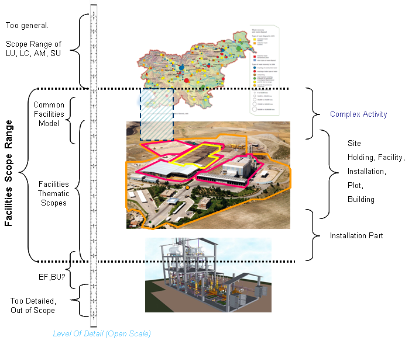

[.text-center]
*Fig. 12 Range of Scopes covered under "Facilities"*

A basic set of recommendations is described in relation to generic facilities in this section, while the following sections provide more detailed requirements for _Production and Industrial Facilities_.

[NOTE]
====
*Recomendation 29*

Given that (a) it is not expected that all of the available data sets are captured, produced and publicized by a single level of Public Administration Bodies and (b) that it may happen that these bodies be responsible for just one or several sub-sets of data, not necessarily categorizing the Activities following the NACE Code List, data should be transformed in such a way that at least the main class of the model (linked with Activity Complex) was categorized by at least one of the Activities listed within the NACE Code List in order to better arrange the interoperability.

====

[NOTE]
====
*Recomendation 30*

If the current thematic Legislative Act sets certain parameters for accuracy in the Geographical location of the entities (Geographical Coordinates), these should be considered as the minimum level of accuracy under INSPIRE (e.g. _Location of the Holding_ under REGULATION (EC) No 1166/2008)

====

[NOTE]
====
*Recomendation 31*

In order to full fill the previous recommendation, datasets should be built by setting different layer groups for each of the main Activities covered (higher level of categorization following the NACE List).

====

[NOTE]
====
*Recomendation 32*

In order to minimize the risk of geometric and positional inconsistency between different datasets on Economic Activities, when data about an instance is located by means of GM_Object, it is recommended to choose GM_Point as default.

====

[NOTE]
====
*Recomendation 33*

When data about an instance of Economic Activities is located by means of a point or an address geo-location, this should correspond to the main access point to the space where the service is provided. Only verified locations should be provided in order to minimize accuracy errors.

====

=== Spatial object types

*Production and Industrial Facilities*

* ProductionSite
* ProductionFacility
* ProductionInstallation
* ProductionInstallationPart
* Production Plot

are considered as under the INSPIRE scope if:

* they fit with the definition given by the Directive "to full fill the definition and Description of 1.2 Informal description"
* they fit as much as possible with the description given in this document "geographic features related to production and industry", as well as geographic entities related to describing summary information about the activities taking place in production and industrial facilities, and the main environmental issues related to them (pollution prevention, waste management, risk).
* they are available as GM_Objects data:
** GM_Point
** GM_Curve
** GM_Surface
** GM_Solid

In conjunction with Bitmaps like Aerial Photography and Maps.

[NOTE]
====
*Recomendation 34*

The selection rules for INSPIRE _Production and Industrial Facilities_ should be decided by each Member State, based on the guidelines given in this document and then documented as metadata, under lineage element.

====

NOTE _Production and Industrial Facilities_ should describe as much as possible, detailed use of geographical partitions of earth on the foundation of cadastral parcels. However, exploiting such reference will not be possible in each Member State, due to national regulations. These gaps and overlaps due to national regulations have been called respectively "gaps of industrial surveying" and information about _Production and Industrial Facilities_ has also to be given in metadata (lineage information).

==== Production and Industrial Site

[NOTE]
====
*Recomendation 35*

All Production and Industrial Sites which are under the INSPIRE scope should be published.

====

Production and Industrial Sites are considered under the INSPIRE scope:

[loweralpha]
. if they are available as GM_Objects (possibly with underlying bitmaps as a backdrop)
. if Member State considers them as helpful for users
. information of sites may be founded on cadastral parcels also published for INSPIRE

NOTE 1 (about condition a)

Production and Industrial Sites should be considered as helpful for users at least in the following cases:

* when Production and Industrial Sites are merged to aggregate different facilities

NOTE 2

Most users will very likely require Production and Industrial Sites on a regional level. So Production and Industrial Sites shall be displayed on a regional level to a scale of 1: 50.000

Example 1: Germany

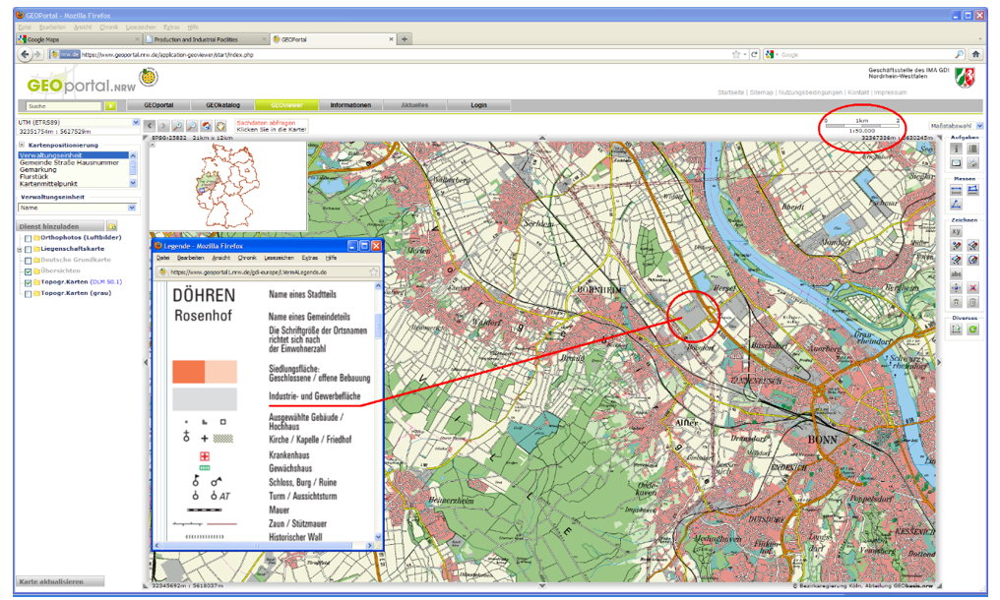

[.text-center]
*_Geobasisdata of Municipalities and the State of North-Rhine Westphalia © Geobasis NRW 2011_*

NOTE 2 (about condition c)

Due to accuracy reasons and the interrelation of Production and Industrial Sites to cadastral parcels, Production and Industrial Sites shall be raised and displayed on the basis of cadastral parcels; Display on a regional level from scale 1: 50.000 to a detailed level to scale 1:1.

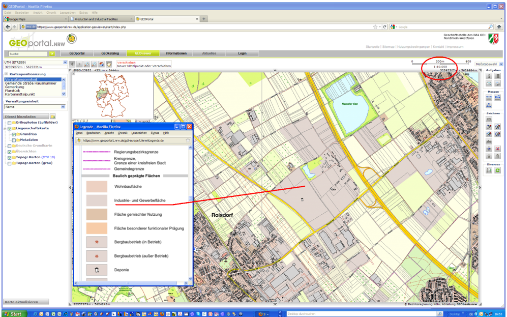

[.text-center]
*_Geobasisdata of Municipalities and the State of North-Rhine Westphalia © Geobasis NRW 2011_*

==== Production and Industrial Facility

[NOTE]
====
*Recomendation 36*

All _Production and Industrial Facilities_ which are under the INSPIRE scope should be published.

====

_Production and Industrial Facilities_ are considered under the INSPIRE scope:

[loweralpha]
. if they are available as GM_Objects (possibly with underlying bitmaps)
. if Member State considers them as helpful for users
. information on facilities may be founded on cadastral parcels also published for INSPIRE

NOTE 1 (about condition a)

_Production and Industrial Facilities_ should be considered as helpful for users at least in the following cases:

* when _Production and Industrial Facilities_ are used to aggregate different Installations and InstallationParts

NOTE 2

Most users will very likely require _Production and Industrial Facilities_ on a regional and local level. So _Production and Industrial Facilities_ shall be displayed on a regional and local level until scale 1: 25.000 to scale 1:1

Example 2: Germany

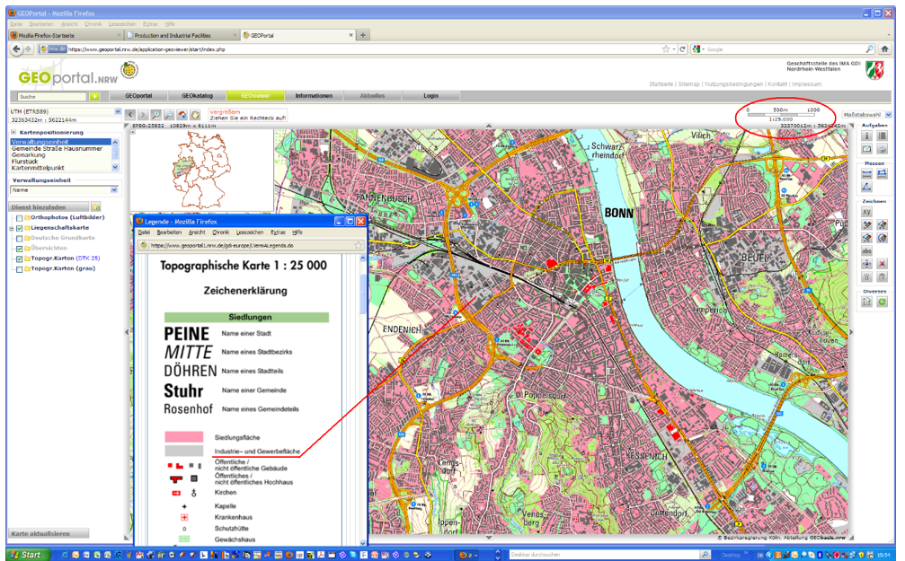

[.text-center]
*_Geobasisdata of Municipalities and the State of North-Rhine Westphalia © Geobasis NRW 2011_*

NOTE 2 (about condition c)

Due to accuracy reasons and the interrelation of Production and Industrial Faculties to cadastral parcels, Production and Industrial Faculties shall be raised and displayed on the basis of cadastral parcels; Display on a regional and local level from scale 1: 25.000 to a detailed level to scale 1:1.

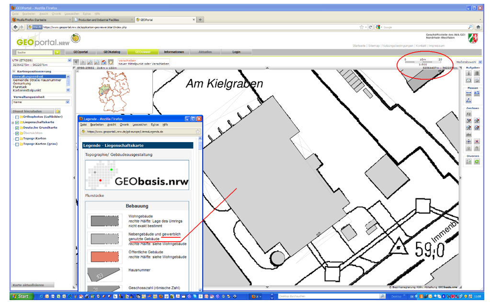

[.text-center]
*_Geobasisdata of Municipalities and the State of North-Rhine Westphalia © Geobasis NRW 2011_*

==== Production and Industrial Installation

[NOTE]
====
*Recomendation 37*

All Production and Industrial Installations which are under the INSPIRE scope should be published.

====

Production and Industrial Installations are considered under the INSPIRE scope:

[loweralpha]
. if they are available as GM_Objects (possibly with underlying bitmaps)
. if Member State considers them as helpful for users
. information on Installations may be founded on cadastral parcels also published for INSPIRE

NOTE 1 (about condition a)

Production and Industrial Installations should be considered as helpful for users at least in the following cases:

NOTE 2 (about condition b)

Most users will very likely require Production and Industrial Installations on a local level. So Production and Industrial Installations shall be displayed on a regional and local level until scale 1: 25.000 to 1:1

NOTE 2 (about condition c)

Due to accuracy reasons and the interrelation of Production and Industrial Installations to cadastral parcels, Production and Industrial Installations shall be raised and displayed on the basis of cadastral parcels; Display on a regional level from scale 1: 25.000 to a detailed level to scale 1:1.

==== Production and Industrial Installation Part

[NOTE]
====
*Recomendation 38*

All Production and Industrial Installation Parts which are under the INSPIRE scope should be published.

====

Production and Industrial Installation Parts are considered under the INSPIRE scope:

[loweralpha]
. if they are available as GM_Objects (possibly with underlying bitmaps)
. if Member State considers them as helpful for users
. information on Installation Parts may founded on cadastral parcels also published for INSPIRE

NOTE 1 (about condition a)

Production and Industrial Installation Parts should be considered as helpful for users at least in the following cases:

* when Production and Industrial Sites are fused to aggregate different Installations

NOTE 2 (about condition b)

Most users will very likely require Production and Industrial Installation Parts on a local level. So Production and Industrial Installation Parts shall be displayed on a regional level from scale 1: 10.000 to 1:1

NOTE 2 (about condition c)

Due to accuracy reasons and the interrelation of Production and Industrial Installation Parts to cadastral parcels, Production and Industrial Installation Parts shall displayed on the basis of cadastral parcels; Display on a regional level from scale 1: 10.000 to a detailed level to scale 1:1.

==== Production and Industrial Plots

[NOTE]
====
*Recomendation 39*

All Production and Industrial Plots which are under the INSPIRE scope should be published.

====

Production and Industrial Plots are considered under the INSPIRE scope:

[loweralpha]
. if they are available as GM_Objects (possibly with underlying bitmaps)
. if Member State considers them as helpful for users
. information of Plots may be founded on cadastral parcels also published for INSPIRE

NOTE 1 (about condition b)

Most users will very likely require Production and Industrial Plots on a regional and local level. So Production and Industrial Plots shall be displayed on a regional level from scale 1: 50.000 to 1:1

NOTE 2 (about condition c)

Due to accuracy reasons and the interrelation of Production and Industrial Plots to cadastral parcels, Production and Industrial Plots shall be raised and displayed on the basis of cadastral parcels; Display on a regional level from scale 1: 50.000 to scale 1:1.

=== INSPIRE Identifier (inspireId)

As explained in clause 5.2.1.4, all spatial objects published for INSPIRE shall carry a unique identifier: the "inspireId". This attribute must have the characteristics defined in the Generic Conceptual Model:

* be unique in the INSPIRE context
* be persistent (life-cycle rules being up to each Member State)
* give a way to find the download service where the spatial object is available
* be compliant with the lexical rules:
** *composed of a namespace and a local identifier*
** the namespace must begin with the two-letter country code
** the namespace and the local identifier can include only the limited set of characters allowed by the Generic Conceptual Model.

The following part of this clause gives some advices and examples to data providers about how they may supply such unique identifiers.

==== Namespace

The first point is to define a convenient *namespace*. To ensure both uniqueness within the INSPIRE context and possible link with download services, it may be useful to add to the mandatory country code, the data provider name or acronym.

For instance, namespace might be: NL.ProductionSite

==== Local identifier

The second point is to decide on the *local identifier* to be used. Of course, to ensure the required characteristics, this local identifier must be unique (in the local/national set of Production data), persistent, and must include only the limited set of characters allowed by the Generic Conceptual Model.

=== Estimated accuracy

For INSPIRE, Production And Industrial data shall be published in the Coordinate Reference System mandated by the Implementing Rule on Reference Systems, i.e. in ETRS89 for areas on the Eurasian tectonic plate and in ITRS elsewhere.

Of course, INSPIRE users will be interested by having information about the accuracy of Production And Industrial data, as they receive them, in the Coordinate Reference System mandated by INSPIRE. It is why the clauses about application schema and about quality and metadata require cadastral data providers to give estimated accuracy related to the coordinates in ETRS89 (or ITRS).

However, in most Member States, the estimated accuracy is generally known in the source Coordinate Reference System, the national or local one.

The estimated accuracy for INSPIRE will be the combination of estimated accuracy in original Coordinate Reference System and of the accuracy of the coordinate transformation between original Reference System to INSPIRE Reference System.

Coordinate transformation between two horizontal geodetic datum is generally done, using one of the three following methods:

* transformation with 3 parameters
* transformation with 7 parameters
* transformation with a grid.

Experience in some countries has shown that transformation with 3 or even 7 parameters might bring deviations up to 10 metres. So, the impact of such transformations may not be neglected on cadastral data whose original accuracy generally varies from some decimetres to some metres.

The ideal solution would be for each Member State to define good quality coordinate transformations (using grids and bringing no deviation bigger than some centimetres). However, if not possible before the deadlines of INSPIRE, the impact of coordinate transformation has to be taken into account when giving information about positional accuracy, both in the application schema and in metadata.

<<<
== Portrayal

This clause defines the rules for layers and styles to be used for portrayal of the spatial object types defined for this theme. Portrayal is regulated in Article 14 of the IRs.

[IMPORTANT]
====
[.text-center]
*IR Requirement*
_Article 14_
*Portrayal*

. For the portrayal of spatial data sets using a view network service as specified in Commission Regulation No 976/2009 (footnote:[OJ L 274, 20.10.2009, p. 9.]), the following shall be available:
[loweralpha]
.. the layers specified in Annex II for the theme or themes the data set is related to;
.. for each layer at least a default portrayal style, with as a minimum an associated title and a unique identifier.

[arabic, start=2]
. For each layer, Annex II defines the following:
[loweralpha]
.. a human readable title of the layer to be used for display in user interface;
.. the spatial object type(s), or sub-set thereof, that constitute(s) the content of the layer.

====

In section 11.1, the _types_ of layers are defined that are to be used for the portrayal of the spatial object types defined in this specification. A view service may offer several layers of the same type, one for each dataset that it offers data on a specific topic.

NOTE The layer specification in the IRs only contains the name, a human readable title and the (subset(s) of) spatial object type(s), that constitute(s) the content of the layer. In addition, these Technical Guidelines suggest keywords for describing the layer.

[NOTE]
====
*Recomendation 40*

It is recommended to use the keywords specified in section 11.1 in the _Layers Metadata parameters_ of the INSPIRE View service (see Annex III, Part A, section 2.2.4 in Commission Regulation (EC) No 976/2009).

====

Section 11.2 specifies one style for each of these layers. It is proposed that INSPIRE view services support this style as the default style required by Article 14(1b).

[TIP]
====
*TG Requirement 7*

For each layer specified in this section, the styles defined in section 11.2 shall be available.

====

NOTE The default style should be used for portrayal by the view network service if no user-defined style is specified in a portrayal request for a specific layer.

In section 11.2.1, further styles can be specified that represent examples of styles typically used in a thematic domain. It is recommended that also these styles should be supported by INSPIRE view services, where applicable.

[NOTE]
====
*Recomendation 41*

In addition, it is recommended that, where applicable, INSPIRE view services also support the styles defined in section 11.2.1.

====

Where XML fragments are used in the following sections, the following namespace prefixes apply:

* sld="http://www.opengis.net/sld" (WMS/SLD 1.1)
* se="http://www.opengis.net/se" (SE 1.1)
* ogc="http://www.opengis.net/ogc" (FE 1.1)

=== Layers to be provided by INSPIRE view services

[cols=",,,",options="header",]
|===
|*Layer Name* |*Layer Title* |*Spatial object types* |*Keywords*
|PF.ProductionSite |Production And Industrial Site |ProductionSite |Site, Parcel, Storage Complex, Industrial Polygon.
a|
PF. <CodeListValue>

_Example: PF.Manufacturing_

a|
<human readable name>

_Example: PF.Manufacturing_

a|
ProductionFacility

_(activity:ActivityValue)_

|Holding, Establishment, Plant
|PF.ProductionPlot |Production And Industrial Plot |ProductionPlot |Landfill, Waste Accumulation Area, Heap, Pond
|PF.ProductionInstallation |Production And Industrial Installation |ProductionInstallation |Combustion Installation, Composting Installation.
|PF.ProductionInstallationPart |Production And Industrial Installation Part |ProductionInstallationPart |Turbine, Container, Dum, Engine, Stack
|PF.ProductionBuilding |Production and Industrial Building |ProductionBuilding |Storage, Silo, Chimney, Office, Shed
|===

NOTE The table above contains several layers for the spatial object type ProductionFacility, which can be further classified using a code list-valued attribute. Such sets of layers are specified as described in Article 14(3) of the IRs.

[IMPORTANT]
====
[.text-center]
*IR Requirement*
_Article 14_
*Portrayal*

(...)

[arabic, start=3]
. For spatial object types whose objects can be further classified using a code list-valued attribute, several layers may be defined. Each of these layers shall include the spatial objects corresponding to one specific code list value. In the definition of such sets of layers in Annexes II-IV,
[loweralpha]
.. the placeholder <CodeListValue> shall represent the values of the relevant code list, with the first letter in upper case,
.. the placeholder <human-readable name> shall represent the human-readable name of the code list values;
.. the spatial object type shall include the relevant attribute and code list, in parentheses;
.. one example of a layer shall be given.

====

==== Layers organisation

None.

=== Styles required to be supported by INSPIRE view services

==== Styles for the layer PF.ProductionSite

[cols=",",]
|===
|*Layer Name* |PF.ProductionSite
|*Default Style* |Yes
|*Style Title* |Production Site Default Style
|*Style Abstract* |The geometry is rendered using fill color Pink (#FF00FF) and a solid Black outline with a stroke width of 1 pixel. name attribute: in Arial 10 black (#000000)
|*Symbology* a|
[source, xml]
<sld:NamedLayer>
    <se:Name>PF.ProductionSite</se:Name>
    <sld:UserStyle>
      <se:Name>PF.ProductionSite.Default</se:Name>
      <sld:IsDefault>1</sld:IsDefault>
      <se:FeatureTypeStyle version="1.1.0">
        <se:Description>
          <se:Title> Production Site Default Style </se:Title> 
<se:Abstract> The geometry is rendered using fill color Pink (#FF00FF) and a solid Black outline with a stroke width of 1 pixel.  name attribute: in Arial 10 black (#000000)</se:Abstract>
        </se:Description>
        <se:FeatureTypeName>PF.ProductionSite</se:FeatureTypeName>
        <se:Rule>
          <se:PolygonSymbolizer>
            <se:Geometry>
              <ogc:PropertyName>ProductionSite:geometry
              </ogc:PropertyName>
            </se:Geometry>
            <se:Graphic/>
          </se:PolygonSymbolizer>
        </se:Rule>
      </se:FeatureTypeStyle>
    </sld:UserStyle>
  </sld:NamedLayer>

|*Minimum & maximum scales* |Open - 1:25.000
|===

==== Styles for the layer PF.ProductionFacility

[cols=",",options="header",]
|===
|*Style Name* |*PF.ProductionFacility*
|*Default Style* |Yes
|*Style Title* |Production Facility Default Style
|*Style Abstract* |The geometry is rendered as a circle with a size of 3 pixels, with a red (#FF0000) fill and a black outline (#000000).
|*Symbology* a|
[source, xml]
<sld:NamedLayer>
    <se:Name> PF.ProductionFacility.Default </se:Name>
    <sld:UserStyle>
      <se:Name>INSPIRE_Default</se:Name>
      <sld:IsDefault>1</sld:IsDefault>
      <se:FeatureTypeStyle version="1.1.0">
        <se:Description>
          <se:Title>Production Facility Default Style</se:Title>
          <se:Abstract> The geometry is rendered as a circle with a size of 3 pixels, with a red (#FF0000) fill and a black outline (#000000).
</se:Abstract>
        </se:Description>
        <se:FeatureTypeName>PF.ProductionFacility</se:FeatureTypeName>
        <se:Rule>
          <se:PointSymbolizer>
            <se:Geometry>
              <ogc:PropertyName>ProductionFacility.geometry</ogc:PropertyName>
            </se:Geometry>
            <se:Fill/>
            <se:Stroke/>
          </se:PointSymbolizer>
        </se:Rule>
      </se:FeatureTypeStyle>
    </sld:UserStyle>
  </sld:NamedLayer>

|*Minimum & maximum scales* |Open - 1:25 000
|===

==== Styles for the layer PF.ProductionInstallation

[cols=",",options="header",]
|===
|*Style Name* |*PF.ProductionInstallation*
|*Default Style* |Yes
|*Style Title* |Production Installation Default Style
|*Style Abstract* |The geometry is rendered as a circle with a size of 3 pixels, with a grey (#808080) fill and a black outline (#000000).
|*Symbology* a|
[source, xml]
<sld:NamedLayer>
    <se:Name> PF.ProductionInstallation.Default </se:Name>
    <sld:UserStyle>
      <se:Name>INSPIRE_Default</se:Name>
      <sld:IsDefault>1</sld:IsDefault>
      <se:FeatureTypeStyle version="1.1.0">
        <se:Description>
          <se:Title>Production Installation Default Style</se:Title>
          <se:Abstract> The geometry is rendered as a circle with a size of 3 pixels, with a grey (#808080) fill and a black outline (#000000).</se:Abstract>
        </se:Description>
        <se:FeatureTypeName> PF.ProductionInstallation</se:FeatureTypeName>
        <se:Rule>
          <se:PointSymbolizer>
            <se:Geometry>
              <ogc:PropertyName>ProductionInstallation.geometry</ogc:PropertyName>
            </se:Geometry>
            <se:Fill/>
            <se:Stroke/>
          </se:PointSymbolizer>
        </se:Rule>
      </se:FeatureTypeStyle>
    </sld:UserStyle>
  </sld:NamedLayer>
|*Minimum & maximum scales* |1:25.000 – 1:1.000
|===

==== Styles for the layer PF.ProductionInstallationPart

[cols=",",options="header",]
|===
|*Style Name* |*PF.ProductionInstallationPart*
|*Default Style* |Yes
|*Style Title* |Production Installation Part Default Style
|*Style Abstract* |The geometry is rendered as a circle with a size of 3 pixels, with a purple (#800080) fill and a black outline (#000000).
|*Symbology* a|
[source, xml]
  <sld:NamedLayer>
    <se:Name> PF.ProductionInstallationPart.Default </se:Name>
    <sld:UserStyle>
      <se:Name>INSPIRE_Default</se:Name>
      <sld:IsDefault>1</sld:IsDefault>
      <se:FeatureTypeStyle version="1.1.0">
        <se:Description>
          <se:Title>Production Installation Part Default Style</se:Title>
          <se:Abstract> The geometry is rendered as a circle with a size of 3 pixels, with a purple (#800080) fill and a black outline (#000000). </se:Abstract>
        </se:Description>
        <se:FeatureTypeName> PF.ProductionInstallationPart</se:FeatureTypeName>
        <se:Rule>
          <se:PointSymbolizer>
            <se:Geometry>
             <ogc:PropertyName>ProductionInstallationPart.geometry</ogc:PropertyName>
            </se:Geometry>
            <se:Fill/>
            <se:Stroke/>
          </se:PointSymbolizer>
        </se:Rule>
      </se:FeatureTypeStyle>
    </sld:UserStyle>
  </sld:NamedLayer>
|*Minimum & maximum scales* |1:25.000 – 1:1.000
|===

==== Styles for the layer PF.ProductionPlot

[cols=",",options="header",]
|===
|*Style Name* |*PF.ProductionPlot*
|*Default Style* |PF.ProductionPlot.Default
|*Style Title* |Production Plot Default Style
|*Style Abstract* |The geometry is rendered using a grey (#A9A9A9) fill and a solid Yellow (rgb=#FFFF00) outline with a stroke width of 1 pixel.
|*Symbology* a|
[source, xml]
 <sld:NamedLayer>
    <se:Name> PF.ProductionPlot.Default </se:Name>
    <sld:UserStyle>
      <se:Name>INSPIRE_Default</se:Name>
      <sld:IsDefault>1</sld:IsDefault>
      <se:FeatureTypeStyle version="1.1.0">
        <se:Description>
          <se:Title>Production Plot Default Style</se:Title>
          <se:Abstract> The geometry is rendered using a grey (#A9A9A9) fill and a solid Yellow (rgb=#FFFF00) outline with a stroke width of 1 pixel. </se:Abstract>
        </se:Description>
        <se:FeatureTypeName>AF.Plot </se:FeatureTypeName>
        <se:Rule>
          <se:PolygonSymbolizer>
            <se:Geometry>
              <ogc:PropertyName>ProductionPlot.geometry</ogc:PropertyName>
            </se:Geometry>
            <se:Fill/>
            <se:Stroke/>
          </se:PolygonSymbolizer>
        </se:Rule>
      </se:FeatureTypeStyle>
    </sld:UserStyle>
 

|*Minimum & maximum scales* |1:25.000 – 1:5.000
|===

==== Styles for the layer PF.ProductionBuilding

[cols=",",options="header",]
|===
|*Style Name* |*PF.ProductionBuilding*
|*Default Style* |PF.ProductionBuilding.Default
|*Style Title* |Production building Default Style
|*Style Abstract* |The geometry is rendered as a circle with a size of 1 pixel, with a Green (rgb=#00FF00) fill and a black outline (#000000).
|*Symbology* a|
[source, xml]
<sld:NamedLayer>
    <se:Name> PF.ProductionBuilding.Default </se:Name>
    <sld:UserStyle>
      <se:Name>INSPIRE_Default</se:Name>
      <sld:IsDefault>1</sld:IsDefault>
      <se:FeatureTypeStyle version="1.1.0">
        <se:Description>
          <se:Title>Production Building Default Style</se:Title>
          <se:Abstract> The geometry is rendered as a circle with a size of 1 pixel, with a Green (rgb=#00FF00) fill and a black outline (#000000). </se:Abstract>
        </se:Description>
        <se:FeatureTypeName>PF.ProductionBuilding</se:FeatureTypeName>
        <se:Rule>
          <se:PointSymbolizer>
            <se:Geometry>
              <ogc:PropertyName>ProductionBuilding.geometry</ogc:PropertyName>
            </se:Geometry>
            <se:Fill/>
            <se:Stroke/>
          </se:PointSymbolizer>
        </se:Rule>
      </se:FeatureTypeStyle>
    </sld:UserStyle>
  </sld:NamedLayer>

|*Minimum & maximum scales* |1:25.000 – 1:1.000
|===

:sectnums!:
<<<
== Bibliography

[DS-D2.3] INSPIRE DS-D2.3, Definition of Annex Themes and Scope, v3.0, http://inspire.jrc.ec.europa.eu/reports/ImplementingRules/DataSpecifications/D2.3_Definition_of_Annex_Themes_and_scope_v3.0.pdf

[DS-D2.5] INSPIRE DS-D2.5, Generic Conceptual Model, v3.4rc2, _http://inspire.jrc.ec.europa.eu/documents/Data_Specifications/D2.5_v3.4rc2.pdf_

[DS-D2.6] INSPIRE DS-D2.6, Methodology for the development of data specifications, v3.0, http://inspire.jrc.ec.europa.eu/reports/ImplementingRules/DataSpecifications/D2.6_v3.0.pdf

[DS-D2.7] INSPIRE DS-D2.7, Guidelines for the encoding of spatial data, v3.3rc2, _http://inspire.jrc.ec.europa.eu/documents/Data_Specifications/D2.7_v3.3rc2.pdf_

[ISO 19101] EN ISO 19101:2005 Geographic information – Reference model (ISO 19101:2002)

[ISO 19103] ISO/TS 19103:2005, Geographic information – Conceptual schema language

[ISO 19107] EN ISO 19107:2005, Geographic information – Spatial schema (ISO 19107:2003)

[ISO 19108] EN ISO 19108:2005 Geographic information - Temporal schema (ISO 19108:2002)

[ISO 19111] EN ISO 19111:2007 Geographic information - Spatial referencing by coordinates (ISO 19111:2007)

[ISO 19115] EN ISO 19115:2005, Geographic information – Metadata (ISO 19115:2003)

[ISO 19118] EN ISO 19118:2006, Geographic information – Encoding (ISO 19118:2005)

[ISO 19135] EN ISO 19135:2007 Geographic information – Procedures for item registration (ISO 19135:2005)

[ISO 19139] ISO/TS 19139:2007, Geographic information – Metadata – XML schema implementation

[ISO 19157] ISO/DIS 19157, Geographic information – Data quality

[OGC 06-103r3] Implementation Specification for Geographic Information - Simple feature access – Part 1: Common Architecture v1.2.0

:sectnums:
<<<
[appendix]
== Abstract Test Suite - (normative) 

[cols=""]
|===
*Disclaimer*

While this Annex refers to the Commission Regulation (EU) No 1089/2010 of 23 November 2010 implementing Directive 2007/2/EC of the European Parliament and of the Council as regards interoperability of spatial data sets and services, it does not replace the legal act or any part of it.
|===

The objective of the Abstract Test Suite (ATS) included in this Annex is to help the conformance testing process. It includes a set of tests to be applied on a data set to evaluate whether it fulfils the requirements included in this data specification and the corresponding parts of Commission Regulation No 1089/2010 (implementing rule as regards interoperability of spatial datasets and services, further referred to as ISDSS Regulation). This is to help data providers in declaring the conformity of a data set to the "degree of conformity, with implementing rules adopted under Article 7(1) of Directive 2007/2/EC", which is required to be provided in the data set metadata according to Commission Regulation (EC) No 2008/1205 (the Metadata Regulation).

*Part 1* of this ATS includes tests that provide *input for assessing conformity with the ISDSS regulation.* In order to make visible which requirements are addressed by a specific test, references to the corresponding articles of the legal act are given. The way how the cited requirements apply to PF specification is described under the testing method.

In addition to the requirements included in ISDSS Regulation this Technical guideline contains TG requirements too. TG requirements are technical provisions that need to be fulfilled in order to be conformant with the corresponding IR requirement when the specific technical implementation proposed in this document is used. Such requirements relate for example to the default encoding described in section 9. *Part 2* of the ATS presents tests necessary for assessing the *conformity with TG requirements*.

NOTE Conformance of a data set with the TG requirement(s) included in this ATS implies conformance with the corresponding IR requirement(s).

The *ATS is applicable to the data sets that* *have been transformed* to be made available through INSPIRE download services (i.e. the data returned as a response to the mandatory "Get Spatial Dataset" operation) rather than the original "source" data sets.

The requirements to be tested are grouped in several _conformance classes_. Each of these classes covers a specific aspect: one conformance class contains tests reflecting the requirements on the application schema, another on the reference systems, etc. *Each conformance class is identified by a URI* (uniform resource identifier) according to the following pattern:

http://inspire.ec.europa.eu/conformance-class/ir/PF/<conformance class identifier>

EXAMPLE 1 The URI _http://inspire.ec.europa.eu/conformance-class/ir/ef/rs_ identifies the Reference Systems ISDSS conformance class of the Environmental Monitoring Facilities (EF) data theme.

The results of the tests should be published referring to the relevant conformance class (using its URI).

When an INSPIRE data specification contains *more than one application schema,* the requirements tested in a conformance class may differ depending on the application schema used as a target for the transformation of the data set. This will always be the case for the application schema conformance class. However, also other conformance classes could have different requirements for different application schemas. In such cases, a separate conformance class is defined for each application schema, and they are distinguished by specific URIs according to the following pattern:

http://inspire.ec.europa.eu/conformance-class/ir/PF/<conformance class identifier>/ 
<application schema namespace prefix>

EXAMPLE 2 The URI _http://inspire.ec.europa.eu/conformance-class/ir/el/as/el-vec_ identifies the conformity with the application schema (_as_) conformance class for the Elevation Vector Elements (_el-vec_) application schema.

An overview of the conformance classes and the associated tests is given in the table below.

*Annex A (normative) Abstract Test Suite*
[cols=""]
|===
|A.1 Application Schema Conformance Class
a|[cols=""]
!===
!A.1.1 Schema element denomination test
!A.1.2 Value type test
!A.1.3 Value test
!A.1.4 Attributes/associations completeness test
!A.1.5 Abstract spatial object test
!A.1.6 Constraints test
!A.1.7 Geometry representation test
!===
|A.2 Reference Systems Conformance Class
a|[cols=""]
!===
!A.2.1 Datum test
!A.2.2 Coordinate reference system test
!A.2.3 View service coordinate reference system test
!A.2.4 Temporal reference system test
!A.2.5 Units of measurements test
!===
|A.3 Data Consistency Conformance Class
a|[cols=""]
!===
!A.3.1 Unique identifier persistency test
!A.3.2 Version consistency test
!A.3.3 Life cycle time sequence test
!A.3.4 Validity time sequence test
!A.3.5 Update frequency test
!===
|A.4 Data Quality Conformance Class
|A.5 Metadata IR Conformance Class 
a|[cols=""]
!===
!A.5.1 Metadata for interoperability test
!===
|A.6 Information Accessibility Conformance Class
a|[cols=""]
!===
!A.6.1 Code list publication test
!A.6.2 CRS publication test
!A.6.3 CRS identification test
!===
|A.7 Data Delivery Conformance Class
a|[cols=""]
!===
!A.7.1 Encoding compliance test
!===
|A.8 Portrayal Conformance Class
a|[cols=""]
!===
!A.8.1 Layer designation test
!===
|A.9 Technical Guideline Conformance Class
a|[cols=""]
!===
!A.9.1 Multiplicity test
!A.9.2 CRS http URI test
!A.9.3 Metadata encoding schema validation test
!A.9.4 Metadata occurrence test
!A.9.5 Metadata consistency test
!A.9.6 Encoding schema validation test
!A.9.7 Style test
!===
|===

In order to be conformant to a conformance class, a data set has to pass *all* tests defined for that conformance class.

In order to be conformant with the ISDSS regulation the inspected data set needs to be conformant to *all* conformance classes in Part 1. The conformance class for overall conformity with the ISDSS regulation is identified by the URI _http://inspire.ec.europa.eu/conformance-class/ir/PF/._

In order to be conformant with the Technical Guidelines, the dataset under inspection needs to be conformant to all conformance classes included both in Part 1 and 2. Chapter 8 describes in detail how to publish the result of testing regarding overall conformity and conformity with the conformance classes as metadata. The conformance class for overall conformity with the Technical Guidelines is identified by the URI _http://inspire.ec.europa.eu/conformance-class/tg/PF/x.y.(z)._

It should be noted that data providers are not obliged to integrate / decompose the original structure of the source data sets when they deliver them for INSPIRE. It means that a conformant dataset can contain less or more spatial object / data types than specified in the ISDSS Regulation.

*A dataset that contains less spatial object and/or data types* can be regarded conformant when the corresponding types of the source datasets after the necessary transformations fulfil the requirements set out in the ISDSS Regulation.

A *dataset that contain more spatial object and/or data types* may be regarded as conformant when

* all the spatial object / data types that have corresponding types in the source dataset after the necessary transformations fulfil the requirements set out in the ISDSS Regulation and
* all additional elements of the source model (spatial object types, data types, attributes, constraints, code lists and enumerations together with their values) do not conflict with any rule defined in the interoperability target specifications defined for any theme within INSPIRE.

The ATS contains a detailed list of abstract tests. It should be noted that some tests in the Application schema conformance class can be automated by utilising xml *schema validation tools.* It should be noted that failing such validation test does not necessary reflect non-compliance to the application schema; it may be the results of erroneous encoding.

Each test in this suit follows the same structure:

* Requirement: citation from the legal texts (ISDSS requirements) or the Technical Guidelines (TG requirements);
* Purpose: definition of the scope of the test;
* Reference: link to any material that may be useful during the test;
* Test method: description of the testing procedure.

According to ISO 19105:2000 all tests in this ATS are basic tests. Therefore, this statement is not repeated each time.

<<<
[discrete]
== Part 1 - (normative)

*Conformity with Commission Regulation No 1089/2010*

=== Application Schema Conformance Class

*Conformance class:*

http://inspire.ec.europa.eu/conformance-class/ir/pf/as/pf

==== Schema element denomination test

[loweralpha]
. [.underline]#Purpose#: Verification whether each element of the dataset under inspection carries a name specified in the target application schema(s).

. [.underline]#Reference#: Art. 3 and Art.4 of Commission Regulation No 1089/2010

. [.underline]#Test Method#: Examine whether the corresponding elements of the source schema (spatial object types, data types, attributes, association roles, code lists, and enumerations) are mapped to the target schema with the correct designation of mnemonic names.

NOTE Further technical information is in the Feature catalogue and UML diagram of the application schema(s) in section 5.2.

==== Value type test

[loweralpha]
. [.underline]#Purpose#: Verification whether all attributes or association roles use the corresponding value types specified in the application schema(s).

. [.underline]#Reference#: Art. 3, Art.4, Art.6(1), Art.6(4), Art.6(5) and Art.9(1)of Commission Regulation No 1089/2010.

. [.underline]#Test Method#: Examine whether the value type of each provided attribute or association role adheres to the corresponding value type specified in the target specification.

NOTE 1 This test comprises testing the value types of INSPIRE identifiers, the value types of attributes and association roles that should be taken from enumeration and code lists, and the coverage domains.

NOTE 2 Further technical information is in the Feature catalogue and UML diagram of the application schema(s) in section 5.2.

==== Value test

[loweralpha]
. [.underline]#Purpose#: Verify whether all attributes or association roles whose value type is a code list or enumeration take the values set out therein.

. [.underline]#Reference#: Art.4 (3) of Commission Regulation No 1089/2010.

. [.underline]#Test Method#: When an attribute / association role has an enumeration or code list as its type, compare the values of each instance with those provided in the application schema. To pass this tests any instance of an attribute / association role
+
* shall take only values explicitly specified in the code list when the code list's extensibility is "none".
* shall take only a value explicitly specified in the code list or shall take a value that is narrower (i.e. more specific) than those explicitly specified in the application schema when the code list's extensibility is "narrower".

NOTE 1 This test is not applicable to code lists with extensibility "open" or "any".

NOTE 2 When a data provider only uses code lists with narrower (more specific values) this test can be fully performed based on internal information.

==== Attributes/associations completeness test

[loweralpha]
. [.underline]#Purpose#: Verification whether each instance of spatial object type and data types include all attributes and association roles as defined in the target application schema.

. [.underline]#Reference#: Art. 3, Art.4(1), Art.4(2), and Art.5(2) of Commission Regulation No 1089/2010.

. [.underline]#Test Method#: Examine whether all attributes and association roles defined for a spatial object type or data type are present for each instance in the dataset.

NOTE 1 Further technical information is in the Feature catalogue and UML diagram of the application schema(s) in section 5.2.

NOTE 2 For all properties defined for a spatial object, a value has to be provided if it exists in or applies to the real world entity – either the corresponding value (if available in the data set maintained by the data provider) or the value of _void._ If the characteristic described by the attribute or association role does not exist in or apply to the real world entity, the attribute or association role does not need to be present in the data set.

==== Abstract spatial object test

[loweralpha]
. [.underline]#Purpose#: Verification whether the dataset does NOT contain abstract spatial object / data types defined in the target application schema(s).

. [.underline]#Reference#: Art.5(3) of Commission Regulation No 1089/2010

. [.underline]#Test Method#: Examine that there are NO instances of abstract spatial object / data types in the dataset provided.

NOTE Further technical information is in the Feature catalogue and UML diagram of the application schema(s) in section 5.2.

==== Constraints test

[loweralpha]
. [.underline]#Purpose#: Verification whether the instances of spatial object and/or data types provided in the dataset adhere to the constraints specified in the target application schema(s).

. [.underline]#Reference#: Art. 3, Art.4(1), and Art.4(2) of Commission Regulation No 1089/2010.

. [.underline]#Test Method#: Examine all instances of data for the constraints specified for the corresponding spatial object / data type. Each instance shall adhere to all constraints specified in the target application schema(s).

NOTE Further technical information is in the Feature catalogue and UML diagram of the application schema(s) in section 5.2.

==== Geometry representation test

[loweralpha]
. [.underline]#Purpose#: Verification whether the value domain of spatial properties is restricted as specified in the Commission Regulation No 1089/2010.

. [.underline]#Reference#: Art.12(1), Annex III Section 9 of Commission Regulation No 1089/2010

. [.underline]#Test Method#: Check whether all spatial properties only use 0, 1 and 2-dimensional geometric objects that exist in the right 2-, 3- or 4-dimensional coordinate space, and where all curve interpolations respect the rules specified in the reference documents.

NOTE Further technical information is in OGC Simple Feature spatial schema v1.2.1 [06-103r4].

=== Reference Systems Conformance Class

*Conformance class:*

http://inspire.ec.europa.eu/conformanceClass/ir/pf/rs

==== Datum test

[loweralpha]
. [.underline]#Purpose#: Verify whether each instance of a spatial object type is given with reference to one of the (geodetic) datums specified in the target specification.

. [.underline]#Reference#: Annex II Section 1.2 of Commission Regulation No 1089/2010

. [.underline]#Test Method#: Check whether each instance of a spatial object type specified in the application schema(s) in section 5 has been expressed using:
+
* the European Terrestrial Reference System 1989 (ETRS89) within its geographical scope; or
* the International Terrestrial Reference System (ITRS) for areas beyond the ETRS89 geographical scope; or
* other geodetic coordinate reference systems compliant with the ITRS. Compliant with the ITRS means that the system definition is based on the definition of ITRS and there is a well-established and described relationship between both systems, according to the EN ISO 19111.

NOTE Further technical information is given in Section 6 of this document.

==== Coordinate reference system test

[loweralpha]
. [.underline]#Purpose#: Verify whether the two- and three-dimensional coordinate reference systems are used as defined in section 6.

. [.underline]#Reference#: Section 6 of Commission Regulation 1089/2010.

. [.underline]#Test Method#: Inspect whether the horizontal and vertical components of coordinates one of the corresponding coordinate reference system has been:
+
* Three-dimensional Cartesian coordinates based on a datum specified in 1.2 and using the parameters of the Geodetic Reference System 1980 (GRS80) ellipsoid.
* Three-dimensional geodetic coordinates (latitude, longitude and ellipsoidal height) based on a datum specified in 1.2 and using the parameters of the GRS80 ellipsoid.
* Two-dimensional geodetic coordinates (latitude and longitude) based on a datum specified in 1.2 and using the parameters of the GRS80 ellipsoid.
* Plane coordinates using the ETRS89 Lambert Azimuthal Equal Area coordinate reference system.
* Plane coordinates using the ETRS89 Lambert Conformal Conic coordinate reference system.
* Plane coordinates using the ETRS89 Transverse Mercator coordinate reference system.
* For the vertical component on land, the European Vertical Reference System (EVRS) shall be used to express gravity-related heights within its geographical scope. Other vertical reference systems related to the Earth gravity field shall be used to express gravity-related heights in areas that are outside the geographical scope of EVRS.
* For the vertical component in marine areas where there is an appreciable tidal range (tidal waters), the Lowest Astronomical Tide (LAT) shall be used as the reference surface.
* For the vertical component in marine areas without an appreciable tidal range, in open oceans and effectively in waters that are deeper than 200 meters, the Mean Sea Level (MSL) or a well-defined reference level close to the MSL shall be used as the reference surface."
* For the vertical component in the free atmosphere, barometric pressure, converted to height using ISO 2533:1975 International Standard Atmosphere, or other linear or parametric reference systems shall be used. Where other parametric reference systems are used, these shall be described in an accessible reference using EN ISO 19111-2:2012.

NOTE Further technical information is given in Section 6 of this document.

==== View service coordinate reference system test

[loweralpha]
. [.underline]#Purpose#: Verify whether the spatial data set is available in the two dimensional geodetic coordinate system for their display with the INSPIRE View Service.

. [.underline]#Reference#: Annex II Section 1.4 of Commission Regulation 1089/2010

. [.underline]#Test Method#: Check that each instance of a spatial object types specified in the application schema(s) in section 5 is available in the two-dimensional geodetic coordinate system

NOTE Further technical information is given in Section 6 of this document.

==== Temporal reference system test

[loweralpha]
. [.underline]#Purpose#: Verify whether date and time values are given as specified in Commission Regulation No 1089/2010.

. [.underline]#Reference#: Art.11(1) of Commission Regulation 1089/2010

. [.underline]#Test Method#: Check whether:
+
* the Gregorian calendar is used as a reference system for date values;
* the Universal Time Coordinated (UTC) or the local time including the time zone as an offset from UTC are used as a reference system for time values.

NOTE Further technical information is given in Section 6 of this document.

==== Units of measurements test

[loweralpha]
. [.underline]#Purpose#: Verify whether all measurements are expressed as specified in Commission Regulation No 1089/2010.

. [.underline]#Reference#: Art.12(2) of Commission Regulation 1089/2010

. [.underline]#Test Method#: Check whether all measurements are expressed in SI units or non-SI units accepted for use with the International System of Units.

NOTE 1 Further technical information is given in ISO 80000-1:2009.

NOTE 2 Degrees, minutes and seconds are non-SI units accepted for use with the International System of Units for expressing measurements of angles.

=== Data Consistency Conformance Class

http://inspire.ec.europa.eu/conformance-class/ir/pf/dc/pf

==== Unique identifier persistency test

[loweralpha]
. [.underline]#Purpose#: Verify whether the namespace and localId attributes of the external object identifier remain the same for different versions of a spatial object.

. [.underline]#Reference#: Art. 9 of Commission Regulation 1089/2010.

. [.underline]#Test Method#: Compare the namespace and localId attributes of the external object identifiers in the previous version(s) of the dataset with the namespace and localId attributes of the external object identifiers of current version for the same instances of spatial object / data types; To pass the test, neither the namespace, nor the localId shall be changed during the life-cycle of a spatial object.

NOTE 1 This test can be performed exclusively on the basis of the information available in the database of the data providers.

NOTE 2 When using URI this test includes the verification whether no part of the construct has been changed during the life cycle of the instances of spatial object / data types.

NOTE 3 Further technical information is given in section 14.2 of the INSPIRE Generic Conceptual Model.

==== Version consistency test

[loweralpha]
. [.underline]#Purpose#: Verify whether different versions of the same spatial object / data type instance belong to the same type.

. [.underline]#Reference#: Art. 9 of Commission Regulation 1089/2010.

. [.underline]#Test Method#: Compare the types of different versions for each instance of spatial object / data type

NOTE 1 This test can be performed exclusively on the basis of the information available in the database of the data providers.

==== Life cycle time sequence test

[loweralpha]
. [.underline]#Purpose#: Verification whether the value of the attribute beginLifespanVersion refers to an earlier moment of time than the value of the attribute endLifespanVersion for every spatial object / object type where this property is specified.

. [.underline]#Reference#: Art.10(3) of Commission Regulation 1089/2010.

. [.underline]#Test Method#: Compare the value of the attribute beginLifespanVersion with attribute endLifespanVersion. The test is passed when the beginLifespanVersion value is before endLifespanVersion value for each instance of all spatial object/data types for which this attribute has been defined.

NOTE 1 This test can be performed exclusively on the basis of the information available in the database of the data providers.

==== Validity time sequence test

[loweralpha]
. [.underline]#Purpose#: Verification whether the value of the attribute validFrom refers to an earlier moment of time than the value of the attribute validTo for every spatial object / object type where this property is specified.

. [.underline]#Reference#: Art.12(3) of Commission Regulation 1089/2010.

. [.underline]#Test Method#: Compare the value of the attribute validFrom with attribute validTo. The test is passed when the validFrom value is before validTo value for each instance of all spatial object/data types for which this attribute has been defined.

NOTE 1 This test can be performed exclusively on the basis of the information available in the database of the data providers.

==== Update frequency test

[loweralpha]
. [.underline]#Purpose#: Verify whether all the updates in the source dataset(s) have been transmitted to the dataset(s) which can be retrieved for the PF data theme using INSPIRE download services.

. [.underline]#Reference#: Art.8 (2) of Commission Regulation 1089/2010.

. [.underline]#Test Method#: Compare the values of beginning of life cycle information in the source and the target datasets for each instance of corresponding spatial object / object types. The test is passed when the difference between the corresponding values is less than 6 months.

NOTE 1 This test can be performed exclusively on the basis of the information available in the database of the data providers.

=== Data Quality Conformance Class 

*Conformance class:*

http://inspire.ec.europa.eu/conformance-class/ir/pf/dq

=== Metadata IR Conformance Class

*Conformance class:*

http://inspire.ec.europa.eu/conformance-class/ir/pf/md

==== Metadata for interoperability test

[loweralpha]
. [.underline]#Purpose#: Verify whether the metadata for interoperability of spatial data sets and services described in 1089/2010 Commission Regulation have been created and published for each dataset related to the PF data theme.

. [.underline]#Reference#: Art.13 of Commission Regulation 1089/2010

. [.underline]#Test Method#: Inspect whether metadata describing the coordinate reference systems, encoding, topological consistency and spatial representation type have been created and published. If the spatial data set contains temporal information that does not refer to the default temporal reference system, inspect whether metadata describing the temporal reference system have been created and published. If an encoding is used that is not based on UTF-8, inspect whether metadata describing the character encoding have been created.

NOTE Further technical information is given in section 8 of this document.

=== Information Accessibility Conformance Class

*Conformance class:*

http://inspire.ec.europa.eu/conformance-class/ir/pf/ia

==== Code list publication test

[loweralpha]
. [.underline]#Purpose#: Verify whether all additional values used in the data sets for attributes, for which narrower values or any other value than specified in Commission Regulation 1089/2010 are allowed, are published in a register.

. [.underline]#Reference#: Art.6(3) and Annex III Section 8

. [.underline]#Test Method#: For each additional value used in the data sets for code list-valued attributes, check whether it is published in a register.

NOTE Further technical information is given in section 5 of this document.

==== CRS publication test

[loweralpha]
. [.underline]#Purpose#: Verify whether the identifiers and the parameters of coordinate reference system are published in common registers.

. [.underline]#Reference#: Annex II Section 1.5

. [.underline]#Test Method#: Check whether the identifier and the parameter of the CRS used for the dataset are included in a register. .

NOTE Further technical information is given in section 6 of this document.

==== CRS identification test

[loweralpha]
. [.underline]#Purpose#: Verify whether identifiers for other coordinate reference systems than specified in Commission Regulation 1089/2010 have been created and their parameters have been described according to EN ISO 19111 and ISO 19127.

. [.underline]#Reference#: Annex II Section 1.3.4

. [.underline]#Test Method#: Check whether the register with the identifiers of the coordinate reference systems is accessible.

NOTE Further technical information is given in section 6 of this document.

=== Data Delivery Conformance Class

*Conformance class:*

http://inspire.ec.europa.eu/conformance-class/ir/pfde

==== Encoding compliance test

[loweralpha]
. [.underline]#Purpose#: Verify whether the encoding used to deliver the dataset comply with EN ISO 19118.

. [.underline]#Reference#: Art.7 (1) of Commission Regulation 1089/2010.

. [.underline]#Test Method#: Follow the steps of the Abstract Test Suit provided in EN ISO 19118.

NOTE 1 Datasets using the default encoding specified in Section 9 fulfil this requirement.

NOTE 2 Further technical information is given in Section 9 of this document.

=== Portrayal Conformance Class

*Conformance class:*

http://inspire.ec.europa.eu/conformance-class/ir/pf/po

==== Layer designation test

[loweralpha]
. [.underline]#Purpose#: verify whether each spatial object type has been assigned to the layer designated according to Commission Regulation 1089/2010.

. [.underline]#Reference#: Art. 14(1), Art14(2) and Annex II Section 8.

. [.underline]#Test Method#: Check whether data is made available for the view network service using the specified layers respectively:

[cols=",,",]
|===
|*Layer Name* |*Layer Title* |*Spatial object type*
|PF.ProductionSite |Production And Industrial Site |ProductionSite
a|
PF. <CodeListValue>

_Example: PF.Manufacturing_

a|
<human readable name>

_Example: Manufacturing_

a|
ProductionFacility

_(activity: ActivityValue)_

|PF.ProductionPlot |Production And Industrial Parcel |ProductionPlot
|PF.ProductionInstallation |Production And Industrial Installation |ProductionInstallation
|PF.ProductionInstallationPart |Production And Industrial Installation Part |ProductionInstallationPart
|PF.ProductionBuilding |Production and Industrial Building |ProductionBuilding
|===

NOTE Further technical information is given in section 11 of this document.

<<<
[discrete]
== Part 2 - (informative)

*Conformity with the technical guideline (TG) Requirements*

=== Technical Guideline Conformance Class

*Conformance class:*

_http://inspire.ec.europa.eu/conformance-class/tg/af/pf_

_http://inspire.ec.europa.eu/conformance-class/tg/af/pf-ext_

==== Multiplicity test

[loweralpha]
. [.underline]#Purpose#: Verify whether each instance of an attribute or association role specified in the application schema(s) does not include fewer or more occurrences than specified in section 5.

. [.underline]#Reference#: Feature catalogue and UML diagram of the application schema(s) in section 5 of this guideline.

. [.underline]#Test Method#: Examine that the number of occurrences of each attribute and/or association role for each instance of a spatial object type or data type provided in the dataset corresponds to the number of occurrences of the attribute / association role that is specified in the application schema(s) in section 5.

==== CRS http URI test

[loweralpha]
. [.underline]#Purpose#: Verify whether the coordinate reference system used to deliver data for INSPIRE network services has been identified by URIs according to the EPSG register.

. [.underline]#Reference#: Table 2 in Section 6 of this technical guideline

. [.underline]#Test Method#: Compare the URI of the dataset with the URIs in the table.

NOTE 1 Passing this test implies the fulfilment of test A6.2

NOTE 2 Further reference please see _http://www.epsg.org/geodetic.html_

==== Metadata encoding schema validation test

[loweralpha]
. [.underline]#Purpose#: Verify whether the metadata follows an XML schema specified in ISO/TS 19139.

. [.underline]#Reference#: Section 8 of this technical guideline, ISO/TS 19139

. [.underline]#Test Method#: Inspect whether provided XML schema is conformant to the encoding specified in ISO 19139 for each metadata instance.

NOTE 1 Section 2.1.2 of the Metadata Technical Guidelines discusses the different ISO 19139 XML schemas that are currently available.

==== Metadata occurrence test

[loweralpha]
. [.underline]#Purpose#: Verify whether the occurrence of each metadata element corresponds to those specified in section 8.

. [.underline]#Reference#: Section 8 of this technical guideline

. [.underline]#Test Method#: Examine the number of occurrences for each metadata element. The number of occurrences shall be compared with its occurrence specified in Section 8:

NOTE 1 Section 2.1.2 of the Metadata Technical Guidelines discusses the different ISO 19139 XML schema

==== Metadata consistency test

[loweralpha]
. [.underline]#Purpose#: Verify whether the metadata elements follow the path specified in ISO/TS 19139.

. [.underline]#Reference#: Section 8 of this technical guideline, ISO/TS 19139

. [.underline]#Test Method#: Compare the XML schema of each metadata element with the path provide in ISO/TS 19137.

NOTE 1 This test does not apply to the metadata elements that are not included in ISO/TS 19139.

==== Encoding schema validation test

[loweralpha]
. [.underline]#Purpose#: Verify whether the provided dataset follows the rules of default encoding specified in section 9 of this document

. [.underline]#Reference#: section 9 of this technical guideline

. [.underline]#Test Method#: Inspect whether provided encoding(s) is conformant to the encoding(s) for the relevant application schema(s) as defined in section 9:

NOTE 1 Applying this test to the default encoding schema described in section 9 facilitates testing conformity with the application schema specified in section 5. In such cases running this test with positive result may replace tests from A1.1 to A1.4 provided in this abstract test suite.

NOTE 2 Using Schematron or other schema validation tool may significantly improve the validation process, because some some complex constraints of the schema cannot be validated using the simple XSD validation process. On the contrary to XSDs Schematron rules are not delivered together with the INSPIRE data specifications. Automating the process of validation (e.g. creation of Schematron rules) is therefore a task and an opportunity for data providers.

==== Style test

[loweralpha]
. [.underline]#Purpose#: Verify whether the styles defined in section 11.2 have been made available for each specified layer.

. [.underline]#Reference#: section 11.2.

. [.underline]#Test Method#: Check whether the styles defined in section 11.2 have been made available for each specified layer.

<<<
[appendix]
== Use cases - (informative)

Developing Use-Cases is a powerful method for creating information products, which has been adopted for INSPIRE data specification process. The INSPIRE Methodology for Data Specification Development (D2.6) foresees a user-driven specification method based on use-case development. This approach has been followed during the development of the Annex I Data themes and is now followed by the Annex II and III Thematic Working Groups (TWGs).

Development of common Use-Cases would not only show possible inter-linkages and dependencies among INSPIRE Data themes, also serve as a real demonstrator of the interoperability of the INSPIRE data specifications.

This annex describes the use cases that were used as a basis for the development of this data specification.

In addition to the basic use case descriptions according to the templates required by the data specifications, additional information is provided, such as excerpts from the legislation, highlighting references to spatial features of relevance.

=== Seveso II and Seveso III

This use case is focused on planning and monitoring actions related to application of the *Directive 96/82/EC (Seveso II)*, and the amending *Directive 2003/105/EC (Seveso III)*, with the aim of preventing major accidents that involve dangerous substances, and to limit their consequences for people and the environment. The Seveso Directives applies to establishments (industrial plants) at which certain dangerous substances are present in sufficiently large quantities to create a major accident hazard. As well as requiring the operators of such establishments to take preventive measures the Directives place a number of procedural requirements on Member States relating to planning, policy integration, inspection, reporting and public access to information.

==== User Diagram

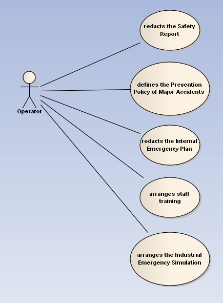

[.text-center]
*_Figure 1 – UML use case diagram, Operator view_*

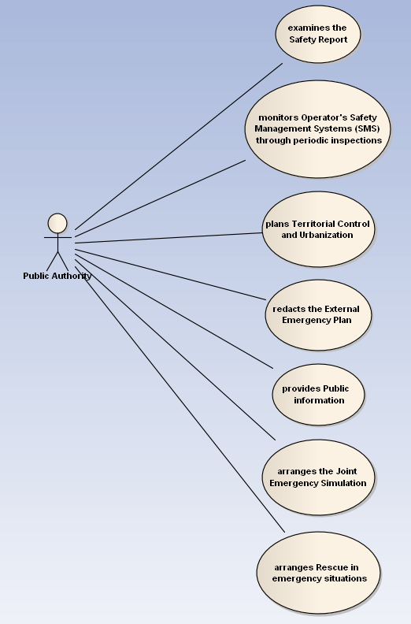

[.text-center]
*_Figure 2 – UML use case diagram, Public authority view_*

Operator:

[arabic, start=1]
. redacts Safety Report

[arabic, start=2]
. defines Prevention Policy of Major Accidents

[arabic, start=3]
. redacts Internal Emergency Plan

[arabic, start=4]
. arranges staff Training

[arabic, start=5]
. arranges Industrial Emergency Simulation

Public authority:

* examines Safety Report
* monitors operator's Safety Management Systems (SMS) through periodic inspections
* plans Territorial Control and Urbanization
* redacts External Emergency Plan
* provides Public information
* arranges Joint Emergency Simulation
* arranges Rescue in emergency situations

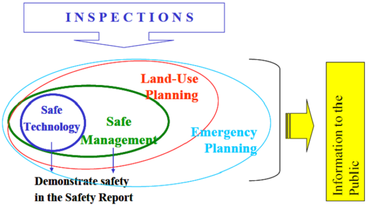

==== Background Legislation

*Council Directive 96/82/EC of 9 December 1996 on the control of major-accident hazards involving dangerous substances, as amended by Directive 2003/105/EC*

Article 2: Scope
The Directive shall apply to establishments where dangerous substances are present in quantities equal to or in excess of the quantities listed in Annex I, Parts 1 and 2, column 2, with the exception of Articles 9, 11 and 13 which shall apply to any establishment where dangerous substances are present in quantities equal to or in excess of the quantities listed in Annex I, Parts 1 and 2, column 3.

The Directive sets out two levels of requirements corresponding to 'lower tier' and 'upper tier' establishments.

*Article 7: Major-accident prevention policy*

Member States shall require the operator to draw up a document setting out his major-accident prevention policy and to ensure that it is properly implemented. The major-accident prevention policy established by the operator shall be designed to guarantee a high level of protection for man and the environment by appropriate means, structures and management systems.

There is a requirement for lower tier establishments to draw up a Major Accident Prevention Policy (MAPP), designed to guarantee a high level of protection for man and the environment by appropriate means including appropriate management systems, taking account of the principles contained in Annex III of the Directive. The operator of an 'upper tier' establishment (covered by Article 9 of the Directive and corresponding to a larger inventory of hazardous substances) is required to demonstrate in the 'safety report' that a MAPP and a Safety Management System (SMS) for implementing it have been put into effect in accordance with the information set out in Annex III of the Directive.

*Article 9: Safety report*

. Member States shall require the operator to produce a safety report for the purposes of:
[loweralpha]
.. demonstrating that a major-accident prevention policy and a safety management system for implementing it have been put into effect in accordance with the information set out in Annex III;
.. demonstrating that major-accident hazards have been identified and that the necessary measures have been taken to prevent such accidents and to limit their consequences for man and the environment;
.. demonstrating that adequate safety and reliability have been incorporated into the design, construction, operation and maintenance of any installation, storage facility, equipment and infrastructure connected with its operation which are linked to major-accident hazards inside the establishment;
.. demonstrating that internal emergency plans have been drawn up and supplying information to enable the external plan to be drawn up in order to take the necessary measures in the event of a major accident;
.. providing sufficient information to the competent authorities to enable decisions to be made in terms of the sitting of new activities or developments around existing establishments.

[arabic, start=2]
. The safety report shall contain at least the data and information listed in Annex II. .It shall name the relevant organizations involved in the drawing up of the report. It shall also contain an updated inventory of the dangerous substances present in the establishment.
+
Safety reports, or parts of reports, or any other equivalent reports produced in response to other legislation, may be combined to form a single safety report for the purposes of this Article, where such a format obviates the unnecessary duplication of information and the repetition of work by the operator or competent authority, on condition that all the requirements of this Article are complied with.

*Article 11: Emergency plans*

. Member States shall ensure that, for all establishments covered by Article 9 (Safety Report):
[loweralpha]
.. the operator draws up an internal emergency plan to be taken inside the factory: [...]
.. the operator supplies to the competent authorities, within the time specified below, information that will enable them to process the external emergency plan: [...]

[arabic, start=2]
. Emergency plans are developed in order to:
[loweralpha]
.. Containing and controlling incidents so as to minimize their effects and to limit damage to man, the environment and property;
.. Implementing the measures necessary to protect humans and the environment from the consequences of major accidents;
.. Inform the public and to the services or the appropriate local authorities;
.. Providing for the restoration and cleaning up the environment after a major accident.
.. The plans contain the information specified in Annex IV.
.. In order to limit the consequences of these accidents, it is necessary to develop external (EEP) and internal emergency plans (IEP) – applicable for that industrial establishment. The internal emergency plan comprises measures that shall be enforced within the establishment, by the operator and its employees, whereas the external one includes measures enforceableby the authorities for areas out of the establishment boundaries.

The EEP is drawn up using the information provided by the local authorities and institutions, as well as the data offered by the economic operator in the Safety Report (SR), the Internal Emergency Plan (IEP) and public information documents.

*Article 12 - Land-use planning*

Member States shall ensure that their land-use and/or other relevant policies and the procedures for implementing those policies take account of the need, in the long term, to maintain appropriate distances between establishments covered by this Directive and residential areas, areas of public use and areas of particular natural sensitivity or interest, and, in the case of existing establishments, of the need for additional technical measures in accordance with Article 8 so as not to increase the risks to people.

Member States shall define minimum safety requirements for territorial and town-planning for places interested by major-accident establishments with reference to the destination and use of grounds, correlated to the necessity of maintaining adequate distances between establishments and vulnerable zones, preventing important accidents, and limiting consequences for man and environment.

==== Seveso commitments: Main Contents

*Safety Report (Art.9)*

Is structured in three main parts:

* Description of the establishment and the environment where it is located;
* Identification and accidental risks analysis and prevention methods;
* Measures of protection and intervention to limit the consequences of an accident.

Description of the establishment and the environment where it is located

Description of the location and environment, including:

* geographic location *(through Production Facility in the Application Schema)*
* weather conditions
* geological basins;
* hydrographic conditions;
* identification of installations (*through Production Installation in the Application Schema*) and other activities on site that could pose a danger of major accidents (evaluation of domino effect).

Description of the installation includes:

* description of the main activities (*through Activity in the Application Schema*) and products (*through Process Output in the Application Schema*) of the parts of the establishment which are important from the point of view of safety;
* sources of major-accident risks (*through Production Installation Part in the Application Schema*) and conditions under which such a major accident could happen, together with a description of proposed preventive measures.
* description of processes (*through Production Process in the Application Schema*), in particular the operating methods;
* description of dangerous substances *(through Process Input, Process Output in the Application Schema)* (inventory reports the maximum quantity of dangerous substances present or likely to be present; physical, chemical, toxicological characteristics and indication of the hazards, both immediate and delayed for man and the environment; physical and chemical behaviour under normal conditions of use or under foreseeable accidental conditions);
* Information on the management and organization of the site on the prevention of major accidents

[.underline]#Identification and accidental risks analysis and prevention methods#

[upperalpha]
. detailed description of the possible major-accident scenarios and their probability or the conditions under which they occur, including a summary of the events which may play a role in triggering each of these scenarios, the causes being internal or external to the installation (identification of the hazard sources);

. assessment of the extent and severity of the consequences of identified major accidents (accident scenarios: the areas likely to be affected by accidents arising from the establishment);

. description of technical parameters and equipment used for the safety of installations (safety management system; Criteria for the structural design; Measures to prevent human error; Safety assessment; Pre-release systems)

[.underline]#Measures of protection and intervention to limit the consequences of an accident#    

* Description of the equipment installed to limit the consequences of major accidents (Post-release systems, Measures to avoid the domino effect, Fire protection system; Containment system)
* B Organization of alert and intervention (emergency planning: Roles and responsibilities, Controls for the management of emergency situations; Alarm systems, communication and external intervention support; Emergency procedures)
* description of mobilizable resources, internal or external;
* summary of elements described in A, B, and C above necessary for drawing up the internal
* emergency plan prepared in compliance with Article 11.

*Land-use planning (Art.12)*

Technical documents for land-use planning must contain at least these information:

* the information supplied by the operator;
* the location and the representation of the vulnerable territorial elements on a technical and cadastral cartographic base:
** Areas with predominantly residential use
** Places with people concentration with limited mobility capability - such as hospitals, nursing homes, kindergartens, schools, etc.
** Places subjected to significant crowding in external place - for example, stable markets or other destinations, etc..
** Places subject to significant crowding indoors - such as shopping centers, tertiary management, services, facilities, colleges, universities, etc..
** Places subject to significant crowding with limited periods of exposure to risk - such as places of public entertainment, for recreation, sporting, cultural, or religious events, etc..
** Railway stations and other nodes of transport.
* the location and the representation of the vulnerable environmental elements on a and cartographic base;
** environmental and landscape assets (artistic and cultural, archaeological);
** protected Natural Areas (e.g. parks and other areas defined according to legal requirements);
** surface water (e.g. superficial aquifer, primary and secondary hydrography, water bodies in relation to the retention time and volume of the basin);
** deep water (e.g. wells for tapping water use or irrigation, deep unprotected or protected aquifer, recharge zone of the aquifer)
** land use (e.g. relevant cultivated areas, forest areas).
* the representation of the areas of damage for every category of effects and for every class of frequency, on a technical and cadastral cartographic base, deriving from:
** Safety Report/Major accident prevention policy provided by operators
** Evaluation of competent authority
* other possiblemeasures that can be adopted on the territory, e.g. specific criteria for territorial planning, the creation of infrastructure and works of protection, the planning of transport links, the design criteria for specific works, and, where necessary, the elements of correlation with the planning instruments for emergency and civil protection.

*Emergency planning (Art.11)*

Frame-structure of the external emergency plan
OVERVIEW
General section
Updates
Drills
Training the staff
Description of the establishment and the neighbouring areas
territorial framing/delimitation
information on the establishment and the dangerous substances used
information on the land and environmental elements that are risk-exposed

ACCIDENT SCENARIOS
Event typology
Delimiting risk areas
Protection levels – thresholds for effect assessment
Description of the accident scenario, by mentioning the vulnerable elements in each area

ORGANIZATION MODEL FOR THE INTERVENTION
Support functions
Organization and procedures
Emergency services dispatch center
Access ways for the intervention teams, evacuation ways, banned routes and alternative routes
Assisted evacuation
Alarm systems and communication flow
Location of the alarm systems/means (*through Production Installation Part in the Application Schema*)
Management and maintenance of the alarm systems
Defining the alert levels
Communication
Managing the post-management situation

SECTION RESERVED TO PUBLIC INFORMATION
Preventive information campaign
Reproducing the public information document, drawn up in line with the provisions in art 14 of the G.D. no 804/2007
Information messages for panic prevention and emergency situation messages

CARTOGRAPHIC SECTION
Maps identified in the text for various land and organizational elements

==== Use-Case: Risk Mapping

[cols=",",options="header"]
|===
2+|Use Case Description
h|Name a|
Risk mapping could be accessible for any public actor involved in risk prevention and emergency management. from the citizen to the European Commission. It could be required from reporting purposes to general consultancy information.

Actually, this is information is provided by several Regional governments.

h|Priority |High / Medium
h|Description |Risk mapping derives from information provided by the operator and reviewed by competent authorities.
h|Pre-condition a|
Feature classification may be required as reference data or defined rules to choose reference elements (features, dimensions).

Portrayal: Generalisation and symbol assignment rules for reference data and risk areas.

Alternatively a set of pre-defined raster data.reference maps could be specified as context.

2+h|*Flow of Events – Basic Path*
|Step 1 |The Operator ('upper tier' establishment) redacts Safety Report, (SR) including Prevention Policy of Major Accidents and description of SMS
|Step 2 |The SR is assessed by the competent authority (for permission), informing the operator about the conclusions (acceptance of SR)
|Step 3 |The Competent authority (for permission) provides information on safety measures and on the required behaviour in the event of an accident. The information is provided toto subjects liable to be affected by a major accident originating in an establishment covered by Article 9
|Step 4 |The Competent authority (for monitoring) periodically checks SMS and compliance to SR through inspections
2+h|*Flow of Events – Alternative Paths*
|Step 1 a|
The Operator ('lower tier' establishment) communicates Prevention Policy of Major Accidents in a notification (Art. 7) containing the following details:

[loweralpha]
. the name or trade name of the operator and the full address of the establishment concerned;
. the registered place of business of the operator, with the full address;
. the name or position of the person in charge of the establishment, if different from (a);
. information sufficient to identify the dangerous substances or category of substances involved;
. the quantity and physical form of the dangerous substance or substances involved;
. the activity or proposed activity of the installation or storage facility

|Step 2 |The Competent authority (for permission) ask for additional information or ban the commissioning or the performance of any activities within that establishment or installation.
2+^h|Data source: Safety report
h|Description a|

. Description of the establishment and the environment where it is located;
. Identification and accidental risks analysis and prevention methods;
. Measures of protection and intervention to limit the consequences of an accident.

h|Data provider |Operator
h|Geographic scope |Local
h|Thematic scope |Useful for risk prevention: includes description of SMS and IEM
h|Scale, resolution |Various (depends on the purpose)
h|Delivery |GIS-Raster files, GIS-Vector-files, GML-files, WFS
h|Documentation |Metadata, Model description
2+^h|Data source: Land Use Plan
h|Description a|
the information supplied by the operator;

the location and the representation of the vulnerable territorial and environmental elements on a cartographic base:

the representation of the areas of damage for every category of effects and for every class of frequency, on a cartographic base, deriving from:

Safety Report/Major accident prevention policy provided by operators

h|Data provider |Operator
h|Geographic scope |Various (Pan-European, cross-border, national, regional, local)
h|Thematic scope |Risk prevention Tool
h|Scale, resolution |Various (depends on the purpose)
h|Delivery |GIS-Raster files, GIS-Vector-files, GML-files, WFS
h|Documentation |Metadata, Model description
|===

==== Use Case: Emergency management

[cols=",",]
|===
h|Name |Emergency management information should be provided by public actor involved in risk prevention and management.
h|Priority |High / Medium
h|Description |Emergency management plans are based on information provided by the operator related to internal safety system, integrated by competent authorities with information useful for granting safety outside the establishment.
h|Pre-condition a|
Feature classification may be required as reference data or defined rules to choose reference elements (features, dimensions).
    
Portrayal: Generalisation and symbol assignment rules for reference data and emergency management areas.

Alternatively a set of pre-defined raster data.reference maps could be specified as context.

2+|*Flow of Events – Basic Path*
|Step 1 |The Operator ('upper tier' establishment) redacts Safety Report, including Internal Emergency Plan (IEP)
|Step 2 |The IEP is assessed by the competent authority (for permission), that inform the operator about the conclusions (approvement of IEP).
|Step 3 |The EEP is drawn up by competent authority (for permission),using the information provided by the local authorities and institutions, as well as the data offered by the economic operator in the Safety Report (SR), the Internal Emergency Plan (IEP) and public information documents.
|Step 4 |In an emergency situation, the competent authority (for emergency management) applies the existing protocols
2+|*Flow of Events – Alternative Paths*
|Step 3 |The Competent authority draws an integrated EEP related to more establishments located in the same geographical area, even if managed by different operators.
2+|*Data sources: Internal Emergency plans*
h|Description a|
[loweralpha]
. Names or positions of persons authorized to set emergency procedures in motion and the person in charge of and coordinating the on-site mitigatory action.
. Name or position of the person with responsibility for liaising with the authority responsible for the external emergency plan.
. For foreseeable conditions or events which could be significant in bringing about a major accident, a description of the action which should be taken to control the conditions or events and to limit their consequences, including a description of the safety equipment and the resources available.
. Arrangements for limiting the risks to persons on site including how warnings are to be given and the actions persons are expected to take on receipt of a warning.
. Arrangements for providing early warning of the incident to the authority responsible for setting the external emergency plan in motion, the type of information which should be contained in an initial warning and the arrangements for the provision of more detailed information as it becomes available.
. Arrangements for training staff in the duties they will be expected to perform, and where necessary coordinating this with off-site emergency services.
. Arrangements for providing assistance with off-site mitigatory action.

h|Data provider |Operator
h|Geographic scope |Local
h|Thematic scope |Emergency planning and management
h|Scale, resolution |Minimum detail level: 1:1000
h|Delivery |GIS-Raster files, GIS-Vector-files, GML-files, WFS
h|Documentation |Metadata, Model description
2+|*Data source: External Emergency plans*
h|Description a|
[loweralpha]
. Names or positions of persons authorized to set emergency procedures in motion and of persons authorized to take charge of and coordinate off-site action.
. Arrangements for receiving early warning of incidents, and alert and call-out procedures.
. Arrangements for coordinating resources necessary to implement the external emergency plan.
. Arrangements for providing assistance with on-site mitigatory action.
. Arrangements for off-site mitigatory action.
. Arrangements for providing the public with specific information relating to the accident and the behaviour which it should adopt.
. Arrangements for the provision of information to the emergency services of other Member States in the event of a major accident with possible transboundary consequences.

h|Data provider |Competent authority
h|Geographic scope |Local
h|Thematic scope |Emergency planning and management
h|Scale, resolution |Various (depends on width of area of interest)
h|Delivery |GIS-Raster files, GIS-Vector-files, GML-files, WFS
h|Documentation |Metadata, Model description
|===

=== Licensing Procedure according to IPPC/IED

This use case is focused on planning and monitoring actions related to application of the *DIRECTIVE 2010/75/EU OF THE EUROPEAN PARLIAMENT AND OF THE COUNCIL of 24 November 2010 on industrial emissions (integrated pollution prevention and control) (Recast) (Text with EEA relevance)*, with the aim of establishing a general framework for the control of the main industrial activities and to facilitate the granting of permits.

The IED is based on several principles, namely (1) an integrated approach, (2) best available techniques, (3) flexibility, (4) inspections and (5) public participation.

[arabic, start=1]
. The integrated approach means that the permits must take into account the whole environmental performance of the plant, covering e.g. emissions to air, water and land, generation of waste, use of raw materials, energy efficiency, noise, prevention of accidents, and restoration of the site upon closure. The purpose of the Directive is to ensure a high level o   f protection of the environment taken as a whole.

Should the activity involve the use, production or release of relevant hazardous substances, the IED requires operators to prepare a baseline report before starting an operation of an installation or before a permit is updated having regard to the possibility of soil and groundwater contamination, ensuring the integrated approach.

[arabic, start=2]
. The permit conditions including emission limit values (ELVs) must be based on the Best Available Techniques (BAT), as defined in the IPPC Directive. BAT conclusions (documents containing information on the emission levels associated with the best available techniques) shall be the reference for setting permit conditions. To assist the licensing authorities and companies to determine BAT, the Commission organises an exchange of information between experts from the EU Member States, industry and environmental organisations. This work is coordinated by the European IPPC Bureau of the Institute for Prospective Technology Studies at the EU Joint Research Centre in Seville (Spain). This results in the adoption and publication by the Commission of the BAT conclusions and BAT Reference Documents (the so-called BREFs).

[arabic, start=3]
. The IED contains certain elements of flexibility by allowing the licensing authorities to set less strict emission limit values in specific cases. Such measures are only applicable where an assessment shows that the achievement of emission levels associated with BAT as described in the BAT conclusions would lead to disproportionately higher costs compared to the environmental benefits due to (a) geographical location or the local environmental conditions or (b) the technical characteristics of the installation.

The IED contains mandatory requirements on environmental inspections. Member States shall set up a system of environmental inspections and draw up inspection plans accordingly. The IED requires a site visit shall take place at least every 1 to 3 years, using risk-based criteria.

The Directive ensures that the public has a right to participate in the decision-making process, and to be informed of its consequences, by having access to

[loweralpha]
. permit applications in order to give opinions,
. permits,
. results of the monitoring of releases and
. the _European Pollutant Release and Transfer Register (E-PRTR)_. In E-PRTR, emission data reported by Member States are made accessible in a public register, which is intended to provide environmental information on major industrial activities.

Directive 2003/105/EC (Seveso III)
http://eur-lex.europa.eu/LexUriServ/LexUriServ.do?uri=CELEX:32003L0105:EN:PDF
Council Directive 96/61/EC (IPPC)
http://eur-lex.europa.eu/LexUriServ/LexUriServ.do?uri=OJ:L:1996:257:0026:0040:EN:PDF
European Pollutant Release and Transfer Register (E-PRTR with EEA relevance)
http://eur-lex.europa.eu/LexUriServ/LexUriServ.do?uri=OJ:L:2006:033:0001:0017:EN:PDF
DIRECTIVE 2008/1/EC (IPPC with EEA relevance))
http://eur-lex.europa.eu/LexUriServ/LexUriServ.do?uri=OJ:L:2008:024:0008:0029:EN:PDF
DIRECTIVE 2010/75/EU (IED with EEA relevance)
_http://eur-lex.europa.eu/LexUriServ/LexUriServ.do?uri=OJ:L:2010:334:0017:0119:EN:PDF_

==== User Diagram

Actors:

* Operator, one or more, (6) IED (2010/75/EU) responsibilities to operators
* Engineering actors, MS Building Regulations
* Architect
* Process engineer
* Land surveyor
* Competent authority, (11) IED (2010/75/EU) Permit conditions
* Department of planning and building inspection
* Other competent authorities emission control and environmental officer for facilities
* Office of fire protection and disaster prevention
+
BAT forum, composed of representatives industries concerned and non- governmental organisations promoting environmental protection, Article 13(1) Industrial Emissions Directive, IED (2010/75/EU)

* Public, participation in the permit procedure, (27) IED (2010/75/EU), in accordance with the Århus Convention

Operator's activity:

* submits permit applications containing the information necessary for the competent authority to set permit conditions DIRECTIVE 2010/75/EU (11)
* including site plan with all existing and new buildings and constructions and explaining main operation procedures DIRECTIVE 2010/75/EU (11)
* redacts permit application including best available techniques BAT, DIRECTIVE 2010/75/EU (13)
* should notify the competent authority of any planned change
* should establish, through a baseline report, the state of soil and groundwater contamination
* should regularly report to the competent authority on compliance with permit conditions DIRECTIVE 2010/75/EU (26)

Public authority includes participation by other administrative body's activity:

* examines Safety Report
* reconsiders permit conditions regularly
* sets a time period in permit conditions
* should include appropriate measures and regular surveillance of those measures DIRECTIVE 2010/75/EU (23)
* takes appropriate corrective measures, the monitoring is also necessary
* has to consider the type of prevention measures and the extent and occurrence of their surveillance
* provides for a system of environmental inspections DIRECTIVE 2010/75/EU (26)
* has to ensure effective public participation in decision-making to enable the public to express opinions and concerns
* undertakes actions, including site visits, monitoring of emissions and checks of internal reports and follow-up documents, verification of self- monitoring, checking of the techniques used and adequacy of the environment management of the installation

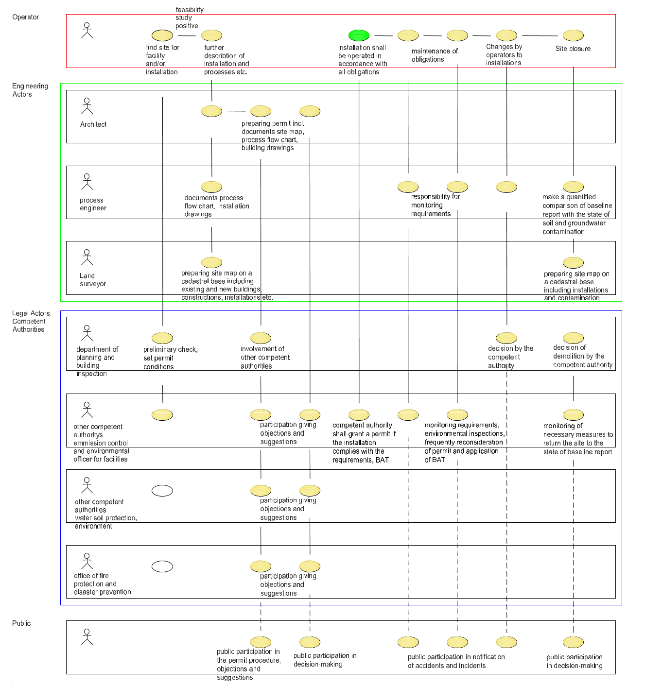

==== Use case description

[cols=",",options="header"]
|===
2+|Use Case Description
h|Name |General Licensing Procedure for facilities and installations etc.
h|Priority |High
h|Description |Granting of a permit, applications for permits including a complete description of the facility, specification of permit conditions, obligations of the operator, developments in best available techniques BAT, access to information and public participation in the permit procedure, information of any planned change, prevention and handling of incidents and accidents, monitoring requirements, environmental inspections, frequently reconsideration of permit conditions, permit conditions for cessation of activities,
h|Precondition |an application for an installation needs to include an application for the construction for building permission, which needs to contain all documents of construction including site maps and drawings showing details according a list of details required by individual legislations of MSs.
2+h|*Flow of Events – Basic Path*
|Step 1 |Operator should submit permit applications of operation of a facility, installation or activity
|Step 2 |competent authority has to set permit conditions
|Step 3 |Operator should submit applications for permits including building application and a complete description of the facility incl. necessary measures for safety operation
|Step 4 |competent authority gives access to information in the star method to all competent authorities involved and ensures public participation in the permit procedure if necessary
|Step 5 |competent authority shall grant a permit if the installation complies with the requirements incl. monitoring requirements, environmental inspections, frequently reconsideration of permit and BAT
2+h|*Flow of Events – Alternative Paths*
|Step 1 a|
Operator should submit permit applications of operation of a facility or activity

<= Use of WebMap Services (or download service) on a technical and cadastral cartographic base

|Step 2 a|
competent authority has to set permit conditions

<= Use of WebMap Services (or download service) on a technical and cadastral cartographic base, participation of other competent authority in the star method

|Step 3 a|
Operator should submit applications for permits including building application and a complete description of the facility incl. necessary measures for safety operation

<= Use of WebMap Services (or download service) on a technical and cadastral cartographic base, participation of other specialist engineers in the star method

|Step 4 a|
competent authority gives access to information in the star method to all competent authorities involved and ensures public participation in the permit procedure if necessary

<= Use of WebMap Services (or download service) on a technical and cadastral cartographic base, participation of other competent public in the star method

|Step 5 a|
competent authority shall grant a permit if the installation complies with the requirements incl. monitoring requirements, environmental inspections, frequently reconsideration of permit, BAT

<= Use of WebMap Services (or download service) on a technical and cadastral cartographic base, participation of other specialist engineers in the star method

2+h^|Data source: Land Use Plan and/on a cadastral cartographic base etc.
h|Description |Existing Land Use Plans on a cadastral cartographic base including all existing buildings and constructions, streets, infrastructure lines, safety measures etc.
h|Data provider |Operator, participating specialist engineers, competent authority
h|Geographic scope |Local
h|Thematic scope |Licensing of construction and operation
h|Scale, resolution |1:500 to 1:50
h|Delivery |GIS-Raster files, GIS-Vector-files, GML-files, WFS, WMS
h|Documentation |Metadata, Model description
|===

==== Flow Charts

The following flowcharts portray the processes related to the general licensing procedure described above. Note that, in addition to _Production and Industrial Facilities_ (PF), the same may be applied to Utility and governmental services (US), and Agricultural and aqua cultural facilities (AF)

[cols=",",options="header",]
|===
|Chart |title
|A |Change projects
|B |New projects
|C |Licensing Procedure
|D |Public Participation
|E |environmental Impact Assessment
|===

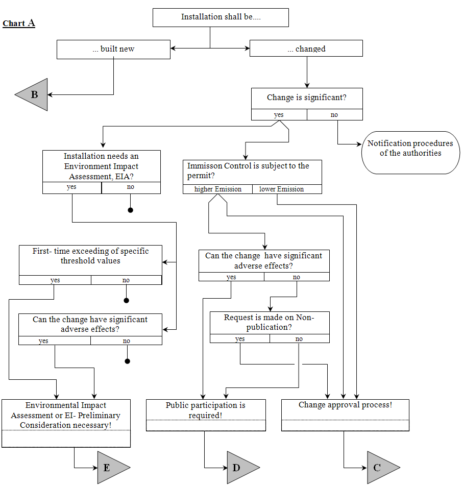

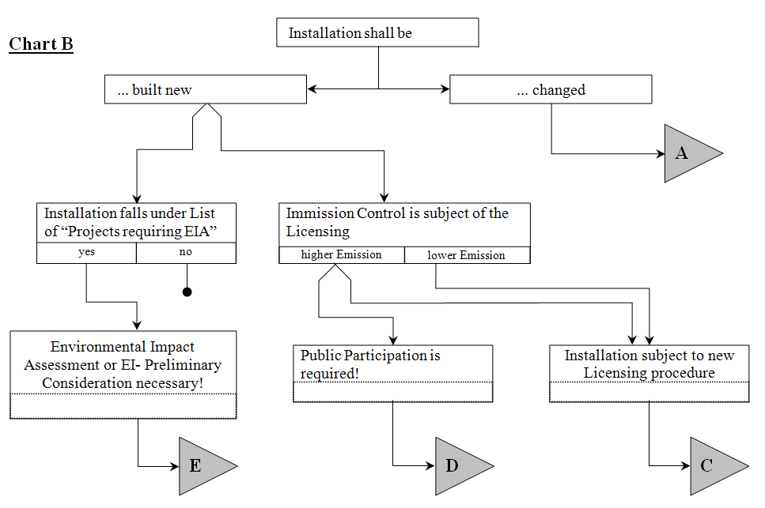

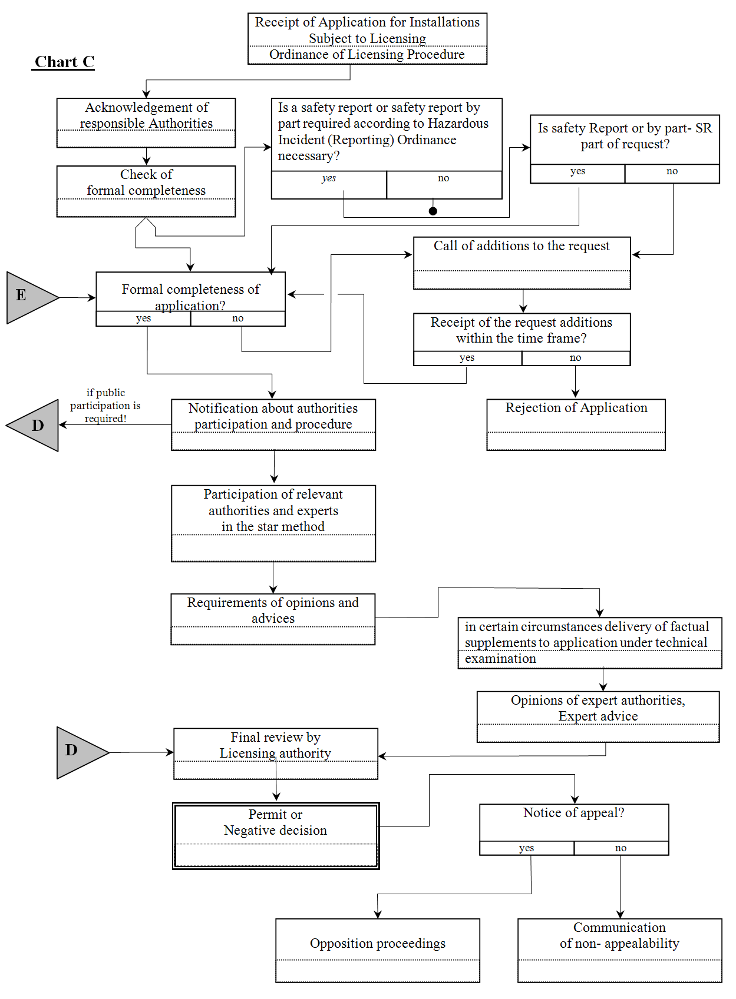

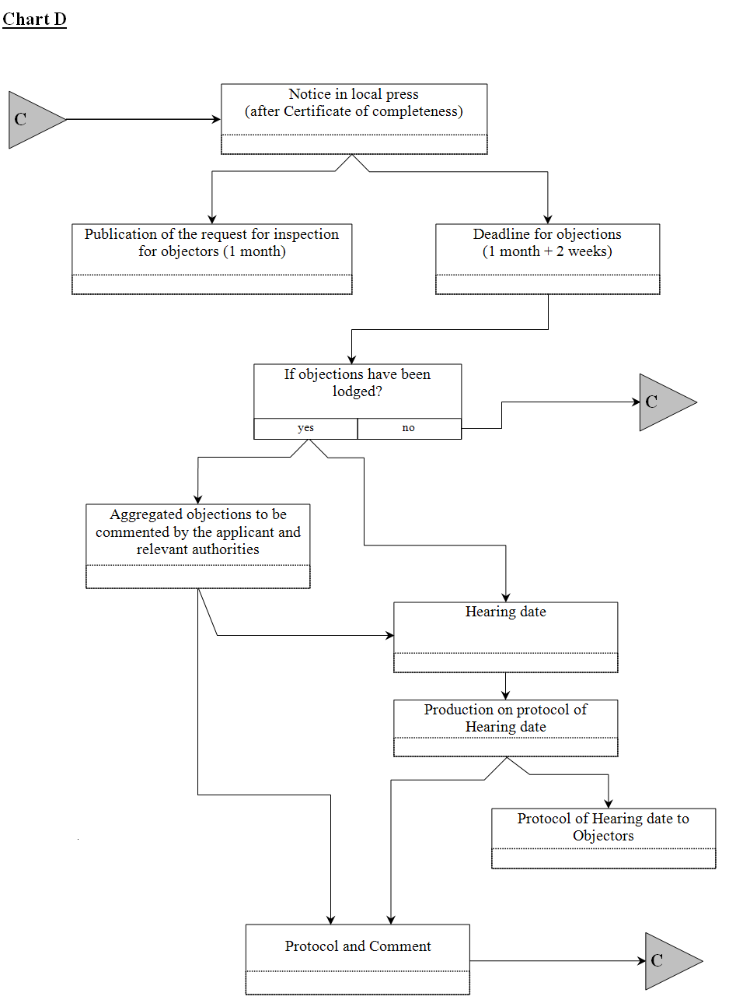

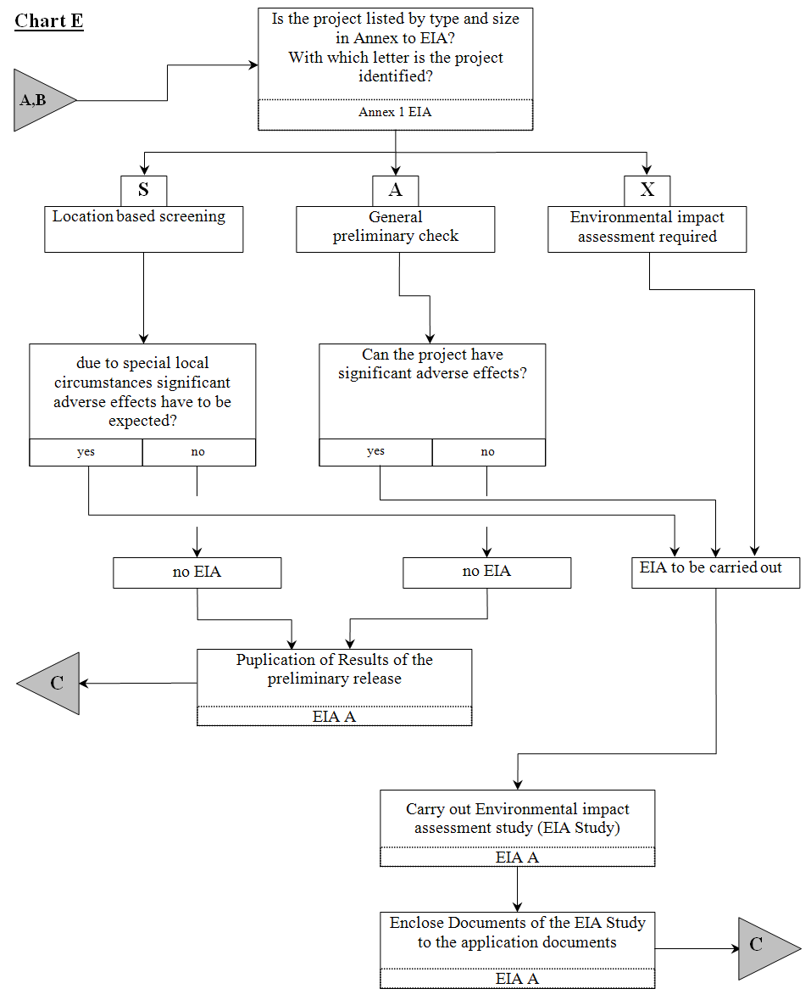

<<<
[appendix]
== Code list values - (normative) 

=== INSPIRE Application Schema 'Production and Industrial Facilities'

[cols="",options="header",]
|===
|*Code List*
|_PollutionAbatementTechniqueValue_
|===

*PollutionAbatementTechniqueValue*

[cols="",]
|===
a|
[cols=","]
!===
!Name: !pollution abatement technique value
!Definition: !The PollutionAbatementTechniqueValue code list hosts the reference values for the attribute technique in the ProductionInstallationPart class.
!Extensibility: !open
!Identifier: !http://inspire.ec.europa.eu/codeList/PollutionAbatementTechniqueValue
!Values: !The allowed values for this code list comprise the values specified in the table below and additional values at any level defined by data providers.
!===

|===

[cols=""]
|===
a|
*gravitation*

[cols=","]
!===
!Name: !gravitation
!Definition: !Pollutant abatement by gravitation
!===

a|
*dustScrubbers*

[cols=","]
!===
!Name: !dust scrubbers
!Definition: !Pollutant abatement through dust scrubbers
!===

a|
*filtration*

[cols=","]
!===
!Name: !filtration
!Definition: !Pollutant abatement by filtration
!===

a|
*condensation*

[cols=","]
!===
!Name: !condensation
!Definition: !Pollutant abatement by condensation
!===

a|
*adsorption*

[cols=","]
!===
!Name: !adsorption
!Definition: !Pollutant abatement by adsorption
!===

|===

=== INSPIRE Application Schema 'Production And Industrial Facilities Extension'

[cols="",options="header",]
|===
|*Code List*
|_ActivityCodeValue_
|_CLPCodeValue_
|_CPACodeValue_
|_E-PRTRCodeValue_
|_EWCCodeValue_
|_EnergyClassificationValue_
|_IPPCCodeValue_
|_ProcessItemValue_
|===

*ActivityCodeValue*

[cols="",]
|===
a|
[cols=","]
!===
!Name: !activity code value
!Definition: !The ActivityCodeValue code list hosts all the potential reference values for the attribute activityCode in the Activity class.
!Extensibility: !any
!Identifier: !
!Values: !
!===

|===

*CLPCodeValue*

[cols="",]
|===
a|
[cols=","]
!===
!Name: !CLP code value
!Definition: !The CLPCodeValue code list hosts the family of reference values for the "substance" item referred to the attribute processItem in the ProcessInput or ProcessOutput classes and to the attribute pollutantSubstance in the Emission class. Substance means any chemical element and its compounds, with the exception of some specific substances.
!Description: !The exception deals with the following substances: radioactive substances as defined in Article 1 of Council Directive 96/29/Euratom of 13 May 1996 laying down basic safety standards for the protection of the health of workers and the general public against the dangers arising from ionising radiation(2); genetically modified micro-organisms as defined in Article 2(b) of Directive 2009/41/EC of the European Parliament and the Council of 6 May 2009 on the contained use of genetically modified micro-organisms; genetically modified organisms as defined in point 2 of Article 2 of Directive 2001/18/EC of the European Parliament and of the Council of 12 March 2001 on the deliberate release into the environment of genetically modified organisms.
!Extensibility: !any
!Identifier: !http://inspire.ec.europa.eu/codeList/CLPCodeValue
!Values: !
!===

|===

*CPACodeValue*

[cols="",]
|===
a|
[cols=","]
!===
!Name: !CPA code value
!Definition: !The CPACodeValue code list hosts the family of reference values for the "product" item referred to the attribute processItem in the ProcessInput or ProcessOutput classes. A product means something that is produced, result of manufacturing, a result of an action or a process.
!Description: !CPA is the Standard Classification of Economic Products from Annex Regulation (EC) n. 451/2008. It has a hierarchical structure funded on different levels embedded in the activity code referring to the product. The activity code is accompanied by the activity denomination.
!Extensibility: !any
!Identifier: !http://inspire.ec.europa.eu/codeList/CPACodeValue
!Values: !
!===

|===

*E-PRTRCodeValue*

[cols="",]
|===
a|
[cols=","]
!===
!Name: !E-PRTR code value
!Definition: !The E-PRTRCodeValue code list hosts a family of reference values for the attribute activityCode in the Activity class. The list hosts the classification for the activities according to the E-PRTR register.
!Description: !E-PRTR classification has a hierarchical structure funded on different levels embedded in the activity code. The activity code is accompanied by the activity denomination.
!Extensibility: !any
!Identifier: !http://inspire.ec.europa.eu/codeList/E-PRTRCodeValue
!Values: !
!===

|===

*EWCCodeValue*

[cols="",]
|===
a|
[cols=","]
!===
!Name: !EWC code value
!Definition: !The EWCCodeValue code list hosts the family of reference values for the "waste" item referred to the attribute processItem in the ProcessInput or ProcessOutput classes. Waste means any substance or object which the holder discards or intends or is required to discard.
!Description: !EWC classification has a hierarchical structure funded on different levels embedded in the waste code. The waste code is accompanied by the waste denomination.
!Extensibility: !any
!Identifier: !http://inspire.ec.europa.eu/codeList/EWCCodeValue
!Values: !
!===

|===

*EnergyClassificationValue*

[cols="",]
|===
a|
[cols=","]
!===
!Name: !energy classification value
!Definition: !The EnergyClassificationValue code list hosts the family of reference values for the "energy" item referred to the attribute processItem in the ProcessInput or ProcessOutput classes. Energy means power derived from physical or chemical resources able to provide light and heat to work machines.
!Description: !The present classification has been derived from the Country factsheets which provide an overview of the most recent and pertinent annual energy related statistics in Europe, covering the European Union with its Member States. The content of this collection is based on a range of sources, including EUROSTAT, DG ECFIN, and EEA.
!Extensibility: !open
!Identifier: !http://inspire.ec.europa.eu/codeList/EnergyClassificationValue
!Values: !
!===

|===

The table below includes recommended values that may be used by data providers. Before creating new terms, please check if one of them can be used.

[cols=""]
|===
a|
*solidFuels*

[cols=","]
!===
!Name: !solid fuels
!Definition: !solid fuel energy
!===

a|
*petroleumProducts*

[cols=","]
!===
!Name: !petroleum products
!Definition: !energy from petroleum source
!===

a|
*gases*

[cols=","]
!===
!Name: !gases
!Definition: !energy from gas source
!===

a|
*electric*

[cols=","]
!===
!Name: !electric
!Definition: !energy from electricity source
!===

a|
*nuclear*

[cols=","]
!===
!Name: !nuclear
!Definition: !energy from nuclear source
!===

a|
*renewables*

[cols=","]
!===
!Name: !renewables
!Definition: !energy from renewable source
!===

|===

*IPPCCodeValue*

[cols="",]
|===
a|
[cols=","]
!===
!Name: !IPPC code value
!Definition: !The IPPCCodeValue code list hosts a family of reference values for the attribute activityCode in the Activity class. The list hosts the classification for the activities according to the Council Regulation 96/61/EC.
!Description: !IPPC classification has a hierarchical structure funded on different levels embedded in the activity code. The activity code is accompanied by the activity denomination.
!Extensibility: !any
!Identifier: !http://inspire.ec.europa.eu/codeList/IPPCCodeValue
!Values: !
!===

|===

*ProcessItemValue*

[cols="",]
|===
a|
[cols=","]
!===
!Name: !process item value
!Definition: !The ProcessItemValue code list hosts all the potential reference values for the attribute processItem in the ProcessInput or ProcessOutput classes.
!Extensibility: !any
!Identifier: !
!Values: !
!===

|===
