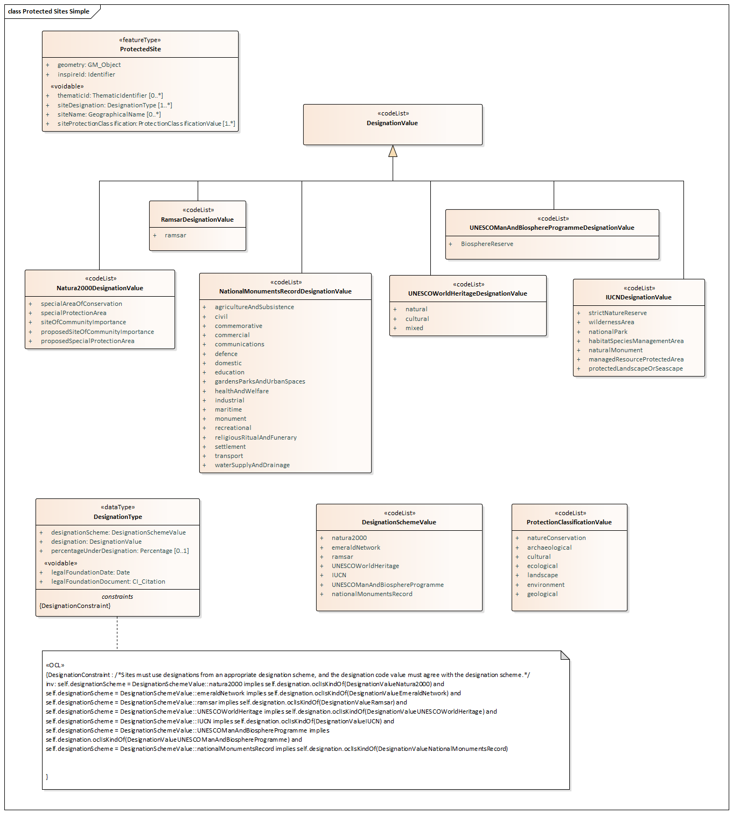

// Admonition icons:
// IR Requirement
:important-caption: 📕
// TG Requirement
:tip-caption: 📒
// Recommendation
:note-caption: 📘

// TOC placement using macro (manual)
:toc: macro

// Empty TOC title (the title is in the document)
:toc-title:

// TOC level depth
:toclevels: 5

// Section numbering level depth
:sectnumlevels: 8

// Line Break Doc Title
:hardbreaks-option:

:appendix-caption: Annex

// Document properties
:title: D2.8.I.9 Data Specification on Protected Sites – Technical Guidelines
:revdate: 2023-01-31
:keywords: INSPIRE Data Specification for the spatial data theme Protected Sites
:producer: INSPIRE Maintenance and Implementation Group (MIG)
:description: This document describes the INSPIRE Data Specification for the spatial data theme Protected Sites
:author: Temporary MIWP 2021-2024 sub-group 2.3.1
:copyright: Public
:revremark: https://github.com/INSPIRE-MIF/technical-guidelines/releases/tag/2023.1
:lang: en

image:./media/image2.jpeg[image,width=131,height=90, align=center]

image:./media/image3.png[image,width=93,height=93, align=center] **INSPIRE** *Infrastructure for Spatial Information in Europe*

[discrete]
= D2.8.I.9 Data Specification on _Protected Sites_ – Technical Guidelines

[width="100%",cols="17%,83%",]
|===
|*Title* |{doctitle}
|*Creator* |{author}
|*Date of publication* |{revdate}
|*Subject* |{keywords}
|*Publisher* |{producer}
|*Type* |Text
|*Description* |{description}
|*Format* |AsciiDoc
|*Licence* |https://creativecommons.org/licenses/by/4.0[Creative Commons Attribution (cc-by) 4.0]
|*Rights* |{copyright}
|*Identifier* |https://inspire.ec.europa.eu/id/document/tg/ps[D2.8.I.9_v3.2.0]
|*Changelog* |{revremark}
|*Language* |{lang}
|*Relation* |Directive 2007/2/EC of the European Parliament and of the Council of 14 March 2007 establishing an Infrastructure for Spatial Information in the European Community (INSPIRE)
|===

<<<
[discrete]
== Foreword
[discrete]
== How to read the document?

This document describes the _"INSPIRE data specification on Protected Sites – Technical Guidelines"_ version 3.2rc1 as developed by the Thematic Working Group (TWG) _Protected Sites_ using both natural and a conceptual schema language.

The data specification is based on a common templatefootnote:[The common document template is available in the "Framework documents" section of the data specifications web page at http://inspire.jrc.ec.europa.eu/index.cfm/pageid/2] used for all data specifications, which has been harmonised using the experience from the development of the Annex I, II and III data specifications.

This document provides guidelines for the implementation of the provisions laid down in the Implementing Rule for spatial data sets and services of the INSPIRE Directive. It also includes additional requirements and recommendations that, although not included in the Implementing Rule, are relevant to guarantee or to increase data interoperability.

Two executive summaries provide a quick overview of the INSPIRE data specification process in general, and the content of the data specification on _Protected Sites_ in particular. We highly recommend that managers, decision makers, and all those new to the INSPIRE process and/or information modelling should read these executive summaries first.

The UML diagrams (in Chapter 5) offer a rapid way to see the main elements of the specifications and their relationships. The definition of the spatial object types, attributes, and relationships are included in the Feature Catalogue (also in Chapter 5). People having thematic expertise but not familiar with UML can fully understand the content of the data model focusing on the Feature Catalogue. Users might also find the Feature Catalogue especially useful to check if it contains the data necessary for the applications that they run. The technical details are expected to be of prime interest to those organisations that are responsible for implementing INSPIRE within the field of _Protected Sites_, but also to other stakeholders and users of the spatial data infrastructure.

The technical provisions and the underlying concepts are often illustrated by examples. Smaller examples are within the text of the specification, while longer explanatory examples and descriptions of selected use cases are attached in the annexes.

In order to distinguish the INSPIRE spatial data themes from the spatial object types, the INSPIRE spatial data themes are written in _italics._

[cols="",]
|===
|The document will be publicly available as a 'non-paper'. It does not represent an official position of the European Commission, and as such cannot be invoked in the context of legal procedures.
|===

*Legal Notice*

Neither the European Commission nor any person acting on behalf of the Commission is responsible for the use which might be made of this publication.

[discrete]
== Interoperability of Spatial Data Sets and Services – General Executive Summary

The challenges regarding the lack of availability, quality, organisation, accessibility, and sharing of spatial information are common to a large number of policies and activities and are experienced across the various levels of public authority in Europe. In order to solve these problems it is necessary to take measures of coordination between the users and providers of spatial information. The Directive 2007/2/EC of the European Parliament and of the Council adopted on 14 March 2007 aims at establishing an Infrastructure for Spatial Information in the European Community (INSPIRE) for environmental policies, or policies and activities that have an impact on the environment.

INSPIRE is based on the infrastructures for spatial information that are created and maintained by the Member States. To support the establishment of a European infrastructure, Implementing Rules addressing the following components of the infrastructure have been specified: metadata, interoperability of spatial data sets (as described in Annexes I, II, III of the Directive) and spatial data services, network services, data and service sharing, and monitoring and reporting procedures.

INSPIRE does not require collection of new data. However, after the period specified in the Directivefootnote:[For all 34 Annex I,II and III data themes: within two years of the adoption of the corresponding Implementing Rules for newly collected and extensively restructured data and within 5 years for other data in electronic format still in use] Member States have to make their data available according to the Implementing Rules.

Interoperability in INSPIRE means the possibility to combine spatial data and services from different sources across the European Community in a consistent way without involving specific efforts of humans or machines. It is important to note that "interoperability" is understood as providing access to spatial data sets through network services, typically via Internet. Interoperability may be achieved by either changing (harmonising) and storing existing data sets or transforming them via services for publication in the INSPIRE infrastructure. It is expected that users will spend less time and efforts on understanding and integrating data when they build their applications based on data delivered in accordance with INSPIRE.

In order to benefit from the endeavours of international standardisation bodies and organisations established under international law their standards and technical means have been utilised and referenced, whenever possible.

To facilitate the implementation of INSPIRE, it is important that all stakeholders have the opportunity to participate in specification and development. For this reason, the Commission has put in place a consensus building process involving data users, and providers together with representatives of industry, research and government. These stakeholders, organised through Spatial Data Interest Communities (SDIC) and Legally Mandated Organisations (LMO)footnote:[The current status of registered SDICs/LMOs is available via INSPIRE website: http://inspire.jrc.ec.europa.eu/index.cfm/pageid/42], have provided reference materials, participated in the user requirement and technicalfootnote:[Surveys on unique identifiers and usage of the elements of the spatial and temporal schema,] surveys, proposed experts for the Data Specification Drafting Teamfootnote:[The Data Specification Drafting Team has been composed of experts from Austria, Belgium, Czech Republic, France, Germany, Greece, Italy, Netherlands, Norway, Poland, Switzerland, UK, and the European Environment Agency], the Thematic Working Groupsfootnote:[The Thematic Working Groups have been composed of experts from Austria, Australia, Belgium, Bulgaria, Czech Republic, Denmark, Finland, France, Germany, Hungary, Ireland, Italy, Latvia, Netherlands, Norway, Poland, Romania, Slovakia, Spain, Slovenia, Sweden, Switzerland, Turkey, UK, the European Environment Agency and the European Commission.] and other ad-hoc cross-thematic technical groups and participated in the public stakeholder consultations on draft versions of the data specifications. These consultations covered expert reviews as well as feasibility and fitness-for-purpose testing of the data specificationsfootnote:[For Annex IIIII, the consultation and testing phase lasted from 20 June to 21 October 2011.].

This open and participatory approach was successfully used during the development of the data specifications on Annex I, II and III data themes as well as during the preparation of the Implementing Rule on Interoperability of Spatial Data Sets and Servicesfootnote:[Commission Regulation (EU) No 1089/2010 http://eur-lex.europa.eu/JOHtml.do?uri=OJ:L:2010:323:SOM:EN:HTML[implementing Directive 2007/2/EC of the European Parliament and of the Council as regards interoperability of spatial data sets and services,] published in the Official Journal of the European Union on 8^th^ of December 2010.] for Annex I spatial data themes and of its amendment regarding the themes of Annex II and III.

The development framework elaborated by the Data Specification Drafting Team aims at keeping the data specifications of the different themes coherent. It summarises the methodology to be used for the development of the data specifications, providing a coherent set of requirements and recommendations to achieve interoperability. The pillars of the framework are the following technical documentsfootnote:[The framework documents are available in the "Framework documents" section of the data specifications web page at http://inspire.jrc.ec.europa.eu/index.cfm/pageid/2]:

* The _Definition of Annex Themes and Scope_ describes in greater detail the spatial data themes defined in the Directive, and thus provides a sound starting point for the thematic aspects of the data specification development.
* The _Generic Conceptual Model_ defines the elements necessary for interoperability and data harmonisation including cross-theme issues. It specifies requirements and recommendations with regard to data specification elements of common use, like the spatial and temporal schema, unique identifier management, object referencing, some common code lists, etc. Those requirements of the Generic Conceptual Model that are directly implementable are included in the Implementing Rule on Interoperability of Spatial Data Sets and Services.
* The _Methodology for the Development of Data Specifications_ defines a repeatable methodology. It describes how to arrive from user requirements to a data specification through a number of steps including use-case development, initial specification development and analysis of analogies and gaps for further specification refinement.
* The _Guidelines for the Encoding of Spatial Data_ defines how geographic information can be encoded to enable transfer processes between the systems of the data providers in the Member States. Even though it does not specify a mandatory encoding rule it sets GML (ISO 19136) as the default encoding for INSPIRE.
* The _Guidelines for the use of Observations & Measurements and Sensor Web Enablement-related standards in INSPIRE Annex II and III data specification development_ provides guidelines on how the "Observations and Measurements" standard (ISO 19156) is to be used within INSPIRE.
* The _Common data models_ are a set of documents that specify data models that are referenced by a number of different data specifications. These documents include generic data models for networks, coverages and activity complexes.

The structure of the data specifications is based on the "ISO 19131 Geographic information - Data product specifications" standard. They include the technical documentation of the application schema, the spatial object types with their properties, and other specifics of the spatial data themes using natural language as well as a formal conceptual schema languagefootnote:[UML – Unified Modelling Language].

A consolidated model repository, feature concept dictionary, and glossary are being maintained to support the consistent specification development and potential further reuse of specification elements. The consolidated model consists of the harmonised models of the relevant standards from the ISO 19100 series, the INSPIRE Generic Conceptual Model, and the application schemasfootnote:[Conceptual models related to specific areas (e.g. INSPIRE themes)] developed for each spatial data theme. The multilingual INSPIRE Feature Concept Dictionary contains the definition and description of the INSPIRE themes together with the definition of the spatial object types present in the specification. The INSPIRE Glossary defines all the terms (beyond the spatial object types) necessary for understanding the INSPIRE documentation including the terminology of other components (metadata, network services, data sharing, and monitoring).

By listing a number of requirements and making the necessary recommendations, the data specifications enable full system interoperability across the Member States, within the scope of the application areas targeted by the Directive. The data specifications (in their version 3.0) are published as technical guidelines and provide the basis for the content of the Implementing Rule on Interoperability of Spatial Data Sets and Servicesfootnote:[In the case of the Annex IIIII data specifications, the extracted requirements are used to formulate an amendment to the existing Implementing Rule.]. The content of the Implementing Rule is extracted from the data specifications, considering short- and medium-term feasibility as well as cost-benefit considerations. The requirements included in the Implementing Rule are legally binding for the Member States according to the timeline specified in the INSPIRE Directive.

In addition to providing a basis for the interoperability of spatial data in INSPIRE, the data specification development framework and the thematic data specifications can be reused in other environments at local, regional, national and global level contributing to improvements in the coherence and interoperability of data in spatial data infrastructures.

<<<
[discrete]
== Protected Sites – Executive Summary

The Directive 2007/2/EC of the European Parliament and of the Council of 14 March 2007 (INSPIRE) sets generic rules for establishing an Infrastructure for Spatial Information in the European Community. As a building block of the infrastructure, provisions on the interoperability of spatial data sets and services are foreseen. The thematic areas affected by the Directive are listed in the Annexes of the Directive.

Theme _Protected Sites_ is included in Annex I, which means that it is considered as reference data, i.e. data that constitute the spatial frame for linking and/or pointing at other information that belongs to other thematic fields. There are strong interdependencies between this and some Themes listed in Annex III like Area Management/Restriction/Regulation Zones and Reporting Units; Bio-geographical Regions; Habitats and Biotopes and Species Distribution.

The INSPIRE data specification on _Protected Sites_ has been prepared following the participative principle of a consensus building process. The stakeholders, based on their registration as a Spatial Data Interest Community (SDIC) or a Legally Mandated Organisation (LMO) had the opportunity to bring forward user requirements and reference materials, propose experts for the specification development, and to participate in the review of the data specifications. The Thematic Working Group responsible for the specification development was composed of experts coming from Germany, United Kingdom, and the European Environment Agency. The specification process took place according to the methodology elaborated for INSPIRE respecting the requirements and the recommendation of the INSPIRE Generic Conceptual Modelfootnote:[Both the methodology and the Generic Conceptual Model are part of the framework documents prepared by the Data Specification Drafting Team. These documents formed the basis for the data specification work of the Thematic Working Group.], which is one of the elements that ensures a coherent approach and cross theme consistency with other themes in the Directive.

The INSPIRE Directive defines a Protected Site as an "Area designated or managed within a framework of international, Community and Member States' legislation to achieve specific conservation objectives" [Directive 2007/2/EC]. According to the International Union for the Conservation of Nature (IUCN) a Protected Site is an area of land and/or sea especially dedicated to the protection and maintenance of biological diversity, and of natural and associated cultural resources, and managed through legal or other effective means.

Within the INSPIRE context, Protected Sites may be located in terrestrial, aquatic and/or marine environments, and may be under either public or private ownership. They may include localities with protection targets defined by different sectors and based on different objectives. Objectives for protection may include: the conservation of nature; the protection and maintenance of biological diversity and of natural resources and the protection of person-made objects including buildings, pre-historic and historic archaeological sites, other cultural objects, or sites with specific geological, hydrogeological or geomorphological value. Protected Sites may receive protection due to more than one type of objective, and may have a double or multifarious designation status.

Protected Sites may differ greatly in their reasons for protection, their designation and their management. Examples of legislation under which Protected Sites included in this INSPIRE theme are designated, managed and regulated include:

* the Habitats Directive (1992) (Directive 92/43/EC);

* the Birds Directive (1979) (Directive 79/409/EC);

* the Water Framework Directive (2000) (Directive 2000/60/EEC)

* the World Heritage Convention (1975);

* the Ramsar Convention (1971);

* the Barcelona Convention (1976);

* the Helsinki Convention (1974);

* the OSPAR Convention (1992) and

* the national laws of each European country and EU and international sector policies (for example, relating to nature conservation, forests or fisheries).

Based on the reference materials and the user requirements, the Thematic Working Group considered five use cases:

[arabic, start=1]
. Generate European Protected Sites spatial data report, a Europe-wide application including Natura 2000 sites, for expert users including national and regional government, the European Commission and the European Environment Agency;

[arabic, start=2]
. Naively query and view Protected Sites, applicable at local, regional and Europe-wide level, for non-expert/public users;

[arabic, start=3]
. Expertly query, view, visualise and analyse Protected Sites at local, regional, cross-border levels, to support environmental impact assessment and decision making;

[arabic, start=4]
. Download Protected Sites data, for expert or semi-expert users;

[arabic, start=5]
. Provide Protected Sites data according to EU legal obligations and data-flows (EU Member States).

The data specification has been based, as far as possible, on existing standards. Apart from ISO standards, the TWG has also used the reference material and the user requirements, the majority of which are expressed through existing legislation as already mentioned. The specification is documented using ICT techniques such as the Unified Modelling Language (UML), Geography Markup Language (GML) and Object Constraint Language (OCL).

One of the goals of this data specification is to illustrate how Member States could use the INSPIRE model to structure the exhaustive information on protected sites like those required for Natura2000 reportingfootnote:[Natura2000 has been used as one of the inputs into the INSPIRE Protected Sites Data Product Specification. Under Natura2000, Member States are required to update information on Natura2000 sites to the European Commission at least every six years. This part of the reporting process has a number of mandatory attributes.], while keeping a very simple and easy way for Member States to provide Protected Sites information in general.

A _Simple_ application schema is included within the Protected Sites data specification, containing a very limited set of fundamental attributes, including geometry, identifier, name and legal foundation date and document reference. Only current Protected Sites are included.

NOTE In previous versions of this data specification (until v3.1), two additional extended application schemas (Protected Sites - Full and Protected Sites - Natura 2000) were recommended, which included references to placeholder types in the Annex III themes "Habitats and Biotopes" and "Species Distribution". These extended application schemas removed from this data specification, in order to align them with version 3.0 of the Annex III themes "Habitats and Biotopes" and "Species Distribution" and make them consistent with the updated Natura 2000 Standard Data Formfootnote:[Commission Implementing Decision of 11 July 2011 concerning a site information format for Natura 2000 sites (notified under document C(2011) 4892), _OJ L 198, 30.7.2011, p. 39–70_]. The updated extended application schemas could be included in a future work as part of the INSPIRE Maintenance and Implementation Framework.

Additional application schemas specific to other purposes may be created by Member States or other European organisations and added to the model. Specific application schemas may be updated as a result of decisions and agreements at European level.

In all cases, Protected Sites have a known location, boundary and area, based on formal, legal or administrative agreements or decisions. Protected Site boundaries are often defined relative to cadastral boundaries, natural boundaries or to some other feature, or sometimes they are approximately defined on the basis of the extent of the presence of a particular species. However, in the INSPIRE context, all Protected Sites have distinct boundaries of their own, rather than being defined relative to some other spatial object type.

As the specification on INSPIRE _Protected Sites_ is the result of detailed analysis of user requirements and strong consideration of existing initiatives, it is expected that it will also form a solid part of a multi-purpose European spatial data infrastructure.

*Acknowledgements*

Many individuals and organisations have contributed to the development of these Guidelines.

The Thematic Working Group Protected Sites (TWG-PS) included:

Seifert Markus (TWG Facilitator), Kristin Stock (TWG Editor), Franz Daffner, Dirk Hinterlang, Andrew Newman, Keith Porter, Rania Spyropoulou, Vanda Nunes de Lima (European Commission contact point).

Other contributors to the INSPIRE data specifications are the Drafting Team Data Specifications, the JRC Data Specifications Team and the INSPIRE stakeholders - Spatial Data Interested Communities (SDICs) and Legally Mandated Organisations (LMOs).

*Contact information*

Maria Vanda Nunes de Lima & Michael Lutz
European Commission Joint Research Centre (JRC)
Institute for Environment and Sustainability
Unit H06: Digital Earth and Reference Data
_http://inspire.ec.europa.eu/index.cfm/pageid/2_

<<<
[discrete]
== Table of contents
toc::[]

<<<
:sectnums:
== Scope

This document specifies a harmonised data specification for the spatial data theme _Protected Sites_ as defined in Annex I of the INSPIRE Directive.

This data specification provides the basis for the drafting of Implementing Rules according to Article 7 (1) of the INSPIRE Directive [Directive 2007/2/EC]. The entire data specification is published as implementation guidelines accompanying these Implementing Rules.

<<<
== Overview

=== Name

INSPIRE data specification for the theme Protected Sites.

=== Informal description

*Definition:*

Area designated or managed within a framework of international, Community and Member States' legislation to achieve specific conservation objectives [Directive 2007/2/EC].

*Description:*

According to the International Union for the Conservation of Nature (IUCN) a Protected Site is *an area of land and/or sea especially dedicated to the protection and maintenance of biological diversity, and of natural and associated cultural resources, and managed through legal or other effective means.*

Within the INSPIRE context, Protected Sites may be located in terrestrial, aquatic and/or marine environments, and may be under either public or private ownership. They may include localities with protection targets defined by different sectors and based on different objectives. Objectives for protection may include: the conservation of nature; the protection and maintenance of biological diversity and of natural resources and the protection of person-made objects including buildings, pre-historic and historic archaeological sites, other cultural objects, or sites with specific geological, hydrogeological or geomorphological value. Protected Sites may receive protection due to more than one type of objective, and may have a double or multifarious designation status.

Protected Sites may differ greatly in their reasons for protection, their designation and their management. Examples of legislation under which Protected Sites included in this INSPIRE theme are designated, managed and regulated include:

* the Habitats Directive (1992) (Directive 92/43/EC);

* the Birds Directive (1979) (Directive 79/409/EC);

* the Water Framework Directive (2000) (Directive 2000/60/EEC)

* the World Heritage Convention (1975);

* the Ramsar Convention (1971);

* the Barcelona Convention (1976);

* the Helsinki Convention (1974);

* the OSPAR Convention (1992) and

* the national laws of each European country and EU and international sector policies (for example, relating to forests or fisheries).

This overview description describes a wide range of Protected Sites, but in practice, each Site differs greatly in its reasons for protection, its designation and its management. In addition to this INSPIRE _Protected Sites_ Data Specification, a number of other specifications for Protected Sites exist at the national, European and international levels. Natura2000 is a particularly important specification that has been used as an input into the INSPIRE data specification on _Protected Sites_ and is referred to throughout this document, but a number of other specifications also informed this specification (for example, the Common Database on Designated Areas and the International Union for the Conservation of Nature categories).

This Specification identifies a _Simple_ application schema of Protected Sites with a very limited set of fundamental attributes, including geometry, identifier, name and legal foundation date and document reference. Only current (non-historical) Protected Sites are included.

NOTE In previous versions of this data specification (until v3.1), two additional extended application schemas (Protected Sites - Full and Protected Sites - Natura 2000) were recommended, which included references to placeholder types in the Annex III themes "Habitats and Biotopes" and "Species Distribution". These extended application schemas have been temporarily removed from this data specification, in order to align them with version 3.0 of the Annex III themes "Habitats and Biotopes" and "Species Distribution" and make them consistent with the updated Natura 2000 Standard Data Formfootnote:[Commission Implementing Decision of 11 July 2011 concerning a site information format for Natura 2000 sites (notified under document C(2011) 4892), _OJ L 198, 30.7.2011, p. 39–70_]. The updated extended application schemas will then be included in a future version of these Technical Guidelines.

In all cases, Protected Sites have a known location, boundary and area, based on formal, legal or administrative agreements or decisions. In the INSPIRE context, all Protected Sites have distinct boundaries of their own, rather than being defined relative to some other spatial object type.

*Identification information*

[cols=",",]
|===
|Spatial resolution a|
The INSPIRE _Protected Sites_ theme is designed to be used at all levels of spatial resolution: the European level, the National level, the Regional level and the Local level. For this reason, the highest available resolution is to be used.

Spatial resolution varies widely across different Protected Sites and is largely dictated by the method of capture and the data source. Protected Sites are normally referenced to existing mapping of the cadastre and natural features, and thus the resolution of the Protected Site depends on the resolution of the underlying data source and the method of capture (often digitisation). Typical scales of capture range from larger than 1:5,000 (accuracy less than /-1m) to 1:100,000 (accuracy /-25m), corresponding to the local level and regional level respectively.

[NOTE]
====
*Recommendation 1*

It is recommended that data products complying with the INSPIRE _Protected Sites_ Data Specification contain the highest resolution data at the data source that the Member States can provide, as Protected Sites data may be used at a local level as well as broader scales.
====

|Geographical Scope a|
This INSPIRE Protected Sites data specification covers spatial data sets that relate to an area where a Member State (or other State complying with INSPIRE) has and/or exercises jurisdictional rights, or where no jurisdictional rights exist (that is, in marine areas outside the jurisdiction of a particular Member State).

Member States are responsible for the management of data about Protected Sites within their own jurisdiction. The assignment of Protected Sites to the jurisdiction of Member States may not coincide with Member State geographical boundaries, because neighbouring Member States sometimes agree to assign the management of Protected Sites according to other criteria. For example, if a protected species inhabits two neighbouring countries on either side of a river, the two Member States concerned may agree that each Member State will manage a Protected Site on their own side of the river protecting that species, even if the river does not coincide with the legal geographical boundary between the two Member States.

[NOTE]
====
*Recommendation 2*

Member States providing data to comply with the INSPIRE _Protected Sites_ theme should provide data about Protected Sites under their management and administration, for which they are responsible.
====

|Thematic Scope a|
The thematic scope of the INSPIRE data specification on _Protected Sites_ is defined on the basis of two criteria:

* The protection of the Site must be defined by *legislation* (whether international, European Community or national) and

* The protection of the Site must be for *specific conservation objectives*, whether nature, cultural or other conservation.

The key difference between _AREA MANAGEMENT/RESTRICTION/REGULATION ZONES AND REPORTING UNITS_ theme (from Annex III of the INSPIRE Directive) and protected Sites is that Protected Sites are established to manage, regulate and restrict activities to conserve nature, biodiversity and cultural heritage, only. Some Area Management, Restriction and Regulation Zones are established to deliver multiple environmental objectives that include nature and biodiversity conservation (e.g. River Basin Districts). Where this occurs, the spatial objects should only be published once, as Area Management, Restriction and Regulation Zones.

*Table 1a – Examples of Protected Site exclusions and inclusions*

[cols=",",options="header",]
!===
!*In this theme* !*Not in this theme*
a!

* protected archaeological sites;
*	protected buildings;
*	salmonid and cyprinid waters (Fresh Water Fish Directive);
*	shellfish growing waters (Shellfish Growing Waters Directive).

a!

*	restricted areas around drinking water sources (Water Framework Directive);
*	nitrate-vulnerable zones (Nitrates Directive);
*	dumping sites;
*	noise reduction zones;
*	planning and land use controls;
*	prospecting and mining permit areas;
*	river basin districts;
*	coastal zone management areas;
*	bathing waters (Bathing Waters Directive);

!===

|===

=== Normative References

[Directive 2007/2/EC] Directive 2007/2/EC of the European Parliament and of the Council of 14 March 2007 establishing an Infrastructure for Spatial Information in the European Community (INSPIRE)

[ISO 19107] EN ISO 19107:2005, Geographic Information – Spatial Schema

[ISO 19108] EN ISO 19108:2005, Geographic Information – Temporal Schema

[ISO 19108-c] ISO 19108:2002/Cor 1:2006, Geographic Information – Temporal Schema, Technical Corrigendum 1

[ISO 19111] EN ISO 19111:2007 Geographic information - Spatial referencing by coordinates (ISO 19111:2007)

[ISO 19113] EN ISO 19113:2005, Geographic Information – Quality principles

[ISO 19115] EN ISO 19115:2005, Geographic information – Metadata (ISO 19115:2003)

[ISO 19118] EN ISO 19118:2006, Geographic information – Encoding (ISO 19118:2005)

[ISO 19123] EN ISO 19123:2007, Geographic Information – Schema for coverage geometry and functions

[ISO 19125-1] EN ISO 19125-1:2004, Geographic Information – Simple feature access – Part 1: Common architecture

[ISO 19135] EN ISO 19135:2007 Geographic information – Procedures for item registration (ISO 19135:2005)

[ISO 19138] ISO/TS 19138:2006, Geographic Information – Data quality measures

[ISO 19139] ISO/TS 19139:2007, Geographic information – Metadata – XML schema implementation

[ISO 19157] ISO/DIS 19157, Geographic information – Data quality

[OGC 06-103r4] Implementation Specification for Geographic Information - Simple feature access – Part 1: Common Architecture v1.2.1

NOTE This is an updated version of "EN ISO 19125-1:2004, Geographic information – Simple feature access – Part 1: Common architecture".

[Regulation 1205/2008/EC] Regulation 1205/2008/EC implementing Directive 2007/2/EC of the European Parliament and of the Council as regards metadata

=== Terms and definitions

General terms and definitions helpful for understanding the INSPIRE data specification documents are defined in the INSPIRE Glossaryfootnote:[The INSPIRE Glossary is available from http://inspire-registry.jrc.ec.europa.eu/registers/GLOSSARY].

Specifically, for the theme Protected Sites, the following terms are defined:

*(1) Natura2000*

Natura 2000 is a European Union-wide network of nature protection areas established under the 1992 _Habitats Directive_. The aim of the network is to assure the long-term survival of Europe's most valuable and threatened species and habitats. It is comprised of Special Areas of Conservation (SAC) designated by Member States under the Habitats Directive, and also incorporates Special Protection Areas (SPAs) designated under the 1979 _Birds Directive_. The establishment of this network of protected areas also fulfils a Community obligation under the UN Convention on Biological Diversity.

*(2) Protected Area*

Protected Sites and Protected Areas are synonymous in this technical guideline.

=== Symbols and abbreviations

[cols=","]
|===
|CDDA |A Common Database on Designated Areas
|EU |European Union
|GML |Geographic Markup Language
|INSPIRE |Infrastructure for Spatial Information in Europe
|IUCN |International Union for the Conservation of Nature
|Natura2000 |A European Union-wide network of nature protection areas established under the 1992 _Habitats Directive_ and the 1979 _Birds Directive_.
|OSPAR |Oslo and Paris Commissions
|PS |Protected Site
|SDF |Standard Data Form used by Natura2000 to collect Protected Sites data.
|SLD |Styled Layer Descriptor
|TWG |Thematic Working Group
|UML |Unified Modeling Language
|UN |United Nations
|URI |Unified Resource Identifier
|===

=== How the Technical Guidelines map to the Implementing Rules

The schematic diagram in Figure 1 gives an overview of the relationships between the INSPIRE legal acts (the INSPIRE Directive and Implementing Rules) and the INSPIRE Technical Guidelines. The INSPIRE Directive and Implementing Rules include legally binding requirements that describe, usually on an abstract level, _what_ Member States must implement.

In contrast, the Technical Guidelines define _how_ Member States might implement the requirements included in the INSPIRE Implementing Rules. As such, they may include non-binding technical requirements that must be satisfied if a Member State data provider chooses to conform to the Technical Guidelines. Implementing these Technical Guidelines will maximise the interoperability of INSPIRE spatial data sets.

image::./media/image4.png[image,width=603,height=375, align=center]

[.text-center]
*Figure 1 - Relationship between INSPIRE Implementing Rules and Technical Guidelines*

==== Requirements

The purpose of these Technical Guidelines (Data specifications on _Protected Sites_) is to provide practical guidance for implementation that is guided by, and satisfies, the (legally binding) requirements included for the spatial data theme Protected Sites in the Regulation (Implementing Rules) on interoperability of spatial data sets and services. These requirements are highlighted in this document as follows:

[IMPORTANT]
====
[.text-center]
*IR Requirement*
_Article / Annex / Section no._
*Title / Heading*

This style is used for requirements contained in the Implementing Rules on interoperability of spatial data sets and services (Commission Regulation (EU) No 1089/2010).
====

For each of these IR requirements, these Technical Guidelines contain additional explanations and examples.

NOTE The Abstract Test Suite (ATS) in Annex A contains conformance tests that directly check conformance with these IR requirements.

Furthermore, these Technical Guidelines may propose a specific technical implementation for satisfying an IR requirement. In such cases, these Technical Guidelines may contain additional technical requirements that need to be met in order to be conformant with the corresponding IR requirement _when using this proposed implementation_. These technical requirements are highlighted as follows:

[TIP]
====
*TG Requirement X*

This style is used for requirements for a specific technical solution proposed in these Technical Guidelines for an IR requirement.
====

NOTE 1 Conformance of a data set with the TG requirement(s) included in the ATS implies conformance with the corresponding IR requirement(s).

NOTE 2 In addition to the requirements included in the Implementing Rules on interoperability of spatial data sets and services, the INSPIRE Directive includes further legally binding obligations that put additional requirements on data providers. For example, Art. 10(2) requires that Member States shall, where appropriate, decide by mutual consent on the depiction and position of geographical features whose location spans the frontier between two or more Member States. General guidance for how to meet these obligations is provided in the INSPIRE framework documents.

==== Recommendations

In addition to IR and TG requirements, these Technical Guidelines may also include a number of recommendations for facilitating implementation or for further and coherent development of an interoperable infrastructure.

[NOTE]
====
*Recommendation X*

Recommendations are shown using this style.
====

NOTE The implementation of recommendations is not mandatory. Compliance with these Technical Guidelines or the legal obligation does not depend on the fulfilment of the recommendations.

==== Conformance

Annex A includes the abstract test suite for checking conformance with the requirements included in these Technical Guidelines and the corresponding parts of the Implementing Rules (Commission Regulation (EU) No 1089/2010).

<<<
== Specification scopes

This data specification does not distinguish different specification scopes, but just considers one general scope.

NOTE For more information on specification scopes, see [ISO 19131:2007], clause 8 and Annex D.

<<<
== Identification information

These Technical Guidelines are identified by the following URI:

http://inspire.ec.europa.eu/tg/ps/3.2rc1

NOTE ISO 19131 suggests further identification information to be included in this section, e.g. the title, abstract or spatial representation type. The proposed items are already described in the document metadata, executive summary, overview description (section 2) and descriptions of the application schemas (section 5). In order to avoid redundancy, they are not repeated here.

<<<
== Data content and structure

=== Application schemas – Overview 

==== Application schemas included in the IRs

Articles 3, 4 and 5 of the Implementing Rules lay down the requirements for the content and structure of the data sets related to the INSPIRE Annex themes.

[IMPORTANT]
====
[.text-center]
*IR Requirement*
_Article 4_
*Types for the Exchange and Classification of Spatial Objects*

1. For the exchange and classification of spatial objects from data sets meeting the conditions laid down in Article 4 of Directive 2007/2/EC, Member States shall use the spatial object types and associated data types, enumerations and code lists that are defined in Annexes II, III and IV for the themes the data sets relate to.

2. Spatial object types and data types shall comply with the definitions and constraints and include the attributes and association roles set out in the Annexes.

3. The enumerations and code lists used in attributes or association roles of spatial object types or data types shall comply with the definitions and include the values set out in Annex II. The enumeration and code list values are uniquely identified by language-neutral mnemonic codes for computers. The values may also include a language-specific name to be used for human interaction.

====

The types to be used for the exchange and classification of spatial objects from data sets related to the spatial data theme Protected Sites are defined in the following application schemas (see section 5.3):

* Protected Sites Simple application schema

The application schemas specify requirements on the properties of each spatial object including its multiplicity, domain of valid values, constraints, etc.

NOTE The application schemas presented in this section contain some additional information that is not included in the Implementing Rules, in particular multiplicities of attributes and association roles.

[TIP]
====
*TG Requirement 1*

Spatial object types and data types shall comply with the multiplicities defined for the attributes and association roles in this section.

====

An application schema may include references (e.g. in attributes or inheritance relationships) to common types or types defined in other spatial data themes. These types can be found in a sub-section called "Imported Types" at the end of each application schema section. The common types referred to from application schemas included in the IRs are addressed in Article 3.

[IMPORTANT]
====
[.text-center]
*IR Requirement*
_Article 3_
*Common Types*

Types that are common to several of the themes listed in Annexes I, II and III to Directive 2007/2/EC shall conform to the definitions and constraints and include the attributes and association roles set out in Annex I.

====

NOTE Since the IRs contain the types for all INSPIRE spatial data themes in one document, Article 3 does not explicitly refer to types defined in other spatial data themes, but only to types defined in external data models.

Common types are described in detail in the Generic Conceptual Model [DS-D2.7], in the relevant international standards (e.g. of the ISO 19100 series) or in the documents on the common INSPIRE models [DS-D2.10.x]. For detailed descriptions of types defined in other spatial data themes, see the corresponding Data Specification TG document [DS-D2.8.x].

==== Additional recommended application schemas 

NOTE In previous versions of this data specification (until v3.1), two additional extended application schemas (Protected Sites - Full and Protected Sites - Natura 2000) were recommended, These extended application schemas removed from this data specification, in order to align them with version 3.0 of the Annex III themes "Habitats and Biotopes" and "Species Distribution" and make them consistent with the updated Natura 2000 Standard Data Formfootnote:[Commission Implementing Decision of 11 July 2011 concerning a site information format for Natura 2000 sites (notified under document C(2011) 4892), _OJ L 198, 30.7.2011, p. 39–70_].

=== Basic notions

This section explains some of the basic notions used in the INSPIRE application schemas. These explanations are based on the GCM [DS-D2.5].

==== Notation

===== Unified Modeling Language (UML)

The application schemas included in this section are specified in UML, version 2.1. The spatial object types, their properties and associated types are shown in UML class diagrams.

NOTE For an overview of the UML notation, see Annex D in [ISO 19103].

The use of a common conceptual schema language (i.e. UML) allows for an automated processing of application schemas and the encoding, querying and updating of data based on the application schema – across different themes and different levels of detail.

The following important rules related to class inheritance and abstract classes are included in the IRs.

[IMPORTANT]
====
[.text-center]
*IR Requirement*
_Article 5_
*Types*

(...)

[arabic, start=2]
. Types that are a sub-type of another type shall also include all this type's attributes and association roles.

. Abstract types shall not be instantiated.

====

The use of UML conforms to ISO 19109 8.3 and ISO/TS 19103 with the exception that UML 2.1 instead of ISO/IEC 19501 is being used. The use of UML also conforms to ISO 19136 E.2.1.1.1-E.2.1.1.4.

NOTE ISO/TS 19103 and ISO 19109 specify a profile of UML to be used in conjunction with the ISO 19100 series. This includes in particular a list of stereotypes and basic types to be used in application schemas. ISO 19136 specifies a more restricted UML profile that allows for a direct encoding in XML Schema for data transfer purposes.

To model constraints on the spatial object types and their properties, in particular to express data/data set consistency rules, OCL (Object Constraint Language) is used as described in ISO/TS 19103, whenever possible. In addition, all constraints are described in the feature catalogue in English, too.

NOTE Since "void" is not a concept supported by OCL, OCL constraints cannot include expressions to test whether a value is a _void_ value. Such constraints may only be expressed in natural language.

===== Stereotypes

In the application schemas in this section several stereotypes are used that have been defined as part of a UML profile for use in INSPIRE [DS-D2.5]. These are explained in Table 1 below.

*Table 2 – Stereotypes (adapted from [DS-D2.5])*

[cols=",,",]
|===
|*Stereotype* |*Model element* |*Description*
|applicationSchema |Package |An INSPIRE application schema according to ISO 19109 and the Generic Conceptual Model.
|leaf |Package |A package that is not an application schema and contains no packages.
|featureType |Class |A spatial object type.
|type |Class |A type that is not directly instantiable, but is used as an abstract collection of operation, attribute and relation signatures. This stereotype should usually not be used in INSPIRE application schemas as these are on a different conceptual level than classifiers with this stereotype.
|dataType |Class |A structured data type without identity.
|union |Class |A structured data type without identity where exactly one of the properties of the type is present in any instance.
|enumeration |Class |An enumeration.
|codeList |Class |A code list.
|import |Dependency |The model elements of the supplier package are imported.
|voidable |Attribute, association role |A voidable attribute or association role (see section 5.2.2).
|lifeCycleInfo |Attribute, association role |If in an application schema a property is considered to be part of the life-cycle information of a spatial object type, the property shall receive this stereotype.
|version |Association role |If in an application schema an association role ends at a spatial object type, this stereotype denotes that the value of the property is meant to be a specific version of the spatial object, not the spatial object in general.
|===

==== Voidable characteristics

The «voidable» stereotype is used to characterise those properties of a spatial object that may not be present in some spatial data sets, even though they may be present or applicable in the real world. This does _not_ mean that it is optional to provide a value for those properties.

For all properties defined for a spatial object, a value has to be provided – either the corresponding value (if available in the data set maintained by the data provider) or the value of _void._ A _void_ value shall imply that no corresponding value is contained in the source spatial data set maintained by the data provider or no corresponding value can be derived from existing values at reasonable costs.

[NOTE]
====
*Recomendation 3*

The reason for a _void_ value should be provided where possible using a listed value from the VoidReasonValue code list to indicate the reason for the missing value.

====

The VoidReasonValue type is a code list, which includes the following pre-defined values:

* _Unpopulated_: The property is not part of the dataset maintained by the data provider. However, the characteristic may exist in the real world. For example when the "elevation of the water body above the sea level" has not been included in a dataset containing lake spatial objects, then the reason for a void value of this property would be 'Unpopulated'. The property receives this value for all spatial objects in the spatial data set.
* _Unknown_: The correct value for the specific spatial object is not known to, and not computable by the data provider. However, a correct value may exist. For example when the "elevation of the water body above the sea level" _of a certain lake_ has not been measured, then the reason for a void value of this property would be 'Unknown'. This value is applied only to those spatial objects where the property in question is not known.
* _Withheld_: The characteristic may exist, but is confidential and not divulged by the data provider.

NOTE It is possible that additional reasons will be identified in the future, in particular to support reasons / special values in coverage ranges.

The «voidable» stereotype does not give any information on whether or not a characteristic exists in the real world. This is expressed using the multiplicity:

* If a characteristic may or may not exist in the real world, its minimum cardinality shall be defined as 0. For example, if an Address may or may not have a house number, the multiplicity of the corresponding property shall be 0..1.
* If at least one value for a certain characteristic exists in the real world, the minimum cardinality shall be defined as 1. For example, if an Administrative Unit always has at least one name, the multiplicity of the corresponding property shall be 1..*.

In both cases, the «voidable» stereotype can be applied. In cases where the minimum multiplicity is 0, the absence of a value indicates that it is known that no value exists, whereas a value of void indicates that it is not known whether a value exists or not.

EXAMPLE If an address does not have a house number, the corresponding Address object should not have any value for the «voidable» attribute house number. If the house number is simply not known or not populated in the data set, the Address object should receive a value of _void_ (with the corresponding void reason) for the house number attribute.

==== Enumerations

Enumerations are modelled as classes in the application schemas. Their values are modelled as attributes of the enumeration class using the following modelling style:

* No initial value, but only the attribute name part, is used.
* The attribute name conforms to the rules for attributes names, i.e. is a lowerCamelCase name. Exceptions are words that consist of all uppercase letters (acronyms).

[IMPORTANT]
====
[.text-center]
*IR Requirement*
_Article 6_
*Code Lists and Enumerations*

(...)

[arabic, start=5]
. Attributes or association roles of spatial object types or data types that have an enumeration type may only take values from the lists specified for the enumeration type."

====

==== Code lists

Code lists are modelled as classes in the application schemas. Their values, however, are managed outside of the application schema.

===== Code list types

The IRs distinguish the following types of code lists.

[IMPORTANT]
====
[.text-center]
*IR Requirement*
_Article 6_
*Code Lists and Enumerations*

1. Code lists shall be of one of the following types, as specified in the Annexes:
+
[loweralpha]
. code lists whose allowed values comprise only the values specified in this Regulation;

. code lists whose allowed values comprise the values specified in this Regulation and narrower values defined by data providers;

. code lists whose allowed values comprise the values specified in this Regulation and additional values at any level defined by data providers;

. code lists, whose allowed values comprise any values defined by data providers.

For the purposes of points (b), (c) and (d), in addition to the allowed values, data providers may use the values specified in the relevant INSPIRE Technical Guidance document available on the INSPIRE web site of the Joint Research Centre.

====

The type of code list is represented in the UML model through the tagged value _extensibility_, which can take the following values:

* _none_, representing code lists whose allowed values comprise only the values specified in the IRs (type a);
* _narrower_, representing code lists whose allowed values comprise the values specified in the IRs and narrower values defined by data providers (type b);
* _open_, representing code lists whose allowed values comprise the values specified in the IRs and additional values at any level defined by data providers (type c); and
* _any_, representing code lists, for which the IRs do not specify any allowed values, i.e. whose allowed values comprise any values defined by data providers (type d).

[NOTE]
====
*Recomendation 4*

Additional values defined by data providers should not replace or redefine any value already specified in the IRs.

====

NOTE This data specification may specify recommended values for some of the code lists of type (b), (c) and (d) (see section 5.2.4.3). These recommended values are specified in a dedicated Annex.

In addition, code lists can be hierarchical, as explained in Article 6(2) of the IRs.

[IMPORTANT]
====
[.text-center]
*IR Requirement*
_Article 6_
*Code Lists and Enumerations*

(...)

[arabic, start=2]
. Code lists may be hierarchical. Values of hierarchical code lists may have a more generic parent value. Where the valid values of a hierarchical code list are specified in a table in this Regulation, the parent values are listed in the last column.

====

The type of code list and whether it is hierarchical or not is also indicated in the feature catalogues.

===== Obligations on data providers

[IMPORTANT]
====
[.text-center]
*IR Requirement*
_Article 6_
*Code Lists and Enumerations*

(....)

[arabic, start=3]
. Where, for an attribute whose type is a code list as referred to in points (b), (c) or (d) of paragraph 1, a data provider provides a value that is not specified in this Regulation, that value and its definition shall be made available in a register.

. Attributes or association roles of spatial object types or data types whose type is a code list may only take values that are allowed according to the specification of the code list.

====

Article 6(4) obliges data providers to use only values that are allowed according to the specification of the code list. The "allowed values according to the specification of the code list" are the values explicitly defined in the IRs plus (in the case of code lists of type (b), (c) and (d)) additional values defined by data providers.

For attributes whose type is a code list of type (b), (c) or (d) data providers may use additional values that are not defined in the IRs. Article 6(3) requires that such additional values and their definition be made available in a register. This enables users of the data to look up the meaning of the additional values used in a data set, and also facilitates the re-use of additional values by other data providers (potentially across Member States).

NOTE Guidelines for setting up registers for additional values and how to register additional values in these registers is still an open discussion point between Member States and the Commission.

===== Recommended code list values

For code lists of type (b), (c) and (d), this data specification may propose additional values as a recommendation (in a dedicated Annex). These values will be included in the INSPIRE code list register. This will facilitate and encourage the usage of the recommended values by data providers since the obligation to make additional values defined by data providers available in a register (see section 5.2.4.2) is already met.

[NOTE]
====
*Recomendation 5*

Where these Technical Guidelines recommend values for a code list in addition to those specified in the IRs, these values should be used.

====

NOTE For some code lists of type (d), no values may be specified in these Technical Guidelines. In these cases, any additional value defined by data providers may be used.

===== Governance

The following two types of code lists are distinguished in INSPIRE:

* _Code lists that are governed by INSPIRE (INSPIRE-governed code lists)._ These code lists will be managed centrally in the INSPIRE code list register. Change requests to these code lists (e.g. to add, deprecate or supersede values) are processed and decided upon using the INSPIRE code list register's maintenance workflows.
+
INSPIRE-governed code lists will be made available in the INSPIRE code list register at __http://inspire.ec.europa.eu/codelist/<CodeListName__>. They will be available in SKOS/RDF, XML and HTML. The maintenance will follow the procedures defined in ISO 19135. This means that the only allowed changes to a code list are the addition, deprecation or supersession of values, i.e. no value will ever be deleted, but only receive different statuses (valid, deprecated, superseded). Identifiers for values of INSPIRE-governed code lists are constructed using the pattern __http://inspire.ec.europa.eu/codelist/<CodeListName__>/<value>.

* _Code lists that are governed by an organisation outside of INSPIRE (externally governed code lists)._ These code lists are managed by an organisation outside of INSPIRE, e.g. the World Meteorological Organization (WMO) or the World Health Organization (WHO). Change requests to these code lists follow the maintenance workflows defined by the maintaining organisations. Note that in some cases, no such workflows may be formally defined.
+
Since the updates of externally governed code lists is outside the control of INSPIRE, the IRs and these Technical Guidelines reference a specific version for such code lists.
+
The tables describing externally governed code lists in this section contain the following columns:
+
* The _Governance_ column describes the external organisation that is responsible for maintaining the code list.
+
* The _Source_ column specifies a citation for the authoritative source for the values of the code list. For code lists, whose values are mandated in the IRs, this citation should include the version of the code list used in INSPIRE. The version can be specified using a version number or the publication date. For code list values recommended in these Technical Guidelines, the citation may refer to the "latest available version".
+
* In some cases, for INSPIRE only a subset of an externally governed code list is relevant. The subset is specified using the _Subset_ column.
+
* The _Availability_ column specifies from where (e.g. URL) the values of the externally governed code list are available, and in which formats. Formats can include machine-readable (e.g. SKOS/RDF, XML) or human-readable (e.g. HTML, PDF) ones.

+
Code list values are encoded using http URIs and labels. Rules for generating these URIs and labels are specified in a separate table.

[NOTE]
====
*Recomendation 6*

The http URIs and labels used for encoding code list values should be taken from the INSPIRE code list registry for INSPIRE-governed code lists and generated according to the relevant rules specified for externally governed code lists.

====

NOTE Where practicable, the INSPIRE code list register could also provide http URIs and labels for externally governed code lists.

===== Vocabulary

For each code list, a tagged value called "vocabulary" is specified to define a URI identifying the values of the code list. For INSPIRE-governed code lists and externally governed code lists that do not have a persistent identifier, the URI is constructed following the pattern _http://inspire.ec.europa.eu/codelist/<UpperCamelCaseName>_.

If the value is missing or empty, this indicates an empty code list. If no sub-classes are defined for this empty code list, this means that any code list may be used that meets the given definition.

An empty code list may also be used as a super-class for a number of specific code lists whose values may be used to specify the attribute value. If the sub-classes specified in the model represent all valid extensions to the empty code list, the subtyping relationship is qualified with the standard UML constraint "\{complete,disjoint}".

==== Identifier management

[IMPORTANT]
====
[.text-center]
*IR Requirement*
_Article 9_
*Identifier Management*

1. The data type Identifier defined in Section 2.1 of Annex I shall be used as a type for the external object identifier of a spatial object.

2. The external object identifier for the unique identification of spatial objects shall not be changed during the life-cycle of a spatial object.

====

NOTE 1 An external object identifier is a unique object identifier which is published by the responsible body, which may be used by external applications to reference the spatial object. [DS-D2.5]

NOTE 2 Article 9(1) is implemented in each application schema by including the attribute _inspireId_ of type Identifier.

NOTE 3 Article 9(2) is ensured if the _namespace_ and _localId_ attributes of the Identifier remains the same for different versions of a spatial object; the _version_ attribute can of course change.

==== Geometry representation

[IMPORTANT]
====
[.text-center]
*IR Requirement*
_Article 12_
*Other Requirements & Rules*

1. The value domain of spatial properties defined in this Regulation shall be restricted to the Simple Feature spatial schema as defined in Herring, John R. (ed.), OpenGIS® Implementation Standard for Geographic information – Simple feature access – Part 1: Common architecture, version 1.2.1, Open Geospatial Consortium, 2011, unless specified otherwise for a specific spatial data theme or type.

====

NOTE 1 The specification restricts the spatial schema to 0-, 1-, 2-, and 2.5-dimensional geometries where all curve interpolations are linear and surface interpolations are performed by triangles.

NOTE 2 The topological relations of two spatial objects based on their specific geometry and topology properties can in principle be investigated by invoking the operations of the types defined in ISO 19107 (or the methods specified in EN ISO 19125-1).

====  Temporality representation

The application schema(s) use(s) the derived attributes "beginLifespanVersion" and "endLifespanVersion" to record the lifespan of a spatial object.

The attributes "beginLifespanVersion" specifies the date and time at which this version of the spatial object was inserted or changed in the spatial data set. The attribute "endLifespanVersion" specifies the date and time at which this version of the spatial object was superseded or retired in the spatial data set.

NOTE 1 The attributes specify the beginning of the lifespan of the version in the spatial data set itself, which is different from the temporal characteristics of the real-world phenomenon described by the spatial object. This lifespan information, if available, supports mainly two requirements: First, knowledge about the spatial data set content at a specific time; second, knowledge about changes to a data set in a specific time frame. The lifespan information should be as detailed as in the data set (i.e., if the lifespan information in the data set includes seconds, the seconds should be represented in data published in INSPIRE) and include time zone information.

NOTE 2 Changes to the attribute "endLifespanVersion" does not trigger a change in the attribute "beginLifespanVersion".

[IMPORTANT]
====
[.text-center]
*IR Requirement*
_Article 10_
*Life-cycle of Spatial Objects*

(...)

[arabic,start=3]
. Where the attributes beginLifespanVersion and endLifespanVersion are used, the value of endLifespanVersion shall not be before the value of beginLifespanVersion.

====

NOTE The requirement expressed in the IR Requirement above will be included as constraints in the UML data models of all themes.

[NOTE]
====
*Recomendation 7*

If life-cycle information is not maintained as part of the spatial data set, all spatial objects belonging to this data set should provide a void value with a reason of "unpopulated".

====

=== Application schema Protected Sites Simple

==== Description

===== Narrative description

The ProtectedSite class is the heart of the application schemas, containing a number of attributes with their own complex data types also defined within the schemas, including most importantly the features for which the Site is protected. Such features may include Habitats, Species or Buildings. A number of additional classes and data types are also included, all of which describe particular aspects or attributes of the ProtectedSite class.

There are interdependencies between the _Protected Sites_ data specification and some of the Annex III Data Specifications. Specifically, the _HABITATS AND BIOTOPES, SPECIES DISTRIBUTION_ and _BIO-GEOGRAPHICAL REGIONS_ themes contain features on which the _Protected Sites_ theme depends.

===== UML Overview

The application schemas contain a central class called ProtectedSite beyond the identifier the date that the protected site was legally created, the citation reference to the legal act, the designation type and a classification of the protected site.

In addition to the application schema, provisional application schemas. All these links are on a domain, conceptual level and will not carry explicit links between those themes, data models or data set instances, because they normally use different classification systems that meet different requirements or purposes.

The Annex III themes that are connected to the _Protected Sites_ theme are:

* Habitats and Biotopes: A Site may be protected because of the Habitats that occur on it, and the characteristics of such habitats are important for its protection.
* SpeciesDistribution: A Site may be protected because of the Species, e.g. Areas of Special Conservation Interest under the Bern Convention that exist on it, and the characteristics of such species are important for its protection.
* Bio-geographical Regions: Natura2000 reporting requires that the bio-geographical region within which a Protected Site falls be identified. Buildings: Buildings are a common reason for the creation of a Protected Site. These have not yet been modelled and so are not included as an Annex to this document. However, Protected Sites that have been created for the purpose of protecting buildings and facilities that are identified, e.g. protected sites, classified monuments, architectural and urban patrimony.

The Simple application schema (Figure 1) contains a very limited set of fundamental attributes, including geometry, identifier, name, designation type, legal foundation date and document reference. Only current Protected Sites are included.

 
*Figure 2 – UML Diagram: Simple application schema*

===== Consistency between spatial data sets

Some Protected Site boundaries are originally defined in the real world relative to cadastral or natural boundaries. These areas are defined by the approximate location of the presence of a protected object (for example, species or habitat), which may be known to exist up to a natural (most likely) or cadastral feature. However, the INSPIRE _Protected Sites_ data specification represents Protected Sites as absolute, not relative geometries. That is, they have their own, absolute geometries and their geographical location is not dependent on other features (other than during their original delineation). This is because many Member States do not update Protected Site geometries if there are changes to cadastral or natural boundaries, and in any case, the legal definition of a Protected Site remains fixed even if there are underlying changes to the cadastral boundary or the location of natural features.

===== Identifier management

The _Protected Sites_ data specification uses the Identifier dataType from the INSPIRE General Conceptual Model [DS-D2.5]. These identifiers include version number, so can be used to track changes to an object. The use of identifiers in combination with dates is described in more detail in Section 9.7.2 of DS-D2.5, Generic Conceptual Model, v3.4rc2.

===== Modelling of object references

References between classes within the _Protected Sites_ UML model are represented using the objectIdentifier attribute. References to data types are represented using attributes of the relevant data type. This also applies to references to other INSPIRE data themes (for example, the Geographical Names theme).

External references are represented as URIs or textual citations.

===== Geometry representation

[NOTE]
====
*Recommendation 8*

Protected Site geometries in INSPIRE-compliant _Protected Sites_ data sets may be point, line or polygon geometries. However, it is recommended that sites with an area of greater than 1 hectare be represented as polygons.

====

[NOTE]
====
*Recommendation 9* 

Protected Site geometries in INSPIRE-compliant _Protected Sites_ data sets that are polygons may be simple, single polygons or aggregated polygons, according to the shape of the actual Protected Site. That is, aggregated polygons are to be used if the Protected Site itself contains disjoint or island polygons. Simple polygon geometries are to be used if the Protected Site itself is a simple polygon.

====

[NOTE]
====
*Recommendation 10*

All spatial objects should be provided at the source accuracy where possible.

====

[NOTE]
====
*Recommendation 11* 

All spatial objects should have a positional accuracy of 100 metres or better.

====

If a site has multiple designations, different features should be provided for each designation. Protected Sites features may overlap each other, but normally only if they are of different designation types. Usually sites of the same designation type do not overlap.

===== Temporality representation

The application schema stores the real world date on which a change to the Protected Site occurs (legalFoundationDate). This is independent of anything that happens in any system. The Simple application schema does not include system lifecycle information and does not store historical versions of features.

===== Protected Site names

Names are an important attribute of Protected Sites. The name attribute in the ProtectedSite class uses the GeographicalName data type from the INSPIRE Geographical Names Data Specification. This data type includes a number of attributes that specify the language and pronunciation of the name.

[NOTE]
====
*Recomendation 12*

The language of the name should be filled in most cases, except if the data producer does not know the language of the name.

====

===== Designations and Classifications

A large number of different classification schemes for Protected Sites have been devised, some of which are explicitly represented in the INSPIRE data specification on _Protected Sites_ (for example, IUCN Categories, Natura2000 designations) and all of which may be incorporated using the DesignationType data type.

There is no single classification scheme used for all purposes across all Protected Sites and this specification does not attempt to create such a classification scheme. Instead, the specification is flexible enough to accommodate all classification schemes (including those used within a Member State), requiring only a very simple classification based on the purpose of protection (siteProtectionClassification). However, this may mean that comparison of specialised designations across Europe may be difficult in cases in which different designation schemes are used.

==== Feature catalogue

*Feature catalogue metadata*

[cols=","]
|===
|Application Schema |INSPIRE Application Schema Protected Sites Simple
|Version number |3.0
|===

*Types defined in the feature catalogue*

[cols=",,",options="header",]
|===
|*Type* |*Package* |*Stereotypes*
|DesignationSchemeValue |Protected Sites Simple |«codeList»
|DesignationType |Protected Sites Simple |«dataType»
|DesignationValue |Protected Sites Simple |«codeList»
|IUCNDesignationValue |Protected Sites Simple |«codeList»
|NationalMonumentsRecordDesignationValue |Protected Sites Simple |«codeList»
|Natura2000DesignationValue |Protected Sites Simple |«codeList»
|ProtectedSite |Protected Sites Simple |«featureType»
|RamsarDesignationValue |Protected Sites Simple |«codeList»
|UNESCOManAndBiosphereProgrammeDesignationValue |Protected Sites Simple |«codeList»
|UNESCOWorldHeritageDesignationValue |Protected Sites Simple |«codeList»
|ProtectionClassificationValue |Protected Sites Simple |«enumeration»
|Percentage |Protected Sites Simple |«dataType»
|===

===== Spatial object types

====== ProtectedSite

[cols="",options="header",]
|===
|*ProtectedSite*
a|
[cols=","]
!===
!Definition: !An area designated or managed within a framework of international, Community and Member States' legislation to achieve specific conservation objectives.
!Description: !Each protected site has a boundary defined through formal, legal or administrative agreements or decisions. The establishment of a protected site is normally underpinned by legislation and thus given weight in decisions about land use change and spatial planning. Each Site is normally selected as a representative example of a wider resource and selected through a formal criterion based approach. A protected site can be a contiguous extent of land/sea or a collection of discrete areas that together represent a single formal Protected Site. This class has the attributes, constraints and associations that are part of the Simple application schema.
!Stereotypes: !«featureType»
!===

a|
*Attribute: geometry*

[cols=","]
!===
!Value type: !GM_Object
!Definition: !The geometry defining the boundary of the Protected Site.
!Description: !The geometry may be determined by a wide range of methods, including surveying, digitisation or visual reference to natural features or cadastral boundaries and may be defined by the legal document that creates the protected area. The geometry included in a data set that uses this data model is stored as a fixed geometry by coordinates, not by reference to natural, cadastral or administrative boundaries, although it may originally have been defined from these.
!Multiplicity: !1
!===

a|
*Attribute: inspireID*

[cols=","]
!===
!Value type: !Identifier
!Definition: !External object identifier of the protected site.
!Description: !NOTE An external object identifier is a unique object identifier published by the responsible body, which may be used by external applications to reference the spatial object. The identifier is an identifier of the spatial object, not an identifier of the real-world phenomenon.
!Multiplicity: !1
!===

a|
*Attribute: legalFoundationDate*

[cols=","]
!===
!Value type: !DateTime
!Definition: !The date that the protected site was legally created. This is the date that the real world object was created, not the date that its representation in an information system was created.
!Description: !NOTE In the case of Natura2000 sites, a protected site may go through several different stages (for example, proposed as SCI, confirmed as SCI, designated as SAC). A new version of the site is created for each of these different stages (because there is a change in the designation), and the new version should have the date on which the new stage was legally assigned as the legalFoundationDate (for example, when designated as a SAC, the version for the SAC would have the designation date as the legalFoundationDate).
!Multiplicity: !1
!Stereotypes: !«voidable»
!===

a|
*Attribute: legalFoundationDocument*

[cols=","]
!===
!Value type: !CI_Citation
!Definition: !A URL or text citation referencing the legal act that created the Protected Site.
!Multiplicity: !1
!Stereotypes: !«voidable»
!===

a|
*Attribute: siteDesignation*

[cols=","]
!===
!Value type: !DesignationType
!Definition: !The designation (type) of Protected Site.
!Description: !At least one designation is required, but designations may be available using a number of different designation schemes, all of which can be accommodated in the DesignationSchemeValue codelist.
!Multiplicity: !1..*
!Stereotypes: !«voidable»
!===

a|
*Attribute: siteName*

[cols=","]
!===
!Value type: !GeographicalName
!Definition: !The name of the Protected Site.
!Description: !NOTE 1 Several names in different languages may be expressed. 
 
NOTE 2 It is recommended that the language of the name (part of the GeographicalName data type) be filled where ever possible. This is an important identifying attribute of a Protected Site.
!Multiplicity: !0..*
!Stereotypes: !«voidable»
!===

a|
*Attribute: siteProtectionClassification*

[cols=","]
!===
!Value type: !ProtectionClassificationValue
!Definition: !The classification of the protected site based on the purpose for protection.
!Description: !The site may have more than one classification.
!Multiplicity: !1..*
!Stereotypes: !«voidable»
!===

|===

===== Data types

====== DesignationType

[cols="",options="header",]
|===
|*DesignationType*
a|
[cols=","]
!===
!Definition: !A data type designed to contain a designation for the Protected Site, including the designation scheme used and the value within that scheme.
!Stereotypes: !«dataType»
!===

a|
*Attribute: designationScheme*

[cols=","]
!===
!Value type: !DesignationSchemeValue
!Definition: !The scheme from which the designation code comes.
!Multiplicity: !1
!===

a|
*Attribute: designation*

[cols=","]
!===
!Value type: !DesignationValue
!Definition: !The actual Site designation.
!Multiplicity: !1
!===

a|
*Attribute: percentageUnderDesignation*

[cols=","]
!===
!Value type: !Percentage
!Definition: !The percentage of the site that falls under the designation. This is used in particular for the IUCN categorisation. If a value is not provided for this attribute, it is assumed to be 100%
!Multiplicity: !0..1
!===

a|
*Constraint: DesignationConstraint*

[cols=","]
!===
!Natural language: !Sites must use designations from an appropriate designation scheme, and the designation code value must agree with the designation scheme.
!OCL: !inv: self.designationScheme = DesignationSchemeValue::natura2000 implies self.designation.oclIsKindOf(DesignationValueNatura2000) and self.designationScheme = DesignationSchemeValue::emeraldNetwork implies self.designation.oclIsKindOf(DesignationValueEmeraldNetwork) and self.designationScheme = DesignationSchemeValue::ramsar implies self.designation.oclIsKindOf(DesignationValueRamsar) and self.designationScheme = DesignationSchemeValue::UNESCOWorldHeritage implies self.designation.oclIsKindOf(DesignationValueUNESCOWorldHeritage) and self.designationScheme = DesignationSchemeValue::IUCN implies self.designation.oclIsKindOf(DesignationValueIUCN) and self.designationScheme = DesignationSchemeValue::UNESCOManAndBiosphereProgramme implies self.designation.oclIsKindOf(DesignationValueUNESCOManAndBiosphereProgramme) and self.designationScheme = DesignationSchemeValue::nationalMonumentsRecord implies self.designation.oclIsKindOf(DesignationValueNationalMonumentsRecord)
!===

|===

====== Percentage

[cols="",options="header",]
|===
|*Percentage*
a|
[cols=","]
!===
!Definition: !A percentage value, being an integer between 0 and 100 inclusive.
!Stereotypes: !«type»
!===

|===

===== Enumerations

====== ProtectionClassificationValue

[cols="",options="header",]
|===
|*ProtectionClassificationValue*
a|
[cols=","]
!===
!Definition: !The protected site classification based on the purpose of protection.
!URI: !
!===

a|
[cols=","]
!===
!Value: !*natureConservation*
!Definition: !The Protected Site is protected for the maintenance of biological diversity.
!===

a|
[cols=","]
!===
!Value: !*archaeological*
!Definition: !The Protected Site is protected for the maintenance of archaeological heritage.
!===

a|
[cols=","]
!===
!Value: !*cultural*
!Definition: !The Protected Site is protected for the maintenance of cultural heritage.
!===

a|
[cols=","]
!===
!Value: !*ecological*
!Definition: !The Protected Site is protected for the maintenance of ecological stability.
!===

a|
[cols=","]
!===
!Value: !*landscape*
!Definition: !The Protected Site is protected for the maintenance of landscape characteristics.
!===

a|
[cols=","]
!===
!Value: !*environment*
!Definition: !The Protected Site is protected for the maintenance of environmental stability.
!===

a|
[cols=","]
!===
!Value: !*geological*
!Definition: !The Protected Site is protected for the maintenance of geological characteristics.
!===

|===

===== Code lists

====== DesignationSchemeValue

[cols="",options="header",]
|===
|*DesignationSchemeValue*
a|
[cols=","]
!===
!Definition: !The scheme used to assign a designation to the Protected Sites.
!Description: !NOTE 1 Schemes may be internationally recognised (for example, Natura2000 or the Emerald Network schemes), or may be national schemes (for example, the designations used for nature conservation in a particular Member State). 
 
NOTE 2 Typically, this code list will be extended with code schemes used within Member States.
!Extensibility: !open
!Identifier: !http://inspire.ec.europa.eu/codelist/DesignationSchemeValue
!Values: !The allowed values for this code list comprise only the values specified in Annex _C_ and additional values at any level defined by data providers.
!===

|===

====== DesignationValue

[cols="",options="header",]
|===
|*DesignationValue*
a|
[cols=","]
!===
!Definition: !Abstract base type for code lists containing the classificaiton and desigation types under different schemes.
!Description: !NOTE 1Some of these designation and classification lists are closed (for example, Natura2000), while some change regularly. 
 
NOTE 2 Typically, additional code lists will be created as sub-types of this type to represent designation or classification values within Member States, e.g. natuurbeschermingsGebieden, rijksBeschermdeArcheologischeGebieden, nationaleParken, nationaleLandschappen etc. in the Netherlands.
!Extensibility: !open
!Identifier: !http://inspire.ec.europa.eu/codelist/DesignationValue
!Values: !The code list can be extended with additional values at any level, i.e. its allowed values comprise the values specified in this register and additional values at any level defined by data providers.
!===

|===

====== IUCNDesignationValue

[cols="",options="header",]
|===
|*IUCNDesignationValue*
a|
[cols=","]
!===
!Definition: !A code list for the International Union for the Conservation of Nature classification scheme.
!Extensibility: !none
!Identifier: !http://inspire.ec.europa.eu/codelist/IUCNDesignationValue
!Values: !The allowed values for this code list comprise only the values specified in Annex _C_ .
!===

|===

====== NationalMonumentsRecordDesignationValue

[cols="",options="header",]
|===
|*NationalMonumentsRecordDesignationValue*
a|
[cols=","]
!===
!Definition: !A code list for the National Monuments Record classification scheme.
!Extensibility: !none
!Identifier: !http://inspire.ec.europa.eu/codelist/NationalMonumentsRecordDesignationValue
!Values: !The allowed values for this code list comprise only the values specified in Annex _C_ .
!===

|===

====== Natura2000DesignationValue

[cols="",options="header",]
|===
|*Natura2000DesignationValue*
a|
[cols=","]
!===
!Definition: !A code list for the Natura2000 designation scheme.
!Extensibility: !none
!Identifier: !http://inspire.ec.europa.eu/codelist/Natura2000DesignationValue
!Values: !The allowed values for this code list comprise only the values specified in Annex _C_ .
!===

|===

====== RamsarDesignationValue

[cols="",options="header",]
|===
|*RamsarDesignationValue*
a|
[cols=","]
!===
!Definition: !A code list for the Ramsar Convention designatoin scheme.
!Extensibility: !none
!Identifier: !http://inspire.ec.europa.eu/codelist/RamsarDesignationValue
!Values: !The allowed values for this code list comprise only the values specified in Annex _C_ .
!===

|===

====== UNESCOManAndBiosphereProgrammeDesignationValue

[cols="",options="header",]
|===
|*UNESCOManAndBiosphereProgrammeDesignationValue*
a|
[cols=","]
!===
!Definition: !A code list for the World Heritage Man and Biosphere Programme classification scheme.
!Extensibility: !none
!Identifier: !http://inspire.ec.europa.eu/codelist/UNESCOManAndBiosphereProgrammeDesignationValue
!Values: !The allowed values for this code list comprise only the values specified in Annex _C_ .
!===

|===

====== UNESCOWorldHeritageDesignationValue

[cols="",options="header",]
|===
|*UNESCOWorldHeritageDesignationValue*
a|
[cols=","]
!===
!Definition: !A code list for the World Heritage designation scheme.
!Extensibility: !none
!Identifier: !http://inspire.ec.europa.eu/codelist/UNESCOWorldHeritageDesignationValue
!Values: !The allowed values for this code list comprise only the values specified in Annex _C_ .
!===

|===

===== Imported types (informative)

This section lists definitions for feature types, data types and enumerations and code lists that are defined in other application schemas. The section is purely informative and should help the reader understand the feature catalogue presented in the previous sections. For the normative documentation of these types, see the given references.

====== CI_Citation

[cols="",options="header",]
|===
|*CI_Citation*
a|
[cols=","]
!===
!Package: !Citation and responsible party information
!Reference: !Geographic information -- Metadata [ISO 19115:2003/Cor 1:2006]
!===

|===

====== DateTime

[cols="",options="header",]
|===
|*DateTime*
a|
[cols=","]
!===
!Package: !Date and Time
!Reference: !Geographic information -- Conceptual schema language [ISO/TS 19103:2005]
!===

|===

====== GM_Object

[cols="",options="header",]
|===
|*GM_Object (abstract)*
a|
[cols=","]
!===
!Package: !Geometry root
!Reference: !Geographic information -- Spatial schema [ISO 19107:2003]
!===

|===

====== GeographicalName

[cols="",options="header",]
|===
|*GeographicalName*
a|
[cols=","]
!===
!Package: !Geographical Names
!Reference: !INSPIRE Data specification on Geographical Names [DS-D2.8.I.3]
!Definition: !Proper noun applied to a real world entity.
!===

|===

====== Identifier

[cols="",options="header",]
|===
|*Identifier*
a|
[cols=","]
!===
!Package: !Base Types
!Reference: !INSPIRE Generic Conceptual Model, version 3.4 [DS-D2.5]
!Definition: !External unique object identifier published by the responsible body, which may be used by external applications to reference the spatial object.
!Description: !NOTE1 External object identifiers are distinct from thematic object identifiers. 
 
NOTE 2 The voidable version identifier attribute is not part of the unique identifier of a spatial object and may be used to distinguish two versions of the same spatial object. 
 
NOTE 3 The unique identifier will not change during the life-time of a spatial object.
!===

|===

<<<
== Reference systems, units of measure and grids

=== Default reference systems, units of measure and grid

The reference systems, units of measure and geographic grid systems included in this sub-section are the defaults to be used for all INSPIRE data sets, unless theme-specific exceptions and/or additional requirements are defined in section 6.2.

==== Coordinate reference systems

===== Datum

[IMPORTANT]
====
[.text-center]
*IR Requirement*
_Annex II, Section 1.2_
*Datum for three-dimensional and two-dimensional coordinate reference systems*

For the three-dimensional and two-dimensional coordinate reference systems and the horizontal component of compound coordinate reference systems used for making spatial data sets available, the datum shall be the datum of the European Terrestrial Reference System 1989 (ETRS89) in areas within its geographical scope, or the datum of the International Terrestrial Reference System (ITRS) or other geodetic coordinate reference systems compliant with ITRS in areas that are outside the geographical scope of ETRS89. Compliant with the ITRS means that the system definition is based on the definition of the ITRS and there is a well documented relationship between both systems, according to EN ISO 19111.

====

===== Coordinate reference systems

[IMPORTANT]
====
[.text-center]
*IR Requirement*
_Annex II, Section 1.3_
*Coordinate Reference Systems*

Spatial data sets shall be made available using at least one of the coordinate reference systems specified in sections 1.3.1, 1.3.2 and 1.3.3, unless one of the conditions specified in section 1.3.4 holds.

*1.3.1. Three-dimensional Coordinate Reference Systems*

* Three-dimensional Cartesian coordinates based on a datum specified in 1.2 and using the parameters of the Geodetic Reference System 1980 (GRS80) ellipsoid.

* Three-dimensional geodetic coordinates (latitude, longitude and ellipsoidal height) based on a datum specified in 1.2 and using the parameters of the GRS80 ellipsoid.

*1.3.2. Two-dimensional Coordinate Reference Systems*

* Two-dimensional geodetic coordinates (latitude and longitude) based on a datum specified in 1.2 and using the parameters of the GRS80 ellipsoid.

* Plane coordinates using the ETRS89 Lambert Azimuthal Equal Area coordinate reference system.

* Plane coordinates using the ETRS89 Lambert Conformal Conic coordinate reference system.

* Plane coordinates using the ETRS89 Transverse Mercator coordinate reference system.

*1.3.3. Compound Coordinate Reference Systems*

1. For the horizontal component of the compound coordinate reference system, one of the coordinate reference systems specified in section 1.3.2 shall be used.

2. For the vertical component, one of the following coordinate reference systems shall be used:

* For the vertical component on land, the European Vertical Reference System (EVRS) shall be used to express gravity-related heights within its geographical scope. Other vertical reference systems related to the Earth gravity field shall be used to express gravity-related heights in areas that are outside the geographical scope of EVRS.

* For the vertical component in the free atmosphere, barometric pressure, converted to height using ISO 2533:1975 International Standard Atmosphere, or other linear or parametric reference systems shall be used. Where other parametric reference systems are used, these shall be described in an accessible reference using EN ISO 19111-2:2012.

* For the vertical component in marine areas where there is an appreciable tidal range (tidal waters), the Lowest Astronomical Tide (LAT) shall be used as the reference surface.

* For the vertical component in marine areas without an appreciable tidal range, in open oceans and effectively in waters that are deeper than 200 meters, the Mean Sea Level (MSL) or a well-defined reference level close to the MSL shall be used as the reference surface.

*1.3.4. Other Coordinate Reference Systems*

Exceptions, where other coordinate reference systems than those listed in 1.3.1, 1.3.2 or 1.3.3 may be used, are:

1. Other coordinate reference systems may be specified for specific spatial data themes in this Annex.

2. For regions outside of continental Europe, Member States may define suitable coordinate reference systems.

The geodetic codes and parameters needed to describe these coordinate reference systems and to allow conversion and transformation operations shall be documented and an identifier shall be created, according to EN ISO 19111 and ISO 19127.

====

===== Display

[IMPORTANT]
====
[.text-center]
*IR Requirement*
_Annex II, Section 1.4_
*Coordinate Reference Systems used in the View Network Service*

For the display of spatial data sets with the view network service as specified in Regulation No 976/2009, at least the coordinate reference systems for two-dimensional geodetic coordinates (latitude, longitude) shall be available.

====

===== Identifiers for coordinate reference systems

[IMPORTANT]
====
[.text-center]
*IR Requirement*
_Annex II, Section 1.5_
*Coordinate Reference System Identifiers*

1. Coordinate reference system parameters and identifiers shall be managed in one or several common registers for coordinate reference systems.

2. Only identifiers contained in a common register shall be used for referring to the coordinate reference systems listed in this Section.

====

These Technical Guidelines propose to use the http URIs provided by the Open Geospatial Consortium as coordinate reference system identifiers (see identifiers for the default CRSs below). These are based on and redirect to the definition in the EPSG Geodetic Parameter Registry (_http://www.epsg-registry.org/_).

[TIP]
====
*TG Requirement 2*

The identifiers listed in Table 1 shall be used for referring to the coordinate reference systems used in a data set.

====

NOTE CRS identifiers may be used e.g. in:

* data encoding,
* data set and service metadata, and
* requests to INSPIRE network services.

*Table 3 - http URIs for the default coordinate reference systems*

[cols=",,",options="header",]
|===
|*Coordinate reference system* |*Short name* |*http URI identifier*
|3D Cartesian in ETRS89 |ETRS89-XYZ |_http://www.opengis.net/def/crs/EPSG/0/4936_
|3D geodetic in ETRS89 on GRS80 |ETRS89-GRS80h |_http://www.opengis.net/def/crs/EPSG/0/4937_
|2D geodetic in ETRS89 on GRS80 |ETRS89-GRS80 |_http://www.opengis.net/def/crs/EPSG/0/4258_
|2D LAEA projection in ETRS89 on GRS80 |ETRS89-LAEA |_http://www.opengis.net/def/crs/EPSG/0/3035_
|2D LCC projection in ETRS89 on GRS80 |ETRS89-LCC |_http://www.opengis.net/def/crs/EPSG/0/3034_
|2D TM projection in ETRS89 on GRS80, zone 26N (30°W to 24°W) |ETRS89-TM26N |_http://www.opengis.net/def/crs/EPSG/0/3038_
|2D TM projection in ETRS89 on GRS80, zone 27N (24°W to 18°W) |ETRS89-TM27N |_http://www.opengis.net/def/crs/EPSG/0/3039_
|2D TM projection in ETRS89 on GRS80, zone 28N (18°W to 12°W) |ETRS89-TM28N |_http://www.opengis.net/def/crs/EPSG/0/3040_
|2D TM projection in ETRS89 on GRS80, zone 29N (12°W to 6°W) |ETRS89-TM29N |_http://www.opengis.net/def/crs/EPSG/0/3041_
|2D TM projection in ETRS89 on GRS80, zone 30N (6°W to 0°) |ETRS89-TM30N |_http://www.opengis.net/def/crs/EPSG/0/3042_
|2D TM projection in ETRS89 on GRS80, zone 31N (0° to 6°E) |ETRS89-TM31N |_http://www.opengis.net/def/crs/EPSG/0/3043_
|2D TM projection in ETRS89 on GRS80, zone 32N (6°E to 12°E) |ETRS89-TM32N |_http://www.opengis.net/def/crs/EPSG/0/3044_
|2D TM projection in ETRS89 on GRS80, zone 33N (12°E to 18°E) |ETRS89-TM33N |_http://www.opengis.net/def/crs/EPSG/0/3045_
|2D TM projection in ETRS89 on GRS80, zone 34N (18°E to 24°E) |ETRS89-TM34N |_http://www.opengis.net/def/crs/EPSG/0/3046_
|2D TM projection in ETRS89 on GRS80, zone 35N (24°E to 30°E) |ETRS89-TM35N |_http://www.opengis.net/def/crs/EPSG/0/3047_
|2D TM projection in ETRS89 on GRS80, zone 36N (30°E to 36°E) |ETRS89-TM36N |_http://www.opengis.net/def/crs/EPSG/0/3048_
|2D TM projection in ETRS89 on GRS80, zone 37N (36°E to 42°E) |ETRS89-TM37N |_http://www.opengis.net/def/crs/EPSG/0/3049_
|2D TM projection in ETRS89 on GRS80, zone 38N (42°E to 48°E) |ETRS89-TM38N |_http://www.opengis.net/def/crs/EPSG/0/3050_
|2D TM projection in ETRS89 on GRS80, zone 39N (48°E to 54°E) |ETRS89-TM39N |_http://www.opengis.net/def/crs/EPSG/0/3051_
|Height in EVRS |EVRS |_http://www.opengis.net/def/crs/EPSG/0/5730_
|3D compound: 2D geodetic in ETRS89 on GRS80, and EVRS height |ETRS89-GRS80-EVRS |_http://www.opengis.net/def/crs/EPSG/0/7409_
|===

==== Temporal reference system

[IMPORTANT]
====
[.text-center]
*IR Requirement*
_Article 11_
*Temporal Reference Systems*

1. The default temporal reference system referred to in point 5 of part B of the Annex to Commission Regulation (EC) No 1205/2008 (footnote:[OJ L 326, 4.12.2008, p. 12.]) shall be used, unless other temporal reference systems are specified for a specific spatial data theme in Annex II.

====

NOTE 1 Point 5 of part B of the Annex to Commission Regulation (EC) No 1205/2008 (the INSPIRE Metadata IRs) states that the default reference system shall be the Gregorian calendar, with dates expressed in accordance with ISO 8601.

NOTE 2 ISO 8601 _Data elements and interchange formats – Information interchange – Representation of dates and times_ is an international standard covering the exchange of date and time-related data. The purpose of this standard is to provide an unambiguous and well-defined method of representing dates and times, so as to avoid misinterpretation of numeric representations of dates and times, particularly when data is transferred between countries with different conventions for writing numeric dates and times. The standard organizes the data so the largest temporal term (the year) appears first in the data string and progresses to the smallest term (the second). It also provides for a standardized method of communicating time-based information across time zones by attaching an offset to Coordinated Universal Time (UTC).

EXAMPLE 1997 (the year 1997), 1997-07-16 (16^th^ July 1997), 1997-07-16T19:20:3001:00 (16^th^ July 1997, 19h 20' 30'', time zone: UTC1)

==== Units of measure

[IMPORTANT]
====
[.text-center]
*IR Requirement*
_Article 12_
*Other Requirements & Rules*

(...)

[arabic, start=2]
. All measurement values shall be expressed using SI units or non-SI units accepted for use with the International System of Units, unless specified otherwise for a specific spatial data theme or type.

====

<<<
== Data quality

This chapter includes a description of the data quality elements and sub-elements as well as the corresponding data quality measures that should be used to evaluate and document data quality for data sets related to the spatial data theme _Protected Sites_ (section 7.1).

It may also define requirements or recommendations about the targeted data quality results applicable for data sets related to the spatial data theme _Protected Sites_ (sections 7.2 and 7.3).

In particular, the data quality elements, sub-elements and measures specified in section 7.1 should be used for

* evaluating and documenting data quality properties and constraints of spatial objects, where such properties or constraints are defined as part of the application schema(s) (see section 5);

* evaluating and documenting data quality metadata elements of spatial data sets (see section 8); and/or

* specifying requirements or recommendations about the targeted data quality results applicable for data sets related to the spatial data theme _Protected Sites_ (see sections 7.2 and 7.3).

The descriptions of the elements and measures are based on Annex D of ISO/DIS 19157 Geographic information – Data quality.

=== Data quality elements

Table 4 lists all data quality elements and sub-elements that are being used in this specification. Data quality information can be evaluated at level of spatial object, spatial object type, dataset or dataset series. The level at which the evaluation is performed is given in the "Evaluation Scope" column.

The measures to be used for each of the listed data quality sub-elements are defined in the following sub-sections.

*Table 4 – Data quality elements used in the spatial data theme _Protected Sites_*

[cols=",,,,",]
|===
|*Section* |*Data quality element* |*Data quality sub-element* |*Definition* |*Evaluation Scope*
|7.1.1 |Completeness |Commission |excess data present in the dataset, as described by the scope |dataset series; dataset; spatial object type
|7.1.2 |Completeness |Omission |data absent from the dataset, as described by the scope |dataset series; dataset; spatial object type
|7.1.3 |Logical consistency |Conceptual consistency |adherence to rules of the conceptual schema |spatial object type; spatial object
|7.1.4 |Logical consistency |Domain consistency |adherence of values to the value domains |spatial object type; spatial object
|7.1.5 |Positional accuracy |Absolute or external accuracy |closeness of reported coordinate values to values accepted as or being true |dataset series; dataset; spatial object type
|===

[NOTE]
====
*Recomendation 13*

Where it is impossible to express the evaluation of a data quality element in a quantitative way, the evaluation of the element should be expressed with a textual statement as a data quality descriptive result.

====

==== Completeness – Commission

[NOTE]
====
*Recomendation 14*

Commission should be evaluated and documented using _Rate of excess items_ as specified in the table below.

====

[cols=",",]
|===
|*Name* |*Rate of excess items*
|Alternative name |–
|Data quality element |Completeness
|Data quality sub-element |Commission
|Data quality basic measure |Error rate
|Definition |Number of excess items in the dataset in relation to the number of items that should have been present.
|Description |–
|Evaluation scope |spatial object type, data set, data set series
|Reporting scope |data set
|Parameter |–
|Data quality value type |Real, percentage, ratio (example: 0,0189 ; 98,11% ; 11:582)
|Data quality value structure |–
|Source reference |ISO/DIS 19157 Geographic information – Data quality
|Example |–
|Measure identifier |3
|===

==== Completeness – Omission

[NOTE]
====
*Recomendation 15*

Omission should be evaluated and documented using _Rate of missing items_ as specified in the tables below.

====

[cols=",",]
|===
|*Name* |*Rate of missing items*
|Alternative name |–
|Data quality element |Completeness
|Data quality sub-element |Omission
|Data quality basic measure |Error rate
|Definition |Number of missing items in the dataset in relation to the number of items that should have been present.
|Description |–
|Evaluation scope |spatial object type, data set, data set series
|Reporting scope |data set
|Parameter |–
|Data quality value type |Real, percentage, ratio (example: 0,0189 ; 98,11% ; 11:582)
|Data quality value structure |–
|Source reference |ISO/DIS 19157 Geographic information – Data quality
|Example |–
|Measure identifier |7
|===

==== Logical consistency – Conceptual consistency

The Application Schema conformance class of the Abstract Test Suite in Annex I defines a number of tests to evaluate the conceptual consistency (tests A.1.1-A.1.9) of a data set.

[NOTE]
====
*Recomendation 16*

For the tests on conceptual consistency, it is recommended to use the _Logical consistency – Conceptual consistency_ data quality sub-element and the measure _Number of items not compliant with the rules of the conceptual schema_ as specified in the table below.

====

[cols=",",]
|===
|*Name* |
|Alternative name |-
|Data quality element |logical consistency
|Data quality sub-element |conceptual consistency
|Data quality basic measure |error count
|Definition |count of all items in the dataset that are not compliant with the rules of the conceptual schema
|Description |If the conceptual schema explicitly or implicitly describes rules, these rules shall be followed. Violations against such rules can be, for example, invalid placement of features within a defined tolerance, duplication of features and invalid overlap of features.
|Evaluation scope |spatial object / spatial object type
|Reporting scope |data set
|Parameter |-
|Data quality value type |integer
|Data quality value structure |-
|Source reference |ISO/DIS 19157 Geographic information – Data quality
|Example |
|Measure identifier |10
|===

==== Logical consistency – Domain consistency

The Application Schema conformance class of the Abstract Test Suite in Annex I defines a number of tests to evaluate the domain consistency (tests A1.10-A.1.12) of a data set.

[NOTE]
====
*Recomendation 17*

For the tests on domain consistency, it is recommended to use the _Logical consistency – Domain consistency_ data quality sub-element and the measure _Number of items not in conformance with their value domain_ as specified in the table below.

====

[cols=",",]
|===
|*Name* |*Number of items not in conformance with their value domain*
|Alternative name |-
|Data quality element |logical consistency
|Data quality sub-element |domain consistency
|Data quality basic measure |error count
|Definition |count of all items in the dataset that are not in conformance with their value domain
|Description |
|Evaluation scope |spatial object / spatial object type
|Reporting scope |data set
|Parameter |-
|Data quality value type |integer
|===

==== Positional accuracy – Absolute or external accuracy

[NOTE]
====
*Recomendation 18*

Absolute or external accuracy should be evaluated and documented using _Root mean square error_ as specified in the tables below.

====

[cols=",",]
|===
|*Name* |Root mean square error
|Alternative name |RMSE
|Data quality element |Positional accuracy
|Data quality sub-element |Absolute or external accuracy
|Data quality basic measure |not applicable
|Definition a|
Standard deviation, where the true value is not estimated from the observations but known a priori

An indication of the accuracy of the data set as an aggregate.

|Description a|
The true value of an observable image::./media/image6.png[image,width=16,height=17] is known as image::./media/image7.png[image,width=16,height=24].
From this, the estimator

image::./media/image8.png[image,width=151,height=51, align=center]

yields to the linear root mean square error RMSE = image::./media/image9.png[image,width=20,height=23].

This measure is an indication of the accuracy of the features within the data set or feature type, and should reflect the feature within the data set or feature type that is least accurate.

|Evaluation scope |spatial object type, data set, data set series
|Reporting scope |data set
|Parameter |
|Data quality value type |Measure
|Data quality value structure |
|Source reference |ISO/DIS 19157 Geographic information – Data quality
|Example |
|Measure identifier |_39_
|===

=== Minimum data quality requirements

No minimum data quality requirements are defined for the spatial data theme Protected Sites.

=== Recommendation on data quality

No minimum data quality recommendations are defined.

<<<
== Dataset-level metadata

This section specifies dataset-level metadata elements, which should be used for documenting metadata for a complete dataset or dataset series.

NOTE Metadata can also be reported for each individual spatial object (spatial object-level metadata). Spatial object-level metadata is fully described in the application schema(s) (section 5).

For some dataset-level metadata elements, in particular those for reporting data quality and maintenance, a more specific scope can be specified. This allows the definition of metadata at sub-dataset level, e.g. separately for each spatial object type (see instructions for the relevant metadata element).

=== Metadata elements defined in INSPIRE Metadata Regulation

Table 1 gives an overview of the metadata elements specified in Regulation 1205/2008/EC (implementing Directive 2007/2/EC of the European Parliament and of the Council as regards metadata).

The table contains the following information:

* The first column provides a reference to the relevant section in the Metadata Regulation, which contains a more detailed description.
* The second column specifies the name of the metadata element.
* The third column specifies the multiplicity.
* The fourth column specifies the condition, under which the given element becomes mandatory.

*Table 5 – Metadata for spatial datasets and spatial dataset series specified in Regulation 1205/2008/EC*

[cols=",,,",]
|===
|*Metadata Regulation Section* |*Metadata element* |*Multiplicity* |*Condition*
|1.1 |Resource title |1 |
|1.2 |Resource abstract |1 |
|1.3 |Resource type |1 |
|1.4 |Resource locator |0..* |Mandatory if a URL is available to obtain more information on the resource, and/or access related services.
|1.5 |Unique resource identifier |1..* |
|1.7 |Resource language |0..* |Mandatory if the resource includes textual information.
|2.1 |Topic category |1..* |
|3 |Keyword |1..* |
|4.1 |Geographic bounding box |1..* |
|5 |Temporal reference |1..* |
|6.1 |Lineage |1 |
|6.2 |Spatial resolution |0..* |Mandatory for data sets and data set series if an equivalent scale or a resolution distance can be specified.
|7 |Conformity |1..* |
|8.1 |Conditions for access and use |1..* |
|8.2 |Limitations on public access |1..* |
|9 |Responsible organisation |1..* |
|10.1 |Metadata point of contact |1..* |
|10.2 |Metadata date |1 |
|10.3 |Metadata language |1 |
|===

Generic guidelines for implementing these elements using ISO 19115 and 19119 are available at _http://inspire.jrc.ec.europa.eu/index.cfm/pageid/101_. The following sections describe additional theme-specific recommendations and requirements for implementing these elements.

==== Conformity

The _Conformity_ metadata element defined in Regulation 1205/2008/EC requires to report the conformance with the Implementing Rule for interoperability of spatial data sets and services. In addition, it may be used also to document the conformance to another specification.

[NOTE]
====
*Recomendation 19*

Dataset metadata should include a statement on the overall conformance of the dataset with this data specification (i.e. conformance with all requirements).

====

[NOTE]
====
*Recomendation 20*

The _Conformity_ metadata element should be used to document conformance with this data specification (as a whole), with a specific conformance class defined in the Abstract Test Suite in Annex A and/or with another specification.

====

The _Conformity_ element includes two sub-elements, the _Specification_ (a citation of the Implementing Rule for interoperability of spatial data sets and services or other specification), and the _Degree_ of conformity. The _Degree_ can be _Conformant_ (if the dataset is fully conformant with the cited specification), _Not Conformant_ (if the dataset does not conform to the cited specification) or _Not Evaluated_ (if the conformance has not been evaluated).

[NOTE]
====
*Recomendation 21*

If a dataset is not yet conformant with all requirements of this data specification, it is recommended to include information on the conformance with the individual conformance classes specified in the Abstract Test Suite in Annex A.

====

[NOTE]
====
*Recomendation 22*

If a dataset is produced or transformed according to an external specification that includes specific quality assurance procedures, the conformity with this specification should be documented using the _Conformity_ metadata element.

====

[NOTE]
====
*Recomendation 23*

If minimum data quality recommendations are defined then the statement on the conformity with these requirements should be included using the _Conformity_ metadata element and referring to the relevant data quality conformance class in the Abstract Test Suite.

====

NOTE Currently no minimum data quality requirements are included in the IRs. The recommendation above should be included as a requirement in the IRs if minimum data quality requirements are defined at some point in the future.

[NOTE]
====
*Recomendation 24*

When documenting conformance with this data specification or one of the conformance classes defined in the Abstract Test Suite, the _Specification_ sub-element should be given using the http URI identifier of the conformance class or using a citation including the following elements:

- title: "INSPIRE Data Specification on Protected sites – Draft Guidelines – <name of the conformance class>"
- date:
** dateType: publication
** date: yyyy-mm-dd

====

EXAMPLE 1: The XML snippets below show how to fill the _Specification_ sub-element for documenting conformance with the whole data specification on Addresses v3.0.1.

[source, xml]
<gmd:DQ_ConformanceResult>
	<gmd:specification href="http://inspire.ec.europa.eu/conformanceClass/ad/3.0.1/tg" />
	<gmd:explanation> (...) </gmd:explanation>
	<gmd:pass> (...) </gmd:pass>
</gmd:DQ_ConformanceResult>

or (using a citation):

[source, xml]
<gmd:DQ_ConformanceResult>
	<gmd:specification>
		<gmd:CI_Citation>
			<gmd:title>
				<gco:CharacterString>INSPIRE Data Specification on Protected sites – Draft Guidelines</gco:CharacterString>
			</gmd:title>
			<gmd:date>
				<gmd:date>
					<gco:Date>yyyy-mm-dd</gco:Date>
				</gmd:date>
				<gmd:dateType>
					<gmd:CI_DateTypeCode codeList="http://standards.iso.org/ittf/PubliclyAvailableStandards/ISO_19139_Schemas/resou
rces/Codelist/ML_gmxCodelists.xml#CI_DateTypeCode" codeListValue="publication">publication</gmd:CI_DateTypeCode>
				</gmd:dateType>
			</gmd:date>
		</gmd:CI_Citation>
	</gmd:specification>
	<gmd:explanation> (...) </gmd:explanation>
	<gmd:pass> (...) </gmd:pass>
</gmd:DQ_ConformanceResult>

EXAMPLE 2: The XML snippets below show how to fill the _Specification_ sub-element for documenting conformance with the CRS conformance class of the data specification on Addresses v3.0.1.

[source, xml]
<gmd:DQ_ConformanceResult>
	<gmd:specification href="http://inspire.ec.europa.eu/conformanceClass/ad/3.0.1/crs" />
	<gmd:explanation> (...) </gmd:explanation>
	<gmd:pass> (...) </gmd:pass>
</gmd:DQ_ConformanceResult>

or (using a citation):

[source, xml]
<gmd:DQ_ConformanceResult>
	<gmd:specification>
		<gmd:CI_Citation>
			<gmd:title>
				<gco:CharacterString>INSPIRE Data Specification on Protected sites – Draft Guidelines – CRS</gco:CharacterString>
			</gmd:title>
			<gmd:date>
				<gmd:date>
					<gco:Date>yyyy-mm-dd</gco:Date>
				</gmd:date>
				<gmd:dateType>
					<gmd:CI_DateTypeCode codeList="http://standards.iso.org/ittf/PubliclyAvailableStandards/ISO_19139_Schemas/resou
rces/Codelist/ML_gmxCodelists.xml#CI_DateTypeCode" codeListValue="publication">publication</gmd:CI_DateTypeCode>
				</gmd:dateType>
			</gmd:date>
		</gmd:CI_Citation>
	</gmd:specification>
	<gmd:explanation> (...) </gmd:explanation>
	<gmd:pass> (...) </gmd:pass>
</gmd:DQ_ConformanceResult>

==== Lineage

[NOTE]
====
*Recomendation 25*

Following the ISO/DIS 19157 Quality principles, if a data provider has a procedure for the quality management of their spatial data sets then the appropriate data quality elements and measures defined in ISO/DIS 19157 should be used to evaluate and report (in the metadata) the results. If not, the _Lineage_ metadata element (defined in Regulation 1205/2008/EC) should be used to describe the overall quality of a spatial data set.

====

According to Regulation 1205/2008/EC, lineage "is a statement on process history and/or overall quality of the spatial data set. Where appropriate it may include a statement whether the data set has been validated or quality assured, whether it is the official version (if multiple versions exist), and whether it has legal validity. The value domain of this metadata element is free text".

The Metadata Technical Guidelines based on EN ISO 19115 and EN ISO 19119 specifies that the statement sub-element of LI_Lineage (EN ISO 19115) should be used to implement the lineage metadata element.

[NOTE]
====
*Recomendation 26*

To describe the transformation steps and related source data, it is recommended to use the following sub-elements of LI_Lineage:

- For the description of the transformation process of the local to the common INSPIRE data structures, the LI_ProcessStep sub-element should be used.

- For the description of the source data the LI_Source sub-element should be used.

====

NOTE 1 In order to improve the interoperability, domain templates and instructions for using these free text elements (descriptive statements) may be specified here and/or in an Annex of this data specification.

==== Temporal reference

According to Regulation 1205/2008/EC, at least one of the following temporal reference metadata sub-elements shall be provided: temporal extent, date of publication, date of last revision, date of creation.

[NOTE]
====
*Recomendation 27*

It is recommended that at least the date of the last revision of a spatial data set should be reported using the _Date of last revision_ metadata sub-element.

====

=== Metadata elements for interoperability

[IMPORTANT]
====
[.text-center]
*IR Requirement*
_Article 13_
*Metadata required for Interoperability*

The metadata describing a spatial data set shall include the following metadata elements required for interoperability:

1. Coordinate Reference System: Description of the coordinate reference system(s) used in the data set.

2. Temporal Reference System: Description of the temporal reference system(s) used in the data set.
+
This element is mandatory only if the spatial data set contains temporal information that does not refer to the default temporal reference system.

3. Encoding: Description of the computer language construct(s) specifying the representation of data objects in a record, file, message, storage device or transmission channel.

4. Topological Consistency: Correctness of the explicitly encoded topological characteristics of the data set as described by the scope.
+
This element is mandatory only if the data set includes types from the Generic Network Model and does not assure centreline topology (connectivity of centrelines) for the network.

5. Character Encoding: The character encoding used in the data set.
+
This element is mandatory only if an encoding is used that is not based on UTF-8.

6. Spatial Representation Type: The method used to spatially represent geographic information.

====

These Technical Guidelines propose to implement the required metadata elements based on ISO 19115 and ISO/TS 19139.

The following TG requirements need to be met in order to be conformant with the proposed encoding.

[TIP]
====
*TG Requirement 3*

Metadata instance (XML) documents shall validate without error against the used ISO 19139 XML schema.

====

NOTE Section 2.1.2 of the Metadata Technical Guidelines discusses the different ISO 19139 XML schemas that are currently available.

[TIP]
====
*TG Requirement 4*

Metadata instance (XML) documents shall contain the elements and meet the INSPIRE multiplicity specified in the sections below.

====

[TIP]
====
*TG Requirement 5*

The elements specified below shall be available in the specified ISO/TS 19139 path.

====

[NOTE]
====
*Recomendation 28*

The metadata elements for interoperability should be made available together with the metadata elements defined in the Metadata Regulation through an INSPIRE discovery service.

====

NOTE While this not explicitly required by any of the INSPIRE Implementing Rules, making all metadata of a data set available together and through one service simplifies implementation and usability.

==== Coordinate Reference System

[cols=",",options="header",]
|===
|*Metadata element name* |*Coordinate Reference System*
|Definition |Description of the coordinate reference system used in the dataset.
|ISO 19115 number and name |13. referenceSystemInfo
|ISO/TS 19139 path |referenceSystemInfo
|INSPIRE obligation / condition |mandatory
|INSPIRE multiplicity |1..*
|Data type(and ISO 19115 no.) |186. MD_ReferenceSystem
|Domain a|
To identify the reference system, the referenceSystemIdentifier (RS_Identifier) shall be provided.

NOTE More specific instructions, in particular on pre-defined values for filling the referenceSystemIdentifier attribute should be agreed among Member States during the implementation phase to support interoperability.

|Implementing instructions |
|Example a|
referenceSystemIdentifier:
code: ETRS_89
codeSpace: INSPIRE RS registry

|Example XML encoding a|
[source, xml]
<gmd:referenceSystemInfo>
		<gmd:MD_ReferenceSystem>
			<gmd:referenceSystemIdentifier>
				<gmd:RS_Identifier>
					<gmd:code>
						<gco:CharacterString>ETRS89 </gco:CharacterString>
					</gmd:code>
					<gmd:codeSpace>
						<gco:CharacterString>INSPIRE RS registry</gco:CharacterString>
					</gmd:codeSpace>
				</gmd:RS_Identifier>
			</gmd:referenceSystemIdentifier>
		</gmd:MD_ReferenceSystem>
</gmd:referenceSystemInfo>

|Comments |
|===

==== Temporal Reference System

[cols=",",options="header",]
|===
|*Metadata element name* |*Temporal Reference System*
|Definition |Description of the temporal reference systems used in the dataset.
|ISO 19115 number and name |13. referenceSystemInfo
|ISO/TS 19139 path |referenceSystemInfo
|INSPIRE obligation / condition |Mandatory, if the spatial data set or one of its feature types contains temporal information that does not refer to the Gregorian Calendar or the Coordinated Universal Time.
|INSPIRE multiplicity |0..*
|Data type(and ISO 19115 no.) |186. MD_ReferenceSystem
|Domain a|
No specific type is defined in ISO 19115 for temporal reference systems. Thus, the generic MD_ReferenceSystem element and its reference SystemIdentifier (RS_Identifier) property shall be provided.

NOTE More specific instructions, in particular on pre-defined values for filling the referenceSystemIdentifier attribute should be agreed among Member States during the implementation phase to support interoperability.

|Implementing instructions |
|Example a|
referenceSystemIdentifier:

code: GregorianCalendar

codeSpace: INSPIRE RS registry

|Example XML encoding a|
[source, xml]
<gmd:referenceSystemInfo>
	<gmd:MD_ReferenceSystem>
		<gmd:referenceSystemIdentifier>
			<gmd:RS_Identifier>
				<gmd:code>
			<gco:CharacterString>GregorianCalendar </gco:CharacterString>
				</gmd:code>
				<gmd:codeSpace>
					<gco:CharacterString>INSPIRE RS registry</gco:CharacterString>
				</gmd:codeSpace>
			</gmd:RS_Identifier>
		</gmd:referenceSystemIdentifier>
	</gmd:MD_ReferenceSystem>
</gmd:referenceSystemInfo>

|Comments |
|===

==== Encoding

[cols=",",options="header",]
|===
|*Metadata element name* |*Encoding*
|Definition |Description of the computer language construct that specifies the representation of data objects in a record, file, message, storage device or transmission channel
|ISO 19115 number and name |271. distributionFormat
|ISO/TS 19139 path |distributionInfo/MD_Distribution/distributionFormat
|INSPIRE obligation / condition |mandatory
|INSPIRE multiplicity |1..*
|Data type (and ISO 19115 no.) |284. MD_Format
|Domain |See B.2.10.4. The property values (name, version, specification) specified in section 5 shall be used to document the default and alternative encodings.
|Implementing instructions |
|Example a|
name: <Application schema name> GML application schema
version: version 3.2rc1
specification: D2.8.I.9 Data Specification on Protected Sites – Technical Guidelines

|Example XML encoding a|
[source, xml]
<gmd:MD_Format>
	<gmd:name>
		<gco:CharacterString>SomeApplicationSchema GML application schema</gco:CharacterString>
	</gmd:name>
	<gmd:version>
		<gco:CharacterString>3.2rc1</gco:CharacterString>
	</gmd:version>
	<gmd:specification>
		<gco:CharacterString>D2.8.I.9 Data Specification on Protected sites – Technical Guidelines</gco:CharacterString>
	</gmd:specification>
</gmd:MD_Format>

|Comments |
|===

==== Character Encoding

[cols=",",options="header",]
|===
|*Metadata element name* |*Character Encoding*
|Definition |The character encoding used in the data set.
|ISO 19115 number and name |
|ISO/TS 19139 path |
|INSPIRE obligation / condition |Mandatory, if an encoding is used that is not based on UTF-8.
|INSPIRE multiplicity |0..*
|Data type (and ISO 19115 no.) |
|Domain |
|Implementing instructions |
|Example |-
|Example XML encoding a|
[source, xml]
<gmd:characterSet>
    <gmd:MD_CharacterSetCode codeListValue="8859part2" codeList="http://standards.iso.org/ittf/PubliclyAvailableStandards/ISO_19139_Schemas/resources/Codelist/ML_gmxCodelists.xml#CharacterSetCode">8859-2</gmd:MD_CharacterSetCode>
</gmd:characterSet>

|Comments |
|===

==== Spatial representation type

[cols=",",options="header",]
|===
|*Metadata element name* |*Spatial representation type*
|Definition |The method used to spatially represent geographic information.
|ISO 19115 number and name |37. spatialRepresentationType
|ISO/TS 19139 path |
|INSPIRE obligation / condition |Mandatory
|INSPIRE multiplicity |1..*
|Data type (and ISO 19115 no.) |B.5.26 MD_SpatialRepresentationTypeCode
|Domain |
|Implementing instructions a|
Of the values included in the code list in ISO 19115 (vector, grid, textTable, tin, stereoModel, video), only vector, grid and tin should be used.

NOTE Additional code list values may be defined based on feedback from implementation.

|Example |-
|Example XML encoding |
|Comments |
|===

==== Data Quality – Logical Consistency – Topological Consistency

See section 8.3.2 for instructions on how to implement metadata elements for reporting data quality.

=== Recommended theme-specific metadata elements

[NOTE]
====
*Recomendation 29*

The metadata describing a spatial data set or a spatial data set series related to the theme _Protected Sites_ should comprise the theme-specific metadata elements specified in Table 6.

====

The table contains the following information:

* The first column provides a reference to a more detailed description.
* The second column specifies the name of the metadata element.
* The third column specifies the multiplicity.

*Table 6 – Optional theme-specific metadata elements for the theme _Protected Sites_*

[cols=",,",]
|===
|*Section* |*Metadata element* |*Multiplicity*
|8.3.1 |Maintenance Information |0..1
|8.3.2 |Logical Consistency – Conceptual Consistency |0..*
|8.3.2 |Logical Consistency – Domain Consistency |0..*
|8.3.2 |Completeness – Commission |0..*
|8.3.2 |Completeness – Omission |0..*
|8.3.2 |Positional accuracy - Absolute or external accuracy |0..*
|===

[NOTE]
====
*Recomendation 30*

For implementing the metadata elements included in this section using ISO 19115, ISO/DIS 19157 and ISO/TS 19139, the instructions included in the relevant sub-sections should be followed.

====

==== Maintenance Information

[cols=",",options="header",]
|===
|*Metadata element name* |*Maintenance information*
|Definition |Information about the scope and frequency of updating
|ISO 19115 number and name |30. resourceMaintenance
|ISO/TS 19139 path |identificationInfo/MD_Identification/resourceMaintenance
|INSPIRE obligation / condition |optional
|INSPIRE multiplicity |0..1
|Data type(and ISO 19115 no.) |142. MD_MaintenanceInformation
|Domain a|
This is a complex type (lines 143-148 from ISO 19115).

At least the following elements should be used (the multiplicity according to ISO 19115 is shown in parentheses):

* maintenanceAndUpdateFrequency [1]: frequency with which changes and additions are made to the resource after the initial resource is completed / domain value: MD_MaintenanceFrequencyCode:

* updateScope [0..*]: scope of data to which maintenance is applied / domain value: MD_ScopeCode

* maintenanceNote [0..*]: information regarding specific requirements for maintaining the resource / domain value: free text

|Implementing instructions |
|Example |
|Example XML encoding |
|Comments |
|===

==== Metadata elements for reporting data quality

[NOTE]
====
*Recomendation 31*

For reporting the results of the data quality evaluation, the data quality elements, sub-elements and (for quantitative evaluation) measures defined in chapter 7 should be used.

====

[NOTE]
====
*Recomendation 32*

The metadata elements specified in the following sections should be used to report the results of the data quality evaluation. At least the information included in the row "Implementation instructions" should be provided.

====

The first section applies to reporting quantitative results (using the element DQ_QuantitativeResult), while the second section applies to reporting non-quantitative results (using the element DQ_DescriptiveResult).

[NOTE]
====
*Recomendation 33*

If a dataset does not pass the tests of the Application schema conformance class (defined in Annex A), the results of each test should be reported using one of the options described in sections 8.3.2.1 and 8.3.2.2.

====

NOTE 1 If using non-quantitative description, the results of several tests do not have to be reported separately, but may be combined into one descriptive statement.

NOTE 2 The sections 8.3.2.1 and 8.3.2.2 may need to be updated once the XML schemas for ISO 19157 have been finalised.

The scope for reporting may be different from the scope for evaluating data quality (see section 7). If data quality is reported at the data set or spatial object type level, the results are usually derived or aggregated.

[NOTE]
====
*Recomendation 34*

The scope element (of type DQ_Scope) of the DQ_DataQuality subtype should be used to encode the reporting scope.

Only the following values should be used for the level element of DQ_Scope: Series, Dataset, featureType.

If the level is featureType the levelDescription/MDScopeDescription/features element (of type Set< GF_FeatureType>) shall be used to list the feature type names.

====

NOTE In the level element of DQ_Scope, the value featureType is used to denote spatial object type.

===== Guidelines for reporting quantitative results of the data quality evaluation

[cols=",",options="header",]
|===
|*Metadata element name* |*See chapter 7*
|Definition |See chapter 7
|ISO/DIS 19157 number and name |3. report
|ISO/TS 19139 path |dataQualityInfo/*/report
|INSPIRE obligation / condition |optional
|INSPIRE multiplicity |0..*
|Data type (and ISO/DIS 19157 no.) |Corresponding DQ_xxx subelement from ISO/DIS 19157, e.g. 12. DQ_CompletenessCommission
|Domain a|
Lines 7-9 from ISO/DIS 19157

[arabic, start=7]
. DQ_MeasureReference (C.2.1.3)
. DQ_EvaluationMethod (C.2.1.4.)
. DQ_Result (C2.1.5.)

|Implementing instructions a|
[arabic, start=39]
. nameOfMeasure

NOTE This should be the name as defined in Chapter 7.

[arabic, start=42]
. evaluationMethodType

. evaluationMethodDescription

NOTE If the reported data quality results are derived or aggregated (i.e. the scope levels for evaluation and reporting are different), the derivation or aggregation should also be specified using this property.

[arabic, start=46]
. dateTime

NOTE This should be data or range of dates on which the data quality measure was applied.

[arabic, start=63]
. DQ_QuantitativeResult / 64. value

NOTE The DQ_Result type should be DQ_QuantitativeResult and the value(s) represent(s) the application of the data quality measure (39.) using the specified evaluation method (42-43.)

|Example |See Table E.12 — Reporting commission as metadata (ISO/DIS 19157)
|Example XML encoding |
|===

===== Guidelines for reporting descriptive results of the Data Quality evaluation

[cols=",",options="header",]
|===
|*Metadata element name* |*See chapter 7*
|Definition |See chapter 7
|ISO/DIS 19157 number and name |3. report
|ISO/TS 19139 path |dataQualityInfo/*/report
|INSPIRE obligation / condition |optional
|INSPIRE multiplicity |0..*
|Data type (and ISO/DIS 19157 no.) |Corresponding DQ_xxx subelement from ISO/DIS 19157, e.g. 12. DQ_CompletenessCommission
|Domain a|
Line 9 from ISO/DIS 19157

[arabic, start=9]
. DQ_Result (C2.1.5.)

|Implementing instructions a|
[arabic, start=67]
. DQ_DescripitveResult / 68. statement

NOTE The DQ_Result type should be DQ_DescriptiveResult and in the statement (68.) the evaluation of the selected DQ sub-element should be expressed in a narrative way.

|Example |See Table E.15 — Reporting descriptive result as metadata (ISO/DIS 19157)
|Example XML encoding |
|===

<<<
== Delivery

=== Updates

[IMPORTANT]
====
[.text-center]
*IR Requirement*
_Article 8_
*Updates*

1. Member States shall make available updates of data on a regular basis.

2. All updates shall be made available at the latest 6 months after the change was applied in the source data set, unless a different period is specified for a specific spatial data theme in Annex II.

====

NOTE In this data specification, no exception is specified, so all updates shall be made available at the latest 6 months after the change was applied in the source data set.

=== Delivery medium

According to Article 11(1) of the INSPIRE Directive, Member States shall establish and operate a network of services for INSPIRE spatial data sets and services. The relevant network service types for making spatial data available are:

* _view services_ making it possible, as a minimum, to display, navigate, zoom in/out, pan, or overlay viewable spatial data sets and to display legend information and any relevant content of metadata;
* _download services_, enabling copies of spatial data sets, or parts of such sets, to be downloaded and, where practicable, accessed directly;
* _transformation services_, enabling spatial data sets to be transformed with a view to achieving interoperability.

NOTE For the relevant requirements and recommendations for network services, see the relevant Implementing Rules and Technical Guidelinesfootnote:[The Implementing Rules and Technical Guidelines on INSPIRE Network Services are available at http://inspire.jrc.ec.europa.eu/index.cfm/pageid/5].

EXAMPLE 1 Through the Get Spatial Objects function, a download service can either download a pre-defined data set or pre-defined part of a data set (non-direct access download service), or give direct access to the spatial objects contained in the data set, and download selections of spatial objects based upon a query (direct access download service). To execute such a request, some of the following information might be required:

the list of spatial object types and/or predefined data sets that are offered by the download service (to be provided through the Get Download Service Metadata operation),

and the query capabilities section advertising the types of predicates that may be used to form a query expression (to be provided through the Get Download Service Metadata operation, where applicable),

a description of spatial object types offered by a download service instance (to be provided through the Describe Spatial Object Types operation).

EXAMPLE 2 Through the Transform function, a transformation service carries out data content transformations from native data forms to the INSPIRE-compliant form and vice versa. If this operation is directly called by an application to transform source data (e.g. obtained through a download service) that is not yet conformant with this data specification, the following parameters are required:

Input data (mandatory). The data set to be transformed.

Source model (mandatory, if cannot be determined from the input data). The model in which the input data is provided.

Target model (mandatory). The model in which the results are expected.

Model mapping (mandatory, unless a default exists). Detailed description of how the transformation is to be carried out.

=== Delivery content

The INSPIRE data specification on _Protected Sites_ does not specify the configuration in which Member States should supply information about Protected Sites within the Member State. Member States may choose to deliver different data sets for different designations, different geographical areas, different protection classifications or other criteria. However, it is recommended that a single delivery service for all Protected Sites be made available in some way, whether by aggregation of other services (for example, an OGC Web Processing Service) or by direct data access.

[NOTE]
====
*Recomendation 35*

Member States should provide a single delivery web service providing access to all Protected Sites in the Member State.

====

=== Data sensitivity

Some data in the Annex III themes related to the INSPIRE _Protected Sites_ theme is sensitive in some contexts. For example, access to information about the location of endangered species may need to be restricted to certain user groups. This issue is addressed in Articles 17(6) and 17(7) in the INSPIRE Directive [Directive 2007/2/EC], which allow Member States to manage sharing of their own sensitive data, and is not discussed further in this data specification.

It's not addressed further in this data specification beyond the possibility to provide a void value with a void reason with reference to 5.2.2 Voidable characteristics.

=== Encodings

The IRs contain the following two requirements for the encoding to be used to make data available.

[IMPORTANT]
====
[.text-center]
*IR Requirement*
_Article 7_
*Encoding*

1. Every encoding rule used to encode spatial data shall conform to EN ISO 19118. In particular, it shall specify schema conversion rules for all spatial object types and all attributes and association roles and the output data structure used.

2. Every encoding rule used to encode spatial data shall be made available.

====

NOTE ISO 19118:2011 specifies the requirements for defining encoding rules used for interchange of geographic data within the set of International Standards known as the "ISO 19100 series". An encoding rule allows geographic information defined by application schemas and standardized schemas to be coded into a system-independent data structure suitable for transport and storage. The encoding rule specifies the types of data being coded and the syntax, structure and coding schemes used in the resulting data structure. Specifically, ISO 19118:2011 includes

* requirements for creating encoding rules based on UML schemas,
* requirements for creating encoding services, and
* requirements for XML-based encoding rules for neutral interchange of data.

While the IRs do not oblige the usage of a specific encoding, these Technical Guidelines propose to make data related to the spatial data theme Protected Sites available at least in the default encoding(s) specified in section 9.5.1. In this section, a number of TG requirements are listed that need to be met in order to be conformant with the default encoding(s).

The proposed default encoding(s) meet the requirements in Article 7 of the IRs, i.e. they are conformant with ISO 19118 and (since they are included in this specification) publicly available.

==== Default Encoding(s)

===== Specific requirements for GML encoding

This data specification proposes the use of GML as the default encoding, as recommended in sections 7.2 and 7.3 of [DS-D2.7]. GML is an XML encoding in compliance with ISO 19118, as required in Article 7(1). For details, see [ISO 19136], and in particular Annex E (UML-to-GML application schema encoding rules).

The following TG requirements need to be met in order to be conformant with GML encodings.

[TIP]
====
*TG Requirement 6*

Data instance (XML) documents shall validate without error against the provided XML schema.

====

NOTE 1 Not all constraints defined in the application schemas can be mapped to XML. Therefore, the following requirement is necessary.

NOTE 2 The obligation to use only the allowed code list values specified for attributes and most of the constraints defined in the application schemas cannot be mapped to the XML schema. They can therefore not be enforced through schema validation. It may be possible to express some of these constraints using other schema or rule languages (e.g. Schematron), in order to enable automatic validation.

===== Default encoding(s) for application schema Protected Sites Simple

*Name: Protected Sites Simple GML Application Schema*
Version: version 3.1,
Specification: D2.8.I.9 Data Specification on Protected Sites – Technical Guidelines
Character set: UTF-8
The xml schema document is available from _http://inspire.ec.europa.eu/schemas/ps/3.0/ProtectedSites.xsd_

====== _Encoding rules used_

The encoding rule used for this encoding is specified in Annex B of [DS-D2.7].

NOTE Annex B of [DS-D2.7], version 3.3rc2, requires that the "encoding rule specified in ISO 19136 Annex E with the extensions in GML 3.3 shall be applied with the additional rules stated in this Annex. For types within the scope of the ISO/TS 19139 encoding rule, the encoding rule of ISO/TS 19139 shall be applied."

<<<
== Data Capture

There is no specific guidance required with respect to data capture.

<<<
== Portrayal

This clause defines the rules for layers and styles to be used for portrayal of the spatial object types defined for this theme. Portrayal is regulated in Article 14 of the IRs.

[IMPORTANT]
====
[.text-center]
*IR Requirement*
_Article 14_
*Portrayal*

1. For the portrayal of spatial data sets using a view network service as specified in Commission Regulation No 976/2009 (footnote:[OJ L 274, 20.10.2009, p. 9.]), the following shall be available:
+
[loweralpha]
.. the layers specified in Annex II for the theme or themes the data set is related to;
+
.. for each layer at least a default portrayal style, with as a minimum an associated title and a unique identifier.

[arabic, start=2]
. For each layer, Annex II defines the following:
+
[loweralpha]
.. a human readable title of the layer to be used for display in user interface;
+
.. the spatial object type(s), or sub-set thereof, that constitute(s) the content of the layer.

====

In section 11.1, the _types_ of layers are defined that are to be used for the portrayal of the spatial object types defined in this specification. A view service may offer several layers of the same type, one for each dataset that it offers data on a specific topic.

NOTE The layer specification in the IRs only contains the name, a human readable title and the (subset(s) of) spatial object type(s), that constitute(s) the content of the layer. In addition, these Technical Guidelines suggest keywords for describing the layer.

[NOTE]
====
*Recomendation 36*

It is recommended to use the keywords specified in section 11.1 in the _Layers Metadata parameters_ of the INSPIRE View service (see Annex III, Part A, section 2.2.4 in Commission Regulation (EC) No 976/2009).

====

Section 0 specifies one style for each of these layers. It is proposed that INSPIRE view services support this style as the default style required by Article 14(1b).

[TIP]
====
*TG Requirement 7*

For each layer specified in this section, the styles defined in section 0 shall be available.

====

NOTE The default style should be used for portrayal by the view network service if no user-defined style is specified in a portrayal request for a specific layer.

In section 11.2.1, further styles can be specified that represent examples of styles typically used in a thematic domain. It is recommended that also these styles should be supported by INSPIRE view services, where applicable.

[NOTE]
====
*Recomendation 37*

In addition, it is recommended that, where applicable, INSPIRE view services also support the styles defined in section 11.2.

====

Where XML fragments are used in the following sections, the following namespace prefixes apply:

* sld="http://www.opengis.net/sld" (WMS/SLD 1.1)
* se="http://www.opengis.net/se" (SE 1.1)
* ogc="http://www.opengis.net/ogc" (FE 1.1)

=== Layers to be provided by INSPIRE view services

The _Protected Sites_ theme is represented with a number of layers. By default, a layer containing the contents of the entire ProtectedSite spatial object type is to be provided. Additionally, view services may optionally provide layers reflecting:

* the site protection classification (ProtectedSite.siteProtectionClassification);
* the site designation (ProtectedSite.siteDesignation.designation) and
* the site designation scheme (ProtectedSite.siteDesignation.designationScheme).

This allows users to view only specific Protected Sites if they are not interested in all of them. This is likely to be the case often since the _Protected Sites_ theme includes content from a number of different information communities.

[NOTE]
====
*Recomendation 38*

If an INSPIRE view service supports the portrayal of data related to the theme _Protected Sites_, it should provide layers for site designations, site designation schemes and site protection classifications (see Table below).

====

[cols=",,,",options="header",]
|===
|*Layer Type* |*Layer Title* |*Spatial object type(s)* |*Keywords*
|PS.ProtectedSites <CodeListValue>footnote:[One layer shall be made available for each code list value, in accordance with Art. 14(3) of the IRs.] a|
Protected Sites

<human readable name>

|ProtectedSite a|
Conservation

<human readable name>

|PS.ProtectedSitesNatureConservation |Protected Sites – Nature Conservation a|
(siteProtectionClassification :

ProtectionClassificationValue)

a|
conservation,

conservation, natureConservation

|PS.ProtectedSitesNatura2000 |Protected Sites – Natura 2000 |(siteDesignation : designationScheme : DesignationSchemeValue) |conservation, natura2000
|PS.ProtectedSitesSpecialAreaOfConservation |Protected Sites – Special Area Of Conservation |(siteDesignation : designation : DesignationValue) |conservation, Natura2000
|===

NOTE The table above contains several layers for the spatial object type _ProtectedSite_, which can be further classified using a code list-valued attribute. Such sets of layers are specified as described in Article 14(3) of the IRs.

[IMPORTANT]
====
[.text-center]
*IR Requirement*
_Article 14_
*Portrayal*

(...)

[arabic, start=3]
. For spatial object types whose objects can be further classified using a code list-valued attribute, several layers may be defined. Each of these layers shall include the spatial objects corresponding to one specific code list value. In the definition of such sets of layers in Annexes II-IV,
+
[loweralpha]
.. the placeholder <CodeListValue> shall represent the values of the relevant code list, with the first letter in upper case,
+
.. the placeholder <human-readable name> shall represent the human-readable name of the code list values;
+
.. the spatial object type shall include the relevant attribute and code list, in parentheses;
+
.. one example of a layer shall be given.

====

For convenience, the layers for all code list values are listed in the table below.

[cols=",,,",options="header",]
|===
|*Layer Type* |*Layer Title* |*Spatial object type(s)* |*Keywords*
|PS.ProtectedSite |Protected Sites |ProtectedSite |conservation
|PS.ProtectedSitesNatureConservation |Protected Sites – Nature Conservation |ProtectedSite where ProtectedSite.siteProtectionClassification = 'natureConservation' |conservation, nature
|PS.ProtectedSitesArcheaological |Protected Sites – Archaeological |ProtectedSite where ProtectedSite.siteProtectionClassification = 'archaeological' |conservation, archaeology
|PS.ProtectedSitesCultural |Protected Sites – Cultural |ProtectedSite where ProtectedSite.siteProtectionClassification = 'cultural' |conservation, culture
|PS.ProtectedSitesEcological |Protected Sites – Ecological |ProtectedSite where ProtectedSite.siteProtectionClassification = 'ecological' |conservation, ecology
|PS.ProtectedSitesLandscape |Protected Sites – Landscape |ProtectedSite where ProtectedSite.siteProtectionClassification = 'landscape' |conservation, landscape
|PS.ProtectedSitesEnvironment |Protected Sites – Environment |ProtectedSite where ProtectedSite.siteProtectionClassification = 'environment' |conservation, environment
|PS.ProtectedSitesGeological |Protected Sites – Geological |ProtectedSite where ProtectedSite.siteProtectionClassification = 'geological' |conservation, geology
a|
PS.ProtectedSites<siteDesignation.designationScheme with first letter capitalised>

(a layer should be provided for each designation scheme using codes in the DesignationSchemeValue codelist)

|Protected Sites - <siteDesignation.designationScheme> |ProtectedSite where ProtectedSite.siteDesignation.designationScheme = <...> (the matching designation scheme value) |Conservation, Natura2000 (if the designation scheme is Natura2000)
a|
PS.ProtectedSites<siteDesignation.designation with first letter capitalised>

(a layer should be provided for each designation type using codes in the DesignationValue codelist)

|Protected Sites - <siteDesignation.designation> |ProtectedSite where ProtectedSite.siteDesignation.designation = <...> (the matching designation value) |Conservation, Natura2000 (if the designation value is a Natura2000 designation)
|===

==== Layers organisation

Several of the layers are aggregations of other layers in the _Protected Sites_ theme, as shown in the Table 7.

[cols=",",options="header",]
|===
|*Aggregated Layer* |*Component Layer*
|PS.ProtectedSite a|
PS.ProtectedSitesNatureConservation+ 

PS.ProtectedSitesArcheaological+

PS.ProtectedSitesCultural+ 

PS.ProtectedSitesEcological+ 

PS.ProtectedSitesLandscape+ 

Ps.ProtectedSitesEnvironment+ 

PS.ProtectedSitesGeological+

|PS.ProtectedSite |All of the PS.ProtectedSites<siteDesignation.designationScheme> layers (the combined set of all designation schemes),
|PS.ProtectedSites<siteDesignation.designationScheme> |All of the PS.ProtectedSites<siteDesignation.designation> layers (the combined set of all designations in a particular scheme make up the layer for the entire scheme).
|===

*Table 7 Aggregated layers for the spatial data theme _Protected Sites_*

=== Styles required to be supported by INSPIRE view services

==== Styles for the layer PS.ProtectedSite

[cols=",",options="header",]
|===
|*Style Name* |*PS.ProtectedSite.Default*
|*Default Style* |yes
|*Style Title* |Protected Sites Default Style
|*Style Abstract* |Point geometries are rendered as a square with a size of 6 pixels, with a 50% grey (#808080) fill and a black outline. Line geometries are rendered as a solid black line with a stroke width of 1 pixel. Polygon geometries are rendered using a 50% grey (#808080) fill and a solid black outline with a stroke width of 1 pixel.
|*Symbology* a|
[source,xml]
<sld:NamedLayer>
    <se:Name>PS.ProtectedSites</se:Name>
    <sld:UserStyle>
      <se:Name>PS.ProtectedSite.Default</se:Name>
      <sld:IsDefault>1</sld:IsDefault>
      <se:FeatureTypeStyle version="1.1.0" xmlns:PS="urn:x-inspire:specification:ProtectedSites:3.1">
        <se:Description>
          <se:Title>Protected Sites Default Style</se:Title>
          <se:Abstract>Point geometries are rendered as a square with a size of 6 pixels, with a 50% grey (#808080) fill and a black outline. Line geometries are rendered as a solid black line with a stroke width of 1 pixel. Polygon geometries are rendered using a 50% grey (#808080) fill and a solid black outline with a stroke width of 1 pixel.</se:Abstract>
        </se:Description>
        <se:FeatureTypeName>PS:ProtectedSite</se:FeatureTypeName>
        <se:Rule>
          <se:PolygonSymbolizer>
            <se:Geometry>
              <ogc:PropertyName>PS:geometry</ogc:PropertyName>
            </se:Geometry>
          </se:PolygonSymbolizer>
          <se:LineSymbolizer>
            <se:Geometry>
              <ogc:PropertyName>PS:geometry</ogc:PropertyName>
            </se:Geometry>
          </se:LineSymbolizer>
          <se:PointSymbolizer>
            <se:Geometry>
              <ogc:PropertyName>PS:geometry</ogc:PropertyName>
            </se:Geometry>
          </se:PointSymbolizer>
        </se:Rule>
      </se:FeatureTypeStyle>
    </sld:UserStyle>
  </sld:NamedLayer>

|*Minimum & maximum scales* a|

<min scale> - <max scale>

|===

<<<
:sectnums!:
== Bibliography

[DS-D2.3] INSPIRE DS-D2.3, Definition of Annex Themes and Scope, v3.0, http://inspire.ec.europa.eu/reports/ImplementingRules/DataSpecifications/D2.3_Definition_of_Annex_Themes_and_scope_v3.0.pdf

[DS-D2.5] INSPIRE DS-D2.5, Generic Conceptual Model, v3.4rc3, _http://inspire.ec.europa.eu/documents/Data_Specifications/D2.5_v3.4rc3.pdf_

[DS-D2.6] INSPIRE DS-D2.6, Methodology for the development of data specifications, v3.0, _http://inspire.ec.europa.eu/reports/ImplementingRules/DataSpecifications/D2.6_v3.0.pdf_

[DS-D2.7] INSPIRE DS-D2.7, Guidelines for the encoding of spatial data, v3.3rc3, _http://inspire.ec.europa.eu/documents/Data_Specifications/D2.7_v3.3rc3.pdf_

[ISO 19101] EN ISO 19101:2005 Geographic information – Reference model (ISO 19101:2002)

[ISO 19103] ISO/TS 19103:2005, Geographic information – Conceptual schema language

[ISO 19107] EN ISO 19107:2005, Geographic information – Spatial schema (ISO 19107:2003)

[ISO 19108] EN ISO 19108:2005 Geographic information - Temporal schema (ISO 19108:2002)

[ISO 19111] EN ISO 19111:2007 Geographic information - Spatial referencing by coordinates (ISO 19111:2007)

[ISO 19115] EN ISO 19115:2005, Geographic information – Metadata (ISO 19115:2003)

[ISO 19118] EN ISO 19118:2006, Geographic information – Encoding (ISO 19118:2005)

[ISO 19135] EN ISO 19135:2007 Geographic information – Procedures for item registration (ISO 19135:2005)

[ISO 19139] ISO/TS 19139:2007, Geographic information – Metadata – XML schema implementation

[ISO 19157] ISO/DIS 19157, Geographic information – Data quality

[OGC 06-103r3] Implementation Specification for Geographic Information - Simple feature access – Part 1: Common Architecture v1.2.0

[DS-D2.8.I.3] INSPIRE DS-D2.8.I.3, INSPIRE Data Specifiications on Geographical Names – Guidelines, v3.0

[Habitat Directive] Directive 92/43/EEC. 1992

[Birds Directive] Directive 79/409/EEC. 1979

[Water Framework Directive] Directive 2000/60/EEC. 2000

[Ramsar Convention] _http://www.ramsar.org/_ 1971

[Helsinki Convention] _http://www.helcom.fi/_ 1974

[OSPAR Convention] _http://www.ospar.org/_ 1992

[World Heritage Convention] _http://whc.unesco.org_ 1975

[Barcelona Convention] _http://www.unep.ch/regionalseas/regions/med/t_barcel.htm_ 1976

[Natura2000] _http://ec.europa.eu/environment/nature/natura2000/index_en.htm_

[CDDA] Common Database on Designated Areas _http://dd.eionet.europa.eu/dataset.jsp?mode=view&ds_id=2445_

<<<
:sectnums:
[appendix]
== Abstract Test Suite - (normative) 

|===
*Disclaimer*

While this Annex refers to the Commission Regulation (EU) No 1089/2010 of 23 November 2010 implementing Directive 2007/2/EC of the European Parliament and of the Council as regards interoperability of spatial data sets and services, it does not replace the legal act or any part of it.
|===

The objective of the Abstract Test Suite (ATS) included in this Annex is to help the conformance testing process. It includes a set of tests to be applied on a data set to evaluate whether it fulfils the requirements included in this data specification and the corresponding parts of Commission Regulation No 1089/2010 (implementing rule as regards interoperability of spatial datasets and services, further referred to as ISDSS Regulation). This is to help data providers in declaring the conformity of a data set to the "degree of conformity, with implementing rules adopted under Article 7(1) of Directive 2007/2/EC", which is required to be provided in the data set metadata according to Commission Regulation (EC) No 2008/1205 (the Metadata Regulation).

*Part 1* of this ATS includes tests that provide *input for assessing conformity with the ISDSS regulation.* In order to make visible which requirements are addressed by a specific test, references to the corresponding articles of the legal act are given. The way how the cited requirements apply to ps specification is described under the testing method.

In addition to the requirements included in ISDSS Regulation this Technical guideline contains TG requirements too. TG requirements are technical provisions that need to be fulfilled in order to be conformant with the corresponding IR requirement when the specific technical implementation proposed in this document is used. Such requirements relate for example to the default encoding described in section 9. *Part 2* of the ATS presents tests necessary for assessing the *conformity with TG requirements*.

NOTE Conformance of a data set with the TG requirement(s) included in this ATS implies conformance with the corresponding IR requirement(s).

The *ATS is applicable to the data sets that* *have been transformed* to be made available through INSPIRE download services (i.e. the data returned as a response to the mandatory "Get Spatial Dataset" operation) rather than the original "source" data sets.

The requirements to be tested are grouped in several _conformance classes_. Each of these classes covers a specific aspect: one conformance class contains tests reflecting the requirements on the application schema, another on the reference systems, etc. *Each conformance class is identified by a URI* (uniform resource identifier) according to the following pattern:

http://inspire.ec.europa.eu/conformance-class/ir/ps/<conformance class identifier>

EXAMPLE 1 The URI _http://inspire.ec.europa.eu/conformance-class/ir/ef/rs_ identifies the Reference Systems ISDSS conformance class of the Environmental Monitoring Facilities (EF) data theme.

The results of the tests should be published referring to the relevant conformance class (using its URI).

When an INSPIRE data specification contains *more than one application schema,* the requirements tested in a conformance class may differ depending on the application schema used as a target for the transformation of the data set. This will always be the case for the application schema conformance class. However, also other conformance classes could have different requirements for different application schemas. In such cases, a separate conformance class is defined for each application schema, and they are distinguished by specific URIs according to the following pattern:

http://inspire.ec.europa.eu/conformance-class/ir/ps/<conformance class identifier>/ 
<application schema namespace prefix>

EXAMPLE 2 The URI _http://inspire.ec.europa.eu/conformance-class/ir/el/as/el-vec_ identifies the conformity with the application schema (_as_) conformance class for the Elevation Vector Elements (_el-vec_) application schema.

An overview of the conformance classes and the associated tests is given in the table below.

*Table 8. Overview of the tests within this Abstract Test Suite.*

[cols=""]
|===
a|A.1 Application Schema Conformance Class
[cols=""]
!===
!A.1.1 Schema element denomination test
!A.1.2 Value type test
!A.1.3 Value test
!A.1.4 Attributes/associations completeness test
!A.1.5 Abstract spatial object test
!A.1.6 Constraints test
!A.1.7 Geometry representation test
!===
a|A.2 Reference Systems Conformance Class
[cols=""]
!===
!A.2.1 Datum test
!A.2.2 Coordinate reference system test
!A.2.3 View service coordinate reference system test
!A.2.4 Temporal reference system test
!A.2.5 Units of measurements test
!===
a|A.3 Data Consistency Conformance Class
[cols=""]
!===
!A.3.1 Unique identifier persistency test
!A.3.2 Version consistency test
!A.3.3 Update frequency test
!===
a|A.4 Metadata IR Conformance Class
[cols=""]
!===
!A.4.1 Metadata for interoperability test
!===
a|A.5 Information Accessibility Conformance Class
[cols=""]
!===
!A.5.1 Code list publication test
!A.5.2 CRS publication test
!A.5.3 CRS identification test
!===
a|A.6 Data Delivery Conformance Class
[cols=""]
!===
!A.6.1 Encoding compliance test
!===
a|A.7 Portrayal Conformance Class
[cols=""]
!===
!A.7.1 Layer designation test
!===
a|A.8 Technical Guideline Conformance Class
[cols=""]
!===
!A.8.1 Multiplicity test
!A.8.2 CRS http URI test
!A.8.3 Metadata encoding schema validation test
!A.8.4 Metadata occurrence test
!A.8.5 Metadata consistency test
!A.8.6 Encoding schema validation test
!A.8.7 Style test
!===
|===

In order to be conformant to a conformance class, a data set has to pass *all* tests defined for that conformance class.

In order to be conformant with the ISDSS regulation the inspected data set needs to be conformant to *all* conformance classes in Part 1. The conformance class for overall conformity with the ISDSS regulation is identified by the URI _http://inspire.ec.europa.eu/conformance-class/ir/ps/._

In order to be conformant with the Technical Guidelines, the dataset under inspection needs to be conformant to all conformance classes included both in Part 1 and 2. Chapter 8 describes in detail how to publish the result of testing regarding overall conformity and conformity with the conformance classes as metadata. The conformance class for overall conformity with the Technical Guidelines is identified by the URI _http://inspire.ec.europa.eu/conformance-class/tg/ps/3.2._

It should be noted that data providers are not obliged to integrate / decompose the original structure of the source data sets when they deliver them for INSPIRE. It means that a conformant dataset can contain less or more spatial object / data types than specified in the ISDSS Regulation.

*A dataset that contains less spatial object and/or data types* can be regarded conformant when the corresponding types of the source datasets after the necessary transformations fulfil the requirements set out in the ISDSS Regulation.

A *dataset that contain more spatial object and/or data types* may be regarded as conformant when

* all the spatial object / data types that have corresponding types in the source dataset after the necessary transformations fulfil the requirements set out in the ISDSS Regulation and
* all additional elements of the source model (spatial object types, data types, attributes, constraints, code lists and enumerations together with their values) do not conflict with any rule defined in the interoperability target specifications defined for any theme within INSPIRE.

|===
*Open issue 1:* Even though the last condition can be derived from Art. 8(4) of the Directive, the ISDSS Regulation does not contain requirements concerning the above issue. Therefore, no specific tests have been included in this abstract suite for testing conformity of extended application schemas. Annex F of the Generic Conceptual Model (D2.5) provides an example how to extend INSPIRE application schemas in a compliant way.
|===

The ATS contains a detailed list of abstract tests. It should be noted that some tests in the Application schema conformance class can be automated by utilising xml *schema validation tools.* It should be noted that failing such validation test does not necessary reflect non-compliance to the application schema; it may be the results of erroneous encoding.

Each test in this suite follows the same structure:

* Requirement: citation from the legal texts (ISDSS requirements) or the Technical Guidelines (TG requirements);
* Purpose: definition of the scope of the test;
* Reference: link to any material that may be useful during the test;
* Test method: description of the testing procedure.

According to ISO 19105:2000 all tests in this ATS are basic tests. Therefore, this statement is not repeated each time.

[discrete]
[.text-center]
== Part 1 - (normative)
[discrete]
[.text-center]
== Conformity with Commission Regulation No 1089/2010

=== Application Schema Conformance Class

*Conformance class:*

http://inspire.ec.europa.eu/conformance-class/ir/ps/as/ps

==== Schema element denomination test

a) [.underline]#Purpose#: Verification whether each element of the dataset under inspection carries a name specified in the target application schema(s).

b) [.underline]#Reference#: Art. 3 and Art.4 of Commission Regulation No 1089/2010

c) [.underline]#Test Method#: Examine whether the corresponding elements of the source schema (spatial object types, data types, attributes, association roles, code lists, and enumerations) are mapped to the target schema with the correct designation of mnemonic names.

NOTE Further technical information is in the Feature catalogue and UML diagram of the application schema(s) in section 5.2.

==== Value type test

a) [.underline]#Purpose#: Verification whether all attributes or association roles use the corresponding value types specified in the application schema(s).

b) [.underline]#Reference#: Art. 3, Art.4, Art.6(1), Art.6(4), Art.6(5) and Art.9(1)of Commission Regulation No 1089/2010.

c) [.underline]#Test Method#: Examine whether the value type of each provided attribute or association role adheres to the corresponding value type specified in the target specification.

NOTE 1 This test comprises testing the value types of INSPIRE identifiers, the value types of attributes and association roles that should be taken from enumeration and code lists, and the coverage domains.

NOTE 2 Further technical information is in the Feature catalogue and UML diagram of the application schema(s) in section 5.2.

==== Value test

a) [.underline]#Purpose#: Verify whether all attributes or association roles whose value type is a code list or enumeration take the values set out therein.

b) [.underline]#Reference#: Art.4 (3) of Commission Regulation No 1089/2010.

c) [.underline]#Test Method#: When an attribute / association role has an enumeration or code list as its type, compare the values of each instance with those provided in the application schema. To pass this tests any instance of an attribute / association role

* shall not take any other value than defined in the enumeration table when its type is an enumeration.

* shall take only values explicitly specified in the code list when the code list's extensibility is "none".

* shall take only a value explicitly specified in the code list or shall take a value that is narrower (i.e. more specific) than those explicitly specified in the application schema when the code list's extensibility is "narrower".

NOTE 1 This test is not applicable to code lists with extensibility "open" or "any".

NOTE 2 When a data provider only uses code lists with narrower (more specific values) this test can be fully performed based on internal information.

==== Attributes/associations completeness test

a) [.underline]#Purpose#: Verification whether each instance of spatial object type and data types include all attributes and association roles as defined in the target application schema.

b) [.underline]#Reference#: Art. 3, Art.4(1), Art.4(2), and Art.5(2) of Commission Regulation No 1089/2010.

c) [.underline]#Test Method#: Examine whether all attributes and association roles defined for a spatial object type or data type are present for each instance in the dataset.

NOTE 1 Further technical information is in the Feature catalogue and UML diagram of the application schema(s) in section 5.2.

NOTE 2 For all properties defined for a spatial object, a value has to be provided if it exists in or applies to the real world entity – either the corresponding value (if available in the data set maintained by the data provider) or the value of _void._ If the characteristic described by the attribute or association role does not exist in or apply to the real world entity, the attribute or association role does not need to be present in the data set.

==== Abstract spatial object test

a) [.underline]#Purpose#: Verification whether the dataset does NOT contain abstract spatial object / data types defined in the target application schema(s).

b) [.underline]#Reference#: Art.5(3) of Commission Regulation No 1089/2010

c) [.underline]#Test Method#: Examine that there are NO instances of abstract spatial object / data types in the dataset provided.

NOTE Further technical information is in the Feature catalogue and UML diagram of the application schema(s) in section 5.2.

==== Constraints test

a) [.underline]#Purpose#: Verification whether the instances of spatial object and/or data types provided in the dataset adhere to the constraints specified in the target application schema(s).

b) [.underline]#Reference#: Art. 3, Art.4(1), and Art.4(2) of Commission Regulation No 1089/2010.

c) [.underline]#Test Method#: Examine all instances of data for the constraints specified for the corresponding spatial object / data type. Each instance shall adhere to all constraints specified in the target application schema(s).

NOTE Further technical information is in the Feature catalogue and UML diagram of the application schema(s) in section 5.2.

==== Geometry representation test

a) [.underline]#Purpose#: Verification whether the value domain of spatial properties is restricted as specified in the Commission Regulation No 1089/2010.

b) [.underline]#Reference#: Art.12(1) of Commission Regulation No 1089/2010

c) [.underline]#Test Method#: Check whether all spatial properties only use 0, 1 and 2-dimensional geometric objects that exist in the right 2-, 3- or 4-dimensional coordinate space, and where all curve interpolations respect the rules specified in the reference documents.

NOTE Further technical information is in OGC Simple Feature spatial schema v1.2.1 [06-103r4].

=== Reference Systems Conformance Class

*Conformance class:*

http://inspire.ec.europa.eu/conformance-class/ir/ps/rs

==== Datum test

a) [.underline]#Purpose#: Verify whether each instance of a spatial object type is given with reference to one of the (geodetic) datums specified in the target specification.

b) Reference: Annex II Section 1.2 of Commission Regulation No 1089/2010

c) Test Method: Check whether each instance of a spatial object type specified in the application schema(s) in section 5 has been expressed using:

* the European Terrestrial Reference System 1989 (ETRS89) within its geographical scope; or
* the International Terrestrial Reference System (ITRS) for areas beyond the ETRS89 geographical scope; or
* other geodetic coordinate reference systems compliant with the ITRS. Compliant with the ITRS means that the system definition is based on the definition of ITRS and there is a well-established and described relationship between both systems, according to the EN ISO 19111.

NOTE Further technical information is given in Section 6 of this document.

==== Coordinate reference system test

a) [.underline]#Purpose#: Verify whether the two- and three-dimensional coordinate reference systems are used as defined in section 6.

b) [.underline]#Reference#: Section 6 of Commission Regulation 1089/2010.

c) [.underline]#Test Method#: Inspect whether the horizontal and vertical components of coordinates one of the corresponding coordinate reference system has been:

* Three-dimensional Cartesian coordinates based on a datum specified in 1.2 and using the parameters of the Geodetic Reference System 1980 (GRS80) ellipsoid.

* Three-dimensional geodetic coordinates (latitude, longitude and ellipsoidal height) based on a datum specified in 1.2 and using the parameters of the GRS80 ellipsoid.

* Two-dimensional geodetic coordinates (latitude and longitude) based on a datum specified in 1.2 and using the parameters of the GRS80 ellipsoid.

* Plane coordinates using the ETRS89 Lambert Azimuthal Equal Area coordinate reference system.

* Plane coordinates using the ETRS89 Lambert Conformal Conic coordinate reference system.

* Plane coordinates using the ETRS89 Transverse Mercator coordinate reference system.

* For the vertical component on land, the European Vertical Reference System (EVRS) shall be used to express gravity-related heights within its geographical scope. Other vertical reference systems related to the Earth gravity field shall be used to express gravity-related heights in areas that are outside the geographical scope of EVRS.

* For the vertical component in marine areas where there is an appreciable tidal range (tidal waters), the Lowest Astronomical Tide (LAT) shall be used as the reference surface.

* For the vertical component in marine areas without an appreciable tidal range, in open oceans and effectively in waters that are deeper than 200 meters, the Mean Sea Level (MSL) or a well-defined reference level close to the MSL shall be used as the reference surface."

* For the vertical component in the free atmosphere, barometric pressure, converted to height using ISO 2533:1975 International Standard Atmosphere, or other linear or parametric reference systems shall be used. Where other parametric reference systems are used, these shall be described in an accessible reference using EN ISO 19111-2:2012.

NOTE Further technical information is given in Section 6 of this document.

==== View service coordinate reference system test

a) [.underline]#Purpose#: Verify whether the spatial data set is available in the two dimensional geodetic coordinate system for their display with the INSPIRE View Service.

b) [.underline]#Reference#: Annex II Section 1.4 of Commission Regulation 1089/2010

c) [.underline]#Test Method#: Check that each instance of a spatial object types specified in the application schema(s) in section 5 is available in the two-dimensional geodetic coordinate system

NOTE Further technical information is given in Section 6 of this document.

==== Temporal reference system test

a) [.underline]#Purpose#: Verify whether date and time values are given as specified in Commission Regulation No 1089/2010.

b) [.underline]#Reference#: Art.11(1) of Commission Regulation 1089/2010

c) [.underline]#Test Method#: Check whether:

* the Gregorian calendar is used as a reference system for date values;
* the Universal Time Coordinated (UTC) or the local time including the time zone as an offset from UTC are used as a reference system for time values.

NOTE Further technical information is given in Section 6 of this document.

==== Units of measurements test

a) [.underline]#Purpose#: Verify whether all measurements are expressed as specified in Commission Regulation No 1089/2010.

b) [.underline]#Reference#: Art.12(2) of Commission Regulation 1089/2010

c) [.underline]#Test Method#: Check whether all measurements are expressed in SI units or non-SI units accepted for use with the International System of Units.

NOTE 1 Further technical information is given in ISO 80000-1:2009.

NOTE 2 Degrees, minutes and seconds are non-SI units accepted for use with the International System of Units for expressing measurements of angles.

=== Data Consistency Conformance Class

*Conformance class:*

http://inspire.ec.europa.eu/conformance-class/ir/ps/dc

==== Unique identifier persistency test

a) [.underline]#Purpose#: Verify whether the namespace and localId attributes of the external object identifier remain the same for different versions of a spatial object.

b) [.underline]#Reference#: Art. 9 of Commission Regulation 1089/2010.

c) [.underline]#Test Method#: Compare the namespace and localId attributes of the external object identifiers in the previous version(s) of the dataset with the namespace and localId attributes of the external object identifiers of current version for the same instances of spatial object / data types; To pass the test, neither the namespace, nor the localId shall be changed during the life-cycle of a spatial object.

NOTE 1 This test can be performed exclusively on the basis of the information available in the database of the data providers.

NOTE 2 When using URI this test includes the verification whether no part of the construct has been changed during the life cycle of the instances of spatial object / data types.

NOTE 3 Further technical information is given in section 14.2 of the INSPIRE Generic Conceptual Model.

==== Version consistency test

a) [.underline]#Purpose#: Verify whether different versions of the same spatial object / data type instance belong to the same type.

b) [.underline]#Reference#: Art. 9 of Commission Regulation 1089/2010.

c) [.underline]#Test Method#: Compare the types of different versions for each instance of spatial object / data type

NOTE 1 This test can be performed exclusively on the basis of the information available in the database of the data providers.

==== Update frequency test

a) [.underline]#Purpose#: Verify whether all the updates in the source dataset(s) have been transmitted to the dataset(s) which can be retrieved for the PS data theme using INSPIRE download services.

b) [.underline]#Reference#: Art.8 (2) of Commission Regulation 1089/2010.

c) [.underline]#Test Method#: Compare the values of beginning of life cycle information in the source and the target datasets for each instance of corresponding spatial object / object types. The test is passed when the difference between the corresponding values is less than 6 months.

NOTE 1 This test can be performed exclusively on the basis of the information available in the database of the data providers.

=== Metadata IR Conformance Class

*Conformance class:*

http://inspire.ec.europa.eu/conformance-class/ir/ps/md

==== Metadata for interoperability test

a) [.underline]#Purpose#: Verify whether the metadata for interoperability of spatial data sets and services described in 1089/2010 Commission Regulation have been created and published for each dataset related to the PS data theme.

b) [.underline]#Reference#: Art.13 of Commission Regulation 1089/2010

c) [.underline]#Test Method#: Inspect whether metadata describing the coordinate reference systems, encoding and spatial representation type have been created and published. If the spatial data set contains temporal information that does not refer to the default temporal reference system, inspect whether metadata describing the temporal reference system have been created and published. If an encoding is used that is not based on UTF-8, inspect whether metadata describing the character encoding have been created.

NOTE Further technical information is given in section 8 of this document.

=== Information Accessibility Conformance Class

*Conformance class:*

http://inspire.ec.europa.eu/conformance-class/ir/ps/ia

==== Code list publication test

a) [.underline]#Purpose#: Verify whether all additional values used in the data sets for attributes, for which narrower values or any other value than specified in Commission Regulation 1089/2010 are allowed, are published in a register.

b) [.underline]#Reference#: Art.6(3) and Annex II Section 9.4

c) Test method: For each additional value used in the data sets for code list-valued attributes, check whether it is published in a register.

NOTE Further technical information is given in section 5 of this document.

==== CRS publication test

a) [.underline]#Purpose#: Verify whether the identifiers and the parameters of coordinate reference system are published in common registers.

b) [.underline]#Reference#: Annex II Section 1.5

c) Test method: Check whether the identifier and the parameter of the CRS used for the dataset are included in a register. .

NOTE Further technical information is given in section 6 of this document.

==== CRS identification test

a) [.underline]#Purpose#: Verify whether identifiers for other coordinate reference systems than specified in Commission Regulation 1089/2010 have been created and their parameters have been described according to EN ISO 19111 and ISO 19127.

b) [.underline]#Reference#: Annex II Section 1.3.4

c) Test method: Check whether the register with the identifiers of the coordinate reference systems is accessible.

NOTE Further technical information is given in section 6 of this document.

=== Data Delivery Conformance Class

*Conformance class:*

http://inspire.ec.europa.eu/conformance-class/ir/ps/de

==== Encoding compliance test

a) [.underline]#Purpose#: Verify whether the encoding used to deliver the dataset comply with EN ISO 19118.

b) [.underline]#Reference#: Art.7 (1) of Commission Regulation 1089/2010.

c) [.underline]#Test Method#: Follow the steps of the Abstract Test Suit provided in EN ISO 19118.

NOTE 1 Datasets using the default encoding specified in Section 9 fulfil this requirement.

NOTE 2 Further technical information is given in Section 9 of this document.

=== Portrayal Conformance Class

*Conformance class:*

http://inspire.ec.europa.eu/conformance-class/ir/ps/po

==== Layer designation test

a) [.underline]#Purpose#: verify whether each spatial object type has been assigned to the layer designated according to Commission Regulation 1089/2010.

b) [.underline]#Reference#: Art. 14(1), Art14(2) and Annex II Section 9.5.

c) [.underline]#Test Method#: Check whether data is made available for the view network service using the specified layers respectively:

PS.ProtectedSite

NOTE Further technical information is given in section 11 of this document.

[discrete]
[.text-center]
== Part 2 - (informative)
[discrete]
[.text-center]
== Conformity with the technical guideline (TG) Requirements

=== Technical Guideline Conformance Class

*Conformance class:*

_http://inspire.ec.europa.eu/conformance-class/tg/ps/3.2_

==== Multiplicity test

a) [.underline]#Purpose#: Verify whether each instance of an attribute or association role specified in the application schema(s) does not include fewer or more occurrences than specified in section 5.

b) [.underline]#Reference#: Feature catalogue and UML diagram of the application schema(s) in section 5 of this guideline.

c) [.underline]#Test Method#: Examine that the number of occurrences of each attribute and/or association role for each instance of a spatial object type or data type provided in the dataset corresponds to the number of occurrences of the attribute / association role that is specified in the application schema(s) in section 5.

==== CRS http URI test

a) [.underline]#Purpose#: Verify whether the coordinate reference system used to deliver data for INSPIRE network services has been identified by URIs according to the EPSG register.

b) [.underline]#Reference#: Table 2 in Section 6 of this technical guideline

c) [.underline]#Test Method#: Compare the URI of the dataset with the URIs in the table.

NOTE 1 Passing this test implies the fulfilment of test A6.2

NOTE 2 Further reference please see _http://www.epsg.org/geodetic.html_

==== Metadata encoding schema validation test

a) [.underline]#Purpose#: Verify whether the metadata follows an XML schema specified in ISO/TS 19139.

b) [.underline]#Reference#: Section 8 of this technical guideline, ISO/TS 19139

c) [.underline]#Test Method#: Inspect whether provided XML schema is conformant to the encoding specified in ISO 19139 for each metadata instance.

NOTE 1 Section 2.1.2 of the Metadata Technical Guidelines discusses the different ISO 19139 XML schemas that are currently available.

==== Metadata occurrence test

a) [.underline]#Purpose#: Verify whether the occurrence of each metadata element corresponds to those specified in section 8.

b) [.underline]#Reference#: Section 8 of this technical guideline

c) [.underline]#Test Method#: Examine the number of occurrences for each metadata element. The number of occurrences shall be compared with its occurrence specified in Section 8:

NOTE 1 Section 2.1.2 of the Metadata Technical Guidelines discusses the different ISO 19139 XML schema

==== Metadata consistency test

a) [.underline]#Purpose#: Verify whether the metadata elements follow the path specified in ISO/TS 19139.

b) [.underline]#Reference#: Section 8 of this technical guideline, ISO/TS 19139

c) [.underline]#Test Method#: Compare the XML schema of each metadata element with the path provide in ISO/TS 19137.

NOTE 1 This test does not apply to the metadata elements that are not included in ISO/TS 19139.

==== Encoding schema validation test

a) [.underline]#Purpose#: Verify whether the provided dataset follows the rules of default encoding specified in section 9 of this document

b) [.underline]#Reference#: section 9 of this technical guideline

c) [.underline]#Test Method#: Inspect whether provided encoding(s) is conformant to the encoding(s) for the relevant application schema(s) as defined in section 9:

NOTE 1 Applying this test to the default encoding schema described in section 9 facilitates testing conformity with the application schema specified in section 5. In such cases running this test with positive result may replace tests from A1.1 to A1.4 provided in this abstract test suite.

NOTE 2 Using Schematron or other schema validation tool may significantly improve the validation process, because some some complex constraints of the schema cannot be validated using the simple XSD validation process. On the contrary to XSDs Schematron rules are not delivered together with the INSPIRE data specifications. Automating the process of validation (e.g. creation of Schematron rules) is therefore a task and an opportunity for data providers.

==== Style test

a) [.underline]#Purpose#: Verify whether the styles defined in section 11.2 have been made available for each specified layer.

b) [.underline]#Reference#: section 11.2.

c) [.underline]#Test Method# Check whether the styles defined in section 11.2 have been made available for each specified layer.

<<<
[appendix]
== Use cases - (informative) 

This annex describes the use cases that were used as a basis for the development of this data specification.

This document describes the use cases for the INSPIRE protected sites theme and associated data product specification. The first part provides a use case diagram showing the interactions between the five use cases that have been defined and the actors. The remaining parts describe each of the five use cases in turn. The use cases are:

[arabic, start=1]
. Generate European protected sites spatial data report (Europe-wide, including Natura 2000 sites; expert user/regional government including European Commission and European Environment Agency).

. Naively query and view protected sites (local, regional and Europe-wide; non-expert/public user).

. Expertly query, view, visualise and analyse protected sites (local, regional, cross-border; to support environmental impact assessment and decision making).

. Download protected sites data (expert /semi-expert user).

. Provide protected sites data according to EU legal obligations and dataflows (EU Member State).

The selected use cases are intended to encompass the range of uses of protected sites data, as well as the different scales, user groups and outputs, and to identify any issues of particular relevance for the theme.

*_UML use case diagram._*

image::./media/image10.png[image,width=604,height=502, align=center]

=== Generate European Protected Sites Spatial Data Report

The scenario for the Generate European Protected Sites Spatial Data Report is that a European expert user would like to collate all necessary information on protected sites in a GIS-database or application for generating standard overviews and/or tabulations on all protected sites across Europe. The results will contribute to special reporting obligations at the European level (for example, biodiversity indicators, European Commission composite reports under Art. 17 Habitat Directive).

[cols=",",]
|===
2+|*Use Case Description*
|Name |Generate European Protected Sites Spatial Data Report
|Priority |high
|Description |The user analyzes cross-border datasets on protected sites (for example, those created in Use Case 5 up to a European extent by means of a GIS-application to create overview-maps and/or tabulations on protected sites data. The results will be part of special reports of different kinds such as progress in area coverage of protected sites per category in ther EU (indicators) and composite assessments of the implementation of the EU Directives at the European or biogeographical level
|Pre-condition |Quality controlled protected sites data sets are available to the user in line with INSPIRE specifications and the INSPIRE registry provides all necessary information for standardised access to data. The user has access to the INSPIRE GenerateReport Web Processing Service.
2+|*Flow of Events – Basic Path*
a|
Step 1.
a|
The user calls a Web Processing Service, specifying the area of interest. This would commonly encompass all of Europe, but may also be restricted to a particular country or geographical region (using administrative boundaries or boundaries of bio-geographical regions as defined in INSPIRE). The user also selects the reporting items required. The following items are available:

*waiting for info from Dirk and Rania

a|
Step 2.
|The Web Processing Service generates a report using source data from each of the member states in the selected area or across Europe.
a|
Step 3.
|The user receives the report and uses it to determine the status of protected sites across Europe.
|Post-condition |The report may be for later comparison of versions. GIS-analyses and resulting data have to be described and stored for later use.
2+|*Data source: INSPIRE-Conformant Protected Sites Data Set Provided by Member State*
a|
Description
|Report data generated for protected sites to provide summary details across Europe.
a|
Data provider
|Each member state or (national) focal point.
a|
Geographic scope
|Europe wide, although a smaller area may be selected.
a|
Thematic scope
|INSPIRE Annex I 9. Protected Sites.
a|
Scale, resolution
|As made applicable by data provider.
a|
Delivery
|Textual report and associated geometry information.
a|
Documentation
|INSPIRE Protected Sites Data Product Specification
|===

=== Naively Query and View Protected Sites

The scenario for the Naively Query and View Protected Sites use case is that a user would like to find out about protected sites in his or her neighbourhood. It is assumed that the user is aware of and has access to a basic publicly accessible (probably web based) GIS that contains the relevant data. For example, a dog walker may be interested in finding out about the countryside he walks his dog in and how it is protected. In this scenario, the user would use a publicly accessible GIS to zoom/pan to or find, by gazetteer search, the location of interest and display the data on screen.

[cols=",",]
|===
2+|*Use Case Description*
|Name |Naively Query and View Protected Sites
|Priority |High
|Description |The user uses a publicly accessible (probably web based) GIS to zoom/pan to or find, by gazetteer search, the location of interest and display the data on screen.
|Pre-condition |Protected Sites are available in line with INSPIRE specifications to the user by relevant Web Map Services and Web Feature Services. The user has access to a publicly accessible (probably web based) GIS that displays data using the INSPIRE rules.
2+|*Flow of Events – Basic Path*
a|
Step 1.
|The user uses the GIS to zoom and/or pan to the area of interest, or selects a particular place, protected site or administrative area name from a list (this list comes from the INSPIRE Geographic Names data set).
a|
Step 2.
|The GIS queries the relevant Web Map Service and presents the data in the client application. It also optionally displays contextual information about heritage, land classification and other types of land designations that are related to protected sites (layers can be switched on and off).
a|
Step 3.
|The user uses an information tool in the client application to click on a protected sites feature on the map.
a|
Step 4.
|The GIS queries the relevant Web Feature Service and presents the attribute data for the selected protected sites feature in the client application. In addition to the attributes, this service may also provide links to related information about ownership of parcels within the protected site, species data and feature condition information..
|Post-condition |
2+|*Data source: Member State Web Map Service and Web Feature Service on Protected Sites*
a|
Description
|This use case uses Web Map Services and Web Feature Services from each of the EU member states that serve their protected sites data in the INSPIRE GML map projection parameters (for web map service) and application schema format (for web feature service).
a|
Data provider
|Each member state.
a|
Geographic scope
|All EU member states, but GIS application selects and displays only a subset of that area, depending on the extents of the current map being viewed. Such a map would normally show a relatively small area for the purposes of a naïve user.
a|
Thematic scope
|Protected Sites and geographic names.
a|
Scale, resolution
|Data is served at the most appropriate scale and resolution. This will vary depending on the scale of the map being viewed, and will be controlled within the parameters of the GIS and the client application.
a|
Delivery
|INSPIRE Protected Sites GML Application Schema, graphical map.
a|
Documentation
|INSPIRE Protected Sites Data Product Specification.
|===

=== Expertly Query, View, Visualise and Analyse Protected Sites

The scenario for the Expertly Query, View, Visualise and Analyse Protected Sites use case is that a user needs to ensure that the protected site will not be adversely affected by any proposed land-use change. This is a routine requirement of any agency responsible for administering protected sites systems through formal consultation from other legitimate land use planning agencies. In this scenario, the user would start with a proposal generated by developer and supplied to the user through an agreed consultation process. The user would then use information on protected sites to evaluate the potential impact of the proposed development on the protected site features and purposes. A typical such example could be a consultation on the route of a new gas pipeline across countryside through Environmental Impact Assessment legislation.

[cols=",",]
|===
2+|*Use Case Description*
|Name |Expertly Query, View, Visualise and Analyse Protected Sites
|Priority |High
|Description |The user creates a view of protected sites within the planning proposal area and assesses potential impacts.
|Pre-condition |Protected Sites are available in line with INSPIRE specifications to the user and INSPIRE registry provides all necessary information for standardised access to data.,The user has access to a client GIS with basic selection tools.
2+|*Flow of Events – Basic Path*
a|
Step 1.
|*_Define the scope of the potential impact area:_* The user is provided with the geographical boundary of the planning proposal, with detail of the proposed infrastructure, construction access routes, storage/disposal areas, construction plant locations and operating details. These details are supplied as digital GIS data, or are digitised from paper maps.
a|
Step 2.
|*_Display protected sites boundaries on scope area:_* The user downloadsfootnote:[See use case 4.] protected sites data to his or her local GIS tool and views the relationship between the protected sites and the proposed land use changes, both during and after construction.
a|
Step 3.
|*_Categorise protected features subject to protection:_* The user identifies the protected features on each site that falls within, or intersects the scope area, optionally distinguishing between habitat types, species and other site related features.
a|
Step 4.
|*_Assess sensitivity of protected features:_* The user uses specialist advice (either using existing procedures, or in consultation with relevant specialists) to determine the sensitivity of each feature to the type of development proposed (eg. only affected if development crosses the protected site boundary, or affected if disturbance is within 2km of the boundary). The sensitivity depends upon the type of development and includes both construction impacts and operating impacts post-construction.
a|
Step 5.
|*_Categorise potential impacts of development:_* The user, in consultation with relevant experts, assesses the likely affects of the proposed development (land take; impacts on water, soil and air; etc.) during and after construction).
a|
Step 6.
|*_Assess the spatial extent of development impacts:_* The user creates boundary information for each of the relevant impacts predicted to arise from the development in his or her own GIS.
a|
Step 7.
|*_Apply constraints check_*: The user applies a buffer to each protected site that reflects the sensitivity of the site. The outline of the buffer provides the potential impact area on each identified feature on the protected sites and is used in all further assessment of impact. The buffer distance can be several kilometres when groundwater, diffuse pollution or air pollution is involved.
a|
Step 8
|*_Assess overall impact of development on protected sites:_* The user runs a query to tabulate the overlap between the sensitivity of site features and the anticipated impacts of the development proposal.
a|
Step 9.
|*Impact assessment:* The user identifies conflicts between development and existing protected sites and their features.
|Post-condition |The user has an audit trail of the impact assessment for use in contested inquiries to resolve any conflicts.
2+|*Data source: INSPIRE Protected Sites for each member state*
a|
Description
|This use case uses protected sites data from national sources, often within an organisation. Cross border assessments will require consistent standards of protected site definition in order to maintain a coherent defence case in any planning enquiry.
a|
Data provider
|Each member state.
a|
Geographic scope
|All EU member states, but with appropriate cross border cooperation where necessary.
a|
Thematic scope
|Protected Sites.
a|
Scale, resolution
|The protected site boundary data will need to be available at the scale relevant to the application. Localised development proposals may use base maps at 1:2,500 or better and legal constraints of conflicting land uses (roads vs nature conservation) may require accurate boundary matching.
a|
Delivery
|INSPIRE Protected Sites GML Application Schema.
a|
Documentation
|INSPIRE Protected Sites Data Product Specification.
|===

=== Download Protected Sites Data 

The scenario for the Download Protected Sites Data use case is that a user would like to download protected sites data for use on their own systems (a desktop GIS for example). For example, an non-government environmental agency may be interested in using the protected sites data in their own, advanced analysis with their own and other data sets. In this scenario, the user would select the area and feature types of interest and receive the appropriate protected sites feature types in the appropriate area.

[cols=",",]
|===
2+|*Use Case Description*
|Name |Download Protected Sites Data
|Priority |Medium
|Description |The user downloads protected sites data and associated metadata in a selected area and with selected feature types included.
|Pre-condition |Protected sites are available in line with INSPIRE specifications to the user and INSPIRE registry provides all necessary information for standardised access to data. The user has access to a client GIS with basic selection tools.
2+|*Flow of Events – Basic Path*
a|
Step 1.
|The user selects the area of interest graphically on a map (this can be part of a member state, a whole member state or more than one member state) of from a textual list of countries (selecting either one or more than one country).
a|
Step 2.
|The user selects the feature types of interest from a list of all of the protected sites feature types (one or morefootnote:[It is not yet clear how many protected sites feature types there will be.]).
a|
Step 3.
|The user invokes the download.
a|
Step 4.
|The system calls the relevant Web Feature Services to retrieve the information from the member statesfootnote:[For multiple member states, this may be returned either as a series of separate responses for each member state, or using an amalgamation web service to combine the responses from the web feature service for each member state. The web service architecture is beyond the scope of the current activity, so this aspect is not further detailed here.].
a|
Step 5.
|The response is provided to the user in the GML Application Schema generated from the protected sites package of the INSPIRE data model.
a|
Step 6.
|The user handles the response in his or her chosen manner (for example, by saving the GML data returned by the web service/s to the local computer).
|Post-condition |The user has a copy of the protected sites data according to his or her geographical and feature type selection saved in the format of the GML application schema generated from the protected sites package of the INSPIRE data model.
2+|*Data source: Member State Protected Sites Web Feature Service for each member state*
a|
Description
|This use case uses web feature services from each of the EU member states that serve their protected sites data in the INSPIRE GML application schema format.
a|
Data provider
|Each member state.
a|
Geographic scope
|All EU member states, but user can select only a subset of that area, either a subset of member states, a single member state or only part of a member state. In the latter case, a web feature service filter is required.
a|
Thematic scope
|Protected sites. This use case could be expanded to include all themes, as it is generic.
a|
Scale, resolution
|Data is provided at the most detailed scale and resolution available. The user may be given the option to select scale and resolution if required.
a|
Delivery
|INSPIRE Protected Sites GML Application Schema.
a|
Documentation
|INSPIRE Protected Sites Data Product Specification.
|===

=== Provide Protected Sites Data Using INSPIRE Specifications

The scenario for the Provide Protected Sites Data Using INSPIRE Specifications use case is that a member state or other organisation (for example, the European Environment Agency) is to provide data according to the INSPIRE process. This use case involves data input according to INSPIRE, rather than output/use. All of the other use cases involve INSPIRE data output or use. This use case identifies the different steps that the member state might go through in providing data .

This use case describes a generic process that is envisaged after INSPIRE is implemented. As background material, Appendix A contains use cases describing the current data flows for one particular member state (UK), which contributes data to the European Environment Agency.

[cols=",",]
|===
2+|*Use Case Description*
|Name |Provide protected sites data using INSPIRE data model
|Priority |High
|Description |The user is an EU member state, and prepares and provides its data using the INSPIRE specifications, in the form of a static data set,
|Pre-condition |Agreement to reporting data specifications and formats at the European level such as nationally designated areas, Natura 2000 sites, and on data collection cycle and reporting deadlines
2+|*Flow of Events – User 1*
a|
Step 1.
|Before expiration of a reporting deadline, the user prepares the national data for submission including mapping from the national data to the INSPIRE Protected Sites Data Product Specification.
a|
Step 2.
|The user uploads the national data according to agreed INSPIRE standards. She or he can upload an entire data set, or only a part of that data set, selected by geographical area of protected sites category.
a|
Step 3.
|The system generates a quality check report for the uploaded data and determines whether there are any issues. The quality control report assesses issues of match between the different member states' data sets (for example, cross border issues) and compliance with the INSPIRE Data Product Specification.
a|
Step 4.
|The user reviews the quality check report and modifies the data set as required to ensure compliance.
a|
Step 5.
|The user uploads the modified national data to the agreed repository
a|
Step 6.
|The system generates a quality check report for the second upload.
a|
Step 7.
|The user reviews the quality check report and verifies that no further changes are needed (if further changes are required, the flow of events returns to Step 4.
a|
Step 8.
|The user provides metadata to the agreed repository
a|
Step 9.
|The user publishes the data and metadata according to INSPIRE regulations in multiple, appropriate forms. Such forms are likely to at least include OGC web services for the data served by the member state (most importantly Web Map Service and Web Feature Service), registered with the INSPIRE registry.
|Post-condition |The member state's data set is available in line with INSPIRE standards.
2+|*Data source: Member State Data Set*
a|
Description
|This use case uses data sets from each member state and submits them to an INSPIRE compatible infrastructure.
a|
Data provider
|Each EU member state as well as some other related organisations (for example, the European Environmental Agency).
a|
Geographic scope
|All EU member states and the pan-European area, or parts thereof.
a|
Thematic scope
|Protected sites.
a|
Scale, resolution
|The highest resolution that the member state can provide.
a|
Delivery
|Data is to be delivered in the form of the INSPIRE GML application schema, either directly or through OGC web services.
a|
Documentation
|INSPIRE Protected Sites Data Product Specification, member states data set documentation.
|===

*Appendix A: Use Cases for the Current Data Supply Flow in the UK*

The UK currently undergoes an internal process (Use Case A.1) to prepare data for supply to the European Environment Agency, which performs its own process to prepare the data for supply to other parties (Use Case A.2). These uses case illustrate the current process and can be used to gain a more detailed understanding of the changes involved in moving towards the described Use Case 5 for the INSPIRE project.

*_Use Case A.1: Provide UK Protected sites Data to EEA (Current Workflow)_*

This scenario is for the collation of data on Natura 2000 Protected Sites within member states for submission to Europe. Example is for the United Kingdom where the Joint Nature Conservation Committee (JNCC) staff collate GI data on Protected Sites from the four country agencies within the UK. This is formerly submitted by the UK Government to the EU Commission as a consolidated data layer with supporting database for incorporation into the European dataset. The GI layers and the database are managed by the EEA and the European Topic Centre for Nature Conservation on behalf of the Commission. Sites under the Habitats Directive (SACs) are treated slightly differently to those protected by the Birds Directive (SPAs) in the manner in which data is packaged for European submission. The user case presented here describes the process by which new sites and amended sites are added to the existing cumulative data layer for reporting through to the EEA. There has been a version of the cumulative data layer since the mid 1990's.

The cumulative data layer contains GI boundaries for all designated SACs and SPAs as a single version showing the original, subsequently amended, boundary with site codefootnote:[The site code (UKxxxxxxx) is a unique identifier for each site and provides the link between the GI layer and the N2K database.], name and source file name. Amended boundaries are extensions or deletions to the original boundary that have been subject to stakeholder consultation and approved by the relevant authority in each member state.

[cols=",",]
|===
2+|*Use Case Description*
|Name |Provide UK Protected Sites Data to EEA (Current Workflow)
|Priority |High
|Description |The user (collating body) receives Protected Sites data and associated metadata from each country (region) within the Member State and creates a single contribution to the European reporting process.
|Pre-condition |The user has access to a client GIS with basic selection tools and contributing countries (regions) provide data to known standards and quality. There are previous versions of the cumulative data layer held by the EEA on behalf of Europe.
2+|*Flow of Events – Basic Path for SACs*
|Step 1. |The user (collator) requests data on new and amended sites from country agencies in the UK as part of a coordinated exercise to provide a batched update to the EEA (these batches are called tranches and we are now at tranche 36).
|Step 2. |The user (agency data owners) provide the protected site boundary as a .shp or equivalent file with site name, site code (UK code supplied by JNCC), paper copy of the site map and a copy of attributes in a the N2K database. For new sites this will involve a new site code number, for existing (amended) sites this will have the same site code number as the original site, but a new source file name.
|Step 3. |The JNCC undertake a minimal quality check on the boundary data and UK code are correct, and assumes that each agency has applied geometry and other validation procedures. (The UK agencies have an agreed process for QA).
|Step 4. |The JNCC then adds the new site boundaries and attribute data and deletes all old polygons with the same site code from the cumulative data layer and replaces them with amended site data. (The only change in the new cumulative layer is that the site area will have gone up or down for amended sites).
|Step 5. |The cumulative layer and the supporting N2K database are then submitted to the EEA for incorporation into the European layer.
|Post-condition |The JNCC has a copy of the current cumulative boundary layer and N2K database and the EEA further process this to create the combined European layer.
2+|*Flow of Events – Basic Path for SACs*
|Step 1. |As above, but site boundaries collected from agencies when approved, not as batches/tranches.
|Step 2. |As above
|Step 3. |As above
|Step 4. |As above...
2+|*Data source: Internal systems of each member state*
a|
Description
|This use case uses country derived data created according to nationally agreed standards. This data is used in GIS within each user agency and also made available through web-mapping systemsfootnote:[Use of UK generated boundary data is restricted by licensing issues imposed b the national mapping agency, Ordnance Survey. Use of boundaries by end-users requires them to be licensed to use OS products. This is a serious constraint on public use.] and websites.
a|
Data provider
|Country (=regional) agencies create and own the data and pass this to Europe through the UK coordinating body, the JNCC.
a|
Geographic scope
|Similar process must operate in all EU member states.
a|
Thematic scope
|Protected sites. This use case could be expanded to include all themes, as it is generic.
a|
Scale, resolution
|Data is provided at the most detailed scale and resolution available at the time of the official site submission to Europe. Subsequent improvements in resolution/accuracy are not captured by the current process. Many of these changes are driven by changes to the base mapping layer (the standard now is to use the Ordnance Survey's detailed Master Map for this purpose). In the UK this is dealt with by publication of both the cumulative data layer (as submitted to Europe) and a dynamic data layer that provides access to up to date boundaries adjusted for current base maps and accuracy.
a|
Delivery
|Data files direct to EEA
a|
Documentation
|Flow not documented
|===

*Issues to note:*

1. The current process does not allow member states to update the cumulative data layer with the 'accurate' digital boundary available. The only way to make such changes "official" according to the EU is for the member state to resubmit the entire site (with amended paper maps, data forms and supporting database). Once the site has been approved by the relevant authority in the UK the boundary version remains the same on the European cumulative data layer.

2. Updated site boundaries on the cumulative data layer are not easily detectable from using the digital cumulative data layer or the N2K database as there is no version attribute to denote change. This can lead to confusion in use of the data layer by wider users.

3. Cross border sites are dealt with through an agreed protocol between the countries; one country takes the lead in defining and providing JNCC with relevant site boundary. This is done in cooperation with the adjoining country to ensure that the site boundaries are defined consistently across the country border.

4. Cross member state boundaries (UK and Eire) are resolved by defining two sites on each side of the international border.

5. Issues arise when the cumulative data layer is used in other GIS systems when geometric standards differ between systems an example include unclosed polygons. This is one reason why the JNCC provide access to two versions of the same data; one is the European standard cumulative data layer, the other is the UK dynamic data layer. The latter is the preferred download by UK users as it integrates better with their current use of base reference mapping.

*Use Case A.2: Provide EEA Protected sites Data for External Use (Current Workflow)*

[cols=",",]
|===
2+|*Use Case Description*
|Name |Provide EEA Protected Sites Data for External Use (Current Workflow)
|Priority |High
|Description a|
User 1 views, quality controls, and publishes quality control report on national data officially submitted to European level, on nationally designated areas, or Natura 2000 sites, or Internationally designated sites and their associated metadata, separately. User 1 also downloads, edits and merges national data officially submitted to European level, in each category of the above, establishing the relevant metadata. User 1 also prepares the relevant European data sets for each category for uploading on a specific viewer interface which allows selections of subsets or individual sites (EEA -ETC/BD) now in use case 5, simplified

User 2 views, quality controls and publishes the downloadable European data set for each category and the relevant quality control reports. User 2 also uploads the specific viewer interface with the European data sets and their associated metadata (EEA data center).

User 3 downloads the versioned European data sets and associated metadata and views and/ or downloads data quality control reports of European data sets per country for each category. User 3 uses the data sets in spatial analyses and / or research and provides data to indicators and assessments (EEA, European Commission, Countries and any others).

User 4 views, queries and/ or downloads selected subsets of European protected area datasets and associated metadata. User 4 uses the data sets and provides data to indicators and assessments. (EEA, European Commission, countries and any others).

User 5 queries and/or downloads national data officially submitted to European level, on all three categories and their associated metadata as well as quality control reports for the national data officially submitted to the European level, per country and/or category. User 5 uses the data sets and provides data to indicators and assessments (EEA, European Commission, countries and any others).

|Pre-condition |Agreement to reporting data specifications and formats at the European level such as nationally designated areas, Natura 2000 sites, also agreement on organisation and content of viewers, and on data collection cycle and reporting deadlines.
2+|*Flow of Events – User 1*
|Step 1. |After expiration of a reporting deadline, User 1 proceeds with accessing national data officially submitted to European level and performs quality control with regard to compliance with agreed formats which include feature categories.
|Step 2. |User 1 prepares a first quality check report per country and provides feedback to data provider.
|Step 3. |Data provider may respond with second submission correcting mistakes and other omissions.
|Step 4. |User 1 performs quality check on the second national delivery and sends feedback to data provider.
|Step 5 |User 1 downloads national data into a versioned European database.
|Step 6 |User 1 edits European database keeping track of changes in metadata according to the quality control report**.**
|Step 7 |User 1 delivers versioned European database to User 2.
|Step 8 |User 1 may respond to feedback from User 2.
|Step 9 |User 1 may redeliver versioned European database to user 2.
|Step 10 |(optional) User 1 performs the same editing to a non merged national data version.
|Step 11 |(optional) User 1 delivers edited non merged national report data version to user 2.
|Step 12 |User 1 transfers the final versioned European data set into the EUNIS format.
|Step 13 |User 1 delivers the versioned European database in this format to User 2.
2+|*Flow of Events – User 2*
|Step 1. |User 2 performs quality control to the merged versioned European data set on the basis of previous versions and gives feedback to User 1, which may lead to a second delivery of the European data base.
|Step 2. |User 2 publishes the quality check report of the European data set per country and provides feedback to data providers.
|Step 3. |User 2 publishes the downloadable European data set (and optionally the edited non merged national data set).
|Step 4 |User 2 uploads the viewer with the versioned European data set.
|Step 5 |(optional) User 1 delivers edited non merged national report data version to user 2.
2+|*Flow of Events – User 3*
|Step 1. |User 3 identifies the downloadable versioned European data sets as published by user 2 _EEA - Data - Nationally designated areas (National - CDDA)_ and _EEA - Data - Natura 2000 EUNIS database_
|Step 2. |User 3 selects the desired category
|Step 3. |User 3 invokes downloading of the whole dataset
|Step 4 |User 3 identifies quality control reports related to the selected category per country _http://cdr.eionet.europa.eu/resultsdataflow_
|Step 5 |User 3 invokes viewing/ downloading of quality control reports, eg _NL_CDDA data delivery 2007_
2+|*Flow of Events – User 4*
|Step 1 |User views content and query possibilities _EUNIS - Welcome to EUNIS Database_,
|Step 2 |User queries easy search, advanced search, statistics and other features
|Step 3 |Report is generated and can be downloaded
|Post-condition |There are on going discussions between the respective data providers and European Institutions.
2+|*Data source: EEA/ ETC-BD/ DC ENV*
a|
Description
|This use case uses EEA web services where nationally designated areas data reported annually by countries and the Nature 2000 database and data sets submitted from each of the EU member states to the European Commission, under the habitats Directive
a|
Data provider
|Each EU member state as well EEA member and associated country
a|
Geographic scope
|All EU member states and the Pan European area, according to the case (category). User can select full coverage of nationally designated areas, as well as a subset of that area, either a subset of member states, a single member state or only part of a member state. In the latter case, a web feature service filter is required.
a|
Thematic scope
|Official national data flows which establish European data sets on protected areas. This use case is in the core of operations of the Biodiversity data center, hosted by the EEA following an agreement between EEA, EUROSTAT, DG ENV and JRC. It is also contributing directly to the UN List of protected areas.
a|
Scale, resolution
|Natura 2000 sites are given at 100.000 scale, Discussions are in progress for CDDA.
a|
Delivery
|
a|
Documentation
|
|===

<<<
[appendix]
== Code list values - (normative)

=== INSPIRE Application Schema 'Protected Sites Simple'

[cols="",options="header",]
|===
|*Code List*
|DesignationSchemeValue
|IUCNDesignationValue
|NationalMonumentsRecordDesignationValue
|Natura2000DesignationValue
|RamsarDesignationValue
|UNESCOManAndBiosphereProgrammeDesignationValue
|UNESCOWorldHeritageDesignationValue
|===

*DesignationSchemeValue*

[cols="",]
|===
a|
[cols=","]
!===
!Definition: !The scheme used to assign a designation to the Protected Sites.
!Description: !NOTE 1 Schemes may be internationally recognised (for example, Natura2000 or the Emerald Network schemes), or may be national schemes (for example, the designations used for nature conservation in a particular Member State). 
 
NOTE 2 Typically, this code list will be extended with code schemes used within Member States.
!Extensibility: !open
!Identifier: !http://inspire.ec.europa.eu/codelist/DesignationSchemeValue
!Values: !The allowed values for this code list comprise the values specified in the table below and additional values at any level defined by data providers.
!===

|===

[cols=""]
|===
a|
emeraldNetwork

[cols=","]
!===
!Name: !emerald network
!Definition: !The Protected Site has a designation under the Emerald Network.
!===

a|
IUCN

[cols=","]
!===
!Name: !IUCN
!Definition: !The Protected Site has a classification using the International Union for Conservation of Nature classification scheme.
!===

a|
nationalMonumentsRecord

[cols=","]
!===
!Name: !national monuments record
!Definition: !The Protected Site has a classification using the National Monuments Record classification scheme.
!===

a|
natura2000

[cols=","]
!===
!Name: !natura2000
!Definition: !The Protected Site has a designation under either the Habitat Directive (92/43/EEC) or the Birds Directive (79/409/EEC).
!===

a|
ramsar

[cols=","]
!===
!Name: !ramsar
!Definition: !The Protected Site has a designation under the Ramsar Convention.
!===

a|
UNESCOManAndBiosphereProgramme

[cols=","]
!===
!Name: !UNESCO man and biosphere programme
!Definition: !The Protected Site has a designation under UNESCO Man and Biosphere programme.
!===

a|
UNESCOWorldHeritage

[cols=","]
!===
!Name: !UNESCO world heritage
!Definition: !The Protected Site has a designation under UNESCO World Heritage Convention.
!===

|===

*IUCNDesignationValue*

[cols="",]
|===
a|
[cols=","]
!===
!Definition: !A code list for the International Union for the Conservation of Nature classification scheme.
!Extensibility: !none
!Identifier: !http://inspire.ec.europa.eu/codelist/IUCNDesignationValue
!Values: !The allowed values for this code list comprise only the values specified in the table below.
!===

|===

[cols=""]
|===
a|
habitatSpeciesManagementArea

[cols=","]
!===
!Name: !habitat species management area
!Definition: !The Protected Site is classified as a habitat species management area under the IUCN classification scheme.
!===

a|
managedResourceProtectedArea

[cols=","]
!===
!Name: !managed resource protected area
!Definition: !The Protected Site is classified as a managed resource protected area under the IUCN classification scheme.
!===

a|
nationalPark

[cols=","]
!===
!Name: !national park
!Definition: !The Protected Site is classified as a national park under the IUCN classification scheme.
!===

a|
naturalMonument

[cols=","]
!===
!Name: !natural monument
!Definition: !The Protected Site is classified as a natural monument under the IUCN classification scheme.
!===

a|
ProtectedLandscapeOrSeascape

[cols=","]
!===
!Name: !protected landscape or seascape
!Definition: !The Protected Site is classified as a protected landscape or seascape under the IUCN classification scheme.
!===

a|
strictNatureReserve

[cols=","]
!===
!Name: !strict nature reserve
!Definition: !The Protected Site is classified as a strict nature reserve under the IUCN classification scheme.
!===

a|
wildernessArea

[cols=","]
!===
!Name: !wilderness area
!Definition: !The Protected Site is classified as a wilderness area under the IUCN classification scheme.
!===

|===

*NationalMonumentsRecordDesignationValue*

[cols="",]
|===
a|
[cols=","]
!===
!Definition: !A code list for the National Monuments Record classification scheme.
!Extensibility: !none
!Identifier: !http://inspire.ec.europa.eu/codelist/NationalMonumentsRecordDesignationValue
!Values: !The allowed values for this code list comprise only the values specified in the table below.
!===

|===

[cols=""]
|===
a|
agricultureAndSubsistence

[cols=","]
!===
!Name: !agriculture and subsistence
!Definition: !The Protected Site is classified as an agricultural or subsistence monument under the National Monuments Record classification scheme.
!===

a|
civil

[cols=","]
!===
!Name: !civil
!Definition: !The Protected Site is classified as a civil monument under the National Monuments Record classification scheme.
!===

a|
commemorative

[cols=","]
!===
!Name: !commemorative
!Definition: !The Protected Site is classified as a commemorative monument under the National Monuments Record classification scheme.
!===

a|
commercial

[cols=","]
!===
!Name: !commercial
!Definition: !The Protected Site is classified as a commercial monument under the National Monuments Record classification scheme.
!===

a|
communications

[cols=","]
!===
!Name: !communications
!Definition: !The Protected Site is classified as a communications monument under the National Monuments Record classification scheme.
!===

a|
defence

[cols=","]
!===
!Name: !defence
!Definition: !The Protected Site is classified as a defence monument under the National Monuments Record classification scheme.
!===

a|
domestic

[cols=","]
!===
!Name: !domestic
!Definition: !The Protected Site is classified as a domestic monument under the National Monuments Record classification scheme.
!===

a|
education

[cols=","]
!===
!Name: !education
!Definition: !The Protected Site is classified as an education monument under the National Monuments Record classification scheme.
!===

a|
gardensParksAndUrbanSpaces

[cols=","]
!===
!Name: !gardens parks and urban spaces
!Definition: !The Protected Site is classified as a garden, park or urban space monument under the National Monuments Record classification scheme.
!===

a|
healthAndWelfare

[cols=","]
!===
!Name: !health and welfare
!Definition: !The Protected Site is classified as a health and welfare monument under the National Monuments Record classification scheme.
!===

a|
industrial

[cols=","]
!===
!Name: !industrial
!Definition: !The Protected Site is classified as an industrial monument under the National Monuments Record classification scheme.
!===

a|
maritime

[cols=","]
!===
!Name: !maritime
!Definition: !The Protected Site is classified as a maritime monument under the National Monuments Record classification scheme.
!===

a|
monument

[cols=","]
!===
!Name: !monument
!Definition: !The Protected Site is classified as a monument with some unclassified form under the National Monuments Record classification scheme.
!===

a|
recreational

[cols=","]
!===
!Name: !recreational
!Definition: !The Protected Site is classified as a recreational monument under the National Monuments Record classification scheme.
!===

a|
religiousRitualAndFunerary

[cols=","]
!===
!Name: !religious ritual and funerary
!Definition: !The Protected Site is classified as a religious, ritual or funerary monument under the National Monuments Record classification scheme.
!===

a|
settlement

[cols=","]
!===
!Name: !settlement
!Definition: !The Protected Site is classified as a settlement under the National Monuments Record classification scheme.
!===

a|
transport

[cols=","]
!===
!Name: !transport
!Definition: !The Protected Site is classified as a transport monument under the National Monuments Record classification scheme.
!===

a|
waterSupplyAndDrainage

[cols=","]
!===
!Name: !water supply and drainage
!Definition: !The Protected Site is classified as a water supply and drainage monument under the National Monuments Record classification scheme.
!===

|===

*Natura2000DesignationValue*

[cols="",]
|===
a|
[cols=","]
!===
!Definition: !A code list for the Natura2000 designation scheme.
!Extensibility: !none
!Identifier: !http://inspire.ec.europa.eu/codelist/Natura2000DesignationValue
!Values: !The allowed values for this code list comprise only the values specified in the table below.
!===

|===

[cols=""]
|===
a|
proposedSiteOfCommunityImportance

[cols=","]
!===
!Name: !proposed site of community importance
!Definition: !The Protected Site is proposed as a Site of Community Importance (SCI) under Natura2000.
!===

a|
proposedSpecialProtectionArea

[cols=","]
!===
!Name: !proposed special protection area
!Definition: !The Protected Site is proposed as a Special Protection Area (SPA) under Natura2000.
!===

a|
siteOfCommunityImportance

[cols=","]
!===
!Name: !site of community importance
!Definition: !The Protected Site is designated as a Site of Community Importance (SCI) under Natura2000.
!===

a|
specialAreaOfConservation

[cols=","]
!===
!Name: !special area of conservation
!Definition: !The Protected Site is designated as a Special Area of Conservation (SAC) under Natura2000.
!===

a|
specialProtectionArea

[cols=","]
!===
!Name: !special protection area
!Definition: !The Protected Site is designated as a Special Protection Area (SPA) under Natura2000.
!===

|===

*RamsarDesignationValue*

[cols="",]
|===
a|
[cols=","]
!===
!Definition: !A code list for the Ramsar Convention designatoin scheme.
!Extensibility: !none
!Identifier: !http://inspire.ec.europa.eu/codelist/RamsarDesignationValue
!Values: !The allowed values for this code list comprise only the values specified in the table below.
!===

|===

[cols=""]
|===
a|
ramsar

[cols=","]
!===
!Name: !ramsar
!Definition: !The Protected Site is designated under the Ramsar Convention.
!===

|===

*UNESCOManAndBiosphereProgrammeDesignationValue*

[cols="",]
|===
a|
[cols=","]
!===
!Definition: !A code list for the World Heritage Man and Biosphere Programme classification scheme.
!Extensibility: !none
!Identifier: !http://inspire.ec.europa.eu/codelist/UNESCOManAndBiosphereProgrammeDesignationValue
!Values: !The allowed values for this code list comprise only the values specified in the table below.
!===

|===

[cols=""]
|===
a|
biosphereReserve

[cols=","]
!===
!Name: !biosphere reserve
!Definition: !The Protected Site is designated as a Biosphere Reserve under the Man and Biosphere Programme.
!===

|===

*UNESCOWorldHeritageDesignationValue*

[cols=""]
|===
a|
[cols=","]
!===
!Definition: !A code list for the World Heritage designation scheme.
!Extensibility: !none
!Identifier: !http://inspire.ec.europa.eu/codelist/UNESCOWorldHeritageDesignationValue
!Values: !The allowed values for this code list comprise only the values specified in the table below.
!===

|===

[cols=""]
|===
a|
cultural
[cols=","]
!===
!Name: !cultural
!Definition: !The Protected Site is designated as a cultural World Heritage site.
!===

a|
mixed

[cols=","]
!===
!Name: !mixed
!Definition: !The Protected Site is designated as a mixed World Heritage site.
!===

a|
natural

[cols=","]
!===
!Name: !natural
!Definition: !The Protected Site is designated as a natural World Heritage site.
!===

|===
