// Admonition icons:
// IR Requirement
:important-caption: 📕
// TG Requirement
:tip-caption: 📒
// Recommendation
:note-caption: 📘

// TOC placement using macro (manual)
:toc: macro

// Empty TOC title (the title is in the document)
:toc-title:

// TOC level depth
:toclevels: 5

// Section numbering level depth
:sectnumlevels: 8

// Line Break Doc Title
:hardbreaks-option:

:appendix-caption: Annex

// Document properties
:title: D2.8.III.19 Data Specification on Species Distribution – Technical Guidelines
:revdate: 2023-07-31
:keywords: INSPIRE Data Specification for the spatial data theme Species Distribution
:producer: INSPIRE Maintenance and Implementation Group (MIG)
:description: This document describes the INSPIRE Data Specification for the spatial data theme Species Distribution
:author: Temporary MIWP 2021-2024 sub-group 2.3.1
:copyright: Public
:revremark: https://github.com/INSPIRE-MIF/technical-guidelines/releases/tag/v2023.2
:lang: en

image:./media/image3.png[image,width=93,height=93] **INSPIRE** *Infrastructure for Spatial Information in Europe*

[discrete]
= D2.8.III.19 Data Specification on _Species Distribution_ – Technical Guidelines

[width="100%",cols="17%,83%",]
|===
|*Title* |{doctitle}
|*Creator* |{author}
|*Date of publication* |{revdate}
|*Subject* |{keywords}
|*Publisher* |{producer}
|*Type* |Text
|*Description* |{description}
|*Format* |AsciiDoc
|*Licence* |https://creativecommons.org/licenses/by/4.0[Creative Commons Attribution (cc-by) 4.0]
|*Rights* |{copyright}
|*Identifier* |https://inspire.ec.europa.eu/id/document/tg/sd[D2.8.III.19_v3.1.0]
|*Changelog* |{revremark}
|*Language* |{lang}
|*Relation* |Directive 2007/2/EC of the European Parliament and of the Council of 14 March 2007 establishing an Infrastructure for Spatial Information in the European Community (INSPIRE)
|===

:sectnums:

<<<
[discrete]
== Foreword
[discrete]
== How to read the document?

This document describes the _"INSPIRE data specification on Species Distribution – Technical Guidelines"_ version 3.0 as developed by the Thematic Working Group (TWG) _Thematic Working Group Species Distribution_ using both natural and a conceptual schema language.

The data specification is based on a common templatefootnote:[The common document template is available in the "Framework documents" section of the data specifications web page at http://inspire.jrc.ec.europa.eu/index.cfm/pageid/2] used for all data specifications, which has been harmonised using the experience from the development of the Annex I, II and III data specifications.

This document provides guidelines for the implementation of the provisions laid down in the Implementing Rule for spatial data sets and services of the INSPIRE Directive. It also includes additional requirements and recommendations that, although not included in the Implementing Rule, are relevant to guarantee or to increase data interoperability.

Two executive summaries provide a quick overview of the INSPIRE data specification process in general, and the content of the data specification on _Species Distribution_ in particular. We highly recommend that managers, decision makers, and all those new to the INSPIRE process and/or information modelling should read these executive summaries first.

The UML diagrams (in Chapter 5) offer a rapid way to see the main elements of the specifications and their relationships. The definition of the spatial object types, attributes, and relationships are included in the Feature Catalogue (also in Chapter 5). People having thematic expertise but not familiar with UML can fully understand the content of the data model focusing on the Feature Catalogue. Users might also find the Feature Catalogue especially useful to check if it contains the data necessary for the applications that they run. The technical details are expected to be of prime interest to those organisations that are responsible for implementing INSPIRE within the field of _Species Distribution_, but also to other stakeholders and users of the spatial data infrastructure.

The technical provisions and the underlying concepts are often illustrated by examples. Smaller examples are within the text of the specification, while longer explanatory examples and descriptions of selected use cases are attached in the annexes.

In order to distinguish the INSPIRE spatial data themes from the spatial object types, the INSPIRE spatial data themes are written in _italics._

[cols="",]
|===
|The document will be publicly available as a 'non-paper'. It does not represent an official position of the European Commission, and as such cannot be invoked in the context of legal procedures.
|===

*Legal Notice*

Neither the European Commission nor any person acting on behalf of the Commission is responsible for the use which might be made of this publication.

[discrete]
== Interoperability of Spatial Data Sets and Services – General Executive Summary

The challenges regarding the lack of availability, quality, organisation, accessibility, and sharing of spatial information are common to a large number of policies and activities and are experienced across the various levels of public authority in Europe. In order to solve these problems it is necessary to take measures of coordination between the users and providers of spatial information. The Directive 2007/2/EC of the European Parliament and of the Council adopted on 14 March 2007 aims at establishing an Infrastructure for Spatial Information in the European Community (INSPIRE) for environmental policies, or policies and activities that have an impact on the environment.

INSPIRE is based on the infrastructures for spatial information that are created and maintained by the Member States. To support the establishment of a European infrastructure, Implementing Rules addressing the following components of the infrastructure have been specified: metadata, interoperability of spatial data sets (as described in Annexes I, II, III of the Directive) and spatial data services, network services, data and service sharing, and monitoring and reporting procedures.

INSPIRE does not require collection of new data. However, after the period specified in the Directivefootnote:[For all 34 Annex I,II and III data themes: within two years of the adoption of the corresponding Implementing Rules for newly collected and extensively restructured data and within 5 years for other data in electronic format still in use] Member States have to make their data available according to the Implementing Rules.

Interoperability in INSPIRE means the possibility to combine spatial data and services from different sources across the European Community in a consistent way without involving specific efforts of humans or machines. It is important to note that "interoperability" is understood as providing access to spatial data sets through network services, typically via Internet. Interoperability may be achieved by either changing (harmonising) and storing existing data sets or transforming them via services for publication in the INSPIRE infrastructure. It is expected that users will spend less time and efforts on understanding and integrating data when they build their applications based on data delivered in accordance with INSPIRE.

In order to benefit from the endeavours of international standardisation bodies and organisations established under international law their standards and technical means have been utilised and referenced, whenever possible.

To facilitate the implementation of INSPIRE, it is important that all stakeholders have the opportunity to participate in specification and development. For this reason, the Commission has put in place a consensus building process involving data users, and providers together with representatives of industry, research and government. These stakeholders, organised through Spatial Data Interest Communities (SDIC) and Legally Mandated Organisations (LMO)footnote:[The current status of registered SDICs/LMOs is available via INSPIRE website: http://inspire.jrc.ec.europa.eu/index.cfm/pageid/42], have provided reference materials, participated in the user requirement and technicalfootnote:[Surveys on unique identifiers and usage of the elements of the spatial and temporal schema,] surveys, proposed experts for the Data Specification Drafting Teamfootnote:[The Data Specification Drafting Team has been composed of experts from Austria, Belgium, Czech Republic, France, Germany, Greece, Italy, Netherlands, Norway, Poland, Switzerland, UK, and the European Environment Agency], the Thematic Working Groupsfootnote:[The Thematic Working Groups have been composed of experts from Austria, Australia, Belgium, Bulgaria, Czech Republic, Denmark, Finland, France, Germany, Hungary, Ireland, Italy, Latvia, Netherlands, Norway, Poland, Romania, Slovakia, Spain, Slovenia, Sweden, Switzerland, Turkey, UK, the European Environment Agency and the European Commission.] and other ad-hoc cross-thematic technical groups and participated in the public stakeholder consultations on draft versions of the data specifications. These consultations covered expert reviews as well as feasibility and fitness-for-purpose testing of the data specificationsfootnote:[For Annex IIIII, the consultation and testing phase lasted from 20 June to 21 October 2011.].

This open and participatory approach was successfully used during the development of the data specifications on Annex I, II and III data themes as well as during the preparation of the Implementing Rule on Interoperability of Spatial Data Sets and Servicesfootnote:[Commission Regulation (EU) No 1089/2010 http://eur-lex.europa.eu/JOHtml.do?uri=OJ:L:2010:323:SOM:EN:HTML[implementing Directive 2007/2/EC of the European Parliament and of the Council as regards interoperability of spatial data sets and services,] published in the Official Journal of the European Union on 8^th^ of December 2010.] for Annex I spatial data themes and of its amendment regarding the themes of Annex II and III.

The development framework elaborated by the Data Specification Drafting Team aims at keeping the data specifications of the different themes coherent. It summarises the methodology to be used for the development of the data specifications, providing a coherent set of requirements and recommendations to achieve interoperability. The pillars of the framework are the following technical documentsfootnote:[The framework documents are available in the "Framework documents" section of the data specifications web page at http://inspire.jrc.ec.europa.eu/index.cfm/pageid/2]:

* The _Definition of Annex Themes and Scope_ describes in greater detail the spatial data themes defined in the Directive, and thus provides a sound starting point for the thematic aspects of the data specification development.
* The _Generic Conceptual Model_ defines the elements necessary for interoperability and data harmonisation including cross-theme issues. It specifies requirements and recommendations with regard to data specification elements of common use, like the spatial and temporal schema, unique identifier management, object referencing, some common code lists, etc. Those requirements of the Generic Conceptual Model that are directly implementable are included in the Implementing Rule on Interoperability of Spatial Data Sets and Services.
* The _Methodology for the Development of Data Specifications_ defines a repeatable methodology. It describes how to arrive from user requirements to a data specification through a number of steps including use-case development, initial specification development and analysis of analogies and gaps for further specification refinement.
* The _Guidelines for the Encoding of Spatial Data_ defines how geographic information can be encoded to enable transfer processes between the systems of the data providers in the Member States. Even though it does not specify a mandatory encoding rule it sets GML (ISO 19136) as the default encoding for INSPIRE.
* The _Guidelines for the use of Observations & Measurements and Sensor Web Enablement-related standards in INSPIRE Annex II and III data specification development_ provides guidelines on how the "Observations and Measurements" standard (ISO 19156) is to be used within INSPIRE.
* The _Common data models_ are a set of documents that specify data models that are referenced by a number of different data specifications. These documents include generic data models for networks, coverages and activity complexes.

The structure of the data specifications is based on the "ISO 19131 Geographic information - Data product specifications" standard. They include the technical documentation of the application schema, the spatial object types with their properties, and other specifics of the spatial data themes using natural language as well as a formal conceptual schema languagefootnote:[UML – Unified Modelling Language].

A consolidated model repository, feature concept dictionary, and glossary are being maintained to support the consistent specification development and potential further reuse of specification elements. The consolidated model consists of the harmonised models of the relevant standards from the ISO 19100 series, the INSPIRE Generic Conceptual Model, and the application schemasfootnote:[Conceptual models related to specific areas (e.g. INSPIRE themes)] developed for each spatial data theme. The multilingual INSPIRE Feature Concept Dictionary contains the definition and description of the INSPIRE themes together with the definition of the spatial object types present in the specification. The INSPIRE Glossary defines all the terms (beyond the spatial object types) necessary for understanding the INSPIRE documentation including the terminology of other components (metadata, network services, data sharing, and monitoring).

By listing a number of requirements and making the necessary recommendations, the data specifications enable full system interoperability across the Member States, within the scope of the application areas targeted by the Directive. The data specifications (in their version 3.0) are published as technical guidelines and provide the basis for the content of the Implementing Rule on Interoperability of Spatial Data Sets and Servicesfootnote:[In the case of the Annex IIIII data specifications, the extracted requirements are used to formulate an amendment to the existing Implementing Rule.]. The content of the Implementing Rule is extracted from the data specifications, considering short- and medium-term feasibility as well as cost-benefit considerations. The requirements included in the Implementing Rule are legally binding for the Member States according to the timeline specified in the INSPIRE Directive.

In addition to providing a basis for the interoperability of spatial data in INSPIRE, the data specification development framework and the thematic data specifications can be reused in other environments at local, regional, national and global level contributing to improvements in the coherence and interoperability of data in spatial data infrastructures.

[discrete]
== _Species Distribution_ – Executive Summary

The Directive 2007/2/EC of the European Parliament and of the Council of 14 March 2007 (the INSPIRE Directive) has set generic rules for establishing an Infrastructure for Spatial Information in the European Union. It has been anticipated that, in order to build such an infrastructure, spatial data sets and services will require a certain level of standardisation in order to achieve interoperability. The thematic areas affected by the Directive are listed in the Annexes of the Directive, and one of these themes is _Species Distribution_ (Annex III).

There are strong interdependencies between many of the themes. _Species Distribution_, together with _Protected Sites (Annex I)_, _Environmental Monitoring Facilities_, _Bio-geographical Regions (Annex III)_ and _Habitats and Biotopes (Annex III)_ comprise a sub-group of biodiversity themes, focussed on biological organisms and biological communities. As an Annex I theme, _Protected Sites_ has already been specified and is now part of the INSPIRE regulations. This is important for _Species Distribution,_ because _Protected Sites_ has supplied candidate feature types for _Species Distribution,_ which requires consideration__.__ Since a habitat can be defined as the spatial environment of a specific species, it is apparent that there is a strong correlation between _Species Distribution_ and _Habitats and Biotopes_.

The INSPIRE data specification on _Species Distribution_ has been prepared following the participative principle of a consensus building process. The stakeholders, based on their registration as a Spatial Data Interest Community (SDIC) or a Legally Mandated Organisation (LMO) had the opportunity to bring forward user requirements and reference materials, propose experts for the specification development, and to participate in the review of the data specifications. The Thematic Working Group responsible for the specification development was composed of experts coming from Austria, Belgium, Denmark, Germany, Latvia, Netherlands, Norway, Romania, Slovakia, United Kingdom and the European Topic Centre for Biodiversity. The specification process took place according to the methodology elaborated for INSPIRE respecting the requirements and the recommendation of the INSPIRE Generic Conceptual Model, which is one of the elements that ensures a coherent approach and cross theme consistency with other themes in the Directive.

The INSPIRE Directive defines _Species Distribution_ as geographical distribution of occurrence of animal and plant species aggregated by grid, region, administrative unit or other analytical unit [Directive 2007/2/EC]. At this point we have to define that when the data specification talks about "species" throughout the document it should be considered as a synonym of the correct scientific term of "taxon".

The first point to note is that the definition refers to a "distribution of occurrence" of a given species. The definition is not intended to cover the 'raw' field observation data. Therefore the Thematic Working Group understood occurrence as the spatial representation of a species at a specific location and a specific time period, rather than being equivalent to an observation. Due to some of the use cases of local authorities or scientist, however, an extended model is provided with the possibility to link to the original observations used as sources for the aggregations.

A second point to note is in regard to the term "species". The concept of a "species" is fundamentally a human expert judgement placed on nature, and human judgements in this area, as in many others, are subject to debate, dispute and changes. This means that there is not yet a consistent taxonomy across Europe, although progress is being made in this regard.

A third point is in regard to the term "aggregated", which most commonly means "to form into a class or cluster". It is closely related to (but not synonymous with) the term "amalgamated", which means "to combine to form one structure". Both terms are used throughout this document, as being suitable for describing the process of converting raw observations into a distribution of occurrence.

A final point resulting from the definition is that the distributions may be represented in a wide range of formats, such as points, grid cells at different scales or polygons of specifically defined areas (analytical units).

The major results of the work of the _Species Distribution_ TWG can be summarised as falling into three sections: the Data Set description, the Distribution Information description and the Source Information description (in the extended part).

As most of the thematic community currently seems to encode their _Species Distribution_ data as feature collections, i.e. sets of individual features such as polygons represented in a data set, the model is based on distribution units and collections of those constituting a distribution.

Each unit specifies a referenceSpeciesScheme which refers to a choice of three widely known reference lists and a referenceSpeciesID refers to an ID from that reference list for the given species of interest. EU-Nomen is the preferred reference list to be used. If a taxon is listed in EU-Nomen, this reference must be used as first choice. If it is not listed in EU-Nomen, the second choice is EUNIS, if not in EUNIS, Natura2000 can be used,

An extended schema, allows for associating metadata to each unit via the featureType _SourceInformation._ There exist a multitude of approaches and methodologies both for collecting data on species observations and actually deriving the species distribution from these. In order to ascertain whether a distribution for a given species from a given country is directly comparable with a distribution for the same species for a different country, it is necessary to know the details of the methodologies used. It is important, therefore, that this information is adequately described in the associated metadata. _SourceInformation_ is feature-level metadata allowing the description of methodology information about each specific instance of distribution information. These metadata can be shared among several species distributions, but when downloaded by a user they appear as part of the dataset GML rather than with the dataset-level metadata in the associated XML. The extended schema also gives possibility to link to observation data specified within the _Environmental monitoring facilities_ specification (Annex III: EF) and in addition includes a darwinCoreTriple attribute which allows connection to original observational data that can be accessed from GBIF data providers.

<<<
[discrete]
== Acknowledgements

Many individuals and organisations have contributed to the development of these Guidelines.

The Thematic Working Group Bio-geographical Regions  Habitats and Biotopes  Species Distribution (BR-HB-SD) included:

Dirk Hinterlang (TWG Facilitator), Anders Friis-Christensen (TWG Editor), Peteris Bruns, Margaret Carlisle, Simon Claus, Robert Jongman, Tomas Kliment, Brian Mac Sharry (BR contact point), Iurie Maxim, Rudolf May, Johannes Peterseil, Sabine Roscher, Anne Schmidt (HB contact point), Axel Ssymank, Diederik Tirry, Nils Valland (SD contact point), Mareike Vischer-Leopold, Steve Wilkinson, Martin Tuchyna (European Commission contact point).

Andrej Abramić also contributed to the final version of the document.

Other contributors to the INSPIRE data specifications are the Drafting Team Data Specifications, the JRC Data Specifications Team and the INSPIRE stakeholders - Spatial Data Interested Communities (SDICs) and Legally Mandated Organisations (LMOs).

*Contact information*

Maria Vanda Nunes de Lima & Michael Lutz
European Commission Joint Research Centre (JRC)
Institute for Environment and Sustainability
Unit H06: Digital Earth and Reference Data
_http://inspire.ec.europa.eu/index.cfm/pageid/2_

<<<
[discrete]
= Table of Contents
toc::[]

<<<
== Scope

This document specifies a harmonised data specification for the spatial data theme _Species Distribution_ as defined in Annex III of the INSPIRE Directive.

This data specification provides the basis for the drafting of Implementing Rules according to Article 7 (1) of the INSPIRE Directive [Directive 2007/2/EC]. The entire data specification is published as implementation guidelines accompanying these Implementing Rules.

<<<
== Overview

=== Name

INSPIRE data specification for the theme _Species Distribution_.

=== Informal description

*Definition:*

Geographical distribution of occurrence of animal and plant species aggregated by grid, region, administrative unit or other analytical unit.

*Description:*

_Data content_

The "Species Distribution" category of spatial data defined in the INSPIRE Directive is one of several themes in a wider grouping of biological organisms and biological communities - biodiversity. Species Distribution includes species occurrence as points, grid cells at different scales or polygons of specific defined areas.

The definition refers to a "distribution of occurrence", and as such it is important to stress that this definition is not intended to cover the actual 'raw' observations that are the basis of any given species distribution; such data are better covered under the Environmental Monitoring Facilities theme. Rather the current definition deals with aggregations and amalgamations of these raw observations to create more general distributions. However, in extreme cases the distinction between the raw and the aggregated can be vague. For example if the distribution represents the outputs of a grid based sample programme at a single point in time. As the standard needs to cope with such scenarios it has been designed to make it possible to use it for raw observations,. Due to some of the use cases of local authorities or scientist, a link is provided to the original observations used as sources for the aggregations.

_Data sources and data production process_

Species are distributed according to their ecological requirements and behaviour. Our understanding of these is rarely definitive and in any case they are subject to change through time. The distributions may be represented in a wide range of formats, including administrative or statistical units, grid based maps of observations (potentially with attributes associated with each grid square), polygons that have boundaries of their own, and predicted surfaces. Figure 1 shows examples of the last three formats.

Different countries or communities use different methods both for collecting the data and for actually deriving the species distribution from these data. The collection methods are wide-ranging, and include:

* random species sightings (such as data supplied by volunteers from local 'citizen science' recording groups);
* scientific specimen collections;
* systematic surveys either geographically continuous or in reference grids, and;
* species monitoring programmes.

Similarly the methods used to derive the distribution can involve a variety of techniques and physically change through time. It is therefore important that the details of the methodology used to derive the distributions are clearly and adequately described in the associated metadata. In addition a single species distribution may represent the amalgamation of a range of separate sources and given that the quality of these may vary it is important that the sources are adequately described and that it is possible to identify what each source contributed to the overall distribution. The sources for the raw material and the provider of the aggregated/amalgamated dataset are key attributes to give the end user the option to interpret a specific species distribution.

image::./media/image4.png[image]

[text-center]
*Figure 1 – Examples of different types of distribution representation. Raw observations summarised to a 10km square grid and coloured according to year last recorded, a polygon summary of the data for a particular time period and a predictive probability plot for the species derived using Maxent model. Source: Joint Nature Conservation Committee, England and Wales.*

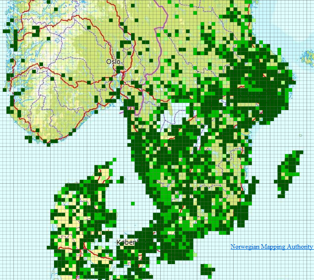

[text-center]
*Figure 2 – Species Distribution of reproducing (nesting) northern lapwing _Vanellus vanellus_ (Linnaeus, 1758, _http://www.eu-nomen.eu/portal/taxon.php?GUID=urn:lsid:marinespecies.org:taxname:159142_ ) in southern Scandinavia in the period 2000-2010 presented as occurrence in 10 km grid cells (ETRS89, zone 33) based on the data specification in Species Distribution. Source: The Norwegian Biodiversity Information Centre and the Norwegian Mapping Authority with data from Artsobservasjoner.no (Norway). Swedish Species Information Centre (SSIC) Artportalen.se and BirdlifeDK (Denmark) Dof-basen.dk*

At this point we have to define that when we talk about "species" throughout this specification the correct scientific term that is addressed is "taxon". It defines a group of organisms that are judged by a taxonomist to belong to a defined class reflecting phylogenetic relationships. Taxa are described at different systematic levels like subspecies, species, genus or family level. These could also be meant when the term "species" is used in this specification. The concept of a "species" is fundamentally, a human expert judgement placed on nature. As a result it is neither definitive nor fixed. Different workers have their own opinions on both where the lines for a particular species concept are defined and what that concept should be called. Although nomenclature defines a set of rules how valid names have to be assigned to these concepts, the concept originally assigned to a name may have or will change over time. Given that a key objective of sharing species distributions through INSPIRE has to be the creation of a single picture consolidated across a range of sources there needs to be a mechanism to deal both with the individual opinions of the data providers and the need to amalgamate the various opinions to a single picture. Recently there has been great progress towards the establishment of a consistent taxonomy across Europe but there is still further work to do before this can be regarded as complete.

There are a range of attributes that can be associated with the species itself such as formal legal status (EU directives, international conventions, national law), redlist status, national responsibility or other interests - these have yet to be coded. While these may be essential for particular applications, such attribution is considered beyond the current data specification.

_Scope_

The scope of this data specification, Species Distribution, includes the full range of distributions outlined above. It specifies choice of a "species" identifier (=scientific name) from one of three widely known EU reference lists. A very basic level of attribution has been included to allow the representation of distribution attributes such as residency status, population size within the spatial unit, data sensitivity (this is a particularly important issue for Species Distribution as some rare species are subject to wildlife crime and so their locations are particularly sensitive), and whether the species has been actively searched for. However, more attribute rich observational data is only linked to. While, as the model is defined, it could be used to represent relatively simple observational data (i.e. where there are no additional attributes recorded) it is not the intention for it to be used in this way. The data specification also has a very basic level of attribution to allow the representation of methodology information about specific instances of a species distribution, including attributes such as the collection method and the method used to derive the distribution, It also explicitly allows for the retention of the original species name and assigned taxonomic concept recognised and used by the data provider.

_Use cases_

The general purposes for the collection of data on species and the modelling of their occurrence and distribution are traditionally considered as follows:

* Scientific research. Needed in order to provide knowledge upon which nature conservation activities can be built;
* Nature conservation. Assignment and management of protected sites, often in response to legal instruments such as Areas of Special Conservation Interest under the Bern Convention. Also, as with protected areas, use of financial instruments such as agri-environment schemes designed to increase nature conservation value in agricultural areas;
* Resource management. Use of legal instruments such as SEA strategic environmental assessment (for policies, plans and programs) and EIA environmental impact assessment (for projects) as well as spatial planning in general; at regional as well as local level
* Policy making. Reporting of EU member states to the EC on the "conservation status" of species, and deriving future policies from this information.

In Species Distribution, 5 specific uses cases are defined for users at different levels (Europe-wide, expert user/regional government including European Commission and European Environment Agency, national or regional or cross-border users). These use cases are as follows: Reporting under Article 17 of the Council Directive 92/43/EEC on the Conservation of natural habitats and of wild fauna and flora; Simple query and view; Expertly query, view, visualize and analyze; Download data; Providing Species Distribution data according to Inspire Directive. These use cases are detailed in Annex B.

*Definition:*

Geographical distribution of occurrence of animal and plant species aggregated by grid, region, administrative unit or other analytical unit.

*Description:*

_Species Distribution_ is a biodiversity theme focused on geographical distribution of occurrence of biological organisms aggregated by grid, region, or any administrative or analytical unit. Distributions may be represented in a wide range of formats, such as points, grid cells at different scales or polygons of specifically defined areas. To achieve harmonization EU-Nomen is the preferred reference list for species (taxon) names to be used, the second choice is European Nature Information System and finally Natura2000.

Entry in the INSPIRE registry: _http://inspire.ec.europa.eu/theme/sd/_

*References*

Council directive 92/43/EEC of 21 may 1992 on the conservation of natural habitats and of wild fauna and flora. _Official Journal of the European Communities, 206_(22), 7.

European Commission, 2006. Assessment, monitoring and reporting under Article 17 of the habitats Directive: explanatory notes & guidelines. Final draft 5, October 2006. European Commission, Brussels.

Wawer, R. and Tirry. D. (2010) NatureSDIplus D3.4 Data Exchange Models. Pilot application schemas for INSPIRE biodiversity themes. Deliverable report.

=== Normative References

[Directive 2007/2/EC] Directive 2007/2/EC of the European Parliament and of the Council of 14 March 2007 establishing an Infrastructure for Spatial Information in the European Union (INSPIRE)

[Directive92/43/EEC] Council Directive 92/43/EEC of 21 May 1992 on the conservation of natural habitats and of wild fauna and flora

[Directive 2008/56/EC] Directive 2008/56/EC of the European Parliament and of the Council of 17 June 2008 establishing a framework for community action in the field of marine environmental policy (Marine Strategy Framework Directive)

[ISO 19105] EN ISO 19105:2000, Geographic information -- Conformance and testing

[ISO 19107] EN ISO 19107:2005, Geographic Information – Spatial Schema

[ISO 19111] EN ISO 19111:2007 Geographic information - Spatial referencing by coordinates (ISO 19111:2007)

[ISO 19115] EN ISO 19115:2005, Geographic information – Metadata (ISO 19115:2003)

[ISO 19118] EN ISO 19118:2006, Geographic information – Encoding (ISO 19118:2005)

[ISO 19119] EN ISO 19119:2005, Geographic information – Services (ISO 19119:2005)

[ISO 19123] EN ISO 19123:2007, Geographic Information – Schema for coverage geometry and functions

[ISO 19125-1] EN ISO 19125-1:2004, Geographic Information – Simple feature access – Part 1: Common architecture

[ISO 19135] EN ISO 19135:2007 Geographic information – Procedures for item registration (ISO 19135:2005)

[ISO 19139] ISO/TS 19139:2007, Geographic information – Metadata – XML schema implementation

[ISO 19157] ISO/DIS 19157, Geographic information – Data quality

[OGC 06-103r4] Implementation Specification for Geographic Information - Simple feature access – Part 1: Common Architecture v1.2.1

NOTE This is an updated version of "EN ISO 19125-1:2004, Geographic information – Simple feature access – Part 1: Common architecture".

[Regulation 1205/2008/EC] Regulation 1205/2008/EC implementing Directive 2007/2/EC of the European Parliament and of the Council as regards metadata

[Regulation 976/2009/EC] Commission Regulation (EC) No 976/2009 of 19 October 2009 implementing Directive 2007/2/EC of the European Parliament and of the Council as regards the Network Services

[Regulation 1089/2010/EC] Commission Regulation (EU) No 1089/2010 of 23 November 2010 implementing Directive 2007/2/EC of the European Parliament and of the Council as regards interoperability of spatial data sets and services

=== Terms and definitions

General terms and definitions helpful for understanding the INSPIRE data specification documents are defined in the INSPIRE Glossaryfootnote:[The INSPIRE Glossary is available from http://inspire-registry.jrc.ec.europa.eu/registers/GLOSSARY].

Specifically, for the theme Species Distribution, the following terms are defined:

*(1) Aggregation*

The grouping of multiple objects into a class or cluster.

*(2) Amalgamation*

The combination of multiple objects in a single structure.

=== Symbols and abbreviations

[width="100%",cols="14%,86%"]
|===
|ATS |Abstract Test Suite
|EC |European Commission
|EEA |European Environmental Agency
|ETRS89 |European Terrestrial Reference System 1989
|ETRS89-LAEA |Lambert Azimuthal Equal Area
|EUNIS |European Nature Information System
|EVRS |European Vertical Reference System
|GCM |General Conceptual Model
|GML |Geography Markup Language
|IR |Implementing Rule
|ISDSS |Interoperability of Spatial Data Sets and Services
|ISO |International Organization for Standardization
|ITRS |International Terrestrial Reference System
|LMO |Legally Mandated Organisation
|SDIC |Spatial Data Interest Community
|TG |Technical Guidance
|UML |Unified Modeling Language
|UTC |Coordinated Universal Time
|XML |EXtensible Markup Language
|===

=== How the Technical Guidelines map to the Implementing Rules

The schematic diagram in Figure 3 gives an overview of the relationships between the INSPIRE legal acts (the INSPIRE Directive and Implementing Rules) and the INSPIRE Technical Guidelines. The INSPIRE Directive and Implementing Rules include legally binding requirements that describe, usually on an abstract level, _what_ Member States must implement.

In contrast, the Technical Guidelines define _how_ Member States might implement the requirements included in the INSPIRE Implementing Rules. As such, they may include non-binding technical requirements that must be satisfied if a Member State data provider chooses to conform to the Technical Guidelines. Implementing these Technical Guidelines will maximise the interoperability of INSPIRE spatial data sets.

image::./media/image8.png[image,width=603,height=375]

[text-center]
*Figure 3 - Relationship between INSPIRE Implementing Rules and Technical Guidelines*

==== Requirements

The purpose of these Technical Guidelines (Data specifications on _Species Distribution_) is to provide practical guidance for implementation that is guided by, and satisfies, the (legally binding) requirements included for the spatial data theme Species Distribution in the Regulation (Implementing Rules) on interoperability of spatial data sets and services. These requirements are highlighted in this document as follows:

[IMPORTANT]
====
[.text-center]
*IR Requirement*
_Article / Annex / Section no._
*Title / Heading*

This style is used for requirements contained in the Implementing Rules on interoperability of spatial data sets and services (Commission Regulation (EU) No 1089/2010).
====

For each of these IR requirements, these Technical Guidelines contain additional explanations and examples.

NOTE The Abstract Test Suite (ATS) in Annex A contains conformance tests that directly check conformance with these IR requirements.

Furthermore, these Technical Guidelines may propose a specific technical implementation for satisfying an IR requirement. In such cases, these Technical Guidelines may contain additional technical requirements that need to be met in order to be conformant with the corresponding IR requirement _when using this proposed implementation_. These technical requirements are highlighted as follows:

[TIP]
====
*TG Requirement X*
This style is used for requirements for a specific technical solution proposed in these Technical Guidelines for an IR requirement.
====

NOTE 1 Conformance of a data set with the TG requirement(s) included in the ATS implies conformance with the corresponding IR requirement(s).

NOTE 2 In addition to the requirements included in the Implementing Rules on interoperability of spatial data sets and services, the INSPIRE Directive includes further legally binding obligations that put additional requirements on data providers. For example, Art. 10(2) requires that Member States shall, where appropriate, decide by mutual consent on the depiction and position of geographical features whose location spans the frontier between two or more Member States. General guidance for how to meet these obligations is provided in the INSPIRE framework documents.

==== Recommendations

In addition to IR and TG requirements, these Technical Guidelines may also include a number of recommendations for facilitating implementation or for further and coherent development of an interoperable infrastructure.

[NOTE]
====
*Recommendation X*
Recommendations are shown using this style.
====

NOTE The implementation of recommendations is not mandatory. Compliance with these Technical Guidelines or the legal obligation does not depend on the fulfilment of the recommendations.

==== Conformance

Annex A includes the abstract test suite for checking conformance with the requirements included in these Technical Guidelines and the corresponding parts of the Implementing Rules (Commission Regulation (EU) No 1089/2010).

<<<
== Specification scopes

This data specification does not distinguish different specification scopes, but just considers one general scope.

NOTE For more information on specification scopes, see [ISO 19131:2007], clause 8 and Annex D.

<<<
== Identification information

These Technical Guidelines are identified by the following URI:

http://inspire.ec.europa.eu/tg/sd/3.0

NOTE ISO 19131 suggests further identification information to be included in this section, e.g. the title, abstract or spatial representation type. The proposed items are already described in the document metadata, executive summary, overview description (section 2) and descriptions of the application schemas (section 5). In order to avoid redundancy, they are not repeated here.

<<<
== Data content and structure

=== Application schemas – Overview 

==== Application schemas included in the IRs

Articles 3, 4 and 5 of the Implementing Rules lay down the requirements for the content and structure of the data sets related to the INSPIRE Annex themes.

[IMPORTANT]
====
[.text-center]
*IR Requirement*
_Article 4_
*Types for the Exchange and Classification of Spatial Objects*

. For the exchange and classification of spatial objects from data sets meeting the conditions laid down in Article 4 of Directive 2007/2/EC, Member States shall use the spatial object types and associated data types, enumerations and code lists that are defined in Annexes II, III and IV for the themes the data sets relate to.

. Spatial object types and data types shall comply with the definitions and constraints and include the attributes and association roles set out in the Annexes.

. The enumerations and code lists used in attributes or association roles of spatial object types or data types shall comply with the definitions and include the values set out in Annex II. The enumeration and code list values are uniquely identified by language-neutral mnemonic codes for computers. The values may also include a language-specific name to be used for human interaction.
====

The types to be used for the exchange and classification of spatial objects from data sets related to the spatial data theme Species Distribution are defined in the following application schema (see section 5.3):

* SpeciesDistribution application schema

The application schemas specify requirements on the properties of each spatial object including its multiplicity, domain of valid values, constraints, etc.

NOTE The application schemas presented in this section contain some additional information that is not included in the Implementing Rules, in particular multiplicities of attributes and association roles.

[TIP]
====
*TG Requirement 1*
Spatial object types and data types shall comply with the multiplicities defined for the attributes and association roles in this section.
====

An application schema may include references (e.g. in attributes or inheritance relationships) to common types or types defined in other spatial data themes. These types can be found in a sub-section called "Imported Types" at the end of each application schema section. The common types referred to from application schemas included in the IRs are addressed in Article 3.

[IMPORTANT]
====
[.text-center]
*IR Requirement*
_Article 3_
*Common Types*

Types that are common to several of the themes listed in Annexes I, II and III to Directive 2007/2/EC shall conform to the definitions and constraints and include the attributes and association roles set out in Annex I.
====

NOTE Since the IRs contain the types for all INSPIRE spatial data themes in one document, Article 3 does not explicitly refer to types defined in other spatial data themes, but only to types defined in external data models.

Common types are described in detail in the Generic Conceptual Model [DS-D2.7], in the relevant international standards (e.g. of the ISO 19100 series) or in the documents on the common INSPIRE models [DS-D2.10.x]. For detailed descriptions of types defined in other spatial data themes, see the corresponding Data Specification TG document [DS-D2.8.x].

==== Additional recommended application schemas 

In addition to the application schema listed above, the following additional application schema has been defined for the theme _Species Distribution_ (see section 5.4):

* SpeciesDistributionExtension application schema

These additional application schemas are not included in the IRs. They typically address requirements from specific (groups of) use cases and/or may be used to provide additional information. They are included in this specification in order to improve interoperability also for these additional aspects and to illustrate the extensibility of the application schemas included in the IRs.

[NOTE]
====
*Recommendation 1*

Additional and/or use case-specific information related to the theme _Species Distribution_ should be made available using the spatial object types and data types specified in the following application schema: SpeciesDistributionExtension.

These spatial object types and data types should comply with the definitions and constraints and include the attributes and association roles defined in this section.

The enumerations and code lists used in attributes or association roles of spatial object types or data types should comply with the definitions and include the values defined in this section.
====

=== Basic notions

This section explains some of the basic notions used in the INSPIRE application schemas. These explanations are based on the GCM [DS-D2.5].

==== Notation

===== Unified Modeling Language (UML)

The application schemas included in this section are specified in UML, version 2.1. The spatial object types, their properties and associated types are shown in UML class diagrams.

NOTE For an overview of the UML notation, see Annex D in [ISO 19103].

The use of a common conceptual schema language (i.e. UML) allows for an automated processing of application schemas and the encoding, querying and updating of data based on the application schema – across different themes and different levels of detail.

The following important rules related to class inheritance and abstract classes are included in the IRs.

[IMPORTANT]
====
[.text-center]
*IR Requirement*
_Article 5_
*Types*

(...)

[arabic, start=2]
. Types that are a sub-type of another type shall also include all this type's attributes and association roles.
. Abstract types shall not be instantiated.
====

The use of UML conforms to ISO 19109 8.3 and ISO/TS 19103 with the exception that UML 2.1 instead of ISO/IEC 19501 is being used. The use of UML also conforms to ISO 19136 E.2.1.1.1-E.2.1.1.4.

NOTE ISO/TS 19103 and ISO 19109 specify a profile of UML to be used in conjunction with the ISO 19100 series. This includes in particular a list of stereotypes and basic types to be used in application schemas. ISO 19136 specifies a more restricted UML profile that allows for a direct encoding in XML Schema for data transfer purposes.

To model constraints on the spatial object types and their properties, in particular to express data/data set consistency rules, OCL (Object Constraint Language) is used as described in ISO/TS 19103, whenever possible. In addition, all constraints are described in the feature catalogue in English, too.

NOTE Since "void" is not a concept supported by OCL, OCL constraints cannot include expressions to test whether a value is a _void_ value. Such constraints may only be expressed in natural language.

===== Stereotypes

In the application schemas in this section several stereotypes are used that have been defined as part of a UML profile for use in INSPIRE [DS-D2.5]. These are explained in Table 1 below.

[text-center]
*Table 1 – Stereotypes (adapted from [DS-D2.5])*

[cols=",,",]
|===
|*Stereotype* |*Model element* |*Description*
|applicationSchema |Package |An INSPIRE application schema according to ISO 19109 and the Generic Conceptual Model.
|leaf |Package |A package that is not an application schema and contains no packages.
|featureType |Class |A spatial object type.
|type |Class |A type that is not directly instantiable, but is used as an abstract collection of operation, attribute and relation signatures. This stereotype should usually not be used in INSPIRE application schemas as these are on a different conceptual level than classifiers with this stereotype.
|dataType |Class |A structured data type without identity.
|union |Class |A structured data type without identity where exactly one of the properties of the type is present in any instance.
|enumeration |Class |An enumeration.
|codeList |Class |A code list.
|import |Dependency |The model elements of the supplier package are imported.
|voidable |Attribute, association role |A voidable attribute or association role (see section 5.2.2).
|lifeCycleInfo |Attribute, association role |If in an application schema a property is considered to be part of the life-cycle information of a spatial object type, the property shall receive this stereotype.
|version |Association role |If in an application schema an association role ends at a spatial object type, this stereotype denotes that the value of the property is meant to be a specific version of the spatial object, not the spatial object in general.
|===

==== Voidable characteristics

The «voidable» stereotype is used to characterise those properties of a spatial object that may not be present in some spatial data sets, even though they may be present or applicable in the real world. This does _not_ mean that it is optional to provide a value for those properties.

For all properties defined for a spatial object, a value has to be provided – either the corresponding value (if available in the data set maintained by the data provider) or the value of _void._ A _void_ value shall imply that no corresponding value is contained in the source spatial data set maintained by the data provider or no corresponding value can be derived from existing values at reasonable costs.

[NOTE]
====
*Recommendation 2*
The reason for a _void_ value should be provided where possible using a listed value from the VoidReasonValue code list to indicate the reason for the missing value.
====

The VoidReasonValue type is a code list, which includes the following pre-defined values:

* _Unpopulated_: The property is not part of the dataset maintained by the data provider. However, the characteristic may exist in the real world. For example when the "elevation of the water body above the sea level" has not been included in a dataset containing lake spatial objects, then the reason for a void value of this property would be 'Unpopulated'. The property receives this value for all spatial objects in the spatial data set.
* _Unknown_: The correct value for the specific spatial object is not known to, and not computable by the data provider. However, a correct value may exist. For example when the "elevation of the water body above the sea level" _of a certain lake_ has not been measured, then the reason for a void value of this property would be 'Unknown'. This value is applied only to those spatial objects where the property in question is not known.
* _Withheld_: The characteristic may exist, but is confidential and not divulged by the data provider.

NOTE It is possible that additional reasons will be identified in the future, in particular to support reasons / special values in coverage ranges.

The «voidable» stereotype does not give any information on whether or not a characteristic exists in the real world. This is expressed using the multiplicity:

* If a characteristic may or may not exist in the real world, its minimum cardinality shall be defined as 0. For example, if an Address may or may not have a house number, the multiplicity of the corresponding property shall be 0..1.
* If at least one value for a certain characteristic exists in the real world, the minimum cardinality shall be defined as 1. For example, if an Administrative Unit always has at least one name, the multiplicity of the corresponding property shall be 1..*.

In both cases, the «voidable» stereotype can be applied. In cases where the minimum multiplicity is 0, the absence of a value indicates that it is known that no value exists, whereas a value of void indicates that it is not known whether a value exists or not.

EXAMPLE If an address does not have a house number, the corresponding Address object should not have any value for the «voidable» attribute house number. If the house number is simply not known or not populated in the data set, the Address object should receive a value of _void_ (with the corresponding void reason) for the house number attribute.

==== Enumerations

Enumerations are modelled as classes in the application schemas. Their values are modelled as attributes of the enumeration class using the following modelling style:

* No initial value, but only the attribute name part, is used.
* The attribute name conforms to the rules for attributes names, i.e. is a lowerCamelCase name. Exceptions are words that consist of all uppercase letters (acronyms).

[IMPORTANT]
====
[.text-center]
*IR Requirement*
_Article 6_
*Code Lists and Enumerations*

(...)

[arabic, start=5]
. Attributes or association roles of spatial object types or data types that have an enumeration type may only take values from the lists specified for the enumeration type."
====

==== Code lists

Code lists are modelled as classes in the application schemas. Their values, however, are managed outside of the application schema.

===== Code list types

The IRs distinguish the following types of code lists.

[IMPORTANT]
====
[text-center]
*IR Requirement*
_Article 6_
*Code Lists and Enumerations*

[arabci, start=1]
. Code lists shall be of one of the following types, as specified in the Annexes:
[loweralpha]
.. code lists whose allowed values comprise only the values specified in this Regulation;

.. code lists whose allowed values comprise the values specified in this Regulation and narrower values defined by data providers;

.. code lists whose allowed values comprise the values specified in this Regulation and additional values at any level defined by data providers;

.. code lists, whose allowed values comprise any values defined by data providers.

For the purposes of points (b), (c) and (d), in addition to the allowed values, data providers may use the values specified in the relevant INSPIRE Technical Guidance document available on the INSPIRE web site of the Joint Research Centre.
====

The type of code list is represented in the UML model through the tagged value _extensibility_, which can take the following values:

* _none_, representing code lists whose allowed values comprise only the values specified in the IRs (type a);
* _narrower_, representing code lists whose allowed values comprise the values specified in the IRs and narrower values defined by data providers (type b);
* _open_, representing code lists whose allowed values comprise the values specified in the IRs and additional values at any level defined by data providers (type c); and
* _any_, representing code lists, for which the IRs do not specify any allowed values, i.e. whose allowed values comprise any values defined by data providers (type d).

[NOTE]
====
*Recommendation 3*
Additional values defined by data providers should not replace or redefine any value already specified in the IRs.
====

NOTE This data specification may specify recommended values for some of the code lists of type (b), (c) and (d) (see section 5.2.4.3). These recommended values are specified in a dedicated Annex.

In addition, code lists can be hierarchical, as explained in Article 6(2) of the IRs.

[IMPORTANT]
====
[.text-center]
*IR Requirement*
_Article 6_
*Code Lists and Enumerations*

(...)

[arabic, start=2]
. Code lists may be hierarchical. Values of hierarchical code lists may have a more generic parent value. Where the valid values of a hierarchical code list are specified in a table in this Regulation, the parent values are listed in the last column.
====

The type of code list and whether it is hierarchical or not is also indicated in the feature catalogues.

===== Obligations on data providers

[IMPORTANT]
====
[.text-center]
*IR Requirement*
_Article 6_
*Code Lists and Enumerations*

(....)

[arabic, start=3]
. Where, for an attribute whose type is a code list as referred to in points (b), (c) or (d) of paragraph 1, a data provider provides a value that is not specified in this Regulation, that value and its definition shall be made available in a register.

. Attributes or association roles of spatial object types or data types whose type is a code list may only take values that are allowed according to the specification of the code list.
====

Article 6(4) obliges data providers to use only values that are allowed according to the specification of the code list. The "allowed values according to the specification of the code list" are the values explicitly defined in the IRs plus (in the case of code lists of type (b), (c) and (d)) additional values defined by data providers.

For attributes whose type is a code list of type (b), (c) or (d) data providers may use additional values that are not defined in the IRs. Article 6(3) requires that such additional values and their definition be made available in a register. This enables users of the data to look up the meaning of the additional values used in a data set, and also facilitates the re-use of additional values by other data providers (potentially across Member States).

NOTE Guidelines for setting up registers for additional values and how to register additional values in these registers is still an open discussion point between Member States and the Commission.

===== Recommended code list values

For code lists of type (b), (c) and (d), this data specification may propose additional values as a recommendation (in a dedicated Annex). These values will be included in the INSPIRE code list register. This will facilitate and encourage the usage of the recommended values by data providers since the obligation to make additional values defined by data providers available in a register (see section 5.2.4.2) is already met.

[NOTE]
====
*Recommendation 4*
Where these Technical Guidelines recommend values for a code list in addition to those specified in the IRs, these values should be used.
====

NOTE For some code lists of type (d), no values may be specified in these Technical Guidelines. In these cases, any additional value defined by data providers may be used.

===== Governance

The following two types of code lists are distinguished in INSPIRE:

* _Code lists that are governed by INSPIRE (INSPIRE-governed code lists)._ These code lists will be managed centrally in the INSPIRE code list register. Change requests to these code lists (e.g. to add, deprecate or supersede values) are processed and decided upon using the INSPIRE code list register's maintenance workflows.
+
INSPIRE-governed code lists will be made available in the INSPIRE code list register at __http://inspire.ec.europa.eu/codelist/<CodeListName__>. They will be available in SKOS/RDF, XML and HTML. The maintenance will follow the procedures defined in ISO 19135. This means that the only allowed changes to a code list are the addition, deprecation or supersession of values, i.e. no value will ever be deleted, but only receive different statuses (valid, deprecated, superseded). Identifiers for values of INSPIRE-governed code lists are constructed using the pattern __http://inspire.ec.europa.eu/codelist/<CodeListName__>/<value>.

* _Code lists that are governed by an organisation outside of INSPIRE (externally governed code lists)._ These code lists are managed by an organisation outside of INSPIRE, e.g. the World Meteorological Organization (WMO) or the World Health Organization (WHO). Change requests to these code lists follow the maintenance workflows defined by the maintaining organisations. Note that in some cases, no such workflows may be formally defined.
+
Since the updates of externally governed code lists is outside the control of INSPIRE, the IRs and these Technical Guidelines reference a specific version for such code lists.
+
The tables describing externally governed code lists in this section contain the following columns:

** The _Governance_ column describes the external organisation that is responsible for maintaining the code list.

** The _Source_ column specifies a citation for the authoritative source for the values of the code list. For code lists, whose values are mandated in the IRs, this citation should include the version of the code list used in INSPIRE. The version can be specified using a version number or the publication date. For code list values recommended in these Technical Guidelines, the citation may refer to the "latest available version".

** In some cases, for INSPIRE only a subset of an externally governed code list is relevant. The subset is specified using the _Subset_ column.

** The _Availability_ column specifies from where (e.g. URL) the values of the externally governed code list are available, and in which formats. Formats can include machine-readable (e.g. SKOS/RDF, XML) or human-readable (e.g. HTML, PDF) ones.

+
Code list values are encoded using http URIs and labels. Rules for generating these URIs and labels are specified in a separate table.

[NOTE]
====
*Recommendation 5*
The http URIs and labels used for encoding code list values should be taken from the INSPIRE code list registry for INSPIRE-governed code lists and generated according to the relevant rules specified for externally governed code lists.
====

NOTE Where practicable, the INSPIRE code list register could also provide http URIs and labels for externally governed code lists.

===== Vocabulary

For each code list, a tagged value called "vocabulary" is specified to define a URI identifying the values of the code list. For INSPIRE-governed code lists and externally governed code lists that do not have a persistent identifier, the URI is constructed following the pattern _http://inspire.ec.europa.eu/codelist/<UpperCamelCaseName>_.

If the value is missing or empty, this indicates an empty code list. If no sub-classes are defined for this empty code list, this means that any code list may be used that meets the given definition.

An empty code list may also be used as a super-class for a number of specific code lists whose values may be used to specify the attribute value. If the sub-classes specified in the model represent all valid extensions to the empty code list, the subtyping relationship is qualified with the standard UML constraint "\{complete,disjoint}".

==== Identifier management

[IMPORTANT]
====
[.text-center]
*IR Requirement*
_Article 9_
*Identifier Management*

. The data type Identifier defined in Section 2.1 of Annex I shall be used as a type for the external object identifier of a spatial object.

. The external object identifier for the unique identification of spatial objects shall not be changed during the life-cycle of a spatial object.
====

NOTE 1 An external object identifier is a unique object identifier which is published by the responsible body, which may be used by external applications to reference the spatial object. [DS-D2.5]

NOTE 2 Article 9(1) is implemented in each application schema by including the attribute _inspireId_ of type Identifier.

NOTE 3 Article 9(2) is ensured if the _namespace_ and _localId_ attributes of the Identifier remains the same for different versions of a spatial object; the _version_ attribute can of course change.

==== Geometry representation

[IMPORTANT]
====
[.text-center]
*IR Requirement*
_Article 12_
*Other Requirements & Rules*

. The value domain of spatial properties defined in this Regulation shall be restricted to the Simple Feature spatial schema as defined in Herring, John R. (ed.), OpenGIS® Implementation Standard for Geographic information – Simple feature access – Part 1: Common architecture, version 1.2.1, Open Geospatial Consortium, 2011, unless specified otherwise for a specific spatial data theme or type.
====

NOTE 1 The specification restricts the spatial schema to 0-, 1-, 2-, and 2.5-dimensional geometries where all curve interpolations are linear and surface interpolations are performed by triangles.

NOTE 2 The topological relations of two spatial objects based on their specific geometry and topology properties can in principle be investigated by invoking the operations of the types defined in ISO 19107 (or the methods specified in EN ISO 19125-1).

==== Temporality representation

The application schema(s) use(s) the derived attributes "beginLifespanVersion" and "endLifespanVersion" to record the lifespan of a spatial object.

The attributes "beginLifespanVersion" specifies the date and time at which this version of the spatial object was inserted or changed in the spatial data set. The attribute "endLifespanVersion" specifies the date and time at which this version of the spatial object was superseded or retired in the spatial data set.

NOTE 1 The attributes specify the beginning of the lifespan of the version in the spatial data set itself, which is different from the temporal characteristics of the real-world phenomenon described by the spatial object. This lifespan information, if available, supports mainly two requirements: First, knowledge about the spatial data set content at a specific time; second, knowledge about changes to a data set in a specific time frame. The lifespan information should be as detailed as in the data set (i.e., if the lifespan information in the data set includes seconds, the seconds should be represented in data published in INSPIRE) and include time zone information.

NOTE 2 Changes to the attribute "endLifespanVersion" does not trigger a change in the attribute "beginLifespanVersion".

[IMPORTANT]
====
[.text-center]
*IR Requirement*
_Article 10_
*Life-cycle of Spatial Objects*

(...)

[arabic, start=3]
. Where the attributes beginLifespanVersion and endLifespanVersion are used, the value of endLifespanVersion shall not be before the value of beginLifespanVersion.
====

NOTE The requirement expressed in the IR Requirement above will be included as constraints in the UML data models of all themes.

[NOTE]
====
*Recommendation 6*
If life-cycle information is not maintained as part of the spatial data set, all spatial objects belonging to this data set should provide a void value with a reason of "unpopulated".
====

=== Application schema SpeciesDistribution

==== Description

===== Narrative description

Species are distributed in the 'real world' according to their ecological requirements and behaviour. There exists a multitude of approaches and methodologies both for collecting data on species observations and actually deriving the species distribution from these observations. The intention of this data specification is to create a generic application schema that can be broadly used to enable maximum data distribution between various data sources. Nevertheless, due to the heterogeneity of species distribution concepts i.e. different approaches, methodologies, definitions and terms and resulting data sources, it can be expected that not all species distribution datasets can be mapped against the proposed application schema. The application schema "SpeciesDistribution" as described here has been developed according the Rules for application schemas defined in ISO 19109, and can be considered as an instrument for generating pan-European representations of species distributions.

The spatial object type *_SpeciesDistributionDataSet_* represents collections of instances of the species distribution units defined by the spatial object type *_SpeciesDistributionUnit._*.A *_SpeciesDistributionDataSet_* can have a domain extent, a life span for a version and name as voidable attributes. The *_SpeciesDistributionUnit_* shall be used in order to present species distribution data aggregated over grid cells or areas of any other analytical unit with geometry (like e.g. administrative areas) and over periods of time where occurences have been recorded. The species distribution units carry information on the identity of a species occurring and information about life cycle of the data object. Furthermore, the data type *_DistributionInfoType_* provides information about the occurrence category or population size, the residency status and information on the sensitiveness i.e. whether the combination of location and species in a specific case is sensitive for nature protection purposes.

In order to reduce underlying interoperability problems related to the naming and classifications of species, the spatial object type *_SpeciesDistributionUnit_* has been designed to use a persistent reference to a well-defined species name via an ID coming from major, widely recognised reference lists (currently Eu-Nomen, EUNIS and Natura2000) and provide a mapping from a local species name to a reference species name.

Finally, it should also be noted that although links exist between the "Species Distribution" application schema and the Annex I Protected Sites theme, the Annex III themes Habitats and Biotopes, and the Bio-geographical Regions, no explicit associations are necessary from "Species Distribution" application schema to spatial objects in these themes.

===== UML Overview

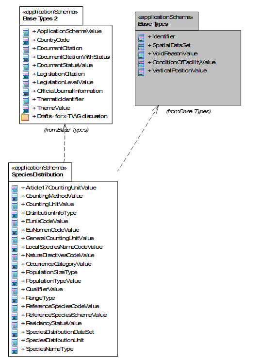

[text-center]
*Figure 4 – UML package diagram: Overview of the SpeciesDistribution application schema package dependencies*

An overview of the SpeciesDistribution application schema and referenced packages is depicted in Figure 4. The diagram shows the relations between the Species Distribution package and packages defined in the INSPIRE General Conceptual Model (GCM): Base Types and Base Types 2.

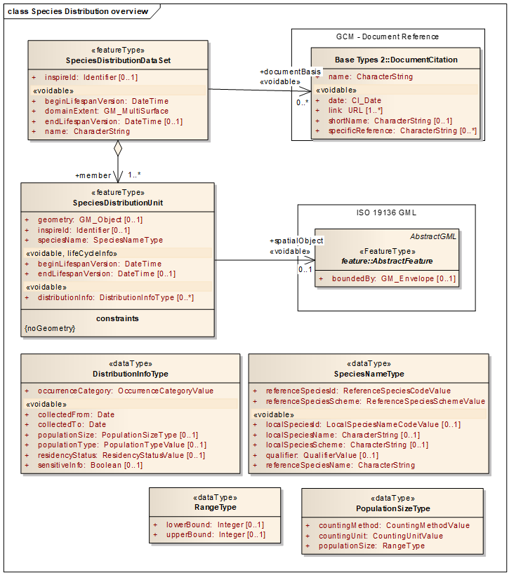

[text-center]
*Figure 5 – UML class diagram: Overview of the SpeciesDistribution application schema*

The main spatial object type for the Species Distribution theme is the *_SpeciesDistributionUnit_*. Information on occurrences of species is aggregated within this spatial object type. The *_SpeciesDistributionDataSet_* spatial object specifies a dataset containing _*SpeciesDistributionUnits*._

NOTE The *_SpeciesDistributionDataSet_* is a predefined data set which contains specific metadata about the extent (more detailed extent information than the discovery level metadata element on extent), name and documentation details e.g. for which legal purpose the data set has been generated.

Several code lists are being referenced, an overview of them is seen in Figure 6

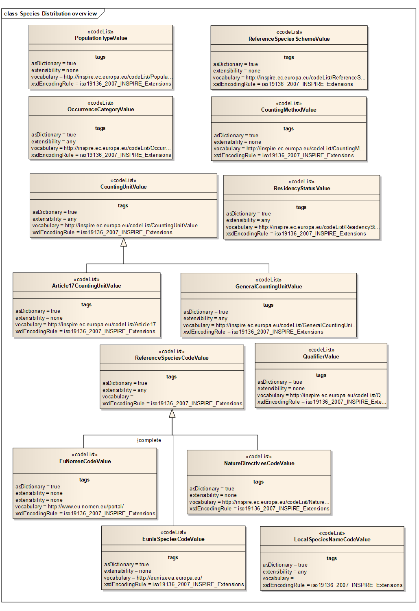 

[text-center]
*Figure 6 – Code lists in SpeciesDistribution application schema.*

As species distribution data is often used for reporting according to legal (or other) obligations, a possibility to include a link to legal documents or other documentation is provided via the association _documentBasis_ from the *_SpeciesDistributionDataSet_* to the spatial object *_DocumentCitation_* defined in the "Base Type 2" application schema (Generic Conceptual Model). This spatial object type can provide information on document details.

The INSPIRE Directive defines Species Distribution as "distribution of occurrence", not 'raw' field observation data. Therefore it is important to emphasize that information on the location of individual observations is not the main focus of this specification. However, in the use cases for local authorities or for scientific use, access to the primary data sources is purposive. As information on Species Distribution is most likely aggregated using grids or polygons, even polygons from other themes (e.g. administrative, statistical, bio-geographical or other analytical units), there is a possibility to link to an abstract feature (*_AbstractFeature_*) via the association _spatialObject_. This feature can represent any kind of spatial object (see details in Section 5.3.1.5.).

NOTE 1 The Grid_ETRS89-LAEA is hierarchical, with resolutions of 1m, 10m, 100m, 1 000m, 10 000m and 100 000m. The grid orientation is south-north, west-east.

NOTE 2 This requirement does not restrict distribution of datasets based on grids defined in other reference systems.

Each *_SpeciesDistributionUnit_* has a complex attribute _speciesName_ which contains 2 mandatory attributes _referenceSpeciesId_ and _referenceSpeciesScheme_ that provide information on respectively the classification value and the classification scheme that is applicable to the instance according the proposed scheme. The value for referring to the species concerned shall be a unique ID. The name can be added as a voidable attribute. Many different classification systems exist at different levels; the current application schema includes the classification scheme and species IDs of 3 well-known and recognised European Classification systems.

The three well-known and recognised European Classification systems are EU-Nomen, EUNIS and Natura2000. In these sources harmonized species GUIDs and names are maintained by institutions with an assignment outside INSPIRE and the species names are to be retrieved through download services using GUIDs.

* EU-NOMEN
+
The EU-Nomen portal enables the correct use of species names and their classification, to more accurately manage information on animals and plants. This is the first all-taxa inventory for European species. (Source: EU-Nomen website).
+
The portal is one of the outcomes of the PESI (Pan-European Species Directories Infrastructure) project. The objective of this project was to integrate and secure taxonomically authoritative species name registers that underpin the management of biodiversity in Europe. PESI will integrate the three main all-taxon registers in Europe, namely the _European Register of Marine Species_, _Fauna Europaea_, and _EuroMed PlantBase_ in coordination with EU based nomenclatures and the network of EU based Global Species Databases. (Source: PESI website)

* EUNIS
+
EUNIS data are collected and maintained by the _European Topic Centre on Biological Diversity_ for the _European Environment Agency_ and the _European Environmental Information Observation Network_ to be used for environmental reporting and for assistance to the NATURA2000 process (EU Birds and Habitats Directives) and coordinated to the related EMERALD Network of the Bern Convention.
+
The Species part of EUNIS contains information about more than 275 000 taxa occuring in Europe. However, the amount of information collected on each species varies in accordance with the potential use of the data. (Source: EEA EUNIS website)

* NATURA2000
+
Natura 2000 is a European network of important ecological sites under the Birds Directive and Habitats Directive and has the aim of conserving biodiversity on land and at sea by protecting the most seriously threatened habitats and species across Europe. This legislation is called the Habitats Directive (adopted in 1992) and complements the Birds Directive adopted in 1979. Within the legislation special attention is paid to two groups of species. The first consists of fauna species listed in Annex II to the Habitats Directive. These include a number of marine mammals and certain fish. Secondly, various sea birds are also very important to the Natura 2000 network. These are protected under the Birds Directive, and their prevalence, population size and distribution are criteria for the nomination of Special Protection Areas (SPAs) that form part of Natura 2000.

If, at a later stage, significant requirements emerge, changes to these classification schemes can be made, following the normal procedure for extending INSPIRE codelists and thus, cannot be done by Member States alone.

[NOTE]
====
*Recommendation 7*
EU-Nomen is the preferred reference list to be used. If a taxon is listed in EU-Nomen, this reference must be used as first choice. If it is not listed in EU-Nomen, the second choice is EUNIS, if not in EUNIS, Natura2000 can be used.
====

NOTE EUNIS and Natura2000 taxa are to a large extent included in EU-Nomen. The aim of EU-Nomen is to cover all European taxa.

In addition *_SpeciesNameType_* has additional attributes. One is _localSpeciesId_ which is a URL to a scientific name (and author) used in national nomenclature and with an indication of the _localSpeciesScheme_, which defines the local taxonomic concept. The name string can be added as a voidable attribute. Additionally the voidable _qualifierValue_ within the *_SpeciesNameType_* can be used to define the relationship between the local taxonomic concept and the concept defined by the _referenceSpeciesScheme_.

[NOTE]
====
*Recommendation 8*
If _localSpeciesScheme_ is identical to the _referenceSpeciesScheme_, _localSpeciesId_, _localSpeciesScheme, localSpeciesName_ and _qualifierValue_ can be unpopulated.
====

The spatial object type *_SpeciesDistributionUnit_*, is attributed with a voidable attribute _distributionInfo_ which allows the description of more details on the distribution information belonging to a single distribution unit. The *_DistributionInfoType_* data type contains several attributes which are of importance for user interpretation of a *_SpeciesDistributionUnit_* object. It is a data type with a multiplicity of [0..*]. For example for the group of "Birds" there can be _distributionInfo_ for the resident population but at the same time _distributionInfo_ can be reported for the staging (_naturallyImpermanent_) population. The _distributionInfo_ attribute should be used very carefully as it also implicitly contains information on the presence or absence of a species, as detailed in the requirements below.

[IMPORTANT]
====
[.text-center]
*IR Requirement*
_Annex IV, Section 18.5_
*Theme-specific Requirements*

. For SpeciesDistributionUnit spatial objects,
[loweralpha]
.. if a species has not been actively searched for, the distributionInfo attribute shall be void with reason "unknown",
.. and if a species has been actively searched for, but has not been found, the value of the attribute occurenceCategory of DistributionInfoType shall be "absent".
====

Figure below depicts the three different scenarios.

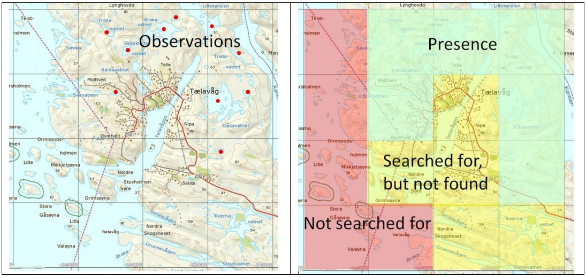

[text-center]
*Figure 7 – Example of presence/absence in 1x1 km grid cells aggregated from observations.*

The *_DistributionInfo_* dataType includes the following attributes:

* _OccurrenceCategory_ refers to a code list (_*OccurrenceCategoryValue*)_ of presence categories or abundance classes
* _populationSize_ has a data type (*_PopulationSizeType_*) consisting of _countingMethod_, _countingUnit_ and _populationSize._ It can be used as additional information to the occurrence category.
** _countingMethod_: The code list *_CountingMethodValue_* defines parameters with quality categories of population size countings or estimates.
** _countingUnit:_ The code list *_CountingUnitValues_* can represent either an *_Article17CountingUnitValue_* code list or a *_GeneralCountingUnitValue_* code list. These code lists define values for what has been counted.
** _populationSize_ has data type *_RangeType_*, which is indicating the counted or estimated population sizes using upper and lower bounds.
* _residencyStatus_: Category of the residency status of the occurrences They deal with information about nativeness and permancy of the occurrences. The values are defined by the *_ResidencyStatusValue_* codelist.
* _sensitiveInfo:_ Boolean value that indicates whether the location of a specific species is sensitive. This can be used to filter out or generalize sensitive data.
* _populationType:_ The code list *_PopulationTypeValue_* defines population permanency according to categories defined by the EEA. In the official document a recommendation is being made that for plants and non-migratory species the attribute value 'permanent' should be chosen.
* _collectedFrom:_ A date indicating when collection of observation data has been initiated in a specific unit.
* _collectedTo:_ A date indicating when collection of observation data has ended in a specific unit.

The Feature Catalogue for SpeciesDistribution provides a complete list of the features, their attributes and code lists.

===== Consistency between spatial data sets

There are no other consistency rules than those defined within the application schema. No consistency rules between Species Distribution and other spatial datasets have been identified.

===== Identifier management

No spatial object has a mandatory identifier attribute specified. _*SpeciesDistributionUnit* and *SpeciesDistributionDataSet*_ have an identifier with multiplicity 0..1. If the identifier is provided it shall consist of two parts: the namespace and a local id (see also the Generic Conceptual Model [DS-D2.5]).

===== Modelling of object references

Since each distribution unit may be spatially represented by another spatial object, e.g., an administrative unit or a protected site, there is a possibility to link to other spatial objects via an external object reference. This link can be encoded either as inline features or as object references (Xlinks). The external object references is made from the spatial object *_SpeciesDistributionUnit_* to the *_AbstractFeature_* from ISO 19136 (GML). This feature can represent any kind of spatial object.

NOTE External references to other spatial objects are complicated to maintain and to ensure are up to date. Furthermore, there is a challenge in the resolving of the object references when downloading spatial objects.

[NOTE]
====
*Recommendation 9*
It is recommended to derive the geometry from another spatial object and represent it using the _geometry_ attribute of *_SpeciesDistributionUnit._*
====

NOTE This means that the geometry attribute contains a "copy" of the geometry from another spatial object and, thus, would also have to be maintained.

Another object reference is for the document basis (_documentBasis_). This is used to document either a legal act or any kind of documentation of the reason for creating a data set. This link can be encoded either inline as object references (Xlinks).

==== Feature catalogue

*Feature catalogue metadata*

[cols=","]
|===
|Application Schema |INSPIRE Application Schema SpeciesDistribution
|Version number |3.0
|===

*Types defined in the feature catalogue*

[cols=",,",options="header",]
|===
|*Type* |*Package* |*Stereotypes*
|_Article17CountingUnitValue_ |SpeciesDistribution |«codelist»
|_CountingMethodValue_ |SpeciesDistribution |«codelist»
|_CountingUnitValue_ |SpeciesDistribution |«codelist»
|_DistributionInfoType_ |SpeciesDistribution |«dataType»
|_EuNomenCodeValue_ |SpeciesDistribution |«codelist»
|_EunisSpeciesCodeValue_ |SpeciesDistribution |«codelist»
|_GeneralCountingUnitValue_ |SpeciesDistribution |«codelist»
|_LocalSpeciesNameCodeValue_ |SpeciesDistribution |«codelist»
|_NatureDirectivesCodeValue_ |SpeciesDistribution |«codelist»
|_OccurrenceCategoryValue_ |SpeciesDistribution |«codelist»
|_PopulationSizeType_ |SpeciesDistribution |«dataType»
|_PopulationTypeValue_ |SpeciesDistribution |«codelist»
|_QualifierValue_ |SpeciesDistribution |«codelist»
|_RangeType_ |SpeciesDistribution |«dataType»
|_ReferenceSpeciesCodeValue_ |SpeciesDistribution |«codelist»
|_ReferenceSpeciesSchemeValue_ |SpeciesDistribution |«codelist»
|_ResidencyStatusValue_ |SpeciesDistribution |«codelist»
|_SpeciesDistributionDataSet_ |SpeciesDistribution |«featureType»
|_SpeciesDistributionUnit_ |SpeciesDistribution |«featureType»
|_SpeciesNameType_ |SpeciesDistribution |«dataType»
|===

===== Spatial object types

====== _SpeciesDistributionDataSet_

[cols="",options="header",]
|===
|*SpeciesDistributionDataSet*
a|
[cols=","]
!===
!Name: !species distribution data set
!Definition: !This data set is a collection of individual spatial objects (units) in a distribution of species.
!Description: !Collection of individual spatial objects of allowed geometry where a species occurs.
!Stereotypes: !«featureType»
!===

a|
*Attribute: inspireId*

[cols=","]
!===
!Name: !inspire id
!Value type: !Identifier
!Definition: !External object identifier of the spatial object.
!Description: !An external object identifier is a unique object identifier published by the responsible body, which may be used by external applications to reference the spatial object. The identifier is an identifier of the spatial object, not an identifier of the real-world phenomenon.
!Multiplicity: !0..1
!===

a|
*Attribute: name*

[cols=","]
!===
!Name: !name
!Value type: !CharacterString
!Definition: !Name of a specific data set provided for Species Distribution.
!Description: !A short descriptive identification name for a specific dataset provided by an institution. 
EXAMPLE 1 Redlisted_species_Norway 
EXAMPLE 2 Invasive_alien_species_ Ireland 
EXAMPLE 3 Articles17_report_Germany
!Multiplicity: !1
!Stereotypes: !«voidable»
!===

a|
*Attribute: domainExtent*

[cols=","]
!===
!Name: !domain extent
!Value type: !GM_MultiSurface
!Definition: !The geographic extent of the domain of the feature collection.
!Multiplicity: !1
!Stereotypes: !«voidable»
!===

a|
*Attribute: beginLifespanVersion*

[cols=","]
!===
!Name: !begin lifespan version
!Value type: !DateTime
!Definition: !Date and time at which this version of the spatial object was inserted or changed in the spatial data set.
!Description: !NOTE This date is recorded to enable the generation of change only update files.
!Multiplicity: !1
!Stereotypes: !«voidable»
!===

a|
*Attribute: endLifespanVersion*

[cols=","]
!===
!Name: !begin lifespan version
!Value type: !DateTime
!Definition: !Date and time at which this version of the spatial object was superseded or retired in the spatial data set.
!Description: !NOTE This date is recorded to enable the generation of change only update files.
!Multiplicity: !0..1
!Stereotypes: !«voidable»
!===

a|
*Association role: member*

[cols=","]
!===
!Name: !member
!Value type: !SpeciesDistributionUnit
!Definition: !Individual spatial objects in a collection of spatial objects.
!Description: !Individual spatial objects of allowed geometry where a species occurs.
!Multiplicity: !1..*
!===

a|
*Association role: documentBasis*

[cols=","]
!===
!Name: !documentBasis
!Value type: !DocumentCitation
!Definition: !Reference to or citation of a document describing a campaign or a legal act which is the basis for the data set.
!Multiplicity: !0..*
!Stereotypes: !«voidable»
!===

|===

====== _SpeciesDistributionUnit_

[cols="",options="header",]
|===
|*SpeciesDistributionUnit*
a|
[cols=","]
!===
!Name: !species distribution unit
!Definition: !Occurrence of animal and plant species aggregated by grid, region, administrative unit or other analytical unit.
!Description: !Pan-European, national or local mapping initiatives, resulting in spatial data for species in terrestrial and marine environments, e.g. for birds, insects, mammals, amphibians, reptiles, fish or vascular plants. 
 
NOTE 1 Only species are mentioned in the INSPIRE definition. But earlier INSPIRE documents (INPIRE IMS, 2003) mentions both species or species grouped e.g. to families. So we interprete species as taxa, which means taxonomic units at any systematic rank, like subspecies, species, genus, family etc.
!  !Stereotypes: !«featureType»
!===

a|
*Attribute: inspireId*

[cols=","]
!===
!Name: !inspire id
!Value type: !Identifier
!Definition: !External object identifier of the spatial object.
!Description: !An external object identifier is a unique object identifier published by the responsible body, which may be used by external applications to reference the spatial object. The identifier is an identifier of the spatial object, not an identifier of the real-world phenomenon.
!Multiplicity: !0..1
!===

a|
*Attribute: geometry*

[cols=","]
!===
!Name: !geometry
!Value type: !GM_Object
!Definition: !The geometry of each unit in a collection.
!Description: !The geometry (e.g. line or polygon) of each individual spatial objects in the collection
!Multiplicity: !0..1
!===

a|
*Attribute: speciesName*

[cols=","]
!===
!Name: !species name
!Value type: !SpeciesNameType
!Definition: !Identifier and scientific name, including the author, taken from an international reference list, optionally completed by a locally used name and its taxonomic concept relationship to the reference name.
!Description: !The authorized ReferenceSpeciesScheme provides reference species list which defines the ReferenceSpeciesName with its scientific name plus author and ReferenceSpeciesId. The LocalSpeciesName provides nomenclatural and taxonomical information about the locally used species name and the taxonomic concepts implied by the use of this name according to a given reference. If omitted the name and concept given by the referenceSpeciesId according to the referenceSpeciesScheme has been used locally.
!Multiplicity: !1
!===

a|
*Attribute: distributionInfo*

[cols=","]
!===
!Name: !distribution info
!Value type: !DistributionInfoType
!Definition: !The description of the subject of distribution (occurrences or population), the indication of the count of observations or population size of the particular species, species group or taxon rank and its distribution or isolation within the species distribution unit.
!Multiplicity: !0..*
!Stereotypes: !«voidable»
!===

a|
*Attribute: beginLifespanVersion*

[cols=","]
!===
!Name: !begin lifespan version
!Value type: !DateTime
!Definition: !Date and time at which this version of the spatial object was inserted or changed in the spatial data set.
!Description: !NOTE This date is recorded to enable the generation of change only update files.
!Multiplicity: !1
!Stereotypes: !«voidable,lifeCycleInfo»
!===

a|
*Attribute: endLifespanVersion*

[cols=","]
!===
!Name: !begin lifespan version
!Value type: !DateTime
!Definition: !Date and time at which this version of the spatial object was inserted or changed in the spatial data set.
!Description: !NOTE This date is recorded to enable the generation of change only update files.
!Multiplicity: !0..1
!Stereotypes: !«voidable,lifeCycleInfo»
!===

a|
*Association role: spatialObject*

[cols=","]
!===
!Name: !spatial object
!Value type: !AbstractFeature
!Definition: !A reference to a another spatial object defining the spatial extent of a distribution unit.
!Description: !EXAMPLE A specific administrative area.
!Multiplicity: !0..1
!Stereotypes: !«voidable,lifeCycleInfo»
!===

a|
*Constraint: noGeometry*

[cols=","]
!===
!Natural language: !If geometry has no value, a reference to a spatial object needs to be provided.
!OCL: !inv: self.geometry->isEmpty() implies self.spatialObject->notEmpty()
!===

|===

===== Data types

====== _DistributionInfoType_

[cols="",options="header",]
|===
|*DistributionInfoType*
a|
[cols=","]
!===
!Name: !distribution info type
!Definition: !The description of the status of the subject of distribution within the species distribution unit, including the indication of the abundance by counting, estimation or calculation of the number of occurrences or population size of the particular species.
!Stereotypes: !«dataType»
!===

a|
*Attribute: occurrenceCategory*

[cols=","]
!===
!Name: !occurrence category
!Value type: !OccurrenceCategoryValue
!Definition: !The species population density in the species distribution unit.
!Description: !A species abundance (population density) in classes (common, rare, very rare, present or absent) in an individual species distribution unit.
!Multiplicity: !1
!===

a|
*Attribute: residencyStatus*

[cols=","]
!===
!Name: !residency status
!Value type: !ResidencyStatusValue
!Definition: !Information on the status of residency of a species regarding nativeness versus introduction and permanency.
!Multiplicity: !0..1
!Stereotypes: !«voidable»
!===

a|
*Attribute: populationSize*

[cols=","]
!===
!Name: !population size
!Value type: !PopulationSizeType
!Definition: !A range value indicating the counted, estimated or calculated occurrences or population sizes, using an upper and a lower limit.
!Description: !A range density (or abundance) value for species occurrence in the individual species distribution units either counted, estimated or calculated based on defined counting units, or using upper and lower bounds.
!Multiplicity: !0..1
!Stereotypes: !«voidable»
!===

a|
*Attribute: sensitiveInfo*

[cols=","]
!===
!Name: !sensitive info
!Value type: !Boolean
!Definition: !Boolean value that indicates whether the location of a specific species is sensitive.
!Description: !This can be used to filter out or generalize sensitive data. Generalized representation can be larger spatial objects e.g. grid cells. 
 
NOTE A species location e.g. breeding location, of vulnerable, endangered or protected species may by law be excluded from distribution or spatially generalised from detailed locations to lower resolutions in more extensive grid cells to avoid environmental crime.
!Multiplicity: !0..1
!Stereotypes: !«voidable»
!===

a|
*Attribute: populationType*

[cols=","]
!===
!Name: !population type
!Value type: !PopulationTypeValue
!Definition: !The permanency of populations, particularly with regard to migratory species within a given species distribution unit.
!Description: !Kind of species occurrence or population data that are collected. 
EXAMPLE Permanent, reproducing, concentration or wintering (for migratory species).
!Multiplicity: !0..1
!Stereotypes: !«voidable»
!===

a|
*Attribute: collectedFrom*

[cols=","]
!===
!Name: !collected from
!Value type: !Date
!Definition: !The date when the collecting of the original species occurrence data started.
!Description: !The starting date for the collection/registration of the primary species occurrence data.
!Multiplicity: !1
!Stereotypes: !«voidable»
!===

a|
*Attribute: collectedTo*

[cols=","]
!===
!Name: !collected to
!Value type: !Date
!Definition: !The date when the collecting of the original species occurrence data stopped.
!Description: !The last date for the collection/registration of the primary species occurrence data.
!Multiplicity: !1
!Stereotypes: !«voidable»
!===

|===

====== _PopulationSizeType_

[cols="",options="header",]
|===
|*PopulationSizeType*
a|
[cols=","]
!===
!Name: !population size type
!Definition: !A range value indicating the counted, estimated or calculated occurrences or population sizes, which is defined by an upper and a lower limit.
!Description: !A range density (or abundance) value for species occurrence in the individual species distribution units either counted, estimated or calculated based on defined counting units, or using upper and lower bounds.
!Stereotypes: !«dataType»
!===

a|
*Attribute: countingMethod*

[cols=","]
!===
!Name: !counting method
!Value type: !CountingMethodValue
!Definition: !Method of providing a number for the indication of the abundance of a species within a specific species distribution unit.
!Description: !To obtain a density or abundance estimate the data set provider can either count, estimate or calculate the population abundance.
!Multiplicity: !1
!===

a|
*Attribute: countingUnit*

[cols=","]
!===
!Name: !counting unit
!Value type: !CountingUnitValue
!Definition: !What has been counted, estimated or calculated when compiling information on the abundance of a species within the species distribution unit.
!Description: !This parameter defines which species population units that has collected or retrieved. 
EXAMPLE Colonies, individuals, juvenile, larvae, pairs, shoals, shoots, tufts.
!Multiplicity: !1
!===

a|
*Attribute: populationSize*

[cols=","]
!===
!Name: !population size
!Value type: !RangeType
!Definition: !A range value indicating the counted, estimated or calculated occurrences or population sizes using upper and lower bounds.
!Description: !A range density (or abundance) value for species occurrence in the individual species distribution units either counted, estimated or calculated based on defined counting units, or using upper and lower bounds.
!Multiplicity: !1
!===

|===

====== _RangeType_

[cols="",options="header",]
|===
|*RangeType*
a|
[cols=","]
!===
!Name: !range type
!Definition: !Value indicating the upper and lower limits of the counting, estimation or calculation of occurrences.
!Stereotypes: !«dataType»
!===

a|
*Attribute: upperBound*

[cols=","]
!===
!Name: !upper bound
!Value type: !Integer
!Definition: !The upper limit of the range. If the value of this attribute is null and lowerBound is populated, this implies that the value is between the lowerBound and infinity.
!Multiplicity: !0..1
!===

a|
*Attribute: lowerBound*

[cols=","]
!===
!Name: !lower bound
!Value type: !Integer
!Definition: !The lower limit of the range. If the value of this attribute is null and upperBound is populated, this implies that the value is between the upperBound and zero.
!Multiplicity: !0..1
!===

|===

====== _SpeciesNameType_

[cols="",options="header",]
|===
|*SpeciesNameType*
a|
[cols=","]
!===
!Name: !species name type
!Definition: !Identifier and scientific name, including the author, taken from an international reference list, optionally completed by a locally used name and its taxonomic concept relationship to the reference name.
!Description: !The authorized ReferenceSpeciesScheme provides reference species list which defines the ReferenceSpeciesName with its scientific name plus author and ReferenceSpeciesId. The LocalSpeciesName provides nomenclatural and taxonomical information about the locally used species name and the taxonomic concepts implied by the use of this name according to a given reference.
!Stereotypes: !«dataType»
!===

a|
*Attribute: referenceSpeciesId*

[cols=","]
!===
!Name: !reference species id
!Value type: !ReferenceSpeciesCodeValue
!Definition: !Identifier of one of the reference lists given by the referenceSpeciesScheme.
!Description: !In the referenceSpeciesScheme the species IDs are linked to scientific names and corresponding authors using GUIDs
!Multiplicity: !1
!===

a|
*Attribute: referenceSpeciesScheme*

[cols=","]
!===
!Name: !reference species scheme
!Value type: !ReferenceSpeciesSchemeValue
!Definition: !Reference list defining a nomenclatural and taxonomical standard to which all local names and taxonomic concepts shall be mapped.
!Description: !Code list of accepted PAN-European taxonomical reference lists defining the nomenclature and taxonomical concept of a given species name. This must not be regarded as the ultimate taxonomic truth: this will always change. It serves as a definition of a taxonomic concept described by systematic and synonym relations where other names and there inherent taxonomic concepts can be mapped to. The code list comprises of Eu-Nomen, EUNIS and Natura2000. In these sources harmonized species GUIDs and names are maintained by institutions with an assignment outside INSPIRE and the species names are to be retrieved through webservices using GUIDs. Only one of these list must be used for one taxon. The priority is as follows: 1) EU-Nomen, 2) EUNIS, 3) Natura2000. This implies: if a taxon is listed in EU-Nomen, this reference must be used as first choice. If it is not listed in EU-Nomen, the second choice is EUNIS, if not in EUNIS, Natura2000 can be used.
!Multiplicity: !1
!===

a|
*Attribute: referenceSpeciesName*

[cols=","]
!===
!Name: !reference species name
!Value type: !CharacterString
!Definition: !The scientific name, including the author, used in the authorized ReferenceSpeciesScheme.
!Description: !The authorized ReferenceSpeciesScheme (EU-Nomen, Unis and Nature Directives) provides reference species lists which defines the ReferenceSpeciesName with its scientific name plus author and ReferenceSpeciesId.
!Multiplicity: !1
!Stereotypes: !«voidable»
!===

a|
*Attribute: localSpeciesId*

[cols=","]
!===
!Name: !local species id
!Value type: !LocalSpeciesNameCodeValue
!Definition: !Identifier used in national nomenclature.
!Description: !The taxonID used in national nomenclature databases.
!Multiplicity: !0..1
!Stereotypes: !«voidable»
!===

a|
*Attribute: localSpeciesScheme*

[cols=","]
!===
!Name: !local species scheme
!Value type: !CharacterString
!Definition: !Name of local species classification scheme (bibliographic reference).
!Multiplicity: !0..1
!Stereotypes: !«voidable»
!===

a|
*Attribute: localSpeciesName*

[cols=","]
!===
!Name: !local species name
!Value type: !CharacterString
!Definition: !Scientific name, including the author, used in national nomenclature with its national taxonomic concept.
!Description: !The LocalSpeciesName provides nomenclatural and taxonomical information about the locally used species name and the taxonomic concepts implied by the use of this name according to a given reference. If omitted the name and concept given by the referenceSpeciesId according to the referenceSpeciesScheme has been used locally.
!Multiplicity: !0..1
!Stereotypes: !«voidable»
!===

a|
*Attribute: qualifier*

[cols=","]
!===
!Name: !qualifier
!Value type: !QualifierValue
!Definition: !Specifies the taxonomic concept relationship between local species identifier and the reference species identifier.
!Description: !Defines how the local species name conceptually is related to the referenceSpeciesID, either congruent, included in, includes, overlaps or excludes
!Multiplicity: !0..1
!Stereotypes: !«voidable»
!===

|===

===== Code lists

====== _Article17CountingUnitValue_

[cols="",options="header",]
|===
|*Article17CountingUnitValue*
a|
[cols=","]
!===
!Name: !article 17 counting unit value
!Definition: !The unit used in reporting for Article 17 Report. Expresses counted or estimated number for the abundance within a species distribution unit (e.g. occurrences or the population size).
!Description: !NOTE The values of the list are found here: http://bd.eionet.europa.eu/activities/Natura_2000/Folder_Reference_Portal/Population_units.pdf
!Extensibility: !any
!Identifier: !http://inspire.ec.europa.eu/codelist/Article17CountingUnitValue
!Values: !The allowed values for this code list comprise the values specified in "http://bd.eionet.europa.eu/activities/Natura_2000/Folder_Reference_Portal/Population_units.pdf" and additional values at any level defined by data providers.
!===

|===

====== _CountingMethodValue_

[cols="",options="header",]
|===
|*CountingMethodValue*
a|
[cols=","]
!===
!Name: !counting method value
!Definition: !Method for producing numbers indicating the abundance of a species within an aggregation unit.
!Extensibility: !none
!Identifier: !http://inspire.ec.europa.eu/codelist/CountingMethodValue
!Values: !The allowed values for this code list comprise only the values specified in _Annex C_ . _Annex C_ includes recommended values that may be used by data providers.
!===

|===

====== _CountingUnitValue_

[cols="",options="header",]
|===
|*CountingUnitValue*
a|
[cols=","]
!===
!Name: !counting unit value
!Definition: !The defined unit used to express a counted or estimated number indicating the abundance of a species in a SpeciesDistributionUnit.
!Description: !The counting units are defined by specific measures of species occurrence types, life stages, reproductive units or substrate counts. Subclasses for specific domains can be added by member states.
!Extensibility: !any
!Identifier: !http://inspire.ec.europa.eu/codelist/CountingUnitValue
!Values: !The allowed values for this code list comprise any values defined by data providers.
!===

|===

====== _EunisSpeciesCodeValue_

[cols="",options="header",]
|===
|*EunisSpeciesCodeValue*
a|
[cols=","]
!===
!Name: !eunis species code value
!Definition: !Reference lists containing Eunis species id's.
!Extensibility: !none
!Identifier: !http://eunis.eea.europa.eu/
!Values: !The allowed values for this code list comprise only the values specified in the reference lists containing the EUNIS species identifiers, as specified in EUNIS Biodiversity database published on the web site of the European Environment Agency .
!===

|===

====== _EuNomenCodeValue_

[cols="",options="header",]
|===
|*EuNomenCodeValue*
a|
[cols=","]
!===
!Name: !eu-nomen code value
!Definition: !Reference lists containing EU-Nomen species id's.
!Extensibility: !none
!Identifier: !http://www.eu-nomen.eu/portal/
!Values: !The allowed values for this code list comprise only the values specified in "Pan-European Species directories Infrastructure available through the EU-Nomen portal" .
!===

|===

====== _GeneralCountingUnitValue_

[cols="",options="header",]
|===
|*GeneralCountingUnitValue*
a|
[cols=","]
!===
!Name: !general counting unit value
!Definition: !The unit used to express a counted or estimated number indicating the abundance within a SpeciesAggregationUnit (e.g. ccurrences or the population size).
!Extensibility: !any
!Identifier: !http://inspire.ec.europa.eu/codelist/GeneralCountingUnitValue
!Values: !The allowed values for this code list comprise any values defined by data providers. _Annex C_ includes recommended values that may be used by data providers.
!===

|===

====== _LocalSpeciesNameCodeValue_

[cols="",options="header",]
|===
|*LocalSpeciesNameCodeValue*
a|
[cols=","]
!===
!Name: !local name code value
!Definition: !Species identifier taken from any local classification scheme.
!Extensibility: !any
!Identifier: !http://inspire.ec.europa.eu/codelist/LocalSpeciesNameCodeValue
!Values: !The allowed values for this code list comprise any values defined by data providers.
!===

|===

====== _NatureDirectivesCodeValue_

[cols="",options="header",]
|===
|*NatureDirectivesCodeValue*
a|
[cols=","]
!===
!Name: !nature directives code value
!Definition: !Reference lists containing nature directives species id's.
!Description: !In nature directives harmonized species names are given identifiers and the species names are to be connected by using these identifiers.
!Extensibility: !none
!Identifier: !http://inspire.ec.europa.eu/codelist/NatureDirectivesCodeValue
!Values: !The allowed values for this code list comprise only the values specified in "Reference Portal for Natura 2000 as defined in Commission Implementing Decision 2011/484/EU" .
!===

|===

====== _OccurrenceCategoryValue_

[cols="",options="header",]
|===
|*OccurrenceCategoryValue*
a|
[cols=","]
!===
!Name: !occurrence category value
!Definition: !The species population density in the SpeciesDistributionUnit.
!Description: !A species population density in classes (common, rare, very rare or present) in an individual SpeciesDistributionUnit.
!Extensibility: !open
!Identifier: !http://inspire.ec.europa.eu/codelist/OccurrenceCategoryValue
!Values: !The allowed values for this code list comprise the values specified in _Annex C_ and additional values at any level defined by data providers. _Annex C_ includes recommended values that may be used by data providers.
!===

|===

====== _PopulationTypeValue_

[cols="",options="header",]
|===
|*PopulationTypeValue*
a|
[cols=","]
!===
!Name: !population type value
!Definition: !The permanency of populations, particularly with regard to migratory species within a given species distribution unit.
!Description: !These values are used for Natura2000 (revised SDF).
!Extensibility: !any
!Identifier: !http://inspire.ec.europa.eu/codelist/PopulationTypeValue
!Values: !The allowed values for this code list comprise any values defined by data providers.
!===

|===

====== _QualifierValue_

[cols="",options="header",]
|===
|*QualifierValue*
a|
[cols=","]
!===
!Name: !qualifier value
!Definition: !This value defines the relation between the taxonomic concepts of a local species name and the reference species name given by reference species identifier or by a reference species scheme.
!Extensibility: !none
!Identifier: !http://inspire.ec.europa.eu/codelist/QualifierValue
!Values: !The allowed values for this code list comprise only the values specified in _Annex C_ . _Annex C_ includes recommended values that may be used by data providers.
!===

|===

====== _ReferenceSpeciesCodeValue_

[cols="",options="header",]
|===
|*ReferenceSpeciesCodeValue*
a|
[cols=","]
!===
!Name: !reference species code value
!Definition: !Reference lists containing species identifiers.
!Description: !The authorized ReferenceSpeciesScheme provides reference species list which defines the ReferenceSpeciesName with its scientific name plus author and ReferenceSpeciesId. In these ReferenceSpeciesSchemes harmonized species names are given GUIDs and the species names are to be retrieved through webservices using GUIDs. Only one of these list must be used for one taxon. The priority is as follows: 1) EU-Nomen, 2) EUNIS, 3) NatureDirectives. This implies: if a taxon is listed in EU-Nomen, this reference must be used as first choice. If it is not listed in EU-Nomen, the second choice is EUNIS, if not in EUNIS, NatureDirectives can be used.
!Extensibility: !none
!Identifier: !
!Values: !
!===

|===

====== _ReferenceSpeciesSchemeValue_

[cols="",options="header",]
|===
|*ReferenceSpeciesSchemeValue*
a|
[cols=","]
!===
!Name: !reference species scheme value
!Definition: !Reference lists defining a nomenclatural and taxonomical standard to which local names and taxonomic concepts can be mapped.
!Description: !The authorized ReferenceSpeciesScheme provides reference species list which defines the ReferenceSpeciesName with its scientific name plus author and ReferenceSpeciesId. In these ReferenceSpeciesSchemes harmonized species names are given GUIDs and the species names are to be retrieved through webservices using GUIDs. Only one of these list must be used for one taxon. The priority is as follows: 1) EU-Nomen, 2) EUNIS, 3) NatureDirectives. This implies: if a taxon is listed in EU-Nomen, this reference must be used as first choice. If it is not listed in EU-Nomen, the second choice is EUNIS, if not in EUNIS, NatureDirectives can be used.
!Extensibility: !none
!Identifier: !http://inspire.ec.europa.eu/codelist/ReferenceSpeciesSchemeValue
!Values: !The allowed values for this code list comprise only the values specified in _Annex C_ . _Annex C_ includes recommended values that may be used by data providers.
!===

|===

====== _ResidencyStatusValue_

[cols="",options="header",]
|===
|*ResidencyStatusValue*
a|
[cols=","]
!===
!Name: !residency status value
!Definition: !Category of the residency of the occurrences or estimated population within a given aggregation unit.
!Description: !These values are used for Natura2000 (revised SDF). 
 
NOTE One or more categories of population may be listed in the dataset, giving population size of e.g. permanent and wintering populations.
!Extensibility: !any
!Identifier: !http://inspire.ec.europa.eu/codelist/ResidencyStatusValue
!Values: !The allowed values for this code list comprise any values defined by data providers. _Annex C_ includes recommended values that may be used by data providers.
!===

|===

===== Imported types (informative)

This section lists definitions for feature types, data types and enumerations and code lists that are defined in other application schemas. The section is purely informative and should help the reader understand the feature catalogue presented in the previous sections. For the normative documentation of these types, see the given references.

====== _AbstractFeature_

[cols="",options="header",]
|===
|*AbstractFeature (abstract)*
a|
[cols=","]
!===
!Package: !feature
!Reference: !Geographic information -- Geography Markup Language (GML) [ISO 19136:2007]
!===

|===

====== _Boolean_

[cols="",options="header",]
|===
|*Boolean*
a|
[cols=","]
!===
!Package: !Truth
!Reference: !Geographic information -- Conceptual schema language [ISO/TS 19103:2005]
!===

|===

====== _CharacterString_

[cols="",options="header",]
|===
|*CharacterString*
a|
[cols=","]
!===
!Package: !Text
!Reference: !Geographic information -- Conceptual schema language [ISO/TS 19103:2005]
!===

|===

====== _Date_

[cols="",options="header",]
|===
|*Date*
a|
[cols=","]
!===
!Package: !Date and Time
!Reference: !Geographic information -- Conceptual schema language [ISO/TS 19103:2005]
!===

|===

====== _DateTime_

[cols="",options="header",]
|===
|*DateTime*
a|
[cols=","]
!===
!Package: !Date and Time
!Reference: !Geographic information -- Conceptual schema language [ISO/TS 19103:2005]
!===

|===

====== _DocumentCitation_

[cols="",options="header",]
|===
|*EunisCodeValue*
a|
[cols=",,",]
!===
!Package: !NOT FOUND EunisCodeValue
!===

|===

====== _GM_MultiSurface_

[cols="",options="header",]
|===
|*GM_MultiSurface*
a|
[cols=","]
!===
!Package: !Geometric aggregates
!Reference: !Geographic information -- Spatial schema [ISO 19107:2003]
!===

|===

====== _GM_Object_

[cols="",options="header",]
|===
|*GM_Object (abstract)*
a|
[cols=","]
!===
!Package: !Geometry root
!Reference: !Geographic information -- Spatial schema [ISO 19107:2003]
!===

|===

====== _Identifier_

[cols="",options="header",]
|===
|*Identifier*
a|
[cols=","]
!===
!Package: !Base Types
!Reference: !INSPIRE Generic Conceptual Model, version 3.4 [DS-D2.5]
!Definition: !External unique object identifier published by the responsible body, which may be used by external applications to reference the spatial object.
!Description: !NOTE1 External object identifiers are distinct from thematic object identifiers. 
 
NOTE 2 The voidable version identifier attribute is not part of the unique identifier of a spatial object and may be used to distinguish two versions of the same spatial object. 
 
NOTE 3 The unique identifier will not change during the life-time of a spatial object.
!===

|===

====== Integer

[cols="",options="header",]
|===
|*Integer*
a|
[cols=","]
!===
!Package: !Numerics
!Reference: !Geographic information -- Conceptual schema language [ISO/TS 19103:2005]
!===

|===

==== Externally governed code lists

The externally governed code lists included in this application schema are specified in the tables in this section.

===== Governance and authoritative source

[cols=",,",options="header",]
|===
|*Code list* |*Governance* |**Authoritative Source(incl. version**footnote:[If no version or publication date are specified, the "latest available version" shall be used.] *and relevant subset, where applicable)*
|Article17CountingUnitValue |DG Environment /European Environment Agency (EEA) |Population Units (draft), ETC-BD, 20.01.2011
|PopulationTypeValue |DG Environment /European Environment Agency (EEA) a|
Reference Portal for Natura 2000, 20.01.2011
|EuNomenCodeValue |Eu-Nomen Consortium |Pan-European Species directories infrastructure
|EunisCodeValue |European Environment Agency (EEA) |EUNIS biodiversity database
|NatureDirectivesCodeValue |European Environment Agency (EEA) |Reference Portal for Natura 2000
|===

===== Availability

[cols=",,",options="header",]
|===
|*Code list* |*Availability* |*Format*
|Article17CountingUnitValue |http://bd.eionet.europa.eu/activities/Natura_2000/Folder_Reference_Portal/Population_units.pdf |PDF
|PopulationTypeValue |http://bd.eionet.europa.eu/activities/Natura_2000/reference_portal |html
|EuNomenCodeValue |http://www.eu-nomen.eu/portal/search.php?search=adv |GUID/HTML
|EunisCodeValue |http://eunis.eea.europa.eu/ |HTML
|NatureDirectivesCodeValue |http://biodiversity.eionet.europa.eu/activities/Natura_2000/Folder_Reference_Portal/lu_hd_species.mdb for habitats Directive species. 
For species under the Birds Directive the table will be available at http://bd.eionet.europa.eu/activities/Natura_2000/Folder_Reference_Portal/Birds_Directive_species_20110915.xls a|
DB (MS Access 2003)

XLS

|===

===== Rules for code list values

[cols=",,",options="header",]
|===
|*Code list* |*Identifiers* |*Examples*
|Article17CountingUnitValue |Append the name in the Code column in the table 
Population units to the base URI http://inspire.ec.europa.eu/codelist/ Article17CountingUnitValue/ |"i" 
"stones"
|PopulationTypeValue |Append the name in the TYPE heading of section '7) Other codelists (SDF fields 3.2, 3.3.)' 'TYPE: 
p = permanent; r = reproducing; c = concentration; w = wintering; (for plant and non-migratory species use permanent)' 
http://bd.eionet.europa.eu/activities/Natura_2000/Folder_Reference_Portal a|
"p"

"r"

"c"

|EuNomenCodeValue |Append the taxonomic URN identifier (e.g. urn:lsid:marinespecies.org:taxname:137076) to the base URI http://www.eu-nomen.eu/portal/taxon.php?GUID= |http://www.eu-nomen.eu/portal/taxon.php?GUID=urn:lsid:marinespecies.org:taxname:137076
|EunisCodeValue |Use the URI given for the species at http://eunis.eea.europa.eu/ |http://eunis.eea.europa.eu/species/1435
|NatureDirectivesCodeValue a|
Append the species code from mdb file (habitat directive) and from the table (birds directive):

_http://biodiversity.eionet.europa.eu/activities/Natura_2000/Folder_Reference_Portal/lu_hd_species.mdb_ or http://bd.eionet.europa.eu/activities/Natura_2000/Folder_Reference_Portal/Birds_Directive_species_20110915.xls

a|
"1355"

"A127"

|===

[cols=",,",options="header",]
|===
|*Code list* |*Labels* |*Examples*
|Article17CountingUnitValue |The name in the column 'Text' from http://bd.eionet.europa.eu/activities/Natura_2000/Folder_Reference_Portal/Population_units.pdf a|
individuals (for the code i)

inhabited stones/boulders (for the code stones)

|PopulationTypeValue |The name in the column 'TYPE' from the list under section '7) Other codelists (SDF fields 3.2, 3.3.) at http://bd.eionet.europa.eu/activities/Natura_2000/Folder_Reference_Portal/ e.g. Permanent (p) a|
permanent (for the code p)

reproducing (for the code r)

|EuNomenCodeValue |Use the specified name by EU-Nomen at http://www.eu-nomen.eu/portal/index.php |Lutra lutra
|EunisCodeValue |Use the name from "Scientific name" field at http://eunis.eea.europa.eu/species |Lutra lutra (for the code 1435)
|NatureDirectivesCodeValue |Use the name from "Scientific name" field a|
Lutra lutra (for the code 1355)

Grus grus (for code A127)

|===

=== Application schema SpeciesDistributionExtension

==== Description

===== Narrative description

This extension to the SpeciesDistribution application schema, allows further metadata on the distribution units which can be provided through the spatial object type _*SourceInformation*._ In the extended part, *_SpeciesDistributionUnit_* is subclassed from *_SpeciesDistribution::SpeciesDistributionUnit_* (from SpeciesDistribution application schema) where further metadata information on the distribution can be provided through the spatial object type *_SourceInformation_*. It is highly recommended that information is documented on who collected the data on species distribution, and how the data was collected (for example through field surveys or statistical samples) and aggregated. This information is considered as metadata to the distribution units. This type of information is essential in order to interpret the species distribution information correctly.

If required, it is also possible to provide a reference from *_SpeciesDistributionUnit_* to observation data. This is done via a reference from spatial object type *_SpeciesDistributionInfoUnit_* to the relevant underlying observations in the *_SpeciesDistributionUnit_* as an attribute _occurrenceRecordIdentifier_. Darwin Core and ABCD are widely used standards for collection data and observations interpreted as collection information within the biodiversity domain. The Darwin Core Triple provides a globally unique identifier combining (institution, collection, catalog number). It is also possible to apply a reference to the INSPIRE_ObservationCollection which again links to single observations. The observation model is based on the ISO 19158 Observations and Measurements standard.

===== UML Overview

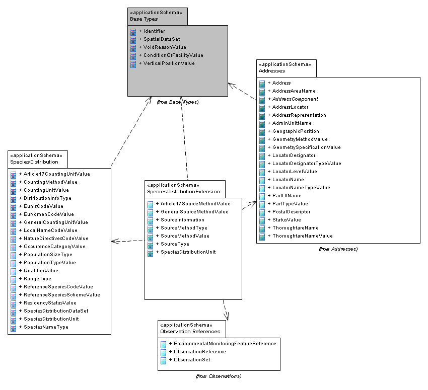

[text-center]
*Figure 8– UML package diagram: Overview of the SpeciesDistributionExtension application schema package dependencies*

An overview of the SpeciesDistributionExtension application schema and referenced packages is depicted in Figure 8. The diagram shows that the application schema is depended on the SpeciesDistribution package and packages defined in the INSPIRE General Conceptual Model. In addition, there is a reference to Observation References (also from the GCM) in order to be able to link to single observations if required. Finally, the application schema uses a data type from the Addresses package.

The complete _SpeciesDistributionExtension_ application schema is shown in Figure 9 and described in detail below.

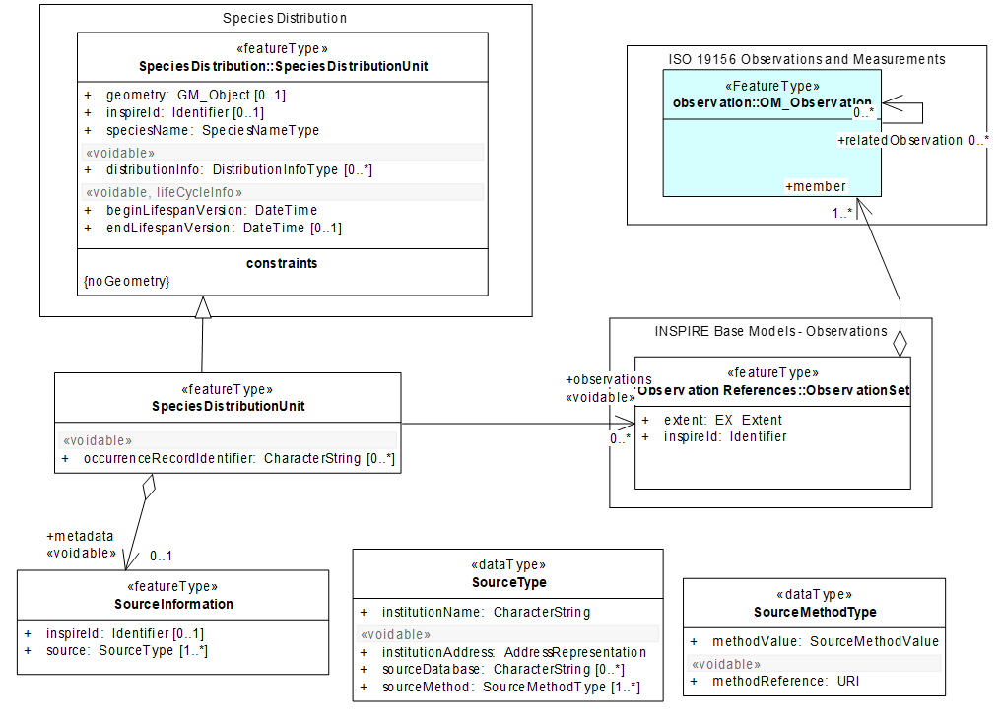

[text-center]
*Figure 9 – UML class diagram: Overview of the SpeciesDistributionExtension application schema*

Several code lists are being referenced, an overview of them is seen in Figure 10

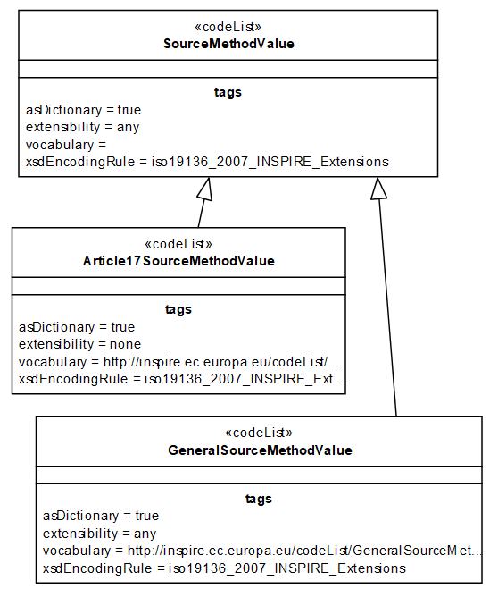

[text-center]
*Figure 10 – Code lists in SpeciesDistributionExtension application schema.*

The *_SpeciesDistributionUnit_* is linked to the *_SourceInformation_* spatial object type in order to describe metadata information about specific instances of distribution units. These metadata can be shared among several species distribution units.

The *_SourceInformation_* contains the following attribute (besides the inspire id):

* _source:_ Is of data type *_SourceType_* which provides information on the sources and their origins:
** _institutionName_ is a character string representing the name of the institution providing the source data.
** _institutionAddress_ represents the address using the data type *_AddressRepresentation_* from the Addresses application schema.
** _sourceDatabase_ is a character string indicating the name of the database where the species distribution data is retrieved from.
** _sourceMethod_ has the data type *_SourceMethodType_* and provides the methods used when collecting the source data (_methodValue_) either in the field, from analogue written texts and/or maps or other methods. The values are defined in code lists *_Article17SourceMethodValue_* and *_GeneralSourceMethodValue_*. The *_SourceMethodValue_* can be extended with other code lists. Additionally, the _methodReference_ provides a reference to a description of the method by which the data on species distribution is collected.

The Feature Catalogue for Species Distribution provides a complete list of the features, their attributes and code lists.

===== Consistency between spatial data sets

There are no other consistency rules than those defined within the application schema. No consistency rules between Species Distribution and other spatial datasets have been identified.

===== Identifier management

Only one spatial object has an identifier attribute specified with multiplicity of 0..1 (*_SourceInformation_*). *_SpeciesDistributionUnit_* inherits from *_SpeciesDistributionUnit_* in the SpeciesDistribution application schema. The identifier shall consist of two parts: the namespace and a local id (see also the Generic Conceptual Model [DS-D2.5]).

===== Modelling of object references

Three approaches are to handle metadata at object level are offered by the application schema. They are not necessarily mutually exclusive, but they offer different possibilities. They are represented by internal and external references.

Internal reference: An aggregation construct is modelled between *_SpeciesDistributionUnit_* and *_SourceInformation_*. This basically means that many instances of *_DistributionInfoType_* can share the same source information. An attribute (metadata) in *_SpeciesDistributionUnit_* will contain a reference to the *_SourceInformation_* object. This way of handling object metadata is used to carry information about the aggregation of data into distribution units and is, thus, not necessarily linked to observational data and is not necessarily carried out by the same institution that did the observations.

External references: In addition, the application schema allows (if required), a possible link to observational data. The aggregation of observations represented by *_SpeciesDistributionUnit_* can be linked to collection of observations (_INSPIRE_ObservationCollection_), which again can be linked to single observations (_OM_Observation_), see Figure 11. Another possibility to link to observations is using the _occurenceRecordIdentifier_ attribute in *_SpeciesDistributionUnit_*, e.g. for representing the darwin core triple (institition, collection, catalog number) value.

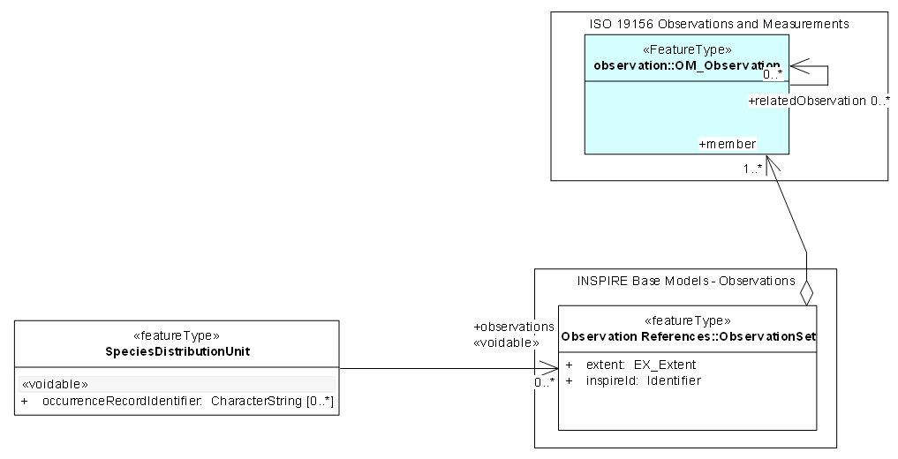

[text-center]
*Figure 11 – Two approaches for referring to observations.*

==== Feature catalogue

*Feature catalogue metadata*

[cols=","]
|===
|Application Schema |INSPIRE Application Schema SpeciesDistributionExtension
|Version number |3.0
|===

*Types defined in the feature catalogue*

[cols=",,",options="header",]
|===
|*Type* |*Package* |*Stereotypes*
|_Article17SourceMethodValue_ |SpeciesDistributionExtension |«codeList»
|_GeneralSourceMethodValue_ |SpeciesDistributionExtension |«codeList»
|_SourceInformation_ |SpeciesDistributionExtension |«featureType»
|_SourceMethodType_ |SpeciesDistributionExtension |«dataType»
|_SourceMethodValue_ |SpeciesDistributionExtension |«codeList»
|_SourceType_ |SpeciesDistributionExtension |«dataType»
|_SpeciesDistributionUnit_ |SpeciesDistributionExtension |«featureType»
|===

===== Spatial object types

====== _SourceInformation_

[cols="",options="header",]
|===
|*SourceInformation*
a|
[cols=","]
!===
!Name: !source information
!Definition: !Contains metadata about specific instances of species distribution.
!Description: !May be shared among several species distributions.
!Stereotypes: !«featureType»
!===

a|
*Attribute: inspireId*

[cols=","]
!===
!Name: !inspire id
!Value type: !Identifier
!Definition: !External object identifier of the spatial object.
!Description: !An external object identifier is a unique object identifier published by the responsible body, which may be used by external applications to reference the spatial object. The identifier is an identifier of the spatial object, not an identifier of the real-world phenomenon.
!Multiplicity: !0..1
!===

a|
*Attribute: source*

[cols=","]
!===
!Name: !source
!Value type: !SourceType
!Definition: !Information about the institution compiling data from source databases to a complete dataset.
!Multiplicity: !1..*
!===

|===

====== _SpeciesDistributionUnit_

[cols="",options="header",]
|===
|*SpeciesDistributionUnit*
a|
[cols=","]
!===
!Name: !species distribution unit
!Subtype of: !SpeciesDistributionUnit
!Definition: !Additional information on the distribution such as metadata at object level and observational data.
!Stereotypes: !«featureType»
!===

a|
*Attribute: occurrenceRecordIdentifier*

[cols=","]
!===
!Name: !occurrence record identifier
!Value type: !CharacterString
!Definition: !Unique identifier for records of observational data.
!Description: !Unique identifier for each occurrence data according to GBIFs standards. See e.g. http://www.bgbm.org/tdwg/codata/schema/Mappings/DwCAndExtensions.htm 
 
EXAMPLE 1 Thematic identifier for Darwin Core observational data (darwin core triple - GlobalUniqueIdentifier). This GUID has three components; InstitutionCode, CollectionCode and CatalogNumber. Darwin Core is documented at http://rs.tdwg.org/dwc/. 
 
EXAMPLE 2 ABCD identifier (UnitGUID) used by BioCASE.
!Multiplicity: !0..*
!Stereotypes: !«voidable»
!===

a|
*Association role: metadata*

[cols=","]
!===
!Name: !metadata
!Value type: !SourceInformation
!Definition: !Contains metadata about specific instances of species distribution.
!Multiplicity: !0..1
!Stereotypes: !«voidable»
!===

|===

===== Data types

====== _SourceMethodType_

[cols="",options="header",]
|===
|*SourceMethodType*
a|
[cols=","]
!===
!Name: !source method type
!Definition: !Contains metadata about specific instances of species distribution.
!Description: !May be shared among several species distributions.
!Stereotypes: !«dataType»
!===

a|
*Attribute: methodValue*

[cols=","]
!===
!Name: !method value
!Value type: !SourceMethodValue
!Definition: !Method by which the data on species distribution is collected.
!Description: !The method by which the occurrence data has been recorded in nature or generated. 
EXAMPLE Collection examination, grid mapping, line sampling, literature examination, random observations, statistical sampling, prediction modeling, estimate expert.
!Multiplicity: !1
!===

a|
*Attribute: methodReference*

[cols=","]
!===
!Name: !method reference
!Value type: !URI
!Definition: !A reference to a description of the method by which the data on species distribution is collected.
!Description: !The reference to a more detailed description of the method use to collect or record occurrence data in nature or the method used in creating or generating species distribution by means of prediction modelling or expert opinion.
!Multiplicity: !1
!Stereotypes: !«voidable»
!===

|===

====== _SourceType_

[cols="",options="header",]
|===
|*SourceType*
a|
[cols=","]
!===
!Name: !source type
!Definition: !Identifier of the source of data on species distribution.
!Stereotypes: !«dataType»
!===

a|
*Attribute: institutionName*

[cols=","]
!===
!Name: !institution name
!Value type: !CharacterString
!Definition: !Name of the owner or operator of the source database.
!Description: !The name of the owner of the source database or the name of the institution providing datasets by harvesting from distributed primary source databases, compiling data and distributing them.
!Multiplicity: !1
!===

a|
*Attribute: institutionAddress*

[cols=","]
!===
!Name: !institution address
!Value type: !AddressRepresentation
!Definition: !Address of the owner or operator of the source database.
!Multiplicity: !1
!Stereotypes: !«voidable»
!===

a|
*Attribute: sourceDatabase*

[cols=","]
!===
!Name: !source database
!Value type: !CharacterString
!Definition: !Name of the database where the species distribution data is retrieved from.
!Multiplicity: !0..*
!Stereotypes: !«voidable»
!===

a|
*Attribute: sourceMethod*

[cols=",,",options="header",]
!===
!  !Name: !source method
!  !Value type: !SourceMethodType
!  !Definition: !Method by which the data on species distribution is collected.
!  !Description: !Refers to the methods on how observations have been made or recorded that are aggregated by using a given aggregation method assigned to the species distribution unit.
!  !Multiplicity: !1..*
!  !Stereotypes: !«voidable»
!===

|===

===== Code lists

====== _Article17SourceMethodValue_

[cols="",options="header",]
|===
|*Article17SourceMethodValue*
a|
[cols=","]
!===
!Name: !article 17 source method value
!Definition: !The methods that have been used in the sources for compiling the information about the occurrences of the species within a species distribution unit for article 17 purposes.
!Description: !
!Extensibility: !none
!Identifier: !http://inspire.ec.europa.eu/codelist/Article17SourceMethodValue
!Values: !The allowed values for this code list comprise only the values specified in _Annex C_ . _Annex C_ includes recommended values that may be used by data providers.
!===

|===

====== _GeneralSourceMethodValue_

[cols="",options="header",]
|===
|*GeneralSourceMethodValue*
a|
[cols=","]
!===
!Name: !general source method value
!Definition: !The methods that have been used in the sources for compiling the information about the occurrences of the species within a species distribution unit.
!Description: !Describes how the information about the occurences of the species within a species distribution unit has been compiled.
!Extensibility: !any
!Identifier: !http://inspire.ec.europa.eu/codelist/GeneralSourceMethodValue
!Values: !The allowed values for this code list comprise any values defined by data providers. _Annex C_ includes recommended values that may be used by data providers.
!===

|===

====== _SourceMethodValue_

[cols="",options="header",]
|===
|*SourceMethodValue*
a|
[cols=","]
!===
!Name: !source method value
!Definition: !Abstract class defining the methods that have been used in the sources for compiling the information about the occurrences of the species within a species distribution unit .
!Description: !Subclasses for specific domains can be added by member states.
!Extensibility: !open
!Identifier: !
!Values: !The allowed values for this code list comprise the values specified in _Annex C_ and additional values at any level defined by data providers. _Annex C_ includes recommended values that may be used by data providers.
!===

|===

===== Imported types (informative)

This section lists definitions for feature types, data types and enumerations and code lists that are defined in other application schemas. The section is purely informative and should help the reader understand the feature catalogue presented in the previous sections. For the normative documentation of these types, see the given references.

====== _AddressRepresentation_

[cols="",options="header",]
|===
|*AddressRepresentation*
a|
[cols=","]
!===
!Package: !Addresses
!Reference: !INSPIRE Data specification on Addresses [DS-D2.8.I.5]
!Definition: !Representation of an address spatial object for use in external application schemas that need to include the basic, address information in a readable way.
!Description: !NOTE 1 The data type includes the all necessary readable address components as well as the address locator(s), which allows the identification of the address spatial objects, e.g., country, region, municipality, address area, post code, street name and address number. It also includes an optional reference to the full address spatial object. 
 
NOTE 2 The datatype could be used in application schemas that wish to include address information e.g. in a dataset that registers buildings or properties.
!===

|===

====== _CharacterString_

[cols="",options="header",]
|===
|*CharacterString*
a|
[cols=","]
!===
!Package: !Text
!Reference: !Geographic information -- Conceptual schema language [ISO/TS 19103:2005]
!===

|===

====== _Identifier_

[cols="",options="header",]
|===
|*Identifier*
a|
[cols=","]
!===
!Package: !Base Types
!Reference: !INSPIRE Generic Conceptual Model, version 3.4 [DS-D2.5]
!Definition: !External unique object identifier published by the responsible body, which may be used by external applications to reference the spatial object.
!Description: !NOTE1 External object identifiers are distinct from thematic object identifiers. 
 
NOTE 2 The voidable version identifier attribute is not part of the unique identifier of a spatial object and may be used to distinguish two versions of the same spatial object. 
 
NOTE 3 The unique identifier will not change during the life-time of a spatial object.
!===

|===

====== _URI_

[cols="",options="header",]
|===
|*URI*
a|
[cols=","]
!===
!Package: !basicTypes
!Reference: !Geographic information -- Geography Markup Language (GML) [ISO 19136:2007]
!===

|===

==== Externally governed code lists

The externally governed code lists included in this application schema are specified in the tables in this section.

===== Governance and authoritative source

[cols=",,",options="header",]
|===
|*Code list* |*Governance* |**Authoritative Source(incl. version**footnote:[If no version or publication date are specified, the "latest available version" shall be used.] *and relevant subset, where applicable)*
|Article17SourceMethodValue |European Environment Agency (EEA) |Reference Portal for Article 17 of the Habitats Directive
|===

===== Availability

[cols=",,",options="header",]
|===
|*Code list* |*Availability* |*Format*
|Article17SourceMethodValue a|
https://circabc.europa.eu/sd/d/2c12cea2-f827-4bdb-bb56-3731c9fd8b40/Art17%20-%20Guidelines-final.pdf

http://bd.eionet.europa.eu/article17/reference_portal

|PDF
|===

===== Rules for code list values

[cols=",,",options="header",]
|===
|*Code list* |*Identifiers* |*Examples*
|Article17SourceMethodValue |Append the codes in the field '1.1.2 Method used-map' from page 4 of the Reporting Formats for Article17, the codes to be used are 
3,2,1,0. Refer to the document for more detailed description. For the reporting under Article 12 of the Birds Directive the codes are the same. |http://inspire.ec.europa.eu/codelist/Article17SourceMethodValue/3
|===

[cols=",,",options="header",]
|===
|*Code list* |*Labels* |*Examples*
|Article17SourceMethodValue |Use one of the categories that are in the chapter 2.3.2 Method used in document https://circabc.europa.eu/sd/d/2c12cea2-f827-4bdb-bb56-3731c9fd8b40/Art17%20-%20Guidelines-final.pdf a|
Complete survey (for the code 3)

Extrapolation and or modelling (for the code2) 
Expert opinion (for the code1)

Absent data (for the code0)

|===

<<<
== Reference systems, units of measure and grids

=== Default reference systems, units of measure and grid

The reference systems, units of measure and geographic grid systems included in this sub-section are the defaults to be used for all INSPIRE data sets, unless theme-specific exceptions and/or additional requirements are defined in section 6.2.

==== Coordinate reference systems

===== Datum

[IMPORTANT]
====
[.text-center]
*IR Requirement*
_Annex II, Section 1.2_
*Datum for three-dimensional and two-dimensional coordinate reference systems*

For the three-dimensional and two-dimensional coordinate reference systems and the horizontal component of compound coordinate reference systems used for making spatial data sets available, the datum shall be the datum of the European Terrestrial Reference System 1989 (ETRS89) in areas within its geographical scope, or the datum of the International Terrestrial Reference System (ITRS) or other geodetic coordinate reference systems compliant with ITRS in areas that are outside the geographical scope of ETRS89. Compliant with the ITRS means that the system definition is based on the definition of the ITRS and there is a well documented relationship between both systems, according to EN ISO 19111.
====

===== Coordinate reference systems

[IMPORTANT]
====
[.text-center]
*IR Requirement*
_Annex II, Section 1.3_
*Coordinate Reference Systems*

Spatial data sets shall be made available using at least one of the coordinate reference systems specified in sections 1.3.1, 1.3.2 and 1.3.3, unless one of the conditions specified in section 1.3.4 holds.

*1.3.1. Three-dimensional Coordinate Reference Systems*

* Three-dimensional Cartesian coordinates based on a datum specified in 1.2 and using the parameters of the Geodetic Reference System 1980 (GRS80) ellipsoid.

* Three-dimensional geodetic coordinates (latitude, longitude and ellipsoidal height) based on a datum specified in 1.2 and using the parameters of the GRS80 ellipsoid.

*1.3.2. Two-dimensional Coordinate Reference Systems*

* Two-dimensional geodetic coordinates (latitude and longitude) based on a datum specified in 1.2 and using the parameters of the GRS80 ellipsoid.

* Plane coordinates using the ETRS89 Lambert Azimuthal Equal Area coordinate reference system.

* Plane coordinates using the ETRS89 Lambert Conformal Conic coordinate reference system.

* Plane coordinates using the ETRS89 Transverse Mercator coordinate reference system.

*1.3.3. Compound Coordinate Reference Systems*

. For the horizontal component of the compound coordinate reference system, one of the coordinate reference systems specified in section 1.3.2 shall be used.
. For the vertical component, one of the following coordinate reference systems shall be used:

{empty}

* For the vertical component on land, the European Vertical Reference System (EVRS) shall be used to express gravity-related heights within its geographical scope. Other vertical reference systems related to the Earth gravity field shall be used to express gravity-related heights in areas that are outside the geographical scope of EVRS.

* For the vertical component in the free atmosphere, barometric pressure, converted to height using ISO 2533:1975 International Standard Atmosphere, or other linear or parametric reference systems shall be used. Where other parametric reference systems are used, these shall be described in an accessible reference using EN ISO 19111-2:2012.

* For the vertical component in marine areas where there is an appreciable tidal range (tidal waters), the Lowest Astronomical Tide (LAT) shall be used as the reference surface.

* For the vertical component in marine areas without an appreciable tidal range, in open oceans and effectively in waters that are deeper than 200 meters, the Mean Sea Level (MSL) or a well-defined reference level close to the MSL shall be used as the reference surface.

*1.3.4. Other Coordinate Reference Systems*

Exceptions, where other coordinate reference systems than those listed in 1.3.1, 1.3.2 or 1.3.3 may be used, are:

. Other coordinate reference systems may be specified for specific spatial data themes.

. For regions outside of continental Europe, Member States may define suitable coordinate reference systems.

The geodetic codes and parameters needed to describe these other coordinate reference systems and to allow conversion and transformation operations shall be documented and an identifier shall be created in a coordinate systems register established and operated by the Commission, according to EN ISO 19111 and ISO 19127.
The Commission shall be assisted by the INSPIRE Commission expert group in the maintenance and update of the coordinate systems register.

====

===== Display

[IMPORTANT]
====
[.text-center]
*IR Requirement*
_Annex II, Section 1.4_
*Coordinate Reference Systems used in the View Network Service*

For the display of spatial data sets with the view network service as specified in Regulation No 976/2009, at least the coordinate reference systems for two-dimensional geodetic coordinates (latitude, longitude) shall be available.
====

===== Identifiers for coordinate reference systems

[IMPORTANT]
====
[.text-center]
*IR Requirement*
_Annex II, Section 1.5_
*Coordinate Reference System Identifiers*

. Coordinate reference system parameters and identifiers shall be managed in one or several common registers for coordinate reference systems.

. Only identifiers contained in a common register shall be used for referring to the coordinate reference systems listed in this Section.
====

These Technical Guidelines propose to use the http URIs provided by the Open Geospatial Consortium as coordinate reference system identifiers (see identifiers for the default CRSs in the INSPIRE coordinate reference systems register). These are based on and redirect to the definition in the EPSG Geodetic Parameter Registry (_http://www.epsg-registry.org/_).

[TIP]
====
*TG Requirement 2* 
The identifiers listed in the INSPIRE coordinate reference systems register (https://inspire.ec.europa.eu/crs) shall be used for referring to the coordinate reference systems used in a data set.
====

NOTE CRS identifiers may be used e.g. in:

* data encoding,
* data set and service metadata, and
* requests to INSPIRE network services.

==== Temporal reference system

[IMPORTANT]
====
[.text-center]
*IR Requirement*
_Article 11_
*Temporal Reference Systems*

. The default temporal reference system referred to in point 5 of part B of the Annex to Commission Regulation (EC) No 1205/2008 (footnote:[OJ L 326, 4.12.2008, p. 12.]) shall be used, unless other temporal reference systems are specified for a specific spatial data theme in Annex II.
====

NOTE 1 Point 5 of part B of the Annex to Commission Regulation (EC) No 1205/2008 (the INSPIRE Metadata IRs) states that the default reference system shall be the Gregorian calendar, with dates expressed in accordance with ISO 8601.

NOTE 2 ISO 8601 _Data elements and interchange formats – Information interchange – Representation of dates and times_ is an international standard covering the exchange of date and time-related data. The purpose of this standard is to provide an unambiguous and well-defined method of representing dates and times, so as to avoid misinterpretation of numeric representations of dates and times, particularly when data is transferred between countries with different conventions for writing numeric dates and times. The standard organizes the data so the largest temporal term (the year) appears first in the data string and progresses to the smallest term (the second). It also provides for a standardized method of communicating time-based information across time zones by attaching an offset to Coordinated Universal Time (UTC).

EXAMPLE 1997 (the year 1997), 1997-07-16 (16^th^ July 1997), 1997-07-16T19:20:3001:00 (16^th^ July 1997, 19h 20' 30'', time zone: UTC1)

==== Units of measure

[IMPORTANT]
====
[.text-center]
*IR Requirement*
_Article 12_
*Other Requirements & Rules*

(...)

[arabic, start=2]
. All measurement values shall be expressed using SI units or non-SI units accepted for use with the International System of Units, unless specified otherwise for a specific spatial data theme or type.
====

==== Grids

[IMPORTANT]
====
[.text-center]
*IR Requirement*
_Annex II, Section 2.2_
*Grids*

Either of the grids with fixed and unambiguously defined locations defined in Sections 2.2.1 and 2.2.2 shall be used as a geo-referencing framework to make gridded data available in INSPIRE, unless one of the following conditions holds:

. Other grids may be specified for specific spatial data themes in Annexes II-IV. In this case, data exchanged using such a theme-specific grid shall use standards in which the grid definition is either included with the data, or linked by reference.

. For grid referencing in regions outside of continental Europe Member States may define their own grid based on a geodetic coordinate reference system compliant with ITRS and a Lambert Azimuthal Equal Area projection, following the same principles as laid down for the grid specified in Section 2.2.1. In this case, an identifier for the coordinate reference system shall be created.

*2.2 Equal Area Grid*

The grid is based on the ETRS89 Lambert Azimuthal Equal Area (ETRS89-LAEA) coordinate reference system with the centre of the projection at the point 52^o^ N, 10^o^ E and false easting: x~0~ = 4321000 m, false northing: y~0~ = 3210000 m.

The origin of the grid coincides with the false origin of the ETRS89-LAEA coordinate reference system (x=0, y=0).

Grid points of grids based on ETRS89-LAEA shall coincide with grid points of the grid.

The grid is hierarchical, with resolutions of 1m, 10m, 100m, 1000m, 10000m and 100000m.

The grid orientation is south-north, west-east.

The grid is designated as Grid_ETRS89-LAEA. For identification of an individual resolution level the cell size in metres is appended.

For the unambiguous referencing and identification of a grid cell, the cell code composed of the size of the cell and the coordinates of the lower left cell corner in ETRS89-LAEA shall be used. The cell size shall be denoted in metres ("m") for cell sizes up to 100m or kilometres ("km") for cell sizes of 1000m and above. Values for northing and easting shall be divided by 10^n^, where _n_ is the number of trailing zeros in the cell size value.
====

=== Theme-specific requirements and recommendations

==== Grids

[IMPORTANT]
====
[.text-center]
*IR Requirement*
_Annex IV, Section 18.5_
*Theme-specific Requirements*

. Where grid representations of species distributions are needed, the Grid_ETRS89-LAEA as defined in Section 2.2.1 of Annex II shall be used.
====

<<<
== Data quality

This chapter includes a description of the data quality elements and sub-elements as well as the corresponding data quality measures that should be used to evaluate and document data quality for data sets related to the spatial data theme _Species Distribution_ (section 7.1).

It may also define requirements or recommendations about the targeted data quality results applicable for data sets related to the spatial data theme _Species Distribution_ (sections 7.2 and 7.3).

In particular, the data quality elements, sub-elements and measures specified in section 7.1 should be used for

* evaluating and documenting data quality properties and constraints of spatial objects, where such properties or constraints are defined as part of the application schema(s) (see section 5);

* evaluating and documenting data quality metadata elements of spatial data sets (see section 8); and/or

* specifying requirements or recommendations about the targeted data quality results applicable for data sets related to the spatial data theme _Species Distribution_ (see sections 7.2 and 7.3).

The descriptions of the elements and measures are based on Annex D of ISO/DIS 19157 Geographic information – Data quality.

=== Data quality elements

Table 3 lists all data quality elements and sub-elements that are being used in this specification. Data quality information can be evaluated at level of spatial object, spatial object type, dataset or dataset series. The level at which the evaluation is performed is given in the "Evaluation Scope" column.

The measures to be used for each of the listed data quality sub-elements are defined in the following sub-sections.

[text-center]
*Table 3 – Data quality elements used in the spatial data theme _Species Distribution_*

[cols=",,,,",]
|===
|*Section* |*Data quality element* |*Data quality sub-element* |*Definition* |*Evaluation Scope*
|7.1.1 |Logical consistency |Conceptual consistency |adherence to rules of the conceptual schema |dataset series; dataset; spatial object type; spatial object
|7.1.2 |Logical consistency |Domain consistency |adherence of values to the value domains |dataset series; dataset; spatial object type; spatial object
|===

[NOTE]
====
*Recommendation 10*

Where it is impossible to express the evaluation of a data quality element in a quantitative way, the evaluation of the element should be expressed with a textual statement as a data quality descriptive result.
====

==== Logical consistency – Conceptual consistency

The Application Schema conformance class of the Abstract Test Suite in Annex I defines a number of tests to evaluate the conceptual consistency (tests A.1.1-A.1.9) of a data set.

[NOTE]
====
*Recommendation 11*

For the tests on conceptual consistency, it is recommended to use the _Logical consistency – Conceptual consistency_ data quality sub-element and the measure _Number of items not compliant with the rules of the conceptual schema_ as specified in the table below.
====

[cols=",",]
|===
|*Name* |
|Alternative name |-
|Data quality element |logical consistency
|Data quality sub-element |conceptual consistency
|Data quality basic measure |error count
|Definition |count of all items in the dataset that are not compliant with the rules of the conceptual schema
|Description |If the conceptual schema explicitly or implicitly describes rules, these rules shall be followed. Violations against such rules can be, for example, invalid placement of features within a defined tolerance, duplication of features and invalid overlap of features.
|Evaluation scope |spatial object / spatial object type
|Reporting scope |data set
|Parameter |-
|Data quality value type |integer
|Data quality value structure |-
|Source reference |ISO/DIS 19157 Geographic information – Data quality
|Example |
|Measure identifier |10
|===

==== Logical consistency – Domain consistency

The Application Schema conformance class of the Abstract Test Suite in Annex I defines a number of tests to evaluate the domain consistency (tests A1.10-A.1.12) of a data set.

[NOTE]
====
*Recommendation 12*
For the tests on domain consistency, it is recommended to use the _Logical consistency – Domain consistency_ data quality sub-element and the measure _Number of items not in conformance with their value domain_ as specified in the table below.
====

[cols=",",]
|===
|*Name* |*Number of items not in conformance with their value domain*
|Alternative name |-
|Data quality element |logical consistency
|Data quality sub-element |domain consistency
|Data quality basic measure |error count
|Definition |count of all items in the dataset that are not in conformance with their value domain
|Description |
|Evaluation scope |spatial object / spatial object type
|Reporting scope |data set
|Parameter |-
|Data quality value type |integer
|===

=== Minimum data quality requirements

No minimum data quality requirements are defined for the spatial data theme Species Distribution.

=== Recommendation on data quality

No minimum data quality recommendations are defined.

<<<
== Dataset-level metadata

This section specifies dataset-level metadata elements, which should be used for documenting metadata for a complete dataset or dataset series.

NOTE Metadata can also be reported for each individual spatial object (spatial object-level metadata). Spatial object-level metadata is fully described in the application schema(s) (section 5).

For some dataset-level metadata elements, in particular those for reporting data quality and maintenance, a more specific scope can be specified. This allows the definition of metadata at sub-dataset level, e.g. separately for each spatial object type (see instructions for the relevant metadata element).

=== Metadata elements defined in INSPIRE Metadata Regulation

Table 4 gives an overview of the metadata elements specified in Regulation 1205/2008/EC (implementing Directive 2007/2/EC of the European Parliament and of the Council as regards metadata).

The table contains the following information:

* The first column provides a reference to the relevant section in the Metadata Regulation, which contains a more detailed description.
* The second column specifies the name of the metadata element.
* The third column specifies the multiplicity.
* The fourth column specifies the condition, under which the given element becomes mandatory.

[text-center]
*Table 4 – Metadata for spatial datasets and spatial dataset series specified in Regulation 1205/2008/EC*

[cols=",,,",]
|===
|*Metadata Regulation Section* |*Metadata element* |*Multiplicity* |*Condition*
|1.1 |Resource title |1 |
|1.2 |Resource abstract |1 |
|1.3 |Resource type |1 |
|1.4 |Resource locator |0..* |Mandatory if a URL is available to obtain more information on the resource, and/or access related services.
|1.5 |Unique resource identifier |1..* |
|1.7 |Resource language |0..* |Mandatory if the resource includes textual information.
|2.1 |Topic category |1..* |
|3 |Keyword |1..* |
|4.1 |Geographic bounding box |1..* |
|5 |Temporal reference |1..* |
|6.1 |Lineage |1 |
|6.2 |Spatial resolution |0..* |Mandatory for data sets and data set series if an equivalent scale or a resolution distance can be specified.
|7 |Conformity |1..* |
|8.1 |Conditions for access and use |1..* |
|8.2 |Limitations on public access |1..* |
|9 |Responsible organisation |1..* |
|10.1 |Metadata point of contact |1..* |
|10.2 |Metadata date |1 |
|10.3 |Metadata language |1 |
|===

Generic guidelines for implementing these elements using ISO 19115 and 19119 are available at _http://inspire.jrc.ec.europa.eu/index.cfm/pageid/101_. The following sections describe additional theme-specific recommendations and requirements for implementing these elements.

==== Conformity

The _Conformity_ metadata element defined in Regulation 1205/2008/EC requires to report the conformance with the Implementing Rule for interoperability of spatial data sets and services. In addition, it may be used also to document the conformance to another specification.

[NOTE]
====
*Recommendation 13*
Dataset metadata should include a statement on the overall conformance of the dataset with this data specification (i.e. conformance with all requirements).
====

[NOTE]
====
*Recommendation 14*
The _Conformity_ metadata element should be used to document conformance with this data specification (as a whole), with a specific conformance class defined in the Abstract Test Suite in Annex A and/or with another specification.
====

The _Conformity_ element includes two sub-elements, the _Specification_ (a citation of the Implementing Rule for interoperability of spatial data sets and services or other specification), and the _Degree_ of conformity. The _Degree_ can be _Conformant_ (if the dataset is fully conformant with the cited specification), _Not Conformant_ (if the dataset does not conform to the cited specification) or _Not Evaluated_ (if the conformance has not been evaluated).

[NOTE]
====
*Recommendation 15*
If a dataset is not yet conformant with all requirements of this data specification, it is recommended to include information on the conformance with the individual conformance classes specified in the Abstract Test Suite in Annex A.
====

[NOTE]
====
*Recommendation 16*
If a dataset is produced or transformed according to an external specification that includes specific quality assurance procedures, the conformity with this specification should be documented using the _Conformity_ metadata element.
====

[NOTE]
====
*Recommendation 17*
If minimum data quality recommendations are defined then the statement on the conformity with these requirements should be included using the _Conformity_ metadata element and referring to the relevant data quality conformance class in the Abstract Test Suite.
====

NOTE Currently no minimum data quality requirements are included in the IRs. The recommendation above should be included as a requirement in the IRs if minimum data quality requirements are defined at some point in the future.

[NOTE]
====
*Recommendation 18*
When documenting conformance with this data specification or one of the conformance classes defined in the Abstract Test Suite, the _Specification_ sub-element should be given using the http URI identifier of the conformance class or using a citation including the following elements:

* title: "INSPIRE Data Specification on Species Distribution – Technical Guidelines – <name of the conformance class>"

* date:
** dateType: publication
** date: 2013-02-04
====

EXAMPLE 1: The XML snippets below show how to fill the _Specification_ sub-element for documenting conformance with the whole data specification on Addresses v3.0.1.

[source, xml]
----
<gmd:DQ_ConformanceResult>
	<gmd:specification href="http://inspire.ec.europa.eu/conformanceClass/ad/3.0.1/tg" />
	<gmd:explanation> (...) </gmd:explanation>
	<gmd:pass> (...) </gmd:pass>
</gmd:DQ_ConformanceResult>

----

or (using a citation):

[source, xml]
----
<gmd:DQ_ConformanceResult>
	<gmd:specification>
		<gmd:CI_Citation>
			<gmd:title>
				<gco:CharacterString>INSPIRE Data Specification on Species Distribution – Technical Guidelines</gco:CharacterString>
			</gmd:title>
			<gmd:date>
				<gmd:date>
			<gco:Date>2013-02-04</gco:Date>
				</gmd:date>
				<gmd:dateType>
					<gmd:CI_DateTypeCode codeList="http://standards.iso.org/ittf/PubliclyAvailableStandards/ISO_19139_Schemas/resou
rces/Codelist/ML_gmxCodelists.xml#CI_DateTypeCode" codeListValue="publication">publication</gmd:CI_DateTypeCode>
				</gmd:dateType>
			</gmd:date>
		</gmd:CI_Citation>
	</gmd:specification>
	<gmd:explanation> (...) </gmd:explanation>
	<gmd:pass> (...) </gmd:pass>
</gmd:DQ_ConformanceResult>

----

EXAMPLE 2: The XML snippets below show how to fill the _Specification_ sub-element for documenting conformance with the CRS conformance class of the data specification on Addresses v3.0.1.

[source, xml]
----
<gmd:DQ_ConformanceResult>
	<gmd:specification href="http://inspire.ec.europa.eu/conformanceClass/ad/3.0.1/crs" />
	<gmd:explanation> (...) </gmd:explanation>
	<gmd:pass> (...) </gmd:pass>
</gmd:DQ_ConformanceResult>

----

or (using a citation):

[source, xml]
----
<gmd:DQ_ConformanceResult>
	<gmd:specification>
		<gmd:CI_Citation>
			<gmd:title>
				<gco:CharacterString>INSPIRE Data Specification on Species Distribution – Technical Guidelines – CRS</gco:CharacterString>
			</gmd:title>
			<gmd:date>
				<gmd:date>
					<gco:Date>2013-02-04</gco:Date>
				</gmd:date>
				<gmd:dateType>
					<gmd:CI_DateTypeCode codeList="http://standards.iso.org/ittf/PubliclyAvailableStandards/ISO_19139_Schemas/resou
rces/Codelist/ML_gmxCodelists.xml#CI_DateTypeCode" codeListValue="publication">publication</gmd:CI_DateTypeCode>
				</gmd:dateType>
			</gmd:date>
		</gmd:CI_Citation>
	</gmd:specification>
	<gmd:explanation> (...) </gmd:explanation>
	<gmd:pass> (...) </gmd:pass>
</gmd:DQ_ConformanceResult>
----

==== Lineage

[NOTE]
====
*Recommendation 19*
Following the ISO/DIS 19157 Quality principles, if a data provider has a procedure for the quality management of their spatial data sets then the appropriate data quality elements and measures defined in ISO/DIS 19157 should be used to evaluate and report (in the metadata) the results. If not, the _Lineage_ metadata element (defined in Regulation 1205/2008/EC) should be used to describe the overall quality of a spatial data set.
====

According to Regulation 1205/2008/EC, lineage "is a statement on process history and/or overall quality of the spatial data set. Where appropriate it may include a statement whether the data set has been validated or quality assured, whether it is the official version (if multiple versions exist), and whether it has legal validity. The value domain of this metadata element is free text".

The Metadata Technical Guidelines based on EN ISO 19115 and EN ISO 19119 specifies that the statement sub-element of LI_Lineage (EN ISO 19115) should be used to implement the lineage metadata element.

[NOTE]
====
*Recommendation 20*
To describe the transformation steps and related source data, it is recommended to use the following sub-elements of LI_Lineage:

* For the description of the transformation process of the local to the common INSPIRE data structures, the LI_ProcessStep sub-element should be used.

* For the description of the source data the LI_Source sub-element should be used.
====

NOTE 1 In order to improve the interoperability, domain templates and instructions for using these free text elements (descriptive statements) may be specified here and/or in an Annex of this data specification.

==== Temporal reference

According to Regulation 1205/2008/EC, at least one of the following temporal reference metadata sub-elements shall be provided: temporal extent, date of publication, date of last revision, date of creation.

[NOTE]
====
*Recommendation 21*
It is recommended that at least the date of the last revision of a spatial data set should be reported using the _Date of last revision_ metadata sub-element.
====

====  Lineage: Derived geometries for Species Distribution

[IMPORTANT]
====
[.text-center]
*IR Requirement*
_Annex IV, Section 18.5_
*Theme-specific Requirements – Species Distribution*

[arabic, start=1]
. If the geometries of the spatial objects in a SpeciesDistributionUnit data set are derived from the geometries of spatial objects in another data set, then this source data set (including its version) shall be described as part of the lineage metadata element.
====

=== Metadata elements for interoperability

[IMPORTANT]
====
[.text-center]
*IR Requirement*
_Article 13_
*Metadata required for Interoperability*

The metadata describing a spatial data set shall include the following metadata elements required for interoperability:

. Coordinate Reference System: Description of the coordinate reference system(s) used in the data set.

. Temporal Reference System: Description of the temporal reference system(s) used in the data set.
+
This element is mandatory only if the spatial data set contains temporal information that does not refer to the default temporal reference system.

. Encoding: Description of the computer language construct(s) specifying the representation of data objects in a record, file, message, storage device or transmission channel.

. Topological Consistency: Correctness of the explicitly encoded topological characteristics of the data set as described by the scope.
+
This element is mandatory only if the data set includes types from the Generic Network Model and does not assure centreline topology (connectivity of centrelines) for the network.

. Character Encoding: The character encoding used in the data set.
+
This element is mandatory only if an encoding is used that is not based on UTF-8.

. Spatial Representation Type: The method used to spatially represent geographic information.
====

These Technical Guidelines propose to implement the required metadata elements based on ISO 19115 and ISO/TS 19139.

The following TG requirements need to be met in order to be conformant with the proposed encoding.

[TIP]
====
*TG Requirement 3*
Metadata instance (XML) documents shall validate without error against the used ISO 19139 XML schema.
====

NOTE Section 2.1.2 of the Metadata Technical Guidelines discusses the different ISO 19139 XML schemas that are currently available.

[TIP]
====
*TG Requirement 4*
Metadata instance (XML) documents shall contain the elements and meet the INSPIRE multiplicity specified in the sections below.
====

[TIP]
====
*TG Requirement 5*
The elements specified below shall be available in the specified ISO/TS 19139 path.
====

[NOTE]
====
*Recommendation 22*
The metadata elements for interoperability should be made available together with the metadata elements defined in the Metadata Regulation through an INSPIRE discovery service.
====

NOTE While this not explicitly required by any of the INSPIRE Implementing Rules, making all metadata of a data set available together and through one service simplifies implementation and usability.

==== Coordinate Reference System

[cols=",",options="header",]
|===
|*Metadata element name* |*Coordinate Reference System*
|Definition |Description of the coordinate reference system used in the dataset.
|ISO 19115 number and name |13. referenceSystemInfo
|ISO/TS 19139 path |referenceSystemInfo
|INSPIRE obligation / condition |mandatory
|INSPIRE multiplicity |1..*
|Data type(and ISO 19115 no.) |186. MD_ReferenceSystem
|Domain a|
To identify the reference system, the referenceSystemIdentifier (RS_Identifier) shall be provided.

NOTE More specific instructions, in particular on pre-defined values for filling the referenceSystemIdentifier attribute should be agreed among Member States during the implementation phase to support interoperability.

|Implementing instructions |
|Example a|
referenceSystemIdentifier:

code: ETRS_89

codeSpace: INSPIRE RS registry

|Example XML encoding a|
[source, xml]
----
<gmd:referenceSystemInfo>
		<gmd:MD_ReferenceSystem>
			<gmd:referenceSystemIdentifier>
				<gmd:RS_Identifier>
					<gmd:code>
						<gco:CharacterString>ETRS89 </gco:CharacterString>
					</gmd:code>
					<gmd:codeSpace>
						<gco:CharacterString>INSPIRE RS registry</gco:CharacterString>
					</gmd:codeSpace>
				</gmd:RS_Identifier>
			</gmd:referenceSystemIdentifier>
		</gmd:MD_ReferenceSystem>
</gmd:referenceSystemInfo>

----
|Comments |
|===

==== Temporal Reference System

[cols=",",options="header",]
|===
|*Metadata element name* |*Temporal Reference System*
|Definition |Description of the temporal reference systems used in the dataset.
|ISO 19115 number and name |13. referenceSystemInfo
|ISO/TS 19139 path |referenceSystemInfo
|INSPIRE obligation / condition |Mandatory, if the spatial data set or one of its feature types contains temporal information that does not refer to the Gregorian Calendar or the Coordinated Universal Time.
|INSPIRE multiplicity |0..*
|Data type(and ISO 19115 no.) |186. MD_ReferenceSystem
|Domain a|
No specific type is defined in ISO 19115 for temporal reference systems. Thus, the generic MD_ReferenceSystem element and its reference SystemIdentifier (RS_Identifier) property shall be provided.

NOTE More specific instructions, in particular on pre-defined values for filling the referenceSystemIdentifier attribute should be agreed among Member States during the implementation phase to support interoperability.

|Implementing instructions |
|Example a|
referenceSystemIdentifier:

code: GregorianCalendar

codeSpace: INSPIRE RS registry

|Example XML encoding a|
[source, xml]
----
<gmd:referenceSystemInfo>
	<gmd:MD_ReferenceSystem>
		<gmd:referenceSystemIdentifier>
			<gmd:RS_Identifier>
				<gmd:code>
			<gco:CharacterString>GregorianCalendar </gco:CharacterString>
				</gmd:code>
				<gmd:codeSpace>
					<gco:CharacterString>INSPIRE RS registry</gco:CharacterString>
				</gmd:codeSpace>
			</gmd:RS_Identifier>
		</gmd:referenceSystemIdentifier>
	</gmd:MD_ReferenceSystem>
</gmd:referenceSystemInfo>

----
|Comments |
|===

==== Encoding

[cols=",",options="header",]
|===
|*Metadata element name* |*Encoding*
|Definition |Description of the computer language construct that specifies the representation of data objects in a record, file, message, storage device or transmission channel
|ISO 19115 number and name |271. distributionFormat
|ISO/TS 19139 path |distributionInfo/MD_Distribution/distributionFormat
|INSPIRE obligation / condition |mandatory
|INSPIRE multiplicity |1..*
|Data type (and ISO 19115 no.) |284. MD_Format
|Domain |See B.2.10.4. The property values (name, version, specification) specified in section 5 shall be used to document the default and alternative encodings.
|Implementing instructions |
|Example a|
name: <Application schema name> GML application schema

version: version 3.0

specification: D2.8.III.19 Data Specification on Species Distribution – Technical Guidelines

|Example XML encoding a|
[source, xml]
----
<gmd:MD_Format>
	<gmd:name>
		<gco:CharacterString>SomeApplicationSchema GML application schema</gco:CharacterString>
	</gmd:name>
	<gmd:version>
		<gco:CharacterString>3.0</gco:CharacterString>
	</gmd:version>
	<gmd:specification>
		<gco:CharacterString>D2.8.III.19 Data Specification on Species Distribution – Technical Guidelines</gco:CharacterString>
	</gmd:specification>
</gmd:MD_Format>

----
|Comments |
|===

==== Character Encoding

[cols=",",options="header",]
|===
|*Metadata element name* |*Character Encoding*
|Definition |The character encoding used in the data set.
|ISO 19115 number and name |
|ISO/TS 19139 path |
|INSPIRE obligation / condition |Mandatory, if an encoding is used that is not based on UTF-8.
|INSPIRE multiplicity |0..*
|Data type (and ISO 19115 no.) |
|Domain |
|Implementing instructions |
|Example |-
|Example XML encoding a|
[source, xml]
----
<gmd:characterSet>
	<gmd:MD_CharacterSetCode codeListValue="8859part2" codeList="http://standards.iso.org/ittf/PubliclyAvailableStandards/ISO_19139_Schemas/resources/Codelist/ML_gmxCodelists.xml#CharacterSetCode">8859-2</gmd:MD_CharacterSetCode>
</gmd:characterSet>

----
|Comments |
|===

==== Spatial representation type

[cols=",",options="header",]
|===
|*Metadata element name* |*Spatial representation type*
|Definition |The method used to spatially represent geographic information.
|ISO 19115 number and name |37. spatialRepresentationType
|ISO/TS 19139 path |
|INSPIRE obligation / condition |Mandatory
|INSPIRE multiplicity |1..*
|Data type (and ISO 19115 no.) |B.5.26 MD_SpatialRepresentationTypeCode
|Domain |
|Implementing instructions a|
Of the values included in the code list in ISO 19115 (vector, grid, textTable, tin, stereoModel, video), only vector, grid and tin should be used.

NOTE Additional code list values may be defined based on feedback from implementation.

|Example |-
|Example XML encoding |
|Comments |
|===

==== Data Quality – Logical Consistency – Topological Consistency

See section 8.3.2 for instructions on how to implement metadata elements for reporting data quality.

=== Recommended theme-specific metadata elements

[NOTE]
====
*Recommendation 23* 
The metadata describing a spatial data set or a spatial data set series related to the theme _Species Distribution_ should comprise the theme-specific metadata elements specified in Table 5.
====

The table contains the following information:

* The first column provides a reference to a more detailed description.
* The second column specifies the name of the metadata element.
* The third column specifies the multiplicity.

[text-center]
*Table 5 – Optional theme-specific metadata elements for the theme _Species Distribution_*

[cols=",,",]
|===
|*Section* |*Metadata element* |*Multiplicity*
|8.3.1 |Maintenance Information |0..1
|8.3.2 |Logical Consistency – Conceptual Consistency |0..*
|8.3.2 |Logical Consistency – Domain Consistency |0..*
|===

[NOTE]
====
*Recommendation 23*
For implementing the metadata elements included in this section using ISO 19115, ISO/DIS 19157 and ISO/TS 19139, the instructions included in the relevant sub-sections should be followed.
====

==== Maintenance Information

[cols=",",options="header",]
|===
|*Metadata element name* |*Maintenance information*
|Definition |Information about the scope and frequency of updating
|ISO 19115 number and name |30. resourceMaintenance
|ISO/TS 19139 path |identificationInfo/MD_Identification/resourceMaintenance
|INSPIRE obligation / condition |optional
|INSPIRE multiplicity |0..1
|Data type(and ISO 19115 no.) |142. MD_MaintenanceInformation
|Domain a|
This is a complex type (lines 143-148 from ISO 19115).

At least the following elements should be used (the multiplicity according to ISO 19115 is shown in parentheses):

* maintenanceAndUpdateFrequency [1]: frequency with which changes and additions are made to the resource after the initial resource is completed / domain value: MD_MaintenanceFrequencyCode:

* updateScope [0..*]: scope of data to which maintenance is applied / domain value: MD_ScopeCode

* maintenanceNote [0..*]: information regarding specific requirements for maintaining the resource / domain value: free text

|Implementing instructions |
|Example |
|Example XML encoding |
|Comments |
|===

==== Metadata elements for reporting data quality

[NOTE]
====
*Recommendation 24*
For reporting the results of the data quality evaluation, the data quality elements, sub-elements and (for quantitative evaluation) measures defined in chapter 7 should be used.
====

[NOTE]
====
*Recommendation 25*
The metadata elements specified in the following sections should be used to report the results of the data quality evaluation. At least the information included in the row "Implementation instructions" should be provided.
====

The first section applies to reporting quantitative results (using the element DQ_QuantitativeResult), while the second section applies to reporting non-quantitative results (using the element DQ_DescriptiveResult).

[NOTE]
====
*Recommendation 26*
If a dataset does not pass the tests of the Application schema conformance class (defined in Annex A), the results of each test should be reported using one of the options described in sections 8.3.2.1 and 8.3.2.2.
====

NOTE 1 If using non-quantitative description, the results of several tests do not have to be reported separately, but may be combined into one descriptive statement.

NOTE 2 The sections 8.3.2.1 and 8.3.2.2 may need to be updated once the XML schemas for ISO 19157 have been finalised.

The scope for reporting may be different from the scope for evaluating data quality (see section 7). If data quality is reported at the data set or spatial object type level, the results are usually derived or aggregated.

[NOTE]
====
*Recommendation 27*
The scope element (of type DQ_Scope) of the DQ_DataQuality subtype should be used to encode the reporting scope.

Only the following values should be used for the level element of DQ_Scope: Series, Dataset, featureType.

If the level is featureType the levelDescription/MDScopeDescription/features element (of type Set< GF_FeatureType>) shall be used to list the feature type names.
====

NOTE In the level element of DQ_Scope, the value featureType is used to denote spatial object type.

===== Guidelines for reporting quantitative results of the data quality evaluation

[cols=",",options="header",]
|===
|*Metadata element name* |*See chapter 7*
|Definition |See chapter 7
|ISO/DIS 19157 number and name |3. report
|ISO/TS 19139 path |dataQualityInfo/*/report
|INSPIRE obligation / condition |optional
|INSPIRE multiplicity |0..*
|Data type (and ISO/DIS 19157 no.) |Corresponding DQ_xxx subelement from ISO/DIS 19157, e.g. 12. DQ_CompletenessCommission
|Domain a|
Lines 7-9 from ISO/DIS 19157

[arabic, start=7]
. DQ_MeasureReference (C.2.1.3)
. DQ_EvaluationMethod (C.2.1.4.)
. DQ_Result (C2.1.5.)

|Implementing instructions a|
[arabic, start=39]
. nameOfMeasure

NOTE This should be the name as defined in Chapter 7.
[arabic, start =42]
. evaluationMethodType
. evaluationMethodDescription

NOTE If the reported data quality results are derived or aggregated (i.e. the scope levels for evaluation and reporting are different), the derivation or aggregation should also be specified using this property.

[arabic, start=46]
. dateTime

NOTE This should be data or range of dates on which the data quality measure was applied.

[arabic, start=63]
. DQ_QuantitativeResult / 64. value

NOTE The DQ_Result type should be DQ_QuantitativeResult and the value(s) represent(s) the application of the data quality measure (39.) using the specified evaluation method (42-43.)

|Example |See Table E.12 — Reporting commission as metadata (ISO/DIS 19157)
|Example XML encoding |
|===

===== Guidelines for reporting descriptive results of the Data Quality evaluation

[cols=",",options="header",]
|===
|*Metadata element name* |*See chapter 7*
|Definition |See chapter 7
|ISO/DIS 19157 number and name |3. report
|ISO/TS 19139 path |dataQualityInfo/*/report
|INSPIRE obligation / condition |optional
|INSPIRE multiplicity |0..*
|Data type (and ISO/DIS 19157 no.) |Corresponding DQ_xxx subelement from ISO/DIS 19157, e.g. 12. DQ_CompletenessCommission
|Domain a|
Line 9 from ISO/DIS 19157

[arabic, start=9]
. DQ_Result (C2.1.5.)

|Implementing instructions a|
[arabic, start=67]
. DQ_DescripitveResult / 68. statement

NOTE The DQ_Result type should be DQ_DescriptiveResult and in the statement (68.) the evaluation of the selected DQ sub-element should be expressed in a narrative way.

|Example |See Table E.15 — Reporting descriptive result as metadata (ISO/DIS 19157)
|Example XML encoding |
|===

<<<
== Delivery

=== Updates

[IMPORTANT]
====
[.text-center]
*IR Requirement*
_Article 8_
*Updates*

. Member States shall make available updates of data on a regular basis.

. All updates shall be made available at the latest 6 months after the change was applied in the source data set, unless a different period is specified for a specific spatial data theme in Annex II.
====

NOTE In this data specification, no exception is specified, so all updates shall be made available at the latest 6 months after the change was applied in the source data set.

=== Delivery medium

According to Article 11(1) of the INSPIRE Directive, Member States shall establish and operate a network of services for INSPIRE spatial data sets and services. The relevant network service types for making spatial data available are:

* _view services_ making it possible, as a minimum, to display, navigate, zoom in/out, pan, or overlay viewable spatial data sets and to display legend information and any relevant content of metadata;
* _download services_, enabling copies of spatial data sets, or parts of such sets, to be downloaded and, where practicable, accessed directly;
* _transformation services_, enabling spatial data sets to be transformed with a view to achieving interoperability.

NOTE For the relevant requirements and recommendations for network services, see the relevant Implementing Rules and Technical Guidelinesfootnote:[The Implementing Rules and Technical Guidelines on INSPIRE Network Services are available at http://inspire.jrc.ec.europa.eu/index.cfm/pageid/5].

EXAMPLE 1 Through the Get Spatial Objects function, a download service can either download a pre-defined data set or pre-defined part of a data set (non-direct access download service), or give direct access to the spatial objects contained in the data set, and download selections of spatial objects based upon a query (direct access download service). To execute such a request, some of the following information might be required:

* the list of spatial object types and/or predefined data sets that are offered by the download service (to be provided through the Get Download Service Metadata operation),
* and the query capabilities section advertising the types of predicates that may be used to form a query expression (to be provided through the Get Download Service Metadata operation, where applicable),
* a description of spatial object types offered by a download service instance (to be provided through the Describe Spatial Object Types operation).

EXAMPLE 2 Through the Transform function, a transformation service carries out data content transformations from native data forms to the INSPIRE-compliant form and vice versa. If this operation is directly called by an application to transform source data (e.g. obtained through a download service) that is not yet conformant with this data specification, the following parameters are required:

Input data (mandatory). The data set to be transformed.

* Source model (mandatory, if cannot be determined from the input data). The model in which the input data is provided.
* Target model (mandatory). The model in which the results are expected.
* Model mapping (mandatory, unless a default exists). Detailed description of how the transformation is to be carried out.

=== Encodings

The IRs contain the following two requirements for the encoding to be used to make data available.

[IMPORTANT]
====
[.text-center]
*IR Requirement*
_Article 7_
*Encoding*

{empty}1. Every encoding rule used to encode spatial data shall conform to EN ISO 19118. In particular, it shall specify schema conversion rules for all spatial object types and all attributes and association roles and the output data structure used.

{empty}2. Every encoding rule used to encode spatial data shall be made available.

{empty}2a. Every encoding rule used to encode spatial data shall also specify whether and how to represent attributes and association roles for which a corresponding value exists but is not contained in the spatial data sets maintained by a Member State, or cannot be derived from existing values at reasonable costs.

====

NOTE ISO 19118:2011 specifies the requirements for defining encoding rules used for interchange of geographic data within the set of International Standards known as the "ISO 19100 series". An encoding rule allows geographic information defined by application schemas and standardized schemas to be coded into a system-independent data structure suitable for transport and storage. The encoding rule specifies the types of data being coded and the syntax, structure and coding schemes used in the resulting data structure. Specifically, ISO 19118:2011 includes

* requirements for creating encoding rules based on UML schemas,
* requirements for creating encoding services, and
* requirements for XML-based encoding rules for neutral interchange of data.

While the IRs do not oblige the usage of a specific encoding, these Technical Guidelines propose to make data related to the spatial data theme Species Distribution available at least in the default encoding(s) specified in section 0. In this section, a number of TG requirements are listed that need to be met in order to be conformant with the default encoding(s).

The proposed default encoding(s) meet the requirements in Article 7 of the IRs, i.e. they are conformant with ISO 19118 and (since they are included in this specification) publicly available.

==== Default Encoding(s)

===== Specific requirements for GML encoding

This data specification proposes the use of GML as the default encoding, as recommended in sections 7.2 and 7.3 of [DS-D2.7]. GML is an XML encoding in compliance with ISO 19118, as required in Article 7(1). For details, see [ISO 19136], and in particular Annex E (UML-to-GML application schema encoding rules).

The following TG requirements need to be met in order to be conformant with GML encodings.

[TIP]
====
*TG Requirement 6*
Data instance (XML) documents shall validate without error against the provided XML schema.
====

NOTE 1 Not all constraints defined in the application schemas can be mapped to XML. Therefore, the following requirement is necessary.

NOTE 2 The obligation to use only the allowed code list values specified for attributes and most of the constraints defined in the application schemas cannot be mapped to the XML sch. They can therefore not be enforced through schema validation. It may be possible to express some of these constraints using other schema or rule languages (e.g. Schematron), in order to enable automatic validation.

===== Default encoding(s) for application schema SpeciesDistribution

*Name: SpeciesDistribution GML Application Schema*

Version: version 3.0

Specification: D2.8.III.19 Data Specification on Species Distribution – Technical Guidelines

Character set: UTF-8

The xml schema document is available from http://inspire.ec.europa.eu/schemas/sd/3.0/SpeciesDistribution.xsd

===== Default encoding(s) for application schema SpeciesDistributionExtension

*Name: SpeciesDistributionExtension GML Application Schema*

Version: version 3.0

Specification: D2.8.III.19 Data Specification on Species Distribution – Technical Guidelines

Character set: UTF-8

The xml schema document is available from

http://inspire.ec.europa.eu/draft-schemas/sdext/3.0/SpeciesDistributionExtension.xsd

=== Options for delivering coverage data

For coverages, different encodings may be used for the domain and the range of the coverage. There are several options for packaging the domain and range encoding when delivering coverage data through a download service, as discussed belowfootnote:[Further details and examples will be included in a future version of the Guidelines for the encoding of spatial data [DS-D2.7].].

*Multipart representation*

For performance reasons, binary file formats are usually preferred to text-based formats such as XML for storing large amounts of coverage data. However, they cannot directly constitute an alternative to pure GML, since their own data structure might often not support all the ISO 19123 elements used to describe coverages in the conceptual model.

The OGC standard GML Application Schema for coverages [OGC 09-146r2] offers a format encoding which combines these two approaches. The first part consists of a GML document representing all coverage components except the range set, which is contained in the second part in some other encoding format such as 'well known' binary formats'. Some information in the second part may be redundant with the GML content of the first part. In this case, consistency must be necessarily ensured, for example by defining a GML mapping of the additional encoding format.

The advantage of this multipart representation is that coverage constituents are not handled individually but as a whole. This is not really the case with GML which also allows the encoding of the value side of the coverage in external binary files, but via references to remote locations.

[TIP]
====
*TG Requirement 7*
Coverage data encoded as multipart messages shall comply with the multipart representation conformance class defined in GML Application Schema for Coverages [OGC 09-146r2].
====

NOTE The GML Application Schema for Coverages establishes a one-to-one relationship between coverages and multipart document instances.

*Reference to an external file*

The range set can be encoded within the XML structure as an external binary file using the gml:File element. This has the benefit of efficiently storing the range set data within an external file that is of a well-known format type, for example TIFF or GeoTIFF. This method of encoding is of most use for the storage of large files.

*Encoding the range inline*

This option encodes the range set data within the XML inline. This is encoded as a DataBlock element. This encoding provides much greater visibility for the range set values, however, this comes at the cost of reduced efficiency. This method of encoding would therefore only be suitable for small datasets.

*Encoding the domain inside a JPEG 2000 file*

This option consists in packaging all the components of one or several coverages, including the domain expressed in GML, in a single JPEG 2000 file. It is based on the OGC standard GML in JPEG 2000 for Geographic Imagery [OGC 05-047r2], also known as GMLJP2, which specifies how to use GML within the XML boxes of JPEG 2000 files.

[TIP]
====
*TG Requirement 8*
Coverage data encoded in standalone JPEG 2000 files shall comply with the OGC standard GML in JPEG 2000 for Geographic Imagery [OGC 05-047r2].
====

TG Requirement 8 implies that all the encoding rules presented in GMLJP2 shall be strictly followed for including GML within JPEG 2000 data files correctly. For the sake of harmonization, the encoding rules adopted for the multipart message encoding should also apply to the GMLJP2 encoding.

The encoding of coverage components in GMLJP2 within a JPEG 2000 file should conform to the rules specified in the Guidelines for the encoding of spatial data [DS-D2.7].

<<<
== Data Capture

There is no specific guidance required with respect to data capture.

<<<
== Portrayal

This clause defines the rules for layers and styles to be used for portrayal of the spatial object types defined for this theme. Portrayal is regulated in Article 14 of the IRs.

[IMPORTANT]
====
[.text-center]
*IR Requirement*
_Article 14_
*Portrayal*

[arabic, start=1]
. For the portrayal of spatial data sets using a view network service as specified in Commission Regulation No 976/2009 (footnote:[OJ L 274, 20.10.2009, p. 9.]), the following shall be available:
[loweralpha]
.. the layers specified in Annex II for the theme or themes the data set is related to;
.. for each layer at least a default portrayal style, with as a minimum an associated title and a unique identifier.

[arabic, start=2]
. For each layer, Annex II defines the following:
+
[loweralpha]
.. a human readable title of the layer to be used for display in user interface;
.. the spatial object type(s), or sub-set thereof, that constitute(s) the content of the layer.
====

In section 11.1, the _types_ of layers are defined that are to be used for the portrayal of the spatial object types defined in this specification. A view service may offer several layers of the same type, one for each dataset that it offers data on a specific topic.

NOTE The layer specification in the IRs only contains the name, a human readable title and the (subset(s) of) spatial object type(s), that constitute(s) the content of the layer. In addition, these Technical Guidelines suggest keywords for describing the layer.

[NOTE]
====
*Recommendation 28*
It is recommended to use the keywords specified in section 11.1 in the _Layers Metadata parameters_ of the INSPIRE View service (see Annex III, Part A, section 2.2.4 in Commission Regulation (EC) No 976/2009).
====

Section 11.2 specifies one style for each of these layers. It is proposed that INSPIRE view services support this style as the default style required by Article 14(1b).

[TIP]
====
*TG Requirement 9*
For each layer specified in this section, the styles defined in section 11.2 shall be available.
====

NOTE The default style should be used for portrayal by the view network service if no user-defined style is specified in a portrayal request for a specific layer.

In section 11.3, further styles can be specified that represent examples of styles typically used in a thematic domain. It is recommended that also these styles should be supported by INSPIRE view services, where applicable.

[NOTE]
====
*Recommendation 29* 
In addition, it is recommended that, where applicable, INSPIRE view services also support the styles defined in section 11.3.
====

Where XML fragments are used in the following sections, the following namespace prefixes apply:

* sld="http://www.opengis.net/sld" (WMS/SLD 1.1)
* se="http://www.opengis.net/se" (SE 1.1)
* ogc="http://www.opengis.net/ogc" (FE 1.1)

=== Layers to be provided by INSPIRE view services

[cols=",,,",options="header",]
|===
|*Layer Name* |*Layer Title* |*Spatial object type(s)* |*Keywords*
a|
SD.<CodeListValue>

Example: SD.SulaBassana

a|
Species Distribution (of <human readable name>)

Example: Species Distribution (of Sula bassana)

|SpeciesDistributionUnit (speciesName / referenceSpeciesId : ReferenceSpeciesCodeValue) |species distribution, natural range
|===

NOTE The table above contains several layers for the spatial object type(s) <spatial object type names>, which can be further classified using a code list-valued attribute. Such sets of layers are specified as described in Article 14(3) of the IRs.

[IMPORTANT]
====
[.text-center]
*IR Requirement*
_Article 14_
*Portrayal*

(...)

[arabic, start=3]
. For spatial object types whose objects can be further classified using a code list-valued attribute, several layers may be defined. Each of these layers shall include the spatial objects corresponding to one specific code list value. In the definition of such sets of layers in Annexes II-IV,
+
[loweralpha]
.. the placeholder <CodeListValue> shall represent the values of the relevant code list, with the first letter in upper case,
.. the placeholder <human-readable name> shall represent the human-readable name of the code list values;
.. the spatial object type shall include the relevant attribute and code list, in parentheses;
.. one example of a layer shall be given.
====

==== Layers organisation

None.

=== Styles required to be supported by INSPIRE view services

==== Styles for the layer SD.SpeciesDistribution 

[cols=",",options="header",]
|===
|*Style Name* |SD.SpeciesDistribution.Default
|*Default Style* |yes
|*Style Title* |Species Distribution Default Style
|*Style Abstract* |This layer style is for representing presence information of species occurrences in grid cells or irregular shaped areas as analytical aggregation units without any further differentiation of additional attributes.
|*Symbology* a|
Fill colour: 50% GREY RGB 80,80,80

Outline colour: SOLID BLACK

Abstract: The geometry is rendered with a 50% grey (#808080) fill and a black outline.

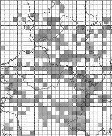

Alternative:

Fill: hatched lines, 50% GREY RGB 80 80 ,80

Outline colour: SOLID BLACK

Abstract: The geometry is rendered with hatched lines with a 50% grey (#808080) fill and a black outline

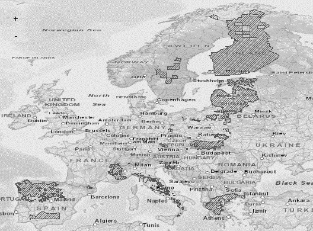

The SLD specifying the symbology is distributed in a file separately from the data specification document.

|*Minimum & maximum scales* |<min scale> - <max scale>
|===

=== Styles recommended to be supported by INSPIRE view services 

==== Styles for the layer SD.SpeciesDistribution 

[cols=",",options="header",]
|===
|*Style Name* |*SD.SpeciesDistribution.TemporalAggregation*
|*Style Title* |Species Distribution – temporal aggregation of presence data
|*Style Abstract* |The presence information of species occurrences aggregated in 10km grid cells as spatial analytical units and with a differentiation into temporal classes where the last occurrence has been reported within each spatial analytical unit.
|*Symbology* |image::./media/image20.png[image,width=197,height=187]
|*Minimum & maximum scales* |<min scale> - <max scale>
|===

[cols=",",options="header",]
|===
|*Style Name* |*SD.SpeciesDistribution.ResidencyStatusDifferentiation*
|*Style Title* |Species Distribution – differentiation of symbology according to a residency status
|*Style Abstract* |The symbology for species occurrences aggregated in grid cells as spatial analytical units represents the differentiation regarding the residency status of the species within that unit by using different marker symbols for each possible attribute value
|*Symbology* a|
Example for using marker symbols for different residency status values is:

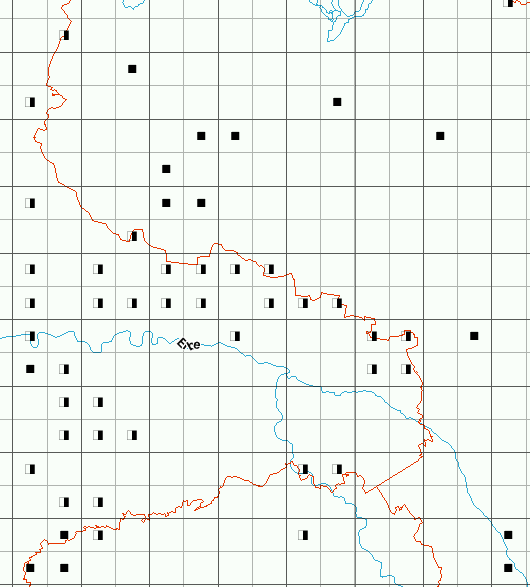
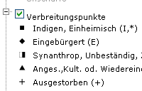

|*Minimum & maximum scales* |<min scale> - <max scale>
|===

:sectnums!:
<<<
== Bibliography

[Atlas Flora Europaea] http://www.fmnh.helsinki.fi/english/botany/afe/ and http://www.biologie.uni-hamburg.de/b-online/ibc99/IDB/afe.html

[Atlas of amphibians and reptiles in Europe] http://www.mnhn.fr/publication/spn/cpn29.html

[CGRS] Common European Chorological Grid Reference System: http://dataservice.eea.eu.int/dataservice/metadetails.asp?id=625

[Copp, Charles (2004)] The NBN Data Model:

http://jncc.defra.gov.uk/Docs/Data%20model%20documentation%20Part1.doc

[Darwin Core] _http://rs.tdwg.org/dwc/index.htm_

[DS-D2.3] INSPIRE DS-D2.3, Definition of Annex Themes and Scope, v3.0, _http://inspire.jrc.ec.europa.eu/reports/ImplementingRules/DataSpecifications/D2.3_Definition_of_Annex_Themes_and_scope_v3.0.pdf_

[DS-D2.5] INSPIRE DS-D2.5, Generic Conceptual Model, v3.3, _http://inspire.jrc.ec.europa.eu/documents/Data_Specifications/D2.5_v3_3.pdf_

[DS-D2.6] INSPIRE DS-D2.6, Methodology for the development of data specifications, v3.0, _http://inspire.jrc.ec.europa.eu/reports/ImplementingRules/DataSpecifications/D2.6_v3.0.pdf_

[DS-D2.7] INSPIRE DS-D2.7, Guidelines for the encoding of spatial data, v3.2, _http://inspire.jrc.ec.europa.eu/documents/Data_Specifications/D2.7_v3.2.pdf_

[Eunis - species] http://eunis.eea.eu.int/species.jsp (SRO)

[Eunis taxonomy] http://eunis.eea.eu.int/species-taxonomic-browser.jsp

[EuroMed] EuroMed Plantbase: http://www.emplantbase.org/home.html (SRO)

[Fauna Europae] http://www.euromed.org.uk

[Fauna Europea data base] http://www.faunaeur.org/

[Floristic Mapping of Germany] Floristische Kartierung Deutschlands

_http://www.floraweb.de/pflanzenarten/hintergrundtexte_florkart.html_

[GBIF] Global Biodiversity Information Facility www.gbif.org

[iDigBio] Information Technology Group: Guidelines for Managing Unique Resource Identifiers (https://www.idigbio.org/sites/default/files/videos/slides/iDigBio_URI_recommendation.pdf)

[ISO 19101] EN ISO 19101:2005 Geographic information – Reference model (ISO 19101:2002)

[ISO 19103] ISO/TS 19103:2005, Geographic information – Conceptual schema language

[ISO 19107] EN ISO 19107:2005, Geographic information – Spatial schema (ISO 19107:2003)

[ISO 19111] EN ISO 19111:2007 Geographic information - Spatial referencing by coordinates (ISO 19111:2007)

[ISO 19115] EN ISO 19115:2005, Geographic information – Metadata (ISO 19115:2003)

[ISO 19118] EN ISO 19118:2006, Geographic information – Encoding (ISO 19118:2005)

[ISO 19135] EN ISO 19135:2007 Geographic information – Procedures for item registration (ISO 19135:2005)

[ISO 19139] ISO/TS 19139:2007, Geographic information – Metadata – XML schema implementation

[ISO 19157]    ISO/DIS 19157, Geographic information – Data quality

[LÖBF] OSIRIS-Datenmodell (Germany)

[NATURA 2000] Identification & GIS Classification of Flora Habitants in Significant Reservation Areas: Greece (E)

[NATURE-GIS Guidelines] Data Infrastructure for Protected Areas. Editor: Ioannis KASCllopoulos (EC – JRC) with the support of GISIG and the contribution of the NATURE-GIS Partners

[OGC 06-103r3] Implementation Specification for Geographic Information - Simple feature access – Part 1: Common Architecture v1.2.0

<<<
:sectnums:
[appendix]
== Abstract Test Suite - (normative)

*Disclaimer*

While this Annex refers to the Commission Regulation (EU) No 1089/2010 of 23 November 2010 implementing Directive 2007/2/EC of the European Parliament and of the Council as regards interoperability of spatial data sets and services, it does not replace the legal act or any part of it.

The objective of the Abstract Test Suite (ATS) included in this Annex is to help the conformance testing process. It includes a set of tests to be applied on a data set to evaluate whether it fulfils the requirements included in this data specification and the corresponding parts of Commission Regulation No 1089/2010 (implementing rule as regards interoperability of spatial datasets and services, further referred to as ISDSS Regulation). This is to help data providers in declaring the conformity of a data set to the "degree of conformity, with implementing rules adopted under Article 7(1) of Directive 2007/2/EC", which is required to be provided in the data set metadata according to Commission Regulation (EC) No 2008/1205 (the Metadata Regulation).

*Part 1* of this ATS includes tests that provide *input for assessing conformity with the ISDSS regulation.* In order to make visible which requirements are addressed by a specific test, references to the corresponding articles of the legal act are given. The way how the cited requirements apply to sd specification is described under the testing method.

In addition to the requirements included in ISDSS Regulation this Technical guideline contains TG requirements too. TG requirements are technical provisions that need to be fulfilled in order to be conformant with the corresponding IR requirement when the specific technical implementation proposed in this document is used. Such requirements relate for example to the default encoding described in section 9. *Part 2* of the ATS presents tests necessary for assessing the *conformity with TG requirements*.

NOTE Conformance of a data set with the TG requirement(s) included in this ATS implies conformance with the corresponding IR requirement(s).

The *ATS is applicable to the data sets that* *have been transformed* to be made available through INSPIRE download services (i.e. the data returned as a response to the mandatory "Get Spatial Dataset" operation) rather than the original "source" data sets.

The requirements to be tested are grouped in several _conformance classes_. Each of these classes covers a specific aspect: one conformance class contains tests reflecting the requirements on the application schema, another on the reference systems, etc. *Each conformance class is identified by a URI* (uniform resource identifier) according to the following pattern:

http://inspire.ec.europa.eu/conformance-class/ir/sd/<conformance class identifier>

EXAMPLE 1 The URI _http://inspire.ec.europa.eu/conformance-class/ir/ef/rs_ identifies the Reference Systems ISDSS conformance class of the Environmental Monitoring Facilities (EF) data theme.

The results of the tests should be published referring to the relevant conformance class (using its URI).

When an INSPIRE data specification contains *more than one application schema,* the requirements tested in a conformance class may differ depending on the application schema used as a target for the transformation of the data set. This will always be the case for the application schema conformance class. However, also other conformance classes could have different requirements for different application schemas. In such cases, a separate conformance class is defined for each application schema, and they are distinguished by specific URIs according to the following pattern:

http://inspire.ec.europa.eu/conformance-class/ir/sd/<conformance class identifier>/ 
<application schema namespace prefix>

EXAMPLE 2 The URI _http://inspire.ec.europa.eu/conformance-class/ir/el/as/el-vec_ identifies the conformity with the application schema (_as_) conformance class for the Elevation Vector Elements (_el-vec_) application schema.

An overview of the conformance classes and the associated tests is given in the table below.

[text-center]
*Table 6. Overview of the tests within this Abstract Test Suite.*

[cols=""]
|===
|*A.1 Application Schema Conformance Class*
a|
!===
!A.1.1 Schema element denomination test
!A.1.2 Value type test
!A.1.3 Value test
!A.1.4 Attributes/associations completeness test
!A.1.5 Abstract spatial object test
!A.1.6 Abstract SpeciesDistributionUnit test
!A.1.7 Constraints test
!A.1.8 Geometry representation test
!===
|*A.2 Reference Systems Conformance Class*
a|
!===
!A.2.1 Datum test
!A.2.2 Coordinate reference system test
!A.2.3 Grid test
!A.2.4 View service coordinate reference system test
!A.2.5 Temporal reference system test
!A.2.6 Units of measurements test
!===
|*A.3 Data Consistency Conformance Class*
a|
!===
!A.3.1 Unique identifier persistency test
!A.3.2 Version consistency test
!A.3.3 Life cycle time sequence test
!A.3.4 Validity time sequence test
!A.3.5 Update frequency test
!===
|*A.4 Metadata IR Conformance Class*
a|
!===
!A.4.1 Metadata for interoperability test
!A.4.2 Lineage metadata element test
!===
|*A.5 Information Accessibility Conformance Class*
a|
!===
!A.5.1 Code list publication test
!A.5.2 CRS publication test
!A.5.3 CRS identification test
!A.5.4 Grid identification test!
!===
|*A.6 Data Delivery Conformance Class*
a|
!===
!A.6.1 Encoding compliance test
!===
|*A.7 Portrayal Conformance Class*
a|
!===
!A.7.1 Layer designation test
!===
|*A.8 Technical Guideline Conformance Class*
a|
!===
!A.8.1 Multiplicity test
!A.8.2 CRS http URI test
!A.8.3 Metadata encoding schema validation test
!A.8.4 Metadata occurrence test
!A.8.5 Metadata consistency test
!A.8.6 Encoding schema validation test
!A.8.7 Coverage multipart representation test
!A.8.8 Coverage domain consistency test
!A.8.9 Style test
!===
|===

In order to be conformant to a conformance class, a data set has to pass *all* tests defined for that conformance class.

In order to be conformant with the ISDSS regulation the inspected data set needs to be conformant to *all* conformance classes in Part 1. The conformance class for overall conformity with the ISDSS regulation is identified by the URI _http://inspire.ec.europa.eu/conformance-class/ir/sd/._

In order to be conformant with the Technical Guidelines, the dataset under inspection needs to be conformant to all conformance classes included both in Part 1 and 2. Chapter 8 describes in detail how to publish the result of testing regarding overall conformity and conformity with the conformance classes as metadata. The conformance class for overall conformity with the Technical Guidelines is identified by the URI _http://inspire.ec.europa.eu/conformance-class/tg/sd/3.0._

It should be noted that data providers are not obliged to integrate / decompose the original structure of the source data sets when they deliver them for INSPIRE. It means that a conformant dataset can contain less or more spatial object / data types than specified in the ISDSS Regulation.

*A dataset that contains less spatial object and/or data types* can be regarded conformant when the corresponding types of the source datasets after the necessary transformations fulfil the requirements set out in the ISDSS Regulation.

A *dataset that contain more spatial object and/or data types* may be regarded as conformant when

* all the spatial object / data types that have corresponding types in the source dataset after the necessary transformations fulfil the requirements set out in the ISDSS Regulation and
* all additional elements of the source model (spatial object types, data types, attributes, constraints, code lists and enumerations together with their values) do not conflict with any rule defined in the interoperability target specifications defined for any theme within INSPIRE.

|===
*Open issue 1:* Even though the last condition can be derived from Art. 8(4) of the Directive, the ISDSS Regulation does not contain requirements concerning the above issue. Therefore, no specific tests have been included in this abstract suite for testing conformity of extended application schemas. Annex F of the Generic Conceptual Model (D2.5) provides an example how to extend INSPIRE application schemas in a compliant way.
|===

The ATS contains a detailed list of abstract tests. It should be noted that some tests in the Application schema conformance class can be automated by utilising xml *schema validation tools.* It should be noted that failing such validation test does not necessary reflect non-compliance to the application schema; it may be the results of erroneous encoding.

Each test in this suite follows the same structure:

* Requirement: citation from the legal texts (ISDSS requirements) or the Technical Guidelines (TG requirements);
* Purpose: definition of the scope of the test;
* Reference: link to any material that may be useful during the test;
* Test method: description of the testing procedure.

According to ISO 19105:2000 all tests in this ATS are basic tests. Therefore, this statement is not repeated each time.

[discrete]
== Part 1 - (normative)

*Conformity with Commission Regulation No 1089/2010*

=== Application Schema Conformance Class

*Conformance class:*

http://inspire.ec.europa.eu/conformance-class/ir/sd/as/sd

http://inspire.ec.europa.eu/conformance-class/ir/sd/as/sdext

==== Schema element denomination test

a) [.underline]#Purpose#: Verification whether each element of the dataset under inspection carries a name specified in the target application schema(s).

b) [.underline]#Reference#: Art. 3 and Art.4 of Commission Regulation No 1089/2010

c) [.underline]#Test Method#: Examine whether the corresponding elements of the source schema (spatial object types, data types, attributes, association roles, code lists, and enumerations) are mapped to the target schema with the correct designation of mnemonic names.

NOTE Further technical information is in the Feature catalogue and UML diagram of the application schema(s) in section 5.2.

==== Value type test

a) [.underline]#Purpose#: Verification whether all attributes or association roles use the corresponding value types specified in the application schema(s).

b) [.underline]#Reference#: Art. 3, Art.4, Art.6(1), Art.6(4), Art.6(5) and Art.9(1)of Commission Regulation No 1089/2010.

c) [.underline]#Test Method#: Examine whether the value type of each provided attribute or association role adheres to the corresponding value type specified in the target specification.

NOTE 1 This test comprises testing the value types of INSPIRE identifiers, the value types of attributes and association roles that should be taken from enumeration and code lists, and the coverage domains.

NOTE 2 Further technical information is in the Feature catalogue and UML diagram of the application schema(s) in section 5.2.

==== Value test

a) [.underline]#Purpose#: Verify whether all attributes or association roles whose value type is a code list or enumeration take the values set out therein.

b) [.underline]#Reference#: Art.4 (3) of Commission Regulation No 1089/2010.

c) [.underline]#Test Method#: When an attributes / association roles has "enumeration" or "codeList" type compare the values of each instance with those provided in the application schema. To pass this tests any instance of an attribute / association role

* Shall take only values explicitly specified in the code list when its type is codeList with extensibility value is "none".
* Shall take only a value explicitly specified in the code list or shall take a value that is narrower (i.e. more specific) than those explicitly specified in the application schema when the type is codeList with extensibility value is "narrower".

NOTE 1 This test is not applicable to code lists with extensibility "any".

NOTE 2 When a data provider only uses code lists with narrower (more specific values) this test can be fully performed based on internal information.

==== Attributes/associations completeness test

a) [.underline]#Purpose#: Verification whether each instance of spatial object type and data types include all attributes and association roles as defined in the target application schema.

b) [.underline]#Reference#: Art. 3, Art.4(1), Art.4(2), and Art.5(2) of Commission Regulation No 1089/2010.

c) [.underline]#Test Method#: Examine whether all attributes and association roles defined for a spatial object type or data type are present for each instance in the dataset.

NOTE 1 Further technical information is in the Feature catalogue and UML diagram of the application schema(s) in section 5.2.

NOTE 2 If an attribute has the stereotype «voidable», then according to the INSPIRE Generic Conceptual Model (section 9.8.4.3) one of the three "void reason" values "unknown", "unpopulated" or "withheld" shall be provided instead of the real values.

NOTE 3 If the characteristic described by the attribute or association role does not apply to the real world entity, the attribute or association role does not need to be present in the data set.

==== Abstract spatial object test

a) [.underline]#Purpose#: Verification whether the dataset does NOT contain abstract spatial object / data types defined in the target application schema(s).

b) [.underline]#Reference#: Art.5(3) of Commission Regulation No 1089/2010

c) [.underline]#Test Method#: examine that there are NO instances of abstract spatial object / data types in the dataset provided.

NOTE Further technical information is in the Feature catalogue and UML diagram of the application schema(s) in section 5.2.

==== Abstract SpeciesDistributionUnit test

a) [.underline]#Purpose#: Verification whether SpeciesDistributionUnit spatial objects have an attributes values depending on if species has been/has been not actively searched.

b) [.underline]#Reference#: Annex IV, Section 18.5 (2) of Commission Regulation No 1089/2010

c) [.underline]#Test Method#: Examine if species has been actively searched for. If species has not been actively searched for, the distributionInfo attribute shall be void with reason "unknown", othervise if a species has been actively searched for, but has not been found, the value of the attribute occurenceCategory of DistributionInfoType shall be "absent".

==== Constraints test

a) [.underline]#Purpose#: Verification whether the instances of spatial object and/or data types provided in the dataset adhere to the constraints specified in the target application schema(s).

b) [.underline]#Reference#: Art. 3, Art.4(1), and Art.4(2) of Commission Regulation No 1089/2010.

c) [.underline]#Test Method#: Examine all instances of data for the constraints specified for the corresponding spatial object / data type. Each instance shall adhere to all constraints specified in the target application schema(s).

NOTE Further technical information is in the Feature catalogue and UML diagram of the application schema(s) in section 5.2.

==== Geometry representation test

a) [.underline]#Purpose#: Verification whether the value domain of spatial properties is restricted as specified in the Commission Regulation No 1089/2010.

b) [.underline]#Reference#: Art.12(1), Annex IV Section 18 of Commission Regulation No 1089/2010

c) [.underline]#Test Method#: Check whether all spatial properties only use 0, 1 and 2-dimensional geometric objects that exist in the right 2-, 3- or 4-dimensional coordinate space, and where all curve interpolations respect the rules specified in the reference documents.

NOTE Further technical information is in OGC Simple Feature spatial schema v1.2.1 [06-103r4].

=== Reference Systems Conformance Class

*Conformance class:*

http://inspire.ec.europa.eu/conformance-class/ir/sd/rs

==== Datum test

a) [.underline]#Purpose#: Verify whether each instance of a spatial object type is given with reference to one of the (geodetic) datums specified in the target specification.

b) [.underline]#Reference#: Annex II Section 1.2 of Commission Regulation No 1089/2010

c) [.underline]#Test Method#: Check whether each instance of a spatial object type specified in the application schema(s) in section 5 has been expressed using:

* the European Terrestrial Reference System 1989 (ETRS89) within its geographical scope; or
* the International Terrestrial Reference System (ITRS) for areas beyond the ETRS89 geographical scope; or
* other geodetic coordinate reference systems compliant with the ITRS. Compliant with the ITRS means that the system definition is based on the definition of ITRS and there is a well-established and described relationship between both systems, according to the EN ISO 19111.

NOTE Further technical information is given in Section 6 of this document.

==== Coordinate reference system test

a) [.underline]#Purpose#: Verify whether the two- and three-dimensional coordinate reference systems are used as defined in section 6.

b) [.underline]#Reference#: Section 6 of Commission Regulation 1089/2010.

c) [.underline]#Test Method#: Inspect whether the horizontal and vertical components of coordinates one of the corresponding coordinate reference system has been:

* Three-dimensional Cartesian coordinates based on a datum specified in 1.2 and using the parameters of the Geodetic Reference System 1980 (GRS80) ellipsoid.

* Three-dimensional geodetic coordinates (latitude, longitude and ellipsoidal height) based on a datum specified in 1.2 and using the parameters of the GRS80 ellipsoid.

* Two-dimensional geodetic coordinates (latitude and longitude) based on a datum specified in 1.2 and using the parameters of the GRS80 ellipsoid.

* Plane coordinates using the ETRS89 Lambert Azimuthal Equal Area coordinate reference system.

* Plane coordinates using the ETRS89 Lambert Conformal Conic coordinate reference system.

* Plane coordinates using the ETRS89 Transverse Mercator coordinate reference system.

* For the vertical component on land, the European Vertical Reference System (EVRS) shall be used to express gravity-related heights within its geographical scope. Other vertical reference systems related to the Earth gravity field shall be used to express gravity-related heights in areas that are outside the geographical scope of EVRS.

* For the vertical component in marine areas where there is an appreciable tidal range (tidal waters), the Lowest Astronomical Tide (LAT) shall be used as the reference surface.

* For the vertical component in marine areas without an appreciable tidal range, in open oceans and effectively in waters that are deeper than 200 meters, the Mean Sea Level (MSL) or a well-defined reference level close to the MSL shall be used as the reference surface."

* For the vertical component in the free atmosphere, barometric pressure, converted to height using ISO 2533:1975 International Standard Atmosphere, or other linear or parametric reference systems shall be used. Where other parametric reference systems are used, these shall be described in an accessible reference using EN ISO 19111-2:2012.

NOTE Further technical information is given in Section 6 of this document.

==== Grid test

a) [.underline]#Purpose#: Verify that gridded data related are available using the grid compatible with one of the coordinate reference systems defined in Commission Regulation No 1089/2010

b) [.underline]#Reference#: Annex II Section 2.1 and 2.2 of Commission Regulation 1089/2010.

c) [.underline]#Test Method#: Check whether the dataset defined as a grid is compatible with one of the coordinate reference.

* Plane coordinates using the Lambert Azimuthal Equal Area projection and the parameters of the GRS80 ellipsoid (ETRS89-LAEA)

NOTE Further technical information is given in Section 6 of this document.

==== View service coordinate reference system test

a) [.underline]#Purpose#: Verify whether the spatial data set is available in the two dimensional geodetic coordinate system for their display with the INSPIRE View Service.

b) [.underline]#Reference#: Annex II Section 1.4 of Commission Regulation 1089/2010

c) [.underline]#Test Method#: Check that each instance of a spatial object types specified in the application schema(s) in section 5 is available in the two-dimensional geodetic coordinate system

NOTE Further technical information is given in Section 6 of this document.

==== Temporal reference system test

a) [.underline]#Purpose#: Verify whether date and time values are given as specified in Commission Regulation No 1089/2010.

b) [.underline]#Reference#: Art.11(1) of Commission Regulation 1089/2010

c) [.underline]#Test Method#: Check whether:

* the Gregorian calendar is used as a reference system for date values;
* the Universal Time Coordinated (UTC) or the local time including the time zone as an offset from UTC are used as a reference system for time values.

NOTE Further technical information is given in Section 6 of this document.

==== Units of measurements test

a) [.underline]#Purpose#: Verify whether all measurements are expressed as specified in Commission Regulation No 1089/2010.

b) [.underline]#Reference#: Art.12(2) of Commission Regulation 1089/2010

c) [.underline]#Test Method#: Check whether all measurements are expressed in SI units or non-SI units accepted for use with the International System of Units.

NOTE 1 Further technical information is given in ISO 80000-1:2009.

NOTE 2 Degrees, minutes and seconds are non-SI units accepted for use with the International System of Units for expressing measurements of angles.

=== Data Consistency Conformance Class

*Conformance class:*

http://inspire.ec.europa.eu/conformance-class/ir/sd/dc/sd

http://inspire.ec.europa.eu/conformance-class/ir/sd/dc/sdext

==== Unique identifier persistency test

a) [.underline]#Purpose#: Verify whether the namespace and localId attributes of the external object identifier remain the same for different versions of a spatial object.

b) [.underline]#Reference#: Art. 9 of Commission Regulation 1089/2010.

c) [.underline]#Test Method#: Compare the namespace and localId attributes of the external object identifiers in the previous version(s) of the dataset with the namespace and localId attributes of the external object identifiers of current version for the same instances of spatial object / data types; To pass the test, neither the namespace, nor the localId shall be changed during the life-cycle of a spatial object.

NOTE 1 The localId test can be performed entirely on the basis of the information available in the database of the data providers.

NOTE 2 When using URI this test includes the verification whether no part of the construct has been changed during the life cycle of the instances of spatial object / data types.

NOTE 3 Further technical information is given in section 14.2 of the INSPIRE Generic Conceptual Model.

==== Version consistency test

a) [.underline]#Purpose#: Verify whether different versions of the same spatial object / data type instance belong to the same type.

b) [.underline]#Reference#: Art. 9 of Commission Regulation 1089/2010.

c) [.underline]#Test Method#: Compare the types of different versions for each instance of spatial object / data type

NOTE 1 This can be performed entirely on the basis of the information available in the database of the data providers.

==== Life cycle time sequence test

a) [.underline]#Purpose#: Verification whether the value of the attribute beginLifespanVersion refers to an earlier moment of time than the value of the attribute endLifespanVersion for every spatial object / object type where this property is specified.

b) [.underline]#Reference#: Art.10(3) of Commission Regulation 1089/2010.

c) [.underline]#Test Method#: Compare the value of the attribute beginLifespanVersion with attribute endLifespanVersion. The test is passed when the beginLifespanVersion value is before endLifespanVersion value for each instance of all spatial object/data types for which this attribute has been defined.

NOTE 1 this test can be performed entirely on the basis of the information available in the database of the data providers.

==== Validity time sequence test

a) [.underline]#Purpose#: Verification whether the value of the attribute validFrom refers to an earlier moment of time than the value of the attribute validTo for every spatial object / object type where this property is specified.

b) [.underline]#Reference#: Art.12(3) of Commission Regulation 1089/2010.

c) [.underline]#Test Method#: Compare the value of the attribute validFrom with attribute validTo. The test is passed when the validFrom value is before validTo value for each instance of all spatial object/data types for which this attribute has been defined.

NOTE 1 this test can be performed entirely on the basis of the information available in the database of the data providers.

==== Update frequency test

a) [.underline]#Purpose#: Verify whether all the updates in the source dataset(s) have been transmitted to the dataset(s) which can be retrieved for the sd using INSPIRE download services.

b) [.underline]#Reference#: Art.8 (2) of Commission Regulation 1089/2010.

c) [.underline]#Test Method#: Compare the values of beginning of life cycle information in the source and the target datasets for each instance of corresponding spatial object / object types. The test is passed when the difference between the corresponding values is less than 6 months.

NOTE 1 this test can be performed entirely on the basis of the information available in the database of the data providers.

=== Metadata IR Conformance Class

*Conformance class:*

http://inspire.ec.europa.eu/conformance-class/ir/sd/md

==== Metadata for interoperability test

a) [.underline]#Purpose#: Verify whether the metadata for interoperability of spatial data sets and services described in 1089/2010 Commission Regulation have been created and published for each dataset related to the SD data theme.

b) [.underline]#Reference#: Art.13 of Commission Regulation 1089/2010

c) [.underline]#Test Method#: Inspect whether metadata describing the coordinate reference systems, temporal reference system, encoding, character encoding and when applicable topological consistency have been created and published.

NOTE Further technical information is given in section 8 of this document.

==== Lineage metadata element test

a) [.underline]#Purpose#: Verify whether in all cases, where geometries of the spatial objects in a SpeciesDistributionUnit data set are derived from the geometries of spatial objects in another data set, the source data set (including its version) is described as part of the lineage metadata element

b) [.underline]#Reference#: Annex IV, Section 18.5 (2) of Commission Regulation No 1089/2010

c) [.underline]#Test Method#: For all SpeciesDistributionUnit data sets, in which geometries of the spatial objects have been derived from the geometries of spatial objects in another data set, inspect whether the lineage metadata element contains a description of the source data set (including its version).

NOTE 1 Whether this test needs to be performed depends on information available only to the data providers of the SpeciesDistributionUnit data set (i.e. whether the geometries of the spatial objects in

the data set are derived from the geometries of spatial objects in another data set).

NOTE 2 This test only applies to the Species Distribution application distribution schema.

=== Information Accessibility Conformance Class

*Conformance class:*

http://inspire.ec.europa.eu/conformance-class/ir/sd/ia

==== Code list publication test

a) [.underline]#Purpose#: Verify whether the values of each code list that allow narrower values or any other value than specified in Commission Regulation 1089/2010 are published in a register.

b) [.underline]#Reference#: Art.6(3)

b) [.underline]#Reference#: Art.6(3) and Annex IV Section 18

NOTE Further technical information is given in section 5 of this document.

_._

==== CRS publication test

a) [.underline]#Purpose#: Verify whether the identifiers and the parameters of coordinate reference system are published in common registers.

b) [.underline]#Reference#: Annex II Section 1.5

c) [.underline]#Test Method#: Check whether the identifier and the parameter of the CRS used for the dataset are included in a register. .

NOTE Further technical information is given in section 6 of this document.

==== CRS identification test

a) [.underline]#Purpose#: Verify whether identifiers for other coordinate reference systems than specified in Commission Regulation 1089/2010 have been created and their parameters have been described according to EN ISO 19111 and ISO 19127.

b) [.underline]#Reference#: Annex II Section 1.3.4

c) [.underline]#Test Method#: Check whether the register with the identifiers of the coordinate reference systems is accessible.

NOTE Further technical information is given in section 6 of this document.

==== Grid identification test

a) [.underline]#Purpose#: Verify whether identifiers for other geographic grid systems than specified in Commission Regulation 1089/2010 have been created and their definitions have been either described with the data or referenced.

b) [.underline]#Reference#: Annex II Section 2.1 and 2.2

c) [.underline]#Test Method#: Check whether the identifiers for grids have been created. Inspect the dataset and/or the metadata for inclusion of grid definition.

NOTE Further technical information is given in section 6 of this document.

=== Data Delivery Conformance Class

*Conformance class:*

http://inspire.ec.europa.eu/conformance-class/ir/sd/de

==== Encoding compliance test

a) [.underline]#Purpose#: Verify whether the encoding used to deliver the dataset comply with EN ISO 19118.

b) [.underline]#Reference#: Art.7 (1) of Commission Regulation 1089/2010.

c) [.underline]#Test Method#: Follow the steps of the Abstract Test Suit provided in EN ISO 19118.

NOTE 1 Datasets using the default encoding specified in Section 9 fulfil this requirement.

NOTE 2 Further technical information is given in Section 9 of this document.

=== Portrayal Conformance Class

*Conformance class:*

http://inspire.ec.europa.eu/conformance-class/ir/sd/po

==== Layer designation test

a) [.underline]#Purpose#: verify whether each spatial object type has been assigned to the layer designated according to Commission Regulation 1089/2010.

b) [.underline]#Reference#: Art. 14(1), Art14(2) and Annex IV Section 18.

c) [.underline]#Test Method#: Check whether data is made available for the view network service using the specified layers respectively:

SD.<CodeListValue>

Example: SD.SulaBassana

NOTE Further technical information is given in section 11 of this document.

[discrete]
== Part 2 - (informative)

*Conformity with the technical guideline (TG) Requirements*

=== Technical Guideline Conformance Class

*Conformance class:*

_http://inspire.ec.europa.eu/conformance-class/tg/sd/3.0_

==== Multiplicity test

a) [.underline]#Purpose#: Verify whether each instance of an attribute or association role specified in the application schema(s) does not include fewer or more occurrences than specified in section 5.

b) [.underline]#Reference#: Feature catalogue and UML diagram of the application schema(s) in section 5 of this guideline.

c) [.underline]#Test Method#: Examine that the number of occurrences of each attribute and/or association role for each instance of a spatial object type or data type provided in the dataset corresponds to the number of occurrences of the attribute / association role that is specified in the application schema(s) in section 5.

==== CRS http URI test

a) [.underline]#Purpose#: Verify whether the coordinate reference system used to deliver data for INSPIRE network services has been identified by URIs according to the EPSG register.

b) [.underline]#Reference#: Section 6 of this technical guideline

c) [.underline]#Test Method#: Compare the URI of the dataset with the URIs in the table.

NOTE 1 Passing this test implies the fulfilment of test A6.2

NOTE 2 Further reference please see _http://www.epsg.org/geodetic.html_

==== Metadata encoding schema validation test

a) [.underline]#Purpose#: Verify whether the metadata follows an XML schema specified in ISO/TS 19139.

b) [.underline]#Reference#: Section 8 of this technical guideline, ISO/TS 19139

c) [.underline]#Test Method#: Inspect whether provided XML schema is conformant to the encoding specified in ISO 19139 for each metadata instance.

NOTE 1 Section 2.1.2 of the Metadata Technical Guidelines discusses the different ISO 19139 XML schemas that are currently available.

==== Metadata occurrence test

a) [.underline]#Purpose#: Verify whether the occurrence of each metadata element corresponds to those specified in section 8.

b) [.underline]#Reference#: Section 8 of this technical guideline

c) [.underline]#Test Method#: Examine the number of occurrences for each metadata element. The number of occurrences shall be compared with its occurrence specified in Section 8:

NOTE 1 Section 2.1.2 of the Metadata Technical Guidelines discusses the different ISO 19139 XML schema

==== Metadata consistency test

a) [.underline]#Purpose#: Verify whether the metadata elements follow the path specified in ISO/TS 19139.

b) [.underline]#Reference#: Section 8 of this technical guideline, ISO/TS 19139

c) [.underline]#Test Method#: Compare the XML schema of each metadata element with the path provide in ISO/TS 19137.

NOTE 1 This test does not apply to the metadata elements that are not included in ISO/TS 19139.

==== Encoding schema validation test

a) [.underline]#Purpose#: Verify whether the provided dataset follows the rules of default encoding specified in section 9 of this document

b) [.underline]#Reference#: section 9 of this technical guideline

c) [.underline]#Test Method#: Inspect whether provided encoding(s) is conformant to the encoding(s) for the relevant application schema(s) as defined in section 9:

NOTE 1 Applying this test to the default encoding schema described in section 9 facilitates testing conformity with the application schema specified in section 5. In such cases running this test with positive result may replace tests from A1.1 to A1.4 provided in this abstract test suite.

NOTE 2 Using Schematron or other schema validation tool may significantly improve the validation process, because some some complex constraints of the schema cannot be validated using the simple XSD validation process. On the contrary to XSDs Schematron rules are not delivered together with the INSPIRE data specifications. Automating the process of validation (e.g. creation of Schematron rules) is therefore a task and an opportunity for data providers.

==== Coverage multipart representation test

a) [.underline]#Purpose#: Verify whether coverage data encoded as multipart messages comply with the multipart representation conformance class defined in GML Application Schema for Coverages [OGC 09-146r2].

b) [.underline]#Reference#: OGC standard GML Application Schema for Coverages [OGC 09-146r2].

c) [.underline]#Test Method#: Inspect whether coverage data encoded as multipart messages comply with the multipart representation conformance class defined in GML Application Schema for Coverages [OGC 09-146r2].

NOTE further information is provided in section 9.4 of this technical guideline.

==== Coverage domain consistency test

a) [.underline]#Purpose#: Verify whether the encoded coverage domain is consistent with the information provided in the GML application schema.

b) [.underline]#Reference#: Section 9.4.1.2 of this technical guideline.

c) [.underline]#Test Method#: For multipart coverage messages compare the encoded coverage domain with the description of the coverage component in the GML application schema

NOTE 1 This test applies only to those multipart messages, where the coverage range is encoded together with the coverage domain (some binary formats).

NOTE 2 .This test does not apply to multipart messages where the coverage range is embedded without describing the data structure (e.g. text based formats).

==== Style test

a) [.underline]#Purpose#: Verify whether the styles defined in section 11.2 have been made available for each specified layer.

b) [.underline]#Reference#: section 11.2.

c) [.underline]#Test Method#: Check whether the styles defined in section 11.2 have been made available for each specified layer.

<<<
[appendix]
== Use cases - (informative) 

This document describes the use cases for the INSPIRE Species Distribution theme and associated data product specification. The first part provides a use case diagram showing the interactions between the five use cases that have been defined and the actors. The remaining parts describe each of the five use cases in turn. The use cases are:

[arabic, start=1]
. Generate European Species Distribution spatial data report (Europe-wide, expert user/regional government including European Commission and European Environment Agency).
. Simple query and view Species Distribution (local, regional and Europe-wide; non-expert/public user).
. Expertly query, view, visualise and analyse Species Distribution (local, regional, cross-border; to support environmental impact assessment and decision making in resource management and spatial planning).
. Download Species Distribution data (expert /semi-expert user for specialised analyses in statistical, administrative or other geographical units).
. Provide Species Distribution data according to EU legal obligations and dataflow (EU/EEA Member State).

The selected use cases are intended to encompass the range of uses of Species Distribution data, as well as the different scales, user groups and outputs, and to identify any issues of particular relevance for the theme.

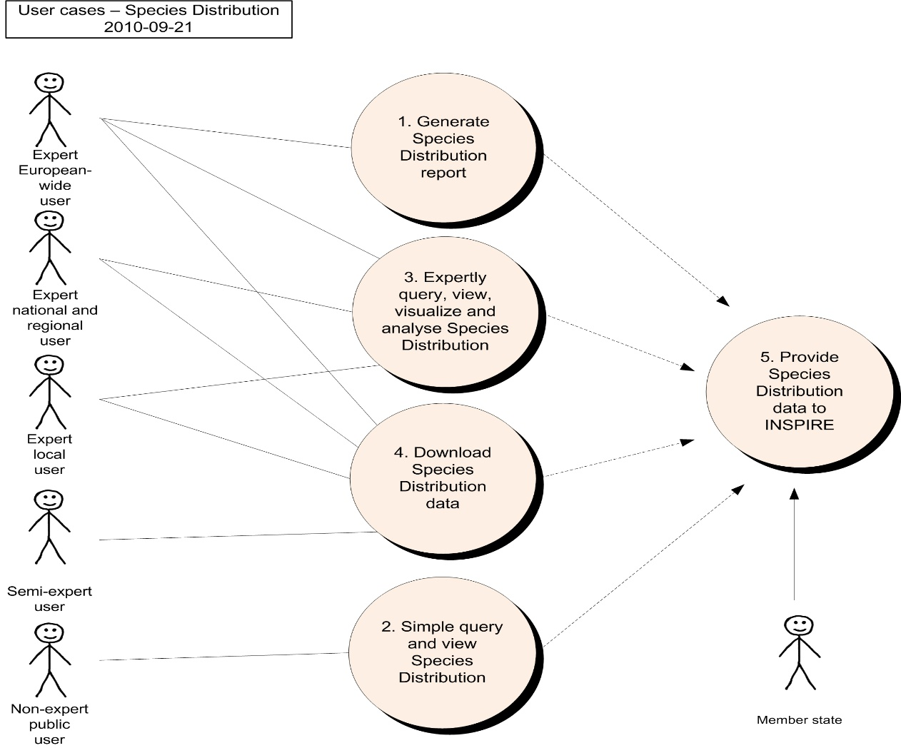

=== Generate European Species Distribution Spatial Data Report 

The scenario for the Generate European Species Distribution Spatial Data Report is that a European expert user would like to collate all necessary information on Species Distribution in a GIS-database or application for generating standard overviews and/or tabulations on all available Species Distribution data across Europe. The results will contribute to special reporting obligations at the European level (for example, biodiversity indicators, European Commission composite reports under Art. 17 Habitat Directive, The Birds Directive, reporting to Convention on the Conservation of European Wildlife and Natural Habitats), the RAMSAR-convention and the Convention on Migratory Species.

[cols=",",]
|===
|*Use Case Descriptio* |
|Name |Generate European Species Distribution Spatial Data Report.
|Primary actor |Expert user
|Goal |Generation of standard overviews and/or tabulations on all available Species Distribution data across Europe.
|System under 
consideration |Web Processing Service
|Importance |High
|Description |The user analyzes cross-border datasets on Species Distribution (for example, those created in Use Case 5 up to a European extent by means of a GIS-application to create overview-maps and/or tabulations on Species Distribution data. The results will be part of special reports of different kinds such as progress in area coverage of Species Distribution per category in the EU/EEA (indicators) and composite assessments of the implementation of the EU Directives at the European or biogeographical level.
|Pre-condition |Quality controlled Species Distribution data sets from the Member States are available to the user in line with INSPIRE specifications and the INSPIRE registry provides all necessary information for standardised access to data. The user has access to the INSPIRE Generate Report Web Processing Service.
|Post-condition |The report may be for later comparison of versions. GIS-analyses and resulting data have to be described and stored for later use.
2+|*Flow of Events – Basic Path*
a|
Step 1.

|The user calls a Web Processing Service, specifying the area of interest. This would commonly encompass all of Europe, but may also be restricted to a particular country or geographical region (using administrative boundaries or boundaries of bio-geographical regions or other statistical units as defined in INSPIRE). The user also selects the reporting items required. The following items are available:
a|
Step 2.
|The Web Processing Service generates a report using source data from each of the member states in the selected area or across Europe.
a|
Step 3.
|The user receives the report and uses it to determine the status of Species Distribution across Europe.
2+|*Data set:* INSPIRE-Conformant Species Distribution Data Set Provided by Member State
a|
Description
|Report data generated for Species Distribution to provide summary details across Europe.
a|
Type
|input
a|
Data provider
|Each member state or national focal points.
a|
Geographic scope
|Europe wide, although a smaller area may be selected.
a|
Thematic scope
|INSPIRE Annex III 19. Species Distribution.
a|
Scale, resolution
|As made applicable by data provider.
a|
Delivery
|Textual report and associated geometry information.
a|
Documentation
|INSPIRE Species Distribution Data Product Specification
|===

=== Simple Query and View Species Distribution 

The scenario for the Simple Query and View Species Distribution use case is that a user would like to find out about Species Distribution in his or her neighbourhood. It is assumed that the user is aware of and has access to a basic publicly accessible (probably web based) GIS that contains the relevant data. For example, outdoor person or a field naturalist may be interested in finding out about the countryside he walks in and which species is living there. In this scenario, the user would use a publicly accessible GIS to zoom/pan to or find, by gazetteer search, the location of interest, display the data on screen and even print out a map.

[cols=",",]
|===
|*Use Case Description*|
|Name |Simple Query and View Species Distribution.
|Primary actor |Data user with basic knowledge about the domain.
|Goal |To find out, what kind of species user can find in his neighbourhood.
|System under 
consideration |Portable devices supporting webapplications/systems
|Importance |High
|Description |The user uses a publicly accessible (probably web based) GIS to zoom/pan to or find, by gazetteer search, the location of interest and display the data on screen.
|Pre-condition |Species Distribution are available in line with INSPIRE specifications to the user by relevant Web Map Services and Web Feature Services. The user has access to a publicly accessible (probably web based) GIS that displays data using the INSPIRE rules.
|Post-condition |User is able to easy and properly interpret received information.
2+|*Flow of Events – Basic Path*
a|
Step 1.
|The user uses the GIS to zoom and/or pan to the area of interest, or selects a particular place or administrative area name from a list (this list comes from the INSPIRE Geographic Names data set).
a|
Step 2.
|The GIS queries the relevant Web Map Service and presents the data in the client application. It also optionally displays contextual information about the Species Distribution. Habitat types, protected areas and other types of land designations or statistical units that are related to Species Distribution are layers that can be switched on and off.
a|
Step 3.
|The user uses an information tool in the client application to click on a Species Distribution feature on the map to retrieve the species object (polygon, line, point or grid cell) features as species name, data source, collection date, coordinate precision, redlist status or other relevant available map object features.
a|
Step 4.
|The GIS queries the relevant Web Feature Service and presents the attribute data for the selected Species Distribution feature in the client application. In addition to the attributes, this service may also provide links to related information about habitat, protected areas and feature condition information..
2+|*Data set:* Member State Web Map Service and Web Feature Service on Species Distribution
a|
Description
|This use case uses Web Map Services and Web Feature Services from each of the EU/EEA member states that serve their Species Distribution data in the INSPIRE GML map projection parameters (for web map service) and application schema format (for web feature service).
a|
Type
|Input
a|
Data provider
|Each member state.
a|
Geographic scope
|All EU/EEA member states, but GIS application selects and displays only a subset of that area, depending on the extents of the current map being viewed. Such a map would normally show a relatively small area for the purposes of a simple user.
a|
Thematic scope
|Species Distribution and geographic names.
a|
Scale, resolution
|Data is served at the most appropriate scale and resolution. This will vary depending on the scale of the map being viewed, and will be controlled within the parameters of the GIS and the client application.
a|
Delivery
|INSPIRE Species Distribution GML Application Schema, graphical map.
a|
Documentation
|INSPIRE Species Distribution Data Product Specification.
|===

=== Expertly Query, View, Visualise and Analyse Species Distribution 

The scenario for the Expertly Query, View, Visualise and Analyse Species Distribution use case is that a user needs to ensure that the species site/locality will not be adversely affected by any proposed land-use change. This is a routine requirement of any agency responsible for administering Species Distribution systems through formal consultation from other legitimate land use planning agencies. In this scenario, the user would start with a proposal generated by developer and supplied to the user through an agreed consultation process. The user would then use information on Species Distribution to evaluate the potential impact of the proposed development on the species site features and purposes. A typical such example could be a consultation on the route of a road construction across countryside or spatial planning for housing/industry through Environmental Impact Assessment legislation.

[cols=",",]
|===
|*Use Case Description*|
|Name |Expertly Query, View, Visualise and Analyse Species Distribution.
|Primary actor |Species Distribution related data user with extended knowledge about the domain.
|Goal |Assess potential impact of planned activity on affected species in the area.
|System under 
consideration |Environmental impact assessment
|Importance |High
|Description |The user creates a view of Species Distribution within the planning proposal area and assesses potential impacts.
|Pre-condition |Species Distribution are available in line with INSPIRE specifications to the user and INSPIRE registry provides all necessary information for standardised access to data. The user has access to a client GIS with basic selection tools.
|Post-condition |The user has an audit trail of the impact assessment for use in contested inquiries to resolve any conflicts.
2+|*Flow of Events – Basic Path*
a|

Step 1.

|*_Define the scope of the potential impact area:_* The user is provided with the geographical boundary of the planning proposal, with detail of the proposed infrastructure, construction access routes, storage/disposal areas, construction plant locations and operating details. These details are supplied as digital GIS data, or are digitised from paper maps.
a|

Step 2.

|*_Display Species Distribution boundaries or localities on scope area:_* The user downloadsfootnote:[See use case 4.] or include WMS/WFS Species Distribution data to his or her local GIS tool and views the relationship between the Species Distribution and the proposed land use changes, both during and after construction.
a|

Step 3.

|*_Categorise protected features subject to protection:_* The user identifies the protected features on each site that falls within, or intersects the scope area, optionally distinguishing between species Redlist status, habitat types and other site related features.
a|

Step 4.

|*_Assess sensitivity of protected features:_* The user uses specialist advice (either using existing procedures, or in consultation with relevant specialists) to determine the sensitivity of each feature to the type of development proposed (eg. only affected if development crosses the protected site boundary, or affected if disturbance is within 2km of the boundary). The sensitivity depends upon the type of development and includes both construction impacts and operating impacts post-construction.
a|

Step 5.

|*_Categorise potential impacts of development:_* The user, in consultation with relevant experts, assesses the likely affects on the species of the proposed development (land take; impacts on water, soil and air; etc.) during and after construction).
a|

Step 6.

|*_Assess the spatial extent of development impacts:_* The user creates boundary information for each of the relevant impacts predicted to arise from the development in his or her own GIS.
a|

Step 7.

|*_Apply constraints check_*: The user applies a buffer to each protected site that reflects the sensitivity of the site. The outline of the buffer provides the potential impact area on each identified feature on the Species Distribution and is used in all further assessment of impact. The buffer distance can be several kilometres when groundwater, diffuse pollution or air pollution is involved.
a|

Step 8

|*_Assess overall impact of development on Species Distribution:_* The user runs a query to tabulate the overlap between the sensitivity of site features and the anticipated impacts of the development proposal.
a|

Step 9.

|*Impact assessment:* The user identifies conflicts between development and existing Species Distribution and the influenced species features.
2+|*Data set:* INSPIRE Species Distribution for each member state
a|

Description

|This use case uses Species Distribution data from national sources, often from scientific institutions or organisations. Cross border assessments will require consistent standards of species site definition in order to maintain a coherent defence case in any planning enquiry.
a|

Type

|input
a|

Data provider

|Each member state.
a|

Geographic scope

|All EU/EEA member states, but with appropriate cross border cooperation where necessary.
a|

Thematic scope

|Species Distribution.
a|

Scale, resolution

|The species site data will need to be available at the scale relevant to the application. Localised development proposals may use base maps at 1:2,500 or better and legal constraints of conflicting land uses (roads vs nature conservation) may require accurate site or boundary matching.
a|

Delivery

|INSPIRE Species Distribution GML Application Schema.
a|

Documentation

|INSPIRE Species Distribution Data Product Specification.
|===

=== Download Species Distribution Data 

The scenario for the Download Species Distribution Data use case is that a user would like to download Species Distribution data for use on their own systems (a desktop GIS for example). For example, a non-government environmental agency may be interested in using the Species Distribution data in their own, advanced analysis with their own and other data sets. In this scenario, the user would select the area and feature types of interest and receive the appropriate Species Distribution feature types in the appropriate area.

[cols=",",]
|===
|*Use Case Description*|
|Name |Download Species Distribution Data.
|Primary actor |Expert data user (further data processor).
|Goal |Direct access to species distribution data in order to use it for additional analysis generating added value(s).
|System under 
consideration |Desktop GIS
|Importance |Medium
|Description |The user downloads Species Distribution data and associated metadata in a selected area and with selected feature types included.
|Pre-condition |Species Distribution are available in line with INSPIRE specifications to the user and INSPIRE registry provides all necessary information for standardised access to data. The user has access to a client GIS with basic selection tools.
|Post-condition |The user has a copy of the Species Distribution data according to his or her geographical and feature type selection saved in the format of the GML application schema generated from the Species Distribution package of the INSPIRE data model.
2+|*Flow of Events – Basic Path*
a|

Step 1.

|The user selects the area of interest graphically on a map (this can be part of a member state, a whole member state or more than one member state) of from a textual list of countries (selecting either one or more than one country).
a|

Step 2.

|The user selects the feature types of interest from a list of all of the Species Distribution feature types (one or more).
a|

Step 3.

|The user invokes the download.
a|

Step 4.

|The system calls the relevant Web Feature Services to retrieve the information from the member statesfootnote:[For multiple member states, this may be returned either as a series of separate responses for each member state, or using an amalgamation web service to combine the responses from the web feature service for each member state. The web service architecture is beyond the scope of the current activity, so this aspect is not further detailed here.].
a|

Step 5.

|The response is provided to the user in the GML Application Schema generated from the Species Distribution package of the INSPIRE data model.
a|

Step 6.

|The user handles the response in his or her chosen manner (for example, by saving the GML data returned by the web service/s to the local computer).
2+|*Data set:* Member State Species Distribution Web Feature Service for each member state
a|

Description

|This use case uses web feature services from each of the EU member states that serve their Species Distribution data in the INSPIRE GML application schema format.
a|

Type

|Input
a|

Data provider

|Each member state.
a|

Geographic scope

|All EU member states, but user can select only a subset of that area, either a subset of member states, a single member state or only part of a member state. In the latter case, a web feature service filter is required.
a|

Thematic scope

|Species Distribution. This use case could be expanded to include all themes, as it is generic.
a|

Scale, resolution

|Data is provided at the most detailed scale and resolution available. The user may be given the option to select scale and resolution if required.
a|

Delivery

|INSPIRE Species Distribution GML Application Schema.
a|

Documentation

|INSPIRE Species Distribution Data Product Specification.
|===

=== Provide Species Distribution Data Using INSPIRE Specifications 

The scenario for the Provide Species Distribution Data Using INSPIRE Specifications use case is that a member state or other organisation (for example, the European Environment Agency) is to provide data according to the INSPIRE process. This use case involves data input according to INSPIRE, rather than output/use. All of the other use cases involve INSPIRE data output or use. This use case identifies the different steps that the member state might go through in providing data.

This use case describes a generic process that is envisaged after INSPIRE is implemented. As background material, Appendix A contains use cases describing the current data flows for two particular member states (Norway and Sweden), which contributes data from national focal point institutions directly to INSPIRE.

[cols=",",]
|===
|*Use Case Description*|
|Name |Provide Species Distribution data using INSPIRE data model.
|Primary actor |Stakeholder responsible for INSPIRE compliant Species Distribution related spatial data delivery .
|Goal |To ensure compliancy of local data with INSPIRE specification/s.
|System under 
consideration |National spatial data infrastructures.
|Importance |High
|Description |The user is an EU member state, and prepares and provides its data using the INSPIRE specifications, in the form of a static or dynamic data set.
|Pre-condition |Agreement to reporting data specifications and formats at the European level such the species national redlist status, species names status, and on data collection cycle and reporting deadlines.
|Post-condition |The member state's data set is available in line with INSPIRE standards.
2+|*Flow of Events – Basic Path*
a|
Step 1.
|Before expiration of a reporting deadline, the user prepares the national data for submission including mapping from the national data to the INSPIRE Species Distribution Data Product Specification.
a|
Step 2.
|The user uploads the national data according to agreed INSPIRE standards. She or he can upload an entire data set, or only a part of that data set, selected by geographical area of Species Distribution category.
a|
Step 3.
|The system generates a quality check report for the uploaded data and determines whether there are any issues. The quality control report assesses issues of match between the different member states' data sets (e.g. species name, cross border issues) and compliance with the INSPIRE Data Product Specification.
a|
Step 4.
|The user reviews the quality check report and modifies the data set as required to ensure compliance.
a|
Step 5.
|The user uploads the modified national data to the agreed repository.
a|
Step 6.
|The system generates a quality check report for the second upload.
a|
Step 7.
|The user reviews the quality check report and verifies that no further changes are needed (if further changes are required, the flow of events returns to Step 4.
a|
Step 8.
|The user provides metadata to the agreed repository.
a|
Step 9.
|The user publishes the data and metadata according to INSPIRE regulations in multiple, appropriate forms. Such forms are likely to at least include OGC web services for the data served by the member state (most importantly Web Map Service and Web Feature Service), registered with the INSPIRE registry.
2+|*Data set:* Member State Data Set
a|
Description
|This use case uses data sets from each member state and submits them to an INSPIRE compatible infrastructure.
a|
Type
|Input/output
a|
Data provider
|Each EU/EEA member state as well as some other related organisations (for example, the European Environmental Agency).
a|
Geographic scope
|All EU member states and the pan-European area, or parts thereof.
a|
Thematic scope
|Species Distribution.
a|
Scale, resolution
|The highest resolution that the member state can provide.
a|
Delivery
|Data is to be delivered in the form of the INSPIRE GML application schema, either directly or through OGC web services.
a|
Documentation
|INSPIRE Species Distribution Data Product Specification, member states data set documentation.
|===

=== Use Cases for the Current Data Supply Flow in Norway

Norway undergoes internal processes to prepare data for supply to INSPIRE through a national focal point institution (Norwegian Mapping Authority (NMA)/Norway Digital), which performs its own process to prepare the data for supply to INSPIRE. These uses case illustrate the current process and can be used to gain a more detailed understanding of the changes involved in moving towards the described Use Case 5 for the INSPIRE project.

_Use Case A: Provide Norwegian Species Distribution Data to INSPIRE_

This scenario is for the collation of data on Species Distribution within member states for submission to Europe. Example is for Norway where the Biodiversity Information Centre (NBIC) in Norway collate GI data on Species Distribution from a number of national or international data providers within the country. This is formerly submitted by the Norwegian Government to the EU Commission as a consolidated data layer with supporting database for incorporation into the European dataset. The user case presented here describes the process by which species data on distribution and species observations are added to the existing cumulative data layer for reporting through to INSPIRE.

The cumulative data layer contains GI objects for all designated species as a single version showing the original, subsequently amended, object type (polygon, line, point or grid cell), species name, object precision features, provider and source file name. Amended objects are extensions or deletions to the original objects that have been subject to stakeholder consultation and approved by the relevant authority in each member state.

[cols=",",]
|===
|*Use Case Description*|
|Name |Provide Norwegian Species Distribution Data to INSPIRE.
|Primary actor |Species data provider.
|Goal |To ensure compliancy of local data with INSPIRE specification/s.
|System under 
consideration |
|Importance |High
|Description |The user (collating body=NBIC) receives Species Distribution data and associated metadata from the species data providers within the Member State and though the national focal point NMA creates a single contribution to the European reporting process.
|Pre-condition |The national focal point (NMA) has access to a client GIS with basic selection tools and NBIC provide data to known standards and quality from the species data providers. There are previous versions of the cumulative data layer held by the INSPIRE on behalf of Europe.
|Post-condition |The NMA has a copy of the current cumulative species objects and database and INSPIRE further process this to create the combined European layer.
2+|*Flow of Events – Basic Path*
a|
Step 1.
|The user (collator=NBIC) requests data on new and amended species data from national or international institutions/providers as part of a coordinated exercise to provide a batched update to INSPIRE.
a|
Step 2.
|The user (collator = NBIC) provide the species data as a .shp or equivalent file with specific attributes (e.g.object type, species name, site name, provider, collection date). An alternative is WFS.
a|
Step 3.
|The national focal point (NMA) undertake a minimal quality check on the species data and codes are correct, and assumes that the collating body (NBIC) has applied geometry and other validation procedures.
a|
Step 4.
|The NMA then adds the new/amended species objects and attribute data and deletes all old objects with same site code from the cumulative data layer and replaces them with amended species object data.
a|
Step 5.
|The cumulative layer and the supporting database are then submitted or opened by WFS to INSPIRE for incorporation into the European layer.
2+|*Data set:* Internal systems of each member state
a|
Description
|This use case uses country derived data created according to nationally agreed standards. This data is used in GIS within each user agency and also made available through web-mapping systems[multiblock footnote omitted] and websites.
a|
Type
|input
a|
Data provider
|Country (=regional) agencies create and own the data and pass this to Europe through the Norwegian collator body NBIC and the national focal point for INSPIRE, NMA.
a|
Geographic scope
|Similar process must operate in all EU/EEA member states.
a|
Thematic scope
|Species Distribution.
a|
Scale, resolution
|Data is provided at the most detailed scale and resolution available at the time of the official site submission to Europe. Subsequent improvements in resolution/accuracy are not captured by the current process. Many of these changes are driven by changes to the base mapping layer.
a|
Delivery
|Data files direct to INSPIRE
a|
Documentation
|Flow not documented
|===

*Issues to note:*

. The current process does not allow member states to update the cumulative data layer with the 'accurate' species object available. The only way to make such changes "official" according to the EU is for the member state to resubmit the entire updated/changed (with amended maps, data forms and supporting database).

. Cross border species objects are dealt with through an agreed protocol between the countries; one country takes the lead in defining and providing NMA with relevant species objects. This is done in cooperation with the adjoining country to ensure that the species objects are defined consistently across the country border.

<<<
[appendix]
== Code list values - (normative) 

*INSPIRE Application Schema 'SpeciesDistribution'*

[cols="",options="header",]
|===
|*Code List*
|_CountingMethodValue_
|_GeneralCountingUnitValue_
|_OccurrenceCategoryValue_
|_QualifierValue_
|_ReferenceSpeciesSchemeValue_
|_ResidencyStatusValue_
|===

*CountingMethodValue*

[cols="",]
|===
a|
[cols=",",options="header",]
!===
!Name: !counting method value
!Definition: !Method for producing numbers indicating the abundance of a species within an aggregation unit.
!Extensibility: !none
!Identifier: !http://inspire.ec.europa.eu/codelist/CountingMethodValue
!Values: !The allowed values for this code list comprise only the values specified in the table below.
!===

|===

[cols="",options="header",]
|===
a|
*counted*

[cols=","]
!===
!Name: !counted
!Definition: !The units defined by the countUnitValues have been counted.
!===

a|
*estimated*

[cols=","]
!===
!Name: !estimated
!Definition: !The units defined by the countUnitValues have been estimated.
!===

a|
*calculated*

[cols=","]
!===
!Name: !calculated
!Definition: !The units defined by the countUnitValues have been calculated using a modelling technique.
!===

|===

*GeneralCountingUnitValue*

[cols="",]
|===
a|
[cols=",",options="header",]
!===
!Name: !general counting unit value
!Definition: !The unit used to express a counted or estimated number indicating the abundance within a SpeciesAggregationUnit (e.g. ccurrences or the population size).
!Extensibility: !any
!Identifier: !http://inspire.ec.europa.eu/codelist/GeneralCountingUnitValue
!Values: !The allowed values for this code list comprise any values defined by data providers.
!===

|===

The table below includes recommended values that may be used by data providers. Before creating new terms, please check if one of them can be used.

[cols=""]
|===
a|
*colonies*

[cols=","]
!===
!Name: !colonies
!Definition: !individualáorganismsáof the sameáspeciesáliving closely together, usually for mutual benefit
!===

a|
*individuals*

[cols=","]
!===
!Name: !individuals
!Definition: !single, genetically distinct member of a population
!===

a|
*juvenile*

[cols=","]
!===
!Name: !juvenile
!Definition: !not sexually mature individual
!===

a|
*larvae*

[cols=","]
!===
!Name: !larvae
!Definition: !a distinct juvenile form manyáanimalsáundergo beforeámetamorphosisáinto adults
!===

a|
*pairs*

[cols=","]
!===
!Name: !pairs
!Definition: !mated pairs
!===

a|
*shoal*

[cols=","]
!===
!Name: !shoal
!Definition: !A cluster of internal self-coordinated moving individuals, e.g. a fish flock.
!===

a|
*shoots*

[cols=","]
!===
!Name: !shoots
!Definition: !Shoots are counted when it is not possible to distinguish individuals, e.g. due to clonal growth.
!===

a|
*tufts*

[cols=","]
!===
!Name: !tufts
!Definition: !groups of plants of a single species growing so closely together that it is impossible to distinguish single indivduals without destroying the occurence
!===

|===

*OccurrenceCategoryValue*

[cols="",]
|===
a|
[cols=",",options="header",]
!===
!Name: !occurrence category value
!Definition: !The species population density in the SpeciesDistributionUnit.
!Description: !A species population density in classes (common, rare, very rare or present) in an individual SpeciesDistributionUnit.
!Extensibility: !open
!Identifier: !http://inspire.ec.europa.eu/codelist/OccurrenceCategoryValue
!Values: !The allowed values for this code list comprise the values specified in the table below and additional values at any level defined by data providers.
!===

|===

[cols=""]
|===
a|
*common*

[cols=","]
!===
!Name: !Common
!Definition: !The species is regarded as common in the SpeciesDistributionUnit by the data provider.
!===

a|
*rare*

[cols=","]
!===
!Name: !Rare
!Definition: !The species is regarded as rare in the SpeciesDistributionUnit by the data provider.
!===

a|
*veryRare*

[cols=","]
!===
!Name: !Very rare
!Definition: !The species is regarded as very rare in the SpeciesDistributionUnit by the data provider.
!===

a|
*present*

[cols=","]
!===
!Name: !Present
!Definition: !The species is present in the SpeciesDistributionUnit.
!===

a|
*absent*

[cols=","]
!===
!Name: !Absent
!Definition: !The species has been searched for but not found in the SpeciesDistributionUnit.
!===

|===

*QualifierValue*

[cols="",]
|===
a|
[cols=",",options="header",]
!===
!Name: !qualifier value
!Definition: !This value defines the relation between the taxonomic concepts of a local species name and the reference species name given by reference species identifier or by a reference species scheme.
!Extensibility: !none
!Identifier: !http://inspire.ec.europa.eu/codelist/QualifierValue
!Values: !The allowed values for this code list comprise only the values specified in the table below.
!===

|===

[cols=""]
|===
a|
*congruent*

[cols=","]
!===
!Name: !Congruent
!Definition: !The taxonomic concepts are identical.
!===

a|
*includedIn*

[cols=","]
!===
!Name: !Included in
!Definition: !The taxonomic concept of the localSpeciesName is included in the concept of the referenceSpeciesName.
!===

a|
*includes*

[cols=","]
!===
!Name: !Includes
!Definition: !The taxonomic concept of the localSpeciesName includes the concept of the referenceSpeciesName.
!===

a|
*overlaps*

[cols=","]
!===
!Name: !Overlaps
!Definition: !The taxonomic concepts partially overlap, but each one has a part that is not included in the other.
!===

a|
*excludes*

[cols=","]
!===
!Name: !Excludes
!Definition: !The taxonomic concepts exclude each other.
!===

|===

*ReferenceSpeciesSchemeValue*

[cols="",]
|===
a|
[cols=",",options="header",]
!===
!Name: !reference species scheme value
!Definition: !Reference lists defining a nomenclatural and taxonomical standard to which local names and taxonomic concepts can be mapped.
!Description: !The authorized ReferenceSpeciesScheme provides reference species list which defines the ReferenceSpeciesName with its scientific name plus author and ReferenceSpeciesId. In these ReferenceSpeciesSchemes harmonized species names are given GUIDs and the species names are to be retrieved through webservices using GUIDs. Only one of these list must be used for one taxon. The priority is as follows: 1) EU-Nomen, 2) EUNIS, 3) NatureDirectives. This implies: if a taxon is listed in EU-Nomen, this reference must be used as first choice. If it is not listed in EU-Nomen, the second choice is EUNIS, if not in EUNIS, NatureDirectives can be used.
!Extensibility: !none
!Identifier: !http://inspire.ec.europa.eu/codelist/ReferenceSpeciesSchemeValue
!Values: !The allowed values for this code list comprise only the values specified in the table below.
!===

|===

[cols=""]
|===
a|
*eunomen*

[cols=","]
!===
!Name: !Eunomen
!Definition: !Names and taxonomic concepts as defined by the Pan European Species Inventory, published by the EU-Nomen portal.
!===

a|
*eunis*

[cols=","]
!===
!Name: !Eunis
!Definition: !Names and taxonomic concepts as defined by the EUNIS Species list.
!===

a|
*natureDirectives*

[cols=","]
!===
!Name: !Nature directives
!Definition: !Names and taxonomic concepts as defined by the species lists in Directives 2009/147/EC (Birds Directive) and 92/43/EEC (Habitats Directive).
!===

|===

*ResidencyStatusValue*

[cols="",]
|===
a|
[cols=",",options="header",]
!===
!Name: !residency status value
!Definition: !Category of the residency of the occurrences or estimated population within a given aggregation unit.
!Description: !These values are used for Natura2000 (revised SDF). 
 
NOTE One or more categories of population may be listed in the dataset, giving population size of e.g. permanent and wintering populations.
!Extensibility: !any
!Identifier: !http://inspire.ec.europa.eu/codelist/ResidencyStatusValue
!Values: !The allowed values for this code list comprise any values defined by data providers.
!===

|===

The table below includes recommended values that may be used by data providers. Before creating new terms, please check if one of them can be used.

[cols=""]
|===
a|
*cultivated*

[cols=","]
!===
!Name: !cultivated
!Definition: !Species is cultivated in the spatial unit defined by the speciesDistributionUnit.
!===

a|
*extinct*

[cols=","]
!===
!Name: !extinct
!Definition: !Species has been extincted in the spatial unit defined by the speciesDistributionUnit.
!===

a|
*introducedEstablished*

[cols=","]
!===
!Name: !introduced established
!Definition: !Species has been introduced and is reproducing with stable populations in the spatial unit defined by the speciesDistributionUnit.
!===

a|
*introducedImpermanent*

[cols=","]
!===
!Name: !introduced impermanent
!Definition: !Species has been introduced, but has no stable, reproducing populations in the spatial unit defined by the speciesDistributionUnit.
!===

a|
*native*

[cols=","]
!===
!Name: !native
!Definition: !Species is occuring natively in the spatial unit defined by the speciesDistributionUnit.
!===

a|
*naturallyImpermanent*

[cols=","]
!===
!Name: !naturally impermanent
!Definition: !Species is naturally introduced (by natural migration), but has no stable, reproducing populations.
!===

a|
*probablyExtinct*

[cols=","]
!===
!Name: !probably extinct
!Definition: !Species has not been observed by recent surveys, but no positive proof of extinction is possible in the spatial unit defined by the speciesDistributionUnit.
!===

a|
*re-introducedOrTranslocated*

[cols=","]
!===
!Name: !re-introduced or translocated
!Definition: !An extinct population of a formerly native species has been re-introduced as a nature conservation measure in the spatial unit defined by the speciesDistributionUnit.
!===

|===

*INSPIRE Application Schema 'SpeciesDistributionExtension'*

[cols="",options="header",]
|===
|*Code List*
|GeneralSourceMethodValue
|===

*GeneralSourceMethodValue*

[cols="",]
|===
a|
[cols=",",options="header",]
!===
!Name: !general source method value
!Definition: !The methods that have been used in the sources for compiling the information about the occurrences of the species within a species distribution unit.
!Description: !Describes how the information about the occurences of the species within a species distribution unit has been compiled.
!Extensibility: !any
!Identifier: !http://inspire.ec.europa.eu/codelist/GeneralSourceMethodValue
!Values: !The allowed values for this code list comprise any values defined by data providers.
!===

|===

The table below includes recommended values that may be used by data providers. Before creating new terms, please check if one of them can be used.

[cols=""]
|===
a|
*collectionExamination*

[cols=","]
!===
!Name: !collection examination
!Definition: !Occurrences/observations collected from examinations of collections.
!Description: !"EXAMPLE Herbaria, zoological collections etc."
!===

a|
*gridMapping*

[cols=","]
!===
!Name: !grid mapping
!Definition: !Occurrences/observations collected by systematic surveys in grid cells.
!Description: !EXAMPLE Surveillance programs in regular grid cells.
!===

a|
*lineSampling*

[cols=","]
!===
!Name: !line sampling
!Definition: !Occurrences/observations collected by systematic surveys along linear transects.
!Description: !EXAMPLE Regular bird censuses or line transects.
!===

a|
*literatureExamination*

[cols=","]
!===
!Name: !literature examination
!Definition: !Occurrences/observations collected from literature examinations like Floras, Faunas or printed maps in distribution atlases.
!Description: !EXAMPLE Flora Europea.
!===

a|
*randomObservations*

[cols=","]
!===
!Name: !random observations
!Definition: !Occurrences/observations collected by randomly distributed collection/observation sites randomly outside a systematic survey.
!Description: !EXAMPLE Citizen science species reporting systems.
!===

a|
*statisticalSampling*

[cols=","]
!===
!Name: !statistical sampling
!Definition: !Occurrences/observations collected on locations selected by statistical sampling methods.
!Description: !EXAMPLE Weighted randomly selected locations to achieve unbiased figures of numbers.
!===

a|
*predictionModeling*

[cols=","]
!===
!Name: !prediction modeling
!Definition: !Occurrences based on prediction models by using real occurrence data in combination with ecological parameters.
!===

a|
*estimateExpert*

[cols=","]
!===
!Name: !estimate expert
!Definition: !Estimate based in expert opinion with no or minimal sampling.
!===

|===

<<<
[appendix]
== Examples - (informative) 

This Annex provides examples of use metadata elements defined in Regulation 1205/2008/EC.

=== Examples on using metadata elements defined in Regulation 1205/2008/EC

==== Conformity 

This metadata element will also allow data producers to report that a specific dataset fulfils INSPIRE requirements as well as obligations from particular legal regulation.

*Conformity example:*
[source, xml]
----
<gmd:report>
				<gmd:DQ_DomainConsistency>
					<gmd:result>
						<gmd:DQ_ConformanceResult>
							<gmd:specification>
								<gmd:CI_Citation>
									<gmd:title>
										<gco:CharacterString>COMMISSION REGULATION (EU) No 1089/2010 of 23 November 2010 implementing Directive 2007/2/EC of the European Parliament and of the Council as regards interoperability of spatial data sets and services</gco:CharacterString>
									</gmd:title>
									<gmd:date>
										<gmd:CI_Date>
											<gmd:date>
												<gco:Date>2010-12-08</gco:Date>
											</gmd:date>
											<gmd:dateType>
												<gmd:CI_DateTypeCode codeList="http://standards.iso.org/ittf/PubliclyAvailableStandards/ISO_19139_Schemas/resources/Codelist/ML_gmxCodelists.xml#CI_DateTypeCode" codeListValue="publication">publication</gmd:CI_DateTypeCode>
											</gmd:dateType>
										</gmd:CI_Date>
									</gmd:date>
								</gmd:CI_Citation>
							</gmd:specification>
							<gmd:explanation>
								<gco:CharacterString>See the referenced specification</gco:CharacterString>
							</gmd:explanation>
							<gmd:pass>
								<gco:Boolean>false</gco:Boolean>
							</gmd:pass>
						</gmd:DQ_ConformanceResult>
					</gmd:result>
				</gmd:DQ_DomainConsistency>
			</gmd:report>
			<gmd:report>
				<gmd:DQ_DomainConsistency>
					<gmd:result>
						<gmd:DQ_ConformanceResult>
							<gmd:specification>
								<gmd:CI_Citation>
									<gmd:title>
										<gco:CharacterString>Council Directive 92/43/EEC of 21 May 1992 on the conservation of natural habitats and of wild fauna and flora</gco:CharacterString>
									</gmd:title>
									<gmd:date>
										<gmd:CI_Date>
											<gmd:date>
												<gco:Date>1992-05-02</gco:Date>
											</gmd:date>
											<gmd:dateType>
												<gmd:CI_DateTypeCode codeListValue="creation" codeList="http://standards.iso.org/ittf/PubliclyAvailableStandards/ISO_19139_Schemas/resources/Codelist/ML_gmxCodelists.xml#CI_DateTypeCode">publication</gmd:CI_DateTypeCode>
											</gmd:dateType>
										</gmd:CI_Date>
									</gmd:date>
								</gmd:CI_Citation>
							</gmd:specification>
							<gmd:explanation>
								<gco:CharacterString>See the referenced specification</gco:CharacterString>
							</gmd:explanation>
							<gmd:pass>
								<gco:Boolean>false</gco:Boolean>
							</gmd:pass>
						</gmd:DQ_ConformanceResult>
					</gmd:result>
				</gmd:DQ_DomainConsistency>
			</gmd:report>

----

==== Lineage 

This metadata element will also allow data producers to report as well as data users to see what kind of transformation methodologies were used to transform local data to common INSPIRE structures, including description of the source data.

Example for Lineage element is available in Annex C

[source, xml]
----
<gmd:lineage>
                <gmd:LI_Lineage>
                    <gmd:statement>
                        <gco:CharacterString>Source observation data has been aggregated to distribution data using spatial operators buffer and intersect.</gco:CharacterString>
                    </gmd:statement>
                    <gmd:processStep>
                        <gmd:LI_ProcessStep>
                            <gmd:description>
                                <gco:CharacterString>For the data transformation from local to the INSPIRE model, the following methodology has been used: 1. Harmonization between the source and target (INSPIRE) data model. 2. Semantic mapping of individual featuers and their attributes. 3. Additional rules for data conversion, as data type conversions, data grouping, data concatenate, constants definition. 4. Implementation of the transformation means completely automated crosswalk by means of the application of some type of tool (Geoserver - Application schema extension and XML MapForce)</gco:CharacterString>
                            </gmd:description>
                        </gmd:LI_ProcessStep>
                    </gmd:processStep>
                    <gmd:source>
                        <gmd:LI_Source>
                            <gmd:description>
                                <gco:CharacterString>Each sample within the source dataset was collected at the point of maximum depth of the lake, incorporating identical aliquot of water taken between 0-2 m, 3 m, 4 m and between 5-6 m deep. The sampling frequency was every month. Tear Bottle, year of production 1999, Model number:SJ900AXCD has been used for sampling.</gco:CharacterString>
                            </gmd:description>
                        </gmd:LI_Source>
                    </gmd:source>
                </gmd:LI_Lineage>
            </gmd:lineage>

----