// Admonition icons:
// IR Requirement
:important-caption: 📕
// TG Requirement
:tip-caption: 📒
// Recommendation
:note-caption: 📘

// TOC placement using macro (manual)
:toc: macro

// Empty TOC title (the title is in the document)
:toc-title:

// TOC level depth
:toclevels: 3

// Section numbering level depth
:sectnumlevels: 8

// Line Break Doc Title
:hardbreaks-option:

:appendix-caption: Annex

// Document properties
:title: D2.8.III.3 INSPIRE Data Specification on Soil – Draft Guidelines
:creator: INSPIRE Thematic Working Group Soil
:revdate: 2013-12-10
:keywords: INSPIRE Data Specification for the spatial data theme Soil
:producer: European Commission Joint Research Centre
:description: This document describes the INSPIRE Data Specification for the spatial data theme Soil
:author: Members of the INSPIRE Thematic Working Group Soil
:copyright: Public
:revremark: 
:lang: en

image::./media/image2.jpeg[image,width=131,height=90,align=center]

image:./media/image3.png[image,width=93,height=93] **INSPIRE** - *Infrastructure for Spatial Information in Europe*

[discrete]
= D2.8.III.3 INSPIRE Data Specification on Soil – Technical Guidelines

[width="100%",cols="17%,83%",]
|===
|*Title* |D2.8.III.3 INSPIRE Data Specification on Soil – Draft Guidelines
|*Creator* |{creator}
|*Date* |{revdate}
|*Subject* |{keywords}
|*Publisher* |{producer}
|*Type* |Text
|*Description* |{description}
|*Contributor* |{author}
|*Format* |Portable Document Format (pdf)
|*Source* |
|*Rights* |{copyright}
|*Identifier* |D2.8.III.3_v3.0
|*Language* |{lang}
|*Relation* |Directive 2007/2/EC of the European Parliament and of the Council of 14 March 2007 establishing an Infrastructure for Spatial Information in the European Community (INSPIRE)
|*Coverage* |Project duration
|===

<<<
[discrete]
== *Foreword*
[discrete]
== *How to read the document?*

This document describes the _"INSPIRE data specification on Soil – Technical Guidelines"_ version 3.0 as developed by the Thematic Working Group (TWG) _TWG-Soil_ using both natural and a conceptual schema language.

The data specification is based on a common templatefootnote:[The common document template is available in the "Framework documents" section of the data specifications web page at http://inspire.jrc.ec.europa.eu/index.cfm/pageid/2] used for all data specifications, which has been harmonised using the experience from the development of the Annex I, II and III data specifications.

This document provides guidelines for the implementation of the provisions laid down in the Implementing Rule for spatial data sets and services of the INSPIRE Directive. It also includes additional requirements and recommendations that, although not included in the Implementing Rule, are relevant to guarantee or to increase data interoperability.

Two executive summaries provide a quick overview of the INSPIRE data specification process in general, and the content of the data specification on _Soil_ in particular. We highly recommend that managers, decision makers, and all those new to the INSPIRE process and/or information modelling should read these executive summaries first.

The UML diagrams (in Chapter 5) offer a rapid way to see the main elements of the specifications and their relationships. The definition of the spatial object types, attributes, and relationships are included in the Feature Catalogue (also in Chapter 5). People having thematic expertise but not familiar with UML can fully understand the content of the data model focusing on the Feature Catalogue. Users might also find the Feature Catalogue especially useful to check if it contains the data necessary for the applications that they run. The technical details are expected to be of prime interest to those organisations that are responsible for implementing INSPIRE within the field of _Soil_, but also to other stakeholders and users of the spatial data infrastructure.

The technical provisions and the underlying concepts are often illustrated by examples. Smaller examples are within the text of the specification, while longer explanatory examples and descriptions of selected use cases are attached in the annexes.

In order to distinguish the INSPIRE spatial data themes from the spatial object types, the INSPIRE spatial data themes are written in _italics._

[width="100%",cols="100%"]
|===
|The document will be publicly available as a 'non-paper'. It does not represent an official position of the European Commission, and as such cannot be invoked in the context of legal procedures.
|===

*Legal Notice*

Neither the European Commission nor any person acting on behalf of the Commission is responsible for the use which might be made of this publication.

<<<
[discrete]
== *Interoperability of Spatial Data Sets and Services – General Executive Summary*

The challenges regarding the lack of availability, quality, organisation, accessibility, and sharing of spatial information are common to a large number of policies and activities and are experienced across the various levels of public authority in Europe. In order to solve these problems it is necessary to take measures of coordination between the users and providers of spatial information. The Directive 2007/2/EC of the European Parliament and of the Council adopted on 14 March 2007 aims at establishing an Infrastructure for Spatial Information in the European Community (INSPIRE) for environmental policies, or policies and activities that have an impact on the environment.

INSPIRE is based on the infrastructures for spatial information that are created and maintained by the Member States. To support the establishment of a European infrastructure, Implementing Rules addressing the following components of the infrastructure have been specified: metadata, interoperability of spatial data sets (as described in Annexes I, II, III of the Directive) and spatial data services, network services, data and service sharing, and monitoring and reporting procedures.

INSPIRE does not require collection of new data. However, after the period specified in the Directivefootnote:[For all 34 Annex I,II and III data themes: within two years of the adoption of the corresponding Implementing Rules for newly collected and extensively restructured data and within 5 years for other data in electronic format still in use] Member States have to make their data available according to the Implementing Rules.

Interoperability in INSPIRE means the possibility to combine spatial data and services from different sources across the European Community in a consistent way without involving specific efforts of humans or machines. It is important to note that "interoperability" is understood as providing access to spatial data sets through network services, typically via Internet. Interoperability may be achieved by either changing (harmonising) and storing existing data sets or transforming them via services for publication in the INSPIRE infrastructure. It is expected that users will spend less time and efforts on understanding and integrating data when they build their applications based on data delivered in accordance with INSPIRE.

In order to benefit from the endeavours of international standardisation bodies and organisations established under international law their standards and technical means have been utilised and referenced, whenever possible.

To facilitate the implementation of INSPIRE, it is important that all stakeholders have the opportunity to participate in specification and development. For this reason, the Commission has put in place a consensus building process involving data users, and providers together with representatives of industry, research and government. These stakeholders, organised through Spatial Data Interest Communities (SDIC) and Legally Mandated Organisations (LMO)footnote:[The current status of registered SDICs/LMOs is available via INSPIRE website: http://inspire.jrc.ec.europa.eu/index.cfm/pageid/42], have provided reference materials, participated in the user requirement and technicalfootnote:[Surveys on unique identifiers and usage of the elements of the spatial and temporal schema,] surveys, proposed experts for the Data Specification Drafting Teamfootnote:[The Data Specification Drafting Team has been composed of experts from Austria, Belgium, Czech Republic, France, Germany, Greece, Italy, Netherlands, Norway, Poland, Switzerland, UK, and the European Environment Agency], the Thematic Working Groupsfootnote:[The Thematic Working Groups have been composed of experts from Austria, Australia, Belgium, Bulgaria, Czech Republic, Denmark, Finland, France, Germany, Hungary, Ireland, Italy, Latvia, Netherlands, Norway, Poland, Romania, Slovakia, Spain, Slovenia, Sweden, Switzerland, Turkey, UK, the European Environment Agency and the European Commission.] and other ad-hoc cross-thematic technical groups and participated in the public stakeholder consultations on draft versions of the data specifications. These consultations covered expert reviews as well as feasibility and fitness-for-purpose testing of the data specificationsfootnote:[For Annex IIIII, the consultation and testing phase lasted from 20 June to 21 October 2011.].

This open and participatory approach was successfully used during the development of the data specifications on Annex I, II and III data themes as well as during the preparation of the Implementing Rule on Interoperability of Spatial Data Sets and Servicesfootnote:[Commission Regulation (EU) No 1089/2010 http://eur-lex.europa.eu/JOHtml.do?uri=OJ:L:2010:323:SOM:EN:HTML[implementing Directive 2007/2/EC of the European Parliament and of the Council as regards interoperability of spatial data sets and services,] published in the Official Journal of the European Union on 8^th^ of December 2010.] for Annex I spatial data themes and of its amendment regarding the themes of Annex II and III.

The development framework elaborated by the Data Specification Drafting Team aims at keeping the data specifications of the different themes coherent. It summarises the methodology to be used for the development of the data specifications, providing a coherent set of requirements and recommendations to achieve interoperability. The pillars of the framework are the following technical documentsfootnote:[The framework documents are available in the "Framework documents" section of the data specifications web page at http://inspire.jrc.ec.europa.eu/index.cfm/pageid/2]:

* The _Definition of Annex Themes and Scope_ describes in greater detail the spatial data themes defined in the Directive, and thus provides a sound starting point for the thematic aspects of the data specification development.
* The _Generic Conceptual Model_ defines the elements necessary for interoperability and data harmonisation including cross-theme issues. It specifies requirements and recommendations with regard to data specification elements of common use, like the spatial and temporal schema, unique identifier management, object referencing, some common code lists, etc. Those requirements of the Generic Conceptual Model that are directly implementable are included in the Implementing Rule on Interoperability of Spatial Data Sets and Services.
* The _Methodology for the Development of Data Specifications_ defines a repeatable methodology. It describes how to arrive from user requirements to a data specification through a number of steps including use-case development, initial specification development and analysis of analogies and gaps for further specification refinement.
* The _Guidelines for the Encoding of Spatial Data_ defines how geographic information can be encoded to enable transfer processes between the systems of the data providers in the Member States. Even though it does not specify a mandatory encoding rule it sets GML (ISO 19136) as the default encoding for INSPIRE.
* The _Guidelines for the use of Observations & Measurements and Sensor Web Enablement-related standards in INSPIRE Annex II and III data specification development_ provides guidelines on how the "Observations and Measurements" standard (ISO 19156) is to be used within INSPIRE.
* The _Common data models_ are a set of documents that specify data models that are referenced by a number of different data specifications. These documents include generic data models for networks, coverages and activity complexes.

The structure of the data specifications is based on the "ISO 19131 Geographic information - Data product specifications" standard. They include the technical documentation of the application schema, the spatial object types with their properties, and other specifics of the spatial data themes using natural language as well as a formal conceptual schema languagefootnote:[UML – Unified Modelling Language].

A consolidated model repository, feature concept dictionary, and glossary are being maintained to support the consistent specification development and potential further reuse of specification elements. The consolidated model consists of the harmonised models of the relevant standards from the ISO 19100 series, the INSPIRE Generic Conceptual Model, and the application schemasfootnote:[Conceptual models related to specific areas (e.g. INSPIRE themes)] developed for each spatial data theme. The multilingual INSPIRE Feature Concept Dictionary contains the definition and description of the INSPIRE themes together with the definition of the spatial object types present in the specification. The INSPIRE Glossary defines all the terms (beyond the spatial object types) necessary for understanding the INSPIRE documentation including the terminology of other components (metadata, network services, data sharing, and monitoring).

By listing a number of requirements and making the necessary recommendations, the data specifications enable full system interoperability across the Member States, within the scope of the application areas targeted by the Directive. The data specifications (in their version 3.0) are published as technical guidelines and provide the basis for the content of the Implementing Rule on Interoperability of Spatial Data Sets and Servicesfootnote:[In the case of the Annex IIIII data specifications, the extracted requirements are used to formulate an amendment to the existing Implementing Rule.]. The content of the Implementing Rule is extracted from the data specifications, considering short- and medium-term feasibility as well as cost-benefit considerations. The requirements included in the Implementing Rule are legally binding for the Member States according to the timeline specified in the INSPIRE Directive.

In addition to providing a basis for the interoperability of spatial data in INSPIRE, the data specification development framework and the thematic data specifications can be reused in other environments at local, regional, national and global level contributing to improvements in the coherence and interoperability of data in spatial data infrastructures.

<<<
[discrete]
== *_Soil_ – Executive Summary*

For the purpose of the data specification in this document, soil is the upper part of the earth's crust, formed by mineral particles, organic matter, water, air and living organisms. It is the interface between rock, air and water which hosts most of the biosphere. Soil is subject to a series of threats as recognized not only in the EU Soil Thematic Strategy (COM(2006)231 final), but indirectly also in several adopted EU Directives (e.g. 1999/31/EC, 91/676/EEC, 86/278/EC..). The requirements of these directives were considered while compiling this data specification.

Based on the definition given by the Directive (2007/2/EC), the scope for the soil theme covers:

[loweralpha]
. *Soil inventories*, providing one-off assessments of soil conditions and/or soil properties at certain locations and at a specific point in time, and allow soil monitoring, providing a series of assessments showing how soil conditions and/or properties change over time.
. *Soil mapping*, providing a spatial presentation of the properties linked to the soils, including soil types; typically, soil maps are derived with the help of data available in soil inventories. Also other soil related information derived from soil properties, possibly in combination with non-soil data are within the scope.

The INSPIRE methodology was used (D2.6). The input from the Member States was used for defining 15 Use cases covering Agro-Environmental Indicators, Soil Derived Information, Contaminated sites and Soil Monitoring (see Annex B). Based on these Use cases, together with the expert knowledge present in the thematic working group (TWG), the data model was built and validated.

The comments from the Member State consultation and the testing were used to improve the data model.

The data model contains a core set of spatial object types and their attributes that are considered to be essential for the infrastructure along which data on soil can be exchanged. In addition to the core _Soil_ data model an extension data model (including application schema) deals with the management of soil contamination (see Annex D). This model extension demonstrates how the core _Soil_ data model can be extended to include more specific requirements (soil contamination) that were identified by the Use cases.

The TWG has also prepared an example of how a soil derived theme - soil organic carbon - can be provided utilising the core _Soil_ data model. (see Annex D)

The soil observable parameters relevant for some approved EU Directives are included in the model in the spatial object types SoilProfile, ProfileElement, SoilDerivedObject and SoilThemeCoverage.

The data specification is based, as far as possible, on existing standards. Apart from general ISO19xxx standards used in relation to geographical information, use was also made of the ISO DIS 28258 (Draft International Standard/Soil Quality) standard. As soil contains many observable and measurable parameters, the specialised use of the ISO 19156:2011 Observations and Measurements standard is proposed. Based on the soil community practise to provide thematic soil map information in a raster form, this option is provided for by utilising the ISO 19123 Coverages standard.

To enhance semantic interoperability the use of the soil classification scheme WRB (World Reference Base for Soil Resources) and the FAO horizon notation scheme as primary classification systems are proposed. The use of other currently used (local, regional, national) classification systems is also provided for.

<<<
[discrete]
== *Acknowledgements*

Many individuals and organisations have contributed to the development of these Guidelines.

The Thematic Working Group SOIL (TWG-SO) included:
*Arnold Arnoldussen (TWG Facilitator), Stijn Keijers (TWG Editor), Christine Le Bas, Jandirk Bulens (TWG co-editor), Edoardo Costantini, Einar Eberhardt, Marc van Liedekerke, Stephan Marahrens, Ainara Senar, Kees Versluijs, Robert Tomas (European Commission contact point).*

Milan Sanka and Patrick Engels also contributed to earlier drafts.

Other contributors to the INSPIRE data specifications are the Drafting Team Data Specifications, the JRC Data Specifications Team and the INSPIRE stakeholders - Spatial Data Interested Communities (SDICs) and Legally Mandated Organisations (LMOs).

*Contact information*
Maria Vanda Nunes de Lima & Michael Lutz
European Commission Joint Research Centre (JRC)
Institute for Environment and Sustainability
Unit H06: Digital Earth and Reference Data
_http://inspire.ec.europa.eu/index.cfm/pageid/2_

//Add page break support for PDF export
<<<
[discrete]
= Table of Contents
toc::[]

:sectnums:

<<<
== Scope

This document specifies a harmonised data specification for the spatial data theme _Soil_ as defined in Annex III of the INSPIRE Directive.

This data specification provides the basis for the drafting of Implementing Rules according to Article 7 (1) of the INSPIRE Directive [Directive 2007/2/EC]. The entire data specification is published as implementation guidelines accompanying these Implementing Rules.

== Overview

=== Name

INSPIRE data specification for the theme _Soil_.

=== Informal description

*Definition:*

Soils and subsoil characterised according to depth, texture, structure and content of particles and organic material, stoniness, erosion, where appropriate mean slope and anticipated water storage capacity. [Directive 2007/2/EC]

*Description:*

Soil is a non-renewable resource at the human scale, which is important for many parts of society. In many places in the world, soil degradation is a serious process threatening that soil can fulfil its functions in the future. In the climate change debate, soil is becoming important in relation to climate change mitigation and adaptation. Soil degradation may result in soils that no longer can fulfil services like food production, or being so contaminated that they form a threat for human and/or ecological health.

Soil is subject to a series of threats as recognized in the EU Soil Thematic Strategy (COM(2006)231 final): erosion, organic matter decline, contamination, salinisation, sodification, compaction, soil biodiversity loss, sealing, landslides and flooding. Also soil acidification is generally considered to be a problem in humid areas. Information on soils is crucial to make fundamental decisions and to protect the soil against degradation processes.

The need for soil information can vary from improvement of agricultural and forestry production, prevention of environment damage due to human activities, or to getting to know the location and extent of sites with high concentrations of harmful substances. There is a high demand for soil information in relation to carbon sequestration (climate change), the prevention of soil degradation, improvement of agricultural production (e.g. food and bio-energy crops) and for the mitigation of desertification in areas with arid and semi-arid climatic conditions.

In order to provide meaningful use and to share and exchange information in the field of soil, part of the world of soil (seen as a Universe of Discourse (UoD)) is to be modelled. The soil UoD is defined and limited by the problems that need to be solved and the solutions that are to be provided through the use of soil information. The kind of soil information is suggested by Use Cases (preferably underpinned by legislation) that have been identified by the TWG-SO based on input from INSPIRE stakeholders and by the expertise available in the expert group.

The following use cases are identified and described in Annex B:

* *Agri-Environmental Indicators:*
** Use Case Environmental Indicator Soil Erosion
** Use Case Environmental Indicator Soil Quality
** Use Case Environmental Indicator Contaminated Sites
* *Thematic maps derived from soil information*
** Land irrigation suitability in Navarra (Spain)
** Development of methodologies for soil salinity surveillance in the middle Ebro basin (Spain)
** Monitoring Agricultural ResourceS (MARS) project
** Restrictions for N and P in agriculture
** Calculation threshold trace elements
** Use of Soil Scape Viewer
** Establishment Less Favoured Areas (France)
* *Contaminated sites*
** Contaminated Land Register Austria
** Use Case drinking water and soil contamination
** Use Case Ecology and contamination
** Use Case Property and contamination
* *Soil Monitoring*
** Use Case state of soil in Europe

To show the relevance of known European legislation related to soil, the Use Cases were cross-checked with the legislation at hand; where there is a common interest or overlap on data used, it is indicated in the following table:

image::./media/table_page_12.png[image,width=802,height=943, align=center]

NOTE none of the directives is considered as a use case in itself.

Based on the mentioned Use Cases and on the TWG-SO expertise, the following relevant and general uses for soil information were identified:

* For using the spatial distribution of soils and their properties, data that allow the creation of maps (at various scales) on the distribution of soil types and soil properties are needed. Such data are based on data taken from soil profiles, soil observations and soil samples (taken on soil sites at soil plots), which in combination with human expertise and/or automated procedures can be interpreted such that physical real world areas, which show certain soil characteristics, can be delineated, depending on the scale considered, and named here as soil bodies. Hence structuring soil data and the possibility for mapping them are included.
* Over time, important soil characteristics (e.g. content of organic carbon, soil acidity, etc.) may vary, and it can be required to follow these changes over time. Hence real world 'soil monitoring' is taken into consideration.
* In the context of the EU Soil Thematic Strategy, soil contamination is considered as one of the major threats to soil, at the local scale (contaminated sites); at large area scale (diffuse soil contamination, usually low level and dispersed by deposition from air, by groundwater or by agricultural practices) and at the level of brownfields (regions with many contaminated sites and usually combined with diffuse contamination). An attempt is made to include a generic approach towards some aspects of soil contamination (see Annex D).

The INSPIRE themes _Soil_ and Geology show some overlap regarding the real world objects they describe, but often see them under different perspectives (*Figure 1*). For the soil domain, rock is the parent material of any soil development, and as such geogenic layers are included in soil datasets. Nonetheless, rock types and their genesis can be named in the same way as in the domain of geology. Hence, the code lists to characterize lithology, processes and process environments have been agreed upon by the INSPIRE Thematic Working Groups Geology and _Soil_. As the superficial layers in which soils develop are not considered in geological datasets throughout, the spatial data from both domains do not necessarily overlap, but kind of complete one another.

image::./media/image4.png[image,width=381,height=509, align=center]

[.text-center]
*Figure 1: The field of Pedology seen in relation to the field of Geology.*

On the basis of the previous considerations, the soil theme includes the following phenomena (either in the physical world or conceptualized world):

* soil profiles
* soil sites, soil plots
* soil bodies (delineated areas on the earth's surface determined on the basis of certain soil characteristics)
* soil characteristics (parameters) that change over time (possibly allowing soil monitoring)

Considering these soil related phenomena, an object model is constructed in the form of a UML class diagram. Information exchange structured according to this model, originating from different providers, will be structurally interoperable and provide a possible way for meaningful exchange of soil information.

A model was developed consisting of a core of objects, their interrelations and attributes; they are considered to be essential; this model is the basis for further INSPIRE legislation.

However, as exemplified by some of the described Use Cases, the objects of the model do not fully allow for the implementation of certain uses and purposes. The need for modelling of soil data beyond this model is accommodated by the possibility of creating extensions to it. In this document, the implementation of a kind of extension is demonstrated for a Use Case on soil contamination and content of soil organic carbon (see Annex D).

In the following, the structuring of the elements and concepts of the soil domain as model-objects and attributes is described. It should be noted that many elements of the European Soil Geographical Data Base and other international initiatives related to the standardization and exchange of soil data have been taken into account. The names given to the objects, attributes and associations are as neutral as possible i.e. not deliberately taken from existing, specific nomenclature.

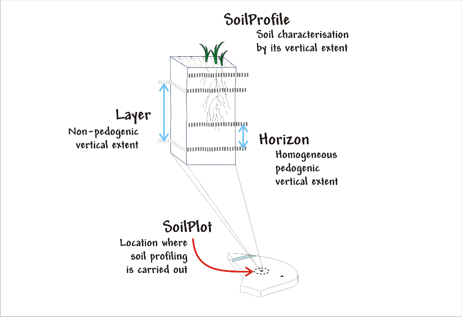

[.text-center]
*Figure 2: Soil profile layer and horizon located in a soil plot.*

*Soil Profiles*

The real world concept "soil profile" (*_SoilProfile_* class in the model) (illustrated by *Figure 2*) can be defined as a cross-section of the soil from the surface down to and including the beginning of the fresh material unmodified by pedogenesis, consisting of various more or less horizontally oriented features formed by pedogenic processes called horizons. Any real world soil profile, considered as a whole, can be characterized by a number of properties, such as: its soil type according to a soil classification scheme, its water capacity available for plants, coarse fragment cover, the presence of a water table, etc. Soil horizons within a profile possess biological, physical and chemical characteristics which differ from the horizons above and beneath and are distinguished principally by texture, colour, structure, chemical composition, and their biomass. The chemical properties may include concentrations in the solid, water and air phases, mobility and soil adsorption capacities. A profile can additionally be described with layers (instead of being described with horizons) which do not necessarily correspond with pedo-genetically formed horizons. Such layers can be fixed depths intervals of sampling, top- and subsoil, or geogenic layers. Layers and horizons are considered both as profile elements in the model as they are both horizontal subdivisions of the soil profile.

The real world concept "observed soil profile" (*_ObservedSoilProfile_* object in the model) represents a soil profile *physically* located in a soil plot (or exposed with a boring), described in the field, possibly sampled and analysed in the laboratory. An observed soil profile refers to a real world location (specified by an associated soil plot).

image::./media/image6.png[image,width=468,height=370, align=center]

[.text-center]
*Figure 3: Soil profiles, soil bodies.*

A "derived soil profile" (*_DerivedSoilProfile_* object in the model) is a soil profile that cannot be located in a soil plot. It corresponds to the spatial extent of a soil type that has been observed in one or several observed soil profiles. The derived soil profile has property values that could be derived (e.g. averaged) from the values of the corresponding properties of one or more observed soil profiles. The derived soil profile can be characterized by the same properties as those of the observed soil profiles, but it is understood that the values for these properties have been derived or determined by expert judgment or calculation. A derived soil profile can be seen as a characterisation of a Soil Typological Unit (STU), or Series, as recognized in the European Soil Geographical Database and other soil databases at national or regional levels. A derived soil profile is not necessarily linked to observed soil profiles, in which case it represents a hypothetical soil profile.

*Soil delineated areas*

To delineate spatially an area that is characterized by a set of such derived soil profiles, the model introduces the construct of "soil body" (*_SoilBody_* object in the model) which represents an association (or other types of spatial interlinkages of various soil types) of soils that are found together in the area. Soils forming the soil body are described using derived soil profiles. The soil body can be represented by one or more derived soil profiles, giving an impression of the properties of the soil body as a whole. This is modelled by linking derived soil profiles to the soil body, indicating their area share, expressed in percentages or percentage ranges (see *Figure 3*). Note that the exact location of each kind of soil type within the soil body is unknown; only the area (geometry) of the soil body is known and also how much of this area is covered by each of the soil types (described as derived soil profiles) in that area. For instance, a soil body could consist of one dominant soil (as described by a derived soil profile) and of other soils (described by other derived soil profiles) having characteristics different from the dominant one. The label of a soil body allows a description of it, which may be useful for building legends. A soil body can be interpreted as a Soil Mapping Unit (SMU) as recognized in the European Soil Geographical Data Base and other soil databases at national or regional levels.

In the context of the model, a *_SoilDerivedObject_* object is defined as a spatial object representing a soil related property which value could, for instance, be derived from values of soil properties of related observed soil profiles and/or related soil bodies (and thus soil derived profiles). A value completely independent of observed soil profiles and soil bodies could be possible as well.

In practice, the derivation of values for the _SoilDerivedObject_ objects could be done from information stored in observed soil profiles and/or soil bodies, or it could also be done from such information in combination with external data. An example of the former could be the calculation of pH or soil organic matter content in the topsoil, based on data found in a set of observed soil profiles. An example of the latter could be the derivation of certain soil related properties (for example soil erosion risk) for which calibrated models are to be used which not only extract and elaborate information from observed soil profiles and/or soil bodies, but also require data that are external to the soil Model (e.g. meteorological and land cover data).

In Annex D an example is given how the model can be extended for a more concrete use case (soil organic carbon content and soil organic carbon stock), both as a coverage and as a vector.

*Soil Site and Soil Plot*

A soil site (*_SoilSite_* object in the model) is considered as a) the surrounding of a soil profile, and/or b) the larger piece of land that is directly linked to and described by all soil investigations on one or more spots, called soil plots. A "soil plot" (*_SoilPlot_* object in the model) is the location of a specific soil investigation (e.g. of a trial pit). Because for many soil investigations the studied soil is destroyed, the soil site provides also the object to which the results of repeated investigations are related and handled as if they were obtained from the very same place. The purpose of the investigation can be of a general nature (e.g. a reconnaissance whereby soil profiles are taken for a general soil characterization) or specific (e.g. a reconnaissance whereby samples are taken to investigate potentially contaminated land); this information can be crucial for data evaluation to identify bias in the selection of sites. A soil plot within a soil site is of a certain type (borehole, trial pit, sample) and located by coordinates and/or the name of that location.

*Soil characteristics that change over time*

There are no explicit constructs foreseen related to soil monitoring. Monitoring, considered as the repeated observation of one or more soil characteristics over time, can be implemented through the use of the various time/date attributes of the objects of the model.

*Soil Contamination*

There are no explicit constructs for soil contamination data in the Model. Contamination is implicitly included by the possibility of specifying contamination parameters for sites, profiles and profile elements. The contaminants are treated here like chemical elements. There are also no explicit constructs included in the model for contaminated sites. For the moment, *as an example* how the model could be extended to deal with soil contaminated sites and site management, a generic Use Case on "Soil – Contamination" is provided in Annex D. Nevertheless, some heavy metal elements are part of a codelist for profile element parameter because they are cited by the directive 86/278/EC as elements to be analysed in agricultural parcels before the application of sewage sludge.

*Note on soil sampling*

In the context of soils two different meanings can be seen for "sample":

On the one hand, the notion of "soil sample", considered as a physical part of the soil for which one or more properties are determined. This notion is not withheld as an explicit construct in the Model.

On the other hand, "sample" is considered to be the location where soil material is taken at a specific depth or over a depth range without doing any soil profile description. "Sample", together with trial pit and borehole, is a type of soil plot. The latter is the concept described in the model.

|===

|*Definition:*
Soils and subsoil characterised according to depth, texture, structure and content of particles and organic material, stoniness, erosion, where appropriate mean slope and anticipated water storage capacity. [Directive 2007/2/EC]

*Description:*
_Soil_ represents the upper part of the earth's crust, formed by mineral particles, organic matter, water, air and living organisms. It is the interface between rock, air and water which hosts most of the biosphere.
INSPIRE _Soil_ data theme comprises information on:
• Soil inventories that provide one-off assessments of soil conditions and/or soil properties at certain locations and at a specific point in time, and allow soil monitoring, providing a series of assessments showing how soil conditions and/or properties change over time.
• Soil mapping that provides a spatial representation of the properties linked to the soils, including soil types; typically, soil maps are derived with the help of data available in soil inventories. Also other soil related information derived from soil properties, possibly in combination with non-soil data are within the scope.
|===

[.text-right]
Entry in the INSPIRE registry: _http://inspire.ec.europa.eu/theme/so/_

=== Normative References

[Directive 2007/2/EC] Directive 2007/2/EC of the European Parliament and of the Council of 14 March 2007 establishing an Infrastructure for Spatial Information in the European Community (INSPIRE)

[ISO 19107] EN ISO 19107:2005, Geographic Information – Spatial Schema

[ISO 19108] EN ISO 19108:2005, Geographic Information – Temporal Schema

[ISO 19108-c] ISO 19108:2002/Cor 1:2006, Geographic Information – Temporal Schema, Technical Corrigendum 1

[ISO 19111] EN ISO 19111:2007 Geographic information - Spatial referencing by coordinates (ISO 19111:2007)

[ISO 19113] EN ISO 19113:2005, Geographic Information – Quality principles

[ISO 19115] EN ISO 19115:2005, Geographic information – Metadata (ISO 19115:2003)

[ISO 19118] EN ISO 19118:2006, Geographic information – Encoding (ISO 19118:2005)

[ISO 19123] EN ISO 19123:2007, Geographic Information – Schema for coverage geometry and functions

[ISO 19125-1] EN ISO 19125-1:2004, Geographic Information – Simple feature access – Part 1: Common architecture

[ISO 19135] EN ISO 19135:2007 Geographic information – Procedures for item registration (ISO 19135:2005)

[ISO 19138] ISO/TS 19138:2006, Geographic Information – Data quality measures

[ISO 19139] ISO/TS 19139:2007, Geographic information – Metadata – XML schema implementation

[ISO 19157] ISO/DIS 19157, Geographic information – Data quality

[OGC 06-103r4] Implementation Specification for Geographic Information - Simple feature access – Part 1: Common Architecture v1.2.1

NOTE This is an updated version of "EN ISO 19125-1:2004, Geographic information – Simple feature access – Part 1: Common architecture".

[Regulation 1205/2008/EC] Regulation 1205/2008/EC implementing Directive 2007/2/EC of the European Parliament and of the Council as regards metadata

[Regulation 976/2009/EC] Commission Regulation (EC) No 976/2009 of 19 October 2009 implementing Directive 2007/2/EC of the European Parliament and of the Council as regards the Network Services

[Regulation 1089/2010/EC] Commission Regulation (EU) No 1089/2010 of 23 November 2010 implementing Directive 2007/2/EC of the European Parliament and of the Council as regards interoperability of spatial data sets and services

ISO 19156: 2011. Geographic Information – Observation and Measurements

ISO DIS 28258 Soil Quality – Digital Exchange of Soil-Related data

{empty}NOTE: The ISO DIS 28258 draft standard has been developed in parallel with this data specification on soil. It has a wider scope, but the models mutually influenced each other. In conclusion, as far as both models cover the same real world objects, central terms and definitions in and for the data models are near enough to be mappable into each other.

=== Terms and definitions

General terms and definitions helpful for understanding the INSPIRE data specification documents are defined in the INSPIRE Glossaryfootnote:[The INSPIRE Glossary is available from http://inspire-registry.jrc.ec.europa.eu/registers/GLOSSARY].

Specifically, for the theme _Soil_, the following terms are defined:

*_Soil Body:_* Part of the soil cover that is delineated and that is homogeneous with regard to certain soil properties and/or spatial patterns. It is the real-world correlate of a *_soil mapping unit_*.

*_Derived Soil Profile:_* A non-point-located soil profile that serves as a reference profile for a specific soil type in a certain geographical area. One or more derived soil profiles can represent the information which is combined to so-called *_Soil Typological Units_* (STUs) in some soil mapping approaches.

*_Soil Derived Object_*: A spatial object type for representing spatial objects with soil-related property derived from one or more soil and possibly other non soil properties. It is the real-world correlate of the mapping units of soil property maps which often are derived from the soil map that shows the distribution of soil taxa.

=== Symbols and abbreviations

[width="100%",cols="14%,86%"]
|===
|ATS |Abstract Test Suite
|CAP |Common Agricultural Policy
|CGMS |Crop Growth Monitoring System
|CORINE |Coordination of Information on the Environment
|DG AGRI |Directorate – General for Agriculture and Rural Development
|DG ENV |Directorate – General for Environment
|DIS ISO |Draft international standard
|DTM |Digital Terrain Model
|EC |European Commission
|EEA |European Environmental Agency
|EIONET |European Environment Information and Observation Network
|EMISS |Electromagnetic induction sensing systems
|ESBN |European Soil Bureau Network
|ESDaC |European Soil Data Center
|ETRS89 |European Terrestrial Reference System 1989
|ETRS89-LAEA |Lambert Azimuthal Equal Area
|ETSSP |European Thematic Strategy for Soil Protection
|EU |European Union
|EVRS |European Vertical Reference System
|FAO |Food and Agricultural Organisation
|GCM |Global Circulation Model
|GIS |Geographical Information System
|GML |Geography Markup Language
|GS Soil |eContentplus project: "Assessment and strategic development of INSPIRE compliant Geodata Services for European Soil data
|INSPIRE |Infrastructure for Spatial Information in Europe
|IR |Implementing Rule
|IRENA |Indicator reporting on the integration of environmental concerns into agricultural policy
|ISDSS |Interoperability of Spatial Data Sets and Services
|ISO |International Organization for Standardization
|ITRS |International Terrestrial Reference System
|IUSS |International Union for Soil Associations
|JRC |Joint Research Centre
|LAT |Lowest Astronomical Tide
|LFA |Less Favoured Areas
|LMO |Legally Mandated Organisation
|MARS |Monitoring Agricultural ResourceS
|MCYFS |Crop Yield Forecasting System
|NDVI |Normalised Difference Vegetation Index
|NUTS |Nomenclature of Units for Territorial Statistics
|O&M |Observations & Measurements
|OCL |Object Constraint Language
|OM |Organic Matter
|PTF |Pedo Transfer Function
|RDBMS |Relational Database Management System
|RMQS |Réseau de Mesures de la Qualité des Sols
|RUSLE |Revised Universal Soil Loss Equation
|SCU |Soil Cartographic Unit
|SDIC |Spatial Data Interest Community
|SFD |Proposed Soil Frame Work Directive
|SGDBE |Soil Geographical Data Base for Europe
|SLD |Second level domain
|SMU |Soil Mapping Unit
|SRTM |Shuttle Radar Topography Mission
|STU |Soil Typological Unit
|TG |Technical Guidance
|TWG |Thematic Working Group (INSPIRE)
|TWG SO |Thematic Working Group Soil (INSPIRE)
|UML |Unified Modeling Language
|UN |United Nations
|URI |Uniform Resource Identifier
|USBR |United States Bureau for Reclamation
|USDA |United States Department for Agriculture
|UTC |Universal Time Coordinated
|WFD |Water Frame Work Directive
|WRB |World Reference Base for Soil Resources
|XML |EXtensible Markup Language
|===

<<<
=== How the Technical Guidelines map to the Implementing Rules

The schematic diagram in Figure 4 gives an overview of the relationships between the INSPIRE legal acts (the INSPIRE Directive and Implementing Rules) and the INSPIRE Technical Guidelines. The INSPIRE Directive and Implementing Rules include legally binding requirements that describe, usually on an abstract level, _what_ Member States must implement.

In contrast, the Technical Guidelines define _how_ Member States might implement the requirements included in the INSPIRE Implementing Rules. As such, they may include non-binding technical requirements that must be satisfied if a Member State data provider chooses to conform to the Technical Guidelines. Implementing these Technical Guidelines will maximise the interoperability of INSPIRE spatial data sets.

image::./media/image7.png[image,width=603,height=375, align=center]

[.text-center]
*Figure 4 - Relationship between INSPIRE Implementing Rules and Technical Guidelines*

==== Requirements

The purpose of these Technical Guidelines (Data specifications on _Soil_) is to provide practical guidance for implementation that is guided by, and satisfies, the (legally binding) requirements included for the spatial data theme _Soil_ in the Regulation (Implementing Rules) on interoperability of spatial data sets and services. These requirements are highlighted in this document as follows:

[IMPORTANT]
====
[.text-center]
*IR Requirement*
_Article / Annex / Section no._
*Title / Heading*

This style is used for requirements contained in the Implementing Rules on interoperability of spatial data sets and services (Commission Regulation (EU) No 1089/2010).
====

For each of these IR requirements, these Technical Guidelines contain additional explanations and examples.

NOTE The Abstract Test Suite (ATS) in Annex A contains conformance tests that directly check conformance with these IR requirements.

Furthermore, these Technical Guidelines may propose a specific technical implementation for satisfying an IR requirement. In such cases, these Technical Guidelines may contain additional technical requirements that need to be met in order to be conformant with the corresponding IR requirement _when using this proposed implementation_. These technical requirements are highlighted as follows:

[TIP]
====
*TG Requirement X* This style is used for requirements for a specific technical solution proposed in these Technical Guidelines for an IR requirement.
====

NOTE 1 Conformance of a data set with the TG requirement(s) included in the ATS implies conformance with the corresponding IR requirement(s).

NOTE 2 In addition to the requirements included in the Implementing Rules on interoperability of spatial data sets and services, the INSPIRE Directive includes further legally binding obligations that put additional requirements on data providers. For example, Art. 10(2) requires that Member States shall, where appropriate, decide by mutual consent on the depiction and position of geographical features whose location spans the frontier between two or more Member States. General guidance for how to meet these obligations is provided in the INSPIRE framework documents.

==== Recommendations

In addition to IR and TG requirements, these Technical Guidelines may also include a number of recommendations for facilitating implementation or for further and coherent development of an interoperable infrastructure.

[NOTE]
====
*Recommendation X* Recommendations are shown using this style.
====

NOTE The implementation of recommendations is not mandatory. Compliance with these Technical Guidelines or the legal obligation does not depend on the fulfilment of the recommendations.

==== Conformance

Annex A includes the abstract test suite for checking conformance with the requirements included in these Technical Guidelines and the corresponding parts of the Implementing Rules (Commission Regulation (EU) No 1089/2010).

<<<
== Specification scopes

This data specification does not distinguish different specification scopes, but just considers one general scope.

NOTE For more information on specification scopes, see [ISO 19131:2007], clause 8 and Annex D.

== Identification information

These Technical Guidelines are identified by the following URI:
http://inspire.ec.europa.eu/tg/so/3.0

NOTE ISO 19131 suggests further identification information to be included in this section, e.g. the title, abstract or spatial representation type. The proposed items are already described in the document metadata, executive summary, overview description (section 2) and descriptions of the application schemas (section 5). In order to avoid redundancy, they are not repeated here.

<<<
== Data content and structure

=== Application schemas – Overview 

==== Application schemas included in the IRs

Articles 3, 4 and 5 of the Implementing Rules lay down the requirements for the content and structure of the data sets related to the INSPIRE Annex themes.

[IMPORTANT]
====
[.text-center]
*IR Requirement*
Article 4
*Types for the Exchange and Classification of Spatial Objects*

1. For the exchange and classification of spatial objects from data sets meeting the conditions laid down in Article 4 of Directive 2007/2/EC, Member States shall use the spatial object types and associated data types, enumerations and code lists that are defined in Annexes II, III and IV for the themes the data sets relate to.

2. Spatial object types and data types shall comply with the definitions and constraints and include the attributes and association roles set out in the Annexes.

3. The enumerations and code lists used in attributes or association roles of spatial object types or data types shall comply with the definitions and include the values set out in Annex II. The enumeration and code list values are uniquely identified by language-neutral mnemonic codes for computers. The values may also include a language-specific name to be used for human interaction.

====

The types to be used for the exchange and classification of spatial objects from data sets related to the spatial data theme _Soil_ are defined in the following application schema (see section 5.3):

*- Soil* - Soil application schema contains the essential elements of a data model that allow the exchange of geo-referenced soil data.

The application schemas specify requirements on the properties of each spatial object including its multiplicity, domain of valid values, constraints, etc.

NOTE The application schemas presented in this section contain some additional information that is not included in the Implementing Rules, in particular multiplicities of attributes and association roles.

[TIP]
====
*TG Requirement 1*

Spatial object types and data types shall comply with the multiplicities defined for the attributes and association roles in this section.

====

An application schema may include references (e.g. in attributes or inheritance relationships) to common types or types defined in other spatial data themes. These types can be found in a sub-section called "Imported Types" at the end of each application schema section. The common types referred to from application schemas included in the IRs are addressed in Article 3.

[IMPORTANT]
====
[.text-center]
*IR Requirement*
_Article 3_
*Common Types*

Types that are common to several of the themes listed in Annexes I, II and III to Directive 2007/2/EC shall conform to the definitions and constraints and include the attributes and association roles set out in Annex I.

====

NOTE Since the IRs contain the types for all INSPIRE spatial data themes in one document, Article 3 does not explicitly refer to types defined in other spatial data themes, but only to types defined in external data models.

Common types are described in detail in the Generic Conceptual Model [DS-D2.7], in the relevant international standards (e.g. of the ISO 19100 series) or in the documents on the common INSPIRE models [DS-D2.10.x]. For detailed descriptions of types defined in other spatial data themes, see the corresponding Data Specification TG document [DS-D2.8.x].

==== Additional recommended application schemas 

In addition to the application schemas listed above, the following additional application schemas have been defined for the theme _Soil_ (see Annex D)

*- Soil Contamination* – SoilContamination application schema demonstrates the extensibility of the core (legally mandated) SOIL data model to the field of the management of soil contaminated land.

These additional application schemas are not included in the IRs. They typically address requirements from specific (groups of) use cases and/or may be used to provide additional information. They are included in this specification in order to improve interoperability also for these additional aspects and to illustrate the extensibility of the application schemas included in the IRs.

[NOTE]
====
*Recomendation 1*

Additional and/or use case-specific information related to the theme _Soil_ should be made available using the spatial object types and data types specified in the following application schema(s): SoilContamination,

These spatial object types and data types should comply with the definitions and constraints and include the attributes and association roles defined in the Annex D.

The enumerations and code lists used in attributes or association roles of spatial object types or data types should comply with the definitions and include the values defined in the Annex D.

====

=== Basic notions

This section explains some of the basic notions used in the INSPIRE application schemas. These explanations are based on the GCM [DS-D2.5].

==== Notation

===== Unified Modeling Language (UML)

The application schemas included in this section are specified in UML, version 2.1. The spatial object types, their properties and associated types are shown in UML class diagrams.

NOTE For an overview of the UML notation, see Annex D in [ISO 19103].

The use of a common conceptual schema language (i.e. UML) allows for an automated processing of application schemas and the encoding, querying and updating of data based on the application schema – across different themes and different levels of detail.

The following important rules related to class inheritance and abstract classes are included in the IRs.

[IMPORTANT]
====
[.text-center]
*IR Requirement*
Article 5
*Types*

(...)

2. Types that are a sub-type of another type shall also include all this type's attributes and association roles.

3. Abstract types shall not be instantiated.

====

The use of UML conforms to ISO 19109 8.3 and ISO/TS 19103 with the exception that UML 2.1 instead of ISO/IEC 19501 is being used. The use of UML also conforms to ISO 19136 E.2.1.1.1-E.2.1.1.4.

NOTE ISO/TS 19103 and ISO 19109 specify a profile of UML to be used in conjunction with the ISO 19100 series. This includes in particular a list of stereotypes and basic types to be used in application schemas. ISO 19136 specifies a more restricted UML profile that allows for a direct encoding in XML Schema for data transfer purposes.

To model constraints on the spatial object types and their properties, in particular to express data/data set consistency rules, OCL (Object Constraint Language) is used as described in ISO/TS 19103, whenever possible. In addition, all constraints are described in the feature catalogue in English, too.

NOTE Since "void" is not a concept supported by OCL, OCL constraints cannot include expressions to test whether a value is a _void_ value. Such constraints may only be expressed in natural language.

===== Stereotypes

In the application schemas in this section several stereotypes are used that have been defined as part of a UML profile for use in INSPIRE [DS-D2.5]. These are explained in Table 1 below.

[.text-center]
*Table 1 – Stereotypes (adapted from [DS-D2.5])*

[align=center,width="100%",cols="22%,14%,64%"]
|===
|*Stereotype* |*Model element* |*Description*
|applicationSchema |Package |An INSPIRE application schema according to ISO 19109 and the Generic Conceptual Model.
|leaf |Package |A package that is not an application schema and contains no packages.
|featureType |Class |A spatial object type.
|type |Class |A type that is not directly instantiable, but is used as an abstract collection of operation, attribute and relation signatures. This stereotype should usually not be used in INSPIRE application schemas as these are on a different conceptual level than classifiers with this stereotype.
|dataType |Class |A structured data type without identity.
|union |Class |A structured data type without identity where exactly one of the properties of the type is present in any instance.
|enumeration |Class |An enumeration.
|codeList |Class |A code list.
|import |Dependency |The model elements of the supplier package are imported.
|voidable |Attribute, association role |A voidable attribute or association role (see section 5.2.2).
|lifeCycleInfo |Attribute, association role |If in an application schema a property is considered to be part of the life-cycle information of a spatial object type, the property shall receive this stereotype.
|version |Association role |If in an application schema an association role ends at a spatial object type, this stereotype denotes that the value of the property is meant to be a specific version of the spatial object, not the spatial object in general.
|===

==== Voidable characteristics

The «voidable» stereotype is used to characterise those properties of a spatial object that may not be present in some spatial data sets, even though they may be present or applicable in the real world. This does _not_ mean that it is optional to provide a value for those properties.

For all properties defined for a spatial object, a value has to be provided – either the corresponding value (if available in the data set maintained by the data provider) or the value of _void._ A _void_ value shall imply that no corresponding value is contained in the source spatial data set maintained by the data provider or no corresponding value can be derived from existing values at reasonable costs.

[NOTE]
====
*Recomendation 2*

The reason for a _void_ value should be provided where possible using a listed value from the VoidReasonValue code list to indicate the reason for the missing value.

====

The VoidReasonValue type is a code list, which includes the following pre-defined values:

* _Unpopulated_: The property is not part of the dataset maintained by the data provider. However, the characteristic may exist in the real world. For example when the "elevation of the water body above the sea level" has not been included in a dataset containing lake spatial objects, then the reason for a void value of this property would be 'Unpopulated'. The property receives this value for all spatial objects in the spatial data set.
* _Unknown_: The correct value for the specific spatial object is not known to, and not computable by the data provider. However, a correct value may exist. For example when the "elevation of the water body above the sea level" _of a certain lake_ has not been measured, then the reason for a void value of this property would be 'Unknown'. This value is applied only to those spatial objects where the property in question is not known.
* _Withheld_: The characteristic may exist, but is confidential and not divulged by the data provider.

NOTE It is possible that additional reasons will be identified in the future, in particular to support reasons / special values in coverage ranges.

The «voidable» stereotype does not give any information on whether or not a characteristic exists in the real world. This is expressed using the multiplicity:

* If a characteristic may or may not exist in the real world, its minimum cardinality shall be defined as 0. For example, if an Address may or may not have a house number, the multiplicity of the corresponding property shall be 0..1.
* If at least one value for a certain characteristic exists in the real world, the minimum cardinality shall be defined as 1. For example, if an Administrative Unit always has at least one name, the multiplicity of the corresponding property shall be 1..*.

In both cases, the «voidable» stereotype can be applied. In cases where the minimum multiplicity is 0, the absence of a value indicates that it is known that no value exists, whereas a value of void indicates that it is not known whether a value exists or not.

EXAMPLE If an address does not have a house number, the corresponding Address object should not have any value for the «voidable» attribute house number. If the house number is simply not known or not populated in the data set, the Address object should receive a value of _void_ (with the corresponding void reason) for the house number attribute.

==== Enumerations

Enumerations are modelled as classes in the application schemas. Their values are modelled as attributes of the enumeration class using the following modelling style:

* No initial value, but only the attribute name part, is used.
* The attribute name conforms to the rules for attributes names, i.e. is a lowerCamelCase name. Exceptions are words that consist of all uppercase letters (acronyms).

[IMPORTANT]
====
[.text-center]
*IR Requirement*
Article 6
*Code Lists and Enumerations*

(...)

5) Attributes or association roles of spatial object types or data types that have an enumeration type may only take values from the lists specified for the enumeration type."

====

==== Code lists

Code lists are modelled as classes in the application schemas. Their values, however, are managed outside of the application schema.

===== Code list types

The IRs distinguish the following types of code lists.

[IMPORTANT]
====
[.text-center]
*IR Requirement*
Article 6
*Code Lists and Enumerations*

1) Code lists shall be of one of the following types, as specified in the Annexes:

.. code lists whose allowed values comprise only the values specified in this Regulation;

.. code lists whose allowed values comprise the values specified in this Regulation and narrower values defined by data providers;

.. code lists whose allowed values comprise the values specified in this Regulation and additional values at any level defined by data providers;

.. code lists, whose allowed values comprise any values defined by data providers.

For the purposes of points (b), (c) and (d), in addition to the allowed values, data providers may use the values specified in the relevant INSPIRE Technical Guidance document available on the INSPIRE web site of the Joint Research Centre.

====

The type of code list is represented in the UML model through the tagged value _extensibility_, which can take the following values:

* _none_, representing code lists whose allowed values comprise only the values specified in the IRs (type a);
* _narrower_, representing code lists whose allowed values comprise the values specified in the IRs and narrower values defined by data providers (type b);
* _open_, representing code lists whose allowed values comprise the values specified in the IRs and additional values at any level defined by data providers (type c); and
* _any_, representing code lists, for which the IRs do not specify any allowed values, i.e. whose allowed values comprise any values defined by data providers (type d).

[NOTE]
====
*Recomendation 3*

Additional values defined by data providers should not replace or redefine any value already specified in the IRs.

====

NOTE This data specification may specify recommended values for some of the code lists of type (b), (c) and (d) (see section 5.2.4.3). These recommended values are specified in a dedicated Annex.

In addition, code lists can be hierarchical, as explained in Article 6(2) of the IRs.

[IMPORTANT]
====
[.text-center]
*IR Requirement*
Article 6
*Code Lists and Enumerations*

(...)

2) Code lists may be hierarchical. Values of hierarchical code lists may have a more generic parent value. Where the valid values of a hierarchical code list are specified in a table in this Regulation, the parent values are listed in the last column.

====

The type of code list and whether it is hierarchical or not is also indicated in the feature catalogues.

===== Obligations on data providers

[IMPORTANT]
====
[.text-center]
*IR Requirement*
Article 6
*Code Lists and Enumerations*

(....)

3) Where, for an attribute whose type is a code list as referred to in points (b), (c) or (d) of paragraph 1, a data provider provides a value that is not specified in this Regulation, that value and its definition shall be made available in a register.

4) Attributes or association roles of spatial object types or data types whose type is a code list may only take values that are allowed according to the specification of the code list.

====

Article 6(4) obliges data providers to use only values that are allowed according to the specification of the code list. The "allowed values according to the specification of the code list" are the values explicitly defined in the IRs plus (in the case of code lists of type (b), (c) and (d)) additional values defined by data providers.

For attributes whose type is a code list of type (b), (c) or (d) data providers may use additional values that are not defined in the IRs. Article 6(3) requires that such additional values and their definition be made available in a register. This enables users of the data to look up the meaning of the additional values used in a data set, and also facilitates the re-use of additional values by other data providers (potentially across Member States).

NOTE Guidelines for setting up registers for additional values and how to register additional values in these registers is still an open discussion point between Member States and the Commission.

===== Recommended code list values

For code lists of type (b), (c) and (d), this data specification may propose additional values as a recommendation (in a dedicated Annex). These values will be included in the INSPIRE code list register. This will facilitate and encourage the usage of the recommended values by data providers since the obligation to make additional values defined by data providers available in a register (see section 5.2.4.2) is already met.

[NOTE]
====
*Recomendation 4*

Where these Technical Guidelines recommend values for a code list in addition to those specified in the IRs, these values should be used.

====

NOTE For some code lists of type (d), no values may be specified in these Technical Guidelines. In these cases, any additional value defined by data providers may be used.

===== Governance

The following two types of code lists are distinguished in INSPIRE:

* _Code lists that are governed by INSPIRE (INSPIRE-governed code lists)._ These code lists will be managed centrally in the INSPIRE code list register. Change requests to these code lists (e.g. to add, deprecate or supersede values) are processed and decided upon using the INSPIRE code list register's maintenance workflows. +
 +
INSPIRE-governed code lists will be made available in the INSPIRE code list register at __http://inspire.ec.europa.eu/codelist/<CodeListName__>. They will be available in SKOS/RDF, XML and HTML. The maintenance will follow the procedures defined in ISO 19135. This means that the only allowed changes to a code list are the addition, deprecation or supersession of values, i.e. no value will ever be deleted, but only receive different statuses (valid, deprecated, superseded). Identifiers for values of INSPIRE-governed code lists are constructed using the pattern __http://inspire.ec.europa.eu/codelist/<CodeListName__>/<value>.

* _Code lists that are governed by an organisation outside of INSPIRE (externally governed code lists)._ These code lists are managed by an organisation outside of INSPIRE, e.g. the World Meteorological Organization (WMO) or the World Health Organization (WHO). Change requests to these code lists follow the maintenance workflows defined by the maintaining organisations. Note that in some cases, no such workflows may be formally defined. +
 +
Since the updates of externally governed code lists is outside the control of INSPIRE, the IRs and these Technical Guidelines reference a specific version for such code lists. +
 +
The tables describing externally governed code lists in this section contain the following columns:
** The _Governance_ column describes the external organisation that is responsible for maintaining the code list.
** The _Source_ column specifies a citation for the authoritative source for the values of the code list. For code lists, whose values are mandated in the IRs, this citation should include the version of the code list used in INSPIRE. The version can be specified using a version number or the publication date. For code list values recommended in these Technical Guidelines, the citation may refer to the "latest available version".
** In some cases, for INSPIRE only a subset of an externally governed code list is relevant. The subset is specified using the _Subset_ column.
** The _Availability_ column specifies from where (e.g. URL) the values of the externally governed code list are available, and in which formats. Formats can include machine-readable (e.g. SKOS/RDF, XML) or human-readable (e.g. HTML, PDF) ones. +

Code list values are encoded using http URIs and labels. Rules for generating these URIs and labels are specified in a separate table.

[NOTE]
====
*Recomendation 5*

The http URIs and labels used for encoding code list values should be taken from the INSPIRE code list registry for INSPIRE-governed code lists and generated according to the relevant rules specified for externally governed code lists.

====

NOTE Where practicable, the INSPIRE code list register could also provide http URIs and labels for externally governed code lists.

===== Vocabulary

For each code list, a tagged value called "vocabulary" is specified to define a URI identifying the values of the code list. For INSPIRE-governed code lists and externally governed code lists that do not have a persistent identifier, the URI is constructed following the pattern _http://inspire.ec.europa.eu/codelist/<UpperCamelCaseName>_.

If the value is missing or empty, this indicates an empty code list. If no sub-classes are defined for this empty code list, this means that any code list may be used that meets the given definition.

An empty code list may also be used as a super-class for a number of specific code lists whose values may be used to specify the attribute value. If the sub-classes specified in the model represent all valid extensions to the empty code list, the subtyping relationship is qualified with the standard UML constraint "\{complete,disjoint}".

==== Identifier management

[IMPORTANT]
====
[.text-center]
*IR Requirement*
_Article 9_
*Identifier Management*

1. The data type Identifier defined in Section 2.1 of Annex I shall be used as a type for the external object identifier of a spatial object.

2. The external object identifier for the unique identification of spatial objects shall not be changed during the life-cycle of a spatial object.

====

NOTE 1 An external object identifier is a unique object identifier which is published by the responsible body, which may be used by external applications to reference the spatial object. [DS-D2.5]

NOTE 2 Article 9(1) is implemented in each application schema by including the attribute _inspireId_ of type Identifier.

NOTE 3 Article 9(2) is ensured if the _namespace_ and _localId_ attributes of the Identifier remains the same for different versions of a spatial object; the _version_ attribute can of course change.

==== Geometry representation

[IMPORTANT]
====
[.text-center]
*IR Requirement*
_Article 12_
*Other Requirements & Rules*

1. The value domain of spatial properties defined in this Regulation shall be restricted to the Simple Feature spatial schema as defined in Herring, John R. (ed.), OpenGIS® Implementation Standard for Geographic information – Simple feature access – Part 1: Common architecture, version 1.2.1, Open Geospatial Consortium, 2011, unless specified otherwise for a specific spatial data theme or type.

====

NOTE 1 The specification restricts the spatial schema to 0-, 1-, 2-, and 2.5-dimensional geometries where all curve interpolations are linear and surface interpolations are performed by triangles.

NOTE 2 The topological relations of two spatial objects based on their specific geometry and topology properties can in principle be investigated by invoking the operations of the types defined in ISO 19107 (or the methods specified in EN ISO 19125-1).

====  Temporality representation

The application schema(s) use(s) the derived attributes "beginLifespanVersion" and "endLifespanVersion" to record the lifespan of a spatial object.

The attributes "beginLifespanVersion" specifies the date and time at which this version of the spatial object was inserted or changed in the spatial data set. The attribute "endLifespanVersion" specifies the date and time at which this version of the spatial object was superseded or retired in the spatial data set.

NOTE 1 The attributes specify the beginning of the lifespan of the version in the spatial data set itself, which is different from the temporal characteristics of the real-world phenomenon described by the spatial object. This lifespan information, if available, supports mainly two requirements: First, knowledge about the spatial data set content at a specific time; second, knowledge about changes to a data set in a specific time frame. The lifespan information should be as detailed as in the data set (i.e., if the lifespan information in the data set includes seconds, the seconds should be represented in data published in INSPIRE) and include time zone information.

NOTE 2 Changes to the attribute "endLifespanVersion" does not trigger a change in the attribute "beginLifespanVersion".

[IMPORTANT]
====
[.text-center]
*IR Requirement*
_Article 10_
*Life-cycle of Spatial Objects*

(...)

3. Where the attributes beginLifespanVersion and endLifespanVersion are used, the value of endLifespanVersion shall not be before the value of beginLifespanVersion.

====

NOTE The requirement expressed in the IR Requirement above will be included as constraints in the UML data models of all themes.

[NOTE]
====
*Recomendation 6*

If life-cycle information is not maintained as part of the spatial data set, all spatial objects belonging to this data set should provide a void value with a reason of "unpopulated".

====

===== Validity of the real-world phenomena

The application schema(s) use(s) the attributes "validFrom" and "validTo" to record the validity of the real-world phenomenon represented by a spatial object.

The attributes "validFrom" specifies the date and time at which the real-world phenomenon became valid in the real world. The attribute "validTo" specifies the date and time at which the real-world phenomenon is no longer valid in the real world.

Specific application schemas may give examples what "being valid" means for a specific real-world phenomenon represented by a spatial object.

[IMPORTANT]
====
[.text-center]
*IR Requirement*
_Article 12_
*Other Requirements & Rules*

(...)

3. Where the attributes validFrom and validTo are used, the value of validTo shall not be before the value of validFrom.

====

NOTE The requirement expressed in the IR Requirement above will be included as constraints in the UML data models of all themes.

==== Coverages

Coverage functions are used to describe characteristics of real-world phenomena that vary over space and/or time. Typical examples are temperature, elevation, precipitation, imagery. A coverage contains a set of such values, each associated with one of the elements in a spatial, temporal or spatio-temporal domain. Typical spatial domains are point sets (e.g. sensor locations), curve sets (e.g. isolines), grids (e.g. orthoimages, elevation models), etc.

In INSPIRE application schemas, coverage functions are defined as properties of spatial object types where the type of the property value is a realisation of one of the types specified in ISO 19123.

To improve alignment with coverage standards on the implementation level (e.g. ISO 19136 and the OGC Web Coverage Service) and to improve the cross-theme harmonisation on the use of coverages in INSPIRE, an application schema for coverage types is included in the Generic Conceptual Model in 9.9.4. This application schema contains the following coverage types:

* _RectifiedGridCoverage_: coverage whose domain consists of a rectified grid – a grid for which there is an affine transformation between the grid coordinates and the coordinates of a coordinate reference system (see Figure 5, left).
* _ReferenceableGridCoverage_: coverage whose domain consists of a referenceable grid – a grid associated with a transformation that can be used to convert grid coordinate values to values of coordinates referenced to a coordinate reference system (see Figure 5, right).

In addition, some themes make reference to the types TimeValuePair and Timeseries defined in Taylor, Peter (ed.), _OGC^®^ WaterML 2.0: Part 1 – Timeseries, v2.0.0,_ Open Geospatial Consortium, 2012. These provide a representation of the time instant/value pairs, i.e. time series (see Figure 6).

Where possible, only these coverage types (or a subtype thereof) are used in INSPIRE application schemas.

image::./media/image8.png[image,width=560,height=253, align=center]

[.text-center]
*Figure 5 – Examples of a rectified grid (left) and a referenceable grid (right)*

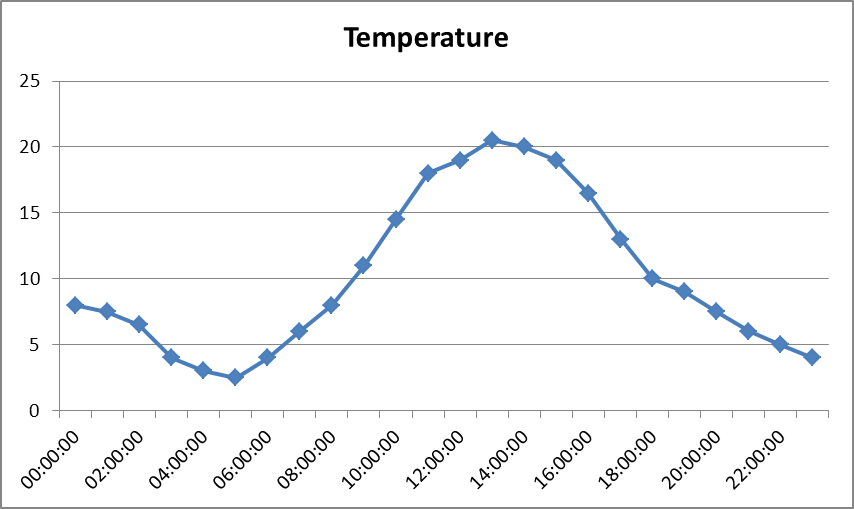

[.text-center]
*Figure 6 – Example of a time series*

=== Application schema SOIL

==== Description

The Soil Model described in this chapter contains the essential elements of a data model that allows the exchange of geo-referenced soil data. The model is described in UML, which is then used as a base for the generation of XML Schema Definition (or .xsd) files, which in turn define the XML format that is to be used for the actual exchange of data.

===== Narrative description

The major spatial object types that can be distinguished in the Soil data model are:

* SoilProfile (including Observed and Derived Soil Profiles)
* ProfileElement (including SoilLayer and SoilHorizon)
* SoilBody
* SoilDerivedObject
* SoilThemeCoverage and SoilThemeDescriptiveCoverage
* SoilSite
* SoilPlot

Their meaning and relationships are explained in the following paragraphs. All objects, apart from SoilThemeCoverage and SoilThemeDescriptiveCoverage, are presented in Figure 7– Vector, while Figure 8 presents the UML class diagram for these objects. The used data types and codelists are illustrated in and Figure 9 and Figure 10. The relation to Observations and Measurements is illustrated in Figure 11.

====== _Soil Profile, Layer and Horizon_

The concepts of "observed soil profile" and "derived soil profile" are represented through the classes _ObservedSoilProfile_ and _DerivedSoilProfile_ that are subtypes of the abstract class _SoilProfile_. (see Figure 7)

An observed soil profile represents a geo-referenced soil profile, described in the field, possibly sampled and analyzed in the laboratory.

A derived soil profile is a non-point-located soil profile with property values that are derived (e.g. averaged) from the values of the corresponding properties of one or more observed soil profiles. Even if such a connection to an observed soil profile exists, it is not mandatory to provide it (nor its data) together with the derived soil profile. Eventually, a derived soil profile could also be a standalone non-geo-referenced soil profile, not associated to an observed soil profile and with property values that are e.g. assessed by expert knowledge.

Any soil profile can be characterized as a whole by a number of properties, of which the following are included in the model: its soil type according to the WRB soil classification scheme (_WRBSoilName_) and/or any other soil classification scheme (_otherSoilName_) with the limitation to one per dataset, and zero or more other parameters, which are expressed through _soilProfileObservation_ associations with _OM_Observation_ objects (see Figure 11). Through the _observedProperty_ role of its _Phenomenon_ association, the _OM_Observation_ object designates the parameter, through the attributes _label_, _basePhenomenon_ (value selected from the codelist _SoilProfileParameterNameValue_) (see Figre 10) and _uom_ (unit of measure). Through the _result_ role of the _Range_ association, a value can be given to the parameter; this value should be of the type _Number_, _RangeType_ (a range of values) or _CharacterString_ (e.g. 'good' or 'very high'). Note that the _SoilProfileParameterNameValue_ codelist can be extended by the data provider when needed.

[IMPORTANT]
====
[.text-center]
*IR Requirement*
_Annex IV / Section 3.4._
*Theme specific requirement*

Only one Other Soil Name Type classification shall be used for a dataset.
====

To promote semantic interoperability and when possible, it is required to use WRB as a classification scheme. On top of _inspireID_, any soil profile can also be identified by a _localIdentifier_, which is a character string that allows tagging of the profile object with any information that relates the object to the originating data source of the data provider.

Note that the _WRBSoilName_ is of type _WRBSoilNameType_ that allows to give _WRBSoilName_ a value according to the WRB structure defined for the WRB2006 update 2007 or later versions. The reference to the WRB version which is actually used is encoded through the values taken from the WRB related codelists (_WRBReferenceSoilGroupValue_, _WRBQualifierValue,_ _WRBSpecifierValue_ and _WRBQualifierPlaceValue_). If a _SoilProfile_ is to be characterized by earlier versions of WRB (e.g. 1998), the _otherSoilName_ attribute should be used.

Any instance of an _ObservedSoilProfile_ is associated to exactly one instance of a _soilPlot_ (see further) from which the _soilPlotLocation_ attribute indicates the position (i.e. where it is located on the earth's surface) and for which the soil data provides valid information.

Any soil profile, whether observed or derived, can be described by horizons and layers. Each horizon and layer can have a number of properties. In the model, layers and horizons are represented by the classes _SoiLayer_ and _SoilHorizon_ which are both subtypes of the abstract class _ProfileElement_. The abstract _SoilProfile_ can consist of one or more __ProfileElement__s.

A horizon or layer is at least characterized by an upper depth and a lower depth, indicating the top and the bottom depth of the horizon or layer from the surface; the attribute in the abstract _ProfileElement_ class that indicates the depths of a horizon or layer is _profileElementDepthRange_.

The properties of horizons and layers are modelled through the _profileElementObservation associations_ with _OM_Observation_ objects (see Figure 11), in the same way as soil profile parameters are modelled, the only difference being that the parameter is selected from the codelist ProfileElementParameterNameValue (see Figure 10). Note that this codelist can be extended by the data provider when needed.

A horizon is further specified by a horizon name according to the FAO horizon notation scheme from 2006 (_FAOHorizonNotation_) and/or any other horizon notation schemes (_otherHorizonNotation_), with the limitation to one per a dataset. A horizon corresponds to a horizontal subdivision of the soil based on pedogenic processes.

[IMPORTANT]
====
[.text-center]
*IR Requirement*
_Annex IV / Section 3.4_
*Theme specific requirement*

Only one Other Horizon Notation Type classification shall be used for a dataset.
====

A layer corresponds to a horizontal subdivision of the soil based on other criteria than pedogenic processes. The way of defining a layer is specified by a layer type name that indicates the kind of layer considered: _topsoil_, _subsoil_, d__epthInterval__ or _geogenic_; this is modelled through the _layerType_ attribute in the _SoilLayer_ class. _Topsoil_ and _subsoil_ are complementary concepts used to address pedogenic process domains of the soil irrespective of a horizon description. Depth intervals are often used for chemical characterisation of the soil state and relate often to sampling depths. If the _SoilLayer_ is of the type _geogenic_, it is described in terms of its non-pedogenic origin and can additionally be described by the following attributes: _layerRockType_ (which gives petrographic or lithologic information on the rock type the layer is made of) and three attributes with reference to layer genesis (_layerGenesisProcess_, _layerGenesisEnvironment_, _layerGenesisProcessState_). Except for _layerGenesisProcessState_, the involved codelists originate from the INSPIRE Data Specification on Geology.

Note that the values in the codelists _SoilProfileParameterNameValue_ and _ProfileElementParameterNameValue_ (see Figure 10) in this version of the model correspond to requirements concerning soil property data in some European legislation.

Note that, since the parameters for _soilProfile_, _ProfileElement_ and _soilDerivedObject_ (see below) are linked (through the O&M framework, see Figure 11)) to _OM_Observation_, which in turn is associated to _INSPIRE_OM_Process_, it is possible to provide additional information on the process that led to observation values. For example, if soil pH is measured in a salt solution, the kind and concentration of the salt solution as well as the solution to soil proportion and the type of device used can be stated.

[IMPORTANT]
====
[.text-center]
*IR Requirement*
_Annex IV / Section 3.4_
*Theme specific requirement*

The values of the first level hierarchical code lists: ProfileElementParameterNameValue, SoilDerivedObjectParameterNameValue, SoilProfileParameterNameValue, SoilSiteParameterNameValue (chemicalParameter, biologicalParameter, physicalParameter) serve only the purpose of structuring; only the lower-level values shall be used.
====

====== _SoilBody_

To delineate geographically areas with a soil cover that can be characterized by a set of derived soil profiles, the model introduces the construct of the _SoilBody_ class (see Figure 7). It represents an association (or other types of spatial linkages of various soil types) of derived soil profiles that represent the soils found together in the area of the _SoilBody_. The area is specified by the _geometry_ attribute of the _SoilBody_. The presence of one or more kinds of soils in the _SoilBody_ is modelled with the association class _DerivedProfilePresenceInSoilBody_, which allows to indicate which derived soil profiles are used to describe the soils of the _SoilBody_, and to which extent (expressed as a couple of area share percentages). The couple of percentages offer the flexibility to give a range of percentages to express uncertainty on the presence of any soil type. If only one percentage value is to be used, lower and upper boundaries of the couple of percentages should have identical values. Because of this flexibility with ranges of percentages, it is allowed that the sum of all percentage upper boundaries for the derived soil profiles in one soil body is greater than 100%. However, there is the constraint that the sum of all percentage lower boundaries for the derived soil profiles in one soil body is lower than or equal to 100%.

As an example, a _SoilBody_ could consist of one dominant soil (as described by a derived soil profile) and of other soils (described by other derived soil profiles) having characteristics different from the dominant one. A derived soil profile can be used to characterize more than one _SoilBody_.

The _soilBodyLabel_ attribute of the _SoilBody_ allows a description of the _SoilBody_, which may be useful for building legends. The _soilBodyLabel_ contributes to the explanation of a mapping unit of a map, whereas in the metadata linked to the dataset to which the object belongs, a reference should be given to documentation that further explains the labelling of the soil bodies.

Note that although the geometry (polygon areas) of the _SoilBody_ is known and also how much area within it is covered by each of the soils in the area, expressed as a range of percentages, the exact location and spatial pattern of each kind of soils within the _SoilBody_ is not defined.

====== _SoilDerivedObject_

In the context of the model, a _SoilDerivedObject_ (Figure 7) is defined as a spatial object (e.g. a point, line, polygon) representing a soil-related property (using the association _soilDerivedObjectObservation_ with an OM_Observation object, see Figure 11) which value can be (but does not have to be) derived from a) values of soil properties of related observed soil profiles and/or related soil bodies, and/or b) any other data or information intern or extern to the model (for example: instances of other SoilDerivedObjects (intern); landcover/climate data (extern)). A collection of such _SoilDerivedObjects_ constitutes a soil thematic map, and is to be regarded as a dataset. The metadata linked to such a dataset provides the details on how the values for the attributes of the __SoilDerivedObject__s have been calculated.

The _geometry_ attribute of the _SoilDerivedObject_ specifies type and location of the geographical object (e.g. a polygon or a point). Through the association _soilDerivedObjectObservation_ with an OM_Observation object, a parameter is designated and given a value, in the same way as parameters for the soil profiles and profile elements. The parameter is selected from the codelist _SoilDerivedObjectParameterNameValue_ (see Figure 10); note that this code list can be extended by the data provider when needed.

At _SoilDerivedObject_ object level__,__ the value for the associated parameter in the associated OM_Observation object can be accompanied by zero or more values that provide supplementary information to it. This information is given in zero or more _parameter_ attributes of the _OM_Observation_ object and which values are of the type _NamedValue_. The class _NamedValue_ provides for a generic soft-typed parameter value. NamedValue supports two attributes: _name_ (datatype: _GenericName_) that indicates the meaning of the named value, and _value_ (datatype: _Any_) that provides the value. The type _Any_ should be substituted by a suitable concrete type, e.g. _Number_.

[IMPORTANT]
====
[.text-center]
*IR Requirement*
_Annex IV / Section 3.4_
*Theme specific requirement*

When an additional descriptive parameter for the soil derived object is needed, the parameter attribute of the OM_Observation spatial object type shall be used.
====

One example of the use of the _parameter_ attribute in the _OM_Observation_ object is for the construction of so-called "purity maps". When one wants to construct a _SoilDerivedObject_ with as geometry a polygon P and with a parameter that contains a value indicating a soil property A (e.g. WaterDrainageClass), based on values for that same property that are found in the _DerivedSoilProfile_-s associated to a _SoilBody_ covering the same polygon, one could select the value for WaterDrainageClass for the _DerivedSoilProfile_ that is dominant. This is an interpretation of the data and when depicting A as a value in polygon P, the viewer should know that this value is not "pure" and that an amount of information is lost through interpretation. The "purity" of the value for A could be indicated in the _parameter_ attribute of the linked _OM_Observation_ object__,__ which could have a NamedValue consisting of name _purity_ and a value between 0 and 100__,__ computed from the proportions of the _DerivedSoilProfiles_ composing the _SoilBody_.

Because the multiplicity of the associations between the _SoilDerivedObject_ and the _SoilBody_ and _ObservedSoilProfile_ is "0..*" (i.e. zero to many), the _SoilDerivedObject_ class also accommodates for so-called "soil thematic maps" in which the spatial information on a soil property is *not* related to any of the soil objects in the model.

Note that the set of name values in the codelist _SoilDerivedObjectParameterNameValue_ in this version of the model corresponds to the union of name values of the code lists _SoilProfileParameterNameValue_ and _ProfileElementParameterNameValue_, which in turn correspond to requirements concerning soil property data in some European legislation.

A collection of __SoilDerivedObject__s that may consist of points, lines and/or polygons, is not meant for the exchange of soil thematic data as raster datasets. This feature is implemented with the _SoilThemeCoverage_ class__.__

====== _SoilThemeCoverage, SoilThemeDescriptiveCoverage_

The specific purpose of the _SoilThemeCoverage_ class (see Figure 8) is to provide a structure for the interchange of soil thematic maps as continuous phenomena. The geometry is represented as a coverage which is defined as a "feature that acts as a function to return values from its range for any direct position within its spatial, temporal or spatiotemporal domain". For soil this commonly is a rectified grid.

The attribute _soilThemeParameter_ is of the datatype _SoilThemeParameterType_ that consists of a _soilThemeParameterName_ (to be taken from the codelist _SoilDerivedObjectParameterNameValue_, e.g. _organicCarbonContent_) (see Figure 10) and a unit of measure (e.g. cm). Note that the code list _SoilDerivedObjectParameterNameValue_ can be extended by the data provider when needed.

The values of the gridcells are covered by a rangeSet constraint that says that values shall be of one of the types Number; RangeType or CharacterString.

Since it may be useful to associate to a coverage other coverages of which the cell values are supplementary information to the corresponding grid cells of the coverage itself, the _SoilThemeCoverage_ class has an association to another coverage, the _SoilThemeDescriptiveCoverage_. The _SoilThemeDescriptiveCoverage_ has the same spatial and domain extent as the associated _SoilThemeCoverage_. The attribute _soilThemeDescriptiveParameter_ is of the datatype _SoilThemeDescriptiveParameterType_ that consists of a _soilThemeDescriptiveParameterName_ (characterstring, e.g. _purity_) and a unit of measure (e.g. cm). The _soilThemeDescriptiveParameter_ gives supplementary information on the grid cell values of the associated coverage, often it concerns qualitative information. An example would be the provision of "purity maps" in relation to for instance soil texture maps.

====== _SoilSite, SoilPlot_

A "soil site" is considered as a wider geographical area, i.e. the larger piece of land where soil investigation takes place in one or more spots, called soil plots. A site represents often just the geographically not strictly defined environment of the plots; thus, the geometry attribute of the soil site can be a surface or a point location. In soil survey and general soil monitoring, all soil information gathered on one site is handled as if it would have been collected at the very same location, which is impossible in the strict sense in the real world whenever soil investigation is destructive. The purpose of this investigation can be general (e.g. taking soil profiles for a general soil characterization) or specific (e.g. sampling to investigate potentially contaminated land). The soil plot object is included in the model to provide the type and location of the associated observed soil profile. A soil plot within a soil site is of a certain type (_borehole_, _sample_, _trial pit_) and located by a geographical point and/or the name of a location.

To a soil plot, one observed soil profile must be associated.

A soil site is represented in the model with the _SoilSite_ class (see Figure 7). Its _soilInvestigationPurpose_ attribute indicates the purpose of investigation: general (_generalSoilSurvey_) or specific (_specificSoilSurvey_). This kind of information can be crucial for data evaluation to identify bias in the selection of sites.

The possible properties of a soil site are modelled through the _soilSiteObservation associations_ with _OM_Observation_ objects (see Figure 11), in the same way as soil profile parameters are modelled, the only difference being that the parameter is selected from the codelist _SoilSiteParameterNameValue_. Note that this codelist can be extended by the data provider when needed.

A soil plot is represented in the model with the _SoilPlot_ class. A _SoilSite_ comprises one or more __SoilPlot-__s. A soil plot is of a certain type (_soilPlotType_), and its location is indicated by the attribute _soilPlotLocation_ which can take the form of either a specific X,Y-location or a description of the location using text or an identifier.

====== _Note on Observations_

For the data specifications of soil, the Observations & Measurements standard (O & M) is used (see Figure 11). The Observations & Measurements standard defines a domain-independent conceptual model for the representation of (spatiotemporal) measurement and other observation data. ISO 19156 defines an application schema as a reference schema for data required by one or more applications. O & M can be used as a generic means to deal with measurements and other observations in a standardized way. From that standard, _OM_Observation_ is used in the soil model; from the INSPIRE O&M package, the _INSPIRE_OM_Process_ and the data type _ObservableProperty_ are used in the soil model. This means that for each observation the _phenomenonTime_ and _resultTime_ are always used and additional properties may be used. The _resultTime_ for soil is usually the same time as the _PhenomenonTime_ unless the analysis is not carried out in the field. For the process information, at least a name and a responsible party have to be provided. Additionally, other properties that refer to online or offline documentation can be used. When needed, process parameters can be provided. For instance, for the soil profile parameter with the name carbonStock, which is placed in the _basePhenomenon_ attribute of the _ObservableProperty_ type, the _processParameter_ attribute of the _INSPIRE_OM_Process_ class (that is linked to the _ObservableProperty_) could hold a value that indicates the depth to which this carbonStock value pertains.

In the model, all the information related to the observation is considered to be the evidence of the value of the property belonging to the feature of interest (i.e. the relevant soil object). This evidence is associated to the feature of interest. In the soil application schema, this is associated to either _soilProfile_, _ProfileElement_, _SoilDerivedObject_ or _SoilSite_ as being the "feature of interest".

===== UML Overview

image::./media/image10.jpeg[image,width=605,height=587, align=center]

[.text-center]
*Figure 7 – UML class diagram: Overview of the SOIL application schema (Vector part)*

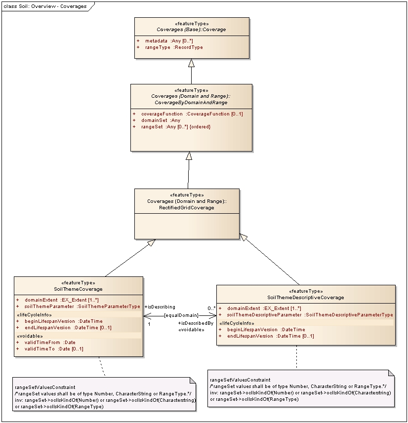

[.text-center]
*Figure 8 - UML class diagram: Overview of the SOIL application schema (Coverages part)*

image::./media/image12.jpeg[image,width=604,height=477, align=center]

[.text-center]
*Figure 9 - UML class diagram: Overview of the SOIL data types*

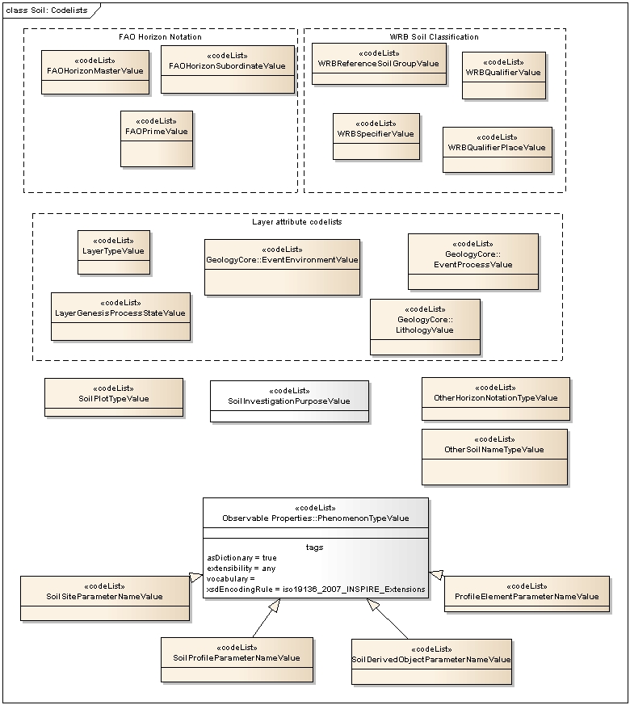

[.text-center]
*Figure 10 – UML class diagram: Overview of the SOIL code lists*

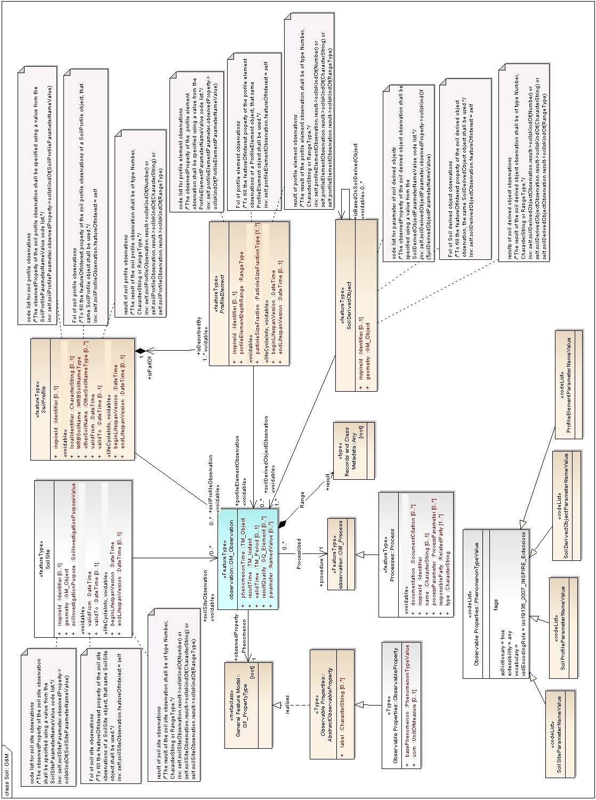

[.text-center]
*Figure 11 -  UML class diagram: Overview of the SOIL relation with O&M classes*

<<<
==== Feature catalogue

*Feature catalogue metadata*

[width="100%",cols="35%,65%"]
|===
|Application Schema |INSPIRE Application Schema Soil
|Version number |3.0
|===

*Types defined in the feature catalogue*

[width="100%",cols="45%,35%,20%"]
|===
|*Type* |*Package* |*Stereotypes*
|DerivedProfilePresenceInSoilBody |Soil |«associationType»
|DerivedSoilProfile |Soil |«featureType»
|FAOHorizonMasterValue |Soil |«codelist»
|FAOHorizonNotationType |Soil |«dataType»
|FAOHorizonSubordinateValue |Soil |«codelist»
|FAOPrimeValue |Soil |«codelist»
|LayerGenesisProcessStateValue |Soil |«codelist»
|LayerTypeValue |Soil |«codelist»
|ObservedSoilProfile |Soil |«featureType»
|OtherHorizonNotationType |Soil |«dataType»
|OtherHorizonNotationTypeValue |Soil |«codelist»
|OtherSoilNameType |Soil |«dataType»
|OtherSoilNameTypeValue |Soil |«codelist»
|ParticleSizeFractionType |Soil |«dataType»
|ProfileElement |Soil |«featureType»
|ProfileElementParameterNameValue |Soil |«codelist»
|RangeType |Soil |«dataType»
|SoilBody |Soil |«featureType»
|SoilDerivedObject |Soil |«featureType»
|SoilDerivedObjectParameterNameValue |Soil |«codelist»
|SoilHorizon |Soil |«featureType»
|SoilInvestigationPurposeValue |Soil |«codelist»
|SoilLayer |Soil |«featureType»
|SoilPlot |Soil |«featureType»
|SoilPlotTypeValue |Soil |«codelist»
|SoilProfile |Soil |«featureType»
|SoilProfileParameterNameValue |Soil |«codelist»
|SoilSite |Soil |«featureType»
|SoilSiteParameterNameValue |Soil |«codelist»
|SoilThemeCoverage |Soil |«featureType»
|SoilThemeDescriptiveCoverage |Soil |«featureType»
|SoilThemeDescriptiveParameterType |Soil |«dataType»
|SoilThemeParameterType |Soil |«dataType»
|WRBQualifierGroupType |Soil |«dataType»
|WRBQualifierPlaceValue |Soil |«codelist»
|WRBQualifierValue |Soil |«codelist»
|WRBReferenceSoilGroupValue |Soil |«codelist»
|WRBSoilNameType |Soil |«dataType»
|WRBSpecifierValue |Soil |«codelist»
|===

===== Spatial object types

====== DerivedProfilePresenceInSoilBody

[width="100%",cols="100%"]
|===
|*DerivedProfilePresenceInSoilBody*
a|
[width="100%",cols="5%,17%,78%"]
!===
!  !Name: !perived profile presence in soil body
!  !Definition: !indicates the percentages (lower and upper boundary) that the derived profile takes part in the Soil body.
!  !Description: !NOTE 1 A soil body is characterized by one or more derived soil profiles in a defined geographic area. When the soil body is characterized by more than one derived profiles, the distribution area of these derived soil profiles is not spatially defined, but their presence is indicated by a range of percentages.
!  !Stereotypes: !«associationType»
!===

|===

====== DerivedSoilProfile

[width="100%",cols="100%"]
|===
|*DerivedSoilProfile*
a|
[width="100%",cols="5%,17%,78%"]
!===
!  !Name: !derived soil profile
!  !Subtype of: !SoilProfile
!  !Definition: !non-point-located soil profile that serves as a reference profile for a specific soil type in a certain geographical area.
!  !Description: !The characteristics of a derived soil profile are mostly derived (e.g. averaged) from one or several observed profiles of the same soil type in the area of interest, or are designed with expert knowledge about the same kind of landscape. 
 
NOTE 1 The derived soil profile represents the average or typical profile that characterizes the so called soil typological unit, soil series.
!  !Stereotypes: !«featureType»
!===

a|
*Association role: isDerivedFrom*

[width="100%",cols="5%,17%,78%"]
!===
!  !Value type: !ObservedSoilProfile
!  !Definition: !link to one or more observed soil profiles from which this profile has been derived.
!  !Description: !A derived soil profile can be derived from one to many observed soil profiles. If no observed profiles are provided or have been used to produce the derivedSoilProfile, this association can be left empty.
!  !Multiplicity: !0..*
!  !Stereotypes: !«voidable»
!===

|===

====== ObservedSoilProfile

[width="100%",cols="100%"]
|===
|*ObservedSoilProfile*
a|
[width="100%",cols="5%,17%,78%"]
!===
!  !Name: !observed soil profile
!  !Subtype of: !SoilProfile
!  !Definition: !a representation of a soil profile found on a specific location which is described on the basis of observations in a trial pit or with a borehole.
!  !Description: !The observed soil profile corresponds to a set of data taken directly from a georeferenced soil profile, described in the field, and often sampled and analyzed in the laboratory.
!  !Stereotypes: !«featureType»
!===

a|
*Association role: location*

[width="100%",cols="5%,17%,78%"]
!===
!  !Value type: !SoilPlot
!  !Definition: !the location of an observed profile is the soilplot.
!  !Multiplicity: !1
!===

|===

====== ProfileElement

[width="100%",cols="100%"]
|===
|*ProfileElement (abstract)*
a|
[width="100%",cols="5%,17%,78%"]
!===
!  !Name: !profile element
!  !Definition: !An abstract spatial object type grouping soil layers and / or horizons for functional/operational aims.
!  !Description: !Profile element is the general term for both horizons and layers.
!  !Stereotypes: !«featureType»
!===

a|
*Attribute: inspireId*

[width="100%",cols="5%,17%,78%"]
!===
!  !Name: !inspire Id
!  !Value type: !Identifier
!  !Definition: !External object identifier of the profile element.
!  !Description: !NOTE An external object identifier is a unique object identifier published by the responsible body, which may be used by external applications to reference the spatial object. The identifier is an identifier of the spatial object, not an identifier of the real-world phenomenon.
!  !Multiplicity: !0..1
!===

a|
*Attribute: particleSizeFraction*

[width="100%",cols="5%,17%,78%"]
!===
!  !Name: !particle size fraction
!  !Value type: !ParticleSizeFractionType
!  !Definition: !Mineral part of the soil, fractioned on the basis of size (diameter), limits of the particles. It indicates how much of the mineral soil material is composed of soil particles of the specified size range.
!  !Description: !SOURCE NRCS Natural Resources Conservation Service, Soil survey laboratory information manual, Soil survey investigation report n.45 version 1.0 May 1995 pag. 11
!  !Multiplicity: !1..*
!  !Stereotypes: !«voidable»
!===

a|
*Attribute: profileElementDepthRange*

[width="100%",cols="5%,17%,78%"]
!===
!  !Name: !profile element depth range
!  !Value type: !RangeType
!  !Definition: !Upper and lower depth of the profile element (layer or horizon) measured from the surface (0 cm) of a soil profile (in cm).
!  !Description: !
!  !Multiplicity: !1
!===

a|
*Attribute: beginLifespanVersion*

[width="100%",cols="5%,17%,78%"]
!===
!  !Name: !begin lifespan version
!  !Value type: !DateTime
!  !Definition: !Date and time at which this version of the spatial object was inserted or changed in the spatial data set.
!  !Multiplicity: !1
!  !Stereotypes: !«lifeCycleInfo,voidable»
!===

a|
*Attribute: endLifespanVersion*

[width="100%",cols="5%,17%,78%"]
!===
!  !Name: !end lifespan version
!  !Value type: !DateTime
!  !Definition: !Date and time at which this version of the spatial object was superseded or retired in the spatial data set.
!  !Multiplicity: !0..1
!  !Stereotypes: !«lifeCycleInfo,voidable»
!===

a|
*Association role: isPartOf*

[width="100%",cols="5%,17%,78%"]
!===
!  !Value type: !SoilProfile
!  !Definition: !link to the soil profile which the profile element constitutes.
!  !Multiplicity: !1
!===

a|
*Constraint: code list for profile element observations*

[width="100%",cols="2%,9%,89%"]
!===
!  !Natural language: !The observedProperty of the profile element observation shall be specified using a value from the ProfileElementParameterNameValue code list.
!  !OCL: !inv: self.profileElementParameter.observedProperty->oclIsKindOf(ProfileElementParameterNameValue)
!===

a|
*Constraint: FoI of profile element observations*

[width="100%",cols="5%,17%,78%"]
!===
!  !Natural language: !To fill the featureOfInterest property of the profile element observations of a ProfileElement object, that same ProfileElement object shall be used.
!  !OCL: !inv: self.profileElementObservation.featureOfInterest = self
!===

a|
*Constraint: result of profile element observations*

[width="100%",cols="5%,17%,78%"]
!===
!  !Natural language: !The result of the profile element observation shall be of type Number, CharacterString or RangeType.
!  !OCL: !inv: self.profileElementObservation.result->oclIsKindOf(Number) or self.profileElementObservation.result->oclIsKindOf(CharacterString) or self.profileElementObservation.result->oclIsKindOf(RangeType)
!===

|===

====== SoilBody

[width="100%",cols="100%"]
|===
|*SoilBody*
a|
[width="100%",cols="5%,17%,78%"]
!===
!  !Name: !soil body
!  !Definition: !Part of the soil cover that is delineated and that is homogeneous with regard to certain soil properties and/or spatial patterns.
!  !Description: !The soils present in the soil body are characterized by one or more derived soil profiles that are found together in the area specified by the "geometry" attribute of the SoilBody. 
 
NOTE 1 If several derived soil profiles are used to describe the soil body, the spatial distribution of the soil they describe within the soil body is not defined, but their presence is indicated by a range percentage of area. The underlying reason behind the fact of not delineating the different soils within a soil body is the target scale of the map or spatial dataset. This means that geographical accuracy and preciseness of soil characterization depend on and vary with the target scale, i.e. the soil body can be delineated differently among scales. 
 
NOTE 2 The concept of soil body is a correlate of the concept soil mapping unit, and the soils of a soilbody might form e.g. a soil association, a soil complex, etc.
!  !Stereotypes: !«featureType»
!===

a|
*Attribute: inspireId*

[width="100%",cols="5%,17%,78%"]
!===
!  !Name: !inspire Id
!  !Value type: !Identifier
!  !Definition: !External object identifier of the soil body.
!  !Description: !NOTE An external object identifier is a unique object identifier published by the responsible body, which may be used by external applications to reference the spatial object. The identifier is an identifier of the spatial object, not an identifier of the real-world phenomenon.
!  !Multiplicity: !0..1
!===

a|
*Attribute: geometry*

[width="100%",cols="5%,17%,78%"]
!===
!  !Name: !geometry
!  !Value type: !GM_MultiSurface
!  !Definition: !The geometry defining the boundary of the Soil Body.
!  !Multiplicity: !1
!===

a|
*Attribute: soilBodyLabel*

[width="100%",cols="5%,17%,78%"]
!===
!  !Name: !soil body label
!  !Value type: !CharacterString
!  !Definition: !Label to identify the soil body according to the specified reference framework (metadata).
!  !Description: !NOTE in traditional soil maps, this is the identifier for the explanatory text of the mapping unit of the legend.
!  !Multiplicity: !1
!  !Stereotypes: !«voidable»
!===

a|
*Attribute: beginLifespanVersion*

[width="100%",cols="5%,17%,78%"]
!===
!  !Name: !begin lifespan version
!  !Value type: !DateTime
!  !Definition: !Date and time at which this version of the spatial object was inserted or changed in the spatial data set.
!  !Multiplicity: !1
!  !Stereotypes: !«lifeCycleInfo,voidable»
!===

a|
*Attribute: endLifespanVersion*

[width="100%",cols="5%,17%,78%"]
!===
!  !Name: !end lifespan version
!  !Value type: !DateTime
!  !Definition: !Date and time at which this version of the spatial object was superseded or retired in the spatial data set.
!  !Multiplicity: !0..1
!  !Stereotypes: !«lifeCycleInfo,voidable»
!===

a|
*Association role: isDescribedBy [the association has additional attributes - see association class DerivedProfilePresenceInSoilBody]*

[width="100%",cols="5%,17%,78%"]
!===
!  !Value type: !DerivedSoilProfile
!  !Definition: !Link to a derived soil profile that characterizes the soil body, possibly in combination with other derived soil profiles. The association has additional properties as defined in the association class DerivedProfilePresenceInSoilBody.
!  !Description: !This association constitutes the link to those derived soil profiles that inform about the internal structure and properties of the soil body.
!  !Multiplicity: !1..*
!  !Stereotypes: !«voidable»
!===

|===

====== SoilDerivedObject

[width="100%",cols="100%"]
|===
|*SoilDerivedObject*
a|
[width="100%",cols="5%,17%,78%"]
!===
!  !Name: !soil derived object
!  !Definition: !A spatial object type for representing spatial objects with soil-related property derived from one or more soil and possibly other non soil properties.
!  !Description: !NOTE Soil thematic maps can be derived directly from the involved soil database (organic matter content, pH, texture, etc.) or they can be derived by using pedotransfer functions or pedotransfer rules (e.g. plant available water in the rooting depth). Derivation can be simple extraction from a single data field, or a complex combination of different kind of data and application of e.g. mathematical or expert knowledge-based procedures.
!  !Stereotypes: !«featureType»
!===

a|
*Attribute: inspireId*

[width="100%",cols="5%,17%,78%"]
!===
!  !Name: !inspire Id
!  !Value type: !Identifier
!  !Definition: !External object identifier of the SoilDerivedObject.
!  !Description: !NOTE An external object identifier is a unique object identifier published by the responsible body, which may be used by external applications to reference the spatial object. The identifier is an identifier of the spatial object, not an identifier of the real-world phenomenon.
!  !Multiplicity: !0..1
!===

a|
*Attribute: geometry*

[width="100%",cols="5%,17%,78%"]
!===
!  !Name: !geometry
!  !Value type: !GM_Object
!  !Definition: !the geometry defining the soil derived object.
!  !Description: !A spatial representation of soil information becomes spatially explicit by delineating areas with similar values according to the soil (or other) property that is represented.
!  !Multiplicity: !1
!===

a|
*Association role: isBasedOnSoilDerivedObject*

[width="100%",cols="5%,17%,78%"]
!===
!  !Value type: !SoilDerivedObject
!  !Definition: !Link to a soil derived object on whose properties the derived value is based.
!  !Description: !A soil derived object can be created based on the properties of one or more other soil derived objects. If this information shall not be included or does not apply, the association can be empty.
!  !Multiplicity: !0..*
!  !Stereotypes: !«voidable»
!===

a|
*Association role: isBasedOnObservedSoilProfile*

[width="100%",cols="5%,17%,78%"]
!===
!  !Value type: !ObservedSoilProfile
!  !Definition: !Link to an observed soil profile on whose properties the derived value is based.
!  !Description: !A soil derived object can be created based on the soil properties of one or more observed soil profiles. If this information shall not be included or does not apply, the association can be empty.
!  !Multiplicity: !0..*
!  !Stereotypes: !«voidable»
!===

a|
*Association role: isBasedOnSoilBody*

[width="100%",cols="5%,17%,78%"]
!===
!  !Value type: !SoilBody
!  !Definition: !Link to a soil body on whose properties the derived value is based.
!  !Description: !A soil derived object can be created based on the soil properties of one or more soil bodies. If this information shall not be included or does not apply, the association can be empty.
!  !Multiplicity: !0..*
!  !Stereotypes: !«voidable»
!===

a|
*Constraint: code list for parameter of soil derived objects*

[width="100%",cols="2%,8%,90%"]
!===
!  !Natural language: !The observedProperty of the soil derived object observation shall be specified using a value from the SoilDerivedObjectParameterNameValue code list.
!  !OCL: !inv: self.soilDerivedObjectParameter.observedProperty->oclIsKindOf(SoilDerivedObjectParameterNameValue)
!===

a|
*Constraint: FoI of Soil derived object observations*

[width="100%",cols="5%,17%,78%"]
!===
!  !Natural language: !To fill the featureOfInterest property of the soil derived object observation, the same SoilDerivedObject object shall be used.
!  !OCL: !inv: self.soilDerivedObjectObservation.featureOfInterest = self
!===

a|
*Constraint: results of soil derived object observations*

[width="100%",cols="5%,17%,78%"]
!===
!  !Natural language: !The result of the soil derived object observation shall be of type Number, CharacterString or RangeType.
!  !OCL: !inv: self.soilDerivedObjectObservation.result->oclIsKindOf(Number) or self.soilDerivedObjectObservation.result->oclIsKindOf(CharacterString) or self.soilDerivedObjectObservation.result->oclIsKindOf(RangeType)
!===

|===

====== SoilHorizon

[width="100%",cols="100%"]
|===
|*SoilHorizon*
a|
[width="100%",cols="5%,17%,78%"]
!===
!  !Name: !soil horizon
!  !Subtype of: !ProfileElement
!  !Definition: !Domain of a soil with a certain vertical extension, more or less parallel to the surface and homogeneous for most morphological and analytical characteristics, developed in a parent material layer through pedogenic processes or made up of in-situ sedimented organic residues of up-growing plants (peat).
!  !Description: !SOURCE ISO/WD 28258, modified 
NOTE Horizons may be part of a layer.
!  !Stereotypes: !«featureType»
!===

a|
*Attribute: FAOHorizonNotation*

[width="100%",cols="5%,17%,78%"]
!===
!  !Name: !FAO horizon notation
!  !Value type: !FAOHorizonNotationType
!  !Definition: !designation of the soil horizon.
!  !Description: !The FAO horizon notation is a code system characterizing horizons regarding the dominant soil forming processes that have been active during the horizon formation. This code summarizes many observations of the soil description and gives an impression about the genetic processes that have formed the soil under observation. 
 
NOTE The horizon notation is a combination of several letter, number and symbols. 
 
SOURCE Guidelines for soil description, 4th edition, Food and Agricultural Organization of the United Nations, Rome, 2006 
 
EXAMPLE Bw: meaning B horizon with a development of colour and/or structure.
!  !Multiplicity: !1
!  !Stereotypes: !«voidable»
!===

a|
*Attribute: otherHorizonNotation*

[width="100%",cols="5%,17%,78%"]
!===
!  !Name: !other horizon notation
!  !Value type: !OtherHorizonNotationType
!  !Definition: !designation of the soil horizon according to a specific classification system.
!  !Description: !A code system characterizing horizons regarding the dominant soil forming processes that have been active during the horizon formation. This code summarizes many observations of the soil description and gives information about the genetic processes that have formed the soil under observation.
!  !Multiplicity: !0..*
!  !Stereotypes: !«voidable»
!===

|===

====== SoilLayer

[width="100%",cols="100%"]
|===
|*SoilLayer*
a|
[width="100%",cols="5%,17%,78%"]
!===
!  !Name: !Soil layer
!  !Subtype of: !ProfileElement
!  !Definition: !domain of a soil with a certain vertical extension developed through non-pedogenic processes, displaying a change in structure and/or composition to possibly over- or underlying adjacent domains, or a grouping of soil horizons or other sub-domains with a special purpose.
!  !Description: !NOTE1 Different kinds of layer concepts are covered by this definition. 
 
EXAMPLE 1 Geogenic layers: These are domains, resulting from e.g. sedimentation (as non-pedogenic) processes, that display an unconformity to possibly over- or underlying adjacent domains. 
 
EXAMPLE 2 Topsoil and Subsoil: These can be domains that group different soil horizon types (e.g. A vs. B horizons), or a special case of fixed depths with only two depth ranges (e.g. 0-15 cm: topsoil and, 15-75 cm: subsoil). 
 
EXAMPLE 3 Depth intervals: They are often used in soil monitoring, sampling of contaminated sites and in modelling and include: (i) depth increments (also called fixed depths) that are often used for sampling, e.g. 0-30cm, 30-60cm, and so on, (ii) a single depth range in which a soil sample ("specimen") is taken and for which the analytical result is valid, and (iii) soil slicing, that is, profile segmentation according to a specified vector, for instance, either regularly spaced intervals (1cm), or a user-defined vector of segment boundaries (i.e. 0-10, 10-25, 25-50, 50-100). Slicing is used in modelling to generate continuous depth functions for soil properties. 
 
EXAMPLE 4: In the framework of soils deeply modified by human activity, artificial layers may be due to different kinds of deposits (concrete, bricks, ...). 
SOURCE WD ISO28258, modified
!  !Stereotypes: !«featureType»
!===

a|
*Attribute: layerType*

[width="100%",cols="5%,17%,78%"]
!===
!  !Name: !layer type
!  !Value type: !LayerTypeValue
!  !Definition: !assignation of a layer according to the concept that fits its kind.
!  !Description: !EXAMPLE Topsoil: meaning the upper part of the natural mineral soil that is generally dark coloured and has a higher content of organic matter and nutrients when compared to the mineral horizons below.
!  !Multiplicity: !1
!===

a|
*Attribute: layerRockType*

[width="100%",cols="5%,17%,78%"]
!===
!  !Name: !layer rock type
!  !Value type: !LithologyValue
!  !Definition: !type of the material in which the layer developed.
!  !Description: !simplified list of terms to "classify" geologic units
!  !Multiplicity: !0..*
!  !Stereotypes: !«voidable»
!===

a|
*Attribute: layerGenesisProcess*

[width="100%",cols="5%,17%,78%"]
!===
!  !Name: !layer genesis process
!  !Value type: !EventProcessValue
!  !Definition: !last non-pedogenic process (geologic or anthropogenic) that coined the material composition and internal structure of the layer.
!  !Multiplicity: !0..1
!  !Stereotypes: !«voidable»
!===

a|
*Attribute: layerGenesisEnvironment*

[width="100%",cols="5%,17%,78%"]
!===
!  !Name: !layer genesis environment
!  !Value type: !EventEnvironmentValue
!  !Definition: !setting in which the last non-pedogenic process (geologic or anthropogenic) that coined the material composition and internal structure of the layer took place.
!  !Description: !The material in which a soil develops is influenced by the environmental situation in which the processes of its formation took place, e.g. sedimentation from water results in quite differently structured layers when it has been deposited in running water than in a lake.
!  !Multiplicity: !0..1
!  !Stereotypes: !«voidable»
!===

a|
*Attribute: layerGenesisProcessState*

[width="100%",cols="5%,17%,78%"]
!===
!  !Name: !layer genesis process state
!  !Value type: !LayerGenesisProcessStateValue
!  !Definition: !indication whether the process specified in layerGenesisProcess is on-going or seized in the past.
!  !Description: !Process state gives an idea whether current non-pedogenic processes affect the soil or not. E.g. on current floodplains, input of sediments during seasonal flooding events is received, with comparatively young soil development in it, while in older fluvial sediments that are no longer under a regime of seasonal or irregular flooding, soil development might be more advanced.
!  !Multiplicity: !0..1
!  !Stereotypes: !«voidable»
!===

a|
*Constraint: geogenicConstraint*

[width="100%",cols="5%,17%,78%"]
!===
!  !Natural language: !The attributes layerGenesisProcess, layerGenesisEnvironment, layerGenesisProcessState and layerRockType are only needed when layerType is of the value 'geogenic'
!  !OCL: !inv: self.layerType = LayerTypeValue::geogenic implies (self.layerGenisisEnvironment.isNotEmpty() and self.layerGenisisProcess.isNotEmpty() and self.layerRockType.isNotEmpty() and layerGenesisProcessState.isNotEmpty())
!===

|===

====== SoilPlot

[width="100%",cols="100%"]
|===
|*SoilPlot*
a|
[width="100%",cols="5%,17%,78%"]
!===
!  !Name: !soil plot
!  !Definition: !spot where a specific soil investigation is carried out.
!  !Description: !NOTE 1: For observed soil profiles, a spot location has to be defined. It is the place on which the observation is made. The profile is an observation made on the plot. 
 
NOTE 2: All types of plots only provide locality, but no soil information itself. 
 
EXAMPLE A borehole is the location where you gather the information to abstract a profile information from. 
 
SOURCE GS Soil
!  !Stereotypes: !«featureType»
!===

a|
*Attribute: inspireId*

[width="100%",cols="5%,17%,78%"]
!===
!  !Name: !inspire Id
!  !Value type: !Identifier
!  !Definition: !External object identifier of the soil plot.
!  !Description: !NOTE An external object identifier is a unique object identifier published by the responsible body, which may be used by external applications to reference the spatial object. The identifier is an identifier of the spatial object, not an identifier of the real-world phenomenon.
!  !Multiplicity: !0..1
!===

a|
*Attribute: soilPlotLocation*

[width="100%",cols="5%,17%,78%"]
!===
!  !Name: !soil plot location
!  !Value type: !Location
!  !Definition: !a reference to a location on the earth; it can be a point location identified by coordinates or a description of the location using text or an identifier.
!  !Description: !EXAMPLE reference to a place name, municipality or reference to an exact X,Y location
!  !Multiplicity: !1
!===

a|
*Attribute: soilPlotType*

[width="100%",cols="5%,17%,78%"]
!===
!  !Name: !soil plot type
!  !Value type: !SoilPlotTypeValue
!  !Definition: !gives information on what kind of plot the observation of the soil is made on.
!  !Description: !NOTE Trial pits, boreholes or samples can be seen as types of soil plots.
!  !Multiplicity: !1
!===

a|
*Attribute: beginLifespanVersion*

[width="100%",cols="5%,17%,78%"]
!===
!  !Name: !begin lifespan version
!  !Value type: !DateTime
!  !Definition: !Date and time at which this version of the spatial object was inserted or changed in the spatial data set.
!  !Multiplicity: !1
!  !Stereotypes: !«lifeCycleInfo,voidable»
!===

a|
*Attribute: endLifespanVersion*

[width="100%",cols="5%,17%,78%"]
!===
!  !Name: !end lifespan version
!  !Value type: !DateTime
!  !Definition: !Date and time at which this version of the spatial object was superseded or retired in the spatial data set.
!  !Multiplicity: !0..1
!  !Stereotypes: !«lifeCycleInfo,voidable»
!===

a|
*Association role: locatedOn*

[width="100%",cols="5%,17%,78%"]
!===
!  !Value type: !SoilSite
!  !Definition: !link to the soil site on which the soil plot is located or to which the soil plot is belonging.
!  !Description: !a soil plot (location of a soil observation) is located on maximum 1 soil site.
!  !Multiplicity: !0..1
!  !Stereotypes: !«voidable»
!===

a|
*Association role: observedProfile*

[width="100%",cols="5%,17%,78%"]
!===
!  !Value type: !ObservedSoilProfile
!  !Definition: !Link to the observed soil profile for which the soil plot provides location information.
!  !Description: !the soil plot is the location at which the profile has been observed.
!  !Multiplicity: !1
!  !Stereotypes: !«voidable»
!===

|===

====== SoilProfile

[width="100%",cols="100%"]
|===
|*SoilProfile (abstract)*
a|
[width="100%",cols="5%,17%,78%"]
!===
!  !Name: !soil profile
!  !Definition: !description of the soil that is characterized by a vertical succession of profile elements.
!  !Description: !NOTE The soil profile is abstracted from observations in a trial pit or a boring, or derived from expert knowledge using other soil profiles.
!  !Stereotypes: !«featureType»
!===

a|
*Attribute: inspireId*

[width="100%",cols="5%,17%,78%"]
!===
!  !Name: !inspire Id
!  !Value type: !Identifier
!  !Definition: !External object identifier of the soil profile.
!  !Description: !NOTE An external object identifier is a unique object identifier published by the responsible body, which may be used by external applications to reference the spatial object. The identifier is an identifier of the spatial object, not an identifier of the real-world phenomenon.
!  !Multiplicity: !0..1
!===

a|
*Attribute: localIdentifier*

[width="100%",cols="5%,17%,78%"]
!===
!  !Name: !local identifier
!  !Value type: !CharacterString
!  !Definition: !unique identifier of the soil profile given by the data provider of the dataset.
!  !Multiplicity: !0..1
!  !Stereotypes: !«voidable»
!===

a|
*Attribute: WRBSoilName*

[width="100%",cols="5%,17%,78%"]
!===
!  !Name: !WRB soil name
!  !Value type: !WRBSoilNameType
!  !Definition: !identification of the soil profile.
!  !Description: !NOTE The structure of the WRBSoilNameType was based on the World reference base for soil resources 2006, first update 2007. World Soil Resources Reports no 103. Food and Agriculture Organization of the United Nations, Rome 2007. 
EXAMPLE Lixic Vertic Ferralsol (Ferric, Rhodic); WRB version 2006 (update 2007) or 2010.
!  !Multiplicity: !1
!  !Stereotypes: !«voidable»
!===

a|
*Attribute: otherSoilName*

[width="100%",cols="5%,17%,78%"]
!===
!  !Name: !other soil name
!  !Value type: !OtherSoilNameType
!  !Definition: !Identification of the soil profile according to a specific classification scheme.
!  !Multiplicity: !0..*
!  !Stereotypes: !«voidable»
!===

a|
*Attribute: validFrom*

[width="100%",cols="5%,17%,78%"]
!===
!  !Name: !valid from
!  !Value type: !DateTime
!  !Definition: !The time when the phenomenon started to exist in the real world.
!  !Multiplicity: !1
!  !Stereotypes: !«voidable»
!===

a|
*Attribute: validTo*

[width="100%",cols="5%,17%,78%"]
!===
!  !Name: !valid to
!  !Value type: !DateTime
!  !Definition: !The time from which the phenomenon no longer exists in the real world.
!  !Multiplicity: !0..1
!  !Stereotypes: !«voidable»
!===

a|
*Attribute: beginLifespanVersion*

[width="100%",cols="5%,17%,78%"]
!===
!  !Name: !begin lifespan version
!  !Value type: !DateTime
!  !Definition: !Date and time at which this version of the spatial object was inserted or changed in the spatial data set.
!  !Multiplicity: !1
!  !Stereotypes: !«lifeCycleInfo,voidable»
!===

a|
*Attribute: endLifespanVersion*

[width="100%",cols="5%,17%,78%"]
!===
!  !Name: !end lifespan version
!  !Value type: !DateTime
!  !Definition: !Date and time at which this version of the spatial object was superseded or retired in the spatial data set.
!  !Multiplicity: !0..1
!  !Stereotypes: !«lifeCycleInfo,voidable»
!===

a|
*Association role: isDescribedBy*

[width="100%",cols="5%,17%,78%"]
!===
!  !Value type: !ProfileElement
!  !Definition: !the profile elements (layers and/or horizons) constituting the soil profile.
!  !Description: !A profile element is always part of a soil profile.
!  !Multiplicity: !1..*
!  !Stereotypes: !«voidable»
!===

a|
*Constraint: code list for soil profile observations*

[width="100%",cols="2%,10%,88%"]
!===
!  !Natural language: !The observedProperty of the soil profile observation shall be specified using a value from the SoilProfileParameterNameValue code list.
!  !OCL: !inv: self.soilProfileParameter.observedProperty->oclIsKindOf(SoilProfileParameterNameValue)
!===

a|
*Constraint: FoI of soil profile observations*

[width="100%",cols="5%,17%,78%"]
!===
!  !Natural language: !To fill the featureOfInterest property of the soil profile observations of a SoilProfile object, that same SoilProfile object shall be used.
!  !OCL: !inv: self.soilProfileObservation.featureOfInterest = self
!===

a|
*Constraint: result of soil profile observations*

[width="100%",cols="5%,17%,78%"]
!===
!  !Natural language: !The result of the soil profile observation shall be of type Number, CharacterString or RangeType.
!  !OCL: !inv: self.soilProfileObservation.result->oclIsKindOf(Number) or self.soilProfileObservation.result->oclIsKindOf(CharacterString) or self.soilProfileObservation.result->oclIsKindOf(RangeType)
!===

|===

====== SoilSite

[width="100%",cols="100%"]
|===
|*SoilSite*
a|
[width="100%",cols="5%,17%,78%"]
!===
!  !Name: !soil site
!  !Definition: !area within a larger survey, study or monitored area, where a specific soil investigation is carried out.
!  !Description: !Site provides the object to describe: 
a.) the surroundings of the plot 
 
and/or 
 
b.) the larger piece of land that is directly linked to and described by all soil investigations on its one or more spots (SoilPlots). It thus provides the object to which soil data of different kind (or the same kind, but at different points in time, e.g. in soil monitoring) obtained on different plots is related as if it would have been collected at the very same place. This allows for: 
 
1. combination of data that cannot be obtained on the very same place 
EXAMPLE: a soil pit and investigations on earthworm abundance cannot be done in the same place, but possibly some metres apart from each other. Nonetheless shall the results of both investigations be combined to inform about the soil state. 
or 
2. comparison of soil condition after some time has elapsed. 
EXAMPLE: Organic carbon stock has been investigated using data from two monitoring periods that had to be conducted on spatially slightly separated places because the sampling is destructive. Nonetheless are the results of both periods regarded as giving an idea how organic carbon stock has changed over the years at the same place. 
 
The site is also the object to state the date and time information on validity, etc. 
 
The soil site might have delineation, but can be located with a centre or reference point location only. Delineated soil sites - possibly in the form of cadastral parcels - are especially used in the inventory of contaminated areas. 
 
NOTE Any plot can be linked to one specific site only, but several plots to one site. 
 
SOURCE GS Soil, modified
!  !Stereotypes: !«featureType»
!===

a|
*Attribute: inspireId*

[width="100%",cols="5%,17%,78%"]
!===
!  !Name: !inspire Id
!  !Value type: !Identifier
!  !Definition: !External object identifier of the soil site.
!  !Description: !NOTE An external object identifier is a unique object identifier published by the responsible body, which may be used by external applications to reference the spatial object. The identifier is an identifier of the spatial object, not an identifier of the real-world phenomenon.
!  !Multiplicity: !0..1
!===

a|
*Attribute: geometry*

[width="100%",cols="5%,17%,78%"]
!===
!  !Name: !geometry
!  !Value type: !GM_Object
!  !Definition: !The geometry defining the soil site.
!  !Description: !This can be a polygon defining an area in which the survey was conducted, but it can also be a point location which is used as reference point according to which the soil plots are determined.
!  !Multiplicity: !1
!===

a|
*Attribute: soilInvestigationPurpose*

[width="100%",cols="5%,17%,78%"]
!===
!  !Name: !soil investigation purpose
!  !Value type: !SoilInvestigationPurposeValue
!  !Definition: !indication why a survey was conducted.
!  !Description: !For soil two main purposes are identified to carry out soil surveys. One is to classify the soil as a result of soil forming processes (generalSurvey) and the other one is to investigate soil for a specific reason (specificSurvey) like a possible contamination as a result of contaminating activities. This information gives the data user an idea about possible bias in the selection of the site and therefore representativeness of the data that were obtained for a special purpose.
!  !Multiplicity: !1
!===

a|
*Attribute: validFrom*

[width="100%",cols="5%,17%,78%"]
!===
!  !Name: !valid from
!  !Value type: !DateTime
!  !Definition: !The time when the phenomenon started to exist in the real world.
!  !Multiplicity: !1
!  !Stereotypes: !«voidable»
!===

a|
*Attribute: validTo*

[width="100%",cols="5%,17%,78%"]
!===
!  !Name: !valid to
!  !Value type: !DateTime
!  !Definition: !The time from which the phenomenon no longer exists in the real world.
!  !Multiplicity: !0..1
!  !Stereotypes: !«voidable»
!===

a|
*Attribute: beginLifespanVersion*

[width="100%",cols="5%,17%,78%"]
!===
!  !Name: !begin lifespan version
!  !Value type: !DateTime
!  !Definition: !Date and time at which this version of the spatial object was inserted or changed in the spatial data set.
!  !Multiplicity: !1
!  !Stereotypes: !«lifeCycleInfo,voidable»
!===

a|
*Attribute: endLifespanVersion*

[width="100%",cols="5%,17%,78%"]
!===
!  !Name: !end lifespan version
!  !Value type: !DateTime
!  !Definition: !Date and time at which this version of the spatial object was superseded or retired in the spatial data set.
!  !Multiplicity: !0..1
!  !Stereotypes: !«lifeCycleInfo,voidable»
!===

a|
*Association role: isObservedOnLocation*

[width="100%",cols="5%,17%,78%"]
!===
!  !Value type: !SoilPlot
!  !Definition: !link to a location(s) where the soil site has been investigated.
!  !Description: !A soil site with a specific investigation purpose can be observed on several locations (soil plots) inside that site area. If only a centre point location is provided, the set of links to soil plots state that the information from these plots can be combined in a meaningful way, i.e. the combination is valid.
!  !Multiplicity: !1..*
!  !Stereotypes: !«voidable»
!===

a|
*Constraint: code list for soil site observations*

[width="100%",cols="2%,10%,88%"]
!===
!  !Natural language: !The observedProperty of the soil site observation shall be specified using a value from the SoilSiteParameterNameValue code list.
!  !OCL: !inv: self.soilSiteParameter.observedProperty->oclIsKindOf(SoilSiteParameterNameValue)
!===

a|
*Constraint: FoI of soil site observations*

[width="100%",cols="5%,17%,78%"]
!===
!  !Natural language: !To fill the featureOfInterest property of the soil site observations of a SoilSite object, that same SoilSite object shall be used.
!  !OCL: !inv: self.soilSiteObservation.featureOfInterest = self
!===

a|
*Constraint: result of soil site observations*

[width="100%",cols="5%,17%,78%"]
!===
!  !Natural language: !The result of the soil site observation shall be of type Number, CharacterString or RangeType.
!  !OCL: !inv: self.soilSiteObservation.result->oclIsKindOf(Number) or self.soilSiteObservation.result->oclIsKindOf(CharacterString) or self.soilSiteObservation.result->oclIsKindOf(RangeType)
!===

|===

====== SoilThemeCoverage

[width="100%",cols="100%"]
|===
|*SoilThemeCoverage*
a|
[width="100%",cols="5%,17%,78%"]
!===
!  !Name: !soil theme coverage
!  !Subtype of: !RectifiedGridCoverage
!  !Definition: !a spatial object type that holds values for a property based on one or more soil and possibly non soil parameters within its spatial, temporal or spatiotemporal domain.
!  !Description: !SOURCE Adapted from "Coverage" [ISO 19123:2005].
!  !Stereotypes: !«featureType»
!===

a|
*Attribute: beginLifespanVersion*

[width="100%",cols="5%,17%,78%"]
!===
!  !Name: !begin life span version
!  !Value type: !DateTime
!  !Definition: !Date and time at which this version of the spatial object was inserted or changed in the spatial data set.
!  !Multiplicity: !1
!  !Stereotypes: !«lifeCycleInfo»
!===

a|
*Attribute: endLifespanVersion*

[width="100%",cols="5%,17%,78%"]
!===
!  !Name: !end life span version
!  !Value type: !DateTime
!  !Definition: !Date and time at which this version of the spatial object was superseded or retired in the spatial data set.
!  !Multiplicity: !0..1
!  !Stereotypes: !«lifeCycleInfo»
!===

a|
*Attribute: domainExtent*

[width="100%",cols="5%,17%,78%"]
!===
!  !Name: !Domain extent.
!  !Value type: !EX_Extent
!  !Definition: !The attribute domainExtent shall contain the extent of the spatiotemporal domain of the coverage. The data type EX_Extent, is defined in ISO 19103. Extents may be specified in both space and time.
!  !Description: !SOURCE Adapted from [ISO 19123:2005].
!  !Multiplicity: !1..*
!===

a|
*Attribute: validTimeFrom*

[width="100%",cols="5%,17%,78%"]
!===
!  !Name: !valid time from
!  !Value type: !Date
!  !Definition: !The ValidTime specifies the time window for which measurements have been captured to calculate the thematic soil property relevant for that period. The start time defines when the period began.
!  !Multiplicity: !1
!  !Stereotypes: !«voidable»
!===

a|
*Attribute: validTimeTo*

[width="100%",cols="5%,17%,78%"]
!===
!  !Name: !valid time to
!  !Value type: !Date
!  !Definition: !The ValidTime specifies the time window for which measurements have been captured to calculate the thematic soil property relevant for that period. The end time defines when the period stopped.
!  !Multiplicity: !0..1
!  !Stereotypes: !«voidable»
!===

a|
*Attribute: soilThemeParameter*

[width="100%",cols="5%,17%,78%"]
!===
!  !Name: !soil theme parameter
!  !Value type: !SoilThemeParameterType
!  !Definition: !A soil-related property (soil theme) that is represented by this coverage.
!  !Description: !EXAMPLE Land irrigation suitability, pH in the topsoil, etc
!  !Multiplicity: !1
!===

a|
*Association role: isDescribedBy*

[width="100%",cols="5%,17%,78%"]
!===
!  !Value type: !SoilThemeDescriptiveCoverage
!  !Definition: !this association allows for a certain SoilThemeCoverage to have a related Coverage which does not have a meaning without the base coverage.
!  !Description: !EXAMPLE a coverage of the pH of the topsoil is associated with a coverage with exactly the same extent and domain reporting on the level of confidence of the pH values of the base coverage.
!  !Multiplicity: !0..*
!  !Stereotypes: !«voidable»
!===

a|
*Constraint: rangeSetValuesConstraint*

[width="100%",cols="5%,17%,78%"]
!===
!  !Natural language: !rangeSet values shall be of type Number, CharacterString or RangeType.
!  !OCL: !inv: rangeSet->oclIsKindOf(Number) or rangeSet->oclIsKindOf(Characterstring) or rangeSet->oclIsKindOf(RangeType)
!===

|===

====== SoilThemeDescriptiveCoverage

[width="100%",cols="100%"]
|===
|*SoilThemeDescriptiveCoverage*
a|
[width="100%",cols="5%,17%,78%"]
!===
!  !Name: !soil theme descriptive coverage
!  !Subtype of: !RectifiedGridCoverage
!  !Definition: !a spatial object type that is associated to the soil theme coverage and holds additional information on values of a property of the soil theme coverage.
!  !Description: !This coverage can only exist in relation to a base coverage SoilThemeCoverage, it has the same domain and spatial extent as the base coverage. And it gives extra information on the values of the base coverages 
SOURCE Adapted from "Coverage" [ISO 19123:2005]. 
EXAMPLE coverage indicating the confidence level of the pH values reported in the associated SoilThemeCoverage.
!  !Stereotypes: !«featureType»
!===

a|
*Attribute: beginLifespanVersion*

[width="100%",cols="5%,17%,78%"]
!===
!  !Name: !begin life span version
!  !Value type: !DateTime
!  !Definition: !Date and time at which this version of the spatial object was inserted or changed in the spatial data set.
!  !Multiplicity: !1
!  !Stereotypes: !«lifeCycleInfo»
!===

a|
*Attribute: endLifespanVersion*

[width="100%",cols="5%,17%,78%"]
!===
!  !Name: !end life span version
!  !Value type: !DateTime
!  !Definition: !Date and time at which this version of the spatial object was superseded or retired in the spatial data set.
!  !Multiplicity: !0..1
!  !Stereotypes: !«lifeCycleInfo»
!===

a|
*Attribute: domainExtent*

[width="100%",cols="5%,17%,78%"]
!===
!  !Name: !Domain extent.
!  !Value type: !EX_Extent
!  !Definition: !The attribute domainExtent shall contain the extent of the spatiotemporal domain of the coverage. The data type EX_Extent, is defined in ISO 19103. Extents may be specified in both space and time.
!  !Description: !SOURCE Adapted from [ISO 19123:2005].
!  !Multiplicity: !1..*
!===

a|
*Attribute: soilThemeDescriptiveParameter*

[width="100%",cols="5%,17%,78%"]
!===
!  !Name: !soil theme descriptive parameter
!  !Value type: !SoilThemeDescriptiveParameterType
!  !Definition: !a descriptive property for the soil-related property (soil theme) that is represented by its associated SoilThemeCoverage.
!  !Description: !EXAMPLE confidence level for each value in the SoilThemeCoverage (pH in the topsoil)
!  !Multiplicity: !1
!===

a|
*Association role: isDescribing*

[width="100%",cols="5%,17%,78%"]
!===
!  !Value type: !SoilThemeCoverage
!  !Definition: !this association allows for a certain SoilThemeCoverage to have a related Coverage which does not have a meaning without the base coverage.
!  !Description: !EXAMPLE a coverage of the pH of the topsoil is associated with a coverage with exactly the same extent and domain reporting on the level of confidence of the pH values of the base coverage.
!  !Multiplicity: !1
!  !Stereotypes: !«voidable»
!===

a|
*Constraint: rangeSetValuesConstraint*

[width="100%",cols="5%,17%,78%"]
!===
!  !Natural language: !rangeSet values shall be of type Number, CharacterString or RangeType.
!  !OCL: !inv: rangeSet->oclIsKindOf(Number) or rangeSet->oclIsKindOf(Characterstring) or rangeSet->oclIsKindOf(RangeType)
!===

|===

===== Data types

[[derivedprofilepresenceinsoilbody]]
====== DerivedProfilePresenceInSoilBody

[width="100%",cols="100%"]
|===
|*DerivedProfilePresenceInSoilBody (association class)*
a|
[width="100%",cols="5%,17%,78%"]
!===
!  !Name: !derived profile presence in soil body
!  !Definition: !indicates the percentages (lower and upper boundary) that the derived profile takes part in the Soil body.
!  !Description: !NOTE 1 A soil body is characterized by one or more derived soil profiles in a defined geographic area. When the soil body is characterized by more than one derived profiles, the distribution area of these derived soil profiles is not spatially defined, but their presence is indicated by a range of percentages. 
 
NOTE 2 The sum of lower boundary parts should not exceed 100%. 
 
NOTE 3 If not a range, but a specific percentage is used then the lower and upper boundaries are equal.
!===

a|
*Attribute: derivedProfilePercentageRange*

[width="100%",cols="5%,17%,78%"]
!===
!  !Name: !derived profile percentage range.
!  !Value type: !RangeType
!  !Definition: !Interval that defines the minimum and maximum percentage of the area of the soil body represented by a specific derived soil profile.
!  !Multiplicity: !1
!  !Stereotypes: !«voidable»
!===

|===

====== FAOHorizonNotationType

[width="100%",cols="100%"]
|===
|*FAOHorizonNotationType*
a|
[width="100%",cols="5%,17%,78%"]
!===
!  !Name: !FAO horizon notation type
!  !Definition: !A classification of a horizon according to the Horizon classification system specified in _Guidelines for soil description, 4th edition_, Food and Agriculture Organization of the United Nations, Rome, 2006.
!  !Description: !A code system that denotes horizons in which the same dominant soil forming processes has been active similarly. This code summarizes many observations of the soil description and gives an impression about the genetic processes that have formed the soil under observation. 
 
NOTE The horizon notation according to FAO (2006) is a combination of several symbols: 
· A number that gives information about discontinuities, i.e. the number of the material in which the soil has formed, counted up from the soil surface, but not for the first material. 
· One or two capital letters that designate the type of master horizon (or transitional horizon), possibly separated by a slash 
· Lower case letters that designate subordinate characteristics of the horizon. 
· A number that designates horizontal subdivisions of otherwise similarly denoted horizon parts 
· A prime that enables to distinguish two horizons that have the same naming, but formed in different cycles of pedogenesis. 
 
EXAMPLE 2B' tg1 
 
SOURCE 1 Page 67 - 77 of the _Guidelines for soil description, 4th edition_, Food and Agriculture Organization of the United Nations, Rome, 2006. (ISBN 92-5-105521-1)
!  !Stereotypes: !«dataType»
!===

a|
*Attribute: FAOHorizonDiscontinuity*

[width="100%",cols="5%,17%,78%"]
!===
!  !Name: !FAO horizon discontinuity
!  !Value type: !Integer
!  !Definition: !number used to indicate a discontinuity in the horizon notation.
!  !Description: !In mineral soils, Arabic numerals are used as prefixes to indicate discontinuities. Wherever needed, they are used preceding A, E, B, C and R. They are not used with I and W, although these symbols clearly indicate a discontinuity. These prefixes are distinct from Arabic numerals used as suffixes to denote vertical subdivisions. 
A discontinuity is a significant change in particle-size distribution or mineralogy that indicates a difference in the material from which the horizons formed or a significant difference in age or both, unless that difference in age is indicated by the suffix b. Symbols to identify discontinuities are used only when they will contribute substantially to the reader's understanding of relationships among horizons. The stratification common in soils formed in alluvium is not designated as discontinuities unless particle-size distribution differs markedly from layer to layer even though genetic horizons have formed in the contrasting layers. 
Where a soil has formed entirely in one kind of material, a prefix is omitted from the symbol; the whole profile is material 1. Similarly, the uppermost material in a profile having two or more contrasting materials is understood to be material 1, but the number is omitted. Numbering starts with the second layer of contrasting material, which is designated 2. Underlying contrasting layers are numbered consecutively. 
 
SOURCE: _Guidelines for soil description, 4th edition_, Food and Agriculture Organization of the United Nations, Rome, 2006. 
 
NOTE a discontinuity is a boundary between two geogenic layers.
!  !Multiplicity: !0..1
!===

a|
*Attribute: FAOHorizonMaster*

[width="100%",cols="5%,17%,78%"]
!===
!  !Name: !FAO horizon master
!  !Value type: !FAOHorizonMasterValue
!  !Definition: !symbol of the master part of the horizon notation.
!  !Description: !SOURCE Guidelines for soil description (4th ed.) FAO 2006 p. 67
!  !Multiplicity: !1
!===

a|
*Attribute: FAOPrime*

[width="100%",cols="5%,17%,78%"]
!===
!  !Name: !FAO prime
!  !Value type: !FAOPrimeValue
!  !Definition: !A prime and double prime may be used to connotate master horizon symbol of the lower of two respectively three horizons having identical Arabic-numeral prefixes and letter combinations.
!  !Description: !Identical designations may be appropriate for two or more horizons or layers separated by at least one horizon or layer of a different kind in the same pedon. The sequence A-E-Bt-E-Btx-C is an example - the soil has two E horizons. To make communication easier, a prime is used with the master horizon symbol of the lower of two horizons having identical letter designations: A-E-Bt-E'-Btx-C.The prime is applied to the capital letter designation, and any lower case symbol follows it: B't. The prime is not used unless all letters of the designations of two different layers are identical. Prime can be used for both minerals or organic soils. 
 
SOURCE: _Guidelines for soil description, 4th edition_, Food and Agriculture Organization of the United Nations, Rome, 2006.
!  !Multiplicity: !1
!===

a|
*Attribute: FAOHorizonSubordinate*

[width="100%",cols="5%,17%,78%"]
!===
!  !Name: !horizon subordinate
!  !Value type: !FAOHorizonSubordinateValue
!  !Definition: !Designations of subordinate distinctions and features within the master horizons and layers are based on profile characteristics observable in the field and are applied during the description of the soil at the site.
!  !Description: !Lower case letters are used as suffixes to designate specific kinds of master horizons and layers, and other features. 
 
SOURCE _Guidelines for soil description, 4th edition_, Food and Agriculture Organization of the United Nations, Rome, 2006. table 85
!  !Multiplicity: !0..*
!===

a|
*Attribute: FAOHorizonVertical*

[width="100%",cols="5%,17%,78%"]
!===
!  !Name: !horizon vertical
!  !Value type: !Integer
!  !Definition: !Order number of the vertical subdivision in the horizon notation.
!  !Description: !The number is used to designate the horizontal subdivision of a horizon identified by a single set of letter symbol on the basis of structure, texture, colour, etc. 
The number 1 is used to designate the upper part of the horizon. The number 2 the part of the horizon situated below, etc. If there is no horizontal subdivision made, no number is given. 
 
NOTE the use of the word vertical is misleading in the _Guidelines for soil description, 4th edition_, Food and Agriculture Organization of the United Nations, Rome, 2006., because the horizons are separated in two or several horizontal subdomains. Vertical denotes the order in vertical direction.
!  !Multiplicity: !0..1
!===

a|
*Attribute: isOriginalClassification*

[width="100%",cols="5%,17%,78%"]
!===
!  !Name: !is original classification
!  !Value type: !Boolean
!  !Definition: !Boolean value to indicate whether the FAO horizon notation was the original notation to describe the horizon.
!  !Description: !This is to indicate whether the horizon notation has been determined in the field (or for derived profiles during the original derivation), or has been adapted, changed or assigned on the basis of the original horizon description later. This might be relevant data quality information.
!  !Multiplicity: !1
!===

|===

====== OtherHorizonNotationType

[width="100%",cols="100%"]
|===
|*OtherHorizonNotationType*
a|
[width="100%",cols="5%,17%,78%"]
!===
!  !Name: !other horizon notation type
!  !Definition: !classification of a horizon according to a specific classification system.
!  !Description: !A code system denoting horizons in which the same dominant soil forming processes have been active in the same way. This code summarizes many observations of the soil description and gives an impression about the genetic processes that have formed the soil under observation.
!  !Stereotypes: !«dataType»
!===

a|
*Attribute: horizonNotation*

[width="100%",cols="5%,17%,78%"]
!===
!  !Name: !horizon notation
!  !Value type: !OtherHorizonNotationTypeValue
!  !Definition: !notation characterizing the soil horizon according to a specified classification system.
!  !Description: !NOTE This is also called horizon designation value, horizon designation or horizon symbol. 
EXAMPLE "ss" connotes slickensides in Soil taxonomy (FAO uses "I" for this). 
The notation in several classification systems can be the same as well: "Ap" is a A horizon which has been ploughed (according German Bodenkundliche Kartieranleitung, 5th ed).
!  !Multiplicity: !1
!===

a|
*Attribute: isOriginalClassification*

[width="100%",cols="5%,17%,78%"]
!===
!  !Name: !is original classification
!  !Value type: !Boolean
!  !Definition: !Boolean value to indicate whether the specified horizon notation system was the original notation system to describe the horizon.
!  !Description: !This is to indicate whether the horizon notation has been determined in the field (or for derived soil profiles during the original derivation), or has been adapted, changed or assigned on the basis of the original horizon description later. This might be relevant for data quality information.
!  !Multiplicity: !1
!===

|===

====== OtherSoilNameType

[width="100%",cols="100%"]
|===
|*OtherSoilNameType*
a|
[width="100%",cols="5%,17%,78%"]
!===
!  !Name: !other soil name type
!  !Definition: !an identification of the soil profile according to a specific classification scheme.
!  !Description: !EXAMPLE Fluventic Haploxerept, according to Soil Taxonomy (USDA 2006).
!  !Stereotypes: !«dataType»
!===

a|
*Attribute: soilName*

[width="100%",cols="5%,17%,78%"]
!===
!  !Name: !soil name
!  !Value type: !OtherSoilNameTypeValue
!  !Definition: !name of the soil profile according to a specific classification scheme.
!  !Description: !EXAMPLE Fluventic Haploxerept, according to Soil Taxonomy (USDA 2006).
!  !Multiplicity: !1
!===

a|
*Attribute: isOriginalClassification*

[width="100%",cols="5%,17%,78%"]
!===
!  !Name: !is original classification
!  !Value type: !Boolean
!  !Definition: !Boolean value to indicate whether the specified classification scheme was the original classification scheme to describe the profile.
!  !Description: !This is to indicate whether the soil assignation has been determined in the field (or for - derived soil profiles during the original derivation process), or has been adapted, changed or re-assigned on the basis of the original soil description or assignation later. This might be relevant for data quality information.
!  !Multiplicity: !1
!===

|===

====== ParticleSizeFractionType

[width="100%",cols="100%"]
|===
|*ParticleSizeFractionType*
a|
[width="100%",cols="5%,17%,78%"]
!===
!  !Name: !particle size fraction type
!  !Definition: !share of the soil that is composed of mineral soil particles of the size within the size range specified.
!  !Description: !Mineral part of the soil, fractioned on the basis of size (diameter), limits of the particles. It is the fine earth fraction. That is, the portion of the soil that passes through a 2 mm diameter sieve opening. 
The grain (or particle) size distribution characterizes the soil mineral material, based on the share of each equivalent diameter class of the individual particles. 
 
SOURCE1 NRCS Natural Resources Conservation Service, Soil survey laboratory information manual, Soil survey investigation report n.45 version 1.0 May 1995 pag. 11 
SOURCE2 GLOSSARY OF SOIL SCIENCE TERMS
!  !Stereotypes: !«dataType»
!===

a|
*Attribute: fractionContent*

[width="100%",cols="5%,17%,78%"]
!===
!  !Name: !fraction content
!  !Value type: !Number
!  !Definition: !Percentage of the defined fraction.
!  !Description: !SOURCE NRCS Natural Resources Conservation Service, Soil survey laboratory information manual, Soil survey investigation report n.45 version 1.0 May 1995 pag. 11 
NOTE sum of the percentages of all the fractions should be equal to 100 percentage 
EXAMPLE percentage value (weight/weight)
!  !Multiplicity: !1
!===

a|
*Attribute: fractionParticleSizeRange*

[width="100%",cols="5%,17%,78%"]
!===
!  !Name: !fraction particle size range
!  !Value type: !RangeType
!  !Definition: !upper and lower limit of the particle size of the defined fraction (expressed in µm)
!  !Description: !SOURCE NRCS Natural Resources Conservation Service, Soil survey laboratory information manual, Soil survey investigation report n.45 version 1.0 May 1995 pag. 11 
EXAMPLE upper limit = 63µm , lower limit =20µm
!  !Multiplicity: !1
!===

|===

====== RangeType

[width="100%",cols="100%"]
|===
|*RangeType*
a|
[width="100%",cols="5%,17%,78%"]
!===
!  !Name: !range type
!  !Definition: !A range value defined by an upper limit and a lower limit.
!  !Stereotypes: !«dataType»
!===

a|
*Attribute: upperValue*

[width="100%",cols="5%,17%,78%"]
!===
!  !Name: !upper value
!  !Value type: !Real
!  !Definition: !value defining the upper limit of a specific property.
!  !Multiplicity: !0..1
!===

a|
*Attribute: lowerValue*

[width="100%",cols="5%,17%,78%"]
!===
!  !Name: !lower value
!  !Value type: !Real
!  !Definition: !value defining the lower limit of a specific property.
!  !Multiplicity: !0..1
!===

a|
*Attribute: uom*

[width="100%",cols="5%,17%,78%"]
!===
!  !Name: !unit of measure
!  !Value type: !UnitOfMeasure
!  !Definition: !The unit of measure that is used to express the values of the range.
!  !Multiplicity: !0..1
!===

a|
*Constraint: intervalConstraint*

[width="100%",cols="5%,17%,78%"]
!===
!  !Natural language: !at least one of the values shall not be empty
!  !OCL: !inv: self.upperValue->notEmpty() or self.lowerValue->notEmpty()
!===

|===

====== SoilThemeDescriptiveParameterType

[width="100%",cols="100%"]
|===
|*SoilThemeDescriptiveParameterType*
a|
[width="100%",cols="5%,17%,78%"]
!===
!  !Name: !soil theme descriptive parameter type
!  !Definition: !data type providing a descriptive property for the soil-related property (soil theme) that is represented by its associated SoilThemeCoverage.
!  !Description: !this datatype exists of a name and if needed a unit of measurement. 
EXAMPLE confidence level for each value in the SoilThemeCoverage (pH in the topsoil)
!  !Stereotypes: !«dataType»
!===

a|
*Attribute: soilThemeDescriptiveParameterName*

[width="100%",cols="5%,17%,78%"]
!===
!  !Name: !soil theme descriptive parameter name
!  !Value type: !CharacterString
!  !Definition: !Name of the parameter to provide extra information on the values of the related SoilThemeCoverage.
!  !Description: !EXAMPLE soilThemeDescriptiveParameterName = confidence level. SoilThemeCoverage = coverage representing the pH of the topsoil
!  !Multiplicity: !1
!===

a|
*Attribute: uom*

[width="100%",cols="5%,17%,78%"]
!===
!  !Name: !unit of measure
!  !Value type: !UnitOfMeasure
!  !Definition: !the unit of measure that is used to express the soilThemeDescriptiveParameter.
!  !Multiplicity: !0..1
!===

|===

====== SoilThemeParameterType

[width="100%",cols="100%"]
|===
|*SoilThemeParameterType*
a|
[width="100%",cols="5%,17%,78%"]
!===
!  !Name: !soil theme parameter type
!  !Definition: !A soil-related property (soil theme) that is represented by this coverage. It is composed of a parameter name coming from a codelist SoilDerivedObjectParameterNameValue and a Unit of Measure used for expressing that parameter.
!  !Description: !EXAMPLE Land irrigation suitability, pH in the topsoil, etc
!  !Stereotypes: !«dataType»
!===

a|
*Attribute: soilThemeParameterName*

[width="100%",cols="5%,17%,78%"]
!===
!  !Name: !soil theme parameter name
!  !Value type: !SoilDerivedObjectParameterNameValue
!  !Definition: !name of the parameter represented by the soilThemeCoverage.
!  !Multiplicity: !1
!===

a|
*Attribute: uom*

[width="100%",cols="5%,17%,78%"]
!===
!  !Name: !unit of measure
!  !Value type: !UnitOfMeasure
!  !Definition: !the unit of measure that is used to express the soilThemeParameter.
!  !Description: !EXAMPLE cm to express the soilThemeParameter "depth of the B-horizon"
!  !Multiplicity: !0..1
!===

|===

====== WRBQualifierGroupType

[width="100%",cols="100%"]
|===
|*WRBQualifierGroupType*
a|
[width="100%",cols="5%,17%,78%"]
!===
!  !Name: !WRB qualifier group type
!  !Definition: !A data type to define the group of a qualifier and its possible specifier(s), its place and position with regard to the World Reference Base (WRB) Reference Soil Group (RSG) it belongs to according to _World reference base for soil resources 2006,_ _first update 2007,_ World Soil Resources Reports No. 103, Food and Agriculture Organization of the United Nations, Rome, 2007.
!  !Stereotypes: !«dataType»
!===

a|
*Attribute: qualifierPlace*

[width="100%",cols="5%,17%,78%"]
!===
!  !Name: !qualifier place
!  !Value type: !WRBQualifierPlaceValue
!  !Definition: !attribute to indicate the placement of the Qualifier with regard to the WRB reference soil group (RSG). The placement can be in front of the RSG i.e. 'prefix' or it can be behind the RSG i.e. 'suffix'.
!  !Multiplicity: !1
!===

a|
*Attribute: qualifierPosition*

[width="100%",cols="5%,17%,78%"]
!===
!  !Name: !qualifier position
!  !Value type: !Integer
!  !Definition: !number to indicate the position of a qualifier with regard to the WRB reference soil group (RSG) it belongs to and with regard to its placement to that (RSG) i.e. as a prefix or a suffix.
!  !Description: !If there are one or more prefix qualifiers: one of the qualifiers is in position 1, the other qualifiers are in position 2, 3, etc.; position 1 is the position closest to the RSG; position 2 is the position second closest to the RSG; etc 
If there are one or more suffix qualifiers: one of the qualifiers is in position 1, the other qualifiers are in position 2, 3, etc.; position 1 is the position closest to the RSG; position 2 is the position second closest to the RSG; etc
!  !Multiplicity: !1
!===

a|
*Attribute: WRBqualifier*

[width="100%",cols="5%,17%,78%"]
!===
!  !Name: !WRB qualifier
!  !Value type: !WRBQualifierValue
!  !Definition: !name element of WRB, 2nd level of classification
!  !Description: !SOURCE World reference base for soil resources 2006, first update 2007, World Soil Resources Reports No. 103, Food and Agriculture Organization of the United Nations, Rome, 2007.
!  !Multiplicity: !1
!===

a|
*Attribute: WRBspecifier*

[width="100%",cols="5%,17%,78%"]
!===
!  !Name: !WRB specifier
!  !Value type: !WRBSpecifierValue
!  !Definition: !code that indicates the degree of expression of a qualifier or the depth range of which the qualifier applies.
!  !Description: !Specifiers may be used to indicate depth of occurrence, or to express the intensity of soil characteristics. 
EXAMPLE Buried layers can be indicated by the specifier "Thapto". 
 
NOTE 1 The specifier code is always added after the qualifier code. Exceptions are defined in the qualifier list of WRB. 
 
NOTE 2 Some specifiers can be combined with each other for one qualifier. 
 
SOURCE _World reference base for soil resources 2006,_ _first update 2007,_ World Soil Resources Reports No. 103, Food and Agriculture Organization of the United Nations, Rome, 2007.
!  !Multiplicity: !0..2
!===

|===

====== WRBSoilNameType

[width="100%",cols="100%"]
|===
|*WRBSoilNameType*
a|
[width="100%",cols="5%,17%,78%"]
!===
!  !Name: !WRB soil name type
!  !Definition: !an identification of the soil profile according to the profile to according to "World Reference Base for Soil Resources 2006, first update 2007", World Soil Resources Reports No. 103. FAO, Rome.
!  !Description: !NOTE The structure of the WRBSoilNameType was based on the World reference base for _soil resources 2006,_ _first update 2007,_ World Soil Resources Reports No. 103, Food and Agriculture Organization of the United 
Nations, Rome, 2007. 
EXAMPLE Lixic Vertic Ferralsol (Ferric, Rhodic), WRB 2006, update 2007.
!  !Stereotypes: !«dataType»
!===

a|
*Attribute: WRBQualifierGroup*

[width="100%",cols="5%,17%,78%"]
!===
!  !Name: !WRB qualifier group
!  !Value type: !WRBQualifierGroupType
!  !Definition: !data type to define the a group of a qualifier and its possible specifier(s), its place and position with regard to the WRBReferenceSoilGroup it belongs to.
!  !Multiplicity: !0..*
!===

a|
*Attribute: WRBReferenceSoilGroup*

[width="100%",cols="5%,17%,78%"]
!===
!  !Name: !WRB reference soilgroup (RSG)
!  !Value type: !WRBReferenceSoilGroupValue
!  !Definition: !first level of classification of the World Reference Base for Soil Resources.
!  !Description: !Reference Soil Groups are distinguished by the presence (or absence) of specific diagnostic _horizons, properties_ and/or _materials._ 
NOTE The WRB soil classification system comprises 32 different RSGs. 
SOURCE _World reference base for soil resources 2006,_ _first update 2007,_ World Soil Resources Reports No. 103, Food and Agriculture Organization of the United Nations, Rome, 2007.
!  !Multiplicity: !1
!===

a|
*Attribute: isOriginalClassification*

[width="100%",cols="5%,17%,78%"]
!===
!  !Name: !is original classification
!  !Value type: !Boolean
!  !Definition: !Boolean value to indicate whether the WRB classification system was the original classification system to describe the soil profile.
!  !Description: !This is to indicate whether the soil assignation according to WRB has been determined in the field (or for - derived - profiles during the original derivation process), or has been adapted, changed or re-assigned on the basis of the original soil description or assignation later. This might be relevant data quality information.
!  !Multiplicity: !1
!===

a|
*Association role: over*

[width="100%",cols="5%,17%,78%"]
!===
!  !Value type: !WRBSoilNameType
!  !Definition: !An association to indicate that in the WRB classification a soil profile covers another developed, older soil.
!  !Multiplicity: !0..1
!===

|===

===== Code lists

====== FAOHorizonMasterValue

[width="100%",cols="100%"]
|===
|*FAOHorizonMasterValue*
a|
[width="100%",cols="5%,17%,78%"]
!===
!  !Name: !FAO horizon master value
!  !Definition: !A code list of the master part of the horizon designation. The allowed values for this code list comprise only the values specified in _Guidelines for soil description, 4th edition_, Food and Agriculture Organization of the United Nations, Rome, 2006, pp. 67-77.
!  !Extensibility: !none
!  !Identifier: !http://inspire.ec.europa.eu/codelist/FAOHorizonMasterValue
!  !Values: !The allowed values for this code list comprise only the values specified in "Guidelines for soil description, 4th edition, Food and Agriculture Organization of the United Nations, Rome, 2006, pp. 67-77" .
!===

|===

====== FAOHorizonSubordinateValue

[width="100%",cols="100%"]
|===
|*FAOHorizonSubordinateValue*
a|
[width="100%",cols="5%,17%,78%"]
!===
!  !Name: !FAO horizon subordinate value
!  !Definition: !A code list of designations of subordinate distinctions and features within the master horizons and layers which are based on profile characteristics observable in the field and are applied during the description of the soil at the site. The allowed values for this code list comprise only the values specified in _Guidelines for soil description, 4th edition_, Food and Agriculture Organization of the United Nations, Rome, 2006, pp. 67-77.
!  !Description: !Lower case letters are used as suffixes to designate specific kinds of master horizons and layers, and other features. 
SOURCE Guidelines for _soil description, 4th edition_, Food and Agriculture Organization of the United Nations, Rome, 2006, pp. 67-77, table 85
!  !Extensibility: !none
!  !Identifier: !http://inspire.ec.europa.eu/codelist/FAOHorizonSubordinateValue
!  !Values: !The allowed values for this code list comprise only the values specified in "Guidelines for soil description, 4th edition, Food and Agriculture Organization of the United Nations, Rome, 2006, pp. 67-77" .
!===

|===

====== FAOPrimeValue

[width="100%",cols="100%"]
|===
|*FAOPrimeValue*
a|
[width="100%",cols="5%,17%,78%"]
!===
!  !Name: !FAO prime value
!  !Definition: !A prime and double prime may be used to connotate the master horizon __symbol of the lower of two (__prime) or three (double prime) horizons having identical Arabic-numeral prefixes and letter combinations. The allowed values for this code list comprise only the values specified in _Guidelines for soil description, 4th edition_, Food and Agriculture Organization of the United Nations, Rome, 2006, pp. 67-77.
!  !Description: !Identical designations may be appropriate for two or more horizons or layers separated by at least one horizon or layer of a more different kind in the same pedon. The sequence A-E-Bt-E-Btx-C is an example - the soil has two E horizons. To make communication easier, a prime is used with the master horizon symbol of the lower of two horizons having identical letter designations: A-E-Bt-E'-Btx-C. The prime is applied to the capital letter designation, and any lower case symbol follows it: B't. The prime is not used unless all letters of the designations of two different layers are identical. Prime can be used for both minerals and organic soils.
!  !Extensibility: !none
!  !Identifier: !http://inspire.ec.europa.eu/codelist/FAOPrimeValue
!  !Values: !The allowed values for this code list comprise only the values specified in "Guidelines for soil description, 4th edition, Food and Agriculture Organization of the United Nations, Rome, 2006, pp. 67-77" .
!===

|===

====== LayerGenesisProcessStateValue

[width="100%",cols="100%"]
|===
|*LayerGenesisProcessStateValue*
a|
[width="100%",cols="5%,17%,78%"]
!===
!  !Name: !layer genesis process state value
!  !Definition: !an indication whether the process specified in layerGenesisProcess is ongoing or ceased in the past.
!  !Description: !Process state gives an idea whether current non-pedogenic processes affect the soil or not. E.g. on current floodplains, input of sediments during seasonal flooding events is received, with comparatively young soil development in it, while in older fluvial sediments that are no longer under a regime of seasonal or irregular flooding, soil development might be more advanced.
!  !Extensibility: !none
!  !Identifier: !http://inspire.ec.europa.eu/codelist/LayerGenesisProcessStateValue
!  !Values: !The allowed values for this code list comprise only the values specified in Annex C .
!===

|===

====== LayerTypeValue

[width="100%",cols="100%"]
|===
|*LayerTypeValue*
a|
[width="100%",cols="5%,17%,78%"]
!===
!  !Name: !layer type value
!  !Definition: !classification of a layer according to the concept that fits the purpose.
!  !Description: !EXAMPLE Topsoil: meaning the upper part of the natural soil that is generally dark coloured and has a higher content of organic matter and nutrients when compared to the (mineral ) horizons below excluding the humus layer.
!  !Extensibility: !none
!  !Identifier: !http://inspire-registry.jrc.ec.europa.eu/clr/LayerTypeValue
!  !Values: !The allowed values for this code list comprise only the values specified in Annex C .
!===

|===

====== OtherHorizonNotationTypeValue

[width="100%",cols="100%"]
|===
|*OtherHorizonNotationTypeValue*
a|
[width="100%",cols="5%,17%,78%"]
!===
!  !Name: !other horizon notation type value
!  !Definition: !a classification of a soil horizon according to a specific classification system. The allowed values for this coded list comprise the values defined by data providers.
!  !Extensibility: !any
!  !Identifier: !http://inspire.ec.europa.eu/codelist/OtherHorizonNotationTypeValue
!  !Values: !The allowed values for this code list comprise any values defined by data providers.
!===

|===

====== OtherSoilNameTypeValue

[width="100%",cols="100%"]
|===
|*OtherSoilNameTypeValue*
a|
[width="100%",cols="5%,17%,78%"]
!===
!  !Name: !Other soil name type value
!  !Definition: !an identification of the soil profile according to a specific classification scheme. The allowed values for this coded list comprise the values defined by data providers.
!  !Extensibility: !any
!  !Identifier: !http://inspire.ec.europa.eu/codelist/OtherSoilNameTypeValue
!  !Values: !The allowed values for this code list comprise any values defined by data providers.
!===

|===

====== ProfileElementParameterNameValue

[width="100%",cols="100%"]
|===
|*ProfileElementParameterNameValue*
a|
[width="100%",cols="5%,17%,78%"]
!===
!  !Name: !profile element parameter name value
!  !Definition: !list of properties that can be observed to characterize the profile element. The allowed values for this code list comprise a number of pre-defined values and narrower values defined by data providers. This code list is hierarchical.
!  !Description: ! Basically these parameters can be divided in several major groups like: Chemical parameters, Physical parameters, Biological parameters
!  !Extensibility: !narrower
!  !Identifier: !http://inspire.ec.europa.eu/codelist/ProfileElementParameterNameValue
!  !Values: !The allowed values for this code list comprise the values specified in Annex _C_ and narrower values defined by data providers.
!===

|===

====== SoilDerivedObjectParameterNameValue

[width="100%",cols="100%"]
|===
|*SoilDerivedObjectParameterNameValue*
a|
[width="100%",cols="5%,17%,78%"]
!===
!  !Name: !soil derived object parameter name value
!  !Definition: !list of soil related properties that can be derived from soil and other data. The allowed values for this code list comprise a number of pre-defined values and narrower values defined by data providers. This code list is hierarchical.
!  !Description: !
!  !Extensibility: !narrower
!  !Identifier: !http://inspire.ec.europa.eu/codelist/SoilDerivedObjectParameterNameValue
!  !Values: !The allowed values for this code list comprise the values specified in Annex _C_ and narrower values defined by data providers.
!===

|===

====== SoilInvestigationPurposeValue

[width="100%",cols="100%"]
|===
|*SoilInvestigationPurposeValue*
a|
[width="100%",cols="5%,17%,78%"]
!===
!  !Name: !soil investigation purpose value
!  !Definition: !list of terms indicating the reasons for conducting a survey.
!  !Description: !For soil two main purposes are identified to carry out soil surveys. One is to classify the soil as a result of soil forming processes (generalSurvey) and the other one is to investigate soil for a specific reason (specificSurvey) like a possible contamination as a result of contaminating activities. This information gives the data user an idea about possible bias in the selection of the site and therefore representativeness of the data that were obtained for a special purpose.
!  !Extensibility: !none
!  !Identifier: !http://inspire.ec.europa.eu/codelist/SoilInvestigationPurposeValue
!  !Values: !The allowed values for this code list comprise only the values specified in Annex _C_ .
!===

|===

====== SoilPlotTypeValue

[width="100%",cols="100%"]
|===
|*SoilPlotTypeValue*
a|
[width="100%",cols="5%,17%,78%"]
!===
!  !Name: !- Name -- soil plot type
!  !Definition: !list of possible values that give information on what kind of plot the observation of the soil is made.
!  !Description: !NOTE Trial pits, boreholes or samples can be seen as types of soil plots.
!  !Extensibility: !none
!  !Identifier: !http://inspire.ec.europa.eu/codelist/SoilPlotTypeValue
!  !Values: !The allowed values for this code list comprise only the values specified in Annex _C_ .
!===

|===

====== SoilProfileParameterNameValue

[width="100%",cols="100%"]
|===
|*SoilProfileParameterNameValue*
a|
[width="100%",cols="5%,17%,78%"]
!===
!  !Name: !soil profile parameter name value
!  !Definition: !list of properties that can be observed to characterize the soil profile. The allowed values for this code list comprise a number of pre-defined values and narrower values defined by data providers. This code list is hierarchical.
!  !Description: ! Basically these parameters can be divided in several major groups like: Chemical parameters, Physical parameters, Biological parameters
!  !Extensibility: !narrower
!  !Identifier: !http://inspire.ec.europa.eu/codelist/SoilProfileParameterNameValue
!  !Values: !The allowed values for this code list comprise the values specified in Annex _C_ and narrower values defined by data providers.
!===

|===

====== SoilSiteParameterNameValue

[width="100%",cols="100%"]
|===
|*SoilSiteParameterNameValue*
a|
[width="100%",cols="5%,17%,78%"]
!===
!  !Name: !soil site parameter name value
!  !Definition: !List of properties that can be observed to characterize the soil site. The allowed values for this code list comprise a number of pre-defined values and narrower values defined by data providers.
!  !Description: ! Basically these parameters can be divided in several major groups like: Chemical parameters, Physical parameters, Biological parameters
!  !Extensibility: !narrower
!  !Identifier: !http://inspire.ec.europa.eu/codelist/SoilSiteParameterNameValue
!  !Values: !The allowed values for this code list comprise the values specified in Annex _C_ and narrower values defined by data providers.
!===

|===

====== WRBQualifierPlaceValue

[width="100%",cols="100%"]
|===
|*WRBQualifierPlaceValue*
a|
[width="100%",cols="5%,17%,78%"]
!===
!  !Name: !WRB Qualifier place value
!  !Definition: !list of values to indicate the placement of the Qualifier with regard to the WRB reference soil group (RSG). The placement can be in front of the RSG i.e. 'prefix' or it can be behind the RSG i.e. 'suffix'. The allowed values for this code list comprise only the values "prefix" and "suffix", according to naming rules of the _World reference base for soil resources 2006,_ _first update 2007,_ World Soil Resources Reports No. 103, Food and Agriculture Organization of the United Nations, Rome, 2007.
!  !Extensibility: !none
!  !Identifier: !http://inspire.ec.europa.eu/codelist/WRBQualifierPlaceValue
!  !Values: !The allowed values for this code list comprise only the values specified in "World reference base for soil resources 2006, first update 2007, World Soil Resources Reports No. 103, Food and Agriculture Organization of the United Nations, Rome, 2007" . Annex _C_ includes recommended values that may be used by data providers.
!===

|===

====== WRBQualifierValue

[width="100%",cols="100%"]
|===
|*WRBQualifierValue*
a|
[width="100%",cols="5%,17%,78%"]
!===
!  !Name: !WRB qualifiers
!  !Definition: !list of possible qualifiers (i.e. prefix and suffix qualifiers of the World Reference Base for Soil Resources). The allowed values for this code list comprise only the values specified in "World reference base for soil resources 2006, first update 2007".
!  !Description: !SOURCE World reference base for soil resources 2006, first update 2007, World Soil Resources Reports No. 103, Food and Agriculture Organization of the United Nations, Rome, 2007. 
NOTE WRB restricts the use of qualifiers in different ways for the 32 reference soil groups.
!  !Extensibility: !none
!  !Identifier: !http://inspire.ec.europa.eu/codelist/WRBQualifierValue
!  !Values: !The allowed values for this code list comprise only the values specified in "World reference base for soil resources 2006, first update 2007, World Soil Resources Reports No. 103, Food and Agriculture Organization of the United Nations, Rome, 2007" . Annex _C_ includes recommended values that may be used by data providers.
!===

|===

====== WRBReferenceSoilGroupValue

[width="100%",cols="100%"]
|===
|*WRBReferenceSoilGroupValue*
a|
[width="100%",cols="5%,17%,78%"]
!===
!  !Name: !WRB reference soil group (RSG)
!  !Definition: !list of possible reference soil groups (i.e. first level of classification of the World Reference Base for Soil Resources). The allowed values for this code list comprise only the values specified in "World reference base for soil resources 2006, first update 2007".
!  !Description: !Reference Soil Groups are distinguished by the presence (or absence) of specific diagnostic horizons, properties and/or materials. 
NOTE The WRB soil classification system comprises 32 different RSGs. 
SOURCE _World reference base for soil resources 2006,_ _first update 2007,_ World Soil Resources Reports No. 103, Food and Agriculture Organization of the United Nations, Rome, 2007.
!  !Extensibility: !none
!  !Identifier: !http://inspire.ec.europa.eu/codelist/WRBReferenceSoilGroupValue
!  !Values: !The allowed values for this code list comprise only the values specified in "World reference base for soil resources 2006, first update 2007, World Soil Resources Reports No. 103, Food and Agriculture Organization of the United Nations, Rome, 2007" . Annex _C_ includes recommended values that may be used by data providers.
!===

|===

====== WRBSpecifierValue

[width="100%",cols="100%"]
|===
|*WRBSpecifierValue*
a|
[width="100%",cols="5%,17%,78%"]
!===
!  !Name: !WRB specifiers
!  !Definition: !list of possible specifiers. The allowed values for this code list comprise only the values specified in "World reference base for soil resources 2006, first update 2007".
!  !Description: !SOURCE World reference base for soil resources 2006, first update 2007, World Soil Resources Reports No. 103, Food and Agriculture Organization of the United Nations, Rome, 2007. 
Specifiers are name elements in WRB restricting the meaning of qualifiers.
!  !Extensibility: !none
!  !Identifier: !http://inspire.ec.europa.eu/codelist/WRBSpecifierValue
!  !Values: !The allowed values for this code list comprise only the values specified in "World Soil Resources Reports No. 103, Food and Agriculture Organization of the United Nations, Rome, 2007" . Annex _C_ includes recommended values that may be used by data providers.
!===

|===

===== Imported types (informative)

This section lists definitions for feature types, data types and enumerations and code lists that are defined in other application schemas. The section is purely informative and should help the reader understand the feature catalogue presented in the previous sections. For the normative documentation of these types, see the given references.

====== Boolean

[width="100%",cols="100%"]
|===
|*Boolean*
a|
[width="100%",cols="5%,17%,78%"]
!===
!  !Package: !Truth
!  !Reference: !Geographic information -- Conceptual schema language [ISO/TS 19103:2005]
!===

|===

====== CharacterString

[width="100%",cols="100%"]
|===
|*CharacterString*
a|
[width="100%",cols="5%,17%,78%"]
!===
!  !Package: !Text
!  !Reference: !Geographic information -- Conceptual schema language [ISO/TS 19103:2005]
!===

|===

====== Date

[width="100%",cols="100%"]
|===
|*Date*
a|
[width="100%",cols="5%,17%,78%"]
!===
!  !Package: !Date and Time
!  !Reference: !Geographic information -- Conceptual schema language [ISO/TS 19103:2005]
!===

|===

====== DateTime

[width="100%",cols="100%"]
|===
|*DateTime*
a|
[width="100%",cols="5%,17%,78%"]
!===
!  !Package: !Date and Time
!  !Reference: !Geographic information -- Conceptual schema language [ISO/TS 19103:2005]
!===

|===

====== EX_Extent

[width="100%",cols="100%"]
|===
|*EX_Extent*
a|
[width="100%",cols="5%,17%,78%"]
!===
!  !Package: !Extent information
!  !Reference: !Geographic information -- Metadata [ISO 19115:2003/Cor 1:2006]
!===

|===

====== EventEnvironmentValue

[width="100%",cols="100%"]
|===
|*EventEnvironmentValue*
a|
[width="100%",cols="5%,17%,78%"]
!===
!  !Package: !Geology
!  !Reference: !INSPIRE Data specification on Geology [DS-D2.8.II.4]
!  !Definition: !Terms for the geologic environments within which geologic events take _place._
!===

|===

====== EventProcessValue

[width="100%",cols="100%"]
|===
|*EventProcessValue*
a|
[width="100%",cols="5%,17%,78%"]
!===
!  !Package: !Geology
!  !Reference: !INSPIRE Data specification on Geology [DS-D2.8.II.4]
!  !Definition: !Terms specifying the process or processes that occurred during an event.
!  !Description: !_EXAMPLE: deposition,_ extrusion, intrusion, cooling.
!===

|===

====== GM_MultiSurface

[width="100%",cols="100%"]
|===
|*GM_MultiSurface*
a|
[width="100%",cols="5%,17%,78%"]
!===
!  !Package: !Geometric aggregates
!  !Reference: !Geographic information -- Spatial schema [ISO 19107:2003]
!===

|===

====== GM_Object

[width="100%",cols="100%"]
|===
|*GM_Object (abstract)*
a|
[width="100%",cols="5%,17%,78%"]
!===
!  !Package: !Geometry root
!  !Reference: !Geographic information -- Spatial schema [ISO 19107:2003]
!===

|===

====== Identifier

[width="100%",cols="100%"]
|===
|*Identifier*
a|
[width="100%",cols="5%,17%,78%"]
!===
!  !Package: !Base Types
!  !Reference: !INSPIRE Generic Conceptual Model, version 3.4 [DS-D2.5]
!  !Definition: !External unique object identifier published by the responsible body, which may be used by external applications to reference the spatial object.
!  !Description: !NOTE1 External object identifiers are distinct from thematic object identifiers. 
 
NOTE 2 The voidable version identifier attribute is not part of the unique identifier of a spatial object and may be used to distinguish two versions of the same spatial object. 
 
NOTE 3 The unique identifier will not change during the life-time of a spatial object.
!===

|===

====== Integer

[width="100%",cols="100%"]
|===
|*Integer*
a|
[width="100%",cols="5%,17%,78%"]
!===
!  !Package: !Numerics
!  !Reference: !Geographic information -- Conceptual schema language [ISO/TS 19103:2005]
!===

|===

====== LithologyValue

[width="100%",cols="100%"]
|===
|*LithologyValue*
a|
[width="100%",cols="5%,17%,78%"]
!===
!  !Package: !Geology
!  !Reference: !INSPIRE Data specification on Geology [DS-D2.8.II.4]
!  !Definition: !Terms describing the lithology.
!  !Description: !EXAMPLE: granite, sandstone, schist.
!===

|===

====== Location

[width="100%",cols="100%"]
|===
|*Location*
a|
[width="100%",cols="5%,17%,78%"]
!===
!  !Package: !Background model
!  !Reference: !INSPIRE Data specification on Population Distribution - Demography [DS-D2.8.III.10]
!===

|===

====== Number

[width="100%",cols="100%"]
|===
|*Number (abstract)*
a|
[width="100%",cols="5%,17%,78%"]
!===
!  !Package: !Numerics
!  !Reference: !Geographic information -- Conceptual schema language [ISO/TS 19103:2005]
!===

|===

====== Real

[width="100%",cols="100%"]
|===
|*Real*
a|
[width="100%",cols="5%,17%,78%"]
!===
!  !Package: !Numerics
!  !Reference: !Geographic information -- Conceptual schema language [ISO/TS 19103:2005]
!===

|===

====== RectifiedGridCoverage

[width="100%",cols="100%"]
|===
|*RectifiedGridCoverage*
a|
[width="100%",cols="5%,17%,78%"]
!===
!  !Package: !Coverages (Domain and Range)
!  !Reference: !INSPIRE Data Specifications – Base Models – Coverage Types, version 1.0 [DS-D2.10.2]
!  !Definition: !Coverage whose domain consists of a rectified grid
!  !Description: !A rectified grid is a grid for which there is an affine transformation between the grid coordinates and the coordinates of a coordinate reference system. 
 
NOTE This type can be used for both discrete and continuous coverages.
!===

|===

====== UnitOfMeasure

[width="100%",cols="100%"]
|===
|*UnitOfMeasure (abstract)*
a|
[width="100%",cols="5%,17%,78%"]
!===
!  !Package: !Units of Measure
!  !Reference: !Geographic information -- Conceptual schema language [ISO/TS 19103:2005]
!===

|===

==== Externally governed code lists

The externally governed code lists included in this application schema are specified in the tables in this section and in Annex C.

===== Governance and authoritative source

[width="100%",cols="20%,17%,63%"]
|===
|*Code list* |*Governance* |*Authoritative Source 
(incl. version*footnote:[If no version or publication date are specified, the "latest available version" shall be used.] *and relevant subset, where applicable)*
|FAOHorizonMasterValue |Food and Agriculture Organization of the United Nations |_Guidelines for soil description, 4^th^ edition_, Food and Agriculture Organization of the United Nations, Rome, 2006, pp. 67-77.
|FAOHorizonSubordinateValue |Food and Agriculture Organization of the United Nations |_Guidelines for soil description, 4^th^ edition_, Food and Agriculture Organization of the United Nations, Rome, 2006, pp. 67-77.
|FAOPrimeValue |Food and Agriculture Organization of the United Nations |_Guidelines for soil description, 4^th^ edition_, Food and Agriculture Organization of the United Nations, Rome, 2006, pp. 67-77.
|WRBQualifierPlaceValue |Food and Agriculture Organization of the United Nations |_World reference base for soil resources 2006_, _first update 2007_, World Soil Resources Reports No. 103, Food and Agriculture Organization of the United Nations, Rome, 2007.
|WRBQualifierValue |Food and Agriculture Organization of the United Nations |_World reference base for soil resources 2006_, _first update 2007_, World Soil Resources Reports No. 103, Food and Agriculture Organization of the United Nations, Rome, 2007.
|WRBReferenceSoilGroupValue |Food and Agriculture Organization of the United Nations |_World reference base for soil resources 2006_, _first update 2007_, World Soil Resources Reports No. 103, Food and Agriculture Organization of the United Nations, Rome, 2007.
|WRBSpecifierValue |Food and Agriculture Organization of the United Nations |_World reference base for soil resources 2006_, _first update 2007_, World Soil Resources Reports No. 103, Food and Agriculture Organization of the United Nations, Rome, 2007.
|===

===== Availability

[width="100%",cols="19%,67%,14%"]
|===
|*Code list* |*Availability* |*Format*
|FAOHorizonMasterValue |_ftp://ftp.fao.org/agl/agll/docs/guidel_soil_descr.pdf_ (p. 67-71) |pdf
|FAOHorizonSubordinateValue |_ftp://ftp.fao.org/agl/agll/docs/guidel_soil_descr.pdf_ (p. 72 Table 85) |pdf
|FAOPrimeValue |_ftp://ftp.fao.org/agl/agll/docs/guidel_soil_descr.pdf_ (p. 77) |pdf
|WRBQualifierPlaceValue |_http://www.fao.org/fileadmin/templates/nr/images/resources/pdf_documents/wrb2007_red.pdf_ (p. 51-66) |pdf
|WRBQualifierValue |_http://www.fao.org/fileadmin/templates/nr/images/resources/pdf_documents/wrb2007_red.pdf_ (p. 97-107) |pdf
|WRBReferenceSoilGroupValue |_http://www.fao.org/fileadmin/templates/nr/images/resources/pdf_documents/wrb2007_red.pdf_ (p. 51-66) |pdf
|WRBSpecifierValue |_http://www.fao.org/fileadmin/templates/nr/images/resources/pdf_documents/wrb2007_red.pdf_ (p. 107) |pdf
|===

NOTE All the externally managed code lists and their values are presented in the Annex C of this document

<<<
== Reference systems, units of measure and grids

=== Default reference systems, units of measure and grid

The reference systems, units of measure and geographic grid systems included in this sub-section are the defaults to be used for all INSPIRE data sets, unless theme-specific exceptions and/or additional requirements are defined in section 6.2.

==== Coordinate reference systems

===== Datum

[IMPORTANT]
====
[.text-center]
*IR Requirement*
_Annex II, Section 1.2_
*Datum for three-dimensional and two-dimensional coordinate reference systems*

For the three-dimensional and two-dimensional coordinate reference systems and the horizontal component of compound coordinate reference systems used for making spatial data sets available, the datum shall be the datum of the European Terrestrial Reference System 1989 (ETRS89) in areas within its geographical scope, or the datum of the International Terrestrial Reference System (ITRS) or other geodetic coordinate reference systems compliant with ITRS in areas that are outside the geographical scope of ETRS89. Compliant with the ITRS means that the system definition is based on the definition of the ITRS and there is a well documented relationship between both systems, according to EN ISO 19111.

====

===== Coordinate reference systems

[IMPORTANT]
====
[.text-center]
*IR Requirement*
_Annex II, Section 1.3_
*Coordinate Reference Systems*

Spatial data sets shall be made available using at least one of the coordinate reference systems specified in sections 1.3.1, 1.3.2 and 1.3.3, unless one of the conditions specified in section 1.3.4 holds.

*1.3.1. Three-dimensional Coordinate Reference Systems*

* Three-dimensional Cartesian coordinates based on a datum specified in 1.2 and using the parameters of the Geodetic Reference System 1980 (GRS80) ellipsoid.
* Three-dimensional geodetic coordinates (latitude, longitude and ellipsoidal height) based on a datum specified in 1.2 and using the parameters of the GRS80 ellipsoid.

*1.3.2. Two-dimensional Coordinate Reference Systems*

* Two-dimensional geodetic coordinates (latitude and longitude) based on a datum specified in 1.2 and using the parameters of the GRS80 ellipsoid.
* Plane coordinates using the ETRS89 Lambert Azimuthal Equal Area coordinate reference system.
* Plane coordinates using the ETRS89 Lambert Conformal Conic coordinate reference system.
* Plane coordinates using the ETRS89 Transverse Mercator coordinate reference system.

*1.3.3. Compound Coordinate Reference Systems*

1. For the horizontal component of the compound coordinate reference system, one of the coordinate reference systems specified in section 1.3.2 shall be used.

2. For the vertical component, one of the following coordinate reference systems shall be used:

* For the vertical component on land, the European Vertical Reference System (EVRS) shall be used to express gravity-related heights within its geographical scope. Other vertical reference systems related to the Earth gravity field shall be used to express gravity-related heights in areas that are outside the geographical scope of EVRS.
* For the vertical component in the free atmosphere, barometric pressure, converted to height using ISO 2533:1975 International Standard Atmosphere, or other linear or parametric reference systems shall be used. Where other parametric reference systems are used, these shall be described in an accessible reference using EN ISO 19111-2:2012.
* For the vertical component in marine areas where there is an appreciable tidal range (tidal waters), the Lowest Astronomical Tide (LAT) shall be used as the reference surface.
* For the vertical component in marine areas without an appreciable tidal range, in open oceans and effectively in waters that are deeper than 200 meters, the Mean Sea Level (MSL) or a well-defined reference level close to the MSL shall be used as the reference surface.

*1.3.4. Other Coordinate Reference Systems*

Exceptions, where other coordinate reference systems than those listed in 1.3.1, 1.3.2 or 1.3.3 may be used, are:

1. Other coordinate reference systems may be specified for specific spatial data themes in this Annex.

2. For regions outside of continental Europe, Member States may define suitable coordinate reference systems.

The geodetic codes and parameters needed to describe these coordinate reference systems and to allow conversion and transformation operations shall be documented and an identifier shall be created, according to EN ISO 19111 and ISO 19127.
====

===== Display

[IMPORTANT]
====
[.text-center]
*IR Requirement*
_Annex II, Section 1.4_
*Coordinate Reference Systems used in the View Network Service*

For the display of spatial data sets with the view network service as specified in Regulation No 976/2009, at least the coordinate reference systems for two-dimensional geodetic coordinates (latitude, longitude) shall be available.

====

===== Identifiers for coordinate reference systems

[IMPORTANT]
====
[.text-center]
*IR Requirement*
_Annex II, Section 1.5_
*Coordinate Reference System Identifiers*

1. Coordinate reference system parameters and identifiers shall be managed in one or several common registers for coordinate reference systems.

2. Only identifiers contained in a common register shall be used for referring to the coordinate reference systems listed in this Section.

====

These Technical Guidelines propose to use the http URIs provided by the Open Geospatial Consortium as coordinate reference system identifiers (see identifiers for the default CRSs below). These are based on and redirect to the definition in the EPSG Geodetic Parameter Registry (_http://www.epsg-registry.org/_).

[TIP]
====
*TG Requirement 2*

The identifiers listed in Table 2 shall be used for referring to the coordinate reference systems used in a data set.

====

NOTE CRS identifiers may be used e.g. in:

* data encoding,
* data set and service metadata, and
* requests to INSPIRE network services.

[.text-center]
Table 2. http URIs for the default coordinate reference systems

[align=center,width="100%",cols="37%,20%,43%"]
|===
|*Coordinate reference system* |*Short name* |*http URI identifier*
|3D Cartesian in ETRS89 |ETRS89-XYZ |_http://www.opengis.net/def/crs/EPSG/0/4936_
|3D geodetic in ETRS89 on GRS80 |ETRS89-GRS80h |_http://www.opengis.net/def/crs/EPSG/0/4937_
|2D geodetic in ETRS89 on GRS80 |ETRS89-GRS80 |_http://www.opengis.net/def/crs/EPSG/0/4258_
|2D LAEA projection in ETRS89 on GRS80 |ETRS89-LAEA |_http://www.opengis.net/def/crs/EPSG/0/3035_
|2D LCC projection in ETRS89 on GRS80 |ETRS89-LCC |_http://www.opengis.net/def/crs/EPSG/0/3034_
|2D TM projection in ETRS89 on GRS80, zone 26N (30°W to 24°W) |ETRS89-TM26N |_http://www.opengis.net/def/crs/EPSG/0/3038_
|2D TM projection in ETRS89 on GRS80, zone 27N (24°W to 18°W) |ETRS89-TM27N |_http://www.opengis.net/def/crs/EPSG/0/3039_
|2D TM projection in ETRS89 on GRS80, zone 28N (18°W to 12°W) |ETRS89-TM28N |_http://www.opengis.net/def/crs/EPSG/0/3040_
|2D TM projection in ETRS89 on GRS80, zone 29N (12°W to 6°W) |ETRS89-TM29N |_http://www.opengis.net/def/crs/EPSG/0/3041_
|2D TM projection in ETRS89 on GRS80, zone 30N (6°W to 0°) |ETRS89-TM30N |_http://www.opengis.net/def/crs/EPSG/0/3042_
|2D TM projection in ETRS89 on GRS80, zone 31N (0° to 6°E) |ETRS89-TM31N |_http://www.opengis.net/def/crs/EPSG/0/3043_
|2D TM projection in ETRS89 on GRS80, zone 32N (6°E to 12°E) |ETRS89-TM32N |_http://www.opengis.net/def/crs/EPSG/0/3044_
|2D TM projection in ETRS89 on GRS80, zone 33N (12°E to 18°E) |ETRS89-TM33N |_http://www.opengis.net/def/crs/EPSG/0/3045_
|2D TM projection in ETRS89 on GRS80, zone 34N (18°E to 24°E) |ETRS89-TM34N |_http://www.opengis.net/def/crs/EPSG/0/3046_
|2D TM projection in ETRS89 on GRS80, zone 35N (24°E to 30°E) |ETRS89-TM35N |_http://www.opengis.net/def/crs/EPSG/0/3047_
|2D TM projection in ETRS89 on GRS80, zone 36N (30°E to 36°E) |ETRS89-TM36N |_http://www.opengis.net/def/crs/EPSG/0/3048_
|2D TM projection in ETRS89 on GRS80, zone 37N (36°E to 42°E) |ETRS89-TM37N |_http://www.opengis.net/def/crs/EPSG/0/3049_
|2D TM projection in ETRS89 on GRS80, zone 38N (42°E to 48°E) |ETRS89-TM38N |_http://www.opengis.net/def/crs/EPSG/0/3050_
|2D TM projection in ETRS89 on GRS80, zone 39N (48°E to 54°E) |ETRS89-TM39N |_http://www.opengis.net/def/crs/EPSG/0/3051_
|Height in EVRS |EVRS |_http://www.opengis.net/def/crs/EPSG/0/5730_
|3D compound: 2D geodetic in ETRS89 on GRS80, and EVRS height |ETRS89-GRS80-EVRS |_http://www.opengis.net/def/crs/EPSG/0/7409_
|===

==== Temporal reference system

[IMPORTANT]
====
[.text-center]
*IR Requirement*
_Article 11_
*Temporal Reference Systems*

1. The default temporal reference system referred to in point 5 of part B of the Annex to Commission Regulation (EC) No 1205/2008 (footnote:[OJ L 326, 4.12.2008, p. 12.]) shall be used, unless other temporal reference systems are specified for a specific spatial data theme in Annex II.

====

NOTE 1 Point 5 of part B of the Annex to Commission Regulation (EC) No 1205/2008 (the INSPIRE Metadata IRs) states that the default reference system shall be the Gregorian calendar, with dates expressed in accordance with ISO 8601.

NOTE 2 ISO 8601 _Data elements and interchange formats – Information interchange – Representation of dates and times_ is an international standard covering the exchange of date and time-related data. The purpose of this standard is to provide an unambiguous and well-defined method of representing dates and times, so as to avoid misinterpretation of numeric representations of dates and times, particularly when data is transferred between countries with different conventions for writing numeric dates and times. The standard organizes the data so the largest temporal term (the year) appears first in the data string and progresses to the smallest term (the second). It also provides for a standardized method of communicating time-based information across time zones by attaching an offset to Coordinated Universal Time (UTC).

EXAMPLE 1997 (the year 1997), 1997-07-16 (16^th^ July 1997), 1997-07-16T19:20:3001:00 (16^th^ July 1997, 19h 20' 30'', time zone: UTC1)

==== Units of measure

[IMPORTANT]
====
[.text-center]
*IR Requirement*
_Article 12_
*Other Requirements & Rules*

(...)

2. All measurement values shall be expressed using SI units or non-SI units accepted for use with the International System of Units, unless specified otherwise for a specific spatial data theme or type.

====

==== Grids

[IMPORTANT]
====
[.text-center]
*IR Requirement*
_Annex II, Section 2.2_
*Grids*

Either of the grids with fixed and unambiguously defined locations defined in Sections 2.2.1 and 2.2.2 shall be used as a geo-referencing framework to make gridded data available in INSPIRE, unless one of the following conditions holds:

(1) Other grids may be specified for specific spatial data themes in Annexes II-IV. In this case, data exchanged using such a theme-specific grid shall use standards in which the grid definition is either included with the data, or linked by reference.

(2) For grid referencing in regions outside of continental Europe Member States may define their own grid based on a geodetic coordinate reference system compliant with ITRS and a Lambert Azimuthal Equal Area projection, following the same principles as laid down for the grid specified in Section 2.2.1. In this case, an identifier for the coordinate reference system shall be created.

*2.2 Equal Area Grid*

The grid is based on the ETRS89 Lambert Azimuthal Equal Area (ETRS89-LAEA) coordinate reference system with the centre of the projection at the point 52^o^ N, 10^o^ E and false easting: x~0~ = 4321000 m, false northing: y~0~ = 3210000 m.

The origin of the grid coincides with the false origin of the ETRS89-LAEA coordinate reference system (x=0, y=0).

Grid points of grids based on ETRS89-LAEA shall coincide with grid points of the grid.

The grid is hierarchical, with resolutions of 1m, 10m, 100m, 1000m, 10000m and 100000m.

The grid orientation is south-north, west-east.

The grid is designated as Grid_ETRS89-LAEA. For identification of an individual resolution level the cell size in metres is appended.

For the unambiguous referencing and identification of a grid cell, the cell code composed of the size of the cell and the coordinates of the lower left cell corner in ETRS89-LAEA shall be used. The cell size shall be denoted in metres ("m") for cell sizes up to 100m or kilometres ("km") for cell sizes of 1000m and above. Values for northing and easting shall be divided by 10^n^, where _n_ is the number of trailing zeros in the cell size value.

====

=== Theme-specific requirements and recommendations

There are no theme-specific requirements or recommendations on reference systems and grids.

<<<
== Data quality

This chapter includes a description of the data quality elements and sub-elements as well as the corresponding data quality measures that should be used to evaluate and document data quality for data sets related to the spatial data theme _Soil_ (section 7.1).

It may also define requirements or recommendations about the targeted data quality results applicable for data sets related to the spatial data theme _Soil_ (sections 7.2 and 957.3).

In particular, the data quality elements, sub-elements and measures specified in section 7.1 should be used for

* evaluating and documenting data quality properties and constraints of spatial objects, where such properties or constraints are defined as part of the application schema(s) (see section 5);
* evaluating and documenting data quality metadata elements of spatial data sets (see section 8); and/or
* specifying requirements or recommendations about the targeted data quality results applicable for data sets related to the spatial data theme _Soil_ (see sections 7.2 and 7.3).

The descriptions of the elements and measures are based on Annex D of ISO/DIS 19157 Geographic information – Data quality.

=== Data quality elements

[.text-center]
Table 3 lists all data quality elements and sub-elements that are being used in this specification. Data quality information can be evaluated at level of spatial object, spatial object type, dataset or dataset series. The level at which the evaluation is performed is given in the "Evaluation Scope" column.

The measures to be used for each of the listed data quality sub-elements are defined in the following sub-sections.

Table 3 – Data quality elements used in the spatial data theme _Soil_

[align=center,width="100%",cols="12%,19%,15%,36%,18%"]
|===
|*Section* |*Data quality element* |*Data quality sub-element* |*Definition* |*Evaluation Scope*
|7.1.1 |Logical consistency |Conceptual consistency |adherence to rules of the conceptual schema |spatial object type; spatial object
|7.1.2 |Logical consistency |Domain consistency |adherence of values to the value domains |spatial object type; spatial object
|7.1.3 |Completeness |Omission |data absent from the dataset, as described by the scope |spatial object type; spatial object
|===

[NOTE]
====
*Recomendation 7*

Where it is impossible to express the evaluation of a data quality element in a quantitative way, the evaluation of the element should be expressed with a textual statement as a data quality descriptive result.

====

==== Logical consistency – Conceptual consistency

The Application Schema conformance class of the Abstract Test Suite in Annex I defines a number of tests to evaluate the conceptual consistency (tests A.1.1-A.1.11) of a data set. The tests of the IR Theme-specific Requirements related to risk zones are also included (A.1.4-A.1.7.)

[NOTE]
====
*Recomendation 8*

For the tests on conceptual consistency, it is recommended to use the _Logical consistency – Conceptual consistency_ data quality sub-element and the measure _Number of items not compliant with the rules of the conceptual schema_ as specified in the table below.

====

[width="100%",cols="34%,66%",]
|===
|*Name* |
|Alternative name |-
|Data quality element |logical consistency
|Data quality sub-element |conceptual consistency
|Data quality basic measure |error count
|Definition |count of all items in the dataset that are not compliant with the rules of the conceptual schema
|Description |If the conceptual schema explicitly or implicitly describes rules, these rules shall be followed. Violations against such rules can be, for example, invalid placement of features within a defined tolerance, duplication of features and invalid overlap of features.
|Evaluation scope |spatial object / spatial object type
|Reporting scope |data set
|Parameter |-
|Data quality value type |integer
|Data quality value structure |-
|Source reference |ISO/DIS 19157 Geographic information – Data quality
|Example |
|Measure identifier |10
|===

==== Logical consistency – Domain consistency

The Application Schema conformance class of the Abstract Test Suite in Annex I defines a number of tests to evaluate the domain consistency (tests A1.10-A.1.12) of a data set.

[NOTE]
====
*Recomendation 9*

For the tests on domain consistency, it is recommended to use the _Logical consistency – Domain consistency_ data quality sub-element and the measure _Number of items not in conformance with their value domain_ as specified in the table below.

====

[width="100%",cols="34%,66%",]
|===
|*Name* |*Number of items not in conformance with their value domain*
|Alternative name |-
|Data quality element |logical consistency
|Data quality sub-element |domain consistency
|Data quality basic measure |error count
|Definition |count of all items in the dataset that are not in conformance with their value domain
|Description |
|Evaluation scope |spatial object / spatial object type
|Reporting scope |data set
|Parameter |-
|Data quality value type |integer
|===

==== Completeness – Omission

[NOTE]
====
*Recomendation 10*

Omission should be evaluated and documented using rate of missing items as specified in the tables below.

====

[width="100%",cols="34%,66%"]
|===
|*Name* |*Rate of missing items*
|Alternative name |-
|Data quality element |Completeness
|Data quality sub-element |Omission
|Data quality basic measure |Error rate
|Definition |Number of missing items in the dataset in relation to the number of items that should have been present
|Description a|
[arabic, start=1]
. Number of soil profiles without a WRB soil name as specified using the WRBSoilName parameter, divided by the number of soil profiles in the data set, as percentage.

[arabic, start=2]
. Number of soil profiles in which not all soil horizons have a FAO horizon notation as specified using the FAOHorizonNotation parameter, divided by the number of soil profiles in the data set, as percentage.

|Evaluation scope |spatial object: Soil profile, parameters WRBSoilName, FAOHorizonNotation of soil horizons assigned to the soil profile
|Reporting scope a|
data set

data set series

|Parameter |-
|Data quality value type |Real (percentage)
|Data quality value structure |Single value
|Source reference |ISO/DIS 19157 Geographic information – Data quality
|Example |The data set contains 23 observed soil profiles. For 22 of them, a WRB name is provided. So the value for the rate of missing items is 1/23 multiplied by 100 percent, i.e. 4.35 %.
|Measure identifier |7 (ISO/DIS 19157:2012)
|===

=== Minimum data quality requirements

No minimum data quality requirements are defined for the spatial data theme _Soil_.

=== Minimum data quality recommendations

No minimum data quality recommendations are defined for the spatial data theme _Soil_.

<<<
== Dataset-level metadata

This section specifies dataset-level metadata elements, which should be used for documenting metadata for a complete dataset or dataset series.

NOTE Metadata can also be reported for each individual spatial object (spatial object-level metadata). Spatial object-level metadata is fully described in the application schema(s) (section 5).

For some dataset-level metadata elements, in particular those for reporting data quality and maintenance, a more specific scope can be specified. This allows the definition of metadata at sub-dataset level, e.g. separately for each spatial object type (see instructions for the relevant metadata element).

=== Metadata elements defined in INSPIRE Metadata Regulation

[.text-center]
Table 4 gives an overview of the metadata elements specified in Regulation 1205/2008/EC (implementing Directive 2007/2/EC of the European Parliament and of the Council as regards metadata).

The table contains the following information:

* The first column provides a reference to the relevant section in the Metadata Regulation, which contains a more detailed description.
* The second column specifies the name of the metadata element.
* The third column specifies the multiplicity.
* The fourth column specifies the condition, under which the given element becomes mandatory.

Table 4 – Metadata for spatial datasets and spatial dataset series specified in Regulation 1205/2008/EC

[align=center,width="100%",cols="17%,28%,15%,40%"]
|===
|*Metadata Regulation Section* |*Metadata element* |*Multiplicity* |*Condition*
|1.1 |Resource title |1 |
|1.2 |Resource abstract |1 |
|1.3 |Resource type |1 |
|1.4 |Resource locator |0..* |Mandatory if a URL is available to obtain more information on the resource, and/or access related services.
|1.5 |Unique resource identifier |1..* |
|1.7 |Resource language |0..* |Mandatory if the resource includes textual information.
|2.1 |Topic category |1..* |
|3 |Keyword |1..* |
|4.1 |Geographic bounding box |1..* |
|5 |Temporal reference |1..* |
|6.1 |Lineage |1 |
|6.2 |Spatial resolution |0..* |Mandatory for data sets and data set series if an equivalent scale or a resolution distance can be specified.
|7 |Conformity |1..* |
|8.1 |Conditions for access and use |1..* |
|8.2 |Limitations on public access |1..* |
|9 |Responsible organisation |1..* |
|10.1 |Metadata point of contact |1..* |
|10.2 |Metadata date |1 |
|10.3 |Metadata language |1 |
|===

Generic guidelines for implementing these elements using ISO 19115 and 19119 are available at _http://inspire.jrc.ec.europa.eu/index.cfm/pageid/101_. The following sections describe additional theme-specific recommendations and requirements for implementing these elements.

==== Conformity

The _Conformity_ metadata element defined in Regulation 1205/2008/EC requires to report the conformance with the Implementing Rule for interoperability of spatial data sets and services. In addition, it may be used also to document the conformance to another specification.

[NOTE]
====
*Recomendation 11*

Dataset metadata should include a statement on the overall conformance of the dataset with this data specification (i.e. conformance with all requirements).

====

[NOTE]
====
*Recomendation 12*

The _Conformity_ metadata element should be used to document conformance with this data specification (as a whole), with a specific conformance class defined in the Abstract Test Suite in Annex A and/or with another specification.

====

The _Conformity_ element includes two sub-elements, the _Specification_ (a citation of the Implementing Rule for interoperability of spatial data sets and services or other specification), and the _Degree_ of conformity. The _Degree_ can be _Conformant_ (if the dataset is fully conformant with the cited specification), _Not Conformant_ (if the dataset does not conform to the cited specification) or _Not Evaluated_ (if the conformance has not been evaluated).

[NOTE]
====
*Recomendation 13*

If a dataset is not yet conformant with all requirements of this data specification, it is recommended to include information on the conformance with the individual conformance classes specified in the Abstract Test Suite in Annex A.

====

[NOTE]
====
*Recomendation 14*

If a dataset is produced or transformed according to an external specification that includes specific quality assurance procedures, the conformity with this specification should be documented using the _Conformity_ metadata element.

====

[NOTE]
====
*Recomendation 15*

If minimum data quality recommendations are defined then the statement on the conformity with these requirements should be included using the _Conformity_ metadata element and referring to the relevant data quality conformance class in the Abstract Test Suite.

====

NOTE Currently no minimum data quality requirements are included in the IRs. The recommendation above should be included as a requirement in the IRs if minimum data quality requirements are defined at some point in the future.

[NOTE]
====
*Recomendation 16*

When documenting conformance with this data specification or one of the conformance classes defined in the Abstract Test Suite, the _Specification_ sub-element should be given using the http URI identifier of the conformance class or using a citation including the following elements:

* title: "INSPIRE Data Specification on _Soil_ – Draft Guidelines – <name of the conformance class>"
* date:
** dateType: publication
** date: 2013-01-24
====

EXAMPLE 1: The XML snippets below show how to fill the _Specification_ sub-element for documenting conformance with the whole data specification on Addresses v3.0.1.

[source,xml,subs="+quotes"]
----
<gmd:DQ_ConformanceResult>
	<gmd:specification href="http://inspire.ec.europa.eu/conformanceClass/ad/3.0.1/tg" />
	<gmd:explanation> (...) </gmd:explanation>
	<gmd:pass> (...) </gmd:pass>
</gmd:DQ_ConformanceResult>
----

or (using a citation):

[source,xml,subs="+quotes"]
----
<gmd:DQ_ConformanceResult>
	<gmd:specification>
		<gmd:CI_Citation>
			<gmd:title>
				<gco:CharacterString>INSPIRE Data Specification on Soil – Draft Guidelines</gco:CharacterString>
			</gmd:title>
			<gmd:date>
				<gmd:date>
					<gco:Date>2013-01-24</gco:Date>
				</gmd:date>
				<gmd:dateType>
					<gmd:CI_DateTypeCode codeList="http://standards.iso.org/ittf/PubliclyAvailableStandards/ISO_19139_Schemas/resou
rces/Codelist/ML_gmxCodelists.xml#CI_DateTypeCode" codeListValue="publication">publication</gmd:CI_DateTypeCode>
				</gmd:dateType>
			</gmd:date>
		</gmd:CI_Citation>
	</gmd:specification>
	<gmd:explanation> (...) </gmd:explanation>
	<gmd:pass> (...) </gmd:pass>
</gmd:DQ_ConformanceResult>
----

EXAMPLE 2: The XML snippets below show how to fill the _Specification_ sub-element for documenting conformance with the CRS conformance class of the data specification on Addresses v3.0.1.

[source,xml,subs="+quotes"]
----
<gmd:DQ_ConformanceResult>
	<gmd:specification href="http://inspire.ec.europa.eu/conformanceClass/ad/3.0.1/crs" />
	<gmd:explanation> (...) </gmd:explanation>
	<gmd:pass> (...) </gmd:pass>
</gmd:DQ_ConformanceResult>
----

or (using a citation):

[source,xml,subs="+quotes"]
----
<gmd:DQ_ConformanceResult>
	<gmd:specification>
		<gmd:CI_Citation>
			<gmd:title>
				<gco:CharacterString>INSPIRE Data Specification on Soil – Draft Guidelines – CRS</gco:CharacterString>
			</gmd:title>
			<gmd:date>
				<gmd:date>
					<gco:Date>2013-01-24</gco:Date>
				</gmd:date>
				<gmd:dateType>
					<gmd:CI_DateTypeCode codeList="http://standards.iso.org/ittf/PubliclyAvailableStandards/ISO_19139_Schemas/resou
rces/Codelist/ML_gmxCodelists.xml#CI_DateTypeCode" codeListValue="publication">publication</gmd:CI_DateTypeCode>
				</gmd:dateType>
			</gmd:date>
		</gmd:CI_Citation>
	</gmd:specification>
	<gmd:explanation> (...) </gmd:explanation>
	<gmd:pass> (...) </gmd:pass>
</gmd:DQ_ConformanceResult>
----

==== Lineage

[NOTE]
====
*Recomendation 17*

Following the ISO/DIS 19157 Quality principles, if a data provider has a procedure for the quality management of their spatial data sets then the appropriate data quality elements and measures defined in ISO/DIS 19157 should be used to evaluate and report (in the metadata) the results. If not, the _Lineage_ metadata element (defined in Regulation 1205/2008/EC) should be used to describe the overall quality of a spatial data set.

====

According to Regulation 1205/2008/EC, lineage "is a statement on process history and/or overall quality of the spatial data set. Where appropriate it may include a statement whether the data set has been validated or quality assured, whether it is the official version (if multiple versions exist), and whether it has legal validity. The value domain of this metadata element is free text".

The Metadata Technical Guidelines based on EN ISO 19115 and EN ISO 19119 specifies that the statement sub-element of LI_Lineage (EN ISO 19115) should be used to implement the lineage metadata element.

[NOTE]
====
*Recomendation 18*

To describe the transformation steps and related source data, it is recommended to use the following sub-elements of LI_Lineage:

====

- For the description of the transformation process of the local to the common INSPIRE data structures, the LI_ProcessStep sub-element should be used.

- For the description of the source data the LI_Source sub-element should be used.

NOTE 1 In order to improve the interoperability, domain templates and instructions for using these free text elements (descriptive statements) may be specified here and/or in an Annex of this data specification.

===== Theme specific recommendation on the use of Lineage

The Lineage metadata field should be used to

* state which source data have been used to produce the current dataset;
* resulting limitations to the use of the dataset, e.g. regarding scale, and
* describe known errors or shortcomings of the dataset.

If data on soil or other kinds of classification are included in the dataset, the classification systems should be stated or described as well.

==== Temporal reference

According to Regulation 1205/2008/EC, at least one of the following temporal reference metadata sub-elements shall be provided: temporal extent, date of publication, date of last revision, date of creation.

[NOTE]
====
*Recomendation 19*

It is recommended that at least the date of the last revision of a spatial data set should be reported using the _Date of last revision_ metadata sub-element.

====

=== Metadata elements for interoperability

[IMPORTANT]
====
[.text-center]
*IR Requirement*
Article 13
*Metadata required for Interoperability*

The metadata describing a spatial data set shall include the following metadata elements required for interoperability:

1. Coordinate Reference System: Description of the coordinate reference system(s) used in the data set.

2. Temporal Reference System: Description of the temporal reference system(s) used in the data set.

This element is mandatory only if the spatial data set contains temporal information that does not refer to the default temporal reference system.

3. Encoding: Description of the computer language construct(s) specifying the representation of data objects in a record, file, message, storage device or transmission channel.

4. Topological Consistency: Correctness of the explicitly encoded topological characteristics of the data set as described by the scope.

This element is mandatory only if the data set includes types from the Generic Network Model and does not assure centreline topology (connectivity of centrelines) for the network.

5. Character Encoding: The character encoding used in the data set.

This element is mandatory only if an encoding is used that is not based on UTF-8.

6. Spatial Representation Type: The method used to spatially represent geographic information.

====

These Technical Guidelines propose to implement the required metadata elements based on ISO 19115 and ISO/TS 19139.

The following TG requirements need to be met in order to be conformant with the proposed encoding.

[TIP]
====
*TG Requirement 3*

Metadata instance (XML) documents shall validate without error against the used ISO 19139 XML schema.

====

NOTE Section 2.1.2 of the Metadata Technical Guidelines discusses the different ISO 19139 XML schemas that are currently available.

[TIP]
====
*TG Requirement 4*

Metadata instance (XML) documents shall contain the elements and meet the INSPIRE multiplicity specified in the sections below.

====

[TIP]
====
*TG Requirement 5*

The elements specified below shall be available in the specified ISO/TS 19139 path.

====

[NOTE]
====
*Recomendation 20*

The metadata elements for interoperability should be made available together with the metadata elements defined in the Metadata Regulation through an INSPIRE discovery service.

====

NOTE While this not explicitly required by any of the INSPIRE Implementing Rules, making all metadata of a data set available together and through one service simplifies implementation and usability.

==== Coordinate Reference System

[width="100%",cols="33%,67%"]
|===
|*Metadata element name* |*Coordinate Reference System*
|Definition |Description of the coordinate reference system used in the dataset.
|ISO 19115 number and name |13. referenceSystemInfo
|ISO/TS 19139 path |referenceSystemInfo
|INSPIRE obligation / condition |mandatory
|INSPIRE multiplicity |1..*
|Data type(and ISO 19115 no.) |186. MD_ReferenceSystem
|Domain a|
To identify the reference system, the referenceSystemIdentifier (RS_Identifier) shall be provided.

NOTE More specific instructions, in particular on pre-defined values for filling the referenceSystemIdentifier attribute should be agreed among Member States during the implementation phase to support interoperability.

|Implementing instructions |
|Example a|
referenceSystemIdentifier:
* code: ETRS_89
* codeSpace: INSPIRE RS registry

|Example XML encoding a|
[source,xml,subs="+quotes"]
----
<gmd:referenceSystemInfo>
		<gmd:MD_ReferenceSystem>
			<gmd:referenceSystemIdentifier>
				<gmd:RS_Identifier>
					<gmd:code>
						<gco:CharacterString>ETRS89 </gco:CharacterString>
					</gmd:code>
					<gmd:codeSpace>
						<gco:CharacterString>INSPIRE RS registry</gco:CharacterString>
					</gmd:codeSpace>
				</gmd:RS_Identifier>
			</gmd:referenceSystemIdentifier>
		</gmd:MD_ReferenceSystem>
</gmd:referenceSystemInfo>
----
|Comments |
|===

==== Temporal Reference System

[width="100%",cols="33%,67%"]
|===
|*Metadata element name* |*Temporal Reference System*
|Definition |Description of the temporal reference systems used in the dataset.
|ISO 19115 number and name |13. referenceSystemInfo
|ISO/TS 19139 path |referenceSystemInfo
|INSPIRE obligation / condition |Mandatory, if the spatial data set or one of its feature types contains temporal information that does not refer to the Gregorian Calendar or the Coordinated Universal Time.
|INSPIRE multiplicity |0..*
|Data type(and ISO 19115 no.) |186. MD_ReferenceSystem
|Domain a|
No specific type is defined in ISO 19115 for temporal reference systems. Thus, the generic MD_ReferenceSystem element and its reference SystemIdentifier (RS_Identifier) property shall be provided.

NOTE More specific instructions, in particular on pre-defined values for filling the referenceSystemIdentifier attribute should be agreed among Member States during the implementation phase to support interoperability.

|Implementing instructions |
|Example a|
referenceSystemIdentifier:
* code: GregorianCalendar
* codeSpace: INSPIRE RS registry

|Example XML encoding a|
[source,xml,subs="+quotes"]
----
<gmd:referenceSystemInfo>
		<gmd:MD_ReferenceSystem>
			<gmd:referenceSystemIdentifier>
				<gmd:RS_Identifier>
					<gmd:code>
						<gco:CharacterString>ETRS89 </gco:CharacterString>
					</gmd:code>
					<gmd:codeSpace>
						<gco:CharacterString>INSPIRE RS registry</gco:CharacterString>
					</gmd:codeSpace>
				</gmd:RS_Identifier>
			</gmd:referenceSystemIdentifier>
		</gmd:MD_ReferenceSystem>
</gmd:referenceSystemInfo>
----
|Comments |
|===

==== Encoding

[width="100%",cols="33%,67%"]
|===
|*Metadata element name* |*Encoding*
|Definition |Description of the computer language construct that specifies the representation of data objects in a record, file, message, storage device or transmission channel
|ISO 19115 number and name |271. distributionFormat
|ISO/TS 19139 path |distributionInfo/MD_Distribution/distributionFormat
|INSPIRE obligation / condition |mandatory
|INSPIRE multiplicity |1..*
|Data type (and ISO 19115 no.) |284. MD_Format
|Domain |See B.2.10.4. The property values (name, version, specification) specified in section 5 shall be used to document the default and alternative encodings.
|Implementing instructions |
|Example a|
name: <Application schema nameGML application schema
version: version 3.0
specification: D2.8.III.3 Data Specification on Soil – Technical Guidelines

|Example XML encoding a|
[source,xml,subs="+quotes"]
----
<gmd:MD_Format>
	<gmd:name>
		<gco:CharacterString>SomeApplicationSchema GML application schema</gco:CharacterString>
	</gmd:name>
	<gmd:version>
		<gco:CharacterString>3.0</gco:CharacterString>
	</gmd:version>
	<gmd:specification>
		<gco:CharacterString>D2.8.III.3 Data Specification on Soil – Technical Guidelines</gco:CharacterString>
	</gmd:specification>
</gmd:MD_Format>
----
|Comments |
|===

==== Character Encoding

[width="100%",cols="33%,67%"]
|===
|*Metadata element name* |*Character Encoding*
|Definition |The character encoding used in the data set.
|ISO 19115 number and name |
|ISO/TS 19139 path |
|INSPIRE obligation / condition |Mandatory, if an encoding is used that is not based on UTF-8.
|INSPIRE multiplicity |0..*
|Data type (and ISO 19115 no.) |
|Domain |
|Implementing instructions |
|Example |-
|Example XML encoding a|
[source,xml,subs="+quotes"]
----
<gmd:characterSet>
	<gmd:MD_CharacterSetCode codeListValue="8859part2" codeList="http://standards.iso.org/ittf/PubliclyAvailableStandards/ISO_19139_Schemas/resources/Codelist/ML_gmxCodelists.xml#CharacterSetCode">8859-2</gmd:MD_CharacterSetCode>
</gmd:characterSet>
----

|Comments |
|===

==== Spatial representation type

[width="100%",cols="33%,67%"]
|===
|*Metadata element name* |*Spatial representation type*
|Definition |The method used to spatially represent geographic information.
|ISO 19115 number and name |37. spatialRepresentationType
|ISO/TS 19139 path |
|INSPIRE obligation / condition |Mandatory
|INSPIRE multiplicity |1..*
|Data type (and ISO 19115 no.) |B.5.26 MD_SpatialRepresentationTypeCode
|Domain |
|Implementing instructions a|
Of the values included in the code list in ISO 19115 (vector, grid, textTable, tin, stereoModel, video), only vector, grid and tin should be used.

NOTE Additional code list values may be defined based on feedback from implementation.

|Example |-
|Example XML encoding |
|Comments |
|===

==== Data Quality – Logical Consistency – Topological Consistency

See section 8.3.2 for instructions on how to implement metadata elements for reporting data quality.

=== Recommended theme-specific metadata elements

[NOTE]
====
*Recomendation 21*

The metadata describing a spatial data set or a spatial data set series related to the theme _Soil_ should comprise the theme-specific metadata elements specified in *Table 5*.

====

The table contains the following information:

* The first column provides a reference to a more detailed description.
* The second column specifies the name of the metadata element.
* The third column specifies the multiplicity.

*Table 5 – Optional theme-specific metadata elements for the theme Soil*

[width="100%",cols="12%,73%,15%"]
|===
|*Section* |*Metadata element* |*Multiplicity*
|8.3.1 |Maintenance Information |0..1
|8.3.2 |Logical Consistency – Conceptual Consistency |0..*
|8.3.2 |Logical Consistency – Domain Consistency |0..*
|8.3.2 |Commission – Ommission |0..*
|===

[NOTE]
====
*Recomendation 22*

For implementing the metadata elements included in this section using ISO 19115, ISO/DIS 19157 and ISO/TS 19139, the instructions included in the relevant sub-sections should be followed.

====

==== Maintenance Information

[width="100%",cols="33%,67%"]
|===
|*Metadata element name* |*Maintenance information*
|Definition |Information about the scope and frequency of updating
|ISO 19115 number and name |30. resourceMaintenance
|ISO/TS 19139 path |identificationInfo/MD_Identification/resourceMaintenance
|INSPIRE obligation / condition |optional
|INSPIRE multiplicity |0..1
|Data type(and ISO 19115 no.) |142. MD_MaintenanceInformation
|Domain a|
This is a complex type (lines 143-148 from ISO 19115).

At least the following elements should be used (the multiplicity according to ISO 19115 is shown in parentheses):

* maintenanceAndUpdateFrequency [1]: frequency with which changes and additions are made to the resource after the initial resource is completed / domain value: MD_MaintenanceFrequencyCode:
* updateScope [0..*]: scope of data to which maintenance is applied / domain value: MD_ScopeCode
* maintenanceNote [0..*]: information regarding specific requirements for maintaining the resource / domain value: free text
====

|Implementing instructions |
|Example |
|Example XML encoding |
|Comments |
|===

==== Metadata elements for reporting data quality

[NOTE]
====
*Recomendation 23*

For reporting the results of the data quality evaluation, the data quality elements, sub-elements and (for quantitative evaluation) measures defined in chapter 7 should be used.

====

[NOTE]
====
*Recomendation 24*

The metadata elements specified in the following sections should be used to report the results of the data quality evaluation. At least the information included in the row "Implementation instructions" should be provided.

====

The first section applies to reporting quantitative results (using the element DQ_QuantitativeResult), while the second section applies to reporting non-quantitative results (using the element DQ_DescriptiveResult).

[NOTE]
====
*Recomendation 25*

If a dataset does not pass the tests of the Application schema conformance class (defined in Annex A), the results of each test should be reported using one of the options described in sections 8.3.2.1 and 8.3.2.2.

====

NOTE 1 If using non-quantitative description, the results of several tests do not have to be reported separately, but may be combined into one descriptive statement.

NOTE 2 The sections 8.3.2.1 and 8.3.2.2 may need to be updated once the XML schemas for ISO 19157 have been finalised.

The scope for reporting may be different from the scope for evaluating data quality (see section 7). If data quality is reported at the data set or spatial object type level, the results are usually derived or aggregated.

[NOTE]
====
*Recomendation 26*

The scope element (of type DQ_Scope) of the DQ_DataQuality subtype should be used to encode the reporting scope.

Only the following values should be used for the level element of DQ_Scope: Series, Dataset, featureType.

If the level is featureType the levelDescription/MDScopeDescription/features element (of type Set< GF_FeatureType>) shall be used to list the feature type names.

====

NOTE In the level element of DQ_Scope, the value featureType is used to denote spatial object type.

===== Guidelines for reporting quantitative results of the data quality evaluation

[width="100%",cols="36%,64%"]
|===
|*Metadata element name* |*See chapter 7*
|Definition |See chapter 7
|ISO/DIS 19157 number and name |3. report
|ISO/TS 19139 path |dataQualityInfo/*/report
|INSPIRE obligation / condition |optional
|INSPIRE multiplicity |0..*
|Data type (and ISO/DIS 19157 no.) |Corresponding DQ_xxx subelement from ISO/DIS 19157, e.g. 12. DQ_CompletenessCommission
|Domain a|
Lines 7-9 from ISO/DIS 19157
7. DQ_MeasureReference (C.2.1.3)
8. DQ_EvaluationMethod (C.2.1.4.)
9. DQ_Result (C2.1.5.)

|Implementing instructions a|
39{empty}. nameOfMeasure

NOTE This should be the name as defined in Chapter 7.

42{empty}. evaluationMethodType

43{empty}. evaluationMethodDescription

NOTE If the reported data quality results are derived or aggregated (i.e. the scope levels for evaluation and reporting are different), the derivation or aggregation should also be specified using this property.

46{empty}. dateTime

NOTE This should be data or range of dates on which the data quality measure was applied.

63{empty}. DQ_QuantitativeResult / 64. value

NOTE The DQ_Result type should be DQ_QuantitativeResult and the value(s) represent(s) the application of the data quality measure (39.) using the specified evaluation method (42-43.)

|Example |See Table E.12 — Reporting commission as metadata (ISO/DIS 19157)
|Example XML encoding |
|===

===== Guidelines for reporting descriptive results of the Data Quality evaluation

[width="100%",cols="36%,64%"]
|===
|*Metadata element name* |*See chapter 7*
|Definition |See chapter 7
|ISO/DIS 19157 number and name |3. report
|ISO/TS 19139 path |dataQualityInfo/*/report
|INSPIRE obligation / condition |optional
|INSPIRE multiplicity |0..*
|Data type (and ISO/DIS 19157 no.) |Corresponding DQ_xxx subelement from ISO/DIS 19157, e.g. 12. DQ_CompletenessCommission
|Domain a|
Line 9 from ISO/DIS 19157
9{empty}. DQ_Result (C2.1.5.)

|Implementing instructions a|
67{empty}. DQ_DescripitveResult / 68{empty}. statement

NOTE The DQ_Result type should be DQ_DescriptiveResult and in the statement (68.) the evaluation of the selected DQ sub-element should be expressed in a narrative way.

|Example |See Table E.15 — Reporting descriptive result as metadata (ISO/DIS 19157)
|Example XML encoding |
|===

<<<
== Delivery

=== Updates

[IMPORTANT]
====
[.text-center]
*IR Requirement*
_Article 8_
*Updates*

1. Member States shall make available updates of data on a regular basis.

2. All updates shall be made available at the latest 6 months after the change was applied in the source data set, unless a different period is specified for a specific spatial data theme in Annex II.

====

NOTE In this data specification, no exception is specified, so all updates shall be made available at the latest 6 months after the change was applied in the source data set.

=== Delivery medium

According to Article 11(1) of the INSPIRE Directive, Member States shall establish and operate a network of services for INSPIRE spatial data sets and services. The relevant network service types for making spatial data available are:

* _view services_ making it possible, as a minimum, to display, navigate, zoom in/out, pan, or overlay viewable spatial data sets and to display legend information and any relevant content of metadata;
* _download services_, enabling copies of spatial data sets, or parts of such sets, to be downloaded and, where practicable, accessed directly;
* _transformation services_, enabling spatial data sets to be transformed with a view to achieving interoperability.

NOTE For the relevant requirements and recommendations for network services, see the relevant Implementing Rules and Technical Guidelinesfootnote:[The Implementing Rules and Technical Guidelines on INSPIRE Network Services are available at http://inspire.jrc.ec.europa.eu/index.cfm/pageid/5].

EXAMPLE 1 Through the Get Spatial Objects function, a download service can either download a pre-defined data set or pre-defined part of a data set (non-direct access download service), or give direct access to the spatial objects contained in the data set, and download selections of spatial objects based upon a query (direct access download service). To execute such a request, some of the following information might be required:

* the list of spatial object types and/or predefined data sets that are offered by the download service (to be provided through the Get Download Service Metadata operation),
* and the query capabilities section advertising the types of predicates that may be used to form a query expression (to be provided through the Get Download Service Metadata operation, where applicable),
* a description of spatial object types offered by a download service instance (to be provided through the Describe Spatial Object Types operation).

EXAMPLE 2 Through the Transform function, a transformation service carries out data content transformations from native data forms to the INSPIRE-compliant form and vice versa. If this operation is directly called by an application to transform source data (e.g. obtained through a download service) that is not yet conformant with this data specification, the following parameters are required:

Input data (mandatory). The data set to be transformed.

* Source model (mandatory, if cannot be determined from the input data). The model in which the input data is provided.
* Target model (mandatory). The model in which the results are expected.
* Model mapping (mandatory, unless a default exists). Detailed description of how the transformation is to be carried out.

=== Encodings

The IRs contain the following two requirements for the encoding to be used to make data available.

[IMPORTANT]
====
[.text-center]
*IR Requirement*
_Article 7_
*Encoding*

1. Every encoding rule used to encode spatial data shall conform to EN ISO 19118. In particular, it shall specify schema conversion rules for all spatial object types and all attributes and association roles and the output data structure used.

2. Every encoding rule used to encode spatial data shall be made available.

====

NOTE ISO 19118:2011 specifies the requirements for defining encoding rules used for interchange of geographic data within the set of International Standards known as the "ISO 19100 series". An encoding rule allows geographic information defined by application schemas and standardized schemas to be coded into a system-independent data structure suitable for transport and storage. The encoding rule specifies the types of data being coded and the syntax, structure and coding schemes used in the resulting data structure. Specifically, ISO 19118:2011 includes

* requirements for creating encoding rules based on UML schemas,
* requirements for creating encoding services, and
* requirements for XML-based encoding rules for neutral interchange of data.

While the IRs do not oblige the usage of a specific encoding, these Technical Guidelines propose to make data related to the spatial data theme _Soil_ available at least in the default encoding(s) specified in section 0. In this section, a number of TG requirements are listed that need to be met in order to be conformant with the default encoding(s).

The proposed default encoding(s) meet the requirements in Article 7 of the IRs, i.e. they are conformant with ISO 19118 and (since they are included in this specification) publicly available.

==== Default Encoding(s)

===== Specific requirements for GML encoding

This data specification proposes the use of GML as the default encoding, as recommended in sections 7.2 and 7.3 of [DS-D2.7]. GML is an XML encoding in compliance with ISO 19118, as required in Article 7(1). For details, see [ISO 19136], and in particular Annex E (UML-to-GML application schema encoding rules).

The following TG requirements need to be met in order to be conformant with GML encodings.

[TIP]
====
*TG Requirement 6*

Data instance (XML) documents shall validate without error against the provided XML schema.

====

NOTE 1 Not all constraints defined in the application schemas can be mapped to XML. Therefore, the following requirement is necessary.

NOTE 2 The obligation to use only the allowed code list values specified for attributes and most of the constraints defined in the application schemas cannot be mapped to the XML sch. They can therefore not be enforced through schema validation. It may be possible to express some of these constraints using other schema or rule languages (e.g. Schematron), in order to enable automatic validation.

===== Default encoding(s) for application schema <application schema name>

*Name: Soil GML Application Schema*

Version: version 3.0,
Specification: D2.8.III.3 Data Specification on _Soil_ – Technical Guidelines
Character set: UTF-8
The xml schema document is available from _http://inspire.ec.europa.eu/schemas/so/3.0/Soil.xsd_

==== Recommended Encoding(s)

[NOTE]
====
*Recomendation 27*

It is recommended that also the encodings specified in this section be provided for the relevant application schemas.

====

NOTE In the Annex D the TWG has prepared the SoilContamination data model extension that includes the feature catalogue. It is recommended as a starting point for further development.

=== Options for delivering coverage data

For coverages, different encodings may be used for the domain and the range of the coverage. There are several options for packaging the domain and range encoding when delivering coverage data through a download service, as discussed belowfootnote:[Further details and examples will be included in a future version of the Guidelines for the encoding of spatial data [DS-D2.7].].

*Multipart representation*

For performance reasons, binary file formats are usually preferred to text-based formats such as XML for storing large amounts of coverage data. However, they cannot directly constitute an alternative to pure GML, since their own data structure might often not support all the ISO 19123 elements used to describe coverages in the conceptual model.

The OGC standard GML Application Schema for coverages [OGC 09-146r2] offers a format encoding which combines these two approaches. The first part consists of a GML document representing all coverage components except the range set, which is contained in the second part in some other encoding format such as 'well known' binary formats'. Some information in the second part may be redundant with the GML content of the first part. In this case, consistency must be necessarily ensured, for example by defining a GML mapping of the additional encoding format.

The advantage of this multipart representation is that coverage constituents are not handled individually but as a whole. This is not really the case with GML which also allows the encoding of the value side of the coverage in external binary files, but via references to remote locations.

[TIP]
====
*TG Requirement 7*

Coverage data encoded as multipart messages shall comply with the multipart representation conformance class defined in GML Application Schema for Coverages [OGC 09-146r2].

====

NOTE The GML Application Schema for Coverages establishes a one-to-one relationship between coverages and multipart document instances.

*Reference to an external file*

The range set can be encoded within the XML structure as an external binary file using the gml:File element. This has the benefit of efficiently storing the range set data within an external file that is of a well-known format type, for example TIFF or GeoTIFF. This method of encoding is of most use for the storage of large files.

*Encoding the range inline*

This option encodes the range set data within the XML inline. This is encoded as a DataBlock element. This encoding provides much greater visibility for the range set values, however, this comes at the cost of reduced efficiency. This method of encoding would therefore only be suitable for small datasets.

*Encoding the domain inside a JPEG 2000 file*

This option consists in packaging all the components of one or several coverages, including the domain expressed in GML, in a single JPEG 2000 file. It is based on the OGC standard GML in JPEG 2000 for Geographic Imagery [OGC 05-047r2], also known as GMLJP2, which specifies how to use GML within the XML boxes of JPEG 2000 files.

[TIP]
====
*TG Requirement 8*

Coverage data encoded in standalone JPEG 2000 files shall comply with the OGC standard GML in JPEG 2000 for Geographic Imagery [OGC 05-047r2].
====

TG Requirement 8 implies that all the encoding rules presented in GMLJP2 shall be strictly followed for including GML within JPEG 2000 data files correctly. For the sake of harmonization, the encoding rules adopted for the multipart message encoding should also apply to the GMLJP2 encoding.

*9.4.1.1 The encoding of coverage components in GMLJP2 within a JPEG 2000 file should conform to the rules specified in the Guidelines for the encoding of spatial data [DS-D2.7].optional encoding for the coverage part of the application schema Soil*

For _Soil_ Theme and associated _Soil_ Theme Descriptive spatial object types that provide the possibility to exchange soil thematic maps information as coverages the following encodings are recommended:

[NOTE]
====
*Recomendation 1*

The recommended coverage encodings for SoilThemeCoverage, SoilThemeDescribtedCoverage spatial object types are: GeoTIFF and JPEG2000.

====

The encoding of coverage components in GMLJP2 within a JPEG 2000 file should conform to the rules specified in the Guidelines for the encoding of spatial data [DS-D2.7]

<<<
== Data Capture

There is no specific guidance required with respect to data capture.

<<<
== Portrayal

This clause defines the rules for layers and styles to be used for portrayal of the spatial object types defined for this theme. Portrayal is regulated in Article 14 of the IRs.

[IMPORTANT]
====
[.text-center]
*IR Requirement*
_Article 14_
*Portrayal*

1. For the portrayal of spatial data sets using a view network service as specified in Commission Regulation No 976/2009 (footnote:[OJ L 274, 20.10.2009, p. 9.]), the following shall be available:
(a) the layers specified in Annex II for the theme or themes the data set is related to;
(b) for each layer at least a default portrayal style, with as a minimum an associated title and a unique identifier.

2. For each layer, Annex II defines the following:
(a) a human readable title of the layer to be used for display in user interface;
(b) the spatial object type(s), or sub-set thereof, that constitute(s) the content of the layer.

====

In section 11.1, the _types_ of layers are defined that are to be used for the portrayal of the spatial object types defined in this specification. A view service may offer several layers of the same type, one for each dataset that it offers data on a specific topic.

NOTE The layer specification in the IRs only contains the name, a human readable title and the (subset(s) of) spatial object type(s), that constitute(s) the content of the layer. In addition, these Technical Guidelines suggest keywords for describing the layer.

[NOTE]
====
*Recomendation 28*

It is recommended to use the keywords specified in section 11.1 in the _Layers Metadata parameters_ of the INSPIRE View service (see Annex III, Part A, section 2.2.4 in Commission Regulation (EC) No 976/2009).

====

Section 11.2 specifies one style for each of these layers. It is proposed that INSPIRE view services support this style as the default style required by Article 14(1b).

[TIP]
====
*TG Requirement 9*

For each layer specified in this section, the styles defined in section 11.2 shall be available.

====

NOTE The default style should be used for portrayal by the view network service if no user-defined style is specified in a portrayal request for a specific layer.

In section 11.3, further styles can be specified that represent examples of styles typically used in a thematic domain. It is recommended that also these styles should be supported by INSPIRE view services, where applicable.

[NOTE]
====
*Recomendation 29*

In addition, it is recommended that, where applicable, INSPIRE view services also support the styles defined in section 11.3.

====

Where XML fragments are used in the following sections, the following namespace prefixes apply:

* sld="http://www.opengis.net/sld" (WMS/SLD 1.1)
* se="http://www.opengis.net/se" (SE 1.1)
* ogc="http://www.opengis.net/ogc" (FE 1.1)

=== Layers to be provided by INSPIRE view services

[width="100%",cols="31%,19%,25%,25%"]
|===
|*Layer Name* |*Layer Title* |*Spatial object type(s)* |*Keywords*
|_SO.SoilBody_ |Soils |SoilBody |soil body
|_SO.ObservedSoilProfile_ |Observed Soil Profile a|
ObservedSoilProfile,

SoilPlot

|soil plot, soil plot location, bore hole, boring, bore hole location, soil profile, profile, soil profile location, trial pit, trial pit location, soil pit
|_SO.SoilSite_ |Soil Site |SoilSite |soil Site
a|
SO. <CodeListValue>

where <CodeListValueis one entry from the codelist _SoilDerivedObjectParameterNameValue_

Example: SO. organicCarbonContent

a|
<human readable name>

Example: OrganicCarbonContent

|SoilDerivedObject (basePhenomenon: SoilDerivedObjectParameterNameValue) |_Soil_ theme, soil property
a|
SO.<CodeListValueCoverage

where <CodeListValueis one entry from the codelist _SoilDerivedObjectParameterNameValue_

Example: SO. organicCarbonContentCoverage

a|
<human readable name>

Example: OrganicCarbonContent Coverage

|SoilThemeCoverage (soilThemeParameter/ soilThemeParameterName: SoilDerivedObjectParameterNameValue) |_Soil_ theme, soil property
|===

NOTE The table above contains several layers for the spatial object type(s) <spatial object type names>, which can be further classified using a code list-valued attribute. Such sets of layers are specified as described in Article 14(3) of the IRs.

[IMPORTANT]
====
[.text-center]
*IR Requirement*
_Article 14_
*Portrayal*

(...)

3. For spatial object types whose objects can be further classified using a code list-valued attribute, several layers may be defined. Each of these layers shall include the spatial objects corresponding to one specific code list value. In the definition of such sets of layers in Annexes II-IV,
(a) the placeholder <CodeListValueshall represent the values of the relevant code list, with the first letter in upper case,
(b) the placeholder <human-readable nameshall represent the human-readable name of the code list values;
(c) the spatial object type shall include the relevant attribute and code list, in parentheses;
(d) one example of a layer shall be given.

====

==== Layers organisation

None.

=== Styles required to be supported by INSPIRE view services

==== Styles for the layer SO.SoilBody

[width="100%",cols="19%,81%"]
|===
|*Style Name* |*SO.SoilBody.Default*
|*Default Style* |Yes
|*Style Title* |Soil Body Default Style
|*Style Abstract* |This style is for visualising the boundaries of soil bodies (polygon geometry) using a solid *black* outline with a stroke width of 1 pixel. Each polygon can be labelled with a value that links it unambiguously to its soilBodyLabel (e.g. the value of the soilBodyLabel itself); the label should be in *black* colour using a halo to be readable on dark solid fills and only appears at a certain level of detail centred on the polygon centroid with a size of 10 pt. The same label should appear in the legend with the soilBodyLabel text. This style can be used when overlaying this layer *on light coloured backgrounds.*
|*Symbology* a| *Open issue 1*: The SLD still has to be created

|*Minimum & maximum scales* |No scale limits
|===

==== Styles for the layer SO.ObservedSoilProfile

[width="100%",cols="19%,81%"]
|===
|*Style Name* |*SO.SoilObservedProfile.Default*
|*Default Style* |Yes
|*Style Title* |Observed Soil Profile Default Style
|*Style Abstract* |This style is for visualising the location associated to instances of the ObservedSoilProfile object, provided that the _soilPlotLocation_ attribute of the associated SoilPlot object is expressed in (X,Y) coordinates. Depending on the value of the attribute soilPlotType, the object is to be displayed differently: a solid *red* circle when the value is _borehole_, a solid *blue* circle when the value is _trialPit_, a solid *green* circle when the value is _sample_.
|*Symbology* a| *Open issue 2*: The SLD still has to be created

|*Minimum & maximum scales* |No scale limits
|===

==== Styles for the layer SO.SoilSite

[width="100%",cols="19%,81%"]
|===
|*Style Name* |*SO.SoilSite.Default*
|*Default Style* |Yes
|*Style Title* |Soil Site Default Style
|*Style Abstract* |This style is for visualising the boundaries of soil sites (polygon geometry) using a solid blue outline with a stroke width of 1 pixel.
|*Symbology* a| *Open issue 3*: The SLD still has to be created

|*Minimum & maximum scales* |No scale limits
|===

=== Other recommended styles 

==== Styles for the layer SO.SoilBody

[width="100%",cols="17%,83%"]
|===
|*Style Name* |*SO.SoilBody.WRB*
|*Style Title* |Soil Body WRB style
|*Style Abstract* a|
In the data specifications for SOIL, any instance of the SoilBody object 'is described by' one or more instances of the DerivedSoilProfile object. If the _WRBSoilName_ attribute of these instances hold valid values (i.e. values of the type WRBSoilNameType), one could derive (through an algorithm) a WRB Reference Soil Group value to be associated with the instance of the SoilBody object.

The style SO.SoilBody.WRB is for filling the polygons defined by the _geometry_ attribute with a colour associated with the computed WRB Reference Soil Group. This SO.SoilBody.WRB style additionally outlines the polygons as defined in the SO.SoilBody.Default style.

There is one colour defined for each of the 32 WRB Reference Soil Groups (RSG):

[width="100%",cols="13%,26%,37%,24%",]
!===
!WRB RSG Code !WRB RSG Name !Colour RGB code !Colour HEX code
!AC !Acrisol !(247, 152, 4) !#F79804
!AB !Albeluvisol !(254, 194, 194) !#FEC2C2
!AL !Alisol !(255, 255, 190) !#FFFFBE
!AN !Andosol !(254, 0, 0) !#FE0000
!AT !Anthrosol !(207, 152, 4) !#CF9804
!AR !Arenosol !(245, 212, 161) !#F5D4A1
!CL !Calcisol !(254, 244, 0) !#FEF400
!CM !Cambisol !(254, 190, 0) !#FEBE00
!CH !Chernozem !(145, 77, 53) !#914D35
!CR !Cryosol !(75, 61, 172) !#4B3DAC
!DU !Durisol !(239, 228, 190) !#EFE4BE
!FR !Ferralsol !(255, 135, 33) !#FF8721
!FL !Fluvisol !(0, 254, 253) !#00FEFD
!GL !Gleysol !(128, 131, 217) !#8083D9
!GY !Gypsisol !(254, 246, 164) !#FEF6A4
!HS !Histosol !(112, 107, 102) !#706B66
!KS !Kastanozem !(202, 147, 127) !#CA937F
!LP !Leptosol !(209, 209, 209) !#D1D1D1
!LX !Lixisol !(255, 190, 190) !#FFBEBE
!LV !Luvisol !(250, 132, 132) !#FA8484
!NT !Nitisol !(255, 167, 127) !#FFA77F
!PH !Phaeozem !(189, 100, 70) !#BD6446
!PL !Planosol !(247, 125, 58) !#F77D3A
!PT !Plinthosol !(115, 0, 0) !#730000
!PZ !Podzol !(12, 217, 0) !#0CD900
!RG !Regosol !(254, 227, 164) !#FEE3A4
!SC !Solonchak !(254, 0, 250) !#FE00FA
!SN !Solonetz !(249, 194, 254) !#F9C2FE
!ST !Stagnosols !(64, 192, 233) !#40C0E9
!TC !Technosols !(145, 0, 157) !#91009D
!UM !Umbrisol !(115, 142, 127) !#738E7F
!VR !Vertisol !(197, 0, 255) !#C500FF
!===

|*Symbology* a| *Open issue 4*: The style has to be transformed to a proper SLD

|*Minimum & maximum scales* |No scale limits
|===

[width="100%",cols="19%,81%"]
|===
|*Style Name* |*SO.SoilBody.Alternative*
|*Default Style* |Yes
|*Style Title* |Soil Body Alternative Style
|*Style Abstract* |This style is for visualising the boundaries of soil bodies (polygon geometry) using a solid *yellow* outline with a stroke width of 1 pixel. Each polygon can be labelled with a value that links it unambiguously to its soilBodyLabel (e.g. the value of the soilBodyLabel itself); the label should be in *yellow* colour using a halo to be readable on dark solid fills and only appears at a certain level of detail centred on the polygon centroid with a size of 10 pt. The same label should appear in the legend with the soilBodyLabel text. This style can be used when overlaying this layer *on dark coloured backgrounds.*
|*Symbology* a| *Open issue 5*: The SLD still has to be created

|*Minimum & maximum scales* |No scale limits
|===

<<<
:sectnums!:
== Bibliography

[DS-D2.3] INSPIRE DS-D2.3, Definition of Annex Themes and Scope, v3.0, http://inspire.jrc.ec.europa.eu/reports/ImplementingRules/DataSpecifications/D2.3_Definition_of_Annex_Themes_and_scope_v3.0.pdf

[DS-D2.5] INSPIRE DS-D2.5, Generic Conceptual Model, v3.4rc2, _http://inspire.jrc.ec.europa.eu/documents/Data_Specifications/D2.5_v3.4rc2.pdf_

[DS-D2.6] INSPIRE DS-D2.6, Methodology for the development of data specifications, v3.0, http://inspire.jrc.ec.europa.eu/reports/ImplementingRules/DataSpecifications/D2.6_v3.0.pdf

[DS-D2.7] INSPIRE DS-D2.7, Guidelines for the encoding of spatial data, v3.3rc2, _http://inspire.jrc.ec.europa.eu/documents/Data_Specifications/D2.7_v3.3rc2.pdf_

[ISO 19101] EN ISO 19101:2005 Geographic information – Reference model (ISO 19101:2002)

[ISO 19103] ISO/TS 19103:2005, Geographic information – Conceptual schema language

[ISO 19107] EN ISO 19107:2005, Geographic information – Spatial schema (ISO 19107:2003)

[ISO 19108] EN ISO 19108:2005 Geographic information - Temporal schema (ISO 19108:2002)

[ISO 19111] EN ISO 19111:2007 Geographic information - Spatial referencing by coordinates (ISO 19111:2007)

[ISO 19115] EN ISO 19115:2005, Geographic information – Metadata (ISO 19115:2003)

[ISO 19118] EN ISO 19118:2006, Geographic information – Encoding (ISO 19118:2005)

[ISO 19135] EN ISO 19135:2007 Geographic information – Procedures for item registration (ISO 19135:2005)

[ISO 19139] ISO/TS 19139:2007, Geographic information – Metadata – XML schema implementation

[ISO 19157] ISO/DIS 19157, Geographic information – Data quality

[ISO 28258] ISO/DIS 28258 – Soil Quality – Digital Exchange of Soil-Related Data

[OGC 06-103r3] Implementation Specification for Geographic Information - Simple feature access – Part 1: Common Architecture v1.2.0

<<<
:sectnums:

[appendix]
== Abstract Test Suite (normative)

|===
|*Disclaimer*
While this Annex refers to the Commission Regulation (EU) No 1089/2010 of 23 November 2010 implementing Directive 2007/2/EC of the European Parliament and of the Council as regards interoperability of spatial data sets and services, it does not replace the legal act or any part of it.
|===

The objective of the Abstract Test Suite (ATS) included in this Annex is to help the conformance testing process. It includes a set of tests to be applied on a data set to evaluate whether it fulfils the requirements included in this data specification and the corresponding parts of Commission Regulation No 1089/2010 (implementing rule as regards interoperability of spatial datasets and services, further referred to as ISDSS Regulation). This is to help data providers in declaring the conformity of a data set to the "degree of conformity, with implementing rules adopted under Article 7(1) of Directive 2007/2/EC", which is required to be provided in the data set metadata according to Commission Regulation (EC) No 2008/1205 (the Metadata Regulation).

*Part 1* of this ATS includes tests that provide *input for assessing conformity with the ISDSS regulation.* In order to make visible which requirements are addressed by a specific test, references to the corresponding articles of the legal act are given. The way how the cited requirements apply to so specification is described under the testing method.

In addition to the requirements included in ISDSS Regulation this Technical guideline contains TG requirements too. TG requirements are technical provisions that need to be fulfilled in order to be conformant with the corresponding IR requirement when the specific technical implementation proposed in this document is used. Such requirements relate for example to the default encoding described in section 9. *Part 2* of the ATS presents tests necessary for assessing the *conformity with TG requirements*.

NOTE Conformance of a data set with the TG requirement(s) included in this ATS implies conformance with the corresponding IR requirement(s).

The *ATS is applicable to the data sets that* *have been transformed* to be made available through INSPIRE download services (i.e. the data returned as a response to the mandatory "Get Spatial Dataset" operation) rather than the original "source" data sets.

The requirements to be tested are grouped in several _conformance classes_. Each of these classes covers a specific aspect: one conformance class contains tests reflecting the requirements on the application schema, another on the reference systems, etc. *Each conformance class is identified by a URI* (uniform resource identifier) according to the following pattern:

http://inspire.ec.europa.eu/conformance-class/ir/so/<conformance class identifier>

EXAMPLE 1 The URI _http://inspire.ec.europa.eu/conformance-class/ir/ef/rs_ identifies the Reference Systems ISDSS conformance class of the Environmental Monitoring Facilities (EF) data theme.

The results of the tests should be published referring to the relevant conformance class (using its URI).

When an INSPIRE data specification contains *more than one application schema,* the requirements tested in a conformance class may differ depending on the application schema used as a target for the transformation of the data set. This will always be the case for the application schema conformance class. However, also other conformance classes could have different requirements for different application schemas. In such cases, a separate conformance class is defined for each application schema, and they are distinguished by specific URIs according to the following pattern:

http://inspire.ec.europa.eu/conformance-class/ir/so/<conformance class identifier>/ 
<application schema namespace prefix>

EXAMPLE 2 The URI _http://inspire.ec.europa.eu/conformance-class/ir/el/as/el-vec_ identifies the conformity with the application schema (_as_) conformance class for the Elevation Vector Elements (_el-vec_) application schema.

An overview of the conformance classes and the associated tests is given in the table below.

*Table 1. Overview of the tests within this Abstract Test Suite.*

|===
|*A.1. Application Schema Conformance Class*
a|
!===
!A.1.1. Schema element denomination test
!A.1.2. Value type test
!A.1.3. Value test
!A.1.4. Soil parameters theme specific value test
!A.1.5. Soil descriptive parameter theme specific value test
!A.1.6. Soil horazion classification theme specific value test
!A.1.7. Soil type name theme specific value test
!A.1.8. Attributes/associations completeness test
!A.1.9. Abstract spatial object test
!A.1.10. Constraints test
!A.1.11. Geometry representation test
!===
|*A.2. Reference Systems Conformance Class*
a|
!===
!A.2.1. Datum test
!A.2.2. Coordinate reference system test
!A.2.3. Grid test
!A.2.4. View service coordinate reference system test
!A.2.5. Temporal reference system test
!A.2.6. Units of measurements test
!===
|*A.3. Data Consistency Conformance Class*
a|
!===
!A.3.1. Unique identifier persistency test
!A.3.2. Version consistency test
!A.3.3. Life cycle time sequence test
!A.3.4. Validity time sequence test
!A.3.5. Update frequency test
!===
|*A.4. Metadata IR Conformance Class*
a|
!===
!A.4.1. Metadata for interoperability test
!===
|*A.5. Information Accessibility Conformance Class*
a|
!===
!A.5.1. Code list publication test
!A.5.2. CRS publication test
!A.5.3. CRS identification test
!A.5.4. Grid identification test
!===
|*A.6. Data Delivery Conformance Class*
a|
!===
!A.6.1. Encoding compliance test
!===
|*A.7. Portrayal Conformance Class*
a|
!===
!A.7.1. Layer designation test
!===
|*A.8. Technical Guideline Conformance Class*
a|
!===
!A.8.1. Multiplicity test
!A.8.2. CRS http URI test
!A.8.3. Metadata encoding schema validation test
!A.8.4. Metadata occurrence test
!A.8.5. Metadata consistency test
!A.8.6. Encoding schema validation test
!A.8.7. Coverage multipart representation test
!A.8.8. Coverage domain consistency test
!A.8.9. Style test
|===

In order to be conformant to a conformance class, a data set has to pass *all* tests defined for that conformance class.

In order to be conformant with the ISDSS regulation the inspected data set needs to be conformant to *all* conformance classes in Part 1. The conformance class for overall conformity with the ISDSS regulation is identified by the URI _http://inspire.ec.europa.eu/conformance-class/ir/so/._

In order to be conformant with the Technical Guidelines, the dataset under inspection needs to be conformant to all conformance classes included both in Part 1 and 2. Chapter 8 describes in detail how to publish the result of testing regarding overall conformity and conformity with the conformance classes as metadata. The conformance class for overall conformity with the Technical Guidelines is identified by the URI _http://inspire.ec.europa.eu/conformance-class/tg/so/3.0._

It should be noted that data providers are not obliged to integrate / decompose the original structure of the source data sets when they deliver them for INSPIRE. It means that a conformant dataset can contain less or more spatial object / data types than specified in the ISDSS Regulation.

*A dataset that contains less spatial object and/or data types* can be regarded conformant when the corresponding types of the source datasets after the necessary transformations fulfil the requirements set out in the ISDSS Regulation.

A *dataset that contain more spatial object and/or data types* may be regarded as conformant when

* all the spatial object / data types that have corresponding types in the source dataset after the necessary transformations fulfil the requirements set out in the ISDSS Regulation and
* all additional elements of the source model (spatial object types, data types, attributes, constraints, code lists and enumerations together with their values) do not conflict with any rule defined in the interoperability target specifications defined for any theme within INSPIRE.

|===
*Open issue 6*: Even though the last condition can be derived from Art. 8(4) of the Directive, the ISDSS Regulation does not contain requirements concerning the above issue. Therefore, no specific tests have been included in this abstract suite for testing conformity of extended application schemas. Annex F of the Generic Conceptual Model (D2.5) provides an example how to extend INSPIRE application schemas in a compliant way.
|===

The ATS contains a detailed list of abstract tests. It should be noted that some tests in the Application schema conformance class can be automated by utilising xml *schema validation tools.* It should be noted that failing such validation test does not necessary reflect non-compliance to the application schema; it may be the results of erroneous encoding.

Each test in this suite follows the same structure:

* Requirement: citation from the legal texts (ISDSS requirements) or the Technical Guidelines (TG requirements);
* Purpose: definition of the scope of the test;
* Reference: link to any material that may be useful during the test;
* Test method: description of the testing procedure.

According to ISO 19105:2000 all tests in this ATS are basic tests. Therefore, this statement is not repeated each time.

<<<
[discrete]
[.text-center]
=== *Part 1* (normative)

[discrete]
[.text-center]
=== *Conformity with Commission Regulation No 1089/2010*

=== Application Schema Conformance Class

*Conformance class:*
http://inspire.ec.europa.eu/conformance-class/ir/so/as/Soil

==== Schema element denomination test

a) [underline]#Purpose#: Verification whether each element of the dataset under inspection carries a name specified in the target application schema(s).

b) [underline]#Reference#: Art. 3 and Art.4 of Commission Regulation No 1089/2010

c) [underline]#Test Method#: Examine whether the corresponding elements of the source schema (spatial object types, data types, attributes, association roles, code lists, and enumerations) are mapped to the target schema with the correct designation of mnemonic names.

NOTE Further technical information is in the Feature catalogue and UML diagram of the application schema(s) in section 5.2.

==== Value type test

a) [underline]#Purpose#: Verification whether all attributes or association roles use the corresponding value types specified in the application schema(s).

b) [underline]#Reference#: Art. 3, Art.4, Art.6(1), Art.6(4), Art.6(5) and Art.9(1)of Commission Regulation No 1089/2010.

c) [underline]#Test Method#: Examine whether the value type of each provided attribute or association role adheres to the corresponding value type specified in the target specification.

NOTE 1 This test comprises testing the value types of INSPIRE identifiers, the value types of attributes and association roles that should be taken from enumeration and code lists, and the coverage domains.

NOTE 2 Further technical information is in the Feature catalogue and UML diagram of the application schema(s) in section 5.2.

==== Value test

a) [underline]#Purpose#: Verify whether all attributes or association roles whose value type is a code list or enumeration take the values set out therein.

b) [underline]#Reference#: Art.4 (3) of Commission Regulation No 1089/2010.

c) [underline]#Test Method#: When an attribute / association role has an enumeration or code list as its type, compare the values of each instance with those provided in the application schema. To pass this tests any instance of an attribute / association role

* shall not take any other value than defined in the enumeration table when its type is an enumeration.
* shall take only values explicitly specified in the code list when the code list's extensibility is "none".
* shall take only a value explicitly specified in the code list or shall take a value that is narrower (i.e. more specific) than those explicitly specified in the application schema when the code list's extensibility is "narrower".

NOTE 1 This test is not applicable to code lists with extensibility "open" or "any".

NOTE 2 When a data provider only uses code lists with narrower (more specific values) this test can be fully performed based on internal information.

NOTE 3 The code lists ProfileElementParameterNameValue, SoilDerivedObjectParameterNameValue, SoilProfileParameterNameValue, and SoilSiteParameterNameValue are defined with the extensibility "open". Before using a new or more detailed term the definitions of all values of a relevant code list should be checked (see Recommendation 4)

==== Soil parameters theme specific value test 

a) [underline]#Purpose#: Verify whether the values of the first level hierarchical code lists ProfileElementParameterNameValue, SoilDerivedObjectParameterNameValue, SoilProfileParameterNameValue and SoilSiteParameterNameValue are not used. They serve only the purpose of structuring; only the lower-level values shall be used.

b) [underline]#Reference#: Annex IV. Section 3.4. (1) of Commission Regulation No 1089/2010

c) [underline]#Test Method#: Test all attributes / association role that use the following code lists:

- ProfileElementParameterNameValue

- SoilDerivedObjectParameterNameValue

- SoilProfileParameterNameValue

- SoilSiteParameterNameValue

for not using the first level hierarchical values "chemicalParameter", "biologicalParameter", "physicalParameter".

To pass this tests any instance of an attribute / association role

* Shall take only a value that is narrower (i.e. more specific).

==== Soil descriptive parameter theme specific value test 

a) [underline]#Purpose#: Verify whether an additional descriptive parameter for the soil derived object is using the OM_Observation spatial object type.

b) [underline]#Reference#: Annex IV. Section 3.4. (2) of Commission Regulation No 1089/2010

c) [underline]#Test Method#: Test all instances of the SoilDerivedObject spatial object type that are using the additional descriptive parameter the OM_Observation / parameter attribute is used.

====  Soil horazion classification theme specific value test 

a) [underline]#Purpose#: Verify whether only one "Other Horizon Notation Type" classification is used for a dataset.

b) [underline]#Reference#: Annex IV. Section 3.4. (3) of Commission Regulation No 1089/2010

c) [underline]#Test Method#: Test all instances of SoilHorizon spatial object type in a dataset that the attribute "otherHorizonNotation" has only one term-value from the "OtherHorizonNotationTypeValue" code list.

==== Soil type name theme specific value test 

a) [underline]#Purpose#: Verify whether only one "Other Soil Name Type" classification is used for a dataset.

b) [underline]#Reference#: Annex IV. Section 3.4. (4) of Commission Regulation No 1089/2010

c) [underline]#Test Method#: Test all instances of SoilProfile spatial object type in a dataset that the attribute "otherSoilName" has only one term-value from the " OtherSoilNameTypeValue" code list.

==== Attributes/associations completeness test

a) [underline]#Purpose#: Verification whether each instance of spatial object type and data types include all attributes and association roles as defined in the target application schema.

b) [underline]#Reference#: Art. 3, Art.4(1), Art.4(2), and Art.5(2) of Commission Regulation No 1089/2010.

c) [underline]#Test Method#: Examine whether all attributes and association roles defined for a spatial object type or data type are present for each instance in the dataset.

NOTE 1 Further technical information is in the Feature catalogue and UML diagram of the application schema(s) in section 5.2.

NOTE 2 For all properties defined for a spatial object, a value has to be provided if it exists in or applies to the real world entity – either the corresponding value (if available in the data set maintained by the data provider) or the value of _void._ If the characteristic described by the attribute or association role does not exist in or apply to the real world entity, the attribute or association role does not need to be present in the data set.

==== Abstract spatial object test

a) [underline]#Purpose#: Verification whether the dataset does NOT contain abstract spatial object / data types defined in the target application schema(s).

b) [underline]#Reference#: Art.5(3) of Commission Regulation No 1089/2010

c) [underline]#Test Method#: Examine that there are NO instances of abstract spatial object / data types in the dataset provided.

NOTE Further technical information is in the Feature catalogue and UML diagram of the application schema(s) in section 5.2.

==== Constraints test

a) [underline]#Purpose#: Verification whether the instances of spatial object and/or data types provided in the dataset adhere to the constraints specified in the target application schema(s).

b) [underline]#Reference#: Art. 3, Art.4(1), and Art.4(2) of Commission Regulation No 1089/2010.

c) [underline]#Test Method#: Examine all instances of data for the constraints specified for the corresponding spatial object / data type. Each instance shall adhere to all constraints specified in the target application schema(s).

NOTE Further technical information is in the Feature catalogue and UML diagram of the application schema(s) in section 5.2.

==== Geometry representation test

a) [underline]#Purpose#: Verification whether the value domain of spatial properties is restricted as specified in the Commission Regulation No 1089/2010.

b) [underline]#Reference#: Art.12(1) of Commission Regulation No 1089/2010

c) [underline]#Test Method#: Check whether all spatial properties only use 0, 1 and 2-dimensional geometric objects that exist in the right 2-, 3- or 4-dimensional coordinate space, and where all curve interpolations respect the rules specified in the reference documents.

NOTE Further technical information is in OGC Simple Feature spatial schema v1.2.1 [06-103r4].

=== _Reference Systems Conformance Class_

*Conformance class:*
http://inspire.ec.europa.eu/conformance-class/ir/so/rs

==== Datum test

a) [underline]#Purpose#: Verify whether each instance of a spatial object type is given with reference to one of the (geodetic) datums specified in the target specification.

c) [underline]#Reference#: Annex II Section 1.2 of Commission Regulation No 1089/2010

b) [underline]#Test Method#: Check whether each instance of a spatial object type specified in the application schema(s) in section 5 has been expressed using:

* the European Terrestrial Reference System 1989 (ETRS89) within its geographical scope; or
* the International Terrestrial Reference System (ITRS) for areas beyond the ETRS89 geographical scope; or
* other geodetic coordinate reference systems compliant with the ITRS. Compliant with the ITRS means that the system definition is based on the definition of ITRS and there is a well-established and described relationship between both systems, according to the EN ISO 19111.

NOTE Further technical information is given in Section 6 of this document.

==== Coordinate reference system test

a) [underline]#Purpose#: Verify whether the two- and three-dimensional coordinate reference systems are used as defined in section 6.

b) [underline]#Reference#: Section 6 of Commission Regulation 1089/2010.

c) [underline]#Test Method#: Inspect whether the horizontal and vertical components of coordinates one of the corresponding coordinate reference system has been:

* Three-dimensional Cartesian coordinates based on a datum specified in 1.2 and using the parameters of the Geodetic Reference System 1980 (GRS80) ellipsoid.
* Three-dimensional geodetic coordinates (latitude, longitude and ellipsoidal height) based on a datum specified in 1.2 and using the parameters of the GRS80 ellipsoid.

* Two-dimensional geodetic coordinates (latitude and longitude) based on a datum specified in 1.2 and using the parameters of the GRS80 ellipsoid.
* Plane coordinates using the ETRS89 Lambert Azimuthal Equal Area coordinate reference system.

* Plane coordinates using the ETRS89 Lambert Conformal Conic coordinate reference system.

* Plane coordinates using the ETRS89 Transverse Mercator coordinate reference system.

* For the vertical component on land, the European Vertical Reference System (EVRS) shall be used to express gravity-related heights within its geographical scope. Other vertical reference systems related to the Earth gravity field shall be used to express gravity-related heights in areas that are outside the geographical scope of EVRS.
* For the vertical component in marine areas where there is an appreciable tidal range (tidal waters), the Lowest Astronomical Tide (LAT) shall be used as the reference surface.

* For the vertical component in marine areas without an appreciable tidal range, in open oceans and effectively in waters that are deeper than 200 meters, the Mean Sea Level (MSL) or a well-defined reference level close to the MSL shall be used as the reference surface."

*For the vertical component in the free atmosphere, barometric pressure, converted to height using ISO 2533:1975 International Standard Atmosphere, or other linear or parametric reference systems shall be used. Where other parametric reference systems are used, these shall be described in an accessible reference using EN ISO 19111-2:2012.

NOTE Further technical information is given in Section 6 of this document.

==== Grid test

a) [underline]#Purpose#: Verify that gridded data related are available using the grid compatible with one of the coordinate reference systems defined in Commission Regulation No 1089/2010

b) [underline]#Reference#: Annex II Section 2.1 and 2.2 of Commission Regulation 1089/2010.

c) [underline]#Test Method#: Check whether the dataset defined as a grid is compatible with one of the coordinate reference.

* Grid_ETRS89_GRS80 based on two-dimensional geodetic coordinates using the parameters of the GRS80 ellipsoid

* Grid_ETRS89_GRS80zn based on two-dimensional geodetic coordinates with zoning,

* Plane coordinates using the Lambert Azimuthal Equal Area projection and the parameters of the GRS80 ellipsoid (ETRS89-LAEA)

* Plane coordinates using the Lambert Conformal Conic projection and the parameters of the GRS80 ellipsoid (ETRS89-LCC)

* Plane coordinates using the Transverse Mercator projection and the parameters of the GRS80 ellipsoid (ETRS89-TMzn)

NOTE Further technical information is given in Section 6 of this document.

NOTE 2 This test applies only to _Soil_ Theme and _Soil_ Theme Descriptive Coverages.

==== View service coordinate reference system test

a) [underline]#Purpose#: Verify whether the spatial data set is available in the two dimensional geodetic coordinate system for their display with the INSPIRE View Service.

b) [underline]#Reference#: Annex II Section 1.4 of Commission Regulation 1089/2010

c) [underline]#Test Method#: Check that each instance of a spatial object types specified in the application schema(s) in section 5 is available in the two-dimensional geodetic coordinate system

NOTE Further technical information is given in Section 6 of this document.

==== Temporal reference system test

a) [underline]#Purpose#: Verify whether date and time values are given as specified in Commission Regulation No 1089/2010.

b) [underline]#Reference#: Art.11(1) of Commission Regulation 1089/2010

c) [underline]#Test Method#: Check whether:

* the Gregorian calendar is used as a reference system for date values;
* the Universal Time Coordinated (UTC) or the local time including the time zone as an offset from UTC are used as a reference system for time values.

NOTE Further technical information is given in Section 6 of this document.

==== Units of measurements test

a) [underline]#Purpose#: Verify whether all measurements are expressed as specified in Commission Regulation No 1089/2010.

b) [underline]#Reference#: Art.12(2) of Commission Regulation 1089/2010

c) [underline]#Test Method#: Check whether all measurements are expressed in SI units or non-SI units accepted for use with the International System of Units.

NOTE 1 Further technical information is given in ISO 80000-1:2009.

NOTE 2 Degrees, minutes and seconds are non-SI units accepted for use with the International System of Units for expressing measurements of angles.

=== Data Consistency Conformance Class

*Conformance class:*
http://inspire.ec.europa.eu/conformance-class/ir/so/dc

==== Unique identifier persistency test

a) [underline]#Purpose#: Verify whether the namespace and localId attributes of the external object identifier remain the same for different versions of a spatial object.

b) [underline]#Reference#: Art. 9 of Commission Regulation 1089/2010.

c) [underline]#Test Method#: Compare the namespace and localId attributes of the external object identifiers in the previous version(s) of the dataset with the namespace and localId attributes of the external object identifiers of current version for the same instances of spatial object / data types; To pass the test, neither the namespace, nor the localId shall be changed during the life-cycle of a spatial object.

NOTE 1 This test can be performed exclusively on the basis of the information available in the database of the data providers.

NOTE 2 When using URI this test includes the verification whether no part of the construct has been changed during the life cycle of the instances of spatial object / data types.

NOTE 3 Further technical information is given in section 14.2 of the INSPIRE Generic Conceptual Model.

==== Version consistency test

a) [underline]#Purpose#: Verify whether different versions of the same spatial object / data type instance belong to the same type.

b) [underline]#Reference#: Art. 9 of Commission Regulation 1089/2010.

c) [underline]#Test Method#: Compare the types of different versions for each instance of spatial object / data type

NOTE 1 This test can be performed exclusively on the basis of the information available in the database of the data providers.

==== Life cycle time sequence test

a) [underline]#Purpose#: Verification whether the value of the attribute beginLifespanVersion refers to an earlier moment of time than the value of the attribute endLifespanVersion for every spatial object / object type where this property is specified.

b) [underline]#Reference#: Art.10(3) of Commission Regulation 1089/2010.

c) [underline]#Test Method#: Compare the value of the attribute beginLifespanVersion with attribute endLifespanVersion. The test is passed when the beginLifespanVersion value is before endLifespanVersion value for each instance of all spatial object/data types for which this attribute has been defined.

NOTE 1 This test can be performed exclusively on the basis of the information available in the database of the data providers.

==== Validity time sequence test

a) [underline]#Purpose#: Verification whether the value of the attribute validFrom refers to an earlier moment of time than the value of the attribute validTo for every spatial object / object type where this property is specified.

b) [underline]#Reference#: Art.12(3) of Commission Regulation 1089/2010.

c) [underline]#Test Method#: Compare the value of the attribute validFrom with attribute validTo. The test is passed when the validFrom value is before validTo value for each instance of all spatial object/data types for which this attribute has been defined.

NOTE 1 This test can be performed exclusively on the basis of the information available in the database of the data providers.

==== Update frequency test

a) [underline]#Purpose#: Verify whether all the updates in the source dataset(s) have been transmitted to the dataset(s) which can be retrieved for the SO data theme using INSPIRE download services.

b) [underline]#Reference#: Art.8 (2) of Commission Regulation 1089/2010.

c) [underline]#Test Method#: Compare the values of beginning of life cycle information in the source and the target datasets for each instance of corresponding spatial object / object types. The test is passed when the difference between the corresponding values is less than 6 months.

NOTE 1 This test can be performed exclusively on the basis of the information available in the database of the data providers.

=== Metadata IR Conformance Class

*Conformance class:*
http://inspire.ec.europa.eu/conformance-class/ir/so/md

==== Metadata for interoperability test

a) [underline]#Purpose#: Verify whether the metadata for interoperability of spatial data sets and services described in 1089/2010 Commission Regulation have been created and published for each dataset related to the SO data theme.

b) [underline]#Reference#: Art.13 of Commission Regulation 1089/2010

c) [underline]#Test Method#: Inspect whether metadata describing the coordinate reference systems, encoding, and spatial representation type have been created and published. If the spatial data set contains temporal information that does not refer to the default temporal reference system, inspect whether metadata describing the temporal reference system have been created and published. If an encoding is used that is not based on UTF-8, inspect whether metadata describing the character encoding have been created.

NOTE Further technical information is given in section 8 of this document.

=== Information Accessibility Conformance Class

*Conformance class:*
http://inspire.ec.europa.eu/conformance-class/ir/so/ia

==== Code list publication test

a) [underline]#Purpose#: Verify whether all additional values used in the data sets for attributes, for which narrower values or any other value than specified in Commission Regulation 1089/2010 are allowed, are published in a register.

b) [underline]#Reference#: Art.6(3) and Annex IV Section 3.3

c) [underline]#Test Method#: For each additional value used in the data sets for code list-valued attributes, check whether it is published in a register.

NOTE Further technical information is given in section 5 of this document.

==== CRS publication test

a) [underline]#Purpose#: Verify whether the identifiers and the parameters of coordinate reference system are published in common registers.

b) [underline]#Reference#: Annex II Section 1.5

c) [underline]#Test Method#: Check whether the identifier and the parameter of the CRS used for the dataset are included in a register.

NOTE Further technical information is given in section 6 of this document.

==== CRS identification test

a) [underline]#Purpose#: Verify whether identifiers for other coordinate reference systems than specified in Commission Regulation 1089/2010 have been created and their parameters have been described according to EN ISO 19111 and ISO 19127.

b) [underline]#Reference#: Annex II Section 1.3.4

c) [underline]#Test Method#: Check whether the register with the identifiers of the coordinate reference systems is accessible.

NOTE Further technical information is given in section 6 of this document.

==== Grid identification test

a) [underline]#Purpose#: Verify whether identifiers for other geographic grid systems than specified in Commission Regulation 1089/2010 have been created and their definitions have been either described with the data or referenced.

b) [underline]#Reference#: Annex II Section 2.1 and 2.2

c) [underline]#Test Method#: Check whether the identifiers for grids have been created. Inspect the dataset and/or the metadata for inclusion of grid definition.

NOTE Further technical information is given in section 6 of this document.

=== Data Delivery Conformance Class

*Conformance class:*
http://inspire.ec.europa.eu/conformance-class/ir/so/de

==== Encoding compliance test

a) [underline]#Purpose#: Verify whether the encoding used to deliver the dataset comply with EN ISO 19118.

b) [underline]#Reference#: Art.7 (1) of Commission Regulation 1089/2010.

c) [underline]#Test Method#: Follow the steps of the Abstract Test Suit provided in EN ISO 19118.

NOTE 1 Datasets using the default encoding specified in Section 9 fulfil this requirement.

NOTE 2 Further technical information is given in Section 9 of this document.

=== Portrayal Conformance Class

*Conformance class:*
http://inspire.ec.europa.eu/conformance-class/ir/so/po

==== Layer designation test

a) [underline]#Purpose#: verify whether each spatial object type has been assigned to the layer designated according to Commission Regulation 1089/2010.

b) [underline]#Reference#: Art. 14(1), Art14(2) and Annex IV Section 3.5.

c) [underline]#Test Method#: Check whether data is made available for the view network service using the specified layers respectively:

[width="100%",cols="100%",align='center']
|===
|*Layer Name*
|SO.SoilBody
|SO.ObservedSoilProfile
|SO.SoilSite
|SO. <CodeListValue>footnote:[One layer shall be made available for each code list value, in accordance with Art. 14(3).]
Example: SO.OrganicCarbonContent
|SO.<CodeListValue>Coveragefootnote:[One layer shall be made available for each code list value, in accordance with Art. 14(3).]
Example: SO.OrganicCarbonContentCoverage
|===

NOTE Further technical information is given in section 11 of this document.

<<<
[discrete]
[.text-center]
=== *Part 2* (informative)

[discrete]
[.text-center]
=== *Conformity with the technical guideline (TG) Requirements*

=== Technical Guideline Conformance Class

*Conformance class:*
_http://inspire.ec.europa.eu/conformance-class/tg/so/3.0_

==== Multiplicity test

a) [underline]#Purpose#: Verify whether each instance of an attribute or association role specified in the application schema(s) does not include fewer or more occurrences than specified in section 5.

c) Reference: Feature catalogue and UML diagram of the application schema(s) in section 5 of this guideline.

b) Test Method: Examine that the number of occurrences of each attribute and/or association role for each instance of a spatial object type or data type provided in the dataset corresponds to the number of occurrences of the attribute / association role that is specified in the application schema(s) in section 5.

==== CRS http URI test

a) [underline]#Purpose#: Verify whether the coordinate reference system used to deliver data for INSPIRE network services has been identified by URIs according to the EPSG register.

c) Reference: Table 2 in Section 6 of this technical guideline

b) Test Method: Compare the URI of the dataset with the URIs in the table.

NOTE 1 Passing this test implies the fulfilment of test A6.2

NOTE 2 Further reference please see _http://www.epsg.org/geodetic.html_

==== Metadata encoding schema validation test

a) [underline]#Purpose#: Verify whether the metadata follows an XML schema specified in ISO/TS 19139.

c) Reference: Section 8 of this technical guideline, ISO/TS 19139

b) Test Method: Inspect whether provided XML schema is conformant to the encoding specified in ISO 19139 for each metadata instance.

NOTE 1 Section 2.1.2 of the Metadata Technical Guidelines discusses the different ISO 19139 XML schemas that are currently available.

==== Metadata occurrence test

a) [underline]#Purpose#: Verify whether the occurrence of each metadata element corresponds to those specified in section 8.

c) Reference: Section 8 of this technical guideline

b) Test Method: Examine the number of occurrences for each metadata element. The number of occurrences shall be compared with its occurrence specified in Section 8:

NOTE 1 Section 2.1.2 of the Metadata Technical Guidelines discusses the different ISO 19139 XML schema

==== Metadata consistency test

a) [underline]#Purpose#: Verify whether the metadata elements follow the path specified in ISO/TS 19139.

c) Reference: Section 8 of this technical guideline, ISO/TS 19139

b) Test Method: Compare the XML schema of each metadata element with the path provide in ISO/TS 19137.

NOTE 1 This test does not apply to the metadata elements that are not included in ISO/TS 19139.

==== Encoding schema validation test

a) [underline]#Purpose#: Verify whether the provided dataset follows the rules of default encoding specified in section 9 of this document

c) Reference: section 9 of this technical guideline

b) Test Method: Inspect whether provided encoding(s) is conformant to the encoding(s) for the relevant application schema(s) as defined in section 9:

NOTE 1 Applying this test to the default encoding schema described in section 9 facilitates testing conformity with the application schema specified in section 5. In such cases running this test with positive result may replace tests from A1.1 to A1.4 provided in this abstract test suite.

NOTE 2 Using Schematron or other schema validation tool may significantly improve the validation process, because some some complex constraints of the schema cannot be validated using the simple XSD validation process. On the contrary to XSDs Schematron rules are not delivered together with the INSPIRE data specifications. Automating the process of validation (e.g. creation of Schematron rules) is therefore a task and an opportunity for data providers.

==== Coverage multipart representation test

a) [underline]#Purpose#: Verify whether coverage data encoded as multipart messages comply with the multipart representation conformance class defined in GML Application Schema for Coverages [OGC 09-146r2].

b) [underline]#Reference#: OGC standard GML Application Schema for Coverages [OGC 09-146r2].

c) [underline]#Test Method#: Inspect whether coverage data encoded as multipart messages comply with the multipart representation conformance class defined in GML Application Schema for Coverages [OGC 09-146r2].

NOTE further information is provided in section 9.4 of this technical guideline.

NOTE 2 This test applies only to _Soil_ Theme and _Soil_ Theme Descriptive Coverages.

==== Coverage domain consistency test

a) [underline]#Purpose#: Verify whether the encoded coverage domain is consistent with the information provided in the GML application schema.

b) [underline]#Reference#: Section 9.4.1.2 of this technical guideline.

c) [underline]#Test Method#: For multipart coverage messages compare the encoded coverage domain with the description of the coverage component in the GML application schema

NOTE 1 This test applies only to those multipart messages, where the coverage range is encoded together with the coverage domain (some binary formats).

NOTE 2 .This test does not apply to multipart messages where the coverage range is embedded without describing the data structure (e.g. text based formats).

==== Style test

a) [underline]#Purpose#: Verify whether the styles defined in section 11.2 have been made available for each specified layer.

b) [underline]#Reference#: section 11.2.

c) [underline]#Test Method#: Check whether the styles defined in section 11.2 have been made available for each specified layer.

<<<
[appendix]
== Use Cases (informative)

This Annex describes the Use Cases that were used as a basis for the development of this data specification.

During the participative process of developing the INSPIRE _Soil_ data specification many stakeholders contributed with their Use Cases and requirements. The existing soil related legislation (EU, National) was also studied to cover in the final data model potential legal requirements. At the end of the development process the requirements from the final selection of Use cases were checked against the final soil data model.

In total 15 Use Cases were defined which covered the following fields:

* Agri-Environmental Indicators: 3
* Thematic maps:
** National legislation 1
** European use 1
** National/regional/local use 5
* Contaminated sites
** National legislation 4
* Soil Monitoring
** National/regional/local use 1

*The following Use cases were described:*

*_Agri-Environmental Indicators:_*

* Use Case Environmental Indicator Soil Erosion
* Use Case Environmental Indicator Soil Quality
* Progress in management of Contaminated sites (CSI015) indicator.

*_Thematic maps_*

* Land irrigation suitability in Navarra (Spain)
* Development of methodologies for soil salinity surveillance in the middle Ebro basin (Spain)
* MARS (Monitoring Agriculture with Remote Sensing) project
* Restrictions for agricultural use based on mineral, the N-, and P saturation in the soil and (shallow) ground water.
* Calculation threshold trace elements
* Use of Soil Scape Viewer
* Establishment Less Favoured Areas (France)

*_Contaminated sites_*

* Contaminated Land Register Austria
* Use Case drinking water and soil contamination
* Use Case Ecology and contamination
* Use Case Property and contamination

*_Soil Monitoring_*

* Use Case state of soil in Europe

The following table gives the relation of the Use Cases and the relevant legislation at the appropriate level:

[width="99%",cols="55%,2%,2%,2%,2%,2%,2%,6%,2%,2%,3%,3%,3%,2%,2%,2%,2%,2%,2%,2%"]
|===
|*_Use Cases_* |*_Agri-Environmental Indicators_*: |-    Use Case Environmental Indicator Soil Erosion |-    Use Case Environmental Indicator Soil Quality |-    Use Case Environmental Indicator Contaminated Sites |*_Thematic maps_* |-    Land irrigation suitability in Navarra (Spain) |-    Development of methodologies for soil salinity surveillance in the middle Ebro basin (Spain) |-    yield forecasting within the MARS project |-    Restrictions for N and P in agriculture |-    Calculation threshold trace elements |-    Use of Soil Scape Viewer |-    Establishment Less Favoured Areas (France) |*_Contaminated sites_* |-    Contaminated Land Register Austria |-    Use Case drinking water and soil contamination |-    Use Case Ecology and contamination |-    Use Case Property and contamination |*_Soil Monitoring_* |-    Use Case state of soil in Europe
|*_Directives_* | | | | | | | | | | | | | | | | | | |
|CAP. Council regulation (EC) No 1782/2003 of 29 September 2003 establishing common rules for direct support schemes under the common agricultural policy. | | | | | |● | | | | | |● | | | | | | |
|Council Directive 91/676/EEC of 12 December 1991 concerning the protection of waters against pollution caused by nitrates form agricultural sources. | | | | | | | | |● | | | | | | | | | |
|Directive 200/60/EC of the European Parliament and of the council of 23 October 2000 establishing a framework for Community action in the field of water policy. | | | | | | | | |● |● | | | |● | | | | |
|Directive 2009/28/EC of the European Parliament and of the Council. Energy from renewable resources. | | | | | | | | | | | |● | | | | | | |
|Directive 86/278/EC of the European Parliament and of the Council. Sludge Directive. | | | | | | | | | |● | | | | | | | | |
|Directive 1999/31/EC of the European Parliament and of the Council of 26 April 1999 on the landfill and waste. | | | | | | | | | | | | | |● |● |● | | |
|Still under discussion: Less Favoured Areas (LFA) Intermediate areas. This regulation is aimed at better targeting of natural handicap payments COM (2009) 161. (Regulation not adopted yet). | | | | | | | | | | | |● | | | | | | |
|Proposed Soil Framework Directive (State of the proposal is still pending) | | | | | | |● | | | | | | |● |● |● |● | |
|===

=== _Agri-Environmental Indicator – Soil Erosion_

The European Council requested the Commission to report on the integration of environmental dimensions into Community sectoral policies. As a contribution to meeting this requirement for the agricultural sector, a list of agri-environmental indicators was initially developed with two Commission Communications in 2000 and 2001.

To improve, develop and compile at the appropriate geographical level the indicators identified then, the IRENA (Indicator Reporting on the integration of Environmental concerns into Agricultural policy) project was launched. It was a collaborative effort between the Directorate-General for Agriculture and Rural Development (DG AGRI), the Directorate-General for Environment (DG ENV), Eurostat, the Joint Research Centre (JRC) and the European Environment Agency (EEA) which was responsible for the co-ordination. The results of the IRENA operation were as a set of 42 indicators and sub-indicators and their 40 fact sheets for EU-15.

Following up the IRENA project, the Commission adopted the final list of 28 indicators in a Communication of 2006 ("Development of agri-environmental indicators for monitoring the integration of environmental concerns into the common agricultural policy"). The approach outlined in this Communication was endorsed by the Council. 

Important to note is that the Communication says:" ... In this respect, the full involvement and commitment of the Member States, which are ultimately responsible for data collection, is necessary."

The same five partner institutions have agreed to develop and maintain this system of agri-environmental indicators and laid down the basis for cooperation in a Memorandum of Understanding.(see _http://epp.eurostat.ec.europa.eu/portal/page/portal/agri_environmental_indicators/introduction/history_partners_)

The indicators are currently under development by the five partners which make proposals that are then commented and approved by Member States in consultation meetings. In a sub-sequent operational phase, Eurostat will be responsible for the collection of the data from Member States.

How this will happen and at which level of detail (in the NUTS) still has to be decided.

One of the indicators is "soil erosion", defined as annual soil erosion risk by water.

The model proposed by JRC for the computation of this indicator is RUSLE. This is not consolidated yet.

RUSLE stands for Revised Universal Soil Loss Equation and, with a widespread acceptance, has become a major soil conservation planning tool in many countries in the world.

RUSLE and USLE can be expressed as follows A = R * K * L * S * C * P

Where

A = estimated average soil loss in tons per acre per year
R = rainfall-runoff erosivity factor
K = soil erodibility factor
L = slope length factor
S = slope steepness factor
C = cover-management factor
P = support practice factor

*Detailed structured description of the Use Case*

[width="100%",cols="28%,72%"]
|===
2+|*Use Case Description*
|*Name* |_Agri-Environmental Indicator Soil Erosion_
|*Priority* |_High_
|*Description* |_Member States will need to provide soil erosion data to Eurostat, according to the RUSLE model_
|*Legal foundation(s)* a|
* _Council conclusions (2006)_
* _Commission Communication (2006)_
* _Commission Communication (2001)_
* _Commission Communication (2000)_
* _Eurostat has the legal mandate to collect data from the Member States_

|*Pre-condition* |_Availability of data that is required for computation of the indicators_
2+|*Flow of Events - Basic Path*
|*Step 1* |_Member State collects the data that are needed to compute the soil erosion indicator_
|*Step 2* |_Member State computes indicator_
|*Step 3* |_Member State sends indicator to Eurostat_
|*Step 4* |_Eurostat verifies and validates the data; Eurostat creates European indicator map_
|*Post-condition* |_Not applicable_
2+|*Actors*
|*End-users* a|
* _Member State_
* _European Institutions_
* _Citizen_
* _Professional (Agri-environmental business)_
* _Scientists_

|*Information provider(s)* |_Member State local and national organizations_
|*Information processors(s)/Brokers* |_Member State authorities responsible for the computation of the index_
2+|
*Information Source Output*
_From Member States: Maps at NUTS-x level or raster format that show the distribution and value of the indicator._
_From Eurostat: Maps integrating all Member State indicator maps._
|*Description* |
|*Thematic scope* |_Soil_
|*Base datasets* |_Base datasets are maps at NUTS-x level or rasters, that show the indicator_
|*Data provider* a|
_Member States to Eurostat;_
_Eurostat to citizen_
|*Scale, resolution* |_NUTS-x level; in order to come to NUTS level aggregation, one can envisage various scales (e.g. 1:250,000) and resolutions (e.g. 1 km)_
|*Documentation* a|
* _Legislation (see above)_
* _Web site (see above)_
* _Memorandum of Understanding (not public)_
|*External reference* |_See web site_
2+|
*Information Source Input*
_Data that allow the application of the approved model for the computation of the sub-indicators and the main indicator_
|*Description* |
|*Thematic scope* |_Soil, land cover/use, climate, geomorphology_
|*Base dataset(s)* a|
_To compute the indicators, the following information is needed:_

* _climatic data (preferably with fine time-resolution): rainfall (as erosivity factor); temperature (sometimes)_
* _soil texture (e.g. as %clay, %silt, %sand) and possibly also soil structure and permeability (e.g. as class values indicated in the USDA Soil Survey Manual 1951 (depending on the formulas used)) ,OM (e.g. as volume %)). It all depends on the formula's used; there are many._
* _geomorphology (slope, slope length)_
* _landcover data_

_As vector maps or as rasters (100m)_

|*Data provider(s)* a|
* _climatic data should come from the national weather services;_
* _soil data from the national organizations holding the soil data_
* _geomorphology could come from SRTM or better._
* _CORINE at 100m for Landcover data_
|*Scale, resolution* |_Preferably at a resolution of 100m_
|*Documentation* |_March 2011: the proposed model will be finished and commented by Member States; then, the full documentation on the model will be ready._
|*External reference* |_none_
|===

 
*Mapping of this Use Case with the INSPIRE soil model of DS version 3.0*

*INPUT DATA*

This quite general Use Case relies on the following soil *input* data:

* Soil texture (as %clay, %silt, %sand)
* soil structure (expressed as a combination of class and type)
* soil permeability (e.g. in Darcy)
* soil organic matter (e.g. in %)

Since this use case is about 'soil erosion' modelled with RUSLE, it is assumed that these soil data need to be known for a limited depth of the soil (topsoil).

The required data input format could be point/vector maps or raster maps.

*In case of point or vector maps*, the input data should be provided through datasets that are collections of the objects _SoilDerivedObject_; the latter may or may not take into consideration data coming from possibly associated objects _ObservedSoilProfile_ and/or _SoilBody_ and/or other _SoilDerivedObject-s._

Each input dataset is a composition of __SoilDerivedObject__s and is documented in its associated metadata, that includes a title, abstract and would point to the documentation on how the computation for the input data has been accomplished, eventually relying on data coming from observed soil profiles and/or soil bodies.

Each _SoilDerivedObject_ carries a geometry (could be a point or a polygon) and carries (through the association _soilDerivedObjectObservation_ with an OM_Observation object) a parameter with a given value. The parameter is selected from the codelist _SoilDerivedObjectParameterNameValue_; note that this code list can be extended by the data provider when needed. For the exact mechanism, see Chapter 5. Note that this mechanism allows also to specifiy the 'unit of measure' and that the type of values include: single numerical values (Number), ranges of numerical values (RangeType), and qualitative values (CharacterString).

For the considered soil input data: name, unit of measure and value would be:

* _soil_texture_clay_, percentage, numeric value or parameterRange
* _soil_texture_silt_, percentage, numeric value or parameterRange
* _soil_texture_sand_, percentage, numeric value or parameterRange
* _soil_strucure_class_, no unit of measure, qualitative value (character string)
* _soil_structure_type_, no unit of measure, qualitative value (character string)
* _soil_permeability_, Darcy, numeric value or parameterRange
* _soil_organic_matter_, percentage, numeric value or parameterRange

Note that in order to give the name of the parameter as a value from the _SoilDerivedObjectParameterNameValue_ codelist, the codelist should be extended by the user.

Note that, since the parameters _soilDerivedObject_ are linked (through the O&M framework) to _OM_Observation_, which in turn is associated to _INSPIRE_OM_Process_, it is possible to provide additional information on the process that led to observation values. An example of such supplementary information could be the soil depth range for which the value of the _soilDerivedObjectParameter_ is valid.

*In case of raster input maps:.*

The input data take the form of _SoilThemeCoverage_'s, which allows the storage of raster data. The attribute _soilThemeParameter_ is of the datatype _SoilThemeParameterType_ that consists of a _soilThemeParameterName_ (to be taken from the codelist _SoilDerivedObjectParameterNameValue_ and a unit of measure). The values of the gridcells are covered by a rangeSet constraint that says that values shall be of one of the types Number; RangeType or CharacterString.

Unlike the _SoilDerivedObject_'s (where an input dataset could be specified by indicating its contributing data), the input coverages are in essence standalone, although in theory they can be associated to other coverages through the association with zero or more SoilThemeDescriptiveCoverage's that have the same spatial and domain extent as the associated SoilThemeCoverage..

As for the collections of _SoilDerivedObject_ the raster maps are documented in its associated metadata.

*OUTPUT DATA*

This Use Case produces as *output* data "soil erosion" which can be expressed in tonnes per ha and per year. The output format could be point, vector maps or raster maps.

*In case of point or vector maps*, the output data should be provided through a collection of objects _SoilDerivedObject_; the latter may or may not take into consideration data coming from possibly associated objects _ObservedSoilProfile_ and/or _SoilBody_, although in this Use Case, the _SoilDerivedObject_ should be based on data that are in other _SoilDerivedObject-s, like the input data defined above_

As for the input datasets, the metadata associated to the collection of _SoilDerivedObjects_ (dataset) is documented in its associated metadata that includes a title, abstract and would point to the documentation on how the computation for the output data has been accomplished.

Each _SoilDerivedObject_ in the collection carries a geometry (could be a point or a polygon) and carries (through the association _soilDerivedObjectObservation_ with an OM_Observation object) a parameter with a given value. The parameter is selected from the codelist _SoilDerivedObjectParameterNameValue, thus this codelist should be extended with a 'soil_erosion' entry_;. _Unit of measure should be_ indicated as "t/ha/year" and the type of value could be a numeric value or parameterRange). Alternatively, if a qualitative indication is desired, the unit of measure should be empty and the value should be a character string.

Similar remarks as for the input data concerning extension of the _SoilDerivedObjectParameterNameValue codelist_ and the provision of supplementary information through an associated _INSPIRE_OM_Process_ object hold__.__

*In case of an output raster map:*

The output data take the form of a _SoilThemeCoverage_, which allows the storage of raster data. (the same discussion as above for input data holds).

=== _Agri-Environmental Indicator – Soil Quality_

The European Council requested the Commission to report on the integration of environmental dimensions into Community sectoral policies. As a contribution to meeting this requirement for the agricultural sector, a list of agri-environmental indicators was initially developed with two Commission Communications in 2000 and 2001.

To improve, develop and compile at the appropriate geographical level the indicators identified then, the IRENA (Indicator Reporting on the integration of Environmental concerns into Agricultural policy) project was launched. It was a collaborative effort between the Directorate-General for Agriculture and Rural Development (DG AGRI), the Directorate-General for Environment (DG ENV), Eurostat, the Joint Research Centre (JRC) and the European Environment Agency (EEA) which was responsible for the co-ordination. The results of the IRENA operation were as a set of 42 indicators and sub-indicators and their 40 fact sheets for EU-15.

Following up the IRENA project, the Commission adopted the final list of 28 indicators in a Communication of 2006 ("Development of agri-environmental indicators for monitoring the integration of environmental concerns into the common agricultural policy"). The approach outlined in this Communication was endorsed by the Council. 

Important to note is that the Communication says:" ... In this respect, the full involvement and commitment of the Member States, which are ultimately responsible for data collection, is necessary."

The same five partner institutions have agreed to develop and maintain this system of agri-environmental indicators and laid down the basis for cooperation in a Memorandum of Understanding.

(see _http://epp.eurostat.ec.europa.eu/portal/page/portal/agri_environmental_indicators/introduction/history_partners_)

The indicators are currently under development by the five partners which make proposals that are then commented and approved by Member States in consultation meetings. In a sub-sequent operational phase, Eurostat will be responsible for the collection of the data from Member States.

How this will happen and at which level of detail (in the NUTS) still has to be decided.

The proposed indicator "soil quality" provides an account of the ability of soil to provide agri-environmental services through its capacities to perform its functions and respond to external influences.

In the agri-environmental context, soil quality describes:

* the capacity of soil to biomass production
* the input-need to attain optimal productivity
* the soil response to climatic variability
* carbon storage; filtering; buffering capacity

The main indicator is 'agri-environmental soil quality index', derived from four supporting indicators:

* productivity index
* fertilizer response rate
* production stability index
* soil environmental quality index

[width="100%",cols="22%,78%"]
|===
2+|*Use Case Description*
|*Name* |_Agri-Environmental Indicator Soil Quality_
|*Priority* |_High_
|*Description* |_Member States will need to provide soil quality data to Eurostat, according to the model which is currently under development_
|*Legal foundation(s)* a|
* _Council conclusions (2006)_
* _Commission Communication (2006)_
* _Commission Communication (2001)_
* _Commission Communication (2000)_
* _Eurostat has the legal mandate to collect data from the Member States_

|*Pre-condition* |_Availability of data that is required for computation of the indicators_
2+|*Flow of Events - Basic Path*
|*Step 1* |_Member State collects the data that are needed to compute the soil quality indicator_
|*Step 2* |_Member State computes sub-indicator and main indicator_
|*Step 3* |_Member State sends sub-indicator and indicator to Eurostat_
|*Step 4* |_Eurostat verifies and validates the data; Eurostat creates European indicator map_
|*Post-condition* |_Not applicable_
2+|*Actors*
|*End-users* a|
* _Member State_
* _European Institutions_
* _Citizen_
* _Professional (Agri-environmental business)_
* _Scientists_

|*Information provider(s)* |_Member State local and national organizations_
|*Information processors(s)/Brokers* |_Member State authorities responsible for the computation of the index_
2+|
*Information Source Output*
_From Member States: Maps at NUTS-x level that show the distribution and value of the indicator._
_From Eurostat: Maps integrating all Member State indicator maps._
|*Description* |
|*Thematic scope* |_Soil_
|*Base datasets* a|
_Base datasets are maps at NUTS-x level or rasters that show_
* _main indicator_
* _sub-indicators_

|*Data provider* a|
_Member States to Eurostat;_
_Eurostat to citizen_

|*Scale, resolution* |_NUTS-x level; in order to come to NUTS level aggregation, one can envisage various scales (e.g. 1:250,000) and resolutions (e.g. 1 km)_
|*Documentation* a|
* _Legislation (see above)_
* _Web site (see above)_
* _Memorandum of Understanding (not public)_

|*External reference* |_See web site_
2+|
*Information Source Input*
_Data that allow the application of the approved model for the computation of the sub-indicators and the main indicator_
|*Description* |
|*Thematic scope* |_soil, climate data, land cover/ land use_
|*Base dataset(s)* a|
_To compute the indicators, the following information is needed:_

* _climatic zone data_
* _possibly temperature data_
* _soil type (WRB),_
* _available water capacity,_
* _rooting depth,_
* _depth to impermeable layer,_
* _texture,_
* _water regime_
* _possibly soil OM/OC data_
* _probably Landcover/landuse_

_(see_ *Table 2: PTR-based information need of AGRI-ENVIRONMENTAL SOIL QUALITY calculations* _p. 151 for more details)_

_As vector maps or as rasters._

|*Data provider(s)* a|
* _climatic zone data provided by European Commission; temperature data to be provided by national weather services_
* _soil datasets to be provided at national level_
* _CORINE for Landcover/landuse_

|*Scale, resolution* |_Depending on the final model and the selected NUTS-x level or selected raster resolution. (e.g. 1km)_
|*Documentation* |_March 2011: the proposed model will be finished and commented by Member States; then, the full documentation on the model will be ready._
|*External reference* |_none_
|===

*Mapping of this Use Case with the INSPIRE soil model of DS version 3.0*

*INPUT DATA*

This quite general Use Case relies on the following soil *input* data:

* soil type (WRB) (as a character string expressing the WRB classification)
* available water capacity (e.g. as percentage or as a depth (cm))
* rooting depth (e.g. as cm)
* depth to impermeable layer (e.g. as cm)
* texture (%clay, %sand, %silt)
* water regime (class: e.g. "Wet within 40 cm depth for over 11 months")
* soil OM (e.g. in g/kg or percentage)
* soil OC (e.g. in %)

Since this use case is about 'soil quality', it is assumed that these soil data need to be known for a limited depth of the soil (topsoil).

The required data input format could be point/vector maps or raster maps.

*In case of point or vector maps,* the input data should be provided through datasets that are collections of the objects _SoilDerivedObject_; the latter may or may not take into consideration data coming from possibly associated objects _ObservedSoilProfile_ and/or _SoilBody_ and/or other _SoilDerivedObject-s._

Each input dataset is a composition of __SoilDerivedObject__s and is documented in its associated metadata, that includes a title, abstract and would point to the documentation on how the computation for the input data has been accomplished, eventually relying on data coming from observed soil profiles and/or soil bodies.

Each _SoilDerivedObject_ carries a geometry (could be a point or a polygon) and carries (through the association _soilDerivedObjectObservation_ with an OM_Observation object) a parameter with a given value. The parameter is selected from the codelist _SoilDerivedObjectParameterNameValue_; note that this code list can be extended by the data provider when needed. For the exact mechanism, see Chapter 5. Note that this mechanism allows also to specifiy the 'unit of measure' and that the type of values include: single numerical values (Number), ranges of numerical values (RangeType), and qualitative values (CharacterString).

For the considered soil input data: name, unit of measure and value would be:

* soil_type, no unit of measure, qualitative value (character string)
* available_water_capacity, percentage, numeric value or parameterRange
* rooting_depth, percentage, numeric value or parameterRange
* depth_to_impermeable layer, percentage, numeric value or parameterRange
* soil_texture_clay, percentage, numeric value or parameterRange
* soil_texture_silt, percentage, numeric value or parameterRange
* soil_texture_sand, percentage, numeric value or parameterRange
* water_regime, no unit of measure, qualitative value (character string)
* soil_organic_matter, percentage, numeric value or parameterRange
* soil_organic_carbon, percentage, numeric value or parameterRange

Note that in order to give the name of the parameter as a value from the _SoilDerivedObjectParameterNameValue_ codelist, the codelist should be extended by the user.

Note that, since the parameters _soilDerivedObject_ are linked (through the O&M framework) to _OM_Observation_, which in turn is associated to _INSPIRE_OM_Process_, it is possible to provide additional information on the process that led to observation values. An example of such supplementary information could be the soil depth range for which the value of the _soilDerivedObjectParameter_ is valid.

*In case of raster input maps:*

The input data take the form of _SoilThemeCoverage_'s, which allows the storage of raster data. The attribute _soilThemeParameter_ is of the datatype _SoilThemeParameterType_ that consists of a _soilThemeParameterName_ (to be taken from the codelist _SoilDerivedObjectParameterNameValue_ and a unit of measure). The values of the gridcells are covered by a rangeSet constraint that says that values shall be of one of the types Number; RangeType or CharacterString.

Unlike the _SoilDerivedObject_'s (where an input dataset could be specified by indicating its contributing data), the input coverages are in essence standalone, although in theory they can be associated to other coverages through the association with zero or more SoilThemeDescriptiveCoverage's that have the same spatial and domain extent as the associated SoilThemeCoverage..

As for the collections of _SoilDerivedObject_, the raster maps are documented in its associated metadata.

*OUTPUT DATA*

This Use Case produces as *output* data "soil quality" which can be expressed as an index (e.g. between 0 to 10)

*In case of point or vector maps*, the output data should be provided through a collection of objects _SoilDerivedObject_; the latter may or may not take into consideration data coming from possibly associated objects _ObservedSoilProfile_ and/or _SoilBody_, although in this Use Case, the _SoilDerivedObject_ should be based on data that are in other _SoilDerivedObject-s, like the input data defined above_

As for the input datasets, the metadata associated to the collection of _SoilDerivedObjects_ (dataset) is documented in its associated metadata that includes a title, abstract and would point to the documentation on how the computation for the output data has been accomplished.

Each _SoilDerivedObject_ in the collection carries a geometry (could be a point or a polygon) and carries (through the association _soilDerivedObjectObservation_ with an OM_Observation object) a parameter with a given value. The parameter is selected from the codelist _SoilDerivedObjectParameterNameValue, thus this codelist should be extended with a 'soil_quality' entry_;. _Unit of measure should be_ empty (because unit-less) and the type of value could be a numeric value or parameterRange, or a characterstring if indicating qualitative values.

Similar remarks as for the input data concerning extension of the _SoilDerivedObjectParameterNameValue codelist_ and the provision of supplementary information through an associated _INSPIRE_OM_Process_ object hold__.__

*In case of an output raster map:*

The output data take the form of a _SoilThemeCoverage_, which allows the storage of raster data. (the same discussion as above for input data holds).

*Table 2: PTR-based information need of AGRI-ENVIRONMENTAL SOIL QUALITY calculations*

NOTE these parts of this scheme are still under testing and development – see bottom

[width="100%",cols="9%,20%,20%,15%,6%,5%,5%,5%,5%,5%,5%"]
|===
.2+|*No.* .2+|*Input data* .2+|*field (code) in SGDBE* .2+|*Input attributes* 7+|*Directly required for evaluation**
|1 |2 |3 |4a |4b |4c |4d
|1 |Topsoil textural class |TEXT_SRF_DOM |- | | | |+ | |+ |
|2 |Subsoil textural class |TEXT_SUB_DOM |- | | | |+ | | |
|3 |Dominant land use |USE_DOM |- | | | | | | |+
|4 |Dominant parent material |PAR_MAT_DOM |- | | | | | | |
|5 |Soil code (subunit level) FAO (1985) |FAO85 |- |+ |+ | |+ | | |
|6 |Soil code (subunit level) WRB (1998) |WRB98 |- | | | |+ | | |
|7 |Dominant limitation to agricultural use |AGLIM1 |- | | | | | | |
|8 |Depth class of impermeable layer |IL |- |+ | | | | | |
|9 |Maximum rooting depth of soil profile |ROO |- | | | | | | |
|10 |Dominant annual average soil water regime |WR | | | | | | | |
|11 |Accumulated mean precipitation |PREC_AV |? | | | | | | |
|12 |pH |PH |? | | | | | |+ |
|13 |Accumulated mean temperature |ATC |From MARS dataset | | | | | | |
|14 |Regrouped climatic areas |CLIM_AR |From BGR (Bodenregionenkarte der EU) |+ | | | | | |
|15 |Elevation above see level |ELE |? |+ | | | | | |
|16 |Slope class |- |SRTM based DEM |+ | | | | | |
|17 |Slope aspect |- |SRTM based DEM |+ | | | | | |
|18 |Phase a|
PHASE
= AGLIM1
a|
AGLIM1 =
2, 3, 4, 5, 6, 7, or 8
| | | | | | |
|19 |Depth to rock |DR a|
FAO85
PAR_MAT_DOM
PHASE
| | | | | | |
|20 |Topsoil structure |STR_TOP a|
USE_DOM
FAO85
| | | | | | |
|21 |Topsoil packing density |PD_TOP a|
STR_TOP
TEXT_SRF_DOM
USE_DOM
| | | | | | |
|22 |Soil Profile differentiation |DIFF |FAO85 | | | | | | |
|23 |Profile mineralogy |MIN |FAO85 | | | | | | |
|24 |Topsoil mineralogy |MIN_TOP a|
FAO85
MIN
| | | |+ | | |
|25 |Subsoil mineralogy |MIN_SUB a|
FAO85
MIN
| | | |+ | | |
|26 |Topsoil organic carbon content (0-25cm) |OC_TOP a|
FAO85
TEXT_SRF_DOM
USE_DOM
ATC
| | | |+ | |+ |
|27 |Topsoil cation exchange capacity |CEC_TOP a|
DIFF
MIN
OC_TOP
TEXT_SRF_DOM
| | | |+ |+ | |
|28 |Subsoil cation exchange capacity |CEC_SUB a|
MIN_SUB
TEXT_SUB_DOM
| | | |+ | | |
|29 |Soil Hydrologic Group |HYDGRP a|
IL
TEXT_SRF_DOM
TEXT_SUB_DOM
|+ | | | | | |
|30 |Topsoil available water capacity |AWC_TOP a|
TEXT_SRF_DOM
PD_TOP
|+ | | | | | |
|31 |Topsoil easily available water capacity |EAWC_TOP a|
TEXT_SRF_DOM
PD_TOP
| | | | | | |
|32 |Subsoil available water capacity |AWC_SUB a|
TEXT_SRF_DOM
PD_TOP
DR
| | | | | | |
|33 |Productivity of soil |PROD_PSQ | | | | | | | |
|===

{empty}* The indicated property is used for the calculation of the following functions:

====
* 1 Productivity index (under testing and validation)
* 2 Fertilizer response rate (under testing and validation)
* 3 Production stability index (to be developed)
* 4 Soil environmental quality index (under development)
** 4a substances filtering
** 4b substances transforming
** 4c biodiversity
** 4d carbon pool
====

<<<
=== _Progress in management of Contaminated sites (CSI 015) indicator_

*Narrative explanation of the use case*

For many years, the EEA has been active in the development of indicators in relation to 'contaminated sites'. The term 'contaminated site' refers to a well-delimited area where the presence of *soil contamination* has been confirmed. After many meetings and discussions with representatives from Member States, one possible indicator was defined and agreed upon: "Progress in management of contaminated sites (CSI 015)". Although it is related to soil, the indicator does not require soil data as such.

More details can be found on:
http://www.eea.europa.eu/data-and-maps/indicators/progress-in-management-of-contaminated-sites

In 2008, the responsibility for data collection related to this indicator from Member States, passed from EEA to JRC.

*Detailed structured description of the Use Case*
For the TWG _Soil_, the EEA Indicator CSI015 "Progress in the Management of Contaminated Sites" was investigated as a candidate for a Use Case.
As this indicator does not use actual contaminated sites data, but only statistical data in association with the number and status of contaminated site and with the progress in cleaning-up contaminated sites in a country, the TWG decided not to retain it in the list of suitable Use Cases.

*Mapping of this Use Case with the INSPIRE soil model of DS3.0*

This Use Case does not use actual contaminated sites data, therefore can not be mapped to the INSPIRE soil model version 3.0

<<<
=== _Land Irrigation Suitability for Navarre (Spain)_

This Use Case explains the system followed in Navarre (Spain) for establishing the land irrigation suitability maps at a scale of 1:25.000.

Irrigation projects generally involve costly inputs and improvements, such as engineering works, irrigation and drainage networks, land clearing and levelling, and others. The estimation of the irrigation capacity of the land is basic for the development plans of a region, taking into account that the irrigated lands are the most productive ones, especially in the arid and semi-arid regions.

The essential parameters to consider in an irrigation suitability assessment are: climate, soil, drainage, hydrology, topography, vegetation, as well as, economic, social and political reasons. Therefore, a multidisciplinary team is needed for a regional irrigation project plan.

One of these actors in Navarre is the Department of Rural Development and Environment of the Government of Navarre, who is in charge, together with Tracasa, of the elaboration of the land irrigation suitability map from a soil point of view. This team decided to employ an adapted version of the USBR (United States Reclamation Bureau) land classification system. This system recognizes 7 land classes:

* Class 1: Arable lands, suitable for irrigated farming, without use limitations.
* Class 2: Arable lands, suitable for irrigated farming, with slight limitations.
* Class 3: Arable lands, suitable for irrigated farming, with moderate limitations.
* Class 4: Arable lands, suitable for a fixed irrigated farming and employing special irrigation systems, with high limitations.
* Class 5: A class requiring special reports to establish whether it is suitable or not for irrigation.
* Class 6: Arable lands, non-suitable for irrigated farming or non-arable lands.
* Class IU: Non-productive lands.

Subclasses indicate the reason for the land being downgraded to a lower class. These deficiencies are related to soil, topography and/or farm drainage:

* *Soil*: effective depth and texture, carbonate content, stoniness, sodicity and salinity, in the superficial horizon and/or control section.
* *Topography*: slope.
* *Drainage*: ground water table depth and impermeable layer depth.

_Soil_ cartographic units are reclassified according to the parameters above mentioned as it is shown in Figure 1. Afterwards, this information is intersected with the land cover and slope map (*Figure 2*) and the product is the "Land irrigation suitability map" at a scale of 1:25.000. For these automated GIS processes a suite of applications (Geobide) have been specifically designed in Tracasa.

The "Land irrigation suitability map" is made at a scale of 1:25.000, therefore, and depending on the case, for further and more detailed information, additional works should be carried out.

image::./media/image16.png[image,width=660,height=729,align=center]

[.text-center]
*Figure 1: Reclassification of Soil Cartographic Units according to soil parameters, topography and drainage.*

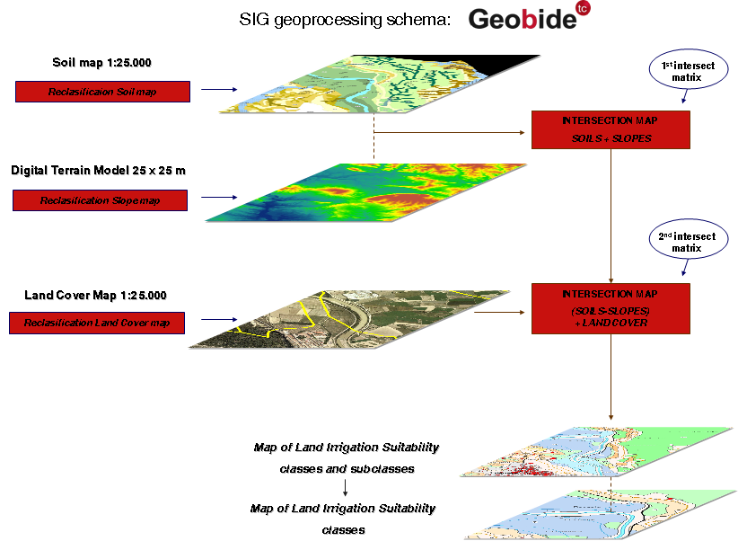

[.text-center]
*Figure 2: Schema of the GIS geoprocessing in Geobide.*

[width="100%",cols="21%,79%"]
|===
2+|*Use Case Description*
|*Name* |Land irrigation suitability in Navarre (Spain).
|*Priority* |Medium
|*Description* a|
Land irrigation suitability maps in Navarre (1:25.000) are elaborated following the methodology proposed by the USBR (Unites States Bureau of Reclamation), but adapted to the specific conditions of Navarre (Spain). The objective is to classify the land according to soil properties, topography, drainage and land cover. From the reclassification of this information and its intersection in GIS land irrigation suitability maps are obtained.
These maps are elaborated employing a suite of applications specifically designed for that purpose (Geobide) and are finally published in a viewer.
|*Legal Foundation* |No legal base.
|*Pre-condition* |None.
2+|*Actors*
|*End-users* |Governmental bodies and public institutions, farmers, collective irrigation organisations...
|*Information provider(s)* |Tracasa, Government of Navarre.
|*Information processors(s)/Brokers* |Tracasa, Government of Navarre.
2+|*Flow of Events – Basic Path*
|*Step 1* |A soil map of a certain area is elaborated: field work, photointerpretation and map edition processes are made.
|*Step 2* a|
The soil mapping units (SMU) are reclassified according to soil, topography and drainage properties.
*Soil*: effective depth and texture, carbonate content, stoniness, sodicity and salinity, in the superficial horizon and/or control section (the most limiting factor between both the superficial horizon and control section is the one taken into account).
*Topography*: slope.
*Drainage*: ground water table depth and impermeable layer depth.
The methodology used for this reclassification is an adaptation for Navarre based on the one proposed by the USBR.
This reclassification is automatically done by an own application, which takes into account, from all the surveys done in each Soil Cartographic Unit for a studied area, all these parameters above mentioned.
|*Step 3* |A slope map based on the DTM25 is elaborated according to 7 range values.
|*Step 4* |The reclassified soil map and slope map are intersected in GIS using the application Geobide.
|*Step 5* |The land cover map is reclassified according to 3 uses: forestry, arable land and non-productive land.
|*Step 6* |The reclassified land cover map is intersected in GIS with the soil-slope cross-map (Geobide).
|*Step 7* |The land irrigation suitability classes and subclasses' map is obtained. Its mapping units contain information about their limiting factor (soil, topography and/or drainage).
|*Step 8* a|
After getting into groups the previous subclasses into classes, the land irrigation suitability classes' map is obtained. The legend of this product is the following one (no information on the limiting factor is reflected):
*Class 1*: Arable lands, suitable for irrigated farming, without use limitations.
*Class 2*: Arable lands, suitable for irrigated farming, with slight limitations.
*Class 3*: Arable lands, suitable for irrigated farming, with moderate limitations.
*Class 4*: Arable lands, suitable for a fixed irrigated farming and employing special irrigation systems, with high limitations.
*Class 5*: A class that requires special reports to establish whether it is suitable or not for irrigation.
*Class 6*: Arable lands, non-suitable for irrigated farming or non-arable lands.
*Class IU*: Non-productive lands.
|*Step 9* |These 2 maps are published in the VisorSITNA viewer (this viewer is available for governmental bodies and public institutions).
2+|*Information source Input : Soil map of Navarre*
|*Description* |The map contains soil information of the municipalities of Navarre (1:25.000) (whole region not mapped yet).
|*Dataset(s)* a|
The soil map of Navarre and its related soil data base are needed to obtain land irrigation maps. Specifically, the following parameters of the soil data base are used:
* Texture in the superficial horizon (simplification of the texture triangle: % clay, % silt and % sand)
* Effective depth (cm)
* Mean carbonate content (%), coarse fragment content (%), sodicity (SAR) and electric conductivity of the soil saturate extract (dS/m), in the superficial horizon and/or control section.
|*Data provider* |Tracasa, Government of Navarre.
|*Geographic scope* |Regional (Navarre, Spain).
|*Thematic scope* |Soil
|*Scale, resolution* |Polygonal data source, at a scale of 1:25.000.
|*Delivery* |n/a
|*Documentation* |Public. Soil maps (VisorSITNA viewer) and reports (in paper and/or CD, available at the Government of Navarre and Tracasa).
2+|*Information source Input: Land cover map of Navarre*
|*Description* |This land cover map covers the whole region of Navarre (Spain) at a scale of 1:25.000.
|*Dataset(s)* |Land cover map of Navarre and its related database.
|*Data provider* |Tracasa, Government of Navarre.
|*Geographic scope* |Regional (Navarre, Spain).
|*Thematic scope* |Soil, land cover, land use.
|*Scale, resolution* |Polygonal data source, at a scale of 1:25.000.
|*Delivery* |n/a
|*Documentation* |The land cover map is available at IDENA (_http://idena.navarra.es_) and in the VisorSITNA viewer.
2+|*Information source Input: DTM25 of Spain*
|*Description* |The Digital Terrain Model based on a grid of 25 m covers the whole national territory of Spain and it's obtained from the National Topographic Map 1:25.000 (MTN25).
|*Dataset(s)* |DTM25
|*Data provider* |Instituto Geográfico Nacional (IGN).
|*Geographic scope* |National (Spain).
|*Thematic scope* |Soil, geographical grid system and elevation.
|*Scale, resolution* |Raster data source, with a resolution of 25 metres.
|*Delivery* |n/a
|*Documentation* |n/a
2+|*Information source Output: Land irrigation suitability classes' and subclasses' map*
|*Description* |The map classifies the land in up to 16 different subclasses and specifies whether the limitation to set up an irrigation project is related to the soil itself, drainage or topography.
|*Dataset(s)* |Land irrigation classes and subclasses' map 1:25.000 and its related dataset.
|*Data provider* |Tracasa, Government of Navarre.
|*Geographic scope* |Regional (Navarre, Spain)
|*Thematic scope* |Soil, agricultural facilities and area management zones.
|*Scale, resolution* |Polygonal data source, at a scale of 1:25.000
|*Delivery* |n/a
|*Documentation* |Public. Land irrigation maps (VisorSITNA viewer) and reports (in paper and/or CD, available at the Government of Navarre and Tracasa).
2+|*Information source Output: Land irrigation suitability classes' map*
|*Description* |This map classifies the terrain in up to 7 different irrigation suitability classes, but it doesn't specify the limitations of each class.
|*Dataset(s)* |Land irrigation suitability classes' map (1:25.000) and its related data base.
|*Data provider* |Tracasa, Government of Navarre.
|*Geographic scope* |Regional (Navarre, Spain)
|*Thematic scope* |Soil, agricultural facilities and area management zones.
|*Scale, resolution* |Polygonal data source, at a scale of 1:25.000.
|*Delivery* |n/a
|*Documentation* |Public. Land irrigation maps (VisorSITNA viewer) and reports (in paper and/or CD, available at the Government of Navarre and Tracasa).
|===

*Mapping of the soil dataset with the INSPIRE Soil model of DS3.0*

_IMPORTANT NOTE this mapping still needs to be checked if it matches the latest version of the soil data model, as described in this document._

*Input dataset*: Soil Map of Navarre and its database

[width="100%",cols="45%,55%"]
|===
|*Soil dataset* |*Corresponding objects in the Inspire-Soil model*
|Soil Cartographic Unit |SoilBody
|Superficial Horizon |SoilProfile: ProfileElement: SoilLayer: LayerType: LayerTypeValue: topsoil
|Control Section |SoilProfile: ProfileElement: SoilLayer: LayerType: LayerTypeValue: subsoil
|Effective depth |SoilProfile: SoilProfileParameter: SoilProfileParameterType: SoilProfileParameterNameValue: potentialRootDepth
|Mean carbonate content |SoilProfile: ProfileElement: ProfileElementParameter: ProfileElementParameterType: ProfileElementParameterNameValue: organicCarbonContent
|Texture |SoilProfile: ProfileElement: ParticleSizeFraction: ParticleSizeFractionType
|Stoniness/coarse fraction content |SoilProfile: ProfileElement: ProfileElementParameter: ProfileElementParameterType: ProfileElementParameterNameValue
|Sodicity (SAR) |SoilProfile: ProfileElement: ProfileElementParameter: ProfileElementParameterType: ProfileElementParameterNameValue
|Electric conductivity of the soil saturation extract |SoilProfile: ProfileElement: ProfileElementParameter: ProfileElementParameterType: ProfileElementParameterNameValue
|===

*Output dataset*: Land Irrigation suitability classes' and subclasses' map

[width="100%",cols="48%,52%"]
|===
|*Soil dataset* |*Corresponding objects in the Inspire-Soil model*
|Land irrigation suitability class |soilDerivedObject
|Land irrigation suitability class and subclass |soilDerivedObject
|===

<<<
=== _Development of methodologies for soil salinity surveillance in the middle Ebro basin_

[.text-center]
Subtitle: Development and validation of methodologies based on territorial information systems (remote sensing, GIS, and electromagnetic sensing systems) for identification, prospection and surveillance of salt-affected areas in the middle Ebro basin using information derived from soil maps as ground truth.

The European Commission proposed a framework and common objectives to prevent soil degradation, preserve soil functions and remediate degraded soil (European Thematic Strategy for Soil Protectionfootnote:[Commission Communication of 22 September 2006 entitled "European Thematic Strategy for Soil Protection (ETSSP)" [COM(2006) 231 final - Not published in the Official Journal].] (ETSSP). Under this proposal, risk areas and polluted sites must be identified and provision should be made to remediate degraded soil.

The measures included in the proposal for a Soil Framework Directivefootnote:[Proposal for a European Parliament and Council Directive of 22 September 2006 setting out a framework for soil protection and amending Council Directive 2004/35/EC. (SDF)] (SFD) include obligatory identification by Member States of areas at risk of erosion, organic matter decline, compaction, *salinization* and landslides, or where the degradation process is already underway. Member States must set objectives and adopt programs of measures to reduce these risks and to address the effects they have.

This Strategy suggests the need to protect the soil, among others, from *_soil salinization_* or the accumulation of soluble salts in the soil at such levels that reduces soil's physical-chemical quality, crop yields and the environmental quality (salinization of surface- and ground-waters).

This use case is part of a Spanish research project (RTA2008-00083-C02-00) under development (2009-2011), entitled "_Soil salinity prospection in the middle Ebro basin and design of its spatial-temporal surveillance through territorial information technologies_". It is a coordinated project with two subprojects, one in Navarra (RTA2008-00083-C02-01; whose main research is Mª Esperanza Amezketa), and another one in Aragón (RTA2008-00083-C02-02; whose main research is Mª Auxiliadora Casterad).

This research project is tackling the more relevant aspects of the ETSSP with respect to soil salinization, with the objective of researching and establishing methodologies for soil salinity survey and appropriate systems for its spatial-temporal surveillance. The study considers, for pre-selected study areas in the middle Ebro basin (Navarra and Aragón), the analysis of the spatial distribution of soil salinity and of the geomorphologic and hydro-geologic factors and processes determining of its development, as well as the design of their spatial-temporal surveillance through territorial information technologies (classical soil prospection, electromagnetic induction sensors associated to global positioning systems-MGES, remote sensing, and geographic information systems). The methodologies are being contrasted, evaluated and adapted to the natural and agrarian landscape. The information that will be generated will contribute to better soil management and soil uses and territory planning, and to the systematizing of soil protection policies required by the current ETSSP and the future SFD.

This project is financially supported by the INIA (Instituto Nacional de Investigación Agraria y Alimentaria, RTA2008-00083-C02-00), the Department of Environment and Rural Development of the Government of Navarra (RTA2008-00083-C02-01), the Ministry of Science and Innovation (Spain) and the European Social Fund (SubProgramme Torres Quevedo, PTQ-08-03-07315).

This use case shows three examples included in this research project.

[width="100%",cols="22%,78%"]
|===
2+|*Use Case Description*
|*Name* |Methodologies for soil salinity surveillance in the middle Ebro basin (Spain): Development and validation of methodologies based on territorial information systems (remote sensing, GIS, and electromagnetic sensing systems) for identification, prospection and surveillance of salt-affected areas in the middle Ebro basin (Spain) using information derived from soil maps as ground truth.
|*Priority* |High
|*Description* a|
This use case shows three examples of usage of soil map information for the objective of researching methodologies for soil salinity prospection and its spatial-temporal surveillance:
[arabic, start=1]
. Using soil map information (soil taxonomic and geomorphic units) for stratifying the territory for ultimately directing the regional soil salinity survey and calibration with electromagnetic induction sensing systems (EMISS).
[arabic, start=2]
. Using soil map information (soil salinity map at regional scale) as ground truth for validating a GIS methodology for identification of areas susceptible for salt-accumulation (primary salinization) from (1) information derived from Digital Terrain Models (DTM) and (2) additional layers of information which can influence soil salinity.
[arabic, start=3]
. Using soil map information (soil salinity map at regional scale, and detailed soil salinity maps obtained with EMISS) as ground truth for validating a methodology based on remote sensing for (i) identifying and mapping persistent problematic areas from the agricultural point of view and (ii) optimizing the selection of areas for soil salinity prospection and/or monitoring.
|*Legal Foundation* a|
No legal base (yet). The Soil Framework Directive is not approved. However, the European Soil Thematic Strategy for Soil Protection already recommends the development of information like this.
Commission Communication of 22 September 2006 entitled "European Thematic Strategy for Soil Protection" [COM (2006) 231 final - Not published in the Official Journal].
Proposal for a European Parliament and Council Directive of 22 September 2006 setting out a framework for soil protection and amending Council Directive 2004/35/EC.
|*Pre-condition* |Soil Framework Directive has to be approved by the EU.
2+|*Actors*
|*End-users* |Governmental bodies and public institutions at regional and/or national level, soil researchers, farmers, collective irrigation organisations, etc.
|*Information provider(s)* |Government of Navarra, Tracasa, Government of Aragón, Centro de Investigación y Tecnología Agroalimentaria de Aragón (CITA)
|*Information processors(s)/Brokers* |Tracasa, CITA-Aragón
|===

[width="100%",cols="22%,78%",]
|===
2+^|*Example 1:*
Using soil map information for stratifying the territory for directing the regional soil salinity survey and calibration with electromagnetic induction sensing systems (EMISS)
This work was done as a pilot study for a very few selected soil cartographic units, in a small study area
Electromagnetic sensors' readings are influenced by the physical and chemical properties of soils. A way for tackling the high variability of those properties is stratifying EMISS prospection and soil sampling as a function of soil-types.

*Flow of Events – Basic Path*
|*Step 1* a|
Use of soil maps to characterize the high variability of soil physical-chemical properties at regional level, to identify soil-types and to stratify the territory.
Use the soil cartographic units (SCU) to direct the soil salinity survey with EMISS (SCU incorporate taxonomic, geomorphic and geologic soil information).
|*Step 2* a|
Selection of some of the most susceptible SCU for presenting salinity problems (according to geographic position, geologic materials, etc) for EMISS prospection and calibration.
Prospection of soil cartographic units (SCU) with EMISS when soil water content is close to field capacity (a few days after some rains or irrigation events).
|*Step 3* a|
Calibration of the sensor (EMISS) to convert the apparent soil electrical conductivity (ECa) into ECe values.

* Selection of a reduced number of sampling points at each SCU, covering the full range of EMISS readings
* Soil sampling at different depths increments
* Soil analysis: Soil parameters to be analyzed in laboratory:
** Electrical conductivity of the soil saturation extract (ECe)
** Soil water content during prospection (%)
** Soil texture (soil saturation percentage, SP)

|*Step 4* a|
Obtaining calibration equations at each selected SCU for assigning soil salinity phases to the EMISS readings:
Four soil salinity classes can be established according to the maximum ECe measured in the soil profiles:

* Non-saline zones (NS, ECe 4 < dS m^-1^)
* Slightly saline zones (SS, 4 ≤ ECe ≤ 8 dS m^-1^)
* Moderately saline zones (MS, 8 < CEe < 16 dS m^-1^)
* Strongly saline zones (StS, ECe ≥ 16 dS m^-1^)

|*Step 5* |Assigning soil salinity phases to EMISS readings for selected SCU: EMISS readings (ECa) must be converted into soil salinity classes according to the calibration equation and to the threshold ECa values equivalent to ECe values of 4, 8 and 16 dS m^-1^.
|*Post-condition* |
2+|*Information source Input : Soil maps at 1:25.000*
|*Description* |The map contains soil information for the pilot areas at a scale of 1:25.000.
|*Dataset(s)* a|
Information employed:

- Soil cartographic units (SCU), which incorporate information about soil taxonomy, geomorphic units and geologic materials

|*Data provider* |Government of Navarra, Tracasa,
|*Geographic scope* |Regional
|*Thematic scope* |Soil
|*Scale, resolution* |Polygonal data source, at a scale of 1:25.000.
|*Delivery* |n/a
|*Documentation* |Public. Soil maps (VisorSITNA viewer) and reports (in paper and/or CD, available at the Government of Navarra and Tracasa).
|*External reference* |n/a
2+|*Information source Output: Map of salt-affected areas*
|*Description* |The map has information about soil salinity phases
|*Dataset(s)* |Map of salt-affected areas and its related database.
|*Data provider* |Government of Navarra, Tracasa,
|*Geographic scope* |Regional, very small pilot areas
|*Thematic scope* |Soil
|*Scale, resolution* |Polygonal data source, at a scale of 1:25.000
|*Delivery* |n/a
|*Documentation* |n/a
|*External reference* |n/a
2+|*Information source Output: Sensor calibration equations*
|*Description* |Calibration equations for the studied soil cartographic units (SCU)
|*Dataset(s)* |
|*Geographic scope* |Local, one for each SCU.
|*Data provider* |Tracasa,
|*Thematic scope* |Soil
|*Scale, resolution* |n/a
|*Delivery* |n/a
|*Documentation* |n/a
|*External reference* |n/a
|===

[width="100%",cols="22%,78%",]
|===
2+^|*Example 2:*
Using soil map information as ground truth for validating a GIS methodology for identification of areas susceptible for salt-accumulation (primary salinization)

*Flow of Events – Basic Path*
|*Step 1* |Selection of pilot study areas
|*Step 2* |Obtaining several layers/maps from digital elevation model: slope, curvature, plan curvature, wetness index, etc
|*Step 3* |Intersection of several information in a GIS project for the pilot areas: information derived from DTM (slope, curvature, plan curvature, wetness index, etc), geomorphologic units, parental material,
|*Step 4* |Validation of the methodology based on GIS by employing soil map information (soil salinity maps) as ground truth.
|*Post-condition* |
2+|*Information source Input : Soil map at 1:25.000*
|*Description* |The map contains soil information of the pilot areas at a scale of 1:25.000.
|*Dataset(s)* a|
Information employed:

- Soil salinity map derived from the soil map
- Soil geomorphologic units derived from the soil map
- Parental material (aluvial material, etc) derived from the soil map

|*Data provider* |Government of Navarra, Tracasa.
|*Geographic scope* |Regional
|*Thematic scope* |Soil
|*Scale, resolution* |Polygonal data source, at a scale of 1:25.000.
|*Delivery* |n/a
|*Documentation* |Public. Soil maps (VisorSITNA viewer) and reports (in paper and/or CD, available at the Government of Navarra and Tracasa).
|*External reference* |n/a
2+|*Information source Input: Digital Terrain Model (DTM)*
|*Description* |DTM of 5x5 m
|*Dataset(s)* |Maps derived from DTM: maps of slope, curvature, profile curvature, plain curvature, wetness index etc., 25m x 25m
|*Data provider* |Tracasa.
|*Geographic scope* |Small pilot areas (few thousands of hectares) in Navarra (Spain)
|*Thematic scope* |
|*Scale, resolution* |DTM (5m x 5m), maps derived from DTM (25 x 25m)
|*Delivery* |n/a
|*Documentation* |
2+|*Information source Output: Map of risk for presenting salinity accumulation (primary salinization)*
|*Description* a|
Maps with two classes (low and medium/high) of risk for presenting salt accumulation (primary salinization).
This information could be used to help reducing areas that do not need to be prospected/monitored for soil salinity. These maps, complemented with other maps or information (e.g. derived from remote sensing), could be used for optimizing areas for salinity prospection and monitoring.

|*Dataset(s)* |Map of risk for presenting salinity accumulation and its related database.
|*Data provider* |Tracasa.
|*Geographic scope* |Regional, small pilot areas in Navarra (Spain)
|*Thematic scope* |Soil.
|*Scale, resolution* |
|*Delivery* |n/a
|*Documentation* |n/a
|*External reference* |n/a
2+|*Information source Output: Methodology for assessing the risk for soil salinity accumulation (primary salinization)*
|*Description* |GIS based methodology to be used for complementing other methodologies, such as remote sensing, in order to optimize the selection of areas for soil salinity prospection and/or monitoring.
|*Dataset(s)* |
|*Geographic scope* |
|*Data provider* |Tracasa,
|*Thematic scope* |Soil
|*Scale, resolution* |n/a
|*Delivery* |n/a
|*Documentation* |n/a
|*External reference* |n/a
|===

[width="100%",cols="22%,78%",]
|===
2+^|*Example 3:*
Using soil map information as ground truth for validating a methodology based on remote sensing for (i) identifying and mapping problematic areas from the agricultural point of view and (ii) optimizing the selection of areas for soil salinity prospection and/or monitoring.
Localizing by remote sensing areas with persistent agricultural problems (over several years) can help to discriminate salt-affected areas as well as to optimize the selection of areas for soil salinity prospection and/or monitoring.

*Flow of Events – Basic Path*
|*Step 1* |Selection of pilot areas for the study.
|*Step 2* |Calculation of NDVI from Landsat images for the pilot areas over the time.
|*Step 3* a|
Identification of persistently problematic areas from the agricultural point of view, using the NDVI information.
Repetition of the methodology for several years and analysis of the persistence of the problems: Identification of areas with persistent low productivity over the years.
|*Step 4* |Validation of the methodology based on remote sensing by employing soil map information (soil salinity map derived from soil maps at regional scale, and detailed soil salinity maps obtained with EMISS) as ground truth.
|*Post-condition* |
2+|*Information source Input : Soil maps at 1:25.000*
|*Description* |The map contains information about the salt-affected areas in the pilot areas at a scale of 1:25.000.
|*Dataset(s)* a|
The map of the salt-affected areas has information about four soil salinity classes established from the maximum electrical conductivity of the soil saturation extract (ECe, dS/m) measured in the soil profiles: The four soil salinity classes are:
* Non-saline zones (NS, ECe 4 < dS m^-1^)
* Slightly saline zones (SS, 4 ≤ ECe ≤ 8 dS m^-1^)
* Moderately saline zones (MS, 8 < CEe < 16 dS m^-1^)
* Strongly saline zones (StS, ECe ≥ 16 dS m^-1^)
====

|*Data provider* |Government of Navarra, Tracasa, Government of Aragón, Centro de Investigación y Tecnología Agroalimentaria de Aragón (CITA).
|*Geographic scope* |Pilot study areas in Navarra and Aragón (Spain)
|*Thematic scope* |Soil, agriculture
|*Scale, resolution* |Polygonal data source, at a scale of 1:25.000.
|*Delivery* |n/a
|*Documentation* a|
Navarra: Public. Soil maps (VisorSITNA viewer) and reports (in paper and/or CD, available at the Government of Navarra and Tracasa).
Aragón: Reports (in paper and/or CD), available at the Government of Aragón and CITA

|*External reference* |n/a
2+|*Information source Input: Other maps*
|*Description* |
|*Dataset(s)* a|
* Cadastre 1:5.000
* SIGPAC (Land cover) 1:5.000
* Maps of soil crops established from remote sensing (Landsat, at resolution of 30m x 30m), declarations of farmers and inspections in the field.

|*Data provider* |Government of Navarra, Tracasa, Government of Aragón, CITA
|*Geographic scope* |Pilot areas in Navarra and Aragon (Spain)
|*Thematic scope* |Soil, land cover, land use, cadastre
|*Scale, resolution* |Polygonal data source, the scale depends on the layer
|*Delivery* |n/a
|*Documentation* a|
In Navarra, the land cover map and the cadastre are available at IDENA (_http://idena.navarra.es_) and in the _VisorSITNA_ viewer.
In Aragón: Sistema de Información Territorial de Aragón (SITAR; _http://sitar.aragon.es/_); Centro de Documentación e Información Territorial de Aragón, Government of Aragón,

2+|*Information source Input: Remote sensing images*
|*Description* a|
Landsat images for different dates within a year.
The same information (Landsat images for different dates within a year) for several years.

|*Dataset(s)* |
|*Data provider* |Government of Navarra, Tracasa, Government of Aragón, CITA
|*Geographic scope* |Pilot study areas in Navarra and Aragón (Spain)
|*Thematic scope* |
|*Scale, resolution* |30m x 30m
|*Delivery* |n/a
|*Documentation* |n/a
|*External reference* |n/a
2+|*Information source Output: Maps of areas with persistent agricultural problems (low productivity)*
|*Description* |Raster maps (25 m x 25m) of areas that have persistent problems from the agricultural point of view (low productivity), which can be seen as areas with possible problems of soil salinity. These maps, combined with other information, could be used for optimizing areas for salinity prospection and monitoring.
|*Dataset(s)* |
|*Geographic scope* |Pilot study areas in Navarra and Aragón (Spain)
|*Data provider* |Government of Navarra, Tracasa, Government of Aragón, CITA
|*Thematic scope* |Soil, agriculture
|*Scale, resolution* |Regional, raster maps 25m x 25m
|*Delivery* |n/a
|*Documentation* |n/a
|*External reference* |n/a
2+|*Information source Output: Methodology for identifying salt-affected areas*
|*Description* |Methodology based on spectral indices derived from remote sensing and combined with GIS technology for identifying salt-affected or potentially salt-affected areas, using information derived from the soil maps for their validation.
|*Dataset(s)* |
|*Geographic scope* |Pilot study areas in Navarra and Aragón (Spain)
|*Data provider* |Government of Navarra, Tracasa, Government of Aragón, CITA
|*Thematic scope* |Soil, agriculture
|*Scale, resolution* |n/a
|*Delivery* |n/a
|*Documentation* |n/a
|*External reference* |n/a
|===

*Mapping of the soil dataset with the INSPIRE Soil model of DS version 3.0.*

_IMPORTANT NOTE this mapping still needs to be checked if it matches the latest version of the soil data model, as described in this document._

*Input dataset:* Soil Maps of the middle Ebro basin and its database

[width="100%",cols="45%,55%"]
|===
|*Soil dataset* |*Corresponding objects in the Inspire-Soil model*
|Soil Cartographic Unit |soilBody
|Sampling point |soilPlot
|Sampling at different depth increments |SoilProfile: ProfileElement: SoilLayer: LyerType: LayerTypeValue: depthInterval
|Electrical conductivity of the soil saturation extract (ECe) |SoilProfile: ProfileElement: ProfileElementParameter: ProfileElementParameterType: ProfileElementParameterNameValue
|Soil water content |SoilProfile: ProfileElement: ProfileElementParameter: ProfileElementParameterType: ProfileElementParameterNameValue
|Texture |SoilProfile: ProfileElement: ParticleSizeFraction: ParticleSizeFractionType
|Apparent electric conductivity (ECa) |SoilProfile: SoilProfileParameter: SoilProfileParameterType: SoilProfileParameterNameValue
|Soil Taxonomy classification |SoilProfile: DerivedSoilProfile: otherSoilName
|===

*Output dataset:* Map of salt affected areas, map of risk for presenting salinity accumulation, maps of persistent agricultural problems

[width="100%",cols="46%,54%"]
|===
|*Soil dataset* |*Corresponding objects in the Inspire-Soil model*
|Salinity phase |soilDerivedObject
|Risk for presenting salt accumulation |soilDerivedObject
|Persistent agricultural problems |soilDerivedObject
|===

<<<
=== _MARS project_

*Yield forecasting within the MARS project*

For the implementation of the Common Agricultural Policy, the European Commission needs timely information on the agricultural production to be expected in the current season. This is a main concern of the MARS-project (Monitoring Agricultural ResourceS). A Crop Yield Forecasting System (MCYFS) has been developed. It is managed by the Joint Research Centre (JRC) of the European Union (EU) in Ispra, Italy. The aim of the MARS crop yield forecasting system is to provide accurate and timely crop yield forecasts and crop production biomass for the union territory and other strategic areas of the world. The rationale behind the crop forecasts at EU level is based on the lack of timely information to take rapid decision on CAP instruments during the year.

A Crop Forecasting System has been developed and operationally run since 1992 in order to provide timely crop production forecasts at European level. This system is able to monitor crop vegetation growth (cereal, oil seed crops, protein crops, sugar beet, potatoes, pastures, rice) and include the short-term effects of meteorological events on crop productions and to provide yearly yield forecasts on European crops. This system is made by remote sensing and meteorological observations, agro-meteorological modelling (Crop Growth Monitoring System (CGMS), MARS Model Library) and statistical analysis tools.

We focus in this use-case on crop growth monitoring system (CGMS) as it is the system where soil data are used.

The Crop Growth Monitoring System developed by MARS Project provides the European Commission (DG Agriculture) with objective, timely and quantitative yield forecasts at regional and national scale. CGMS monitors crops development in Europe, driven by meteorological conditions modified by soil characteristics and crop parameters. This mechanistic approach describes crop cycle (i.e. biomass, storage organ ...) in combination with phenological development from sowing to maturity on a daily time scale. The main characteristic of CGMS lies in its spatialisation component, integrating interpolated meteorological data, soils and crops parameters, through elementary mapping units used for simulation in the crop model. The core of the system is based on 2 deterministic crop models, WOFOST and LINGRA. GIS tools are used to prepare data and to produce results maps. Input and output are stored in a RDBMS. Statistical procedures are used to forecast quantitative crops yield.

In summary, CGMS consists of three main parts (*Figure 3*):

1. Interpolation of meteorological data to a square grid

2. Simulation of the crop growth

3. Statistical evaluation of the results

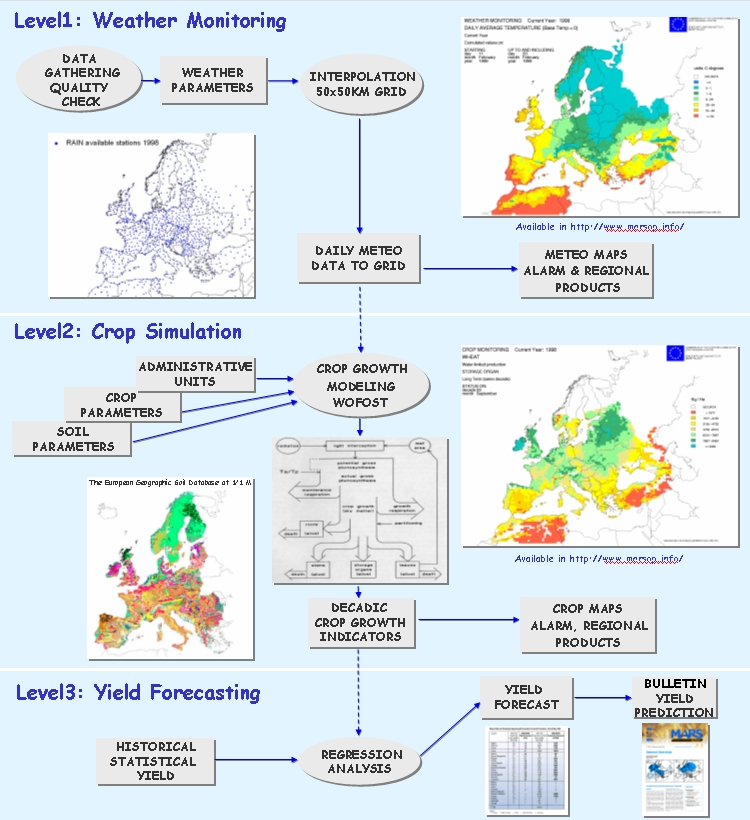

[.text-center]
*Figure 3: Levels in the Crop Growth Monitoring System*

[width="100%",cols="24%,76%",]
|===
2+|*Use Case Description*
|*Name* |Crop Growth Monitoring System
|*Priority* |high
|*Description* |CGMS provides the European Commission (DG Agriculture) with objective, timely and quantitative yield forecasts at regional and national scale.
|*Legal foundation(s)* |no legal base but is part of activities of the DG Agriculture around the CAP
|*Pre-condition* |
2+|*Flow of Events - Basic Path*
|*Step 1* |Gathering of meteorological data, quality control of the data and interpolation on a 50 km by 50 km grid
|*Step 2* |determination of the parameters of the crop model: soils, crops and definition of simulation units
|*Step 3* |crop simulation using data from step 1 and 2 with the crop model (three crop models are used following the crops)
|*Step 4* |analysis of historical statistical yield data and correction of the indicators of crop simulation to define yield forecast
|*Step 5* |realisation of maps and bulletins for end-users
|*Post-condition* |
2+|*Actors*
|*End-users* a|
* DG Agriculture
* + any third parties for some data and tools that are freely downloadable

|*Information provider(s)* |Meteorology authorities, ESBN for the soil DB
|*Information processors(s)/Brokers* |JRC
2+|*Information Source Input*
|*Description* a|
* meteorological daily data: rainfall, temperature, global radiation, wind speed, etc.
* Soil information issued from SGDBE
* crop data: location at regional level, sowing date, harvest date, crop yield at regional level
* administrative units

|*Thematic scope* |Soil, Agricultural Facilities, administrative units
|*Base datasets* a|
* Soil map:
The soil data are used in the system in two ways:

** estimation of soil parameters for the crop model: for each STU of SGDBE there is estimation of depth of the soil, water retention at saturation, field capacity and wilting point using PTF. This needs the derived soil profile with its FAO soil name, parent material, depth to textural change, depth of an obstacle to roots, agricultural limitations, topsoil and subsoil texture.
** definition of simulation units: this needs:
(1) soil body area and soil body (with list of derived soil profiles and percentage of area) to overlay with administrative units and meteorological grid
(2) derived soil profile with its FAO soil name and agricultural limitations, depth of an obstacle to roots, depth to impermeable layer, texture, water regime to define crop suitability. If the unit is estimated to be unsuitable for a given crop, then the unit is not used for crop simulation.

* meteorological data: used as input for crop simulation and to determine climate suitability for crops
* administrative units
* statistical data on yield
* grid for interpolation of meteorological data
* crop parameters and crop calendar obtained through expert knowledge

|*Data provider* a|
Soil: ESBN
Yield: Eurostat
Meteo: Meteorological authorities
|*Scale, resolution* |Europe
|*Documentation* a|
* web site
* reports
|*External reference* |
2+|*Information Source Output*
|*Description* a|
meteorological maps for alarm
crop maps
yield estimates (maps and tables: publication of a periodic bulletin)
|*Thematic scope* a|
Agricultural Facilities
Climate
|*Base dataset(s)* a|
* interpolated daily meteorological data
* crop yield estimate
* several outputs from the model
|*Data provider(s)* |JRC
|*Scale, resolution* |Europe
|*Documentation* a|
web site of Mars project
bulletins
reports
|*External reference* |
|===

*Mapping this Use Case with the INSPIRE soil model of DS version 3.0*

_IMPORTANT NOTE this mapping still needs to be checked if it matches the latest version of the soil data model, as described in this document._

Input dataset: Soil Geographical Data Base of Eurasia (SGDBE)

[width="100%",cols="41%,59%"]
|===
|*Soil dataset* |*Corresponding objects in the Inspire-Soil model*
|Soil Typological Unit (STU) |derivedSoilProfile
|STU attribute: FAO soil name |derivedSoilProfile:otherSoilName
|STU attribute: parent material a|
soilLayer:layerType:geogenic

soilLayer:layerRockType (with transformation)

|STU attribute: depth to textural change |derivedSoilProfile:soilProfileParameter (extension)
|STU attribute: depth of an obstacle to roots |derivedSoilProfile:soilProfileParameter:potentialRootDepth
|STU attribute: agricultural limitation |derivedSoilProfile:soilProfileParameter (extension)
|STU attribute: topsoil texture a|
soilLayer:layerType:topsoil

profileElementParameter (extension)

|STU attribute: subsoil texture a|
soilLayer:layerType:subsoil

profileElementParameter (extension)

|STU attribute: depth to impermeable layer |derivedSoilProfile:soilProfileParameter (extension)
|STU attribute: water regime |derivedSoilProfile:soilProfileParameter:waterDrainage
| |
|Soil association (SMU) |soilBody
|list of STUs within a soil association |derivedProfilePresenceInSoilBody
|===

*Output dataset:* soil data estimated from the SGDBE

[width="100%",cols="50%,50%"]
|===
|*Soil dataset* |*Corresponding objects in the Inspire-Soil model*
|Soil Typological Unit (STU) |derivedSoilProfile
|list of horizons with their depth |soilHorizon:profileElementDepthRange
|for each horizon: water content at saturation |soilHorizon:profileElementParameter (extension)
|for each horizon: water content at field capacity |soilHorizon:profileElementParameter (extension)
|for each horizon: water content at wilting point |soilHorizon:profileElementParameter (extension)
|STU attributes: crop suitability |derivedSoilProfile:soilProfileParameter (extension)
|===

<<<
=== _Restrictions for agricultural use based on mineral, the N-, and P-saturation in the soil and (shallow) ground water_

For agricultural use of land it is important to know, based on soil classification and soil analysis, what limitations do exist based on the leaching of N and P into the ground water. In the WFD there are thresholds indicating the maximum values allowed. Secondly it is important to know the vulnerability for contamination of the ground water by minerals (N,P) due to agricultural practices in relation to the soil present at that location.

The questions in this use case are:

* What is the vulnerability of leaching of NP due to the values for the relevant properties in the soil?
* What is the maximum level for fertilizer application used by the farmers?

The outcome of this use case is usually a map based on the results of the calculation of the mineral usage, saturation and loss (Model). The model uses in NL are ANIMO and Waterpas

* ANIMO Prediction of Nitrogen and Phosphorus leaching to groundwater and surface waters [http://www.animo.wur.nl/Documents/Report%20983.pdf]
* Waterpas Effects of water management on agriculture [http://meetings.copernicus.org/www.cosis.net/abstracts/EGU2007/02561/EGU2007-J-02561.pdf]

====
The map shows where restriction zones and limitations are present. This is used for policy, monitoring and enforcing of nature conservation areas and water protection zones
====

To illustrate the specific situation we describe the following on the local scale.

NP application is dispersed on the soil (the fertilising process of the farmer); part of the minerals are tied to organic matter, part is tied to soil minerals, part is taken up by the crop during the growing season. Not all minerals are consumed by the crop, the loss is accumulates in the soil. This accumulation continues until the capacity of the soil is reached. The excess is leached to the deeper out of reach of the roots of the crop and is lost into deeper ground water or is drained via the surface water system. The Nitrogen can also be denitrificated which is vaporized in to the air (NO2). In the WFD the threshold for Nitrate is 25 milligrams/ litre (in the ground water) at a depth of 2 meter.

_Note: similar use case can be defined for other applicants (crop protection chemicals)_

Leaching is determined for nitrate by the pF, the ground water table and the amount of carbon in the soil. For Phosphate by the pH (most important), Fe, Al. (Ferro-aluminium complex)

*Figure 4: schematic representation*

[width="100%",cols="22%,78%"]
|===
2+|*Use Case Description*
|*Name* |Restrictions for agriculture use based on the N- and P-saturation in the soil and (shallow) ground water
|*Priority* |medium
|*Description* a|
For agricultural use of land it is important to know, based on soil classification and soil analysis, what limitations do exist based on the leaching of N and P into the ground water. In the WFD there are thresholds indicating the maximum values allowed. Secondly it is important to know the vulnerability for contamination of the ground water by minerals (N,P) due to agricultural practices in relation to the soil present at that location

_Note: similar use case can be defined for other applicants (crop protection chemicals)_

|*Legal foundation(s)* |WFD, Nature2000, National regulations for Ground water protection zones for drinking water.
|*Pre-condition* |Measurements and observations on soil and ground and surface water (monitoring programme for the WFD)
2+|*Flow of Events - Basic Path*
|*Step 1* |Determine Soil type and absorption capacity for minerals (analysis results based on soil properties)
|*Step 2* |Compute the mineral usage, saturation and loss (Model)
|*Step 3* |Represent the model results usual in a map
|*Step 4 (potential)* |Use results in EU/National protect areas for Nature (compare monitoring programme)
|*Step 5* |Use results for licensing agricultural use and enforcing legal regulations in NP use.(e.g. in NL the Sand, Peat and Clay map)
|*Post-condition* |Improved soil and ground water quality and sustainable use of agricultural resources
2+|*Actors*
|*End-users* a|
* Authorities EU-level --. JRC; national Min of Agriculture, Water, Environment; regional water authorities
* Farmers
* Nature conservation bodies
|*Information provider(s)* |Public, Soil Bureau, Water Authorities
|*Information processors(s)/Brokers* |Private and public data collection companies, Laboratories, consultancy companies
2+^|*Information Source Input*
|*Description* a|
* Soil information on Soiltype, Mineral composition, pH Organic Matter, Groundwater levels as an example see annex "table 6" for the detailed soil input data for the Nutrient model ANIMO
* Fertilizer practices (historic and current)*
* Land cover
* Agricultural parcels and practice

|*Thematic scope* |Soil, Agricultural Facilities, geology, hydrology, land cover
|*Base datasets* a|
* Soil map
* ground water level (classes)
* Soil and water (ground and surface) sample analysis
* Water monitoring networks (WFD)

|*Data provider* a|
Soil bureaus
Water authorities
Environmental agencies
WFD monitoring authorities
|*Scale, resolution* |Regional (10.000 and up)
|*Documentation* a|
* WFD (water quality only)
* Denitrification model reports

|*External reference* a|
* Dutch reference for producing the Sand, Clay Peat map (LNV-loket)

2+^|*Information Source Output*
|*Description* |Output will represent , usually in a map where restriction zones and limitations are present
|*Thematic scope* |hydrology (Soil, Agricultural Facilities)
|*Base dataset(s)* a|
* Water protection zones with limitations/restrictions NP application
* Dutch reference for producing the Sand, Clay Peat map (alterra)

|*Data provider(s)* |Ministries, regional and local government
|*Scale, resolution* |Regional (10.000 and up)
|*Documentation* |References available in the member states (NL: Sand, Clay, Peat map report, and regional water management plans) and the NL regulation on mineral use in agriculture (meststoffenwet)
|*External reference* |(LNV-loket)
|===

{empty}* The danger of leaching is very much related to historic land use (farmers spreading too much fertilizer/manure) and soil type characteristics. Consequences of historic land use show in the results of the farmer samples (used for fertilizing advices). These elements can not available in central databases. So you are fully dependent on:

. Statistical data on the use of fertilizers/manure in a region.
. soil data (soil map with underlying soil type characteristics)
. results from regional water monitoring systems showing excesses in the concentrations of NP

image::./media/image24.png[image,width=554,height=787, align=center]

[.text-center]
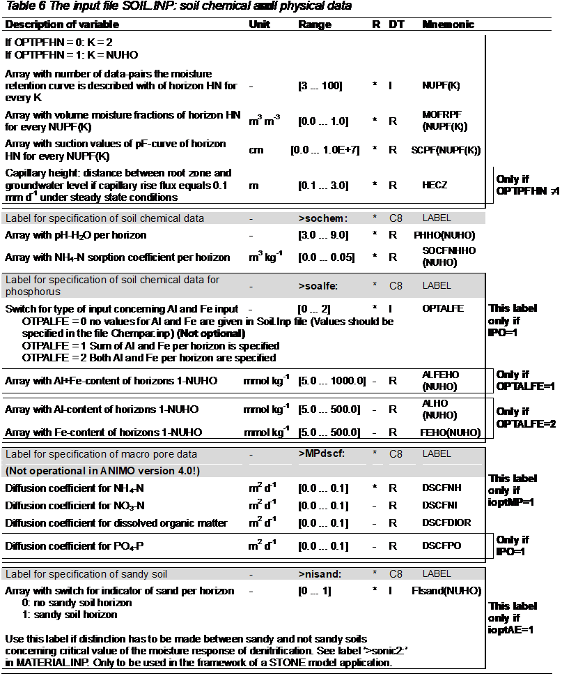

[.text-center]
_IMPORTANT NOTE it still needs to be checked if the elements in this Use Case match the latest version of the soil data model, as described in this document._

<<<
=== Calculation threshold trace elements

*Estimation of regional trace elements threshold for anomalous values detection in France*

To determine if a site is polluted or not with trace elements, it is needed to compare the analytical results obtained on samples from the site to the background values of trace elements in the region. Trace elements naturally vary following the soil type and the parent material.

In France, the ministry of environment is in charge of polluted sites. It asks Inra to calculate threshold values using the data from the French soil monitoring network. The threshold values are estimated for 0-30 cm and for 30-50 cm layers on a 16 km by 16 km grid for the following trace elements: Cd total  extractible, Co total, Cr total, Cu total  extractible, Mo total, Ni total  extractible, Pb total  extractible, Th total, Zn total  extractible. For each point of the grid, the estimation is based on the measured values of the 10 neighbouring points within a distance of 50 km for 0-30 cm and 30-50 cm respectively, and the calculation of the third quartile  3x(interquartile range).

The Figure *5* below shows an example from the web site giving the Cd total threshold for 0-30 cm.

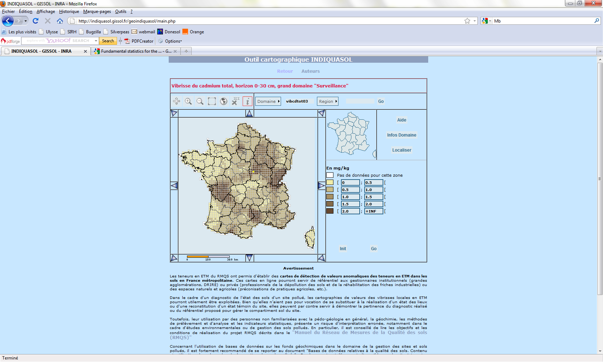

[.text-center]
*Figure 5*

[width="100%",cols="24%,76%",]
|===
2+|*Use Case Description*
|*Name* |regional trace elements threshold for anomalous values detection
|*Priority* |high
|*Description* |The aim is to furnish to public, values of reference at regional level for trace elements in topsoil and subsoil
|*Legal foundation(s)* |no legal base but is part of activities around polluted sites legislation
|*Pre-condition* |
2+|*Flow of Events - Basic Path*
|*Step 1* |Determining for each trace element and for 0-30 cm and 30-50 cm layers respectively, the list of 10 neighbouring points within 50 km having analytical values for each point of the grid.
|*Step 2* |calculation of statistical data (third quartile  3x(interquartile range)) at each point of the grid. No calculation is made if there is less than 10 points available.
|*Step 3* |
|*Step 4* |
|*Step 5* |
|*Post-condition* |
| |
2+|*Actors*
|*End-users* a|
* Public authorities
* societies dealing with polluted sites
* general public

|*Information provider(s)* |GIS Sol (Inra is in charge of collecting and storing the data for the GIS Sol)
|*Information processors(s)/Brokers* |Inra
2+^|*Information Source Input*
|*Description* a|
* soil monitoring network RMQS

|*Thematic scope* |Soil
|*Base datasets* a|
* soil monitoring network RMQS DB:
** soil profile
** observation location
** for 0-30 cm layer and 30-50 cm layer the analytical value for each trace element.

|*Data provider* |Inra
|*Scale, resolution* |France, 16 km x 16 km
|*Documentation* a|
* RMQS manual
* article on the methodology

|*External reference* a|

2+^|*Information Source Output*
|*Description* |threshold value for trace element per grid cell for 0-30 cm and 30-50 cm
|*Thematic scope* |soil
|*Base dataset(s)* a|
* Indiquasol

|*Data provider(s)* |Inra
|*Scale, resolution* |France, 16 km x 16 km
|*Documentation* |web site
|*External reference* |
|===

*Mapping of this Use Case with the INSPIRE soil model of DS version 3.0*

_IMPORTANT NOTE this mapping still needs to be checked if it matches the latest version of the soil data model, as described in this document._

*Input dataset:* French soil monitoring network RMQS

[width="100%",cols="50%,50%"]
|===
|*Soil dataset* |*Corresponding objects in the Inspire-Soil model*
|soil profile |observedSoilProfile
a|
observation location

It is the "real" coordinates of the sampling area

a|
soilPlot

soilPlotType: borehole

|0-30 cm layers a|
soilLayer

layerType:depthInterval

profileElementDepthRange:0-30 cm

|30-50 cm layers a|
soilLayer

layerType:depthInterval

profileElementDepthRange:30-50 cm

|analytical value for each layer of trace elements (Cd,Cr, Cu,Ni, Pb, Zn) a|
profileElementParameter:CadmiumContent

profileElementParameter:ChromiumContent

profileElementParameter:CopperContent

profileElementParameter:NickelContent

profileElementParameter:LeadContent

profileElementParameter:ZincContent

For total content : processParameter: HF-HClO4

for extractible content: processParameter: EDTA

|analytical value for each layer of trace elements (Co,Mo, Th) |profileElementParameter (extension)
a|
the cell which the observation is linked to

It is the "theoretical" point of observation which corresponds to the centre of the cell

|soilSite
|===

*Output dataset:* soil data estimated on a grid 16 km x 16 km

[width="100%",cols="50%,50%"]
|===
|*Soil dataset* |*Corresponding objects in the Inspire-Soil model*
|grid cell |soilDerivedObject
|threshold value for trace element per grid cell (Cd,Cr, Cu,Ni, Pb, Zn) for 0-30 cm a|
soilDerivedObject:soilDerivedObjectParameter: CadmiumContent

For total content : processParameter: HF-HClO4

for extractible content: processParameter: EDTA

soilDerivedObjectDescriptiveParameter: 0-30 cm

|threshold value for trace element per grid cell (Co,Mo, Th) for 0-30 cm a|
soilDerivedObject:soilDerivedObjectParameter (extension)

For total content : processParameter: HF-HClO4

for extractible content: processParameter: EDTA

soilDerivedObjectDescriptiveParameter: 0-30 cm

|threshold value for trace element per grid cell (Cd,Cr, Cu,Ni, Pb, Zn) for 30-50 cm a|
soilDerivedObject:soilDerivedObjectParameter: CadmiumContent

For total content : processParameter: HF-HClO4

for extractible content: processParameter: EDTA

soilDerivedObjectDescriptiveParameter: 30-50 cm

|threshold value for trace element per grid cell (Co,Mo, Th) for 30-50 cm a|
soilDerivedObject:soilDerivedObjectParameter (extension)

For total content : processParameter: HF-HClO4

for extractible content: processParameter: EDTA

soilDerivedObjectDescriptiveParameter: 30-50 cm

|===

<<<
=== Use of Soil Scape Viewer

*Narrative explanation of the use case*

The *Soilscapes Viewer* (see *Figure 6* below) allows users to view and map the soils of England and Wales, searching by U.K. postcode or co-ordinates to see the general conditions at any point. An interactive legend allows users to click on a feature represented in the map and learn more about that soil type including drainage, texture, land cover, habitats, and fertility.

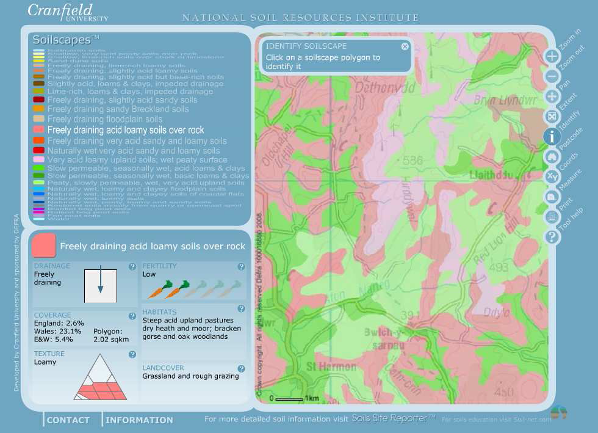

[.text-center]
*Figure 6: screenshot of the soil scape viewer*

Soilscapes is a 1:250,000 scale, simplified soils dataset covering England and Wales. It was created from the far more detailed National Soil Map (NATMAP Vector) held by NSRI at Cranfield University, with the purpose of communicating effectively a general understanding of the variations which occur between soil types, and how soils affect the environment and landscape of the two countries.

*Soilscapes Viewer* is a simple web-application that gives web-access to the Soilscapes data The Soilscapes dataset is also available separately to lease as one of the NSRI soil data products.

The web map displays the soil characteristics for the "soil type" (one of only 27) at the specified location (soil texture, drainage status, soil fertility, commonly associated habitat and land cover) and a statistical presentation how common the soils at the location are when compared to the national stock of soils of England and Wales.Tools are provided to allow the user to navigate around the map, to change the scale of view, to pan the view, to query the information at a given specified point and finally to produce printed output.

Soilscapes is not intended as a means for supporting detailed assessments, such as land planning applications or site investigations. For such applications, Cranfield has a parallel service termed Soils Site Reporter that provides a comprehensive report of all the soils data held by NSRI for specific locations, and it is this report that is designed for use in support of more localized interests.

*Detailed structured description of the Use Case*

[width="100%",cols="36%,64%"]
|===
2+|*Use Case Description*
|*Name* |_Soilscapes Viewer_
|*Priority* |_Low_
|*Description* a|
_The WebMapping tool allows non-expert users to access_
_simplified soil's information_
|*Legal foundation(s)* a|
_none_
|*Pre-condition* a|
_The thematic information and educational material are_
_available._
2+^|*Flow of Events - Basic Path*
|*Step 1* |_The user access to the webpage._
|*Step 2* |_The user accepts the Cranfield's terms and conditions._
|*Step 3* |_The user selects an area of interest by zooming or by selecting a postcode._
|*Step 4* |_The user identifies one of the 27 Soilscapes units on a specified location._
|*Post-condition* a|
_The system provides information about drainage, fertility,_
_texture, etc. for the specified location_
2+^|*Actors*
|*End-users* |_General public_
|*Information provider(s)* |_NSRI Cranfield University_
|*Information processors(s)/Brokers* |_None (automatic interpretation of database)_
2+^|*Information Source Output*
|*Description* |_Web based soil map and information_
|*Thematic scope* |_Soil characteristics_
|*Base datasets* |_Interpreted map of the Soilscapes dataset_
|*Data provider* |_NSRI Cranfield University_
|*Scale, resolution* |_Maps derived from Soilscapes dataset at 1:250,000_
|*Documentation* a|
_on website_
http://www.landis.org.uk/services/soilscapes.cfm

|*External reference* |_See web site_
2+^|*Information Source Input*
|*Description* |_In essence, there is only one dataset that serves as input to the Soilscapes Viewer: the Soilscapes dataset_
|*Thematic scope* |_Soil (generalized data)_
|*Base dataset(s)* |_Soilscapes dataset at 1:250,000_
|*Data provider(s)* |_NSRI Cranfield University_
|*Scale, resolution* |_Scale is 1:250,000_
|*Documentation* a|
_on website_
http://www.landis.org.uk/services/soilscapes.cfm

|*External reference* |_See web site_
|===

*Mapping of this Use Case with the INSPIRE soil model of DS version 3.0*

This Use Case is not detailed enough in order to make a one-to-one mapping between the INSPIRE model and the described input- and output data.

<<<
=== Establishment Less Favoured Areas (France)

*Test of biophysical criteria for determining Less Favoured Areas in France*

The aid to farmers in Less Favoured Areas (LFA) provides a mechanism for maintaining the countryside in areas where agricultural production or activity is more difficult because of natural handicaps (e.g. difficult climatic conditions, steep slopes, or low soil productivity). Due to the handicap to farming in these areas, there is a significant risk of agricultural land abandonment and thus a possibility of loss of biodiversity, desertification, forest fires and the loss of highly valuable rural landscape. To mitigate these risks, the Less Favoured Areas (LFA) help maintaining appropriate farming systems for preserving landscapes and habitats ranging from wetlands to dry meadows and mountain pastures. In many areas, this is also an important part of the cultural heritage and of the overall attractiveness of rural areas.

Following a report of the European Court of Auditors (in 2003) challenging the LFA scheme, the Commission departments launched the LFA review exercise. Meanwhile, a panel of soil, climate and land evaluation experts, co-ordinated by the Joint Research Centre, Institute for Environment and Sustainability of Ispra, was tasked to elaborate a scientific approach which could support the delimitation of agricultural areas with natural handicaps.

The expert panel identified a number of soil, terrain and climate biophysical criteria indicating, at a certain threshold value, severe limitations for standard European agriculture. The suggested criteria went through a wide ranging consultation (LFA expert group of the representatives of European Research Institutes and of the National Authorities, technical bilateral meetings between the Commission departments and the Member States) and were presented in a Communication [COM(2009)161: 'Towards a better targeting of the aid to farmers in areas with natural handicaps'] in April 2009. In order to provide a solid basis for elaborating the required legislative proposal and to fully involve Member States in the delimitation process, the Communication asks Member States to simulate the application, on their territory, with their data, of the biophysical criteria listed in the Communication and to produce maps of the areas that would result under such simulations.

In France, the test of the biophysical criteria listed in the Communication was undertaken by Inra through the request of the French ministry of agriculture. This test was realized on 6 "Departement" where a soil data base at a scale of 1:250,000 was available and where there are handicaps to agriculture due to soil conditions.

[width="100%",cols="24%,76%",]
|===
2+^|*Use Case Description*
|*Name* |Test of biophysical criteria for determining Less Favoured Areas in France
|*Priority* |high
|*Description* |The aim is to test the biophysical criteria proposed by the Commission, especially feasibility of the zoning considering available data in France
|*Legal foundation(s)* |revision of the LFA zoning
|*Pre-condition* |
2+^|*Flow of Events - Basic Path*
|*Step 1* a|
Calculation of the different criteria for each STU (derived soil profile). The criteria are:

* drainage
* texture and stoniness: stoniness, organic soils, heavy clay soils, sandy soils, vertic soils
* rooting depth
* chemical properties: salinity, sodicity, gypsum

The Table 3 below details the attributes of the soil DB used for estimating the different criteria

|*Step 2* |Overlay of the SMU (soil body) with the municipalities
|*Step 3* |calculation of area of each STU within the municipality using the list of STU within a SMU and its percentage of area
|*Step 4* |calculation of the area of the municipalities constrained by each criteria
|*Step 5* |
|*Post-condition* |
2+^|*Actors*
|*End-users* a|
* Ministry of agriculture
* European Commission

|*Information provider(s)* |GIS Sol (Inra is in charge of collecting and storing the data for the GIS Sol)
|*Information processors(s)/Brokers* |Inra
2+^|*Information Source Input*
|*Description* a|
* soil survey data base at the "Departement" level

|*Thematic scope* |Soil
|*Base datasets* a|
* Soil survey DB (see Table 3):
** derived soil profile (STU)  attributes
** soil horizons  attributes
** Soil bodies (SMU  list of STUs and percentage of area)

|*Data provider* |Inra
|*Scale, resolution* |1:250 000
|*Documentation* a|
* Donesol dictionary

|*External reference* a|
* {blank}

2+^|*Information Source Output*
|*Description* |zoning of municipalities having a certain area constrained for each criteria
|*Thematic scope* |soil
|*Base dataset(s)* |list of municipalities with the area constrained for each criteria  maps
|*Data provider(s)* |Inra
|*Scale, resolution* |municipalities level
|*Documentation* |
|*External reference* |
|===

[.text-center]
*Table 3: list of soil criteria proposed by the Commission and list of attributes used in the Soil DB to calculate them:*

[align=center,width="100%",cols="14%,25%,61%"]
|===
|*Criteria* |*Definition* |*Attributes describing STU used for its estimation*
|drainage |poorly drained soils (definition of Soil survey staff of USDA) a|
Soil name (Referentiel Pédologique, French classification)

Depth to a gleyed horizon

Depth to a pseudogley horizon

Abundance of redoximorphic features (mottles, concretions) of horizons

|sandy soils |average texture on rooting depth: unsorted, medium and coarse sand or coarse loamy sand (FAO definition) a|
clay, silt and sand content of horizons

depth of appearance and thickness of horizons

depth to and type of discontinuities

|heavy clay soils |average texture on rooting depth: heavy clay (FAO definition) a|
clay, silt and sand content of horizons

depth of appearance and thickness of horizons

depth to and type of discontinuities

|organic soils |more than 30% of OM on over 40 cm within 0-80 cm a|
Organic carbon or organic matter content of horizons

depth of appearance and thickness of horizons

|stoniness |more than 15% of coarse fragment within the topsoil |abundance of coarse fragment for the topsoil horizon
|vertic soils |soils with vertic properties (WRB definition) a|
soil name

name of horizons

depth of appearance and thickness of horizons

|rooting depth |< 30 cm a|
depth of appearance and thickness of horizons

depth to and type of discontinuities

|salinity |4 dS/m a|
soil name

salinity of the horizon

|sodicity |6 ESP a|
soil name

sodicity of the horizon

|gypsum content |15% |soil name
|===

*Mapping of this Use Case with the INSPIRE soil model of DS version 3.0*

_IMPORTANT NOTE this mapping still needs to be checked if it matches the latest version of the soil data model, as described in this document._

*Input dataset:* soil DB at 1:250,000 scale for each Department (they have all the same structure)

[width="100%",cols="50%,50%"]
|===
|*Soil dataset* |*Corresponding objects in the Inspire-Soil model*
|Soil Typological Unit (STU) |derivedSoilProfile
|STU attribute: soil name in Référentiel Pédologique |derivedSoilProfile:otherSoilName
|STU attribute: drainage class |soilProfileParameter (extension)
|STU attribute: depth to a gleyed horizon, depth to a pseudo gley horizon, depth and type of discontinuities |soilProfileParameter (extension)
|Layers of the STU with name, depth a|
soilHorizon

otherHorizonNotation

profileElementDepthRange

|attributes for the layers: modal values for organic carbon content |profileElementParameter:organicCarbonContent
|other attributes for the layers: modal values for stoniness, salinity, sodicity, mottling etc. |profileElementParameter (extension)
|attributes for the layers: modal values for clay content, silt content, sand content a|
particleSizeFraction

NB: As it is modal values, the sum of fractions can be different from 100%. Often, only two fractions are available.

|Soil mapping Units |soilBody
|list of STUs within a SMU |derivedProfilePresenceInSoilBody
|===

*Output dataset:* constraint at the municipality's level

[width="100%",cols="50%,50%"]
|===
|*Soil dataset* |*Corresponding objects in the Inspire-Soil model*
|municipalities |soilDerivedObject
|drainage constraint |soilDerivedObject:soilDerivedObjectParameter (extension)
|texture and stoniness constraint |soilDerivedObject:soilDerivedObjectParameter (extension)
|rooting depth constraint |soilDerivedObject:soilDerivedObjectParameter (extension)
|chemical properties constraint |soilDerivedObject:soilDerivedObjectParameter (extension)
|soil constraint |soilDerivedObject:soilDerivedObjectParameter (extension)
|===

<<<
=== Contaminated Land Register Austria

*Introduction*

The Austrian contaminated land register (Verdachtsflächenkataster) contains information on historical landfills and sites of historical polluting activities. The register is made up from the information received from the local authorities. The process of registration is continuing. Registration of a received report only follows if the supplied information is considered sufficient. Inclusion in the register does not confirm actual risks, this should follow from investigations.

The information if a property is on the register is publicly available on basis of the land register identification number (Grundstücksabfrage online).

*Purpose*

Purpose of the system seems to be:

* supporting the national policy on soil quality by building up insight into the extent of the problem of local soil pollution and
* to assist the planning and process of land rehabilitation by monitoring the progress and workload of investigations and remediations.
* to give information to the public, (i.e. land users and potential land buyers) to sites with possible risks

*Current status*

The report VERDACHTSFLÄCHENKATASTER UND ALTLASTENATLAS (Granzin, Valtl, Umweltbundesamt, Wien 2010) gives an overview of the current content of the register, geographical distribution, land use of sites, type of polluting activities and the main polluting substances and is available on _http://www.umweltbundesamt.at/fileadmin/site/publikationen/REP0259.pdf_

The website mentions currently 58 000 registered sites, 2000 potential contaminated sites to be investigated in more detail to decide on the need of remediation and 152 contaminated sites yet known to be cleaned or protected, The state of remediation is: about 100 sites with remediation in progress and 100 sites with completed remediation.

The data in the system can be dived in:
a) Potential contaminated sites register (in land register)
b) Surveys (after confirmed suspicion)
c) Contaminated sites atlas of Austria
d) Cleaning and protection measures

*Comparable systems*

Examples of comparable systems in the EU are

* the German inventory LABO/ ALA (Bund/Länder Arbeitsgemeinschaft Bodenschutz, Ständiger Ausschuss Altlasten) and
* the Netherlands LDB inventory (Landsdekkend Beeld Bodemverontreiniging / Bodemloket /Globis).

*General Overview of data in the system*

[loweralpha]
. *_potentially contaminated sites register (in land register)_*
Overview of data on potentially contaminated sites in the system
* land register identification number
* description of the potential assumed deposits
** excavation material
** demolition waste
** garbage
** industrial waste
** hazardous waste
* description of the industrial and commercial activities
** 12 different branches
* description of the natural environment
* description of the vulnerable environment
** groundwater
** air
** surface water
** soil
* description of the administrative data (calendar date of adoption)
** classification in risk areas (four classes)

Discussion:
It is a point of discussion to have potentially contaminated sites included in any EU Regulations and inventories. When doing so a general guideline for comparability is essential. But as the polluting activities may differ from country to country this can be expected to be difficult. The inventory can be broad or narrow. As an example: in the Netherlands the choice was made for an extensive list of potentially contaminated sites. After ongoing investigations many categories were skipped because for those categories there appeared to be very little sequence in soil investigations leading to the need of cleaning or protection.

The type of deposits seems to be a good indicator, but may also be part of a description of the polluting activities.

The description of the natural environment is probably related to ecological risks. In relation to human risks the current and planned land use is of more importance.

In the Netherlands a much more extensive list is used, consisting of several hundred branches of polluting activities (following European NACE-codes, but sometimes splitting up because of historical variations in the processes and consequentially the situation of pollution).

This item coincides with the possible contaminated soil site and all related attributes in the model on soil contamination of the TGW Soil.

[loweralpha, start=2]
. *_Surveys (after confirmed suspicion)_*
Overview of data in the system:
* first survey
** completed
** in progress
* detailed survey
** completed
** in progress

Discussion:
Dates of survey seem not to be included as well as final conclusions.
The tiered approach may help to prevent a large investigation expenditure on sites of less importance.
The quality standards of the investigations are important because of the high costs of cleaning. Is the investigation sufficient in relation to cleaning and protection measures (including sufficient data on the size of the contaminated area, pollutants, pollutant levels and soil types) or only sufficient to know it is contamination or not.
This item coincides with the investigation state in the model on soil contamination of the TGW Soil.

[loweralpha, start=3]
. *_contaminated sites atlas - Austria_*
Overview of data on contaminated sites in the system:
* name
* land register identification number
* kind of contaminated site ("old deposit, old-site")
* kind of deposits
** garbage
** urban repository
** commercial repository
* description of the industrial and commercial activities
* pollutants
** CKW
** petroleum
** heavy metals
** PAK
** other
** Phenol
** BTEX
** Cyanide
* current use
** industrial area
** brownfield
** repository
** agriculture
** housing zone
* calendar date (adoption in atlas)
* status of pollution management (classification in Austria)
* calendar date (status classification)
* complete and detailed description (measurement data: soil-air, soil, groundwater) of the site and all kinds of relevant information can be added in an extra file for download; also a detailed site map and risk assessment information

image::./media/image28.png[image,width=531,height=368, align=center]

[.text-center]
*Figure 7: Delineation of contaminated sites in Austria.*

Discussion:
The kind of contaminated site can be related to polluting activity and land use.
Status of investigation is not included, probably because sites are added only after formal decision or on the basis of a detailed investigation. A longer list of pollutants should be expected.
Beside current land use also planned land use is of importance for the value of actions in relation to protection and cleaning. A classification of land use in relation to risks is recommended.
This item coincides with the feature contaminated soil site in the model on soil contamination of the TGW Soil.

[loweralpha, start=4]
. *_Cleaning and protection measures_*
Overview of data on cleaning and protection measures in the system:

* cleaning planned
* protection planned
* cleaning in progress
* protection in progress
* cleaning completed
* protection completed
* complete and detailed description of the site and all kinds of relevant information can be added in an extra file for download

Discussion:
The addition planned dates should be more informative.
If protection measures are taken (against risks or dispersion while leaving pollution largely on the site) it is important to know if and how the need of maintenance is covered and when cleaning it is important to know if the cleaning is complete (for a certain level of pollution and performed in both soil in the unsaturated and saturated zones).
This item coincides with the measure stage and the measure taken type in the model on soil contamination of the TGW Soil.
From experience in the Netherlands it is recommended to add after the technical completion: a last step of organisational completion, going into the evaluation of the work (answering questions like: were the quality of cleaning and the plan for aftercare sufficient? Is the plan for aftercare financially covered and are the connected contracts arranged?)

[width="100%",cols="22%,78%"]
|===
2+^|*Use Case Description*
|*Name* |Contaminated land register Austria
|*Priority* |High
|*Description* |System to provide information on historical landfills and sites of historical contamination, including potentially contaminated sites, surveys completed and in progress, confirmed contaminated sites, cleaning and protection measures. The full data structure is not available. The information if a property is on the list is public but does not confirm actual risks.
|*Legal foundation(s)* |National regulations for property transfer of real estates.
|*Pre-condition* |Measurements and observations on soil and both ground/ surface water.
2+^|*Flow of Events - Basic Path*
|*Step 1* |Record land register identification number
|*Step 2* |Record potential historical contamination connected with these land register identification numbers
|*Step 3* |Record soil surveys connected with these land register identification numbers
|*Step 4* |Record cleaning and protection measures connected with these land register identification numbers.
2+^|*Actors*
|*End-users* a|
* National and local authorities, Ministry of the environment
* Real estate brokers
* Citizens that are selling or buying real estate

|*Information provider(s)* |Local authorities
|*Information processors(s)* |Ministry of the environment
2+^|*Information Source Input*
|*Description* a|
* Historical activities with potential pollution
* Surveys, cleaning and protection measures
* Confirmed contaminated sites

|*Thematic scope* |Soil contamination status
|*Base datasets* a|
* reports received from local authorities
* Soil maps
* Soil and water (ground and surface) sample analysis

|*Data provider* |Local authorities
|*Scale, resolution* |Regional (50 m^2^ and up)
|*Documentation* |Report Verdachtsflächenkataster und Altlastenatlas (Granzin, Vatl, Umweltbundesamt Wien, 2010)
|*External reference* |
2+^|*Information Source Output*
|*Description* |Atlas of contaminated sites in Austria, Public information if a land register identification number is included in the register of historical pollution.
|*Thematic scope* |Soil contamination status
|*Base dataset(s)* a|
* Previous soil investigations
* Historical activities
* Cleaning and protection measures taken

|*Data provider(s)* |Land register, ministry of the environment
|*Scale, resolution* |Regional (50 m^2^ and up)
|*Documentation* |See website
|*External reference* |_http://www.umweltbundesamt.at/austria/altlasten_
|===

*Mapping of the Use Case 'Contaminated land register Austria' with the INSPIRE soil model of DS version 3.0*

_IMPORTANT NOTE this mapping still needs to be checked if it matches the latest version of the soil data model, as described in this document._

Input dataset: national and local authorities provide and collect historical data, soil information and further knowledge to investigate and survey potential contaminated sites. The Use case is a real world example on the soil model and is a subtype of the soil model feature type SoilSite.

[width="100%",cols="50%,50%"]
|===
|*Soil attributes* |*Corresponding objects in the INSPIRE soil model*
|1) potential contaminated sites register |_PossiblyContaminatedSoilSite (feature type)_
|a) extend of the area, point location |_SoilSite: geometry_
|b) land register identification number |_PossiblyContaminatedSoilSite: localName_
|c) description of the potential assumed deposits |_PossiblyContaminatedSoilSite: wasteType_
|d) description of the industrial and commercial activities |_PossiblyContaminatedSoilSite: contaminatingActivityType_
|e) description of the natural environment a|
_SoilSite: SoilSiteParameter: SoilSiteParameterType: SoilParameterValueType_

_linked to ObservableProperty, PhenomenonTypeValue and UnitOfMeasure which is part of OM_Observation (feature type)_

|f) description of the vulnerable environment |_ContaminatedSoilSite: RiskType_
|g) description of administrative data |_SoilSite: validFrom_
|h) classification in risk areas |_no matches_
|2) surveys (after confirmed suspicion) |_SoilPlot (feature type)_
|a) stage of investigation and surveying |_PossiblyContaminatedSoilSite: investigationState_
|3) Cleaning and protection measures |_SoilPlot (feature type)_
|a) description of general site information a|
_SoilSite: SoilSiteParameter: SoilSiteParameterType: SoilParameterValueType_

_linked to ObservableProperty, PhenomenonTypeValue and UnitOfMeasure which is part of OM_Observation (feature type)_

|b) characterization of management measures |_ContaminatedSoilSite: measureStage and measureTaken: MeasureTakenType_
|===

Output dataset: the input dataset gives the opportunity to generate information for the contaminated sites atlas (WMS Service)

[width="100%",cols="49%,51%"]
|===
|Soil attributes |Corresponding objects in the INSPIRE soil model
|1) contaminated sites atlas - Austria |_contaminated SoilSites (feature type)_
|a) extend of the area, point location |_SoilSite: geometry_
|b) name of the site |_PossiblyContaminatedSoilSite: localName_
|c) land register identification number |_PossiblyContaminatedSoilSite: localName_
|d) kind of contaminated site |_no matches_
|e) kind of deposits |_PossiblyContaminatedSoilSite: wasteType_
|f) description of the industrial and commercial activities |_PossiblyContaminatedSoilSite: contaminatingActivityType_
|g) characterization of the pollutants |_ContaminatedSoilSite: investigatedChemicalParameter: InvestigatedChemicalParameterType: SoilParameterValueType_
|h) current use a|
_SoilSite: SoilSiteParameter: SoilSiteParameterType: SoilParameterValueType_

_linked to ObservableProperty, PhenomenonTypeValue and UnitOfMeasure which is part of OM_Observation (feature type)_

|i) adoption in atlas |_SoilSite: validFrom_
|j) status of pollution management (Austria) |_ContaminatedSoilSite: measureStage and measureTaken: MeasureTakenType_
|k) date of status classification |_no matches_
|l) description of further site information a|
_SoilSite: SoilSiteParameter: SoilSiteParameterType: SoilParameterValueType_

_linked to ObservableProperty, PhenomenonTypeValue and UnitOfMeasure which is part of OM_Observation (feature type)_

|===

<<<
=== Risk for drinking water wells by contamination

Soil and groundwater pollution may have many sources: industry, constructions, business areas, direct discharges in the soil, landfills, underground infrastructure like sewers, oil tanks, transport pipes, traffic, building activities, agricultural dispersion of manure, fertilizer and pesticides. The processes involved are calamities, intentional dispersion (pesticides, deicing salts), corrosion, wear, leakage, leaching and atmospheric deposition. For current activities soil protection measures like liquid proof floors, of process measures (closed systems) are or can be incorporated in permits for the activities. There is however a burden of historical soil contamination, consisting of diffuse polluted or contaminated areas and of more localized sites.

The Netherlands local authorities have made a joined effort to compose a nationwide inventory consisting of the description and mapping of all possibly polluted sites. Basis was a list of current and historical activities (UBI) with high risk of soil pollution. Archives and aerial photographs were used to localize the sites. The description includes references to type of activities, size of site, decisions made on investigations and management. Most municipalities collect this in a geographical soil information system. Generally there is a distinction in possible polluted sites (for which should be decided on the priority for investigation) and sites with ongoing actions. Since the baseline measurement in 2004 (of 425.000 sites) now about 40% of the sites are dealt with (after remediation or investigation only). Activities are ongoing on 20% of the sites and 40% is waiting for checks and investigations.

Any suspicion of soil pollution in a drinking water area should be reported to the ministerial environmental inspectorate (including calamities and crossing of threshold levels). After realization of the nationwide site inventory one of the checks for resulting risks of soil pollution was that of sites located in groundwater protection areas. These groundwater protection areas are established around drinking water extraction areas and based on the expected travel time of a mobile pollution from the surface to the drinking water extraction area (in 25, 50 and 100 years). It was found that 5,5% of the sites from the inventory were in groundwater protection areas. This may affect about half of the drinking water areas (79 of 194).

Not all sites involved are comparably relevant. Questions to be answered are about the chemical components involved (toxicity, mobility and amount), the proximity of to the drinking water well, the current state of the dispersion and the coincidence of more sites. The analyses lead to 2 drinking water areas with high risks, 36 with medium risks and 20 groundwater protection areas with high risks, and 15 with medium risks. Main polluting activities here were petrol service stations, dry cleaners and various industrial activities (metal works, wood conservation, building). The expected contaminating substances were checked in the database of chemical analysis of drinking water pumping stations. If 75% of the safe drinking water threshold level is crossed the EU Groundwater Directive demands measures to counteract the trend. In 14 such cases a connection could be made to pollution from petrol service stations and in 7 cases a connection to dry cleaners. This gave a point of departure for the counteracting measures (This is an early warning system, the wells were in danger but not yet unusable. Though the 75% of the threshold level was met not in all cases also the (100%) safe drinking water threshold level was crossed).

A decision should be made on the need of management, possibilities to counteract dispersion of pollution, or the closing of the drinking water well. This is the responsibility for the local authorities in cooperation with drinking water companies.

The relevance of the protection of drinking water is directly related to the protection of human- and ecological health.

RIVM-report 734301029 Bouwstenen Leiddraad Grondwaterbescherming (Components for a guidance document on groundwater protection) by S. Wuijts, J.F. Schijven, N.G.F.M van der Aa, H.H.J. Dik, C.W. Versluijs, H.J. van Wijnen (Bilthoven , The Netherlands 2007)

[width="100%",cols="26%,74%"]
|===
2+^|*Use Case Description*
|*Name* |Recognition of polluted sites as cause of pollution of drinking water wells
|*Priority* |Medium
|*Description* |Polluted sites are one of the threats to drinking water provision. When threshold levels in water from pumping stations is approached the GWD demands that measures are taken to counteract the trend. To provide for this the recognition of close by polluted sites gives a point of departure to act.
|*Legal foundation(s)* |EU Directive on the protection of groundwater against pollution and detoriation (2006 118/EC), National regulations for Ground water protection zones for drinking water.
|*Pre-condition* |Inventory of polluted sites and knowledge on the pollution profiles of those sites. Measurements on water from pumping water stations.
2+^|*Flow of Events - Basic Path*
|*Step 1* |Inventory and characterisation of polluting activities in past and present
|*Step 2* |Locate sites where polluting activities took place
|*Step 3* |Compare expected pollutants with found pollutants from drinking water wells to recognise adverse contribution of polluted sites on water quality
|*Step 4* |If polluted sites are found with passing thresholds levels, consider possible countermeasures on the site and/or on the path from the site
| |
|*Post-condition* |Improved soil and ground water quality and protection of drinking water quality
| |
2+^|*Actors*
|*End-users* a|
* Authorities EU-level --. GWD;
* National : Drinking water companies Min of Agriculture, Water, Environment; regional water authorities

|*Information provider(s)* |Municipalities, provinces
|*Information processors(s)/Brokers* |Private and public data collection companies, Laboratories, consultancy companies
2+^|*Information Source Input*
|*Description* |Early warning system connecting data of soil pollution with data of drinking water wells
|*Thematic scope* |Protection of drinking water provision from soil pollution
|*Base datasets* a|
* REWAB (composition of water from extraction wells)
LDB Netherlands Inventory of polluted sites

|*Data provider* |Provinces, municipalities, drinking water companies
|*Scale, resolution* |Regional
|*Documentation* |RIVM report 734301029/2007
|*External reference* |
2+^|*Information Source Output*
|*Description* |Selection of drinking water well art risk from soil pollution
|*Thematic scope* |Protection of drinking water provision from soil pollution
|*Base dataset(s)* a|
* private

|*Data provider(s)* |Provinces, municipalities, drinking water companies
|*Scale, resolution* |Regional
|*Documentation* |RIVM report 734301029/2007
|*External reference* |
|===

*Mapping of this Use Case 'Risk for drinking water wells by contamination' with the INSPIRE soil model of DS version 3.0*

_IMPORTANT NOTE this mapping still needs to be checked if it matches the latest version of the soil data model, as described in this document._

*Source input dataset*

Input datasets: REWAB (database of composition of water from extraction wells of the Netherlands central organisation of drinking water companies), LDB (Netherlands nationwide local soil and groundwater pollution inventory by provinces and municipalities**)**

[width="100%",cols="49%,51%"]
|===
|*Soil dataset* |*Corresponding objects in the Inspire-Soil model*
a|
Extraction wells positions

* groundwater absorption area
* chemical parameters in extracted water
* threshold values for safe drinking water

a|
_Can be included in:_

SoilSite.SoilInvestigationPurposeValue (= i.e. '50 year absortpion area of extraction well with known capacity') >SoilPlot

InvestigatedChemicalParameter

LegislationCitation.LegislationLevelValue

a|
Possible polluted sites and polluted sites (with existing dispersion risk based on substantial presence of chemical parameters, stage of investigation and pollution management)

- type of activities

- position and size of the site

- with expected chemical parameters

- investigation stage

- management status

a|
- PossibleContaminatedSoilSite>SoilSite. Identifier

- ContaminatedSoilSite>SoilSite.Indentifier

- PossibleContaminatedSoilSite.Contaminating ActivityType

- ContaminatedSoilSite>SoilSite>SoilPlot

- PossibleContaminatedSoilSite>SoilSite>SoilPlot

- InvestigatedChemicalParameter

- PossibleContaminatedSoilSite.InvestigationState Value

- ContaminatedSoilSite>MeasureTakenType

- ContaminatedSoilSite>measureTakenStageValue

a|
Chemical parameters

-toxicity

-mobility

-amounts

a|
-LegislationCitation.LegislationLevelValue

- InvestigatedChemicalParameter _(Properties ?)_

- InvestigatedChemicalParameter >"Observations and measurements"

|===

*Output dataset: REWAB /LDB*

[width="100%",cols="50%,50%"]
|===
|*Soil dataset* |*Corresponding objects in the Inspire-Soil model*
a|
(Possible) polluted sites in or near groundwater absorption areas with the same chemical parameters, encountered (or expected) in substantial amounts, as found in the water from the extraction well in levels higher than 75% of the threshold values

* identification of polluted sites
* identification of possible polluted sites

a|
- InvestigatedChemicalParameter

- PossibleContaminatedSoilSite>SoilSite. Identifier

- ContaminatedSoilSite>SoilSite.Indentifier

|===

<<<
=== Ecological risk of soil contamination

In soil genesis the bio-weathering of rocks (breakdown by mosses, lichens, fungi, bacteria and plant roots growing on the surface of the rock) is one of the significant mechanisms, beside the physical weathering by wind, water and temperature changes (JRC 2010, p.38). Biological processes in the soil contribute to structure of the soil by the formation of a top layer, with its essential organic matter content, fertility and water storage capacity. The top layer is the contact plane of the soil with living people.

The formation of deserts shows the importance of a top layer with functioning biological processes for maintaining the levels of organic matter, nutrient and hydrological cycles and to prevent wind and water erosion. The formation of peat soils is the result of biological processes and provides a large carbon sink essential for climate sustainability. The inflow and outflow rates of water in the soil are essential in hydrological cycles, in which the soil acts as a regulating buffer. These rates and the buffer capacity are largely dependent on soil fauna and vegetation (soil structure/macro pores and leaf evaporation). These effects support climate sustainability and flood prevention. Biological activity in the rhizosphere supports fertility. In spite that the soil species are almost invisible and not inviting to be cuddled, the conclusion is that soil biology, is worth to be watched, studied and supported.

The soil ecology also plays a role in the assessment of soil contamination. To decide on the risk level of the contaminants, several effects are considered: human health, dispersion to ground water and/or surface water, ecological risks, economic risks (e.g. polluted agricultural products, suitability as building grounds). When a harmful level of pollutants is found over a substantial area the consequence is, or should be, soil cleaning or management measures to reduce exposure levels and/or the mobility of the contaminants.

Generally the assessment of a site starts by comparison of contamination levels found in a soil investigation over a substantial area with the threshold values. These threshold values incorporate both the effects on objects of interest and the expected level of exposure. The objects can be humans or ecological objectsfootnote:[In relation to other objects: the possible damage to constructions may also be dealt with in terms of the costs of technical protection.]. The objects and exposure levels may vary for each site. The start is usually a generic approach on the basis of general models for the mobility of contaminants (connected with classes of land use) and the exposure of the involved objects. After the generic approach there can be an agreement on action or a discussion on the need and expenses. In the latter case a more location specific approach can help. The process of the derivation of threshold levels and of the location specific investigations are split up in human effects, ecological effects and mobility/dispersion levels. The reason for the latter is drinking water protection but also the protection of neighboring lands and an expected increase in cleaning costs as a result of the dispersion of pollutants. In this use case description we consider the ecological risks only.

To evaluate the ecological risks the Netherlands developed a system based on the potentially affected fraction of multiple species (MS-PAF, see Posthuma and Suter in Swartjes, 2011). Data on the effect of chemical components on species are collected and combined (in the form of SSDs –species sensitivity distributions) to make estimations of the concentration level for which 5% of all species present (and/or SSD available) are adversely affected (to obtain the baseline level) or the level for which 50% of the species are adversely affected (to obtain the threshold level –related to ecology). The data on the sensitivity of soil organisms for chemical compounds are obtained from databases like the American ETOX Database (http://cfpub.epa.gov/ecotox/) of the EPA and the Dutch e-toxBase (http://www.e-toxbase.com/default.aspx) of RIVM. The developed model and necessary data are integrated in the Sancrit system (with parallel developments for human risks and dispersion). To make a formal decision on the need of site remediation or management based on detailed site investigations, the use of the Sancrit system for the evaluation of risks is obligatory in the Netherlands,.

After a first generic approach a discussion may raise on the need of remediation/site management - this considering the costs. This is often emphasized when the main reason for action is the ecology. For such cases, where the evaluation is focusing on ecological effects, the Triad-method (Jensen, Mesman eds, 2006) has been developed. This method aims to give a systematic evaluation of the more detailed studies on ecological effects. This method combines the results of three types of investigation:

[arabic, start=1]
. Chemistry: measuring the of levels of chemical components in the soil;

[arabic, start=2]
. Toxicology: bioassays (laboratory tests with e.g. plants, earthworms);

[arabic, start=3]
. Ecology: field observations (condition and variation of soil organisms, plants, trees).

image::./media/image29.png[image,width=136,height=138, align=center]

[.text-center]
*Figure 8: Schematic presentation of the Triad*

The basis of the Triad method is to compare results from a polluted site with the results from a non-polluted site with similar soil characteristics. An alternative is to compare the observations of soil organisms with available data on soil organisms obtained from numerous soil samples taken throughout The Netherlands and collected in the RIVM Soil biology –database (in preparation to go online, see also Rutgers, Mulder, Schouten, 2008 for characterizing reference situations).

The Triad method assists to provide a 'Weight of Evidence' of the ecological effects from the three types of investigation. Like other methods for soil surveys and investigations the Triad method can be applied in a stepwise (tiered) way, from simple to more elaborate methods and investigations, in order to exploit the research in a cost-effective manner.

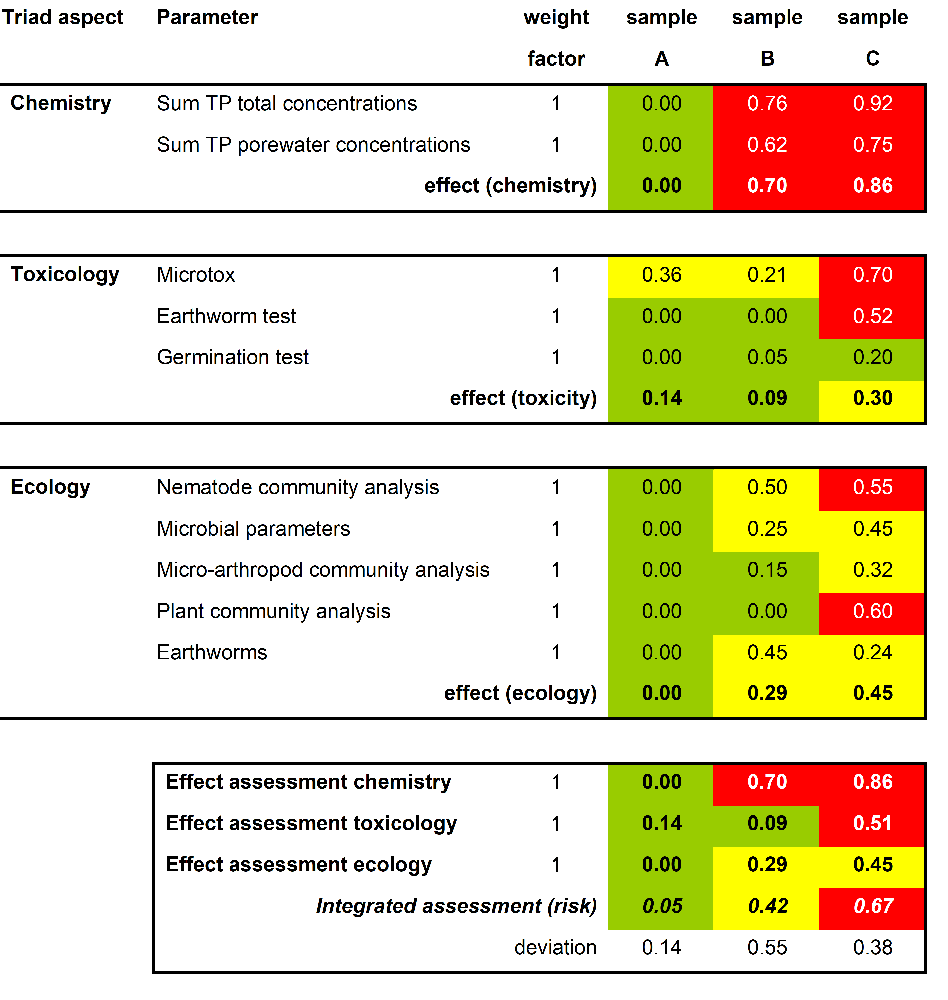

[.text-center]
_Output of the Triad method: risk evaluation of the soil samples B and C (with sample A as clean reference) by 'Weight of evidence' of the chemical, toxicological and ecological investigation._

The main subject of ecology is the description of existing communities, e.g. plant communities, food webs, the way in which these communities shape the environment and their use and importance from the human viewpoint. For the expression on the surface this topic is most probably covered by the TWG Land cover. For the part that takes place in the soil this should be considered the topic of the TWG Soil. For the construction of the aspired data structure on soil by TGW Soil it is important which quantitative measurements of biological parameters on soil ecology and soil eco-toxicology may be encountered. The list below gives a general structure:

* the number of certain organisms in a volume of soil, pore water or connected with a certain surface [abundance per m2 and taxonomic count per 100 individuals]. Examples are the biomass and number of species like earthworms, nematodes (or eelworms), micro-arthropods (mites, spiders and insects like springtails), microbes, algae, fungi (to be subdivided by the specialization in feeding on wood, dung, litter or association with roots); additionally the biomass of roots or root density (or length and branching). More examples of specimens can be found in: the online European Atlas of Soil biodiversity, JRC 2010);
* the measurement of general macro-parameters specific for biological performance, like the rate of natural decay of organic materials – carbon mineralization [typical in mg /ha /week], certain general enzyme activities in soil, soil breathing and or general genetic diversity analysis;
* the availability of contaminants to plants, soil organisms, earthworms, as sampled in the field or in controlled studies of bioassays (i.e. in material from plants potted in soil from a site and grown in standard conditions or with soils spiked with selected contaminants that were encountered in the field, ignoring the complete mix of pollutants and the 'ageing' of the pollution which may effect the availability) [unit: mg/kg dry weight of selected plant material (i.e. leaves, stems, bulbs, roots), for crops of edible plant material] or alternatively with simulated '(bio)availability tests' (i.e. with Ca-solutions of standard dilution) [unit in mg/kg dry weight of soil];
* decay of organic pollutants by micro-organisms or plants (phytoremediation) [unit mg/kg ds /year];
* effect of pollution on organisms (germination rate, phytotoxicity as measured by growth rate or chlorophyll content) and the effects of pollutants on plant cover and wild life in the field, decline of valued species (e.g. decline of birds of prey as a result of pesticide residues) [species count], but also adaptation of ecosystems (e.g. more nettles).

These surveys and studies are related to agricultural fertility assessment. An important issue is the valuation of ecological effects and ecosystem changes. In the Triad method similar sites that are not polluted are used as a benchmark. The concept of ecosystem services relates ecosystem performance to usefulness (see: Rutgers, Mulder, Schouten, 2008 and JRC, 2010, p.37 and p.48).

*_References:_*

Jensen J ; Mesman M. (eds), 2006; Ecological risk assessment of contaminated land - Decision support for site specific investigations. RIVM-report 711701047 ;with contributions of Jensen J ; Mesman M ; Bierkens J ; Loibner A ; Rutgers M ; Bogolte T ; Celis R ; Dirven-van Breemen EM ; Erlacher E ; Ehlers C ; Hartnik T ; Sorokin N ; Laak T ter; (RIVM-National Institute of Public Health and the Environment, Bilthoven, The Netherlands and National Environmental Research Institute, Silkeborg, Denmark , 2006).

Swartjes, F.A. (ed), Dealing with contaminated sites, from theory to practical application, Part IV Ecological aspects (Springer, 2011), ISBN: 978-90-481-9756-9

Rutgers M., Mulder C., Schouten T (eds), 2008 - Soil ecosystem profiling in the Netherlands with ten references for biological soil quality. RIVM report 607604009/2008 (and the preceeding RIVM report 607604006/2004)

JRC 2010, European Atlas of Soil Biodiversity (JRC Joint Research Center European Commission, IES institute for Environment and Sustainability)- EUR24375 EN

_(except for the book by Swartjes these reports and the atlas can be downloaded by clicking on the provided links)_

[width="100%",cols="26%,74%"]
|===
2+^|*Use Case Description*
|*Name* |Ecological risk of soil contamination
|*Priority* |Medium
|*Description* |MS-PAF method for the foundation of the ecological part of the generic intervention value and the Triad-method: using 'Weight of Evidence' of three research fields (chemistry, toxicology, ecology) to make site-specific evaluations of the ecological risk of soil contamination
|*Legal foundation(s)* |Ministerial Circular letter on soil remediation (2006, revised 2008, 2009), connected to the Dutch law on soil protection
|*Pre-condition* |MS-PAF: knowledge of levels of biodiversity and decision on general goal (e.g. protection of 50% of the species). Triad methode: site with contaminated soil for which ecological effects are expected but the knowledge of the effects is considered as insufficient to decide on the need of soil cleaning/management measures.
2+^|*Flow of Events - Basic Path (MS-PAF method)*
|*Step 1* |General knowledge of the sensitivity of soil organisms for contaminants.
|*Step 2* |Chemical analyses of soil
|*Step 3* |Integration of the results obtained in step 1 and 2
|*Post-condition* |Ecological risk level has been determined on a generic level
2+^|*Flow of Events - Basic Path (Triad method)*
|*Step 1* |Chemical analyses of soil
|*Step 2* |Toxicology tests (bioassays)
|*Step 3* |Field observations (soil organisms, plants, trees)
|*Step 4* |Integration of the results obtained in step 1 to 3
|*Post-condition* |Ecological risk level has been determined on a site-specific level
2+^|*Actors*
|*End-users* a|
* Local Authorities: municipalities, provinces
* Land owners

|*Information provider(s)* |Consultancy companies, laboratories, chemists, biologists
|*Information processors(s)/Brokers* |Laboratories, consultancy companies
2+^|*Information Source Input*
|*Description* a|
* Chemical analyses from soil and water

* Bioassays

* Field observations

|*Thematic scope* |Soil, land use, ecology
|*Base datasets* a|
* Soil map
* Ground water level (classes)
* Soil and water (ground and surface) sample analysis, standard list (see 'documentation') and extensions as found necessary in investigation
* Water monitoring networks

|*Data provider* a|
* Consultancy companies
* Laboratories (chemical, biological)
* Scientists (chemists, biologists)

|*Scale, resolution* |Regional (10.000 and up)
|*Documentation* a|
Jenssen, Mesman, 2006

Swartjes (ed), 2011

Rutgers, Mulder, Schouten (eds), 2008

JRC 2010,

(see references ) and

Standard list of substances for environmental investigations to soil and sediments, as declared on may 30, 2008. A production of SIKB, NEN and Bodem, related to the Dutch investigation standards NEN 5740 and NVN 5720.

|*External reference* |
2+^|*Information Source Output*
|*Description* |Ecological risk assessment of soil contamination
|*Thematic scope* |Decision to take action on a site with soil contamination
|*Base dataset(s)* |ETOX (USA and Netherlands)- for sensitivity of soil organisms to soil contamination and SOIL Biology for comparison with normal levels for non-polluted sites
|*Data provider(s)* |USEPA, RIVM-Netherlands
|*Scale, resolution* |Area with comparable soil ecology
|*Documentation* |See websites Etox and Sanscrit, , downloadable RIVM report on Triad method by Jensen, Mesman 2006.
|*External reference* |
|===

*Mapping of the Use Case 'Ecological risk of soil contamination' with the INSPIRE soil model of DS version 3.0*

_IMPORTANT NOTE this mapping still needs to be checked if it matches the latest version of the soil_

_data model, as described in this document._

Source input dataset

Input datasets: Provincial and municipal soil quality data systems

[width="100%",cols="50%,50%"]
|===
|*Soil dataset* |*Corresponding objects in the Inspire-Soil model*
|Soil site identification a|
* PossibleContaminatedSoilSite>SoilSite. Identifier
* ContaminatedSoilSite>SoilSite.Identifier

|Chemical parameters levels in soil, groundwater and surface water |- InvestigatedChemicalParameter
|Bioassays (toxicology tests on soil from a site) a|
SoilSite>SoilSiteParameterType

_Procedures and values_ >"Observations and measure ments"

|Field observations a|
SoilSite>SoilSiteParameterType

_Procedures and values_ >"Observations and measure ments"

|Soil map |SoilSite>SoilPlot
|Groundwater levels |"Geology"
|Surface water level monitoring |"Hydrography"
|===

Output dataset Provincial and municipal soil quality data systems

[width="100%",cols="50%,50%"]
|===
|*Soil dataset* |*Corresponding objects in the Inspire-Soil model*
a|
Risk type value

Decision to manage soil pollution (or not)

Proposed measures

a|
- RiskReceptorValue.valuedWildlifeandEcology

- RiskReceptorValue.areaWithValuedNature(Or Archeology OrLandscape)

- InvestigationStateValue

- MeasureTakenType
|===

<<<
=== Contamination in relation to property

The law in the Netherlands demands that with property transfer of real estates a report on the soil quality is generated. According to the law the seller has a duty of giving information and the purchaser has a research duty. This generates questions by private citizens and real estate brokers to local authorities about the know pollution status of sites.

Local authorities on soil quality are the provinces and a selection of the larger municipalities. Each local authority has a geographical Soil Information System (SIS) connected with databases with information about the soil quality. These SIS databases contain information connected with the location of properties: soil investigations and historical information about activities and possible used fuel tanks at the site.

General information can be found free on www.bodemloket.nl. On payment some municipalities have more detailed reports available on request, generally on request of real estate brokers. Commercial parties may provide reports on general environmental data for a location, including soil information.

A report provided for the transaction contains information about the following aspects:
* General properties of the site like address, cadastral number, area and geographical information.
* All available information on the location based on historical surveys.
* Soil investigations, underground fuel tanks and data concerning activities from companies on the site.
* Environmental quality of the direct surroundings of the site. This part gives information about all soil-related activities in a range of 25 meters around the research location.
* General information about the used terminology and an explanation at the information on environment quality.

*An example of a report on soil pollution for real estate brokers*

*A. Data about the site BW0033370*

_A1. Overview historical soil threatening activities_
At this moment no historical soil threatening activities has been reported.

_A2. Overview investigated sites_
There are no soil investigations conducted.

_A3. Overview present underground fuel tanks_
There are no underground fuel tanks present.

*B. Data in a range of 25 meters around the site BW0033370*

_B1. Overview historical soil threatening activities_
At this moment no historical soil threatening activities have been reported.

_B2. Overview investigated sites_

_Site 'KAT Kennemer Air Treatment' (fictional)_

[width="100%",cols="38%,18%,22%,22%"]
|===
2+|The research location has been registered under the name: 2+|KAT Kennemer Air treatment (AA037503491)
2+|The location has been registered under the address: 2+|Koninginnestraat 131
2+|On the basis of the available information the status of the location is: 2+|Seriously polluted, not urgent to remediate
2+|On the location the next formal decision has been given 2+|Seriously polluted, not urgent to remediate
2+|On the basis of the available information the location has got next follow up status:: 2+|Sufficiently investigated and, no follow up necessary
|Type of investigation |Date research |Result research with regard to law of soil protection |
| | |Ground |Groundwater
|Remediation evaluation |- |Unknown |Unknown
|Remediation plan |1995-01-06 |Unknown |Unknown
|Remediation investigation |1993-01-01 |>I |Unknown
|Closer investigation |1992-03-01 |>I |>S
|Exploratory survey |1987-11-01 |>I |>T
|===

_Legend_

[width="100%",cols="20%,80%"]
|===
|< S |No raised concentrations of contaminants
|S |Lightly contaminated (reference value), <T
|T |Moderately contaminated (between value), <I
|I |Seriously polluted (intervention value)
|Unknown |No information available
|===

_B3. Overview present underground tanks_

_Tank location TB037500154_

[width="99%",cols="15%,16%,15%,14%,12%,28%"]
|===
5+|The tank location is known under the name: |TB037500154
5+|The tank location is registered on the following address: |Breestraat 210
5+|Soil pollution |
5+|On the location the following underground fuel tanks are present |
|Volume(l) |Description |Remediated |Date of remediation |Kiwa registration |Remediation method
| |Domestic fuel oil |No | | |
6+|Remarks: not in use
|===

*Parameters measured in an investigation to soil pollution*

In the Dutch standards the following parameters are measured in a routine measurement in soil (for general soil quality certificates and at suspicion of soil contamination) by sampling and analysis:

Analyses on soil samples

- General soil properties: percentages of organic matter and clay particles.

- Metals: Barium, Cadmium, Cobalt, Copper, Mercury, Lead, Molybdene, Nikkel, Zinc (in older versions also Arsenic and Chromium – now only in sediments, but not Barium, Cobalt, Molybdene).

- Organic substances: Sum of PCBsfootnote:[Sum of PCBs (poly chlorinated bifenyls) : PCB-8, -52, -101, -118, -138, -153, -180], SUM of PAHsfootnote:[Sum of PAKs: naphtalene, phenanthrene, antracene, fluoranthene, chrysene, benzo(a)antracene, benzo(a)pyrene, benzo(k)fluoranthene, indeno(1,2,3 cd)pyrene and benzo(ghi)perylene], mineral oil, EOX (extractable organic halogenated carbonsfootnote:[organic compound with incorporated chlorine, fluorine, bromine or iodine])

When the number of substances that give problems is known to be smaller, as may follow from the first surveys, detailed investigations can be completed with a narrowed set of parameters.

In groundwater the standard range of analyses covers the same metals and for

organic substances: mineral oil, volatile aromatic hydrocarbonsfootnote:[volatile organic hydrocarbons: sum of benzene, toluene, ethylbenzene, all xylenes, styrene and naphtalene.], volatile halogenated hydrocarbonsfootnote:[Volatile halogenated hydrocarbons: sum of all chlorinated methanes (2,3 or 4 Cl), ethanes (2 or 3 Cl), ethenes (1 - 4 Cl), dichloorpropanes and bromoform.].

In sediments and soils recently originating from sediments or with recently added sediments, the set of parameters is like the parameter set for soils. However, dependent of the use/dispersion in salt or sweet waters, there are some omissions and additions in the standard. General additions are:

- Metals: also Arsenic, Chromium

- Organic substances: pesticides (like drins and HCHs- also from pesticide production waste, DDT, DDD, DDE) and a range of chlorinated compounds (i.e. hexachloorbenzene) and tributyltin (antifouling paint for ship hulls).

For the analysis of risks from soil pollution also samples of various other media may be taken, i.e. of crops, poultry, milk, dust in residences, volatile compounds in the air of cellars and ground level crawling spaces.

For risks related to ecology sampling and analysis will be different. See the use case description 'Ecological risk of soil contamination' and for the risk to ground water for drinking water see 'Risk for drinking water wells by contamination'.

When encountering some specific polluting activities the standard parameters are extended, examples are:

- Cyanides in former gaswork areas (city gas)

- Volatile organic hydrocarbons (in soil air) for petrol service stations.

- Asbestos in areas selected by the asbestos protocol (demolition of certain buildings, raised land and roads near former asbestos industries).

- Pesticides near agricultural storage facilities (or pesticide production and storage facilities).

Other reasons for addition of substances may be visual inspection or smell observations by experienced observers. Also knowledge of the processes that took place on the site and knowledge of the amounts of chemicals used as found in archive surveys may be of help to characterize the pollution mix present.

An extended list of threshold values to decide on the need of soil cleaning or protection measures is available in the Circular letter on soil remediation, 2009.

Beside the method of sampling and analysis also on site measurements may give guiding information or additional information (handheld XRF- Röntgen fluorescence for contamination with metals or manure).

*_References:_*

Ministerial Circular letter on soil remediation (2006, revised 2008, 2009), connected to the Dutch law on soil protection

Standard list of substances for environmental investigations to soil and sediments, as declared on may 30, 2008 (Standaard stoffenpakket bij milieuhygienisch (water-) bodemonderzoek vastgesteld 30 mei 2008). A production of SIKB, NEN and Bodem, related to the Dutch investigation standards NEN 5740 and NVN 5720.

[width="100%",cols="23%,77%"]
|===
2+^|*Use Case Description*
|*Name* |Contamination in relation with sale of properties
|*Priority* |Medium
|*Description* a|
The law in the Netherlands demands that with property transfer of real estates a report on the soil quality is generated.

Each local authority on soil quality (provinces and municipalities) has a geographical information system on the soil quality. This contains information about the site properties, soil investigations and historical information about activities and possible used fuel tanks at the site.

|*Legal foundation(s)* |National regulations for property transfer of real estates.
|*Pre-condition* |Measurements and observations on soil and ground and surface water.
2+^|*Flow of Events - Basic Path*
|*Step 1* |Record geographical information of location
|*Step 2* |Record the soil investigations and remedation actions on and near the site.
|*Step 3* |Record the presence of used fuel tanks on or near the site.
|*Step 4* |Present if available the historical activities on the site.
| |
2+^|*Actors*
|*End-users* a|
* Provinces
* Cities
* Real estate brokers
* Citizens that are selling or buying real estate

|*Information provider(s)* |Provinces, regional and local government
|*Information processors(s)* |Private and public data collection companies, Laboratories, consultancy companies
2+^|*Information Source Input*

|*Description* a|
* Previous soil investigations
* Historical activities
* Used fuel tanks

|*Thematic scope* |Soil status
|*Base datasets* a|
* Soil map
* Soil and water (ground and surface) sample analysis

|*Data provider* a|
Soil bureaus

Water authorities

Environmental agencies

|*Scale, resolution* |Regional (50 m^2^ and up)
|*Documentation* a|
Wet bodembescherming – Netherlands Law on soil protection

Ministerial Circular letter on soil remediation (2006, revised 2008, 2009), connected to the Dutch law on soil protection

Standard list of substances for environmental investigations to soil and sediments, as declared on may 30, 2008. A production of SIKB, NEN and Bodem, related to the Dutch investigation standards NEN 5740 and NVN 5720.

|*External reference* |
2+^|*Information Source Output*
|*Description* |Output will represent , usually in a report with a map where restriction zones and limitations are present
|*Thematic scope* |Soil status
|*Base dataset(s)* a|
* Previous soil investigations
* Historical activities

* Used fuel tanks

|*Data provider(s)* |Provinces, regional and local government
|*Scale, resolution* |Regional (50 m2 and up)
|*Documentation* |Law of soil protection
|*External reference* |*www.bodemloket.nl*
| |
|===

*Mapping of the Use Case 'Contamination in relation to property' with the INSPIRE soil model of DS version 3.0*

_IMPORTANT NOTE this mapping still needs to be checked if it matches the latest version of the soil data model, as described in this document._

*Source input dataset*

Input datasets: Provincial and municipal soil quality data systems

[width="100%",cols="49%,51%"]
|===
|*Soil dataset* |*Corresponding objects in the Inspire-Soil model*
|Soil site identification a|
- PossibleContaminatedSoilSite>SoilSite. Identifier

- ContaminatedSoilSite>SoilSite. Identifier

|Previous soil investigations |- PossibleContaminatedSoilSite.InvestigationState Value
|Measures and planning a|
- ContaminatedSoilSite>MeasureTakenType

- ContaminatedSoilSite>measureTakenStageValue

|Historical activities |- PossibleContaminatedSoilSite.Contaminating ActivityType
|Used fuel tanks |- PossibleContaminatedSoilSite.Contaminating ActivityType =...
|Soil map |SoilSite>SoilPlot
|Soil and water (groundwater and surface water) sample analysis –chemical parameters a|
- InvestigatedChemicalParameter

_- Procedures and values_ >"Observations and measure ments"

|Applicable threshold values |-LegislationCitation.LegislationLevelValue
|===

Output dataset Bodemloket (Soil counter) /report to prospective property buyer

Equal to input set

<<<
=== State of soil in Europe

Internationally and nationally focus is on the change of state of soils (e.g. EUR 25186 EN, 2012). This information is used in the debate around different environmental, agricultural and climate related themes. For the characterization of the soil state and the soil development there is a need for a systematic soil monitoring approach. Most of the member states practice a nationwide monitoring network: Austria, Belgium, Bulgaria, Czech Republic, Denmark, Estonia, Finland, France, Germany, Greece, Hungary, Ireland, Lithuania, Latvia, Malta, Northern Ireland, Netherlands, Poland, Portugal, Romania, Scotland, Slovenia, Slovakia, Spain, Sweden, UK (ENVASSO, 2008).

Therefore the central aim of a monitoring network with fixed large or minor time steps is to give a documentation of the state and trend about soil related data and properties with the highest repetitious accuracy and standardization. In this sense monitoring data provide the opportunity to describe and asses the most important soil threats at a fixed time step for a nationwide purpose. Therefore the data should be suitable to advance the European Soil Strategy on the appropriate scale.

The only European wide integrative monitoring network is the ICP forest soil monitoring.

The other monitoring networks deal with minor different purposes and strategies. Often the purpose is to describe the soil quality with parameter groups of nutrients, heavy metals, organic pollutants (in general pollutants), soil contamination and rarely soil physical data, soil erosion or soil biodiversity. Sometimes the purpose is to describe the soil types and to derive soil variety.

In many cases the most important thing of a monitoring, the sampling in fixed time steps is given and European wide exist several number of campaigns.

In addition soil monitoring data allow an estimation of the success of environmental measures, the validation of modelling (climate change, nutrients, deposition e.g.), scientific research projects and also well know sites for several purposes (licensing proposes, threshold derivation). Due to the fact of an appropriate interpretation the results may contribute the development of methodologies to restrict degradation of landscape, apply standards of sustainable development in agriculture (e.g. nutrient balance) and European, national, regional or local strategies of soil (environmental) protection and prevention. The systematic monitoring approach provides the warranty to derive the state and development of soil organic carbon and related to this the national Kyoto reporting. In general, soil monitoring is the central element for environmental monitoring.

Due to the complexity of deriving soil related data a lot of stakeholders with different requirements on different levels but in the end similar aims participates (e.g. EU, member states, federal states, interest groups, companies, consulting networks, universities, public). The different stakeholders deal and work with the soil related monitoring data in a different manner and a different degree of strength (e.g.: generator, owner, users).

[width="100%",cols="22%,78%"]
|===
2+^|*Use Case Description*
|*Name* |_Soil monitoring in Europe._
|*Priority* |_High_
|*Description* |_Member States provide soil related monitoring data to characterize soil state, soil quality and soil development in order to describe the influence of anthropogenic activities on soils_
|*Legal foundation(s)* |_legislations of the member states and improve the legislation of the member states, improve the European soil strategy, environmental reporting of the member states (e.g. Kyoto reporting – soil carbon state) and environmental reporting of the European authorities (e.g. SOER)_
|*Pre-condition* |_field samples have to be taken in systematic time steps and with repetitious accuracy as well as in analytics_
2+^|*Flow of Events - Basic Path*
|*Step 1* |_member states collect and store the harmonised raw data_
|*Step 2* |_member states make further assessment with the raw data_
|*Step 3* |_member states give a report on aggregated data, interpreted data and specific questions_
|*Step 4* |_member states make the results available_
|*Post-condition* |_stakeholder and interest groups can use the results (not raw data) for further investigations, reporting and policy development_
2+^|*Actors*
|*End-users* a|
* _Member States_
* _European institutions_
* _Scientists_
* _Citizens_
* _Professionals (e.g. Agri-environmental business)_
* _interest groups (consulting networks)_

|*Information provider(s)* |_Member States_
|*Information processors(s)/Brokers* |_Member States authorities responsible for providing nationwide aggregated and interpreted data_
2+^|*Information Source Output*

* _Reports on the state and change of state of soils_
* _Point Maps that provide the aggregated measurements an values from the monitoring sites_
* _Maps on an appropriate national level or raster format that show the state and the development of soil related interpreted data._

|*Description* |
|*Thematic scope* |_soil, climate, land cover/use_
|*Base datasets* a|
* _characterization of the monitoring site (e.g. climate, land use)_
* _characterization of the soil type and the associated soil properties_
* _aggregated data of the soil monitoring parameters and measurements at different time steps_

* _chemical parameters (active/ exchangeable soil reaction, available nutrients, microelements, sorption capacity, organic matter content, risk elements/ pollutants)_
* _organic pollutants (PAH, PCB, DDx; HCH, Dioxin)_
* _physical parameters (texture, density, water content)_

* _biological parameters_

* _interpreted data of soil state and the development of soil related data on a national level_

* _e.g. organic matter content_
* _e.g. risk elements content_

|*Data provider* |_Member States authorities_
|*Scale, resolution* |_from point locations up to national scale, depends on national focus und specific interpretation_
|*Documentation* a|
* _Member states manuals and reports_
* _Member states legislation_

|*External reference* |_Member States authorities web sites_
2+^|*Information Source Input*

_Member States monitoring raw data from different authorities at different time steps._

|
|*Description* |
|*Thematic scope* |_soil, climate, land cover/use, climate_
|*Base dataset(s)* a|
* _description of the monitoring site_

* _climate data_
* _landcover/ use data_

* _description of the soil type and associated soil properties_
* _description of the monitoring parameters and measurements with their replicates, their quality, analytical standards and sampling methods_

* _chemical parameters (active/ exchangeable soil reaction, available nutrients, microelements, sorption capacity, organic matter content, risk elements/ pollutants)_
* _organic pollutants (PAH, PCB, DDx; HCH, Dioxin)_
* _physical parameters (texture, density, water content)_

* _biological parameters_

_as point maps and/or databases_

|*Data provider(s)* |_Member states authorities on different levels and different responsibilities_
|*Scale, resolution* |_point locations_
|*Documentation* a|
* _Member states manuals and reports on different levels_

|*External reference* |_none_
|===

*Mapping of the Use Case 'State of soil in Europe' with the INSPIRE soil model of DS version 3.0*

_IMPORTANT NOTE this mapping still needs to be checked if it matches the latest version of the soil data model, as described in this document._

Input dataset: Member States soil monitoring network or single inventories

[width="100%",cols="50%,50%"]
|===
|Soil attributes |Corresponding objects in the INSPIRE soil model
|1) Soil site description |_SoilSite (feature type)_
|a) extend of the area, point location |_SoilSite: geometry_
|b) name of the location, internal ID a|
_SoilSite: SoilSiteParameter: SoilSiteParameterType_

_linked to ObservableProperty, PhenomenonTypeValue and UnitOfMeasure which is part of OM_Observation (feature type)_

|c) investigation purpose |_SoilSite: soilInvestigationPurpose: SoilInvestigationPurpoeValue_
|d) establishment of the soil site |_SoilSite: validFrom_
|e) e.g. land use category a|
_SoilSite: SoilSiteParameter: SoilSiteParameterType: SoilParameterValueType_

_linked to ObservableProperty, PhenomenonTypeValue and UnitOfMeasure which is part of OM_Observation (feature type)_

|f) e.g. vegetation category a|
_SoilSite: SoilSiteParameter: SoilSiteParameterType: SoilParameterValueType_

_linked to ObservableProperty, PhenomenonTypeValue and UnitOfMeasure which is part of OM_Observation (feature type)_

|2) Soil plot (observation point) description |_SoilPlot (feature type)_
|a) name of the location, reference to coordinates |_SoilPlot: soilPlotLocation_
|b) kind of the observation |_SoilPlot: soilPlotType_
|3) Soil profile description |_ObservedSoilProfile/ SoilProfile (feature type)_
|a 1) characterization of the soil type |_SoilProfile: WRBSoilName: WRBSoilNameType; WRBQualifierGroup_
|a 2) characterization of the soil type |_SoilProfile: otherSoilName: OtherSoilNameType_
|b) local or internal ID of the profile |_SoilProfile: localIdentifier_
|c) any property that is observed to characterize the soil profile (e.g. available water capacity or potential root depth) a|
_SoilProfile: soilProfileParameter: SoilProfilParameterType: SoilParameterValueType_

_linked to ObservableProperty, PhenomenonTypeValue and UnitOfMeasure which is part of OM_Observation (feature type)_

|4) Soil horizon/soil layer description |_ProfileElement (feature type)_
|a) characterization of the upper and lower depth of the observed profile element (horizon, layer) |_ProfileElement: profileElementDepthRange: RangeType_
|b 1) characterization of the horizon |_SoilHorizon (feature type): FAOHorizonNotation: FAOHorizonNotationType_
|b 2) characterization of the horizon |_SoilHorizon (feature type): otherHorizonNotation: OtherHorizonNiotationType_
|c) characterization of a layer type (e.g. topsoil or a specific depth interval) |_SoilLayer (feature type): layerType_
|d) characterization of the rock type |_SoilLayer: (feature type): layerRockType_
|e) characterization of the non-pedogenic processes |_SoilLayer (feature type): layerGenesisProcess_
|f) characterization of the particle size |_ProfileElement (feature type): particleSizeFraction: ParticleSizeFractionType_
|g) any property that is observed to characterize the state of soil (e.g. soil organic carbon, content of lead or bulk density) a|
_ProfileElement (feature type): profileElementParameter: ProfileElementParameterType: SoilParameterValueType_

_linked to ObservableProperty, PhenomenonTypeValue and UnitOfMeasure which is part of OM_Observation (feature type)_

|===

Output dataset: in first instance the aggregated information of the soil monitoring network or single inventories (but not the raw data) in line with the above displayed mapping of the input dataset and in second instance evaluations based on the input data (e.g. soil typological units, soil properties evaluations e.g. soil texture of the topsoil)

[width="100%",cols="50%,50%"]
|===
|Soil attributes |Corresponding objects in the INSPIRE soil model
|1) Soil typolocical Units |_SoilBody (feature type)_
|a) characterization of the soil profile, based on the observed profiles |_DerivedSoilProfile_
|b) extend of the typological unit |_SoilBody: geometry_
|c) name of the typlogical unit |_SoilBody: soilBodyLabel_
|2) Soil properties evaluation |_SoilDerivedObject (feature type)_
|a) extent of soil related properties which can derived directly from the observed soils and properties |_SoilDerivedObject: geometry_
|b) soil related properties which can derived directly from the observed soils and properties a|
_SoilDerivedObject: soilDerivedObjectParameter: SoilDerivedObjectParameterType: SoilParameterValueType_

_linked to ObservableProperty, PhenomenonTypeValue and UnitOfMeasure which is part of OM_Observation (feature type)_

|===

<<<
[appendix]
== Code list values (normative) 

[discrete]
=== *INSPIRE Application Schema 'Soil'*

[width="100%",cols="100%"]
|===
|*Code List*
|_LayerGenesisProcessStateValue_
|_LayerTypeValue_
|_ProfileElementParameterNameValue_
|_SoilDerivedObjectParameterNameValue_
|_SoilInvestigationPurposeValue_
|_SoilPlotTypeValue_
|_SoilProfileParameterNameValue_
|_SoilSiteParameterNameValue_
|_WRBQualifierPlaceValue_
|_WRBQualifierValue_
|_WRBReferenceSoilGroupValue_
|_WRBSpecifierValue_
|===

*LayerGenesisProcessStateValue*

[width="100%",cols="100%"]
|===
a|
[width="100%",cols="17%,83%"]
!===
!Name: !layer genesis process state value
!Definition: !an indication whether the process specified in layerGenesisProcess is ongoing or ceased in the past.
!Description: !Process state gives an idea whether current non-pedogenic processes affect the soil or not. E.g. on current floodplains, input of sediments during seasonal flooding events is received, with comparatively young soil development in it, while in older fluvial sediments that are no longer under a regime of seasonal or irregular flooding, soil development might be more advanced.
!Extensibility: !none
!Identifier: !http://inspire.ec.europa.eu/codelist/LayerGenesisProcessStateValue
!Values: !The allowed values for this code list comprise only the values specified in the table below.
!===

|===

[width="100%",cols="100%"]
|===
a|
*ongoing*

[width="100%",cols="5%,16%,79%"]
!===
!  !Name: !on-going
!  !Definition: !The process has started in the past and is still active.
!  !Description: !Synonym: current
!===

a|
*terminated*

[width="100%",cols="5%,16%,79%"]
!===
!  !Name: !terminated
!  !Definition: !The process is no longer active.
!===

|===

*LayerTypeValue*

[width="100%",cols="100%"]
|===
a|
[width="100%",cols="17%,83%"]
!===
!Name: !layer type value
!Definition: !classification of a layer according to the concept that fits the purpose.
!Description: !EXAMPLE Topsoil: meaning the upper part of the natural soil that is generally dark coloured and has a higher content of organic matter and nutrients when compared to the (mineral ) horizons below excluding the humus layer.
!Extensibility: !none
!Identifier: !http://inspire-registry.jrc.ec.europa.eu/clr/LayerTypeValue
!Values: !The allowed values for this code list comprise only the values specified in the table below.
!===

|===

[width="100%",cols="100%"]
|===
a|
*depthInterval*

[width="100%",cols="5%,16%,79%"]
!===
!  !Name: !depth interval
!  !Definition: !Fixed depth range where soil is described and/or samples are taken.
!  !Description: !"They are often used in soil monitoring, sampling of contaminated sites and in modelling, and include: ò upper and lower limits of a soil horizon, or of a functional set of horizons ò depth increments (also called fixed depths), that are often used for sampling, e.g. 0-30cm, 30-60cm, and so on, ò a single depth range in which a soil sample is taken and for which the analytical result is valid, and ò soil slicing, that is, profile segmentation according to a specified vector, for instance, either regularly spaced intervals (1cm), or a user-defined vector of segment boundaries (i.e. 0-10, 10-25, 25-50, 50-100). Slicing is used in modelling to generate continuous depth functions for soil properties."
!===

a|
*geogenic*

[width="100%",cols="5%,16%,79%"]
!===
!  !Name: !geogenic
!  !Definition: !Domain of the soil profile composed of material resulting from the same, non-pedogenic process, e.g. sedimentation, that might display an unconformity to possible over- or underlying adjacent domains.
!===

a|
*subSoil*

[width="100%",cols="5%,16%,79%"]
!===
!  !Name: !subsoil
!  !Definition: !Natural soil material below the topsoil and overlying the unweathered parent material.
!  !Description: !SOURCE ISO 11074 NOTE The subsoil can be: (i) a grouping of one to several horizons underlying the horizons with recent humus accumulation from humifying biomass or (ii) a domain of a soil with a specific vertical extension starting well below the soil surface (e.g. 15-75 cm).
!===

a|
*topSoil*

[width="100%",cols="5%,16%,79%"]
!===
!  !Name: !topsoil
!  !Definition: !Upper part of a natural soil that is generally dark coloured and has a higher content of organic matter and nutrients when compared to the (mineral) horizons below excluding the humus layer.
!  !Description: !"NOTE 1 For arable lands, topsoil refers to the ploughed soil depth; for grasslands, it is the soil layer with high root content. NOTE 2 The topsoil can be: (i) a grouping of one to several A horizons or (ii) a domain of a soil with a specific vertical extension starting from the surface (e.g. 0-15 cm). NOTE 3 In most soil description guidelines, the topsoil is composed of all A horizons occurring in a soil profile."
!===

|===

*ProfileElementParameterNameValue*

[width="100%",cols="100%"]
|===
a|
[width="100%",cols="17%,83%"]
!===
!Name: !profile element parameter name value
!Definition: !list of properties that can be observed to characterize the profile element. The allowed values for this code list comprise a number of pre-defined values and narrower values defined by data providers. This code list is hierarchical.
!Description: ! Basically these parameters can be divided in several major groups like: Chemical parameters, Physical parameters, Biological parameters.
!Extensibility: !narrower
!Identifier: !http://inspire.ec.europa.eu/codelist/ProfileElementParameterNameValue
!Values: !The allowed values for this code list comprise the values specified in the table below and narrower values defined by data providers.
!===

|===

[width="100%",cols="100%"]
|===
a|
*chemicalParameter*

[width="100%",cols="5%,16%,79%"]
!===
!  !Name: !chemical parameter
!  !Definition: !Chemical parameters observed to characterize the profile element.
!===

a|
*physicalParameter*

[width="100%",cols="5%,16%,79%"]
!===
!  !Name: !physical parameter
!  !Definition: !Physical parameters observed to characterize the profile element.
!===

a|
*biologicalParameter*

[width="100%",cols="5%,16%,79%"]
!===
!  !Name: !biological parameter
!  !Definition: !Biological parameters observed to characterize the profile element.
!===

a|
*organicCarbonContent*

[width="100%",cols="5%,16%,79%"]
!===
!  !Name: !organic carbon content
!  !Definition: !Portion of the soil measured as carbon in organic forms, excluding living macro and mesofauna and living plant tissue.
!  !Description: !"SOURCE 1 ISO 11074:2005 NOTE 1 Organic carbon content can serve as an indirect determination of organic matter through the use of an approximate correction factor. The "Van Bemmelen factor" of 1.724 has been used for many years and is based on the assumption that organic matter contains 58 percent organic carbon. The literature indicates that the proportion of organic C in soil organic matter for a range of soils is highly variable. Any constant factor that is selected is only an approximation. The ecuation for the estimation of the organic matter according to this factor is the following one: OM (%) = 1.724 x OC (%) SOURCE 2 NRCS Natural Resources Conservation Service, Soil survey laboratory information manual, Soil survey investigation report n.45 version 2.0 February 2011 pag. 247 NOTE 2 The soil organic carbon content is a parameter to be taken into account for meeting the (i) Council regulation (EC) No 1782/2003 (Common Agricultural Policy), (ii) Agri-environmental indicators that track the integration of environmental concerns into CAP at EU, national and regional levels, (iii) Directive 2009/28/EC of the European Parliament and of the Council (energy from renewable resources)"
!  !Parent: !chemicalParameter
!===

a|
*nitrogenContent*

[width="100%",cols="5%,16%,79%"]
!===
!  !Name: !nitrogen content
!  !Definition: !total nitrogen content in the soil, including both the organic and inorganic forms.
!  !Description: !"NOTE 1 Nitrogen is one of the most important plant nutrients and forms some of the most mobile compounds in the soil-crop system, and as such, is commonly related to water-quality problems. Total N includes both organic and inorganic forms.SOURCE Soil survey laboratory methods manual version 4.0. Soil Survey Investigations Report No. 42. USDA, USA. NOTE 2 The nitrogen content is a parameter to be taken into account for meeting the (i) Council Directive 91/676/EEC of 12 December 1991 concerning the protection of waters against pollution caused by nitrates form agricultural sources"
!  !Parent: !chemicalParameter
!===

a|
*pHValue*

[width="100%",cols="5%,16%,79%"]
!===
!  !Name: !pH value
!  !Definition: !pH value of the profile element.
!  !Description: !"pH is the negative logarithm to the base of 10 of H-ion activity (i.e. apparent or effective concentration of H-ion in solution). It represents the the intensity factor (index) of soil acidity. SOURCE Soil Survey Laboratory Information Manual.Soil Survey Investigations Report No.45. Version 2. February 2011. United States Department of Agriculture, Natural Resources Conservation Service, National Soil Survey Center, Lincoln, Nebraska, USA. 530 pages. NOTE the pH of the soil is potentiometrically measured in the supernatant suspension of a soil/liquid mixture. This liquid can be made using several reagents (KCl, CaCl2, H2O, NaF). The reagent used must be given in the process parameter linked to the observable property as well as its concentration and the ratio used between soil and liquid."
!  !Parent: !chemicalParameter
!===

a|
*cadmiumContent*

[width="100%",cols="5%,16%,79%"]
!===
!  !Name: !cadmium content
!  !Definition: !Cadmium content of the profile element.
!  !Description: !"NOTE the Directive 86/278/EEC of 12 June 1986 on the protection of the environment, and in particular of the soil, when sewage sludge is used in agriculture, indicated that cadmium analysis must be performed on soil before spreading of sewage sludge. In this framework, the analysis must be carried out following strong acid digestion and the reference method of analysis must be that of atomic absorption spectrometry. Nevertheless, for other requirements, other type of analysis can be made using other reagents. Thus, the type of reagent used for the analysis must be given in the process parameter linked to the observable property."
!  !Parent: !chemicalParameter
!===

a|
*chromiumContent*

[width="100%",cols="5%,16%,79%"]
!===
!  !Name: !chromium content
!  !Definition: !Chromium content of the profile element.
!  !Description: !"NOTE the Directive 86/278/EEC of 12 June 1986 on the protection of the environment, and in particular of the soil, when sewage sludge is used in agriculture, indicated that chromium analysis must be performed on soil before spreading of sewage sludge. In this framework, the analysis must be carried out following strong acid digestion and the reference method of analysis must be that of atomic absorption spectrometry. Nevertheless, for other requirements, other type of analysis can be made using other reagents. Thus, the type of reagent used for the analysis must be given in the process parameter linked to the observable property."
!  !Parent: !chemicalParameter
!===

a|
*copperContent*

[width="100%",cols="5%,16%,79%"]
!===
!  !Name: !copper content
!  !Definition: !Copper content of the profile element.
!  !Description: !"NOTE the Directive 86/278/EEC of 12 June 1986 on the protection of the environment, and in particular of the soil, when sewage sludge is used in agriculture, indicated that copper analysis must be performed on soil before spreading of sewage sludge. In this framework, the analysis must be carried out following strong acid digestion and the reference method of analysis must be that of atomic absorption spectrometry. Nevertheless, for other requirements, other type of analysis can be made using other reagents. Thus, the type of reagent used for the analysis must be given in the process parameter linked to the observable property."
!  !Parent: !chemicalParameter
!===

a|
*leadContent*

[width="100%",cols="5%,16%,79%"]
!===
!  !Name: !lead content
!  !Definition: !Lead content of the profile element.
!  !Description: !"NOTE the Directive 86/278/EEC of 12 June 1986 on the protection of the environment, and in particular of the soil, when sewage sludge is used in agriculture, indicated that lead analysis must be performed on soil before spreading of sewage sludge. In this framework, the analysis must be carried out following strong acid digestion and the reference method of analysis must be that of atomic absorption spectrometry. Nevertheless, for other requirements, other type of analysis can be made using other reagents. Thus, the type of reagent used for the analysis must be given in the process parameter linked to the observable property."
!  !Parent: !chemicalParameter
!===

a|
*mercuryContent*

[width="100%",cols="5%,16%,79%"]
!===
!  !Name: !mercury content
!  !Definition: !Mercury content of the profile element.
!  !Description: !"NOTE the Directive 86/278/EEC of 12 June 1986 on the protection of the environment, and in particular of the soil, when sewage sludge is used in agriculture, indicated that mercury analysis must be performed on soil before spreading of sewage sludge. In this framework, the analysis must be carried out following strong acid digestion and the reference method of analysis must be that of atomic absorption spectrometry. Nevertheless, for other requirements, other type of analysis can be made using other reagents. Thus, the type of reagent used for the analysis must be given in the process parameter linked to the observable property."
!  !Parent: !chemicalParameter
!===

a|
*nickelContent*

[width="100%",cols="5%,16%,79%"]
!===
!  !Name: !nickel content
!  !Definition: !Nickel content of the profile element.
!  !Description: !"NOTE the Directive 86/278/EEC of 12 June 1986 on the protection of the environment, and in particular of the soil, when sewage sludge is used in agriculture, indicated that nickel analysis must be performed on soil before spreading of sewage sludge. In this framework, the analysis must be carried out following strong acid digestion and the reference method of analysis must be that of atomic absorption spectrometry. Nevertheless, for other requirements, other type of analysis can be made using other reagents. Thus, the type of reagent used for the analysis must be given in the process parameter linked to the observable property."
!  !Parent: !chemicalParameter
!===

|===

*SoilDerivedObjectParameterNameValue*

[width="100%",cols="100%"]
|===
a|
[width="100%",cols="17%,83%"]
!===
!Name: !soil derived object parameter name value
!Definition: !list of soil related properties that can be derived from soil and other data. The allowed values for this code list comprise a number of pre-defined values and narrower values defined by data providers. This code list is hierarchical.
!Description: ! Basically these parameters can be divided in several major groups like: Chemical parameters, Physical parameters, Biological parameters.
!Extensibility: !narrower
!Identifier: !http://inspire.ec.europa.eu/codelist/SoilDerivedObjectParameterNameValue
!Values: !The allowed values for this code list comprise the values specified in the table below and narrower values defined by data providers.
!===

|===

[width="100%",cols="100%"]
|===
a|
*chemicalParameter*

[width="100%",cols="5%,16%,79%"]
!===
!  !Name: !chemical parameter
!  !Definition: !Chemical parameters that can be derived from other soil data.
!===

a|
*physicalParameter*

[width="100%",cols="5%,16%,79%"]
!===
!  !Name: !physical parameter
!  !Definition: !Physical parameters that can be derived from other soil data.
!===

a|
*biologicalParameter*

[width="100%",cols="5%,16%,79%"]
!===
!  !Name: !biological parameter
!  !Definition: !Biological parameters that can be derived from other soil data.
!===

a|
*potentialRootDepth*

[width="100%",cols="5%,16%,79%"]
!===
!  !Name: !potential root depth
!  !Definition: !Potential depth of the soil profile where roots develop (in cm).
!  !Description: !"This depth must take in account the presence of obstacle to roots. An obstacle can be: ò a toxic layer resulting from low pH values and associated high concentrations of Al and heavy metals, or a high salt content, etc.; ò a layer with few oxygen available for plant roots resulting from the presence of permanent or a perched water table, or the presence of a decomposing peat layer, etc; ò a layer forming a mechanical obstacle like a hard rock, a petrocalcic horizon, etc.; ò an impermeable layer such as a fragipan, an iron pan, clay layers in sediments or as result of pedogenesis. NOTE The potential root depth is a parameter to be taken into account for meeting the (i) Agri-environmental indicators that track the integration of environmental concerns into CAP at EU, national and regional levels"
!  !Parent: !physicalParameter
!===

a|
*availableWaterCapacity*

[width="100%",cols="5%,16%,79%"]
!===
!  !Name: !available water capacity
!  !Definition: !Amount of water that a soil can store that is usable by plants, based on the potential root depth.
!  !Description: !"the amount of water that a soil can store that is available for use by plants. It is the water held between field capacity and the wilting point adjusted downward for rock fragments and for salts in solution. DEFINITION Field capacity: maximum water content expressed in percent (mass fraction or volume fraction), that an unsaturated soil can retain against gravity under undisturbed soil conditions (conventionally stated as the water content 2 to 3 days after full saturation with water). DEFINITION Wilting point: water content of the soil below which the plants are not able to uptake water with their root system. SOURCE ISO 11074 NOTE The water available capacity is a parameter to be taken into account for meeting the (i) Directive 2009/28/EC of the European Parliament and of the Council (energy from renewable resources)"
!  !Parent: !physicalParameter
!===

a|
*carbonStock*

[width="100%",cols="5%,16%,79%"]
!===
!  !Name: !carbon stock
!  !Definition: !The total mass of carbon in soil for a given depth.
!  !Description: !NOTE The carbon stock is a parameter to be taken into account for meeting the (i) Directive 2009/28/EC of the European Parliament and of the Council (Energy from renewable resources)
!  !Parent: !chemicalParameter
!===

a|
*waterDrainage*

[width="100%",cols="5%,16%,79%"]
!===
!  !Name: !water drainage
!  !Definition: !Natural water drainage class of the soil profile.
!  !Description: !"The natural water drainage class refers to the frequency and duration of wet periods under conditions similar to those under which the soil developed. Alteration of the water regime by man, either through drainage or irrigation, is not a consideration unless the alterations have significantly changed the morphology of the soil. SOURCE: USDA, Soil Survey Manual. NOTE The water drainage is a parameter to be taken into account for meeting the (i) Council Directive 91/676/EEC of 12 December 1991 concerning the protection of waters against pollution caused by nitrates form agricultural sources, (ii) Directive 2009/28/EC of the European Parliament and of the Council (energy from renewable resources)"
!  !Parent: !physicalParameter
!===

a|
*organicCarbonContent*

[width="100%",cols="5%,16%,79%"]
!===
!  !Name: !organic carbon content
!  !Definition: !Portion of the soil measured as carbon in organic form, excluding living macro and mesofauna and living plant tissue.
!  !Description: !"SOURCE 1 ISO 11074:2005 NOTE 1 Organic carbon content can serve as an indirect determination of organic matter through the use of an approximate correction factor. The "Van Bemmelen factor" of 1.724 has been used for many years and is based on the assumption that organic matter contains 58 percent organic carbon. The literature indicates that the proportion of organic C in soil organic matter for a range of soils is highly variable. Any constant factor that is selected is only an approximation. The ecuation for the estimation of the organic matter according to this factor is the following one: OM (%) = 1.724 x OC (%) SOURCE 2 NRCS Natural Resources Conservation Service Soil survey laboratory information manual Soil survey investigation report n.45 version 2.0 February 2011 pag. 247 NOTE 2 The soil organic carbon content is a parameter to be taken into account for meeting the (i) Council regulation (EC) No 1782/2003 (Common Agricultural Policy), (ii) Agri-environmental indicators that track the integration of environmental concerns into CAP at EU, national and regional levels, (iii) Directive 2009/28/EC of the European Parliament and of the Council (energy from renewable resources)"
!  !Parent: !chemicalParameter
!===

a|
*nitrogenContent*

[width="100%",cols="5%,16%,79%"]
!===
!  !Name: !nitrogen content
!  !Definition: !Total nitrogen content in the soil, including both the organic and inorganic forms.
!  !Description: !"NOTE 1 Nitrogen is one of the most important plant nutrients and forms some of the most mobile compounds in the soil-crop system, and as such, is commonly related to water-quality problems. Total N includes both organic and inorganic forms. SOURCE Soil survey laboratory methods manual version 4.0. Soil Survey Investigations Report No. 42. USDA, USA. NOTE 2 The nitrogen content is a parameter to be taken into account for meeting the (i) Council Directive 91/676/EEC of 12 December 1991 concerning the protection of waters against pollution caused by nitrates form agricultural sources"
!  !Parent: !chemicalParameter
!===

a|
*pHValue*

[width="100%",cols="5%,16%,79%"]
!===
!  !Name: !pH value
!  !Definition: !pH value of the soil derived object.
!  !Description: !"pH is the negative logarithm to the base of 10 of H-ion activity (i.e. apparent or effective concentration of H-ion in solution). It represents the the intensity factor (index) of soil acidity. SOURCE Soil Survey Laboratory Information Manual.Soil Survey Investigations Report No.45. Version 2. February 2011. United States Department of Agriculture, Natural Resources Conservation Service, National Soil Survey Center, Lincoln, Nebraska, USA. 530 pages. NOTE the pH of the soil is potentiometrically measured in the supernatant suspension of a soil/liquid mixture. This liquid can be made using several reagents (KCl, CaCl2, H2O, NaF). The reagent used must be given in the process parameter linked to the observable property as well as its concentration and the ratio used between soil and liquid. NOTE Generally, the soil derived object will give the value of pH for a certain depth interval, layer or horizon that must be precised using the SoilDerivedObjectDescriptiveParameter."
!  !Parent: !chemicalParameter
!===

a|
*cadmiumContent*

[width="100%",cols="5%,16%,79%"]
!===
!  !Name: !cadmium content
!  !Definition: !Cadmium content of the soil derived object.
!  !Description: !"NOTE the Directive 86/278/EEC of 12 June 1986 on the protection of the environment, and in particular of the soil, when sewage sludge is used in agriculture, indicated that cadmium analysis must be performed on soil before spreading of sewage sludge. In this framework, the analysis must be carried out following strong acid digestion and the reference method of analysis must be that of atomic absorption spectrometry. Nevertheless, for other requirements, other type of analysis can be made using other reagents. Thus, the type of reagent used for the analysis must be given in the process parameter linked to the observable property. NOTE Generally, the soil derived object will give the value of cadmium content for a certain depth interval, layer or horizon that must be precised using the SoilDerivedObjectDescriptiveParameter."
!  !Parent: !chemicalParameter
!===

a|
*chromiumContent*

[width="100%",cols="5%,16%,79%"]
!===
!  !Name: !chromium content
!  !Definition: !Chromium content of the soil derived object.
!  !Description: !"NOTE the Directive 86/278/EEC of 12 June 1986 on the protection of the environment, and in particular of the soil, when sewage sludge is used in agriculture, indicated that chromium analysis must be performed on soil before spreading of sewage sludge. In this framework, the analysis must be carried out following strong acid digestion and the reference method of analysis must be that of atomic absorption spectrometry. Nevertheless, for other requirements, other type of analysis can be made using other reagents. Thus, the type of reagent used for the analysis must be given in the process parameter linked to the observable property. NOTE Generally, the soil derived object will give the value of chromium content for a certain depth interval, layer or horizon that must be precised using the SoilDerivedObjectDescriptiveParameter."
!  !Parent: !chemicalParameter
!===

a|
*copperContent*

[width="100%",cols="5%,16%,79%"]
!===
!  !Name: !copper content
!  !Definition: !Copper content of the soil derived object.
!  !Description: !"NOTE the Directive 86/278/EEC of 12 June 1986 on the protection of the environment, and in particular of the soil, when sewage sludge is used in agriculture, indicated that copper analysis must be performed on soil before spreading of sewage sludge. In this framework, the analysis must be carried out following strong acid digestion and the reference method of analysis must be that of atomic absorption spectrometry. Nevertheless, for other requirements, other type of analysis can be made using other reagents. Thus, the type of reagent used for the analysis must be given in the process parameter linked to the observable property. NOTE Generally, the soil derived object will give the value of copper content for a certain depth interval, layer or horizon that must be precised using the SoilDerivedObjectDescriptiveParameter."
!  !Parent: !chemicalParameter
!===

a|
*leadContent*

[width="100%",cols="5%,16%,79%"]
!===
!  !Name: !lead content
!  !Definition: !Lead content of the soil derived object.
!  !Description: !"NOTE the Directive 86/278/EEC of 12 June 1986 on the protection of the environment, and in particular of the soil, when sewage sludge is used in agriculture, indicated that lead analysis must be performed on soil before spreading of sewage sludge. In this framework, the analysis must be carried out following strong acid digestion and the reference method of analysis must be that of atomic absorption spectrometry. Nevertheless, for other requirements, other type of analysis can be made using other reagents. Thus, the type of reagent used for the analysis must be given in the process parameter linked to the observable property. NOTE Generally, the soil derived object will give the value of lead content for a certain depth interval, layer or horizon that must be precised using the SoilDerivedObjectDescriptiveParameter."
!  !Parent: !chemicalParameter
!===

a|
*mercuryContent*

[width="100%",cols="5%,16%,79%"]
!===
!  !Name: !mercury content
!  !Definition: !Mercury content of the soil derived object.
!  !Description: !"NOTE the Directive 86/278/EEC of 12 June 1986 on the protection of the environment, and in particular of the soil, when sewage sludge is used in agriculture, indicated that mercury analysis must be performed on soil before spreading of sewage sludge. In this framework, the analysis must be carried out following strong acid digestion and the reference method of analysis must be that of atomic absorption spectrometry. Nevertheless, for other requirements, other type of analysis can be made using other reagents. Thus, the type of reagent used for the analysis must be given in the process parameter linked to the observable property. NOTE Generally, the soil derived object will give the value of mercury content for a certain depth interval, layer or horizon that must be precised using the SoilDerivedObjectDescriptiveParameter."
!  !Parent: !chemicalParameter
!===

a|
*nickelContent*

[width="100%",cols="5%,16%,79%"]
!===
!  !Name: !nickel content
!  !Definition: !Nickel content of the soil derived object.
!  !Description: !"NOTE the Directive 86/278/EEC of 12 June 1986 on the protection of the environment, and in particular of the soil, when sewage sludge is used in agriculture, indicated that nickel analysis must be performed on soil before spreading of sewage sludge. In this framework, the analysis must be carried out following strong acid digestion and the reference method of analysis must be that of atomic absorption spectrometry. Nevertheless, for other requirements, other type of analysis can be made using other reagents. Thus, the type of reagent used for the analysis must be given in the process parameter linked to the observable property. NOTE Generally, the soil derived object will give the value of nickel content for a certain depth interval, layer or horizon that must be precised using the SoilDerivedObjectDescriptiveParameter."
!  !Parent: !chemicalParameter
!===

a|
*zincContent*

[width="100%",cols="5%,16%,79%"]
!===
!  !Name: !zinc content
!  !Definition: !Zinc content of the soil derived object.
!  !Description: !"NOTE the Directive 86/278/EEC of 12 June 1986 on the protection of the environment, and in particular of the soil, when sewage sludge is used in agriculture, indicated that zinc analysis must be performed on soil before spreading of sewage sludge. In this framework, the analysis must be carried out following strong acid digestion and the reference method of analysis must be that of atomic absorption spectrometry. Nevertheless, for other requirements, other type of analysis can be made using other reagents. Thus, the type of reagent used for the analysis must be given in the process parameter linked to the observable property. NOTE Generally, the soil derived object will give the value of zinc content for a certain depth interval, layer or horizon that must be precised using the SoilDerivedObjectDescriptiveParameter."
!  !Parent: !chemicalParameter
!===

|===

*SoilInvestigationPurposeValue*

[width="100%",cols="100%"]
|===
a|
[width="100%",cols="17%,83%"]
!===
!Name: !soil investigation purpose value
!Definition: !list of terms indicating the reasons for conducting a survey.
!Description: !For soil two main purposes are identified to carry out soil surveys. One is to classify the soil as a result of soil forming processes (generalSurvey) and the other one is to investigate soil for a specific reason (specificSurvey) like a possible contamination as a result of contaminating activities. This information gives the data user an idea about possible bias in the selection of the site and therefore representativeness of the data that were obtained for a special purpose.
!Extensibility: !none
!Identifier: !http://inspire.ec.europa.eu/codelist/SoilInvestigationPurposeValue
!Values: !The allowed values for this code list comprise only the values specified in the table below.
!===

|===

[width="100%",cols="100%"]
|===
a|
*generalSoilSurvey*

[width="100%",cols="5%,16%,79%"]
!===
!  !Name: !general soil survey
!  !Definition: !Soil characterisation with unbiased selection of investigation location.
!  !Description: !"EXAMPLE Soil characterisation for soil mapping, which involves identifying different soil types."
!===

a|
*specificSoilSurvey*

[width="100%",cols="5%,16%,79%"]
!===
!  !Name: !specific soil survey
!  !Definition: !Investigation of soil properties at locations biased by a specific purpose.
!  !Description: !EXAMPLE investigation on potentially contaminated location
!===

|===

*SoilPlotTypeValue*

[width="100%",cols="100%"]
|===
a|
[width="100%",cols="17%,83%"]
!===
!Name: !soil plot type
!Definition: !list of possible values that give information on what kind of plot the observation of the soil is made.
!Description: !NOTE Trial pits, boreholes or samples can be seen as types of soil plots.
!Extensibility: !none
!Identifier: !http://inspire.ec.europa.eu/codelist/SoilPlotTypeValue
!Values: !The allowed values for this code list comprise only the values specified in the table below.
!===

|===

[width="100%",cols="100%"]
|===
a|
*borehole*

[width="100%",cols="5%,16%,79%"]
!===
!  !Name: !borehole
!  !Definition: !Penetration into the sub-surface with removal of soil/rock material by using, for instance, a hollow tube-shaped tool, in order to carry out profile descriptions, sampling and/or field tests.
!  !Description: !"NOTE 1 generally, it is a vertical penetra-tion. NOTE 2 boring and bore are syno-nyms. SOURCE adapted from ISO 11074"
!===

a|
*sample*

[width="100%",cols="5%,16%,79%"]
!===
!  !Name: !sample
!  !Definition: !Exacavation where soil material is removed as a soil sample without doing any soil profile description.
!  !Description: !EXAMPLE Location from the LUCAS survey SOURCE adopted from ISO/DIS 28258
!===

a|
*trialPit*

[width="100%",cols="5%,16%,79%"]
!===
!  !Name: !trial pit
!  !Definition: !Excavation or other exposition of the soil prepared to carry out profile descriptions, sampling and/or field tests.
!  !Description: !"NOTE synonyms: test pit, trench, soil pit SOURCE adapted from ISO 11074"
!===

|===

*SoilProfileParameterNameValue*

[width="100%",cols="100%"]
|===
a|
[width="100%",cols="17%,83%"]
!===
!Name: !soil profile parameter name value
!Definition: !list of properties that can be observed to characterize the soil profile. The allowed values for this code list comprise a number of pre-defined values and narrower values defined by data providers. This code list is hierarchical.
!Description: ! Basically these parameters can be divided in several major groups like: Chemical parameters, Physical parameters, Biological parameters.
!Extensibility: !narrower
!Identifier: !http://inspire.ec.europa.eu/codelist/SoilProfileParameterNameValue
!Values: !The allowed values for this code list comprise the values specified in the table below and narrower values defined by data providers.
!===

|===

[width="100%",cols="100%"]
|===
a|
*chemicalParameter*

[width="100%",cols="5%,16%,79%"]
!===
!  !Name: !chemical parameter
!  !Definition: !Chemical parameters observed to characterize the soil profile.
!===

a|
*physicalParameter*

[width="100%",cols="5%,16%,79%"]
!===
!  !Name: !physical parameter
!  !Definition: !Physical parameters observed to characterize the soil profile.
!===

a|
*biologicalParameter*

[width="100%",cols="5%,16%,79%"]
!===
!  !Name: !biological parameter
!  !Definition: !Biological parameters observed to characterize the soil profile.
!===

a|
*potentialRootDepth*

[width="100%",cols="5%,16%,79%"]
!===
!  !Name: !potential root depth
!  !Definition: !Potential depth of the soil profile where roots develop (in cm).
!  !Description: !"This depth must take in account the presence of obstacle to roots. An obstacle can be: ò a toxic layer resulting from low pH values and associated high concentrations of Al and heavy metals, or a high salt content, etc.; ò a layer with few oxygen available for plant roots resulting from the presence of permanent or a perched water table, or the presence of a decomposing peat layer, etc; ò a layer forming a mechanical obstacle like a hard rock, a petrocalcic horizon, etc.; ò an impermeable layer such as a fragipan, an iron pan, clay layers in sediments or as result of pedogenesis. NOTE The potential root depth is a parameter to be taken into account for meeting the (i) Agri-environmental indicators that track the integration of environmental concerns into CAP at EU, national and regional levels"
!  !Parent: !physicalParameter
!===

a|
*availableWaterCapacity*

[width="100%",cols="5%,16%,79%"]
!===
!  !Name: !available water capacity
!  !Definition: !Amount of water that a soil can store that is usable by plants, based on the potential root depth.
!  !Description: !"the amount of water that a soil can store that is available for use by plants. It is the water held between field capacity and the wilting point adjusted downward for rock fragments and for salts in solution. DEFINITION Field capacity: maximum water content expressed in percent (mass fraction or volume fraction), that an unsaturated soil can retain against gravity under undisturbed soil conditions (conventionally stated as the water content 2 to 3 days after full saturation with water). DEFINITION Wilting point: water content of the soil below which the plants are not able to uptake water with their root system. SOURCE ISO 11074 NOTE The water available capacity is a parameter to be taken into account for meeting the (i) Directive 2009/28/EC of the European Parliament and of the Council (energy from renewable resources)"
!  !Parent: !physicalParameter
!===

a|
*carbonStock*

[width="100%",cols="5%,16%,79%"]
!===
!  !Name: !carbon stock
!  !Definition: !The total mass of carbon in soil for a given depth.
!  !Description: !NOTE The carbon stock is a parameter to be taken into account for meeting the (i) Directive 2009/28/EC of the European Parliament and of the Council (Energy from renewable resources)
!  !Parent: !chemicalParameter
!===

a|
*waterDrainage*

[width="100%",cols="5%,16%,79%"]
!===
!  !Name: !water drainage
!  !Definition: !Natural internal water drainage class of the soil profile.
!  !Description: !"The natural water drainage class refers to the frequency and duration of wet periods under conditions similar to those under which the soil developed. Alteration of the water regime by man, either through drainage or irrigation, is not a consideration unless the alterations have significantly changed the morphology of the soil. SOURCE: USDA, Soil Survey Manual. NOTE The water drainage is a parameter to be taken into account for meeting the (i) Council Directive 91/676/EEC of 12 December 1991 concerning the protection of waters against pollution caused by nitrates form agricultural sources, (ii) Directive 2009/28/EC of the European Parliament and of the Council (energy from renewable resources)"
!  !Parent: !physicalParameter
!===

|===

*SoilSiteParameterNameValue*

[width="100%",cols="100%"]
|===
a|
[width="100%",cols="17%,83%"]
!===
!Name: !soil site parameter name value
!Definition: !List of properties that can be observed to characterize the soil site. The allowed values for this code list comprise a number of pre-defined values and narrower values defined by data providers.
!Description: ! Basically these parameters can be divided in several major groups like: Chemical parameters, Physical parameters, Biological parameters.
!Extensibility: !narrower
!Identifier: !http://inspire.ec.europa.eu/codelist/SoilSiteParameterNameValue
!Values: !The allowed values for this code list comprise the values specified in the table below and narrower values defined by data providers.
!===

|===

[width="100%",cols="100%"]
|===
a|
*chemicalParameter*

[width="100%",cols="5%,16%,79%"]
!===
!  !Name: !chemical parameter
!  !Definition: !Chemical parameters observed to characterize the soil site.
!===

a|
*physicalParameter*

[width="100%",cols="5%,16%,79%"]
!===
!  !Name: !physical parameter
!  !Definition: !Physical parameters observed to characterize the soil site.
!===

a|
*biologicalParameter*

[width="100%",cols="5%,16%,79%"]
!===
!  !Name: !biological parameter
!  !Definition: !Biological parameters observed to characterize the soil site.
!===

|===

The table below includes additional recommended values that may also be used by data providers. Before creating new terms, please check if one of them can be used.

[width="100%",cols="100%"]
|===
a|
*chemicalParameter*

[width="100%",cols="5%,16%,79%"]
!===
!  !Name: !chemical parameter
!  !Definition: !chemical parameters observed to characterize the soilsite
!===

a|
*physicalParameter*

[width="100%",cols="5%,16%,79%"]
!===
!  !Name: !physical parameter
!  !Definition: !physical parameters observed to characterize the soilsite
!===

a|
*biologicalParameter*

[width="100%",cols="5%,16%,79%"]
!===
!  !Name: !biological parameter
!  !Definition: !biological parameters observed to characterize the soilsite
!===

a|
*metalAs*

[width="100%",cols="5%,16%,79%"]
!===
!  !Name: !Arsenic and compounds (as As)
!  !Definition: !as in E-PRTR, CAS-Nr.: 7440-38-2
!  !Description: !legislation E-PRTR release on land and water
!  !Parent: !chemicalParameter
!===

a|
*metalBa*

[width="100%",cols="5%,16%,79%"]
!===
!  !Name: !Barium and compounds (as Ba)
!  !Definition: !CAS-Nr.: 82870-81-3
!  !Description: !Waste Directive 91/689/EEC excludes bariumsulfate; bariumsulfide describing soil state
!  !Parent: !chemicalParameter
!===

a|
*metalCd*

[width="100%",cols="5%,16%,79%"]
!===
!  !Name: !Cadmium and compounds (as Cd)
!  !Definition: !as in E-PRTR, CAS-Nr.: 7440-43-9
!  !Description: !"legislation E-PRTR release on land and water, sewage sludge directive, priority substance EU water policy"
!  !Parent: !chemicalParameter
!===

a|
*metalCr*

[width="100%",cols="5%,16%,79%"]
!===
!  !Name: !Chromium and compounds (as Cr)
!  !Definition: !as in E-PRTR, CAS-Nr.: 7440-47-3
!  !Description: !"legislation E-PRTR release on land and water, sewage sludge directive"
!  !Parent: !chemicalParameter
!===

a|
*metalCo*

[width="100%",cols="5%,16%,79%"]
!===
!  !Name: !Cobalt and compounds (as Co)
!  !Definition: !CAS-Nr.: 7440-48-4
!  !Description: !describing soil state
!  !Parent: !chemicalParameter
!===

a|
*metalCu*

[width="100%",cols="5%,16%,79%"]
!===
!  !Name: !Copper and compounds (as Cu)
!  !Definition: !as in E-PRTR, CAS-Nr.: 7440-50-8
!  !Description: !"legislation E-PRTR release on land and water, sewage sludge directive"
!  !Parent: !chemicalParameter
!===

a|
*metalHg*

[width="100%",cols="5%,16%,79%"]
!===
!  !Name: !Mercury and compounds (as Hg)
!  !Definition: !as in E-PRTR, CAS-Nr.: 7439-97-6
!  !Description: !"legislation E-PRTR release on land and water, sewage sludge directive, priority substance EU water policy"
!  !Parent: !chemicalParameter
!===

a|
*metalNi*

[width="100%",cols="5%,16%,79%"]
!===
!  !Name: !Nickel and compounds (as Ni)
!  !Definition: !as in E-PRTR, CAS-Nr.: 7440-02-0
!  !Description: !"legislation E-PRTR release on land and water, sewage sludge directive, priority substance EU water policy"
!  !Parent: !chemicalParameter
!===

a|
*metalPb*

[width="100%",cols="5%,16%,79%"]
!===
!  !Name: !Lead and compounds (as Pb)
!  !Definition: !as in E-PRTR, CAS-Nr.: 7439-92-1
!  !Description: !"legislation E-PRTR release on land and water, sewage sludge directive, priority substance EU water policy"
!  !Parent: !chemicalParameter
!===

a|
*metalTl*

[width="100%",cols="5%,16%,79%"]
!===
!  !Name: !Thallium and compounds (as Tl)
!  !Definition: !CAS-Nr.: 82870-81-3
!  !Description: !Waste Directive 91/689/EEC (steel slags)
!  !Parent: !chemicalParameter
!===

a|
*metalZn*

[width="100%",cols="5%,16%,79%"]
!===
!  !Name: !Zinc and compounds (as Zn)
!  !Definition: !as in E-PRTR, CAS-Nr.: 7440-66-6
!  !Description: !"legislation E-PRTR release on land and water, sewage sludge directive"
!  !Parent: !chemicalParameter
!===

a|
*metalSb*

[width="100%",cols="5%,16%,79%"]
!===
!  !Name: !Antimony and compounds (as Sb)
!  !Definition: !CAS-Nr.: 7440-36-0
!  !Description: !describing soil state
!  !Parent: !chemicalParameter
!===

a|
*metalV*

[width="100%",cols="5%,16%,79%"]
!===
!  !Name: !Vanadium and compounds (as V)
!  !Definition: !CAS-Nr.: 7440-62-2
!  !Description: !describing soil state
!  !Parent: !chemicalParameter
!===

a|
*metalMo*

[width="100%",cols="5%,16%,79%"]
!===
!  !Name: !Molybdenum and compounds (as Mo)
!  !Definition: !CAS-Nr.: 7439-89-7
!  !Description: !describing soil state
!  !Parent: !chemicalParameter
!===

a|
*organometalSn*

[width="100%",cols="5%,16%,79%"]
!===
!  !Name: !Organotin compounds (as total Sn)
!  !Definition: !as in E-PRTR, CAS-Nr.: 7440-31-5
!  !Description: !legislation E-PRTR release on land and water; sum parameter
!  !Parent: !chemicalParameter
!===

a|
*organometalTributylSn*

[width="100%",cols="5%,16%,79%"]
!===
!  !Name: !Tributyltin and compounds (total mass)
!  !Definition: !as in E-PRTR
!  !Description: !"legislation E-PRTR release on land and water, priority substance EU water policy"
!  !Parent: !chemicalParameter
!===

a|
*organometalTriphenylSn*

[width="100%",cols="5%,16%,79%"]
!===
!  !Name: !Triphenyltin and compounds (total mass)
!  !Definition: !as in E-PRTR
!  !Description: !"legislation E-PRTR release on land and water, priority substance EU water policy"
!  !Parent: !chemicalParameter
!===

a|
*inorganicAsbestos*

[width="100%",cols="5%,16%,79%"]
!===
!  !Name: !Asbestos
!  !Definition: !as in E-PRTR
!  !Description: !legislation E-PRTR release on land and water
!  !Parent: !chemicalParameter
!===

a|
*inorganicCN*

[width="100%",cols="5%,16%,79%"]
!===
!  !Name: !Cyanides (as total CN)
!  !Definition: !as in E-PRTR
!  !Description: !legislation E-PRTR release on land and water
!  !Parent: !chemicalParameter
!===

a|
*inorganicF*

[width="100%",cols="5%,16%,79%"]
!===
!  !Name: !Fluorides (as total F)
!  !Definition: !as in E-PRTR
!  !Description: !legislation E-PRTR release on land and water
!  !Parent: !chemicalParameter
!===

a|
*aromaticBTEX*

[width="100%",cols="5%,16%,79%"]
!===
!  !Name: !BTEX
!  !Definition: !as in E-PRTR, Sum of benzene, toluene. Ethylbenzene and Xylenes
!  !Description: !"Legislation E-PRTR release on land and water, sumparameter"
!  !Parent: !chemicalParameter
!===

a|
*aromaticBenzene*

[width="100%",cols="5%,16%,79%"]
!===
!  !Name: !Benzene
!  !Definition: !as in E-PRTR
!  !Description: !"legislation E-PRTR release on land and water, priority substance in EU water policy, may be reported in sum parameter BTEX"
!  !Parent: !chemicalParameter
!===

a|
*aromaticToluene*

[width="100%",cols="5%,16%,79%"]
!===
!  !Name: !Toluene
!  !Definition: !as in E-PRTR
!  !Description: !"legislation E-PRTR release on land and water, preferably reported in sum parameter BTEX"
!  !Parent: !chemicalParameter
!===

a|
*aromaticEthylbenzene*

[width="100%",cols="5%,16%,79%"]
!===
!  !Name: !Ethylbenzene
!  !Definition: !as in E-PRTR
!  !Description: !"legislation E-PRTR release on land and water, preferably reported in sum parameter BTEX"
!  !Parent: !chemicalParameter
!===

a|
*aromaticXylene*

[width="100%",cols="5%,16%,79%"]
!===
!  !Name: !Xylene
!  !Definition: !as in E-PRTR, sum of 3 isomers
!  !Description: !"legislation E-PRTR release on land and water, preferably reported in sum parameter BTEX"
!  !Parent: !chemicalParameter
!===

a|
*aromaticStyrene*

[width="100%",cols="5%,16%,79%"]
!===
!  !Name: !Styrene
!  !Definition: !Styrene
!  !Description: !"Potential, no EU legislation, common in national lists of soil screening values of EU member states"
!  !Parent: !chemicalParameter
!===

a|
*haloAromaticPCBs*

[width="100%",cols="5%,16%,79%"]
!===
!  !Name: !Polychlorinated biphenyls (PCBs)
!  !Definition: !as in E-PRTR
!  !Description: !"legislation E-PRTR release on land and water, POP convention Stockholm, specification recommended"
!  !Parent: !chemicalParameter
!===

a|
*haloAromaticPCB28*

[width="100%",cols="5%,16%,79%"]
!===
!  !Name: !Polychlorinated biphenyl 28
!  !Definition: !CAS-Nr.: 7012-37-5
!  !Description: !"legislation E-PRTR release on land and water, POP convention Stockholm, specification recommended"
!  !Parent: !chemicalParameter
!===

a|
*haloAromaticPCB52*

[width="100%",cols="5%,16%,79%"]
!===
!  !Name: !Polychlorinated biphenyls 52
!  !Definition: !CAS-Nr.: 35693-99-3
!  !Description: !"legislation E-PRTR release on land and water, POP convention Stockholm, specification recommended"
!  !Parent: !chemicalParameter
!===

a|
*haloAromaticPCB101*

[width="100%",cols="5%,16%,79%"]
!===
!  !Name: !Polychlorinated biphenyls 101
!  !Definition: !CAS-Nr.: 37680-73-2
!  !Description: !"legislation E-PRTR release on land and water, POP convention Stockholm, specification recommended"
!  !Parent: !chemicalParameter
!===

a|
*haloAromaticPCB138*

[width="100%",cols="5%,16%,79%"]
!===
!  !Name: !Polychlorinated biphenyls 138
!  !Definition: !CAS-Nr.: 35065-28-2
!  !Description: !"legislation E-PRTR release on land and water, POP convention Stockholm, specification recommended"
!  !Parent: !chemicalParameter
!===

a|
*haloAromaticPCB153*

[width="100%",cols="5%,16%,79%"]
!===
!  !Name: !Polychlorinated biphenyls 153
!  !Definition: !CAS-Nr.: 35065-27-1
!  !Description: !"legislation E-PRTR release on land and water, POP convention Stockholm, specification recommended"
!  !Parent: !chemicalParameter
!===

a|
*haloAromaticPCB180*

[width="100%",cols="5%,16%,79%"]
!===
!  !Name: !Polychlorinated biphenyls 180
!  !Definition: !CAS-Nr.: 35065-29-3
!  !Description: !"legislation E-PRTR release on land and water, POP convention Stockholm, specification recommended"
!  !Parent: !chemicalParameter
!===

a|
*haloAromaticPCB77*

[width="100%",cols="5%,16%,79%"]
!===
!  !Name: !Polychlorinated biphenyls 77
!  !Definition: !as in POP convention, CAS-Nr.: 1336-36-3
!  !Description: !describing soil state
!  !Parent: !chemicalParameter
!===

a|
*haloAromaticPCB81*

[width="100%",cols="5%,16%,79%"]
!===
!  !Name: !Polychlorinated biphenyls 81
!  !Definition: !as in POP convention, CAS-Nr.: 70362-50-4
!  !Description: !describing soil state
!  !Parent: !chemicalParameter
!===

a|
*haloAromaticPCB126*

[width="100%",cols="5%,16%,79%"]
!===
!  !Name: !Polychlorinated biphenyls 126
!  !Definition: !as in POP convention, CAS-Nr.: 57465-288
!  !Description: !describing soil state
!  !Parent: !chemicalParameter
!===

a|
*haloAromaticPCB169*

[width="100%",cols="5%,16%,79%"]
!===
!  !Name: !Polychlorinated biphenyls 169
!  !Definition: !as in POP convention, CAS-Nr.: 32774-16-6
!  !Description: !describing soil state
!  !Parent: !chemicalParameter
!===

a|
*haloAromaticPCB105*

[width="100%",cols="5%,16%,79%"]
!===
!  !Name: !Polychlorinated biphenyls 105
!  !Definition: !as in POP convention, CAS-Nr.: 32598-14-4
!  !Description: !describing soil state
!  !Parent: !chemicalParameter
!===

a|
*haloAromaticPCB114*

[width="100%",cols="5%,16%,79%"]
!===
!  !Name: !Polychlorinated biphenyls 114
!  !Definition: !as in POP convention, CAS-Nr.: 74472-37-0
!  !Description: !describing soil state
!  !Parent: !chemicalParameter
!===

a|
*haloAromaticPCB118*

[width="100%",cols="5%,16%,79%"]
!===
!  !Name: !Polychlorinated biphenyls 118
!  !Definition: !as in POP convention, CAS-Nr.: 31508-00-6
!  !Description: !describing soil state
!  !Parent: !chemicalParameter
!===

a|
*haloAromaticPCB123*

[width="100%",cols="5%,16%,79%"]
!===
!  !Name: !Polychlorinated biphenyls 123
!  !Definition: !as in POP convention, CAS-Nr.: 65510-44-3
!  !Description: !describing soil state
!  !Parent: !chemicalParameter
!===

a|
*haloAromaticPCB156*

[width="100%",cols="5%,16%,79%"]
!===
!  !Name: !Polychlorinated biphenyls 156
!  !Definition: !as in POP convention, CAS-Nr.: 38380-08-4
!  !Description: !describing soil state
!  !Parent: !chemicalParameter
!===

a|
*haloAromaticPCB157*

[width="100%",cols="5%,16%,79%"]
!===
!  !Name: !Polychlorinated biphenyls 157
!  !Definition: !as in POP convention, CAS-Nr.: 69782-90-7
!  !Description: !describing soil state
!  !Parent: !chemicalParameter
!===

a|
*haloAromaticPCB167*

[width="100%",cols="5%,16%,79%"]
!===
!  !Name: !Polychlorinated biphenyls 167
!  !Definition: !as in POP convention, CAS-Nr.: 52663-72-6
!  !Description: !describing soil state
!  !Parent: !chemicalParameter
!===

a|
*haloAromaticPCB189*

[width="100%",cols="5%,16%,79%"]
!===
!  !Name: !Polychlorinated biphenyls 189
!  !Definition: !as in POP convention, CAS-Nr.: 39635-31-9
!  !Description: !describing soil state
!  !Parent: !chemicalParameter
!===

a|
*haloAromaticHCB*

[width="100%",cols="5%,16%,79%"]
!===
!  !Name: !Hexachlorobenzene (HCB)
!  !Definition: !as in E-PRTR, CAS-Nr.: 118-74-1
!  !Description: !"legislation E-PRTR release on land and water, POP convention Stockholm, priority substance in EU water policy"
!  !Parent: !chemicalParameter
!===

a|
*haloAromaticPCDD-PCF*

[width="100%",cols="5%,16%,79%"]
!===
!  !Name: !PCDDPCDF (dioxines and furans; as Teq)
!  !Definition: !as in E-PRTR
!  !Description: !"legislation E-PRTR release on land and water, POP convention Stockholm"
!  !Parent: !chemicalParameter
!===

a|
*"haloAromatic2,3,7,8-Tetra-CDD"*

[width="100%",cols="5%,16%,79%"]
!===
!  !Name: !"2,3,7,8-Tetra-CDD (as concentration ng/kg)"
!  !Definition: !as in E-PRTR
!  !Description: !"legislation E-PRTR release on land and water, POP convention Stockholm"
!  !Parent: !chemicalParameter
!===

a|
*"haloAromatic1,2,3,7,8-Penta-CDD"*

[width="100%",cols="5%,16%,79%"]
!===
!  !Name: !"1,2,3,7,8-Penta-CDD (as concentration ng/kg)"
!  !Definition: !as in E-PRTR
!  !Description: !"legislation E-PRTR release on land and water, POP convention Stockholm"
!  !Parent: !chemicalParameter
!===

a|
*"haloAromatic1,2,3,4,7,8-Hexa-CDD"*

[width="100%",cols="5%,16%,79%"]
!===
!  !Name: !"1,2,3,4,7,8-Hexa-CDD (as concentration ng/kg)"
!  !Definition: !as in E-PRTR
!  !Description: !"legislation E-PRTR release on land and water, POP convention Stockholm"
!  !Parent: !chemicalParameter
!===

a|
*"haloAromatic1,2,3,6,7,8-Hexa-CDD"*

[width="100%",cols="5%,16%,79%"]
!===
!  !Name: !"1,2,3,6,7,8-Hexa-CDD (as concentration ng/kg)"
!  !Definition: !as in E-PRTR
!  !Description: !"legislation E-PRTR release on land and water, POP convention Stockholm"
!  !Parent: !chemicalParameter
!===

a|
*"haloAromatic1,2,3,7,8,9-Hexa-CDD"*

[width="100%",cols="5%,16%,79%"]
!===
!  !Name: !"1,2,3,7,8,9-Hexa-CDD (as concentration ng/kg)"
!  !Definition: !as in E-PRTR
!  !Description: !"legislation E-PRTR release on land and water, POP convention Stockholm"
!  !Parent: !chemicalParameter
!===

a|
*"haloAromatic1,2,3,3,6,7,8-Hepta-CDD"*

[width="100%",cols="5%,16%,79%"]
!===
!  !Name: !"1,2,3,3,6,7,8-Hepta-CDD (as concentration ng/kg)"
!  !Definition: !as in E-PRTR
!  !Description: !"legislation E-PRTR release on land and water, POP convention Stockholm"
!  !Parent: !chemicalParameter
!===

a|
*"haloAromatic1,2,3,4,6,7,8,9-Octa-CDD"*

[width="100%",cols="5%,16%,79%"]
!===
!  !Name: !"1,2,3,4,6,7,8,9-Octa-CDD (as concentration ng/kg)"
!  !Definition: !as in E-PRTR
!  !Description: !"legislation E-PRTR release on land and water, POP convention Stockholm"
!  !Parent: !chemicalParameter
!===

a|
*"haloAromatic2,3,7,8-Tetra-CDF"*

[width="100%",cols="5%,16%,79%"]
!===
!  !Name: !"2,3,7,8-Tetra-CDF (as concentration ng/kg)"
!  !Definition: !as in E-PRTR
!  !Description: !"legislation E-PRTR release on land and water, POP convention Stockholm"
!  !Parent: !chemicalParameter
!===

a|
*"haloAromatic1,2,3,7,8-Penta-CDF"*

[width="100%",cols="5%,16%,79%"]
!===
!  !Name: !"1,2,3,7,8-Penta-CDF (as concentration ng/kg)"
!  !Definition: !as in E-PRTR
!  !Description: !"legislation E-PRTR release on land and water, POP convention Stockholm"
!  !Parent: !chemicalParameter
!===

a|
*"haloAromatic2,3,4,7,8-Penta-CDF"*

[width="100%",cols="5%,16%,79%"]
!===
!  !Name: !"2,3,4,7,8-Penta-CDF (as concentration ng/kg)"
!  !Definition: !as in E-PRTR
!  !Description: !"legislation E-PRTR release on land and water, POP convention Stockholm"
!  !Parent: !chemicalParameter
!===

a|
*"haloAromatic1,2,3,4,7,8-Hexa-CDF"*

[width="100%",cols="5%,16%,79%"]
!===
!  !Name: !"1,2,3,4,7,8-Hexa-CDF (as concentration ng/kg)"
!  !Definition: !as in E-PRTR
!  !Description: !"legislation E-PRTR release on land and water, POP convention Stockholm"
!  !Parent: !chemicalParameter
!===

a|
*"haloAromatic1,2,3,6,7,8-Hexa-CDF"*

[width="100%",cols="5%,16%,79%"]
!===
!  !Name: !"1,2,3,6,7,8-Hexa-CDF (as concentration ng/kg)"
!  !Definition: !as in E-PRTR
!  !Description: !"legislation E-PRTR release on land and water, POP convention Stockholm"
!  !Parent: !chemicalParameter
!===

a|
*"haloAromatic1,2,3,7,8,9-Hexa-CDF"*

[width="100%",cols="5%,16%,79%"]
!===
!  !Name: !"1,2,3,7,8,9-Hexa-CDF (as concentration ng/kg)"
!  !Definition: !as in E-PRTR
!  !Description: !"legislation E-PRTR release on land and water, POP convention Stockholm"
!  !Parent: !chemicalParameter
!===

a|
*"haloAromatic2,3,4,6,7,8-Hexa-CDF"*

[width="100%",cols="5%,16%,79%"]
!===
!  !Name: !"2,3,4,6,7,8-Hexa-CDF (as concentration ng/kg)"
!  !Definition: !as in E-PRTR
!  !Description: !"legislation E-PRTR release on land and water, POP convention Stockholm"
!  !Parent: !chemicalParameter
!===

a|
*"haloAromatic1,2,3,4,6,7,8-Hepta-CDF"*

[width="100%",cols="5%,16%,79%"]
!===
!  !Name: !"1,2,3,4,6,7,8-Hepta-CDF (as concentration ng/kg)"
!  !Definition: !as in E-PRTR
!  !Description: !"legislation E-PRTR release on land and water, POP convention Stockholm"
!  !Parent: !chemicalParameter
!===

a|
*"haloAromatic1,2,3,4,7,8,9-Hepta-CDF"*

[width="100%",cols="5%,16%,79%"]
!===
!  !Name: !"1,2,3,4,7,8,9-Hepta-CDF (as concentration ng/kg)"
!  !Definition: !as in E-PRTR
!  !Description: !"legislation E-PRTR release on land and water, POP convention Stockholm"
!  !Parent: !chemicalParameter
!===

a|
*"haloAromatic1,2,3,4,6,7,8,9-Octa-CDF"*

[width="100%",cols="5%,16%,79%"]
!===
!  !Name: !"1,2,3,4,6,7,8,9-Octa-CDF (as concentration ng/kg)"
!  !Definition: !as in E-PRTR
!  !Description: !"legislation E-PRTR release on land and water, POP convention Stockholm"
!  !Parent: !chemicalParameter
!===

a|
*haloAromaticClbenzenes*

[width="100%",cols="5%,16%,79%"]
!===
!  !Name: !Chlorobenzenes (total)
!  !Definition: !as in E-PRTR
!  !Description: !"potential, alternative sumparameter, no EU legislation, common in national lists of soil screening values of EU member states"
!  !Parent: !chemicalParameter
!===

a|
*haloAromaticTriClbenzenes*

[width="100%",cols="5%,16%,79%"]
!===
!  !Name: !Trichlorobenzenes
!  !Definition: !Chlorobenzenes (total)
!  !Description: !legislation priority substance in EU water policy
!  !Parent: !chemicalParameter
!===

a|
*haloAromaticPentaClbenzene*

[width="100%",cols="5%,16%,79%"]
!===
!  !Name: !Pentachlorobenzene
!  !Definition: !as in E-PRTR, CAS-Nr.: 608-93-5
!  !Description: !"legislation E-PRTR release on land and water, POP convention Stockholm (Paris amendment), priority substance in EU water policy"
!  !Parent: !chemicalParameter
!===

a|
*haloAromaticHCBD*

[width="100%",cols="5%,16%,79%"]
!===
!  !Name: !Hexachlorobutadiene (HCBD)
!  !Definition: !as in E-PRTR, CAS-Nr.: 87-68-3
!  !Description: !"legislation E-PRTR release on land and water, priority substance in EU water policy"
!  !Parent: !chemicalParameter
!===

a|
*haloAromaticHBB*

[width="100%",cols="5%,16%,79%"]
!===
!  !Name: !Hexabromobiphenyl (HBB)
!  !Definition: !as in E-PRTR, CAS-Nr.: 36355-1-8
!  !Description: !"legislation E-PRTR release on land and water, POP convention Stockholm (Paris amendment)"
!  !Parent: !chemicalParameter
!===

a|
*haloAromaticBDPE*

[width="100%",cols="5%,16%,79%"]
!===
!  !Name: !Brominated diphenylether (sum) / Pentabromodiphenylether
!  !Definition: !as in priority substances EU water policy, CAS-Nr.: ../32534-81-9
!  !Description: !"legislation priority substance in EU water policy, sum parameter"
!  !Parent: !chemicalParameter
!===

a|
*haloAromatic6-7BDPE*

[width="100%",cols="5%,16%,79%"]
!===
!  !Name: !Hexabromodiphenyl ether and heptabromodiphenyl ether
!  !Definition: !as in POP convention
!  !Description: !legislation POP convention Stockholm (Paris amendment)
!  !Parent: !chemicalParameter
!===

a|
*haloAromatic4-5BDPE*

[width="100%",cols="5%,16%,79%"]
!===
!  !Name: !Tetrabromodiphenyl ether and Pentabromodiphenyl ether
!  !Definition: !as in POP convention
!  !Description: !legislation POP convention Stockholm (Paris amendment)
!  !Parent: !chemicalParameter
!===

a|
*haloAliphaticAOX*

[width="100%",cols="5%,16%,79%"]
!===
!  !Name: !halogenated organic compounds (as AOX)
!  !Definition: !as in E-PRTR
!  !Description: !"legislation E-PRTR release on land and water, alternative sum parameter"
!  !Parent: !chemicalParameter
!===

a|
*haloAliphaticC10-13*

[width="100%",cols="5%,16%,79%"]
!===
!  !Name: !Chloro-alkanes C10-C13
!  !Definition: !as in priority substances EU water policy, CAS-Nr.: 85535-84-8
!  !Description: !"legislation priority substances in EU water policy, sum parameter"
!  !Parent: !chemicalParameter
!===

a|
*haloAliphaticTCE*

[width="100%",cols="5%,16%,79%"]
!===
!  !Name: !\{Trichloroethylene}
!  !Definition: !as in E-PRTR,CAS-Nr.: 79-01-6
!  !Description: !"legislation E-PRTR release on water, priority substance in EU water policy"
!  !Parent: !chemicalParameter
!===

a|
*haloAliphaticPCE*

[width="100%",cols="5%,16%,79%"]
!===
!  !Name: !\{Tetrachloroethylene (or Perchloroethylene)}
!  !Definition: !as in E-PRTR, CAS-Nr.: 127-18-4
!  !Description: !"legislation E-PRTR release on water, priority substance in EU water policy"
!  !Parent: !chemicalParameter
!===

a|
*haloAliphaticDCM*

[width="100%",cols="5%,16%,79%"]
!===
!  !Name: !Dichloromethane (DCM)
!  !Definition: !as in E-PRTR, CAS-Nr.: 75-09-2
!  !Description: !"legislation E-PRTR release on land and water, priority substance in EU water policy"
!  !Parent: !chemicalParameter
!===

a|
*haloAliphaticTriCM*

[width="100%",cols="5%,16%,79%"]
!===
!  !Name: !\{Trichloromethane (chloroform)}
!  !Definition: !as in E-PRTR, CAS-Nr.: 67-66-3
!  !Description: !"legislation E-PRTR release on water, priority substance in EU water policy"
!  !Parent: !chemicalParameter
!===

a|
*haloAliphaticEDC*

[width="100%",cols="5%,16%,79%"]
!===
!  !Name: !"1,2-dichlorethane (EDC)"
!  !Definition: !as in E-PRTR, CAS-Nr.: 107-06-2
!  !Description: !"legislation E-PRTR release on land and water, priority substance in EU water policy"
!  !Parent: !chemicalParameter
!===

a|
*haloAliphaticTCM*

[width="100%",cols="5%,16%,79%"]
!===
!  !Name: !\{Tetrachloromethane (TCM)}
!  !Definition: !as in E-PRTR, CAS-Nr.: 56-23-5
!  !Description: !"legislation E-PRTR release on water, priority substance in EU water policy"
!  !Parent: !chemicalParameter
!===

a|
*haloAliphaticVinylCl*

[width="100%",cols="5%,16%,79%"]
!===
!  !Name: !Vinylchloride
!  !Definition: !as in E-PRTR, CAS-Nr.: 75-01-4
!  !Description: !legislation E-PRTR release on land and water
!  !Parent: !chemicalParameter
!===

a|
*haloAliphaticPFOS-A*

[width="100%",cols="5%,16%,79%"]
!===
!  !Name: !Perfluorooctane sulfonic (acid and salts) and Perfluorooctane sulfonyl fluoride
!  !Definition: !as in E-PRTR,
!  !Description: !legislation POP convention Stockholm (Paris amendment)
!  !Parent: !chemicalParameter
!===

a|
*phenolsTotal*

[width="100%",cols="5%,16%,79%"]
!===
!  !Name: !Phenols (as total C of phenols)
!  !Definition: !as in E-PRTR, 108-95-2
!  !Description: !"legislation E-PRTR release on land and water, sumparameter"
!  !Parent: !chemicalParameter
!===

a|
*phenolsPCP*

[width="100%",cols="5%,16%,79%"]
!===
!  !Name: !Pentachlorophenol (PCP)
!  !Definition: !as in E-PRTR, 87-86-5
!  !Description: !"legislation E-PRTR release on land and water, priority substance in EU water policy"
!  !Parent: !chemicalParameter
!===

a|
*phenolsClPTotal*

[width="100%",cols="5%,16%,79%"]
!===
!  !Name: !Chlorophenols (total)
!  !Definition: !Chlorophenols (total)
!  !Description: !"potential, alternative sumparameter, no EU legislation, common in national lists of soil screening values of EU member states"
!  !Parent: !chemicalParameter
!===

a|
*phenolsNonylP*

[width="100%",cols="5%,16%,79%"]
!===
!  !Name: !Nonylphenols / (4-nonylphenol)
!  !Definition: !as in priority substances EU water policy, CAS-Nr.: 25154-52-3/(104-40-5)
!  !Description: !legislation priority substance in EU water policy
!  !Parent: !chemicalParameter
!===

a|
*phenolsOctylP*

[width="100%",cols="5%,16%,79%"]
!===
!  !Name: !\{Octylphenols and octylphenolethoxylates}
!  !Definition: !as in E-PRTR, CAS-Nr.: 1806-26-4/ 140-66-9
!  !Description: !"legislation E-PRTR release on water, priority substance in EU water policy"
!  !Parent: !chemicalParameter
!===

a|
*PAHsum*

[width="100%",cols="5%,16%,79%"]
!===
!  !Name: !PAHs sum or report specific releases of
!  !Definition: !as in E-PRTR
!  !Description: !"legislation E-PRTR release on land and water, sumparameter, report of specific releases of PAHs are prefered"
!  !Parent: !chemicalParameter
!===

a|
*PAH-BaP*

[width="100%",cols="5%,16%,79%"]
!===
!  !Name: !Benzo(a)pyrene
!  !Definition: !as in E-PRTR, CAS-Nr.: 50-32-8
!  !Description: !"legislation E-PRTR release on land and water, priority substance in EU water policy"
!  !Parent: !chemicalParameter
!===

a|
*PAH-BbF*

[width="100%",cols="5%,16%,79%"]
!===
!  !Name: !Benzo(b)fluoranthene
!  !Definition: !as in E-PRTR, CAS-Nr.: 205-99-2
!  !Description: !"legislation E-PRTR release on land and water, priority substance in EU water policy"
!  !Parent: !chemicalParameter
!===

a|
*PAH-BkF*

[width="100%",cols="5%,16%,79%"]
!===
!  !Name: !Benzo(k)fluoranthene
!  !Definition: !as in E-PRTR, CAS-Nr.: 207-08-9
!  !Description: !"legislation E-PRTR release on land and water, priority substance in EU water policy"
!  !Parent: !chemicalParameter
!===

a|
*PAH-IcP*

[width="100%",cols="5%,16%,79%"]
!===
!  !Name: !"Indeno(1,23-cd)pyrene"
!  !Definition: !as in E-PRTR, CAS-Nr.: 193-39-5
!  !Description: !"legislation E-PRTR release on land and water, priority substance in EU water policy"
!  !Parent: !chemicalParameter
!===

a|
*PAH-BgP*

[width="100%",cols="5%,16%,79%"]
!===
!  !Name: !"\{Benzo(g,h,i)perylene}"
!  !Definition: !as in E-PRTR, CAS-Nr.: 191-24-2
!  !Description: !"legislation E-PRTR release on water, priority substance in EU water policy"
!  !Parent: !chemicalParameter
!===

a|
*PAH-ANT*

[width="100%",cols="5%,16%,79%"]
!===
!  !Name: !Anthracene
!  !Definition: !as in E-PRTR, CAS-Nr.: 120-12-7
!  !Description: !"legislation E-PRTR release on land and water, priority substance in EU water policy"
!  !Parent: !chemicalParameter
!===

a|
*PAH-NAP*

[width="100%",cols="5%,16%,79%"]
!===
!  !Name: !Naphtalene
!  !Definition: !as in E-PRTR, CAS-Nr.: 91-20-3
!  !Description: !"legislation E-PRTR release on land and water, priority substance in EU water policy"
!  !Parent: !chemicalParameter
!===

a|
*PAH-ACY*

[width="100%",cols="5%,16%,79%"]
!===
!  !Name: !Acenaphthylene
!  !Definition: !CAS-Nr.: 208-96-8
!  !Description: !describing soil state
!  !Parent: !chemicalParameter
!===

a|
*PAH-ACE*

[width="100%",cols="5%,16%,79%"]
!===
!  !Name: !Acenaphthene
!  !Definition: !CAS-Nr.: 83-32-9
!  !Description: !describing soil state
!  !Parent: !chemicalParameter
!===

a|
*PAH-FLE*

[width="100%",cols="5%,16%,79%"]
!===
!  !Name: !Fluorene
!  !Definition: !CAS-Nr.: 86-73-7
!  !Description: !describing soil state
!  !Parent: !chemicalParameter
!===

a|
*PAH-PHE*

[width="100%",cols="5%,16%,79%"]
!===
!  !Name: !Phenanthrene
!  !Definition: !CAS-Nr.: 85-01-8
!  !Description: !describing soil state
!  !Parent: !chemicalParameter
!===

a|
*PAH-FLA*

[width="100%",cols="5%,16%,79%"]
!===
!  !Name: !Fluoranthene
!  !Definition: !CAS-Nr.: 206-44-0
!  !Description: !describing soil state
!  !Parent: !chemicalParameter
!===

a|
*PAH-PYE*

[width="100%",cols="5%,16%,79%"]
!===
!  !Name: !Pyrene
!  !Definition: !CAS-Nr.: 129-00-0
!  !Description: !describing soil state
!  !Parent: !chemicalParameter
!===

a|
*PAH-BaA*

[width="100%",cols="5%,16%,79%"]
!===
!  !Name: !Benzo(a)anthracene
!  !Definition: !CAS-Nr.: 56-55-3
!  !Description: !describing soil state
!  !Parent: !chemicalParameter
!===

a|
*PAH-CHE*

[width="100%",cols="5%,16%,79%"]
!===
!  !Name: !Chrysene
!  !Definition: !CAS-Nr.: 218-01-9
!  !Description: !describing soil state
!  !Parent: !chemicalParameter
!===

a|
*PAH-DaA*

[width="100%",cols="5%,16%,79%"]
!===
!  !Name: !"Dibenzo(a,h)anthracene"
!  !Definition: !CAS-Nr.: 53-70-3
!  !Description: !describing soil state
!  !Parent: !chemicalParameter
!===

a|
*pesticideAldrin*

[width="100%",cols="5%,16%,79%"]
!===
!  !Name: !Aldrin
!  !Definition: !as in E-PRTR, CAS-Nr.: 309-00-2
!  !Description: !"legislation E-PRTR release on land and water, POP convention Stockholm, priority substance in EU water policy"
!  !Parent: !chemicalParameter
!===

a|
*pesticideDieldrin*

[width="100%",cols="5%,16%,79%"]
!===
!  !Name: !Dieldrin
!  !Definition: !as in E-PRTR, CAS-Nr.: 60-57-1
!  !Description: !"legislation E-PRTR release on land and water, POP convention Stockholm, priority substance in EU water policy"
!  !Parent: !chemicalParameter
!===

a|
*pesticideEndrin*

[width="100%",cols="5%,16%,79%"]
!===
!  !Name: !Endrin
!  !Definition: !as in E-PRTR, CAS-Nr.: 72-20-8
!  !Description: !"legislation E-PRTR release on land and water, POP convention Stockholm, priority substance in EU water policy"
!  !Parent: !chemicalParameter
!===

a|
*pesticideIsodrin*

[width="100%",cols="5%,16%,79%"]
!===
!  !Name: !\{Isodrin}
!  !Definition: !as in E-PRTR, 465-73-6
!  !Description: !"legislation E-PRTR release on water, priority substance in EU water policy"
!  !Parent: !chemicalParameter
!===

a|
*pesticideOpDDT*

[width="100%",cols="5%,16%,79%"]
!===
!  !Name: !op-DDT
!  !Definition: !CAS-Nr.: 789-02-6
!  !Description: !"legislation E-PRTR release on land and water, POP convention Stockholm, priority substance in EU water policy"
!  !Parent: !chemicalParameter
!===

a|
*pesticidePpDDT*

[width="100%",cols="5%,16%,79%"]
!===
!  !Name: !pp-DDT
!  !Definition: !CAS-Nr.: 50-29-3
!  !Description: !"legislation E-PRTR release on land and water, POP convention Stockholm, priority substance in EU water policy"
!  !Parent: !chemicalParameter
!===

a|
*pesticideAlHCH*

[width="100%",cols="5%,16%,79%"]
!===
!  !Name: !alpha-HCH
!  !Definition: !CAS-Nr.: 319-84-6
!  !Description: !"legislation E-PRTR release on land and water, POP convention Stockholm (Paris amendment), priority substance in EU water policy"
!  !Parent: !chemicalParameter
!===

a|
*pesticideBeHCH*

[width="100%",cols="5%,16%,79%"]
!===
!  !Name: !beta-HCH
!  !Definition: !CAS-Nr.: 319-85-7
!  !Description: !"legislation E-PRTR release on land and water, POP convention Stockholm (Paris amendment), priority substance in EU water policy"
!  !Parent: !chemicalParameter
!===

a|
*pesticideDeHCH*

[width="100%",cols="5%,16%,79%"]
!===
!  !Name: !delta-HCH
!  !Definition: !CAS-Nr.: 319-86-8
!  !Description: !"legislation E-PRTR release on land and water, POP convention Stockholm (Paris amendment), priority substance in EU water policy"
!  !Parent: !chemicalParameter
!===

a|
*pesticideGaHCH*

[width="100%",cols="5%,16%,79%"]
!===
!  !Name: !gamma-HCH (Lindan)
!  !Definition: !as in E-PRTR, CAS-Nr.: 58-89-9
!  !Description: !"legislation E-PRTR release on land and water, POP convention Stockholm (Paris amendment), priority substance in EU water policy"
!  !Parent: !chemicalParameter
!===

a|
*pesticideAtrazin*

[width="100%",cols="5%,16%,79%"]
!===
!  !Name: !Atrazine
!  !Definition: !as in E-PRTR, 1912-24-9
!  !Description: !"legislation E-PRTR release on land and water, priority substance in EU water policy"
!  !Parent: !chemicalParameter
!===

a|
*pesticideChlordane*

[width="100%",cols="5%,16%,79%"]
!===
!  !Name: !Chlordane
!  !Definition: !as in E-PRTR, 57-74-9
!  !Description: !"legislation E-PRTR release on land and water, POP convention Stockholm"
!  !Parent: !chemicalParameter
!===

a|
*pesticideChlordecone*

[width="100%",cols="5%,16%,79%"]
!===
!  !Name: !Chlordecone
!  !Definition: !as in E-PRTR, CAS-Nr.:143-50-0
!  !Description: !"legislation E-PRTR release on land and water, POP convention Stockholm (Paris amendment)"
!  !Parent: !chemicalParameter
!===

a|
*pesticideChlorfenvinphos*

[width="100%",cols="5%,16%,79%"]
!===
!  !Name: !Chlorfenvinphos
!  !Definition: !as in E-PRTR, CAS-Nr.:470-90-6
!  !Description: !"legislation E-PRTR release on land and water, priority substance in EU water policy"
!  !Parent: !chemicalParameter
!===

a|
*pesticideChlorpyrifos*

[width="100%",cols="5%,16%,79%"]
!===
!  !Name: !Chlorpyrifos
!  !Definition: !as in E-PRTR, CAS-Nr.:2921-88-2
!  !Description: !"legislation E-PRTR release on land and water, priority substance in EU water policy"
!  !Parent: !chemicalParameter
!===

a|
*pesticideDiuron*

[width="100%",cols="5%,16%,79%"]
!===
!  !Name: !Diuron
!  !Definition: !as in E-PRTR, CAS-Nr.:330-54-1
!  !Description: !"legislation E-PRTR release on land and water, priority substance in EU water policy"
!  !Parent: !chemicalParameter
!===

a|
*pesticideEndosulphan*

[width="100%",cols="5%,16%,79%"]
!===
!  !Name: !Endosulphan
!  !Definition: !as in E-PRTR, CAS-Nr.:115-29-7
!  !Description: !"legislation E-PRTR release on land and water, priority substance in EU water policy"
!  !Parent: !chemicalParameter
!===

a|
*pesticideHeptachlor*

[width="100%",cols="5%,16%,79%"]
!===
!  !Name: !Heptachlor
!  !Definition: !as in E-PRTR, CAS-Nr.:76-44-8
!  !Description: !"legislation E-PRTR release on land and water, POP convention Stockholm"
!  !Parent: !chemicalParameter
!===

a|
*pesticideMirex*

[width="100%",cols="5%,16%,79%"]
!===
!  !Name: !Mirex
!  !Definition: !as in E-PRTR, CAS-Nr.:2385-85-5
!  !Description: !"legislation E-PRTR release on land and water, POP convention Stockholm"
!  !Parent: !chemicalParameter
!===

a|
*pesticideSimazine*

[width="100%",cols="5%,16%,79%"]
!===
!  !Name: !Simazine
!  !Definition: !as in E-PRTR, CAS-Nr.:122-34-9
!  !Description: !"legislation E-PRTR release on land and water, priority substance in EU water policy"
!  !Parent: !chemicalParameter
!===

a|
*pesticideToxaphene*

[width="100%",cols="5%,16%,79%"]
!===
!  !Name: !Toxaphene
!  !Definition: !as in E-PRTR, CAS-Nr.:8001-35-2
!  !Description: !"legislation E-PRTR release on land and water, POP convention Stockholm"
!  !Parent: !chemicalParameter
!===

a|
*pesticideIsoproturon*

[width="100%",cols="5%,16%,79%"]
!===
!  !Name: !Isoproturon
!  !Definition: !as in E-PRTR, CAS-Nr.:34123-59-6
!  !Description: !"legislation E-PRTR release on land and water, priority substance in EU water policy"
!  !Parent: !chemicalParameter
!===

a|
*pesticideDEHP*

[width="100%",cols="5%,16%,79%"]
!===
!  !Name: !Di-(2-ethyl hexyl) phtalate (DEHP)
!  !Definition: !as in priority substances EU water policy, CAS-Nr.:117-81-7
!  !Description: !legislation priority substances in EU-water policy
!  !Parent: !chemicalParameter
!===

a|
*pesticideTrifluralin*

[width="100%",cols="5%,16%,79%"]
!===
!  !Name: !Trifluralin
!  !Definition: !as in E-PRTR, CAS-Nr.:1582-09-8
!  !Description: !"legislation E-PRTR release on land and water, priority substance in EU water policy"
!  !Parent: !chemicalParameter
!===

a|
*pesticideAlachlor*

[width="100%",cols="5%,16%,79%"]
!===
!  !Name: !Alachlor
!  !Definition: !as in E-PRTR, CAS-Nr.:15972-60-8
!  !Description: !"legislation E-PRTR release on land and water, priority substance in EU water policy"
!  !Parent: !chemicalParameter
!===

a|
*pesticideCyclodiene*

[width="100%",cols="5%,16%,79%"]
!===
!  !Name: !Cyclodiene pesticides
!  !Definition: !as in priority substances EU water policy
!  !Description: !legislation priority substances in EU-water policy
!  !Parent: !chemicalParameter
!===

a|
*otherMTBE*

[width="100%",cols="5%,16%,79%"]
!===
!  !Name: !Methyl tertiary-butyl ether (MTBE)
!  !Definition: !CAS-Nr.:1634-04-4
!  !Description: !"potential, no EU legislation, common in national lists of soil screening values of EU member states"
!  !Parent: !chemicalParameter
!===

a|
*otherMineralOil*

[width="100%",cols="5%,16%,79%"]
!===
!  !Name: !Mineral oil
!  !Definition: !Mineral oil
!  !Description: !"potential, no EU legislation, common in national lists of soil screening values of EU member states, recommended: specifation by type or by fractions, recognized by EEA as second main soil pollutant"
!  !Parent: !chemicalParameter
!===

a|
*otherPhtalatesTotal*

[width="100%",cols="5%,16%,79%"]
!===
!  !Name: !Phtalates (total)
!  !Definition: !Phtalates (total)
!  !Description: !"potential, alternative sumparameter, no EU legislation, common in national lists of soil screening values of EU member states"
!  !Parent: !chemicalParameter
!===

|===

*WRBQualifierPlaceValue*

[width="100%",cols="100%"]
|===
a|
[width="100%",cols="17%,83%"]
!===
!Name: !WRB Qualifier place value
!Definition: !list of values to indicate the placement of the Qualifier with regard to the WRB reference soil group (RSG). The placement can be in front of the RSG i.e. 'prefix' or it can be behind the RSG i.e. 'suffix'. The allowed values for this code list comprise only the values "prefix" and "suffix", according to naming rules of the _World reference base for soil resources 2006_, _first update 2007_, World Soil Resources Reports No. 103, Food and Agriculture Organization of the United Nations, Rome, 2007.
!Extensibility: !none
!Identifier: !http://inspire.ec.europa.eu/codelist/WRBQualifierPlaceValue
!Values: !
!===

|===

The table below includes recommended values that may be used by data providers. Before creating new terms, please check if one of them can be used.

[width="100%",cols="100%"]
|===
a|
*prefix*

[width="100%",cols="5%,16%,79%"]
!===
!  !Name: !prefix
!  !Definition: !first system of qualifiers for RSG
!===

a|
*suffix*

[width="100%",cols="5%,16%,79%"]
!===
!  !Name: !suffix
!  !Definition: !second system of qualifiers for RSG
!===

|===

*WRBQualifierValue*

[width="100%",cols="100%"]
|===
a|
[width="100%",cols="17%,83%"]
!===
!Name: !WRB qualifiers
!Definition: !list of possible qualifiers (i.e. prefix and suffix qualifiers of the World Reference Base for Soil Resources). The allowed values for this code list comprise only the values specified in "World reference base for soil resources 2006, first update 2007".
!Description: !SOURCE _World reference base for soil resources 2006_, _first update 2007_, World Soil Resources Reports No. 103, Food and Agriculture Organization of the United Nations, Rome, 2007. 
NOTE WRB restricts the use of qualifiers in different ways for the 32 reference soil groups.
!Extensibility: !none
!Identifier: !http://inspire.ec.europa.eu/codelist/WRBQualifierValue
!Values: !
!===

|===

The table below includes recommended values that may be used by data providers. Before creating new terms, please check if one of them can be used.

[width="100%",cols="100%"]
|===
a|
*abruptic*

[width="100%",cols="5%,16%,79%"]
!===
!  !Name: !Abruptic
!  !Definition: !having an abrupt textural change within 100 cm of the soil surface.
!  !Description: !"SOURCE WRB 2006, update 2007"
!===

a|
*aceric*

[width="100%",cols="5%,16%,79%"]
!===
!  !Name: !Aceric
!  !Definition: !having a pH (1:1 in water) between 3.5 and 5 and jarosite mottles in some layer within 100 cm of the soil surface (in Solonchaks only).
!  !Description: !"SOURCE WRB 2006, update 2007"
!===

a|
*acric*

[width="100%",cols="5%,16%,79%"]
!===
!  !Name: !Acric
!  !Definition: !having an argic horizon that has a CEC (by 1 M NH4OAc) of less than 24 cmolc kg-1 clay in some part to a maximum depth of 50 cm below its upper limit, either starting within 100 cm of the soil surface or within 200 cm of the soil surface if the argic horizon is overlain by loamy sand or coarser textures throughout, and having a base saturation (by 1 M NH4OAc) of less than 50 percent in the major part between 50 and 100 cm from the soil surface.
!  !Description: !"SOURCE WRB 2006, update 2007"
!===

a|
*acroxic*

[width="100%",cols="5%,16%,79%"]
!===
!  !Name: !Acroxic
!  !Definition: !having less than 2 cmolc kg-1 fine earth exchangeable bases plus 1 M KCl exchangeable Al3 in one or more layers with a combined thickness of 30 cm or more within 100 cm of the soil surface (in Andosols only).
!  !Description: !"SOURCE WRB 2006, update 2007"
!===

a|
*albic*

[width="100%",cols="5%,16%,79%"]
!===
!  !Name: !Albic
!  !Definition: !having an albic horizon starting within 100 cm of the soil surface.
!  !Description: !"The albic horizon (from Latin albus, white) is a light-coloured subsurface horizon from which clay and free iron oxides have been removed, or in which the oxides have been segregated to the extent that the colour of the horizon is determined by the colour of the sand and silt particles rather than by coatings on these particles. SOURCE WRB 2006, update 2007"
!===

a|
*alcalic*

[width="100%",cols="5%,16%,79%"]
!===
!  !Name: !Alcalic
!  !Definition: !having a pH (1:1 in water) of 8.5 or more throughout within 50 cm of the soil surface or to continuous rock or a cemented or indurated layer, whichever is shallower.
!  !Description: !"SOURCE WRB 2006, update 2007"
!===

a|
*alic*

[width="100%",cols="5%,16%,79%"]
!===
!  !Name: !Alic
!  !Definition: !having an argic horizon that has a CEC (by 1 M NH4OAc) of 24 cmolc kg-1 clay or more throughout or to a depth of 50 cm below its upper limit, whichever is shallower, either starting within 100 cm of the soil surface or within 200 cm of the soil surface if the argic horizon is overlain by loamy sand or coarser textures throughout, and having a base saturation (by 1 M NH4OAc) of less than 50 percent in the major part between 50 and 100 cm from the soil surface.
!  !Description: !"SOURCE WRB 2006, update 2007"
!===

a|
*aluandic*

[width="100%",cols="5%,16%,79%"]
!===
!  !Name: !Aluandic
!  !Definition: !having one or more layers, cumulatively 15 cm or more thick, with andic properties and an acid oxalate (pH 3) extractable silica content of less than 0.6 percent, and an Alpy51/Aloxof 0.5 or more, within 100 cm of the soil surface (in Andosols only).
!  !Description: !"SOURCE WRB 2006, update 2007"
!===

a|
*alumic*

[width="100%",cols="5%,16%,79%"]
!===
!  !Name: !Alumic
!  !Definition: !having an Al saturation (effective) of 50 percent or more in some layer between 50 and 100 cm from the soil surface.
!  !Description: !"SOURCE WRB 2006, update 2007"
!===

a|
*andic*

[width="100%",cols="5%,16%,79%"]
!===
!  !Name: !Andic
!  !Definition: !having within 100 cm of the soil surface one or more layers with andic or vitric properties with a combined thickness of 30 cm or more (in Cambisols 15 cm or more), of which 15 cm or more (in Cambisols 7.5 cm or more) have andic properties.
!  !Description: !"The andic horizon (from Japanese An, dark, and Do, soil) is a horizon resulting from moderate weathering of mainly pyroclastic deposits. SOURCE WRB 2006, update 2007"
!===

a|
*anthraquic*

[width="100%",cols="5%,16%,79%"]
!===
!  !Name: !Anthraquic
!  !Definition: !having an anthraquic horizon.
!  !Description: !"An anthraquic horizon is a Anthropedogenic horizons (from Gr. anthropos, human, and L. aqua, water) comprises a puddled layer and a plough pan. Characteristically, the plough pan has a platy structure. SOURCE WRB 2006, update 2007"
!===

a|
*anthric*

[width="100%",cols="5%,16%,79%"]
!===
!  !Name: !Anthric
!  !Definition: !having an anthric horizon.
!  !Description: !"SOURCE WRB 2006, update 2007"
!===

a|
*anthrotoxic*

[width="100%",cols="5%,16%,79%"]
!===
!  !Name: !Anthrotoxic
!  !Definition: !having in some layer within 50 cm of the soil surface sufficiently high and persistent concentrations of organic or inorganic substances to markedly affect the health of humans who come in regular contact with the soil.
!  !Description: !"SOURCE WRB 2006, update 2007"
!===

a|
*arenic*

[width="100%",cols="5%,16%,79%"]
!===
!  !Name: !Arenic
!  !Definition: !having a texture of loamy fine sand or coarser in a layer, 30 cm or more thick, within 100 cm of the soil surface.
!  !Description: !"SOURCE WRB 2006, update 2007"
!===

a|
*areninovic*

[width="100%",cols="5%,16%,79%"]
!===
!  !Name: !Areninovic
!  !Definition: !having above the soil that is classified at the RSG level, a layer with recent sediments (new material), 5 cm or more and less than 50 cm thick, which has a texture of loamy fine sand or coarser in its major part.
!  !Description: !"SOURCE WRB 2006, update 2007"
!===

a|
*aric*

[width="100%",cols="5%,16%,79%"]
!===
!  !Name: !Aric
!  !Definition: !having only remnants of diagnostic horizons û disturbed by deep ploughing.
!  !Description: !"SOURCE WRB 2006, update 2007"
!===

a|
*aridic*

[width="100%",cols="5%,16%,79%"]
!===
!  !Name: !Aridic
!  !Definition: !having aridic properties without a takyric or yermic horizon.
!  !Description: !"SOURCE WRB 2006, update 2007"
!===

a|
*arzic*

[width="100%",cols="5%,16%,79%"]
!===
!  !Name: !Arzic
!  !Definition: !having sulphate-rich groundwater in some layer within 50 cm of the soil surface during some time in most years and containing 15 percent or more gypsum averaged over a depth of 100 cm from the soil surface or to continuous rock or a cemented or indurated layer, whichever is shallower (in Gypsisols only).
!  !Description: !"SOURCE WRB 2006, update 2007"
!===

a|
*brunic*

[width="100%",cols="5%,16%,79%"]
!===
!  !Name: !Brunic
!  !Definition: !having a layer, 15 cm or more thick, which meets criteria 2û4 of the cambic horizon but fails criterion 1 and does not form part of an albic horizon, starting within 50 cm of the soil surface.
!  !Description: !"SOURCE WRB 2006, update 2007"
!===

a|
*calcaric*

[width="100%",cols="5%,16%,79%"]
!===
!  !Name: !Calcaric
!  !Definition: !having calcaric material between 20 and 50 cm from the soil surface or between 20 cm and continuous rock or a cemented or indurated layer, whichever is shallower.
!  !Description: !"SOURCE WRB 2006, update 2007"
!===

a|
*calcic*

[width="100%",cols="5%,16%,79%"]
!===
!  !Name: !Calcic
!  !Definition: !having a calcic horizon or concentrations of secondary carbonates starting within 100 cm of the soil surface.
!  !Description: !"The calcic horizon (from L. calx, lime) is a horizon in which secondary calcium carbonate (CaCO3) has accumulated either in a diffuse form (calcium carbonate present only in the form of fine particles of 1 mm or less, dispersed in the matrix) or as discon"
!===

a|
*cambic*

[width="100%",cols="5%,16%,79%"]
!===
!  !Name: !Cambic
!  !Definition: !having a cambic horizon, which does not form part of an albic horizon, starting within 50 cm of the soil surface.
!  !Description: !"The cambic horizon (from L. cambiare, to change) is a subsurface horizon showing evidence of alteration relative to the underlying horizons. SOURCE WRB 2006, update 2007"
!===

a|
*carbic*

[width="100%",cols="5%,16%,79%"]
!===
!  !Name: !Carbic
!  !Definition: !having a spodic horizon that does not turn redder on ignition throughout (in Podzols only).
!  !Description: !"SOURCE WRB 2006, update 2007"
!===

a|
*carbonatic*

[width="100%",cols="5%,16%,79%"]
!===
!  !Name: !Carbonatic
!  !Definition: !having a salic horizon with a soil solution (1:1 in water) with a pH of 8.5 or more and [HCO3-] [SO42-] >[Cl-] (in Solonchaks only).
!  !Description: !"SOURCE WRB 2006, update 2007"
!===

a|
*chloridic*

[width="100%",cols="5%,16%,79%"]
!===
!  !Name: !Chloridic
!  !Definition: !having a salic horizon with a soil solution (1:1 in water) with [Cl-] >[SO42-] [HCO3-] (in Solonchaks only).
!  !Description: !"SOURCE WRB 2006, update 2007"
!===

a|
*chromic*

[width="100%",cols="5%,16%,79%"]
!===
!  !Name: !Chromic
!  !Definition: !having within 150 cm of the soil surface a subsurface layer, 30 cm or more thick, that has a Munsell hue redder than 7.5 YR or that has both, a hue of 7.5 YR and a chroma, moist, of more than 4.
!  !Description: !"SOURCE WRB 2006, update 2007"
!===

a|
*clayic*

[width="100%",cols="5%,16%,79%"]
!===
!  !Name: !Clayic
!  !Definition: !having a texture of clay in a layer, 30 cm or more thick, within 100 cm of the soil surface.
!  !Description: !"SOURCE WRB 2006, update 2007"
!===

a|
*clayinovic*

[width="100%",cols="5%,16%,79%"]
!===
!  !Name: !Clayinovic
!  !Definition: !having above the soil that is classified at the RSG level, a layer with recent sediments (new material), 5 cm or more and less than 50 cm thick, which has a texture of clay in its major part.
!  !Description: !"SOURCE WRB 2006, update 2007"
!===

a|
*colluvic*

[width="100%",cols="5%,16%,79%"]
!===
!  !Name: !Colluvic
!  !Definition: !having colluvic material, 20 cm or more thick, created by human-induced lateral movement.
!  !Description: !"SOURCE WRB 2006, update 2007"
!===

a|
*cryic*

[width="100%",cols="5%,16%,79%"]
!===
!  !Name: !Cryic
!  !Definition: !having a cryic horizon starting within 100 cm of the soil surface or having a cryic horizon starting within 200 cm of the soil surface with evidence of cryoturbation in some layer within 100 cm of the soil surface.
!  !Description: !"The cryic horizon (from Gr. kryos, cold, ice) is a perennially frozen soil horizon in mineral or organic soil materials.SOURCE WRB 2006, update 2007"
!===

a|
*cutanic*

[width="100%",cols="5%,16%,79%"]
!===
!  !Name: !Cutanic
!  !Definition: !having clay coatings in some parts of an argic horizon either starting within 100 cm of the soil surface or within 200 cm of the soil surface if the argic horizon is overlain by loamy sand or coarser textures throughout.
!  !Description: !"SOURCE WRB 2006, update 2007"
!===

a|
*densic*

[width="100%",cols="5%,16%,79%"]
!===
!  !Name: !Densic
!  !Definition: !having natural or artificial compaction within 50 cm of the soil surface to the extent that roots cannot penetrate.
!  !Description: !"SOURCE WRB 2006, update 2007"
!===

a|
*drainic*

[width="100%",cols="5%,16%,79%"]
!===
!  !Name: !Drainic
!  !Definition: !having a histic horizon that is drained artificially starting within 40 cm of the soil surface.
!  !Description: !"SOURCE WRB 2006, update 2007"
!===

a|
*duric*

[width="100%",cols="5%,16%,79%"]
!===
!  !Name: !Duric
!  !Definition: !having a duric horizon starting within 100 cm of the soil surface.
!  !Description: !"The duric horizon (from L. durum, hard) is a subsurface horizon showing weakly cemented to indurated nodules cemented by silica (SiO2), presumably in the form of opal and microcrystalline forms of silica (""""durinodes""""). 
SOURCE WRB 2006, update 2007"
!===

a|
*dystric*

[width="100%",cols="5%,16%,79%"]
!===
!  !Name: !Dystric
!  !Definition: !having a base saturation (by 1 M NH4OAc) of less than 50 percent in the major part between 20 and 100 cm from the soil surface or between 20 cm and continuous rock or a cemented or indurated layer, or in a layer, 5 cm or more thick, directly above continuous rock, if the continuous rock starts within 25 cm of the soil surface.
!  !Description: !"SOURCE WRB 2006, update 2007"
!===

a|
*ecotoxic*

[width="100%",cols="5%,16%,79%"]
!===
!  !Name: !Ecotoxic
!  !Definition: !having in some layer within 50 cm of the soil surface sufficiently high and persistent concentrations of organic or inorganic substances to markedly affect soil ecology, in particular the populations of the mesofauna.
!  !Description: !"SOURCE WRB 2006, update 2007"
!===

a|
*ekranic*

[width="100%",cols="5%,16%,79%"]
!===
!  !Name: !Ekranic
!  !Definition: !having technic hard rock starting within 5 cm of the soil surface and covering 95 percent or more of the horizontal extent of the soil (in Technosols only).
!  !Description: !"SOURCE WRB 2006, update 2007"
!===

a|
*endoarenic*

[width="100%",cols="5%,16%,79%"]
!===
!  !Name: !Endoarenic
!  !Definition: !having a texture of loamy fine sand or coarser in a layer, 30 cm or more thick, between 50 and 100 cm from the soil surface.
!  !Description: !"SOURCE WRB 2006, update 2007"
!===

a|
*endoclayic*

[width="100%",cols="5%,16%,79%"]
!===
!  !Name: !Endoclayic
!  !Definition: !having a texture of clay in a layer, 30 cm or more thick, within 50 and 100 cm of the soil surface.
!  !Description: !"SOURCE WRB 2006, update 2007"
!===

a|
*endoduric*

[width="100%",cols="5%,16%,79%"]
!===
!  !Name: !Endoduric
!  !Definition: !having a duric horizon starting between 50 and 100 cm from the soil surface.
!  !Description: !"SOURCE WRB 2006, update 2007"
!===

a|
*endodystric*

[width="100%",cols="5%,16%,79%"]
!===
!  !Name: !Endodystric
!  !Definition: !having a base saturation (by 1 M NH4OAc) of less than 50 percent throughout between 50 and 100 cm from the soil surface.
!  !Description: !"SOURCE WRB 2006, update 2007"
!===

a|
*endoeutric*

[width="100%",cols="5%,16%,79%"]
!===
!  !Name: !Endoeutric
!  !Definition: !having a base saturation (by 1 M NH4OAc) of 50 percent or more throughout between 50 and 100 cm from the soil surface.^
!  !Description: !"SOURCE WRB 2006, update 2007"
!===

a|
*endofluvic*

[width="100%",cols="5%,16%,79%"]
!===
!  !Name: !Endofluvic
!  !Definition: !having fluvic material in a layer, 25 cm or more thick, between 50 and 100 cm from the soil surface.
!  !Description: !"SOURCE WRB 2006, update 2007"
!===

a|
*endogleyic*

[width="100%",cols="5%,16%,79%"]
!===
!  !Name: !Endogleyic
!  !Definition: !having between 50 and 100 cm from the mineral soil surface a layer, 25 cm or more thick, that has reducing conditions in some parts and a gleyic colour pattern throughout.
!  !Description: !"SOURCE WRB 2006, update 2007"
!===

a|
*endoleptic*

[width="100%",cols="5%,16%,79%"]
!===
!  !Name: !Endoleptic
!  !Definition: !having continuous rock starting between 50 and 100 cm from the soil surface.
!  !Description: !"SOURCE WRB 2006, update 2007"
!===

a|
*endopetric*

[width="100%",cols="5%,16%,79%"]
!===
!  !Name: !Endopetric
!  !Definition: !having a strongly cemented or indurated layer starting between 50 and 100 cm from the soil surface.
!  !Description: !"SOURCE WRB 2006, update 2007"
!===

a|
*endosalic*

[width="100%",cols="5%,16%,79%"]
!===
!  !Name: !Endosalic
!  !Definition: !having a salic horizon starting between 50 and 100 cm from the soil surface.
!  !Description: !"SOURCE WRB 2006, update 2007"
!===

a|
*endosiltic*

[width="100%",cols="5%,16%,79%"]
!===
!  !Name: !Endosiltic
!  !Definition: !having a texture of silt, silt loam, silty clay loam or silty clay in a layer, 30 cm or more thick, within 50 and 100 cm of the soil surface.
!  !Description: !"SOURCE WRB 2006, update 2007"
!===

a|
*endoskeletic*

[width="100%",cols="5%,16%,79%"]
!===
!  !Name: !Endoskeletic
!  !Definition: !having 40 percent or more (by volume) gravel or other coarse fragments averaged over a depth between 50 and 100 cm from the soil surface.
!  !Description: !"SOURCE WRB 2006, update 2007"
!===

a|
*endosodic*

[width="100%",cols="5%,16%,79%"]
!===
!  !Name: !Endosodic
!  !Definition: !having 15 percent or more exchangeable Na plus Mg on the exchange complex between 50 and 100 cm from the soil surface throughout.
!  !Description: !"SOURCE WRB 2006, update 2007"
!===

a|
*endostagnic*

[width="100%",cols="5%,16%,79%"]
!===
!  !Name: !Endostagnic
!  !Definition: !having between 50 and 100 cm from the mineral soil surface in some parts reducing conditions for some time during the year and in 25 percent or more of the soil volume, single or in combination, a stagnic colour pattern or an albic horizon.
!  !Description: !"SOURCE WRB 2006, update 2007"
!===

a|
*entic*

[width="100%",cols="5%,16%,79%"]
!===
!  !Name: !Entic
!  !Definition: !not having an albic horizon and having a loose spodic horizon (in Podzols only).
!  !Description: !"SOURCE WRB 2006, update 2007"
!===

a|
*epiarenic*

[width="100%",cols="5%,16%,79%"]
!===
!  !Name: !Epiarenic
!  !Definition: !having a texture of loamy fine sand or coarser in a layer, 30 cm or more thick, within 50 cm of the soil surface.
!  !Description: !"SOURCE WRB 2006, update 2007"
!===

a|
*epiclayic*

[width="100%",cols="5%,16%,79%"]
!===
!  !Name: !Epiclayic
!  !Definition: !having a texture of clay in a layer, 30 cm or more thick, within 50 cm of the soil surface.
!  !Description: !"SOURCE WRB 2006, update 2007"
!===

a|
*epidystric*

[width="100%",cols="5%,16%,79%"]
!===
!  !Name: !Epidystric
!  !Definition: !having a base saturation (by 1 M NH4OAc) of less than 50 percent throughout between 20 and 50 cm from the soil surface.
!  !Description: !"SOURCE WRB 2006, update 2007"
!===

a|
*epieutric*

[width="100%",cols="5%,16%,79%"]
!===
!  !Name: !Epieutric
!  !Definition: !having a base saturation (by 1 M NH4OAc) of 50 percent or more throughout between 20 and 50 cm from the soil surface.
!  !Description: !"SOURCE WRB 2006, update 2007"
!===

a|
*epigleyic*

[width="100%",cols="5%,16%,79%"]
!===
!  !Name: !Epigleyic
!  !Definition: !having within 50 cm of the mineral soil surface a layer, 25 cm or more thick, that has reducing conditions in some parts and a gleyic colour pattern throughout.
!  !Description: !"SOURCE WRB 2006, update 2007"
!===

a|
*epileptic*

[width="100%",cols="5%,16%,79%"]
!===
!  !Name: !Epileptic
!  !Definition: !having continuous rock starting within 50 cm of the soil surface.
!  !Description: !"SOURCE WRB 2006, update 2007"
!===

a|
*epipetric*

[width="100%",cols="5%,16%,79%"]
!===
!  !Name: !Epipetric
!  !Definition: !having a strongly cemented or indurated layer starting within 50 cm of the soil surface.
!  !Description: !"SOURCE WRB 2006, update 2007"
!===

a|
*episalic*

[width="100%",cols="5%,16%,79%"]
!===
!  !Name: !Episalic
!  !Definition: !having a salic horizon starting within 50 cm of the soil surface.
!  !Description: !"SOURCE WRB 2006, update 2007"
!===

a|
*episiltic*

[width="100%",cols="5%,16%,79%"]
!===
!  !Name: !Episiltic
!  !Definition: !having a texture of silt, silt loam, silty clay loam or silty clay in a layer, 30 cm or more thick, within 50 cm of the soil surface.
!  !Description: !"SOURCE WRB 2006, update 2007"
!===

a|
*episkeletic*

[width="100%",cols="5%,16%,79%"]
!===
!  !Name: !Episkeletic
!  !Definition: !having 40 percent or more (by volume) gravel or other coarse fragments averaged over a depth of 50 cm from the soil surface.
!  !Description: !"SOURCE WRB 2006, update 2007"
!===

a|
*epistagnic*

[width="100%",cols="5%,16%,79%"]
!===
!  !Name: !Epistagnic
!  !Definition: !having within 50 cm of the mineral soil surface in some parts reducing conditions for some time during the year and in 25 percent or more of the soil volume, single or in combination, a stagnic colour pattern or an albic horizon.
!  !Description: !"SOURCE WRB 2006, update 2007"
!===

a|
*escalic*

[width="100%",cols="5%,16%,79%"]
!===
!  !Name: !Escalic
!  !Definition: !occurring in human-made terraces.
!  !Description: !"SOURCE WRB 2006, update 2007"
!===

a|
*eutric*

[width="100%",cols="5%,16%,79%"]
!===
!  !Name: !Eutric
!  !Definition: !having a base saturation (by 1 M NH4OAc) of 50 percent or more in the major part between 20 and 100 cm from the soil surface or between 20 cm and continuous rock or a cemented or indurated layer, or in a layer, 5 cm or more thick, directly above continuous rock, if the continuous rock starts within 25 cm of the soil surface.
!  !Description: !"SOURCE WRB 2006, update 2007"
!===

a|
*eutrosilic*

[width="100%",cols="5%,16%,79%"]
!===
!  !Name: !Eutrosilic
!  !Definition: !having one or more layers, cumulatively 30 cm or more thick, with andic properties and a sum of exchangeable bases of 15 cmolc kg-1 fine earth or more within 100 cm of the surface (in Andosols only).
!  !Description: !"SOURCE WRB 2006, update 2007"
!===

a|
*ferralic*

[width="100%",cols="5%,16%,79%"]
!===
!  !Name: !Ferralic
!  !Definition: !having a ferralic horizon starting within 200 cm of the soil surface (in Anthrosols only), or having ferralic properties in at least some layer starting within 100 cm of the soil surface (in other soils).
!  !Description: !"The ferralic horizon (from L. ferrum, iron, and alumen, alum) is a subsurface horizon resulting from long and intense weathering, in which the clay fraction is dominated by low activity clays, and the silt and sand fractions by highly resistant minerals,"
!===

a|
*ferric*

[width="100%",cols="5%,16%,79%"]
!===
!  !Name: !Ferric
!  !Definition: !having a ferric horizon starting within 100 cm of the soil surface.
!  !Description: !"The ferric horizon (from L. ferrum, iron) is a horizon in which segregation of iron has taken place to such an extent that large mottles or concretions have formed and the inter-mottle/inter-concretionary matrix is largely depleted of iron. SOURCE WRB 200"
!===

a|
*fibric*

[width="100%",cols="5%,16%,79%"]
!===
!  !Name: !Fibric
!  !Definition: !having, after rubbing, two-thirds or more (by volume) of the organic material consisting of recognizable plant tissue within 100 cm of the soil surface (in Histosols only).
!  !Description: !"SOURCE WRB 2006, update 2007"
!===

a|
*floatic*

[width="100%",cols="5%,16%,79%"]
!===
!  !Name: !Floatic
!  !Definition: !having organic material floating on water (in Histosols only).
!  !Description: !"SOURCE WRB 2006, update 2007"
!===

a|
*fluvic*

[width="100%",cols="5%,16%,79%"]
!===
!  !Name: !Fluvic
!  !Definition: !having fluvic material in a layer, 25 cm or more thick, within 100 cm of the soil surface.
!  !Description: !"Fluvic material (from Latin fluvius, river) refers to fluviatile, marine and lacustrine sediments that receive fresh material at regular intervals or have received it in the recent past. SOURCE WRB 2006, update 2007"
!===

a|
*folic*

[width="100%",cols="5%,16%,79%"]
!===
!  !Name: !Folic
!  !Definition: !having a folic horizon starting within 40 cm of the soil surface.
!  !Description: !"The folic horizon (from L. folium, leaf) is a surface horizon, or a subsurface horizon occurring at shallow depth, which consists of well-aerated organic soil material. 
SOURCE WRB 2006, update 2007"
!===

a|
*fractipetric*

[width="100%",cols="5%,16%,79%"]
!===
!  !Name: !Fractipetric
!  !Definition: !having a strongly cemented or indurated horizon consisting of fractured or broken clods with an average horizontal length of less than 10 cm, starting within 100 cm of the soil surface.
!  !Description: !"SOURCE WRB 2006, update 2007"
!===

a|
*fractiplinthic*

[width="100%",cols="5%,16%,79%"]
!===
!  !Name: !Fractiplinthic
!  !Definition: !having a petroplinthic horizon consisting of fractured or broken clods with an average horizontal length of less than 10 cm, starting within 100 cm of the soil surface.
!  !Description: !"SOURCE WRB 2006, update 2007"
!===

a|
*fragic*

[width="100%",cols="5%,16%,79%"]
!===
!  !Name: !Fragic
!  !Definition: !having a fragic horizon starting within 100 cm of the soil surface.
!  !Description: !"The fragic horizon (from Latin frangere, to break) is a natural non-cemented subsurface horizon with pedality and a porosity pattern such that roots and percolating water penetrate the soil only along interped faces and streaks. The natural character excludes plough pans and surface traffic pans. 
SOURCE WRB 2006, update 2007"
!===

a|
*fulvic*

[width="100%",cols="5%,16%,79%"]
!===
!  !Name: !Fulvic
!  !Definition: !having a fulvic horizon starting within 30 cm of the soil surface.
!  !Description: !"The fulvic horizon (from Latin fulvus, dark yellow) is a thick, dark-coloured horizon at or near to the surface that is typically associated with short-range-order minerals (commonly allophane) or with organo-aluminium complexes.It has a low bulk density and contains highly humified organic matter that shows a lower ratio of humic acids to fulvic acids compared with the melanic horizon. 
SOURCE WRB 2006, update 2007"
!===

a|
*garbic*

[width="100%",cols="5%,16%,79%"]
!===
!  !Name: !Garbic
!  !Definition: !having a layer, 20 cm or more thick within 100 cm of the soil surface, with 20 percent or more (by volume, by weighted average) artefacts containing 35 percent or more (by volume) organic waste materials (in Technosols only).
!  !Description: !"SOURCE WRB 2006, update 2007"
!===

a|
*gelic*

[width="100%",cols="5%,16%,79%"]
!===
!  !Name: !Gelic
!  !Definition: !having a layer with a soil temperature of 0 ?C or less for two or more consecutive years starting within 200 cm of the soil surface.
!  !Description: !"SOURCE WRB 2006, update 2007"
!===

a|
*gelistagnic*

[width="100%",cols="5%,16%,79%"]
!===
!  !Name: !Gelistagnic
!  !Definition: !having temporary water saturation at the soil surface caused by a frozen subsoil.
!  !Description: !"SOURCE WRB 2006, update 2007"
!===

a|
*geric*

[width="100%",cols="5%,16%,79%"]
!===
!  !Name: !Geric
!  !Definition: !having geric properties in some layer within 100 cm of the soil surface.
!  !Description: !"SOURCE WRB 2006, update 2007"
!===

a|
*gibbsic*

[width="100%",cols="5%,16%,79%"]
!===
!  !Name: !Gibbsic
!  !Definition: !having a layer, 30 cm or more thick, containing 25 percent or more gibbsite in the fine earth fraction starting within 100 cm of the soil surface.
!  !Description: !"SOURCE WRB 2006, update 2007"
!===

a|
*glacic*

[width="100%",cols="5%,16%,79%"]
!===
!  !Name: !Glacic
!  !Definition: !having a layer, 30 cm or more thick, containing 75 percent (by volume) or more ice starting within 100 cm of the soil surface.
!  !Description: !"SOURCE WRB 2006, update 2007"
!===

a|
*gleyic*

[width="100%",cols="5%,16%,79%"]
!===
!  !Name: !Gleyic
!  !Definition: !having within 100 cm of the mineral soil surface a layer, 25 cm or more thick, that has reducing conditions in some parts and a gleyic colour pattern throughout.
!  !Description: !"SOURCE WRB 2006, update 2007"
!===

a|
*glossalbic*

[width="100%",cols="5%,16%,79%"]
!===
!  !Name: !Glossalbic
!  !Definition: !showing tonguing of an albic into an argic or natric horizon.
!  !Description: !"SOURCE WRB 2006, update 2007"
!===

a|
*glossic*

[width="100%",cols="5%,16%,79%"]
!===
!  !Name: !Glossic
!  !Definition: !showing tonguing of a mollic or umbric horizon into an underlying layer.
!  !Description: !"SOURCE WRB 2006, update 2007"
!===

a|
*greyic*

[width="100%",cols="5%,16%,79%"]
!===
!  !Name: !Greyic
!  !Definition: !having Munsell colours with a chroma of 3 or less when moist, a value of 3 or less when moist and 5 or less when dry and uncoated silt and sand grains on structural faces within 5 cm of the mineral soil surface.
!  !Description: !"SOURCE WRB 2006, update 2007"
!===

a|
*grumic*

[width="100%",cols="5%,16%,79%"]
!===
!  !Name: !Grumic
!  !Definition: !having a soil surface layer with a thickness of 3 cm or more with a strong structure finer than very coarse granular (in Vertisols only).
!  !Description: !"SOURCE WRB 2006, update 2007"
!===

a|
*gypsic*

[width="100%",cols="5%,16%,79%"]
!===
!  !Name: !Gypsic
!  !Definition: !having a gypsic horizon starting within 100 cm of the soil surface.
!  !Description: !"The gypsic horizon (from Greek gypsos) is a commonly non-cemented horizon containing secondary accumulations of gypsum (CaSO4.2H2O) in various forms. SOURCE WRB 2006, update 2007"
!===

a|
*gypsiric*

[width="100%",cols="5%,16%,79%"]
!===
!  !Name: !Gypsiric
!  !Definition: !having gypsiric material between 20 and 50 cm from the soil surface or between 20 cm and continuous rock or a cemented or indurated layer, whichever is shallower.
!  !Description: !"SOURCE WRB 2006, update 2007"
!===

a|
*haplic*

[width="100%",cols="5%,16%,79%"]
!===
!  !Name: !Haplic
!  !Definition: !having a typical expression of certain features (typical in the sense that there is no further or meaningful characterization) and only used if none of the preceding qualifiers applies.
!  !Description: !"SOURCE WRB 2006, update 2007"
!===

a|
*hemic*

[width="100%",cols="5%,16%,79%"]
!===
!  !Name: !Hemic
!  !Definition: !having, after rubbing, between two-thirds and one-sixth (by volume) of the organic material consisting of recognizable plant tissue within 100 cm from the soil surface (in Histosols only).
!  !Description: !"SOURCE WRB 2006, update 2007"
!===

a|
*histic*

[width="100%",cols="5%,16%,79%"]
!===
!  !Name: !Histic
!  !Definition: !having a histic horizon starting within 40 cm of the soil surface.
!  !Description: !"The histic horizon (from Greek histos, tissue) is a surface horizon, or a subsurface horizon occurring at shallow depth, that consists of poorly aerated organic material. SOURCE WRB 2006, update 2007"
!===

a|
*hortic*

[width="100%",cols="5%,16%,79%"]
!===
!  !Name: !Hortic
!  !Definition: !having a hortic horizon.
!  !Description: !"A hortic horizon (from Latin hortus, garden) is a human-induced mineral surface horizon that results from deep cultivation, intensive fertilization and/or long-continued application of human and animal wastes and other organic residues (e.g. manures, kitc"
!===

a|
*humic*

[width="100%",cols="5%,16%,79%"]
!===
!  !Name: !Humic
!  !Definition: !having the following organic carbon contents in the fine earth fraction as a weighted average: in Ferralsols and Nitisols, 1.4 percent or more to a depth of 100 cm from the mineral soil surface; in Leptosols to which the Hyperskeletic qualifier applies, 2 percent or more to a depth of 25 cm from the mineral soil surface; in other soils, 1 percent or more to a depth of 50 cm from the mineral soil surface.
!  !Description: !"SOURCE WRB 2006, update 2007"
!===

a|
*hydragric*

[width="100%",cols="5%,16%,79%"]
!===
!  !Name: !Hydragric
!  !Definition: !having an anthraquic horizon and an underlying hydragric horizon, the latter starting within 100 cm of the soil surface.
!  !Description: !"SOURCE WRB 2006, update 2007"
!===

a|
*hydric*

[width="100%",cols="5%,16%,79%"]
!===
!  !Name: !Hydric
!  !Definition: !having within 100 cm of the soil surface one or more layers with a combined thickness of 35 cm or more, which have a water retention at 1 500 kPa (in undried samples) of 100 percent or more (in Andosols only).
!  !Description: !"SOURCE WRB 2006, update 2007"
!===

a|
*hydrophobic*

[width="100%",cols="5%,16%,79%"]
!===
!  !Name: !Hydrophobic
!  !Definition: !water-repellent, i.e. water stands on a dry soil for the duration of 60 seconds or more (in Arenosols only).
!  !Description: !"SOURCE WRB 2006, update 2007"
!===

a|
*hyperalbic*

[width="100%",cols="5%,16%,79%"]
!===
!  !Name: !Hyperalbic
!  !Definition: !having an albic horizon starting within 50 cm of the soil surface and having its lower boundary at a depth of 100 cm or more from the soil surface.
!  !Description: !"SOURCE WRB 2006, update 2007"
!===

a|
*hyperalic*

[width="100%",cols="5%,16%,79%"]
!===
!  !Name: !Hyperalic
!  !Definition: !having an argic horizon, either starting within 100 cm of the soil surface or within 200 cm of the soil surface if the argic horizon is overlain by loamy sand or coarser textures throughout, that has a silt to clay ratio of less than 0.6 and an Al saturation (effective) of 50 percent or more, throughout or to a depth of 50 cm below its upper limit, whichever is shallower (in Alisols only).
!  !Description: !"SOURCE WRB 2006, update 2007"
!===

a|
*hypercalcic*

[width="100%",cols="5%,16%,79%"]
!===
!  !Name: !Hypercalcic
!  !Definition: !having a calcic horizon with 50 percent or more (by mass) calcium carbonate equivalent and starting within 100 cm of the soil surface (in Calcisols only).
!  !Description: !"SOURCE WRB 2006, update 2007"
!===

a|
*hyperduric*

[width="100%",cols="5%,16%,79%"]
!===
!  !Name: !Hyperduric
!  !Definition: !having a duric horizon with 50 percent or more (by volume) durinodes or fragments of a broken-up petroduric horizon starting within 100 cm of the soil surface.
!  !Description: !"SOURCE WRB 2006, update 2007"
!===

a|
*hyperdystric*

[width="100%",cols="5%,16%,79%"]
!===
!  !Name: !Hyperdystric
!  !Definition: !having a base saturation (by 1 M NH4OAc) of less than 50 percent throughout between 20 and 100 cm from the soil surface, and less than 20 percent in some layer within 100 cm of the soil surface.
!  !Description: !"SOURCE WRB 2006, update 2007"
!===

a|
*hypereutric*

[width="100%",cols="5%,16%,79%"]
!===
!  !Name: !Hypereutric
!  !Definition: !having a base saturation (by 1 M NH4OAc) of 50 percent or more throughout between 20 and 100 cm from the soil surface and 80 percent or more in some layer within 100 cm of the soil surface.
!  !Description: !"SOURCE WRB 2006, update 2007"
!===

a|
*hyperferralic*

[width="100%",cols="5%,16%,79%"]
!===
!  !Name: !Hyperferralic
!  !Definition: !having ferralic properties and a CEC55 (by 1 M NH4OAc) of less than 16 cmolc kg-1 clay in at least some layer starting within 100 cm of the soil surface.
!  !Description: !"SOURCE WRB 2006, update 2007"
!===

a|
*hyperferric*

[width="100%",cols="5%,16%,79%"]
!===
!  !Name: !Hyperferric
!  !Definition: !having a ferric horizon with 40 percent or more of the volume discrete reddish to blackish nodules starting within 100 cm of the soil surface.
!  !Description: !"SOURCE WRB 2006, update 2007"
!===

a|
*hypergypsic*

[width="100%",cols="5%,16%,79%"]
!===
!  !Name: !Hypergypsic
!  !Definition: !having a gypsic horizon with 50 percent or more (by mass) gypsum and starting within 100 cm of the soil surface (in Gypsisols only).
!  !Description: !"SOURCE WRB 2006, update 2007"
!===

a|
*hyperhumic*

[width="100%",cols="5%,16%,79%"]
!===
!  !Name: !Hyperhumic
!  !Definition: !having an organic carbon content of 5 percent or more as a weighted average in the fine earth fraction to a depth of 50 cm from the mineral soil surface.
!  !Description: !"SOURCE WRB 2006, update 2007"
!===

a|
*hyperochric*

[width="100%",cols="5%,16%,79%"]
!===
!  !Name: !Hyperochric
!  !Definition: !having a mineral topsoil layer, 5 cm or more thick, with a Munsell value, dry, of 5.5 or more that turns darker on moistening, an organic carbon content of less than 0.4 percent, a platy structure in 50 percent or more of the volume, and a surface crust.
!  !Description: !"SOURCE WRB 2006, update 2007"
!===

a|
*hypersalic*

[width="100%",cols="5%,16%,79%"]
!===
!  !Name: !Hypersalic
!  !Definition: !having an ECe of 30 dS m-1 or more at 25 ?C in some layer within 100 cm of the soil surface.
!  !Description: !"SOURCE WRB 2006, update 2007"
!===

a|
*hyperskeletic*

[width="100%",cols="5%,16%,79%"]
!===
!  !Name: !Hyperskeletic
!  !Definition: !containing less than 20 percent (by volume) fine earth averaged over a depth of 75 cm from the soil surface or to continuous rock, whichever is shallower.
!  !Description: !"SOURCE WRB 2006, update 2007"
!===

a|
*hyperthionic*

[width="100%",cols="5%,16%,79%"]
!===
!  !Name: !Hyperthionic
!  !Definition: !having a thionic horizon starting within 100 cm of the soil surface and having a pH (1:1 in water) less than 3.5.
!  !Description: !"SOURCE WRB 2006, update 2007"
!===

a|
*hypocalcic*

[width="100%",cols="5%,16%,79%"]
!===
!  !Name: !Hypocalcic
!  !Definition: !having a calcic horizon with a calcium carbonate equivalent content in the fine earth fraction of less than 25 percent and starting within 100 cm of the soil surface (in Calcisols only).
!  !Description: !"SOURCE WRB 2006, update 2007"
!===

a|
*hypoferralic*

[width="100%",cols="5%,16%,79%"]
!===
!  !Name: !Hypoferralic
!  !Definition: !having in a layer, 30 cm or more thick, starting within 100 cm of the soil surface a CEC (by 1 M NH4OAc) of less than 4 cmolc kg-1 fine earth and a Munsell chroma, moist, of 5 or more or a hue redder than 10 YR (in Arenosols only).
!  !Description: !"SOURCE WRB 2006, update 2007"
!===

a|
*hypogypsic*

[width="100%",cols="5%,16%,79%"]
!===
!  !Name: !Hypogypsic
!  !Definition: !having a gypsic horizon with a gypsum content in the fine earth fraction of less than 25 percent and starting within 100 cm of the soil surface (in Gypsisols only).
!  !Description: !"SOURCE WRB 2006, update 2007"
!===

a|
*hypoluvic*

[width="100%",cols="5%,16%,79%"]
!===
!  !Name: !Hypoluvic
!  !Definition: !having an absolute clay increase of 3 percent or more within 100 cm of the soil surface (in Arenosols only).
!  !Description: !"SOURCE WRB 2006, update 2007"
!===

a|
*hyposalic*

[width="100%",cols="5%,16%,79%"]
!===
!  !Name: !Hyposalic
!  !Definition: !having an ECe of 4 dS m-1 or more at 25 ?C in some layer within 100 cm of the soil surface.
!  !Description: !"SOURCE WRB 2006, update 2007"
!===

a|
*hyposodic*

[width="100%",cols="5%,16%,79%"]
!===
!  !Name: !Hyposodic
!  !Definition: !having 6 percent or more exchangeable Na on the exchange complex in a layer, 20 cm or more thick, within 100 cm of the soil surface.
!  !Description: !"SOURCE WRB 2006, update 2007"
!===

a|
*irragric*

[width="100%",cols="5%,16%,79%"]
!===
!  !Name: !Irragric
!  !Definition: !having an irragric horizon.
!  !Description: !"The irragric horizon (from Latin irrigare, to irrigate, and ager, field) is a human-induced mineral surface horizon that builds up gradually through continuous application of irrigation water with substantial amounts of sediments, and which may include fe"
!===

a|
*lamellic*

[width="100%",cols="5%,16%,79%"]
!===
!  !Name: !Lamellic
!  !Definition: !having clay lamellae with a combined thickness of 15 cm or more within 100 cm of the soil surface.
!  !Description: !"SOURCE WRB 2006, update 2007"
!===

a|
*laxic*

[width="100%",cols="5%,16%,79%"]
!===
!  !Name: !Laxic
!  !Definition: !having a bulk density of less than 0.9 kg dm-3, in a mineral soil layer, 20 cm or more thick, starting within 75 cm of the soil surface.
!  !Description: !"SOURCE WRB 2006, update 2007"
!===

a|
*leptic*

[width="100%",cols="5%,16%,79%"]
!===
!  !Name: !Leptic
!  !Definition: !having continuous rock starting within 100 cm of the soil surface.
!  !Description: !"SOURCE WRB 2006, update 2007"
!===

a|
*lignic*

[width="100%",cols="5%,16%,79%"]
!===
!  !Name: !Lignic
!  !Definition: !having inclusions of intact wood fragments, which make up one-quarter or more of the soil volume, within 50 cm of the soil surface (in Histosols only).
!  !Description: !"SOURCE WRB 2006, update 2007"
!===

a|
*limnic*

[width="100%",cols="5%,16%,79%"]
!===
!  !Name: !Limnic
!  !Definition: !having limnic material, cumulatively 10 cm or more thick, within 50 cm of the soil surface.
!  !Description: !"SOURCE WRB 2006, update 2007"
!===

a|
*linic*

[width="100%",cols="5%,16%,79%"]
!===
!  !Name: !Linic
!  !Definition: !having a continuous, very slowly permeable to impermeable constructed geomembrane of any thickness starting within 100 cm of the soil surface.
!  !Description: !"SOURCE WRB 2006, update 2007"
!===

a|
*lithic*

[width="100%",cols="5%,16%,79%"]
!===
!  !Name: !Lithic
!  !Definition: !having continuous rock starting within 10 cm of the soil surface (in Leptosols only).
!  !Description: !"SOURCE WRB 2006, update 2007"
!===

a|
*lixic*

[width="100%",cols="5%,16%,79%"]
!===
!  !Name: !Lixic
!  !Definition: !having an argic horizon that has a CEC (by 1 M NH4OAc) of less than 24 cmolc kg-1 clay in some part to a maximum depth of 50 cm below its upper limit, either starting within 100 cm of the soil surface or within 200 cm of the soil surface if the argic horizon is overlain by loamy sand or coarser textures throughout, and having a base saturation (by 1 M NH4OAc) of 50 percent or more in the major part between 50 and 100 cm from the soil surface.
!  !Description: !"SOURCE WRB 2006, update 2007"
!===

a|
*luvic*

[width="100%",cols="5%,16%,79%"]
!===
!  !Name: !Luvic
!  !Definition: !having an argic horizon that has a CEC (by 1 M NH4OAc) of 24 cmolc kg-1 clay or more throughout or to a depth of 50 cm below its upper limit, whichever is shallower, either starting within 100 cm of the soil surface or within 200 cm of the soil surface if the argic horizon is overlain by loamy sand or coarser textures throughout, and having a base saturation (by 1 M NH4OAc) of 50 percent or more in the major part between 50 and 100 cm from the soil surface.
!  !Description: !"SOURCE WRB 2006, update 2007"
!===

a|
*magnesic*

[width="100%",cols="5%,16%,79%"]
!===
!  !Name: !Magnesic
!  !Definition: !having an exchangeable Ca to Mg ratio of less than 1 in the major part within 100 cm of the soil surface or to continuous rock or a cemented or indurated layer, whichever is shallower.
!  !Description: !"SOURCE WRB 2006, update 2007"
!===

a|
*manganiferric*

[width="100%",cols="5%,16%,79%"]
!===
!  !Name: !Manganiferric
!  !Definition: !having a ferric horizon starting within 100 cm of the soil surface in which half or more of the nodules or mottles are black.
!  !Description: !"SOURCE WRB 2006, update 2007"
!===

a|
*mazic*

[width="100%",cols="5%,16%,79%"]
!===
!  !Name: !Mazic
!  !Definition: !massive and hard to very hard in the upper 20 cm of the soil (in Vertisols only).
!  !Description: !"SOURCE WRB 2006, update 2007"
!===

a|
*melanic*

[width="100%",cols="5%,16%,79%"]
!===
!  !Name: !Melanic
!  !Definition: !having a melanic horizon starting within 30 cm of the soil surface (in Andosols only).
!  !Description: !"The melanic horizon (from Greek melas, black) is a thick, black horizon at or near the surface, which is typically associated with short-range-order minerals (commonly allophane) or with organo-aluminium complexes. It has a low bulk density and contains h"
!===

a|
*mesotrophic*

[width="100%",cols="5%,16%,79%"]
!===
!  !Name: !Mesotrophic
!  !Definition: !having a base saturation (by 1 M NH4OAc) of less than 75 percent at a depth of 20 cm from the soil surface (in Vertisols only).
!  !Description: !"SOURCE WRB 2006, update 2007"
!===

a|
*mollic*

[width="100%",cols="5%,16%,79%"]
!===
!  !Name: !Mollic
!  !Definition: !having a mollic horizon.
!  !Description: !"The mollic horizon (from Latin mollis, soft) is a thick, well-structured, dark-coloured surface horizon with a high base saturation and a moderate to high content of organic matter. 
SOURCE WRB 2006, update 2007"
!===

a|
*molliglossic*

[width="100%",cols="5%,16%,79%"]
!===
!  !Name: !Molliglossic
!  !Definition: !showing tonguing of a mollic horizon into an underlying layer.
!  !Description: !"SOURCE WRB 2006, update 2007"
!===

a|
*natric*

[width="100%",cols="5%,16%,79%"]
!===
!  !Name: !Natric
!  !Definition: !having a natric horizon starting within 100 cm of the soil surface.
!  !Description: !"The natric horizon (from Arabic natroon, salt) is a dense subsurface horizon with distinct higher clay content than the overlying horizon or horizons. It has a high content in exchangeable Na and/or Mg. 
SOURCE WRB 2006, update 2007"
!===

a|
*nitic*

[width="100%",cols="5%,16%,79%"]
!===
!  !Name: !Nitic
!  !Definition: !having a nitic horizon starting within 100 cm of the soil surface.
!  !Description: !"The nitic horizon (from Latin nitidus, shiny) is a clay-rich subsurface horizon. It has moderately to strongly developed polyhedric structure breaking to flat-edged or nutty elements with many shiny ped faces, which cannot or can only partially be attribu"
!===

a|
*novic*

[width="100%",cols="5%,16%,79%"]
!===
!  !Name: !Novic
!  !Definition: !having above the soil that is classified at the RSG level, a layer with recent sediments (new material), 5 cm or more and less than 50 cm thick.
!  !Description: !"SOURCE WRB 2006, update 2007"
!===

a|
*nudiargic*

[width="100%",cols="5%,16%,79%"]
!===
!  !Name: !Nudiargic
!  !Definition: !having an argic horizon starting at the mineral soil surface.
!  !Description: !"SOURCE WRB 2006, update 2007"
!===

a|
*nudilithic*

[width="100%",cols="5%,16%,79%"]
!===
!  !Name: !Nudilithic
!  !Definition: !having continuous rock at the soil surface (in Leptosols only).
!  !Description: !"SOURCE WRB 2006, update 2007"
!===

a|
*nudiyermic*

[width="100%",cols="5%,16%,79%"]
!===
!  !Name: !Nudiyermic
!  !Definition: !having a yermic horizon without a desert pavement.
!  !Description: !"SOURCE WRB 2006, update 2007"
!===

a|
*ombric*

[width="100%",cols="5%,16%,79%"]
!===
!  !Name: !Ombric
!  !Definition: !having a histic horizon saturated predominantly with rainwater starting within 40 cm of the soil surface (in Histosols only).
!  !Description: !"SOURCE WRB 2006, update 2007"
!===

a|
*ornithic*

[width="100%",cols="5%,16%,79%"]
!===
!  !Name: !Ornithic
!  !Definition: !having a layer 15 cm or more thick with ornithogenic material starting within 50 cm of the soil surface.
!  !Description: !"SOURCE WRB 2006, update 2007"
!===

a|
*orthodystric*

[width="100%",cols="5%,16%,79%"]
!===
!  !Name: !Orthodystric
!  !Definition: !having a base saturation (by 1 M NH4OAc) of less than 50 percent throughout between 20 and 100 cm from the soil surface.
!  !Description: !"SOURCE WRB 2006, update 2007"
!===

a|
*orthoeutric*

[width="100%",cols="5%,16%,79%"]
!===
!  !Name: !Orthoeutric
!  !Definition: !having a base saturation (by 1 M NH4OAc) of 50 percent or more throughout between 20 and 100 cm from the soil surface.
!  !Description: !"SOURCE WRB 2006, update 2007"
!===

a|
*orthothionic*

[width="100%",cols="5%,16%,79%"]
!===
!  !Name: !Orthothionic
!  !Definition: !having a thionic horizon starting within 100 cm of the soil surface and having a pH (1:1 in water) between 3.5 and 4.0.
!  !Description: !"SOURCE WRB 2006, update 2007"
!===

a|
*ortsteinic*

[width="100%",cols="5%,16%,79%"]
!===
!  !Name: !Ortsteinic
!  !Definition: !having a cemented spodic horizon (ortstein) (in Podzols only).
!  !Description: !"SOURCE WRB 2006, update 2007"
!===

a|
*oxyaquic*

[width="100%",cols="5%,16%,79%"]
!===
!  !Name: !Oxyaquic
!  !Definition: !saturated with oxygen-rich water during a period of 20 or more consecutive days and not having a gleyic or stagnic colour pattern in some layer within 100 cm of the soil surface.
!  !Description: !"SOURCE WRB 2006, update 2007"
!===

a|
*pachic*

[width="100%",cols="5%,16%,79%"]
!===
!  !Name: !Pachic
!  !Definition: !having a mollic or umbric horizon 50 cm or more thick.
!  !Description: !"SOURCE WRB 2006, update 2007"
!===

a|
*pellic*

[width="100%",cols="5%,16%,79%"]
!===
!  !Name: !Pellic
!  !Definition: !having in the upper 30 cm of the soil a Munsell value, moist, of 3.5 or less and a chroma, moist, of 1.5 or less (in Vertisols only).
!  !Description: !"SOURCE WRB 2006, update 2007"
!===

a|
*petric*

[width="100%",cols="5%,16%,79%"]
!===
!  !Name: !Petric
!  !Definition: !having a strongly cemented or indurated layer starting within 100 cm of the soil surface.
!  !Description: !"SOURCE WRB 2006, update 2007"
!===

a|
*petrocalcic*

[width="100%",cols="5%,16%,79%"]
!===
!  !Name: !Petrocalcic
!  !Definition: !having a petrocalcic horizon starting within 100 cm of the soil surface.
!  !Description: !"A petrocalcic horizon (from Greek petros, rock, and Latin calx, lime) is an indurated calcic horizon that is cemented by calcium carbonate and, in places, by calcium and some magnesium carbonate. It is either massive or platy in nature, and extremely hard"
!===

a|
*petroduric*

[width="100%",cols="5%,16%,79%"]
!===
!  !Name: !Petroduric
!  !Definition: !having a petroduric horizon starting within 100 cm of the soil surface.
!  !Description: !"A petroduric horizon (from Greek petros, rock, and Latin durus, hard), also known as duripan or dorbank (South Africa), is a subsurface horizon, usually reddish or reddish brown in colour, that is cemented mainly by secondary silica (SiO2, presumably opal"
!===

a|
*petrogleyic*

[width="100%",cols="5%,16%,79%"]
!===
!  !Name: !Petrogleyic
!  !Definition: !having a layer, 10 cm or more thick, with an oximorphic colour pattern, 15 percent or more (by volume) of which is cemented (bog iron), within 100 cm of the soil surface.
!  !Description: !"SOURCE WRB 2006, update 2007"
!===

a|
*petrogypsic*

[width="100%",cols="5%,16%,79%"]
!===
!  !Name: !Petrogypsic
!  !Definition: !having a petrogypsic horizon starting within 100 cm of the soil surface.
!  !Description: !"A petrogypsic horizon (from Greek petros, rock, and gypsos) is a cemented horizon containing secondary accumulations of gypsum (CaSO4.2H2O). 
SOURCE WRB 2006, update 2007"
!===

a|
*petroplinthic*

[width="100%",cols="5%,16%,79%"]
!===
!  !Name: !Petroplinthic
!  !Definition: !having a petroplinthic horizon starting within 100 cm of the soil surface.
!  !Description: !"A petroplinthic horizon (from Greek petros, rock, and plinthos, brick) is a continuous, fractured or broken layer of indurated material, in which Fe (and in cases also Mn) is an important cement and in which organic matter is either absent or present only"
!===

a|
*petrosalic*

[width="100%",cols="5%,16%,79%"]
!===
!  !Name: !Petrosalic
!  !Definition: !having, within 100 cm of the soil surface, a layer, 10 cm or more thick, which is cemented by salts more soluble than gypsum.
!  !Description: !"SOURCE WRB 2006, update 2007"
!===

a|
*phytotoxic*

[width="100%",cols="5%,16%,79%"]
!===
!  !Name: !Phytotoxic
!  !Definition: !having in some layer within 50 cm of the soil surface sufficiently high or low concentrations of ions other than Al, Fe, Na, Ca and Mg, to markedly affect plant growth.
!  !Description: !"SOURCE WRB 2006, update 2007"
!===

a|
*pisocalcic*

[width="100%",cols="5%,16%,79%"]
!===
!  !Name: !Pisocalcic
!  !Definition: !having only concentrations of secondary carbonates starting within 100 cm of the soil surface.
!  !Description: !"SOURCE WRB 2006, update 2007"
!===

a|
*pisoplinthic*

[width="100%",cols="5%,16%,79%"]
!===
!  !Name: !Pisoplinthic
!  !Definition: !having a pisoplinthic horizon starting within 100 cm of the soil surface.
!  !Description: !"A pisoplinthic horizon (from Latin pisum, pea, and Greek plinthos, brick) contains nodules that are strongly cemented to indurated with Fe (and in some cases also with Mn). SOURCE WRB 2006, update 2007"
!===

a|
*placic*

[width="100%",cols="5%,16%,79%"]
!===
!  !Name: !Placic
!  !Definition: !having, within 100 cm of the soil surface, an iron pan, between 1 and 25 mm thick, that is continuously cemented by a combination of organic matter, Fe and/or Al.
!  !Description: !"SOURCE WRB 2006, update 2007"
!===

a|
*plaggic*

[width="100%",cols="5%,16%,79%"]
!===
!  !Name: !Plaggic
!  !Definition: !having a plaggic horizon.
!  !Description: !"A plaggic horizon (from Dutch plag, sod) is a black or brown human-induced mineral surface horizon that has been produced by long-continued manuring. In medieval times, sod and other materials were commonly used for bedding livestock and the manure was sp"
!===

a|
*plinthic*

[width="100%",cols="5%,16%,79%"]
!===
!  !Name: !Plinthic
!  !Definition: !having a plinthic horizon starting within 100 cm of the soil surface.
!  !Description: !"A plinthic horizon (from Greek plinthos, brick) is a subsurface horizon that consists of an Fe-rich (in some cases also Mn-rich), humus-poor mixture of kaolinitic clay (and other products of strong weathering, such as gibbsite) with quartz and other const"
!===

a|
*posic*

[width="100%",cols="5%,16%,79%"]
!===
!  !Name: !Posic
!  !Definition: !having a zero or positive charge (pHKCl - pHwater ? 0, both in 1:1 solution) in a layer, 30 cm or more thick, starting within 100 cm of the soil surface (in Plinthosols and Ferralsols only).
!  !Description: !"SOURCE WRB 2006, update 2007"
!===

a|
*profondic*

[width="100%",cols="5%,16%,79%"]
!===
!  !Name: !Profondic
!  !Definition: !having an argic horizon in which the clay content does not decrease by 20 percent or more (relative) from its maximum within 150 cm of the soil surface.
!  !Description: !"SOURCE WRB 2006, update 2007"
!===

a|
*protic*

[width="100%",cols="5%,16%,79%"]
!===
!  !Name: !Protic
!  !Definition: !showing no soil horizon development (in Arenosols only).
!  !Description: !"SOURCE WRB 2006, update 2007"
!===

a|
*protothionic*

[width="100%",cols="5%,16%,79%"]
!===
!  !Name: !Protothionic
!  !Definition: !having a layer with sulphidic material, 15 cm or more thick, starting within 100 cm of the soil surface.
!  !Description: !"SOURCE WRB 2006, update 2007"
!===

a|
*puffic*

[width="100%",cols="5%,16%,79%"]
!===
!  !Name: !Puffic
!  !Definition: !having a crust pushed up by salt crystals (in Solonchaks only).
!  !Description: !"SOURCE WRB 2006, update 2007"
!===

a|
*reductaquic*

[width="100%",cols="5%,16%,79%"]
!===
!  !Name: !Reductaquic
!  !Definition: !saturated with water during the thawing period and having at some time of the year reducing conditions above a cryic horizon and within 100 cm of the soil surface (in Cryosols only).
!  !Description: !"SOURCE WRB 2006, update 2007"
!===

a|
*reductic*

[width="100%",cols="5%,16%,79%"]
!===
!  !Name: !Reductic
!  !Definition: !having reducing conditions in 25 percent or more of the soil volume within 100 cm of the soil surface caused by gaseous emissions, e.g. methane or carbon dioxide (in Technosols only).
!  !Description: !"SOURCE WRB 2006, update 2007"
!===

a|
*regic*

[width="100%",cols="5%,16%,79%"]
!===
!  !Name: !Regic
!  !Definition: !not having buried horizons (in Anthrosols only).
!  !Description: !"SOURCE WRB 2006, update 2007"
!===

a|
*rendzic*

[width="100%",cols="5%,16%,79%"]
!===
!  !Name: !Rendzic
!  !Definition: !having a mollic horizon that contains or immediately overlies calcaric materials or calcareous rock containing 40 percent or more calcium carbonate equivalent.
!  !Description: !"SOURCE WRB 2006, update 2007"
!===

a|
*rheic*

[width="100%",cols="5%,16%,79%"]
!===
!  !Name: !Rheic
!  !Definition: !having a histic horizon saturated predominantly with groundwater or flowing surface water starting within 40 cm of the soil surface (in Histosols only).
!  !Description: !"SOURCE WRB 2006, update 2007"
!===

a|
*rhodic*

[width="100%",cols="5%,16%,79%"]
!===
!  !Name: !Rhodic
!  !Definition: !having within 150 cm of the soil surface a subsurface layer, 30 cm or more thick, with a Munsell hue of 2.5 YR or redder, a value, moist, of less than 3.5 and a value, dry, no more than one unit higher than the moist value.
!  !Description: !"SOURCE WRB 2006, update 2007"
!===

a|
*rubic*

[width="100%",cols="5%,16%,79%"]
!===
!  !Name: !Rubic
!  !Definition: !having within 100 cm of the soil surface a subsurface layer, 30 cm or more thick, with a Munsell hue redder than 10 YR or a chroma, moist, of 5 or more (in Arenosols only).
!  !Description: !"SOURCE WRB 2006, update 2007"
!===

a|
*ruptic*

[width="100%",cols="5%,16%,79%"]
!===
!  !Name: !Ruptic
!  !Definition: !having a lithological discontinuity within 100 cm of the soil surface.
!  !Description: !"SOURCE WRB 2006, update 2007"
!===

a|
*rustic*

[width="100%",cols="5%,16%,79%"]
!===
!  !Name: !Rustic
!  !Definition: !having a spodic horizon in which the ratio of the percentage of acid oxalate (pH3) extractable Fe to the percentage of organic carbon is 6 or more throughout (in Podzols only).
!  !Description: !"SOURCE WRB 2006, update 2007"
!===

a|
*salic*

[width="100%",cols="5%,16%,79%"]
!===
!  !Name: !Salic
!  !Definition: !having a salic horizon starting within 100 cm of the soil surface.
!  !Description: !"The salic horizon (from Latin sal, salt) is a surface or shallow subsurface horizon that contains a secondary enrichment of readily soluble salts, i.e. salts more soluble than gypsum (CaSO4.2H2O; log Ks = -4.85 at 25 ?C). S"
!===

a|
*sapric*

[width="100%",cols="5%,16%,79%"]
!===
!  !Name: !Sapric
!  !Definition: !having, after rubbing, less than one-sixth (by volume) of the organic material consisting of recognizable plant tissue within 100 cm of the soil surface (in Histosols only).
!  !Description: !"SOURCE WRB 2006, update 2007"
!===

a|
*silandic*

[width="100%",cols="5%,16%,79%"]
!===
!  !Name: !Silandic
!  !Definition: !having one or more layers, cumulatively 15 cm or more thick, with andic properties and an acid oxalate (pH 3) extractable silica (Siox) content of 0.6 percent or more, or an Alpy to Alox ratio of less than 0.5 within 100 cm of the soil surface (in Andosols only).
!  !Description: !"SOURCE WRB 2006, update 2007"
!===

a|
*siltic*

[width="100%",cols="5%,16%,79%"]
!===
!  !Name: !Siltic
!  !Definition: !having a texture of silt, silt loam, silty clay loam or silty clay in a layer, 30 cm or more thick, within 100 cm of the soil surface.
!  !Description: !"SOURCE WRB 2006, update 2007"
!===

a|
*siltinovic*

[width="100%",cols="5%,16%,79%"]
!===
!  !Name: !Siltinovic
!  !Definition: !having above the soil that is classified at the RSG level, a layer with recent sediments (new material), 5 cm or more and less than 50 cm thick, which has a texture of silt, silt loam, silty clay loam or silty clay in its major part.
!  !Description: !"SOURCE WRB 2006, update 2007"
!===

a|
*skeletic*

[width="100%",cols="5%,16%,79%"]
!===
!  !Name: !Skeletic
!  !Definition: !having 40 percent or more (by volume) gravel or other coarse fragments averaged over a depth of 100 cm from the soil surface or to continuous rock or a cemented or indurated layer, whichever is shallower.
!  !Description: !"SOURCE WRB 2006, update 2007"
!===

a|
*sodic*

[width="100%",cols="5%,16%,79%"]
!===
!  !Name: !Sodic
!  !Definition: !having 15 percent or more exchangeable Na plus Mg on the exchange complex within 50 cm of the soil surface throughout.
!  !Description: !"SOURCE WRB 2006, update 2007"
!===

a|
*solodic*

[width="100%",cols="5%,16%,79%"]
!===
!  !Name: !Solodic
!  !Definition: !having a layer, 15 cm or more thick within 100 cm of the soil surface, with the columnar or prismatic structure of the natric horizon, but lacking its sodium saturation requirements.
!  !Description: !"SOURCE WRB 2006, update 2007"
!===

a|
*sombric*

[width="100%",cols="5%,16%,79%"]
!===
!  !Name: !Sombric
!  !Definition: !having a sombric horizon starting within 150 cm of the soil surface.
!  !Description: !"A sombric horizon (from French sombre, dark) is a dark-coloured subsurface horizon containing illuvial humus that is neither associated with Al nor dispersed by Na. SOURCE WRB 2006, update 2007"
!===

a|
*spodic*

[width="100%",cols="5%,16%,79%"]
!===
!  !Name: !Spodic
!  !Definition: !having a spodic horizon starting within 200 cm of the mineral soil surface.
!  !Description: !"The spodic horizon (from Greek spodos, wood ash) is a subsurface horizon that contains illuvial amorphous substances composed of organic matter and Al, or of illuvial Fe. The illuvial materials are characterized by a high pH-dependent charge, a relatively"
!===

a|
*spolic*

[width="100%",cols="5%,16%,79%"]
!===
!  !Name: !Spolic
!  !Definition: !having a layer, 20 cm or more thick within 100 cm of the soil surface, with 20 percent or more (by volume, by weighted average) artefacts containing 35 percent or more (by volume) of industrial waste (mine spoil, dredgings, rubble, etc.) (in Technosols only).
!  !Description: !"SOURCE WRB 2006, update 2007"
!===

a|
*stagnic*

[width="100%",cols="5%,16%,79%"]
!===
!  !Name: !Stagnic
!  !Definition: !having within 100 cm of the mineral soil surface in some parts reducing conditions for some time during the year and in 25 percent or more of the soil volume, single or in combination, a stagnic colour pattern or an albic horizon.
!  !Description: !"SOURCE WRB 2006, update 2007"
!===

a|
*subaquatic*

[width="100%",cols="5%,16%,79%"]
!===
!  !Name: !Subaquatic
!  !Definition: !being permanently submerged under water not deeper than 200 cm (in Fluvisols only).
!  !Description: !"SOURCE WRB 2006, update 2007"
!===

a|
*sulphatic*

[width="100%",cols="5%,16%,79%"]
!===
!  !Name: !Sulphatic
!  !Definition: !having a salic horizon with a soil solution (1:1 in water) with [SO42-] >[HCO3-] [Cl-] (in Solonchaks only).
!  !Description: !"SOURCE WRB 2006, update 2007"
!===

a|
*takyric*

[width="100%",cols="5%,16%,79%"]
!===
!  !Name: !Takyric
!  !Definition: !having a takyric horizon.
!  !Description: !"A takyric horizon (from Turkic languages takyr, barren land) is a heavy-textured surface horizon comprising a surface crust and a platy structured lower part. It occurs under arid conditions in periodically flooded soils. SOURCE"
!===

a|
*technic*

[width="100%",cols="5%,16%,79%"]
!===
!  !Name: !Technic
!  !Definition: !having 10 percent or more (by volume, by weighted average) artefacts in the upper 100 cm from the soil surface or to continuous rock or a cemented or indurated layer, whichever is shallower.
!  !Description: !"SOURCE WRB 2006, update 2007"
!===

a|
*tephric*

[width="100%",cols="5%,16%,79%"]
!===
!  !Name: !Tephric
!  !Definition: !having tephric material to a depth of 30 cm or more from the soil surface or to continuous rock, whichever is shallower.
!  !Description: !"SOURCE WRB 2006, update 2007"
!===

a|
*terric*

[width="100%",cols="5%,16%,79%"]
!===
!  !Name: !Terric
!  !Definition: !having a terric horizon.
!  !Description: !"A terric horizon (from Latin terra, earth) is a human-induced mineral surface horizon that develops through addition of earthy manures, compost, beach sands or mud over a long period of time. It builds up gradually and may contain stones, randomly sorted"
!===

a|
*thaptaluandic*

[width="100%",cols="5%,16%,79%"]
!===
!  !Name: !Thaptaluandic
!  !Definition: !having one or more buried layers, cumulatively 15 cm or more thick, with andic properties and an acid oxalate (pH 3) extractable silica content of less than 0.6 percent, or an Alpy/Alox of 0.5 or more, within 100 cm of the soil surface.
!  !Description: !"SOURCE WRB 2006, update 2007"
!===

a|
*thaptandic*

[width="100%",cols="5%,16%,79%"]
!===
!  !Name: !Thaptandic
!  !Definition: !having within 100 cm of the soil surface one or more buried layers with andic or vitric properties with a combined thickness of 30 cm or more (in Cambisols 15 cm or more), of which 15 cm or more (in Cambisols 7.5 cm or more) have andic properties.
!  !Description: !"SOURCE WRB 2006, update 2007"
!===

a|
*thaptofolic*

[width="100%",cols="5%,16%,79%"]
!===
!  !Name: !Thaptofolic
!  !Definition: !having a buried folic horizon starting between 40 and 100 cm from the soil surface.
!  !Description: !"SOURCE WRB 2006, update 2007"
!===

a|
*thaptohistic*

[width="100%",cols="5%,16%,79%"]
!===
!  !Name: !Thaptohistic
!  !Definition: !having a buried histic horizon starting between 40 and 100 cm from the soil surface.
!  !Description: !"SOURCE WRB 2006, update 2007"
!===

a|
*thaptosilandic*

[width="100%",cols="5%,16%,79%"]
!===
!  !Name: !Thaptosilandic
!  !Definition: !having one or more buried layers, cumulatively 15 cm or more thick, with andic properties and an acid oxalate (pH 3) extractable silica (Siox) content of 0.6 percent or more, or an Alpy to Alox ratio of less than 0.5 within 100 cm of the soil surface.
!  !Description: !"SOURCE WRB 2006, update 2007"
!===

a|
*thaptovitric*

[width="100%",cols="5%,16%,79%"]
!===
!  !Name: !Thaptovitric
!  !Definition: !having within 100 cm of the soil surface one or more buried layers with andic or vitric properties with a combined thickness of 30 cm or more (in Cambisols: 15 cm or more), of which 15 cm or more (in Cambisols 7.5 cm or more) have vitric properties.
!  !Description: !"SOURCE WRB 2006, update 2007"
!===

a|
*thionic*

[width="100%",cols="5%,16%,79%"]
!===
!  !Name: !Thionic
!  !Definition: !having a thionic horizon or a layer with sulphidic material, 15 cm or more thick, starting within 100 cm of the soil surface.
!  !Description: !"The thionic horizon (from Greek theion, sulphur) is an extremely acid subsurface horizon in which sulphuric acid is formed through oxidation of sulphides. Sulphidic material (from English sulphide) is a waterlogged deposit containing S, mostly in the form"
!===

a|
*thixotropic*

[width="100%",cols="5%,16%,79%"]
!===
!  !Name: !Thixotropic
!  !Definition: !having in some layer within 50 cm of the soil surface material that changes, under pressure or by rubbing, from a plastic solid into a liquefied stage and back into the solid condition.
!  !Description: !"SOURCE WRB 2006, update 2007"
!===

a|
*tidalic*

[width="100%",cols="5%,16%,79%"]
!===
!  !Name: !Tidalic
!  !Definition: !being flooded by tidewater but not covered by water at mean low tide.
!  !Description: !"SOURCE WRB 2006, update 2007"
!===

a|
*toxic*

[width="100%",cols="5%,16%,79%"]
!===
!  !Name: !Toxic
!  !Definition: !having in some layer within 50 cm of the soil surface toxic concentrations of organic or inorganic substances other than ions of Al, Fe, Na, Ca and Mg.
!  !Description: !"SOURCE WRB 2006, update 2007"
!===

a|
*transportic*

[width="100%",cols="5%,16%,79%"]
!===
!  !Name: !Transportic
!  !Definition: !having at the surface a layer, 30 cm or more thick, with solid or liquid material that has been moved from a source area outside the immediate vicinity of the soil by intentional human activity, usually with the aid of machinery, and without substantial reworking or displacement by natural forces.
!  !Description: !"SOURCE WRB 2006, update 2007"
!===

a|
*turbic*

[width="100%",cols="5%,16%,79%"]
!===
!  !Name: !Turbic
!  !Definition: !having cryoturbation features (mixed material, disrupted soil horizons, involutions, organic intrusions, frost heave, separation of coarse from fine materials, cracks or patterned ground) at the soil surface or above a cryic horizon and within 100 cm of the soil surface.
!  !Description: !"SOURCE WRB 2006, update 2007"
!===

a|
*umbric*

[width="100%",cols="5%,16%,79%"]
!===
!  !Name: !Umbric
!  !Definition: !having an umbric horizon.
!  !Description: !"The umbric horizon (from Latin umbra, shade) is a thick, dark-coloured surface horizon with a low base saturation and a moderate to high content of organic matter. SOURCE WRB 2006, update 2007"
!===

a|
*umbriglossic*

[width="100%",cols="5%,16%,79%"]
!===
!  !Name: !Umbriglossic
!  !Definition: !showing tonguing of an umbric horizon into an underlying layer.
!  !Description: !"SOURCE WRB 2006, update 2007"
!===

a|
*urbic*

[width="100%",cols="5%,16%,79%"]
!===
!  !Name: !Urbic
!  !Definition: !having a layer, 20 cm or more thick within 100 cm of the soil surface, with 20 percent or more (by volume, by weighted average) artefacts containing 35 percent or more (by volume) of rubble and refuse of human settlements (in Technosols only).
!  !Description: !"SOURCE WRB 2006, update 2007"
!===

a|
*vermic*

[width="100%",cols="5%,16%,79%"]
!===
!  !Name: !Vermic
!  !Definition: !having 50 percent or more (by volume, by weighted average) of worm holes, casts, or filled animal burrows in the upper 100 cm of the soil or to continuous rock or a cemented or indurated layer, whichever is shallower.
!  !Description: !"SOURCE WRB 2006, update 2007"
!===

a|
*vertic*

[width="100%",cols="5%,16%,79%"]
!===
!  !Name: !Vertic
!  !Definition: !having a vertic horizon or vertic properties starting within 100 cm of the soil surface.
!  !Description: !"The vertic horizon (from Latin vertere, to turn) is a clayey subsurface horizon that, as a result of shrinking and swelling, has slickensides and wedge-shaped structural aggregates. SOURCE WRB 2006, update 2007"
!===

a|
*vetic*

[width="100%",cols="5%,16%,79%"]
!===
!  !Name: !Vetic
!  !Definition: !having an ECEC (sum of exchangeable bases plus exchangeable acidity in 1 M KCl) of less than 6 cmolc kg-1 clay in some subsurface layer within 100 cm of the soil surface.
!  !Description: !"SOURCE WRB 2006, update 2007"
!===

a|
*vitric*

[width="100%",cols="5%,16%,79%"]
!===
!  !Name: !Vitric
!  !Definition: !having within 100 cm of the soil surface one or more layers with andic or vitric properties with a combined thickness of 30 cm or more (in Cambisols: 15 cm or more), of which 15 cm or more (in Cambisols 7.5 cm or more) have vitric properties.
!  !Description: !"SOURCE WRB 2006, update 2007"
!===

a|
*voronic*

[width="100%",cols="5%,16%,79%"]
!===
!  !Name: !Voronic
!  !Definition: !having a voronic horizon (in Chernozems only).
!  !Description: !"The voronic horizon (from Russian voronoj, black) is a special type of mollic horizon. It is a deep, well-structured, blackish surface horizon with a high base saturation, a high content of organic matter and a high biological activity."
!===

a|
*xanthic*

[width="100%",cols="5%,16%,79%"]
!===
!  !Name: !Xanthic
!  !Definition: !having a ferralic horizon that has in a subhorizon, 30 cm or more thick within 150 cm of the soil surface, a Munsell hue of 7.5 YR or yellower and a value, moist, of 4 or more and a chroma, moist, of 5 or more.
!  !Description: !"SOURCE WRB 2006, update 2007"
!===

a|
*yermic*

[width="100%",cols="5%,16%,79%"]
!===
!  !Name: !Yermic
!  !Definition: !having a yermic horizon, including a desert pavement.
!  !Description: !"The yermic horizon (from Spanish yermo, desert) is a surface horizon that usually, but not always, consists of surface accumulations of rock fragments (desert pavement) embedded in a loamy vesicular layer that may be covered by a thin aeolian sand or loes"
!===

a|
*zootoxic*

[width="100%",cols="5%,16%,79%"]
!===
!  !Name: !Zootoxic
!  !Definition: !having in some layer within 50 cm of the soil surface sufficiently high and persistent concentrations of organic or inorganic substances to markedly affect the health of animals, including humans, that ingest plants grown on these soils.
!  !Description: !"SOURCE WRB 2006, update 2007"
!===

|===

*WRBReferenceSoilGroupValue*

[width="100%",cols="100%"]
|===
a|
[width="100%",cols="17%,83%"]
!===
!Name: !WRB reference soil group (RSG)
!Definition: !list of possible reference soil groups (i.e. first level of classification of the World Reference Base for Soil Resources). The allowed values for this code list comprise only the values specified in "World reference base for soil resources 2006, first update 2007".
!Description: !_Reference Soil Groups_ are distinguished by the presence (or absence) of specific _diagnostic horizons, properties_ and/or _materials._ 
NOTE The WRB soil classification system comprises 32 different RSGs. 
SOURCE _World reference base for soil resources 2006_, _first update 2007_, World Soil Resources Reports No. 103, Food and Agriculture Organization of the United Nations, Rome, 2007.
!Extensibility: !none
!Identifier: !http://inspire.ec.europa.eu/codelist/WRBReferenceSoilGroupValue
!Values: !
!===

|===

The table below includes recommended values that may be used by data providers. Before creating new terms, please check if one of them can be used.

[width="100%",cols="100%"]
|===
a|
*acrisol*

[width="100%",cols="5%,16%,79%"]
!===
!  !Name: !Acrisols
!  !Definition: !Soil having an argic horizon, CECclay < 50%.
!  !Description: !Soils with a clay-enriched subsoil with low base status and low-activity clay
!===

a|
*albeluvisol*

[width="100%",cols="5%,16%,79%"]
!===
!  !Name: !Albeluvisols
!  !Definition: !Soil having an argic horizon and albeluvic tonguin.
!  !Description: !Soils with a clay-enriched subsoil with albeluvic tonguing
!===

a|
*alisol*

[width="100%",cols="5%,16%,79%"]
!===
!  !Name: !Alisols
!  !Definition: !Soil having an argic horizon with CECclay >24 and BS < 50%.
!  !Description: !Soils with a clay-enriched subsoil with low base status and high-activity clay
!===

a|
*andosol*

[width="100%",cols="5%,16%,79%"]
!===
!  !Name: !Andosols
!  !Definition: !Soil having an andic or vitric horizon.
!  !Description: !Soils set by Fe/Al chemistry with allophanes or Al-humus complexes
!===

a|
*anthrosol*

[width="100%",cols="5%,16%,79%"]
!===
!  !Name: !Anthrosols
!  !Definition: !Soils profoundly modified through long-term human activities.
!  !Description: !Soils with strong human influence and with long and intensive agricultural use
!===

a|
*arenosol*

[width="100%",cols="5%,16%,79%"]
!===
!  !Name: !Arenosols
!  !Definition: !Soil having a coarse texture up to >100 cm depth.
!  !Description: !Relatively young sandy soils or sandy soils with little or no profile development
!===

a|
*calcisol*

[width="100%",cols="5%,16%,79%"]
!===
!  !Name: !Calcisols
!  !Definition: !Soil having a calcic or petrocalcic horizon.
!  !Description: !Soil with accumulation of calcium carbonate and no accumulation of more soluble salts or non-saline substances
!===

a|
*cambisol*

[width="100%",cols="5%,16%,79%"]
!===
!  !Name: !Cambisols
!  !Definition: !Soil having a cambic horizon.
!  !Description: !Moderately developed soils in relatively young soils or soils with little or no profile development
!===

a|
*chernozem*

[width="100%",cols="5%,16%,79%"]
!===
!  !Name: !Chernozems
!  !Definition: !Soil having a chernic or blackish mollic horizon.
!  !Description: !"Soils with accumulation of organic matter, high base status and black mollic horizon"
!===

a|
*cryosol*

[width="100%",cols="5%,16%,79%"]
!===
!  !Name: !Cryosols
!  !Definition: !Soil having a cryic horizon.
!  !Description: !Soils ice-affected by permafrost
!===

a|
*durisol*

[width="100%",cols="5%,16%,79%"]
!===
!  !Name: !Durisols
!  !Definition: !Soil having a duric or petroduric horizon.
!  !Description: !Soils with accumulation of silica and no accumulation of more soluble salts or non-saline substances
!===

a|
*ferralsol*

[width="100%",cols="5%,16%,79%"]
!===
!  !Name: !Ferralsols
!  !Definition: !Soil having a ferralic horizon.
!  !Description: !Soils set by Fe/Al chemistry with dominance of kaolinite and sesquioxides
!===

a|
*fluvisol*

[width="100%",cols="5%,16%,79%"]
!===
!  !Name: !Fluvisols
!  !Definition: !Soil having a fluvic materials.
!  !Description: !Relatively young soils in floodplains or in tidal marshes
!===

a|
*gleysol*

[width="100%",cols="5%,16%,79%"]
!===
!  !Name: !Gleysols
!  !Definition: !Soil having a gleyic properties.
!  !Description: !Groundwater affected soils
!===

a|
*gypsisol*

[width="100%",cols="5%,16%,79%"]
!===
!  !Name: !Gypsisols
!  !Definition: !Soil having a gypsic or petrogypsic horizon.
!  !Description: !Soils with accumulation of gypsum and no accumulation of more soluble salts or non-saline substances
!===

a|
*histosol*

[width="100%",cols="5%,16%,79%"]
!===
!  !Name: !Histosols
!  !Definition: !Soil having organic matter >40 cm depth.
!  !Description: !Soils with thick organic layers
!===

a|
*kastanozem*

[width="100%",cols="5%,16%,79%"]
!===
!  !Name: !Kastanozems
!  !Definition: !Soil having a brownish mollic horizon and secondary CaCO3.
!  !Description: !"Soils with accumulation of organic matter, high base status and brown mollic horizon"
!===

a|
*leptosol*

[width="100%",cols="5%,16%,79%"]
!===
!  !Name: !Leptosols
!  !Definition: !Shallow soils, <=25 cm deep
!  !Description: !Shallow or extremely gravelly soils
!===

a|
*lixisol*

[width="100%",cols="5%,16%,79%"]
!===
!  !Name: !Lixisols
!  !Definition: !Soil having an argic horizon and CECclay <24.
!  !Description: !Soils with a clay-enriched subsoil with wigh base status and low-activity clay
!===

a|
*luvisol*

[width="100%",cols="5%,16%,79%"]
!===
!  !Name: !Luvisols
!  !Definition: !Soil having an argic horizon and CECclay >24.
!  !Description: !Soils with a clay-enriched subsoil with wigh base status and high-activity clay
!===

a|
*nitisol*

[width="100%",cols="5%,16%,79%"]
!===
!  !Name: !Nitisols
!  !Definition: !Soil having a nitic horizon.
!  !Description: !"Soils set by Fe/Al chemistry with low-activity clay, P fixation and strongly structured."
!===

a|
*phaeozem*

[width="100%",cols="5%,16%,79%"]
!===
!  !Name: !Phaeozems
!  !Definition: !Soil having a mollic horizon.
!  !Description: !"Soils with accumulation of organic matter, high base status, and any mollic horizon"
!===

a|
*planosol*

[width="100%",cols="5%,16%,79%"]
!===
!  !Name: !Planosols
!  !Definition: !Soil having reducing condition and pedogenetic abrupt textural change.
!  !Description: !Soils with stagnating water and abrupt textural discontinuity
!===

a|
*plinthosol*

[width="100%",cols="5%,16%,79%"]
!===
!  !Name: !Plinthosols
!  !Definition: !Soil having plinthite or petroplinthite.
!  !Description: !Soils set by Fe/Al chemistry with accumulation of Fe under hydromorphic conditions
!===

a|
*podzol*

[width="100%",cols="5%,16%,79%"]
!===
!  !Name: !Podzols
!  !Definition: !Soil having a spodic horizon.
!  !Description: !Soils set by Fe/Al chemistry with cheluviation and chilluviation
!===

a|
*regosol*

[width="100%",cols="5%,16%,79%"]
!===
!  !Name: !Regosols
!  !Definition: !Soil without a diagnostic horizon
!  !Description: !Relatively young soils with no significant profile development
!===

a|
*solonchak*

[width="100%",cols="5%,16%,79%"]
!===
!  !Name: !Solonchaks
!  !Definition: !Soil having a salic horizon.
!  !Description: !Soils influenced by water salt enrichment upon evaporation
!===

a|
*solonetz*

[width="100%",cols="5%,16%,79%"]
!===
!  !Name: !Solonetzs
!  !Definition: !Soil having a natric horizon.
!  !Description: !Alkaline soils with a natric horizon
!===

a|
*stagnosol*

[width="100%",cols="5%,16%,79%"]
!===
!  !Name: !Stagnosols
!  !Definition: !Soil having reducing condition.
!  !Description: !Soils with stagnating water with moderate textural or structural discontinuity
!===

a|
*technosol*

[width="100%",cols="5%,16%,79%"]
!===
!  !Name: !Technosols
!  !Definition: !Soil having a human artefacts.
!  !Description: !Soils with strong human influence containing many artefacts
!===

a|
*umbrisol*

[width="100%",cols="5%,16%,79%"]
!===
!  !Name: !Umbrisols
!  !Definition: !Soil having an umbric horizon.
!  !Description: !Relatively young soils or soils with little or no profile development with an acidic dark topsoil
!===

a|
*vertisol*

[width="100%",cols="5%,16%,79%"]
!===
!  !Name: !Vertisols
!  !Definition: !Soil having a vertic horizon.
!  !Description: !Soils influenced by alternating wet-dry conditions and rich in swelling clays
!===

|===

*WRBSpecifierValue*

[width="100%",cols="100%"]
|===
a|
[width="100%",cols="17%,83%"]
!===
!Name: !WRB specifiers
!Definition: !list of possible specifiers. The allowed values for this code list comprise only the values specified in "World reference base for soil resources 2006, first update 2007".
!Description: !SOURCE _World reference base for soil resources 2006_, _first update 2007_, World Soil Resources Reports No. 103, Food and Agriculture Organization of the United Nations, Rome, 2007. 
Specifiers are name elements in WRB restricting the meaning of qualifiers.
!Extensibility: !none
!Identifier: !http://inspire.ec.europa.eu/codelist/WRBSpecifierValue
!Values: !
!===

|===

The table below includes recommended values that may be used by data providers. Before creating new terms, please check if one of them can be used.

[width="100%",cols="100%"]
|===
a|
*bathy*

[width="100%",cols="5%,16%,79%"]
!===
!  !Name: !Bathy
!  !Definition: !Horizon, property or material starting between 100 and 200 cm from the soil surface
!  !Description: !Specifiers indicating depth of occurrence: somewhere within 100 and 200 cm of the soil surface
!===

a|
*cumuli*

[width="100%",cols="5%,16%,79%"]
!===
!  !Name: !Cumuli
!  !Definition: !Having a repetitive accumulation of material of 50 cm or more at the soil surface
!  !Description: !Specifiers indicating the intensity of the characteristic
!===

a|
*endo*

[width="100%",cols="5%,16%,79%"]
!===
!  !Name: !Endo
!  !Definition: !Horizon, property or material starting between 50 and 100 cm from the soil surface
!  !Description: !Specifiers indicating depth of occurrence: somewhere within 50 and 100 cm of the soil surface
!===

a|
*epi*

[width="100%",cols="5%,16%,79%"]
!===
!  !Name: !Epi
!  !Definition: !Horizon, property or material starting within 50 cm of the soil surface
!  !Description: !Specifiers indicating depth of occurrence: somewhere within 50 cm of the soil surface
!===

a|
*hyper*

[width="100%",cols="5%,16%,79%"]
!===
!  !Name: !Hyper
!  !Definition: !Having a strong expression of certain features
!  !Description: !Specifiers indicating the intensity of the characteristic
!===

a|
*hypo*

[width="100%",cols="5%,16%,79%"]
!===
!  !Name: !Hypo
!  !Definition: !Having a weak expression of certain features
!  !Description: !Specifiers indicating the intensity of the characteristic
!===

a|
*ortho*

[width="100%",cols="5%,16%,79%"]
!===
!  !Name: !Ortho
!  !Definition: !Having a typical expression of certain features
!  !Description: !Specifiers indicating the intensity of the characteristic
!===

a|
*para*

[width="100%",cols="5%,16%,79%"]
!===
!  !Name: !Para
!  !Definition: !Having a resemblance to certain features
!  !Description: !Specifiers indicating the intensity of the characteristic
!===

a|
*proto*

[width="100%",cols="5%,16%,79%"]
!===
!  !Name: !Proto
!  !Definition: !Indicating a precondition or an early stage of development of certain features
!  !Description: !Specifiers indicating the intensity of the characteristic
!===

a|
*thapto*

[width="100%",cols="5%,16%,79%"]
!===
!  !Name: !Thapto
!  !Definition: !Having a buried horizon within 100 cm of the surface
!  !Description: !"Specifiers indicating depth of occurrence. The buried horizon but also buried soil are recognized with thapto specifier and ûic added to the buried soilÆs RSG name. example: Haplic Umbrisols (Arenic),"
!===

|===

<<<
[appendix]
== Soil Data Model Extensions (informative) 

=== Soil Contamination

*Orientation*

Soil pollution is one of the recognized soil threats in the EU Soil Thematic Strategy and may have effects on human health, land development potential, drinking water resources and this may lead to economic stagnation of areas. Also a healthy soil is important for climate regulation, water management and agricultural economy. The value to collect information on the extent of soil pollution and other soil threats is that it may help to define and facilitate measures to promote human health, drinking water protection, environmental protection, food safety. Not the least, its gives insight into the additional financial risks of pollution for future land development, building activities and infrastructural works.
The UML data model for soil has provisions to include the results of soil investigations into physical and chemical parameters, the latter including potentially contaminants. The example of an extension of the UML data model described here is meant to give the opportunity to include the formal conclusions and management results on contaminated sites. As procedures and threshold values of contaminants may differ for each member state an approach on headlines is followed.
The UML-model on contaminated sites demonstrates the extensibility of the UML data model for soil and the connection with other products of the Inspire thematic working groups. It aims to get an overview of the most important activities regarding (local) soil and groundwater contamination in the member states without interfering with regulations and planning in each member state. Being an example of the use and extendibility of the soil model it has no implication of obligations for the Member States.

*Introduction*

The UML-model on contaminated sites (see *Figure 9*) is limited to: getting an overview of the work done and the work going on in the field of local soil and groundwater contamination in the form of investigations and soil site management measures.

image::./media/image31.jpeg[image,width=596,height=641, align=center]

[.text-center]
*Figure 9: UML class diagram: Soil Contamination*

For a description of all objects in this UML class diagram see the Feature Catalogue Section D1.1.

Figure 10 gives an overview which items are in the data model and which items are purposely left out of the data model to make it fit for getting an overview on this important topic without interfering in the member states rights to protect the soil in the ways they consider fit for the specific local circumstances and regulations.

image::./media/image32.png[image,width=648,height=400, align=center]

[.text-center]
image::./media/image33.png[image,width=655,height=397, align=center]

[.text-center]
*Figure 10: Overview of the items inside the data model and the items which are purposely left out of the data model.*

The model does not go into details of the investigations, only into the endpoints: the main decisions made on basis of the investigations and similarly for site management the model goes into main phases and main results of site management.
The intention is to focus is on the data of contaminated sites (soil and/or groundwater) and not on possibly/potentially contaminated sites. A site is considered possibly/potentially contaminated here as long as the investigations and decisions of the appointed authorities have not led to a verdict 'contaminated' or otherwise (see Figure 10). Which sites are to be included in 'possibly contaminated sites' to start with the investigations depends of the level of suspicion of the site and the ambitions, rules etcetera of the appointed authorities. General considerations may be to include a site if experience has learned that the possible contaminating activity has usually a high follow up in necessary measures and also to include sites urging for investigation after confirmed civil complaints or resulting from known calamities. No obligating rule is implied and which sites to include here is up to the member states or it's appointed local authorities. The information which sites are in investigation should give insight in the approach of a member state in an earlier stage than after completion of the often long trajectories of investigation and management procedures.

*Generalized site investigation and site management procedures*

Generally a site is considered contaminated if chemical parameters have values above threshold values in a sufficiently large area. The threshold values indicate that an exposure level can be expected that may lead to risks for humans or have adverse effects on ecosystem services or resources on and around the site. The level of these risks depends on land use, the presence of objects at risk, the probability of exposure and dispersion routes. The threshold values are based on a generalized (generic) exposure and dispersion modeling and effect estimations, but they may, in specific situations, be overruled by outcomes of further investigations.
Some contaminants, e.g. metals may be present on a natural background level. Also diffuse manmade contamination in low levels may contribute to a background level. Generally the background level is not considered to give adverse effects or it is not feasible to take other actions on it than considering restrictions in land use planning.
The investigations on a possibly contaminated site may involve the contaminant identification, levels and distribution in soil, groundwater, surface water, sediments, plants, animals, humans. Generally a tiered investigation procedure is followed, initially to confirm or deny a suspicion of serious contamination in soil and groundwater (the preliminary investigation). A resulting confirmation will justify a larger investigation effort (the main site investigation) to assess levels of contamination and the size of the contaminated area. A tiered investigation procedure is not essential for the data model, but still it will often be applied and it can be handled in headlines as shown in Figure 11. Details of investigations like exposure, dispersion, contamination of produce, ecological effects, physical and biological processes in the soil may play a role but are as such not a part of the data to be explicitly included in this model.
For each step in the tiered procedure screening values specific for this step can be applicable. After assessment of the hazard (the presence of contamination, its level and the size of the area), the investigation is focused on the assessment of the risk, the dispersion and the effectiveness of possible measures.
The remediation and site management may involve temporary protection and restriction measures, cleaning or partial cleaning (of the contamination sources or of kernels with high contamination levels) over longer or shorter periods, change of land use, or isolation or immobilization of the contaminants and may include aftercare. Aftercare may consist of maintenance of physical provisions and land use restrictions or monitoring of contamination levels and dispersion rates of the contaminants.

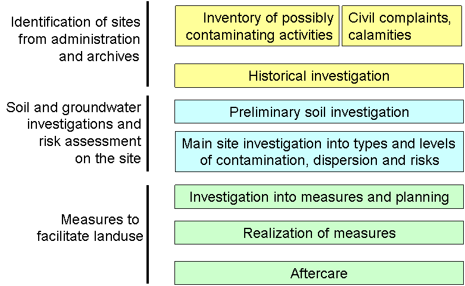

[.text-center]
*Figure 11: Tiered approach on headlines of the investigation and management of sites with possibly contaminated soil and/or groundwater. Starting on the top and going down following procedures for investigations and management.*

Figure 11 gives an overview of the generalized procedure. Each investigation may lead to the conclusion that the site is not contaminated and no further investigation is needed or to the conclusion that a further investigation is needed. Generally the decision that a site is contaminated falls after the final verdict on the contamination levels and the size of the contaminated area in the main site investigation.
In a national set procedure an indicated investigation may involve several steps. The main dividing lines proposed here for investigation stages are (1) the historical investigation into knowledge from administration and archives (into types of activities and processes, periods, known calamities, spills, former complaints, type and volume of chemicals used), or for calamities an administrative investigation into the amounts of chemicals involved (2) the preliminary soil investigation to confirm that contamination is present in substantial levels and a more expensive main site investigation is advised or necessary and finally (3) the main site investigation. The characteristic of the main site investigation is that it gives the necessary information on the site contamination on which the appointed authority including other considerations can give the verdict that the site is contaminated or not, and consequently prioritize and plan site management. The type of measures to be taken are elaborated in (4) the 'investigation into measures and planning'.

*Restrictions of the model*

The approach of the model is to include local contamination of soil and groundwater (excluding soils permanently under water); to concentrate mainly on local contamination and not diffuse contamination. Another restriction is to concentrate mainly on soil and groundwater pollution on a site and not on the complete soil water system in which parts of the site may consist of surface waters and underwater soil or may consist of controlled dump sites or other special areas (e.g. of archeological value). Border areas are indicated but not elaborated here.
Regarding the complexity the envisioned organizational setup to facilitate the tackling of soil contamination here is (1) a national law defining investigation procedures and general threshold values, (2) regional additional rules in relation to planning and background values and (3) local implementation of risk and dispersion assessments in relation to land development and soil quality ambitions. The organization of responsibilities between national, local and regional authorities in a member state is not decisive for the use of the data model. Instead it can be adopted by the data model.
Each site in Figure 11 may be considered 'possibly contaminated' (or 'potentially contaminated') as long as it is not concluded that the site is not contaminated and no further investigation is needed. It is finally considered 'contaminated' after confirmation in a main site investigation or after a verdict by the appointed local authority based on the results of the main site investigation. Figuratively speaking the 'possibly contaminated sites' lay directly behind the gate through which "sites to be investigated" enter. It is up to the regulations and planning of the member states which sites will enter.
The 'possibly contaminated sites' may also contain the results of an inventory of possibly contaminating activities. The decision on the feasibility and depth of such an inventory is actually left to the member states or its local or regional authorities. It should be considered that it can be performed on various levels considering e.g. ambitions, economic situation and budget available, political pressure and the pressure of land development and building activities. An effort to make a complete inventory of possibly contaminating sites may give insight into the extent of the problem, but when done too thoroughly may also lead to the checking of large numbers of sites finally resulting in small percentages of sites considered to be seriously contaminated. Focusing first on known sites with soil pollution problems and sites with high suspicion may be more feasible and help to get the information on the site on the time when needed and not as possibly expired data. This means generally that a long term continuous effort will be needed, but beside the costs also this effort will yield benefits in terms of welfare and economic progress like a more healthy living environment, improved food and drinking water safety, useable groundwater to be extracted for industrial uses with the aim of human consumption, sustainable resources management and canceling out economic stagnation caused by land unfit for intended use because of soil pollution (especially in urban areas).
It is proposed not to focus on 'possibly contaminated sites' but consider contaminated sites (after the main site investigation) as the main component of a data collection, including all sites in subsequent management phases including aftercare. It is advised to generally keep sites once found to be contaminated in the system, especially when the problem is partially solved, with consequences like aftercare and use restrictions. The preservation of information may also prevent repetition of investigations.

*Short description of the model*

The main entities in the model are a 'possibly contaminated site' and a 'contaminated site' (see *Figure 12*). A possibly contaminated site may have several reasons to be introduced among which are the confirmed presence of hazardous waste, former or existing activities on the site with an experienced high possibility of soil or groundwater contamination. In the case of ongoing activities prevention of further contamination is a first point of action, but here only covered as a border subject not facilitated fully in this data model. Code lists for possibly contaminating activities, waste types and chemical parameters are included but can be complemented and are not setting any obligations for investigation or site management from the side of the EU. They may facilitate in keeping the overview of causes and facilitate local planning of the efforts. In the cooperation between member states these data may help to analyze for which type of sites experience is built up in a member state or which types of sites are lacking. The stage of investigation gives insight in the level of conformation of assumptions in the tiered investigations.
The site identification and geometry is a property inherited from the soil site in the 'Soil' model (in the main text) and from the Inspire 'Geology' data model for groundwater.
A confirmed contaminated site is more legally embedded (than a 'possibly contaminated site'). Its status is connected to the applicable law and appointed national, regional or local authority or authorities. The pollutant level and extent (affected surface size and depth) is set in the main site investigation and other parameters may be involved in further assessment. Several risk assessment stages are possible, involving risk types and possible risk receptors related to the land use. Land use is connected in this data model to the Inspire data model 'Land use'. The current level of protection obtained on the site is recorded in 'measures taken' and 'stage of measures'. The measures may involve land use restrictions as elaborated in the Inspire data model 'Area management / restriction / regulation zones and reporting units'.
The reasons to investigate and manage a site are the hazards and risks as specified within the member state, considering international rules and knowledge when applicable. The trigger to start investigations may follow procedures specified within the member state and does not follow directly from EU regulations (except for the control of major-accident hazards as defined in the Seveso II Directive and its extensions).
In this example: the trigger to investigate the justification and application may be up to the member states. It may be informative for policy makers to know which triggers are dominant and as it is compliant to the rules of the member states generally there is no reason to keep it back. The information is included in the model as an option with a generalized and extendable code list.

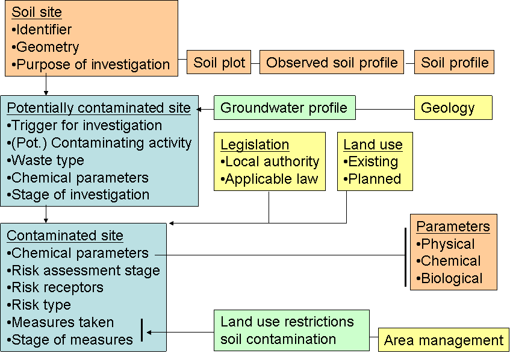

[.text-center]
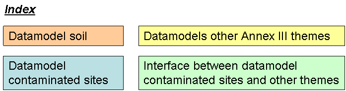

[.text-center]
*Figure 12: Quick reference view of the model*

*Recommendations:*

A further check of interoperability and flexibility of the proposed data model by mapping of the data systems of member states and of the EEA data collection system is recommended.

The data may carry civil, criminal and financial liabilities. In agreeing with public availability of data in the Århus agreement the local authorities / member states should balance the protection of citizens to risk versus the liabilities in this subject. Both sides may have connected economic and political value. If public availability has valid juridical barriers it should be possible to keep data delivery back if not in conflict with the Århus agreement. In this conflict probably the juridical boundaries should be determined by jurisdiction in each member state.
Some subjects are not included in the model and it is recommended that these should get attention in further developments, being: prevention of the continuation of polluting effects of activities; diffuse pollution in soil and groundwater; the assessment of ecological / biological quality of the soil (use of parameters from ENVASSO) and ecological services of the soil; integration in management of soil and water systems; area management and combined approach of sites.
As soil pollution may have implications for a large field of economic activities the management of contaminated sites and brown fields may have wider implications in fields for which the TWG Soil has no expertise available. Figure 13 gives a wider overview of related management issues to consider several of these issues will be integrated in management related to other themes, making use of soil pollution data. It is recommended to make a further check of the connection of soil pollution with other INSPIRE themes. The current data model is restricted and mainly aiming to record the status of contaminated sites to foster public health and safe and sustainable land development.

image::./media/image37.png[image,width=625,height=421, align=center]

[.text-center]
image::./media/image38.png[image,width=368,height=143, align=center]

[.text-center]
*Figure 13: Possible tasks in management of soil pollution, with (in grey) the main management issues in which these tasks may be integrated. This is an illustration of the wider fields of risk management on soil pollution and not part of the proposed data model.*

<<<
==== Feature catalogue

===== Feature catalogue metadata

[width="100%",cols="34%,66%"]
|===
|Application Schema |INSPIRE Application Schema SoilContamination
|Version number |3.0
|===

*Types defined in the feature catalogue*

[width="100%",cols="49%,34%,17%"]
|===
|*Type* |*Package* |*Stereotypes*
|ContaminatedSoilSite |SoilContamination |«featureType»
|ContaminatingActivitiesValue |SoilContamination |«union»
|ContaminatingActivityPresenceValue |SoilContamination |«codelist»
|ContaminatingActivityType |SoilContamination |«dataType»
|GroundwaterProfile |SoilContamination |«featureType»
|InvestigatedChemicalParameterType |SoilContamination |«dataType»
|InvestigationStateValue |SoilContamination |«codelist»
|InvestigationTriggerValue |SoilContamination |«codelist»
|MeasureTakenStageValue |SoilContamination |«codelist»
|MeasureTakenStatusValue |SoilContamination |«codelist»
|MeasureTakenType |SoilContamination |«dataType»
|MeasureTakenValue |SoilContamination |«codelist»
|NaceIndustrialActivityValue |SoilContamination |«codelist»
|OtherContaminatingActivityValue |SoilContamination |«codelist»
|PossiblyContaminatedSoilSite |SoilContamination |«featureType»
|RiskAssessmentStageValue |SoilContamination |«codelist»
|RiskReceptorValue |SoilContamination |«codelist»
|RiskTypeValue |SoilContamination |«codelist»
|SoilContaminationSpecialisedZoneTypeCode |SoilContamination |«codelist»
|WasteTypeValue |SoilContamination |«codelist»
|===

===== Spatial object types

ContaminatedSoilSite

[width="100%",cols="100%"]
|===
|*ContaminatedSoilSite*
a|
[width="100%",cols="5%,16%,79%"]
!===
!  !Name: !contaminated soil site
!  !Subtype of: !PossiblyContaminatedSoilSiteManagementRestrictionOrRegulationZone
!  !Definition: !Site on which manmade substances are present in levels and amounts considered to be a hazard, in soil, groundwater and waste (on or below surface level).
!  !Description: !Site where levels of contaminants in soil or groundwater are or were above applicable threshold values, as concluded from a main site investigation and over a surface or in a volume not to be neglected (up to local regulations and authorities). Irrespective of the current status of management measures or temporary safety measures taken or to be taken after risk assessment.
!  !Stereotypes: !«featureType»
!===

a|
*Attribute: investigatedChemicalParameter*

[width="100%",cols="5%,16%,79%"]
!===
!  !Name: !investigated chemical parameter
!  !Value type: !InvestigatedChemicalParameterType
!  !Definition: !Chemical parameter for which the exceeding of threshold values for a substantial are is confirmed or rejected.
!  !Multiplicity: !0..*
!===

a|
*Attribute: riskAssessmentStage*

[width="100%",cols="5%,16%,79%"]
!===
!  !Name: !risk assessment stage
!  !Value type: !RiskAssessmentStageValue
!  !Definition: !level of progress in assessment of risk and dispersion of the pollution.
!  !Description: !The presence of hazardous material may pose a risk only when valued objects are exposed on a level considered excessive. The latter level is generally established from toxicology studies. The exposure level depends on the local situation and the land use. The exposed objects may be for instance human, valued nature or drinking water wells.
!  !Multiplicity: !1..*
!===

a|
*Attribute: measureStage*

[width="100%",cols="5%,16%,79%"]
!===
!  !Name: !measure stage
!  !Value type: !MeasureTakenStageValue
!  !Definition: !level of progress in the measures taken in response of the hazard and risk assessment.
!  !Description: !Distinguishes between, intended measures, measures in progress and applied measures.
!  !Multiplicity: !1
!===

a|
*Attribute: measureTaken*

[width="100%",cols="5%,16%,79%"]
!===
!  !Name: !measure taken
!  !Value type: !MeasureTakenType
!  !Definition: !measures taken in response of the hazard and risk assessment.
!  !Description: !Measures with respect to safety, cleaning the soil and groundwater, blocking exposure and dispersion routes, stabilization, isolation, aftercare, generally in connection with redevelopment.
!  !Multiplicity: !0..*
!===

a|
*Attribute: riskType*

[width="100%",cols="5%,16%,79%"]
!===
!  !Name: !risk type
!  !Value type: !RiskTypeValue
!  !Definition: !anticipated or experienced risk resulting from type of pollutant and exposure route.
!  !Description: !Type of exposure routes which give adverse effects on the basis of land use and level, extent and distribution of the pollutants, generally in line with applicable risk assessment models.
!  !Multiplicity: !1..*
!===

a|
*Attribute: riskReceptor*

[width="100%",cols="5%,16%,79%"]
!===
!  !Name: !risk receptor
!  !Value type: !RiskReceptorValue
!  !Definition: !Entity exposed to the pollution.
!  !Description: !Entity on which adverse effects are taking place, generally in connection with the protection of human health, quality of the environment, natural values, agricultural produce, land and materials as resources.
!  !Multiplicity: !1..*
!===

a|
*Association role:*

[width="100%",cols="5%,16%,79%"]
!===
!  !Value type: !ExistingLandUseObject
!  !Multiplicity: !0..*
!===

a|
*Association role:*

[width="100%",cols="5%,16%,79%"]
!===
!  !Value type: !ZoningElement
!  !Multiplicity: !0..*
!===

a|
*Association role:*

[width="100%",cols="5%,16%,79%"]
!===
!  !Value type: !ManagementRestrictionOrRegulationZone
!  !Multiplicity: !
!===

a|
*Association role:*

[width="100%",cols="5%,16%,79%"]
!===
!  !Value type: !ManagementRestrictionOrRegulationZone
!  !Multiplicity: !
!===

|===

GroundwaterProfile

[width="100%",cols="100%"]
|===
|*GroundwaterProfile*
a|
[width="100%",cols="5%,16%,79%"]
!===
!  !Name: !groundwater profile
!  !Definition: !body of groundwater with boundaries in 3 dimensions (surface and depth) characterized by some property (the value of a certain parameter).
!  !Description: !Used in connection to pollution: giving the extent of the groundwater body that is polluted over a threshold value of concentration of a certain pollutant. Generally it is dynamic and dependent on flow rates of the groundwater, the presence of dense soil layers, solubility and adsorption/desorption behaviour of the pollutants.
!  !Stereotypes: !«featureType»
!===

a|
*Attribute: geometry*

[width="100%",cols="5%,16%,79%"]
!===
!  !Name: !geometry
!  !Value type: !GM_Point
!  !Definition: !location of the ground water profile.
!  !Multiplicity: !1
!===

a|
*Attribute: groundwaterDepthRange*

[width="100%",cols="5%,16%,79%"]
!===
!  !Name: !groundwater depth range
!  !Value type: !RangeType
!  !Definition: !depth of the groundwater.
!  !Multiplicity: !1
!===

a|
*Attribute: investigatedChemicalParameter*

[width="100%",cols="5%,16%,79%"]
!===
!  !Name: !investigated chemical parameter
!  !Value type: !InvestigatedChemicalParameterType
!  !Definition: !Chemical parameter for which the exceeding of threshold values for a substantial are is confirmed or rejected.
!  !Multiplicity: !1..*
!===

|===

PossiblyContaminatedSoilSite

[width="100%",cols="100%"]
|===
|*PossiblyContaminatedSoilSite*
a|
[width="100%",cols="5%,16%,79%"]
!===
!  !Name: !possibly contaminated soil site
!  !Subtype of: !SoilSite
!  !Definition: !a site with a suspicion of pollution above threshold values which has not been confirmed by a main site investigation with a verdict of the local authority.
!  !Description: !It is always the candidate for further investigations, generally with a tiered approach in which it will remain possibly polluted until after the main site investigation in which hazards may be confirmed or rejected.
!  !Stereotypes: !«featureType»
!===

a|
*Attribute: localName*

[width="100%",cols="5%,16%,79%"]
!===
!  !Name: !local name
!  !Value type: !CharacterString
!  !Definition: !name given to the possible contaminated soil site.
!  !Multiplicity: !0..1
!  !Stereotypes: !«voidable»
!===

a|
*Attribute: investigationTrigger*

[width="100%",cols="5%,16%,79%"]
!===
!  !Name: !investigation trigger
!  !Value type: !InvestigationTriggerValue
!  !Definition: !the type of triggers for which the site is considered polluted and is a candidate for further investigations.
!  !Description: !A site may be entering the stage of possible polluted from soil investigations (.e.g. for building activities), from an systematic inventory of possibly polluting activities, from epidemiology, confirmed civil complaints, recent accidents or known leaking and spills. The reason for starting an investigation into soil contamination may relate to its priority for investigation and measures.
!  !Multiplicity: !1
!===

a|
*Attribute: investigationState*

[width="100%",cols="5%,16%,79%"]
!===
!  !Name: !investigation state
!  !Value type: !InvestigationStateValue
!  !Definition: !status of knowledge about soil pollution presence and levels and risk and dispersion levels.
!  !Description: !Generally a tiered investigation approach may be followed. A possibly polluted site may enter as a site to investigate and undergo preliminary and main site investigations before it sis decide on the verdict polluted or not polluted.
!  !Multiplicity: !1
!===

a|
*Attribute: contaminatingActivity*

[width="100%",cols="5%,16%,79%"]
!===
!  !Name: !contaminating activity
!  !Value type: !ContaminatingActivityType
!  !Definition: !historical or current activity on the site in which use, handling and storage of significant amounts of relevant hazardous materials occurs or has occurred and may have lead to soil and/or groundwater pollution, including events (e.g. calamity) with effect on soil and/or groundwater contamination.
!  !Description: !List of industrial and trade activities and specified calamities (eg. according directive 96/82/EC 'Seveso').
!  !Multiplicity: !1
!===

a|
*Attribute: mainInvestigatedChemicalParameter*

[width="100%",cols="5%,16%,79%"]
!===
!  !Name: !main investigated chemical parameter
!  !Value type: !InvestigatedChemicalParameterType
!  !Definition: !main chemical parameter that was observed on the possible contaminated soil site.
!  !Multiplicity: !1..*
!===

a|
*Attribute: wasteType*

[width="100%",cols="5%,16%,79%"]
!===
!  !Name: !waste type
!  !Value type: !WasteTypeValue
!  !Definition: !type of waste according to European Waste Catalogue.
!  !Description: !reference to article 1 council directive 75/442/EEC on waste
!  !Multiplicity: !0..*
!  !Stereotypes: !«voidable»
!===

a|
*Association role: uses*

[width="100%",cols="5%,16%,79%"]
!===
!  !Value type: !GroundwaterProfile
!  !Multiplicity: !0..*
!===

a|
*Association role:*

[width="100%",cols="5%,16%,79%"]
!===
!  !Value type: !ObservedSoilProfile
!  !Multiplicity: !0..*
!===

|===

===== Data types

ContaminatingActivitiesValue

[width="100%",cols="100%"]
|===
|*ContaminatingActivitiesValue*
a|
[width="100%",cols="5%,16%,79%"]
!===
!  !Name: !contaminating activities value
!  !Definition: !Historical or current activity on the site in which use, handling and storage of significant amounts of relevant hazardous materials occurs or has occurred and may have lead to soil and/or groundwater pollution, including events (e.g. calamity) with effect on soil and/or groundwater contamination.
!  !Description: !Also including now obsolete (industrial and commercial) activities which left a mark on the soil (e.g. city gas works, gas light mantle production). ContaminatingActivitiesValue is a union class (choice) that shall support two possible codelists i.e. either NaceIndustrialActivityValue or OtherContaminatingActivityValue
!  !Stereotypes: !«union»
!===

a|
*Attribute: naceIndustrialActivity*

[width="100%",cols="5%,16%,79%"]
!===
!  !Name: !nace industrial activity
!  !Value type: !NaceIndustrialActivityValue
!  !Definition: !Industrial activity according to NACE.
!  !Multiplicity: !1
!===

a|
*Attribute: otherContaminatingAvtivity*

[width="100%",cols="5%,16%,79%"]
!===
!  !Name: !other contaminating activity
!  !Value type: !OtherContaminatingActivityValue
!  !Definition: !contaminating activities apart from the Industrial activities according to NACE.
!  !Multiplicity: !1
!===

|===

ContaminatingActivityType

[width="100%",cols="100%"]
|===
|*ContaminatingActivityType*
a|
[width="100%",cols="5%,16%,79%"]
!===
!  !Name: !contamination activity type
!  !Definition: !classification of contaminating activities.
!  !Description: !Generally the character of the contaminating activities is: emissions, leaking and spills from industrial production, trade and storage, waste handling, defense, fire and transport calamities.
!  !Stereotypes: !«dataType»
!===

a|
*Attribute: contaminatingActivity*

[width="100%",cols="5%,16%,79%"]
!===
!  !Name: !contaminating activity
!  !Value type: !ContaminatingActivitiesValue
!  !Definition: !NACE  Soil directive (proposed)  additional
!  !Multiplicity: !1..*
!===

a|
*Attribute: contaminatingActivityPresence*

[width="100%",cols="5%,16%,79%"]
!===
!  !Name: !contamination activity presence
!  !Value type: !ContaminatingActivityPresenceValue
!  !Definition: !indicates the time the contaminating activity was/is present on the site.
!  !Multiplicity: !1
!===

a|
*Attribute: expectedPollutantName*

[width="100%",cols="5%,16%,79%"]
!===
!  !Name: !expected pollutant name
!  !Value type: !SoilSiteParameterNameValue
!  !Definition: !Chemical parameter expected to be above threshold values.
!  !Description: !The expectation may rise from the contaminating activity, visual observations or smells on the site, the observed type of waste etc.
!  !Multiplicity: !1..*
!===

|===

InvestigatedChemicalParameterType

[width="100%",cols="100%"]
|===
|*InvestigatedChemicalParameterType*
a|
[width="100%",cols="5%,16%,79%"]
!===
!  !Name: !investigated chemical parameter type
!  !Definition: !Chemical parameter for which the exceeding of threshold values for a substantial are is confirmed or rejected.
!  !Description: !In main site investigation.
!  !Stereotypes: !«dataType»
!===

a|
*Attribute: soilSiteChemicalParameterDescription*

[width="100%",cols="5%,16%,79%"]
!===
!  !Name: !soil site chemical parameter description
!  !Value type: !ObservableProperty
!  !Definition: !Identification of chemical parameter.
!  !Description: !Identification of substances by name and wher possible by CAS number. The latter not for mixtures (e.g. mineral oil) or sumparameters (e.g. PAHs, PCBs) or toxic equivalents (Teq for dioxins and furans, BAP for PAHs.)
!  !Multiplicity: !1
!===

a|
*Attribute: soilSiteChemicalParameterTreshhold*

[width="100%",cols="5%,16%,79%"]
!===
!  !Name: !soil site chemical parameter treshhold
!  !Value type: !SoilParameterValueType
!  !Definition: !Value of the concentration of a chemical parameter in the soil or in groundwater for which the presence is considered a hazard, generally based on mobility bioavailability and toxicity.
!  !Description: !The threshold value can differ for countries or regions because of different circumstances, priorities, risk assessment modeling.
!  !Multiplicity: !1
!===

a|
*Attribute: soilSiteChemicalParameterScreening*

[width="100%",cols="5%,16%,79%"]
!===
!  !Name: !soil site chemical parameter screening
!  !Value type: !SoilParameterValueType
!  !Definition: !Value of the concentration of a chemical parameter in the soil or in groundwater which is used in a tiered approach as a trigger to go into a next investigation step.
!  !Description: !Especially going from preliminary investigations to main ste investigations. The values can differ for countries or regions because of different circumstances, priorities, risk assessment modeling.
!  !Multiplicity: !1
!===

a|
*Attribute: soilSiteChemicalParameterBackground*

[width="100%",cols="5%,16%,79%"]
!===
!  !Name: !soil site chemical parameter background
!  !Value type: !SoilParameterValueType
!  !Definition: !Value of the concentration of a chemical parameter in the soil or in groundwater which is considered common as a natural value (e.g. metals) or from human activities as a background value considered as without consequences. Generally defines the unpolluted state.
!  !Description: !Regionally varying values because of variations in climate, soil type, etc. There may be custom made procedures to set the value valid for the site and its surroundings.
!  !Multiplicity: !1
!===

|===

MeasureTakenType

[width="100%",cols="100%"]
|===
|*MeasureTakenType*
a|
[width="100%",cols="5%,16%,79%"]
!===
!  !Name: !measure taken type
!  !Definition: !type of measures taken in response to the hazard and risk assessment.
!  !Description: !Measures to take away the risk by blocking exposure and dispersion paths, by cleaning, stabilizing or isolation, also temporay safety measures.
!  !Stereotypes: !«dataType»
!===

a|
*Attribute: measureTaken*

[width="100%",cols="5%,16%,79%"]
!===
!  !Name: !measure taken
!  !Value type: !MeasureTakenValue
!  !Definition: !Measures taken in response to the hazard and risk assessment.
!  !Multiplicity: !1
!===

a|
*Attribute: measureTakenStatus*

[width="100%",cols="5%,16%,79%"]
!===
!  !Name: !measure taken status
!  !Value type: !MeasureTakenStatusValue
!  !Definition: !status of measures.
!  !Description: !to be taken, in progress, applied.
!  !Multiplicity: !1
!===

|===

===== Code lists

ContaminatingActivityPresenceValue

[width="100%",cols="100%"]
|===
|*ContaminatingActivityPresenceValue*
a|
[width="100%",cols="5%,16%,79%"]
!===
!  !Name: !contaminating activity presence value
!  !Definition: !status of contaminating actvity.
!  !Description: !Historical, recent, ongoing, or not a regular actvity but a calamity.
!  !Extensibility: !open
!  !Identifier: !http://inspire.ec.europa.eu/codelist/ContaminatingActivityPresenceValue
!  !Values: !The allowed values for this code list comprise the values specified in Annex C and additional values at any level defined by data providers. Annex _C_ includes recommended values that may be used by data providers.
!===

|===

InvestigationStateValue

[width="100%",cols="100%"]
|===
|*InvestigationStateValue*
a|
[width="100%",cols="5%,16%,79%"]
!===
!  !Name: !investigation state value
!  !Definition: !status of investigations.
!  !Description: !Based on a tiered approach, starting with: not investigated yet, first step of the investigation in progress, ending with: investigated and verdict on the state of pollution given (by local authority).
!  !Extensibility: !open
!  !Identifier: !http://inspire.ec.europa.eu/codelist/InvestigationStateValue
!  !Values: !The allowed values for this code list comprise the values specified in Annex _C_ and additional values at any level defined by data providers. Annex _C_ includes recommended values that may be used by data providers.
!===

|===

InvestigationTriggerValue

[width="100%",cols="100%"]
|===
|*InvestigationTriggerValue*
a|
[width="100%",cols="5%,16%,79%"]
!===
!  !Name: !investigation trigger value
!  !Definition: !trigger to have a site investigated or to investigate it in the future.
!  !Description: !On the basis of recognised problems (confirmed compliants, encountered high concentrations of hazardous materials, etc.) or expected problems (inventory of potentially polluted sites).
!  !Extensibility: !open
!  !Identifier: !http://inspire.ec.europa.eu/codelist/InvestigationReasonValue
!  !Values: !The allowed values for this code list comprise the values specified in Annex C and additional values at any level defined by data providers. Annex _C_ includes recommended values that may be used by data providers.
!===

|===

MeasureTakenStageValue

[width="100%",cols="100%"]
|===
|*MeasureTakenStageValue*
a|
[width="100%",cols="5%,16%,79%"]
!===
!  !Name: !measure taken status value
!  !Definition: !stage in which measures are taken.
!  !Description: !During investigation (safety measures), definitive measures, aftercare.
!  !Extensibility: !open
!  !Identifier: !http://inspire.ec.europa.eu/codelist/MeasureTakenStageValue
!  !Values: !The allowed values for this code list comprise the values specified in Annex C and additional values at any level defined by data providers. Annex _C_ includes recommended values that may be used by data providers.
!===

|===

MeasureTakenStatusValue

[width="100%",cols="100%"]
|===
|*MeasureTakenStatusValue*
a|
[width="100%",cols="5%,16%,79%"]
!===
!  !Name: !measure taken status value
!  !Definition: !status of measures at the site.
!  !Description: !proposed, in progress, executed
!  !Extensibility: !open
!  !Identifier: !http://inspire.ec.europa.eu/codelist/MeasureTakenStatusValue
!  !Values: !The allowed values for this code list comprise the values specified in Annex C and additional values at any level defined by data providers. Annex _C_ includes recommended values that may be used by data providers.
!===

|===

MeasureTakenValue

[width="100%",cols="100%"]
|===
|*MeasureTakenValue*
a|
[width="100%",cols="5%,16%,79%"]
!===
!  !Name: !measure taken value
!  !Definition: !type of measure taken to manage pollution.
!  !Description: !e.g. cleaning, isolation, change land use
!  !Extensibility: !open
!  !Identifier: !http://inspire.ec.europa.eu/codelist/MeasureTakenValue
!  !Values: !The allowed values for this code list comprise the values specified in Annex C and additional values at any level defined by data providers. Annex _C_ includes recommended values that may be used by data providers.
!===

|===

NaceIndustrialActivityValue

[width="100%",cols="100%"]
|===
|*NaceIndustrialActivityValue*
a|
[width="100%",cols="5%,16%,79%"]
!===
!  !Name: !NACE industrial activity value
!  !Definition: !Industrial activity according to NACE.
!  !Extensibility: !open
!  !Identifier: !http://inspire.ec.europa.eu/codelist/NaceIndustrialActivityValue
!  !Values: !The allowed values for this code list comprise the values specified in Annex C and additional values at any level defined by data providers. Annex _C_ includes recommended values that may be used by data providers.
!===

|===

OtherContaminatingActivityValue

[width="100%",cols="100%"]
|===
|*OtherContaminatingActivityValue*
a|
[width="100%",cols="5%,16%,79%"]
!===
!  !Name: !other contaminating activity value
!  !Definition: !for polluted sites: activity which polluted the soil and groundwater on the site. For inventories of potentially polluted sites: the activities present on the site which have a potential for polluting soil and groundwater, dependent on processes, size an management. This list is an extension of the NACE codelist of industrial activities and made to cover other types of possibly polluting activities.
!  !Description: !This value may help to focus investigations on the chemical parameters of importance (probability and amounts present).
!  !Extensibility: !open
!  !Identifier: !http://inspire.ec.europa.eu/codelist/OtherContaminatingActivityValue
!  !Values: !The allowed values for this code list comprise the values specified in Annex C and additional values at any level defined by data providers. Annex _C_ includes recommended values that may be used by data providers.
!===

|===

RiskAssessmentStageValue

[width="100%",cols="100%"]
|===
|*RiskAssessmentStageValue*
a|
[width="100%",cols="5%,16%,79%"]
!===
!  !Name: !risk assessment stage value
!  !Definition: !status risk assessment.
!  !Description: !Recognition of risk receptors and exposure routes, up to full assessment of levels of risk and dispersion.
!  !Extensibility: !open
!  !Identifier: !http://inspire.ec.europa.eu/codelist/RiskAssessmentStageValue
!  !Values: !The allowed values for this code list comprise the values specified in Annex C and additional values at any level defined by data providers. Annex _C_ includes recommended values that may be used by data providers.
!===

|===

RiskReceptorValue

[width="100%",cols="100%"]
|===
|*RiskReceptorValue*
a|
[width="100%",cols="5%,16%,79%"]
!===
!  !Name: !risk receptor value
!  !Definition: !entities exposed to pollutants at the site.
!  !Description: !e.g. inhabitants, groundwater well, nature reserve
!  !Extensibility: !open
!  !Identifier: !http://inspire.ec.europa.eu/codelist/RiskReceptorValue
!  !Values: !The allowed values for this code list comprise the values specified in Annex C and additional values at any level defined by data providers. Annex _C_ includes recommended values that may be used by data providers.
!===

|===

RiskTypeValue

[width="100%",cols="100%"]
|===
|*RiskTypeValue*
a|
[width="100%",cols="5%,16%,79%"]
!===
!  !Name: !risk type value
!  !Definition: !type of exposure route for risk receptors.
!  !Description: !in relation to type of pollutants
!  !Extensibility: !open
!  !Identifier: !http://inspire.ec.europa.eu/codelist/RiskTypeValue
!  !Values: !The allowed values for this code list comprise the values specified in Annex C and additional values at any level defined by data providers. Annex _C_ includes recommended values that may be used by data providers.
!===

|===

SoilContaminationSpecialisedZoneTypeCode

[width="100%",cols="100%"]
|===
|*SoilContaminationSpecialisedZoneTypeCode*
a|
[width="100%",cols="5%,16%,79%"]
!===
!  !Name: !soil contamination specialised zone type code
!  !Definition: !Indicates restrictions on the site as a consequence of the current situation.
!  !Description: !Imposed restrictions in land use
!  !Extensibility: !open
!  !Identifier: !
!  !Values: !The allowed values for this code list comprise the values specified in Annex C and additional values at any level defined by data providers. Annex _C_ includes recommended values that may be used by data providers.
!===

|===

WasteTypeValue

[width="100%",cols="100%"]
|===
|*WasteTypeValue*
a|
[width="100%",cols="5%,16%,79%"]
!===
!  !Name: !waste type value
!  !Definition: !Waste types encountered at the site.
!  !Description: !non-exhaustive list of waste materials, to help to recognise the expected problems at uncontrolled waste landfills and dumpsites.
!  !Extensibility: !open
!  !Identifier: !http://inspire.ec.europa.eu/codelist/WasteTypeValue
!  !Values: !The allowed values for this code list comprise the values specified in Annex C and additional values at any level defined by data providers. Annex _C_ includes recommended values that may be used by data providers.
!===

|===

===== Imported types (informative)

This section lists definitions for feature types, data types and enumerations and code lists that are defined in other application schemas. The section is purely informative and should help the reader understand the feature catalogue presented in the previous sections. For the normative documentation of these types, see the given references.

CharacterString

[width="100%",cols="100%"]
|===
|*CharacterString*
a|
[width="100%",cols="5%,16%,79%"]
!===
!  !Package: !Text
!  !Reference: !Geographic information -- Conceptual schema language [ISO/TS 19103:2005]
!===

|===

ExistingLandUseObject

[width="100%",cols="100%"]
|===
|*ExistingLandUseObject*
a|
[width="100%",cols="5%,16%,79%"]
!===
!  !Package: !Existing Land Use
!  !Reference: !INSPIRE Data specification on Land Use [DS-D2.8.III.4]
!  !Definition: !An existing land use object describes the land use of an area having a homogeneous combination of land use types.
!===

|===

GM_Point

[width="100%",cols="100%"]
|===
|*GM_Point*
a|
[width="100%",cols="5%,16%,79%"]
!===
!  !Package: !Geometric primitive
!  !Reference: !Geographic information -- Spatial schema [ISO 19107:2003]
!===

|===

ManagementRestrictionOrRegulationZone

[width="100%",cols="100%"]
|===
|*ManagementRestrictionOrRegulationZone*
a|
[width="100%",cols="5%,16%,79%"]
!===
!  !Package: !Controlled Activities
!  !Reference: !INSPIRE Data specification on Area Management Restriction Regulation Zones and Reporting units [DS-D2.8.III.11]
!  !Definition: !Area managed, restricted or regulated in accordance with a legal requirement related to an environmental policy or a policy or activity that may have an impact on the environment at any level of administration (or used for reporting at international, European, national, regional and local) levels.
!===

|===

ObservableProperty

[width="100%",cols="100%"]
|===
|*ObservableProperty*
a|
[width="100%",cols="5%,16%,79%"]
!===
!  !Package: !Observable Properties
!  !Reference: !Guidelines for the use of Observations & Measurements and Sensor Web Enablement-related standards in INSPIRE [DS-D2.9]
!  !Definition: !Represents a single observable property e.g. 'temperature'.
!  !Description: !The Observable Property represents a single observable property e.g. 'temperature'. It may have associations to additional constraints or measures that make it more complex e.g. 'daily mean temperature'.
!===

|===

ObservedSoilProfile

[width="100%",cols="100%"]
|===
|*ObservedSoilProfile*
a|
[width="100%",cols="5%,16%,79%"]
!===
!  !Package: !Soil
!  !Reference: !INSPIRE Data specification on Soil [DS-D2.8.III.3]
!  !Definition: !a representation of a soil profile found on a specific location which is described on the basis of observations in a trial pit or with a borehole.
!  !Description: !The observed soil profile corresponds to a set of data taken directly from a georeferenced soil profile, described in the field, and often sampled and analyzed in the laboratory.
!===

|===

RangeType

[width="100%",cols="100%"]
|===
|*RangeType*
a|
[width="100%",cols="5%,16%,79%"]
!===
!  !Package: !Soil
!  !Reference: !INSPIRE Data specification on Soil [DS-D2.8.III.3]
!  !Definition: !A range value defined by an upper limit and a lower limit.
!===

|===

SoilParameterValueType

[width="100%",cols="100%"]
|===
|*SoilParameterValueType*
a|
[width="100%",cols="5%,16%,79%"]
!===
!  !Package: !NOT FOUND SoilParameterValueType
!===

|===

SoilSite

[width="100%",cols="100%"]
|===
|*SoilSite*
a|
[width="100%",cols="5%,16%,79%"]
!===
!  !Package: !Soil
!  !Reference: !INSPIRE Data specification on Soil [DS-D2.8.III.3]
!  !Definition: !area within a larger survey, study or monitored area, where a specific soil investigation is carried out.
!  !Description: !Site provides the object to describe: 
a.) the surroundings of the plot 
 
and/or 
 
b.) the larger piece of land that is directly linked to and described by all soil investigations on its one or more spots (SoilPlots). It thus provides the object to which soil data of different kind (or the same kind, but at different points in time, e.g. in soil monitoring) obtained on different plots is related as if it would have been collected at the very same place. This allows for: 
 
1. combination of data that cannot be obtained on the very same place 
EXAMPLE: a soil pit and investigations on earthworm abundance cannot be done in the same place, but possibly some metres apart from each other. Nonetheless shall the results of both investigations be combined to inform about the soil state. 
or 
2. comparison of soil condition after some time has elapsed. 
EXAMPLE: Organic carbon stock has been investigated using data from two monitoring periods that had to be conducted on spatially slightly separated places because the sampling is destructive. Nonetheless are the results of both periods regarded as giving an idea how organic carbon stock has changed over the years at the same place. 
 
The site is also the object to state the date and time information on validity, etc. 
 
The soil site might have delineation, but can be located with a centre or reference point location only. Delineated soil sites - possibly in the form of cadastral parcels - are especially used in the inventory of contaminated areas. 
 
NOTE Any plot can be linked to one specific site only, but several plots to one site. 
 
SOURCE GS Soil, modified
!===

|===

SoilSiteParameterNameValue

[width="100%",cols="100%"]
|===
|*SoilSiteParameterNameValue*
a|
[width="100%",cols="5%,16%,79%"]
!===
!  !Package: !Soil
!  !Reference: !INSPIRE Data specification on Soil [DS-D2.8.III.3]
!  !Definition: !List of properties that can be observed to characterize the soil site. The allowed values for this code list comprise a number of pre-defined values and narrower values defined by data providers.
!  !Description: ! Basically these parameters can be divided in several major groups like: Chemical parameters, Physical parameters, Biological parameters.
!===

|===

ZoningElement

[width="100%",cols="100%"]
|===
|*ZoningElement*
a|
[width="100%",cols="5%,16%,79%"]
!===
!  !Package: !Planned Land Use
!  !Reference: !INSPIRE Data specification on Land Use [DS-D2.8.III.4]
!  !Definition: !A spatial object which is homogeneous regarding the permitted uses of land based on zoning which separate one set of land uses from another.
!  !Description: !Zoning elements refer to the regulation of the kinds of activities which will be acceptable on particular lots (such as open space, residential, agricultural, commercial or industrial). The intensity of use at which those activities can be performed (from low-density housing such as single family homes to high-density such as high-rise apartment buildings), the height of buildings, the amount of space that structures may occupy, the proportions of the types of space on a lot, such as how much landscaped space, impervious surface, traffic lanes, and parking may be provided.
!===

|===

<<<
==== SoilContamination - Code Lists

*INSPIRE Application Schema 'SoilContamination'*

[width="100%",cols="100%"]
|===
|*Code List*
|_ContaminatingActivityPresenceValue_
|_InvestigationStateValue_
|_InvestigationTriggerValue_
|_MeasureTakenStageValue_
|_MeasureTakenStatusValue_
|_MeasureTakenValue_
|_OtherContaminatingActivityValue_
|_RiskAssessmentStageValue_
|_RiskReceptorValue_
|_RiskTypeValue_
|_SoilContaminationSpecialisedZoneTypeCode_
|_WasteTypeValue_
|===

*ContaminatingActivityPresenceValue*

[width="100%",cols="100%"]
|===
a|
[width="100%",cols="17%,83%"]
!===
!Name: !contaminating activity presence value
!Definition: !status of contaminating actvity.
!Description: !Historical, recent, ongoing, or not a regular actvity but a calamity.
!Extensibility: !open
!Identifier: !http://inspire.ec.europa.eu/codelist/ContaminatingActivityPresenceValue
!Values: !
!===

|===

The table below includes recommended values that may be used by data providers. Before creating new terms, please check if one of them can be used.

[width="100%",cols="100%"]
|===
a|
*historical*

[width="100%",cols="5%,16%,79%"]
!===
!  !Name: !historical
!  !Definition: !contaminating activity ended before an agreed year or took mainly place before this year
!===

a|
*recent*

[width="100%",cols="5%,16%,79%"]
!===
!  !Name: !recent
!  !Definition: !contaminating activity ended after an agreed year or took mainly place after this year
!===

a|
*ongoing*

[width="100%",cols="5%,16%,79%"]
!===
!  !Name: !ongoing
!  !Definition: !contaminating activity continues up to the present date or the date of the start of site investigation or management
!===

a|
*recentCalamity*

[width="100%",cols="5%,16%,79%"]
!===
!  !Name: !recent calamity
!  !Definition: !not historical
!===

|===

*InvestigationStateValue*

[width="100%",cols="100%"]
|===
a|
[width="100%",cols="17%,83%"]
!===
!Name: !investigation state value
!Definition: !status of investigations.
!Description: !Based on a tiered approach, starting with: not investigated yet, first step of the investigation in progress, ending with: investigated and verdict on the state of pollution given (by local authority).
!Extensibility: !open
!Identifier: !http://inspire.ec.europa.eu/codelist/InvestigationStateValue
!Values: !
!===

|===

The table below includes recommended values that may be used by data providers. Before creating new terms, please check if one of them can be used.

[width="100%",cols="100%"]
|===
a|
*notSurveyed*

[width="100%",cols="5%,16%,79%"]
!===
!  !Name: !not surveyed
!  !Definition: !site introduced in current data system but no soil investigation
!===

a|
*underPreliminaryInvestigation*

[width="100%",cols="5%,16%,79%"]
!===
!  !Name: !under preliminary investigation
!  !Definition: !preliminary investigation started, no formal decision that a main site investigation is not necessary or a main site investigation has not yet started
!  !Description: !a preliminary soil investigation ends with the decision to take up a main site investigation or not
!===

a|
*underMainInvestigation*

[width="100%",cols="5%,16%,79%"]
!===
!  !Name: !under main investigation
!  !Definition: !main site investigation started but no formal decision was taken that the site is contaminated above threshold values
!  !Description: !above threshold values hazard justifies risk and dispersion asessement and/or investigation into feasible measures
!===

a|
*foundNotContaminated*

[width="100%",cols="5%,16%,79%"]
!===
!  !Name: !found not contaminated
!  !Definition: !decision based of main site investigation in agreement of applicable juridical standards and decisions of local authorities
!  !Description: !"below threshold values for all contaminants investigated, meaning that light contamination below threshold values may be present but is considered to pose no unacceptable risks"
!===

a|
*foundContaminated*

[width="100%",cols="5%,16%,79%"]
!===
!  !Name: !found contaminated
!  !Definition: !decision based of main site investigation in agreement of applicable juridical standards and decisions of local authorities
!  !Description: !"above threshold values for one or more contaminants investigated, meaning that risk and dispersion assessment is a next step and will be programmed and may lead to measures for site management"
!===

|===

*InvestigationTriggerValue*

[width="100%",cols="100%"]
|===
a|
[width="100%",cols="17%,83%"]
!===
!Name: !investigation trigger value
!Definition: !trigger to have a site investigated or to investigate it in the future.
!Description: !On the basis of recognised problems (confirmed compliants, encountered high concentrations of hazardous materials, etc.) or expected problems (inventory of potentially polluted sites).
!Extensibility: !open
!Identifier: !http://inspire.ec.europa.eu/codelist/InvestigationReasonValue
!Values: !
!===

|===

The table below includes recommended values that may be used by data providers. Before creating new terms, please check if one of them can be used.

[width="100%",cols="100%"]
|===
a|
*siteIntroducedAfterInventory*

[width="100%",cols="5%,16%,79%"]
!===
!  !Name: !Site Introduced AfterInventory
!  !Definition: !introduced in current data system, based on lists made up on basis of experience with resulting soil pollution
!  !Description: !"inventory: making a list of sites with one or more activities with high soil polluting potential, assessing experinces with processes, waste and emission control; probably introduced only after check on periods and volumes of chemicals used, but before soil site investigation"
!===

a|
*siteIntroducedAfterCivilComplaints*

[width="100%",cols="5%,16%,79%"]
!===
!  !Name: !Site Introduced After Confirmed Civil Complaints
!  !Definition: !introduced in current data system, based on civil complaints that are considered justified to take action
!===

a|
*siteIntroducedAfterEpidemiology*

[width="100%",cols="5%,16%,79%"]
!===
!  !Name: !Site Introduced After Epidemiology
!  !Definition: !introduced in the current data system based on suspicion of health effects,
!  !Description: !e.g. based on epidemiology of carcinogenic effects
!===

a|
*siteIntroducedAfterSoilInvestigation*

[width="100%",cols="5%,16%,79%"]
!===
!  !Name: !Site Introduced After Soil Investigation
!  !Definition: !introduced in current data system on the basis of soil investigations
!  !Description: !"e.g. based on suspicions and/or experience before formal inventory of sites or based on investigations for some other reason (e.g. land development, civil works, building, archeology, agricultural fertility)"
!===

a|
*siteIntroducedAfterCalamity*

[width="100%",cols="5%,16%,79%"]
!===
!  !Name: !Site Introduced After Calamity
!  !Definition: !intrioduced in the current data sytem based on soil and groundwater polluting consequences of a calamity or resulting from actions taken or expected dispersion in the resulting situation
!  !Description: !"e.g. transport accidents, leaking, spills, fire"
!===

a|
*notSurveyed*

[width="100%",cols="5%,16%,79%"]
!===
!  !Name: !not surveyed
!  !Definition: !site introduced in current data system but no soil investigation
!===

a|
*underPreliminaryInvestigation*

[width="100%",cols="5%,16%,79%"]
!===
!  !Name: !under preliminary investigation
!  !Definition: !preliminary investigation started, no formal decision that a main site investigation is not necessary or a main site investigation has not yet started
!===

a|
*underMainInvestigation*

[width="100%",cols="5%,16%,79%"]
!===
!  !Name: !under main investigation
!  !Definition: !main site investigation started but no formal decision was taken that the site is contaminated above threshold values
!===

a|
*foundNotContaminated*

[width="100%",cols="5%,16%,79%"]
!===
!  !Name: !found not contaminated
!  !Definition: !decision based of main site investigation in agreement of applicable juridical standards and decisions of local authorities
!===

a|
*foundContaminated*

[width="100%",cols="5%,16%,79%"]
!===
!  !Name: !found contaminated
!  !Definition: !decision based of main site investigation in agreement of applicable juridical standards and decisions of local authorities
!===

|===

*MeasureTakenStageValue*

[width="100%",cols="100%"]
|===
a|
[width="100%",cols="17%,83%"]
!===
!Name: !measure taken status value
!Definition: !stage in which measures are taken.
!Description: !During investigation (safety measures), definitive measures, aftercare.
!Extensibility: !open
!Identifier: !http://inspire.ec.europa.eu/codelist/MeasureTakenStageValue
!Values: !
!===

|===

The table below includes recommended values that may be used by data providers. Before creating new terms, please check if one of them can be used.

[width="100%",cols="100%"]
|===
a|
*investigation*

[width="100%",cols="5%,16%,79%"]
!===
!  !Name: !investigation
!  !Definition: !stage of investigation into feasible (definitive) measures (after formal decision in main site investigation that the site is contaminated); possibly temporary safety measures are already taken in this stage
!===

a|
*execution*

[width="100%",cols="5%,16%,79%"]
!===
!  !Name: !execution
!  !Definition: !execution of (definitive) measures
!===

a|
*noAftercare*

[width="100%",cols="5%,16%,79%"]
!===
!  !Name: !no aftercare
!  !Definition: !measures executed no aftercare needed
!===

a|
*aftercare*

[width="100%",cols="5%,16%,79%"]
!===
!  !Name: !aftercare
!  !Definition: !aftercare of physical provisions and monitoring as needed; land use and land use restrictions maintained as needed
!===

|===

*MeasureTakenStatusValue*

[width="100%",cols="100%"]
|===
a|
[width="100%",cols="17%,83%"]
!===
!Name: !measure taken status value
!Definition: !status of measures at the site.
!Description: !proposed, in progress, executed
!Extensibility: !open
!Identifier: !http://inspire.ec.europa.eu/codelist/MeasureTakenStatusValue
!Values: !
!===

|===

The table below includes recommended values that may be used by data providers. Before creating new terms, please check if one of them can be used.

[width="100%",cols="100%"]
|===
a|
*toBeTaken*

[width="100%",cols="5%,16%,79%"]
!===
!  !Name: !to be taken
!  !Definition: !measures not yet started
!===

a|
*inProgress*

[width="100%",cols="5%,16%,79%"]
!===
!  !Name: !in progress
!  !Definition: !measures started but not yet finished
!===

a|
*applied*

[width="100%",cols="5%,16%,79%"]
!===
!  !Name: !applied
!  !Definition: !measures applied
!===

|===

*MeasureTakenValue*

[width="100%",cols="100%"]
|===
a|
[width="100%",cols="17%,83%"]
!===
!Name: !measure taken value
!Definition: !type of measure taken to manage pollution.
!Description: !e.g. cleaning, isolation, change land use
!Extensibility: !open
!Identifier: !http://inspire.ec.europa.eu/codelist/MeasureTakenValue
!Values: !
!===

|===

The table below includes recommended values that may be used by data providers. Before creating new terms, please check if one of them can be used.

[width="100%",cols="100%"]
|===
a|
*temporarySafetyMeasures*

[width="100%",cols="5%,16%,79%"]
!===
!  !Name: !temporary safety measures
!  !Definition: !measures taken to defy risks when definitive measures are not completed
!===

a|
*blockingPathToRiskReceptors*

[width="100%",cols="5%,16%,79%"]
!===
!  !Name: !blocking path to risk receptors
!  !Definition: !measures in which hazardous materials are and remain present but human contact and exposure is prevented
!===

a|
*blockingDispersion*

[width="100%",cols="5%,16%,79%"]
!===
!  !Name: !blocking dispersion
!  !Definition: !measures in which hazardous materials are and remain present but dispersion with groundwater, runoff water, storm water, sewers, surface water, wind, excavation and transport is prevented
!===

a|
*cleaningOfMainPollutionSources*

[width="100%",cols="5%,16%,79%"]
!===
!  !Name: !cleaning of main pollution sources
!  !Definition: !removing soil and waste bodies with high concentrations and mobility
!===

a|
*siteCleaningUpToLevelFitForCurrentLandUse*

[width="100%",cols="5%,16%,79%"]
!===
!  !Name: !site cleaning up to level fit for current land use
!  !Definition: !measures to relieve risks in the actual existing situation; the presence and volume of exposure routes are highly dependent on the land use (as well as on more situational parameters as soil types, climate, elevation, slopes, water management, land cover, number of inhabitants, etc.)
!===

a|
*siteCleaningUpToLevelFitForPlannedLandUse*

[width="100%",cols="5%,16%,79%"]
!===
!  !Name: !site cleaning up to level fit for planned land use
!  !Definition: !measures with to intention to make the land fit for a new planned land use (as part of land development); often stumilating soil pollution management
!===

a|
*groundwaterCleaning*

[width="100%",cols="5%,16%,79%"]
!===
!  !Name: !groundwater cleaning
!  !Definition: !pump and treat or in situ treatment e.g. by stimulation of microbial actions
!===

a|
*surfaceWaterAndSedimentCleaning*

[width="100%",cols="5%,16%,79%"]
!===
!  !Name: !surface water and sediment cleaning
!  !Definition: !cleaning of water area on the site, generally also polluted by run off water and polluted groundwater seepage into surface waters
!===

a|
*aftercareMonitoringAndProcedureForActionsIfNeeded*

[width="100%",cols="5%,16%,79%"]
!===
!  !Name: !aftercare monitoring and procedure for actions if needed
!  !Definition: !monitoring of dispersion by groundwater, of time lagged health effects, as check on unexpected mobility of stabilized and/or isolated remaining pollutants
!===

a|
*aftercareMaintenanceOfProvisions*

[width="100%",cols="5%,16%,79%"]
!===
!  !Name: !aftercare maintenance of provisions
!  !Definition: !plan of action for control and maintenance
!===

|===

*OtherContaminatingActivityValue*

[width="100%",cols="100%"]
|===
a|
[width="100%",cols="17%,83%"]
!===
!Name: !other contaminating activity value
!Definition: !for polluted sites: activity which polluted the soil and groundwater on the site. For inventories of potentially polluted sites: the activities present on the site which have a potential for polluting soil and groundwater, dependent on processes, size an management. This list is an extension of the NACE codelist of industrial activities and made to cover other types of possibly polluting activities.
!Description: !This value may help to focus investigations on the chemical parameters of importance (probability and amounts present).
!Extensibility: !open
!Identifier: !http://inspire.ec.europa.eu/codelist/OtherContaminatingActivityValue
!Values: !
!===

|===

The table below includes recommended values that may be used by data providers. Before creating new terms, please check if one of them can be used.

[width="100%",cols="100%"]
|===
a|
*SitesWithMajoraccidentHazardsInvolvingDangerousSubstancesAccordingSevesodirectives*

[width="100%",cols="5%,16%,79%"]
!===
!  !Name: !Sites with major-accident hazards involving dangerous substances according to Seveso-directive
!  !Definition: !Sites with major-accident hazards involving dangerous substances as defined by directives 96/82/EC Seveso II and 2003/105/EC Seveso III amendment
!===

a|
*CityGasworks*

[width="100%",cols="5%,16%,79%"]
!===
!  !Name: !City gasworks
!  !Definition: !City gasworks
!===

a|
*AreasForHandlingAndStorageOfHazardousMaterialsOnPortsAirportsMilitarySites*

[width="100%",cols="5%,16%,79%"]
!===
!  !Name: !"Areas for handling and storage of hazardous materials on ports, airports and military sites"
!  !Definition: !Areas for handling and storage of significant amounts of hazardous materials on ports, airports and military sites
!===

a|
*PetrolAndFillingStationsLargeOilTanks*

[width="100%",cols="5%,16%,79%"]
!===
!  !Name: !"Petrol and filling stations, large oils tank sites"
!  !Definition: !Petrol and filling stations, large oils tank sites
!===

a|
*DryCleaners*

[width="100%",cols="5%,16%,79%"]
!===
!  !Name: !Dry cleaners
!  !Definition: !Dry cleaners
!===

a|
*MiningInstallations*

[width="100%",cols="5%,16%,79%"]
!===
!  !Name: !Mining installations
!  !Definition: !Coal, ores, oil, gas
!===

a|
*PesticideSites*

[width="100%",cols="5%,16%,79%"]
!===
!  !Name: !"Pesticides factories, reformulation and storage sites"
!  !Definition: !Pesticides factories, reformulation and storage sites
!===

a|
*WasteLandfills*

[width="100%",cols="5%,16%,79%"]
!===
!  !Name: !Uncontrolled hazardous waste landfills
!  !Definition: !Uncontrolled landfill or major dumpsite with suspicion or recorded hazardous substances in substantial amounts
!===

a|
*LandRaisingOrFillingInWaterways*

[width="100%",cols="5%,16%,79%"]
!===
!  !Name: !Land raising or filling in waterways with hazardous waste materials
!  !Definition: !Land raising or filling in waterways with hazardous waste materials
!===

a|
*SiteOfPumpingStationsAndOrPipelines*

[width="100%",cols="5%,16%,79%"]
!===
!  !Name: !Site of pumping stations and/or pipelines
!  !Definition: !Pipelines for transport of hazardous substances
!===

|===

*RiskAssessmentStageValue*

[width="100%",cols="100%"]
|===
a|
[width="100%",cols="17%,83%"]
!===
!Name: !risk assessment stage value
!Definition: !status risk assessment.
!Description: !Recognition of risk receptors and exposure routes, up to full assessment of levels of risk and dispersion.
!Extensibility: !open
!Identifier: !http://inspire.ec.europa.eu/codelist/RiskAssessmentStageValue
!Values: !
!===

|===

The table below includes recommended values that may be used by data providers. Before creating new terms, please check if one of them can be used.

[width="100%",cols="100%"]
|===
a|
*identificationPollutionPathsAndReceptors*

[width="100%",cols="5%,16%,79%"]
!===
!  !Name: !identification pollution paths and receptors
!  !Definition: !First step of the risk and dispersion assessment of a polluted site
!  !Description: !After the decision that a site is polluted (in the main site investigation) the risk and dispersion assessment starts with identification of exposure paths and receptors at risk.
!===

a|
*riskLevelAssessment*

[width="100%",cols="5%,16%,79%"]
!===
!  !Name: !risk level assessment
!  !Definition: !Procedure to assess the risk of the pollutant found to be present, to support the decision te take measures on a polluted site
!  !Description: !"Calculation with risk assessment models and measurements of exposure levels and volumes followed by comparison with toxicologically based acute, chronic and carcinogenic effect levels.In parallel with dispersion asessment."
!===

a|
*pollutionDispersionAssessment*

[width="100%",cols="5%,16%,79%"]
!===
!  !Name: !pollution dispersion assessment
!  !Definition: !Procedure to assess thedispersion level of the pollutant found to be present, to support the decision te take measures on a polluted site
!  !Description: !Calculation with dispersion assessment models and measurements of dispersion and resulting concentratiosn and affected volumes areas in the receiving media. Followed by comparison with quality measures in those media. In parallel with exposure asessment.
!===

|===

*RiskReceptorValue*

[width="100%",cols="100%"]
|===
a|
[width="100%",cols="17%,83%"]
!===
!Name: !risk receptor value
!Definition: !entities exposed to pollutants at the site.
!Description: !e.g. inhabitants, groundwater well, nature reserve
!Extensibility: !open
!Identifier: !http://inspire.ec.europa.eu/codelist/RiskReceptorValue
!Values: !
!===

|===

The table below includes recommended values that may be used by data providers. Before creating new terms, please check if one of them can be used.

[width="100%",cols="100%"]
|===
a|
*humanConnectionWithTheSite*

[width="100%",cols="5%,16%,79%"]
!===
!  !Name: !human connection with the site
!  !Definition: !Humans on the site that may be exposed on a level giving adverse effects
!  !Description: !"E.g. by working in a garden, eating vegetables grown on the site, drinking water from a private well on the site or from pipes in which pollutants permeate, etc."
!===

a|
*drinkingWaterWells*

[width="100%",cols="5%,16%,79%"]
!===
!  !Name: !drinking water wells
!  !Definition: !Drinking water wells on the site or affected by the pollution from the site (pollution plumes in groundwater). This also the case for industrial wells for human consumption (e.g. breweries). And for wells for irrgation in horticulture or agriculture.
!  !Description: !This may have effect on users not on the site. Generally the drinking water authority will control the drinking water quality but closing of sites will give extra costs
!===

a|
*areaWithValuedNatureOrAcheologyOrLandscape*

[width="100%",cols="5%,16%,79%"]
!===
!  !Name: !area with valued nature or acheology or landscape
!  !Definition: !Pollutants may influence the atractivity of natural surroundings and landscape and the value of archeological evidence.
!===

a|
*valuedWildlifeAndEcology*

[width="100%",cols="5%,16%,79%"]
!===
!  !Name: !valued wildlife and ecology
!  !Definition: !Biodiversity and ecosystem services like decomposition and mineralization may be adversely effected by pollution of an area.
!===

a|
*produceOfAgricultureOrAnimalHusbandryOrGardeningForUseOutsideSite*

[width="100%",cols="5%,16%,79%"]
!===
!  !Name: !produce of agriculture or animal husbandry or gardening for use outside site
!  !Definition: !Produce form a polluted area may contain pollutants and be unhealthy or less valuable and have smaller yields
!===

a|
*huntingGameOrFishForUseOutsideSite*

[width="100%",cols="5%,16%,79%"]
!===
!  !Name: !hunting game or fish for use outside site
!  !Definition: !Consumption of hunting game or fish that visited a polluted area may effect the health.
!===

|===

*RiskTypeValue*

[width="100%",cols="100%"]
|===
a|
[width="100%",cols="17%,83%"]
!===
!Name: !risk type value
!Definition: !type of exposure route for risk receptors.
!Description: !in relation to type of pollutants
!Extensibility: !open
!Identifier: !http://inspire.ec.europa.eu/codelist/RiskTypeValue
!Values: !
!===

|===

The table below includes recommended values that may be used by data providers. Before creating new terms, please check if one of them can be used.

[width="100%",cols="100%"]
|===
a|
*hazardousVaporsEnteringBuildings*

[width="100%",cols="5%,16%,79%"]
!===
!  !Name: !hazardous vapors entering buildings
!  !Definition: !hazardous vapors entering buildings
!  !Description: !volatile pollutants
!===

a|
*investigationOfPollutedSoil*

[width="100%",cols="5%,16%,79%"]
!===
!  !Name: !investigation of polluted soil
!  !Definition: !ingestion of polluted soil
!  !Description: !"involuntary ingestion resulting from soil dust, soil on hands, between nails etc., may be especially relevant for children and gardeners"
!===

a|
*inhalationOfAsbestosFibres*

[width="100%",cols="5%,16%,79%"]
!===
!  !Name: !inhalation of asbestos fibres
!  !Definition: !inhalation of asbestos fibres
!  !Description: !for soil levelled with asbestos containing materials e.g. from buidling materials
!===

a|
*odourNuissance*

[width="100%",cols="5%,16%,79%"]
!===
!  !Name: !odour nuissance
!  !Definition: !odour nuissance
!===

a|
*consumptionOfCropsFromThePollutedSoil*

[width="100%",cols="5%,16%,79%"]
!===
!  !Name: !consumption of crops from the polluted soil
!  !Definition: !consumption of crops from the polluted soil
!  !Description: !"risk depends on uptake in crops and consumed amounts of crops which may differ for each crop, an estimated consumer basket for the situation is advised"
!===

a|
*consumptionOfOtherProduceFromThePollutedSite*

[width="100%",cols="5%,16%,79%"]
!===
!  !Name: !consumption of other produce from the polluted site
!  !Definition: !consumption of other produce from the polluted site
!  !Description: !the use of an estimated consumer basket for the situation is advised
!===

a|
*useOfDrinkingWaterFromAnAreaInfluencedByThePollutedSite*

[width="100%",cols="5%,16%,79%"]
!===
!  !Name: !use of drinking water from an area influenced by the polluted site
!  !Definition: !use of drinking water from an area influenced by the polluted site
!  !Description: !Generally the drinking water authority will control the drinking water quality but closing of sites will give extra costs
!===

a|
*permeationIntoDrinkingWaterPipelines*

[width="100%",cols="5%,16%,79%"]
!===
!  !Name: !permeation into drinking water pipelines
!  !Definition: !permeation into drinking water pipelines
!  !Description: !when in doubt control of taps on the site may be advised
!===

a|
*nuisanceFromSkinContact*

[width="100%",cols="5%,16%,79%"]
!===
!  !Name: !nuisance from skin contact
!  !Definition: !nuisance from skin contact
!===

a|
*other*

[width="100%",cols="5%,16%,79%"]
!===
!  !Name: !other
!  !Definition: !other
!  !Description: !if it is an extendable list this can be skipped
!===

|===

*SoilContaminationSpecialisedZoneTypeCode*

[width="100%",cols="100%"]
|===
a|
[width="100%",cols="17%,83%"]
!===
!Name: !soil contamination specialised zone type code
!Definition: !Indicates restrictions on the site as a consequence of the current situation.
!Description: !Imposed restrictions in land use
!Extensibility: !open
!Identifier: !
!Values: !
!===

|===

The table below includes recommended values that may be used by data providers. Before creating new terms, please check if one of them can be used.

[width="100%",cols="100%"]
|===
a|
*restrictedHomeGardeningAndOrMonitoringOfProduce*

[width="100%",cols="5%,16%,79%"]
!===
!  !Name: !restricted home gardening and or monitoring of produce
!  !Definition: !protection of local consumers living of crops grown non -commercially on the site
!  !Description: !"e.g. possible restrictions: no home gardening for consumption, limited consumption, only crops with little uptake, carefull washing of vegetables, adjusted fertiliser and calcium addition regime; monitoring: including declared limiting concentrtaions and set rules for action"
!===

a|
*restrictedAgricultureAndOrMonitoringOfProduce*

[width="100%",cols="5%,16%,79%"]
!===
!  !Name: !restricted agriculture and/or monitoring of produce
!  !Definition: !general food protection rules; care for additional monitoring when land is possibly contaminated
!  !Description: !agricultural produce is for use elsewhere and follows commercial rules; possible content of chemicals with adverse effects will generally be regulated and maintained by the producing member state and according trade rules
!===

a|
*stormWaterAndSewerManagement*

[width="100%",cols="5%,16%,79%"]
!===
!  !Name: !storm water and sewer management
!  !Definition: !structural works to minimise the dispersion or the effects of dispersion of contaminants, in sewers and dewatering regulation systems
!  !Description: !"storm water, run off to surface water and transport in sewer systems may be an additional route of dispersion and need care"
!===

a|
*managementAndMonitoringOfSurfaceWatersInConnectionWithTheSite*

[width="100%",cols="5%,16%,79%"]
!===
!  !Name: !management and monitoring of surface waters in connection with the site
!  !Definition: !structural works to minimise the dispersion or the effects of dispersion of contaminants by management of surface wates in contact with the site
!  !Description: !soil is part of a soil- water system with both media generally in cliose contact; dispersion with surface water in close contact to the site or inclusion in underwater soil /surface water sediment is common
!===

a|
*restrictedOrLicensedUseOfGroundwaterWellsOnTheSite*

[width="100%",cols="5%,16%,79%"]
!===
!  !Name: !restricted or licensed use of groundwater wells on the site
!  !Definition: !dependent of pollution level water from groundwater wells may have restricted use
!  !Description: !"e.g. not as untreated drinking water, not as irrigation water"
!===

a|
*restrictedOrLicensedExcavationOrDiggingOnly*

[width="100%",cols="5%,16%,79%"]
!===
!  !Name: !restricted or licensed excavation or digging only
!  !Definition: !excavation /digging permits from local authority
!  !Description: !"to avoid contact with pollution, to avoid dispersion from stabilised bodies of polluted soil or enclosed voltile substances"
!===

a|
*restrictedOrLicensedTranportOfSoilAndOrWasteMaterialToAndFromSite*

[width="100%",cols="5%,16%,79%"]
!===
!  !Name: !restricted or licensed tranport of soil and or waste material to and from site
!  !Definition: !permits for transport of soil and waste from local authority
!  !Description: !to avoid dispersion of pollution with excavated soil to other areas
!===

a|
*restrictionsOnBuilingActivities*

[width="100%",cols="5%,16%,79%"]
!===
!  !Name: !restrictions on builing activities
!  !Definition: !according applicable rules for building permits
!  !Description: !to avoid blocking cleaning possibilities and to avoid buildings with limited use or comercial values after finishing
!===

a|
*restrictionsOnUseOfBuildingsAndFacilities*

[width="100%",cols="5%,16%,79%"]
!===
!  !Name: !restrictions on use of buildings and facilities
!  !Definition: !according view of local health authorities
!  !Description: !i.e. regarding indoor air quality
!===

a|
*coverManagement*

[width="100%",cols="5%,16%,79%"]
!===
!  !Name: !cover management
!  !Definition: !if cover is applied to avoid contact with polluted soil this should be maneged
!  !Description: !"i.e.check on tears, punctures, deep rooting trees, taking up of water, escaping gasses"
!===

a|
*restrictedOrLicensedEntranceOnly*

[width="100%",cols="5%,16%,79%"]
!===
!  !Name: !restricted or licensed entrance only
!  !Definition: !restricted or licensed entrance only
!  !Description: !"i.e. to avoid contact with pollution for innocent bypassers and playing children, to demand protection and safety measures for workers entering the area"
!===

|===

*WasteTypeValue*

[width="100%",cols="100%"]
|===
a|
[width="100%",cols="17%,83%"]
!===
!Name: !waste type value
!Definition: !Waste types encountered at the site.
!Description: !non-exhaustive list of waste materials, to help to recognise the expected problems at uncontrolled waste landfills and dumpsites.
!Extensibility: !open
!Identifier: !http://inspire.ec.europa.eu/codelist/WasteTypeValue
!Values: !
!===

|===

The table below includes recommended values that may be used by data providers. Before creating new terms, please check if one of them can be used.

[width="100%",cols="100%"]
|===
a|
*wasteMineralExcavation*

[width="100%",cols="5%,16%,79%"]
!===
!  !Name: !Waste from mineral excavation
!  !Definition: !subgroup code: 10100 - Waste from mineral excavation
!  !Description: !waste type based on the list of wastes pursuant to Article 1 (a) of Council Directive 75/442/EEC on Waste (EUROPEAN WASTE CATALOGUE)
!===

a|
*wasteMineralDressing*

[width="100%",cols="5%,16%,79%"]
!===
!  !Name: !Waste from mineral dressing
!  !Definition: !subgroup code: 10200 - Waste from mineral dressing
!  !Description: !waste type based on the list of wastes pursuant to Article 1 (a) of Council Directive 75/442/EEC on Waste (EUROPEAN WASTE CATALOGUE)
!===

a|
*wastePhysicalChemicalProcessingMetalliferousMinerals*

[width="100%",cols="5%,16%,79%"]
!===
!  !Name: !Waste from further physical and chemical processing of metalliferous minerals
!  !Definition: !subgroup code: 10300 - Waste from further physical and chemical processing of metalliferous minerals
!  !Description: !waste type based on the list of wastes pursuant to Article 1 (a) of Council Directive 75/442/EEC on Waste (EUROPEAN WASTE CATALOGUE)
!===

a|
*wastePhysicalChemicalProcessingMetalliferousMinerals*

[width="100%",cols="5%,16%,79%"]
!===
!  !Name: !Waste from further physical and chemical processing of non metalliferous minerals
!  !Definition: !subgroup code: 10400 - Waste from further physical and chemical processing of non metalliferous minerals
!  !Description: !waste type based on the list of wastes pursuant to Article 1 (a) of Council Directive 75/442/EEC on Waste (EUROPEAN WASTE CATALOGUE)
!===

a|
*drillingMudsDrillingWastes*

[width="100%",cols="5%,16%,79%"]
!===
!  !Name: !Drilling muds and other drilling wastes
!  !Definition: !subgroup code: 10500 - Drilling muds and other drilling wastes
!  !Description: !waste type based on the list of wastes pursuant to Article 1 (a) of Council Directive 75/442/EEC on Waste (EUROPEAN WASTE CATALOGUE)
!===

a|
*primaryProductionWaste*

[width="100%",cols="5%,16%,79%"]
!===
!  !Name: !Primary production waste
!  !Definition: !subgroup code: 20100 - Primary production waste
!  !Description: !waste type based on the list of wastes pursuant to Article 1 (a) of Council Directive 75/442/EEC on Waste (EUROPEAN WASTE CATALOGUE)
!===

a|
*wastesPreparationProcessingMeatFishFoodsAnimalOrigin*

[width="100%",cols="5%,16%,79%"]
!===
!  !Name: !"Wastes from the preparation and processing of meat, fish and other foods of animal origin"
!  !Definition: !subgroup code: 20200 - Wastes from the preparation and processing of meat, fish and other foods of animal origin
!  !Description: !waste type based on the list of wastes pursuant to Article 1 (a) of Council Directive 75/442/EEC on Waste (EUROPEAN WASTE CATALOGUE)
!===

a|
*wastesFruitVegetablesCerealsEdibleOilsCocoaCoffeeTobaccoPreparation*

[width="100%",cols="5%,16%,79%"]
!===
!  !Name: !"Wastes from fruit, vegetables, cereals, edible oils, cocoa, coffee and tobacco preparation, processing; conserve production; tobacco processing"
!  !Definition: !subgroup code: 20300 - Wastes from fruit, vegetables, cereals, edible oils, cocoa, coffee and tobacco preparation, processing; conserve production; tobacco processing
!  !Description: !waste type based on the list of wastes pursuant to Article 1 (a) of Council Directive 75/442/EEC on Waste (EUROPEAN WASTE CATALOGUE)
!===

a|
*wastesSugarProcessing*

[width="100%",cols="5%,16%,79%"]
!===
!  !Name: !Wastes from sugar processing
!  !Definition: !subgroup code: 20400 - Wastes from sugar processing
!  !Description: !waste type based on the list of wastes pursuant to Article 1 (a) of Council Directive 75/442/EEC on Waste (EUROPEAN WASTE CATALOGUE)
!===

a|
*wastesDairyProductsIndustry*

[width="100%",cols="5%,16%,79%"]
!===
!  !Name: !Wastes from the dairy products industry
!  !Definition: !subgroup code: 20500 - Wastes from the dairy products industry
!  !Description: !waste type based on the list of wastes pursuant to Article 1 (a) of Council Directive 75/442/EEC on Waste (EUROPEAN WASTE CATALOGUE)
!===

a|
*wastesBakingConfectionery?ndustry*

[width="100%",cols="5%,16%,79%"]
!===
!  !Name: !Wastes from the baking and confectionery industry
!  !Definition: !subgroup code: 20600 - Wastes from the baking and confectionery industry
!  !Description: !waste type based on the list of wastes pursuant to Article 1 (a) of Council Directive 75/442/EEC on Waste (EUROPEAN WASTE CATALOGUE)
!===

a|
*wastesProductionAlcoholicNonAlcoholicBeverages*

[width="100%",cols="5%,16%,79%"]
!===
!  !Name: !"Wastes from the production of alcoholic and non-alcoholic beverages (excluding coffee, tea and co- coa)"
!  !Definition: !subgroup code: 20700 - Wastes from the production of alcoholic and non-alcoholic beverages (excluding coffee, tea and co- coa)
!  !Description: !waste type based on the list of wastes pursuant to Article 1 (a) of Council Directive 75/442/EEC on Waste (EUROPEAN WASTE CATALOGUE)
!===

a|
*wastesWoodProcessingProductionPanelsFurniture*

[width="100%",cols="5%,16%,79%"]
!===
!  !Name: !Wastes from wood processing and the production of panels and furniture
!  !Definition: !subgroup code: 30100 - Wastes from wood processing and the production of panels and furniture
!  !Description: !waste type based on the list of wastes pursuant to Article 1 (a) of Council Directive 75/442/EEC on Waste (EUROPEAN WASTE CATALOGUE)
!===

a|
*woodPreservationWaste*

[width="100%",cols="5%,16%,79%"]
!===
!  !Name: !Wood preservation waste
!  !Definition: !subgroup code: 30200 - Wood preservation waste
!  !Description: !waste type based on the list of wastes pursuant to Article 1 (a) of Council Directive 75/442/EEC on Waste (EUROPEAN WASTE CATALOGUE)
!===

a|
*wastesPulpPaperCardboardProductionProcessing*

[width="100%",cols="5%,16%,79%"]
!===
!  !Name: !"Wastes from pulp, paper and cardboard production and processing"
!  !Definition: !subgroup code: 30300 - Wastes from pulp, paper and cardboard production and processing
!  !Description: !waste type based on the list of wastes pursuant to Article 1 (a) of Council Directive 75/442/EEC on Waste (EUROPEAN WASTE CATALOGUE)
!===

a|
*wastesLeatherIndustry*

[width="100%",cols="5%,16%,79%"]
!===
!  !Name: !Wastes from the leather industry
!  !Definition: !subgroup code: 40100 - Wastes from the leather industry
!  !Description: !waste type based on the list of wastes pursuant to Article 1 (a) of Council Directive 75/442/EEC on Waste (EUROPEAN WASTE CATALOGUE)
!===

a|
*wastesTextileIndustry*

[width="100%",cols="5%,16%,79%"]
!===
!  !Name: !Wastes from textile industry
!  !Definition: !subgroup code: 40200 - Wastes from textile industry
!  !Description: !waste type based on the list of wastes pursuant to Article 1 (a) of Council Directive 75/442/EEC on Waste (EUROPEAN WASTE CATALOGUE)
!===

a|
*oilySludgesSolidWastes*

[width="100%",cols="5%,16%,79%"]
!===
!  !Name: !Oily sludges and solid wastes
!  !Definition: !subgroup code: 50100 - Oily sludges and solid wastes
!  !Description: !waste type based on the list of wastes pursuant to Article 1 (a) of Council Directive 75/442/EEC on Waste (EUROPEAN WASTE CATALOGUE)
!===

a|
*nonOilySludgesSolidWastes*

[width="100%",cols="5%,16%,79%"]
!===
!  !Name: !Non oily sludges and solid wastes
!  !Definition: !subgroup code: 50200 - Non oily sludges and solid wastes
!  !Description: !waste type based on the list of wastes pursuant to Article 1 (a) of Council Directive 75/442/EEC on Waste (EUROPEAN WASTE CATALOGUE)
!===

a|
*spentCatalysts*

[width="100%",cols="5%,16%,79%"]
!===
!  !Name: !Spent catalysts
!  !Definition: !subgroup code: 50300 - Spent catalysts
!  !Description: !waste type based on the list of wastes pursuant to Article 1 (a) of Council Directive 75/442/EEC on Waste (EUROPEAN WASTE CATALOGUE)
!===

a|
*spentFilterClays*

[width="100%",cols="5%,16%,79%"]
!===
!  !Name: !Spent filter clays
!  !Definition: !subgroup code: 50400 - Spent filter clays
!  !Description: !waste type based on the list of wastes pursuant to Article 1 (a) of Council Directive 75/442/EEC on Waste (EUROPEAN WASTE CATALOGUE)
!===

a|
*oilDesulphurisationWaste*

[width="100%",cols="5%,16%,79%"]
!===
!  !Name: !Oil desulphurisation waste
!  !Definition: !subgroup code: 50500 - Oil desulphurisation waste
!  !Description: !waste type based on the list of wastes pursuant to Article 1 (a) of Council Directive 75/442/EEC on Waste (EUROPEAN WASTE CATALOGUE)
!===

a|
*wastePyrolyticTreatmentCoal*

[width="100%",cols="5%,16%,79%"]
!===
!  !Name: !Waste from the pyrolytic treatment of coal
!  !Definition: !subgroup code: 50600 - Waste from the pyrolytic treatment of coal
!  !Description: !waste type based on the list of wastes pursuant to Article 1 (a) of Council Directive 75/442/EEC on Waste (EUROPEAN WASTE CATALOGUE)
!===

a|
*wastesNaturalGasPurification*

[width="100%",cols="5%,16%,79%"]
!===
!  !Name: !Wastes from natural gas purification
!  !Definition: !subgroup code: 50700 - Wastes from natural gas purification
!  !Description: !waste type based on the list of wastes pursuant to Article 1 (a) of Council Directive 75/442/EEC on Waste (EUROPEAN WASTE CATALOGUE)
!===

a|
*wastesOilRegeneration*

[width="100%",cols="5%,16%,79%"]
!===
!  !Name: !Wastes from oil regeneration
!  !Definition: !subgroup code: 50800 - Wastes from oil regeneration
!  !Description: !waste type based on the list of wastes pursuant to Article 1 (a) of Council Directive 75/442/EEC on Waste (EUROPEAN WASTE CATALOGUE)
!===

a|
*wasteAidicSolutions*

[width="100%",cols="5%,16%,79%"]
!===
!  !Name: !Waste acidic solutions
!  !Definition: !subgroup code: 60100 - Waste acidic solutions
!  !Description: !waste type based on the list of wastes pursuant to Article 1 (a) of Council Directive 75/442/EEC on Waste (EUROPEAN WASTE CATALOGUE)
!===

a|
*wasteAlkalineSolutions*

[width="100%",cols="5%,16%,79%"]
!===
!  !Name: !Waste alkaline solutions
!  !Definition: !subgroup code: 60200 - Waste alkaline solutions
!  !Description: !waste type based on the list of wastes pursuant to Article 1 (a) of Council Directive 75/442/EEC on Waste (EUROPEAN WASTE CATALOGUE)
!===

a|
*wasteSaltsSolutions*

[width="100%",cols="5%,16%,79%"]
!===
!  !Name: !Waste salts and their solutions
!  !Definition: !subgroup code: 60300 - Waste salts and their solutions
!  !Description: !waste type based on the list of wastes pursuant to Article 1 (a) of Council Directive 75/442/EEC on Waste (EUROPEAN WASTE CATALOGUE)
!===

a|
*metalContainingWastes*

[width="100%",cols="5%,16%,79%"]
!===
!  !Name: !Metal-containing wastes
!  !Definition: !subgroup code: 60400 - Metal-containing wastes
!  !Description: !waste type based on the list of wastes pursuant to Article 1 (a) of Council Directive 75/442/EEC on Waste (EUROPEAN WASTE CATALOGUE)
!===

a|
*sludgesOnsiteEffluentTreatment*

[width="100%",cols="5%,16%,79%"]
!===
!  !Name: !Sludges from on-site effluent treatment
!  !Definition: !subgroup code: 60500 - Sludges from on-site effluent treatment
!  !Description: !waste type based on the list of wastes pursuant to Article 1 (a) of Council Directive 75/442/EEC on Waste (EUROPEAN WASTE CATALOGUE)
!===

a|
*wastesSulphurChemicalProcessesDesulphurisationProcesses*

[width="100%",cols="5%,16%,79%"]
!===
!  !Name: !Wastes from sulphur chemical processes (production and transformation) and desulphurisation proc- esses
!  !Definition: !subgroup code: 60600 - Wastes from sulphur chemical processes (production and transformation) and desulphurisation proc- esses
!  !Description: !waste type based on the list of wastes pursuant to Article 1 (a) of Council Directive 75/442/EEC on Waste (EUROPEAN WASTE CATALOGUE)
!===

a|
*wastesHalogenChemicalProcesses*

[width="100%",cols="5%,16%,79%"]
!===
!  !Name: !Wastes from halogen chemical processes
!  !Definition: !subgroup code: 60700 - Wastes from halogen chemical processes
!  !Description: !waste type based on the list of wastes pursuant to Article 1 (a) of Council Directive 75/442/EEC on Waste (EUROPEAN WASTE CATALOGUE)
!===

a|
*wastesProductionSiliconSiliconDerivatives*

[width="100%",cols="5%,16%,79%"]
!===
!  !Name: !Wastes from production of silicon and silicon derivatives
!  !Definition: !subgroup code: 60800 - Wastes from production of silicon and silicon derivatives
!  !Description: !waste type based on the list of wastes pursuant to Article 1 (a) of Council Directive 75/442/EEC on Waste (EUROPEAN WASTE CATALOGUE)
!===

a|
*wastesPhosphorusChemicalProcesses*

[width="100%",cols="5%,16%,79%"]
!===
!  !Name: !Wastes from phosphorus chemical processes
!  !Definition: !subgroup code: 60900 - Wastes from phosphorus chemical processes
!  !Description: !waste type based on the list of wastes pursuant to Article 1 (a) of Council Directive 75/442/EEC on Waste (EUROPEAN WASTE CATALOGUE)
!===

a|
*wastesNitrogenChemicalProcessesFertiliserManufacture*

[width="100%",cols="5%,16%,79%"]
!===
!  !Name: !Wastes from nitrogen chemical processes and fertiliser manufacture
!  !Definition: !subgroup code: 61000 - Wastes from nitrogen chemical processes and fertiliser manufacture
!  !Description: !waste type based on the list of wastes pursuant to Article 1 (a) of Council Directive 75/442/EEC on Waste (EUROPEAN WASTE CATALOGUE)
!===

a|
*wastesManufacturingInorganicPigmentsOpacificiers*

[width="100%",cols="5%,16%,79%"]
!===
!  !Name: !Wastes from the manufacturing of inorganic pigments and opacificiers
!  !Definition: !subgroup code: 61100 - Wastes from the manufacturing of inorganic pigments and opacificiers
!  !Description: !waste type based on the list of wastes pursuant to Article 1 (a) of Council Directive 75/442/EEC on Waste (EUROPEAN WASTE CATALOGUE)
!===

a|
*wastesProductionUseRegenerationCatalysts*

[width="100%",cols="5%,16%,79%"]
!===
!  !Name: !"Wastes from production, use and regeneration of catalysts"
!  !Definition: !subgroup code: 61200 - Wastes from production, use and regeneration of catalysts
!  !Description: !waste type based on the list of wastes pursuant to Article 1 (a) of Council Directive 75/442/EEC on Waste (EUROPEAN WASTE CATALOGUE)
!===

a|
*wastesOtherInorganicChemicalProcesses*

[width="100%",cols="5%,16%,79%"]
!===
!  !Name: !Wastes from other inorganic chemical processes
!  !Definition: !subgroup code: 61300 - Wastes from other inorganic chemical processes
!  !Description: !waste type based on the list of wastes pursuant to Article 1 (a) of Council Directive 75/442/EEC on Waste (EUROPEAN WASTE CATALOGUE)
!===

a|
*wasteManufactureFormulationSupplyMFSUOrganicChemicals*

[width="100%",cols="5%,16%,79%"]
!===
!  !Name: !"Waste from the manufacture, formulation, supply and use (MFSU) of basic organic chemicals"
!  !Definition: !subgroup code: 70100 - Waste from the manufacture, formulation, supply and use (MFSU) of basic organic chemicals
!  !Description: !waste type based on the list of wastes pursuant to Article 1 (a) of Council Directive 75/442/EEC on Waste (EUROPEAN WASTE CATALOGUE)
!===

a|
*wasteMFSUPlasticsSyntheticRubberManMadeFibres*

[width="100%",cols="5%,16%,79%"]
!===
!  !Name: !"Waste from the MFSU of plastics, synthetic rubber and man-made fibres"
!  !Definition: !subgroup code: 70200 - Waste from the MFSU of plastics, synthetic rubber and man-made fibres
!  !Description: !waste type based on the list of wastes pursuant to Article 1 (a) of Council Directive 75/442/EEC on Waste (EUROPEAN WASTE CATALOGUE)
!===

a|
*wasteMFSUOrganicDyesPigments*

[width="100%",cols="5%,16%,79%"]
!===
!  !Name: !Waste from the MFSU of organic dyes and pigments (excluding 06 11 00)
!  !Definition: !subgroup code: 70300 - Waste from the MFSU of organic dyes and pigments (excluding 06 11 00)
!  !Description: !waste type based on the list of wastes pursuant to Article 1 (a) of Council Directive 75/442/EEC on Waste (EUROPEAN WASTE CATALOGUE)
!===

a|
*wasteMFSUOrganicPesticides*

[width="100%",cols="5%,16%,79%"]
!===
!  !Name: !Waste from the MFSU of organic pesticides (except 02 01 05)
!  !Definition: !subgroup code: 70400 - Waste from the MFSU of organic pesticides (except 02 01 05)
!  !Description: !waste type based on the list of wastes pursuant to Article 1 (a) of Council Directive 75/442/EEC on Waste (EUROPEAN WASTE CATALOGUE)
!===

a|
*wasteMFSUPharmaceuticals*

[width="100%",cols="5%,16%,79%"]
!===
!  !Name: !Waste from the MFSU of pharmaceuticals
!  !Definition: !subgroup code: 70500 - Waste from the MFSU of pharmaceuticals
!  !Description: !waste type based on the list of wastes pursuant to Article 1 (a) of Council Directive 75/442/EEC on Waste (EUROPEAN WASTE CATALOGUE)
!===

a|
*wasteMFSUFatsGreaseSoapsDetergentsDisinfectantsCosmetics*

[width="100%",cols="5%,16%,79%"]
!===
!  !Name: !"Waste from the MFSU of fats, grease, soaps, detergents disinfectants and cosmetics"
!  !Definition: !subgroup code: 70600 - Waste from the MFSU of fats, grease, soaps, detergents disinfectants and cosmetics
!  !Description: !waste type based on the list of wastes pursuant to Article 1 (a) of Council Directive 75/442/EEC on Waste (EUROPEAN WASTE CATALOGUE)
!===

a|
*wasteMFSUFineChemicalsChemicalProducts*

[width="100%",cols="5%,16%,79%"]
!===
!  !Name: !Waste from the MFSU of fine chemicals and chemical products not otherwise specified
!  !Definition: !subgroup code: 70700 - Waste from the MFSU of fine chemicals and chemical products not otherwise specified
!  !Description: !waste type based on the list of wastes pursuant to Article 1 (a) of Council Directive 75/442/EEC on Waste (EUROPEAN WASTE CATALOGUE)
!===

a|
*wastesMFSUPaintVarnish*

[width="100%",cols="5%,16%,79%"]
!===
!  !Name: !Wastes from MFSU of paint and varnish
!  !Definition: !subgroup code: 80100 - Wastes from MFSU of paint and varnish
!  !Description: !waste type based on the list of wastes pursuant to Article 1 (a) of Council Directive 75/442/EEC on Waste (EUROPEAN WASTE CATALOGUE)
!===

a|
*wastesMFSUCoating*

[width="100%",cols="5%,16%,79%"]
!===
!  !Name: !Wastes from MFSU of other coating (including ceramic materials)
!  !Definition: !subgroup code: 80200 - Wastes from MFSU of other coating (including ceramic materials)
!  !Description: !waste type based on the list of wastes pursuant to Article 1 (a) of Council Directive 75/442/EEC on Waste (EUROPEAN WASTE CATALOGUE)
!===

a|
*wastesMFSUPrintingInks*

[width="100%",cols="5%,16%,79%"]
!===
!  !Name: !Waste from MFSU of printing inks
!  !Definition: !subgroup code: 80300 - Waste from MFSU of printing inks
!  !Description: !waste type based on the list of wastes pursuant to Article 1 (a) of Council Directive 75/442/EEC on Waste (EUROPEAN WASTE CATALOGUE)
!===

a|
*wastesMFSUAdhesivesSealants*

[width="100%",cols="5%,16%,79%"]
!===
!  !Name: !Wastes from MFSU of adhesives and sealants (including waterproofing products)
!  !Definition: !subgroup code: 80400 - Wastes from MFSU of adhesives and sealants (including waterproofing products)
!  !Description: !waste type based on the list of wastes pursuant to Article 1 (a) of Council Directive 75/442/EEC on Waste (EUROPEAN WASTE CATALOGUE)
!===

a|
*wastesPhotographicIndustry*

[width="100%",cols="5%,16%,79%"]
!===
!  !Name: !Wastes from photographic industry
!  !Definition: !subgroup code: 90100 - Wastes from photographic industry
!  !Description: !waste type based on the list of wastes pursuant to Article 1 (a) of Council Directive 75/442/EEC on Waste (EUROPEAN WASTE CATALOGUE)
!===

a|
*wastesPowerStationCombustionPlants*

[width="100%",cols="5%,16%,79%"]
!===
!  !Name: !Wastes from power station and other combustion plants (except 19 00 00)
!  !Definition: !subgroup code: 100100 - Wastes from power station and other combustion plants (except 19 00 00)
!  !Description: !waste type based on the list of wastes pursuant to Article 1 (a) of Council Directive 75/442/EEC on Waste (EUROPEAN WASTE CATALOGUE)
!===

a|
*wastesIronSteelIndustry*

[width="100%",cols="5%,16%,79%"]
!===
!  !Name: !Wastes from the iron and steel industry
!  !Definition: !subgroup code: 100200 - Wastes from the iron and steel industry
!  !Description: !waste type based on the list of wastes pursuant to Article 1 (a) of Council Directive 75/442/EEC on Waste (EUROPEAN WASTE CATALOGUE)
!===

a|
*wastesAluminiumThermalMetallurgy*

[width="100%",cols="5%,16%,79%"]
!===
!  !Name: !Wastes from aluminium thermal metallurgy
!  !Definition: !subgroup code: 100300 - Wastes from aluminium thermal metallurgy
!  !Description: !waste type based on the list of wastes pursuant to Article 1 (a) of Council Directive 75/442/EEC on Waste (EUROPEAN WASTE CATALOGUE)
!===

a|
*wastesLeadThermalMetallurgy*

[width="100%",cols="5%,16%,79%"]
!===
!  !Name: !Wastes from lead thermal metallurgy
!  !Definition: !subgroup code: 100400 - Wastes from lead thermal metallurgy
!  !Description: !waste type based on the list of wastes pursuant to Article 1 (a) of Council Directive 75/442/EEC on Waste (EUROPEAN WASTE CATALOGUE)
!===

a|
*wastesZincThermalMetallurgy*

[width="100%",cols="5%,16%,79%"]
!===
!  !Name: !Wastes from zinc thermal metallurgy
!  !Definition: !subgroup code: 100500 - Wastes from zinc thermal metallurgy
!  !Description: !waste type based on the list of wastes pursuant to Article 1 (a) of Council Directive 75/442/EEC on Waste (EUROPEAN WASTE CATALOGUE)
!===

a|
*wastesCopperThermalMetallurgy*

[width="100%",cols="5%,16%,79%"]
!===
!  !Name: !Wastes from copper thermal metallurgy
!  !Definition: !subgroup code: 100600 - Wastes from copper thermal metallurgy
!  !Description: !waste type based on the list of wastes pursuant to Article 1 (a) of Council Directive 75/442/EEC on Waste (EUROPEAN WASTE CATALOGUE)
!===

a|
*wastesSilverGoldPlatinumThermalMetallurgy*

[width="100%",cols="5%,16%,79%"]
!===
!  !Name: !"Wastes from silver, gold and platinum thermal metallurgy"
!  !Definition: !subgroup code: 100700 - Wastes from silver, gold and platinum thermal metallurgy
!  !Description: !waste type based on the list of wastes pursuant to Article 1 (a) of Council Directive 75/442/EEC on Waste (EUROPEAN WASTE CATALOGUE)
!===

a|
*wastesOtherNonFerrousThermalMetallurgy*

[width="100%",cols="5%,16%,79%"]
!===
!  !Name: !Wastes from other non-ferrous thermal metallurgy
!  !Definition: !subgroup code: 100800 - Wastes from other non-ferrous thermal metallurgy
!  !Description: !waste type based on the list of wastes pursuant to Article 1 (a) of Council Directive 75/442/EEC on Waste (EUROPEAN WASTE CATALOGUE)
!===

a|
*wastesCastingFerrousPieces*

[width="100%",cols="5%,16%,79%"]
!===
!  !Name: !Wastes from casting of ferrous pieces
!  !Definition: !subgroup code: 100900 - Wastes from casting of ferrous pieces
!  !Description: !waste type based on the list of wastes pursuant to Article 1 (a) of Council Directive 75/442/EEC on Waste (EUROPEAN WASTE CATALOGUE)
!===

a|
*wastesCastingNonFerrousPieces*

[width="100%",cols="5%,16%,79%"]
!===
!  !Name: !Wastes from casting of non-ferrous pieces
!  !Definition: !subgroup code: 101000 - Wastes from casting of non-ferrous pieces
!  !Description: !waste type based on the list of wastes pursuant to Article 1 (a) of Council Directive 75/442/EEC on Waste (EUROPEAN WASTE CATALOGUE)
!===

a|
*wastesManufactureGlassProducts*

[width="100%",cols="5%,16%,79%"]
!===
!  !Name: !Wastes from manufacture of glass and glass products
!  !Definition: !subgroup code: 101100 - Wastes from manufacture of glass and glass products
!  !Description: !waste type based on the list of wastes pursuant to Article 1 (a) of Council Directive 75/442/EEC on Waste (EUROPEAN WASTE CATALOGUE)
!===

a|
*wastesManufactureCeramicGoodsBricksTilesConstructionsProducts*

[width="100%",cols="5%,16%,79%"]
!===
!  !Name: !"Wastes from manufacture of ceramic goods, bricks, tiles and constructions products"
!  !Definition: !subgroup code: 101200 - Wastes from manufacture of ceramic goods, bricks, tiles and constructions products
!  !Description: !waste type based on the list of wastes pursuant to Article 1 (a) of Council Directive 75/442/EEC on Waste (EUROPEAN WASTE CATALOGUE)
!===

a|
*"wastes from manufacture of cement, lime and plaster and articles and products made from them"*

[width="100%",cols="5%,16%,79%"]
!===
!  !Name: !"Wastes from manufacture of cement, lime and plaster and articles and products made from them"
!  !Definition: !subgroup code: 101300 - Wastes from manufacture of cement, lime and plaster and articles and products made from them
!  !Description: !waste type based on the list of wastes pursuant to Article 1 (a) of Council Directive 75/442/EEC on Waste (EUROPEAN WASTE CATALOGUE)
!===

a|
*liquidWastesSludgesMetalTreatmentCoatingMetals*

[width="100%",cols="5%,16%,79%"]
!===
!  !Name: !"Liquid wastes and sludges from metal treatment and coating of metals (e,g, galvanic processes, zinc coating processes, pickling processes, etching, phosphatising, alkaline degreasing)"
!  !Definition: !subgroup code: 110100 - Liquid wastes and sludges from metal treatment and coating of metals (e,g, galvanic processes, zinc coating processes, pickling processes, etching, phosphatising, alkaline degreasing)
!  !Description: !waste type based on the list of wastes pursuant to Article 1 (a) of Council Directive 75/442/EEC on Waste (EUROPEAN WASTE CATALOGUE)
!===

a|
*wastesSludgesNonFerrousHydrometallurgicalProcesses*

[width="100%",cols="5%,16%,79%"]
!===
!  !Name: !Wastes and sludges from non-ferrous hydrometallurgical processes
!  !Definition: !subgroup code: 110200 - Wastes and sludges from non-ferrous hydrometallurgical processes
!  !Description: !waste type based on the list of wastes pursuant to Article 1 (a) of Council Directive 75/442/EEC on Waste (EUROPEAN WASTE CATALOGUE)
!===

a|
*sludgesSolidsTemperingProcesses*

[width="100%",cols="5%,16%,79%"]
!===
!  !Name: !Sludges and solids from tempering processes
!  !Definition: !subgroup code: 110300 - Sludges and solids from tempering processes
!  !Description: !waste type based on the list of wastes pursuant to Article 1 (a) of Council Directive 75/442/EEC on Waste (EUROPEAN WASTE CATALOGUE)
!===

a|
*otherInorganicWastesMetals*

[width="100%",cols="5%,16%,79%"]
!===
!  !Name: !Other inorganic wastes with metals not otherwise specified
!  !Definition: !subgroup code: 110400 - Other inorganic wastes with metals not otherwise specified
!  !Description: !waste type based on the list of wastes pursuant to Article 1 (a) of Council Directive 75/442/EEC on Waste (EUROPEAN WASTE CATALOGUE)
!===

a|
*wastesShaping*

[width="100%",cols="5%,16%,79%"]
!===
!  !Name: !"Wastes from shaping (including forging, welding, pressing, drawing, turning, cutting and filing)"
!  !Definition: !subgroup code: 120100 - Wastes from shaping (including forging, welding, pressing, drawing, turning, cutting and filing)
!  !Description: !waste type based on the list of wastes pursuant to Article 1 (a) of Council Directive 75/442/EEC on Waste (EUROPEAN WASTE CATALOGUE)
!===

a|
*wastesMechanicalSurfaceTreatmentProcesses*

[width="100%",cols="5%,16%,79%"]
!===
!  !Name: !"Wastes from mechanical surface treatment processes (blasting, grinding, honing, lapping, polishing)"
!  !Definition: !subgroup code: 120200 - Wastes from mechanical surface treatment processes (blasting, grinding, honing, lapping, polishing)
!  !Description: !waste type based on the list of wastes pursuant to Article 1 (a) of Council Directive 75/442/EEC on Waste (EUROPEAN WASTE CATALOGUE)
!===

a|
*wastesWaterSteamDegreasingProcesses*

[width="100%",cols="5%,16%,79%"]
!===
!  !Name: !Wastes from water and steam degreasing processes (except 11 00 00)
!  !Definition: !subgroup code: 120300 - Wastes from water and steam degreasing processes (except 11 00 00)
!  !Description: !waste type based on the list of wastes pursuant to Article 1 (a) of Council Directive 75/442/EEC on Waste (EUROPEAN WASTE CATALOGUE)
!===

a|
*wasteHydraulicOilsBrakeFluids*

[width="100%",cols="5%,16%,79%"]
!===
!  !Name: !Waste hydraulic oils and brake fluids
!  !Definition: !subgroup code: 130100 - Waste hydraulic oils and brake fluids
!  !Description: !waste type based on the list of wastes pursuant to Article 1 (a) of Council Directive 75/442/EEC on Waste (EUROPEAN WASTE CATALOGUE)
!===

a|
*wasteEngineGearLubricatingOils*

[width="100%",cols="5%,16%,79%"]
!===
!  !Name: !"Waste engine, gear & lubricating oils"
!  !Definition: !subgroup code: 130200 - Waste engine, gear & lubricating oils
!  !Description: !waste type based on the list of wastes pursuant to Article 1 (a) of Council Directive 75/442/EEC on Waste (EUROPEAN WASTE CATALOGUE)
!===

a|
*wasteInsulatingHeatTransmissionOilsLiquids*

[width="100%",cols="5%,16%,79%"]
!===
!  !Name: !Waste insulating and heat transmission oils and other liquids
!  !Definition: !subgroup code: 130300 - Waste insulating and heat transmission oils and other liquids
!  !Description: !waste type based on the list of wastes pursuant to Article 1 (a) of Council Directive 75/442/EEC on Waste (EUROPEAN WASTE CATALOGUE)
!===

a|
*bilgeOils*

[width="100%",cols="5%,16%,79%"]
!===
!  !Name: !Bilge oils
!  !Definition: !subgroup code: 130400 - Bilge oils
!  !Description: !waste type based on the list of wastes pursuant to Article 1 (a) of Council Directive 75/442/EEC on Waste (EUROPEAN WASTE CATALOGUE)
!===

a|
*oilWaterSeparatorContents*

[width="100%",cols="5%,16%,79%"]
!===
!  !Name: !Oil/water separator contents
!  !Definition: !subgroup code: 130500 - Oil/water separator contents
!  !Description: !waste type based on the list of wastes pursuant to Article 1 (a) of Council Directive 75/442/EEC on Waste (EUROPEAN WASTE CATALOGUE)
!===

a|
*oilWasteOtherwiseSpecified*

[width="100%",cols="5%,16%,79%"]
!===
!  !Name: !Oil waste not otherwise specified
!  !Definition: !subgroup code: 130600 - Oil waste not otherwise specified
!  !Description: !waste type based on the list of wastes pursuant to Article 1 (a) of Council Directive 75/442/EEC on Waste (EUROPEAN WASTE CATALOGUE)
!===

a|
*wastesMetalDegreasingMachineryMaintenance*

[width="100%",cols="5%,16%,79%"]
!===
!  !Name: !Wastes from metal degreasing and machinery maintenance
!  !Definition: !subgroup code: 140100 - Wastes from metal degreasing and machinery maintenance
!  !Description: !waste type based on the list of wastes pursuant to Article 1 (a) of Council Directive 75/442/EEC on Waste (EUROPEAN WASTE CATALOGUE)
!===

a|
*wastesTextileCleaningDegreasingNaturalProducts*

[width="100%",cols="5%,16%,79%"]
!===
!  !Name: !Wastes from textile cleaning and degreasing of natural products
!  !Definition: !subgroup code: 140200 - Wastes from textile cleaning and degreasing of natural products
!  !Description: !waste type based on the list of wastes pursuant to Article 1 (a) of Council Directive 75/442/EEC on Waste (EUROPEAN WASTE CATALOGUE)
!===

a|
*wastesElectronicIndustry*

[width="100%",cols="5%,16%,79%"]
!===
!  !Name: !Wastes from the electronic industry
!  !Definition: !subgroup code: 140300 - Wastes from the electronic industry
!  !Description: !waste type based on the list of wastes pursuant to Article 1 (a) of Council Directive 75/442/EEC on Waste (EUROPEAN WASTE CATALOGUE)
!===

a|
*wastesCoolantsFoamAerosolPropellents*

[width="100%",cols="5%,16%,79%"]
!===
!  !Name: !"Wastes from coolants, foam/aerosol propellents"
!  !Definition: !subgroup code: 140400 - Wastes from coolants, foam/aerosol propellents
!  !Description: !waste type based on the list of wastes pursuant to Article 1 (a) of Council Directive 75/442/EEC on Waste (EUROPEAN WASTE CATALOGUE)
!===

a|
*wastesSolventCoolantRecovery*

[width="100%",cols="5%,16%,79%"]
!===
!  !Name: !Wastes from solvent and coolant recovery (still bottoms)
!  !Definition: !subgroup code: 140500 - Wastes from solvent and coolant recovery (still bottoms)
!  !Description: !waste type based on the list of wastes pursuant to Article 1 (a) of Council Directive 75/442/EEC on Waste (EUROPEAN WASTE CATALOGUE)
!===

a|
*packaging*

[width="100%",cols="5%,16%,79%"]
!===
!  !Name: !Packaging
!  !Definition: !subgroup code: 150100 - Packaging
!  !Description: !waste type based on the list of wastes pursuant to Article 1 (a) of Council Directive 75/442/EEC on Waste (EUROPEAN WASTE CATALOGUE)
!===

a|
*absorbentsFilterMaterialsWipingClothsProtectiveClothing*

[width="100%",cols="5%,16%,79%"]
!===
!  !Name: !"Absorbents, filter materials, wiping cloths and protective clothing"
!  !Definition: !subgroup code: 150200 - Absorbents, filter materials, wiping cloths and protective clothing
!  !Description: !waste type based on the list of wastes pursuant to Article 1 (a) of Council Directive 75/442/EEC on Waste (EUROPEAN WASTE CATALOGUE)
!===

a|
*soilDredgingSpoil*

[width="100%",cols="5%,16%,79%"]
!===
!  !Name: !Soil and dredging spoil
!  !Definition: !subgroup code: 150500 - Soil and dredging spoil
!  !Description: !waste type based on the list of wastes pursuant to Article 1 (a) of Council Directive 75/442/EEC on Waste (EUROPEAN WASTE CATALOGUE)
!===

a|
*endLifeVehicles*

[width="100%",cols="5%,16%,79%"]
!===
!  !Name: !End of life vehicles
!  !Definition: !subgroup code: 160100 - End of life vehicles
!  !Description: !waste type based on the list of wastes pursuant to Article 1 (a) of Council Directive 75/442/EEC on Waste (EUROPEAN WASTE CATALOGUE)
!===

a|
*discardedEquipmentShredderResidues*

[width="100%",cols="5%,16%,79%"]
!===
!  !Name: !Discarded equipment and shredder residues
!  !Definition: !subgroup code: 160200 - Discarded equipment and shredder residues
!  !Description: !waste type based on the list of wastes pursuant to Article 1 (a) of Council Directive 75/442/EEC on Waste (EUROPEAN WASTE CATALOGUE)
!===

a|
*offSpecificationBatches*

[width="100%",cols="5%,16%,79%"]
!===
!  !Name: !Off-specification batches
!  !Definition: !subgroup code: 160300 - Off-specification batches
!  !Description: !waste type based on the list of wastes pursuant to Article 1 (a) of Council Directive 75/442/EEC on Waste (EUROPEAN WASTE CATALOGUE)
!===

a|
*wasteExplosives*

[width="100%",cols="5%,16%,79%"]
!===
!  !Name: !Waste explosives
!  !Definition: !subgroup code: 160400 - Waste explosives
!  !Description: !waste type based on the list of wastes pursuant to Article 1 (a) of Council Directive 75/442/EEC on Waste (EUROPEAN WASTE CATALOGUE)
!===

a|
*chemicalsGasesContainers*

[width="100%",cols="5%,16%,79%"]
!===
!  !Name: !Chemicals and gases in containers
!  !Definition: !subgroup code: 160500 - Chemicals and gases in containers
!  !Description: !waste type based on the list of wastes pursuant to Article 1 (a) of Council Directive 75/442/EEC on Waste (EUROPEAN WASTE CATALOGUE)
!===

a|
*batteriesAccumulators*

[width="100%",cols="5%,16%,79%"]
!===
!  !Name: !Batteries and accumulators
!  !Definition: !subgroup code: 160600 - Batteries and accumulators
!  !Description: !waste type based on the list of wastes pursuant to Article 1 (a) of Council Directive 75/442/EEC on Waste (EUROPEAN WASTE CATALOGUE)
!===

a|
*wasteTransportStorageTankCleaning*

[width="100%",cols="5%,16%,79%"]
!===
!  !Name: !Waste from transport and storage tank cleaning (except 05 00 00 and 12 00 00)
!  !Definition: !subgroup code: 160700 - Waste from transport and storage tank cleaning (except 05 00 00 and 12 00 00)
!  !Description: !waste type based on the list of wastes pursuant to Article 1 (a) of Council Directive 75/442/EEC on Waste (EUROPEAN WASTE CATALOGUE)
!===

a|
*concreteBricksTilesCeramicsGypsumBasedMaterials*

[width="100%",cols="5%,16%,79%"]
!===
!  !Name: !"Concrete, bricks, tiles, ceramics, and gypsum based materials"
!  !Definition: !subgroup code: 170100 - Concrete, bricks, tiles, ceramics, and gypsum based materials
!  !Description: !waste type based on the list of wastes pursuant to Article 1 (a) of Council Directive 75/442/EEC on Waste (EUROPEAN WASTE CATALOGUE)
!===

a|
*woodGlassPlastic*

[width="100%",cols="5%,16%,79%"]
!===
!  !Name: !"Wood, glass and plastic"
!  !Definition: !subgroup code: 170200 - Wood, glass and plastic
!  !Description: !waste type based on the list of wastes pursuant to Article 1 (a) of Council Directive 75/442/EEC on Waste (EUROPEAN WASTE CATALOGUE)
!===

a|
*asphaltTarTarredProducts*

[width="100%",cols="5%,16%,79%"]
!===
!  !Name: !"Asphalt, tar and tarred products"
!  !Definition: !subgroup code: 170300 - Asphalt, tar and tarred products
!  !Description: !waste type based on the list of wastes pursuant to Article 1 (a) of Council Directive 75/442/EEC on Waste (EUROPEAN WASTE CATALOGUE)
!===

a|
*metalsAlloys*

[width="100%",cols="5%,16%,79%"]
!===
!  !Name: !Metals (including their alloys)
!  !Definition: !subgroup code: 170400 - Metals (including their alloys)
!  !Description: !waste type based on the list of wastes pursuant to Article 1 (a) of Council Directive 75/442/EEC on Waste (EUROPEAN WASTE CATALOGUE)
!===

a|
*insulationMaterials*

[width="100%",cols="5%,16%,79%"]
!===
!  !Name: !Insulation materials
!  !Definition: !subgroup code: 170600 - Insulation materials
!  !Description: !waste type based on the list of wastes pursuant to Article 1 (a) of Council Directive 75/442/EEC on Waste (EUROPEAN WASTE CATALOGUE)
!===

a|
*mixedConstructionDemolitionWaste*

[width="100%",cols="5%,16%,79%"]
!===
!  !Name: !Mixed construction and demolition waste
!  !Definition: !subgroup code: 170700 - Mixed construction and demolition waste
!  !Description: !waste type based on the list of wastes pursuant to Article 1 (a) of Council Directive 75/442/EEC on Waste (EUROPEAN WASTE CATALOGUE)
!===

a|
*wasteNatalCareDiagnosisTreatmentPreventionDiseaseHumans*

[width="100%",cols="5%,16%,79%"]
!===
!  !Name: !"Waste from natal care, diagnosis, treatment or prevention of disease in humans"
!  !Definition: !subgroup code: 180100 - Waste from natal care, diagnosis, treatment or prevention of disease in humans
!  !Description: !waste type based on the list of wastes pursuant to Article 1 (a) of Council Directive 75/442/EEC on Waste (EUROPEAN WASTE CATALOGUE)
!===

a|
*wasteResearchDiagnosisTreatmentPreventionDiseaseInvolvingAnimals*

[width="100%",cols="5%,16%,79%"]
!===
!  !Name: !"Waste from research, diagnosis, treatment or prevention of disease involving animals"
!  !Definition: !subgroup code: 180200 - Waste from research, diagnosis, treatment or prevention of disease involving animals
!  !Description: !waste type based on the list of wastes pursuant to Article 1 (a) of Council Directive 75/442/EEC on Waste (EUROPEAN WASTE CATALOGUE)
!===

a|
*wastesIncinerationPyrolysisMunicipalSimilarCommercialIndustrialInstitutionalWastes*

[width="100%",cols="5%,16%,79%"]
!===
!  !Name: !"Wastes from incineration or pyrolysis of municipal and similar commercial, industrial and institutional wastes"
!  !Definition: !subgroup code: 190100 - Wastes from incineration or pyrolysis of municipal and similar commercial, industrial and institutional wastes
!  !Description: !waste type based on the list of wastes pursuant to Article 1 (a) of Council Directive 75/442/EEC on Waste (EUROPEAN WASTE CATALOGUE)
!===

a|
*wastesSpecificPhysicoChemicalTreatmentsIndustrialWastes*

[width="100%",cols="5%,16%,79%"]
!===
!  !Name: !"Wastes from specific physico/chemical treatments of industrial wastes (e,g, dechromatation, decyani- dation, neutralisation)"
!  !Definition: !subgroup code: 190200 - Wastes from specific physico/chemical treatments of industrial wastes (e,g, dechromatation, decyani- dation, neutralisation)
!  !Description: !waste type based on the list of wastes pursuant to Article 1 (a) of Council Directive 75/442/EEC on Waste (EUROPEAN WASTE CATALOGUE)
!===

a|
*stabilisedSolidifiedWastes*

[width="100%",cols="5%,16%,79%"]
!===
!  !Name: !Stabilised/solidified wastes
!  !Definition: !subgroup code: 190300 - Stabilised/solidified wastes
!  !Description: !waste type based on the list of wastes pursuant to Article 1 (a) of Council Directive 75/442/EEC on Waste (EUROPEAN WASTE CATALOGUE)
!===

a|
*vitrifiedWastesVitrification*

[width="100%",cols="5%,16%,79%"]
!===
!  !Name: !Vitrified wastes and wastes from vitrification
!  !Definition: !subgroup code: 190400 - Vitrified wastes and wastes from vitrification
!  !Description: !waste type based on the list of wastes pursuant to Article 1 (a) of Council Directive 75/442/EEC on Waste (EUROPEAN WASTE CATALOGUE)
!===

a|
*wastesAerobicTreatmentSolidWastes*

[width="100%",cols="5%,16%,79%"]
!===
!  !Name: !Wastes from aerobic treatment of solid wastes
!  !Definition: !subgroup code: 190500 - Wastes from aerobic treatment of solid wastes
!  !Description: !waste type based on the list of wastes pursuant to Article 1 (a) of Council Directive 75/442/EEC on Waste (EUROPEAN WASTE CATALOGUE)
!===

a|
*wastesAnaerobicTreatmentWastes*

[width="100%",cols="5%,16%,79%"]
!===
!  !Name: !Wastes from anaerobic treatment of wastes
!  !Definition: !subgroup code: 190600 - Wastes from anaerobic treatment of wastes
!  !Description: !waste type based on the list of wastes pursuant to Article 1 (a) of Council Directive 75/442/EEC on Waste (EUROPEAN WASTE CATALOGUE)
!===

a|
*landfillLeachate*

[width="100%",cols="5%,16%,79%"]
!===
!  !Name: !Landfill leachate
!  !Definition: !subgroup code: 190700 - Landfill leachate
!  !Description: !waste type based on the list of wastes pursuant to Article 1 (a) of Council Directive 75/442/EEC on Waste (EUROPEAN WASTE CATALOGUE)
!===

a|
*wastesWaterTreatmentPlants*

[width="100%",cols="5%,16%,79%"]
!===
!  !Name: !Wastes from waste water treatment plants not otherwise specified
!  !Definition: !subgroup code: 190800 - Wastes from waste water treatment plants not otherwise specified
!  !Description: !waste type based on the list of wastes pursuant to Article 1 (a) of Council Directive 75/442/EEC on Waste (EUROPEAN WASTE CATALOGUE)
!===

a|
*wastesPreparationDrinkingWaterIndustrialUse*

[width="100%",cols="5%,16%,79%"]
!===
!  !Name: !Wastes from the preparation of drinking water or water for industrial use
!  !Definition: !subgroup code: 190900 - Wastes from the preparation of drinking water or water for industrial use
!  !Description: !waste type based on the list of wastes pursuant to Article 1 (a) of Council Directive 75/442/EEC on Waste (EUROPEAN WASTE CATALOGUE)
!===

a|
*paperCardboard*

[width="100%",cols="5%,16%,79%"]
!===
!  !Name: !Paper and cardboard
!  !Definition: !code: 200101 - Paper and cardboard
!  !Description: !waste type based on the list of wastes pursuant to Article 1 (a) of Council Directive 75/442/EEC on Waste (EUROPEAN WASTE CATALOGUE)
!===

a|
*glass*

[width="100%",cols="5%,16%,79%"]
!===
!  !Name: !Glass
!  !Definition: !code: 200102 - Glass
!  !Description: !waste type based on the list of wastes pursuant to Article 1 (a) of Council Directive 75/442/EEC on Waste (EUROPEAN WASTE CATALOGUE)
!===

a|
*smallPlastics*

[width="100%",cols="5%,16%,79%"]
!===
!  !Name: !Small plastics
!  !Definition: !code: 200103 - Small plastics
!  !Description: !waste type based on the list of wastes pursuant to Article 1 (a) of Council Directive 75/442/EEC on Waste (EUROPEAN WASTE CATALOGUE)
!===

a|
*otherPlastics*

[width="100%",cols="5%,16%,79%"]
!===
!  !Name: !Other plastics
!  !Definition: !code: 200104 - Other plastics
!  !Description: !waste type based on the list of wastes pursuant to Article 1 (a) of Council Directive 75/442/EEC on Waste (EUROPEAN WASTE CATALOGUE)
!===

a|
*smallMetalsCans*

[width="100%",cols="5%,16%,79%"]
!===
!  !Name: !"Small metals (cans etc,)"
!  !Definition: !code: 200105 - Small metals (cans etc,)
!  !Description: !waste type based on the list of wastes pursuant to Article 1 (a) of Council Directive 75/442/EEC on Waste (EUROPEAN WASTE CATALOGUE)
!===

a|
*otherMetals*

[width="100%",cols="5%,16%,79%"]
!===
!  !Name: !Other metals
!  !Definition: !code: 200106 - Other metals
!  !Description: !waste type based on the list of wastes pursuant to Article 1 (a) of Council Directive 75/442/EEC on Waste (EUROPEAN WASTE CATALOGUE)
!===

a|
*wood*

[width="100%",cols="5%,16%,79%"]
!===
!  !Name: !Wood
!  !Definition: !code: 200107 - Wood
!  !Description: !waste type based on the list of wastes pursuant to Article 1 (a) of Council Directive 75/442/EEC on Waste (EUROPEAN WASTE CATALOGUE)
!===

a|
*organicCompostableKitchenWaste*

[width="100%",cols="5%,16%,79%"]
!===
!  !Name: !Organic compostable kitchen waste (including frying oil and kitchen waste from canteens and restau- rants)
!  !Definition: !code: 200108 - Organic compostable kitchen waste (including frying oil and kitchen waste from canteens and restau- rants)
!  !Description: !waste type based on the list of wastes pursuant to Article 1 (a) of Council Directive 75/442/EEC on Waste (EUROPEAN WASTE CATALOGUE)
!===

a|
*oilFat*

[width="100%",cols="5%,16%,79%"]
!===
!  !Name: !Oil and fat
!  !Definition: !code: 200109 - Oil and fat
!  !Description: !waste type based on the list of wastes pursuant to Article 1 (a) of Council Directive 75/442/EEC on Waste (EUROPEAN WASTE CATALOGUE)
!===

a|
*clothes*

[width="100%",cols="5%,16%,79%"]
!===
!  !Name: !Clothes
!  !Definition: !code: 200110 - Clothes
!  !Description: !waste type based on the list of wastes pursuant to Article 1 (a) of Council Directive 75/442/EEC on Waste (EUROPEAN WASTE CATALOGUE)
!===

a|
*textiles*

[width="100%",cols="5%,16%,79%"]
!===
!  !Name: !Textiles
!  !Definition: !code: 200111 - Textiles
!  !Description: !waste type based on the list of wastes pursuant to Article 1 (a) of Council Directive 75/442/EEC on Waste (EUROPEAN WASTE CATALOGUE)
!===

a|
*paintInksAdhesivesResins*

[width="100%",cols="5%,16%,79%"]
!===
!  !Name: !"Paint, inks, adhesives and resins"
!  !Definition: !code: 200112 - Paint, inks, adhesives and resins
!  !Description: !waste type based on the list of wastes pursuant to Article 1 (a) of Council Directive 75/442/EEC on Waste (EUROPEAN WASTE CATALOGUE)
!===

a|
*solvents*

[width="100%",cols="5%,16%,79%"]
!===
!  !Name: !Solvents
!  !Definition: !code: 200113 - Solvents
!  !Description: !waste type based on the list of wastes pursuant to Article 1 (a) of Council Directive 75/442/EEC on Waste (EUROPEAN WASTE CATALOGUE)
!===

a|
*acids*

[width="100%",cols="5%,16%,79%"]
!===
!  !Name: !Acids
!  !Definition: !code: 200114 - Acids
!  !Description: !waste type based on the list of wastes pursuant to Article 1 (a) of Council Directive 75/442/EEC on Waste (EUROPEAN WASTE CATALOGUE)
!===

a|
*alkalines*

[width="100%",cols="5%,16%,79%"]
!===
!  !Name: !Alkalines
!  !Definition: !code: 200115 - Alkalines
!  !Description: !waste type based on the list of wastes pursuant to Article 1 (a) of Council Directive 75/442/EEC on Waste (EUROPEAN WASTE CATALOGUE)
!===

a|
*detergents*

[width="100%",cols="5%,16%,79%"]
!===
!  !Name: !Detergents
!  !Definition: !code: 200116 - Detergents
!  !Description: !waste type based on the list of wastes pursuant to Article 1 (a) of Council Directive 75/442/EEC on Waste (EUROPEAN WASTE CATALOGUE)
!===

a|
*photoChemicals*

[width="100%",cols="5%,16%,79%"]
!===
!  !Name: !Photo chemicals
!  !Definition: !code: 200117 - Photo chemicals
!  !Description: !waste type based on the list of wastes pursuant to Article 1 (a) of Council Directive 75/442/EEC on Waste (EUROPEAN WASTE CATALOGUE)
!===

a|
*medicines*

[width="100%",cols="5%,16%,79%"]
!===
!  !Name: !Medicines
!  !Definition: !code: 200118 - Medicines
!  !Description: !waste type based on the list of wastes pursuant to Article 1 (a) of Council Directive 75/442/EEC on Waste (EUROPEAN WASTE CATALOGUE)
!===

a|
*pesticides*

[width="100%",cols="5%,16%,79%"]
!===
!  !Name: !Pesticides
!  !Definition: !code: 200119 - Pesticides
!  !Description: !waste type based on the list of wastes pursuant to Article 1 (a) of Council Directive 75/442/EEC on Waste (EUROPEAN WASTE CATALOGUE)
!===

a|
*batteries*

[width="100%",cols="5%,16%,79%"]
!===
!  !Name: !Batteries
!  !Definition: !code: 200120 - Batteries
!  !Description: !waste type based on the list of wastes pursuant to Article 1 (a) of Council Directive 75/442/EEC on Waste (EUROPEAN WASTE CATALOGUE)
!===

a|
*fluorescentTubesOtherMercuryContainingWaste*

[width="100%",cols="5%,16%,79%"]
!===
!  !Name: !Fluorescent tubes and other mercury containing waste
!  !Definition: !code: 200121 - Fluorescent tubes and other mercury containing waste
!  !Description: !waste type based on the list of wastes pursuant to Article 1 (a) of Council Directive 75/442/EEC on Waste (EUROPEAN WASTE CATALOGUE)
!===

a|
*aerosols*

[width="100%",cols="5%,16%,79%"]
!===
!  !Name: !Aerosols
!  !Definition: !code: 200122 - Aerosols
!  !Description: !waste type based on the list of wastes pursuant to Article 1 (a) of Council Directive 75/442/EEC on Waste (EUROPEAN WASTE CATALOGUE)
!===

a|
*equipmentContainingChloroflurocarbons*

[width="100%",cols="5%,16%,79%"]
!===
!  !Name: !Equipment containing chloroflurocarbons
!  !Definition: !code: 200123 - Equipment containing chloroflurocarbons
!  !Description: !waste type based on the list of wastes pursuant to Article 1 (a) of Council Directive 75/442/EEC on Waste (EUROPEAN WASTE CATALOGUE)
!===

a|
*electronicEquipment*

[width="100%",cols="5%,16%,79%"]
!===
!  !Name: !"Electronic equipment (e,g, printed circuit boards)"
!  !Definition: !code: 200124 - Electronic equipment (e,g, printed circuit boards)
!  !Description: !waste type based on the list of wastes pursuant to Article 1 (a) of Council Directive 75/442/EEC on Waste (EUROPEAN WASTE CATALOGUE)
!===

a|
*gardenParkWaste*

[width="100%",cols="5%,16%,79%"]
!===
!  !Name: !Garden and park waste (including cemetery waste)
!  !Definition: !subgroup code: 200200 - Garden and park waste (including cemetery waste)
!  !Description: !waste type based on the list of wastes pursuant to Article 1 (a) of Council Directive 75/442/EEC on Waste (EUROPEAN WASTE CATALOGUE)
!===

a|
*otherMunicipalWaste*

[width="100%",cols="5%,16%,79%"]
!===
!  !Name: !Other municipal waste
!  !Definition: !subgroup code: 200300 - Other municipal waste
!  !Description: !waste type based on the list of wastes pursuant to Article 1 (a) of Council Directive 75/442/EEC on Waste (EUROPEAN WASTE CATALOGUE)
!===

|===

=== Soil Organic Carbon Content provision

==== INTRODUCTION 

*The INSPIRE Annex III theme 'Soil'*

INSPIRE makes models for data exchange for themes with importance for the EU economy, one of those is the theme 'Soil'. Main topics for 'Soil' are the soil characterisation and all related themes within the scope of soil protection. Soil organic matter decline is one of the major processes which need actual assessment, among others, for healthy foods and the occurrence and impact of climate change. The use case described below shows how soil related data, and in particular the map of topsoil organic carbon content, can be provided within the INSPIRE "soil model".

*Relevance of soil organic carbon content and soil organic carbon stock with regard to regulation and legislation*

[upperalpha]
. The Thematic Strategy for Soil Protection (Brussels, 22.9.2006, COM(2006)231) individuates Soil Organic Matter Decline as one of the mayor risks of soil degradation.
. The Proposal for a DIRECTIVE OF THE EUROPEAN PARLIAMENT AND OF THE COUNCIL establishing a framework for the protection of soil and amending Directive 2004/35/EC (Brussels, 22.9.2006 COM(2006) 232 final, 2006/0086 (COD)) defines many soils functions: biomass production, storing, filtering and transforming nutrients and water, hosting the biodiversity pool, acting as a platform for most human activities, providing raw materials, acting as a carbon pool and storing the geological and archeological heritage. Soil organic carbon content (total and humus concentration) and soil organic carbon stock are indicated as common elements for the identification of areas at risk of soil organic matter decline.
. In the REPORT FROM THE COMMISSION TO THE EUROPEAN PARLIAMENT, the implementation of the Soil Thematic Strategy and ongoing activities are illustrated (Brussels, 13.2.2012, COM(2012) 46 final). Different Community policies, in particular, environmental (e.g. air and water) and agricultural (agri-environment and cross-compliance) contribute to soil protection. Agriculture can have positive effects on the state of soil. For instance, land management practices such as organic and integrated farming or extensive agricultural practices in mountain areas can maintain and enhance organic matter in the soil and prevent landslides.

====
A great focus on soil organic carbon is given by the Kyoto Protocol. The Kyoto Protocol highlights that soil is a major carbon store which must be protected and increased where possible, since carbon sequestration in agricultural soils by some land management practices can contribute to mitigating climate change. The European Climate Change Programme (ECCP) Working Group on Sinks Related to Agricultural Soils estimated this potential at equivalent to 1.5 to 1.7% of the EU's anthropogenic CO~2~ emissions during the first commitment period (See: _http://ec.europa.eu/comm/environment/climat/pdf/finalreport_agricsoils.pdf_.) under the Kyoto Protocol. Programmes can build on measures already implemented in national and Community contexts, such as cross-compliance and rural development under the CAP, codes of good agricultural practice and action programmes under the Nitrates Directive, future measures under the river basin management plans for the Water Framework Directive, flood risk management plans, national forest programmes and sustainable forestry practices and forest fire prevention measures. Member States will be free to combine approaches to combat concurrent threats. This will be particularly beneficial for Member States addressing desertification under the UNCCD and will avoid duplication of effort.

In summary, the soil organic carbon content is a parameter to be taken into account for meeting the (i) Proposed Soil framework Directive, (ii) Council regulation (EC) No 1782/2003 (Common Agricultural Policy), (iii) Agri-environmental indicators that track the integration of environmental concerns into CAP at EU, national and regional levels, (iv) Directive 2009/28/EC of the European Parliament and of the Council (energy from renewable resources) and (v) Less Favoured Areas (LFA) Intermediate areas (regulation aimed at better targeting of natural handicap payments COM (2009) 161 (still under discussion).
====

==== USE CASE DESCRIPTION

The following example describes a use case referring to a regional estimation of soil organic carbon content (Fig.1).

*Use case: soil organic carbon content estimation on a regional scale.*

This use case makes reference to the real case of the Region Sicily and involves several objects (feature types, their attributes and their connections).

The map of the regional soil organic carbon content is a _SoilThemeCoverage_ rectified grid which has the following attributes:

[width="100%",cols="100%"]
|===
^|
«feature type»
*SoilThemeCoverage*
a|
+ soilThemeName: map of the soil organic carbon content in the topsoil of the region Sicily
+ domainExtent: EX_VerticalExtent 1
+ beginLifespanVersion: 2011
+ endLifespanVersion:
+ validTimeFrom: 1959
+ validTimeTo: 2009
^|
*Constraints*
Values can range from 0 to 100 dag/kg

|===

The _SoilThemeCoverage_ is associated to a _SoilDerivedObject_, which is a collection of polygons described as follows:

[width="100%",cols="100%"]
|===
^|
«feature type»
*SoilDerivedObject*

a|
[source,indent=0]
+ geometry: GM_Polygon (the coordinates of the polygon)
	Top 1762921.12
	Left 4494306.445
	Right 4818606.445
	Bottom 1386021.12
	Datum D_ETRS_1989
+ inspireId: - to be generated
	++ soilDerivedObjectParameter: SoilDerivedObjectParameterType
		+ soilDerivedObjectParameterDescription: ObservableProperty
			+ basePhenomenon: organic carbon content
			+ UnitOfMeasure: dag/kg
		+ soilDerivedObjectParameterValue: 
			+	numericValue: 25
+ soilDerivedObjectDescriptiveParameter: weighted averages of measured values
|===

The _SoilDerivedObject_ "map of the soil organic carbon content in the topsoil of the region Sicily" is based on a set of _SoilBody_ features__.__ Each _SoilBody_ is described as follows:

[width="100%",cols="100%"]
|===
^|
«feature type»
*SoilBody*

a|
[source,indent=0]
+ geometry: GM_Multisurface (the coordinates of all the polygons of the same value)
	Top 1528310.23
	Left 4775841.59
	Right 4776423.06
	Bottom 1526631.62
	Datum D_ETRS_1989
+ inspireId: - to be generated
+ soilBodyLabel: WDSSOEOSE1108E
+ beginLifespanVersion: 2010
+ endLifespanVersion: -

|===

The label makes reference to the codes of physiography, lithology, and land use, which are described in a reference provided with the metadata, which is connected to the dataset published in the webservice set up by the provider of this dataset.

The presence of one or more kinds of soils (DerivedSoilProfiles, hereinafter DSP) in the SoilBody is modelled with the association class DerivedProfilePresenceInSoilBody, which allows indicating which derived soil profiles are used to describe the soils of the SoilBody, and to which extent (expressed as a couple of area share percentages).

[width="100%",cols="100%"]
|===
^|*DerivedProfilePresenceinSoilBody*
a|
+ derivedProfilePercentageRange:
DSP 59.9ARCA1.1: 69-69%
DSP 59.9PHCA1.1: 31-31%

|===

The code of DSP makes reference to the WRB system and the codes of soil regions reported in a reference provided with the metadata. The characteristics of a derived soil profile are derived (e.g. averaged and modal values) from several observed profiles of the same soil type in the area of interest. The DSP represents the average profile. The DSP consists of a group of Soil Profiles with the same WRBSoilName (2006 edition), and similar environmental characteristics. The averaged and modal values of the DerivedSoilProfile were calculated from a set of observed soil profiles. The following gives the description of the DSP.

[width="100%",cols="100%"]
|===
^|
«feature type»
*SoilProfile*

a|
[source,indent=0]
+ inspireId: (to be generated)
+ WRBSoilName:
	+ WRBSoilNameType
		+ WRBQualifierGroup : WRBQualifierGroupType
			+ qualifierPlace: prefix
			+ qualifierPosition: 1
			+ WRBqualifier: Haplic
			+ WRBspecifier: -
		+ WRBQualifierGroup : WRBQualifierGroupType
			+ qualifierPlace: suffix
			+ qualifierPosition: 1
			+ WRBqualifier: Calcaric
			+ WRBspecifier: -
		+ WRBReferenceSoilGroup: Arenosol
		+ isOriginalClassification: true
+ otherSoilName:
	+ soilName: Typic Xeropsamment
	+ soilClassificationScheme: DocumentCitation
		+ Name: Carta suoli Sicilia: _convenzione con la Regione Sicilia per la realizzazione della Carta dei Suoli a scala 1:250,000 nell'ambito del programma interregionale "Agricoltura e Qualità"._
		+ shortName: Carta suoli Sicilia
		+ date: 2011
		+ link: _http://www.sias.regione.sicilia.it/_
	+ isOriginalClassification: true
+ localidentifier: DSP 59.9ARCA1.1
+ soilProfileParameter: -
+ validFrom: 2008
+ validTo: 2009
+ beginLifespanVersion: 2010
+ endLifespanVersion: -

|===

For DSP 59.9PHCA1.1 there will be a similar description

The _ProfileElement_ considered in this use case is a _SoilLayer_.

[width="100%",cols="100%"]
|===
^|
«feature type»
*ProfileElement*

a|
[source,indent=0]
+ inspireId: (to be generated)
+ profileElementDepthRange:
		+ upperValue: 0
		+ lowerValue: 30
		+ UnitOfMeasure: cm
	++ profileElementParameter:
		+ ProfileElementParameterType
		+ profileElementParameterDescription: ObservableProperty
			+ basePhenomenon: organic carbon content
			+ UnitOfMeasure: dag/kg
		+ profileElementParameterValue SoilParameterValueType:
			+ numericValue: 30
+ beginLifespanVersion: 2008
+ endLifespanVersion: 2009
|===

[width="100%",cols="100%"]
|===
^|
«feature type»
*SoilLayer*

| + layerType: topsoil
|===

(voidable properties not listed)

==== CODE LISTS USED

[width="100%",cols="100%"]
|===
^|
«codeList»
*SoilDerivedObjectParameterNameValue*

a|
* chemical parameter
* organic carbon content

|===

[width="100%",cols="100%"]
|===
^|
«codeList»
*WRBReferenceSoilGroupValue*

a|
* Arenosols

|===

[width="100%",cols="100%"]
|===
^|
«codeList»
*WRBQualifierValue*

a|
* Haplic
* Calcaric

|===

[width="100%",cols="100%"]
|===
^|
«codeList»
*WRBQualifierPlaceValue*

a|
* Prefix
* Suffix

|===

[width="100%",cols="100%"]
|===
^|
«codeList»
*LayerTypeValue*

a|
* Topsoil

|===

[width="100%",cols="100%"]
|===
^|
«codeList»
*ProfileElementParameterNameValue*

a|
* chemical parameter
* organic carbon content
|===

[.text-center]
image::./media/image39.png[image,width=974,height=1261, align=center]

[.text-center]
*Figure 14 – Implementation of INSPIRE. Objects involved in the use case: soil organic carbon content estimation on a regional scale (note that some data types are represented in short).*
