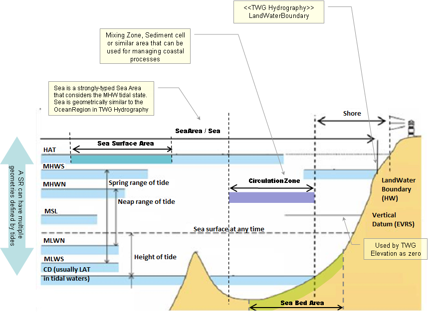

// Admonition icons:
// TG Requirement
:important-caption: 📕
// TG Recommendation
:tip-caption: 📒
// Conformance class
:note-caption: 📘

// TOC placement using macro (manual)
:toc: macro

// Empty TOC title (the title is in the document)
:toc-title:

// TOC level depth
:toclevels: 5

// Section numbering level depth
:sectnumlevels: 8

// Line Break Doc Title
:hardbreaks-option:

:appendix-caption: Annex

// Document properties
:title: D2.8.III.16 Data Specification on Sea Regions – Technical Guidelines
:revdate: 2024-07-31
:keywords: INSPIRE Data Specification for the spatial data theme Sea Regions
:producer: INSPIRE Maintenance and Implementation Group (MIG)
:description: This document describes the INSPIRE Data Specification for the spatial data theme Sea Regions
:author: Temporary MIWP 2021-2024 sub-group 2.3.1
:copyright: Public
:revremark: https://github.com/INSPIRE-MIF/technical-guidelines/releases/tag/v2024.2
:lang: en

image::./media/image2.jpeg[image,width=131,height=90, align=center]

image:./media/image3.png[image,width=93,height=93, align=center] **INSPIRE** *Infrastructure for Spatial Information in Europe*

[discrete]
= D2.8.III.16 Data Specification on _Sea Regions_ – Technical Guidelines

[width="100%",cols="17%,83%",]
|===
|*Title* |{doctitle}
|*Creator* |{author}
|*Date of publication* |{revdate}
|*Subject* |{keywords}
|*Publisher* |{producer}
|*Type* |Text
|*Description* |{description}
|*Format* |AsciiDoc
|*Licence* |https://creativecommons.org/licenses/by/4.0[Creative Commons Attribution (cc-by) 4.0]
|*Rights* |{copyright}
|*Identifier* |https://inspire.ec.europa.eu/id/document/tg/sr[D2.8.III.16_v3.1.0]
|*Changelog* |{revremark}
|*Language* |{lang}
|*Relation* |Directive 2007/2/EC of the European Parliament and of the Council of 14 March 2007 establishing an Infrastructure for Spatial Information in the European Community (INSPIRE)
|===

<<<
[discrete]
== Foreword
[discrete]
== How to read the document?

This document describes the _"INSPIRE data specification on Sea Regions – Technical Guidelines"_ version 3.0 as developed by the Thematic Working Group (TWG) _OF-SR_ using both natural and a conceptual schema language.

The data specification is based on a common templatefootnote:[The common document template is available in the "Framework documents" section of the data specifications web page at http://inspire.jrc.ec.europa.eu/index.cfm/pageid/2] used for all data specifications, which has been harmonised using the experience from the development of the Annex I, II and III data specifications.

This document provides guidelines for the implementation of the provisions laid down in the Implementing Rule for spatial data sets and services of the INSPIRE Directive. It also includes additional requirements and recommendations that, although not included in the Implementing Rule, are relevant to guarantee or to increase data interoperability.

Two executive summaries provide a quick overview of the INSPIRE data specification process in general, and the content of the data specification on _Sea Regions_ in particular. We highly recommend that managers, decision makers, and all those new to the INSPIRE process and/or information modelling should read these executive summaries first.

The UML diagrams (in Chapter 5) offer a rapid way to see the main elements of the specifications and their relationships. The definition of the spatial object types, attributes, and relationships are included in the Feature Catalogue (also in Chapter 5). People having thematic expertise but not familiar with UML can fully understand the content of the data model focusing on the Feature Catalogue. Users might also find the Feature Catalogue especially useful to check if it contains the data necessary for the applications that they run. The technical details are expected to be of prime interest to those organisations that are responsible for implementing INSPIRE within the field of _Sea Regions_, but also to other stakeholders and users of the spatial data infrastructure.

The technical provisions and the underlying concepts are often illustrated by examples. Smaller examples are within the text of the specification, while longer explanatory examples and descriptions of selected use cases are attached in the annexes.

In order to distinguish the INSPIRE spatial data themes from the spatial object types, the INSPIRE spatial data themes are written in _italics._

[cols="",]
|===
|The document will be publicly available as a 'non-paper'. It does not represent an official position of the European Commission, and as such cannot be invoked in the context of legal procedures.
|===

*Legal Notice*

Neither the European Commission nor any person acting on behalf of the Commission is responsible for the use which might be made of this publication.

<<<
[discrete]
== Interoperability of Spatial Data Sets and Services – General Executive Summary

The challenges regarding the lack of availability, quality, organisation, accessibility, and sharing of spatial information are common to a large number of policies and activities and are experienced across the various levels of public authority in Europe. In order to solve these problems it is necessary to take measures of coordination between the users and providers of spatial information. The Directive 2007/2/EC of the European Parliament and of the Council adopted on 14 March 2007 aims at establishing an Infrastructure for Spatial Information in the European Community (INSPIRE) for environmental policies, or policies and activities that have an impact on the environment.

INSPIRE is based on the infrastructures for spatial information that are created and maintained by the Member States. To support the establishment of a European infrastructure, Implementing Rules addressing the following components of the infrastructure have been specified: metadata, interoperability of spatial data sets (as described in Annexes I, II, III of the Directive) and spatial data services, network services, data and service sharing, and monitoring and reporting procedures.

INSPIRE does not require collection of new data. However, after the period specified in the Directivefootnote:[For all 34 Annex I,II and III data themes: within two years of the adoption of the corresponding Implementing Rules for newly collected and extensively restructured data and within 5 years for other data in electronic format still in use] Member States have to make their data available according to the Implementing Rules.

Interoperability in INSPIRE means the possibility to combine spatial data and services from different sources across the European Community in a consistent way without involving specific efforts of humans or machines. It is important to note that "interoperability" is understood as providing access to spatial data sets through network services, typically via Internet. Interoperability may be achieved by either changing (harmonising) and storing existing data sets or transforming them via services for publication in the INSPIRE infrastructure. It is expected that users will spend less time and efforts on understanding and integrating data when they build their applications based on data delivered in accordance with INSPIRE.

In order to benefit from the endeavours of international standardisation bodies and organisations established under international law their standards and technical means have been utilised and referenced, whenever possible.

To facilitate the implementation of INSPIRE, it is important that all stakeholders have the opportunity to participate in specification and development. For this reason, the Commission has put in place a consensus building process involving data users, and providers together with representatives of industry, research and government. These stakeholders, organised through Spatial Data Interest Communities (SDIC) and Legally Mandated Organisations (LMO)footnote:[The current status of registered SDICs/LMOs is available via INSPIRE website: http://inspire.jrc.ec.europa.eu/index.cfm/pageid/42], have provided reference materials, participated in the user requirement and technicalfootnote:[Surveys on unique identifiers and usage of the elements of the spatial and temporal schema,] surveys, proposed experts for the Data Specification Drafting Teamfootnote:[The Data Specification Drafting Team has been composed of experts from Austria, Belgium, Czech Republic, France, Germany, Greece, Italy, Netherlands, Norway, Poland, Switzerland, UK, and the European Environment Agency], the Thematic Working Groupsfootnote:[The Thematic Working Groups have been composed of experts from Austria, Australia, Belgium, Bulgaria, Czech Republic, Denmark, Finland, France, Germany, Hungary, Ireland, Italy, Latvia, Netherlands, Norway, Poland, Romania, Slovakia, Spain, Slovenia, Sweden, Switzerland, Turkey, UK, the European Environment Agency and the European Commission.] and other ad-hoc cross-thematic technical groups and participated in the public stakeholder consultations on draft versions of the data specifications. These consultations covered expert reviews as well as feasibility and fitness-for-purpose testing of the data specificationsfootnote:[For Annex IIIII, the consultation and testing phase lasted from 20 June to 21 October 2011.].

This open and participatory approach was successfully used during the development of the data specifications on Annex I, II and III data themes as well as during the preparation of the Implementing Rule on Interoperability of Spatial Data Sets and Servicesfootnote:[Commission Regulation (EU) No 1089/2010 http://eur-lex.europa.eu/JOHtml.do?uri=OJ:L:2010:323:SOM:EN:HTML[implementing Directive 2007/2/EC of the European Parliament and of the Council as regards interoperability of spatial data sets and services,] published in the Official Journal of the European Union on 8^th^ of December 2010.] for Annex I spatial data themes and of its amendment regarding the themes of Annex II and III.

The development framework elaborated by the Data Specification Drafting Team aims at keeping the data specifications of the different themes coherent. It summarises the methodology to be used for the development of the data specifications, providing a coherent set of requirements and recommendations to achieve interoperability. The pillars of the framework are the following technical documentsfootnote:[The framework documents are available in the "Framework documents" section of the data specifications web page at http://inspire.jrc.ec.europa.eu/index.cfm/pageid/2]:

* The _Definition of Annex Themes and Scope_ describes in greater detail the spatial data themes defined in the Directive, and thus provides a sound starting point for the thematic aspects of the data specification development.
* The _Generic Conceptual Model_ defines the elements necessary for interoperability and data harmonisation including cross-theme issues. It specifies requirements and recommendations with regard to data specification elements of common use, like the spatial and temporal schema, unique identifier management, object referencing, some common code lists, etc. Those requirements of the Generic Conceptual Model that are directly implementable are included in the Implementing Rule on Interoperability of Spatial Data Sets and Services.
* The _Methodology for the Development of Data Specifications_ defines a repeatable methodology. It describes how to arrive from user requirements to a data specification through a number of steps including use-case development, initial specification development and analysis of analogies and gaps for further specification refinement.
* The _Guidelines for the Encoding of Spatial Data_ defines how geographic information can be encoded to enable transfer processes between the systems of the data providers in the Member States. Even though it does not specify a mandatory encoding rule it sets GML (ISO 19136) as the default encoding for INSPIRE.
* The _Guidelines for the use of Observations & Measurements and Sensor Web Enablement-related standards in INSPIRE Annex II and III data specification development_ provides guidelines on how the "Observations and Measurements" standard (ISO 19156) is to be used within INSPIRE.
* The _Common data models_ are a set of documents that specify data models that are referenced by a number of different data specifications. These documents include generic data models for networks, coverages and activity complexes.

The structure of the data specifications is based on the "ISO 19131 Geographic information - Data product specifications" standard. They include the technical documentation of the application schema, the spatial object types with their properties, and other specifics of the spatial data themes using natural language as well as a formal conceptual schema languagefootnote:[UML – Unified Modelling Language].

A consolidated model repository, feature concept dictionary, and glossary are being maintained to support the consistent specification development and potential further reuse of specification elements. The consolidated model consists of the harmonised models of the relevant standards from the ISO 19100 series, the INSPIRE Generic Conceptual Model, and the application schemasfootnote:[Conceptual models related to specific areas (e.g. INSPIRE themes)] developed for each spatial data theme. The multilingual INSPIRE Feature Concept Dictionary contains the definition and description of the INSPIRE themes together with the definition of the spatial object types present in the specification. The INSPIRE Glossary defines all the terms (beyond the spatial object types) necessary for understanding the INSPIRE documentation including the terminology of other components (metadata, network services, data sharing, and monitoring).

By listing a number of requirements and making the necessary recommendations, the data specifications enable full system interoperability across the Member States, within the scope of the application areas targeted by the Directive. The data specifications (in their version 3.0) are published as technical guidelines and provide the basis for the content of the Implementing Rule on Interoperability of Spatial Data Sets and Servicesfootnote:[In the case of the Annex IIIII data specifications, the extracted requirements are used to formulate an amendment to the existing Implementing Rule.]. The content of the Implementing Rule is extracted from the data specifications, considering short- and medium-term feasibility as well as cost-benefit considerations. The requirements included in the Implementing Rule are legally binding for the Member States according to the timeline specified in the INSPIRE Directive.

In addition to providing a basis for the interoperability of spatial data in INSPIRE, the data specification development framework and the thematic data specifications can be reused in other environments at local, regional, national and global level contributing to improvements in the coherence and interoperability of data in spatial data infrastructures.

<<<
[discrete]
== _Sea Regions_ – Executive Summary

The INSPIRE _Sea Regions_ theme describes what most people would refer to as "the sea" and "the coastline". The _Sea Regions_ model allows for the concept of named seas e.g. "Black Sea" and shorelines e.g. "Italian coastline at mean high water". The model also provides a generic framework for describing subdivisions and aggregation of seas according to physical or chemical properties; for example, areas of sea according to their mean temperature, or areas with similar sediment characteristics. The _Sea Regions_ theme also provides mechanisms to describe areas of sea bed or sea surface e.g. oil spills, or sea ice.

Importantly, the _Sea Regions_ theme also provides common definitions for the shore/coastline at different tidal states.

The _Sea Regions_ (SR) theme is closely related to the Oceanographic Geographical Features theme (OF) and the distinctions between them are as follows:

[.text-right]
"A Sea Region is a defined area of common (physical) characteristics. An Oceanographic Geographical Feature represents the (physical or chemical) properties of the Sea Region. A Sea Region may have other properties that are not Oceanographic Geographical Feature, for example bathymetry (Elevation theme) and properties of the sea bed. A Sea Region will typically be represented as a vector dataset whereas an Ocean Feature will be a grid dataset or other coverage type. The Sea Region theme also encompasses coastlines and land/sea boundaries".

The key relationships between SR and concepts in other INSPIRE themes are summarised as:

* _'Located In'_ Another INSPIRE theme could represent features physically located in a Sea Region. For example a transport network (shipping lane) is located in a Sea Region.
* _'Specialisation Of'_ Another INSPIRE theme could represent features that are a specialisation of the general Sea Region type. Many of these features are not geometrically different to _Sea Regions_, e.g. a Marine Protected Area is a Sea Region with addition rules defining its extent based on legislation.
* _'Property Of'_ Another INSPIRE theme could represent features that are properties of the Sea Region in some respect. Ocean Geographical Features and Elevation are key examples of this.

These relationships are not necessarily explicitly modelled, but they may be determined or inferred by queries such as "find me all Environmental Monitoring Facilities located in a SeaRegion" or "find me all protected sites located in a SeaRegion".

There are five themes that are particularly important in their relationships to Sea Region and these are:

* Elevation (EL): A key property of the Sea Region in that it represents the depth of that Sea Region. It should be noted that although a Sea Region area can vary with tidal extent, the depth can only be established by intersection with an EL dataset.
* Hydrography (HY): The main Sea Region class (SeaArea) derives from Hydrography. Tidal water level values from HY are also used in _Sea Regions_.
* Geographic Names (GN): The GN model is used for the named _Sea Regions_.
* Oceanographic Geographical Features (OF): Geophysical observations (described by the Oceanographic Geographical Features theme) are made within _Sea Regions_.
* Area Management / Restriction / Regulation Zones and Reporting Units (AM): Areas of the sea may be Area Management or Reporting Units. In some cases these will correspond with _Sea Regions_, i.e. areas of the sea established as reporting units because of their common physical/chemical characteristics, in others there may be political boundaries.

The _Sea Regions_ theme is therefore both an important theme in its own right, but may act as a background theme, or reference data, for other themes in visualisation and analysis applications.

<<<
[discrete]
== Acknowledgements

Many individuals and organisations have contributed to the development of these Guidelines.

The Thematic Working Group Oceanographic Geographical Features and _Sea Regions_ (TWG-OF&SR) included:

Keiran Millard (TWG Facilitator), Dominic Lowe (TWG Editor), Hans Mose Jensen, Marc Roesbeke, Carlo Brandini, Nuria Hermida, Maria Olvido Tello, Alessandro Sarretta (European Commission contact point till May 2012), Tomáš Rezník (European Commission contact point from May till August 2012), Michael Lutz (European Commission contact point from August 2012), Vlado Cetl (European Commission contact point from August 2012).

Other contributors to the INSPIRE data specifications are the Drafting Team Data Specifications, the JRC Data Specifications Team and the INSPIRE stakeholders - Spatial Data Interested Communities (SDICs) and Legally Mandated Organisations (LMOs).

*Contact information*

Maria Vanda Nunes de Lima
European Commission Joint Research Centre
Institute for Environment and Sustainability
Unit H06: Digital Earth and Reference Data
TP262, Via Fermi 2749
I-21027 Ispra (VA)
ITALY
E-mail: vanda.lima@jrc.ec.europa.eu
Tel.: 39-0332-7865052
Fax: 39-0332-7866325
http://ies.jrc.ec.europa.eu/
http://ec.europa.eu/dgs/jrc/
http://inspire.jrc.ec.europa.eu/

<<<
[discrete]
= Table of Contents
toc::[]

:sectnums:

<<<
== Scope

This document specifies a harmonised data specification for the spatial data theme _Sea Regions_ as defined in Annex III of the INSPIRE Directive.

This data specification provides the basis for the drafting of Implementing Rules according to Article 7 (1) of the INSPIRE Directive [Directive 2007/2/EC]. The entire data specification is published as implementation guidelines accompanying these Implementing Rules.

<<<
== Overview

=== Name

INSPIRE data specification for the theme _Sea Regions_.

=== Informal description

*Definition:*

"Physical conditions of seas and saline water bodies divided into regions and sub-regions with common characteristics." [Directive 2007/2/EC]

*Description:*

A Sea Region will contain Oceanographic Geographical Features (Annex III) that represents the precise physical or chemical properties of the Sea Region. A Sea Region may have other properties that are not an Oceanographic Geographical Feature, for example bathymetry (Elevation theme - Annex II) and shipping lanes (Transport theme – Annex I). A Sea Region will be a vector dataset and not be represented as a 'coverage' (ISO 19126) where as an Oceanographic Geographical Feature will."

==== Concept and Scope

A Sea Region is a *2D geometry* of an area that is covered by an ocean, sea or similar salt water body. Its boundaries are attributed to physical or chemical processes, for example:

* Salinity (distance inland for a river)

* Current circulation

* Land mass boundaries

* Depth (shelf sea, intertidal areas, abyss)

* Sea bed cover (e.g. sand) or sea surface cover (e.g. ice)

* In theory any physical or chemical basis can be used *provided* there is a rule or convention for its use and establishment.

A Sea Region has some *temporal aspects* and seasonal variations, notably tides (MHWS, MLWS, MHWN, MLWN) which vary the extent of the Sea Region and it can be covered for all or part of the time such as sea ice. Although a Sea Region class can be specifically associated with the surface or bed of the sea, there is no explicit 'z' coordinate associated with them.

Where possible and practical, the Sea Region specification is based on features defined by the International Hydrographic Organisation (IHO), in particular by the IHO S-57 standard. These features are routinely used in member states in the form of nautical navigation charts and there is an existing governance structure in place for their maintenance and update.

[.text-center]
*Figure 1 - Sea Region types and extent for different tidal states (adapted from IHO H20)*

===== Examples of _Sea Regions_

Based on the above scope, the following are examples of _Sea Regions_

* "North Sea" (i.e. any common-usage named sea or ocean)
** A water body with an identified boundary based on land and/or common circulation patterns around the sea
* "Sediment Cell"
** A water body where the net sediment budget is (close to) zero, typically used for coastal erosion management
* "Circulation Cell"
** A water body which is the fate for all pollutants entering the water body, typically used for coastal water quality management for example in the Water Framework Directive
* "Seabed Area"
** Any area of sea characterised by common seabed coverage or depth (e.g. Dogger Bank).

===== What a Sea Region is not

A Sea Region is NOT

* anything with boundaries that not based or linked to physical or chemical conditions such as Marsden Squares used by ICES
* the bathymetry (depth of the sea)
* an Ocean Feature such as 'temperature' or 'tidal currents' (but note, analysis of an Ocean Feature can define a Sea Region and Ocean Geographic Features will be properties of a Sea Region)
* an administrative area, for example an Exclusive Economic Zone.

===== Use Case

The following use cases were used to help formulate the scope of the SeaRegions specification and are discussed in more detail in Annex B.

* [.underline]#LocatedIn Use Case#
+
This general use case is aimed at the user simply needing to understand whether an area or object is located in the marine environment:
+
"Albert works for the European Environment Agency. He would like to understand which Protected Sites are located in the marine environment. To do this he would like to view a simple map of all the EU projected sites overlaid on the extent of the European marine areas. As an extension to this query he would like to understand which of these Protected Sites are fully immersed and those that are covered by water as part of the tidal cycle."

* [.underline]#Flooding Use Case#
+
Flood Risk Management was suggested as cross-theme use case. In this respect the _Sea Regions_ TWG considered the role of _Sea Regions_ in flood risk management:
+
"Maria works for ECWMF and is preparing a risk assessment of Europe to storm surges and coastal flood events. To calculate the risk she requires the extent of the highest probable water level around the European coastline".

* [.underline]#Water Framework Directive Use Case#
+
This use case is set to clarify the need of _Sea Regions_ to support the Water Framework Directive. It can also be used for as a general pollution monitoring use case:
+
"Miguel needs to construct a catchment model that starts at sea (sea region) and connects to a river networks. The Sea Region is a sink for the network. Miguel needs to be able to view which _Sea Regions_ the catchment discharge into and what mechanisms are in place to monitor the quality of the water in this Sea Region (Environmental Monitoring Facilities Annex III)."

[cols=""]
|===
a|*Definition:*

"Physical conditions of seas and saline water bodies divided into regions and sub-regions with common characteristics." [Directive 2007/2/EC]

*Description:*

A _Sea Regions_ is a 2D geometry of an area or line with common (physical or chemical) characteristics that is covered by an ocean, sea or similar salt water body. The model allows the concept of named seas, as well subdivisions and aggregation of seas according to physical or chemical properties. The _Sea Regions_ theme provides mechanisms to describe both the sea bed and sea surface as well as inter-tidal areas and the shoreline.

Entry in the INSPIRE registry: _http://inspire.ec.europa.eu/theme/sr/_
|===

=== Normative References

[Directive 2007/2/EC] Directive 2007/2/EC of the European Parliament and of the Council of 14 March 2007 establishing an Infrastructure for Spatial Information in the European Community (INSPIRE)

[ISO 19107] EN ISO 19107:2005, Geographic Information – Spatial Schema

[ISO 19108] EN ISO 19108:2005, Geographic Information – Temporal Schema

[ISO 19108-c] ISO 19108:2002/Cor 1:2006, Geographic Information – Temporal Schema, Technical Corrigendum 1

[ISO 19111] EN ISO 19111:2007 Geographic information - Spatial referencing by coordinates (ISO 19111:2007)

[ISO 19113] EN ISO 19113:2005, Geographic Information – Quality principles

[ISO 19115] EN ISO 19115:2005, Geographic information – Metadata (ISO 19115:2003)

[ISO 19118] EN ISO 19118:2006, Geographic information – Encoding (ISO 19118:2005)

[ISO 19123] EN ISO 19123:2007, Geographic Information – Schema for coverage geometry and functions

[ISO 19125-1] EN ISO 19125-1:2004, Geographic Information – Simple feature access – Part 1: Common architecture

[ISO 19135] EN ISO 19135:2007 Geographic information – Procedures for item registration (ISO 19135:2005)

[ISO 19138] ISO/TS 19138:2006, Geographic Information – Data quality measures

[ISO 19139] ISO/TS 19139:2007, Geographic information – Metadata – XML schema implementation

[ISO 19157] ISO/DIS 19157, Geographic information – Data quality

[OGC 06-103r4] Implementation Specification for Geographic Information - Simple feature access – Part 1: Common Architecture v1.2.1

NOTE This is an updated version of "EN ISO 19125-1:2004, Geographic information – Simple feature access – Part 1: Common architecture".

[Regulation 1205/2008/EC] Regulation 1205/2008/EC implementing Directive 2007/2/EC of the European Parliament and of the Council as regards metadata

[Regulation 976/2009/EC] Commission Regulation (EC) No 976/2009 of 19 October 2009 implementing Directive 2007/2/EC of the European Parliament and of the Council as regards the Network Services

[Regulation 1089/2010/EC] Commission Regulation (EU) No 1089/2010 of 23 November 2010 implementing Directive 2007/2/EC of the European Parliament and of the Council as regards interoperability of spatial data sets and services

[ISO 19156] ISO 19156: 2011, Geographic information - Observations and measurements.

[IHO S-57] International Hydrographic Organization - Transfer Standard for Digital Hydrographic Data

[IHO S-100] International Hydrographic Organization – Universal Hydrographic Data Model

[IHO S-52] International Hydrographic Organization - Specifications for Chart Content and Display Aspects of ECDIS

=== Terms and definitions

General terms and definitions helpful for understanding the INSPIRE data specification documents are defined in the INSPIRE Glossaryfootnote:[The INSPIRE Glossary is available from http://inspire-registry.jrc.ec.europa.eu/registers/GLOSSARY].

=== Symbols and abbreviations

[width="100%",cols="14%,86%"]
|===
|ATS |Abstract Test Suite
|EC |European Commission
|EEA |European Environmental Agency
|ETRS89 |European Terrestrial Reference System 1989
|ETRS89-LAEA |Lambert Azimuthal Equal Area
|EVRS |European Vertical Reference System
|GCM |General Conceptual Model
|GML |Geography Markup Language
|HAT |Highest Astronomical Tide; the highest expected tidal state
|ICES |International Convention for Exploration of the Seas
|IHO |International Hydrographic Organization
|IR |Implementing Rule
|ISDSS |Interoperability of Spatial Data Sets and Services
|ISO |International Organization for Standardization
|ITRS |International Terrestrial Reference System
|LAT |Lowest Astronomical Tide; the lowest expected tidal state
|LMO |Legally Mandated Organization
|MHW |Mean High Water
|SDIC |Spatial Data Interest Community
|TG |Technical Guidance
|UML |Unified Modeling Language
|UNCLOS |United Nations Convention for the Law of the Sea
|UTC |Coordinated Universal Time
|WFD |Water Framework Directive
|WISE |Water Information System for Europe
|WMO |World Meteorological Organization
|XML |EXtensible Markup Language
|===

=== How the Technical Guidelines map to the Implementing Rules

The schematic diagram in Figure 2 gives an overview of the relationships between the INSPIRE legal acts (the INSPIRE Directive and Implementing Rules) and the INSPIRE Technical Guidelines. The INSPIRE Directive and Implementing Rules include legally binding requirements that describe, usually on an abstract level, _what_ Member States must implement.

In contrast, the Technical Guidelines define _how_ Member States might implement the requirements included in the INSPIRE Implementing Rules. As such, they may include non-binding technical requirements that must be satisfied if a Member State data provider chooses to conform to the Technical Guidelines. Implementing these Technical Guidelines will maximise the interoperability of INSPIRE spatial data sets.

image::./media/image5.png[image,width=603,height=375, align=center]

[.text-center]
*Figure 2 - Relationship between INSPIRE Implementing Rules and Technical Guidelines*

==== Requirements

The purpose of these Technical Guidelines (Data specifications on _Sea Regions_) is to provide practical guidance for implementation that is guided by, and satisfies, the (legally binding) requirements included for the spatial data theme _Sea Regions_ in the Regulation (Implementing Rules) on interoperability of spatial data sets and services. These requirements are highlighted in this document as follows:

[IMPORTANT]
====
[.text-center]
*IR Requirement*
_Article / Annex / Section no._
*Title / Heading*

This style is used for requirements contained in the Implementing Rules on interoperability of spatial data sets and services (Commission Regulation (EU) No 1089/2010).

====

For each of these IR requirements, these Technical Guidelines contain additional explanations and examples.

NOTE The Abstract Test Suite (ATS) in Annex A contains conformance tests that directly check conformance with these IR requirements.

Furthermore, these Technical Guidelines may propose a specific technical implementation for satisfying an IR requirement. In such cases, these Technical Guidelines may contain additional technical requirements that need to be met in order to be conformant with the corresponding IR requirement _when using this proposed implementation_. These technical requirements are highlighted as follows:

[TIP]
====
*TG Requirement X* 

This style is used for requirements for a specific technical solution proposed in these Technical Guidelines for an IR requirement.

====

NOTE 1 Conformance of a data set with the TG requirement(s) included in the ATS implies conformance with the corresponding IR requirement(s).

NOTE 2 In addition to the requirements included in the Implementing Rules on interoperability of spatial data sets and services, the INSPIRE Directive includes further legally binding obligations that put additional requirements on data providers. For example, Art. 10(2) requires that Member States shall, where appropriate, decide by mutual consent on the depiction and position of geographical features whose location spans the frontier between two or more Member States. General guidance for how to meet these obligations is provided in the INSPIRE framework documents.

==== Recommendations

In addition to IR and TG requirements, these Technical Guidelines may also include a number of recommendations for facilitating implementation or for further and coherent development of an interoperable infrastructure.

[NOTE]
====
*Recommendation X* 

Recommendations are shown using this style.

====

NOTE The implementation of recommendations is not mandatory. Compliance with these Technical Guidelines or the legal obligation does not depend on the fulfilment of the recommendations.

==== Conformance

Annex A includes the abstract test suite for checking conformance with the requirements included in these Technical Guidelines and the corresponding parts of the Implementing Rules (Commission Regulation (EU) No 1089/2010).

<<<
== Specification scopes

This data specification does not distinguish different specification scopes, but just considers one general scope.

NOTE For more information on specification scopes, see [ISO 19131:2007], clause 8 and Annex D.

<<<
== Identification information

These Technical Guidelines are identified by the following URI:

http://inspire.ec.europa.eu/tg/sr/3.0

NOTE ISO 19131 suggests further identification information to be included in this section, e.g. the title, abstract or spatial representation type. The proposed items are already described in the document metadata, executive summary, overview description (section 2) and descriptions of the application schemas (section 5). In order to avoid redundancy, they are not repeated here.

<<<
== Data content and structure

This data specification defines the following application schemas:

* The Sea regions application schema.

=== Application schemas – Overview 

==== Application schemas included in the IRs

Articles 3, 4 and 5 of the Implementing Rules lay down the requirements for the content and structure of the data sets related to the INSPIRE Annex themes.

[IMPORTANT]
====
[.text-center]
*IR Requirement*
_Article 4_
*Types for the Exchange and Classification of Spatial Objects*

. For the exchange and classification of spatial objects from data sets meeting the conditions laid down in Article 4 of Directive 2007/2/EC, Member States shall use the spatial object types, associated data types and code lists that are defined in Annexes II, III and IV to this Regulation for the themes the data sets relate to.

. When exchanging spatial objects, Member States shall comply with the definitions and constraints set out in the Annexes and provide values for all attributes and association roles set out for the relevant spatial object types and data types in the Annexes. For voidable attributes and association roles for which no value exists, Member States may omit the value.

====

The types to be used for the exchange and classification of spatial objects from data sets related to the spatial data theme Sea regions are defined in the following application schemas (see sections 5.3):

* The Sea regions application schema (section 5.3)

The application schemas specify requirements on the properties of each spatial object including its multiplicity, domain of valid values, constraints, etc.

NOTE The application schemas presented in this section contain some additional information that is not included in the Implementing Rules, in particular multiplicities of attributes and association roles.

[TIP]
====
*TG Requirement 1*

Spatial object types and data types shall comply with the multiplicities defined for the attributes and association roles in this section.

====

An application schema may include references (e.g. in attributes or inheritance relationships) to common types or types defined in other spatial data themes. These types can be found in a sub-section called "Imported Types" at the end of each application schema section. The common types referred to from application schemas included in the IRs are addressed in Article 3.

[IMPORTANT]
====
[.text-center]
*IR Requirement*
_Article 3_
*Common Types*

Types that are common to several of the themes listed in Annexes I, II and III to Directive 2007/2/EC shall conform to the definitions and constraints and include the attributes and association roles set out in Annex I.

====

NOTE Since the IRs contain the types for all INSPIRE spatial data themes in one document, Article 3 does not explicitly refer to types defined in other spatial data themes, but only to types defined in external data models.

Common types are described in detail in the Generic Conceptual Model [DS-D2.7], in the relevant international standards (e.g. of the ISO 19100 series) or in the documents on the common INSPIRE models [DS-D2.10.x]. For detailed descriptions of types defined in other spatial data themes, see the corresponding Data Specification TG document [DS-D2.8.x].

==== Additional recommended application schemas 

There is no additional application schemas defined for the theme _Sea regions_

=== Basic notions

This section explains some of the basic notions used in the INSPIRE application schemas. These explanations are based on the GCM [DS-D2.5].

==== Notation

===== Unified Modeling Language (UML)

The application schemas included in this section are specified in UML, version 2.1. The spatial object types, their properties and associated types are shown in UML class diagrams.

NOTE For an overview of the UML notation, see Annex D in [ISO 19103].

The use of a common conceptual schema language (i.e. UML) allows for an automated processing of application schemas and the encoding, querying and updating of data based on the application schema – across different themes and different levels of detail.

The following important rules related to class inheritance and abstract classes are included in the IRs.

[IMPORTANT]
====
[.text-center]
*IR Requirement*
_Article 5_
*Types*

(...)

[arabic, start=2]
. Types that are a sub-type of another type shall also include all this type's attributes and association roles.

. Abstract types shall not be instantiated.

====

The use of UML conforms to ISO 19109 8.3 and ISO/TS 19103 with the exception that UML 2.1 instead of ISO/IEC 19501 is being used. The use of UML also conforms to ISO 19136 E.2.1.1.1-E.2.1.1.4.

NOTE ISO/TS 19103 and ISO 19109 specify a profile of UML to be used in conjunction with the ISO 19100 series. This includes in particular a list of stereotypes and basic types to be used in application schemas. ISO 19136 specifies a more restricted UML profile that allows for a direct encoding in XML Schema for data transfer purposes.

To model constraints on the spatial object types and their properties, in particular to express data/data set consistency rules, OCL (Object Constraint Language) is used as described in ISO/TS 19103, whenever possible. In addition, all constraints are described in the feature catalogue in English, too.

NOTE Since "void" is not a concept supported by OCL, OCL constraints cannot include expressions to test whether a value is a _void_ value. Such constraints may only be expressed in natural language.

===== Stereotypes

In the application schemas in this section several stereotypes are used that have been defined as part of a UML profile for use in INSPIRE [DS-D2.5]. These are explained in Table 1 below.

[.text-center]
*Table 1 – Stereotypes (adapted from [DS-D2.5])*

[cols=",,",]
|===
|*Stereotype* |*Model element* |*Description*
|applicationSchema |Package |An INSPIRE application schema according to ISO 19109 and the Generic Conceptual Model.
|leaf |Package |A package that is not an application schema and contains no packages.
|featureType |Class |A spatial object type.
|type |Class |A type that is not directly instantiable, but is used as an abstract collection of operation, attribute and relation signatures. This stereotype should usually not be used in INSPIRE application schemas as these are on a different conceptual level than classifiers with this stereotype.
|dataType |Class |A structured data type without identity.
|union |Class |A structured data type without identity where exactly one of the properties of the type is present in any instance.
|codeList |Class |A code list.
|import |Dependency |The model elements of the supplier package are imported.
|voidable |Attribute, association role |A voidable attribute or association role (see section 5.2.2).
|lifeCycleInfo |Attribute, association role |If in an application schema a property is considered to be part of the life-cycle information of a spatial object type, the property shall receive this stereotype.
|version |Association role |If in an application schema an association role ends at a spatial object type, this stereotype denotes that the value of the property is meant to be a specific version of the spatial object, not the spatial object in general.
|===

==== Voidable characteristics

The «voidable» stereotype is used to characterise those properties of a spatial object that may not be present in some spatial data sets, even though they may be present or applicable in the real world. This does _not_ mean that it is optional to provide a value for those properties.

For all properties defined for a spatial object, a value has to be provided – either the corresponding value (if available in the data set maintained by the data provider) or the value of _void._ A _void_ value shall imply that no corresponding value is contained in the source spatial data set maintained by the data provider or no corresponding value can be derived from existing values at reasonable costs.

[NOTE]
====
*Recomendation 1*

The reason for a _void_ value should be provided where possible using a listed value from the VoidReasonValue code list to indicate the reason for the missing value.

====

The VoidReasonValue type is a code list, which includes the following pre-defined values:

* _Unpopulated_: The property is not part of the dataset maintained by the data provider. However, the characteristic may exist in the real world. For example when the "elevation of the water body above the sea level" has not been included in a dataset containing lake spatial objects, then the reason for a void value of this property would be 'Unpopulated'. The property receives this value for all spatial objects in the spatial data set.
* _Unknown_: The correct value for the specific spatial object is not known to, and not computable by the data provider. However, a correct value may exist. For example when the "elevation of the water body above the sea level" _of a certain lake_ has not been measured, then the reason for a void value of this property would be 'Unknown'. This value is applied only to those spatial objects where the property in question is not known.
* _Withheld_: The characteristic may exist, but is confidential and not divulged by the data provider.

NOTE It is possible that additional reasons will be identified in the future, in particular to support reasons / special values in coverage ranges.

The «voidable» stereotype does not give any information on whether or not a characteristic exists in the real world. This is expressed using the multiplicity:

* If a characteristic may or may not exist in the real world, its minimum cardinality shall be defined as 0. For example, if an Address may or may not have a house number, the multiplicity of the corresponding property shall be 0..1.
* If at least one value for a certain characteristic exists in the real world, the minimum cardinality shall be defined as 1. For example, if an Administrative Unit always has at least one name, the multiplicity of the corresponding property shall be 1..*.

In both cases, the «voidable» stereotype can be applied. In cases where the minimum multiplicity is 0, the absence of a value indicates that it is known that no value exists, whereas a value of void indicates that it is not known whether a value exists or not.

EXAMPLE If an address does not have a house number, the corresponding Address object should not have any value for the «voidable» attribute house number. If the house number is simply not known or not populated in the data set, the Address object should receive a value of _void_ (with the corresponding void reason) for the house number attribute.

==== Code lists

Code lists are modelled as classes in the application schemas. Their values, however, are managed outside of the application schema.

===== Code list types

The IRs distinguish the following types of code lists.

[IMPORTANT]
====
[.text-center]
*IR Requirement*
_Article 6_
*Code Lists for Spatial Data Sets*

. The code lists included in this Regulation set out the multilingual thesauri to be used for the key attributes, in accordance with Article 8(2), point (c), of Directive 2007/2/EC.

. The Commission shall establish and operate an INSPIRE code list register at Union level for managing and making publicly available the values that are included in the code lists referred to in paragraph 1.

. The Commission shall be assisted by the INSPIRE Commission expert group in the maintenance and update of the code list values.

. Code lists shall be one of the following types:

.. code lists whose values comprise only the values specified in the INSPIRE code list register;
.. code lists whose values comprise the values specified in the INSPIRE code list register and narrower values defined by data providers;
.. code lists whose values comprise the values specified in the INSPIRE code list register and additional values at any level defined by data providers;
.. code lists, whose values comprise any values defined by data providers.

. Code lists may be hierarchical. Values of hierarchical code lists may have a more general parent value.
. Where, for an attribute whose type is a code list as referred to in paragraph 4, points (b), (c) or (d), a data provider provides a value that is not specified in the INSPIRE code list register, that value and its definition and label shall be made available in another register.

====

The type of code list is represented in the UML model through the tagged value _extensibility_, which can take the following values:

* _none_, representing code lists whose allowed values comprise only the values specified in the IRs (type a);
* _narrower_, representing code lists whose allowed values comprise the values specified in the IRs and narrower values defined by data providers (type b);
* _open_, representing code lists whose allowed values comprise the values specified in the IRs and additional values at any level defined by data providers (type c); and
* _any_, representing code lists, for which the IRs do not specify any allowed values, i.e. whose allowed values comprise any values defined by data providers (type d).

[NOTE]
====
*Recomendation 2*

Additional values defined by data providers should not replace or redefine any value already specified in the IRs.

====

NOTE This data specification may specify recommended values for some of the code lists of type (b), (c) and (d) (see section 5.2.4.3). These recommended values are specified in a dedicated Annex.

In addition, code lists can be hierarchical, as explained in Article 6(2) of the IRs.

[IMPORTANT]
====
[.text-center]
*IR Requirement*
_Article 6_
*Code Lists*

(...)

[arabic, start=2]
. Code lists may be hierarchical. Values of hierarchical code lists may have a more generic parent value. Where the valid values of a hierarchical code list are specified in a table in this Regulation, the parent values are listed in the last column.

====

The type of code list and whether it is hierarchical or not is also indicated in the feature catalogues.

===== Obligations on data providers

[IMPORTANT]
====
[.text-center]
*IR Requirement*
_Article 6_
*Code Lists*

(....)

[arabic, start=3]
. Where, for an attribute whose type is a code list as referred to in points (b), (c) or (d) of paragraph 1, a data provider provides a value that is not specified in this Regulation, that value and its definition shall be made available in a register.

. Attributes or association roles of spatial object types or data types whose type is a code list may only take values that are allowed according to the specification of the code list.

====

Article 6(4) obliges data providers to use only values that are allowed according to the specification of the code list. The "allowed values according to the specification of the code list" are the values explicitly defined in the IRs plus (in the case of code lists of type (b), (c) and (d)) additional values defined by data providers.

For attributes whose type is a code list of type (b), (c) or (d) data providers may use additional values that are not defined in the IRs. Article 6(3) requires that such additional values and their definition be made available in a register. This enables users of the data to look up the meaning of the additional values used in a data set, and also facilitates the re-use of additional values by other data providers (potentially across Member States).

NOTE Guidelines for setting up registers for additional values and how to register additional values in these registers is still an open discussion point between Member States and the Commission.

===== Recommended code list values

For code lists of type (b), (c) and (d), this data specification may propose additional values as a recommendation (in a dedicated Annex). These values will be included in the INSPIRE code list register. This will facilitate and encourage the usage of the recommended values by data providers since the obligation to make additional values defined by data providers available in a register (see section 5.2.4.2) is already met.

[NOTE]
====
*Recomendation 3*

Where these Technical Guidelines recommend values for a code list in addition to those specified in the IRs, these values should be used.

====

NOTE For some code lists of type (d), no values may be specified in these Technical Guidelines. In these cases, any additional value defined by data providers may be used.

===== Governance

The following two types of code lists are distinguished in INSPIRE:

* _Code lists that are governed by INSPIRE (INSPIRE-governed code lists)._ These code lists will be managed centrally in the INSPIRE code list register. Change requests to these code lists (e.g. to add, deprecate or supersede values) are processed and decided upon using the INSPIRE code list register's maintenance workflows.
+
INSPIRE-governed code lists will be made available in the INSPIRE code list register at __http://inspire.ec.europa.eu/codelist/<CodeListName__>. They will be available in SKOS/RDF, XML and HTML. The maintenance will follow the procedures defined in ISO 19135. This means that the only allowed changes to a code list are the addition, deprecation or supersession of values, i.e. no value will ever be deleted, but only receive different statuses (valid, deprecated, superseded). Identifiers for values of INSPIRE-governed code lists are constructed using the pattern __http://inspire.ec.europa.eu/codelist/<CodeListName__>/<value>.

* _Code lists that are governed by an organisation outside of INSPIRE (externally governed code lists)._ These code lists are managed by an organisation outside of INSPIRE, e.g. the World Meteorological Organization (WMO) or the World Health Organization (WHO). Change requests to these code lists follow the maintenance workflows defined by the maintaining organisations. Note that in some cases, no such workflows may be formally defined.
+
Since the updates of externally governed code lists is outside the control of INSPIRE, the IRs and these Technical Guidelines reference a specific version for such code lists.
+
The tables describing externally governed code lists in this section contain the following columns:
+
** The _Governance_ column describes the external organisation that is responsible for maintaining the code list.
** The _Source_ column specifies a citation for the authoritative source for the values of the code list. For code lists, whose values are mandated in the IRs, this citation should include the version of the code list used in INSPIRE. The version can be specified using a version number or the publication date. For code list values recommended in these Technical Guidelines, the citation may refer to the "latest available version".
** In some cases, for INSPIRE only a subset of an externally governed code list is relevant. The subset is specified using the _Subset_ column.
** The _Availability_ column specifies from where (e.g. URL) the values of the externally governed code list are available, and in which formats. Formats can include machine-readable (e.g. SKOS/RDF, XML) or human-readable (e.g. HTML, PDF) ones.

+
Code list values are encoded using http URIs and labels. Rules for generating these URIs and labels are specified in a separate table.

[NOTE]
====
*Recomendation 4*

The http URIs and labels used for encoding code list values should be taken from the INSPIRE code list registry for INSPIRE-governed code lists and generated according to the relevant rules specified for externally governed code lists.

====

NOTE Where practicable, the INSPIRE code list register could also provide http URIs and labels for externally governed code lists.

===== Vocabulary

For each code list, a tagged value called "vocabulary" is specified to define a URI identifying the values of the code list. For INSPIRE-governed code lists and externally governed code lists that do not have a persistent identifier, the URI is constructed following the pattern _http://inspire.ec.europa.eu/codelist/<UpperCamelCaseName>_.

If the value is missing or empty, this indicates an empty code list. If no sub-classes are defined for this empty code list, this means that any code list may be used that meets the given definition.

An empty code list may also be used as a super-class for a number of specific code lists whose values may be used to specify the attribute value. If the sub-classes specified in the model represent all valid extensions to the empty code list, the subtyping relationship is qualified with the standard UML constraint "\{complete,disjoint}".

==== Identifier management

[IMPORTANT]
====
[.text-center]
*IR Requirement*
_Article 9_
*Identifier Management*

. The data type Identifier defined in Section 2.1 of Annex I shall be used as a type for the external object identifier of a spatial object.

. The external object identifier for the unique identification of spatial objects shall not be changed during the life-cycle of a spatial object.

====

NOTE 1 An external object identifier is a unique object identifier which is published by the responsible body, which may be used by external applications to reference the spatial object. [DS-D2.5]

NOTE 2 Article 9(1) is implemented in each application schema by including the attribute _inspireId_ of type Identifier.

NOTE 3 Article 9(2) is ensured if the _namespace_ and _localId_ attributes of the Identifier remains the same for different versions of a spatial object; the _version_ attribute can of course change.

==== Geometry representation

[IMPORTANT]
====
[.text-center]
*IR Requirement*
_Article 12_
*Other Requirements & Rules*

. The value domain of spatial properties defined in this Regulation shall be restricted to the Simple Feature spatial schema as defined in Herring, John R. (ed.), OpenGIS® Implementation Standard for Geographic information – Simple feature access – Part 1: Common architecture, version 1.2.1, Open Geospatial Consortium, 2011, unless specified otherwise for a specific spatial data theme or type.

====

NOTE 1 The specification restricts the spatial schema to 0-, 1-, 2-, and 2.5-dimensional geometries where all curve interpolations are linear and surface interpolations are performed by triangles.

NOTE 2 The topological relations of two spatial objects based on their specific geometry and topology properties can in principle be investigated by invoking the operations of the types defined in ISO 19107 (or the methods specified in EN ISO 19125-1).

====  Temporality representation

The application schema(s) use(s) the derived attributes "beginLifespanVersion" and "endLifespanVersion" to record the lifespan of a spatial object.

The attributes "beginLifespanVersion" specifies the date and time at which this version of the spatial object was inserted or changed in the spatial data set. The attribute "endLifespanVersion" specifies the date and time at which this version of the spatial object was superseded or retired in the spatial data set.

NOTE 1 The attributes specify the beginning of the lifespan of the version in the spatial data set itself, which is different from the temporal characteristics of the real-world phenomenon described by the spatial object. This lifespan information, if available, supports mainly two requirements: First, knowledge about the spatial data set content at a specific time; second, knowledge about changes to a data set in a specific time frame. The lifespan information should be as detailed as in the data set (i.e., if the lifespan information in the data set includes seconds, the seconds should be represented in data published in INSPIRE) and include time zone information.

NOTE 2 Changes to the attribute "endLifespanVersion" does not trigger a change in the attribute "beginLifespanVersion".

[IMPORTANT]
====
[.text-center]
*IR Requirement*
_Article 10_
*Life-cycle of Spatial Objects*

(...)

[arabic, start=3]
. Where the attributes beginLifespanVersion and endLifespanVersion are used, the value of endLifespanVersion shall not be before the value of beginLifespanVersion.

====

NOTE The requirement expressed in the IR Requirement above will be included as constraints in the UML data models of all themes.

[NOTE]
====
*Recomendation 5*

If life-cycle information is not maintained as part of the spatial data set, all spatial objects belonging to this data set should provide a void value with a reason of "unpopulated".

====

===== Validity of the real-world phenomena

The application schema(s) use(s) the attributes "validFrom" and "validTo" to record the validity of the real-world phenomenon represented by a spatial object.

The attributes "validFrom" specifies the date and time at which the real-world phenomenon became valid in the real world. The attribute "validTo" specifies the date and time at which the real-world phenomenon is no longer valid in the real world.

Specific application schemas may give examples what "being valid" means for a specific real-world phenomenon represented by a spatial object.

[IMPORTANT]
====
[.text-center]
*IR Requirement*
_Article 12_
*Other Requirements & Rules*

(...)

[arabic, start=3]
. Where the attributes validFrom and validTo are used, the value of validTo shall not be before the value of validFrom.

====

NOTE The requirement expressed in the IR Requirement above will be included as constraints in the UML data models of all themes.

==== Coverages

Coverage functions are used to describe characteristics of real-world phenomena that vary over space and/or time. Typical examples are temperature, elevation, precipitation, imagery. A coverage contains a set of such values, each associated with one of the elements in a spatial, temporal or spatio-temporal domain. Typical spatial domains are point sets (e.g. sensor locations), curve sets (e.g. isolines), grids (e.g. orthoimages, elevation models), etc.

In INSPIRE application schemas, coverage functions are defined as properties of spatial object types where the type of the property value is a realisation of one of the types specified in ISO 19123.

To improve alignment with coverage standards on the implementation level (e.g. ISO 19136 and the OGC Web Coverage Service) and to improve the cross-theme harmonisation on the use of coverages in INSPIRE, an application schema for coverage types is included in the Generic Conceptual Model in 9.9.4. This application schema contains the following coverage types:

* _RectifiedGridCoverage_: coverage whose domain consists of a rectified grid – a grid for which there is an affine transformation between the grid coordinates and the coordinates of a coordinate reference system (see Figure 3, left).
* _ReferenceableGridCoverage_: coverage whose domain consists of a referenceable grid – a grid associated with a transformation that can be used to convert grid coordinate values to values of coordinates referenced to a coordinate reference system (see Figure 3, right).

In addition, some themes make reference to the types TimeValuePair and Timeseries defined in Taylor, Peter (ed.), _OGC^®^ WaterML 2.0: Part 1 – Timeseries, v2.0.0,_ Open Geospatial Consortium, 2012. These provide a representation of the time instant/value pairs, i.e. time series (see Figure 4).

Where possible, only these coverage types (or a subtype thereof) are used in INSPIRE application schemas.

[%autowidth]
|===
a|image::./media/image6.png[image,width=222,height=207, align=center] a|image::./media/image7.png[image,width=309,height=209, align=center]
^|(Source: ISO 19136:2007) ^|(Source: GML 3.3.0)
|===

[.text-center]
*Figure 3 – Examples of a rectified grid (left) and a referenceable grid (right)*

image::./media/image22.png[image, align=center]

[.text-center]
*Figure 4 – Example of a time series*

=== Application schema _Sea Regions_

==== Description

===== Narrative description

The Sea Region UML model and application schema can be broadly classed as covering the following topics:

* Sea Areas, including Seas, Marine Circulation Zones and Intertidal Areas
* Coast and Shorelines
* Marine Isolines
* Sea Surface Areas (e.g. oil spills)
* Sea Bed Areas

===== UML Overview

====== Sea Areas; Seas, Marine Circulation Zones and Intertidal Areas

The primary class in the _Sea Regions_ model is the _SeaArea_. A _SeaArea_ is quite literally an area of sea, in particular one that is primarily defined by its physical and chemical characteristics.

Since the geometry of the sea varies according to tidal states, the _SeaArea_ supports multiple geometries for the same feature instance. The geometry of a _SeaArea_ is described by the _MarineExtent_ dataType which associates a GM_MultiSurface (one or more geometrically defined areas) with a particular tidal state, which should be taken from the codelist _WaterLevelValue_.

A simple example would be a _SeaArea_ with two geometries, one for high water and one for low water.

In many real world applications tidal effects make little difference to the geometry, however there are a number of regions where these differences are very significant so the application schema caters for both scenarios.

The model therefore allows for the definition of arbitrary _SeaAreas_, or _SeaAreas_ with agreed definitions at a particular tidal state. For example it may be useful to capture the extent of the North Sea at highest astronomical tide for the purpose of flood hazard mapping.

A _SeaArea_ may also carry parameter values that describe physical properties of the _SeaArea_. For example a _SeaArea_ may carry information about its Annual Mean Surface Temperature. This should be added using the _parameterValue_ attribute of the _SeaArea._ If this mechanism is used, then the guidance on codelists for parameters in the Oceanographic Geographical Features Technical Guidelines shall be followed (CF Standard Names or BODC P01 Parameter Usage).

[NOTE]
====
*Recomendation 6*

The _parameterValue_, and _ParameterValuePair_ type should be used to attach physical parameter information to _SeaArea_ objects. The codelists used to indicate parameter types should be those described in the Oceanographic Geographical Features theme.

====

__SeaArea__s may be classified according to the values in the codelist _SeaAreaTypeClassificationValue_. For example a _SeaArea_ may be classed as estuary (or any other value from the list).

[NOTE]
====
*Recomendation 7*

Values from the SeaAreaTypeClassificationValue codelist should be used to classify types of SeaArea.

====

_SeaArea_ is intentionally a very generic type. There are however specialisations of _SeaArea_ in the _Sea Regions_ model that should be used for specific purposes. These are:

* Sea
* MarineCirculationZone

[.text-center]
*Figure 5 - Sea Areas UML overview*

The _Sea_ class should be used whenever a _SeaArea_ is an identified, named sea (or ocean). For example the _Black Sea_, or the _North Sea. Sea_ will be the Sea Region type that is used in the general case where users need a marine region to search within or view sea extents on a map.

[IMPORTANT]
====
[.text-center]
*IR Requirement*
_Annex IV Section 15.4_
*Theme-specific Requirements*

The Sea spatial object type shall be used to describe identified, named areas of sea (or ocean). Artificial reporting units are excluded from this requirement.

====

When _Sea_ is used the the _MarineExtent_ of the _Sea_ must given for _MeanHighWater_ unless there is no appreciable change due to tides in which case _MeanSeaLevel_ may be used.

[IMPORTANT]
====
[.text-center]
*IR Requirement*
_Annex IV Section 15.4_
*Theme-specific Requirements*

The MarineExtent of a Sea spatial object shall have a waterlevel value equal to "MeanHighWater", unless there is no appreciable change in the Sea extent due to tides, in which case a value of "MeanSeaLevel" may be used.

====

The _MarineCirculationZone_ class should be used whenever a _SeaArea_ is a marine circulation zone such as a mixing zone or sediment cell. The type of the zone shall be given using the zoneType attribute. These zones represent SeaAreas that may be useful for the purpose of coastal erosion management and coastal water quality monitoring and reporting such as WFD reporting units for coastal and transitional waters. As such they may be referred to by the Area Management and Reporting Unit theme, but this will not apply to all MarineCirculationZones.

[TIP]
====
*TG Requirement 2*

The MarineCirculationZone should be used to identify areas of sea that are mixing zones or sediment cells.

====

The _InterTidalArea_ is a specialization of Shore type in Hydrography. This may be used to identify the part of the sea that is exposed (not covered in water) during a normal tidal cycle. These are important ecological zones.

An _InterTidalArea_ may be defined as the part of the marine environment that is exposed (not covered in water) during a normal tidal cycle; defined as the difference between any high and any low water level. The overall extent of the intertidal area must be given with reference to the higher _highWaterLevel_ of the two water levels while the value of the _lowWaterLevel_ attribute shall specify the lower of the two water levels that was used to determine the lower 'bounds' of the intertidal area.

[IMPORTANT]
====
[.text-center]
*IR Requirement*
_Annex IV Section 15.4_
*Theme-specific Requirements*

The low water level used to define an IntertidalArea shall be provided as a value of the lowWaterLevel attribute. The level shall be a low water level.

====

Precise rules for the definition of the extents of various _SeaArea_ objects are specified in various international conventions, agreements and legislation. Also a Sea Region may have associated Oceanographic Geographical Features describing such things as the temperature, salinity, currents or waves in that Sea Region but this is not expressly modelled.

====== Reference to HydroObject

All _SeaAreas_ inherit a geographicalName attribute from the HY HydroObject type. Any _SeaArea_ may have zero to many GeographicalNames.

====== Coast and Shorelines

Shoreline: A shoreline is the boundary where a SeaArea meets land. However there can be many different shorelines depending on the tidal state. A Shoreline must therefore have a value for the waterlevel that identifies the tidal state used to define the shoreline. For inland land water bodies only the HY:: LandWaterBoundary should be used. A Shoreline is a specialism of HydroObject and may therefore have a geographicalName e.g. "UK Mean Low Water Shoreline".

[NOTE]
====
*Recomendation 8*

A human readable name/label should be given to a ShoreLine or CoastLine

====

[.underline]#ShoreSegment:#

The Shoreline spatial object type is constructed of many __ShoreSegment__s. Each shore segment has a curve geometry that defines a section of shore. Each _ShoreSegment_ may be classified according to stability (eroding, stable etc) and shore type (sand, mud etc).

[NOTE]
====
*Recomendation 9*

Values from the codelists ShoreStabilityValue and _ShoreTypeClassifcationValue_ should be used to describe information about stability and shore type of _ShoreSegments_

====

[.underline]#Coastline:#

A Coastline is a specialisation of shoreline when the water level is equal to MHW. (Coastline is similar to the concept of LandWaterBoundary in Hydrography but only applies in the marine case, i.e. rivers and lakes are excluded). A Coastline will typically be the spatial object type used for most applications that need to show a sea/land boundary.

image::./media/image9.png[image,width=592,height=506, align=center]

[.text-center]
*_Figure 6 Coastlines and_ Shorelines UML overview*

====== Marine Contour

A _MarineContour_ Spatial Object Type is a set of isolines representing the value of some phenomenon at a particular time. For example it will typically be used to display temperature contours, waveclimate contours, or co-tidal lines. It should not be used for bathymetric data, which should be represented by Spatial Object Types described in the Elevation theme.

Although it is not explicitly associated with a particular Sea Region (_SeaArea_) or regions, where such associations do exists in the real world, _MarineContour_ must not extend beyond the Sea Region.

A _MarineContour_ is made up of several isolines for which _MarineIsolines_ datatype is used__.__ A _MarineIsoline_ datatype defines the geometry of a contour for a particular value and uses mutlicurves to do so as illustrated in Figure 7.

[.text-center]
*Figure 7 - Illustrated use of MarineContour and MarineIsoLine*

image::./media/image11.png[image,width=392,height=552, align=center]

[.text-center]
*Figure 8 - Marine Contour UML overview*

The phenomenon that is represented by a _MarineContour_ shall be represented by the ObservableProperty model described in D2.9 and the OF specification. As per OF, terms such as 'sea_surface_temperature' should refer to the BODC P01 Parameter Usage vocabulary or CF Standard Names (see OF data specification).

[IMPORTANT]
====
[.text-center]
*IR Requirement*
_Annex IV Section 15.4_
*Theme-specific Requirements*

The code lists defined in the spatial data theme Oceanographic Geographical Features shall be used to identify phenomena represented by _MarineContour_ spatial object types.

====

====== Marine Layers/Sea Surface Areas

A _MarineLayer_ is a generic class for describing areas of interest in the sea that are not sea areas as defined in this theme. Two specialisations are provided, one for sea surface areas and one for areas of sea bed. The first, _SeaSurfaceArea,_ describes an area of sea surface that is of particular interest. For example it may be covered by an oil slick or by vegetation. This area shall be classified according to the codelist _SeaSurfaceClassificationValue._ Similarly, _SeaBedArea_ describes an area of sea bed classified according to its cover type. Note that a _SeaBedArea_ may have more than one classification, for example where sand exists over mud.

[TIP]
====
*TG Requirement 3*

_SeaSurfaceAreas_ shall be classified according to the _SeaSurfaceClassificationValue_ codelist.

====

[TIP]
====
*TG Requirement 4*

_SeaBedAreas_ shall be classified according to the _SeaBedCoverValue_ codelist.

====

A _MarineLayer_ may be associated hierarchically with other _MarineLayers_ via the _subLayer_ relationship.

image::./media/image12.png[image,width=600,height=383, align=center]

[.text-center]
*Figure 9 - MarineLayer UML Overview*

[NOTE]
====
*Recomendation 10*

It is recommended to use or specialise the MarineLayer Spatial Object type to describe areas of interest in the sea that do not come under the _Sea Regions_ definition of _SeaArea._

====

===== Consistency between spatial data sets

There are some constraints that apply to the various specialisations of _SeaArea_. For example _Sea_ is defined as a _SeaArea_ at mean high water, so the value of the waterLevel attributes of the _MarineExtent_ must be '_meanHighWater_' for _Sea_. Likewise coastline is defined as the shoreline at _meanHighWater_.

More generally, the geometries of sea areas and related types must reflect the constraints of the real world. For example, a shoreline at low water must share a geometry with a Sea Area at low water. A marine isoline must fit within a Sea Area (or multiple Sea Areas). A MarineLayer (sea bed, or surface) must fit within the geometry of a sea area (it would be nonsensical to have sea bed cover over land for example).

===== Identifier management

The _WaterLevelValue_ codelist is defined and managed in the Hydrodraphy theme.

SeaAreaName identifiers are managed externally by BODC.

===== Geometry representation

Art. 12(1) of Regulation 1089/2010 restricts the value domain of spatial properties to the Simple Feature spatial schema as defined in the _OpenGIS® Implementation Standard for Geographic information – Simple feature access – Part 1: Common architecture, version 1.2.1_, unless specified otherwise for a specific spatial data theme or type.

[IMPORTANT]
====
[.text-center]
*IR Requirement*
_Annex IV, Section 15.4_
*Theme-specific Requirements*

SeaAreas are represented as 2-dimensional geometries.

====

==== Feature catalogue

*Feature catalogue metadata*

[%autowidth]
|===
|Application Schema |INSPIRE Application Schema _Sea Regions_
|Version number |3.0
|===

*Types defined in the feature catalogue*

[cols=",,",options="header",]
|===
|*Type* |*Package* |*Stereotypes*
|_Coastline_ |_Sea Regions_ |«featureType»
|_InterTidalArea_ |_Sea Regions_ |«featureType»
|_MarineCirculationZone_ |_Sea Regions_ |«featureType»
|_MarineContour_ |_Sea Regions_ |«featureType»
|_MarineExtent_ |_Sea Regions_ |«dataType»
|_MarineIsoline_ |_Sea Regions_ |«dataType»
|_MarineLayer_ |_Sea Regions_ |«featureType»
|_ParameterValuePair_ |_Sea Regions_ |«dataType»
|_Sea_ |_Sea Regions_ |«featureType»
|_SeaArea_ |_Sea Regions_ |«featureType»
|_SeaAreaTypeClassificationValue_ |_Sea Regions_ |«codelist»
|_SeaBedArea_ |_Sea Regions_ |«featureType»
|_SeaBedCoverValue_ |_Sea Regions_ |«codelist»
|_SeaSurfaceArea_ |_Sea Regions_ |«featureType»
|_SeaSurfaceClassificationValue_ |_Sea Regions_ |«codelist»
|_ShoreSegment_ |_Sea Regions_ |«dataType»
|_ShoreStabilityValue_ |_Sea Regions_ |«codelist»
|_ShoreTypeClassificationValue_ |_Sea Regions_ |«codelist»
|_Shoreline_ |_Sea Regions_ |«featureType»
|_ZoneTypeValue_ |_Sea Regions_ |«codelist»
|===

===== Spatial object types

====== Coastline

[cols="",options="header",]
|===
|*Coastline*
a|
[%autowidth]
!===
!Name: !Coastline
!Subtype of: !Shoreline
!Definition: !A special case of a shoreline defined as the shoreline at Mean High Water (MHW). Where there is not significant variation in water level, Mean Sea Level (MSL) can be used as a substitute for MHW.
!Description: !This feature type is designed for the general use case where the land:sea boundary is required to support general discovery and viewing of datasets. It is not designed to infer any political boundaries. The purpose is to provide a consistent overview of European marine extent and for this reason a single tidal extent is selected. This is consistent with IHO-57 definitions
!Stereotypes: !«featureType»
!===

a|
*Constraint: coastline is special case of shoreline at Mean High Water Level*

[%autowidth]
!===
!Natural language: !Coastline is a special case of shoreline at Mean High Water Level. Coastline is the boundary between land and sea to be used for viewing, discovery and general purpose applications where a land/marine boundary is required. Where there is not significant variation in water level, MSL can be used as a substitute for MHW
!OCL: !
!===

|===

====== InterTidalArea

[cols="",options="header",]
|===
|*InterTidalArea*
a|
[%autowidth]
!===
!Name: !Intertidal Area
!Subtype of: !Shore
!Definition: !The part of the marine environment that is exposed (not covered in water) during a normal tidal cycle; defined as the difference between any high and any low water level.
!Description: !The part of the marine environment that is exposed (not covered in water) during a normal tidal cycle.
!Stereotypes: !«featureType»
!===

a|
*Attribute: highWaterLevel*

[%autowidth]
!===
!Name: !high water level
!Value type: !WaterLevelValue
!Definition: !The high water level which was used to define the upper limit of the Intertidal Area, e.g. 'meanHighWater'.
!Multiplicity: !1
!===

a|
*Attribute: lowWaterLevel*

[%autowidth]
!===
!Name: !low water level
!Value type: !WaterLevelValue
!Definition: !The low water level which was used to define the lower limit of the Intertidal Area, e.g. 'meanLowWater'.
!Multiplicity: !1
!===

|===

====== MarineCirculationZone

[cols="",options="header",]
|===
|*MarineCirculationZone*
a|
[%autowidth]
!===
!Name: !Marine Circulation Zone
!Subtype of: !SeaArea
!Definition: !A sea area defined by its physical and chemical circulation patterns.
!Description: !Typically used for management and reporting of the marine environment or marine environmental classification.
!Stereotypes: !«featureType»
!===

a|
*Attribute: zoneType*

[%autowidth]
!===
!Name: !Zone Type
!Value type: !ZoneTypeValue
!Definition: !The type of the Marine Circulation Zone, e.g. sedimentCell.
!Multiplicity: !1
!===

a|
*Constraint: only one extent*

[%autowidth]
!===
!Natural language: !MarineCirculationZone shall have only one value fore the extent attribute
!OCL: !inv: self.extent = 1
!===

|===

====== MarineContour

[cols="",options="header",]
|===
|*MarineContour*
a|
[%autowidth]
!===
!Name: !Marine Contour
!Definition: !A set of isolines representing the value of some phenomenon at a particular time.
!Description: !A representation of any physical or chemical phenomenon related to the SeaArea. MarineContour should be derived from an OceanGeographicFeature of the same phenomenon. The source observations used to derive this feature may be linked to via the sourceObservations association. MarineContour is an abstraction of the 'real world' to provide an overview of the expected conditions of a SeaArea. Examples would include salinity contours, depth contours, significant wave height.
!Stereotypes: !«featureType»
!===

a|
*Attribute: isoline*

[%autowidth]
!===
!Name: !isoline
!Value type: !MarineIsoline
!Definition: !Isoline used to generate the contour.
!Multiplicity: !1..*
!===

a|
*Attribute: phenomenon*

[%autowidth]
!===
!Name: !Phenomeneon
!Value type: !AbstractObservableProperty
!Definition: !The property represented by the isolines (e.g. wave height).
!Multiplicity: !1
!===

a|
*Attribute: validTime*

[%autowidth]
!===
!Name: !Valid Time
!Value type: !TM_Instant
!Definition: !The time at which this contour is representative.
!Multiplicity: !1
!===

a|
*Association role: sourceObservations*

[%autowidth]
!===
!Name: !Source observations
!Value type: !ObservationSet
!Definition: !Used to link to a collection of underlying observations which were used to define a marine isoline.
!Multiplicity: !0..*
!===

|===

====== MarineLayer

[cols="",options="header",]
|===
|*MarineLayer (abstract)*
a|
[%autowidth]
!===
!Name: !Marine Layer
!Definition: !A Marine Layer describes any layer that may cover any part of a sea surface or sea bottom.
!Description: !Examples of surface layers identified in the reference material include oil, algal blooms and ice. Examples of seabed layer identified in the reference material include sediment type and presence or absence of vegetation. 
As these phenomena have a dynamic characteristic, the extent they describe (GM_Surface) has a validity period. A marineLayer may not be associated with a particular SeaArea. A SeaArea may have multiple MarineLayers and MarineLayers can overlap each other.
!Stereotypes: !«featureType»
!===

a|
*Attribute: geometry*

[%autowidth]
!===
!Name: !Geometry
!Value type: !GM_Object
!Definition: !Geometry of the marine layer.
!Multiplicity: !0..1
!===

a|
*Attribute: validTime*

[%autowidth]
!===
!Name: !Valid Time
!Value type: !TM_Period
!Definition: !Time period for which the marine layer is valid.
!Multiplicity: !1
!===

a|
*Association role: subLayer*

[%autowidth]
!===
!Name: !Sub layer
!Value type: !MarineLayer
!Definition: !A marine layer may have a sub-layer, for example an Oil Slick may have a main slick with several smaller sub-slicks.
!Multiplicity: !0..*
!===

a|
*Constraint: geometry should be a GM_Point or GM_Surface*

[%autowidth]
!===
!Natural language: !A Marine Layer can be represented as either a surface or a point. The point type geometry reflects the reality that many Marine Layers are identified by point observations.
!OCL: !inv:self.geometry.oclIsKindOf(GM_Point) OR self.geometry.oclIsKindOf(GM_Surface)
!===

|===

====== Sea

[cols="",options="header",]
|===
|*Sea*
a|
[%autowidth]
!===
!Name: !Sea
!Subtype of: !SeaArea
!Definition: !Extent of sea at High Water (meanHighWater).
!Description: !An area of sea, bounded by land and adjacent sea regions. May contain smaller scale sea regions. Has common large scale circulation patterns, in part defined by its land boundaries. High Water is taken to be mean high water. Applies to common names areas of sea, e.g. North Sea, Agean Sea etc. (Source: IHO S23 SeaRegion)
!Stereotypes: !«featureType»
!===

a|
*Constraint: extent.waterLevel must be meanHighWater*

[%autowidth]
!===
!Natural language: !Sea is defined at Mean High Water. This constraint can be relaxed if there is not significant tidal variation in water level
!OCL: !inv: self.extent.waterLevel = 'meanHighWater'
!===

a|
*Constraint: only one extent*

[%autowidth]
!===
!Natural language: !Sea shall have only one value fore the extent attribute
!OCL: !inv: self.extent = 1
!===

|===

====== SeaArea

[cols="",options="header",]
|===
|*SeaArea*
a|
[%autowidth]
!===
!Name: !Sea Area
!Subtype of: !HydroObject
!Definition: !An area of sea defined according to its physical and chemical characteristics. It may have multiple geometries (extent) to represent different tidal states.
!Description: !A SeaArea is a type of HydroObject as described in the Annex1 theme Hydrography. It has geometry described by one or more GM_MultiSurfaces. Multiple geometries are allowed to enable a SeaArea to be described according to different tidal states. 
Typically however, specialisations of SeaArea will restrict the geometry to a particular tidal state or set of tidal states. SeaAreas include named seas such as 'Baltic Sea' and also un-named areas of sea that have particular chemical and physical characteristics. SeaAreas are 2D objects and carry no explicit information about the depth of the sea, this is specified in the INSPIRE Elevation Theme.
!Stereotypes: !«featureType»
!===

a|
*Attribute: inspireId*

[%autowidth]
!===
!Name: !inspire ID
!Value type: !Identifier
!Definition: !"External object identifier of the spatial object.".
!Description: !"An external object identifier is a unique object identifier published by the responsible body, which may be used by external applications to reference the spatial object. The identifier is an identifier of the spatial object, not an identifier of the real-world phenomenon.".
!Multiplicity: !1
!===

a|
*Attribute: seaAreaType*

[%autowidth]
!===
!Name: !Sea Area Type
!Value type: !SeaAreaTypeClassificationValue
!Definition: !Type of the sea area according to the classifications in the SeaAreaTypeClassificationValue codelist. e.g. Estuary
!Multiplicity: !0..1
!===

a|
*Attribute: extent*

[%autowidth]
!===
!Name: !extent
!Value type: !MarineExtent
!Definition: !The extent of the Sea Area at a particular tidal state.
!Multiplicity: !1..*
!===

a|
*Attribute: parameterValue*

[%autowidth]
!===
!Name: !parameter value
!Value type: !ParameterValuePair
!Definition: !A value of some parameter assigned to the SeaArea. E.g. Annual Mean Sea Surface Temperature = 12 degrees Celsius
!Description: !A SeaArea may be attributed with any number of values that are relevant for the sea area polygon as a whole. More detailed observations, such as grids and point data are the subject of the Oceanographic Geographical Features specification.
!Multiplicity: !0..*
!===

a|
*Attribute: beginLifespanVersion*

[%autowidth]
!===
!Name: !Begin lifespan version
!Value type: !DateTime
!Definition: !Date and time at which this version of the spatial object was inserted or changed in the spatial data set.
!Multiplicity: !1
!Stereotypes: !«voidable,lifeCycleInfo»
!===

a|
*Attribute: endLifespanVersion*

[%autowidth]
!===
!Name: !End lifespan version
!Value type: !DateTime
!Definition: !Date and time at which this version of the spatial object was superseded or retired in the spatial data set.
!Multiplicity: !0..1
!Stereotypes: !«voidable,lifeCycleInfo»
!===

a|
*Association role: subArea*

[%autowidth]
!===
!Value type: !SeaArea
!Definition: !SeaAreas can consist of sub areas. e.g. A SeaArea defining all european seas could be an aggregation of multiple SeaAreas (North Sea, Mediterranean Sea etc)
!Multiplicity: !0..*
!===

|===

====== SeaBedArea

[cols="",options="header",]
|===
|*SeaBedArea*
a|
[%autowidth]
!===
!Name: !Sea Bed Area
!Subtype of: !MarineLayer
!Definition: !An area of the sea bed with some identified type of cover. e.g. an area of vegetation or sediment type.
!Description: !This describes a sea region according to the characteristics of the sea bed rather than characteristics of the water column in general. It does not include the subsea geology and is analogous to the concept of LandCover (INSPIRE Annex III).
!Stereotypes: !«featureType»
!===

a|
*Attribute: surfaceType*

[%autowidth]
!===
!Name: !Surface Type
!Value type: !SeaBedCoverValue
!Definition: !Surface type of sea bed.
!Description: !Surface type of sea bed.
!Multiplicity: !1..*
!===

|===

====== SeaSurfaceArea

[cols="",options="header",]
|===
|*SeaSurfaceArea*
a|
[%autowidth]
!===
!Name: !Sea Surface Area
!Subtype of: !MarineLayer
!Definition: !An area of the sea surface with some type of cover e.g. an area of sea ice.
!Description: !This describes a sea region according to the characteristics of the sea surface rather than characteristics of the water column in general. It is analogous to the concept of LandCover (INSPIRE Annex III).
!Stereotypes: !«featureType»
!===

a|
*Attribute: surfaceType*

[%autowidth]
!===
!Name: !surface type
!Value type: !SeaSurfaceClassificationValue
!Definition: !Surface type of sea area.
!Multiplicity: !1
!===

|===

====== Shoreline

[cols="",options="header",]
|===
|*Shoreline*
a|
[%autowidth]
!===
!Name: !Shoreline
!Subtype of: !HydroObject
!Definition: !Any Boundary between a Sea Area and land.
!Stereotypes: !«featureType»
!===

a|
*Attribute: segment*

[%autowidth]
!===
!Name: !segment
!Value type: !ShoreSegment
!Definition: !A section of shoreline.
!Multiplicity: !1..*
!===

a|
*Attribute: waterLevel*

[%autowidth]
!===
!Name: !water level
!Value type: !WaterLevelValue
!Definition: !The water level used when defining this shoreline (e.g. meanHighWater)
!Multiplicity: !1
!Stereotypes: !«voidable»
!===

|===

===== Data types

====== MarineExtent

[cols="",options="header",]
|===
|*MarineExtent*
a|
[%autowidth]
!===
!Name: !Marine Extent
!Definition: !The extent of a sea area for a given tidal state
!Description: !The expected 2D geometric extent of a SeaArea for a particular tidal state.
!Stereotypes: !«dataType»
!===

a|
*Attribute: geometry*

[%autowidth]
!===
!Name: !geometry
!Value type: !GM_MultiSurface
!Definition: !The geometry of the Marine Extent.
!Description: !A GM_MultiSurface is used as at different tidal states, areas of sea may become land-locked and therefore unconnected even though they are still part of the sea. This is primarily a consideration for local scale seas.
!Multiplicity: !1
!===

a|
*Attribute: waterLevel*

[%autowidth]
!===
!Name: !water level
!Value type: !WaterLevelValue
!Definition: !Water level at which the extent is valid.
!Multiplicity: !0..1
!===

|===

====== MarineIsoline

[cols="",options="header",]
|===
|*MarineIsoline*
a|
[%autowidth]
!===
!Name: !Marine Isoline
!Definition: !An isoline representing a particular value of some marine physical or chemical phenomenon such as temperature, salinity or wave height.
!Description: !A Marine Contour representing a particular value of some phenomenon. The geometry of the contour is a GM_Multicurve, i.e. may be formulated from several curves, all representing the same value e.g. 15 degrees celsius.
!Stereotypes: !«dataType»
!===

a|
*Attribute: geometry*

[%autowidth]
!===
!Name: !Geometry
!Value type: !GM_MultiCurve
!Definition: !Geometry of the isolines.
!Multiplicity: !1
!===

a|
*Attribute: value*

[%autowidth]
!===
!Name: !Value --- Definition -- Values attributed to the isolines.
!Value type: !Measure
!Multiplicity: !1
!===

|===

====== ParameterValuePair

[cols="",options="header",]
|===
|*ParameterValuePair*
a|
[%autowidth]
!===
!Name: !Parameter Value Pair
!Definition: !A parameter value pair contains a value of some observed property. e.g. Annual Mean Sea Surface Temperature.
!Stereotypes: !«dataType»
!===

a|
*Attribute: parameter*

[%autowidth]
!===
!Name: !parameter
!Value type: !AbstractObservableProperty
!Definition: !A definition of the observed parameter (e.g. mean temperature).
!Multiplicity: !1
!===

a|
*Attribute: value*

[%autowidth]
!===
!Name: !value
!Value type: !Measure
!Definition: !the value of the observed parameter, e.g. 12 degrees Celsius.
!Multiplicity: !1
!===

a|
*Attribute: validTime*

[%autowidth]
!===
!Name: !valid time
!Value type: !TM_Object
!Definition: !The time for which the attributed value is valid. This may be a time instant or a duration.
!Multiplicity: !1
!Stereotypes: !«voidable»
!===

|===

====== ShoreSegment

[cols="",options="header",]
|===
|*ShoreSegment*
a|
[cols=","]
!===
!Name: !Shore Segment
!Definition: !A Shore Segment is a section of shore line.
!Description: !Where it is possible to provide attributes about shore stability (eroding, stable etc) and/or shore type (sand, rock, harbour etc). Then the Shore Segment should be used in place of the GML LineString element to describe curve segments.
!Stereotypes: !«featureType»
!===

a|
*Attribute: geometry*

[cols=","]
!===
!Name: !geometry
!Value type: !GM_Curve
!Definition: !The geometry of the ShoreSegment.
!Multiplicity: !1
!===

a|
*Attribute: shoreClassification*

[cols=","]
!===
!Name: !shore classification
!Value type: !ShoreTypeClassificationValue
!Definition: !The primary type of the shore segment, taken from the ShoreTypeClassification codelist.
!Multiplicity: !0..1
!Stereotypes: !«voidable»
!===

a|
*Attribute: shoreStability*

[cols=","]
!===
!Name: !shore stability
!Value type: !ShoreStabilityValue
!Definition: !The primary stability type of the shore segment, taken from the ShoreStability codelist.
!Multiplicity: !0..1
!Stereotypes: !«voidable»
!===

|===

===== Code lists

====== SeaAreaTypeClassificationValue

[cols="",options="header",]
|===
|*SeaAreaTypeClassificationValue*
a|
[%autowidth]
!===
!Name: !Sea Area Type Classifcation Value
!Definition: !Classification type of the SeaArea, e.g. estuary, openOcean
!Extensibility: !any
!Identifier: !http://inspire.ec.europa.eu/codelist/SeaAreaTypeClassificationValue
!Values: !The allowed values for this code list comprise any values defined by data providers. The INSPIRE Registry includes recommended values that may be used by data providers.
!===

|===

====== SeaBedCoverValue

[cols="",options="header",]
|===
|*SeaBedCoverValue*
a|
[%autowidth]
!===
!Name: !Sea Bed Cover Value
!Definition: !Types of cover found on sea beds.
!Description: !The allowed values for this code list comprise any values defined by data providers. 
 
-- Governance -- 
May be extended by member states
!Extensibility: !any
!Identifier: !http://inspire.ec.europa.eu/codelist/SeaBedCoverValue
!Values: !The allowed values for this code list comprise any values defined by data providers. The INSPIRE Registry includes recommended values that may be used by data providers.
!===

|===

====== SeaSurfaceClassificationValue

[cols="",options="header",]
|===
|*SeaSurfaceClassificationValue*
a|
[%autowidth]
!===
!Name: !Sea Surface Classification Value
!Definition: !Types of sea surface layers found on sea surfaces.
!Description: !Codelist for types of sea surface layers found on sea surfaces (.e.g oil, ice etc).
!Extensibility: !any
!Identifier: !http://inspire.ec.europa.eu/codelist/SeaSurfaceClassificationValue
!Values: !The allowed values for this code list comprise any values defined by data providers. The INSPIRE Registry includes recommended values that may be used by data providers.
!===

|===

====== ShoreStabilityValue

[cols="",options="header",]
|===
|*ShoreStabilityValue*
a|
[%autowidth]
!===
!Name: !Shore Stability Value
!Definition: !Types of the stability of shore segments.
!Description: !The allowed values for this code list comprise any values defined by data providers.
!Extensibility: !any
!Identifier: !http://inspire.ec.europa.eu/codelist/ShoreStabilityValue
!Values: !The allowed values for this code list comprise any values defined by data providers. The INSPIRE Registry includes recommended values that may be used by data providers.
!===

|===

====== ShoreTypeClassificationValue

[cols="",options="header",]
|===
|*ShoreTypeClassificationValue*
a|
[%autowidth]
!===
!Name: !Shore Type Classification Value
!Definition: !Types of shore segments.
!Description: !The allowed values for this code list comprise any values defined by data providers.
!Extensibility: !any
!Identifier: !http://inspire.ec.europa.eu/codelist/ShoreTypeClassificationValue
!Values: !The allowed values for this code list comprise any values defined by data providers. The INSPIRE Registry includes recommended values that may be used by data providers.
!===

|===

====== ZoneTypeValue

[cols="",options="header",]
|===
|*ZoneTypeValue*
a|
[%autowidth]
!===
!Name: !Zone Type Value Codelist
!Definition: !Types of marine circulation zones
!Description: !The allowed values for this code list comprise any values defined by data providers.
!Extensibility: !any
!Identifier: !http://inspire.ec.europa.eu/codelist/ZoneTypeValue
!Values: !The allowed values for this code list comprise any values defined by data providers. The INSPIRE Registry includes recommended values that may be used by data providers.
!===

|===

===== Imported types (informative)

This section lists definitions for feature types, data types and code lists that are defined in other application schemas. The section is purely informative and should help the reader understand the feature catalogue presented in the previous sections. For the normative documentation of these types, see the given references.

====== AbstractObservableProperty

[cols="",options="header",]
|===
|*AbstractObservableProperty (abstract)*
a|
[%autowidth]
!===
!Package: !Observable Properties
!Reference: !Guidelines for the use of Observations & Measurements and Sensor Web Enablement-related standards in INSPIRE [DS-D2.9]
!Definition: !An abstract class that represents an observable property (or phenomenon).
!Description: !An abstract class that represents an observable property (or phenomenon). This class is intended to be used in the context of ISO 19156 'observedProperty' role but may be used in other contexts.
!===

|===

====== DateTime

[cols="",options="header",]
|===
|*DateTime*
a|
[%autowidth]
!===
!Package: !Date and Time
!Reference: !Geographic information -- Conceptual schema language [ISO/TS 19103:2005]
!===

|===

====== GM_Curve

[cols="",options="header",]
|===
|*GM_Curve*
a|
[%autowidth]
!===
!Package: !Geometric primitive
!Reference: !Geographic information -- Spatial schema [ISO 19107:2003]
!===

|===

====== GM_MultiCurve

[cols="",options="header",]
|===
|*GM_MultiCurve*
a|
[%autowidth]
!===
!Package: !Geometric aggregates
!Reference: !Geographic information -- Spatial schema [ISO 19107:2003]
!===

|===

====== GM_MultiSurface

[cols="",options="header",]
|===
|*GM_MultiSurface*
a|
[%autowidth]
!===
!Package: !Geometric aggregates
!Reference: !Geographic information -- Spatial schema [ISO 19107:2003]
!===

|===

====== GM_Object

[cols="",options="header",]
|===
|*GM_Object (abstract)*
a|
[%autowidth]
!===
!Package: !Geometry root
!Reference: !Geographic information -- Spatial schema [ISO 19107:2003]
!===

|===

====== HydroObject

[cols="",options="header",]
|===
|*HydroObject (abstract)*
a|
[%autowidth]
!===
!Package: !Hydro - base
!Reference: !INSPIRE Data specification on Hydrography [DS-D2.8.I.8]
!Definition: !An identity base for hydrographic (including man-made) objects in the real world.
!Description: !NOTE Derived 'views' of real-world hydrographic objects are represented through specialisations in other application schemas; all representations of the same real-world object share a common geographic name or hydrographic identifier.
!===

|===

====== Identifier

[cols="",options="header",]
|===
|*Identifier*
a|
[%autowidth]
!===
!Package: !Base Types
!Reference: !INSPIRE Generic Conceptual Model, version 3.4 [DS-D2.5]
!Definition: !External unique object identifier published by the responsible body, which may be used by external applications to reference the spatial object.
!Description: !NOTE1 External object identifiers are distinct from thematic object identifiers. 
 
NOTE 2 The voidable version identifier attribute is not part of the unique identifier of a spatial object and may be used to distinguish two versions of the same spatial object. 
 
NOTE 3 The unique identifier will not change during the life-time of a spatial object.
!===

|===

====== Measure

[cols="",options="header",]
|===
|*Measure*
a|
[%autowidth]
!===
!Package: !ProductionAndIndustrialFacilitiesExtension
!Reference: !INSPIRE Data specification on Production and Industrial Facilities [DS-D2.8.III.8]
!Definition: !Declared or measured quantity of any kind of physical entity.
!===

|===

====== ObservationSet

[cols="",options="header",]
|===
|*ObservationSet*
a|
[%autowidth]
!===
!Package: !Observation References
!Reference: !Guidelines for the use of Observations & Measurements and Sensor Web Enablement-related standards in INSPIRE [DS-D2.9]
!Definition: !Links a set of Observations
!Description: !This class is used to link multiple related Observations together
!===

|===

====== Shore

[cols="",options="header",]
|===
|*Shore*
a|
[%autowidth]
!===
!Package: !Hydro - Physical Waters
!Reference: !INSPIRE Data specification on Hydrography [DS-D2.8.I.8]
!Definition: !The narrow strip of land in immediate contact with any body of water including the area between high and low water lines.
!Description: !SOURCE [IHO S-32]. 
 
NOTE Regarded as a candidate spatial object in Annex II theme 'Land cover' due to unconsolidated shore inclusion in coastal land-cover classificaction schemes.
!===

|===

====== TM_Instant

[cols="",options="header",]
|===
|*TM_Instant*
a|
[%autowidth]
!===
!Package: !Temporal Objects
!Reference: !Geographic information -- Temporal schema [ISO 19108:2002/Cor 1:2006]
!===

|===

====== TM_Object

[cols="",options="header",]
|===
|*TM_Object*
a|
[%autowidth]
!===
!Package: !Temporal Objects
!Reference: !Geographic information -- Temporal schema [ISO 19108:2002/Cor 1:2006]
!===

|===

====== TM_Period

[cols="",options="header",]
|===
|*TM_Period*
a|
[%autowidth]
!===
!Package: !Temporal Objects
!Reference: !Geographic information -- Temporal schema [ISO 19108:2002/Cor 1:2006]
!===

|===

====== WaterLevelValue

[cols="",options="header",]
|===
|*WaterLevelValue*
a|
[%autowidth]
!===
!Package: !Hydro - Physical Waters
!Reference: !INSPIRE Data specification on Hydrography [DS-D2.8.I.8]
!Definition: !The tidal datum / waterlevel to which depths and heights are referenced.
!Description: !SOURCE [Codelist values based on DFDD].
!===

|===

INSPIRE governed code lists are given in Annex C.

<<<
== Reference systems, units of measure and grids

=== Default reference systems, units of measure and grid

The reference systems, units of measure and geographic grid systems included in this sub-section are the defaults to be used for all INSPIRE data sets, unless theme-specific exceptions and/or additional requirements are defined in section 6.2.

==== Coordinate reference systems

===== Datum

[IMPORTANT]
====
[.text-center]
*IR Requirement*
_Annex II, Section 1.2_
*Datum for three-dimensional and two-dimensional coordinate reference systems*

For the three-dimensional and two-dimensional coordinate reference systems and the horizontal component of compound coordinate reference systems used for making spatial data sets available, the datum shall be the datum of the European Terrestrial Reference System 1989 (ETRS89) in areas within its geographical scope, or the datum of the International Terrestrial Reference System (ITRS) or other geodetic coordinate reference systems compliant with ITRS in areas that are outside the geographical scope of ETRS89. Compliant with the ITRS means that the system definition is based on the definition of the ITRS and there is a well documented relationship between both systems, according to EN ISO 19111.

====

===== Coordinate reference systems

[IMPORTANT]
====
[.text-center]
*IR Requirement*
_Annex II, Section 1.3_
*Coordinate Reference Systems*

Spatial data sets shall be made available using at least one of the coordinate reference systems specified in sections 1.3.1, 1.3.2 and 1.3.3, unless one of the conditions specified in section 1.3.4 holds.

*1.3.1. Three-dimensional Coordinate Reference Systems*

* Three-dimensional Cartesian coordinates based on a datum specified in 1.2 and using the parameters of the Geodetic Reference System 1980 (GRS80) ellipsoid.

* Three-dimensional geodetic coordinates (latitude, longitude and ellipsoidal height) based on a datum specified in 1.2 and using the parameters of the GRS80 ellipsoid.

*1.3.2. Two-dimensional Coordinate Reference Systems*

* Two-dimensional geodetic coordinates (latitude and longitude) based on a datum specified in 1.2 and using the parameters of the GRS80 ellipsoid.

* Plane coordinates using the ETRS89 Lambert Azimuthal Equal Area coordinate reference system.

* Plane coordinates using the ETRS89 Lambert Conformal Conic coordinate reference system.

* Plane coordinates using the ETRS89 Transverse Mercator coordinate reference system.

*1.3.3. Compound Coordinate Reference Systems*

--
. For the horizontal component of the compound coordinate reference system, one of the coordinate reference systems specified in section 1.3.2 shall be used.

. For the vertical component, one of the following coordinate reference systems shall be used:

--

* For the vertical component on land, the European Vertical Reference System (EVRS) shall be used to express gravity-related heights within its geographical scope. Other vertical reference systems related to the Earth gravity field shall be used to express gravity-related heights in areas that are outside the geographical scope of EVRS.

* For the vertical component in the free atmosphere, barometric pressure, converted to height using ISO 2533:1975 International Standard Atmosphere, or other linear or parametric reference systems shall be used. Where other parametric reference systems are used, these shall be described in an accessible reference using EN ISO 19111-2:2012.

* For the vertical component in marine areas where there is an appreciable tidal range (tidal waters), the Lowest Astronomical Tide (LAT) shall be used as the reference surface.

* For the vertical component in marine areas without an appreciable tidal range, in open oceans and effectively in waters that are deeper than 200 meters, the Mean Sea Level (MSL) or a well-defined reference level close to the MSL shall be used as the reference surface.

*1.3.4. Other Coordinate Reference Systems*

Exceptions, where other coordinate reference systems than those listed in 1.3.1, 1.3.2 or 1.3.3 may be used, are:

.	Other coordinate reference systems may be specified for specific spatial data themes.

.	 For regions outside of continental Europe, Member States may define suitable coordinate reference systems.

The geodetic codes and parameters needed to describe these other coordinate reference systems and to allow conversion and transformation operations shall be documented and an identifier shall be created in a coordinate systems register established and operated by the Commission, according to EN ISO 19111 and ISO 19127.
The Commission shall be assisted by the INSPIRE Commission expert group in the maintenance and update of the coordinate systems register.

====

===== Display

[IMPORTANT]
====
[.text-center]
*IR Requirement*
_Annex II, Section 1.4_
*Coordinate Reference Systems used in the View Network Service*

For the display of spatial data sets with the view network service as specified in Regulation No 976/2009, at least the coordinate reference systems for two-dimensional geodetic coordinates (latitude, longitude) shall be available.

====

===== Identifiers for coordinate reference systems

[IMPORTANT]
====
[.text-center]
*IR Requirement*
_Annex II, Section 1.5_
*Coordinate Reference Systems used in the View Network Service*

. Coordinate reference system parameters and identifiers shall be managed in one or several common registers for coordinate reference systems.

. Only identifiers contained in a common register shall be used for referring to the coordinate reference systems listed in this Section.

====

These Technical Guidelines propose to use the http URIs provided by the Open Geospatial Consortium as coordinate reference system identifiers (see identifiers for the default CRSs in the INSPIRE coordinate reference systems register). These are based on and redirect to the definition in the EPSG Geodetic Parameter Registry (_http://www.epsg-registry.org/_).

[TIP]
====
*TG Requirement 5*

The identifiers listed in the INSPIRE coordinate reference systems register (_https://inspire.ec.europa.eu/crs_) shall be used for referring to the coordinate reference systems used in a data set.

====

NOTE CRS identifiers may be used e.g. in:

* data encoding,
* data set and service metadata, and
* requests to INSPIRE network services.

==== Temporal reference system

[IMPORTANT]
====
[.text-center]
*IR Requirement*
_Article 11_
*Temporal Reference Systems*

. The default temporal reference system referred to in point 5 of part B of the Annex to Commission Regulation (EC) No 1205/2008 (footnote:[OJ L 326, 4.12.2008, p. 12.]) shall be used, unless other temporal reference systems are specified for a specific spatial data theme in Annex II.

====

NOTE 1 Point 5 of part B of the Annex to Commission Regulation (EC) No 1205/2008 (the INSPIRE Metadata IRs) states that the default reference system shall be the Gregorian calendar, with dates expressed in accordance with ISO 8601.

NOTE 2 ISO 8601 _Data elements and interchange formats – Information interchange – Representation of dates and times_ is an international standard covering the exchange of date and time-related data. The purpose of this standard is to provide an unambiguous and well-defined method of representing dates and times, so as to avoid misinterpretation of numeric representations of dates and times, particularly when data is transferred between countries with different conventions for writing numeric dates and times. The standard organizes the data so the largest temporal term (the year) appears first in the data string and progresses to the smallest term (the second). It also provides for a standardized method of communicating time-based information across time zones by attaching an offset to Coordinated Universal Time (UTC).

EXAMPLE 1997 (the year 1997), 1997-07-16 (16^th^ July 1997), 1997-07-16T19:20:3001:00 (16^th^ July 1997, 19h 20' 30'', time zone: UTC1)

==== Units of measure

[IMPORTANT]
====
[.text-center]
*IR Requirement*
_Article 12_
*Other Requirements & Rules*

(...)

[arabic, start=2]
. All measurement values shall be expressed using SI units or non-SI units accepted for use with the International System of Units, unless specified otherwise for a specific spatial data theme or type.

====

==== Grids

[IMPORTANT]
====
[.text-center]
*IR Requirement*
_Annex II, Section 2.2_
*Grids*

Either of the grids with fixed and unambiguously defined locations defined in Sections 2.2.1 and 2.2.2 shall be used as a geo-referencing framework to make gridded data available in INSPIRE, unless one of the following conditions holds:

. Other grids may be specified for specific spatial data themes in Annexes II-IV. In this case, data exchanged using such a theme-specific grid shall use standards in which the grid definition is either included with the data, or linked by reference.

. For grid referencing in regions outside of continental Europe Member States may define their own grid based on a geodetic coordinate reference system compliant with ITRS and a Lambert Azimuthal Equal Area projection, following the same principles as laid down for the grid specified in Section 2.2.1. In this case, an identifier for the coordinate reference system shall be created.

*2.2 Equal Area Grid*

The grid is based on the ETRS89 Lambert Azimuthal Equal Area (ETRS89-LAEA) coordinate reference system with the centre of the projection at the point 52^o^ N, 10^o^ E and false easting: x~0~ = 4321000 m, false northing: y~0~ = 3210000 m.

The origin of the grid coincides with the false origin of the ETRS89-LAEA coordinate reference system (x=0, y=0).

Grid points of grids based on ETRS89-LAEA shall coincide with grid points of the grid.

The grid is hierarchical, with resolutions of 1m, 10m, 100m, 1000m, 10000m and 100000m.

The grid orientation is south-north, west-east.

The grid is designated as Grid_ETRS89-LAEA. For identification of an individual resolution level the cell size in metres is appended.

For the unambiguous referencing and identification of a grid cell, the cell code composed of the size of the cell and the coordinates of the lower left cell corner in ETRS89-LAEA shall be used. The cell size shall be denoted in metres ("m") for cell sizes up to 100m or kilometres ("km") for cell sizes of 1000m and above. Values for northing and easting shall be divided by 10^n^, where _n_ is the number of trailing zeros in the cell size value.

====

=== Theme-specific requirements and recommendations

There are no theme-specific requirements or recommendations on reference systems and grids.

<<<
== Data quality

This chapter includes a description of the data quality elements and sub-elements as well as the corresponding data quality measures that should be used to evaluate and document data quality for data sets related to the spatial data theme _Sea regions_ (section 7.1).

It may also define requirements or recommendations about the targeted data quality results applicable for data sets related to the spatial data theme _Sea regions_ (sections 7.2 and 7.3).

In particular, the data quality elements, sub-elements and measures specified in section 7.1 should be used for

* evaluating and documenting data quality properties and constraints of spatial objects, where such properties or constraints are defined as part of the application schema(s) (see section 5);

* evaluating and documenting data quality metadata elements of spatial data sets (see section 8); and/or

* specifying requirements or recommendations about the targeted data quality results applicable for data sets related to the spatial data theme _Sea regions_ (see sections 7.2 and 7.3).

The descriptions of the elements and measures are based on Annex D of ISO/DIS 19157 Geographic information – Data quality.

=== Data quality elements

Table 3 lists all data quality elements and sub-elements that are being used in this specification. Data quality information can be evaluated at level of spatial object, spatial object type, dataset or dataset series. The level at which the evaluation is performed is given in the "Evaluation Scope" column.

The measures to be used for each of the listed data quality sub-elements are defined in the following sub-sections.

[.text-center]
*Table 3 – Data quality elements used in the spatial data theme _Sea regions_*

[cols=",,,,",]
|===
|*Section* |*Data quality element* |*Data quality sub-element* |*Definition* |*Evaluation Scope*
|7.1.1 |Logical consistency |Conceptual consistency |adherence to rules of the conceptual schema |dataset series; dataset; spatial object type; spatial object
|7.1.2 |Logical consistency |Domain consistency |adherence of values to the value domains |dataset series; dataset; spatial object type; spatial object
|7.1.3 |Positional accuracy |Absolute or external accuracy |closeness of reported coordinate values to values accepted as or being true |spatial object type
|7.1.4 |Usability |-- |degree of adherence of a dataset to a specific set of requirements |dataset
|===

[NOTE]
====
*Recomendation 11*

Where it is impossible to express the evaluation of a data quality element in a quantitative way, the evaluation of the element should be expressed with a textual statement as a data quality descriptive result.

====

==== Logical consistency – Conceptual consistency

The Application Schema conformance class of the Abstract Test Suite in Annex I defines a number of tests to evaluate the conceptual consistency (tests A.1.1-A.1.9) of a data set.

[NOTE]
====
*Recomendation 12*

For the tests on conceptual consistency, it is recommended to use the _Logical consistency – Conceptual consistency_ data quality sub-element and the measure _Number of items not compliant with the rules of the conceptual schema_ as specified in the table below.

====

[cols=",",]
|===
|*Name* |
|Alternative name |-
|Data quality element |logical consistency
|Data quality sub-element |conceptual consistency
|Data quality basic measure |error count
|Definition |count of all items in the dataset that are not compliant with the rules of the conceptual schema
|Description |If the conceptual schema explicitly or implicitly describes rules, these rules shall be followed. Violations against such rules can be, for example, invalid placement of features within a defined tolerance, duplication of features and invalid overlap of features.
|Evaluation scope |spatial object / spatial object type
|Reporting scope |data set
|Parameter |-
|Data quality value type |integer
|Data quality value structure |-
|Source reference |ISO/DIS 19157 Geographic information – Data quality
|Example |
|Measure identifier |10
|===

==== Logical consistency – Domain consistency

The Application Schema conformance class of the Abstract Test Suite in Annex I defines a number of tests to evaluate the domain consistency (tests A1.10-A.1.12) of a data set.

[NOTE]
====
*Recomendation 13*

For the tests on domain consistency, it is recommended to use the _Logical consistency – Domain consistency_ data quality sub-element and the measure _Number of items not in conformance with their value domain_ as specified in the table below.

====

[cols=",",]
|===
|*Name* |*Number of items not in conformance with their value domain*
|Alternative name |-
|Data quality element |logical consistency
|Data quality sub-element |domain consistency
|Data quality basic measure |error count
|Definition |count of all items in the dataset that are not in conformance with their value domain
|Description |
|Evaluation scope |spatial object / spatial object type
|Reporting scope |data set
|Parameter |-
|Data quality value type |integer
|===

==== Positional accuracy – Absolute or external accuracy

[NOTE]
====
*Recomendation 14*

Absolute or external accuracy should be evaluated and documented using Mean value of positional uncertainties from ISO/DIS 19157 as specified in the tables below.

====

NOTE It is common practice in the _Sea regions_ domain to explicitly distinguish between horizontal positional accuracy and vertical positional accuracy. Therefore, two separate measures on positional accuracy according to the ISO/DIS 19157 should be provided.

Positional uncertainty should be provided for horizontal uncertainty as follows:

[cols=",",]
|===
|*Name* |*Mean value of positional uncertainties – horizontal component*
|Alternative name |
|Data quality element |Positional accuracy
|Data quality sub-element |Absolute or external accuracy
|Data quality basic measure |Two-dimensional random variable Χ and Υ
|Definition |Mean value of the positional uncertainties for a set of positions where the positional uncertainties are defined as the distance between a measured position and what is considered as the corresponding true position.
|Description a|
For a number of points (_N_), the measured positions are given as _x~mi~_, _y~mi~_ and _z~mi~_ coordinates depending on the dimension in which the position of the point is measured. A corresponding set of coordinates, _x~ti~_, _y~ti~_ and _z~ti~_, are considered to represent the true positions. The errors are calculated as

The mean positional uncertainties of the horizontal absolute or external positions are

then calculated as

This data quality measure is different from the standard deviation.

|Evaluation scope |spatial object type: SeaArea, Sea, MarineCirculationZone, InterTidalArea, ShoreLine, Coastline, MarineIsoLine
|Reporting scope |spatial object type: SeaArea, Sea, MarineCirculationZone, InterTidalArea, ShoreLine, Coastline, MarineIsoLine
|Parameter |
|Data quality value type |Measure
|Data quality value structure |Single value; an expression of positional accuracy for the horizontal component only is expected here.
|Source reference |ISO/DIS 19157 Geographic information – Data quality
|Example |10 metres
|Measure identifier |28
|===

Positional uncertainty should be provided for vertical uncertainty (e.g. accuracy of the WaterLevel used) as follows:

[cols=",",]
|===
|*Name* |*Mean value of positional uncertainties – vertical component*
|Alternative name |
|Data quality element |Positional accuracy
|Data quality sub-element |Absolute or external accuracy
|Data quality basic measure |One-dimensional random variable, Z
|Definition |Mean value of the positional uncertainties for a set of positions where the positional uncertainties are defined as the distance between a measured position and what is considered as the corresponding true position.
|Description a|
For a number of points (_N_), the measured positions are given as _x~mi~_, _y~mi~_ and _z~mi~_ coordinates depending on the dimension in which the position of the point is measured. A corresponding set of coordinates, _x~ti~_, _y~ti~_ and _z~ti~_, are considered to represent the true positions. The errors are calculated as

The mean positional uncertainties of the horizontal absolute or external positions are then calculated as

This data quality measure is different from the standard deviation.

|Evaluation scope |spatial object type: spatial object type: SeaArea, Sea, MarineCirculationZone, InterTidalArea, ShoreLine, Coastline, MarineIsoLine
|Reporting scope |spatial object type: spatial object type: SeaArea, Sea, MarineCirculationZone, InterTidalArea, ShoreLine, Coastline, MarineIsoLine
|Parameter |
|Data quality value type |Measure
|Data quality value structure |Single value; an expression of positional accuracy for the vertical component only is expected here.
|Source reference |ISO/DIS 19157 Geographic information – Data quality
|Example |0.65 metres
|Measure identifier |28
|===

==== Usability

[NOTE]
====
*Recomendation 15*

Usability should be evaluated and documented using Correctness indicator from ISO/DIS 19157 as specified in the table below.

====

[cols=",",]
|===
|*Name* |*Usability*
|Alternative name |
|Data quality element |Usability
|Data quality sub-element |
|Data quality basic measure |Correctness indicator
|Definition |A statement of the general quality of the data including any important information that may affect the purposes for which the data is used.
|Description |This is a descriptive measure which should provide any additional important information about the general data quality of the data set.
|Evaluation scope |data set
|Reporting scope |data set
|Parameter |
|Data quality value type |DQ_DescriptiveResult
|Data quality value structure |Single value: a text string
|Source reference |ISO/DIS 19157 Geographic information – Data quality
|Example |"This data set has been certified according to X validation procedure"
|Example |"It is known that there is some data missing in region X due to instrument failure"
|Measure identifier |
|===

=== Minimum data quality requirements

No minimum data quality requirements are defined for the spatial data theme Sea regions.

=== Recommendation on data quality

No minimum data quality recommendations are defined.

<<<
== Dataset-level metadata

This section specifies dataset-level metadata elements, which should be used for documenting metadata for a complete dataset or dataset series.

NOTE Metadata can also be reported for each individual spatial object (spatial object-level metadata). Spatial object-level metadata is fully described in the application schema(s) (section 5).

For some dataset-level metadata elements, in particular those for reporting data quality and maintenance, a more specific scope can be specified. This allows the definition of metadata at sub-dataset level, e.g. separately for each spatial object type (see instructions for the relevant metadata element).

=== Metadata elements defined in INSPIRE Metadata Regulation

Table 4 gives an overview of the metadata elements specified in Regulation 1205/2008/EC (implementing Directive 2007/2/EC of the European Parliament and of the Council as regards metadata).

The table contains the following information:

* The first column provides a reference to the relevant section in the Metadata Regulation, which contains a more detailed description.
* The second column specifies the name of the metadata element.
* The third column specifies the multiplicity.
* The fourth column specifies the condition, under which the given element becomes mandatory.

[.text-center]
*Table 4 – Metadata for spatial datasets and spatial dataset series specified in Regulation 1205/2008/EC*

[cols=",,,",]
|===
|*Metadata Regulation Section* |*Metadata element* |*Multiplicity* |*Condition*
|1.1 |Resource title |1 |
|1.2 |Resource abstract |1 |
|1.3 |Resource type |1 |
|1.4 |Resource locator |0..* |Mandatory if a URL is available to obtain more information on the resource, and/or access related services.
|1.5 |Unique resource identifier |1..* |
|1.7 |Resource language |0..* |Mandatory if the resource includes textual information.
|2.1 |Topic category |1..* |
|3 |Keyword |1..* |
|4.1 |Geographic bounding box |1..* |
|5 |Temporal reference |1..* |
|6.1 |Lineage |1 |
|6.2 |Spatial resolution |0..* |Mandatory for data sets and data set series if an equivalent scale or a resolution distance can be specified.
|7 |Conformity |1..* |
|8.1 |Conditions for access and use |1..* |
|8.2 |Limitations on public access |1..* |
|9 |Responsible organisation |1..* |
|10.1 |Metadata point of contact |1..* |
|10.2 |Metadata date |1 |
|10.3 |Metadata language |1 |
|===

Generic guidelines for implementing these elements using ISO 19115 and 19119 are available at _http://inspire.jrc.ec.europa.eu/index.cfm/pageid/101_. The following sections describe additional theme-specific recommendations and requirements for implementing these elements.

==== Conformity

The _Conformity_ metadata element defined in Regulation 1205/2008/EC requires to report the conformance with the Implementing Rule for interoperability of spatial data sets and services. In addition, it may be used also to document the conformance to another specification.

[NOTE]
====
*Recomendation 16*

Dataset metadata should include a statement on the overall conformance of the dataset with this data specification (i.e. conformance with all requirements).

====

[NOTE]
====
*Recomendation 17*

The _Conformity_ metadata element should be used to document conformance with this data specification (as a whole), with a specific conformance class defined in the Abstract Test Suite in Annex A and/or with another specification.

====

The _Conformity_ element includes two sub-elements, the _Specification_ (a citation of the Implementing Rule for interoperability of spatial data sets and services or other specification), and the _Degree_ of conformity. The _Degree_ can be _Conformant_ (if the dataset is fully conformant with the cited specification), _Not Conformant_ (if the dataset does not conform to the cited specification) or _Not Evaluated_ (if the conformance has not been evaluated).

[NOTE]
====
*Recomendation 18*

If a dataset is not yet conformant with all requirements of this data specification, it is recommended to include information on the conformance with the individual conformance classes specified in the Abstract Test Suite in Annex A.

====

[NOTE]
====
*Recomendation 19*

If a dataset is produced or transformed according to an external specification that includes specific quality assurance procedures, the conformity with this specification should be documented using the _Conformity_ metadata element.

====

[NOTE]
====
*Recomendation 20*

If minimum data quality recommendations are defined then the statement on the conformity with these requirements should be included using the _Conformity_ metadata element and referring to the relevant data quality conformance class in the Abstract Test Suite.

====

NOTE Currently no minimum data quality requirements are included in the IRs. The recommendation above should be included as a requirement in the IRs if minimum data quality requirements are defined at some point in the future.

[NOTE]
====
*Recomendation 21*

When documenting conformance with this data specification or one of the conformance classes defined in the Abstract Test Suite, the _Specification_ sub-element should be given using the http URI identifier of the conformance class or using a citation including the following elements:

* title: "INSPIRE Data Specification on Sea regions – Technical Guidelines – <name of the conformance class>"
* date:
** dateType: publication
** date: 2012-12-17

====

EXAMPLE 1: The XML snippets below show how to fill the _Specification_ sub-element for documenting conformance with the whole data specification on Addresses v3.0.1.

[source, xml]
<gmd:DQ_ConformanceResult>
	<gmd:specification href="http://inspire.ec.europa.eu/conformanceClass/ad/3.0.1/tg" />
	<gmd:explanation> (...) </gmd:explanation>
	<gmd:pass> (...) </gmd:pass>
</gmd:DQ_ConformanceResult>

or (using a citation):

[source, xml]
<gmd:DQ_ConformanceResult>
	<gmd:specification>
		<gmd:CI_Citation>
			<gmd:title>
				<gco:CharacterString>INSPIRE Data Specification on Sea regions – Technical Guidelines</gco:CharacterString>
			</gmd:title>
			<gmd:date>
				<gmd:date>
					<gco:Date>2012-12-17</gco:Date>
				</gmd:date>
				
				<gmd:dateType>
					<gmd:CI_DateTypeCode codeList="http://standards.iso.org/ittf/PubliclyAvailableStandards/ISO_19139_Schemas/resou
rces/Codelist/ML_gmxCodelists.xml#CI_DateTypeCode" codeListValue="publication">publication</gmd:CI_DateTypeCode>
				</gmd:dateType>
			</gmd:date>
		</gmd:CI_Citation>
	</gmd:specification>
	<gmd:explanation> (...) </gmd:explanation>
	<gmd:pass> (...) </gmd:pass>
</gmd:DQ_ConformanceResult>

EXAMPLE 2: The XML snippets below show how to fill the _Specification_ sub-element for documenting conformance with the CRS conformance class of the data specification on Addresses v3.0.1.

[source, xml]
<gmd:DQ_ConformanceResult>
	<gmd:specification href="http://inspire.ec.europa.eu/conformanceClass/ad/3.0.1/crs" />
	<gmd:explanation> (...) </gmd:explanation>
	<gmd:pass> (...) </gmd:pass>
</gmd:DQ_ConformanceResult>

or (using a citation):

[source, xml]
<gmd:DQ_ConformanceResult>
	<gmd:specification>
		<gmd:CI_Citation>
			<gmd:title>
				<gco:CharacterString>INSPIRE Data Specification on Sea regions – Technical Guidelines – CRS</gco:CharacterString>
			</gmd:title>
			<gmd:date>
				<gmd:date>
					<gco:Date>2012-12-17</gco:Date>
				</gmd:date>
				<gmd:dateType>
					<gmd:CI_DateTypeCode codeList="http://standards.iso.org/ittf/PubliclyAvailableStandards/ISO_19139_Schemas/resou
rces/Codelist/ML_gmxCodelists.xml#CI_DateTypeCode" codeListValue="publication">publication</gmd:CI_DateTypeCode>
				</gmd:dateType>
			</gmd:date>
		</gmd:CI_Citation>
	</gmd:specification>
	<gmd:explanation> (...) </gmd:explanation>
	<gmd:pass> (...) </gmd:pass>
</gmd:DQ_ConformanceResult>

==== Lineage

[NOTE]
====
*Recomendation 22*

Following the ISO/DIS 19157 Quality principles, if a data provider has a procedure for the quality management of their spatial data sets then the appropriate data quality elements and measures defined in ISO/DIS 19157 should be used to evaluate and report (in the metadata) the results. If not, the _Lineage_ metadata element (defined in Regulation 1205/2008/EC) should be used to describe the overall quality of a spatial data set.

====

According to Regulation 1205/2008/EC, lineage "is a statement on process history and/or overall quality of the spatial data set. Where appropriate it may include a statement whether the data set has been validated or quality assured, whether it is the official version (if multiple versions exist), and whether it has legal validity. The value domain of this metadata element is free text".

The Metadata Technical Guidelines based on EN ISO 19115 and EN ISO 19119 specifies that the statement sub-element of LI_Lineage (EN ISO 19115) should be used to implement the lineage metadata element.

[NOTE]
====
*Recomendation 23*

To describe the transformation steps and related source data, it is recommended to use the following sub-elements of LI_Lineage:

* For the description of the transformation process of the local to the common INSPIRE data structures, the LI_ProcessStep sub-element should be used.

* For the description of the source data the LI_Source sub-element should be used.

====

NOTE 1 In order to improve the interoperability, domain templates and instructions for using these free text elements (descriptive statements) may be specified here and/or in an Annex of this data specification.

==== Temporal reference

According to Regulation 1205/2008/EC, at least one of the following temporal reference metadata sub-elements shall be provided: temporal extent, date of publication, date of last revision, date of creation.

[NOTE]
====
*Recomendation 24*

It is recommended that at least the date of the last revision of a spatial data set should be reported using the _Date of last revision_ metadata sub-element.

====

=== Metadata elements for interoperability

[IMPORTANT]
====
[.text-center]
*IR Requirement*
_Article 13_
*Metadata required for Interoperability*

The metadata describing a spatial data set shall include the following metadata elements required for interoperability:

. Coordinate Reference System: Description of the coordinate reference system(s) used in the data set.

. Temporal Reference System: Description of the temporal reference system(s) used in the data set.
+
This element is mandatory only if the spatial data set contains temporal information that does not refer to the default temporal reference system.

. Encoding: Description of the computer language construct(s) specifying the representation of data objects in a record, file, message, storage device or transmission channel.

. Topological Consistency: Correctness of the explicitly encoded topological characteristics of the data set as described by the scope.
+
This element is mandatory only if the data set includes types from the Generic Network Model and does not assure centreline topology (connectivity of centrelines) for the network.

. Character Encoding: The character encoding used in the data set.
+
This element is mandatory only if an encoding is used that is not based on UTF-8.

. Spatial Representation Type: The method used to spatially represent geographic information.

====

These Technical Guidelines propose to implement the required metadata elements based on ISO 19115 and ISO/TS 19139.

The following TG requirements need to be met in order to be conformant with the proposed encoding.

[TIP]
====
*TG Requirement 6*

Metadata instance (XML) documents shall validate without error against the used ISO 19139 XML schema.

====

NOTE Section 2.1.2 of the Metadata Technical Guidelines discusses the different ISO 19139 XML schemas that are currently available.

[TIP]
====
*TG Requirement 7*

Metadata instance (XML) documents shall contain the elements and meet the INSPIRE multiplicity specified in the sections below.

====

[TIP]
====
*TG Requirement 8*

The elements specified below shall be available in the specified ISO/TS 19139 path.

====

[NOTE]
====
*Recomendation 25*

The metadata elements for interoperability should be made available together with the metadata elements defined in the Metadata Regulation through an INSPIRE discovery service.

====

NOTE While this not explicitly required by any of the INSPIRE Implementing Rules, making all metadata of a data set available together and through one service simplifies implementation and usability.

==== Coordinate Reference System

[cols=",",options="header",]
|===
|Metadata element name |*Coordinate Reference System*
|Definition |Description of the coordinate reference system used in the dataset.
|ISO 19115 number and name a|
[arabic, start=13]
. referenceSystemInfo
|ISO/TS 19139 path |referenceSystemInfo
|INSPIRE obligation / condition |mandatory
|INSPIRE multiplicity |1..*
|Data type(and ISO 19115 no.) a|
[arabic, start=186]
. MD_ReferenceSystem
|Domain a|
To identify the reference system, the referenceSystemIdentifier (RS_Identifier) shall be provided.

NOTE More specific instructions, in particular on pre-defined values for filling the referenceSystemIdentifier attribute should be agreed among Member States during the implementation phase to support interoperability.

|Implementing instructions |
|Example a|
referenceSystemIdentifier:
code: ETRS_89
codeSpace: INSPIRE RS registry

|Example XML encoding a|
[source, xml]
<gmd:referenceSystemInfo>
		<gmd:MD_ReferenceSystem>
			<gmd:referenceSystemIdentifier>
				<gmd:RS_Identifier>
					<gmd:code>
						<gco:CharacterString>ETRS89 </gco:CharacterString>
					</gmd:code>
					<gmd:codeSpace>
						<gco:CharacterString>INSPIRE RS registry</gco:CharacterString>
					</gmd:codeSpace>
				</gmd:RS_Identifier>
			</gmd:referenceSystemIdentifier>
		</gmd:MD_ReferenceSystem>
</gmd:referenceSystemInfo>

|Comments |
|===

==== Temporal Reference System

[cols=",",options="header",]
|===
|Metadata element name |*Temporal Reference System*
|Definition |Description of the temporal reference systems used in the dataset.
|ISO 19115 number and name a|
[arabic, start=13]
. referenceSystemInfo
|ISO/TS 19139 path |referenceSystemInfo
|INSPIRE obligation / condition |Mandatory, if the spatial data set or one of its feature types contains temporal information that does not refer to the Gregorian Calendar or the Coordinated Universal Time.
|INSPIRE multiplicity |0..*
|Data type(and ISO 19115 no.) a|
[arabic, start=186]
. MD_ReferenceSystem
|Domain a|
No specific type is defined in ISO 19115 for temporal reference systems. Thus, the generic MD_ReferenceSystem element and its reference SystemIdentifier (RS_Identifier) property shall be provided.

NOTE More specific instructions, in particular on pre-defined values for filling the referenceSystemIdentifier attribute should be agreed among Member States during the implementation phase to support interoperability.

|Implementing instructions |
|Example a|
referenceSystemIdentifier:
code: GregorianCalendar
codeSpace: INSPIRE RS registry

|Example XML encoding a|
[source, xml]
<gmd:referenceSystemInfo>
	<gmd:MD_ReferenceSystem>
		<gmd:referenceSystemIdentifier>
			<gmd:RS_Identifier>
				<gmd:code>
					<gco:CharacterString>GregorianCalendar</gco:CharacterString>
				</gmd:code>
				<gmd:codeSpace>
					<gco:CharacterString>INSPIRE RS registry</gco:CharacterString>
				</gmd:codeSpace>
			</gmd:RS_Identifier>
		</gmd:referenceSystemIdentifier>
	</gmd:MD_ReferenceSystem>
</gmd:referenceSystemInfo>
|Comments |
|===

==== Encoding

[cols=",",options="header",]
|===
|Metadata element name |*Encoding*
|Definition |Description of the computer language construct that specifies the representation of data objects in a record, file, message, storage device or transmission channel
|ISO 19115 number and name a|
[arabic, start=271]
. distributionFormat
|ISO/TS 19139 path |distributionInfo/MD_Distribution/distributionFormat
|INSPIRE obligation / condition |mandatory
|INSPIRE multiplicity |1
|Data type (and ISO 19115 no.) a|
[arabic, start=284]
. MD_Format
|Domain |See B.2.10.4. The property values (name, version, specification) specified in section 5 shall be used to document the default and alternative encodings.
|Implementing instructions |
|Example a|
name: _Sea Regions_ GML application schema
version: version 3.0, GML, version 3.2.1
specification: D2.8.III.16 Data Specification on _Sea Regions_ – Technical Guidelines

|Example XML encoding a|
[source, xml]
<gmd:MD_Format>
					<gmd:name>
						<gco:CharacterString> Sea Regions GML application schema </gco:CharacterString>
					</gmd:name>
					<gmd:version>
						<gco:CharacterString>3.0, GML, version 3.2.1</gco:CharacterString>
					</gmd:version>
					<gmd:specification>
						<gco:CharacterString>D2.8.III.16 Data Specification on Sea Regions –
Technical Guidelines</gco:CharacterString>
					</gmd:specification>
</gmd:MD_Format

|Comments |
|===

==== Character Encoding

[cols=",",options="header",]
|===
|Metadata element name |*Character Encoding*
|Definition |The character encoding used in the data set.
|ISO 19115 number and name |
|ISO/TS 19139 path |
|INSPIRE obligation / condition |Mandatory, if an encoding is used that is not based on UTF-8.
|INSPIRE multiplicity |0..*
|Data type (and ISO 19115 no.) |
|Domain |
|Implementing instructions |
|Example |-
|Example XML encoding a|
[source, xml]
<gmd:characterSet>
				<gmd:MD_CharacterSetCode codeListValue="8859part2" codeList="http://standards.iso.org/ittf/PubliclyAvailableStandards/ISO_19139_Schemas/resources/Codelist/ML_gmxCodelists.xml#CharacterSetCode">8859-2</gmd:MD_CharacterSetCode>
</gmd:characterSet>

|Comments |
|===

==== Spatial representation type

[cols=",",options="header",]
|===
|Metadata element name |*Spatial representation type*
|Definition |The method used to spatially represent geographic information.
|ISO 19115 number and name a|
[arabic, start=37]
. spatialRepresentationType
|ISO/TS 19139 path |
|INSPIRE obligation / condition |Mandatory
|INSPIRE multiplicity |1..*
|Data type (and ISO 19115 no.) |B.5.26 MD_SpatialRepresentationTypeCode
|Domain |
|Implementing instructions a|
Of the values included in the code list in ISO 19115 (vector, grid, textTable, tin, stereoModel, video), only vector, grid and tin should be used.

NOTE Additional code list values may be defined based on feedback from implementation.

|Example |-
|Example XML encoding |
|Comments |
|===

==== Data Quality – Logical Consistency – Topological Consistency

See section 8.3.2 for instructions on how to implement metadata elements for reporting data quality.

=== Recommended theme-specific metadata elements

[NOTE]
====
*Recomendation 26*

The metadata describing a spatial data set or a spatial data set series related to the theme _Sea regions_ should comprise the theme-specific metadata elements specified in Table 5.

====

The table contains the following information:

* The first column provides a reference to a more detailed description.
* The second column specifies the name of the metadata element.
* The third column specifies the multiplicity.

[.text-center]
*Table 5 – Optional theme-specific metadata elements for the theme _Sea regions_*

[cols=",,",]
|===
|*Section* |*Metadata element* |*Multiplicity*
|8.3.1 |Maintenance Information |0..1
|8.3.2 |Logical Consistency – Conceptual Consistency |0..*
|8.3.2 |Logical Consistency – Domain Consistency |0..*
|8.3.2 |Positional accuracy – Absolute or external accuracy |0..*
|===

[NOTE]
====
*Recomendation 27*

For implementing the metadata elements included in this section using ISO 19115, ISO/DIS 19157 and ISO/TS 19139, the instructions included in the relevant sub-sections should be followed.

====

==== Maintenance Information

[cols=",",options="header",]
|===
|Metadata element name |*Maintenance information*
|Definition |Information about the scope and frequency of updating
|ISO 19115 number and name a|
[arabic, start=30]
. resourceMaintenance
|ISO/TS 19139 path |identificationInfo/MD_Identification/resourceMaintenance
|INSPIRE obligation / condition |optional
|INSPIRE multiplicity |0..1
|Data type(and ISO 19115 no.) a|
[arabic, start=142]
. MD_MaintenanceInformation
|Domain a|
This is a complex type (lines 143-148 from ISO 19115).

At least the following elements should be used (the multiplicity according to ISO 19115 is shown in parentheses):

* maintenanceAndUpdateFrequency [1]: frequency with which changes and additions are made to the resource after the initial resource is completed / domain value: MD_MaintenanceFrequencyCode:

* updateScope [0..*]: scope of data to which maintenance is applied / domain value: MD_ScopeCode

* maintenanceNote [0..*]: information regarding specific requirements for maintaining the resource / domain value: free text

|Implementing instructions |
|Example |
|Example XML encoding |
|Comments |
|===

==== Metadata elements for reporting data quality

[NOTE]
====
*Recomendation 28*

For reporting the results of the data quality evaluation, the data quality elements, sub-elements and (for quantitative evaluation) measures defined in chapter 7 should be used.

====

[NOTE]
====
*Recomendation 29*

The metadata elements specified in the following sections should be used to report the results of the data quality evaluation. At least the information included in the row "Implementation instructions" should be provided.

====

The first section applies to reporting quantitative results (using the element DQ_QuantitativeResult), while the second section applies to reporting non-quantitative results (using the element DQ_DescriptiveResult).

[NOTE]
====
*Recomendation 30*

If a dataset does not pass the tests of the Application schema conformance class (defined in Annex A), the results of each test should be reported using one of the options described in sections 8.3.2.1 and 8.3.2.2.

====

NOTE 1 If using non-quantitative description, the results of several tests do not have to be reported separately, but may be combined into one descriptive statement.

NOTE 2 The sections 8.3.2.1 and 8.3.2.2 may need to be updated once the XML schemas for ISO 19157 have been finalised.

The scope for reporting may be different from the scope for evaluating data quality (see section 7). If data quality is reported at the data set or spatial object type level, the results are usually derived or aggregated.

[NOTE]
====
*Recomendation 31*

The scope element (of type DQ_Scope) of the DQ_DataQuality subtype should be used to encode the reporting scope.

Only the following values should be used for the level element of DQ_Scope: Series, Dataset, featureType.

If the level is featureType the levelDescription/MDScopeDescription/features element (of type Set< GF_FeatureType>) shall be used to list the feature type names.

====

NOTE In the level element of DQ_Scope, the value featureType is used to denote spatial object type.

===== Guidelines for reporting quantitative results of the data quality evaluation

[cols=",",options="header",]
|===
|Metadata element name |*See chapter 7*
|Definition |See chapter 7
|ISO/DIS 19157 number and name a|
[arabic, start=3]
. report
|ISO/TS 19139 path |dataQualityInfo/*/report
|INSPIRE obligation / condition |optional
|INSPIRE multiplicity |0..*
|Data type (and ISO/DIS 19157 no.) |Corresponding DQ_xxx subelement from ISO/DIS 19157, e.g. 12. DQ_CompletenessCommission
|Domain a|
Lines 7-9 from ISO/DIS 19157

[arabic, start=7]
. DQ_MeasureReference (C.2.1.3)
. DQ_EvaluationMethod (C.2.1.4.)
. DQ_Result (C2.1.5.)

|Implementing instructions a|
[arabic, start=39]
. nameOfMeasure

NOTE This should be the name as defined in Chapter 7.

[arabic, start=42]
. evaluationMethodType
. evaluationMethodDescription

NOTE If the reported data quality results are derived or aggregated (i.e. the scope levels for evaluation and reporting are different), the derivation or aggregation should also be specified using this property.

[arabic, start=46]
. dateTime

NOTE This should be data or range of dates on which the data quality measure was applied.

[arabic, start=63]
. DQ_QuantitativeResult / 64. value

NOTE The DQ_Result type should be DQ_QuantitativeResult and the value(s) represent(s) the application of the data quality measure (39.) using the specified evaluation method (42-43.)

|Example |See Table E.12 — Reporting commission as metadata (ISO/DIS 19157)
|Example XML encoding |
|===

===== Guidelines for reporting descriptive results of the Data Quality evaluation

[cols=",",options="header",]
|===
|Metadata element name |*See chapter 7*
|Definition |See chapter 7
|ISO/DIS 19157 number and name a|
[arabic, start=3]
. report
|ISO/TS 19139 path |dataQualityInfo/*/report
|INSPIRE obligation / condition |optional
|INSPIRE multiplicity |0..*
|Data type (and ISO/DIS 19157 no.) |Corresponding DQ_xxx subelement from ISO/DIS 19157, e.g. 12. DQ_CompletenessCommission
|Domain a|
Line 9 from ISO/DIS 19157
[arabic, start=9]
. DQ_Result (C2.1.5.)

|Implementing instructions a|
[arabic, start=67]
. DQ_DescripitveResult / 68. statement

NOTE The DQ_Result type should be DQ_DescriptiveResult and in the statement (68.) the evaluation of the selected DQ sub-element should be expressed in a narrative way.

|Example |See Table E.15 — Reporting descriptive result as metadata (ISO/DIS 19157)
|Example XML encoding |
|===

<<<
== Delivery

=== Updates

[IMPORTANT]
====
[.text-center]
*IR Requirement*
_Article 8_
*Updates*

. Member States shall make available updates of data on a regular basis.

. All updates shall be made available at the latest 6 months after the change was applied in the source data set, unless a different period is specified for a specific spatial data theme in Annex II.

====

NOTE In this data specification, no exception is specified, so all updates shall be made available at the latest 6 months after the change was applied in the source data set.

=== Delivery medium

According to Article 11(1) of the INSPIRE Directive, Member States shall establish and operate a network of services for INSPIRE spatial data sets and services. The relevant network service types for making spatial data available are:

* _view services_ making it possible, as a minimum, to display, navigate, zoom in/out, pan, or overlay viewable spatial data sets and to display legend information and any relevant content of metadata;
* _download services_, enabling copies of spatial data sets, or parts of such sets, to be downloaded and, where practicable, accessed directly;
* _transformation services_, enabling spatial data sets to be transformed with a view to achieving interoperability.

NOTE For the relevant requirements and recommendations for network services, see the relevant Implementing Rules and Technical Guidelinesfootnote:[The Implementing Rules and Technical Guidelines on INSPIRE Network Services are available at http://inspire.jrc.ec.europa.eu/index.cfm/pageid/5].

EXAMPLE 1 Through the Get Spatial Objects function, a download service can either download a pre-defined data set or pre-defined part of a data set (non-direct access download service), or give direct access to the spatial objects contained in the data set, and download selections of spatial objects based upon a query (direct access download service). To execute such a request, some of the following information might be required:

* the list of spatial object types and/or predefined data sets that are offered by the download service (to be provided through the Get Download Service Metadata operation),
* and the query capabilities section advertising the types of predicates that may be used to form a query expression (to be provided through the Get Download Service Metadata operation, where applicable),
* a description of spatial object types offered by a download service instance (to be provided through the Describe Spatial Object Types operation).

EXAMPLE 2 Through the Transform function, a transformation service carries out data content transformations from native data forms to the INSPIRE-compliant form and vice versa. If this operation is directly called by an application to transform source data (e.g. obtained through a download service) that is not yet conformant with this data specification, the following parameters are required:

Input data (mandatory). The data set to be transformed.

* Source model (mandatory, if cannot be determined from the input data). The model in which the input data is provided.
* Target model (mandatory). The model in which the results are expected.
* Model mapping (mandatory, unless a default exists). Detailed description of how the transformation is to be carried out.

=== Encodings

The IRs contain the following two requirements for the encoding to be used to make data available.

[IMPORTANT]
====
[.text-center]
*IR Requirement*
_Article 7_
*Encoding*

{empty}1. Every encoding rule used to encode spatial data shall conform to EN ISO 19118. In particular, it shall specify schema conversion rules for all spatial object types and all attributes and association roles and the output data structure used.
{empty}2. Every encoding rule used to encode spatial data shall be made available.
{empty}2a. Every encoding rule used to encode spatial data shall also specify whether and how to represent attributes and association roles for which a corresponding value exists but is not contained in the spatial data sets maintained by a Member State, or cannot be derived from existing values at reasonable costs.

====

NOTE ISO 19118:2011 specifies the requirements for defining encoding rules used for interchange of geographic data within the set of International Standards known as the "ISO 19100 series". An encoding rule allows geographic information defined by application schemas and standardized schemas to be coded into a system-independent data structure suitable for transport and storage. The encoding rule specifies the types of data being coded and the syntax, structure and coding schemes used in the resulting data structure. Specifically, ISO 19118:2011 includes

* requirements for creating encoding rules based on UML schemas,
* requirements for creating encoding services, and
* requirements for XML-based encoding rules for neutral interchange of data.

While the IRs do not oblige the usage of a specific encoding, these Technical Guidelines propose to make data related to the spatial data theme _Sea Regions_ available at least in the default encoding(s) specified in section 0. In this section, a number of TG requirements are listed that need to be met in order to be conformant with the default encoding(s).

The proposed default encoding(s) meet the requirements in Article 7 of the IRs, i.e. they are conformant with ISO 19118 and (since they are included in this specification) publicly available.

==== Default Encoding(s)

===== Specific requirements for GML encoding

This data specification proposes the use of GML as the default encoding, as recommended in sections 7.2 and 7.3 of [DS-D2.7]. GML is an XML encoding in compliance with ISO 19118, as required in Article 7(1). For details, see [ISO 19136], and in particular Annex E (UML-to-GML application schema encoding rules).

The following TG requirements need to be met in order to be conformant with GML encodings.

[TIP]
====
*TG Requirement 9*

Data instance (XML) documents shall validate without error against the provided XML schema.

====

NOTE 1 Not all constraints defined in the application schemas can be mapped to XML. Therefore, the following requirement is necessary.

NOTE 2 The obligation to use only the allowed code list values specified for attributes and most of the constraints defined in the application schemas cannot be mapped to the XML sch. They can therefore not be enforced through schema validation. It may be possible to express some of these constraints using other schema or rule languages (e.g. Schematron), in order to enable automatic validation.

===== Default encoding(s) for application schema _Sea Regions_

*Name: Sea regions GML Application Schema*

Version: version 3.0,
Specification: D2.8.III.16 Data Specification on Sea regions – Technical Guidelines
Character set: UTF-8
The GML Application Schema is distributed in a zip-file separately from the data specification document.

The xml schema document is available on the INSPIRE website _http://inspire.ec.europa.eu_

<<<
== Data Capture

=== Data sources and Scales

Many of the Features specified within the scope of SeaRegions are realised as datasets by national hydrogaphic and marine mapping agencies. These datasets are used by national hydrographic agencies to produce marine navigation charts at a range of spatial scales shown in the table below. The scales are indicative as the chart level embraces a range of scales depending in the geography of the area to be charted.

[cols=",,,",]
|===
|IHO Chart Level |Indicative Scale |Inspire Hierachy |Inspire Example
|Overview (International) |1:2,000,000 |1 |World
|General (International) |1:1,000,000 |1 |European
|Coastal (International) |1:300,000 |2 |Regional Sea (Mediterranean, Baltic)
|Sub-Coastal (International) |1:150,000 |3 |Sub-regional Sea (Adriatic. Bay of Biscay)
|Approach |1:50,000 |4 |Local Area (Bay of Naples)
|Harbour |1:10,000 |4 |Local harbour area
|Berthing |1:3,000 |n/a |n/a
|===

The expected content of the data sets at these different scales is given in the following sections:

==== Level 1 European Scale (~1:1,000,000)

[.underline]#Mandatory Items#
Sea to hierarchy level 2
Coastline to hierarchy level 2
Marine Administrative Zone

[NOTE]
====
*Recomendation 1*

The aim is to establish a single dataset for each Level 1 sea. Given this aim, MS should agree responsibilities for establishing level 2 datasets that can be integrated to

====

==== Level 2/3 Regional Scale (~1:300,000)

[.underline]#Mandatory Items#
Sea to level hierarchy 3
Coastline to level hierarchy 3
Marine Administrative Zone

[.underline]#Optional Items#
SeaAreas
Marine Circulation Zones
Marine iso-line
Marine layers

==== Level 4 Local Scale (~1:50,000, ~1:10,000)

[.underline]#Mandatory Items#
Sea to level hierarchy 4
Coastline to level hierarchy 4
SeaAreas to level hierarchy 4 (MHWS, MLWS, HAT, LAT)
Marine Administrative Zone

[.underline]#Optional Items#
Shoreline (MHWS, MLWS, HAT, LAT expected)
Inter-tidal area
Marine layers
Marine Circulation Zones
Marine iso-line

=== Dataset Updates

[TIP]
====
*TG Requirement 10*

Datasets compliant with the SeaRegions specification should be updated as a minimum with the same frequency as datasets used to generate navigation charts by national hydrographic and marine mapping agencies.

====

[NOTE]
====
*Recomendation 32*

Local scale datasets should be updated on at least a five yearly-basis

====

=== Taking account marine dynamics

==== Areas with no appreciable tidal range

In areas of Europe where there is no appreciable variation in water level due to tidal variations, a single value for water level can be used. This is consistent with the recommendation of the IHO S-57. In such cases this needs to be indicated in the metadata for the dataset.

[NOTE]
====
*Recomendation 33*

Where an area has no appreciable tidal range then MSL can be used in alternative to MHW.

====

==== Morphodynamics and Coastal Erosion

The SeaRegion specification does not require updating to take account of short term morphodynamics such as those occurring as a result of storm events. In areas of significant long term coastal erosion it would be good practice to provide updates to the dataset at a local scale on a bi-annual basis, but this is not mandated. A qualitative shoreline erosion or accretion trend can be included as an attribute to a Shoreline feature.

[NOTE]
====
*Recomendation 34*

Coastal erosion is a European consideration. It needs to be determined how coastal erosion (natural risk zone) links to the _Sea Regions_ specification and how the actual dynamics of coastal erosion are documented.

====

<<<
== Portrayal

This clause defines the rules for layers and styles to be used for portrayal of the spatial object types defined for this theme. Portrayal is regulated in Article 14 of the IRs.

[IMPORTANT]
====
[.text-center]
*IR Requirement*
_Article 14_
*Portrayal*

. For the portrayal of spatial data sets using a view network service as specified in Commission Regulation No 976/2009 (footnote:[OJ L 274, 20.10.2009, p. 9.]), the following shall be available:
[loweralpha]
.. the layers specified in Annex II for the theme or themes the data set is related to;
.. for each layer at least a default portrayal style, with as a minimum an associated title and a unique identifier.

[arabic, start=2]
. For each layer, Annex II defines the following:
[loweralpha]
.. a human readable title of the layer to be used for display in user interface;
.. the spatial object type(s), or sub-set thereof, that constitute(s) the content of the layer.

====

In section 11.1, the _types_ of layers are defined that are to be used for the portrayal of the spatial object types defined in this specification. A view service may offer several layers of the same type, one for each dataset that it offers data on a specific topic.

NOTE The layer specification in the IRs only contains the name, a human readable title and the (subset(s) of) spatial object type(s), that constitute(s) the content of the layer. In addition, this TG documents suggests keywords for describing the layer.

[NOTE]
====
*Recomendation 35*

It is recommended to use the keywords specified in section 11.1 in the _Layers Metadata parameters_ of the INSPIRE View service (see Annex III, Part A, section 2.2.4 in Commission Regulation (EC) No 976/2009).

====

Section 11.2 specifies one style for each of these layers. It is proposed that INSPIRE view services support this style as the default style required by Article 14(1b).

[TIP]
====
*TG Requirement 11*

For each layer specified in this section, the styles defined in section 11.2 shall be available.

====

NOTE The default style should be used for portrayal by the view network service if no user-defined style is specified in a portrayal request for a specific layer.

In section 11.2, further styles can be specified that represent examples of styles typically used in a thematic domain. It is recommended that also these styles should be supported by INSPIRE view services, where applicable.

[NOTE]
====
*Recomendation 36*

In addition, it is recommended that, where applicable, INSPIRE view services also support the styles defined in section 11.2.

====

Where XML fragments are used in the following sections, the following namespace prefixes apply:

* sld="http://www.opengis.net/sld" (WMS/SLD 1.1)
* se="http://www.opengis.net/se" (SE 1.1)
* ogc="http://www.opengis.net/ogc" (FE 1.1)

=== Layers to be provided by INSPIRE view services

[cols=",,,",options="header",]
|===
|*Layer Name* |*Layer Title* |*Spatial object type(s)* |*Keywords*
|SR.SeaArea |Sea Area |SeaArea |Sea, Ocean
|SR.Sea |Sea |Sea |Sea, Ocean
|SR.MarineCirculationZone |Marine Circulation Zone |MarineCirculationZone |Sea, Ocean
|SR.InterTidalArea |Intertidal Area |InterTidalArea |Sea, Ocean, Tide, Tidal
|SR.MarineContour |Marine Contour |MarineContour |Sea, Ocean
|SR.Shoreline |Shoreline |Shoreline |Sea, Ocean, Coast, Coastline, Shore, Shoreline
|SR.Coastline |Coastline |CoastLine |Sea, Ocean, Coast, Coastline, Shore, Shoreline
|SR.SeaSurfaceArea |Sea surface area |SeaSurfaceArea |Sea, Ocean
|SR.SeaBedArea |Sea bed area |SeaBedArea |Sea, Ocean
|===

==== Layers organisation

None.

=== Styles required to be supported by INSPIRE view services

None.

:sectnums!:
<<<
== Bibliography

[DS-D2.3] INSPIRE DS-D2.3, Definition of Annex Themes and Scope, v3.0, _http://inspire.jrc.ec.europa.eu/reports/ImplementingRules/DataSpecifications/D2.3_Definition_of_Annex_Themes_and_scope_v3.0.pdf_

[DS-D2.5] INSPIRE DS-D2.5, Generic Conceptual Model, v3.3, _http://inspire.jrc.ec.europa.eu/documents/Data_Specifications/D2.5_v3_3.pdf_

[DS-D2.6] INSPIRE DS-D2.6, Methodology for the development of data specifications, v3.0, _http://inspire.jrc.ec.europa.eu/reports/ImplementingRules/DataSpecifications/D2.6_v3.0.pdf_

[DS-D2.7] INSPIRE DS-D2.7, Guidelines for the encoding of spatial data, v3.2, _http://inspire.jrc.ec.europa.eu/documents/Data_Specifications/D2.7_v3.2.pdf_

[ISO 19101] EN ISO 19101:2005 Geographic information – Reference model (ISO 19101:2002)

[ISO 19103] ISO/TS 19103:2005, Geographic information – Conceptual schema language

[ISO 19107] EN ISO 19107:2005, Geographic information – Spatial schema (ISO 19107:2003)

[ISO 19108] EN ISO 19108:2005 Geographic information - Temporal schema (ISO 19108:2002)

[ISO 19111] EN ISO 19111:2007 Geographic information - Spatial referencing by coordinates (ISO 19111:2007)

[ISO 19115] EN ISO 19115:2005, Geographic information – Metadata (ISO 19115:2003)

[ISO 19118] EN ISO 19118:2006, Geographic information – Encoding (ISO 19118:2005)

[ISO 19135] EN ISO 19135:2007 Geographic information – Procedures for item registration (ISO 19135:2005)

[ISO 19139] ISO/TS 19139:2007, Geographic information – Metadata – XML schema implementation

[ISO 19157] ISO/DIS 19157, Geographic information – Data quality

[OGC 06-103r3] Implementation Specification for Geographic Information - Simple feature access – Part 1: Common Architecture v1.2.0

[Directive 2008/56/EC] Directive 2008/56/EC of the European Parliament and of the Council of 17 June 2008 establishing a framework for community action in the field of marine environmental policy (Marine Strategy Framework Directive)

[Directive 2000/60/EC] Directive 2000/60/EC of the European Parliament and of the Council of 23 October 2000 establishing a framework for community action in the field of water policy

[IHO S-57] International Hydrographic Organization - Transfer Standard for Digital Hydrographic Data

[IHO S-100] International Hydrographic Organization – Universal Hydrographic Data Model

[IHO S-52] International Hydrographic Organization - Specifications for Chart Content and Display Aspects of ECDIS

<<<
:sectnums:
[appendix]
== Abstract Test Suite - (normative) 
 
[cols=""]
|===
*Disclaimer*

While this Annex refers to the Commission Regulation (EU) No 1089/2010 of 23 November 2010 implementing Directive 2007/2/EC of the European Parliament and of the Council as regards interoperability of spatial data sets and services, it does not replace the legal act or any part of it.
|===

The objective of the Abstract Test Suite (ATS) included in this Annex is to help the conformance testing process. It includes a set of tests to be applied on a data set to evaluate whether it fulfils the requirements included in this data specification and the corresponding parts of Commission Regulation No 1089/2010 (implementing rule as regards interoperability of spatial datasets and services, further referred to as ISDSS Regulation). This is to help data providers in declaring the conformity of a data set to the "degree of conformity, with implementing rules adopted under Article 7(1) of Directive 2007/2/EC", which is required to be provided in the data set metadata according to Commission Regulation (EC) No 2008/1205 (the Metadata Regulation).

*Part 1* of this ATS includes tests that provide *input for assessing conformity with the ISDSS regulation.* In order to make visible which requirements are addressed by a specific test, references to the corresponding articles of the legal act are given. The way how the cited requirements apply to sr specification is described under the testing method.

In addition to the requirements included in ISDSS Regulation this Technical guideline contains TG requirements too. TG requirements are technical provisions that need to be fulfilled in order to be conformant with the corresponding IR requirement when the specific technical implementation proposed in this document is used. Such requirements relate for example to the default encoding described in section 9. *Part 2* of the ATS presents tests necessary for assessing the *conformity with TG requirements*.

NOTE Conformance of a data set with the TG requirement(s) included in this ATS implies conformance with the corresponding IR requirement(s).

The *ATS is applicable to the data sets that* *have been transformed* to be made available through INSPIRE download services (i.e. the data returned as a response to the mandatory "Get Spatial Dataset" operation) rather than the original "source" data sets.

The requirements to be tested are grouped in several _conformance classes_. Each of these classes covers a specific aspect: one conformance class contains tests reflecting the requirements on the application schema, another on the reference systems, etc. *Each conformance class is identified by a URI* (uniform resource identifier) according to the following pattern:

http://inspire.ec.europa.eu/conformance-class/ir/sr/<conformance class identifier>

EXAMPLE 1 The URI _http://inspire.ec.europa.eu/conformance-class/ir/ef/rs_ identifies the Reference Systems ISDSS conformance class of the Environmental Monitoring Facilities (EF) data theme.

The results of the tests should be published referring to the relevant conformance class (using its URI).

When an INSPIRE data specification contains *more than one application schema,* the requirements tested in a conformance class may differ depending on the application schema used as a target for the transformation of the data set. This will always be the case for the application schema conformance class. However, also other conformance classes could have different requirements for different application schemas. In such cases, a separate conformance class is defined for each application schema, and they are distinguished by specific URIs according to the following pattern:

http://inspire.ec.europa.eu/conformance-class/ir/sr/<conformance class identifier>/ 
<application schema namespace prefix>

EXAMPLE 2 The URI _http://inspire.ec.europa.eu/conformance-class/ir/el/as/el-vec_ identifies the conformity with the application schema (_as_) conformance class for the Elevation Vector Elements (_el-vec_) application schema.

An overview of the conformance classes and the associated tests is given in the table below.

[.text-center]
*Table 6. Overview of the tests within this Abstract Test Suite.*

[cols=""]
|===
Annex A (normative) Abstract Test Suite 66
|===

[cols=""]
|===
|A.1 Application Schema Conformance Class
a|[cols=""]
!===
!A.1.1 Schema element denomination test
!A.1.2 Value type test
!A.1.3 Value test
!A.1.4 Attributes/associations completeness test
!A.1.5 Abstract spatial object test
!A.1.6 Constraints test
!A.1.7 Geometry representation test
!A.1.8 Sea spatial object test
!A.1.9 Marine Extent test
!A.1.10 Low Water Level test
!A.1.11 Marine Contour phenomena test
!===
|A.2 Reference Systems Conformance Class
a|[cols=""]
!===
!A.2.1 Datum test
!A.2.2 Coordinate reference system test
!A.2.3 Grid test
!A.2.4 View service coordinate reference system test
!A.2.5 Temporal reference system test
!A.2.6 Units of measurements test
!===
|A.3 Data Consistency Conformance Class
a|[cols=""]
!===
!A.3.1 Version consistency test
!A.3.2 Life cycle time sequence test
!A.3.3 Validity time sequence test
!A.3.4 Update frequency test
!===
|A.4 Metadata IR Conformance Class
a|[cols=""]
!===
!A.4.1 Metadata for interoperability tes
!===
|A.5 Information Accessibility Conformance Class
a|[cols=""]
!===
!A.5.1 Code list publication test
!A.5.2 CRS publication test
!A.5.3 CRS identification test
!A.5.4 Grid identification test
!===
|A.6 Data Delivery Conformance Class
a|[cols=""]
!===
!A.6.1 Encoding compliance test
!===
|A.7 Portrayal Conformance Class
a|[cols=""]
!===
!A.7.1 Layer designation test
!===
|A.8 Technical Guideline Conformance Class
a|[cols=""]
!===
!A.8.1 Multiplicity test
!A.8.2 CRS http URI test
!A.8.3 Metadata encoding schema validation test
!A.8.4 Metadata occurrence test
!A.8.5 Metadata consistency test
!A.8.6 Encoding schema validation test
!A.8.7 Coverage multipart representation test
!A.8.8 Coverage domain consistency test
!A.8.9 Style test
!A.8.10 Minimum update frequency test
!===
|===

In order to be conformant to a conformance class, a data set has to pass *all* tests defined for that conformance class.

In order to be conformant with the ISDSS regulation the inspected data set needs to be conformant to *all* conformance classes in Part 1. The conformance class for overall conformity with the ISDSS regulation is identified by the URI _http://inspire.ec.europa.eu/conformance-class/ir/sr/._

In order to be conformant with the Technical Guidelines, the dataset under inspection needs to be conformant to all conformance classes included both in Part 1 and 2. Chapter 8 describes in detail how to publish the result of testing regarding overall conformity and conformity with the conformance classes as metadata. The conformance class for overall conformity with the Technical Guidelines is identified by the URI _http://inspire.ec.europa.eu/conformance-class/tg/sr/3.0._

It should be noted that data providers are not obliged to integrate / decompose the original structure of the source data sets when they deliver them for INSPIRE. It means that a conformant dataset can contain less or more spatial object / data types than specified in the ISDSS Regulation.

*A dataset that contains less spatial object and/or data types* can be regarded conformant when the corresponding types of the source datasets after the necessary transformations fulfil the requirements set out in the ISDSS Regulation.

A *dataset that contain more spatial object and/or data types* may be regarded as conformant when

* all the spatial object / data types that have corresponding types in the source dataset after the necessary transformations fulfil the requirements set out in the ISDSS Regulation and
* all additional elements of the source model (spatial object types, data types, attributes, constraints and code lists together with their values) do not conflict with any rule defined in the interoperability target specifications defined for any theme within INSPIRE.

[.red.background]
====
*Open issue 1:* Even though the last condition can be derived from Art. 8(4) of the Directive, the ISDSS Regulation does not contain requirements concerning the above issue. Therefore, no specific tests have been included in this abstract suite for testing conformity of extended application schemas. Annex F of the Generic Conceptual Model (D2.5) provides an example how to extend INSPIRE application schemas in a compliant way.

====

The ATS contains a detailed list of abstract tests. It should be noted that some tests in the Application schema conformance class can be automated by utilising xml *schema validation tools.* It should be noted that failing such validation test does not necessary reflect non-compliance to the application schema; it may be the results of erroneous encoding.

Each test in this suite follows the same structure:

* Requirement: citation from the legal texts (ISDSS requirements) or the Technical Guidelines (TG requirements);
* Purpose: definition of the scope of the test;
* Reference: link to any material that may be useful during the test;
* Test method: description of the testing procedure.

According to ISO 19105:2000 all tests in this ATS are basic tests. Therefore, this statement is not repeated each time.

<<<
[discrete]
== Part 1 - (normative)

*Conformity with Commission Regulation No 1089/2010*

=== Application Schema Conformance Class

*Conformance class:*

http://inspire.ec.europa.eu/conformance-class/ir/sr/as/sr

==== Schema element denomination test

[loweralpha]
. [.underline]#Purpose#: Verification whether each element of the dataset under inspection carries a name specified in the target application schema(s).

. [.underline]#Reference#: Art. 3 and Art.4 of Commission Regulation No 1089/2010

. [.underline]#Test Method#: Examine whether the corresponding elements of the source schema (spatial object types, data types, attributes, association roles and code lists) are mapped to the target schema with the correct designation of mnemonic names.

NOTE Further technical information is in the Feature catalogue and UML diagram of the application schema(s) in section 5.2.

==== Value type test

[loweralpha]
. [.underline]#Purpose#: Verification whether all attributes or association roles use the corresponding value types specified in the application schema(s).

. [.underline]#Reference#: Art. 3, Art.4, Art.6(1), Art.6(4), Art.6(5) and Art.9(1)of Commission Regulation No 1089/2010.

. [.underline]#Test Method#: Examine whether the value type of each provided attribute or association role adheres to the corresponding value type specified in the target specification.

NOTE 1 This test comprises testing the value types of INSPIRE identifiers, the value types of attributes and association roles that should be taken from code lists, and the coverage domains.

NOTE 2 Further technical information is in the Feature catalogue and UML diagram of the application schema(s) in section 5.2.

==== Value test

[loweralpha]
. [.underline]#Purpose#: Verify whether all attributes or association roles whose value type is a code list take the values set out therein.

. [.underline]#Reference#: Art.4 (3) of Commission Regulation No 1089/2010.

. [.underline]#Test Method#: When an attribute / association role has a code list as its type, compare the values of each instance with those provided in the application schema. To pass this tests any instance of an attribute / association role
+
* shall take only values explicitly specified in the code list when the code list's extensibility is "none".
* shall take only a value explicitly specified in the code list or shall take a value that is narrower (i.e. more specific) than those explicitly specified in the application schema when the code list's extensibility is "narrower".

NOTE 1 This test is not applicable to code lists with extensibility "open" or "any".

NOTE 2 When a data provider only uses code lists with narrower (more specific values) this test can be fully performed based on internal information.

==== Attributes/associations completeness test

[loweralpha]
. [.underline]#Purpose#: Verification whether each instance of spatial object type and data types include all attributes and association roles as defined in the target application schema.

. [.underline]#Reference#: Art. 3, Art.4(1), Art.4(2), and Art.5(2) of Commission Regulation No 1089/2010.

. [.underline]#Test Method#: Examine whether all attributes and association roles defined for a spatial object type or data type are present for each instance in the dataset.

NOTE 1 Further technical information is in the Feature catalogue and UML diagram of the application schema(s) in section 5.2.

NOTE 2 For all properties defined for a spatial object, a value has to be provided if it exists in or applies to the real world entity – either the corresponding value (if available in the data set maintained by the data provider) or the value of _void._ If the characteristic described by the attribute or association role does not exist in or apply to the real world entity, the attribute or association role does not need to be present in the data set.

==== Abstract spatial object test

[loweralpha]
. [.underline]#Purpose#: Verification whether the dataset does NOT contain abstract spatial object / data types defined in the target application schema(s).

. [.underline]#Reference#: Art.5(3) of Commission Regulation No 1089/2010

. [.underline]#Test Method#: Examine that there are NO instances of abstract spatial object / data types in the dataset provided.

NOTE Further technical information is in the Feature catalogue and UML diagram of the application schema(s) in section 5.2.

==== Constraints test

[loweralpha]
. [.underline]#Purpose#: Verification whether the instances of spatial object and/or data types provided in the dataset adhere to the constraints specified in the target application schema(s).

. [.underline]#Reference#: Art. 3, Art.4(1), and Art.4(2) of Commission Regulation No 1089/2010.

. [.underline]#Test Method#: Examine all instances of data for the constraints specified for the corresponding spatial object / data type. Each instance shall adhere to all constraints specified in the target application schema(s).

NOTE Further technical information is in the Feature catalogue and UML diagram of the application schema(s) in section 5.2.

==== Geometry representation test

[loweralpha]
. [.underline]#Purpose#: Verification whether the value domain of spatial properties is restricted as specified in the Commission Regulation No 1089/2010.

. [.underline]#Reference#: Art.12(1), Annex IV Section 15.4 (5) of Commission Regulation No 1089/2010

. [.underline]#Test Method#: Check whether all spatial properties only use 0, 1 and 2-dimensional geometric objects that exist in the right 2-, 3- or 4-dimensional coordinate space, and where all curve interpolations respect the rules specified in the reference documents.

NOTE 1 Sea Areas shall be represented as 2-dimensional geometries.

NOTE 2 Further technical information is in OGC Simple Feature spatial schema v1.2.1 [06-103r4].

==== Sea spatial object test

[loweralpha]
. [.underline]#Purpose#: Verification whether the Sea spatial object type is used to describe identified named areas or sea (or ocean) unless it is an artificial reporting unit(s).

. [.underline]#Reference#: Annex IV, Section 15.4.

. [.underline]#Test Method#: Check if the Sea spatial object type is used to describe identified, named areas or sea (or ocean).

==== Marine Extent test

[loweralpha]
. [.underline]#Purpose#: To ensure that the MarineExtent of a Sea spatial object has a waterlevel value equal to MeanHighWater, unless there is no appreciable change in the Sea extent due to tides in which case a value of MeanSeaLevel may be used.

. [.underline]#Reference#: Annex IV, Section 15.4.

. [.underline]#Test Method#:
+
* Inspect whether there is no appreciable change in the Sea extent due to tides.
* If there is appreciable change in the Sea extent due to tides, compare if the MarineExtent of a Sea spatial object has a waterlevel value equal to MeanHighWater.
* If there is not appreciable change in the Sea extent due to tides, compare if the MarineExtent of a Sea spatial object has a waterlevel value equal to MeanSeaLevel.

==== Low Water Level test

[loweralpha]
. [.underline]#Purpose#: Verification whether the low water level that is used to define an IntertidalArea is provided as a value of the lowWaterLevel attribute.

. [.underline]#Reference#: Annex IV, Section 15.4.

. [.underline]#Test Method#: Check if the value of the lowWaterLevel attribute is used whenever a low water level is used to define an IntertidalArea.

==== Marine Contour phenomena test

[loweralpha]
. [.underline]#Purpose#: Verification whether the code lists defined in the spatial data theme Oceanographic Geographical Features are used to identify phenomena represented by MarineContour spatial object types.

. [.underline]#Reference#: Annex IV, Section 15.4.

. [.underline]#Test Method#: Check if for the phenomena represented by MarineContour spatial object types the code lists defined in the spatial data theme Oceanographic Geographical Features are used.

=== Reference Systems Conformance Class

*Conformance class:*

http://inspire.ec.europa.eu/conformance-class/ir/sr/rs

==== Datum test

[loweralpha]
. [.underline]#Purpose#: Verify whether each instance of a spatial object type is given with reference to one of the (geodetic) datums specified in the target specification.

. [.underline]#Reference#: Annex II Section 1.2 of Commission Regulation No 1089/2010

. [.underline]#Test Method#: Check whether each instance of a spatial object type specified in the application schema(s) in section 5 has been expressed using:
+
* the European Terrestrial Reference System 1989 (ETRS89) within its geographical scope; or
* the International Terrestrial Reference System (ITRS) for areas beyond the ETRS89 geographical scope; or
* other geodetic coordinate reference systems compliant with the ITRS. Compliant with the ITRS means that the system definition is based on the definition of ITRS and there is a well-established and described relationship between both systems, according to the EN ISO 19111.

NOTE Further technical information is given in Section 6 of this document.

==== Coordinate reference system test

[loweralpha]
. [.underline]#Purpose#: Verify whether the two- and three-dimensional coordinate reference systems are used as defined in section 6.

. [.underline]#Reference#: Section 6 of Commission Regulation 1089/2010.

. [.underline]#Test Method#: Inspect whether the horizontal and vertical components of coordinates one of the corresponding coordinate reference system has been:
+
* Three-dimensional Cartesian coordinates based on a datum specified in 1.2 and using the parameters of the Geodetic Reference System 1980 (GRS80) ellipsoid.
* Three-dimensional geodetic coordinates (latitude, longitude and ellipsoidal height) based on a datum specified in 1.2 and using the parameters of the GRS80 ellipsoid.
* Two-dimensional geodetic coordinates (latitude and longitude) based on a datum specified in 1.2 and using the parameters of the GRS80 ellipsoid.
* Plane coordinates using the ETRS89 Lambert Azimuthal Equal Area coordinate reference system.
* Plane coordinates using the ETRS89 Lambert Conformal Conic coordinate reference system.
* Plane coordinates using the ETRS89 Transverse Mercator coordinate reference system.
* For the vertical component on land, the European Vertical Reference System (EVRS) shall be used to express gravity-related heights within its geographical scope. Other vertical reference systems related to the Earth gravity field shall be used to express gravity-related heights in areas that are outside the geographical scope of EVRS.
* For the vertical component in marine areas where there is an appreciable tidal range (tidal waters), the Lowest Astronomical Tide (LAT) shall be used as the reference surface.
* For the vertical component in marine areas without an appreciable tidal range, in open oceans and effectively in waters that are deeper than 200 meters, the Mean Sea Level (MSL) or a well-defined reference level close to the MSL shall be used as the reference surface."
* For the vertical component in the free atmosphere, barometric pressure, converted to height using ISO 2533:1975 International Standard Atmosphere, or other linear or parametric reference systems shall be used. Where other parametric reference systems are used, these shall be described in an accessible reference using EN ISO 19111-2:2012.

NOTE Further technical information is given in Section 6 of this document.

==== Grid test

[loweralpha]
. [.underline]#Purpose#: Verify that gridded data related are available using the grid compatible with one of the coordinate reference systems defined in Commission Regulation No 1089/2010

. [.underline]#Reference#: Annex II Section 2.1 and 2.2 of Commission Regulation 1089/2010.

. [.underline]#Test Method#: Check whether the dataset defined as a grid is compatible with one of the coordinate reference.
+
* Grid_ETRS89_GRS80 based on two-dimensional geodetic coordinates using the parameters of the GRS80 ellipsoid
* Grid_ETRS89_GRS80zn based on two-dimensional geodetic coordinates with zoning,
* Plane coordinates using the Lambert Azimuthal Equal Area projection and the parameters of the GRS80 ellipsoid (ETRS89-LAEA)
* Plane coordinates using the Lambert Conformal Conic projection and the parameters of the GRS80 ellipsoid (ETRS89-LCC)
* Plane coordinates using the Transverse Mercator projection and the parameters of the GRS80 ellipsoid (ETRS89-TMzn)

NOTE Further technical information is given in Section 6 of this document.

==== View service coordinate reference system test

[loweralpha]
. [.underline]#Purpose#: Verify whether the spatial data set is available in the two dimensional geodetic coordinate system for their display with the INSPIRE View Service.

. [.underline]#Reference#: Annex II Section 1.4 of Commission Regulation 1089/2010

. [.underline]#Test Method#: Check that each instance of a spatial object types specified in the application schema(s) in section 5 is available in the two-dimensional geodetic coordinate system

NOTE Further technical information is given in Section 6 of this document.

==== Temporal reference system test

[loweralpha]
. [.underline]#Purpose#: Verify whether date and time values are given as specified in Commission Regulation No 1089/2010.

. [.underline]#Reference#: Art.11(1) of Commission Regulation 1089/2010

. [.underline]#Test Method#: Check whether:
+
* the Gregorian calendar is used as a reference system for date values;
* the Universal Time Coordinated (UTC) or the local time including the time zone as an offset from UTC are used as a reference system for time values.

NOTE Further technical information is given in Section 6 of this document.

==== Units of measurements test

[loweralpha]
. [.underline]#Purpose#: Verify whether all measurements are expressed as specified in Commission Regulation No 1089/2010.

. [.underline]#Reference#: Art.12(2) of Commission Regulation 1089/2010

. [.underline]#Test Method#: Check whether all measurements are expressed in SI units or non-SI units accepted for use with the International System of Units.

NOTE 1 Further technical information is given in ISO 80000-1:2009.

NOTE 2 Degrees, minutes and seconds are non-SI units accepted for use with the International System of Units for expressing measurements of angles.

=== Data Consistency Conformance Class

*Conformance class:*

http://inspire.ec.europa.eu/conformance-class/ir/sr/dc

[loweralpha]
. [.underline]#Purpose#: Verify whether the namespace and localId attributes of the external object identifier remain the same for different versions of a spatial object.

. [.underline]#Reference#: Art. 9 of Commission Regulation 1089/2010.

. [.underline]#Test Method#: Compare the namespace and localId attributes of the external object identifiers in the previous version(s) of the dataset with the namespace and localId attributes of the external object identifiers of current version for the same instances of spatial object / data types; To pass the test, neither the namespace, nor the localId shall be changed during the life-cycle of a spatial object.

NOTE 1 This test can be performed exclusively on the basis of the information available in the database of the data providers.

NOTE 2 When using URI this test includes the verification whether no part of the construct has been changed during the life cycle of the instances of spatial object / data types.

NOTE 3 Further technical information is given in section 14.2 of the INSPIRE Generic Conceptual Model.

==== Version consistency test

[loweralpha]
. [.underline]#Purpose#: Verify whether different versions of the same spatial object / data type instance belong to the same type.

. [.underline]#Reference#: Art. 9 of Commission Regulation 1089/2010.

. [.underline]#Test Method#: Compare the types of different versions for each instance of spatial object / data type

NOTE 1 This test can be performed exclusively on the basis of the information available in the database of the data providers.

==== Life cycle time sequence test

[loweralpha]
. [.underline]#Purpose#: Verification whether the value of the attribute beginLifespanVersion refers to an earlier moment of time than the value of the attribute endLifespanVersion for every spatial object / object type where this property is specified.

. [.underline]#Reference#: Art.10(3) of Commission Regulation 1089/2010.

. [.underline]#Test Method#: Compare the value of the attribute beginLifespanVersion with attribute endLifespanVersion. The test is passed when the beginLifespanVersion value is before endLifespanVersion value for each instance of all spatial object/data types for which this attribute has been defined.

NOTE 1 This test can be performed exclusively on the basis of the information available in the database of the data providers.

==== Validity time sequence test

[loweralpha]
. [.underline]#Purpose#: Verification whether the value of the attribute validFrom refers to an earlier moment of time than the value of the attribute validTo for every spatial object / object type where this property is specified.

. [.underline]#Reference#: Art.12(3) of Commission Regulation 1089/2010.

. [.underline]#Test Method#: Compare the value of the attribute validFrom with attribute validTo. The test is passed when the validFrom value is before validTo value for each instance of all spatial object/data types for which this attribute has been defined.

NOTE 1 This test can be performed exclusively on the basis of the information available in the database of the data providers.

==== Update frequency test

[loweralpha]
. [.underline]#Purpose#: Verify whether all the updates in the source dataset(s) have been transmitted to the dataset(s) which can be retrieved for the SR data theme using INSPIRE download services.

. [.underline]#Reference#: Art.8 (2) of Commission Regulation 1089/2010.

. [.underline]#Test Method#: Compare the values of beginning of life cycle information in the source and the target datasets for each instance of corresponding spatial object / object types. The test is passed when the difference between the corresponding values is less than 6 months.

NOTE 1 This test can be performed exclusively on the basis of the information available in the database of the data providers.

=== Metadata IR Conformance Class

*Conformance class:*

http://inspire.ec.europa.eu/conformance-class/ir/sr/md

==== Metadata for interoperability tes

[loweralpha]
. [.underline]#Purpose#: Verify whether the metadata for interoperability of spatial data sets and services described in 1089/2010 Commission Regulation have been created and published for each dataset related to the SR data theme.

. [.underline]#Reference#: Art.13 of Commission Regulation 1089/2010

. [.underline]#Test Method#: Inspect whether metadata describing the coordinate reference systems, encoding and spatial representation type have been created and published. If the spatial data set contains temporal information that does not refer to the default temporal reference system, inspect whether metadata describing the temporal reference system have been created and published. If an encoding is used that is not based on UTF-8, inspect whether metadata describing the character encoding have been created.

NOTE Further technical information is given in section 8 of this document.

=== Information Accessibility Conformance Class

*Conformance class:*

http://inspire.ec.europa.eu/conformance-class/ir/sr/ia

==== Code list publication test

[loweralpha]
. [.underline]#Purpose#: Verify whether all additional values used in the data sets for attributes, for which narrower values or any other value than specified in Commission Regulation 1089/2010 are allowed, are published in a register.

. [.underline]#Reference#: Art.6(3) and Annex IV Section 15.3

. [.underline]#Test Method#: For each additional value used in the data sets for code list-valued attributes, check whether it is published in a register.

NOTE Further technical information is given in section 5 of this document.

==== CRS publication test

[loweralpha]
. [.underline]#Purpose#: Verify whether the identifiers and the parameters of coordinate reference system are published in common registers.

. [.underline]#Reference#: Annex II Section 1.5

. [.underline]#Test Method#: Check whether the identifier and the parameter of the CRS used for the dataset are included in a register. .

NOTE Further technical information is given in section 6 of this document.

==== CRS identification test

[loweralpha]
. [.underline]#Purpose#: Verify whether identifiers for other coordinate reference systems than specified in Commission Regulation 1089/2010 have been created and their parameters have been described according to EN ISO 19111 and ISO 19127.

. [.underline]#Reference#: Annex II Section 1.3.4

. [.underline]#Test Method#: Check whether the register with the identifiers of the coordinate reference systems is accessible.

NOTE Further technical information is given in section 6 of this document.

==== Grid identification test

[loweralpha]
. [.underline]#Purpose#: Verify whether identifiers for other geographic grid systems than specified in Commission Regulation 1089/2010 have been created and their definitions have been either described with the data or referenced.

. [.underline]#Reference#: Annex II Section 2.1 and 2.2

. [.underline]#Test Method#: Check whether the identifiers for grids have been created. Inspect the dataset and/or the metadata for inclusion of grid definition.

NOTE Further technical information is given in section 6 of this document.

=== Data Delivery Conformance Class

*Conformance class:*

http://inspire.ec.europa.eu/conformance-class/ir/sr/de

==== Encoding compliance test

[loweralpha]
. [.underline]#Purpose#: Verify whether the encoding used to deliver the dataset comply with EN ISO 19118.

. [.underline]#Reference#: Art.7 (1) of Commission Regulation 1089/2010.

. [.underline]#Test Method#: Follow the steps of the Abstract Test Suit provided in EN ISO 19118.

NOTE 1 Datasets using the default encoding specified in Section 9 fulfil this requirement.

NOTE 2 Further technical information is given in Section 9 of this document.

=== Portrayal Conformance Class

*Conformance class:*

http://inspire.ec.europa.eu/conformance-class/ir/sr/po

==== Layer designation test

[loweralpha]
. [.underline]#Purpose#: verify whether each spatial object type has been assigned to the layer designated according to Commission Regulation 1089/2010.

. [.underline]#Reference#: Art. 14(1), Art14(2) and Annex IV Section 15.5.

. [.underline]#Test Method#: Check whether data is made available for the view network service using the specified layers respectively:
+
* SR.SeaArea
* SR.Sea
* SR.MarineCirculationZone
* SR.InterTidalArea
* SR.MarineContour
* SR.Shoreline
* SR.Coastline
* SR.SeaSurfaceArea
* SR.SeaBedArea

NOTE Further technical information is given in section 11 of this document.

<<<
[discrete]
== Part 2 - (informative)

*Conformity with the technical guideline (TG) Requirements*

=== Technical Guideline Conformance Class

*Conformance class:*

_http://inspire.ec.europa.eu/conformance-class/tg/sr/3.0_

==== Multiplicity test

[loweralpha]
. [.underline]#Purpose#: Verify whether each instance of an attribute or association role specified in the application schema(s) does not include fewer or more occurrences than specified in section 5.

. [.underline]#Reference#: Feature catalogue and UML diagram of the application schema(s) in section 5 of this guideline.

. [.underline]#Test Method#: Examine that the number of occurrences of each attribute and/or association role for each instance of a spatial object type or data type provided in the dataset corresponds to the number of occurrences of the attribute / association role that is specified in the application schema(s) in section 5.

==== CRS http URI test

[loweralpha]
. [.underline]#Purpose#: Verify whether the coordinate reference system used to deliver data for INSPIRE network services has been identified by URIs according to the EPSG register.

. [.underline]#Reference#: Section 6 of this technical guideline

. [.underline]#Test Method#: Compare the URI of the dataset with the URIs in the table.

NOTE 1 Passing this test implies the fulfilment of test A6.2

NOTE 2 Further reference please see _http://www.epsg.org/geodetic.html_

==== Metadata encoding schema validation test

[loweralpha]
. [.underline]#Purpose#: Verify whether the metadata follows an XML schema specified in ISO/TS 19139.

. [.underline]#Reference#: Section 8 of this technical guideline, ISO/TS 19139

. [.underline]#Test Method#: Inspect whether provided XML schema is conformant to the encoding specified in ISO 19139 for each metadata instance.

NOTE 1 Section 2.1.2 of the Metadata Technical Guidelines discusses the different ISO 19139 XML schemas that are currently available.

==== Metadata occurrence test

[loweralpha]
. [.underline]#Purpose#: Verify whether the occurrence of each metadata element corresponds to those specified in section 8.

. [.underline]#Reference#: Section 8 of this technical guideline

. [.underline]#Test Method#: Examine the number of occurrences for each metadata element. The number of occurrences shall be compared with its occurrence specified in Section 8:

NOTE 1 Section 2.1.2 of the Metadata Technical Guidelines discusses the different ISO 19139 XML schema

==== Metadata consistency test

[loweralpha]
. [.underline]#Purpose#: Verify whether the metadata elements follow the path specified in ISO/TS 19139.

. [.underline]#Reference#: Section 8 of this technical guideline, ISO/TS 19139

. [.underline]#Test Method#: Compare the XML schema of each metadata element with the path provide in ISO/TS 19137.

NOTE 1 This test does not apply to the metadata elements that are not included in ISO/TS 19139.

==== Encoding schema validation test

[loweralpha]
. [.underline]#Purpose#: Verify whether the provided dataset follows the rules of default encoding specified in section 9 of this document

. [.underline]#Reference#: section 9 of this technical guideline

. [.underline]#Test Method#: Inspect whether provided encoding(s) is conformant to the encoding(s) for the relevant application schema(s) as defined in section 9:

NOTE 1 Applying this test to the default encoding schema described in section 9 facilitates testing conformity with the application schema specified in section 5. In such cases running this test with positive result may replace tests from A1.1 to A1.4 provided in this abstract test suite.

NOTE 2 Using Schematron or other schema validation tool may significantly improve the validation process, because some some complex constraints of the schema cannot be validated using the simple XSD validation process. On the contrary to XSDs Schematron rules are not delivered together with the INSPIRE data specifications. Automating the process of validation (e.g. creation of Schematron rules) is therefore a task and an opportunity for data providers.

==== Coverage multipart representation test

[loweralpha]
. [.underline]#Purpose#: Verify whether coverage data encoded as multipart messages comply with the multipart representation conformance class defined in GML Application Schema for Coverages [OGC 09-146r2].

. [.underline]#Reference#: OGC standard GML Application Schema for Coverages [OGC 09-146r2].

. [.underline]#Test Method#: Inspect whether coverage data encoded as multipart messages comply with the multipart representation conformance class defined in GML Application Schema for Coverages [OGC 09-146r2].

NOTE further information is provided in section 9.4 of this technical guideline.

==== Coverage domain consistency test

[loweralpha]
. [.underline]#Purpose#: Verify whether the encoded coverage domain is consistent with the information provided in the GML application schema.

. [.underline]#Reference#: Section 9.4.1.2 of this technical guideline.

. [.underline]#Test Method#: For multipart coverage messages compare the encoded coverage domain with the description of the coverage component in the GML application schema

NOTE 1 This test applies only to those multipart messages, where the coverage range is encoded together with the coverage domain (some binary formats).

NOTE 2 .This test does not apply to multipart messages where the coverage range is embedded without describing the data structure (e.g. text based formats).

==== Style test

[loweralpha]
. [.underline]#Purpose#: Verify whether the styles defined in section 11.2 have been made available for each specified layer.

. [.underline]#Reference#: section 11.2.

. [.underline]#Test Method#: Check whether the styles defined in section 11.2 have been made available for each specified layer.

==== Minimum update frequency test

[loweralpha]
. [.underline]#Purpose#: Verify that the Datasets compliant with the SeaRegions specification are updated as a minimum with the same frequency as datasets used to generate navigation charts by national hydrographic and marine mapping agencies.

. [.underline]#Reference#: section 10.2. of this Technical Guidance

. [.underline]#Test Method#: Check the update frequency of datasets according to .frequency of datasets used to generate navigation charts by national hydrographic and marine mapping agencies.

<<<
[appendix]
== Use cases - (informative) 

This annex describes the use cases that were used as a basis for the development of this data specification.

=== Reporting of Marine Protected Sites

[cols=",",]
|===
2+h|Use Case Description
|Name |Periodic Reporting on Marine Protected Sites
|Primary actor |Environmental Compliance Manager
|Goal |To report which EU Protected Sites are located in the marine environment and classify which of these Protected Sites are fully immersed and those that are exposed as part of the tidal cycle
|System under 
consideration |GIS
|Importance |medium
|Description |To produce a map of all EU marine protected sites and report on their number, total area and inter-tidal area. Each site is to be attributed to a named sea region as identified in the MSFD.
|Pre-condition |None
|Post-condition |Report on EU protected sites in the marine environment to provide evidence of compliance to EU policy
2+h|*Flow of Events – Basic Path*
|Step 1. |Obtain dataset of EU protected sites and load into GIS
|Step 2. |Obtain dataset of EU Sea areas at Mean High Water and load into GIS
|Step 3. |Obtain dataset of EU inter-tidal areas at Mean High Water and load into GIS
|Step 4. |Calculate intersects between data sets in GIS
|Step 5. |Report on number and area of intersects for each named Sea Area
2+h|*Flow of Events – Alternative Paths*
|None |
2+h|*Data set: EU protected sites*
a|
Description
|Vector data set containing polygons for each EU protected site EU protected sites
a|
Type
|Input
a|
Data provider
|National or European Environment Agency
a|
Geographic scope
|EU
a|
Thematic scope
|EU protected site (AM Theme)
a|
Scale, resolution
|1:250,000
a|
Delivery
|FTP download or WFS
a|
Documentation
|-
2+h|*Data set: EU Sea Areas*
a|
Description
|*EU Sea Areas*
a|
Type
|Input
a|
Data provider
|National or European Environment Agency
a|
Geographic scope
|EU
a|
Thematic scope
|EU sea areas (SR Theme)
a|
Scale, resolution
|1:250,000
a|
Delivery
|FTP download or WFS
a|
Documentation
|-
2+h|*Data set: EU protected sites*
a|
Description
|*EU Inter Tidal Area*
a|
Type
|Input
a|
Data provider
|National or European Environment Agency
a|
Geographic scope
|EU
a|
Thematic scope
|EU sea areas (SR Theme)
a|
Scale, resolution
|1:250,000
a|
Delivery
|FTP download or WFS
a|
Documentation
|-
|===

=== Water Framework Directive Catchment Model

[cols=",",]
|===
2+h|Use Case Description
|Name |Water Framework Directive Catchment Model
|Primary actor |Hydraulic Engineer
|Goal |To construct and validate a model for the marine sink of a river catchment
|System under 
consideration |Numerical Hydraulic Model and GIS
|Importance |medium
|Description |Construct a catchment model that starts at the sea (sea region) and connects to a river network. The Sea Region is a sink for the network. The model needs to be able to represent which (sub) SeaRegions the catchment discharge into and what mechanisms are in place to monitor the quality of the water in these _Sea Regions_ (Environmental Monitoring Facilities Annex III)."
|Pre-condition |Catchment river network and associated hydraulic model simulating flows along this network
|Post-condition |Model that calculates volume discharge and associated pollutant contents to the marine environment
2+h|*Flow of Events – Basic Path*
|Step 1. |Obtain dataset of *_Sea Regions_* containing *marine circulation zones* in the vicinity of the river network discharge
|Step 2. |Obtain dataset of monitoring stations (EF theme) – if any – intersecting with the identified _Sea Regions_
a|
Step 3.
|Extend river network model with marine circulation zones
|Step 4. |Validate simulated discharge to marine circulation zones using water quality data from the monitoring stations (OF theme)
|Step 5 |Run model to give simulations of pollutant loadings to the marine environment
2+h|*Flow of Events – Alternative Paths*
|None |
2+h|*Data set: Local _Sea Regions_*
a|

Description

|Vector data set containing polygons of marine circulation zones within a Sea Area
a|
Type
|Input
a|
Data provider
|National or European Environment Agency
a|
Geographic scope
|Local
a|
Thematic scope
|Marine Circulation Zones (SR Theme)
a|
Scale, resolution
|1:10,000
a|
Delivery
|FTP download or WFS
a|
Documentation
|-
2+h|*Data set: Monitoring Stations*
a|
Description
|Water Quality Monitoring Station
a|
Type
|Input
a|
Data provider
|National or European Environment Agency
a|
Geographic scope
|Local
a|
Thematic scope
|Environmental Monitoring Facility (EF Theme)
a|
Scale, resolution
|1:10,000
a|
Delivery
|FTP download or WFS
a|
Documentation
|-
2+h|*Data set: Water Quality*
a|
Description
|<Water Quality data from monitoring station
a|
Type
|Input
a|
Data provider
|National or European Environment Agency
a|
Geographic scope
|Local
a|
Thematic scope
|Point Observation Series (OF Theme)
a|
Scale, resolution
|1:10,000
a|
Delivery
|SOS
a|
Documentation
|-
|===

=== Coastal Flood Hazard Map

[cols=",",]
|===
2+h|Use Case Description
|Name |Coastal Flood Hazard Mapping
|Primary actor |Hydraulic Engineer
|Goal |To construct a map of the hazard faced by coastal communities from flooding form the sea from extreme waves
|System under 
consideration |Hydraulic Model
|Importance |high
|Description |Establish a map that shows the extreme of waves predicted at a given coastal location. The map shows the wave extreme wave height (m). This task negates the affect of surge effects and is based on a hindcast of measured wave data.
|Pre-condition |Hydraulic model for waves and suitable offshore measured wave data
|Post-condition |Dataset of wave heights along the shoreline at HAT.
2+h|*Flow of Events – Basic Path*
|Step 1. |For the area of interest Intersect *seaArea at HAT (SR)* with bathymetry (EL) to create a dataset of sea depth.
|Step 2. |Use sea depth data set to build a hydraulic wave model for transforming offshore wave conditions inshore.
a|
Step 3.
|Generate a wave climate from a pointObservationSeries of wave height and wave direction.
|Step 4. |Use the hydraulic model to transform the wave climate from its observed location to the shoreline.
|Step 5 |Repeat process to establish nearshore wave climate at a number of locations along the shoreline.
2+h|*Flow of Events – Alternative Paths*
|None |
2+h|*Data set: <SeaArea>*
a|
Description
|Vector data set of Sea Area at HAT
a|
Type
|Input
a|
Data provider
|National Hydrographic or marine mapping Agency
a|
Geographic scope
|Local
a|
Thematic scope
|SeaArea (SR Theme)
a|
Scale, resolution
|1:10,000
a|
Delivery
|FTP download or WFS
a|
Documentation
|-
2+h|*Data set: <Bathymetry>*
a|
Description
|Coverage data set of bathymetry
a|
Type
|Input
a|
Data provider
|National Hydrographic or marine mapping Agency
a|
Geographic scope
|Local
a|
Thematic scope
|Bathymetry (EL theme)
a|
Scale, resolution
|1:10,000
a|
Delivery
|FTP download or WFS
a|
Documentation
|-
2+h|*Data set: Offshore Wave Data*
a|
Description
|Wave height and direction observed for a period of ideally 10 years or more
a|
Type
|Input
a|
Data provider
|National or European Environment Agency
a|
Geographic scope
|Regional
a|
Thematic scope
|Point Observation Series (OF Theme)
a|
Scale, resolution
|1:10,000
a|
Delivery
|SOS
a|
Documentation
|-
2+h|*Data set: Extreme Wave Data*
a|
Description
|Extreme Wave height predicted at locations along a shoreline
a|
Type
|Output
a|
Data provider
|National or European Environment Agency
a|
Geographic scope
|Local
a|
Thematic scope
|Point Observation Collection (OF Theme)
a|
Scale, resolution
|1:10,000
a|
Delivery
|WFS
a|
Documentation
|-
|===

This annex describes the use cases that were used as a basis for the development of this data specification.

<<<
[appendix]
== Code list values - (normative) 

INSPIRE Application Schema '_Sea Regions_'

[cols="",options="header",]
|===
|*Code List*
|_SeaAreaTypeClassificationValue_
|_SeaBedCoverValue_
|_SeaSurfaceClassificationValue_
|_ShoreStabilityValue_
|_ShoreTypeClassificationValue_
|_ZoneTypeValue_
|===

*SeaAreaTypeClassificationValue*

[cols="",]
|===
a|
[cols=",",options="header",]
!===
!Name: !Sea Area Type Classifcation Value
!Definition: !Classification type of the SeaArea, e.g. estuary, openOcean
!Extensibility: !any
!Identifier: !http://inspire.ec.europa.eu/codelist/SeaAreaTypeClassificationValue
!Values: !
!===

|===

The INSPIRE Registry includes recommended values that may be used by data providers. Before creating new terms, please check if one of them can be used.

*SeaBedCoverValue*

[cols="",]
|===
a|
[cols=",",options="header",]
!===
!Name: !Sea Bed Cover Value
!Definition: !Types of cover found on sea beds.
!Description: !The allowed values for this code list comprise any values defined by data providers. 
 
--Governance-- 
May be extended by member states
!Extensibility: !any
!Identifier: !http://inspire.ec.europa.eu/codelist/SeaBedCoverValue
!Values: !
!===

|===
The INSPIRE Registry includes recommended values that may be used by data providers. Before creating new terms, please check if one of them can be used.

*SeaSurfaceClassificationValue*

[cols="",]
|===
a|
[cols=",",options="header",]
!===
!Name: !Sea Surface Classification Value
!Definition: !Types of sea surface layers found on sea surfaces.
!Description: !Codelist for types of sea surface layers found on sea surfaces (.e.g oil, ice etc).
!Extensibility: !any
!Identifier: !http://inspire.ec.europa.eu/codelist/SeaSurfaceClassificationValue
!Values: !
!===

|===

The INSPIRE Registry includes recommended values that may be used by data providers. Before creating new terms, please check if one of them can be used.

*ShoreStabilityValue*

[cols="",]
|===
a|
[cols=",",options="header",]
!===
!Name: !Shore Stability Value
!Definition: !Types of the stability of shore segments.
!Description: !The allowed values for this code list comprise any values defined by data providers.
!Extensibility: !any
!Identifier: !http://inspire.ec.europa.eu/codelist/ShoreStabilityValue
!Values: !
!===

|===

The INSPIRE Registry includes recommended values that may be used by data providers. Before creating new terms, please check if one of them can be used.

*ShoreTypeClassificationValue*

[cols="",]
|===
a|
[cols=",",options="header",]
!===
!Name: !Shore Type Classification Value
!Definition: !Types of shore segments.
!Description: !The allowed values for this code list comprise any values defined by data providers.
!Extensibility: !any
!Identifier: !http://inspire.ec.europa.eu/codelist/ShoreTypeClassificationValue
!Values: !
!===

|===
The INSPIRE Registry includes recommended values that may be used by data providers. Before creating new terms, please check if one of them can be used.

*ZoneTypeValue*

[cols="",]
|===
a|
[cols=",",options="header",]
!===
!Name: !Zone Type Value Codelist
!Definition: !Types of marine circulation zones
!Description: !The allowed values for this code list comprise any values defined by data providers.
!Extensibility: !any
!Identifier: !http://inspire.ec.europa.eu/codelist/ZoneTypeValue
!Values: !
!===

|===

The INSPIRE Registry includes recommended values that may be used by data providers. Before creating new terms, please check if one of them can be used.

<<<
[appendix]
== Illustrative Portrayal Section - (informative) 
[.text-center]
*SR.SeaRegions Legend*

image::./media/image15.jpeg[SR_Portrayal_R1r0_Page_1,width=427,height=466]

image::./media/image16.jpeg[SR_Portrayal_R1r0_Page_2,width=635,height=897]

image::./media/image18.jpeg[SEAREGIONS - SeaBedArea2,width=619,height=875]

image::./media/image20.png[image,width=568,height=557, align=center]

[.text-center]
*SEAREGION – Shoreline.ShoreTypeClassification (Symbology from Corine Coastal Erosion Study)*

[.text-center]
*SEAREGION – Shoreline.ShoreStability (Symbology from Corine Coastal Erosion Study)*
